# The Geometry of Inference in Transformer Residual Streams

Timur Mudarisov1 Mikhail Burtsev2 Radu State¹

1University of Luxembourg, Luxembourg 2London Institute for Mathematical Sciences, London, UK

## Abstract

Transformer language models build predictions through successive residual updates, but how their representations become specific to an eventual outcome remains unclear. We study this process by comparing intermediate residual states with their own final states and an empirical bank of final states from other contexts. Across six pretrained language models, the own endpoint becomes preferable to the average alternative early, while many individual endpoints remain closer. These competing sets generally shrink with depth, but their membership changes and their surviving endpoints need not become more similar to one another. Directional alignment and endpoint rank can therefore improve while Euclidean distance to the final state changes little. We develop a simple high-dimensional model that separates the roles of norm, alignment, and endpoint geometry, showing how gradual directional changes can produce sharp reductions in competition. We also prove that a straight path toward the own endpoint cannot introduce new competitors under either Euclidean or cosine distance; observed entries thus establish departures from straight-line convergence. Finally, endpoints associated with lower-ranked output tokens tend to lie farther away in cosine distance across all studied models, connecting residual geometry to output organization. Together, these findings characterize increasing geometric specificity during transformer inference and explain why distance, competitor count, and concentration of the surviving endpoints provide distinct views of that process.

## 1 Introduction

Transformer language models build next-token predictions through successive residual updates. Prediction lenses show that information about eventual token predictions can often be decoded from intermediate states [Belrose et al., 2023, Ali et al., 2025], and studies of final representations identify output-related geometric structure [Park et al., 2025]. These findings leave open how selectively an intermediate state distinguishes the final representation reached by its context from alternatives, and how these distinctions evolve across depth.

We formulate the geometric inference hypothesis that intermediate residual states express partial distinctions among possible final states and that residual updates refine those distinctions through changes in relative geometry (Figure 1). We operationalize this hypothesis using a fixed bank of residual endpoints, the final measured residual states of sampled contexts. Each trajectory has an own endpoint, and an alternative endpoint is a competitor whenever it is closer to the current state than the own endpoint. The bank preserves contextual variation among final states, including states with the same top predicted token. Our contributions are as follows:

1. Across six pretrained models, we relate cosine endpoint distance to output-token rank and show that early average preference for the own endpoint coexists with many closer alternatives. Cosine competitor sets exhibit entries as well as exits over depths where their mean size declines, indicating that refinement can revise earlier endpoint comparisons.

(a) Geometry across depth  
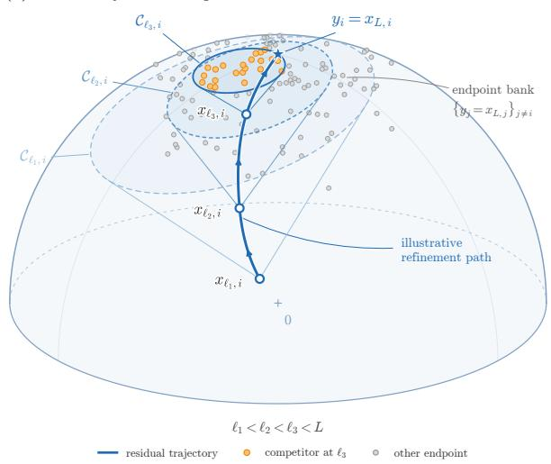

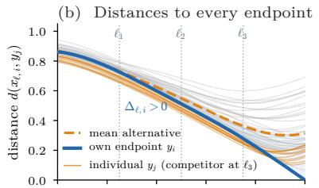

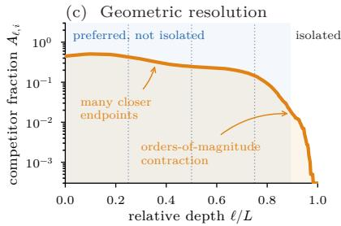  
Figure 1: Geometry of inference in residual streams. (a) Three intermediate states along a residual trajectory and an anisotropic bank of endpoints from other contexts. At layer $\ell ,$ alternatives closer to $x _ { \ell , i }$ than the own endpoint $y _ { i }$ form the competitor set $\mathcal { C } _ { \ell , i }$ . The competitor region is a ball under Euclidean distance and a spherical cap of directions under cosine distance. (b) Distance to the own endpoint (blue), individual alternatives (gray, with competitors at $\ell _ { 3 }$ highlighted in orange), and the mean alternative distance (dashed orange). The own endpoint is closer than the mean alternative from early depths $( \Delta _ { \ell , i } > 0 )$ , while individual competitors remain. (c) The competitor fraction $A _ { \ell , i }$ remains significant after mean preference appears, then falls by orders of magnitude. Dotted lines in (b) and (c) mark the three states shown in (a). All panels use a synthetic three-dimensional model.

2. We relate expected competitor counts to endpoint probability mass and show how gradual alignment can sharply reduce competition during a plateau in Euclidean distance. We also prove that monotone straight-line convergence yields nested competitor sets under Euclidean and cosine distance, so observed entries establish departures from this baseline.

3. We show that structured endpoint distributions fitted only to final states can predict mean competition along held-out trajectories more accurately than a uniform-sphere baseline.

## 2 Geometry of Residual Inference in Language Models

## 2.1 An Endpoint-Based Probe of Inference

To measure refinement relative to alternatives, we need a reference population against which each intermediate state can be compared. Final residual states provide such a population in the model's native residual coordinates [Elhage et al., 2021]. The own endpoint records where a computation ends in a particular token position, while endpoints from other contexts describe other final representations reached by the same model. The analysis considers the observed trajectory and asks when and how it becomes specific to its own endpoint.

For context $i ,$ let $x _ { \ell , i } ~ \in ~ \mathbb { R } ^ { d }$ be the residual state at the final input position after block $\ell ,$ before final normalization, and let $y _ { i } = x _ { L , i }$ be its own endpoint. We study Gemma-2B and Gemma-7B [Gemma Team, 2024], Qwen2.5-1.5B and Qwen2.5-7B [Qwen Team, 2024], Mistral-7B [Mistral AI, 2024], and Llama-3-8B [AI@Meta, 2024] on 1,024 non-overlapping 256-token contexts per model from FineWeb sample-10BT [Penedo et al., 2024]. The primary bank contains all other endpoints, so each query has $M _ { i } = 1 { , } 0 2 3$ alternatives. Appendix C gives the details for endpoint modeling.

Measuring specificity relative to alternatives. Distance to the own endpoint alone cannot tell whether an intermediate state distinguishes it from other endpoints that are also nearby. We therefore compare each alternative with the own endpoint under Euclidean and cosine distance,

$$
d _ { E } ( x , y ) = \left\| x - y \right\| _ { 2 } , \qquad d _ { C } ( x , y ) = 1 - { \frac { x ^ { \top } y } { \left\| x \right\| _ { 2 } \left\| y \right\| _ { 2 } } } .\tag{1}
$$

Euclidean trajectory distances are divided by $R _ { i } \ = \ \| y _ { i } \| _ { 2 } ,$ preserving their ordering for a fixed state. Cosine comparisons use nonzero states and endpoints. For an eligible bank $B _ { i }$ of size $M _ { i }$ , the competitor set and competitor fraction are

$$
\mathcal C _ { \ell , i } ^ { ( m ) } = \{ j \in \mathcal B _ { i } : d _ { m } ( x _ { \ell , i } , y _ { j } ) < d _ { m } ( x _ { \ell , i } , y _ { i } ) \} , \qquad A _ { \ell , i } ^ { ( m ) } = \frac { | \mathcal C _ { \ell , i } ^ { ( m ) } | } { M _ { i } } .\tag{2}
$$

The own endpoint's strict retrieval rank is $1 + | \mathcal { C } _ { \ell , i } ^ { ( m ) } |$ , with ties excluded. A smaller competitor fraction thus indicates greater geometric specificity to the own endpoint within the bank.

Why endpoint geometry is relevant to prediction. To connect endpoint geometry to prediction, we ask whether more probable next tokens correspond to closer endpoints. For each context, we rank tokens by their final output probabilities. For each ranked token, we identify other contexts in which that token is the model's most probable next token and measure the mean distance from their endpoints to the original context's endpoint.

Formally, the output distribution is $p _ { i } = \mathrm { s o f t m a x } ( W _ { U } N _ { f } ( y _ { i } ) )$ , where $N _ { f }$ is the final normalization. Let $v _ { i , k }$ be its rank-k token and $J _ { i , k }$ the alternative endpoints whose top prediction is $v _ { i , k }$ . For nonempty groups, we measure

$$
\delta _ { i } ^ { ( m ) } ( k ) = \frac { 1 } { | J _ { i , k } | } \sum _ { j \in J _ { i , k } } d _ { m } ( y _ { i } , y _ { j } ) .\tag{3}
$$

Across all six models, endpoints whose top predictions receive lower probability under the query context tend to lie farther from the query's own endpoint in cosine distance (Figure 2). Endpoints sharing a top prediction are also more compact on average, and greater endpoint distance is associated with greater divergence between output distributions (Appendix H). These associations support using endpoint geometry to study inference, although geometry explains only part of the variation in model outputs. We interpret the competitor fraction as a measure of geometric specificity within the endpoint bank, without treating it as a calibrated token probability.

## 2.2 Early Preference with Many Competitors

With an endpoint bank estimating output geometry of the model, we can ask how early the residual state begins to distinguish its own endpoint and how selective that distinction is. We use two complementary comparisons. Mean distance to alternative endpoints detects an overall preference for the own endpoint, while competitor count records how many individual alternatives remain closer. The average-preference margin is

$$
\Delta _ { \ell , i } ^ { ( m ) } = \frac { 1 } { M _ { i } } \sum _ { j \in \mathcal { B } _ { i } } d _ { m } ( x _ { \ell , i } , y _ { j } ) - d _ { m } ( x _ { \ell , i } , y _ { i } ) .\tag{4}
$$

Positive $\Delta _ { \ell , i } ^ { ( m ) }$ means the own endpoint is closer than the average alternative. Across all six models and both metrics, the document-averaged margin is positive from the earliest measured post-block state (Appendix E). Many individual competitors nevertheless remain after this preference is detectable (Figure 3). Under Euclidean distance, five models retain hundreds of competitors across substantial portions of their depth (Appendix D).

This joint pattern is central to the inference hypothesis. Intermediate representations exhibit a measurable preference for their own endpoints while many individual alternatives remain closer. The subsequent reduction in competitors describes increasing selectivity of that preference. Its timing and strength vary across architectures.

## 2.3 Competitor Sets Shrink with Changing Membership

The two metrics also show why distance to the own endpoint gives an incomplete account of refinement. Cosine competition often decreases earlier than Euclidean competition, and directional

Rank-conditioned endpoint distance with monotonic-growth test (Cosine)

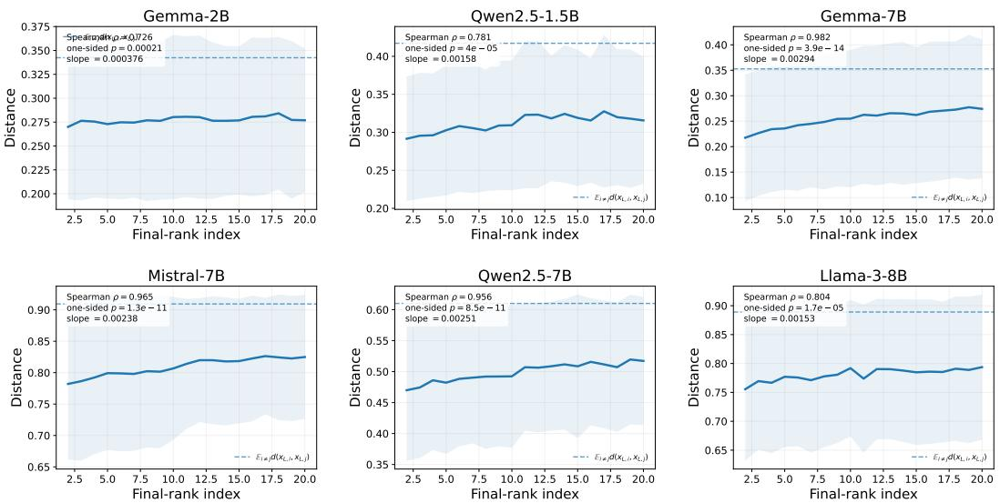  
Figure 2: Less probable tokens correspond to more distant endpoints. Mean cosine distance from the query's endpoint to endpoints from other contexts where the query's rank-k token is the most probable next token. Distance tends to increase with k, with positive trends in the reported one-sided tests for all six models. Horizontal lines show unrelated-endpoint baselines.

alignment can improve while Euclidean endpoint distance remains nearly constant, particularly in intermediate layers of Mistral-7B and Llama-3-8B. A Euclidean plateau can therefore accompany progress in directional specificity. The cosine profiles also persist within sampling variation when the endpoint bank is uniformly subsampled (Appendix J).

Input token and context contribute to the early geometric preference. We test whether early preference for the own endpoint can be explained by shared document content or the final input token. Excluding endpoints from the query's document leaves the cosine preference and competitorfraction curves essentially unchanged. Restricting alternatives to contexts ending in the same input token preserves preference from the first measured layer, although margins are smaller and more competitors remain. This pattern indicates that token identity contributes to early preference. Removing each state's component along its input-token embedding direction also preserves first-layer cosine preference in all six models. Together, these controls support a contribution from the broader context, while leaving information carried through residual connections and token identity encoded in other directions as possible contributors (Appendix F).

A decreasing count of competitors from layer to layer (Fig. 3) can arise through successive removal from a fixed collection of competitors or through a process in which some alternatives enter as others leave. These possibilities give different accounts of refinement. Successive removal would preserve every earlier exclusion, whereas changing membership would allow the state to alter which endpoints it favors along the trajectory. To track composition of competitor sets across adjacent layers, we measure Jaccard overlap together with entries $\begin{array} { r } { \mathcal { C } _ { \ell , i } \setminus \mathcal { C } _ { \ell - 1 , } } \end{array}$ i and exits $\ C _ { \ell - 1 , i } \setminus \mathcal C _ { \ell , i }$ . Entry and exit fractions are normalized by the current and previous set sizes, respectively, before averaging across contexts. Figure 4 shows both entries and exits under cosine distance, including sustained turnover in Qwen2.5-1.5B. Euclidean sets are closer to nested over much of the trajectory and change mainly near the end (Appendix G).

The cosine result shows that increasing specificity can involve a changing collection of geometric alternatives. Endpoints that did not compete at one layer can compete at the next, and these entries occur over depths where the mean competitor count decreases. Entries include both first-time entries and possible returns, which the statistic does not distinguish.

There is a further distinction between fewer competitors and a tighter group of competitors. Their count depends on comparisons with the residual state, whereas their cohesion depends on distances to one another. A shrinking set can become less cohesive if the removed endpoints were especially close to the remaining ones. Appendix B gives an exact fixed-bank construction in which the count falls while mean pairwise Euclidean and cosine distances both increase. This mathematical example separates set size from concentration. We use shrinkage to describe the number of competitors, without inferring an empirical cohesion trend from the turnover or whole-layer spread measurements.

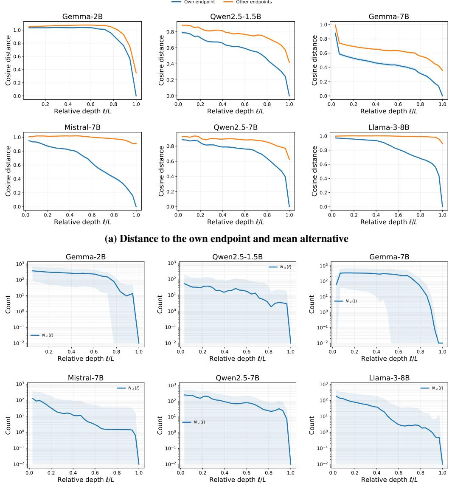  
(b) Number of strict competitors  
Figure 3: Early average preference leaves many individual competitors. The own endpoint is closer than the average alternative before the competitor count becomes small. The paired measurements distinguish the presence of an endpoint preference from its selectivity within the bank. Cosine counts generally decrease with depth, with architecture-dependent fluctuations. Count shading gives across-context spread, and zero is displayed at $1 0 ^ { - 2 }$ on the logarithmic axis.

## 3 Simple Models of Residual Trajectories

The empirical results require an account of three different aspects of refinement: changes in competitor membership, improvements in directional specificity during distance plateaus, and large reductions in competitor count.

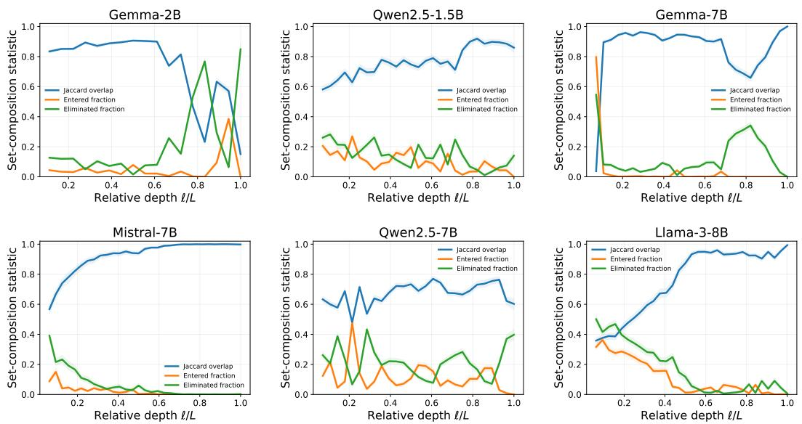  
Figure 4: Falling counts can conceal changes in competitor identity. Adjacent-layer Jaccard overlap and fractions of entering and exiting endpoints under cosine distance. Entries show that refinement can change which alternatives compete, excluding a universally nested elimination process. Late overlap values can include empty-to-empty transitions, assigned Jaccard value one.

How an update changes endpoint preference. To explain entries and exits, it is useful to express each comparison as a signed margin. A negative margin identifies a competitor, and crossing zero changes membership. Writing $u _ { j } = y _ { j } / \lVert y _ { j } \rVert _ { 2 } ,$ define the squared Euclidean margin and the unnormalized directional margin as

$$
m _ { i j } ^ { E } ( x ) = \left\| x - y _ { j } \right\| _ { 2 } ^ { 2 } - \left\| x - y _ { i } \right\| _ { 2 } ^ { 2 } , \qquad m _ { i j } ^ { C } ( x ) = x ^ { \top } ( u _ { i } - u _ { j } ) .\tag{5}
$$

For a residual update δ, these margins change by

$$
m _ { i j } ^ { E } ( \boldsymbol { x } + \delta ) - m _ { i j } ^ { E } ( \boldsymbol { x } ) = 2 \delta ^ { \top } ( y _ { i } - y _ { j } ) , \qquad m _ { i j } ^ { C } ( \boldsymbol { x } + \delta ) - m _ { i j } ^ { C } ( \boldsymbol { x } ) = \delta ^ { \top } ( u _ { i } - u _ { j } ) .\tag{6}
$$

An update increases the corresponding margin when it projects positively onto the endpointdifference direction. The cosine-distance gap equals $m _ { i j } ^ { C } ( x ) { \dot { / } } \left\| x \right\| _ { 2 } ^ { \ast }$ so its sign agrees with the directional margin although its magnitude also depends on norm. Because difference directions vary across the bank, one update can increase some margins and decrease others. Thus residual movement changes several endpoint preferences together, potentially removing some competitors while introducing others.

A straight-path baseline for turnover. The simplest convergence path places a stronger constraint on these comparisons. Let $x ( t ) = ( 1 - t ) x _ { 0 } + t y _ { i }$ , with t increasing from zero to one and the endpoint bank fixed. Under either metric, its competitor sets are nested. Both margins in Eq. 5 are affine in t and nonnegative at $t = 1$ , so any alternative with a nonnegative margin remains outside the competitor set thereafter. Cosine comparisons require nonzero states and endpoints. Appendix A gives the full proof. Thus the endpoint entries in competitor set (Fig. 4) establish departures from monotone straight-line convergence on the affected trajectories.

Why directional progress can coexist with flat distance. The observed distance plateaus raise a different issue: Euclidean distance combines changes in direction with changes in scale. Let $r = \| x \| _ { 2 } , R = \| y _ { i } \| _ { 2 } .$ and $c = ( x / r ) ^ { \top } ( y _ { i } / R )$ . Then

$$
\frac { \| x - y _ { i } \| _ { 2 } ^ { 2 } } { R ^ { 2 } } = \left( \frac { r } { R } \right) ^ { 2 } + 1 - 2 \frac { r } { R } c .\tag{7}
$$

Increasing alignment can be offset by changing norm. Along a path with increasing c and $r / R = 2 c$ normalized distance remains one for $0 \textless c < 1 / 2$ even as the direction becomes better aligned with the own endpoint. This shows that a flat Euclidean curve is compatible with the directional refinement.

Endpoint distribution and competitor count. To explain changes in competitor count, we must consider both the movement of residual state and the distribution of alternative endpoints. We quantify their combined effect through the probability that a sampled endpoint is closer to the state than the own endpoint. Let $Y \sim P _ { Y }$ be an alternative endpoint and $U \overset { \cdot } { = } Y / \left\| Y \right\| _ { 2 }$ its direction. For a fixed state $x _ { \ell , i }$ and own endpoint $y _ { i }$ , define

$$
\begin{array} { r } { q _ { \ell , i } ^ { E } = \mathbb { P } ! \left( \left\| Y - x _ { \ell , i } \right\| _ { 2 } < \left\| y _ { i } - x _ { \ell , i } \right\| _ { 2 } \right) , \quad q _ { \ell , i } ^ { C } = \mathbb { P } ! \left( u _ { \ell , i } ^ { \top } U > u _ { \ell , i } ^ { \top } u _ { i } \right) , } \end{array}\tag{8}
$$

where $u _ { \ell , i } = x _ { \ell , i } / \left. x _ { \ell , i } \right. _ { 2 }$ and $u _ { i } = y _ { i } / \left. y _ { i } \right. _ { 2 }$ Under Euclidean distance, competitors lie inside the ball centered at the residual state whose boundary passes through the own endpoint. Under cosine distance, their directions lie in a spherical cap containing directions better aligned with the state than the own endpoint. We call the probability assigned to either region its competitive mass. For M alternatives with distribution $P _ { Y }$ , the expected competitor count is $M q _ { \ell , i } ^ { ( m ) }$ . The trajectory determines how these regions change, while the endpoint distribution determines how much competitive mass is gained or lost.

From gradual alignment to sharp count reductions. A simple high-dimensional model illustrates why average preference can coexist with many competitors and how gradual alignment can sharply reduce their number. We decompose endpoints and intermediate states into a shared direction and an orthogonal subspace:

$$
y _ { j } = R \left( \rho m + \sqrt { 1 - \rho ^ { 2 } } v _ { j } \right) , \qquad x = r \left( b m + \sqrt { 1 - b ^ { 2 } } w \right) .\tag{9}
$$

Here $R , r \ > \ 0$ are the endpoint and intermediate-state norms, m is a shared unit direction, and $0 ~ \leq ~ \rho ~ < ~ 1$ and $| b | < 1$ control alignment with $m$ . The unit vectors $v _ { j }$ and w lie in the $D _ { - }$ dimensional subspace orthogonal to $m ,$ with $D \geq 2 .$ Alternative directions $v _ { j }$ are uniform on its sphere. Alignment with the own endpoint in this subspace is $\boldsymbol { a } = \boldsymbol { w } ^ { \top } \boldsymbol { v } _ { i }$ . Because all endpoints have the same norm and shared component, an alternative competes exactly when $w ^ { \top } v _ { j } > a$

For M independent alternatives, the expected competitor count is

$$
\mathbb { E } [ N _ { < } \mid x , y _ { i } ] = M \overline { { F } } _ { D } ( a ) , \qquad \overline { { F } } _ { D } ( a ) = \mathbb { P } ( w ^ { \top } V > a ) , \quad V \sim \mathrm { U n i f } ( \mathbb { S } ^ { D - 1 } ) .\tag{10}
$$

Any positive a makes the own endpoint closer in cosine distance than a random alternative on average. However, when $0 < a \ll D ^ { - 1 / 2 }$ , the expected competitor fraction remains close to one half. An expected count much smaller than one requires $\overline { { F } } _ { D } ( a ) \ \ll \ 1 / M$ . In high dimension, $\overline { { F } } _ { D } ( a ) \approx 1 - \Phi ( \sqrt { D } , a )$ near $a = 0$ , where Φ is the standard normal CDF. This approximation shows how small changes in alignment can substantially reduce competitive mass.

The rate of count reduction depends on both alignment speed and the distribution of alternatives near the comparison boundary:

$$
- \frac { d } { d t } \log \mathbb { E } [ N _ { < } ( t ) ] = \frac { f _ { D } ( a ( t ) ) } { \overline { { F } } _ { D } ( a ( t ) ) } { a } ^ { \prime } ( t ) ,\tag{11}
$$

where $f _ { D } = - \overline { { F } } _ { D } ^ { \prime }$ is the density of the alternative score $w ^ { \top } V$ (Appendix A). The ratio $f _ { D } ( a ) / \overline { { F } } _ { D } ( a )$ measures the relative sensitivity of competitor count to alignment, allowing smooth directional changes to produce sharp count reductions.

These reductions can also occur while Euclidean distance remains constant. Setting $b = \rho = 0$ and $r / R = 2 a$ keeps $\| x - y _ { i } \| _ { 2 } / R = 1$ as a increases within $( 0 , 1 / 2 )$ . The construction therefore shows how average preference, endpoint distance, and competitor count can evolve differently. The depth at which counts fall depends on the prescribed alignment trajectory. This motivates testing the contribution of endpoint geometry along fixed, observed residual trajectories.

The preceding model relates competitor count to the distribution of alternative endpoints. We now test this relationship using real endpoint populations, whose directional structure varies across architectures (Appendix I.1). We ask whether fitted endpoint distributions predict mean competitor fractions along held-out trajectories when the intermediate states and own endpoints remain fixed.

Fitting endpoint distributions. We compare five families with different assumptions about directional structure. The uniform sphere provides an isotropic baseline, while the spherical cap and single von Mises-Fisher (vMF) distribution concentrate endpoints around one preferred direction. A vMF mixture represents multiple directional modes, and a projected-normal model captures anisotropic variation by normalizing samples from a Gaussian fitted to the mean and covariance of unit endpoints [Mardia and Jupp, 2000, Banerjee et al., 2005, Wang and Gelfand, 2013]. All families use the same empirical distribution of endpoint norms, sampled independently of direction, so differences in their predictions reflect the fitted directional structure.

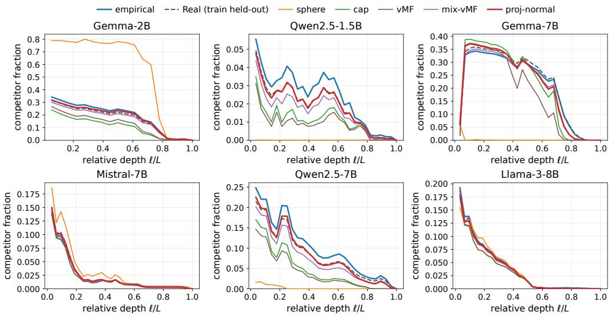  
Figure 5: Predicting competition from endpoint geometry. Mean cosine competitor fractions along held-out trajectories, comparing the empirical test bank with banks sampled from fitted distributions or training endpoints. Intermediate states and own endpoints are fixed across comparisons. Sampled banks remain fixed across depth, with estimates averaged over eight banks.

Fitting and model selection use only final endpoints. We split documents approximately 60/20/20 into training, validation, and test sets, select complexity within each family using four endpointdistribution diagnostics, and refit on the combined training and validation endpoints. The best heldout diagnostic scores improve over the sphere by factors of 4.6–7.5 (Appendix I). To determine whether these gains extend to the regions relevant to inference, we next test how accurately the fitted distributions predict competitive mass along held-out residual trajectories.

Predicting competitor fractions. We sample an alternative bank of B = 256 endpoints from each fitted distribution and evaluate it along held-out residual trajectories, keeping the intermediate states and own endpoints fixed. The predicted mean competitor fraction at layer l is

$$
\widehat { A } _ { \mathcal { M } } ^ { ( m ) } ( \ell ) = \frac { 1 } { N _ { \mathrm { t e s t } } B } \sum _ { i , b } \mathbf { 1 } \Big [ d _ { m } ( x _ { \ell , i } , \widetilde { Y } _ { b } ) < d _ { m } ( x _ { \ell , i } , y _ { i } ) \Big ] .\tag{12}
$$

where $N _ { \mathrm { t e s t } }$ is the number of held-out contexts and $\widetilde { Y } _ { b }$ are the sampled endpoints. We keep each bank fixed across depth and average the resulting curves over eight banks. The comparison evaluates how accurately the fitted distribution captures competitive mass along previously unseen trajectories.

The empirical competitor fractions use the test endpoint bank, excluding each context's own endpoint. Banks of B training endpoints provide a reference based on sampled real endpoints. Appendix C details the differences in sampling pools and document overlap between these banks.

Competitor fractions span several orders of magnitude, so we compare predicted and empirical curves using the mean absolute difference on a base-10 logarithmic scale:

$$
\mathrm { e r r } _ { \mathrm { l o g } } = \frac { 1 } { L - 1 } \sum _ { \ell < L } \left| \log _ { 1 0 } \bigl ( \widehat { A } _ { \mathcal { M } } ( \ell ) + \varepsilon \bigr ) - \log _ { 1 0 } \bigl ( A ( \ell ) + \varepsilon \bigr ) \right| , \qquad \varepsilon = 1 0 ^ { - 3 } ,\tag{13}
$$

Here $A ( \ell )$ is the mean empirical competitor fraction, and the offset ε keeps the logarithm defined at zero. We exclude the final layer, where competitor fractions are zero by construction.

The projected-normal model gives the most consistently accurate predictions of cosine competitor fractions, achieving the lowest synthetic error in five of six models (Figure 5, App. I Table 3). The vMF mixture is slightly better for Gemma-7B and ranks second elsewhere. Both outperform the cap and single vMF models across all six architectures, while the uniform sphere has the largest error in five. These results show that capturing directional structure improves predictions of how many alternatives remain competitive along observed residual trajectories.

## 4 Discussion and Conclusion

Prior work shows that intermediate residual states contain information about eventual token predictions [Geva et al., 2022, Belrose et al., 2023] and that final representations have output-related geometric structure [Park et al., 2025]. To study how a trajectory becomes specific to its own endpoint, we use final states from other contexts as a reference population. Endpoints whose top predictions are less probable under the query context tend to lie farther from its endpoint, linking endpoint distance to prediction. Consistent with earlier evidence of predictive information in intermediate states, the document-averaged margin favors the own endpoint from the earliest layers in all six models, although many individual alternatives remain closer. The later reduction in competitor counts shows how this early average preference develops into greater selectivity among contextual endpoints.

Entropy-Lens identifies expansion and pruning in vocabulary-level predictions [Ali et al., 2025], and prior analyses track changes in representation neighborhoods across depth [Valeriani et al., 2023, Jiang et al., 2026]. Our fixed endpoint bank lets us ask whether an alternative that was farther than the own endpoint becomes closer at a later layer. Cosine competitor sets show endpoint entries as well as exits over depths where their mean count decreases. Euclidean sets are closer to nested over much of the trajectory and change mainly near the end. The margin equations explain how one residual update can strengthen preference over some endpoints while weakening it over others. A straight path toward the own endpoint would produce nested sets under either metric, so observed entries establish departures from monotone straight-line convergence on the affected trajectories. Increasing endpoint specificity can therefore involve revisions to earlier comparisons, with some alternatives becoming competitive as others cease to compete.

Competitor counts also depend on the distribution of alternative endpoints. Earlier work documents anisotropy and prediction-related structure in residual representations [Ethayarajh, 2019, Xu, 2026, Guda, 2026, Lombardo et al., 2026], while semantic reference frames formalize trajectories using vocabulary-derived anchors [Gu et al., 2026]. In our framework, the current state and own endpoint define a comparison ball or directional cap whose probability mass determines the expected competitor count. The shared-axis model shows how a small positive alignment can favor the own endpoint over the average alternative while leaving many competitors, and how gradual alignment can later produce a sharp reduction in their number. Norm changes also permit directional progress during a plateau in Euclidean distance. To test the role of population geometry, we fit endpoint distributions independently of the trajectories and evaluate their predictions along held-out paths, keeping intermediate states and own endpoints fixed. The projected-normal family predicts the cosine competitor curves most accurately in five of the six models, and both it and the vMF mixture outperform the uniform-sphere baseline. Endpoint geometry thus provides a quantitative link between changes in the residual state and the increasing selectivity observed across depth.

The fitted distributions predict competition along observed trajectories, leaving the origin and timing of residual updates unexplained. Studies of linguistic collapse examine geometry shaped by training [Wu and Papyan, 2024], while controlled sequence models relate residual geometry to predictive belief states [Shai et al., 2024]. Following endpoint populations and residual trajectories across training checkpoints could reveal how their organization develops together. The functional role of geometric competition also remains open. Competitor sets depend on the bank and metric, and their size reaches zero at the own endpoint by construction. Endpoint geometry captures only part of the variation in model outputs, and the observed turnover does not establish an explicit internal search process. Interventions near competitor-margin crossings could test whether changes in geometric preference affect token predictions.

Taken together, our empirical results and theoretical models support the geometric inference hypothesis that residual updates refine early endpoint preference into greater selectivity while individual comparisons can be revised. The endpoint population determines how residual movement translates into competition, providing a quantitative link between the geometry of final representations and the refinement of intermediate states.

## References

AI@Meta. Llama 3 model card, 2024. URL https://github.com/meta-1lama/1lama3/blob/ main/MODEL\_CARD.md.

Riccardo Ali, Francesco Caso, Christopher Irwin, and Pietro Liò. Entropy-Lens: Uncovering decision strategies in LLMs. arXiv preprint arXiv:2502.16570, 2025. URL https://arxiv.org/ abs/2502.16570.

Arindam Banerjee, Inderjit S. Dhillon, Joydeep Ghosh, and Suvrit Sra. Clustering on the unit hypersphere using von Mises–Fisher distributions. Journal of Machine Learning Research, 6:1345— 1382, 2005.

Nora Belrose, Igor Ostrovsky, Lev McKinney, Zach Furman, Logan Smith, Danny Halawi, Stella Biderman, and Jacob Steinhardt. Eliciting latent predictions from transformers with the tuned lens. arXiv preprint arXiv:2303.08112, 2023. URL https://arxiv.org/abs/2303.08112.

Nelson Elhage, Neel Nanda, Catherine Olsson, Tom Henighan, Nicholas Joseph, Ben Mann, Amanda Askell, Yuntao Bai, Anna Chen, Tom Conerly, Nova DasSarma, Dawn Drain, Deep Ganguli, Zac Hatfield-Dodds, Danny Hernandez, Andy Jones, Jackson Kernion, Liane Lovitt, Kamal Ndousse, Dario Amodei, Tom Brown, Jack Clark, Jared Kaplan, Sam McCandlish, and Chris Olah. A mathematical framework for transformer circuits. Transformer Circuits Thread, 2021.URL https://transformer-circuits.pub/2021/framework/index.html.

Kawin Ethayarajh. How contextual are contextualized word representations? Comparing the geometry of BERT, ELMo, and GPT-2 embeddings. In Proceedings of the 2019 Conference on Empirical Methods in Natural Language Processing and the 9th International Joint Conference on Natural Language Processing (EMNLP-IJCNLP), pages 55–65, 2019. doi: 10.18653/v1/D19-1006.

Gemma Team. Gemma: Open models based on Gemini research and technology. arXiv preprint arXiv:2403.08295, 2024. URL https://arxiv.org/abs/2403.08295.

Mor Geva, Avi Caciularu, Kevin Wang, and Yoav Goldberg. Transformer feed-forward layers build predictions by promoting concepts in the vocabulary space. In Proceedings of the 2022 Conference on Empirical Methods in Natural Language Processing, pages 30–45. Association for Computational Linguistics, 2022. doi: 10.18653/v1/2022.emnlp-main.3. URL https://aclanthology.org/2022.emnlp-main.3/.

Jian Gu, Aldeida Aleti, Chunyang Chen, and Hongyu Zhang. SemRF: A semantic reference frame for residual-stream dynamics in language models. arXiv preprint arXiv:2606.32022, 2026. URL https://arxiv.org/abs/2606.32022.

Nelson Guda. Geometric and behavioral stratification in transformer residual streams. arXiv preprint arXiv:2608.12447,2026. URL https://arxiv.org/abs/2608.12447.

Jingzhou Jiang, Yi Yang, and Kar Yan Tam. Layer-wise representation dynamics: An empirical investigation across embedders and base LLMs. arXiv preprint arXiv:2605.12714, 2026. URL https://arxiv.org/abs/2605.12714.

Gianfranco Lombardo, Giuseppe Trimigno, and Stefano Cagnoni. A geometric perspective on next-token prediction in large language models: Three emerging phases. arXiv preprint arXiv:2605.09011,2026. URL https://arxiv.org/abs/2605.09011.

Kanti V. Mardia and Peter E. Jupp. Directional Statistics. Wiley, 2000.

Mistral AI. Mistral-7B-v0.3 model card, 2024. URL https://huggingface.co/mistralai/ Mistral-7B-vO.3.

Kiho Park, Yo Joong Choe, Yibo Jiang, and Victor Veitch. The geometry of categorical and hierarchical concepts in large language models. In International Conference on Learning Representations, 2025. URL https://openreview.net/forum?id=KXuYjuBzKo.

Guilherme Penedo, Hynek Kydlíček, Loubna Ben allal, Anton Lozhkov, Margaret Mitchell, Colin Raffel, Leandro Von Werra, and Thomas Wolf. The FineWeb datasets: Decanting the web for the finest text data at scale. In Advances in Neural Information Processing Systems, volume 37, 2024. doi: 10.52202/079017-0970. URL https://proceedings.neurips.cc/paper\_ files/paper/2024/hash/370df50ccfdf8bde18f8f9c2d9151bda-Abstract-Datasets\_ and\_Benchmarks\_Track.html.

Qwen Team. Qwen2.5 technical report. arXiv preprint arXiv:2412.15115, 2024. URL https: //arxiv.org/abs/2412.15115.

Adam S. Shai, Sarah E. Marzen, Lucas Teixeira, Alexander Gietelink Oldenziel, and Paul M. Riechers. Transformers represent belief state geometry in their residual stream. In Advances in Neural Information Processing Systems, volume 37, 2024. doi: 10.52202/ 079017-2387. URL https://proceedings.neurips.cc/paper\_files/paper/2024/ hash/8936fa1691764912d9519e1b5673ea66-Abstract-Conference.html.

Lucrezia Valeriani, Diego Doimo, Francesca Cuturello, Alessandro Laio, Alessio Ansuini, and Alberto Cazzaniga. The geometry of hidden representations of large transformer models. In Advances in Neural Information Processing Systems, volume 36, 2023. doi: 10.52202/075280-2230. URL https://proceedings.neurips.cc/paper\_files/paper/ 2023/hash/a0e66093d7168b40246af1cddc025daa-Abstract-Conference.html.

Fangpo Wang and Alan E. Gelfand. Directional data analysis under the general projected normal distribution. Statistical Methodology, 10(1):113–127, 2013. doi: 10.1016/j.stamet.2012.07.005.

Robert Wu and Vardan Papyan. Linguistic collapse: Neural collapse in (large) language models. In Advances in Neural Information Processing Systems, volume 37, 2024. doi: 10.52202/079017-4366. URL https://proceedings.neurips.cc/paper\_files/paper/ 2024/hash/f88cc8930b47a45ec4733123bf3039b9-Abstract-Conference.html.

Weilun Xu. Scale determines whether language models organize representation geometry for prediction. arXiv preprint arXiv:2605.17084, 2026. URL https://arxiv.org/abs/2605.17084.

## A Geometric Derivations

Section 3 relates residual movement to endpoint preference, competitor membership, and competitor count. We derive the margin updates and straight-path result, then show how norm, alignment, and endpoint geometry can produce different depth profiles for these measurements. Throughout, the endpoint bank is fixed, comparisons are strict, and cosine distance is used only for nonzero states and endpoints.

## A.1 Endpoint margins and straight-line convergence

The turnover measurements in Section 2.3 require a criterion for when an endpoint enters or leaves the competitor set. For an own endpoint $y _ { i }$ and an alternative $y _ { j }$ , expanding the squared Euclidean margin in Eq. 5 gives

$$
m _ { i j } ^ { E } ( x ) = 2 x ^ { \top } ( y _ { i } - y _ { j } ) + \left\| y _ { j } \right\| _ { 2 } ^ { 2 } - \left\| y _ { i } \right\| _ { 2 } ^ { 2 } .\tag{14}
$$

Since squaring preserves the ordering of nonnegative distances, $j$ is a Euclidean competitor exactly when this margin is negative. For cosine distance, write $u _ { k } = y _ { k } / \left. y _ { k } \right. _ { 2 }$ Then

$$
d _ { C } ( x , y _ { j } ) - d _ { C } ( x , y _ { i } ) = \frac { x ^ { \top } ( u _ { i } - u _ { j } ) } { \left. x \right. _ { 2 } } = \frac { m _ { i j } ^ { C } ( x ) } { \left. x \right. _ { 2 } } .\tag{15}
$$

The positive denominator preserves the sign. Both margins are affine in $x ,$ which gives the update identities in Eq. 6. The directional margin determines cosine membership, although its magnitude also includes the norm of the current state.

Proposition (nested competitor sets on a straight segment). Let $x ( t ) = ( 1 - t ) x _ { 0 } + t y _ { i }$ for $0 \leq t \leq 1$ . For any $0 \leq s \leq t \leq 1$ ，

$$
\begin{array} { r } { \mathcal { C } ^ { ( E ) } ( t ) \subseteq \mathcal { C } ^ { ( E ) } ( s ) , \qquad \mathcal { C } ^ { ( C ) } ( t ) \subseteq \mathcal { C } ^ { ( C ) } ( s ) . } \end{array}\tag{16}
$$

The cosine statement applies at parameter values where the states are nonzero. Endpoint norms need not be equal.

Proof. For $s < 1$ , write $x ( t ) = ( 1 - \lambda ) x ( s ) + \lambda y _ { i }$ , where $\lambda = ( t - s ) / ( 1 - s ) \in [ 0 , 1 ]$ . Affinity $\mathrm { g i v e s , }$ , for either margin,

$$
m _ { i j } ( \boldsymbol { x } ( t ) ) = ( 1 - \lambda ) m _ { i j } ( \boldsymbol { x } ( s ) ) + \lambda m _ { i j } ( y _ { i } ) .\tag{17}
$$

At the own endpoint,

$$
m _ { i j } ^ { E } ( y _ { i } ) = \| y _ { j } - y _ { i } \| _ { 2 } ^ { 2 } \geq 0 , \qquad m _ { i j } ^ { C } ( y _ { i } ) = \| y _ { i } \| _ { 2 } ( 1 - u _ { i } ^ { \top } u _ { j } ) \geq 0 .\tag{18}
$$

$\operatorname { I f } \ j$ is outside the competitor set at $s ,$ its margin is nonnegative there and remains nonnegative for all later t. The case $s = 1$ is immediate. □

The proposition also holds under any nondecreasing reparameterization of the segment. Thus a resolved entry in a fixed bank excludes monotone straight-line convergence on that trajectory. It does not identify the update mechanism or distinguish curvature from backtracking. Ties remain outside the strict competitor set, including duplicate endpoints and, under cosine distance, endpoints with the same direction. Entries close to a tie must be interpreted at the numerical precision of the stored states.

## A.2 Norm and alignment during a distance plateau

The Euclidean plateaus in Section 2.3 can coexist with directional progress because distance depends on both norm and alignment. For $r = \| x \| _ { 2 } , R = \| y _ { i } \| _ { 2 } , s = r / R$ and $c = x ^ { \top } y _ { i } / ( r R )$ , expansion gives

$$
{ \frac { \| x - y _ { i } \| _ { 2 } ^ { 2 } } { R ^ { 2 } } } = s ^ { 2 } + 1 - 2 s c .\tag{19}
$$

Along a differentiable path with fixed $y _ { i }$

$$
\frac { d } { d t } \frac { \left\| x - y _ { i } \right\| _ { 2 } ^ { 2 } } { R ^ { 2 } } = 2 ( s - c ) s ^ { \prime } - 2 s c ^ { \prime } .\tag{20}
$$

An increase in alignment can therefore be offset by a change in norm. In particular, setting $s = 2 c$ keeps the normalized Euclidean distance equal to one while cosine distance $1 - c$ decreases. The construction in Section 3 uses $0 < c < 1 / 2$ , so the intermediate-state norm also remains below the endpoint norm. This identity establishes the compatibility of the two profiles without specifying the residual updates that produce them.

## A.3 High-dimensional competition with a shared component

The shared-axis model in Eq. 9 isolates how a small alignment advantage can yield early average preference and later large reductions in competitor count. For a fixed query and own endpoint, let $\boldsymbol { a } = \boldsymbol { w } ^ { \top } \boldsymbol { v } _ { i }$ and write

$$
c = { \frac { x ^ { \top } y _ { i } } { r R } } = b \rho + { \sqrt { ( 1 - b ^ { 2 } ) ( 1 - \rho ^ { 2 } ) } } a .\tag{21}
$$

The score of an alternative has the same form with a replaced by $w ^ { \top } v _ { j }$ . The coefficient is positive under the assumptions $| b | < 1$ and $0 \leq \rho < 1$ , so cosine competition is equivalent to $w ^ { \top } v _ { j } > a$ Equal endpoint norms also give

$$
\begin{array} { r } { \| \boldsymbol { x } - \boldsymbol { y } _ { j } \| _ { 2 } ^ { 2 } - \| \boldsymbol { x } - \boldsymbol { y } _ { i } \| _ { 2 } ^ { 2 } = 2 r R \sqrt { ( 1 - b ^ { 2 } ) ( 1 - \rho ^ { 2 } ) } ( a - w ^ { \top } v _ { j } ) , } \end{array}\tag{22}
$$

which yields the same competitor set under Euclidean distance.

For $V \sim \mathrm { U n i f } ( \mathbb { S } ^ { D - 1 } )$ , with $D \geq 2$ , rotational symmetry gives the density of $Z = w ^ { \top } V$ as

$$
f _ { D } ( z ) = \frac { \Gamma ( D / 2 ) } { \sqrt { \pi } \Gamma ( ( D - 1 ) / 2 ) } ( 1 - z ^ { 2 } ) ^ { ( D - 3 ) / 2 } , \qquad - 1 < z < 1 .\tag{23}
$$

One derivation writes $V = G / \left\| G \right\| _ { 2 }$ for a standard Gaussian vector $G \in \mathbb { R } ^ { D }$ . Then $Z ^ { 2 }$ has a Beta $. ( 1 / 2 , ( D - 1 ) / 2 )$ distribution, and the two signs of $Z$ are equally probable. The competitive mass is $\begin{array} { r } { \overline { { F } } _ { D } ( a ) = \int _ { a } ^ { 1 } f _ { D } ( z ) d z } \end{array}$ . For M independent alternatives drawn independently of the fixed query and own endpoint,

$$
N _ { < } \mid x , y _ { i } \sim \mathrm { B i n o m i a l } ( M , \overline { { F } } _ { D } ( a ) ) , \qquad \mathbb { P } ( N _ { < } = 0 \mid x , y _ { i } ) = ( 1 - \overline { { F } } _ { D } ( a ) ) ^ { M } .\tag{24}
$$

Linearity of expectation gives Eq. 10 even when alternatives are mutually dependent, provided their conditional marginal score distributions remain $f _ { D }$

Average preference and near-isolation. Since $\mathbb { E } [ Z ] = 0$ , any $a > 0$ makes the own endpoint closer on average in cosine distance and in squared Euclidean distance. The latter statement does not automatically extend to mean Euclidean distance, since taking a square root changes the average. For small positive a,

$$
\overline { { F } } _ { D } ( a ) = \frac { 1 } { 2 } - \int _ { 0 } ^ { a } f _ { D } ( z ) d z ,\tag{25}
$$

so average preference can coexist with a substantial competitor fraction. For fixed $z ,$ the Gaussian representation implies

$$
\sqrt { D } Z \Rightarrow \mathcal { N } ( 0 , 1 ) , \qquad \overline { { F } } _ { D } ( z / \sqrt { D } ) \longrightarrow 1 - \Phi ( z ) .\tag{26}
$$

Thus the central approximation is $\overline { { F } } _ { D } ( a ) \approx 1 - \Phi ( \sqrt { D } a )$ . It explains the alignment scale in the main text, while quantitative estimates far into the tail require the exact spherical distribution. A small probability of any remaining competitor is ensured by $M \overline { { F } } _ { D } ( a ) \ll 1$ , since $\mathbb { P } ( N _ { < } > 0 ) \le$ $\mathbb { E } [ N _ { < } ] = M \overline { { F } } _ { D } ( a )$ . This bound does not require independence among alternatives.

Rate of count reduction. For a differentiable alignment schedule $a ( t ) \in ( - 1 , 1 )$

$$
- \frac { d } { d t } \log \left( M \overline { { F } } _ { D } ( a ( t ) ) \right) = \frac { f _ { D } ( a ( t ) ) } { \overline { { F } } _ { D } ( a ( t ) ) } a ^ { \prime } ( t ) .\tag{27}
$$

This is $\operatorname { E q . }$ 11. The relative decrease depends on both the alignment speed and the amount of endpoint mass near the comparison boundary. With $b = \rho = 0$ and $r / R = 2 a ,$ , increasing a in $( 0 , \bar { 1 } / 2 )$ reduces competition while keeping normalized Euclidean distance equal to one.

Population spread and own-endpoint alignment. The same model clarifies why whole-layer spread does not determine competitor count. For independent endpoint directions $v _ { j } , v _ { k }$

$$
\frac { \| y _ { j } - y _ { k } \| _ { 2 } ^ { 2 } } { R ^ { 2 } } = 2 ( 1 - \rho ^ { 2 } ) ( 1 - v _ { j } ^ { \top } v _ { k } ) , \qquad \mathbb { E } [ v _ { j } ^ { \top } v _ { k } ] = 0 , \quad \mathrm { V a r } ( v _ { j } ^ { \top } v _ { k } ) = \frac { 1 } { D } .\tag{28}
$$

Pairwise squared distances therefore concentrate around $2 R ^ { 2 } ( 1 - \rho ^ { 2 } )$ as $D$ grows. To vary ownendpoint alignment while preserving the marginal directional population, draw $v _ { i }$ uniformly and draw $z _ { i }$ uniformly on the unit sphere orthogonal to $v _ { i }$ within $m ^ { \perp }$ . Define

$$
w _ { i } ( a ) = a v _ { i } + \sqrt { 1 - a ^ { 2 } } z _ { i } .\tag{29}
$$

Rotational invariance makes $w _ { i } ( a )$ marginally uniform for each fixed $a \in [ - 1 , 1 ]$ , while $w _ { i } ( a ) ^ { \top } v _ { i } =$ a. Taking $b = \rho$ and a common state norm across contexts preserves the normalized population spread as a changes. Competitor counts can consequently decrease without a decrease in that spread. This construction supports the separation of population geometry and trajectory-specific refinement in Appendix I.1.

Unequal endpoint norms. The equal-radius assumption isolates the directional contribution. For an alternative $\bar { Y } = S U$ with $S > 0$ and $\| U \| _ { 2 } = 1$ , the Euclidean competitor condition becomes

$$
2 r \left( S \frac { x ^ { \top } U } { r } - R c \right) > S ^ { 2 } - R ^ { 2 } .\tag{30}
$$

Both norm and direction now affect membership. Cosine competition remains invariant to positive radial rescaling. The fitted endpoint models retain this radial variation through a common empirical norm distribution (Appendix C.4).

## B A Shrinking Competitor Set Can Become Less Cohesive

Section 2.3 distinguishes a reduction in competitor count from an increase in similarity among the remaining endpoints. We give an exact example in which a straight path produces nested competitor sets whose mean pairwise distance increases after an exit. The example establishes that shrinkage alone does not imply greater cohesion.

Let $e ( \theta ) = ( \cos \theta ;$ sin θ) and fix the unit-radius endpoints

$$
y _ { i } = e ( 0 ) , \qquad y _ { 1 } = e ( \pi / 6 ) , \qquad y _ { 2 } = e ( \pi / 2 ) , \qquad y _ { 3 } = e ( 7 \pi / 1 2 ) .\tag{31}
$$

Move from $x _ { 0 } = e ( \pi / 3 )$ toward $y _ { i }$ along $x ( t ) = ( 1 - t ) x _ { 0 } + t y _ { i }$ . At t = 0, the own dot-product score is $1 / 2 .$ , while the alternative scores are ${ \sqrt { 3 } } / 2 , { \sqrt { 3 } } / 2$ and ${ \sqrt { 2 } } / 2$ All three alternatives compete. $\mathbf { A } \mathfrak { t } t = 1 \big / 5$

$$
x ( 1 / 5 ) = \left( { \frac { 3 } { 5 } } , { \frac { 2 { \sqrt { 3 } } } { 5 } } \right) , \qquad x ( 1 / 5 ) ^ { \top } y _ { i } = { \frac { 3 } { 5 } } ,\tag{32}
$$

and the alternative scores are

$$
{ \frac { \sqrt { 3 } } { 2 } } , \qquad { \frac { 2 { \sqrt { 3 } } } { 5 } } , \qquad { \frac { 9 { \sqrt { 2 } } - { \sqrt { 6 } } } { 2 0 } } .\tag{33}
$$

Only $y _ { 1 }$ and $y _ { 2 }$ remain competitive. Equal endpoint norms make these rankings identical under Euclidean and cosine distance.

Measure within-set spread by the mean distance over unordered pairs of distinct competitors. Initially, the mean cosine distance is

$$
\frac { ( 1 - \cos ( \pi / 3 ) ) + ( 1 - \cos ( 5 \pi / 1 2 ) ) + ( 1 - \cos ( \pi / 1 2 ) ) } { 3 } = \frac { 5 - \sqrt { 6 } } { 6 } \approx 0 . 4 2 5 .\tag{34}
$$

After the exit it is $1 - \cos ( \pi / 3 ) = 1 / 2$ . The mean Euclidean distance increases from

$$
\frac { 1 + 2 \sin ( 5 \pi / 2 4 ) + 2 \sin ( \pi / 2 4 ) } { 3 } \approx 0 . 8 2 6\tag{35}
$$

to 1. Thus the count falls from three to two while the surviving set becomes less cohesive under both metrics. The construction embeds in any ambient dimension of at least two. It is a mathematical counterexample to an implication between measurements, and does not establish a cohesion trend in the observed transformer trajectories.

## C Experimental Setup and Endpoint-Distribution Fitting

The geometric inference hypothesis is evaluated through comparisons with a fixed population of final residual states. This section specifies the data, observables, uncertainty conventions, and endpointmodel protocol used in Sections 2 and 3. The distribution-fitting experiment uses document splits to test whether final-state geometry predicts competition along held-out trajectories.

## C.1 Language models, data, and residual trajectories

We use the following six base pretrained checkpoints.

<table><tr><td>Model</td><td>Checkpoint identifier</td></tr><tr><td>Gemma-2B</td><td>google/gemma-2b</td></tr><tr><td>Qwen2.5-1.5B</td><td>Qwen/Qwen2.5-1.5B</td></tr><tr><td>Gemma-7B</td><td>google/gemma-7b</td></tr><tr><td>Mistral-7B</td><td>mistralai/Mistral-7B-vO.3</td></tr><tr><td>Qwen2.5-7B Llama-3-8B</td><td>Qwen/Qwen2.5-7B meta-1lama/Meta-Llama-3-8B</td></tr></table>

For each model, the primary sample contains $N = 1 { , } 0 2 4$ non-overlapping 256-token contexts from FineWeb sample-10BT. Source-document identities are retained for controls, splitting, and uncertainty estimates.

For context i, $x _ { \ell , i } ~ \in ~ \mathbb { R } ^ { d }$ is the residual state at the final input position after block $\ell ,$ for $\ell =$ $1 , \ldots , L ,$ before final normalization. The own endpoint is $y _ { i } = x _ { L , i }$ , and $\mathcal { Y } = \{ y _ { 1 } , . . . , y _ { N } \}$ is the empirical endpoint population. There is no pre-block embedding state in the measured trajectory. Primary measurements use the native residual coordinates and the distances in Eq. 1, repeated here for reference:

$$
d _ { E } ( x , y ) = \left\| x - y \right\| _ { 2 } , \qquad d _ { C } ( x , y ) = 1 - { \frac { x ^ { \top } y } { \left\| x \right\| _ { 2 } \left\| y \right\| _ { 2 } } } .\tag{36}
$$

Euclidean trajectory-to-endpoint distances are displayed in units of the query's endpoint norm $R _ { i } = $ ||yi||2,

$$
\widetilde { d } _ { E } ( x _ { \ell , i } , y _ { j } ) = \frac { d _ { E } ( x _ { \ell , i } , y _ { j } ) } { R _ { i } } .\tag{37}
$$

This common positive scale preserves every within-query comparison. Endpoint-to-endpoint diagnostics use raw Euclidean distance unless an additional normalization is stated.

Numerical precision and uncertainty. Model inference uses reduced precision, followed by floating-point geometric calculations. Primary trajectory-to-endpoint comparisons evaluate all eligible pairs in GPU chunks. Document-cluster bootstrap summaries use 1,000 resamples. For the trajectory and population summaries, the bootstrap resamples document weights on precomputed context statistics while keeping the reference bank fixed. If $s _ { i }$ is a context statistic and $w _ { i } ^ { ( b ) }$ is the multiplicity of its source document in resample b, then

$$
\widehat { s } ^ { ( b ) } = \frac { \sum _ { i } w _ { i } ^ { ( b ) } s _ { i } } { \sum _ { i } w _ { i } ^ { ( b ) } } .\tag{38}
$$

These bands describe variation over query documents conditional on the comparison bank. They do not jointly resample both endpoints of each pair. Strict-count panels instead show one standard deviation across contexts. Bank-size ranges and trajectory-prediction intervals are specified in Appendices J and K

## C.2 Preference and competitor fractions

The main analysis separates early average preference from selectivity among individual alternatives. For an eligible bank $B _ { i }$ of size $M _ { i }$ , define

$$
D _ { \mathrm { o w n } } ^ { ( m ) } ( \ell , i ) = d _ { m } \mathopen { } \mathclose \bgroup ( x _ { \ell , i } , y _ { i } \aftergroup _ { i } \aftergroup _ { i } \aftergroup _ { i } \aftergroup _ { i } \aftergroup _ { i } \aftergroup _ { i } \aftergroup _ { i } \aftergroup _ { i } \aftergroup _ { i } \aftergroup _ { i } \aftergroup _ { i } \aftergroup _ { i } \aftergroup _ { i } \aftergroup _ { i } \aftergroup _ { i } \aftergroup _ { i } \aftergroup _ { i } \aftergroup _ { i } \aftergroup _ { i } \aftergroup _ { i } \aftergroup _ { i } \aftergroup _ { i } \aftergroup _ { i } \aftergroup _ { i } \aftergroup _ { i } \aftergroup _ { i } \aftergroup _ { i } \aftergroup _ { i } \aftergroup _ { i } \aftergroup _ { i } \aftergroup _ { i } \aftergroup _ { i } \aftergroup _ { i } \aftergroup _ { i } \aftergroup _ { i } \aftergroup _ { i } \aftergroup _ { i } \aftergroup _ { i } \aftergroup _ { i } \aftergroup _ { i } \aftergroup _ { i } \aftergroup _ { i } \aftergroup _ { i } \aftergroup _ { i } \aftergroup _ { i } \aftergroup _ { i } \aftergroup _ { i } \aftergroup _ { i } \aftergroup _ { i }\tag{39}
$$

$$
D _ { \mathrm { o t h e r } } ^ { ( m ) } ( \ell , i ) = \frac { 1 } { M _ { i } } \sum _ { j \in \mathcal { B } _ { i } } d _ { m } \mathopen { } \mathclose \bgroup \left( x _ { \ell , i } , y _ { j } \aftergroup \egroup \right) ,\tag{40}
$$

$$
\Delta _ { \ell , i } ^ { ( m ) } = D _ { \mathrm { o t h e r } } ^ { ( m ) } ( \ell , i ) - D _ { \mathrm { o w n } } ^ { ( m ) } ( \ell , i ) .\tag{41}
$$

For Euclidean trajectory summaries, both distances and their difference are divided by $R _ { i }$ before averaging across contexts. A positive margin means that the own endpoint is closer than the average eligible alternative. Individual competitors are defined by

$$
\mathcal C _ { \ell , i } ^ { ( m ) } = \{ j \in \mathcal B _ { i } : d _ { m } ( x _ { \ell , i } , y _ { j } ) < d _ { m } ( x _ { \ell , i } , y _ { i } ) \} ,\tag{42}
$$

$$
A _ { \ell , i } ^ { ( m ) } = \frac { | \mathcal { C } _ { \ell , i } ^ { ( m ) } | } { M _ { i } } .\tag{43}
$$

The primary bank contains all $j \neq i ,$ giving $M _ { i } = N - 1 = 1 , 0 2 3$ . Restricted banks use their own eligible sizes. The mean curve is the arithmetic average of $A _ { \ell , i } ^ { ( m ) }$ over the evaluated contexts. The strict retrieval rank is $1 + | \mathcal { C } _ { \ell , i } ^ { ( m ) } |$ , with ties excluded. All strict counts vanish at $\displaystyle { v _ { L , i } = y _ { i } }$ by construction. These statistics measure specificity among contextual endpoints and are not calibrated probabilities over output tokens.

## C.3 From endpoint counts to competitive mass

The endpoint-model experiment tests the link between a comparison region and the probability mass it contains. With $x _ { \ell , i }$ and $y _ { i }$ fixed, an alternative $Y \sim P _ { Y }$ competes with probabilities

$$
q _ { \ell , i } ^ { E } ( P _ { Y } ) = \mathbb { P } _ { Y \sim P _ { Y } } \left[ \left. Y - x _ { \ell , i } \right. _ { 2 } < \left. y _ { i } - x _ { \ell , i } \right. _ { 2 } \right] ,\tag{44}
$$

$$
q _ { \ell , i } ^ { C } ( P _ { U } ) = \mathbb { P } _ { U \sim P _ { U } } \left[ u _ { \ell , i } ^ { \top } U > u _ { \ell , i } ^ { \top } u _ { i } \right] ,\tag{45}
$$

where $u _ { \ell , i } = { x _ { \ell , i } } / \left\| x _ { \ell , i } \right\| _ { 2 } , u _ { i } = { y _ { i } } / \left\| y _ { i } \right\| _ { 2 }$ and $U = Y / \left. Y \right. _ { 2 } .$ The Euclidean region is an open ball centered at the state and passing through the own endpoint. The cosine region is an open cap of directions.

For the empirical distribution that assigns mass $1 / M _ { i }$ to each eligible endpoint, these masses equal $A _ { \ell , i } ^ { ( m ) }$ exactly. For a sampled bank, they determine the expected fraction when its alternatives have the stated distribution conditional on the fixed query and own endpoint. The expected count is $M _ { i } q _ { \ell , i } ^ { ( m ) }$ . Independence among alternatives is needed for a binomial count law, but not for this expectation. Fitting $P _ { Y }$ only to final states then tests whether endpoint geometry predicts competitive mass along previously unseen residual trajectories.

## C.4 Common radial law and directional models

To isolate the contribution of directional structure, all five fitted families share the same empirical distribution of endpoint norms. For each fitting endpoint, write

$$
y _ { i } = r _ { i } u _ { i } , \qquad r _ { i } = \| y _ { i } \| _ { 2 } , \qquad u _ { i } = y _ { i } / r _ { i } .\tag{46}
$$

Synthetic norms are sampled with replacement from the current fitting split, independently of synthetic directions. The families therefore share the same radial marginal and the same assumption of independence between norm and direction. Differences among their predictions arise from their directional models, although dependence between norm and direction in the real population can remain unmatched.

Uniform sphere. The isotropic baseline draws $U \sim \mathrm { U n i f } ( \mathbb { S } ^ { d - 1 } )$ without fitted directional parameters.

Uniform spherical cap. Estimate the global axis and a boundary cosine from the fitting directions:

$$
{ \widehat { \mu } } = { \frac { \sum _ { i \in \mathrm { f i t } } u _ { i } } { \left\| \sum _ { i \in \mathrm { f i t } } u _ { i } \right\| _ { 2 } } } ,\tag{47}
$$

$$
c _ { \operatorname* { m i n } } ( q ) = \mathrm { Q u a n t i l e } _ { q } \{ \widehat { \mu } ^ { \top } u _ { i } : i \in \mathrm { f i t } \} .\tag{48}
$$

The model is uniform with respect to spherical surface area on $\{ u \in \mathbb { S } ^ { d - 1 } : { \widehat { \mu } } ^ { \top } u \geq c _ { \operatorname* { m i n } } ( q ) \}$ Validation selects the quantile $q ,$ which controls the angular width.

Single von Mises-Fisher distribution. The vMF density is proportional to $\exp ( \kappa \mu ^ { \intercal } \boldsymbol { u } )$ for a unit mean direction $\mu$ and concentration $\kappa \geq 0$ . We use the axis in Eq. 47 and estimate concentration from the resultant length using the approximation of Banerjee et al. [2005]:

$$
\bar { R } = \bigg \| \frac { 1 } { n _ { \mathrm { f i t } } } \sum _ { i \in \mathrm { f i t } } u _ { i } \bigg \| _ { 2 } , \qquad \widehat { \kappa } = \frac { \bar { R } ( d - \bar { R } ^ { 2 } ) } { 1 - \bar { R } ^ { 2 } } .\tag{49}
$$

At $\kappa = 0$ the distribution is uniform, and increasing κ concentrates mass around the fitted axis.

Mixture of vMF components. We partition unit endpoints into $C$ clusters by spherical k-means, using multiple random initializations and retaining the smallest mean cosine assignment loss. If $c _ { i }$ is the assignment, let $n _ { c }$ be the cluster size and define

$$
\widehat { \pi } _ { c } = \frac { n _ { c } } { n _ { \mathrm { f i t } } } , \qquad \widehat { \mu } _ { c } = \frac { \sum _ { i : c _ { i } = c } u _ { i } } { \left\| \sum _ { i : c _ { i } = c } u _ { i } \right\| _ { 2 } } , \qquad R _ { c } = \left\| \frac { 1 } { n _ { c } } \sum _ { i : c _ { i } = c } u _ { i } \right\| _ { 2 } .\tag{50}
$$

All components share a pooled concentration, obtained by substituting $\begin{array} { r } { \bar { R } _ { \mathrm { m i x } } \ = \ \sum _ { c } \widehat { \pi } _ { c } R _ { c } } \end{array}$ into Eq. 49. The directional distribution is

$$
p ( u ) = \sum _ { c = 1 } ^ { C } \widehat { \pi } _ { c } \operatorname { v M F } ( u ; \widehat { \mu } _ { c } , \widehat { \kappa } ) .\tag{51}
$$

The shared concentration limits the number of component-specific parameters as the mixture size increases.

Low-rank projected normal. This family represents directional anisotropy by normalizing a Gaussian sample [Wang and Gelfand, 2013]. Let ū and $\widehat { \Sigma }$ be the empirical mean and covariance of the fitting directions. Let $v _ { 1 } , \ldots , v _ { k }$ be the leading covariance eigenvectors, with eigenvalues $\lambda _ { 1 } , \ldots , \lambda _ { k }$ For $k < d ,$ the remaining variance is represented by

$$
\sigma ^ { 2 } = \frac { \mathrm { t r } ( \widehat { \Sigma } ) - \sum _ { j = 1 } ^ { k } \lambda _ { j } } { d - k } .\tag{52}
$$

The latent Gaussian and projected direction are

$$
z = \bar { u } + \sum _ { j = 1 } ^ { k } \sqrt { ( \lambda _ { j } - \sigma ^ { 2 } ) _ { + } } a _ { j } v _ { j } + \sigma \epsilon , \quad a _ { j } \sim \mathcal { N } ( 0 , 1 ) , \quad \epsilon \sim \mathcal { N } ( 0 , I _ { d } ) ,\tag{53}
$$

$$
U = z / \left\| z \right\| _ { 2 } ,\tag{54}
$$

with independent Gaussian draws and $( t ) _ { + } = \operatorname* { m a x } ( t , 0 )$ . Subtracting the noise variance in the retained directions prevents the isotropic term from adding that variance twice. This is a momentbased approximation to the observed unit endpoints. Projection changes the Gaussian moments, so the generated directions need not have mean ū or covariance $\widehat { \Sigma }$ The fitted axes describe statistical variation without an established semantic interpretation.

## C.5 Document-level fitting and model selection

To evaluate transfer to unseen contexts, we split source documents approximately 60/20/20 into training, validation, and test sets. Contexts from the same document remain in one partition. During model selection, parameters and the radial law use training endpoints only. After validation selects a configuration within each family, we refit it on the union of training and validation endpoints. Intermediate residual states, output probabilities, output-token labels, and competitor curves are excluded from fitting and selection.

<table><tr><td>Family</td><td>Directional parameters</td><td>Selected complexity</td></tr><tr><td>Sphere</td><td>none</td><td>none</td></tr><tr><td>Cap</td><td> $\widehat { \mu } , c _ { \mathrm { m i n } } ( q )$ </td><td>boundary quantile q</td></tr><tr><td>vMF</td><td> $\widehat { \mu } , \widehat { \kappa }$ </td><td>none</td></tr><tr><td>vMF mixture</td><td> $\{ \widehat { \pi } _ { c } , \widehat { \mu } _ { c } \} _ { c = 1 } ^ { C } , \widehat { \kappa }$ </td><td>components C</td></tr><tr><td>Projected normal</td><td> $\bar { u } , \{ v _ { j } , \lambda _ { j } \} _ { j = 1 } ^ { k } , \sigma$ </td><td>rank k</td></tr></table>

Table 1: Directional endpoint models. Parameters are fitted to unit endpoints, and all families share the empirical norm distribution of the fitting split. Complexity is selected using validation endpoints.

Input: Final residual endpoints, document IDs, an endpoint-model family M, and a candidate complexity grid $\mathcal { H } _ { \mathcal { M } }$

1. Split documents into training, validation, and test partitions.

2. For each candidate $h \in { \mathcal { H } } _ { { \mathcal { M } } }$ , fit the directional model and empirical norm distribution using training endpoints. Generate 12 synthetic samples, each matching the number of validation endpoints.

3. Average the diagnostic score in Eq. 56 over these samples and select the lowest-scoring configuration. Extend an upper-boundary search where feasible, using validation data only

4. Refit the selected configuration and norm distribution on training plus validation endpoints. Evaluate the endpoint diagnostics on test data.

5. Draw fixed alternative banks from the refitted model and evaluate competition along the observed test trajectories.

Output: A validation-selected endpoint distribution and its held-out endpoint-fit and trajectoryprediction scores.

Figure 6: Fitting endpoint geometry before evaluating trajectories. The protocol tests whether final-state structure predicts competitive mass without fitting the observed competitor curves.

## C.6 Matched endpoint-distribution diagnostics

The validation score compares broad directional geometry, radial spacing, and local neighborhoods. For each real or synthetic endpoint sample, we form four empirical distributions:

$$
\{ u _ { i } ^ { \top } u _ { j } : i < j \} , \quad \{ \| y _ { i } - y _ { j } \| _ { 2 } : i < j \} , \quad \{ \operatorname* { m i n } _ { j \neq i } \| y _ { i } - y _ { j } \| _ { 2 } : i \} , \quad \{ \widehat { \mu } ^ { \top } u _ { i } : i \} .\tag{55}
$$

They measure pairwise cosine similarity, pairwise Euclidean distance, Euclidean nearest-neighbor distance, and cosine similarity to the fitted global axis. The same axis, estimated from the fitting partition, is used for both real and synthetic samples. Matching sample sizes is particularly relevant for nearest-neighbor spacing.

Let $K S _ { k }$ be the two-sample Kolmogorov-Smirnov distance for diagnostic k. The selection score is

$$
S _ { \mathrm { v a l } } = \frac { 1 } { 4 } \left( K S _ { \mathrm { p a i r - c o s } } + K S _ { \mathrm { p a i r - E } } + K S _ { \mathrm { N N - E } } + K S _ { \mathrm { o p e n i n g - c o s } } \right) .\tag{56}
$$

Lower scores indicate closer agreement. Pairwise diagnostics use at most 20,000 unordered pairs. Each candidate is evaluated with 12 synthetic replicates, and its scores are averaged before selection. The KS values are distributional discrepancies, without an independence assumption for overlapping pairs or an interpretation as hypothesis-test p-values.

The initial complexity grids are

$$
q _ { \mathrm { c a p } } \in \{ 0 . 0 1 , 0 . 0 5 , 0 . 1 0 , 0 . 2 0 , 0 . 3 0 , 0 . 5 0 , 0 . 7 5 \} ,\tag{57}
$$

$$
C _ { \mathrm { m i x } } \in \{ 2 , 4 , 8 , 1 6 , 3 2 \} ,\tag{58}
$$

$$
k _ { \mathrm { P N } } \in \{ 1 , 4 , 1 6 , 3 2 , 6 4 , 1 2 8 , 2 5 6 \} .\tag{59}
$$

Upper-boundary searches are extended to $C = 6 4$ and $k = 5 1 2$ where the sample size permits. Mixture fits require sufficient training endpoints per component and use multiple spherical-k-means initializations. The sphere and single-vMF families have no discrete complexity parameter. Appendix I reports the resulting selection curves and held-out comparisons.

## C.7 Predicting competitor fractions from fitted endpoints

The prediction experiment asks whether the selected endpoint distributions assign the correct competitive mass to regions encountered by real trajectories. For each held-out context, the state $x _ { \ell , i }$ and own endpoint $y _ { i }$ remain fixed. For replicate $s ,$ draw $\widetilde { \mathcal { V } } ^ { ( s ) } = \{ \widetilde { Y } _ { 1 } ^ { ( s ) } , \ldots , \widetilde { Y } _ { B } ^ { ( s ) } \}$ from the refitted family M, and compute

$$
\widehat { A } _ { \mathcal { M } } ^ { ( m , s ) } ( \ell , i ) = \frac { 1 } { B } \sum _ { b = 1 } ^ { B } \mathbf { 1 } \Big [ d _ { m } ( x _ { \ell , i } , \widetilde { Y } _ { b } ^ { ( s ) } ) < d _ { m } ( x _ { \ell , i } , y _ { i } ) \Big ] ,\tag{60}
$$

$$
\widehat { A } _ { \mathcal M } ^ { ( m ) } ( \ell ) = \frac { 1 } { 8 N _ { \mathrm { t e s t } } } \sum _ { s = 1 } ^ { 8 } \sum _ { i \in \mathrm { t e s t } } \widehat { A } _ { \mathcal M } ^ { ( m , s ) } ( \ell , i ) .\tag{61}
$$

We use $B = 2 5 6$ alternatives in each of eight independent banks. Each bank is shared across test queries and held fixed across layers. The empirical target $A ^ { ( m ) } ( \ell )$ uses all test endpoints except the query's own, giving $N _ { \mathrm { t e s t } } - 1$ alternatives per query.

The real-endpoint reference uses equally sized banks sampled from training endpoints. Its documents are disjoint from the test queries, as are the training-plus-validation documents used by the synthetic models. The empirical test bank can include other contexts from the query's document. Thus the three comparisons differ in their sampling pools. The real-bank reference measures finitesample transfer across documents and is not an error lower bound, since a fitted distribution can reduce sampling variation through smoothing.

Prediction accuracy uses the same mean curve and offset as Eq. 13:

$$
\mathrm { e r r } _ { \mathrm { l o g } } = \frac { 1 } { L - 1 } \sum _ { \ell = 1 } ^ { L - 1 } \left| \log _ { 1 0 } \left( \widehat { A } _ { \mathcal { M } } ( \ell ) + \varepsilon \right) - \log _ { 1 0 } ( A ( \ell ) + \varepsilon ) \right| , \qquad \varepsilon = 1 0 ^ { - 3 } .\tag{62}
$$

The average across banks and queries is taken before applying the logarithm. The final layer is excluded because strict competitor fractions are zero there. The offset keeps the error defined at zero and limits sensitivity to differences far below $1 0 ^ { - 3 }$

Uncertainty estimates use 1,000 document-cluster bootstrap resamples of test queries. Each resample recomputes the context-weighted mean curves and their log-scale error, conditional on the fitted distributions and sampled comparison banks. Comparisons between families use the same resampled document weights. These intervals do not include uncertainty from refitting the endpoint models. The endpoint fit and subsequent trajectory evaluation are summarized by

$$
\begin{array} { r } { \mathcal { V } _ { \mathrm { t r a i n } } \cup \mathcal { Y } _ { \mathrm { v a l } } \xrightarrow { \mathrm { \ r e f t } } \widehat { P } _ { \mathcal { M } } \xrightarrow { \mathrm { \ s a m p l e } } \widetilde { \mathcal { V } } \xrightarrow { \mathrm { \ f i x e d } x _ { \ell , i } } \widehat { A } _ { \mathcal { M } } ( \ell ) . } \end{array}\tag{63}
$$

## D Euclidean Trajectories and Competitor Counts

The cosine results in Sections 2.2 and 2.3 describe directional specificity. Their Euclidean counterparts show how endpoint norm changes the timing of preference and competitor shrinkage. Figure 7 reports distance to the own endpoint, mean distance to alternatives, and strict competitor count.

The mean distance gap is small over much of depth in Gemma-2B, Qwen2.5-7B, and Llama-3-8B. It is larger in Gemma-7B and widens during intermediate or later layers in the other models. In five models, counts remain in the hundreds across substantial portions of depth before falling sharply. Gemma-7B reaches a smaller competitor set earlier. Together with Figure 3, these results show that early average preference can coexist with many competitors and that the timing of increasing specificity depends on both architecture and metric.

## E Early Own-Endpoint Preference

Section 2.2 reports that average own-endpoint preference is detectable before the competitor set becomes small. To assess this average at the document level, we first average the context margins $\Delta _ { \ell , i }$ within each source document and then apply a one-sided one-sample t-test for a positive mean document margin. Euclidean margins use the query normalization in Eq. 37.

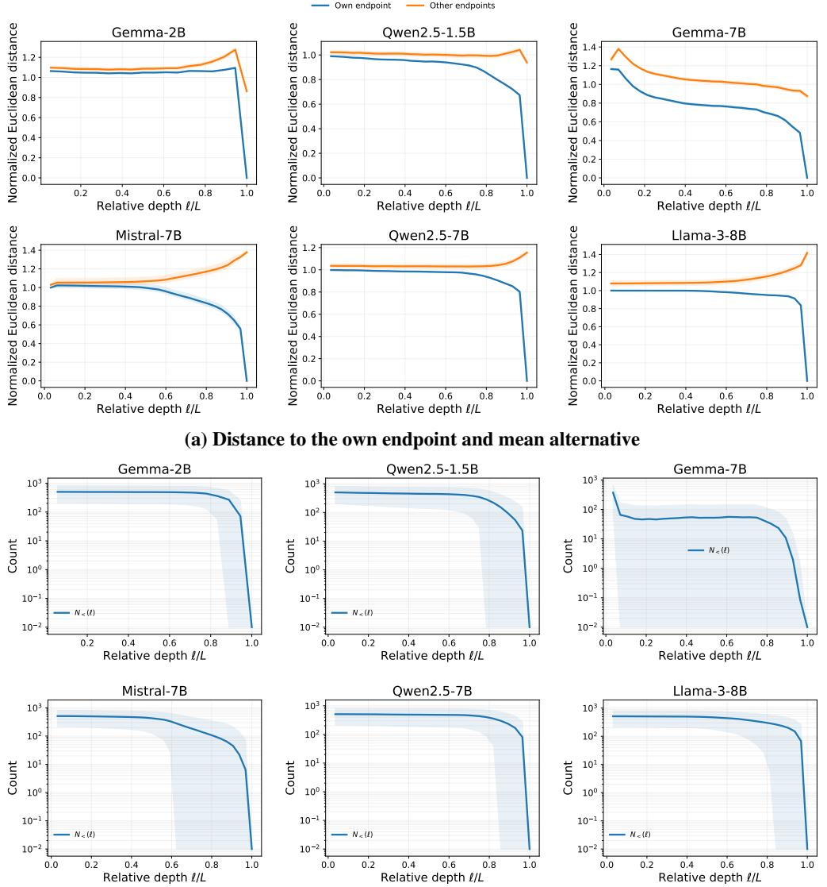  
(b) Number of strict competitors  
Figure 7: Euclidean preference and competitor counts. Distances in (a) are divided by the query's endpoint norm. Panel (b) shows mean strict counts with one standard deviation across contexts. The final count is zero by construction and is displayed at $1 0 ^ { - 2 }$ on the logarithmic axis.

All six models meet the working $p < 1 0 ^ { - 3 }$ threshold at the first measured post-block layer under both metrics (Figure 8). This result concerns the mean across documents and does not imply positive preference for every context or locate a unique transition in computation. Document means receive equal weight in the test, whereas the trajectory curves average contexts equally. These conventions differ when documents contribute different numbers of contexts. The layerwise p-values are unadjusted for multiple testing.

## F Input-Token and Document Controls

The interpretation of early preference in Section 2.3 depends on how much it reflects shared document content or the final input token. We examine these contributions by restricting the alternative bank and removing the input-token embedding direction. Each control retains the comparison with the query's own endpoint.

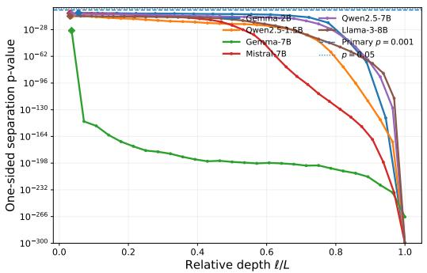

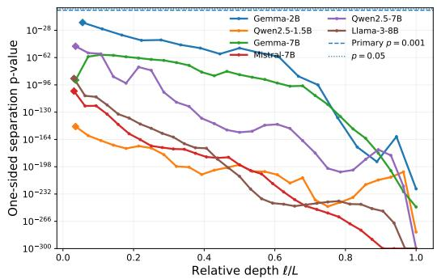  
Figure 8: Document-level tests of average own-endpoint preference. One-sided tests under Euclidean (left) and cosine (right) distance. The working threshold is $p < 1 0 ^ { - 3 }$ without correction across layers. Values below the plotting floor are shown at $1 0 ^ { - 3 0 0 }$

## F.1 Excluding alternatives from the query's document

The primary 1,024-context sample contains 333-361 source documents, depending on the model and tokenizer preprocessing. Although 876–898 contexts have another sampled context from the same document, only 5.4–6.1 of the 1,023 alternatives per query share that document on average. We exclude these alternatives and divide counts by the remaining eligible bank size.

The cosine preference and competitor-fraction curves change little, and first-layer average preference remains positive in every model. Euclidean effect sizes also change little, although the $p \ < \ 1 0 ^ { - 3 }$ threshold crossing moves by a few layers when early margins are small. Figure 9 compares the preference margins. These results indicate that the early average preference is not accounted for by same-document alternatives in the primary bank.

## F.2 Matching the final input token

A separate sample contains 2,000 contexts per model, with 40 contexts for each of 50 frequent final input tokens, drawn from distinct source documents. For each query, the same-token bank contains the other 39 endpoints with that final input token. A size-matched different-token bank contains 39 alternatives. Both banks remain fixed across layers.

Average preference is positive from the first measured layer in all six models under both metrics (Figures 10 and 11). Same-token margins are smaller, and more same-token alternatives remain competitive. At the first layer, the cosine fractions for Qwen2.5-1.5B are $A _ { \mathrm { s a m e } } ~ = ~ 0 . 3 6 4$ and $\overline { { A _ { \mathrm { d i f f } } } } = 0 . 0 5 8$ . For Gemma-7B they are 0.253 and 0.059. Input-token identity therefore contributes to early similarity, while preference for the own endpoint persists among contexts sharing that token.

## F.3 Removing the input-token embedding direction

The matching control retains the final input token, so we also examine preference after a linear projection removes its embedding direction. For the query trajectory, let $e _ { i }$ be the normalized embedding of its final input token. The transformed state and own endpoint are

$$
\boldsymbol { x } _ { \ell , i } ^ { \prime } = \boldsymbol { x } _ { \ell , i } - ( \boldsymbol { x } _ { \ell , i } ^ { \top } \boldsymbol { e } _ { i } ) \boldsymbol { e } _ { i } , \qquad \boldsymbol { y } _ { i } ^ { \prime } = \boldsymbol { y } _ { i } - ( \boldsymbol { y } _ { i } ^ { \top } \boldsymbol { e } _ { i } ) \boldsymbol { e } _ { i } .\tag{64}
$$

First-layer cosine preference remains positive in all six models, with the mean margin ranging from 0.0159 in Gemma-2B to 0.1124 in Gemma-7B (Figure 12). The Euclidean result is more sensitive to this projection. The earliest layer with positive mean preference moves to 5 in Qwen2.5-1.5B, 2 in Mistral-7B, and 13 in Qwen2.5-7B (Figure 13). The first-layer Euclidean competitor fraction is near one half in five models.

Together with the matched-bank result, the surviving cosine preference supports a contribution from the broader context. The projection removes one linear direction, so token information represented elsewhere and information carried through residual connections can still contribute.

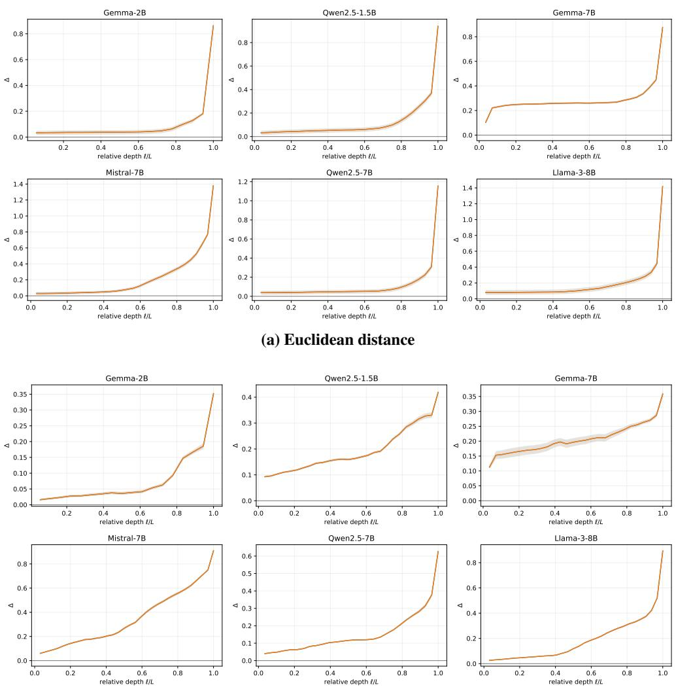  
(b) Cosine distance  
Figure 9: Average preference after excluding same-document alternatives. Euclidean (a) and cosine (b) margins with the full bank and the bank excluding endpoints from the query's document.

## G Competitor Membership and Euclidean Turnover

The changing membership in Section 2.3 distinguishes increasing specificity from successive removal of a fixed set of alternatives. We define the composition statistics and compare the Euclidean result with the cosine measurements in Figure 4. For adjacent measured layers, omit the metric superscript and let

$$
\begin{array} { r l } & { \boldsymbol { J } _ { \ell , i } = \frac { \left| \mathcal { C } _ { \ell - 1 , i } \cap \mathcal { C } _ { \ell , i } \right| } { \left| \mathcal { C } _ { \ell - 1 , i } \cup \mathcal { C } _ { \ell , i } \right| } , } \\ & { \boldsymbol { E } _ { \ell , i } = \mathcal { C } _ { \ell , i } \setminus \mathcal { C } _ { \ell - 1 , i } , } \\ & { \boldsymbol { e } _ { \ell , i } = \frac { \left| \mathcal { E } _ { \ell , i } \right| } { \operatorname* { m a x } ( | \mathcal { C } _ { \ell , i } | , 1 ) } , } \end{array}
$$

$$
\begin{array} { r l } & { X _ { \ell , i } = \mathcal { C } _ { \ell - 1 , i } \setminus \mathcal { C } _ { \ell , i } , } \\ & { } \\ & { f _ { \ell , i } = \frac { \left| X _ { \ell , i } \right| } { \operatorname* { m a x } ( | \mathcal { C } _ { \ell - 1 , i } | , 1 ) } . } \end{array}\tag{65}
$$

The entry fraction uses the current set size, and the exit fraction uses the previous set size. Statistics are computed per context before averaging. Both empty sets give $J = 1$ and zero entry and exit fractions. A transition from a nonempty to an empty set gives $J = 0 , e = 0 $ and $f = 1$ . The reverse gives $J = 0 , e = 1$ , and $f = 0$ . The first measured layer has no preceding transition.

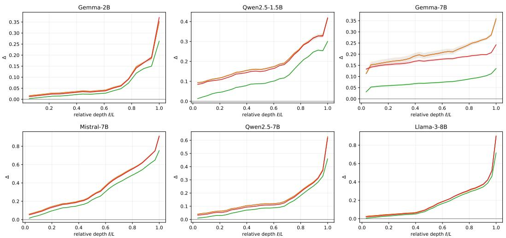  
Figure 10: Cosine average preference with input-token controls. Mean margins for the original bank, the bank excluding the query's document, 39 same-input-token alternatives, and 39 differenttoken alternatives. The matched token banks use the separate 2,000-context sample.

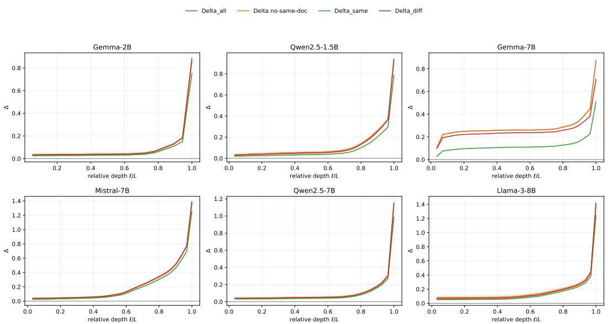  
Figure 11: Euclidean average preference with input-token controls. The own endpoint is closer than the average same-token alternative from the first measured layer in all six models. Curves show preference margins for the same four bank conditions as Figure 10.

High late-depth mean overlap can therefore include empty-to-empty transitions. Entry includes both first appearances and returns of earlier competitors. Also, entry and exit fractions have different denominators, so their difference is not the change in competitor fraction. For a fixed eligible bank, the count change is exactly

$$
| \mathcal { C } _ { \ell , i } | - | \mathcal { C } _ { \ell - 1 , i } | = | E _ { \ell , i } | - | X _ { \ell , i } | .\tag{66}
$$

This identity explains how entries can occur over depths where counts fall.

Euclidean entry remains near zero over much of depth, with late changes dominated by exits (Figure 14). Cosine turnover is more sustained in several models, especially Qwen2.5-1.5B. Resolved

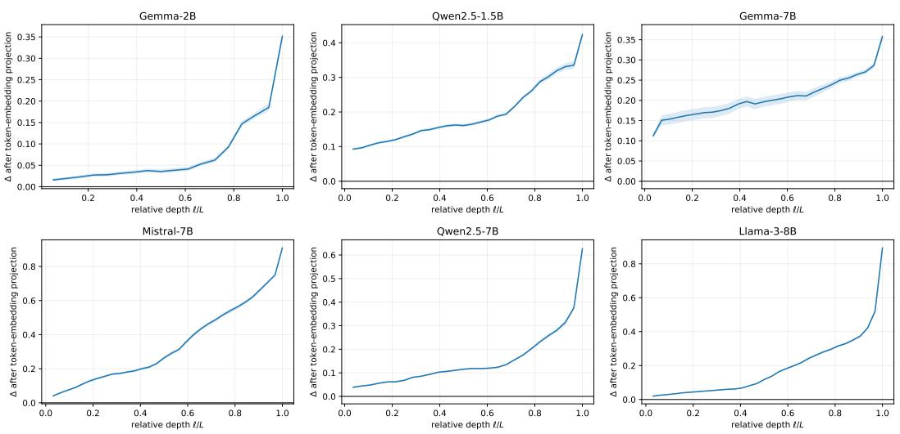  
Figure 12: Cosine average preference after embedding-direction removal. The own-endpoint margin remains positive from the first measured layer in all six models.

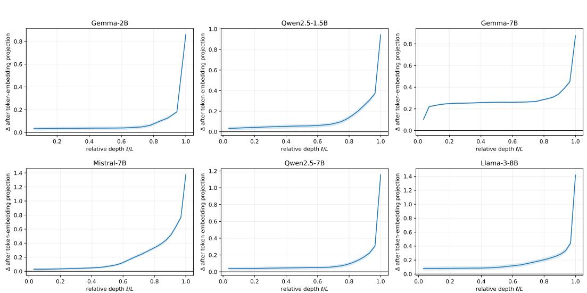  
Figure 13: Euclidean average preference after embedding-direction removal. The projection changes the early margin more strongly than under cosine distance, including delayed positive mean preference in both Qwen models and Mistral-7B.

entries exclude the straight-path baseline proved in Appendix A.1, while the statistics alone do not establish that the network explicitly represents a set of candidate endpoints.

## H Endpoint Geometry and Output Organization

Section 2.1 motivates residual endpoints as a prediction-related reference population. We supplement the main rank-conditioned cosine result with output-distribution divergence, within-token compactness, and the Euclidean rank comparison. These analyses assess how endpoint geometry relates to outputs without identifying geometric competition with token probability.

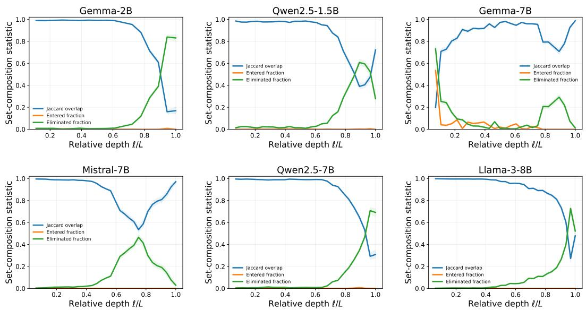  
Figure 14: Euclidean competitor membership across adjacent layers. Mean Jaccard overlap, entry fraction, and exit fraction with document bootstrap bands conditional on the fixed endpoint bank. Empty-to-empty transitions contribute $J = 1$

## H.1 Distance and output-distribution divergence

Let $p _ { i }$ be the final next-token distribution for context $i ,$ as defined in Section 2.1. Pairwise endpoint distance is positively associated with the directed divergence $D _ { \mathrm { K L } } ( p _ { i } \| p _ { j } )$ (Figure 15). The Pearson correlations for cosine distance range from 0.25 in Mistral-7B to 0.63 in Qwen2.5-1.5B. The association supports the use of endpoint geometry as a prediction-related probe, although substantial variation in output divergence remains unexplained.

## H.2 Compactness of endpoints sharing a top prediction

We group endpoints by their final most probable next token and compare mean distances within and between token groups. The within-to-between ratio is below one under both metrics in every model (Figure 16). Endpoints sharing a top prediction are therefore more compact on average. This aggregate difference does not establish disjoint classes or a one-to-one correspondence between tokens and endpoints. The bank retains variation among contexts with the same top prediction, as required by the endpoint-based probe.

## H.3 Output-token rank and Euclidean endpoint distance

For the rank-conditioned analysis in Eq. 3, a query contributes at rank k only when the bank contains an alternative endpoint whose top prediction is the query's rank-k token. Rank-specific averages can therefore involve different subsets of queries. The curves describe represented token groups and do not assign an endpoint distribution to every vocabulary token.

The Euclidean companion in Figure 17 shows a less consistent trend than the cosine result in Figure 2. The reported one-sided positive-trend tests are significant for four models, but not for Gemma-2B $( p = 0 . 6 3 )$ or Qwen2.5-1.5B (p = 0.11). The main claim about lower-probability tokens corresponding to more distant endpoints is consequently most consistent under cosine distance.

## I Population Geometry and Endpoint-Model Evaluation

The endpoint-distribution experiment in Section 3 asks how population geometry determines competition along a fixed trajectory. We first describe the observed population spread, then report model

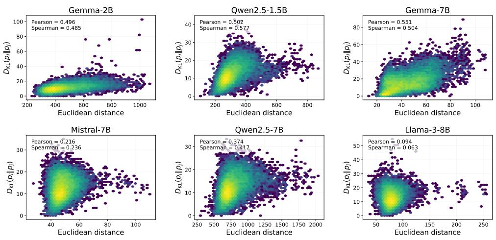

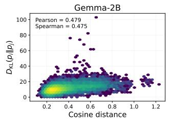

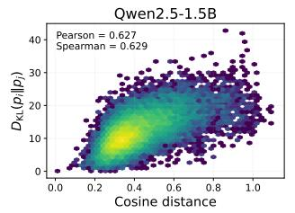

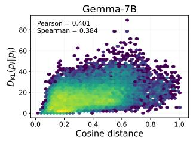

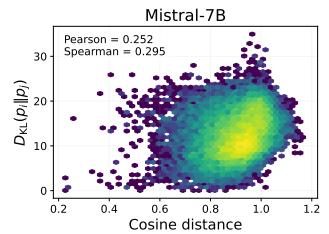

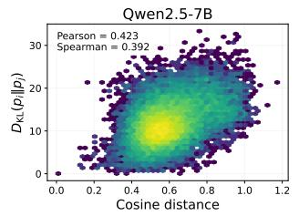  
(a) Cosine distance

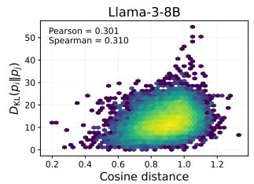  
Euclidean state distance vs. KL divergence  
(b) Euclidean distance  
Figure 15: Endpoint distance and output-distribution divergence. Cosine (a) and raw Euclidean (b) distance between final residual states, compared with KL divergence between their next-token distributions. Each panel reports Pearson and Spearman correlations.

selection and held-out endpoint fit. The cosine prediction table connects these distributional comparisons to the competitor curves in the main text

## I.1 Layerwise population geometry

Whole-layer geometry provides context for the directional endpoint models. Let $\bar { r } _ { \ell } = \mathbb { E } _ { i } \| x _ { \ell , i } \| _ { 2 }$ with empirical averages over the measured contexts. Define

$$
G _ { E } ( \ell ) = \frac { \mathbb { E } _ { i \neq j } \left\| x _ { \ell , i } - x _ { \ell , j } \right\| _ { 2 } } { \bar { r } _ { \ell } } , \qquad G _ { C } ( \ell ) = \mathbb { E } _ { i \neq j } [ 1 - \cos ( x _ { \ell , i } , x _ { \ell , j } ) ] .\tag{67}
$$

Figure 18 shows positive mean directional alignment and architecture-dependent normalized spread. The reference $G _ { C } = 1$ corresponds to zero mean cosine similarity. The reference $G _ { E } = \sqrt { 2 }$ corresponds to equal-norm orthogonal states, and requires that norm assumption for its interpretation.

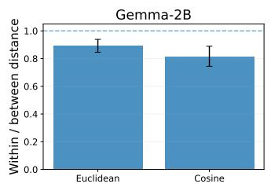

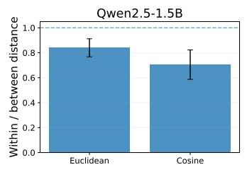

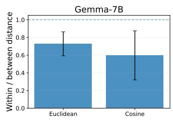

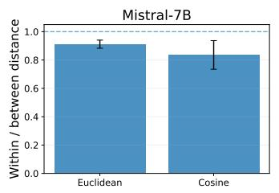

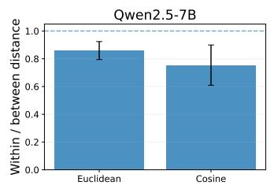

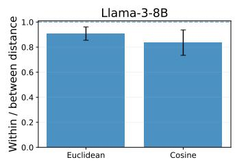  
Figure 16: Compactness of endpoints sharing a top predicted token. Mean within-token distance divided by mean between-token distance. Ratios below one indicate average geometric organization by the final top prediction under both metrics.

Rank-conditioned endpoint distance with monotonic-growth test (Euclidean)  
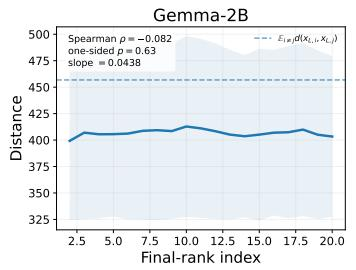

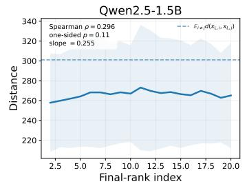

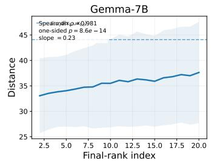

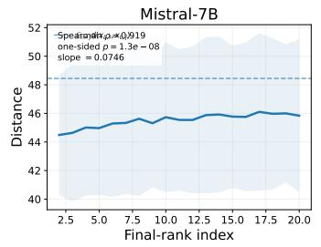

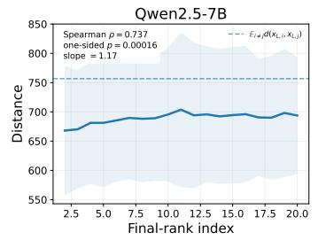

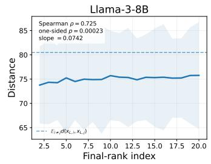  
Figure 17: Euclidean endpoint distance by output-token rank. Mean raw Euclidean distance to endpoints whose top prediction is the query's rank-k token. Empty token groups are excluded separately at each rank. Horizontal lines show mean distance between distinct endpoints.

The triangle inequality gives $0 \le G _ { E } \le 2$ . Its bootstrap bands resample precomputed context summaries with the original normalizer $\bar { r } _ { \ell }$ held fixed, so they do not estimate the full uncertainty of the ratio. These population means motivate structured directional models but do not determine the number of modes, concentration of pairwise distances, or cohesion of a query's competitor set. The construction in Appendix A.3 shows explicitly how population spread can remain fixed while competition decreases.

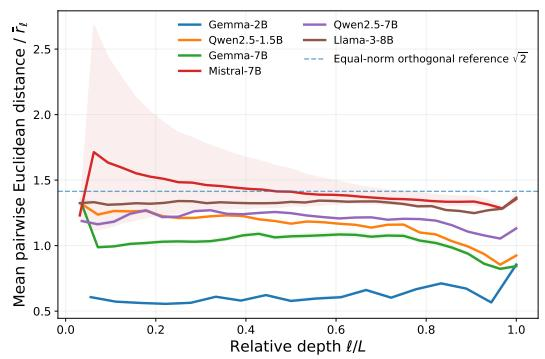

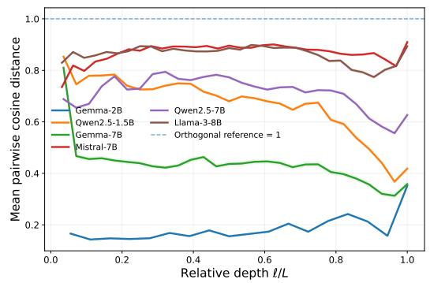  
Figure 18: Layerwise residual population geometry. Normalized mean pairwise Euclidean distance (left) and mean pairwise cosine distance (right). Dashed references indicate equal-norm orthogonality and zero mean directional alignment, respectively.

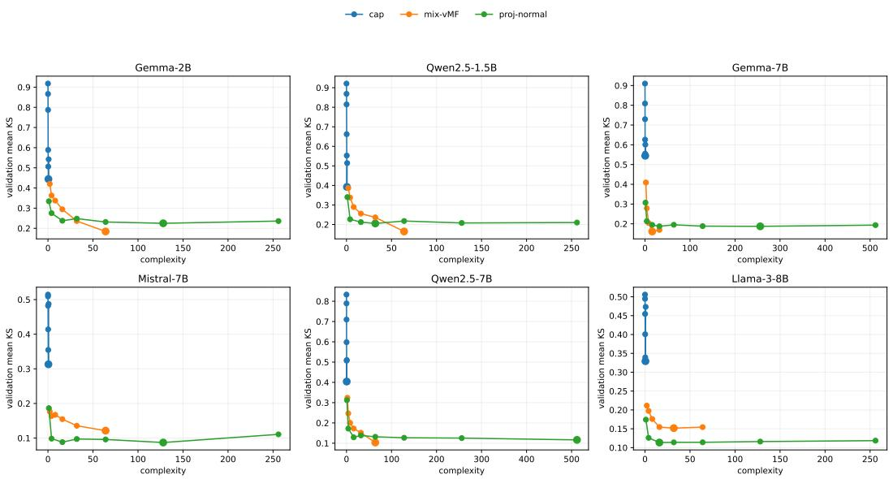  
Figure 19: Validation search over directional model complexity. The score averages four KS distances, with smaller values indicating closer agreement. The horizontal coordinate is the boundary quantile q for the cap, component count C' for the mixture, and rank k for projected normal. The small cap quantiles lie near the origin on this shared axis.

## I.2 Complexity selection and held-out endpoint fit

The validation search in Figure 19 applies the matched diagnostic score from Appendix C.6. Several mixture curves continue to improve through $C = 6 4$ , and Qwen2.5-7B selects the largest tested projected-normal rank, $k = 5 1 2$ . These boundary optima leave open whether higher complexity would improve the corresponding fits. All reported configurations are fixed before test evaluation.

Table 2 identifies the lowest test diagnostic score among the validation-selected families for each model. For Qwen2.5-1.5B, projected normal and the mixture are nearly tied at 0.151 and 0.153. The best reported scores improve on the sphere by factors of 4.6–7.5. These diagnostics assess endpoint samples, while trajectory prediction separately assesses mass in query-dependent comparison regions. The family with the best endpoint diagnostic score need not have the smallest trajectoryprediction error.

<table><tr><td>Model</td><td>Lowest-score family</td><td>Complexity</td><td>Test score</td></tr><tr><td>Gemma-2B</td><td>vMF mixture</td><td> $C = 6 4$ </td><td>0.206</td></tr><tr><td>Qwen2.5-1.5B</td><td>Projected normal</td><td> $k = 3 2$ </td><td>0.151</td></tr><tr><td>Gemma-7B</td><td>Projected normal</td><td> $k = 2 5 6$ </td><td>0.192</td></tr><tr><td>Mistral-7B</td><td>Projected normal</td><td> $k = 1 2 8$ </td><td>0.079</td></tr><tr><td>Qwen2.5-7B</td><td>vMF mixture</td><td> $C = 6 4$ </td><td>0.116</td></tr><tr><td>Llama-3-8B</td><td>Projected normal</td><td> $k = 1 6$ </td><td>0.094</td></tr></table>

Table 2: Lowest held-out endpoint diagnostic scores. Complexity is selected within each family on validation documents. The table reports the smallest resulting test score for each language model as a descriptive comparison among families.

<table><tr><td>Model</td><td>Real</td><td>Sphere</td><td>Cap</td><td>vMF</td><td>Mix-vMF</td><td>Proj.-normal</td></tr><tr><td>Gemma-2B</td><td>0.040</td><td>0.537</td><td>0.379</td><td>0.329</td><td>0.086</td><td>0.033</td></tr><tr><td>Qwen2.5-1.5B</td><td>0.101</td><td>1.278</td><td>0.365</td><td>0.429</td><td>0.195</td><td>0.117</td></tr><tr><td>Gemma-7B</td><td>0.020</td><td>1.910</td><td>0.266</td><td>0.348</td><td>0.102</td><td>0.103</td></tr><tr><td>Mistral-7B</td><td>0.019</td><td>0.160</td><td>0.080</td><td>0.077</td><td>0.023</td><td>0.022</td></tr><tr><td>Qwen2.5-7B</td><td>0.084</td><td>1.657</td><td>0.573</td><td>0.642</td><td>0.186</td><td>0.139</td></tr><tr><td>Llama-3-8B</td><td>0.035</td><td>0.138</td><td>0.150</td><td>0.156</td><td>0.108</td><td>0.107</td></tr></table>

Table 3: Cosine competitor-fraction prediction error. Mean absolute log-scale error in dex over layers $1 , \ldots , L - 1$ . Bold marks the smallest synthetic point estimate. “Real" is the reference sampled from training endpoints. These point estimates are complemented by the uncertainty analysis in Appendix K.

## I.3 Cosine competitor-fraction prediction

Table 3 quantifies the curves in Figure 5 using the preterminal log-scale error. Projected normal has the lowest synthetic point estimate in five models, and the vMF mixture is slightly better in Gemma-7B. Both families outperform the cap, single vMF, and sphere in all six models. The paired comparisons in Appendix K distinguish projected normal from the mixture in three models. The results support the contribution of directional structure to competitive mass, without establishing one family as uniformly superior across all comparisons.

## J Sensitivity to Endpoint-Bank Size

The competitor fraction in Section 2.3 is normalized to support comparison across eligible bank sizes. For a fixed query and a bank of $M _ { i } > 1$ alternatives, let $K _ { i } = | \bar { \mathcal { C } } _ { \ell , i } | . \mathrm { I f } 1 \leq s \leq \bar { M } _ { i }$ alternatives are sampled uniformly without replacement, their competitor count $K _ { i , s }$ has a hypergeometric distribution. Consequently,

$$
\mathbb { E } \bigg [ \frac { K _ { i , s } } { s } \bigg ] = \frac { K _ { i } } { M _ { i } } , \qquad \mathrm { V a r } \bigg ( \frac { K _ { i , s } } { s } \bigg ) = \frac { A _ { \ell , i } ( 1 - A _ { \ell , i } ) } { s } \frac { M _ { i } - s } { M _ { i } - 1 } .\tag{68}
$$

Thus uniform subsampling preserves the expected fraction for the fixed query while increasing sampling variation and coarsening the fraction's resolution to $1 / s$

Figure 20 evaluates nested random samples containing $n _ { \mathrm { b a n k } } \in \{ 1 2 8 , 2 5 6 , 5 1 2 , 1 , 0 2 4 \}$ contexts. These values count sampled contexts. Under Eq. 2, the eligible alternative count excludes the query's own endpoint whenever it is present, and is therefore $M _ { i } = n _ { \mathrm { b a n k } } - { \bf 1 } .$ {i is in the sampled bank}. In particular, the full 1,024-context bank provides 1,023 alternatives.

Mean cosine curves overlap closely. The largest visible differences occur at early depth in Mistral-7B and Qwen2.5-7B and at intermediate depth in Qwen2.5-1.5B. Their absolute size is below 0.01 and within the sampling range of the smallest bank. The main depth patterns, including the late increase in Qwen2.5-7B, persist across samples. This supports stability within the available endpoint population. Transfer across documents is assessed separately by the endpoint-model experiment. The bank-size check was performed only for cosine distance.

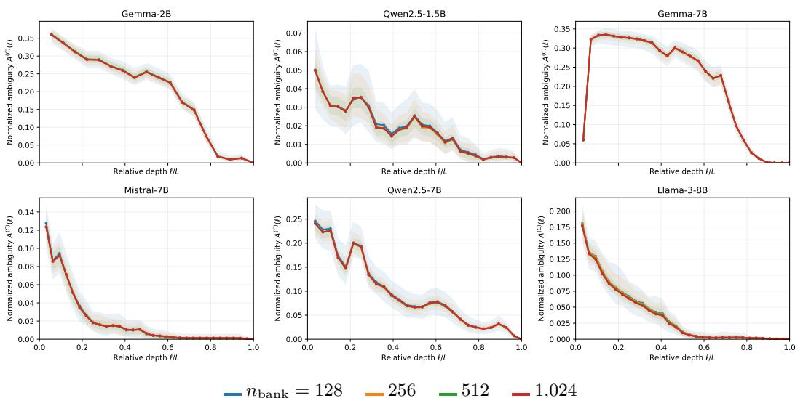

Figure 20: Cosine competitor fractions across bank sizes. Mean curves for nested samples of 128, 256, 512, and 1,024 contexts. Shading gives the 2.5–97.5% range across bank draws. The vertical-axis label “normalized ambiguity"denotes the competitor fraction $A ^ { ( C ) } ( \ell )$ used throughout the paper.
<table><tr><td>Model</td><td>Real</td><td>Sphere</td><td>Cap</td><td>vMF</td><td>Mix-vMF</td><td>Proj.-normal</td></tr><tr><td>Gemma-2B</td><td>0.034</td><td>0.109</td><td>0.040</td><td>0.029</td><td>0.027</td><td>0.023</td></tr><tr><td>Qwen2.5-1.5B</td><td>0.026</td><td>0.128</td><td>0.015</td><td>0.018</td><td>0.018</td><td>0.015</td></tr><tr><td>Gemma-7B</td><td>0.053</td><td>0.490</td><td>0.314</td><td>0.299</td><td>0.414</td><td>0.420</td></tr><tr><td>Mistral-7B</td><td>0.013</td><td>0.012</td><td>0.018</td><td>0.021</td><td>0.006</td><td>0.010</td></tr><tr><td>Qwen2.5-7B</td><td>0.012</td><td>0.067</td><td>0.009</td><td>0.009</td><td>0.010</td><td>0.013</td></tr><tr><td>Llama-3-8B</td><td>0.033</td><td>0.069</td><td>0.043</td><td>0.050</td><td>0.043</td><td>0.047</td></tr></table>

Table 4: Euclidean competitor-fraction prediction error in dex. The error follows Eq. 62. Bold marks the smallest synthetic value at the reported precision, including ties after rounding.

## K Additional Trajectory-Prediction Results

Section 3 emphasizes cosine prediction because it directly tests the fitted directional structure. We report the Euclidean comparison to assess the role of endpoint norms and give the available uncertainty summaries for the cosine errors.

## K.1 Euclidean competitor-fraction prediction

Figure 21 and Table 4 use the same held-out trajectories, sampled banks, and preterminal error as the cosine analysis. Family rankings vary across architectures. Projected normal has the smallest error for Gemma-2B, single vMF for Gemma-7B, and the mixture for Mistral-7B. Other comparisons are tied at the reported precision, including cap and projected normal for Qwen2.5-1.5B, cap and vMF for Qwen2.5-7B, and cap and mixture for Llama-3-8B.

The Euclidean results do not identify a consistently preferred family. Euclidean membership depends jointly on endpoint norms and directions, as shown in Appendix A.3, and all fitted families assume independence between these quantities. Several synthetic errors are below the finite realbank reference, consistent with that reference's role as a sampling comparison.

## K.2 Cosine uncertainty and paired comparisons

Table 5 gives the 95% document-bootstrap intervals for the real-reference errors and summarizes the paired comparison between projected normal and the vMF mixture. The paired analysis distinguishes the two fitted families for Gemma-2B and both Qwen models, favoring projected normal.

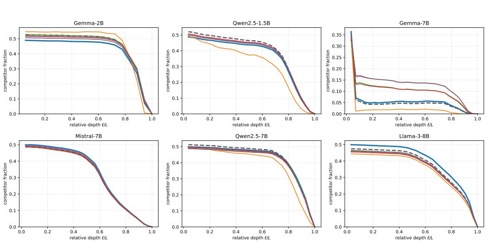  
Figure 21: Predicting Euclidean competitor fractions. Empirical test fractions, predictions from fitted endpoint distributions, and the training-endpoint reference. Sampled banks remain fixed across layers, and predictions are averaged over eight banks.

<table><tr><td>Model</td><td>Real-reference error: 95% interval</td><td>Paired PN–mixture result</td></tr><tr><td>Gemma-2B</td><td>[0.034, 0.049]</td><td>favors projected normal</td></tr><tr><td>Qwen2.5-1.5B Gemma-7B</td><td>[0.083,0.127] [0.018, 0.024]</td><td>favors projected normal not distinguished</td></tr><tr><td>Mistral-7B</td><td>[0.014, 0.030]</td><td>not distinguished</td></tr><tr><td>Qwen2.5-7B Llama-3-8B</td><td>[0.076, 0.091] [0.028, 0.050]</td><td>favors projected normal not distinguished</td></tr></table>

Table 5: Uncertainty in cosine trajectory-prediction error. Intervals and paired comparisons use 1,000 resamples of test documents, conditional on fitted distributions and sampled banks. PN denotes projected normal. The reported intervals concern the real-bank reference, not the difference between the fitted families.

It does not distinguish them for Gemma-7B, Mistral-7B, or Llama-3-8B. Small differences between the point estimates in Table 3 should be interpreted in light of this uncertainty.

The paired comparison uses the same query-document weights for both families, as specified in Appendix C.7. It therefore controls for differences in the resampled query population, while leaving uncertainty from endpoint-model fitting and new bank draws outside the comparison. Numerical intervals for the paired error differences are not available in the accompanying source materials.

## L Reproducibility and Source Materials

Reproducing the paper requires preserving the reference population for each experiment, because competitor fractions depend on both the query trajectory and its eligible endpoint bank. The primary geometry analysis uses 1,024 contexts per model, the matched input-token control uses a separate 2,000-context sample, and endpoint fitting uses disjoint document partitions of the primary sample. These protocols are specified in Appendices C and F.

The accompanying project contains manuscript sources and figure PDFs. Extraction and analysis code, per-context residual arrays, fitted endpoint models, and random seeds are not included. These materials are needed to independently reproduce the reported numerical results and resolve the implementation details identified in source comments, including the alternative-endpoint projection convention, the projected-normal sampling implementation, the bank-size sampling convention, and the reported rank-trend test.

## AI use statement

Language-model tools were used for language editing, restructuring, mathematical derivation, and source debugging. The authors are responsible for the mathematical statements, experimental design, data analysis, citations, and final text.