# TomoTransformer: Towards a Foundation Model for CT Reconstruction

AmirEhsan Khorashadizadeh∗ and Benjamín Béjar†

## Abstract

Supervised deep learning has advanced sparse-view tomographic reconstruction. However, conventional models, which typically map filtered back-projection (FBP) images or sinograms to clean reconstructions, are brittle under distribution shifts. Because they require retraining whenever projection counts and angles, detector resolutions, or data distributions change, their deployment in real-world applications remains limited. To address this, we introduce TomoTransformer, a transformer-based architecture that treats each local filtered projection as an individual token and predicts missing views via self-attention. Crucially, TomoTransformer operates in a back-projection space that separates projections across spatial locations, making view interpolation geometrically well-posed and invariant to detector size. This design yields a single foundation model that can process any number of input projections, at arbitrary angular locations and detector dimensions, and query any number of target angles without retraining. Trained on a large-scale dataset spanning diverse medical CT anatomies and natural images, TomoTransformer generalizes efectively across anatomies, materials, and resolutions. Extensive evaluations on several benchmark sparse-view datasets show that TomoTransformer significantly outperforms concurrent multi-purpose models like ViewTrans and matches or exceeds strong protocol-specific baselines, while remaining fully agnostic to the number of input and target projections. Furthermore, the model demonstrates robust zero-shot generalization on real experimental nanoscale brain data collected from an X-ray synchrotron, showcasing its practical utility for real-world applications.

## 1 Introduction

Computed tomography (CT) (Kak and Slaney, 2001) is among the most widely used imaging modalities for volumetric reconstruction, with many applications in biology (Eisenstein et al., 2023; Bosch et al., 2025), material science (Holler et al., 2017), and medicine (De Chifre et al., 2014), to name a few. The objective of tomographic imaging is to reconstruct a 3D volume from a set of 2D projections acquired at diferent angles. Under dense angular sampling and noise-free conditions, filtered back-projection (FBP) (Kak and Slaney, 1988) is optimal and provides a closed-form inverse via the Fourier slice theorem. In practice, CT projections are acquired at discrete angular locations and are inherently afected by measurement noise. Constraints on radiation dose and scanning time often limit the number of acquired projections, motivating the even more challenging scenario of sparse-view CT. In that setting, the incomplete noisy measurements make image reconstruction an ill-posed inverse problem, where FBP can produce streaking artifacts and lose structural and fine-scale details.

A large body of work has addressed sparse-view CT through model-based iterative reconstruction with hand-crafted priors, including total variation (Sidky and Pan, 2008) and wavelet sparsity, which partially suppress artifacts at the expense of iterative (slow) optimization. Over the past decade, supervised deep learning has emerged as the dominant alternative, providing faster inference and higher reconstruction quality. The common approach is post-processing of an initial estimate (e.g., an FBP reconstruction from a sparse sinogram) into a clean image (Kang et al., 2017; Adler and Öktem, 2018; Han and Ye, 2018; Chen et al., 2018; Wang et al., 2022; Yang et al., 2023; Ayad et al., 2024).

Despite their empirical success, existing supervised methods commonly have three fundamental limitations: (i) each model is trained for a specific acquisition geometry (i.e., a fixed projection count and angular range); (ii) each model is designed for a fixed image and detector size; and (iii) limited generalizability, a model is trained on a single, narrow data distribution (e.g., a single anatomical region). For instance, a network trained on 60-view sinograms cannot be deployed on a 90-view acquisition without retraining or architectural changes, and is similarly tied to the image, detector size, and data distribution used at training time. It is therefore, highly desirable to have a general model that could accommodate for and be robust to this variability. In line with the recent trend of developing foundations models, a single model trained at scale and adapted to a wide range of downstream tasks and conditions (Bommasani et al., 2021; Brown et al., 2020; Kirillov et al., 2023; Wasserthal et al., 2023; He et al., 2025; Liu et al., 2024), we advocate for a foundation model for CT reconstruction capable of ingesting arbitrary sparse acquisitions, with varying view counts, angular configurations, and detector resolutions. Recent attempts to partially achieve this goal have been made by ViewTrans (Chen et al., 2026), which uses a transformer to predict missing views from raw sinograms. However, ViewTrans is still tied to a fixed detector size and image resolution, limiting its practical utility.

We propose TomoTransformer, a transformer-based architecture that treats each local filtered projection as a token and predicts missing views via self-attention. Unlike ViewTrans (Chen et al., 2026), which operates on raw sinograms and is tied to a fixed detector size, TomoTransformer acts in a local disentangled back-projection space. By decoupling projections across spatial patches, our approach renders view interpolation geometrically well-posed and invariant to detector dimensions. As a result, a single trained model maps any number of input projections of arbitrary detector resolution to any higher number, without retraining or architectural changes. We train this model on a large-scale dataset spanning diverse medical CT anatomies and natural images, and demonstrate its generalization by transferring the pretrained model zero-shot to nanoscale brain tomography. Our experiments show that TomoTransformer significantly outperforms ViewTrans (Chen et al., 2026) and matches or exceeds strong single-purpose baselines that are specifically trained for each acquisition protocol, while remaining agnostic to the number of input and queried projections. Our contributions are as follows.

• We introduce TomoTransformer, a CT reconstruction model that is simultaneously agnostic to the number and angular configuration of projections, and detector size, removing the protocol dependence that limits existing supervised methods.

• We formulate sinogram completion in a disentangled space which makes view interpolation geometrically natural, yielding a flexible and scalable architecture.

• We train TomoTransformer on a large-scale dataset of medical CT anatomies and natural images, showing that a single set of weights generalizes across anatomies, materials, and resolutions, including zero-shot transfer to real experimental data of nanoscale brain ptychography X-ray tomography acquired at Swiss Light Source (SLS) (Bosch et al., 2025).

• We show that TomoTransformer matches or outperforms protocol-specific baselines that are trained individually at each sparsity level, and significantly outperforms the concurrent multipurpose baseline ViewTrans (Chen et al., 2026), which is tied to a fixed detector size.

• We evaluate the robustness of TomoTransformer against noise where our experiments show that a TomoTransformer pre-trained on clean images achieves remarkable zero-shot denoising performance on unseen noisy projections without any fine-tuning, demonstrating its practical utility for real-world imaging tasks.

## 2 Related work

Convolutional neural networks (CNNs) have been the dominant architecture for learning-based tomographic reconstruction. FBPConvNet (Jin et al., 2017) and tight-frame U-Net variants (Han and Ye, 2018) established the U-Net (Ronneberger et al., 2015) as a strong backbone, and subsequent work extended this idea with directional wavelets (Kang et al., 2017), attention gating (Yang et al., 2023), and dual-domain pipelines that jointly process sinograms and images (Zhang et al., 2018). A parallel line of work unrolls iterative solvers into learnable networks (Chen et al., 2018; Adler and Öktem, 2018), embedding the Radon operator into the architecture and improving data consistency and model generalization. However, these methods are not scalable as they always need to process the whole image, as opposed to U-Net-like architectures that can process local patches. More recently, transformer-based reconstructors like DuDoTrans (Wang et al., 2022), CTTR (Shi et al., 2022), ViewTrans (Chen et al., 2026) or TD-STrans (Chen et al., 2024) replace convolutional backbones to capture the global structure of the sinogram that local convolutions miss. Despite these advances, all existing models remain tied to a fixed acquisition protocol and detector resolution, requiring full retraining whenever projection counts or angles change thus limiting their practical utility.

A second class of methods casts reconstruction as posterior sampling under a learned generative prior. In this paradigm, a difusion model is often trained exclusively on clean images, and the forward operator is incorporated at inference via data-consistency terms that guide reverse difusion (Chung et al., 2023a; Song et al., 2022; Chung et al., 2023b). Because the generative prior is decoupled from the forward operator, a single trained model can theoretically accommodate any acquisition protocol, a flexibility shared by our approach. However, this comes at the cost of iterative inference, requiring hundreds to thousands of score evaluations per reconstruction, and a prior specific to the imaged distribution and the detector size.

## 3 Computed tomography

We consider parallel-beam 2D computed tomography where the attenuation field $f ( \mathbf { x } )$ is illuminated by parallel X-ray beams at diferent angles,

$$
s _ { \theta } ( u ) = \int _ { - \infty } ^ { \infty } f ( x _ { \theta , u } ( t ) , y _ { \theta , u } ( t ) ) \mathop { d t } ,\tag{1}
$$

where $\mathbf { x } = ( x _ { \theta , u } ( t ) , y _ { \theta , u } ( t ) )$ parameterizes the line at angle θ and distance u from the origin,

$$
x _ { \theta , u } ( t ) = u \cos ( \theta ) - t \sin ( \theta ) , \quad y _ { \theta , u } ( t ) = u \sin ( \theta ) + t \cos ( \theta ) .\tag{2}
$$

In practice, measurements are acquired over a discrete set of R projection angles $\{ \theta _ { r } \} _ { r = 1 } ^ { R }$ , each sampled at M equispaced detector pixels: the r-th column of the sinogram $\mathbf { s } \in \mathbb { R } ^ { M \times R }$ collects $s _ { \theta _ { r } } ( \cdot )$ at those M detector positions.

The filtered back-projection (FBP) is the most widely used method for tomographic reconstruction. According to the Fourier slice theorem (Kak and Slaney, 1988), we first filter each column of the sinogram along the detector dimension, ${ \bf s } _ { r }$ ∗ h, where ∗ represents 1D convolution and h is a high-pass ramp kernel. We write $\tilde { \bf s } _ { r } ( \cdot )$ for the linear interpolation of this filtered column, so that it can be evaluated at any real detector coordinate. We then back-project the filtered projections by identifying the measurements associated with each pixel $( x , y )$ in the reconstruction domain, which are given by the sinusoidal trajectory $x \cos ( \theta ) + y \sin ( \theta )$ in the sinogram as shown in Figure 1,

$$
{ \bf b } _ { r } ( x , y ) = \tilde { \bf s } _ { r } \big ( x \cos ( \theta _ { r } ) + y \sin ( \theta _ { r } ) \big ) ,\tag{3}
$$

evaluated on the $N \times N$ reconstruction grid to give the discrete single-view back-projection $\mathbf { b } _ { r } \in$ $\mathbb { R } ^ { N \times N }$ , where N determines the dimension of the reconstructed image. The FBP reconstruction $\mathbf { f } ^ { \mathrm { F B P } } \in \mathbb { R } ^ { N \times N }$ is simply the angular average over the filtered back-projections,

$$
\mathbf { f } ^ { \mathrm { F B P } } = \frac { 1 } { R } \sum _ { r = 1 } ^ { R } \mathbf { b } _ { r } .\tag{4}
$$

Equation (3) is central to our TomoTransformer architecture, as it isolates the contribution of view r alone at reconstruction coordinate $( x , y )$ . Stacking these single-view back-projections across all R angles yields a tensor

$$
{ \bf B } = [ { \bf b } _ { 1 } , { \bf b } _ { 2 } , \ldots , { \bf b } _ { R } ] \in \mathbb { R } ^ { N \times N \times R } ,\tag{5}
$$

which we refer to as the disentangled back-projection space. In the next section, we establish our TomoTransformer architecture in this disentangled space.

## 4 TomoTransformer: a flexible reconstruction model

A foundation model for sparse-view tomography must satisfy several core requirements that existing supervised methods satisfy only in isolation: (R1) Agnosticism to the number and angular positions of input projections; (R2) Agnosticism to detector dimensions and volume resolution; (R3) Scalability to large images; (R4) Generalization across heterogeneous data distributions.

TomoTransformer fulfills all four requirements through three design choices: First, we formulate reconstruction in the disentangled back-projection space (5), casting unseen view prediction as a spatially aligned interpolation problem (R1). Second, we treat each single-view back-projection as a token conditioned on its viewing angle to be processed by a transformer. This design enables a single model to ingest and predict an arbitrary number of views at arbitrary angles and detector resolutions (R1–R2). Third, we tokenize local $P \times P$ patches rather than full back-projections, yielding a memory-eficient pipeline capable of scaling to large images and volumes of arbitrary size (R3). Requirement (R4) is met by two factors: 1) working on local patches rather than full back-projections improves generalization by reducing the complexity of the prediction task and increasing the efective number of training samples (Khorashadizadeh et al., 2025a,b) and 2) training the model at scale on large-scale heterogeneous datasets.

In this paper, we formulate the missing view prediction in the disentangled space (5): predicting a missing projection at $\theta _ { \star }$ amounts to predicting a new slice b⋆ from the observed slices $\{ { \bf b } _ { r } \} _ { r = 1 } ^ { R }$ Because every slice lives on the same $N \times N$ image grid and shares the same coordinate system, the interpolation is spatially aligned across views, a property the raw sinogram does not enjoy. As shown in Figure 1, each back-projection ${ \mathbf b } _ { r } \in \mathbb { R } ^ { N \times N }$ is treated as a token conditioned on its projection angle $\theta _ { r }$ . Through self-attention, TomoTransformer can process a variable number of input tokens at arbitrary angles and predict an arbitrary number of queried views $\{ \hat { \mathbf { b } } _ { q } \} _ { q = 1 } ^ { Q }$ as output, without any change to the architecture.

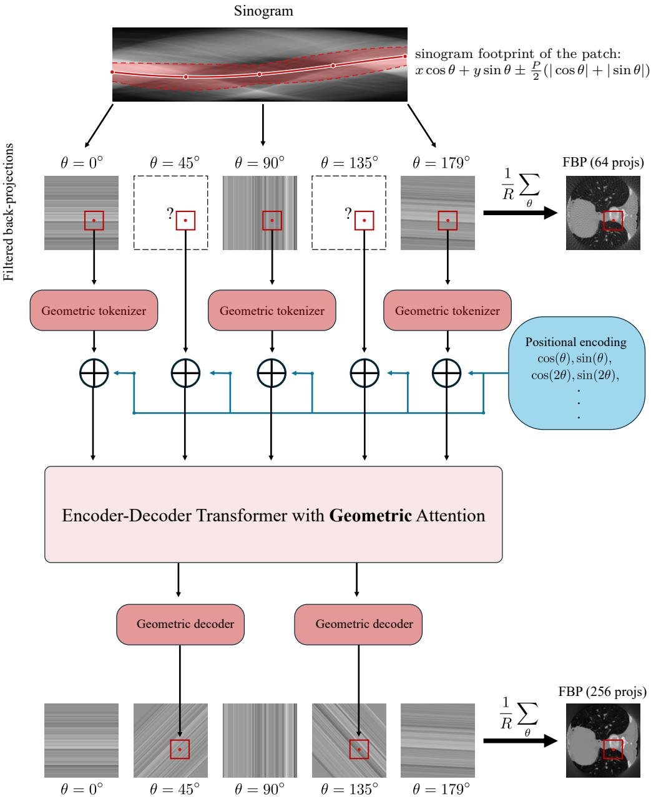  
Figure 1: TomoTransformer operates on the disentangled filtered back-projection space by treating each local filtered projection at angle θ as a token. It can process a varying number of projections in the input and generate an arbitrary number of local projections.

TomoTransformer has an encoder-decoder architecture similar to masked autoencoders (MAE) (He et al., 2022). The encoder processes only the existing tokens, followed by the decoder, which takes the encoder’s output for the existing tokens together with a learnable tensor for the queried tokens to be generated. Unlike standard transformers, token positions in our framework are physical quantities: the position of token r is its projection angle $\theta _ { r } .$ a continuous coordinate rather than a discrete index. To represent the viewing geometry, we map each angle $\theta _ { r }$ to Fourier positional embeddings $\{ ( \sin ( k \theta _ { r } ) , \bar { \cos ( k \theta _ { r } ) } ) \} _ { k = 1 } ^ { F }$ . Because these features vary smoothly with $\theta _ { r }$ , the embedding is defined at every real angle rather than only on a fixed grid, which is what enables the model to generalize to unseen target angles at test time. These embeddings encode each token’s absolute angle; the transformer blocks additionally condition attention on the relative geometry, adding a learned function of the pairwise angular diference $\theta _ { r } - \theta _ { r ^ { \prime } }$ to the attention logits. We refer to this as geometric attention and detail it in Appendix A.

Unlike naive sinogram interpolation, which must process the entire projection simultaneously, operating in the disentangled space enables localized computation: because each pixel’s relevant measurements are spatially aligned, tokens do not need to span the full back-projection. As shown in Figure 1 (red boxes), we extract local patches $\mathbf { t } _ { r } \in \mathbb { R } ^ { P \times P } \left( P \ll N \right)$ from the full back-projections br to serve as input tokens. Processing $P \times P$ patches rather than full $N \times N$ projections drastically reduces memory consumption and computational overhead during training, making the model scalable to large images. Since the network operates exclusively on fixed-size $P \times P$ tokens, it is decoupled from the full image dimension N and the detector resolution. A single model can thus be trained on and reconstruct datasets at their native resolutions without resampling to a uniform grid. Furthermore, predicting a localized back-projection patch from observed views represents a much simpler task than predicting entire back-projections for a fixed set of views. Finally, the model can train on a large number of local patches extracted from each image, improving generalization and robustness to distribution shifts (Khorashadizadeh et al., 2025b).

## 4.1 Geometric tokenizer and decoder

The geometric tokenizer maps a local back-projection patch $\mathbf { t } _ { r } \in \mathbb { R } ^ { P \times P }$ to a low-dimensional embedding $\mathbf { z } _ { r } \in \mathbb { R } ^ { D }$ by exploiting the geometric structure of single-view back-projections, and the geometric detokenizer reconstructs $\hat { \mathbf { t } } _ { q } \in \mathbb { R } ^ { P \times P }$ from the predicted embedding $\hat { \mathbf { z } } _ { q } \in \mathbb { R } ^ { D }$

As illustrated in Figure 2, a single-view backprojection ${ \bf b } _ { r }$ consists of parallel stripes perpendicular to the projection angle $\theta _ { r }$ . Any local patch $\hat { \mathbf { t } } _ { r } \in \mathbb { R } ^ { P \times P }$ cropped from it inherits the same structure: the 2D patch is determined by a 1D signal swept along the stripe direction. The geometric tokenizer directly extracts this underlying 1D representation by sampling the patch along the diagonal closest to the normal of

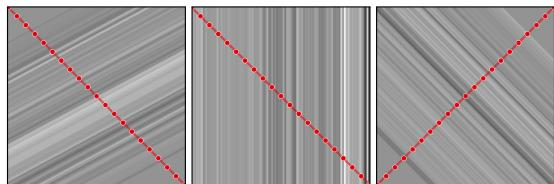  
Figure 2: Geometric tokenizer

the stripe direction (red dashed lines in Figure 2). Sampling $K = \lceil P \sqrt { 2 } \rceil$ equispaced values along this diagonal yields the geometric feature $\mathbf { p } _ { r } \in \mathbb { R } ^ { K }$ , which serves as a concise 1D summary of the patch. Finally, a learnable linear encoder $\mathbf { E } : \mathbb { R } ^ { K }  \mathbb { R } ^ { D }$ maps this feature to the token embedding $\mathbf { z } _ { r } = \mathbf { E } \mathbf { p } _ { r } \in \mathbb { R } ^ { D }$

The geometric detokenizer reverses the process; a learnable linear decoder $\mathbf { E } ^ { \prime } : \mathbb { R } ^ { D }  \mathbb { R } ^ { K }$ turns a predicted embedding $\hat { \mathbf { z } } _ { q }$ back into a 1-D feature, which is then swept perpendicular to the queried angle $\theta _ { q }$ to fill in the output patch $\hat { \mathbf { t } } _ { q }$ . Further information on the network architecture and training details is provided in Appendices A and B.

## 5 Experiments

In this section, we evaluate TomoTransformer on sparse-view CT reconstruction tasks. We first describe the training dataset and the common experimental setup.

## 5.1 Experimental setup

To train a versatile model across diverse anatomical regions, we build a large heterogeneous dataset of medical and natural images. The medical component comprises chest CTs from LoDoPaB-CT (Leuschner et al., 2021) and the COVID-19 subset of CTSpine1K (Deng et al., 2021), abdominal CTs from KiTS23 (Heller et al., 2023), and further thoracic, colonographic, and head-and-neck volumes from the MSD, COLONOG, and HNSCC subsets of CTSpine1K (Deng et al., 2021). To expand structural diversity beyond anatomy, we additionally include natural images from FFHQ (Karras et al., 2019) and ImageNet (Deng et al., 2009) as texture priors. Because TomoTransformer operates on local $P \times P$ tokens, no resampling to a common grid is required, so we use the axial slices of each dataset at their native resolutions, normalized per slice into a shared intensity band. In total, the training set comprises ∼650k 2D slices: 570k CT slices from 1,340 volumes and 80k natural images. Since every slice contributes many patches, each paired with a freshly sampled set of projection angles, the model is exposed to a massive training set, which is essential for robust generalization to unseen anatomies and distributions.

We simulate 2D parallel-beam acquisition following Section 3. Both dense-view reference images and sparse-view inputs are reconstructed using filtered back-projection (FBP). We evaluate performance using peak signal-to-noise ratio (PSNR, in dB) and structural similarity index measure (SSIM), computed on reconstructed images against the dense-view targets.

## 5.2 Fixed sparse-view reconstruction

In this section, we evaluate TomoTransformer under a fixed sparse-view protocol, where every method, including TomoTransformer, is trained and evaluated at a single sparsity level: $R _ { \mathrm { s p a r s e } } = 6 4$ projections uniformly sampled from a dense $R _ { \mathrm { t o t a l } } = 2 5 6$ projections. We consider post-processing baselines that map sparse-view FBP reconstructions to dense-view target FBPs: U-Net (Jin et al., 2017), DRUNet (Zhang et al., 2021) and NAFNet (Chen et al., 2022) that use CNN and Restormer (Zamir et al., 2022) and CTformer (Wang et al., 2023) that use transformers. For a fair comparison, all baselines have approximately 12 M parameters. All models are trained on the same heterogeneous dataset described in Section 5.1. Please refer to Appendices A–D for the network architectures and training details of the baselines and TomoTransformer.

Table 1 and Table 2 (Appendix) report per-dataset PSNR and SSIM values, averaged over 32 test slices, with reconstructions visualized in Figure 3. These results demonstrate that TomoTransformer outperforms all competing baselines on average (last column). For reference, we also report TomoTransformer (varied), a single model trained on variable sparsity (Section 5.3) and applied at 64→256 without retraining. Although it is not specialized to this protocol, it shows comparable performance with protocol-specific baselines.

## 5.3 Varied sparse-view reconstruction

While the previous section evaluated TomoTransformer on a fixed sparse-view setup, we now consider a more realistic and challenging regime: training a single model to handle variable projection counts and arbitrary angular configurations. This flexible paradigm is precisely what TomoTransformer was designed to address (R1). For this experiment, we compare against ViewTrans (Chen et al.,

FBP  
Table 1: Fixed sparse-view reconstruction (64 → 256): PSNR (dB) per dataset (against the dense 256-view reference) for TomoTransformer and the baselines. Best per column in bold.
<table><tr><td>Method</td><td>LoDoPaB</td><td>COVID-19</td><td>KiTS23</td><td>MSD-T10</td><td>COLONOG</td><td>HNSCC</td><td>FFHQ</td><td>ImageNet</td><td>Average</td></tr><tr><td>FBP (Kak and Slaney, 1988)</td><td>29.24</td><td>28.48</td><td>30.27</td><td>28.13</td><td>28.59</td><td>28.93</td><td>27.97</td><td>26.46</td><td>28.51</td></tr><tr><td>U-Net (Ronneberger et al., 2015)</td><td>36.76</td><td>36.97</td><td>40.45</td><td>38.38</td><td>36.88</td><td>40.20</td><td>33.43</td><td>31.78</td><td>36.86</td></tr><tr><td>DRUNet (Zhang et al., 2021)</td><td>37.95</td><td>39.35</td><td>42.95</td><td>40.24</td><td>38.34</td><td>43.58</td><td>35.23</td><td>33.42</td><td>38.88</td></tr><tr><td>NAFNet (Chen et al., 2022)</td><td>38.27</td><td>39.85</td><td>43.49</td><td>40.66</td><td>38.66</td><td>44.53</td><td>35.68</td><td>33.79</td><td>39.37</td></tr><tr><td>Restormer (Zamir et al., 2022)</td><td>38.32</td><td>39.96</td><td>43.58</td><td>40.73</td><td>38.75</td><td>44.73</td><td>35.78</td><td>33.88</td><td>39.47</td></tr><tr><td>CTformer (Wang et al., 2023)</td><td>35.79</td><td>36.94</td><td>38.33</td><td>36.39</td><td>35.80</td><td>37.72</td><td>33.97</td><td>31.55</td><td>35.81</td></tr><tr><td>TomoTransformer (fixed)</td><td>38.19</td><td>40.23</td><td>43.94</td><td>41.15</td><td>38.86</td><td>44.08</td><td>36.94</td><td>33.89</td><td>39.66</td></tr><tr><td>TomoTransformer (varied)</td><td>37.47</td><td>39.05</td><td>42.68</td><td>40.02</td><td>38.18</td><td>39.61</td><td>36.11</td><td>33.42</td><td>38.32</td></tr></table>

Chest Abdomen ImageNet

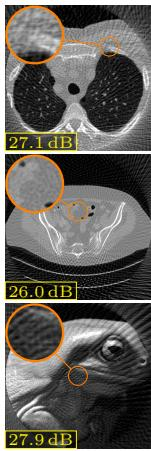  
projs)  
(64

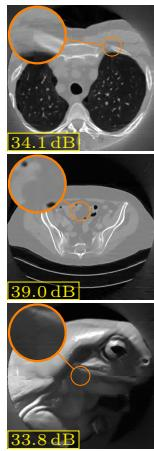  
U-Net

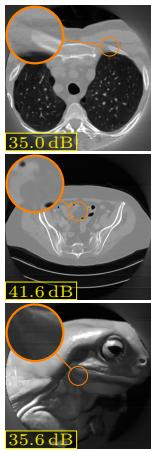  
DRUNet

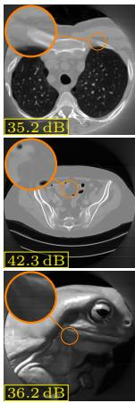  
NAFNet

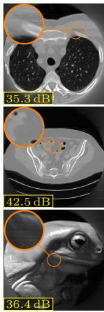  
Restormer

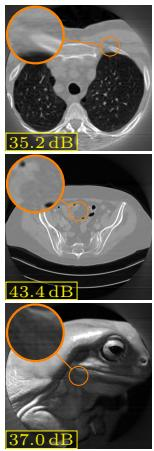  
CTformerTomoTransformerFBP

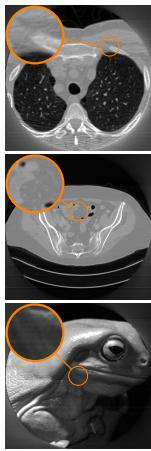  
projs)  
(256  
Figure 3: Fixed sparse-view reconstruction (64 → 256 projections) across three domains: chest CT (LoDoPaB-CT), abdominal CT (KiTS23), and a natural image (ImageNet). The box in the bottom-left of each panel reports PSNR (dB) against the dense 256-view reference.

2026) as the baselines in the previous section were not designed for variable-view reconstruction. Unlike TomoTransformer, ViewTrans operates directly on the raw sinogram and tokenizes each view into a vector whose dimension equals the detector width; its architecture works only for a single detector size and image resolution and cannot process images with diferent dimensions. To ensure a fair comparison, we restrict this experiment to the LoDoPaB-CT dataset (Leuschner et al., 2021) at its native 362 × 362 resolution across varying sparsity levels. At every training iteration we draw a dense grid size uniformly in [128, 512] and almost uniformly [20%, 80%] of them for the measured views, with a small random angular perturbation. TomoTransformer and ViewTrans have similar capacity (∼12M parameters).

We next evaluate the pretrained models using two input sparsity levels: 128 and 64 measured projections, reconstructing a 256-view target. Representative reconstructions are shown in Figure 4, and full quantitative results (averaged over 32 test slices against the dense 256-view FBP reference) are reported in Table 3 (Appendix). When given 128 input views, TomoTransformer significantly outperforms ViewTrans by a wide margin. The contrast becomes even stronger at 64 input views, an extremely sparse regime that poses a severe challenge for both models. While TomoTransformer maintains a strong quantitative lead, the visual diference in Figure 4 is even more dramatic. At 64 views, ViewTrans introduces heavy swirling washing-machine artifacts that do not exist in the

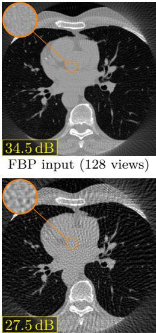

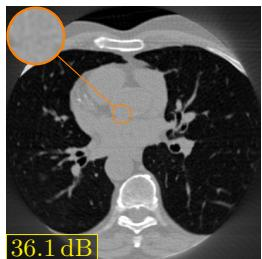

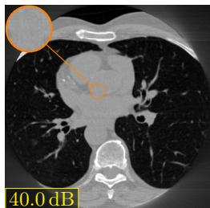

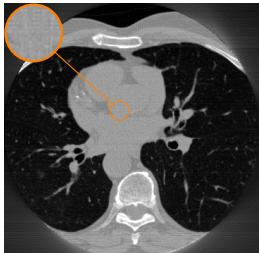  
FBP input (64 views)

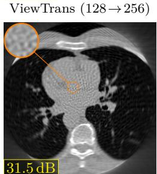  
ViewTrans (64→256)

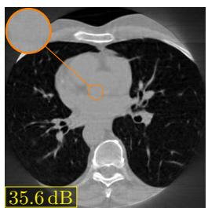  
TomoTransformer (64→256)

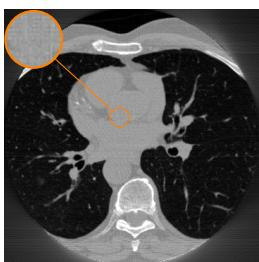  
FBP (256 views)

Figure 4: Varied sparse-view reconstruction on LoDoPaB-CT. From a common sparse input of 128 (top) and 64 (bottom) measured views, TomoTransformer and ViewTrans reconstruct a dense 256-view target.

reference. This failure mode in ViewTrans highlights a key architectural weakness: because it applies filtered back-projection after predicting missing views in the sinogram, small systematic errors in its predicted sinograms get amplified into structured image artifacts under heavy undersampling.

## 5.4 Zero-shot denoising

So far we considered noiseless measurements, with models trained on noiseless sinograms. What happens when the projections are noisy at inference time? This matters in practice, where the noise distribution varies across datasets and acquisition protocols and may be unseen at training time.

A single pass of TomoTransformer is already a denoiser. We consider our pre-trained TomoTransformer (varied) of Section 5.2 which is trained on noiseless projections and we apply it to noisy sparse-view projections; the network has never seen noise during training. In Figure 5 we show the results of applying the network to 128 noisy projections to predict 256 projections, under additive Gaussian noise at 45 dB and under a Poisson $( I _ { 0 } e ^ { - \mathbf { A } \mathbf { f } } )$  photon-counting model with $I _ { 0 } = 1 0 ^ { 5 }$ incident photons per bin and a peak optical depth of 4, log-transformed back before reconstruction.

The second column of Figure 5 shows that the network predictions alone, without noisy measured views, not only do not show signs of hallucination under such distribution shift, but also yield reconstructions already much cleaner than the noisy FBP input (first column). This is a remarkable property of the model, as it was never explicitly trained for denoising, yet it generalizes to this task due to its ability to capture the underlying structure of the data. When we form the reconstruction from both predicted and measured views as usual, the residual noise in the reconstruction is dominated by the noisy measured views resulting in a lower PSNR, see the third column of Figure 5.

The flexibility of TomoTransformer allows us to replace the noisy projections as well: Blind-spot re-masking (BS): we partition the measured angles into G uniformly interleaved subsets and, for each, mask that subset, predicting it from the remaining noisy measurements. The fourth column of Figure 5 shows that this approach can further improve the reconstruction quality. Complementary re-masking (CR): we invert the mask, so that the $R _ { \mathrm { t o t a l } } { - } R _ { \mathrm { s p a r s e } }$ views predicted

FBP input (128 noisy views)

Gaussian(45dB)Poisson(I0=105)

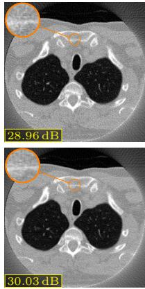

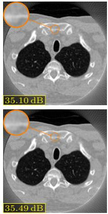  
only predicted views

  
predicted + measured views

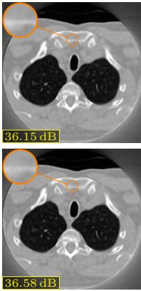

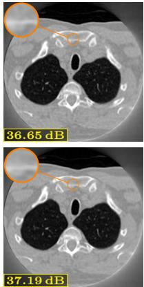  
predicted + complementary

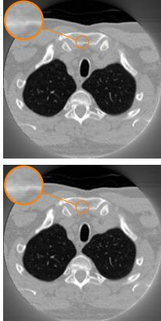  
Full-view FBP (256, noise-free)

Figure 5: Zero-shot denoising. A TomoTransformer pretrained on noiseless data cleans projections corrupted by unseen noise, with no retraining. The blind-spot (BS) and complementary (CR) re masking passes additionally denoise the measured views. Boxes report PSNR against the noise-free 256-view FBP (right column).

in the first pass become the input to predict the $R _ { \mathrm { s p a r s e } }$ measured angles. The final reconstruction is then formed by averaging the first-pass predictions and the second-pass replacements, efectively denoising both the measured and unmeasured views. The fifth column of Figure 5 shows that this approach outperforms the blind-spot re-masking.

## 5.5 Real experimental data

We trained TomoTransformer on the heterogeneous dataset of CT and natural images at their original resolutions and varying view counts (the eight datasets of Section 5.1 with the sampling scheme of Section 5.3). We already reported its performance in Section 5.2 (see Tables 1 and 2). To test zero-shot performance, now we apply it to a completely diferent domain: nanoscale X-ray imaging of mouse brain tissue (Bosch et al., 2025), which difers radically from medical CT in scale, contrast, and resolution. It was collected using ptychographic X-ray computed tomography (PXCT) at the cSAXS beamline (SLS/PSI). Even though this modality measures the refractive index instead of standard X-ray absorption, the physics still relies on the Radon transform.

We apply our pre-trained TomoTransformer to the preprocessed ptychographic reconstructed projections of a mouse-brain pillar (617 views over [0◦, 180◦), 37.6 nm pixels, 768-pixel detector). The dense 512-view FBP of these measurements is the reference; the sparse 128-view FBP is the input. Figure 6 shows that TomoTransformer generalizes seamlessly to this out-of-distribution data, recovering fine cellular structure with no fine-tuning. Querying more views from the same 128 measurements substantially improves quality further (128 → 256 vs. 128 → 512).

The pretrained ViewTrans cannot be applied to these measurements, since its architecture is tied to the detector size and image resolution it was trained on. The baselines of Section 5.2 are likewise protocol-bound, but can at least be run in the single setting they were trained for, $6 4  2 5 6$ views, albeit at projection angles that still difer from those seen during training. Figure 7 (Appendix) shows that TomoTransformer outperforms the baselines, while they hallucinate texture absent from the reference and leave severe blocking artifacts.

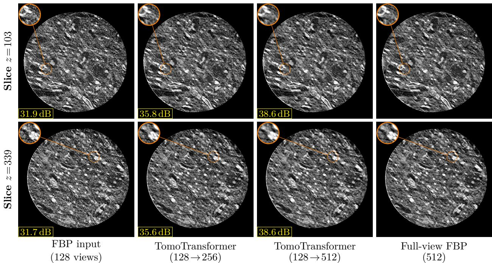  
Figure 6: Zero-shot reconstruction from the real experimental data of ptychographic reconstructed projections of a nanoscale brain pillar (Bosch et al., 2025) (768 × 768, 448 axial slices), with TomoTransformer and no fine-tuning. The box in the bottom-left reports per-slice PSNR (dB) against the dense 512-view FBP of the same measurements.

## 6 Conclusion

In this paper, we introduced TomoTransformer, a novel transformer-based architecture for sparse-view CT reconstruction. By disentangling the representation of projection angles and local back-projection patches, our model achieves robust performance across a variety of datasets and sparsity levels. Notably, TomoTransformer demonstrates remarkable generalization capabilities, efectively handling out-of-distribution data without fine-tuning. Future work will explore designing this architecture for other tomographic modalities including cone-beam CT.

## References

Jonas Adler and Ozan Öktem. Learned primal-dual reconstruction. IEEE Transactions on Medical Imaging, 37(6):1322–1332, 2018.

Jonas Adler, Holger Kohr, and Ozan Öktem. Operator discretization library (ODL). Zenodo, https://doi.org/10.5281/zenodo.249479, 2017.

Ishak Ayad, Kamel-Ray Tahri Joutei Hassani, Mai-Khoa Sarkis, Franck Quint, Margaux Tortelli, Ferréol Soulez, and Alamin Mansouri. QN-Mixer: A quasi-Newton MLP-Mixer model for sparseview CT reconstruction. In CVPR, 2024.

Rishi Bommasani, Drew A Hudson, Ehsan Adeli, Russ Altman, Simran Arora, Sydney von Arx, Michael S Bernstein, Jeannette Bohg, Antoine Bosselut, Emma Brunskill, et al. On the opportunities and risks of foundation models. arXiv preprint arXiv:2108.07258, 2021.

Carles Bosch, Tomas Aidukas, Mirko Holler, Alexandra Pacureanu, Elisabeth Müller, Christopher J Peddie, Yuxin Zhang, Phil Cook, Lucy Collinson, Oliver Bunk, et al. Nondestructive x-ray tomography of brain tissue ultrastructure. Nature Methods, pages 1–8, 2025.

Tom Brown, Benjamin Mann, Nick Ryder, Melanie Subbiah, Jared D Kaplan, Prafulla Dhariwal, Arvind Neelakantan, Pranav Shyam, Girish Sastry, Amanda Askell, et al. Language models are few-shot learners. In Advances in Neural Information Processing Systems, volume 33, pages 1877–1901, 2020.

Hu Chen, Yi Zhang, Yunjin Chen, Junfeng Zhang, Weihua Zhang, Huaiqiang Sun, Yang Lv, Peixi Liao, Jiliu Zhou, and Ge Wang. LEARN: Learned experts’ assessment-based reconstruction network for sparse-data CT. IEEE Transactions on Medical Imaging, 37(6):1333–1347, 2018.

Liangyu Chen, Xiaojie Chu, Xiangyu Zhang, and Jian Sun. Simple baselines for image restoration. In European Conference on Computer Vision (ECCV), pages 17–33, 2022.

Yu Chen et al. TD-STrans: Tri-domain sparse-view CT reconstruction based on sparse transformer. Computer Methods and Programs in Biomedicine, 2024.

Yuxi Chen, Shuaiqi Cheng, Bo Yang, Chao Liu, Lijuan Zhang, and Wenfeng Zheng. Viewtrans: A physics-informed transformer for sparse-view ct sinogram restoration. Digital Signal Processing, page 106113, 2026.

Hyungjin Chung, Jeongsol Kim, Michael Thompson Mccann, Marc Louis Klasky, and Jong Chul Ye. Difusion posterior sampling for general noisy inverse problems. In International Conference on Learning Representations (ICLR), 2023a.

Hyungjin Chung, Dohoon Ryu, Michael T McCann, Marc L Klasky, and Jong Chul Ye. Solving 3d inverse problems using pre-trained 2d difusion models. In Proceedings of the IEEE/CVF Conference on Computer Vision and Pattern Recognition (CVPR), pages 22542–22551, 2023b.

Leonardo De Chifre, Simone Carmignato, J-P Kruth, Robert Schmitt, and Albert Weckenmann. Industrial applications of computed tomography. CIRP annals, 63(2):655–677, 2014.

Jia Deng, Wei Dong, Richard Socher, Li-Jia Li, Kai Li, and Li Fei-Fei. ImageNet: A large-scale hierarchical image database. In Proceedings of the IEEE/CVF Conference on Computer Vision and Pattern Recognition (CVPR), pages 248–255, 2009.

Yang Deng, Ce Wang, Yuan Hui, Qian Li, Jun Li, Shiwei Luo, Mengke Sun, Quan Quan, Shuxin Yang, You Hao, et al. CTSpine1K: A large-scale dataset for spinal vertebrae segmentation in computed tomography. arXiv preprint arXiv:2105.14711, 2021.

Fabian Eisenstein, Haruaki Yanagisawa, Hiroka Kashihara, Masahide Kikkawa, Sachiko Tsukita, and Radostin Danev. Parallel cryo electron tomography on in situ lamellae. Nature Methods, 20 (1):131–138, 2023.

Yoseob Han and Jong Chul Ye. Framing U-Net via deep convolutional framelets: Application to sparse-view CT. IEEE Transactions on Medical Imaging, 37(6):1418–1429, 2018.

Kaiming He, Xinlei Chen, Saining Xie, Yanghao Li, Piotr Dollár, and Ross Girshick. Masked autoencoders are scalable vision learners. In Proceedings of the IEEE/CVF conference on computer vision and pattern recognition, pages 16000–16009, 2022.

Yufan He, Pengfei Guo, Yucheng Tang, Andriy Myronenko, Vishwesh Nath, Ziyue Xu, Dong Yang, Can Zhao, Benjamin Simon, Mason Belue, et al. Vista3d: A unified segmentation foundation model for 3d medical imaging. In Proceedings of the Computer Vision and Pattern Recognition Conference, pages 20863–20873, 2025.

Nicholas Heller, Fabian Isensee, Dasha Trofimova, Resha Tejpaul, Zhongchen Zhao, Huai Chen, Lisheng Wang, et al. The KiTS21 challenge: Automatic segmentation of kidneys, renal tumors, and renal cysts in corticomedullary-phase CT. arXiv:2307.01984, 2023.

Mirko Holler, Manuel Guizar-Sicairos, Esther HR Tsai, Roberto Dinapoli, Elisabeth Müller, Oliver Bunk, Jörg Raabe, and Gabriel Aeppli. High-resolution non-destructive three-dimensional imaging of integrated circuits. Nature, 543(7645):402–406, 2017.

Kyong Hwan Jin, Michael T. McCann, Emmanuel Froustey, and Michael Unser. Deep convolutional neural network for inverse problems in imaging. IEEE Transactions on Image Processing, 26(9): 4509–4522, 2017.

Avinash C. Kak and Malcolm Slaney. Principles of Computerized Tomographic Imaging. IEEE Press, 1988.

Avinash C Kak and Malcolm Slaney. Principles of computerized tomographic imaging. SIAM, 2001.

Eunhee Kang, Junhong Min, and Jong Chul Ye. A deep convolutional neural network using directional wavelets for low-dose X-ray CT reconstruction. Medical Physics, 44(10):e360–e375, 2017.

Tero Karras, Samuli Laine, and Timo Aila. A style-based generator architecture for generative adversarial networks. In Proceedings of the IEEE/CVF Conference on Computer Vision and Pattern Recognition (CVPR), pages 4401–4410, 2019.

AmirEhsan Khorashadizadeh, Valentin Debarnot, Tianlin Liu, and Ivan Dokmanić. Glimpse: generalized locality for scalable and robust ct. IEEE Transactions on Medical Imaging, 44(11): 4335–4349, 2025a.

AmirEhsan Khorashadizadeh, Tobías I Liaudat, Tianlin Liu, Jason D McEwen, and Ivan Dokmanić. Lofi: Neural local fields for scalable image reconstruction. IEEE Transactions on Computational Imaging, 2025b.

Alexander Kirillov, Eric Mintun, Nikhila Ravi, Hanzi Mao, Chloe Rolland, Laura Gustafson, Tete Xiao, Spencer Whitehead, Alexander C Berg, Wan-Yen Lo, Piotr Dollár, and Ross Girshick. Segment anything. In Proceedings of the IEEE/CVF International Conference on Computer Vision, pages 4015–4026, 2023.

Johannes Leuschner, Maximilian Schmidt, Daniel Otero Baguer, and Peter Maass. LoDoPaB-CT, a benchmark dataset for low-dose computed tomography reconstruction. Scientific Data, 8(1):109, 2021.

Tianlin Liu, Jannes Münchmeyer, Laura Laurenti, Chris Marone, Maarten V de Hoop, and Ivan Dokmanić. Seislm: a foundation model for seismic waveforms. In Foundation Models for Science Workshop, NeurIPS, 2024.

Olaf Ronneberger, Philipp Fischer, and Thomas Brox. U-Net: Convolutional networks for biomedical image segmentation. In MICCAI, pages 234–241, 2015.

Changrong Shi et al. Dual-domain sparse-view CT reconstruction with transformers. Physica Medica, 2022.

Emil Y. Sidky and Xiaochuan Pan. Image reconstruction in circular cone-beam computed tomography by constrained, total-variation minimization. Physics in Medicine & Biology, 53(17):4777–4807, 2008.

Yang Song, Liyue Shen, Lei Xing, and Stefano Ermon. Solving inverse problems in medical imaging with score-based generative models. In International Conference on Learning Representations (ICLR), 2022.

Ce Wang, Kun Shang, Haimiao Zhang, Qian Li, Yuan Hui, and S. Kevin Zhou. DuDoTrans: Dual-domain transformer for sparse-view CT reconstruction. In MICCAI Workshop on Machine Learning for Medical Image Reconstruction, 2022.

Dayang Wang, Fenglei Fan, Zhan Wu, Rui Liu, Fei Wang, and Hengyong Yu. CTformer: convolutionfree Token2Token dilated vision transformer for low-dose CT denoising. Physics in Medicine & Biology, 68(6):065012, 2023.

Jakob Wasserthal, Hanns-Christian Breit, Manfred T Meyer, Maurice Pradella, Daniel Hinck, Alexander W Sauter, Tobias Heye, Daniel T Boll, Joshy Cyriac, Shan Yang, et al. Totalsegmentator: robust segmentation of 104 anatomic structures in ct images. Radiology: Artificial Intelligence, 5 (5):e230024, 2023.

Linlin Yang et al. An attention-based deep convolutional neural network for ultra-sparse-view CT reconstruction. Computers in Biology and Medicine, 2023.

Syed Waqas Zamir, Aditya Arora, Salman Khan, Munawar Hayat, Fahad Shahbaz Khan, and Ming-Hsuan Yang. Restormer: Eficient transformer for high-resolution image restoration. In Proceedings of the IEEE/CVF Conference on Computer Vision and Pattern Recognition (CVPR), pages 5728–5739, 2022.

Kai Zhang, Yawei Li, Wangmeng Zuo, Lei Zhang, Luc Van Gool, and Radu Timofte. Plug-and-play image restoration with deep denoiser prior. IEEE Transactions on Pattern Analysis and Machine Intelligence, 44(10):6360–6376, 2021.

Zhicheng Zhang, Xiaokun Liang, Xu Dong, Yaoqin Xie, and Guohua Cao. A sparse-view CT reconstruction method based on combination of DenseNet and deconvolution. IEEE Transactions on Medical Imaging, 37(6):1407–1417, 2018.

Table 2: Fixed sparse-view reconstruction (64 → 256): SSIM per dataset (against the dense 256-view reference) for TomoTransformer and the baselines. Best per column in bold.
<table><tr><td>Method</td><td>LoDoPaB</td><td>COVID-19</td><td>KiTS23</td><td>MSD-T10</td><td>COLONOG</td><td>HNSCC</td><td>FFHQ</td><td>ImageNet</td><td>Average</td></tr><tr><td>FBP (Kak and Slaney, 1988)</td><td>0.635</td><td>0.654</td><td>0.662</td><td>0.554</td><td>0.610</td><td>0.395</td><td>0.631</td><td>0.598</td><td>0.592</td></tr><tr><td>U-Net (Ronneberger et al., 2015)</td><td>0.895</td><td>0.919</td><td>0.948</td><td>0.919</td><td>0.889</td><td>0.895</td><td>0.857</td><td>0.836</td><td>0.895</td></tr><tr><td>DRUNet (Zhang et al., 2021)</td><td>0.910</td><td>0.937</td><td>0.965</td><td>0.939</td><td>0.907</td><td>0.945</td><td>0.892</td><td>0.871</td><td>0.921</td></tr><tr><td>NAFNet (Chen et al., 2022)</td><td>0.914</td><td>0.941</td><td>0.968</td><td>0.943</td><td>0.911</td><td>0.954</td><td>0.900</td><td>0.877</td><td>0.926</td></tr><tr><td>Restormer (Zamir et al., 2022)</td><td>0.915</td><td>0.943</td><td>0.969</td><td>0.944</td><td>0.912</td><td>0.955</td><td>0.902</td><td>0.879</td><td>0.927</td></tr><tr><td>CTformer (Wang et al., 2023)</td><td>0.868</td><td>0.908</td><td>0.908</td><td>0.871</td><td>0.855</td><td>0.815</td><td>0.856</td><td>0.809</td><td>0.861</td></tr><tr><td>TomoTransformer (fixed)</td><td>0.913</td><td>0.946</td><td>0.971</td><td>0.948</td><td>0.914</td><td>0.959</td><td>0.918</td><td>0.878</td><td>0.931</td></tr><tr><td>TomoTransformer (varied)</td><td>0.907</td><td>0.941</td><td>0.964</td><td>0.937</td><td>0.908</td><td>0.920</td><td>0.908</td><td>0.872</td><td>0.920</td></tr></table>

Table 3: Varied sparse-view reconstruction on LoDoPaB-CT (→ 256 views), against the dense 256-view FBP reference (PSNR in dB / SSIM, averaged over the 32 test slices). The last row is the very-sparse regime, with only 64 measured views—the extreme sparse end of the training distribution. Best per column in bold.
<table><tr><td></td><td>FBP</td><td>ViewTrans</td><td>TomoTransformer</td></tr><tr><td>Target</td><td>PSNR SSIM</td><td>PSNR SSIM</td><td>PSNR SSIM</td></tr><tr><td>128→256</td><td>36.68 0.873</td><td>37.75 0.914</td><td>42.40 0.959</td></tr><tr><td>64→256</td><td>29.24 0.635</td><td>33.07 0.832</td><td>37.68 0.910</td></tr></table>

## A TomoTransformer architecture

Each token is a local $P \times P$ patch $( P = 3 2 { \mathrm { ~ p i x e l s } } )$ cropped from a single-view back-projection at its native resolution. Our geometric tokenizer (Section 4.1) samples each patch along its maximum-τ diagonal chord at $K = \lceil P \sqrt { 2 } \rceil = 4 6$ equispaced points using bilinear interpolation. This reduces the $P ^ { 2 } = 1 0 2 4$ pixels of the patch into a 46-dimensional feature vector. A linear layer $\mathbf { E } \in \mathbb { R } ^ { D \times K }$ then projects this feature to the transformer embedding dimension $D = 5 1 2$ . The detokenizer uses a linear layer $\mathbf { E } ^ { \prime } \in \mathbb { R } ^ { K \times D }$ followed by the reconstruction sweep described in Section 4.1. A single tokenizer-detokenizer pair is shared across all patch locations and projection views.

To represent geometry, each angle $\theta _ { r }$ is mapped to Fourier features $[ \sin ( k \theta _ { r } ) , \cos ( k \theta _ { r } ) ] _ { k = 1 } ^ { F }$ using $F = 3 2$ frequencies, followed by a linear projection $\mathbb { R } ^ { 2 F } \to \mathbb { R } ^ { D }$ . This positional embedding is added at two points: (1) to the encoder input and (2) to the complete decoder input. Each addition is scaled by a learnable scalar gate $( \alpha _ { 1 }$ , initialized to 0, and $\alpha _ { 2 }$ , initialized to 0.5), allowing the model to adaptively weigh the importance of absolute angles at each stage.

Our backbone follows a Masked Autoencoder (MAE) design (He et al., 2022). The encoder processes only the observed measured tokens. The decoder then receives the complete sequence, where measured slots contain the encoder outputs and target query positions are filled with a learnable mask token (initialized from $\mathcal { N } ( 0 , 0 . 0 2 ^ { 2 } ) ,$ . Both encoder and decoder consist of 4 transformer blocks with width D = 512, H = 8 attention heads (64 dimensions per head), GELU activation and an MLP ratio of 1.0. All linear layers use Xavier-uniform weight initialization with zero biases.

Because the geometric relationship between any pair of tokens is known, we supply this geometric prior directly to the attention mechanism rather than relying on the model to infer it from content alone. For each pair of tokens $( r , r ^ { \prime } )$ we form the angular diference $\Delta _ { r r ^ { \prime } } = \theta _ { r } - \theta _ { r ^ { \prime } }$ , wrapped to $( - \pi , \pi ]$ , and add a learned function of it to the pre-softmax logits:

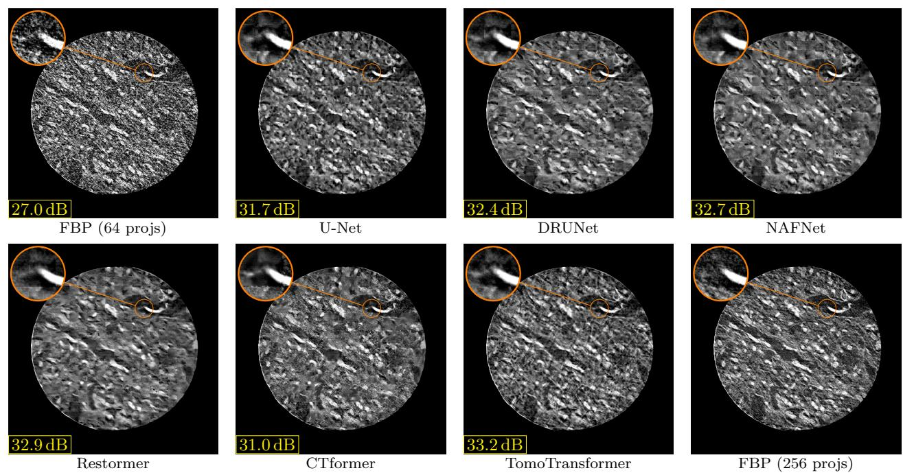  
Figure 7: Pre-trained single-purpose baselines of Section 5.2 applied to the real experimental brain projections (64→256). Each baseline was trained on one fixed geometry, reconstructing a 256-view FBP from 64 uniformly distributed views. However, the 617 real experimental projections are not uniformly spaced. TomoTransformer is trained on varied sparsity patterns and conditions on each token’s actual angle, and can conveniently handle this real scenario. The box in the bottom-left reports PSNR (dB) against the dense 256-view FBP of the same measurements.

Table 4: Zero-shot reconstruction on the real nanoscale brain pillar of Section 5.5, against the dense 512-view FBP of the same measurements (PSNR in dB / SSIM, averaged over all 448 axial slices). The pre-trained TomoTransformer receives the same 128 measured views in both rows and is applied with no fine-tuning; only the number of queried views difers.
<table><tr><td></td><td>FBP</td><td>TomoTransformer</td></tr><tr><td>Target</td><td>PSNR SSIM</td><td>PSNR SSIM</td></tr><tr><td>128→256</td><td>31.8 0.722</td><td>35.8 0.837</td></tr><tr><td>128→512</td><td>31.8 0.722</td><td>38.8 0.916</td></tr></table>

Table 5: Ablation studies on varied sparse-view reconstruction (64 →256): PSNR (dB) per dataset (against the dense 256-view reference). The two TomoTransformer variants are identical except for the geometric attention bias of Eq. (6). Best per column in bold.
<table><tr><td>Method</td><td>LoDoPaB</td><td>COVID-19</td><td>KiTS23</td><td>MSD-T10</td><td>COLONOG</td><td>HNSCC</td><td>FFHQ</td><td>ImageNet</td><td>Average</td></tr><tr><td>FBP (Kak and Slaney, 1988)</td><td>29.24</td><td>28.48</td><td>30.27</td><td>28.13</td><td>28.59</td><td>28.93</td><td>27.97</td><td>26.46</td><td>28.51</td></tr><tr><td>TomoTransformer (standard)</td><td>37.41</td><td>38.92</td><td>42.38</td><td>39.77</td><td>38.08</td><td>39.34</td><td>36.06</td><td>33.37</td><td>38.17</td></tr><tr><td>TomoTransformer (GAM)</td><td>37.47</td><td>39.05</td><td>42.68</td><td>40.02</td><td>38.18</td><td>39.61</td><td>36.11</td><td>33.42</td><td>38.32</td></tr></table>

$$
A _ { r r ^ { \prime } } ^ { ( h ) } = \frac { \langle \mathbf { q } _ { r } ^ { ( h ) } , \mathbf { k } _ { r ^ { \prime } } ^ { ( h ) } \rangle } { \sqrt { D _ { h } } } + \left[ g _ { \phi } ( \sin \Delta _ { r r ^ { \prime } } , \cos \Delta _ { r r ^ { \prime } } ) \right] _ { h } , \quad \quad \mathbf { a } _ { r } ^ { ( h ) } = \mathrm { s o f t m a x } _ { r ^ { \prime } } \big ( A _ { r r ^ { \prime } } ^ { ( h ) } \big ) ,\tag{6}
$$

where $\mathbf { q } _ { r } ^ { ( h ) }$ and $\mathbf { k } _ { r ^ { \prime } } ^ { ( h ) }$ denote the query and key projections of head $h , D _ { h } = D / H = 6 4$ is the per-head dimension, $\mathbf { a } _ { r } ^ { ( h ) }$ collects the resulting attention weights of token $^ { r , }$ and $g _ { \phi } : \mathbb { R } ^ { 2 }  \mathbb { R } ^ { H }$ is a lightweight two-layer GELU MLP $( \mathbb { R } ^ { 2 } \to \mathbb { R } ^ { 3 2 } \to \mathbb { R } ^ { H } )$ shared across all token pairs that outputs a scalar bias for each of the H attention heads. We initialize the final layer of $g _ { \phi }$ to zero so that training begins from standard dot-product attention. We call this the geometric attention mechanism (GAM), and our results show that this physics-informed attention mechanism slightly enhances reconstruction quality and convergence speed, see Tables 5 and 6.

## B Data simulation and training

In each training iteration, we sample a batch of 32 axial slices at their native resolutions from the dataset mixture described in Section 5.1. Each slice is normalized to a common intensity range and masked with a circular field-of-view mask. We compute parallel-beam 2D projections using the Operator Discretization Library (ODL) (Adler et al., 2017), setting the detector width to match the image dimension. The resulting sinogram is ramp-filtered and back-projected view by view to create the disentangled tensor stack $\left\{ \mathbf { b } _ { r } \right\}$ , from which input patches are cropped.

We evaluate two sparse-view sampling protocols. Under the fixed protocol (Section 5.2), full-view projections are placed on an equispaced grid of $R _ { \mathrm { t o t a l } } = 2 5 6$ angles over $[ 0 ^ { \circ } , 1 8 0 ^ { \circ } )$ . Taking every fourth view yields $R _ { \mathrm { s p a r s e } } = 6 4$ measured angles for the encoder, leaving the remaining 192 views as prediction targets. Under the varied protocol (Sections 5.3 and 5.5), we resample the full-view and sparse-view at every iteration: full-view projections are drawn uniformly from [128, 512], each angle is perturbed by i.i.d. Gaussian jitter of standard deviation $\sigma \delta ,$ where $\delta = \pi / R _ { \mathrm { t o t a l } }$ is the nominal angular spacing and $\sigma = 0 . 0 5$ , and the sparse projections are sampled almost uniformly with sparsity ratio ranging from [20%, 80%].

Table 6: Ablation studies on varied sparse-view reconstruction $( 6 4  2 5 6 )$ : SSIM per dataset (against the dense 256-view reference). Best per column in bold.
<table><tr><td>Method</td><td>LoDoPaB</td><td>COVID-19</td><td>KiTS23</td><td>MSD-T10</td><td>COLONOG</td><td>HNSCC</td><td>FFHQ</td><td>ImageNet</td><td>Average</td></tr><tr><td>FBP (Kak and Slaney, 1988)</td><td>0.635</td><td>0.654</td><td>0.662</td><td>0.554</td><td>0.610</td><td>0.395</td><td>0.631</td><td>0.598</td><td>0.592</td></tr><tr><td>TomoTransformer (standard)</td><td>0.906</td><td>0.940</td><td>0.963</td><td>0.935</td><td>0.907</td><td>0.917</td><td>0.907</td><td>0.871</td><td>0.918</td></tr><tr><td>TomoTransformer (GAM)</td><td>0.907</td><td>0.941</td><td>0.964</td><td>0.937</td><td>0.908</td><td>0.920</td><td>0.908</td><td>0.872</td><td>0.920</td></tr></table>

We extract 16 random patches per training step. The loss function is the $\ell _ { 1 }$ distance between predicted and ground-truth tokens, evaluated on unobserved target views:

$$
\mathcal { L } = \frac { 1 } { | \mathcal { Q } | } \sum _ { q \in \mathcal { Q } } \bigl \| \hat { \mathbf { t } } _ { q } - \mathbf { t } _ { q } \bigr \| _ { 1 } ,\tag{7}
$$

where Q denotes the set of target angles and $\mathbf { t } _ { q }$ is the ground-truth back-projection token generated from the dense sinogram. Models are trained using AdamW $( \beta _ { 1 } = 0 . 9 , \beta _ { 2 } = 0 . 9 5$ , weight decay 0.05) with a base learning rate of $3 \times 1 0 ^ { - 4 }$ decayed to zero via a cosine schedule, and gradients clipped at a norm of 1.0. Training runs for $1 0 ^ { 6 }$ iterations on a single NVIDIA A100 GPU.

## C Inference

At inference, we reconstruct an image of arbitrary size $N \times N$ by dividing it into $P \times P$ patches with a stride of P. Patches that extend past the image boundary are shifted inward to align with the edge, and any overlapping regions are simply averaged. For each patch, we insert the predicted tokens only at unobserved target positions, leaving measured views untouched to preserve exact data consistency. The final patch reconstruction is obtained by averaging across all $R _ { \mathrm { t o t a l } }$ tokens, as in (4). Because the network processes patches of a fixed size $( P \times P )$ , this pipeline is entirely independent of the image dimension N and detector resolution. This spatial flexibility is precisely what allows our model, trained on resolutions up to $5 1 2 \times 5 1 2$ , to run directly on the $7 6 8 \times 7 6 8$ nanoscale brain volume in Section 5.5 without any architectural changes.

## D Baselines

## D.1 Image-domain post-processing baselines

We compare against several established image-domain post-processing networks: U-Net (Jin et al., 2017), DRUNet (Zhang et al., 2021), NAFNet (Chen et al., 2022), Restormer (Zamir et al., 2022), and CTformer (Wang et al., 2023). These models are trained to map a sparse-view FBP patch to its dense-view counterpart. They share the exact same training data, ramp filter, and back-projection operator as TomoTransformer, difering only in the neural architecture used for enhancement. At test time, all baselines are applied patch-wise using the identical tiling, stride, and overlap-averaging scheme (Section C), making them resolution-independent.

Each baseline retains its original published design, with channel widths and block depths adjusted slightly to match ∼ 12.71 M parameters:

• U-Net (Ronneberger et al., 2015; Jin et al., 2017): A standard four-scale encoder–decoder using double $3 \times 3$ convolutions (BatchNorm, ReLU), max-pooling, and transposed-convolution upsampling. We adjust the base width to 40 channels (channel progression: $4 0 / 8 0 / 1 6 0 / 3 2 0 / 6 4 0 )$ ， yielding 12.13 M parameters.

• DRUNet (Zhang et al., 2021): The residual U-Net from DPIR featuring 4 scales, $n b = 4$ residual blocks per scale, strided-convolution downsampling, and transposed-convolution upsampling. Scaling channel widths to [40, 80, 160, 320] results in 12.76 M parameters.

• NAFNet (Chen et al., 2022): A three-scale U-shaped architecture built with NAFBlocks (SimpleGate and simplified channel attention, without activation functions) distributed as [2, 2, 2] encoder blocks, 2 middle blocks, and [2, 2, 2] decoder blocks. Using a base width of 80 with a global residual connection yields 11.77 M parameters.

• Restormer (Zamir et al., 2022): A four-scale encoder–decoder using MDTA/GDFN transformer blocks ([2, 2, 2, 2] blocks per scale, 2 refinement blocks, and [1, 2, 4, 8] heads). Setting the embedding dimension to 52 and the FFN expansion factor to 2.66 with a global residual connection gives 11.98 M parameters.

• CTformer (Wang et al., 2023): Utilizes a token-to-token (T2T) dilated performer tokenizer/detokenizer with 2 intermediate transformer blocks, 8 heads, and an MLP ratio of 2.0. To match capacity, we expand the original 1.6 M-parameter configuration (embedding dimension 64, depth 1) to an embedding dimension of 320 and token dimension of 160, yielding 10.72 M parameters. Following the original design, the network predicts a residual subtracted from the input.

All baselines are trained on $P \times P$ patches (P = 32), matching TomoTransformer’s token size, to ensure identical spatial context. The only exception is CTformer, whose public implementation hard-codes a 64 × 64 unfold/fold tokenizer grid. All baselines share TomoTransformer’s optimization recipe described in Section B: optimizer, learning rate, schedule, gradient clipping and iteration count. The objective necessarily difers: a post-processing network maps the sparse-view FBP patch to the dense-view FBP patch and is trained with an $\ell _ { 1 }$ loss in the image domain, whereas TomoTransformer is supervised per projection on the unobserved views only.

## D.2 ViewTrans baseline

ViewTrans (Chen et al., 2026) is a sinogram-domain baseline that treats each projection view (a full row of the sinogram across all detector bins) as an individual token. We reimplement the original architecture using its view-as-token sequence representation, a cascade of 5 pre-LayerNorm encoders starting with a geometry-aware self-attention (G-MSA) block, a pseudo-full-view input generated by linear view interpolation, a diferentiable FBP head, and an image-domain $\ell _ { 2 }$ loss. To adapt the baseline to our setup fairly, we make the following modifications:

• Parallel-beam geometry encoding. The G-MSA block constructs queries and keys by concatenating layer-normalized sinogram features with three geometry maps. Because parallelbeam geometry lacks a fan angle, we replace the original $\tan ( \gamma _ { i } )$ detector encoding with the normalized detector coordinate $t _ { i } \in [ - 1 , 1 ]$ matching our projection operator. The angular map $\cos ( \beta _ { j } )$ and the binary observed/interpolated indicator remain unchanged.

• Decoupling attention width from M. ViewTrans sets its token dimension equal to the detector width M, tying the architecture to a single resolution. We benchmark at LoDoPaB-CT’s native resolution $( M = 3 6 2 )$ , which is not divisible by the attention head count. To resolve this, we decouple the inner attention dimension $H \cdot d$ from M and project features back to $\mathbb { R } ^ { M }$ for the residual skip connection. Using the original head counts (4 for G-MSA, 8 for standard blocks), a head dimension of 128, and an MLP ratio of 4.0, the model contains 13.06 M parameters, closely matching TomoTransformer’s 12.71 M.

• Shared reconstruction operator. We build the diferentiable FBP head using the exact same ramp filter and back-projection operator as TomoTransformer, supervising predictions against dense-view FBPs generated by this operator. This ensures both models operate within an identical reconstruction domain.

• Training schedule. Because our training runs are longer than those in the original paper, we replace the StepLR schedule with a cosine decay to zero. We train using Adam at a learning rate of $5 \times 1 0 ^ { - 4 }$ , gradient clipping at 1.0, and 8 slices per gradient step for $1 0 ^ { 6 }$ iterations, matching TomoTransformer’s training length.

ViewTrans is trained on LoDoPaB-CT under the same dynamic sparse-view schedule as TomoTransformer, ensuring an identical experimental comparison.