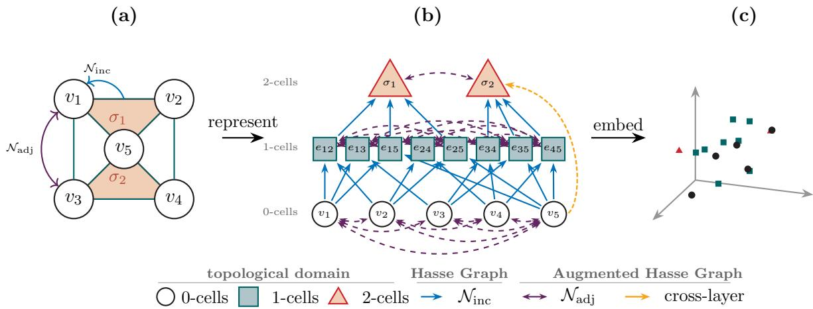
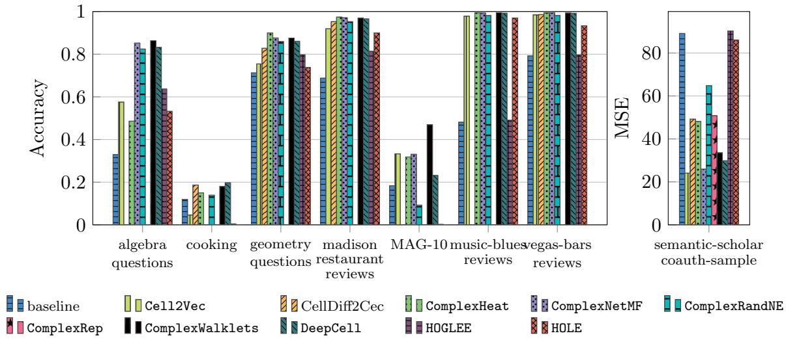

# TopoEmbedX: A General Framework for Representation Learning on Topological Domains

Florian Frantzen1 Ibrahem AlJabea2 Ines Henriques-Cadby3 Theodore Papamarkou4,5 Mustafa Hajij6 Michael T. Schaub1

1RWTH Aachen University 3The University of Manchester 5PolyShape

2Louisiana State University 4National Technical University of Athens 6University of San Francisco

## Abstract

Topological structures such as simplicial complexes, hypergraphs, and cell complexes extend standard graph models by modeling higher-order relationships. These structures appear in many modern datasets and require specialized methods for generating meaningful embeddings. In this paper, we introduce TopoEmbedX, a unified framework for embedding a wide range of topological domains into Euclidean spaces. The package brings together several existing topological embedding algorithms—DeepCell, Cell2Vec, CellDiff2Vec, HOLE, and HOGLEE—and introduces five new algorithms: ComplexNetMF, ComplexRep, ComplexRandNE, ComplexWalklets, and ComplexHeat. These algorithms extend well-known graph embedding techniques to higher-order settings using the augmented Hasse graph of a topological domain. TopoEmbedX provides a clear, consistent, and easy-to-use framework for topological representation learning. Experiments show that the embeddings generated by TopoEmbedX support tasks such as classification and regression across multidimensional data.

## 1. Introduction

Graph-based network models have become a cornerstone of modern data analysis, efectively capturing relationships between entities across a wide range of domains, including biological and chemical structures [23, 31, 46], social systems [19], communication networks [1, 40], and transportation infrastructure [2]. These models support complex analytical tasks such as epidemic modeling [20], link-based ranking [26], and path finding [24]. To accommodate richer structures, researchers have extended basic network models with node and edge attributes (weights, labels, timestamps), to study heterogeneous networks [47], and dynamic properties [32]. Real-world systems also frequently exhibit multi-entity interactions that are not always well represented by the binary paradigm ofered by graphs [5, 13, 43]. Higher-order networks address this limitation by generalizing beyond pairwise connectivity.

Representation learning ofers a principled approach to encoding network structure into fixedlength vector embeddings, enabling downstream tasks such as node classification and link prediction. Early work by Rossi et al. [33] demonstrated the value of incorporating motifs into learned embeddings, and subsequent methods further leveraged supernodes and random walks to preserve higher-order structural similarity [39]. Despite these advances, existing approaches remain largely confined to graph-based representations. Systematic methods for embedding higherorder networks across all topological dimensions remain underdeveloped [12, 44]. Topological Representation Learning (TRL) addresses this challenge by learning embeddings of topological domains in Euclidean space while preserving their intrinsic structural relationships. TRL has demonstrated strong results in graph representation learning [11, 25, 42], with successful applications spanning node classification, whole-graph classification, link prediction, and similarity analysis. Recent work has extended TRL to richer topological domains—including simplicial complexes, hypergraphs, and cell complexes—enabling the joint embedding of cells across multiple dimensions [16]. TRL methods have further been applied to image segmentation [15, 22], shape generation [45], cell embeddings via random walks [8, 36], and persistent homology regularization [10]. Nevertheless, a general-purpose tool capable of systematically embedding arbitrary topological domains across all dimensional levels remains absent from the literature.

In this paper, we address this gap by extending the TopoX framework [18], which includes a preliminary variant of TopoEmbedX consisting primarily of five existing topological embedding algorithms. The present work substantially extends that preliminary version and establishes TopoEmbedX as a standalone framework for topological embedding. To this end, we introduce and implement five new topological embedding algorithms and develop a unified, open-source framework that generalizes classical graph embedding algorithms to higher-order topological domains—including simplicial complexes, hypergraphs, cell complexes, and combinatorial complexes (CCs). TopoEmbedX thus enables systematic, multidimensional topological representation learning with consistent notation, user-friendly descriptions, and comprehensive experimental validation, extending the graph embedding paradigm to a broad class of topological domains. In this paper, an embedding algorithm takes a (finite) topological domain together with modeling choices such as neighborhood operators, embedding dimension, and method-specific parameters, and returns vector representations for the selected cells. TopoEmbedX realizes this workflow by constructing an augmented Hasse graph whose nodes are cells and whose edges encode the neighborhood relations used by the chosen graph embedding backend.

## Contributions. We present the following contributions in this paper:

1. Formalization and generalization of topological representation learning. We formalize the problem of representation learning on topological domains and systematically extend classical graph embedding techniques—including random walks, difusion processes, heat kernels, randomized projections, and matrix factorization—to higher-order topological structures. This generalization is grounded in the Hasse graph, which serves as a principled and unified structural description of higher-order models across all topological dimensions.

2. A unified algorithmic framework integrating established and novel techniques. We implement five existing embedding algorithms (DeepCell, Cell2Vec, CellDiff2Vec, HOLE, HOGLEE) and introduce five novel algorithms (ComplexNetMF, ComplexRep, ComplexRandNE, ComplexWalklets, ComplexHeat), each generalizing a well-established graph embedding technique to topological domains via Hasse-based incidence operators. These ten algo rithms form a coherent, extensible, and theoretically grounded algorithmic foundation for topological representation learning.

3. Open-source software with comprehensive experimental validation. We release TopoEmbedX as an open-source Python package featuring eficient data structures and a clean, welldocumented API designed for accessibility and extensibility. The framework is rigorously evaluated through experiments on multidimensional topological datasets, benchmarking performance across two supervised edge-level tasks: edge classification and edge regression.

Paper structure. The remainder of this paper is organized as follows. Section 2 introduces topological domains and the neighborhood operators used throughout the paper. Section 3 develops the notion of a Hasse graph and the augmented Hasse graph, which provide the structural backbone for our generalization strategy. Section 4 formulates higher-order representation learning and explains how it reduces to graph representation learning on augmented Hasse graphs. Section 5 then presents TopoEmbedX and its algorithmic components. Section 6 summarizes the experimental protocol and evaluation tasks. Finally, Section 7 concludes by outlining directions for future work.

## 2. Overview of Topological Domains

Representation learning on higher-order data requires domains that can encode more than pairwise relations. Hypergraphs naturally model set-valued interactions, while simplicial and cell complexes encode hierarchical incidence relations between cells of diferent dimensions. CCs [17] provide a common abstraction that can represent both types of structures: arbitrary set-valued cells together with a rank function that is compatible with inclusion.

In this paper, we use the term topological domain to refer to the input object on which the embedding algorithms in TopoEmbedX are defined. This object is modeled as a $\mathrm { C C ~ } [ 1 7 ]$ : a ranked collection of cells equipped with an inclusion relation. This terminology is intentional. The phrase topological domain emphasizes the algorithmic role of the input as a general domain for representation learning, while the CC provides the precise mathematical model. This choice allows TopoEmbedX to treat embedding algorithms independently of the specific input type, whether the data are given as a graph, simplicial complex, hypergraph, cell complex, or CC.

Definition 1 (Topological domain). A topological domain D is a CC defined by a triple $( \nu , \mathcal { X } , \mathrm { r k } )$ , where

1. V is a finite nonempty set of vertices;

2. ${ \mathcal { X } } \subseteq { \mathcal { P } } ( \gamma ) \backslash \{ \emptyset \}$ is a finite collection of nonempty subsets of V such that $\{ v \} \in \mathcal { X }$ for every $v \in \mathcal { V } ,$

3. rk : $\mathcal { X } \to \mathbb { Z } _ { > 0 }$ is a rank function satisfying rk({v}) = 0 for every $v \in \mathcal V$ , and given x, $y \in { \mathcal { X } }$ $\operatorname { r k } ( x ) \leq \operatorname { r k } ( y )$ , whenever $x \subseteq y$

For ease of notation, we write D simply as $\mathcal { X } .$ . Each element $x \in \mathcal { X }$ is said to have rank rk(x), and X is said to have dimension dim $( { \mathcal X } ) = \mathrm { m a x } _ { x \in { \mathcal X } } \mathrm { r k } ( x )$ . We refer to elements of X as cells, and those of rank $k ,$ as k-cells, with $\mathcal { X } ^ { k }$ denoting the set of all k-cells $( \mathrm { i . e . ~ } \ \mathcal { X } ^ { k } = \mathrm { r k ^ { - 1 } } ( k ) \ )$ . A cell $x \in \mathcal { X }$ is said to be a face of $y \in { \mathcal { X } }$ , and y a coface of $x ,$ whenever x $\subsetneq y$ . Finally, we recall the cover relation. A cell x is said to be a lower cover of a cell y , and y an upper cover of $x ,$ denoted $x \prec y$ , if $x \subsetneq y$ and there exists no cell $z \in \mathcal { X }$ such that $x \subsetneq z \subsetneq y$

The definition of topological domain in Definition 1 provides a unified framework encompassing graphs, simplicial complexes, hypergraphs, and cell complexes as special cases. In a graph, vertices and edges are assigned ranks 0 and 1 respectively. In a simplicial complex, every simplex σ satisfies rk $\mathbf { \rho } : ( \sigma ) = | \sigma | - 1$ , and the downward-closure property ensures that all faces of every simplex are present. In a hypergraph, hyperedges are arbitrary nonempty subsets of vertices, with rank assignments that respect the rank–the inclusion relation of Definition 1, but without requiring downward closure. In a cell complex, each cell carries an explicit dimension that coincides with its rank, and the boundary structure of cells is encoded by the rank–inclusion relation, recovering the standard notion of a CW complex. The framework therefore captures both hierarchical inclusion relations and general set-based interactions [17].

## 2.1. Neighborhood Structures

A fundamental component in topological representation learning is the notion of neighborhoods, which formalize local interactions within the topological domain X.

Definition 2 (Neighborhood Function). A neighborhood function on X is a map $\mathcal { N } \colon \mathcal { X } \ $ $\mathcal { P } ( \mathcal { X } )$ , which assigns to each cell x in X a collection of neighbor cells ${ \mathcal { N } } ( x ) \subseteq { \mathcal { X } }$ , referred to as the neighborhood $o f x$

This formalism is essential for defining and analyzing local dependencies, particularly in machine learning models that exploit hierarchical and relational structures. To illustrate it, we introduce incidence neighborhoods and two commonly used same-rank neighborhood functions.

Given a cell $x \in \mathcal { X }$ , its incidence neighborhood is defined as

$$
\mathcal { N } _ { \mathrm { i n c } } ( x ) = \{ y \in \mathcal { X } \mid y \prec x \} ,\tag{1}
$$

which consists of the lower covers of x.

The adjacency neighborhood of a cell $x \in \mathcal { X } ^ { k }$ is defined by

$$
{ \mathcal { N } } _ { \mathrm { a d j } } ( x ) = \left\{ y \in { \mathcal { X } } ^ { k } \setminus \left\{ x \right\} \mid x \prec z { \mathrm { ~ a n d ~ } } y \prec z { \mathrm { , ~ f o r ~ s o m e ~ } } z \in { \mathcal { X } } \right\} ,\tag{2}
$$

thereby capturing cells that share a common coface.

The co-adjacency neighborhood of a cell $x \in \mathcal { X } ^ { k }$ is defined by

$$
{ \mathcal { N } } _ { \mathrm { c o a d j } } ( x ) = \left\{ y \in \mathcal { X } ^ { k } \setminus \{ x \} \mid z \prec x { \mathrm { ~ a n d ~ } } z \prec y , { \mathrm { ~ f o r ~ s o m e ~ } } z \in \mathcal { X } \right\} ,\tag{3}
$$

thereby capturing cells that share a common face.

For example, two edges contained in a common 2-cell are adjacent, whereas two edges sharing a vertex are co-adjacent. Ordinary graph adjacency between vertices is therefore recovered as a rank-0 adjacency relation in this convention $( k = 0 )$

In practice, neighborhood functions are stored via sparse matrices called neighborhood matrices.

Definition 3 (Neighborhood Matrix). Let N be a neighborhood function on a topological domain $x ,$ and $\mathcal { Y } = \{ y _ { 1 } , \hdots , y _ { n } \} , \mathcal { Z } = \{ z _ { 1 } , \hdots , z _ { m } \} \subseteq \mathcal { X }$ be two collections of cells satisfying $\mathcal { N } ( \mathcal { V } ) \subseteq \mathcal { Z }$ The neighborhood matrix associated with $\mathcal { N } \vert _ { \mathcal { y } }$ is defined as the $m \times n$ matrix whose entries are

$$
[ \pmb { N } ] _ { i j } = \left\{ \begin{array} { l l } { 1 } & { i f z _ { i } \in \mathcal { N } ( y _ { j } ) , } \\ { 0 } & { o t h e r w i s e . } \end{array} \right. f o r i = 1 , \ldots , m , j = 1 , \ldots , n\tag{4}
$$

For incidence neighborhoods the matrix is rectangular, reflecting the cross-rank nature of the relation. For adjacency neighborhoods, the matrix is square (same-rank), and is symmetric if the adjacency relation is symmetric. The classical graph adjacency matrix and incidence matrix are both special cases of neighborhood matrices when X is a graph. These matrices encode the local neighborhood relationships between cells, generalizing both the adjacency matrix and the incidence matrix of a graph to topological domains of arbitrary dimension. In practice, the rich structure of a topological domain, with its multiple ranks and both incidence and adjacency relations, means that a collection of neighborhood functions $\mathsf { N } = \{ \mathcal { N } _ { 1 } , \ldots , \mathcal { N } _ { k } \}$ is needed simultaneously to fully describe the local environment of a cell.

## 3. Augmented Hasse Graph of a Topological Domain

In this section, we introduce the notion of an augmented Hasse graph, an extension of the classical Hasse graph that incorporates additional neighborhood relationships between cells beyond standard incidence, enabling topological domains to be processed by graph-based embedding methods as defined in section Section 4. We revisit the concept of a Hasse graph and extend it to that of an augmented Hasse graph. The latter represents a topological domain as a graph, enabling the use of graph-based techniques for representation learning. A key conceptual distinction exists between the two graph structures associated with a topological domain: the canonical Hasse graph depends only on the incidence relations of the domain and requires no additional choices, whereas the augmented Hasse graph additionally incorporates neighborhood relationships chosen for a the specific representation learning task, and is therefore model-dependent.

Role in TopoEmbedX In TopoEmbedX, the augmented Hasse graph serves as the core representation. A topological domain X equipped with a neighborhood collection N is mapped to the derived augmented Hasse graph $\mathcal { H } _ { \mathcal { X } } ( \mathsf { N } )$ , after which a standard graph embedding algorithm is applied. The node–cell correspondence between $\mathcal { H } _ { \mathcal { X } } ( \mathsf { N } )$ and X then yields embeddings for the original topological domain without loss of cell identity. This reduction is principled, as it preserves all relations encoded by N, and modular, as changing the graph embedding algorithm induces a diferent topological embedding method while leaving the reduction stage unchanged. This design yields the unified and extensible framework described in Section 5.

## 3.1. Hasse Graph of a Topological Domain

Let X be a topological domain. Because each cell $x \in \mathcal { X }$ is a nonempty subset of the vertex set $\nu ,$ set inclusion induces a partial order on X . Hence, $( \mathcal { X } , \subseteq )$ is a finite poset, which we call the containment poset. The Hasse graph encodes the inclusion relations of this containment poset as follows.

Definition 4 (Hasse Graph). Let X be a topological domain equipped with the inclusion poset. The Hasse graph $\mathcal { H } _ { \mathcal { X } }$ is the directed graph with node set $\mathcal { V } ( \mathcal { H } _ { \mathcal { X } } ) = \mathcal { X }$ and a directed edge from x to y if and only if $\mathit { \Psi } : \mathit { x } \prec \mathit { y }$

The Hasse graph is canonical in that it depends only on the containment structure of X and requires no additional modeling choices. Its directed edges encode cover relations between cells. In particular, the full containment order on X is recoverable from the Hasse graph: $x \subseteq y$ if and only if there exists a directed path from x to y in $\mathcal { H } _ { \mathcal { X } } .$ , so no inclusion information is lost in passing from the poset to its Hasse graph.

An important special case occurs when the poset admits a graded structure, i.e., when there exists a rank function rk: $\mathcal X  \mathbb Z _ { \ge 0 }$ such that $\mathrm { r k } ( y ) = \mathrm { r k } ( x ) + 1$ for every cover relation $x \prec y .$ . This property holds for simplicial complexes, where rk $\mathbf { \sigma } : ( \sigma ) = | \sigma | - 1$ , and for regular cell complexes, where rank coincides with cell dimension. Since the Hasse graph contains exactly the cover relations of the containment poset, the graded structure induces a layered decomposition by rank, with every edge connecting a cell of rank k to one of rank $k + 1$ . This makes the Hasse graph a natural computational representation for simplicial and regular cell complexes.

Why Go Beyond the Hasse Graph? The Hasse graph provides a complete representation of the containment structure of a topological domain, since the full containment order can be recovered from directed paths in $\mathcal { H } _ { \mathcal { X } }$ . Although augmentation is not necessary to represent the domain itself, embedding algorithms typically operate on an explicit computational graph, whose edges determine random-walk transitions, message-passing neighborhoods, difusion pathways, and spectral operators. Many relations relevant to an embedding task are computable from the Hasse graph, yet they do not appear as explicit edges. For example, two edges in a simplicial complex that share a vertex are co-adjacent; this relation arises naturally in the modeling of signal flow and physical connectivity [3, 4, 21, 37, 38], yet this relation is encoded only indirectly, through their shared lower-rank face. Making such relations explicit modifies the inductive bias of the resulting embedding method: it can shorten relevant paths, alter transition probabilities, and determine which cells exchange information in a message-passing layer. We refer to these algorithm- or task-specific choices as task-specific neighborhood structure. This motivates the augmented Hasse graph, which preserves the canonical Hasse graph while admitting additional, task-specific neighborhood relations as explicit edges.

  
Figure 1: Example of a topological representation learning algorithm that embeds a topological domain into a three-dimensional vector space. (a) Topological domain X . (b) Augmented Hasse graph $\mathcal { H } _ { \mathcal { X } } ( \mathsf { N } )$ with cover edges, same-rank edges induced by $\mathcal { N } _ { \mathrm { a d j } }$ , and an example of a cross-layer edge between 0-cells and 2-cells. (c) Embedding space $\mathbb { R } ^ { 3 }$

## 3.2. Augmented Hasse Graph

The augmented Hasse graph extends the classical Hasse graph by incorporating additional intercell relationships induced by a chosen collection of neighborhood functions. These added edges encode interactions that may be relevant to a given learning task but are not represented as single edges in the canonical Hasse graph. Examples include adjacency through shared cofaces, co-adjacency through shared lower covers, and higher-order proximity relations.

Let X be a topological domain with Hasse graph $\mathcal { H } _ { \mathcal { X } }$ , and let $\mathsf { N } = \{ { \mathcal { N } } _ { 1 } , \ldots , { \mathcal { N } } _ { n } \}$ be a collection of neighborhood functions on X in the sense of Section 2.1. We say that an augmented edge from y to x is induced by N if there exists some $\mathcal { N } _ { i } \in \mathbb { N }$ such that $y \in \mathcal { N } _ { i } ( x )$ . With this convention, ${ \mathcal { N } } _ { \mathrm { i n c } } ( x )$ lists lower covers of x, while the corresponding directed edges point upward from those lower covers to x, matching the orientation of the canonical Hasse graph.

Definition 5 (Augmented Hasse Graph). Let X be a topological domain, and let $\mathsf { N } = \{ { \mathcal { N } } _ { 1 } , \ldots , { \mathcal { N } } _ { n } \}$ be a collection of neighborhood functions on X. The augmented Hasse graph of X with respect to N is the directed graph with node set $\mathcal { V } ( \mathcal { H } _ { \mathcal { X } } ( \mathsf { N } ) ) = \mathcal { X }$ and edge set

$$
\mathcal { E } ( \mathcal { H } _ { \mathcal { X } } ( \mathsf { N } ) ) = \mathcal { E } ( \mathcal { H } _ { \mathcal { X } } ) \cup \mathcal { E } _ { \mathsf { N } } ,\tag{5}
$$

where

$$
\mathcal { E } _ { \mathsf { N } } = \{ ( y , x ) \in \mathcal { X } \times \mathcal { X } \mid x \neq y , \exists \mathcal { N } _ { i } \in \mathsf { N } \ s u c h \ t h a t \ y \in \mathcal { N } _ { i } ( x ) \} .\tag{6}
$$

Note that the non-augmented edges in $\mathcal { E } ( \mathcal { H } _ { \mathcal { X } } ( \mathsf { N } ) )$ are precisely the directed cover-relation edges inherited from the Hasse graph. To keep the terminology unambiguous, we reserve the term augmented edge for an edge induced by N that is not already present in $\mathcal { E } ( \mathcal { H } _ { \mathcal { X } } )$ . Several remarks are in order regarding both the conceptual status and the practical utility of this construction.

Non-canonicity Unlike the classical Hasse graph, the augmented Hasse graph is not canonical. It depends on the neighborhood collection N, whose specification is a modeling choice determined by the representation-learning task at hand. Accordingly, diferent choices of N induce diferent augmented Hasse graphs on the same underlying topological domain. This dependence allows $\mathcal { H } _ { \mathcal { X } } ( \mathsf { N } )$ to be tailored to the relations most relevant to a given task, including adjacency, coadjacency, higher-order incidence, or combinations thereof. In TopoEmbedX, the choice of N is made by the user in the API of the embedding algorithm, each of which selects the neighborhood operators appropriate to its underlying graph embedding technique.

Construction From a computational perspective, the augmented Hasse graph is obtained by starting with the canonical Hasse graph and adding the non-canonical membership relations induced by the neighborhood functions in N. In implementations, each function $\mathcal { N } _ { i } \in \mathbb { N }$ can be represented by its associated sparse neighborhood matrix $N _ { i }$ . Thus, $\mathcal { H } _ { \mathcal { X } } ( \mathsf { N } )$ can be assembled eficiently by taking the union of the canonical Hasse edges with the sparse supports of these neighborhood matrices.

Recovering the classical Hasse graph The classical Hasse graph is recovered as the special case in which N is empty and no augmented edges are added. More generally, $\mathcal { H } _ { \mathcal { X } }$ is always a subgraph of $\mathcal { H } _ { \mathcal { X } } ( \mathsf { N } )$ : the augmentation can add edges but cannot remove existing ones. Hence, the cover relations of the containment poset remain present in the augmented Hasse graph for any admissible choice of N.

Scope of augmentation The neighborhood collection N may encode a broad class of relations. For example, adjacency functions can relate distinct rank-k cells that are faces of a common coface, thereby inducing horizontal edges within rank layers. Co-adjacency functions induce edges between cells sharing a lower-dimensional face, and multi-hop incidence functions extend connectivity beyond immediate rank transitions. In principle, any neighborhood function in the sense of Section 2.1 can induce edges in the augmented Hasse graph, which renders the construction general.

Illustrative example Consider a simplicial complex X representing a two-dimensional surface, comprising 0-cells (vertices), 1-cells (edges), and 2-cells (triangles). The Hasse graph $\mathcal { H } _ { \mathcal { X } }$ contains only directed edges from vertices to incident edges and from edges to incident triangles. Suppose, however, that we augment this structure with the co-adjacency function on 1-cells, which relates pairs of edges sharing a common vertex, and with the adjacency function on 0-cells, which relates pairs of vertices connected by a common edge. The resulting augmented Hasse graph $\mathcal { H } _ { \mathcal { X } } ( \mathsf { N } )$ then contains additional horizontal edges between co-adjacent edges and between adjacent vertices. These same-rank relations are not directly represented in the canonical Hasse graph, yet they may be essential for embedding techniques that rely on local structural similarity within a rank. If one further includes proximity-based neighborhoods, for example by declaring two vertices to be neighbors whenever their Euclidean distance is below a threshold, the augmented Hasse graph also incorporates geometric information, thereby yielding a richer representation of the domain.

## 4. Higher-order Representation Learning

Graph representation learning aims to map vertices, edges, or subgraphs to vectors in Euclidean space while preserving key structural properties of the graph. Higher-order representation learning [7, 16] extends this principle to the topological setting by seeking embeddings of the cells of a topological domain that retain the domain’s fundamental structural relationships in the resulting representation.

The augmented Hasse graph serves as the principal mechanism linking topological domains to classical graph-based embedding techniques. Once a topological domain is represented as a graph whose vertices are cells and whose edges encode incidence together with selected neighborhood relations, standard graph embedding techniques can be applied in the higher-order setting. Moreover, the correspondence between augmented Hasse graphs and CCs, established in Hajij et al. [17, Theorem 8.4], shows that graph-based deep learning constructions admit a natural generalization to the combinatorial setting. Accordingly, we treat the augmented Hasse graph as the primary reduction device and interpret higher-order representation learning as graph representation learning performed on a structured graph derived from the original topological domain.

Single-rank formulation. Given a complex $\mathcal { X }$ and a fixed rank $k ,$ the representation learning task amounts to learning an encoder–decoder pair (enc, dec), where the encoder map enc : $\mathcal { X } ^ { k } $ $\mathbb { R } ^ { d }$ assigns to each k-cell $x ^ { k } \in \mathcal { X } ^ { k }$ a vector representation that encodes its structural role relative to the remaining cells of $\mathcal { X } .$ , and the decoder map dec : $\mathbb { R } ^ { d } \times \mathbb { R } ^ { d } \to \mathbb { R }$ assigns to each pair of cell embeddings a scalar measuring their degree of relatedness. These components are optimized with respect to a task-specific similarity measure sim : $\mathcal { X } ^ { k } \times \mathcal { X } ^ { k }  \mathbb { R }$ by minimizing

$$
\mathcal { L } _ { k } = \sum _ { x ^ { k } \in \mathcal { X } ^ { k } } \sum _ { y ^ { k } \in \mathcal { X } ^ { k } } \ell \Bigl ( \operatorname* { d e c } ( \operatorname { e n c } ( x ^ { k } ) , \operatorname { e n c } ( y ^ { k } ) ) , \sin ( x ^ { k } , y ^ { k } ) \Bigr ) ,\tag{7}
$$

where $\ell \colon \mathbb { R } \times \mathbb { R }  \mathbb { R }$ is a prescribed loss function. This formulation makes explicit that the learned representation should preserve the similarity notion induced by the chosen neighborhood, difusion, spectral, or structural operator. As established in Hajij et al. [17], higher-order representation learning can be reduced to graph representation learning.

Multi-rank formulation. The single-rank objective in Eq. (7) captures structural relationships among cells of a fixed dimension $k ,$ but it does not explicitly model the cross-rank dependencies that are characteristic of a topological domain. In many settings, the structural role of a $k -$ cell is determined not only by its relations to other k-cells, but also by the (k − 1)-cells on its boundary, the (k+1)-cells to which it belongs, and, more generally, its position within the entire hierarchical structure of X . Accounting for this multi-level context therefore requires extending the representation learning objective to operate on tuples of cells drawn from multiple ranks simultaneously.

Let $\mathbf { k } = ( k _ { 1 } , \dots , k _ { m } )$ be a tuple of ranks, not necessarily distinct, with $0 \leq k _ { i } \leq \dim ( \mathcal { X } )$ for each i. For each rank $k _ { i }$ , let enci : $\mathcal { X } ^ { k _ { i } }  \mathbb { R } ^ { d _ { i } }$ be an encoder that maps ki-cells to a di-dimensional Euclidean space. The multi-rank decoder

$$
\operatorname* { d e c } \colon \mathbb { R } ^ { d _ { 1 } } \times \cdot \cdot \cdot \times \mathbb { R } ^ { d _ { m } } \to \mathbb { R }\tag{8}
$$

takes a tuple of cell embeddings drawn from potentially diferent ranks and returns a scalar quantifying their joint structural relatedness. The corresponding multi-rank similarity measure

$$
\sin : \mathcal { X } ^ { k _ { 1 } } \times \cdots \times \mathcal { X } ^ { k _ { m } }  \mathbb { R }\tag{9}
$$

assigns to each m-tuple of cells $( x ^ { k _ { 1 } } , \ldots , x ^ { k _ { m } } )$ a scalar reflecting the extent to which those cells are structurally related across all m rank levels. The multi-rank representation learning objective is then

$$
\mathcal { L } _ { \mathbf { k } } = \sum _ { x ^ { k _ { 1 } } \in \mathcal { X } ^ { k _ { 1 } } } \cdots \sum _ { x ^ { k _ { m } } \in \mathcal { X } ^ { k _ { m } } } \ell \Big ( \mathrm { d e c } \Big ( \mathrm { e n c } _ { 1 } ( x ^ { k _ { 1 } } ) , \dots , \mathrm { e n c } _ { m } ( x ^ { k _ { m } } ) \Big ) , \sin ( x ^ { k _ { 1 } } , \dots , x ^ { k _ { m } } ) \Big ) .\tag{10}
$$

This objective generalizes Eq. (7) directly: setting $m \ : = \ : 2$ and $k _ { 1 } = k _ { 2 } = k$ recovers the single-rank pairwise objective. The extension to m $> ~ 2 ~ \mathrm { o r }$ to tuples with $k _ { i } \neq k _ { j }$ is both natural and computationally coherent, since the algebraic structure of the objective—summing over tuples, evaluating the decoder, comparing against similarity, and accumulating the loss— remains unchanged.

Multi-rank similarity via the augmented Hasse graph. The central modeling question is how to define sim $( x ^ { k _ { 1 } } , \ldots , x ^ { k _ { m } } )$ . The augmented Hasse graph $\mathcal { H } _ { \mathcal { X } } ( \mathsf { N } )$ ofers a natural answer. Given a neighborhood collection N, the augmented Hasse graph encodes all pairwise relationships between cells of the ranks deemed relevant for the task. For the symmetric proximity convention used by the multi-rank embedding algorithms below, let $A ^ { \mathrm { s y m } }$ be the adjacency matrix of $\mathcal { H } _ { \mathcal { X } } ^ { \mathrm { s y m } } ( \mathsf { N } )$ , let D be its degree matrix, and set $\pmb { P } = \pmb { D } ^ { - 1 } \pmb { A } ^ { \mathrm { s y m } }$ . Thus, P is the row-normalized transition matrix of a random walk on the symmetrized augmented Hasse graph. The t-step transition matrix $P ^ { t }$ thereby induces a family of pairwise similarity measures, where $[ \left. P ^ { t } \right] _ { x , y }$ denotes the probability of reaching cell y from cell x in t steps while traversing cells of all intermediate ranks along the way. For the multi-rank objective in Eq. (10), one natural choice is

$$
\sin ( x ^ { k _ { 1 } } , \dots , x ^ { k _ { m } } ) = \prod _ { i = 1 } ^ { m - 1 } [ { \pmb P } ^ { t _ { i } } ] _ { x ^ { k _ { i } } , x ^ { k _ { i + 1 } } } ,\tag{11}
$$

which measures the probability of traversing the chain $x ^ { k _ { 1 } } \to x ^ { k _ { 2 } } \to \cdot \cdot \cdot \to x ^ { k _ { m } }$ through $\mathcal { H } _ { \mathcal { X } } ^ { \mathrm { s y m } } ( \mathsf { N } )$ via a sequence of walks of lengths $t _ { 1 } , \ldots , t _ { m - 1 }$ , respectively. This chain similarity is large when the cells are mutually reachable by short paths in $\mathcal { H } _ { \mathcal { X } } ^ { \mathrm { s y m } } ( \mathsf { N } )$ , and it decreases as the cells become structurally more distant within the hierarchical organization of X . Other aggregations are also possible: one may replace the product with a minimum, a sum, or a learned aggregation, depending on whether the tuple similarity should emphasize the weakest link, cumulative proximity, or a task-adaptive combination of the pairwise similarities.

Relationship to the single-rank case and to the augmented Hasse graph reduction. The multi-rank objective in Eq. (10) is computationally analogous to the single-rank case, and it admits the same reduction to graph representation learning via the augmented Hasse graph. In particular, because all cells of X—independently of rank—appear as nodes in $\mathcal { H } _ { \mathcal { X } } ( \mathsf { N } )$ , any graph embedding method applied to $\mathcal { H } _ { \mathcal { X } } ( \mathsf { N } )$ yields embeddings for cells of all ranks simultaneously. The multi-rank loss in Eq. (10) can therefore be evaluated directly using these joint embeddings, without any alteration to the underlying graph embedding algorithm. A practical advantage of the augmented Hasse graph reduction is that it embeds all ranks in one Euclidean space using a single graph, so within-rank and cross-rank relations are learned jointly. The runtime still depends on the size and sparsity of the derived graph.

In this sense, the augmented Hasse graph does not merely reduce topological representation learning to graph representation learning at a single rank; rather, it reduces the full multi-rank problem to a single graph embedding problem on a structured heterogeneous graph, in which heterogeneity of node type—encoded by rank labels—is reflected in the edge structure of $\mathcal { H } _ { \mathcal { X } } ( \mathsf { N } )$ and, consequently, in the geometry of the learned embedding space. The algorithms described in Section 5 use this reduction at two levels of granularity. Some methods first select a rank and a neighborhood relation, thereby embedding the corresponding same-rank graph induced by the augmented Hasse construction. Other methods operate directly on an augmented Hasse graph containing cells from several ranks and therefore learn joint multi-rank embeddings. All cases use graph representation learning as the computational backend; they difer in whether the learned representation is rank-restricted or multi-rank at the cell level.

## 5. Overview of TopoEmbedX

TopoEmbedX1 provides a software framework for higher-order representation learning across simplicial complexes, hypergraphs, cell complexes, and CCs. The core computational principle underlying TopoEmbedX is the theoretical reduction of higher-order representation learning to graph representation learning, as described in the previous section. To achieve this, TopoEmbedX transforms a given higher-order domain into its corresponding augmented Hasse graph and then applies established graph representation learning algorithms to compute embeddings for its cells. The structural correspondence between the selected augmented Hasse subgraph and the original higher-order domain then directly yields well-defined embeddings for the cells represented in that subgraph. Since the augmented Hasse graph is directed, symmetrization is performed at the embedding stage when an undirected input is required, by replacing each directed edge with an undirected edge. We write $\mathcal { H } _ { \mathcal { X } } ^ { \mathrm { s y m } } ( \mathsf { N } )$ for this symmetrized augmented Hasse graph. TopoEmbedX exposes a unified API that provides a consistent, interoperable interface across all topological domains supported by TopoNetX, promoting modularity, extensibility, and reproducibility in higher-order machine learning research.

TopoEmbedX extends the karateclub library [35], which provides analogous embedding functionality for graphs, and works in tandem with it to ofer powerful tools for embedding topological data while preserving the structural properties of the underlying topological domains. The algorithms implemented in TopoEmbedX can be grouped into two complementary families. Rank-restricted algorithms, such as DeepCell, Cell2Vec, CellDiff2Vec, HOLE, HOGLEE, ComplexNetMF, and ComplexRep, construct a graph from a chosen rank-r (co)adjacency relation and return embeddings for the selected cells. Multi-rank algorithms, such as ComplexRandNE, ComplexWalklets, and ComplexHeat, use $\mathcal { H } _ { \mathcal { X } } ^ { \mathrm { s y m } } ( \mathsf { N } )$ and learn embeddings for cells across ranks in a shared representation space. The following method sketches summarize the primary embedding algorithms currently exposed by TopoEmbedX.

## 5.1. Cell2Vec

Cell2Vec generalizes Node2Vec [14] to topological domains X by constructing adjacency and co-adjacency matrices that encode higher-order relationships in topological complexes, rather than relying solely on standard graph adjacency matrices. In this representation, $A _ { i j } = 1$ indicates that the elements i and j are related, thereby capturing interactions among edges, triangles, and higher-dimensional cells. The resulting matrices are subsequently transformed into a graph $G = ( \nu , \mathcal { E } )$ , which preserves the topology of the underlying complex while providing a graph structure on which embeddings can be learned. Random walks are then performed on G, with transition probabilities governed by the node2vec parameters $p$ and $q \colon$ the return parameter p controls the likelihood of immediately revisiting the previous node, while the in– out parameter q biases walks toward more local, breadth-first exploration or more outward, depth-first exploration.

Algorithm 1 Cell2Vec: Learning Complex Embeddings via Biased Random Walks   
Require: Topological domain $x ,$ , target rank r, return parameter $p ,$ exploration parameter $q ,$   
walk length $\ell ,$ walks per source cell m, embedding dimension d   
Ensure: Embedding vectors $\{ z _ { i } \} _ { i \in \mathcal { V } }$   
1: A ← rank-r (co)adjacency matrix of X   
2: G ← graph induced by A   
3: W ← m length-ℓ biased walks from each $v \in \mathcal V$ using transition parameters $p , q$   
4: Fit skip-gram embeddings on walk-context pairs from $\mathcal { W } \colon$   
max $\sum _ { \in \mathrm { p a i r s } ( \mathcal { W } ) } \log \frac { \exp ( z _ { i } ^ { \scriptscriptstyle \perp } z _ { j } ) } { \sum _ { k \in \mathcal { V } } \exp ( z _ { i } ^ { \scriptscriptstyle \top } z _ { k } ) }$   
(i,j)   
5: return $\{ z _ { i } \} _ { i \in \mathcal { V } }$

## 5.2. DeepCell

DeepCell generalizes DeepWalk [28] to X by performing random walks over the incidence structure of a complex, guided by adjacency and co-adjacency relations as well as incidence relations between cells of diferent ranks. These walks generate sequences of cells, which are then used to train a skip-gram model similar to DeepWalk. The key advantage of DeepCell is its flexibility: it allows users to define what “neighborhood” means in a topological domain and to learn embeddings that reflect both pairwise connections and higher-order topological relationships, making it a powerful unified approach to representation learning.

Algorithm 2 DeepCell: DeepWalk-based Embedding of k-Cells   
Require: Topological domain $x ,$ target rank $k ,$ neighborhood collection N, walk number $r ,$   
walk length $L ,$ window size w, embedding dim d   
Ensure: Embedding vectors $\{ h _ { c } \} _ { c \in \mathcal { X } ^ { k } }$   
1: $G _ { \mathsf { N } } \gets$ cell graph whose nodes are selected cells and whose edges are induced by adjacency,   
co-adjacency, and incidence relations in $\mathsf { N } ;$ add self-loops   
2: W ← r length-L random walks from each cell in $G _ { \mathsf { N } }$   
3: Train skip-gram on W with window $w$ to obtain $\mathbf { h } _ { c } \in \mathbb { R } ^ { d }$ for each cell c in $G _ { \mathsf { N } }$   
4: return $\{ h _ { c } \} _ { c \in \mathcal K ^ { k } }$

## 5.3. CellDiff2Vec

CellDiff2Vec is a difusion-based topological embedding algorithm that generalizes Diff2Vec [34] to X. In contrast to random walk-based algorithms, CellDiff2Vec simulates difusion processes on a graph $G = ( \nu , \mathcal { E } )$ built from the (co)adjacency relations encoded in the matrix A, which is constructed from X using the specified matrix type and rank. These difusions are initiated from each cell $v \in \mathcal V$ and repeated L times, producing sequences $S _ { v } ^ { i }$ of length $C ,$ which capture the flow of information or connectivity through the topological structure. By training a skip-gram model on the full set of difusion-generated sequences $\{ S _ { v } ^ { i } \}$ , CellDiff2Vec learns d-dimensional embeddings $\{ \mathbf { z } _ { v } \in \mathbb { R } ^ { d } \} _ { v \in \mathcal { V } }$ that encode both local and global relationships among cells, reflecting the underlying topology more robustly than simple random walks.

Algorithm 3 CellDiff2Vec: Difusion-based Embeddings for Cells in Complexes   
Require: Topological domain $x ,$ matrix selector τ, target rank r, difusion count L, difusion   
length C, embedding dimension d   
Ensure: Embedding $z _ { v }$ for each $v \in \mathcal { X } _ { r }$   
1: A ← rank-r (co)adjacency matrix of X selected by $\tau$   
2: G ← graph induced by A on $\mathcal { X } _ { r }$   
3: ${ \mathcal { S } } \gets \{ S _ { v } ^ { i } : v \in \mathcal { V } , i = 1 , \dots , L \}$ , where $S _ { v } ^ { i }$ is a length-C difusion from v on G   
4: Fit a skip-gram model on S to obtain d-dimensional cell embeddings   
5: return $\{ z _ { v } \in \mathbb { R } ^ { d } \} _ { v \in \mathcal { V } }$

## 5.4. HOLE

Higher Order Laplacian Eigenmaps (HOLE) is a spectral embedding algorithm that generalizes Laplacian Eigenmaps [6] to X. The core idea is to capture the geometry of the complex by representing its cells and their (co)adjacency relations as a graph, and then using the spectrum of the graph Laplacian to obtain embeddings. By computing the eigenvectors associated with the smallest nonzero eigenvalues of the Laplacian, the algorithm produces embeddings that preserve local neighborhood information and reflect the intrinsic geometry of the data.

Algorithm 4 Higher Order Laplacian Eigenmaps   
Require: Topological domain X, matrix selector $\tau ,$ target rank r, embedding dimension d   
1: A ← rank-r (co)adjacency matrix selected by τ   
2: G ← graph induced by A on $\mathcal { X } _ { r }$   
3: $\{ { \pmb u } _ { i } \} _ { i = 1 } ^ { d } $ eigenvectors associated with the smallest nonzero eigenvalues of the normalized   
graph Laplacian of G   
4: $z _ { v } \gets ( \pmb { u } _ { 1 } ( v ) , \dots , \pmb { u } _ { d } ( v ) )$ for each $v \in \mathcal { V } _ { G }$   
5: return $\{ z _ { v } \in \mathbb { R } ^ { d } \} _ { v \in \mathcal { V } _ { G } }$

## 5.5. HOGLEE

Higher Order Geometric Laplacian Eigenmaps (HOGLEE) is a geometric spectral embedding algorithm designed to capture the rich structure of higher-order complexes, such as CCs. It generalizes Geometric Laplacian Eigenmaps [41] to this setting. HOGLEE incorporates geometric information about the relationships between cells, including features such as shortest paths and commute times, into a geometric Laplacian matrix together with the adjacency. The algorithm constructs a graph representation of the complex, computes relevant geometric features, and then forms a Laplacian that encodes both topological and geometric properties. By finding the eigenvectors associated with the smallest nonzero eigenvalues of this geometric Laplacian, HOGLEE produces embeddings that reflect both the local and global geometry of the complex.

Algorithm 5 HOGLEE: Higher Order Geometric Laplacian Eigenmaps   
Require: Topological domain X, matrix selector τ, target rank r, embedding dimension d   
1: A ← rank-r (co)adjacency matrix selected by τ   
2: G ← graph induced by A on $\mathcal { X } _ { r }$   
3: Φ ← geometric features of G $( \mathrm { e . g . }$ , shortest paths, commute times)   
4: $\scriptstyle { { \cal L } } _ { g }$ ← geometric Laplacian induced by Φ   
$\scriptstyle { L _ { g } }$   
6: $z _ { v } \gets ( \pmb { u } _ { 1 } ( v ) , \dots , \pmb { u } _ { d } ( v ) )$ for each $v \in \mathcal { V } _ { G }$   
7: return $\{ z _ { v } \in \mathbb { R } ^ { d } \} _ { v \in \mathcal { V } _ { G } }$

## 5.6. ComplexNetMF

ComplexNetMF generalizes NetMF [30] to X by creating a weighted graph that encodes the relationships between cells in X. These weights capture not only standard adjacency but also topological connectivity beyond edges, allowing the embeddings to reflect richer structural information. The resulting weighted graph matrix is factorized via truncated SVD, producing embeddings that preserve both walk-based proximities and the higher-order topological structure of the data. This topological extension makes ComplexNetMF well-suited for complex datasets where higher-order interactions drive the underlying geometry. As in common implementations of NetMF, the matrix factorization is performed on the largest connected component of the induced graph. Cells outside this component are not included in the factorization.

Algorithm 6 ComplexNetMF   
Require: Topological domain $x ,$ matrix selector τ, target rank $^ { r , }$ embedding dimension $d ,$   
window size w, optional via-rank s   
1: A ← rank-r (co)adjacency matrix selected by $\tau$ and optional via-rank $s$   
2: G ← largest connected component of graph induced by A with self-loops   
3: M ← NetMF/DeepWalk PMI matrix of $G$ with window size $w$ (cf. [30])   
4: $U _ { d } \Sigma _ { d } V _ { d } ^ { \top } $ rank-d truncated SVD of M; ${ \pmb Z }  { \pmb U } _ { d } { \pmb \Sigma } _ { d }$   
5: return $\{ z _ { v } \in \mathbb { R } ^ { d } \} _ { v \in \mathcal { V } _ { G } }$ together with the corresponding original cell identifiers

## 5.7. ComplexRep

ComplexRep generalizes GraRep [9] to X by replacing simple adjacency matrices with (co)adjacency matrices defined on topological domains, thereby encoding relationships between higher-dimensional cells. Each power of these topological (co)adjacency matrices reflects increasingly global structure, and embeddings are then obtained through matrix factorization. By embedding complexes in this way, ComplexRep produces representations that incorporate multi-scale topological interactions.

Algorithm 7 ComplexRep   
Require: Topological domain $x ,$ matrix selector $\tau _ { \mathrm { { ; } } }$ target rank $^ { r , }$ embedding dimension $d ,$   
scale count $K ,$ , optional via-rank s   
1: $\tilde { A } \gets$ rank-r (co)adjacency selected by τ and optional via-rank $s ,$ with self-loops added   
2: $\pmb { T }  \tilde { \pmb { D } } ^ { - 1 } \tilde { \pmb { A } } .$ , where $\tilde { D }$ is the diagonal degree matrix of $\tilde { \boldsymbol { A } }$   
3: Set $d _ { k } = \lfloor d / K \rfloor + { \bf 1 } [ k \leq$ d mod $K ]$ for $k = 1 , \ldots , K$ , so that $\textstyle \sum _ { k = 1 } ^ { K } d _ { k } = d$   
4: for $k = 1 , \ldots , K$ do   
M(k) ← GraRep matrix derived from $\pmb { T } ^ { k }$ (e.g., log/PPMI transform, cf. [9])   
6: $U _ { d _ { k } } ^ { ( k ) } \Sigma _ { d _ { k } } ^ { ( k ) } V _ { d _ { k } } ^ { ( k ) ^ { \top } }$ ← rank-d truncated SVD of $M ^ { ( k ) }$   
7: $\pmb { Z } ^ { ( k ) }  \pmb { U } _ { d _ { k } } ^ { ( k ) } \pmb { \Sigma } _ { d _ { k } } ^ { ( k ) }$   
8: end for   
9: $\pmb { Z }  [ \pmb { Z } ^ { ( 1 ) } \parallel \cdots \parallel \pmb { Z } ^ { ( K ) } ]$   
10: return $\{ z _ { v } \in \mathbb { R } ^ { d } \} _ { v \in \mathcal { V } }$ , preserving original cell ordering

## 5.8. ComplexRandNE

ComplexRandNE generalizes RandNE [48] to X by applying randomized linear projections to a matrix representation derived from $\mathcal { H } _ { \mathcal { X } } ^ { \mathrm { s y m } } ( \mathsf { N } )$ . This yields low-dimensional embeddings for cells across multiple ranks in a small number of sparse matrix multiplications, making the method computationally eficient and scalable for large topological domains.

Algorithm 8 ComplexRandNE: Randomized Projection Embeddings on the Augmented Hasse   
Graph   
Require: Topological domain $x ,$ neighborhood collection N, embedding dimension $d ,$ propa  
gation depth $K ,$ smoothing weights $\{ \alpha _ { k } \} _ { k = 0 } ^ { K }$   
Ensure: Embeddings $\{ z _ { x } \in \mathbb { R } ^ { d } \} _ { x \in \mathcal { X } }$   
1: ${ \pmb S } $ adjacency matrix of $\mathcal { H } _ { \mathcal { X } } ^ { \mathrm { s y m } } ( \mathsf { N } )$   
2: ${ \boldsymbol Z } ^ { ( 0 ) }$ ← random matrix in $\mathbb { R } ^ { | \mathcal { X } | \times d }$   
3: for $k = 1$ to $K$ do   
4: $Z ^ { ( k ) } \gets S Z ^ { ( k - 1 ) }$   
5: end for   
6: $\begin{array} { r } { Z  \sum _ { k = 0 } ^ { K } \alpha _ { k } Z ^ { ( k ) } } \end{array}$ ; normalize rows of $z$   
7: return $\{ z _ { x } \} _ { x \in \mathcal { X } }$   
5.9. ComplexWalklets   
ComplexWalklets is a higher-order generalization of the Walklets [29] algorithm for $\mathcal { X } .$ The   
method performs dimension-aware random walks on $\mathcal { H } _ { \mathcal { X } } ^ { \mathrm { s y m } } ( \mathsf { N } )$ and applies skip-step sampling   
to capture multi-scale incidence relationships among cells. The resulting sequences are used to   
train a skip-gram model that yields topology-preserving embeddings for cells across multiple   
dimensions.   
Algorithm 9 ComplexWalklets: Multi-scale Skip-step Walks on the Augmented Hasse Graph   
Require: Topological domain $x ,$ neighborhood collection N, walk length $L ,$ walks per cell $R ,$   
maximum skip K, embedding dimension d   
Ensure: Embeddings $\{ z _ { x } \in \mathbb { R } ^ { d } \} _ { x \in \mathcal { X } }$   
1: $w  R$ length-L walks from each $x \in \mathcal { X }$ on $\mathcal { H } _ { \mathcal { X } } ^ { \mathrm { s y m } } ( \mathsf { N } )$   
$2 \colon { \mathcal { C } } \gets \{ \mathrm { s k i p } _ { k } ( W ) : W \in { \mathcal { W } } , k = 1 , \dots , K \}$   
3: Fit a skip-gram model on $\mathcal { C }$   
4: return $\{ z _ { x } \} _ { x \in \mathcal { X } }$   
5.10. ComplexHeat   
ComplexHeat extends heat-kernel graph embeddings [42] to $\mathcal { X }$ by defining a heat difusion   
operator on $\mathcal { H } _ { \mathcal { X } } ^ { \mathrm { s y m } } ( \mathsf { N } )$ The method models heat propagation across cells of varying dimensions   
and employs the resulting difusion signatures as embeddings, thereby capturing multi-scale   
topological structure and difusion geometry within the complex.   
Algorithm 10 ComplexHeat: Heat-kernel Embeddings on the Augmented Hasse Graph   
Require: Topological domain $x ,$ , neighborhood collection N, difusion times $\{ t _ { 1 } , \ldots , t _ { m } \}$ , em  
bedding dimension d   
Ensure: Embeddings $\{ z _ { x } \in \mathbb { R } ^ { d } \} _ { x \in \mathcal { X } }$   
1: $\mathbf { \nabla } L \gets$ normalized Laplacian of $\mathcal { H } _ { \mathcal { X } } ^ { \mathrm { s y m } } ( \mathsf { N } )$   
2: $\pmb { F } \gets [ \pmb { F } _ { t _ { 1 } } \| \cdot \cdot \cdot \| \pmb { F } _ { t _ { m } } ]$ , where $\boldsymbol { F } _ { t _ { j } }$ contains row-wise signatures of $\exp ( - t _ { j } { \pmb { L } } )$   
3: If needed, reduce F to dimension d via truncated SVD or PCA   
4: return $\{ z _ { x } \} _ { x \in \mathcal { X } }$   
6. Experimental Setup   
We evaluate the algorithms in TopoEmbedX on two transductive supervised edge-level tasks: edge   
classification and edge regression. The datasets used in these experiments were obtained from

  
Figure 2: Edge classification results across diferent datasets (left) and edge regression results on semantic-scholar-coauth-sample (right). Missing values indicate algorithmdataset combinations that reached the one-hour timeout described in the text.

AHORN, an online collection of higher-order datasets2. In this transductive setting, the full simplicial complex is available when computing unsupervised cell embeddings, while the edge labels or regression targets are split into fixed 80/20 train and test sets for downstream supervised evaluation. Algorithm-specific hyperparameters were left at their default values (corresponding to the analogous parameters in karateclub; see also Appendix B). For edge classification, we convert each dataset into a simplicial complex, extract labels from edge metadata, compute rank-1 embeddings from co-adjacency neighborhoods via 2-cells, and train an MLP classifier. The left panel of Fig. 2 reports classification accuracy against a majority-class baseline on the seven datasets algebra-questions, cooking, geometry-questions, madison-restaurant-reviews, MAG-10, music-blues-reviews, and vegas-bars-reviews. For edge regression, we use the same overall recipe on semantic-scholar-coauth-sample, predict the scalar edge attribute with an MLP regressor using the same optimization settings, and report mean squared error (MSE) relative to a simple mean baseline in the right panel of Fig. 2. The classification baseline always predicts the most frequent class in the training split, while the regression baseline predicts the training-set mean of the target attribute. Exact results are provided in the appendix.

Figure 2 shows a clear pattern in the current results. In edge classification, ComplexWalklets attains the best reported accuracies on algebra-questions, MAG-10, and music-blues-reviews. ComplexHeat remains strongest on geometry-questions and madison-restaurant-reviews, and is nearly tied with ComplexWalklets on music-blues-reviews. ComplexNetMF achieves the top score on vegas-bars-reviews and remains competitive on several other datasets. The main remaining exception is the more dificult cooking setting, where DeepCell achieves the top score. DeepCell is otherwise typically the closest previously published method, while ComplexRandNE remains competitive on several datasets but degrades substantially on MAG-10. The walk-based algorithms Cell2Vec, CellDiff2Vec, and ComplexWalklets are also strong where available, especially on the review and question datasets, but several method-dataset pairs are missing because they reached the evaluation timeout. The most dificult classification settings are MAG-10 and cooking: on MAG-10, all algorithms remain far below the near-perfect accuracies observed on several other datasets, while on cooking even the best-performing algorithms achieve only modest improvements over the baseline. In edge regression, Cell2Vec achieves the lowest MSE (24.07), closely followed by ComplexNetMF (25.93), DeepCell (29.83), and ComplexWalklets (33.58), all of which substantially outperform the mean baseline (89.11). ComplexHeat (48.19) performs similarly to CellDiff2Vec (49.21) and ComplexRep (50.84), while ComplexRandNE provides a more modest gain. By contrast, HOGLEE and HOLE do not materially improve on the baseline in this experiment.

For these experiments, each algorithm-dataset run was stopped after a one-hour wall-clock timeout on an AMD EPYC 7763 CPU; no explicit memory limit was imposed. All algorithms are implemented within the same software framework, which provides a common data interface and reduces implementation-level confounders. Source code is available3 to support reproducibility. Taken together, the experiments show that higher-order embeddings can provide strong edge-level predictors, but their efectiveness is dataset-dependent and their computational cost remains an important practical constraint.

## 7. Conclusion

TopoEmbedX provides a software layer for learning representations of topological domains in a unified manner. By exposing a common interface for simplicial complexes, hypergraphs, cell complexes, and CCs, the library makes it possible to construct neighborhood-based cell graphs, augmented Hasse graphs, and rank-restricted subgraphs through a unified workflow. This design allows researchers to apply, compare, and extend a broad family of embedding algorithms without rewriting the data-handling and graph-construction machinery for each topological domain or each target rank.

The experiments demonstrate that these embeddings can serve as useful features for supervised edge-level prediction tasks. Across the datasets considered here, several topological embedding techniques substantially outperform the baselines, although the strongest method depends on the dataset and task. The results also show that no single algorithm dominates uniformly: walk-based, factorization-based, and difusion-based approaches each perform well in diferent settings. These findings support the value of a unified benchmarking framework in which such methodological diferences can be assessed under a common data interface and evaluation protocol.

Several limitations remain. The present evaluation focuses on edge classification and edge regression, and should be extended to additional tasks such as cell clustering and link prediction. The experiments also rely mostly on default hyperparameters, so a fuller empirical study should include systematic model selection, repeated train-test splits, runtime and memory measurements, and larger datasets. On the methodological side, the augmented Hasse graph reduction gives a flexible way to reuse graph embedding techniques, but further work is needed to understand when particular neighborhood choices preserve task-relevant topological information and when they introduce unnecessary computational cost. Future versions of TopoEmbedX will therefore benefit from deeper theoretical analysis, broader benchmarks, and task-adaptive embedding techniques built on the same software foundation.

## Acknowledgments

F. F. and M. T. S. acknowledge funding by the Ministry of Culture and Science (MKW) of the German State of North Rhine-Westphalia (“NRW R¨uckkehrprogramm”) and the European Union (ERC, HIGH-HOPeS, 101039827). Views and opinions expressed are, however, those of the authors only and do not necessarily reflect those of the European Union or the European Research Council Executive Agency. Neither the European Union nor the granting authority can be held responsible for them. M. H. was supported in part by the National Science Foundation (NSF, DMS-2134231).

## References

[1] Sergi Abadal, Akshay Jain, Robert Guirado, Jorge L´opez-Alonso, and Eduard Alarc´on. Computing Graph Neural Networks: A Survey from Algorithms to Accelerators. ACM Computing Surveys, 54(9):1–38, December 2022. ISSN 0360-0300, 1557-7341. doi:10.1145/3477141.

[2] Albert-L´aszl´o Barab´asi. Network science. Philosophical Transactions of the Royal Society A: Mathematical, Physical and Engineering Sciences, 371(1987):20120375, March 2013. ISSN 1364-503X, 1471-2962. doi:10.1098/rsta.2012.0375.

[3] Sergio Barbarossa and Stefania Sardellitti. Topological signal processing over simplicial complexes. IEEE Transactions on Signal Processing, 68:2992–3007, 2020. doi:10.1109/TSP.2020.2981920.

[4] Sergio Barbarossa and Stefania Sardellitti. Topological signal processing: Making sense of data building on multiway relations. SPMag, 37(6):174–183, 2020.

[5] Alex Bavelas. Communication Patterns in Task-Oriented Groups. The Journal of the Acoustical Society of America, 22(6):725–730, November 1950. ISSN 0001-4966, 1520-8524. doi:10.1121/1.1906679.

[6] Mikhail Belkin and Partha Niyogi. Laplacian Eigenmaps and Spectral Techniques for Embedding and Clustering. In T. Dietterich, S. Becker, and Z. Ghahramani, editors, Advances in Neural Information Processing Systems, volume 14. MIT Press, 2001.

[7] Christian Bick, Elizabeth Gross, Heather A. Harrington, and Michael T. Schaub. What Are Higher-Order Networks? SIAM Review, 65(3):686–731, August 2023. ISSN 0036-1445, 1095-7200. doi:10.1137/21M1414024.

[8] Jacob Charles Wright Billings, Mirko Hu, Giulia Lerda, Alexey N. Medvedev, Francesco Mottes, Adrian Onicas, Andrea Santoro, and Giovanni Petri. Simplex2Vec embeddings for community detection in simplicial complexes, June 2019.

[9] Shaosheng Cao, Wei Lu, and Qiongkai Xu. GraRep: Learning Graph Representations with Global Structural Information. In Proceedings of the 24th ACM International on Conference on Information and Knowledge Management, pages 891–900, Melbourne Australia, October 2015. ACM. ISBN 978-1-4503-3794-6. doi:10.1145/2806416.2806512.

[10] Chao Chen, Xiuyan Ni, Qinxun Bai, and Yusu Wang. A Topological Regularizer for Classifiers via Persistent Homology. In Kamalika Chaudhuri and Masashi Sugiyama, editors, Proceedings of the Twenty-Second International Conference on Artificial Intelligence and Statistics, volume 89 of Proceedings of Machine Learning Research, pages 2573–2582. PMLR, April 2019.

[11] Peng Cui, Xiao Wang, Jian Pei, and Wenwu Zhu. A Survey on Network Embedding. IEEE Transactions on Knowledge and Data Engineering, 31(5):833–852, May 2019. ISSN 1041-4347, 1558-2191, 2326-3865. doi:10.1109/TKDE.2018.2849727.

[12] Xue Gong, Desmond J. Higham, and Konstantinos Zygalakis. Generative hypergraph models and spectral embedding. Scientific Reports, 13(1):540, January 2023. ISSN 2045- 2322. doi:10.1038/s41598-023-27565-9.

[13] Mark S. Granovetter. The Strength of Weak Ties. American Journal of Sociology, 78(6): 1360–1380, May 1973. ISSN 0002-9602, 1537-5390. doi:10.1086/225469.

[14] Aditya Grover and Jure Leskovec. Node2vec: Scalable Feature Learning for Networks. In Proceedings of the 22nd ACM SIGKDD International Conference on Knowledge Discovery and Data Mining, pages 855–864, San Francisco California USA, August 2016. ACM. ISBN 978-1-4503-4232-2. doi:10.1145/2939672.2939754.

[15] Saumya Gupta, Yikai Zhang, Xiaoling Hu, Prateek Prasanna, and Chao Chen. Topologyaware uncertainty for image segmentation. In A. Oh, T. Naumann, A. Globerson, K. Saenko, M. Hardt, and S. Levine, editors, Advances in Neural Information Processing Systems, volume 36, pages 8186–8207. Curran Associates, Inc., 2023.

[16] Mustafa Hajij, Kyle Istvan, and Ghada Zamzmi. Cell Complex Neural Networks. In TDA & Beyond, 2020.

[17] Mustafa Hajij, Ghada Zamzmi, Theodore Papamarkou, Nina Miolane, Aldo Guzm´an-S´aenz, Karthikeyan Natesan Ramamurthy, Tolga Birdal, Tamal K. Dey, Soham Mukherjee, Shreyas N. Samaga, Neal Livesay, Robin Walters, Paul Rosen, and Michael T. Schaub. Topological Deep Learning: Going Beyond Graph Data, May 2023.

[18] Mustafa Hajij, Mathilde Papillon, Florian Frantzen, Jens Agerberg, Ibrahem AlJabea, Rub´en Ballester, Claudio Battiloro, Guillermo Bern´ardez, Tolga Birdal, Aiden Brent, Peter Chin, Sergio Escalera, Simone Fiorellino, Odin Hof Gardaa, Gurusankar Gopalakrishnan, Devendra Govil, Josef Hoppe, Maneel Reddy Karri, Jude Khouja, Manuel Lecha, Neal Livesay, Jan Meißner, Soham Mukherjee, Alexander Nikitin, Theodore Papamarkou, Jaro Pr´ılepok, Karthikeyan Natesan Ramamurthy, Paul Rosen, Aldo Guzm´an-S´aenz, Alessandro Salatiello, Shreyas N. Samaga, Simone Scardapane, Michael T. Schaub, Luca Scofano, Indro Spinelli, Lev Telyatnikov, Quang Truong, Robin Walters, Maosheng Yang, Olga Zaghen, Ghada Zamzmi, Ali Zia, and Nina Miolane. TopoX: A Suite of Python Packages for Machine Learning on Topological Domains. Journal of Machine Learning Research, 25 (374):1–8, 2024.

[19] William L. Hamilton. Graph Representation Learning. Number 46 in Synthesis Lectures on Artificial Intelligence and Machine Learning. Springer, Cham, reprint of original edition morgan & claypool 2020 edition, 2022. ISBN 978-1-68173-964-9 978-3-031-01588-5.

[20] Tiberiu Harko, Francisco S.N. Lobo, and M.K. Mak. Exact analytical solutions of the Susceptible-Infected-Recovered (SIR) epidemic model and of the SIR model with equal death and birth rates. Applied Mathematics and Computation, 236:184–194, June 2014. ISSN 00963003. doi:10.1016/j.amc.2014.03.030.

[21] Daniel Hern´andez Serrano, Juan Hern´andez-Serrano, and Dar´ıo S´anchez G´omez. Simplicial degree in complex networks. Applications of topological data analysis to network science. Chaos, Solitons & Fractals, 137:109839, August 2020. ISSN 09600779. doi:10.1016/j.chaos.2020.109839.

[22] Xiaoling Hu, Yusu Wang, Li Fuxin, Dimitris Samaras, and Chao Chen. Topology-Aware Segmentation Using Discrete Morse Theory. In International Conference on Learning Representations, 2021.

[23] Michelle M. Li, Kexin Huang, and Marinka Zitnik. Graph representation learning in biomedicine and healthcare. Nature Biomedical Engineering, 6(12):1353–1369, October 2022. ISSN 2157-846X. doi:10.1038/s41551-022-00942-x.

[24] Amgad Madkour, Walid G. Aref, Faizan Ur Rehman, Mohamed Abdur Rahman, and Saleh Basalamah. A Survey of Shortest-Path Algorithms, May 2017.

[25] Annamalai Narayanan, Mahinthan Chandramohan, Rajasekar Venkatesan, Lihui Chen, Yang Liu, and Shantanu Jaiswal. Graph2vec: Learning Distributed Representations of Graphs. In Proceedings of the 13th International Workshop on Mining and Learning with Graphs (MLG), 2017.

[26] Lawrence Page, Sergey Brin, Rajeev Motwani, and Terry Winograd. The PageRank Citation Ranking: Bringing Order to the Web. Technical Report 1999-66, Stanford InfoLab, November 1999.

[27] Fabian Pedregosa, Ga¨el Varoquaux, Alexandre Gramfort, Vincent Michel, Bertrand Thirion, Olivier Grisel, Mathieu Blondel, Peter Prettenhofer, Ron Weiss, Vincent Dubourg, Jake Vanderplas, Alexandre Passos, David Cournapeau, Matthieu Brucher, Matthieu Perrot, and Edouard Duchesnay. Scikit-learn: Machine Learning in Python. ´ Journal of Machine Learning Research, 12:2825–2830, November 2011. ISSN 1532-4435.

[28] Bryan Perozzi, Rami Al-Rfou, and Steven Skiena. DeepWalk: Online learning of social representations. In Proceedings of the 20th ACM SIGKDD International Conference on Knowledge Discovery and Data Mining, pages 701–710, New York, New York, USA, August 2014. ACM. ISBN 978-1-4503-2956-9. doi:10.1145/2623330.2623732.

[29] Bryan Perozzi, Vivek Kulkarni, Haochen Chen, and Steven Skiena. Don’t Walk, Skip!: Online Learning of Multi-scale Network Embeddings. In Proceedings of the 2017 IEEE/ACM International Conference on Advances in Social Networks Analysis and Mining 2017, pages 258–265, Sydney Australia, July 2017. ACM. ISBN 978-1-4503-4993-2. doi:10.1145/3110025.3110086.

[30] Jiezhong Qiu, Yuxiao Dong, Hao Ma, Jian Li, Kuansan Wang, and Jie Tang. Network Embedding as Matrix Factorization: Unifying DeepWalk, LINE, PTE, and node2vec. In Proceedings of the Eleventh ACM International Conference on Web Search and Data Mining, pages 459–467, Marina Del Rey CA USA, February 2018. ACM. ISBN 978-1-4503-5581-0. doi:10.1145/3159652.3159706.

[31] Patrick Reiser, Marlen Neubert, Andr´e Eberhard, Luca Torresi, Chen Zhou, Chen Shao, Houssam Metni, Clint Van Hoesel, Henrik Schopmans, Timo Sommer, and Pascal Friederich. Graph neural networks for materials science and chemistry. Communications Materials, 3(1):93, November 2022. ISSN 2662-4443. doi:10.1038/s43246-022-00315-6.

[32] Giulio Rossetti and R´emy Cazabet. Community Discovery in Dynamic Networks: A Survey. ACM Computing Surveys, 51(2):1–37, March 2019. ISSN 0360-0300, 1557-7341. doi:10.1145/3172867.

[33] Ryan A. Rossi, Nesreen K. Ahmed, Eunyee Koh, Sungchul Kim, Anup Rao, and Yasin Abbasi Yadkori. HONE: Higher-Order Network Embeddings, May 2018.

[34] Benedek Rozemberczki and Rik Sarkar. Fast Sequence-Based Embedding with Difusion Graphs. In Sean Cornelius, Kate Coronges, Bruno Gon¸calves, Roberta Sinatra, and Alessandro Vespignani, editors, Complex Networks IX, pages 99–107. Springer International Publishing, Cham, 2018. ISBN 978-3-319-73197-1 978-3-319-73198-8. doi:10.1007/978-3- 319-73198-8 9.

[35] Benedek Rozemberczki, Oliver Kiss, and Rik Sarkar. Karate Club: An API Oriented Open-Source Python Framework for Unsupervised Learning on Graphs. In Proceedings of the 29th ACM International Conference on Information & Knowledge Management, pages 3125–3132, Virtual Event Ireland, October 2020. ACM. ISBN 978-1-4503-6859-9. doi:10.1145/3340531.3412757.

[36] Michael T. Schaub, Austin R. Benson, Paul Horn, Gabor Lippner, and Ali Jadbabaie. Random Walks on Simplicial Complexes and the Normalized Hodge 1-Laplacian. SIAM Review, 62(2):353–391, January 2020. ISSN 0036-1445, 1095-7200. doi:10.1137/18M1201019.

[37] Michael T. Schaub, Yu Zhu, Jean-Baptiste Seby, T. Mitchell Roddenberry, and Santiago Segarra. Signal processing on higher-order networks: Livin’ on the edge... and beyond. Signal Processing, 187:108149, October 2021. ISSN 0165-1684. doi:10.1016/j.sigpro.2021.108149.

[38] Michael T. Schaub, Jean-Baptiste Seby, Florian Frantzen, T. Mitchell Roddenberry, Yu Zhu, and Santiago Segarra. Signal Processing on Simplicial Complexes. In Federico Battiston and Giovanni Petri, editors, Higher-Order Systems, pages 301–328. Springer International Publishing, Cham, 2022. ISBN 978-3-030-91373-1 978-3-030-91374- 8. doi:10.1007/978-3-030-91374-8 12.

[39] Ping Shao, Yang Yang, Shengyao Xu, and Chunping Wang. Network Embedding via Motifs. ACM Transactions on Knowledge Discovery from Data, 16(3):1–20, June 2022. ISSN 1556-4681, 1556-472X. doi:10.1145/3473911.

[40] Jos´e Su´arez-Varela, Paul Almasan, Miquel Ferriol-Galm´es, Krzysztof Rusek, Fabien Geyer, Xiangle Cheng, Xiang Shi, Shihan Xiao, Franco Scarselli, Albert Cabellos-Aparicio, and Pere Barlet-Ros. Graph Neural Networks for Communication Networks: Context, Use Cases and Opportunities. IEEE Network, 37(3):146–153, May 2023. ISSN 0890-8044, 1558-156X. doi:10.1109/MNET.123.2100773.

[41] Leo Torres, Kevin S Chan, and Tina Eliassi-Rad. GLEE: Geometric Laplacian Eigenmap Embedding. Journal of Complex Networks, 8(2):cnaa007, April 2020. ISSN 2051-1310, 2051-1329. doi:10.1093/comnet/cnaa007.

[42] Anton Tsitsulin, Davide Mottin, Panagiotis Karras, Alexander Bronstein, and Emmanuel M¨uller. NetLSD: Hearing the Shape of a Graph. In Proceedings of the 24th ACM SIGKDD International Conference on Knowledge Discovery & Data Mining, pages 2347–2356, London United Kingdom, July 2018. ACM. ISBN 978-1-4503-5552-0. doi:10.1145/3219819.3219991.

[43] Johan Ugander, Lars Backstrom, and Jon Kleinberg. Subgraph Frequencies: Mapping the Empirical and Extremal Geography of Large Graph Collections. In Proceedings of the 22nd International Conference on World Wide Web, pages 1307–1318, Rio de Janeiro Brazil, May 2013. ACM. ISBN 978-1-4503-2035-1. doi:10.1145/2488388.2488502.

[44] Maria Vaida and Kevin Purcell. Hypergraph Link Prediction: Learning Drug Interaction Networks Embeddings. In 2019 18th IEEE International Conference On Machine Learning And Applications (ICMLA), pages 1860–1865, Boca Raton, FL, USA, December 2019. IEEE. ISBN 978-1-7281-4550-1. doi:10.1109/ICMLA.2019.00299.

[45] Dominik J. E. Waibel, Scott Atwell, Matthias Meier, Carsten Marr, and Bastian Rieck. Capturing Shape Information with Multi-scale Topological Loss Terms for 3D Reconstruction. In Linwei Wang, Qi Dou, P. Thomas Fletcher, Stefanie Speidel, and Shuo Li, editors, Medical Image Computing and Computer Assisted Intervention – MICCAI 2022, volume 13434, pages 150–159. Springer Nature Switzerland, Cham, 2022. ISBN 978-3-031-16439-2 978-3-031-16440-8. doi:10.1007/978-3-031-16440-8 15.

[46] JunJie Wee and Jian Jiang. A Review of Topological Data Analysis and Topological Deep Learning in Molecular Sciences. Journal of Chemical Information and Modeling, 65(23): 12691–12706, December 2025. ISSN 1549-9596, 1549-960X. doi:10.1021/acs.jcim.5c02266.

[47] Carl Yang, Yuxin Xiao, Yu Zhang, Yizhou Sun, and Jiawei Han. Heterogeneous Network Representation Learning: A Unified Framework With Survey and Benchmark. IEEE Transactions on Knowledge and Data Engineering, 34(10):4854–4873, October 2022. ISSN 1041-4347, 1558-2191, 2326-3865. doi:10.1109/TKDE.2020.3045924.

[48] Ziwei Zhang, Peng Cui, Haoyang Li, Xiao Wang, and Wenwu Zhu. Billion-Scale Network Embedding with Iterative Random Projection. In 2018 IEEE International Conference on Data Mining (ICDM), pages 787–796, Singapore, November 2018. IEEE. ISBN 978-1- 5386-9159-5. doi:10.1109/ICDM.2018.00094.

## A. Dataset Statistics

The following table reports the structural and label statistics for the AHORN datasets used in the experiments.

Table 1: Structural and label statistics for the datasets used in the edge-level experiments.
<table><tr><td>Dataset</td><td>Vertices</td><td>Maximal Faces</td><td>Classes</td><td>Imbalance Degree</td></tr><tr><td>algebra-questions</td><td>423</td><td>1268</td><td>32</td><td>20.28</td></tr><tr><td>cooking</td><td>6714</td><td>39 774</td><td>20</td><td>13.31</td></tr><tr><td>geometry-questions</td><td>580</td><td>1193</td><td>25</td><td>15.28</td></tr><tr><td>madison-restaurant-reviews</td><td>565</td><td>601</td><td>9</td><td>4.31</td></tr><tr><td>MAG-10</td><td>80 198</td><td>51889</td><td>10</td><td>5.22</td></tr><tr><td>music-blues-reviews</td><td>1106</td><td>694</td><td>7</td><td>3.56</td></tr><tr><td>vegas-bars-reviews</td><td>1234</td><td>1194</td><td>15</td><td>5.33</td></tr><tr><td>semantic-scholar-coauth-sample</td><td>352</td><td>24200</td><td>-</td><td></td></tr></table>

## B. Experimental Hyperparameters

All embedding algorithms were executed using their default constructor hyperparameters. For algorithms that serve as topological analogues of implementations in karateclub, the corresponding karateclub default settings were used where applicable. Table 2 summarizes the hyperparameters employed in these experiments.

Table 2: Embedding hyperparameters used in the edge-level experiments.  
Algorithm Hyperparameters   
Cell2Vec dimensions=128, walk number=10, walk length=80, p=1.0, q=1.0,   
window size=5   
DeepCell dimensions=128, walk number=10, walk length=80, window size=5   
CellDiff2Vec dimensions=128, diffusion number=10, diffusion cover=80,   
window size=5   
HOLE dimensions=3, maximum number of iterations=100   
HOGLEE dimensions=128   
ComplexHeat sample number=200, step size=0.1, heat coefficient=1.0,   
approximation=100, mechanism=approximate   
ComplexNetMF dimensions=32, iteration=10, order=2, negative samples=1   
ComplexRandNE dimensions=128, alphas=[0.5, 0.5]   
ComplexRep dimensions=32, iteration=10, order=5   
ComplexWalkletsdimensions=32, walk number=10, walk length=80, window size=4

The downstream supervised MLPs were implemented with scikit-learn [27]. For both the classifier and regressor, we used one hidden layer with 100 units, ReLU activations, the Adam solver, an $\ell _ { 2 }$ regularization coeficient of 0.0001, adaptive learning rates, an initial learning rate of 0.001, at most 10 000 iterations, and a convergence tolerance of 0.0001.

## C. Experimental Results

Tables 3 and 4 report the exact numerical results for the edge classification and edge regression experiments, respectively, that are summarized in Fig. 2. ComplexRep is missing from the edge classification results because it reached the one-hour timeout for every dataset.

Table 3: Edge classification accuracy values. Missing values indicate algorithm-dataset combinations that reached the one-hour timeout described in Section 6.
<table><tr><td>Algorithm</td><td>algebra- cooking questions</td><td></td><td colspan="3">geometry-madison- MAG-10 questionsestaurant- reviews</td><td>music- blues- reviews</td><td>vegas- bars- reviews</td></tr><tr><td>baseline_majority</td><td>0.3294</td><td>0.1196</td><td>0.7123</td><td>0.6877</td><td>0.1838</td><td>0.4812</td><td>0.7921</td></tr><tr><td>cel12vec</td><td>0.5753</td><td>0.0461</td><td>0.7543</td><td>0.9193</td><td>0.3329</td><td>0.9784</td><td>0.9844</td></tr><tr><td>celldiff2vec</td><td></td><td>0.1866</td><td>0.8277</td><td>0.9528</td><td></td><td></td><td>0.9859</td></tr><tr><td>deepcell</td><td>0.8320</td><td>0.1972</td><td>0.8607</td><td>0.9654</td><td>0.2316</td><td>0.9921</td><td>0.9919</td></tr><tr><td>hoglee</td><td>0.6367</td><td>0.0045</td><td>0.7972</td><td>0.8136</td><td>0.0022</td><td>0.4905</td><td>0.7967</td></tr><tr><td>hole</td><td>0.5322</td><td>0.0000</td><td>0.7377</td><td>0.8996</td><td>0.0005</td><td>0.9692</td><td>0.9335</td></tr><tr><td>ComplexHeat</td><td>0.4860</td><td>0.1501</td><td>0.8998</td><td>0.9740</td><td>0.3182</td><td>0.9944</td><td>0.9940</td></tr><tr><td>ComplexNetMF</td><td>0.8520</td><td></td><td>0.8760</td><td>0.9709</td><td>0.3308</td><td>0.9931</td><td>0.9941</td></tr><tr><td>ComplexRandNE</td><td>0.8243</td><td>0.1389</td><td>0.8592</td><td>0.9525</td><td>0.0926</td><td>0.9813</td><td>0.9813</td></tr><tr><td>ComplexWalklets</td><td>0.8630</td><td>0.1800</td><td>0.8757</td><td>0.9692</td><td>0.4694</td><td>0.9945</td><td>0.9935</td></tr></table>

Table 4: Edge regression mean squared error values.
<table><tr><td>Algorithm</td><td>semantic- scholar-coauth- sample</td></tr><tr><td>baseline_mean</td><td>89.1109</td></tr><tr><td>cell2vec</td><td>24.0678</td></tr><tr><td>celldiff2vec</td><td>49.2126</td></tr><tr><td>ComplexHeat</td><td>48.1884</td></tr><tr><td>ComplexNetMF</td><td>25.9308</td></tr><tr><td>ComplexRandNE</td><td>64.8419</td></tr><tr><td>ComplexRep</td><td>50.8389</td></tr><tr><td>ComplexWalklets</td><td>33.5775</td></tr><tr><td>deepcell</td><td>29.8285</td></tr><tr><td>hoglee</td><td>90.2832</td></tr><tr><td>hole</td><td>86.0884</td></tr></table>