# Towards Better Training Signal: Advantage Clipped Policy Optimization

Ruichuan Huang1, Jinghan Liu2, and Congliang Chen2

1MIT

2Shenzhen Loop Area Institute

ruichuan@mit.edu, jinghanliu@slai.edu.cn, chencongliang@slai.edu.cn

## Abstract

Reinforcement learning (RL) has become a cornerstone for improving the reasoning capabilities of large language models (LLMs), but the need for on-policy data substantially limits training eficiency. Reusing of-policy data through importance sampling (IS) can improve eficiency but introduce considerable instability. Hence, algorithms such as PPO and GRPO widely adopt IS-ratio clipping to stabilize training. However, training stability and gradient estimate are mainly determined by the product of IS ratio and advantage. To further stabilize training, we propose ACPO, which clips the product of the IS ratio and the advantage, leading to more stable gradient estimates. We also establish a connection between ACPO and gradient clipping in policy mirror descent (PMD), which is a standard technique to stabilize optimization process, and prove the convergence of clipped-PMD under the standard RL setting. Experiments on widely used mathematical reasoning benchmarks show that ACPO consistently outperforms PPO and GRPO in both accuracy and training eficiency, delivering 4-6% points gains on standard math benchmarks, with Qwen3-8B+PPO. Hence, ACPO is a practical and efective alternative to conventional IS-ratio clipping for RL post-training of LLMs.

## 1 Introduction

Large language models (LLMs) now serve as a core part for modern natural language understanding and generation, driven by rapid growth in model scale and training data (Brown et al., 2020; Ouyang et al., 2022). However, strong performance on challenging tasks requires more than retrieval and reproducing knowledge; models must also decompose complex problems, integrate intermediate conclusions, generalize across contexts, and generate logically coherent solutions. Reinforcement learning with objectively assessable feedback has recently shown considerable potential for cultivating such abilities, particularly with verifiable, outcome-based rewards (Guo et al., 2025; Lambert et al., 2025). Under this framework, the training objective is to maximize the expected reward of model outputs under a given prompt distribution. The primary challenge lies in achieving eficient and stable training rather than formulating the objective. The need for on-policy data substantially limits training eficiency: on-policy trajectories require generation after each policy update, which is particularly costly for hard reasoning tasks. Reusing of-policy data through importance sampling (IS) can reduce this cost, but the resulting importance weights lead to unstable gradient estimate.

A central approach to stabilizing reinforcement learning for LLM post-training is the actor–critic framework, in which the critic estimates a baseline for the actor’s policy-gradient updates, reducing the variance of gradient estimation (Barto et al., 1983). And to address the training instability caused by the partially of-policy trajectories, PPO introduces a clipping mechanism on the IS ratio, thereby constraining excessive policy updates and improving training stability (Schulman et al., 2017).

Building on the clipping mechanism introduced in PPO, numerous studies have proposed alternative clipping strategies centered on the importance-sampling (IS) ratio (MiniMax et al., 2025; Yue et al., 2025; Yu et al., 2025; Ye et al., 2020; Liu and Chen, 2026). Despite this growing body of work, our understanding of ratio clipping remains limited, even for the standard clipping rule used in PPO. However, a principled understanding of when and why this mechanism improves training stability is still lacking. Although the IS ratio measures the deviation of the current policy from the rollout policy, policy update and gradient estimate are mainly determined by the product of IS ratio and advantage, where the advantage determines both the direction and the magnitude of the update.

Our work starts by directly looking at the gradient estimator. Then we try to control the updating magnitude by controlling the product of the importance-sampling (IS) ratio and the advantage, which determines the magnitude and direction of each sample’s policy-gradient contribution. We propose Advantage Clipped Policy Optimization (ACPO), which clips the product of IS ratio and advantage to [−α, α]. Unlike conventional PPO-style methods that clip only the IS ratio, ACPO directly controls the scalar coeficient of each policy-gradient contribution and can be readily integrated into both PPO and GRPO. Under explicit assumptions, we show that ACPO has no larger gradient second moment than PPO and provides a variance-reduction guarantee under an additional assumption.

Another starting point of our work is the policy mirror descent in optimization theory. Clipping is widely used over gradient in optimization, and we want ask is there any connection between gradient clipping and clipping in policy optimization. Our work connects ACPO clipping mechanism to gradient clipping in policy mirror descent and establishes convergence guarantees for the corresponding gradient-clipped PMD in standard RL setting. It is a novel connection between these clipping designs, where gradient clipping has been widely use in both theory and practical optimizer to stabilize optimization process. Our result shows the ACPO clipping principle derived from gradient-clipped PMD also stabilizes the policy optimization process.

## 1.1 Our Contribution

Algorithm. We propose Advantage Clipped Policy Optimization (ACPO), which applies clipping to the product of the importance-sampling ratio and advantage. The resulting objective retains sample gradient contributions within the clipping range and suppresses those outside it. Theory. We characterize the second moment of the ACPO gradient estimator and establish a lower second moment than PPO under mild assumptions. Under additional assumption, this comparison yields a variance-reduction guarantee. We further establish a connection to policy mirror descent with gradient clipping, deriving convergence bounds for the associated PMD algorithm in standard RL settings. Together, these results provide an optimization perspective on ACPO.

Experiments. We evaluate ACPO on four mathematical reasoning benchmarks using Qwen2.5- Math-7B and Qwen3 models(1.7B, 4B, and 8B). ACPO improves the best observed weighted accuracy in all eight matched comparisons, yielding gains of 1.6–4.0 percentage points over PPO and 0.6–1.5 percentage points over GRPO, while achieving each baseline’s best observed performance in substantially fewer training steps (speedup 6.25x over PPO and 1.7x over GRPO). Moreover, PPO-AC achieves competitive performance relative to GRPO while using only one rollout per prompt.

## 2 Preliminaries

We first introduce some basic notation of Markov decision process(MDP), which we will use in following paper. We consider a γ-discounted MDP $\mathcal { M } = ( \mathcal { S } , \mathcal { A } , P , r , \gamma , \rho )$ , where $s$ and A are the state and action spaces, $\textstyle P ( \cdot \mid s , a )$ is the transition kernel, $r ( s , a )$ denotes the reward function (or $c ( s , a )$ the cost function when minimizing cost), $\gamma \in [ 0 , 1 )$ is the discount factor, and $\rho$ is the initialstate distribution. A stochastic policy π specifies an action distribution $\pi ( \cdot \mid s )$ at each state, and induces trajectories according to $s _ { 0 } \sim \rho , a _ { t } \sim \pi ( \cdot \mid s _ { t } )$ , and $s _ { t + 1 } \sim P ( \cdot \mid s _ { t } , a _ { t } )$ . The performance of π is measured by the expected discounted return $J _ { \rho } ( \pi ) = \mathbb { E } _ { \rho , \pi } [ \sum _ { t = 0 } ^ { \infty } \gamma ^ { t } r ( s _ { t } , a _ { t } ) ]$ ]. We denote by $\begin{array} { r } { d _ { \rho } ^ { \pi } ( s ) = ( 1 - \gamma ) \sum _ { t = 0 } ^ { \infty } \gamma ^ { t } \operatorname* { P r } _ { \rho , \pi } ( s _ { t } = s ) } \end{array}$ the normalized discounted frequency of visiting state s, and by $\mu _ { \rho } ^ { \pi } ( s , a ) = d _ { \rho } ^ { \pi } ( s ) \pi ( a \mid s )$ the corresponding discounted state-action visitation distribution. The state-value and action-value functions of π are defined as $\begin{array} { r } { V ^ { \pi } ( s ) = \mathbb { E } _ { \pi } [ \sum _ { t = 0 } ^ { \infty } \gamma ^ { t } r ( s _ { t } , a _ { t } ) \mid s _ { 0 } = s ] } \end{array}$ and $\begin{array} { r } { Q ^ { \pi } ( s , a ) = \mathbb { E } _ { \pi } [ \sum _ { t = 0 } ^ { \infty } \gamma ^ { t } r ( s _ { t } , a _ { t } ) \mid s _ { 0 } = s , a _ { 0 } = a ] } \end{array}$ , respectively. Then, the advantage function is given by the diference of $Q ^ { \pi } ( s , a )$ and $V ^ { \pi } ( s ) \colon A ^ { \pi } ( s , a ) = Q ^ { \pi } ( s , a ) - V ^ { \pi } ( s )$ , which measures the relative benefit of choosing action a instead of following the policy’s average action at state $s .$

Now we can consider more general $Q$ function that $\begin{array} { r } { Q ^ { \pi } ( s , a ) = \mathbb { E } _ { \pi } [ \sum _ { t = 0 } ^ { \infty } \gamma ^ { t } [ c ( s _ { t } , a _ { t } ) + h ^ { \pi } ( s _ { t } ) ] \ | } \end{array}$ $s _ { 0 } = s , a _ { 0 } = a ]$ in minimizing cost case. Here $h ^ { \pi }$ is a closed convex function w.r.t. the policy $\pi$ i.e., there exists $\mu \geq 0$ satisfying

$$
\begin{array} { r } { h ^ { \pi } ( s ) - \Big [ h ^ { \pi ^ { \prime } } ( s ) + \Big \langle ( \partial h ) ^ { \pi ^ { \prime } } ( s , \cdot ) , \pi ( \cdot \mid s ) - \pi ^ { \prime } ( \cdot \mid s ) \Big \rangle \Big ] \geq \mu D _ { \pi ^ { \prime } } ^ { \pi } ( s ) , } \end{array}\tag{1}
$$

where $\langle \cdot , \cdot \rangle$ is the inner product over $A , ( \partial h ) ^ { \pi ^ { \prime } } ( s , \cdot )$ is a subgradient of $\pi \mapsto h ^ { \pi } ( s )$ at $\pi ^ { \prime }$ , and $D _ { \pi ^ { \prime } } ^ { \pi } ( s )$ is a Bregman divergence. The Bregman divergence induced by a diferentiable and strongly convex mirror map $\psi$ is defined as $D _ { \psi } ( x , y ) = \psi ( x ) - \psi ( y ) - \langle \nabla \psi ( y ) , x - y \rangle$ . Setting $h ^ { \pi } = 0$ recovers the standard action-value function; setting $h ^ { \pi } ( s ) = \mu D _ { \pi _ { 0 } } ^ { \pi } ( s )$ with $\mu > 0$ and D equals to KL, then $Q ^ { \pi }$ reduces to the so-called entropy regularized action-value function.

## 2.1 Reinforcement Learning for LLMs

In this section, we briefly review the most popular reinforcement learning methods for large language models. We formulate the generation process of a large language model as a MDP. Let $x \sim \mathcal { D }$ denote an input prompt and $y = ( y _ { 1 } , \dots , y _ { T } )$ denote the tokens generated by the model. At generation step t, the state is defined as the prompt together with the previously generated tokens $\boldsymbol { s } _ { t } = \left( x , y _ { < t } \right)$ , and the action $a _ { t } = y _ { t }$ corresponds to selecting the next token. The policy $\pi _ { \boldsymbol { \theta } } ( a _ { t } \mid s _ { t } )$ is parameterized by the policy model, and the transition is deterministic: $s _ { t + 1 } = ( x , y _ { \leq t } )$ . An episode terminates when an end-of-sequence token is generated or when the maximum generation length is reached.

Proximal Policy Optimization (PPO). PPO (Schulman et al., 2017) stabilizes policy optimization by introducing a clipped surrogate objective. Let $\pi _ { \boldsymbol { \theta } _ { \mathrm { o l d } } }$ denote the policy of training trajectories, and define the importance sampling ratio as $\begin{array} { r } { r _ { t } ( \theta ) = \frac { \pi _ { \theta } ( a _ { t } | s _ { t } ) } { \pi _ { \theta _ { \mathrm { o l d } } } ( a _ { t } | s _ { t } ) } } \end{array}$ . The clipped PPO objective is

$$
\mathcal { I } ^ { \mathrm { P P O } } ( \theta ) = \mathbb { E } _ { ( s _ { t } , a _ { t } ) \sim \pi _ { \theta _ { \mathrm { o l d } } } } \left[ \operatorname* { m i n } \left( r _ { t } ( \theta ) \widehat { A } _ { t } , \mathrm { c l i p } ( r _ { t } ( \theta ) , 1 - \epsilon , 1 + \epsilon ) \widehat { A } _ { t } \right) \right] ,
$$

where ϵ is the clipping parameter and $\widehat { A } _ { t }$ is an estimate of the advantage function. In practice, the advantage is often computed using generalized advantage estimation (GAE; Schulman et al., 2017): $\begin{array} { r } { \widehat { A } _ { t } = \sum _ { l = 0 } ^ { T - t - 1 } \bar { ( \lambda ) } ^ { l } \delta _ { t + l } } \end{array}$ , and $\delta _ { t } = r _ { t } + \gamma V _ { \phi } ( s _ { t + 1 } ) - V _ { \phi } ( s _ { t } )$ , where $V _ { \phi }$ is a learned value function. In policy optimization, PPO first introduce the clipping technique and achieve empirical success.

Group Relative Policy Optimization (GRPO). GRPO (Shao et al., 2024) is a criticfree method that, in practical implementations for LLMs like DeepSeek-R1(Guo et al., 2025), samples G responses ${ \overline { { o } } } ^ { ( 1 ) } , \dots , o ^ { ( G ) }$ for each prompt x and computes advantages by normalizing rewards within each prompt group. In the MDP notation above, this corresponds to: $o ^ { ( i ) } = $ $\left( a _ { 1 } ^ { ( i ) } , a _ { 2 } ^ { ( i ) } , \ldots , a _ { | o ^ { ( i ) } | } ^ { ( i ) } \right)$ and $s _ { t } ^ { ( i ) } = \stackrel { - } { ( } x , \stackrel { - } { a } _ { < t } ^ { ( i ) } { ) }$ , where $x \sim \mathcal { D }$ . Then, the advantage for the i-th response $o ^ { ( i ) }$ is computed as: $\begin{array} { r } { \widehat { A } ^ { ( i ) } = \frac { r \left( x , o ^ { ( i ) } \right) - \operatorname* { m e a n } \left( \left\{ r \left( x , o ^ { ( 1 ) } \right) , \ldots , r \left( x , o ^ { ( G ) } \right) \right\} \right) } { \operatorname* { s t d } \left( \left\{ r \left( x , o ^ { ( 1 ) } \right) , \ldots , r \left( x , o ^ { ( G ) } \right) \right\} \right) } } \end{array}$

This response-level advantage $\widehat { A } ^ { ( i ) }$ is then used to replace the step-wise advantage function $\widehat { A } _ { h } ( s _ { h } , a _ { h } )$ in the PPO objective $\mathcal { I } ^ { \mathrm { P P O } }$ . The GRPO objective also includes a KL-regularization term:

$$
\begin{array} { l } { \mathcal { T } ^ { \mathrm { G R P O } } ( \theta ) = \mathbb { E } _ { { x } \sim \mathcal { D } , \{ o ^ { ( i ) } \} _ { i = 1 } ^ { G } \sim \pi _ { \theta _ { \mathrm { o l d } } } ( \cdot \vert x ) } \Bigg [ \displaystyle \frac { 1 } { G } \sum _ { i = 1 } ^ { G } \frac { 1 } { \vert o ^ { ( i ) } \vert } \sum _ { t = 1 } ^ { \vert o ^ { ( i ) } \vert } \Bigg \{  \ } \\ { \displaystyle \operatorname* { m i n } [ r _ { t } ^ { ( i ) } ( \theta ) \widehat { A } ^ { ( i ) } , \mathrm { c l i p } ( r _ { t } ^ { ( i ) } , 1 - \varepsilon , 1 + \varepsilon ) \widehat { A } ^ { ( i ) } ] - \beta D _ { \mathrm { K L } } ( \pi \mid \pi _ { \mathrm { r e f } } ) \Bigg \} \Bigg ] , } \end{array}
$$

where $\begin{array} { r } { r _ { t } ^ { ( i ) } ( \theta ) = \frac { \pi _ { \theta } \Big ( a _ { t } ^ { ( i ) } | s _ { t } ^ { ( i ) } \Big ) } { \pi _ { \theta _ { \mathrm { o l d } } } \Big ( a _ { t } ^ { ( i ) } | s _ { t } ^ { ( i ) } \Big ) } } \end{array}$ and GRPO uses the same IS ratio clipping design as PPO.

## 2.2 Mirror Descent and Policy Mirror Descent

Mirror Descent. Mirror descent (MD) is a first-order optimization method for constrained convex optimization that generalizes gradient descent to non-Euclidean geometries (Beck and Teboulle, 2003). Consider the constrained optimization problem $\operatorname* { m i n } _ { x \in \mathcal { X } } f ( x )$ , where $\mathcal { X }$ is a convex set and $f : \mathcal { X } \to \mathbb { R }$ is a diferentiable convex function. Given the current iterate $x _ { k }$ and a gradient estimate $g _ { k }$ , the mirror descent update with step size $\eta _ { k } > 0$ is

$$
x _ { k + 1 } = \arg \operatorname* { m i n } _ { x \in \mathcal { X } } \left\{ \langle g _ { k } , x \rangle + \frac { 1 } { \eta _ { k } } D _ { \psi } ( x , x _ { k } ) \right\} .
$$

For optimization over the probability simplex $\Delta ( { \cal A } ) = \left\{ p \in \mathbb { R } _ { + } ^ { | { \cal A } | } : \sum _ { a \in { \cal A } } p ^ { a } = 1 \right\}$ , a common choice is the negative entropy $\begin{array} { r } { \psi ( p ) = \sum _ { a \in \mathcal { A } } p ^ { a } \log p ^ { a } } \end{array}$ . Then, associated Bregman divergence is the Kullback–Leibler divergence, $\begin{array} { r } { D _ { \psi } ( p , q ) = D _ { \mathrm { K L } } ( p \Vert q ) = \sum _ { a \in \mathcal { A } } p ^ { a } } \end{array}$ log $\frac { p ^ { a } } { q ^ { a } }$ . Under this geometry, mirror descent yields a exponentiated gradient descent update:

$$
x _ { k + 1 } ^ { a } = \frac { x _ { k } ^ { a } \exp ( - \eta _ { k } g _ { k } ^ { a } ) } { \sum _ { a ^ { \prime } \in \mathcal { A } } x _ { k } ^ { a ^ { \prime } } \exp ( - \eta _ { k } g _ { k } ^ { a ^ { \prime } } ) } ,
$$

where $x _ { k + 1 } ^ { a }$ and $g _ { k } ^ { a }$ denote the a-th coordinate of $x _ { k + 1 }$ and $g _ { k }$ . This update naturally preserves the simplex constraint and is therefore particularly suitable for optimizing probability distributions.

Policy Mirror Descent. Policy mirror descent (PMD) extends mirror descent to policy optimization in MDP. The main objective in RL to find an optimal policy minimizing the total cost with general $Q$ function can be formulate as an optimization problem with any $\rho$ satisfying $\rho ( s ) > 0$ , ∀s and $\textstyle \sum _ { s } \rho ( s ) = 1$

$$
\operatorname* { m i n } _ { \pi } f ( \pi ) : = \mathbb { E } _ { s \sim \rho } [ V ^ { \pi } ( s ) ] \quad { \mathrm { s . t . ~ } } \pi ( . \mid s ) \in \Delta ( A ) , \forall s \in { \mathcal { S } } .
$$

Then applying MD to this optimization problem gives us the update (see Lan (2023)):

$$
\pi _ { k + 1 } ( \cdot \mid s ) = \underset { p \in \Delta ( { \cal A } ) } { \arg \operatorname* { m i n } } \left\{ \langle Q ^ { \pi _ { k } } ( s , \cdot ) , p + h ^ { p } ( s ) \rangle + \frac { 1 } { \eta _ { k } } D _ { \psi } \left( p , \pi _ { k } ( \cdot \mid s ) \right) \right\} ,\tag{2}
$$

where $\eta _ { k } > 0$ is the step size, $h ^ { \pi }$ is a closed convex function w.r.t p and $D _ { \psi }$ is the Bregman divergence induced by a mirror map ψ. For convenience, we also denote $D _ { \psi } ( p , \pi _ { k } ( \cdot \mid s ) )$ as $D _ { \pi _ { k } } ^ { p } ( s )$ . The first term encourages the policy to assign more probability to actions with high estimated values, while the divergence term constrains the new policy to remain close to the current policy. The action-value function can equivalently be replaced by the advantage function $A ^ { \pi _ { k } }$ , since subtracting a state-dependent baseline does not change the solution.

When the negative entropy is used as the mirror map and $h ^ { p } = 0$ , the update has the closed-form expression $\begin{array} { r } { \pi _ { k + 1 } ( \tilde { \textit { a } } | \ s ) \ = \ \frac { \pi _ { k } ( a | s ) \exp ( \eta _ { k } A ^ { \pi _ { k } } ( \hat { s } , a ) ) } { \sum _ { a ^ { \prime } \in \mathcal { A } } \pi _ { k } ( a ^ { \prime } | s ) \exp \left( \eta _ { k } A ^ { \pi _ { k } } ( s , a ^ { \prime } ) \right) } } \end{array}$ . Thus, PMD exponentially increases the probabilities of actions with positive advantages and decreases those with negative advantages.

## 3 Advantage Clipped Policy Optimization

TRPO (Schulman et al., 2015) maximizes a “surrogate” objective with the trust region method

$$
\mathcal { I } ^ { \mathrm { C P I } } ( \theta ) = \mathbb { E } _ { ( s _ { t } , a _ { t } ) \sim \pi _ { \theta _ { \mathrm { o l d } } } } \left[ \frac { \pi _ { \theta } ( a _ { t } \mid s _ { t } ) } { \pi _ { \theta _ { \mathrm { o l d } } } ( a _ { t } \mid s _ { t } ) } \widehat { A } _ { t } \right] = \mathbb { E } _ { ( s _ { t } , a _ { t } ) \sim \pi _ { \theta _ { \mathrm { o l d } } } } \left[ r _ { t } ( \theta ) \widehat { A } _ { t } \right] ,\tag{3}
$$

where CPI refers to conservative policy iteration (Kakade and Langford, 2002). And PPO introduces clipping to this CPI objective to constrain the update of policy during maximizing this objective. Similar to policy gradient theorem (cf. Sutton and Barto, 2018), we have

$$
\begin{array} { r } { \nabla _ { \theta } J ^ { \mathrm { C P I } } ( \theta ) = \mathbb { E } _ { ( s _ { t } , a _ { t } ) \sim \pi _ { \theta _ { \mathrm { o l d } } } } \left[ r _ { t } ( \theta ) \nabla _ { \theta } \log \pi _ { \theta } ( a _ { t } \mid s _ { t } ) \widehat { A } _ { t } \right] . } \end{array}\tag{4}
$$

A natural way to control the magnitude of policy updates is to control the gradient contribution $r _ { t } ( \theta ) \nabla _ { \theta }$ log $\pi _ { \theta } ( a _ { t } \ \mid \ s _ { t } ) { \widehat { A } } _ { t }$ of each token. However, explicitly computing per-token gradients $\nabla _ { \theta } \log \pi _ { \theta } ( a _ { t } \mid s _ { t } )$ is computationally expensive and impossible. We therefore examine whether regulating the scalar coeficient $r _ { t } ( \theta ) \widehat { A } _ { t }$ is suficient.

Following this idea we design our ACPO objective:

$$
\begin{array} { r } { \mathcal { T } ^ { \mathrm { A C P O } } ( \theta ) = \mathbb { E } _ { ( s _ { t } , a _ { t } ) \sim \pi _ { \theta _ { \mathrm { o l d } } } } \left[ \mathrm { c l i p } ( r _ { t } ( \theta ) \widehat { A } _ { t } , - \alpha , \alpha ) \right] , } \end{array}\tag{5}
$$

where $\widehat { A } _ { t }$ can be calculated by PPO-type advantage estimate or GRPO-type. We defer the design of the clipping range later. We next present Proposition 1, which establishes that, under mild assumptions, the gradient of the $\mathrm { A C P O } \ ( G _ { \mathrm { A C P O } } )$ has a smaller second moment than that of PPO $\left( G _ { \mathrm { P P O } } \right)$ , indicating smaller update magnitudes under gradient sense. The proof can be found in Section A.

Proposition 1. Let us denote ${ \bf 1 } _ { \mathrm { P P O } } = \mathbf { 1 } _ { \{ \widehat { A } > 0 , r ( \theta ) \leq 1 + \epsilon \ o r \widehat { A } < 0 , r ( \theta ) \geq 1 - \epsilon \} } , \ \mathbf { 1 } _ { \mathrm { A C P O } } = \mathbf { 1 } _ { \{ | r ( \theta ) \widehat { A } | \leq \alpha \} }$ Suppose that the two clipping rules retain samples with equal probability, E[1PPO] = E[1ACPO] , and that $\mathbb { E } \bigg [ \| \nabla _ { \theta } \log \pi _ { \theta } ( a \mid s ) \| ^ { 2 } \bigg | r ( \theta ) , \widehat { A } \bigg | = C$ almost surely for some finite constant $C \geq 0$ . Assuming that the second moments below are finite, we have

$$
\begin{array} { r } { \mathbb { E } \| G _ { \mathrm { A C P O } } \| ^ { 2 } = \mathbb { E } \bigg [ \bigg \| r ( \theta ) \widehat { A } \nabla _ { \theta } \log \pi \theta ( a \mid s ) { \mathbf 1 } _ { \mathrm { A C P O } } \bigg \| ^ { 2 } \bigg ] \leq \mathbb { E } \bigg [ \bigg \| r ( \theta ) \widehat { A } \nabla _ { \theta } \log \pi \theta ( a \mid s ) { \mathbf 1 } _ { \mathrm { P P O } } \bigg \| ^ { 2 } \bigg ] = \mathbb { E } \| G _ { \mathrm { P P O } } \| ^ { 2 } . } \end{array}
$$

Remark 1. The proof does not rely on the specific form of the PPO clipping rule. The same comparison holds for any binary retention rule measurable with respect to $( r ( \theta ) , { \widehat { A } } )$ that has the same retention probability as ACPO. Furthermore, if we assume that the gradient estimator after clipping has similar(same) norm $\begin{array} { r } { \Vert \mathbb { E } [ r ( \theta ) \widehat { A } \nabla _ { \theta } \log \pi _ { \theta } ( a \mid s ) \mathbf { 1 } _ { \mathrm { A C P O } } ] \Vert \approx ( = ) \Vert \mathbb { E } [ r ( \theta ) \widehat { A } \nabla _ { \theta } \log \pi _ { \theta } ( a \mid \pi _ { \theta } ( \theta ) ) ] \Vert . } \end{array}$ s)1PPO]∥, for example when both are unbiased estimators of the same target gradient, then Proposition 1 implies

$$
\operatorname { V a r } ( G _ { \mathrm { A C P O } } ) \leq \operatorname { V a r } ( G _ { \mathrm { P P O } } ) , \operatorname { b y } \operatorname { V a r } ( G ) = \mathbb { E } \left[ \| G - \mathbb { E } [ G ] \| ^ { 2 } \right] = \mathbb { E } \left[ \| G \| ^ { 2 } \right] - \| \mathbb { E } [ G ] \| ^ { 2 } .
$$

Hence Proposition 1 with additional assumption provides a variance-reduction guarantee of ACPO.

The quality and dificulty of training data play an important role in RL post-training. Prior studies have shown that prompts of intermediate dificulty provide more efective training signals than prompts that are either too easy or too dificult (Zhang et al., 2026; Bae et al., 2026; Gao et al., 2026). However recent work only focuses on prompt selection, for example, Gao et al. (2026); Zhang et al. (2026) introduce adaptive prompt selection and curriculum learning to improve training eficiency. How to account for prompt dificulty directly in the policy optimization algorithm remains less explored. One mechanism linking prompt dificulty to policy optimization is its influence on advantage estimates. Motivated by this connection, we track the distribution of the token-level gradient coeficient $r _ { t } ( \theta ) \widehat { A } _ { t }$ across prompts of varying dificulty throughout training in Figure 1.

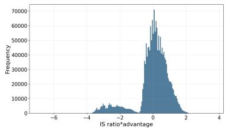  
(a) Easy prompt

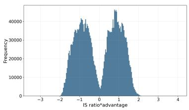  
(b) Medium prompt

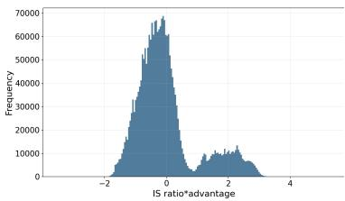  
(c) Hard prompt  
Figure 1: $r _ { t } ( \theta ) \widehat { A } _ { t }$ across prompts

As shown in Figure 1, a clearer pattern emerges when comparing the tails of the token-level gradient coeficient $r _ { t } ( \theta ) \widehat { A } _ { t }$ across dificulty levels. For hard prompts (accuracy 0–30%), the distribution exhibits a pronounced positive tail, indicating that a subset of tokens receives relatively large positive gradient coeficients and therefore contributes disproportionately to reinforcing the current policy. In contrast, for easy prompts (accuracy 70–100%), the distribution develops a substantially heavier negative tail, suggesting that easy prompts are more likely to produce large negative updates for a small fraction of tokens. Meanwhile, medium-dificulty prompts (accuracy 30–70%) show a more concentrated distribution with substantially lighter tails, implying that their token-level updates are comparatively more moderate and stable. Following the principle that prompts of intermediate dificulty provide more efective training signals, we introduce a symmetric clipping range $[ - \alpha , \alpha ]$ for $r _ { t } ( \theta ) \widehat { A } _ { t }$ to mitigate the influence of the long tail induced by overly easy or overly dificult prompts. This clipping encourages token-level updates to remain within a moderate regime, making their optimization behavior more similar to that observed for prompts of intermediate dificulty.

## 4 Connection to Gradient Clipping in Policy Mirror Descent

Clipping is widely used in RL post-training, with numerous variants proposed to stabilize policy optimization, while gradient clipping in optimization algorithms likewise plays a central role in stabilizing large-model training. These observations raise a natural question: is there a connection between these two forms of clipping? We establish this connection through policy mirror descent, showing that applying gradient clipping within this framework yields the clipping objective of ACPO. This derivation links gradient clipping in optimization to clipping in post-training.

Introducing gradient clipping in (2) gives us Algorithm 1, because $A ^ { \pi _ { k } } ( s , \cdot )$ serves as gradient in the update. Then starting from PMD with gradient clipping and $h ^ { p } = 0$ , we first apply importance sampling to express the advantage term using samples from the old policy, introducing the importance ratio $\begin{array} { r } { r _ { \theta } ( s , a ) = \frac { \pi _ { \theta } ( a | s ) } { \pi _ { \mathrm { o l d } } ( a | s ) } } \end{array}$ . Then we restrict the optimization to a parameterized policy class, approximately solve the resulting subproblem using multiple stochastic gradient steps (see Section B for details). Finally, we remove the explicit KL proximity penalty arising from the mirror map, obtaining ACPO objective 5. Omitting the KL penalty isolates the role of clipping and enables us to investigate whether ACPO can maintain stable training without explicit KL regularization. Moreover, removing the KL penalty is consistent with the experimental settings in recent papers (Yu et al., 2025; Xiong et al., 2025).

Algorithm 1 The policy mirror descent (PMD) method with gradient clipping   
1: Input: initial points $\pi _ { 0 } , \pi _ { 0 } ( a \mid s ) = 1 / | { \mathcal A } |$ , clipping threshold α and stepsizes $\eta _ { k } \ge 0 .$   
2: for $k = 0 , 1 , \ldots$ . do   
3:   
$\pi _ { k + 1 } ( \cdot \mid s ) = \operatorname* { a r g m i n } _ { p ( \cdot \mid s ) \in \Delta ( { \mathcal A } ) } \left\{ \eta _ { k } \frac { \alpha } { \operatorname* { m a x } \{ \alpha , \| A ^ { \pi _ { k } } ( s , \cdot ) \| \} } \left[ \langle A ^ { \pi _ { k } } ( s , \cdot ) , p ( \cdot \mid s ) \rangle + h ^ { p } ( s ) \right] + D _ { \pi _ { k } } ^ { p } ( s ) \right\} , \forall s \in { \mathcal S }$   
4: end for

This construction connects ACPO to the clipping principle underlying PMD while introducing a diferent clipping mechanism. During the translation of the clipping principle into a samplebased surrogate, we replace PMD’s statewise advantage rescaling with direct clipping of the importance-weighted advantage $r _ { t } ( \theta ) \widehat { A } _ { t }$ . Diferentiating this surrogate preserves each sample’s gradient contribution within the clipping interval and suppresses it outside the interval.

Now, we present convergence results of Algorithm 1 and proofs are presented in Section C. Here, we take the Bregman Divergence induced by negative entropy that $D _ { \pi } ^ { \pi ^ { \prime } } = \mathrm { K L } ( \pi ^ { \prime } | | \pi )$ Following Lan (2023), let $\nu ^ { * }$ be the stationary state distribution induced by the optimal policy $\pi ^ { * }$ , we consider the convergence criterion of the following optimization problem with specific distribution $\nu ^ { * }$ :

$$
\operatorname* { m i n } _ { \pi } f ( \pi ) : = \mathbb { E } _ { s \sim \nu ^ { * } } [ V ^ { \pi } ( s ) ] \quad \mathrm { s . t . } \ \pi ( \cdot \mid s ) \in \Delta ( A ) , \forall s \in \mathcal { S } ,
$$

then we define $F _ { k } = f ( \pi _ { k } ) - f ( \pi ^ { * } ) = { E } _ { s \sim \nu ^ { * } } [ V _ { \pi _ { k } } ( s ) ] - { E } _ { s \sim \nu ^ { * } } [ V _ { \pi ^ { * } } ( s ) ]$ and $\mathcal { D } _ { k } = E _ { s \sim \nu ^ { * } } [ D _ { \pi _ { k } } ^ { \pi ^ { * } } ( s ) ]$ We analyze convergence under constant and adaptive step sizes, both with strongly convex regularization and without regularization. We show that Algorithm 1 can achieve a linear convergence rate for solving RL problems with strongly convex regularizers and a sublinear rate without it. For convenience, we define

$$
\lambda _ { k } ( s ) : = \frac { \alpha } { \operatorname* { m a x } \{ \alpha , \| A ^ { \pi _ { k } } ( s , \cdot ) \| \} } , \qquad \kappa _ { 0 } : = \operatorname* { m i n } _ { s \in \mathcal { S } } \lambda _ { 0 } ( s ) .
$$

Theorem 1 (Convergence with strongly convex regularizer). Suppose $h ^ { p }$ is µ-strongly convex with $\mu > 0 , D _ { \pi } ^ { \pi ^ { \prime } } = \mathrm { K L } ( \pi ^ { \prime } | | \pi )$ , cost function $c ( s , a )$ and $h ^ { p }$ are bounded. Then the following bounds hold for all $N \geq 1$

1. Constant step sizes. There exists a constant $1 \geq \kappa > 0 .$ , for $\eta _ { k } = \eta$ for all $k \geq 0 _ { i }$ we have

$$
F _ { N } + ( \mu + \frac { 1 } { \eta } ) \mathcal { D } _ { N } \leq \rho ^ { N } \left[ F _ { 0 } + ( \mu + \frac { 1 } { \eta } ) \log | \cal { A } | \right] ,
$$

where $\rho = \operatorname* { m a x } \left\{ \gamma , \frac { 1 } { \kappa ( 1 + \eta \mu ) } \right\} . \ I f \eta \mu > 1 / \kappa - 1$ , then $\rho < 1$

2. Adaptive step sizes. For $\eta _ { 0 } > 0$ , choose $\begin{array} { r } { \eta _ { k + 1 } = \eta _ { k } \operatorname* { m a x } \left\{ 1 , \operatorname* { m a x } _ { s \in \mathcal { S } } \frac { \lambda _ { k } ( s ) } { \lambda _ { k + 1 } ( s ) } \right\} } \end{array}$ . Then

$$
F _ { N } \leq \rho _ { 0 } ^ { N } \left[ F _ { 0 } + \left( \mu + \frac { 1 } { \eta _ { 0 } \kappa _ { 0 } } \right) \log { | \cal A | } \right] ,
$$

where $\begin{array} { r } { \rho _ { 0 } = \operatorname* { m a x } \left\{ \gamma , \frac { 1 } { 1 + \mu \eta _ { 0 } \kappa _ { 0 } } \right\} < 1 } \end{array}$

Theorem 2 (Convergence without regularizer). Suppose $h ^ { p } = 0 , D _ { \pi } ^ { \pi ^ { \prime } } = \mathrm { K L } ( \pi ^ { \prime } | | \pi )$ , cost function $c ( s , a )$ and $h ^ { p }$ are bounded. Then the following bounds hold for all $N \geq 1$

1. Constant step sizes. There exists a constant $C _ { 0 } > 0$ , for $\eta _ { k } = \eta$ for all $k \geq 0$ , we have

$$
F _ { N } \leq \frac { C _ { 0 } } { ( 1 - \gamma ) N } \left[ \gamma F _ { 0 } + \frac { \log | \cal { A } | } { \eta \kappa _ { 0 } } \right] .
$$

2. Adaptive step sizes. For $\eta _ { 0 } > 0$ , choose $\eta _ { k + 1 } = \eta _ { k }$ max $\begin{array} { r } { \bigg \{ 1 , \operatorname* { m a x } _ { s \in \mathcal { S } } \frac { \lambda _ { k } ( s ) } { \lambda _ { k + 1 } ( s ) } \bigg \} } \end{array}$ . Then

$$
F _ { N } \leq \frac { 1 } { ( 1 - \gamma ) N } \left[ \gamma F _ { 0 } + \frac { \log | \cal { A } | } { \eta _ { 0 } \kappa _ { 0 } } \right] .
$$

## 5 Experiments

## 5.1 Experimental Setup.

In this section, we present experiments to evaluate the performance of ACPO on reasoning tasks. We incorporate PPO and GRPO with ACPO and denote it as PPO-AC and GRPO-AC. We compare GRPO-AC and PPO-AC against two standard IS ratio clipping methods: GRPO and PPO.

Datasets and models. We train our models using the training set from DAPO (Yu et al., 2025), which comprises approximately 17.4k math problems sourced from the AoPS website and oficial competition homepages. We employ the Math-Verify tool (Kydlíček, 2025) for automatic solution correctness verification. To demonstrate the generality of our method across model scales, we conduct experiments using Qwen2.5-Math-7B and Qwen3(1.7B, 4B and 8B).

Evaluation. We assess the models’ reasoning abilities on several standard mathematical reasoning benchmarks: MATH500 (Hendrycks et al., 2021), Minerva Math (Lewkowycz et al., 2022), OlympiadBench (He et al., 2024) and AIME-like (Xiong et al., 2025), which consists of 230 problems from recent competitions: AIME24, AIME25, HMMT24, HMMT25, BRUMO25, AMC23, and CMIMC25. All evaluations report the Pass@1 accuracy averaged over 16 or 32 samples, generated with a temperature of 1.0, top-p=1 and a max token limit of 8196.

RL Training Details. We conduct all experiments using the VERL reinforcement learning framework (Sheng et al., 2025). In PPO, we generate one response per prompt $( n = 1 )$ , for GRPO we generate four responses per prompt $( n = 4 )$ for Qwen3 and eight responses per prompt (n = 8) for Qwen2.5-Math-7B. Following prior work (Schulman et al., 2017; Yu et al., 2025), we set the standard clipping range to 0.2 for PPO and [0.2, 0.28] for GRPO. For PPO-AC, we set $\alpha = 3$ in all experiments. For GRPO-AC, we set $\alpha = 3$ for Qwen2.5-Math-7B and $\alpha = 2$ for Qwen3. More details of our training setting can be found in Appendix D.1.

## 5.2 Main Results

We conduct experiments on Qwen2.5-Math-7B and Qwen3 (1.7B, 4B and 8B). We consider the weighted accuracy(weighted by problem amount on each benchmark).The evaluation performance curves and best evaluation results throughout training are presented in Table 1 and Figure 2, respectively. The efectiveness of our method is demonstrated in Table 1. Across four model configurations and four standard mathematical reasoning benchmarks, incorporating ACPO consistently improves both PPO and GRPO. In particular, PPO-AC increases the weighted accuracy over PPO by 1.6, 2.4, 2.7, and 4.0 percentage points on Qwen2.5-7B-Math, Qwen3-1.7B,

Qwen3-4B, and Qwen3-8B, respectively, demonstrating increasingly pronounced gains on stronger models. Similar improvements are observed for GRPO-AC, which consistently outperforms its corresponding GRPO baseline in weighted accuracy. The gains are especially substantial on the more challenging OLYMPIAD and AIME-like benchmarks. For example, on Qwen3-8B, PPO-AC improves OLYMPIAD accuracy from 63.7% to 70.5% and AIME-like accuracy from 43.6% to 48.8%. These results demonstrate that ACPO provides robust and broadly applicable improvements across diferent policy optimization algorithms, model families, and model scales.

Figure 2 illustrates the step-wise weighted accuracy averaged across all benchmarks for ACPO and the baseline methods. Although all approaches exhibit improved reasoning performance as training progresses, ACPO consistently converges faster and achieves higher performance than baselines. In particular, GRPO-AC maintains the best performance throughout the entire training process. Moreover, PPO-AC consistently outperforms PPO and achieves performance comparable to GRPO, while GRPO requires multiple rollouts per prompt.

Table 1: Performance of methods on math benchmarks, where we choose the best weighted accuracy result during training. Bold marks the better result within each matched PPO or GRPO pair.
<table><tr><td>Method</td><td>Weighted Acc. MATH500</td><td>MINERVA</td><td>OLYMPIAD</td><td>AIME-like</td></tr><tr><td colspan="5">Qwen2.5-7B-Math (avg@32)</td></tr><tr><td>PPO</td><td>48.4</td><td>79.0 33.0</td><td>41.2</td><td>21.4</td></tr><tr><td>PPO-AC</td><td>50.0</td><td>80.5</td><td>35.3</td><td>42.8 21.9</td></tr><tr><td>GRPO</td><td>51.2</td><td>82.0</td><td>37.2 43.2</td><td>24.1</td></tr><tr><td>GRPO-AC</td><td>52.6</td><td>82.8 37.8</td><td>45.6</td><td>24.9</td></tr><tr><td colspan="5">Qwen3-1.7B (avg@16)</td></tr><tr><td>PPO</td><td>57.3</td><td>86.2 39.2</td><td>52.8</td><td>28.8</td></tr><tr><td>PPO-AC</td><td>59.7</td><td>88.1</td><td>39.7 56.9</td><td>30.1</td></tr><tr><td>GRPO</td><td>60.6</td><td>88.2</td><td>39.5</td><td>58.9 30.8</td></tr><tr><td>GRPO-AC</td><td>62.1</td><td>89.4</td><td>40.3 60.3</td><td>34.3</td></tr><tr><td colspan="5">Qwen3-4B (avg@16)</td></tr><tr><td>PPO</td><td>66.7</td><td>93.3</td><td>45.4 63.8</td><td>43.3</td></tr><tr><td>PPO-AC</td><td>69.4</td><td>94.0</td><td>46.4</td><td>68.3 46.3</td></tr><tr><td>GRPO</td><td>70.0</td><td>94.7</td><td>46.6</td><td>69.2 46.4</td></tr><tr><td>GRPO-AC</td><td>70.6</td><td>94.8</td><td>46.8</td><td>69.8 48.5</td></tr><tr><td colspan="5">Qwen3-8B (avg@16)</td></tr><tr><td>PPO</td><td>67.3</td><td>93.1</td><td>48.6 63.7</td><td>43.6</td></tr><tr><td>PPO-AC</td><td>71.3</td><td>94.8</td><td>48.9</td><td>70.5 48.8</td></tr><tr><td>GRPO</td><td>70.6</td><td>95.0</td><td>48.7</td><td>69.1 47.3</td></tr><tr><td>GRPO-AC</td><td>71.4</td><td>95.0</td><td>49.4</td><td>70.4 49.0</td></tr></table>

## 5.3 Training Dynamics and Analysis

Training eficiency. Our clipping mechanism in ACPO stabilizes policy optimization from both policy-gradient and mirror-descent perspectives while making more efective use of the training signal. As shown in Figure 2, ACPO achieves average training-step speedups of 6.25× over PPO and 1.7× over GRPO, measured by the steps required to match each baseline’s best accuracy. For Qwen3-4B and Qwen3-8B, PPO-AC matches the best accuracy attained by PPO over 200 steps in approximately 40 steps (5.3× and 5.0×). Especially on Qwen3-1.7B, PPO yields little initial improvement and its accuracy declines after 20 steps, whereas PPO-AC continues to improve model accuracy, suggesting greater robustness in this setting. These results confirm that ACPO improves accuracy while accelerating training speed, with larger eficiency gains over PPO than over GRPO. This diference arises from how the two methods estimate advantages:

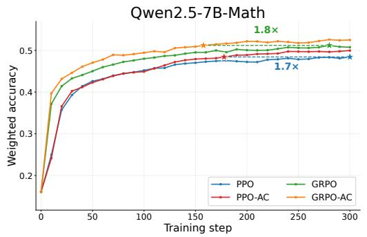

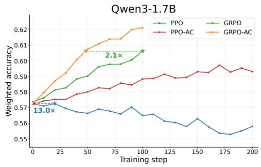

Qwen3-4B  
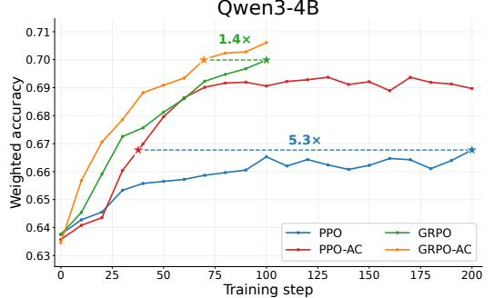

Qwen3-8B  
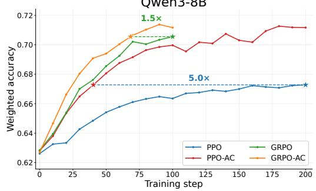  
Figure 2: Accuracy during Training Process

PPO uses token-level advantages derived from a value model, whereas GRPO assigns the same advantage to all tokens within a sequence. This finer-grained signal allows PPO to benefit more from ACPO’s clipping mechanism.

Entropy. Vanilla PPO and GRPO can exhibit rapid entropy decay, limiting exploration and prematurely concentrating the policy on a narrow set of reasoning trajectories (Yu et al., 2025; Yue et al., 2025; Cui et al., 2025). The standard clipping mechanism in PPO-style objectives further exacerbates this issue by constraining probability increases for low-probability exploratory tokens. As shown in Figure 3, ACPO substantially alleviates entropy collapse during training. The policy entropy of GRPO-AC remains relatively stable and fluctuates around its initial value, whereas that of GRPO increases rapidly with the use of the Clip-Higher technique(Yu et al., 2025). Although the entropy of PPO-AC still declines during training, its decrease is considerably slower than that of PPO. Our clipping mechanism in ACPO preserves the contributions of tokens with relatively small advantages, which helps sustain exploration and policy diversity.

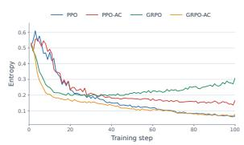  
(a) Qwen2.5-7B-Math

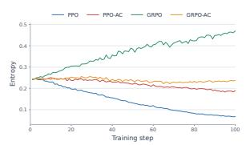  
(b) Qwen3-1.7B

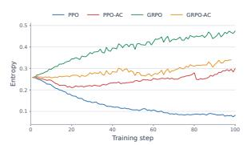  
(c) Qwen3-4B

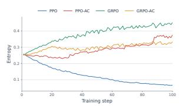  
(d) Qwen3-8B  
Figure 3: Policy entropy over the first 100 training steps across four models.

## 6 Related Work

Mirror Descent for Policy Optimization. Mirror descent provides a principled framework for constrained optimization and has been widely applied to policy optimization. Tomar et al.

(2022) propose mirror descent policy optimization (MDPO), which updates the policy by approximately solving a trust-region subproblem. Song et al. (2026) use the Bellman equation to reformulate policy mirror descent (PMD) as a trajectory-level objective and derive a practical BPO loss through approximation. While these studies derive practical objectives from mirror descent, our work takes a novel perspective: using PMD to understand and motivate clipping mechanisms in policy optimization.

Clipping Mechanisms. Clipping mechanisms have received considerable attention in policy optimization and post-training (Yu et al., 2025; MiniMax et al., 2025; Jia et al., 2026; Zheng et al., 2025). These methods primarily modify how importance ratios are clipped. DAPO introduces Clip-Higher, using clipping range [0.2, 0.28] to encourage exploration (Yu et al., 2025). CISPO clips the importance-sampling weights while retaining the corresponding gradient contributions (MiniMax et al., 2025). From token level to sequence level, Zheng et al. (2025) design clipping over trajectory, while GAPO adapts the IS clipping range to trajectory advantages in GRPO (Jia et al., 2026).

## 7 Conclusion

We introduced Advantage Clipped Policy Optimization (ACPO), which directly clips the product of IS ratio and advantage to stabilize policy optimization. ACPO can be readily integrated into PPO and GRPO, admits an interpretation through gradient-clipped policy mirror descent, and consistently improves accuracy and training eficiency across multiple Qwen models and mathematical-reasoning benchmarks. These results demonstrate that advantage clipping is a simple and efective alternative to conventional IS-ratio clipping for reinforcement-learning post-training of LLMs.

## References

Sanghwan Bae, Jiwoo Hong, Min Young Lee, Hanbyul Kim, JeongYeon Nam, and Donghyun Kwak. Online dificulty filtering for reasoning oriented reinforcement learning, 2026. URL https://arxiv.org/abs/2504.03380.

Andrew G. Barto, Richard S. Sutton, and Charles W. Anderson. Neuronlike adaptive elements that can solve dificult learning control problems. IEEE Transactions on Systems, Man, and Cybernetics, SMC-13(5):834–846, 1983. doi: 10.1109/TSMC.1983.6313077.

Amir Beck and Marc Teboulle. Mirror descent and nonlinear projected subgradient methods for convex optimization. Oper. Res. Lett., 31(3):167–175, May 2003. ISSN 0167-6377. doi: 10.1016/S0167-6377(02)00231-6. URL https://doi.org/10.1016/S0167-6377(02)00231-6.

Tom Brown, Benjamin Mann, Nick Ryder, Melanie Subbiah, Jared D Kaplan, Prafulla Dhariwal, Arvind Neelakantan, Pranav Shyam, Girish Sastry, Amanda Askell, Sandhini Agarwal, Ariel Herbert-Voss, Gretchen Krueger, Tom Henighan, Rewon Child, Aditya Ramesh, Daniel Ziegler, Jefrey Wu, Clemens Winter, Chris Hesse, Mark Chen, Eric Sigler, Mateusz Litwin, Scott Gray, Benjamin Chess, Jack Clark, Christopher Berner, Sam McCandlish, Alec Radford, Ilya Sutskever, and Dario Amodei. Language models are few-shot learners. In H. Larochelle, M. Ranzato, R. Hadsell, M.F. Balcan, and H. Lin, editors, Advances in Neural Information Processing Systems, volume 33, pages 1877–1901. Curran Associates, Inc., 2020. URL https://proceedings.neurips.cc/paper\_files/paper/2020/ file/1457c0d6bfcb4967418bfb8ac142f64a-Paper.pdf.

Ganqu Cui, Yuchen Zhang, Jiacheng Chen, Lifan Yuan, Zhi Wang, Yuxin Zuo, Haozhan Li, Yuchen Fan, Huayu Chen, Weize Chen, Zhiyuan Liu, Hao Peng, Lei Bai, Wanli Ouyang, Yu Cheng, Bowen Zhou, and Ning Ding. The entropy mechanism of reinforcement learning for reasoning language models, 2025. URL https://arxiv.org/abs/2505.22617.

Zhaolin Gao, Joongwon Kim, Wen Sun, Thorsten Joachims, Sid Wang, Richard Yuanzhe Pang, and Liang Tan. Prompt curriculum learning for eficient LLM post-training. In The Fourteenth International Conference on Learning Representations, 2026. URL https: //openreview.net/forum?id=zqOCacBD3P.

Daya Guo, Dejian Yang, Haowei Zhang, Junxiao Song, Peiyi Wang, Qihao Zhu, Runxin Xu, Ruoyu Zhang, Shirong Ma, Xiao Bi, Xiaokang Zhang, Xingkai Yu, Yu Wu, Z. F. Wu, Zhibin Gou, Zhihong Shao, Zhuoshu Li, Ziyi Gao, Aixin Liu, Bing Xue, Bingxuan Wang, Bochao Wu, Bei Feng, Chengda Lu, Chenggang Zhao, Chengqi Deng, Chong Ruan, Damai Dai, Deli Chen, Dongjie Ji, Erhang Li, Fangyun Lin, Fucong Dai, Fuli Luo, Guangbo Hao, Guanting Chen, Guowei Li, H. Zhang, Hanwei Xu, Honghui Ding, Huazuo Gao, Hui Qu, Hui Li, Jianzhong Guo, Jiashi Li, Jingchang Chen, Jingyang Yuan, Jinhao Tu, Junjie Qiu, Junlong Li, J. L. Cai, Jiaqi Ni, Jian Liang, Jin Chen, Kai Dong, Kai Hu, Kaichao You, Kaige Gao, Kang Guan, Kexin Huang, Kuai Yu, Lean Wang, Lecong Zhang, Liang Zhao, Litong Wang, Liyue Zhang, Lei Xu, Leyi Xia, Mingchuan Zhang, Minghua Zhang, Minghui Tang, Mingxu Zhou, Meng Li, Miaojun Wang, Mingming Li, Ning Tian, Panpan Huang, Peng Zhang, Qiancheng Wang, Qinyu Chen, Qiushi Du, Ruiqi Ge, Ruisong Zhang, Ruizhe Pan, Runji Wang, R. J. Chen, R. L. Jin, Ruyi Chen, Shanghao Lu, Shangyan Zhou, Shanhuang Chen, Shengfeng Ye, Shiyu Wang, Shuiping Yu, Shunfeng Zhou, Shuting Pan, S. S. Li, Shuang Zhou, Shaoqing Wu, Tao Yun, Tian Pei, Tianyu Sun, T. Wang, Wangding Zeng, Wen Liu, Wenfeng Liang, Wenjun Gao, Wenqin Yu, Wentao Zhang, W. L. Xiao, Wei An, Xiaodong Liu, Xiaohan Wang, Xiaokang Chen, Xiaotao Nie, Xin Cheng, Xin Liu, Xin Xie, Xingchao Liu, Xinyu Yang, Xinyuan Li, Xuecheng Su, Xuheng Lin, X. Q. Li, Xiangyue Jin, Xiaojin Shen, Xiaosha Chen, Xiaowen Sun, Xiaoxiang Wang, Xinnan Song, Xinyi Zhou, Xianzu Wang, Xinxia Shan, Y. K. Li, Y. Q. Wang, Y. X. Wei, Yang Zhang, Yanhong Xu, Yao Li, Yao Zhao, Yaofeng Sun, Yaohui Wang, Yi Yu, Yichao Zhang, Yifan Shi, Yiliang Xiong, Ying He, Yishi Piao, Yisong Wang, Yixuan Tan, Yiyang Ma, Yiyuan Liu, Yongqiang Guo, Yuan Ou, Yuduan Wang, Yue Gong, Yuheng Zou, Yujia He, Yunfan Xiong, Yuxiang Luo, Yuxiang You, Yuxuan Liu, Yuyang Zhou, Y. X. Zhu, Yanping Huang, Yaohui Li, Yi Zheng, Yuchen Zhu, Yunxian Ma, Ying Tang, Yukun Zha, Yuting Yan, Z. Z. Ren, Zehui Ren, Zhangli Sha, Zhe Fu, Zhean Xu, Zhenda Xie, Zhengyan Zhang, Zhewen Hao, Zhicheng Ma, Zhigang Yan, Zhiyu Wu, Zihui Gu, Zijia Zhu, Zijun Liu, Zilin Li, Ziwei Xie, Ziyang Song, Zizheng Pan, Zhen Huang, Zhipeng Xu, Zhongyu Zhang, and Zhen Zhang. Deepseek-r1 incentivizes reasoning in llms through reinforcement learning. Nature, 645(8081):633–638, 2025. ISSN 1476-4687. doi: 10.1038/s41586-025-09422-z. URL http://dx.doi.org/10.1038/s41586-025-09422-z.

Chaoqun He, Renjie Luo, Yuzhuo Bai, Shengding Hu, Zhen Leng Thai, Junhao Shen, Jinyi Hu, Xu Han, Yujie Huang, Yuxiang Zhang, Jie Liu, Lei Qi, Zhiyuan Liu, and Maosong Sun. Olympiadbench: A challenging benchmark for promoting agi with olympiad-level bilingual multimodal scientific problems, 2024. URL https://arxiv.org/abs/2402.14008.

Dan Hendrycks, Collin Burns, Saurav Kadavath, Akul Arora, Steven Basart, Eric Tang, Dawn Song, and Jacob Steinhardt. Measuring mathematical problem solving with the math dataset, 2021. URL https://arxiv.org/abs/2103.03874.

Sheng Jia, Xiao Wang, Shiva Prasad Kasiviswanathan, and Rein Houthooft. Group adaptive clipping policy optimization, 2026. URL https://arxiv.org/abs/2609.00444.

Sham Kakade and John Langford. Approximately optimal approximate reinforcement learning. In Proceedings of the Nineteenth International Conference on Machine Learning, ICML ’02, page 267–274, San Francisco, CA, USA, 2002. Morgan Kaufmann Publishers Inc. ISBN 1558608737.

Hynek Kydlíček. Math-verify: Math verification library. https://github.com/huggingface/ Math-Verify, 2025. Accessed: 2026-07-16.

Nathan Lambert, Jacob Morrison, Valentina Pyatkin, Shengyi Huang, Hamish Ivison, Faeze Brahman, Lester James V. Miranda, Alisa Liu, Nouha Dziri, Shane Lyu, Yuling Gu, Saumya Malik, Victoria Graf, Jena D. Hwang, Jiangjiang Yang, Ronan Le Bras, Oyvind Tafjord, Chris Wilhelm, Luca Soldaini, Noah A. Smith, Yizhong Wang, Pradeep Dasigi, and Hannaneh Hajishirzi. Tulu 3: Pushing frontiers in open language model post-training, 2025. URL https://arxiv.org/abs/2411.15124.

Guanghui Lan. Policy mirror descent for reinforcement learning: linear convergence, new sampling complexity, and generalized problem classes. Mathematical Programming, 198 (1):1059–1106, 2023. doi: 10.1007/s10107-022-01816-5. URL https://doi.org/10.1007/ s10107-022-01816-5.

Aitor Lewkowycz, Anders Andreassen, David Dohan, Ethan Dyer, Henryk Michalewski, Vinay Ramasesh, Ambrose Slone, Cem Anil, Imanol Schlag, Theo Gutman-Solo, Yuhuai Wu, Behnam Neyshabur, Guy Gur-Ari, and Vedant Misra. Solving quantitative reasoning problems with language models. In S. Koyejo, S. Mohamed, A. Agarwal, D. Belgrave, K. Cho, and A. Oh, editors, Advances in Neural Information Processing Systems, volume 35, pages 3843–3857. Cur ran Associates, Inc., 2022. URL https://proceedings.neurips.cc/paper\_files/paper/ 2022/file/18abbeef8cfe9203fdf9053c9c4fe191-Paper-Conference.pdf.

Chi Liu and Xin Chen. Adaptive-boundary-clipping grpo: Ensuring bounded ratios for stable and generalizable training, 2026. URL https://arxiv.org/abs/2601.03895.

MiniMax, :, Aili Chen, Aonian Li, Bangwei Gong, Binyang Jiang, Bo Fei, Bo Yang, Boji Shan, Changqing Yu, Chao Wang, Cheng Zhu, Chengjun Xiao, Chengyu Du, Chi Zhang, Chu Qiao, Chunhao Zhang, Chunhui Du, Congchao Guo, Da Chen, Deming Ding, Dianjun Sun, Dong Li, Enwei Jiao, Haigang Zhou, Haimo Zhang, Han Ding, Haohai Sun, Haoyu Feng, Huaiguang Cai, Haichao Zhu, Jian Sun, Jiaqi Zhuang, Jiaren Cai, Jiayuan Song, Jin Zhu, Jingyang Li, Jinhao Tian, Jinli Liu, Junhao Xu, Junjie Yan, Junteng Liu, Junxian He, Kaiyi Feng, Ke Yang, Kecheng Xiao, Le Han, Leyang Wang, Lianfei Yu, Liheng Feng, Lin Li, Lin Zheng, Linge Du, Lingyu Yang, Lunbin Zeng, Minghui Yu, Mingliang Tao, Mingyuan Chi, Mozhi Zhang, Mujie Lin, Nan Hu, Nongyu Di, Peng Gao, Pengfei Li, Pengyu Zhao, Qibing Ren, Qidi Xu, Qile Li, Qin Wang, Rong Tian, Ruitao Leng, Shaoxiang Chen, Shaoyu Chen, Shengmin Shi, Shitong Weng, Shuchang Guan, Shuqi Yu, Sichen Li, Songquan Zhu, Tengfei Li, Tianchi Cai, Tianrun Liang, Weiyu Cheng, Weize Kong, Wenkai Li, Xiancai Chen, Xiangjun Song, Xiao Luo, Xiao Su, Xiaobo Li, Xiaodong Han, Xinzhu Hou, Xuan Lu, Xun Zou, Xuyang Shen, Yan Gong, Yan Ma, Yang Wang, Yiqi Shi, Yiran Zhong, Yonghong Duan, Yongxiang Fu, Yongyi Hu, Yu Gao, Yuanxiang Fan, Yufeng Yang, Yuhao Li, Yulin Hu, Yunan Huang, Yunji Li, Yunzhi Xu, Yuxin Mao, Yuxuan Shi, Yuze Wenren, Zehan Li, Zelin Li, Zhanxu Tian, Zhengmao Zhu, Zhenhua Fan, Zhenzhen Wu, Zhichao Xu, Zhihang Yu, Zhiheng Lyu, Zhuo Jiang, Zibo Gao, Zijia Wu, Zijian Song, and Zijun Sun. Minimax-m1: Scaling test-time compute eficiently with lightning attention, 2025. URL https://arxiv.org/abs/2506.13585.

Long Ouyang, Jefrey Wu, Xu Jiang, Diogo Almeida, Carroll Wainwright, Pamela Mishkin, Chong Zhang, Sandhini Agarwal, Katarina Slama, Alex Ray, John Schulman, Jacob Hilton, Fraser Kelton, Luke Miller, Maddie Simens, Amanda Askell, Peter Welinder, Paul F Christiano,

Jan Leike, and Ryan Lowe. Training language models to follow instructions with human feedback. In S. Koyejo, S. Mohamed, A. Agarwal, D. Belgrave, K. Cho, and A. Oh, editors, Advances in Neural Information Processing Systems, volume 35, pages 27730–27744. Curran Associates, Inc., 2022. URL https://proceedings.neurips.cc/paper\_files/paper/2022/ file/b1efde53be364a73914f58805a001731-Paper-Conference.pdf.

John Schulman, Sergey Levine, Pieter Abbeel, Michael Jordan, and Philipp Moritz. Trust region policy optimization. In Francis Bach and David Blei, editors, Proceedings of the 32nd International Conference on Machine Learning, volume 37 of Proceedings of Machine Learning Research, pages 1889–1897, Lille, France, 07–09 Jul 2015. PMLR. URL https: //proceedings.mlr.press/v37/schulman15.html.

John Schulman, Filip Wolski, Prafulla Dhariwal, Alec Radford, and Oleg Klimov. Proximal policy optimization algorithms, 2017. URL https://arxiv.org/abs/1707.06347.

Zhihong Shao, Peiyi Wang, Qihao Zhu, Runxin Xu, Junxiao Song, Xiao Bi, Haowei Zhang, Mingchuan Zhang, Y. K. Li, Y. Wu, and Daya Guo. Deepseekmath: Pushing the limits of mathematical reasoning in open language models, 2024. URL https://arxiv.org/abs/2402. 03300.

Guangming Sheng, Chi Zhang, Zilingfeng Ye, Xibin Wu, Wang Zhang, Ru Zhang, Yanghua Peng, Haibin Lin, and Chuan Wu. Hybridflow: A flexible and eficient rlhf framework. In Proceedings of the Twentieth European Conference on Computer Systems, EuroSys ’25, page 1279–1297. ACM, March 2025. doi: 10.1145/3689031.3696075. URL http://dx.doi.org/10. 1145/3689031.3696075.

Zhuoqing Song, Haotian Xu, Xikun Zhang, and Lidong Bing. Bellman policy optimization, 2026. URL https://arxiv.org/abs/2609.15987.

R.S. Sutton and A.G. Barto. Reinforcement Learning, second edition: An Introduction. Adaptive Computation and Machine Learning series. MIT Press, 2018. ISBN 9780262039246. URL https://books.google.com.hk/books?id=sWV0DwAAQBAJ.

Manan Tomar, Lior Shani, Yonathan Efroni, and Mohammad Ghavamzadeh. Mirror descent policy optimization. In International Conference on Learning Representations, 2022. URL https://openreview.net/forum?id=aBO5SvgSt1.

Wei Xiong, Chenlu Ye, Baohao Liao, Hanze Dong, Xinxing Xu, Christof Monz, Jiang Bian, Nan Jiang, and Tong Zhang. Reinforce-ada: An adaptive sampling framework under non-linear rl objectives, 2025. URL https://arxiv.org/abs/2510.04996.

Deheng Ye, Zhao Liu, Mingfei Sun, Bei Shi, Peilin Zhao, Hao Wu, Hongsheng Yu, Shaojie Yang, Xipeng Wu, Qingwei Guo, Qiaobo Chen, Yinyuting Yin, Hao Zhang, Tengfei Shi, Liang Wang, Qiang Fu, Wei Yang, and Lanxiao Huang. Mastering complex control in moba games with deep reinforcement learning, 2020. URL https://arxiv.org/abs/1912.09729.

Qiying Yu, Zheng Zhang, Ruofei Zhu, Yufeng Yuan, Xiaochen Zuo, Yu Yue, Weinan Dai, Tiantian Fan, Gaohong Liu, Lingjun Liu, Xin Liu, Haibin Lin, Zhiqi Lin, Bole Ma, Guangming Sheng, Yuxuan Tong, Chi Zhang, Mofan Zhang, Wang Zhang, Hang Zhu, Jinhua Zhu, Jiaze Chen, Jiangjie Chen, Chengyi Wang, Hongli Yu, Yuxuan Song, Xiangpeng Wei, Hao Zhou, Jingjing Liu, Wei-Ying Ma, Ya-Qin Zhang, Lin Yan, Mu Qiao, Yonghui Wu, and Mingxuan Wang. Dapo: An open-source llm reinforcement learning system at scale, 2025. URL https: //arxiv.org/abs/2503.14476.

Yu Yue, Yufeng Yuan, Qiying Yu, Xiaochen Zuo, Ruofei Zhu, Wenyuan Xu, Jiaze Chen, Chengyi Wang, TianTian Fan, Zhengyin Du, Xiangpeng Wei, Xiangyu Yu, Gaohong Liu, Juncai Liu, Lingjun Liu, Haibin Lin, Zhiqi Lin, Bole Ma, Chi Zhang, Mofan Zhang, Wang Zhang, Hang Zhu, Ru Zhang, Xin Liu, Mingxuan Wang, Yonghui Wu, and Lin Yan. Vapo: Eficient and reliable reinforcement learning for advanced reasoning tasks, 2025. URL https://arxiv.org/ abs/2504.05118.

Ruiqi Zhang, Daman Arora, Song Mei, and Andrea Zanette. Speed-rl: Faster training of reasoning models via online curriculum learning, 2026. URL https://arxiv.org/abs/2506.09016.

Chujie Zheng, Shixuan Liu, Mingze Li, Xiong-Hui Chen, Bowen Yu, Chang Gao, Kai Dang, Yuqiong Liu, Rui Men, An Yang, Jingren Zhou, and Junyang Lin. Group sequence policy optimization, 2025. URL https://arxiv.org/abs/2507.18071.

## Appendix

In Section A and C, we provide detailed proofs of the proposition and theorem in our main pages. Section B discusses how to derive our ACPO objective from PMD with gradient clipping step by step. And in Section D, we present more experiment results and settings.

## A Proof of Proposition 1

Proposition A.1 (cf. Proposition 1). Let we denote ${ \bf 1 } _ { \mathrm { P P O } } = { \bf 1 } _ { \{ \widehat { A } > 0 , r ( \theta ) \leq 1 + \epsilon \ o r \ \widehat { A } < 0 , r ( \theta ) \geq 1 - \epsilon \} }$ $\mathbf { 1 } _ { \mathrm { A C P O } } = \mathbf { 1 } _ { \{ | r ( \theta ) \widehat { A } | \leq \alpha \} }$ . Suppose that the two clipping rules retain samples with equal probability, $\mathbb { E } [ \mathbf { 1 } _ { \mathrm { P P O } } ] = \mathbb { E } [ \mathbf { 1 } _ { \mathrm { A C P O } } ]$ , and that $\mathbb { E } \Big [ \| \nabla _ { \theta } \log \pi _ { \theta } ( a \mid s ) \| ^ { 2 } \Big | r ( \theta ) , \widehat { A } \Big | = C$ almost surely for some finite constant $C \geq 0$ . Assuming that the second moments below are finite, we have

$$
\begin{array} { r } { \mathbb { E } \bigg [ \Big \| r ( \theta ) \widehat { A } \nabla _ { \theta } \log \pi _ { \theta } ( a \mid s ) \mathbf { 1 } _ { \mathrm { A C P O } } \Big \| ^ { 2 } \bigg ] \leq \mathbb { E } \bigg [ \Big \| r ( \theta ) \widehat { A } \nabla _ { \theta } \log \pi _ { \theta } ( a \mid s ) \mathbf { 1 } _ { \mathrm { P P O } } \Big \| ^ { 2 } \bigg ] . } \end{array}
$$

Proof. Note that $( | r ( \theta ) \widehat { A } | ^ { 2 } - \alpha ^ { 2 } ) ( { \mathbf { 1 } } _ { \mathrm { P P O } } - { \mathbf { 1 } } _ { \mathrm { A C P O } } ) \geq 0$ for any $( s , a )$ by the definition of 1ACPO and denote the gradient estimator as GPPO, GACPO.

$$
\begin{array} { r l } & { \quad \mathbb { E } \| G _ { \mathrm { P P O } } \| ^ { 2 } - \mathbb { E } \| G _ { \mathrm { A C P O } } \| ^ { 2 } } \\ & { = \mathbb { E } [ | r ( \theta \widehat { A } ) | ^ { 2 } \| \nabla _ { \theta } \log \pi _ { \theta } ( a \mid s ) \| ^ { 2 } ( \mathbf { 1 } _ { \mathrm { P P O } } - \mathbf { 1 } _ { \mathrm { A C P O } } ) ] } \\ & { \geq \mathbb { E } [ \alpha ^ { 2 } \| \nabla _ { \theta } \log \pi _ { \theta } ( a \mid s ) \| ^ { 2 } ( \mathbf { 1 } _ { \mathrm { P P O } } - \mathbf { 1 } _ { \mathrm { A C P O } } ) ] } \\ & { = \alpha ^ { 2 } \mathbb { E } \left[ ( \mathbf { 1 } _ { \mathrm { P P O } } - \mathbf { 1 } _ { \mathrm { A C P O } } ) \mathbb { E } [ \| \nabla _ { \theta } \log \pi _ { \theta } ( a \mid s ) \| ^ { 2 } \mid r ( \theta ) , \widehat { A } ] \right] } \\ & { = \alpha ^ { 2 } C \left( \mathbb { E } [ \mathbf { 1 } _ { \mathrm { P P O } } ] - \mathbb { E } [ \mathbf { 1 } _ { \mathrm { A C P O } } ] \right) } \\ & { = 0 . } \end{array}
$$

This proves the claimed inequality.

## B Transformation of PMD with gradient clipping

In this section we discuss how to transfer PMD with gradient clipping Algorithm 1 to our ACPO objective 5.

First, we look at the PMD update 2 to solve minimizing total cost problem. The update takes following form:

$$
\pi _ { k + 1 } ( \cdot \mid s ) = \underset { p \in \Delta ( \mathcal { A } ) } { \arg \operatorname* { m i n } } \left\{ \langle Q ^ { \pi _ { k } } ( s , \cdot ) , p + h ^ { p } ( s ) \rangle + \frac { 1 } { \eta _ { k } } D _ { \psi } \left( p , \pi _ { k } ( \cdot \mid s ) \right) \right\} , \forall s \in \mathcal { S } .
$$

Here we replace $Q ^ { \pi _ { k } } ( s , \cdot )$ with $A ^ { \pi _ { k } } ( s , \cdot )$ . Note this replacement does not the subproblem or its optimal solution. Then in the update, the term $A ^ { \pi _ { k } } ( s , \cdot )$ serves as gradient. Combining the gradient clipping technique, we have

$$
\pi _ { k + 1 } ( \cdot \mid s ) = \underset { p \in \Delta ( { \mathcal A } ) } { \mathrm { a r g } \mathrm { m i n } } \left. \frac { \alpha } { \operatorname* { m a x } \lbrace \alpha , \Vert A ^ { \pi _ { k } } ( s , \cdot ) \Vert \rbrace } \left. A ^ { \pi _ { k } } ( s , \cdot ) , p + h ^ { p } ( s ) \right. + \frac { 1 } { \eta _ { k } } D _ { \psi } \left( p , \pi _ { k } ( \cdot \mid s ) \right) \right. , \forall s \in S ,
$$

which is equivalent to Algorithm 1.

Next, we take $h ^ { p } = 0$ and $D _ { \psi } \left( p , \pi _ { k } ( \cdot \mid s ) \right) = \mathrm { K L } ( p , \pi _ { k } )$ . To match the objective of PPO, which maximizes the total reward, we consider the maximizing problem formulation. Then, we come to

$$
\pi _ { k + 1 } ( \cdot \mid s ) = \underset { p \in \Delta ( \mathcal { A } ) } { \mathrm { a r g } \mathrm { m a x } } \left. \frac { \alpha } { \operatorname* { m a x } \lbrace \alpha , \| A ^ { \pi _ { k } } ( s , \cdot ) \| \rbrace } \left. A ^ { \pi _ { k } } ( s , \cdot ) , p \right. - \frac { 1 } { \eta _ { k } } \mathrm { K L } \left( p , \pi _ { k } ( \cdot \mid s ) \right) \right. , \forall s \in \mathcal { S } ,
$$

which is equivalent to

$$
\pi _ { k + 1 } ( \cdot \mid s )  \arg \operatorname* { m a x } _ { \pi \in \Pi } \mathbb { E } _ { s \sim \rho _ { \pi _ { k } } , a \sim \pi } [ \mathrm { c l i p } ( A ^ { \pi _ { k } } ( s , \cdot ) , \alpha ) ] - \frac { 1 } { t _ { k } } \mathrm { K L } ( \pi , \pi _ { k } ) ,
$$

if $\rho _ { \pi _ { k } }$ has full support.

Here we move the clipping to each $A ^ { \pi _ { k } } ( s , a )$ , because under a parameterized policy, the gradient contribution comes from each $A ^ { \pi _ { k } } ( s , a )$ , then obtain

$$
\pi _ { k + 1 } ( \cdot \mid s ) \gets \arg \operatorname* { m a x } _ { \theta } \mathbb { E } _ { ( s , a ) \sim \pi _ { \theta _ { k } } } \left[ \mathrm { c l i p } ( A ^ { \pi _ { \theta _ { k } } } ( s , a ) , - \alpha , \alpha ) - \frac { 1 } { t _ { k } } \mathrm { K L } ( \pi , \pi _ { k } ) \right] .
$$

Finally, we solve this subproblem by several optimization steps and then update the $\theta _ { k }$ Because we need to use the estimated advantage from trajectory generated by old policy and integrate importance sampling, the objective is

$$
\operatorname* { m a x } _ { \theta } \mathbb { E } _ { ( s , a ) \sim \pi _ { \mathrm { o l d } } } \left[ \mathrm { c l i p } ( r ( \theta ) \widehat { A } ( s , a ) , - \alpha , \alpha ) - \frac { 1 } { t _ { k } } \mathrm { K L } ( \pi , \pi _ { \mathrm { o l d } } ) \right] .
$$

After removing the KL term, it comes to our ACPO objective $5 .$

## C Proof of Theorem 1 and 2

This section gives a convergence analysis for policy mirror descent (PMD) with gradient clipping. Under relative strong convexity this objective-preserving update converges linearly. In the unregularized case, the same update reduces to advantage clipping and enjoys a last-iterate $O ( 1 / T )$ guarantee, including for every fixed constant stepsize.

## C.1 Notation

Let ψ be a diferentiable and strongly convex mirror map on the relative interior of $\Delta ( \mathcal { A } )$ . We use $D _ { \psi } ( x , y )$ to denote the Bregman divergence of $\psi$ between x and $y \colon$

$$
D _ { \psi } ( x , y ) : = \psi ( x ) - \psi ( y ) - \langle \nabla \psi ( y ) , x - y \rangle .\tag{6}
$$

In particular, for policies π and $\pi ^ { \prime } .$ we use the following notation:

$$
D _ { \pi ^ { \prime } } ^ { \pi } ( s ) : = D _ { \psi } \big ( \pi ( \cdot \mid s ) , \pi ^ { \prime } ( \cdot \mid s ) \big ) .\tag{7}
$$

We also write $( \partial h ) ^ { \pi ^ { \prime } } ( s , \cdot )$ for a subgradient of $\pi \mapsto h ^ { \pi } ( s )$ at $\pi ^ { \prime } .$ .

Then we consider a γ-discounted MDP $\mathcal { M } = ( \mathcal { S } , \mathcal { A } , P , r , \gamma , \rho )$ , where S and A are the state and action spaces, $\textstyle P ( \cdot \mid s , a )$ is the transition kernel, $c ( s , a )$ denotes the cost function $( \mathrm { o r } \ r ( s , a )$

the reward function when maximizing reward), $\gamma \in [ 0 , 1 )$ is the discount factor, and $\rho$ is the initial-state distribution. A stochastic policy π specifies an action distribution $\pi ( \cdot \mid s )$ at each state, and induces trajectories according to $s _ { 0 } \sim \rho , a _ { t } \sim \pi ( \cdot \mid s _ { t } )$ , and $s _ { t + 1 } \sim P ( \cdot \mid s _ { t } , a _ { t } )$ Additionally, we consider a state-separable policy regularizer $h ^ { \pi } ( s )$ , and we say that h is µ-strongly convex relative to policy, if for every $\pi , \pi ^ { \prime }$

$$
h ^ { \pi } ( s ) \geq h ^ { \pi ^ { \prime } } ( s ) + \left. ( \partial h ) ^ { \pi ^ { \prime } } ( s , \cdot ) , \pi ( \cdot \mid s ) - \pi ^ { \prime } ( \cdot \mid s ) \right. + \mu D _ { \pi ^ { \prime } } ^ { \pi } ( s ) , \qquad \mu \geq 0 .\tag{8}
$$

The state-value and action-value functions of π are defined as

$$
V ^ { \pi } ( s ) = \mathbb { E } _ { \pi } [ \sum _ { t = 0 } ^ { \infty } \gamma ^ { t } ( c ( s _ { t } , a _ { t } ) + h ^ { \pi } ( s _ { t } ) ) \mid s _ { 0 } = s ] ,\tag{9}
$$

and

$$
Q ^ { \pi } ( s , a ) = \mathbb { E } _ { \pi } [ \sum _ { t = 0 } ^ { \infty } \gamma ^ { t } ( c ( s _ { t } , a _ { t } ) + h ^ { \pi } ( s _ { t } ) ) \mid s _ { 0 } = s , a _ { 0 } = a ] = c ( s , a ) + h ^ { \pi } ( s ) + \gamma \sum _ { s ^ { \prime } } P ( s ^ { \prime } \mid s , a ) V ^ { \pi } ( s ^ { \prime } ) .\tag{10}
$$

Then, advantage function is given by the diference of $Q ^ { \pi } ( s , a )$ and $V ^ { \pi } ( s )$

$$
A ^ { \pi } ( s , a ) = Q ^ { \pi } ( s , a ) - V ^ { \pi } ( s ) .\tag{11}
$$

Consider an arbitrary norm $\lVert \cdot \rVert$ on $\mathbb { R } ^ { | \boldsymbol { A } | }$ and a clipping threshold $\alpha > 0$ . At iteration k, set

$$
\lambda _ { k } ( s ) : = { \frac { \alpha } { \operatorname* { m a x } \{ \alpha , \| A ^ { \pi _ { k } } ( s , \cdot ) \| \} } }\tag{12}
$$

The stepsize $\eta _ { k } > 0$ is a single scalar independent of states. The objective-preserving clipped PMD update is

$$
\pi _ { k + 1 } ( \cdot \mid s ) \in \arg \operatorname* { m i n } _ { p \in \Delta ( A ) } \left\{ \eta _ { k } \lambda _ { k } ( s ) \left[ \langle A ^ { \pi _ { k } } ( s , \cdot ) , p \rangle + h _ { s } ( p ) \right] + D _ { \pi _ { k } ( \cdot \vert s ) } ^ { p } ( s ) \right\} .\tag{13}
$$

Let $\pi ^ { * }$ be an optimal stationary policy, so $V ^ { \pi ^ { * } } ( s ) \leq V ^ { \pi } ( s )$ for all s and all stationary π. Let $\nu ^ { * }$ be the distribution of the optimal policy, and define

$$
\begin{array} { r l r l } & { e _ { k } ( s ) : = V ^ { \pi _ { k } } ( s ) - V ^ { \pi ^ { * } } ( s ) , \quad } & & { } & { F _ { k } : = \mathbb { E } _ { s \sim \nu ^ { * } } [ e _ { k } ( s ) ] , } \end{array}\tag{14}
$$

$$
D _ { k } ( s ) : = D _ { \pi _ { k } ( \cdot | s ) } ^ { \pi ^ { * } ( \cdot | s ) } ( s ) , \qquad E _ { k } ( s ) : = D _ { \pi _ { k } ( \cdot | s ) } ^ { \pi _ { k + 1 } ( \cdot | s ) } ( s ) .\tag{15}
$$

In particular, $e _ { k } ( s ) \geq 0$ and $F _ { k } \ge 0$ . For the KL divergence we take the uniform initialization $\pi _ { 0 } ( a \mid s ) = 1 / | { \mathcal A } |$ , which gives

$$
D _ { 0 } ( s ) = { \mathrm { K L } } ( \pi ^ { * } ( \cdot \mid s ) \| \pi _ { 0 } ( \cdot \mid s ) ) \leq \log | { \mathcal { A } } | .\tag{16}
$$

## C.2 Useful lemmas

For policies π and $\pi ^ { \prime }$ , define the local improvement quantity

$$
g _ { \pi , \pi ^ { \prime } } ( s ) : = \langle A ^ { \pi } ( s , \cdot ) , \pi ^ { \prime } ( \cdot \mid s ) - \pi ( \cdot \mid s ) \rangle + h ^ { \pi ^ { \prime } } ( s ) - h ^ { \pi } ( s ) .\tag{17}
$$

For the iterates, abbreviate $g _ { k } : = g _ { \pi _ { k } , \pi _ { k + 1 } }$ and we also define the comparison to the optimal policy

$$
b _ { k } ( s ) : = \langle A ^ { \pi _ { k } } ( s , \cdot ) , \pi _ { k } ( \cdot \mid s ) - \pi ^ { * } ( \cdot \mid s ) \rangle + h ^ { \pi _ { k } } ( s ) - h ^ { \pi ^ { * } } ( s ) .\tag{18}
$$

Lemma A.1 (Performance diference). For any feasible policies $\pi$ and $\pi ^ { \prime }$

$$
V ^ { \pi ^ { \prime } } - V ^ { \pi } = ( I - \gamma P ^ { \pi ^ { \prime } } ) ^ { - 1 } g _ { \pi , \pi ^ { \prime } } .\tag{19}
$$

Equivalently, we have

$$
V ^ { \pi ^ { \prime } } ( s ) - V ^ { \pi } ( s ) = \frac { 1 } { 1 - \gamma } \mathbb { E } _ { s ^ { \prime } \sim d _ { s } ^ { \pi ^ { \prime } } } [ g _ { \pi , \pi ^ { \prime } } ( s ^ { \prime } ) ] ,\tag{20}
$$

where

$$
d _ { s } ^ { \pi ^ { \prime } } : = ( 1 - \gamma ) \sum _ { t = 0 } ^ { \infty } \gamma ^ { t } e _ { s } ^ { \top } ( P ^ { \pi ^ { \prime } } ) ^ { t } .\tag{21}
$$

Proof. Without loss of generality, we assume that the policies are stationary. Fix a state $s ,$ averaging the definition of $Q ^ { \pi }$ under $\pi ^ { \prime } ( \cdot \mid s )$ and subtracting $V ^ { \pi } ( s )$ gives

$$
\langle A ^ { \pi } ( s , \cdot ) , \pi ^ { \prime } ( \cdot  { | } s ) \rangle + h ^ { \pi ^ { \prime } } ( s ) - h ^ { \pi } ( s ) = \langle c ( s , \cdot ) , \pi ^ { \prime } ( \cdot  { | } s ) \rangle + h ^ { \pi ^ { \prime } } ( s ) + \gamma ( P ^ { \pi ^ { \prime } } V ^ { \pi } ) ( s ) - V ^ { \pi } ( s ) .
$$

Because $\langle A ^ { \pi } ( s , \cdot ) , \pi ( \cdot \mid s ) \rangle = 0$ , the left-hand side is exactly $g _ { \pi , \pi ^ { \prime } } ( s )$ . The Bellman equation for $\pi ^ { \prime }$ therefore implies

$$
V ^ { \pi } ( s ) = \sum _ { a } \pi ( a \mid s ) \left[ c ( s , a ) + h ^ { \pi } ( s ) + \gamma \sum _ { s ^ { \prime } } P ( s ^ { \prime } \mid s , a ) V ^ { \pi } ( s ^ { \prime } ) \right] ,
$$

which is equivalent to

$$
{ V ^ { \pi } } ^ { \prime } ( s ) = \langle c ( s , \cdot ) , \pi ^ { \prime } ( \cdot \mid s ) \rangle + { h ^ { \pi ^ { \prime } } } ( s ) + \gamma ( { P ^ { \pi ^ { \prime } } } { V ^ { \pi ^ { \prime } } } ) ( s ) .
$$

Combining above results gives

$$
V ^ { \pi ^ { \prime } } ( s ) - V ^ { \pi } ( s ) = g _ { \pi , \pi ^ { \prime } } ( s ) + \gamma \big ( P ^ { \pi ^ { \prime } } ( V ^ { \pi ^ { \prime } } - V ^ { \pi } ) \big ) ( s ) .
$$

Then we stack this identity over all states yields

$$
( I - \gamma P ^ { \pi ^ { \prime } } ) ( V ^ { \pi ^ { \prime } } - V ^ { \pi } ) = g _ { \pi , \pi ^ { \prime } } ,
$$

where since $P ^ { \pi ^ { \prime } }$ is stochastic and $\gamma < 1$ , the Neumann series converges:

$$
( I - \gamma P ^ { \pi ^ { \prime } } ) ^ { - 1 } = \sum _ { t = 0 } ^ { \infty } \gamma ^ { t } ( P ^ { \pi ^ { \prime } } ) ^ { t } .
$$

This proves (19). Left-multiplying by $e _ { s } ^ { \top }$ , inserting the factor $( 1 - \gamma ) / ( 1 - \gamma )$ , and using (21) gives

$$
V ^ { \pi ^ { \prime } } ( s ) - V ^ { \pi } ( s ) = \sum _ { t = 0 } ^ { \infty } \gamma ^ { t } e _ { s } ^ { \top } ( P ^ { \pi ^ { \prime } } ) ^ { t } g _ { \pi , \pi ^ { \prime } } = \frac { 1 } { 1 - \gamma } \mathbb { E } _ { s ^ { \prime } \sim d _ { s } ^ { \pi ^ { \prime } } } [ g _ { \pi , \pi ^ { \prime } } ( s ^ { \prime } ) ] ,
$$

giving us the desired result.

Lemma A.2 (Optimal-policy identity). The vector $b _ { k }$ satisfies

$$
\boldsymbol b _ { k } = ( I - \gamma P ^ { \pi ^ { * } } ) \boldsymbol e _ { k } ,\tag{22}
$$

and consequently

$$
\mathbb { E } _ { \nu ^ { * } } [ b _ { k } ( s ) ] = ( 1 - \gamma ) F _ { k } .\tag{23}
$$

Proof. For each state s, expand the inner product in (18):

$$
\begin{array} { l } { { b _ { k } ( s ) = V ^ { \pi _ { k } } ( s ) - \displaystyle \sum _ { a } \pi ^ { * } ( a \mid s ) Q ^ { \pi _ { k } } ( s , a ) + h ^ { \pi _ { k } } ( s ) - h ^ { \pi ^ { * } } ( s ) } } \\ { { \mathrm { } } } \\ { { \mathrm { } = V ^ { \pi _ { k } } ( s ) - \langle c ( s , \cdot ) , \pi ^ { * } ( \cdot \mid s ) \rangle - h ^ { \pi ^ { * } } ( s ) - \gamma ( P ^ { \pi ^ { * } } V ^ { \pi _ { k } } ) ( s ) . } } \end{array}
$$

The Bellman equation $V ^ { \pi ^ { * } } ( s ) = \langle c ( s , \cdot ) , \pi ^ { * } ( \cdot \mid s ) \rangle + h ^ { \pi ^ { * } } ( s ) + \gamma ( P ^ { \pi ^ { * } } V ^ { \pi ^ { * } } ) ( s )$ then gives

$$
\begin{array} { c } { { b _ { k } ( s ) = V ^ { \pi _ { k } } ( s ) - V ^ { \pi ^ { * } } ( s ) - \gamma \big ( P ^ { \pi ^ { * } } ( V ^ { \pi _ { k } } - V ^ { \pi ^ { * } } ) \big ) ( s ) } } \\ { { { } } } \\ { { = \big ( ( I - \gamma P ^ { \pi ^ { * } } ) e _ { k } \big ) ( s ) , } } \end{array}
$$

which proves (22). Finally,

$$
\begin{array} { r l } & { \mathbb { E } _ { \boldsymbol { \nu } ^ { * } } [ b _ { k } ] = ( \boldsymbol { \nu } ^ { * } ) ^ { \top } ( I - \gamma P ^ { \pi ^ { * } } ) e _ { k } } \\ & { \qquad = ( 1 - \gamma ) ( \boldsymbol { \nu } ^ { * } ) ^ { \top } e _ { k } = ( 1 - \gamma ) F _ { k } , } \end{array}
$$

where stationarity gives $( \nu ^ { * } ) ^ { \top } P ^ { \pi ^ { * } } = ( \nu ^ { * } ) ^ { \top }$

Lemma A.3. For every $s \in { \mathcal { S } }$ and every feasible $p \in \Delta ( \mathcal { A } )$ , update (13) satisfies

$$
\eta _ { k } \lambda _ { k } ( s ) \Big [ \big < A ^ { \pi _ { k } } ( s , \cdot ) , \pi _ { k + 1 } ( \cdot \ | \ s ) - p \big > + h ^ { \pi _ { k + 1 } } ( s ) - h _ { s } ( p ) \Big ] + E _ { k } ( s ) \le D _ { \pi _ { k } ( \cdot \vert s ) } ^ { p } ( s ) - \big ( 1 + \mu \eta _ { k } \lambda _ { k } ( s ) \big ) D _ { \pi _ { k + 1 } ( \cdot \vert s ) } ^ { p } ( s ) .\tag{24}
$$

Proof. Fix s and take $x = \pi _ { k } ( \cdot \mid s ) , y = \pi _ { k + 1 } ( \cdot \mid s )$ and $A = A ^ { \pi _ { k } } ( s , \cdot )$ . The objective minimized at this state is

$$
p \longmapsto \eta _ { k } \lambda _ { k } ( s ) \lbrack \langle A , p \rangle + h _ { s } ( p ) \rbrack + D _ { x } ^ { p } ( s ) .
$$

Since the feasible set $\Delta ( \mathcal { A } )$ is convex, the first-order optimality condition at y, with $( \partial h ) ^ { \pi _ { k + 1 } } ( s , \cdot ) \in$ $\partial h _ { s } ( y )$ , gives

$$
\begin{array} { r } { \langle \eta _ { k } \lambda _ { k } ( s ) \big ( A + ( \partial h ) ^ { \pi _ { k + 1 } } ( s , \cdot ) \big ) + \nabla \psi ( y ) - \nabla \psi ( x ) , p - y \rangle \geq 0 . } \end{array}
$$

Rearranging (C.2) yields

$$
\begin{array} { r } { \eta _ { k } \lambda _ { k } ( s ) \left. A , y - p \right. \leq \eta _ { k } \lambda _ { k } ( s ) \left. ( \partial h ) ^ { \pi _ { k + 1 } } ( s , \cdot ) , p - y \right. + \left. \nabla \psi ( y ) - \nabla \psi ( x ) , p - y \right. . } \end{array}
$$

Since the regularizer $h ^ { p }$ is µ-strongly convex w.r.t. policy, (8) gives

$$
\langle ( \partial h ) ^ { \pi _ { k + 1 } } ( s , \cdot ) , p - y \rangle \leq h _ { s } ( p ) - h _ { s } ( y ) - \mu D _ { y } ^ { p } ( s ) .
$$

Substituting this bound into the preceding inequality and moving the regularizer diference to the left gives

$$
\eta _ { k } \lambda _ { k } ( s ) \big [ \langle A , y - p \rangle + h _ { s } ( y ) - h _ { s } ( p ) \big ] \leq \langle \nabla \psi ( y ) - \nabla \psi ( x ) , p - y \rangle - \mu \eta _ { k } \lambda _ { k } ( s ) D _ { y } ^ { p } ( s ) .
$$

Finally, direct expansion of the three Bregman divergences gives the three-point identity

$$
\langle \nabla \psi ( y ) - \nabla \psi ( x ) , p - y \rangle = D _ { x } ^ { p } ( s ) - D _ { x } ^ { y } ( s ) - D _ { y } ^ { p } ( s )
$$

and $D _ { x } ^ { y } ( s ) = E _ { k } ( s )$ . Combining these identities proves (24).

Lemma A.4 (Monotonic improvement). For every state,

$$
g _ { k } ( s ) \leq - \frac { E _ { k } ( s ) } { \eta _ { k } \lambda _ { k } ( s ) } - \left( \frac { 1 } { \eta _ { k } \lambda _ { k } ( s ) } + \mu \right) D _ { \pi _ { k + 1 } } ^ { \pi _ { k } } ( s ) \leq 0 ,\tag{25}
$$

and

$$
\begin{array} { r } { V ^ { \pi _ { k + 1 } } ( s ) - V ^ { \pi _ { k } } ( s ) \leq g _ { k } ( s ) \leq 0 , } \end{array}\tag{26}
$$

leading to the conclusion that $V ^ { \pi _ { k } } ( s )$ and $F _ { k }$ are nonincreasing in k.

Proof. Take $p = \pi _ { k } ( \cdot \mid s )$ in Equation 24 and divide by $\eta _ { k } \lambda _ { k } ( s ) > 0$ . The bracket on the left becomes

$$
\langle A ^ { \pi _ { k } } ( s , \cdot ) , \pi _ { k + 1 } ( \cdot \mid s ) - \pi _ { k } ( \cdot \mid s ) \rangle + h ^ { \pi _ { k + 1 } } ( s ) - h ^ { \pi _ { k } } ( s ) = g _ { k } ( s ) ,
$$

whereas the two divergences on the right are $D _ { \pi _ { k } } ^ { \pi _ { k } } ( s ) = 0$ and $D _ { \pi _ { k + 1 } } ^ { \pi _ { k } } ( s )$ . This gives the first inequality in (25). Both remaining terms are nonpositive because Bregman divergences are nonnegative, so $g _ { k } ( s ) \leq 0$

Apply Lemma A.1 with $( \pi , \pi ^ { \prime } ) = ( \pi _ { k } , \pi _ { k + 1 } )$

$$
V ^ { \pi _ { k + 1 } } ( s ) - V ^ { \pi _ { k } } ( s ) = \frac { 1 } { 1 - \gamma } \sum _ { s ^ { \prime } } d _ { s } ^ { \pi _ { k + 1 } } ( s ^ { \prime } ) g _ { k } ( s ^ { \prime } ) .
$$

The $t = 0$ term in (21) shows that $d _ { s } ^ { \pi _ { k + 1 } } ( s ) \geq 1 - \gamma$ . Since every $g _ { k } ( s ^ { \prime } ) \leq 0$ , discarding all terms with $s ^ { \prime } \neq$ s can only increase the sum. Hence

$$
V ^ { \pi _ { k + 1 } } ( s ) - V ^ { \pi _ { k } } ( s ) \leq \frac { d _ { s } ^ { \pi _ { k + 1 } } ( s ) } { 1 - \gamma } g _ { k } ( s ) \leq g _ { k } ( s ) ,
$$

where the second inequality uses both $d _ { s } ^ { \pi _ { k + 1 } } ( s ) / ( 1 - \gamma ) \geq 1$ and $g _ { k } ( s ) \leq 0$ . This proves (26).   
Subtracting the fixed value $V ^ { \pi ^ { * } }$ and averaging under $\nu ^ { * }$ also shows that $F _ { k }$ is nonincreasing.

Lemma A.5 (Fundamental recursion). The iterates of (13) satisfy the following recursion for every k:

$$
F _ { k + 1 } + \mathbb { E } _ { \nu ^ { * } } \left[ \left( \frac { 1 } { \eta _ { k } \lambda _ { k } ( s ) } + \mu \right) D _ { k + 1 } ( s ) \right] + \mathbb { E } _ { \nu ^ { * } } \left[ \frac { E _ { k } ( s ) } { \eta _ { k } \lambda _ { k } ( s ) } \right] \leq \gamma F _ { k } + \mathbb { E } _ { \nu ^ { * } } \left[ \frac { D _ { k } ( s ) } { \eta _ { k } \lambda _ { k } ( s ) } \right] .\tag{27}
$$

Proof. Set $p = \pi ^ { * } ( \cdot \mid s )$ in Equation 24 and divide by $\eta _ { k } \lambda _ { k } ( s )$ . To identify the bracket, add and subtract $\pi _ { k } ( \cdot \mid s )$ and $h ^ { \pi _ { k } } ( s )$

$$
\begin{array} { r l } & { \langle A ^ { \pi _ { k } } , \pi _ { k + 1 } - \pi ^ { * } \rangle + h ^ { \pi _ { k + 1 } } - h ^ { \pi ^ { * } } = \left( \langle A ^ { \pi _ { k } } , \pi _ { k + 1 } - \pi _ { k } \rangle + h ^ { \pi _ { k + 1 } } - h ^ { \pi _ { k } } \right) + \left( \langle A ^ { \pi _ { k } } , \pi _ { k } - \pi ^ { * } \rangle + h ^ { \pi _ { k } } - h ^ { \pi ^ { * } } \right) } \\ & { \qquad = g _ { k } ( s ) + b _ { k } ( s ) , } \end{array}
$$

where all policy arguments are evaluated at any fixed state s. Therefore

$$
b _ { k } ( s ) + g _ { k } ( s ) + \frac { E _ { k } ( s ) } { \eta _ { k } \lambda _ { k } ( s ) } \leq \frac { D _ { k } ( s ) } { \eta _ { k } \lambda _ { k } ( s ) } - \left( \frac { 1 } { \eta _ { k } \lambda _ { k } ( s ) } + \mu \right) D _ { k + 1 } ( s ) .\tag{28}
$$

By Lemma A.4, $\begin{array} { r } { V ^ { \pi _ { k + 1 } } - V ^ { \pi _ { k } } \leq g _ { k } } \end{array}$ statewise. Thus replacing $g _ { k } ( s )$ on the left of (28) by $V ^ { \pi _ { k + 1 } } ( s ) - V ^ { \pi _ { k } } ( s )$ preserves the inequality. Averaging with respect to $\nu ^ { * }$ gives

$$
\mathbb { E } _ { \nu ^ { * } } [ b _ { k } ] + F _ { k + 1 } - F _ { k } + \mathbb { E } _ { \nu ^ { * } } \Big [ \frac { E _ { k } ( s ) } { \eta _ { k } \lambda _ { k } ( s ) } \Big ] \leq \mathbb { E } _ { \nu ^ { * } } \Big [ \frac { D _ { k } ( s ) } { \eta _ { k } \lambda _ { k } ( s ) } \Big ] - \mathbb { E } _ { \nu ^ { * } } \Big [ \Big ( \frac { 1 } { \eta _ { k } \lambda _ { k } ( s ) } + \mu \Big ) D _ { k + 1 } ( s ) \Big ] .
$$

Now use $\mathbb { E } _ { \nu ^ { * } } [ b _ { k } ] = ( 1 - \gamma ) F _ { k }$ in (23), so the first two scalar terms on the left combine as $( 1 - \gamma ) F _ { k } + F _ { k + 1 } - F _ { k } = F _ { k + 1 } - \gamma F _ { k }$ . Reranging $- \gamma F _ { k }$ and the $D _ { k + 1 }$ term yields (27). □

Lemma A.6 (Uniform lower bound on clipping). Assume the cost function $c ( s , a )$ and regularizer $h _ { s } ( p )$ are bounded. Then there exists a constant ℓ such that following definitions are well-defined and finite:

$$
K _ { \mathrm { n o r m } } : = \operatorname* { m a x } _ { \| x \| _ { \infty } \leq 1 } \| x \| ,
$$

$$
M _ { 0 } : = \operatorname* { m a x } _ { s } V ^ { \pi _ { 0 } } ( s ) ,
$$

$$
C _ { \mathrm { o s c } } : = \operatorname* { m a x } _ { s } \left( \operatorname* { m a x } _ { a } c ( s , a ) - \operatorname* { m i n } _ { a } c ( s , a ) \right) ,
$$

$$
B _ { A } : = K _ { \mathrm { n o r m } } \left[ C _ { \mathrm { o s c } } + \gamma \left( M _ { 0 } - \frac { \ell } { 1 - \gamma } \right) \right] .
$$

Then $\| A ^ { \pi _ { k } } ( s , \cdot ) \| \leq B _ { A }$ for every $k , s ,$ and hence

$$
\lambda _ { k } ( s ) \geq \kappa : = \operatorname* { m i n } \{ 1 , \alpha / B _ { A } \} > 0 ,\tag{29}
$$

with the convention $\kappa = 1 ~ i f ~ B _ { A } = 0$

Proof. For any policy π, there exists a finite ℓ such that

$$
c ( s , a ) + h _ { s } ( p ) \geq \ell \quad \mathrm { f o r ~ a l l ~ } s , a \mathrm { ~ a n d ~ a l l ~ } p \in \mathrm { d o m } h _ { s } .\tag{30}
$$

Hence

$$
V ^ { \pi } ( s ) \geq \sum _ { t = 0 } ^ { \infty } \gamma ^ { t } \ell = \frac { \ell } { 1 - \gamma } .
$$

Optimality of $\pi ^ { * }$ and Lemma A.4 therefore g ${ \mathrm { i v e } } ,$ for every k and $s ,$

$$
\frac { \ell } { 1 - \gamma } \leq V ^ { \pi ^ { * } } ( s ) \leq V ^ { \pi _ { k } } ( s ) \leq M _ { 0 } .
$$

For any two actions $a , b ,$ , the definition of $Q$ yields

$$
\vert Q ^ { \pi _ { k } } ( s , a ) - Q ^ { \pi _ { k } } ( s , b ) \vert \leq \vert c ( s , a ) - c ( s , b ) \vert + \gamma \left. \sum _ { s ^ { \prime } } ( P ( s ^ { \prime } \mid s , a ) - P ( s ^ { \prime } \mid s , b ) ) V ^ { \pi _ { k } } ( s ^ { \prime } ) \right. .
$$

The two transition expectations both lie in the interval $[ \ell / ( 1 - \gamma ) , M _ { 0 } ]$ . Their diference is therefore at most the length of this interval, and consequently

$$
\operatorname* { m a x } _ { a } Q ^ { \pi _ { k } } ( s , a ) - \operatorname* { m i n } _ { a } Q ^ { \pi _ { k } } ( s , a ) \leq C _ { \mathrm { o s c } } + \gamma \left( M _ { 0 } - \frac { \ell } { 1 - \gamma } \right) .
$$

Each advantage coordinate is obtained by subtracting from $Q ^ { \pi _ { k } } ( s , a )$ a convex combination of the coordinates of $Q ^ { \pi _ { k } } ( s , \cdot )$ , because

$$
A ^ { \pi } ( s , a ) = Q ^ { \pi } ( s , a ) - \sum _ { b } \pi ( b \mid s ) Q ^ { \pi } ( s , b ) .
$$

Hence we have

$$
\begin{array} { r } { \| A ^ { \pi _ { k } } ( s , \cdot ) \| \leq K _ { \mathrm { n o r m } } \| A ^ { \pi _ { k } } ( s , \cdot ) \| _ { \infty } \leq B _ { A } . } \end{array}
$$

If $B _ { A } > 0$ , the definition of (12) gives

$$
\lambda _ { k } ( s ) \geq \operatorname* { m i n } \biggl \{ 1 , { \frac { \alpha } { B _ { A } } } \biggr \} = \kappa .
$$

If $B _ { A } = 0$ , every advantage vector is zero, so we have $\lambda _ { k } ( s ) = 1 = \kappa$

The following lemma is needed only for a fixed stepsize in the unregularized case.

Lemma A.7 (Finite relative variation of clipping weights). Suppose $h _ { s } \equiv 0$ and $\eta _ { k } \equiv \eta > 0$ . Let

$$
r _ { k } ( s ) : = \frac { 1 } { \lambda _ { k } ( s ) } = \operatorname* { m a x } \biggr \{ 1 , \frac { \| A ^ { \pi _ { k } } ( s , \cdot ) \| } { \alpha } \biggr \} , \qquad \theta _ { k } : = \operatorname* { m a x } \biggr \{ 1 , \operatorname* { m a x } _ { s } \frac { r _ { k + 1 } ( s ) } { r _ { k } ( s ) } \biggr \} .\tag{31}
$$

Then

$$
\sum _ { k = 0 } ^ { \infty } ( \theta _ { k } - 1 ) \leq T _ { 0 } : = \frac { K _ { \mathrm { n o r m } } } { \alpha } \sum _ { s } e _ { 0 } ( s ) , \qquad R _ { N } : = \prod _ { k = 0 } ^ { N - 1 } \theta _ { k } \leq e ^ { T _ { 0 } } .\tag{32}
$$

Proof. Set $u _ { k } ( s ) : = V ^ { \pi _ { k } } ( s ) - V ^ { \pi _ { k + 1 } } ( s ) \geq 0$ and $U _ { k } : = \| u _ { k } \| _ { \infty }$ . When $h \equiv 0$ , (10) and (11) give

$$
A ^ { \pi } ( s , a ) = c ( s , a ) + \gamma \sum _ { s ^ { \prime } } P ( s ^ { \prime } \mid s , a ) V ^ { \pi } ( s ^ { \prime } ) - V ^ { \pi } ( s ) .
$$

Subtracting this identity at $\pi _ { k }$ from the one at $\pi _ { k + 1 }$ proves

$$
A ^ { \pi _ { k + 1 } } ( s , a ) - A ^ { \pi _ { k } } ( s , a ) = u _ { k } ( s ) - \gamma \sum _ { s ^ { \prime } } P ( s ^ { \prime } \mid s , a ) u _ { k } ( s ^ { \prime } ) .
$$

Because $0 \le u _ { k } ( s ^ { \prime } ) \le U _ { k }$ , the second term on the right belongs to $[ - \gamma U _ { k } , 0 ]$ and the first to $[ 0 , U _ { k } ]$ . Thus the entire right-hand side lies in $[ - \gamma U _ { k } , U _ { k } ]$ , and in particular

$$
\operatorname* { m a x } _ { s } \| A ^ { \pi _ { k + 1 } } ( s , \cdot ) - A ^ { \pi _ { k } } ( s , \cdot ) \| \leq K _ { \mathrm { n o r m } } U _ { k } .
$$

The triangle inequality gives

$$
\left| \left\| A ^ { \pi _ { k + 1 } } ( s , \cdot ) \right\| - \left\| A ^ { \pi _ { k } } ( s , \cdot ) \right\| \right| \leq \left\| A ^ { \pi _ { k + 1 } } ( s , \cdot ) - A ^ { \pi _ { k } } ( s , \cdot ) \right\| .
$$

Since x 7→ max $\{ 1 , x / \alpha \}$ is 1/α-Lipschitz,

$$
| r _ { k + 1 } ( s ) - r _ { k } ( s ) | \leq { \frac { K _ { \mathrm { n o r m } } } { \alpha } } U _ { k } .
$$

Moreover, when $r _ { k + 1 } ( s ) > r _ { k } ( s )$

$$
\frac { r _ { k + 1 } ( s ) } { r _ { k } ( s ) } - 1 = \frac { r _ { k + 1 } ( s ) - r _ { k } ( s ) } { r _ { k } ( s ) } \leq | r _ { k + 1 } ( s ) - r _ { k } ( s ) | .
$$

Taking the maximum over states yields

$$
\theta _ { k } - 1 \leq \operatorname* { m a x } _ { s } \vert r _ { k + 1 } ( s ) - r _ { k } ( s ) \vert \leq { \frac { K _ { \mathrm { n o r m } } } { \alpha } } U _ { k } .
$$

For every N,

$$
\sum _ { k = 0 } ^ { N - 1 } U _ { k } \leq \sum _ { s } \sum _ { k = 0 } ^ { N - 1 } u _ { k } ( s ) = \sum _ { s } \bigl ( V ^ { \pi _ { 0 } } ( s ) - V ^ { \pi _ { N } } ( s ) \bigr ) \leq \sum _ { s } e _ { 0 } ( s ) .
$$

Here the first inequality uses $\begin{array} { r } { U _ { k } \le \sum _ { s } u _ { k } ( s ) } \end{array}$ , the equality telescopes, and the last inequality uses $V ^ { \pi _ { N } } ( s ) \geq V ^ { \pi ^ { * } } ( s )$ . Combining the last two displays and letting $N \to \infty$ proves the first claim. Finally, log $x \leq x - 1$ for $x > 0$ , so

$$
\log R _ { N } = \sum _ { k = 0 } ^ { N - 1 } \log \theta _ { k } \leq \sum _ { k = 0 } ^ { N - 1 } ( \theta _ { k } - 1 ) \leq T _ { 0 } .
$$

## C.3 Convergence theorem and proof

Theorem A.1 (Convergence of clipped PMD, cf. Theorem 1 and 2). Assume the setting of Section $C . 1 ,$ use the KL divergence and uniform initialization, and let κ be the clipping lower bound in Lemma A.6.

(i) Strongly convex regularizer, fixed stepsize. Suppose $\mu > 0$ and $\eta _ { k } \equiv \eta > 0$ . Define

$$
\rho : = \operatorname* { m a x } \Biggl \{ \gamma , \frac { 1 } { \kappa ( 1 + \eta \mu ) } \Biggr \} .
$$

If $\eta \mu > 1 / \kappa - 1$ , then $\rho < 1$ and, for every $N \geq 0$ , we have

$$
F _ { N } + ( \mu + \frac { 1 } { \eta } ) \mathbb { E } _ { \nu ^ { * } } [ D _ { N } ( s ) ] \leq \rho ^ { N } \left( F _ { 0 } + ( \mu + \frac { 1 } { \eta } ) \mathbb { E } _ { \nu ^ { * } } [ D _ { 0 } ( s ) ] \right) \leq \rho ^ { N } \left( F _ { 0 } + ( \mu + \frac { 1 } { \eta } ) \log | \mathcal { A } | \right) .
$$

In particular, if $\begin{array} { r } { \eta \mu \geq \frac { 1 } { \gamma \kappa } - 1 } \end{array}$ , then $\rho = \gamma$

(ii) Strongly convex regularizer, adaptive stepsize. Suppose $\mu > 0$ and choose

$$
\eta _ { k + 1 } : = \eta _ { k } \operatorname* { m a x } \biggl \{ 1 , \operatorname* { m a x } _ { s \in \mathcal { S } } \frac { \lambda _ { k } ( s ) } { \lambda _ { k + 1 } ( s ) } \biggr \} .\tag{33}
$$

Let $\begin{array} { r } { \kappa _ { 0 } : = \operatorname* { m i n } _ { s } \lambda _ { 0 } ( s ) \ a n d \ \rho _ { 0 } : = \operatorname* { m a x } \Bigl \{ \gamma , \frac { 1 } { 1 + \mu \eta _ { 0 } \kappa _ { 0 } } \Bigr \} < 1 } \end{array}$ . Then

$$
F _ { N } \leq \rho _ { 0 } ^ { N } \left[ F _ { 0 } + \left( \mu + \frac { 1 } { \eta _ { 0 } \kappa _ { 0 } } \right) \log \left| A \right| \right] .
$$

(iii) No regularizer, adaptive stepsize. Suppose $h _ { s } \equiv 0$ , and choose stepsizes as in (33). Then, for every $N \geq 1$ ，

$$
F _ { N } \leq \frac { \gamma F _ { 0 } + \mathbb { E } _ { \nu ^ { * } } [ D _ { 0 } ( s ) / ( \eta _ { 0 } \lambda _ { 0 } ( s ) ) ] } { ( 1 - \gamma ) N } \leq \frac { \gamma F _ { 0 } + \frac { \log | \mathcal { A } | } { \eta _ { 0 } \kappa _ { 0 } } } { ( 1 - \gamma ) N } .
$$

(iv) No regularizer, fixed stepsize. Suppose $h _ { s } \equiv 0$ and $\eta _ { k } \equiv \eta > 0$ . With $R _ { N }$ and $T _ { 0 }$ from Lemma A.7,

$$
\begin{array} { r l } & { F _ { N } \le \displaystyle \frac { R _ { N } \left[ \gamma F _ { 0 } + \mathbb { E } _ { \nu ^ { * } } [ D _ { 0 } ( s ) / ( \eta \lambda _ { 0 } ( s ) ) ] \right] } { ( 1 - \gamma ) N } } \\ & { \quad \le \displaystyle \frac { \exp \left( \displaystyle \frac { K _ { \mathrm { n o r m } } } { \alpha } \sum _ { s } e _ { 0 } ( s ) \right) \left[ \gamma F _ { 0 } + \displaystyle \frac { \log | A | } { \eta \kappa _ { 0 } } \right] } { ( 1 - \gamma ) N } . } \end{array}
$$

Proof. Part (i). For a fixed stepsize and $\lambda _ { k } ( s ) \in [ \kappa , 1 ]$ ,

$$
\frac { 1 } { \eta } \leq \frac { 1 } { \eta \lambda _ { k } ( s ) } \leq \frac { 1 } { \eta \kappa } .
$$

Drop the nonnegative $E _ { k }$ term in (27) and apply these bounds. $\mathrm { O n }$ the left we use the lower bound $1 / \eta .$ while on the right we use the upper bound $1 / ( \eta \kappa )$ , obtaining

$$
F _ { k + 1 } + \left( \mu + \frac { 1 } { \eta } \right) \mathbb { E } _ { \nu ^ { * } } [ D _ { k + 1 } ] \leq \gamma F _ { k } + \frac { 1 } { \eta \kappa } \mathbb { E } _ { \nu ^ { * } } [ D _ { k } ] .
$$

By the choice of $\rho ,$ we have

$$
\gamma \leq \rho , \qquad { \frac { 1 } { \eta \kappa } } \leq \rho \left( \mu + { \frac { 1 } { \eta } } \right) .
$$

Hence the potential $\begin{array} { r } { \Psi _ { k } : = F _ { k } + ( \mu + \frac { 1 } { \eta } ) \mathbb { E } _ { \nu ^ { * } } [ D _ { k } ] } \end{array}$ has following property:

$$
\Psi _ { k + 1 } \leq \gamma F _ { k } + \frac { 1 } { \eta \kappa } \mathbb { E } _ { \nu ^ { * } } [ D _ { k } ] \leq \rho F _ { k } + \rho ( \mu + \frac { 1 } { \eta } ) \mathbb { E } _ { \nu ^ { * } } [ D _ { k } ] = \rho \Psi _ { k } .
$$

Induction gives $\Psi _ { N } \leq \rho ^ { N } \Psi _ { 0 }$ . Since the uniform initialization satisfies $D _ { 0 } ( s ) \leq \log | \mathcal { A } |$ for every state, this is precisely desired inequality. Furthermore,

$$
\frac { 1 } { \kappa ( 1 + \eta \mu ) } < 1 \Longleftrightarrow \eta \mu > \frac { 1 } { \kappa } - 1 ,
$$

so the stated condition makes both entries in the maximum defining $\rho$ strictly smaller than one. Part (ii). The stepsizes scheduled in (33) implies

$$
\eta _ { k + 1 } \lambda _ { k + 1 } ( s ) \geq \eta _ { k } \lambda _ { k } ( s ) \quad \mathrm { f o r ~ a l l ~ } s , \qquad \frac { 1 } { \eta _ { k + 1 } \lambda _ { k + 1 } ( s ) } \leq \frac { 1 } { \eta _ { k } \lambda _ { k } ( s ) } .\tag{34}
$$

Indeed, the maximum in (33) is at least $\lambda _ { k } ( s ) / \lambda _ { k + 1 } ( s )$ for each fixed $s ;$ multiplication by $\eta _ { k } \lambda _ { k + 1 } ( s )$ proves the first inequality, and taking reciprocals proves the second. Define the time-varying potential

$$
\Phi _ { k } : = F _ { k } + \mathbb { E } _ { \nu ^ { * } } \left[ \left( \frac { 1 } { \eta _ { k } \lambda _ { k } ( s ) } + \mu \right) D _ { k } ( s ) \right] .
$$

Using (34) and then (27),

$$
\Phi _ { k + 1 } \leq F _ { k + 1 } + \mathbb { E } _ { \nu ^ { * } } \left[ \left( \frac { 1 } { \eta _ { k } \lambda _ { k } ( s ) } + \mu \right) D _ { k + 1 } ( s ) \right] \leq \gamma F _ { k } + \mathbb { E } _ { \nu ^ { * } } \left[ \frac { D _ { k } ( s ) } { \eta _ { k } \lambda _ { k } ( s ) } \right] .
$$

Moreover, $\eta _ { k } \lambda _ { k } ( s ) \geq \eta _ { 0 } \lambda _ { 0 } ( s ) \geq \eta _ { 0 } \kappa _ { 0 }$ , and therefore

$$
\frac { 1 / ( \eta _ { k } \lambda _ { k } ( s ) ) } { 1 / ( \eta _ { k } \lambda _ { k } ( s ) ) + \mu } = \frac { 1 } { 1 + \mu \eta _ { k } \lambda _ { k } ( s ) } \leq \frac { 1 } { 1 + \mu \eta _ { 0 } \kappa _ { 0 } } \leq \rho _ { 0 } .
$$

Equivalently, for every state,

$$
\frac { 1 } { \eta _ { k } \lambda _ { k } ( s ) } \le \rho _ { 0 } \left( \frac { 1 } { \eta _ { k } \lambda _ { k } ( s ) } + \mu \right) .
$$

Together with $\gamma \le \rho _ { 0 }$ , this bounds the last line in the display for $\Phi _ { k + 1 }$ by $\rho _ { 0 } \Phi _ { k }$ . Hence $\Phi _ { N } \le \rho _ { 0 } ^ { N } \Phi _ { 0 }$ Dropping the nonnegative divergence term from $\Phi _ { N }$ and using

$$
\Phi _ { 0 } \le F _ { 0 } + \left( \mu + \frac { 1 } { \eta _ { 0 } \kappa _ { 0 } } \right) \mathbb { E } _ { \nu ^ { * } } [ D _ { 0 } ( s ) ] \le F _ { 0 } + \left( \mu + \frac { 1 } { \eta _ { 0 } \kappa _ { 0 } } \right) \log | \mathcal { A } | ,
$$

we have the desired result.

Part (iii). With $\mu = 0$ , define

$$
W _ { k } : = \mathbb { E } _ { \nu ^ { * } } \left[ \frac { D _ { k } ( s ) } { \eta _ { k } \lambda _ { k } ( s ) } \right] , \qquad Y _ { k } : = \gamma F _ { k } + W _ { k } .
$$

Since (34) makes the reciprocal coeficients nonincreasing, (27) gives

$$
F _ { k + 1 } + W _ { k + 1 } \leq \gamma F _ { k } + W _ { k } = Y _ { k } .
$$

Indeed, the $D _ { k + 1 }$ coeficient defining $W _ { k + 1 }$ is no larger than the corresponding coeficient on the left of (27); the omitted $E _ { k }$ term is nonnegative. Equivalently,

$$
Y _ { k + 1 } + ( 1 - \gamma ) F _ { k + 1 } \leq Y _ { k } .\tag{35}
$$

Summing (35) from $k = 0$ to $N - 1$ telescopes the $Y _ { k }$ terms:

$$
Y _ { N } + ( 1 - \gamma ) \sum _ { j = 1 } ^ { N } F _ { j } \leq Y _ { 0 } .
$$

Since $Y _ { N } \geq 0$ and $F _ { j } \geq F _ { N }$ for $1 \leq j \leq N$ by Lemma A.4,

$$
( 1 - \gamma ) N F _ { N } \leq ( 1 - \gamma ) \sum _ { j = 1 } ^ { N } F _ { j } \leq Y _ { 0 } .
$$

This proves the first inequality in (A.1). The second follows from

$$
\mathbb { E } _ { \nu ^ { * } } \bigg [ \frac { D _ { 0 } ( s ) } { \eta _ { 0 } \lambda _ { 0 } ( s ) } \bigg ] \leq \frac { 1 } { \eta _ { 0 } \kappa _ { 0 } } \mathbb { E } _ { \nu ^ { * } } [ D _ { 0 } ( s ) ] \leq \frac { \log | \mathcal { A } | } { \eta _ { 0 } \kappa _ { 0 } } .
$$

Part (iv). For a fixed stepsize, Lemma A.7 gives $1 / ( \eta \lambda _ { k + 1 } ( s ) ) \leq \theta _ { k } / ( \eta \lambda _ { k } ( s ) )$ , because $r _ { k + 1 } ( s ) \leq$ $\theta _ { k } r _ { k } ( s )$ . From (27) with $\mu = 0$

$$
\mathbb { E } _ { \nu ^ { * } } \bigg [ \frac { D _ { k + 1 } ( s ) } { \eta \lambda _ { k } ( s ) } \bigg ] \le Y _ { k } - F _ { k + 1 } .
$$

Consequently,

$$
Y _ { k + 1 } = \gamma F _ { k + 1 } + W _ { k + 1 } \leq \gamma F _ { k + 1 } + \theta _ { k } \mathbb { E } _ { \nu ^ { * } } \Big [ \frac { D _ { k + 1 } ( s ) } { \eta \lambda _ { k } ( s ) } \Big ] \leq \theta _ { k } Y _ { k } - ( \theta _ { k } - \gamma ) F _ { k + 1 } .
$$

The first inequality uses the preceding comparison of reciprocal clipping factors; the second substitutes the bound from (27). Set $R _ { 0 } = 1$ and $R _ { k + 1 } = \theta _ { k } R _ { k }$ . Dividing above inequality by $R _ { k + 1 }$ gives

$$
\frac { Y _ { k + 1 } } { R _ { k + 1 } } \leq \frac { Y _ { k } } { R _ { k } } - \frac { ( \theta _ { k } - \gamma ) F _ { k + 1 } } { R _ { k + 1 } } .
$$

Summing from $k = 0$ to N − 1 and using $\theta _ { k } - \gamma \geq 1 - \gamma$ gives

$$
( 1 - \gamma ) \sum _ { j = 1 } ^ { N } \frac { F _ { j } } { R _ { j } } \leq Y _ { 0 } - \frac { Y _ { N } } { R _ { N } } \leq Y _ { 0 } ,
$$

where the last inequality follows from $Y _ { N } \geq 0$ . Since $F _ { j } \geq F _ { N }$ by monotonicity and $R _ { j } \leq R _ { N }$ because each $\theta _ { k } \ge 1$ ，

$$
\sum _ { j = 1 } ^ { N } \frac { F _ { j } } { R _ { j } } \geq \frac { N F _ { N } } { R _ { N } } .
$$

Combining the last two displays yields

$$
F _ { N } \leq \frac { R _ { N } Y _ { 0 } } { ( 1 - \gamma ) N } .
$$

Finally, using $R _ { N } \leq e ^ { T _ { 0 } }$ in Lemma A.7, (16) and the definition of $T _ { 0 } .$ , we obtain

$$
\mathbb { E } _ { \nu ^ { * } } \left[ \frac { D _ { 0 } ( s ) } { \eta \lambda _ { 0 } ( s ) } \right] \leq \frac { \log | \mathcal { A } | } { \eta \kappa _ { 0 } } ,
$$

Remark 1 (From $\nu ^ { * } .$ -weighted error to all-state error). $I f \nu _ { \mathrm { m i n } } ^ { * } : = \mathrm { m i n } _ { s } \nu ^ { * } ( s ) > 0$ , then every bound on $F _ { N }$ immediately implies

$$
\left. V ^ { \pi _ { N } } - V ^ { \pi ^ { * } } \right. _ { \infty } \leq \frac { F _ { N } } { \nu _ { \operatorname* { m i n } } ^ { * } } .
$$

Without full support, one may instead choose any full-support distribution ρ and set

$$
\begin{array} { r } { \tilde { \nu } ^ { \top } : = ( 1 - \gamma ) \rho ^ { \top } ( I - \gamma P ^ { \pi ^ { * } } ) ^ { - 1 } . } \end{array}
$$

Then $\widetilde \nu ( s ) > 0$ and we have

$$
\mathbb { E } _ { \widetilde { \nu } } [ b _ { k } ] = ( 1 - \gamma ) \mathbb { E } _ { \rho } [ e _ { k } ] \geq \delta \mathbb { E } _ { \widetilde { \nu } } [ e _ { k } ] .
$$

Now we define $\begin{array} { r } { \delta : = ( 1 - \gamma ) \operatorname* { m i n } _ { s } \frac { \rho ( s ) } { \nu ( s ) } > 0 } \end{array}$ , then repeat the proof with νe. This replaces the contraction coeficient γ in the fundamental recursion Lemma A.5 by $1 - \delta < 1$ and yields similar convergence results on all states.

## D Additional Experimental Details

## D.1 Training Details

All experiments are conducted on a single node with parameter and optimizer ofloading enabled. We use eight NVIDIA H100 GPUs for Qwen2.5-Math-7B and Qwen3-8B, four for Qwen3-4B, and two for Qwen3-1.7B.

We post-train models with our algorithm using VERL framework (Sheng et al., 2025). And all the hyperparameters are presented in Table 2.

Table 2: RL training hyperparameters. Qwen3 includes the 1.7B, 4B, and 8B models. Ratio clipping thresholds apply to the baselines, whereas α applies to ACPO variants. All sampling parameters refer to training rollouts.
<table><tr><td rowspan="2">Hyperparameter</td><td colspan="2">PPO-type</td><td colspan="2">GRPO-type</td></tr><tr><td>Qwen2.5-Math-7Ba</td><td>Qwen3</td><td>Qwen2.5-Math-7Ba</td><td>Qwen3</td></tr><tr><td colspan="5">Data and rollout</td></tr><tr><td>Training dataset</td><td>DAPO</td><td>DAPO</td><td>DAPO</td><td>DAPO</td></tr><tr><td>Prompt batch size</td><td>512</td><td>512</td><td>512</td><td>256</td></tr><tr><td>Rollouts per prompt</td><td>1</td><td>1</td><td>8</td><td>4</td></tr><tr><td>Maximum prompt length</td><td>1024</td><td>1024</td><td>1024</td><td>1024</td></tr><tr><td>Maximum response length</td><td>8196</td><td>8196</td><td>8196</td><td>8196</td></tr><tr><td>Sampling temperature</td><td>1.0</td><td>1.0</td><td>1.0</td><td>1.0</td></tr><tr><td>Top-p Top-k</td><td>1.0</td><td>1.0</td><td>1.0</td><td>1.0</td></tr><tr><td colspan="5">Policy optimization Optimizer</td></tr><tr><td>Actor learning rate</td><td>AdamW 10⁻6</td><td>AdamW 10-6b</td><td>AdamW 10-6</td><td>AdamW 10-6</td></tr><tr><td>Learning-rate schedule Actor mini-batch size</td><td>Constant 128</td><td>Constant 128</td><td>Constant 128</td><td>Constant 64</td></tr><tr><td>Gradient clipping norm</td><td>1.0</td><td>1.0</td><td>1.0</td><td>1.0</td></tr><tr><td>Entropy coefficient</td><td>0</td><td>0</td><td>0</td><td>0</td></tr><tr><td>KL penalty in reward</td><td>No</td><td>No</td><td>No</td><td>No</td></tr><tr><td>KL loss coefficient</td><td>0</td><td>0</td><td>0</td><td></td></tr><tr><td>Baseline €low</td><td>0.2</td><td></td><td>0.2</td><td>0</td></tr><tr><td></td><td></td><td>0.2</td><td></td><td>0.2</td></tr><tr><td>Baseline  $\epsilon _ { \mathrm { h i g h } }$ </td><td>0.2</td><td>0.2</td><td>0.28</td><td>0.28</td></tr><tr><td>ACPO threshold α</td><td>3</td><td>3</td><td>3</td><td>2</td></tr><tr><td>Critic learning rate</td><td>10-5</td><td>10-5</td><td></td><td></td></tr><tr><td>Total training steps</td><td>300</td><td>300</td><td>200</td><td>100</td></tr><tr><td>Total optimizer steps</td><td>1200</td><td>1200</td><td>800</td><td>400</td></tr></table>

a The maximum context length of Qwen2.5-Math-7B is 4096 tokens.  
b The actor learning rate is $5 \times 1 0 ^ { - 7 }$ for Qwen3-1.7B in PPO-type experiments.

## D.2 Detailed Benchmark Results

In this section, we report results on four benchmarks: MATH500 (Hendrycks et al., 2021), Minerva Math (Lewkowycz et al., 2022), OlympiadBench (He et al., 2024), and AIME-like (Xiong et al., 2025). AIME-like comprises 230 problems from recent competitions: AIME24, AIME25, HMMT24, HMMT25, BRUMO25, AMC23, and CMIMC25. We estimate pass@1 accuracy by averaging correctness over 32 sampled responses per problem for Qwen2.5-7B-Math (Avg@32) and 16 for Qwen3 (Avg@16). All responses are generated with a temperature of 1.0, top-p = 1, and a maximum generation length of 8,196 tokens.

As shown in Figures 4, 5,6 and 7, ACPO consistently outperforms the PPO and GRPO baselines, particularly on challenging benchmarks such as OlympiadBench (He et al., 2024)

and AIME-like (Xiong et al., 2025). Beyond improving performance, ACPO substantially accelerates training, with particularly pronounced gains for PPO-AC.

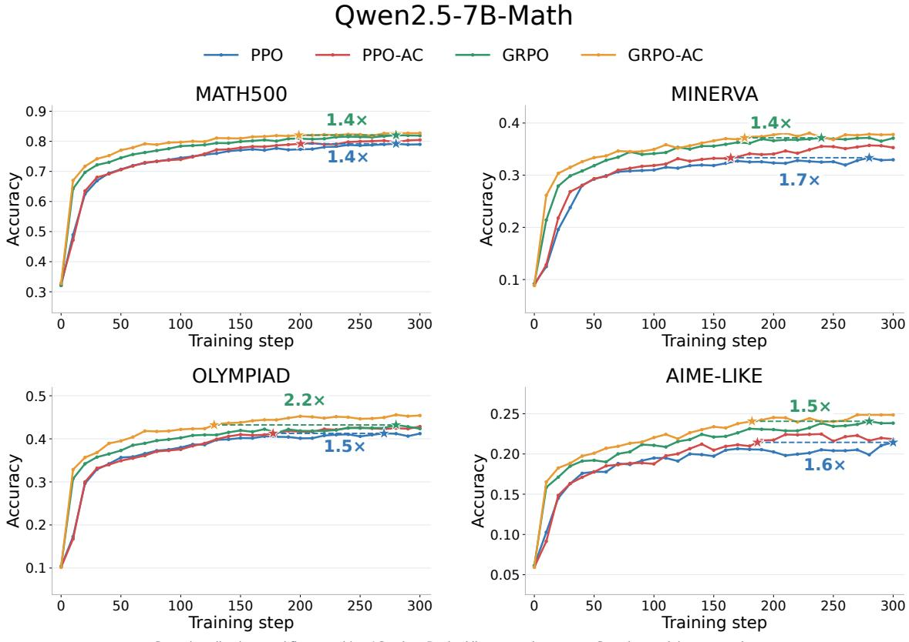  
Figure 4: Qwen2.5-7B-Math on benchmarks

## D.3 Additional Results for Qwen3-1.7B with PPO-Type Learning Rate 10−6

Here we report the post-training result of Qwen3-1.7B with lr=1e-6 for PPO-type algorithms (Figure 8 and 9). On Qwen3-1.7B, with the learning rate set to 10−6 for both PPO and PPO-AC, PPO-AC achieves a peak weighted accuracy of 60.55% at step 110, outperforming PPO’s best accuracy of 57.37% by 3.18 percentage points within 200 steps training. Notably, PPO attains its best performance at initialization, whereas PPO-AC improves beyond this baseline, demonstrating more efective policy optimization in this setting. Hence we tune the learning rate such that PPO do not keep decrease during the training. We search for 5 learning rates, and finally choose lr=5e-7 for Qwen3-1.7B. Overall, the results on Qwen3-1.7B with a learning rate of $1 0 ^ { - 6 }$ demonstrate the substantial performance gains achieved by ACPO over PPO.

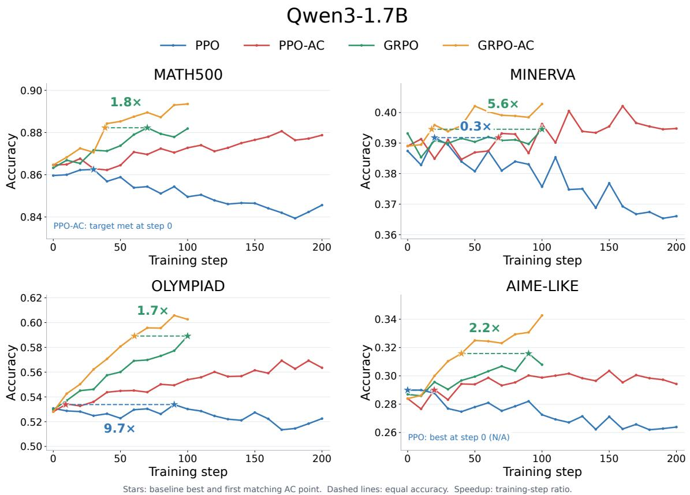  
Figure 5: Qwen3-1.7B on benchmarks

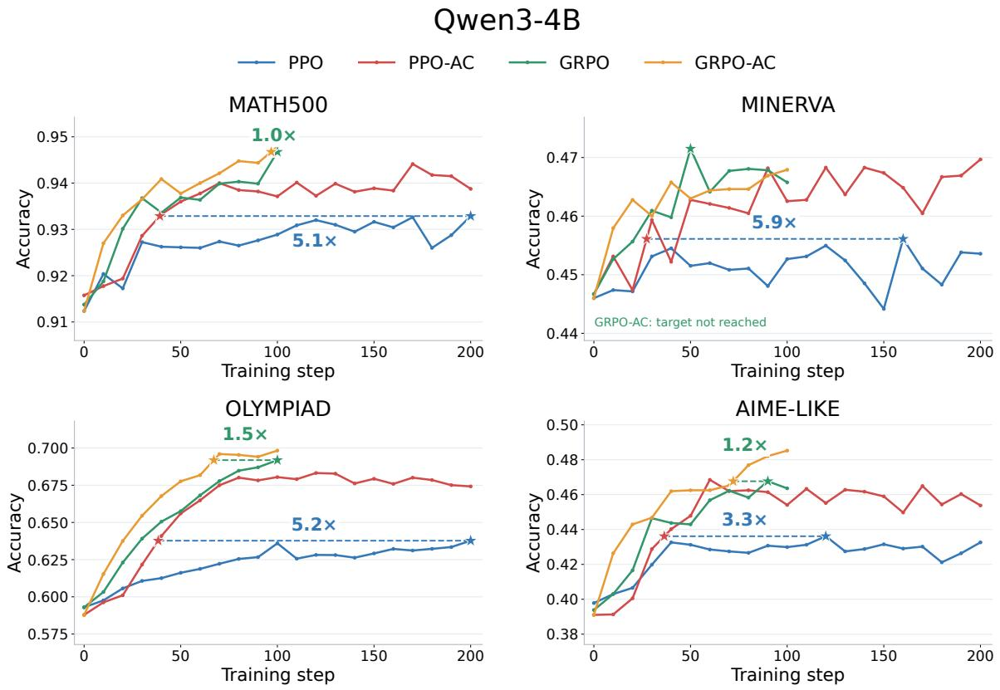  
Stars: baseline best and first matching AC point. Dashed lines: equal accuracy. Speedup: training-step ratio.

Figure 6: Qwen3-4B on benchmarks

Stars: baseline best and first matching AC point. Dashed lines: equal accuracy. Speedup: training-step ratio.

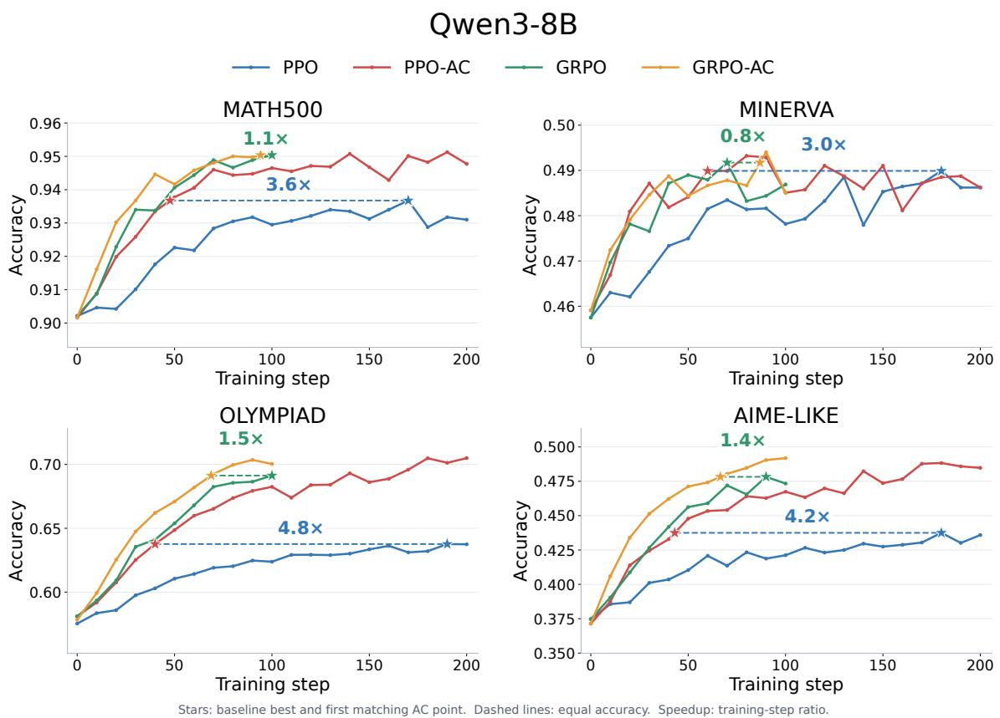  
Figure 7: Qwen3-8B on benchmarks

## Qwen3-1.7B(PPO and PPO-AC lr=1e-6)

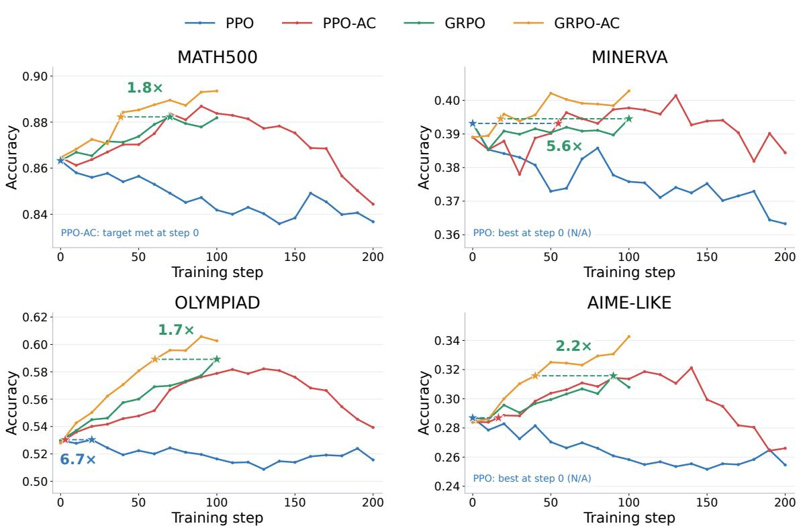  
Figure 8: Qwen3-1.7B with PPO-Type lr=1e-6 on benchmarks

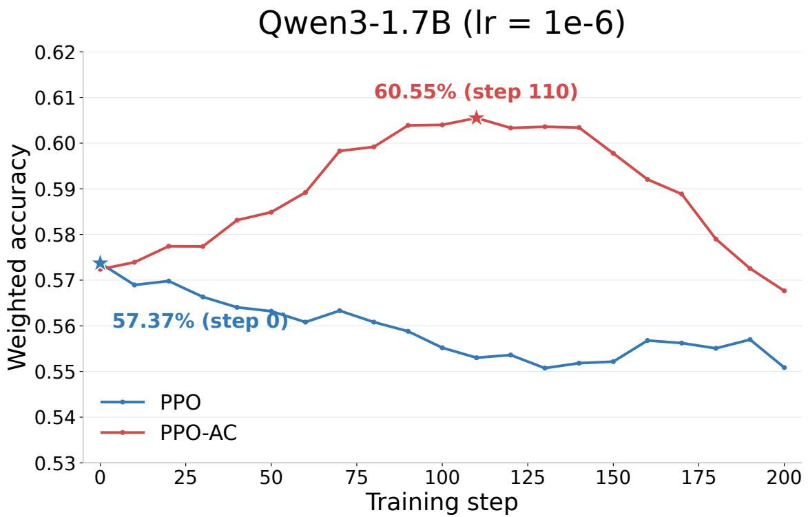  
Figure 9: Weighted Accuracy of Qwen3-1.7B with $\mathrm { P P O - T y p e }$ lr=1e-6