# UNLOCKING THE CRITIC: REWARD-FREE POLICY OPTIMIZATION FOR LLM POST-TRAINING

Hongyang (Kevin) Li1 Xiao Li2 Caesar Wu1 Said Mammar3 Gregoire Danoy ´ 1 Pascal Bouvry1

## ABSTRACT

Recent approaches to reinforcement learning (RL) post-training for large language models increasingly remove the critic to reduce training instability and memory overhead. Even where a critic is trained, it is discarded once training ends, although it has learned to predict outcomes. We revisit this trend and show that a pretrained critic’s ability to predict future outcomes can make it a valuable asset for efficient long-horizon reasoning. First, we find that instability in critic-based RL for long chain-of-thought reasoning is largely an optimization artifact: keeping policy updates small and low in variance restores stable convergence. Second, a well-pretrained critic estimates the posterior probability of eventual success from later trajectory states and unfinished prefixes. Its predictions therefore provide outcome-derived, dense, per-prefix learning signals that, during policy optimization, require neither completed rollouts, step-level annotations, nor external reward labels. Building on this insight, we introduce Reward-Free Policy Optimization (RFPO), which repurposes a single calibrated, frozen critic as a rollout-level reward, a value baseline for generalized advantage estimation, and a success forecaster for unfinished prefixes. We further show that binarizing the debiased score stops the policy from exploiting the critic’s length bias. Binarized, RFPO matches supervised PPO without a single label in the training loop, while substantially cutting compute and memory overhead. This makes RFPO particularly well suited to long-horizon reasoning tasks, where outcomes arrive late and generation dominates cost: because rollouts can be rewarded before they finish, training no longer has to pay for waiting on every trajectory to complete. Our findings challenge the prevailing critic-free paradigm and establish critic-based, reward-free optimization as a scalable and computationally efficient path for LLM post-training.

## 1 INTRODUCTION

Reinforcement learning is now the dominant recipe for turning a pretrained language model into a reasoner (Guo et al., 2025; Grattafiori et al., 2024; Lambert et al., 2025), and the recipe has converged on a particular shape: PPO’s value network (Schulman et al., 2017)—a second model the size of the policy—is replaced by a baseline computed from several samples of the same prompt (Shao et al., 2024; Ahmadian et al., 2024; Yu et al., 2025; Hu, 2025; Liu et al., 2025; Zheng et al., 2025). Two arguments carried this change: the critic is expensive to hold and to train, and its estimates were judged too unreliable to be worth the trouble (Kazemnejad et al., 2025). Recent reasoning and agentic systems are trained with no value network at all (Guo et al., 2025; Kimi Team, 2025a; Yang et al., 2025; Kimi Team, 2025b; MiniMax, 2025). A counter-current has begun to repair the critic instead of removing it, by pretraining the value head, by making it generative, or by weighting it by how much of the return it explains (Yuan et al., 2025; Yue et al., 2025; ByteDance Seed, 2025; Shan et al., 2026; Pan et al., 2026)—but every one of these works keeps the critic in the job it already had, reducing the variance of the policy gradient, while the reward still comes from outside. We ask a different question. If a critic can be trained well enough to be trusted as a baseline, is it also good enough to be the reward? The question matters because the reward is where these pipelines run out of resources. Human feedback, outcome and process reward models each require their own annotation project (Christiano et al., 2017; Ouyang et al., 2022; Cobbe et al., 2021; Uesato et al., 2022; Lightman et al., 2024; Wang et al., 2024); verifiable rewards avoid the reward model but require a reference answer for every training prompt (Yu et al., 2025; Lambert et al., 2025). Each route buys the same thing—a number attached to every rollout—at a price that does not scale with the amount of RL one would like to run.

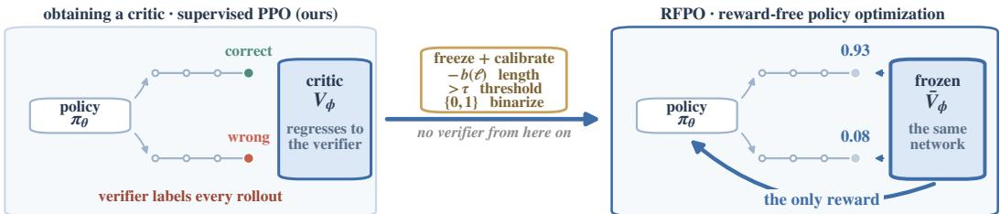  
the value headfit against the verifier becomes the reward: V ≈ Pr(correct ∣ x,y)

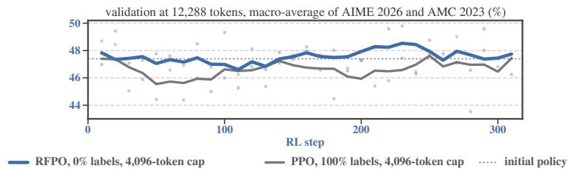  
Figure 1: Overview of RFPO. Top left: a critic is obtained by fitting a value network against a verifier, here within a supervised PPO run. Top right: frozen and calibrated once, it becomes the only reward and the GAE baseline for policy optimization. Bottom: validation at 12,288 tokens (macro-average of AIME 2026 and AMC 2023) of RFPO and supervised PPO, both trained under a 4,096-token cap that leaves about half of RFPO’s training rollouts unfinished; each dot is one validation evaluation (every 10 steps, 8 samples per problem) and each line a centered moving average over five consecutive evaluations, i.e. ±20 steps (§5).

Under the sparse terminal correctness rewards used in reasoning RL, with the standard $\scriptstyle \gamma = \lambda = 1$ the critic’s regression target at every prefix is the trajectory’s final reward, so its fixed point is $V _ { \phi } ( x , y _ { \le t } ) \approx \operatorname* { P r } ( { \mathrm { s u c c e s s ~ } } | \ x , y _ { \le t } )$ (Sutton & Barto, 2018). A well-pretrained critic approximates this closely enough over the later part of a rollout, not only at its final token, for its value to serve as the reward. From an ordinary supervised PPO run on mathematical reasoning we take an actor and a critic checkpoint, freeze the critic, calibrate its value, and continue policy optimization with that calibrated value as the only reward. The same frozen network also serves as the GAE baseline (Schulman et al., 2016) and, at unfinished prefixes, as a forecast of success, so the continued stage trains no value network and waits on no verifier (Figure 1).

Our contributions: (i) Critic instability is an optimization artifact. The instability that pushed critics out of long chain-of-thought RL (Yuan et al., 2025; Yue et al., 2025) comes from the update recipe, not the value network: it recedes once each policy update is kept small and low in variance (§4, App. B). (ii) One frozen critic, three roles. A well-pretrained critic estimates the posterior probability of success from later states and unfinished prefixes. RFPO uses that single network as the rollout-level reward, the GAE baseline, and a forecaster for unfinished prefixes, giving dense, per-prefix signals without costly external labels during policy optimization (§3). (iii) Calibration guards against length bias. The critic’s score carries a length bias that a continuous reward lets the policy exploit in either direction; binarizing the debiased score closes that channel. Used as a continuous reward, the same critic climbs above fully supervised PPO and then gives the gain back (§5, App. F). (iv) Parity at lower cost, built for long horizons. Binarized, RFPO matches supervised PPO at a 5,120-token cap with no label in the training loop while substantially cutting compute and memory; because it scores truncated rollouts with accuracy comparable to complete ones, it suits long-horizon reasoning, where waiting for every trajectory to finish is what costs the most. Under a 4,096-token cap that leaves about half of every batch unfinished, it validates above supervised PPO trained under the same cap on 19% fewer GPU-hours, without verifier labels during RL (§5, §3.1, Figs. 1 and 4).

## 2 RELATED WORK

Process reward models give dense, per-step signals, but they judge the steps already written and require step-level annotation (Lightman et al., 2024; Wang et al., 2024); a critic instead forecasts where a prefix will end and is learned from outcomes alone. Label-free alternatives replace label with majority voting (Zuo et al., 2025; Wang et al., 2023), self-rewarding (Yuan et al., 2024), model confidence (Zhao et al., 2026) or generated rubrics (Sheng et al., 2026), and without grounded supervision they are prone to reward hacking (Amodei et al., 2016; Shao et al., 2025). Implicitreward methods such as DPO (Rafailov et al., 2023) and PRIME (Cui et al., 2025) still need labels during training. Our reward is grounded in verifier outcomes, obtained before policy optimization, frozen, and bounded by calibration. As reasoning traces and agentic episodes lengthen, generation rather than optimization dominates cost (Zhou et al., 2026; Kimi Team, 2025b), and sparse termina rewards make credit assignment harder (Kazemnejad et al., 2025) because the verifier says nothing until an answer appears. Existing remedies truncate rollouts or sparsify attention but have no way to score an unfinished trajectory; the critic’s forecast supplies exactly that.

## 3 REWARD-FREE POLICY OPTIMIZATION

RFPO optimizes a policy using a pretrained critic as its reward. Given a value network fit to terminal correctness under $\gamma = \lambda = 1$ , RFPO freezes it, calibrates its output once against a small sample of rollouts, and optimizes the policy against it, so the loop contains no verifier and trains no value network. Any procedure that yields a critic able to rank trajectories well will do. §3.1 shows what makes a critic reliable and how ours was trained; §3.2 how it is frozen and calibrated.

## 3.1 A CRITIC WORTH CONSULTING

RFPO asks one frozen critic to play three roles: a rollout-level reward, the value baseline for generalized advantage estimation (GAE), and a forecaster of success for unfinished prefixes. All three rest on the same quantity. Given a prompt $x ,$ a policy generates a response $y = ( y _ { 1 } , \dots , y _ { T } )$ and a verifier returns a sparse terminal reward $r ^ { \star } ( x , \bar { y } ) \in \mathsf { \bar { \{ 0 , 1 \} } }$ . PPO fits a critic $V _ { \phi }$ to empirical returns for GAE (Schulman et al., 2017; 2016); with $\scriptstyle \gamma = \lambda = 1$ the regression target at every prefix is the final reward, so the ideal critic satisfies

$$
V _ { \phi } ( x , y _ { \le t } ) \ : \approx \ : \mathbb { E } _ { \pi _ { \theta } } [ r ^ { \star } \mid x , y _ { \le t } ] \ : = \ : { \operatorname* { P r } ( \operatorname { s u c c e s s } \mid x , y _ { \le t } ) }\tag{1}
$$

(Sutton & Barto, 2018). A trained critic only approximates this fixed point, so what matters is how well it ranks rollouts, which we check offline. We obtain such a critic from supervised PPO on mathematical reasoning: 500 steps at an 8,192-token budget and 300 more at a 5,120-token cap, taking the initial policy $\pi _ { \theta _ { 0 } }$ at cumulative step 700 and freezing the critic $\bar { V } _ { \phi }$ at step 800 (Fig. 2; §4). Explained variance, which costs nothing to monitor during training, rises from −32 at initialization to about 0.55 by step 800 (Fig. 2a), and, as the offline checks below show, it is a reliable indicator of critic quality. A good critic separates rollout quality, and training is what makes it do so. On rollouts from an early policy (cumulative PPO steps 100–200), the critic checkpoint at cumulative step 200 separates correct from incorrect responses at AUC 0.91; the critic we freeze, at step 800, reaches 0.94 on the same rollouts and 0.96 on rollouts from the converged policy (steps 700–800) (Fig. 3a–c). Scoring ten actor distributions (16,384 rollouts each) with nine critic checkpoints from the same run (cumulative steps 100–900, one past the frozen critic), overall AUC rises from 0.913 to 0.965 and within-problem AUC from 0.765 to 0.842, against 0.583 for ranking by “shorter is correct”; across the checkpoints, within-problem AUC tracks explained variance (r=0.91; Fig. 3d). The critic also judges a rollout before it ends. Scoring prefixes of 1,024 rollouts cut at increasing lengths against the final correctness of each full rollout (Fig. 3e), overall AUC is already 0.958 at 256 tokens, largely because the critic recognizes problem difficulty; ranking attempts at the same problem starts near chance and rises with the visible reasoning, to 0.84 at 4,096 tokens and 0.84– 0.92 on prefixes that have not yet produced an answer. Rollouts that exhaust the generation budget are ranked as well as the rest (within-problem AUC 0.79–0.84), so this is not truncation detection.

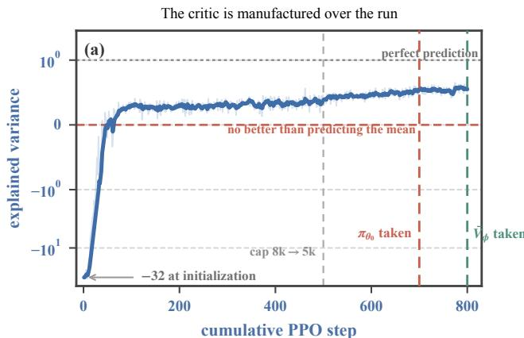

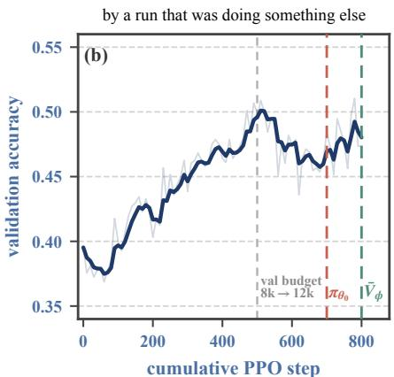  
Figure 2: Training the critic. (a) Explained variance of the value head across both critic-pretraining phases on one cumulative axis (symmetric log scale), rising from −32 at initialization to about 0.55. Across nine checkpoints it tracks offline within-problem AUC $\left( r { = } 0 . 9 1 ; \mathrm { F i g . } 3 \mathrm { d } \right)$ , which makes it a cheap training-time indicator of critic quality. (b) Held-out accuracy of the same supervised PPO run. At step 500 the training cap drops from 8,192 to 5,120 tokens and the validation budget rises from 8,192 to 12,288, so accuracy on either side of that line is not directly comparable. Dashed markers show where we extract the initial policy and the critic we freeze.

## 3.2 FREEZING AND CALIBRATING THE CRITIC

We freeze $\bar { V } _ { \phi }$ and give it two jobs at once. As the reward it supplies an outcome score $v ( x , y ) = \bar { V } _ { \phi } ( x , y _ { \leq T } )$ , where $T$ is the last observed response token—a rollout may end naturally or hit the generation cap, and RFPO scores it either way. As a baseline it supplies the token-level values $\bar { V } _ { \phi } ( x , y _ { \le t } )$ that GAE needs. Both come out of the same forward pass the old pipeline already ran, so the reward costs no additional model and no additional pass. Without a guard against length bias, the critic’s raw terminal score cannot be used directly as the reward. Length and correctness are mixed in the rollouts: long responses are more often wrong, and part of the score’s decline with length reflects exactly that. But the score also falls with length when the outcome is held fixed: among responses to the same problem with the same outcome, longer ones score lower (correlation −0.43 on 16,384 rollouts from the deployed pair). That part is a bias, and the policy can exploit it by changing length without changing correctness; a policy rewarded with the raw terminal score simply stops reasoning (Appendix F). Length exploitation is a recurring problem in RL post-training, which is why many PPO-style recipes add explicit length penalties or overlong-response shaping to the reward (Singhal et al., 2024; Yu et al., 2025; Kimi Team, 2025a). The calibration below is our guard. We fit a debiasing term and a threshold on 512 on-policy rollouts from $\pi _ { \theta _ { 0 } }$ and deploy

$$
\hat { r } ( x , y ) \ = \ { \bf 1 } \big [ v ( x , y ) - b \big ( \ell ( y ) \big ) > \tau \big ] \ ,\tag{2}
$$

where $\ell ( y )$ is response length and $b ( \ell )$ holds length-decile offsets estimated within correctness class. Estimating within class is what separates the bias from the signal: $b ( \ell )$ captures how the score moves with length among responses with the same outcome, and leaves the gap between correct and incorrect responses in place. The threshold τ is the quantile of those scores that matches their positive rate to the verifier-positive rate on the calibration set. On our pair this gives $\tau = 0 . 5 2 1 5 \mathrm { a t } 9 3 . 4 \%$ calibration accuracy. The cut must be fitted on the deployed pair: a critic can rank well without its outputs being probabilities, and across the nine checkpoints of §3.1 the balanced-accuracy-optimal threshold ranges from 0.462 to 1.082. The two pieces do different work, and Appendix F shows that both are load-bearing. Under a continuous reward, whatever length dependence remains, in either direction, is something the policy can climb; how strongly the score is debiased decides which way it drifts. The indicator decides whether it drifts at all: once the reward is capped at one, pushing a score higher above the cut earns nothing, and the exploit that the continuous score invites has nowhere to go. With $\scriptstyle \gamma = \lambda = 1$ and the reward of Eq. (2), GAE collapses to $A _ { t } = \hat { r } - \bar { V } _ { \phi } ( x , y _ { \leq t } )$ before normalization, and the actor is updated with the clipped PPO surrogate while ϕ is never touched (Algorithm 1). An optional supervision fraction p replaces rˆ with $r ^ { \star }$ independently per trajectory, so $p { = } 0$ is fully rewardfree and $p { = } 1$ recovers supervised PPO with a trainable critic. Freezing also removes the critic’s optimizer states and backward pass from the step; we account for what that saves in Appendix G.

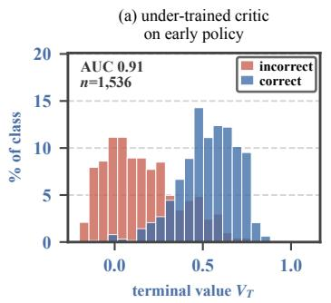

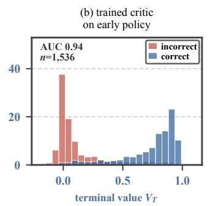

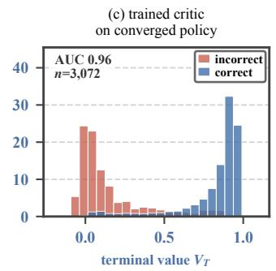

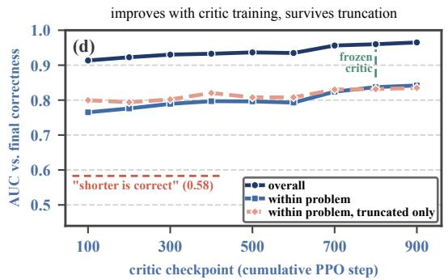

the attempt-level part matures as the rollout unfolds  
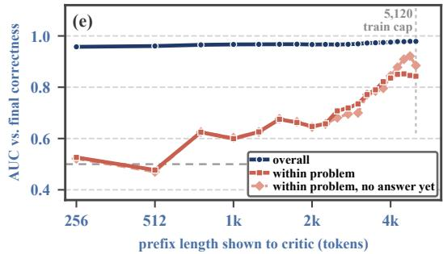  
Figure 3: What the frozen critic knows. (a–c) Terminal values of rollouts, split by final correctness. Rollouts in (a) and (b) come from an early policy (cumulative PPO steps 100–200), those in (c) from the converged policy (steps 700–800). The critic checkpoint at cumulative step 200 already separates correct from incorrect early-policy rollouts, but its values bunch between 0 and 0.8 and the two classes overlap widely (a, AUC 0.91). The critic we freeze, at step 800, scoring the same rollouts, pushes incorrect responses toward 0 and correct ones toward 1 (b, 0.94), and separates rollouts from a converged policy just as clearly (c, 0.96). (d) Nine critic checkpoints at cumulative steps 100–900, each averaged over ten actor distributions; the critic we freeze is the one at step 800 (marked), and step 900 is a later checkpoint from the same run. Overall AUC also credits the critic for recognizing which problems are hard; that is legitimate signal, but to isolate the attempt we also measure withinproblem AUC, which holds the problem fixed and ranks attempts at it. It rises with critic training, holds at the same level when restricted to rollouts that exhausted the generation budget, and stays well above ranking by “shorter is correct”. (e) Prefixes of 1,024 rollouts (128 problems, 8 responses each) scored at increasing token lengths against the final correctness of the full rollout. Overall AUC is high from the first prefix; within-problem AUC starts near chance and rises as more of the reasoning becomes visible, including on prefixes that have not yet produced an answer.

Algorithm 1 RFPO: calibrate once, then train with no labels   
Require: actor $\pi _ { \boldsymbol { \theta } _ { 0 } } .$ critic $\bar { V } _ { \phi } ,$ prompts D, group size G, supervision fraction p   
1: Freeze $\bar { V } _ { \phi }$ ▷ no critic optimizer, no critic backward pass   
2: Sample calibration rollouts $\mathcal { C } = \{ ( x , y , r ^ { \star } , \ell ( y ) ) \}$ from $\pi _ { \theta _ { 0 } }$   
3: Fit length-decile offsets b(ℓ) within correctness class on C   
4: $q \gets \bar { \mathrm { m e a n } } c ( r ^ { \star } ) ; \tau \gets \bar { Q } _ { 1 - q } \big ( \bar { V } _ { \phi } ( x , y _ { \le T } ) - b ( \ell ( y ) ) \big )$ on C   
5: for each RL step do   
6: Sample prompts from ${ _ { - } } \mathcal { D } ;$ generate G responses each   
7: One forward pass of $\bar { V } _ { \phi }$ per response gives all token values; let $v _ { i } = \bar { V } _ { \phi } ( x _ { i } , y _ { i , \le T _ { i } } )$   
8: $\hat { r } _ { i } \gets \mathbf { 1 } [ v _ { i } - \bar { b } ( \ell ( y _ { i } ) ) > \tau ]$   
9: zi ∼ Bernoulli(p); ri ← r⋆ if zi = 1 else $\hat { r } _ { i }$   
10: $A _ { i , t }  r _ { i } - \bar { V } _ { \phi } ( x _ { i } , y _ { i , \le t } ) ;$ normalize advantages   
11: Update $\theta$ with the clipped PPO objective; leave ϕ unchanged   
12: end for

## 4 EXPERIMENTAL SETUP

Models and lineage. We fine-tune Qwen3-4B-Base (Yang et al., 2025) on 45k long chain-ofthought solutions from OpenR1-Math-220k (Hugging Face, 2025) for three epochs and carry the epoch-2 checkpoint forward. That checkpoint enters supervised PPO on DAPO-Math-17k (Yu et al., 2025), run in the two consecutive phases described in §3.1: 500 steps at an 8,192-token generation budget with 64 prompts per step, then 300 steps at a 5,120-token training cap with 128. We extract the initial policy $\pi _ { \theta _ { 0 } }$ at cumulative step 700 and the critic $\bar { V } _ { \phi }$ at step 800. This is the only supervision anywhere in the pipeline, and it amounts to roughly 0.56M verifier-labeled trajectories.

Table 1: Training runs. Shaded rows share the initial policy and the initial critic and differ only in the reward; rows below the rule are RFPO variants with parts of the calibration removed or changed, followed by the 4,096-token-cap pair added later (§5). Steps are recorded run lengths, which can exceed the 300-step comparison window. All runs train under a 5,120-token cap unless the arm names another; the raw-value run predates that protocol. Appendix H maps each arm to its log.
<table><tr><td>Arm</td><td>Training reward</td><td>p</td><td>Steps</td><td>Used for</td></tr><tr><td>100% labels (PPO)</td><td>verifier</td><td>1.0</td><td>300</td><td>label efficiency</td></tr><tr><td>RFPO, 50% labels</td><td>verifier or Eq. (2)</td><td>0.5</td><td>330</td><td>label efficiency</td></tr><tr><td>RFPO, 0% labels (3×)</td><td>Eq. (2)</td><td>0</td><td>310/324/378</td><td>main result</td></tr><tr><td>Raw value</td><td>v, no calibration</td><td>0</td><td>256</td><td>App. F</td></tr><tr><td>Threshold only</td><td> $\mathbf { 1 } [ v > 0 . 6 ]$ </td><td>0</td><td>100</td><td>App. F</td></tr><tr><td>Continuous v (4×)</td><td> $v - b ( \ell )$  , no threshold</td><td>0</td><td>87/141/220/257</td><td>App. F</td></tr><tr><td>Continuous v, GRPO</td><td>same, group-relative</td><td>0</td><td>161</td><td>App. F</td></tr><tr><td>1,024-token cap</td><td>v</td><td>0</td><td>144</td><td>rollout budget</td></tr><tr><td>RFPO, 4,096-token cap</td><td>Eq. (2), refitted</td><td>0</td><td>310</td><td>rollout budget</td></tr><tr><td>PPO, 4,096-token cap</td><td>verifier</td><td>1.0</td><td>310</td><td>rollout budget</td></tr></table>

What varies across runs, and what does not. Every run in the main comparison starts from that same $( \pi _ { \theta _ { 0 } } , \bar { V } _ { \phi } )$ pair and draws the same prompts in the same nominal order under the same PPO settings. Two things vary: where the reward comes from, and whether the critic is updated. Supervised PPO takes verifier labels and trains its critic; RFPO takes Eq. (2) and freezes it. Table 1 lists the runs. The three zero-label runs of the main comparison share their recorded seed settings and repeat one condition.

Optimization settings, shared by RFPO and the supervised baseline. RFPO updates the policy with the clipped surrogate objective of PPO (Schulman et al., 2017); what it replaces is the reward and the trained critic, not the optimizer. Both RFPO and supervised PPO therefore run under identical settings, in verl (Sheng et al., 2025), with 128 prompts and 8 responses per prompt, so every step consumes 1,024 rollouts. Prompts are capped at 2,048 tokens, training generations at 5,120 and validation generations at 12,288. Sampling is at temperature 1.0, the clip ratio is $0 . 2 , \gamma { = } \lambda { = } 1$ , the actor learning rate is $1 0 ^ { - 6 }$ , and the critic learning rate is $1 0 ^ { - 5 }$ in the supervised baseline, the only arm that trains one. No KL penalty is applied, either in the reward or as a loss. Under this protocol the three zero-label runs truncate 26.5–28.5% of training generations at the 5,120 cap, while validation at 12,288 tokens is capped for only 1.1–1.8%. Critic-based RL is widely held to be unstable on long chains of thought (Yuan et al., 2025; Yue et al., 2025), and our own earlier runs reproduced the symptom: with 2 to 16 inner updates over batches of 256 to 1,024 rollouts, supervised PPO and reward-free runs alike failed in two opposite directions, policy entropy either collapsing toward zero or drifting upward without settling. The cause was the update, not the critic. Keeping each policy update small and low in variance—one gradient step per batch, with the mini-batch equal to the full batch and no inner loop over the collected rollouts—makes both failures recede, and under that single rule supervised PPO and RFPO alike train stably for hundreds of steps (Appendix B). This is the evidence behind contribution (i), and the rule is used in every run reported below.

Calibration. The debiasing term and threshold of Eq. (2) are fitted once, on 512 on-policy rollouts drawn from $\pi _ { \theta _ { 0 } }$ at the training cap, and then never refitted: $b ( \ell )$ from length-decile offsets within correctness class, and $\tau = 0 . 5 2 1 5$ from matching the positive rate of the corrected scores to the verifier-positive rate on that sample, at which the binary rule agrees with the verifier on 93.4% of it.

Evaluation. Every ten steps we evaluate AIME 2026 (30 problems) and AMC 2023 (40 problems) with 8 samples per problem at temperature 0.7 and a 12,288-token budget, and report their macro average, which weights the two suites equally. Training-time pass@k uses the plug-in estimator

Table 2: Separate evaluation after 300 RL steps. Pass@1 (%) at 16 samples, temperature 0.7 and a 12,288-token budget; Avg is the mean over the four suites. Each RL row is one checkpoint; the zero-label row covers one of the three runs, the other two being assessed through training-time validation. †Base is evaluated as plain completion, without the think template.
<table><tr><td>Model</td><td>AIME25</td><td>AIME26</td><td>AMC23</td><td>GPQA</td><td> $\mathrm { A v g }$ </td></tr><tr><td> $\mathrm { Q w e n } 3 { - } 4 \mathrm { B - B a s e } ^ { \dagger }$ </td><td>3.1</td><td>3.5</td><td>25.9</td><td>33.0</td><td>16.4</td></tr><tr><td>+ SFT (45k CoT)</td><td>22.3</td><td>20.8</td><td>63.4</td><td>35.7</td><td>35.5</td></tr><tr><td>Initial policy  $\pi _ { \theta _ { 0 } }$ </td><td>22.7</td><td>21.0</td><td>71.4</td><td>44.9</td><td>40.0</td></tr><tr><td>+ PPO, 100% labels</td><td>25.2</td><td>21.7</td><td>73.6</td><td>46.6</td><td>41.8</td></tr><tr><td>+ RFPO, 50% labels</td><td>22.7</td><td>21.2</td><td>72.8</td><td>48.5</td><td>41.3</td></tr><tr><td>+ RFPO, 0% labels</td><td>25.4</td><td>21.7</td><td>70.0</td><td>47.3</td><td>41.1</td></tr></table>

$\mathbb { E } _ { \mathrm { p r o b l e m } } [ 1 - ( 1 - \hat { p } ) ^ { k } ]$ on the sampled solve rate ${ \hat { p } } .$ The principal comparison window is the first 300 RL steps; runs recorded past that point also contribute to peak and late-training summaries, with their windows stated. Step-300 checkpoints additionally receive a separate $n { = } 1 6$ evaluation on AIME 2025, AIME 2026, AMC 2023 and GPQA-Diamond (Rein et al., 2024); GPQA is the out-of-domain probe.

## 5 RESULTS

Four questions decide whether a frozen critic is usable as the reward: whether training stays stable, whether the policy gets as far as it would with a verifier, whether a fixed reward survives the policy that is optimizing against it, and whether the reward can be assigned before a rollout finishes. (1) Binarization trades a higher ceiling for stability. Used as a continuous reward, the same critic climbs above fully supervised PPO—29.2 against 25.0 on AIME 2026 pass@1, the highest AIME score in this paper—showing how much signal a pretrained critic carries (Fig. 7a–b, Appendix C). The gain does not hold: every continuous arm declines later in training, and response length drifts with it, shorter or longer depending on how strongly the score is debiased, as the policy exploits whatever length bias the continuous reward still carries. Binarizing forfeits that ceiling and keeps training stable, which is why RFPO deploys it (Appendix F). (2) Training stays stable. Under the single-update rule of §4, none of the three zero-label runs degenerates over its 310–378 steps. Smoothed response length stays within 13% of its starting value, where the uncalibrated raw score of Appendix F shortens responses by 73% within 100 steps; policy entropy declines gradually from 0.32 to 0.21–0.22 by step 300, against 0.25 for supervised PPO, neither collapsing nor drifting upward; and held-out accuracy shows no late collapse (Table 3). A frozen reward with no verifier in the loop therefore trains as steadily as the supervised baseline.

(3) RFPO reaches supervised PPO. Table 2 reports the separate 16-sample evaluation at RL step 300 of the 5,120-token-cap runs. Averaged over four suites, the zero-label checkpoint reaches 41.1% pass@1 against 41.8% for supervised PPO, 41.3% for the half-labeled arm and 40.0% for the shared initial policy: relative to supervised PPO it is 0.2 points higher on AIME 2025, tied on AIME 2026, 0.7 higher on GPQA-Diamond and 3.6 lower on AMC 2023. Training-time validation tells the same story across all three zero-label runs (Fig. 4e–f; per-run numbers in Table 3): they peak at 25.7% on AIME 2026 pass@1 against 25.0% for supervised PPO, and at 76.6% on AMC 2023 pass@1 against 78.1%. The differences are small: level or ahead on AIME and GPQA, and 1.5–3.6 points behind on AMC 2023 pass@1, a 40-problem suite on which one problem is worth 2.5 points. With no verifier anywhere in its optimization loop, RFPO performs on par with fully supervised PPO. (4) A frozen reward survives drift, and partial labels can guard it. The policy moves during training while the reward stays fixed. Re-applying the frozen critic to each arm’s own rollouts across training, its ranking of terminal correctness shows no significant trend over 310 steps on any healthy arm (AUC slopes between −0.006 and +0.002 per 100 steps, all $| t | < 0 . 8 )$ The only significant decline anywhere in our data is the continuous arm of Fig. 7a–b (−0.010 per 100 steps, $t { = } { - } 2 . 8 9 )$ , whose rollouts almost stop finishing: the critic did not get worse, it was handed a population it was never fitted on, and binarization is what keeps the policy out of that region (Appendix E.4). Where more protection is wanted, the supervision fraction offers it: mixing the verifier into a random half of trajectories performs on par with both extremes (last-ten AIME pass@8 39.1% against 34.4% for supervised PPO and 37.2% for the zero-label runs), so the fraction is a continuous dial rather than a switch.

Table 3: Peak and final validation across every run. Each cell is peak (step) / final over each run’s recorded length. The shaded rows summarize the three zero-label runs. All rows train under the 5,120-token cap except the last two, the 4,096-token-cap pair added later (Table 4).
<table><tr><td colspan="2"></td><td colspan="2">AIME 2026</td><td colspan="2">AMC 2023</td></tr><tr><td>Arm</td><td>Steps</td><td>pass@1</td><td>pass@8</td><td>pass@1</td><td>pass@8</td></tr><tr><td>Initial policy  $\pi _ { \theta _ { 0 } }$ </td><td>0</td><td>21.2</td><td>32.1</td><td>73.6</td><td>89.5</td></tr><tr><td>PPO, 100% labels</td><td>300</td><td>25.0 (190)/21.7</td><td>41.7 (250)/34.0</td><td>78.1 (120) /71.9</td><td>93.2 (210) /89.0</td></tr><tr><td>RFPO, 50% labels</td><td>330</td><td>25.8 (80)/ 22.5</td><td>42.9 (300) /39.3</td><td>78.1 (290) /71.2</td><td>94.1 (290)/ 89.0</td></tr><tr><td>RFPO, 0% labels, run 1</td><td>310</td><td>24.6 (220) / 20.0</td><td>42.7 (220)/33.0</td><td>76.2 (290)/73.1</td><td>93.4 (290) / 85.7</td></tr><tr><td>RFPO, 0% labels, run 2</td><td>324</td><td>26.2 (30) / 23.8</td><td>43.7 (130) /39.3</td><td>75.9 (40)/72.2</td><td>93.8 (180) /90.9</td></tr><tr><td>RFPO, 0% labels, run 3</td><td>378</td><td>26.2 (270) / 20.0</td><td>44.5 (140) /31.5</td><td>77.5 (30) /71.6</td><td>93.6 (30) / 91.0</td></tr><tr><td>Reward-free (mean)</td><td></td><td>25.7/21.2</td><td>43.7/34.6</td><td>76.6/72.3</td><td>93.6/89.2</td></tr><tr><td>s.d. over the three runs</td><td></td><td>1.0/2.2</td><td>0.9/4.2</td><td>0.8/0.8</td><td>0.2/3.0</td></tr><tr><td>PPO, 100% labels, 4,096 cap</td><td>310</td><td>24.6 (200)/ 23.3</td><td>40.3 (200) / 35.0</td><td>75.6 (20)/71.6</td><td>93.0 (270) /86.3</td></tr><tr><td>RFPO, 0% labels, 4,096 cap</td><td>310</td><td>24.6 (100)/20.0</td><td>44.4 (180)/38.6</td><td>76.9 (60) /72.5</td><td>93.6 (60)/83.7</td></tr></table>

RFPO, 0% labels, 4,096-token cap PPO, 100% labels, 4,096-token cap

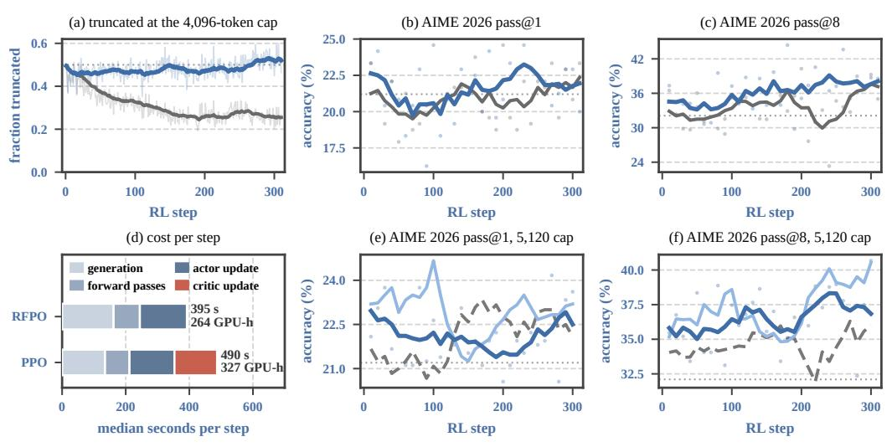  
(e, f) 100% labels (PPO) 50% labels (RFPO) 0% labels (RFPO), mean of 3 runs

Figure 4: Training with half of every batch unfinished, and the main result. (a–d) RFPO (zero labels) and supervised PPO, both under a 4,096-token cap: (a) share of training rollouts truncated; (b, c) AIME 2026 validation; (d) median seconds per step by component on the same node, with GPU-hours for 300 steps. (e, f) The main runs at the 5,120-token cap: AIME 2026 validation of supervised PPO, the half-labeled arm and the mean of the three zero-label runs (Table 3). Validation is at 12,288 tokens (dots: one evaluation every 10 steps, for the zero-label mean the mean of the three runs’ evaluations at that step; lines: centered moving averages over five consecutive evaluations, ±20 steps; dotted: initial policy); AMC 2023 in Table 4, macro-averages in Figure 1.

(5) The reward does not wait for the rollout to end. Under the deployed protocol 26.5–28.5% of training generations hit the 5,120-token cap, and RFPO scores them at the last observed token exactly like any other—so more than a quarter of every batch is already being rewarded without a finished answer. Varying the generation cap and really regenerating under it shows how much that costs. At caps of 5,120, 8,192 and 12,288 tokens the fraction of rollouts that finish is 0.735, 0.941 and 0.967, an eightfold change in the unfinished population, while the reward’s precision stays at 0.894–0.896 and its explained variance at 0.66–0.70. Scoring unfinished rollouts costs essentially nothing over this range, and training confirms it (Figs. 1 and 4). Under a 4,096-token cap, with b(ℓ) refitted so that short and long responses of the same outcome again score alike, about half of every batch stays unfinished for 310 steps, yet RFPO’s mean validation (47.6%) is above that of supervised PPO trained under the same cap (46.6%), on all four benchmark metrics (Table 4), and level with our 5,120-token runs (47.2–47.4%), for 264 rather than 327 GPU-hours over 300 steps; supervised PPO with the full 5,120-token cap reaches 48.3% for 388 (App. E.5). The approach has a floor: rollouts that stop resembling anything the critic was fitted on. Within a problem, the critic ranks 1,024-token prefixes at an AUC of only 0.60, against 0.84 from 4,096 tokens on (§3.1, Table 11); under a real 1,024-token cap only 0.7% of rollouts finish and precision collapses to 0.213. A run trained there raises its training solve rate from 5.5% to 19.3% while validation falls from 49.1% to 39.1% (Appendix E.5). (6) Cost falls sharply. Freezing the critic deletes one of the two trained modules from every step, and the reward needs no forward pass of its own: it is read off the value pass PPO already performs. On matched batches a step takes 421 rather than 582 s (−28%) and peak reserved memory falls by 9.4 GB per GPU (Appendix G, Figure 15), and Figure 4d shows the same cut at 4,096 tokens. The savings apply to the RL stage; obtaining and calibrating the critic is a separate, one-off preparation cost.

Table 4: 4,096-token cap, per benchmark. Validation at 12,288 tokens (%), each cell the mean over the evaluations at steps 10–300 / the peak in that window; GPU-hours for 300 steps at the median step time. The first two rows ran on the same node; the last row is supervised PPO at the full 5,120-token cap (Table 3), for reference.
<table><tr><td></td><td colspan="2">AIME 2026</td><td colspan="2">AMC 2023</td><td></td></tr><tr><td>Arm</td><td>pass@1</td><td>pass@8</td><td>pass@1</td><td>pass@8</td><td>GPU-h</td></tr><tr><td>RFPO, 0% labels, 4,096 cap</td><td>21.6 / 24.6 36.1 / 44.4</td><td></td><td></td><td>73.5 / 76.9 90.1 / 93.6</td><td>264</td></tr><tr><td>PPO, 100% labels, 4,096 cap</td><td>20.9 / 24.6</td><td>33.5 / 40.3</td><td>72.4 / 75.6</td><td>89.5 / 93.0</td><td>327</td></tr><tr><td>PPO, 100% labels, 5,120 cap</td><td>22.1 / 25.0</td><td>34.5 / 41.7</td><td>74.4 / 78.1</td><td>89.8 / 93.2</td><td>388</td></tr></table>

## 6 LIMITATIONS

All our experiments use a single model family at 4B parameters on mathematical reasoning. We have not yet tried larger models or non-reasoning tasks, because the experiments are expensive: a single 300-step RL run takes 264–388 GPU-hours on eight A100-80GB GPUs (Appendix G). Extending RFPO to larger models and to other tasks is left to future work.

## 7 CONCLUSION

Reasoning RL has been removing the value network to buy stability and memory, on the tacit assumption that it is worth only what it contributes as a baseline. We have argued the opposite. The instability behind its removal comes from the update recipe rather than from the network, and a well-pretrained critic carries far more than a baseline needs: it estimates how likely a rollout is to succeed, and it does so before the rollout ends. RFPO puts that signal to work. A single frozen critic serves at once as the rollout-level reward, the GAE baseline and a forecaster for unfinished prefixes. Used as a continuous reward it lifts accuracy above fully supervised PPO, which shows how much the critic knows; binarized, it gives up that ceiling in exchange for stable training and matches supervised PPO with no verifier in the loop and a lower per-step cost. Because its forecasts score truncated rollouts with accuracy comparable to complete ones, training need not wait for every trajectory to finish. That last property is where we think this leads. As reasoning traces lengthen and agentic episodes stretch, waiting for the outcome buys less and less for what it costs, and the value network is the one component of the standard recipe that speaks before the outcome arrives. The question we would put back on the table is not whether a critic is affordable, but how much of what it already knows the current recipe throws away. RFPO is our answer: it keeps that knowledge and turns it into a reward-free, compute-efficient method for LLM post-training.

## REPRODUCIBILITY STATEMENT

Every number here is produced from artifacts included with the submission. §4 and Appendix H give the model lineage, the PPO configuration and the mapping from each arm in Table 1 to its log; §3.2 and Table 7 give the calibration rule of Eq. (2) with its fitted offsets and threshold; Appendices C–E give the evaluation estimators and the critic-side measurements. The archive contains the training log of every run reported, the frozen critic’s calibration artifacts, the per-cell scoring summaries behind the measurement plane and the prefix scan, the benchmark outputs, and one script that regenerates every figure and table from them. Regenerating the figures needs only the archive; recomputing the critic-side measurements additionally needs the rollout archives and the frozen checkpoint, whose sizes and original locations the file index lists.

## AI USE STATEMENT

We used generative AI tools to polish the writing, draft parts of the text, and assist with computing summary statistics from training logs and plotting figures. All experiments were designed, implemented and run by the authors, who made all analysis decisions and verified every reported number against the recorded logs. The authors take full responsibility for the content of this paper.

## REFERENCES

Arash Ahmadian, Chris Cremer, Matthias Galle, Marzieh Fadaee, Julia Kreutzer, et al. Back to´ basics: Revisiting REINFORCE-style optimization for learning from human feedback in LLMs. In Proceedings of the 62nd Annual Meeting of the Association for Computational Linguistics (ACL), 2024.

Dario Amodei, Chris Olah, Jacob Steinhardt, Paul Christiano, John Schulman, and Dan Mane. Con-´ crete problems in AI safety. arXiv preprint arXiv:1606.06565, 2016.

ByteDance Seed. Seed1.5-thinking: Advancing superb reasoning models with reinforcement learning. arXiv preprint arXiv:2504.13914, 2025.

Paul F. Christiano, Jan Leike, Tom B. Brown, Miljan Martic, Shane Legg, and Dario Amodei. Deep reinforcement learning from human preferences. In Advances in Neural Information Processing Systems (NeurIPS), 2017.

Karl Cobbe, Vineet Kosaraju, Mohammad Bavarian, Mark Chen, Heewoo Jun, et al. Training verifiers to solve math word problems. arXiv preprint arXiv:2110.14168, 2021.

Ganqu Cui, Lifan Yuan, Zefan Wang, Hanbin Wang, Wendi Li, et al. Process reinforcement through implicit rewards. arXiv preprint arXiv:2502.01456, 2025.

Aaron Grattafiori et al. The llama 3 herd of models. arXiv preprint arXiv:2407.21783, 2024.

Daya Guo, Dejian Yang, Haowei Zhang, Junxiao Song, et al. DeepSeek-R1 incentivizes reasoning in LLMs through reinforcement learning. Nature, 645(8081):633–638, 2025.

Jian Hu. REINFORCE++: A simple and efficient approach for aligning large language models. arXiv preprint arXiv:2501.03262, 2025.

Hugging Face. Open R1: A fully open reproduction of DeepSeek-R1. https://github.com/ huggingface/open-r1, 2025.

Amirhossein Kazemnejad, Milad Aghajohari, Eva Portelance, Alessandro Sordoni, Siva Reddy, et al. VinePPO: Refining credit assignment in RL training of LLMs. In International Conference on Machine Learning (ICML), 2025.

Kimi Team. Kimi k1.5: Scaling reinforcement learning with llms. arXiv preprint arXiv:2501.12599, 2025a.

Kimi Team. Kimi k2: Open agentic intelligence. arXiv preprint arXiv:2507.20534, 2025b.

Nathan Lambert, Jacob Morrison, Valentina Pyatkin, Shengyi Huang, Hamish Ivison, et al. Tulu 3:¨ Pushing frontiers in open language model post-training. In Conference on Language Modeling (COLM), 2025.

Hunter Lightman, Vineet Kosaraju, Yura Burda, Harri Edwards, Bowen Baker, et al. Let’s verify step by step. In International Conference on Learning Representations (ICLR), 2024.

Zichen Liu, Changyu Chen, Wenjun Li, Penghui Qi, Tianyu Pang, Chao Du, Wee Sun Lee, and Min Lin. Understanding R1-Zero-like training: A critical perspective. In Conference on Language Modeling (COLM), 2025.

MiniMax. Minimax-m1: Scaling test-time compute efficiently with lightning attention. arXiv preprint arXiv:2506.13585, 2025.

Long Ouyang, Jeff Wu, Xu Jiang, Diogo Almeida, Carroll L. Wainwright, et al. Training language models to follow instructions with human feedback. In Advances in Neural Information Processing Systems (NeurIPS), 2022.

Chengjun Pan, Shichun Liu, Jiahang Lin, Dingwei Zhu, Jiazheng Zhang, Shihan Dou, Songyang Gao, Zhenhua Han, Binghai Wang, Rui Zheng, Xuanjing Huang, Tao Gui, and Yansong Feng. EVPO: Explained variance policy optimization for adaptive critic utilization in LLM posttraining. arXiv preprint arXiv:2604.19485, 2026.

Rafael Rafailov, Archit Sharma, Eric Mitchell, Christopher D. Manning, Stefano Ermon, and Chelsea Finn. Direct preference optimization: Your language model is secretly a reward model. In Advances in Neural Information Processing Systems (NeurIPS), 2023.

David Rein, Betty Li Hou, Asa Cooper Stickland, Jackson Petty, Richard Yuanzhe Pang, et al. GPQA: A graduate-level Google-Proof Q&A benchmark. In First Conference on Language Modeling (COLM), 2024.

John Schulman, Philipp Moritz, Sergey Levine, Michael Jordan, and Pieter Abbeel. Highdimensional continuous control using generalized advantage estimation. In International Conference on Learning Representations (ICLR), 2016.

John Schulman, Filip Wolski, Prafulla Dhariwal, Alec Radford, and Oleg Klimov. Proximal policy optimization algorithms. arXiv preprint arXiv:1707.06347, 2017.

Zikang Shan, Han Zhong, Liwei Wang, and Li Zhao. Bringing value models back: Generative critics for value modeling in llm reinforcement learning. arXiv preprint arXiv:2604.10701, 2026.

Rulin Shao, Shuyue Stella Li, Rui Xin, Scott Geng, Yiping Wang, et al. Spurious rewards: Rethinking training signals in RLVR. arXiv preprint arXiv:2506.10947, 2025.

Zhihong Shao, Peiyi Wang, Qihao Zhu, Runxin Xu, Junxiao Song, et al. DeepSeekMath: Pushing the limits of mathematical reasoning in open language models. arXiv preprint arXiv:2402.03300, 2024.

Guangming Sheng, Chi Zhang, Zilingfeng Ye, Xibin Wu, Wang Zhang, et al. HybridFlow: A flexible and efficient RLHF framework. In Proceedings ofthe Twentieth European Conference on Computer Systems (EuroSys), 2025.

Leheng Sheng, Wenchang Ma, Ruixin Hong, Xiang Wang, An Zhang, and Tat-Seng Chua. Reinforcing chain-of-thought reasoning with self-evolving rubrics. arXiv preprint arXiv:2602.10885, 2026.

Prasann Singhal, Tanya Goyal, Jiacheng Xu, and Greg Durrett. A long way to go: Investigating length correlations in RLHF. In Conference on Language Modeling (COLM), 2024.

Richard S. Sutton and Andrew G. Barto. Reinforcement Learning: An Introduction. MIT Press, 2nd edition, 2018.

Jonathan Uesato, Nate Kushman, Ramana Kumar, Francis Song, Noah Siegel, et al. Solving math word problems with process- and outcome-based feedback. arXiv preprint arXiv:2211.14275, 2022.

Peiyi Wang, Lei Li, Zhihong Shao, Runxin Xu, Damai Dai, et al. Math-Shepherd: Verify and reinforce LLMs step-by-step without human annotations. In Proceedings of the 62nd Annual Meeting ofthe Associationfor Computational Linguistics (ACL), 2024.

Xuezhi Wang, Jason Wei, Dale Schuurmans, Quoc Le, Ed Chi, et al. Self-consistency improves chain of thought reasoning in language models. In International Conference on Learning Representations (ICLR), 2023.

An Yang, Anfeng Li, Baosong Yang, Beichen Zhang, Binyuan Hui, et al. Qwen3 technical report. arXiv preprint arXiv:2505.09388, 2025.

Qiying Yu, Zheng Zhang, Ruofei Zhu, Yufeng Yuan, Xiaochen Zuo, et al. DAPO: An open-source LLM reinforcement learning system at scale. In Advances in Neural Information Processing Systems (NeurIPS), 2025.

Weizhe Yuan, Richard Yuanzhe Pang, Kyunghyun Cho, Xian Li, Sainbayar Sukhbaatar, Jing Xu, and Jason Weston. Self-rewarding language models. In International Conference on Machine Learning (ICML), 2024.

Yufeng Yuan, Yu Yue, Ruofei Zhu, Tiantian Fan, and Lin Yan. What’s behind ppo’s collapse in long-cot? value optimization holds the secret. arXiv preprint arXiv:2503.01491, 2025.

Yu Yue, Yufeng Yuan, Qiying Yu, et al. Vapo: Efficient and reliable reinforcement learning for advanced reasoning tasks. arXiv preprint arXiv:2504.05118, 2025.

Xuandong Zhao, Zhewei Kang, Aosong Feng, Sergey Levine, and Dawn Song. Learning to reason without external rewards. In International Conference on Learning Representations (ICLR), 2026.

Chujie Zheng, Shixuan Liu, et al. Group sequence policy optimization. arXiv preprint arXiv:2507.18071, 2025.

Yang Zhou, Ranajoy Sadhukhan, Zhaofeng Sun, Zhuoming Chen, Souvik Kundu, Saket Dingliwal, Sai Muralidhar Jayanthi, Aram Galstyan, Haizhong Zheng, and Beidi Chen. Sparrow: Sparse rollout for stable and efficient long-context RL of large language models. arXiv preprint arXiv:2606.08446, 2026.

Yuxin Zuo, Kaiyan Zhang, Li Sheng, Shang Qu, Ganqu Cui, Xuekai Zhu, et al. TTRL: Test-time reinforcement learning. In Advances in Neural Information Processing Systems (NeurIPS), 2025.

## A TRAINING RECIPES

This appendix gives everything needed to rebuild the pipeline of §4: the SFT model, the supervised run that yields the critic and the initial policy, the RL stage shared by RFPO and supervised PPO, and the calibration fit. Every run uses verl (Sheng et al., 2025).

Supervised fine-tuning. We fine-tune Qwen3-4B-Base on a 45k subset of OpenR1-Math-220k (Hugging Face, 2025), keeping solutions that close their reasoning block exactly once and end in a boxed answer (99% of the sampled pool pass). Training runs for three epochs of 2,812 steps at a global batch of 16 sequences and a maximum length of 32,768 tokens, with AdamW, learning rate $2 \times 1 0 ^ { - 5 }$ , cosine decay to 10% after a 1% warmup, weight decay 0.1, bf16, FSDP and gradient checkpointing on $4 \times 4 ~ \mathrm { A 1 0 0 ~ G P U s }$ . We keep the epoch-2 checkpoint: on AIME 2026 $( n { = } 4 ,$ 16,384 tokens) the three epochs score 20.0%, 25.0% and 20.8%, and the loss is flat after the first epoch (Figure 5). One detail matters for reproduction: under single-message tokenization, the default Qwen3 chat template silently strips the <think> block, removing most of the loss target; with the unpatched template the same run reaches only 5% on AIME, so we patch the template to keep the reasoning.

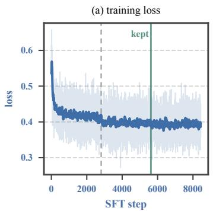

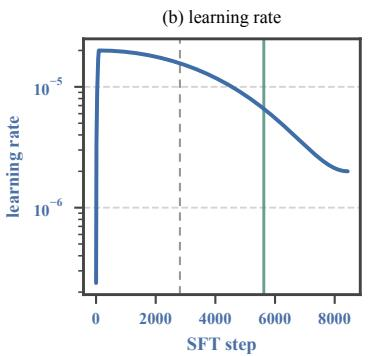

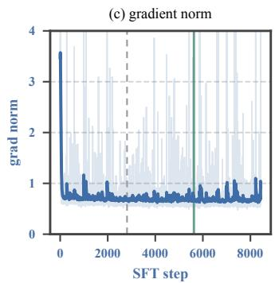  
Figure 5: Supervised fine-tuning. Loss, learning rate and gradient norm over three epochs; the dashed line marks the first epoch boundary and the green line the epoch-2 checkpoint carried into RL.

Critic pretraining. The critic and the initial policy come out of one supervised PPO run on DAPO-Math-17k (Yu et al., 2025) in two phases (Table 6). Phase 1 starts both actor and critic from the SFT weights, the critic with a freshly initialized scalar value head, and trains the critic alone for the first 30 steps. Phase 2 resumes both from phase-1 step 500 and changes three things: the batch doubles to 128 prompts, the training cap drops to 5,120 tokens, and validation moves to 12,288. We extract the actor at phase-2 step 200 (cumulative 700) and the critic at step 300 (cumulative 800), so the critic has fitted 100 further steps of an improving policy. Over its 800 steps the critic sees 563,200 verifier-labeled rollouts. Table 5 shows what the two supervised stages do to the model.

Table 5: What the supervised stages install. n=16 samples at temperature 0.7 with a 12,288-token budget; mean length and cap hit are averaged over the four suites. SFT buys accuracy with runaway generation, and the PPO run that trains the critic brings length back down while adding accuracy, most on GPQA-Diamond. †Evaluated without the chat template and without thinking mode.
<table><tr><td colspan="7">pass@1 (%)</td></tr><tr><td>Model</td><td>AIME 2025</td><td>AIMÊ 2026 AMC 2023</td><td></td><td>GPQA-D</td><td>Mean length Cap hit (%)</td><td></td></tr><tr><td>Qwen3-4B-  $\mathrm { \cdot B a s e ^ { \dagger } }$ </td><td>3.1</td><td>3.5</td><td>25.9</td><td>33.0</td><td>950</td><td>3.5</td></tr><tr><td>+ SFT</td><td>22.3</td><td>20.8</td><td>63.4</td><td>35.7</td><td>8,719</td><td>48.5</td></tr><tr><td>+ critic pretraining  $( \pi _ { \theta _ { 0 } } )$ </td><td>22.7</td><td>21.0</td><td>71.4</td><td>44.9</td><td>3,793</td><td>2.3</td></tr></table>

RL stage. Table 6 lists the settings. RFPO and supervised PPO share every one of them; they differ only in the reward and in whether the critic is updated. The DAPO overlong penalty present in the reward manager is configured to start at 8,192 tokens and so never fires under the 5,120-token training cap; validation accuracy is computed from the verifier score alone.

Table 6: Hyperparameters. Rows above the rule change between stages; rows below are shared by every stage.
<table><tr><td>Setting</td><td>Critic pretraining, ph. 1 Phase 2</td><td></td><td>RL stage (PPO and RFPO)</td></tr><tr><td>Actor init</td><td>SFT</td><td>phase-1 step 500</td><td> $\underline { { \pi } } _ { \boldsymbol { \theta } _ { 0 } }$  (cumulative 700)</td></tr><tr><td>Critic init</td><td>SFT, new value head</td><td>phase-1 step 500</td><td> $\bar { V } _ { \phi }$  (cumulative 800)</td></tr><tr><td>Critic</td><td>trained</td><td>trained</td><td>PPO: trained; RFPO: frozen</td></tr><tr><td>Reward</td><td>verifier</td><td>verifier</td><td>PPO: verifier; RFPO: Eq. (2)</td></tr><tr><td>Steps</td><td>500</td><td>300</td><td>300 compared (runs to 378)</td></tr><tr><td>Prompts × responses</td><td> $6 4 \times 8$ </td><td> $1 2 8 \times 8$ </td><td> $1 2 8 \times 8$ </td></tr><tr><td>Train / val. generation cap</td><td> $8 , 1 9 2 / 8 , 1 9 2$ </td><td> $5 , 1 2 0 / 1 2 , 2 8 8$ </td><td> $5 , 1 2 0 / 1 2 , 2 8 8$ </td></tr><tr><td>Updates per batch</td><td colspan="3">one (mini-batch = batch, one epoch; App. B)</td></tr><tr><td>Prompt cap</td><td colspan="3">2,048 tokens</td></tr><tr><td>Rollout sampling</td><td colspan="3">temperature 1.0, top-p 1.0, vLLM with tensor parallelism 2</td></tr><tr><td>Validation</td><td colspan="3">every 10 steps on AIME 2026 and AMC 2023, 8 samples at temp. 0.7</td></tr><tr><td>Advantage</td><td colspan="3"> $\mathrm { G A E } , \gamma = \bar { \lambda } = 1 .$  ,whitened over the batch</td></tr><tr><td>Policy loss</td><td colspan="3">clipped surrogate,  $\epsilon = 0 . 2$  both sides, token-mean; no entropy or KL term</td></tr><tr><td>Value loss</td><td colspan="3">clipped at 0.5 (trained critics only)</td></tr><tr><td>Learning rate</td><td colspan="3">actor  $1 0 ^ { - 6 }$  , critic  $1 0 ^ { - 5 }$  constant after 10 warmup steps</td></tr><tr><td>Optimizer</td><td colspan="3"> $\mathrm { A d a m w } , \beta = ( 0 . 9 , 0 . 9 9 9 )$  , weight decay 0.1, gradient clipping 1.0</td></tr><tr><td>Systems</td><td colspan="3">bf16, FSDP, sequence parallelism 2, gradient checkpointing</td></tr><tr><td>Hardware</td><td colspan="3"> $\mathrm { o n e ~ n o d e , 8 \times A 1 0 0 - 8 0 G B }$ </td></tr></table>

Calibration fit. The calibration sample is the 512 rollouts that $\pi _ { \theta _ { 0 } }$ generated at its own training step (phase-2 step 200, 5,120-token cap), scored by $\bar { V } _ { \phi }$ with the prompt in context; 53.5% are verifier-correct. Rollouts are split into length deciles. Within each decile we compute, separately for correct and for incorrect rollouts, the mean score minus that class’s overall mean, and average the two deviations; this is $b ( \ell )$ (Table 7). Working within correctness class removes the length trend inside each class while leaving the genuine fact that long responses are more often wrong in the class mix. The threshold τ is the $\left( 1 - 0 . 5 3 5 \right)$ quantile of the corrected scores $v - b ( \ell )$ , which gives $\tau = 0 . 5 2 1 5$ and 93.4% agreement with the verifier on this sample. Both are fitted once and never refitted.

Table 7: Deployed length baseline. Lengths outside the fitted range take the nearest decile’s offset. The last decile holds the rollouts that reach the cap.
<table><tr><td>Decile</td><td>1</td><td>2</td><td>3</td><td>4</td><td>5</td><td>6</td><td>7</td><td>8</td><td>9</td><td>10</td></tr><tr><td>Upper edge b(e)</td><td>1,735 +0.071</td><td>2,137 +0.087</td><td>2,455 +0.100</td><td>2,782 +0.065</td><td>3,150 +0.083</td><td>3,556 +0.063</td><td>3,884 +0.024</td><td>4,469 -0.070</td><td>5,079 -0.104</td><td>5,120 -0.224</td></tr></table>

## B INNER UPDATES PER BATCH AND TRAINING STABILITY

Before settling on the recipe of §4, we trained supervised PPO and reward-free variants the way PPO is usually run, with several optimizer steps on each batch of rollouts. This appendix collects that record.

What was run. From all our logged PPO and RFPO runs on math reasoning we keep the 74 that reached at least 60 steps; the rest, including all three runs with 16 inner updates, stopped earlier. Inner updates count the optimizer steps taken on one batch (batch size over mini-batch size, times PPO epochs), and runs are grouped by inner updates and rollouts per step. A run collapses if its policy entropy falls below 0.35 times its starting value (the mean of its first ten steps) and diverges if entropy rises above 1.8 times that value; every other run is stable. The criterion concerns optimization only and does not ask whether accuracy holds: the continuous-score arms of Appendix F, whose accuracy peaks and then declines, count as stable here.

What we found. With more than one inner update, 23 of 29 runs failed, in both directions and at every batch size we tried; at 8 updates over 256 rollouts, 12 of 15 did. Their median gradient norms over the last ten steps range from 0.27 to 0.89 by group. With a single update per batch, 8 of 45 runs failed, all seven supervised PPO runs were stable, and all 25 runs at 1,024 rollouts, supervised and reward-free alike, stayed stable with a median final gradient norm of 0.10 (Figure 6). A single update also takes the clip out of play: the gradient is taken at the policy that generated the rollouts, the importance ratio is one, and the clip fraction and PPO KL are exactly zero in every such run. Stability under this rule therefore does not come from the trust region; it comes from keeping each step small and averaged over many rollouts.

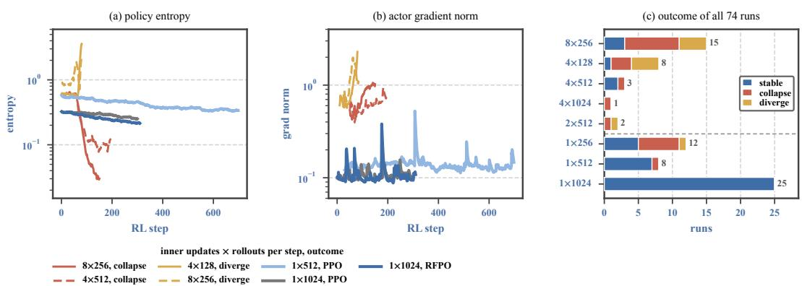  
Figure 6: Inner updates and training stability. (a,b) Policy entropy and actor gradient norm for representative runs, labeled by inner updates × rollouts per step; multi-update runs collapse (red) or diverge (yellow) within 200 steps, while single-update runs stay flat. (c) Outcome of all 74 runs by configuration; the dashed line separates multi-update from single-update groups. Runs differ in initial policy, response cap, upper clip ratio and reward; see text.

The failures that remain. All eight single-update failures ran at 256 or 512 rollouts, and none used the calibrated reward of Eq. (2): three withheld outcome labels with no calibrated replacement, four rewarded the raw critic score, and one thresholded it at a fixed 0.7 with no length baseline. They combine a smaller batch with a reward the final recipe dropped, and do not implicate the single-update rule.

Other differences between runs. The runs differ in more than the update: in initial policy, response cap (8,192 to 20,480 tokens), upper clip ratio (0.28 in most early multi-update runs) and reward. Two checks bound this. The multi-update failures span three different starting checkpoints, and all eight multi-update runs that used the symmetric clip of 0.2 of the final recipe failed as well, so neither initialization nor the upper clip explains them. The reverse confound remains, since the 1×1,024 group is also where the final reward lives. The record supports what the paper uses: no multi-update configuration we tried trained reliably, and the single-update rule at 1,024 rollouts did not fail in 25 runs.

## C EVALUATION PROTOCOL AND EXTENDED RESULTS

Protocol. Every ten steps we sample 8 responses per problem on AIME 2026 (30 problems) and AMC 2023 (40 problems) at temperature 0.7, top-p 1.0 and a 12,288-token budget. The budget is deliberately larger than the 5,120-token training cap, so validation measures what the policy can do with room to reason rather than the training constraint. Correctness comes from the same rule-based verifier used for training: the final boxed expression is matched against the reference answer after normalization. No model-based judge is used anywhere in this paper. The step-300 checkpoints are evaluated separately with 16 samples per problem on four suites; GPQA-Diamond (198 multiplechoice questions) is the out-of-domain suite.

Estimators. With $\hat { p }$ the fraction of a problem’s n samples that are correct, pass@1 is $\mathbb { E } _ { \mathrm { p r o b l e m } } [ \hat { p } ]$ and training-time pass@k is the plug-in $\mathbb { E } _ { \mathrm { p r o b l e m } } [ 1 - ( 1 - \hat { p } ) ^ { k } ]$ . The plug-in is biased at $k { = } n \colon { \mathrm { ~ a ~ } }$ problem solved once in eight contributes $\dot { 1 ^ { \bf ~ - ~ } } ( 7 / 8 ) ^ { 8 }$ ≈ 0.66 rather than 1, so 1 − pass@8 is not the fraction of problems that all eight samples missed. The separate evaluation reports pass@16 and maj@16 directly from the 16 samples. A selection-corrected peak subtracts from a run’s maximum the expected maximum of m draws from a flat curve with that run’s own noise, $\hat { \sigma } \mathbb { E } [ \operatorname* { m a x } _ { i \leq m }$ zi]

RL step

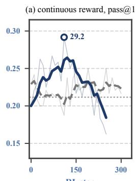

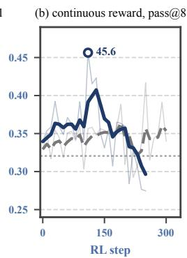

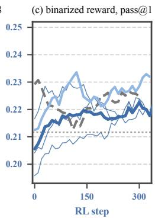

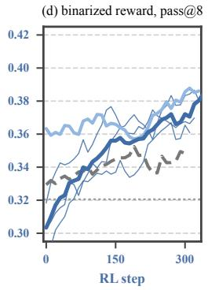  
Figure 7: Held-out AIME 2026 accuracy under the two rewards. (a–b) RFPO with the critic’s debiased continuous score as the reward (no binarization) against PPO trained on every label. Faint traces are raw validation and solid lines smoothed trends; the marker is the highest single evaluation. The continuous reward reaches 29.2 pass@1 and 45.6 pass@8, above anything supervised PPO attains, and then declines below it. (c–d) Deployed, binarized RFPO: the three zero-label runs are drawn individually (thin) with their mean (thick), since each labeled arm is a single run, and all curves are smoothed. Binarized RFPO tracks supervised PPO throughout. Dotted lines mark the shared initial policy; smoothed curves understate single-evaluation peaks, which are listed per run in Table 3. The other continuous settings are in Appendix F, and AMC 2023 results in Appendix C.

with $z _ { i } \sim \mathcal { N } ( 0 , 1 )$ , m the run’s number of evaluations and σˆ the standard deviation of its successive differences divided by ${ \sqrt { 2 } } .$

Late-training averages. Peaks select the best of about 31 noisy evaluations. Table 8 gives the complementary estimator, the mean of each run’s last ten evaluations, which removes the selection but mixes in any late drift. Every arm sits 2.5 to 7.3 points below its peak, most on AIME 2026 pass@8. On these averages the zero-label runs are level with supervised PPO on AIME 2026 pass@1 (22.1 against 22.5) and ahead on pass@8 (37.2 against 34.4), while supervised PPO keeps a 2.4-point edge on AMC 2023 pass@1. The ten-evaluation windows are not aligned across runs; restricting every run to steps 210–300 changes no entry by more than 0.9 points.

Table 8: Late-training validation. Accuracy (%) averaged over each run’s last ten evaluations, the complement to the peaks of Table 3. All rows train under the 5,120-token cap except the last two, the 4,096-token-cap pair added later (Appendix E.5).
<table><tr><td rowspan="2">Arm</td><td colspan="3">AIME 2026</td><td colspan="2">AMC 2023</td></tr><tr><td>Window</td><td>pass@1</td><td>pass@8</td><td>pass@1</td><td>pass@8</td></tr><tr><td>Initial policy  $\pi _ { \theta _ { 0 } }$ </td><td>step 0</td><td>21.2</td><td>32.1</td><td>73.6</td><td>89.5</td></tr><tr><td>PPO, 100% labels</td><td>210-300</td><td>22.5</td><td>34.4</td><td>74.7</td><td>90.4</td></tr><tr><td>RFPO, 50% labels</td><td>240-330</td><td>23.1</td><td>39.1</td><td>74.5</td><td>90.9</td></tr><tr><td>RFPO, 0% labels, run 1</td><td>220-310</td><td>22.6</td><td>37.3</td><td>73.3</td><td>89.9</td></tr><tr><td>RFPO, 0% labels, run 2</td><td>230-320</td><td>21.8</td><td>37.0</td><td>71.2</td><td>89.2</td></tr><tr><td>RFPO, 0% labels, run 3</td><td>280-370</td><td>21.9</td><td>37.4</td><td>72.3</td><td>90.0</td></tr><tr><td>Reward-free (mean ± s.d.)</td><td></td><td>22.1 ±0.4</td><td>37.2 ±0.2</td><td>72.3 ±1.1</td><td>89.7 ±0.4</td></tr><tr><td>PPO, 100% labels, 4,096 cap</td><td>220-310</td><td>21.4</td><td>33.9</td><td>72.6</td><td>89.4</td></tr><tr><td>RFPO, 0% labels, 4,096 cap</td><td>220-310</td><td>22.2</td><td>38.1</td><td>73.6</td><td>89.1</td></tr></table>

Extended metrics at step 300. Table 9 adds majority voting, pass@16 and generation length to the separate evaluation of Table 2. The three reward regimes stay close under maj@16. The largest gap is AIME 2026 pass@16, 50.0 for supervised PPO against 40.0 for the zero-label checkpoint, which is three problems out of 30. All RL checkpoints keep the short, rarely truncated generation of the initial policy. The zero-label checkpoint writes somewhat longer answers, with median length 13–19% above supervised PPO on AIME and GPQA and 3% below on AMC, and truncates at most 2.2% of them.

Table 9: Extended metrics of the step-300 checkpoints. Same evaluation as Table 2: 16 samples, temperature 0.7, 12,288-token budget.
<table><tr><td colspan="4">maj@ 16 / pass@ 16 (%)</td><td colspan="3">median tokens / truncated (%)</td></tr><tr><td>Model</td><td>AIME25</td><td>AIME26</td><td>AMC23</td><td>GPQA</td><td>AIME26</td><td>GPQA</td></tr><tr><td>+ SFT</td><td>20.0 / 50.0</td><td>20.0 / 43.3</td><td>60.0 / 92.5</td><td>26.3 / 89.4</td><td>12,288 / 63.5</td><td>10,197 / 40.7</td></tr><tr><td>Initial policy  $\pi _ { \theta _ { 0 } }$ </td><td>20.0 / 40.0</td><td>20.0 / 33.3</td><td>72.5 / 92.5</td><td>37.9 / 87.9</td><td>3,963 / 4.0</td><td>2,900 / 2.1</td></tr><tr><td>PPO, 100% labels</td><td>23.3 / 50.0</td><td>23.3 / 50.0</td><td>70.0 / 95.0</td><td>40.4 / 86.9</td><td>4,151 / 0.8</td><td>2,923 / 0.4</td></tr><tr><td>RFPO, 50% labels</td><td>20.0 / 46.7</td><td>20.0 / 43.3</td><td>75.0 / 95.0</td><td>43.9/89.9</td><td>4,586 /1.0</td><td>2,909 / 1.0</td></tr><tr><td>RFPO, 0% labels</td><td>23.3 / 46.7</td><td>20.0 / 40.0</td><td>70.0 / 90.0</td><td>41.9/89.9</td><td>4,920/1.2</td><td>3,359 /1.3</td></tr></table>

## D TRAINING DYNAMICS

Figure 8 follows eight training-time quantities for supervised PPO, the half-labeled arm and the three zero-label runs; the calibration ablations have their own dynamics in Appendix F.

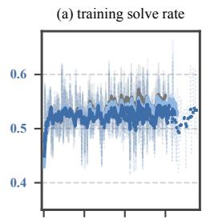

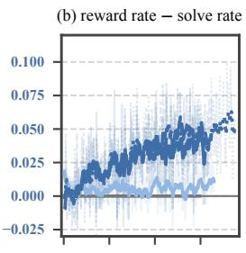

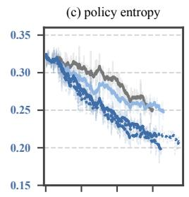

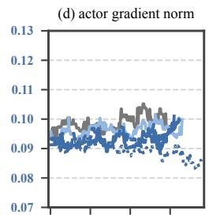

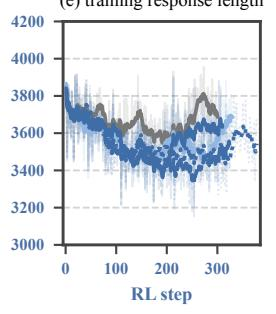

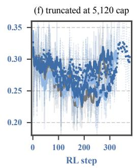

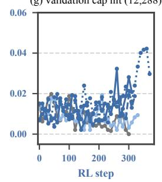

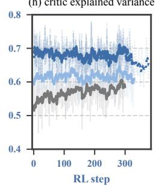  
Figure 8: Training dynamics of the main arms. Smoothed curves over faint raw traces; (d) is a 21-step running median and (g) is raw. (b) is the positive rate of the reward actually used minus the verifier solve rate on the same rollouts, and is zero by construction for supervised PPO. In (h) the supervised critic is scored against verifier returns and the frozen critic against the returns of its own reward, so the two levels are not comparable.

Optimization. Nothing in the optimizer statistics separates the arms. The actor gradient norm holds near 0.09–0.10 throughout. Entropy declines gradually in every arm, faster under RFPO, from 0.32 to 0.21–0.22 by step 300 against 0.25 for supervised PPO and 0.26 for the half-labeled arm. Training response length is flat under supervised PPO and drifts 2–7% shorter in the zero-label runs, while 26–30% of training rollouts stay truncated at the 5,120-token cap. At validation, fewer than 2% of responses hit the 12,288-token budget through step 300; only the longest run rises to about 4% over its final 60 steps.

The frozen reward as the policy moves. Two panels show what freezing costs, and both are small. Supervised PPO raises its training solve rate from 52.2% to 55.8% over 300 steps, the zero-label runs from about 52% to 53–54%: RFPO optimizes a proxy, and it moves the verifier’s number on training prompts less than the verifier itself does, even though held-out accuracy ends level (Table 8). The proxy also loosens. The positive rate of the binary reward starts 0.5–1.0 points above the verifier solve rate, as calibration intends, and climbs to 4.5–5.4 points above it by step 300: a threshold fitted on $\pi _ { \theta _ { 0 } }$ admits more false positives as the policy moves toward rollouts the critic scores highly.

The critic’s ranking meanwhile holds (Appendix E.4), so what drifts is the cut, not the ordering. In the half-labeled arm the gap ends at 1.3 points, or 2.6 on the critic-scored half alone, about half the zero-label value; this is the defense that partial labels provide in §5.

## E THE CRITIC: MEASUREMENTS AND ROBUSTNESS

This appendix defines the critic metrics used in §3.1, shows the critic’s training diagnostics, and gives the full tables behind the offline checks, the drift test and the generation-budget test.

Metrics. Each rollout i has a critic score $v _ { i } .$ , a verifier label $y _ { i } \in \{ 0 , 1 \}$ and a problem index $g _ { i }$ Overall AUC is the Mann–Whitney probability that a correct rollout scores above an incorrect one, pooled over all problems; it credits a critic that only recognizes problem difficulty. Within-problem AUC computes the same statistic inside each problem with both outcomes and at least three rollouts, and averages over those problems; it asks the question a reward must answer, which of several attempts at the same problem succeeded. The truncated-only andfinished-only variants restrict each problem to rollouts that did or did not reach 0.99 of the generation cap. Explained variance is $\bar { 1 } - \mathrm { V a r } ( y - v ) / \mathrm { V a r } ( y )$ . Unlike the two AUCs it depends on the scale of $v ,$ not only on its order. $\tau ^ { * }$ is the threshold on the raw score that maximizes balanced accuracy, and precision is the fraction of rollouts in fact correct among those whose raw score exceeds τ = 0.5215.

## E.1 CRITIC TRAINING DIAGNOSTICS

Figure 9 complements Figure 2. Value loss falls from 19 to about 0.05, the mean prediction converges from −5.5 onto the mean return within about 20 steps, and the critic gradient norm decays by three orders of magnitude. The spread of predictions keeps narrowing long after the mean has converged, which is why a critic at step 200 already ranks rollouts but does not yet produce values that can be read as probabilities (Figure 3a).

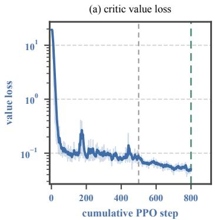

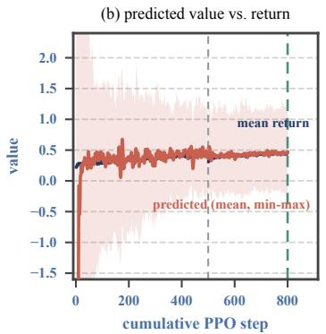

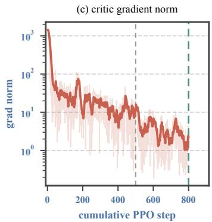  
Figure 9: Critic diagnostics across both pretraining phases. The gray dashed line marks the phase boundary at step 500 and the green line the frozen critic at step 800. In (b) the early predictions below −1.6 are off the axis.

## E.2 THE MEASUREMENT PLANE

The checkpoint analysis of §3.1 crosses nine critic checkpoints (cumulative steps 100–900) with ten actor checkpoints (the same nine steps plus a second step-600 actor from a parallel branch). To keep the two axes from confounding each other, the prompts are held fixed rather than the rollouts: each actor regenerates the same 512 problems with 32 samples at a 5,120-token cap, giving 16,384 rollouts and 323–360 problems with both outcomes per cell, and every critic scores every cell. Prompt-clustered bootstrap intervals on within-problem AUC have half-widths of 0.017–0.026 per cell. Table 10 averages each critic over the ten actors.

Three things in the table matter beyond the main text. First, ranking and calibration come apart: from step 200 to step 300 overall AUC rises while $\tau ^ { * }$ jumps from 0.46 to 1.08 and precision at the deployed threshold falls from 0.80 to 0.54, because more than half of the step-300 scores leave [0, 1]. This is why the threshold must be fitted on the deployed critic (§3.2). Second, withinproblem AUC on finished rollouts is lower than on all rollouts, 0.61 to 0.76. Truncated rollouts are rarely correct (8–14%), so a problem that mixes finished and truncated attempts offers easy contrasts, and removing the truncated attempts removes them. The finished-only ranking rises with critic training as steeply as the others do, and the truncated-only column shows that the critic ranks attempts that never finished just as well as the full set, so the signal is not truncation detection. Third, explained variance tracks within-problem AUC across the nine checkpoints (r=0.98 offline, 0.91 for the explained variance logged during training), the basis for using it as a training-time indicator.

Table 10: Measurement plane, per critic. Each row averages ten actor distributions of 16,384 rollouts. The shaded row is the frozen critic. Truncated rollouts are 19–54% of a cell depending on the actor.
<table><tr><td colspan="8">Within-problem AUC</td></tr><tr><td>Critic step</td><td>AUC</td><td>all</td><td>truncated</td><td>finished</td><td>EV</td><td> $\tau ^ { * }$ </td><td>Precision</td><td> $v \not \in [ 0 , 1 ]$ </td></tr><tr><td>100</td><td>0.913</td><td>0.765</td><td>0.800</td><td>0.608</td><td>0.467</td><td>0.956</td><td>0.532</td><td>0.443</td></tr><tr><td>200</td><td>0.923</td><td>0.776</td><td>0.794</td><td>0.640</td><td>0.460</td><td>0.462</td><td>0.796</td><td>0.044</td></tr><tr><td>300</td><td>0.930</td><td>0.789</td><td>0.802</td><td>0.667</td><td>0.521</td><td>1.082</td><td>0.540</td><td>0.556</td></tr><tr><td>400</td><td>0.933</td><td>0.797</td><td>0.820</td><td>0.678</td><td>0.568</td><td>0.809</td><td>0.683</td><td>0.325</td></tr><tr><td>500</td><td>0.937</td><td>0.796</td><td>0.808</td><td>0.683</td><td>0.593</td><td>0.757</td><td>0.673</td><td>0.295</td></tr><tr><td>600</td><td>0.935</td><td>0.793</td><td>0.808</td><td>0.675</td><td>0.537</td><td>0.469</td><td>0.819</td><td>0.094</td></tr><tr><td>700</td><td>0.956</td><td>0.824</td><td>0.830</td><td>0.729</td><td>0.688</td><td>0.554</td><td>0.859</td><td>0.202</td></tr><tr><td>800</td><td>0.960</td><td>0.837</td><td>0.832</td><td>0.746</td><td>0.702</td><td>0.540</td><td>0.875</td><td>0.077</td></tr><tr><td>900</td><td>0.965</td><td>0.842</td><td>0.835</td><td>0.757</td><td>0.721</td><td>0.699</td><td>0.862</td><td>0.271</td></tr></table>

## E.3 PREFIX SCAN

Table 11 gives the prefix scan of Figure 3e: the frozen critic scores prefixes of 1,024 rollouts from $\pi _ { \theta _ { 0 } }$ (128 problems, 8 responses each, 46 problems with both outcomes) against the final correctness of the full rollout. Up to about 2,000 tokens nearly all variance in the score is between problems: the critic recognizes how hard the problem is before it can tell attempts apart. Within-problem ranking then rises with the visible reasoning, and on prefixes that have not yet produced an answer it reaches 0.84–0.92 from 4,096 tokens on, on a shrinking number of problems.

Table 11: Prefix scan. “No answer yet” restricts to rollouts still running at that prefix length; “between-problem share” is the fraction of score variance explained by problem identity; “finished” is the fraction of rollouts already complete.
<table><tr><td>Prefix (tokens)</td><td>AUC</td><td>Within</td><td>Within, no answer yet (problems)</td><td>Between-problem share</td><td>Finished</td></tr><tr><td>256</td><td>0.958</td><td>0.526</td><td>0.521 (46)</td><td>0.996</td><td>0.003</td></tr><tr><td>512</td><td>0.961</td><td>0.477</td><td>0.470 (46)</td><td>0.994</td><td>0.003</td></tr><tr><td>1,024</td><td>0.967</td><td>0.600</td><td>0.603 (46)</td><td>0.982</td><td>0.004</td></tr><tr><td>2,048</td><td>0.967</td><td>0.647</td><td>0.645 (46)</td><td>0.955</td><td>0.141</td></tr><tr><td>3,072</td><td>0.969</td><td>0.735</td><td>0.700 (41)</td><td>0.924</td><td>0.395</td></tr><tr><td>4,096</td><td>0.976</td><td>0.836</td><td>0.844 (30)</td><td>0.905</td><td>0.615</td></tr><tr><td>4,608</td><td>0.978</td><td>0.852</td><td>0.909 (21)</td><td>0.903</td><td>0.686</td></tr><tr><td>4,864</td><td>0.979</td><td>0.846</td><td>0.921 (14)</td><td>0.904</td><td>0.721</td></tr><tr><td>5,120</td><td>0.979</td><td>0.843</td><td>0.885 (12)</td><td>0.904</td><td>0.762</td></tr></table>

## E.4 FROZEN-CRITIC RELIABILITY ACROSS POLICY DRIFT

We re-apply the frozen critic to each arm’s own training rollouts at a grid of steps, 1,024 rollouts per point (Figure 10). One AUC on 1,024 rollouts has a standard error of about 0.009, so we test for a trend rather than reading a range. Per 100 steps the AUC slope is +0.002 (t=0.44) for supervised $\mathrm { P P O } , + 0 . 0 0 1 ( t = 0 . 2 8 )$ for the half-labeled arm, and +0.001 (t=0.11) and −0.006 (t=−0.79) for the two zero-label runs scored; none is significant. The continuous-score arm with debiasing strength 34% is also flat (+0.005, t=1.20). The one significant decline is the 56% arm $( - 0 . 0 1 0 , t = - 2 . 8 9$ from 0.968 at step 80 to 0.932 at step 250), whose completion rate falls from 0.36 to 0.02 over the same span: the critic is handed a distribution of unfinished responses it was never fitted on. Ranking is stable wherever the policy stays healthy. The optimal cut is not: in the healthy arms $\tau ^ { * }$ moves

between 0.33 and 0.64 while AUC stays flat, which is the calibration drift that Appendix D sees as a rising reward rate.  
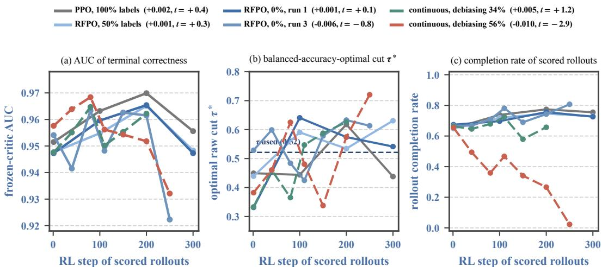  
Figure 10: Frozen critic on each arm’s own rollouts. Legend gives the AUC slope per 100 steps and its t statistic. The dashed line in (b) is the deployed $\tau = 0 . 5 2 1 5$ . The two continuous-score arms are those of Appendix F.

## E.5 THE GENERATION-BUDGET AXIS

Table 12 compares really generating under a cap with the cheaper proxy of truncating long rollouts to the same length, both scored by the frozen critic on the step-700 actor. From 5,120 tokens up the two agree, and the critic’s precision is flat at 0.89–0.90 while the finished fraction grows from 0.74 to 0.97. At 1,024 tokens they point in opposite directions: under a real cap only 0.7% of rollouts finish, explained variance is −0.49 and precision 0.21, while the proxy reads +0.55 and 0.88. The proxy would have cleared a setting in which the critic is not usable. A training run under the real 1,024-token cap confirms it (Figure 11): the training solve rate climbs from 5.5% to 19.3% while validation at the full budget falls from 49.1% to 39.1%, and the mean critic score sits about 0.4 above the solve rate from the first step.

Table 12: Real caps versus truncation. 16,384 rollouts per column; the proxy truncates 12,288- token rollouts to the cap.
<table><tr><td>Generation cap (tokens)</td><td>1,024</td><td>2,048</td><td>5,120</td><td>8,192</td><td>12,288</td></tr><tr><td>Finished, real cap</td><td>0.007</td><td>0.179</td><td>0.735</td><td>0.941</td><td>0.967</td></tr><tr><td>EV, real cap</td><td>-0.492</td><td>+0.496</td><td>+0.701</td><td>+0.669</td><td>+0.663</td></tr><tr><td>EV, truncation proxy</td><td>+0.554</td><td>+0.592</td><td>+0.649</td><td>+0.664</td><td></td></tr><tr><td>Precision, real cap</td><td>0.213</td><td>0.675</td><td>0.895</td><td>0.896</td><td>0.894</td></tr><tr><td>Precision, truncation proxy</td><td>0.879</td><td>0.919</td><td>0.905</td><td>0.897</td><td></td></tr></table>

Training under a 4,096-token cap. The 1,024-token run fails because almost nothing it generates finishes. A 4,096-token cap tests the regime the method is meant for, in which a large share of every batch is unfinished but the rollouts still resemble those the critic was fitted on. We keep the initial pair and every setting of §4 except the training cap, and refit b(ℓ) and τ on 512 step-1 rollouts at that cap. The deployed 5,120-token fit leaves short and long responses of the same outcome scoring alike (median split within each correctness class, difference 0.000); refitted at 4,096 tokens on six length bins, the offsets leave a difference of 0.049, and scaling them by 1.7 restores it to zero (−0.000; 0.028 at 1.3, −0.021 at 2.0). We train one zero-label run with that correction $( \tau = 0 . 6 5 2 6 ;$ the binary rule agrees with the verifier on 90.6% of the calibration sample) and supervised PPO under the same cap, both for 310 steps, covering the 300-step comparison window of §4 (Figure 4 in §5, Table 4). At step 1, 50% of the run’s training rollouts are truncated, against 31–33% at 5,120 tokens, and the run keeps them there: responses hold their length (3,313 tokens over the first ten steps, 3,462 over the last hundred), and 48% of its training rollouts over the window are unfinished (50% over the last hundred steps). The reward stays calibrated all the same: the mean reward exceeds the verifier solve rate by 0.014 on average over the window, against 0.027–0.030 for the 5,120-token runs and about 0.4 for the 1,024-token run. Macro validation averages 47.6% over steps 10–300, level with the 5,120-token runs (47.2–47.4%) and above supervised PPO under the same cap (46.6%). On the same node its median step takes 395 s against 490 s for supervised PPO under the same cap (264 against 327 GPU-hours for 300 steps): generation is slower because its responses stay longer (162 against 135 s), and the 134 s critic update that PPO needs is gone. Supervised PPO with the full 5,120-token cap averages 48.3% at 388 GPU-hours (Appendix G).

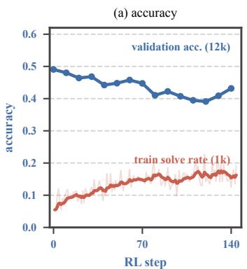

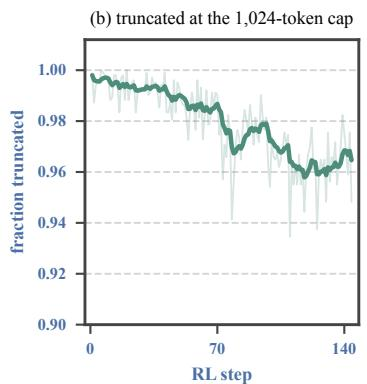

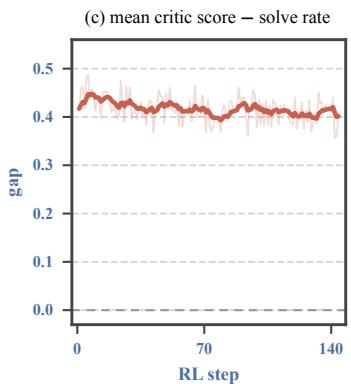  
Figure 11: Training under a 1,024-token cap. (a) Validation at 12,288 tokens (macro average) against training solve rate; (b) fraction of training rollouts truncated; (c) mean critic score minus verifier solve rate.

## F CALIBRATION ABLATIONS: TURNING THE CRITIC’S SCORE INTO A REWARD

The frozen critic returns one number per rollout, and something has to decide what reward the policy receives for it. The obstacle is a length bias, and it has to be separated from something that is not a bias. On the 16,384 rollouts from the deployed pair, the mean score falls from 0.88 in the shortest length decile to 0.13 at the cap, and accuracy falls with it, from 0.92 to 0.14: length and correctness are mixed, and much of the score’s length trend is correctness. Not all of it. With the outcome held fixed the score still falls with length, among correct responses from 0.92 to 0.61 before the cap and among incorrect ones from 0.37 to 0.17; among responses to the same problem with the same outcome, score and length correlate at −0.43. That residual trend is the bias.

A bias is harmless to read and unsafe to optimize against. Length is something the policy controls directly, and a shorter answer is not a more correct one; a reward that carries the bias teaches the policy to move length instead of correctness. A policy rewarded with the raw score does exactly that: it stops reasoning, shortening responses by 73% within 100 steps, while the reward it collects drifts from +0.19 to +0.70 above the batch’s true accuracy and validation falls 17 points by step 100 and 32 by step 230.

Eq. (2) closes that channel twice. Subtracting b(ℓ), the within-class offsets of Table 7, removes the length trend inside each correctness class and leaves the gap between classes in place. Because the two trends overlap in the pooled data, the separation costs a little ranking: AUC falls from 0.959 to 0.941. It is also not exact. After it, score and length correlate at −0.26 among correct responses (from −0.58) and at +0.22 among incorrect ones (from −0.32), so some length dependence remains, pointing different ways in the two classes. The indicator then caps what that remainder can earn. Both pieces are load-bearing, and the rest of this section removes them one at a time (Appendix F.1).

Remove the indicator and the leftover length dependence sets the drift. Figure 12 drops the indicator and varies how much of the debiasing curve the reward applies. These arms use a curve refitted on the 12,046 finished rollouts among the 16,384, running from +0.108 at the shortest decile to −0.129 at the longest. One arm applies no debiasing. Two apply the curve only up to 2,828 and 3,558 tokens and hold it constant beyond. One applies all of it.

debiasing strength (% of correctness gap)  
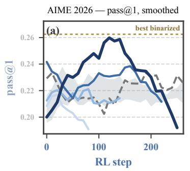

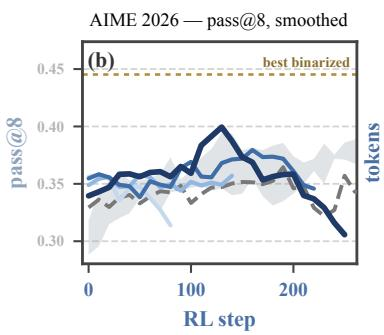

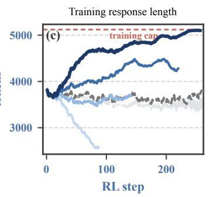

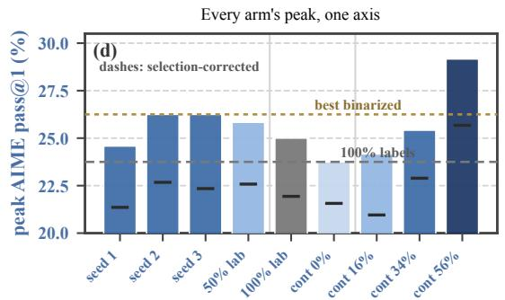

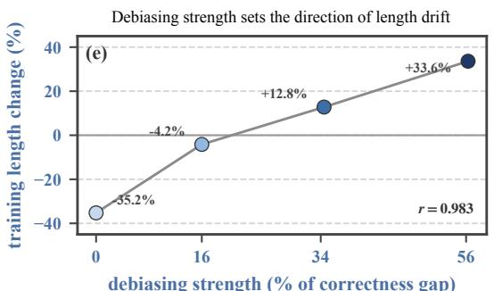  
Figure 12: Removing the threshold raises the ceiling and loses the policy. Four arms use the debiased score directly as the reward $( \hat { r } = \bar { V } _ { \phi } - b ( \ell )$ , no threshold, no indicator) and differ only in how much of the debiasing curve they apply. The resulting debiasing strength—the within-group spread of the debiasing term as a fraction of the score gap between correct and incorrect responses— is measured for each arm rather than set. Length and accuracy both change across these arms; the figure does not attribute one to the other. Gray band: the three binarized zero-label runs; dashed gray: PPO on 100% verifier labels; gold line: the best value any binarized run reached. (a–b) Held-out accuracy, exponentially smoothed; the fully debiased arm leads the sweep on both metrics through most of its run. Peaks are single evaluations and cannot be read off a smoothed curve, so they are reported in (d) instead. (c) The fully debiased arm lengthens responses by 34% into the training cap, while the arm with no debiasing shortens them by 35%. (d) Every arm’s peak on one axis with its selection-corrected value marked; the fully debiased arm reaches 29.2, above the 25.0 of fully supervised PPO. (e) Debiasing strength against the change in training response length.

How strongly each choice debiases the reward is then measured, not set. Within a group of eight responses we compare the spread of the debiasing term against the score gap between correct and incorrect responses (0.256 in these rollouts), and call the ratio the debiasing strength. The four arms come out at 0%, 16%, 34% and 56%.

Under a continuous reward the policy climbs whatever length dependence the reward still has, and the direction follows the debiasing strength. Response length goes $- 3 5 . 2 \% , - 4 . 2 \% , + 1 2 . 8 \%$ and $+ 3 3 . 6 \% ( r { = } 0 . 9 8 3$ with strength, measured on every step): left undebiased, the reward favors short responses and the policy shortens; fully debiased, the policy lengthens. Neither direction says that shorter or longer answers are more correct; both are the policy exploiting the reward. Held-out accuracy peaks in every arm, and none keeps what it reaches:

<table><tr><td>Debiasing strength</td><td>Peak AIME pass @1</td><td>Final AIME pass@1</td><td>Length change</td></tr><tr><td>0%</td><td>23.8</td><td>17.1</td><td>-35.2%</td></tr><tr><td>16%</td><td>24.2</td><td>22.1</td><td>-4.2%</td></tr><tr><td>34%</td><td>25.4</td><td>19.6</td><td>+12.8%</td></tr><tr><td>56%</td><td>29.2</td><td>16.2</td><td>+33.6%</td></tr></table>

For reference, the shared initial policy scores 21.2 on this suite and PPO trained on every label peaks at 25.0. Three of the four arms end below where they started.

Length and accuracy move together here because the debiasing strength moves both, so the table does not say that longer answers are better; in the data the critic was fitted on, long responses are less often correct. What the table does show is that no setting of the continuous reward both gains substantially and keeps what it gains, and that the two ends fail in opposite directions—one shortens and loses, the other lengthens and loses.

The fully debiased arm reaches 29.2 on AIME 2026 pass@1, the highest AIME 2026 score anywhere in this paper and above the 25.0 of PPO trained on every label. That is not an artifact of having more checkpoints to choose from: it has fewer evaluations than any binarized arm, and correcting each arm for the expected maximum of its own number of draws leaves the ordering unchanged (25.7 against 21.4–22.7 binarized). It also ends at 16.2, below the initial policy’s 21.2.

What the sweep does isolate is the indicator’s job. The deployed rule debiases more strongly than any arm above (91%) and still holds response length within 13% of its starting value for 310 steps, because above the cut extra score earns nothing. Under a continuous reward the debiasing strength sets which way the policy drifts; the indicator decides whether it drifts at all.

The decline is detectable, but not by the obvious signals. Held-out accuracy falls, so any validated run sees it; what is hidden is the cause. The model is neither producing garbage nor fooling the answer checker: verbatim repetition stays at or below 1% of 60-character shingles, restricting the answer search to the final boxed expression moves train-batch accuracy by at most 5.1 points with no trend, the mean raw score stays within 0.075 of the verifier solve rate for all 257 steps, and entropy is 0.322 at the peak against 0.314 at the end. What does track the damage is answer restatement: the number of times a response asserts its own answer rises from 1.8 to 67.9 and correlates with held-out accuracy at $r { = } { - } 0 . 8 7$ , where length manages −0.51 (Appendix F.3).

What this leaves. Without the indicator the reward does work—the same frozen critic, used directly as the reward, reaches an accuracy no labeled run in this paper reaches—but it works in a way we can neither take apart nor hold onto. We cannot take it apart because the one setting that buys the gain also moves response length, so what the policy actually learned is not identifiable from these runs. We cannot hold onto it because every arm declines afterwards, and the arm that gains the most declines the most. Binarizing gives up that ceiling and takes back both problems at once: the reward becomes a decision rather than a quantity, the length channel closes, and three runs train for over 300 steps without drifting. Recovering the ceiling safely would need a validated stopping rule. Restatement—which tracks the damage closely and rises well before an arm gives up its gain—is the natural quantity to build one from, and we leave that to future work.

## F.1 REMOVING THE CALIBRATION STEP BY STEP

Figure 13 removes the two pieces of Eq. (2) in turn. With the raw score as the reward, response length falls 73% by step 100, the mean score climbs from +0.19 to +0.70 above the verifier solve rate, and held-out accuracy falls 17 points by step 100 and 32 by step 230. A fixed threshold with no debiasing, $\mathbf { 1 } [ v > 0 . 6 ]$ , keeps the score honest on average but not the length: responses shorten by 20% in 100 steps and accuracy drifts down 4 points. Only with both pieces does length hold and accuracy hold. The raw-score run is the oldest in the paper: it used an earlier actor–critic pair and an 8,192-token cap. The continuous arm with no debiasing in Table 13 reproduces its failure on the deployed pair and protocol, shortening responses by 35% in 87 steps.

## F.2 CONTINUOUS-SCORE ARMS AND A GROUP-RELATIVE VARIANT

Table 13 lists the continuous arms. They differ from the zero-label runs only in dropping the indicator; actor, critic, data order, cap and optimizer settings are shared. A fifth arm replaces GAE with group-relative advantages at the 56% setting. It reaches a similar peak (28.3 on AIME pass@1) sooner, with the best macro average at step 40 after 5.5 hours against step 110 and 16.3 hours for the GAE arm, and it also runs into the cap sooner: more than 90% of its rollouts are truncated from step 150, against step 231 with GAE. Because $b ( \ell )$ depends on each response’s own length, the debiasing term survives group-mean centering, and dividing by the group standard deviation enlarges its share of the advantage. The variant also gives up the identity $A _ { t } = \hat { r } - \bar { V } _ { \phi } ( x , y _ { \le t } )$ that lets one frozen network serve as both reward and baseline, so we do not adopt it.

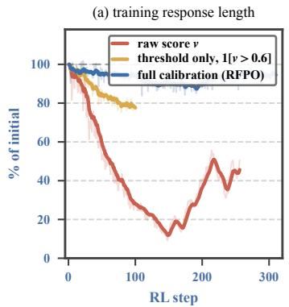

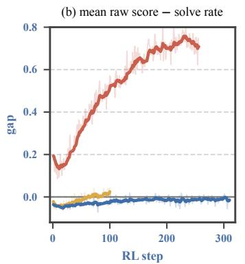

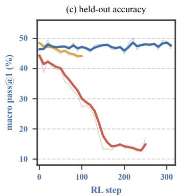  
Figure 13: The calibration ladder. Raw score as reward, a fixed threshold without debiasing, and the full rule of Eq. (2); (b) is the mean raw terminal score minus the verifier solve rate on the training batch. The raw-score run used an earlier actor–critic pair and an 8,192-token training cap, and starts from a lower validation point.

Table 13: Continuous-score arms. Accuracies are validation pass@1 in points; length change compares mean training response length at the last and first step; “truncated” is the fraction of training rollouts at the 5,120 cap over the last five steps; “up to” means the debiasing term is held constant beyond that length. The arms start at 20.0–24.2 on AIME and 46.7–48.0 macro.
<table><tr><td>Arm</td><td>Strength</td><td>Steps</td><td>AIME peak / final</td><td>Macro peak</td><td>∆ length</td><td>Truncated</td></tr><tr><td>No debiasing</td><td>0%</td><td>87</td><td>23.8 / 17.1</td><td>48.8</td><td>-35.2%</td><td>0.05</td></tr><tr><td>Debiased up to 2,828</td><td>16%</td><td>141</td><td>24.2 / 22.1</td><td>49.3</td><td>-4.2%</td><td>0.23</td></tr><tr><td>Debiased up to 3,558</td><td>34%</td><td>220</td><td>25.4 / 19.6</td><td>51.1</td><td>+12.8%</td><td>0.26</td></tr><tr><td>Full debiasing curve</td><td>56%</td><td>257</td><td>29.2/ 16.2</td><td>53.3</td><td>+33.6%</td><td>0.97</td></tr><tr><td>56%, group-relative</td><td>56%</td><td>161</td><td>28.3 / 15.8</td><td>52.4</td><td>+33.4%</td><td>0.97</td></tr></table>

## F.3 ANATOMY OF THE DECLINE

Table 14 and Figure 14 inspect 256 training rollouts per checkpoint of the 56% arm. What changes is answer restatement: the number of times a response asserts its answer rises from 1.8 to 68, boxed answers from 1.6 to 35, and the share of responses that never close their reasoning block from 25% to 91%, while verbatim repetition stays at 1% of 60-character shingles. Across checkpoints restatement tracks held-out accuracy at r=−0.87, against −0.51 for length. The verifier is not being gamed: scoring only the final boxed answer changes train-batch accuracy by at most 5.1 points, with no trend. The same measurements on the 16% arm stay flat over its 141 steps (restatements 1.9 to 2.6, boxed answers 1.7 to 2.2, unclosed reasoning 20% to 15%), so the behavior belongs to the heavy-weight arm, not to continuous rewards in general.

Table 14: What the 56% arm’s decline is made of. 256 inspected rollouts per checkpoint; length, score gap and entropy are from the training log. Neither entropy nor the score gap registers the change.
<table><tr><td>56% arm</td><td>Step 1</td><td>Peak (step 110)</td><td>Step 250</td></tr><tr><td>Restatements per response</td><td>1.79</td><td>4.14</td><td>67.94</td></tr><tr><td>Boxed answers per response</td><td>1.63</td><td>1.82</td><td>34.92</td></tr><tr><td>Never closes its reasoning block</td><td>0.250</td><td>0.363</td><td>0.914</td></tr><tr><td>Verbatim repetition (60-character shingles)</td><td>0.000</td><td>0.000</td><td>0.010</td></tr><tr><td>Mean response length (tokens)</td><td>3,812</td><td>4,556</td><td>5,107</td></tr><tr><td>Train-batch accuracy, full text</td><td>0.430</td><td>0.527</td><td>0.496</td></tr><tr><td>Train-batch accuracy, final boxed answer only</td><td>0.430</td><td>0.500</td><td>0.469</td></tr><tr><td>Mean raw score — solve rate</td><td>-0.037</td><td>-0.060</td><td>+0.049</td></tr><tr><td>Policy entropy</td><td>0.322</td><td>0.322</td><td>0.312</td></tr></table>

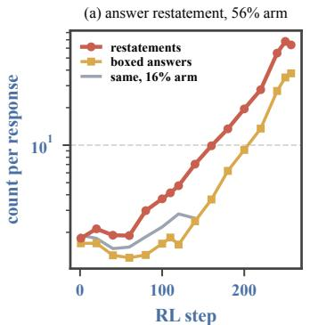

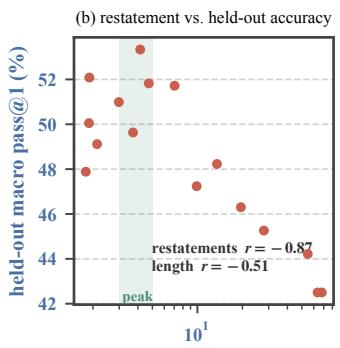  
restatements per response

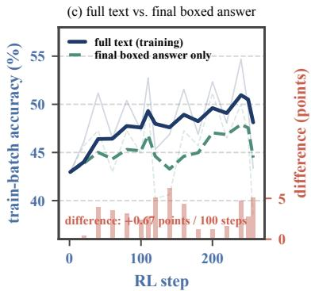

Figure 14: Restatement during the decline. (a) Restatements and boxed answers per response in the 56% arm, with restatements in the 16% arm for comparison. (b) Restatement against held-out macro accuracy across checkpoints. (c) Train-batch accuracy scored on the full text and on the final boxed answer only; bars are their difference.  
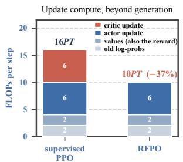

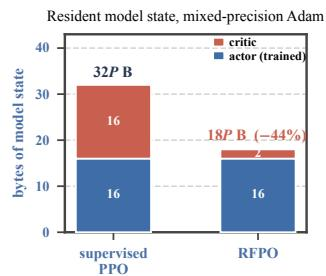

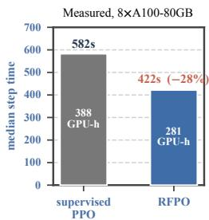  
Figure 15: What freezing the critic removes. Left and center are accounting rather than measurement and hold independent of model scale and hardware: P is the parameter count shared by policy and critic, T the tokens in a batch, a forward pass costs ≈2PT and a forward–backward ≈6PT, and a module trained with mixed-precision Adam holds 16P bytes against 2P when frozen. The value pass survives both cuts because RFPO reads the reward off it. Right is measured on matched batches (3.9M against 3.8M tokens per step), medians over the run, with peak reserved memory 9.4 GB lower per GPU. With activation recomputation the saving is 40%, not 37% (Appendix G).

## G COMPUTATION AND MEMORY COST

Accounting. With P parameters shared by policy and critic and $T$ tokens in a batch, a forward pass costs about $2 P T$ and a forward–backward about 6PT. Beyond generation, which is identical in both arms, a supervised PPO step runs the old-log-probability forward (2PT), the value forward (2PT), the actor update (6PT) and the critic update (6PT), 16PT in total. RFPO keeps the first three and drops the fourth, 10PT, a 37% reduction; with activation recomputation each trained module costs $\bar { 8 } P T$ and the reduction is 40%. The reward needs no pass of its own, because it is read off the value forward. A module trained with mixed-precision Adam holds 16P bytes of weights, gradients, master weights and moments, against $2 P$ when frozen, so resident model state falls from 32P to 18P (44%); at P=4B with 8-way sharding the critic’s share is 7.0 GB per GPU.

Measurement. Table 15 gives median per-step times over the first 300 steps of supervised PPO and the first zero-label run, on matched batches (3.87M and 3.79M tokens per step). Generation and every shared pass take the same time in both arms; the whole difference is the critic update, 151 s, which is close to the actor update’s 160 s as the accounting predicts. Step time falls from 582 to 421 s (−28%), throughput rises from 828 to 1,122 tokens per second (+35%), and peak reserved memory falls by 9.4 GB per GPU, the predicted 7.0 GB plus about 2.4 GB of activations held by the critic’s backward pass. A 300-step run costs 388 GPU-hours under supervised PPO and 281 under RFPO, on one node of eight A100-80GB GPUs. Under the single-update rule the old-log-probability pass computes the same numbers as the actor’s own forward, so a further 42 s per step could be saved; we left it in place to keep the two arms identical.

Table 15: Measured step time and memory. Medians over steps 1–300; validation and checkpointing are excluded.
<table><tr><td>Per-step component (median seconds)</td><td>PPO, 100% labels</td><td>RFPO, 0% labels</td></tr><tr><td>Generation</td><td>181</td><td>176</td></tr><tr><td>Old log-probabilities (forward)</td><td>43</td><td>42</td></tr><tr><td>Values (forward; also the reward in RFPO)</td><td>38</td><td>37</td></tr><tr><td>Advantages and weight sync</td><td>6</td><td>6</td></tr><tr><td>Actor update</td><td>160</td><td>156</td></tr><tr><td>Critic update</td><td>151</td><td></td></tr><tr><td>Step</td><td>582</td><td>421</td></tr><tr><td>Throughput (tokens/s)</td><td>828</td><td>1,122</td></tr><tr><td>Peak memory, allocated / reserved (GB per GPU)</td><td>22.0 / 32.4</td><td>18.9 / 23.0</td></tr></table>

One-off preparation. The savings apply to the RL stage. Obtaining the critic took 800 steps of supervised PPO, 901 GPU-hours of training steps plus 38 of validation, which also produced the initial policy that every arm starts from. Calibration is a single scoring pass of the frozen critic over 512 rollouts.

## H RUN ROSTER

Table 16 maps every run in the paper to its training log in the supplementary material (data/logs/). Calibration files are in data/critic/baselines/: the deployed length baseline and threshold are len baseline v2.json, and the continuous arms use the len baseline v2 finished\* family; the 4,096-token run uses len baseline v2 cap4096 k1.7.json, and the curves of Figure 4 are in data/derived/cap4096/. The 74 runs of Appendix B are summarized in data/derived/stability/runs summary.csv.

Table 16: Run roster. Every RL run starts from the initial policy and frozen critic extracted from the phase-2 run, except the raw-score run, which used an earlier actor–critic pair and an 8,192-token cap.
<table><tr><td>Run</td><td>Log</td><td>Used in</td></tr><tr><td>SFT</td><td>sft_4n_4581861</td><td>App. A</td></tr><tr><td>Critic pretraining, phase 1</td><td>h061_warmstart-phase1-ppo</td><td>§3.1, App. A, E</td></tr><tr><td>Critic pretraining, phase 2</td><td>h065_warmstart_phase2-ppo</td><td>§3.1, App. A, E</td></tr><tr><td>PPO, 100% labels</td><td>h066_label100-ppo</td><td>§5, App. C–E</td></tr><tr><td>RFPO, 50% labels</td><td>h054_label50_car</td><td>§5, App. C-E</td></tr><tr><td>RFPO, 0% labels, run 1</td><td>h056_label0_seed2_car</td><td>§5, App. C-E</td></tr><tr><td>RFPO, 0% labels, run 2</td><td>stage2_my-host_065</td><td>§5, App. C, D</td></tr><tr><td>RFPO, 0% labels, run 3</td><td>stage2_my-host_071</td><td>§5, App. C-E</td></tr><tr><td>Raw score</td><td>stage2_my-host_044</td><td>App. F.1</td></tr><tr><td>Threshold only, 1[v &gt; 0.6]</td><td>stage2_my-host_046</td><td>App. F.1</td></tr><tr><td>Continuous, debiasing 0%</td><td>stage2_my-host_089</td><td>§5, App. F</td></tr><tr><td>Continuous, debiasing 16%</td><td>stage2_my-host_085</td><td>§5, App. F</td></tr><tr><td>Continuous, debiasing 34%</td><td>stage2_my-host_086</td><td>§5, App. F, E.4</td></tr><tr><td>Continuous, debiasing 56%</td><td>stage2_my-host_083</td><td>§5, App. F, E.4</td></tr><tr><td>Continuous, 56%, group-relative</td><td>stage2_my-host_088</td><td>App. F.2</td></tr><tr><td>1,024-token cap</td><td>stage2_my-host_048</td><td>§5, App. E.5</td></tr><tr><td>RFPO, 4,096-token cap</td><td>stage2_my-host_098</td><td>§5, App. E.5</td></tr><tr><td>PPO, 4,096-token cap</td><td>stage2_my-host_099</td><td>§5, App. E.5</td></tr></table>