# Understanding Private Evolution as Learning-Augmented Clustering

Audra McMillan Apple

Kunal Talwar Apple

Felix Zhou<sup>\*</sup> Yale University

## Abstract

Private Evolution (PE) is a differentially private algorithm for synthetic data generation. While it can be viewed as a Wasserstein learning algorithm, it performs much better in practice than worst-case Wasserstein analyses would predict. We recast PE as generative model-augmented Wasserstein learning. We show theoretically that when we take into account the use of a generative model that is able to capture something about the true distribution, then we can obtain much better performance bounds. For example, if the generator gives samples in the same low-dimensional space as the distribution, then sample complexity depends on intrinsic, not ambient, dimension. We also show that standard variants of PE can fail to converge on simple well-clustered instances, and propose a new geometry-aware version of PE with provable convergence on such instances. Experimentally, we show that our new algorithm is competitive with standard baselines and can improve recall.

## 1 Introduction

When interacting with sensitive data, differentially private algorithms allow for accurate analysis and learning while providing a provable privacy guarantee. A differentially private (DP) synthetic data set is designed to capture various properties of a real dataset and can be useful for answering queries, as well as for evaluating and training models. DP synthetic data can avoid the computational and complexity overheads of differentially private algorithms for the same tasks. Additionally, a private synthetic dataset can be reused as often as needed, without having to worry about privacy budgets. This has led to significant interest in designing algorithms for, and understanding the fundamental limits of, private synthetic data generation.

Foundation models have recently been useful for a wide array of tasks, and have recently been used as a tool for synthetic data generation. Lin, Gopi, Kulkarni, Nori, et al. [LGKN+24] recently proposed a genetic algorithm for generating private synthetic data known as Private Evolution (PE). This elegant algorithm (see Algorithm 2.1) interacts with the sensitive data through a very simple interface, making it suitable for both centralized and federated settings. Given access to an appropriate foundation model through a VariationA $P I ,$ it generates remarkably good synthetic data in both the image and text domains. This has led to a flurry of research aimed at understanding and improving the algorithm.

The private synthetic data problem can be naturally formalized as distribution learning in Wasserstein distance. This formulation has been explored in many recent works, including those analyzing private evolution. These analyses however give sample complexity bounds that are exponential in the dimension $d ,$ and this is in general unavoidable: any algorithm for Wasserstein learning in d dimensions provably needs exponential in d sample complexity in the worst case [Dud69; SP18]. When used with embeddings of text or data as defining the metric, these minimax bounds are nearly uninformative. Even with embedding dimension as small as 128, one would need roughly $2 ^ { 1 2 8 }$ times as many samples to reduce the Wasserstein error by a factor of two.

In this work, we provide a fresh viewpoint on the PE algorithm, through the lens of beyond worst case analysis. We study the algorithm in two frameworks beyond the worst case. As the foundation model API is crucial in the success of PE, we argue that any analysis of PE must exploit properties of the foundation model. We phrase the problem in the learning augmented algorithms framework, where our Wasserstein learning algorithm is analyzed under assumptions about the foundation model.

A natural assumption one can make is that generator distribution is (locally) low-dimensional. Indeed Lin, Gopi, Kulkarni, Nori, et al. [LGKN+24] showed that the variation API output has effective dimensionality (≈ 150) that is significantly smaller than the ambient dimension for images. We empirically show that for typically-used generators for the text domain, the effective dimension is even smaller (≈ 15; Section D). For the generator to be useful, it needs to be “compatible” with the distribution being learnt. We measure this compatibility in terms of the relative variance of the VariationAPI in the direction of the private data (Definition 3.2). In Section 3, we show that these assumptions allow us to circumvent these worst-case rates to obtain an $\tilde { O } ( \lambda ^ { 1 + \frac { 1 } { 2 k } } n ^ { - \frac { 1 } { k } } )$ rate of convergence, where $\lambda ,$ k are two measures of “intrinsic dimensionality” of the VariationAPI.

Theorem 1.1 (Informal; see Theorem 3.4). Suppose the VariationAPI is supported on a set of doubling dimension at most $k \geq 2$ and has effective rank λ with respect to the dataset. Then Algorithm 2.3 (a standard instantiation of PE) is $( \varepsilon , \delta ) – D P$ and outputs a synthetic dataset with expected $W _ { 1 } – e r r o r$

$$
\tilde { O } \left( \lambda ^ { 1 + \frac { 1 } { 2 k } } \left( \frac { \sqrt { \log \left( ^ { 1 . 2 5 } / \delta \right) } } { \varepsilon n } \right) ^ { \frac 1 k } \right) .
$$

This result only depends on the intrinsic dimensionality, and is independent of the ambient dimension! This is in sharp contrast to what is achievable without a generator: it is easy to show that even when the distribution of interest is supported on some 1-dimensional subspace, any Wasserstein learning algorithm for privately learning this distribution (under concentrated DP) needs at least $\sqrt { d }$ samples when the ambient dimension is $d .$ This implies that one cannot hope to get bounds independent of the ambient dimension without access to (and compatibility assumptions about) the generator. We thus give the first theoretical explanation for the importance of the generator in PE.

This analysis still has the Wasserstein error falling as $n ^ { - { \frac { 1 } { k } } }$ , when the intrinsic dimensionality is $k .$ While this bound is significantly better than the $n ^ { - { \frac { 1 } { d } } }$ dependence previously known, it can be a relatively slow rate when the intrinsic dimensionality k is moderately large. Such a dependence is provably unavoidable in the worst-case, and we turn our attention to simple models for the data distribution to better understand the algorithm.

Inspired by Lin, Gopi, Kulkarni, Nori, et al. [LGKN+24] who studied a duplicated data model, we study a simple clustered data model, where the data distribution is supported on a small number of well-separated clusters. While we would expect any reasonable algorithm to perform well on such instances, we surprisingly show that known variants of PE [LGKN+24; XLBG+24] can badly fail even on these very simple instances. To the best of our knowledge, we are the first to identify this failure mode.

We identify the Selection step (where the algorithm selects the next iteration of the synthetic data from a set of candidates generated by the VariationAPI) in PE to be the main reason for this: both random selection and rank-based selection can miss a constant fraction of the clusters. We argue that the selection process should be made geometry-aware, and propose such a new variant of PE that modifies the selection step in a careful way. We show that when the clusters are well-separated and sufficiently large, then our algorithm GAPE (Geometrically Aware Private Evolution) provably recovers a good approximation to the private data.

Theorem 1.2 (Informal; see Theorem 4.2). Suppose the dataset consists ofκ clusters ofdiameter r with intercluster distance $R > 0$ . There are such instances on which PE with ranking or subsampling outputs $S$ with coverage error $\operatorname* { m a x } _ { x \in D } \rho ( x , S ) = \Omega ( R )$ . On the other hand, suppose that the VariationAPI satisfies the reachability condition with effective rank $\lambda ,$ that $R \gg \lambda r ,$ , and that the minimum cluster size is

$$
\tilde { \Omega } \left( \lambda ^ { \frac { 1 } { 4 } } \sqrt { \frac { n \log ( ^ { 1 . 2 5 } / \delta ) } { \varepsilon } } \right) ,
$$

then, under Assumption 4, for fixed c, GAPE (Algorithm 4.1) is $( \varepsilon , \delta ) – D P$ and outputs $S$ with coverage error $O ( \lambda r )$ with high probability.

Finally, in Section 4.1, we empirically evaluate GAPE on text datasets to understand if the algorithm’s provable performance in synthetic models translates to improvements on real-world data that may not be as well-clustered. We show that when the input dataset size is significantly larger than the number of synthetic datapoints being generated, GAPE is competitive with existing variants of PE, with improvements that depend on the dataset, metric, and privacy budget.

In summary, we make the following contributions:

• We bring a beyond-worst-case analysis viewpoint to understanding PE. We give a significantly improved analysis of PE for Wasserstein Learning, in the learning-augmented framework.

Our work shows that access to the generator provably helps in learning. We empirically study the low dimensionality of typically-used text generators.

• We show that in a simple clustered data model, existing PE variants can provably underperform. This motivates us to propose a new algorithm (GAPE) and we show that it provably learns well-clustered data.

• Our empirical results show that GAPE is competitive with existing PE variants, and improves recall in several settings.

## 2 Preliminaries

An outline of related works in this area can be found in Appendix B. A notation list can be found in Appendix C. Differential privacy background can be found in Appendix A.

## 2.1 Private Evolution Framework

The PE framework assumes access to two generative APIs. RandomAPI generates unconditional samples from some underlying distribution. This models a foundation model which may be prompted with some data-independent prompt. VariationAPI takes as input data and generates variations conditioned on this input. This models a foundation model that is asked to generate variations of the input data. PE begins with a random dataset obtained from a RandomAPI. It then iteratively improves the synthetic dataset, moving it closer to the private data, over $T$ rounds. At each iteration, it generates variations using the VariationAPI with the hope that some subset of the variations is a better synthetic dataset than the one from the previous round. Each true data point votes for the variation most like it (its nearest variation in the embedding space) to generate the nearest neighbor histogram. Gaussian noise is added to achieve differential privacy. Finally, a Selection mechanism is applied to the noisy histogram to choose the next iteration of synthetic data.

Any distance metric $\rho$ can be used in the nearest neighbor computation, although, as in prior work, we will focus on the setting where $\rho$ is the Euclidean distance in an embedding space. That is, if $f$ is an embedding that maps data points into a Euclidean embedding space $\mathbb { R } ^ { d }$ , then $\rho ( x , y ) = \| f ( x ) - f ( y ) \| _ { 2 }$ . For simplicity of notation, throughout the remainder of this paper, we will assume that all computation occurs inside the embedding space $\mathbb { R } ^ { d }$ . That is, we will assume that RandomAPI outputs elements in $\mathbb { R } ^ { d }$ and VariationAPI takes as input and output elements in $\mathbb { R } ^ { d }$ . This is without loss of generality, assuming the existence of an embedding model that projects the data into $\mathbb { R } ^ { d }$ . Thus, the ambient dimension d is understood to be the embedding dimension.

In Algorithm 2.1 we give pseudocode for the general outline of PE studied in prior works [LGKN+24; XLBG+24; GFR25]. The RandomAPI, VariationAPI, and selection mechanism are the components studied below.

NNhistogram builds a nearest neighbor histogram where each real data point votes for the synthetic data point closest to it, as shown in Algorithm 2.2.

Algorithm 2.1: Private Evolution Template   
Data: private dataset $\overline { { D ; } }$ privacy parameters $\varepsilon , \delta ;$ number of synthetic samples $m ;$ iterations $\overline { { T ; } }$   
generative APIs Random $\mathrm { A P I }$ , Variation $\operatorname { A P I } ;$ distance metric $\rho ;$ selection mechanism   
Selection   
1 Function privateEvolutionTempl $\sf { a t e } ( D )$   
2 $\begin{array} { r } { \sigma \gets \frac { 2 \sqrt { T \log ( 1 . 2 5 / \delta ) } } { \varepsilon } } \end{array}$   
▷ noise magnitude for privacy   
3 $S ^ { ( 0 ) } $ Random $\operatorname { A P I } ( m )$   
4 for $t = 1 , \dots , T$ do   
5 $V ^ { ( t ) } \gets \mathrm { V a r i a t i o n A P I } ( S ^ { ( t - 1 ) } )$   
6 $H ^ { ( t ) } \gets \mathrm { N N h i s t o g r a m } ( D , V ^ { ( t ) } , \rho )$   
▷ nearest-neighbor histogram (Algorithm 2.2)   
7 $\tilde { H } ^ { ( t ) } \gets H ^ { ( t ) } + \mathcal { N } ( 0 , \sigma ^ { 2 } I _ { | V ^ { ( t ) } | } )$   
8 $S ^ { ( t ) } \gets \mathrm { S e l e c t i o n } ( \tilde { H } ^ { ( t ) } , m )$   
▷ abstract selection algorithm   
9 return $S ^ { ( T ) }$

```perl
Algorithm 2.2: Nearest Neighbors Histogram
1 Function NNhistogram $( D , V , \rho )$
2 $H \gets [ 0 , 0 , \dots , 0 ]$
3 for $x \in D$ do
4 $\bar { v }  \mathrm { a r g m i n } _ { v \in V } \rho ( x , v )$
5 $H [ \bar { v } ]  H [ \bar { v } ] + 1$
6 return H
```

In Algorithm 2.3, we present pseudocode for a particular instantiation PE González, Fanti, and Ramdas [GFR25]. This is the version of PE that we will study in Section 3. We write Variation $\operatorname { A P I } ( y )$ as a shorthand for $\textstyle \bigcup _ { \ell = 0 } ^ { \ell ^ { \star } }$ VariationAP $\operatorname { I } ( y , 2 ^ { - \ell } ) \cup \{ y \}$ to denote the set of all generated variations at different scales, including the original synthetic point, with scale 1 and smallest scale $2 ^ { - \ell ^ { \star } }$ We also use the notation Variation $\operatorname { A P I } ( S ) : = \cup _ { y \in S }$ Variation $\operatorname { A P I } ( y )$ in the natural way. In this instantiation, the selection mechanism is implemented using a bounded-Lipschitz (BL) projection and subsampling. More details on the BL distance are given in Section 3.2.

```latex
Algorithm 2.3: Beyond Worst-Case Private Evolution
1 Function privateEvolutionBeyond $( D , T , \varepsilon , \delta , k , \lambda , c )$
2 $\sigma \gets \frac { 2 \sqrt { T \log ( ^ { 1 . 2 5 / \delta } ) } } { n \varepsilon }$
3 $m  \lceil \sigma ^ { - 1 } \rceil , \alpha  \operatorname* { m i n } \{ 1 , \sigma ^ { 1 / k } \}$
4 $\ell ^ { \star } \gets \lceil \log _ { 2 } ( 2 0 0 \lambda / ( c \alpha ^ { 2 } ) ) \rceil$
▷ set $2 ^ { - \ell ^ { \star } }$ to be the smallest VariationAPI scale
5 Variation $\mathrm { A P I } ( \cdot )  \cup _ { \ell = 0 } ^ { \ell ^ { \star } }$ Variation $\operatorname { A P I } ( \cdot , 2 ^ { - \ell } ) \cup \{ \cdot \}$
▷ For each previous candidate, generate 1 variation at each of $\ell ^ { \star } + 1$ scales
6 $S ^ { ( 0 ) } $ Random $\operatorname { A P I } ( m ) \vartriangle$ arbitrary initialization
7 for $t = 1 , \dots , T$ do
8 $\begin{array} { r } { V ^ { ( t ) } \gets \bigcup _ { y \in S ^ { ( t - 1 ) } } \operatorname { V a r i a t i o n A P I } ( y ) } \end{array}$
9 $\begin{array} { r } { H ^ { ( t ) } \gets \frac { 1 } { n } \mathrm { N N h i s t o g r a m } ( D , V ^ { ( t ) } , \rho ) } \end{array}$
10 $\tilde { H } ^ { ( t ) } \gets H ^ { ( t ) } + \mathcal { N } ( 0 , \sigma ^ { 2 } I _ { | V ^ { ( t ) } | } )$
11 $\bar { H } ^ { ( t ) } \gets \mathrm { p r o j } _ { \mathrm { B L } } ( \tilde { H } ^ { ( t ) } )$
▷ Compute BL projection back to simplex
$S ^ { ( t ) } \sim _ { i . i . d . } ( { \bar { H } } ^ { ( t ) } ) ^ { \ell }$ ⊗m
12
▷ Subsample m elements for next iteration
13 return $S ^ { ( T ) }$
```

## 3 VariationAPI with Low Effective Rank & Doubling Dimension

In this section, we show that exploiting the intrinsic low dimensionality of the VariationAPI allows us to circumvent worst-case lower bounds for Wasserstein learning. We identify two notions of dimensionality that can be used to provide convergence guarantees for private evolution with subsampling in terms of $W _ { 1 }$ -distance. The new convergence guarantees are independent of the ambient dimension. If Variation $\mathrm { A P I }$ is low-dimensional then these new bounds are substantially better than the worst-case lower bounds, which are exponential in the ambient (embedding) dimension. Prior works [LGKN+24; GFR25] modeled VariationAPI as an isotropic Gaussian distribution with tunable variance. We expand this and model VariationAPI as a general distribution in $\mathbb { R } ^ { d }$ . The contraction argument (Lemma E.2) includes the specific Gaussian VariationAPI as a special case.

Assumption 1: Low Doubling Dimension Prior to stating the main result, we introduce the specific notions of “low-dimensionality” studied in this work. This requires formalizing the definition of the VariationAPI. We assume sample access to two distribution classes RandomAPI and Variation $\operatorname { A P I } ( y , s ^ { 2 } )$ for $y \in \Omega$ and $s > 0$ . For this section, we focus mainly on VariationAPI and assume that RandomAPI samples from some distribution supported on Ω. We explore the impact of RandomAPI (the initialization conditions) in Section 4. The distribution Variation $\mathrm { { A P I } = }$ Variation $\mathrm { A P I } ( y , s ^ { 2 } )$ is modeled with parameters $y , s ^ { 2 }$ that specify the input point and the variation scale.

Definition 3.1. Let $Z \sim$ Variation $\operatorname { A P I } ( y , s ^ { 2 } )$ denote a distribution supported on $\Omega ,$ parameterized by $y \in \Omega$ and $s > 0$ , sa $t i s f y i n g ^ { 1 } \mathbb { E } [ Z ] = y$ and tr $\mathrm { C o v } [ Z ] = s ^ { 2 }$

The parameter y is the data point for which we are producing variations. The parameter $s ^ { 2 }$ is inspired by the temperature parameter of large language models (LLMs). As we increase $s ,$ , the variations being produced become more diverse.

We now introduce the first notion of low-dimensionality, which is related to the support of the VariationAPI. Recall that a metric space has doubling dimension k if for all $r > 0$ , every ball of radius r is contained in $2 ^ { k }$ balls of radius $r / 2$

Assumption 1. $( \Omega , \rho = \| \cdot \| _ { 2 } )$ is a metric space which has doubling dimension ddim $\left( \Omega \right) = k \leq d .$

Intuitively, the doubling dimension controls the number of points needed to approximate a distribution supported on Ω in $W _ { \mathrm { 1 } } { \mathrm { - d i s t a n c e } }$ at a given resolution. We will only need Assumption 1 for our general beyond worst-case result in this section (Section 3). It is not required for Section 4.

Assumption 2: Reachability In order to ensure that PE makes progress in every iteration, we need to ensure that VariationAPI is likely to output variants that are closer to the private data than the synthetic data from the previous round. That is, VariationAPI puts sufficient mass in the direction of the data. We formalize this intuition in Assumption 2 below.

Definition 3.2 (Reachable). We say that the point $x \in \Omega$ is reachable from a distribution Q with effective rank $\lambda \geq 1$ if for $Z \sim Q$ and $y : = \mathbb { E } [ Z ]$ , with $x \neq y$ and $( x - y ) ^ { \top } \operatorname { C o v } [ Z ] ( x - y ) > 0 .$

1. $\begin{array} { r } { \frac { \mathrm { t r } \mathrm { C o v } [ Z ] \cdot \| x - y \| _ { 2 } ^ { 2 } } { ( x - y ) ^ { \top } \mathrm { C o v } [ Z ] ( x - y ) } \le \lambda } \end{array}$ ; (effective rank)

2. $\begin{array} { r } { \operatorname* { P r } _ { Z \sim Q } \left\lceil ( x - y ) ^ { \top } ( Z - y ) \geq \sqrt { c \cdot \mathrm { V a r } [ ( x - y ) ^ { \top } Z ] } \right\rceil \geq \frac { 1 } { 3 } } \end{array}$ for an absolute constant $0 < c \leq$ 2.<sup>2</sup> (anticoncentration)

The first condition in Definition 3.2 states that the one dimensional variance of $Q$ in the direction of x is at least a $1 / \lambda$ fraction of the total variance $\operatorname { t r } \operatorname { C o v } [ Z ]$ . If Q was isotropic in $\mathbb { R } ^ { d }$ then we would have $\lambda = d ,$ so λ acts as an “effective rank". The second condition is an anticoncentration bound on $Q$ in the direction of x, with constant probability, a sample moves toward x by an amount comparable to the standard deviation.

Assumption 2. Fix distinct points $x , y \in \Omega , \lambda \geq 1$ , and an absolute constant $0 < c \le 2$ . For every $s > 0 _ { i }$ , x is reachablefrom Variation $\operatorname { A P I } ( y , s ^ { 2 } )$ with effective rank λ and anticoncentration constant c.

Assumption 2 is required for PE to make progress at each iteration. Example 3.3 describes a scenario where this condition fails, and PE fails to converge.

Example 3.3. Figure 1 depicts a dataset and PE initialization, along with a plausible output space of the VariationAPI; a one-dimensional manifold (a line) in $\mathbb { R } ^ { 2 } .$ Given a synthetic data point y, VariationA $\operatorname { P I } ( y , s ^ { 2 } )$ outputs variants that are close to y in the geodesic distance. Assumption 2 does not hold as VariationAPI does not put mass in the direction of the dataset for most points y. One may hope that PE would walk along the VariationAPI path and eventually output something close to the private dataset. However, PE can actually stall at a local opti-

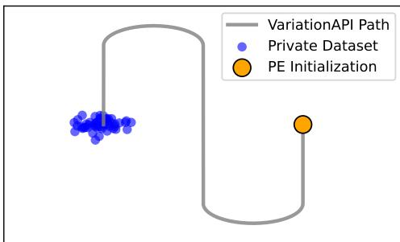  
Figure 1: A pathological example of VariationAPI output space.

mum. Suppose that the PE initialization is at the end ofa vertical segment (as in Figure 1) and the variations output by VariationAPI all lie along the same vertical segment as y. Although some variants will be closer to the private data in geodesic distance, they are all farther in the Euclidean metric used by $P E ;$ so y is chosen and no progress is made.

Example E.1 gives a simple instance where Assumption 2 does not hold and PE provably fails.

A promising future direction is to replace the Euclidean metric in the nearest neighbor histogram with a more sophisticated learned metric, which may help avoid the Euclidean local minima illustrated in Figure 1. Since the manifold on which the generator moves is a function of the generator, such a metric may be learnable without accessing the private dataset.

## 3.1 Main Theorem

Now, we are ready to state the main theorem of this section. Let $\mu _ { D }$ denote the empirical distribution of D and $\mu _ { S } ^ { ( T ) }$ denote the empirical distribution of the synthetic dataset after T iterations of Algorithm 2.3.

Theorem 3.4. Fix a domain $\Omega \subseteq \mathbb { R } ^ { d }$ with diameter 1 and doubling dimension at most $k \geq 2$ (Assumption 1). Let $D \subseteq \Omega$ and suppose that, at each iteration with synthetic dataset S, Assumption 2 holds with parameters λ, c for every $x \in D \setminus S$ and some $y _ { x } \in \mathrm { a r g m i n } _ { y \in S } \rho ( x , y )$ $H T \geq$ $\textstyle { \frac { 2 0 0 \lambda } { c } } \log \left( { \frac { c } { 2 0 0 \lambda \sigma ^ { \frac { 1 } { k } } } } \right)$ then $\mathbb { E } \left[ W _ { 1 } \left( \mu _ { S } ^ { ( T ) } , \mu _ { D } \right) \right] = \tilde { O } \left( \lambda \sigma ^ { \frac { 1 } { k } } \right)$ where the expectation is over the random ness ofthe algorithm. Further,for $\varepsilon , \delta \in ( 0 , 1 )$ , $\begin{array} { r } { f \sigma = \frac { 2 \sqrt { T \log \left( 1 . 2 5 / \delta \right) } } { n \varepsilon } } \end{array}$ and $\begin{array} { r } { T = \left\lceil \frac { 2 0 0 \lambda } { c } \log ( 2 + n \varepsilon ) \right\rceil } \end{array}$ ， then Algorithm 2.3 is (ε, δ)-DP and E $\left[ W _ { 1 } \left( \mu _ { S } ^ { ( T ) } , \mu _ { D } \right) \right]$ is at most

$$
\tilde { \cal O } \left( \lambda ^ { 1 + \frac { 1 } { 2 k } } \left( \frac { \sqrt { \log ( 2 + n \varepsilon ) \log ( ^ { 1 . 2 5 } / \delta ) } } { \varepsilon n } \right) ^ { \frac 1 k } \right) .
$$

The first thing to note about this bound is that it only depends on the intrinsic dimension k and the effective rank λ, not the ambient dimension d. The bound is approximately

$$
\tilde { O } \left( \lambda ^ { 1 + 1 / ( 2 k ) } \left( \frac { \sqrt { \log ( 1 . 2 5 / \delta ) } } { \varepsilon n } \right) ^ { 1 / k } \right) .
$$

While this still scales as $n ^ { - 1 / k }$ for intrinsic dimension k, it is a significant improvement over the $n ^ { - 1 / d }$ worst case scaling for Wasserstein learning.

There are several other notions of low-dimensionality that are studied in data analysis. In particular, it is commonly conjectured that high dimensional datasets that occur in practice actually lie on low-dimensional manifolds embedded in the ambient space<sup>3</sup>. We conjecture that our results extend to the setting of low-dimensional manifolds with low curvature.

## 3.2 Proof Outline

We defer the full proof of Theorem 3.4 to Section E and sketch the high-level details below. The key idea is that if x is reachable from Variation $\operatorname { A P I } ( y , s ^ { 2 } )$ , then the distance between x and a single variation at scale $s ^ { 2 } \approx \rho ( x , y ) ^ { 2 } / \lambda$ is at most $( 1 - c / \mathrm { { 5 0 } } \lambda ) \rho ( x , y )$ with constant probability (Lemma E.2). In other words, the set of variations will contain a point that approaches the true underlying dataset by some multiplicative factor. The catch is that we do not have knowledge of $\rho ( x , y )$ but can approximate the correct value by producing a variation at each scale (powers of two). We provide more background information followed by a more detailed exposition below.

This reduces the $W _ { 1 }$ -distance between the true dataset and the set of variations. The remaining steps are to control the distortion in $W _ { 1 }$ -distance due to Gaussian noise necessary for privacy and subsampling to reduce the size of the support.

Given two (possibly signed) measures $\mu$ and $\nu ,$ the bounded-Lipschitz distance between them is given by $\begin{array} { r } { \mathrm { B L } ( \mu , \nu ) : = \operatorname* { s u p } _ { f \in { \mathcal F } _ { \mathrm { B L } } } \biggr | \int f \mathrm { d } \mu - \int f \mathrm { d } \nu \biggr | } \end{array}$ , where the supremum is taken over all bounded 1-Lipschitz functions $\mathcal { F } _ { \mathrm { B L } } ^ { \mathrm { ~ ~ } } : = \{ f ~ : ~ \| f \| _ { \infty } ~ \leq ~ \mathrm { 1 } , | f ( x ) - f ( y ) | ~ \leq ~ \rho ( x , y ) \}$ . By Kantorovich duality [Vil+08], BL $( \mu , \nu ) = W _ { 1 } ( \mu , \nu )$ when $\mu$ and ν are probability measures on our diameter-one domain. The BL-distance will be useful to us since it is defined for signed measures, which naturally occur in the noisy histogram obtained from adding Gaussian noise to ensure DP.

For a dataset D and current synthetic dataset $S ^ { ( t ) }$ , let $\mu = \mu _ { D }$ and $\mu _ { S } ^ { ( t ) }$ to denote the empirical distribution over D and $S ^ { ( t ) }$ . Given variations $V ^ { ( t ) }$ generated by the VariationAPI, let $\mu _ { V } ^ { ( t ) }$ be the distribution induced by the nearest neighbor histogram on $V ^ { ( t ) }$ . That is, $\mu _ { V } ^ { ( t ) }$ is supported on $V ^ { ( t ) }$ and the probability mass of a point $y$ is proportional to the number of point’s in $D$ for which $y$ is that points nearest neighbor in $V ^ { ( t ) }$ . Let ${ \tilde { \mu } _ { V } } ^ { ( \bar { t } ) }$ be the signed measure induced by the noisy nearest neighbor histogram and ${ \bar { \mu } _ { V } ^ { ( t ) } }$ be the bounded-Lipschitz projection of ${ \tilde { \mu } _ { V } } ^ { ( t ) }$ onto the space of probability measures.

By repeatedly applying the triangle inequality, González, Fanti, and Ramdas [GFR25] bounded the $W _ { \mathrm { 1 } } \mathrm { - d i s t a n c e }$ between the private and synthetic datasets $W _ { 1 } ( \mu _ { D } , \mu _ { S } ^ { ( t + 1 ) } )$ by

$$
\overbrace { \mathbb { E } [ W _ { 1 } ( \mu _ { D } , \mu _ { V } ^ { ( t + 1 ) } ) ] } ^ { A } + 2 \cdot \overbrace { \mathbb { E } [ \mathrm { B L } ( \mu _ { V } ^ { ( t + 1 ) } , \tilde { \mu } _ { V } ^ { ( t + 1 ) } ) ] } ^ { B } + \overbrace { \mathbb { E } [ W _ { 1 } ( \mu _ { S } ^ { ( t + 1 ) } , \bar { \mu } _ { V } ^ { ( t + 1 ) } ) ] } ^ { C } .
$$

Here, the factor of 2 is due to the fact that BL ${ \iota } ( \tilde { \mu } _ { V } , \bar { \mu } _ { V } ) \leq \mathrm { B L } ( \tilde { \mu } _ { V } , \mu _ { V } )$ . While González, Fanti, and Ramdas [GFR25] focused on bounding each term using the ambient dimension, we provide a more refined analysis using the different notions of intrinsic dimension.

Recall that the smaller the effective dimension of the VariationAPI (Assumption 2), λ, the higher “fraction of mass” the VariationAPI puts in the direction of the data. This means that we can expect the contraction rate at each iteration (term A) to scale with λ. Indeed, we can bound the contraction rate of each iteration as a function of λ: $\begin{array} { r } { A \leq ( 1 - \frac { c } { 2 0 0 \lambda } ) W _ { 1 } ( \mu _ { D } , \mu _ { S } ^ { ( t ) } ) + \alpha } \end{array}$

Next, using a chaining argument, it can be shown that $B \leq \tilde { O } \left( \sigma m _ { V } ^ { 1 - \frac { 1 } { k } } \right)$ . Here $\sigma$ is the magnitude of Gaussian noise added to the histogram, $m _ { V } \geq | V |$ is a public upper bound on the number of variations, and k is the doubling dimension of the domain (Assumption 1). Roughly speaking, k bounds the number of “directions” that adding Gaussian noise can warp the nearest neighbors histogram distribution $\mu _ { V } ^ { ( t + 1 ) }$

Finally, the error introduced by approximating the projected distribution via subsampling can be bounded by $C \le \tilde { O } ( m ^ { - 1 / k } )$ using a similar chaining argument. Choosing m appropriately to balance the terms yields the desired outcome.

## 4 Candidate-Selection via Clustering

Lin, Gopi, Kulkarni, Nori, et al. [LGKN+24] originally studied PE with subsampling, where the next iteration of synthetic data points is obtained from the noisy histogram by subsampling m points with replacement. Then, Xie, Lin, Backurs, Gopi, et al. [XLBG+24] studied PE with ranking for text data, where the m points on the noisy histogram with the highest count are selected. This section introduces GAPE, a new variation of PE.

Lin, Gopi, Kulkarni, Nori, et al. [LGKN+24] analyzed the case where the dataset consists of κ points with large multiplicity and showed the private evolution with subsampling provably converges in this setting. However, as we show in a simple example, both the ranking and subsampling selection rules can perform arbitrarily worse than GAPE, even in the slightly more general setting of well-separated clusters. Both ranking and subsampling fail to consider the relative location of histogram points and are based only on the noisy counts. This motivates us to design a “geometry-aware" selection mechanism which uses a clustering-based algorithm to select a representative set of candidates taking geometry into account.

Example 4.1 (Ranking & Subsampling Failure). Consider a dataset oftwo well-separated clusters where one cluster contains 70% ofthe population. We aim to generate 3 synthetic points (ideally 2 in the majority, 1 in the minority). Even starting with this exact distribution and generating 2 variants per point, vote dilution can eliminate the minority. If each cluster’s votes split evenly, noiseless ranking picks only majority points; subsampling selects only majority variants at some iteration with high probability. Once the minority cluster is dropped in an iteration, it may never be recovered ifvariations cannot move between clusters.

Setting. In this setting, the dataset consists of κ-clusters such that the intracluster radius is small, but the intercluster (separation) between clusters is large. Specifically, we assume the following assumptions hold.

Assumption 3 ((r, R)-Well-Clustered). The data set consists ofκ clusters ofdiameter r such that the minimum distance between two points in different clusters is at least some given distance $R > 0$ (well-separated). Note that we assume R and r are known, but not κ.

Assumption 4 (Warm-Start). For each cluster, there is an initial synthetic data point $s \in S$ within distance R/8 of it.

In practice, PE is usually initialized using some prior knowledge of the dataset $( e . g .$ ., Section H). A missed cluster may never be recovered (Example 4.1).

We work under the general low effective rank VariationAPI model from Section 3 (Definition 3.2) but do not assume low doubling dimension (Assumption 1).

We are now ready to state the main result of this section.

Theorem 4.2 (Cluster Discovery). Let $D \subseteq \mathbb { R } ^ { d }$ be a dataset ofsize n that is $( r , R )$ -well-clustered (Assumption 3) and suppose that, at each iteration with synthetic dataset S, Assumption 2 holds with parameters $\lambda , c f o r$ every $x \in D \setminus S$ and some $y _ { x } \in \mathrm { a r g m i n } _ { y \in S } \rho ( x , y )$ . Further assume that $R \geq 4 0 0 r \lambda / c ,$ that the initial dataset $S \subseteq \mathbb { R } ^ { d }$ satisfies the warm-start condition (Assumption 4) and that every cluster $C _ { i }$ satisfies $| C _ { i } | > 8 n / m + 3 m _ { V } \tau$ , where $\tau ~ = ~ \sigma \sqrt { 2 \log ( ^ { 6 T m _ { V } } / \beta ) }$ and m $( m _ { V } = { \tilde { O } } ( m ) )$ upper bounds the number of synthetic (variation) points per iteration. Then after $T = \lceil ( 5 0 \lambda / c ) \log ( R / r ) \rceil$ iterations, GAPE (Algorithm $4 . I )$ with noise parameter σ outputs a synthetic dataset $S ^ { ( T ) }$ such that, with probability $1 - \beta _ { : }$

$$
\rho ( D , S ^ { ( T ) } ) = \operatorname* { s u p } _ { x \in D } \operatorname* { i n f } _ { s \in S ^ { ( T ) } } \rho ( x , s ) \leq \frac { 1 0 0 r \lambda } { c } = O ( r \lambda ) .
$$

For $\varepsilon , \delta \in ( 0 , 1 )$ and $\begin{array} { r } { \sigma = \frac { 2 \sqrt { T \log ( ^ { 1 . 2 5 / \delta } ) } } { \varepsilon } } \end{array}$ , the algorithm is $( \varepsilon , \delta ) – D P$ and succeeds with cluster sizes

$$
| C _ { i } | = \tilde { \Omega } \left( \frac { m _ { V } \sqrt { \lambda } } { \varepsilon } + \frac { n } { m } \right) .
$$

Recall that $m _ { V } ~ = ~ { \tilde { O } } ( m )$ Hence, for fixed $\varepsilon ,$ by choosing $m \ = \ \tilde { \Theta } ( n ^ { 1 / 2 } / \lambda ^ { 1 / 4 } )$ , we see that Theorem 4.2 only requires a minimum cluster size of roughly $\tilde { \Omega } ( n ^ { \frac { 1 } { 2 } } \lambda ^ { \frac { 1 } { 4 } } )$ . Thus, this theorem still holds even if the cluster sizes are very unbalanced.

GAPE We present our Geometry-Aware PE variant, GAPE in Algorithm 4.1 and the specific local search cost in Definition 4.3. The main change from Algorithm 2.3 is that we use a selection mechanism that approximately minimizes a geometry aware cost function. This cost function is similar to k-median, where the goal is to choose a synthetic dataset whose empirical distribution is close in $W _ { 1 }$ distance to the distribution induced by the nearest neighbor histogram. We adapt the k-median cost slightly to handle the negative weights that arise in the noisy histogram.

Define a truncated distance function $c ( x , y ) : = \operatorname* { m i n } \{ \rho ( x , y ) , ^ { R } / 3 \}$

Definition 4.3 (Local-Search Objective). Given a dataset $D \subseteq \mathbb { R } ^ { d }$ with signed weight vector $\tilde { H } = \{ w _ { d } \} _ { d \in D }$ , and points $z _ { \ell } \in \mathbb { R } ^ { d } f o r \ell \in [ m ]$ , define thefollowing minimum cost directedflow problem with respect to this truncated distance

$$
\begin{array} { c } { { \mathrm { L S O b j } ( D , \tilde { H } , z ) : = \displaystyle { \operatorname* { m i n } _ { f } \sum _ { x \in D ^ { + } } \sum _ { y \in D ^ { - } } c ( x , y ) f ( x , y ) + \sum _ { \ell = 1 } ^ { m } \sum _ { x \in D ^ { + } } c ( x , z _ { \ell } ) f ( x , z _ { \ell } ) } } } \\ { { \displaystyle \sum _ { y \in D ^ { - } } f ( x , y ) + \sum _ { \ell } f ( x , z _ { \ell } ) = w _ { x } \qquad \forall x \in D ^ { + } } } \\ { { \displaystyle \sum _ { x \in D ^ { + } } f ( x , y ) = - w _ { y } \qquad \forall y \in D ^ { - } } } \\ { { \displaystyle f \geq 0 } } \end{array}
$$

where $D ^ { + }$ denotes candidate points with positive weight $w _ { x } ,$ and $D ^ { - }$ denotes candidate points with negative weight $w _ { y } .$ . For fewer than m selected points, the sums over ℓ range over those points.

We wish to select at most $m = m _ { S }$ candidate points as the synthetic dataset in the next iteration. Our goal is to select a set of points $S ^ { ( t ) } \subseteq \tilde { H } _ { \tau } ^ { ( t ) }$ that approximately minimizes $\mathrm { L S O b j } ( V ^ { ( t ) } , \tilde { H } ^ { ( t ) } , \cdot )$ where $\tilde { H } _ { \tau } ^ { ( t ) }$ is the set of candidates whose noisy count exceeds τ. Thresholding allows us to ensure that we are unlikely to select a data point that is not close to any of the private data. To do this efficiently we use local search by repeatedly swapping selected and unselected candidate points that decrease the local search cost (Definition 4.3). See Algorithm 4.2 for exact pseudocode.

Algorithm 4.1: Geometrically Aware Private Evolution   
1 Function GAPE(D, T, ε, δ, m, R, r, λ, c, β)   
2 $\begin{array} { r } { \sigma \gets \frac { 2 \sqrt { T \log ( 1 . 2 5 / \delta ) } } { \varepsilon } } \end{array}$   
3 $\ell ^ { \star } \gets \lceil \log _ { 2 } ( 2 0 0 \lambda / ( c r ^ { 2 } ) ) \rceil$   
▷ set $2 ^ { - \ell ^ { \star } }$ to be the smallest VariationAPI scale   
4 Variation $\mathrm { A P I } ( \cdot ) \gets \{ \cdot \} \cup \bigcup _ { \ell = \lceil - \log _ { 2 } ( R ^ { 2 } ) \rceil } ^ { \ell ^ { \star } }$ VariationAPI(·, 2<sup>−ℓ</sup>)<sup>⊗⌈4</sup> <sup>log(3T</sup> <sup>n/β)⌉</sup>   
▷ Generate independent variations at each scale   
5 $m _ { V }  m ( 1 + ( \ell ^ { \star } - \lceil - \log _ { 2 } ( R ^ { 2 } ) \rceil + 1 ) $ ⌈4 log $\left( 3 T n / \beta \right) 7 )$   
6 $\tau  \sigma \sqrt { 2 \log ( ^ { 6 T m _ { V } } / \beta ) }$   
▷ threshold value for filtering candidates   
7 $S ^ { ( 0 ) } \gets$ RandomAPI(m)   
8 for $t = 1 , \dots , T$ do   
9 $V ^ { ( t ) } \gets \bigcup _ { y \in S ^ { ( t - 1 ) } }$ Variation $\operatorname { A P I } ( y )$   
10 H<sup>(t)</sup> ← NNhistogram $( D , V ^ { ( t ) } , \rho )$   
11 $\tilde { H } ^ { ( t ) } \gets H ^ { ( t ) } + \mathcal { N } ( 0 , \sigma ^ { 2 } I _ { | V ^ { ( t ) } | } )$   
12 $\tilde { H } _ { \tau } ^ { ( t ) } \gets \{ v \in V ^ { ( t ) } : \tilde { H } ^ { ( t ) } ( v ) > \tau \}$   
▷ filter candidates for local search   
13 $S ^ { ( t ) }$ ← LocalSearch(V<sup>(t)</sup>, H<sup>˜</sup> <sup>(t)</sup>, H<sup>˜ (t)</sup><sub>τ</sub> , m)   
▷ local search (Algorithm 4.2)   
14 return $S ^ { ( T ) }$

Analysis. The proof of Theorem 4.2 is detailed in Section $\mathrm { F , }$ and we describe the proof idea below.

For a synthetic data point $s \in S ^ { ( t ) }$ within distance $R / { \mathrm { 8 } }$ of some cluster $C ,$ it can be shown that the generated variations $V ^ { ( t + 1 ) }$ contain, with high probability, a point which makes progress towards C. Moreover, the support of the noiseless histogram supp $H .$ , that is, the subset of $V ^ { ( t + 1 ) }$ with at least 1 vote, only contains points that have progressed towards some cluster. Thus, as long as the selection mechanism chooses a point from supp H within distance $R / _ { 8 }$ of each cluster, GAPE will consistently make progress towards all clusters down to distance $O ( r \lambda )$

By restricting the local search to candidates with sufficiently high noisy votes, we can ensure that such candidates are contained in supp H. In addition, if a cluster $C$ is sufficiently large, there will be at least one point with a sufficiently high noisy vote to survive the thresholding. It remains only to ensure that the local search terminates with a point within distance $R / _ { 8 }$ of each cluster. We proceed to show that local search must place a point near every cluster, since otherwise swapping the center with the least incoming flow for a candidate near an uncovered cluster would decrease the cost.

Algorithm 4.2: Local Search   
1 Function LocalSearch(V, H<sup>˜</sup> , H<sup>˜</sup> , m)   
2 if H<sup>˜</sup><sub>τ</sub> = ∅ or P H<sup>˜</sup> (v) < 0 then return {v} for any $v \in V$   
3 solution ← any min $\{ m , | \tilde { H } _ { \tau } | \}$ elements of ${ \tilde { H } } _ { \tau }$   
4 while true do   
5 for z ∈ solution and $x \in \tilde { H } _ { \tau } \ \backslash$ solution do   
6 if LSObj(V, H, <sup>˜</sup> solution ∪ {x} \ {z}) < LSObj(V, H, <sup>˜</sup> solution) then   
7 solution ← solution ∪ {x} \ {z} ▷ cost-decreasing swap (Definition 4.3)   
8 restart the while loop   
9 return solution

## 4.1 Experiments

We report the various embedding distribution distances between real and synthetic data on various datasets. These experiments demonstrate that the improvements of GAPE translate to real datasets.

Datasets. Following previous work [XLBG+24], we use PubMed<sup>4</sup>, a dataset of ≈ 75000 abstracts of medical papers crawled by Yu, Backurs, Gopi, Inan, et al. [YBGI+23]. We also use Reddit<sup>5</sup>, a larger dataset of ≈ 5 million Reddit dialogues curated by Lee, Schulz, Atkinson, Gao, et al. [LSAG+19].

Generators & Semantic Embeddings. We use GPT-2 [RWCL+19] for both RandomAPI and VariationAPI. To provide a fair comparison, for PubMed, we keep the instructional prompts and LLM temperature (1.0) the same as in [XLBG+24]. Modified instructional prompts for Reddit can be found in the appendix. We also increase the temperature to 1.7. For the embedding model, we use Sentence Transformers [RG19] (sentence-t5-base, 768-dimensions).

Baselines. We compare against private evolution with subsampling [LGKN+24] (SubsamplePE), and ranking [XLBG+24] (AugPE). For a fair comparison, we use the original implementation<sup>6</sup> of private evolution for baselines and implement our new selection mechanism.

Setup. Experiments were completed using 8 Nvidia H100 GPUs (80 GB memory each). PubMed experiments ran for 3-4 hours each and Reddit experiments ran for between 3 and 8 hours each. See Section H for more setup details for our experiments.

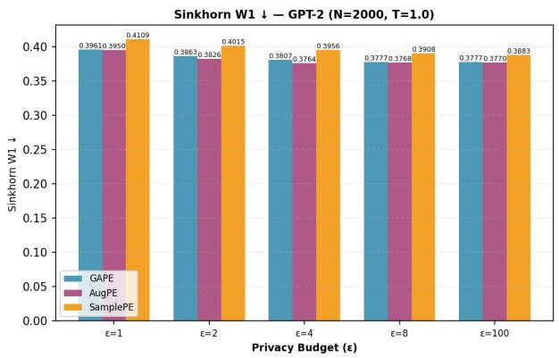

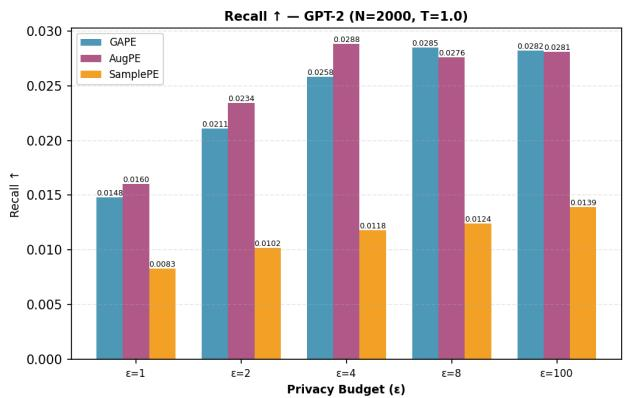  
Figure 2: PubMed (m = 2000): Sinkhorn $W _ { 1 }$ distance (left) and recall (right).

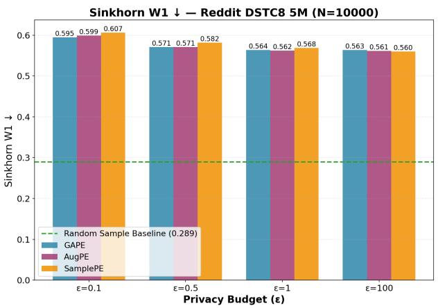

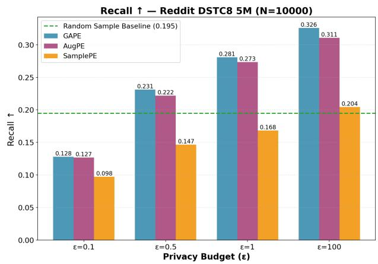  
Figure 3: Reddit (m = 10,000): Sinkhorn $W _ { 1 }$ distance (left) and recall (right).

Results. Figures 2 and 3 compare GAPE with AugPE and SubsamplePE on the PubMed and Reddit datasets. Our results highlight that, as expected, SubsamplePE has the worst recall. GAPE is competitive with AugPE in both W1-distance<sup>7</sup> and recall. For large ϵ, GAPE has higher recall than AugPE. The quality of synthetic data can be measured in a variety of ways. We include a broader set of comparison metrics in Appendix H.4.

## References

[ABKK+21] Sergul Aydore, William Brown, Michael Kearns, Krishnaram Kenthapadi, Luca Melis, Aaron Roth, and Ankit A Siva. “Differentially Private Query Release Through Adaptive Projection”. In: Proceedings of the 38th International Conference on

Machine Learning (July 18–24, 2021). Ed. by Marina Meila and Tong Zhang. Vol. 139. Proceedings of Machine Learning Research. PMLR, 2021, pp. 457–467 (cit. on p. 23).

[App25] Apple. Understanding Aggregate Trends for Apple Intelligence Using Differential Privacy. 2025. URL: https://machinelearning.apple.com/researc h/differential-privacy-aggregate-trends (cit. on p. 23).

[AZKT+18] Nazmiye Ceren Abay, Yan Zhou, Murat Kantarcioglu, Bhavani Thuraisingham, and Latanya Sweeney. “Privacy Preserving Synthetic Data Release Using Deep Learning”. In: Machine Learning and Knowledge Discovery in Databases - European Conference, ECML PKDD, Proceedings, Part I. 2018, pp. 510–526 (cit. on p. 23).

[BLR08] Avrim Blum, Katrina Ligett, and Aaron Roth. “A learning theory approach to non-interactive database privacy”. In: Proceedings of the Fortieth Annual ACM Symposium on Theory ofComputing. STOC ’08. Victoria, British Columbia, Canada: Association for Computing Machinery, 2008, pp. 609–618. ISBN: 9781605580470 (cit. on p. 23).

[BM02] Peter L. Bartlett and Shahar Mendelson. “Rademacher and Gaussian Complexities: Risk Bounds and Structural Results”. In: J. Mach. Learn. Res. 3 (2002), pp. 463–482 (cit. on p. 31).

[BW18] Borja Balle and Yu-Xiang Wang. “Improving the Gaussian Mechanism for Differential Privacy: Analytical Calibration and Optimal Denoising”. In: Proceedings of the 35th International Conference on Machine Learning, ICML 2018, Stockholmsmässan, Stockholm, Sweden, July 10-15, 2018. Ed. by Jennifer G. Dy and Andreas Krause. Vol. 80. Proceedings of Machine Learning Research. PMLR, 2018, pp. 403–412 (cit. on p. 22).

[CKF24] Dingfan Chen, Raouf Kerkouche, and Mario Fritz. “A Unified View of Differentially Private Deep Generative Modeling”. In: Trans. Mach. Learn. Res. 2024 (2024) (cit. on p. 23).

[DNRR+09] Cynthia Dwork, Moni Naor, Omer Reingold, Guy N. Rothblum, and Salil P. Vadhan. “On the complexity of differentially private data release: efficient algorithms and hardness results”. In: Proceedings of the 41st Annual ACM Symposium on Theory ofComputing, STOC. Ed. by Michael Mitzenmacher. 2009, pp. 381–390 (cit. on p. 22).

[DNT14] Cynthia Dwork, Aleksandar Nikolov, and Kunal Talwar. “Using Convex Relaxations for Efficiently and Privately Releasing Marginals”. In: Proceedings ofthe Thirtieth Annual Symposium on Computational Geometry. SOCG’14. Kyoto, Japan: Association for Computing Machinery, 2014, pp. 261–270. ISBN: 9781450325943 (cit. on p. 23).

[DR14] Cynthia Dwork and Aaron Roth. “The Algorithmic Foundations of Differential Privacy”. In: Found. Trends Theor. Comput. Sci. 9.3-4 (2014), pp. 211–407 (cit. on p. 22).

[DRS22] Jinshuo Dong, Aaron Roth, and Weijie J Su. “Gaussian differential privacy”. In: Journal of the Royal Statistical Society Series B: Statistical Methodology 84.1 (2022), pp. 3–37 (cit. on p. 22).

[Dud69] Richard Mansfield Dudley. “The speed of mean Glivenko-Cantelli convergence”. In: The Annals of Mathematical Statistics 40.1 (1969), pp. 40–50 (cit. on p. 2).

[FMST24] Vitaly Feldman, Audra McMillan, Satchit Sivakumar, and Kunal Talwar. “Instance-Optimal Private Density Estimation in the Wasserstein Distance”. In: Advances in Neural Information Processing Systems 38: Annual Conference on Neural Informa tion Processing Systems 2024, NeurIPS 2024, Vancouver, BC, Canada, December 10 - 15, 2024. Ed. by Amir Globersons, Lester Mackey, Danielle Belgrave, Angela Fan, Ulrich Paquet, Jakub M. Tomczak, and Cheng Zhang. 2024 (cit. on p. 23).

[GAHR+14] Marco Gaboardi, Emilio Jesus Gallego Arias, Justin Hsu, Aaron Roth, and Zhiwei Steven Wu. “Dual Query: Practical Private Query Release for High Dimensional Data”. In: Proceedings of the 31st International Conference on Machine Learning (June 22–24, 2014). Ed. by Eric P. Xing and Tony Jebara. Vol. 32. Proceedings of Machine Learning Research. Bejing, China: PMLR, 2014, pp. 1170–1178 (cit. on p. 23).

[GBGK+23] Sahra Ghalebikesabi, Leonard Berrada, Sven Gowal, Ira Ktena, Robert Stanforth, Jamie Hayes, Soham De, Samuel L. Smith, Olivia Wiles, and Borja Balle. “Differentially Private Diffusion Models Generate Useful Synthetic Images”. In: CoRR abs/2302.13861 (2023) (cit. on p. 23).

[GFR25] Tomás González, Giulia Fanti, and Aaditya Ramdas. “Private Evolution Converges”. In: arXiv preprint arXiv:2506.08312 (2025) (cit. on pp. 4, 5, 7, 10, 23, 28, 29).

[GKK16] Lee-Ad Gottlieb, Aryeh Kontorovich, and Robert Krauthgamer. “Adaptive metric dimensionality reduction”. In: Theor. Comput. Sci. 620 (2016), pp. 105–118 (cit. on p. 29).

[GLLW25] Chen Gong, Kecen Li, Zinan Lin, and Tianhao Wang. “DPImageBench: A Unified Benchmark for Differentially Private Image Synthesis”. In: Proceedings ofthe 2025 ACM SIGSAC Conference on Computer and Communications Security, CCS 2025, Taipei, Taiwan, October 13-17, 2025. Ed. by Chun-Ying Huang, Jyh-Cheng Chen, Shiuh-Pyng Shieh, David Lie, and Véronique Cortier. ACM, 2025, pp. 4139–4153 (cit. on p. 23).

[GRU12] Anupam Gupta, Aaron Roth, and Jonathan Ullman. “Iterative Constructions and Private Data Release”. In: Theory ofCryptography. Ed. by Ronald Cramer. Berlin, Heidelberg: Springer Berlin Heidelberg, 2012, pp. 339–356. ISBN: 978-3-642-28914- 9 (cit. on p. 23).

[HJSP23] Frederik Harder, Milad Jalali, Danica J. Sutherland, and Mijung Park. “Pre-trained Perceptual Features Improve Differentially Private Image Generation”. In: Trans. Mach. Learn. Res. 2023 (2023) (cit. on p. 23).

[HLM12] Moritz Hardt, Katrina Ligett, and Frank Mcsherry. “A Simple and Practical Algorithm for Differentially Private Data Release”. In: Advances in Neural Information

Processing Systems. Ed. by F. Pereira, C.J. Burges, L. Bottou, and K.Q. Weinberger. Vol. 25. Curran Associates, Inc., 2012 (cit. on p. 23).

[HR10] Moritz Hardt and Guy N. Rothblum. “A Multiplicative Weights Mechanism for Privacy-Preserving Data Analysis”. In: 2010 IEEE 51st Annual Symposium on Foundations of Computer Science. 2010, pp. 61–70 (cit. on p. 23).

[HSZC+24] Charlie Hou, Akshat Shrivastava, Hongyuan Zhan, Rylan Conway, Trang Le, Adithya Sagar, Giulia Fanti, and Daniel Lazar. “PrE-Text: Training Language Models on Private Federated Data in the Age of LLMs”. In: Forty-first International Conference on Machine Learning, ICML. 2024 (cit. on p. 23).

[HT10] Moritz Hardt and Kunal Talwar. “On the geometry of differential privacy”. In: Proceedings ofthe Forty-Second ACM Symposium on Theory ofComputing. STOC ’10. Cambridge, Massachusetts, USA: Association for Computing Machinery, 2010, pp. 705–714. ISBN: 9781450300506 (cit. on p. 23).

[HVZ23] Yiyun He, Roman Vershynin, and Yizhe Zhu. “Algorithmically Effective Differentially Private Synthetic Data”. In: Proceedings of Thirty Sixth Conference on Learning Theory (July 12–15, 2023). Ed. by Gergely Neu and Lorenzo Rosasco. Vol. 195. Proceedings of Machine Learning Research. PMLR, 2023, pp. 3941–3968 (cit. on p. 23).

[HWLL+24] Yuzheng Hu, Fan Wu, Qinbin Li, Yunhui Long, Gonzalo Munilla Garrido, Chang Ge, Bolin Ding, David A. Forsyth, Bo Li, and Dawn Song. “SoK: Privacy-Preserving Data Synthesis”. In: IEEE Symposium on Security and Privacy, SP. 2024, pp. 4696– 4713 (cit. on p. 23).

[HWZL+25] Charlie Hou, Mei-Yu Wang, Yige Zhu, Daniel Lazar, and Giulia Fanti. “Private Federated Learning using Preference-Optimized Synthetic Data”. In: Forty-second International Conference on Machine Learning, ICML 2025, Vancouver, BC, Canada, July 13-19, 2025. OpenReview.net, 2025 (cit. on p. 23).

[JBGQ+23] Marco Jiralerspong, Avishek Joey Bose, Ian Gemp, Chongli Qin, Yoram Bachrach, and Gauthier Gidel. Feature Likelihood Score: Evaluating Generalization ofGenerative Models Using Samples. 2023. arXiv: 2302.04440 [cs.LG] (cit. on p. 39).

[KP24] Alexey Kurakin and Natalia Ponomareva. Protecting users with differentially private synthetic training data. Retrieved Jan 2026. 2024 (cit. on p. 23).

[KPSM+23] Alexey Kurakin, Natalia Ponomareva, Umar Syed, Liam MacDermed, and Andreas Terzis. “Harnessing large-language models to generate private synthetic text”. In: arXiv preprint arXiv:2306.01684 (2023) (cit. on p. 23).

[LBWY25] Zinan Lin, Tadas Baltrusaitis, Wenyu Wang, and Sergey Yekhanin. “Differentially private synthetic data via apis 3: Using simulators instead of foundation model”. In: arXiv preprint arXiv:2502.05505 (2025) (cit. on p. 23).

[LGKN+24] Zinan Lin, Sivakanth Gopi, Janardhan Kulkarni, Harsha Nori, and Sergey Yekhanin. “Differentially Private Synthetic Data via Foundation Model APIs 1: Images”. In: The Twelfth International Conference on Learning Representations, ICLR 2024,

Vienna, Austria, May 7-11, 2024. OpenReview.net, 2024 (cit. on pp. 1–4, 7, 11, 14, 23, 24).

[LGLZ+24] Kecen Li, Chen Gong, Zhixiang Li, Yuzhong Zhao, Xinwen Hou, and Tianhao Wang. “PrivImage: Differentially Private Synthetic Image Generation using Diffusion Models with Semantic-Aware Pretraining”. In: 33rd USENIX Security Symposium, USENIX Security 2024, Philadelphia, PA, USA, August 14-16, 2024. Ed. by Davide Balzarotti and Wenyuan Xu. USENIX Association, 2024 (cit. on p. 23).

[LSAG+19] S Lee, H Schulz, A Atkinson, J Gao, K Suleman, L El Asri, M Adada, M Huang, S Sharma, W Tay, et al. “Multi-domain task-completion dialog challenge”. In: Dialog system technology challenges 8.9 (2019) (cit. on p. 14).

[LVSU+21] Terrance Liu, Giuseppe Vietri, Thomas Steinke, Jonathan Ullman, and Steven Wu. “Leveraging Public Data for Practical Private Query Release”. In: Proceedings of the 38th International Conference on Machine Learning (July 18–24, 2021). Ed. by Marina Meila and Tong Zhang. Vol. 139. Proceedings of Machine Learning Research. PMLR, 2021, pp. 6968–6977 (cit. on p. 23).

[LVW21] Terrance Liu, Giuseppe Vietri, and Steven Z. Wu. “Iterative Methods for Private Synthetic Data: Unifying Framework and New Methods”. In: Advances in Neural Information Processing Systems. Ed. by M. Ranzato, A. Beygelzimer, Y. Dauphin, P.S. Liang, and J. Wortman Vaughan. Vol. 34. Curran Associates, Inc., 2021, pp. 690– 702 (cit. on p. 23).

[Mar63] Francesco E. Maranzana. “On the location of supply points to minimize transportation costs”. In: IBM Systems Journal 2.2 (1963), pp. 129–135 (cit. on p. 36).

[Mic24] Microsoft. The Crossroads of Innovation and Privacy: Private Synthetic Data for Generative AI. 2024. URL: https://www.microsoft.com/en-us/resea rch/blog/the-crossroads-of-innovation-and-privacy-priv ate-synthetic-data-for-generative-ai/ (cit. on p. 23).

[MJWS+22] Justus Mattern, Zhijing Jin, Benjamin Weggenmann, Bernhard Schölkopf, and Mrinmaya Sachan. “Differentially Private Language Models for Secure Data Sharing”. In: Proceedings of the 2022 Conference on Empirical Methods in Natural Language Processing, EMNLP. Association for Computational Linguistics, 2022, pp. 4860– 4873 (cit. on p. 23).

[MMSM22] Ryan McKenna, Brett Mullins, Daniel Sheldon, and Gerome Miklau. “AIM: an adaptive and iterative mechanism for differentially private synthetic data”. In: Proc. VLDB Endow. 15.11 (July 2022), pp. 2599–2612. ISSN: 2150-8097 (cit. on p. 23).

[MPSM21] Ryan McKenna, Siddhant Pradhan, Daniel R Sheldon, and Gerome Miklau. “Relaxed Marginal Consistency for Differentially Private Query Answering”. In: Advances in Neural Information Processing Systems. Ed. by M. Ranzato, A. Beygelzimer, Y. Dauphin, P.S. Liang, and J. Wortman Vaughan. Vol. 34. Curran Associates, Inc., 2021, pp. 20696–20707 (cit. on p. 23).

[MSM19] Ryan Mckenna, Daniel Sheldon, and Gerome Miklau. “Graphical-model based estimation and inference for differential privacy”. In: Proceedings of the 36th International Conference on Machine Learning (June 9–15, 2019). Ed. by Kamalika

Chaudhuri and Ruslan Salakhutdinov. Vol. 97. Proceedings of Machine Learning Research. PMLR, 2019, pp. 4435–4444 (cit. on p. 23).

[NTZ13] Aleksandar Nikolov, Kunal Talwar, and Li Zhang. “The geometry of differential privacy: the sparse and approximate cases”. In: Proceedings ofthe Forty-Fifth Annual ACM Symposium on Theory of Computing. STOC ’13. Palo Alto, California, USA: Association for Computing Machinery, 2013, pp. 351–360. ISBN: 9781450320290 (cit. on p. 23).

[PJ09] Hae-Sang Park and Chi-Hyuck Jun. “A simple and fast algorithm for K-medoids clustering”. In: Expert systems with applications 36.2 (2009), pp. 3336–3341 (cit. on p. 36).

[RG19] Nils Reimers and Iryna Gurevych. “Sentence-BERT: Sentence Embeddings using Siamese BERT-Networks”. In: Proceedings ofthe 2019 Conference on Empirical Methods in Natural Language Processing and the 9th International Joint Conference on Natural Language Processing (EMNLP-IJCNLP). Association for Computational Linguistics. 2019, p. 3982 (cit. on p. 14).

[RLPL+20] Lucas Rosenblatt, Xiaoyan Liu, Samira Pouyanfar, Eduardo de Leon, Anuj Desai, and Joshua Allen. “Differentially private synthetic data: Applied evaluations and enhancements”. In: arXiv preprint arXiv:2011.05537 (2020) (cit. on p. 23).

[RR10] Aaron Roth and Tim Roughgarden. “Interactive privacy via the median mechanism”. In: Proceedings of the Forty-Second ACM Symposium on Theory of Computing. STOC ’10. Cambridge, Massachusetts, USA: Association for Computing Machinery, 2010, pp. 765–774. ISBN: 9781450300506 (cit. on p. 23).

[RWCL+19] Alec Radford, Jeffrey Wu, Rewon Child, David Luan, Dario Amodei, Ilya Sutskever, et al. “Language models are unsupervised multitask learners”. In: OpenAI blog 1.8 (2019), p. 9 (cit. on p. 14).

[SMRC+25] Marika Swanberg, Ryan McKenna, Edo Roth, Albert Cheu, and Peter Kairouz. “Is API Access to LLMs Useful for Generating Private Synthetic Tabular Data?” In: arXiv preprint arXiv:2502.06555 (2025) (cit. on p. 23).

[SP18] Shashank Singh and Barnabás Póczos. “Minimax distribution estimation in Wasserstein distance”. In: arXiv preprint arXiv:1802.08855 (2018) (cit. on p. 2).

[TFR22] Amirsina Torfi, Edward A. Fox, and Chandan K. Reddy. “Differentially private synthetic medical data generation using convolutional GANs”. In: Inf. Sci. 586 (2022), pp. 485–500 (cit. on p. 23).

[TKP19] Reihaneh Torkzadehmahani, Peter Kairouz, and Benedict Paten. “DP-CGAN: Differentially Private Synthetic Data and Label Generation”. In: IEEE Conference on Computer Vision and Pattern Recognition Workshops, CVPR Workshops. Computer Vision Foundation / IEEE, 2019, pp. 98–104 (cit. on p. 23).

[Tom89] Nicole Tomczak-Jaegermann. Banach-Mazur distances and finite-dimensional operator ideals. Longman Scientific & Technical, 1989 (cit. on p. 31).

[UV20] Jonathan Ullman and Salil Vadhan. “PCPs and the Hardness of Generating Synthetic Data”. In: Journal of Cryptology 33.4 (Oct. 1, 2020), pp. 2078–2112. ISSN: 1432- 1378 (cit. on p. 22).

[Vil+08] Cédric Villani et al. Optimal transport: old and new. Vol. 338. Springer, 2008 (cit. on p. 10).

[Wai19] Martin J Wainwright. High-dimensional statistics: A non-asymptotic viewpoint. Vol. 48. Cambridge university press, 2019 (cit. on p. 31).

[WLYZ25] Haoxiang Wang, Zinan Lin, Da Yu, and Huishuai Zhang. “Synthesize Privacy-Preserving High-Resolution Images via Private Textual Intermediaries”. In: arXiv preprint arXiv:2506.07555 (2025) (cit. on p. 23).

[WRBR+25] Shuaiqi Wang, Vikas Raunak, Arturs Backurs, Victor Reis, Pei Zhou, Sihao Chen, Longqi Yang, Zinan Lin, Sergey Yekhanin, and Giulia Fanti. “Struct-bench: A benchmark for differentially private structured text generation”. In: arXiv preprint arXiv:2509.10696 (2025) (cit. on p. 23).

[XLBG+24] Chulin Xie, Zinan Lin, Arturs Backurs, Sivakanth Gopi, Da Yu, Huseyin A. Inan, Harsha Nori, Haotian Jiang, Huishuai Zhang, Yin Tat Lee, Bo Li, and Sergey Yekhanin. “Differentially Private Synthetic Data via Foundation Model APIs 2: Text”. In: Forty-first International Conference on Machine Learning, ICML 2024, Vienna, Austria, July 21-27, 2024. OpenReview.net, 2024 (cit. on pp. 3, 4, 11, 14, 22, 23, 39).

[YBGI+23] Da Yu, Arturs Backurs, Sivakanth Gopi, Huseyin Inan, Janardhan Kulkarni, Zinan Lin, Chulin Xie, Huishuai Zhang, and Wanrong Zhang. “Training private and efficient language models with synthetic data from llms”. In: Socially Responsible Language Modelling Research. 2023 (cit. on p. 14).

[YILK+23] Xiang Yue, Huseyin A. Inan, Xuechen Li, Girish Kumar, Julia McAnallen, Hoda Shajari, Huan Sun, David Levitan, and Robert Sim. “Synthetic Text Generation with Differential Privacy: A Simple and Practical Recipe”. In: Proceedings ofthe 61st Annual Meeting of the Association for Computational Linguistics (Volume 1: Long Papers), ACL. 2023, pp. 1321–1342 (cit. on p. 23).

[ZLFH+25] Jianqing Zhang, Yang Liu, Jie Fu, Yang Hua, Tianyuan Zou, Jian Cao, and Qiang Yang. “PCEvolve: Private Contrastive Evolution for Synthetic Dataset Generation via Few-Shot Private Data and Generative APIs”. In: Forty-second International Conference on Machine Learning, ICML 2025, Vancouver, BC, Canada, July 13-19, 2025. OpenReview.net, 2025 (cit. on p. 23).

[ZLLX+25] Tianyuan Zou, Yang Liu, Peng Li, Yufei Xiong, Jianqing Zhang, Jingjing Liu, Xiaozhou Ye, Ye Ouyang, and Ya-Qin Zhang. “Contrastive Private Data Synthesis via Weighted Multi-PLM Fusion”. In: Forty-second International Conference on Machine Learning, ICML 2025, Vancouver, BC, Canada, July 13-19, 2025. OpenReview.net, 2025 (cit. on p. 23).

[ZZME+25] Felix Zhou, Samson Zhou, Vahab Mirrokni, Alessandro Epasto, and Vincent Cohen-Addad. “Private Training & Data Generation by Clustering Embeddings”. In: arXiv preprint arXiv:2506.16661 (2025) (cit. on p. 23).

## A Differential Privacy Preliminaries

Differential privacy is a stability notion for randomized algorithms. Intuitively, it protects user’s data by ensuring that the output of the algorithm does not depend too strongly on any single individual’s data. As in Xie, Lin, Backurs, Gopi, et al. [XLBG+24], we will focus on approximate differential privacy. Two datasets of the same size are said to be neighboring if they differ in the data of a single individual.

Definition A.1 ((ε, δ)-Differential Privacy). An algorithm A that takes as input an n-element dataset D is said to be $( \varepsilon , \delta ) – D P$ if for all neighboring datasets $D \sim D ^ { \prime }$ , and all events of the output space $R \subseteq { \mathrm { r a n g e } } ( A )$

$$
\operatorname* { P r } [ { \cal A } ( D ) \in { \cal R } ] \leq e ^ { \varepsilon } \cdot \operatorname* { P r } [ { \cal A } ( D ^ { \prime } ) \in { \cal R } ] + \delta .
$$

Adding carefully calibrated Gaussian noise to the output of a function is a common method for achieving differential privacy. As in other works on PE, the Gaussian mechanism is a subroutine in our implementation of PE.<sup>8</sup>

Proposition A.2 (Dwork and Roth [DR14, Gaussian Mechanism]). Let $f _ { 1 } , \ldots , f _ { k }$ be real-valued queries and define $\Delta _ { 2 }$ to be the $\ell _ { 2 }$ sensitivity over neighboring datasets:

$$
\Delta _ { 2 } = \operatorname* { m a x } _ { D , D ^ { \prime } } \| ( f _ { i } ( D ) ) _ { i \in [ k ] } - ( f _ { i } ( D ^ { \prime } ) ) _ { i \in [ k ] } \| _ { 2 } ,
$$

where the max is taken over all pairs of neighboring datasets. $I f \varepsilon , \delta \in ( 0 , 1 )$ , and $\begin{array} { r } { \sigma \geq \frac { \Delta _ { 2 } \sqrt { 2 \ln ( 1 . 2 5 / \delta ) } } { \varepsilon } } \end{array}$ then the Gaussian mechanism $( f _ { i } ( D ) ) _ { i \in [ k ] } + { \mathcal { N } } ( 0 , \sigma ^ { 2 } I _ { k } )$ is (ε, δ)-DP.

A key property of differentially private algorithms is that the adaptive composition of a series of differentially private algorithms is differentially private. There are several ways to compute the privacy budget of the composed mechanism. As in other works on PE, the adaptive composition theorem of Gaussian mechanisms [DRS22] is used to compute the privacy budget of the composed mechanism in this work. For T adaptive Gaussian histogram releases, the per-round $\ell _ { 2 }$ sensitivity is at most $\sqrt { 2 }$ for counts and ${ \sqrt { 2 } } / n$ for normalized histograms, so by the composition theorem the $T$ releases satisfy the same privacy bound as a Gaussian mechanism with $\ell _ { 2 }$ sensitivity $\sqrt { 2 T }$ (resp. ${ \sqrt { 2 T } } / n )$ . Thus, for $\varepsilon , \delta \in ( 0 , 1 )$ , the noise scales $\sigma = 2 \sqrt { T \log ( ^ { 1 . 2 5 } / \delta ) } / \varepsilon$ (Algorithms 2.1 and 4.1) and $\sigma = 2 \sqrt { T \log ( ^ { 1 . 2 5 / \delta } / \delta ) } / ( n \varepsilon )$ (Algorithm 2.3) give (ε, δ)-DP by Proposition A.2. The remaining operations are post-processing.

## B Related Works

DP Synthetic Data. The problem of private synthetic data generation has a long history, with early theoretical results showing that there are unlikely to be efficient private algorithms to generate synthetic data that accurately reflect simple statistics of the real data [DNRR+09; UV20]. A long line of work showed oracle-efficient algorithms for such synthetic data generation tasks, under a variety of settings [BLR08; HR10; HT10; RR10; GRU12; HLM12; NTZ13; DNT14; GAHR+14; MSM19; ABKK+21; MPSM21; MMSM22]. He, Vershynin, and Zhu [HVZ23] phrased the problem as Wasserstein learning, and Feldman, McMillan, Sivakumar, and Talwar [FMST24] showed instanceoptimality results for this formulation. Liu, Vietri, Steinke, Ullman, et al. [LVSU+21] and Liu, Vietri, and Wu [LVW21] first showed empirically that auxiliary “public” data can make synthetic data generation easier. On the practical side, there has been a flurry of activity bringing various tools to the task of private synthetic data generation [AZKT+18; TKP19; RLPL+20; MJWS+22; TFR22; GBGK+23; HJSP23; KPSM+23; YILK+23; HSZC+24; LGLZ+24; ZZME+25]. Some of these tools [KP24] have been used at large scale in practice to generate training data. We refer the reader to [CKF24; HWLL+24] and references therein for a survey of recent developments.

Private Evolution. Lin, Gopi, Kulkarni, Nori, et al. [LGKN+24] designed the first iteration of private evolution for images and initiated the theoretical study of private evolution as a distribution learning algorithm under the Wasserstein metric, albeit under strong data assumptions and a dataoblivious Gaussian VariationAPI. Their selection algorithm is based on subsampling.

Xie, Lin, Backurs, Gopi, et al. [XLBG+24] adapted the private evolution framework for text and proposed a new ranking-based selection algorithm, which selects the candidates with the most noisy votes. González, Fanti, and Ramdas [GFR25] designed a variant of private evolution that is more amenable to theoretical analysis and provided worst-case W<sub>1</sub>-distance guarantees under the same conditions about VariationAPI as Lin, Gopi, Kulkarni, Nori, et al. [LGKN+24], but with much weaker data assumptions. The practical success of private evolution has led to a flurry of research [HSZC+24; LGKN+24; XLBG+24; GLLW25; GFR25; HWZL+25; LBWY25; SMRC+25; WLYZ25; WRBR+25; ZLFH+25; ZLLX+25], and active industry interest [Mic24; App25].

## C Notation

Throughout this work, we use the following notation.

$\Omega \subseteq \mathbb { R } ^ { d }$ is the data and generator domain.

• n is the number of sensitive data points.

• D denotes the sensitive dataset.

• S denotes the synthetic dataset.

• V := VariationAPI(S) denotes the set of all variations generated from S.

$m = m _ { S }$ is the number of desired synthetic data points.

• m<sub>V</sub> is the public upper bound on the number of points generated by the VariationAPI per iteration of PE.

• d is the ambient (embedding) dimension.

$\rho ( x , y ) = \| x - y \| _ { 2 }$ is the Euclidean distance.

• For a nonempty finite set $A , \rho ( x , A ) : = \operatorname* { m i n } _ { a \in A } \rho ( x , a )$

• T is the number of iterations of PE.

• ε is the privacy loss parameter.

• δ is the additive privacy parameter.

• $\beta$ is the failure probability.

• $\sigma$ is the standard deviation of the Gaussian noise added to the nearest neighbor histogram.

$H ^ { ( t ) }$ is the nearest neighbor histogram on $V ^ { ( t ) }$

$\tilde { H } ^ { ( t ) }$ is the noisy version of $H ^ { ( t ) }$

$\tilde { H } _ { \tau } ^ { ( t ) }$ is the set of variations whose noisy count exceeds $\tau .$

• τ is the threshold for noisy histogram counts.

• RandomAPI generates unconditional samples.

• Variation $\operatorname { A P I } ( y , s ^ { 2 } )$ generates variations of y at scale $s ^ { 2 }$

• λ is the effective rank parameter.

• c is the anticoncentration constant.

• k is the doubling dimension parameter.

• α is the additive error of the per-iteration contraction in $W _ { 1 }$ -distance.

• κ is the number of clusters.

$C _ { i }$ denotes the ith cluster.

• r is the cluster diameter parameter.

• R is the cluster separation parameter.

$W _ { 1 }$ denotes the 1-Wasserstein distance.

• BL denotes the bounded-Lipschitz distance.

$\mu _ { D }$ denotes the empirical distribution of the sensitive dataset.

$\mu _ { S } ^ { ( t ) }$ is the empirical distribution of the synthetic dataset after iteration t.

$\mu _ { V }$ is the distribution over the nearest neighbor histogram where each variation is assigned probability mass proportional to its vote count.

$\tilde { \mu } _ { V }$ is the signed measure obtained by adding Gaussian noise $\mathcal { N } ( 0 , \sigma ^ { 2 } I _ { | V | } )$ to $\mu _ { V }$

• $\bar { \mu } _ { V }$ is obtained by projecting $\tilde { \mu } _ { V }$ onto probability measures in the bounded-Lipschitz distance.

## D Intrinsic Dimensionality

The usefulness of our work relies on the underlying assumption that for real datasets the effective dimension is significantly lower than the ambient dimension. In this section, we show that this is indeed the case for the PubMed dataset used in our experiments. Following the work of Lin, Gopi, Kulkarni, Nori, et al. [LGKN+24], we estimate the intrinsic dimension of text embeddings with the following process:

1) Sample a PubMed text x. Compute its embedding vector g with sentence-t5-base.

2) We use GPT2 as the VariationAPI to generate 3000 text variations of x and compute their respective embeddings $g _ { 1 } , \ldots , g _ { 3 0 0 0 }$

3) We construct a matrix $M = [ g _ { i } - g ] _ { i \in [ 3 0 0 0 ] } \in \mathbb { R } ^ { \frac { \ d } { } }$ 3000×768

4) We compute the singular values of $M : \sigma _ { 1 } \geq \sigma _ { 2 } \geq \cdot \cdot \cdot \geq \sigma _ { 7 6 8 }$

5) We compute the minimum number of singular values k so that the explained variance ratio

satisfies

$$
\frac { \sum _ { i = 1 } ^ { k } \sigma _ { i } ^ { 2 } } { \sum _ { i = 1 } ^ { 7 6 8 } \sigma _ { i } ^ { 2 } } \ge 0 . 8 .
$$

Intuitively, this captures the number of dimensions needed to accurately reconstruct the embedding differences M with small error. We use it as an estimated intrinsic dimension of the text variations.

We repeat the above at 3 points x from PubMed and at various temperature parameters for GPT2 generation. The minimum, median, and maximum are plotted in Figure 4. As one might expect, the intrinsic dimension grows with the temperature but, even for higher temperatures, is an order of magnitude $( e . g . , 2 0 \ll 7 6 8 )$ less than the ambient embedding dimension.

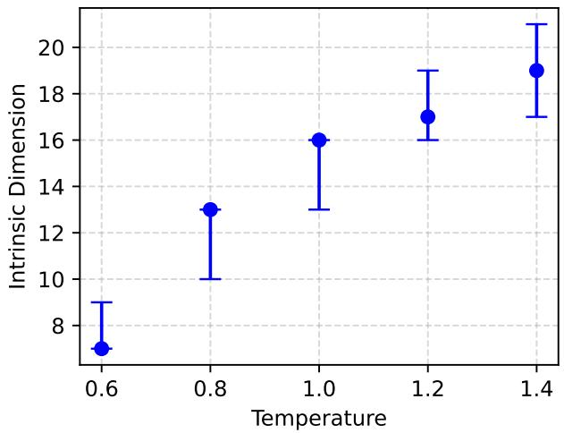  
Figure 4: The estimated intrinsic dimension of GPT-2 as the VariationAPI at different temperatures on random points in the PubMed dataset.

Next, we fix a single sample x from PubMed and plot the singular value decay rate. This is presented in Figure 5 with the x-axis on a log-scale in order to distinguish the different temperatures.

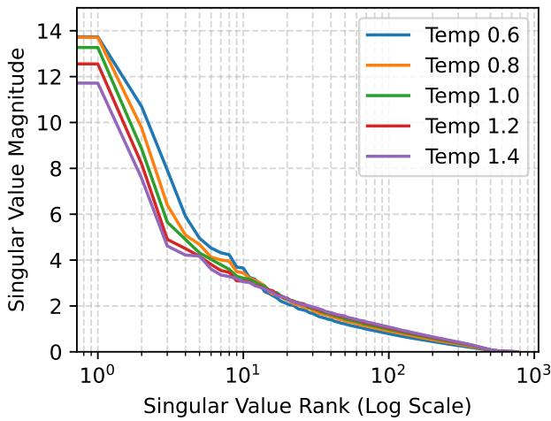  
Figure 5: The singular value decay for the matrix of 3000 embedding difference vectors from a random entry in the PubMed dataset. Variations are generated by GPT-2 at various specified temperatures.

To highlight that this phenomenon is not unique to GPT-2, we computed the intrinsic dimension for Mistral-7B-Instruct-v0.2 and Llama-3.2-1B. For Mistral-7B-Instruct-v0.2 (ambient dimension 768), the intrinsic dimension varied between 10 and 21 for temperature between 0.6 and 1.4. For Llama-3.2-1B (ambient dimension 768), the intrinsic dimension varied between 4 and 32 for temperature between 0.6 and 1.4. All substantially smaller than the ambient dimension of 768.

## E Proof of Theorem 3.4

We now prove Theorem 3.4, which is restated below for convenience.

Theorem 3.4. Fix a domain $\Omega \subseteq \mathbb { R } ^ { d }$ with diameter 1 and doubling dimension at most $k \geq 2$ (Assumption 1). Let $D \subseteq \Omega$ and suppose that, at each iteration with synthetic dataset S, Assumption 2 holds with parameters $\lambda , c f o r$ every $x \in D \setminus S$ and some $y _ { x } \in \mathrm { a r g m i n } _ { y \in S } \rho ( x , y )$ $H T \geq$ $\textstyle { \frac { 2 0 0 \lambda } { c } } \log \left( { \frac { c } { 2 0 0 \lambda \sigma ^ { \frac { 1 } { k } } } } \right)$ then $\mathbb { E } \left[ W _ { 1 } \left( \mu _ { S } ^ { ( T ) } , \mu _ { D } \right) \right] = \tilde { O } \left( \lambda \sigma ^ { \frac { 1 } { k } } \right)$ where the expectation is over the random ness of the algorithm. Further, for $\varepsilon , \delta \in ( 0 , 1 )$ $i f \sigma = { \frac { 2 { \sqrt { T \log ( ^ { 1 . 2 5 } / \delta ) } } } { n \varepsilon } }$ and $\begin{array} { r } { T = \left\lceil \frac { 2 0 0 \lambda } { c } \log ( 2 + n \varepsilon ) \right\rceil } \end{array}$ ， then Algorithm 2.3 is $( \varepsilon , \delta ) – D P$ and E $\left[ W _ { 1 } \left( \mu _ { S } ^ { ( T ) } , \mu _ { D } \right) \right]$ is at most

$$
\tilde { \cal O } \left( \lambda ^ { 1 + \frac { 1 } { 2 k } } \left( \frac { \sqrt { \log ( 2 + n \varepsilon ) \log ( ^ { 1 . 2 5 / \delta ) } } } { \varepsilon n } \right) ^ { \frac { 1 } { k } } \right) .
$$

Example E.1. Consider a dataset consisting of a single point $\boldsymbol { x } = ( 0 , 1 ) ^ { \top }$ , and initialize PE with a single synthetic point at the origin $y = ( 0 , 0 ) ^ { \top }$ . The generator Variation $\mathrm { A P I } ( ( y _ { 1 } , y _ { 2 } ) ^ { \top } , s ^ { 2 } )$ is

modeled by the diagonal Gaussian distribution $\begin{array} { r } { \mathcal { N } \left( \left( y _ { 1 } , y _ { 2 } \right) ^ { \top } , \frac { s ^ { 2 } } { 1 + \gamma } \left[ \frac { 1 } { 0 } \stackrel { 0 } { \gamma } \right] \right) } \end{array}$ , where $\gamma \in [ 0 , 1 ]$ is the amount of“coverage” ofthe generator in the second coordinate, with $\overset { \cdot } { \boldsymbol { \gamma } } = 0$ being no coverage. For $\gamma > 0$ , the effective rank (Definition 3.2) ofthe generator at the origin with respect to x is

$$
{ \frac { \operatorname { t r } \left( { \frac { s ^ { 2 } } { 1 + \gamma } } \left[ { \frac { 1 } { 0 } } \ 0 \right] \right) \cdot \| x - y \| _ { 2 } ^ { 2 } } { ( x - y ) ^ { \top } { \frac { s ^ { 2 } } { 1 + \gamma } } \left[ { 0 } \quad \gamma \right] ( x - y ) } } = { \frac { s ^ { 2 } \cdot 1 } { s ^ { 2 } \gamma / ( 1 + \gamma ) } } = { \frac { 1 + \gamma } { \gamma } } ,
$$

so that $\lambda = \Theta ( ^ { 1 / \gamma } ) . \ I f \gamma = 0 $ , the generator only ever generates variations along thefirst coordinate, i.e., all variations have 0 in their second coordinate. Hence no finite effective rank suffices, and PE cannot converge to x. This illustrates that without a compatibility condition on the generator, PE may not converge. On the other hand, for $\gamma \in ( 0 , 1 ]$ , the generator has variance $s ^ { 2 } \gamma / ( 1 + \gamma )$ in the second coordinate. Intuitively, smaller variations in the second coordinate will require more steps to converge to x. This is reflected in the contraction bound ofLemma E.2, through $\lambda = \Theta ( ^ { 1 } / \gamma )$

## E.1 Contraction via Variations

In this subsection, we quantify the reduction in $W _ { 1 }$ -distance between the synthetic and sensitive datasets from applying the variation API in a single iteration.

Lemma E.2. Fix $x , y \in \Omega$ and suppose

$$
s ^ { 2 } \in \left[ c \| x - y \| _ { 2 } ^ { 2 } / 4 0 0 \lambda , c \| x - y \| _ { 2 } ^ { 2 } / 2 0 0 \lambda \right] .
$$

For $Z \sim$ VariationA $\operatorname { P I } ( y , s ^ { 2 } )$ , assume $\mathbb { E } [ Z ] = y$ and $\mathrm { t r } \mathrm { C o v } [ Z ] = s ^ { 2 }$ . Suppose x is reachable $( A s -$ sumption 2) from Variation $\operatorname { A P I } ( y , s ^ { 2 } )$ with effective rank λ (Definition 3.2). Then with probability $1 / _ { 4 }$ over the draw $z \sim$ Variation $\operatorname { A P I } ( y , s ^ { 2 } )$

$$
\| z - x \| _ { 2 } ^ { 2 } \leq \left( 1 - { \frac { c } { 2 5 \lambda } } \right) \| x - y \| _ { 2 } ^ { 2 } .
$$

Proof. Write $z = y + \xi \sim$ Variation $\operatorname { A P I } ( y , s ^ { 2 } )$ for some centered random variable $\xi .$ . We have

$$
\| y + \xi - x \| _ { 2 } ^ { 2 } = \| y - x \| _ { 2 } ^ { 2 } - 2 \langle \xi , x - y \rangle + \| \xi \| _ { 2 } ^ { 2 } .
$$

By reachability and the moment assumptions, we know that with probability $^ { 1 / 3 , }$

$$
\langle \xi , x - y \rangle \geq { \sqrt { \frac { c \cdot \operatorname { t r } \operatorname { C o v } [ \xi ] } { \lambda } } } \cdot \| x - y \| _ { 2 } = { \sqrt { \frac { c s ^ { 2 } } { \lambda } } } \cdot \| x - y \| _ { 2 } .
$$

On the other hand, we know that $\mathbb { E } [ \| \xi \| _ { 2 } ^ { 2 } ] = \operatorname { t r } \operatorname { C o v } [ \xi ] = s ^ { 2 }$ . Hence, by a simple Markov inequality, $\| \xi \| _ { 2 } ^ { 2 } \le 1 2 s ^ { 2 }$ with probability $1 - \%$

Then, by a union bound, the following holds with probability $^ 1 / 4 \ d$

$$
\| y + \xi - x \| _ { 2 } ^ { 2 } \leq \| x - y \| _ { 2 } ^ { 2 } - 2 { \sqrt { \frac { c s ^ { 2 } } { \lambda } } } \cdot \| x - y \| _ { 2 } + 1 2 s ^ { 2 } .
$$

For $s ^ { 2 } \in [ c \| x - y \| _ { 2 } ^ { 2 } / 4 0 0 \lambda , c \| x - y \| _ { 2 } ^ { 2 } / 2 0 0 \lambda ]$ , this expression simplifies to

$$
\begin{array} { c } { \displaystyle | | y + \xi - x | | _ { 2 } ^ { 2 } \leq | | x - y | | _ { 2 } ^ { 2 } - \frac { 2 \left( ^ { 1 } / 2 0 - ^ { 6 } / 2 0 0 \right) c } { \lambda } | | x - y | | _ { 2 } ^ { 2 } } \\ { = \left( 1 - \frac { c } { 2 5 \lambda } \right) | | x - y | | _ { 2 } ^ { 2 } . } \end{array}
$$

Corollary E.3. Let $S \subseteq \Omega$ and fix $x \in \Omega$ and $y _ { x } \in \mathrm { a r g m i n } _ { y \in S } \rho ( x , y )$ $I f x \notin S ,$ , suppose that Assumption 2 holdsfor $x , y _ { x }$ with parameters $\lambda , c .$ Let $\begin{array} { r } { \ell ^ { \star } : = \left\lceil \log _ { 2 } \left( \frac { 2 0 0 \lambda } { c \alpha ^ { 2 } } \right) \right\rceil } \end{array}$ and set $2 ^ { - \ell ^ { \star } }$ to be the smallest scale of VariationAPI. $I f V \sim$ VariationAPI(S) is the union of S and a single variation from each scale, then

$$
\mathbb { E } _ { V \sim \mathrm { V a r i a t i o n A P I } ( S ) } \left[ \operatorname* { m i n } _ { v \in V } \lVert x - v \rVert _ { 2 } ^ { 2 } \right] \leq \operatorname* { m a x } \left\{ \alpha ^ { 2 } , \left( 1 - \frac { c } { 1 0 0 \lambda } \right) \lVert x - y _ { x } \rVert _ { 2 } ^ { 2 } \right\} .
$$

Proof. First we note that $y _ { x } \in V$ so that min $\mathsf { i } _ { v \in V } \| x - v \| _ { 2 } ^ { 2 } \leq \| x - y _ { x } \| _ { 2 } ^ { 2 }$ . Thus if $\| x - y _ { x } \| _ { 2 } \leq \alpha$ there is nothing to prove. We proceed assuming $\| x - y _ { x } \| _ { 2 } > \alpha$

In this case, one of the scales falls into the interval $s ^ { 2 } \in [ c \| x - y _ { x } \| _ { 2 } ^ { 2 } / 4 0 0 \lambda , c \| x - y _ { x } \| _ { 2 } ^ { 2 } / 2 0 0 \lambda ]$ required by Lemma E.2. The moment and reachability conditions at this scale follow from Definition 3.1 and Assumption 2. Thus, with probability at least $^ 1 / 4 .$ , the distance shrinks by $( 1 - { \frac { c } { 2 5 \lambda } } )$ With the remaining probability, the distance remains the same. This concludes the proof. □

Lemma E.4 (Lemma E.2 in [GFR25]). Fix $\gamma \in ( 0 , 1 )$ . Let $D , S \subseteq \Omega$ be two datasets and $\mu _ { D } , \mu _ { S }$ be the empirical distributions over the respective datasets. Let $V = { \mathrm { V a r i a t i o n A P I } } ( S ) \subseteq \Omega$ and $\mu _ { V }$ be the empirical distribution induced by nearest neighborhood histogram of private evolution (Algorithm 2.1). Supposefor $x \in D$

$$
\mathbb { E } _ { V \sim \mathrm { V a r i a t i o n A P I } ( S ) } \left[ \operatorname* { m i n } _ { v \in V } \rho ( x , v ) \right] \leq \operatorname* { m a x } \{ \alpha , ( 1 - \gamma ) \rho ( x , y _ { x } ) \} ,
$$

where $y _ { x } \in \mathrm { a r g m i n } _ { y \in S } \rho ( y , x )$ . Then

$$
\mathbb { E } _ { V \sim \mathrm { V a r i a t i o n A P I } ( S ) } \left[ W _ { 1 } ( \mu _ { V } , \mu _ { D } ) \right] \leq ( 1 - \gamma ) W _ { 1 } ( \mu _ { S } , \mu _ { D } ) + \alpha .
$$

Using the fact that $\sqrt { 1 - t } \leq 1 - t / 2$ for $t \leq 1$ , Corollary E.3 and Lemma E.4 imply a $( 1 - \gamma )$ contraction in the $W _ { \mathrm { 1 } } \mathrm { - d i s t a n c e }$ for $\gamma = \Theta ( ^ { 1 } / \lambda )$ after a single private evolution iteration, up to an additive factor of α.

## E.2 Private Histogram Error

Next, we bound the (dual) $W _ { 1 }$ -error from adding noise to obtain privacy and the projection step. Let $\mathcal { F } \subseteq \mathbb { R } ^ { \Omega }$ be a real-valued function class over the domain Ω. Recall the following notions of the complexity of $\mathcal { F }$

Definition E.5 (Complexity of $\mathcal { F } )$ . Let $P$ be the standard Gaussian $( \mathcal { N } ( 0 , 1 ) )$ , standard Laplace $( \mathrm { L a p } ( 1 ) )$ , or Rademacher (Rad(±1)) distribution. The $P _ { n }$ -complexity of $\mathcal { F }$ is given by

$$
\operatorname* { s u p } _ { z _ { 1 } , \ldots , z _ { n } \in \Omega } \mathbb { E } _ { \xi _ { 1 } , \ldots , \xi _ { n } \sim _ { i . i . d . } P } \left[ \operatorname* { s u p } _ { f \in \mathcal { F } } \frac { 1 } { n } \sum _ { i \in [ n ] } \xi _ { i } f ( z _ { i } ) \right] ~ .
$$

We are specifically interested in the following dual definition of the $W _ { 1 }$ distance,

$$
W _ { 1 } ( \mu , \nu ) = \operatorname* { s u p } _ { f \in \mathcal { F } _ { \mathrm { B L } } } \int _ { \Omega } f ( z ) \mu ( z ) - f ( z ) \nu ( z ) = : \mathrm { B L } ( \mu , \nu )
$$

where $\mathcal { F } _ { \mathrm { B L } }$ is the collection of bounded 1-Lipschitz functions over Ω defined in Section 3.2. When $\mu = \mu _ { V }$ is the distribution induced by the nearest neighbors histogram and $\nu = \mu _ { V } + \mathcal { N } ( 0 , \sigma ^ { 2 } I _ { | V | } )$ is the signed measure obtained by adding noisy to ensure privacy, the $W _ { 1 }$ -distance is no longer defined but the BL (bounded-Lipschitz) distance extends naturally to this setting.

Lemma E.6 (Lemma E.3 in [GFR25]). Let $V \in \Omega ^ { n } , \mu \in \Delta _ { V }$ be a discrete distribution supported on $V ,$ , and $Z \sim { \mathcal { N } } ( 0 , \sigma ^ { 2 } I )$ . Write $\mathcal { G } _ { n } ( \cdot )$ to denote the Gaussian complexity. Then

$$
\begin{array} { r } { \mathbb { E } _ { Z } \left[ \mathrm { B L } ( \mu , \mu + Z ) \right] \leq n \sigma \mathcal { G } _ { n } ( \mathcal { F } _ { \mathrm { B L } } ) . } \end{array}
$$

The rest of the section is dedicated to determining $\mathcal { G } _ { n } ( \mathcal { F } _ { \mathrm { B L } } )$

For a set $T$ with metric $\rho ,$ recall that the $\beta { - } c o { \nu } e r i n g$ number $N ( T , \rho ; \beta )$ is the smallest cardinality of a β-cover of $T$ . It is known that we can control the function complexity via chaining arguments.

Lemma E.7 (See $e . g .$ , Lemma E.4 in [GFR25]). Let $( \Omega , \rho )$ be a metric space and $\mathcal { F } \subseteq \mathbb { R } ^ { \Omega }$ be some class of real-valued functions over $\Omega$ with $0 \in \mathcal { F }$ and $\| f \| _ { \infty } \leq 1 f o r$ every $f \in { \mathcal { F } }$ . There is an absolute constant $C > 0$ such that

$$
\mathcal G _ { n } ( \mathcal F ) \leq C \cdot \operatorname* { i n f } _ { \alpha \in [ 0 , 1 ] } \left[ \alpha + \frac { 1 } { \sqrt { n } } \int _ { \alpha } ^ { 1 } \sqrt { \log N ( \mathcal F , \| \cdot \| _ { \infty } ; \beta ) } d \beta \right] .
$$

Our goal is now to bound the covering number given the additional information that the domain Ω has bounded doubling dimension ddim $( \Omega ) = k$

Lemma E.8. Let $( \Omega , \rho )$ be a metric with doubling dimension at most k and diameter 1. Write $\mathcal { F } _ { \mathrm { B L } }$ to denote the class ofbounded 1-Lipschitzfunctions over Ω defined in Section 3.2. Thenfor any $\beta \in ( 0 , 1 )$ ,

$$
\log N ( \mathcal { F } _ { \mathrm { B L } } , \Vert \cdot \Vert _ { \infty } ; \beta ) \leq \left( \frac { 5 } { \beta } \right) ^ { k } \log \left( \frac { 8 } { \beta } \right) .
$$

Proof. By Gottlieb, Kontorovich, and Krauthgamer [GKK16, Lemma 4.2], we know that

$$
N ( \mathcal { F } _ { \mathrm { B L } } , \Vert \cdot \Vert _ { \infty } ; \beta ) \leq \left( \frac { 8 } { \beta } \right) ^ { N ( \Omega , \rho ; \beta / 2 ) } .
$$

Now, Ω lies in a ball of radius 1. Hence, it can be covered by $2 ^ { k }$ ball of radius $^ 1 / 2 ,$ , each of which can also be covered by $2 ^ { k }$ balls of radius $1 / 4$ . Thus, recursively applying the definition of the doubling dimension yields that

$$
N ( \Omega , \rho ; \beta / 2 ) \leq ( 2 ^ { k } ) ^ { \lceil \log _ { 2 } ( 2 / \beta ) \rceil } \leq \left( \frac { 5 } { \beta } \right) ^ { k } .
$$

Combining Lemmas E.7 and E.8 yields the following bound on the Gaussian complexity of $\mathcal { F } _ { \mathrm { B L } }$

Proposition E.9. Let $( \Omega , \rho )$ be a metric with doubling dimension at most k and diameter 1. Write $\mathcal { F } _ { \mathrm { B L } }$ to denote the class ofbounded 1-Lipschitzfunctions over Ω defined in Section 3.2. Then

$$
\mathcal { G } _ { n } ( \mathcal { F } _ { \mathrm { B L } } ) \leq O \left( \frac { \log ^ { 3 / 2 } ( 8 n ) } { n ^ { 1 / \operatorname* { m a x } ( 2 , k ) } } \right) .
$$

Proof. By Lemmas E.7 and E.8,

$$
\mathcal { G } _ { n } ( \mathcal { F } _ { \mathrm { B L } } ) \leq C \cdot \operatorname* { i n f } _ { \alpha \in ( 0 , 1 ] } \left[ \alpha + \frac { 5 ^ { k / 2 } } { \sqrt { n } } \int _ { \alpha } ^ { 1 } \beta ^ { - k / 2 } \sqrt { \log ( 8 / \beta ) } d \beta \right] .
$$

Take $\alpha = \operatorname* { m i n } \{ 1 , 5 n ^ { - 1 / \operatorname* { m a x } ( 2 , k ) } \}$ . If $\alpha = 1$ , the bound follows from $\mathcal { G } _ { n } ( \mathcal { F } _ { \mathrm { B L } } ) \leq 1$ . Otherwise, for $k \leq 2$ , use $5 ^ { k / 2 } \leq 5$ and $\beta ^ { - k / 2 } \le \beta ^ { - 1 }$ . For $k > 2$ , use

$$
\int _ { \alpha } ^ { 1 } \beta ^ { - k / 2 } d \beta \leq \alpha ^ { 1 - k / 2 } \log ( 1 / \alpha ) , \qquad { \frac { 5 ^ { k / 2 } } { { \sqrt { n } } } } \alpha ^ { 1 - k / 2 } = 5 n ^ { - 1 / k } .
$$

In both cases the claimed bound follows, with an absolute implicit constant.

Lemma E.6 and Proposition E.9 together yield a bound on the expected BL-distance of the noiseless and noisy histogram distributions on the order of $\tilde { O } \left( \sigma \overbar { m _ { V } } ^ { 1 - \frac { 1 } { \operatorname* { m a x } ( 2 , k ) } } \right)$ , where $| V | =$ $| \mathrm { V a r i a t i o n A P I } ( S ) | \le m _ { V }$ and $m _ { V }$ is a public upper bound on the number of variations generated by the variation API. In this section we take $m _ { V } = m ( \ell ^ { \star } + 2 )$

## E.3 Subsampling Error

We complete the proof by determining the error introduced by subsampling to reduce the size of the support of S. By the Kantorovich-Rubinstein duality, This is essentially a question of convergence of the empirical measure $\mu _ { n }$ in $W _ { 1 }$ -distance for a bounded distribution $\mu .$

$$
\begin{array} { r l } & { \mathbb { E } \left[ W _ { 1 } ( \mu _ { n } , \mu ) \right] } \\ & { = \mathbb { E } _ { X \sim \mu _ { n } } \left[ \underset { f \in \mathcal { F } _ { \mathrm { B L } } } { \operatorname* { s u p } } \Bigg | \frac { 1 } { n } \sum _ { i = 1 } ^ { n } f ( X _ { i } ) - \mathbb { E } _ { Y \sim \mu } [ f ( Y ) ] \Bigg | \right] . } \end{array}
$$

We show that this quantity is in fact bounded above by the Gaussian complexity $\mathcal { G } _ { n } ( \mathcal { F } _ { \mathrm { B L } } )$

Lemma E.10. Let $\mu$ be a probability measure and $\mu _ { n }$ be its n-sample empirical measure. The following holds.

$$
\mathbb { E } \left[ W _ { 1 } ( \mu _ { n } , \mu ) \right] \leq \sqrt { 2 \pi } \cdot \mathcal { G } _ { n } ( \mathcal { F } _ { \mathrm { B L } } ) .
$$

The proof is via a standard symmetrization argument.

Proof. We first bound the uniform convergence error using the Rademacher complexity (Definition E.5).

$$
\begin{array} { r l r } { \mathbb { E } [ W _ { 1 } ( \rho _ { n } , \mu ) ] } & { } & \\ & { = \mathbb { E } _ { { X \sim \mathcal { H } _ { n } } } [ \displaystyle \sum _ { j \in \mathcal { F } _ { \mathbb { N } } } | \displaystyle \frac { 1 } { n } \sum _ { i = 1 } ^ { n } f ( X _ { i } ) - \mathbb { E } _ { \mathcal { V } \sim \mu } [ f ( Y ) ] | ] } \\ & { \leq \mathbb { E } _ { X , X ^ { \prime } \sim \mu , \mu _ { n } } [ \displaystyle \sum _ { j \in \mathcal { F } _ { \mathbb { N } } } | \displaystyle \frac { 1 } { n } \sum _ { i = 1 } ^ { n } f ( X _ { i } ) - f ( X _ { i } ^ { * } ) | ] } & { \mathrm { ( f e n s e n ' s ~ i n e q u a l i t y ) } } \\ & { = \mathbb { E } _ { { \mathrm { e x } \sim \mathbb { N } _ { n } } ( A , \xi , x ) \sim \mu , \mu _ { n } } [ \displaystyle \sum _ { j \in \mathcal { F } _ { \mathbb { N } } \times \mu , j \in \mathcal { F } _ { \mathbb { N } } } | \displaystyle \frac { 1 } { n } \sum _ { i < 1 } ^ { n } \xi [ f ( X _ { i } ) - f ( X _ { j } ^ { * } ) ] | ] } & { \mathrm { ( s y m m e t r y ) } } \\ & { \leq 2 \mathbb { E } _ { { X \sim \mathcal { H } _ { n } } } [ \displaystyle \sum _ { j \in \mathcal { F } _ { \mathbb { N } } \times \mu } \displaystyle \frac { 1 } { n } \sum _ { i = 1 } ^ { n } \xi _ { i } f ( X _ { i } ) | ] } & { \mathrm { ( t r i a n g l e c i n a l i t y ) } } \\ & { \leq 2 \cdot \mathcal { R } _ { n } ( \xi \mathrm { { l i a } } ) \ln [ \displaystyle \frac { 1 } { n } \sum _ { i = 1 } ^ { n } \xi _ { i } f ( X _ { i } ) ] . } & { \mathrm { ( t r i a n g l e c i n a l i t y ) } } \end{array}
$$

Now, by from elementary high-dimensional probability, we know that $\mathcal { R } _ { n } ( \mathcal { F } ) \leq \sqrt { \pi / 2 } \cdot \mathcal { G } _ { n } ( \mathcal { F } )$ for any function class $\mathcal { F }$ [Tom89; BM02; Wai19]. This concludes the proof. □

Lemma E.10 allows us to control the error incurred by sparsifying the variations using the Gaussian complexity of $\mathcal { F } _ { \mathrm { B L } }$ . To bound the latter, we can simply reuse the bound that we already developed.

## E.4 Putting it Together

In this subsection, we combine the ingredients from previous subsections to obtain a worst-case guarantee for private evolution in $W _ { \mathrm { 1 } } \mathrm { - d i s t a n c e }$ , which depends on the intrinsic dimension of VariationAPI rather than the ambient dimension.

We are now ready to prove Theorem 3.4.

Proof. Let $\Gamma _ { t } : = \mathbb { E } [ W _ { 1 } ( \mu _ { S } ^ { ( t ) } , \mu ) ]$ , where the expectation is taken over the randomness of the algorithm. If $\sigma > 1$ , the claimed bound follows from the diameter-one assumption. Hence suppose that

$\sigma \leq 1$ . For $\begin{array} { r } { \gamma : = \frac { c } { 2 0 0 \lambda } } \end{array}$ , we have

$$
\begin{array} { r l r } { \Gamma _ { t + 1 } \leq \mathbb { E } [ W _ { 1 } ( \mu , \mu _ { V } ^ { ( t + 1 ) } ) ] + 2 \cdot \mathbb { E } [ \mathrm { B L } ( \tilde { \mu } _ { V } , \mu _ { V } ) ] + \mathbb { E } [ W _ { 1 } ( \mu _ { S } ^ { ( t + 1 ) } , \bar { \mu } _ { V } ^ { ( t + 1 ) } ) ] } & { { \mathrm { ( B L . p r o j e c t i o n ) } } } \\ { \leq ( 1 - \gamma ) \Gamma _ { t } + \alpha + 2 m _ { V } \sigma \mathcal { G } _ { m _ { V } } ( \mathcal { F } _ { \mathrm { B L } } ) + \sqrt { 2 \pi } \mathcal { G } _ { m } ( \mathcal { F } _ { \mathrm { B L } } ) } & \\ { } & { { \mathrm { ( C o r o l l a r y ~ E . 3 ~ a n d ~ L e m m a s ~ E . 4 , E . 6 ~ a n d ~ E . l 0 ) } } } \\ { \leq ( 1 - \gamma ) ^ { t + 1 } \Gamma _ { 0 } + \frac { 1 } { \gamma } \left( \alpha + 2 m _ { V } \sigma \mathcal { G } _ { m _ { V } } ( \mathcal { F } _ { \mathrm { B L } } ) + \sqrt { 2 \pi } \mathcal { G } _ { m } ( \mathcal { F } _ { \mathrm { B L } } ) \right) } & { { \mathrm { ( g e o m e t r i c ~ s e r i e s ) } } } \\ { \leq ( 1 - \gamma ) ^ { t + 1 } \Gamma _ { 0 } + \tilde { O } \left( \gamma ^ { - 1 } \left( \alpha + \sigma m ^ { 1 - \frac { 1 } { \operatorname* { m a x } ( 2 , K ) } } + m ^ { - \frac { 1 } { \operatorname* { m a x } ( 2 , K ) } } \right) \right) . } & \\ { } & { { \mathrm { ( } m _ { V } \leq m ( \ell ^ { \star } + 2 ) = O \left( m \log ( 1 / \gamma _ { \alpha } { \mathrm { 2 } } ) \right) } ) } \end{array}
$$

Roughly speaking, we would like to balance $m \sigma \mathcal { G } _ { m } ( \mathcal { F } _ { \mathrm { B L } } ) + \mathcal { G } _ { m } ( \mathcal { F } _ { \mathrm { B L } } )$ . Setting $m = \lceil \sigma ^ { - 1 } \rceil$ gives $\sigma ^ { - 1 } \le m \le 2 \sigma ^ { - 1 }$ and yields the upper bound

$$
\Gamma _ { t } \leq ( 1 - \gamma ) ^ { t } \Gamma _ { 0 } + \tilde { O } \left( \gamma ^ { - 1 } \left( \alpha + \sigma ^ { \frac { 1 } { \operatorname* { m a x } ( 2 , k ) } } \right) \right) .
$$

Finally, choosing $\alpha = \sigma ^ { \frac { 1 } { \operatorname* { m a x } ( 2 , k ) } }$ and $T \geq \gamma ^ { - 1 } \log \left( \gamma / \sigma ^ { \frac { 1 } { \operatorname* { m a x } ( 2 , k ) } } \right)$ yields

$$
\begin{array} { r } { \Gamma _ { T } \leq \tilde { O } \left( \gamma ^ { - 1 } \sigma ^ { \frac { 1 } { \operatorname* { m a x } \left( 2 , k \right) } } \right) \ . } \end{array}
$$

Now, the normalized nearest neighbor histogram has $\ell _ { 2 } { \mathrm { - s e n s i t i v i t y } }$ $\textstyle { \frac { \sqrt { 2 } } { n } }$ . Thus in order to ensure that the algorithm is $( \varepsilon , \delta ) \mathopen { } \mathclose \bgroup \left. \mathrm { D P } \right.$ it suffices to set $\begin{array} { r } { \sigma = \frac { 2 \sqrt { T \log \left( ^ { 1 . 2 5 / \delta } \right) } } { n \varepsilon } } \end{array}$ (Proposition A.2). Since we also require $T \geq \gamma ^ { - 1 } \log \left( \gamma / \sigma ^ { \frac { 1 } { \operatorname* { m a x } ( 2 , k ) } } \right)$ , it suffices to set

$$
\begin{array} { r l } & { T : = \left\lceil \gamma ^ { - 1 } \log ( 2 + n \varepsilon ) \right\rceil } \\ & { \quad \geq \frac { \log ( \gamma / \sigma ^ { \frac { 1 } { \operatorname* { m a x } ( 2 , k ) } } ) } { \gamma } . } \end{array}
$$

Indeed, writing $a = 2 \sqrt { \log ( 1 . 2 5 / \delta ) } > 0 . 9 4$ , we have $\gamma / \sigma ^ { 1 / k } \leq \gamma ( n \varepsilon / a ) ^ { 1 / k } \leq 2 + n \varepsilon \colon$ for $n \varepsilon \leq 1$ the middle expression is less than one, and for $n \varepsilon \geq 1$ it is at most nε.

All in all, we conclude that

$$
\begin{array} { r l } & { \Gamma _ { T } \leq { \tilde { \cal O } } \left( \gamma ^ { - 1 } \sigma ^ { \frac { 1 } { \operatorname* { m a x } ( 2 , k ) } } \right) } \\ & { \quad = { \tilde { \cal O } } \left( \lambda ^ { 1 + \frac { 1 } { 2 \operatorname* { m a x } ( 2 , k ) } } \left( \frac { \sqrt { \log ( 2 + n \varepsilon ) \log ( ^ { 1 . 2 5 / \delta } ) } } { \varepsilon n } \right) ^ { \frac { 1 } { \operatorname* { m a x } ( 2 , k ) } } \right) . } \end{array}
$$

## F Proof of Theorem 4.2

In this section, we present the deferred proof of Theorem 4.2, which is restated below for convenience.

Theorem 4.2 (Cluster Discovery). Let $D \subseteq \mathbb { R } ^ { d }$ be a dataset ofsize n that is $( r , R )$ -well-clustered (Assumption 3) and suppose that, at each iteration with synthetic dataset S, Assumption 2 holds with parameters $\lambda , c f o r$ every $x \in D \setminus S$ and some $y _ { x } \in \mathrm { a r g m i n } _ { y \in S } \rho ( x , y )$ . Further assume that $R \geq 4 0 0 r \lambda / c ,$ that the initial dataset $S \subseteq \mathbb { R } ^ { d }$ satisfies the warm-start condition (Assumption 4) and that every cluster $C _ { i }$ satisfies $| C _ { i } | > 8 n / m + 3 m _ { V } \tau$ , where $\tau ~ = ~ \sigma \sqrt { 2 \log ( ^ { 6 T m _ { V } } / \beta ) }$ and m $( m _ { V } = { \tilde { O } } ( m ) )$ upper bounds the number of synthetic (variation) points per iteration. Then after $T = \lceil ( 5 0 \lambda / c ) \log ( R / r ) \rceil$ iterations, GAPE (Algorithm 4.1) with noise parameter σ outputs a synthetic dataset $S ^ { ( T ) }$ such that, with probability $1 - \beta ,$

$$
\rho ( D , S ^ { ( T ) } ) = \operatorname* { s u p } _ { x \in D } \operatorname* { i n f } _ { s \in S ^ { ( T ) } } \rho ( x , s ) \leq \frac { 1 0 0 r \lambda } { c } = O ( r \lambda ) .
$$

For $\varepsilon , \delta \in ( 0 , 1 )$ and $\begin{array} { r } { \sigma = \frac { 2 \sqrt { T \log ( 1 . 2 5 / \delta ) } } { \varepsilon } } \end{array}$ , the algorithm is $( \varepsilon , \delta ) – D P$ and succeeds with cluster sizes

$$
| C _ { i } | = \tilde { \Omega } \left( \frac { m _ { V } \sqrt { \lambda } } { \varepsilon } + \frac { n } { m } \right) .
$$

We also detail the exact local search procedure in Algorithm 4.2.

## F.1 Cluster Discovery

We first record the generator event used below. Suppose every cluster has a synthetic point within distance $R / { 8 }$ . For a point $x \in D$ with $\rho ( x , S ) > r$ , choose a closest synthetic point $y _ { x }$ satisfying Assumption 2. One of the sampled scales lies between $c \rho ( x , S ) ^ { 2 } / ( 4 0 0 \lambda )$ and $c \rho ( x , S ) ^ { 2 } / ( 2 0 0 \lambda )$ . By Definition 3.1 and Assumption 2, the moment and reachability conditions hold at this scale. By Lemma E.2, the independent draws at that scale fail to yield the stated contraction with probability at most $( 3 / 4 ) ^ { \lceil 4 \log ( 3 T \bar { n } / \beta ) \rceil } \leq \beta / ( 3 T n )$ . For $\rho ( x , S ) \leq r$ , the retained original candidate already has distance at most r. Thus, with probability at least $1 - \beta / 3 T$

$$
\rho ( x , V ) \leq \operatorname* { m a x } \left\{ r , \left( 1 - { \frac { c } { 5 0 \lambda } } \right) \rho ( x , S ) \right\} \qquad { \mathrm { f o r ~ e v e r y ~ } } x \in D .
$$

Since $\lambda \geq 1$ and $c \leq 2 ( { \mathrm { b y } }$ Cantelli’s inequality), the assumption $R \ge 4 0 0 r \lambda / c$ implies $R \geq 2 0 0 r$ and

$$
\operatorname* { m a x } \left\{ r , \left( 1 - { \frac { c } { 5 0 \lambda } } \right) \left( { \frac { R } { 8 } } + r \right) \right\} \leq { \frac { R } { 8 } } .
$$

On this event, every noiseless vote goes to a candidate within distance $R / _ { 8 }$ of its voter. Conditional on the generated candidates, Gaussian concentration gives $\| { \tilde { H } } - H \| _ { \infty } \leq \tau$ with probability at least $1 - \beta / 3 T$ for $\tau = \sigma \sqrt { 2 \log ( ^ { 6 T m _ { V } } / \beta ) }$ . The next lemma is deterministic on these two events.

Lemma F.1. Suppose the dataset is $( r , R )$ -well-clustered with $R \ge 2 0 0 r$ , and every $x \in D$ votes for a candidate within distance $R / { 8 } .$ Assume $| V | \leq m _ { V }$ and $\| { \tilde { H } } - H \| _ { \infty } \leq \tau$ , and

$$
\left| C _ { i } \right| > \frac { 8 n } { m } + 3 m _ { V } \tau \qquad f o r e \nu e r y c l u s t e r C _ { i } .
$$

Then local search over thresholded candidates ${ \tilde { H } } _ { \tau }$ with the minimum cost flow objective selects at most m candidates $S ^ { \prime }$ such thatfor every cluster $C _ { i } ,$ there is some $y _ { i } \in S ^ { \prime }$ with $\rho ( y _ { i } , C _ { i } ) \leq R / 8$

Proof. Every thresholded candidate received a noiseless vote, since $H ( v ) = 0$ implies $\tilde { H } ( v ) \leq \tau$ Each candidate in supp $H$ receives votes from only one cluster: two voters for the same candidate are at distance at most $R / _ { 4 }$ . Every cluster has at most $m _ { V }$ voted-for candidates, all within distance $R / _ { 8 }$ of it. Since $| C _ { i } | > 2 m _ { V } \tau$ , the pigeonhole principle guarantees a candidate with more than $2 \tau$ noiseless votes, and hence more than $\tau$ noisy votes. The cluster-size assumption implies $m > 8$ and $n > 3 m _ { V } \tau$ . The total negative weight is at most $m _ { V } \tau$ , while $\begin{array} { r } { \sum _ { v \in V } \tilde { H } ( v ) \geq n - m _ { V } \tau > 0 } \end{array}$ , so the flow problem is feasible. If there are at most m thresholded candidates, selecting all of them gives the conclusion.

Otherwise, suppose towards a contradiction that local search selects $m$ candidates $S ^ { \prime }$ but none within distance $R / { \mathrm { 8 } }$ of $C _ { i }$ . Fix an optimal flow for $S ^ { \prime }$ . The total incoming flow to selected candidates is $\begin{array} { r } { \sum _ { v \in V } \tilde { H } ( v ) \leq n + m _ { V } \tau } \end{array}$ . Thus some selected candidate $y _ { 2 }$ receives at most $( n + m _ { V } \tau ) / m$ flow. Let $y _ { 1 }$ be any thresholded candidate within distance $R / _ { 8 }$ of $C _ { i } ,$ , and let $y _ { 3 }$ be any other selected candidate.

It remains to exhibit a re-selection and feasible flow with strictly lower cost. We close $y _ { 2 }$ by reassigning its incoming flow to $y _ { 3 } .$ , then open $y _ { 1 }$ and redirect to it the flow sent to selected candidates by positive-weighted candidates receiving noiseless votes from $C _ { i }$ . We do not change any flow into negative-weighted candidates. Since costs are truncated at $R / 3$ , the cost of closing $y _ { 2 }$ is at most

$$
{ \frac { R } { 3 } } { \frac { n + m _ { V } \tau } { m } } .
$$

The candidates receiving noiseless votes from $C _ { i }$ have total positive weight at least $| C _ { i } | - m _ { V } \tau$ At most $m _ { V } \tau$ of this weight flows to negative-weighted candidates, leaving at least $| C _ { i } | - 2 m _ { V } \tau$ flowing to selected candidates. Each such source is within $R / { 8 }$ of some voter in $C _ { i }$ , as is $y _ { 1 }$ . Its distance to $y _ { 1 }$ is therefore at most $R / _ { 4 } + r$ , whereas its distance to every previously selected candidate is at least $3 R / _ { 4 }$ , since such a candidate lies in supp $H$ and hence within $R / { 8 }$ of a voter outside $C _ { i }$ . On the other hand, the gain from opening $y _ { 1 }$ is at least

$$
\left( \frac { R } { 3 } - \frac { R } { 4 } - r \right) \left( \left| C _ { i } \right| - 2 m _ { V } \tau \right) \geq \frac { R } { 1 6 } \left( \left| C _ { i } \right| - 2 m _ { V } \tau \right) .
$$

Finally, since $m > 8$ , our assumption gives

$$
| C _ { i } | > { \frac { 8 n } { m } } + 3 m _ { V } \tau \ge { \frac { 8 ( n + m _ { V } \tau ) } { m } } + 2 m _ { V } \tau .
$$

Thus the gain strictly exceeds the closing cost, contradicting local optimality.

## F.2 Putting it Together

We now prove Theorem 4.2.

Proof. Condition on the generator and coordinate-wise noise events in each iteration. The warmstart condition gives a synthetic point within distance $R / _ { 8 }$ of each cluster initially. Inductively, the generator bound above and Lemma F.1 show that this property persists after each iteration. For $t \in$ $[ T ] .$ , let $S ^ { ( t - 1 ) }$ denote the synthetic dataset from iteration $t - 1$ , and let $V = { \mathrm { V a r i a t i o n A P I } } ( S ^ { ( t - 1 ) } )$ By Lemma F.1, the selected dataset contains a candidate within distance $R / _ { 8 }$ of each cluster. Furthermore, any selected candidate corresponding to cluster $C _ { i }$ , say $y _ { i }$ , satisfies $\rho ( x _ { i } , y _ { i } ) = \rho ( x _ { i } , V )$ for some $x _ { i } \in C _ { i }$ that voted for it. In other words, for any $x \in C _ { i }$

$$
\begin{array} { r l r } {  { \rho ( x , S ^ { ( t ) } ) \le \rho ( x , x _ { i } ) + \rho ( x _ { i } , y _ { i } ) } } \\ & { } & { \le r + \rho ( x _ { i } , V ) } \\ & { } & { \le r + \operatorname* { m a x } \{ r , ( 1 - \frac { c } { 5 0 \lambda } ) \rho ( x _ { i } , S ^ { ( t - 1 ) } ) \} . } \end{array}
$$

Hence

$$
\operatorname* { m a x } _ { x \in D } \rho ( x , S ^ { ( t ) } ) \leq \operatorname* { m a x } \left\{ 2 r , r + \Big ( 1 - \frac { c } { 5 0 \lambda } \Big ) \operatorname* { m a x } _ { x \in D } \rho ( x , S ^ { ( t - 1 ) } ) \right\} .
$$

Since $5 0 r \lambda / c \geq 2 r$ , iterating this bound and using the warm-start condition yields

$$
\operatorname* { m a x } _ { x \in D } \rho ( x , S ^ { ( t ) } ) \leq \frac { 5 0 r \lambda } { c } + e ^ { - \frac { c t } { 5 0 \lambda } } R .
$$

Taking $T \geq \lceil \frac { 5 0 \lambda } { c }$ log $\textstyle \left( { \frac { R } { r } } \right) ]$ yields

$$
\operatorname* { m a x } _ { x \in D } \rho ( x , S ^ { ( T ) } ) \leq \frac { 5 0 r \lambda } { c } + r \leq \frac { 1 0 0 r \lambda } { c } .
$$

Each of the two events fails with probability at most $\beta / _ { 3 T }$ conditional on preceding successful iterations. Taking a union bound over the $2 T$ failure events yields the desired failure probability.

## G Synthetic Data Experiments

We consider the following simple model for PE in 2D Euclidean space.

1) A well-clustered dataset of size $n = 2 0 0 0$ is generated from the Gaussian mixture model

$$
0 . 9 \cdot \mathcal { N } ( [ - 1 , 0 ] , 0 . 1 ^ { 2 } I _ { 2 } ) + 0 . 1 \cdot \mathcal { N } ( [ 1 , 0 ] , 0 . 1 ^ { 2 } I _ { 2 } ) .
$$

2) We initialize PE at $m = 3$ points $[ 0 , - 2 ] , [ 0 , 0 ] , [ 0 , 2 ]$

3) Variation $\operatorname { A P I } ( y , s ^ { 2 } )$ is modeled as a standard Gaussian distribution, and we generate 2 variations per synthetic data point at each generation with fixed $s ^ { 2 } = 0 . 1 ^ { 2 }$

4) After computing the noisy nearest neighbor histogram, we use either ranking, subsampling, or clustering to select $m = 3$ points for the next iteration.

5) We run PE for 20 iterations and depict the trajectory of the $m = 3$ synthetic data points throughout.

Ranking Fails. We illustrate the trajectory of PE with ranking in Figure 6. Noticeably, the algorithm immediately drops all points near the smaller cluster. From there, it never recovers.

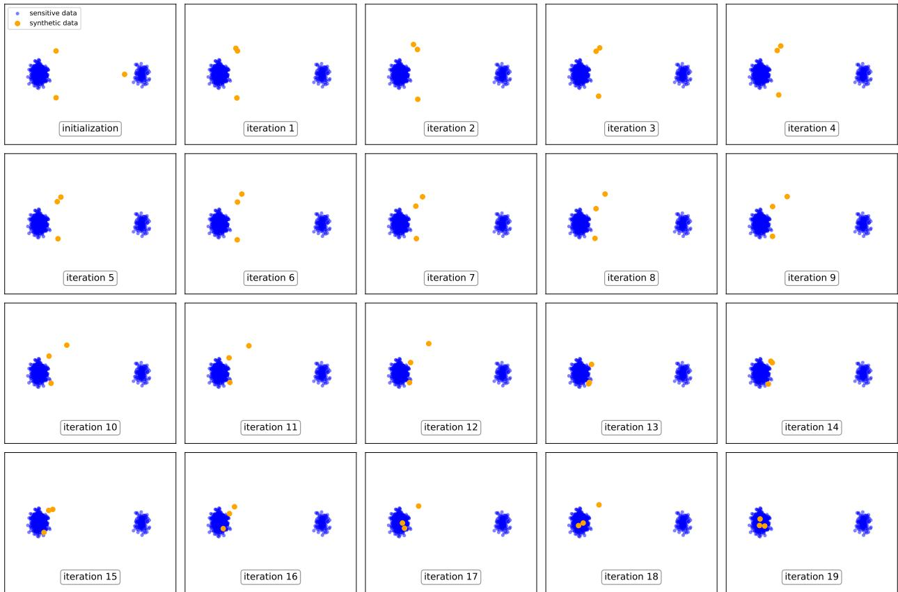  
Figure 6: The trajectory of PE with ranking selection (AugPE) on generated 2D Euclidean data.

Subsampling Fails. The trajectory of PE with subsampling is depicted in Figure 7. We notice that subsampling also drops points near the smaller cluster, and also does not quite converge even to the bigger cluster.

Clustering Succeeds. Finally, we implement a simplified version of GAPE using the sklearn implementation<sup>9</sup> of the k-medoids clustering [Mar63; PJ09] as a selection mechanism. The trajectory for this algorithm is depicted in Figure 8. We observe that the algorithm consistently selects at least one point near each cluster, even though the location of the third point may oscillate between the two clusters.

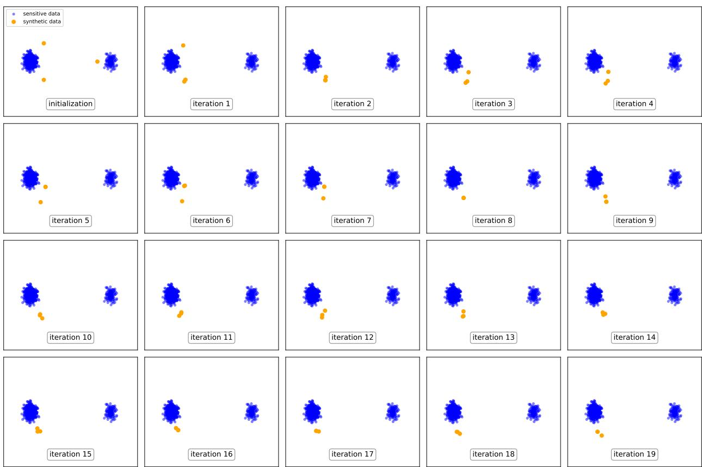  
Figure 7: The trajectory of PE with subsampling selection (SubsamplePE) on generated 2D Euclidean data.

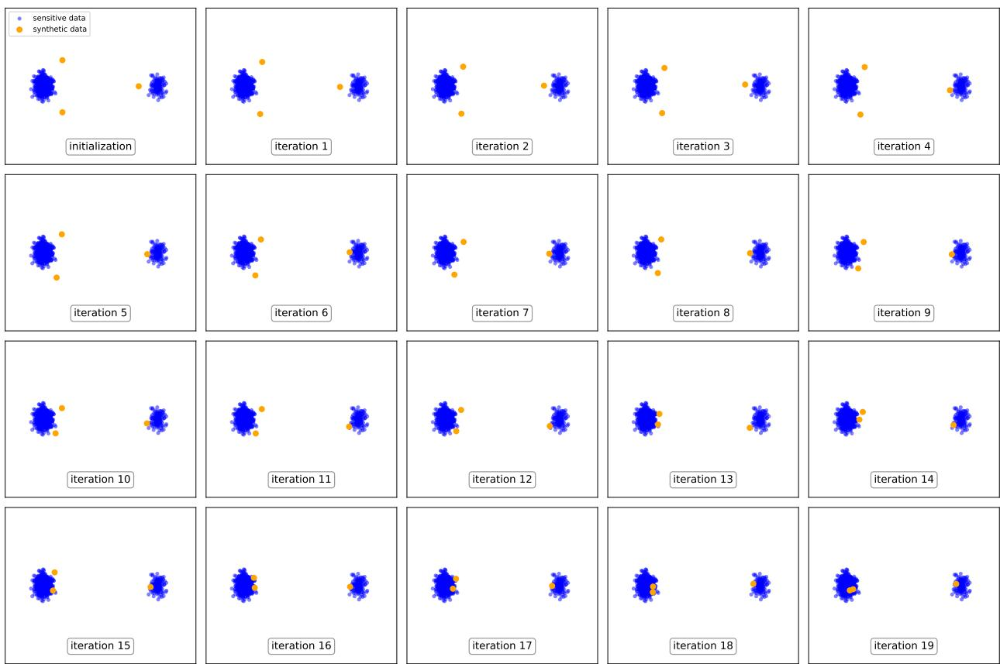  
Figure 8: The trajectory of our proposed variant of PE (GAPE) on generated 2D Euclidean data.

## H Additional Experimental Details

## H.1 Hyperparameter Tuning

All of the hyperparameters except those specific to GAPE are common. Thus, we expect any improvement by tuning these parameters to be roughly shared by all three mechanisms. For PubMed, we fix these parameters to be those that appear in the main experiments [XLBG+24]. That is, $m = 2 0 0 0 , T = 1 0$ , and number of variations of each synthetic point per iteration is 7. The number of initial calls to RandomAPI is $2 m$ . For Reddit, we use $m = 1 0 , 0 0 0$ synthetic samples. In all experiments, the parameter R is set by performing kmeans with $k = m$ on the dataset, computing the maximum distance from a true data point to its assigned center then multiplying this distance by 10. Further hyperparameter tuning of GAPE could result in better relative performance.

## H.2 Precision & Recall

A popular implementation of the precision metric<sup>10</sup> by Jiralerspong, Bose, Gemp, Qin, et al. [JBGQ+23] is based on forming a small ball of radius $r _ { x } > 0$ about each point in the dataset $x \in D$ and checking the fraction of synthetic data points that fall into at least one ball. $r _ { x }$ is defined to be the distance to the k-th nearest neighbor of x in D for some small k $( e . g . , k = 3 , 4 )$

On the other hand, the recall metric simply exchanges the operation by computing nearest neighbor radius balls around each synthetic data point $s \in S$ and asking for the fraction of true data points $x \in D$ that fall in some ball.

While the nearest neighbor distance of the dataset needed for precision is determined only by the data, the same cannot be said for the nearest neighbor distance of the synthetic dataset, which is controlled by the algorithm. For example, the trivial algorithm that always outputs two points extremely far away will have perfect recall under this metric!

Thus, we modify the implementation of recall to be data-based: we form the nearest neighbor radius ball about each point in the dataset $x \in D$ and compute the fraction of balls that intersect the synthetic dataset. As a sanity check, the trivial algorithm above should no longer be able to “game” this metric.

We emphasize that this modification is consistent when evaluating all algorithms for a fair comparison. Further, note that the metric as defined is somewhat tuned for the case when m is close to n, as the value k is small. In settings where $m \ll n$ , the recall is likely to be pretty small, and thus other metrics may be more appropriate measures.

## H.3 API Prompts

## H.3.1 PubMed

RandomAPI: “Using a variety of sentence structures, write an abstract for a medical research paper:”

VariationAPI: “Please rephrase the following sentences {tone} as an abstract for medical research paper: {sample}"

The {tone} parameter is randomly selected from these options:

• “in a professional way”

• “in a professional tone”

• “in a professional style”

• “in a concise manner”

• “in a creative style”

• “using imagination”

• “in a storytelling tone”

• “in a formal manner”

• “using a variety of sentence structures”

The {sample} is replaced with the source text to be rephrased.

## H.3.2 Reddit

RandomAPI: “Given the category, you are required to provide a succinct Reddit post title in 30-100 words.”

VariationAPI: “Please rephrase the following sentences {tone} as a Reddit poster: {sample}”

The {tone} parameter is randomly selected from:

• “in a detailed way”

• “in a professional way”

• “with more details”

• “with a professional tone”

• “in a professional style”

• “in a concise manner”

## H.4 Further Results

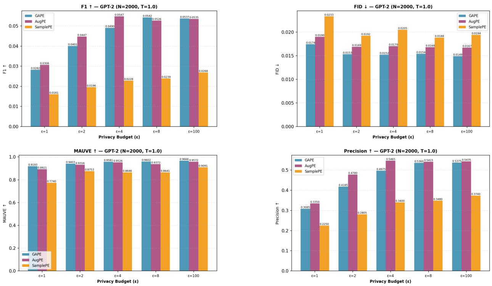  
Figure 9: PubMed, $m = 2 0 0 0$

Table 1: Recall for a wider range of ε on PubMed $( m = 2 0 0 0 )$ and Reddit $( m = 1 0 , 0 0 0 )$
<table><tr><td>Method</td><td> $\varepsilon = 0 . 1$ </td><td> $\varepsilon = 0 . 5$ </td><td> $\varepsilon = 1$ </td><td> $\varepsilon = 2$ </td><td> $\varepsilon = 4$ </td><td> $\varepsilon = 8$ </td><td> $\varepsilon = 1 0 0$ </td></tr><tr><td colspan="8">PubMed</td></tr><tr><td>AugPE</td><td>0.0040</td><td>0.0105</td><td>0.0161</td><td>0.0234</td><td>0.0288</td><td>0.0276</td><td>0.0281</td></tr><tr><td>GAPE</td><td>0.0036</td><td>0.0104</td><td>0.0148</td><td>0.0211</td><td>0.0258</td><td>0.0286</td><td>0.0282</td></tr><tr><td>SubsamplePE</td><td>0.0032</td><td>0.0062</td><td>0.0083</td><td>0.0102</td><td>0.0118</td><td>0.0124</td><td>0.0139</td></tr><tr><td colspan="8">Reddit</td></tr><tr><td>AugPE</td><td>0.1269</td><td>0.2220</td><td>0.2734</td><td>0.3216</td><td>0.3320</td><td>0.3354</td><td>0.3107</td></tr><tr><td>GAPE</td><td>0.1282</td><td>0.2312</td><td>0.2809</td><td>0.3204</td><td>0.3246</td><td>0.3241</td><td>0.3260</td></tr><tr><td>SubsamplePE</td><td>0.0975</td><td>0.1465</td><td>0.1683</td><td>0.1982</td><td>0.2086</td><td>0.2156</td><td>0.2045</td></tr><tr><td colspan="8">Random Sample Baseline</td></tr></table>

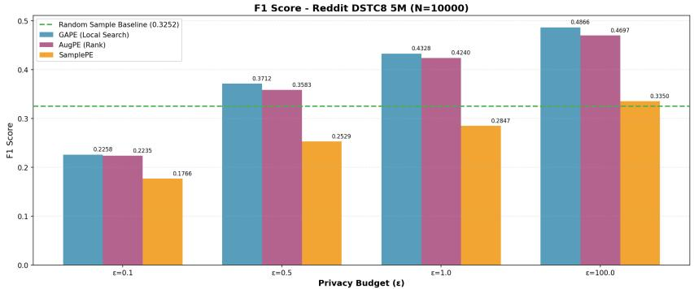

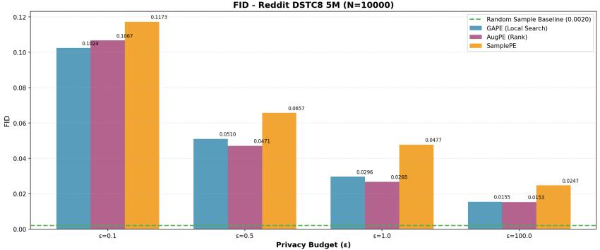

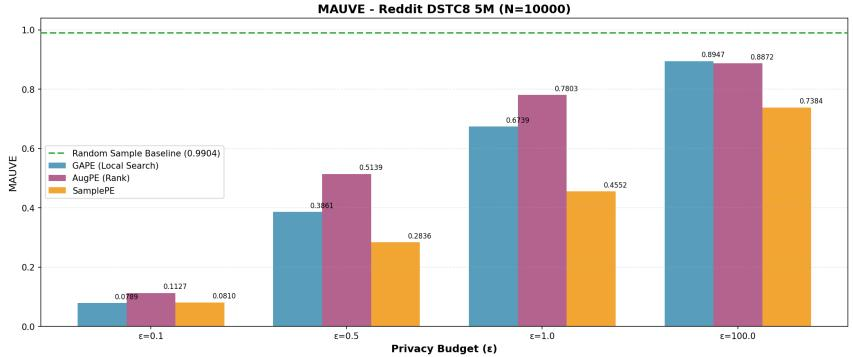

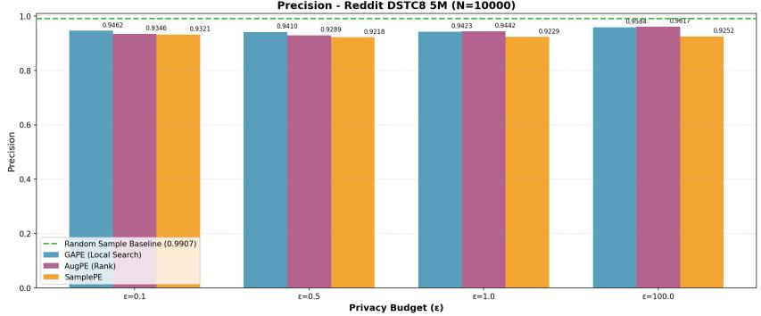  
Figure 10: Reddit, m = 10, 000