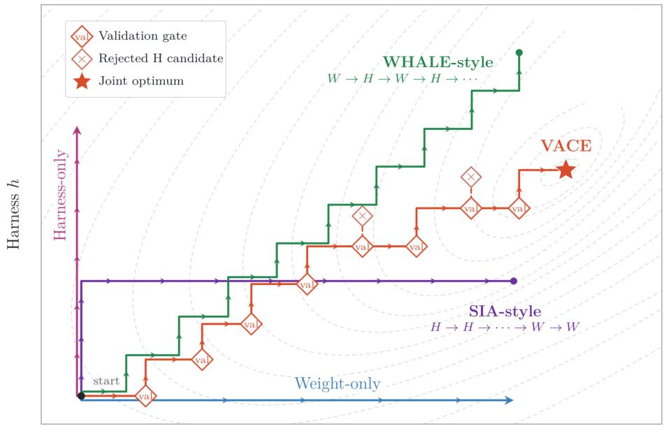
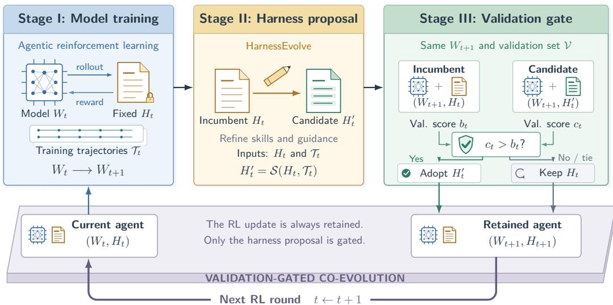
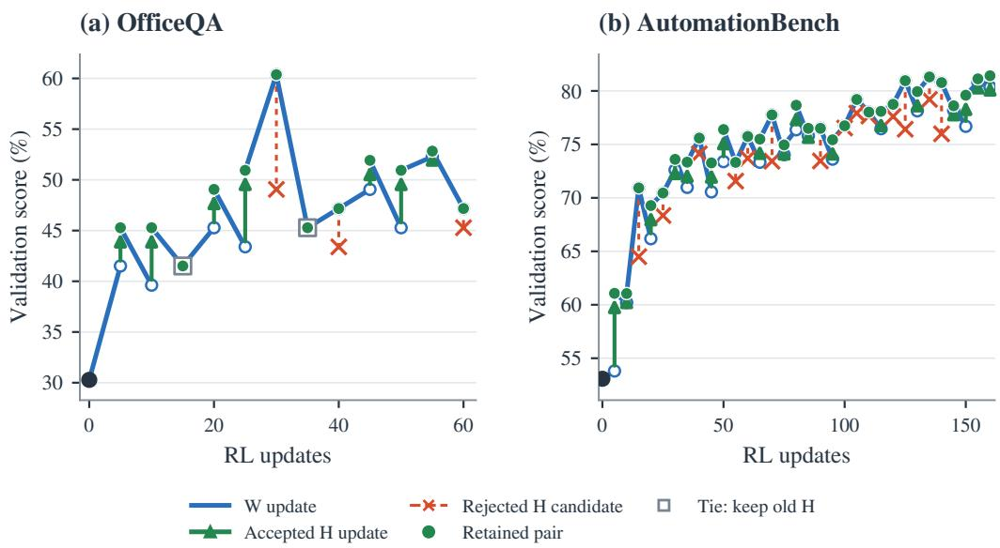
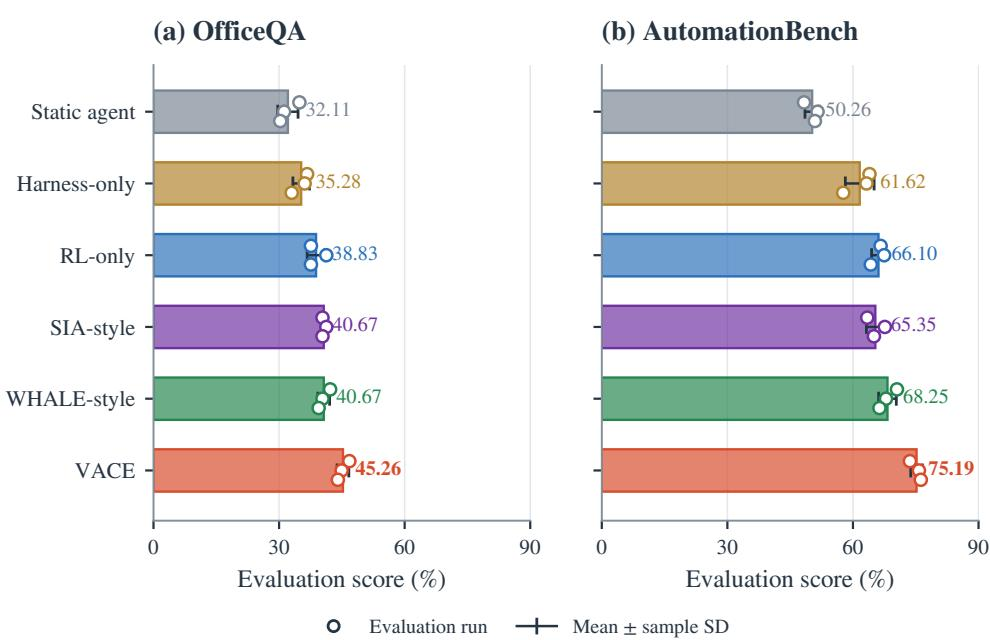
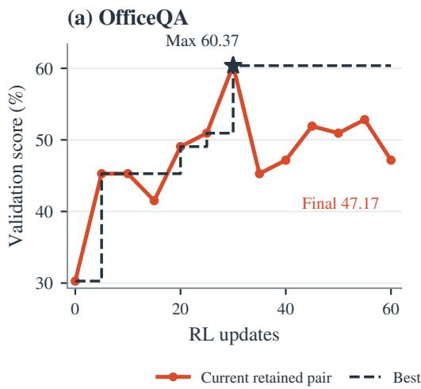
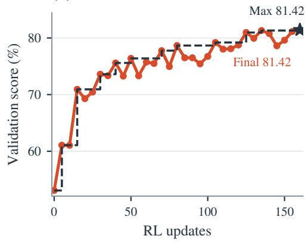

# VACE: Validation-Gated Alternating Co-Evolution of Agent Models and Harnesses

Jiexing Qi1,\*, Yu He1, Jun Liu1, Qichen Huang1, Shaohua Hu1,2,†, Zhan Dang1 Guohua Chen1, Rui Yang1, Wen Jiang1, Yang Liu1, Tao Lyu1, Fangming Li1,\*

1ICT AI Competence Center, Huawei Technologies Co., Ltd., Shanghai, China 2Shanghai Jiao Tong University, Shanghai, China {qijiexing, lifangming1}@huawei.com Corresponding authors: Jiexing Qi, Fangming Li

## Abstract

Language model agents can be improved by updating their model weights or refining the harness that guides task execution. These components are coupled: weight updates change how the model uses the harness, while harness updates change the trajectories used for training. We propose VACE, Validation-Gated Alternating Co-Evolution, which alternates agentic reinforcement learning with trajectory-driven harness refinement. After each RL stage, VACE reuses the collected trajectories to propose a harness revision and evaluates the incumbent and candidate with the updated model held fixed. The candidate guides subsequent training only if it improves validation performance. With Qwen3.5-9B, VACE achieves 45.26% test accuracy on OfficeQA and a mean partial-credit score of 75.19% on Automation-Bench, exceeding weight-only RL by 6.43 and 9.09 percentage points and ungated alternation by 4.59 and 6.95 points, respectively. Across 44 harness proposals, 17 reduce validation performance at the updated checkpoint and are rejected before subsequent RL training, highlighting the importance of validation gating.

## 1 Introduction

Language-model agents solve tasks by reasoning over observations, invoking tools, and responding to feedback from their environments. Their performance depends on both the model and the system around it. Model weights determine how the agent interprets a task and chooses its actions, while instructions, reusable skills, tool interfaces, and execution rules determine how those capabilities are used. We refer to this surrounding system as the harness.

Two complementary approaches improve these components. Agentic reinforcement learning (RL) trains model weights from task outcomes, with systems such as Agent Lightning [Luo et al., 2025] connecting agent execution to weight optimization. Harness optimization instead refines the instructions or procedures used by a model, for example through contextual playbooks [Zhang et al., 2025b] or trajectory-guided revisions [Jiang et al., 2026]. Each approach can improve an agent, but optimizing one component while fixing the other leaves their interaction unaddressed. A skill designed for an early checkpoint may become unnecessarily restrictive after training, while an improved workflow may expose decisions that the model has not yet learned to make.

This interaction suggests improving the model and harness together. Consider a document-grounded agent whose skill instructs it to answer after a single retrieval. RL can improve reasoning over the retrieved evidence, but the skill may still lead the agent to stop before collecting enough information.

  
Model weights θ  
Figure 1: Conceptual schedules for model–harness co-optimization. Harness-only and weight-only update one component. SIA-style and WHALE-style illustrate stagewise and alternating schedules, respectively; VACE validates proposed harness updates before the next training round. The figure uses θ, h for the weights W and harness H in our notation. The paths and contours are schematic, and the star marks a conceptual joint optimum.

Revising the skill to gather and compare additional evidence changes the executions from which the model learns. After further training, those executions reveal new opportunities for refinement. The connection is therefore bidirectional: model training supplies feedback for harness optimization, and the revised harness shapes the next stage of model training.

Harness refinement proposes discrete changes to instructions and skills from trajectory feedback, but these changes need not improve task performance with the updated model. For example, additional retrieval may improve evidence coverage while consuming the interaction budget on simpler tasks. An adopted revision also changes the trajectories used for subsequent RL, so its effect should be evaluated before it guides further training.

These considerations motivate VACE, Validation-Gated Alternating Co-Evolution ofAgent Models and Harnesses, which combines alternating model–harness optimization with validation-gated harness updates. Each round trains the model under the current harness and reuses the collected trajectories to propose a revision. With the updated model held fixed, we compare the incumbent and candidate harnesses on the same validation tasks and adopt the candidate only if its validation score improves. The retained harness guides the next RL stage. We implement this loop through Uni-Agent [Ding et al., 2026], connecting agentic RL with trajectory-driven harness refinement. Here, co-evolution refers to the repeated mutual adaptation of model weights and harness configurations.

Model–harness co-optimization is an emerging research direction, explored in related systems such as SIA [Hebbar et al., 2026] and Co-Harness [Chen et al., 2026b], and independently in concurrent work WHALE [Kim et al., 2026]. VACE contributes an RL-based co-evolution framework that connects trajectory feedback, repeated harness refinement, and checkpoint-specific validation in one training process. Figure 1 illustrates the update schedules, and Figure 2 details the proposed framework. Section 2 discusses the technical relationships to related and concurrent work.

In our experiments on OfficeQA and AutomationBench with Qwen3.5-9B, VACE scores 6.43 and 9.09 percentage points above weight-only RL, respectively, and 4.59 and 6.95 points above WHALEstyle ungated alternation. VACE also achieves a higher mean test score than SIA-style harness-first optimization on AutomationBench. Analysis of individual rounds reveals that 17 of 44 harness proposals reduce validation performance at the current checkpoint, illustrating why refinement and acceptance should be separate decisions.

Our contributions are threefold:

• We propose VACE, a framework for jointly improving agent models and harnesses through a closed loop of agentic RL and trajectory-driven harness refinement.

• We introduce a checkpoint-specific validation mechanism within this loop, testing each proposed harness with the updated model before it shapes the next round of training.

• We compare joint adaptation with single-component optimization and scheduling variants implemented with the same weight and harness optimizers on two agent benchmarks, and analyze how accepted and rejected revisions shape the co-evolution process.

## 2 Related work

Model training. Agentic RL improves interactive reasoning and tool use [Wang et al., 2025, Qian et al., 2025]. Search-R1 [Jin et al., 2025] trains models to interleave reasoning with search through RL, while WebAgent-R1 [Wei et al., 2025] trains web agents through multi-turn environment interactions. AgentCPM-Explore [Chen et al., 2026a] studies long-horizon exploration with a compact agent model, combining model fusion, reward denoising, and context refinement. Agent Lightning [Luo et al., 2025] separates agent execution from RL training, enabling weight updates across different implementations. These approaches learn from execution feedback; VACE also uses it to refine the harness.

Harness optimization. Reflexion [Shinn et al., 2023] stores verbal reflections from task feedback, and ExpeL [Zhao et al., 2023] extracts reusable insights from agent experience without parameter updates. GEPA [Agrawal et al., 2025] uses trajectory-based reflection to propose and evaluate prompt revisions. Agentic Context Engineering [Zhang et al., 2025b] improves contextual playbooks, while the Darwin Gödel Machine [Zhang et al., 2025a] evaluates changes to agent code. HarnessEvolve [Jiang et al., 2026] uses trajectory diagnostics and reference-guided error analysis to propose harness revisions, with quality checks and performance-based selection. Related approaches optimize prompts and modular pipelines [Khattab et al., 2023, Yuksekgonul et al., 2024]. VACE couples HarnessEvolve with model training.

Related and concurrent co-optimization frameworks. SIA [Hebbar et al., 2026] uses a feedback agent to update both the harness and model weights; its reported experiments improve the harness before performing weight updates. Co-Harness [Chen et al., 2026b] alternates failure-driven harness refinement with supervised training on successful trajectories and validates proposed harness changes. Developed concurrently with our work, WHALE [Kim et al., 2026] alternates online rejection-sampling fine-tuning with executable-harness search and studies both fixed and adaptive phase durations. Its Meta-Harness search selects candidates through internal evaluations. VACE combines agentic RL with trajectory-driven harness proposals, validating each proposal at the updated checkpoint before it guides subsequent training. We study this design on document-grounded reasoning and workplace workflows, with harness edits focused on skills and execution guidance.

## 3 VACE

VACE jointly improves a model and its harness by connecting their updates through execution feedback. Figure 2 gives an overview. Each round first trains the model with the current harness, then uses the collected trajectories to propose a harness revision. Finally, the updated model executes validation tasks under both harnesses, and the better-scoring harness is retained, with ties favoring the incumbent. The retained pair starts the next round.

  
Figure 2: Overview of VACE. Stage I trains the model under the current harness and collects execution trajectories. Stage II turns this feedback into a proposed harness revision. Stage III compares the incumbent and candidate at the updated checkpoint. The retained harness then guides the next RL round, closing the feedback loop between model training and harness refinement.

## 3.1 Model–harness co-optimization

An agent state is a pair (W, H), where W denotes model weights and H denotes the harness configuration. For a task $x ,$ execution produces a trajectory $\tau \sim p _ { W , H } ( \cdot \mid x )$ containing model decisions, tool calls, environment responses, and an outcome. Given a task distribution $\mathcal { P }$ and reward $r ( x , \tau )$ , the objective is

$$
J ( W , H ) = \mathbb { E } _ { x \sim \mathcal { P } } \mathbb { E } _ { \tau \sim p _ { W , H } ( \cdot | x ) } [ r ( x , \tau ) ] .\tag{1}
$$

The objective $J ( W , H )$ is the expected task reward. We maximize it by alternating updates to $W$ and H. Their coupling appears in pW,H: a weight update changes how the model uses the harness, and a harness update changes the executions available for subsequent learning. Our implementation focuses harness edits on skills and execution guidance, while keeping the task evaluator, tool semantics, and environment transition rules fixed.

We distinguish training tasks $\mathcal { D } _ { \mathrm { t r a i n } } .$ , validation tasks $\nu ,$ and an independent test set. For a complete validation run, the score aggregates task outcomes as

$$
\widehat { R } _ { \mathcal { V } } ( W , H ) = \frac { 1 } { | \mathcal { V } | } \sum _ { x \in \mathcal { V } } \widehat { r } _ { x } ( W , H ) ,\tag{2}
$$

where $\widehat { r } _ { x }$ denotes the measured outcome for task x, averaged over evaluation rollouts when applicable.   
Validation controls harness acceptance; test outcomes do not enter the optimization loop.

## 3.2 Trajectory-driven alternating updates

At round t, the model optimizer M performs a block of agentic RL with $H _ { t }$ fixed:

$$
( W _ { t + 1 } , \mathcal { T } _ { t } ) = \mathcal { M } ( W _ { t } ; H _ { t } , \mathcal { D } _ { \mathrm { t r a i n } } ) .\tag{3}
$$

The trajectory batch $\mathcal { T } _ { t }$ records decisions, tool interactions, and outcomes observed during training. It provides feedback on how the model operates under $H _ { t }$ , including failures that a harness revision may address. These executions can come from intermediate policies within the RL block. The updated weights are retained before harness refinement.

The harness optimizer then proposes

$$
H _ { t } ^ { \prime } = S ( H _ { t } , { \mathcal { T } } _ { t } ) .\tag{4}
$$

Algorithm 1 VACE: alternating updates with validation-gated harness acceptance   
Input: Initial pair $( W _ { 0 } , H _ { 0 } ) ;$ training tasks $\mathcal { D } _ { \mathrm { t r a i n } } ;$ validation tasks V; rounds T; optimizers ${ \mathcal { M } } , S .$   
Output: Updated model and harness $( W _ { T } , H _ { T } )$   
1: for $t = 0 , \ldots , T - 1$ do   
2: $( W _ { t + 1 } , T _ { t } ) \gets \mathcal { M } ( W _ { t } ; H _ { t } , \mathcal { D } _ { \operatorname { t r a i n } } )$   
3: $\dot { H } _ { t } ^ { \prime } \gets \dot { S } ( \dot { H } _ { t } , \mathcal { T } _ { t } )$   
4: $b _ { t } \gets \widehat { R } _ { \mathcal { V } } ( W _ { t + 1 } , H _ { t } )$   
$c _ { t } \gets \widehat { R } _ { \mathcal { V } } ( W _ { t + 1 } , H _ { t } ^ { \prime } )$   
5: if $\dot { \mathbf { \varphi } } _ { c _ { t } } > b _ { t }$ then   
6: $H _ { t + 1 } \gets H _ { t } ^ { \prime }$   
7: else   
8: $H _ { t + 1 }  H _ { t }$   
9: end if   
10: Log $\left( { { b } _ { t } } , { { c } _ { t } } \right)$ and the gate decision   
11: end for   
12: return $( W _ { T } , H _ { T } )$

We instantiate $s$ with trajectory-driven refinement adapted from HarnessEvolve [Jiang et al., 2026]. Failed executions provide diagnostic evidence for identifying recurring errors and proposing targeted edits. Reusing $\mathcal { T } _ { t }$ avoids a separate collection pass for those diagnostic executions.

The harness optimizer $s$ proposes one candidate revision per round. VACE evaluates that candidate with $W _ { t + 1 }$ . The proposal stage determines what to change, and the validation gate determines whether that change guides the next training round.

## 3.3 Validation-gated harness updates

Weight updates are guided by gradients of an explicit RL objective, whereas our harness optimizer proposes discrete revisions from trajectory feedback. Such revisions do not necessarily improve task performance with the updated model. Before using a revision for subsequent training, we therefore compare the incumbent and candidate with the same checkpoint, validation tasks, and evaluator:

$$
\begin{array} { r l } & { \boldsymbol { b } _ { t } = \widehat { R } _ { \mathcal { V } } ( \boldsymbol { W } _ { t + 1 } , \boldsymbol { H } _ { t } ) , } \\ & { \boldsymbol { c } _ { t } = \widehat { R } _ { \mathcal { V } } ( \boldsymbol { W } _ { t + 1 } , \boldsymbol { H } _ { t } ^ { \prime } ) , } \\ & { \Delta _ { t } ^ { H } = \boldsymbol { c } _ { t } - \boldsymbol { b } _ { t } . } \end{array}\tag{5}
$$

The gate applies a strict-improvement rule:

$$
H _ { t + 1 } = \left\{ { \begin{array} { l l } { H _ { t } ^ { \prime } , } & { \Delta _ { t } ^ { H } > 0 , } \\ { H _ { t } , } & { \Delta _ { t } ^ { H } \leq 0 . } \end{array} } \right.\tag{6}
$$

A tie retains the incumbent. Acceptance yields $( W _ { t + 1 } , H _ { t } ^ { \prime } )$ ; rejection yields $( W _ { t + 1 } , H _ { t } )$ . The retained harness governs the next round’s rollouts and therefore influences subsequent weight updates. Holding $W _ { t + 1 }$ fixed makes the comparison specific to the model that will actually use the revision.

The gate acts only on harness revisions; the updated weights are retained for the next round. Algorithm 1 summarizes the alternating optimization loop.

## 4 Experiments

## 4.1 Tasks and experimental setup

We study Qwen3.5-9B [Qwen Team, 2026] on OfficeQA [Singhvi et al., 2025] and Automation-Bench [Shepard and Salimans, 2026]. OfficeQA tests document-grounded reasoning, while AutomationBench tests business workflows involving tools and workplace applications. Uni-Agent [Ding et al., 2026] connects execution, trajectory collection, agentic RL, and harness refinement. Methods share the base model, initial harness specification, and evaluator within each dataset, while each condition collects its own rollouts.

For OfficeQA, we use a custom partition of 84 training, 53 validation, and 109 test questions. Each question receives a binary correctness score of 0 or 1, and we report accuracy as a percentage. For AutomationBench, we evaluate a 209-task subset from HR, Marketing, and Finance, split into 80 training, 58 validation, and 71 test tasks; Table 1 gives the domain-level counts.

Table 1: AutomationBench task counts by domain and split used in our experiments.
<table><tr><td>Split</td><td>HR</td><td>Marketing</td><td>Finance</td><td>Total</td></tr><tr><td>Train</td><td>26</td><td>27</td><td>27</td><td>80</td></tr><tr><td>Validation</td><td>15</td><td>22</td><td>21</td><td>58</td></tr><tr><td>Test</td><td>24</td><td>23</td><td>24</td><td>71</td></tr><tr><td>Total</td><td>65</td><td>72</td><td>72</td><td>209</td></tr></table>

We use GRPO [Shao et al., 2024] with DAPO-style oversampling and filtering of groups whose advantages are all zero [Yu et al., 2025], using only outcome rewards: binary correctness on OfficeQA and dense partial credit on AutomationBench.

For each method, we select the checkpoint and corresponding harness with the highest validation score during optimization and report the mean of three test evaluations. Figure 4 in Appendix B shows the individual scores and their sample standard deviations, which reflect repeated evaluation of one trained agent.

We first compare joint model–harness adaptation with optimizing either component alone (RQ1). We then compare VACE with WHALE-style ungated alternation (RQ2) and SIA-style harness-first optimization (RQ3). Finally, we inspect individual rounds to understand how harness proposals and model updates contribute to the observed trajectory. Scores are percentages and absolute differences are percentage points (pp).

## 4.2 Compared methods

We compare VACE with five baselines: a static agent, weight-only RL (RL-only), Harness-only, SIA-style, and WHALE-style.

The static agent keeps $( W _ { 0 } , H _ { 0 } )$ fixed. Harness-only fixes $W _ { 0 }$ and uses the same harness optimizer and validation gate as VACE. RL-only (weight-only RL) fixes $H _ { 0 }$ . SIA-style [Hebbar et al., 2026] reuses the harness-only optimization phase, selects its best active harness, and then keeps that harness fixed throughout RL. WHALE-style [Kim et al., 2026] uses the same optimizers and alternating update order as VACE, but commits the output of each harness phase without the outer validation gate. VACE follows Algorithm 1.

Scheduling controls. SIA-style and WHALE-style adapt the scheduling ideas of the original methods within our implementation. They use the same weight and harness optimizers as VACE and differ in update order or the outer validation gate. Appendix A summarizes the optimization settings.

## 4.3 Main results

Joint adaptation and single-component optimization (RQ1). Table 2 reports 45.26% accuracy for VACE on OfficeQA and 75.19% mean partial credit on AutomationBench. These are 13.15 and 24.94 pp above the static agent, and 9.98 and 13.58 pp above harness-only optimization. VACE exceeds RL-only by 6.43 pp on OfficeQA (45.26% versus 38.83%) and 9.09 pp on AutomationBench (75.19% versus 66.10%).

Validation-gated versus ungated alternation (RQ2). VACE exceeds WHALE-style by 4.59 pp on OfficeQA (45.26% versus 40.67%) and 6.95 pp on AutomationBench (75.19% versus 68.25%). Both conditions update the model and harness repeatedly; their design differs in whether a harness proposal must pass the outer gate before the next RL stage. Section 4.4 examines the corresponding same-checkpoint acceptance decisions.

Table 2: Mean test scores (%) from three evaluation runs of each selected model–harness pair: accuracy on OfficeQA and mean partial credit on AutomationBench. Bold marks the highest listed mean in each column.
<table><tr><td rowspan="2">Method</td><td rowspan="2">OfficeQA</td><td colspan="4">AutomationBench</td></tr><tr><td>HR</td><td>Marketing</td><td>Finance</td><td>Overall</td></tr><tr><td>Static agent</td><td>32.11</td><td>43.86</td><td>52.57</td><td>54.44</td><td>50.26</td></tr><tr><td>Harness-only</td><td>35.28</td><td>55.03</td><td>64.53</td><td>65.42</td><td>61.62</td></tr><tr><td>RL-only</td><td>38.83</td><td>63.98</td><td>67.55</td><td>66.85</td><td>66.10</td></tr><tr><td>SIA-style [Hebbar et al., 2026]</td><td>40.67</td><td>56.36</td><td>68.83</td><td>71.01</td><td>65.35</td></tr><tr><td>WHALE-style [Kim et al., 2026]</td><td>40.67</td><td>61.50</td><td>72.30</td><td>71.11</td><td>68.25</td></tr><tr><td>VACE</td><td>45.26</td><td>75.18</td><td>72.03</td><td>78.25</td><td>75.19</td></tr></table>

Table 3: Phase-level validation summary (%). A/T/R counts accepted, tied, and rejected harness proposals.
<table><tr><td>Dataset</td><td>Initial</td><td>Final retained</td><td>Best</td><td>H trials</td><td>A/T/R</td></tr><tr><td>OfficeQA</td><td>30.28</td><td>47.17</td><td>60.37</td><td>12</td><td>7/2/3</td></tr><tr><td>AutomationBench</td><td>53.08</td><td>81.42</td><td>81.42</td><td>32</td><td>18/0/14</td></tr></table>

Repeated alternation versus a harness-first schedule (RQ3). On AutomationBench, VACE exceeds SIA-style by 9.85 pp (75.19% versus 65.35%). On OfficeQA, the SIA-style mean is 40.67%, compared with 45.26% for VACE, a difference of 4.59 pp in favor of VACE (Table 2).

## 4.4 Why validate harness proposals?

The phase-level trajectories contain 44 harness comparisons: 25 accepted proposals, 17 regressions, and 2 ties (Table 3). OfficeQA accepts 7 of 12 proposals, while AutomationBench accepts 18 of 32. Many proposals fail to improve validation performance at the checkpoint where they are evaluated.

Table 4 shows the first accepted and first rejected proposal in each trajectory. Proposals produce both improvements and regressions despite being generated to address observed failures. The gate retains the incumbent when the proposed revision lowers validation performance.

## 4.5 Alternating optimization dynamics

Figure 3 shows the alternating validation trajectories on both datasets. The retained validation score on OfficeQA rises from 30.28% to 47.17%, a change of 16.89 pp. On AutomationBench, it rises from 53.08% to 81.42%, a change of 28.34 pp. Progress is not monotonic: weight stages can reduce the score, and the gate only compares harnesses at the current updated checkpoint.

The highest validation scores are 60.37% on OfficeQA and 81.42% on AutomationBench. Appendix B provides the corresponding validation curves.

## 5 Discussion and limitations

What the co-evolution loop contributes. VACE connects two uses of execution experience: updating model behavior through RL and identifying harness revisions from the collected trajectories. Validation then determines which revision accompanies the updated model into the next round. In our experiments, VACE achieves higher mean test scores than RL-only and WHALE-style on both datasets. The phase-level records contain both beneficial and harmful harness proposals, supporting the use of an explicit acceptance decision before subsequent training. Cross-evaluating checkpoints and harness versions could further test how their compatibility changes during training.

Validation reuse and evaluation noise. Repeated use of the validation set for harness acceptance can introduce adaptive selection effects [Dwork et al., 2015]. The strict-improvement gate also relies on noisy point estimates.

Table 4: Same-checkpoint examples from the phase-level trajectories: the first accepted and first rejected proposal in each dataset. Scores are percentages; changes are percentage points.
<table><tr><td>Dataset</td><td>RL update</td><td>Incumbent</td><td>Candidate</td><td>Change</td><td>Decision</td></tr><tr><td>OfficeQA</td><td>5</td><td>41.51</td><td>45.28</td><td>+3.77</td><td>Accept</td></tr><tr><td>OfficeQA</td><td>30</td><td>60.37</td><td>49.06</td><td>-11.31</td><td>Reject</td></tr><tr><td>AutomationBench</td><td>5</td><td>53.81</td><td>61.07</td><td>+7.26</td><td>Accept</td></tr><tr><td>AutomationBench</td><td>15</td><td>70.93</td><td>64.50</td><td>-6.43</td><td>Reject</td></tr></table>

  
Figure 3: Phase-level validation dynamics. Blue segments connect a retained pair to the next postweight evaluation; green arrows mark accepted harness updates, red crosses rejected candidates, and outlined squares ties. Green dots identify retained pairs, from which the next weight stage starts.

Scope and computational cost. The study covers one model size and two agent benchmarks, with harness edits focused on skills and execution guidance. Broader environments and model scales remain to be explored. Harness refinement and validation add computational overhead to model training.

Fixed scheduling. VACE uses a fixed alternating schedule. Feedback-driven scheduling could choose when to update each component based on task outcomes and training progress.

## 6 Conclusion

We presented VACE, an agentic RL framework that alternates model training with trajectory-driven harness refinement. A validation comparison at the updated checkpoint determines which harness guides the next training stage. In our experiments on OfficeQA and AutomationBench, VACE achieves higher mean test scores than weight-only RL and WHALE-style ungated alternation. The optimization records also show that proposed harness revisions can reduce validation performance, motivating an explicit acceptance decision before further training. Future work will evaluate VACE on more datasets and explore feedback-driven scheduling across additional models and environments.

## References

Lakshya A Agrawal, Shangyin Tan, Dilara Soylu, Noah Ziems, Rishi Khare, Krista Opsahl-Ong, Arnav Singhvi, Herumb Shandilya, Michael J Ryan, Meng Jiang, Christopher Potts, Koushik Sen, Alexandros G. Dimakis, Ion Stoica, Dan Klein, Matei Zaharia, and Omar Khattab. GEPA: Reflective prompt evolution can outperform reinforcement learning. arXiv preprint arXiv:2507.19457, 2025. URL https://arxiv.org/abs/2507.19457.

Haotian Chen, Xin Cong, Shengda Fan, Yuyang Fu, Ziqin Gong, Yaxi Lu, Yishan Li, Boye Niu, Chengjun Pan, Zijun Song, Huadong Wang, Yesai Wu, Yueying Wu, Zihao Xie, Yukun Yan, Zhong Zhang, Yankai Lin, Zhiyuan Liu, and Maosong Sun. AgentCPM-Explore: Realizing long-horizon deep exploration for edge-scale agents. arXiv preprint arXiv:2602.06485, 2026a. URL https://arxiv.org/abs/2602.06485.

Zhengyu Chen, Teng Xiao, Huaisheng Zhu, Yige Yuan, Luan Zhang, and Jingang Wang. Co-Harness: Co-evolving harnesses and model weights for LLM agents. arXiv preprint arXiv:2607.22688, 2026b. URL https://arxiv.org/abs/2607.22688.

Yuyang Ding, Bo Wen, Xubo Cao, Zhiqiang Zhai, Guangming Sheng, Xibin Wu, Juntao Li, Min Zhang, and Uni-Agent Contributors. Uni-Agent: Build, run, and train agents at scale. https://github.com/verl-project/uni-agent, 2026. GitHub repository. Supervisor: Xibin Wu and Juntao Li.

Cynthia Dwork, Vitaly Feldman, Moritz Hardt, Toniann Pitassi, Omer Reingold, and Aaron Roth. Generalization in adaptive data analysis and holdout reuse. arXiv preprint arXiv:1506.02629, 2015. URL https://arxiv.org/abs/1506.02629.

Prannay Hebbar, Yogendra Manawat, Samuel Verboomen, Alesia Ivanova, Selvam Palanimalai, Kunal Bhatia, and Vignesh Baskaran. SIA: Self improving AI with harness & weight updates. arXiv preprint arXiv:2605.27276, 2026. URL https://arxiv.org/abs/2605.27276.

Wen Jiang, Mingmin Chu, Yimeng Tian, Qianxin Zhang, Haofei Yang, Rui Yang, Yang Liu, Tao Lv, and Fangming Li. HarnessEvolve: Learning from reference trajectories for reliable agent self-evolution, 2026. URL https://arxiv.org/abs/2609.00829.

Bowen Jin, Hansi Zeng, Zhenrui Yue, Jinsung Yoon, Sercan Arik, Dong Wang, Hamed Zamani, and Jiawei Han. Search-R1: Training LLMs to reason and leverage search engines with reinforcement learning. arXiv preprint arXiv:2503.09516, 2025. URL https://arxiv.org/abs/2503.09516.

Omar Khattab, Arnav Singhvi, Paridhi Maheshwari, Zhiyuan Zhang, Keshav Santhanam, Sri Vardhamanan, Saiful Haq, Ashutosh Sharma, Thomas T. Joshi, Hanna Moazam, Heather Miller, Matei Zaharia, and Christopher Potts. DSPy: Compiling declarative language model calls into self-improving pipelines. arXiv preprint arXiv:2310.03714, 2023. URL https://arxiv.org/abs/2310.03714.

Haechan Kim, Yoonho Lee, Gisang Lee, Chelsea Finn, and Kangwook Lee. WHALE: A simple recipe for joint harness-weight optimization, 2026. URL https://arxiv.org/abs/2609.00196.

Xufang Luo, Yuge Zhang, Zhiyuan He, Zilong Wang, Siyun Zhao, Dongsheng Li, Luna K. Qiu, and Yuqing Yang. Agent lightning: Train ANY AI agents with reinforcement learning. arXiv preprint arXiv:2508.03680, 2025. URL https://arxiv.org/abs/2508.03680.

Cheng Qian, Emre Can Acikgoz, Qi He, Hongru Wang, Xiusi Chen, Dilek Hakkani-Tür, Gokhan Tur, and Heng Ji. ToolRL: Reward is all tool learning needs. arXiv preprint arXiv:2504.13958, 2025. URL https://arxiv.org/abs/2504.13958.

Qwen Team. Qwen3.5: Towards native multimodal agents, February 2026. URL https://qwen.ai/blog?id=qwen3.5.

Zhihong Shao, Peiyi Wang, Qihao Zhu, Runxin Xu, Junxiao Song, Xiao Bi, Haowei Zhang, Mingchuan Zhang, Y. K. Li, Y. Wu, and Daya Guo. DeepSeekMath: Pushing the limits of mathematical reasoning in open language models. arXiv preprint arXiv:2402.03300, 2024. URL https://arxiv.org/abs/2402.03300.

Daniel Shepard and Robin Salimans. AutomationBench. arXiv preprint arXiv:2604.18934, 2026. URL https://arxiv.org/abs/2604.18934.

Noah Shinn, Federico Cassano, Edward Berman, Ashwin Gopinath, Karthik Narasimhan, and Shunyu Yao. Reflexion: Language agents with verbal reinforcement learning. arXiv preprint arXiv:2303.11366, 2023. URL https://arxiv.org/abs/2303.11366.

Arnav Singhvi, Krista Opsahl-Ong, Jasmine Collins, Ivan Zhou, Cindy Wang, Ashutosh Baheti, Jacob Portes, Sam Havens, Erich Elsen, Michael Bendersky, Matei Zaharia, and Xing Chen. Introducing OfficeQA: A benchmark for end-to-end grounded reasoning. Databricks AI Research blog, December 2025. URL https://www.databricks.com/blog/ introducing-officeqa-benchmark-end-to-end-grounded-reasoning.

Zihan Wang, Kangrui Wang, Qineng Wang, Pingyue Zhang, Linjie Li, Zhengyuan Yang, Xing Jin, Kefan Yu, Minh Nhat Nguyen, Licheng Liu, Eli Gottlieb, Yiping Lu, Kyunghyun Cho, Jiajun Wu, Fei-Fei Li, Lijuan Wang, Yejin Choi, and Manling Li. RAGEN: Understanding self-evolution in LLM agents via multi-turn reinforcement learning. arXiv preprint arXiv:2504.20073, 2025. URL https://arxiv.org/abs/2504.20073.

Zhepei Wei, Wenlin Yao, Yao Liu, Weizhi Zhang, Qin Lu, Liang Qiu, Changlong Yu, Puyang Xu, Chao Zhang, Bing Yin, Hyokun Yun, and Lihong Li. WebAgent-R1: Training web agents via end-to-end multi-turn reinforcement learning. arXiv preprint arXiv:2505.16421, 2025. URL https://arxiv.org/abs/2505.16421.

Qiying Yu, Zheng Zhang, Ruofei Zhu, Yufeng Yuan, Xiaochen Zuo, Yu Yue, Weinan Dai, Tiantian Fan, Gaohong Liu, Lingjun Liu, Xin Liu, Haibin Lin, Zhiqi Lin, Bole Ma, Guangming Sheng, Yuxuan Tong, Chi Zhang, Mofan Zhang, Wang Zhang, Hang Zhu, Jinhua Zhu, Jiaze Chen, Jiangjie Chen, Chengyi Wang, Hongli Yu, Yuxuan Song, Xiangpeng Wei, Hao Zhou, Jingjing Liu, Wei-Ying Ma, Ya-Qin Zhang, Lin Yan, Mu Qiao, Yonghui Wu, and Mingxuan Wang. DAPO: An open-source LLM reinforcement learning system at scale. arXiv preprint arXiv:2503.14476, 2025. URL https://arxiv.org/abs/2503.14476.

Mert Yuksekgonul, Federico Bianchi, Joseph Boen, Sheng Liu, Zhi Huang, Carlos Guestrin, and James Zou. TextGrad: Automatic “differentiation” via text. arXiv preprint arXiv:2406.07496, 2024. URL https://arxiv.org/abs/2406.07496.

Jenny Zhang, Shengran Hu, Cong Lu, Robert Lange, and Jeff Clune. Darwin Gödel machine: Open-ended evolution of self-improving agents. arXiv preprint arXiv:2505.22954, 2025a. URL https://arxiv.org/abs/2505.22954.

Qizheng Zhang, Changran Hu, Shubhangi Upasani, Boyuan Ma, Fenglu Hong, Vamsidhar Kamanuru, Jay Rainton, Chen Wu, Mengmeng Ji, Hanchen Li, Urmish Thakker, James Zou, and Kunle Olukotun. Agentic context engineering: Evolving contexts for self-improving language models. arXiv preprint arXiv:2510.04618, 2025b. URL https://arxiv.org/abs/2510.04618.

Andrew Zhao, Daniel Huang, Quentin Xu, Matthieu Lin, Yong-Jin Liu, and Gao Huang. ExpeL: LLM agents are experiential learners. arXiv preprint arXiv:2308.10144, 2023. URL https://arxiv.org/abs/2308.10144.

## A Optimization settings

Table 5 summarizes the optimization settings for the compared methods.

Table 5: Optimization settings. $B _ { W }$ and $B _ { H }$ denote the planned RL and harness-proposal caps.

<table><tr><td>Method</td><td>RL cap</td><td>H cap</td><td>Harness gate</td></tr><tr><td>Static agent</td><td>0</td><td>0</td><td></td></tr><tr><td>Harness-only</td><td>0</td><td> $B _ { H }$ </td><td> $\mathrm { Y e s }$ </td></tr><tr><td>RL-only</td><td> $B _ { W }$ </td><td>0</td><td></td></tr><tr><td>SIA-style</td><td> $B w$ </td><td> $B _ { H }$ </td><td>Yes</td></tr><tr><td>WHALE-style</td><td> $B _ { W }$ </td><td> $B _ { H }$ </td><td>No</td></tr><tr><td>VACE</td><td> $B _ { W }$ </td><td> $B _ { H }$ </td><td>Yes</td></tr></table>

Single-component conditions. Harness-only optimization fixes $W _ { 0 }$ and collects diagnostic trajectories under the current harness. It uses the same harness optimizer and validation gate as VACE. Weight-only RL fixes $H _ { 0 }$ and applies the common weight optimizer throughout.

WHALE-style. This condition uses the same weight and harness optimizers, editable scope, and initial-state specification as VACE. It commits the harness phase output without the outer validation gate.

SIA-style. SIA-style reuses the harness-only optimization phase before weight training. In this condition, harness candidates are checked with the validation gate described in Section 3; the best active harness is selected and remains fixed during RL.

Separate training runs. Each weight-training condition follows its own trajectory; SIA-style reuses the Harness-only phase before weight training.

Paired evaluation. The incumbent and candidate are evaluated on identical task IDs at the same checkpoint using the same evaluator.

## B Additional experimental results

  
Figure 4: Six-condition score comparison. Bars show means; points show three test evaluations of each selected model–harness pair, and whiskers show their sample standard deviations.

(b) AutomationBench  
  
Figure 5: Validation trajectories. Solid curves show the scores after each round, dashed curves show the best scores reached so far, and stars mark the maxima.