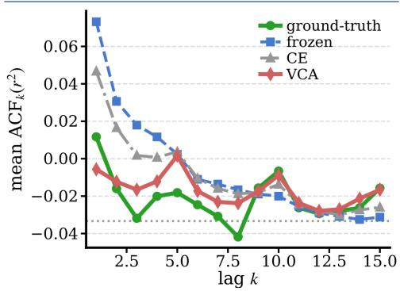
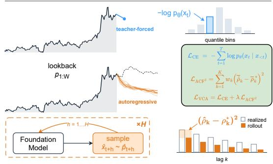
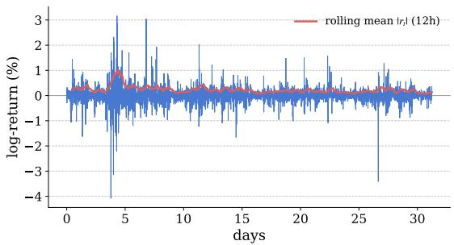
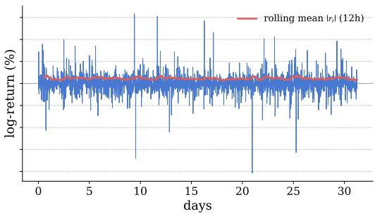
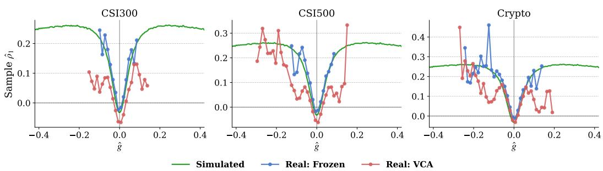
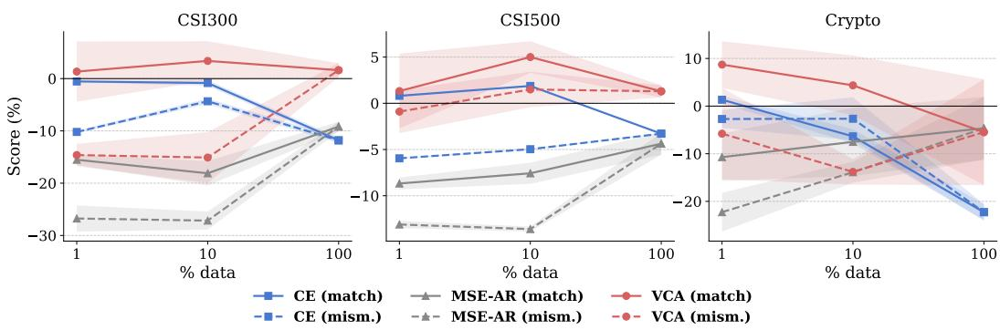
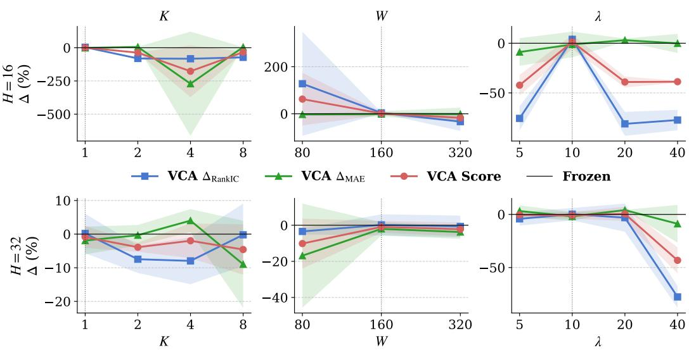
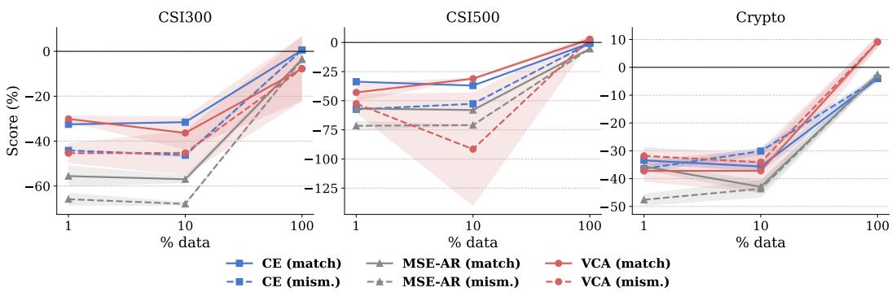

# VOLATILITY-CLUSTERING ADAPTATION FOR FINANCIAL TIME SERIES

Manh Nguyen, Minh Hoang Nguyen, Huu Hiep Nguyen, Van Dai Do, Hung Le Applied Artificial Intelligence Initiative, Deakin University, Australia {manh.nguyen, s223669184, huu.n, v.do, thai.le}@deakin.edu.au

## ABSTRACT

Time-series foundation models are increasingly adapted to new domains through fine-tuning on target data, under the implicit assumption that more target data yields better forecasts. We show that this assumption can fail in financial forecasting, where individual price changes are dificult to predict, but large moves tend to cluster, creating alternating calm and turbulent periods. Using financial foundation models trained on price bars of open, high, low, close, and volume, we argue that adapting to financial domains requires training signals beyond next-token prediction. We introduce Volatility-Clustering Adaptation (VCA), which augments next-token cross-entropy with a diferentiable penalty on the autocorrelation of squared returns, the standard statistical signature of volatility clustering. This additional objective provides a multi-step training signal by matching the resulting dependence structure of autoregressive rollouts to those of the realized future. Across three asset sets and two evaluation conventions, VCA improves adaptation over the pre-trained model, with the strongest gains under the primary evaluation (FORE), driven primarily by reduced variance error. Overall, our results suggest that efective financial adaptation requires objectives that capture domain-specific temporal structure beyond token-level prediction. Code is publicly available at https://github.com/DA2I2-SLM/VCA.

## 1 INTRODUCTION

Time-series foundation models are pre-trained on large and diverse corpora and then applied to previously unseen time series (Rasul et al., 2023; Das et al., 2024; Woo et al., 2024; Goswami et al., 2024; Ansari et al., 2024). Financial foundation models such as Kronos (Shi et al., 2026) extend this paradigm to finance by tokenizing open, high, low, close, and volume (OHLCV) bars and autoregressively generating future price paths. Adapting such models to a target market typically involves fine-tuning on historical data, with the implicit assumption that using more target data should improve performance. That assumption can fail because fine-tuning can distort useful pre-trained features and reduce out-of-distribution robustness (Kumar et al., 2022), or overwrite capabilities acquired during pre-training (Kirkpatrick et al., 2017). The problem is particularly relevant in finance, where returns, defined as relative changes in asset prices, are weakly predictable but volatility is strongly autocorrelated and varies across regimes (Engle, 1982; Bollerslev, 1986; Cont, 2001). Long histori cal windows can therefore mix very diferent volatility regimes, so adding more data may introduce patterns that are less relevant to the regime at deployment.

This raises two separate questions for adaptation: what structure the training objective should enforce, and, secondarily, which data to fine-tune on. For the training objective, we encode volatility clustering, a classical stylized fact of financial returns, as an auxiliary signal, since a next-token prediction loss gives no explicit signal about the shape of a multi-step rollout used for test-time evaluation. In particular, we introduce Volatility-Clustering Adaptation (VCA), which matches the autocorrelation function of squared returns (ACF2) between autoregressive rollouts and the corresponding realized future paths (Figure 1). This directly trains the model to reproduce volatility clustering over the evaluation horizon. To make this objective diferentiable, we use a Gumbel-softmax straight-through rollout (Jang et al., 2017; Bengio et al., 2013). Additionally, we compute ACF statistics at the batch level rather than from individual trajectories, providing a more stable training signal. This formulation brings stylized-fact-driven objectives, analogous to physics-informed learning (Raissi et al., 2019; Wiese et al., 2020), into the adaptation of an existing financial foundation model rather than training one from scratch. Regarding data selection, we ask a retrospective question: does fine-tuning on a chronological slice whose realized volatility matches the test period outperform fine-tuning on the full historical set? We hypothesize that long historical windows mix volatility regimes that may difer from the one at deployment, so a smaller matched slice could supply more relevant signal than the full set. This setup examines whether regime alignment drives adaptation gains beyond data volume. To verify, we use the realized volatility of the test period for matching, making this a diagnostic study of volatility-regime alignment.

1 The stylized fact  

2 Next-token Cross Entropy  
  
3 VCA: match clustering via rollout  
Figure 1: Overview of Volatility-Clustering Adaptation (VCA). ➊ Mean ACF of squared returns against lag k on CSI300: the realized (ground-truth) path stays positive and well above the dotted zero-clustering null, the signature of volatility clustering. The frozen model and CE fine-tuning deviate from the ground-truth curve, while VCA matches its shape more closely. ➋ The baseline objective $\mathcal { L } _ { \mathrm { C E } }$ is single-step and teacher-forced: it scores the next token against the ground truth but gives no signal about the shape of the multi-step path the model generates at test time. ➌ VCA rolls out autoregressively over the horizon and adds $\mathcal { L } _ { \mathrm { A C F ^ { 2 } } }$ , which matches the batch-mean ACF of squared returns $\bar { \rho } _ { k }$ to the realized $\bar { \rho } _ { k } ^ { \star }$ . VCA’s total objective is $\mathcal { L } _ { \mathrm { V C A } } = \mathcal { L } _ { \mathrm { C E } } + \lambda \mathcal { L } _ { \mathrm { A C F ^ { 2 } } }$

Across major financial benchmarks such as CSI300, CSI500, and Crypto, VCA improves adaptation under both evaluation conventions, with gains driven primarily by lower variance error. In contrast, cross-entropy fine-tuning can be harmful, particularly on Crypto, while full-data VCA causes greater weight drift from the frozen backbone, which we use as a proxy for potential forgetting. Regime-matched historical data improves data eficiency at longer forecasting horizons, matching or outperforming full-data fine-tuning with less weight drift, but this benefit does not extend to shorter horizons. We observe similar results when adapting Chronos-T5-small, suggesting that these challenges are not specific to Kronos, highlighting the value of domain-specific path-level objectives and horizon-aware data selection for financial foundation-model adaptation.

Our contributions are:

• We introduce Volatility-Clustering Adaptation (VCA), a diferentiable objective that matches volatility clustering in autoregressive rollouts, with a controlled ablation isolating the contribution of $\mathrm { A C F ^ { 2 } }$ from that of rollout-based training itself.

• We show that volatility-matched data can match or outperform full-data fine-tuning at the longer horizon with substantially less weight drift, while broader data coverage remains more important at the shorter horizon.

• We identify a volatility-trend direction that the $\mathrm { A C F ^ { 2 } }$ loss cannot constrain and confirm it in both simulation and empirical results, providing a partial explanation for VCA’s instability.

## 2 RELATED WORK

Time-series foundation models. Lag-Llama (Rasul et al., 2023), TimesFM (Das et al., 2024), Moirai (Woo et al., 2024), MOMENT (Goswami et al., 2024), and Chronos (Ansari et al., 2024) are pre-trained on large heterogeneous corpora and applied zero-shot across domains, using the same weights without modeling domain-specific structure. Kronos (Shi et al., 2026) instead targets finance, tokenizing OHLCV bars into hierarchical discrete tokens and pre-training a decoder-only transformer on billions of K-lines. All of these works focus on optimizing forecasting accuracy, but none constrain adaptation to preserve domain-specific properties such as volatility clustering.

Adaptation, domain knowledge, and data selection for time series. Several approaches have been proposed to adapt time-series foundation models to target domains. Parameter-eficient methods use LoRA (Hu et al., 2022; Gupta et al., 2024) or specialized adaptation schemes such as TRACE (Li & Zhu, 2025) to update only a small fraction of model parameters. In-context fine-tuning adapts to a target distribution through related time-series examples without updating model weights at inference time (Faw et al., 2025), while online adaptation updates forecasts as new observations arrive (Lee et al., 2025). Other work moves beyond conventional forecast loss, for example by fine-tuning toward downstream decision objectives (Beichter et al., 2025). In contrast, our adaptation changes the training objective itself by encoding a financial stylized fact, volatility clustering, through a diferentiable path-level loss. Data selection provides a complementary route, with evidence that carefully selected subsets can outperform full-data fine-tuning, while simply matching the training data to the target distribution does not always improve transfer (Xia et al., 2024; Kang et al., 2024). In finance, DoubleAdapt (Zhao et al., 2023) adapts a stock-forecasting model to shifting regimes through a learned adapter. We instead use volatility regime to select historical data and find that such alignment can improve data eficiency at longer forecasting horizons.

Stylized facts in financial modeling. Autocorrelation in squared returns, together with weak autocorrelation in raw returns, is a classical financial stylized fact (Engle, 1982; Bollerslev, 1986; Cont, 2001). Their strength depends on sampling frequency (Drost & Nijman, 1993), motivating our evaluation across forecast horizons. Quant GANs reproduce financial stylized facts directly (Wiese et al., 2020), while physics-informed learning encodes known structure in diferentiable objectives (Raissi et al., 2019). Exposure bias highlights the gap between teacher-forced training and autoregressive evaluation (Bengio et al., 2015; Lamb et al., 2016), and soft-DTW and DILATE address related gaps with diferentiable path-shape losses (Cuturi & Blondel, 2017; Le Guen & Thome, 2019). These methods target generic path geometry rather than any domain-specific structure. To our knowledge, we are the first to use a financial stylized fact as a diferentiable path-level objective for adapting a pretrained foundation model.

## 3 METHOD

We propose Volatility-Clustering Adaptation (VCA), which augments next-token prediction with a multi-step signal for volatility dependence. It matches the squared-return ACF of diferentiable rollouts to that of the realized future, while preserving the original CE objective. We build on Kronos (Shi et al., 2026), a decoder-only foundation model for financial time series that tokenizes each open, high, low, close, and volume (OHLCV) bar into hierarchical discrete tokens and predicts the next bar autoregressively. Given a lookback window of W bars, Kronos rolls out an H-bar forecast by sampling tokens one step at a time and decoding them back to prices.

## 3.1 PRELIMINARIES

Problem Formulation. A training sequence consists of the tokenized $W { \pm } H$ bars, $x _ { 1 : W + H }$ , spanning the lookback window and the forecast horizon. The model $p _ { \theta }$ is trained to predict each token autoregressively, giving the next-token cross-entropy (CE) objective

$$
\mathcal { L } _ { \mathrm { C E } } \ : = \ : - \sum _ { t = 1 } ^ { W + H } \log p _ { \theta } ( x _ { t } \mid x _ { < t } ) .\tag{1}
$$

This is the standard training objective for autoregressive time-series foundation models, and for financial foundation models such as Kronos in particular. The CE objective is teacher-forced and one step ahead; that is, it sharpens next-token accuracy, but gives no signal about the shape of the H-step rollout that is actually produced and evaluated at test time. We next describe one such shape property, volatility clustering, which Eq. 1 fails to model. Our method (§3.2) explicitly optimizes for this property.

  
Figure 2: Meaning of $\hat { \rho } _ { k } > 0$ on a real trajectory (BTCUSDT, 15-minute bars). Blue is the log-return $r _ { t } ;$ red is the rolling mean $\left| \boldsymbol { r } _ { t } \right|$ | (12h), a realized-volatility proxy. (a) Real order: volatility moves in sustained stretches, so a large $\left| \boldsymbol { r } _ { t } \right|$ | predicts a large $| r _ { t + k } |$ . (b) Same returns, time-shufled: the returns have the same values and distribution, but once their order is shufled, the clustering disappears, and the envelope flattens. The ordering impact is the structure that $\hat { \rho } _ { k }$ measures and what $\operatorname { E q . }$ 5 trains the model to match.

The volatility-clustering stylized fact. Financial returns exhibit volatility clustering. The autocorrelation function (ACF) of squared returns decays slowly and stays positive, while raw returns are near white noise (Cont, 2001). For a price path $p _ { 1 : H }$ , we form log-returns $r _ { t } = \log ( p _ { t } / p _ { t - 1 } )$ and let $\overline { { r ^ { 2 } } }$ denote their mean squared return. The sample ACF of squared returns at lag k is

$$
\hat { \rho } _ { k } \ = \ \frac { \sum _ { t } ( r _ { t } ^ { 2 } - \overline { { r ^ { 2 } } } ) ( r _ { t - k } ^ { 2 } - \overline { { r ^ { 2 } } } ) } { \sum _ { t } ( r _ { t } ^ { 2 } - \overline { { r ^ { 2 } } } ) ^ { 2 } } , \qquad k = 1 , \ldots , K .\tag{2}
$$

K introduces a trade-of between capturing longer-range dependence and maintaining reliable estimates. Larger K captures slower-decaying clustering, but longer-lag estimates of $\hat { \rho } _ { k }$ are noisier and sit closer to the no-clustering null. Concretely, $\hat { \rho } _ { k } > 0$ means a large move tends to be followed by another large move k steps later, regardless of direction. Figure 2 illustrates this temporal dependence directly: the same returns exhibit sustained volatility clustering in their original order, but not after time-shufling.

## 3.2 VOLATILITY-CLUSTERING ADAPTATION

Standard fine-tuning adapts foundation models using the objective in Eq. 1. We augment it with a signal for the volatility dependence of the multi-step rollout.

A diferentiable $\mathbf { A C F ^ { 2 } }$ loss. Computing the ACF loss on generated trajectories requires gradients to propagate through the autoregressive sampling process. Because Kronos predicts discrete tokens, naive sampling would break this gradient path. We therefore replace the categorical draw with a Gumbel-softmax straight-through estimator (Jang et al., 2017; Bengio et al., 2013). Specifically, letting $\ell _ { t }$ denote the model logits over the token vocabulary, the forward pass feeds the arg max token, matching test-time discretization, while the backward pass uses the soft relaxation

$$
\begin{array} { r } { q _ { t } \ = \ \mathrm { s o f t m a x } ( ( \ell _ { t } + g _ { t } ) / \tau ) , \qquad g _ { t } \sim \mathrm { G u m b e l } ( 0 , 1 ) , } \end{array}\tag{3}
$$

with Gumbel-softmax temperature τ annealed over training. This yields a fully diferentiable autoregressive rollout $\hat { p } _ { 1 : H }$ (one sample per window at train time, versus an N-rollout average at test time), from which we compute the per-window $\hat { \rho } _ { k }$ of Eq. 2 and penalize its discrepancy to the realized future squared-return ACF $\rho _ { k } ^ { \star }$ of the ground-truth path.

A per-window loss $( \hat { \rho } _ { k } - \rho _ { k } ^ { \star } ) ^ { 2 }$ is a high-variance target even for a perfectly calibrated model, because $\hat { \rho } _ { k }$ is a sample ACF computed from as few as $H { - } k$ squared returns. We therefore average before squaring, over a batch of B windows indexed by b,

$$
\bar { \rho } _ { k } \ = \ \frac 1 B \sum _ { b = 1 } ^ { B } \hat { \rho } _ { k } ^ { ( b ) } , \qquad \bar { \rho } _ { k } ^ { \star } \ = \ \frac 1 B \sum _ { b = 1 } ^ { B } \rho _ { k } ^ { \star ( b ) } ,\tag{4}
$$

which reduces the sampling variance of each term before the squared diference is taken. The aggregate training loss is then

$$
{ \mathcal L } _ { \mathrm { A C F ^ { 2 } } } = \sum _ { k = 1 } ^ { K } w _ { k } ( \bar { \rho } _ { k } - \bar { \rho } _ { k } ^ { \star } ) ^ { 2 } , \qquad w _ { k } = e ^ { - k / \gamma } .\tag{5}
$$

We retain the general K-lag form as the natural statement of the stylized fact where near lags carry most of the stylized-fact signal and empirical persistence decays with lag (Cont, 2001) (Figure 1, panel 1), so $w _ { k }$ is a decay kernel rather than a normalized distribution over lags. When $K { = } 1$ (our default), only $w _ { 1 } = e ^ { - 1 / \gamma }$ enters the loss, so λ and γ afect the loss only through the product $\lambda e ^ { - 1 / \gamma }$ while normalizing $w _ { k }$ would simply rescale λ. The total objective is

$$
\begin{array} { r } { \mathcal { L } = \mathcal { L } _ { \mathrm { C E } } + \lambda \mathcal { L } _ { \mathrm { A C F } ^ { 2 } } , } \end{array}\tag{6}
$$

with plain CE recovered at $\lambda = 0$ . The $\mathrm { A C F ^ { 2 } }$ term is thus the only diference from the CE baseline, so any gap between the two is attributable to this signal. However, this signal constrains only the dependence structure of squared returns, not their overall level. In particular, it cannot distinguish opposite trends in volatility level. We formalize this property below.

Proposition 1 (The volatility-trend channel). Let ${ r _ { t } = \sigma _ { 0 } e ^ { g t } \varepsilon _ { t } } ,$ , where g controls the exponential trend in volatility, for $t = 1 , \ldots , n$ with $\varepsilon _ { t } \ i . i . d .$ and no clustering. Then (a) the law of the sample $A C F \hat { \rho } _ { k } ( r ^ { 2 } )$ is invariant under $g \mapsto - g ,$ , while $\textstyle ( b ) \mathbb { E } [ \sum _ { t } r _ { t } ^ { 2 } ] = { \overset { \smile } { \sigma } } _ { 0 } ^ { 2 } \sum _ { t = 1 } ^ { n } { \overset { \triangledown } { e } } ^ { 2 { \overset { \triangledown } { g t } } }$ is strictly increasing in g, with $\begin{array} { r } { \mathbb { E } [ \sum _ { t } r _ { t } ^ { 2 } ; + g ] / \mathbb { E } [ \sum _ { t } r _ { t } ^ { 2 } ; - g ] = e ^ { 2 g ( n + 1 ) } } \end{array}$

Proof. See Appendix B.

A volatility trend can substantially change the overall level of squared returns without changing the distribution of their squared-return ACF. Matching the ACF therefore does not control the overall volatility level, leaving the objective insensitive to the direction of a volatility trend. This provides a mechanistic explanation for a failure mode observed in our VCA runs, where some runs end with sharply inflated forecast variance despite a small $\mathrm { A C F ^ { 2 } }$ validation gap (Section 4.2). In practice, this efect is minor on our primary backbone, Kronos: VCA improves on the frozen model across all three datasets and horizons (Table 1), with variance inflation remaining modest relative to the magnitude possible in Proposition 1. The efect is more visible on Chronos-T5-small (Appendix Table 9), a smaller and more general backbone. We discuss this limitation further in Appendix D.

Why target the ACF gap, and not volatility level directly? Realized-variance level is a natural alternative target for a volatility-aware objective, but we find out empirically that its gap to a naive baseline is much less consistent across datasets than the $\mathrm { A C F ^ { 2 } }$ gap. In contrast, $\mathrm { A C F ^ { 2 } }$ shows a stable ≈ 2× gap and is the only consistent performer across all three datasets, motivating our choice of $\mathrm { A C F ^ { 2 } }$ as the training signal (Appendix Table 5). Intuitively, variance level is scale-dependent and can be matched reasonably well by a naive baseline that tracks the unconditional scale, whereas $\mathrm { \ A C F ^ { 2 } }$ captures scale-invariant temporal dependence that such baselines cannot reproduce. This makes its headroom more stable across datasets and regimes.

## 4 EXPERIMENTS

We evaluate VCA across datasets and forecasting horizons against alternative adaptation objectives and classical volatility models, using both finance-specific and general-purpose time-series foundation models. Our ablations then study three aspects of the method: how regime matching afects fine-tuning data eficiency, how adaptation changes model weights, and how the main design choices (K, W, and λ) afect performance.

## 4.1 SETUP

Datasets. We evaluate on three asset sets in the per-symbol OHLCV format consumed by the Kronos inference pipeline: CSI300 and CSI500, standard equity benchmarks in prior return-forecasting work (Li et al., 2024; Xu et al., 2021; Zhao et al., 2023) sourced from Qlib (Yang et al., 2020), and Crypto, 20 USDT pairs from the Binance API (Binance, 2026). More details are in Appendix Table 3.

Table 1: Main comparison under FORE. The Frozen row (for reference) is raw RankIC and MAE; GARCH(1,1) and HAR-RV forecast only variance, so RankIC and Score are not applicable to them (-). Every other row is a relative delta against Frozen in percentage (higher is better), and the last group averages both deltas and the Score over horizons. Bold marks the best fine-tuned method in each column. WR denotes win rate, computed as the fraction of the eight per-horizon columns in which a method has the best result. Per-horizon values are in Appendix Tables 15–18.
<table><tr><td colspan="2"></td><td colspan="2">H=8</td><td colspan="2">H=16</td><td colspan="2">H=32</td><td colspan="2">H=48</td><td colspan="3">average over H</td><td rowspan="2"></td></tr><tr><td colspan="2">DS Method</td><td> $\Delta _ { \mathrm { R a n k I C } }$ </td><td>∆MAE</td><td>∆RankIC ∆MAE</td><td></td><td>△RankIC ∆MAE</td><td></td><td>∆RankIC ∆MAE|</td><td></td><td>∆RankIC ∆MAE Score WR</td><td></td><td></td><td></td></tr><tr><td rowspan="6">CSI330</td><td>Frozen</td><td></td><td>+0.291 3.4e-3</td><td></td><td>+0.3176.6e-3</td><td></td><td>+0.3331.4e-2</td><td></td><td>+0.333 2.3e-2</td><td></td><td></td><td></td><td></td><td></td></tr><tr><td>GARCH</td><td></td><td>-10.5</td><td></td><td>-13.3</td><td></td><td>-7.3</td><td></td><td></td><td>-0.6</td><td></td><td>-7.9</td><td></td><td></td></tr><tr><td>HAR-RV</td><td></td><td>-6.2</td><td></td><td>-5.2</td><td></td><td>+7.9</td><td></td><td>+15.8</td><td></td><td></td><td>+3.1</td><td></td><td></td></tr><tr><td>CE</td><td>-12.6</td><td>+6.7</td><td>+7.5</td><td>-6.4</td><td></td><td>-11.8 -11.8</td><td></td><td>-8.8</td><td>-8.5</td><td>-6.4</td><td>-5.0</td><td>-5.72/8</td><td></td></tr><tr><td>MSE</td><td>-16.8</td><td>-5.3</td><td>+5.9</td><td>-13.0</td><td>-6.5</td><td>-11.8</td><td></td><td>-1.7</td><td>-4.7</td><td>-4.8</td><td>-8.7</td><td>-6.7 1/8</td><td></td></tr><tr><td>VCA</td><td></td><td>-6.0+10.0</td><td>+3.6</td><td>-19.1</td><td></td><td>+8.0</td><td>-4.8</td><td>-6.2</td><td>+7.2</td><td>-0.2</td><td>-1.7</td><td>-0.95/8</td><td></td></tr><tr><td rowspan="6">CSI50</td><td>Frozen</td><td>+0.8494.5e-3</td><td></td><td>+0.853 9.0e-3</td><td></td><td></td><td>+0.864 2.0e-2</td><td></td><td>+0.880 3.1e-2</td><td></td><td></td><td></td><td></td><td></td></tr><tr><td>GARCH</td><td></td><td>-11.4</td><td></td><td>-13.9</td><td></td><td></td><td>-6.7</td><td></td><td>-1.4</td><td></td><td>-8.3</td><td></td><td></td></tr><tr><td>HAR-RV</td><td></td><td>-13.1</td><td></td><td>-9.0</td><td></td><td>+4.2</td><td></td><td>+12.0</td><td></td><td></td><td>-1.5</td><td></td><td></td></tr><tr><td>CE</td><td>-3.4</td><td>+6.1</td><td>-4.5</td><td>+3.1</td><td></td><td>-0.6</td><td>-5.9</td><td>-8.3</td><td>-1.2</td><td>-4.2</td><td>+0.5</td><td>-1.9 2/8</td><td></td></tr><tr><td>MSE</td><td>-4.0</td><td>-5.0</td><td>-2.7</td><td>-8.1</td><td>-3.3</td><td>-5.4</td><td>-5.7</td><td></td><td>-2.3</td><td>-3.9</td><td>-5.2</td><td>-4.60/8</td><td></td></tr><tr><td>VCA</td><td>-0.6</td><td>-5.7</td><td>+1.0</td><td>+4.5</td><td>-1.3</td><td>+3.9</td><td>-4.9</td><td>+3.4</td><td></td><td>-1.4</td><td>+1.5</td><td>+0.0</td><td>6/8</td></tr><tr><td rowspan="6">Cryypto</td><td>Frozen</td><td>+0.0551.4e-4</td><td></td><td>+0.051 3.1e-4</td><td></td><td></td><td>+0.051 6.8e-4</td><td></td><td>+0.0441.1e-3</td><td></td><td></td><td></td><td></td><td></td></tr><tr><td>GARCH</td><td></td><td>-0.7</td><td></td><td></td><td>+9.2</td><td></td><td>+8.0</td><td></td><td>+12.6</td><td></td><td>+7.3</td><td></td><td></td></tr><tr><td>HAR-RV</td><td></td><td>-13.1</td><td></td><td>-4.1</td><td></td><td>-0.8</td><td></td><td></td><td>+0.4</td><td></td><td>-4.4</td><td></td><td></td></tr><tr><td>CE</td><td>-12.0</td><td>+5.7</td><td>-14.3</td><td>+6.2</td><td>-50.7</td><td></td><td>+6.2</td><td>-11.3</td><td>+4.5</td><td>-22.1</td><td>+5.7</td><td>-8.22/8</td><td></td></tr><tr><td>MSE</td><td>-42.1</td><td>-0.5</td><td>-5.7</td><td>+0.4</td><td>-2.7</td><td>-6.6</td><td>+6.5</td><td></td><td>+3.6</td><td>-11.0</td><td>-0.8</td><td>-5.9 1/8</td><td></td></tr><tr><td>VCA</td><td>+3.4</td><td>+3.9</td><td></td><td>+7.3 +11.0</td><td>-6.1</td><td>-4.8</td><td>+10.2</td><td></td><td>+6.0</td><td>+3.7</td><td>+4.0</td><td>+3.95/8</td><td></td></tr></table>

Metrics. For the path-wise quantity, we report price RankIC (RankIC), the per-window Spearman correlation between the predicted and realized OHLC price path, averaged over windows. For the volatility side, we report $\mathbf { \partial } _ { \sigma ^ { 2 } - \mathbf { M A E } } ^ { \bullet _ { 2 } }$ , the mean absolute error of realized variance. Both metrics follow the evaluation protocol of prior work (Shi et al., 2026). We use RankIC and $\sigma ^ { 2 } { \mathrm { - } } \mathbf { M } \mathbf { A } \mathbf { E }$ for our main evaluation, while QLIKE (Patton, 2011) is reported as a complementary volatility metric in Appendix Table 6. The overall score is

$$
\begin{array} { r } { \mathrm { S c o r e } ~ = ~ \frac { 1 } { 2 } \big ( \Delta _ { \mathrm { R a n k I C } } \mathfrak { q } _ { 0 } + \Delta _ { \mathrm { M A E } } \mathfrak { q } _ { 0 } \big ) , } \end{array}\tag{7}
$$

where $\Delta$ is relative to the frozen model, with both terms signed so that positive means improvement. Definitions of RankIC, $\sigma ^ { 2 } { \mathrm { - } } \mathbf { M A E }$ and additional metrics (QLIKE, price IC, return IC/RankIC, and the ACF2 gap, Eq. 5) are in Appendix C.

Baselines. We compare our method, VCA, with three methods: (1) the frozen pre-trained model Frozen; (2) plain cross-entropy fine-tuning CE; and (3) MSE, which keeps the identical diferentiable AR rollout and replaces only ${ \mathcal { L } } _ { \mathrm { A C F ^ { 2 } } }$ with a relative squared error on the rolled-out path, $\begin{array} { r } { \mathcal { L } _ { \mathrm { M S E } } = \frac { 1 } { H } \sum _ { t = 1 } ^ { H } \left( ( \hat { p } _ { t } - p _ { t } ^ { \star } ) / p _ { t } ^ { \star } \right) ^ { 2 } } \end{array}$ . We additionally compare VCA with two classical volatility models, GARCH(1,1) (Bollerslev, 1986) and HAR-RV (Corsi, 2009), which fit per symbol and forecast at the same windows.

Protocol. All methods are fully fine-tuned without adapters for the same number of epochs and learning rate over three seeds on 4 V100 GPUs, with window size fixed at $W { = } 1 6 0$ and horizon

H swept over $\{ 8 , 1 6 , 3 2 , 4 8 \}$ . Checkpoints are selected by lowest teacher-forced validation crossentropy for CE, and by lowest aggregate $\mathrm { \ A C F ^ { 2 } }$ gap on autoregressive validation rollouts for VCA and MSE. Rollouts follow two sampling conventions: FORE $( T { = } 0 . 6 , N { = } 1 0 )$ and VOL $( T { = } 0 . 9 , N { = } 1 )$ , the latter matching the setting Kronos uses for its own variance metric. The two share a single RankIC, computed once from the FORE rollout; only $\sigma ^ { 2 } { \mathrm { - } } { \mathrm { M A E } }$ is recomputed per convention, so the FORE and VOL scores difer through that term alone. We report FORE in the main tables and VOL in the appendix (Table 7); QLIKE also uses FORE. More details are in Appendix A.

  
Figure 3: Volatility-trend channel, simulated vs. real rollouts $\left( H { = } 3 2 \right)$ , one panel per dataset. Simulated is $\mathbb E [ \hat { \rho } _ { 1 } ]$ from $r _ { t } = \sigma _ { 0 } e ^ { g t } \varepsilon _ { t }$ (no genuine clustering) as g varies; Real shows the mean $\hat { \rho } _ { 1 }$ within bins of the per-window trend rate gˆ from the predicted rollout, computed as the log-ratio of secondhalf to first-half squared returns. We use second-half over first-half so that $\hat { g }$ has the same sign as $^ { g , }$ following Proposition 1(b).

## 4.2 MAIN RESULTS

VCA is the strongest fine-tuning objective in aggregate. VCA achieves the best average Score among fine-tuned methods and the highest win rate on all three datasets (Table 1). While aggregate results are reported for comprehensiveness, practical deployment typically targets a fixed horizon. At $H { = } 1 6 .$ , VCA consistently improves RankIC and achieves a higher average Score than the frozen model across datasets. Across horizons, VCA is also the only fine-tuned method to improve over the frozen model under $\sigma ^ { 2 } { \mathrm { - } } { \mathrm { M A E } }$ . Compared with MSE, which shares the same rollout, VCA’s margin isolates the gain to the $\mathrm { \ A C F ^ { 2 } }$ loss itself rather than to rollout-based training in general. The margin over CE further shows that the $\mathrm { A C F ^ { 2 } }$ signal adds information that next-token cross-entropy does not provide. It does so by moving the model further from the pre-trained weights, not closer (Section 4.3), indicating an additional training signal rather than a regularizer. Moreover, VCA outperforms both GARCH(1,1) and HAR-RV on CSI500, while each classical baseline is better on one of the other two datasets.

Under VOL (Appendix Table 7), VCA remains best on CSI300 and Crypto, with CSI500 as the only exception. Under QLIKE (Appendix Table 6), VCA shows the largest average improvement on CSI300 and CSI500 but not Crypto, where its residual under-dispersion is penalized more heavily. All fine-tuned methods trail both classical baselines on all three datasets under this metric. These per-symbol-fit models do not provide a price path, and hence no RankIC or Score, or a shared pretrained backbone. VCA also achieves the lowest average $\mathrm { A C F ^ { 2 } }$ gap at each horizon across datasets (Appendix Table 8).

Evaluation on new backbone. We further evaluate VCA on Chronos-T5-small (Ansari et al., 2024), a smaller and less-trained backbone, using the same fine-tuning setup at $H { = } 1 6$ and $H { = } 3 2$ across all three datasets (Appendix Table 9). VCA produces improvements on Crypto at $H { = } 1 6$ and CSI500 at $H { = } 3 2 .$ , with the latter improving the average Score by 69.1% over the frozen baseline. The results are less stable than with Kronos, with rollout instability on CSI300 and Crypto at $H { = } 3 2 .$ , suggesting that VCA benefits more from domain-specific fine-tuning data than from a general-purpose backbone.

Table 2: Regime-matched definition. vol(·) is the standard deviation of log returns on close price (Appendix C). test/first and test/last are the ratios used to pick the matched slice (bold: closer to one); val/first and val/last are the same ratios computed from the validation period.The shaded column identifies whether thefirst or last slice is selected.
<table><tr><td>Dataset</td><td>Slice</td><td>vol(first)</td><td>vol(last)</td><td>vol(test)</td><td>vol(val)</td><td>test/first</td><td>test/last</td><td>val/first</td><td>val/last</td><td>matched</td></tr><tr><td rowspan="2">CSI300</td><td>10%</td><td>0.0298</td><td>0.0192</td><td>0.0253</td><td>0.0241</td><td>0.85×</td><td>1.32×</td><td>0.81×</td><td>1.26×</td><td>first</td></tr><tr><td>1%</td><td>0.0287</td><td>0.0182</td><td>0.0253</td><td>0.0241</td><td>0.88×</td><td>1.39×</td><td>0.84×</td><td>1.33×</td><td>first</td></tr><tr><td rowspan="2">CSI500</td><td>10%</td><td>0.0299</td><td>0.0213</td><td>0.0282</td><td>0.0267</td><td>0.94×</td><td>1.32×</td><td>0.89×</td><td>1.25×</td><td>first</td></tr><tr><td>1%</td><td>0.0235</td><td>0.0196</td><td>0.0282</td><td>0.0267</td><td>1.20×</td><td>1.44×</td><td>1.13×</td><td>1.36×</td><td>first</td></tr><tr><td rowspan="2">Crypto</td><td>10%</td><td>0.0105</td><td>0.0042</td><td>0.0051</td><td>0.0050</td><td>0.48×</td><td>1.21×</td><td>0.47×</td><td>1.18×</td><td>last</td></tr><tr><td>1%</td><td>0.0133</td><td>0.0051</td><td>0.0051</td><td>0.0050</td><td>0.38×</td><td>0.99×</td><td>0.38×</td><td>0.97×</td><td>last</td></tr></table>

  
Figure 4: Data eficiency across all three methods, Score against the frozen model $\scriptstyle ( H = 3 2 , { \mathrm { F O R E } } )$ Solid lines are the regime-matched slice and dashed the mismatched one, with bands of one standard deviation over 3 seeds. The regime-matched slices are identified in Table 2. Detailed values are in Appendix Table 11.

Empirical evidence for the volatility-trend channel. Figure 3 plots the sample $\mathrm { A C F _ { 1 } }$ of squared returns against the per-window trend rate gˆ for both simulated and real rollouts. In the simulation, a deterministic trend with no true volatility clustering already produces a non-zero ACF when |gˆ| is large, showing that trend alone can mimic the signal optimized by VCA. The Frozen model’s real rollouts closely follow the same relationship across all three datasets, confirming that this efect also occurs in real model outputs. VCA’s rollouts instead lie below the curve at matched gˆ values and show substantially more scatter. This suggests that VCA does not simply increase gˆ to exploit the objective, although the relationship does not fully explain the observed instability.

## 4.3 ABLATIONS

A regime-matched slice makes fine-tuning data-eficient. Fine-tuning on a chronological slice (first or last) of the training data can outperform full-data fine-tuning when the slice’s volatility regime matches the test period, suggesting an alignment efect rather than a purely recency efect. Table 2 determines the matched slice without evaluating the test period. The validation-based rule picks the same slice as the test-based rule in all six (dataset, slice-size) cells, showing that the selection can be made before deployment rather than after observing the test period. Volatility vol(·) is more discriminative than an ACF-based statistic, with raw lag-1 ACF of squared returns disagreeing across slice sizes on CSI300 (Appendix Table 10), consistent with noisier ACF estimates at this sample size (Section 3.2). The matched slice outperforms full-data fine-tuning across datasets and evaluation conventions at the tested slice sizes, while full-data fine-tuning is negative on Crypto (Figure 4). Mismatch is costly on Crypto and CSI300 but not on CSI500, so regime matching should be viewed as a useful selection rule rather than a universal penalty for mismatch.

This data-eficiency efect is specific to H=32 and does not transfer to $H { = } 1 6 .$ , where small-data fine-tuning remains substantially below the frozen model until the full dataset is used (Appendix

  
Figure 5: Ablation sweeps under FORE, mean over the three datasets, band is one standard deviation of the per-dataset delta. $\Delta _ { \mathrm { R a n k I C } }$ and $\Delta _ { \mathrm { M A E } }$ are the two halves Score averages; the black line at 0 is the frozen backbone. Detailed values are in Appendix Tables 12 and 13.

Figure 6). The degradation reflects a drop in RankIC and afects CE as well as VCA, suggesting that broader data coverage is more important at shorter horizons, while regime alignment becomes more useful at longer horizons. We therefore view the two factors as complementary rather than treating regime alignment as a general substitute for data volume.

Does adaptation forget? The regime-matched slice matches full-data fine-tuning on the target, raising the question of how much additional weight drift the unused data introduces. We measure relative weight drift, $| \theta - \theta _ { 0 } | _ { 2 } / | \theta _ { 0 } | _ { 2 }$ from the frozen model $\theta _ { 0 } ,$ , as a proxy for how much a model could have forgotten (Appendix Table 14). At full data and H=32, VCA produces larger weight drift than CE, with a smaller diference at $H { = } 1 6$ . The regime-matched 10% slice reduces VCA’s weight drift at both horizons while matching or outperforming full-data fine-tuning on the target. However, its drift remains comparable to or higher than CE, indicating that regime matching reduces, but does not eliminate, the additional drift associated with VCA. At H=16, full-data drift is larger in five of the six method–dataset combinations, with VCA on CSI300 as the only exception.

Efect of lag count K. The lag count has a stronger efect at $H { = } 1 6 .$ . The choice K=1 produces a sharp peak, while larger lag counts substantially reduce RankIC and increase seed-to-seed variation. The same ordering remains at $H { = } 3 2$ , but the performance gap is much smaller across the sweep, with K=1 still leading on all three datasets (Figure 5-left).

Efect of lookback W. The lookback shows a similar horizon-dependent pattern. At $H { = } 1 6 .$ , raw RankIC varies sharply with W and declines on both sides of the best-performing setting $( W { = } 1 6 0 )$ The ∆-based Score in Figure 5 makes this contrast appear even larger because it is measured relative to the frozen backbone at the same W, whose performance is much lower with shorter context. At H=32, this dependence largely disappears, with raw RankIC remaining close across W values.

Efect of weight λ. The $\mathrm { A C F ^ { 2 } }$ weight behaves diferently from the other two hyperparameters. At $H { = } 1 6$ , the recipe value gives a narrow peak: reducing λ weakens the auxiliary signal mildly, whereas increasing it causes much larger RankIC losses before the efect saturates. This sharp sensitivity persists at $H { = } 3 2$ , where the largest tested weight again causes severe degradation. Thus, unlike $\dot { W }$ and K, λ remains sensitive across horizons.

## 5 CONCLUSION

We introduce Volatility-Clustering Adaptation (VCA), which augments next-token prediction with a diferentiable signal for the autocorrelation of squared returns over autoregressive rollouts. Across three asset sets and two evaluation conventions, VCA delivers the best average performance, primarily reflected in variance-related metrics. We further find that volatility-matched data can improve data eficiency at longer horizons, while broader data coverage remains important at shorter horizons. These findings highlight the value of adapting time-series foundation models with temporal objectives rather than relying on token-level prediction. Limitations are discussed in Appendix D.

## AI USE STATEMENT

We used generative AI tools solely to support writing, including language polishing and clarity, not to develop ideas, design methods, or run experiments. All AI-assisted text was reviewed and verified by the authors, who take full responsibility for the final content.

## ETHICS STATEMENT

VCA is a research recipe, not a validated trading system, so deploying it on live capital without independently verifying stability could turn a research-scale gain into a real loss. We use only public data and open pre-trained backbones, with no human subjects.

## REPRODUCIBILITY STATEMENT

Datasets and implementation details are in Section 4, Table 3 and Appendix Table 4. Proof of Proposition 1 is in Appendix B. We will release the code upon publication.

## REFERENCES

Abdul Fatir Ansari, Lorenzo Stella, Caner Turkmen, Xiyuan Zhang, Pedro Mercado, Huibin Shen, Oleksandr Shchur, Syama Sundar Rangapuram, Sebastian Pineda Arango, Shubham Kapoor, Jasper Zschiegner, Danielle C. Maddix, Michael W. Mahoney, Kari Torkkola, Andrew Gordon Wilson, Michael Bohlke-Schneider, and Yuyang Wang. Chronos: Learning the language of time series. Transactions on Machine Learning Research, 2024.

Maximilian Beichter, Nils Friederich, Janik Pinter, Dorina Werling, Kaleb Phipps, Sebastian Beichter, Oliver Neumann, Ralf Mikut, Veit Hagenmeyer, and Benedikt Heidrich. Decision-focused fine-tuning of time series foundation models for dispatchable feeder optimization. Energy and AI, 21:100533, 2025. ISSN 2666-5468. doi: https://doi.org/10.1016/j.egyai.2025.100533. URL https://www.sciencedirect.com/science/article/pii/S2666546825000655.

Samy Bengio, Oriol Vinyals, Navdeep Jaitly, and Noam Shazeer. Scheduled sampling for sequence prediction with recurrent neural networks. Advances in Neural Information Processing Systems, 2015.

Yoshua Bengio, Nicholas Léonard, and Aaron Courville. Estimating or propagating gradients through stochastic neurons for conditional computation. arXiv preprint arXiv:1308.3432, 2013.

Binance. Binance spot API documentation. https://developers.binance.com/docs/ binance-spot-api-docs, 2026. Accessed: 2026-09-15.

Tim Bollerslev. Generalized autoregressive conditional heteroskedasticity. Journal ofEconometrics, 31(3):307–327, 1986.

Rama Cont. Empirical properties of asset returns: Stylized facts and statistical issues. Quantitative Finance, 1(2):223–236, 2001.

Fulvio Corsi. A simple approximate long-memory model of realized volatility. Journal of Financial Econometrics, 7(2):174–196, 2009.

Marco Cuturi and Mathieu Blondel. Soft-DTW: a diferentiable loss function for time-series. In International Conference on Machine Learning, 2017.

Abhimanyu Das, Weihao Kong, Rajat Sen, and Yichen Zhou. A decoder-only foundation model for time-series forecasting. In International Conference on Machine Learning, 2024.

Feike C Drost and Theo E Nijman. Temporal aggregation of GARCH processes. Econometrica, 61 (4):909–927, 1993.

Robert F Engle. Autoregressive conditional heteroscedasticity with estimates of the variance of United Kingdom inflation. Econometrica, 50(4):987–1007, 1982.

Matthew Faw, Rajat Sen, Yichen Zhou, and Abhimanyu Das. In-context fine-tuning for time-series foundation models. In International Conference on Machine Learning, 2025.

Mononito Goswami, Konrad Szafer, Arjun Choudhry, Yifu Cai, Shuo Li, and Artur Dubrawski. MOMENT: A family of open time-series foundation models. In International Conference on Machine Learning, 2024.

Divij Gupta, Anubhav Bhatti, Suraj Parmar, Chen Dan, Yuwei Liu, Bingjie Shen, and San Lee. Lowrank adaptation of time series foundational models for out-of-domain modality forecasting. In Proceedings ofthe 26th International Conference on Multimodal Interaction, ICMI ’24, pp. 382– 386, New York, NY, USA, 2024. Association for Computing Machinery. ISBN 9798400704628. doi: 10.1145/3678957.3685724. URL https://doi.org/10.1145/3678957.3685724.

Edward J Hu, Yelong Shen, Phillip Wallis, Zeyuan Allen-Zhu, Yuanzhi Li, Shean Wang, Lu Wang, and Weizhu Chen. LoRA: Low-rank adaptation of large language models. In International Conference on Learning Representations, 2022.

Eric Jang, Shixiang Gu, and Ben Poole. Categorical reparameterization with gumbel-softmax. In International Conference on Learning Representations, 2017.

Feiyang Kang, Hoang Anh Just, Yifan Sun, Himanshu Jahagirdar, Yuanzhi Zhang, Rongxing Du, Anit Kumar Sahu, and Ruoxi Jia. Get more for less: Principled data selection for warming up fine-tuning in LLMs. In International Conference on Learning Representations, 2024.

James Kirkpatrick, Razvan Pascanu, Neil Rabinowitz, Joel Veness, Guillaume Desjardins, Andrei A Rusu, Kieran Milan, John Quan, Tiago Ramalho, Agnieszka Grabska-Barwinska, Demis Hassabis, Claudia Clopath, Dharshan Kumaran, and Raia Hadsell. Overcoming catastrophic forgetting in neural networks. Proceedings ofthe National Academy ofSciences, 114(13):3521–3526, 2017.

Ananya Kumar, Aditi Raghunathan, Robbie Jones, Tengyu Ma, and Percy Liang. Fine-tuning can distort pretrained features and underperform out-of-distribution. In International Conference on Learning Representations, 2022.

Alex M Lamb, Anirudh Goyal, Ying Zhang, Saizheng Zhang, Aaron C Courville, and Yoshua Bengio. Professor forcing: A new algorithm for training recurrent networks. Advances in Neural Information Processing Systems, 2016.

Vincent Le Guen and Nicolas Thome. Shape and time distortion loss for training deep time series forecasting models. Advances in Neural Information Processing Systems, 2019.

Thomas L Lee, William Toner, Rajkarn Singh, Artjom Joosen, and Martin Asenov. Lightweight online adaption for time series foundation model forecasts. In Proceedings ofthe 42nd International Conference on Machine Learning, volume 267 of Proceedings of Machine Learning Research, pp. 33736–33764. PMLR, 13–19 Jul 2025. URL https://proceedings.mlr.press/v267/ lee25ag.html.

Tong Li, Zhaoyang Liu, Yanyan Shen, Xue Wang, Haokun Chen, and Sen Huang. MASTER: Marketguided stock transformer for stock price forecasting. In Proceedings of the AAAI Conference on Artificial Intelligence, 2024.

Yuze Li and Wei Zhu. TRACE: Time series parameter eficient fine-tuning. Neurocomputing, pp. 132098, 2025.

Ilya Loshchilov and Frank Hutter. Decoupled weight decay regularization. In International Conference on Learning Representations, 2019.

Andrew J Patton. Volatility forecast comparison using imperfect volatility proxies. Journal ofEconometrics, 160(1):246–256, 2011.

Maziar Raissi, Paris Perdikaris, and George E Karniadakis. Physics-informed neural networks: A deep learning framework for solving forward and inverse problems involving nonlinear partial diferential equations. Journal of Computational Physics, 378:686–707, 2019.

Kashif Rasul, Arjun Ashok, Andrew Robert Williams, Hena Ghonia, Rishika Bhagwatkar, Arian Khorasani, Mohammad Javad Darvishi Bayazi, George Adamopoulos, Roland Riachi, Nadhir Hassen, Marin Biloš, Sahil Garg, Anderson Schneider, Nicolas Chapados, Alexandre Drouin, Valentina Zantedeschi, Yuriy Nevmyvaka, and Irina Rish. Lag-llama: Towards foundation models for probabilistic time series forecasting. arXiv preprint arXiv:2310.08278, 2023.

Yu Shi, Zongliang Fu, Shuo Chen, Bohan Zhao, Wei Xu, Changshui Zhang, and Jian Li. Kronos: A foundation model for the language of financial markets. In Proceedings of the AAAI Conference on Artificial Intelligence, pp. 25366–25373, 2026.

Magnus Wiese, Robert Knobloch, Ralf Korn, and Peter Kretschmer. Quant GANs: Deep generation of financial time series. Quantitative Finance, 20(9):1419–1440, 2020.

Gerald Woo, Chenghao Liu, Akshat Kumar, Caiming Xiong, Silvio Savarese, and Doyen Sahoo. Unified training of universal time series forecasting transformers. In International Conference on Machine Learning, 2024.

Mengzhou Xia, Sadhika Malladi, Suchin Gururangan, Sanjeev Arora, and Danqi Chen. LESS: Selecting influential data for targeted instruction tuning. In International Conference on Machine Learning, 2024.

Wentao Xu, Weiqing Liu, Lewen Wang, Yingce Xia, Jiang Bian, Jian Yin, and Tie-Yan Liu. HIST: A graph-based framework for stock trend forecasting via mining concept-oriented shared information. arXiv preprint arXiv:2110.13716, 2021.

Xiao Yang, Weiqing Liu, Dong Zhou, Jiang Bian, and Tie-Yan Liu. Qlib: An ai-oriented quantitative investment platform. arXiv preprint arXiv:2009.11189, 2020.

Lifan Zhao, Shuming Kong, and Yanyan Shen. DoubleAdapt: A meta-learning approach to incremental learning for stock trend forecasting. In Proceedings ofthe 29th ACM SIGKDD Conference on Knowledge Discovery and Data Mining, 2023.

## APPENDIX

A ADDITIONAL IMPLEMENTATION DETAILS

We summarize dataset details in Table 3 and hyperparameters in Table 4.

GARCH/HAR-RV implementation. Both baselines are fit once per symbol on the combined training and validation split, as they have no checkpoint to select and therefore require no separate validation-based calibration. Each baseline then forecasts at exactly the same strided test windows Kronos uses (same lookback=160, stride, and test period per dataset). GARCH(1,1) is fit by maximum likelihood estimation; HAR-RV regresses realized variance on its own lags {1, 5, 22} by ordinary least squares. Lags are bar-level, not calendar day/week/month, matching how QLIKE and $\sigma ^ { 2 }$ are defined throughout this paper (Appendix C).

## B PROOF OF PROPOSITION 1

Proof. Write

$$
X _ { t } ^ { ( g ) } : = r _ { t } ^ { 2 } = \sigma _ { 0 } ^ { 2 } e ^ { 2 g t } \varepsilon _ { t } ^ { 2 } , \qquad t = 1 , \dots , n ,\tag{8}
$$

let $X ^ { ( g ) } : = X _ { 1 : n } ^ { ( g ) }$ , and let $\mathcal { R } x _ { 1 : n } : = ( x _ { n } , . . . , x _ { 1 } )$ denote time reversal. Since $\varepsilon _ { t } ^ { 2 }$ is non-degenerate, the denominator of Eq. 2 evaluated at $X ^ { ( g ) }$ is a.s. positive, so $\hat { \rho } _ { k } ( X ^ { ( g ) } )$ is a.s. well defined.

We first record two elementary invariances of $\operatorname { E q . } 2 .$ , valid for every $x _ { 1 : n }$ with positive sample variance, every $k \in \{ 1 , \ldots , n - 1 \}$ and every $c \neq 0 { : }$

$$
\hat { \rho } _ { k } ( \mathcal { R } x _ { 1 : n } ) = \hat { \rho } _ { k } ( x _ { 1 : n } ) ,\tag{9}
$$

$$
\hat { \rho } _ { k } ( c x _ { 1 : n } ) = \hat { \rho } _ { k } ( x _ { 1 : n } ) .\tag{10}
$$

Eq. 9 holds because reversal is a permutation of the entries, hence leaves x¯ and $\textstyle \sum _ { t } ( x _ { t } - { \bar { x } } ) ^ { 2 }$ unchanged, while in the numerator the substitution $s = n + 1 - t - k$ is a bijection of $\left\{ 1 , \ldots , n - k \right\}$ onto itself carrying the pair $\left( ( \mathcal { R } x ) _ { t } , ( \mathcal { R } x ) _ { t + k } \right) = \left( x _ { n + 1 - t } , x _ { n + 1 - t - k } \right) \mathrm { t o } \left( x _ { s + k } , x _ { s } \right)$ , so that reversal merely swaps the two coordinates of each lag-k product. Eq. 10 holds because rescaling by c multiplies the numerator and the denominator of Eq. 2 by the same factor $c ^ { 2 }$

(a) Reversing Eq. 8 gives the pathwise identity

$$
\left( { \mathcal R } X ^ { ( g ) } \right) _ { t } = X _ { n + 1 - t } ^ { ( g ) } = e ^ { 2 g ( n + 1 ) } \sigma _ { 0 } ^ { 2 } e ^ { - 2 g t } \varepsilon _ { n + 1 - t } ^ { 2 } , \qquad t = 1 , \dots , n ,\tag{11}
$$

that is, $\mathcal { R } X ^ { ( g ) } = e ^ { 2 g ( n + 1 ) } Y$ with $Y _ { t } : = \sigma _ { 0 } ^ { 2 } e ^ { - 2 g t } \varepsilon _ { n + 1 - t } ^ { 2 }$ and $e ^ { 2 g ( n + 1 ) } > 0$ . Combining Eq. 11 with Eqs. 9–10,

$$
\hat { \rho } _ { k } \Big ( X ^ { ( g ) } \Big ) = \hat { \rho } _ { k } \Big ( \mathscr { R } X ^ { ( g ) } \Big ) = \hat { \rho } _ { k } ( Y ) \qquad \mathrm { ~ a . s . , f o r ~ e v e r y ~ } k .\tag{12}
$$

Since the $\varepsilon _ { t }$ are i.i.d., they are exchangeable, so

$$
( \varepsilon _ { n } ^ { 2 } , \ldots , \varepsilon _ { 1 } ^ { 2 } ) \stackrel { d } { = } ( \varepsilon _ { 1 } ^ { 2 } , \ldots , \varepsilon _ { n } ^ { 2 } ) ;\tag{13}
$$

applying the deterministic map $( u _ { 1 } , \dots , u _ { n } ) \mapsto ( \sigma _ { 0 } ^ { 2 } e ^ { - 2 g t } u _ { t } ) _ { t = 1 } ^ { n }$ to both sides of Eq. 13 yields $Y \overset { d } { = }$ $X ^ { ( - g ) }$ as random vectors in $\mathbb { R } ^ { n }$ . As $\hat { \rho } _ { k }$ is measurable, Eq. 12 gives

$$
{ \hat { \rho } } _ { k } { \Big ( } X ^ { ( g ) } { \Big ) } \ { \stackrel { d } { = } } \ { \hat { \rho } } _ { k } { \Big ( } X ^ { ( - g ) } { \Big ) } ,\tag{14}
$$

jointly over any finite set of lags, proving (a).

(b) Since $\mathbb { E } [ \varepsilon _ { t } ^ { 2 } ] = 1$

$$
\mathbb { E } \left[ \sum _ { t = 1 } ^ { n } r _ { t } ^ { 2 } \right] = \sigma _ { 0 } ^ { 2 } \sum _ { t = 1 } ^ { n } e ^ { 2 g t } = : S _ { n } ( g ) ,\tag{15}
$$

which is strictly increasing in g because

$$
S _ { n } ^ { \prime } ( g ) = 2 \sigma _ { 0 } ^ { 2 } \sum _ { t = 1 } ^ { n } t e ^ { 2 g t } > 0 \qquad { \mathrm { f o r ~ a l l ~ } } g \in \mathbb { R } .\tag{16}
$$

Finally, setting $q : = e ^ { 2 g } > 0$ , the substitution $s = n + 1 - t$ gives

$$
\sum _ { t = 1 } ^ { n } q ^ { - t } = \sum _ { s = 1 } ^ { n } q ^ { - ( n + 1 - s ) } = q ^ { - ( n + 1 ) } \sum _ { s = 1 } ^ { n } q ^ { s } ,\tag{17}
$$

and hence

$$
\frac { \mathbb { E } \left[ \sum _ { t } r _ { t } ^ { 2 } ; + g \right] } { \mathbb { E } \left[ \sum _ { t } r _ { t } ^ { 2 } ; - g \right] } = \frac { \sum _ { t = 1 } ^ { n } q ^ { t } } { \sum _ { t = 1 } ^ { n } q ^ { - t } } = q ^ { n + 1 } = e ^ { 2 g ( n + 1 ) } ,\tag{18}
$$

proving (b).

## C METRIC DEFINITIONS

Notation: $p _ { 1 : H }$ is a close-price path over the H-bar test window, p the anchor bar, $r _ { t } = \log ( p _ { t } / p _ { t - 1 } )$ the log-return, ˆ predictions, ⋆ realized values, and W the set of (symbol, test-window) pairs.

Rank IC. Spearman correlation between predicted and realized paths over the H steps, averaged across the four OHLC channels and all windows:

$$
\mathrm { R a n k I C } \ = \ \frac { 1 } { | \mathcal { W } | } \sum _ { w \in \mathcal { W } } \frac { 1 } { 4 } \sum _ { c \in \{ \mathcal { O } , H , L , C \} } \mathrm { S p e a r m a n } \big ( \hat { p } _ { 1 : H , w } ^ { ( c ) } , \ p _ { 1 : H , w } ^ { \star ( c ) } \big ) .\tag{19}
$$

Replacing Spearman with Pearson correlation creates price IC.

$\sigma ^ { 2 } { \bf - M A E }$ . Realized variance of a path is the sum of squared log-returns, with no annualization or square root:

$$
\sigma ^ { 2 } ( p _ { 1 : H } ) = \sum _ { t = 1 } ^ { H - 1 } \big ( \log p _ { t + 1 } - \log p _ { t } \big ) ^ { 2 } ,\tag{20}
$$

and the metric is its absolute error against the realized value, with the prediction averaged over the $N$ test-time rollouts:

$$
\sigma ^ { 2 } \mathbf { \cdot M A E } \ : = \ : \frac { 1 } { | \mathcal { W } | } \sum _ { w \in \mathcal { W } } \big | \sigma ^ { 2 } \big ( \widehat { p } _ { 1 : H , w } \big ) - \sigma ^ { 2 } \big ( p _ { 1 : H , w } ^ { \star } \big ) \big | .\tag{21}
$$

Parkinson volatility estimator. Used only in Table 5, alongside the same $\sigma ^ { 2 } ( \cdot )$ already defined above $\mathbf { ( ^ { 6 6 } V o l . }$ level (close)”), as an alternative realized-variance proxy from each bar’s intra-bar high $H _ { t }$ and low $L _ { t }$ rather than close-to-close returns (“Vol. level (Parkinson)”):

$$
\begin{array} { r } { \sigma _ { \mathrm { p a r k } } ^ { 2 } ( p _ { 1 : H } ) = \displaystyle \sum _ { t = 1 } ^ { H } \Big ( \log \frac { H _ { t } } { L _ { t } } \Big ) ^ { 2 } . } \end{array}\tag{22}
$$

For both proxies, Table 5 scores the model with Model/Naive: the model’s squared error against always predicting the training-set mean $\overline { { \sigma ^ { 2 \star } } }$ , equivalently $1 - R ^ { 2 }$

$$
\mathrm { M o d e l / N a i v e } \ = \ \frac { \sum _ { w \in \mathcal { W } } \left( \hat { \sigma } _ { w } ^ { 2 } - \sigma _ { w } ^ { 2 \star } \right) ^ { 2 } } { \sum _ { w \in \mathcal { W } } \left( \sigma _ { w } ^ { 2 \star } - \overline { { \sigma ^ { 2 \star } } } \right) ^ { 2 } } \ = \ 1 - R ^ { 2 } .\tag{23}
$$

QLIKE. The standard robust loss for a noisy realized-variance proxy (Patton, 2011): writing $\sigma ^ { 2 \star } =$ $\bar { \sigma ^ { 2 } } ( p _ { 1 : H , w } ^ { \star } )$ and $\hat { \sigma } ^ { 2 } = \sigma ^ { 2 } ( \hat { p } _ { 1 : H , w } )$ for the realized and predicted variance of a window (prediction again averaged over the N test-time rollouts),

$$
\mathrm { Q L I K E } = \frac { 1 } { | \mathcal { W } | } \sum _ { w \in \mathcal { W } } \left( \frac { \sigma _ { w } ^ { 2 \star } } { \hat { \sigma } _ { w } ^ { 2 } } - \log \frac { \sigma _ { w } ^ { 2 \star } } { \hat { \sigma } _ { w } ^ { 2 } } - 1 \right) ,\tag{24}
$$

which is 0 at $\hat { \sigma } _ { w } ^ { 2 } = \sigma _ { w } ^ { 2 \star }$ and grows asymmetrically faster as $\hat { \sigma } _ { w } ^ { 2 } \ \to \ 0$ (under-prediction) than as $\hat { \sigma } _ { w } ^ { 2 } \to \infty$ (over-prediction). As with $\sigma ^ { 2 } \mathrm { - } \mathrm { \mathbf { M A E } } .$ , both terms are winsorized at the 99th percentile per (dataset, convention) cell before averaging.

Regime-match volatility, vol(·). Used to define the regime-matched slice (Table 2, Section 4.3). For a period $\mathcal { P }$ (train-first-10%, train-last-10%, validation, or test) let $r _ { t } ^ { ( s ) } = \log ( p _ { t } ^ { ( s ) } / p _ { t - 1 } ^ { ( s ) } )$ be the close-price log-return of symbol s at bar t, pooled over all symbols and bars in $\mathcal { P }$ , with mean $\bar { r } _ { \mathcal P }$ Then

$$
\mathrm { v o l } ( \mathcal { P } ) = \sqrt { \frac { 1 } { | \mathcal { P } | } \sum _ { ( s , t ) \in \mathcal { P } } \left( r _ { t } ^ { ( s ) } - \bar { r } _ { \mathcal { P } } \right) ^ { 2 } } ,\tag{25}
$$

where $\bar { r } _ { \mathcal P }$ is the mean return over the same observations. We do not annualize this quantity because only within-dataset ratios of $\operatorname { v o l } ( \cdot )$ are used, so the common annualization factor would cancel.

Return IC / Return RankIC. The end-of-window simple return is $\hat { r } _ { s , t } = \hat { p } _ { H , s , t } / p _ { 0 , s , t } - 1$ for the prediction and $r _ { s , t } ^ { \star } = p _ { H , s , t } ^ { \star } / p _ { 0 , s , t } - 1$ for the realized path. Both metrics correlate these returns cross-sectionally over the symbols $S _ { t }$ with a valid window anchored at test timestamp t (a calendar date for daily equity bars, a 15-min bar for crypto), then average over timestamps:

$$
\mathbf { I C } _ { t } = \mathrm { P e a r s o n } \big ( \{ \hat { r } _ { s , t } \} _ { s \in S _ { t } } , \ \{ r _ { s , t } ^ { \star } \} _ { s \in S _ { t } } \big ) , \qquad \mathbf { I C } = \frac { 1 } { | T | } \sum _ { t \in T } \mathbf { I C } _ { t } ,\tag{26}
$$

$$
\mathrm { R a n k l C } _ { t } = \mathrm { S p e a r m a n } \big ( \{ \hat { r } _ { s , t } \} _ { s \in S _ { t } } , \ \{ r _ { s , t } ^ { \star } \} _ { s \in S _ { t } } \big ) , \qquad \mathrm { R a n k l C } = \frac { 1 } { | T | } \sum _ { t \in T } \mathrm { R a n k I C } _ { t } .\tag{27}
$$

$\mathbf { A C F ^ { 2 } }$ gap. Let $\hat { \rho } _ { k , w }$ and $\rho _ { k , w } ^ { \star }$ be the lag-k sample autocorrelations within window w $( \operatorname { E q } . 2 )$ . The gap squares the per-lag discrepancy, averages over the K lags, then over windows:

$$
\mathrm { A C F ^ { 2 } - g a p } \ = \ \frac { 1 } { | \mathcal { W } | } \sum _ { w \in \mathcal { W } } \frac { 1 } { K } \sum _ { k = 1 } ^ { K } \big ( \hat { \rho } _ { k , w } - \rho _ { k , w } ^ { \star } \big ) ^ { 2 } .\tag{28}
$$

The training loss difers, where the ACFs are averaged over a batch before the squared diference is taken.

## D LIMITATIONS

First, VCA’s advantage appears conditional on a well-pre-trained backbone, and the gains largely disappear on Chronos-t5-small, whose zero-shot RankIC is an order of magnitude lower.

Second, although VCA is strongest on average, its gains are not consistent across benchmarks, and the scaling trend remains unclear, leaving room for future work.

Table 3: Dataset details. Equity universes are the survivorship-free point-in-time membership union sourced via Qlib, and Crypto is from the Binance API.
<table><tr><td>Dataset</td><td>Source</td><td>Freq.</td><td>#Symbols</td><td>Splits</td><td>#Samples  $( n _ { \mathrm { t r } } / n _ { \mathrm { v a l } } / n _ { \mathrm { t e } } )$ </td></tr><tr><td>Crypto top-20</td><td>Binance API</td><td>15-min</td><td>20</td><td>2021-23 / 2024H1 / 2024H2–25</td><td>63514 / 10860 / 19308</td></tr><tr><td>CSI300</td><td>Qlib</td><td>daily</td><td>515</td><td>2015–17 / 2018 / 2019–20</td><td>3991 / 1836 / 3557</td></tr><tr><td>CSI500</td><td>Qlib</td><td>daily</td><td>937</td><td>2015–17 / 2018 / 2019–20</td><td>6246 / 2991 / 5749</td></tr></table>

Table 4: Hyperparameter details.
<table><tr><td></td><td>Setting</td><td>Value</td></tr><tr><td>Backbone</td><td>Model Adaptation</td><td>Kronos-base (102M), decoder-only full fine-tuning, no adapters</td></tr><tr><td>Optimization</td><td>Epochs Learning rate Optimizer Weight decay Gradient clipping Seeds</td><td>10  $5 \times 1 0 ^ { - 5 }$   $\beta = ( 0 . 9 , 0 . 9 5 )$  , AdamW (Loshchilov &amp; Hutter, 2019) 0.1 3.0 {1, 2, 3} 32</td></tr><tr><td>Data</td><td>Lookback W Horizon H Max context Return clipping Eval stride</td><td>160 bars {8, 16, 32, 48} 512 ±5.0σ 16 bars</td></tr><tr><td>VCA objective</td><td>Weight λacf Lags K Lag weights Target form Rollout Gumbel-softmax</td><td>10 1  $w _ { k } = e ^ { - k / \gamma } , \gamma = 2 . 0$  aggregate (batch-mean ACF matched) fully differentiable autoregressive straight-through, τ decay 0.5 → 0.1</td></tr><tr><td>Selection</td><td>CE VCA, MSE</td><td>lowest teacher-forced validation CE lowest AR-validation aggregate  $\mathrm { \ A C F ^ { 2 } }$  gap</td></tr><tr><td>Evaluation</td><td>FORE convention vOL convention ACF lags (metric)</td><td>T=0.6, N=10 rollouts T=0.9, N=1 rollout 15</td></tr></table>

Table 5: Headroom on the frozen backbone at H=16, model error against a naive baseline. $\mathbf { A C F ^ { 2 } } ;$ model gap vs. a $\scriptstyle { \hat { \rho } } = 0$ (no-clustering) floor. Vol. level (close/Parkinson): model realized-variance error vs. always predicting the training-set mean. Detailed metrics are in Appendix C.
<table><tr><td rowspan="2">Dataset</td><td colspan="2"> $\mathrm { \sf A C F ^ { 2 } \ g a p }$ </td><td colspan="2">Vol. level (close)</td><td colspan="2">Vol. level (Parkinson)</td></tr><tr><td>gap</td><td>Model/Naive</td><td> $R ^ { 2 }$ </td><td>Model/Naive</td><td> $R ^ { 2 }$ </td><td>Model/Naive</td></tr><tr><td>CSI300</td><td>0.0392</td><td>1.96×</td><td>-4.62</td><td>5.62×</td><td>-0.70</td><td>1.70×</td></tr><tr><td>CSI500</td><td>0.0394</td><td>1.95×</td><td>-3.17</td><td>4.17×</td><td>-1.60</td><td>2.60×</td></tr><tr><td>Crypto</td><td>0.0417</td><td>1.93×</td><td>+0.02</td><td>0.98×</td><td>+0.17</td><td>0.83×</td></tr></table>

Table 6: Secondary comparison, QLIKE, computed under the FORE sampling convention. Frozen’s row is the raw QLIKE; every other row is a relative delta against Frozen, $\Delta _ { \mathrm { Q L I K E } } \%$ signed so positive means improvement, with the last column averaging over horizons. Bold marks the best fine-tuned method in each column, and WR is the win rate over the 4 per-horizon columns to its left.
<table><tr><td colspan="2">Method</td><td>H=8</td><td> $H { = } 1 6$ </td><td> $H { = } 3 2$ </td><td> $H { = } 4 8$ </td><td>average over H</td><td rowspan="2">WR</td></tr><tr><td colspan="2">DS</td><td> $\Delta _ { \mathrm { Q L I K E } }$ </td><td> $\Delta _ { \mathrm { Q L I K E } }$ </td><td> $\Delta _ { \mathrm { Q L I K E } }$ </td><td> $\Delta _ { \mathrm { Q L I K E } }$ </td><td> $\Delta _ { \mathrm { Q L I K E } }$ </td></tr><tr><td rowspan="6">CSI30</td><td>Frozen</td><td>3.13</td><td>3.36</td><td>4.65</td><td>6.04</td><td></td><td></td></tr><tr><td>GARCH</td><td>+84.3</td><td>+88.5</td><td>+92.6</td><td>+94.8</td><td>+90.1</td><td></td></tr><tr><td>HAR-RV</td><td>+84.3</td><td>+88.6</td><td>+93.2</td><td>+95.3</td><td>+90.3</td><td></td></tr><tr><td>CE</td><td>-27.0</td><td>-49.4</td><td>-90.5</td><td>-69.9</td><td>-59.2</td><td>0/4</td></tr><tr><td>MSE</td><td>-257.1</td><td>-128.4</td><td>-97.1</td><td>-14.7</td><td>-124.3</td><td>0/4</td></tr><tr><td>VCA</td><td>-3.7</td><td>+7.8</td><td>-11.4</td><td>+46.3</td><td>+9.8</td><td>4/4</td></tr><tr><td rowspan="6">CSI50</td><td>Frozen</td><td>3.32</td><td>3.66</td><td>4.91</td><td>6.35</td><td></td><td></td></tr><tr><td>GARCH</td><td>+84.1</td><td>+88.5</td><td>+92.3</td><td>+94.4</td><td>+89.8</td><td></td></tr><tr><td>HAR-RV</td><td>+83.1</td><td>+87.9</td><td>+92.6</td><td>+94.8</td><td>+89.6</td><td></td></tr><tr><td>CE</td><td>-3.4</td><td>+5.5</td><td>-52.9</td><td>-7.2</td><td>-14.5</td><td>1/4</td></tr><tr><td>MSE</td><td>-184.9</td><td>-89.7</td><td>-65.7</td><td>-16.6</td><td>-89.2</td><td>0/4</td></tr><tr><td>VCA</td><td>+7.4</td><td>+4.2</td><td>+18.6</td><td>+28.9</td><td>+14.8</td><td>3/4</td></tr><tr><td rowspan="6">Crypto</td><td>Frozen</td><td>4.84</td><td>6.77</td><td>10.14</td><td>11.72</td><td></td><td>一</td></tr><tr><td>GARCH</td><td>+91.5</td><td>+94.8</td><td>+96.9</td><td>+97.3</td><td>+95.1</td><td></td></tr><tr><td>HAR-RV</td><td>+88.3</td><td>+92.7</td><td>+95.5</td><td>+96.1</td><td>+93.1</td><td></td></tr><tr><td>CE</td><td>+47.5</td><td>+47.8</td><td>+52.6</td><td>+47.7</td><td>+48.9</td><td>3/4</td></tr><tr><td>MSE</td><td>-5.6</td><td>-1.3</td><td>-787.4</td><td>+14.8</td><td>-194.9</td><td>0/4</td></tr><tr><td>VCA</td><td>+27.3</td><td>+61.8</td><td>+38.3</td><td>+0.2</td><td>+31.9</td><td>1/4</td></tr></table>

Table 7: Same layout as Table 1, with $\sigma ^ { 2 } { \mathrm { - } } \mathbf { M } \mathbf { A } \mathbf { E }$ recomputed under VOL in place of FORE. RankIC is unchanged from Table 1, since it is computed once from the FORE rollout and shared across conventions; only $\Delta _ { \mathrm { M A E } }$ and the resulting Score difer. Frozen row is the same as in Table 1.
<table><tr><td colspan="2"></td><td colspan="2"> $H { = } 8$ </td><td colspan="2"> $H { = } 1 6$ </td><td colspan="2">H=32</td><td colspan="2"> $H { = } 4 8$ </td><td colspan="3">average over H</td><td rowspan="2">WR</td></tr><tr><td colspan="2">DS Method</td><td> $\Delta _ { \mathrm { R a n k I C } }$ </td><td>∆MAE</td><td>∆RankIC ∆MAE</td><td></td><td>△RankIC ∆MAE</td><td></td><td>∆RankIC ∆MAE|</td><td></td><td> $\Delta _ { \mathrm { R a n k I C } }$ </td><td>∆MAE ScoremAE</td><td></td></tr><tr><td rowspan="6">CSI330</td><td>Frozen</td><td></td><td></td><td>+0.291 3.4e-3 +0.317 6.1e-3 +0.333 1.3e-2 +0.333 2.0e-2</td><td></td><td></td><td></td><td></td><td></td><td></td><td></td><td></td><td></td></tr><tr><td>GARCH</td><td></td><td>-11.1</td><td></td><td>-22.4</td><td></td><td>-22.1</td><td></td><td>-17.3</td><td></td><td>-18.2</td><td></td><td></td></tr><tr><td>HAR-RV</td><td></td><td>-6.8</td><td></td><td>-13.7</td><td></td><td>-4.7</td><td></td><td>+1.8</td><td></td><td>-5.8</td><td></td><td></td></tr><tr><td>CE</td><td>-12.6</td><td>+8.7</td><td>+7.5</td><td>-1.0</td><td>-11.8</td><td>-8.3</td><td>-8.8</td><td>-9.8</td><td>-6.4</td><td>-2.6</td><td></td><td>-4.52/8</td></tr><tr><td>MSE</td><td>-16.8</td><td>-1.9</td><td>+5.9</td><td>-15.6</td><td>-6.5</td><td>-19.7</td><td>-1.7</td><td>-12.8</td><td>-4.8</td><td>-12.5</td><td></td><td>-8.7 1/8</td></tr><tr><td>VCA</td><td>-6.0</td><td>+8.8</td><td>+3.6</td><td>-32.6</td><td>+8.0</td><td>-2.6</td><td>-6.2</td><td>-2.8</td><td>-0.2</td><td>-7.3</td><td></td><td>-3.85/8</td></tr><tr><td rowspan="6">CSI50</td><td>Frozen</td><td>+0.8494.5e-3</td><td></td><td>+0.853 8.4e-3</td><td></td><td>+0.8641.7e-2</td><td></td><td>+0.880 2.7e-2</td><td></td><td></td><td></td><td></td><td></td></tr><tr><td>GARCH</td><td></td><td>-10.9</td><td></td><td>-22.1</td><td></td><td>-22.0</td><td></td><td>-17.9</td><td></td><td>-18.2</td><td></td><td></td></tr><tr><td>HAR-RV</td><td></td><td>-12.6</td><td></td><td>-16.9</td><td></td><td>-9.6</td><td></td><td>-2.3</td><td></td><td>-10.3</td><td></td><td></td></tr><tr><td>CE</td><td>-3.4</td><td>+6.2</td><td>-4.5</td><td>+3.9</td><td>-0.6</td><td>-3.4</td><td>-8.3</td><td>-2.4</td><td>-4.2</td><td>+1.1</td><td></td><td>-1.65/8</td></tr><tr><td>MSE</td><td>-4.0</td><td>-1.8</td><td>-2.7</td><td>-11.0</td><td>-3.3</td><td>-14.0</td><td>-5.7</td><td>-12.2</td><td>-3.9</td><td>-9.8</td><td></td><td>-6.90/8</td></tr><tr><td>VCA</td><td>-0.6</td><td>-35.0</td><td>+1.0</td><td>+2.6</td><td>-1.3</td><td>-4.4</td><td>-4.9</td><td>-23.2</td><td>-1.4-15.0</td><td></td><td>-8.23/8</td><td></td></tr><tr><td rowspan="6">Cryypto</td><td>Frozen</td><td>+0.0551.2e-4</td><td></td><td>+0.051 2.7e-4</td><td></td><td>+0.051 5.8e-4</td><td></td><td>+0.044 9.0e-4</td><td></td><td></td><td></td><td></td><td></td></tr><tr><td>GARCH</td><td></td><td>-11.2</td><td></td><td>-5.4</td><td></td><td>-8.4</td><td></td><td>-2.8</td><td></td><td>-7.0</td><td></td><td></td></tr><tr><td>HAR-RV</td><td></td><td>-24.8</td><td></td><td>-20.8</td><td></td><td>-18.8</td><td></td><td>-17.2</td><td></td><td>-20.4</td><td></td><td></td></tr><tr><td>CE</td><td>-12.0</td><td>-1.8</td><td>-14.3</td><td>+3.4</td><td>-50.7</td><td>+7.4</td><td>-11.3</td><td>+5.0</td><td>-22.1</td><td>+3.5</td><td></td><td>-9.33/8</td></tr><tr><td>MSE</td><td>-42.1</td><td>-9.1</td><td>-5.7</td><td>-10.1</td><td>-2.7</td><td>-21.5</td><td>+6.5</td><td>-7.5</td><td>-11.0</td><td>-12.1</td><td>-11.61/8</td><td></td></tr><tr><td>VCA</td><td>+3.4</td><td>+0.6</td><td>+7.3</td><td>-30.2</td><td>-6.1</td><td>-12.4</td><td>+10.2</td><td>-8.7</td><td></td><td>+3.7 -12.7</td><td>-4.5 4/8</td><td></td></tr></table>

Table 8: Aggregate $\mathrm { A C F ^ { 2 } }$ gap by horizon and dataset (lower is better). Bold marks the lowest (best) arm in each row. †H=8 gives only 7 squared returns per window, short of the K=15 lags used here (needs at least 2K squared returns), reported for completeness.
<table><tr><td>H</td><td>Dataset</td><td>CE</td><td>MSE</td><td>VCA</td></tr><tr><td rowspan="3"> $8 ^ { \dagger }$ </td><td>CSI300</td><td> $. 0 5 7 7 2 { \scriptstyle \pm . 0 0 0 4 2 }$ </td><td> $. 0 5 9 4 9 { \scriptstyle \pm . 0 0 0 8 2 }$ </td><td> $\mathbf { 0 5 7 4 9 } { \scriptstyle \pm . 0 0 0 2 8 }$ </td></tr><tr><td>CSI500</td><td> $. 0 5 6 5 1 { \scriptstyle \pm . 0 0 0 3 7 }$ </td><td> $. 0 5 8 2 1 { \scriptstyle \pm . 0 0 0 9 1 }$ </td><td> $\mathbf { . 0 5 4 1 9 { \scriptstyle \pm . 0 0 0 7 0 } }$ </td></tr><tr><td>Crypto</td><td> $\mathbf { 0 6 4 3 6 } { \scriptstyle \pm . 0 0 0 0 7 }$ </td><td>_  $. 0 6 7 7 3 { \scriptstyle \pm . 0 0 1 1 0 }$ </td><td> $. 0 6 4 5 6 { \scriptstyle \pm . 0 0 0 0 6 }$ </td></tr><tr><td rowspan="3">16</td><td>CSI300</td><td> $\mathbf { . 0 3 5 1 7 { \scriptstyle \pm . 0 0 0 1 5 } }$ </td><td> $. 0 3 6 6 3 { \scriptstyle \pm . 0 0 0 1 3 }$ </td><td> $. 0 3 5 2 3 { \scriptstyle \pm . 0 0 0 5 3 }$ </td></tr><tr><td>CSI500</td><td> $. 0 3 8 0 4 { \scriptstyle \pm . 0 0 0 2 0 }$ </td><td> $. 0 4 0 1 9 { \scriptstyle \pm . 0 0 0 6 1 }$ </td><td> $\mathbf { . 0 3 7 3 0 { \scriptstyle \pm . 0 0 0 4 5 } }$ </td></tr><tr><td>Crypto</td><td> $. 0 3 9 5 8 { \scriptstyle \pm . 0 0 0 0 8 }$ </td><td>_  $. 0 4 2 7 5 { \scriptstyle \pm . 0 0 0 9 1 }$ </td><td> $\mathbf { . 0 3 8 8 5 { \scriptstyle \pm . 0 0 0 2 6 } }$ </td></tr><tr><td rowspan="3">32</td><td>CSI300</td><td> $. 0 1 7 7 1 { \scriptstyle \pm . 0 0 0 0 4 }$ </td><td> $. 0 1 8 5 0 { \scriptstyle \pm . 0 0 0 1 4 }$  __</td><td> $\mathbf { . 0 1 7 4 9 { \scriptstyle \pm . 0 0 0 0 3 } }$ </td></tr><tr><td>CSI500</td><td> $. 0 1 7 7 3 { \scriptstyle \pm . 0 0 0 0 5 }$ </td><td> $. 0 1 8 4 3 { \scriptstyle \pm . 0 0 0 1 7 }$ </td><td> $\mathbf { 0 1 7 5 5 } { \scriptstyle \pm . 0 0 0 0 7 }$ </td></tr><tr><td>Crypto</td><td> $\mathbf { . 0 1 8 4 7 { \scriptstyle \pm . 0 0 0 0 3 } }$ </td><td> $. 0 2 0 7 6 { \scriptstyle \pm . 0 0 1 1 6 }$ </td><td> $. 0 1 8 5 2 { \scriptstyle \pm . 0 0 0 2 1 }$ </td></tr><tr><td rowspan="3">48</td><td>CSI300</td><td> $. 0 1 4 6 6 { \scriptstyle \pm . 0 0 0 0 3 }$ </td><td> $. 0 1 4 8 9 { \scriptstyle \pm . 0 0 0 1 4 }$ </td><td> $\mathbf { . 0 1 4 1 7 { \scriptstyle \pm . 0 0 0 1 8 } }$ </td></tr><tr><td>CSI500</td><td> $. 0 1 4 7 8 { \scriptstyle \pm . 0 0 0 0 8 }$ </td><td> $. 0 1 5 4 1 { \scriptstyle \pm . 0 0 0 0 1 }$ </td><td> $\mathbf { . 0 1 4 5 2 } { \scriptstyle \pm . 0 0 0 3 6 }$ </td></tr><tr><td>Crypto</td><td> $\mathbf { 0 1 6 9 } 2 { \scriptstyle \pm . 0 0 0 0 1 }$ </td><td> $. 0 1 8 7 2 { \scriptstyle \pm . 0 0 0 5 6 }$ </td><td> $. 0 1 7 5 4 { \scriptstyle \pm . 0 0 1 9 2 }$ </td></tr><tr><td rowspan="2">wins mean</td><td></td><td>4/12</td><td>0/12</td><td>8/12</td></tr><tr><td></td><td>.03264</td><td>.03431</td><td>.03228</td></tr></table>

Table 9: Chronos backbone, H=16, 32. Bold indicates best score across fine-tuning methods, underlined marks a cell where $\sigma ^ { 2 } { \mathrm { - } } { \mathrm { M A E } }$ (FORE) is orders of magnitude above Frozen; ∆RankIC does not depend on that blown-up price scale. Full per-cell details in Tables 19–20.
<table><tr><td colspan="2"></td><td colspan="3"> $H { = } 1 6$ </td><td colspan="3">H=32</td><td rowspan="2">WR</td></tr><tr><td>DS</td><td>Method</td><td> $\Delta _ { \mathrm { R a n k I C } }$ </td><td> $\Delta _ { \mathrm { M A E } }$ </td><td>Score</td><td> $\Delta _ { \mathrm { R a n k I C } }$ </td><td> $\Delta _ { \mathrm { M A E } }$ </td><td>Score</td></tr><tr><td rowspan="4">CS330</td><td>Frozen</td><td>+0.0181</td><td>7.4e-3</td><td></td><td>+0.0042</td><td>1.6e-2</td><td></td><td></td></tr><tr><td>CE</td><td>-70.7</td><td>-2.2</td><td>-36.4</td><td>+364.3</td><td>-2.2</td><td>+181.1</td><td>4/6</td></tr><tr><td>MSE</td><td>+18.8</td><td>-3.9</td><td>+7.4</td><td>+181.0</td><td>-2.5</td><td>+89.2</td><td>2/6</td></tr><tr><td>VCA</td><td>-248.4</td><td>-1649079.1</td><td>-824663.8</td><td>-512.9</td><td>-133064.2</td><td>-66788.5</td><td>0/6</td></tr><tr><td rowspan="4">CSI550</td><td>Frozen</td><td>+0.0537</td><td>9.9e-3</td><td></td><td>+0.0534</td><td>2.2e-2</td><td></td><td></td></tr><tr><td>CE</td><td>-34.6</td><td>-0.6</td><td>-17.6</td><td>-126.6</td><td>-0.7</td><td>-63.7</td><td>4/6</td></tr><tr><td>MSE</td><td>-235.9</td><td>-2.9</td><td>-119.4</td><td>-241.8</td><td>-2.0</td><td>-121.9</td><td>0/6</td></tr><tr><td>VCA</td><td>-91.2</td><td>-265545.6</td><td>-132818.4</td><td>+138.8</td><td>-0.5</td><td>+69.1</td><td>2/6</td></tr><tr><td rowspan="4">Cyppto</td><td>Frozen</td><td>-0.0017</td><td>2.7e-4</td><td></td><td>+0.0049</td><td>6.0e-4</td><td></td><td></td></tr><tr><td>CE</td><td>+970.6</td><td>-5.9</td><td>+482.3</td><td>+230.6</td><td>-6.5</td><td>+112.0</td><td>5/6</td></tr><tr><td>MSE</td><td>+747.1</td><td>-8.9</td><td>+369.1</td><td>-173.5</td><td>-6.2</td><td>-89.9</td><td>1/6</td></tr><tr><td>VCA</td><td>+370.6</td><td>-6.7</td><td>+181.9</td><td>-77.5</td><td>-2512388.9</td><td>-1256233.2</td><td>0/6</td></tr></table>

Table 10: Same regime-match exercise as Table 2, with the raw lag-1 sample ACF of squared returns $\hat { \rho } _ { 1 } ( \cdot )$ in place of vol(·). Bold marks a cell where $\hat { \rho } _ { 1 }$ disagrees with $\mathrm { v o l } ( \cdot ) \mathbf { \dot { s } }$ match in Table 2.
<table><tr><td>Dataset</td><td>Slice</td><td> $\hat { \rho } _ { 1 } ( \mathrm { { f i r s t } ) }$ </td><td> $\hat { \rho } _ { 1 } ( \mathrm { l a s t } )$ </td><td> $\hat { \rho } _ { 1 } ( \mathrm { t e s t } )$ </td><td> $\hat { \rho } _ { 1 } ( \mathrm { v a l } )$ </td><td>test-closer / val-closer</td></tr><tr><td rowspan="2">CSI300</td><td>10%</td><td> $+ 0 . 0 9 9$ </td><td> $+ 0 . 1 0 2$ </td><td>+0.041</td><td>+0.054</td><td>first / first</td></tr><tr><td>1%</td><td>+0.070</td><td>+0.058</td><td>+0.041</td><td>+0.054</td><td>last / last</td></tr><tr><td rowspan="2">CSI500</td><td>10%</td><td>+0.172</td><td>+0.127</td><td>+0.047</td><td>+0.050</td><td>last / last</td></tr><tr><td>1%</td><td>+0.148</td><td>+0.074</td><td>+0.047</td><td>+0.050</td><td>last / last</td></tr><tr><td rowspan="2">Crypto</td><td>10%</td><td>+0.306</td><td>+0.134</td><td>+0.207</td><td>+0.210</td><td>last / last</td></tr><tr><td>1%</td><td>+0.247</td><td>+0.179</td><td>+0.207</td><td>+0.210</td><td>last / last</td></tr></table>

Table 11: Full per-cell numbers behind Figure 4, under both evaluation conventions. Bold marks the best method in each column within a (convention, dataset). Shaded cells indicate matched regime.
<table><tr><td></td><td>Dataset</td><td>Method</td><td> $1 \% \mathrm { - f i r s t }$ </td><td>1%-last</td><td>10%-first</td><td> $1 0 \% \mathrm { - l a s t }$ </td><td>100%</td></tr><tr><td rowspan="6">RaC</td><td>CSI300</td><td>CE MSE</td><td> ${ \bf + 1 . 6 { \bf \pm 0 . 2 } }$   $- 1 6 . 5 { \pm } 1 . 7$ </td><td> $\mathbf { - 1 8 . 3 2 0 . 4 }$   $- 3 2 . 9 { \pm } 4 . 5$ </td><td> $\mathbf { - 0 . 1 \pm 1 . 1 }$   $- 2 2 . 0 { \pm } 6 . 4$ </td><td> $\mathbf { + 0 . 7 \pm 1 . 1 }$   $- 3 4 . 7 \pm 4 . 1$ </td><td> $- 1 1 . 8 { \pm } 1 . 1$   $- 6 . 5 { \pm } 1 . 5$ </td></tr><tr><td></td><td>VCA</td><td> $- 1 . 3 { \pm } 1 . 3$ </td><td> $- 2 3 . 0 { \pm } 4 . 2$ </td><td> $- 0 . 4 \pm 1 2 . 4$ </td><td> $- 2 8 . 7 \pm 9 . 7$ </td><td> $\mathbf { + 8 . 0 \pm 1 . 0 }$ </td></tr><tr><td>CSI500</td><td>CE</td><td> $\mathbf { + 2 . 0 { \pm 0 . 1 } }$ </td><td> $- 5 . 9 2 0 . 1$ </td><td> $- 0 . 1 \pm 0 . 1$ </td><td> $- 3 . 6 \pm 0 . 1$ </td><td> $\mathbf { - 0 . 6 { \pm 0 . 1 } }$ </td></tr><tr><td></td><td>MSE</td><td> $- 5 . 1 \pm 0 . 6$ </td><td> $- 1 0 . 2 \pm 0 . 1$ </td><td> $- 6 . 5 { \pm } 0 . 8 $ </td><td> $- 1 0 . 0 { \pm } 0 . 2 $ </td><td> $- 3 . 3 { \pm } 0 . 8$ </td></tr><tr><td>VCA</td><td> $+ 1 . 0 { \pm } 1 . 0 $ </td><td> $\mathbf { - 0 . 5 } \pm 2 . 6$ </td><td> $\mathbf { + 0 . 2 \pm 1 . 1 }$ </td><td> $\mathbf { - 1 . 8 } \pm \mathbf { 3 . 0 }$ </td><td> $- 1 . 3 { \pm 2 . 1 }$ </td></tr><tr><td>Crypto</td><td>CE</td><td> $\mathbf { - 1 0 . 7 \pm 4 . 0 }$ </td><td> $- 1 . 0 { \pm } 1 . 6 $  </td><td> $\mathbf { - 8 . 7 \pm 9 . 0 }$ </td><td> $- 1 6 . 7 \pm 2 . 9$ </td><td> $- 5 0 . 7 \pm 3 . 5$ </td></tr><tr><td rowspan="6"></td><td></td><td>MSE</td><td> $- 4 1 . 1 { \pm } 8 . 4$ </td><td> $- 2 3 . 8 { \pm } 1 0 . 7$ </td><td> $- 2 5 . 8 { \pm } 4 . 1$ </td><td> $- 1 7 . 3 { \pm } 1 4 . 5$ </td><td> $\mathbf { - 2 . 7 \pm 1 2 . 0 }$ </td></tr><tr><td></td><td>VCA</td><td> $- 1 5 . 2 { \pm } 1 9 . 0$ </td><td> $+ 1 2 . 2 \pm 1 3 . 5$ </td><td> $- 3 3 . 5 { \pm } 4 . 6 $ </td><td> $\mathbf { + 7 . 0 { \pm 1 2 . 9 } }$ </td><td> $- 6 . 1 \pm 1 9 . 0$ </td></tr><tr><td>CSI300</td><td>CE</td><td> $- 0 . 5 { \pm } 0 . 1 $ </td><td> $- 1 0 . 2 \pm 0 . 2$ </td><td> $- 0 . 8 \pm 0 . 5$ </td><td> ${ \bf - 4 . 3 \pm 0 . 5 }$ </td><td> $- 1 1 . 8 { \pm } 0 . 5$ </td></tr><tr><td></td><td>MSE</td><td> $- 1 5 . 5 { \pm } 1 . 0$ </td><td> $- 2 6 . 8 \pm 2 . 5$ </td><td> $- 1 8 . 1 \pm 2 . 3$ </td><td> $- 2 7 . 2 { \pm } 1 . 7$ </td><td> $- 9 . 2 { \pm } 0 . 9$ </td></tr><tr><td>VCA</td><td> $\mathbf { + 1 . 3 \pm 5 . 8 }$ </td><td> $\mathbf { - 1 4 . 6 { \pm } 2 . 1 }$ </td><td> $+ 3 . 4 \pm 3 . 8$ </td><td> $- 1 5 . 1 \pm 4 . 9$ </td><td></td><td> ${ \bf + 1 . 6 { \pm 1 . 3 } }$ </td></tr><tr><td rowspan="5">FORE</td><td>CSI500 CE</td><td></td><td> $+ 0 . 8 { \pm } 0 . 0$ </td><td> $- 6 . 0 { \pm } 0 . 0 $ </td><td> $+ 1 . 9 { \pm } 0 . 0$  </td><td> $- 5 . 0 { \pm } 0 . 1$ </td><td> $- 3 . 3 { \pm } 0 . 1$ </td></tr><tr><td></td><td>MSE</td><td> $- 8 . 7 \pm 0 . 6$ </td><td> $- 1 3 . 1 { \pm } 0 . 4 $ </td><td> $- 7 . 6 \pm 1 . 1$ </td><td> $- 1 3 . 6 { \pm } 0 . 3 $ </td><td> $- 4 . 4 { \pm } 1 . 2$ </td></tr><tr><td>VCA</td><td></td><td> ${ \bf + 1 . 3 { \pm 4 . 1 } }$ </td><td> $\mathbf { - 0 . 9 } 2 2 . 3$ </td><td> ${ \bf + 5 . 0 2 1 . 7 }$ </td><td> $\mathbf { + 1 . 5 \pm 1 . 9 }$ </td><td> ${ \bf + 1 . 3 { \pm 0 . 7 } }$ </td></tr><tr><td>Crypto CE</td><td></td><td> $\mathbf { - 2 . 7 \pm 1 . 9 }$ </td><td> $+ 1 . 3 { \pm } 0 . 8 $ </td><td> $\mathbf { - 2 . 7 \pm 4 . 5 }$ </td><td> $- 6 . 4 \pm 1 . 5$ </td><td> $- 2 2 . 3 { \pm } 1 . 7$ </td></tr><tr><td>MSE</td><td> $- 2 2 . 3 { \pm } 4 . 1$ </td><td> $- 1 0 . 7 \pm 5 . 0$ </td><td> $- 1 3 . 9 2 . 2$ </td><td></td><td> $- 7 . 5 { \pm } 7 . 1 $ </td><td> $\mathbf { - 4 . 7 \pm 6 . 6 }$ </td></tr><tr><td rowspan="6">TOA</td><td>CSI300</td><td>VCA</td><td> $- 5 . 8 { \pm } 9 . 6 $ </td><td> $\mathbf { + 8 . 7 \pm 4 . 9 }$ </td><td> $- 1 3 . 8 { \pm 2 . 7 }$ </td><td> $+ 4 . 4 { \pm } 6 . 3$ </td><td> $- 5 . 5 { \pm } 1 1 . 1$ </td></tr><tr><td></td><td>CE</td><td> ${ \bf + 1 . 0 { \bf { \pm 0 . 1 } } }$ </td><td> $\mathbf { - 8 . 6 { \pm 0 . 2 } }$ </td><td> $- 1 . 6 { \pm } 1 . 2$ </td><td> $\mathbf { \partial } \mathbf { - 1 . 8 \pm 0 . 6 }$ </td><td> $- 1 0 . 0 \pm 0 . 5$ </td></tr><tr><td></td><td>MSE</td><td> $- 1 8 . 6 { \pm } 1 . 0$ </td><td> $- 3 0 . 4 \pm 2 . 9$ </td><td> $- 2 1 . 7 { \pm } 1 . 8$ </td><td> $- 3 0 . 0 { \pm } 1 . 4 $ </td><td> $- 1 3 . 1 { \pm } 0 . 9$ </td></tr><tr><td></td><td>VCA</td><td> $- 1 . 3 { \pm } 0 . 9$ </td><td> $- 1 2 . 8 { \pm } 1 . 8$ </td><td> $+ 2 . 5 \pm 5 . 6$ </td><td> $- 1 3 . 6 { \pm } 4 . 7$ </td><td> $+ 2 . 7 \pm 4 . 0$ </td></tr><tr><td>CSI500 CE</td><td></td><td>_</td><td> $- 4 . 1 \pm 0 . 0$ </td><td> $- 0 . 2 \pm 0 . 1$ </td><td> $- 2 . 4 \pm 0 . 2$ </td><td> ${ \bf - 2 . 0 { \pm } 0 . 2 }$ </td></tr><tr><td rowspan="4">Crypto</td><td></td><td>MSE</td><td> ${ \bf + 1 . 5 { \pm 0 . 2 } }$   $- 1 2 . 5 { \pm } 0 . 8 $ </td><td> $- 1 6 . 7 \pm 0 . 7$ </td><td> $- 1 1 . 5 { \pm } 1 . 6$ </td><td> $- 1 7 . 4 \pm 0 . 7$ </td><td> $- 8 . 7 \pm 1 . 3$ </td></tr><tr><td></td><td>VCA</td><td> $+ 0 . 1 \pm 2 . 1$ </td><td> ${ \bf - 1 . 2 } { \pm 2 . 8 }$ </td><td> $\mathbf { + 3 . 1 \pm 1 . 0 }$ </td><td> $+ 3 . 4 \pm 3 . 1$ </td><td> $- 2 . 9 2 4 . 1$ </td></tr><tr><td>CE</td><td></td><td></td><td></td><td></td><td></td><td></td></tr><tr><td></td><td></td><td> ${ \bf - 1 . 4 } { \bf \pm 1 . 6 }$ </td><td> $+ 2 . 9 2 0 . 9 $ </td><td> ${ \bf - 2 . 4 \pm 4 . 5 }$ </td><td> $- 5 . 8 { \pm } 1 . 5$ </td><td> $- 2 1 . 7 { \pm } 1 . 7$ </td></tr><tr><td rowspan="4"></td><td></td><td>MSE</td><td> $- 2 5 . 9 { \pm 3 . 7 }$ </td><td> $- 1 2 . 0 { \pm } 5 . 0$ </td><td> $- 1 7 . 9 { \pm 2 . 1 }$ </td><td> $- 9 . 4 \pm 7 . 3$ </td><td> $- 1 2 . 1 \pm 7 . 3$ </td></tr><tr><td></td><td>VCA</td><td></td><td></td><td></td><td></td><td></td></tr><tr><td></td><td></td><td> $- 4 . 7 \pm 9 . 4$ </td><td> $\mathbf { + 6 . 4 \pm 3 . 4 }$ </td><td> $- 2 1 . 6 { \pm } 1 0 . 6 $ </td><td> $+ 1 . 7 { \pm 6 . 6 }$ </td><td> $\mathbf { - 9 . 3 { \pm 1 2 . 8 } }$ </td></tr><tr><td></td><td></td><td></td><td></td><td></td><td></td><td></td></tr></table>

  
Figure 6: Same layout as Figure 4, at $H { = } 1 6 { : }$ every fine-tuning method stays well below the frozen model at 1% and 10% data, matched or mismatched, recovering only at 100%.

Table 12: Per-cell values for ablation at $H { = } 1 6 ,$ , under FORE, mean over three seeds. No setting is uniformly optimal across all three datasets.
<table><tr><td rowspan="2">Ablation</td><td rowspan="2">Value</td><td colspan="2">CSI300</td><td colspan="2">CSI500</td><td colspan="2">Crypto</td></tr><tr><td>RankIC</td><td> $\sigma ^ { 2 } { \mathrm { - } } \mathbf { M } \mathbf { A } \mathbf { E }$ </td><td>RankIC</td><td> $\sigma ^ { 2 } { \mathrm { - } } \mathbf { M } \mathbf { A } \mathbf { E }$ </td><td>RankIC</td><td> $\sigma ^ { 2 } { \mathrm { - } } \mathbf { M A E }$ </td></tr><tr><td rowspan="4">Lags K</td><td>1</td><td>+0.3280</td><td>0.00788</td><td>+0.8615</td><td>0.00860</td><td>+0.0552</td><td>0.00028</td></tr><tr><td>2</td><td>+0.0480</td><td>0.00614</td><td>+0.1242</td><td>0.00834</td><td>+0.0147</td><td>0.00030</td></tr><tr><td>4</td><td>+0.0447</td><td>0.00626</td><td>+0.1437</td><td>0.00830</td><td>+0.0106</td><td>0.00289</td></tr><tr><td>8</td><td>+0.0818</td><td>0.00626</td><td>+0.1582</td><td>0.00859</td><td>+0.0199</td><td>0.00030</td></tr><tr><td rowspan="3">Lookback W</td><td>80</td><td>+0.0902</td><td>0.00652</td><td>+0.0774</td><td>0.00824</td><td>+0.0072</td><td>0.00031</td></tr><tr><td>160</td><td>+0.3280</td><td>0.00754</td><td>+0.8615</td><td>0.00852</td><td>+0.0552</td><td>0.00028</td></tr><tr><td>320</td><td>+0.0773</td><td>0.01192</td><td>+0.1930</td><td>0.00849</td><td>+0.0073</td><td>0.00029</td></tr><tr><td rowspan="4">Weight λ</td><td>5</td><td>+0.1312</td><td>0.00669</td><td>+0.1178</td><td>0.00874</td><td>+0.0092</td><td>0.00040</td></tr><tr><td>10</td><td>+0.3280</td><td>0.00788</td><td>+0.8615</td><td>0.00860</td><td>+0.0552</td><td>0.00028</td></tr><tr><td>20</td><td>+0.0557</td><td>0.00652</td><td>+0.0405</td><td>0.00852</td><td>+0.0176</td><td>0.00030</td></tr><tr><td>40</td><td>+0.0478</td><td>0.00631</td><td>+0.1343</td><td>0.00823</td><td>+0.0191</td><td>0.00035</td></tr></table>

Table 13: Same ablations as Table 12, at $H { = } 3 2$
<table><tr><td rowspan="2">Ablation</td><td rowspan="2">Value</td><td colspan="2">CSI300</td><td colspan="2">CSI500</td><td colspan="2">Crypto</td></tr><tr><td>RankIC</td><td> $\sigma ^ { 2 } { \mathrm { - } } \mathbf { M } \mathbf { A } \mathbf { E }$ </td><td>RankIC</td><td> $\sigma ^ { 2 } { \mathrm { - } } \mathbf { M } \mathbf { A } \mathbf { E }$ </td><td>RankIC</td><td> $\sigma ^ { 2 } { \mathrm { - } } \mathbf { M A E }$ </td></tr><tr><td rowspan="4">Lags K</td><td>1</td><td>+0.3596</td><td>0.01501</td><td>+0.8522</td><td>0.01882</td><td>+0.0482</td><td>0.00071</td></tr><tr><td>2</td><td>+0.3162</td><td>0.01494</td><td>+0.8280</td><td>0.01955</td><td>+0.0445</td><td>0.00066</td></tr><tr><td>4</td><td>+0.2739</td><td>0.01441</td><td>+0.8473</td><td>0.01813</td><td>+0.0491</td><td>0.00065</td></tr><tr><td>8</td><td>+0.2931</td><td>0.01414</td><td>+0.8683</td><td>0.02492</td><td>+0.0569</td><td>0.00069</td></tr><tr><td rowspan="3">Lookback W</td><td>80</td><td>+0.3105</td><td>0.01427</td><td>+0.8272</td><td>0.02659</td><td>+0.0413</td><td>0.00058</td></tr><tr><td>160</td><td>+0.3596</td><td>0.01454</td><td>+0.8522</td><td>0.01858</td><td>+0.0482</td><td>0.00071</td></tr><tr><td>320</td><td>+0.2761</td><td>0.01604</td><td>+0.8607</td><td>0.01942</td><td>+0.0493</td><td>0.00070</td></tr><tr><td rowspan="4">Weight λ</td><td>5</td><td>+0.3435</td><td>0.01489</td><td>+0.8345</td><td>0.01784</td><td>+0.0450</td><td>0.00065</td></tr><tr><td>10</td><td>+0.3596</td><td>0.01501</td><td>+0.8522</td><td>0.01882</td><td>+0.0482</td><td>0.00071</td></tr><tr><td>20</td><td>+0.2632</td><td>0.01378</td><td>+0.8719</td><td>0.01877</td><td>+0.0569</td><td>0.00065</td></tr><tr><td>40</td><td>+0.0520</td><td>0.01364</td><td>+0.1267</td><td>0.02624</td><td>+0.0189</td><td>0.00066</td></tr></table>

Table 14: Relative weight drift $\lVert \theta - \theta _ { 0 } \rVert _ { 2 } / \lVert \theta _ { 0 } \rVert _ { 2 }$ from the frozen model, whole-model (all) weights, in units of $1 0 ^ { - 2 }$ , mean over three seeds. Ratio is VCA/CE. The 10% rows (shaded) are the regimematched slice.
<table><tr><td rowspan="2">%data</td><td rowspan="2">Dataset</td><td colspan="3">H=16</td><td colspan="3">H=32</td></tr><tr><td>CE</td><td>VCA</td><td>Ratio</td><td>CE</td><td>VCA</td><td>Ratio</td></tr><tr><td rowspan="3">100%</td><td>CSI300</td><td>2.34</td><td>3.38</td><td>1.4×</td><td>0.90</td><td>3.78</td><td>4.2×</td></tr><tr><td>CSI500</td><td>4.70</td><td>5.77</td><td>1.2×</td><td>1.38</td><td>4.95</td><td>3.6×</td></tr><tr><td>Crypto</td><td>5.08</td><td>6.95</td><td>1.4×</td><td>1.94</td><td>5.77</td><td>3.0×</td></tr><tr><td rowspan="3">10%</td><td>CSI300</td><td>0.49</td><td>0.85</td><td>1.7×</td><td>0.60</td><td>0.81</td><td>1.3×</td></tr><tr><td>CSI500</td><td>1.18</td><td>1.29</td><td>1.1×</td><td>0.96</td><td>1.08</td><td>1.1×</td></tr><tr><td>Crypto</td><td>1.57</td><td>1.68</td><td>1.1×</td><td>1.39</td><td>1.43</td><td>1.0×</td></tr><tr><td rowspan="3">1%</td><td>CSI300</td><td>0.54</td><td>0.42</td><td>0.8×</td><td>0.25</td><td>0.45</td><td>1.8×</td></tr><tr><td>CSI500</td><td>0.71</td><td>0.38</td><td>0.5×</td><td>0.42</td><td>0.50</td><td>1.2×</td></tr><tr><td>Crypto</td><td>0.37</td><td>0.55</td><td>1.5×</td><td>0.35</td><td>0.39</td><td>1.1×</td></tr></table>

Table 15: Raw per-cell results at H=8, mean±sd over 3 seeds. No quantity is normalized against the frozen model. $\sigma ^ { 2 } { \mathrm { - } } { \mathrm { M A E } }$ columns are reported to 5 decimal places; all other columns to 4.
<table><tr><td>DS</td><td>Arm</td><td>price RankIC</td><td>price IC</td><td>ret. RankIC</td><td>ret. IC</td><td> $\mathrm { A C F ^ { 2 } }$  gap</td><td> $\sigma ^ { 2 } \mathrm { - } \mathbf { M A E } _ { \mathrm { F o R E } }$ </td><td> $\sigma ^ { 2 } \mathrm { - M A E _ { v o L } }$ </td></tr><tr><td rowspan="4">CS330</td><td>Frozen</td><td>+0.2906</td><td>+0.0630</td><td>+0.0537</td><td>+0.0142</td><td>0.05812</td><td>0.00345</td><td>0.00342</td></tr><tr><td>CE</td><td>+0.2539</td><td>+0.0044</td><td>-0.0092</td><td>-0.0100</td><td>0.05772</td><td>0.00322</td><td>0.00313</td></tr><tr><td>MSE</td><td>+0.2418</td><td>-0.0096</td><td>+0.0031</td><td>-0.0025</td><td>0.05949</td><td>0.00363</td><td>0.00349</td></tr><tr><td>VCA</td><td>+0.2731</td><td>+0.0331</td><td>+0.0115</td><td>-0.0067</td><td>0.05749</td><td>0.00310</td><td>0.00312</td></tr><tr><td rowspan="4">CSI50</td><td>Frozen</td><td>+0.8485</td><td>+0.0985</td><td>+0.0411</td><td>+0.0444</td><td>0.05537</td><td>0.00446</td><td>0.00448</td></tr><tr><td>CE</td><td>+0.8196</td><td>-0.0787</td><td>+0.0168</td><td>+0.0185</td><td>0.05651</td><td>0.00419</td><td>0.00420</td></tr><tr><td>MSE</td><td>+0.8148</td><td>-0.1105</td><td>-0.0416</td><td>-0.0551</td><td>0.05821</td><td>0.00469</td><td>0.00456</td></tr><tr><td>VCA</td><td>+0.8437</td><td>+0.0569</td><td>+0.0122</td><td>+0.0030</td><td>0.05419</td><td>0.00472</td><td>0.00605</td></tr><tr><td rowspan="4">Cypto</td><td>Frozen</td><td>+0.0546</td><td>+0.0178</td><td>+0.0127</td><td>+0.0104</td><td>0.06489</td><td>0.00014</td><td>0.00012</td></tr><tr><td>CE</td><td>+0.0480</td><td>+0.0099</td><td>+0.0089</td><td>+0.0127</td><td>0.06436</td><td>0.00013</td><td>0.00013</td></tr><tr><td>MSE</td><td>+0.0316</td><td>+0.0057</td><td>+0.0120</td><td>+0.0140</td><td>0.06773</td><td>0.00014</td><td>0.00014</td></tr><tr><td>VCA</td><td>+0.0564</td><td>+0.0195</td><td>+0.0148</td><td>+0.0130</td><td>0.06456</td><td>0.00013</td><td>0.00012</td></tr></table>

Table 16: Raw per-cell results at H=16, mean±sd over 3 seeds. No quantity is normalized against the frozen model. $\sigma ^ { 2 } .$ -MAE columns are reported to 5 decimal places; all other columns to 4.
<table><tr><td>DS</td><td>Arm</td><td>price RankIC</td><td>price IC</td><td>ret. RankIC</td><td>ret. IC</td><td> $\mathrm { A C F ^ { 2 } }$  gap</td><td> $\sigma ^ { 2 } \mathrm { - } \mathbf { M A E } _ { \mathrm { F o R E } }$ </td><td> $\sigma ^ { 2 } \mathrm { - M A E _ { v o L } }$ </td></tr><tr><td rowspan="4">CSI30</td><td>Frozen</td><td>+0.3167</td><td>+0.0817</td><td>+0.0240</td><td>-0.0304</td><td>0.03641</td><td>0.00662</td><td>0.00612</td></tr><tr><td>CE</td><td>+0.3405</td><td>+0.1118</td><td>+0.0304</td><td>+0.0183</td><td>0.03517</td><td>0.00704</td><td>0.00618</td></tr><tr><td>MSE</td><td>+0.3352</td><td>+0.1045</td><td>+0.0424</td><td>+0.0463</td><td>0.03663</td><td>0.00747</td><td>0.00708</td></tr><tr><td>VCA</td><td>+0.3280</td><td>+0.0990</td><td>+0.0219</td><td>+0.0030</td><td>0.03523</td><td>0.00788</td><td>0.00812</td></tr><tr><td rowspan="4">CS550</td><td>Frozen</td><td>+0.8529</td><td>+0.1210</td><td>+0.0642</td><td>+0.0314</td><td>0.03759</td><td>0.00901</td><td>0.00840</td></tr><tr><td>CE</td><td>+0.8146</td><td>-0.1335</td><td>+0.0138</td><td>+0.0373</td><td>0.03804</td><td>0.00873</td><td>0.00807</td></tr><tr><td>MSE</td><td>+0.8300</td><td>-0.0373</td><td>+0.0219</td><td>+0.0688</td><td>0.04019</td><td>0.00973</td><td>0.00932</td></tr><tr><td>VCA</td><td>+0.8615</td><td>+0.1723</td><td>+0.0480</td><td>+0.0438</td><td>0.03730</td><td>0.00860</td><td>0.00819</td></tr><tr><td rowspan="4">Cypto</td><td>Frozen</td><td>+0.0514</td><td>+0.0139</td><td>+0.0147</td><td>+0.0053</td><td>0.04047</td><td>0.00031</td><td>0.00027</td></tr><tr><td>CE</td><td>+0.0441</td><td>+0.0042</td><td>+0.0078</td><td>+0.0136</td><td>0.03958</td><td>0.00029</td><td>0.00026</td></tr><tr><td>MSE</td><td>+0.0485</td><td>+0.0079</td><td>+0.0083</td><td>+0.0120</td><td>0.04275</td><td>0.00031</td><td>0.00030</td></tr><tr><td>VCA</td><td>+0.0552</td><td>+0.0167</td><td>+0.0143</td><td>+0.0067</td><td>0.03885</td><td>0.00028</td><td>0.00035</td></tr></table>

Table 17: Raw per-cell results at H=32, mean±sd over 3 seeds. No quantity is normalized against the frozen model. $\sigma ^ { 2 } { \mathrm { - } } { \mathrm { M A E } }$ columns are reported to 5 decimal places; all other columns to 4.
<table><tr><td>DS</td><td>Arm</td><td>price RankIC</td><td>price IC</td><td>ret. RankIC</td><td>ret. IC</td><td> $\mathrm { A C F ^ { 2 } }$  gap</td><td> $\sigma ^ { 2 } \mathrm { - } \mathbf { M A E } _ { \mathrm { F o R E } }$ </td><td> $\sigma ^ { 2 } \mathrm { - M A E _ { v o L } }$ </td></tr><tr><td rowspan="4">CSI330</td><td>Frozen</td><td>+0.3328</td><td>+0.1078</td><td>+0.0164</td><td>-0.0309</td><td>0.01848</td><td>0.01430</td><td>0.01260</td></tr><tr><td>CE</td><td>+0.2936</td><td>+0.0496</td><td>+0.0380</td><td>+0.0517</td><td>0.01771</td><td>0.01600</td><td>0.01360</td></tr><tr><td>MSE</td><td>+0.3111</td><td>+0.0759</td><td>+0.0163</td><td>+0.0262</td><td>0.01850</td><td>0.01600</td><td>0.01510</td></tr><tr><td>VCA</td><td>+0.3596</td><td>+0.1472</td><td>+0.0595</td><td>+0.0507</td><td>0.01749</td><td>0.01500</td><td>0.01290</td></tr><tr><td rowspan="4">CSI50</td><td>Frozen</td><td>+0.8638</td><td>+0.1946</td><td>+0.0933</td><td>+0.0321</td><td>0.01815</td><td>0.01960</td><td>0.01710</td></tr><tr><td>CE</td><td>+0.8583</td><td>+0.1606</td><td>+0.0029</td><td>-0.0089</td><td>0.01773</td><td>0.02080</td><td>0.01770</td></tr><tr><td>MSE</td><td>+0.8349</td><td>-0.0004</td><td>-0.0273</td><td>+0.0147</td><td>0.01843</td><td>0.02060</td><td>0.01950</td></tr><tr><td>VCA</td><td>+0.8522</td><td>+0.1285</td><td>+0.0132</td><td>-0.0120</td><td>0.01755</td><td>0.01880</td><td>0.01790</td></tr><tr><td rowspan="4">Cppto</td><td>Frozen</td><td>+0.0513</td><td>+0.0136</td><td>+0.0031</td><td>-0.0035</td><td>0.01965</td><td>0.00068</td><td>0.00058</td></tr><tr><td>CE</td><td>+0.0253</td><td>-0.0125</td><td>-0.0125</td><td>-0.0100</td><td>0.01847</td><td>0.00064</td><td>0.00054</td></tr><tr><td>MSE</td><td>+0.0499</td><td>+0.0108</td><td>+0.0100</td><td>+0.0018</td><td>0.02076</td><td>0.00073</td><td>0.00070</td></tr><tr><td>VCA</td><td>+0.0482</td><td>+0.0091</td><td>-0.0024</td><td>-0.0031</td><td>0.01852</td><td>0.00072</td><td>0.00065</td></tr></table>

Table 18: Raw per-cell results at $H { = } 4 8 ,$ , mean±sd over 3 seeds. No quantity is normalized against the frozen model. $\sigma ^ { 2 } { \mathrm { - } } { \mathrm { M A E } }$ columns are reported to 5 decimal places; all other columns to 4.
<table><tr><td>DS</td><td>Arm</td><td>price RankIC</td><td>price IC</td><td>ret. RankIC</td><td>ret. IC</td><td> $\mathrm { A C F ^ { 2 } }$  gap</td><td> $\sigma ^ { 2 } \mathrm { - } \mathbf { M A E } _ { \mathrm { F o R E } }$ </td><td> $\sigma ^ { 2 } \mathrm { - M A E _ { v o L } }$ </td></tr><tr><td rowspan="4">CSI30</td><td>Frozen</td><td>+0.3329</td><td>+0.1110</td><td>-0.0155</td><td>-0.0548</td><td>0.01618</td><td>0.02290</td><td>0.01970</td></tr><tr><td>CE</td><td>+0.3035</td><td>+0.0656</td><td>+0.0150</td><td>+0.0129</td><td>0.01466</td><td>0.02490</td><td>0.02160</td></tr><tr><td>MSE</td><td>+0.3274</td><td>+0.1065</td><td>+0.0211</td><td>+0.0328</td><td>0.01489</td><td>0.02400</td><td>0.02220</td></tr><tr><td>VCA</td><td>+0.3122</td><td>+0.0842</td><td>+0.0246</td><td>+0.0182</td><td>0.01417</td><td>0.02130</td><td>0.02020</td></tr><tr><td rowspan="4">CS550</td><td>Frozen</td><td>+0.8800</td><td>+0.2900</td><td>+0.1163</td><td>+0.0429</td><td>0.01583</td><td>0.03110</td><td>0.02680</td></tr><tr><td>CE</td><td>+0.8068</td><td>-0.0934</td><td>+0.0007</td><td>-0.0420</td><td>0.01478</td><td>0.03150</td><td>0.02740</td></tr><tr><td>MSE</td><td>+0.8300</td><td>+0.0201</td><td>+0.0198</td><td>+0.0322</td><td>0.01541</td><td>0.03180</td><td>0.03010</td></tr><tr><td>VCA</td><td>+0.8370</td><td>+0.0666</td><td>+0.0461</td><td>+0.0532</td><td>0.01452</td><td>0.03010</td><td>0.03300</td></tr><tr><td rowspan="4">Cyypto</td><td>Frozen</td><td>+0.0440</td><td>+0.0008</td><td>-0.0088</td><td>-0.0159</td><td>0.01938</td><td>0.00105</td><td>0.00089</td></tr><tr><td>CE</td><td>+0.0390</td><td>-0.0005</td><td>-0.0053</td><td>-0.0029</td><td>0.01692</td><td>0.00101</td><td>0.00085</td></tr><tr><td>MSE</td><td>+0.0468</td><td>+0.0051</td><td>+0.0095</td><td>+0.0019</td><td>0.01872</td><td>0.00102</td><td>0.00096</td></tr><tr><td>VCA</td><td>+0.0485</td><td>+0.0078</td><td>-0.0049</td><td>-0.0042</td><td>0.01754</td><td>0.00099</td><td>0.00097</td></tr></table>

Table 19: Raw per-cell results at H=16 (Chronos). $\sigma ^ { 2 }$ -MAE columns are reported to 5 decimal places, 1 for the Chronos-VCA rows; all other columns to 4.
<table><tr><td>DS</td><td>Method</td><td>price RankIC</td><td>price IC</td><td>ret. RankIC</td><td>ret. IC</td><td> $\mathbf { A C F } ^ { 2 } \ { \mathrm { g a p } }$ </td><td> $\sigma ^ { 2 } { \mathrm { - } } { \mathrm { M A E } } _ { \mathrm { F o R E } }$ </td><td> $\sigma ^ { 2 } \mathrm { - M A E _ { v o L } }$ </td></tr><tr><td rowspan="4">CSI30</td><td>Frozen</td><td>+0.0181</td><td>+0.0189</td><td>+0.0221</td><td>+0.0159</td><td>0.03561</td><td>0.00745</td><td>0.00650</td></tr><tr><td>CE</td><td>+0.0053</td><td>+0.0055</td><td>+0.0498</td><td>+0.0397</td><td>0.03556</td><td>0.00761</td><td>0.00670</td></tr><tr><td>MSE</td><td>+0.0215</td><td>+0.0220</td><td>+0.0654</td><td>+0.0610</td><td>0.03551</td><td>0.00774</td><td>0.00703</td></tr><tr><td>VCA</td><td>-0.0269</td><td>-0.0265</td><td>-0.0059</td><td>+0.0092</td><td>0.03369</td><td>123.0</td><td>189.0</td></tr><tr><td rowspan="4">CSI50</td><td>Frozen</td><td>+0.0537</td><td>+0.0589</td><td>+0.0451</td><td>+0.0206</td><td>0.03777</td><td>0.00994</td><td>0.00868</td></tr><tr><td>CE</td><td>+0.0351</td><td>+0.0425</td><td>+0.0740</td><td>+0.0601</td><td>0.03736</td><td>0.01000</td><td>0.00883</td></tr><tr><td>MSE</td><td>-0.0730</td><td>-0.0698</td><td>+0.0763</td><td>+0.0504</td><td>0.03709</td><td>0.01020</td><td>0.00932</td></tr><tr><td>VCA</td><td>+0.0047</td><td>+0.0193</td><td>+0.0474</td><td>+0.0488</td><td>0.03691</td><td>26.4</td><td>47.2</td></tr><tr><td rowspan="4">Cypto</td><td>Frozen</td><td>-0.0017</td><td>-0.0023</td><td>-0.0145</td><td>-0.0165</td><td>0.03828</td><td>0.00027</td><td>0.00025</td></tr><tr><td>CE</td><td>+0.0148</td><td>+0.0155</td><td>+0.0150</td><td>+0.0113</td><td>0.03827</td><td>0.00028</td><td>0.00024</td></tr><tr><td>MSE</td><td>+0.0110</td><td>+0.0117</td><td>+0.0152</td><td>+0.0089</td><td>0.03824</td><td>0.00029</td><td>0.00024</td></tr><tr><td>VCA</td><td>+0.0046</td><td>+0.0053</td><td>+0.0083</td><td>+0.0070</td><td>0.03814</td><td>0.00029</td><td>0.00025</td></tr></table>

Table 20: Raw per-cell results at H=32 (Chronos). $\sigma ^ { 2 } { \mathrm { - } } \mathbf { M A E }$ columns are reported to 5 decimal places, 1 for the Chronos-VCA rows; all other columns to 4.
<table><tr><td>DS</td><td>Method</td><td>price RankIC</td><td>price IC</td><td>ret. RankIC</td><td>ret. IC</td><td> $\mathbf { A C F } ^ { 2 } \ { \mathrm { g a p } }$ </td><td> $\sigma ^ { 2 } { \mathrm { - } } { \mathrm { M A E } } _ { \mathrm { F o R E } }$ </td><td> $\sigma ^ { 2 } \mathrm { - M A E _ { v o L } }$ </td></tr><tr><td rowspan="4">CS30</td><td>Frozen</td><td>+0.0042</td><td>+0.0040</td><td>+0.0223</td><td>+0.0200</td><td>0.01808</td><td>0.01630</td><td>0.01410</td></tr><tr><td>CE</td><td>+0.0195</td><td>+0.0192</td><td>+0.0873</td><td>+0.0933</td><td>0.01779</td><td>0.01660</td><td>0.01500</td></tr><tr><td>MSE</td><td>+0.0118</td><td>+0.0124</td><td>+0.0721</td><td>+0.0493</td><td>0.01763</td><td>0.01670</td><td>0.01530</td></tr><tr><td>VCA</td><td>-0.0173</td><td>-0.0197</td><td>+0.0058</td><td>-0.0035</td><td>0.01719</td><td>21.7</td><td>51.7</td></tr><tr><td rowspan="4">CSI50</td><td>Frozen</td><td>+0.0534</td><td>+0.0458</td><td>+0.0990</td><td>+0.0622</td><td>0.01798</td><td>0.02180</td><td>0.01900</td></tr><tr><td>CE</td><td>-0.0142</td><td>-0.0127</td><td>+0.0856</td><td>+0.0922</td><td>0.01768</td><td>0.02190</td><td>0.01970</td></tr><tr><td>MSE</td><td>-0.0757</td><td>-0.0755</td><td>+0.0758</td><td>+0.0420</td><td>0.01759</td><td>0.02220</td><td>0.02060</td></tr><tr><td>VCA</td><td>+0.1274</td><td>+0.1295</td><td>+0.0449</td><td>+0.0474</td><td>0.01766</td><td>0.02190</td><td>0.01930</td></tr><tr><td rowspan="4">Crypto</td><td>Frozen</td><td>+0.0049</td><td>+0.0051</td><td>-0.0160</td><td>-0.0212</td><td>0.01764</td><td>0.00060</td><td>0.00046</td></tr><tr><td>CE</td><td>+0.0162</td><td>+0.0147</td><td>-0.0131</td><td>-0.0162</td><td>0.01745</td><td>0.00064</td><td>0.00046</td></tr><tr><td>MSE</td><td>-0.0036</td><td>-0.0048</td><td>-0.0024</td><td>-0.0045</td><td>0.01752</td><td>0.00063</td><td>0.00047</td></tr><tr><td>VCA</td><td>+0.0011</td><td>-0.0012</td><td>+0.0027</td><td>-0.0021</td><td>0.01728</td><td>15.0</td><td>93.4</td></tr></table>