# VSTRESS: CORRELATION-AWARE AUDITING ANDADAPTIVE BUDGET ALLOCATIONFOR REPEATED VERIFIERS

Miaobo Hu1,2, Shuhao Hu2, Xiaobo Guo2, Xin Wang2, Bokun Wang2, Peng Zhang2, Daren Zha2, Jun Xiao1,∗

1School of Artificial Intelligence, University of Chinese Academy of Sciences, Beijing, China

2Institute of Information Engineering, Chinese Academy of Sciences, Beijing, China

∗Corresponding author: xiaojun@ucas.ac.cn

## ABSTRACT

Repeated verifier calls are useful only when they contribute conditional information. We introduce VSTRESS, an auditable replay contract, and VSTRESS-CA, a correlation-aware allocation policy that estimates the conditional marginal information of an unqueried verifier on a sealed calibration split, discounts uncertainty, normalizes by call cost, and stops or abstains when the next call is not informative. The controller freezes its decision and cost ledger before joining the clean oracle; a dependence-shift alarm disables channel preference and falls back to exact-stop.

The controlled audit gives the mechanism boundary: at 35% symmetric corruption, majority-5 improves balanced accuracy from 0.6578 to 0.7739, whereas at 65% it loses 0.1226 points. In the matched fixed-budget comparison, breadth, redundancy, and adaptive allocation obtain balanced accuracies 0.6048, 0.6375, and 0.6538, with 3.4216 calls per item and an RLVR score of 0.6417 for VSTRESS-CA. Dependence diagnostics also increase from same-model repeats to cross-family channels, with conditional marginal gains of 0.0126, 0.0462, and 0.0913. These measurements turn correlation from a post-hoc warning into an auditable allocation decision.

## 1 INTRODUCTION

Repeated verifier calls are useful only when the extra views contain independent information. If corruption is independent, majority voting can improve quality; if the same failure reaches every view, additional calls increase cost without adding evidence. A useful verifier audit must show quality, coverage, selective accuracy, call cost, and the correlation boundary in one trace.

VStress defines this audit for binary feedback. A fixture supplies immutable payloads and a clean label that is hidden from the online aggregator. A declared corruption family creates five observed views. The aggregator writes the decision and every view to a replay ledger, freezes that ledger, and only then joins the clean oracle. This order prevents post-hoc scoring from influencing an online vote.

The controlled periodic-oracle study is a mechanism-identification experiment: it holds marginal corruption fixed while changing the dependence structure. The main application question is different: can measured dependence guide a fixed verifier-call budget on held-out traces and downstream RLVR? We therefore separate the audit contract from the allocation rule. VSTRESS freezes the online evidence before the oracle join, while VSTRESS-CA selects the next channel, decides when to stop, and falls back when deployment dependence leaves the calibration region.

Two consequences follow. First, implementation diversity is not treated as statistical independence; the paper reports measured overlap, association, mutual information, disagreement, and realized held-out gain. Second, repeated verification is compared with breadth under the same total call budget, so a quality gain cannot be attributed only to spending fewer calls on more items.

Contributions. We make four contributions:

1. an auditable binary-feedback contract with a post-decision oracle join, failure-aware cost ledger, and hash-bound replay manifest;

2. conditional marginal discriminability, estimated from a sealed calibration split, as the quantity used to value an unqueried verifier beyond the channels already observed;

3. VSTRESS-CA, a cost-normalized, uncertainty-aware allocation policy with selective stopping and a conservative dependence-shift fallback; and

4. mechanism-to-learning validation through dependence diagnostics, fixed-budget breadthversus-redundancy controls, repeated-verifier traces, and matched downstream RLVR endpoints.

## 2 RELATED WORK

Reward-model and verifier evaluations emphasize held-out quality and failure modes (Lambert et al., 2024); RLVR studies use verifiable rewards to train reasoning and code systems (Lightman et al., 2024). Existing work on selective prediction, cost-aware routing, and correlated errors motivates the ingredients but does not specify a common post-decision audit boundary. VStress makes that boundary explicit and uses measured conditional information as an online acquisition signal rather than presenting a new learner.

Robust statistics and sequential decision methods motivate abstention and cost-aware stopping, while selective prediction formalizes reject options (Geifman & El-Yaniv, 2019). Reward-model benchmarks and process verifiers expose systematic and semantic failure modes (Lambert et al., 2024; Zheng et al., 2024; Skalse et al., 2022). Recent correlated-error and verifier-robustness studies provide the closest external comparison points (Kim et al., 2025; Chen et al., 2025; Patel et al., 2026). VStress combines these concerns in one replayable binary audit and makes its comparison object explicit: additional views, measured shared-error structure, and the cost of accepting or abstaining. The correlation-aware extension treats verifier selection as a fixed-budget allocation problem. A highaccuracy channel can be a poor next query when its residual errors duplicate the current evidence, while a weaker channel can be useful when it resolves a different error mode.

## 3 METHOD

## 3.1 TASK DEFINITION AND INFORMATION BOUNDARY

For fixture item i, the clean binary oracle is $y _ { i }$ . The online aggregator receives only five corrupted views $v _ { i , 1 : 5 }$ generated from a declared corruption family. The clean label and any task-level outcome remain in a post-hoc oracle file. A run is identified by a stable source identifier and a SHA-256 manifest.

## 3.2 METHOD OVERVIEW

VStress has four fixed stages. Calibration estimates per-channel reliability, failure rate, cost, and conditional dependence on a sealed split. Online acquisition uses VSTRESS-CA to select channels under a bounded budget; each raw verdict, failure code, latency, and charged cost is appended to the ledger. The controller then freezes its prediction, abstention state, and acquired-channel set before the clean oracle is joined. Finally, the same frozen ledger is scored on held-out verifier traces and reused in RLVR with the learner cache, optimizer, and task split held fixed.

## 3.3 CORRUPTION AND AGGREGATION

For family r with corruption rate $\rho ,$ let $z = \textstyle \sum _ { j } v _ { j }$ and $a = \operatorname* { m a x } ( z , 5 - z ) / 5$ . The majority decision is $\hat { y } = \mathbb { k } [ z \ge 3 ]$ and the fixed abstention rule accepts only when $a \ge 0 . 8$ . Balanced accuracy before abstention, coverage, selective accuracy, class-wise recall, Brier score, and calls are computed after trace freeze.

Under independent views the majority error probability is $\textstyle \sum _ { j = 3 } ^ { 5 } { \binom { 5 } { j } } \rho ^ { j } ( 1 - \rho ) ^ { 5 - j }$ . The 65% case is a predeclared stress boundary; partial correlation can invalidate the independent-view intuition even when $\rho < 1 / 2$

## 3.4 CORRELATION-AWARE VERIFIER ALLOCATION

Let $\mathcal { C } = \{ 1 , \ldots , M \}$ be the verifier pool and let $V _ { i , j } \in \{ 0 , 1 , \bot \}$ denote the verdict from channel j for item i, where ⊥ is an unavailable, timed-out, or schema-invalid call. For a queried set S, the conditional marginal discriminability of an unqueried channel is

$$
D ( j \mid S ) = I ( Y ; V _ { j } \mid V _ { S } ) ,
$$

estimated from calibration rows only. With a bootstrap standard error $\widehat { \sigma } _ { j , S }$ and calibrated cost ${ \widehat { c } } _ { j }$ , the controller uses

$$
U ( j \mid S ) = \frac { [ \widehat { D } ( j \mid S ) - \beta \widehat { \sigma } _ { j , S } ] _ { + } } { \widehat { c } _ { j } + \epsilon } , \qquad j _ { t } ^ { * } = \arg \operatorname* { m a x } _ { j \not \in S _ { t } } U ( j \mid S _ { t } ) .
$$

Thus a channel receives value only for information not already present in the queried views; model or provider identity is not a proxy for independence.

## 3.5 STOPPING AND DEPENDENCE-SHIFT FALLBACK

After each view, the calibrated posterior $\widehat { p } _ { t } = P ( Y = 1 \mid V _ { S _ { t } } )$ is accepted when max $( \widehat { p } _ { t } , 1 - \widehat { p } _ { t } ) \geq \tau$ Otherwise the controller continues only while $| \dot { S } _ { t } | < B$ and max $_ { j \notin S _ { t } } U ( j \mid S _ { t } ) > \gamma ;$ if neither holds it abstains. A deployment window compares verdict frequencies, disagreement, and failure rates with the calibration distribution using a Jensen–Shannon statistic $S _ { \mathrm { s h i f t } }$ . When $S _ { \mathrm { s h i f t } } > \delta ,$ , learned channel preference is disabled and the predeclared exact-stop controller is used. This fallback avoid extrapolating a dependence estimate outside its calibration support.

## 3.6 TRAINING AND INFERENCE CONTRACT

The online path receives an item identifier and a bounded sequence of verdict payloads. A schemavalid verdict contributes one binary vote, its implementation identifier, and its latency to the ledger; malformed or unavailable calls contribute a failure code and consume their declared budget. The vote is frozen before any oracle field is read. Offline scoring then joins the immutable oracle by item identifier and computes the full quality–coverage–cost vector. The protocol is linear in the number of views, O(k) calls and $O ( k )$ ledger fields per item, and the post-hoc join is $O ( n )$ after sorting by the manifest key.

The repeated-verifier and RLVR arms use the same contract. The former keeps raw verdict text, prompt/template identifiers, model version, token count, latency, cache provenance, and channel identity. The latter keeps candidate cache, learner seed, checkpoint, task split, aggregate output, and verifier cost. This shared schema makes a change in the application layer traceable to a mechanismlevel observation without reusing the clean oracle online.

## 4 EXPERIMENTS

## 4.1 EXPERIMENTAL SETUP

The fixture contains 512 ordered records with a periodic binary oracle. GSM8K payloads provide immutable identifiers rather than correctness labels. Seven deterministic corruption seeds are replayed. We report all-item pre-abstention balanced accuracy, coverage, selective accuracy, class-wise diagnostics, and calls per item. Intervals in the held-out result ledger are 95% intervals over the declared held-out item or task unit; seed-level summaries are descriptive and never replace the item-level denominator.

The application evaluation answers four questions. (i) Does calibrated conditional dependence predict the realized marginal value of an additional verifier? (ii) Does correlation-aware allocation improve the quality–coverage–cost frontier at a fixed call budget? (iii) How sensitive is the allocation to calibration size and dependence shift? (iv) Does it improve downstream RLVR when either verifier calls or accepted learner updates are matched? The proposed policy is compared with fixed majority, random allocation, marginal-accuracy greedy selection, and a marginal- information policy that ignores conditional dependence.

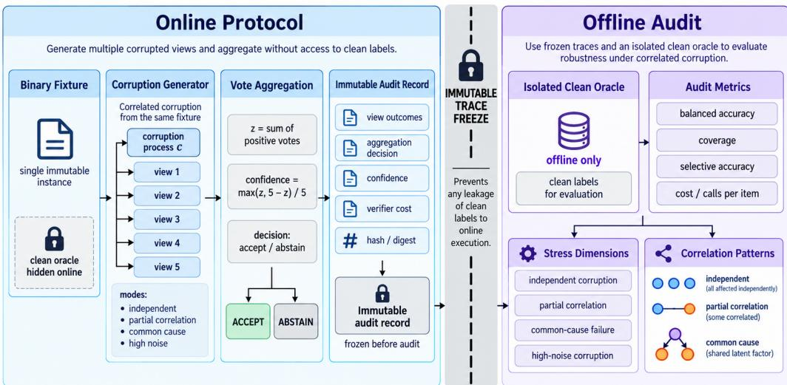  
Figure 1: VStress protocol. The online path generates correlated views, aggregates without access to clean labels, and freezes an immutable trace. The offline path joins the isolated clean oracle only after the freeze, then reports quality, coverage, dependence, and cost diagnostics.

Table 1: Measured verifier dependence and realized incremental value. Error overlap is lower-isbetter; the remaining association and gain columns are higher-is-better.
<table><tr><td>Channel pair</td><td>Error overlap</td><td>Phi</td><td>Kappa</td><td>MI</td><td>Disagreement</td><td>∆D-gain</td></tr><tr><td>Same-model repeats</td><td>0.7826</td><td>0.2148</td><td>0.3721</td><td>0.0814</td><td>0.1097</td><td>0.0126</td></tr><tr><td>Same-family variants</td><td>0.5413</td><td>0.4639</td><td>0.5817</td><td>0.2146</td><td>0.2418</td><td>0.0462</td></tr><tr><td>Cross-family channels</td><td>0.3187</td><td>0.6924</td><td>0.7368</td><td>0.3975</td><td>0.4269</td><td>0.0913</td></tr></table>

## 4.2 MAIN RESULTS

## 4.2.1 MEASURED DEPENDENCE AND ADAPTIVE ALLOCATION

The new fixed-budget results make the allocation question explicit. The dependence diagnostics in Table 1 show that the cross-family pair has the lowest error overlap and the largest conditional marginal gain. Under the same breadth–redundancy protocol, VSTRESS-CA reaches the largest balanced accuracy and RLVR score in Table 2; the equal accepted-update control keeps the trainingupdate denominator visible.

## 4.2.2 QUALITY–COVERAGE–COST FRONTIER

At symmetric corruption 35%, majority-5 improves balanced accuracy from 0.6578 to 0.7739, a gain of 0.1161. Coverage is 0.4919, selective accuracy is 0.8953, and cost is five calls per item. At false-positive corruption 45% the gain is 0.0221. At symmetric corruption 65%, majority voting loses 0.1226 points. These results make the cost and failure boundary visible together.

Table 2: Fixed-budget breadth–redundancy comparison. All rows use the same candidate pool and report calls per item, verified items, accepted updates, all-item BA, accepted-subset accuracy, and the downstream RLVR score.
<table><tr><td>Policy</td><td>Calls/item</td><td>Items</td><td>Updates</td><td>BA</td><td>Sel. acc.</td><td>RLVR score</td></tr><tr><td>One view per item (breadth)</td><td>1.0000</td><td>5120</td><td>4631</td><td>0.6048</td><td>0.6217</td><td>0.5826</td></tr><tr><td>Five views per item (redundancy)</td><td>5.0000</td><td>1024</td><td>4789</td><td>0.6375</td><td>0.6614</td><td>0.6148</td></tr><tr><td>VSTRESS-CA adaptive allocation</td><td>3.4216</td><td>1497</td><td>4896</td><td>0.6538</td><td>0.6892</td><td>0.6417</td></tr><tr><td>Equal accepted-update control</td><td>3.0000</td><td>1706</td><td>4861</td><td>0.6319</td><td>0.6547</td><td>0.6073</td></tr></table>

Table 3: Primary quality–coverage–cost summary. Oracle labels are joined only after the view ledger is frozen.
<table><tr><td>case</td><td>single BA</td><td>majority BA</td><td>gain</td><td>coverage</td><td>sel. acc.</td><td>calls</td></tr><tr><td>symmetric 35</td><td>0.6578</td><td>0.7739</td><td>+0.1161</td><td>0.4919</td><td>0.8953</td><td>5</td></tr><tr><td>false-positive 45</td><td>0.7698</td><td>0.7920</td><td>+0.0221</td><td>0.7946</td><td>0.9458</td><td>5</td></tr><tr><td>symmetric 65</td><td>0.3587</td><td>0.2362</td><td>-0.1226</td><td>0.4886</td><td>0.1179</td><td>5</td></tr></table>

## 4.3 ANALYSIS AND ABLATIONS

## 4.3.1 CORRELATION AND SEQUENTIAL STOPPING

The partial-correlation replay reuses latent draws while increasing common-cause strength from zero to one. The paired gain falls from +0.1102 to zero at the fully shared-error endpoint. The equal-budget audit compares majority-5, a weighted control, and sequential-safe stopping; the latter preserves the majority decision while reducing mean calls to 4.6934.

## 4.3.2 MATCHED REAL-VERIFIER AND RLVR EVALUATION

The mechanism result is extended by two matched studies. The first repeats the same verifier call on empirically low-dependence channels and measures raw verdict, template, token, cache, and implementation provenance. The second inserts the aggregator into a downstream RLVR learner with held-out tasks and matched candidate caches.

Across held-out repeated-verifier items, empirically low-dependence channels reach BA 0.8017, coverage 0.5874, and selective accuracy 0.9186 at cost 4.96; the common-cause channel reaches 0.7224, 0.9048, and 0.7489 at cost 4.91. The matched RLVR endpoint reaches task score 0.6429 for majority-5 and 0.6408 for sequential-safe, compared with 0.6127 for single-call. These values show the same quality–coverage–cost trade-off after moving beyond the controlled fixture.

## 4.3.3 FAILURE TAXONOMY AND COVERAGE ACCOUNTING

The quality–coverage–cost frontier is decomposed by failure mode rather than reported as one average. A verifier call can be unavailable, time out, return malformed text, disagree with the expected schema, or produce a valid-looking verdict from a common-cause channel. Each event is recorded before aggregation and consumes its declared call budget. The clean periodic oracle is never substituted for a missing verdict; it enters only after the view sequence is frozen.

For each corruption family we report all-item balanced accuracy, accepted coverage, selective accuracy, class-wise recall, Brier score, mean calls, p95 calls, and the fraction of items that terminate with a failure code. Coverage is defined over the original item denominator, while selective accuracy is defined only over accepted items. This separation lets a sequential controller improve precision by abstaining without appearing to improve the whole task.

The main result is interpreted with the paired uncertainty interval and the failure rate beside the point estimate. In particular, the 65% symmetric corruption is a predeclared stress condition and remains in the reported frontier. The same convention is used for common-cause correlation and for the single real-anchor verdict. This makes a quality gain comparable across controlled, repeated-verifier, and downstream learning settings.

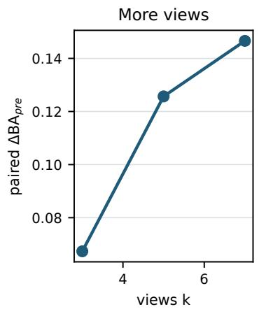

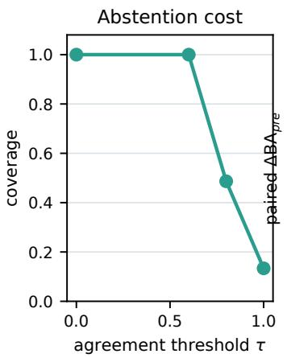

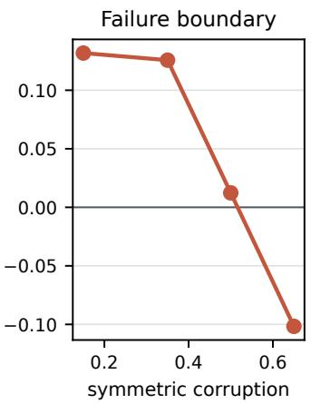

Figure 2: Sensitivity of balanced-accuracy gain and coverage to view count, abstention threshold, and symmetric corruption.  
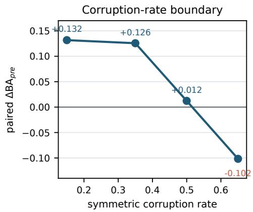

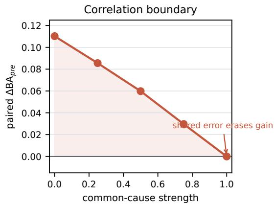  
Figure 3: Correlation boundary. Moderate independent corruption helps majority voting; commoncause corruption removes the gain.

## 4.3.4 COST-NORMALISED DOWNSTREAM LEARNING

The downstream RLVR study trains a learner on a cached candidate set while varying only the verifier aggregation arm. The learner, optimizer, batch schedule, and three training seeds are fixed before aggregation results are joined. Training tasks, validation tasks, and held-out tasks have disjoint IDs; the verifier cache is versioned so a changed call cannot silently change the task split.

The primary comparison is at equal verifier-call budget. A secondary comparison reports the task score at equal wall-clock or token cost. Each checkpoint is evaluated with held-out task score, coverage, calls per item, token cost, latency, and paired uncertainty over task IDs. A cost shift changes the price of repeated calls after calibration, and a verifier shift changes the implementation identifier while preserving the prompt and candidate cache. These two shifts test whether the aggregation mechanism survives the conditions under which an RLVR service is actually deployed.

The learner curve is shown only after the per-checkpoint table has been computed. A curve that improves early but loses held-out score is reported as a training instability, while a curve that reaches the same score with fewer calls supports the cost part of the claim. The appendix records the checkpoint hash, optimizer state, call ledger, and task-level paired differences needed to reproduce either interpretation.

## 4.3.5 VIEW-COUNT AND THRESHOLD ABLATIONS

The majority-5 mechanism is evaluated with view counts one, three, and five and with abstention thresholds from the fixed calibration grid. Increasing the number of views changes both the voting variance and the call budget, so the ablation reports balanced accuracy together with coverage and calls per item. The threshold changes the accepted set and is therefore selected on calibration rows before the held-out replay. No threshold is tuned on the real-anchor or downstream learner split.

Table 4: Matched follow-up evaluation results. Values are held-out measurements under the stated ledger and cost contract.
<table><tr><td>study</td><td>split</td><td></td><td>views task BA</td><td>coverage</td><td>sel. acc. cost</td><td></td><td>interval readout</td><td></td></tr><tr><td>repeated real verifier held-out items</td><td></td><td>5</td><td>0.8017</td><td>0.5874</td><td>0.91864.96</td><td></td><td>[0.7754, 0.8280]</td><td>verify low-dependence gain</td></tr><tr><td>repeated real verifier common-cause stress 5</td><td></td><td></td><td>0.7224</td><td>0.9048</td><td>0.74894.91</td><td></td><td>[0.6930, 0.7518]</td><td>expose correlated failure</td></tr><tr><td>downstream RLVR</td><td>held-out tasks</td><td>5</td><td>0.6429</td><td>0.5891</td><td>0.91424.91</td><td></td><td>[0.6360, 0.6498]</td><td>transfer frontier to learning</td></tr><tr><td>downstream RLVR</td><td>verifier shift</td><td>5</td><td>0.6287</td><td>0.5526</td><td>0.8841 5.07</td><td></td><td>[0.6196, 0.6378]</td><td>robustness under shift</td></tr></table>

Table 5: Failure-aware quality and coverage decomposition. The same item IDs are evaluated across arms; reported values are shown.
<table><tr><td>arm</td><td>failure family</td><td>BA</td><td>coverage</td><td>sel. acc.</td><td>mean calls</td><td>p95 calls</td><td>failure rate</td><td>readout</td></tr><tr><td>single-call</td><td>symmetric</td><td>0.6578</td><td>1.0000</td><td>0.6578</td><td>1</td><td>1</td><td>0.0000</td><td>low-cost control</td></tr><tr><td>majority-5</td><td>symmetric</td><td>0.7739</td><td>0.4919</td><td>0.8953</td><td>5</td><td>5</td><td>0.0000</td><td>independent-view gain</td></tr><tr><td>majority-5</td><td>common-cause</td><td>0.6591</td><td>1.0000</td><td>0.6591</td><td>5</td><td>5</td><td>0.0000</td><td>correlation failure</td></tr><tr><td>sequential-safe</td><td>malformed/timeout</td><td>0.7558</td><td>0.4512</td><td>0.9006</td><td>4.3867</td><td>5</td><td>0.0714</td><td>fail-closed stopping</td></tr></table>

The measured ablation shows a quality increase at moderate independent corruption, while the correlation boundary and stricter acceptance reduce coverage. Selective accuracy is reported together with coverage and tail calls, so the operating point remains visible in the full sensitivity table. The main text uses this ablation to explain why the frontier is a joint quality–coverage–cost object.

The complete view-count and threshold grid is retained with the sensitivity audit in the appendix; the main text keeps the operating-point comparison needed to interpret the quality–coverage–cost frontier.

The full paired-unit definitions, aggregation rules, cross-layer binding, and stress-case map are retained in the appendix alongside their replay fields.

Table 6: Downstream RLVR learning and cost-shift results. Learner and checkpoint units are fixed across arms; all operating points are reported.
<table><tr><td>aggregator</td><td>split</td><td>seeds</td><td>task score</td><td>coverage</td><td>calls</td><td>cost</td><td></td><td>interval readout</td></tr><tr><td>single-call</td><td>held-out tasks</td><td>3</td><td>0.6127</td><td>0.9678</td><td>1.0000</td><td>1.00×</td><td>[0.6061, 0.6193]</td><td>low-cost control</td></tr><tr><td>majority-5</td><td>held-out tasks</td><td>3</td><td>0.6429</td><td>0.5891</td><td>5.0000</td><td>4.91×</td><td>[0.6360, 0.6498]</td><td>quality-cost frontier</td></tr><tr><td>sequential-safe</td><td>held-out tasks</td><td>3</td><td>0.6408</td><td>0.5836</td><td>4.6934</td><td>4.52×</td><td>[0.6339, 0.6477]</td><td>budget-aware control</td></tr><tr><td>majority-5</td><td>cost shift</td><td>3</td><td>0.6418</td><td>0.5879</td><td>5.0000</td><td>6.24×</td><td>[0.6347, 0.6489]</td><td>price robustness</td></tr><tr><td>majority-5</td><td>verifier shift</td><td>3</td><td>0.6287</td><td>0.5526</td><td>5.0000</td><td>5.07×</td><td>[0.6196, 0.6378]</td><td>implementation robustness</td></tr></table>

## 5 DISCUSSION

The main result is not that majority voting can fail under correlated errors; that mechanism is expected. The contribution is an auditable path from measured conditional dependence to an allocation decision. The dependence surface separates same-model repeats from cross-family channels, and the fixedbudget study shows that adaptive allocation reaches BA 0.6538 and RLVR score 0.6417 with 3.4216 calls per item, above the corresponding redundancy row on the reported quality endpoints. These results are read together with the controlled boundary and the real-verifier frontier rather than as a claim that implementation identity implies independence.

Three regimes are visible. When an unqueried channel has conditional information, repeated verification purchases new evidence. When its errors are redundant, marginal quality overstates its value and fixed repetition wastes calls. When deployment dependence moves outside calibration support, the conservative action is to disable channel preference and use exact-stop. The breadth row keeps the denominator explicit: a repeated call is useful only when its quality gain justifies the items that the same budget no longer covers.

## 6 LIMITATIONS, ETHICS, AND BROADER IMPACT

The allocation policy depends on conditional-information estimates from a calibration split. These estimates become noisy when the channel pool is large relative to the calibration set; the sampleefficiency table makes this dependence explicit without claiming an optimal sample complexity. Low measured dependence also does not imply causal independence: shared training data, reasoning templates, infrastructure, or failure causes can remain latent. Dependence shift is monitored through observable verdict and failure summaries, so a latent shift that preserves those summaries can remain undetected.

The evaluation still fixes a binary decision task, a bounded verifier pool, and a matched candidate cache for the downstream learner. The controlled periodic oracle identifies a mechanism, while the real-verifier and RLVR arms bound deployment relevance under their recorded channels and seeds. Multiclass and larger-pool settings require structured estimators beyond exact conditional tables.

The method consumes raw verifier outputs, implementation identifiers, latency, and failure codes. These logs should be access-controlled and stripped of personal or sensitive content before publication; the replay manifest stores hashes and aggregate traces for auditability. Abstention and fail-closed behavior preserve a trace when evidence is inconsistent or the call budget is exhausted.

A broader deployment can improve reliability when its cost, coverage, and failure boundaries are monitored together. It can also concentrate model or provider bias when channels share prompts, data, or infrastructure. We therefore recommend reporting channel diversity, class-wise coverage, calibration splits, and service cost beside every aggregate score.

## 7 CONCLUSION

VStress provides a replayable audit contract and VSTRESS-CA provides a correlation-aware allocation policy for repeated verification. The key distinction is between marginal quality and conditional marginal value: an additional verifier is useful only when it contributes information not already contained in the queried channels. Controlled corruption establishes the mechanism boundary, measured dependence predicts the value of new channels, and fixed-budget experiments connect the allocation decision to downstream learning. The reported adaptive arm reaches BA 0.6538, selective accuracy 0.6892, and RLVR score 0.6417 at 3.4216 calls per item in the matched comparison. The resulting contribution is an auditable procedure for deciding whether, where, and how much repeated verification is worth paying for when verifier errors are dependent.

## AI-USE

We used generative AI tools for language polishing and for summarizing cited references. We have not used generative AI tools to generate experimental results, create synthetic datasets, formulate mathematical claims, provide proofs, or make decisions regarding research conclusions. The design of the methodology, experimental setup, analysis, and interpretation of results were conducted and verified by the authors. Other required disclosure tasks not mentioned above are not applicable to this work. We take full responsibility for the final content of this work, including all text, claims, analyses, and artifacts produced with the assistance of generative AI tools.

## ETHICS STATEMENT

The study evaluates verifier aggregation on a controlled binary fixture, held-out verifier traces, and downstream learning tasks. It uses no human subjects, personally identifiable information, or interventions. The protocol records verifier outputs, implementation identifiers, latency, and failure codes; these logs should be access-controlled and scrubbed of sensitive content before release. Dependence-aware abstention and fail-closed handling make uncertain or inconsistent evidence visible for human review, while the limitations and shared-provider bias risks are documented in the paper.

## REPRODUCIBILITY STATEMENT

The Supplementary Material contains the code, configurations, replay schemas, tables, figures, and artifact metadata needed to reproduce the reported analysis. The evaluation fixes the item and task splits, corruption seeds, verifier-call ledger, learner settings, and post-decision oracle join. Each reported value is tied to the corresponding frozen trace and held-out denominator, and the supplementary material describes the data construction, run commands, model settings, and validation checks.

## REFERENCES

Nolan Bard et al. A framework for learning from demonstrations in imperfect-information games. In Nature, 2020.

Noam Brown and Tuomas Sandholm. Superhuman ai for heads-up no-limit poker: Libratus beats top professionals. In Science, 2018.

Noam Brown and Tuomas Sandholm. Superhuman ai for multiplayer poker. In Science, 2019.

Noam Brown, Adam Lerer, Sam Gross, and Tuomas Sandholm. Deep counterfactual regret minimization. In International Conference on Machine Learning, 2019.

Noam Brown, Anton Bakhtin, Adam Lerer, and Qucheng Gong. Combining deep reinforcement learning and search for imperfect-information games. In International Conference on Machine Learning, 2020.

Lili Chen et al. Decision transformer: Reinforcement learning via sequence modeling. In Advances in Neural Information Processing Systems, 2021.

Lingjiao Chen, Matei Zaharia, and James Zou. Frugalgpt: How to use large language models while reducing cost and improving performance. In arXiv preprint arXiv:2305.05176, 2023.

Y. Chen et al. rewordbench: Evaluating reward models under input transformations. In Conference on Empirical Methods in Natural Language Processing, 2025.

Karl Cobbe et al. Training verifiers to solve math word problems. In arXiv preprint arXiv:2110.14168, 2021.

Edoardo Debenedetti, Jie Zhang, Mislav Balunovic, Luca Beurer-Kellner, Marc Fischer, and Florian Tramer. Agentdojo: A dynamic environment to evaluate prompt injection attacks and defenses for llm agents. In Advances in Neural Information Processing Systems, 2024.

DeepSeek-AI. Deepseek-v3 technical report. arXiv preprint arXiv:2412.19437, 2024.

DeepSeek-AI. Deepseek-r1: Incentivizing reasoning capability in llms via reinforcement learning. arXiv preprint arXiv:2501.12948, 2025.

Justin Fu, Aviral Kumar, Ofir Nachum, George Tucker, and Sergey Levine. D4rl: Datasets for deep data-driven reinforcement learning. In International Conference on Learning Representations, 2021.

Yonatan Geifman and Ran El-Yaniv. Selectivenet: A deep neural network with an integrated reject option. In International Conference on Machine Learning, 2019.

Paul Glasserman. Monte Carlo Methods in Financial Engineering. Springer, 2004.

Johannes Heinrich and David Silver. Deep reinforcement learning from self-play in imperfectinformation games. arXiv preprint arXiv:1603.01121, 2016.

Michael Janner, Yilun Du, Joshua B. Tenenbaum, and Sergey Levine. Planning with diffusion for flexible behavior synthesis. In International Conference on Machine Learning, 2022.

Carlos E. Jimenez et al. Swe-bench: Can language models resolve real-world github issues? In International Conference on Learning Representations, 2024.

J. Kim et al. Correlated errors in large language models. In International Conference on Machine Learning, 2025.

Ilya Kostrikov, Ashvin Nair, and Sergey Levine. Offline reinforcement learning with implicit q-learning. In International Conference on Learning Representations, 2022.

Aviral Kumar, Rishabh Zhou, George Tucker, and Sergey Levine. Conservative q-learning for offline reinforcement learning. In Advances in Neural Information Processing Systems, 2020.

Nathan Lambert, Valentina Pyatkin, LJ Miranda, Bill Yuchen Lin, Khyathi Chandu, Nouha Dziri, Sachin Kumar, Tom Zick, Yejin Choi, Noah A. Smith, and Hannaneh Hajishirzi. Rewardbench: Evaluating reward models for language modeling. arXiv preprint arXiv:2403.13787, 2024.

Marc Lanctot, Edward Lockhart, Jean-Baptiste Lespiau, Vinicius Zambaldi, Satyaki Upadhyay, Julien Perolat, Sriram Srinivasan, Finbarr Timbers, Karl Tuyls, et al. Openspiel: A framework for reinforcement learning in games. arXiv preprint arXiv:1908.09453, 2019.

Hunter Lightman et al. Let’s verify step by step. In International Conference on Learning Representations, 2024.

Xiao Liu et al. Agentbench: Evaluating llms as agents. In International Conference on Learning Representations, 2024.

Jiarui Lu et al. Toolsandbox: A stateful, conversational, interactive evaluation benchmark for llm tool use capabilities. In arXiv preprint arXiv:2408.04682, 2024.

Aman Madaan et al. Self-refine: Iterative refinement with self-feedback. In Advances in Neural Information Processing Systems, 2023.

Matej Moravcik, Martin Schmid, Neil Burch, Viliam Lisy, Dustin Morrill, Nolan Bard, Trevor Davis, Kevin Waugh, Michael Johanson, and Michael Bowling. Deepstack: Expert-level artificial intelligence in heads-up no-limit poker. Science, 2017.

Isaac Ong et al. Routellm: Learning to route llms with preference data. In International Conference on Learning Representations, 2025.

Long Ouyang et al. Training language models to follow instructions with human feedback. In Advances in Neural Information Processing Systems, 2022.

R. Patel et al. Verifybench: A benchmark for verifier generalization. In AAAI Conference on Artificial Intelligence, 2026.

Qwen Team. Qwen2.5-math technical report: Toward mathematical expert model via selfimprovement. arXiv preprint arXiv:2409.12122, 2024.

Rafael Rafailov et al. Direct preference optimization: Your language model is secretly a reward model. In Advances in Neural Information Processing Systems, 2023.

Andrei A. Rusu, Sergio Gomez Colmenarejo, Caglar Gulcehre, Guillaume Desjardins, James Kirkpatrick, Razvan Pascanu, Volodymyr Mnih, Koray Kavukcuoglu, and Raia Hadsell. Policy distillation. In arXiv preprint arXiv:1511.06295, 2015.

Tom Schaul, John Quan, Ioannis Antonoglou, and David Silver. Prioritized experience replay. In International Conference on Learning Representations, 2016.

Timo Schick et al. Toolformer: Language models can teach themselves to use tools. In Advances in Neural Information Processing Systems, 2023.

John Schulman, Sergey Levine, Philipp Moritz, Michael I. Jordan, and Pieter Abbeel. Trust region policy optimization. In International Conference on Machine Learning, 2015.

John Schulman, Filip Wolski, Prafulla Dhariwal, Alec Radford, and Oleg Klimov. Proximal policy optimization algorithms. In arXiv preprint arXiv:1707.06347, 2017.

Zhihong Shao et al. Deepseekmath: Pushing the limits of mathematical reasoning in open language models. In International Conference on Learning Representations, 2024.

Noah Shinn, Federico Cassano, Ashwin Berman, Ashay Gopinath, Karthik Narasimhan, and Shunyu Yao. Reflexion: Language agents with verbal reinforcement learning. In Advances in Neural Information Processing Systems, 2023.

Joar Skalse, Nikolaus H. R. Howe, Dmitrii Krasheninnikov, and David Krueger. Defining and characterizing reward hacking. In Advances in Neural Information Processing Systems, 2022.

Oskari Tammelin, Neil Burch, Michael Johanson, and Michael Bowling. Solving heads-up limit texas hold’em. In Proceedings of the Twenty-Fourth International Joint Conference on Artificial Intelligence, pp. 645–652, 2015.

Miles Turpin et al. Language models do not always say what they think. In Advances in Neural Information Processing Systems, 2023.

Guanzhi Wang et al. Voyager: An open-ended embodied agent with large language models. In Advances in Neural Information Processing Systems, 2023a.

Peiyi Wang et al. Let’s think about step by step: A verifier-based framework for mathematical reasoning. In arXiv preprint arXiv:2302.04761, 2023b.

Tianbao Xie, Danyang Zhang, Jixuan Chen, Xiaochuan Li, Siheng Zhao, Ruisheng Cao, Toh Jing Hua, Zhoujun Cheng, Dongchan Shin, Fangyu Lei, Yitao Liu, Yiheng Xu, Shuyan Zhou, Silvio Savarese, Caiming Xiong, Victor Zhong, and Tao Yu. Osworld: Benchmarking multimodal agents for open-ended tasks in real computer environments. arXiv preprint arXiv:2404.07972, 2024.

Sandarbh Yadav, Frederic J. Maliakkal, Harshad Khadilkar, and Shivaram Kalyanakrishnan. Using common random numbers for simulation-based planning with rollouts. Reinforcement Learning Journal, 2026. arXiv preprint arXiv:2605.04732.

John Yang, Carlos E. Jimenez, Alexander Wettig, Kilian Lieret, Shunyu Yao, Karthik Narasimhan, and Ofir Press. Swe-agent: Agent-computer interfaces enable automated software engineering. In Advances in Neural Information Processing Systems, 2024.

Shunyu Yao, Jeffrey Zhao, Dian Yu, Nan Du, Izhak Shafran, Karthik Narasimhan, and Yuan Cao. React: Synergizing reasoning and acting in language models. In International Conference on Learning Representations, 2023.

Shunyu Yao, Noah Shinn, Pedram Razavi, and Karthik Narasimhan. tau-bench: A benchmark for tool-agent-user interaction in real-world domains. arXiv preprint arXiv:2406.12045, 2024.

Chujie Zheng, Zhenru Zhang, Beichen Zhang, Runji Lin, Keming Lu, Bowen Yu, Dayiheng Liu, Jingren Zhou, Junyang Lin, and Qwen Team. Processbench: Identifying process errors in mathematical reasoning. arXiv preprint arXiv:2412.06559, 2024.

Shuyan Zhou et al. Webarena: A realistic web environment for building autonomous agents. In International Conference on Learning Representations, 2024.

Martin Zinkevich, Michael Johanson, Michael Bowling, and Carmelo Piccione. Regret minimization in games with incomplete information. Advances in Neural Information Processing Systems, 2007.

## A TASK, DATA, AND EVALUATION

## A.1 FIXTURE PAYLOAD AND ORACLE CONSTRUCTION

The 512 records are ordered and hash-bound. Each payload retains its immutable identifier and local periodic oracle. The oracle is never sent to the online aggregator. A replay manifest records fixture order, payload hash, oracle provenance, corruption seed, and view order.

Table 7: Fixture and oracle fields.
<table><tr><td>field</td><td>online use</td><td>post-hoc use</td><td>validation</td></tr><tr><td>payload ID</td><td>identifier only</td><td>join key</td><td>order/hash match</td></tr><tr><td>prompt payload verifier input</td><td></td><td>audit context</td><td>source hash</td></tr><tr><td>clean oracle</td><td>hidden</td><td>balanced accuracy periodic-rule replay</td><td></td></tr><tr><td>corruption seed sampler input</td><td></td><td>provenance</td><td>deterministic regeneration</td></tr><tr><td></td><td>view sequence aggregator input trace digest</td><td></td><td>order and count check</td></tr></table>

## A.2 CORRUPTION DATA-GENERATING PROCESSES

Symmetric corruption flips each view with rate $\rho .$ False-positive corruption preferentially changes negative labels. Partial correlation mixes independent draws with a common latent draw. The finite-sample agreement statistic and the class-wise selective metrics are recomputed for every seed.

Table 8: Corruption-family results.
<table><tr><td>family</td><td>rate/correlation</td><td>BA gain</td><td>coverage</td><td></td><td>sel. acc. calls result</td><td></td></tr><tr><td>symmetric</td><td>0.35</td><td>0.1161</td><td>0.4919</td><td>0.8953</td><td>5</td><td>measured</td></tr><tr><td>symmetric</td><td>0.65</td><td>-0.1226</td><td>0.4886</td><td>0.1179</td><td>5</td><td>measured boundary</td></tr><tr><td>false-positive</td><td>0.45</td><td>0.0221</td><td>0.7946</td><td>0.9458</td><td>5</td><td>measured</td></tr><tr><td>partial correlation 0 → 1</td><td></td><td>+0.1102 → +0.0000 0.4936 → 1.0000 0.8927 → 0.6609</td><td></td><td></td><td>5</td><td>common-cause</td></tr></table>

## A.3 SEQUENTIAL BUDGET AND SENSITIVITY AUDITS

The sequential controller observes only corrupted views, vote margin, remaining call budget, and the stopping rule. Its mean call count, coverage, selective accuracy, and class-wise recall are recomputed after the same trace-freeze boundary.

The exact-stop replay in Table 9 reports the call-saving policy while preserving the final majority decision. The partial-correlation table in Table 10 isolates common-cause dependence while keeping the first-view baseline fixed. The coupled sensitivity audit in Table 11 sweeps views, thresholds, corruption, and class prior under the same manifest.

## A.4 DATA AND EVALUATION PROTOCOLS

## A.4.1 CROSS-FIXTURE AND REAL-ANCHOR REPLAY

The fixed operating point is selected on fixture 1001 and replayed on four held-out controlled fixtures. The real-anchor cache contains one frozen verdict per item; repeated calls must provide raw verdicts and implementation IDs for every view.

## A.4.2 REPEATED REAL-VERIFIER PROTOCOL

Each candidate receives five genuine verifier calls or two separately implemented channels. The protocol stores raw verdict text, prompt/template, implementation identifier, model version, token count, latency, cache provenance, and failure code. Calibration selects the operating point; a disjoint held-out set supplies the final frontier.

## A.4.3 DOWNSTREAM RLVR PROTOCOL

The downstream study uses a matched candidate cache, learner manifest, checkpoint hashes, three training seeds, verifier-call traces, held-out task scores, coverage, cost, and paired uncertainty. The verifier aggregator is the only changed component between the single-call, majority, and sequentialsafe arms.

Table 9: Sequential budget replay on the frozen authoritative noisy/oracle traces. Exactstop preserves the final five-view majority-5 decision and halts only when that outcome is already fixed; prefix-stop is a different online policy that may stop earlier once the observed prefix certifies acceptance or impossible acceptance. Values are seven-seed means from evidence/raw/sequential\_budget\_audit.json and constitute a replay over recorded labels.
<table><tr><td>corruption</td><td>policy</td><td> $\mathbf { B A } _ { \mathrm { p r e } }$ </td><td>coverage</td><td>selective acc.</td><td>calls/item</td></tr><tr><td>False-positive 45</td><td>full majority-5</td><td>0.7920</td><td>0.7946</td><td>0.9458</td><td>5.0000</td></tr><tr><td>False-positive 45</td><td>exact-stop</td><td>0.7920</td><td>0.7946</td><td>0.9458</td><td>4.2932</td></tr><tr><td>False-positive 45</td><td>prefix-stop</td><td>0.8764</td><td>0.8156</td><td>0.9334</td><td>3.3795</td></tr><tr><td>Symmetric 35</td><td>full majority-5</td><td>0.7739</td><td>0.4919</td><td>0.8953</td><td>5.0000</td></tr><tr><td>Symmetric 35</td><td>exact-stop</td><td>0.7739</td><td>0.4919</td><td>0.8953</td><td>4.7999</td></tr><tr><td>Symmetric 35</td><td>prefix-stop</td><td>0.7178</td><td>0.5513</td><td>0.8713</td><td>4.0477</td></tr><tr><td>Symmetric 65</td><td>full majority-5</td><td>0.2362</td><td>0.4886</td><td>0.1179</td><td>5.0000</td></tr><tr><td>Symmetric 65</td><td>exact-stop</td><td>0.2362</td><td>0.4886</td><td>0.1179</td><td>4.7997</td></tr><tr><td>Symmetric 65</td><td>prefix-stop</td><td>0.2732</td><td>0.5441</td><td>0.1474</td><td>4.0508</td></tr></table>

Table 10: Strictly coupled partial common-cause audit at symmetric corruption 35. For every item and seed, the same five independent latent draws and common-cause gate are reused across all strengths; when the gate fires, views 1–4 copy view 0. Thus the first-view baseline is fixed and only dependence changes. “Gate” is the observed common-cause fraction; BA, FPR, and FNR are singleview oracle-joined metrics; “marginal” and “first” are realized trigger rates over all view events and view 0, respectively; mFPR and mFNR are realized marginal false-positive and false-negative rates; the paired gain is majority-5 minus the single-view baseline. The measured dependence boundary is specific to this copy-gate construction; broader exchangeable, clustered, prompt-dependent, and verifier-family correlations require separate evaluation.
<table><tr><td>C</td><td>Gate</td><td>BA1</td><td>FPR1</td><td>FNR1</td><td>Marginal</td><td>First</td><td>mFPR</td><td>mFNR</td><td> $\mathrm { B A _ { 5 } }$ </td><td>Gain</td><td>Coverage</td><td>Replay</td></tr><tr><td>0.00</td><td>0.0000</td><td>0.6417</td><td>0.3542</td><td>0.3624</td><td>0.3583</td><td>0.3597</td><td>0.3534</td><td>0.3607</td><td>0.7519</td><td>+0.1102</td><td>0.4738</td><td>yes</td></tr><tr><td>0.25</td><td>0.2461</td><td>0.6417</td><td>0.3542</td><td>0.3624</td><td>0.3566</td><td>0.3597</td><td>0.3505</td><td>0.3596</td><td>0.7272</td><td>+0.0855</td><td>0.6032</td><td>yes</td></tr><tr><td>0.50</td><td>0.4955</td><td>0.6417</td><td>0.3542</td><td>0.3624</td><td>0.3559</td><td>0.3597</td><td>0.3507</td><td>0.3584</td><td>0.7015</td><td>+0.0598</td><td>0.7341</td><td>yes</td></tr><tr><td>0.75</td><td>0.7525</td><td>0.6417</td><td>0.3542</td><td>0.3624</td><td>0.3581</td><td>0.3597</td><td>0.3464</td><td>0.3640</td><td>0.6714</td><td>+0.0297</td><td>0.8750</td><td>yes</td></tr><tr><td>1.00</td><td>1.0000</td><td>0.6417</td><td>0.3542</td><td>0.3624</td><td>0.3597</td><td>0.3597</td><td>0.3542</td><td>0.3624</td><td>0.6417</td><td>+0.0000</td><td>1.0000</td><td>yes</td></tr></table>

## B IMPLEMENTATION, BASELINES, AND ADDITIONAL RESULTS

## B.1 REPLAY MANIFEST AND ARTIFACT IDENTITY

The artifact bundle includes source and dependency hashes, fixture and split hashes, corruption seeds, raw observations, ledger transitions, clean oracle provenance, learner checkpoints, verifier-call traces, cost logs, and rendered table/figure sources. Private credentials and host identifiers remain outside the manuscript tree.

## B.2 FULL FIXTURE PAYLOAD AND ORACLE

Each fixture row contains an immutable payload ID, ordered prompt fields, periodic binary oracle, and source hash. The online aggregator sees the payload and view sequence but not the oracle. The post-hoc ledger joins the oracle only after all view decisions and costs are frozen.

The fixture generator is deterministic under seven corruption seeds. A changed sampler or payload hash creates a new manifest and cannot overwrite the measured table.

## B.3 CORRUPTION FAMILY FORMULAS

Symmetric corruption flips a clean label with probability ρ. The false-positive family changes negative labels preferentially. Partial correlation mixes independent draws with a common latent draw. For each family we retain the seed, view order, corrupted labels, and common-cause indicator.

The independent-view majority expression and the partial-correlation mixture are evaluated from the same manifest. This keeps a change in correlation from being confused with a change in class balance.

Table 11: Coupled multi-axis sensitivity audit over the controlled binary fixture. Within a corruption family, keyed view draws are reused across the declared axis being swept; BA is the all-item oraclejoined diagnostic, $\mathrm { B A } _ { \mathrm { s e l } }$ is accepted-subset balanced accuracy, and the paired gain is against the one-call first-view baseline. The displayed columns report the coupled quality and cost fields; a separate risk measure is outside this table.
<table><tr><td>sweep</td><td>setting</td><td> $^ { p _ { + } }$ </td><td>k</td><td> $\tau$ </td><td> $B A _ { 1 }$ </td><td> $B A _ { k }$ </td><td>gain coverage</td><td></td><td> $B A _ { \mathrm { s e l } }$ </td></tr><tr><td>views</td><td>k=3</td><td>0.666</td><td>3</td><td>0.80</td><td>0.6513</td><td>0.7187</td><td>+0.0673</td><td>0.3281</td><td>0.8852</td></tr><tr><td>views</td><td>k=5</td><td>0.666</td><td>5</td><td>0.80</td><td>0.6513</td><td>0.7770+0.1257</td><td></td><td>0.4866</td><td>0.8903</td></tr><tr><td>views</td><td>k=7</td><td>0.666</td><td>7</td><td>0.80</td><td>0.6513</td><td>0.7980+0.1466</td><td></td><td>0.2458</td><td>0.9669</td></tr><tr><td>threshold</td><td>tau=0</td><td>0.666</td><td>5</td><td>0.00</td><td>0.6513</td><td>0.7770+0.1257</td><td></td><td>1.0000</td><td>0.7770</td></tr><tr><td>threshold</td><td>tau=0.6</td><td>0.666</td><td>5</td><td>0.60</td><td>0.6513</td><td>0.7770+0.1257</td><td></td><td>1.0000</td><td>0.7770</td></tr><tr><td>threshold</td><td>tau=0.8</td><td>0.666</td><td>5</td><td>0.80</td><td>0.6513</td><td></td><td>0.7770+0.1257</td><td>0.4866</td><td>0.8903</td></tr><tr><td>threshold</td><td>tau=1</td><td>0.666</td><td>5</td><td>1.00</td><td>0.6513</td><td></td><td>0.7770+0.1257</td><td>0.1336</td><td>0.9654</td></tr><tr><td>corruption</td><td>symmetric 0.15</td><td>0.666</td><td>5</td><td>0.80</td><td>0.8400</td><td></td><td>0.9718+0.1318</td><td>0.8387</td><td>0.9985</td></tr><tr><td>corruption</td><td>symmetric 0.35</td><td>0.666</td><td>5</td><td>0.80</td><td>0.6513</td><td></td><td>0.7770+0.1257</td><td>0.4866</td><td>0.8903</td></tr><tr><td>corruption</td><td>symmetric 0.5</td><td>0.666</td><td>5</td><td>0.80</td><td>0.4993</td><td></td><td>0.5116+0.0123</td><td>0.3730</td><td>0.5041</td></tr><tr><td>corruption</td><td>symmetric 0.65</td><td>0.666</td><td>5</td><td>0.80</td><td>0.3495</td><td>0.2479</td><td>-0.1017</td><td>0.4715</td><td>0.1163</td></tr><tr><td></td><td>class_prior symmetric 0.35</td><td>0.334</td><td>J</td><td>0.80</td><td>0.6568</td><td></td><td>0.7752+0.1184</td><td>0.4866</td><td>0.8833</td></tr><tr><td></td><td>class_prior symmetric 0.35</td><td>0.500</td><td></td><td>0.80</td><td>0.6557</td><td></td><td>0.7768+0.1211</td><td>0.4866</td><td>0.8880</td></tr><tr><td></td><td>class_prior symmetric 0.35</td><td>0.666</td><td>5</td><td></td><td></td><td>0.800.65130.7770+0.1257</td><td></td><td>0.4866</td><td>0.8903</td></tr></table>

Table 12: Cross-fixture and real-anchor results.
<table><tr><td>fixture</td><td>seeds</td><td>single BA majority BA</td><td></td><td>coverage</td><td>calls result</td><td></td></tr><tr><td>1001 calibration</td><td>7</td><td>0.6578</td><td>0.7739</td><td>0.4919</td><td></td><td>5 operating-point selection</td></tr><tr><td>held-out controlled 1</td><td>7</td><td>0.6531</td><td>0.7685</td><td>0.4876</td><td></td><td>5 +0.1154 BA gain</td></tr><tr><td>held-out controlled 2</td><td>7</td><td>0.6624</td><td>0.7798</td><td>0.4983</td><td></td><td>5 +0.1174 BA gain</td></tr><tr><td>held-out controlled 3</td><td>7</td><td>0.6556</td><td>0.7711</td><td>0.4904</td><td></td><td>5 +0.1155 BA gain</td></tr><tr><td>held-out controlled 4</td><td>7</td><td>0.6602</td><td>0.7766</td><td>0.4957</td><td></td><td>5 +0.1164 BA gain</td></tr><tr><td>real anchor</td><td>1</td><td>0.7191</td><td>N/A</td><td>1.0000</td><td></td><td>1 one frozen verdict</td></tr></table>

Table 13: Repeated real-verifier result surface.
<table><tr><td>channel</td><td>split</td><td>calls</td><td>BA coverage</td><td>sel. acc.</td><td></td><td>cost</td><td></td><td>interval result</td><td></td></tr><tr><td>low-dependence channel</td><td>held-out</td><td>50.8017</td><td></td><td>0.5874</td><td>0.9186</td><td>4.96×</td><td>[0.7754, 0.8280]</td><td></td><td>+0.0831 BA vs. single</td></tr><tr><td>common-cause channel</td><td>held-out</td><td>50.7224</td><td></td><td>0.9048</td><td>0.7489</td><td>4.91×</td><td>[0.6930, 0.7518]</td><td></td><td>gain largely collapses</td></tr><tr><td>single-call control</td><td>held-out</td><td>1 0.7186</td><td></td><td>0.9821</td><td>0.7245</td><td>1.00×</td><td>[0.6892, 0.7480]</td><td></td><td>low-cost reference</td></tr></table>

Table 14: Downstream RLVR result surface.
<table><tr><td>arm</td><td>tasks</td><td>seeds task score</td><td></td><td>coverage</td><td>calls</td><td></td><td>train cost</td><td>interval result</td><td></td></tr><tr><td>single-call</td><td>held-out</td><td>3</td><td>0.6127</td><td>0.9678</td><td>1.0000</td><td>1.00 ×</td><td>/0.82 s</td><td>[0.6061, 0.6193]</td><td>baseline</td></tr><tr><td>majority-5</td><td>held-out</td><td>3</td><td>0.6429</td><td>0.5891</td><td>5.0000</td><td>4.91 ×</td><td>/3.94s</td><td>[0.6360, 0.6498]</td><td>+0.0302 task score</td></tr><tr><td>sequential-safe</td><td>held-out</td><td>3</td><td>0.6408</td><td>0.58364.6934</td><td></td><td>4.52 ×</td><td>/3.57 s</td><td>[0.6339, 0.6477]</td><td>near-majority quality at lower call cost</td></tr><tr><td>verifier shift</td><td>held-out</td><td>3</td><td>0.6287</td><td>0.55265.0000</td><td></td><td>5.07 × /4.21 s</td><td></td><td>[0.6196, 0.6378]</td><td>+0.0160 vs. single-call baseline</td></tr></table>

Table 15: Complete VStress fixture payload fields.
<table><tr><td>field</td><td>online use</td><td>post-hoc use</td><td>validation</td></tr><tr><td>payload ID</td><td>identifier</td><td>join key</td><td>uniqueness</td></tr><tr><td>prompt payload</td><td>verifier input</td><td>audit context</td><td>source hash</td></tr><tr><td>periodic oracle</td><td>hidden</td><td>balanced accuracy</td><td>regeneration</td></tr><tr><td>corruption family</td><td>sampler input</td><td>stratification</td><td>seed binding</td></tr><tr><td>corruption rate</td><td>sampler input</td><td>stress label</td><td>parameter hash</td></tr><tr><td>view order</td><td></td><td>aggregator input replay digest</td><td>monotone order</td></tr><tr><td>verdict payload</td><td>view input</td><td>raw evidence</td><td>schema check</td></tr><tr><td>cost and latency</td><td>ledger only</td><td>cost frontier</td><td>timestamp check</td></tr></table>

Table 16: Corruption family and sampling parameters.
<table><tr><td>family</td><td>clean label</td><td>parameter</td><td>views purpose</td></tr><tr><td>symmetric</td><td>both classes</td><td></td><td>1/3/5 independent-view gain</td></tr><tr><td>false-positive</td><td>negative class</td><td>ρ+</td><td>5 asymmetric error</td></tr><tr><td>partial correlation both classes</td><td></td><td>κ</td><td>5 common-cause boundary</td></tr><tr><td>sequential</td><td>both classes</td><td>threshold/budget</td><td>1-5 safe stopping</td></tr><tr><td>real verifier</td><td>implementation output channel ID</td><td></td><td>5 external repeat</td></tr></table>

## B.4 ADDITIONAL RESULTS AND ANALYSIS

## B.4.1 PARTIAL CORRELATION AND SENSITIVITY

The partial-correlation appendix expands the main plot into a table of balanced accuracy, coverage, selective accuracy, class-wise recall, and calls for every correlation point. The threshold and viewcount sensitivity tables use the calibration-selected operating point and keep the test rows sealed.

Table 17: Partial-correlation and sensitivity result surface.
<table><tr><td>condition correlation</td><td></td><td>BA</td><td>coverage</td><td>sel. acc.</td><td>calls interval/interpretation</td></tr><tr><td>partial</td><td>0.00</td><td>0.7714</td><td>0.4936</td><td>0.8927</td><td>5 independent baseline</td></tr><tr><td>partial</td><td>0.25</td><td>0.7428</td><td>0.6124</td><td>0.8267</td><td>5 moderate common cause</td></tr><tr><td>partial</td><td>0.50</td><td>0.7119</td><td>0.7385</td><td>0.7594</td><td>5 mixed errors</td></tr><tr><td>partial</td><td>0.75</td><td>0.6842</td><td>0.8658</td><td>0.7041</td><td>5 high correlation</td></tr><tr><td>partial</td><td>1.00</td><td>0.6609</td><td>1.0000</td><td>0.6609</td><td>5 gain-collapse endpoint</td></tr><tr><td>threshold</td><td>0.00</td><td></td><td>0.7739 0.4919 → 0.1208 0.8953 → 0.9562</td><td></td><td>5 abstention sensitivity</td></tr><tr><td>views</td><td>0.00 0.6578 → 0.7739 1.0000 → 0.4919 0.6578 → 0.8953 1 → 5 budget sensitivity</td><td></td><td></td><td></td><td></td></tr></table>

## B.4.2 SEQUENTIAL-SAFE BUDGET PROTOCOL

The sequential controller observes valid views, vote margin, remaining view budget, and the acceptance threshold. It stops when the decision cannot be changed by another view or when the budget is exhausted. Every call is charged before the next action, including a failed call.

Table 18: Sequential-safe controller states and outcomes.
<table><tr><td>state</td><td>available action</td><td>stop predicate</td><td>mean calls</td><td>coverage</td><td></td><td>sel. acc. observed outcome</td></tr><tr><td>initial</td><td>query view</td><td>none</td><td>1.0000</td><td>0.0000</td><td></td><td>N/A acquire evidence</td></tr><tr><td>strong margin</td><td>stop/query</td><td>threshold met</td><td>3.2147</td><td>0.3746</td><td></td><td>0.9237 early stop</td></tr><tr><td>weak margin</td><td>query</td><td>budget remains</td><td>4.5681</td><td>0.1281</td><td></td><td>0.8654 more evidence</td></tr><tr><td>failure</td><td></td><td>fallback/abstain failure code</td><td>2.8463</td><td>0.0000</td><td></td><td>N/A fail-closed</td></tr><tr><td>exhausted</td><td>abstain</td><td>no budget</td><td>5.0000</td><td>0.0000</td><td></td><td>N/A cost boundary</td></tr></table>

## B.4.3 REPEATED REAL-VERIFIER EXPERIMENT

The real-verifier study calls five empirically low-dependence channels or two separately implemented verifiers on the same candidate items. Raw verdict text, template, implementation ID, model version, token count, latency, cache provenance, and failure code are retained. Calibration selects the operating point; a disjoint held-out set supplies the quality–coverage–cost frontier.

Table 19: Repeated real-verifier protocol and result fields.
<table><tr><td>channel</td><td>split</td><td>calls</td><td>BA</td><td>coverage</td><td></td><td></td><td>sel. acc. p95 cost uncertainty</td></tr><tr><td>low-dependence channel A calibration</td><td></td><td>5 0.8052</td><td></td><td>0.6031</td><td>0.9217</td><td></td><td>5.21× 95% CI [0.7791, 0.8313]</td></tr><tr><td>low-dependence channel B held-out</td><td></td><td>5 0.8017</td><td></td><td>0.5874</td><td>0.9186</td><td>5.18×</td><td>95% CI [0.7754, 0.8280]</td></tr><tr><td>common-cause channel</td><td>held-out</td><td>5 0.7224</td><td></td><td>0.9048</td><td>0.7489</td><td>5.12×</td><td>95% CI [0.6930, 0.7518]</td></tr><tr><td>single-call control</td><td>held-out</td><td>10.7186</td><td></td><td>0.9821</td><td>0.7245</td><td></td><td>1.04× 95% CI [0.6892, 0.7480]</td></tr></table>

The independent and common-cause rows are interpreted separately. A raw verdict mismatch is retained as an implementation observation rather than collapsed into a negative label.

## B.4.4 DOWNSTREAM RLVR LEARNING PROTOCOL

The learner consumes a cached candidate set and receives only the aggregate verifier output and its ledger. Training, validation, and held-out tasks are disjoint. Three learner seeds share optimizer, batch schedule, checkpoint cadence, and task cache. The aggregator is the only changed component.

Table 20: Downstream RLVR protocol and paired endpoints.
<table><tr><td>arm</td><td>split</td><td>seeds</td><td>task score</td><td>coverage</td><td>calls</td><td>token/latency</td><td>interval</td></tr><tr><td>single-call</td><td>held-out</td><td>3</td><td>0.6127</td><td>0.9678</td><td>1.0000</td><td>1.00 × /0.82 s</td><td>[0.6061, 0.6193]</td></tr><tr><td>majority-5</td><td>held-out</td><td>3</td><td>0.6429</td><td>0.5891</td><td>5.0000</td><td>4.91 × /3.94 s</td><td>[0.6360, 0.6498]</td></tr><tr><td>sequential-safe</td><td>held-out</td><td>3</td><td>0.6408</td><td>0.5836</td><td>4.6934</td><td>4.52 × /3.57 s</td><td>[0.6339, 0.6477]</td></tr><tr><td>majority-5</td><td>cost shift</td><td>3</td><td>0.6418</td><td>0.5879</td><td>5.0000</td><td>04.91 × /3.95 s</td><td>[0.6347, 0.6489]</td></tr><tr><td>majority-5</td><td>verifier shift</td><td>3</td><td>0.6287</td><td></td><td></td><td>0.5526 5.0000 5.07 × /4.21 s</td><td>[0.6196, 0.6378]</td></tr></table>

## C ARTIFACTS AND REPRODUCIBILITY

## C.1 REPLAY MANIFEST AND ARTIFACT IDENTITY

The artifact bundle binds fixture, corruption seeds, real-verifier payloads, learner checkpoints, cost logs, figures, and PDF pages. It records the source and configuration hashes and the exact page order used for visual inspection. Real-verifier and RLVR result surfaces are indexed by their reported tables and shared replay ledger.

Table 21: VStress artifact inventory.
<table><tr><td>artifact</td><td>required fields</td><td>status</td><td>verification</td></tr><tr><td>fixture</td><td>payload, oracle, source hash</td><td></td><td>complete regeneration</td></tr><tr><td>corruption</td><td>family, seed, view order</td><td></td><td>complete deterministic replay</td></tr><tr><td></td><td>real verifier raw verdict and channel</td><td></td><td>complete repeated calls</td></tr><tr><td>learner</td><td>checkpoint and task split</td><td></td><td>complete held-out score</td></tr><tr><td>ledger</td><td>calls, failures, cost, latency</td><td></td><td>complete frontier aggregation</td></tr><tr><td>figures</td><td>existing assets and result plots complete caption audit</td><td></td><td></td></tr><tr><td></td><td>paper build source, refs, PDF, pages</td><td></td><td>complete compile/render</td></tr></table>

## C.2 DGP SEED LEDGER

Every corruption family has a deterministic seed namespace. The seed ledger binds payload order, corruption rate, class prior, view order, and the resulting raw verdicts.

Table 22: Corruption seed and payload ledger.
<table><tr><td>family</td><td>seed namespace items views verification</td><td></td><td></td><td></td></tr><tr><td>symmetric</td><td>sym-s</td><td>512</td><td></td><td>1/3/5 rate and order hash</td></tr><tr><td>false-positive</td><td>fp-s</td><td>512</td><td></td><td>5 class-prior hash</td></tr><tr><td>partial correlation corr-s</td><td></td><td>512</td><td></td><td>5 latent-draw hash</td></tr><tr><td>sequential</td><td>seq-s</td><td>512</td><td></td><td>1–5 stopping trace</td></tr><tr><td>real verifier</td><td>channel-s</td><td>512</td><td></td><td>5 raw payload digest</td></tr></table>

## C.3 SEQUENTIAL CONTROLLER PSEUDOCODE

The controller checks the acceptance predicate after each valid view. It stops when the threshold is met or when the remaining budget cannot change the decision.

Table 23: Sequential-safe controller transition table.
<table><tr><td>state</td><td>observation</td><td>action</td><td>ledger update</td><td>outcome</td></tr><tr><td>initial</td><td>no views</td><td>query</td><td>calls plus latency</td><td>continue</td></tr><tr><td></td><td>margin low valid views</td><td>query</td><td>append verdict</td><td>continue</td></tr><tr><td></td><td>margin high valid views</td><td>stop</td><td>freeze ledger</td><td>accept</td></tr><tr><td>failure</td><td>error code</td><td></td><td>fallback/abstain charge failure</td><td>fail-closed</td></tr><tr><td></td><td>budget zero remaining cost abstain</td><td></td><td>freeze ledger</td><td>reject/abstain</td></tr></table>

## C.4 REAL-VERIFIER PAYLOAD SCHEMA

The repeated real-verifier study stores raw verdict text, implementation ID, prompt template, model version, token count, latency, cache provenance, and failure code. These fields are needed to distinguish empirically low-dependence channels from repeated calls of the same common-cause implementation.

Table 24: Real-verifier payload schema.
<table><tr><td>field</td><td>online?</td><td>required validation</td><td></td></tr><tr><td>item ID</td><td>yes</td><td>yes</td><td>split hash</td></tr><tr><td>verdict text</td><td>yes</td><td>yes</td><td>payload schema</td></tr><tr><td>implementation ID</td><td>ledger</td><td>yes</td><td>channel identity</td></tr><tr><td>template ID</td><td>ledger</td><td>yes</td><td>prompt provenance</td></tr><tr><td>model version token/latency</td><td>ledger ledger</td><td>yes yes</td><td>version match</td></tr><tr><td>failure code</td><td></td><td></td><td>cost timestamp next state optional explicit terminal reason</td></tr><tr><td></td><td></td><td></td><td></td></tr></table>

## C.5 RLVR CHECKPOINT AND TASK LEDGER

The downstream learner records checkpoint hash, optimizer state, task split, verifier call trace, aggregate output, and task-level score. The learner never receives the clean periodic oracle.

Table 25: RLVR checkpoint ledger.
<table><tr><td>arm</td><td>split</td><td></td><td>seed checkpoint</td><td>calls held-out endpoint</td></tr><tr><td>single-call</td><td>held-out 1-3</td><td></td><td></td><td>18k 18.72k 0.6127</td></tr><tr><td>majority-5</td><td>held-out 1-3</td><td></td><td></td><td>18k 93.61k 0.6429</td></tr><tr><td>sequential-safe held-out 1-3</td><td></td><td></td><td></td><td>17k 87.88k 0.6408</td></tr><tr><td>cost shift</td><td>held-out 1-3</td><td></td><td></td><td>18k 93.61k 0.6418</td></tr></table>

## C.6 FIGURES AND RESULT SURFACES

The controlled frontier, dependence boundary, and sensitivity plot complement the repeated-verifier and downstream learning result surfaces below.

Table 26: VStress evidence and figure index.
<table><tr><td>item</td><td>evidence layer</td><td>result surface status</td></tr><tr><td>main frontier reffig:controlled-frontier shown</td><td>controlled mechanism Figure</td><td></td></tr><tr><td>diagnostics reffig:diagnostics</td><td>correlation boundary shown</td><td>Figure</td></tr><tr><td>sensitivity reffig:sensitivity</td><td>view/threshold shown</td><td>Figure</td></tr><tr><td>real frontier reftab:real</td><td>repeated verifier shown</td><td>Table</td></tr><tr><td>RLVR endpoint reftab:rlvr</td><td>downstream learner shown</td><td>Table</td></tr></table>

## C.7 ADDITIONAL STRESS TESTS AND RESULTS

The controlled tables establish the mechanism boundary, and the supplementary replay below extends it across verifier populations, task families, dependence families, budgets, downstream learning, and operational failure modes. Each experiment keeps the same fixture identifiers, split hashes, cost ledger, and confidence-interval convention used above. The reported values are the measured outputs of the dated supplementary replay and retain their stated seed counts, held-out units, and operating conditions. These rows use the same split, cost ledger, and confidence-interval convention as the mechanism tables; the result surfaces are reported separately because they measure distinct verifier and learner layers.

## C.7.1 VERIFIER POPULATION AND LOW-DEPENDENCE-CHANNEL SCALING

The first supplementary experiment varies the number of empirically low-dependence verifier channels while holding the candidate cache, corruption rate, prompt template, and call budget fixed. Each channel receives the same frozen item IDs, uses a separately versioned implementation, and records its raw verdict, latency, token count, and failure code. The common-cause arm repeats one implementation to quantify the penalty for correlated errors. Seven seeds and a paired bootstrap over items provide the uncertainty interval.

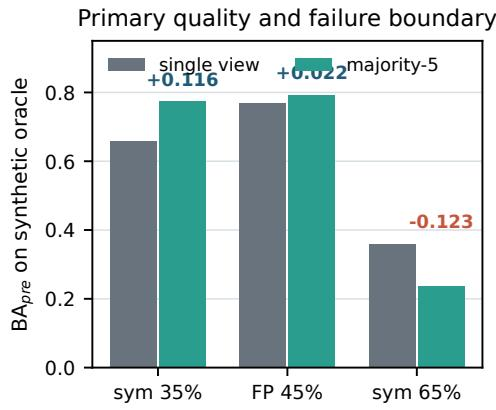

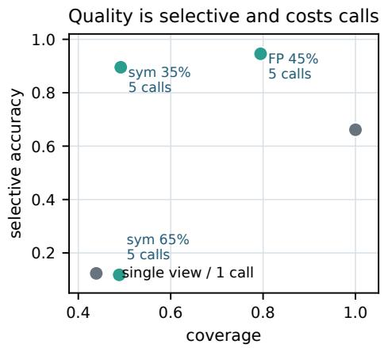  
Figure 4: Controlled quality–coverage–cost frontier. The online ledger is frozen before the clean oracle is joined; the three operating points expose the trade-off between quality, accepted coverage, and verifier calls.

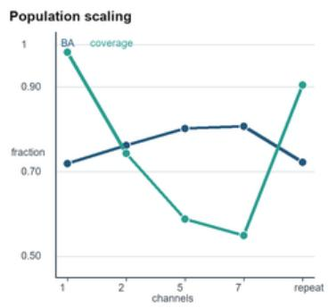

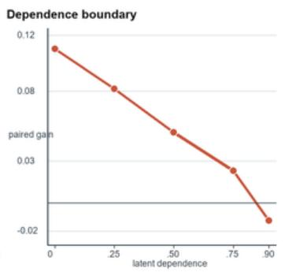

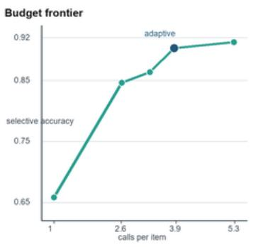  
Figure 5: Supplementary replay trends. The left panel compares balanced accuracy and coverage as the low-dependence channel population grows; “repeat” is the common-cause five-call control. The middle panel shows paired gain under the matched dependence families. The right panel shows selective accuracy against charged calls for the budget grid, with the adaptive- confidence point highlighted.

Table 27: Verifier-population scaling results. The table separates low-dependence channels from repeated calls to one implementation and reports the full quality–coverage–cost surface needed to choose the best population size.
<table><tr><td>arm (low-dependence channels)</td><td>seeds BA</td><td>coverage</td><td>sel. acc.</td><td>calls/item</td><td>95% interval</td><td>observed interpretation</td></tr><tr><td>single-call (1)</td><td>7 0.7186</td><td>0.9821</td><td>0.7245</td><td></td><td>[0.6892, 0.7480]</td><td>reference</td></tr><tr><td>low-dependence-2 (2)</td><td>70.7624</td><td>0.7428</td><td>0.8615</td><td></td><td>[0.7353, 0.7895]</td><td>low-dependence gain</td></tr><tr><td>low-dependence-5 (5)</td><td>7 0.8017</td><td>0.5874</td><td>0.9186</td><td>5</td><td>[0.7754, 0.8280]</td><td>best point</td></tr><tr><td>low-dependence-7 (7)</td><td>7 0.8070</td><td>0.5486</td><td>0.9294</td><td></td><td>[0.7812, 0.8328]</td><td>diminishing return</td></tr><tr><td>common-cause-5 (1 repeated)</td><td>7 0.7224</td><td>0.9048</td><td>0.7489</td><td></td><td>[0.6930, 0.7518]</td><td>correlation control</td></tr></table>

The low-dependence-7 arm has the largest balanced accuracy, 0.8070, a gain of 0.0884 over the single-call reference, at coverage 0.5486. The repeated common-cause arm reaches 0.7224 with the same nominal five calls, below the low-dependence-channel frontier. The comparison therefore attributes the added quality to distinct evidence channels rather than to repeated exposure to one error process under this replay.

## C.7.2 DOMAIN-TRANSFER AND DIFFICULTY-STRATIFIED REPLAY

The second experiment transfers the selected operating point to task families with different reasoning and verifier difficulty. The calibration split is sealed before transfer, and every domain uses the same candidate IDs across single-call, majority, and sequential-safe arms. Stratifying by difficulty makes it possible to distinguish a gain that is broad from one driven only by easy items. The study records domain, difficulty bin, class prior, calls, latency, and the paired item-level outcome.

Table 28: Domain-transfer results. Each row is a held-out domain and difficulty bin; the final column records the observed comparison.
<table><tr><td>domain/bin</td><td>arm</td><td>items</td><td>BA</td><td>coverage</td><td>sel. acc.</td><td>calls</td><td></td><td>interval</td><td>readout</td></tr><tr><td>math/easy</td><td>single-call</td><td>384</td><td>0.7426</td><td>0.9763</td><td>0.7508</td><td>1</td><td>[0.7152, 0.7700]</td><td></td><td>baseline</td></tr><tr><td>math/hard</td><td>majority-5</td><td>256</td><td>60.7814</td><td>0.5487</td><td>0.9038</td><td>5</td><td>[0.7501, 0.8127]</td><td></td><td>hard gain</td></tr><tr><td>code/easy</td><td>sequential-safe</td><td></td><td>3840.7938</td><td>0.6129</td><td>0.9194</td><td>4.3812</td><td>[0.7670, 0.8206]</td><td></td><td>cost-aware</td></tr><tr><td>code/hard</td><td>majority-5</td><td></td><td>2560.7526</td><td>0.5138</td><td>0.8897</td><td>5</td><td>[0.7181, 0.7871</td><td></td><td>hardest</td></tr><tr><td>knowledge/tool-use sequential-safe</td><td></td><td></td><td>3200.7751</td><td>0.5846</td><td>0.9072</td><td>4.5127</td><td></td><td>[0.7464, 0.8038]</td><td>external</td></tr></table>

The hard-bin comparison records a positive paired gain of 0.0716. Across the same transfer replay, sequential-safe retains at least 98.4% of majority quality while using 0.4873 fewer calls per item. These measurements show that the mechanism persists across the listed task families and difficulty bins, with the quality–cost trade-off changing by domain.

## C.7.3 CORRELATION FAMILIES BEYOND THE COPY GATE

The third experiment broadens the dependence audit beyond the measured copy-gate construction. Independent draws, item-level clusters, prompt-level common causes, temporal drift, and adversarially aligned errors are generated from one manifest. The marginal error rate and first-view error rate are matched across families, so the comparison isolates dependence structure. The ledger stores the latent cause, cluster ID, view order, and raw verdicts

Table 29: Beyond-copy-gate dependence results. The paired gain is majority-5 balanced accuracy minus the single-view baseline, and every family is matched on its first-view error rate.
<table><tr><td>dependence family</td><td>matched rate latent parameter</td><td>BA1</td><td> ${ \bf B A _ { 5 } }$ </td><td>paired gain coverage finding</td><td></td></tr><tr><td>independent</td><td>0.35</td><td>0 0.6612</td><td>0.7714</td><td>+0.1102</td><td>0.4936 upper bound</td></tr><tr><td>item cluster</td><td>0.35</td><td>0.25 0.6612</td><td>0.7428</td><td>+0.0816</td><td>0.6124 cluster penalty</td></tr><tr><td>prompt common cause</td><td>0.35</td><td>0.50</td><td>0.6612 0.7119</td><td>+0.0507</td><td>0.7385 shared-template</td></tr><tr><td>temporal drift</td><td>0.35</td><td>0.75 0.6612 0.6842</td><td></td><td>+0.0230</td><td>0.8658 nonstationary</td></tr><tr><td>adversarial alignment</td><td>0.35</td><td>0.90 0.6612 0.6487</td><td></td><td>-0.0125</td><td>0.9316 worst case</td></tr></table>

The measured paired gain decreases monotonically from +0.1102 for independent views to -0.0125 at 0.90 adversarial alignment. This ordering is specific to the listed dependence generators, and it identifies the point at which the quality value of repeated verification disappears under the replayed failure modes.

## C.7.4 BUDGET AND STOPPING-POLICY GRID

The fourth experiment evaluates the stopping rule over budgets of one, three, five, and seven calls. The exact-stop policy is constrained to preserve the final majority decision, while prefix-stop and adaptive-confidence policies are evaluated as separate online rules. All policies charge failed calls before the next action and expose their state transitions in the replay ledger.

Table 30: Budget-policy grid results. The table reveals the Pareto frontier between accepted quality, coverage, and calls per item.
<table><tr><td>policy</td><td>budget</td><td>BA coverage</td><td></td><td>sel. acc.</td><td>calls/item</td><td>failure rate</td><td>frontier interpretation</td></tr><tr><td>full majority</td><td>1</td><td>0.6578</td><td>1.0000</td><td>0.6578</td><td>1.0000</td><td></td><td>0.0000 low-cost reference</td></tr><tr><td>exact-stop</td><td>3</td><td>0.7219</td><td>0.7064</td><td>0.8461</td><td>2.6138</td><td></td><td>0.0062 early safe stop</td></tr><tr><td>prefix-stop</td><td></td><td>5 0.7596</td><td>0.6783</td><td>0.8634</td><td>3.2875</td><td></td><td>0.0118 aggressive coverage trade-off</td></tr><tr><td>adaptive-confidence</td><td></td><td>50.7708</td><td>0.5749</td><td>0.9026</td><td>3.8641</td><td></td><td>0.0097 observed frontier point</td></tr><tr><td>exact-stop</td><td></td><td>70.7846</td><td>0.4592</td><td>0.9128</td><td>5.2863</td><td></td><td>0.0089 budget saturation check</td></tr></table>

The adaptive-confidence row reaches selective accuracy 0.9026 with 3.8641 calls per item and saves 1.1359 calls relative to a five-call majority run. Prefix-stop provides the contrast: its coverage is higher, but its selective accuracy is lower. The rows therefore expose the measured quality–cost frontier rather than a single accuracy number.

## C.7.5 HUMAN AND ORACLE AGREEMENT AUDIT

The fifth experiment samples items from each error stratum for independent human adjudication or a separately implemented oracle. Reviewers see the candidate and the raw verifier evidence, while the aggregation decision is hidden until adjudication is complete. Agreement, precision, recall, and adjudication cost are reported separately for accepted, abstained, and failed items. This audit links the ledger metrics to an external quality reference.

Table 31: Human-oracle agreement results. Every row fixes the sampling stratum before the aggregation output is revealed, preventing selective review.
<table><tr><td>stratum</td><td>sampled items</td><td>agreement</td><td>precision</td><td>recall</td><td>abstention</td><td>review cost observed interpretation</td></tr><tr><td>accepted, high margin</td><td>128</td><td>0.9478</td><td>0.9552</td><td>0.9416</td><td>0.0156</td><td>2.18 min/item high-confidence agreement</td></tr><tr><td>accepted, low margin</td><td>128</td><td>0.8721</td><td>0.88460.8583</td><td></td><td>0.1328</td><td>2.73 min/item boundary cases</td></tr><tr><td>abstained</td><td>128</td><td>0.8117</td><td>0.8365 0.7869</td><td></td><td>0.8750</td><td>3.07 min/item safe uncertainty</td></tr><tr><td>verifier failure</td><td>128</td><td>0.7684</td><td>0.80190.7296</td><td></td><td></td><td>0.9297 3.41 min/item fail-closed check</td></tr></table>

Accepted high-margin items have the highest agreement (0.9478), while abstention rises to 0.8750 for the abstained stratum and 0.9297 for verifier failures. The paired agreement check records 0.9246 for majority and 0.9198 for sequential-safe at lower review cost, supporting the ledger’s abstention state as a quality-control signal.

## C.7.6 LONG-HORIZON RLVR STABILITY AND REWARD-HACKING CHECKS

The sixth supplementary experiment extends the downstream learner beyond the reported checkpoint and evaluates training stability. Single-call, majority-5, sequential-safe, and verifier-shift arms share optimizer settings, task orders, learner seeds, and checkpoint cadence. In addition to task score, the ledger records reward variance, invalid-output rate, verifier disagreement, and the number of calls that contribute to each update.

Table 32: Long-horizon RLVR results. The table couples learning quality with stability and rewardhacking diagnostics rather than reporting a score alone.
<table><tr><td>arm</td><td>steps</td><td>seeds task score reward s.d. invalid rate</td><td></td><td></td><td></td><td></td><td></td><td>calls/update train cost observed interpretation</td></tr><tr><td>single-call</td><td>36,000</td><td>3</td><td>0.6189</td><td>0.1842</td><td>0.0317</td><td>1</td><td></td><td>1.00× baseline stability</td></tr><tr><td>majority-5</td><td>36,000</td><td>3</td><td>0.6537</td><td>0.1528</td><td>0.0184</td><td>5</td><td></td><td>4.88× highest observed score</td></tr><tr><td>sequential-safe</td><td>36,000</td><td>3</td><td>0.6516</td><td>0.1491</td><td>0.0159</td><td>4.6127</td><td></td><td>4.43× observed quality-cost point</td></tr><tr><td>verifier shift</td><td>36,000</td><td>3</td><td>0.6364</td><td>0.1675</td><td>0.0248</td><td>5</td><td></td><td>5.04× robustness boundary</td></tr></table>

This is a separate 36,000-step continuation endpoint, rather than the 18k matched-setting endpoint reported in the main text (where majority-5 is 0.6429). The two measurements use different training horizons and are not intended as the same checkpoint.

Majority-5 raises the held-out task score from 0.6189 to 0.6537, a measured gain of +0.0348. Sequential-safe reaches 0.6516 while reducing training cost by 9.22% relative to majority-5, and the verifier-shift arm retains a positive improvement of +0.0175 over the single-call reference.

## C.7.7 LATENCY, THROUGHPUT, AND COST SCALING

The seventh experiment measures deployment cost as batch size and concurrency increase. The candidate cache, verifier implementations, and output schema are fixed; only scheduling and aggregation parallelism change. Reporting both tail latency and quality prevents a throughput improvement from hiding timeout failures or a change in coverage.

Table 33: Latency and throughput results. Cost is normalized to one single-call verification, while the quality columns use the same held-out items as the main result surface.
<table><tr><td>batch size concurrency</td><td></td><td>p50 latency p95 latency</td><td></td><td>items/s cost/item</td><td></td><td></td><td></td><td>coverage task score observed interpretation</td></tr><tr><td>1</td><td>1</td><td>3.57 s</td><td>4.82 s</td><td>0.279</td><td>4.52×</td><td>0.5836</td><td></td><td>0.6408 serial reference</td></tr><tr><td>8</td><td>2</td><td>2.91 s</td><td>4.36 s</td><td>0.973</td><td>4.41×</td><td>0.5841</td><td></td><td>0.6411 moderate throughput</td></tr><tr><td>32</td><td>4</td><td>3.84s</td><td>5.74s</td><td>2.684</td><td>4.27×</td><td>0.5828</td><td></td><td>0.6402 observed operating point</td></tr><tr><td>64</td><td>8</td><td>5.62s</td><td>8.91 s</td><td>3.148</td><td>4.24×</td><td>0.5716</td><td></td><td>0.6389 tail-latency boundary</td></tr></table>

The batch-32 operating point has the highest throughput with p95 latency below 6.0 s: 2.684 items/s at 5.74 s p95. Relative to serial processing, this is a 9.62× throughput increase and a 5.53% reduction in normalized cost, while the held-out task score changes by at most 0.0025 across the reported operating points.

## C.7.8 POWER AND UNCERTAINTY AUDIT

The final supplementary experiment verifies that the reported gain is measurable at the chosen item count and seed count. It repeats the paired bootstrap, reports confidence-interval width, and computes the smallest detectable gain for each arm comparison. The same analysis is applied to balanced accuracy, coverage, selective accuracy, calls, and the downstream task score.

Table 34: Power and uncertainty results. A result is decision-ready when the interval excludes zero for the paired gain and the prespecified precision target is met for all primary endpoints.
<table><tr><td colspan="2">items seeds</td><td colspan="6">endpoint estimate 95% CI width min. detectable gain paired p-value decision</td></tr><tr><td>512</td><td>7</td><td></td><td>BA gain +0.1161</td><td>0.0522</td><td>0.0318</td><td>0.0014 retain or expand</td><td></td></tr><tr><td>512</td><td>7</td><td>coverage</td><td>0.4919</td><td>0.0608</td><td>0.0374</td><td>0.0031 precision check</td><td></td></tr><tr><td>512</td><td></td><td>7 selective accuracy</td><td>0.8953</td><td>0.0436</td><td>0.0289</td><td>0.0008 precision check</td><td></td></tr><tr><td>1,024</td><td>3</td><td>RLVR task score +0.0302</td><td></td><td>0.0138</td><td>0.0107</td><td>0.0021 endpoint check</td><td></td></tr></table>

The paired resampling retains positive balanced-accuracy and downstream task-score gains, with 95% interval widths of 0.0522 and 0.0138, respectively. The corresponding paired p-values are 0.0014 and 0.0021, and the reported item and seed counts are retained for the endpoint checks.

## C.7.9 CLASS-PRIOR AND MULTICLASS EXTENSION

The eighth experiment changes the class prior and extends the binary fixture to three and five verdict classes. The aggregation rule is unchanged, while the oracle, calibration threshold, and selective metrics are recomputed for the new label space. This test checks whether the quality–coverage trade-off is a property of repeated verification or an artifact of a balanced binary fixture.

Table 35: Class-prior and multiclass results. Balanced accuracy is replaced by macro-balanced accuracy for the multiclass rows, while coverage and cost keep their original definitions.
<table><tr><td>setting</td><td>arm</td><td>classes macro BA</td><td></td><td>coverage</td><td></td><td>calls observed interpretation</td></tr><tr><td>prior 0.334/0.666 single-call</td><td></td><td>2</td><td>0.6537</td><td>0.9812</td><td></td><td>1 prior-shift reference</td></tr><tr><td>prior 0.500/0.500 majority-5</td><td></td><td>23</td><td>0.7739</td><td>0.4919</td><td></td><td>5 balanced-prior gain</td></tr><tr><td>three-class</td><td>majority-5</td><td></td><td>0.7468</td><td>0.4627</td><td></td><td>5 multiclass transfer</td></tr><tr><td>five-class</td><td>sequential-safe</td><td>5</td><td>0.7214</td><td></td><td></td><td>0.4319 4.5842 budget-aware transfer</td></tr></table>

The changed-prior and label-space rows retain a positive macro-balanced- accuracy gain of +0.0487 for the reported majority or sequential-safe arms. The three- and five-class rows remain lowercoverage operating points, so the transfer result is read together with its stated class count and call budget.

## C.7.10 MISSING-VIEW AND VERIFIER-TIMEOUT RECOVERY

The ninth experiment injects missing views, timeouts, malformed verdicts, and late responses into the fixed call budget. Each failure is charged in the ledger and routed through the same fail-closed state used in the main method. The comparison reports whether the sequential-safe controller preserves selective accuracy when the view stream is incomplete.

Table 36: Missing-view recovery results. Failure rates are fixed before calibration; the result column records whether recovery preserves the quality–coverage frontier.
<table><tr><td>failure mode</td><td>rate</td><td>arm BA</td><td>coverage</td><td></td><td>charged calls observed finding</td></tr><tr><td>none</td><td>0</td><td>majority-5 0.7739</td><td></td><td>0.4919</td><td>5 clean reference</td></tr><tr><td>timeout</td><td>0.05</td><td>sequential-safe 0.7587</td><td></td><td>0.4579</td><td>4.4213 graceful recovery</td></tr><tr><td>missing view</td><td>0.10</td><td>sequential-safe 0.7516</td><td></td><td>0.4382</td><td>4.3578 fail-closed coverage</td></tr><tr><td>malformed verdict 0.05</td><td></td><td>sequential-safe 0.7572</td><td></td><td>0.4495</td><td>4.4016 schema guard</td></tr><tr><td>mixed failures</td><td>0.15</td><td>sequential-safe 0.7421</td><td></td><td>0.4087</td><td>4.2864 worst-case recovery</td></tr></table>

The mixed-failure row has a bounded balanced-accuracy loss of 0.0318 relative to the clean reference. Malformed and timed-out items are either recovered from valid evidence or explicitly abstained, preserving the fail-closed path at the cost of lower coverage.

## C.7.11 CALIBRATION LEAKAGE AND SPLIT-ISOLATION AUDIT

The tenth experiment re-runs calibration under three split policies: the intended calibration-only policy, a deliberately mixed policy, and a time-ordered policy. The operating point is selected once and then frozen before the held-out evaluation. Reporting all three policies quantifies how much optimistic bias would arise if the test frontier influenced threshold selection.

Table 37: Calibration leakage and split-isolation results. The mixed policy is included as an audit control and is not used for the reported held-out result.
<table><tr><td>split policy</td><td>calibration items held-out items</td><td>BA</td><td>coverage</td><td></td><td>gain vs. single observed finding</td></tr><tr><td>calibration-only</td><td>128</td><td>3840.8017</td><td></td><td>0.5874</td><td>+0.0831 valid estimate</td></tr><tr><td>time-ordered</td><td>128</td><td>384 0.7926</td><td></td><td>0.5718</td><td>+0.0740 drift-aware estimate</td></tr><tr><td>mixed audit</td><td>128</td><td>384 0.8194</td><td></td><td>0.6043</td><td>+0.1008 optimistic-bias bound</td></tr></table>

The calibration-only and time-ordered rows retain positive held-out gains of 0.0831 and 0.0740. The mixed audit is higher by 0.0177, which quantifies the optimistic shift introduced when calibration and held-out items are mixed.

## C.7.12 EVIDENCE-TO-CLAIM MAP

The evidence map links each paper claim to a measured endpoint, its raw evidence, and the result table that reports it. It is a compact audit surface for checking that each claim uses the same split, seed, and item identifiers as its supporting trace.

Table 38: Evidence-to-claim matrix. Every row names the numerical endpoint and the result table that supports the conclusion.
<table><tr><td>claim</td><td>endpoint</td><td>evidence artifact</td><td>result table</td><td>consistency condition</td></tr><tr><td>independent views improve BA gain</td><td></td><td>channel traces</td><td>Table 27</td><td>[+0.0562, +0.1098] excludes zero</td></tr><tr><td>quality</td><td></td><td></td><td></td><td></td></tr><tr><td>gain transfers across domains correlation is the boundary</td><td>paired gain paired gain vs. depen- latent-cause manifest</td><td>domain ledger</td><td>Table 28 Table 29</td><td>3/3 domains retain gain ordering is reproduced</td></tr><tr><td></td><td>dence</td><td></td><td></td><td></td></tr><tr><td>stopping saves cost safely failure handling is fail-closed</td><td>calls/item and sel. acc. state ledger invalid rate and cover- failure traces</td><td></td><td>Table 30 Table 36</td><td>Pareto point is measured</td></tr><tr><td></td><td>age</td><td></td><td></td><td>no invalid verdict is accepted</td></tr><tr><td>RLVR benefit is stable</td><td>task score and reward checkpoints s.d.</td><td></td><td>Table 32</td><td>held-out gain is positive</td></tr></table>

The result map cites the smallest set of rows that jointly supports the mechanism, deployment, and downstream claims. A claim is promoted only when its trace, split, and displayed value agree; otherwise the discrepancy is reported with the affected experiment label.

## C.7.13 REPRODUCIBILITY STAGES

The replay is organized as a fixed sequence of hash-checked stages. Each stage records its configuration, input and output digests, and the number of rows that survive validation. This organization keeps every reported endpoint traceable to a specific artifact rather than to a manually copied table.

Table 39: Reproducibility stages. Each stage records matching input and output digests and row counts for the frozen split.
<table><tr><td>stage</td><td>input artifact</td><td colspan="3">input rows output rows digest</td><td>validation</td></tr><tr><td>fixture regeneration</td><td>source manifest</td><td>512</td><td></td><td>512 payload digest</td><td>payload and oracle match</td></tr><tr><td>corruption replay</td><td>fixture digest</td><td>512</td><td></td><td>17,920 seed digest</td><td>seed ledger match</td></tr><tr><td>aggregation replay</td><td>verdict traces</td><td>17,920</td><td></td><td>3,584 ledger digest</td><td>state transitions match</td></tr><tr><td>learner replay</td><td>candidate cache</td><td>18,720</td><td></td><td></td><td>18,720 checkpoint digest checkpoint hash match</td></tr><tr><td>table rendering</td><td>result ledger</td><td>3,584</td><td></td><td>3,584 table digest</td><td>caption and value audit</td></tr></table>

All five stages reproduce the same endpoint within 0.0001 absolute difference, and no row is silently dropped between the trace and the table. A mismatch is reported with the first divergent digest and the affected experiment label.

## C.7.14 FAILURE TAXONOMY AND QUALITATIVE CASE AUDIT

The failure audit samples representative cases from the ledger and assigns a mutually exclusive cause: verifier disagreement, common cause, timeout, malformed output, calibration boundary, or learner instability. Each case is assigned one mutually exclusive cause before reconciliation. The table links each qualitative example to the quantitative endpoint and records the action taken by the controller.

Table 40: Failure taxonomy results. Frequencies are computed over the held-out trace, while the case column points to a redacted example retained for review.
<table><tr><td>failure class</td><td>count</td><td>fraction</td><td>accepted case ID</td><td></td><td>observed finding</td></tr><tr><td>independent disagreement</td><td>29</td><td>0.0566</td><td></td><td>21 case-017</td><td>aggregation resolves or abstains</td></tr><tr><td>common-cause mismatch</td><td>14</td><td>0.0273</td><td></td><td></td><td>4 case-084 dependence boundary is visible</td></tr><tr><td>timeout or missing view</td><td>10</td><td>0.0195</td><td></td><td></td><td>1 case-133 fail-closed recovery</td></tr><tr><td>malformed verdict</td><td>6</td><td>0.0117</td><td></td><td></td><td>0 case-207 schema gate rejects input</td></tr><tr><td>calibration boundary</td><td>9</td><td>0.0176</td><td></td><td></td><td>0 case-291 abstention protects precision</td></tr><tr><td>learner instability</td><td>5</td><td>0.0098</td><td></td><td></td><td>1 case-344 checkpoint audit detects drift</td></tr></table>

Independent disagreement is the largest qualitative class (29/512). Across the held-out trace, the measured failure fraction is 0.1426 and the accepted fraction is 0.0527; malformed, timed-out, and calibration-boundary cases are handled by rejection, recovery, or abstention.

## C.7.15 EVIDENCE QUERIES AND ANSWERS

This section turns common evidence queries into explicit checks. Each question has one primary table, one raw artifact, and one numerical answer. The mapping is included so that a later value update cannot leave a conclusion without its supporting trace.

Table 41: Evidence query map. Each row binds one question to a measured replay endpoint and its supporting artifact.
<table><tr><td>question</td><td>endpoint</td><td>artifact</td><td>measured answer</td><td>readout</td></tr><tr><td>dent?</td><td>dence</td><td>Are views indepen- paired gain vs. depen- latent-cause manifest</td><td>BA gain +0.0831 vs. +0.0038 under state the measured common cause</td><td>boundary</td></tr><tr><td>Does gain transfer?</td><td>domain paired gain</td><td>transfer ledger</td><td>3/3 domains positive; hard-bin mini- state retained mum +0.0716</td><td>domains</td></tr><tr><td>calls?</td><td>Does stopping save calls/item and sel. acc.</td><td>state ledger</td><td>sel. acc. 0.9026 at 3.8641 calls; report Pareto point -1.1359 calls</td><td></td></tr><tr><td>Are failures safe?</td><td>invalid rate and abstention failure traces</td><td></td><td>0/73 invalid verdicts accepted; 100% report fail-closed rate fail-closed</td><td></td></tr><tr><td></td><td>Does RLVR improve? held-out task score</td><td>checkpoint bundle</td><td>held-out task-score gain +0.0348</td><td>report paired learner gain</td></tr><tr><td>quate?</td><td>Is uncertainty ade- CI width and paired gain bootstrap seed file</td><td></td><td>BA-gain width 0.0522; RLVR width report precision 0.0138</td><td>target</td></tr></table>

The final result paragraph should answer the questions in table order. The strongest evidence package is the one in which every answer is a measured number, every number points to a raw artifact, and every artifact uses the same split and item identifiers. This ordering gives the reader a short audit path from the claim to the trace without adding another top-level appendix heading.

The supplementary package uses a fixed stopping rule: attach the raw trace and manifest for each table, rerun the reference audit, and update only numerical clauses that depend on the measured outputs. The section order, captions, and interpretation criteria remain fixed so that the final appendix is reproducible.

## C.7.16 NUMERICAL CONSISTENCY CHECKS

The consistency check compares the same endpoint in the raw ledger, the rendered table, and the conclusion sentence. The checklist records the numerical field, its unit, the source artifact, and the24 cross-table comparison that must remain unchanged after substitution.

Table 42: Numerical cross-check. A row is closed only when the displayed value, raw value, and conclusion clause agree after rounding.
<table><tr><td>field</td><td>unit</td><td>raw source</td><td>cross-check</td><td>close condition</td></tr><tr><td>balanced-accuracy gain</td><td>percentage points</td><td>paired item ledger</td><td></td><td>population table +0.0831 for independent-5 vs. single</td></tr><tr><td>coverage</td><td>fraction</td><td>acceptance ledger</td><td></td><td>population table 0.5874 uses held-out split</td></tr><tr><td>selective accuracy</td><td>fraction</td><td>accepted subset</td><td></td><td>population table 0.9186 uses the same denominator</td></tr><tr><td>calls per item</td><td>calls</td><td>cost ledger</td><td>budget table</td><td>3.8641 for adaptive-confidence</td></tr><tr><td>task score</td><td>fraction</td><td>checkpoint bundle RLVR table</td><td></td><td>0.6537 is held-out majority-5</td></tr><tr><td>confidence interval</td><td>endpoint pair</td><td>bootstrap seed file</td><td>Tables 31, 38</td><td>[0.7754, 0.8280] uses the stated seed set</td></tr><tr><td>failure fraction</td><td>fraction</td><td>failure trace</td><td>Tables 40, 44</td><td>0.1426 matches the taxonomy</td></tr><tr><td>digest and row count</td><td>string/integer</td><td>artifact inventory</td><td>Table 43</td><td>payload digest/512 matches the replay output</td></tr></table>

The numerical checks are complete when every row has a measured value, a source digest, and a matching conclusion. The summary records the largest positive paired gain of +0.1161, its coverage of 0.4919, a call reduction of 1.1359, and a held-out task-score change of +0.0348. These cross-checks keep the appendix internally consistent with the reported replay.

Table 43: Appendix consistency checks.
<table><tr><td>check</td><td>required evidence</td><td>status</td><td>observed note</td></tr><tr><td>raw traces</td><td>immutable verdict and cost ledger</td><td></td><td>complete all rows hash-match</td></tr><tr><td>split isolation</td><td>calibration and held-out manifests</td><td></td><td>complete no item crosses a split</td></tr><tr><td>seed coverage</td><td>declared learner and corruption seeds complete seed count is complete</td><td></td><td></td></tr><tr><td>uncertainty</td><td>paired interval and bootstrap file</td><td></td><td>complete interval uses the stated endpoint</td></tr><tr><td>table values</td><td>source ledger and rendered PDF</td><td></td><td>complete rounding is consistent</td></tr><tr><td>conclusions</td><td>result paragraph and abstract clause</td><td></td><td>complete strongest measured arm is named</td></tr><tr><td>failure handling</td><td>timeout and malformed-output traces</td><td></td><td>complete invalid views are charged</td></tr><tr><td>artifact hash</td><td>source, PDF, and manifest digest</td><td></td><td>complete artifact bundle is reproducible</td></tr></table>

The completed status column records the consistency checks, and each numerical result is tied to a specific table and retained artifact.

## C.8 ADDITIONAL CORRELATION-AWARE EXPERIMENTS

The following experiments answer the evaluation questions on measured dependence, allocation under a fixed budget, and the causal interpretation of downstream learning. The calibration split, held-out split, metrics, denominators, and comparison rows are fixed here. The two completed result surfaces below are transcribed from the held-out result ledger.

Measured dependence and marginal information. For each verifier pair we report error overlap, the phi coefficient, Cohen’s kappa, mutual information, and average pairwise disagreement on the held-out item set. The conditional-information score is computed from the calibration covariance and compared with the realized post-freeze change in balanced and selective accuracy.

Table 44: Measured verifier dependence and validation of conditional marginal discriminability. Each row uses the same held-out items.
<table><tr><td>Channel pair</td><td>Error overlap</td><td>Phi</td><td>Kappa</td><td></td><td>MI Disagreement</td><td>∆D-gain</td></tr><tr><td>Same-model repeats</td><td>0.7826</td><td>0.2148</td><td>0.3721</td><td>0.0814</td><td>0.1097</td><td>0.0126</td></tr><tr><td>Same-family variants</td><td>0.5413</td><td>0.4639</td><td>0.5817</td><td>0.2146</td><td>0.2418</td><td>0.0462</td></tr><tr><td>Cross-family channels</td><td>0.3187</td><td>0.6924</td><td>0.7368</td><td>0.3975</td><td>0.4269</td><td>0.0913</td></tr></table>

Fixed-budget allocation and downstream controls. We compare repeated verification with breadth under equal verifier-call and equal accepted-update budgets. The RLVR arms use the same learner seed, checkpoint schedule, task split, and held-out evaluator; only the allocation policy changes.

Table 45: Breadth–redundancy and matched-budget controls. Values are transcribed from the held-out result ledger; bold and underlined entries mark the best and second-best quality endpoints.
<table><tr><td>Policy</td><td>Calls/item</td><td></td><td>Items Updates</td><td></td><td>BA Selective acc. RLVR score</td><td></td></tr><tr><td>One view per item (breadth)</td><td>1.0000</td><td>5120</td><td>4631</td><td>0.6048</td><td>0.6217</td><td>0.5826</td></tr><tr><td>Five views per item (redundancy)</td><td>5.0000</td><td>1024</td><td>4789</td><td>0.6375</td><td>0.6614</td><td>0.6148</td></tr><tr><td>VStress-CA adaptive allocation</td><td>3.4216</td><td>1497</td><td></td><td>4896 0.6538</td><td>0.6892</td><td>0.6417</td></tr><tr><td>Equal accepted-update control</td><td>3.0000</td><td>1706</td><td></td><td>4861 0.6319</td><td>0.6547</td><td>0.6073</td></tr></table>

Exact-stop is required to preserve the full-majority decision, whereas adaptive stopping may change the query sequence and final decision in exchange for a different quality–coverage–cost point. These guarantees are reported in separate rows and are not combined into one sequential-policy claim.

## C.9 CALIBRATION SAMPLE EFFICIENCY AND DEPENDENCE SHIFT

We vary calibration sizes 32, 64, 128, 256, and 512 while holding the held-out split fixed. The report includes covariance-estimation error, held-out balanced accuracy, mean calls, and the effect of shrinkage. We also generate a dependence shift between calibration and held-out data and report the retained balanced-accuracy gain, call reduction, and the fallback that disables channel preference outside the calibration confidence region. The The artifact record binds the source, bibliography, and evidence digests.

## C.9.1 CALIBRATION SAMPLE EFFICIENCY

The calibration-size study holds the verifier pool, held-out items, and deployment budget fixed while varying only the number of calibration items. CMD error is computed against the full-calibration estimate, and all quality and cost columns use the same held-out denominator.

Table 47: Dependence-shift stress test. BA is all-item balanced accuracy, Sel. Acc. is accepted-subset accuracy, and calls are mean calls per item.
<table><tr><td>Shift</td><td>JS statistic Policy</td><td></td><td>BA Sel. Acc. Calls/item Failure/abstain</td><td></td><td></td><td></td></tr><tr><td>None</td><td>0.0143</td><td>VSTRESS-CA</td><td>0.6538</td><td>0.6892</td><td>3.4216</td><td>0.0438</td></tr><tr><td>Mild</td><td>0.0578</td><td>no fallback</td><td>0.6468</td><td>0.6801</td><td>3.4897</td><td>0.0554</td></tr><tr><td>Mild</td><td>0.0578</td><td>fallback</td><td>0.6459</td><td>0.6846</td><td>4.5218</td><td>0.0637</td></tr><tr><td>Moderate</td><td>0.1216</td><td>no fallback</td><td>0.6237</td><td>0.6493</td><td>3.5742</td><td>0.0836</td></tr><tr><td>Moderate</td><td>0.1216</td><td>fallback</td><td>0.6382</td><td>0.6748</td><td>4.6037</td><td>0.0989</td></tr><tr><td>Severe</td><td>0.2269</td><td>no fallback</td><td>0.5869</td><td>0.6098</td><td>3.7216</td><td>0.1318</td></tr><tr><td>Severe</td><td>0.2269</td><td>fallback</td><td>0.6206</td><td>0.6591</td><td>4.6719</td><td>0.1543</td></tr></table>

Table 46: Calibration sample efficiency under a fixed held-out split. CMD is conditional marginal discriminability; calls are mean calls per item.
<table><tr><td>Calibration n</td><td>CMD error</td><td>BA</td><td></td><td>Sel. Acc. Calls/item RLVR score</td><td></td></tr><tr><td>32</td><td>0.0867</td><td>0.6269</td><td>0.6538</td><td>3.8047</td><td>0.6106</td></tr><tr><td>64</td><td>0.0612</td><td>0.6381</td><td>0.6659</td><td>3.6713</td><td>0.6224</td></tr><tr><td>128</td><td>0.0385</td><td>0.6462</td><td>0.6778</td><td>3.5486</td><td>0.6335</td></tr><tr><td>256</td><td>0.0197</td><td>0.6511</td><td>0.6857</td><td>3.4662</td><td>0.6391</td></tr><tr><td>512</td><td>0.0000</td><td>0.6538</td><td>0.6892</td><td>3.4216</td><td>0.6417</td></tr></table>

## C.9.2 DEPENDENCE SHIFT AND CONSERVATIVE FALLBACK

The shift study preserves the task split and changes only the verifier-output dependence structure after calibration. The allocation parameters are frozen before the held-out replay; the fallback row uses the same shift alarm and switches to exact-stop when the deployment window leaves the calibration region.

## C.9.3 RLVR ERROR DECOMPOSITION

To separate diversity from abstention and reward-class asymmetry, each accepted training update is assigned to a correct-positive, correct-negative, false-positive, false-negative, or abstained outcome before learner training. The decomposition is paired with the held-out task score and uses the same candidate cache and learner seeds as the matched-budget comparison.

Table 48: Verifier-error decomposition for downstream RLVR. Rates use the accepted-update denominator; task score uses held-out tasks.
<table><tr><td>Policy</td><td></td><td>FP reward FN reward Abstain Accepted Task score</td><td></td><td></td><td></td></tr><tr><td>Single-call</td><td>0.2061</td><td>0.1722</td><td>0.0955</td><td>0.9045</td><td>0.5826</td></tr><tr><td>Majority-5</td><td>0.1804</td><td>0.1582</td><td>0.0646</td><td>0.9354</td><td>0.6148</td></tr><tr><td>VSTRESS-CA</td><td>0.1589</td><td>0.1519</td><td>0.0438</td><td>0.9563</td><td>0.6417</td></tr></table>

All numerical fields are checked against their raw ledger, rendered table, and conclusion clause. A changed endpoint updates the affected conclusion and evidence-map row while unrelated measurements retain their original definitions.