# WEIGHTS READ AND WRITE FEATURES: SCALABLEPARAMETER DECOMPOSITION GROUNDED IN ACTI-VATION SPACE

Tue M. Cao1, Lisiane Pruinelli2, My T. Thai1∗

1Department of Computer and Information Science and Engineering, University of Florida

2College of Nursing, University of Florida

Gainesville, FL 32611, USA

{caotue, lisianepruinelli}@ufl.edu, mythai@cise.ufl.edu

## ABSTRACT

Activation space and parameter space provide complementary views of model computation. Activations represent information, while weights read, transform, and write that information. Yet existing interpretability methods largely study the two spaces separately, leaving the connection between represented information and parameter-level computation underexplored. We introduce Activation-Supported Parameter Decomposition (ASPD), which jointly decomposes activation and parameter spaces and grounds each learned weight component in the activation features it reads or writes. This grounding constrains otherwise nonunique parameter decompositions using the model’s internal activations, while an internal reconstruction objective provides a local learning signal at the weight matrix being analyzed. Together, these properties enable scalable, interpretable, and causally editable parameter decomposition in pretrained large language models, demonstrated on Qwen-3-8B. The learned read–write components can also be composed into parameter-level mechanism circuits. We use ASPD to recover mechanisms underlying the classic IOI circuit and trace semantic transformations through model weights. 1

## 1 INTRODUCTION

Understanding model computation requires reasoning about two complementary objects, the information represented in activation space and the mechanisms implemented in parameter space. Activations represent information, while weight matrices read that information, transform it, and write new information into downstream activations. Yet most interpretability methods analyze these spaces separately (Lindsey et al., 2025; Bushnaq et al., 2026; Sharkey et al., 2025).

Activation-space decomposition, particularly Sparse Autoencoders (Bricken et al., 2023; Lieberum et al., 2024b;a), has revealed sparse and interpretable features and enabled applications such as feature circuits (Marks et al., 2024; Dunefsky et al., 2024; Lindsey et al., 2025) and model diffing (Aranguri & McGrath, 2025). However, identifying an activation feature does not directly reveal which weights create, consume, or transform it. Parameter decomposition methods (Braun et al., 2025; Bushnaq et al., 2025; Chrisman et al., 2025; Vigouroux & Sharkey, 2026; Bushnaq et al., 2026) address the complementary problem by decomposing weight matrices into localized components, but the learned weight components are not explicitly grounded in the activation features on which the model operates. Existing methods for unsupervised parameter-mechanism discovery also remain difficult to scale to large pretrained models (Bushnaq et al., 2026).

We argue that these limitations are closely related. A weight matrix generally admits many possible decompositions, while the weights alone do not specify which components correspond to mechanisms actually exercised by the model on its activation distribution. Internal activations provide this missing constraint by revealing what information is present when a weight component is used and what information its computation produces. They also provide a local learning signal for an internal weight matrix, avoiding the need to infer its mechanisms only through changes at the final model output (Bushnaq et al., 2026). Activation grounding therefore serves not only to interpret learned weight components, but also to constrain the parameter decomposition and make it practical in deeper models.

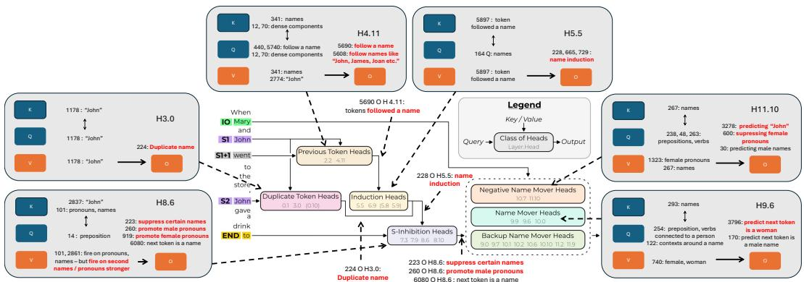  
Figure 1: Parameter-level mechanisms recovered for the IOI circuit (Wang et al., 2022). ASPD identifies weight components implementing known head-level computations and connects them through read–write interactions across heads. For example, the duplicate-name component 224O of H3.0 and the induction component 228O of H5.5 provide inputs to the downstream S-inhibition mechanism in H8.6.

Based on this view, we introduce Activation-Supported Parameter Decomposition (ASPD), which jointly decomposes activation and parameter spaces. We formulate activation-grounded parameter decomposition in terms of sparse causal relationships between weight components and activation features, so that a component can be characterized by the information it reads or writes. Directly optimizing all feature–component interventions, however, is prohibitively expensive. ASPD provides a tractable surrogate by using a shared sparse representation that jointly defines activation features and gates the corresponding weight components. An internal reconstruction objective further requires these components to reproduce the transformation of the target weight matrix directly at its output. Together, activation grounding and local reconstruction yield interpretable and causally editable weight components in multi-billion-parameter language models, including Qwen-3-8B.

The read–write formulation also allows individual weight components to be composed into larger parameter-level mechanisms. A component that writes information along a particular direction can influence downstream components that read that information. We use these interactions to construct parameter-level mechanism circuits and apply ASPD to the well-studied Indirect Object Identification (IOI) circuit (Wang et al., 2022). Without training on circuit labels, ASPD recovers weight components corresponding to known computations including induction, duplicate-token detection, S-inhibition, and name movement, and reveals how these mechanisms communicate across heads. Figure 1 previews the resulting parameter-level IOI circuit; we analyze these mechanisms in detail in Section 5.1. We also use ASPD to trace how semantic information is read, transformed, and written through model weights.

## Our contributions are:

• We introduce activation-grounded parameter decomposition, which characterizes weight components through the activation features they read and write, and propose ASPD to jointly learn activation features and weight mechanisms.

• ASPD replaces expensive pairwise feature–component interventions with a shared sparse representation and an internal reconstruction signal, enabling interpretable and causally editable parameter decomposition in models up to Qwen-3-8B.

• We develop a read–write interaction framework for composing weight components into parameterlevel mechanism circuits, and demonstrate it on the IOI circuit and semantic transformations through model weights.

## 2 RELATED WORK

Activation-space interpretability. A large body of work studies model representations through hidden activations. SAEs (Bricken et al., 2023; Lieberum et al., 2024b;a) and Transcoders (Dunefsky et al., 2024) decompose activations into sparse, interpretable features, enabling applications such as feature circuits (Marks et al., 2024), model diffing (Minder et al., 2025; Lindsey et al., 2024), and analysis of activation-space geometry (Park et al., 2023; Li et al., 2025; Cao et al., 2026b). Other approaches inspect or explain hidden representations through vocabulary projection or learned activation explanations (nostalgebraist, 2020; Belrose et al., 2023; Ghandeharioun et al., 2024; Karvonen et al., 2025). These methods primarily characterize what information is represented in activation space. Our goal is instead to connect such representations to the parameter components that read, transform, and write them, and thus better explaining the underlying computation.

Parameter-space interpretability. Several lines of work manipulate or interpret model parameters. Knowledge editing (Meng et al., 2022; Sun et al., 2025; Zhang et al., 2026) and weight steering (Fierro & Roger, 2026) modify specific knowledge or behaviors, while vocabulary-based analyses (Geva et al., 2021; 2022) associate individual parameter directions with output tokens. Other approaches construct models with interpretable weight structure by design (Pearce et al., 2024; Gao et al.). More directly related to our work, parameter decomposition seeks to recover computational structure from existing weights. Early studies use SVD to identify interpretable directions (Meller & Berkouk, 2023; beren & Black, 2022) or sparse weight decomposition (Yan et al., 2026) targets sparse parameter representations for circuit extraction but these methods are limited in interpretability. Recent methods (Braun et al., 2025; Bushnaq et al., 2025; Chrisman et al., 2025; Vigouroux & Sharkey, 2026; Bushnaq et al., 2026) learn sparse components intended to capture interpretable mechanisms. However, these components are learned primarily within parameter space and are not explicitly grounded in the activation-space features on which the model operates. Moreover, methods aimed at unsupervised recovery of interpretable parameter mechanisms remain difficult to scale to large models (Bushnaq et al., 2026). ASPD addresses both issues by using activation-space structure as semantic grounding and as an internal learning signal for parameter decomposition.

Connecting activation and parameter spaces. The idea of explaining both spaces together is under-explored. Gur-Arieh et al. (2025) use directions from pretrained SAEs (Lieberum et al., 2024b) to guide parameter-space editing, while Chen et al. (2025) modify model parameters to improve SAE representations. They demonstrate useful interactions between activations and weights, but cannot provide explanation for the underlying mechanisms of a model. In contrast, ASPD learns parameter components according to the activation-space features they read or write, providing a direct interpretability method to explain the computation mechanisms.

## 3 ACTIVATION-GROUNDED PARAMETER DECOMPOSITION

## 3.1 WEIGHT COMPONENTS AS READ–WRITE MECHANISMS

Let $W \in \mathbb { R } ^ { d _ { \mathrm { o u t } } \times d _ { \mathrm { i r } } }$ n be a weight matrix and $X = ( x _ { 1 } , \dots , x _ { T } )$ its input activations for a length-$T$ token sequence, where $x _ { t } \ \in \ \mathbb { R } ^ { d _ { \mathrm { i n } } }$ . Its output is $Y = ( y _ { 1 } , \dots , y _ { T } )$ with $y _ { t } = W x _ { t } \in \mathbb { R } ^ { \tilde { d } _ { \mathrm { o u t } } }$ Parameter decomposition represents the computation of W using C rank-1 weight components

$$
P _ { c } = u _ { c } v _ { c } ^ { \top } , \qquad u _ { c } \in \mathbb { R } ^ { d _ { \mathrm { o u t } } } , \quad v _ { c } \in \mathbb { R } ^ { d _ { \mathrm { i n } } } , \quad c = 1 , \dots , C ,
$$

together with a causal importance function $g _ { t , c } ( X )$ indicating when component c participates in the computation (Bushnaq et al., 2025; 2026); $g _ { t , c } ( X ) > 0$ means the component is important for the computation at token t, and $g _ { t , c } ( X ) = 0$ means otherwise. We say component c fires iff $g _ { t , c } > 0$ We define

$$
e _ { t , c } = g _ { t , c } ( X ) ( v _ { c } ^ { \top } x _ { t } ) , \qquad \hat { y } _ { t } = \sum _ { c = 1 } ^ { C } e _ { t , c } u _ { c } ,\tag{1}
$$

where $e _ { t , c }$ is the contribution of component c at position t and $\hat { y } _ { t }$ is the reconstructed output of $W .$

This gives each weight component a read–write interpretation. The direction $v _ { c }$ determines what information the component reads, $^ { g _ { t , c } }$ determines when it is active, and $u _ { c }$ determines what information it writes to the downstream activation. We therefore view a weight component as a contextdependent mechanism characterized by $( v _ { c } , g _ { c } , u _ { c } )$ rather than only as a rank-1 matrix.

## 3.2 ACTIVATION-GROUNDED WEIGHT COMPONENTS

A weight matrix can admit many possible decompositions, while the weights alone do not specify which components correspond to mechanisms exercised by the model. We use activation space to constrain this ambiguity. Let $R = R ( X ) \ : = \ : ( r _ { 1 } , . . . , r _ { T } )$ denote the input activations to an activation-space decomposition, where $r _ { t } \in \mathbb { R } ^ { d _ { \mathrm { a c t } } }$ . Let $a ( r _ { t } ) \overset { , } { = } ( a _ { 1 } ( r _ { t } ) , \ldots , \overset { \cdot } { a _ { F } } ( r _ { t } ) ) \in \mathbb { R } ^ { F }$ denote a decomposition of this activation space into F features, such as an SAE (Bricken et al., 2023).

We define the relationship between weight components and activation features causally. When R is downstream of W, the write effect of component c on feature i is

$$
A _ { i , c } ^ { \mathrm { w r i t e } } ( X , t ) = a _ { i } ( r _ { t } ) - a _ { i } ( r _ { t } \mid g _ { t , c }  0 ) ,\tag{2}
$$

where $a _ { i } ( r _ { t } \ | \ g _ { t , c } \  \ 0 )$ denotes the feature activation obtained when the contribution of weight component c is set to zero while all other components are left unchanged. Eq. (2) measures how much feature i changes when component c is removed. When R is upstream of W, the read effect is

$$
A _ { i , c } ^ { \mathrm { r e a d } } ( \boldsymbol { X } , t ) = g _ { t , c } ( \boldsymbol { X } ) - g _ { t , c } ( \boldsymbol { X } \mid a _ { i } ( \boldsymbol { r } _ { t } )  0 ) ,\tag{3}
$$

which measures how much the use of component c changes when feature i is removed.

An activation-grounded parameter decomposition should concentrate these causal relationships on a small set of activation features. The ideal grounding objective is

$$
\mathcal { L } _ { \mathrm { g r o u n d } } = \mathcal { L } _ { c } + \frac { \lambda _ { \mathrm { g r o u n d } } } { C F } \mathbb { E } _ { X } \left[ \frac { 1 } { T } \sum _ { t } \sum _ { i } \sum _ { c } | A _ { i , c } ( X , t ) | \right] ,\tag{4}
$$

where $\mathcal { L } _ { c }$ denotes some constraining loss, $\mathbb { E } _ { X }$ denotes expectation over the training data distribution, $A _ { i , c }$ denotes the appropriate read or write effect and $\lambda _ { \mathrm { g r o u n d } }$ controls the grounding objective. Sparse causal relationships associate each weight component with localized activation-space mechanism and characterize it through the features it reads or writes.

Directly optimizing Equation 4 would require interventions over all $F \times C$ feature–component pairs at every training step and is computationally prohibitive. Our ASPD therefore replaces this explicit causal objective with a structural surrogate. We align each weight component with one activation feature by using the same sparse latent coordinate to represent feature c and control the gate of component c. The shared representation forces each component to either read from or write to a feature in the activation space, making each component has a localized and interpretable mechanism.

## 3.3 ASPD FOR JOINT ACTIVATION–PARAMETER DECOMPOSITION

Activation-Supported Parameter Decomposition (ASPD) realizes this structural surrogate by jointly learning activation features and weight components. We set $C \ = \ F$ and learn a shared sparse encoder $g ^ { s } : \mathbb { R } ^ { T \times d _ { \mathrm { a c t } } }  \mathbb { R } ^ { T \times C }$ and an activation decoder $d : \mathbb { R } ^ { T \times C }  \mathbb { R } ^ { T \times d _ { \mathrm { a c t } } }$ . The same latent coordinate defines activation feature c and gates weight component c:

$$
a ( R ) : = g ^ { s } ( R ) , \qquad g _ { t , c } ( X ) : = \phi \bigl ( g _ { t , c } ^ { s } ( R ) \bigr ) ,\tag{5}
$$

where $g _ { t , c } ^ { s } ( R )$ is the activation of feature c at position t and $\phi : \mathbb { R }  \mathbb { R }$ maps a feature activation to its component gate. Thus, the shared representation provides the structural surrogate for the read/write grounding defined in Equations 2–3, while $u _ { c } v _ { c } ^ { \top }$ specifies the weight-space transformation performed by the corresponding component.

ASPD jointly optimizes

$$
{ \mathcal { L } } _ { \mathrm { A S P D } } = { \mathcal { L } } _ { \mathrm { i n t e r n a l } } + \lambda _ { \mathrm { a c t } } { \mathcal { L } } _ { \mathrm { a c t } } + \lambda _ { \mathrm { s p a r s e } } { \mathcal { L } } _ { \mathrm { s p a r s e } } ( g ^ { s } ) ,\tag{6}
$$

$$
\mathcal { L } _ { \mathrm { i n t e r n a l } } = \mathbb { E } _ { X } \left[ \frac { 1 } { T } \sum _ { t = 1 } ^ { T } \left. y _ { t } - \hat { y } _ { t } \right. _ { 2 } ^ { 2 } \right] ,\tag{7}
$$

$$
\mathcal { L } _ { \mathrm { a c t } } = \mathbb { E } _ { X } \left[ \frac { 1 } { T } \left. R - d ( g ^ { s } ( R ) ) \right. _ { F } ^ { 2 } \right] ,\tag{8}
$$

where $\mathcal { L } _ { \mathrm { s p a r s e } }$ encourages sparse activation of the shared representation, and $\lambda _ { \mathrm { a c t } }$ and $\lambda _ { \mathrm { s p a r s e } }$ control the corresponding objectives.

The two reconstruction objectives serve complementary purposes. $\mathcal { L } _ { \mathrm { a c t } }$ forces the shared coordinates to form an activation-space feature decomposition, grounding the weight components in interpretable activation features. $\mathcal { L } _ { \mathrm { i n t e r n a l } }$ requires the gated components to reproduce the internal transformation performed by W on the model’s activations. Because the gates depend on R, ASPD learns a sparse, data-conditioned decomposition of the computation induced by $W$ , and each learned weight-space component $P _ { c } = u _ { c } v _ { c } ^ { \top }$ that can be inspected or edited directly.

Implication. Jointly decomposing both activation and parameter space allows us to leverage many advancements in activation decomposition for parameter decomposition. One potential application is Parameter $D i f f u n g$ (identifying what changed in the mechanisms of the fine-tuned compared to the base model) by jointly decomposing activation diffing (Minder et al., 2025; Lindsey et al., 2024; Aranguri & McGrath, 2025) and parameter decomposition. We leave this direction for future work.

Relation to Transcoders. Under our formulation, Transcoder (Dunefsky et al., 2024) can be recovered as a special case of the formulation, and therefore, is a parameter decomposition method. We term this interpretation PD Transcoder and give the full correspondence in Appendix B. ASPD generalizes this construction by decoupling the weight read direction from the activation-feature encoder while preserving activation-space semantics through $\mathcal { L } _ { \mathrm { a c t } }$

Internal learning signal. Prior parameter decomposition methods such as VPD were demonstrated on a four-layer model and partly supervise internal components through constraints on the final model output under component ablation (Bushnaq et al., 2026). Equation 7 instead supervises the decomposition directly at the output of the weight matrix being analyzed, avoiding the need to propagate the learning signal through all subsequent layers. This local supervision improves decomposition quality in deeper and larger pretrained models. Consistently, adding $\mathcal { L } _ { \mathrm { i n t e r n a l } }$ to VPD improves its interpretability and diversity, although it remains weaker than ASPD in Section 4.

Practical instantiation. In our implementation, $g ^ { s }$ is a per-token BatchTopK encoder (Bussmann et al., 2024). We use $\phi ( s ) = \mathbb { I } [ s > 0 ]$ where $\mathbb { I } [ \cdot ]$ denotes the indicator function, so each weight component is either active or ablated at a token. BatchTopK enforces the target sparsity directly; when used, the explicit $\mathcal { L } _ { \mathrm { s p a r s e } }$ penalty is not required. We ground the shared representation in residual-stream activations, we provide discussion for this choice in Appendix J. Full architectural choices, grounding locations, and training details are provided in Appendix C.

VPD objectives. VPD additionally uses $\mathcal { L } _ { \mathrm { p a r a m } } , \mathcal { L } _ { \mathrm { a b l a t e } }$ (full formulation in Appendix A) to encourage components that remain modular under independent ablations (Bushnaq et al., 2026). Although we can trivially adapt these losses into our solution, however, in Appendix D, we evaluate these objectives and finds mixed or negative effects, so we omit them from ASPD.

## 3.4 FROM WEIGHT COMPONENTS TO PARAMETER-LEVEL MECHANISM CIRCUITS

Model mechanisms generally involve interactions among weight components across matrices and layers. The read–write formulation provides a natural way to compose them. From Equation 1, component $c _ { 1 }$ writes $e _ { t , c _ { 1 } } u _ { c _ { 1 } }$ to the downstream activation, while a subsequent component $c _ { 2 }$ reads along $v _ { c _ { 2 } }$ . For compatible sequential components, including $O V , M L P _ { i n } , M L P _ { o u t }$ matrices, and cross-layer residual interactions, we score their interaction by

$$
\mathrm { I n t e r a c t } ( c _ { 1 } , c _ { 2 } ) = \mathbb { E } _ { X , t } \left[ g _ { t , c _ { 2 } } ( X ) e _ { t , c _ { 1 } } \right] \left. u _ { c _ { 1 } } , v _ { c _ { 2 } } \right. ,\tag{9}
$$

where the expectation averages over examples and token positions in the analysis corpus. The first factor measures whether the two components participate on the same data, while $\left. u _ { c _ { 1 } } , v _ { c _ { 2 } } \right.$ measures whether the information written by $c _ { 1 }$ aligns with the direction read by $c _ { 2 }$ . We use this score to rank candidate computational dependencies between weight components.

For attention layers, $Q , K , V ,$ , and O denote the query, key, value, and output weight matrices. QK interactions require a head-specific composition because both components write into query and key spaces rather than forming a sequential write–read pair. The corresponding QK, OV , MLP, and cross-layer interaction forms used in our analysis are given in Appendix I.

In Section $5 ,$ we apply the interaction formulation into reverse engineering IOI circuit (Wang et al., 2022) and tracing semantic transformation in the model weights. We validate selected interactions using attribution patching, behavioral probes, and direct weight interventions.

## 4 EXPERIMENTS

We evaluate three claims motivated by Section 3: (i) whether the learned weight components are interpretable and diverse; whether the information written by a component has the same meaning with the component itself, (ii) whether they support localized causal weight editing, and (iii) whether ASPD’s internal learning signal improves parameter decomposition in larger pretrained models.

Setup. We compare ASPD, PD Transcoder, VPD (Bushnaq et al., 2026), and VPD + internal, which augments VPD with $\mathcal { L } _ { \mathrm { { i n t e r n a l } } }$ from Equation 7. We evaluate one weight matrix in each of three pretrained models: $M L P _ { \mathrm { i n } }$ at layer 0 of GPT-2 small (Radford et al., 2019), $M L P _ { \mathrm { o u t } }$ at layer 13 of Gemma-2-2B (Team, 2024), and the attention O matrix at layer 17 of Qwen-3-8B (Yang et al., 2025). All decompositions are trained on 2B tokens with average sparsity $L _ { 0 } = 3 2$ , using 24,576, 36,864, and 36,864 weight components, respectively. For evaluations involving activation features, we train an independent SAE at the output of the target matrix, so the evaluation does not use ASPD’s own shared representation. Full training details are in Appendix C. We report 95% confidence intervals.

## 4.1 INTERPRETABILITY, DIVERSITY, AND MEANING LOCALIZATION

We evaluate three complementary properties. Interpretability: uses the Intruder score (Paulo & Belrose, 2025). An LLM judge receives four examples on which a component fires and one example from another component and must identify the intruder; a random choice therefore has an accuracy of 0.2. We evaluate 200 components per method. Diversity: measures the mean pairwise Jaccard overlap between the tokens on which two components fire; lower overlap indicates less redundant components. We evaluate 500 components after filtering extremely sparse or dense components. Full details are in Appendix C.4. Meaning Localization: interpretability alone does not establish that the information written by a weight component has the same meaning as the component itself. To test this, we use an independently trained SAE at the output $y _ { t }$ and estimate which activation feature each component most strongly affects over $1 0 ^ { 6 }$ held-out tokens via attribution patching (Nanda, 2023). We construct 200 component–feature pairs using these estimated effects. We follow the evaluation in Laptev et al. (2025); Cao et al. (2026a): an LLM judge compares activation examples from each component and feature and assigns scores of 3, 2, or 1 for similar, uncertain, or different meanings. We subtract the score obtained from random component–feature pairings and report the resulting Matching score. Higher values indicate stronger semantic alignment between a weight component and the activation feature it affects. This directly evaluates the coherence between the component activation and what information it writes. Full details are in Appendix C.6.

Table 1 and 2 show a clear separation from VPD on the two larger models. On Gemma-2-2B, ASPD reaches an Intruder score of 0.62 versus 0.20 for VPD, while component overlap decreases from 0.44 to 0.03. On Qwen-3-8B, ASPD remains interpretable (0.57) and diverse (0.03), whereas VPD is near chance (0.22). ASPD also achieves positive Match scores on all three models, showing that its downstream effects align semantically with independent activation features. PD Transcoder also performs strongly, while ASPD is substantially stronger on the Gemma MLP decomposition.

Table 1: Interpretability and Diversity experiment results. Interp = 0.2 means random chance.
<table><tr><td rowspan="2">Method</td><td colspan="2">GPT2</td><td colspan="2">Gemma-2-2b</td><td colspan="2">Qwen-3-8b</td></tr><tr><td>Interp ↑</td><td> $\sin \downarrow$ </td><td>Interp ↑|</td><td>Sim ↓</td><td>Interp ↑|</td><td>Sim ↓</td></tr><tr><td>ASPD (Ours)</td><td> ${ \bf 0 . 6 8 \pm 0 . 0 4 }$ </td><td> $\underline { { 0 . 0 1 \pm 0 . 0 0 } }$ </td><td> ${ \bf 0 . 6 2 \pm 0 . 0 3 }$ </td><td> $\mathbf { 0 . 0 3 \pm 0 . 0 0 }$ </td><td> $\underline { { 0 . 5 7 } } \pm \underline { { 0 . 0 4 } }$ </td><td> $\mathbf { 0 . 0 3 \pm 0 . 0 0 }$ </td></tr><tr><td>PD Transcoder (Ours)</td><td> $\underline { { 0 . 5 4 } } \pm \underline { { 0 . 0 4 } }$ </td><td> $\overline { { { \bf 0 . 0 0 } } } \pm \overline { { { \bf 0 . 0 0 } } }$ </td><td> $\underline { { 0 . 2 9 } } \pm \underline { { 0 . 0 3 } }$ </td><td> $\underline { { 0 . 1 0 } } \pm \underline { { 0 . 0 1 } }$ </td><td> $\overline { { { \bf 0 . 6 0 } } } \pm \overline { { { \bf 0 . 0 4 } } }$ </td><td> $\underline { { 0 . 0 5 } } \pm \underline { { 0 . 0 0 } }$ </td></tr><tr><td>VPD</td><td> $\overline { { 0 . 3 7 } } \pm \overline { { 0 . 0 3 } }$ </td><td> $0 . 0 1 \pm 0 . 0 0$ </td><td> $0 . 2 0 \pm 0 . 0 2$ </td><td> $\overline { { 0 . 4 4 } } \pm \overline { { 0 . 0 1 } }$ </td><td> $0 . 2 2 \pm 0 . 0 2$ </td><td> $0 . 1 8 \pm 0 . 0 0$ </td></tr><tr><td>VPD + internal</td><td> $0 . 4 3 \pm 0 . 0 3$ </td><td> $\mathbf { 0 . 0 0 \pm 0 . 0 0 }$ </td><td> $0 . 2 5 \pm 0 . 0 2$ </td><td> $0 . 1 4 \pm 0 . 0 0$ </td><td> $0 . 2 5 \pm 0 . 0 2$ </td><td> $0 . 1 4 \pm 0 . 0 0$ </td></tr></table>

Table 2: Meaning localization experiment results. Matching = 0 means random chance.
<table><tr><td>Method</td><td>GPT2 Matching ↑</td><td> $\mathrm { G e m m a } { - 2 { - } 2 \mathbf { B } }$   $\mathbf { M a t c h i n g } \uparrow$ </td><td>Qwen-3-8b  $\mathbf { M a t c h i n g } \uparrow$ </td></tr><tr><td>ASPD (Ours)</td><td> ${ \bf 1 . 0 2 \pm 0 . 1 4 }$ </td><td> ${ \bf 0 . 3 0 \pm 0 . 1 1 }$ </td><td> $\underline { { 0 . 6 1 } } \pm \underline { { 0 . 1 4 } }$ </td></tr><tr><td>PD Transcoder (Ours)</td><td> $0 . 9 4 \pm 0 . 1 5$ </td><td> $\underline { { 0 . 2 7 } } \pm \underline { { 0 . 1 7 } }$ </td><td> $\overline { { 0 . 6 4 } } \pm \overline { { 0 . 1 5 } }$ </td></tr><tr><td>VPD</td><td> $\overline { { 0 . 3 1 } } \pm \overline { { 0 . 1 1 } }$ </td><td> $- 0 . 0 2 \pm \overline { { 0 . 1 0 } }$ </td><td> $0 . 1 7 \pm 0 . 1 1$ </td></tr><tr><td> $\mathrm { { V P D + i n t e r n a l } }$ </td><td> $0 . 4 5 \pm 0 . 1 3$ </td><td> $0 . 0 7 \pm 0 . 1 2$ </td><td> $- 0 . 0 9 \pm 0 . 1 4$ </td></tr></table>

## 4.2 CAUSAL WEIGHT EDITING

An useful parameter decomposition should allow selected mechanisms to be modified without broadly perturbing unrelated activation features. We evaluate this property using the independent output SAE above. We evaluate two settings: (1) Single: we sample one target feature and find the top-k components with strongest attribution patching effect (Nanda, 2023) over a dataset for $k \in \{ 1 , 5 , 1 0 , 2 0 , 5 0 \}$ . (2) Multiple: we sample a target feature set where the set size is in {1, 5, 10, 20, 50}; for each target set, we identify the union of the per-feature top-k components for $k \in \{ 1 , 5 , 1 0 \}$ via attribution patching. We then remove all of the selected components directly from the weight matrix and run forward pass on $1 0 ^ { 6 }$ tokens, we repeat this over 50 target sets for both settings. We report the localization which measures the activation change of the target features divided by the change of non-target features, the higher the better. And since absolute localization can depend on the overall strength of the edited components, we also normalize each score by an edit of the same number of randomly selected components, resulting in the ratio metric. Having ratio $> 1$ means the edit is better than a random edit. The exact definitions of the scores and full protocol are given in Appendix C.5.

Table 3 shows that ASPD and PD Transcoder consistently support localized weight interventions, while VPD is typically at or below random. The difference is largest on Qwen-3-8B, where ASPD reaches $6 . 7 \times$ the random baseline for a single target and 11.1× for multi-target edits, compared with 0.9× and $0 . 8 \times$ for VPD. Thus, the learned weight components can be manipulated directly with effects that remain concentrated on the intended activation features.

Table 3: Weight Editing Localization experiment results. ratio $< 1$ is poorer than random chance.
<table><tr><td></td><td colspan="2">GPT2</td><td colspan="2">Gemma-2-2b</td><td colspan="2">Qwen-3-8b</td></tr><tr><td>Method</td><td></td><td>ratio↑ |localization ↑</td><td></td><td>ratio↑ |localization ↑</td><td></td><td>ratio ↑ |localization ↑</td></tr><tr><td colspan="7">Single</td></tr><tr><td>ASPD (Ours)</td><td> ${ \bf 3 . 1 \pm 0 . 5 }$ </td><td> $0 . 0 4 0 \pm \underline { { 0 . 0 0 5 } }$ </td><td> $2 . 7 \pm \underline { { 0 . 8 } }$ </td><td> $\mathbf { 0 . 0 1 3 \pm 0 . 0 0 4 }$ </td><td> ${ \bf 6 . 7 \pm 0 . 9 }$ </td><td> $\mathbf { 0 . 0 5 3 \pm 0 . 0 0 6 }$ </td></tr><tr><td>PD Transcoder (Ours)</td><td> $3 . 0 \pm \underline { { 0 . 7 } }$ </td><td> $\overline { { { \bf 0 . 0 4 9 } } } \pm \overline { { { \bf 0 . 0 1 0 } } }$ </td><td> $\overline { { 4 . 3 } } \pm \overline { { 1 . 1 } }$ </td><td> $\underline { { 0 . 0 1 2 } } \pm \underline { { 0 . 0 0 4 } }$ </td><td> $2 . 5 \pm \underline { { 0 . 4 } }$ </td><td> $0 . 0 5 0 \pm \underline { { 0 . 0 0 5 } }$ </td></tr><tr><td>VPD</td><td> $\overline { { 0 . 9 } } \pm \overline { { 0 . 2 } }$ </td><td> $0 . 0 1 7 \pm 0 . 0 0 2$ </td><td> $0 . 5 \pm 0 . 1$ </td><td> $\overline { { 0 . 0 0 4 } } \pm \overline { { 0 . 0 0 1 } }$ </td><td> $\overline { { 0 . 9 } } \pm \overline { { 0 . 2 } }$ </td><td> $0 . 0 2 0 \pm 0 . 0 0 3$ </td></tr><tr><td>VPD + internal</td><td> $0 . 3 \pm 0 . 2$ </td><td> $0 . 0 0 7 \pm 0 . 0 0 4$ </td><td> $0 . 7 \pm 0 . 2$ </td><td> $0 . 0 0 6 \pm 0 . 0 0 1$ </td><td> $1 . 4 \pm 0 . 2$ </td><td> $0 . 0 2 7 \pm 0 . 0 0 3$ </td></tr><tr><td colspan="7">Multiple</td></tr><tr><td>ASPD (Ours)</td><td> ${ \bf 2 . 8 \pm 0 . 2 }$ </td><td> $\underline { { 0 . 0 2 2 } } \pm \underline { { 0 . 0 0 1 } }$ </td><td> $\underline { { 1 . 8 } } \pm \underline { { 0 . 2 } }$ </td><td> $\mathbf { 0 . 0 0 8 \pm 0 . 0 0 1 }$ </td><td> ${ \bf 1 1 . 1 \pm 0 . 6 }$ </td><td> ${ \bf 0 . 0 4 4 \pm 0 . 0 0 2 }$ </td></tr><tr><td>PD Transcoder (Ours)</td><td> $\underline { { 2 . 4 } } \pm \underline { { 0 . 3 } }$ </td><td> $\overline { { { \bf 0 . 0 2 7 } } } \pm \overline { { { \bf 0 . 0 0 3 } } }$ </td><td> ${ \bf 4 . 0 \pm 0 . 4 }$ </td><td> $\mathbf { 0 . 0 0 8 \pm 0 . 0 0 1 }$ </td><td> $2 . 0 \pm \underline { { 0 . 1 } }$ </td><td> $\underline { { 0 . 0 3 9 } } \pm \underline { { 0 . 0 0 2 } }$ </td></tr><tr><td>VPD</td><td> $0 . 9 \pm 0 . 1$ </td><td> $0 . 0 1 5 \pm 0 . 0 0 1$ </td><td> $0 . 4 \pm 0 . 0$ </td><td> $\underline { { 0 . 0 0 4 } } \pm \underline { { 0 . 0 0 0 } }$ </td><td> $0 . 8 \pm 0 . 0$ </td><td> $0 . 0 1 7 \pm 0 . 0 0 1$ </td></tr><tr><td>VPD + internal</td><td> $0 . 1 \pm 0 . 1$ </td><td> $0 . 0 0 2 \pm 0 . 0 0 1$ </td><td> $0 . 5 \pm 0 . 0$ </td><td> $\underline { { 0 . 0 0 4 } } \pm \underline { { 0 . 0 0 0 } }$ </td><td> $1 . 0 \pm 0 . 0$ </td><td> $0 . 0 1 8 \pm 0 . 0 0 1$ </td></tr></table>

## 4.3 ABLATIONS AND SCALABILITY

Internal learning signal. We test our claim of using internal learning signal could improve VPD interpretability in Section 3.3. As shown in Table 1, adding $\mathcal { L } _ { \mathrm { { i n t e r n a l } } }$ improves VPD’s interpretability, diversity for all three models. We also report the results of VPD + internal on all metrics in Table 3 and 2. On weight editing, the internal loss yields noticeably improvement on large models but not for GPT2 small, while on meaning localization, it yields improvement on GPT2 small but mixed results on the other two models. These results suggest that the local internal signal can improve VPD’s interpretability, but is not sufficient to improve on other metrics.

Robustness to VPD evaluation choices. We test a more favorable setup of VPD on interpretability and diversity. Following Bushnaq et al. (2026), we consider VPD components fire iff $g _ { t , c } > \tau , \tau \in$ {0.01, 0.1}, which filters spurious activation examples of the components. We found that even in this easier setup, VPD still has Interp score near random chance for large models (Appendix E).

VPD-specific objectives. Finally, we evaluate the $\mathcal { L } _ { \mathrm { p a r a m } } , \mathcal { L } _ { \mathrm { a b l a t e } }$ (see Appendix A) objectives proposed by previous works (Bushnaq et al., 2026). Their effects on VPD are mixed, while adding them to PD Transcoder generally degrades the performance on many metrics. We therefore did not include these losses to our solution; the complete ablations are reported in Appendix D.

## 5 MECHANISTIC CASE STUDIES

For these analyses, we train ASPD jointly across all 72 weight matrices of GPT-2 small, with $^ { 6 , 1 }$ 144 components per matrix and 442,368 weight components in total. This model-wide decomposition

allows us to analyze interactions across matrices, heads, and layers. Training details are provided in Appendix C.3.

## 5.1 RECOVERING PARAMETER-LEVEL IOI MECHANISMS

Existing circuit analyses (Marks et al., 2024; Lindsey et al., 2025; He et al., 2026) primarily characterize computation in activation space, identifying features and their interactions but not the underlying weight components that implement those computations. ASPD provides a complementary parameter-space view by decomposing the weights themselves into read–write mechanisms. We demonstrate this capability by recovering parameter-level mechanisms underlying the classic IOI circuit (Wang et al., 2022). We highlight the main findings here; the full analysis is provided in Appendix G (Figures 4–19).

Figure 1 summarizes the resulting parameter-level mechanism circuit. Within individual heads, ASPD recovers components corresponding to known IOI computations. In induction head H5.5, we found component 164Q activates on “names” and 5897K on “tokens following names”; removing this pair suppresses the induction attention pattern. At the output of the same head, ASPD identifies 228O as an induction-related component Figure 10, we verified this finding independently via testing the component with induction probe (Appendix H.2). ASPD similarly identifies 224O in duplicate-token head H3.0 as a component associated with repeated names and tokens.

The read–write interaction analysis further connects these mechanisms across heads. As shown in Figure 11, the duplicate-name component 224O of H3.0 and the induction component 228O of H5.5 are among the strongest contributors to components 2861V and 101V of the downstream S-inhibition head H8.6. Inspecting deeper, we found that 2861V, 101V activate on names and pronouns, with stronger responses to repeated occurrences (we verified via a probe Appendix H.4), indicating that H8.6 receives both duplicate-token and induction information from upstream heads.

Within H8.6, components 14Q and 101K (which takes the 224O of H3.0 and 228O of H5.5 as input) contribute strongly to the S-inhibition attention pattern. Figure 2 shows the effect of directly removing this QK component pair from the frozen weights: the S-inhibition attention pattern is sub stantially suppressed. The full component-level analysis is shown in Figure 12 in the appendix. This direct intervention provides causal evidence for the identified parameter-level mechanism, while attribution patching and behavioral probes provide supporting evidence.

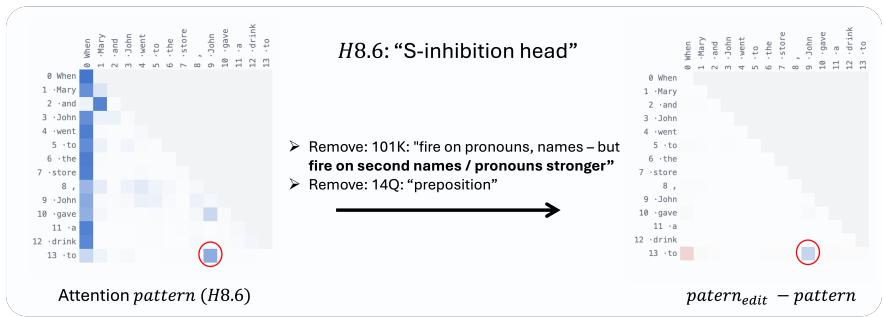  
Figure 2: Weight editing on the S-inhibition mechanism in H8.6. The left panel shows the original attention pattern. The right panel shows the change after removing the identified QK component pair from the weights. The edit substantially suppresses attention at the S-inhibition position.

The recovered mechanism also extends downstream. The overview in Figure 1 shows that output components of H8.6 provide inputs to the query-side components of the name-mover and negativename-mover heads, connecting S-inhibition to the later name-selection computation. Thus, ASPD recovers not only components within individual heads but also parameter-level connections among the established IOI head classes.

The decomposition does not isolate every mechanism at the finest possible granularity. For example, H5.5 contains a component representing “token following a name” rather than the more specific “token after John” signal, and several similarly behaving components remain only partially understood. These cases suggest that some mechanisms may require finer decompositions or additional analysis.

## 5.2 TRACING SEMANTIC TRANSFORMATIONS THROUGH MODEL WEIGHTS

Prior work has studied knowledge in model parameters through knowledge editing (Meng et al., 2022; Sun et al., 2025), interpretation of MLP weights (Geva et al., 2021), and localization of memorized information (Chang et al., 2024). These approaches typically begin from a known fact, behavior, or parameter representation and do not jointly characterize how weight-space mechanisms interact with the activation features they read and write. ASPD provides a complementary, unsupervised view: its model-wide decomposition allows us to analyze both component–component interactions, which reveal transformations implemented by the weights, and component–feature interactions, which reveal how those transformations read information from and write information back to activation space. Interaction details are provided in Appendix I. Figure 3 illustrates this analysis for the layer-7 MLP of GPT-2 small.

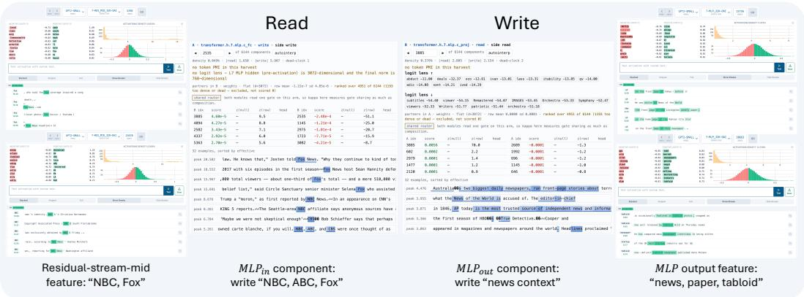  
Figure 3: Tracing a semantic transformation through the layer-7 MLP. $M L P _ { \mathrm { i n } }$ component 2535, associated with contexts involving NBC, ABC, and Fox, reads news-organization features from the residual stream and interacts strongly with $M L P _ { \mathrm { o u t } }$ component 3885, which writes to downstream features associated with broader news-related context.

As shown in Figure 3, upstream activation features associated with news organizations such as NBC and Fox interact strongly with $M L P _ { \mathrm { i n } }$ component 2535, which activates on contexts involving NBC, ABC, Fox, and related entities. Among the $M L P _ { \mathrm { o u t } }$ components, component 3885 has the strongest interaction with component 2535 and activates in broader news-related contexts. Downstream activation features associated with concepts such as news, papers, and tabloids in turn interact strongly with component 3885.

This example traces a localized semantic transformation from information about specific news organizations to a more general news-related representation. It illustrates how ASPD connects activation features to explicit weight-space transformations and then back to downstream activation features, characterizing how semantic information is read, transformed, and written during model computation. Additional examples are provided in Figures 20 and 21 in the appendix.

## 6 CONCLUSION

We introduced activation-grounded parameter decomposition, a framework for interpreting model weights through the activation-space features they read and write. ASPD provides a scalable realization of this framework by jointly learning activation features and parameter components, using an internal reconstruction signal to learn localized mechanisms directly at the weight matrix being analyzed. Across GPT-2, Gemma-2-2B, and Qwen-3-8B, ASPD produces interpretable, semantically grounded, and causally editable parameter components. Moreover, composing their read–write interactions enables parameter-level mechanism circuits. On GPT-2, ASPD refines the known IOI circuit to individual weight components and traces how semantic information flows through model parameters. We hope this perspective provides a foundation for studying not only what information models represent, but how their weights transform that information into computation.

## 7 AI USE STATEMENT

In this work, we used generative AI tools for: provide feedback on research methodology, implement methods, support qualitative and thematic data analysis. We have not used generative AI tools for assist with translation, interpret results; while the following are not applicable to this work: help develop theoretical models or conceptual frameworks, formulate mathematical claims, provide critical ingredients for proving mathematical claims, assist in the writing of proofs, propose or refine hypotheses, clean and reformat dataset. Additionally, we used AI for polishing the writing and draft the conclusion section of the paper. We have reviewed all AI-assisted work. We checked the LLM generated code with test runs to ensure we are able to reproduce baseline results and metrics, we checked the writing. We take responsibility for the final content of this work, including text, claims or artifacts produced with the aid of generative AI.

## REFERENCES

Apollo-research. apollo-research/skylion007-openwebtext-tokenizer-gpt2. URL https://huggingface.co/datasets/apollo-research/ Skylion007-openwebtext-tokenizer-gpt2.

Santiago Aranguri and Tom McGrath. Discovering undesired rare behaviors via model diff amplification. Goodfire, 2025. https://www.goodfire.ai/research/model-diff-amplification.

Nora Belrose, Igor Ostrovsky, Lev McKinney, Zach Furman, Logan Smith, Danny Halawi, Stella Biderman, and Jacob Steinhardt. Eliciting latent predictions from transformers with the tuned lens. arXiv preprint arXiv:2303.08112, 2023.

beren and Sid Black. The singular value decompositions of transformer weight matrices are highly interpretable. https://www.lesswrong.com/posts/mkbGjzxD8d8XqKHzA/ the-singular-value-decompositions-of-transformer-weight, November 2022. LessWrong / AI Alignment Forum.

Dan Braun, Lucius Bushnaq, Stefan Heimersheim, Jake Mendel, and Lee Sharkey. Interpretability in parameter space: Minimizing mechanistic description length with attribution-based parameter decomposition. arXiv preprint arXiv:2501.14926, 2025.

Trenton Bricken, Adly Templeton, Joshua Batson, Brian Chen, Adam Jermyn, Tom Conerly, Nick Turner, Cem Anil, Carson Denison, Amanda Askell, Robert Lasenby, Yifan Wu, Shauna Kravec, Nicholas Schiefer, Tim Maxwell, Nicholas Joseph, Zac Hatfield-Dodds, Alex Tamkin, Karina Nguyen, Brayden McLean, Josiah E Burke, Tristan Hume, Shan Carter, Tom Henighan, and Christopher Olah. Towards monosemanticity: Decomposing language models with dictionary learning. Transformer Circuits Thread, 2023. https://transformercircuits.pub/2023/monosemantic-features/index.html.

Lucius Bushnaq, Dan Braun, and Lee Sharkey. Stochastic parameter decomposition. arXiv preprint arXiv:2506.20790, 2025.

Lucius Bushnaq, Dan Braun, Oliver Clive-Griffin, Bart Bussmann, Nathan Hu, Michael Ivanitskiy, Linda Linsefors, and Lee Sharkey. Interpreting language model parameters, April 2026.

Bart Bussmann, Patrick Leask, and Neel Nanda. Batchtopk sparse autoencoders. arXiv preprint arXiv:2412.06410, 2024.

Bart Bussmann, Noa Nabeshima, Adam Karvonen, and Neel Nanda. Learning multi-level features with matryoshka sparse autoencoders. arXiv preprint arXiv:2503.17547, 2025.

Tue M Cao, Nguyen Do, and My T Thai. Semantic optimal transport for sparse autoencoder feature matching and circuit compression. arXiv preprint arXiv:2605.28567, 2026a.

Tue M Cao, Hoang X Nhat, Raed Alharbi, Phi Le Nguyen, and My T Thai. Tree sae: Learning hierarchical feature structures in sparse autoencoders. arXiv preprint arXiv:2605.07922, 2026b.

Ting-Yun Chang, Jesse Thomason, and Robin Jia. Do localization methods actually localize memorized data in llms? a tale of two benchmarks. In Proceedings of the 2024 Conference of the North American Chapter of the Association for Computational Linguistics: Human Language Technologies (Volume 1: Long Papers), pp. 3190–3211, 2024.

David Chanin, James Wilken-Smith, Toma´s Dulka, Hardik Bhatnagar, Satvik Golechha, and Joseph ˇ Bloom. A is for absorption: Studying feature splitting and absorption in sparse autoencoders. arXiv preprint arXiv:2409.14507, 2024.

Matthew Chen, Joshua Engels, and Max Tegmark. Low-rank adapting models for sparse autoencoders. arXiv preprint arXiv:2501.19406, 2025.

Brianna Chrisman, Lucius Bushnaq, and Lee Sharkey. Identifying sparsely active circuits through local loss landscape decomposition. arXiv preprint arXiv:2504.00194, 2025.

Jacob Dunefsky, Philippe Chlenski, and Neel Nanda. Transcoders find interpretable llm feature circuits. Advances in Neural Information Processing Systems, 37:24375–24410, 2024.

Constanza Fierro and Fabien Roger. Steering language models with weight arithmetic. In International Conference on Learning Representations, volume 2026, pp. 138122–138169, 2026.

Leo Gao, Achyuta Rajaram, Jacob Coxon, Soham V Govande, Bowen Baker, and Dan Mossing. Weight-sparse transformers have interpretable circuits, 2025. URL https://arxiv. org/abs/2511.13653.

Leo Gao, Stella Biderman, Sid Black, Laurence Golding, Travis Hoppe, Charles Foster, Jason Phang, Horace He, Anish Thite, Noa Nabeshima, et al. The pile: An 800gb dataset of diverse text for language modeling. arXiv preprint arXiv:2101.00027, 2020.

Leo Gao, Tom Dupre la Tour, Henk Tillman, Gabriel Goh, Rajan Troll, Alec Radford, Ilya´ Sutskever, Jan Leike, and Jeffrey Wu. Scaling and evaluating sparse autoencoders. arXiv preprint arXiv:2406.04093, 2024.

Mor Geva, Roei Schuster, Jonathan Berant, and Omer Levy. Transformer feed-forward layers are key-value memories. In Proceedings of the 2021 conference on empirical methods in natural language processing, pp. 5484–5495, 2021.

Mor Geva, Avi Caciularu, Kevin Wang, and Yoav Goldberg. Transformer feed-forward layers build predictions by promoting concepts in the vocabulary space. In Proceedings ofthe 2022 conference on empirical methods in natural language processing, pp. 30–45, 2022.

Asma Ghandeharioun, Avi Caciularu, Adam Pearce, Lucas Dixon, and Mor Geva. Patchscopes: A unifying framework for inspecting hidden representations of language models. arXiv preprint arXiv:2401.06102, 2024.

Yoav Gur-Arieh, Clara Haya Suslik, Yihuai Hong, Fazl Barez, and Mor Geva. Precise in-parameter concept erasure in large language models. In Proceedings of the 2025 Conference on Empirical Methods in Natural Language Processing, pp. 18997–19017, 2025.

Zhengfu He, Junxuan Wang, Rui Lin, Xuyang Ge, Wentao Shu, Qiong Tang, Junping Zhang, and Xipeng Qiu. Towards understanding the nature of attention with low-rank sparse decomposition. In International Conference on Learning Representations, volume 2026, pp. 78269–78297, 2026.

Adam Karvonen, James Chua, Clement Dumas, Kit Fraser-Taliente, Subhash Kantamneni, Ju-´ lian Minder, Euan Ong, Arnab Sen Sharma, Daniel Wen, Owain Evans, et al. Activation oracles: Training and evaluating llms as general-purpose activation explainers. arXiv preprint arXiv:2512.15674, 2025.

Daniil Laptev, Nikita Balagansky, Yaroslav Aksenov, and Daniil Gavrilov. Analyze feature flow to enhance interpretation and steering in language models. arXiv preprint arXiv:2502.03032, 2025.

Yuxiao Li, Eric J Michaud, David D Baek, Joshua Engels, Xiaoqing Sun, and Max Tegmark. The geometry of concepts: Sparse autoencoder feature structure. Entropy, 27(4):344, 2025.

Tom Lieberum, Senthooran Rajamanoharan, Arthur Conmy, Lewis Smith, Nicolas Sonnerat, Vikrant Varma, Janos Kram ´ ar, Anca Dragan, Rohin Shah, and Neel Nanda. Gemma scope: Open sparse´ autoencoders everywhere all at once on gemma 2. arXiv preprint arXiv:2408.05147, 2024a.

Tom Lieberum, Senthooran Rajamanoharan, Arthur Conmy, Lewis Smith, Nicolas Sonnerat, Vikrant Varma, Janos Kram´ ar, Anca Dragan, Rohin Shah, and Neel Nanda. Gemma scope: Open sparse´ autoencoders everywhere all at once on gemma 2, 2024b. URL https://arxiv.org/abs/ 2408.05147.

Jack Lindsey, Adly Templeton, Jonathan Marcus, Thomas Conerly, Joshua Batson, and Christopher Olah. Sparse crosscoders for cross-layer features and model diffing. Transformer Circuits Thread, 25, 2024.

Jack Lindsey, Wes Gurnee, Emmanuel Ameisen, Brian Chen, Adam Pearce, Nicholas L. Turner, Craig Citro, David Abrahams, Shan Carter, Basil Hosmer, Jonathan Marcus, Michael Sklar, Adly Templeton, Trenton Bricken, Callum McDougall, Hoagy Cunningham, Thomas Henighan, Adam Jermyn, Andy Jones, Andrew Persic, Zhenyi Qi, T. Ben Thompson, Sam Zimmerman, Kelley Rivoire, Thomas Conerly, Chris Olah, and Joshua Batson. On the biology of a large language model. Transformer Circuits Thread, 2025. URL https://transformer-circuits. pub/2025/attribution-graphs/biology.html.

Samuel Marks, Can Rager, Eric J Michaud, Yonatan Belinkov, David Bau, and Aaron Mueller. Sparse feature circuits: Discovering and editing interpretable causal graphs in language models. arXiv preprint arXiv:2403.19647, 2024.

Dan Meller and Nicolas Berkouk. Singular value representation: A new graph perspective on neural networks. In International Conference on Artificial Intelligence and Statistics, pp. 3353–3369. PMLR, 2023.

Kevin Meng, David Bau, Alex Andonian, and Yonatan Belinkov. Locating and editing factual associations in gpt. Advances in neural information processing systems, 35:17359–17372, 2022.

Meta. Llama, 2024. URL https://dev.meta.ai/llama/docs/ model-cards-and-prompt-formats/llama3\_3.

Julian Minder, Clement Dumas, Caden Juang, Bilal Chugtai, and Neel Nanda. Robustly identifying´ concepts introduced during chat fine-tuning using crosscoders. arXiv preprint arXiv:2504.02922, 2025.

Neel Nanda. Attribution patching, 2023. URL https://www.neelnanda.io/ mechanistic-interpretability/attribution-patching.

nostalgebraist. interpreting gpt: the logit lens, 2020. URL https://www.lesswrong.com/ posts/AcKRB8wDpdaN6v6ru/interpreting-gpt-the-logit-lens.

Kiho Park, Yo Joong Choe, and Victor Veitch. The linear representation hypothesis and the geometry of large language models. arXiv preprint arXiv:2311.03658, 2023.

Gonc¸alo Paulo and Nora Belrose. Evaluating sae interpretability without explanations. arXiv preprint arXiv:2507.08473, 2025.

Michael T Pearce, Thomas Dooms, Alice Rigg, Jose M Oramas, and Lee Sharkey. Bilinear mlps enable weight-based mechanistic interpretability. arXiv preprint arXiv:2410.08417, 2024.

Alec Radford, Jeffrey Wu, Rewon Child, David Luan, Dario Amodei, Ilya Sutskever, et al. Language models are unsupervised multitask learners. OpenAI blog, 1(8):9, 2019.

Lee Sharkey, Bilal Chughtai, Joshua Batson, Jack Lindsey, Jeff Wu, Lucius Bushnaq, Nicholas Goldowsky-Dill, Stefan Heimersheim, Alejandro Ortega, Joseph Bloom, et al. Open problems in mechanistic interpretability. arXiv preprint arXiv:2501.16496, 2025.

Chung-En Sun, Ge Yan, and Tsui-Wei Weng. Thinkedit: Interpretable weight editing to mitigate overly short thinking in reasoning models. In Proceedings of the 2025 Conference on Empirical Methods in Natural Language Processing, pp. 17012–17036, 2025.

Gemma Team. Gemma. 2024. doi: 10.34740/KAGGLE/M/3301. URL https://www.kaggle. com/m/3301.

Antoine Vigouroux and Lee Sharkey. Targeted recovery of weight-space mechanisms from neural networks. arXiv preprint arXiv:2607.13047, 2026.

Kevin Wang, Alexandre Variengien, Arthur Conmy, Buck Shlegeris, and Jacob Steinhardt. Interpretability in the wild: a circuit for indirect object identification in gpt-2 small. arXiv preprint arXiv:2211.00593, 2022.

Chuanhao Yan, Xuhan Huang, Yawen Duan, Zhenfei Yin, Hang Zhao, Bryan Dai, and Jie Fu. Sparse weight decomposition for efficient circuit extraction. arXiv preprint arXiv:2608.03913, 2026.

An Yang, Anfeng Li, Baosong Yang, Beichen Zhang, Binyuan Hui, Bo Zheng, Bowen Yu, Chang Gao, Chengen Huang, Chenxu Lv, Chujie Zheng, Dayiheng Liu, Fan Zhou, Fei Huang, Feng Hu, Hao Ge, Haoran Wei, Huan Lin, Jialong Tang, Jian Yang, Jianhong Tu, Jianwei Zhang, Jianxin Yang, Jiaxi Yang, Jing Zhou, Jingren Zhou, Junyang Lin, Kai Dang, Keqin Bao, Kexin Yang, Le Yu, Lianghao Deng, Mei Li, Mingfeng Xue, Mingze Li, Pei Zhang, Peng Wang, Qin Zhu, Rui Men, Ruize Gao, Shixuan Liu, Shuang Luo, Tianhao Li, Tianyi Tang, Wenbiao Yin, Xingzhang Ren, Xinyu Wang, Xinyu Zhang, Xuancheng Ren, Yang Fan, Yang Su, Yichang Zhang, Yinger Zhang, Yu Wan, Yuqiong Liu, Zekun Wang, Zeyu Cui, Zhenru Zhang, Zhipeng Zhou, and Zihan Qiu. Qwen3 technical report. arXiv preprint arXiv:2505.09388, 2025.

Ningyu Zhang, Yunzhi Yao, Jiaxin Qin, Haoming Xu, Yuqi Zhu, Zeping Yu, Mengru Wang, Yuqi Tang, Jia-Chen Gu, Shumin Deng, et al. Towards principled knowledge editing methods for large language model reasoning. Nature Machine Intelligence, pp. 1–12, 2026.

## A BACKGROUND

The state-of-the-art adVersarial Parameter Decomposition (VPD) (Bushnaq et $\mathrm { a l . , }$ 2026) finds a replacement of $W$ with C rank-1 components $( C > \mathrm { m a x } ( d _ { \mathrm { o u t } } , d _ { \mathrm { i n } } ) ) P _ { c } = u _ { c } v _ { c } ^ { \top } , u _ { c } \in \mathbb { R } ^ { d _ { \mathrm { o u t } } }$ $\bar { v _ { c } } \in \mathbb { R } ^ { d _ { \mathrm { i n } } }$ , and a residual $\begin{array} { r } { \Delta : = W - \sum _ { c } { u _ { c } v _ { c } ^ { \top } } } \end{array}$ , under some constrain $\mathcal { L } _ { V P D }$ loss function.

In mechanistic interpretability, we would like to design the loss $\mathcal { L } _ { V P D }$ so that the solution contains specific properties: interpretable and causally weight-editable. To formalize these properties, existing works (Bushnaq et al., 2025; 2026) formulate the decomposition as learning a sparse causalimportance function $g ( X ) \ : \ \mathbb { R } ^ { \vec { T } \times d _ { \mathrm { i n } } } \ \overset { ^ { \prime } } { \to } \ [ 0 , 1 ] ^ { T \times C }$ to control when the components importance. $g _ { t , c } > 0$ means that the component c is important in the computation at position t, while $g _ { t , c } = 0$ means that the component is not important and can be removed from the computation. A component is interpretable if $g _ { t , c } > 0$ on a sparse, predictable pattern such as on certain tokens, contexts, or ideas. To formalize causally weight editing, unimportant components are causally editable given any combination of ablation masks m $\in { \mathcal { M } } ( X )$ while still preserving the model performance, where ${ \mathcal { M } } ( X )$ is a space of feasible masks on input X, $m _ { t , c } \in [ g _ { t , c } ( \bar { X } ) , 1 ]$ and $m _ { t , \Delta } ~ \in ~ [ 0 , 1 ]$ Concretely, let D be a divergence metric (such as KL divergence) summed over positions, let $f : \mathbb { R } ^ { T \times d _ { \mathrm { o u t } } }  \mathbb { R } ^ { T \times d _ { v o c a b } }$ map the output activations of component W to the output vocabulary distributions of the model, and let $Y ^ { \prime } ( m ; \dot { X } ) = ( y _ { 1 } ^ { \prime } , \dots , y _ { T } ^ { \prime } )$ ) with $\begin{array} { r } { y _ { t } ^ { \prime } = \sum _ { c } m _ { t , c } u _ { c } \left( \bar { v } _ { c } ^ { \top } x _ { t } \right) + m _ { t , \Delta } \Delta x _ { t } } \end{array}$ be the output activations under the decomposition mask m, Bushnaq et al. (2026) optimize

$$
\begin{array} { r } { \mathcal { L } _ { p a r a m } ( \boldsymbol { u } , \boldsymbol { v } ) = \Big \lVert \boldsymbol { W } - \sum _ { c } \boldsymbol { u } _ { c } \boldsymbol { v } _ { c } ^ { \top } \Big \rVert _ { F } ^ { 2 } , } \end{array}\tag{10}
$$

$$
\begin{array} { r } { \mathcal { L } _ { a b l a t e } ( u , v , g ) = \mathbb { E } _ { X } \mathbb { E } _ { m \sim \mu ( X ) } \Big [ \mathrm { D } \big ( f ( Y ) \big | \big | f ( Y ^ { \prime } ( m ; X ) ) \big ) \Big ] , } \end{array}\tag{11}
$$

$$
\begin{array} { r } { \mathcal { L } _ { s p a r s e } ( g ) = \mathbb { E } _ { X } \left[ \frac { 1 } { T } \sum _ { t } \sum _ { c } \left( 1 + \lambda _ { f r e q } \log _ { 2 } \left( 1 + \sum _ { ( X ^ { \prime } , t ^ { \prime } ) \in \mathcal { B } } | g _ { t ^ { \prime } , c } ( X ^ { \prime } ) | ^ { p } \right) \right) | g _ { t , c } ( X ) | ^ { p } \right] , } \end{array}\tag{12}
$$

$$
{ \mathcal { L } } _ { V P D } = \lambda _ { p a r a m } { \mathcal { L } } _ { p a r a m } + \lambda _ { a b l a t e } { \mathcal { L } } _ { a b l a t e } + \lambda _ { s p a r s e } { \mathcal { L } } _ { \mathrm { s p a r s e } } ,\tag{13}
$$

where B is the set of token positions in a batch, $\mu ( X )$ is a distribution over ${ \mathcal { M } } ( X )$ , and $p ,$ λparam, $\lambda _ { a b l a t e } , \lambda _ { s p a r s e } , \lambda _ { f r e q }$ are hyperparameters. VPD uses $\mu ( X )$ as a mixture of a stochastic mask, $m _ { t , c } = g _ { t , c } ( X ) + \left( 1 - g _ { t , c } ( X ) \right) \xi _ { t , c }$ and $m _ { t , \Delta } = \xi _ { t , \Delta }$ with $\xi _ { t , \cdot } \overset { \mathrm { i i d } } { \sim } \mathcal { U } [ 0 , 1 ]$ , and an adversarial mask, the maximizer of D over ${ \mathcal { M } } ( X )$ approximated by projected gradient ascent. $\mathcal { L } _ { a b l a t e } ( u , v , g )$ optimizes the output distribution of the masked computation $f ( Y ^ { \prime } { \bar { ( m ; X ) } } ) ,$ ), under any mask combination $m \in { \bar { \mathcal { M } } } ( X )$ , is close to the original model distribution $f ( Y )$ , complying the editable property. $\mathcal { L } _ { p a r a m } ( \dot { u } , \dot { v } )$ makes sure the decomposition is close to the original weight W. $\mathcal { L } _ { s p a r s e } ( g )$ forces the importance to be sparse making the decomposition more interpretable.

Limitations. Bushnaq et al. (2026) are only able to decompose 4-layers toy model, while in larger models, the decomposition is uninterpretable and has poor editing quality.

## B TRANSCODER FOR PARAMETER DECOMPOSITION

In this section, under our formulation (Equation 6), we show that Transcoder (Dunefsky et al., 2024) can be recast as a parameter decomposition method, which we denote as PD Transcoder. This has the following implications: (1) it unifies both decomposition problems, treating them as similar problems; (2) we can bring many advancements in activation decomposition to parameter decomposition. Given $W ^ { e n c } \in \breve { \mathbb R } ^ { C \times d _ { \mathrm { i n } } } , W ^ { d e c } \in \mathbb R ^ { C \times d _ { \mathrm { o u t } } }$ be encoder and decoder matrices of the Transcoder. We omit the Transcoder bias for simplicity. We can map our formulation to the Transcoder:

$$
\lambda _ { a c t } = 0
$$

$$
x _ { t } = r _ { t }\tag{14}
$$

(15)

$$
g _ { t } ^ { s } ( R ) = g ^ { s } ( r _ { t } ) = W ^ { e n c } x _ { t }\tag{16}
$$

$$
\phi ( g _ { c } ^ { s } ( r _ { t } ) ) = \mathbb { I } [ g _ { c } ^ { s } ( r _ { t } ) > 0 ]\tag{17}
$$

$$
v _ { c } = W _ { c } ^ { e n c }\tag{18}
$$

$$
u _ { c } = W _ { c } ^ { d e c } .\tag{19}
$$

In this view, the causal importance function takes per-token activation as input. The $W ^ { e n c }$ is shared between importance function $g ^ { s }$ and $v _ { c } ,$ , therefore the component activation $v _ { c } ^ { T } x _ { t }$ is also causal important value. The activation loss $\mathcal { L } _ { a c t } = | | \boldsymbol { r } _ { t } - d ( g ^ { s } ( \dot { \boldsymbol { r } } _ { t } ) ) | | _ { 2 } ^ { 2 }$ in Equation 6 is not necessary because the Transcoder already reconstruct at output activation $y _ { t }$ via the $\begin{array} { r } { \mathcal { L } _ { i n t e r n a l } = \frac { 1 } { T } \sum _ { t } \Vert y _ { t } - } \end{array}$ $\begin{array} { r } { \sum _ { c } \phi ( g _ { c } ^ { s } ( \boldsymbol { r } _ { t } ) ) u _ { c } ( \boldsymbol { v } _ { c } ^ { \top } \boldsymbol { x } _ { t } ) \big \| _ { 2 } ^ { 2 } } \end{array}$ loss.

## C TRAINING DETAILS

We train both activation and parameter decomposition on dataset specified in the Table 4. For both decomposition problems, we train the methods with the number of components/features of C = 24576, 36864, 36864; F = 24576, 36864, 36864 for GPT2s, Gemma-2-2b, Qwen-3-8b, respectively.

Table 4: Datasets used for the paper.
<table><tr><td>Model</td><td>dataset</td></tr><tr><td>GPT2s</td><td>apollo-research/Skylion007-openwebtext-tokenizer-gpt2 (Apollo-research)</td></tr><tr><td>Gemma-2-2b</td><td>monology/pile-uncopyrighted (Gao et al., 2020)</td></tr><tr><td>Qwen-3-8b</td><td>monology/pile-uncopyrighted (Gao et al., 2020)</td></tr></table>

## C.1 PARAMETER DECOMPOSITION

To make the notation concise, we denote the reconstruction losses from Equation 6 as $\mathcal { L } _ { i n t e r n a l } =$ $\begin{array} { r } { \frac { 1 } { T } \sum _ { t } \big \| y _ { t } - \sum _ { c } \phi ( g _ { t , c } ^ { s } ( R ) ) u _ { c } ( v _ { c } ^ { \top } x _ { t } ) \big \| _ { 2 } ^ { 2 } } \end{array}$ and $\mathcal { L } _ { a c t } = \| R - d ( g ^ { s } ( R ) ) \| _ { 2 } ^ { 2 }$ . We also denote FVU loss fvu $\begin{array} { r } { ( x , x ^ { \prime } ) = \frac { \| x - x ^ { \prime } \| _ { 2 } ^ { 2 } } { \operatorname { v a r } ( x ) } } \end{array}$ where $\operatorname { v a r } ( x )$ is the variance of x. The full coefficients of the losses are in Table 5. We train parameter decomposition with 2B tokens with sparsity on average $L _ { 0 } = 3 2$ . For

PD Transcoder and ASPD, the learning rate is $3 . 1 0 ^ { - 4 }$ with Adam optimizer: $\beta _ { 1 } = 0 . 9 , \beta _ { 2 } = 0 . 9 9$ while for VPD, the learning rate is $5 . 1 \mathrm { \overline { { 0 } } } ^ { - 5 }$ with Adam optimizer: $\beta _ { 1 } = 0 . 9 , \beta _ { 2 } = 0 . 9 9 9$ and cosine anneal, faithful to VPD implementation. The full loss coefficients are in Table 5, note that the coefficients of the losses are set so that the losses are proportional to each other at any model.

Table 5: Training loss coefficients.
<table><tr><td>Loss coefficients</td><td> $\lambda _ { s p a r s e }$ </td><td> $\lambda _ { f r e q }$ </td><td>λablate_stoch</td><td> $\lambda _ { a b l a t e . a d v }$ </td><td> $\lambda _ { p a r a m }$ </td><td>λinternal</td><td> $\lambda _ { a c t }$ </td><td>λauxiliary</td></tr><tr><td colspan="9">GPT-2 small</td></tr><tr><td>VPD</td><td>1e-5</td><td>0.5</td><td>0.5</td><td>0.5</td><td>1000</td><td></td><td></td><td></td></tr><tr><td>VPD + internal</td><td>1e-5</td><td>0.5</td><td>0.5</td><td>0.5</td><td>1000</td><td>0.5</td><td></td><td></td></tr><tr><td>VPD + internal + no param</td><td>1e-5</td><td>0.5</td><td>0.5</td><td>0.5</td><td></td><td>0.5</td><td></td><td></td></tr><tr><td>VPD + internal + no ablate</td><td>1e-5</td><td>0.5</td><td></td><td></td><td>1000</td><td>0.5</td><td></td><td></td></tr><tr><td>PD Transcoder</td><td></td><td></td><td></td><td></td><td></td><td>1.0</td><td></td><td>0.03125</td></tr><tr><td>PD Transcoder + param</td><td></td><td></td><td></td><td></td><td>1000</td><td>1.0</td><td></td><td>0.03125</td></tr><tr><td>PD Transcoder + ablate</td><td></td><td></td><td>0.5</td><td></td><td></td><td>1.0</td><td></td><td>0.03125</td></tr><tr><td>ASPD</td><td></td><td></td><td></td><td></td><td></td><td>1.0</td><td>1.0</td><td>0.03125</td></tr><tr><td colspan="9">Gemma-2-2b</td></tr><tr><td>VPD</td><td>1e-5</td><td>0.5</td><td>0.5</td><td>0.5</td><td>1000</td><td></td><td></td><td></td></tr><tr><td>VPD + internal</td><td>1e-5</td><td>0.5</td><td>0.5</td><td>0.5</td><td>1000</td><td>0.31</td><td></td><td></td></tr><tr><td>VPD + internal + no param</td><td>1e-5</td><td>0.5</td><td>0.5</td><td>0.5</td><td></td><td>0.31</td><td></td><td></td></tr><tr><td>VPD + internal + no ablate</td><td>1e-5</td><td>0.5</td><td></td><td></td><td>1000</td><td>0.31</td><td></td><td></td></tr><tr><td>PD Transcoder</td><td></td><td></td><td></td><td></td><td></td><td>1.0</td><td></td><td>0.03125</td></tr><tr><td>PD Transcoder + param</td><td></td><td></td><td></td><td></td><td>1000</td><td>1.0</td><td></td><td>0.03125</td></tr><tr><td>PD Transcoder + ablate</td><td></td><td></td><td>0.0011</td><td></td><td></td><td>1.0</td><td></td><td>0.03125</td></tr><tr><td>ASPD</td><td></td><td></td><td></td><td></td><td></td><td>1.0</td><td>1.0</td><td>0.03125</td></tr><tr><td colspan="9">Qwen-3-8b</td></tr><tr><td>VPD</td><td>1e-5</td><td>0.5</td><td>0.5</td><td>0.5</td><td>1000</td><td></td><td></td><td></td></tr><tr><td>VPD + internal</td><td>1e-5</td><td>0.5</td><td>0.5</td><td>0.5</td><td>1000</td><td>0.31</td><td></td><td></td></tr><tr><td>VPD + internal + no param</td><td>1e-5</td><td>0.5</td><td>0.5</td><td>0.5</td><td></td><td>0.31</td><td></td><td></td></tr><tr><td>VPD + internal + no ablate</td><td>1e-5</td><td>0.5</td><td></td><td></td><td>1000</td><td>0.31</td><td></td><td></td></tr><tr><td>PD Transcoder</td><td></td><td></td><td></td><td></td><td></td><td>1.0</td><td></td><td>0.03125</td></tr><tr><td>PD Transcoder + param</td><td></td><td></td><td></td><td></td><td>1000</td><td>1.0</td><td></td><td>0.03125</td></tr><tr><td>PD Transcoder + ablate</td><td></td><td></td><td>1.4</td><td></td><td></td><td>1.0</td><td></td><td>0.03125</td></tr><tr><td>ASPD</td><td></td><td></td><td></td><td></td><td></td><td>1.0</td><td>1.0</td><td>0.03125</td></tr></table>

ASPD: We use BatchTopK function (Bussmann et al., 2024) for the sparsity function. We use a per-token causal importance function for simplicity: $g _ { t } ^ { s } ( R ) = g ^ { s } ( r _ { t } )$ with $\begin{array} { r } { \dot { g ^ { s } } : \mathbb { R } ^ { d _ { a c t } }  \mathbb { R } ^ { C } } \end{array}$ and we choose ϕ as the indicator function $\mathbb { I } [ g _ { c } ^ { s } ( \bar { r } _ { t } ) > 0 ]$ We use the FVU variant of $\mathcal { L } _ { i n t e r n a l }$ and $\mathcal { L } _ { a c t }$ . For the $\mathcal { L } _ { a c t }$ , we also implement Matryoshka loss (Bussmann et al., 2025) with prefix ratio of [0.0625, 0.0625, 0.125, 0.25, 0.5]. We also train an auxiliary loss as in Gao et al. (2024) to revive dead components with top k auxk = 512, 4608, 2048 for GPT2s, Gemma-2-2b, and Qwen-3-8b, respectively. The input activation r of the shared gate $g _ { c } ^ { s } ( \boldsymbol { r } _ { t } )$ is the residual stream activation of the model, either before or after the component. For the matrices $Q , K , V$ of Attention and all matrices in the MLP module, we use the r as the residual stream before the weight matrices (i.e. residual-stream-pre for Attention weight matrices, residual stream mid for MLP weights). On the other hand, for matrix O of Attention, r is the residual stream after the Attention (residual-streammid). This is because the input residual stream is aggregated via attention patterns before applying matrix O; therefore, aligning with the input residual stream would not capture the attention-pattern relationship. Note that the MLP importance function can be trained on either the output or input residual stream, each with its own interpretation: how the component acts given an input feature, or how the components write each feature to the output stream; however, we did not systematically investigate which option is better.

VPD: We follow the training of Bushnaq et al. (2026), all notations of VPD are in Appendix A. Causal importance function: For experiments in Section 4.1, 4.2, we train the Transformer causal importance function with (1) for GPT2s: hidden state $d _ { m o d e l } = 5 1 2$ , MLP hidden state $d _ { m l p } =$ 2048, number of attention heads $n _ { h e a d } = 8$ , and number of transformer blocks $n _ { b l o c k } = 4 ;$ for Gemma-2-2b and Qwen-3-8b: hidden state $d _ { m o d e l } = 1 0 2 4$ , MLP hidden state $d _ { m l p } = 4 0 9 6$ , number of attention heads $n _ { h e a d } = 8 ,$ and number of transformer blocks $n _ { b l o c k } = 5$ . For the experiment in Section 5, we train one transformer as a causal importance function for the whole GPT2s model, faithful to VPD: hidden state $d _ { m o d e l } = 2 0 4 8$ , MLP hidden state $d _ { m l p } = 8 1 9 2$ , number of attention heads $n _ { h e a d } = 1 6$ , and number of transformer blocks $n _ { b l o c k } = 8 .$ . The transformer can see the full context (not autoregressively masked) of activations of all layers; more details are in the VPD code (Bushnaq et al., 2026). Losses: we train VPD with stochastic loss $\mathcal { L } _ { a b l a t e { \_ } s t o c h }$ which is $\mathcal { L } _ { a b l a t e }$ with a random mask $m _ { t , c } = g _ { t , c } ( X ) + ( 1 - g _ { t , c } ( X ) ) \xi _ { t , c }$ and $m _ { t , \Delta } = \xi _ { t , \Delta }$ where $\xi _ { t , \cdot } \stackrel { \mathrm { i i d } } { \sim } \mathcal { U } [ 0 , 1 ]$ and adversarial loss $\mathcal { L } _ { a b l a t e \_ a d v }$ where the mask is $\begin{array} { r } { m = \arg \operatorname* { m a x } _ { m \in \mathcal { M } ( X ) } \big [ \mathbf { D } ( f ( Y ) | | f ( Y ^ { \prime } ( m ; X ) ) \big ] } \end{array}$ for a given X. For adversarial loss, VPD finds m by running gradient ascent on the divergence loss $\mathrm { D } ( f ( \bar { Y } ) | | f ( Y ^ { \prime } ( m ; X ) ) ;$ ; we use the Adam optimizer with $l r = 1 0 ^ { - 2 } , \beta _ { 1 } = 0 . 5 , \beta _ { 2 } = 0 . 9 9$ , eps = $1 0 ^ { - 8 }$ and 3 optimization steps for each training step to find $m .$ . For $\mathcal { L } _ { s p a r s e }$ loss, we use $p = 2$ and anneal to $p = 0 . 4$ over the training.

Sparsity Adaptive Loss: Note that we only apply sparsity adaptive loss for all VPD with internal loss variants but not for the original VPD to keep the implementation faithful; however, we do compare VPD with and without this adaptive loss in Appendix F and the results do not change our claims. The reason for this loss is that we found that VPD sparsity loss is often either too weak or too strong in enforcing sparsity, leading to either overly densely activated components or overly sparse components. We therefore monitor the sparsity loss (described in Bussmann et al. (2025)) via an adaptive rescaling to make sure the sparsity is comparable with ASPD and PD Transcoder. Concretely, let $\begin{array} { r } { L _ { 0 } = \frac { 1 } { T } \sum _ { c } \sum _ { t } \mathbb { I } [ g _ { t , c } ( X ) > ^ { ^ { . } } \tau ] } \end{array}$ be the effective number of activation per token and $L _ { 0 } ^ { * }$ be the target sparsity level we want to assert, we multiply the coefficient of the sparsity loss with an adaptive at training step i: log $\mu _ { i + 1 }  c l i p ( \log \mu _ { i - 1 } + 3 . 1 0 ^ { - 4 } \kappa ( e )$ tanh(10e), 0.001, 1000) where $\begin{array} { r } { \overline { {  { e } } } = \ l o g \frac { m a x ( \bar { \hat { L } } _ { 0 } , 1 0 ^ { - _ { 6 } } ) } { L _ { 0 } ^ { * } } } \end{array}$ $\hat { L } _ { 0 }$ is smoothing $L _ { 0 }$ over training $( \hat { L } _ { 0 } \gets 0 . 9 9 * \hat { L } _ { 0 } + L _ { 0 } ,$ , and $\kappa ( e ) = \{ { 1 \atop 3 }  \stackrel { e > 0 } { e \leq 0 } $ (tighten: $L _ { 0 }$ above target)   
, the update is skipped when $| e | <$ log 1.15. This (loosen)

formulation will increase the sparsity loss if the $L _ { 0 } > L _ { 0 } ^ { * }$ and vice versa. We apply this adaptive coefficient $\mu _ { i }$ only after 10% of the training. Please refer to Bussmann et al. (2025) for implementation.

PD Transcoder: Similar to ASPD, we also use the BatchTopK sparsity function. The decision of $\phi , r _ { t }$ and other formulation details are in Appendix B. We train PD Transcoder with Matryoshka reconstruction loss (Bussmann et al., 2025) for $\mathcal { L } _ { i n t e r n a l }$ with prefix ratio of [0.0625, 0.0625, 0.125, 0.25, 0.5] with auxiliary loss (Gao et al., 2024) to revive dead components. Note that, for PD Transcoder with $\mathcal { L } _ { a b l a t e }$ (see VPD implementation above), we adapt the stochastic loss $\mathcal { L } _ { a b l a t e \_ s t o c h }$ by randomly sampling $m _ { c } \ \in \ \{ \mathbb { I } [ g _ { c } ^ { s } ( x _ { t } ) \ > \ 0 ] , 1 \}$ (we randomly sample $m _ { c }$ from {0,1} if $g _ { c } ^ { s } ( x _ { t } ) \leq 0$ , else $m _ { c } = 1 )$ . We cannot adapt $\mathcal { L } _ { a b l a t e \_ a d v }$ for PD Transcoder without meaningfully changing the architecture.

## C.2 SPARSE AUTOENCODER TRAINING

For all three SAEs used in the three models, we train on the output activation $y _ { t }$ of the components; the SAEs are used in the Weight Editing (Section 4.2) and Meaning Localization (Section 4.1). We train SAEs with 500M tokens with the BatchTopK activation function (Bussmann et al., 2024), $L _ { 0 } = 3 2$ , and a learning rate of $3 . 1 0 ^ { - 4 }$ . We implement Matryoshka reconstruction loss with prefixes ratio of [0.0625, 0.0625, 0.125, 0.25, 0.5], auxiliary loss (Gao et al., 2024) with coefficient 0.03125. We use the Adam optimizer with $\beta _ { 1 } = 0 . 9 , \beta _ { 2 } = 0 . 9 9$

## C.3 GPT2S DECOMPOSITION TRAINING

In the Application section 5, we train ASPD for every weight matrix of GPT2s (Radford et al., 2019) jointly. We decompose all 72 matrices including $Q , K , V , O$ , and both MLP matrices with $C = \bar { 8 } \cdot \mathrm { m i n } ( d _ { i n } , d _ { o u t } ) \stackrel { \cdot } { = } 6 1 4 4$ components per matrix, i.e. $7 2 \times 6 1 4 4 = 4 4 2 { , } 3 6 8$ components in total. Everything not restated below is as in Section C.1: we use the same 2B training tokens (OpenWebText at sequence length 512, batch size 16, 250k steps, bf16, data-parallel over 4 GPUs), the same optimizers and learning rates per method, and the loss coefficients of Table 5. All numbers we report come from the final checkpoint. We enforce the sparsity using BatchTopK with $k = 3 2$ at every matrix. Since the shared gate reads the residual stream at the site prescribed in Section C.1, we train the decomposition of the matrices Q, K, V using a shared causal importance function that takes input from residual-stream-pre (the residual stream at the input of the attention head), while we train the decomposition of $O , M L P _ { i n } , M L P _ { o u t }$ using the residual-stream-mid (the residual stream at the input of the MLP head). This way, we make our implementation lighter without sacrificing performance.

## C.4 INTERPRETABILITY AND DIVERSITY DETAILS

We say a component c fires at position t fires iff $g _ { t , c } ( X ) > 0$ . Both metrics use 400 fired examples collected during the forward pass over batches of 16 sequences of 512 tokens (3.28M tokens). Each example is 41 tokens, centered on a firing. We write $\rho _ { c }$ as the fire density of a component. A component is eligible if it has at least 5 examples.

Interpretability (intruder detection). We follow the intruder protocol (Paulo & Belrose, 2025). For component c we run $\mathcal { T } = 1 0 \mathrm { \ t r i a l s ; }$ each trial shows the judge $n _ { r e a l } = 4$ examples of c, plus one example of a different component (intruder) $d \neq c ,$ , which is sampled randomly with $| \rho _ { d } - \rho _ { c } | \leq$ 0.05. The intruder example is inserted at a uniformly random position $p _ { i } \in \{ 1 , . . . , n _ { r e a l } + 1 \}$ . The judge gives the prediction $\hat { \jmath }$ of the index of intruder example, we calculate the interpretability score as

$$
i n t e r p _ { c } = \frac { 1 } { \overline { { \cal T } } } \sum _ { i = 1 } ^ { Z } \mathbb { I } \big [ \widehat { \jmath } _ { i } = p _ { i } \big ] , \qquad \overline { { i n t e r p } } = \frac { 1 } { | { \cal K } | } \sum _ { c \in { \cal K } } i n t e r p _ { c } ,\tag{20}
$$

so chance is $1 / ( n _ { r e a l } + 1 ) = 0 . 2$ . We score a set K of 200 components for each method. We use Llama-3.3-70B-Instruct (Meta, 2024) as the judge.

Diversity. The intruder score cannot measure the redundancy (diversity) of the component set. This is important because a decomposition can have high interpretability score while every component means the same thing. Let $\mathcal { T } _ { c _ { 1 } }$ be the set of token types component $c _ { 1 }$ fires on at least twice across its examples. We measure the mean pairwise overlap

$$
s i m _ { c _ { 1 } , c _ { 2 } } = \frac { | \mathcal { T } _ { c _ { 1 } } \cap \mathcal { T } _ { c _ { 2 } } | } { | \mathcal { T } _ { c _ { 1 } } \cup \mathcal { T } _ { c _ { 2 } } | } , \qquad \overline { { s i m } } = \frac { 1 } { n ( n - 1 ) } \sum _ { c _ { 1 } \neq c _ { 2 } } s i m _ { c _ { 1 } , c _ { 2 } } ,\tag{21}
$$

Having score ${ \overline { { s i m } } } = 0$ means the components fire on disjoint token sets and ${ \overline { { s i m } } } = 1$ means they are indistinguishable, the lower the score the better. We restrict to components in the density to $\rho _ { c } \in [ 5 \cdot 1 0 ^ { - 5 } , 1 0 ^ { - 3 } ]$ to avoid overly sparsely or densely fired components and estimate sim on a uniform sample of 500 components.

## C.5 WEIGHT EDITING LOCALIZATION DETAILS

We ask whether we can use parameter decomposition to causally edit the weight of language model. Specifically, we would want the edit to change a picked set of mechanisms while leaving other mechanisms unchanged. We first train a SAE (Appendix C.2) at output activation of a weight matrix $y _ { t }$ , then select a set of output features from the SAE (step Targets below), select a set of components for each feature and edit all components at once (step Ranking and edit), and lastly, measure the effects of the edit (step Localization and Ratio over random). For all steps, we conduct on a dataset of $1 0 ^ { 6 }$ tokens draw from a general corpus.

Targets. We want to perform editing on a combination of components across many target features. Eligible features are $\bar { E } = \{ j : 0 \stackrel { \textstyle \cdot } { < } \rho _ { j } < 0 . 2$ and $| A _ { j } | \geq 1 0 0 \}$ , where $A _ { j }$ is the set of tokens at which feature $j$ is active. We draw a pool of 600 features from E that is reused by all parameter decomposition methods for evaluation to ensure comparable results. We evaluate 2 settings. (1) Single: we sample 50 features from $E$ and edit each on its own, (2) Multiple: we draw target feature sets J with $| J | \in \{ 1 , 5 , 1 0 , 2 0 , 5 0 \}$ from the 600-feature pool, 50 sets per cardinality.

Ranking and edit. Denote $M _ { j , c } = \langle W _ { : . j } ^ { e n c } , u _ { c } \rangle$ the attribution of component c to feature $j$ where $W ^ { e n c }$ is the encoder of the output SAE. We average the attribution over the tokens where $j$ is active:

$$
\mathsf { e f f e c t } _ { j , c } = M _ { j , c } \mathbb { E } _ { t \in A _ { j } } \bigl [ \zeta _ { c } ( t ) \bigr ] , \qquad \zeta _ { c } ( t ) = g _ { t , c } v _ { c } ^ { \top } x _ { t } ,\tag{22}
$$

The causal $\operatorname { e f f e c t } _ { j , c }$ computes how ablating component c will affect the activation of feature $j .$ We select the component set by taking the union of the per-feature top-k components: $\mathrm { C o m p } ( \tilde { J , k } ) =$

$\textstyle \bigcup _ { j \in J } \mathrm { t o p } { - k \left( \left| \mathrm { e f f e c t } _ { j , \cdot } \right| \right) }$ with $k \in \{ 1 , 5 , 1 0 , 2 0 , 5 0 \}$ for Single and $k \in \{ 1 , 5 , 1 0 \}$ for Multiple (up to 50 when $| J | = 1 )$ , and delete them from the frozen weight:

$$
W ^ { \prime } ( J , k ) = W - \sum _ { c \in \mathrm { C o m p } ( J , k ) } u _ { c } v _ { c } ^ { T } .\tag{23}
$$

Each score is averaged over k (Single), and over k and then over $| J |$ (Multiple).

Localization. Given the edit, we rerun the model on a dataset of tokens $1 0 ^ { 6 }$ tokens and measure the change of activation of the target feature set $J$ and features not in set the set $J .$ We write $\Delta f _ { i } = \bar { f _ { i } } ( y _ { t } ^ { \prime } ) - f _ { i } ( y _ { t } )$ for the change in feature i over the tokens $\textstyle A _ { J } = \bigcup _ { j \in J } A _ { j }$

$$
l o c a l i z a t i o n = \frac { \sum _ { j \in J } \mathbb { E } _ { t \in A _ { J } } \left[ | \Delta f _ { j } | \right] } { \sum _ { j \in J } \mathbb { E } _ { t \in A _ { J } } \left[ | \Delta f _ { j } | \right] + \sum _ { i \notin J } \mathbb { E } _ { t \in A _ { J } } \left[ | \Delta f _ { i } | \right] } \in [ 0 , 1 ] .\tag{24}
$$

This value measure how the editing causal effect are localized onto target feature set J: 1 means the edit moved only features in $J ,$ , and a value near 0 means the same deletion disturbed the rest of the dictionary features. We want localization to be high.

Ratio over random. Localization alone is not comparable across methods, because higher component norm means the edits are stronger. We therefore also report localization in divide over the localization of a random edits (edit random components) given the same setup ratio = $\frac { l o c a l i z a t i o n } { l o c a l i z a t i o n . r a n d o m } . \textrm { \textbf { A } }$ ratio of 1 means the editing effect equals to random edit, the ratio greater than 1 means the effects are better than random and vice versa.

## C.6 MEANING LOCALIZATION DETAILS

While weight editing can be localized, the causal effect of the components can target unrelated features. We therefore evaluate whether the meaning of the components are localized. Specifically, we pair (Pairing step) each component with one output SAE feature by finding the feature affected the most by the component. We then have a judge compare their activating examples (Judging step) to see how coherence the activating examples of the pair. The more coherence, the more interpretable and localized the causal effect. We follow the judge scheme from Laptev et al. (2025); Cao et al. (2026a).

Pairing. Let $A _ { j }$ be the set of tokens at which feature $j$ activates and $M _ { j , c } ~ = ~ \langle W _ { : , j } ^ { e n c } , u _ { c } \rangle$ the attribution of component c to feature $j$ where $W ^ { e n c }$ is the encoder of the output SAE. Let $\zeta _ { c } ( t ) =$ $g _ { t , c } v _ { c } ^ { \top } x _ { t } ,$ we compute the causal effect between component c and feature $j ,$ accumulated over $\mathrm { 1 0 ^ { 6 } }$ held-out tokens:

$$
\mathsf { e f f e c t } _ { j , c } = \mathbb { E } _ { t \in A _ { j } } \left[ | \zeta _ { c } ( t ) | \right] M _ { j , c } , \qquad \pi ( c ) = \arg \operatorname* { m a x } _ { j } ( \mathsf { e f f e c t } _ { j , c } ) ,\tag{25}
$$

The causal effec $_ { j , c }$ approximates how ablating component c will affect the activation of feature $j .$ We choose the pair $c , j$ by select the features that have the highest causal effect. We reconstruct the pairs to components and features with at least 10 examples in the harvest, and 200 pairs are sampled for judging.

Judging. For each pair, the judge is shown activating examples of both components and features, we select random 9 activation examples each. The judge is then look at the examples and output one of three judgement: SIMIL $. \mathrm { A R }  3$ points, MAYBE → 2 points, DIFFERENT → 1 points. The score is the mean over pairs, $\bar { S } \in [ 1 , 3 ]$ . We use the prompt provided in Cao et al. (2026a) and use Llama-3.3-70B-Instruct (Meta, 2024) as the judge. We report $\bar { S } - \bar { S } _ { r a n d o m }$ where $\bar { S } _ { r a n d o m }$ is the score when measure on random component-feature pairs. This is because some methods produce ambiguous / less interpretable components by default, making the judge not sure if the meanings of the feature and component match or not; in those cases, even the random pairing reach the same score as pairing via causal effect. We therefore report the score margin over random pairings.

$$
\begin{array} { r l } { \mathrm { ~ D ~ } } & { { } \mathrm { A R E \ } \mathcal { L } _ { a b l a t e } , \mathcal { L } _ { p a r a m } \mathrm { \ N E C E S S A R Y ? } } \end{array}
$$

In this section, we analyze whether adding the VPD proposed losses $\mathcal { L } _ { a b l a t e } , \mathcal { L } _ { p a r a m }$ (see Appendix A) yields stronger results on the metrics. We use VPD with internal reconstruction (because adding the internal loss improves the VPD performance noticeably, Section 4) and PD Transcoder as the baseline; we then either add or remove one of $\mathcal { L } _ { a b l a t e } , \mathcal { L } _ { p a r a m }$ and compare with the baseline. The adaptation of the losses on PD Transcoder is given in Appendix C.

All the results are in Tables 6, 7, 8 for each of the metrics, respectively. Adding the two losses noticeably degrades the performance of PD Transcoder on all three metrics. On the other hand, the effect is more complex for VPD runs. We observed that removing the losses makes VPD more interpretable on Gemma-2-2b and Qwen-3-8b but slightly less diverse. Furthermore, the VPD runs without $\mathcal { L } _ { a b l a t e } , \mathcal { L } _ { p a r a m }$ losses are less weight-editable compared to the baseline, and the effect is not clear in the Meaning Localization metric. Given the results, we did not add the losses into ASPD or PD Transcoder due to the damage to PD Transcoder performance and the noisy results from VPD runs.

Discussion: Although the poor result of the $\mathcal { L } _ { a b l a t e } , \mathcal { L } _ { p a r a m }$ loss on PD Transcoder, we believe that $\mathcal { L } _ { a b l a t e }$ still provides important properties. The loss forces the decomposition to learn “modular” components in the sense that we can edit the components independently in any combination, which could improve the weight editability of the mechanisms. Furthermore, as discussed in Bushnaq et al. (2026), it prevents feature splitting (Chanin et al., 2024) from occurring by design. However, whether the “modular components ” are obtainable or whether it meaningfully improves the parameter decomposition in any other way (beyond being more weight-editable in the ideal case) is not clear to us; and adapting this loss into PD Transcoder or ASPD requires non-trivial effort; we leave this for future work.

Table 6: Interpretability and Diversity experiment results of adding or removing $\mathcal { L } _ { p a r a m } , \mathcal { L } _ { a b l a t e } .$
<table><tr><td rowspan="2">Method</td><td colspan="2">GPT2</td><td colspan="2">Gemma-2-2b</td><td colspan="2">Qwen-3-8b</td></tr><tr><td>Interp ↑ |</td><td>Sim ↓</td><td>Interp ↑|</td><td>Sim ↓</td><td>Interp ↑ |</td><td>Sim ↓</td></tr><tr><td>PD Transcoder (Ours)</td><td> ${ \bf 0 . 5 4 \pm 0 . 0 4 }$ </td><td> $0 . 0 0 \pm 0 . 0 0$ </td><td> $\underline { { 0 . 2 9 } } \pm \underline { { 0 . 0 3 } }$ </td><td> $\underline { { 0 . 1 0 } } \pm \underline { { 0 . 0 1 } }$ </td><td> ${ \bf 0 . 6 0 \pm 0 . 0 4 }$ </td><td> $\mathbf { 0 . 0 5 \pm 0 . 0 0 }$ </td></tr><tr><td>PD Transcoder + param</td><td> $\underline { { 0 . 4 5 } } \pm \underline { { 0 . 0 4 } }$ </td><td> $0 . 0 0 \pm 0 . 0 0$ </td><td> $\overline { { 0 . 2 4 } } \pm \overline { { 0 . 0 2 } }$ </td><td> $\overline { { 0 . 0 7 } } \pm \overline { { 0 . 0 1 } }$ </td><td> $\underline { { 0 . 3 6 } } \pm \underline { { 0 . 0 3 } }$ </td><td> $\underline { { 0 . 0 7 } } \pm \underline { { 0 . 0 0 } }$ </td></tr><tr><td>PD Transcoder + ablate</td><td> $\overline { { 0 . 1 8 } } \pm \overline { { 0 . 0 3 } }$ </td><td> $0 . 0 0 \pm 0 . 0 0$ </td><td> $0 . 2 4 \pm 0 . 0 2$ </td><td> $0 . 1 3 \pm \overline { { 0 . 0 0 } }$ </td><td> $\overline { { 0 . 2 2 } } \pm \overline { { 0 . 0 2 } }$ </td><td> $\overline { { 0 . 1 2 } } \pm \overline { { 0 . 0 0 } }$ </td></tr><tr><td>VPD + internal</td><td> $0 . 4 3 \pm 0 . 0 3$ </td><td> $0 . 0 0 \pm 0 . 0 0$ </td><td> $0 . 2 5 \pm 0 . 0 2$ </td><td> $0 . 1 4 \pm 0 . 0 0$ </td><td> $0 . 2 5 \pm 0 . 0 2$ </td><td> $0 . 1 4 \pm 0 . 0 0$ </td></tr><tr><td> $\mathrm { \ V P D + i n t e r n a l + n o \ p a r a m }$ </td><td> $0 . 4 2 \pm 0 . 0 3$ </td><td> $0 . 0 0 \pm 0 . 0 0$ </td><td> $0 . 2 4 \pm 0 . 0 2$ </td><td> $0 . 1 6 \pm 0 . 0 0$ </td><td> $0 . 2 8 \pm 0 . 0 2$ </td><td> $0 . 2 1 \pm 0 . 0 0$ </td></tr><tr><td> $\mathrm { \Delta V P D + i n t e r n a l + n o \ a b l a t e }$ </td><td> $0 . 2 8 \pm 0 . 0 3$ </td><td> $0 . 0 0 \pm 0 . 0 0$ </td><td> ${ \bf 0 . 3 0 \pm 0 . 0 3 }$ </td><td> $0 . 1 6 \pm 0 . 0 0$ </td><td> $0 . 2 7 \pm 0 . 0 2$ </td><td> $0 . 1 6 \pm 0 . 0 0$ </td></tr></table>

Table 7: Weight Editing Localization experiment results of adding or removing $\mathcal { L } _ { p a r a m } , \mathcal { L } _ { a b l a t e } .$
<table><tr><td></td><td colspan="2">GPT2</td><td colspan="2">Gemma-2-2b</td><td colspan="2">Qwen-3-8b</td></tr><tr><td>Method</td><td>ratio ↑</td><td>localization ↑</td><td></td><td>ratio ↑ | localization ↑</td><td></td><td>ratio ↑ | localization ↑</td></tr><tr><td colspan="7">Single</td></tr><tr><td>PD Transcoder (Ours)</td><td> ${ \bf 3 . 0 \pm 0 . 7 }$ </td><td> ${ \bf 0 . 0 4 9 \pm 0 . 0 1 0 }$ </td><td> ${ \bf 4 . 3 \pm 1 . 1 }$ </td><td> $\underline { { 0 . 0 1 2 } } \pm \underline { { 0 . 0 0 4 } }$ </td><td> $2 . 5 \pm \underline { { 0 . 4 } }$ </td><td> $\underline { { 0 . 0 5 0 } } \pm \underline { { 0 . 0 0 5 } }$ </td></tr><tr><td>PD Transcoder + param</td><td> $\underline { { 1 . 6 } } \pm \underline { { 0 . 0 3 4 } }$ </td><td> $\underline { { 0 . 0 4 6 } } \pm \underline { { 0 . 0 0 8 } }$ </td><td> $2 . 2 \pm 0 . 7$ </td><td> $\overline { { { \bf 0 . 0 1 3 } } } \pm \overline { { { \bf 0 . 0 0 4 } } }$ </td><td> $\overline { { 2 . 6 } } \pm \overline { { 0 . 4 } }$ </td><td> $\overline { { 0 . 0 4 7 } } \pm \overline { { 0 . 0 0 6 } }$ </td></tr><tr><td>PD Transcoder + ablate</td><td> $0 . 6 \pm 0 . 2$ </td><td> $\overline { { 0 . 0 1 6 } } \pm \overline { { 0 . 0 0 4 } }$ </td><td> $2 . 6 \pm \underline { { 0 . 6 } }$ </td><td> $0 . 0 1 2 \pm \underline { { 0 . 0 0 3 } }$ </td><td> $1 . 0 \pm 0 . 2$ </td><td> $\overline { { 0 . 0 1 8 } } \pm \overline { { 0 . 0 0 3 } }$ </td></tr><tr><td>VPD + internal</td><td> $0 . 3 \pm 0 . 2$ </td><td> $0 . 0 0 7 \pm 0 . 0 0 4$ </td><td> $\overline { { 0 . 7 } } \pm \overline { { 0 . 2 } }$ </td><td> $\overline { { 0 . 0 0 6 } } \pm \overline { { 0 . 0 0 1 } }$ </td><td> $1 . 4 \pm 0 . 2$ </td><td> $0 . 0 2 7 \pm 0 . 0 0 3$ </td></tr><tr><td>VPD + internal + no param</td><td> $0 . 3 \pm 0 . 2$ </td><td> $0 . 0 0 6 \pm 0 . 0 0 4$ </td><td> $0 . 0 \pm 0 . 0$ </td><td> $0 . 0 0 0 \pm 0 . 0 0 0$ </td><td> $1 . 1 \pm 0 . 3$ </td><td> $0 . 0 2 0 \pm 0 . 0 0 3$ </td></tr><tr><td>VPD + internal + no ablate</td><td> $0 . 1 \pm 0 . 1$ </td><td> $0 . 0 0 2 \pm 0 . 0 0 2$ </td><td> $0 . 4 \pm 0 . 1$ </td><td> $0 . 0 0 1 \pm 0 . 0 0 0$ </td><td> $0 . 4 \pm 0 . 2$ </td><td> $0 . 0 0 1 \pm 0 . 0 0 1$ </td></tr><tr><td colspan="7">Multiple</td></tr><tr><td>PD Transcoder (Ours)</td><td> $\mathbf { \Delta } 2 . 4 \pm \mathbf { 0 . } 3$ </td><td> $\mathbf { 0 . 0 2 7 \pm 0 . 0 0 3 }$ </td><td> ${ \bf 4 . 0 \pm 0 . 4 }$ </td><td> $\mathbf { 0 . 0 0 8 \pm 0 . 0 0 1 }$ </td><td> ${ \bf 2 . 0 \pm 0 . 1 }$ </td><td> ${ \bf 0 . 0 3 9 \pm 0 . 0 0 2 }$ </td></tr><tr><td>PD Transcoder + param</td><td> $\underline { { 1 . 2 } } \pm \underline { { 0 . 2 } }$ </td><td> $\underline { { 0 . 0 2 1 } } \pm \underline { { 0 . 0 0 3 } }$ </td><td> $1 . 5 \pm 0 . 2$ </td><td> $\mathbf { 0 . 0 0 8 \pm 0 . 0 0 1 }$ </td><td> ${ \bf 2 . 0 \pm 0 . 1 }$ </td><td> $\underline { { 0 . 0 3 5 } } \pm \underline { { 0 . 0 0 2 } }$ </td></tr><tr><td>PD Transcoder + ablate</td><td> $0 . 7 \pm 0 . 1$ </td><td> $0 . 0 1 4 \pm 0 . 0 0 1$ </td><td> $\underline { { 2 . 2 } } \pm \underline { { 0 . 2 } }$ </td><td> $\mathbf { 0 . 0 0 8 \pm 0 . 0 0 1 }$ </td><td> $0 . 7 \pm 0 . 0$ </td><td> $0 . 0 1 2 \pm 0 . 0 0 1$ </td></tr><tr><td>VPD + internal</td><td> $0 . 1 \pm 0 . 1$ </td><td> $0 . 0 0 2 \pm 0 . 0 0 1$ </td><td> $0 . 5 \pm 0 . 0$ </td><td> $0 . 0 0 4 \pm \underline { { 0 . 0 0 0 } }$ </td><td> $1 . 0 \pm \underline { { 0 . 0 } }$ </td><td> $0 . 0 1 8 \pm 0 . 0 0 1$ </td></tr><tr><td>VPD + internal + no param</td><td> $0 . 1 \pm 0 . 0$ </td><td> $0 . 0 0 2 \pm 0 . 0 0 1$ </td><td> $0 . 2 \pm 0 . 0$ </td><td> $\overline { { 0 . 0 0 0 } } \pm \overline { { 0 . 0 0 0 } }$ </td><td> $\overline { { 0 . 9 } } \pm \overline { { 0 . 1 } }$ </td><td> $0 . 0 1 5 \pm 0 . 0 0 1$ </td></tr><tr><td>VPD + internal + no ablate</td><td> $0 . 1 \pm 0 . 0$ </td><td> $0 . 0 0 1 \pm 0 . 0 0 0$ </td><td> $0 . 5 \pm 0 . 0$ </td><td> $0 . 0 0 1 \pm 0 . 0 0 0$ </td><td> $0 . 7 \pm 0 . 1$ </td><td> $0 . 0 0 1 \pm 0 . 0 0 0$ </td></tr></table>

## E ADDITIONAL INTERPRETABILITY AND DIVERSITY RESULTS WITH ACTIVATION FILTERING

In this section, we evaluate Interpretability and Diversity as in Section 4.1 but with an easier setup that favors the VPD method more: we follow Bushnaq et al. (2026) to filter the tokens with low causal importance value $g _ { t , c } > \tau$ where $\tau \in \{ 0 . 0 1 , 0 . 1 \}$ . This procedure was measured in Bushnaq et al. (2026) and was observed to improve the interpretability score of VPD. The remaining setups are the same as described in Appendix C.4. The results are in Table 9. We found that even with this filtering, VPD and VPD with internal reconstruction loss still could not produce interpretable components on larger model as in Gemma-2-2b or Qwen-3-8b.

Table 8: Meaning Localization results of adding or removing $\mathcal { L } _ { p a r a m } , \mathcal { L } _ { a b l a t e } .$
<table><tr><td>Method</td><td>GPT2 Matching ↑</td><td>Gemma-2-2B Matching ↑</td><td> $\mathrm { Q w e n } { \cdot } 3 { \cdot } 8 \mathrm { b }$  Matching ↑</td></tr><tr><td>PD Transcoder (Ours)</td><td> $\underline { { 0 . 9 4 } } \pm \underline { { 0 . 1 5 } }$ </td><td> $\underline { { 0 . 2 7 } } \pm \underline { { 0 . 1 7 } }$ </td><td> ${ \bf 0 . 6 4 \pm 0 . 1 5 }$ </td></tr><tr><td>PD Transcoder + param</td><td> ${ \bf 1 . 1 4 \pm 0 . 1 4 }$ </td><td> $0 . 1 7 \pm 0 . 1 5$ </td><td> $0 . 2 2 \pm 0 . 1 5$ </td></tr><tr><td>PD Transcoder + ablate</td><td> $0 . 3 3 \pm 0 . 1 6$ </td><td> $- 0 . 0 1 \pm 0 . 1 4$ </td><td> $0 . 1 2 \pm 0 . 1 4$ </td></tr><tr><td> $\mathrm { { V P D + i n t e r n a l } }$ </td><td> $0 . 4 5 \pm 0 . 2 8$ </td><td> $- 0 . 0 4 \pm 0 . 1 5$ </td><td> $- 0 . 0 9 \pm 0 . 1 4$ </td></tr><tr><td> $\mathrm { \ V P D + i n t e r n a l + n o \ p a r a m }$   $\mathrm { V P D + i n t e r n a l + n o \ a b l a t e }$ </td><td> $0 . 7 2 \pm 0 . 1 4$   $0 . 4 7 \pm 0 . 1 5$ </td><td> $- 0 . 0 6 \pm 0 . 1 4$   ${ \bf 0 . 3 3 \pm 0 . 1 5 }$ </td><td> $0 . 2 0 \pm 0 . 1 6$   $0 . 1 6 \pm 0 . 1 7$ </td></tr></table>

Table 9: Interpretability and Diversity experiment results of filtering $g _ { t , c } > \tau .$
<table><tr><td rowspan="2">Method</td><td colspan="2">GPT2</td><td colspan="2">Gemma-2-2b</td><td colspan="2">Qwen-3-8b</td></tr><tr><td>Interp ↑|</td><td>Sim ↓</td><td>Interp ↑ </td><td>Sim ↓</td><td>Interp ↑|</td><td>Sim ↓</td></tr><tr><td>ASPD (Ours)</td><td> ${ \bf 0 . 6 8 \pm 0 . 0 4 }$ </td><td> $\underline { { 0 . 0 1 \pm 0 . 0 0 } }$ </td><td> ${ \bf 0 . 6 2 \pm 0 . 0 3 }$ </td><td> $\mathbf { 0 . 0 3 \pm 0 . 0 0 }$ </td><td> $\underline { { 0 . 5 7 } } \pm \underline { { 0 . 0 4 } }$ </td><td> $\mathbf { 0 . 0 3 \pm 0 . 0 0 }$ </td></tr><tr><td> $\operatorname { P D } \operatorname { T r a n s c o d e r } \left( \operatorname { O u r s } \right)$ </td><td> $\underline { { 0 . 5 4 } } \pm \underline { { 0 . 0 4 } }$ </td><td> $\overline { { { \bf 0 . 0 0 } } } \pm \overline { { { \bf 0 . 0 0 } } }$ </td><td> $0 . 2 9 \pm 0 . 0 3$ </td><td> $0 . 0 7 \pm 0 . 0 1$ </td><td> $\overline { { { \bf 0 . 6 0 } } } \pm \overline { { { \bf 0 . 0 4 } } }$ </td><td> $\underline { { 0 . 0 5 } } \pm \underline { { 0 . 0 0 } }$ </td></tr><tr><td> $\mathrm { V P D } + ( g _ { t , c } > 0 . 0 1 )$ </td><td> $\overline { { 0 . 4 1 } } \pm \overline { { 0 . 0 3 } }$ </td><td> $\mathbf { 0 . 0 0 \pm 0 . 0 0 }$ </td><td> $0 . 2 2 \pm 0 . 0 2$ </td><td> $0 . 4 6 \pm 0 . 0 1$ </td><td> $0 . 2 4 \pm 0 . 0 2$ </td><td> ${ \overline { { 0 . 1 9 } } } \pm { \overline { { 0 . 0 2 } } }$ </td></tr><tr><td> $\mathrm { V P D } + \mathrm { i n t e r n a l } + ( g _ { t , c } > 0 . 0 1 )$ </td><td> $0 . 3 6 \pm 0 . 0 3$ </td><td> $\mathbf { 0 . 0 0 \pm 0 . 0 0 }$ </td><td> $0 . 3 2 \pm 0 . 0 3$ </td><td> $0 . 0 8 \pm 0 . 0 1$ </td><td> $0 . 2 1 \pm 0 . 0 2$ </td><td> $0 . 1 2 \pm 0 . 0 0$ </td></tr><tr><td> $\mathrm { V P D } + ( g _ { t , c } > 0 . 1 )$ </td><td> $0 . 5 3 \pm 0 . 0 3$ </td><td> $\mathbf { 0 . 0 0 \pm 0 . 0 0 }$ </td><td> $0 . 2 2 \pm 0 . 0 2$ </td><td> $0 . 4 6 \pm 0 . 0 1$ </td><td> $0 . 2 6 \pm 0 . 0 2$ </td><td> $0 . 2 2 \pm 0 . 0 1$ </td></tr><tr><td> $\mathrm { V P D } + \mathrm { i n t e r n a l } + ( g _ { t , c } > 0 . 1 )$ </td><td> $0 . 4 1 \pm 0 . 0 3$ </td><td> $\mathbf { 0 . 0 0 \pm 0 . 0 0 }$ </td><td> $\underline { { 0 . 3 8 } } \pm \underline { { 0 . 0 3 } }$ </td><td> $\underline { { 0 . 0 4 } } \pm \underline { { 0 . 0 1 } }$ </td><td> $0 . 2 4 \pm 0 . 0 2$ </td><td> $0 . 1 3 \pm 0 . 0 2$ </td></tr></table>

## F COMPARE VPD WITH AND WITHOUT SPARSITY ADAPTIVE LOSS

In the experiment in Section 4 and Appendix D, we add the sparsity-adaptive loss described in Appendix C to all of the VPD internal loss variants because we observed that VPD runs often learn highly dense components that would not be interpretable; however, we keep the original VPD run intact to maintain faithfulness to the original implementation. In this section, we want to evaluate VPD methods with and without the sparsity adaptive loss to claim that adding sparsity loss would not make the original VPD scalable on large models. The results are in Table 10, 11, 12. We found that adding or removing the sparsity loss does not significantly outperform each other, and both still perform poorly on Gemma-2-2b and Qwen-3-8b.

Table 10: Interpretability and Diversity experiment results comparing VPD with and without adaptive sparisty loss.
<table><tr><td rowspan="2">Method</td><td colspan="2">GPT2</td><td colspan="2">Gemma-2-2b</td><td colspan="2">Qwen-3-8b</td></tr><tr><td>Interp ↑ |</td><td>Sim ↓</td><td>Interp ↑|</td><td>Sim ↓</td><td>Interp ↑ |</td><td>Sim ↓</td></tr><tr><td>VPD with adaptive L0</td><td> $0 . 3 4 \pm 0 . 0 3$ </td><td> $0 . 0 0 \pm 0 . 0 0$ </td><td> $0 . 2 1 \pm 0 . 0 2$ </td><td> $0 . 2 4 \pm 0 . 0 0$ </td><td> $0 . 2 0 \pm 0 . 0 2$ </td><td> $0 . 3 4 \pm 0 . 0 1$ </td></tr><tr><td>VPD without adaptive  $L _ { 0 }$ </td><td> $0 . 3 7 \pm 0 . 0 3$ </td><td> $0 . 0 1 \pm 0 . 0 0$ </td><td> $0 . 2 0 \pm 0 . 0 2$ </td><td> $0 . 4 4 \pm 0 . 0 1$ </td><td> $0 . 2 2 \pm 0 . 0 2$ </td><td> $0 . 1 8 \pm 0 . 0 0$ </td></tr></table>

## G IOI CIRCUIT REVERSE ENGINEERING

In this section, we outline the full story of how we interpret the IOI circuit (Wang et al., 2022). We use the original prompt “When Mary and John went to the store, John gave a drink to”.

## G.1 NOTATION

We denote H8.6 as the 6th attention head at layer 8 of GPT2s. For a component c of a matrix W with input activation $x _ { t }$ at token t, write $a _ { c } ( \boldsymbol { x } _ { t } ) = \boldsymbol { v } _ { c } ^ { \top } \boldsymbol { x } _ { t }$ for its activation, $^ { g _ { t , c } }$ for its causal importance gate, and $e _ { c } ( x _ { t } ) = g _ { t , c } a _ { c } ( x _ { t } )$ for its effective activation, so that the module’s output is $\begin{array} { r } { \hat { y } _ { t } = \sum _ { c } e _ { c } ( x _ { t } ) u _ { c } + b } \end{array}$ . For a matrix whose output (resp. input) is the concatenation of H head blocks of width $d _ { h }$ , we write $u _ { c } ^ { h } \in \mathbb { R } ^ { d _ { h } } \ ( \mathrm { r e s p . ~ } v _ { c } ^ { h } )$ for the block of $u _ { c } \left( \mathrm { r e s p . } v _ { c } \right)$ belonging to head h.

Table 11: Weight Editing Localization experiment results comparing VPD with and without adaptive sparisty loss.
<table><tr><td rowspan="2">Method</td><td colspan="2">GPT2</td><td colspan="2">Gemma-2-2b</td><td colspan="2">Qwen-3-8b</td></tr><tr><td></td><td>ratio↑ | localization ↑</td><td></td><td>ratio↑ |localization ↑</td><td> $r a t i o \uparrow$ </td><td>localization ↑</td></tr><tr><td colspan="7">Single</td></tr><tr><td>VPD with adaptive  $L _ { 0 }$ </td><td> $0 . 2 \pm 0 . 1$ </td><td> $0 . 0 0 4 \pm 0 . 0 0 2$ </td><td> $_ { 0 . 5 \pm 0 . 1 } ^ { 0 . 6 \pm 0 . 1 }$ </td><td> $0 . 0 0 5 \pm 0 . 0 0 1$ </td><td> $0 . 9 \pm 0 . 2$ </td><td> $0 . 0 2 0 \pm 0 . 0 0 3$ </td></tr><tr><td>VPD without adaptive</td><td> $0 . 9 \pm 0 . 2$ </td><td> $0 . 0 2 0 \pm 0 . 0 0 2$ </td><td></td><td> $0 . 0 0 4 \pm 0 . 0 0 1$ </td><td> $0 . 9 \pm 0 . 2$ </td><td> $0 . 0 2 0 \pm 0 . 0 0 3$ </td></tr><tr><td colspan="7">Multiple</td></tr><tr><td>VPD with adaptive  $L _ { 0 }$ </td><td> $0 . 2 \pm 0 . 0$ </td><td> $0 . 0 0 3 \pm 0 . 0 0 0$ </td><td> $0 . 4 \pm 0 . 0$ </td><td> $0 . 0 0 4 \pm 0 . 0 0 0$ </td><td> $0 . 8 \pm 0 . 0$ </td><td> $0 . 0 1 7 \pm 0 . 0 0 1$ </td></tr><tr><td>VPD without adaptive  $L _ { 0 }$ </td><td> $0 . 9 \pm 0 . 1$ </td><td> $0 . 0 1 5 \pm 0 . 0 0 1$ </td><td> $0 . 4 \pm 0 . 0$ </td><td> $0 . 0 0 4 \pm 0 . 0 0 0$ </td><td> $0 . 8 \pm 0 . 0$ </td><td> $0 . 0 1 7 \pm 0 . 0 0 1$ </td></tr></table>

Table 12: Meaning localization experiment results comparing VPD with and without adaptive sparisty loss.
<table><tr><td>Method</td><td>GPT2 Matching ↑</td><td>Gemma-2-2B Matching ↑</td><td>Qwen-3-8b Matching ↑</td></tr><tr><td>VPD with adaptive  $L _ { 0 }$ </td><td> $0 . 1 8 \pm 0 . 1 0$ </td><td> $- 0 . 0 2 \pm 0 . 1 2$ </td><td> $0 . 0 5 \pm 0 . 1 4$ </td></tr><tr><td>VPD without adaptive  $L _ { 0 }$ </td><td> $0 . 3 1 \pm 0 . 1 1$ </td><td> $- 0 . 0 2 \pm 0 . 1 0$ </td><td> $0 . 1 7 \pm 0 . 1 1$ </td></tr></table>

Attribution patching. We compute the attribution patching to identify the important component as follows. Let LOGITDIFF $= L o g i t ( M a r y ) - l o g i t ( J o h n )$ be the logit difference between the two candidate answers. To every component $c ,$ we attach a multiplier $\xi _ { t , c }$ at token t to compute gradient:

$$
\tilde { y } _ { t } \ = \ y _ { t } \ + \ \sum _ { c } ( \xi _ { t , c } - 1 ) e _ { c } ( x _ { t } ) u _ { c } ,
$$

holding $e _ { c } ( x _ { t } )$ frozen. $\operatorname { A t } \xi \equiv 1$ the added term is zero, and hence the forward pass is unchanged and $\tilde { y } _ { t } = y _ { t }$ exactly. The attribution score of component c at token t is then

$$
a t t r i b ( c , t ) \left. \frac { \partial \mathrm { L O G I T D I F F } } { \partial \xi _ { t , c } } \right| _ { \xi \equiv 1 } ,
$$

obtained from computing one forward and one backward pass. We rank the component per weight matrix and by $| a t t r i b ( c , t ) |$

QK contribution. We compute the contribution of a component $c _ { 1 }$ at $Q$ matrix on token $t _ { 1 }$ and $c _ { 2 }$ at $K$ matrix on token $t _ { 2 } ( t _ { 2 } \leq t _ { 1 } )$ , within head $h ,$ as

$$
\mathrm { c o n t r i b } _ { h } ^ { Q K } ( c _ { 1 } , t _ { 1 } ; c _ { 2 } , t _ { 2 } ) = { \frac { 1 } { \sqrt { d _ { h } } } } \Big | e _ { c _ { 1 } } ( x _ { t _ { 1 } } ) e _ { c _ { 2 } } ( x _ { t _ { 2 } } ) \big \langle u _ { c _ { 1 } } ^ { h } , u _ { c _ { 2 } } ^ { h } \big \rangle \Big | ,
$$

assuming that both components fired $\left( g _ { t _ { 1 } , c _ { 1 } } > 0 \right)$ and $g _ { t _ { 2 } , c _ { 2 } } > 0 )$ , so that $e _ { c } = a _ { c } ;$ the higher the contribution the more important the component pair to the $Q K$ circuit.

OV contribution. Furthermore, for $O V$ circuits, we compute the contribution of a component $c _ { 1 }$ at V matrix on token $t _ { 1 }$ to a component $c _ { 2 }$ at $O$ matrix on token $t _ { 2 }$ of the same attention head as:

$$
\mathrm { c o n t r i b } _ { h } ^ { O V } ( c _ { 1 } \to c _ { 2 } ) [ t _ { 1 } , t _ { 2 } ] \ = \ p a t t e r n ^ { h } [ t _ { 1 } , t _ { 2 } ] \cdot \ e _ { c _ { 1 } } ( x _ { t _ { 1 } } ) \cdot \left. u _ { c _ { 1 } } ^ { h } , \ v _ { c _ { 2 } } ^ { h } \right. \cdot \ g _ { t _ { 2 } , c _ { 2 } }
$$

Cross layer contribution. Similarly, for matrix $O$ at lower layer and matrix $Q , K , V$ of higher layer attention heads, we define the contribution as:

$$
{ \mathrm { c o n t r i b } } ^ { \mathrm { r e s } } ( c _ { 1 } \to c _ { 2 } ) = e _ { c _ { 1 } } ( x _ { t } ) \cdot \left. u _ { c _ { 1 } } , v _ { c _ { 2 } } \right. \cdot g _ { t _ { 2 } , c _ { 2 } } ,
$$

for $c _ { 1 }$ a component of O at layer ℓ and $c _ { 2 }$ a component of $Q , K$ or $V$ at layer $\ell ^ { \prime } > \ell .$

QK weight editing. Lastly, we define an edit by deleting components from a parameter. For $\mathcal { E } _ { Q }$ a set of components of $Q$ and $\mathcal { E } _ { K }$ a set of components of $K$ , we set

$$
\boldsymbol { W } _ { e d i t } ^ { Q } = \boldsymbol { W } ^ { Q } - \sum _ { c \in \mathcal { E } _ { Q } } \boldsymbol { P } _ { c } ^ { Q } , \qquad \boldsymbol { W } _ { e d i t } ^ { K } = \boldsymbol { W } ^ { K } - \sum _ { c \in \mathcal { E } _ { K } } \boldsymbol { P } _ { c } ^ { K } ,
$$

and recompute the pattern of head h from the edited matrices,

$$
p a t t e r n _ { e d i t } ^ { h } [ t _ { 1 } , t _ { 2 } ] \ = \ \mathrm { s o f t m a x } _ { t _ { 2 } \leq t _ { 1 } } \left( \frac { 1 } { \sqrt { d _ { h } } } \left( W _ { e d i t } ^ { Q } x _ { t _ { 1 } } \right) ^ { h \top } \left( W _ { e d i t } ^ { K } x _ { t _ { 2 } } \right) ^ { h } \right) .
$$

We then report $\Delta p a t t e r n ( e d i t ) = p a t t e r n - p a t t e r n _ { e d i t }$ , which represents how the pattern changes under the edit.

Other notes: (1) A LayerNorm lies between the residual write at layer ℓ and the read at layer $\ell ^ { \prime } { \mathrm { . } }$ however, for simplicity, we report the un-normalised composition $\left. u _ { c _ { 1 } } , v _ { c _ { 2 } } \right.$ rather than folding that LayerNorm into the read direction. (2) We use ASPD on GPT2s with a shared causal importance function for Q, K, V matrices trained at residual-stream-pre (right before the input of the attention head), and for $O , M L P _ { i n } , M L P _ { o u t }$ at the residual-stream-mid (right before the input of the MLP); this causes the same components with the index at the Q, K, V or $\bar { O } , M L P _ { i n } , M L \bar { P } _ { o u t }$ of the same layer to fire on the same token set and therefore mean the same concept. Other training details of this experiment are in Appendix C.3.

## G.2 STORY

Background. In the paper Wang et al. (2022), researchers show one of the first attempts to reverse engineer by localizing what each module (attention head) does in a prompt “When Mary and John went to the store, John gave a drink to”, in which the GPT2s model correctly predicts the next token $\mathbf { i s } \cdots \mathbf { M a r y } ^ { \cdots }$ . They found that some attention heads are strongly important for this task, and they classified the attention heads into 6 main class “Previous token heads, Duplicate token heads, Induction heads, S-inhibition heads, Name mover heads, Negative name mover heads” and an addition class “Backup name mover heads” only appears when ablating the class “Name mover heads”. Wang et al. (2022) provided a blueprint for the IOI circuit at the attention head level but never what the underlying computations mean.

Previous Token Heads. We started with the blueprint of the IOI circuit (see Figure 1 or Figure 2 in Wang et al. (2022)) and looked at the first important module: “Previous token heads” which contains H2.2, H4.11. We chose H4.11 for illustration as it shows the strongest attention pattern of “Previous token heads” behavior; however, we can interpret H2.2 the same way. QK. Based on the blueprint, the H4.11 always attends to the token right before, and the computation of the head at the position $Q : 4 ( w e n t ) - \dot { K } : 3 ( J o h n )$ is the most important for the circuit to predict the output. Therefore, in Figure 6, we looked at which components in the QK matrix most strongly reconstruct the attention pattern at position $Q : 4 ( w e n t ) - \mathbf { \bar { K } } : 3 ( J o h n )$ . We found that the dense components (components 12Q, 12K and 70Q, 70K with fire frequency of 8.5% and 23.190% respectively and activate on all tokens on the IOI prompt except for the first token) of the Q and K matrices interact strongly with each other at the position, contributing the top 4 strongest pairs. Furthermore, nondense component interactions of 5740Q, 440Q (“follow a name”) and 341K (“names”) are also the strongest pairs that contribute to the attention pattern at the position. We edited the dense components and non-dense components in Figure 6 and found that attention patterns change significantly, suppressing attention to the previous tokens at many positions. Notably, editing the non-dense components leads to the most significant change in the attention pattern of $Q : 4 ( w e n t ) - K : 3 ( J o h n )$ suggesting that the model recognizes that the token 4(went) follows after a name. OV. In the blueprint, H4.11 OV moves the information from token $3 ( J o h n )$ to token 4(went). As illustrated in Figure 7, we ran attribution patching and found two interesting components: 2774V (“John”, top-1) and 341V (“names”, top-8) fire on 3(John). Those components contribute the most to the components 5608O (“follow names like “John”, “James”, “Joan”, etc.”) and 5690 (“follow a name”) respectively on 4(went), signaling that the head moves the information of “previous token is name” and “previous name is John” to the residual stream for downstream layers.

Induction heads. Which takes the output of H4.11 at token 4(went)? H5.5. Input. In Figure 8, the component 5897V H5.5 (“token followed a name”) at position 4(went) is among the top-5 components that the component 5690O H4.11 (“token followed a name”) contributes most strongly to. QK. We analyzed the attention pattern of H5.5 at position $Q : 9 ( J o h n ) - K : 4 ( w e n t )$ that exhibits the induction behavior in Figure 9. We found that 164Q (“names”) and 5897K (“token followed a name”) contribute the most to the attention position, and editing them removed the induction pattern entirely. This suggests that the head reads the name and the token following a name to produce the induction pattern. Limitation: our method did not learn the component that specifically represents the “token after John” signal, making our explanation here less localized compared to what we would want; increasing the number of components per weight matrix may surface more fine-grained components. OV. See Figure 10. We ran attribution patching at position 9(John) and found component 228O that we suspected it is induction component based on its activation. To test the hypothesis, we ran an induction probe (detailed in Appendix H.2) and found that it indeed strongly exhibits induction behavior, in which the result shows that it is the top-5 probe score that has mass5,288 ≥ 0.25. We also found components 729O, 650O, 350O that are induction components (with probe scores of top-2, top-6, and top-7, respectively, all fire on the IOI prompt and mass ≥ 0.25) but with lower attribution patching scores. Inspecting those components, we found that components 228O, 729O, 665O are strongly influenced by 5890V (“token followed a name”), which is also the component strongly fired by 5690O H4.11. This shows the mechanism of connection between “Previous token heads” and “Induction head” in the model and the mechanism of writing of induction signal to the activation space in H5.5.

Duplicate token heads. Another important class is “Duplicate token heads”; we inspect the module H3.0 that most strongly exhibits this behavior. QK. In Figure 4, we inspected the attention pattern on the repeated name Q : 9(John)−K : 3(John) and saw that the component 1178Q, V mainly fire on “John” tokens contribute the most to the attention pattern, ablating them suppressed the original attention patterns significantly. This means that the head recognizes the repeated “John” name and attend to the previous position. OV. See Figure 5. We ran attribution patching and found 224O with the top-5 attribution score, and it seems to exhibit “duplicate token” behavior where it fires on the repeat of names or tokens. We ran the test on the probe in Appendix H.3 and observed that 224O indeed is the top-1 and top-2 in duplicate token and duplicate name probe scores, respectively, while having mass0,224 ≥ 0.25. We also found that the component 1178V (“John”) is the top-2 contributor to the activation of component 224O. All of these show the computation of H3.0 in recognizing the repeated token and output the “duplicate token” signal to the activation space.

S-inhibition heads. Which head takes the output of H5.5, H3.0? H8.6. Input. In Figure 11, we observed that 2 components that are important for OV circuit of H8.6, 2861V and 101V at position 9(John), strongly activated by the components 224O H3.0 (“Duplicate name”, top-3 contribution to 2861V H8.6 and top-4 to 101V H8.6 among all H3.0 components) and 228O H5.5 (“Name induction”, top-3 contribution to 2861V H8.6 and top-1 to 101V H8.6 among all H5.5 components). This suggests that H8.6 processes the information of duplicated names and induction from upstream heads. QK. Similarly to before, in Figure 12, we investigated the attention pattern at $Q : 1 3 ( t o ) - K : 9 ( J o h n )$ , found that the pair 14Q (“preposition”) and 101K (“fire on pronouns, names – but fire on second names/pronouns stronger”) have a strong contribution, and ablating them changed the attention pattern at the target position significantly. This demonstrates that H8.6 recognizes the repeated name and attends to it. OV. In figure 13, we ran attribution patching at position 13(to) and found 3 interesting components that are among the highest scores: 919O (“promote female pronouns”, top-1), 260O (“promote male pronouns”, top-6), and 6080O (“next token is a name”, top-10). We traced the components in the V matrix of H8.6 at position 9(John) and saw 2861V, 101V (“fire on names - but fire on second names/pronouns stronger”) consistently among the strongest contributors to the 3 O matrix components. We also saw that the 101V promotes component 223O, which suppresses certain names and will be the input of “Name mover heads, Negative name mover heads”. Additionally, we tested our hypothesis of “activate on second names/pronouns stronger” by running a probe in Appendix H.4, and found that 101V has a high score on both prompt A and prompt B while 2861V has a high score on prompt B, confirming our hypothesis. All of this implies that the “S-inhibition” head recognizes the induction/repeated name signal from previous layers and suppresses or promotes certain pronouns.

Name mover heads. We investigate H9.6; other heads can be interpreted similarly. Input. Wang et al. (2022) shows that “S-inhibition heads” are input to the Query matrix of “Name mover heads”. Hence, we investigated the important components of the QK circuit of H9.6: 122Q and 254Q. We found that both of these components are activated by 223O H8.6, 260O H8.6, 6080O H8.6 among all components of H8.6. This confirms the mechanism of H8.6 to write name/pronoun suppression to the attention pattern of H9.6. Importantly, the important components in the QK circuit of H9.6 do not take 919O H8.6 (“promote female pronouns”) as input (low contribution compared to other components), which again confirms the mechanism of suppressing attention to John of H8.6; however, we did not investigate deeply why 919O H8.6 is not used; a possible direction would be to investigate the ABC prompt (Wang et al., 2022). QK. In the blueprint, “Name mover heads” move the name 1(Mary) to the last token to predict. We therefore investigate at position $Q : 1 3 ( t o ) - K : 1 ( M a \dot { r } y )$ and found that, in Figure 15, the attention pattern is contributed by 254Q (“prepositions, verbs connected to a person”), 122Q (“contexts around a certain name”), and 293K (“name”) the most strongly, and ablating those pairs shifts the attention pattern away from 1(Mary) (Figure 15). OV. We ran attribution patching and found that component 740V (“female, woman”) at 1(Mary) with the strongest attribution score. In Figure 16, we observed that this component contributes the most to: suppressing 17O (“predict next token is a male name”, top-1) and promoting 3796O (“predict next token is a woman/female name”, top-4). This demonstrates the mechanism of the H9.6, which promotes female and suppresses male pronouns/names. Limitation: we did not find any “Mary-specific” component in our decomposition.

Negative name mover heads. Very similar to “Name mover heads”, we observe the opposite in H11.10. Input. In Figure 17, we also observed that 223O H8.6, 260O H8.6, 6080O H8.6 contributes the most to the 238Q, 48Q, 263Q that are important to QK circuit of H11.10. We also found that 919O H8.6 are not among the strongest contributors to the QK circuit of H11.10, again showing that the “Negative name mover heads” only use the “S-inhibition” signal from H8.6. QK. The components 238Q, 48Q, 263Q (“prepositions, verbs) and 267K (“names”) at position Q : 13(to) − K : 1(Mary) contributed the most; we tested the ablation to confirm the attention pattern shift in Figure 18. OV. We found that 1323V (“female pronouns”) and 267V (“names”) are among the highest-scoring components using attribution patching. These components promote and suppress predicting the next name the most strongly (Figure 19).

Limitation. Although we believe that we have made good progress in explaining the mechanisms of the IOI circuit, a few limitations exist in our story. (1) There are some mechanisms are overly broad while we would want a more localized meaning, such as identifying “John” or “Mary” specific interaction in H5.5 or H9.6. (2) There are likely many components that we did not fully understand in the fire pattern; for example, there are many different “token followed a name” components, but only a few of them are important. This could be due to feature splitting (Bricken et al., 2023; Chanin et al., 2024), or they genuinely have more intricate meaning that we have not yet discovered. (3) We did not explore how the circuit works on the ABC prompt (Wang et al., 2022); exploring this might give additional insights into the IOI circuit.

## H BEHAVIOURAL PROBES: FINDING “INDUCTION”, “DUPLICATE TOKEN”, “NAMES AND REPEATED NAMES” COMPONENTS

This section describes three probes that detects “Induction”, “Duplicate Token”, “Names and repeated names” components, supporting our argument in Appendix G. Specifically, the three properties are induction: a token is predictable because the sequence repeats, duplication: a token has occurred before, at no fixed offset, and names and repeated names: fires on all names but fires more on names that have occurred before.

## H.1 COMPUTING PROBE SCORE

A component c of a decomposed matrix $W$ contributes to that matrix’s output through a single scalar: the product of its gate and its activation,

$$
e _ { t , c } = g _ { t , c } a _ { t , c } , \quad a _ { t , c } = v _ { c } ^ { \top } x _ { t }\tag{26}
$$

at token position t. Let $\mathcal { P }$ be the set of tokens that a component with the desired behavior would fire on, and let $\mathcal { N }$ be the set of tokens that the component would not fire if it contains the desired behavior, we compute the probe score:

$$
{ \mathrm { p r o b e . s c o r e } } ( c ) = { \frac { 1 } { | \mathcal { P } | } } \sum _ { t \in \mathcal { P } } | e _ { t , c } | - { \frac { 1 } { | \mathcal { N } | } } \sum _ { t \in \mathcal { N } } | e _ { t , c } | .\tag{27}
$$

High score means the component exhibits the behavior that we are looking for.

Per-head filtering. We want to report head specific component, however, the components in $W _ { O }$ is the concatenation of the per-head value vectors (so it is shared across all heads) and head h owns

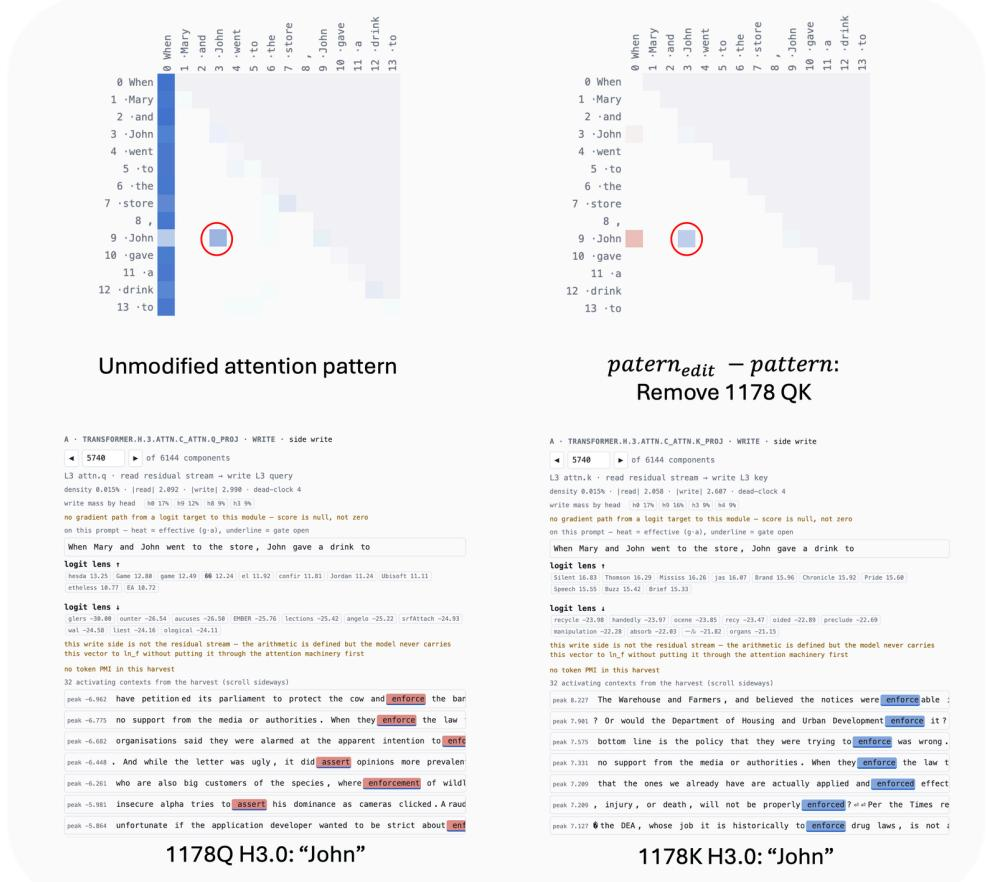  
Figure 4: QK circuit at position $Q : 9 ( J o h n ) - K$ : 3(John) of H3.0 (“duplicate token head”). We observed that components 1178QK (“John”) contribute strongly to the attention pattern, and ablating those components suppresses the “duplicate token” attention pattern.

the coordinate block $\begin{array} { r } { B _ { h } = [ d _ { h } h , ~ d _ { h } ( h { + } 1 ) - 1 ] } \end{array}$ ] where $d _ { h }$ is the head dimension. Thus we measure the share of a component’s read direction lying in head h:

$$
\begin{array} { r } { m a s s _ { h , c } \ = \ \big \| v _ { c } [ \mathcal { B } _ { h } ] \big \| _ { 2 } ^ { 2 } \big / \big \| v _ { c } \big \| _ { 2 } ^ { 2 } , \qquad \sum _ { h } m a s s _ { h , c } = 1 . } \end{array}\tag{28}
$$

When a behaviour is attributed to a particular head, we rank only the components with $m a s s _ { h , c } \geq$ 0.25, i.e. those reading at least a quarter of their direction from that head. We report both rankings: unfiltered and filtered.

## H.2 PROBE 1: INDUCTION

Prompt. A sequence of n uniformly random token ids, drawn from the interior of the vocabulary, is concatenated with itself behind a BOS token,

$$
\left[ \textsf { e o s } \right] \ r _ { 1 } \ldots r _ { n } \ r _ { 1 } \ldots r _ { n } ,
$$

where $r _ { i }$ is a random token. At position t of the second copy the token equals the one at t − n, so an induction head attends from t to t − n + 1 - the token that followed last time. While an induction component will activate on the second occurrence of the token only. P is the set of the second copy of the token and N is the first copy. We run n = 60 over 4 prompts, giving $| \mathcal { P } | = | \mathcal { N } | = 2 4 0$ tokens.

## H.3 PROBE 2: DUPLICATE TOKEN

Prompt A: Duplicated tokens. We construct the prompt as follow:

$$
\left[ \textsf { e o s } \right] r _ { 1 } \ldots r _ { n } r _ { \pi ( 1 ) } \ldots r _ { \pi ( n ) } ,
$$

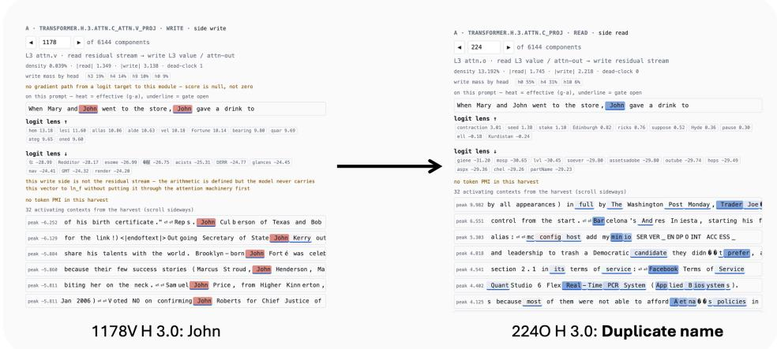

Figure 5: OV circuit of H3.0 (“duplicate token head”). The components 1178V (“John”) and 224O (“duplicate name”) have a strong causal effect on each other. The component 224O writes the “duplicate token” signal to the activation space, which is the main role of H3.0.  
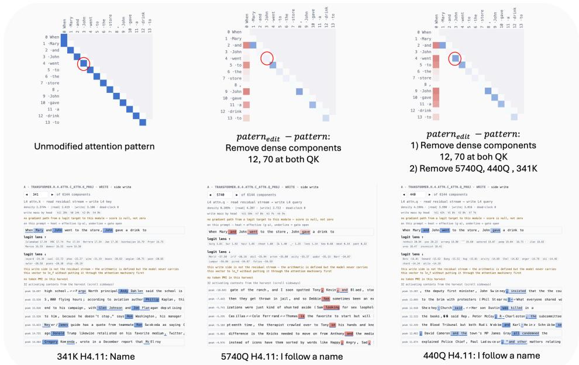  
Figure 6: QK circuit at position Q : 4(went) − K : 3(John) of H4.11 (“previous token head”). We observed that components 12QK, 70QK (dense components), 5740Q, 440Q (“follow a name”), 341K (“name”) contribute strongly to the attention pattern, and ablating those components suppresses the “previous token” attention pattern.

where $r _ { i }$ is a random token and $\pi \mathrm { ~ a ~ }$ uniformly random permutation. The first half is a random sequence of tokens while the second half is a random permutation of the first half. P is the second half sequence, and $\mathcal { N }$ the first sequence. We run n = 60 over 4 prompts, giving $| \mathcal { P } | = | \mathcal { N } | = 2 4 0$ tokens.

Prompt B: Duplicated names. We fix a pool of $k = 1 2$ single-token first names, then append 2n further names drawn uniformly from the same pool:

$$
[ \mathsf { e o s } ] \ N _ { 1 } \ldots N _ { k } \ \tilde { N } _ { 1 } \ldots \tilde { N } _ { 2 n } , \qquad \tilde { N } _ { j } \sim \mathrm { U n i f } \{ N _ { 1 } , \ldots , N _ { k } \} .
$$

where $N _ { i }$ is a name. $\mathcal { P }$ is the 2n resampled slots, and $\mathcal { N }$ is the k pool slots. We run $n = 6 0$ over 4 prompts.

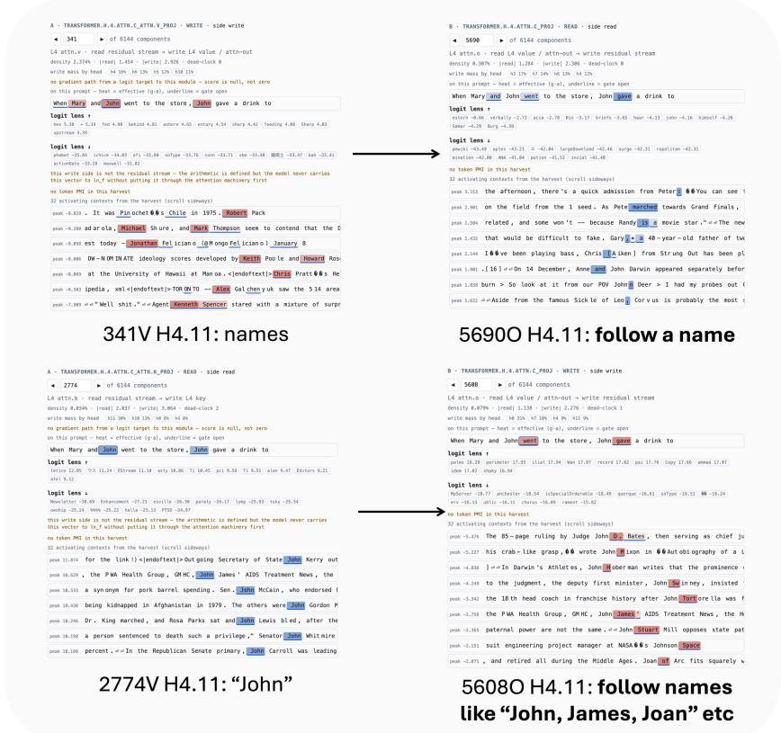  
Figure 7: OV circuit of H4.11 (“previous token head”). The components 341V (“names”), 2774V (“John”) have a strong causal effect on 5690O (“follow a name”), 5608O (“follow names like John, James, Joan, etc.”). The components 5690O, 5608O write the “follow a name (John)” signal to the activation space, which is the main role of H4.11.

## H.4 PROBE 3: NAMES AND REPEATED NAMES

We test our hypothesis of a component fire on names and fire more strongly on the second occurrence of the name.

Prompt A: random co-occurrence. The prompt contains an interleave of a first name and common nouns, the names and nouns are drawn from two pools of 12 items each:

$$
[ \mathsf { e o s } ] \mathsf { J o h n \ t a b l e \ M a r y \mathrm { ~ r i v e r ~ \mathsf { J o h n } ~ \mathsf { q a r d e n } ~ . ~ . ~ . ~ } }
$$

Each slot is labelled by the token type (name or word) and by whether it is the first token or repeated token, giving the four classes name first, name rep, word first, word rep. We test with 24 names and nouns, on 4 different prompts.

Prompt B: natural co-occurrence. We repeat the same kind of prompt but using 6 hand-written passages to ensure a natural language token distribution, each containing one first name and one common noun that recur naturally, e.g.

The morning meeting ran long, and John brought coffee for everyone waiting there. By the time John sat down, the coffee had gone cold.

Metric. Let $\bar { e } _ { \kappa }$ be the mean of $| e _ { t , c } |$ over the tokens of class $\kappa ,$ we measure the value:

$$
\begin{array} { r l } & { \mathrm { I I } _ { \mathrm { n a m e } } = \bar { e } _ { \mathrm { n a m e - r e p } } - \bar { e } _ { \mathrm { n a m e - f i r s t } } , \qquad \quad \mathrm { I I } _ { \mathrm { w o r d } } = \bar { e } _ { \mathrm { w o r d - r e p } } - \bar { e } _ { \mathrm { w o r d - f i r s t } } , } \\ & { \qquad \Delta = \mathrm { I I } _ { \mathrm { n a m e } } - \mathrm { I I } _ { \mathrm { w o r d } } . } \end{array}\tag{29}
$$

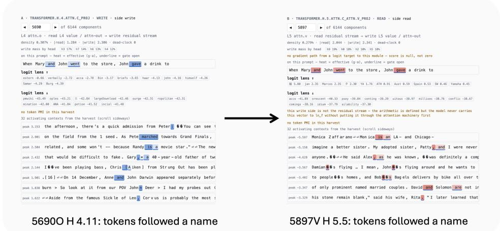  
Figure 8: Connection between H4.11 (“previous token head”) and 5.5 (“induction head”). Component 5690O H4.11 (“tokens followed a name”), which is the component that writes the main functionality of H4.11 to the activation space, contributes strongly to the component 5897V H5.5 (“tokens followed a name”).

This value will have: low value for a pure name detector component, low value for a pure duplicate token component; and $\Delta > 0$ for a duplicate-name detector where the second token is fired more strongly.

## I INTERACTION OF COMPONENTS, FEATURES

In this section, we outline how we compute the interaction between components and components, and between components and features. We also provide some additional interesting examples we saw in our implementation (Figure 20, 21).

Component and component interaction. The causal effect between two components $c _ { 1 } , c _ { 2 }$ is controlled by both the activation space at which they fire and their geometry, $u _ { c _ { 1 } } , v _ { c _ { 1 } } , u _ { c _ { 2 } } , v _ { c _ { 2 } } .$ We therefore score a component pair by the corpus average of its first-order contribution rather than by pure cosine similarity.

Let ${ \boldsymbol { e } } _ { t , c } ~ = ~ g _ { t , c } a _ { t , c } , ~ a _ { t , c } = { \boldsymbol { v } } _ { c } ^ { \top } { \boldsymbol { x } } _ { t }$ . For interaction between OV or $M L P _ { i n } , M L P _ { o u t }$ , at token t, component $c _ { 1 }$ writes $e _ { c _ { 1 } } ( x _ { t } ) u _ { c _ { 1 } }$ to the output; $c _ { 2 }$ reads $e _ { c _ { 1 } } ( x _ { t } ) \left. u _ { c _ { 1 } } , v _ { c _ { 2 } } \right.$ the tokens at which $c _ { 2 }$ fire. The contribution of $c _ { 1 }$ to $c _ { 2 }$ at that token is therefore $g _ { t , c _ { 2 } } e _ { c _ { 1 } } ( x _ { t } ) \left. u _ { c _ { 1 } } , v _ { c _ { 2 } } \right.$

$$
i n t e r a c t ^ { O V \ o r M L P } ( c _ { 1 } , c _ { 2 } ) \ = \ \mathbb { E } _ { t } [ g _ { t , c _ { 2 } } e _ { c _ { 1 } } ( x _ { t } ) ] \ \langle u _ { c _ { 1 } } , v _ { c _ { 2 } } \rangle .\tag{30}
$$

For $Q K$ circuit, both components write to the $Q K$ space, let $c _ { q } , c _ { k }$ be the components in the Q, K matrices respectively. The interaction is also divided by heads, therefore the interaction is:

$$
i n t e r a c t _ { h } ^ { Q K } ( c _ { q } , c _ { k } ) = \mathbb { E } _ { t } \big [ g _ { t , c _ { k } } e _ { c _ { q } } ( x _ { t } ) \big ] \cdot \langle u _ { c _ { q } } ^ { h } , u _ { c _ { k } } ^ { h } \rangle ,\tag{31}
$$

for $c _ { q }$ and $c _ { k }$ are component of $Q$ and K respectively.

Component and feature interaction. For component and feature interaction, we measure the inner product between the directions: on the write side $\langle u _ { c } , W _ { i } ^ { d e c } \rangle$ for a feature downstream of the matrix, and on the read side $\langle v _ { c } , W _ { i } ^ { e n c } \rangle$ for a feature upstream of it (with the intervening LayerNorm gain folded into $v _ { c } ) { : }$

$$
i n t e r a c t _ { d o w n s t r e a m } ^ { f e a t u r e } ( c , f _ { i } ) = \langle u _ { c } , W _ { i } ^ { d e c } \rangle , i n t e r a c t _ { u p s t r e a m } ^ { f e a t u r e } ( c , f _ { i } ) = \langle v _ { c } , W _ { i } ^ { e n c } \rangle ,\tag{32}
$$

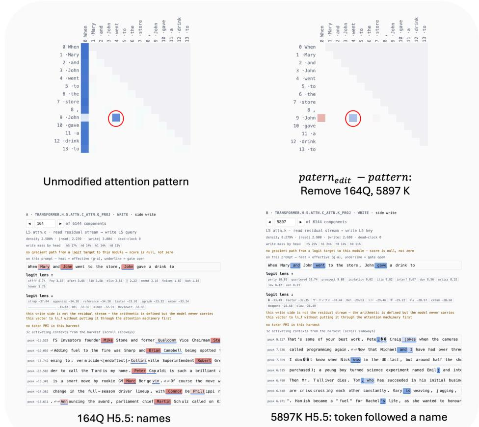

Figure 9: QK circuit at position Q : 9(John) − K : 4(went) of H5.5 (“induction head”). We observed that components 164Q (“names”), 5897K (“token followed a name”) contribute strongly to the attention pattern and ablating those components suppress the “induction” attention pattern.  
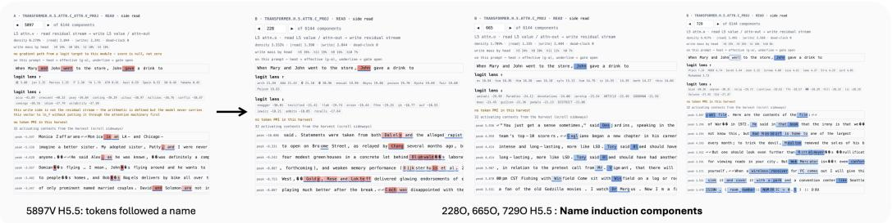  
Figure 10: OV circuit of H5.5 (“induction head”). The components 4897V (“tokens followed a name”) have a strong causal effect on 228O, 665O, 7290O (“name induction”). The components 228O, 665O, 7290O write the “induction” signal to the activation space, which is the main role of H5.5.

## J DISCUSSION: WHY WE TRAIN ASPD’S gs ON THE RESIDUAL STREAM ACTIVATION?

In the training of ASPD (Appendix C), we train our shared causal importance function $g ^ { s }$ on the residual stream activation of the model. The reason for this is that training the function on the input activation x of a weight can lead to a less diverse set of components and less interpretable components (an example of this is PD Transcoder on Gemma-2-2B, Table 1), because most components are “near-dead” components that activate on very few tokens that are unrelated. This happens when the input activation is inside the module, such as between the $M L P _ { i n }$ and $M L P _ { o u t }$ or between the O and V matrices. We hypothesize that this phenomenon happens because the modules only process a small amount of information while discarding other information that is in the residual stream; hence, feeding $g ^ { s }$ with input activation with less information makes the decomposition process learn less diverse components, and most components are near-dead. Our current solution is to train the causal importance function entirely on the residual stream activation, feeding it with diverse information; we assume that if any activation space feature (or information) is not used by the weight, then the component that aligns with the feature will have a low $P _ { c }$ norm. In practice, we found that this solution solves the problem by learning a diverse and interpretable component set while performing relatively the same on other metrics.

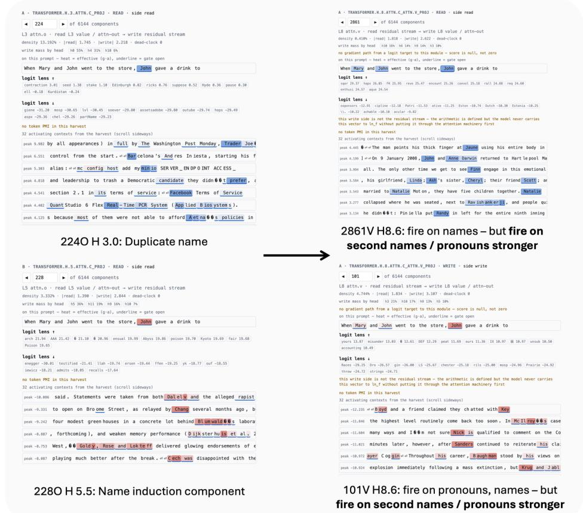  
Figure 11: Connection between H3.0 (“duplicate token head”), 5.5 (“induction head”) and H8.6 (“S-inhibition head”). Components 224O H3.0 (“duplicate name”) and 228O H5.5 (“name induction”), which are the components that write the main functionality of H3.0 and H5.5 to the activation space, contribute strongly to the component 2861V, 101V H8.6 (“fire on pronouns, names - but fire on second names/pronouns stronger”).

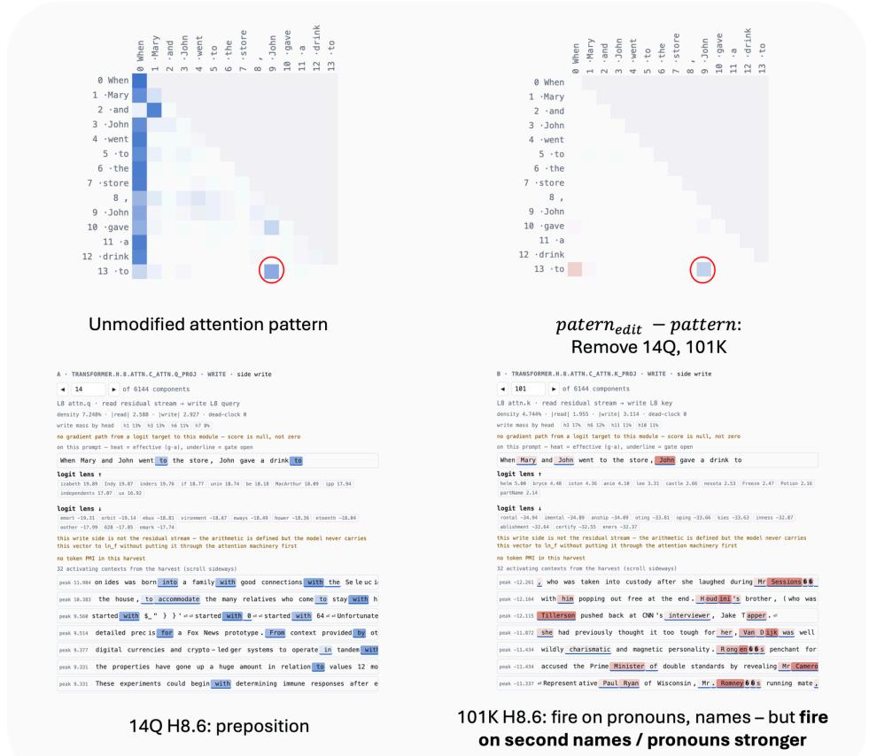  
Figure 12: QK circuit at position $Q : 1 3 ( t o ) - K : 9 ( J o h n )$ of H8.6 (“S-inhibition head”). We observed that components 14Q (“preposition”), 101K (“fire on pronouns, names - but fire on second names/pronouns stronger”) contribute strongly to the attention pattern, and ablating those components suppresses the “S-inhibition” attention pattern.

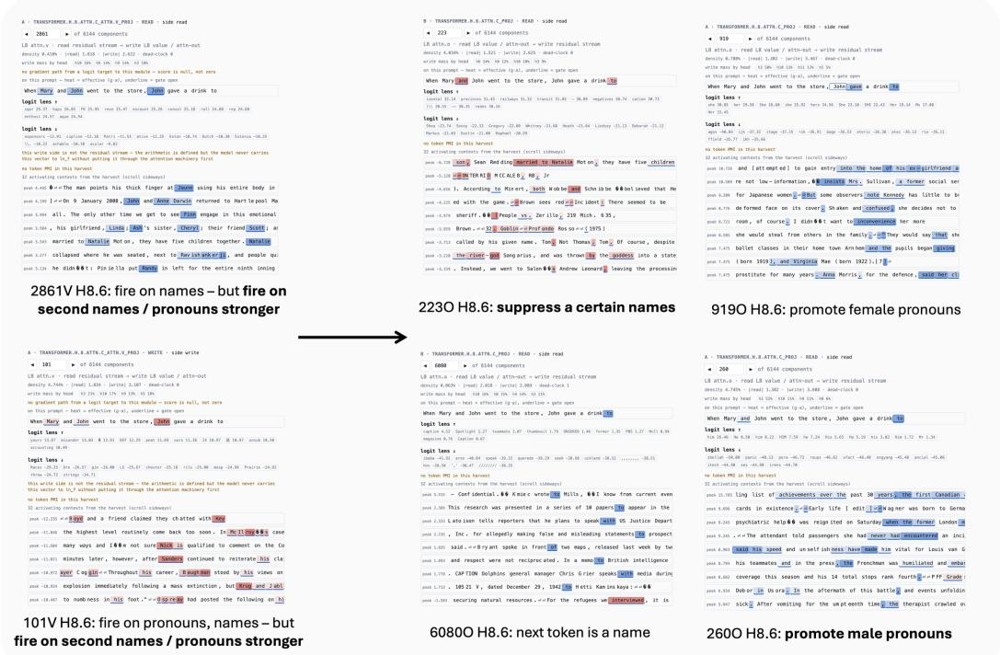  
Figure 13: OV circuit of H8.6 (“S-inhibition head”). The components 2861V, 101V (“fire on pronouns, names - butfire on second names/pronouns stronger”) have a strong causal effect with 223O (“suppress certain names”), 919O (“promote female pronouns”), 6080O (“next token is a name”), 260O (“promote male pronouns”). The components 223O, 919O, 6080O, 260O suppress/promote “male/female pronouns ” and write the information to the activation space, which is the main role of H8.6.

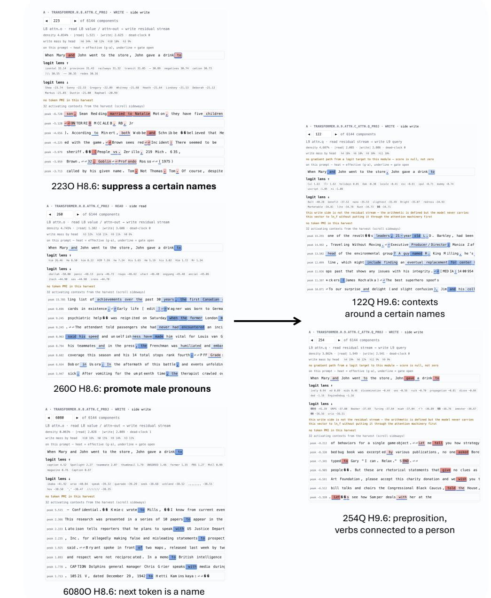  
Figure 14: Connection between H8.6 (“S-inhibition head”) and H9.6 (“name mover head”). Components 223O H8.6 (“suppress a certain names”), 260O H8.6 (“promote male pronouns”), 6080O H8.6 (“next token is a name”), which are the components that write the main functionality of H8.6 to the activation space, contribute strongly to the component 122Q H9.6 (“contexts around a certain names”) and 254Q H9.6 (“preposition, verbs connected to a person”).

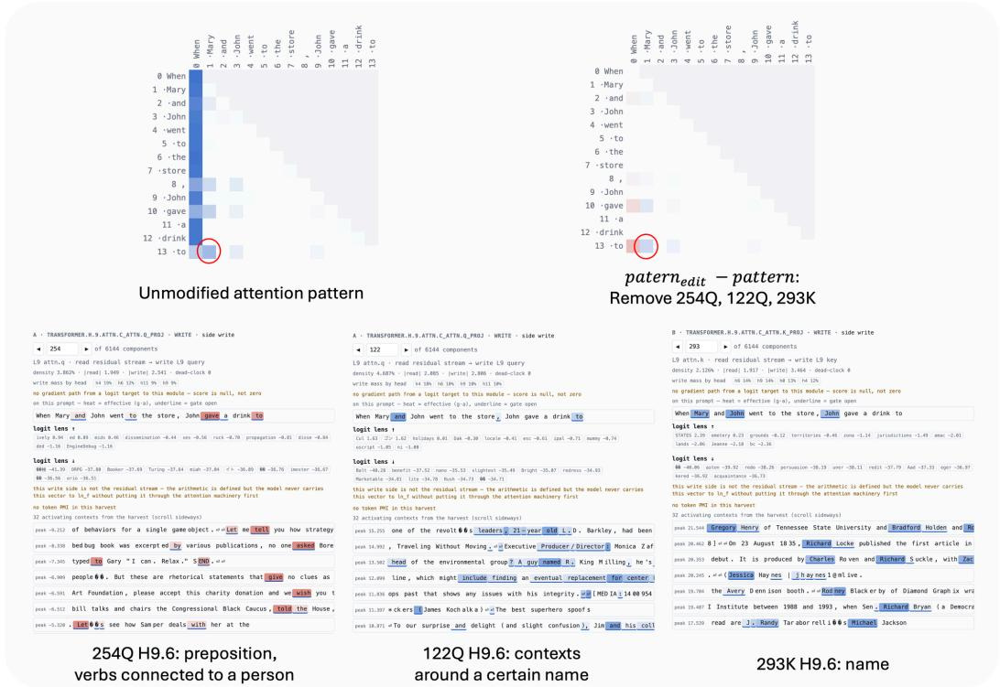  
Figure 15: QK circuit at position Q : 13(to) − K : 1(M ary) of H9.6 (“name mover head”). We observed that components 254Q (“prepositions, verbs connected to a person”), 122Q (“contexts around a certain name”), 293K (“names”) contribute strongly to the attention pattern, and ablating those components suppresses the “name mover” attention pattern.

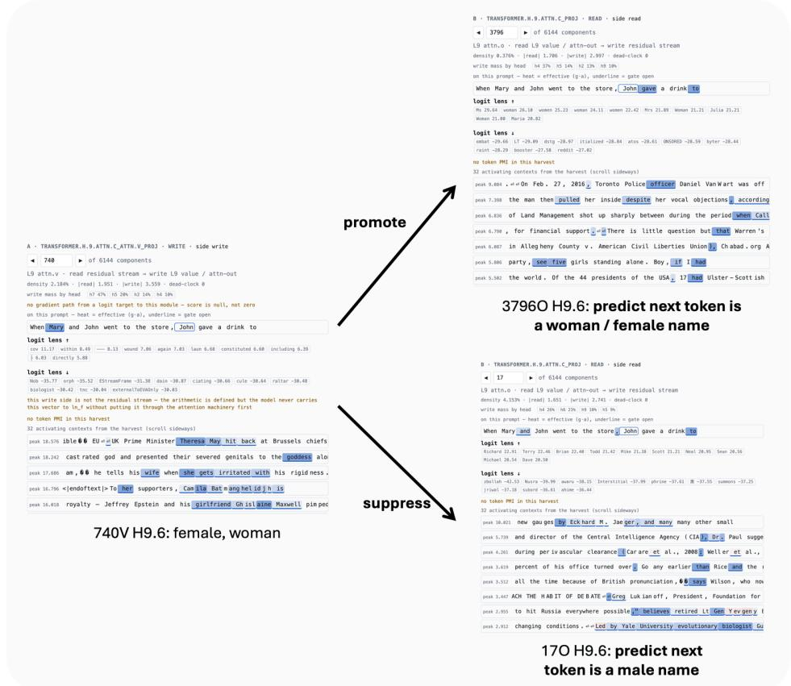  
Figure 16: OV circuit of H9.6 (“name mover head”). The components 740V (“female, woman”) have a strong causal effect on 3796O (“predict next token is a woman/female name”), 17O (“predict next token is a male name”). The components 3796O, 17O promote “male/female pronouns ” and write the information to the activation space, which is the main role of H9.6.

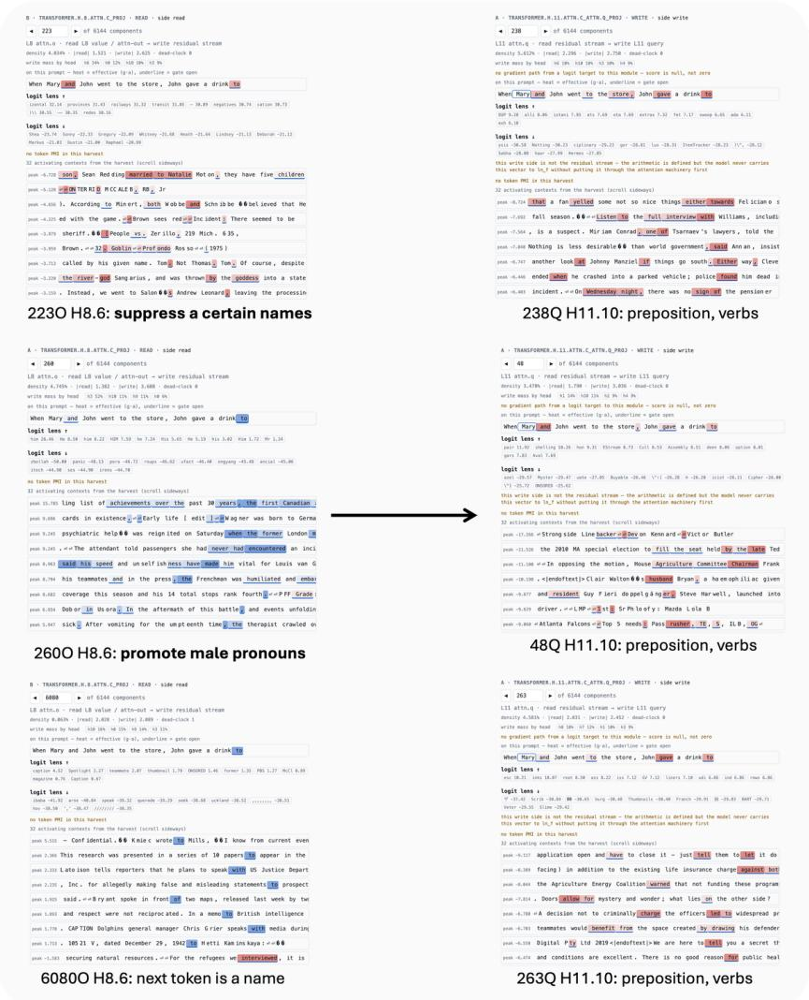  
Figure 17: Connection between H8.6 (“S-inhibition head”) and H11.10 (“negative name mover head”). Components 223O H8.6 (“suppress certain names”), 260O H8.6 (“promote male pronouns”), 6080O H8.6 (“next token is a name”), which are the components that write the main functionality of H8.6 to the activation space, contribute strongly to the components 238Q, 48Q, 263Q H11.10 (“prepositions, verbs”).

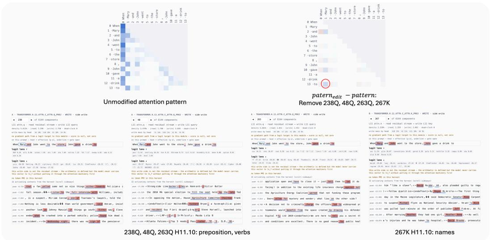  
Figure 18: QK circuit at position Q : 13(to) − K : 1(Mary) of H11.10 (“negative name mover head”). We observed that components 238Q, 48Q, 263Q (“preposition, verbs”), 267K (“names”) contribute strongly to the attention pattern, and ablating those components suppresses the “negative name mover” attention pattern.

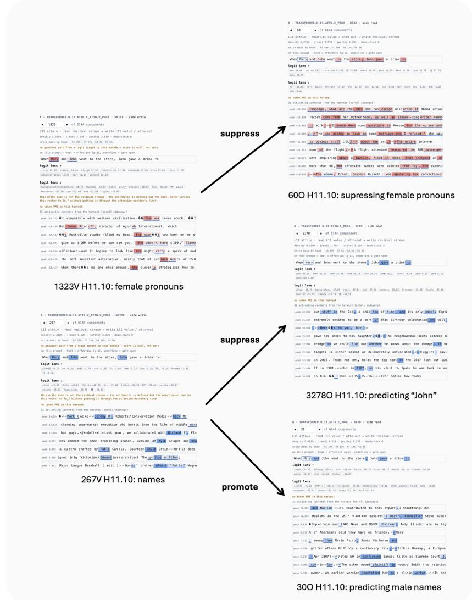  
Figure 19: OV circuit of H11.10 (“negative name mover head”). The components 1323V (“female pronouns”), 267V (“names”) have a strong causal effect on 60O (“suppressing female pronouns”), 3278O (“predict John”), 30O (“predict male names”). The components 60O, 3278O, 30O promote/suppress “male/female names/pronouns” and write the information to the activation space, which is the main role of H11.10.

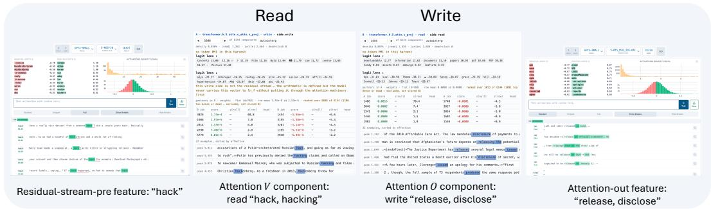  
Figure 20: The image shows the component 5342 Q (“tech, car, airplane companies”) at layer 9 reads the features 1964, 13889, 19129 of residual-stream-pre which activate on “tech, car companies” context. 5342 Q interacts with components 1518 K that fires on “device and tech-related” and read the related features 18090, 2403, 2823 from the residual-stream-pre, forming attention pattern.

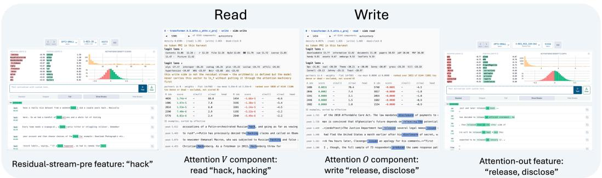  
Figure 21: The image shows the component 5306 V (“hack, hacking”) at layer 5 reads the feature 16372 of residual-stream-pre which activates on “hack” context. 5306 V interacts with components 1454 O that fires on “release, disclose” and write out news related features 31334 at the output of the attention module.