# WHAT YOU OBSERVE DETERMINES HOW YOU IDENTIFY CAUSAL EFFECTS: EVALUATING CAUSAL MODELS ACROSS OBSERVATIONAL VIEWS

Heejin Jung<sup>1</sup> Gyeongdeok Seo<sup>2</sup> Hoyoon Byun<sup>1</sup> Joseph Lee<sup>1</sup> Kyungwoo Song<sup>1∗</sup> <sup>1</sup>Yonsei University <sup>2</sup>University of Illinois Urbana–Champaign

## ABSTRACT

Causal foundation models (CFMs) pre-trained on data generated from various structural causal models (SCMs) have been proposed for estimating causal effects from observational data. However, differences in pre-training environments and evaluation protocols make it difficult to assess how their performance depends on the information available for causal identification. To enable controlled comparisons, we introduce CausalIDView<sup>1</sup>, a multi-view benchmark that holds the SCM realization and target estimand fixed while varying only the observational view available to the estimator. Each observational view corresponds to a distinct identification regime under the benchmark’s maintained causal assumptions. Across these matched views, no CFM consistently performs best and model rankings vary substantially. Under controlled structural changes, CFMs exhibit model-specific failures to maintain stable estimates when true effects are unchanged and to track genuine effect changes. We also examine whether combining explicit identification with strong predictive estimation is effective. A modular approach that pairs a predictive tabular foundation model with regime-specific identification procedures is competitive with CFMs and outperforms several of them. These findings motivate cross-regime comparisons to assess the empirical value of CFMs.

## 1 INTRODUCTION

Machine-learning methods for causal effect estimation have become useful estimators by flexibly estimating outcome regressions, propensity scores and other nuisance functions under a specified set of identification assumptions (Athey et al., 2019; Kennedy, 2023; Kunzel et al., 2019; Nie and Wager,¨ 2021; Shalit et al., 2017; Shi et al., 2019). Recently, Causal Foundation Models (CFMs) have been proposed to amortize causal inference across datasets (Balazadeh Meresht et al., 2026; Ma et al., 2026; Robertson et al., 2026). At test time, they take observational datasets as context and produce causal predictions through in-context learning without updating pre-trained parameters. This shifts the computational burden from dataset-specific training to shared pre-training, making CFMs attractive for applications requiring causal analyses across multiple datasets. However, current CFMs are trained and evaluated under different observational structures and causal assumptions. It remains unclear how their performance changes when the information available for identification changes.

Existing evaluations do not directly isolate this question. Across existing CFM studies, pre-training priors and evaluation protocols differ, including the data-generating processes and causal assumptions used for evaluation (Balazadeh Meresht et al., 2026; Ma et al., 2026; Robertson et al., 2026). Robertson et al. (2026) and Ma et al. (2026) consider multiple identification regimes, but their evaluations use separately constructed SCMs rather than the same underlying system. This makes it difficult to determine how much performance depends on the available identifying information. A controlled comparison should therefore hold the causal world and target effect fixed while varying only which variables the estimator observes. A causal world consists of an SCM and one complete data realization, including potential outcomes.

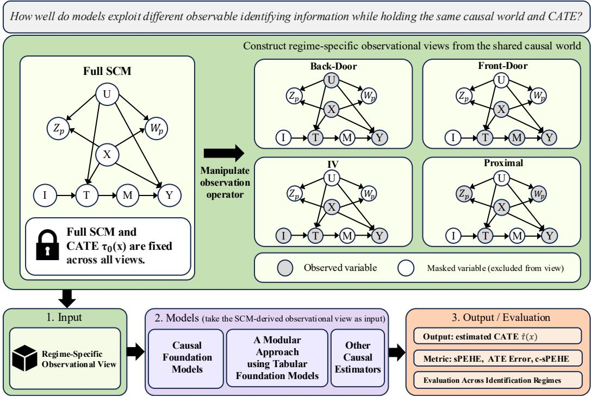  
Figure 1: Overview of CAUSALIDVIEW. Each realized SCM is mapped to matched observational views while preserving the query units and target CATE. We can also compare the Hidden Confounding (HC) view, described in Appendix B.5.

We introduce CAUSALIDVIEW, a multi-view benchmark that places causal effect estimators on a common evaluation. For each instance, we hold the SCM realization, query units, and target conditional average treatment effect (CATE) fixed, while varying only what the estimator observes. As illustrated in Figure 1, each causal world is exposed through matched views supporting back-door adjustment (Pearl, 1993), front-door identification (Pearl, 2022), instrumental-variable identification (Angrist et al., 1996), and proximal identification (Miao et al., 2018), together with a hiddenconfounding stress view. CAUSALIDVIEW does not assume all views are native to each model since current CFMs were not necessarily pre-trained for every regime. Instead, it characterizes how CFM inference changes under controlled shifts in identifying information and compares CFMs with other causal estimators. We complement CATE accuracy evaluations with semi-synthetic benchmarks and null-effect tests using pre-treatment outcomes from real-world randomized trials.

We further ask whether a strong predictor coupled with explicit identification can rival CFMs. To this end, we use modular estimators equipped with the pre-trained tabular foundation model TabPFN (Grinsztajn et al., 2026; Jager et al., 2026) to estimate the observable quantities that each regime’s¨ identification strategy requires. No CFM leads in every regime, while TabPFN-based modular estimators remain competitive with CFMs. Under partial identification, TabPFN-based bound esti mators achieve the lowest endpoint errors. Whether structural perturbations preserve or alter the true CATE, CFMs falter in model-specific ways. On semi-synthetic benchmarks and real-world null-effect tests, the best estimator varies by dataset.

## Our main contributions are:

• Evaluation ground for causal effect estimators. We introduce a multi-view benchmark that evaluates CFMs and causal estimators on various observational views, holding the target fixed.

• Complementary diagnostics. We characterize model-specific failures under structural changes, dataset-dependent accuracy, null-effect behavior, and evaluation of partial-identification bounds.

• Effectiveness of modular identification. We demonstrate that combining predictive tabular foundation models with explicit causal procedures yields competitive point estimates and lower endpoint errors in bound estimation in the evaluated settings.

## 2 BACKGROUND

## 2.1 CATE AND COMMON CAUSAL CONDITIONS

CATE. We use the potential-outcomes framework (Rubin, 1974). We consider a binary treatment $T \in \{ 0 , 1 \}$ , an outcome $Y ,$ , and potential outcomes $Y ( t )$ under $T = t$ . X denotes the observed pre-treatment covariates indexing treatment-effect heterogeneity. The treatment-specific conditional mean and conditional average treatment effect (CATE) are

$$
\mu _ { t } ( x ) : = \mathbb { E } [ Y ( t ) \mid X = x ] , \qquad \tau _ { 0 } ( x ) : = \mu _ { 1 } ( x ) - \mu _ { 0 } ( x ) = \mathbb { E } [ Y ( 1 ) - Y ( 0 ) \mid X = x ] .\tag{1}
$$

Common causal conditions. We maintain consistency together with the standard stable-unit treatment-value conditions (Rubin, 1980). Consistency requires that the observed outcome equal the potential outcome under the received treatment, $Y _ { i } \overset { \cdot } { = } Y _ { i } ( T _ { i } )$ for index i. Well-defined treatment versions require each treatment value to represent a single causally relevant intervention, and no interference requires that one unit’s potential outcomes not depend on the treatment assignments of other units. The positivity and support requirements specific to each identification regime are imposed over the target covariate support and stated in Appendix B.

## 2.2 POINT-IDENTIFICATION REGIMES FOR CATE

We focus on four point-identification strategies, depending on which auxiliary causal variables are available.

Back-Door (BD) identification. When the confounder U is observed and $( X , U )$ satisfies conditional exchangeability and positivity, back-door adjustment identifies the target CATE (Pearl, 2022; Rosenbaum and Rubin, 1983).

$$
\pi _ { \mathtt { B D } } ( x ) : = \int \Big \{ \mathbb { E } [ Y \mid T = 1 , X = x , U = u ] - \mathbb { E } [ Y \mid T = 0 , X = x , U = u ] \Big \} d P ( u \mid X = x )
$$

Front-Door (FD) identification. When U is unmeasured but a mediator M satisfying the frontdoor criterion is observed, the total treatment effect remains identifiable (Pearl, 2022). For a continuous mediator, the corresponding conditional front-door functional is

$$
\begin{array} { c } { \tau _ { \mathrm { F D } } ( x ) : = \displaystyle \int \left\{ p ( m \mid T = 1 , X = x ) - p ( m \mid T = 0 , X = x ) \right\} } \\ { \displaystyle \qquad \times \left[ \displaystyle \sum _ { a \in \{ 0 , 1 \} } \mathbb { E } [ Y \mid M = m , T = a , X = x ] P ( T = a \mid X = x ) \right] d m } \end{array}
$$

Instrumental-Variable (IV) identification. When a valid binary instrument I is observed, the conditional Wald functional is

$$
\pi \mathrm { { y } } \left( x \right) : = \frac { \mathbb { E } [ Y \mid I = 1 , X = x ] - \mathbb { E } [ Y \mid I = 0 , X = x ] } { \mathbb { E } [ T \mid I = 1 , X = x ] - \mathbb { E } [ T \mid I = 0 , X = x ] }
$$

The conditional Wald ratio generally identifies a conditional local average treatment effect under the standard relevance, exogeneity, exclusion, and monotonicity conditions (Angrist and Imbens, 1995; Angrist et al., 1996).

Proximal Causal (PX) identification. When U is unmeasured but the confounding proxies $( Z _ { \mathrm { p } } , W _ { \mathrm { p } } )$ are observed, let $h _ { t } ( w , x )$ be an outcome confounding bridge satisfying $\mathbb { E } [ Y \mid ^ { * } Z _ { \mathrm { p } } =$ $z , { \dot { T } } \ = \ { t , X } \ = \ x ] \ = \ \operatorname { \mathbb { E } } [ h _ { t } ( W _ { \mathrm { p } } , x ) \mid Z _ { \mathrm { p } } = z , T = t , X = x ]$ . Under the corresponding proxyindependence, bridge-existence, and completeness conditions, the proximal g-formula (Miao et al., 2018; Sverdrup and Cui, 2023; Tchetgen Tchetgen et al., 2024) identifies

$$
\tau _ { \mathrm { P X } } ( x ) : = \mathbb { E } [ h _ { 1 } ( W _ { \mathrm { p } } , x ) - h _ { 0 } ( W _ { \mathrm { p } } , x ) \mid X = x ]
$$

Under the benchmark’s maintained regime-specific conditions, with the shared-target construction described in Section 4.1.1, all four identification strategies recover the same target CATE:

$$
\boxed { \tau _ { \mathrm { B D } } ( x ) = \tau _ { \mathrm { F D } } ( x ) = \tau _ { \mathrm { I V } } ( x ) = \tau _ { \mathrm { P X } } ( x ) = \tau _ { 0 } ( x ) }\tag{2}
$$

Appendix B formally provides the assumptions and derivations for each identification regime.

## 3 RELATED WORK

Identification of Causal Effects Causal identification concerns whether a target causal estimand is uniquely determined by the observed-data distribution under maintained causal assumptions. In graphical causal models, assumptions encoded by the causal structure can render interventional or counterfactual quantities identifiable from observational data. In general, complete identification procedures characterize when causal queries can be uniquely recovered from lower levels of the causal hierarchy and provide graphical certificates when such recovery is impossible (Shpitser, 2020; Shpitser and Pearl, 2008). When multiple causal models remain observationally indistinguishable yet imply different values of the target estimand, point identification fails. Rather than treating such cases as entirely uninformative, partial identification characterizes the set of causal effects compatible with the observed distribution and maintained assumptions, often through lower and upper bounds. This perspective has a long history in econometrics and causal inference, including bounds for treatment effects under imperfect compliance (Balke and Pearl, 1997) and the broader theory of partially identified probability distributions (Manski, 2003).

Causal Foundation Models for Treatment-Effect Estimation Recent work explores amortized causal effect estimation through pre-trained foundation models. Do-PFN (Robertson et al., 2026) pre-trains a Prior-Data Fitted Network (PFN) (Muller et al., 2021) over diverse causal structures¨ using paired observational and interventional samples to predict conditional interventional distributions. CausalPFN (Balazadeh Meresht et al., 2026) focuses on treatment-effect estimation under strong ignorability across heterogeneous data-generating processes, and CausalFM (Ma et al., 2026) explicitly separates identification from estimation through identification-aware SCM priors covering back-door, front-door, and instrumental-variable settings. Causal foundation models have largely targeted point estimates or prior-dependent posterior predictions, with recent work extending to partial identification (Bellot and Dhir, 2026).

Benchmarks for Causal Effect Estimation Existing benchmarks for causal effect estimation rely largely on synthetic or semi-synthetic data and evaluate estimators under controlled variations in data-generating processes. Widely used benchmarks such as IHDP (Hill, 2011) and the ACIC challenges (Dorie et al., 2019; Hahn et al., 2019) vary outcome functions, treatment assignment, overlap, and effect heterogeneity, while RealCause (Neal et al., 2020) improves realism by learning generative models from observational datasets. However, these benchmarks largely vary the DGP within a fixed identification regime rather than evaluating estimators across different identification regimes. This motivates benchmarks spanning diverse SCMs and identification regimes, analogous to broad generalization benchmarks such as TabArena (Erickson et al., 2026).

## 4 DATA CURATION

CAUSALIDVIEW is designed to contrast the performance of estimators targeting the same causal effect as the available identifying information changes. Rather than generating a separate dataset for each identification regime, we generate each complete causal world once and derive multiple observational views from it. Within each world, the SCM realization, query units, and target CATE remain fixed, while only the variables available to the estimator change.

To complement the analysis on our controlled synthetic benchmark, we examine baseline performance on semi-synthetic and real-world datasets that reflect characteristics of empirical data. Using semi-synthetic datasets with more realistic covariate distributions, treatment assignments and outcome variability, we evaluate CATE estimation accuracy against the available ground-truth effects. In the real-world setting, where ground-truth CATE is not observed but is theoretically known to be zero, we investigate whether models introduce treatment-effect bias into their estimates.

## 4.1 SYNTHETIC DATASET

## 4.1.1 GENERATING SHARED CAUSAL WORLDS

Shared causal structure. Each world is generated by the causal graph in Figure 1. The observational views are projections of a shared generating process, not independently constructed regimespecific datasets. The confounder U affects treatment assignment and outcome levels, while the treatment effect on Y is mediated entirely through M. A randomized binary instrument I affects the outcome only through treatment, and the pre-treatment proxies $( Z _ { p } , W _ { p } )$ provide noisy measurements of U without directly affecting treatment or outcome. All variables are generated jointly before any observational view is constructed.

Shared target CATE. To realize the common-target identity in equation 2, we restrict U to enter both potential outcomes through the same additive term $\gamma _ { U } ( X ) U$ , rather than modifying the treatment gain. The mediator has a fixed treatment-induced shift δ, and its contribution to the outcome has coefficient $\beta ( X )$ . We use shared unit-level mediator and outcome noises across treatment arms. Within a fixed world, the resulting unit-level effect and its conditional expectation satisfy

$$
\begin{array} { r } { Y _ { i } ( 1 ) - Y _ { i } ( 0 ) = \beta ( X _ { i } ) \{ M _ { i } ( 1 ) - M _ { i } ( 0 ) \} = \delta \beta ( X _ { i } ) , } \\ { \tau _ { 0 } ( x ) = \mathbb { E } [ Y _ { i } ( 1 ) - Y _ { i } ( 0 ) \mid X _ { i } = x ] = \delta \beta ( x ) . } \end{array}\tag{3}
$$

Under this construction, the unit-level treatment effect is determined entirely by X:

$$
Y _ { i } ( 1 ) - Y _ { i } ( 0 ) = \tau _ { 0 } ( X _ { i } ) .
$$

Therefore, the conditional average treatment effect in equation 1 is exactly the calibrated effect surface $\tau _ { 0 } ( x )$ , and the same target is attached to every observational view of a given causal world. The restriction also removes variation in treatment gains across latent states or compliance types at fixed X, so the conditional IV complier effect coincides with this target CATE.

We then construct the remaining mechanisms of the SCM so that each observational view satisfies the assumptions required to identify this same target. Although the observed variables and identifying functionals differ across views, each point-identified view recovers the same $\tau _ { 0 } ( x )$ . Appendix B provides the assumptions and derivations and Appendix D reports construction and identification audits.

Confounding in the observational contrast. The gain restriction does not eliminate confounding from the observed treatment-group contrast. Under this SCM,

$$
{ \begin{array} { r l } & { \mathbb { E } [ Y \mid T = 1 , X = x ] - \mathbb { E } [ Y \mid T = 0 , X = x ] } \\ & { \quad = \tau _ { 0 } ( x ) + \underbrace { \gamma _ { U } ( x ) \left\{ \mathbb { E } [ U \mid T = 1 , X = x ] - \mathbb { E } [ U \mid T = 0 , X = x ] \right\} } _ { \mathrm { c o n f o u n d i n g ~ b i a s } } . } \end{array} }\tag{4}
$$

The common confounding term cancels between the two potential outcomes of the same unit, but not between treatment groups, because treatment selection changes the conditional distribution of U. The construction aligns the causal targets across regimes without eliminating confounding in either the level or shape of the observational contrast.

## 4.1.2 OBSERVATIONAL VIEWS

After generating a complete world, we derive multiple observational views by changing only which auxiliary variables are available to the estimator. The BD, FD, IV, and PX views retain $\breve { U } , M , I ,$ , and $( Z _ { p } , W _ { p } )$ , respectively, alongside (X, T, Y).

We assign a single disjoint context–query split, denoted by $\mathcal { C }$ and $\mathcal { Q } ,$ and reuse it across all views. For view r, let $V ^ { ( r ) }$ denote its retained auxiliary variables. The observational context is

$$
\mathcal { D } _ { \mathrm { o b s } } ^ { ( r ) } = \left\{ ( X _ { i } , T _ { i } , Y _ { i } , V _ { i } ^ { ( r ) } ) : i \in \mathcal { C } \right\} .\tag{5}
$$

Excluding a variable from a view changes its availability to the estimator, not its role in generating the data. In particular, we do not resample treatment assignments, outcomes, structural parameters, or unit-level noise when constructing a new view. All views within a world are evaluated on the same query targets $\{ \tau _ { 0 } ( X _ { i } ) : i \in \mathcal { Q } \}$ . Auxiliary variables supply information for estimation without redefining the target conditioning set.

Consequently, within-world performance differences across views are not driven by different realized outcomes, query populations, or oracle effect values. This pairing compares the performance of models on the same realized causal problem while varying the information available for identification. Potential outcomes and oracle effects are reserved for evaluation and data validation.

## 4.2 SEMI-SYNTHETIC DATASET

We evaluate the CATE estimation performance of existing back-door baselines using ACIC 2016 (Dorie et al., 2019) and LaLonde-PSID/CPS datasets (Dehejia and Wahba, 1999; 2002; LaLonde, 1986) based on RealCause (Neal et al., 2020). ACIC 2016 is a benchmark that combines real covariates from the Collaborative Perinatal Project with researcher-designed treatment assignment and outcome-generating mechanisms. By preserving realistic covariate distributions, it enables the evaluation of estimation performance under diverse data-generating conditions, including nonlinearity, varying degrees of overlap, and treatment-effect heterogeneity. The RealCausebased LaLonde-PSID/CPS generates data from real covariates together with conditional treatmentassignment and outcome distributions learned from observational data. The original data concern the effect of participation in a job-training program on subsequent earnings and consist of the treatment group from the National Supported Work program paired with nonexperimental comparison groups drawn from PSID and CPS, respectively. RealCause fits generative models to the observational data under an assumed causal structure, providing ground-truth CATEs defined by the resulting datagenerating process. We use back-door baselines as the relevant comparison methods since both benchmarks assume that confounding between treatment and outcome can be sufficiently controlled using the observed covariates. Detailed experimental settings are provided in Appendix E.3.

## 4.3 REAL-WORLD DATASET

Estimating causal effects in real-world settings is an important problem, yet the ground-truth counterfactuals needed to evaluate treatment-effect estimates are generally unavailable. To address this limitation, we construct a real-world evaluation setting with known ground-truth CATEs by using variables measured before treatment assignment in randomized controlled trials (RCTs) as negative control outcomes. A negative control outcome is an outcome that cannot be affected by the treatment of interest (Arnold and Ercumen, 2016). In particular, an outcome realized before treatment assignment cannot be altered by a subsequent treatment. Ashby et al. (2025) formalize this property in the potential-outcome framework as a zero treatment effect for every individual. Thus, for a pretreatment outcome $Y ^ { \mathrm { p r e } }$ , we have $Y _ { i } ^ { \mathrm { p r e } } ( 1 ) = Y _ { i } ^ { \mathrm { p r e } } ( 0 )$ , implying $\tau _ { 0 } ( \dot { x } ) = \mathbb { E } [ Y ^ { \mathrm { p r e } } ( 1 ) - Y ^ { \mathrm { p r e } } ( \mathsf { \bar { 0 } } )$ $X = x ] = 0$ for all x.

Following this principle, we use three real-world RCT datasets. For ACTG 175 (Hammer et al., 1996), we focus on the treatment arms randomized to zidovudine (AZT) monotherapy and AZT+didanosine (ddI) combination therapy. Baseline CD4 count, measured before treatment assignment, serves as the outcome. The Pennsylvania Reemployment Bonus Demonstration (Corson et al., 1992) compares the control group with a reemployment-bonus treatment arm. We use earnings measured before randomized bonus assignment as the outcome. In the Illinois Unemployment Insurance Incentive Experiment (Woodbury and Spiegelman, 1987), the treatment contrast is between the control group and claimants offered a reemployment bonus. Base-period earnings measured before treatment assignment serve as the outcome. Appendix E.4 provides the conditions and proofs under which the null effect remains valid when treatment arms are selected in multi-treatment RCTs.

## 5 EXPERIMENTAL DESIGN

## 5.1 METRICS

For query units $\{ x _ { i } \} _ { i = 1 } ^ { N _ { q } }$ , we evaluate CATE estimation using

$$
\mathrm { s P E H E } = \sqrt { \frac { 1 } { N _ { q } } \sum _ { i = 1 } ^ { N _ { q } } \left( \widehat { \tau } ( x _ { i } ) - \tau _ { 0 } ( x _ { i } ) \right) ^ { 2 } } .
$$

Let $\begin{array} { r } { \tau _ { \mathrm { A T E } , \mathcal { Q } } = N _ { q } ^ { - 1 } \sum _ { i = 1 } ^ { N _ { q } } \tau _ { 0 } ( x _ { i } ) } \end{array}$ and $\begin{array} { r } { \widehat { \tau } _ { \mathrm { A T E } , \mathcal { Q } } = N _ { q } ^ { - 1 } \sum _ { i = 1 } ^ { N _ { q } } \widehat { \tau } ( x _ { i } ) } \end{array}$ . We additionally report the ATE error $\lvert \widehat { \tau } _ { \mathrm { A T E } , \mathcal { Q } } - \tau _ { \mathrm { A T E } , \mathcal { Q } } \rvert$ and centered sPEHE (c-sPEHE), which separate errors in the query-mean effect from errors in the centered CATE function with sPEH $\mathrm { E } ^ { 2 } = ( \widehat { \tau } _ { \mathrm { A T E , } \mathscr { Q } } - \tau _ { \mathrm { A T E , } \mathscr { Q } } ) ^ { 2 } + \mathrm { c } \mathrm { - s P E H E ^ { 2 } }$ Appendix E.1.1 provides the detailed definitions and derivation.

Standard point-estimation metrics do not measure whether an estimator responds appropriately to structural changes. We therefore consider Stay and Move conditions. Stay changes the structural mechanism while preserving the target CATE, $\tau _ { 0 } ^ { \mathrm { s t a y } } ( x _ { i } ) ~ = ~ \tau _ { 0 } ( x _ { i } )$ , so $E _ { \mathrm { s t a y } }$ measures spurious changes in the estimated CATE under a CATE-preserving intervention. Move instead changes the target CATE itself and $E _ { \mathrm { m o v e } }$ measures how accurately the corresponding change in the estimated CATE tracks the true CATE change. For a function $f ,$ , let $\begin{array} { r } { \| f \| _ { \mathcal { Q } } : = \sqrt { N _ { q } ^ { - 1 } \sum _ { i = 1 } ^ { N _ { q } } f ( x _ { i } ) ^ { 2 } } } \end{array}$ . Both metrics are dimensionless and lower values are better.

$$
E _ { \mathrm { s t a y } } = \frac { \| \widehat { \tau } ^ { \mathrm { s t a y } } - \widehat { \tau } \| _ { \mathcal { Q } } } { \| \tau _ { 0 } \| _ { \mathcal { Q } } } , \qquad E _ { \mathrm { m o v e } } = \frac { \| ( \widehat { \tau } ^ { \mathrm { m o v e } } - \widehat { \tau } ) - ( \tau _ { 0 } ^ { \mathrm { m o v e } } - \tau _ { 0 } ) \| _ { \mathcal { Q } } } { \| \tau _ { 0 } ^ { \mathrm { m o v e } } - \tau _ { 0 } \| _ { \mathcal { Q } } } .
$$

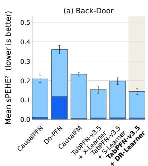

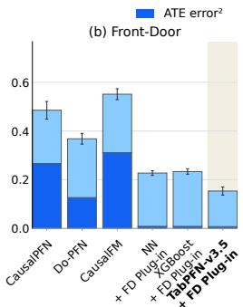

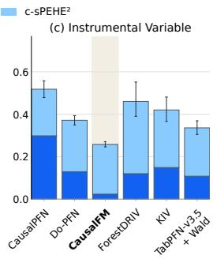

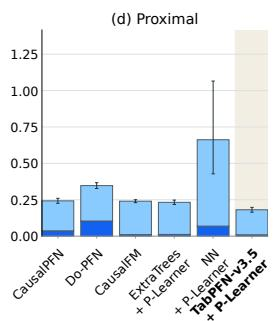  
Figure 2: Point estimation across observational views. We compare the evaluated model configurations under (a) Back-Door, (b) Front-Door, (c) IV, and (d) Proximal views. Bars show mean $\mathrm { s \bar { P } E H E ^ { 2 } }$ across 40 SCM worlds, decomposed into mean squared query-sample ATE error (dark blue) and mean c-sPEHE<sup>2</sup> (light blue). Shading marks the lowest observed mean in each panel. CausalPFN and Do-PFN receive the auxiliary variables available in each view as ordinary covariates, except for the post-treatment mediator.

## 5.2 BASELINES

Causal foundation models. We evaluate CausalPFN, Do-PFN, and CausalFM (Balazadeh Meresht et al., 2026; Ma et al., 2026; Robertson et al., 2026). In these configurations, CausalPFN and Do-PFN use auxiliary variables as ordinary features, without IV/proximal role annotations or specialized wrappers. The front-door X-only variants omit M from both context and query, avoiding conditioning total-effect predictions on the factual mediator.

Modular approaches. Our modular approaches pair supervised machine-learning models with explicit causal estimation procedures for the corresponding identification regimes. The predictive models estimate the outcome, propensity, or other nuisance quantities required by each procedure, while the causal estimation step determines how predictions are combined into treatment-effect estimates.

In the back-door setting, we use S- and X-Learners (Kunzel et al., 2019) and a DR-Learner ¨ (Kennedy, 2023). Unlike the S- and X-Learners, the DR-Learner constructs doubly robust pseudooutcomes by augmenting outcome contrasts with inverse-propensity-weighted residual corrections. Under front-door identification, we replace the predictive components of the plug-in estimator, including the treatment propensity, mediator, and outcome models, while retaining the front-door averaging procedure. The IV variant estimates the outcome mean and treatment probability under each instrument value and combines their contrasts through the conditional Wald ratio. For the prox imal setting, we use a P-Learner (Sverdrup and Cui, 2023), replacing the predictive models used for bridge estimation and final pseudo-outcome regression.

We instantiate these procedures with predictive models including TabPFN-v3.5 (Jager et al., 2026), ¨ XGBoost (Chen and Guestrin, 2016), neural networks, and ExtraTrees (Geurts et al., 2006) as applicable.

Other estimators. We additionally include regime-specific causal estimators that do not belong to either the CFM or modular predictor–procedure categories, including ForestDRIV and KIV for instrumental-variable estimation (Singh et al., 2019; Syrgkanis et al., 2019). Implementation details of all baselines are provided in Appendix E.2.

## 6 RESULTS

RQ1: How does performance vary across observational views? Figure 2 compares the evaluated model–input configurations while holding the causal world and target CATE fixed, and shows that the lowest-error configuration differs across observational views. The TabPFN-based DR-Learner and front-door plug-in attain the lowest mean sPEHE<sup>2</sup> in back-door and front-door, respectively, whereas CausalFM leads in IV. In the proximal view, the TabPFN-based P-Learner attains the lowest mean $\mathrm { s P E H E ^ { 2 } }$ among the evaluated configurations. The decomposition of $\mathrm { s P E H E ^ { 2 } }$ distinguishes errors in the query-mean effect from errors in the centered CATE function and shows that their contributions vary across model–view configurations. Centered CATE error dominates most back-door results and several proximal results, whereas mean-effect error is substantial for particular front-door and IV configurations. Thus, a single total-error score can obscure distinct estimation failures. The back-door and FD comparisons illustrate the practical value of combining a predictive model with an explicit causal procedure, while the IV comparison shows that this advantage does not hold uniformly across regimes.

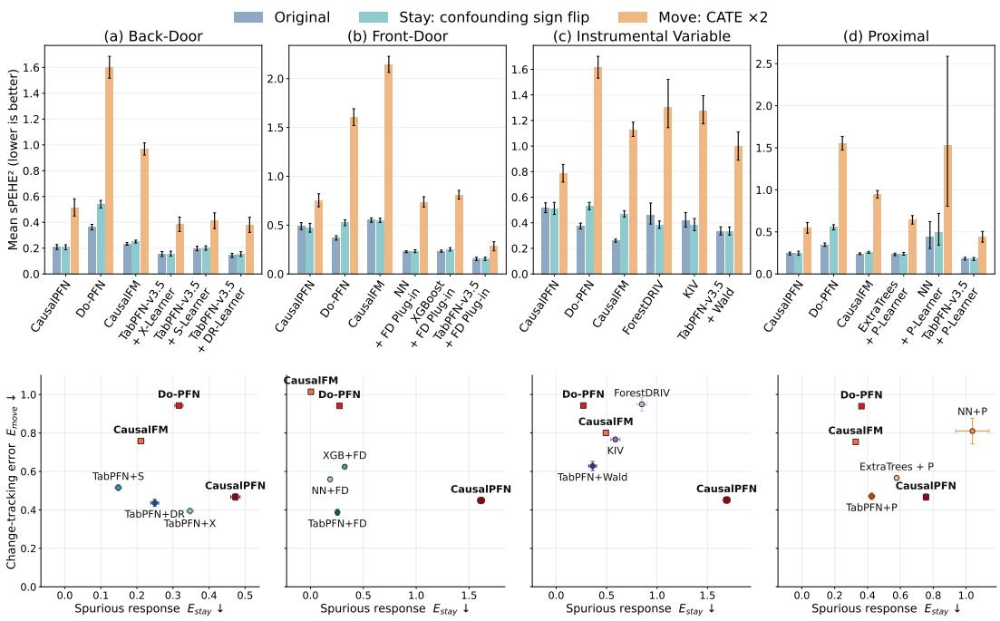  
Figure 3: Structural-response audit across observational views. We evaluate model responses under (a) Back-Door, (b) Front-Door, (c) IV, and (d) Proximal views. Top: Bars show mean $\mathrm { s P E H E ^ { 2 } }$ under the Original, Stay, and Move conditions. Bottom: Each point represents an evaluated model configuration, positioned by its mean spurious-response error $E _ { \mathrm { s t a y } }$ on the horizontal axis and mean change-tracking error $E _ { \mathrm { m o v e } }$ on the vertical axis.

RQ2: Do estimators respond appropriately to structural changes? Figure 3 examines whether estimators respond to changes in the target causal effect rather than to incidental structural changes. Starting from $\dot { \boldsymbol { Y } } ( t ) = \mu ( \bar { \boldsymbol { X } } ) + \gamma _ { U } ( \boldsymbol { X } ) \bar { \boldsymbol { U } } + \beta ( \boldsymbol { X } ) \boldsymbol { M } ( t ) + \epsilon _ { Y }$ , we construct a Stay intervention by reversing the confounding contribution, yielding $\tau _ { 0 } ^ { \mathrm { s t a y } } ( x ) = \tau _ { 0 } ( x )$ , and a Move intervention by doubling the mediator–outcome response, yielding $\overline { { \tau _ { 0 } ^ { \mathrm { m o v e } } } } ( x ) = 2 \tau _ { 0 } ( x )$ . An appropriate response therefore requires invariance under Stay and accurate effect-change tracking under Move. The resulting response map reveals qualitatively different CFM failures. CausalPFN shows relatively large Stay errors, indicating that its predictions can change even when the target CATE is preserved. On the other hand, Do-PFN shows consistently large Move errors with poor tracking when the CATE itself changes. CausalFM exhibits a view-dependent mixture of these behaviors. In contrast, the TabPFN-v3.5 modular estimators generally occupy a more balanced region with lower errors on both axes, suggesting that combining a strong predictor with an explicit identification rule better preserves invariance while tracking genuine effect changes. These results motivate evaluating structural responses alongside point-estimation accuracy and developing CFMs that more explicitly distinguish estimand-preserving structural shifts from those that alter the causal effect.

RQ3: What happens when confounders are hidden? As illustrated in Figure 6, synthetic and IHDP comparisons reveal how estimation error changes when a confounder is omitted. Most mod els show pronounced error increases. Separately, the binary partial-identification companion evaluates recovery of identified-set boundaries. TabPFN-v3.5-based models achieve the lowest endpoint RMSE in the Manski, IV and sensitivity bound settings. Appendix B.5 defines the identified sets and Appendix F.1 reports the detailed results.

Table 1: Back-door evaluation on semi-synthetic benchmarks. Mean squared errors over 40 repeated realizations. Lower is better. For each dataset–metric column, the lowest value is shown in red and the second-lowest value in orange. Values are reported as mean ± standard deviation. LaLonde-PSID and LaLonde-CPS results are shown in units of ×10<sup>6</sup>.
<table><tr><td rowspan="2">Estimator</td><td colspan="3">ACIC 2016</td><td colspan="3">LaLonde-PSID (× 106)</td><td colspan="3">LaLonde-CPS (×106)</td></tr><tr><td>sPEHE2</td><td>ATE error2</td><td>c-sPEHE2</td><td>sPEHE2</td><td>ATE error2</td><td>c-sPEHE2</td><td>sPEHE2</td><td>ATE error2</td><td>c-sPEHE2</td></tr><tr><td>CausalPFN</td><td>3.24 ±3.45</td><td> $0 . 1 0 7 4 \pm 0 . 2 2 2 4$ </td><td>3.13 ±3.34</td><td>44.0 ±61.5</td><td> $2 7 . 2 \pm 4 1 . 7$ </td><td> $1 6 . 7 \pm 2 1 . 6 $ </td><td>11.2 ±8.03</td><td>7.55 ±8.10</td><td>3.65 ±0.782</td></tr><tr><td>Do-PFN</td><td>31.48 ±20.02</td><td> $1 2 . 1 9 \pm 9 . 2 9$ </td><td> $1 9 . 2 9 \pm 1 8 . 6 5$ </td><td>373 ±37.2</td><td> $2 1 3 \pm 3 4 . 8$ </td><td> $1 6 0 \pm 7 . 2 0$ </td><td>80.6 ±4.70</td><td> $4 3 . 6 \pm 3 . 8 1$ </td><td>37.0 ±1.77</td></tr><tr><td>CausalFM</td><td>23.56 ±17.52</td><td> $5 . 4 9 \pm 4 . 8 4$ </td><td> $1 8 . 0 8 \pm 1 7 . 4 9$ </td><td>423 ±7.50</td><td> $2 1 2 \pm 6 . 8 5$ </td><td> $2 1 1 \pm 4 . 4 9$ </td><td>85.6 ±1.31</td><td>44.4 ±0.711</td><td>41.2 ±1.42</td></tr><tr><td>Causal Tree</td><td>11.43 ±9.75</td><td> $1 . 3 0 \pm 1 . 4 1$ </td><td>10.14 ±9.86</td><td>181 ±23.7</td><td> $2 . 2 3 \pm 4 . 3 4$ </td><td>179 ±22.9</td><td>61.2 ±8.83</td><td>12.4 ±8.83</td><td>48.8 ±0.0000</td></tr><tr><td>TARNet</td><td>9.44 ±8.15</td><td>0.2352 ±0.3589</td><td>9.20 ±8.09</td><td>131 ±212</td><td> $4 6 . 6 \pm 9 0 . 2$ </td><td> $8 4 . 4 \pm 1 3 0$ </td><td>49.2 ±21.3</td><td> $2 3 . 4 \pm 6 . 5 5$ </td><td>25.7 ±21.2</td></tr><tr><td>GRF / Causal Forest</td><td>8.30 ±9.66</td><td>0.1903 ±0.2633</td><td>8.11 ±9.68</td><td>439 ±62.8</td><td> $2 4 7 \pm 5 8 . 6$ </td><td> $1 9 2 \pm 1 0 . 5$ </td><td>96.3 ±19.9</td><td> $4 7 . 7 \pm 1 9 . 6 $ </td><td>48.6 ±1.56</td></tr><tr><td>CFRNet</td><td>11.43 ±9.38</td><td>0.5777 ±0.7625</td><td>10.85 ±9.16</td><td>18.4 ±33.6</td><td> $3 . 7 7 \pm 6 . 9 4$ </td><td> $1 4 . 7 \pm 2 8 . 3$ </td><td>18.7 ±11.5</td><td> $1 1 . 0 \pm 8 . 3 9$ </td><td>7.64 ±8.62</td></tr><tr><td>TabPFN-v3.5 + X-Learner</td><td> $1 . 1 1 \pm 1 . 5 6$ </td><td> $0 . 0 2 5 8 \pm 0 . 0 4 1 7$ </td><td> $1 . 0 9 \pm 1 . 5 5$ </td><td>456 ±295</td><td> $2 2 3 \pm 1 8 0$ </td><td> $2 3 3 \pm 1 2 7$ </td><td>145 ±132</td><td> $8 6 . 7 \pm 1 0 7$ </td><td>58.2 ±26.7</td></tr><tr><td>TabPFN-v3.5 + S-Learner</td><td>1.25 ±2.03</td><td>0.0282 ±0.0290</td><td>1.23 ±2.03</td><td>415 ±116</td><td> $2 0 0 \pm 8 0 . 2$ </td><td> $2 1 5 \pm 4 4 . 3$ </td><td>74.6 ±9.64</td><td>37.0 ±8.13</td><td>37.6 ±4.74</td></tr><tr><td>TabPFN-v3.5 + DR-Learner</td><td>1.17 ±1.54</td><td>0.0222 ±0.0280</td><td>1.15 ±1.54</td><td>42.8 ±63.8</td><td>20.0 ±33.0</td><td>22.8 ±32.6</td><td>15.3 ±23.5</td><td>9.10 ±19.3</td><td>6.23 ±5.46</td></tr></table>

Table 2: RCT negative-control null-CATE benchmarks. Mean squared null-CATE error over 40 repeated context/query realizations. Lower is better. For each dataset–metric column, the lowest value is shown in red and the second-lowest distinct value in orange. Tied values receive the same color. Each dataset uses its primary context size n<sub>C</sub>.
<table><tr><td rowspan="2">Estimator</td><td colspan="3">ACTG 175 (nC = 768)</td><td colspan="3">Pennsylvania (nC = 1024)</td><td colspan="3">Illinois (nC = 2048)</td></tr><tr><td>sPEHE2</td><td>ATE error2</td><td>c-sPEHE2</td><td>sPEHE2</td><td>ATE error2</td><td>c-sPEHE2</td><td>sPEHE2</td><td>ATE error2</td><td>c-sPEHE2</td></tr><tr><td>CausalPFN</td><td>0.0146 ±0.0086</td><td>0.0028 ±0.0035</td><td>0.0118 ±0.0068</td><td>0.0166 ±0.0089</td><td>0.0030 ±0.0036</td><td>0.0136 ±0.0064</td><td>0.0051 ±0.0040</td><td>0.0011 ±0.0019</td><td>0.0039 ±0.0031</td></tr><tr><td>Do-PFN</td><td>0.0203 ±0.0113</td><td>0.0113 ±0.0094</td><td>0.0090 ±0.0062</td><td>0.0177 ±0.0080</td><td>0.0099 ±0.0052</td><td>0.0077 ±0.0037</td><td>0.1249 ±0.0220</td><td>0.0960 ±0.0210</td><td>0.0289±0.0069</td></tr><tr><td>CausalFM</td><td>0.0053 ±0.0028</td><td>0.0009 ±0.0010</td><td>0.0045 ±0.0029</td><td>0.0023 ±0.0011</td><td>0.0016±0.0010</td><td>0.0007 ±0.0003</td><td>0.0016 ±0.0008</td><td>0.0004 ±0.0005</td><td>0.0011 ±0.0005</td></tr><tr><td>Causal Tree</td><td>0.0416 ±0.0485</td><td>0.0022 ±0.0028</td><td>0.0394 ±0.0484</td><td>0.0173 ±0.0352</td><td>0.0042 ±0.0058</td><td>0.0131 ±0.0308</td><td>0.0082 ±0.0197</td><td>0.0017 ±0.0026</td><td>0.0065 ±0.0193</td></tr><tr><td>TARNet</td><td>0.0692 ±0.0308</td><td>0.0037 ±0.0038</td><td>0.0655 ±0.0306</td><td>0.0993 ±0.0345</td><td>0.0040 ±0.0053</td><td>0.0953 ±0.0324</td><td>0.0239 ±0.0142</td><td>0.0016 ±0.0022</td><td>0.0223±0.0137</td></tr><tr><td>GRF / Causal Forest</td><td>0.0159 ±0.0073</td><td>0.0024 ±0.0033</td><td>0.0135 ±0.0059</td><td>0.0110 ±0.0082</td><td>0.0024 ±0.0034</td><td>0.0086 ±0.0054</td><td>0.0231 ±0.0078</td><td>0.0014±0.0024</td><td>0.0217 ±0.0068</td></tr><tr><td>CFRNet</td><td>0.0660 ±0.0429</td><td>0.0030 ±0.0038</td><td>0.0630 ±0.0420</td><td>0.1094 ±0.0645</td><td>0.0044 ±0.0100</td><td>0.1049 ±0.0630</td><td>0.0167 ±0.0134</td><td>0.0012 ±0.0015</td><td>0.0155 ±0.0127</td></tr><tr><td>TabPFN-v3.5 + X-Learner</td><td>0.0232 ±0.0141</td><td>0.0025 ±0.0034</td><td>0.0207 ±0.0131</td><td>0.0237 ±0.0139</td><td>0.0030 ±0.0036</td><td>0.0207 ±0.0117</td><td>0.0213±0.0117</td><td>0.0011 ±0.0017</td><td>0.0202±0.0113</td></tr><tr><td>TabPFN-v3.5 + S-Learner</td><td>0.0008 ±0.0010</td><td>0.0005 ±0.0008</td><td>0.0003 ±0.0004</td><td>0.0015 ±0.0009</td><td>0.0005 ±0.0005</td><td>0.0010 ±0.0005</td><td>0.0062 ±0.0070</td><td>0.0004 ±0.0009</td><td>0.0058 ±0.0065</td></tr><tr><td>TabPFN-v3.5 + DR-Learner</td><td>0.0159 ±0.0133</td><td>0.0020 ±0.0027</td><td>0.0139 ±0.0126</td><td>0.0247 ±0.0170</td><td>0.0024 ±0.0030</td><td>0.0223 ±0.0157</td><td>0.0153 ±0.0109</td><td>0.0010 ±0.0017</td><td>0.0143±0.0103</td></tr></table>

RQ4: Are estimator rankings consistent across semi-synthetic and real-world data? Tables 1 and 2 evaluate CATE accuracy on semi-synthetic data and null-effect behavior on real-world pretreatment outcomes, respectively. Both evaluations show dataset-dependent performance, with no consistently best estimator. By mean sPEHE<sup>2</sup>, the best TabPFN-v3.5 meta-learner is the X-Learner on ACIC 2016, the DR-Learner on both LaLonde benchmarks, and the S-Learner on all three realworld null-effect tests. Among all evaluated methods, TabPFN-based estimators attain the lowest error on ACIC 2016, ACTG 175, and Pennsylvania, whereas CFRNet, CausalPFN, and CausalFM lead on LaLonde-PSID, LaLonde-CPS, and Illinois, respectively. The TabPFN-based DR-Learner ranks second overall on both LaLonde benchmarks. These results support modular estimation as a competitive alternative to CFMs, while highlighting that the choice of causal estimator remains consequential even with the predictive backbone fixed.

## 7 CONCLUSION

We introduce CAUSALIDVIEW to evaluate how causal estimators respond to changes in identifying information. By holding the realized SCM, query units, and target CATE fixed across observational views, the benchmark enables controlled comparisons that are difficult to obtain from separately constructed datasets. Changes in the rankings of the evaluated CFMs highlight the value of these matched comparisons across identification regimes. The evaluation also reveals that TabPFN-based estimators achieve the best point-estimation performance in the back-door, front-door, and proximal views. These matched comparisons further reveal model-specific failure patterns as the available identifying information changes. Such findings motivate CFMs that better account for the identifying roles of observed variables. Across the semi-synthetic and real-world evaluations, no single model consistently performs best, highlighting the need for more reliable generalization across diverse data-generating settings. Future work should extend CAUSALIDVIEW to broader causal settings and further investigate TabPFN-based estimator designs across identification regimes.

## AI USE STATEMENT

We used large language models (LLMs) during manuscript preparation to assist with language editing and to provide feedback on clarity, logical flow, and presentation. We also used LLMs for brainstorming and critical feedback on experimental design and for discussing possible interpreta tions of experimental results. All research questions, methodological and experimental decisions, analyses, and conclusions were determined and verified by the authors. The authors reviewed and revised all AI-assisted content and take full responsibility for the accuracy and integrity of the work.

## REFERENCES

Joshua D. Angrist and Guido W. Imbens. Identification and estimation of local average treatment effects. Technical Working Paper 118, National Bureau of Economic Research, 1995.

Joshua D Angrist, Guido W Imbens, and Donald B Rubin. Identification of causal effects using instrumental variables. Journal ofthe American Statistical Association, 91(434):444–455, 1996.

Benjamin F Arnold and Ayse Ercumen. Negative control outcomes: a tool to detect bias in randomized trials. JAMA, 316(24):2597–2598, 2016.

Ethan Ashby, Bo Zhang, Genevieve G Fouda, Youyi Fong, and Holly Janes. Negative control outcome adjustment in early-phase randomized trials: Estimating vaccine effects on immune responses in HIV exposed uninfected infants. Statistics in Medicine, 44(13-14):e70142, 2025.

Susan Athey and Guido Imbens. Recursive partitioning for heterogeneous causal effects. Proceedings ofthe National Academy ofSciences, 113(27):7353–7360, 2016.

Susan Athey, Julie Tibshirani, and Stefan Wager. Generalized random forests. The Annals of Statistics, 47(2):1148–1178, 2019. doi: 10.1214/18-AOS1709.

Vahid Balazadeh Meresht, Hamidreza Kamkari, Valentin Thomas, Junwei Ma, Bingru Li, Jesse Cresswell, and Rahul Krishnan. CausalPFN: Amortized causal effect estimation via in-context learning. Advances in Neural Information Processing Systems, 38:154945–154984, 2026.

Alexander Balke and Judea Pearl. Bounds on treatment effects from studies with imperfect compliance. Journal ofthe American Statistical Association, 92(439):1171–1176, 1997.

Alexis Bellot and Anish Dhir. Foundation models for partial causal identification. In 2nd ICML Workshop on Foundation Models for Structured Data, 2026. URL https://openreview. net/forum?id=jCbehzZBsk.

Bjorn Bokelmann and Stefan Lessmann. Improving uplift model evaluation on randomized con-¨ trolled trial data. European Journal ofOperational Research, 313(2):691–707, 2024.

Lucius EJ Bynum, Aahlad Manas Puli, Diego Herrero-Quevedo, Nhi Nguyen, Carlos Fernandez-Granda, Kyunghyun Cho, and Rajesh Ranganath. Black box causal inference: Effect estimation via meta prediction. arXiv preprint arXiv:2503.05985, 2025.

Lucius EJ Bynum, Rajesh Ranganath, and Kyunghyun Cho. Computational identifiability. arXiv preprint arXiv:2606.19361, 2026.

Tianqi Chen and Carlos Guestrin. XGBoost: A scalable tree boosting system. In Proceedings ofthe 22nd ACM SIGKDD International Conference on Knowledge Discovery and Data Mining, pages 785–794, 2016.

Xiaohong Chen, Timothy M Christensen, and Elie Tamer. Monte Carlo confidence sets for identified sets. Econometrica, 86(6):1965–2018, 2018.

Walter Corson, Paul Decker, Shari Dunstan, and Stuart Kerachsky. Pennsylvania reemployment bonus demonstration: Final report. Unemployment Insurance Occasional Paper 92-1, U.S. Department of Labor, Employment and Training Administration, Unemployment Insurance Service, Washington, DC, 1992.

Alicia Curth, David Svensson, Jim Weatherall, and Mihaela Van Der Schaar. Really doing great at estimating CATE? a critical look at ML benchmarking practices in treatment effect estimation. In Thirty-fifth conference on neural information processing systems datasets and benchmarks track (round 2), 2021.

Rajeev H Dehejia and Sadek Wahba. Causal effects in nonexperimental studies: Reevaluating the evaluation of training programs. Journal of the American Statistical Association, 94(448):1053– 1062, 1999.

Rajeev H Dehejia and Sadek Wahba. Propensity score-matching methods for nonexperimental causal studies. Review ofEconomics and Statistics, 84(1):151–161, 2002.

Vincent Dorie, Jennifer Hill, Uri Shalit, Marc Scott, and Dan Cervone. Automated versus do-ityourself methods for causal inference: Lessons learned from a data analysis competition. Statistical Science, 34(1):43–68, 2019.

Nick Erickson, Lennart Purucker, Andrej Tschalzev, David Holzmuller, Prateek Desai, David Sali-¨ nas, and Frank Hutter. TabArena: A living benchmark for machine learning on tabular data. Advances in Neural Information Processing Systems, 38, 2026.

Dennis Frauen, Fergus Imrie, Alicia Curth, Valentyn Melnychuk, Stefan Feuerriegel, and Mihaela van der Schaar. A neural framework for generalized causal sensitivity analysis. In International Conference on Learning Representations, volume 2024, pages 29413–29444, 2024.

Pierre Geurts, Damien Ernst, and Louis Wehenkel. Extremely randomized trees. Machine Learning, 63(1):3–42, 2006.

AmirEmad Ghassami, Andrew Ying, Ilya Shpitser, and Eric Tchetgen Tchetgen. Minimax kernel machine learning for a class of doubly robust functionals with application to proximal causal inference. In International conference on artificial intelligence and statistics, pages 7210–7239. PMLR, 2022.

Leo Grinsztajn, Klemens Fl´ oge, Oscar Key, Felix Birkel, Philipp Jund, Brendan Roof, Mihir Ma-¨ nium, Shi Bin Hoo, Magnus Buhler, Anurag Garg, et al. TabPFN-3: Technical report. ¨ arXiv preprint arXiv:2605.13986, 2026.

Anna Guo, David Benkeser, and Razieh Nabi. Flexible nonparametric inference for causal effects under the front-door model. arXiv preprint arXiv:2312.10234, 2023.

Shantanu Gupta, Zachary C Lipton, and David Childers. Estimating treatment effects with observed confounders and mediators. In Uncertainty in Artificial Intelligence, pages 982–991. PMLR, 2021.

P Richard Hahn, Vincent Dorie, and Jared S Murray. Atlantic causal inference conference (ACIC) data analysis challenge 2017. arXiv preprint arXiv:1905.09515, 2019.

Junha Ham, Deokgyu Kim, Doeun Kim, Serjin Kim, and Sanghack Lee. Causal foundation models perform better without post-treatment variables. In 2nd ICML Workshop on Foundation Models for Structured Data, 2026.

Scott M Hammer, David A Katzenstein, Michael D Hughes, Holly Gundacker, Robert T Schooley, Richard H Haubrich, W Keith Henry, Michael M Lederman, John P Phair, Manette Niu, et al. A trial comparing nucleoside monotherapy with combination therapy in HIV-infected adults with CD4 cell counts from 200 to 500 per cubic millimeter. New England Journal of Medicine, 335 (15):1081–1090, 1996.

Jennifer L. Hill. Bayesian nonparametric modeling for causal inference. Journal of Computational and Graphical Statistics, 20(1):217–240, 2011. doi: 10.1198/jcgs.2010.08162. URL https: //doi.org/10.1198/jcgs.2010.08162.

Noah Hollmann, Samuel Muller, Katharina Eggensperger, and Frank Hutter. TabPFN: A transformer¨ that solves small tabular classification problems in a second. arXiv preprint arXiv:2207.01848, 2022.

Noah Hollmann, Samuel Muller, Lennart Purucker, Arjun Krishnakumar, Max K¨ orfer, Shi Bin Hoo,¨ Robin Tibor Schirrmeister, and Frank Hutter. Accurate predictions on small data with a tabular foundation model. Nature, 637(8045):319–326, 2025.

Benjamin Jager, Nick Erickson, L ¨ eo Grinsztajn, Felix Birkel, Klemens Fl ´ oge, Oscar Key, K ¨ urs¸at¨ Kaya, Jonas Kubler, Ad ¨ ele Frankel, Tobias Schr \` oder, et al. TabPFN-3.5: Technical Report. ¨ arXiv preprint arXiv:2609.17895, 2026.

Emil Javurek, Dennis Frauen, Marie Brockschmidt, Jonas Schweisthal, and Stefan Feuerriegel. Amortizing causal sensitivity analysis via prior data-fitted networks. arXiv preprint arXiv:2605.10590, 2026.

Andrew Jesson, Soren Mindermann, Yarin Gal, and Uri Shalit. Quantifying ignorance in individual-¨ level causal-effect estimates under hidden confounding. In International Conference on Machine Learning, pages 4829–4838. PMLR, 2021.

Yonghan Jung. Debiased front-door learners for heterogeneous effects. In International Conference on Learning Representations, volume 2026, pages 128840–128867, 2026.

Edward H Kennedy. Towards optimal doubly robust estimation of heterogeneous causal effects. Electronic Journal ofStatistics, 17(2):3008–3049, 2023.

Stanislav R Kirpichenko, Andrei Vladimirovich Konstantinov, and Lev Vladimirovich Utkin. Fo-CAT: foundation model for estimating the conditional average treatment effect. Doklady Mathematics, 112(1):279–287, 2025. doi: 10.1134/S1064562425700280.

Soren R K¨ unzel, Jasjeet S Sekhon, Peter J Bickel, and Bin Yu. Metalearners for estimating het-¨ erogeneous treatment effects using machine learning. Proceedings of the National Academy of Sciences, 116(10):4156–4165, 2019.

Sergei O Kurashkin, Vadim S Tynchenko, Aleksei S Borodulin, Vladimir A Nelyub, Nikolay O Kalutsky, and Tee Connie. The current generation of tabular foundation models: A critical review. Machine Learning and Knowledge Extraction, 8(8):244, 2026.

Robert J LaLonde. Evaluating the econometric evaluations of training programs with experimental data. The American Economic Review, pages 604–620, 1986.

Adi Lin. Causal Inference Using Bayesian Deep Learning. University of Technology Sydney (Australia), 2020.

Yuchen Ma, Dennis Frauen, Emil Javurek, and Stefan Feuerriegel. Foundation models for causal in ference via prior-data fitted networks. In International Conference on Learning Representations, volume 2026, pages 79065–79098, 2026.

Charles F Manski. Partial identification of probability distributions. Springer, 2003.

Wang Miao, Zhi Geng, and Eric J Tchetgen Tchetgen. Identifying causal effects with proxy variables of an unmeasured confounder. Biometrika, 105(4):987–993, 2018.

Francisco Mourao, David Hajage, Daria Bystrova, Bertrand Bouvarel, Nathanael Lapidus, Fabrice ¨ Carrat, and Benjamin Glemain. Prior-data fitted networks for causal inference: a simulation study with real-world scenarios. arXiv preprint arXiv:2603.15928, 2026.

Samuel Muller, Noah Hollmann, Sebastian Pineda Arango, Josif Grabocka, and Frank Hutter. Trans-¨ formers can do Bayesian inference. arXiv preprint arXiv:2112.10510, 2021.

Brady Neal, Chin-Wei Huang, and Sunand Raghupathi. Realcause: Realistic causal inference benchmarking. arXiv preprint arXiv:2011.15007, 2020.

Xinkun Nie and Stefan Wager. Quasi-oracle estimation of heterogeneous treatment effects. Biometrika, 108(2):299–319, 2021.

Miruna Oprescu, Jacob Dorn, Marah Ghoummaid, Andrew Jesson, Nathan Kallus, and Uri Shalit. B-learner: Quasi-oracle bounds on heterogeneous causal effects under hidden confounding. In International Conference on Machine Learning, pages 26599–26618. PMLR, 2023.

Judea Pearl. [Bayesian analysis in expert systems]: Comment: Graphical models, causality and intervention. Statistical Science, 8(3):266–269, 1993.

Judea Pearl. Causal diagrams for empirical research (with discussions). In Probabilistic and causal inference: The works ofJudea Pearl, pages 255–316. 2022.

Lennart Purucker, Andrej Tschalzev, Nick Erickson, Gioia Blayer, David Holzmuller, Alan Arazi,¨ Alexander Pfefferle, Mustafa Tajjar, Gael Varoquaux, and Frank Hutter. Beyond IID: How general¨ are tabular foundation models, really? arXiv preprint arXiv:2606.30410, 2026.

Hongxiang Qiu, Marco Carone, Ekaterina Sadikova, Maria Petukhova, Ronald C Kessler, and Alex Luedtke. Optimal individualized decision rules using instrumental variable methods. Journal of the American Statistical Association, 116(533):174–191, 2021.

Jake Robertson, Arik Reuter, Siyuan Guo, Noah Hollmann, Frank Hutter, and Bernhard Scholkopf.¨ Do-PFN: In-context learning for causal effect estimation. Advances in Neural Information Processing Systems, 38:174811–174848, 2026.

Paul R Rosenbaum and Donald B Rubin. The central role of the propensity score in observational studies for causal effects. Biometrika, 70(1):41–55, 1983.

Donald B Rubin. Estimating causal effects of treatments in randomized and nonrandomized studies. Journal ofEducational Psychology, 66(5):688, 1974.

Donald B Rubin. Randomization analysis of experimental data: The Fisher randomization test comment. Journal ofthe American Statistical Association, 75(371):591–593, 1980.

Uri Shalit, Fredrik D Johansson, and David Sontag. Estimating individual treatment effect: generalization bounds and algorithms. In International conference on machine learning, pages 3076– 3085. PMLR, 2017.

Amit Sharma and Emre Kiciman. DoWhy: An end-to-end library for causal inference. arXiv preprint arXiv:2011.04216, 2020.

Claudia Shi, David Blei, and Victor Veitch. Adapting neural networks for the estimation of treatment effects. Advances in Neural Information Processing Systems, 32, 2019.

Ilya Shpitser. Identification in causal models with hidden variables. Journal de la societ´ efranc¸aise´ de statistique, 161(1):91–119, 2020.

Ilya Shpitser and Judea Pearl. Complete identification methods for the causal hierarchy. Journal of Machine Learning Research, 9(64):1941–1979, 2008. URL http://jmlr.org/papers/ v9/shpitser08a.html.

Rahul Singh, Maneesh Sahani, and Arthur Gretton. Kernel instrumental variable regression. Advances in Neural Information Processing Systems, 32, 2019.

Erik Sverdrup and Yifan Cui. Proximal causal learning of conditional average treatment effects. In International Conference on Machine Learning, pages 33285–33298. PMLR, 2023.

Vasilis Syrgkanis, Victor Lei, Miruna Oprescu, Maggie Hei, Keith Battocchi, and Greg Lewis. Machine learning estimation of heterogeneous treatment effects with instruments. Advances in Neural Information Processing Systems, 32, 2019.

Eric J Tchetgen Tchetgen, Andrew Ying, Yifan Cui, Xu Shi, and Wang Miao. An introduction to proximal causal inference. Statistical Science, 39(3):375–390, 2024.

Dennis Thumm, Billy Tim Anthony, and Ying Chen. DoTime: A Synthetic Benchmark Generator for Interventional and Counterfactual Time Series. arXiv preprint arXiv:2607.27263, 2026.

Abraham Wald. The fitting of straight lines if both variables are subject to error. The Annals of Mathematical Statistics, 11(3):284–300, 1940.

Linbo Wang and Eric Tchetgen Tchetgen. Bounded, efficient and multiply robust estimation of average treatment effects using instrumental variables. Journal of the Royal Statistical Society Series B: Statistical Methodology, 80(3):531–550, 2018.

Stephen A Woodbury and Robert G Spiegelman. Bonuses to workers and employers to reduce unemployment: Randomized trials in Illinois. The American Economic Review, pages 513–530, 1987.

## A FORMAL PROBLEM SETUP

This appendix clarifies the distinction between the generating causal model, its realized data, and the information available to an estimator. It also specifies the identification terminology and the scope of the synthetic benchmark.

## A.1 IDENTIFICATION TERMINOLOGY

Identified set for a general estimand. Let O denote an observed random vector with population distribution $P _ { \mathrm { o b s } }$ , and let A denote a collection of maintained causal assumptions. Let $\mathcal { M } ( \mathcal { A } )$ denote the class of full-data causal laws satisfying A, and consider a generic causal estimand

$$
\theta ( Q ) \in \Theta ,
$$

where $Q$ denotes a candidate full-data causal law and Θ is the corresponding parameter space. Following the identified-set formulation (Manski, 2003), the identified set is

$$
\begin{array} { r } { \mathcal { I } _ { \theta } \big ( P _ { \mathrm { o b s } } ; \mathcal { A } \big ) : = \{ \theta ( Q ) \in \Theta : Q \in \mathcal { M } ( \mathcal { A } ) , Q _ { O } = P _ { \mathrm { o b s } } \} , } \end{array}\tag{6}
$$

where $Q _ { O }$ denotes the observed-data distribution induced by $Q .$ . Hence, $\mathcal { T } _ { \theta } ( P _ { \mathrm { o b s } } ; A )$ contains all values of the target estimand that are compatible with both the observed-data distribution and the maintained assumptions.

Point identification, partial identification, and no identifying information. Let $Q _ { 0 }$ denote the true full-data causal law and $\theta _ { 0 } : = \theta ( Q _ { 0 } )$ . Assuming $Q _ { 0 } \in \mathcal { M } ( \mathcal { A } )$ , we distinguish

$$
\begin{array} { r l } { \mathcal { I } _ { \theta } ( P _ { \mathrm { o b s } } ; \mathcal { A } ) = \{ \theta _ { 0 } \} , } & { \quad \mathrm { p o i n t ~ i d e n t i f i c a t i o n } , } \\ { \{ \theta _ { 0 } \} \subset \mathcal { I } _ { \theta } ( P _ { \mathrm { o b s } } ; \mathcal { A } ) \subset \Theta , } & { \quad \mathrm { p a r t i a l ~ i d e n t i f i c a t i o n } , } \\ { \mathcal { I } _ { \theta } ( P _ { \mathrm { o b s } } ; \mathcal { A } ) = \Theta , } & { \quad \mathrm { n o ~ i d e n t i f y i n g ~ i n f o r m a t i o n } . } \end{array}
$$

We use non-point identification for the broader case in which the identified set is not a singleton. It therefore includes informative partial identification and should not be equated with the absence of any information about the target. The final case above is the limiting situation in which the observed distribution and maintained assumptions rule out no value in the original parameter space. Identification status is consequently always relative to a specified target, observed-data distribution, and set of maintained assumptions, as summarized in Figure 4.

We now specialize the general definition to the target considered in this work. For a fixed covariate value x, define under a candidate causal law $Q$

$$
\tau _ { Q } ( x ) : = \mathbb { E } _ { Q } [ Y ( 1 ) - Y ( 0 ) \mid X = x ] .
$$

Taking $\theta ( Q ) = \tau _ { Q } ( x )$ in Equation 6, the identified set for the target CATE in regime r is therefore

$$
\Theta _ { I } ^ { ( r ) } ( x ) : = \mathbb { Z } _ { \tau ( x ) } \big ( P _ { \mathrm { o b s } } ^ { ( r ) } ; \mathcal { A } _ { r } \big ) = \Big \{ \tau _ { Q } ( x ) \in \Theta : Q \in \mathcal { M } ( \mathcal { A } _ { r } ) , Q _ { O ^ { ( r ) } } = P _ { \mathrm { o b s } } ^ { ( r ) } \Big \} .
$$

The true target is $\theta _ { 0 } = \tau _ { 0 } ( x )$ . Across the observational regimes in CAUSALIDVIEW, $\tau _ { 0 } ( x )$ is held fixed, while $O ^ { ( r ) } , P _ { \mathrm { o b s } } ^ { ( r ) }$ , and the assumptions $\mathcal { A } _ { r }$ may differ.

When $\Theta _ { I } ^ { ( r ) } ( x ) = \{ \tau _ { 0 } ( x ) \}$ , the target is point identified at x. Equivalently, there exists a regimespecific observed-data functional $\Phi _ { x } ^ { ( r ) }$ such that $\tau _ { 0 } ( x ) = \Phi _ { x } ^ { ( r ) } \Big ( P _ { \mathrm { o b s } } ^ { ( r ) } \Big )$ under $A _ { r }$ . Different observational views may identify the same target through different observed-data functionals. Conversely, the absence of a point-identification claim for the HC view does not by itself imply ${ \Theta } _ { I } ^ { \mathrm { ( H C ) } } ( x ) = \Theta$ . The assumptions and identifying functionals associated with each regime are detailed in Appendix B.

Identification versus statistical estimation. Identification concerns whether the target is uniquely determined by the population observed-data law under maintained causal assumptions (Shpitser, 2020; Shpitser and Pearl, 2008). Statistical estimation instead concerns recovering an identified functional, or an identified set, from finite data. A target may therefore be point identified while remaining statistically difficult to estimate. Conversely, a point prediction may happen to be close to the oracle effect even when point identification has not been established from the available observational view.

From Identifying Assumptions To Identification Status  
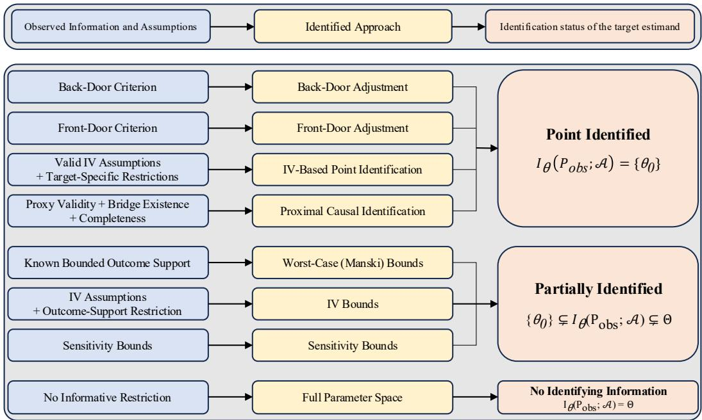  
Figure 4: Taxonomy of identification. The three identification status categories are defined by the identified set. The assumptions and identification approaches shown are representative examples, including those relevant to our benchmark, rather than an exhaustive enumeration of possible iden tification regimes.

## A.2 BENCHMARK SCOPE

The synthetic generator does not include longitudinal or time-varying treatments, dynamic treatment regimes, interference between units, continuous or multivalued treatments, censoring or survival outcomes, or multidimensional latent confounders.

## B IDENTIFICATION REGIMES

We expand the identification arguments in Section 2 and show how each observational view supports the same target CATE. Structural arguments are distinguished from finite-sample diagnostics, which are reported separately in Appendix D.

## B.1 BACK-DOOR

Assumptions. The back-door view observes $( X , U , T , Y )$ , with $( X , U )$ measured before treatment. In addition to the common consistency conditions, we require:

1. Conditional exchangeability: $\{ Y ( 0 ) , Y ( 1 ) \} \perp T \mid X , U .$

2. Positivity: $0 < P ( T = 1 \mid X = x , U = u ) < 1$ for every (x, u) in the target support.

Recovering the CATE. Let $m _ { t } ( x , u ) : = \mathbb { E } [ Y \mid T = t , X = x , U = u ]$ . Exchangeability and consistency allow the potential-outcome mean to be computed by averaging the observed outcome regression over the same confounder distribution in both arms (Pearl, 2022):

$$
\mu _ { t } ^ { \mathrm { B D } } ( x ) = \mathbb { E } [ Y ( t ) \mid X = x ] = \sum _ { u \in \{ - 1 , + 1 \} } m _ { t } ( x , u ) P ( U = u \mid X = x ) .
$$

For the SCM outcome law, $m _ { t } ( x , u ) = \mu ( x ) + t \tau _ { 0 } ( x ) + \gamma _ { U } ( x ) u$ . The prognostic and confounding terms therefore cancel within each $( x , u )$ stratum, giving

$$
\begin{array} { c l l } { { \tau _ { \mathrm { B D } } ( x ) = \displaystyle \sum _ { u } \{ m _ { 1 } ( x , u ) - m _ { 0 } ( x , u ) \} P ( U = u \mid X = x ) } } \\ { { \displaystyle = \sum _ { u } \tau _ { 0 } ( x ) P ( U = u \mid X = x ) = \tau _ { 0 } ( x ) . } } \end{array}
$$

Table 3: Observational contexts constructed from each complete causal world. All views share the same context and query units, treatment assignments, factual outcomes, and oracle effects.
<table><tr><td>View</td><td>Observed context variables</td></tr><tr><td>Back-door (BD)</td><td> $\overline { { \boldsymbol { X } , \boldsymbol { U } , \boldsymbol { T } , \boldsymbol { Y } } }$ </td></tr><tr><td>Front-door (FD)</td><td> $X , M , T , Y$ </td></tr><tr><td>Instrumental variable (IV)</td><td> $X , I , { \bar { T } } , { \bar { Y } }$ </td></tr><tr><td>Proximal (PX)</td><td> $X , Z _ { \mathrm { p } } , W _ { \mathrm { p } } , T , Y$ </td></tr><tr><td>Hidden Confounding (HC)</td><td> $X , T , Y$ </td></tr></table>

## B.2 FRONT-DOOR

Assumptions. The front-door view observes $( X , T , M , Y )$ and hides U. Conditional on $X$ , we require (Pearl, 2022):

1. Complete mediation: M intercepts every directed path from $T \tan Y$

2. Treatment–mediator exchangeability: no back-door path between T and M remains open given X.

3. Mediator–outcome adjustment: all back-door paths between M and Y are blocked by $( T , X )$

4. Positivity and support: both treatment arms have positive probability given X, and mediator values used in the functional are supported in both arms.

Recovering the CATE. Write $Q ( m , s , x ) : = \mathbb { E } [ Y \mid M = m , T = s , X = x ] { \mathrm { ~ a n d ~ } } p _ { s } ( x ) : =$ $P ( T = s \mid { \bf \bar { \cal X } } = x )$ ). In the SCM, $M \perp U \mid T , X , { \mathrm { s o } }$

$$
Q ( m , s , x ) = \mu ( x ) + \beta ( x ) m + \gamma _ { U } ( x ) \mathbb { E } [ U \mid T = s , X = x ] .
$$

First, average this regression over the observed treatment distribution:

$$
\begin{array} { l } { { \displaystyle { \cal G } ( m , x ) : = \sum _ { s \in \{ 0 , 1 \} } Q ( m , s , x ) p _ { s } ( x ) } } \\ { ~ } \\ { { \displaystyle ~ = \mu ( x ) + \beta ( x ) m + \gamma \upsilon ( x ) \sum _ { s } \mathbb { E } [ U \mid T = s , X = x ] p _ { s } ( x ) } } \\ { ~ } \\ { { \displaystyle ~ = \mu ( x ) + \beta ( x ) m , } } \end{array}
$$

where the last equality uses $\begin{array} { r } { \sum _ { s } \mathbb { E } [ U \mid T = s , X = x ] p _ { s } ( x ) = \mathbb { E } [ U \mid X = x ] = 0 } \end{array}$ . This step removes the treatment-specific latent composition from the outcome regression. Next, integrate over the mediator distribution under each treatment arm:

$$
\begin{array} { l } { { \mu _ { t } ^ { \mathrm { F D } } ( x ) = \displaystyle \int G ( m , x ) p ( m \mid T = t , X = x ) d m } } \\ { { \quad \quad = \mu ( x ) + \beta ( x ) \mathbb { E } [ M \mid T = t , X = x ] = \mu ( x ) + \beta ( x ) \delta t . } } \end{array}
$$

Consequently,

$$
\tau _ { \mathrm { F D } } ( x ) = \mu _ { 1 } ^ { \mathrm { F D } } ( x ) - \mu _ { 0 } ^ { \mathrm { F D } } ( x ) = \beta ( x ) \delta = \tau _ { 0 } ( x ) .
$$

The total effect thus requires integrating over the two mediator laws, not holding the query unit’s factual mediator fixed.

## B.3 INSTRUMENTAL VARIABLE

Assumptions. The IV view observes $( X , I , T , Y )$ . Let $T ^ { I } ( j )$ denote potential treatment under instrument value j. We use the following conditions:

1. Exogeneity: $I \perp \{ Y ( 0 ) , Y ( 1 ) , T ^ { I } ( 0 ) , T ^ { I } ( 1 ) \} \mid X$

2. Exclusion: I affects Y only through T.

3. Instrument positivity and relevance: $0 < P ( I = 1 \mid X = x ) < 1 \mathrm { ~ a n d } \mathbb { E } [ T \mid I = 1 , X =$ x] $\neq \mathbb { E } [ T \mid ^ { \cdot } I = 0 , X = x ]$

4. Monotonicity: $T ^ { I } ( 1 ) \geq T ^ { I } ( 0 )$ almost surely.

5. Within-X gain invariance: the benchmark additionally imposes $Y ( 1 ) - Y ( 0 ) = \tau _ { 0 } ( X )$ , so gains do not vary with latent state or compliance type at fixed X.

Recovering the CATE. The first four conditions give the conditional Wald ratio a complier-effect interpretation and the final restriction makes that effect equal to the CATE (Angrist et al., 1996). To see this directly, the SCM has $I \perp U \mid X$ and $\mathbb { E } [ U \mid X = x ] = 0$ , hence

$$
\begin{array} { c l } { \mathbb { E } [ Y \mid I = j , X = x ] = \mu ( x ) + \tau _ { 0 } ( x ) \mathbb { E } [ T \mid I = j , X = x ] + \gamma _ { U } ( x ) \mathbb { E } [ U \mid I = j , X = x ] } \\ { = \mu ( x ) + \tau _ { 0 } ( x ) \mathbb { E } [ T \mid I = j , X = x ] . } \end{array}
$$

Define the instrument-induced differences

$$
\begin{array} { r l } & { \Delta _ { Y } ( x ) : =  { \mathbb { E } } [ Y \mid I = 1 , X = x ] -  { \mathbb { E } } [ Y \mid I = 0 , X = x ] , } \\ & { \Delta _ { T } ( x ) : =  { \mathbb { E } } [ T \mid I = 1 , X = x ] -  { \mathbb { E } } [ T \mid I = 0 , X = x ] . } \end{array}
$$

Subtracting the two reduced-form means cancels $\mu ( x )$ and yields

$$
\Delta _ { Y } ( x ) = \tau _ { 0 } ( x ) \Delta _ { T } ( x ) , \qquad \tau _ { \mathrm { I V } } ( x ) = \frac { \Delta _ { Y } ( x ) } { \Delta _ { T } ( x ) } = \tau _ { 0 } ( x ) .
$$

Thus, dividing the instrument-induced outcome change by the instrument-induced treatment change recovers the shared CATE under the additional gain restriction.

## B.4 PROXIMAL IDENTIFICATION

Assumptions. The proximal view observes $( X , Z _ { p } , W _ { p } , T , Y )$ , where $Z _ { p }$ and $W _ { p }$ are the treatment- and outcome-inducing proxies, respectively. We require (Miao et al., 2018; Tchetgen Tchetgen et al., 2024):

1. Latent exchangeability: $Y ( t ) \perp T \mid U , X$

2. Proxy restrictions: $Y \perp Z _ { p } \mid T , U , X$ and $W _ { p } \perp ( T , Z _ { p } ) \mid U , X$

3. Bridge existence: an integrable outcome bridge $h _ { t }$ satisfies

$$
\mathbb { E } [ Y \mid Z _ { p } = z , T = t , X = x ] = \mathbb { E } [ h _ { t } ( W _ { p } , x ) \mid Z _ { p } = z , T = t , X = x ] .
$$

4. Completeness: for $V = U$ and $V = W _ { p } ,$ , and every square-integrable $^ { g , }$

$$
\mathbb { E } [ g ( V ) \mid Z _ { p } , T = t , X = x ] = 0 \quad \Longrightarrow \quad g ( V ) = 0
$$

almost surely under the corresponding conditional law. In this binary construction, these are full-rank conditions.

5. Support: both latent strata have positive probability given $X , 0 < P ( T = 1 \mid X , U ) < 1$ and the required proxy cells have positive conditional probability.

Recovering the CATE. For binary proxies, define the observed matrix and mean vector by

$$
A _ { t } ( x ) _ { z , w } : = P ( W _ { p } = w \mid Z _ { p } = z , T = t , X = x ) , y _ { t } ( x ) _ { z } : = \mathbb { E } [ Y \mid Z _ { p } = z , T = t , X = x ]
$$

for $z , w \in \{ 0 , 1 \}$ . The bridge equation is a two-equation linear system,

$$
A _ { t } ( x ) \pmb { h } _ { t } ( x ) = \pmb { y } _ { t } ( x ) , \qquad \pmb { h } _ { t } ( x ) = A _ { t } ( x ) ^ { - 1 } \pmb { y } _ { t } ( x ) ,
$$

where $\pmb { h } _ { t } ( x ) = ( h _ { t } ( 0 , x ) , h _ { t } ( 1 , x ) ) ^ { \top }$ . After solving this system for each arm, average the bridge values over $W _ { p } \mid { \dot { X } } = x \colon$

$$
\mu _ { t } ^ { \mathrm { P X } } ( x ) = \sum _ { w \in \{ 0 , 1 \} } h _ { t } ( w , x ) P ( W _ { p } = w \mid X = x ) .
$$

For the SCM, write $p _ { W } ^ { \pm } ( x ) : = P ( W _ { p } = 1 \mid U = \pm 1 , X = x )$ . An explicit bridge is

$$
h _ { t } ( w , x ) = \mu ( x ) + t \tau _ { 0 } ( x ) - \gamma _ { U } ( x ) + \frac { 2 \gamma _ { U } ( x ) } { p _ { W } ^ { + } ( x ) - p _ { W } ^ { - } ( x ) } \{ w - p _ { W } ^ { - } ( x ) \} .
$$

Only the term $t \tau _ { 0 } ( x )$ changes between treatment arms, so $h _ { 1 } ( w , x ) - h _ { 0 } ( w , x ) = \tau _ { 0 } ( x )$ . Therefore,

$$
\tau _ { \mathrm { P X } } ( x ) = \sum _ { w } \{ h _ { 1 } ( w , x ) - h _ { 0 } ( w , x ) \} P ( W _ { p } = w \mid X = x ) = \tau _ { 0 } ( x ) .
$$

## B.5 HIDDEN CONFOUNDING AND PARTIAL IDENTIFICATION

The Hidden Confounding (HC) view observes only $( X , T , Y )$ . For the main continuous-outcome SCM, its outcome law and the zero conditional mean of its noise give

$$
\mathbb { E } [ Y \mid T = t , X = x ] = \mu ( x ) + t \tau _ { 0 } ( x ) + \gamma _ { U } ( x ) \mathbb { E } [ U \mid T = t , X = x ] .
$$

Subtracting the observed treatment-arm means therefore gives

$$
\begin{array} { r l } & { \underbrace { \mathbb { E } [ Y \mid T = 1 , X = x ] - \mathbb { E } [ Y \mid T = 0 , X = x ] } _ { \mathrm { o b s e r v e d g r o u p c o n t r a s t } } } \\ { = \underbrace { \tau _ { 0 } ( x ) } _ { \mathrm { t a r g e t C A T E } } + \underbrace { \gamma _ { U } ( x ) \big \{ \mathbb { E } [ U \mid T = 1 , X = x ] - \mathbb { E } [ U \mid T = 0 , X = x ] \big \} } _ { \mathrm { r e m a i n i n g ~ c o n f o u n d i n g ~ b i a s ~ } b _ { \mathrm { H C } } ( x ) } . } \end{array}\tag{7}
$$

The term $\gamma _ { U } ( X ) U$ does not cancel when comparing different treatment groups, because treatment selection changes their conditional distributions of U. Confounding bias remains even though U does not modify the treatment gain. Since this bias can vary with $x ,$ it can distort the shape of the observational contrast as well as its mean. Equation 7 describes the observational contrast, not necessarily the output of every evaluated model. We score HC point predictions against the oracle $\tau _ { 0 } ( x )$ as a hidden-confounding stress test, without a point-identification claim.

We distinguish the three partial-identification approaches in Figure 4: Worst-Case (Manski) bounds, IV bounds, and sensitivity bounds. These evaluations use a separate partial-identification companion SCM described in Appendix C.5, distinct from the SCM used for the point-estimation benchmark. The Manski and sensitivity views observe (X, T, Y ), whereas the IV view additionally observes I. The three views share the same realized $( X , T , { \dot { Y } } )$ ), context–query split, query units, and target CATE, enabling paired comparisons across the partial-identification settings while varying the available identifying information and assumptions. Following Appendix A.1, each identified set is defined relative to its observed distribution and maintained assumptions.

For finite-sample estimation, we keep the corresponding identifying functional fixed and estimate the required observable quantities from the context data. The Manski and IV estimators first estimate the relevant cell probabilities and then apply the closed-form Manski bounds or the monotone-IV linear program, respectively. If estimated IV cells are infeasible, they are projected onto the monotone-IV response-type polytope before endpoint computation. For sensitivity bounds, we evaluate CSA-PFN (MSM) (Javurek et al., 2026), B-Learner (Oprescu et al., 2023), and NeuralCSA (Frauen et al., 2024) against a common numerical MSM reference. Detailed implementations of the partial-identification estimators are provided in Appendix E.2.4. Throughout, we distinguish the population identified set, its numerical reference, and the estimated interval. For estimator m, let $[ \widehat { L } _ { m } ( x ) , \widehat { U } _ { m } ( x ) ]$ denote its estimated interval. Target-CATE containment denotes whether $\tau _ { 0 } ( x )$ lies in an estimated set, rather than confidence-interval coverage.

## B.5.1 WORST-CASE (MANSKI) BOUNDS

For binary potential outcomes $Y ( t ) \ \in \ \{ 0 , 1 \}$ , define the four observed cells $q _ { t y } ( x ) : = P ( T =$ $t , Y = y \ \mathsf { \bar { | } } \ \bar { X } = x )$ . Under consistency alone, factual outcomes constrain the observed arm while missing counterfactuals remain unrestricted within the binary support. The resulting sharp CATE set is (Manski, 2003)

$$
\begin{array} { r l } & { \Theta _ { I } ^ { \mathrm { ( M ) } } ( x ) = [ L _ { \mathrm { M } } ( x ) , U _ { \mathrm { M } } ( x ) ] , } \\ & { \quad L _ { \mathrm { M } } ( x ) = - q _ { 1 0 } ( x ) - q _ { 0 1 } ( x ) , } \\ & { \quad U _ { \mathrm { M } } ( x ) = q _ { 1 1 } ( x ) + q _ { 0 0 } ( x ) . } \end{array}\tag{8}
$$

The width is exactly one because the four cells sum to one. These bounds use the potential-outcome support {0, 1}.

## B.5.2 MONOTONE-IV BOUNDS

Let $q _ { j t y } ( x ) : = P ( T = t , Y = y ~ | ~ I = j , X = x )$ for the matched IV view. We maintain consistency, conditional instrument exogeneity and exclusion, instrument positivity and relevance, and treatment monotonicity $T ^ { I } ( 1 ) \geq T ^ { \tilde { I _ { ( 0 ) } } }$ . Unlike the point-identification argument in Appendix B.3, this identified-set model does not impose within-X gain invariance or equality of mean effects across compliance types. The conditional response-type law is represented by 12 probabilities: three treatment types crossed with all four binary outcome types,

$$
r = ( d _ { 0 } ^ { r } , d _ { 1 } ^ { r } , y _ { 0 } ^ { r } , y _ { 1 } ^ { r } ) \in \mathcal { R } : = \{ ( 0 , 0 ) , ( 0 , 1 ) , ( 1 , 1 ) \} \times \{ 0 , 1 \} ^ { 2 } .
$$

Here $d _ { j } ^ { r }$ is the treatment under $I = j$ and $y _ { t } ^ { r }$ is the outcome under $T = t .$ . Let $q ^ { \mathrm { I V } } ( x )$ stack the eight conditional cells and define

$$
\begin{array} { r l } & { A _ { ( j , t , y ) , r } : = \mathbf { 1 } \{ d _ { j } ^ { r } = t , \ : y _ { t } ^ { r } = y \} , } \\ & { \qquad \Pi _ { x } : = \{ \pi \in \mathbb { R } ^ { 1 2 } : \ : \pi \geq 0 , \ : \mathbf { 1 } ^ { \top } \pi = 1 , \ : A \pi = q ^ { \mathrm { I V } } ( x ) \} . } \end{array}
$$

The same response-type probabilities reproduce both instrument arms; this encodes conditional exogeneity, while the mapping through $d _ { j } ^ { r }$ encodes exclusion. The sharp set follows from two linear programs (Balke and Pearl, 1997):

$$
\begin{array} { l } { { \Theta _ { I } ^ { \mathrm { ( I V b ) } } ( x ) = [ L _ { \mathrm { I V } } ( x ) , U _ { \mathrm { I V } } ( x ) ] , } } \\ { { \quad L _ { \mathrm { I V } } ( x ) = \displaystyle \operatorname* { m i n } _ { \pi \in \Pi _ { x } } \sum _ { r \in { \mathcal R } } ( y _ { 1 } ^ { r } - y _ { 0 } ^ { r } ) \pi _ { r } , } } \\ { { \quad U _ { \mathrm { I V } } ( x ) = \displaystyle \operatorname* { m a x } _ { \pi \in \Pi _ { x } } \sum _ { r \in { \mathcal R } } ( y _ { 1 } ^ { r } - y _ { 0 } ^ { r } ) \pi _ { r } . } } \end{array}\tag{9}
$$

No outcome monotonicity or generator-specific gain restriction is added to these programs. For compatible population distributions, $\Theta _ { I } ^ { \mathrm { ( I V } \bar { \mathrm { b } } ) } ( x ) \subseteq \mathbf { \bar { \Theta } } _ { I } ^ { \mathrm { ( M ) } } ( x )$ on the matched companion views.

## B.5.3 SENSITIVITY BOUNDS

Let $e ( x , u ) : = P ( T = 1 \mid X = x , U = u )$ and $e ( x ) : = P ( T = 1 \mid X = x )$ . The marginal sensitivity model (MSM) maintains, for a specified $1 \leq \Gamma < \infty$

$$
\Gamma ^ { - 1 } \leq \frac { e ( x , u ) / \{ 1 - e ( x , u ) \} } { e ( x ) / \{ 1 - e ( x ) \} } \leq \Gamma .\tag{10}
$$

The compatible causal laws satisfy consistency, positivity, and latent exchangeability $\{ Y ( 0 ) , Y ( { \overset { \cdot } { 1 } } ) \} ~ \bot ~ T ~ | ~ X , U$ and reproduce the observed $( X , T , { \dot { Y } } )$ distribution. The latent vari able in this nonparametric compatible-law class is otherwise unrestricted; the generator’s binary latent support and within-X gain invariance are not imposed (Oprescu et al., 2023).

The MSM identified set. We specialize the CATE identified set in Appendix A.1 to these assumptions. For $t \in \{ 0 , 1 \}$ , write $p _ { t } ( x ) { \dot { : } } = P ( T = t \mid X = x )$ and let $F _ { t } ( \cdot \mid \bar { x ) }$ denote the observed law of $Y \mid T = t , X \bar { = } x ,$ with a finite absolute first moment. The odds restriction induces the normalized reweighting class

$$
\begin{array} { r l } & { \ell _ { t } ^ { \Gamma } ( x ) : = p _ { t } ( x ) + \{ 1 - p _ { t } ( x ) \} / \Gamma , } \\ & { u _ { t } ^ { \Gamma } ( x ) : = p _ { t } ( x ) + \Gamma \{ 1 - p _ { t } ( x ) \} , } \\ & { \mathcal { W } _ { t } ^ { \Gamma } ( x ) : = \left\{ w : \ell _ { t } ^ { \Gamma } ( x ) \leq w ( y ) \leq u _ { t } ^ { \Gamma } ( x ) \quad F _ { t } \mathrm { - a . s . , } \quad \displaystyle \int w ( y ) d F _ { t } ( y \mid x ) = 1 \right\} . } \end{array}
$$

The extremal potential-outcome means are

$$
\begin{array} { l } { \displaystyle \underline { { \mu } } _ { t } ^ { \Gamma } ( \boldsymbol { x } ) : = \operatorname* { i n f } _ { w \in \mathcal W _ { t } ^ { \Gamma } ( \boldsymbol { x } ) } \int y w ( y ) d F _ { t } ( y \mid \boldsymbol { x } ) \mathrm { , } } \\ { \displaystyle \overline { { \mu } } _ { t } ^ { \Gamma } ( \boldsymbol { x } ) : = \operatorname* { s u p } _ { w \in \mathcal W _ { t } ^ { \Gamma } ( \boldsymbol { x } ) } \int y w ( y ) d F _ { t } ( y \mid \boldsymbol { x } ) \mathrm { . } } \end{array}
$$

The sharp CATE set under this model is (Oprescu et al., 2023)

$$
\begin{array} { r } { \Theta _ { I } ^ { \mathrm { ( H C ) } } ( x ; \Gamma ) = [ L _ { \Gamma } ( x ) , U _ { \Gamma } ( x ) ] , } \\ { L _ { \Gamma } ( x ) = \underline { { \mu } } _ { 1 } ^ { \Gamma } ( x ) - \overline { { \mu } } _ { 0 } ^ { \Gamma } ( x ) , } \\ { U _ { \Gamma } ( x ) = \overline { { \mu } } _ { 1 } ^ { \Gamma } ( x ) - \underline { { \mu } } _ { 0 } ^ { \Gamma } ( x ) . } \end{array}\tag{11}
$$

Normalization makes each reweighted outcome law a probability law. $\mathrm { A t } \Gamma = 1$ , all weights equal one and the set reduces to the observed treatment-group mean contrast. Larger Γ allows greater hidden selection and yields nested, nonshrinking population sets. The set contains $\tau _ { 0 } ( x )$ when the true law satisfies the maintained assumptions at the specified Γ.

Algorithm 1 SCM generation and multi-view construction   
Input: World seed $s _ { w } ;$ settings in Table 4   
Output: Full world $\mathcal { W } _ { w } ,$ , paired views $\{ \mathcal { O } _ { w } ^ { ( r ) } \} _ { r } ,$ , and shared split $( \mathcal { C } _ { w } , \mathcal { Q } _ { w } )$   
1: Select the treatment-effect family using $s _ { w }$ and sample its parameters and the remaining SCM parameters.   
2: Calibrate $\tau _ { w } ( x )$ and the treatment intercept $b _ { T , w }$ on an auxiliary covariate sample; set $\bar { \beta } ( x )  \tau _ { w } ( x ) / \delta$   
3: for $i = 1 , \ldots , \sp { } N _ { c } + N _ { q }$ do   
4: Draw root variables $( X _ { i } , U _ { i } , I _ { i } )$ and independent exogenous noises for treatment, proxies, mediator,   
and outcome.   
5: Generate $T _ { i } ^ { I } ( 0 ) , T _ { i } ^ { I } ( 1 )$ using the same treatment threshold; set $T _ { i } \gets T _ { i } ^ { I } ( I _ { i } )$   
6: Generate $( Z _ { p , i } , W _ { p , i } )$ conditionally independently given $( X _ { i } , U _ { i } )$   
7: Construct paired potentials using the same $\epsilon _ { M , i }$ and $\epsilon _ { Y , i }$ in both arms:   
$M _ { i } ( t ) \gets \delta t + \sigma _ { M } \epsilon _ { M , i } ,$   
$Y _ { i } ( t ) \gets \mu ( X _ { i } ) + \gamma _ { U } ( X _ { i } ) U _ { i } + \beta ( X _ { i } ) M _ { i } ( t ) + \sigma _ { Y } \epsilon _ { Y , i } , \qquad t \in \{ 0 , 1 \}$   
8: Select the factual values: $M _ { i } \gets M _ { i } ( T _ { i } )$ and $Y _ { i } \gets Y _ { i } ( T _ { i } )$   
9: end for   
10: Assemble $\mathcal { W } _ { w }$ from the generated variables and potential outcomes.   
11: Randomly partition the unit indices into disjoint sets $\mathcal { C } _ { w }$ and $\mathcal { Q } _ { w } ,$ with $| \mathcal { C } _ { w } | = N _ { c }$ and $| \mathcal { Q } _ { w } | = N _ { q } .$   
12: for $r \in \{ \mathrm { \dot { B D } , F D , I V , P X , H C } \}$ do   
13: Project the same full world onto the variables retained in view $r { : }$   
$\mathcal { O } _ { w } ^ { ( r ) } \gets \Big \{ ( X _ { i } , T _ { i } , Y _ { i } , V _ { i } ^ { ( r ) } ) \Big \} _ { i = 1 } ^ { N _ { c } + N _ { q } }$   
14: Reuse $( \mathcal { C } _ { w } , \mathcal { Q } _ { w } )$ and the query targets $\{ \tau _ { w } ( X _ { i } ) : i \in \mathcal { Q } _ { w } \}$ without resampling.   
15: end for

## C SCM AND CAUSAL WORLDS

This appendix describes the synthetic SCM used in Table 3, the parameter and noise sampling procedure and the construction of paired observational views. The main comparison uses 40 worlds, indexed by $w \in \{ 0 , \ldots , 3 9 \}$ , each containing 1,024 context units and 100 query units.

## C.1 FULL SCM

Causal world and structure. Each world describes the effect of a binary treatment $T \in \{ 0 , 1 \}$ on a continuous outcome Y, mediated entirely through a continuous post-treatment variable M. Pre-treatment covariates $X \in \mathbb { R } ^ { 5 0 }$ and a confounder $\breve { U } \in \{ - 1 , + 1 \}$ influence both treatment assignment and the outcome, with U inducing the back-door path $T \left. U \right. Y$ . A binary instrument $\bar { I ^ { \mathrm { ~ \in ~ } } } \{ 0 , 1 \}$ also affects treatment assignment but influences the outcome only through the directed path $\dot { I }  \dot { T }  M  Y . \ X , U$ , and I form the roots of the SCM. The pre-treatment proxies $\mathsf { \bar { ( } } Z _ { p } , W _ { p } ) \in \{ 0 , 1 \} ^ { 2 }$ are generated from $( X , U )$ , providing noisy measurements of the confounder without directly affecting treatment or outcome.

The full world retains these variables together,

$$
\mathcal { W } = \{ X , U , I , Z _ { p } , W _ { p } , T , M ( 0 ) , M ( 1 ) , M , Y ( 0 ) , Y ( 1 ) , Y \} .
$$

## C.2 SCM GENERATION ALGORITHM

Algorithm 1 summarizes how a single causal world is generated and converted into paired observational views. World-level mechanisms are sampled and calibrated first, followed by unit-level realizations and a shared context–query split. The structural equations and parameter settings are detailed in Sections C.3 and C.4.

## C.3 STRUCTURAL EQUATIONS AND DESIGN CHOICES

We suppress the world index when describing the structural equations for a single realized world.

Root variables. The root distributions are

$X _ { i } \sim { \mathcal { N } } ( 0 , I _ { 5 0 } ) , \qquad P ( U _ { i } = - 1 ) = P ( U _ { i } = + 1 ) = { \textstyle { \frac { 1 } { 2 } } } , \qquad I _ { i } \sim \mathrm { B e r n o u l l i } ( { \textstyle { \frac { 1 } { 2 } } } ) .$   
Treatment assignment. For $j \in \{ 0 , 1 \}$ , define   
$e _ { j } ( x , u ) = \mathrm { e x p i t } \{ b _ { T } + 0 . 5 5 x ^ { \top } v _ { T } + 0 . 7 5 u + 1 . 5 0 j \} ,$   
$T _ { i } ^ { I } ( j ) = \mathbf { 1 } \{ V _ { T , i } \leq e _ { j } ( X _ { i } , U _ { i } ) \} , \qquad V _ { T , i } \sim \mathrm { U n i f o r m } ( 0 , 1 ) .$   
$T _ { i } = T _ { i } ^ { I } ( I _ { i } ) .$   
Because the same threshold $V _ { T , i }$ is used for both instrument values and the coefficient on $j$ is posi  
tive, the construction satisfies $\begin{array} { r } { \dot { T _ { i } } ^ { I } ( 1 ) \geq T _ { i } ^ { I } ( 0 ) } \end{array}$

Proxies. The treatment-inducing and outcome-inducing proxies are generated by

$$
Z _ { p , i } \mid X _ { i } , U _ { i } \sim \mathrm { B e r n o u l l i } \left[ \exp \mathrm { i t } \{ 0 . 2 0 X _ { i } ^ { \top } v _ { Z } + 2 U _ { i } \} \right] ,
$$

$$
W _ { p , i } \mid X _ { i } , U _ { i } \sim \mathrm { B e r n o u l l i } \left[ \exp \mathrm { i t } \{ 0 . 2 0 X _ { i } ^ { \top } v _ { W } + 2 U _ { i } \} \right] .
$$

They are noisy pre-treatment measurements of the latent confounder, not direct causes of treatment or outcome.

Mediator and outcomes. For $t \in \{ 0 , 1 \}$

$$
M _ { i } ( t ) = t + 0 . 7 5 \epsilon _ { M , i } , \qquad M _ { i } = M _ { i } ( T _ { i } ) , \qquad \epsilon _ { M , i } \sim { \mathcal N } ( 0 , 1 ) .
$$

The prognostic surface and outcome-confounding coefficient are

$$
\begin{array} { r } { \mu ( x ) = 0 . 7 x ^ { \top } v _ { \mu } + 0 . 2 5 \sin \{ x ^ { \top } \mathrm { r o l l } ( v _ { \mu } , 1 ) \} , } \end{array}
$$

$$
\gamma _ { U } ( x ) = 0 . 8 \{ 1 + 0 . 7 5 \operatorname { t a n h } ( x ^ { \top } v _ { \gamma } ) \} .
$$

Let $\tau _ { 0 } ( x )$ denote the calibrated treatment-effect surface and set $\beta ( x ) = \tau _ { 0 } ( x )$

The potential outcomes are

$$
Y _ { i } ( t , m ) = \mu ( X _ { i } ) + \gamma _ { U } ( X _ { i } ) U _ { i } + \beta ( X _ { i } ) m + 0 . 7 5 \epsilon _ { Y , i } , \qquad \epsilon _ { Y , i } \sim \mathcal { N } ( 0 , 1 ) ,
$$

and

$$
Y _ { i } ( t ) = Y _ { i } \{ t , M _ { i } ( t ) \} , \qquad Y _ { i } = T _ { i } Y _ { i } ( 1 ) + ( 1 - T _ { i } ) Y _ { i } ( 0 ) .
$$

Why the target is shared across views. Because the same mediator noise and the same outcome noise are shared across the two treatment arms, we obtain

$$
Y _ { i } ( 1 ) - Y _ { i } ( 0 ) = \beta ( X _ { i } ) \{ M _ { i } ( 1 ) - M _ { i } ( 0 ) \} = \tau _ { 0 } ( X _ { i } ) .
$$

Hence the benchmark target is identical across sibling observational views of the same realized world. Changing the observational view changes only which auxiliary variables are observed and which identification assumptions are available to the estimator; it does not change the underlying query units or the target effect values.

## C.4 PARAMETERIZATION AND FIXED SETTINGS

Sparse directions. Each coefficient direction is sampled as a sparse unit vector in $\mathbb { R } ^ { 5 0 }$ . The number of active coordinates is fixed by role: the CATE directions use 10 active coordinates each, $v _ { \mu }$ and $v _ { T }$ use 14, v<sub>Z</sub> and v<sub>W</sub> use $^ { 8 , }$ and $v _ { \gamma }$ uses 10.

Treatment-effect families. Let $a = x ^ { \top } v _ { a }$ and $b = x ^ { \top } v _ { b }$ . The uncalibrated effect surface $q _ { w } ( x )$ is chosen from one of the following five families: linear, quadratic-interaction, threshold/piecewise, Fourier/nonstationary, and shallow MLP. The world seed determines the family so that the 40 worlds contain eight worlds from each family.

Calibration. An auxiliary Gaussian sample of size $N _ { \mathrm { c a l } } = 5 0 \small { , } 0 0 0$ is used to calibrate

$$
\tau _ { w } ( x ) = 0 . 5 + 0 . 5 \frac { q _ { w } ( x ) - \bar { q } _ { w } } { s _ { q , w } } ,
$$

where $\bar { q } _ { w }$ and $s _ { q , w }$ are the empirical mean and standard deviation of $q _ { w }$ on the calibration sample. The same auxiliary sample is also used to calibrate the treatment intercept $b _ { T }$ by bisection so that the average treatment propensity is approximately 0.5.

## C.5 FULL SCM FOR PARTIAL IDENTIFICATION

Compared with the point-estimation SCM, the partial-identification companion omits the mediator and proxies and replaces the continuous outcome mechanism with binary potential outcomes. It retains Gaussian covariates, a binary latent confounder and instrument, and shared-threshold logistic treatment assignment, but generates 40 new worlds with separately calibrated parameters.

Algorithm 2 summarizes the construction. The outcome amplitudes satisfy $A _ { b } , A _ { \tau } > 0$ and $A _ { b } +$ $A _ { \tau } / 2 \le 0 . 4 5$ , ensuring $p _ { t } ( x , u ) \in [ 0 . 0 5 , 0 . 9 5 ]$ without clipping. Since $p _ { 1 } ( x , u ) - p _ { 0 } ( x , u ) = \tau _ { 0 } ( x )$ the target remains $\mathbb { E } [ \bar { Y } ( \bar { 1 } ) - Y ( 0 ) \mid ^ { . } X = x ] = \bar { \tau } _ { 0 } ( x )$ , but the realized unit-level effect need not equal this conditional mean. Hidden-confounding strength is calibrated on separate development seeds, with the MSM restriction at $\Gamma = 2$ required to hold after marginalizing over the instrument. These generator-specific restrictions are not added to the identified-set assumptions in Appendix B.5.

Manski and sensitivity analyses use identical observational data but different maintained assumptions. IV additionally observes I. All three settings preserve the realized $( X , T , Y )$ , split, query units, and target CATE. Sensitivity oracles use $\Gamma \in \{ 1 , 1 . 2 5 , 1 . 5 , 2 , 3 , 5 \}$ . Oracle quantities are reserved for evaluation and are not supplied to estimators.

Table 4: Main SCM numerical configuration.
<table><tr><td>Quantity</td><td>Value</td></tr><tr><td>Number of world-generation seeds</td><td>40</td></tr><tr><td>Baseline dimension</td><td>50</td></tr><tr><td>Context / query units per world</td><td>1,024 / 100</td></tr><tr><td>Calibration sample size</td><td>50,000</td></tr><tr><td>Calibration CATE mean / standard deviation</td><td>0.5 / 0.5</td></tr><tr><td>Treatment covariate / latent / instrument loading</td><td>0.55 / 0.75 / 1.50</td></tr><tr><td>Outcome-confounding base / modulation</td><td>0.80 / 0.75</td></tr><tr><td>Mediator shift / mediator noise / outcome noise</td><td>1.0 / 0.75 / 0.75</td></tr><tr><td>Proxy covariate / latent loading</td><td>0.20 / 2.00</td></tr><tr><td>Severity multiplier κ</td><td>1.0</td></tr><tr><td>Stored oracle samples per arm/query</td><td>8,192</td></tr></table>

```latex
Algorithm 2 Partial-identification SCM and matched-view construction
Input: World seed; calibrated parameters with $a _ { I } > 0 ; N _ { c } = 1 0 2 4 , N _ { q } = 1 0 0$
Output: Matched contexts, shared query covariates and CATE targets, and population-oracle bounds
1: Select one of five effect families and sample its raw function $q _ { f } .$ , baseline function $f _ { b } ,$ , and unit-normalized
treatment direction v<sub>T</sub>.
2: $e _ { j } ( x , u ) \gets \mathrm { e x p i t } ( b _ { T } + a _ { X } x ^ { \top } v _ { T } + a _ { U } u + a _ { I } j ) , j \in \{ 0 , 1 \}$
3: $\begin{array} { r } { \dot { b ( x , u ) }  \frac { 1 } { 2 } + A _ { b } \operatorname { t a n h } \{ f _ { b } ( x ) + c _ { U } u \} } \end{array}$
4: $\tau _ { 0 } ( x )  A _ { \tau } ^ { - }$ tanh $\{ q _ { f } ( x ) \}$
5: for $i = 1 , \ldots , N _ { c } + \dot { N } _ { q }$ do
6: Draw independen $\dot { X } _ { i } \sim \mathcal { N } ( 0 , I _ { 5 0 } ) , U _ { i } \sim \operatorname { U n i f } \{ - 1 , + 1 \}$ , and $I _ { i } \sim$ Bernoull $( 1 / 2 )$
7: Draw independent $V _ { T , i } , V _ { Y , i } \sim \mathrm { U n i f o r m } ( 0 , 1 ) .$
8: $T _ { i } ^ { I } ( j ) \gets \mathbf { 1 } \{ V _ { T , i } \leq e _ { j } ( X _ { i } , U _ { i } ) \} , j \in \{ 0 , 1 \} ; \quad T _ { i } \gets T _ { i } ^ { I } ( I _ { i } )$
9: $p _ { i t } \gets b ( X _ { i } , U _ { i } ) + ( t - \frac { 1 } { 2 } ) \tau _ { 0 } ( \dot { X } _ { i } ) , t \gets \{ 0 , \dot { 1 } \}$
10: $Y _ { i } ( t ) \gets \mathbf { 1 } \{ V _ { Y , i } \leq p _ { i t } \} , { \tilde { t } } \in \{ 0 , 1 \} ; \quad \dot { Y _ { i } } \gets \dot { Y _ { i } } ( T _ { i } )$
11: end for
12: Assign one disjoint context–query split (C, Q).
13: $\mathcal { D } _ { \mathrm { M } } \overset {  } { = } \mathcal { D } _ { \mathrm { S } }  \overset {  } { \{ }  ( X _ { i } , T _ { i } , Y _ { i } ) : i \in \overset {  } { c } \}$
14: $\mathcal { D } _ { \mathrm { I V } }  \{ ( X _ { i } , \dot { I _ { i } } , T _ { i } , Y _ { i } ) : i \in \mathcal { C } \}$
15: Reuse $\{ \tilde { X _ { i } } : i \in \mathcal { Q } \}$ and $\{ \tau _ { 0 } ( X _ { i } ) : i \in \mathcal { Q } \}$ across all three settings.
16: Compute population probabilities analytically at query covariates and apply the Manski, monotone-IV, and
binary-MSM bound functionals in Appendix B.5.
```

## D DATA VALIDATION AND CONSTRUCTION AUDITS

We audit the 40 saved synthetic worlds, each containing 1,024 context and 100 query units. All checks use existing benchmark artifacts and evaluator-only SCM quantities, without regenerating data or running estimators. Production-input hashes match before and after the audit. Copied quantities are compared by exact equality, whereas deterministic numerical identities are checked using an absolute tolerance of $1 0 ^ { - 1 0 }$

## D.1 CONSTRUCTION INTEGRITY

Paired-view integrity. We compare the five observational views within each world, covering 200 view tables and 400 within-world view pairs. The comparisons include world and unit identifiers, X, T, Y, context–query membership, ordered query identifiers, and stored query targets. Each view is also checked against its saved master-world projection, including its retained auxiliary variables. Pairing is verified from stored values and row identities, rather than inferred from shared generation seeds.

Target consistency. Using the saved potential outcomes and targets, we evaluate $Y _ { i } ( 1 ) - Y _ { i } ( 0 ) -$ $\tau _ { 0 } ( X _ { i } )$ over all 44,960 units. The maximum absolute discrepancy is $1 . 5 5 \times 1 0 ^ { - 1 5 }$ , with no violations of the $1 0 ^ { - 1 0 }$ tolerance. This verifies the benchmark-specific identity that each unit’s treatment effect equals the target CATE evaluated at its covariates.

Stay/Move targets. We check the evaluation targets stored in the completed Stay and Move experiment. Repeated target entries across estimator–regime configurations agree exactly, and all conditions share the same ordered query identifiers. The Original targets exactly match the productionworld targets. Across the 4,000 paired queries, the saved targets satisfy $\tau _ { 0 } ^ { \mathrm { S } } ( X _ { i } ) ~ = ~ \tau _ { 0 } ( X _ { i } )$ and $\tau _ { 0 } ^ { \mathrm { M } } ( X _ { i } ) \stackrel { \mathbf { = } } { = } 2 \tau _ { 0 } ( X _ { i } )$ with zero discrepancy. Table 5 summarizes these results.

Table 5: Construction integrity. Pairing checks cover all 40 worlds and their five observational views. The potential-outcome target check uses all 44,960 units. Saved Stay/Move target checks use 4,000 paired queries. Maximum errors are taken over all applicable worlds and units.
<table><tr><td>Check</td><td>Result</td></tr><tr><td>Shared-field mismatches</td><td>0</td></tr><tr><td>Master-projection mismatches</td><td>0</td></tr><tr><td>Query-order mismatches</td><td>0</td></tr><tr><td>Target identity: maxi  $| Y _ { i } ( 1 ) - Y _ { i } ( 0 ) - \tau _ { 0 } ( X _ { i } ) |$ </td><td> $1 . 5 5 \times 1 0 ^ { - 1 5 }$ </td></tr><tr><td>Saved Stay target: maxi  $| \tau _ { 0 } ^ { \mathrm { S } } ( X _ { i } ) - \tau _ { 0 } ( X _ { i } ) |$ </td><td>0</td></tr><tr><td>Saved Move target: maxi  $| \tau _ { 0 } ^ { \mathrm { M } } ( X _ { i } ) - 2 \tau _ { 0 } ( X _ { i } ) |$ </td><td>0</td></tr></table>

## D.2 REGIME-WISE FUNCTIONAL CONSISTENCY AND NON-DEGENERACY

Analytic functional consistency. At the same 4,000 query locations, we reconstruct the CATE through back-door adjustment, the front-door functional, the conditional Wald ratio, and the proximal bridge functional. These calculations use saved structural quantities and SCM-derived conditional means and probabilities. The stored targets are used only for comparison after reconstruction, not as inputs to the identifying functionals. All reconstructed values are finite, and no absolute discrepancy exceeds $1 0 ^ { - 1 0 }$ . Table 6 reports the RMSE and maximum absolute error for each regime. These results establish numerical consistency between the analytic SCM-based functionals and the stored targets.

Numerical construction diagnostics. We reproduce the existing certification gates using their original evaluation populations and aggregation rules. Complete treatment propensities ${ \bar { P ( } } T =$ $1 \ | ^ { - } X , U , I )$ are evaluated at every stored $\bar { ( } X , U )$ pair under both instrument values, giving 2,248 probabilities per world. These are distinguished from the marginal back-door propensity $P ( T = 1 )$ ${ \bf \bar { \boldsymbol { X } } } , U )$ . The front-door diagnostics are computed from the structural mediator shift δ and noise scale $\sigma _ { M }$

For IV, we compute $\Delta _ { T } ( x ) = E [ T \mid I = 1 , X = x ] - E [ T \mid I = 0 , X = x ]$ at all generated covariate locations per world and apply the gate to the within-world fifth percentile. We evaluate the bridge operator

$$
A _ { t } ( x ) _ { z , w } = P ( W _ { p } = w \mid Z _ { p } = z , T = t , X = x ) , \qquad z , w \in \{ 0 , 1 \} ,
$$

at the same covariate locations under both treatment arms in PX. We record each world’s minimum singular value and maximum condition number. All 40 worlds satisfy the recorded gates on these populations.

Hidden-confounding strength. For the confounding-bias function $b _ { \mathrm { H C } } ( x )$ defined in $\mathsf { A p - }$ pendix B, we compute

$$
R _ { \mathrm { H C } , w } = \frac { \operatorname { S D } _ { Q _ { w } } [ b _ { \mathrm { H C } } ( X ) ] } { \operatorname { S D } _ { Q _ { w } } [ \tau _ { 0 } ( X ) ] } ,
$$

where both standard deviations are computed over the 100 queries in world w using divisor $N _ { q }$ . The ratio ranges from 0.3699 to 0.5999, and every world passes the recorded threshold of 0.35. This measures covariate-varying distortion of the observational contrast relative to CATE variation. HC is not assigned an oracle point-identification reconstruction.

## E EXPERIMENTAL SETUP

## E.1 METRICS

## E.1.1 POINT-EFFECT AND HETEROGENEITY METRICS

We specify the metrics and aggregation rules used in Figures 2 and 3. Metrics are first computed within each held-out query set and then summarized across paired worlds or IHDP realizations. The synthetic comparisons use 40 worlds with 100 queries per world; the IHDP comparison uses 100 realizations with 75 test queries each.

Table 6: Regime diagnostics and analytic functional consistency. Diagnostics use the certification populations described in the text. Bracketed values give ranges of world-level statistics, except for complete propensity, which gives the global range over checked probabilities. FD diagnostics are identical across worlds. Oracle reconstruction uses 4,000 shared queries per regime.
<table><tr><td>Diagnostic</td><td>Criterion</td><td>Result</td></tr><tr><td>Complete propensity  $P ( T = 1 \mid X , U , I )$ </td><td>[0.01,0.99]</td><td>[0.02998, 0.98115]</td></tr><tr><td>FD standardized shift  $| \delta | / \sigma _ { M }$ </td><td>≥ 0.75</td><td>1.3333</td></tr><tr><td>FD support score exp  $\left\{ - \delta ^ { 2 } / ( 8 \sigma _ { M } ^ { 2 } ) \right\}$ </td><td>≥ 0.60</td><td>0.8007</td></tr><tr><td>IV first-stage fifth percentile</td><td>≥ 0.10</td><td>[0.2601,0.2737]</td></tr><tr><td>PX minimum singular value</td><td>≥ 0.01</td><td>[0.4139, 0.4655]</td></tr><tr><td>PX maximum condition number</td><td>≤ 250</td><td>[2.2484, 2.5821]</td></tr><tr><td>HC bias-to-effect SD ratio  $R _ { \mathrm { H C } }$ </td><td>≥ 0.35</td><td>[0.3699, 0.5999]</td></tr><tr><td>Oracle functional Queries</td><td></td><td></td></tr><tr><td>4,000</td><td>RMSE</td><td>Max. abs. error</td></tr><tr><td>Back-door</td><td> $7 . 7 5 \times 1 0 ^ { - 1 7 }$ </td><td> $4 . 4 4 \times 1 0 ^ { - 1 6 }$ </td></tr><tr><td>Front-door</td><td> $1 . 0 5 \times 1 0 ^ { - 1 6 }$ </td><td> $6 . 6 6 \times 1 0 ^ { - 1 6 }$ </td></tr><tr><td>Conditional Wald</td><td> $2 . 8 5 \times 1 0 ^ { - 1 6 }$ </td><td> $1 . 6 7 \times 1 0 ^ { - 1 5 }$ </td></tr><tr><td>Proximal bridge</td><td> $1 . 9 1 \times 1 0 ^ { - 1 6 }$ </td><td> $8 . 8 8 \times 1 0 ^ { - 1 6 }$ </td></tr></table>

Our point-error metrics from Section 5 are

$$
\mathrm { s P E H E } = \sqrt { \frac { 1 } { N _ { q } } \sum _ { i = 1 } ^ { N _ { q } } \bigl ( \widehat { \tau } ( \boldsymbol { x } _ { i } ) - \tau ( \boldsymbol { x } _ { i } ) \bigr ) ^ { 2 } } ,
$$

$$
\mathrm { A T E } \mathrm { e r r o r } = \left| \widehat { \tau } _ { \mathrm { A T E } , Q } - \tau _ { \mathrm { A T E } , Q } \right| ,
$$

$$
\mathrm { c } \mathrm { s P E H E } = \left[ \frac { 1 } { N _ { q } } \sum _ { i = 1 } ^ { N _ { q } } \left\{ \left( \widehat { \tau } ( x _ { i } ) - \widehat { \tau } _ { \mathrm { A T E } , Q } \right) - \left( \tau ( x _ { i } ) - \tau _ { \mathrm { A T E } , Q } \right) \right\} ^ { 2 } \right] ^ { 1 / 2 } .
$$

$\tau ( x )$ denotes the oracle CATE target for the evaluation under consideration. $\tau _ { 0 } ( x )$ for the main synthetic benchmark and $\tau _ { \mathrm { t r u e } } ( X , U )$ for IHDP.

Exact decomposition. Write $e _ { i } = { \widehat { \tau } } ( x _ { i } ) - \tau ( x _ { i } )$ and define its query mean as

$$
\bar { e } = \frac { 1 } { N _ { q } } \sum _ { i = 1 } ^ { N _ { q } } { e _ { i } } = \widehat { \tau } _ { \mathrm { A T E } , Q } - \tau _ { \mathrm { A T E } , Q } .
$$

Since the centered residuals sum to zero,

$$
\begin{array} { c } { { \displaystyle \frac { 1 } { N _ { q } } \sum _ { i = 1 } ^ { N _ { q } } e _ { i } ^ { 2 } = \displaystyle \frac { 1 } { N _ { q } } \sum _ { i = 1 } ^ { N _ { q } } \bigl \{ ( e _ { i } - \bar { e } ) + \bar { e } \bigr \} ^ { 2 } } } \\ { { = \displaystyle \frac { 1 } { N _ { q } } \sum _ { i = 1 } ^ { N _ { q } } ( e _ { i } - \bar { e } ) ^ { 2 } + 2 \bar { e } \underbrace { \frac { 1 } { N _ { q } } \sum _ { i = 1 } ^ { N _ { q } } ( e _ { i } - \bar { e } ) } _ { 0 } + \bar { e } ^ { 2 } . } } \end{array}
$$

Consequently, the decomposition follows:

$$
\begin{array} { r } { \bigg \lvert \mathrm { s P E H E } ^ { 2 } = \left( \widehat { \tau } _ { \mathrm { A T E } , Q } - \tau _ { \mathrm { A T E } , Q } \right) ^ { 2 } + \mathrm { c } \mathrm { - s P E H E } ^ { 2 } \bigg \rvert . } \end{array}
$$

All terms use the same queries and uniform weights. The first term measures the global mean-effect discrepancy, whereas the second measures error in the centered CATE function. A smaller total error alone therefore does not determine which component improved. Figure 2 stacks the world means of these two squared terms, rather than their square roots or centered quantities computed after pooling queries across worlds.

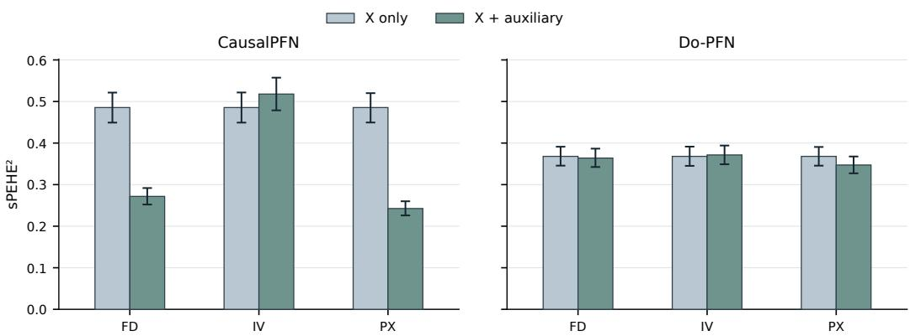  
Figure 5: Effect of auxiliary-variable inputs for CausalPFN and Do-PFN. We compare Xonly inputs with inputs augmented by the regime-specific auxiliary variables in the front-door (FD), instrumental-variable (IV), and proximal (PX) views. The auxiliary-input FD configurations condition on the factual mediator and are included as input-sensitivity diagnostics, not as front-door estimators of the total effect.

## E.1.2 SENSITIVITY METRICS

Let $\mathcal { \widetilde { T } } _ { w i } ^ { \Gamma } = [ \widetilde { L } _ { w i } ^ { \Gamma } , \widetilde { U } _ { w i } ^ { \Gamma } ]$ denote the stored oracle-reference sensitivity interval. Let $n _ { w } : = | Q _ { w } |$ denote the number of query units in world w. For predicted endpoints $( \hat { \widehat { L } } _ { w i } ^ { \Gamma } , \widehat { U } _ { w i } ^ { \Gamma } )$ , the combined endpoint error is

$$
\mathrm { E n d p o i n t R M S E } _ { w } ( \Gamma ) = \left[ \frac { 1 } { 2 n _ { w } } \sum _ { i \in \mathcal { Q } _ { w } } \left\{ ( \widehat { L } _ { w i } ^ { \Gamma } - \widetilde { L } _ { w i } ^ { \Gamma } ) ^ { 2 } + ( \widehat { U } _ { w i } ^ { \Gamma } - \widetilde { U } _ { w i } ^ { \Gamma } ) ^ { 2 } \right\} \right] ^ { 1 / 2 } .
$$

We additionally report the fraction of query-unit oracle effects contained within the estimated bounds:

$$
\mathrm { C o n t a i n m e n t } _ { w } ( \Gamma ) = \frac { 1 } { n _ { w } } \sum _ { i \in \mathcal { Q } _ { w } } \mathbf { 1 } \Big \{ \widehat { L } _ { w i } ^ { \Gamma } \leq \tau _ { w i } \leq \widehat { U } _ { w i } ^ { \Gamma } \Big \} .
$$

## E.2 BASELINES

## E.2.1 CAUSAL FOUNDATION MODELS

We evaluate CausalPFN, Do-PFN, and CausalFM (Balazadeh Meresht et al., 2026; Ma et al., 2026; Robertson et al., 2026) using their released checkpoints without fine-tuning. CausalPFN and CausalFM return CATE predictions directly, whereas Do-PFN contrasts predictions under the two treatment values. FD configurations of CausalPFN and Do-PFN omit M from both context and query to avoid conditioning total-effect predictions on a factual mediator. They are mediator-free transfer evaluations, not front-door estimators. Figure 5 compares these models under X-only inputs and inputs augmented with the regime-specific auxiliary variables, illustrating the sensitivity of their predictions to the input configuration. CausalFM uses its native FD and IV checkpoints in the corresponding regimes while CausalPFN and Do-PFN receive the auxiliary variables as ordinary covariates without role annotations or identification wrappers.

These comparisons concern the evaluated model–input configurations, not equally supported native estimators in every regime.

## E.2.2 MODULAR APPROACHES

Our modular estimators combine supervised predictive models with explicit causal estimation procedures matched to each identification regime. The causal procedure determines which nuisance quantities are required and how their predictions are combined into a CATE estimate, while the predictive backbone estimates the corresponding conditional means, probabilities, or pseudo-outcome regressions. When multiple predictive backbones are evaluated within the same procedure, we keep the causal estimation step fixed and change only the supervised models used for these predictive components.

Depending on the regime, we instantiate the predictive components with TabPFN-v3.5 (Jager et al.,¨ 2026), XGBoost (Chen and Guestrin, 2016), feed-forward neural networks, or ExtraTrees (Geurts et al., 2006). For TabPFN-v3.5, continuous targets use TabPFNRegressor and binary probabilities use TabPFNClassifier. We implement XGBoost with 300 estimators, maximum tree depth 3, and learning rate 0.05, using the histogram tree method. The neural-network backbone is a two-layer MLP with 128 hidden units per layer and ReLU activations. It is trained with Adam using a learning rate of $1 0 ^ { - 3 }$ , weight decay $1 0 ^ { - \overline { { 4 } } }$ , and batch size 128. ExtraTrees uses 300 trees with max features=0.8. The minimum leaf size is 8 for classification, 6 for nuisance regression, and 10 for the final CATE regression. All remaining parameters use the corresponding package defaults and we perform no hyperparameter optimization.

Back-door (BD). We evaluate S-, X-, and DR-Learners using the observed adjustment vector $V = ( X , U )$ . The S-Learner (Kunzel et al., 2019) fits a single outcome regression¨ ${ \widehat { g } } ( V , T )$ on the full context and returns $\widehat { g } ( v , 1 ) - \widehat { g } ( v , 0 )$

The X-Learner (Kunzel et al., 2019) uses five-fold treatment-stratified cross-fitting to obtain arm-¨ specific out-of-fold outcome predictions. For controls, it constructs $D _ { i } ^ { 0 } \ = \ \widehat { m } _ { 1 , - k ( i ) } ( V _ { i } ) - Y _ { i }$ whereas for treated observations it uses $D _ { i } ^ { 1 } ~ = ~ Y _ { i } - \widehat { m } _ { 0 , - k ( i ) } ( V _ { i } )$ . Separate regressions of $D ^ { 0 }$ and $D ^ { 1 }$ produce $\widehat { f } _ { 0 } ( v )$ and $\widehat { f } _ { 1 } ( v )$ . A propensity model fitted on the full context estimates ${ \widehat { e } } ( v ) = { \widehat { P } } ( T = 1 \mid V = v )$ . The final X-Learner estimate is

$$
\widehat { \tau } _ { \mathrm { X } } ( v ) = \widehat { e } ( v ) \widehat { f } _ { 0 } ( v ) + \{ 1 - \widehat { e } ( v ) \} \widehat { f } _ { 1 } ( v ) .
$$

The DR-Learner (Kennedy, 2023) cross-fits both arm-specific outcome models and the propensity model. It constructs the doubly robust pseudo-outcome

$$
\Gamma _ { i } = \widehat { m } _ { 1 } ( V _ { i } ) - \widehat { m } _ { 0 } ( V _ { i } ) + \frac { T _ { i } \{ Y _ { i } - \widehat { m } _ { 1 } ( V _ { i } ) \} } { \widehat { e } ( V _ { i } ) } - \frac { ( 1 - T _ { i } ) \{ Y _ { i } - \widehat { m } _ { 0 } ( V _ { i } ) \} } { 1 - \widehat { e } ( V _ { i } ) } ,
$$

and fits a final regression of Γ on $V _ { i } .$

All three estimators receive the factual query U and do not marginalize over it. Their evaluation against $\tau _ { 0 } ( X )$ relies on the benchmark restriction $\mathbb { E } [ Y ( 1 ) - Y ( 0 ) ^ { \smile } | X , U ] = \tau _ { 0 } ( X )$

Front-door (FD). We use a common front-door plug-in procedure (Guo et al., 2023; Ma et al., 2026; Pearl, 2022) with neural-network, XGBoost, or TabPFN-v3.5 predictive components. Across these variants, the front-door functional and numerical integration procedure are identical. Only the supervised models used for the treatment, mediator, and outcome regressions change. Algorithm 3 summarizes the estimator.

Our implementation approximates the conditional mediator distribution in each treatment arm by shifting the complete pool of centered out-of-fold mediator residuals around the predicted mediator mean. Thus, rather than fitting a separate conditional-density model, it uses an arm-specific location-shift approximation. The complete residual pool is averaged deterministically for every query, without Monte Carlo mediator sampling. Only mediator residual construction is cross-fitted; the treatment and outcome models use the full context.

Instrumental variable (IV). For IV, the modular conditional Wald estimator (Angrist and Imbens, 1995; Wald, 1940; Wang and Tchetgen Tchetgen, 2018) uses supervised models to estimate the conditional reduced-form outcome and treatment responses to the instrument. In the reported Wald configuration, these predictive components use TabPFN-v3.5. Algorithm 4 gives the complete procedure.

Both predictive models are fitted once on the full context and are not cross-fitted. We preserve the sign of the first-stage contrast and apply no denominator floor, additive epsilon, fallback prediction, or final-effect clipping. If $| \widehat { \Delta } _ { T } ( x ) | \leq 1 0 ^ { - 1 2 }$ , the estimate remains undefined and the run fails the subsequent finiteness check. The benchmark’s within-X gain restriction makes the conditional Wald estimand coincide with $\tau _ { 0 } ( x )$

Proximal (PX). We implement a common P-Learner (Sverdrup and Cui, 2023) with ExtraTrees, neural networks, or TabPFN-v3.5 as the predictive backbone. The backbone is changed jointly for all nuisance models and the final pseudo-outcome regression, while the cross-fitting layout, bridge construction, and proximal score remain fixed. Algorithm 5 summarizes the procedure.

Because both proxies are binary, we solve the outcome and treatment bridges using explicit ridgeregularized two-point equations with ridge parameter 0.01 rather than fitting separate bridge models directly. All nuisance quantities entering $\Gamma _ { i } ^ { - }$ are out of fold.

Algorithm 3 Front-door plug-in estimator   
Input: Context data $\overline { { \{ ( X _ { i } , T _ { i } , M _ { i } , Y _ { i } ) \} _ { i = 1 } ^ { n } } }$ , query covariate x   
Output: Front-door estimate τbFD(x)   
1: Fit treatment model ${ \widehat { e } } ( x ) \approx { \bar { P } } ( T = 1 \mid X = x )$   
2: Set ${ \widehat { p } } _ { 1 } ( x ) : = { \widehat { e } } ( x ) { \mathrm { ~ a n d ~ } } { \widehat { p } } _ { 0 } ( x ) : = 1 - { \widehat { e } } ( x )$   
3: Fit outcome model ${ \widehat { Q } } ( x , m , s ) \approx \mathbb { E } [ Y \mid X = x , M = m , T = s ]$   
4: for $a \in \{ 0 , 1 \}$ do   
5: Split the context observations with $T _ { i } = a$ into five folds   
6: for each fold k do   
7: Fit $\widehat { g } _ { a , - k } ( x ) \approx \mathbb { E } [ M \mid T = a , X = x ]$ on the other four folds   
8: Predict the held-out fold and compute raw residuals   
$r _ { a i } ^ { \mathrm { r a w } } = M _ { i } - \widehat { g } _ { a , - k ( i ) } ( X _ { i } )$ $T _ { i } = a$   
9: end for   
10: Center residuals within arm a:   
$r _ { a i } = r _ { a i } ^ { \mathrm { r a w } } - \frac { 1 } { n _ { a } } \sum _ { j : T _ { j } = a } r _ { a j } ^ { \mathrm { r a w } }$   
11: Refit $\widehat { g } _ { a } ( x ) \approx \mathbb { E } [ M \mid T = a , X = x ]$ on all observations with $T _ { i } = a$   
12: Form the arm-specific mediator support $M _ { a } ( x ) = \{ \widehat { g } _ { a } ( x ) + r _ { a i }$ : T<sub>i</sub> = a}   
13: Compute $\begin{array} { r } { \widehat { \theta } _ { a } ( x ) = \frac { 1 } { | \mathcal { M } _ { a } ( x ) | } \sum _ { m \in \mathcal { M } _ { a } ( x ) } \sum _ { s = 0 } ^ { 1 } \widehat { p } _ { s } ( x ) \widehat { Q } ( x , m , s ) } \end{array}$   
14: end for   
15: return $\widehat { \tau } _ { \mathrm { F D } } ( x ) = \widehat { \theta } _ { 1 } ( x ) - \widehat { \theta } _ { 0 } ( x )$

```latex
Algorithm 4 Conditional Wald estimator
Input: Context data $\overline { { \{ ( X _ { i } , I _ { i } , T _ { i } , Y _ { i } ) \} _ { i = 1 } ^ { n } } } ,$ query covariate x
Output: Conditional Wald estimate τb (x)
1: Fit outcome model $\widehat { \mu } _ { Y } ( j , x ) \approx \mathbb { E } [ Y \mid \hat { I } = j , X = x ]$
2: Fit treatment model $\widehat { \mu } _ { T } ( j , x ) \approx \bar { P } ( T = 1 \mid I = j , \bar { X } = x )$
3: for $j \in \{ 0 , 1 \}$ do
4: Evaluate ${ \widehat { \mu } } _ { Y } ( j , x )$ and ${ \widehat { \mu } } _ { T } ( j , x )$
5: end for
6: Compute $\widehat { \Delta } _ { Y } ( x ) = \widehat { \mu } _ { Y } ( 1 , x ) - \widehat { \mu } _ { Y } ( 0 , x ) , \quad \widehat { \Delta } _ { T } ( x ) = \widehat { \mu } _ { T } ( 1 , x ) - \widehat { \mu } _ { T } ( 0 , x )$
7: return $\begin{array} { r } { \widehat { \tau } _ { \mathrm { I V } } ( x ) = \frac { \widehat { \Delta } _ { Y } ( x ) } { \widehat { \Delta } _ { T } ( x ) } } \end{array}$
```

Across the ExtraTrees, neural-network, and TabPFN-v3.5 variants, the same bridge equations and pseudo-outcome are retained. Only the predictive backbone used for the nuisance estimates and the final regression of Γ on X changes. The query input therefore contains X only. The proxies contribute through the context-level bridge and pseudo-outcome construction.

## E.2.3 ADDITIONAL POINT-ESTIMATION BASELINES

ForestDRIV combines the doubly robust instrumental-variable (DRIV) procedure (Syrgkanis et al., 2019) with a regression forest as the final effect model. The procedure constructs a residualcorrected regression target from estimated nuisance functions and a preliminary effect model, then regresses this target on the effect-modifying covariates. KIV (Singh et al., 2019) is a nonparametric IV estimator based on two-stage kernel ridge regression. It estimates a conditional mean embedding of the structural inputs given the instruments and then uses these embeddings to estimate the structural outcome response.

Causal Tree (Athey and Imbens, 2016) recursively partitions the covariate space to capture treatment-effect heterogeneity. It estimates a treatment effect within each terminal node and assigns that estimate to query observations falling in the node, yielding a piecewise-constant effect function. Generalized random forests (GRF) (Athey et al., 2019) estimate quantities defined by local moment equations using adaptive weights learned by a forest. The causal-forest specializa tion uses splits designed to capture treatment-effect heterogeneity and estimates conditional effects within the resulting forest-weighted neighborhoods.

Algorithm 5 Proximal P-Learner   
Input: Context data $\{ ( X _ { i } , Z _ { p , i } , W _ { p , i } , T _ { i } , Y _ { i } ) \} _ { i = 1 } ^ { n }$ , query covariate x   
Output: Proximal estimate ${ \widehat { \tau } } _ { \mathrm { P X } } ( x )$   
1: Split the context into five treatment-stratified folds   
2: for fold $k = 1 , \ldots , 5$ do   
3: Fit $e _ { w } ( x ) \approx P ( T = 1 \mid X = x , W _ { p } = w )$ on the other four folds   
4: for $a \in \{ 0 , 1 \}$ do   
5: Fit $\begin{array} { r } { \dot { \mu _ { a z } } ( \dot { x } ) \approx \mathbb { E } [ Y \mid X = x , Z _ { p } = z , T = a ] } \end{array}$   
6: Fit $p _ { a z } ^ { W } ( x ) \approx \bar { P ( W _ { p } = 1 \mid X = x , Z _ { p } = z , T = a ) }$   
7: Fit $p _ { a w } ^ { Z } ( x ) \approx P ( \bar { Z _ { p } } = 1 \mid X = x , \bar { W _ { p } } = w , T = a )$   
8: Solve the regularized binary outcome bridge $h _ { a } ( w , x )$   
9: Solve the regularized binary treatment bridge $q _ { a } ( z , x )$   
10: end for   
11: for held-out observation i in fold k do   
12: Clip the factual treatment-bridge evaluation:   
$\widetilde { q } _ { T _ { i } } ( Z _ { p , i } , X _ { i } ) = \mathrm { c l i p } _ { [ - 2 5 , 2 5 ] } \big ( q _ { T _ { i } } ( Z _ { p , i } , X _ { i } ) \big )$   
13: Compute the proximal pseudo-outcome   
$\Gamma _ { i } = ( 2 T _ { i } - 1 ) \widetilde { q } _ { T _ { i } } ( Z _ { p , i } , X _ { i } ) \{ Y _ { i } - h _ { T _ { i } } ( W _ { p , i } , X _ { i } ) \} + h _ { 1 } ( W _ { p , i } , X _ { i } ) - h _ { 0 } ( W _ { p , i } , X _ { i } )$   
14: end for   
15: end for   
16: Fit the final regression ${ \widehat { \tau } } _ { \operatorname { P X } } ( x ) \approx \operatorname { \mathbb { E } } [ \Gamma \mid X = x ] \operatorname { u s i n g } \{ ( X _ { i } , \Gamma _ { i } ) \} _ { i = 1 } ^ { n }$   
17: return ${ \widehat { \tau } } _ { \mathrm { P X } } ( x )$

The treatment-agnostic representation network (TARNet) (Shalit et al., 2017) learns a shared covariate representation with separate outcome heads for the treated and control groups. Training uses observed outcomes through the corresponding treatment head without an explicit representationbalancing penalty. CFRNet (Shalit et al., 2017) augments the shared-representation, treatmentspecific-head architecture with a penalty on the distributional discrepancy between treated and control representations. Its objective combines factual outcome prediction with this balancing term. As with TARNet, treatment effects are predicted by contrasting the two outcome heads at the same query covariates.

## E.2.4 MODELS FOR PARTIAL IDENTIFICATION

We evaluate bound estimators on the matched binary companion worlds in Appendix C.5. For Manski and IV bounds, multinomial logistic regression, XGBoost (Chen and Guestrin, 2016), and frozen TabPFN-v3.5 (Jager et al., 2026) estimate¨ $P ( T , Y \mid X )$ and $P ( T , Y \mid X , I )$ , respectively. The Manski formula (Manski, 2003) and the IV response-type linear program (Balke and Pearl, 1997) are held fixed across backbones, with treatment monotonicity imposed in the latter. We apply a common feasibility projection to infeasible estimated IV cells. For sensitivity bounds, we evaluate CSA-PFN (MSM) (Javurek et al., 2026), B-Learner (Oprescu et al., 2023), and NeuralCSA (Frauen et al., 2024) at $\Gamma \in \{ 1 , 1 . 2 5 , 1 . 5 , 2 , 3 , 5 \}$ . In our implementation, CSA-PFN uses its frozen checkpoint with a context-fitted 50-to-10 PCA adapter, while B-Learner uses five-fold cross-fitting with random forests. For the B-Learner variants, “all” uses the indicated predictive backbone fo all learned components, whereas “final” replaces only the final bound regressions with TabPFN and retains RF-based nuisance estimators. NeuralCSA is trained separately in each world, applying its continuous-density flow to binary outcomes. All estimators use only context data for fitting and are evaluated against the corresponding SCM oracle bounds on shared query units.

## E.3 SEMI-SYNTHETIC EVALUATION SETTINGS

For ACIC 2016 (Dorie et al., 2019), we select 40 parameter settings by rounding 40 equally spaced indices from 1 to 77, using simulation 1 for each setting. For the LaLonde-PSID and LaLonde-CPS datasets (Dehejia and Wahba, 1999; 2002; LaLonde, 1986) generated using RealCause (Neal et al., 2020), we use official samples 0–39. From each realization, we select 1,024 context units and 100 disjoint query units, with identical context and query units across estimators. Within each RealCause dataset, covariate rows and split indices are also preserved across realizations when the archived samples support exact pairing. ACIC retains its original 58-column schema, with the three string-valued columns encoded ordinally using sorted category levels, whereas RealCause uses its eight native numeric covariates. The CATE targets are conditional-mean contrasts from the official ACIC generator or the pre-trained RealCause outcome generator.

## E.4 REAL-WORLD EVALUATION SETTINGS

The control–treatment contrasts are defined as AZT monotherapy versus AZT+ddI combination therapy in ACTG 175 (Hammer et al., 1996), group 0 versus group 6 among records satisfying dem inel=1 and revasamp=1 in Pennsylvania (Corson et al., 1992), and the original control group versus the job-search incentive group in Illinois (Woodbury and Spiegelman, 1987). The respective negative-control outcomes are cd40, wages, and avprearn. Context sampling is treatment-stratified to approximately preserve the eligible sample’s treatment proportion, with 768, 1,024, and 2,048 context units for ACTG 175, Pennsylvania, and Illinois, respectively. Each split contains 256 query units sampled without replacement from the remaining records, and all estimators share the same context and query units. All pre-processing steps are fitted using the context data only. Numeric features undergo median imputation, categorical features undergo mode imputation and one-hot encoding, and outcomes are standardized using the context mean and population standard deviation. We compute metrics relative to the null target $\tau ( x ) = 0$ on the standardized outcome scale and average them over the 40 splits. These repetitions assess split sensitivity within a fixed dataset, rather than variation across independent trials.

Although the original trials contain multiple treatment arms, we form each benchmark contrast by selecting two randomized arms and designating one as control and the other as treatment. Let $A \in { \mathcal { A } }$ denote the original treatment assignment. For selected arms $a _ { 0 } , a _ { 1 } \in { \mathcal { A } } ,$ , define $S = \mathbb { 1 } \{ A \in$ $\{ a _ { 0 } , a _ { 1 } \} \}$ and $T = \mathbb { 1 } \{ A = a _ { 1 } \}$ . Since the negative-control outcome is measured before treatment, it cannot be affected by treatment assignment (Arnold and Ercumen, 2016). In the potential-outcome formulation (Ashby et al., 2025),

$$
Y ^ { \mathrm { p r e } } ( a _ { 0 } ) = Y ^ { \mathrm { p r e } } ( a _ { 1 } ) = Y ^ { \mathrm { p r e } } ,
$$

and therefore

$$
\tau ( x ) = \mathbb { E } [ Y ^ { \mathrm { p r e } } ( a _ { 1 } ) - Y ^ { \mathrm { p r e } } ( a _ { 0 } ) \mid X = x , S = 1 ] = 0 .
$$

Moreover, randomization of the original arm assignment implies

$$
A \bot \{ Y ^ { \mathrm { p r e } } ( a ) : a \in { \mathcal { A } } \} \mid X ,
$$

and hence, after restricting to the selected pair,

$$
T \perp \left\{ Y ^ { \mathrm { p r e } } ( a _ { 0 } ) , Y ^ { \mathrm { p r e } } ( a _ { 1 } ) \right\} | X , S = 1 .
$$

## E.5 IHDP FULL VERSUS IHDP-HC

We adopt the Infant Health and Development Program (IHDP) benchmark to evaluate treatmenteffect estimation under confounder omission. Following the hidden-confounding construction of Jesson et al. (2021) and its Quince implementation, we combine empirical covariates and treatment assignments with synthetically generated outcomes. The resulting dataset contains 747 units with 25 covariates. The Full view retains all covariates, including $U = { \mathrm { b } } . { \mathrm { m a r r } }$ , the mother’s marital status at childbirth. The IHDP-HC view removes only U from the model inputs, leaving 24 covariates. The omitted variable remains part of the outcome-generating process and can also modify treatment effects. Unlike the main synthetic benchmark, the IHDP-HC comparison also removes an effect modifier. Its error increase therefore combines confounding-related degradation with loss of information about effect heterogeneity.

We evaluate 100 paired trials using the Quince data preprocessing and splitting procedure. Each trial contains 470 training, 202 validation, and 75 test units. For the main comparison, the training and validation subsets are pooled into a context of 672 units, with the 75 test units used as queries. Within each trial, Full and Hidden share the same unit identities, treatment assignments, factual and potential outcomes, split, and oracle effect values. Both views are evaluated against the same $\tau _ { \mathrm { t r u e } } ( X , U )$ values, without redefining the target after removing U. This paired comparison serves as a semi-synthetic stress test of point estimation when a confounder is withheld from the estimator.

## F ABLATION STUDIES

## F.1 HIDDEN CONFOUNDER TRACK

Figure 6 examines point-estimator behavior under unobserved confounding and the accuracy of estimated partial-identification bounds. The synthetic HC view retains only (X, T, Y), without the confounder or auxiliary identifying variables. Point predictions in this HC view are evaluated without a point-identification claim.

B-Learner + RF (al ) B-Learner + TabPFN (final) B-Learner + TabPFN (al )  
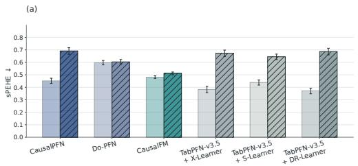

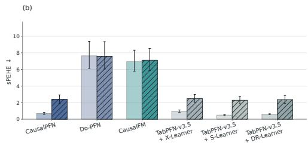

(c)  
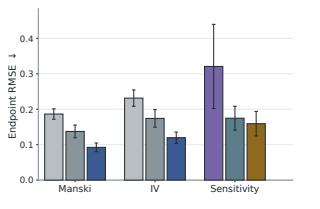

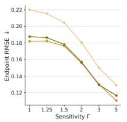

(d)  
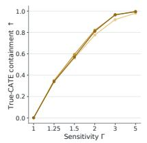

(e)  
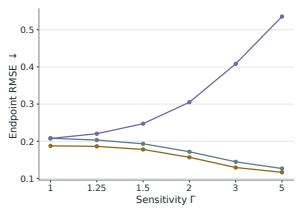  
Figure 6: Hidden-confounding and partial-identification evaluation. (a) Synthetic paired comparison of point-estimation error when the confounder is observed (BD) or unobserved (HC). (b) Full versus Hidden comparisons on IHDP-HC. (c) Endpoint RMSE for representative partially identified settings, including bounded-outcome, IV-based, and sensitivity-model leaves. The sensitivity comparison in panel (c) is evaluated at $\Gamma = 2 .$ . (d) Performance of B-Learner variants across sensitivity levels Γ. (e) Endpoint RMSE of sensitivity-aware estimators across Γ.

Confounder omission affects models differently. Panels (a) and (b) compare point-estimation performance with the designated confounder observed or unobserved on synthetic and IHDP-HC data, respectively. CausalPFN and all three TabPFN-based modular approaches exhibit pronounced increases in sPEHE after confounder omission in both settings, whereas Do-PFN and CausalFM show smaller changes.

TabPFN improves bound-estimation accuracy. Panel (c) evaluates three representative partialidentification settings. TabPFN-v3.5 achieves the lowest endpoint RMSE among the compared estimators in the Manski and IV settings, while B-Learner + TabPFN (all) achieves the lowest error in the sensitivity setting. Panel (d) further compares RF- and TabPFN-based B-Learner variants. Both TabPFN configurations obtain lower endpoint RMSE than the RF-based configuration at every evaluated sensitivity level Γ. Their target-CATE containment curves increase with Γ. These results distinguish accurate recovery of the reference bounds from inclusion of the oracle CATE and support the use of TabPFN within bound-estimation procedures.

Sensitivity-level dependence varies across estimators. In panel (e), the endpoint RMSE of CSA-PFN (MSM) increases monotonically over the evaluated sensitivity grid. In contrast, B-Learner + TabPFN (all) and NeuralCSA exhibit decreasing endpoint errors, with the TabPFN-based B-Learner achieving the lowest error at every evaluated Γ. Its advantage over CSA-PFN becomes larger as the maintained sensitivity restriction is relaxed. This contrast highlights the importance of evaluating sensitivity-bound estimators across multiple sensitivity levels.

## F.2 STRESS TEST FOR SYNTHETIC DATA

Regime-specific stress. Table 7 highlights both the strengths and limitations of modular estimation under regime-specific stress. In BD and FD, the TabPFN-based DR-Learner and front-door plugin, respectively, retain the lowest mean sPEHE<sup>2</sup> despite weaker treatment overlap and reduced mediator support. All evaluated plug-in estimators in the FD comparison outperform the CFM configurations throughout the stress sweep. However, this advantage does not extend to IV and PX. Under weaker instruments, the TabPFN-based Wald estimator and ForestDRIV exhibit sharply increasing errors and between-world variability, while CausalFM maintains the lowest mean error. In PX, worsening bridge conditioning erodes the initial advantage of the TabPFN-based P-Learner, with CausalFM becoming the lowest-error configuration under the Severe setting. These contrasting

Table 7: Regime-specific stress tests across four identification regimes. We report $\mathrm { s P E H E ^ { 2 } }$ (↓) as the mean ± standard deviation across 40 SCM worlds. Default, Mild, Moderate, and Severe denote increasing levels of regime-specific stress. These levels are not calibrated across regimes. Bold means indicate the lowest mean error within each regime and severity level.
<table><tr><td rowspan="2">Method</td><td colspan="4">Stress severity</td></tr><tr><td>Default</td><td>Mild</td><td>Moderate</td><td>Severe</td></tr><tr><td>Back-door (BD): Overlap</td><td></td><td></td><td></td><td></td></tr><tr><td>CausalPFN</td><td> $0 . 2 0 8 \pm 0 . 0 6 2$ </td><td> $0 . 2 3 3 \pm 0 . 0 6 8$ </td><td> $0 . 2 5 3 \pm 0 . 0 7 4$ </td><td> $0 . 2 9 1 \pm 0 . 0 8 4$ </td></tr><tr><td>Do-PFN</td><td> $0 . 3 6 0 \pm 0 . 0 7 1$ </td><td> $0 . 3 3 8 \pm 0 . 0 6 6$ </td><td> $0 . 3 2 2 \pm 0 . 0 6 4$ </td><td> $0 . 3 1 0 \pm 0 . 0 6 1$ </td></tr><tr><td>CausalFM</td><td> $0 . 2 3 3 \pm 0 . 0 3 3$ </td><td> $0 . 2 3 2 \pm 0 . 0 3 3$ </td><td> $0 . 2 3 4 \pm 0 . 0 3 4$ </td><td> $0 . 2 3 5 \pm 0 . 0 3 4$ </td></tr><tr><td> $\mathrm { T a b P F N - v } 3 . 5 + \mathrm { X - L e a r n e r }$ </td><td> $0 . 1 5 3 \pm 0 . 0 6 0$ </td><td> $0 . 1 6 6 \pm 0 . 0 6 6$ </td><td> $0 . 1 8 2 \pm 0 . 0 6 8$ </td><td> $0 . 2 1 2 \pm 0 . 0 7 8$ </td></tr><tr><td> $\mathrm { T a b P F N - v } 3 . 5 + \mathrm { S - L e a r n e r }$ </td><td> $0 . 1 9 7 \pm 0 . 0 5 7$ </td><td> $0 . 1 9 9 \pm 0 . 0 5 8$ </td><td> $0 . 2 0 5 \pm 0 . 0 5 4$ </td><td> $0 . 2 0 9 \pm 0 . 0 5 4$ </td></tr><tr><td> $\mathrm { T a b P F N - v 3 . 5 + D R \mathrm { - } L e a r n e r }$ </td><td> $\mathbf { 0 . 1 4 3 \pm 0 . 0 5 4 }$ </td><td> $\mathbf { 0 . 1 5 4 \pm 0 . 0 6 0 }$ </td><td> $\mathbf { 0 . 1 7 1 \pm 0 . 0 6 3 }$ </td><td> $\mathbf { 0 . 2 0 2 \pm 0 . 0 7 0 }$ </td></tr><tr><td>Front-door (FD): Mediator support</td><td></td><td></td><td></td><td></td></tr><tr><td>CausalPFN</td><td> $0 . 4 8 5 \pm 0 . 1 1 7$ </td><td> $0 . 4 8 0 \pm 0 . 1 1 5$ </td><td> $0 . 4 7 6 \pm 0 . 1 1 4$ </td><td> $0 . 4 7 3 \pm 0 . 1 1 3$ </td></tr><tr><td>Do-PFN</td><td> $0 . 3 6 8 \pm 0 . 0 7 4$ </td><td> $0 . 3 6 5 \pm 0 . 0 7 4$ </td><td> $0 . 3 6 4 \pm 0 . 0 7 5$ </td><td> $0 . 3 6 4 \pm 0 . 0 7 5$ </td></tr><tr><td>CausalFM</td><td> $0 . 5 5 1 \pm 0 . 0 7 3$ </td><td> $0 . 5 5 0 \pm 0 . 0 7 3$ </td><td> $0 . 5 4 9 \pm 0 . 0 7 3$ </td><td> $0 . 5 4 9 \pm 0 . 0 7 3$ </td></tr><tr><td>NN + FD Plug-in</td><td> $0 . 2 2 7 \pm 0 . 0 3 1$ </td><td> $0 . 2 3 0 \pm 0 . 0 3 3$ </td><td> $0 . 2 3 2 \pm 0 . 0 3 3$ </td><td> $0 . 2 3 5 \pm 0 . 0 3 2$ </td></tr><tr><td>XGBoost + FD Plug-in</td><td> $0 . 2 3 3 \pm 0 . 0 3 7$ </td><td> $0 . 2 2 7 \pm 0 . 0 4 1$ </td><td> $0 . 2 3 4 \pm 0 . 0 4 2$ </td><td> $0 . 2 5 1 \pm 0 . 0 5 4$ </td></tr><tr><td>TabPFN-v3.5 + FD Plug-in</td><td> $\mathbf { 0 . 1 5 4 \pm 0 . 0 5 7 }$ </td><td> $\mathbf { 0 . 1 8 1 } \pm 0 . 0 5 1$ </td><td> $\mathbf { 0 . 1 9 8 \pm 0 . 0 4 9 }$ </td><td> $\mathbf { 0 . 2 1 2 \pm 0 . 0 5 0 }$ </td></tr><tr><td>Instrumental variable (IV): Instrument strength</td><td></td><td></td><td></td><td></td></tr><tr><td>CausalPFN</td><td> $0 . 5 1 8 \pm 0 . 1 2 7$ </td><td> $0 . 5 2 8 \pm 0 . 1 2 4$ </td><td> $0 . 5 4 2 \pm 0 . 1 2 0$ </td><td> $0 . 5 4 0 \pm 0 . 1 1 8$ </td></tr><tr><td>Do-PFN</td><td> $0 . 3 7 1 \pm 0 . 0 7 3$ </td><td> $0 . 3 6 9 \pm 0 . 0 7 2$ </td><td> $0 . 3 6 6 \pm 0 . 0 7 1$ </td><td> $0 . 3 6 5 \pm 0 . 0 7 1$ </td></tr><tr><td>CausalFM</td><td> $\mathbf { 0 . 2 5 8 \pm 0 . 0 4 1 }$ </td><td> $\mathbf { 0 . 2 5 6 \pm 0 . 0 3 9 }$ </td><td> $\mathbf { 0 . 2 5 3 \pm 0 . 0 3 9 }$ </td><td> $\mathbf { 0 . 2 5 3 \pm 0 . 0 3 9 }$ </td></tr><tr><td>ForestDRIV</td><td> $0 . 4 6 0 \pm 0 . 2 6 4$ </td><td> $1 . 7 7 0 \pm 4 . 6 7 1$ </td><td> $2 6 . 9 8 0 \pm 4 3 . 7 9 6$ </td><td> $1 1 1 . 0 4 3 \pm 1 5 6 . 8 4 3$ </td></tr><tr><td>KIV</td><td> $0 . 4 2 0 \pm 0 . 1 8 7$ </td><td> $0 . 4 5 7 \pm 0 . 1 8 9$ </td><td> $0 . 4 6 8 \pm 0 . 1 8 7$ </td><td> $0 . 4 9 1 \pm 0 . 2 0 9$ </td></tr><tr><td>TabPFN-v3.5 + Wald</td><td> $0 . 3 3 6 \pm 0 . 1 0 5$ </td><td> $0 . 3 8 9 \pm 0 . 1 7 4$ </td><td> $1 . 1 4 5 \pm 2 . 5 7 8$ </td><td> $1 . 9 4 \times 1 0 ^ { 7 } \pm { 1 . 2 2 \times 1 0 } ^ { 8 }$ </td></tr><tr><td>Proximal (PX): Bridge conditioning</td><td></td><td></td><td></td><td></td></tr><tr><td>CausalPFN</td><td> $0 . 2 4 3 \pm 0 . 0 5 6$ </td><td> $0 . 2 8 7 \pm 0 . 0 6 9$ </td><td> $0 . 3 5 2 \pm 0 . 0 8 0$ </td><td> $0 . 4 4 5 \pm 0 . 1 0 1$ </td></tr><tr><td>Do-PFN</td><td> $0 . 3 4 7 \pm 0 . 0 6 6$ </td><td> $0 . 3 5 1 \pm 0 . 0 6 7$ </td><td> $0 . 3 5 6 \pm 0 . 0 7 0$ </td><td> $0 . 3 6 2 \pm 0 . 0 7 1$ </td></tr><tr><td>CausalFM</td><td> $0 . 2 4 0 \pm 0 . 0 3 3$ </td><td> $0 . 2 5 0 \pm 0 . 0 3 4$ </td><td> $0 . 2 6 9 \pm 0 . 0 3 5$ </td><td> $\mathbf { 0 . 3 0 1 } \pm 0 . 0 4 3$ </td></tr><tr><td> $\mathrm { E x t r a T r e e s } + \mathrm { P } \mathrm { - } \mathrm { L e a r n e r }$ </td><td> $0 . 2 3 3 \pm 0 . 0 4 9$ </td><td> $0 . 2 8 4 \pm 0 . 0 6 5$ </td><td> $0 . 3 1 8 \pm 0 . 0 6 2$ </td><td> $0 . 4 4 1 \pm 0 . 0 9 4$ </td></tr><tr><td> $\mathrm { N N + P \mathrm { - } L e a r n e r }$ </td><td> $0 . 6 6 2 \pm 1 . 1 9 9$ </td><td> $0 . 4 7 1 \pm 0 . 2 4 7$ </td><td> $0 . 3 6 5 \pm 0 . 1 2 1$ </td><td> $0 . 5 3 6 \pm 0 . 2 1 3$ </td></tr><tr><td>TabPFN-v3.5 + P-Learner</td><td> $\mathbf { 0 . 1 8 1 } \pm 0 . 0 5 4$ </td><td> $\mathbf { 0 . 1 9 3 \pm 0 . 0 5 6 }$ </td><td> $\mathbf { 0 . 2 1 7 \pm 0 . 0 5 2 }$ </td><td> $0 . 4 4 2 \pm 0 . 1 0 8$ </td></tr></table>

results show that the empirical benefits of modular estimation depend not only on the identification regime but also on the conditions under which its estimation procedure is applied.

Context length. Table 8 shows that smaller contexts generally reduce estimation accuracy and can change which configuration performs best. While the TabPFN-based FD plug-in and CausalFM in IV retain the lowest mean errors throughout the sweep, the leading configurations in BD and PX change at the shortest context. The extent of degradation also differs substantially across estimators. CausalPFN’s mean error more than doubles in BD and PX, and ForestDRIV exhibits pronounced increases in both error and between-world variability in IV. By contrast, Do-PFN’s errors change relatively little across the four regimes. Such limited sensitivity should not, however, be interpreted as evidence of accurate estimation: CausalFM’s FD error remains nearly unchanged yet consistently exceeds that of every FD plug-in estimator. Thus, context-length evaluation reveals both the dependence of relative performance on data availability and the distinction between maintaining a similar error and maintaining a low error.

Table 8: Context-length stress test across four identification regimes. We report sPEHE<sup>2</sup> (↓) as the mean ± standard deviation across 40 SCM worlds. Context lengths of 1,024, 512, 256, and 160 correspond to the Default, Mild, Moderate, and Severe settings, respectively. Bold means indicate the lowest mean error within each regime and context length.
<table><tr><td rowspan="2">Method</td><td colspan="4">Context length  $n _ { \mathrm { c t x } }$ </td></tr><tr><td>Default</td><td>Mild</td><td>Moderate</td><td>Severe</td></tr><tr><td>Back-door (BD)</td><td></td><td></td><td></td><td></td></tr><tr><td>CausalPFN</td><td> $0 . 2 0 8 \pm 0 . 0 6 2$ </td><td> $0 . 2 4 9 \pm 0 . 0 6 3$ </td><td> $0 . 3 2 7 \pm 0 . 0 8 5$ </td><td> $0 . 4 5 1 \pm 0 . 1 3 4$ </td></tr><tr><td>Do-PFN</td><td> $0 . 3 6 0 \pm 0 . 0 7 1$ </td><td> $0 . 3 6 3 \pm 0 . 0 7 1$ </td><td> $0 . 3 7 0 \pm 0 . 0 7 9$ </td><td> $0 . 3 8 3 \pm 0 . 0 8 2$ </td></tr><tr><td>CausalFM</td><td> $0 . 2 3 3 \pm 0 . 0 3 3$ </td><td> $0 . 2 4 0 \pm 0 . 0 3 5$ </td><td> $0 . 2 5 3 \pm 0 . 0 4 4$ </td><td> $0 . 2 7 3 \pm 0 . 0 5 5$ </td></tr><tr><td>TabPFN-v3.5 + X-Learner</td><td> $0 . 1 5 3 \pm 0 . 0 6 0$ </td><td> $0 . 2 0 2 \pm 0 . 0 5 6$ </td><td> $0 . 2 6 1 \pm 0 . 0 6 9$ </td><td> $0 . 3 0 8 \pm 0 . 0 8 9$ </td></tr><tr><td> $\mathrm { T a b P F N - v } 3 . 5 + \mathrm { S - L e a r n e r }$ </td><td> $0 . 1 9 7 \pm 0 . 0 5 7$ </td><td> $0 . 2 2 7 \pm 0 . 0 3 9$ </td><td> $0 . 2 4 6 \pm 0 . 0 3 9$ </td><td> $\mathbf { 0 . 2 6 8 \pm 0 . 0 5 3 }$ </td></tr><tr><td>TabPFN-v3.5 + DR-Learner</td><td> $\mathbf { 0 . 1 4 3 \pm 0 . 0 5 4 }$ </td><td> $\mathbf { 0 . 1 9 7 \pm 0 . 0 4 9 }$ </td><td> $\mathbf { 0 . 2 4 4 \pm 0 . 0 6 8 }$ </td><td> $0 . 2 8 9 \pm 0 . 0 9 5$ </td></tr><tr><td>Front-door (FD)</td><td></td><td></td><td></td><td></td></tr><tr><td>CausalPFN</td><td> $0 . 4 8 5 \pm 0 . 1 1 7$ </td><td> $0 . 5 4 2 \pm 0 . 1 1 6$ </td><td> $0 . 5 8 0 \pm 0 . 1 5 9$ </td><td> $0 . 6 9 1 \pm 0 . 2 2 5$ </td></tr><tr><td>Do-PFN</td><td> $0 . 3 6 8 \pm 0 . 0 7 4$ </td><td> $0 . 3 7 2 \pm 0 . 0 7 2$ </td><td> $0 . 3 8 1 \pm 0 . 0 8 2$ </td><td> $0 . 3 9 1 \pm 0 . 0 8 4$ </td></tr><tr><td>CausalFM</td><td> $0 . 5 5 1 \pm 0 . 0 7 3$ </td><td> $0 . 5 5 1 \pm 0 . 0 7 4$ </td><td> $0 . 5 5 2 \pm 0 . 0 7 4$ </td><td> $0 . 5 5 2 \pm 0 . 0 7 4$ </td></tr><tr><td>NN + FD Plug-in</td><td> $0 . 2 2 7 \pm 0 . 0 3 1$ </td><td> $0 . 2 4 0 \pm 0 . 0 3 9$ </td><td> $0 . 2 8 2 \pm 0 . 0 6 7$ </td><td> $0 . 2 8 6 \pm 0 . 0 6 6$ </td></tr><tr><td>XGBoost + FD Plug-in</td><td> $0 . 2 3 3 \pm 0 . 0 3 7$ </td><td> $0 . 2 7 1 \pm 0 . 0 4 3$ </td><td> $0 . 2 9 9 \pm 0 . 0 5 3$ </td><td> $0 . 3 1 3 \pm 0 . 0 5 7$ </td></tr><tr><td>TabPFN-v3.5 + FD Plug-in</td><td> $\mathbf { 0 . 1 5 4 \pm 0 . 0 5 7 }$ </td><td> $\mathbf { 0 . 2 1 2 \pm 0 . 0 5 0 }$ </td><td> ${ \bf 0 . 2 4 2 \pm 0 . 0 4 7 }$ </td><td> $\mathbf { 0 . 2 6 0 \pm 0 . 0 4 8 }$ </td></tr><tr><td>Instrumental variable (IV)</td><td></td><td></td><td></td><td></td></tr><tr><td>CausalPFN</td><td> $0 . 5 1 8 \pm 0 . 1 2 7$ </td><td> $0 . 5 7 0 \pm 0 . 1 2 7$ </td><td> $0 . 5 9 3 \pm 0 . 1 6 8$ </td><td> $0 . 6 9 1 \pm 0 . 2 2 4$ </td></tr><tr><td>Do-PFN</td><td> $0 . 3 7 1 \pm 0 . 0 7 3$ </td><td> $0 . 3 7 4 \pm 0 . 0 7 2$ </td><td> $0 . 3 8 5 \pm 0 . 0 8 1$ </td><td> $0 . 3 9 4 \pm 0 . 0 8 3$ </td></tr><tr><td>CausalFM</td><td> $\mathbf { 0 . 2 5 8 \pm 0 . 0 4 1 }$ </td><td> ${ \bf 0 . 2 6 2 \pm 0 . 0 3 9 }$ </td><td> $\mathbf { 0 . 2 7 3 \pm 0 . 0 4 3 }$ </td><td> ${ \bf 0 . 2 8 8 \pm 0 . 0 5 5 }$ </td></tr><tr><td>ForestDRIV</td><td> $0 . 4 6 0 \pm 0 . 2 6 4$ </td><td> $1 . 5 6 1 \pm 3 . 4 6 0$ </td><td> $1 1 . 6 2 0 \pm 3 8 . 0 7 3$ </td><td> $2 9 . 2 8 3 \pm 5 8 . 1 8 0$ </td></tr><tr><td>KIV</td><td> $0 . 4 2 0 \pm 0 . 1 8 7$ </td><td> $0 . 4 3 2 \pm 0 . 2 3 1$ </td><td> $0 . 4 4 3 \pm 0 . 1 9 2$ </td><td> $0 . 4 6 1 \pm 0 . 1 7 9$ </td></tr><tr><td>TabPFN-v3.5 + Wald</td><td> $0 . 3 3 6 \pm 0 . 1 0 5$ </td><td> $0 . 3 7 2 \pm 0 . 1 5 9$ </td><td> $0 . 4 0 2 \pm 0 . 0 9 5$ </td><td> $0 . 4 7 7 \pm 0 . 3 3 1$ </td></tr><tr><td>Proximal (PX)</td><td></td><td></td><td></td><td></td></tr><tr><td>CausalPFN</td><td> $0 . 2 4 3 \pm 0 . 0 5 6$ </td><td> $0 . 2 9 6 \pm 0 . 0 5 9$ </td><td> $0 . 3 5 4 \pm 0 . 0 8 7$ </td><td> $0 . 5 0 5 \pm 0 . 1 4 9$ </td></tr><tr><td>Do-PFN</td><td> $0 . 3 4 7 \pm 0 . 0 6 6$ </td><td> $0 . 3 5 1 \pm 0 . 0 6 6$ </td><td> $0 . 3 6 0 \pm 0 . 0 7 4$ </td><td> $0 . 3 7 3 \pm 0 . 0 7 8$ </td></tr><tr><td>CausalFM</td><td> $0 . 2 4 0 \pm 0 . 0 3 3$ </td><td> $0 . 2 5 1 \pm 0 . 0 3 9$ </td><td> $0 . 2 6 7 \pm 0 . 0 5 1$ </td><td> $\mathbf { 0 . 2 8 8 \pm 0 . 0 5 7 }$ </td></tr><tr><td>ExtraTrees + P-Learner</td><td> $0 . 2 3 3 \pm 0 . 0 4 9$ </td><td> $0 . 3 0 0 \pm 0 . 0 6 9$ </td><td> $0 . 3 8 3 \pm 0 . 1 0 1$ </td><td> $0 . 5 1 6 \pm 0 . 2 7 5$ </td></tr><tr><td>NN + P-Learner</td><td> $0 . 6 6 2 \pm 1 . 1 9 9$ </td><td> $0 . 6 9 9 \pm 0 . 5 7 6$ </td><td> $0 . 8 8 9 \pm 1 . 9 1 4$ </td><td> $0 . 8 5 1 \pm 0 . 9 1 1$ </td></tr><tr><td>TabPFN-v3.5 + P-Learner</td><td> $\mathbf { 0 . 1 8 1 } \pm 0 . 0 5 4$ </td><td> ${ \bf 0 . 2 2 2 \pm 0 . 0 4 8 }$ </td><td> $\mathbf { 0 . 2 5 8 \pm 0 . 0 8 0 }$ </td><td> $0 . 3 9 4 \pm 0 . 3 8 2$ </td></tr></table>

## F.3 IDENTIFICATION BEYOND ADDITIONAL INPUTS

Figure 7 compares three TabPFN configurations to distinguish the effect of additional observed variables from that of explicit regime-specific causal estimation. The first configuration uses TabPFN to predict Y from (X, T) alone, excluding all auxiliary variables and providing a common reference across views. The second configuration additionally supplies all auxiliary variables available in the corresponding observational view as ordinary predictive features. Neither configuration pro vides annotations about the causal roles of these variables or applies a regime-specific identification procedure. The third integrates TabPFN into the corresponding modular estimator.

The modular configuration achieves the lowest mean $\mathrm { s P E H E ^ { 2 } }$ across all four evaluated views. Adding auxiliary variables as ordinary features improves performance over the (X, T)-only reference in the back-door, front-door, and proximal views, but increases error in the IV view. Even when auxiliary variables improve performance, the corresponding predictive configurations still have higher errors than the modular estimators. These results support combining TabPFN’s predictive capabilities with regime-specific identification.

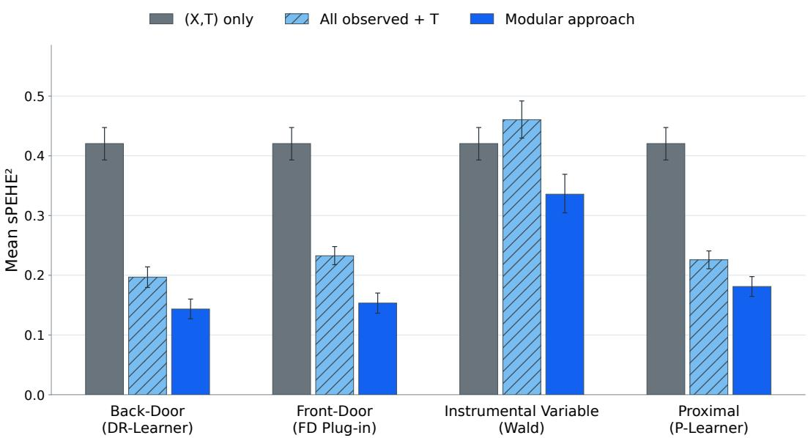  
Figure 7: Input and identification ablation for the modular approach. We compare three TabPFN configurations: (X, T) only, all variables available in each observational view provided as ordinary predictive features, and the corresponding regime-specific modular estimator. The first two configurations provide no annotations or information about the causal roles of the input variables.

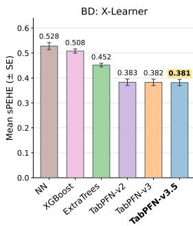

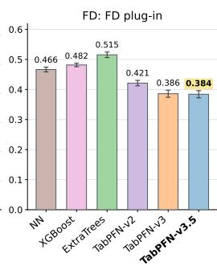

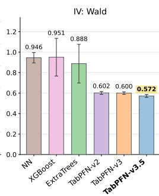

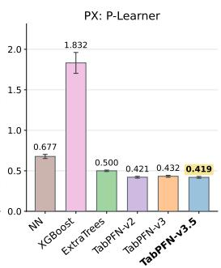  
Figure 8: Effect of the predictive backbone in modular approaches. We replace the predictive model in modular approaches while keeping the regime-specific identification procedure fixed within each panel.

## F.4 EFFECT OF THE PREDICTIVE BACKBONE IN MODULAR APPROACHES

We examine how the predictive backbone affects the modular estimators while keeping the regimespecific identification procedure fixed. For each regime, we replace the predictive model used within the corresponding X-Learner, front-door plug-in, Wald, or P-Learner pipeline with alternative tabular predictors.

Figure 8 shows that the choice of predictive backbone can substantially affect causal estimation performance, even when the identification procedure is unchanged. The TabPFN variants generally achieve lower mean sPEHE than the conventional predictive models across the four regimes. Performance is relatively stable across versions of TabPFN. TabPFN-v3.5 (Jager et al., 2026) attains ¨ the lowest mean error in BD, FD, IV, and PX. These results suggest that the quality of the predictive backbone remains consequential.