# When do data mixtures improve scaling laws? Insights from high-dimensional regression

Diyuan Wu∗1 Lehan Chen∗2 Theodor Misiakiewicz†3 Marco Mondelli†1

## Abstract

Modern machine learning systems are trained on mixtures of data from diferent domains, and choosing the right mixture can substantially improve downstream performance. Despite an extensive literature on data mixing and reweighting, existing work is largely empirical and it remains unclear when auxiliary data genuinely improves scaling laws rather than merely providing more samples. To gain insight into this question, we study a highdimensional mixed-data regression model with a shared regression function, heterogeneous covariances and noise levels, and dataset sizes that may grow at diferent rates. We establish the minimax risk under an ellipsoidal parameter constraint for the general covariance structure and derive deterministic equivalents for the test error of ridge regression under commutative covariances. We then specialize to a target domain and an auxiliary domain with aligned power-law covariance spectra, where the theory yields explicit scaling laws in terms of spectral decay, target regularity, and the relative growth of the two datasets. These laws identify regimes in which combining data mixtures provably yields a faster scaling rate than using either dataset alone. In particular, improving the scaling law requires a specific interplay between spectra and relative sample sizes of the domains. Our numerical experiments on language models exhibit the same qualitative phenomenon: appropriate data mixtures yield a faster decrease in target-domain test loss than training on either domain alone.

## 1 Introduction

Many successful machine learning systems learn from data spanning multiple domains [GD+24, ZY+23], making the composition of their training sets a central design choice. Several approaches to optimize data mixtures have been proposed, including transferring mixture weights from smaller to larger models [XPD+23, FPJ24, LZM+25], predicting how the optimal mixture changes with the total training budget [KSW+25], and adjusting the weights during a training run according to the model’s progress on diferent domains [CRB+23, CHL+25, JZF+25]. The dependence of the performance on model size, data volume, and mixture composition has been described by empirical scaling laws [AYC+23, SBB+25, SSSA26], with recent work suggesting that the mixture composition can afect the scaling exponent [HMAM26]. At the same time, [WWL+26] have observed that the choice of the mixture may be sensitive to small changes in training hyperparameters. Together, these findings motivate a principled understanding of how and when data mixtures improve performance and, in particular, the scaling laws.

When data is drawn from a single distribution, a line of theoretical work has derived scaling laws for linear and kernel regression [MRS22, BDK+24, LWK+24, LWB25, AZVP26], as well as for simplified models of neural networks [PPXP24, BAP24, FEG+25, RNWL25, DLM24]. However, less is known about how these laws change when training on multiple data sources. In the model studied by [Has21], mixture composition afects only the prefactor and leaves the scaling exponent unchanged. Later, [JMS24] derived scaling laws for mixtures of real and surrogate data, and [WCMM26] showed that, in weak-to-strong generalization, a student trained on teacher-generated labels can achieve a better scaling exponent than its teacher. Furthermore, in a stylized memorization model, Medvedev et al. [MLLS26] showed that optimizing training proportions can improve the scaling exponent relative to sampling from the test distribution. Most recently, Dai and Zheng [DZ26] developed a theoretical model of how mixture proportions afect learning curves, predicting efective mixtures across model and dataset sizes. These results leave open the characterization of when combining datasets yields faster scaling rates than either dataset alone, and how these gains depend on the properties of the data sources and their relative sizes.

In this paper, we study a tractable setting of high-dimensional regression and identify regimes in which data mixtures improve scaling laws. We consider multiple training domains with a common regression function, diferent feature covariances and noise levels, and sample sizes growing at diferent rates. Our contributions can be summarized as follows:

• Minimax risk and ridge performance. We characterize both minimax statistical limits and the performance of a ridge estimator: for general covariances, Theorem 1 gives a variational characterization of the minimax prediction risk under an ellipsoidal parameter constraint, with matching bounds up to constants; for covariances that commute, Theorem 2 derives deterministic equivalents for the bias and variance of mixed ridge regression, which depend only on population-level quantities (covariances, sample sizes, noise levels, regularization).

• Scaling laws for data mixtures. We next specialize both minimax and ridge characterizations to two mixtures with power-law spectra, under source and capacity conditions (Theorems 3-4). This allows to identify regimes where (i) ridge regression achieves the minimax optimal exponent in the scaling law, and (ii) combining diferent mixtures strictly improves the scaling exponent as compared to using either dataset alone.

• Numerical evidence from language models. Finally, we demonstrate via numerical simulations that decoderonly transformers exhibit a qualitatively similar advantage in data mixing: in regimes consistent with our theory, combining target and auxiliary data produces a faster decrease in target-domain test loss than training on either dataset alone (Figure 3).

## 2 Related work

From an empirical viewpoint, existing work on data mixtures has studied how the composition of the training set afects performance and how to choose efective mixtures. DoReMi, DoGE, and Chameleon select domain weights using proxy models, gradient alignment, and feature statistics, respectively [XPD+23, FPJ24, XTC25]. Skill-It, Aioli, and ADO adapt data selection during training [CRB+23, CHL+25, JZF+25], while RegMix and MixMin choose mixtures through performance prediction and surrogate optimization [LZM+25, TRR+25]. Empirical mixing laws model loss as a function of domain proportions and training scale [GMC+24, YLS+25, SBB+25], and AutoScale extrapolates optimized mixtures to larger training budgets [KSW+25]. Additional work on scaling laws examines competition and positive transfer between modalities [AYC+23], and data mixing with repetition when target data is scarce [SSSA26]. Our work provides a theoretical perspective on data mixtures: we identify conditions under which combining datasets improves the scaling exponent over either dataset alone, and then validate them on language model experiments.

From a theoretical viewpoint, work on data mixtures includes distribution-weighted combinations of predictors [MMR08, HMZ18], selecting weights that balance distribution mismatch and estimation error [KL19, DKM23], and adaptive sampling across distributions [HJZ22]. In nonparametric regression, gains from combining mixture data have been characterized over Lipschitz classes [SHZ24], and recent work on H¨older classes establishes minimax rates faster than those attainable from either dataset alone [ZY25, Zam26]. Whether faster rates are possible for highdimensional regression remains, however, open. In particular, existing analyses of data mixtures in this setting do not establish that mixing improves the scaling exponent [DZ26, JMS24], and for ridge regression with data labeled according to diferent objectives, Jagadeesan et al. [JJS25] have identified regimes in which scaling worsens at large dataset sizes. A related topic is covariate shift, studied through minimax analyses of kernel ridge regression [MPW23], asymptotic characterizations of the risk in kernel and random-feature regression [CBP21, TAP21], and minimumnorm interpolation [MZFY24]. Under both covariate and model shift, [YZW+25, SGBS26] have established precise risk characterizations for pooled least squares and minimum-norm interpolation, in the proportional regime where number of samples and feature dimension grow at the same rate. Our analysis accommodates decaying covariance spectra and datasets whose sizes may grow at diferent rates, and it yields scaling laws under source-capacity conditions [CD07, RR17]. Such conditions also underpin scaling laws for kernel and random feature regression [CLKZ21, DLM24, AZVP26]. We use this framework to establish when data mixing improves the scaling law exponent, both in a minimax sense and for ridge regression.

## 3 Problem setup

We consider K independent training datasets. For each $i \in [ K ]$ , we observe $n _ { i }$ independent samples $( \pmb { x } _ { i } ^ { ( j ) } , \pmb { y } _ { i } ^ { ( j ) } ) _ { j \in [ n _ { i } ] }$ from the i-th dataset, where $\pmb { x } _ { i } ^ { ( j ) }$ are drawn from a distribution $P _ { i }$ on $\mathbb { R } ^ { d }$ with

$$
\mathbb { E } _ { P _ { i } } [ \pmb { x } ] = 0 , \qquad \mathbb { E } _ { P _ { i } } [ \pmb { x } \pmb { x } ^ { \top } ] = \pmb { C } _ { i } , \qquad i = 1 , \dots , K .
$$

We set $\textstyle N : = \sum _ { i = 1 } ^ { K } n _ { i }$ . The dimension d may be infinite, in which case $C _ { i }$ is a trace-class operator on $\ell _ { 2 }$ . Denote $X _ { i } =$ $[ \pmb { x } _ { i } ^ { ( 1 ) } , \ldots , \pmb { x } _ { i } ^ { ( n _ { i } ) } ] ^ { \mathsf { T } } \in \mathbb { R } ^ { n _ { i } \times d }$ the design matrix. All domains share the same target parameter $\pmb { \theta } _ { \ast }$ with $\| C _ { i } ^ { 1 / 2 } \pmb \theta _ { * } \| _ { 2 } ^ { 2 } < \infty .$ $i \in [ K ]$ , while their noise levels $\sigma _ { \varepsilon _ { i } } ^ { 2 }$ may difer. The labels $\pmb { y } _ { i } = ( y _ { i } ^ { ( j ) } ) _ { j \in [ n _ { i } ] }$ are given by

$$
y _ { i } = X _ { i } \theta _ { * } + \varepsilon _ { i } , \qquad \varepsilon _ { i } \sim \mathcal { N } ( 0 , \sigma _ { \varepsilon _ { i } } ^ { 2 } I _ { n _ { i } } ) , \qquad i = 1 , \dots , K .
$$

The test distribution is a mixture $\begin{array} { r } { P = \sum _ { k } \pi _ { k } ^ { * } P _ { k } } \end{array}$ of the same domains, with $\pi _ { k } ^ { * } \geq 0$ and $\textstyle \sum _ { k } \pi _ { k } ^ { * } = 1$ ; a single target domain corresponds to $\pi ^ { * } = e _ { 1 }$ . For an estimator ${ \widehat { \pmb \theta } } ,$ we consider the excess test risk

$$
\mathsf { R } _ { \varepsilon } ( \widehat { \pmb { \theta } } ) : = \mathbb { E } _ { { \pmb { x } } \sim P } \left[ \left( { \pmb { x } } ^ { \mathsf { T } } \widehat { \pmb { \theta } } - { \pmb { x } } ^ { \mathsf { T } } { \pmb { \theta } } _ { \ast } \right) ^ { 2 } \right] = \sum _ { k = 1 } ^ { K } { \pmb { \pi } } _ { k } ^ { \ast } \big \| { \pmb { C } } _ { k } ^ { 1 / 2 } ( \widehat { \pmb { \theta } } - { \pmb { \theta } } _ { \ast } ) \big \| _ { 2 } ^ { 2 } .
$$

In this paper, we characterize the minimax risk in this setting $( { \mathrm { i . e . } }$ , the optimal risk over all estimators), and the risk of the following mixed ridge estimator

$$
\widehat { \pmb { \theta } } = \underset { \pmb { \theta } } { \arg \operatorname* { m i n } } \Big \{ \sum _ { i = 1 } ^ { K } \| \pmb { X } _ { i } \pmb { \theta } - \pmb { y } _ { i } \| _ { 2 } ^ { 2 } + \lambda \| \pmb { \theta } \| _ { 2 } ^ { 2 } \Big \} = \pmb { G } \sum _ { i = 1 } ^ { K } \pmb { X } _ { i } ^ { \top } \pmb { y } _ { i } ,\tag{1}
$$

with regularization parameter $\lambda > 0$ , where $\begin{array} { r } { \pmb { G } = ( \sum _ { i = 1 } ^ { K } \pmb { X } _ { i } ^ { \top } \pmb { X } _ { i } + \lambda \pmb { I } ) ^ { - 1 } } \end{array}$ . Conditionally on designs, the risk of (1) averaged over label noise admits the bias-variance decomposition $\begin{array} { r } { \mathsf { R } ( \widehat { \pmb { \theta } } ) : = \mathbb { E } _ { \varepsilon } \mathsf { R } _ { \varepsilon } ( \widehat { \pmb { \theta } } ) = \sum _ { k } \pi _ { k } ^ { * } ( \mathsf { B } _ { k } + \mathsf { V } _ { k } ) } \end{array}$ with

$$
\mathsf { B } _ { k } = \lambda ^ { 2 } \bigl \langle \theta _ { * } , G C _ { k } G \theta _ { * } \bigr \rangle , \qquad \mathsf { V } _ { k } = \sum _ { i = 1 } ^ { K } \sigma _ { \varepsilon _ { i } } ^ { 2 } \mathrm { T r } \bigl ( C _ { k } G X _ { i } ^ { \top } X _ { i } G \bigr ) .
$$

Importance-weighted objectives $\begin{array} { r } { \sum _ { i } a _ { i } \| { \cal { X } } _ { i } \pmb { \theta } - { \pmb { y } } _ { i } \| _ { 2 } ^ { 2 } } \end{array}$ are covered by the substitution $( { \cal C } _ { i } , \sigma _ { \varepsilon _ { i } } ^ { 2 } , \pi _ { k } ^ { * } ) \to ( a _ { i } { \cal C } _ { i } , a _ { i } \sigma _ { \varepsilon _ { i } } ^ { 2 } , \pi _ { k } ^ { * } / a _ { k } )$ so all results below also describe domain reweighting. We assume the following concentration property on the designs.

Assumption 1 (Concentration of the designs). There exist constants $C , c , \eta > 0$ such that, for every $i \in [ K ]$ , every PSD operator $\pmb { A } \in \mathbb { R } ^ { d \times d }$ , and every $t > 0$ , a sample $\mathbf { \boldsymbol { x } } \sim P _ { i }$ satisfies

$$
\mathbb { P } ( | x ^ { \top } A x - \mathrm { T r } ( C _ { i } A ) | > t \| C _ { i } ^ { 1 / 2 } A C _ { i } ^ { 1 / 2 } \| _ { F } ) \leq C e ^ { - c t ^ { 1 / \eta } } .\tag{2}
$$

This condition covers several popular assumptions in the high-dimension regression literature, including independent sub-Gaussian coordinates and convex Lipschitz concentration [CM24, MS24]

Connection to kernel methods. Let $\psi = ( \psi _ { j } ) _ { j \geq 1 }$ be the feature map of a reproducing kernel, and let the inputs of domain i be $z \sim \rho _ { i }$ . Setting $\mathbf { \boldsymbol { x } } = \boldsymbol { \psi } ( z )$ gives $C _ { i } = \mathbb { E } _ { \rho _ { i } } [ \psi ( z ) \psi ( z ) ^ { \top } ]$ , and the shared-parameter model states that all domains are labeled by the same function $f _ { * } = \langle \psi , \theta _ { * } \rangle$ in the RKHS. The estimator (1) is then kernel ridge regression under data mixture.

## 4 General results

Minimax error under ellipsoid constraint. Given a nonnegative self-adjoint operator S and a radius $R > 0$ consider $\Theta = \{ \pmb \theta \in \operatorname { D o m } ( S ) : \| S ^ { 1 / 2 } \pmb \theta \| _ { 2 } \leq R \}$ , and define the minimax risk

$$
\operatorname { R } _ { * } ( n _ { 1 } , \dots , n _ { K } ) = \operatorname* { i n f } _ { \widehat { \pmb { \theta } } } \ \operatorname* { s u p } _ { \pmb { \theta } _ { * } \in \Theta } \sum _ { k = 1 } ^ { K } \pi _ { k } ^ { * } \mathbb { E } _ { \pmb { \theta } _ { * } } \big [ \| C _ { k } ^ { 1 / 2 } ( \widehat { \pmb { \theta } } - \pmb { \theta } _ { * } ) \| _ { 2 } ^ { 2 } \big ] ,
$$

where the infimum is over all measurable estimators of the K datasets and the expectation is over designs and noise. We assume ker $S \subseteq \cap _ { i }$ ker $C _ { i }$ and take inverse powers of S on (ker S)⊥. The relevant quantities are the test and training covariances rescaled by the ellipsoid constraint,

$$
H _ { i } = { S ^ { - 1 / 2 } C _ { i } S ^ { - 1 / 2 } } , \qquad Q = \sum _ { k = 1 } ^ { K } \pi _ { k } ^ { * } H _ { k } , \qquad M = \sum _ { i = 1 } ^ { K } \frac { n _ { i } } { \sigma _ { \varepsilon _ { i } } ^ { 2 } } H _ { i } ,
$$

together with the largest signal-to-noise ratio permitted by the class, $E _ { 0 } = R ^ { 2 } \operatorname* { m a x } _ { i } \| \mathbf { { \cal H } } _ { i } \| _ { \mathrm { o p } } / \sigma _ { \varepsilon _ { i } } ^ { 2 }$ , and the variational functional

$$
\mathcal { L } ( M ) = \operatorname* { s u p } _ { \stackrel { A \succeq 0 } { \mathrm { T r } ( A ) } \leq R ^ { 2 } } \mathrm { T r } \Big [ Q A ^ { 1 / 2 } \big ( I + A ^ { 1 / 2 } M A ^ { 1 / 2 } \big ) ^ { - 1 } A ^ { 1 / 2 } \Big ] ,\tag{3}
$$

where in infinite dimension the supremum is over positive trace-class operators.

Theorem 1 (Minimax risk under an ellipsoid constraint). Under Assumption 1, there is a constant $C > 0$ depending only on the constants in that assumption such that, for every $n _ { 1 } , \ldots , n _ { K }$ 2

$$
{ \frac { 1 } { \pi ^ { 2 } } } { \mathcal { L } } ( M ) \leq \mathrm { R } _ { * } ( n _ { 1 } , \ldots , n _ { K } ) \leq \left( 1 + C E _ { 0 } \right) { \mathcal { L } } ( M ) .
$$

In particular, $i f E _ { 0 }$ is bounded by a constant, then $\mathrm { R } _ { * } ( n _ { 1 } , . . . , n _ { K } ) \asymp \mathcal { L } ( M )$ with constants independent ofthe dimension and of the sample sizes.

The proof compares the regression model with the Gaussian sequence model ${ \pmb y } _ { \mathrm { s e q } } = M ^ { 1 / 2 } { \pmb u } + { \pmb g } , \ { \pmb g } \sim \mathcal { N } ( 0 , { \pmb I } )$ for the normalized parameter $\overset { \cdot } { \boldsymbol { u } } = \boldsymbol { S } ^ { 1 / 2 } \boldsymbol { \theta }$ . For the latter, we show that the minimax risk among linear estimators is exactly $\mathcal { L } ( M )$ , and the unrestricted minimax rate is within a factor of $\pi ^ { - 2 }$ by a van Trees-type inequality [GS24]. For the original regression model, the van Trees argument gives the same lower bound. We obtain the upper bound by constructing an explicit estimator and controlling the additional variance from the random designs, which introduces the factor $1 + C E _ { 0 }$ . The detailed proof is given in Appendix $\mathrm { A }$

Theorem 1 shows that, at the level of minimax rates, a collection of heterogeneous datasets is equivalent to a single Gaussian sequence model with information operator $\begin{array} { r } { M = \sum _ { i } n _ { i } \sigma _ { \varepsilon _ { i } } ^ { - 2 } { \cal H } _ { i } } \end{array}$ . Domain i contributes information in proportion to $n _ { i } / \sigma _ { \varepsilon _ { i } } ^ { 2 }$ , with greater contributions along directions in which its covariance is large relative to the constraint. When $_ { s }$ and the $C _ { i }$ commute, the variational problem reduces to a scalar program solved by truncation: in their common eigenbasis, ordering the coordinates by decreasing $[ Q ] _ { j j }$ , one obtains (see Appendix $\mathrm { C }$ for a similar calculation in a power-law model)

$$
\mathrm { R } _ { * } ( n _ { 1 } , \ldots , n _ { K } ) \asymp \operatorname* { i n f } _ { m \geq 0 } \Big \{ R ^ { 2 } \operatorname* { m a x } _ { j > m } [ \pmb { Q } ] _ { j j } + \sum _ { j \leq m } \frac { [ \pmb { Q } ] _ { j j } } { [ { \pmb { M } } ] _ { j j } } \Big \} .\tag{4}
$$

Each estimated coordinate costs its test weight divided by the total information that all domains carry about it, and the remaining coordinates cost the squared radius times their largest test weight.

Remark 4.1 (Tightness of the minimax bounds). The factor $E _ { 0 }$ is O(1) whenever ${ \cal R } = { \cal O } ( 1 ) , \sigma _ { \varepsilon _ { i } } ^ { 2 }$ are bounded below, and the constraint dominates the covariances, maxi $\| \pmb { H } _ { i } \| _ { \mathrm { o p } } = O ( 1 )$ . This covers Euclidean balls with bounded covariance spectra as well as the source-condition ellipsoids $o f$ Section 5. The lower bound uses Gaussian noise but only second moments of the designs. On ellipsoids, linear estimators are minimax within the Ibragimov–Hasminskii constant 1.25 [DLM90]; our factor $\pi ^ { 2 }$ is not optimized, but the argument handles the weighted loss induced by $Q$ and non-Gaussian designs.

Deterministic equivalent for the mixed ridge estimator. Le $\left( \mu _ { 1 } , \ldots , \mu _ { K } \right)$ be the unique positive solution of the fixed-point system

$$
\mu _ { i } = \frac { n _ { i } } { 1 + \operatorname { T r } ( C _ { i } \overline { { G } } ) } , \qquad \overline { { G } } = ( \sum _ { i = 1 } ^ { K } \mu _ { i } C _ { i } + \lambda ) ^ { - 1 } , \quad i \in [ K ] .
$$

The matrix $\overline { G }$ is a deterministic proxy for the resolvent $G \colon$ each dataset is replaced by its population covariance scaled by an efective sample size $\mu _ { i } \le n _ { i }$ , deflated by the efective dimension $\operatorname { T r } ( C _ { i } { \overline { { G } } } )$ that the dataset has to fit. For a deterministic $\pmb { A }$ , define $\tau _ { A } \in \mathbb { R } ^ { K }$ and the $K \times K$ matrix L by

$$
\tau _ { \cal A } [ i ] = \mathrm { T r } ( { \cal A } \overline { { { G } } } C _ { i } \overline { { { G } } } ) , \qquad { \cal L } _ { i j } = \frac { n _ { i } } { \mu _ { i } ^ { 2 } } { \bf 1 } [ i = j ] - \mathrm { T r } ( C _ { i } \overline { { { G } } } C _ { j } \overline { { { G } } } ) .
$$

Assumption 2. There exists a constant $K _ { 0 } > 0$ such that for all $i \in [ K ] , \lambda \nu _ { \lambda } ^ { i } ( n _ { i } ) \geq n _ { i } ^ { - K _ { 0 } }$ , where $\nu _ { \lambda } ^ { i } ( n _ { i } )$ is defined as in (34).

This condition imposes a polynomial lower bound on the sum of the ridge regularization and a covariance-dependent spectral term, and it is common in related work [MS24, DLM24, WCMM26]. We note that the assumption is satisfied under the power-law spectra considered in Section 5.

Theorem 2 (Deterministic equivalent for mixed ridge). Under Assumption $^ { 1 , }$ assume $C _ { k }$ commute with each other. Let K be fixed, $\lambda ~ > ~ 0$ satisfy Assumption ${ \mathit { 2 } } ,$ and $\pi ^ { * }$ be the deterministic test mixture weights. Define $\underset { - } { C } _ { \pi ^ { * } } =$ $\begin{array} { r } { \sum _ { k = 1 } ^ { K } \pi _ { k } ^ { * } \boldsymbol { C } _ { k } , A _ { * } = \theta _ { * } \theta _ { * } ^ { \intercal } } \end{array}$ . Then L is invertible and, for any $D > 0$ , with probability at least $\begin{array} { r } { 1 - \sum _ { i = 1 } ^ { K } n _ { i } ^ { - D } } \end{array}$ over the training designs,

$$
\vert \mathsf { R } ( \widehat { \theta } ) - \overline { { \mathsf { R } } } \vert \leq C _ { D , c _ { 0 } } \left( \lambda ^ { 2 } \varepsilon _ { 2 } V _ { A _ { * } } + V _ { C _ { \pi ^ { * } } } \sum _ { i = 1 } ^ { K } \sigma _ { \varepsilon _ { i } } ^ { 2 } \varepsilon _ { 3 , i } \right) ,\tag{5}
$$

$$
\overline { { \mathsf { R } } } = \sum _ { k = 1 } ^ { K } \pi _ { k } ^ { * } \left( \overline { { \mathsf { B } } } _ { k } + \overline { { \mathsf { V } } } _ { k } \right) , \ \overline { { \mathsf { B } } } _ { k } = \lambda ^ { 2 } \left[ \left. \theta _ { * } , \overline { { G } } C _ { k } \overline { { G } } \theta _ { * } \right. + \tau _ { \theta _ { * } \theta _ { * } ^ { \top } } ^ { \top } L ^ { - 1 } \tau _ { C _ { k } } \right] , \ \overline { { \mathsf { V } } } _ { k } = \sum _ { i = 1 } ^ { K } \sigma _ { \varepsilon _ { i } } ^ { 2 } \tau _ { C _ { k } } ^ { \top } L ^ { - 1 } e _ { i } ,
$$

with $e _ { i }$ the i-th unit vector in $\mathbb { R } ^ { K }$ , ν defined as in (34), $\begin{array} { r } { e _ { K } = \left( \sum _ { i = 1 } ^ { K } n _ { i } ^ { - 1 } \right) ^ { 1 / 2 } } \end{array}$ and

$$
V _ { A } = \sum _ { i = 1 } ^ { K } n _ { i } \tau _ { A } [ i ] , \ \varepsilon _ { 2 } = e _ { K } ^ { 3 } ( \nu ^ { 1 4 } + \nu ^ { 8 } \log ^ { 4 \eta + 3 / 2 } ( N ) ) , \ \varepsilon _ { 3 , i } = e _ { K } ( e _ { K } ^ { 2 } \nu ^ { 1 4 } + \nu ^ { 8 } + \nu ^ { 5 } \log ^ { 3 \eta + 3 / 2 } ( N ) ) . \nonumber
$$

The proof (Appendix B.2) relies on computing the deterministic equivalents of functionals including $\mathrm { T r } ( A G )$ $\operatorname { T r } ( A G C _ { k } G )$ , and $\operatorname { T r } ( A G X _ { k } ^ { \top } X _ { k } G )$ , where A is a fixed PSD matrix and G is the resolvent. The argument follow a similar decomposition and leave-one-out strategy as [MS24, DLM24, WCMM26]. Here, we extend their analyses to heterogeneous data mixtures, by controlling a coupled family of covariance-weighted resolvent traces.

The error bound in the RHS of (5) is $O ( e _ { K } )$ , which is additive as in [WCMM26], due to asymmetric terms. Under power-law spectra and for optimal ridge regularization, we further show in Lemma 1 that the error bound is $o ( { \overline { { R } } } )$ More broadly, we conjecture that a multiplicative guarantee holds for a range of parameters, leaving this technical problem as a future direction. We also note that Theorem 2 requires all the covariances to commute, and conjecture this to be a technical requirement as well: we expect the deterministic equivalent in Theorem 2 to still hold for noncommutative covariances, possibly at the cost of a worse additive error. We refer to Figure 2 (discussed in Section 6) for an empirical demonstration of the validity of the deterministic equivalent predictions, well beyond our technica assumptions.

## 5 Scaling laws for data mixtures

We now specialize to $K = 2$ domains and to a test distribution equal to the first domain, $\pi ^ { * } = e _ { 1 }$ . Domain 1 is the target and domain 2 the auxiliary domain. Assuming $C _ { 1 } , C _ { 2 }$ , and $\pmb { S }$ commute, and under a standard power-law decay condition on their eigenvalues, we characterize both the minimax rates and the rates achieved by ridge regression.

Power-law model. Without loss of generality, we consider $C _ { 1 }$ and $C _ { 2 }$ diagonal and take $d = \infty$ . We further assume aligned power-law spectra:

$$
[ C _ { 1 } ] _ { k k } = k ^ { - \alpha _ { 1 } } , \qquad [ C _ { 2 } ] _ { k k } = k ^ { - \alpha _ { 2 } } , \qquad n _ { 1 } = n , \qquad n _ { 2 } = \lfloor n ^ { \gamma _ { 2 } } \rfloor , \qquad \sigma _ { \varepsilon _ { 1 } } ^ { 2 } , \sigma _ { \varepsilon _ { 2 } } ^ { 2 } = \Theta ( 1 ) ,\tag{6}
$$

with $\alpha _ { 1 } , \alpha _ { 2 } > 1$ and $\gamma _ { 2 } > 0 .$ , and set $\delta = \alpha _ { 1 } - \alpha _ { 2 }$ . A positive δ means that the auxiliary spectrum has heavier tails: relative to the target, the auxiliary domain puts more mass on high-frequency directions. For the minimax rates, we consider the parameter class

$$
\Theta = \big \{ \theta : \| C _ { 1 } ^ { 1 / 2 - r _ { 1 } } \theta \| _ { 2 } \le R , ~ \| C _ { 2 } ^ { 1 / 2 - r _ { 2 } } \theta \| _ { 2 } \le R \big \} , \qquad s = \operatorname* { m a x } \Big \{ \alpha _ { 1 } r _ { 1 } , ~ \alpha _ { 2 } r _ { 2 } + \frac \delta 2 \Big \} ,
$$

which imposes a source condition with exponent $r _ { i } > 0$ in each domain [CD07]. Up to a change of radius, Θ is the single ellipsoid $\begin{array} { r } { \{ \pmb \theta : \sum _ { k } k ^ { 2 s - \alpha _ { 1 } } \pmb \theta [ k ] ^ { 2 } \leq R ^ { 2 } \} } \end{array}$ (Appendix C), so s is the regularity of the target in the target geometry, and $2 s > \delta .$ . For mixed ridge regression, we consider the fixed signal $\theta _ { * } [ k ] = k ^ { - \beta } , \beta > 1 / 2$ , which belongs to the ellipsoid above for every $s ^ { \prime } < s = ( \alpha _ { 1 } + 2 \beta - 1 ) / 2$ but not for $s ^ { \prime } = s$ . In both cases, $[ C _ { 1 } ^ { 1 / 2 } \pmb { \theta } _ { * } ] _ { k } \asymp k ^ { - ( 1 + 2 s ) / 2 }$ : the target-only problem is the standard source-capacity setting with capacity exponent $\alpha _ { 1 }$

Minimax rates. Let $\begin{array} { r } { \mathsf { R } ^ { \ast } ( n _ { 1 } , n _ { 2 } ) = \operatorname* { i n f } _ { \widehat { \pmb { \theta } } } \operatorname* { s u p } _ { \pmb { \theta } _ { \ast } \in \Theta } \mathbb { E } _ { \pmb { \theta } _ { \ast } } \| C _ { 1 } ^ { 1 / 2 } ( \widehat { \pmb { \theta } } - \pmb { \theta } _ { \ast } ) \| _ { 2 } ^ { 2 } } \end{array}$ be the minimax target risk, with $n _ { i } = 0$ meaning that dataset i is unavailable. Define

$$
\Gamma _ { \mathrm { t a r } } = \frac { 2 s } { 1 + 2 s } , \qquad \Gamma _ { \mathrm { a u x } } = \left\{ \frac { 2 s \gamma _ { 2 } } { 1 + 2 s - \delta } , \begin{array} { l l } { \delta < 1 , } \\ { \gamma _ { 2 } , } \end{array} \right. \quad \gamma _ { \mathrm { c } } = 1 - \frac { \delta } { 1 + 2 s } .
$$

Theorem 3 (Minimax scaling law). Under Assumption 1 and the model (6), the risks of the individual datasets satisfy $\mathsf { R } ^ { * } ( n , 0 ) \asymp n ^ { - \Gamma _ { \mathrm { t a r } } }$ ${ \mathsf { R } } ^ { * } ( 0 , n _ { 2 } ) \breve { \asymp } n ^ { - \bar { \Gamma } }$ aux $i f \delta \neq 1$ , and $\mathsf { R } ^ { * } ( 0 , n _ { 2 } ) \asymp n ^ { - \Gamma }$ aux log n $i f \delta = 1$ . Furthermore, the risk for the data mixture satisfies

$$
\mathsf { R } ^ { * } ( n , n _ { 2 } ) \asymp \left\{ \begin{array} { l l } { \mathsf { R } ^ { * } ( n , 0 ) , } & { \gamma _ { 2 } \leq \gamma _ { \mathrm { c } } , } \\ { \mathsf { R } ^ { * } ( 0 , n _ { 2 } ) , } & { \gamma _ { 2 } > \gamma _ { \mathrm { c } } , ~ \delta \leq 1 , ~ o r ~ \gamma _ { 2 } \geq 1 , ~ \delta > 1 , } \\ { n ^ { - ( \delta - 1 + \gamma _ { 2 } ) / \delta } , } & { \gamma _ { \mathrm { c } } < \gamma _ { 2 } < 1 , ~ \delta > 1 . } \end{array} \right.
$$

The proof (Appendix C) applies Theorem 1 with $S = C _ { 1 } ^ { 1 - 2 s / \alpha _ { 1 } }$ , for which $E _ { 0 } = O ( 1 )$ , and evaluates the truncation formula (4), which here reads

$$
\mathsf { R } ^ { * } ( n , n _ { 2 } ) \asymp \operatorname* { i n f } _ { m \geq 0 } \Big \{ m ^ { - 2 s } + \sum _ { j \leq m } \frac { 1 } { I _ { j } } \Big \} , \qquad I _ { j } \asymp n + n _ { 2 } j ^ { \delta } .\tag{7}
$$

The linear estimator in Appendix A.2 attains this rate but requires knowledge of the population covariances. We will next identify when ridge regression matches this rate without such knowledge.

Let us further comment on Theorem 3. In $( 7 ) , I _ { j } ^ { - 1 }$ can be regarded as the error of fitting coordinate $j$ of the signal. When $\delta > 0 , I _ { j }$ is dominated by $n _ { 2 } j ^ { \delta } \gg n$ above the crossover index $j _ { \mathrm { c } } : = ( n / n _ { 2 } ) ^ { 1 / \delta } = n ^ { ( 1 - \gamma _ { 2 } ) / \delta }$ where the error mainly comes from the auxiliary data. In contrast, below the crossover index $j _ { \mathrm { c } } , I _ { j } \asymp n$ . We discuss three cases:

(1) Too few auxiliary samples $( \gamma _ { 2 } \leq \gamma _ { \mathrm { c } } )$ . The target-only estimator learns $m _ { \mathrm { t a r } } = n ^ { 1 / ( 1 + 2 s ) }$ coordinates, and $\gamma _ { 2 } \leq \gamma _ { \mathrm { c } }$ is exactly $j _ { \mathrm { c } } \geq m _ { \mathrm { t a r } }$ . Thus, auxiliary data only helps with coordinates already well estimated in target data, and the mixed minimax rate does not improve on the target-only rate.

(2) Light auxiliary tails $( \delta \leq 1 )$ . Beyond $j _ { \mathrm { c } } ,$ , the estimation cost $\begin{array} { r } { \sum _ { j > j _ { \mathrm { c } } } ( n _ { 2 } j ^ { \delta } ) ^ { - 1 } } \end{array}$ is not summable and the variance is dominated by the highest coordinates being learnt, as if only auxiliary data was available. Thus, data mixing does not improve the minimax rate

(3) Heavy auxiliary tails $( \delta > 1 )$ . Here $\begin{array} { r } { \sum _ { j > j _ { \mathrm { c } } } ( n _ { 2 } j ^ { \delta } ) ^ { - 1 } \asymp j _ { \mathrm { c } } / n } \end{array}$ is summable: once auxiliary data takes over, all remaining coordinates are learned at a total cost comparable to that of the first $j _ { \mathrm { c } }$ ones. Thus, the mixed minimax rate can improve upon both target-only and auxiliary-only rates.

In summary, the mixed minimax rate improves on both single-dataset minimax rates if and only if $\delta > 1$ and $\gamma _ { 2 } \in \left( \gamma _ { \mathrm { c } } , 1 \right)$ . For $\delta > 0$ , one can disregard the auxiliary data when γ2 $\leq \gamma _ { \mathrm { c } }$ , and disregard the target data when $\gamma _ { 2 } \geq 1$ without worsening the rate.

Remark 5.1 (Positive distribution shift). At equal sample sizes $( \gamma _ { 2 } = 1 )$ and $\delta > 0$ , the auxiliary-only exponent $\Gamma _ { \mathrm { a u x } } ( 1 ) = 2 s / ( 1 + 2 s - \delta )$ for $\delta < 1$ , or 1 $. f o r \delta \ge 1$ , is strictly larger than $\Gamma _ { \mathrm { t a r } } .$ n samples from the shifted distribution are more informative about the target than n target samples, because they put larger weight on high-frequency directions. This is an example of ‘positive distribution shift’, the observation that training over a diferent data distribution can help improve the test performance $I M A C ^ { + } { \mathcal { Q } } 6 $ MLLS26]. For $\delta < 0$ , by contrast, $\gamma _ { \mathrm { c } } > 1 :$ polynomially more auxiliary than target samples are needed before the rate changes.

Scaling law of mixed ridge regression. We now turn to the estimator in (1) with the fixed signal $\pmb { \theta } _ { * } [ k ] = k ^ { - \beta } ,$ $s = ( \alpha _ { 1 } + 2 \beta - 1 ) / 2$ , and $\delta = \alpha _ { 1 } - \alpha _ { 2 }$ . Let $\overline { { \mathsf { R } } } _ { 1 } ( \lambda )$ denote the deterministic equivalent of the target risk given by Theorem $2 ,$ and $\overline { { \mathsf { R } } } _ { 1 } ^ { * } = \mathrm { i n f } _ { \lambda > 0 } \overline { { \mathsf { R } } } _ { 1 } ( \lambda )$ the risk under optimal regularization. Define $( x ) _ { + } : = \operatorname* { m a x } \{ x , 0 \}$ , and consider the truncated coeficients

$$
a = \operatorname* { m i n } \{ s , \alpha _ { 1 } \} , \quad b = \operatorname* { m i n } \{ s , \alpha _ { 2 } \} , \quad \kappa = \left\{ { \begin{array} { l l l } { ( a - b ) / \delta , } & { \delta \neq 0 , } & { \gamma _ { c } ^ { \mathrm { r i d g e } } = 1 - \frac { \delta } { 1 + 2 \operatorname* { m a x } \{ a , b \} } \leq 0 } \\ { 0 , } & { \delta = 0 , } & { \gamma _ { c } ^ { \mathrm { r i d g e } } = 1 - \frac { \delta } { 1 + 2 \operatorname* { m a x } \{ a , b \} } \leq 0 } \end{array} } \right. ,
$$

and define

$$
\Gamma _ { \mathrm { t a r } } ^ { \mathrm { r i d g e } } = \frac { 2 a } { 1 + 2 a } , \quad \Gamma _ { \mathrm { a u x } } ^ { \mathrm { r i d g e } } = \frac { 2 b \gamma _ { 2 } } { 2 b + ( 1 - \delta ) _ { + } } .
$$

Theorem 4 (Ridge scaling law). Under Assumption 1 and the model $( 6 )$ , the optimally regularized target risks of individual datasets satisfy $\overline { { \mathsf { R } } } _ { 1 } ^ { * } ( n , 0 ) = \widetilde { \Theta } ( n ^ { - \Gamma _ { \mathrm { t a r } } ^ { \mathrm { r i d g e } } } )$ and $\overline { { \mathsf { R } } } _ { 1 } ^ { * } ( 0 , n _ { 2 } ) = \widetilde { \Theta } ( n ^ { - \Gamma _ { \mathrm { a u x } } ^ { \mathrm { r i d g e } } } )$ , with $ { \widetilde { \Theta } } ( \cdot )$ omitting logarithmic factors. Furthermore, the risk for the data mixture satisfies $\overline { { \mathsf { R } } } _ { 1 } ^ { * } ( n , n _ { 2 } ) = \widetilde { \Theta } ( n ^ { - \Gamma } )$ , where

$$
\Gamma = \left\{ \begin{array} { l l } { \Gamma _ { \mathrm { t a r } } ^ { \mathrm { r i d g e } } + \displaystyle \frac { 2 \kappa ( \gamma _ { 2 } - 1 ) _ { + } } { 1 + 2 a } , } & { \gamma _ { 2 } \leq \gamma _ { c } ^ { \mathrm { r i d g e } } , } \\ { \Gamma = \left\{ \displaystyle \Gamma _ { \mathrm { a u x } } ^ { \mathrm { r i d g e } } + \displaystyle \frac { 2 ( 1 - \delta ) _ { + } \kappa ( 1 - \gamma _ { 2 } ) _ { + } } { 2 b + ( 1 - \delta ) _ { + } } , \right. } & { \gamma _ { 2 } > \gamma _ { c } ^ { \mathrm { r i d g e } } , \mathrm { ~ } \delta \leq 1 , \mathrm { ~ } o r } \\ { \displaystyle \left. \frac { \delta - 1 + \gamma _ { 2 } } { \delta } , \right. } & { \gamma _ { c } ^ { \mathrm { r i d g e } } < \gamma _ { 2 } < 1 , \mathrm { ~ } \delta > 1 . } \end{array} \right.\tag{8}
$$

The above rate is evaluated on the deterministic equivalent R of Theorem 2. Lemma 1 below (proved in Appendix E) shows that, for the optimal ridge, the error bound in (5) is vanishing $( \mathrm { i . e . , } o ( \overline { { \mathsf { R } } } ) )$ and, thus, the same rate is achieved by the excess test risk $\mathsf { R } ( { \widehat { \theta } } )$ of the mixed ridge estimator.

Lemma 1 (Vanishing approximation error for optimal ridge.). In the setting of Theorem 4, there exists $\lambda ,$ ∗ such that $\overline { { \mathsf { R } } } _ { 1 } ( \lambda _ { * } ) = \widetilde { \Theta } ( \overline { { \mathsf { R } } } _ { 1 } ^ { * } ( n , n _ { 2 } ) )$ ), and $| \mathsf { R } _ { 1 } ( \widehat { \pmb { \theta } } _ { \lambda _ { * } } ) - \overline { { \mathsf { R } } } _ { 1 } ( \lambda _ { * } ) | = o ( \overline { { \mathsf { R } } } _ { 1 } ^ { * } ( n , n _ { 2 } ) )$ , with probability at least $\begin{array} { r } { 1 - \sum _ { i = 1 } ^ { 2 } n _ { i } ^ { - D } } \end{array}$

Comparing the rates for ridge of Theorem 4 with the minimax ones of Theorem 3 identifies the regimes in which the deterministic equivalent is minimax optimal.

Corollary 1 (Minimax optimality of ridge). In the setting of Theorem 4, we have that $\overline { { \mathsf { R } } } _ { 1 } ^ { * } ( n , n _ { 2 } ) = \widetilde { \Theta } \big ( \mathsf { R } ^ { * } ( n , n _ { 2 } ) \big )$ if and only if one of the following holds: $( i ) \ \gamma _ { 2 } \leq \gamma _ { \mathrm { c } }$ and $s \leq \alpha _ { 1 } ; ( i i ) \gamma _ { 2 } \geq \gamma _ { \mathrm { c } }$ and either $s \leq \alpha _ { 2 }$ or $\delta \geq 1$ . In all other cases, $\overline { { \mathsf { R } } } _ { 1 } ^ { * } ( n , n _ { 2 } )$ is polynomially larger than $\mathsf { R } ^ { * } ( n , n _ { 2 } )$

In particular, whenever the mixed minimax rate is strictly better than the minimax rate of either dataset alone $( \mathrm { i . e . , ~ } \delta \ > \ 1$ and $\gamma _ { \mathrm { c } } < \gamma _ { 2 } < 1 )$ , ridge regression achieves the mixed minimax rate. This conclusion holds for every regularity s, including $s > \alpha _ { 1 }$ , where target-only ridge is suboptimal because of saturation. Thus, a suficiently heavier auxiliary spectral tail allows ridge to attain the improved minimax exponent using only $n _ { 2 } = o ( n )$ auxiliary samples. We note that $( i ) \ \gamma _ { 2 } > \gamma _ { \mathrm { c } }$ specifies how many auxiliary samples are needed to improve on the target-only risk, and $( i i ) \ \gamma _ { 2 } < 1$ ensures that the target samples still improve on the auxiliary-only risk. This establishes a regime in terms of sample sizes where data mixtures are particularly efective.

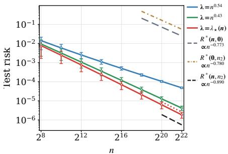  
(a) $\gamma _ { 2 } = 0 . 7 8$

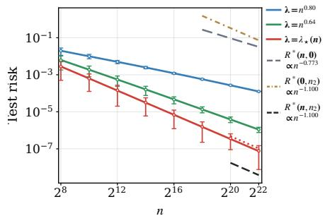  
(b) $\gamma _ { 2 } = 1 . 1$

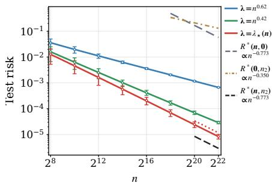  
(c) $\gamma _ { 2 } = 0 . 3 5$

Figure 1: Test error (dots) of mixed ridge regression under power-law covariance, together with its corresponding deterministic equivalent from Theorem 2 (solid lines). The grey, golden and black dash lines are the minimax rates of target-only, auxiliary-only and mixture datasets from Theorem 3. The blue, green and red lines correspond to diferent regularizations with the optimal one in red. Here $\pmb { x } _ { i } \sim \mathcal { N } ( 0 , \pmb { C } _ { i } )$ , with $C _ { i }$ as in (6). We set $\alpha _ { 1 } = 3 . 2 , \alpha _ { 2 } = 1 . 2 , \beta = 0 . 6$ and $d = 5 1 2$  
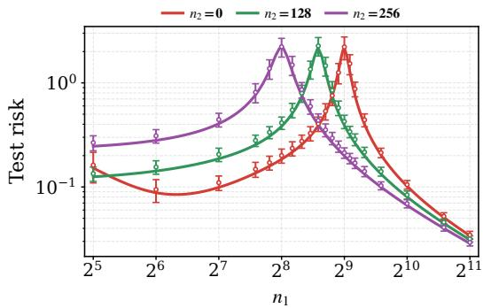  
(a) ImageNet-100

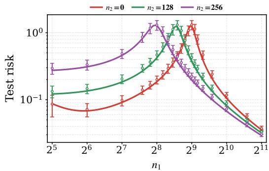  
(b) CIFAR-10  
Figure 2: Test error (dots) of mixed ridge regression, together with its corresponding deterministic equivalent (solid lines). For CIFAR-10, features are extracted via a pretrained CLIP $\mathrm { V i T - B / 3 2 }$ encoder, classes 0–4 form the target domain and classes 5–9 form the auxiliary domain. For ImageNet-100, features are extracted via a pretrained ResNet-18 encoder, and the corresponding class splits are 0–49 and 50–99. In both settings, we take $d = 5 1 2$ and generate labels according to $y = x ^ { \top } \pmb { \theta } _ { \ast } + \xi$ , with $\xi \sim \mathcal { N } ( 0 , 0 . 1 )$ . The shared $\theta _ { \ast }$ is supported on the top-10 eigenvectors of $( C _ { 1 } + C _ { 2 } ) / 2 .$ with random signs and coeficient magnitudes proportional to $j ^ { - 1 \bar { / } 2 }$ for $j = 1 , \ldots , 1 0$

Remark 5.2 (Saturation induced by mixing). Ridge regression cannot attain the minimax rate when the source exponent s exceeds the capacity exponent of the spectrum it fits. This is the classical saturation of Tikhonov regularization $\lceil B P R O 7 , ~ L Z L 2 3 \rceil ,$ and it appears in the mixed regression setting of Theorem 4 through the truncations $a = \operatorname* { m i n } \{ s , \alpha _ { 1 } \}$ and $b = \operatorname* { m i n } \{ s , \alpha _ { 2 } \}$ . For $\alpha _ { 2 } < s \le \alpha _ { 1 } , 0 < \delta < 1$ , ridge is rate optimal on the target data alone, and when $\gamma _ { 2 } > \gamma _ { \mathrm { c } } ,$ auxiliary data still improves its exponent, but it no longer attains the mixed minimax rate. When $\delta > 1$ , saturation is harmless as soon as $\gamma _ { 2 } \geq \gamma _ { \mathrm { c } } .$ For $s > \alpha _ { 1 }$ , ridge is already suboptimal on the target data alone, and when $\delta > 0$ the threshold $\gamma _ { \mathrm { c } } ^ { \mathrm { r i d g e } }$ lies below $\gamma _ { \mathrm { c } } .$ auxiliary data partially compensates for saturation before the minimax rate itself changes. We expect iterated Tikhonov or early stopping to remove these truncations $\displaystyle { \bigl . } { \bigl . } { B P R O 7 } { \bigr ] }$

## 6 Numerical experiments

Linear models. We consider a linear model following the setup of Section 3. Figure 1 indicates that the empirical risk of the mixed ridge estimator matches the deterministic equivalent of Theorem 2 and the scaling law predicted by Theorem 4. Furthermore, in panel (a), ridge regression achieves the mixed minimax rate and strictly improves upon the minimax rates of either dataset alone; in contrast, in panels (b) and (c), no improvement can be obtained and the rate of mixed ridge respectively coincides with the auxiliary-only and target-only rate. Next, we evaluate our deterministic equivalent on real image features from CIFAR-10 and ImageNet-100. The results in Figure 2 indicate that the validity of the deterministic equivalent of Theorem 2 goes well beyond the technical assumptions made therein.

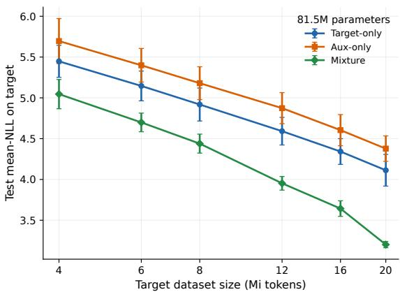  
(a) $\gamma _ { 2 } = 1 . 2 5$

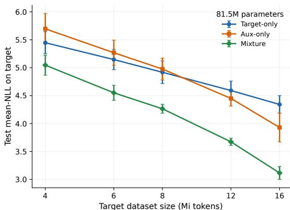  
(b) $\gamma _ { 2 } = 1 . 7 5$

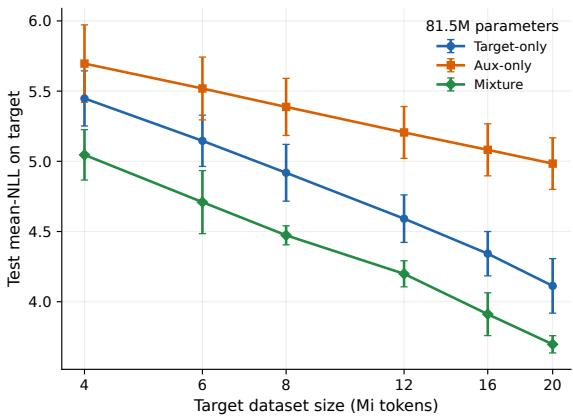  
(c) $\gamma _ { 2 } = 0 . 7 5$

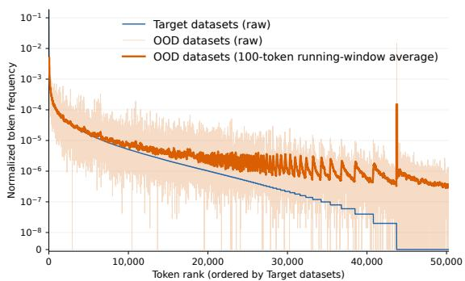  
(d) Token-frequency distributions  
Figure 3: Target-domain test negative log-likelihood (NLL) scaling of an 81.5M-parameter GPT-2-style language model trained from scratch on SlimPajama. Panels (a)–(c) report mean NLL on a fixed target-domain test set as a function of the reference target budget n. We use $n \in \{ 4 , 6 , 8 , 1 2 , 1 6 , 2 0 \}$ Mi, except for the $\gamma _ { 2 } = 1 . 7 5$ experiment that uses $n \leq 1 6  { \mathrm { M i } }$ . Panel (d) compares the normalized target and auxiliary token frequencies. Token types are ordered by decreasing target-domain frequency. The light auxiliary curve shows the raw frequencies, and the darker, thicke curve shows their 100-token running-window average.

Language modeling. Finally, we consider autoregressive language modeling. We pretrain an 81.5M-parameter GPT-2-style model [RWC+19] via nanoGPT [Kar22] on the SlimPajama dataset [Cer23]. We use n tokens from the StackExchange domain (target domain) and $\begin{array} { r } { n _ { 2 } = 4 \left( \frac { n } { 4 \mathrm { M i } } \right) ^ { \gamma _ { 2 } } } \end{array}$ tokens from a fixed mixture of the remaining six domains (auxiliary domain). Full experimental details are in Appendix G.1. Figure 3 (panels (a)-(c)) shows that the improvement in the scaling law crucially relies on the relative growth rate of the token budget of the auxiliary domain: for $\gamma _ { 2 } = 1 . 2 5$ , the scaling law of the data mixture improves upon that of either dataset alone; however, this improvement is not noticeable anymore already when $\gamma _ { 2 } = 0 . 7 5 ~ \mathrm { o r } ~ \gamma _ { 2 } = 1 . 7 5$ . This qualitatively supports our theoretical finding that data mixtures improve scaling only within an appropriate relative-growth regime. Finally, the token-frequency distribution in panel (d) shows that the auxiliary domain places relatively more probability mass on tokens that are infrequent in the target domain. This provides a token-level analogue of the heavier-tailed auxiliary covariance in our linear theory: the auxiliary data ofer greater coverage of directions/tokens that are weakly represented in the target distribution. We also find that the scaling law of the data mixture does not improve when the token frequencies of the two datasets are too close with each other—an observation that agrees with our theory (see Figure 4 in Appendix G.2).

## 7 Conclusion

We study high-dimensional regression on data mixtures that share a regression function but difer in their covariances and noise levels. For general covariances, we characterize the minimax risk, and for commutative covariances, we derive deterministic equivalents for the test error of a mixed ridge estimator. Specializing these results to target and auxiliary domains with aligned power-law spectra, we derive scaling laws, thus establishing conditions under which mixing data is especially helpful. In particular, we show that, whenever the mixed minimax rate improves on the rate of either dataset alone, ridge regression is minimax optimal. This is the case when (i) the auxiliary spectrum is heavy tailed (δ > 1), i.e., the two datasets cover complementary parts of the spectrum, and $( i i )$ the auxiliary sample size has an appropriate growth rate $( \gamma _ { \mathrm { c } } < \gamma _ { 2 } < 1 )$ . Our experiments on transformers trained on a mixture of text corpora display a phenomenology that qualitatively agrees with the theory.

[AYC+23] Armen Aghajanyan, Lili Yu, Alexis Conneau, Wei-Ning Hsu, Karen Hambardzumyan, Susan Zhang, Stephen Roller, Naman Goyal, Omer Levy, and Luke Zettlemoyer. Scaling laws for generative mixedmodal language models. In International Conference on Machine Learning, volume 202, pages 265–279. PMLR, 2023.

Our work opens the door to several interesting future directions. A natural next step is to determine whether gradient descent methods attain the mixed minimax rates when ridge saturates, as recently shown for a single dataset by [WBK+26]. Considering random-feature models [DLM24, BAP24], or features trained via a step of GD [BES+22, CPD+24], would then identify how model size must scale with data budget to preserve the improvement in the scaling law. Finally, it would be valuable to jointly optimize domain proportions under data and compute constraints, as well as to characterize mixture transfer across model scales, motivated by recent theory on hyperparameter transfer [GWB26].

## Acknowledgments and AI use

DW and MM were funded in part by the Austrian Science Fund (FWF) 10.55776/COE12. For the purpose of open access, the authors have applied a CC BY public copyright license to any Author Accepted Manuscript version arising from this submission. MM was partially funded by the European Union (ERC, INF2, project number 101161364). Views and opinions expressed are however those of the author(s) only and do not necessarily reflect those of the European Union or the European Research Council Executive Agency. Neither the European Union nor the granting authority can be held responsible for them.

We used generative AI tools to polish the writing, implement straightforward parts of the code, fill in proof details after we had identified the key methods and arguments, check proofs for correctness, and improve the coverage of related work. We did not use generative AI tools to develop the paper’s core ideas and define the problem setting. We take full responsibility for the final content of this work, including all text, claims, code, and other artifacts produced with the assistance of generative AI.

## References

[AZVP26] Alexander Atanasov, Jacob A. Zavatone-Veth, and Cengiz Pehlevan. Scaling and renormalization in high-dimensional regression. Journal of Statistical Mechanics: Theory and Experiment, 2026(4):043404, 2026.

[BAP24] Blake Bordelon, Alexander Atanasov, and Cengiz Pehlevan. A dynamical model of neural scaling laws. In International Conference on Machine Learning, volume 235, pages 4345–4382. PMLR, 2024.

[BDK+24] Yasaman Bahri, Ethan Dyer, Jared Kaplan, Jaehoon Lee, and Utkarsh Sharma. Explaining neural scaling laws. Proceedings of the National Academy of Sciences, 121(27):e2311878121, 2024.

[BES+22] Jimmy Ba, Murat A Erdogdu, Taiji Suzuki, Zhichao Wang, Denny Wu, and Greg Yang. High-dimensional asymptotics of feature learning: How one gradient step improves the representation. In Advances in Neural Information Processing Systems, volume 35, 2022.

[BPR07] Frank Bauer, Sergei Pereverzev, and Lorenzo Rosasco. On regularization algorithms in learning theory. Journal of complexity, 23(1):52–72, 2007.

[CBP21] Abdulkadir Canatar, Blake Bordelon, and Cengiz Pehlevan. Out-of-distribution generalization in kernel regression. In Advances in Neural Information Processing Systems, volume 34, pages 12600–12612, 2021.

[CD07] Andrea Caponnetto and Ernesto De Vito. Optimal rates for the regularized least-squares algorithm. Foundations of Computational Mathematics, 7(3):331–368, 2007.

[Cer23] Cerebras Systems. SlimPajama: A 627b token, cleaned and deduplicated version of RedPajama. Dataset release, June 2023.

[CHL+25] Mayee F. Chen, Michael Y. Hu, Nicholas Lourie, Kyunghyun Cho, and Christopher R´e. Aioli: A unified optimization framework for language model data mixing. In International Conference on Learning Representations, 2025.

[CLKZ21] Hugo Cui, Bruno Loureiro, Florent Krzakala, and Lenka Zdeborov´a. Generalization error rates in kernel regression: The crossover from the noiseless to noisy regime. In Advances in Neural Information Processing Systems, volume 34, pages 10131–10143, 2021.

[CM24] Chen Cheng and Andrea Montanari. Dimension free ridge regression. The Annals of Statistics, 52(6):2879– 2912, 2024.

[CPD+24] Hugo Cui, Luca Pesce, Yatin Dandi, Florent Krzakala, Yue Lu, Lenka Zdeborova, and Bruno Loureiro. Asymptotics of feature learning in two-layer networks after one gradient-step. In International Conference on Machine Learning, volume 235. PMLR, 2024.

[CRB+23] Mayee F. Chen, Nicholas Roberts, Kush Bhatia, Jue Wang, Ce Zhang, Frederic Sala, and Christopher R´e. Skill-it! a data-driven skills framework for understanding and training language models. In Advances in Neural Information Processing Systems, volume 36, pages 36000–36040, 2023.

[DKM23] Yuyang Deng, Ilja Kuzborskij, and Mehrdad Mahdavi. Mixture weight estimation and model prediction in multi-source multi-target domain adaptation. In Advances in Neural Information Processing Systems, volume 36, pages 4845–4898, 2023.

[DLM90] David L Donoho, Richard C Liu, and Brenda MacGibbon. Minimax risk over hyperrectangles, and implications. The Annals of Statistics, pages 1416–1437, 1990.

[DLM24] Leonardo Defilippis, Bruno Loureiro, and Theodor Misiakiewicz. Dimension-free deterministic equivalents and scaling laws for random feature regression. In Advances in Neural Information Processing Systems, volume 37, pages 104630–104693, 2024.

[DZ26] Rui Dai and Shuran Zheng. Explaining data mixing scaling laws. In International Conference on Machine Learning, 2026.

[FEG+25] Damien Ferbach, Katie Everett, Gauthier Gidel, Elliot Paquette, and Courtney Paquette. Dimensionadapted momentum outscales sgd. In Advances in Neural Information Processing Systems, volume 38, pages 112780–112977, 2025.

[FPJ24] Simin Fan, Matteo Pagliardini, and Martin Jaggi. Doge: Domain reweighting with generalization esti mation. In International Conference on Machine Learning, pages 12895–12915. PMLR, 2024.

[GD+24] Aaron Grattafiori, Abhimanyu Dubey, et al. The Llama 3 herd of models. arXiv preprint arXiv:2407.21783, 2024.

[GMC+24] Ce Ge, Zhijian Ma, Daoyuan Chen, Yaliang Li, and Bolin Ding. BiMix: A bivariate data mixing law for language model pretraining. arXiv preprint arXiv:2405.14908, 2024.

[GS24] Elisabeth Gassiat and Gilles Stoltz. The van Trees inequality in the spirit of H´ajek and Le Cam. Statistical Science, 39(4):644–653, 2024.

[GWB26] Nikhil Ghosh, Denny Wu, and Alberto Bietti. Understanding the mechanisms of fast hyperparameter transfer. In International Conference on Learning Representations, 2026.

[Has21] Tatsunori Hashimoto. Model performance scaling with multiple data sources. In International Conference on Machine Learning, volume 139, pages 4107–4116. PMLR, 2021.

[HBM+22] Jordan Hofmann, Sebastian Borgeaud, Arthur Mensch, Elena Buchatskaya, Trevor Cai, Eliza Rutherford, Diego de Las Casas, Lisa Anne Hendricks, Johannes Welbl, Aidan Clark, Tom Hennigan, Eric Noland, Katie Millican, George van den Driessche, Bogdan Damoc, Aurelia Guy, Simon Osindero, Karen Simonyan, Erich Elsen, Jack W. Rae, Oriol Vinyals, and Laurent Sifre. Training compute-optimal large language models. arXiv preprint arXiv:2203.15556, 2022.

[HJZ22] Nika Haghtalab, Michael Jordan, and Eric Zhao. On-demand sampling: Learning optimally from multiple distributions. In Advances in Neural Information Processing Systems, volume 35, pages 406–419, 2022.

[HMAM26] Kimia Hamidieh, Lester Mackey, and David Alvarez-Melis. Domain-aware scaling laws uncover data synergy. In Conference on Language Modeling, 2026.

[HMZ18] Judy Hofman, Mehryar Mohri, and Ningshan Zhang. Algorithms and theory for multiple-source adaptation. In Advances in Neural Information Processing Systems, volume 31, 2018.

[JJS25] Meena Jagadeesan, Michael I. Jordan, and Jacob Steinhardt. Safety versus performance: How multiobjective learning reduces barriers to market entry. Proceedings of the National Academy of Sciences, 122(42):e2510004122, 2025.

[JMS24] Ayush Jain, Andrea Montanari, and Eren Sasoglu. Scaling laws for learning with real and surrogate data. In Advances in Neural Information Processing Systems, volume 37, pages 110246–110289, 2024.

[Joh02] Iain M Johnstone. Function estimation and gaussian sequence models. Unpublished manuscript, 2002.

[JZF+25] Yiding Jiang, Allan Zhou, Zhili Feng, Sadhika Malladi, and J. Zico Kolter. Adaptive data optimization: Dynamic sample selection with scaling laws. In International Conference on Learning Representations, 2025.

[Kar22] Andrej Karpathy. nanoGPT. GitHub repository, 2022.

[KL19] Nikola Konstantinov and Christoph Lampert. Robust learning from untrusted sources. In International conference on machine learning, pages 3488–3498. PMLR, 2019.

[KSW+25] Feiyang Kang, Yifan Sun, Bingbing Wen, Si Chen, Dawn Song, Rafid Mahmood, and Ruoxi Jia. Autoscale: Scale-aware data mixing for pre-training llms. In Conference on Language Modeling, 2025.

[LT91] Michel Ledoux and Michel Talagrand. Probability in Banach Spaces: Isoperimetry and Processes. Springer, Berlin, Heidelberg, 1991.

[LWB25] Licong Lin, Jingfeng Wu, and Peter Bartlett. Improved scaling laws in linear regression via data reuse. In Advances in Neural Information Processing Systems, volume 38, pages 90713–90759, 2025.

[LWK+24] Licong Lin, Jingfeng Wu, Sham M Kakade, Peter L Bartlett, and Jason D Lee. Scaling laws in linear regression: Compute, parameters, and data. In Advances in Neural Information Processing Systems, volume 37, pages 60556–60606, 2024.

[LZL23] Yicheng Li, Haobo Zhang, and Qian Lin. On the saturation efect of kernel ridge regression. In The Eleventh International Conference on Learning Representations, 2023.

[LZM+25] Qian Liu, Xiaosen Zheng, Niklas Muennighof, Guangtao Zeng, Longxu Dou, Tianyu Pang, Jing Jiang, and Min Lin. Regmix: Data mixture as regression for language model pre-training. In International Conference on Learning Representations, volume 2025, pages 38305–38339, 2025.

[MAC+26] Marko Medvedev, Idan Attias, Elisabetta Cornacchia, Theodor Misiakiewicz, Gal Vardi, and Nathan Srebro. Positive distribution shift as a framework for understanding tractable learning. In International Conference on Machine Learning, 2026.

[MLLS26] Marko Medvedev, Kaifeng Lyu, Zhiyuan Li, and Nathan Srebro. Shift is good: Mismatched data mixing improves test performance. In International Conference on Artificial Intelligence and Statistics, volume 300, pages 4690–4698. PMLR, 2026.

[MMR08] Yishay Mansour, Mehryar Mohri, and Afshin Rostamizadeh. Domain adaptation with multiple sources. In Advances in Neural Information Processing Systems, volume 21, 2008.

[MPW23] Cong Ma, Reese Pathak, and Martin J. Wainwright. Optimally tackling covariate shift in RKHS-based nonparametric regression. The Annals of Statistics, 51(2):738–761, 2023.

[MRS22] Alexander Maloney, Daniel A Roberts, and James Sully. A solvable model of neural scaling laws. arXiv:2210.16859, 2022.

[MS24] Theodor Misiakiewicz and Basil Saeed. A non-asymptotic theory of kernel ridge regression: deterministic equivalents, test error, and gcv estimator. arXiv preprint arXiv:2403.08938, 2024.

[MZFY24] Neil Rohit Mallinar, Austin Zane, Spencer Frei, and Bin Yu. Minimum-norm interpolation under covariate shift. In International Conference on Machine Learning, volume 235, pages 34543–34585. PMLR, 2024.

[PPXP24] Elliot Paquette, Courtney Paquette, Lechao Xiao, and Jefrey Pennington. 4+ 3 phases of computeoptimal neural scaling laws. In Advances in Neural Information Processing Systems, volume 37, pages 16459–16537, 2024.

[RNWL25] Yunwei Ren, Eshaan Nichani, Denny Wu, and Jason Lee. Emergence and scaling laws in sgd learning of shallow neural networks. In Advances in Neural Information Processing Systems, volume 38, pages 38227–38309, 2025.

[RR17] Alessandro Rudi and Lorenzo Rosasco. Generalization properties of learning with random features. In Advances in Neural Information Processing Systems, volume 30, 2017.

[RWC+19] Alec Radford, Jefrey Wu, Rewon Child, David Luan, Dario Amodei, and Ilya Sutskever. Language models are unsupervised multitask learners. Technical report, OpenAI, 2019.

[SBB+25] Mustafa Shukor, Louis Bethune, Dan Busbridge, David Grangier, Enrico Fini, Alaaeldin El-Nouby, and Pierre Ablin. Scaling laws for optimal data mixtures. In Advances in Neural Information Processing Systems, volume 38, pages 129554–129579, 2025.

[SGBS26] Yanke Song, Kenneth Gu, Sohom Bhattacharya, and Pragya Sur. Generalization error of min-norm interpolators in transfer learning. arXiv preprint arXiv:2406.13944, 2026.

[SHZ24] Johannes Schmidt-Hieber and Petr Zamolodtchikov. Local convergence rates of the nonparametric least squares estimator with applications to transfer learning. Bernoulli, 30(3):1845–1877, 2024.

[Sio58] Maurice Sion. On general minimax theorems. Pacific Journal of Mathematics, 8(1):171 – 176, 1958.

[SSSA26] Anastasiia Sedova, Skyler Seto, Natalie Schluter, and Pierre Ablin. Scaling laws for mixture pretraining under data constraints. arXiv preprint arXiv:2605.12715, 2026.

[TAP21] Nilesh Tripuraneni, Ben Adlam, and Jefrey Pennington. Overparameterization improves robustness to covariate shift in high dimensions. In Advances in Neural Information Processing Systems, volume 34, pages 13883–13897, 2021.

[Tro15] Joel A. Tropp. An introduction to matrix concentration inequalities. Foundations and Trends in Machine Learning, 8(1–2):1–230, 2015.

[TRR+25] Anvith Thudi, Evianne Rovers, Yangjun Ruan, Tristan Thrush, and Chris J. Maddison. MixMin: Finding data mixtures via convex minimization. In International Conference on Machine Learning, volume 267, pages 59492–59508. PMLR, 2025.

[WBK+26] Jingfeng Wu, Peter L Bartlett, Sham M Kakade, Jason D Lee, and Bin Yu. Risk comparisons in linear regression: Implicit regularization dominates explicit regularization. In Conference on Learning Theory, 2026.

[WCMM26] Diyuan Wu, Lehan Chen, Theodor Misiakiewicz, and Marco Mondelli. Improved scaling laws via weakto-strong generalization in random feature ridge regression. In International Conference on Machine Learning, 2026.

[WWL+26] Jiachen Tianhao Wang, Tong Wu, Kaifeng Lyu, James Y Zou, Dawn Song, Ruoxi Jia, and Prateek Mittal. Can small training runs reliably guide data curation? rethinking proxy-model practice. In International Conference on Learning Representations, volume 2026, pages 122921–122964, 2026.

[XPD+23] Sang Michael Xie, Hieu Pham, Xuanyi Dong, Nan Du, Hanxiao Liu, Yifeng Lu, Percy S Liang, Quoc V Le, Tengyu Ma, and Adams Wei Yu. Doremi: Optimizing data mixtures speeds up language mode pretraining. In Advances in Neural Information Processing Systems, volume 36, pages 69798–69818, 2023.

[XTC25] Wanyun Xie, Francesco Tonin, and Volkan Cevher. Chameleon: A flexible data-mixing framework for language model pretraining and finetuning. In International Conference on Machine Learning, pages 68725–68745. PMLR, 2025.

[YLS+25] Jiasheng Ye, Peiju Liu, Tianxiang Sun, Jun Zhan, Yunhua Zhou, and Xipeng Qiu. Data mixing laws: Optimizing data mixtures by predicting language modeling performance. In International Conference on Learning Representations, 2025.

[YZW+25] Fan Yang, Hongyang R Zhang, Sen Wu, Christopher R´e, and Weijie J Su. Precise high-dimensional asymptotics for quantifying heterogeneous transfers. Journal of Machine Learning Research, 26(113):1– 88, 2025.

[Zam26] Petr Zamolodtchikov. A minimax theory of nonparametric regression under covariate shift. arXiv preprint arXiv:2603.05897, 2026.

[ZY+23] Brianna Zitkovich, Tianhe Yu, et al. RT-2: Vision-language-action models transfer web knowledge to robotic control. In Proceedings of the 7th Conference on Robot Learning, volume 229, pages 2165–2183, 2023.

[ZY25] Ling Zhou and Yuhong Yang. On a synergistic learning phenomenon in nonparametric domain adaptation. arXiv preprint arXiv:2511.17009, 2025.

## A Proof of Theorem 1

First, define the normalized weight ${ \pmb u } = S ^ { 1 / 2 } { \pmb \theta } , \widehat { { \pmb u } } = S ^ { 1 / 2 } \widehat { { \pmb \theta } }$ , and given any PSD matrix N, we construct an auxiliary Gaussian sequence model [Joh02],

$$
\begin{array} { r } { \pmb { y } _ { N , \mathrm { s e q } } = N ^ { 1 / 2 } \pmb { u } + \pmb { g } , \quad \pmb { g } \sim \mathcal { N } ( 0 , \pmb { I } ) , } \end{array}\tag{9}
$$

where $N \in \mathbb { R } ^ { d \times d }$ and $u , g , y _ { N , \mathrm { s e q } } \in \mathbb { R } ^ { d }$

Define the unrestricted and linear minimax errors of the Gaussian sequence model as

$$
\mathrm { R } _ { * , \mathrm { s e q } } ( N ) = \operatorname* { i n f } _ { \widehat { \pmb { u } } } \ \operatorname* { s u p } _ { \| \pmb { u } \| _ { 2 } \le R } \mathbb { E } _ { \pmb { u } } \| Q ^ { 1 / 2 } ( \widehat { \pmb { u } } ( \pmb { y } _ { N , \mathrm { s e q } } ) - \pmb { u } ) \| _ { 2 } ^ { 2 } ,
$$

$$
\mathrm { R } _ { * , \mathrm { s e q } } ^ { \operatorname* { l i n } } ( N ) = \operatorname* { i n f } _ { B } \operatorname* { s u p } _ { \| \pmb { u } \| _ { 2 } \le R } \mathbb { E } _ { \pmb { u } } \| Q ^ { 1 / 2 } ( B y _ { N , \mathrm { s e q } } - \pmb { u } ) \| _ { 2 } ^ { 2 } ,
$$

where we recall $\begin{array} { r } { Q = \sum _ { k = 1 } ^ { K } { \pi _ { k } ^ { * } { \cal H } _ { k } } } \end{array}$

We first have the following variational characterization of the minimax error of the Gaussian sequence model (9).

Theorem 5 (Exact Gaussian linear minimax error). For the Gaussian sequence model (9) defined by any PSD matrix N,

$$
\pi ^ { - 2 } \mathcal { L } ( N ) \leq \mathrm { R } _ { * , \mathrm { s e q } } ( N ) \leq \mathrm { R } _ { * , \mathrm { s e q } } ^ { \mathrm { l i n } } ( N ) = \mathcal { L } ( N ) ,\tag{10}
$$

$$
\begin{array} { r } { w h e r e \ L ( N ) = \operatorname* { s u p } _ { \stackrel { A \succeq 0 } { \mathrm { T r } ( A ) \leq R ^ { 2 } } } \mathrm { T r } \left[ Q A ^ { 1 / 2 } ( I + A ^ { 1 / 2 } N A ^ { 1 / 2 } ) ^ { - 1 } A ^ { 1 / 2 } \right] . } \end{array}
$$

We prove Theorem 5 in Appendix A.1, and next in Appendix A.2, we explain the way to extend the proof in Theorem 5 to the original regression problem in Section 3, which proves Theorem 1. We first prove these result for $d < \infty$ . The extension to the infinite-dimensional case is treated in Appendix A.3.

## A.1 Proof of Theorem 5

Proof of the upper bound. First of all, it is clear by definition that $\mathrm { R } _ { * , \mathrm { s e q } } ( N ) \leq \mathrm { R } _ { * , \mathrm { s e q } } ^ { \mathrm { l i n } } ( N )$ , and we characterize $\mathrm { R } _ { * , \mathrm { s e q } } ^ { \mathrm { l i n } } ( N )$ in the rest of the proof.

For any B, computing the test error gives

$$
\begin{array} { r l } & { \mathrm { R } _ { * , \mathrm { s e q } } ^ { \mathrm { l i n } } ( N ) = \underset { B } { \operatorname* { i n f } } \ \underset { \| u \| _ { 2 } \leq R } { \operatorname* { s u p } } \ \mathbb { E } _ { u } \| Q ^ { 1 / 2 } ( B y _ { N , \mathrm { s e q } } - u ) \| _ { 2 } ^ { 2 } } \\ & { \quad \quad \quad \quad = \underset { B } { \operatorname* { i n f } } \ \underset { \| u \| _ { 2 } \leq R } { \operatorname* { s u p } } u ^ { \top } ( I - N ^ { 1 / 2 } B ^ { \top } ) Q ( I - B N ^ { 1 / 2 } ) u + \mathrm { T r } ( Q B B ^ { \top } ) . } \end{array}
$$

Note that for every any PSD matrix D,

$$
\operatorname* { s u p } _ { \| \pmb { u } \| _ { 2 } \le R } \pmb { u } ^ { \top } D \pmb { u } = R ^ { 2 } \| D \| _ { \mathrm { o p } } = \operatorname* { s u p } _ { \pmb { A } = 0 \atop \operatorname { T r } ( \pmb { A } ) \le R ^ { 2 } } \operatorname { T r } ( D \pmb { A } ) .
$$

Consequently, we could rewrite the test error as

$$
F ( \pmb { B } , \pmb { A } ) = \mathrm { T r } \Big [ \pmb { Q } \big ( ( \pmb { I } - \pmb { B } \pmb { N } ^ { 1 / 2 } ) \pmb { A } ( \pmb { I } - \pmb { N } ^ { 1 / 2 } \pmb { B } ^ { \top } ) + \pmb { B } \pmb { B } ^ { \top } \big ) \Big ] ,
$$

which implies

$$
\mathrm { R } _ { * , \mathrm { s e q } } ^ { \mathrm { l i n } } ( N ) = \operatorname* { i n f } _ { B } \operatorname* { s u p } _ { \pmb { A } \succeq 0 } F ( \pmb { B } , \pmb { A } ) .
$$

To characterize the exact solution of the above minimax problem, we first lower bound the minimax solution by

$$
\operatorname* { i n f } _ { B } \ \operatorname* { s u p } _ { A \leq 0 } F ( B , A ) \geq \ \operatorname* { s u p } _ { A \leq 0 } \operatorname* { i n f } _ { B } F ( B , A ) = \operatorname* { s u p } _ { A \leq 0 } F ( B _ { A } , A ) = \mathcal { L } ( N ) ,
$$

where for any A, we define $B _ { A } = \arg \operatorname* { m i n } _ { B } F ( B , A )$ . The observation is that for any A in the admissible regime, $B _ { A }$ is achievable and the exact form can be characterized. To see this, note that $F ( B , A )$ is quadratic in B and collecting all the terms depends on B into a quadratic form gives

$$
F ( B , A ) = \mathrm { T r } [ Q P ( A , N ) ] + \mathrm { T r } [ Q ( B - B _ { A } ) V _ { A } ( B - B _ { A } ) ^ { \top } ] ,\tag{11}
$$

where we define

$$
\begin{array} { r } { P ( A , N ) = A ^ { 1 / 2 } ( I + A ^ { 1 / 2 } N A ^ { 1 / 2 } ) ^ { - 1 } A ^ { 1 / 2 } , } \end{array}
$$

$$
V _ { A } = I + N ^ { 1 / 2 } A N ^ { 1 / 2 } , \quad B _ { A } = P ( A , N ) N ^ { 1 / 2 } ,
$$

and use the fact that

$$
\begin{array} { c } { { P ( A , N ) = A - A N ^ { 1 / 2 } ( I + N ^ { 1 / 2 } A N ^ { 1 / 2 } ) ^ { - 1 } N ^ { 1 / 2 } A , } } \\ { { P ( A , N ) N ^ { 1 / 2 } = A N ^ { 1 / 2 } ( I + N ^ { 1 / 2 } A N ^ { 1 / 2 } ) ^ { - 1 } . } } \end{array}\tag{12}
$$

Next, note that for any given B, the feasible regime of A is compact and the optimum is achievable. Thus, define

$$
\begin{array} { r } { A _ { * } = \underset { A \underset { \smile } { \operatorname { T } } 0 } { \operatorname { a r g m a x } } F ( B _ { A } , A ) = \underset { A \underset { \smile } { \operatorname { T } } 0 } { \operatorname { a r g m a x } } \mathrm { T r } [ Q P ( A , N ) ] . } \\ { \quad \quad \quad \mathrm { T r } ( A ) { \leq } R ^ { 2 } \qquad \quad } \end{array}
$$

It is clear by definition that $\begin{array} { r } { B _ { * } : = B _ { A _ { * } } = \arg \operatorname* { m i n } _ { B } F ( B , A _ { * } ) } \end{array}$ . We then show that

$$
\mathbf { \Delta } A _ { * } \in \underset { A \succeq 0 } { \mathrm { a r g m a x } } ~ F ( B _ { * } , A ) ,
$$

which implies

$$
\operatorname* { i n f } _ { B } \operatorname* { s u p } _ { A \succeq 0 } F ( B , A ) = \operatorname* { s u p } _ { A \succeq 0 } \operatorname* { i n f } _ { B } F ( B , A ) = \mathcal { L } ( N ) .
$$

To see this, it is suficient to show that for any feasible A, $F ( B _ { * } , A ) - F ( B _ { * } , A _ { * } ) \leq 0$ . Recall that $F ( B , A ) =$ $\mathrm { T r } \big [ { \pmb Q } \big ( ( { \pmb I } - { \pmb B } { \pmb N } ^ { 1 / 2 } ) { \pmb A } ( { \pmb I } - { \pmb N } ^ { 1 / 2 } { \pmb B } ^ { \top } ) + { \pmb B } { \pmb B } ^ { \top } \big ) \big ]$ . Then, a direct computation gives

$$
F ( B _ { * } , A ) - F ( B _ { * } , A _ { * } ) = \mathrm { T r } [ Q ( I - B _ { * } N ^ { 1 / 2 } ) ( A - A _ { * } ) ( I - N ^ { 1 / 2 } B _ { * } ^ { \top } ) ] .
$$

Let us define $f ( A ) = \mathrm { T r } [ Q P ( A , N ) ]$ . Then, diferentiating (12) in the direction $\pmb { \Delta }$ gives

$$
\begin{array} { l } { { \displaystyle { \cal D } f _ { { \cal A } _ { \ast } } [ { \Delta } ] : = \left. \frac { \mathrm { d } } { \mathrm { d } t } f ( { \cal A } _ { \ast } + t { \Delta } ) \right. _ { t = 0 } = \mathrm { T r } [ Q ( I - P ( { \cal A } _ { \ast } , N ) N ) { \Delta } ( I - N P ( { \cal A } _ { \ast } , N ) ) ] } \ ~ } \\ { { \displaystyle ~ = \mathrm { T r } [ Q ( I - { \cal B } _ { \ast } N ^ { 1 / 2 } ) { \Delta } ( I - N ^ { 1 / 2 } { \cal B } _ { \ast } ^ { \top } ) ] } , } \end{array}
$$

which implies $D f _ { A _ { * } } [ A - A _ { * } ] \leq 0$

Since by definition $\begin{array} { r } { A _ { * } = \arg \operatorname* { m a x } _ { { \bf \Upsilon } } \underset { \mathrm { T r } ( A ) \leq R ^ { 2 } } { A } \mathrm { T r } [ Q P ( A , N ) ] } \end{array}$ ], for any feasible direction $A - A _ { * }$ , we have $F ( B _ { * } , A ) -$ $F ( B _ { * } , A _ { * } ) = D f _ { A _ { * } } [ A - A _ { * } ] \leq 0 ,$ , which concludes the proof.

Proof of the lower bound. We prove the lower bound via probabilistic methods. In particular, we construct a prior distribution $p ( \pmb { u } )$ supported on $\{ \pmb { u } : \| \pmb { u } \| _ { 2 } \leq R \}$ , and use the fact that

$$
\begin{array} { r } { \mathrm { R } _ { * , \mathrm { s e q } } ( \mathrm { N } ) \geq \operatorname* { i n f } _ { \widehat { \mathfrak { n } } } \mathbb { E } _ { \mathfrak { u } \sim \mathrm { p } _ { \mathfrak { u } } } \mathbb { E } _ { \mathfrak { u } } \| \mathrm { Q } ^ { 1 / 2 } ( \widehat { \mathfrak { u } } ( \mathrm { y } _ { \mathrm { N } , \mathrm { s e q } } ) - \mathfrak { u } ) \| _ { 2 } ^ { 2 } . } \end{array}
$$

For the construction, fix a feasible finite-rank $\begin{array} { r } { \pmb { A } = \sum _ { \ell = 1 } ^ { r } a _ { \ell } \pmb { v } _ { \ell } \pmb { v } _ { \ell } ^ { \top } \in \mathbb { R } ^ { d \times d } } \end{array}$ , where the ${ \pmb v } _ { \ell }$ are orthonormal, $a _ { \ell } > 0 ,$ and $\textstyle \sum _ { \ell } a _ { \ell } \leq R ^ { 2 }$ . Let $\mathbf { T }$ have columns $\sqrt { a _ { \ell } } v _ { \ell }$ , so $\pmb { T } \pmb { T } ^ { \top } = \pmb { A }$ and $\check { T } ^ { \top } T = \operatorname { D i a g } ( a _ { 1 } , \ldots , a _ { r } )$ . Consider $\omega$ independent coordinates with density

$$
q ( w ) = \cos ^ { 2 } ( \pi w / 2 ) \mathbf { 1 } \{ | w | \leq 1 \} ,
$$

which have the following properties

$$
\int _ { - 1 } ^ { 1 } q ^ { \prime } ( w ) d w = 0 , \qquad \int _ { - 1 } ^ { 1 } { \frac { q ^ { \prime } ( w ) ^ { 2 } } { q ( w ) } } d w = \pi ^ { 2 } \int _ { - 1 } ^ { 1 } \sin ^ { 2 } ( \pi w / 2 ) d w = \pi ^ { 2 } .
$$

Let ${ \pmb u } = { \pmb T } { \pmb \omega }$ . This prior is supported on the parameter ball, since

$$
\| \pmb { u } \| _ { 2 } ^ { 2 } = \sum _ { \ell = 1 } ^ { r } a _ { \ell } \omega _ { \ell } ^ { 2 } \leq \sum _ { \ell = 1 } ^ { r } a _ { \ell } = \operatorname { T r } ( \pmb { A } ) \leq R ^ { 2 } .
$$

Next, for such prior distribution $p ( \pmb { u } )$ , we provide a lower bound on the minimax risk. Let $p ( \pmb { y } _ { N , \mathrm { s e q } } | \pmb { u } )$ be the probability distribution of $_ { { \pmb y } _ { I } { \bf v } , \mathrm { s e q } }$ given u. Since the randomness of u only comes from ω, we rewrite the joint distribution as $\scriptstyle p ( \pmb { y } _ { N , \mathrm { s e q } } , \omega )$ and define the score function w.r.t. ω as

$$
\zeta = \nabla _ { \omega } \log p ( \pmb { y } _ { N , \mathrm { s e q } } , \omega ) = \nabla _ { \omega } \log p ( \pmb { y } _ { N , \mathrm { s e q } } | \omega ) + \nabla _ { \omega } \log q ( \omega ) .
$$

We then compute two quantities:

$$
\begin{array} { r l } & { \mathbb { E } [ e \zeta ^ { \top } ] = \displaystyle \iint e \big ( \nabla _ { \omega } p ( y _ { N , \mathrm { s e q } } , \omega ) \big ) ^ { \top } d \mu ( y _ { N , \mathrm { s e q } } ) d \omega } \\ & { \quad \quad \quad = - \displaystyle \iint \frac { \partial e } { \partial \omega } p ( y _ { N , \mathrm { s e q } } , \omega ) d \mu ( y _ { N , \mathrm { s e q } } ) d \omega } \\ & { \quad \quad \quad = Q ^ { 1 / 2 } T \displaystyle \iint p ( y _ { N , \mathrm { s e q } } , \omega ) d \mu ( y _ { N , \mathrm { s e q } } ) d \omega = Q ^ { 1 / 2 } T , } \end{array}
$$

$$
\begin{array} { r l } & { \boldsymbol J : = \mathbb E [ \zeta \zeta ^ { \top } ] = \mathbb E \big [ ( \nabla _ { \omega } \log p ( y _ { N , \mathrm { s e q } } \mid \omega ) ) ( \nabla _ { \omega } \log p ( y _ { N , \mathrm { s e q } } \mid \omega ) ) ^ { \top } \big ] } \\ & { \qquad + \mathbb E \big [ ( \nabla _ { \omega } \log q ( \omega ) ) ( \nabla _ { \omega } \log q ( \omega ) ) ^ { \top } \big ] } \\ & { \qquad + \underbrace { \mathbb E \big [ ( \nabla _ { \omega } \log p ( y _ { N , \mathrm { s e q } } \mid \omega ) ) ( \nabla _ { \omega } \log q ( \omega ) ) ^ { \top } \big ] } _ { = 0 } } \\ & { \qquad + \underbrace { \mathbb E \big [ ( \nabla _ { \omega } \log q ( \omega ) ) ( \nabla _ { \omega } \log p ( y _ { N , \mathrm { s e q } } \mid \omega ) ) ^ { \top } \big ] } _ { = 0 } } \\ & { \qquad = T ^ { \top } N T + \pi ^ { 2 } I _ { r } , } \end{array}
$$

where we use the identities

$$
\begin{array} { r l } & { \mathbb { E } [ \nabla _ { \omega } \log p ( y _ { N , \mathrm { s e q } } \mid \omega ) \mid \omega ] = \displaystyle \int \nabla _ { \omega } p ( y _ { N , \mathrm { s e q } } \mid \omega ) d \mu ( y _ { N , \mathrm { s e q } } ) = \nabla _ { \omega } 1 = 0 , } \\ & { \qquad \mathbb { E } \Big [ \frac { q ^ { \prime } ( \omega _ { \ell } ) } { q ( \omega _ { \ell } ) } \Big ] = \displaystyle \int _ { - 1 } ^ { 1 } q ^ { \prime } ( w ) d w = q ( 1 ) - q ( - 1 ) = 0 , } \\ & { \qquad \mathbb { E } \Big [ \frac { q ^ { \prime } ( \omega _ { \ell } ) } { q ( \omega _ { \ell } ) } \frac { q ^ { \prime } ( \omega _ { m } ) } { q ( \omega _ { m } ) } \Big ] = \displaystyle \left\{ \begin{array} { l l } { \displaystyle \int _ { - 1 } ^ { 1 } \frac { q ^ { \prime } ( w ) ^ { 2 } } { q ( w ) } d w = \pi ^ { 2 } \int _ { - 1 } ^ { 1 } \sin ^ { 2 } ( \pi w / 2 ) d w = \pi ^ { 2 } , } & { \ell = m , } \\ { \displaystyle \left( \int _ { - 1 } ^ { 1 } q ^ { \prime } ( w ) d w \right) ^ { 2 } = 0 , } & { \ell \neq m . } \end{array} \right. } \end{array}
$$

For an arbitrary estimator ${ \widehat { \mathbf { u } } } ,$ define $e = Q ^ { 1 / 2 } ( \widehat { \pmb { u } } - \pmb { T } \omega )$ , and it is suficient to lower bound $\mathbb { E } [ \lVert e \rVert _ { 2 } ^ { 2 } ]$ Note that $\mathbb { E } [ \| e - Q ^ { 1 / 2 } T J ^ { - 1 } \zeta \| _ { 2 } ^ { 2 } ] \ge 0$ . Expanding a nonnegative square yields

$$
\begin{array} { r l } & { 0 \leq \mathbb { E } \| e - Q ^ { 1 / 2 } T J ^ { - 1 } \zeta \| _ { 2 } ^ { 2 } } \\ & { \ = \mathbb { E } [ \| e \| _ { 2 } ^ { 2 } ] - 2 \mathrm { T r } ( Q ^ { 1 / 2 } T J ^ { - 1 } \mathbb { E } [ \zeta e ^ { \top } ] ) + \mathrm { T r } [ J ^ { - 1 } T ^ { \top } Q T J ^ { - 1 } ] \mathbb { E } [ \zeta \zeta ^ { \top } ] } \\ & { \ = \mathbb { E } \| e \| _ { 2 } ^ { 2 } - \mathrm { T r } [ Q T ( T ^ { \top } N T + \pi ^ { 2 } I _ { r } ) ^ { - 1 } T ^ { \top } ] . } \end{array}
$$

Recall by definition $A = T T ^ { \top }$ . Then, the resulting lower bound is

$$
\begin{array} { r l } & { \mathbb { E } \| e \| _ { 2 } ^ { 2 } \geq \mathrm { T r } [ Q T ( T ^ { \top } N T + \pi ^ { 2 } I _ { r } ) ^ { - 1 } T ^ { \top } ] } \\ & { \qquad \geq \pi ^ { - 2 } \mathrm { T r } [ Q P ( A , N ) ] . } \end{array}
$$

Taking the supremum over feasible A concludes the proof.

## A.2 Proof of Theorem 1

Recall the normalized weights $\pmb { u } = \pmb { S } ^ { 1 / 2 } \pmb { \theta }$ and $\widehat { \pmb { u } } = S ^ { 1 / 2 } \widehat { \pmb { \theta } } .$ . Denote the full regression data by $\boldsymbol { \mathcal { D } } = \{ ( \boldsymbol { X } _ { i } , \boldsymbol { y } _ { i } ) \} _ { i = 1 } ^ { K }$ . The parameter constraint and the test error can be written in the same form as for the Gaussian sequence model, which gives

$$
\mathrm { R } _ { * } ( n _ { 1 } , \ldots , n _ { K } ) = \operatorname* { i n f } _ { \widehat { \pmb { u } } } \ \operatorname* { s u p } _ { \| \pmb { u } \| _ { 2 } \leq R } \mathbb { E } _ { \pmb { u } } \| \pmb { Q } ^ { 1 / 2 } ( \widehat { \pmb { u } } ( \mathcal { D } ) - \pmb { u } ) \| _ { 2 } ^ { 2 } .
$$

Here the expectation includes both the designs and the observation noise, and the infimum is over all estimators based on D. We also recall

$$
M = \sum _ { i = 1 } ^ { K } \frac { n _ { i } } { \sigma _ { \varepsilon _ { i } } ^ { 2 } } H _ { i } , \qquad E _ { 0 } = R ^ { 2 } \operatorname* { m a x } _ { 1 \leq i \leq K } \frac { \| H _ { i } \| _ { \mathrm { o p } } } { \sigma _ { \varepsilon _ { i } } ^ { 2 } } , \qquad v = 1 + \kappa E _ { 0 } .
$$

Proof of the upper bound. Our goal is to construct a regression estimator whose worst-case risk is bounded by $v \mathcal { L } ( M )$ , where $v = 1 + \kappa E _ { 0 }$ and κ is a finite constant depending only on the concentration constants in Assumption 1. Since the minimax risk is the infimum over all estimators, it sufices to construct $\widehat { \pmb u } _ { \mathrm { r e g } }$ such that

$$
\operatorname* { s u p } _ { \| \pmb { u } \| _ { 2 } \le R } \mathbb { E } _ { \pmb { u } } \| \pmb { Q } ^ { 1 / 2 } ( \widehat { \pmb { u } } _ { \mathrm { r e g } } - \pmb { u } ) \| _ { 2 } ^ { 2 } \le v \mathcal { L } ( M ) .
$$

We do so by comparing its risk with that of an optimal linear estimator in an auxiliary Gaussian sequence model. All regression expectations below include both the random designs and the observation noise.

Define the statistic

$$
z = S ^ { - 1 / 2 } \sum _ { i = 1 } ^ { K } \frac { 1 } { \sigma _ { \varepsilon _ { i } } ^ { 2 } } X _ { i } ^ { \top } { \pmb y } _ { i } .
$$

We will show that, uniformly over $\| \mathbf { \boldsymbol { u } } \| _ { 2 } \leq R ,$

$$
\mathbb { E } _ { \pmb { u } } \pmb { z } = \pmb { M } \pmb { u } , \qquad \mathrm { C o v } _ { \pmb { u } } ( \pmb { z } ) \preceq \boldsymbol { v } \pmb { M } .\tag{13}
$$

We first explain how these moment bounds yield the desired estimator, and then verify them.

Set $N = M / v$ . By (13), the rescaled statistic $z / v$ has mean Nu and covariance at most N. To see its connection with the Gaussian sequence model, recall that

$$
\begin{array} { r } { { \pmb y } _ { N , \mathrm { s e q } } = N ^ { 1 / 2 } { \pmb u } + { \pmb g } , \qquad { \pmb g } \sim { \mathcal N } ( 0 , { \pmb I } ) . } \end{array}
$$

Multiplying the Gaussian observation by $N ^ { 1 / 2 }$ gives

$$
N ^ { 1 / 2 } y _ { N , \mathrm { s e q } } = N u + N ^ { 1 / 2 } g .
$$

The moment bounds (13) gives

$$
\begin{array} { r } { \mathbb { E } _ { \pmb { u } } [ z / v ] = N \pmb { u } = \mathbb { E } _ { \pmb { u } } [ N ^ { 1 / 2 } \pmb { y } _ { N , \mathrm { s e q } } ] , } \\ { \mathrm { C o v } _ { \pmb { u } } ( z / v ) \preceq N = \mathrm { C o v } _ { \pmb { u } } ( N ^ { 1 / 2 } \pmb { y } _ { N , \mathrm { s e q } } ) . } \end{array}
$$

This motivates us to apply the same linear estimators constructed for the sequence model to the regression model here. To choose this linear transformation, take

$$
\begin{array} { r l } { A _ { * } \in \underset { A \succeq 0 } { \mathrm { a r g m a x ~ T r } } [ Q P ( A , N ) ] , \quad } & { B _ { * } = P ( A _ { * } , N ) N ^ { 1 / 2 } . } \\ & { \quad \quad \mathrm { T r } ( A ) { \leq } R ^ { 2 } } \end{array}
$$

By (10) and the optimizer identified in (11), the Gaussian estimator

$$
B _ { * } y _ { N , \mathrm { s e q } } = P ( A _ { * } , N ) ( N ^ { 1 / 2 } y _ { N , \mathrm { s e q } } )
$$

has worst-case risk $\mathcal { L } ( N )$ . The matrices defining this estimator depend only on the model quantities and the parameter constraint, not on the unknown u. Replacing its input $N ^ { 1 / 2 } y _ { N , \mathrm { s e q } }$ by $z / v ,$ , define

$$
\widehat { u } _ { \mathrm { r e g } } = \frac { 1 } { v } P ( A _ { * } , N ) z , \qquad \widehat { \theta } _ { \mathrm { r e g } } = S ^ { - 1 / 2 } \widehat { u } _ { \mathrm { r e g } } .
$$

Standard bias-variance decomposition for linear estimators gives, for every $\left\| \mathbf { \boldsymbol { u } } \right\| _ { 2 } \leq R _ { : }$

$$
\begin{array} { r l } & { \mathbb { E } _ { u } \| Q ^ { 1 / 2 } ( \hat { u } _ { \mathrm { r e g } } - u ) \| _ { 2 } ^ { 2 } } \\ & { \quad = \| Q ^ { 1 / 2 } ( P ( A _ { * } , N ) N - I ) u \| _ { 2 } ^ { 2 } } \\ & { \quad \quad + v ^ { - 2 } \mathrm { T r } [ Q P ( A _ { * } , N ) \mathrm { C o v } _ { u } ( z ) P ( A _ { * } , N ) ] } \\ & { \quad \le \| Q ^ { 1 / 2 } ( P ( A _ { * } , N ) N - I ) u \| _ { 2 } ^ { 2 } + \mathrm { T r } [ Q P ( A _ { * } , N ) N P ( A _ { * } , N ) ] } \\ & { \quad = \mathbb { E } _ { u } \| Q ^ { 1 / 2 } ( B _ { * } y _ { N , \mathrm { s e q } } - u ) \| _ { 2 } ^ { 2 } . } \end{array}
$$

Taking the supremum over the parameter ball gives

$$
\mathrm { R } _ { * } ( n _ { 1 } , \ldots , n _ { K } ) \leq \operatorname* { s u p } _ { \| \boldsymbol { u } \| _ { 2 } \leq R } \mathbb { E } _ { \boldsymbol { u } } \| \boldsymbol { Q } ^ { 1 / 2 } ( \widehat { \boldsymbol { u } } _ { \mathrm { r e g } } - \boldsymbol { u } ) \| _ { 2 } ^ { 2 } \leq \mathcal { L } ( N ) = \mathcal { L } ( M / v ) .
$$

It remains to verify (13) and compare $\mathcal { L } ( M / v )$ with $\mathcal { L } ( M )$ . For the mean, using ${ \pmb y } _ { i } = X _ { i } { \pmb S } ^ { - 1 / 2 } { \pmb u } + \varepsilon _ { i }$ and the independence and zero mean of the observation noise gives

$$
\begin{array} { r l } & { \mathbb { E } _ { u } z = S ^ { - 1 / 2 } { \displaystyle \sum _ { i = 1 } ^ { K } } \frac { 1 } { \sigma _ { \varepsilon _ { i } } ^ { 2 } } \mathbb { E } [ X _ { i } ^ { \top } X _ { i } ] S ^ { - 1 / 2 } u } \\ & { ~ = { \displaystyle \sum _ { i = 1 } ^ { K } } \frac { n _ { i } } { \sigma _ { \varepsilon _ { i } } ^ { 2 } } H _ { i } u = M u . } \end{array}
$$

For the covariance, consider one observation $( { \pmb x } , y )$ from domain $i ,$ where $y = \langle { \pmb x } , S ^ { - 1 / 2 } { \pmb u } \rangle + \varepsilon$ . Its contribution in a direction w is

$$
\langle { \pmb x } , S ^ { - 1 / 2 } { \pmb w } \rangle y = \langle { \pmb x } , S ^ { - 1 / 2 } { \pmb w } \rangle \langle { \pmb x } , S ^ { - 1 / 2 } { \pmb u } \rangle + \langle { \pmb x } , S ^ { - 1 / 2 } { \pmb w } \rangle \varepsilon .
$$

The first term fluctuates because the inputs are random, and controlling its variance requires a fourth-moment bound, which is obtained from Assumption 1. More precisely, for $\mathbf { \boldsymbol { x } } \sim \mathbf { \boldsymbol { P } } _ { i }$ and any w with ${ \pmb w } ^ { \top } { \pmb H } _ { i } { \pmb w } > 0$ , applying that assumption to $S ^ { - 1 / 2 } w w ^ { \top } S ^ { - 1 / \hat { 2 } }$ gives

$$
P _ { i } \left[ \left| \langle \pmb { x } , \pmb { S } ^ { - 1 / 2 } \pmb { w } \rangle ^ { 2 } - \pmb { w } ^ { \top } \pmb { H } _ { i } \pmb { w } \right| > t \pmb { w } ^ { \top } \pmb { H } _ { i } \pmb { w } \right] \leq C \exp ( - c t ^ { 1 / \eta } ) , \qquad t > 0 ,
$$

where $C , c , \eta$ are the concentration constants in the assumption. Integrating this tail bound yields

$$
\begin{array} { r l } & { \mathbb { E } _ { P _ { i } } \langle \pmb { x } , \pmb { S } ^ { - 1 / 2 } \pmb { w } \rangle ^ { 4 } = ( \pmb { w } ^ { \top } \pmb { H } _ { i } \pmb { w } ) ^ { 2 } + \mathbb { E } _ { P _ { i } } \Big [ \big ( \langle \pmb { x } , \pmb { S } ^ { - 1 / 2 } \pmb { w } \rangle ^ { 2 } - \pmb { w } ^ { \top } \pmb { H } _ { i } \pmb { w } \big ) ^ { 2 } \Big ] } \\ & { \qquad \le \bigg ( 1 + 2 C \displaystyle \int _ { 0 } ^ { \infty } t \exp ( - c t ^ { 1 / \eta } ) d t \bigg ) ( \pmb { w } ^ { \top } \pmb { H } _ { i } \pmb { w } ) ^ { 2 } } \\ & { \qquad = \kappa ( \pmb { w } ^ { \top } \pmb { H } _ { i } \pmb { w } ) ^ { 2 } . } \end{array}
$$

This defines a finite constant κ depending only on the concentration constants. If ${ \pmb w } ^ { \top } { \pmb H } _ { i } { \pmb w } = 0$ , then $\langle { \pmb x } , S ^ { - 1 / 2 } { \pmb w } \rangle = 0$ almost surely, so the same bound holds. Applying Cauchy–Schwarz now gives

$$
\begin{array} { r l } & { \mathbb { E } _ { P _ { i } } \Big [ \langle \pmb { x } , \pmb { S } ^ { - 1 / 2 } \pmb { w } \rangle ^ { 2 } \langle \pmb { x } , \pmb { S } ^ { - 1 / 2 } \pmb { u } \rangle ^ { 2 } \Big ] \leq \Big ( \mathbb { E } _ { P _ { i } } \langle \pmb { x } , \pmb { S } ^ { - 1 / 2 } \pmb { w } \rangle ^ { 4 } \mathbb { E } _ { P _ { i } } \langle \pmb { x } , \pmb { S } ^ { - 1 / 2 } \pmb { u } \rangle ^ { 4 } \Big ) ^ { 1 / 2 } } \\ & { \qquad \leq \kappa ( \pmb { w } ^ { \top } \pmb { H } _ { i } \pmb { w } ) ( \pmb { u } ^ { \top } \pmb { H } _ { i } \pmb { u } ) . } \end{array}
$$

Since $\varepsilon$ is independent of x, with mean zero and variance $\sigma _ { \varepsilon _ { i } } ^ { 2 }$ , we have

$$
\begin{array} { r l } & { \mathrm { V a r } _ { u } \bigg ( \langle x , S ^ { - 1 / 2 } w \rangle y \bigg ) = \mathbb { E } _ { P _ { i } } \bigg [ \langle x , S ^ { - 1 / 2 } w \rangle ^ { 2 } \langle x , S ^ { - 1 / 2 } u \rangle ^ { 2 } \bigg ] - \big ( w ^ { \top } H _ { i } u \big ) ^ { 2 } + \sigma _ { \varepsilon _ { i } } ^ { 2 } w ^ { \top } H _ { i } w } \\ & { \qquad \le \big ( \kappa u ^ { \top } H _ { i } u + \sigma _ { \varepsilon _ { i } } ^ { 2 } \big ) w ^ { \top } H _ { i } w } \\ & { \qquad \le v \sigma _ { \varepsilon _ { i } } ^ { 2 } w ^ { \top } H _ { i } w . } \end{array}
$$

The last inequality holds uniformly over the parameter ball because

$$
\frac { \boldsymbol { u } ^ { \intercal } H _ { i } \boldsymbol { u } } { \sigma _ { \varepsilon _ { i } } ^ { 2 } } \leq \frac { R ^ { 2 } \| H _ { i } \| _ { \mathrm { o p } } } { \sigma _ { \varepsilon _ { i } } ^ { 2 } } \leq E _ { 0 } , \qquad \| \boldsymbol { u } \| _ { 2 } \leq R ,
$$

and $v = 1 + \kappa E _ { 0 }$ . Thus, the additional variance caused by the random inputs is controlled uniformly over all admissible parameters.

Let $\boldsymbol { x } _ { i , j } ^ { \top }$ denote the j-th row of $X _ { i }$ . Independence of the observations implies

$$
\begin{array} { r l } & { w ^ { \top } \operatorname { C o v } _ { \pmb { u } } ( z ) \pmb { w } = \displaystyle \sum _ { i = 1 } ^ { K } \sum _ { j = 1 } ^ { n _ { i } } \frac { 1 } { \sigma _ { \varepsilon _ { i } } ^ { 4 } } \operatorname { V a r } _ { \pmb { u } } \Bigl ( \langle \pmb { x } _ { i , j } , \pmb { S } ^ { - 1 / 2 } \pmb { w } \rangle y _ { i , j } \Bigr ) } \\ & { \qquad \leq \nu \displaystyle \sum _ { i = 1 } ^ { K } \frac { n _ { i } } { \sigma _ { \varepsilon _ { i } } ^ { 2 } } w ^ { \top } H _ { i } w } \\ & { \qquad = v \pmb { w } ^ { \top } M w . } \end{array}
$$

Since this holds for every w, it proves $\operatorname { C o v } _ { \pmb { u } } ( \pmb { z } ) \preceq v M$ and completes the verification of (13).

Finally, we compare the Gaussian linear minimax risks at $M / v$ and M. Since $v \geq 1$ , for every feasible A,

$$
\begin{array} { r } { { \pmb I } + { \pmb v } ^ { - 1 } { \pmb A } ^ { 1 / 2 } { \pmb M } { \pmb A } ^ { 1 / 2 } \succeq { \pmb v } ^ { - 1 } ( { \pmb I } + { \pmb A } ^ { 1 / 2 } { \pmb M } { \pmb A } ^ { 1 / 2 } ) . } \end{array}
$$

Inversion reverses the PSD order, and congruence by $A ^ { 1 / 2 }$ therefore gives

$$
P ( A , M / v ) \preceq v P ( A , M ) .
$$

Taking the trace against $Q$ and then the supremum over feasible A yields ${ \mathcal { L } } ( M / v ) \leq v { \mathcal { L } } ( M )$ . Combining this comparison with the risk bound for the constructed estimator proves

$$
\mathrm { R } _ { * } ( n _ { 1 } , \ldots , n _ { K } ) \leq { \mathcal { L } } ( M / v ) \leq v { \mathcal { L } } ( M ) .\tag{14}
$$

If the designs are Gaussian, the same construction admits a sharper constant. In this case, the exact fourth-moment identity gives

$$
\begin{array} { r l } & { \mathrm { V a r } _ { u } \Big ( \langle x , S ^ { - 1 / 2 } w \rangle y \Big ) = ( u ^ { \top } H _ { i } u + \sigma _ { \varepsilon _ { i } } ^ { 2 } ) w ^ { \top } H _ { i } w + ( w ^ { \top } H _ { i } u ) ^ { 2 } } \\ & { \qquad \leq ( 2 u ^ { \top } H _ { i } u + \sigma _ { \varepsilon _ { i } } ^ { 2 } ) w ^ { \top } H _ { i } w } \\ & { \qquad \leq ( 1 + 2 E _ { 0 } ) \sigma _ { \varepsilon _ { i } } ^ { 2 } w ^ { \top } H _ { i } w , } \end{array}
$$

where we used $( \boldsymbol { w } ^ { \top } H _ { i } \boldsymbol { u } ) ^ { 2 } \leq ( \boldsymbol { w } ^ { \top } H _ { i } \boldsymbol { w } ) ( \boldsymbol { u } ^ { \top } H _ { i } \boldsymbol { u } )$ . Consequently, (13) holds with $v = 1 + 2 E _ { 0 }$ , and repeating the estimator construction and risk comparison with this choice gives (14) with the sharper factor.

Proof of the lower bound. We aim to prove $\mathrm { R } _ { * } ( n _ { 1 } , \ldots , n _ { K } ) \ge \pi ^ { - 2 } { \mathcal { L } } ( M )$ , and follow the same construction proof as for the Gaussian sequence model.

We recall the construction below. Fix a nonzero feasible matrix A with spectral decomposition

$$
\pmb { A } = \sum _ { \ell = 1 } ^ { r } a _ { \ell } \pmb { v } _ { \ell } \pmb { v } _ { \ell } ^ { \top } , \qquad a _ { \ell } > 0 , \qquad \sum _ { \ell = 1 } ^ { r } a _ { \ell } \pmb { \chi } \leq R ^ { 2 } ,
$$

where the $\pmb { v } _ { \ell }$ are orthonormal. As in Appendix A.1, let T have columns $\sqrt { a \ell } \pmb { v } _ { \ell } ,$ and set ${ \pmb u } = { \pmb T } { \pmb \omega }$ , where the coordinates of $\omega$ are independent with density

$$
q ( w ) = \cos ^ { 2 } ( \pi w / 2 ) \mathbf { 1 } \{ | w | \leq 1 \} .
$$

Then $\pmb { T } \pmb { T } ^ { \top } = \pmb { A }$ , and this prior is supported on the parameter ball because

$$
\| \pmb { u } \| _ { 2 } ^ { 2 } = \sum _ { \ell = 1 } ^ { r } a _ { \ell } \omega _ { \ell } ^ { 2 } \leq \sum _ { \ell = 1 } ^ { r } a _ { \ell } = \operatorname { T r } ( \pmb { A } ) \leq R ^ { 2 } .
$$

Consequently, for every estimator $\widehat { \mathbf { u } } .$

$$
\operatorname* { s u p } _ { \| \boldsymbol { u } \| _ { 2 } \leq R } \mathbb { E } _ { \boldsymbol { u } } \| Q ^ { 1 / 2 } ( \widehat { \boldsymbol { u } } ( \mathcal { D } ) - \boldsymbol { u } ) \| _ { 2 } ^ { 2 } \geq \mathbb { E } _ { \omega } \mathbb { E } _ { \mathcal { D } | \omega } \| Q ^ { 1 / 2 } ( \widehat { \boldsymbol { u } } ( \mathcal { D } ) - \boldsymbol { T } \omega ) \| _ { 2 } ^ { 2 } ,
$$

where D denotes the whole dataset.

Write $\begin{array} { r } { q ( \omega ) = \prod _ { \ell = 1 } ^ { r } q ( \omega _ { \ell } ) } \end{array}$ and $p ( \mathcal { D } , \omega ) = p ( \mathcal { D } \mid \omega ) q ( \omega )$ . Here the density of the data is taken with respect to the product of the design law and the Lebesgue measure for the responses, denoted by $\mu .$ This reference measure is independent of $\omega .$ . Define the joint score and estimation error by

$$
\zeta = \nabla _ { \omega } \log p ( \mathcal { D } , \omega ) , \qquad e = Q ^ { 1 / 2 } ( \widehat { \pmb { u } } ( \mathcal { D } ) - { \pmb { T } } \omega ) .
$$

We show that the following identity holds in the regression case as well, and the rest follows exactly as in Appendix A.1:

$$
\begin{array} { r } { \pmb { J } : = \mathbb { E } [ \zeta \zeta ^ { \top } ] = \pmb { T } ^ { \top } \pmb { M } \pmb { T } + \pi ^ { 2 } \pmb { I } _ { r } , \qquad \mathbb { E } [ e \zeta ^ { \top } ] = \pmb { Q } ^ { 1 / 2 } \pmb { T } . } \end{array}
$$

First, we compute $\mathbb { E } [ \zeta \zeta ^ { \top } ]$ . The joint score decomposes as

$$
\boldsymbol { \zeta } = \nabla _ { \omega } \log p ( \mathcal { D } \mid \omega ) + \nabla _ { \omega } \log q ( \omega ) .
$$

The design distribution does not depend on $\omega ,$ and the conditional response distribution is

$$
y _ { i } \mid X _ { i } , \omega \sim { \mathcal { N } } ( X _ { i } S ^ { - 1 / 2 } T \omega , \sigma _ { \varepsilon _ { i } } ^ { 2 } I _ { n _ { i } } ) , \qquad i = 1 , \ldots , K .
$$

Diferentiating the conditional Gaussian likelihood therefore gives

$$
\begin{array} { l } { { \nabla _ { \omega } \log p ( \boldsymbol { D } \mid \omega ) = \displaystyle \sum _ { i = 1 } ^ { K } \frac { 1 } { \sigma _ { \varepsilon _ { i } } ^ { 2 } } { \boldsymbol T } ^ { \top } { \boldsymbol S } ^ { - 1 / 2 } { \boldsymbol X } _ { i } ^ { \top } ( y _ { i } - X _ { i } { \boldsymbol S } ^ { - 1 / 2 } { \boldsymbol T } \omega ) } } \\ { { = \displaystyle \sum _ { i = 1 } ^ { K } \frac { 1 } { \sigma _ { \varepsilon _ { i } } ^ { 2 } } { \boldsymbol T } ^ { \top } { \boldsymbol S } ^ { - 1 / 2 } { \boldsymbol X } _ { i } ^ { \top } \varepsilon _ { i } . } } \end{array}
$$

This expression has mean zero conditionally on the designs and ω. The cross terms between domains vanish by independence and the zero mean of the observation noises. Using their covariances and then averaging over the

designs yields

$$
\begin{array} { r l } & { \mathbb { E } \left[ \left( \nabla _ { \omega } \log p ( \mathcal { D } \mid \omega ) \right) \left( \nabla _ { \omega } \log p ( \mathcal { D } \mid \omega ) \right) ^ { \top } \big \vert \omega \right] } \\ & { \quad = \displaystyle \sum _ { i = 1 } ^ { K } \frac { 1 } { \sigma _ { \varepsilon _ { i } } ^ { 4 } } T ^ { \top } S ^ { - 1 / 2 } \mathbb { E } [ X _ { i } ^ { \top } \varepsilon _ { i } \varepsilon _ { i } ^ { \top } X _ { i } ] S ^ { - 1 / 2 } T } \\ & { \quad = \displaystyle \sum _ { i = 1 } ^ { K } \frac { 1 } { \sigma _ { \varepsilon _ { i } } ^ { 2 } } T ^ { \top } S ^ { - 1 / 2 } \mathbb { E } [ X _ { i } ^ { \top } X _ { i } ] S ^ { - 1 / 2 } T } \\ & { \quad = \displaystyle \sum _ { i = 1 } ^ { K } \frac { 1 } { \sigma _ { \varepsilon _ { i } } ^ { 2 } } T ^ { \top } H _ { i } T = T ^ { \top } M T . } \end{array}
$$

This is precisely the average Fisher information obtained in the Gaussian sequence model with $N = M$ under the same parameterization ${ \pmb u } = { \pmb T } { \pmb \omega }$ . The calculation uses only the second moments of the designs; the Gaussian assumption is used for the observation noise.

For the prior contribution, the one-dimensional density satisfies

$$
\int _ { - 1 } ^ { 1 } q ^ { \prime } ( w ) d w = 0 , \qquad \int _ { - 1 } ^ { 1 } { \frac { q ^ { \prime } ( w ) ^ { 2 } } { q ( w ) } } d w = \pi ^ { 2 } \int _ { - 1 } ^ { 1 } \sin ^ { 2 } ( \pi w / 2 ) d w = \pi ^ { 2 } .
$$

Independence of the prior coordinates therefore gives

$$
\begin{array} { r } { \mathbb { E } \big [ \nabla _ { \omega } \log q ( \omega ) \big ] = 0 , \qquad \mathbb { E } \big [ ( \nabla _ { \omega } \log q ( \omega ) ) ( \nabla _ { \omega } \log q ( \omega ) ) ^ { \top } \big ] = \pi ^ { 2 } I _ { r } . } \end{array}
$$

Moreover, the likelihood score has mean zero conditionally on $\omega ,$ so its cross terms with the prior score vanish. Combining the two contributions proves

$$
\pmb { J } = \mathbb { E } [ \zeta \zeta ^ { \top } ] = \pmb { T } ^ { \top } \pmb { M } \pmb { T } + \pi ^ { 2 } \pmb { I } _ { r } .
$$

Next, we verify $\mathbb { E } [ e \zeta ^ { \top } ] = Q ^ { 1 / 2 } T$ . With the data held fixed, $\widehat { \mathbf { \ b { u } } } ( \mathcal { D } )$ does not depend on $\omega ,$ , and hence

$$
\frac { \partial e } { \partial \omega } = - Q ^ { 1 / 2 } \pmb { T } .
$$

Since $q ( - 1 ) = q ( 1 ) = 0$ , the boundary terms vanish when integrating by parts in each prior coordinate. Using $\zeta p ( \mathcal { D } , \omega ) = \nabla _ { \omega } p ( \mathcal { D } , \omega )$ , we obtain

$$
\begin{array} { r l } & { \mathbb { E } [ e \zeta ^ { \top } ] = \displaystyle \iint e ( \nabla _ { \omega } p ( \mathcal D , \omega ) ) ^ { \top } d \mu ( \mathcal D ) d \omega } \\ & { \quad \quad = - \displaystyle \iint \frac { \partial e } { \partial \omega } p ( \mathcal D , \omega ) d \mu ( \mathcal D ) d \omega } \\ & { \quad = Q ^ { 1 / 2 } T . } \end{array}
$$

The calculation first applies when ${ Q ^ { 1 / 2 } \widehat { \pmb { u } } }$ is bounded. For an estimator with finite average risk under the prior, truncation and the finite second moment of ζ justify passage to the $L _ { 2 }$ limit. An estimator with infinite average risk already satisfies the desired lower bound. Thus the identity, and consequently the preceding risk bound, applies to every estimator with finite average risk.

It remains to express the lower bound in terms of the variational objective. Since $\pmb { T } \pmb { T } ^ { \top } = \pmb { A }$ , the resolvent identities give

$$
\begin{array} { r l } & { T ( T ^ { \top } M T + \pi ^ { 2 } I _ { r } ) ^ { - 1 } T ^ { \top } = \pi ^ { - 2 } T ( I _ { r } + \pi ^ { - 2 } T ^ { \top } M T ) ^ { - 1 } T ^ { \top } } \\ & { \qquad = \pi ^ { - 2 } P ( A , M / \pi ^ { 2 } ) . } \end{array}
$$

Furthermore, $M / \pi ^ { 2 } \preceq M$ , so inversion reverses the PSD order in the definition of P and yields

$$
P ( A , M / \pi ^ { 2 } ) \succeq P ( A , M ) .
$$

Combining these relations with the comparison between worst-case and average risk, we obtain, for every estimator and every nonzero feasible A,

$$
\begin{array} { r l } & { \underset { \| \pmb { u } \| _ { 2 } \leq { \cal R } } { \operatorname* { s u p } } \mathbb { E } _ { \pmb { u } } \| \pmb { Q } ^ { 1 / 2 } ( \pmb { \widehat { u } } ( \mathcal { D } ) - \pmb { u } ) \| _ { 2 } ^ { 2 } \geq \mathbb { E } \| \pmb { e } \| _ { 2 } ^ { 2 } } \\ & { \qquad \quad \geq \pi ^ { - 2 } \mathrm { T r } [ Q P ( A , M / \pi ^ { 2 } ) ] } \\ & { \qquad \quad \geq \pi ^ { - 2 } \mathrm { T r } [ Q P ( A , M ) ] . } \end{array}
$$

Taking the infimum over estimators and then the supremum over feasible A proves

$$
\mathrm { R } _ { * } ( n _ { 1 } , \ldots , n _ { K } ) \geq \pi ^ { - 2 } { \mathcal { L } } ( M / \pi ^ { 2 } ) \geq \pi ^ { - 2 } { \mathcal { L } } ( M ) .
$$

The matrix $A = 0$ contributes zero and does not change the supremum.

Combining this lower bound with (14) proves Theorem 1. Finally, Theorem 5 gives

$$
\pi ^ { - 2 } { \mathcal { L } } ( M ) \leq \mathrm { R } _ { * , \mathrm { s e q } } ( M ) \leq { \mathcal { L } } ( M ) ,
$$

and therefore

$$
\pi ^ { - 2 } \mathrm { R } _ { * , \mathrm { s e q } } ( M ) \leq \mathrm { R } _ { * } ( n _ { 1 } , \ldots , n _ { K } ) \leq \pi ^ { 2 } v \mathrm { R } _ { * , \mathrm { s e q } } ( M ) .
$$

Thus, when the concentration constants and $E _ { 0 }$ are uniformly bounded, the unrestricted minimax risks of the regression and Gaussian sequence models have the same order.

## A.3 Extension to infinite dimension

We work on ${ \mathcal { H } } = ( \ker S ) ^ { \perp }$ and set $D = \operatorname { D o m } ( S ^ { - 1 / 2 } ) = \operatorname { R a n } ( S ^ { 1 / 2 } )$ . This is dense in H, and normalized parameters lie in $D \cap \{ { \pmb u } : \| { \pmb u } \| _ { 2 } \leq R \}$ . All normalized covariance forms are understood as bounded operators. Let A be the positive trace-class operators of trace at most $R ^ { 2 }$

For bounded $N \succeq 0$ and a Hilbert–Schmidt operator $W$ , define

$$
\begin{array} { r l } & { F ( W , \pmb { A } ) = \| ( W N ^ { 1 / 2 } - \pmb { Q } ^ { 1 / 2 } ) \pmb { A } ^ { 1 / 2 } \| _ { \mathrm { H S } } ^ { 2 } + \| W \| _ { \mathrm { H S } } ^ { 2 } , } \\ & { J _ { N } ( W ) = \underset { \pmb { A } \in \mathcal { A } } { \operatorname* { s u p } } F ( W , \pmb { A } ) = R ^ { 2 } \| W N ^ { 1 / 2 } - \pmb { Q } ^ { 1 / 2 } \| _ { \mathrm { o p } } ^ { 2 } + \| W \| _ { \mathrm { H S } } ^ { 2 } . } \end{array}
$$

The same completion of squares as in finite dimension gives

$$
\begin{array} { r l } { \underset { W } { \operatorname* { m i n } } F ( W , \pmb { A } ) = \mathrm { T r } [ Q P ( \pmb { A } , \pmb { N } ) ] , } & { \quad } \\ { W _ { \pmb { A } } = Q ^ { 1 / 2 } P ( \pmb { A } , \pmb { N } ) \pmb { N } ^ { 1 / 2 } , } & { \quad \lVert W _ { \pmb { A } } \rVert _ { \mathrm { H S } } ^ { 2 } \le R ^ { 2 } \lVert Q \rVert _ { \mathrm { o p } } . } \end{array}
$$

Thus all these minimizers lie in the weakly compact Hilbert–Schmidt ball B of radius $R { \sqrt { \| Q \| _ { \mathrm { o p } } } } .$ The function $F$ is convex and weakly lower semicontinuous in $W ,$ and afine and trace-norm continuous in A. Sion’s minimax theorem [Sio58] therefore yields

$$
\operatorname* { m i n } _ { W } J _ { N } ( W ) = \operatorname* { m i n } _ { W \in { \mathcal { B } } } \operatorname* { s u p } _ { A \in { \mathcal { A } } } F ( W , A ) = \operatorname* { s u p } _ { A \in { \mathcal { A } } } \operatorname* { m i n } _ { W \in { \mathcal { B } } } F ( W , A ) = { \mathcal { L } } ( N ) .
$$

The first equality follows from $J _ { N } ( W ) \geq \| W \| _ { \mathrm { H S } } ^ { 2 }$ and $J _ { N } ( 0 ) = R ^ { 2 } \lVert Q \rVert _ { \mathrm { o p } }$ . Let W∗ be a minimizer. Projecting its output onto $( \ker Q ) ^ { \perp }$ and its input onto $( \ker N ) ^ { \perp }$ cannot increase $J _ { N }$ . Since $\dot { Q } ^ { 1 / 2 } D$ and $N ^ { 1 / 2 } D$ are dense in these respective subspaces, there are finite-rank operators $\begin{array} { r } { L _ { m } = \sum _ { i } a _ { m j } \otimes b _ { m j } . } \end{array}$ , with $a _ { m j } , b _ { m j } \in D$ , such that $W _ { m } = Q ^ { 1 / 2 } L _ { m } \bar { N } ^ { 1 / 2 } \to$ $W _ { * }$ in Hilbert–Schmidt norm. Here $( a \otimes b ) h = a \langle b , h \rangle$ . Boundedness of N implies $J _ { N } ( W _ { m } ) \to { \mathcal { L } } ( N )$

For the regression upper bound, set $v = 1 + \kappa E _ { 0 }$ and $N = M / v$ . For $b \in D ,$ the scalar statistic

$$
z ( b ) = \sum _ { i = 1 } ^ { K } \sum _ { r = 1 } ^ { n _ { i } } \sigma _ { \varepsilon _ { i } } ^ { - 2 } \langle \pmb { x } _ { i } ^ { ( r ) } , \pmb { S } ^ { - 1 / 2 } b \rangle y _ { i } ^ { ( r ) }
$$

satisfies $\mathbb { E } _ { \pmb { u } } z ( \boldsymbol { b } ) \ : = \ : \langle \boldsymbol { b } , M \boldsymbol { u } \rangle$ and $\operatorname { V a r } _ { \boldsymbol { u } } z ( \boldsymbol { b } ) \le v \langle \boldsymbol { b } , \boldsymbol { M } \boldsymbol { b } \rangle$ , by the scalar calculation proving (13). Consequently the well-defined finite-rank estimator $\begin{array} { r } { \widehat { \pmb { \theta } } _ { m } = { \pmb S } ^ { - 1 / 2 } \sum _ { j } a _ { m j } z ( b _ { m j } ) / v } \end{array}$ satisfies, with $\begin{array} { r } { C _ { \mathrm { t e s t } } = \sum _ { k } \pi _ { k } ^ { * } C _ { k } } \end{array}$

$$
\begin{array} { r l } & { \displaystyle \operatorname* { s u p } _ { \theta \in \Theta } \mathbb { E } _ { \theta } \| C _ { \mathrm { t e s t } } ^ { 1 / 2 } ( \widehat \theta _ { m } - \theta ) \| _ { 2 } ^ { 2 } \leq R ^ { 2 } \| Q ^ { 1 / 2 } ( L _ { m } N - I ) \| _ { \mathrm { o p } } ^ { 2 } + \| Q ^ { 1 / 2 } L _ { m } N ^ { 1 / 2 } \| _ { \mathrm { H S } } ^ { 2 } } \\ & { \qquad = J _ { N } ( W _ { m } ) \longrightarrow \mathcal { L } ( M / v ) . } \end{array}
$$

Hence $\mathrm { R } _ { * } \le \mathcal { L } ( M / v ) \le v \mathcal { L } ( M )$

For the lower bound, choose finite-rank orthogonal projections $\Pi _ { m }$ onto the first m elements of an orthonormal basis contained in D. For any $A \in { \mathcal { A } } .$ , the feasible operators $A _ { m } = \Pi _ { m } A \Pi _ { m } = T _ { m } T _ { m } ^ { * }$ converge to A in trace norm; choose $T _ { m }$ with orthogonal columns in D. The preceding cosine-prior argument applies to ${ \pmb \theta } = { \pmb S } ^ { - 1 / 2 } T _ { m } { \pmb \omega } .$ . For arbitrary estimators, apply its score calculation directly to $e = C _ { \mathrm { t e s t } } ^ { 1 / 2 } ( \widehat { \pmb { \theta } } - \pmb { \theta } )$ : the target derivative is $G _ { m } = C _ { \mathrm { t e s t } } ^ { 1 / 2 } S ^ { - 1 / 2 } T _ { m }$ , with $G _ { m } ^ { * } G _ { m } = T _ { m } ^ { * } { Q } T _ { m }$ . It therefore gives

$$
\mathrm { R } _ { * } \geq \pi ^ { - 2 } \mathrm { T r } [ Q P ( A _ { m } , M / \pi ^ { 2 } ) ] .
$$

The resolvent identity makes $P ( A , N )$ trace-norm continuous in A for bounded N. Letting $m  \infty$ and taking the supremum over A yields $\mathrm { R } _ { * } \geq \pi ^ { - 2 } \mathcal { L } ( M / \pi ^ { 2 } ) \geq \pi ^ { - 2 } \mathcal { L } ( M )$ , completing the proof.

## B Proof of Theorem 2

## B.1 Invertibility of L

Recall that ${ \pmb L } = { \pmb D } - { \pmb K }$ , where $D = \mathrm { d i a g } ( n _ { 1 } / \mu _ { 1 } ^ { 2 } , . . . , n _ { K } / \mu _ { K } ^ { 2 } )$ and $K _ { i j } = \mathrm { T r } ( C _ { i } { \overline { { G } } } C _ { j } { \overline { { G } } } )$ . Since the covariance matrices are positive semidefinite, $K _ { i j } \ \geq \ 0$ and $K _ { i j } = K _ { j i }$ . Using $\begin{array} { r } { \overline { { \boldsymbol { G } } } ^ { - 1 } = \sum _ { j = 1 } ^ { K } \mu _ { j } \boldsymbol { C } _ { j } + \lambda \boldsymbol { I } } \end{array}$ and the fixed-point equation $n _ { i } / \mu _ { i } = 1 + \operatorname { T r } ( C _ { i } { \overline { { G } } } )$ , we obtain

$$
\begin{array} { l } { { \displaystyle \sum _ { j = 1 } ^ { K } \mu _ { j } { \pmb { K } } _ { i j } = \mathrm { T r } \left( C _ { i } \overline { { { G } } } \left( \displaystyle \sum _ { j = 1 } ^ { K } \mu _ { j } { \pmb { C } } _ { j } \right) \overline { { { G } } } \right) } } \\ { { \displaystyle ~ = \mathrm { T r } ( C _ { i } \overline { { { G } } } ) - \lambda \mathrm { T r } ( C _ { i } \overline { { { G } } } ^ { 2 } ) } } \\ { { \displaystyle ~ = \frac { n _ { i } } { \mu _ { i } } - 1 - \lambda \mathrm { T r } ( C _ { i } \overline { { { G } } } ^ { 2 } ) } . } \end{array}
$$

For any $\pmb { v } \in \mathbb { R } ^ { K }$ , the Cauchy-Schwartz inequality $2 v _ { i } v _ { j } \leq ( \mu _ { j } / \mu _ { i } ) v _ { i } ^ { 2 } + ( \mu _ { i } / \mu _ { j } ) v _ { j } ^ { 2 }$ , together with the nonnegativity and symmetry of K, yields

$$
\begin{array} { r l } & { v ^ { \top } K v \leq \displaystyle \frac { 1 } { 2 } \sum _ { i , j = 1 } ^ { K } K _ { i j } \left( \frac { \mu _ { j } } { \mu _ { i } } v _ { i } ^ { 2 } + \frac { \mu _ { i } } { \mu _ { j } } v _ { j } ^ { 2 } \right) } \\ & { \qquad = \displaystyle \sum _ { i = 1 } ^ { K } \frac { v _ { i } ^ { 2 } } { \mu _ { i } } \sum _ { j = 1 } ^ { K } \mu _ { j } K _ { i j } } \\ & { \qquad = \displaystyle \sum _ { i = 1 } ^ { K } \left( \frac { n _ { i } } { \mu _ { i } ^ { 2 } } - \frac { 1 + \lambda \mathrm { T r } ( C _ { i } \overline { { G } } ^ { 2 } ) } { \mu _ { i } } \right) v _ { i } ^ { 2 } . } \end{array}
$$

Consequently, since $\lambda > 0 , \mathrm { T r } ( C _ { i } \overline { { G } } ^ { 2 } ) \geq 0 .$ , and $\mu _ { i } > 0$ , every nonzero $\pmb { v } \in \mathbb { R } ^ { K }$ satisfies

$$
\begin{array} { r l } & { v ^ { \top } L v = v ^ { \top } ( D - K ) v = \displaystyle \sum _ { i = 1 } ^ { K } \frac { n _ { i } } { \mu _ { i } ^ { 2 } } v _ { i } ^ { 2 } - v ^ { \top } K v } \\ & { \qquad \geq \displaystyle \sum _ { i = 1 } ^ { K } \frac { n _ { i } } { \mu _ { i } ^ { 2 } } v _ { i } ^ { 2 } - \displaystyle \sum _ { i = 1 } ^ { K } \left( \frac { n _ { i } } { \mu _ { i } ^ { 2 } } - \frac { 1 + \lambda \mathrm { T r } ( C _ { i } \overline { { G } } ^ { 2 } ) } { \mu _ { i } } \right) v _ { i } ^ { 2 } } \\ & { \qquad = \displaystyle \sum _ { i = 1 } ^ { K } \frac { 1 + \lambda \mathrm { T r } ( C _ { i } \overline { { G } } ^ { 2 } ) } { \mu _ { i } } v _ { i } ^ { 2 } > 0 } \end{array}
$$

Thus L is positive definite and hence invertible.

## B.2 Proof of Theorem 2

Proof. Conditionally on the designs,

$$
\widehat { \pmb { \theta } } - \pmb { \theta } _ { * } = - \lambda \pmb { G } \pmb { \theta } _ { * } + \pmb { G } \sum _ { i = 1 } ^ { K } \pmb { X } _ { i } ^ { \top } \varepsilon _ { i } .
$$

Averaging over the independent and centered training noises, we get

$$
\mathsf { R } ( \widehat { \pmb { \theta } } ) = \sum _ { k = 1 } ^ { K } \pi _ { k } ^ { * } B _ { k } + \sum _ { i = 1 } ^ { K } \sigma _ { \varepsilon _ { i } } ^ { 2 } \mathrm { T r } \big ( C _ { \pi ^ { * } } G X _ { i } ^ { \top } X _ { i } G \big ) , \quad \mathrm { w h e r e } \quad B _ { k } = \lambda ^ { 2 } \mathrm { T r } \big ( A _ { * } G C _ { k } G \big ) .
$$

Using the second bound from Theorem 6 with $A : = A _ { * }$ , we get for each $k .$

$$
\left| B _ { k } - \lambda ^ { 2 } e _ { k } ^ { \top } D L ^ { - 1 } \tau _ { A _ { * } } \right| \leq C _ { D , c _ { 0 } } \lambda ^ { 2 } \varepsilon _ { 2 } V _ { A _ { * } } \quad \mathrm { w i t h ~ p r o b a b i l i t y ~ a t ~ l e a s t ~ } 1 - \sum _ { i = 1 } ^ { K } n _ { i } ^ { - D } .
$$

Now we compute the deterministic equivalent $e _ { k } ^ { \top } D L ^ { - 1 } \tau _ { A } ,$ . Recall that $K : = D - L$ . We have

$$
\begin{array} { r } { D L ^ { - 1 } = I + K L ^ { - 1 } , \qquad K e _ { k } = \tau _ { C _ { k } } . } \end{array}
$$

Therefore,

$$
\begin{array} { r l } & { e _ { k } ^ { \top } D L ^ { - 1 } \tau _ { A _ { * } } = \tau _ { A _ { * } } [ k ] + \tau _ { C _ { k } } ^ { \top } L ^ { - 1 } \tau _ { A _ { * } } } \\ & { ~ = \pmb { \theta } _ { * } ^ { \top } \overline { { \pmb { G } } } C _ { k } \overline { { \pmb { G } } } \pmb { \theta } _ { * } + \tau _ { A _ { * } } ^ { \top } L ^ { - 1 } \tau _ { C _ { k } } } \\ & { ~ = \frac { 1 } { \lambda ^ { 2 } } \overline { { B } } _ { k } . } \end{array}
$$

Summing over $k \in [ K ]$ , we have

$$
\left| \sum _ { k = 1 } ^ { K } \pi _ { k } ^ { * } ( B _ { k } - { \overline { { B } } } _ { k } ) \right| \leq C _ { D , c _ { 0 } } \lambda ^ { 2 } \varepsilon _ { 2 } V _ { { \bf A } _ { * } } .
$$

For the variance, using the third bound from Theorem 6 with $A = C _ { \pi ^ { 3 } }$ ∗ and target dataset $i ,$

$$
\left| \frac { 1 } { n _ { i } } \mathrm { T r } ( C _ { \pi ^ { * } } G \boldsymbol { X } _ { i } ^ { \top } \boldsymbol { X } _ { i } G ) - \frac { 1 } { n _ { i } } e _ { i } ^ { \top } \boldsymbol { L } ^ { - 1 } \tau _ { C _ { \pi ^ { * } } } \right| \leq C _ { D , c _ { 0 } } \varepsilon _ { 3 , i } n _ { i } ^ { - 1 } V _ { C _ { \pi ^ { * } } } .
$$

Multiplying by $n _ { i }$ and summing over $i \in [ K ]$ gives

$$
\left| \sum _ { i = 1 } ^ { K } \sigma _ { \varepsilon _ { i } } ^ { 2 } ( \operatorname { T r } ( C _ { \pi ^ { * } } G X _ { i } ^ { \top } X _ { i } G ) - e _ { i } ^ { \top } L ^ { - 1 } \tau _ { C _ { \pi ^ { * } } } ) \right| \leq C _ { D , c _ { 0 } } V _ { C _ { \pi ^ { * } } } \sum _ { i = 1 } ^ { K } \sigma _ { \varepsilon _ { i } } ^ { 2 } \varepsilon _ { 3 , i } .
$$

Direct calculation then gives

$$
\begin{array} { l } { { \displaystyle \sum _ { i = 1 } ^ { K } \sigma _ { \varepsilon _ { i } } ^ { 2 } e _ { i } ^ { \top } { \cal L } ^ { - 1 } \tau _ { C _ { * } } = \sum _ { k = 1 } ^ { K } \pi _ { k } ^ { * } \sum _ { i = 1 } ^ { K } \sigma _ { \varepsilon _ { i } } ^ { 2 } \tau _ { C _ { k } } ^ { \top } { \cal L } ^ { - 1 } e _ { i } } } \\ { { \displaystyle \qquad = \sum _ { k = 1 } ^ { K } \pi _ { k } ^ { * } \overline { { V } } _ { k } } . } \end{array}
$$

Taking union bounds then implies with probability at least $\begin{array} { r } { 1 - \sum _ { i = 1 } ^ { K } n _ { i } ^ { - D } } \end{array}$

$$
| \mathsf { R } ( \widehat { \pmb { \theta } } ) - \overline { { \mathsf { R } } } | \leq \varepsilon _ { n } , \qquad \mathrm { w h e r e } \qquad \varepsilon _ { n } = C _ { D , c _ { 0 } } \left( \lambda ^ { 2 } \varepsilon _ { 2 } V _ { \pmb { \theta } _ { \ast } \pmb { \theta } _ { \ast } ^ { \intercal } } + V _ { C _ { \pi ^ { \ast } } } \sum _ { i = 1 } ^ { K } \sigma _ { \varepsilon _ { i } } ^ { 2 } \varepsilon _ { 3 , i } \right) .
$$

## C Proof of Theorem 3

The source constraints satisfy

$$
\| C _ { i } ^ { 1 / 2 - r _ { i } } \pmb \theta \| _ { 2 } ^ { 2 } \asymp \sum _ { j \geq 1 } j ^ { \alpha _ { i } ( 2 r _ { i } - 1 ) } \pmb \theta [ j ] ^ { 2 } , \qquad i \in \{ 1 , 2 \} .
$$

By the definition of $s ,$

$$
\operatorname* { m a x } \{ \alpha _ { 1 } ( 2 r _ { 1 } - 1 ) , \alpha _ { 2 } ( 2 r _ { 2 } - 1 ) \} = 2 s - \alpha _ { 1 } .
$$

The larger exponent dominates the smaller one for every $j \geq 1$ . Consequently, if

$$
\Theta _ { 0 } ( \rho ) = \left\{ \theta : \sum _ { j \geq 1 } j ^ { 2 s - \alpha _ { 1 } } \theta [ j ] ^ { 2 } \leq \rho ^ { 2 } \right\} ,
$$

then there exist constants $c , C > 0$ such that ${ \Theta _ { 0 } } ( c R ) \subseteq \Theta \subseteq { \Theta _ { 0 } } ( C R )$ . We may therefore work with $\Theta _ { 0 } ( R )$ , since fixed changes in the radius only change the constants in the bounds below.

For this ellipsoid, choose the diagonal operator $\pmb { S }$ with $[ S ] _ { j , j } = j ^ { 2 s - \alpha _ { 1 } }$ , so that the constraint is $\| S ^ { 1 / 2 } \pmb \theta \| _ { 2 } \le R$ The normalized covariances satisf

$$
[ \pmb { H } ] _ { j , j } = [ S ^ { - 1 / 2 } C _ { 1 } S ^ { - 1 / 2 } ] _ { j , j } = j ^ { - 2 s } , \qquad [ \pmb { H } _ { 2 } ] _ { j , j } = [ S ^ { - 1 / 2 } C _ { 2 } S ^ { - 1 / 2 } ] _ { j , j } = j ^ { - ( 2 s - \delta ) } .
$$

Since $s > 0$ and $2 s - \delta > 0$ , both normalized covariances are bounded. The fixed positive noise variances imply $\begin{array} { r } { E _ { 0 } = \operatorname* { m a x } _ { i = 1 , 2 } \frac { R ^ { 2 } \| \pmb { H } _ { i } \| _ { o p } } { \sigma _ { \varepsilon _ { i } } ^ { 2 } } = O ( 1 ) } \end{array}$ . Thus, Theorem 1 applies with constants independent of the number of coordinates.

Define $Q = H _ { 1 }$ and $M = n _ { 1 } \sigma _ { \varepsilon _ { 1 } } ^ { - 2 } H _ { 1 } + n _ { 2 } \sigma _ { \varepsilon _ { 2 } } ^ { - 2 } H _ { 2 }$ . Recall that

$$
{ \mathcal { L } } ( M ) = \operatorname* { s u p } _ { A \leq 0 } F ( { \pmb { A } } ) , \qquad F ( { \pmb { A } } ) : = \operatorname { T r } \Bigl [ Q A ^ { 1 / 2 } ( I + A ^ { 1 / 2 } M A ^ { 1 / 2 } ) ^ { - 1 } A ^ { 1 / 2 } \Bigr ] .
$$

Since $Q , M$ are both diagonal, we first show that the optimal A is diagonal. In particular, we show that for any feasible A, $F ( \operatorname { D i a g } ( A ) ) \geq F ( A )$ , where $\operatorname { D i a g } ( A )$ denote the diagonal operator whose j-th diagonal entry is $[ A ] _ { j , j }$

Fix a coordinate $j ,$ and let e denote the corresponding standard basis vector. Because M is diagonal and positive semidefinite,

$$
M \succeq [ M ] _ { j , j } \mathbf { e } _ { j } \mathbf { e } _ { j } ^ { \top } .
$$

Congruence by $A ^ { 1 / 2 }$ preserves this order, whereas inversion reverses the order of positive definite operators. Consequently,

$$
\begin{array} { r l r } {  { ( { \cal I } + A ^ { 1 / 2 } M A ^ { 1 / 2 } ) ^ { - 1 } \preceq ( { \cal I } + [ { \cal M } ] _ { j , j } A ^ { 1 / 2 } { \bf e } _ { j } { \bf e } _ { j } ^ { \top } A ^ { 1 / 2 } ) ^ { - 1 } } } \\ & { } & \\ & { } & { = { \cal I } - \frac { [ M ] _ { j , j } A ^ { 1 / 2 } { \bf e } _ { j } { \bf e } _ { j } ^ { \top } A ^ { 1 / 2 } } { 1 + [ M ] _ { j , j } [ A ] _ { j , j } } , ~ } \end{array}
$$

where the equality follows from the Sherman–Morrison identity and ${ \bf e } _ { j } ^ { \top } A { \bf e } _ { j } = [ A ] _ { j , j }$ . Multiplying on both sides by $A ^ { 1 / 2 }$ and taking the j-th diagonal entry gives

$$
\begin{array} { l } { { \displaystyle \left[ A ^ { 1 / 2 } ( I + A ^ { 1 / 2 } M A ^ { 1 / 2 } ) ^ { - 1 } A ^ { 1 / 2 } \right] _ { j , j } \leq [ A ] _ { j , j } - \frac { [ M ] _ { j , j } [ A ] _ { j , j } ^ { 2 } } { 1 + [ M ] _ { j , j } [ A ] _ { j , j } } } } \\ { { \displaystyle \qquad = \frac { [ A ] _ { j , j } } { 1 + [ M ] _ { j , j } [ A ] _ { j , j } } . } } \end{array}
$$

Since $Q$ is diagonal with nonnegative entries, summing the preceding inequality with weights $[ Q ] _ { j , j }$ yields

$$
\begin{array} { l } { { \displaystyle { \cal F } ( { \pmb A } ) = \sum _ { j \ge 1 } [ { \pmb Q } ] _ { j , j } \left[ { \pmb A } ^ { 1 / 2 } ( { \pmb I } + { \pmb A } ^ { 1 / 2 } { \pmb M } { \pmb A } ^ { 1 / 2 } ) ^ { - 1 } { \pmb A } ^ { 1 / 2 } \right] _ { j , j } } } \\ { { \displaystyle ~ \le \sum _ { j \ge 1 } \frac { [ { \pmb Q } ] _ { j , j } [ { \pmb A } ] _ { j , j } } { 1 + [ { \pmb M } ] _ { j , j } [ { \pmb A } ] _ { j , j } } = { \cal F } ( \mathrm { d i a g } ( { \pmb A } ) ) . } } \end{array}
$$

The last equality follows by evaluating $F$ on a diagonal operator. In infinitely many coordinates, the inequality follows by first summing over $j \leq d$ and then letting $d \to \infty ;$ all summands are nonnegative, so this passage to the limit is justified by monotone convergence.

Moreover, $A \succeq 0$ implies $[ A ] _ { j , j } \geq 0$ , and taking the diagonal part preserves the trace:

$$
\operatorname { D i a g } ( A ) \succeq 0 , \qquad \operatorname { T r } ( \operatorname { D i a g } ( A ) ) = \operatorname { T r } ( A ) \leq R ^ { 2 } .
$$

Thus, every feasible A can be replaced by a feasible diagonal operator with an objective value at least as large. Since diagonal operators are also included in the original feasible set, restricting the supremum to diagonal A leaves its value unchanged. Writing their diagonal entries as $a _ { j }$ , we obtain

$$
\mathcal { L } ( M ) = \operatorname* { s u p } _ { \begin{array} { c } { a _ { j } \geq 0 } \\ { \sum _ { j \geq 1 } a _ { j } \leq R ^ { 2 } } \end{array} } \sum _ { j \geq 1 } \frac { [ \pmb { Q } ] _ { j , j } a _ { j } } { 1 + [ M ] _ { j , j } a _ { j } } .
$$

Set $b _ { j } = [ Q ] _ { j , j } a _ { j }$ and define

$$
I _ { j } = \frac { [ M ] _ { j , j } } { [ Q ] _ { j , j } } = \frac { n _ { 1 } } { \sigma _ { \varepsilon _ { 1 } } ^ { 2 } } + \frac { n _ { 2 } [ C _ { 2 } ] _ { j , j } } { \sigma _ { \varepsilon _ { 2 } } ^ { 2 } [ C _ { 1 } ] _ { j , j } } \asymp n _ { 1 } + n _ { 2 } j ^ { \delta } .
$$

Since $[ Q ] _ { j , j } \asymp j ^ { - 2 s }$ , Theorem 1 and the preceding ellipsoid comparison give

$$
{ \sf R } ^ { * } ( n _ { 1 } , n _ { 2 } ) \asymp \operatorname* { s u p } _ { b _ { j } \geq 0 \atop \sum _ { j \geq 1 } j ^ { 2 s } b _ { j } \leq R ^ { 2 } } \sum _ { j \geq 1 } \frac { b _ { j } } { 1 + I _ { j } b _ { j } } .\tag{15}
$$

Next, we prove a upper and lower bound on $\mathsf { R } ^ { * } ( n _ { 1 } , n _ { 2 } )$ . For $n _ { 1 } + n _ { 2 } > 0$ , define

$$
T _ { m } = R ^ { 2 } ( m + 1 ) ^ { - 2 s } , \qquad V _ { m } = \sum _ { j = 1 } ^ { m } I _ { j } ^ { - 1 } , \qquad m \in  { \mathbb { N } } _ { 0 } ,
$$

where $V _ { 0 } = 0$ . We show that for any $m \in  { \mathbb { N } } _ { 0 }$

$$
\mathsf { R } ^ { * } ( n _ { 1 } , n _ { 2 } ) \gtrsim \operatorname* { m i n } \{ V _ { m } , T _ { m } \} , \qquad \mathsf { R } ^ { * } ( n _ { 1 } , n _ { 2 } ) \lesssim ( V _ { m } + T _ { m } ) ,
$$

and picking the optimal m on both side gives:

$$
\sum _ { j \geq 1 } j ^ { 2 s } b _ { j } \leq m ^ { 2 s } \operatorname* { m i n } \{ V _ { m } , T _ { m } \} \leq R ^ { 2 } .
$$

For the upper bound, pick any feasible sequence in (15) and any $m \geq 0 .$ , use $\frac { b _ { j } } { 1 + I _ { j } b _ { j } } \leq I _ { j } ^ { - 1 }$ for $j \leq m$ , and $\begin{array} { r } { \frac { b _ { j } } { 1 + I _ { j } b _ { j } } \leq b _ { j } } \end{array}$ for $j \geq m$ . Then, this gives

$$
\sum _ { j \ge 1 } \frac { b _ { j } } { 1 + I _ { j } b _ { j } } \le \sum _ { j = 1 } ^ { m } I _ { j } ^ { - 1 } + \sum _ { j > m } b _ { j } \le V _ { m } + T _ { m } .
$$

For the lower bound, we simply need to find a specific feasible $b _ { j }$ that satisfies the lower bound. Fix $m \geq 1$ and choose

$$
b _ { j } = \left\{ { \begin{array} { l l } { I _ { j } ^ { - 1 } \operatorname* { m i n } \{ 1 , T _ { m } / V _ { m } \} , } & { 1 \leq j \leq m , } \\ { 0 , } & { j > m . } \end{array} } \right.
$$

This choice is feasible because

$$
\sum _ { j \geq 1 } j ^ { 2 s } b _ { j } \leq m ^ { 2 s } \operatorname* { m i n } \{ V _ { m } , T _ { m } \} \leq R ^ { 2 } .
$$

Moreover, $I _ { j } b _ { j } \leq 1$ , so

$$
\sum _ { j \geq 1 } { \frac { b _ { j } } { 1 + I _ { j } b _ { j } } } \geq { \frac { 1 } { 2 } } \sum _ { j = 1 } ^ { m } b _ { j } = { \frac { 1 } { 2 } } \operatorname* { m i n } \{ V _ { m } , T _ { m } \} .
$$

We have therefore proved

$$
\operatorname* { s u p } _ { m \geq 1 } \operatorname* { m i n } \{ V _ { m } , T _ { m } \} \lesssim \mathsf { R } ^ { * } ( n _ { 1 } , n _ { 2 } ) \lesssim \operatorname* { i n f } _ { m \geq 0 } ( V _ { m } + T _ { m } ) .\tag{16}
$$

Next, we show that the upper and lower bounds are actually matching. Let $m ,$ be the first positive integer for which $V _ { m _ { * } } \geq T _ { m _ { * } } .$ Such an integer exists since $T _ { m }$ is decreasing to 0 in m, $V _ { m }$ is increasing in m, and $T _ { 1 } = \Theta _ { n _ { 1 } , n _ { 2 } } ( 1 ) \geq$ $V _ { 1 } = o _ { n _ { 1 } , n _ { 2 } } ( 1 )$ . The lower bound in (16) is at least min $\{ V _ { m _ { * } } , T _ { m _ { * } } \} = T _ { m _ { * } }$ , as by definition $V _ { m _ { * } } \geq T _ { m _ { * } }$ . Now we show that in fact in $\mathrm { f } _ { m \ge 0 } ( V _ { m } + T _ { m } ) \lesssim T _ { m _ { * } }$ . We have

$$
\operatorname* { i n f } _ { m \ge 0 } ( V _ { m } + T _ { m } ) \le V _ { m _ { * } - 1 } + T _ { m _ { * } - 1 } \le 2 R ^ { 2 } m _ { * } ^ { - 2 s } \le 2 ^ { 2 s + 1 } T _ { m _ { * } } ,
$$

where we use the definition of $m _ { * }$ and the fact that $T _ { m _ { * } - 1 } / T _ { m _ { * } } \leq 2 ^ { 2 s } = \Theta ( 1 )$ . Consequently,

$$
\mathsf { R } ^ { * } ( n _ { 1 } , n _ { 2 } ) \asymp \operatorname* { i n f } _ { m \in \mathbb { N } _ { 0 } } \left\{ R ^ { 2 } ( m + 1 ) ^ { - 2 s } + \sum _ { j = 1 } ^ { m } \frac { 1 } { n _ { 1 } + n _ { 2 } j ^ { \delta } } \right\} .\tag{17}
$$

We now evaluate (17). All cutofs below are rounded to integers, which does not afect the rates. We use $n _ { 2 } \asymp n ^ { \gamma _ { 2 } }$ throughout.

Target-only and auxiliary-only rates. For target data alone, $V _ { m } \times m / n$ . Taking $m \asymp n ^ { 1 / ( 1 + 2 s ) }$ gives

$$
V _ { m } \asymp T _ { m } \asymp n ^ { - 2 s / ( 1 + 2 s ) } = n ^ { - \Gamma _ { \mathrm { t a r } } } .
$$

For auxiliary data alone,

$$
V _ { m } \asymp n _ { 2 } ^ { - 1 } \sum _ { j = 1 } ^ { m } j ^ { - \delta } \asymp \left\{ \begin{array} { l l } { n _ { 2 } ^ { - 1 } m ^ { 1 - \delta } , } & { \delta < 1 , } \\ { n _ { 2 } ^ { - 1 } \log ( m + 1 ) , } & { \delta = 1 , } \\ { n _ { 2 } ^ { - 1 } , } & { \delta > 1 . } \end{array} \right.
$$

The corresponding balancing cutofs are

$$
m \asymp \left\{ \begin{array} { l l } { n _ { 2 } ^ { 1 / ( 1 + 2 s - \delta ) } , } & { \delta < 1 , } \\ { ( n _ { 2 } / \log n _ { 2 } ) ^ { 1 / ( 2 s ) } , } & { \delta = 1 , } \\ { n _ { 2 } ^ { 1 / ( 2 s ) } , } & { \delta > 1 . } \end{array} \right.
$$

Substituting these choices gives

$$
\mathsf { R } ^ { * } ( 0 , n _ { 2 } ) \asymp \left\{ \begin{array} { l l } { n ^ { - 2 s \gamma _ { 2 } / ( 1 + 2 s - \delta ) } = n ^ { - \Gamma _ { \mathrm { a u x } } } , } & { \delta < 1 , } \\ { n ^ { - \gamma _ { 2 } } \log n , } & { \delta = 1 , } \\ { n ^ { - \gamma _ { 2 } } , } & { \delta > 1 . } \end{array} \right.
$$

Mixed data with $\gamma _ { 2 } \leq \gamma _ { \mathrm { c } }$ . Take m $\asymp n ^ { 1 / ( 1 + 2 s ) }$ . Since $\gamma _ { \mathrm { c } } = 1 - \delta / ( 1 + 2 s )$

$$
n _ { 2 } m ^ { \delta } \asymp n ^ { \gamma _ { 2 } + \delta / ( 1 + 2 s ) } \lesssim n .
$$

Every summand of $V _ { m }$ is at most a constant times $1 / n$ . On the block $m / 2 \le j \le m$ , we also have $j ^ { \delta } \asymp m ^ { \delta }$ and hence $I _ { j } \asymp n$ . Therefore

$$
V _ { m } \times \frac { m } { n } \times T _ { m } \times n ^ { - \Gamma _ { \mathrm { t a r } } } .
$$

This argument holds for every fixed real δ, including $\delta \leq 0 ,$ , and includes the boundary $\gamma _ { 2 } = \gamma _ { \mathrm { c } }$

Mixed data with $\delta < 1$ and $\gamma _ { 2 } > \gamma _ { \mathrm { c } }$ . Take $m \asymp n _ { 2 } ^ { 1 / ( 1 + 2 s - \delta ) }$ . Then

$$
\frac { n _ { 2 } m ^ { \delta } } { n } \asymp n ^ { \gamma _ { 2 } ( 1 + 2 s ) / ( 1 + 2 s - \delta ) - 1 } \longrightarrow \infty .
$$

Since $I _ { j } \gtrsim n _ { 2 } j ^ { \delta }$ , summing over all $j \leq m$ gives $V _ { m } \lesssim n _ { 2 } ^ { - 1 } m ^ { 1 - \delta }$ . On $m / 2 \le j \le m$ , we have $I _ { j } \asymp n _ { 2 } m ^ { \delta }$ , which gives the reverse bound. Consequently,

$$
V _ { m } \asymp n _ { 2 } ^ { - 1 } m ^ { 1 - \delta } \asymp T _ { m } \asymp n ^ { - 2 s \gamma _ { 2 } / ( 1 + 2 s - \delta ) } = n ^ { - \Gamma _ { \mathrm { a u x } } } .
$$

Mixed data with $\delta = 1$ and $\gamma _ { 2 } > \gamma _ { \mathrm { c } }$ . Take $m \asymp ( n _ { 2 } / \log n ) ^ { 1 / ( 2 s ) }$ , so $T _ { m } \times n _ { 2 } ^ { - 1 }$ log n. If $\gamma _ { 2 } \geq 1$ , then $I _ { j } \asymp n _ { 2 } j$ for every $j \geq 1$ , and

$$
V _ { m } \asymp n _ { 2 } ^ { - 1 } \log ( m + 1 ) \asymp n _ { 2 } ^ { - 1 } \log n \asymp T _ { m } .
$$

If $\gamma _ { \mathrm { c } } < \gamma _ { 2 } < 1$ , define ${ j _ { \mathrm { c } } = n / n _ { 2 } }$ . Then

$$
\frac { m } { j _ { \mathrm { c } } } \asymp \frac { n ^ { \gamma _ { 2 } / ( 2 s ) - ( 1 - \gamma _ { 2 } ) } } { ( \log n ) ^ { 1 / ( 2 s ) } } , \qquad \frac { \gamma _ { 2 } } { 2 s } - ( 1 - \gamma _ { 2 } ) = \frac { 1 + 2 s } { 2 s } ( \gamma _ { 2 } - \gamma _ { \mathrm { c } } ) > 0 .
$$

Thus $m / j _ { \mathrm { c } }  \infty$ and $\log ( m / j _ { \mathrm { c } } ) \asymp$ log n. Splitting the sum at $j _ { \mathrm { c } }$ gives

$$
V _ { m } \asymp \frac { j _ { \mathrm { c } } } { n } + \frac { 1 } { n _ { 2 } } \sum _ { \substack { j _ { \mathrm { c } } < j \leq m } } \frac { 1 } { j } \asymp \frac { 1 + \log ( m / j _ { \mathrm { c } } ) } { n _ { 2 } } \asymp n _ { 2 } ^ { - 1 } \log n \asymp T _ { m } .
$$

Hence the risk is $\asymp n ^ { - \gamma _ { 2 } }$ log n. At $\gamma _ { 2 } ~ = ~ \gamma _ { \mathrm { c } }$ , the preceding target-data cutof applies and gives $n ^ { - \Gamma _ { \mathrm { t a r } } }$ without a logarithmic factor.

Mixed data with $\delta > 1$ and $\gamma _ { \mathrm { c } } < \gamma _ { 2 } < 1$ . Define $j _ { \mathrm { c } } = ( n / n _ { 2 } ) ^ { 1 / \delta }$ and take $m \asymp n ^ { ( \delta - 1 + \gamma _ { 2 } ) / ( 2 s \delta ) }$ . The exponent of $m / j _ { \mathrm { c } }$ is

$$
\frac { \delta - 1 + \gamma _ { 2 } } { 2 s \delta } - \frac { 1 - \gamma _ { 2 } } { \delta } = \frac { ( 1 + 2 s ) ( \gamma _ { 2 } - \gamma _ { \mathrm { c } } ) } { 2 s \delta } > 0 .
$$

Thus $m > 2 j _ { \mathrm { c } }$ for suficiently large n. The terms with $j \leq j _ { \mathrm { c } }$ contribute order $j _ { \mathrm { c } } / n$ . Since $\delta > 1$ , the remaining terms satisfy

$$
\sum _ { j _ { \mathrm { c } } < j \leq m } I _ { j } ^ { - 1 } \lesssim n _ { 2 } ^ { - 1 } \sum _ { j > j _ { \mathrm { c } } } j ^ { - \delta } \lesssim n _ { 2 } ^ { - 1 } j _ { \mathrm { c } } ^ { 1 - \delta } = \frac { j _ { \mathrm { c } } } { n } .
$$

It follows that

$$
V _ { m } \asymp \frac { j _ { \mathrm { c } } } { n } \asymp n ^ { - ( \delta - 1 + \gamma _ { 2 } ) / \delta } \asymp T _ { m } ,
$$

which proves the intermediate mixed-data rate.

Mixed data with $\delta > 1$ and $\gamma _ { 2 } \geq 1$ . In this case, $I _ { j } \ : \asymp \ : n _ { 2 } j ^ { \delta }$ for every $j \geq 1$ . Since $\textstyle \sum _ { j \geq 1 } j ^ { - \delta } < \infty$ , taking $m \asymp n _ { 2 } ^ { 1 / ( 2 s ) }$ gives

$$
V _ { m } \asymp n _ { 2 } ^ { - 1 } \asymp T _ { m } \asymp n ^ { - \gamma _ { 2 } } .
$$

The preceding cases cover all parameter regimes and establish the claimed rates.

## D Proof of Theorem 4

For the fixed power-law signal $\pmb { \theta } _ { * } [ j ] = j ^ { - \beta }$ , recall that

$$
s = \frac { \alpha _ { 1 } + 2 \beta - 1 } { 2 } , \qquad j ^ { - \alpha _ { 1 } } \pmb { \theta } _ { * } [ j ] ^ { 2 } = j ^ { - 1 - 2 s } .
$$

In particular, $2 s - \delta = \alpha _ { 2 } + 2 \beta - 1 > 0$ . Recall $a = s \wedge \alpha _ { 1 }$ and $b = s \wedge \alpha _ { 2 }$ . Write $c _ { i j } = j ^ { - \alpha _ { i } }$ , and

$$
h _ { j } = n c _ { 1 j } + n _ { 2 } c _ { 2 j } , \qquad d _ { j } ( \lambda ) = \mu _ { 1 } c _ { 1 j } + \mu _ { 2 } c _ { 2 j } + \lambda .
$$

The fixed-point equations and deterministic resolvent are

$$
\frac { n _ { i } } { \mu _ { i } } = 1 + \sum _ { j \ge 1 } \frac { c _ { i j } } { d _ { j } ( \lambda ) } , \qquad \overline { { { G } } } = \mathrm { D i a g } \big ( d _ { j } ( \lambda ) ^ { - 1 } \big ) _ { j \ge 1 } .\tag{18}
$$

Let $\pmb { \mu } = ( \mu _ { 1 } , \mu _ { 2 } ) ^ { \top } , \pmb { D } = \mathrm { D i a g } ( n _ { i } / \mu _ { i } ^ { 2 } ) _ { i = 1 } ^ { 2 }$ , and

$$
K _ { i \ell } = \sum _ { j \ge 1 } { \frac { c _ { i j } c _ { \ell j } } { d _ { j } ( \lambda ) ^ { 2 } } } , \qquad L = D - K .
$$

Recall that the deterministic equivalence of the risk is given by

$$
\overline { { { \mathsf { R } } } } _ { 1 } = \lambda ^ { 2 } \left[ \left. \pmb { \theta } _ { * } , \overline { { { G } } } C _ { 1 } \overline { { { G } } } \pmb { \theta } _ { * } \right. + \tau _ { \pmb { \theta } _ { * } } ^ { \top } L ^ { - 1 } \tau _ { C _ { 1 } } \right] + \sum _ { i = 1 } ^ { 2 } \sigma _ { \varepsilon _ { i } } ^ { 2 } \tau _ { C _ { 1 } } ^ { \top } L ^ { - 1 } \pmb { e } _ { i } .
$$

General proof recipe. Define

$$
B _ { 0 } ( \lambda ) = \sum _ { j \geq 1 } c _ { 1 j } \pmb \theta _ { * } [ j ] ^ { 2 } \left( \frac { \lambda } { h _ { j } + \lambda } \right) ^ { 2 } , \qquad V _ { 0 } ( \lambda ) = \sum _ { j \geq 1 } \frac { c _ { 1 j } h _ { j } } { ( h _ { j } + \lambda ) ^ { 2 } } .\tag{19}
$$

Pick a positive sequence $\lambda _ { n }$ such that

$$
\epsilon _ { n } : = \operatorname* { m a x } _ { i \in \{ 1 , 2 \} } \sum _ { j \geq 1 } { \frac { c _ { i j } } { h _ { j } + \lambda _ { n } } } = o ( 1 ) .
$$

We first show that

$$
\operatorname* { m i n } \{ B _ { 0 } ( \lambda _ { n } ) , V _ { 0 } ( \lambda _ { n } ) \} \lesssim \operatorname* { i n f } _ { \lambda > 0 } \bar { \mathsf { R } } _ { 1 } ( \lambda ) \lesssim B _ { 0 } ( \lambda _ { n } ) + V _ { 0 } ( \lambda _ { n } ) \asymp \operatorname* { m a x } \{ B _ { 0 } ( \lambda _ { n } ) , V _ { 0 } ( \lambda _ { n } ) \} .\tag{20}
$$

Then, for each regime, we construct an explicit feasible $\lambda _ { n } .$ , such that $B _ { 0 } ( \lambda _ { n } ) \asymp V _ { 0 } ( \lambda _ { n } )$ and $\varepsilon _ { n } = o ( 1 )$ . This gives the tight scaling law of the optimal ridge risk.

Control ${ \cal L } ^ { - 1 }$ terms. We first control the order of terms that depend on ${ \cal L } ^ { - 1 }$ to mitigate the matrix inversion problem.

First, we have the following identities from direct computations:

$$
[ D \mu ] _ { i } = \frac { n _ { i } } { \mu _ { i } } , \quad [ K \mu ] _ { i } = \sum _ { j \ge 1 } \frac { c _ { i j } \sum _ { \ell } \mu _ { \ell } c _ { \ell j } } { d _ { j } ( \lambda ) ^ { 2 } } = \sum _ { j \ge 1 } \frac { c _ { i j } ( d _ { j } ( \lambda ) - \lambda ) ) } { d _ { j } ( \lambda ) ^ { 2 } } = \frac { n _ { i } } { \mu _ { i } } - 1 - \lambda \tau _ { T } [ i ] ,
$$

$$
\tau _ { I } [ i ] = \sum _ { j \geq 1 } \frac { c _ { i j } } { d _ { j } ( \lambda ) ^ { 2 } } .
$$

Together with $\pmb { L } = \pmb { D } - \pmb { K }$ we have ${ \pmb { L } } { \pmb { \mu } } = { \bf 1 } + \lambda { \tau } _ { I }$ and

$$
[ D ^ { - 1 } K \mu ] _ { i } = \mu _ { i } - \frac { \mu _ { i } ^ { 2 } } { n _ { i } } ( 1 + \lambda \tau _ { I } [ i ] ) < \mu _ { i } ,
$$

which means $D ^ { - 1 } K \mu < \mu$ . Note that ${ \pmb { D } } ^ { - 1 } { \pmb { K } }$ and $\pmb { \mu }$ are both entrywise strictly positive, implying that the spectral radius of ${ \pmb { D } } ^ { - 1 } { \pmb { K } }$ is strictly smaller than 1. To see this, denote $\pmb { A } = \pmb { D } ^ { - 1 } \pmb { K }$ temporarily and let $( \kappa , v )$ be an arbitrary eigenvalue-eigenvector pair. Define $\begin{array} { r } { t = \operatorname* { m a x } _ { i = 1 , 2 } \frac { | v _ { i } | } { \mu _ { i } } } \end{array}$ . Clearly, for $i = 1 , 2 , | v _ { i } | \leq t \mu _ { i }$ , and assume $\mathrm { w . l . o . g . } \ | v _ { 1 } | = t \mu _ { 1 }$ Now we have:

$$
| \kappa | | v _ { 1 } | = | [ A v ] _ { 1 } | \leq \sum _ { \ell } A _ { 1 \ell } | v _ { \ell } | < t [ A \mu ] _ { 1 } \leq t \mu _ { 1 } = | v _ { 1 } | ,
$$

which implies that the absolute value of all the eigenvalues is strictly smaller than 1. Thus, the matrix $\pmb { I } - \pmb { A }$ is invertible, and the inverse can be expanded into the following Taylor series $\textstyle ( I - A ) ^ { - 1 } = \sum _ { \ell > 0 } ( A ) ^ { \ell }$ , whose convergence is guaranteed by the contraction of A. Now note that by definition ${ \pmb { L } } = { \pmb { D } } ( { \pmb { I } } - { \pmb { D } } ^ { - 1 } { \pmb { K } } )$ . Consequently,

$$
{ \pmb { L } } ^ { - 1 } = \sum _ { k \geq 0 } ( { \pmb { D } } ^ { - 1 } { \pmb { T } } ) ^ { k } { \pmb { D } } ^ { - 1 } , \qquad ( { \pmb { L } } ^ { - 1 } ) _ { i \ell } \geq ( { \pmb { D } } ^ { - 1 } ) _ { i \ell } , \quad \forall i , \ell \in \{ 1 , 2 \} .
$$

This means that ${ \pmb { L } } ^ { - 1 }$ is entrywise non-negative and further, by the fact that ${ \pmb { L } } { \pmb { \mu } } = { \bf 1 } + \lambda { \tau } { \pmb { I } }$ and the fact that L is invertible, we have $\pmb { L } ^ { - 1 } \pmb { 1 } \leq \pmb { \mu }$ entrywise.

Now recall that the variance $\begin{array} { r } { \breve { \mathsf { V } } _ { 1 } = \sum _ { i = 1 } ^ { 2 } \sigma _ { \varepsilon _ { i } } ^ { 2 } \tau _ { C _ { 1 } } ^ { \top } L ^ { - 1 } e _ { i } = \tau _ { C _ { 1 } } ^ { \top } L ^ { - 1 } \sigma } \end{array}$ , where we define $\pmb { \sigma } = [ \sigma _ { \varepsilon _ { 1 } } ^ { 2 } , \sigma _ { \varepsilon _ { 2 } } ^ { 2 } ] ^ { \top }$ . Using that $L ^ { - 1 } \ge D ^ { - 1 } , L ^ { - 1 } { \bf 1 } \le \mu$ entrywise and $\sigma _ { \varepsilon _ { 1 } } ^ { 2 } , \sigma _ { \varepsilon _ { 2 } } ^ { 2 }$ are constants, we have

$$
C _ { * , - } \sum _ { i = 1 } ^ { 2 } \frac { \mu _ { i } ^ { 2 } } { n _ { i } } \tau _ { C _ { 1 } } [ i ] \leq \overline { { \mathsf { V } } } _ { 1 } ( \lambda ) \leq C _ { * , + } \sum _ { i = 1 } ^ { 2 } \mu _ { i } \tau _ { C _ { 1 } } [ i ] .\tag{21}
$$

Next, consider the term $\lambda ^ { 2 } \tau _ { \pmb { \theta } _ { \ast } } ^ { \top } \pmb { L } ^ { - 1 } \tau _ { C _ { 1 } }$ . We have

$$
0 \leq \lambda ^ { 2 } \tau _ { \theta _ { * } \theta _ { * } ^ { \top } } [ i ] = \sum _ { j \geq 1 } c _ { i j } \theta _ { * } [ j ] ^ { 2 } \left( { \frac { \lambda } { d _ { j } ( \lambda ) } } \right) ^ { 2 } \leq \sum _ { j \geq 1 } c _ { i j } \theta _ { * } [ j ] ^ { 2 } = \sum _ { j \geq 1 } j ^ { - \alpha _ { i } - 2 \beta } < \infty .
$$

By the entrywise nonnegativity of ${ \pmb { L } } ^ { - 1 }$ , this term is bounded above by a constant times $\overline { { \mathsf { V } } } _ { 1 }$ . Thus, we have

$$
\overline { { \mathsf { R } } } _ { 1 } \asymp \lambda ^ { 2 } \left. \pmb { \theta } _ { * } , \overline { { G } } \pmb { C } _ { 1 } \overline { { G } } \pmb { \theta } _ { * } \right. + \overline { { \mathsf { V } } } _ { 1 }
$$

uniformly over $\lambda > 0 .$

Reduction of the optimal ridge risk to two spectral sums. Next, we study the risk under the optimal ridge regularization, and we aim to show (20).

Denote $\tilde { \mathsf { B } } ( \lambda ) = \lambda ^ { 2 } \left. \pmb { \theta } _ { \ast } , \overline { { G } } C _ { 1 } \overline { { G } } \pmb { \theta } _ { \ast } \right.$ and we show that under the above choice of $\lambda _ { n }$

$$
\begin{array} { r } { \overline { { \mathsf { V } } } _ { 1 } ( \lambda _ { n } ) \asymp V _ { 0 } ( \lambda _ { n } ) , \quad \tilde { \mathsf { B } } ( \lambda _ { n } ) \asymp B _ { 0 } ( \lambda _ { n } ) . } \end{array}
$$

To see this, it is suficient to show $\mu _ { i } ( \lambda _ { n } ) / n _ { i } = \Theta ( 1 ) , i = 1 , 2$ . Let $\eta = \mathrm { m i n } _ { i } \mu _ { i } ( \lambda _ { n } ) / n _ { i } \in ( 0 , 1 ]$ . By the self-consistent equation and recalling $d _ { j } ( \lambda _ { n } ) = \mu _ { 1 } c _ { 1 j } + \mu _ { 2 } c _ { 2 j } + \lambda _ { n } , h _ { j } = n _ { 1 } \mu _ { 1 } + n _ { 2 } \mu _ { 2 } c _ { 2 j }$ , we have $d _ { j } ( \lambda _ { n } ) \geq \eta ( h _ { j } + \lambda _ { n } )$ , and (18) gives

$$
\frac { \mu _ { i } ( \lambda _ { n } ) } { n _ { i } } \geq \frac { 1 } { 1 + \epsilon _ { n } / \eta _ { n } } ,
$$

which is equivalent to $\begin{array} { r } { \eta _ { n } \ge \frac { \eta _ { n } } { \eta _ { n } + \epsilon _ { n } } } \end{array}$ and hence $1 - \epsilon _ { n } \leq \eta _ { n } \leq 1$ . This always implies $d _ { j } ( \lambda _ { n } ) \asymp h _ { j } + \lambda _ { n }$ uniformly in $j$ as we have the upper bound $d _ { j } ( \lambda _ { n } ) \leq h _ { j } + \lambda$ due to $\mu _ { i } \leq n _ { i }$ by definition. This gives that $\overline { { \mathsf { V } } } _ { 1 } \asymp V _ { 0 } ( \lambda _ { n } )$ , and we obtain the upper bound

$$
\operatorname* { i n f } _ { \lambda > 0 } \overline { { \mathsf { R } } } _ { 1 } ( \lambda ) \leq \mathsf { R } _ { 1 } ( \lambda _ { n } ) \asymp B _ { 0 } ( \lambda _ { n } ) + V _ { 0 } ( \lambda _ { n } ) .
$$

Next we prove the lower bound on $\operatorname* { i n f } _ { \lambda > 0 } \overline { { \mathsf { R } } } _ { 1 } ( \lambda )$ . For simplicity denote $\tilde { \mathsf { B } } ( \lambda ) : = \lambda ^ { 2 } \langle \pmb { \theta } _ { \ast } , \overline { { G } } C _ { 1 } \overline { { G } } \pmb { \theta } _ { \ast } \rangle$ . Fix any feasible $\lambda _ { n } .$ , we aim to show that for all $\lambda \ge \lambda _ { n } , \overline { { { \sf R } } } _ { 1 } ( \lambda ) \ge \widetilde { \sf B } ( \lambda ) \ge B _ { 0 } ( \lambda _ { n } )$ ; and for all $0 < \lambda \leq \lambda _ { n } , { \mathsf { R } } _ { 1 } ( \lambda ) \geq { \overline { { \mathsf { V } } } } _ { 1 } ( \lambda ) \geq V _ { 0 } ( \lambda _ { n } )$ which implies the lower bound.

When $\lambda > \lambda _ { n } .$ , it is suficient to show that $\tilde { \mathsf { B } } ( \lambda ) > \tilde { \mathsf { B } } ( \lambda _ { n } )$ . We prove the identity via the monotonicity of $\tilde { \mathsf { B } } ( \lambda )$ w.r.t λ. In particular, define $\begin{array} { r } { q _ { j } ( \lambda ) = \sum _ { i = 1 } ^ { 2 } \frac { c _ { i j } \mu _ { i } ( \lambda ) } { \lambda } } \end{array}$ , and we have:

$$
\tilde { \mathsf { B } } ( \lambda ) = \sum _ { j } c _ { 1 j } \pmb { \theta } _ { * } [ j ] ^ { 2 } \frac { 1 } { ( 1 + q _ { j } ( \lambda ) ) ^ { 2 } } .
$$

It is suficient to show that $q _ { j } ( \lambda )$ is monotone decreasing in λ. Hence, we compute the derivative of $\frac { \pmb { \mu } ( \lambda ) } { \lambda }$ , and have:

$$
\frac { \mathrm { d } } { \mathrm { d } \lambda } \frac { \mu ( \lambda ) } { \lambda } = \frac { \lambda \mu ^ { \prime } - \pmb { \mu } } { \lambda ^ { 2 } } = \frac { \lambda L ^ { - 1 } \tau _ { I } - L ^ { - 1 } ( 1 + \lambda \tau _ { I } ) } { \lambda ^ { 2 } } = - \frac { 1 } { \lambda ^ { 2 } } L ^ { - 1 } \pmb { 1 } < 0 ,
$$

where here we use the derivative computation:

$$
L \mu ^ { \prime } = \tau _ { I } , \quad L \mu = 1 + \lambda \pi _ { I } .
$$

To obtain the identity $L \mu ^ { \prime } = \tau _ { I }$ , note that taking the derivative of the self-consistency equation gives

$$
- \frac { n _ { i } } { \mu _ { i } ^ { 2 } } \mu _ { i } ^ { \prime } = - \sum _ { j } \frac { c _ { i j } } { d _ { j } ^ { 2 } ( \lambda ) } d _ { j } ^ { \prime } ( \lambda ) = - \sum _ { j } \frac { c _ { i j } } { d _ { j } ^ { 2 } ( \lambda ) } ( 1 + \sum _ { \ell = 1 } ^ { 2 } \mu _ { \ell } ^ { \prime } c _ { \ell j } ) = - \tau _ { I } [ i ] - [ K \mu ^ { \prime } ] _ { i } .
$$

Noting that $\begin{array} { r } { \frac { n _ { i } } { \mu _ { i } ^ { 2 } } \mu _ { i } ^ { \prime } = [ D \pmb { \mu } ^ { \prime } ] _ { i } } \end{array}$ and $\pmb { L } = \pmb { D } - \pmb { K }$ finishes the proof.

When $0 < \lambda < \lambda _ { n }$ , we use the monotonicity of a lower bound on $\overline { { \mathsf { V } } } _ { 1 } ( \lambda )$ . By Cauchy–Schwarz, for every $j \geq 1$

$$
\begin{array} { r l } { \displaystyle \left( \sum _ { i = 1 } ^ { 2 } \mu _ { i } c _ { i j } \right) ^ { 2 } = \left( \sum _ { i = 1 } ^ { 2 } \sqrt { n _ { i } c _ { i j } } \mu _ { i } \sqrt { \frac { c _ { i j } } { n _ { i } } } \right) ^ { 2 } } & { } \\ { \displaystyle } & { \leq \left( \sum _ { i = 1 } ^ { 2 } n _ { i } c _ { i j } \right) \left( \sum _ { i = 1 } ^ { 2 } \frac { \mu _ { i } ^ { 2 } } { n _ { i } } c _ { i j } \right) = h _ { j } \sum _ { i = 1 } ^ { 2 } \frac { \mu _ { i } ^ { 2 } } { n _ { i } } c _ { i j } . } \end{array}
$$

Using (21), we obtain

$$
\begin{array} { r l r } {  { \overline { { \nabla } } _ { 1 } ( \lambda ) \geq C _ { * , - } \sum _ { i = 1 } ^ { \infty } \frac { \mu _ { i } ^ { 2 } } { n _ { i } } \tau _ { C _ { 1 } } [ i ] } } \\ & { } & { = C _ { * , - } \sum _ { j \geq 1 } \frac { c _ { 1 , j } } { d _ { j } ( \lambda ) ^ { 2 } } \sum _ { i = 1 } ^ { 2 } \frac { \mu _ { i } ^ { 2 } } { n _ { i } } c _ { i j } } \\ & { } & { \geq C _ { * , - } \sum _ { j \geq 1 } \frac { c _ { 1 , j } } { h _ { j } } ( \sum _ { i = 1 } ^ { 2 } \mu _ { i } c _ { i j } ) ^ { 2 } } \\ & { } & { = C _ { * , - } \sum _ { j \geq 1 } \frac { c _ { 1 , j } } { h _ { j } } ( \frac { q _ { j } ( \lambda ) } { 1 + q _ { j } ( \lambda ) } ) ^ { 2 } . } \end{array}
$$

Since $q _ { j } ( \lambda )$ is decreasing in λ and $q \mapsto q / ( 1 + q )$ is increasing for $q \geq 0$ , we have

$$
{ \frac { q _ { j } ( \lambda ) } { 1 + q _ { j } ( \lambda ) } } \geq { \frac { q _ { j } ( \lambda _ { n } ) } { 1 + q _ { j } ( \lambda _ { n } ) } } , \qquad 0 < \lambda \leq \lambda _ { n } .
$$

Moreover, the previously established comparisons $\mu _ { i } ( \lambda _ { n } ) \asymp n _ { i }$ and $d _ { j } ( \lambda _ { n } ) \asymp h _ { j } + \lambda _ { n }$ imply

$$
\frac { q _ { j } ( \lambda _ { n } ) } { 1 + q _ { j } ( \lambda _ { n } ) } = \frac { \sum _ { i = 1 } ^ { 2 } \mu _ { i } ( \lambda _ { n } ) c _ { i j } } { d _ { j } ( \lambda _ { n } ) } \asymp \frac { h _ { j } } { h _ { j } + \lambda _ { n } }
$$

uniformly in j. Consequently, for all $0 < \lambda \leq \lambda _ { n }$ 2

$$
\begin{array} { r l } & { \bar { \mathsf { R } } _ { 1 } ( \lambda ) \ge \overline { { \mathsf { V } } } _ { 1 } ( \lambda ) } \\ & { \qquad \ge C _ { * , - } \displaystyle \sum _ { j \ge 1 } \frac { c _ { 1 j } } { h _ { j } } \left( \frac { q _ { j } ( \lambda _ { n } ) } { 1 + q _ { j } ( \lambda _ { n } ) } \right) ^ { 2 } } \\ & { \qquad \gtrsim \displaystyle \sum _ { j \ge 1 } \frac { c _ { 1 j } h _ { j } } { ( h _ { j } + \lambda _ { n } ) ^ { 2 } } = V _ { 0 } ( \lambda _ { n } ) . } \end{array}
$$

Combining this bound with the lower bound for $\lambda \geq \lambda _ { n }$ gives

$$
\operatorname* { i n f } _ { \lambda > 0 } \overline { { \mathsf { R } } } _ { 1 } ( \lambda ) \gtrsim \operatorname* { m i n } \{ B _ { 0 } ( \lambda _ { n } ) , V _ { 0 } ( \lambda _ { n } ) \} .
$$

Together with the upper bound proved above, this establishes (20).

Evaluation of the spectral sums. We next evaluate $B _ { 0 } , V _ { 0 }$ , and $\epsilon _ { n }$ under the power-law model. Recall that:

$$
B _ { 0 } ( \lambda ) = \sum _ { j \geq 1 } c _ { 1 j } \pmb \theta _ { * } [ j ] ^ { 2 } \left( \frac { \lambda } { h _ { j } + \lambda } \right) ^ { 2 } , \qquad V _ { 0 } ( \lambda ) = \sum _ { j \geq 1 } \frac { c _ { 1 j } h _ { j } } { ( h _ { j } + \lambda ) ^ { 2 } } .
$$

For the fixed power-law signal $\pmb { \theta } _ { * } [ j ] = j ^ { - \beta }$ , recall that

$$
s = { \frac { \alpha _ { 1 } + 2 \beta - 1 } { 2 } } , \qquad j ^ { - \alpha _ { 1 } } \pmb { \theta } _ { * } [ j ] ^ { 2 } = j ^ { - 1 - 2 s } .
$$

In particular, $2 s - \delta = \alpha _ { 2 } + 2 \beta - 1 > 0$ . Recall $a = s \wedge \alpha _ { 1 }$ and $b = s \wedge \alpha _ { 2 }$ . Define $c _ { i j } = j ^ { - \alpha _ { i } }$ , and

$$
h _ { j } = n c _ { 1 j } + n _ { 2 } c _ { 2 j } , \qquad d _ { j } ( \lambda ) = \mu _ { 1 } c _ { 1 j } + \mu _ { 2 } c _ { 2 j } + \lambda .
$$

For $m \geq 1$ , define

$$
h _ { m } = n m ^ { - \alpha _ { 1 } } + n _ { 2 } m ^ { - \alpha _ { 2 } } , \qquad \lambda ( m ) = h _ { m } .
$$

Thus, choosing a cutof m specifies the regularization $\lambda _ { n } = \lambda ( m )$ . All comparison constants below are independent of n and m, with the other model parameters held fixed.

Since $h _ { j }$ is decreasing in j, splitting the bias at $m \geq 1$ gives

$$
\begin{array} { l } { { \displaystyle B _ { 0 } ( h _ { m } ) \asymp h _ { m } ^ { 2 } \sum _ { j \leq m } \frac { j ^ { - 1 - 2 s } } { h _ { j } ^ { 2 } } + \sum _ { j > m } j ^ { - 1 - 2 s } } } \\ { { \qquad \asymp h _ { m } ^ { 2 } \sum _ { j \leq m } \frac { j ^ { - 1 - 2 s } } { h _ { j } ^ { 2 } } + m ^ { - 2 s } . } } \end{array}\tag{22}
$$

Similarly,

$$
\begin{array} { c } { { V _ { 0 } ( h _ { m } ) \asymp \displaystyle \sum _ { j \leq m } \frac { c _ { 1 j } } { h _ { j } } + h _ { m } ^ { - 2 } \sum _ { j > m } c _ { 1 j } h _ { j } , } } \\ { { h _ { m } ^ { - 2 } \sum _ { j > m } c _ { 1 j } h _ { j } \asymp \displaystyle \frac { n m ^ { 1 - 2 \alpha _ { 1 } } + n _ { 2 } m ^ { 1 - \alpha _ { 1 } - \alpha _ { 2 } } } { h _ { m } ^ { 2 } } = \displaystyle \frac { m } { n + n _ { 2 } m ^ { \delta } } . } } \end{array}
$$

Note that $\begin{array} { r } { \sum _ { j = m / 2 } ^ { m } \frac { c _ { 1 j } } { h _ { j } } = \sum _ { j = m / 2 } ^ { m } \frac { j ^ { - \alpha _ { 1 } } } { n j ^ { - \alpha _ { 1 } } + n _ { 2 } j ^ { - \alpha _ { 2 } } } \asymp \frac { m } { n + n _ { 2 } m ^ { \delta } } } \end{array}$

Consequently,

$$
V _ { 0 } ( h _ { m } ) \asymp \sum _ { j \leq m } \frac { 1 } { n + n _ { 2 } j ^ { \delta } } .\tag{23}
$$

For the feasibility condition, define

$$
\epsilon ( m ) : = \operatorname* { m a x } _ { i \in \{ 1 , 2 \} } \sum _ { j \geq 1 } { \frac { c _ { i j } } { h _ { j } + h _ { m } } } .
$$

Let $\alpha _ { \mathrm { m i n } } = \operatorname* { m i n } \{ \alpha _ { 1 } , \alpha _ { 2 } \}$ and $\delta _ { + } = \operatorname* { m a x } \{ \delta , 0 \}$ . Since maxi $c _ { i j } = j ^ { - \alpha _ { \mathrm { m i n } } }$ for every j, we have

$$
\begin{array} { l } { \displaystyle \epsilon ( m ) = \sum _ { j \geq 1 } \frac { j ^ { - \alpha _ { \operatorname* { m i n } } } } { h _ { j } + h _ { m } } } \\ { \displaystyle \asymp \sum _ { j \leq m } \frac { j ^ { \delta _ { + } } } { n + n _ { 2 } j ^ { \delta } } + \frac { m ^ { 1 - \alpha _ { \operatorname* { m i n } } } } { h _ { m } } } \\ { \displaystyle \asymp \frac { m ^ { 1 + \delta _ { + } } } { n + n _ { 2 } m ^ { \delta } } . } \end{array}\tag{24}
$$

For the last comparison, note that $\begin{array} { r } { \frac { m ^ { 1 - \alpha _ { \mathrm { m i n } } } } { h _ { m } } \asymp \frac { m ^ { 1 + \delta _ { + } } } { n + n _ { 2 } m ^ { \delta } } } \end{array}$ , and $\frac { j ^ { \delta } + } { n + n _ { 2 } j ^ { \delta } }$ is non-decreasing in $j$ which implies $\begin{array} { r } { \sum _ { j \leq m } \frac { j ^ { \delta } + } { n + n _ { 2 } j ^ { \delta } } \leq } \end{array}$ $\frac { m ^ { 1 + \delta } + } { n + n _ { 2 } m ^ { \delta } }$ .

We will retain the logarithmic factors arising at the critical source exponents. Write

$$
\ell ( t ) = 1 + \log t , \qquad \ell _ { i } ( t ) = 1 + { \bf 1 } _ { \{ s = \alpha _ { i } \} } \log t , \qquad t \geq 1 .
$$

Next, we discuss how diferent choices of m give diferent scalings in each regime.

Spectral sums when $\delta > 0$ . In this case $\alpha _ { 1 } > \alpha _ { 2 }$ and $a \geq b$ . Define

$$
\begin{array} { r } { J = \operatorname* { m a x } \left\{ 1 , \left( \frac { n } { n _ { 2 } } \right) ^ { 1 / \delta } \right\} . } \end{array}
$$

Recall that

$$
h _ { j } = n j ^ { - \alpha _ { 1 } } + n _ { 2 } j ^ { - \alpha _ { 2 } } , \qquad \ell ( t ) = 1 + \log t , \qquad \ell _ { i } ( t ) = 1 + { \bf 1 } _ { \{ s = \alpha _ { i } \} } \log t .
$$

We will repeatedly use the following consequence of Lemma 2: for $i \in \{ 1 , 2 \}$ and $x \ge 1$

$$
\sum _ { j \leq x } j ^ { 2 \alpha _ { i } - 1 - 2 s } \asymp \left\{ \begin{array} { l l } { x ^ { 2 \alpha _ { i } - 2 s } , } & { s < \alpha _ { i } , } \\ { \ell ( x ) , } & { s = \alpha _ { i } , } \\ { 1 , } & { s > \alpha _ { i } . } \end{array} \right.
$$

When $n _ { 2 } \leq n$ , the target dataset dominates $h _ { j }$ for $j \leq J$ , whereas the auxiliary dataset dominates for $j \geq J$ When $n _ { 2 } > n ,$ , we have $J = 1$ and $h _ { j } \asymp n _ { 2 } j ^ { - \alpha _ { 2 } }$ for every $j \geq 1$

For $1 \leq m \leq J$ with $n _ { 2 } \leq n , h _ { m } \asymp n m ^ { - \alpha _ { 1 } }$ , and (22) gives

$$
B _ { 0 } ( h _ { m } ) \asymp m ^ { - 2 s } + m ^ { - 2 \alpha _ { 1 } } \sum _ { j \leq m } j ^ { 2 \alpha _ { 1 } - 1 - 2 s } .
$$

The second term has order

$$
m ^ { - 2 \alpha _ { 1 } } \sum _ { j \leq m } j ^ { 2 \alpha _ { 1 } - 1 - 2 s } \asymp \left\{ { m ^ { - 2 \alpha _ { 1 } } , } \atop { m ^ { - 2 \alpha _ { 1 } } , } \right. \sec ( m ) , \quad s = \alpha _ { 1 } ,
$$

In each case, $m ^ { - 2 s }$ is bounded above by a constant times this contribution. Consequently,

$$
B _ { 0 } ( h _ { m } ) \asymp m ^ { - 2 a } \ell _ { 1 } ( m ) .
$$

For $m \geq J$ , splitting the first sum in (22) at J gives

$$
B _ { 0 } ( h _ { m } ) \asymp m ^ { - 2 s } + m ^ { - 2 \alpha _ { 2 } } \left[ \underbrace { J ^ { - 2 \delta } \sum _ { j \leq J } j ^ { 2 \alpha _ { 1 } - 1 - 2 s } } _ { = : S _ { + } ( J ) } + \underbrace { J \leq j \leq m } _ { = : T _ { + } ( m , J ) } \right] .
$$

When $n _ { 2 } \leq n$ , the factor $J ^ { - 2 \delta }$ follows from $( n _ { 2 } / n ) ^ { 2 } = J ^ { - 2 \delta }$ . When $n _ { 2 } > n$ , we have $J = 1$ , and the same display follows by separating the term $j = 1$ and using $h _ { j } \asymp n _ { 2 } j ^ { - \alpha _ { 2 } }$ throughout.

Applying Lemma 2 to the two sums separately, we obtain

$$
S _ { + } ( J ) \asymp \left\{ { \begin{array} { l l } { J ^ { 2 \alpha _ { 2 } - 2 s } , } & { s < \alpha _ { 1 } , } \\ { J ^ { - 2 \delta } \ell ( J ) , } & { s = \alpha _ { 1 } , } \\ { J ^ { - 2 \delta } , } & { s > \alpha _ { 1 } , } \end{array} } \right.
$$

and

$$
\begin{array} { r } { T _ { + } ( m , J ) \asymp \left\{ \begin{array} { l l } { m ^ { 2 \alpha _ { 2 } - 2 s } - J ^ { 2 \alpha _ { 2 } - 2 s } , } & { s < \alpha _ { 2 } , } \\ { \log ( m / J ) , } & { s = \alpha _ { 2 } , } \\ { J ^ { 2 \alpha _ { 2 } - 2 s } - m ^ { 2 \alpha _ { 2 } - 2 s } , } & { s > \alpha _ { 2 } . } \end{array} \right. } \end{array}
$$

We now compare these contributions. If $s < \alpha _ { 2 } .$ , then

$$
S _ { + } ( J ) + T _ { + } ( m , J ) \lesssim m ^ { 2 \alpha _ { 2 } - 2 s } ,
$$

so the contribution multiplied by $\mathrm { ~ m ^ { - 2 \alpha _ { 2 } } }$ is bounded above by a constant times $m ^ { - 2 s }$ . Together with the tail term, this gives $B _ { 0 } ( h _ { m } ) \asymp m ^ { - 2 s }$

If $s = \alpha _ { 2 }$ , then $S _ { + } ( J ) \asymp 1$ , and hence

$$
B _ { 0 } ( h _ { m } ) \asymp m ^ { - 2 \alpha _ { 2 } } \bigl [ 1 + T _ { + } ( m , J ) \bigr ] \asymp m ^ { - 2 \alpha _ { 2 } } \ell ( m / J ) .
$$

Here the constant contribution is retained even when $m = J .$

If $s > \alpha _ { 2 }$ , then

$$
S _ { + } ( J ) \asymp J ^ { - 2 ( a - \alpha _ { 2 } ) } \ell _ { 1 } ( J ) .
$$

Moreover,

$$
\begin{array} { r } { T _ { + } ( m , J ) \lesssim J ^ { 2 \alpha _ { 2 } - 2 s } \lesssim S _ { + } ( J ) , \qquad } \\ { m ^ { - 2 s } \leq m ^ { - 2 \alpha _ { 2 } } J ^ { 2 \alpha _ { 2 } - 2 s } \lesssim m ^ { - 2 \alpha _ { 2 } } S _ { + } ( J ) . } \end{array}
$$

Thus the contribution from $S _ { + } ( J )$ controls the bias:

$$
B _ { 0 } ( h _ { m } ) \asymp m ^ { - 2 \alpha _ { 2 } } J ^ { - 2 ( a - \alpha _ { 2 } ) } \ell _ { 1 } ( J ) .
$$

Define

$$
\ell _ { + } ( m , J ) = 1 + { \mathbf 1 } _ { \{ s = \alpha _ { 2 } \} } \log ( m / J ) + { \mathbf 1 } _ { \{ s = \alpha _ { 1 } \} } \log J .
$$

Combining the preceding cases gives

$$
B _ { 0 } ( h _ { m } ) \asymp \left\{ \begin{array} { l l } { m ^ { - 2 a } \ell _ { 1 } ( m ) , } & { 1 \leq m \leq J , ~ n _ { 2 } \leq n , } \\ { m ^ { - 2 b } J ^ { - 2 ( a - b ) } \ell _ { + } ( m , J ) , } & { m \geq J . } \end{array} \right.\tag{25}
$$

For the variance, recall from (23) that

$$
V _ { 0 } ( h _ { m } ) \asymp \sum _ { j \leq m } \frac { 1 } { n + n _ { 2 } j ^ { \delta } } .
$$

If $1 \leq m \leq J$ and $n _ { 2 } \leq n$ , then $n _ { 2 } j ^ { \delta } \leq n$ for every $j \leq m$ , so

$$
V _ { 0 } ( h _ { m } ) \asymp \frac { 1 } { n } \sum _ { j \leq m } 1 \asymp \frac { m } { n } .
$$

If $m \geq J ,$ we split the sum at J. The first contribution satisfies

$$
\sum _ { j \leq J } \frac { 1 } { n + n _ { 2 } j ^ { \delta } } \asymp n _ { 2 } ^ { - 1 } J ^ { 1 - \delta } .
$$

Indeed, when $n _ { 2 } \leq n _ {  }$ it has order $J / n = n _ { 2 } ^ { - 1 } J ^ { 1 - \delta }$ . When $n _ { 2 } > n _ { \mathrm { { ; } } }$ , we have $J = 1$ , and this contribution equals $( n + n _ { 2 } ) ^ { - 1 } \asymp n _ { 2 } ^ { - 1 }$

For the second contribution, $n _ { 2 } j ^ { \delta } \geq n$ whenever $j > J$ , and therefore

$$
\sum _ { J < j \leq m } \frac { 1 } { n + n _ { 2 } j ^ { \delta } } \asymp n _ { 2 } ^ { - 1 } \sum _ { J < j \leq m } j ^ { - \delta } .
$$

Lemma 2 gives

$$
\sum _ { J < j \leq m } j ^ { - \delta } \asymp \left\{ \begin{array} { l l } { m ^ { 1 - \delta } - J ^ { 1 - \delta } , } & { 0 < \delta < 1 , } \\ { \log ( m / J ) , } & { \delta = 1 , } \\ { J ^ { 1 - \delta } - m ^ { 1 - \delta } , } & { \delta > 1 . } \end{array} \right.
$$

Consequently,

$$
V _ { 0 } ( h _ { m } ) \asymp n _ { 2 } ^ { - 1 } \left[ J ^ { 1 - \delta } + \sum _ { J < j \leq m } j ^ { - \delta } \right] .
$$

For $0 < \delta < 1$ , adding the first contribution yields

$$
J ^ { 1 - \delta } + \sum _ { J < j \leq m } j ^ { - \delta } \asymp J ^ { 1 - \delta } + \bigl ( m ^ { 1 - \delta } - J ^ { 1 - \delta } \bigr ) \asymp m ^ { 1 - \delta } .
$$

For $\delta = 1$ , the two contributions together have order

$$
1 + \sum _ { J < j \leq m } j ^ { - 1 } \asymp 1 + \log ( m / J ) = \ell ( m / J ) .
$$

For $\delta > 1$ , the second contribution satisfies

$$
0 \leq \sum _ { J < j \leq m } j ^ { - \delta } \lesssim J ^ { 1 - \delta } ,
$$

so it is bounded above by a constant times the first contribution. We conclude that

$$
V _ { 0 } ( h _ { m } ) \asymp \left\{ \begin{array} { l l } { m / n , } & { 1 \leq m \leq J , \ n _ { 2 } \leq n , } \\ { n _ { 2 } ^ { - 1 } m ^ { 1 - \delta } , } & { m \geq J , \ 0 < \delta < 1 , } \\ { n _ { 2 } ^ { - 1 } \ell ( m / J ) , } & { m \geq J , \ \delta = 1 , } \\ { n _ { 2 } ^ { - 1 } J ^ { 1 - \delta } , } & { m \geq J , \ \delta > 1 . } \end{array} \right.\tag{26}
$$

When $n _ { 2 } \leq n _ { \mathrm { : } }$ , the applicable expressions agree at $m = J .$ , since $J / n = n _ { 2 } ^ { - 1 } J ^ { 1 - \delta }$ and $\ell ( 1 ) = 1$

Finally, (24) gives

$$
\epsilon ( m ) \asymp \frac { m ^ { 1 + \delta } } { n + n _ { 2 } m ^ { \delta } } \asymp \left\{ { m ^ { 1 + \delta } } / n , 1 \leq m \leq J , n _ { 2 } \leq n , \right.\tag{27}
$$

Spectral sums when $\delta \leq 0$ . If $\delta = 0$ , then $\alpha _ { 1 } = \alpha _ { 2 } , a = b .$ and $h _ { j } = ( n + n _ { 2 } ) j ^ { - \alpha _ { 1 } }$ . The cutof formulas give

$$
\begin{array} { l } { { \displaystyle B _ { 0 } ( h _ { m } ) \asymp m ^ { - 2 s } + m ^ { - 2 \alpha _ { 1 } } \sum _ { j \leq m } j ^ { 2 \alpha _ { 1 } - 1 - 2 s } , } } \\ { { \displaystyle V _ { 0 } ( h _ { m } ) \asymp \frac { 1 } { n + n _ { 2 } } \sum _ { j \leq m } 1 . } } \end{array}
$$

The prefix-sum estimates above show that the second contribution to the bias has order $m ^ { - 2 a } \ell _ { 1 } ( m )$ and controls $m ^ { - 2 s }$ . The variance sum has order $m / ( n + n _ { 2 } )$ . Together with (24), this gives

$$
B _ { 0 } ( h _ { m } ) \asymp m ^ { - 2 a } \ell _ { 1 } ( m ) , \qquad V _ { 0 } ( h _ { m } ) \asymp \epsilon ( m ) \asymp \frac { m } { n + n _ { 2 } } .\tag{28}
$$

Suppose next that $\delta < 0$ . Here $\alpha _ { 1 } < \alpha _ { 2 }$ and $a \leq b$ . Define

$$
J = \operatorname* { m a x } \left\{ 1 , \left( { \frac { n _ { 2 } } { n } } \right) ^ { 1 / ( - \delta ) } \right\} .
$$

Again write $m = \lfloor m \rfloor$ and $J = \lfloor J \rfloor$ when evaluating interval sums. When $n _ { 2 } \geq n ,$ the auxiliary dataset dominates below J and the target dataset dominates above J. When $n _ { 2 } < n _ { \mathrm { \ell } }$ , we have $J = 1$ and $h _ { j } \asymp n j ^ { - \alpha _ { 1 } }$ for every $j \geq 1$

For $1 \leq m \leq J$ with $n _ { 2 } \geq n , h _ { m } \asymp n _ { 2 } m ^ { - \alpha _ { 2 } }$ , and (22) gives

$$
B _ { 0 } ( h _ { m } ) \asymp m ^ { - 2 s } + m ^ { - 2 \alpha _ { 2 } } \sum _ { j \leq m } j ^ { 2 \alpha _ { 2 } - 1 - 2 s } .
$$

The second contribution satisfies

$$
m ^ { - 2 \alpha _ { 2 } } \sum _ { j \leq m } j ^ { 2 \alpha _ { 2 } - 1 - 2 s } \asymp \left\{ { m ^ { - 2 s } , } ^ { \quad } \right. \ s < \alpha _ { 2 } ,
$$

It controls the tail term $m ^ { - 2 s }$ in every case, so

$$
B _ { 0 } ( h _ { m } ) \asymp m ^ { - 2 b } \ell _ { 2 } ( m ) .
$$

For $m \geq J$ , splitting at J gives

$$
B _ { 0 } ( h _ { m } ) \asymp m ^ { - 2 s } + m ^ { - 2 \alpha _ { 1 } } \left[ \underbrace { J ^ { 2 \delta } \sum _ { j \leq J } j ^ { 2 \alpha _ { 2 } - 1 - 2 s } } _ { = : S _ { - } ( J ) } + \underbrace { \sum _ { J < j \leq m } j ^ { 2 \alpha _ { 1 } - 1 - 2 s } } _ { = : T _ { - } ( m , J ) } \right] .
$$

When $n _ { 2 } \geq n$ , the factor $J ^ { 2 \delta }$ follows from $( n / n _ { 2 } ) ^ { 2 } = J ^ { 2 \delta }$ . When $n _ { 2 } < n$ , the same display follows by taking $J = 1$ separating the term $j = 1$ , and using $h _ { j } \asymp n j ^ { - \alpha _ { 1 } }$ throughout.

Applying Lemma 2 to each sum gives

$$
S _ { - } ( J ) \asymp \left\{ \begin{array} { l l } { J ^ { 2 \alpha _ { 1 } - 2 s } , } & { s < \alpha _ { 2 } , } \\ { J ^ { 2 \delta } \ell ( J ) , } & { s = \alpha _ { 2 } , } \\ { J ^ { 2 \delta } , } & { s > \alpha _ { 2 } , } \end{array} \right.
$$

and

$$
\begin{array} { r } { T _ { - } ( m , J ) \asymp \left\{ \begin{array} { l l } { m ^ { 2 \alpha _ { 1 } - 2 s } - J ^ { 2 \alpha _ { 1 } - 2 s } , } & { s < \alpha _ { 1 } , } \\ { \log ( m / J ) , } & { s = \alpha _ { 1 } , } \\ { J ^ { 2 \alpha _ { 1 } - 2 s } - m ^ { 2 \alpha _ { 1 } - 2 s } , } & { s > \alpha _ { 1 } . } \end{array} \right. } \end{array}
$$

If $s < \alpha _ { 1 }$ , then

$$
S _ { - } ( J ) + T _ { - } ( m , J ) \lesssim m ^ { 2 \alpha _ { 1 } - 2 s } .
$$

Thus both contributions to the bias are bounded above by a constant times $m ^ { - 2 s }$ , and the tail term gives $B _ { 0 } ( h _ { m } ) \asymp$ $m ^ { - 2 s }$

If $s = \alpha _ { 1 }$ , then $S _ { - } ( J ) \asymp 1$ , and

$$
B _ { 0 } ( h _ { m } ) \asymp m ^ { - 2 \alpha _ { 1 } } \bigl [ 1 + T _ { - } ( m , J ) \bigr ] \asymp m ^ { - 2 \alpha _ { 1 } } \ell ( m / J ) .
$$

If $s > \alpha _ { 1 }$ , then

$$
S _ { - } ( J ) \asymp J ^ { - 2 ( b - \alpha _ { 1 } ) } \ell _ { 2 } ( J ) .
$$

Furthermore,

$$
\begin{array} { c } { { T _ { - } ( m , J ) \lesssim J ^ { 2 \alpha _ { 1 } - 2 s } \lesssim S _ { - } ( J ) , } } \\ { { m ^ { - 2 s } \lesssim m ^ { - 2 \alpha _ { 1 } } J ^ { 2 \alpha _ { 1 } - 2 s } \lesssim m ^ { - 2 \alpha _ { 1 } } S _ { - } ( J ) . } } \end{array}
$$

Consequently,

$$
B _ { 0 } ( h _ { m } ) \asymp m ^ { - 2 \alpha _ { 1 } } J ^ { - 2 ( b - \alpha _ { 1 } ) } \ell _ { 2 } ( J ) .
$$

Define

$$
\ell _ { - } ( m , J ) = 1 + { \bf 1 } _ { \{ s = \alpha _ { 1 } \} } \log ( m / J ) + { \bf 1 } _ { \{ s = \alpha _ { 2 } \} } \log J .
$$

Combining these estimates yields

$$
B _ { 0 } ( h _ { m } ) \asymp \left\{ \begin{array} { l l } { m ^ { - 2 b } \ell _ { 2 } ( m ) , } & { 1 \leq m \leq J , ~ n _ { 2 } \geq n , } \\ { m ^ { - 2 a } J ^ { - 2 ( b - a ) } \ell _ { - } ( m , J ) , } & { m \geq J . } \end{array} \right.\tag{29}
$$

For the variance, first suppose that $1 \leq m \leq J$ and $n _ { 2 } \geq n$ . Since $n _ { 2 } j ^ { \delta } \geq n$ for $j \leq m$

$$
V _ { 0 } ( h _ { m } ) \asymp n _ { 2 } ^ { - 1 } \sum _ { j \leq m } j ^ { - \delta } .
$$

Here $1 - \delta > 0$ , so Lemma 2 gives

$$
\sum _ { j \leq m } j ^ { - \delta } \asymp m ^ { 1 - \delta } , \qquad V _ { 0 } ( h _ { m } ) \asymp n _ { 2 } ^ { - 1 } m ^ { 1 - \delta } .
$$

For $m \geq J ,$ , split the variance sum as

$$
V _ { 0 } ( h _ { m } ) \asymp \sum _ { j \leq J } \frac { 1 } { n + n _ { 2 } j ^ { \delta } } + \sum _ { J < j \leq m } \frac { 1 } { n + n _ { 2 } j ^ { \delta } } .
$$

If $n _ { 2 } \geq n$ , the first contribution satisfies

$$
\sum _ { j \le J } \frac { 1 } { n + n _ { 2 } j ^ { \delta } } \asymp n _ { 2 } ^ { - 1 } \sum _ { j \le J } j ^ { - \delta } \asymp n _ { 2 } ^ { - 1 } J ^ { 1 - \delta } = \frac { J } { n } ,
$$

where we used $n _ { 2 } = n J ^ { - \delta }$ . If $n _ { 2 } < n ,$ then $J = 1$ , and the same contribution equals $( n + n _ { 2 } ) ^ { - 1 } \asymp 1 / n = J / n$ For the second contribution, $n _ { 2 } j ^ { \delta } \le n$ whenever $j > J$ . Therefore,

$$
\sum _ { { \cal J } < j \leq m } \frac { 1 } { n + n _ { 2 } j ^ { \delta } } \asymp \frac { 1 } { n } \sum _ { { \cal J } < j \leq m } 1 = \frac { m - { \cal J } } { n } .
$$

Adding the two contributions gives

$$
V _ { 0 } ( h _ { m } ) \asymp \frac { J + m - J } { n } \asymp \frac { m } { n } .
$$

This estimate also holds at $m = J$ , when the second sum is empty.

Finally, since $\delta _ { + } = 0$ , (24) gives

$$
\epsilon ( m ) \asymp \frac { m } { n + n _ { 2 } m ^ { \delta } } ,
$$

which has the same two orders as the variance. Hence

$$
V _ { 0 } ( h _ { m } ) \asymp \epsilon ( m ) \asymp \left\{ \begin{array} { l l } { n _ { 2 } ^ { - 1 } m ^ { 1 - \delta } , } & { 1 \leq m \leq J , ~ n _ { 2 } \geq n , } \\ { m / n , } & { m \geq J . } \end{array} \right.\tag{30}
$$

Feasibility of a balanced cutof. Before choosing m, we show that any sequence satisfying

$$
m \longrightarrow \infty , \qquad B _ { 0 } ( h _ { m } ) \asymp V _ { 0 } ( h _ { m } )
$$

also satisfies $\epsilon ( m ) = o ( 1 )$ . This verifies the feasibility condition for the constructions below.

First note that

$$
2 a - \delta = \operatorname* { m i n } \{ 2 s - \delta , \alpha _ { 1 } + \alpha _ { 2 } \} > 0 .
$$

We also have $2 b > \delta$ when $0 < \delta \leq 1$ , and $2 b > 1$ when $\delta > 1$

If $\delta \leq 0$ , the preceding estimates $\mathrm { g i v e }$ , with $m = m$

$$
\epsilon ( m ) \asymp V _ { 0 } ( h _ { m } ) \asymp B _ { 0 } ( h _ { m } ) \lesssim m ^ { - 2 a } \ell ( m ) = o ( 1 ) .
$$

Here we used $b \geq a$ and $J \geq 1$ when $\delta < 0$

Suppose $\delta > 0$ . If $m \leq J .$ , then

$$
\epsilon ( m ) \asymp m ^ { \delta } V _ { 0 } ( h _ { m } ) \asymp m ^ { \delta } B _ { 0 } ( h _ { m } ) \lesssim m ^ { \delta - 2 a } \ell ( m ) = o ( 1 ) .
$$

If $m \geq J$ and $0 < \delta \leq 1$ , then

$$
\begin{array} { c } { { \epsilon ( m ) \asymp m / n _ { 2 } \lesssim m ^ { \delta } V _ { 0 } ( h _ { m } ) \asymp m ^ { \delta } B _ { 0 } ( h _ { m } ) } } \\ { { \lesssim m ^ { \delta - 2 b } \ell ( m ) = o ( 1 ) . } } \end{array}
$$

Finally, if $m \geq J$ and $\delta > 1$ , then

$$
\begin{array} { l } { \epsilon ( m ) \asymp m J ^ { \delta - 1 } V _ { 0 } ( h _ { m } ) \asymp m J ^ { \delta - 1 } B _ { 0 } ( h _ { m } ) } \\ { \qquad \lesssim m ^ { 1 - 2 b } J ^ { \delta - 1 - 2 ( a - b ) } \ell ( m ) } \\ { \qquad \leq m ^ { - \operatorname* { m i n } \{ 2 b - 1 , 2 a - \delta \} } \ell ( m ) = o ( 1 ) . } \end{array}
$$

The last inequality follows from $1 \leq J \leq m$

Consequently, for every balanced sequence constructed below, $\lambda _ { n } = h _ { m }$ is feasible, and (20) gives

$$
\overline { { \mathsf { R } } } _ { 1 } ^ { * } : = \operatorname* { i n f } _ { \lambda > 0 } \overline { { \mathsf { R } } } _ { 1 } ( \lambda ) \asymp B _ { 0 } ( h _ { m } ) \asymp V _ { 0 } ( h _ { m } ) .\tag{31}
$$

Optimal scaling when $\delta > 0$ . Define the threshold

$$
\gamma _ { \mathrm { c } } ^ { + } = 1 - \frac { \delta } { 1 + 2 a } .
$$

Since $2 a > \delta .$ , we have $0 < \gamma _ { \mathrm { c } } ^ { + } < 1$

First suppose $\gamma _ { 2 } < \gamma _ { \mathrm { c } } ^ { + }$ . Let

$$
u _ { n } = n ^ { 1 / ( 1 + 2 a ) } , \qquad m = u _ { n } \ell _ { 1 } ( u _ { n } ) ^ { 1 / ( 1 + 2 a ) } .
$$

Since $\gamma _ { 2 } < \gamma _ { \mathrm { c } } ^ { + } < 1$ , we have $J = n ^ { \frac { 1 - \gamma _ { 2 } } { \delta } }$ , which implies $u _ { n } / J = n ^ { \frac { \gamma _ { 2 } - 1 } { \delta } - \frac { 1 } { 1 + 2 a } } = o ( 1 )$ . Thus $m \le J$ for all suficiently large $n ,$ and $\ell _ { 1 } ( m ) \asymp \ell _ { 1 } ( u _ { n } )$ . Therefore,

$$
\begin{array} { c } { { B _ { 0 } ( h _ { m } ) \asymp m ^ { - 2 a } \ell _ { 1 } ( m ) } } \\ { { \asymp n ^ { - 2 a / ( 1 + 2 a ) } \ell _ { 1 } ( u _ { n } ) ^ { 1 / ( 1 + 2 a ) } \asymp \frac { m } { n } \asymp V _ { 0 } ( h _ { m } ) . } } \end{array}
$$

Applying (31) gives

$$
\overline { { \mathsf { R } } } _ { 1 } ^ { * } \asymp n ^ { - 2 a / ( 1 + 2 a ) } \ell _ { 1 } ( u _ { n } ) ^ { 1 / ( 1 + 2 a ) } .
$$

In particular, the polynomial exponent is

$$
\Gamma = { \frac { 2 a } { 1 + 2 a } } .
$$

Next suppose $\gamma _ { 2 } = \gamma _ { \mathrm { c } } ^ { + }$ . Here

$$
J \asymp n ^ { 1 / ( 1 + 2 a ) } , \qquad { \frac { J } { n } } \asymp J ^ { - 2 a } .
$$

If $s \neq \alpha _ { 1 }$ , choosing $m = J$ immediately gives

$$
B _ { 0 } ( h _ { m } ) \asymp V _ { 0 } ( h _ { m } ) \asymp \frac { J } { n } \asymp n ^ { - 2 a / ( 1 + 2 a ) } .
$$

If $s = \alpha _ { 1 } .$ , then $a = \alpha _ { 1 } , b = \alpha _ { 2 }$ , and $a - b = \delta$ . Put $L _ { n } = \ell ( J )$ and write $m = J t$ with $t \geq 1$ . Equations (25) and (26) give

$$
B _ { 0 } ( h _ { J t } ) \asymp \frac { J } { n } t ^ { - 2 b } L _ { n } , \qquad V _ { 0 } ( h _ { J t } ) \asymp \frac { J } { n } \left\{ \begin{array} { l l } { t ^ { 1 - \delta } , } & { 0 < \delta < 1 , } \\ { \ell ( t ) , } & { \delta = 1 , } \\ { 1 , } & { \delta > 1 . } \end{array} \right.
$$

We therefore choose $m = J t _ { n }$ , where

$$
t _ { n } = \left\{ \begin{array} { l l } { L _ { n } ^ { 1 / ( 1 + 2 b - \delta ) } , } & { 0 < \delta < 1 , } \\ { \big ( L _ { n } / \ell ( L _ { n } ) \big ) ^ { 1 / ( 2 b ) } , } & { \delta = 1 , } \\ { L _ { n } ^ { 1 / ( 2 b ) } , } & { \delta > 1 . } \end{array} \right.
$$

For $\delta = 1$ , we used $\ell ( t _ { n } ) \asymp \ell ( L _ { n } )$ . These choices yield

$$
\overline { { \mathsf { R } } } _ { 1 } ^ { * } \asymp B _ { 0 } ( h _ { m } ) \asymp V _ { 0 } ( h _ { m } ) \asymp \frac { J } { n } \left\{ \begin{array} { l l } { L _ { n } ^ { ( 1 - \delta ) / ( 1 + 2 b - \delta ) } , } & { 0 < \delta < 1 , } \\ { \ell ( L _ { n } ) , } & { \delta = 1 , } \\ { 1 , } & { \delta > 1 . } \end{array} \right.
$$

Thus the boundary $\gamma _ { 2 } = \gamma _ { \mathrm { c } } ^ { + }$ has the same polynomial exponent $\Gamma = 2 a / ( 1 + 2 a )$ . In particular, the fixed-signal critical case $s = \alpha _ { 1 } , \delta = 1$ , and $\gamma _ { 2 } = \gamma _ { \mathrm { c } } ^ { + }$ has an additional factor of order log log n.

It remains to consider $\gamma _ { 2 } > \gamma _ { \mathrm { c } } ^ { + }$ . We treat the three variance regimes separately.

If $0 < \delta < 1$ , define

$$
u _ { n } = \Big ( n _ { 2 } J ^ { - 2 ( a - b ) } \Big ) ^ { 1 / ( 1 + 2 b - \delta ) } , \qquad m = u _ { n } \ell _ { + } ( u _ { n } , J ) ^ { 1 / ( 1 + 2 b - \delta ) } .
$$

The denominator is positive because $2 b > \delta$ . Moreover,

$$
\frac { u _ { n } } { J } = \Big ( n _ { 2 } J ^ { - ( 1 + 2 a - \delta ) } \Big ) ^ { 1 / ( 1 + 2 b - \delta ) } \longrightarrow \infty .
$$

Hence $m \geq J$ and $\ell _ { + } ( m , J ) \asymp \ell _ { + } ( u _ { n } , J )$ . By construction,

$$
u _ { n } ^ { - 2 b } J ^ { - 2 ( a - b ) } = n _ { 2 } ^ { - 1 } u _ { n } ^ { 1 - \delta } .
$$

Consequently,

$$
\begin{array} { r l } & { B _ { 0 } ( h _ { m } ) \asymp m ^ { - 2 b } J ^ { - 2 ( a - b ) } \ell _ { + } ( m , J ) } \\ & { \qquad \asymp n _ { 2 } ^ { - 1 } u _ { n } ^ { 1 - \delta } \ell _ { + } ( u _ { n } , J ) ^ { ( 1 - \delta ) / ( 1 + 2 b - \delta ) } } \\ & { \qquad \asymp n _ { 2 } ^ { - 1 } m ^ { 1 - \delta } \asymp V _ { 0 } ( h _ { m } ) . } \end{array}
$$

Since

$$
n _ { 2 } ^ { - 1 } u _ { n } ^ { 1 - \delta } = n _ { 2 } ^ { - 2 b / ( 1 + 2 b - \delta ) } J ^ { - 2 ( a - b ) ( 1 - \delta ) / ( 1 + 2 b - \delta ) }
$$

and $J \asymp n ^ { ( 1 - \gamma _ { 2 } ) } + / \delta$ , the polynomial exponent is

$$
\Gamma = \frac { 2 b \gamma _ { 2 } + \frac { 2 ( 1 - \delta ) } { \delta } ( a - b ) ( 1 - \gamma _ { 2 } ) _ { + } } { 1 + 2 b - \delta } .
$$

If $\delta = 1 \AA$ , define

$$
u _ { n } = \left( n _ { 2 } J ^ { - 2 ( a - b ) } \right) ^ { 1 / ( 2 b ) } , \qquad m = u _ { n } \left( \frac { \ell _ { + } ( u _ { n } , J ) } { \ell ( u _ { n } / J ) } \right) ^ { 1 / ( 2 b ) } .
$$

Again, $u _ { n } / J$ grows as a positive power of $n .$ The logarithmic correction preserves $m / J \to \infty ,$ , and

$$
\ell _ { + } ( m , J ) \asymp \ell _ { + } ( u _ { n } , J ) , \qquad \ell ( m / J ) \asymp \ell ( u _ { n } / J ) \asymp \log n .
$$

It follows that

$$
\begin{array} { r } { B _ { 0 } ( h _ { m } ) \asymp m ^ { - 2 b } J ^ { - 2 ( a - b ) } \ell _ { + } ( m , J ) } \\ { \asymp n _ { 2 } ^ { - 1 } \ell ( u _ { n } / J ) \asymp V _ { 0 } ( h _ { m } ) . } \end{array}
$$

Therefore,

$$
\begin{array} { r } { \overline { { \mathsf { R } } } _ { 1 } ^ { * } \asymp n ^ { - \gamma _ { 2 } } \log n , \qquad \Gamma = \gamma _ { 2 } . } \end{array}
$$

If $\delta > 1$ , define

$$
u _ { n } = \Big ( n _ { 2 } J ^ { \delta - 1 - 2 ( a - b ) } \Big ) ^ { 1 / ( 2 b ) } , \qquad m = u _ { n } \ell _ { + } ( u _ { n } , J ) ^ { 1 / ( 2 b ) } .
$$

Here

$$
\frac { u _ { n } } { J } = \left( n _ { 2 } J ^ { - ( 1 + 2 a - \delta ) } \right) ^ { 1 / ( 2 b ) } \longrightarrow \infty
$$

at a polynomial rate. Thus $m \geq J$ and $\ell _ { + } ( m , J ) \asymp \ell _ { + } ( u _ { n } , J )$ . We obtain

$$
\begin{array} { l } { { B _ { 0 } ( h _ { m } ) \asymp m ^ { - 2 b } J ^ { - 2 ( a - b ) } \ell _ { + } ( m , J ) } } \\ { { \qquad \asymp u _ { n } ^ { - 2 b } J ^ { - 2 ( a - b ) } = n _ { 2 } ^ { - 1 } J ^ { 1 - \delta } \asymp V _ { 0 } ( h _ { m } ) . } } \end{array}
$$

Hence

$$
\begin{array} { r } { \overline { { \mathsf { R } } } _ { 1 } ^ { * } \asymp n _ { 2 } ^ { - 1 } J ^ { 1 - \delta } \asymp \left\{ { n ^ { - ( \delta - 1 + \gamma _ { 2 } ) / \delta } , } \quad \gamma _ { \mathrm { c } } ^ { + } < \gamma _ { 2 } < 1 , \right. } \\ { n ^ { - \gamma _ { 2 } } , \qquad \left. \gamma _ { 2 } \geq 1 . \right. } \end{array}
$$

Optimal scaling when $\delta = 0$ . In this case the two datasets have the same spectral decay. Let

$$
u _ { n } = ( n + n _ { 2 } ) ^ { 1 / ( 1 + 2 a ) } , \qquad m = u _ { n } \ell _ { 1 } ( u _ { n } ) ^ { 1 / ( 1 + 2 a ) } .
$$

Using (28), we obtain

$$
\begin{array} { l } { { \displaystyle B _ { 0 } ( h _ { m } ) \asymp m ^ { - 2 a } \ell _ { 1 } ( m ) } } \\ { \qquad \asymp ( n + n _ { 2 } ) ^ { - 2 a / ( 1 + 2 a ) } \ell _ { 1 } ( u _ { n } ) ^ { 1 / ( 1 + 2 a ) } } \\ { \qquad \asymp \frac { m } { n + n _ { 2 } } \asymp V _ { 0 } ( h _ { m } ) . } \end{array}
$$

Therefore the polynomial exponent is

$$
\Gamma = \frac { 2 a \operatorname* { m a x } \{ 1 , \gamma _ { 2 } \} } { 1 + 2 a } .
$$

Optimal scaling when $\delta < 0$ . Define

$$
\gamma _ { \mathrm { c } } ^ { - } = 1 - \frac { \delta } { 1 + 2 b } > 1 .
$$

First suppose $\gamma _ { 2 } \leq \gamma _ { \mathrm { c } } ^ { - }$ . Let

$$
u _ { n } = \Big ( n J ^ { - 2 ( b - a ) } \Big ) ^ { 1 / ( 1 + 2 a ) } , \qquad m = u _ { n } \ell _ { - } ( u _ { n } , J ) ^ { 1 / ( 1 + 2 a ) } .
$$

We have $u _ { n } \geq J$ for all suficiently large n. Indeed, when $\gamma _ { 2 } \leq 1 , J = 1$ , whereas for $1 < \gamma _ { 2 } \leq \gamma _ { \mathrm { c } } ^ { - }$ ,

$$
\frac { u _ { n } } { J } = \left( n J ^ { - ( 1 + 2 b ) } \right) ^ { 1 / ( 1 + 2 a ) } \ge 1 .
$$

The last inequality follows from $J \leq n ^ { ( \gamma _ { 2 } - 1 ) / ( - \delta ) }$ and the definition of $\gamma _ { \mathrm { c } } ^ { - }$ . Moreover, $u _ { n } \to \infty$ at a polynomial rate, including at $\gamma _ { 2 } = \gamma _ { \mathrm { c } } ^ { - }$

Since m $\geq u _ { n } \geq J _ { : }$ , we can use the second cases of (29) and (30). The definition of ℓ− gives $\ell _ { - } ( m , J ) \asymp \ell _ { - } ( u _ { n } , J )$ including when $u _ { n } \asymp J$ . Thus

$$
\begin{array} { l } { { \displaystyle B _ { 0 } ( h _ { m } ) \asymp m ^ { - 2 a } J ^ { - 2 ( b - a ) } \ell _ { - } ( m , J ) } } \\ { { \qquad \asymp \frac { u _ { n } } { n } \ell _ { - } ( u _ { n } , J ) ^ { 1 / ( 1 + 2 a ) } } } \\ { { \qquad \quad = \frac { m } { n } \asymp V _ { 0 } ( h _ { m } ) . } } \end{array}
$$

Using

$$
\frac { u _ { n } } { n } = n ^ { - 2 a / ( 1 + 2 a ) } J ^ { - 2 ( b - a ) / ( 1 + 2 a ) } , \qquad J \asymp n ^ { ( \gamma _ { 2 } - 1 ) _ { + } / ( - \delta ) } ,
$$

we obtain

$$
\Gamma = \frac { 2 a + \frac { 2 ( b - a ) } { - \delta } \big ( \gamma _ { 2 } - 1 \big ) _ { + } } { 1 + 2 a } , \qquad \gamma _ { 2 } \leq \gamma _ { \mathrm { c } } ^ { - } .
$$

Finally, suppose $\gamma _ { 2 } > \gamma _ { \mathrm { c } } ^ { - }$ . Define

$$
u _ { n } = n _ { 2 } ^ { 1 / ( 1 + 2 b - \delta ) } , \qquad m = u _ { n } \ell _ { 2 } ( u _ { n } ) ^ { 1 / ( 1 + 2 b - \delta ) } .
$$

The strict inequality $\gamma _ { 2 } > \gamma _ { \mathrm { c } } ^ { - }$ implies that $u _ { n } / J \to 0$ at a polynomial rate. Therefore m $\leq J$ for all suficiently large n and $\ell _ { 2 } ( m ) \asymp \ell _ { 2 } ( u _ { n } )$ . Since $u _ { n } ^ { 1 + \bar { 2 } b - \delta } = n _ { 2 }$ , we have

$$
\begin{array} { r l } & { B _ { 0 } ( h _ { m } ) \asymp m ^ { - 2 b } \ell _ { 2 } ( m ) } \\ & { \qquad \asymp u _ { n } ^ { - 2 b } \ell _ { 2 } ( u _ { n } ) ^ { ( 1 - \delta ) / ( 1 + 2 b - \delta ) } } \\ & { \qquad \asymp n _ { 2 } ^ { - 1 } m ^ { 1 - \delta } \asymp V _ { 0 } ( h _ { m } ) . } \end{array}
$$

Consequently,

$$
\Gamma = \frac { 2 b \gamma _ { 2 } } { 1 + 2 b - \delta } , \qquad \gamma _ { 2 } > \gamma _ { \mathrm { c } } ^ { - } .
$$

Every cutof constructed above satisfies $m  \infty$ and $B _ { 0 } ( h _ { m } ) \asymp V _ { 0 } ( h _ { m } )$ . The feasibility argument therefore gives $\epsilon _ { n } = \epsilon ( m ) = o ( 1 ) $ in every regime, including the threshold cases. Applying (20) with $\lambda _ { n } = h _ { m }$ proves the stated polynomial exponents. More precisely, all the displayed logarithmic factors lie between a positive constant and a constant times $1 + \log n ,$ , so

$$
n ^ { - \Gamma } \lesssim \overline { { \mathsf { R } } } _ { 1 } ^ { * } \lesssim n ^ { - \Gamma } ( 1 + \log n ) .
$$

This completes the proof.

## D.1 A technical lemma

Lemma 2 (Power-law sums). For every fixed $u \in \mathbb { R }$ and all $m \geq 1$ ，

$$
\sum _ { j \leq m } j ^ { u - 1 } \asymp \left\{ { \begin{array} { l l } { m ^ { u } , } & { u > 0 , } \\ { 1 + \log m , } & { u = 0 , } \\ { 1 , } & { u < 0 . } \end{array} } \right.
$$

Moreover, for $u < 0$

$$
\sum _ { j \geq m } j ^ { u - 1 } \asymp m ^ { u } ,
$$

whereas the tail sum diverges $f o r \ u \ge 0$

For integers $1 \leq m _ { - } < m _ { + }$

$$
\sum _ { m _ { - } < j \leq m _ { + } } j ^ { u - 1 } \asymp \left\{ \begin{array} { l l } { m _ { + } ^ { u } - m _ { - } ^ { u } , } & { u > 0 , } \\ { \log ( m _ { + } / m _ { - } ) , } & { u = 0 , } \\ { m _ { - } ^ { u } - m _ { + } ^ { u } , } & { u < 0 . } \end{array} \right.
$$

For real endpoints $1 \leq m _ { - } < m _ { + }$ , the same interval estimate holds with $m _ { \pm }$ on the right-hand side replaced by $\lfloor m _ { \pm } \rfloor$ The sum is zero if these two integers coincide.

All comparison constants may depend on u but are independent of the summation endpoints.

Proof. We first consider integer endpoints. For every $j \geq 2$ and $x \in [ j - 1 , j ]$ , we have $j / 2 \le x \le j$ . Consequently,

$$
2 ^ { - | u - 1 | } j ^ { u - 1 } \leq \int _ { j - 1 } ^ { j } x ^ { u - 1 } \mathrm { d } x \leq 2 ^ { | u - 1 | } j ^ { u - 1 } .
$$

Summing these inequalities gives

$$
\sum _ { j \leq m } j ^ { u - 1 } \asymp 1 + \int _ { 1 } ^ { m } x ^ { u - 1 } ~ \mathrm { d } x .
$$

If $u \ne 0$ , the integral equals $( m ^ { u } - 1 ) / u$ , whereas for $u = 0$ it equals log m. Hence

$$
1 + \int _ { 1 } ^ { m } x ^ { u - 1 } ~ \mathrm { d } x \times \times \left\{ \begin{array} { l l } { m ^ { u } , } & { u > 0 , } \\ { 1 + \log m , } & { u = 0 , } \\ { 1 , } & { u < 0 , } \end{array} \right.
$$

which proves the prefix-sum estimate.

Similarly, since $j \le x \le 2 j$ for $x \in [ j , j + 1 ]$ and $j \geq 1$

$$
j ^ { u - 1 } \asymp \int _ { j } ^ { j + 1 } x ^ { u - 1 } \mathrm { ~ d } x .
$$

For $u < 0$ , summing over $j \geq m$ yields

$$
\sum _ { j \geq m } j ^ { u - 1 } \asymp \int _ { m } ^ { \infty } x ^ { u - 1 } \mathrm { ~ d } x = \frac { m ^ { u } } { - u } \asymp m ^ { u } .
$$

For $u \geq 0 .$ , the integral diverges, and the same comparison proves that the tail sum diverges.

For the interval sum, we obtain

$$
\sum _ { m _ { - } < j \leq m _ { + } } j ^ { u - 1 } \asymp \int _ { m _ { - } } ^ { m _ { + } } x ^ { u - 1 } \mathrm { ~ d } x = \left\{ \frac { m _ { + } ^ { u } - m _ { - } ^ { u } } { u } , \quad u \neq 0 , \right.
$$

Separating the cases $u > 0$ and $u < 0$ , and absorbing the fixed factor $1 / | u |$ into the comparison constants, proves the stated estimate.

Finally, for real endpoints,

$$
\sum _ { j \leq m } j ^ { u - 1 } = \sum _ { j \leq \lfloor m \rfloor } j ^ { u - 1 } , \qquad \sum _ { j \geq m } j ^ { u - 1 } = \sum _ { j \geq \lceil m \rceil } j ^ { u - 1 } .
$$

Since $\lfloor m \rfloor \asymp m \asymp \lceil m \rceil$ for $m \geq 1$ , the prefix and tail estimates remain valid. For the interval sum, the exact identity

$$
\sum _ { m _ { - } < j \leq m _ { + } } j ^ { u - 1 } = \sum _ { \lfloor m _ { - } \rfloor < j \leq \lfloor m _ { + } \rfloor } j ^ { u - 1 }
$$

gives the asserted extension.

## E Proof of Lemma 1

Our goal is to prove that the approximation error is small relative to $\overline { { \mathsf { R } } } _ { 1 } ( \lambda _ { n } )$ . We compare both $\mathsf { R } ( { \widehat { \pmb { \theta } } } )$ and $\overline { { \mathsf { R } } } _ { 1 } ( \lambda _ { n } )$ with the same population ridge risk. Specifically, define

$$
{ \cal G } _ { 0 } = ( n C _ { 1 } + n _ { 2 } C _ { 2 } + \lambda _ { n } I ) ^ { - 1 } , \qquad { \cal B } _ { 0 } = \lambda _ { n } ^ { 2 } \theta _ { \ast } ^ { \top } { \cal G } _ { 0 } C _ { 1 } { \cal G } _ { 0 } \theta _ { \ast } , \qquad V _ { \sigma } = \sum _ { i = 1 } ^ { 2 } \sigma _ { \varepsilon _ { i } } ^ { 2 } n _ { i } \mathrm { T r } ( C _ { 1 } G _ { 0 } C _ { i } G _ { 0 } ) .
$$

Here $B _ { 0 }$ is defined in (19), and $V _ { \sigma } \asymp V _ { 0 }$ in $( 1 9 )$ because the noise variances are bounded above and below. Recall that the proof of Theorem 4 constructs a sequence $\lambda _ { n } = h _ { m }$ such that

$$
\epsilon _ { n } \lesssim - c _ { - } , \quad m \gtrsim n ^ { 1 / ( 1 + 2 s ) } .
$$

for some fixed $c _ { - } > 0$ . Throughout the proof, we suppress the subscript n when no confusion can arise.

To bound the approximation error, the triangle inequality gives

$$
\begin{array} { r } { | \mathsf { R } ( \widehat { \pmb { \theta } } ) - \overline { { \mathsf { R } } } _ { 1 } ( \lambda _ { n } ) | \leq | \mathsf { R } ( \widehat { \pmb { \theta } } ) - ( B _ { 0 } + V _ { \sigma } ) | + | \overline { { \mathsf { R } } } _ { 1 } ( \lambda _ { n } ) - ( B _ { 0 } + V _ { \sigma } ) | . } \end{array}
$$

Accordingly, we will prove the following two estimates:

$$
\begin{array} { r } { | \mathsf { R } ( \widehat { \pmb { \theta } } ) - ( B _ { 0 } + V _ { \sigma } ) | \leq C _ { D } ( \log N ) ^ { c } \left( \sqrt { \epsilon } + \sqrt { \lambda _ { n } \epsilon } + \lambda _ { n } \epsilon \right) ( B _ { 0 } + V _ { \sigma } ) , } \end{array}\tag{32}
$$

$$
| \overline { { \mathsf { R } } } _ { 1 } ( \lambda _ { n } ) - ( B _ { 0 } + V _ { \sigma } ) | \leq C ( \epsilon + \lambda _ { n } \epsilon ) ( B _ { 0 } + V _ { \sigma } ) .\tag{33}
$$

The first estimate holds with probability at least $1 - N ^ { - D }$ , whereas the second is deterministic.

We first explain why these two estimates imply the desired conclusion.

We note that $\lambda _ { n } \epsilon \asymp m ^ { 1 - \alpha _ { \mathrm { m i n } } }$ . Since the same domain maximizes $j ^ { - \alpha _ { i } }$ for every $j ,$

$$
\epsilon = \sum _ { j \geq 1 } { \frac { j ^ { - \alpha _ { \operatorname* { m i n } } } } { h _ { j } + \lambda _ { n } } } .
$$

For $j \leq m$ , the inequality $h _ { j } \geq \lambda _ { n } ( m / j ) ^ { \alpha _ { \operatorname* { m i r } } }$ gives

$$
\sum _ { j \leq m } { \frac { j ^ { - \alpha _ { \mathrm { m i n } } } } { h _ { j } + \lambda _ { n } } } \leq { \frac { m ^ { 1 - \alpha _ { \mathrm { m i n } } } } { \lambda _ { n } } } .
$$

For $j > m$ , we have $\lambda _ { n } \leq h _ { j } + \lambda _ { n } \leq 2 \lambda _ { n } ,$ so

$$
\sum _ { j > m } \frac { j ^ { - \alpha _ { \mathrm { m i n } } } } { h _ { j } + \lambda _ { n } } \asymp \frac { 1 } { \lambda _ { n } } \sum _ { j > m } j ^ { - \alpha _ { \mathrm { m i n } } } \asymp \frac { m ^ { 1 - \alpha _ { \mathrm { m i n } } } } { \lambda _ { n } } .
$$

Dividing the triangle inequality by $\overline { { \mathsf { R } } } _ { 1 } ( \lambda _ { n } )$ and applying (32)–(33), we obtain

$$
\begin{array} { r l r } {  { \frac { | \mathrm { R } ( \widehat { \theta } ) - \overline { { \mathrm { R } } } _ { 1 } ( \lambda _ { n } ) | } { \overline { { \mathrm { R } } } _ { 1 } ( \lambda _ { n } ) } \le C _ { D } ( \log N ) ^ { c } ( \sqrt { \epsilon } + \sqrt { \lambda _ { n } \epsilon } + \lambda _ { n } \epsilon ) + C ( \epsilon + \lambda _ { n } \epsilon ) } } \\ & { } & { \le C _ { D } ( \log N ) ^ { c } ( \sqrt { \epsilon } + m ^ { - ( \alpha _ { \operatorname* { m i n } } - 1 ) / 2 } ) , } \end{array}
$$

where in the last step, we use $\varepsilon \leq \sqrt { \varepsilon } , \lambda _ { n } \varepsilon \leq \sqrt { \lambda _ { n } \varepsilon } .$ since $\alpha _ { \mathrm { m i n } } > 1 , m \ge n ^ { c _ { - } }$ , and $\epsilon \leq n ^ { - c _ { - } } , \mathrm { ~ s o ~ } \epsilon , \lambda _ { n } \epsilon = o ( 1 )$ . And this finishes the proof.

It remains to establish the two comparison estimates. For (32), we control the normalized empirical covariance and then bound the resulting perturbations of the population bias and variance. For (33), we use the fixed-point equations to compare $\mu _ { i }$ with $n _ { i } .$ and then compare the deterministic bias and variance with $B _ { 0 }$ and $V _ { \sigma }$

Proof of (32). We start from

$$
| \mathsf { R } ( \widehat { \pmb { \theta } } ) - ( { \cal B } _ { 0 } + { \cal V } _ { \sigma } ) | \leq | \mathsf { B } _ { 1 } - { \cal B } _ { 0 } | + | \mathsf { V } _ { 1 } - { \cal V } _ { \sigma } | .
$$

Define the normalized covariance errors

$$
\pmb { { \cal E } } = { \pmb { G } } _ { 0 } ^ { 1 / 2 } \left( \sum _ { i = 1 } ^ { 2 } ( \pmb { X } _ { i } ^ { \top } \pmb { X } _ { i } - n _ { i } \pmb { C } _ { i } ) \right) { \pmb { G } } _ { 0 } ^ { 1 / 2 } ,
$$

$$
{ \cal E } _ { \sigma } = G _ { 0 } ^ { 1 / 2 } \left( \sum _ { i = 1 } ^ { 2 } \sigma _ { \varepsilon _ { i } } ^ { 2 } ( X _ { i } ^ { \top } X _ { i } - n _ { i } C _ { i } ) \right) G _ { 0 } ^ { 1 / 2 } .
$$

We first derive deterministic bounds for the bias and variance diferences under $\| \pmb { \cal E } \| _ { \mathrm { o p } } \le 1 / 2$ . We then establish, independently of this condition, a high-probability bound on $\| \mathbfcal { E } \| _ { \mathrm { o p } }$ and $\| \pmb { { E } } _ { \sigma } \| _ { \mathrm { o p } }$

Bounding $\mathsf { B } _ { 1 } - B _ { 0 }$ . The definition of $\pmb { { \cal E } }$ gives

$$
\begin{array} { r } { { \cal G } ^ { - 1 } = { \cal G } _ { 0 } ^ { - 1 / 2 } ( I + E ) { \cal G } _ { 0 } ^ { - 1 / 2 } , \qquad { \cal G } = { \cal G } _ { 0 } ^ { 1 / 2 } ( I + E ) ^ { - 1 } { \cal G } _ { 0 } ^ { 1 / 2 } . } \end{array}
$$

When $\| \pmb { \cal E } \| _ { \mathrm { o p } } \le 1 / 2$ , we have $I + E \succeq I / 2$ , and hence

$$
\begin{array} { r } { \| ( I + E ) ^ { - 1 } \| _ { \mathrm { o p } } \leq 2 , \qquad \| ( I + E ) ^ { - 1 } - I \| _ { \mathrm { o p } } = \| ( I + E ) ^ { - 1 } E \| _ { \mathrm { o p } } \leq 2 \| E \| _ { \mathrm { o p } } . } \end{array}
$$

Here we used $( I + E ) ^ { - 1 } - I = - ( I + E ) ^ { - 1 } E .$

Since

$$
\mathsf { B } _ { 1 } = \parallel \lambda _ { n } C _ { 1 } ^ { 1 / 2 } G \pmb { \theta } _ { * } \parallel ^ { 2 } , \qquad B _ { 0 } = \parallel \lambda _ { n } C _ { 1 } ^ { 1 / 2 } G _ { 0 } \pmb { \theta } _ { * } \parallel ^ { 2 } ,
$$

the triangle inequality implies

$$
\begin{array} { r l } & { \textstyle | \sqrt { \mathsf { B } _ { 1 } } - \sqrt { B _ { 0 } } | \le \lambda _ { n } \| C _ { 1 } ^ { 1 / 2 } ( G - G _ { 0 } ) \pmb \theta _ { * } \| } \\ & { \textstyle \qquad = \lambda _ { n } \| C _ { 1 } ^ { 1 / 2 } { G _ { 0 } ^ { 1 / 2 } } ( ( I + E ) ^ { - 1 } - I ) G _ { 0 } ^ { 1 / 2 } \pmb \theta _ { * } \| } \\ & { \textstyle \qquad \le 2 \lambda _ { n } \| E \| _ { \mathrm { o p } } \| C _ { 1 } ^ { 1 / 2 } G _ { 0 } ^ { 1 / 2 } \| _ { \mathrm { o p } } \| G _ { 0 } ^ { 1 / 2 } \pmb \theta _ { * } \| . } \end{array}
$$

The remaining factors satisfy

$$
\begin{array} { r } { \| C _ { 1 } ^ { 1 / 2 } G _ { 0 } ^ { 1 / 2 } \| _ { \mathrm { o p } } ^ { 2 } \leq \operatorname { T r } ( C _ { 1 } G _ { 0 } ) , \qquad \| G _ { 0 } ^ { 1 / 2 } \pmb \theta _ { * } \| ^ { 2 } \leq \lambda _ { n } ^ { - 1 } \| \pmb \theta _ { * } \| ^ { 2 } . } \end{array}
$$

Since $\begin{array} { r } { \beta > 1 / 2 , \| \pmb { \theta } _ { * } \| ^ { 2 } = \sum _ { i > 1 } j ^ { - 2 \beta } < \infty } \end{array}$ . Therefore,

$$
| { \sqrt { \mathsf { B } _ { 1 } } } - { \sqrt { B _ { 0 } } } | ^ { 2 } \leq C \lambda _ { n } \| E \| _ { \mathrm { o p } } ^ { 2 } \mathrm { T r } ( C _ { 1 } G _ { 0 } ) .
$$

Expanding the diference of squares yields

$$
\begin{array} { r l } & { \left| \mathsf { B } _ { 1 } - B _ { 0 } \right| \le 2 \sqrt { B _ { 0 } } \left| \sqrt { \mathsf { B } _ { 1 } } - \sqrt { B _ { 0 } } \right| + | \sqrt { \mathsf { B } _ { 1 } } - \sqrt { B _ { 0 } } | ^ { 2 } } \\ & { \qquad \le C \| E \| _ { \mathrm { o p } } \sqrt { \lambda _ { n } B _ { 0 } \mathrm { T r } ( C _ { 1 } G _ { 0 } ) } + C \lambda _ { n } \| E \| _ { \mathrm { o p } } ^ { 2 } \mathrm { T r } ( C _ { 1 } G _ { 0 } ) . } \end{array}
$$

Bounding $\mathsf { V } _ { 1 } - \mathsf { V } _ { \sigma }$ . By the definitions of $\mathsf { V } _ { 1 }$ and $V _ { \sigma }$

$$
\begin{array} { l } { { \displaystyle \mathsf { V } _ { 1 } - V _ { \sigma } = \mathrm { T r } \left[ C _ { 1 } G \left( \displaystyle \sum _ { i = 1 } ^ { 2 } \sigma _ { \varepsilon _ { i } } ^ { 2 } ( X _ { i } ^ { \top } X _ { i } - n _ { i } C _ { i } ) \right) G \right] } } \\ { ~ + \displaystyle \sum _ { i = 1 } ^ { 2 } \sigma _ { \varepsilon _ { i } } ^ { 2 } n _ { i } \mathrm { T r } \left[ C _ { 1 } ( G - G _ { 0 } ) C _ { i } G \right] } \\ { ~ + \displaystyle \sum _ { i = 1 } ^ { 2 } \sigma _ { \varepsilon _ { i } } ^ { 2 } n _ { i } \mathrm { T r } \left[ C _ { 1 } G _ { 0 } C _ { i } ( G - G _ { 0 } ) \right] . } \end{array}
$$

For the first term, by the definition of $\scriptstyle { E _ { \sigma } }$ ，

$$
\begin{array} { r l } & { \mathrm { T r } \left[ C _ { 1 } G \left( \displaystyle \sum _ { i = 1 } ^ { 2 } \sigma _ { \varepsilon _ { i } } ^ { 2 } ( X _ { i } ^ { \top } X _ { i } - n _ { i } C _ { i } ) \right) G \right] } \\ & { \quad \quad = \mathrm { T r } \Big [ C _ { 1 } \big ( G _ { 0 } ^ { 1 / 2 } ( I + E ) ^ { - 1 } G _ { 0 } ^ { 1 / 2 } \big ) \big ( G _ { 0 } ^ { - 1 / 2 } E _ { \sigma } G _ { 0 } ^ { - 1 / 2 } \big ) \big ( G _ { 0 } ^ { 1 / 2 } ( I + E ) ^ { - 1 } G _ { 0 } ^ { 1 / 2 } \big ) \Big ] } \\ & { \quad = \mathrm { T r } \left[ C _ { 1 } G _ { 0 } ( I + E ) ^ { - 1 } E _ { \sigma } ( I + E ) ^ { - 1 } \right] } \\ & { \quad \le 4 \| E _ { \sigma } \| _ { \mathrm { o p } } \mathrm { T r } ( C _ { 1 } G _ { 0 } ) . } \end{array}
$$

For the other two terms, observe that

$$
0 \preceq G _ { 0 } ^ { 1 / 2 } \left( \sum _ { i = 1 } ^ { 2 } \sigma _ { \varepsilon _ { i } } ^ { 2 } n _ { i } C _ { i } \right) G _ { 0 } ^ { 1 / 2 } \preceq \left( \operatorname* { m a x } _ { i } \sigma _ { \varepsilon _ { i } } ^ { 2 } \right) \left( I - \lambda _ { n } G _ { 0 } \right) \preceq \left( \operatorname* { m a x } _ { i } \sigma _ { \varepsilon _ { i } } ^ { 2 } \right) I .
$$

Substituting

$$
\begin{array} { r } { G - G _ { 0 } = G _ { 0 } ^ { 1 / 2 } \left( ( I + E ) ^ { - 1 } - I \right) G _ { 0 } ^ { 1 / 2 } } \end{array}
$$

into the second term, and using cyclicity of the trace, gives

$$
\begin{array} { r l } & { \left| \displaystyle \sum _ { i = 1 } ^ { 2 } \sigma _ { \varepsilon _ { i } } ^ { 2 } n _ { i } \mathrm { T r } \left[ C _ { 1 } ( G - G _ { 0 } ) C _ { i } G \right] \right| } \\ & { \quad \le \mathrm { T r } ( C _ { 1 } G _ { 0 } ) \| ( I + E ) ^ { - 1 } - I \| _ { \mathrm { o p } } \left\| G _ { 0 } ^ { 1 / 2 } \left( \displaystyle \sum _ { i = 1 } ^ { 2 } \sigma _ { \varepsilon _ { i } } ^ { 2 } n _ { i } C _ { i } \right) G _ { 0 } ^ { 1 / 2 } \right\| _ { \mathrm { o p } } \| ( I + E ) ^ { - 1 } \| _ { \mathrm { o p } } } \\ & { \quad \le 4 \left( \operatorname* { m a x } _ { i } \sigma _ { \varepsilon _ { i } } ^ { 2 } \right) \| E \| _ { \mathrm { o p } } \mathrm { T r } ( C _ { 1 } G _ { 0 } ) . } \end{array}
$$

The third term is bounded in the same way, with no final inverse factor:

$$
\left| \sum _ { i = 1 } ^ { 2 } \sigma _ { \varepsilon _ { i } } ^ { 2 } n _ { i } \mathrm { T r } \left[ C _ { 1 } G _ { 0 } C _ { i } ( G - G _ { 0 } ) \right] \right| \leq 2 \left( \operatorname* { m a x } _ { i } \sigma _ { \varepsilon _ { i } } ^ { 2 } \right) \| { \cal E } \| _ { \mathrm { o p } } \mathrm { T r } ( C _ { 1 } G _ { 0 } ) .
$$

Combining the three terms and using the bounded noise variances, we obtain

$$
| \mathsf { V } _ { 1 } - V _ { \sigma } | \leq C \left( \| E \| _ { \mathrm { o p } } + \| E _ { \sigma } \| _ { \mathrm { o p } } \right) \mathrm { T r } ( C _ { 1 } G _ { 0 } ) .
$$

Bounding the common trace factor. We next show that $\mathrm { T r } ( C _ { 1 } G _ { 0 } ) \lesssim V _ { 0 }$ . Recall

$$
\mathrm { T r } ( C _ { 1 } G _ { 0 } ) = \sum _ { j \ge 1 } \frac { j ^ { - \alpha _ { 1 } } } { h _ { j } + \lambda _ { n } } , \qquad V _ { 0 } = \sum _ { j \ge 1 } \frac { j ^ { - \alpha _ { 1 } } h _ { j } } { ( h _ { j } + \lambda _ { n } ) ^ { 2 } } .
$$

For $j \leq m$ , we have $h _ { j } \geq \lambda _ { n }$ , so

$$
\sum _ { j \leq m } { \frac { j ^ { - \alpha _ { 1 } } } { h _ { j } + \lambda _ { n } } } \leq 2 \sum _ { j \leq m } { \frac { j ^ { - \alpha _ { 1 } } h _ { j } } { ( h _ { j } + \lambda _ { n } ) ^ { 2 } } } \leq 2 V _ { 0 } .
$$

For the tail,

$$
\sum _ { j > m } \frac { j ^ { - \alpha _ { 1 } } } { h _ { j } + \lambda _ { n } } \leq \frac { 1 } { \lambda _ { n } } \sum _ { j > m } j ^ { - \alpha _ { 1 } } \lesssim \frac { m ^ { 1 - \alpha _ { 1 } } } { \lambda _ { n } } .
$$

On the block $m / 2 \le j \le m$ , we have $h _ { j } \asymp \lambda _ { n }$ and $j ^ { - \alpha _ { 1 } } \asymp m ^ { - \alpha _ { 1 } }$ . Hence

$$
V _ { 0 } \geq \sum _ { m / 2 \leq j \leq m } { \frac { j ^ { - \alpha _ { 1 } } h _ { j } } { ( h _ { j } + \lambda _ { n } ) ^ { 2 } } } \gtrsim { \frac { m ^ { 1 - \alpha _ { 1 } } } { \lambda _ { n } } } .
$$

Combining the head and tail estimates proves $\operatorname { T r } ( C _ { 1 } G _ { 0 } ) \lesssim V _ { 0 }$

Substituting this comparison into the preceding bias and variance bounds gives

$$
\begin{array} { r l r } {  { \vert \mathsf { B } _ { 1 } - B _ { 0 } \vert \le C \| \pmb { { \cal E } } \| _ { \mathrm { o p } } \sqrt { \lambda _ { n } B _ { 0 } V _ { 0 } } + C \lambda _ { n } \| \pmb { { \cal E } } \| _ { \mathrm { o p } } ^ { 2 } V _ { 0 } } } \\ & { } & { \le C ( \sqrt { \lambda _ { n } } \| \pmb { { \cal E } } \| _ { \mathrm { o p } } + \lambda _ { n } \| \pmb { { \cal E } } \| _ { \mathrm { o p } } ^ { 2 } ) ( B _ { 0 } + V _ { 0 } ) , } \end{array}
$$

$$
| \mathsf { V } _ { 1 } - V _ { \sigma } | \leq C \left( \| E \| _ { \mathrm { o p } } + \| E _ { \sigma } \| _ { \mathrm { o p } } \right) V _ { 0 } .
$$

Here we used $2 \sqrt { B _ { 0 } V _ { 0 } } \le B _ { 0 } + V _ { 0 }$ . Since $V _ { \sigma } \asymp V _ { 0 }$ , we conclude that, whenever $\| \pmb { \cal E } \| _ { \mathrm { o p } } \le 1 / 2$

$$
\frac { | \mathsf { R } ( \widehat { \pmb { \theta } } ) - ( B _ { 0 } + V _ { \sigma } ) | } { B _ { 0 } + V _ { \sigma } } \leq C \left( \| E \| _ { \mathrm { o p } } + \| E _ { \sigma } \| _ { \mathrm { o p } } + \sqrt { \lambda _ { n } } \| E \| _ { \mathrm { o p } } + \lambda _ { n } \| E \| _ { \mathrm { o p } } ^ { 2 } \right) .
$$

Bounding the normalized covariance errors. It remains to prove, directly from Assumption 1, that

$$
\operatorname* { m a x } \{ \| E \| _ { \mathrm { o p } } , \| E _ { \sigma } \| _ { \mathrm { o p } } \} \le C _ { D } ( \log N ) ^ { c } \sqrt { \epsilon }
$$

with probability at least $1 - N ^ { - D }$ . We first define

$$
M _ { i , r } = G _ { 0 } ^ { 1 / 2 } x _ { i , r } x _ { i , r } ^ { \top } G _ { 0 } ^ { 1 / 2 } , \qquad Z _ { i , r } = M _ { i , r } { \bf 1 } _ { \{ x _ { i , r } ^ { \top } G _ { 0 } x _ { i , r } \leq C _ { A } \epsilon ( \log N ) ^ { c _ { 1 } } \} } .
$$

and decompose

$$
\pmb { { E } } = \sum _ { i , r } ( \pmb { Z } _ { i , r } - \mathbb { E } \pmb { Z } _ { i , r } ) + \sum _ { i , r } ( \pmb { M } _ { i , r } - \pmb { Z } _ { i , r } ) - \sum _ { i , r } \mathbb { E } [ \pmb { M } _ { i , r } - \pmb { Z } _ { i , r } ] .
$$

We control the first term via matrix Bernstein inequality. $\mathrm { B y }$ the definition of ϵ, $\begin{array} { r } { \mathrm { T r } ( C _ { i } G _ { 0 } ) = \sum _ { j \ge 1 } \frac { j ^ { - \alpha _ { i } } } { h _ { i } + \lambda _ { n } } \le \epsilon } \end{array}$ . Since each $\boldsymbol { Z } _ { i , r }$ r depends only on ${ \pmb x } _ { i , r } ,$ they are still independent with each other. By Assumption 1, using $\| C _ { i } ^ { 1 / 2 } G _ { 0 } C _ { i } ^ { 1 / 2 } \| _ { F } \leq$ $\mathrm { T r } ( C _ { i } G _ { 0 } ) \le \epsilon$ gives

$$
\begin{array} { r } { \mathbb { P } \left( \pmb { x } _ { i , r } ^ { \top } \pmb { G } _ { 0 } \pmb { x } _ { i , r } > C _ { A } \epsilon ( \log N ) ^ { c _ { 1 } } \right) \leq N ^ { - A } , } \end{array}
$$

for any $A > 0$ with some constants $C _ { A }$ . Thus, we have $\lvert M _ { i , r } \rvert \rvert _ { \mathrm { o p } } = \pmb { x } _ { i , r } ^ { \top } \pmb { G } _ { 0 } \pmb { x } _ { i , r }$ , meaning that with probability $1 - N ^ { - A }$

$$
\| Z _ { i , r } - \mathbb { E } Z _ { i , r } \| _ { \mathrm { o p } } \leq C _ { A } \epsilon ( \log N ) ^ { c _ { 1 } } .
$$

For the second moment, note that

$$
M _ { i , r } ^ { 2 } = ( \pmb { x } _ { i , r } ^ { \top } \pmb { G } _ { 0 } \pmb { x } _ { i , r } ) M _ { i , r } .
$$

Consequently,

$$
\begin{array} { r l } & { Z _ { i , r } ^ { 2 } = ( \pmb { x } _ { i , r } ^ { \top } \pmb { G } _ { 0 } \pmb { x } _ { i , r } ) M _ { i , r } \mathbf { 1 } _ { \{ \pmb { x } _ { i , r } ^ { \top } \pmb { G } _ { 0 } \pmb { x } _ { i , r } \leq C _ { A } \epsilon ( \log N ) ^ { c _ { 1 } } \} } } \\ & { \qquad \preceq C _ { A } \epsilon ( \log N ) ^ { c _ { 1 } } M _ { i , r } . } \end{array}
$$

Using $\mathbb { E } M _ { i , r } = G _ { 0 } ^ { 1 / 2 } C _ { i } G _ { 0 } ^ { 1 / 2 }$ , we obtain

$$
\sum _ { i , r } \mathbb { E } [ ( Z _ { i , r } - \mathbb { E } Z _ { i , r } ) ^ { 2 } ] \preceq \sum _ { i , r } \mathbb { E } [ Z _ { i , r } ^ { 2 } ] \preceq C _ { A } \epsilon ( \log N ) ^ { c _ { 1 } } G _ { 0 } ^ { 1 / 2 } \left( \sum _ { i = 1 } ^ { 2 } n _ { i } C _ { i } \right) G _ { 0 } ^ { 1 / 2 } .
$$

We show that

$$
\left\| { G _ { 0 } ^ { 1 / 2 } } \left( \sum _ { i } n _ { i } C _ { i } \right) { G _ { 0 } ^ { 1 / 2 } } \right\| _ { \mathrm { o p } } \in [ 1 / 2 , 1 ] , \qquad \operatorname { T r } \left[ { G _ { 0 } ^ { 1 / 2 } } \left( \sum _ { i } n _ { i } C _ { i } \right) { G _ { 0 } ^ { 1 / 2 } } \right] \asymp m .
$$

To see this, by definition,

$$
{ \cal G } _ { 0 } ^ { 1 / 2 } \left( \sum _ { i = 1 } ^ { 2 } n _ { i } C _ { i } \right) { \cal G } _ { 0 } ^ { 1 / 2 } = I - \lambda _ { n } { \cal G } _ { 0 } = \mathrm { D i a g } \left( \frac { h _ { j } } { h _ { j } + \lambda _ { n } } \right) _ { j \geq 1 } .
$$

The operator norm of the above lies in $[ 1 / 2 , 1 ]$ as each of its diagonal entries is at most one, and the first one is at least $1 / 2$ because $h _ { 1 } \geq h _ { m } = \lambda _ { n }$ , and thus its trace is of order m. Indeed, the first $\lfloor m \rfloor$ entries are at least $1 / 2$ , while

$$
\sum _ { j > m } { \frac { h _ { j } } { h _ { j } + \lambda _ { n } } } \leq \sum _ { j > m } ( m / j ) ^ { \alpha _ { \operatorname* { m i n } } } \lesssim m ,
$$

where we used $h _ { j } \leq \lambda _ { n } ( m / j ) ^ { o }$ min for $j > m$ and $\alpha _ { \operatorname* { m i n } } > 1$

Thus, $G _ { 0 } ^ { 1 / 2 } \left( \sum _ { i } n _ { i } C _ { i } \right) G _ { 0 } ^ { 1 / 2 }$ has intrinsic dimension $O ( m )$ , and by applying the intrinsic-dimension matrix Bernstein inequality [Tro15, Theorem 7.3.1] and recalling log $m = O ( \log N )$ ,

$$
\left\| \sum _ { i , r } ( Z _ { i , r } - \mathbb { E } Z _ { i , r } ) \right\| _ { \mathrm { o p } } \leq C _ { D } \left( \sqrt { \epsilon } ( \log N ) ^ { ( c _ { 1 } + 1 ) / 2 } + \epsilon ( \log N ) ^ { c _ { 1 } + 1 } \right) ,
$$

with probability at least $1 - N ^ { - ( D + 2 ) }$

Next, we control the remaining two terms. A union bound gives

$$
\mathbb { P } \left( M _ { i , r } \neq Z _ { i , r } { \mathrm { ~ f o r ~ s o m e ~ } } i , r \right) \leq N ^ { 1 - A } .
$$

On the complementary event, the decomposition reduces to

$$
\pmb { E } = \sum _ { i , r } ( \pmb { Z } _ { i , r } - \mathbb { E } \pmb { Z } _ { i , r } ) - \sum _ { i , r } \mathbb { E } [ \pmb { M } _ { i , r } - \pmb { Z } _ { i , r } ] .
$$

To bound the remaining deterministic term, fix a deterministic vector v and write $q = v ^ { \top } G _ { 0 } ^ { 1 / 2 } C _ { i } G _ { 0 } ^ { 1 / 2 } v$ . Assumption 1 gives

$$
\begin{array} { r } { \mathbb { P } \left( \left| ( \pmb { v } ^ { \top } \pmb { G } _ { 0 } ^ { 1 / 2 } \pmb { x } _ { i , r } ) ^ { 2 } - q \right| \geq t q \right) \leq C \exp ( - c t ^ { 1 / \beta } ) , \qquad t > 0 , } \end{array}
$$

where $\beta > 0$ is the fixed tail exponent supplied by the assumption. Since $\mathbb { E } [ ( \pmb { v } ^ { \top } \pmb { G } _ { 0 } ^ { 1 / 2 } \pmb { x } _ { i , r } ) ^ { 2 } ] = q$ , integrating this tail bound yields

$$
\begin{array} { r l } & { \mathbb { E } [ ( { \pmb v } ^ { \top } { \pmb G } _ { 0 } ^ { 1 / 2 } { \pmb x } _ { i , r } ) ^ { 4 } ] = q ^ { 2 } + \mathbb { E } \left[ \left( ( { \pmb v } ^ { \top } { \pmb G } _ { 0 } ^ { 1 / 2 } { \pmb x } _ { i , r } ) ^ { 2 } - q \right) ^ { 2 } \right] } \\ & { \qquad \le q ^ { 2 } + 2 C q ^ { 2 } \displaystyle \int _ { 0 } ^ { \infty } t \exp ( - c t ^ { \eta } ) d t } \\ & { \qquad \le C ^ { \prime } ( { \pmb v } ^ { \top } { \pmb G } _ { 0 } ^ { 1 / 2 } C _ { i } { \pmb G } _ { 0 } ^ { 1 / 2 } { \pmb v } ) ^ { 2 } . } \end{array}
$$

Cauchy–Schwarz inequality gives

$$
\begin{array} { r l } & { { v ^ { \top } } \mathbb { E } [ M _ { i , r } - Z _ { i , r } ] { v } = \mathbb { E } \left[ ( { v ^ { \top } } G _ { 0 } ^ { 1 / 2 } x _ { i , r } ) ^ { 2 } \mathbf { 1 } _ { \{ x _ { i , r } ^ { \top } } G _ { 0 } x _ { i , r } > C _ { A } \epsilon ( \log N ) ^ { c _ { 1 } } \} \right] } \\ & { \qquad \leq \left( \mathbb { E } [ ( { v ^ { \top } } G _ { 0 } ^ { 1 / 2 } x _ { i , r } ) ^ { 4 } ] \right) ^ { 1 / 2 } \mathbb { P } \left( x _ { i , r } ^ { \top } G _ { 0 } x _ { i , r } > C _ { A } \epsilon ( \log N ) ^ { c _ { 1 } } \right) ^ { 1 / 2 } } \\ & { \qquad \leq C N ^ { - A / 2 } { v ^ { \top } } G _ { 0 } ^ { 1 / 2 } C _ { i } G _ { 0 } ^ { 1 / 2 } { v } . } \end{array}
$$

Since this holds for every v, summing over the samples yields

$$
{ \mathbf 0 } \preceq \sum _ { i , r } \mathbb { E } [ M _ { i , r } - Z _ { i , r } ] \preceq C N ^ { - A / 2 } { \pmb G } _ { 0 } ^ { 1 / 2 } \left( \sum _ { i } n _ { i } C _ { i } \right) { \pmb G } _ { 0 } ^ { 1 / 2 } \preceq C N ^ { - A / 2 } { \pmb I } .
$$

Combining this estimate with the Bernstein bound, we conclude that

$$
\begin{array} { r } { \| \pmb { { \cal E } } \| _ { \mathrm { o p } } \leq C _ { D } \left( \sqrt { \epsilon } ( \log N ) ^ { ( c _ { 1 } + 1 ) / 2 } + \epsilon ( \log N ) ^ { c _ { 1 } + 1 } \right) + C N ^ { - A / 2 } , } \end{array}
$$

with probability at least $1 - N ^ { - ( D + 2 ) } - N ^ { 1 - A }$

Finally, since

$$
N \epsilon \geq \sum _ { i } n _ { i } \mathrm { T r } ( C _ { i } G _ { 0 } ) = \mathrm { T r } \left[ G _ { 0 } ^ { 1 / 2 } \left( \sum _ { i } n _ { i } C _ { i } \right) G _ { 0 } ^ { 1 / 2 } \right] \geq \frac { 1 } { 2 } ,
$$

we have $N ^ { - A / 2 } = o ( \sqrt \epsilon )$ . Also, $\epsilon \leq n ^ { - c _ { - } }$ implies $\epsilon \leq 1$ for suficiently large n, so increasing the fixed logarithmic exponent gives

$$
\| E \| _ { \mathrm { o p } } \leq C _ { D } ( \log N ) ^ { c } \sqrt { \epsilon } .
$$

The same argument applies to

$$
E _ { \sigma } = \sum _ { i , r } \sigma _ { \varepsilon _ { i } } ^ { 2 } ( M _ { i , r } - \mathbb { E } M _ { i , r } ) ,
$$

using the truncated matrices $\sigma _ { \varepsilon _ { i } } ^ { 2 } Z _ { i , r }$ . Since the noise variances are uniformly bounded, the single-matrix norm bound, the matrix variance bound, and the discarded-mean bound change only by constant factors. Taking a union bound and using $A > D + 4$ , we obtain

$$
\operatorname* { m a x } \{ \| E \| _ { \mathrm { o p } } , \| E _ { \sigma } \| _ { \mathrm { o p } } \} \le C _ { D } ( \log N ) ^ { c } \sqrt { \epsilon } ,
$$

with probability at least $1 - N ^ { - D }$ for suficiently large n.

Proof of (33). For $A _ { * } = \theta _ { * } \pmb { \theta } _ { * } ^ { \top }$ , the definition of the deterministic equivalent gives

$$
\begin{array} { r l } & { \overline { { \mathsf { R } } } _ { 1 } ( \lambda _ { n } ) - ( B _ { 0 } + V _ { \sigma } ) = \left( \lambda _ { n } ^ { 2 } \tau _ { A _ { * } } [ 1 ] - B _ { 0 } \right) + \left( \overline { { \mathsf { V } } } _ { 1 } - V _ { \sigma } \right) } \\ & { \qquad + \lambda _ { n } ^ { 2 } \tau _ { A _ { * } } ^ { \top } L ^ { - 1 } \tau _ { C _ { 1 } } . } \end{array}
$$

We will show that the first two terms are bounded by $C \epsilon B _ { 0 }$ and $C \epsilon V _ { \sigma } .$ respectively, while the last term is bounded by $C \lambda _ { n } \epsilon V _ { \sigma }$

For the first term, recall that

$$
B _ { 0 } = \lambda _ { n } ^ { 2 } \theta _ { * } ^ { \top } G _ { 0 } C _ { 1 } G _ { 0 } \theta _ { * } , \quad \tau _ { A _ { * } } [ 1 ] = \operatorname { T r } ( A _ { * } \overline { { G } } C _ { 1 } \overline { { G } } ) = \theta _ { * } ^ { \top } \overline { { G } } C _ { 1 } \overline { { G } } \theta _ { * } .
$$

We first compare $G _ { 0 }$ and G. Let $\begin{array} { r } { \eta = \operatorname* { m i n } _ { i = 1 , 2 } \frac { \mu _ { i } } { n _ { i } } \in ( 0 , 1 ] } \end{array}$ . Since

$$
\sum _ { i } \mu _ { i } C _ { i } + \lambda _ { n } { \cal I } \succeq \eta ( n C _ { 1 } + n _ { 2 } C _ { 2 } + \lambda _ { n } { \cal I } ) ,
$$

we have $\overline { { G } } \preceq \eta ^ { - 1 } G _ { 0 }$ . Consequently, the fixed-point equations imply

$$
\frac { \mu _ { i } } { n _ { i } } = \frac { 1 } { 1 + \mathrm { T r } ( C _ { i } \overline { { { G } } } ) } \geq \frac { 1 } { 1 + \epsilon / \eta } .
$$

Taking the minimum over i gives $\eta \ge \eta / ( \eta + \epsilon )$ . Since $\eta > 0 .$ , this implies $\eta + \epsilon \geq 1$ , and therefore

$$
1 - \epsilon \leq \frac { \mu _ { i } } { n _ { i } } \leq 1 ,
$$

which implies

$$
{ \pmb G } _ { 0 } \preceq \overline { { \pmb G } } \preceq ( 1 - \epsilon ) ^ { - 1 } { \pmb G } _ { 0 } , \qquad \mathrm { T r } ( { \pmb C } _ { i } \overline { { \pmb G } } ) \leq \frac { \epsilon } { 1 - \epsilon } .
$$

Since $C _ { 1 } , G _ { 0 } ,$ and $\overline { G }$ are diagonal in the same basis, the comparison $G _ { 0 } \preceq \overline { { { G } } } \preceq ( 1 - \epsilon ) ^ { - 1 } G _ { 0 } \mathrm { g i v e s }$

$$
B _ { 0 } \leq \lambda _ { n } ^ { 2 } \tau _ { A _ { * } } [ 1 ] \leq ( 1 - \epsilon ) ^ { - 2 } B _ { 0 } .
$$

For suficiently large $n , \epsilon \leq 1 / 2 .$ , so

$$
0 \leq \lambda _ { n } ^ { 2 } \tau _ { A _ { * } } [ 1 ] - B _ { 0 } \leq \left( ( 1 - \epsilon ) ^ { - 2 } - 1 \right) B _ { 0 } = \frac { 2 \epsilon - \epsilon ^ { 2 } } { ( 1 - \epsilon ) ^ { 2 } } B _ { 0 } \leq 8 \epsilon B _ { 0 } .
$$

To control the variance term, recall that $\pmb { L } = \pmb { D } - \pmb { K }$ , where

$$
D _ { i i } = \frac { n _ { i } } { \mu _ { i } ^ { 2 } } , \qquad K _ { i j } = \mathrm { T r } ( C _ { i } \overline { { { G } } } C _ { j } \overline { { { G } } } ) .
$$

Define

$$
{ \pmb \sigma } = ( \sigma _ { \varepsilon _ { 1 } } ^ { 2 } , \sigma _ { \varepsilon _ { 2 } } ^ { 2 } ) ^ { \top } , \qquad w _ { i } = \frac { ( { \pmb L } ^ { - 1 } { \pmb \sigma } ) _ { i } } { \mu _ { i } } .
$$

The equation $\pmb { L } ( \pmb { L } ^ { - 1 } \pmb { \sigma } ) = \pmb { \sigma }$ becomes

$$
w _ { i } = \frac { \mu _ { i } } { n _ { i } } \sigma _ { \varepsilon _ { i } } ^ { 2 } + \sum _ { j = 1 } ^ { 2 } \frac { \mu _ { i } \mu _ { j } } { n _ { i } } K _ { i j } w _ { j } .
$$

The coeficients in the sum are nonnegative, and their row sums satisfy

$$
\begin{array} { r l } & { \displaystyle \sum _ { j = 1 } ^ { 2 } \frac { \mu _ { i } \mu _ { j } } { n _ { i } } \pmb { K } _ { i j } = \frac { \mu _ { i } } { n _ { i } } \mathrm { T r } \left[ C _ { i } \overline { { G } } \left( \sum _ { j = 1 } ^ { 2 } \mu _ { j } \pmb { C } _ { j } \right) \overline { { G } } \right] } \\ & { \qquad \leq \mathrm { T r } ( C _ { i } \overline { { G } } ) } \\ & { \qquad \leq C \epsilon . } \end{array}
$$

Here we used $\textstyle \sum _ { j } \mu _ { j } C _ { j } \preceq { \overline { { G } } } ^ { - 1 }$ and $\mu _ { i } / n _ { i } \leq 1$ . It follows that

$$
\operatorname* { m a x } _ { i } | w _ { i } | \leq \operatorname* { m a x } _ { i } \sigma _ { \varepsilon _ { i } } ^ { 2 } + C \epsilon \operatorname* { m a x } _ { i } | w _ { i } | ,
$$

and hence ma $\mathrm { x } _ { i } \left| w _ { i } \right| = O ( 1 )$ . Substituting this bound back into the equation for $w _ { i }$ gives

$$
w _ { i } = \frac { \mu _ { i } } { n _ { i } } \sigma _ { \varepsilon _ { i } } ^ { 2 } + O ( \epsilon ) .
$$

Multiplying by $\mu _ { i } .$ , and using $\mu _ { i } / n _ { i } = 1 + O ( \epsilon )$ , yields

$$
( { \cal L } ^ { - 1 } \pmb { \sigma } ) _ { i } = \frac { \mu _ { i } ^ { 2 } } { n _ { i } } \sigma _ { \varepsilon _ { i } } ^ { 2 } + O ( \mu _ { i } \epsilon ) = n _ { i } \sigma _ { \varepsilon _ { i } } ^ { 2 } ( 1 + O ( \epsilon ) ) .
$$

The last equality uses the positive lower bound on the noise variances.

Since $G _ { 0 } , G$ are both diagonal, we have

$$
\tau _ { C _ { 1 } } [ i ] = ( 1 + O ( \epsilon ) ) \mathrm { T r } ( C _ { 1 } G _ { 0 } C _ { i } G _ { 0 } ) .
$$

Consequently,

$$
\begin{array} { l } { \displaystyle \overline { { \mathsf { V } } } _ { 1 } = \tau _ { C _ { 1 } } ^ { \top } L ^ { - 1 } \pmb { \sigma } } \\ { \displaystyle \quad = ( 1 + O ( \epsilon ) ) \sum _ { i = 1 } ^ { 2 } \sigma _ { \varepsilon _ { i } } ^ { 2 } n _ { i } \mathrm { T r } ( C _ { 1 } G _ { 0 } C _ { i } G _ { 0 } ) } \\ { \displaystyle \quad = ( 1 + O ( \epsilon ) ) V _ { \sigma } . } \end{array}
$$

Thus $| \overline { { \mathsf { V } } } _ { 1 } - V _ { \sigma } | \leq C \epsilon V _ { \sigma }$

It remains to bound the correction $\lambda _ { n } ^ { 2 } \tau _ { A _ { * } } ^ { \top } \pmb { L } ^ { - 1 } \tau _ { C _ { 1 } }$ . The rescaled linear system for $w _ { i }$ has nonnegative coeficients and row sums smaller than one. Its Neumann series therefore has nonnegative entries. Applying the same argument to any nonnegative right-hand side and undoing the positive diagonal rescaling shows that ${ \cal L } ^ { - 1 }$ is entrywise nonnegative.

For each i, we have

$$
\begin{array} { r l } & { \lambda _ { n } ^ { 2 } \tau _ { A _ { * } } [ i ] = \lambda _ { n } ^ { 2 } \pmb { \theta } _ { * } ^ { \top } \overline { { G } } { C } _ { i } \overline { { G } } \pmb { \theta } _ { * } } \\ & { \qquad \leq \lambda _ { n } ^ { 2 } \| \overline { { \pmb { G } } } \| _ { \mathrm { o p } } \mathrm { T r } ( { C } _ { i } \overline { { \pmb { G } } } ) \| \pmb { \theta } _ { * } \| ^ { 2 } } \\ & { \qquad \leq { C } \lambda _ { n } \epsilon , } \end{array}
$$

where we used $\| \overline { { G } } \| _ { \mathrm { o p } } \leq \lambda _ { n } ^ { - 1 }$ and $\| \pmb { \theta } _ { * } \| ^ { 2 } < \infty$ . Since the noise variances are bounded below, this means that $\lambda _ { n } ^ { 2 } \tau _ { A _ { * } } \leq$ $C \lambda _ { n } \epsilon \sigma$ entrywise. By symmetry and entrywise nonnegativity of ${ \cal L } ^ { - 1 }$ ,

$$
0 \leq \lambda _ { n } ^ { 2 } \tau _ { A _ { * } } ^ { \top } L ^ { - 1 } \tau _ { C _ { 1 } } \leq C \lambda _ { n } \epsilon \pmb { \sigma } ^ { \top } L ^ { - 1 } \tau _ { C _ { 1 } } = C \lambda _ { n } \epsilon \overline { { \mathsf { V } } } _ { 1 } \leq C \lambda _ { n } \epsilon V _ { \sigma } .
$$

Combining the three terms in the deterministic risk decomposition proves

$$
| \overline { { \mathsf { R } } } _ { 1 } ( \lambda _ { n } ) - ( B _ { 0 } + V _ { \sigma } ) | \leq C \epsilon B _ { 0 } + C \epsilon V _ { \sigma } + C \lambda _ { n } \epsilon V _ { \sigma } \leq C ( \epsilon + \lambda _ { n } \epsilon ) ( B _ { 0 } + V _ { \sigma } ) .
$$

This establishes (33) and concludes the proof.

## F Proofs of deterministic equivalences

## F.1 Heuristic derivation of deterministic equivalences

First of all, it is easy to heuristicly derive the deterministic equivalence for the first order functional $\operatorname { T r } ( A G ) \approx \operatorname { T r } ( A { \overline { { G } } } )$ Next we heuristicly derive the deterministic equivalence for the second order functional of resolvent.

Deterministic equivalence of Tr(AGBG). Let

$$
\pmb { H } = \sum _ { i = 1 } ^ { K } \pmb { X } _ { i } ^ { \top } \pmb { X } _ { i } + \lambda \pmb { I } .
$$

For a deterministic PSD matrix $B .$

$$
\operatorname { T r } ( A G B G ) = - \left. { \frac { \mathrm { d } } { \mathrm { d } t } } \mathrm { T r } \left( A ( H + t B ) ^ { - 1 } \right) \right| _ { t = 0 } .
$$

The deterministic equivalence of $\mathrm { T r } ( A G )$ gives

$$
\operatorname { T r } \left( A ( H + t B ) ^ { - 1 } \right) \approx \operatorname { T r } ( A { \overline { { G } } } ( t ) ) ,
$$

where

$$
\overline { { G } } ( t ) = \left( \sum _ { i = 1 } ^ { K } \mu _ { i } ( t ) C _ { i } + \lambda I + t B \right) ^ { - 1 } , \qquad \mu _ { i } ( t ) = \frac { n _ { i } } { 1 + \mathrm { T r } ( C _ { i } \overline { { G } } ( t ) ) } .
$$

Diferentiating the resolvent gives

$$
\frac { \mathrm { d } } { \mathrm { d } t } \overline { { \pmb { G } } } ( t ) = - \overline { { \pmb { G } } } ( t ) \left( \sum _ { j = 1 } ^ { K } \frac { \mathrm { d } \mu _ { j } ( t ) } { \mathrm { d } t } \pmb { C } _ { j } + B \right) \overline { { \pmb { G } } } ( t ) .
$$

Diferentiating the fixed-point equations and evaluating at $t = 0$ yields

$$
\frac { n _ { i } } { \mu _ { i } ^ { 2 } } \dot { \mu } _ { i } - \sum _ { j = 1 } ^ { K } \mathrm { T r } ( C _ { i } \overline { { { G } } } C _ { j } \overline { { { G } } } ) \dot { \mu } _ { j } = \mathrm { T r } ( C _ { i } \overline { { { G } } } B \overline { { { G } } } ) .
$$

Therefore,

$$
L { \dot { \mu } } = \tau _ { B } .
$$

A final diferentiation gives

$$
\begin{array} { l } { \displaystyle - \left. \frac { \mathrm { d } } { \mathrm { d } t } \mathrm { T r } ( A \overline { { G } } ( t ) ) \right. _ { t = 0 } = \mathrm { T r } ( A \overline { { G } } B \overline { { G } } ) + \tau _ { A } ^ { \top } \dot { \mu } } \\ { = \mathrm { T r } ( A \overline { { G } } B \overline { { G } } ) + \tau _ { A } ^ { \top } L ^ { - 1 } \tau _ { B } . } \end{array}
$$

This proves the first second-order formula in Theorem 2.

Deterministic equivalence of $\operatorname { T r } ( A G X _ { k } ^ { \top } X _ { k } G )$ . Set $S _ { k } = X _ { k } ^ { \top } X _ { k }$ . Then

$$
\mathrm { T r } ( A G S _ { k } G ) = - \left. \frac { \mathrm { d } } { \mathrm { d } t } \mathrm { T r } \left( A ( H + t S _ { k } ) ^ { - 1 } \right) \right| _ { t = 0 } .
$$

Let $\beta _ { i } ( t ) = 1 + t { \bf 1 } [ i = k ]$ and $r _ { i } ( t ) = \beta _ { i } ( t ) \mu _ { i } ( t )$ . The first-order deterministic equivalent is

$$
\overline { { G } } _ { k } ( t ) = \left( \sum _ { i = 1 } ^ { K } r _ { i } ( t ) C _ { i } + \lambda I \right) ^ { - 1 } , \qquad \mu _ { i } ( t ) = \frac { n _ { i } } { 1 + \beta _ { i } ( t ) \mathrm { T r } ( C _ { i } \overline { { G } } _ { k } ( t ) ) } .
$$

Equivalently,

$$
\frac { n _ { i } } { r _ { i } ( t ) } = \frac { 1 } { \beta _ { i } ( t ) } + \mathrm { T r } ( C _ { i } \overline { { G } } _ { k } ( t ) ) .
$$

Diferentiating at $t = 0$ gives

$$
\frac { n _ { i } } { \mu _ { i } ^ { 2 } } \dot { r } _ { i } - \sum _ { j = 1 } ^ { K } \mathrm { T r } ( C _ { i } \overline { { { G } } } C _ { j } \overline { { { G } } } ) \dot { r } _ { j } = { \bf 1 } [ i = k ] ,
$$

and hence

$$
L { \dot { r } } = e _ { k } .
$$

Since

$$
- \left. \frac { \mathrm { d } } { \mathrm { d } t } \mathrm { T r } (  { \boldsymbol { A } } \overline { { G } } _ { k } ( t ) ) \right| _ { t = 0 } = \tau _ { A } ^ { \top } \dot { \boldsymbol { r } } ,
$$

we obtain

$$
\mathrm { T r } ( A G S _ { k } G ) \approx \tau _ { A } ^ { \top } L ^ { - 1 } e _ { k } .
$$

Bias and variance. We apply the first second-order formula with the rank-one matrix $\mathbf { \delta A } = \pmb { \theta } _ { * } \pmb { \theta } _ { * } ^ { \top }$ and $\ b { B } = \ b { C } _ { k }$ Multiplication by $\lambda ^ { 2 }$ gives

$$
\overline { { { \mathsf { B } } } } _ { k } = \lambda ^ { 2 } \left[ \left. \pmb { \theta } _ { * } , \overline { { { G } } } C _ { k } \overline { { { G } } } \pmb { \theta } _ { * } \right. + \tau _ { \pmb { \theta } _ { * } } ^ { \top } L ^ { - 1 } \tau _ { C _ { k } } \right] .
$$

Applying the second formula with $\pmb { A } = \pmb { C } _ { k }$ and summing the independent noise contributions gives

$$
\overline { { \mathsf { V } } } _ { k } = \sum _ { i = 1 } ^ { K } \sigma _ { \varepsilon _ { i } } ^ { 2 } \tau _ { C _ { k } } ^ { \top } L ^ { - 1 } e _ { i } .
$$

Weighting the domain-specific risks by $\pi _ { k } ^ { * }$ gives the main results in Theorem $2 .$

## F.2 Main theorem and proof sketch

We first present the main theorem and the proof sketch, and then specify the proof of each deterministic equivalence in the following subsections.

Before stating the main results, we first recall some notation below.

Let $\pmb { X } _ { i } = [ \pmb { x } _ { i , 1 } ^ { \top } , \ldots , \pmb { x } _ { i , n _ { i } } ^ { \top } ] ^ { \top } \in \mathbb { R } ^ { n _ { i } \times d } \left( i \in [ K ] \right)$ be K datasets, where $\mathbb { E } [ { \pmb x } _ { i , r } { \pmb x } _ { i , r } ^ { \top } ] = C _ { i }$ . Define $\begin{array} { r } { \pmb { G } = ( \sum _ { i = 1 } ^ { K } \pmb { X } _ { i } ^ { \top } \pmb { X } _ { i } + } \end{array}$ $\lambda ) ^ { - 1 }$ , and $\begin{array} { r } { \overline { { \pmb { G } } } = ( \sum _ { i = 1 } ^ { K } \mu _ { i } \pmb { C } _ { i } + \lambda ) ^ { - 1 } } \end{array}$ . Here, $\mu _ { i }$ is the fixed point of the self-consistence equation

$$
\frac { n _ { i } } { \mu _ { i } } = 1 + \mathrm { T r } ( C _ { i } \overline { { G } } ) , \quad i \in [ K ] .
$$

For later convenience, we define the following matrices that relate to the deterministic equivalence and the stability of the fixed point. Define a $K \times K$ diagonal matrix D with $\begin{array} { r } { D _ { i i } = \frac { n _ { i } } { \mu _ { i } ^ { 2 } } , \mathrm { ~ a ~ } K \times K } \end{array}$ diagonal matrix K with $\pmb { K } _ { i j } =$ $\operatorname { T r } ( C _ { i } { \overline { { G } } } C _ { j } { \overline { { G } } } )$ , and $\pmb { L } = \pmb { D } - \pmb { K }$ . Now, we state the main theorem that provides the deterministic equivalence of the three functionals appearing in Theorem 2.

Theorem 6. Assume that, for $i \in [ K ] , C _ { i }$ satisfies Assumption 1 and these matrices commute. For each $C _ { i }$ , following $I M S \mathcal { Z } 4 ;$ Appendix $A . { } I  \} ,$ we define

$$
\begin{array} { r l r } & { r _ { C _ { i } } ( n _ { i } ) = \operatorname* { m a x } \left\{ n _ { i } , \underset { 0 \leq m < \operatorname* { m i n } ( n _ { i } , p _ { i } ) } { \operatorname* { m a x } } \frac { \sum _ { j > m } \xi _ { i , j } } { \xi _ { i , m + 1 } } \right\} , } & \\ & { \nu _ { \lambda } ^ { i } ( n _ { i } ) : = 1 + \frac { \xi _ { \lfloor \eta n _ { i } \rfloor } r _ { C _ { i } } ( n _ { i } ) \sqrt { \log r _ { C _ { i } } ( n _ { i } ) } } { \lambda } , \quad } & { \nu : = \underset { i \in [ K ] } { \operatorname* { m a x } } \nu _ { \lambda } ^ { i } ( n _ { i } ) . } & \end{array}\tag{34}
$$

We further assume $\nu _ { \lambda } ^ { i } ( n _ { i } )$ satisfies Assumption 2 for all $i \in [ K ]$ . For any PSD matrix A, define $\tau _ { A } \in \mathbb { R } ^ { K }$ with $\tau _ { A } [ k ] = \operatorname { T r } ( A { \overline { { G } } } C _ { k } { \overline { { G } } } )$ . Then, we have with probability at least $\begin{array} { r } { 1 - \sum _ { i = 1 } ^ { K } n _ { i } ^ { - D } } \end{array}$

$$
\begin{array} { r l } & { | \mathrm { T r } ( \pmb { A } \pmb { G } ) - \mathrm { T r } ( \pmb { A } \overline { { \pmb { G } } } ) | \leq C _ { D } \varepsilon _ { 1 } \mathrm { T r } ( \pmb { A } \overline { { \pmb { G } } } ) , } \\ & { | \mathrm { T r } ( \pmb { A } \pmb { G } C _ { k } \pmb { G } ) - e _ { k } ^ { \top } \pmb { D } \pmb { L } ^ { - 1 } \tau _ { \pmb { A } } | \leq C _ { D } \varepsilon _ { 2 } V _ { \pmb { A } } , } \\ & { | \mathrm { T r } ( \pmb { A } \pmb { G } X _ { k } ^ { \top } X _ { k } \pmb { G } ) - e _ { k } ^ { \top } \pmb { L } ^ { - 1 } \tau _ { \pmb { A } } | \leq C _ { D } \varepsilon _ { 3 } V _ { \pmb { A } } , } \end{array}
$$

where

$$
\varepsilon _ { 1 } = e _ { K } \left( \nu ^ { 6 } + \nu ^ { 2 } \log ^ { \beta + 1 / 2 } ( N ) \right) ,
$$

$$
\varepsilon _ { 2 } = e _ { K } \left( \frac { \nu ^ { 1 4 } } { n _ { k } } + \nu ^ { 8 } e _ { K } ^ { 2 } \log ^ { 4 \beta + 3 / 2 } ( N ) \right) ,
$$

$$
\varepsilon _ { 3 } = e _ { K } \left( \nu ^ { 1 4 } + \nu ^ { 5 } \log ^ { 3 \beta + 3 / 2 } ( N ) \right) ,
$$

$$
V _ { \bf A } = \sum _ { i = 1 } ^ { K } n _ { i } \mathrm { T r } ( A \overline { { { G } } } C _ { i } \overline { { { G } } } ) , \qquad e _ { K } = \left( \sum _ { i = 1 } ^ { K } n _ { i } ^ { - 1 } \right) ^ { 1 / 2 } .
$$

Connections to [MS24]. The three functionals studied by [MS24, Appendix A] are

$$
\mathrm { T r } ( { \cal A } { \cal M } ) , \qquad \mathrm { T r } ( { \cal A } { \cal M } ^ { 2 } ) , \qquad n _ { k } ^ { - 1 } \mathrm { T r } ( { \cal A } { \cal M } X _ { k } ^ { \top } X _ { k } { \cal M } ) .
$$

They enjoy a multiplicative error bound whose coeficient is $O ( n ^ { - 1 / 2 } )$ . In our case, under fixed K and comparable dataset sizes $n _ { i } \asymp n$ , all three $\varepsilon _ { 1 } , \varepsilon _ { 2 }$ , and $\varepsilon _ { 3 }$ also scale as $O ( n ^ { - 1 / 2 } )$

To prove Theorem 6, we decompose the error into the deterministic bias part and the martingale part. For example, for $\mathrm { T r } ( A G )$ , we have:

$$
\begin{array} { r } { | \mathrm { T r } ( A G ) - \mathrm { T r } ( A \overline { { G } } ) | \leq \underbrace { | \mathrm { T r } ( A G ) - \mathbb { E } [ \mathrm { T r } ( A G ) ] | } _ { \mathrm { d e t e r m i n i s t i c ~ p a r t } } + \underbrace { | \mathbb { E } [ \mathrm { T r } ( A G ) ] - \mathrm { T r } ( A \overline { { G } } ) | } _ { \mathrm { m a r t i n g a l e ~ p a r t } } . } \end{array}
$$

## F.3 Deterministic equivalence of $\operatorname { T r } ( A G )$

## F.3.1 Deterministic part of Tr(AG)

Write

$$
e _ { K } = \left( \sum _ { i = 1 } ^ { K } \frac { 1 } { n _ { i } } \right) ^ { 1 / 2 } , \qquad \nu = \operatorname* { m a x } _ { i } \nu _ { \lambda } ^ { i } ( n ) .
$$

Without loss of generality, we may assume $e _ { K } \leq 1$ . By the deterministic bounds in Lemma 5, we have

$$
t _ { i } : = \operatorname { T r } ( C _ { i } { \overline { { G } } } ) \leq C \nu .
$$

As in [MS24, Appendix A.3.1], we may assume $\pmb { A } = \pmb { \theta } \pmb { \theta } ^ { \top }$ . For dataset $X _ { i } ,$ define

$$
{ \cal H } _ { i } = { \cal G } _ { - ( i , 1 ) } , \qquad \kappa _ { i } = \mathbb { E } [ \mathrm { T r } ( C _ { i } H _ { i } ) ] , \qquad { \overline { { \cal G } } } _ { - } = \left( \sum _ { \ell = 1 } ^ { K } \frac { n _ { \ell } } { 1 + \kappa _ { \ell } } C _ { \ell } + \lambda \right) ^ { - 1 } ,
$$

where $G _ { - ( i , 1 ) }$ is obtained from $G$ by leave-one-out on the i-th data point. We will bound $| \mathbb { E } [ \operatorname { T r } ( A G ) - \operatorname { T r } ( A { \overline { { G } } } ) |$ by splitting it into

$$
| \mathbb { E } [ \mathrm { T r } ( A G ) - \mathrm { T r } ( A \overline { { G } } ) | \leq | \mathrm { T r } ( A ( \mathbb { E } [ G ] - \overline { { G } } _ { - } ) ) | + | \mathrm { T r } ( A ( \overline { { G } } _ { - } - \overline { { G } } ) ) | .\tag{35}
$$

For the first term in (35),

$$
\mathbb { E } [ G ] - \overline { { G } } _ { - } = \sum _ { i = 1 } ^ { K } { n _ { i } \mathbb { E } \left[ G \left( \frac { C _ { i } } { 1 + \kappa _ { i } } - { \pmb x } { \pmb x } ^ { \top } \right) \overline { { \pmb G } } _ { - } \right] } ,
$$

with ${ \pmb x } = { \pmb x } _ { i , 1 }$ . Setting $z _ { i } = \pmb { x } ^ { \top } \pmb { H } _ { i } \pmb { x }$ and following the approach in [MS24, Appendix A.3.1], we decompose

$$
{ G \left( { \frac { C _ { i } } { 1 + \kappa _ { i } } } - { \pmb x } { \pmb x } ^ { \top } \right) \overline { { { \cal G } } } _ { - } } = \Delta _ { i , 1 } + \Delta _ { i , 2 } + \Delta _ { i , 3 } ,
$$

with

$$
\begin{array} { l } { \displaystyle \Delta _ { i , 1 } = \frac { H _ { i } ( C _ { i } - x x ^ { \top } ) \overline { { G } } _ { - } } { 1 + \kappa _ { i } } , } \\ { \displaystyle \Delta _ { i , 2 } = \frac { H _ { i } x x ^ { \top } \overline { { G } } _ { - } ( z _ { i } - \kappa _ { i } ) } { ( 1 + \kappa _ { i } ) ( 1 + z _ { i } ) } , } \\ { \displaystyle \Delta _ { i , 3 } = - \frac { H _ { i } x x ^ { \top } H _ { i } C _ { i } \overline { { G } } _ { - } } { 1 + z _ { i } } . } \end{array}
$$

The independence between x and $\pmb { H } _ { i }$ implies $\mathbb { E } [ \Delta _ { i , 1 } ] = 0$ . Write $z _ { i } - \kappa _ { i }$ as

$$
z _ { i } - \kappa _ { i } = ( z _ { i } - \operatorname { T r } ( C _ { i } \pmb { H } _ { i } ) ) + ( \operatorname { T r } ( C _ { i } \pmb { H } _ { i } ) - \mathbb { E } [ \operatorname { T r } ( C _ { i } \pmb { H } _ { i } ) ] ) .
$$

We control the first term by applying Lemma 4 conditionally on $\pmb { H } _ { i }$ . For the second term, we use the first-order martingale estimation established in the next section. Altogether, we get

$$
\left\| z _ { i } - \kappa _ { i } \right\| _ { L ^ { q } } \leq C _ { q } \left( \frac { \nu } { \sqrt { n _ { i } } } + \nu ^ { 2 } e _ { K } t _ { i } \right) \leq C _ { q } \nu ^ { 3 } e _ { K } .
$$

Using

$$
\overline { { { \cal G } } } _ { - } \preceq C \nu \overline { { { \cal G } } } , \overline { { { \cal G } } } _ { - } C _ { i } \overline { { { \cal G } } } _ { - } \preceq C \frac { \nu ^ { 2 } } { n _ { i } } \overline { { { \cal G } } } ,
$$

Lemma 4 to the squared linear forms, the basic deleted-resolvent moment bounds in Lemma $5 ,$ and H¨older’s inequality, we get

$$
\Vert \theta ^ { \top } H _ { i } x \Vert _ { L ^ { q } } \leq C _ { q } \frac { \nu } { \sqrt { n _ { i } } } \sqrt { \operatorname { T r } ( A \overline { { G } } ) } ,
$$

$$
\Vert x ^ { \top } \overline { { G } } _ { - } \pmb { \theta } \Vert _ { L ^ { q } } \leq C _ { q } \frac { \nu } { \sqrt { n _ { i } } } \sqrt { \operatorname { T r } ( A \overline { { G } } ) } ,
$$

$$
\Vert x ^ { \top } H _ { i } C _ { i } { \overline { { G } } } _ { - } \theta \Vert _ { L ^ { q } } \leq C _ { q } { \frac { \nu ^ { 2 } } { n _ { i } ^ { 3 / 2 } } } { \sqrt { \operatorname { T r } ( A { \overline { { G } } } ) } } .
$$

By H¨older,

$$
n _ { i } | \mathbb { E } [ \mathrm { T r } ( A \Delta _ { i , 2 } ) ] | \leq C n _ { i } \frac { \nu } { \sqrt { n _ { i } } } \frac { \nu } { \sqrt { n _ { i } } } ( \nu ^ { 3 } e _ { K } ) \mathrm { T r } ( A \overline { { G } } ) = C \nu ^ { 5 } e _ { K } \mathrm { T r } ( A \overline { { G } } ) ,
$$

$$
n _ { i } | \mathbb { E } [ \mathrm { T r } ( A \Delta _ { i , 3 } ) ] | \leq C n _ { i } \frac { \nu } { \sqrt { n _ { i } } } \frac { \nu ^ { 2 } } { n _ { i } ^ { 3 / 2 } } \mathrm { T r } ( A \overline { { G } } ) = C \frac { \nu ^ { 3 } } { n _ { i } } \mathrm { T r } ( A \overline { { G } } ) .
$$

Combining the previous results, we get, for the first term in (35),

$$
| \mathbb { E } [ \mathrm { T r } ( A ( \mathbb { E } [ G ] - \overline { { G } } _ { - } ) ) ] \leq C ( \nu ^ { 5 } e _ { K } + \nu ^ { 3 } e _ { K } ^ { 2 } ) \mathrm { T r } ( A \overline { { G } } ) \leq C \nu ^ { 5 } e _ { K } \mathrm { T r } ( A \overline { { G } } ) .
$$

Now we need to bound the second term in (35). Defining

$$
\varepsilon = \operatorname* { m a x } _ { i } \frac { \left| \kappa _ { i } - t _ { i } \right| } { 1 + t _ { i } } ,
$$

we have

$$
\begin{array} { r l } { | \mathrm { T r } ( A ( \overline { G } _ { - } - \overline { G } ) ) | \le \varepsilon \displaystyle \sum _ { i = 1 } ^ { K } \frac { n _ { i } } { 1 + \kappa _ { i } } \mathrm { T r } ( A \overline { G } _ { - } C _ { i } \overline { G } ) } & { } \\ { = \varepsilon \mathrm { T r } ( A ( I - \lambda \overline { G } _ { - } ) \overline { G } ) } & { } \\ { \le \varepsilon \mathrm { T r } ( A \overline { G } ) . } \end{array}
$$

Now we need to upper bound ε. Using the one-observation restoration estimate established in Lemma 5, together with the preceding bounds, we obtain

$$
\begin{array} { r l } & { | \kappa _ { i } - t _ { i } | \leq \vert \mathbb { E } [ \mathrm { T r } ( C _ { i } ( H _ { i } - G ) ) ] + \vert \mathrm { T r } ( C _ { i } ( \mathbb { E } [ G ] - \overline { { G } } _ { - } ) ) \vert + \vert \mathrm { T r } ( C _ { i } ( \overline { { G } } _ { - } - \overline { { G } } ) ) \vert } \\ & { \qquad \leq C \frac { \nu ^ { 2 } } { n _ { i } } t _ { i } + C \nu ^ { 5 } e _ { K } t _ { i } + \varepsilon t _ { i } . } \end{array}
$$

By definition, there is $i \in [ K ]$ such that $| \kappa _ { i } - t _ { i } | = \varepsilon ( 1 + t _ { i } )$ . Substituting it to the previous inequality yields

$$
\varepsilon \le C \left( \frac { \nu ^ { 2 } } { n _ { i } } + \nu ^ { 5 } e _ { K } \right) t _ { i } \le C \nu ^ { 6 } e _ { K } .
$$

Therefore, for the second term on (35),

$$
\begin{array} { r } { | \mathrm { T r } ( A ( \overline { { G } } _ { - } - \overline { { G } } ) ) | \leq C \nu ^ { 6 } e _ { K } \mathrm { T r } ( A \overline { { G } } ) . } \end{array}
$$

Combining these two terms,

$$
| \mathbb { E } [ \mathrm { T r } ( A G ) ] - \mathrm { T r } ( A \overline { { G } } ) | \leq C \nu ^ { 6 } e _ { K } \mathrm { T r } ( A \overline { { G } } ) .
$$

## F.3.2 Martingale part of Tr(AG)

Here we enumerate all $\begin{array} { r } { N = \sum _ { i = 1 } ^ { K } n _ { i } } \end{array}$ observations. Define $\mathcal { F } _ { \ell }$ be the first ℓ observations, and write $\mathbb { E } _ { \ell } [ \cdot ] = \mathbb { E } [ \cdot | \mathcal { F } _ { \ell } ]$ Assume the ℓ-th feature is $X _ { i , r }$ . Defining $\pmb { H } _ { \ell } = \pmb { G } _ { - ( i , r ) }$ , we have

$$
\operatorname { T r } ( A G ) - \operatorname { \mathbb { E } } [ \operatorname { T r } ( A G ) ] = \sum _ { \ell = 1 } ^ { N } ( \operatorname { \mathbb { E } } _ { \ell } - \operatorname { \mathbb { E } } _ { \ell - 1 } ) ( \operatorname { \mathrm { T r } } ( A G ) - \operatorname { \mathrm { T r } } ( A H _ { \ell } ) ) = : \sum _ { \ell = 1 } ^ { N } ( \operatorname { \mathbb { E } } _ { \ell } - \operatorname { \mathbb { E } } _ { \ell - 1 } ) \xi _ { \ell } .
$$

Sherman-Morrison gives

$$
\xi _ { \ell } = \mathrm { T r } ( A ( G - H _ { \ell } ) ) = - \frac { \pmb { x } _ { \ell } ^ { \top } H _ { \ell } A H _ { \ell } \pmb { x } _ { \ell } } { 1 + \pmb { x } _ { \ell } ^ { \top } H _ { \ell } \pmb { x } _ { \ell } } .
$$

Applying Lemma 4 conditionally on $\pmb { H } _ { i }$ , together with the basic deleted-resolvent moment bounds in Lemma 5, gives

$$
\| \xi _ { \ell } \| _ { L ^ { q } } \leq C _ { q } \frac { \nu ^ { 2 } } { n _ { i } } \mathrm { T r } ( A \overline { { { G } } } ) .
$$

Therefore,

$$
\| \operatorname { T r } ( A G ) - \mathbb { E } [ \operatorname { T r } ( A G ) ] \| _ { L ^ { q } } \leq C _ { q } \left( \sum _ { j = 1 } ^ { K } n _ { j } { \frac { \nu ^ { 4 } } { n _ { j } ^ { 2 } } } \right) ^ { 1 / 2 } \operatorname { T r } ( A { \overline { { G } } } ) = C _ { q } \nu ^ { 2 } e _ { K } \operatorname { T r } ( A { \overline { { G } } } ) .
$$

The same argument applies when one observation is already removed, since the resulting row increments involve resolvents with at most two observations removed. For the probability bound, we use the same approach as in [MS24, Appendix A.3.2]. Set $n _ { \mathrm { m i n } } = \operatorname* { m i n } _ { i } n _ { i }$ . The conditional concentration bound in Lemma 4 and the probabilistic bound of the basic deleted-resolvent give

$$
\begin{array} { r l } & { x _ { \ell } ^ { \top } H _ { \ell } A H _ { \ell } x _ { \ell } \leq C _ { M } \log ^ { \eta } ( N ) \mathrm { T r } ( A H _ { \ell } C _ { i } H _ { \ell } ) } \\ & { \qquad \leq C _ { M } \displaystyle \frac { \nu ^ { 2 } } { n _ { i } } \log ^ { \eta } ( N ) \mathrm { T r } ( A \overline { { G } } ) , } \end{array}
$$

except with probability at most $C _ { M } n _ { \operatorname* { m i n } } ^ { - M }$ . Here we used

$$
\mathrm { T r } ( A H _ { \ell } C _ { i } H _ { \ell } ) \le \| C _ { i } ^ { 1 / 2 } H _ { \ell } C _ { i } ^ { 1 / 2 } \| _ { \mathrm { o p } } \| \overline { { G } } ^ { - 1 / 2 } H _ { \ell } \overline { { G } } ^ { - 1 / 2 } \| _ { \mathrm { o p } } \mathrm { T r } ( A \overline { { G } } ) .
$$

Consequently,

$$
\mathbb { P } ( | \xi _ { \ell } | > R _ { i } ) \le C _ { M } n _ { \operatorname* { m i n } } ^ { - M } , \qquad R _ { i } : = C _ { M } \frac { \nu ^ { 2 } } { n _ { i } } \log ^ { \beta } ( N ) \mathrm { T r } ( A \overline { { G } } ) .
$$

Define

$$
\begin{array} { r } { \widetilde { \xi } _ { \ell } = \xi _ { \ell } { \mathbf 1 } _ { \{ | \xi _ { \ell } | \leq R _ { i } \} } , \qquad \widetilde { d } _ { \ell } = ( { \mathbb E } _ { \ell } - { \mathbb E } _ { \ell - 1 } ) \widetilde { \xi } _ { \ell } , \qquad d _ { \ell } = ( { \mathbb E } _ { \ell } - { \mathbb E } _ { \ell - 1 } ) \xi _ { \ell } . } \end{array}
$$

Then $| \widetilde { d } _ { \ell } | \leq 2 R _ { i }$ almost surely, and Cauchy–Schwarz gives

$$
{ \mathbb E } \big [ | \xi _ { \ell } | \mathbf { 1 } _ { \{ | \xi _ { \ell } | > R _ { i } \} } \big ] \le C _ { M } \frac { \nu ^ { 2 } } { n _ { i } } n _ { \mathrm { m i n } } ^ { - M / 2 } \mathrm { T r } ( A \overline { { G } } ) .
$$

Summing and applying Markov’s inequality, using $e _ { K } \ge n _ { \operatorname* { m i n } } ^ { - 1 / 2 }$ , for suficiently large M and $n _ { \mathrm { m i n } }$ , with probability at least $1 - \textstyle { \frac { 1 } { 2 } } \sum _ { i } n _ { i } ^ { - D }$

$$
\left| \sum _ { \ell = 1 } ^ { N } ( d _ { \ell } - \widetilde { d } _ { \ell } ) \right| \leq C \nu ^ { 2 } e _ { K } \mathrm { T r } ( A \overline { { { G } } } ) .
$$

By Azuma–Hoefding, with probability at least $1 - \textstyle { \frac { 1 } { 2 } } \sum _ { i } n _ { i } ^ { - D }$

$$
\left| \sum _ { \ell = 1 } ^ { N } \widetilde { d } _ { \ell } \right| \leq C _ { D } \sqrt { \log ( N ) \sum _ { i } n _ { i } R _ { i } ^ { 2 } } \leq C _ { D } \nu ^ { 2 } e _ { K } \log ^ { \eta + 1 / 2 } ( N ) \mathrm { T r } ( A \overline { { G } } ) .
$$

Combining with the deterministic bound, with probability at least $1 - \textstyle \sum _ { i } n _ { i } ^ { - D }$

$$
\left| \operatorname { T r } ( A G ) - \operatorname { T r } ( A { \overline { { G } } } ) \right| \leq C _ { D } e _ { K } \left( \nu ^ { 6 } + \nu ^ { 2 } \log ^ { \eta + 1 / 2 } ( N ) \right) \operatorname { T r } ( A { \overline { { G } } } ) .
$$

## F.4 Deterministic equivalence of $\mathrm { T r } ( A G C _ { k } G )$

We follow the same idea as in [MS24, Appendix A.5]. First, we split the term again in deterministic part and martingale part.

## F.4.1 Deterministic part of $\operatorname { T r } ( A G C _ { k } G )$

Denote $\kappa _ { i } = \mathbb { E } [ \mathrm { T r } ( C _ { i } G _ { - ( i , 1 ) } ) ]$ . For the row ${ \pmb x } = { \pmb x } _ { i , r }$ under consideration, set

$$
{ \cal H } = G _ { - ( i , r ) } , \qquad q _ { i } = \mathrm { T r } ( A \overline { { { G } } } _ { - } C _ { i } \overline { { { G } } } _ { - } ) , \qquad s _ { i } = 1 + \kappa _ { i } ,
$$

and

$$
c _ { k } = { x } ^ { \top } H C _ { k } H C _ { i } \overline { { G } } _ { - } \theta .
$$

By the first-order deterministic approximation and the one-observation restoration estimate established in the previous subsections, we have

$$
\delta : = \operatorname* { m a x } _ { i } \frac { | \kappa _ { i } - t _ { i } | } { 1 + t _ { i } } \leq C \nu ^ { 6 } e _ { K } .
$$

By the resolvent identity and commutativity,

$$
- \delta \overline { { { G } } } \preceq \overline { { { G } } } _ { - } - \overline { { { G } } } \preceq \delta \overline { { { G } } } .
$$

Moreover, since $t _ { i } \le C \nu$ and $\kappa _ { i } \geq 0$

$$
\overline { { { G } } } _ { - } \preceq C \nu \overline { { { G } } } .
$$

Consequently,

$$
q _ { i } \leq C \nu ^ { 2 } \tau _ { A } [ i ] , \qquad | q _ { i } - \tau _ { A } [ i ] | \leq C \nu \delta \tau _ { A } [ i ] .
$$

Setting

$$
T _ { A , k } = \mathbb { E } [ \mathrm { T r } ( A G C _ { k } G ) ] ,
$$

we can decompose $T _ { A , k }$ into

$$
T _ { A , k } = { \mathrm { T r } } ( A { \overline { { G } } } - C _ { k } { \overline { { G } } } _ { - } ) + \theta ^ { { \mathrm { T } } } ( { \mathbb { E } } [ G ] - { \overline { { G } } } _ { - } ) C _ { k } { \overline { { G } } } _ { - } \theta + \sum _ { i = 1 } ^ { K } n _ { i } \mathbb { E } \left[ \theta ^ { { \mathsf { T } } } { \overline { { G } } } _ { - } \left( { \frac { C _ { i } } { 1 + \kappa _ { i } } } - x x ^ { { \mathsf { T } } } \right) G C _ { k } G \theta \right] ,
$$

where x has the same distribution as the features in $X _ { i } .$ . Defining

$$
{ \cal H } = { \cal G } _ { - ( i , r ) } , \qquad z = x ^ { \top } { \cal H } x , \qquad f = 1 + z ,
$$

we write

$$
\left( { \frac { C _ { i } } { 1 + \kappa _ { i } } } - x x ^ { \top } \right) G = { \frac { ( C _ { i } - x x ^ { \top } ) H } { 1 + \kappa _ { i } } } + { \frac { x x ^ { \top } H ( z - \kappa _ { i } ) } { ( 1 + \kappa _ { i } ) f } } - { \frac { C _ { i } H x x ^ { \top } H } { ( 1 + \kappa _ { i } ) f } } ,
$$

where we imitate the idea of decomposing the deterministic part into $\Delta _ { 1 } , \Delta _ { 2 } , \Delta _ { 3 }$ as in [MS24]. Furthermore, defining

$$
\begin{array} { r } { \boldsymbol { a } = \boldsymbol { \theta } ^ { \top } \boldsymbol { H } \boldsymbol { x } , \quad \boldsymbol { b } = \boldsymbol { x } ^ { \top } \overline { { \boldsymbol { G } } } _ { - } \boldsymbol { \theta } , \quad \boldsymbol { w } = \boldsymbol { x } ^ { \top } \boldsymbol { H } C _ { k } \boldsymbol { H } \boldsymbol { x } , \quad \boldsymbol { c } = \boldsymbol { x } ^ { \top } \boldsymbol { H } C _ { i } \overline { { \boldsymbol { G } } } _ { - } \boldsymbol { \theta } , } \end{array}
$$

$$
a _ { k } = x ^ { \top } H C _ { k } H \theta , \quad c _ { k } = x ^ { \top } H C _ { k } H C _ { i } \overline { { { G } } } _ { - } \theta ,
$$

we have

$$
\mathbb { E } \left[ \theta ^ { \top } \overline { { G } } _ { - } \left( \frac { C _ { i } } { 1 + \kappa _ { i } } - x x ^ { \top } \right) G C _ { k } G \theta \right] = \underbrace { \mathbb { E } \left[ \frac { a b w } { f ^ { 2 } } \right] } _ { \mathrm { l e a d i n g ~ t e r m } } + \underbrace { \mathbb { E } \left[ \frac { \left( z - \kappa _ { i } \right) b a _ { k } } { \left( 1 + \kappa _ { i } \right) f } - \frac { c a _ { k } + a c _ { k } } { \left( 1 + \kappa _ { i } \right) f } + \frac { a c w } { s _ { i } f ^ { 2 } } \right] } _ { \mathrm { r e m a i n d e r ~ t e r m } } .
$$

Therefore, next we want to give a deterministic approximation of the leading term, while proving the remainder terms are all small.

Bounding the leading term. Setting $h _ { i } ^ { - } = \mathbb { E } [ \operatorname { T r } ( C _ { i } H C _ { k } H ) ]$ , we claim

$$
\mathbb { E } \left[ \frac { a b w } { f ^ { 2 } } \right] \approx \frac { q _ { i } h _ { i } ^ { - } } { ( 1 + \kappa _ { i } ) ^ { 2 } } .
$$

To establish this result, we first show that we can replace the denominator from $f ^ { 2 }$ to $( 1 + \kappa _ { i } ) ^ { 2 }$ . Recall that

$$
\| z - \kappa _ { i } \| _ { L ^ { p } } \leq C _ { p } \delta _ { i } , \qquad \delta _ { i } = C \left( \nu \sqrt { \frac { t _ { i } } { n _ { i } } } + \nu ^ { 2 } e _ { K } t _ { i } \right) \leq C \nu ^ { 3 } e _ { K } .
$$

Since $f , 1 + \kappa _ { i } \geq 1$ , we can bound $f ^ { - 2 } - ( 1 + \kappa _ { i } ) ^ { - 2 }$ as

$$
| f ^ { - 2 } - ( 1 + \kappa _ { i } ) ^ { - 2 } | \leq 2 | z - \kappa _ { i } | .
$$

Applying Lemma 4 conditionally on H, followed by Lemma 6, gives

$$
\| a \| _ { L ^ { p } } \leq C _ { p } \sqrt { \mathcal { Q } _ { A } [ i ] } , \qquad \| b \| _ { L ^ { p } } \leq C _ { p } \sqrt { q _ { i } } \leq C _ { p } \nu \sqrt { \tau _ { A } [ i ] } ,
$$

where

$$
\mathcal { Q } _ { A } [ i ] = \tau _ { A } [ i ] + \nu ^ { 3 } m _ { i } W _ { A } , \qquad W _ { A } = \sum _ { j = 1 } ^ { K } n _ { j } t _ { j } \tau _ { A } [ j ] .
$$

The same conditional moment estimate and the basic deleted-resolvent bounds in Lemma 5 also give

$$
\begin{array} { r l } & { \| w \| _ { L ^ { p } } \leq C _ { p } \| \mathrm { T r } ( C _ { i } H C _ { k } H ) \| _ { L ^ { p } } } \\ & { \qquad \leq C _ { p } \left\| \| C _ { k } ^ { 1 / 2 } H C _ { k } ^ { 1 / 2 } \| _ { \mathrm { o p } } \right\| _ { L ^ { 2 p } } \| \mathrm { T r } ( C _ { i } H ) \| _ { L ^ { 2 p } } \leq C _ { p } \frac { \nu ^ { 2 } } { n _ { k } } . } \end{array}
$$

In particular, $h _ { i } ^ { - } \le C \nu ^ { 2 } / n _ { k }$ . H¨older then implies

$$
\bigl | \mathbb { E } [ a b w ( f ^ { - 2 } - ( 1 + \kappa _ { i } ) ^ { - 2 } ) ] \bigr | \le C \sqrt { \tau _ { A } [ i ] \mathcal { Q } _ { A } [ i ] } \delta _ { i } \frac { \nu ^ { 3 } } { n _ { k } } ,
$$

Then, we show that we can replace w by ${ h } _ { i } ^ { - }$ . Decompose

$$
w - h _ { i } ^ { - } = ( w - \mathrm { T r } ( C _ { i } { \cal H } C _ { k } { \cal H } ) ) + ( \mathrm { T r } ( C _ { i } { \cal H } C _ { k } { \cal H } ) - h _ { i } ^ { - } ) .
$$

For the first term, set $B = C _ { i } ^ { 1 / 2 } H C _ { k } H C _ { i } ^ { 1 / 2 }$ . Since

$$
\| B \| _ { \mathrm { o p } } \leq a _ { i } ( H ) a _ { k } ( H ) , \qquad \mathrm { T r } ( B ) \leq a _ { k } ( H ) \mathrm { T r } ( C _ { i } H ) ,
$$

Lemma 4 and $\| B \| _ { F } ^ { 2 } \leq \| B \| _ { \mathrm { o p } } \mathrm { T r } ( B )$ give

$$
\Vert w - \mathrm { T r } ( C _ { i } H C _ { k } H ) \Vert _ { L ^ { p } } \leq C _ { p } \frac { \nu ^ { 2 } } { n _ { k } \sqrt { n _ { i } } } .
$$

For the second term, apply the row-deletion martingale argument to $\operatorname { T r } ( C _ { i } H C _ { k } H )$ . For an additional row from dataset $j ,$ the conditional increment is bounded by

$$
C _ { p } a _ { j } ( { \pmb R } ) a _ { k } ( { \pmb R } ) \mathrm { T r } ( C _ { i } { \pmb R } ) \big ( 1 + \mathrm { T r } ( C _ { j } { \pmb R } ) \big ) ,
$$

where R has both rows removed. Lemma 5 therefore gives an unconditional increment bound $C _ { p } \nu ^ { 4 } / ( n _ { j } n _ { k } )$ , and hence

$$
\| \mathrm { T r } ( C _ { i } H C _ { k } H ) - h _ { i } ^ { - } \| _ { L ^ { p } } \leq C _ { p } \frac { \nu ^ { 4 } e _ { K } } { n _ { k } } .
$$

Consequently,

$$
\| w - h _ { i } ^ { - } \| _ { L ^ { p } } \leq C _ { p } \frac { \nu ^ { 4 } e _ { K } } { n _ { k } } , \qquad | \mathbb { E } [ a b ( w - h _ { i } ^ { - } ) ] | \leq C \sqrt { \tau _ { A } [ i ] \mathscr { Q } _ { A } [ i ] } \frac { \nu ^ { 5 } e _ { K } } { n _ { k } } .
$$

Finally, we show that we can approximate $\mathbb { E } [ a b ]$ by $q _ { i }$ . A direct calculation gives

$$
\begin{array} { r } { \mathbb { E } [ a b ] - q _ { i } = \pmb { \theta } ^ { \top } ( \mathbb { E } [ \pmb { G } ] - \overline { { \pmb { G } } } _ { - } ) C _ { i } \overline { { \pmb { G } } } _ { - } \pmb { \theta } + \pmb { \theta } ^ { \top } \mathbb { E } [ \pmb { H } - \pmb { G } ] C _ { i } \overline { { \pmb { G } } } _ { - } \pmb { \theta } . } \end{array}
$$

For the second term, Sherman-Morrison gives

$$
{ \pmb \theta } ^ { \top } ( { \pmb H } - { \pmb G } ) C _ { i } \overline { { { \pmb G } } } _ { - } { \pmb \theta } = \frac { a c } { f } .
$$

Therefore, we have

$$
\left| \pmb { \theta } ^ { \top } ( \mathbb { E } [ \pmb { H } - \pmb { G } ] ) C _ { i } \overline { { \pmb { G } } } _ { - } \pmb { \theta } \right| \leq C \frac { \nu ^ { 2 } } { n _ { i } } \sqrt { \tau _ { A } [ i ] \mathcal { Q } _ { A } [ i ] } .
$$

For the first term,

$$
\begin{array} { r } { \big | \pmb { \theta } ^ { \top } ( \mathbb { E } [ \pmb { G } ] - \overline { { \pmb { G } } } _ { - } ) \pmb { C } _ { i } \overline { { \pmb { G } } } _ { - } \pmb { \theta } \big | \leq C \nu ^ { 2 } m _ { i } \pmb { J } _ { A } , } \end{array}
$$

where

$$
m _ { i } = \| \overline { { { \pmb { G } } } } ^ { 1 / 2 } \boldsymbol { C } _ { i } \overline { { { \pmb { G } } } } ^ { 1 / 2 } \| _ { \mathrm { o p } } , \qquad J _ { A } = \sum _ { j = 1 } ^ { K } n _ { j } \sqrt { \tau _ { A } [ j ] \mathcal { Q } _ { A } [ j ] } \left( \delta _ { j } + \frac { \nu } { n _ { j } } \right) .
$$

Therefore,

$$
\left| \mathbb { E } [ a b ] - q _ { i } \right| \leq C \left( \nu ^ { 2 } m _ { i } J _ { A } + \frac { \nu ^ { 2 } } { n _ { i } } \sqrt { \tau _ { A } [ i ] \mathcal { Q } _ { A } [ i ] } \right) .
$$

Combining the three approximations,

$$
\begin{array} { r l r } {  {  \mathbb { E } [ \frac { a b w } { f ^ { 2 } } ] - \frac { q _ { i } h _ { i } ^ { - } } { ( 1 + \kappa _ { i } ) ^ { 2 } }  \leq  \mathbb { E } [ a b w ( f ^ { - 2 } - ( 1 + \kappa _ { i } ) ^ { - 2 } ) ]  +  \frac { 1 } { ( 1 + \kappa _ { i } ) ^ { 2 } } \mathbb { E } [ a b ( w - h _ { i } ^ { - } ) ]  +  \frac { h _ { i } ^ { - } } { ( 1 + \kappa _ { i } ) ^ { 2 } } ( \mathbb { E } [ a b ] - q _ { i } )  } } \\ & { } & { \leq \frac { C \sqrt { \tau } A [ \hat { \tau } ] Q _ { A } [ \hat { \tau } ] } { n _ { k } } ( \nu ^ { 3 } \delta _ { i } + \nu ^ { 5 } e _ { K } + \frac { \nu ^ { 4 } } { n _ { i } } ) + \frac { C \nu ^ { 4 } m _ { i } } { n _ { k } } J _ { A } . ~ } \end{array}
$$

Bounding the remainder terms. For the remainder terms, applying the same conditional moment estimates and deleted-resolvent bounds as above, we obtain

$$
\| a _ { k } \| _ { L ^ { p } } \leq C _ { p } \nu \sqrt { \frac { m _ { k } \mathcal { Q } _ { A } [ k ] } { n _ { i } } } , \qquad \| c _ { k } \| _ { L ^ { p } } \leq C _ { p } \frac { \nu ^ { 3 } m _ { k } } { n _ { i } } \sqrt { \tau _ { A } [ i ] } .
$$

Therefore, we can control the terms appearing in the remainder terms by

$$
\begin{array} { r l } & { n _ { i } \mathbb { E } [ | ( z - \kappa _ { i } ) b a _ { k } | ] \leq C \nu ^ { 2 } \delta _ { i } \sqrt { n _ { i } m _ { k } \tau _ { A } [ i ] \mathcal { Q } _ { A } [ k ] } , } \\ & { ~ n _ { i } \mathbb { E } [ | c a _ { k } | ] \leq C \nu ^ { 3 } \sqrt { m _ { k } \tau _ { A } [ i ] \mathcal { Q } _ { A } [ k ] / n _ { i } } , } \\ & { ~ n _ { i } \mathbb { E } [ | a c _ { k } | ] \leq C \nu ^ { 3 } m _ { k } \sqrt { \tau _ { A } [ i ] \mathcal { Q } _ { A } [ i ] } , } \\ & { ~ n _ { i } \mathbb { E } [ | a c w | ] \leq C \frac { \nu ^ { 4 } } { n _ { k } } \sqrt { \tau _ { A } [ i ] \mathcal { Q } _ { A } [ i ] } . } \end{array}
$$

Thus, we can write

$$
T _ { A , k } = q _ { k } + \sum _ { i = 1 } ^ { K } \frac { n _ { i } } { ( 1 + \kappa _ { i } ) ^ { 2 } } q _ { i } h _ { i } ^ { - } + \widetilde { r } _ { A , k } ,
$$

where $\widetilde { r } _ { A , k }$ is the controlled error. By the same covariance-weighted row-increment estimate used above,

$$
\vert h _ { i } ^ { - } - T _ { C _ { i } , k } \vert \leq C \frac { \nu ^ { 4 } } { n _ { i } n _ { k } } , \qquad h _ { i } ^ { - } + T _ { C _ { i } , k } \leq C \frac { \nu ^ { 2 } } { n _ { k } } .
$$

Also, since $( 1 + t _ { i } ) / ( 1 + \kappa _ { i } ) \leq C \nu .$

$$
\left| \frac { n _ { i } } { ( 1 + \kappa _ { i } ) ^ { 2 } } - \frac { \mu _ { i } ^ { 2 } } { n _ { i } } \right| \leq C \nu ^ { 2 } \delta \frac { \mu _ { i } ^ { 2 } } { n _ { i } } .
$$

Together with the bounds on $q _ { i }$ , this gives

$$
\left| \frac { n _ { i } q _ { i } } { ( 1 + \kappa _ { i } ) ^ { 2 } } - \frac { \mu _ { i } ^ { 2 } } { n _ { i } } \tau _ { A } [ i ] \right| \leq C n _ { i } \nu ^ { 4 } \delta \tau _ { A } [ i ] .
$$

Therefore, we can write

$$
T _ { A , k } = \tau _ { A } [ k ] + \sum _ { i = 1 } ^ { K } \frac { \mu _ { i } ^ { 2 } } { n _ { i } } \tau _ { A } [ i ] T _ { C _ { i } , k } + r _ { A , k } .\tag{36}
$$

Now, we want to bound $\widetilde { r } _ { A , k }$ and $r _ { A , k }$ . Recall that

$$
\mathcal { Q } _ { A } [ i ] \leq C \frac { \nu ^ { 5 } } { n _ { i } } V _ { A } , \qquad \sqrt { \tau _ { A } [ i ] \mathcal { Q } _ { A } [ i ] } \leq C \frac { \nu ^ { 3 } } { n _ { i } } V _ { A } , \qquad J _ { A } \leq C \nu ^ { 6 } e _ { K } V _ { A } .
$$

Substituting these bounds into the preceding leading-term and remainder estimates gives

$$
\left. \widetilde { r } _ { A , k } \right. \leq C \frac { \nu ^ { 1 1 } e _ { K } } { n _ { k } } V _ { A } .
$$

The replacement of $q _ { k }$ , the coeficients, and ${ h } _ { i } ^ { - }$ contributes at most

$$
C \nu \delta \tau _ { A } [ k ] + C \frac { \nu ^ { 6 } \delta } { n _ { k } } V _ { A } + C \frac { \nu ^ { 6 } } { n _ { k } } \sum _ { i } \tau _ { A } [ i ] .
$$

Using $\delta \le { C \nu ^ { 6 } e _ { K } } , \nu \ge 1$ , and $e _ { K } ^ { 2 } \le \sqrt { K } e _ { K }$ , we get

$$
\begin{array} { l } { { \displaystyle \left. r _ { A , k } \right. \le C \frac { V _ { A } } { n _ { k } } \left( \nu ^ { 1 1 } e _ { K } + \nu \delta + \nu ^ { 6 } \delta + \nu ^ { 6 } e _ { K } ^ { 2 } \right) } } \\ { { \displaystyle ~ \le C \frac { \nu ^ { 1 2 } e _ { K } } { n _ { k } } V _ { A } } . } \end{array}
$$

Having established a bound on $T _ { A , k }$ , now we consider the coupled system. Define $h _ { j } = T _ { C _ { j } , k } = \mathbb { E } [ \operatorname { T r } ( C _ { j } G C _ { k } G ) ]$ , and write

$$
\begin{array} { r } { \boldsymbol { h } = \left( \begin{array} { c } { h _ { 1 } } \\ { h _ { 2 } } \\ { \vdots } \\ { h _ { K } } \end{array} \right) } \end{array} .
$$

Setting $A = C _ { j }$ , we have for all $j \in [ K ]$ 2

$$
h _ { j } = \tau _ { C _ { j } } [ k ] + \sum _ { i = 1 } ^ { K } \frac { \mu _ { i } ^ { 2 } } { n _ { i } } \tau _ { C _ { j } } [ i ] h _ { i } + r _ { C _ { j } , k } .\tag{37}
$$

Recall that

$$
{ \cal K } _ { j , i } = \mathrm { T r } ( C _ { j } \overline { { { G } } } C _ { i } \overline { { { G } } } ) , \qquad { \cal D } = \mathrm { d i a g } \left( \frac { n _ { 1 } } { \mu _ { 1 } ^ { 2 } } , \cdots , \frac { n _ { K } } { \mu _ { K } ^ { 2 } } \right) , \qquad { \cal L } = { \cal D } - K .
$$

Then, we can write (37) as

$$
\pmb { h } = \pmb { K } \pmb { e } _ { k } + \pmb { K } \pmb { D } ^ { - 1 } \pmb { h } + \pmb { r } .
$$

Substituting it back to (36), we get

$$
T _ { A , k } = \underbrace { \tau _ { A } [ k ] + \tau _ { A } ^ { \top } L ^ { - 1 } \tau _ { C _ { k } } } _ { \mathrm { d e t e r m i n i s t i c ~ e q u i v a l e n t } } + \underbrace { r _ { A , k } + \sum _ { 1 \leq i , j \leq K } \tau _ { A } [ i ] ( L ^ { - 1 } ) _ { i , j } r _ { C _ { j } , k } } _ { \mathrm { r e m a i n i n g ~ e r r o r } } .
$$

We finally have

$$
\left| \mathbb { E } [ \mathrm { T r } ( { \pmb A } { \pmb G } C _ { k } { \pmb G } ) ] - e _ { k } ^ { \top } { \pmb D } { \pmb L } ^ { - 1 } \tau _ { { \pmb A } } \right| \leq C \frac { \nu ^ { 1 2 } e _ { K } } { n _ { k } } \left( V _ { { \pmb A } } + \sum _ { i , j } \tau _ { { \pmb A } } [ i ] ( { \pmb L } ^ { - 1 } ) _ { i j } V _ { C _ { j } } \right) .
$$

Now we use established upper bounds to control the terms appearing in the above expression. Since

$$
\sum _ { i } n _ { i } C _ { i } = \sum _ { i } \mu _ { i } ( 1 + t _ { i } ) C _ { i } \preceq C \nu \sum _ { i } \mu _ { i } C _ { i } \preceq C \nu \overline { { \pmb { G } } } ^ { - 1 } ,
$$

we have

$$
V _ { C _ { j } } = { \mathrm { T r } } \left( C _ { j } { \overline { { G } } } \left( \sum _ { i } n _ { i } C _ { i } \right) { \overline { { G } } } \right) \leq C \nu t _ { j } \leq C \nu ^ { 2 } .
$$

Furthermore, because

$$
L ^ { - 1 } \geq 0 \mathrm { ~ e n t r y w i s e } , \qquad L \mu = { \bf 1 } + \lambda \tau _ { I } , \qquad L ^ { - 1 } { \bf 1 } \leq \mu ,
$$

we have

$$
\sum _ { i , j } \tau _ { A } [ i ] ( L ^ { - 1 } ) _ { i j } V _ { C _ { j } } \leq C \nu ^ { 2 } \tau _ { A } ^ { \top } L ^ { - 1 } { \bf 1 }
$$

$$
\leq C \nu ^ { 2 } \sum _ { i } \mu _ { i } \tau _ { A } [ i ] \leq C \nu ^ { 2 } V _ { A } .
$$

Combining these bounds, we obtain

$$
\left| \mathbb { E } [ \mathrm { T r } ( A G C _ { k } G ) ] - e _ { k } ^ { \top } D L ^ { - 1 } \tau _ { A } \right| \leq C \frac { \nu ^ { 1 4 } e _ { K } } { n _ { k } } V _ { A } .
$$

## F.4.2 Martingale part of Tr(AGCkG)

For $i \in [ K ]$ and $r \in [ n _ { i } ] .$ , define

$$
{ \pmb H } = { \pmb G } _ { - i , r } , \qquad { \pmb s } = { \pmb x } _ { i , r } ^ { \top } { \pmb H } { \pmb x } _ { i , r } .
$$

We use Sherman-Morrison to get

$$
\begin{array} { r } { \mathrm { T r } ( A G C _ { k } G ) - \mathrm { T r } ( A H C _ { k } H ) = \underbrace { - \frac { 2 x ^ { \top } H A H C _ { k } H x } { 1 + s } } _ { \mathrm { c r o s s ~ t e r m } } + \underbrace { \frac { ( x ^ { \top } H A H x ) ( x ^ { \top } H C _ { k } H x ) } { ( 1 + s ) ^ { 2 } } } _ { \mathrm { p r o d u c t ~ t e r m } } . } \end{array}\tag{38}
$$

Define

$$
t _ { j } = \operatorname { T r } ( C _ { j } { \overline { { G } } } ) , \qquad W _ { A } = \sum _ { j = 1 } ^ { K } n _ { j } t _ { j } \tau _ { A } [ j ] , \qquad Q _ { j } = \tau _ { A } [ j ] + \nu ^ { 3 } \| { \overline { { G } } } ^ { 1 / 2 } C _ { j } { \overline { { G } } } ^ { 1 / 2 } \| _ { \mathrm { { o p } } } W _ { A } .
$$

By Lemma 6, we have

$$
\| \mathrm { T r } ( A H C _ { j } H ) \| _ { L ^ { p } } \leq C _ { p } Q _ { j } .
$$

Now we need to bound the cross term and the product term respectively in the decomposition of (38).

For the cross term, as in [MS24, Appendix A.3.1], it sufices to assume $\mathbf { A } = \pmb \theta \pmb \theta ^ { \top }$ . Setting $a _ { j } ( { \cal H } ) = \| \boldsymbol { C } _ { j } ^ { 1 / 2 } \boldsymbol { H } \boldsymbol { C } _ { j } ^ { 1 / 2 } \| _ { \mathrm { o p } } ,$ we can bound $\| a _ { j } ( { \pmb H } ) \| _ { L ^ { p } } \le C _ { p } \nu / n _ { j }$ with Lemma 5. Using Lemma 4 and H¨older’s inequality, we have

$$
\| x ^ { \top } H A H C _ { k } H x \| _ { L ^ { p } ( x | H ) } \leq C _ { p } \sqrt { a _ { i } ( H ) a _ { k } ( H ) \mathrm { T r } ( A H C _ { i } H ) \mathrm { T r } ( A H C _ { k } H ) } .
$$

Taking the remaining expectation and applying H¨older, we get

$$
\| x ^ { \top } H A H C _ { k } H x \| _ { L ^ { p } } \leq C _ { p } \nu { \sqrt { \frac { Q _ { i } Q _ { k } } { n _ { i } n _ { k } } } } .
$$

For the product term, similarly we have

$$
\begin{array} { r } { \| { \boldsymbol x } ^ { \top } H A H { \boldsymbol x } { \boldsymbol x } ^ { \top } H C _ { k } H { \boldsymbol x } \| _ { L ^ { p } ( { \boldsymbol x } | H ) } \leq C _ { p } \mathrm { T r } ( A H C _ { i } H ) \mathrm { T r } ( C _ { i } H C _ { k } H ) . } \end{array}
$$

We have already obtained a bound on $\operatorname { T r } ( A H C _ { i } H )$ . For $\operatorname { T r } ( C _ { i } H C _ { k } H )$

$$
\mathrm { T r } ( C _ { i } H C _ { k } H ) \leq a _ { i } ( H ) \mathrm { T r } ( C _ { k } H ) \wedge a _ { k } ( H ) \mathrm { T r } ( C _ { i } H ) .
$$

Taking moments and applying H¨older’s inequality, together with the same basic deleted-resolvent bounds, gives

$$
\| \mathrm { T r } ( C _ { i } H C _ { k } H ) \| _ { L ^ { p } } \leq C _ { p } \nu ^ { 2 } \left( \frac { t _ { k } } { n _ { i } } \wedge \frac { t _ { i } } { n _ { k } } \right) .
$$

Combining the previous results and setting

$$
b _ { i } = \nu \sqrt { \frac { Q _ { i } Q _ { k } } { n _ { i } n _ { k } } } + \nu ^ { 2 } Q _ { i } \left( \frac { t _ { i } } { n _ { k } } \wedge \frac { t _ { k } } { n _ { i } } \right) ,
$$

we have

$$
\| \mathrm { T r } ( A G C _ { k } G ) - \mathrm { T r } ( A H C _ { k } H ) \| _ { L ^ { p } } \leq C _ { p } b _ { i } .
$$

As before, we construct a martingale diference sequence and write

$$
\begin{array} { r l } & { \mathrm { T r } ( A G C _ { k } G ) - \mathbb { E } [ \mathrm { T r } ( A G C _ { k } G ) ] = \displaystyle \sum _ { \ell = 1 } ^ { N } ( \mathbb { E } _ { \ell } - \mathbb { E } _ { \ell - 1 } ) \mathrm { T r } ( A G C _ { k } G ) } \\ & { \quad \quad \quad \quad = \displaystyle \sum _ { \ell = 1 } ^ { N } ( \mathbb { E } _ { \ell } - \mathbb { E } _ { \ell - 1 } ) ( \mathrm { T r } ( A G C _ { k } G ) - \mathrm { T r } ( A G _ { - \ell } C _ { k } G _ { - \ell } ) ) , } \end{array}
$$

where $\begin{array} { r } { N = \sum _ { k = 1 } ^ { K } n _ { k } } \end{array}$ and the ℓ-th feature we removed belongs to $X _ { i , r }$ . For convenience, we denote

$$
\begin{array} { r } { \Delta _ { \ell } = \operatorname { T r } ( A G C _ { k } \pmb { G } ) - \operatorname { T r } ( A \pmb { G } _ { - \ell } C _ { k } \pmb { G } _ { - \ell } ) , \qquad d _ { \ell } = ( \mathbb { E } _ { \ell } - \mathbb { E } _ { \ell - 1 } ) \Delta _ { \ell } . } \end{array}
$$

By the previous bound on $\mathrm { T r } ( A G C _ { k } G ) - \mathrm { T r } ( A G _ { - } C _ { k } G _ { - } )$ , we have

$$
\begin{array} { r } { \| ( \mathbb { E } _ { \ell } - \mathbb { E } _ { \ell - 1 } ) ( \mathrm { T r } ( A G C _ { k } G ) - \mathrm { T r } ( A G _ { - \ell } C _ { k } G _ { - \ell } ) ) \| _ { L ^ { p } } \leq 2 \| \Delta _ { \ell } \| _ { L ^ { p } } \leq C _ { p } b _ { i } . } \end{array}
$$

By the martingale moment inequality, we have

$$
\Vert \mathrm { T r } ( A G C _ { k } G ) - \mathbb { E } [ \mathrm { T r } ( A G C _ { k } G ) ] \Vert _ { L ^ { p } } \leq C _ { p } \left( \sum _ { i = 1 } ^ { K } n _ { i } b _ { i } ^ { 2 } \right) ^ { 1 / 2 } \leq C _ { p } \nu ^ { 8 } e _ { K } ^ { 3 } V _ { A } .
$$

For the probability bound, set $n _ { \mathrm { m i n } } = \operatorname* { m i n } _ { i } n _ { i }$ . Applying Lemma 4 conditionally on H and the probabilistic results in Lemma 5 and 6 gives

$$
\begin{array} { r } { \mathbb { P } ( | \Delta _ { \ell } | > R _ { i } ) \le C _ { M } n _ { \operatorname* { m i n } } ^ { - M } , \qquad R _ { i } : = C _ { M } \log ^ { 4 \beta + 1 } ( N ) b _ { i } , } \end{array}
$$

where observation ℓ belongs to dataset i. Define

$$
\widetilde { \Delta } _ { \ell } = \Delta _ { \ell } \mathbf { 1 } _ { \left\{ | \Delta _ { \ell } | \leq R _ { i } \right\} } , \qquad \widetilde { d } _ { \ell } = \big ( \mathbb { E } _ { \ell } - \mathbb { E } _ { \ell - 1 } \big ) \widetilde { \Delta } _ { \ell } .
$$

Then $| \widetilde d _ { \ell } | \leq 2 R _ { i }$ i almost surely. By Cauchy–Schwarz,

$$
\mathbb { E } [ | \Delta _ { \ell } | \mathbf { 1 } _ { \{ | \Delta _ { \ell } | > R _ { i } \} } ] \le C _ { M } b _ { i } n _ { \mathrm { m i n } } ^ { - M / 2 } .
$$

The previously established bounds imply

$$
b _ { i } \leq C V _ { A } \left( \frac { \nu ^ { 6 } } { n _ { i } n _ { k } } + \frac { \nu ^ { 8 } } { n _ { i } ^ { 2 } } \right) , \qquad \sum _ { i } n _ { i } b _ { i } \leq C _ { K } \nu ^ { 8 } e _ { K } ^ { 2 } V _ { A } .
$$

Thus, summing and applying Markov’s inequality, using $e _ { K } \ge n _ { \operatorname* { m i n } } ^ { - 1 / 2 }$ , gives

$$
\mathbb { P } \left( \left| \sum _ { \ell = 1 } ^ { N } ( d _ { \ell } - \widetilde { d } _ { \ell } ) \right| > \nu ^ { 8 } e _ { K } ^ { 3 } V _ { A } \right) \le C _ { M , K } n _ { \operatorname* { m i n } } ^ { - ( M - 1 ) / 2 } \le \frac { 1 } { 2 } \sum _ { i } n _ { i } ^ { - D }
$$

for suficiently large M and $n _ { \mathrm { m i n } }$

By Azuma–Hoefding, with probability at least $1 - \textstyle { \frac { 1 } { 2 } } \sum _ { i } n _ { i } ^ { - D }$

$$
\begin{array} { r l r } {  {  \sum _ { \ell = 1 } ^ { N } \widetilde { d } _ { \ell }  \le C _ { D } \sqrt { \log ( N ) \sum _ { i } n _ { i } R _ { i } ^ { 2 } } } } \\ & { } & \\ & { } & { \le C _ { D } \log ^ { 4 \eta + 3 / 2 } ( N ) ( \sum _ { i } n _ { i } b _ { i } ^ { 2 } ) ^ { 1 / 2 } } \\ & { } & \\ & { } & { \le C _ { D } \nu ^ { 8 } e _ { K } ^ { 3 } \log ^ { 4 \eta + 3 / 2 } ( N ) V _ { A } . } \end{array}
$$

Therefore, with probability at least $1 - \textstyle \sum _ { i } n _ { i } ^ { - D }$

$$
| \mathrm { T r } ( A G C _ { k } G ) - \mathbb { E } [ \mathrm { T r } ( A G C _ { k } G ) ] | \leq C _ { D } \nu ^ { 8 } e _ { K } ^ { 3 } \log ^ { 4 \beta + 3 / 2 } ( N ) V _ { A } .
$$

Combined with the deterministic part of $\operatorname { T r } ( A G C _ { k } G )$ , we get

$$
\left| \operatorname { T r } ( A G C _ { k } G ) - e _ { k } ^ { \top } D L ^ { - 1 } \tau _ { A } \right| \leq C _ { D } e _ { K } \left( \frac { \nu ^ { 1 4 } } { n _ { k } } + \nu ^ { 8 } e _ { K } ^ { 2 } \log ^ { 4 \beta + 3 / 2 } ( N ) \right) V _ { A } .
$$

## F.5 Deterministic equivalence of $\operatorname { T r } ( A G X _ { k } ^ { \top } X _ { k } G )$

## F.5.1 Deterministic part of $\operatorname { T r } ( A G X _ { k } ^ { \top } X _ { k } G )$

Let $\boldsymbol { x } = \boldsymbol { x } _ { k , 1 }$ and H be the resolvent with this feature removed. Set

$$
z = { \pmb x } ^ { \top } { \pmb H } { \pmb x } , \qquad \kappa _ { k } = { \mathbb E } [ \mathrm { T r } ( C _ { k } { \pmb H } ) ] , \qquad { \ b y } = { \pmb x } ^ { \top } { \pmb H } { \pmb A } { \pmb H } { \pmb x } .
$$

Then, we have

$$
\mathbb { E } [ \mathrm { T r } ( A G X _ { k } ^ { \top } X _ { k } G ) ] = n _ { k } \mathbb { E } \left[ \frac { y } { ( 1 + z ) ^ { 2 } } \right] .
$$

First, we show we can replace the denominator by $( 1 + \kappa _ { k } ) ^ { 2 }$ up to a small error. We have

$$
\left| \frac { 1 } { ( 1 + z ) ^ { 2 } } - \frac { 1 } { ( 1 + \kappa _ { k } ) ^ { 2 } } \right| \leq 2 | z - \kappa _ { k } | .
$$

By the same conditional quadratic-form and first-order martingale estimates used in the deterministic part of $\mathrm { T r } ( A G )$ we have

$$
\| z - \kappa _ { k } \| _ { L ^ { q } } \leq C _ { q } \left( \frac { \nu } { \sqrt { n _ { k } } } + \nu ^ { 2 } e _ { K } t _ { k } \right) \leq C _ { q } \nu ^ { 3 } e _ { K } .
$$

Moreover, applying Lemma 4 conditionally on H, followed by Lemma 6, gives

$$
\| y \| _ { L ^ { q } } \leq C _ { q } \| \mathrm { T r } ( \pmb { A } \pmb { H } C _ { k } \pmb { H } ) \| _ { L ^ { q } } \leq C _ { q } \frac { \nu ^ { 5 } } { n _ { k } } \sum _ { i = 1 } ^ { K } n _ { i } \tau _ { A } [ i ] .
$$

Therefore,

$$
\bigg | \mathbb { E } \big [ \mathrm { T r } \big ( \boldsymbol { A } \boldsymbol { G } \boldsymbol { X } _ { k } ^ { \top } \boldsymbol { X } _ { k } \boldsymbol { G } \big ) \big ] - \frac { n _ { k } } { ( 1 + \kappa _ { k } ) ^ { 2 } } \mathbb { E } \big [ \mathrm { T r } \big ( \boldsymbol { A } \boldsymbol { H } C _ { k } \boldsymbol { H } \big ) \big ] \bigg | \leq C \nu ^ { 8 } e _ { K } \sum _ { i = 1 } ^ { K } n _ { i } \tau _ { A } [ i ] .
$$

Now, we show we can approximate $\mathrm { T r } ( A H C _ { k } H )$ by $\operatorname { T r } ( A G C _ { k } G )$ , by noticing that

$$
\mathrm { T r } ( A H C _ { k } H ) - \mathrm { T r } ( A G C _ { k } G ) = 2 \frac { x ^ { \top } H A H C _ { k } H x } { 1 + z } - \frac { ( x ^ { \top } H A H x ) ( x ^ { \top } H C _ { k } H x ) } { ( 1 + z ) ^ { 2 } } .
$$

Applying the conditional moment estimates of Lemma 4, we have

$$
\begin{array} { r l } & { \mathbb { E } _ { \boldsymbol { x } } [ | \boldsymbol { x } ^ { \top } H A H C _ { k } H \boldsymbol { x } | ] \leq C \| \boldsymbol { C } _ { k } ^ { 1 / 2 } H \boldsymbol { C } _ { k } ^ { 1 / 2 } \| _ { \mathrm { o p } } \mathrm { T r } ( A H C _ { k } H ) , } \\ & { \mathbb { E } _ { \boldsymbol { x } } [ ( \boldsymbol { x } ^ { \top } H A H \boldsymbol { x } ) ( \boldsymbol { x } ^ { \top } H C _ { k } H \boldsymbol { x } ) ] \leq C \mathrm { T r } ( A H C _ { k } H ) \mathrm { T r } ( C _ { k } H C _ { k } H ) . } \end{array}
$$

Again, by the basic deleted-resolvent moment bounds in Lemma 5, together with

$$
\mathrm { T r } ( C _ { k } H C _ { k } H ) \le \| C _ { k } ^ { 1 / 2 } H C _ { k } ^ { 1 / 2 } \| _ { \mathrm { o p } } \mathrm { T r } ( C _ { k } H ) , \qquad \| \| C _ { k } ^ { 1 / 2 } H C _ { k } ^ { 1 / 2 } \| _ { \mathrm { o p } } \| _ { L ^ { q } } \le C _ { q } \frac { \nu } { n _ { k } } ,
$$

$$
\| \mathrm { T r } ( C _ { k } { \pmb H } ) \| _ { L ^ { q } } \le C _ { q } \nu ,
$$

we have

$$
\frac { n _ { k } } { ( 1 + \kappa _ { k } ) ^ { 2 } } \mathbb { E } [ | \mathrm { T r } ( A H C _ { k } H ) - \mathrm { T r } ( A G C _ { k } G ) | ] \le C \frac { \nu ^ { 7 } } { n _ { k } ^ { 2 } } \sum _ { i = 1 } ^ { K } n _ { i } \tau _ { A } [ i ] \le C \nu ^ { 8 } e _ { K } \sum _ { i = 1 } ^ { K } n _ { i } \tau _ { A } [ i ] .
$$

Therefore,

$$
\left| \mathbb { E } [ \mathrm { T r } ( \pmb { A } \pmb { G } \pmb { X } _ { k } ^ { \top } \pmb { X } _ { k } \pmb { G } ) ] - \frac { n _ { k } } { ( 1 + \kappa _ { k } ) ^ { 2 } } \mathbb { E } [ \mathrm { T r } ( \pmb { A } \pmb { G } C _ { k } \pmb { G } ) ] \right| \leq C \nu ^ { 8 } e _ { K } \sum _ { i = 1 } ^ { K } n _ { i } \tau _ { A } [ i ] .
$$

Finally, using the deterministic equivalent of $\operatorname { T r } ( A G C _ { k } G )$ ，

$$
\left| \mathbb { E } [ \mathrm { T r } ( A G C _ { k } G ) ] - e _ { k } ^ { \top } D L ^ { - 1 } \tau _ { A } \right| \leq C \frac { \nu ^ { 1 4 } e _ { K } } { n _ { k } } V _ { A } ,
$$

we get

$$
\begin{array} { r l } & { \quad \big | \mathbb { E } \big [ \mathrm { T r } ( A G X _ { k } ^ { \top } X _ { k } G ) \big ] - e _ { k } ^ { \top } L ^ { - 1 } \tau _ { A } \big | } \\ & { \leq \underbrace { \bigg | \mathbb { E } \big [ \mathrm { T r } ( A G X _ { k } ^ { \top } X _ { k } G ) \big ] - \frac { n _ { k } } { { ( 1 + \kappa _ { k } ) ^ { 2 } } } \mathbb { E } \big [ \mathrm { T r } ( A G C _ { k } G ) \big ] \bigg | } _ { ( I ) } + \underbrace { \bigg | \frac { n _ { k } } { { ( 1 + \kappa _ { k } ) ^ { 2 } } } \mathbb { E } \big [ \mathrm { T r } ( A G C _ { k } G ) \big ] - e _ { k } ^ { \top } L ^ { - 1 } \tau _ { A } \bigg | } _ { ( I I ) } . } \end{array}
$$

For (I), we have

$$
\begin{array} { r } { ( I ) \le C \nu ^ { 8 } e _ { K } V _ { A } . } \end{array}
$$

For $( I I )$ , similar to the deterministic part of $\operatorname { T r } ( A G C _ { k } G )$ , and the coeficient comparison established in the preceding subsection, we have

$$
\begin{array} { r l } & { ( I I ) \le \displaystyle \frac { n _ { k } } { ( 1 + \kappa _ { k } ) ^ { 2 } } \left| \mathbb { E } [ \mathrm { T r } ( A G C _ { k } G ) ] - e _ { k } ^ { \top } D L ^ { - 1 } \tau _ { A } \right| + \left| \frac { n _ { k } } { ( 1 + \kappa _ { k } ) ^ { 2 } } - \frac { \mu _ { k } ^ { 2 } } { n _ { k } } \right| e _ { k } ^ { \top } D L ^ { - 1 } \tau _ { A } } \\ & { \qquad \le C n _ { k } \frac { \nu ^ { 1 4 } e _ { K } } { n _ { k } } V _ { A } + C \nu ^ { 8 } e _ { K } e _ { k } ^ { \top } L ^ { - 1 } \tau _ { A } , } \\ & { \qquad \le C \nu ^ { 1 4 } e _ { K } V _ { A } , } \end{array}
$$

where we use $D _ { k , k } = n _ { k } / \mu _ { k } ^ { 2 } , e _ { k } ^ { \top } L ^ { - 1 } \tau _ { A } \leq V _ { A }$ , and $\nu \geq 1$ . Combining the previous bounds, we obtain

$$
\begin{array} { r } { \left| \mathbb { E } [ \mathrm { T r } ( A G X _ { k } ^ { \top } X _ { k } G ) ] - e _ { k } ^ { \top } L ^ { - 1 } \tau _ { A } \right| \le C \nu ^ { 1 4 } e _ { K } V _ { A } . } \end{array}
$$

## F.5.2 Martingale part of $\operatorname { T r } ( A G X _ { k } ^ { \top } X _ { k } G )$

For convenience, we denote $S _ { k } = X _ { k } ^ { \top } X _ { k }$ . For ${ \pmb x } = { \pmb x } _ { i , r } .$ , we set

$$
\begin{array} { r } { { S } _ { k } = { S } _ { k , - } + \mathbf { 1 } _ { \left\{ i = k \right\} } { \pmb x } { \pmb x } ^ { \top } . } \end{array}
$$

Note that $\mathrm { T r } ( A H S _ { k , - } H )$ is independent of x. Setting $z = x ^ { \top } H x .$ we get

$$
\begin{array} { r l } & { \xi : = \operatorname { T r } ( A G S _ { k } G ) - \operatorname { T r } ( A H S _ { k , - } H ) } \\ & { \quad = - 2 \frac { { \mathbf x } ^ { \top } H A H S _ { k , - } H { \mathbf x } } { 1 + z } + \frac { ( { \mathbf x } ^ { \top } H A H x ) ( { \mathbf x } ^ { \top } H S _ { k , - } H x ) } { ( 1 + z ) ^ { 2 } } + \mathbf 1 _ { \{ i = k \} } \frac { { \mathbf x } ^ { \top } H A H x } { ( 1 + z ) ^ { 2 } } . } \end{array}
$$

Since $0 \preceq S _ { k , - } \preceq H ^ { - 1 }$ , we have $\pmb { x } ^ { \top } \pmb { H } \pmb { S } _ { k , - } \pmb { H } \pmb { x } \leq z$ . This shows that the sum of the last two terms is bounded by $2 x ^ { \top } H A H x$ , whose moments, by Lemma 4 conditionally on H, followed by Lemma 6, satisfy

$$
\| \pmb { x } ^ { \top } \pmb { H } \pmb { A } \pmb { H } \pmb { x } \| _ { L ^ { q } } \leq C _ { q } \frac { \nu ^ { 5 } } { n _ { i } } \sum _ { j = 1 } ^ { K } n _ { j } \tau _ { A } [ j ] .
$$

For the cross term, conditioning on the remaining observations and applying Lemma 4 and Cauchy–Schwarz give

$$
\begin{array} { r l } { \| x ^ { \top } H A H S _ { k , - } H x \| _ { L ^ { q } ( x | \cdot ) } \leq \| x ^ { \top } H A H x \| _ { L ^ { q } ( x | \cdot ) } ^ { 1 / 2 } \| x ^ { \top } H S _ { k , - } H A H S _ { k , - } H x \| _ { L ^ { q } ( x | \cdot ) } ^ { 1 / 2 } } & { } \\ { \leq C _ { q } \sqrt { \mathrm { T r } ( A H C _ { i } H ) \mathrm { T r } ( A H S _ { k , - } H C _ { i } H S _ { k , - } H ) } } & { } \\ { \leq C _ { q } \sqrt { \| C _ { i } ^ { 1 / 2 } H C _ { i } ^ { 1 / 2 } \| _ { \mathrm { o p } } \mathrm { T r } ( A H C _ { i } H ) \mathrm { T r } ( A H S _ { k , - } H ) } . } & { } \end{array}
$$

With the basic deleted-resolvent moment bounds, Lemma 6, and the empirical-covariance estimate

$$
\| C _ { i } ^ { 1 / 2 } H C _ { i } ^ { 1 / 2 } \| _ { \mathrm { o p } } \leq C _ { i } \frac { \nu } { n _ { i } } , \qquad \| \mathrm { T r } ( A H C _ { i } H ) \| _ { L ^ { q } } \leq C _ { q } \frac { \nu ^ { 5 } } { n _ { i } } \sum _ { j = 1 } ^ { K } n _ { j } \tau _ { A } [ j ] ,
$$

$$
\| \mathrm { T r } ( A H S _ { k , - } H ) \| _ { L ^ { q } } \leq C _ { q } \nu ^ { 3 } \sum _ { j = 1 } ^ { K } n _ { j } \tau _ { A } [ j ] ,
$$

we have

$$
\| x ^ { \top } H A H S _ { k , - } H x \| _ { L ^ { q } } \leq C _ { q } \frac { \nu ^ { 5 } } { n _ { i } } \sum _ { j = 1 } ^ { K } n _ { j } \tau _ { A } [ j ] .
$$

Here, the moment bound on $\mathrm { T r } ( A H S _ { k , - } H )$ holds because

$$
\begin{array} { r l } & { \mathrm { T r } ( A H S _ { k , - } H ) \leq 2 \mathrm { T r } ( A \overline { G } S _ { k , - } \overline { G } ) + 2 \| \overline { G } ^ { - 1 / 2 } H \overline { G } ^ { - 1 / 2 } \| _ { \mathrm { o p } } \| Y \| _ { F } ^ { 2 } } \\ & { \qquad \leq C _ { q } ( n _ { k } \tau _ { A } [ k ] + \nu ^ { 2 } W _ { A } ) } \\ & { \qquad \leq C _ { q } \nu ^ { 3 } V _ { A } . } \end{array}
$$

Now we obtain the bound

$$
\| \xi \| _ { L ^ { q } } \leq C _ { q } \frac { \nu ^ { 5 } } { n _ { i } } \sum _ { j = 1 } ^ { K } n _ { j } \tau _ { A } [ j ] .
$$

The rest of the proof follows similarly. We again define the martingale diference sequence, and get

$$
\begin{array} { r l } { \| \mathrm { T r } ( A G S _ { k } G ) - \mathbb { E } [ \mathrm { T r } ( A G S _ { k } G ) ] \| _ { L ^ { n } } = \bigg \| \displaystyle \sum _ { \ell = 1 } ^ { K } ( \mathbb { E } _ { \ell } - \mathbb { E } _ { \ell - 1 } ) \mathrm { T r } ( A G S _ { k } G ) \bigg \| _ { L ^ { \infty } } } & \\ & { \leq C _ { q } \left( \displaystyle \sum _ { \ell = 1 } ^ { K } \| ( \mathbb { E } _ { \ell } - \mathbb { E } _ { \ell - 1 } ) \mathrm { T r } ( A G S _ { k } G ) \| _ { L ^ { \infty } } ^ { 2 } \right) ^ { 1 / 2 } } \\ & { \leq C _ { q } \nu ^ { 5 } \displaystyle \sum _ { j = 1 } ^ { K } n _ { k } \tau _ { A } [ j ] \left( \displaystyle \sum _ { j = 1 } ^ { K } \frac { 1 } { n _ { j } } \right) ^ { 1 / 2 } } \\ & { = C _ { q } \nu ^ { 5 } \epsilon _ { K } \displaystyle \sum _ { j = 1 } ^ { K } n _ { j } \tau _ { A } [ j ] . } \end{array}
$$

For a probabilistic bound, set $n _ { \mathrm { m i n } } = \operatorname* { m i n } _ { i } n _ { i }$ . Similar to the martingale part of $\operatorname { T r } ( A G C _ { k } G )$ , we have

$$
\mathbb { P } ( | \xi _ { \ell } | > R _ { i } ) \le C _ { M } n _ { \operatorname* { m i n } } ^ { - M } , \qquad R _ { i } : = C _ { M } \frac { \nu ^ { 5 } } { n _ { i } } \log ^ { 3 \eta + 1 } ( N ) V _ { A } .
$$

Define

$$
\begin{array} { r } { \widetilde { \xi } _ { \ell } = \xi _ { \ell } \mathbf { 1 } _ { \{ | \xi _ { \ell } | \leq R _ { i } \} } , \qquad \widetilde { d } _ { \ell } = \big ( \mathbb { E } _ { \ell } - \mathbb { E } _ { \ell - 1 } \big ) \widetilde { \xi } _ { \ell } . } \end{array}
$$

Then $| \widetilde { d } _ { \ell } | \leq 2 R _ { i }$ almost surely, and Cauchy–Schwarz gives

$$
{ \mathbb E } [ | \xi _ { \ell } | \mathbf { 1 } _ { \{ | \xi _ { \ell } | > R _ { i } \} } ] \le C _ { M } \frac { \nu ^ { 5 } } { n _ { i } } n _ { \mathrm { m i n } } ^ { - M / 2 } V _ { A } .
$$

Summing and applying Markov’s inequality, for suficiently large M and $n _ { \mathrm { m i n } }$ , with probability at least $1 - \textstyle { \frac { 1 } { 2 } } \sum _ { i } n _ { i } ^ { - D }$ 2

$$
\left| \sum _ { \ell = 1 } ^ { N } ( d _ { \ell } - \widetilde { d } _ { \ell } ) \right| \le C \nu ^ { 5 } e _ { K } V _ { A } .
$$

By Azuma–Hoefding, with probability at least $1 - \textstyle { \frac { 1 } { 2 } } \sum _ { i } n _ { i } ^ { - D }$

$$
\left| \sum _ { \ell = 1 } ^ { N } \widetilde { d } _ { \ell } \right| \leq C _ { D } \sqrt { \log ( N ) \sum _ { i = 1 } ^ { K } n _ { i } R _ { i } ^ { 2 } } \leq C _ { D } \nu ^ { 5 } e _ { K } \log ^ { 3 \eta + 3 / 2 } ( N ) V _ { A } .
$$

Therefore, with probability at least $1 - \textstyle \sum _ { i } n _ { i } ^ { - D }$

$$
\begin{array} { r } { | \mathrm { T r } ( A G \pmb { X } _ { k } ^ { \top } \pmb { X } _ { k } \pmb { G } ) - \mathbb { E } [ \mathrm { T r } ( \pmb { A } \pmb { G } \pmb { X } _ { k } ^ { \top } \pmb { X } _ { k } \pmb { G } ) ] | \leq C _ { D } \nu ^ { 5 } e _ { K } \log ^ { 3 \eta + 3 / 2 } ( N ) V _ { A } . } \end{array}
$$

Combining the previously established moment and deterministic bounds, we obtain

$$
\begin{array} { r } { \| \mathrm { T r } ( \pmb { A } \pmb { G } \pmb { X } _ { k } ^ { \top } \pmb { X } _ { k } \pmb { G } ) - e _ { k } ^ { \top } \pmb { L } ^ { - 1 } \tau _ { \pmb { A } } \| _ { L ^ { q } } \leq C _ { q } \nu ^ { 1 4 } e _ { K } V _ { \pmb { A } } , } \end{array}
$$

and, with probability at least $1 - \textstyle \sum _ { i } n _ { i } ^ { - D }$

$$
| \mathrm { T r } ( A G X _ { k } ^ { \top } X _ { k } G ) - e _ { k } ^ { \top } L ^ { - 1 } \tau _ { A } | \leq C _ { D } e _ { K } \left( \nu ^ { 1 4 } + \nu ^ { 5 } \log ^ { 3 \eta + 3 / 2 } ( N ) \right) V _ { A } .
$$

## F.6 Technical lemmas

Lemma 3. Under Assumption 1, define $M _ { i } = C _ { i } ^ { 1 / 2 } G C _ { i } ^ { 1 / 2 }$ . For any $i \in [ K ]$ , we have, with probability at least $1 - n _ { i } ^ { - D }$

$$
\| M _ { i } \| _ { o p } \leq C _ { D } \frac { \nu _ { \lambda , i } ( n _ { i } ) } { n _ { i } } , \quad \| M _ { i } \| _ { F } \leq C _ { D } \frac { \nu _ { \lambda , i } ( n _ { i } ) } { \sqrt { n _ { i } } } , \quad \operatorname { T r } ( M _ { i } ) \leq C _ { D } \nu _ { \lambda , i } ( n _ { i } ) .
$$

Proof of Lemma 3. The result directly follows from [MS24, Proof of Lemma 1], by noting that

$$
M _ { i } = C _ { i } ^ { 1 / 2 } \left( \sum _ { i = 1 } ^ { K } X _ { i } ^ { \top } X _ { i } + \lambda \right) ^ { - 1 } C _ { i } ^ { 1 / 2 } \preceq C _ { i } ^ { 1 / 2 } \left( X _ { i } ^ { \top } X _ { i } + \lambda \right) ^ { - 1 } C _ { i } ^ { 1 / 2 } .
$$

□

Next, we state [MS24, Lemma 2].

Lemma 4. Assume the features $\mathbf { \boldsymbol { x } } _ { 1 } , \mathbf { \boldsymbol { x } } _ { 2 }$ are independent and satisfy Assumption 1. Then for all $P S D$ matrices B independent of $\mathbf { \boldsymbol { x } } _ { 1 } , \mathbf { \boldsymbol { x } } _ { 2 }$ , with probability at least $1 - n ^ { - D }$ over the randomness of $\mathbf { \delta x } _ { 1 } , \mathbf { \delta x } _ { 2 }$ , we have

$$
\begin{array} { r l } & { | x _ { 1 } ^ { \top } B x _ { 1 } - \mathrm { T r } ( C B ) | \leq C _ { x , D } \cdot \log ^ { \beta } ( n ) \| C ^ { 1 / 2 } B C ^ { 1 / 2 } \| _ { F } , } \\ & { \qquad | x _ { 1 } ^ { \top } B x _ { 2 } | \leq C _ { x , D } \cdot \log ^ { \beta } ( n ) \left( \| C ^ { 1 / 2 } B C ^ { 1 / 2 } \| _ { F } + \| C ^ { 1 / 2 } B C B C ^ { 1 / 2 } \| _ { F } ^ { 1 / 2 } \right) . } \end{array}
$$

Moreover, for all $q \in \mathbb { N }$ , we have

$$
\begin{array} { r l } & { \mathbb { E } _ { \boldsymbol { \pi } _ { 1 } } \left[ | \boldsymbol { x } _ { 1 } ^ { \top } \boldsymbol { B } \boldsymbol { x } _ { 1 } - \mathrm { T r } ( C \boldsymbol { B } ) | ^ { q } \right] ^ { 1 / q } \leq C _ { x , q } \cdot \| \boldsymbol { C } ^ { 1 / 2 } \boldsymbol { B } \boldsymbol { C } ^ { 1 / 2 } \| _ { F } , } \\ & { \qquad \mathbb { E } _ { \boldsymbol { x } _ { 1 } , \boldsymbol { x } _ { 2 } } \left[ | \boldsymbol { x } _ { 1 } ^ { \top } \boldsymbol { B } \boldsymbol { x } _ { 2 } | ^ { q } \right] ^ { 1 / q } \leq C _ { x , q } \left( \| \boldsymbol { C } ^ { 1 / 2 } \boldsymbol { B } \boldsymbol { C } ^ { 1 / 2 } \| _ { F } + \| \boldsymbol { C } ^ { 1 / 2 } \boldsymbol { B } \boldsymbol { C } \boldsymbol { B } \boldsymbol { C } ^ { 1 / 2 } \| _ { F } ^ { 1 / 2 } \right) . } \end{array}
$$

Proof. The proof is the same as in [MS24, Lemma 2].

Lemma 5. Under Assumption 1 and 2, let G− be the resolvent after at most 2 features respectively from $X _ { \ell }$ and $X _ { j }$ have been removed (here ℓ and j could be the same). Then, we have

$$
\mathrm { T r } ( C _ { i } \overline { { G } } ) \leq C \nu , \qquad \| \overline { { G } } ^ { 1 / 2 } C _ { i } \overline { { G } } ^ { 1 / 2 } \| _ { \mathrm { o p } } \leq \frac { C \nu } { n _ { i } } ,
$$

$$
\| \mathrm { T r } ( C _ { i } G _ { - } ) - \mathrm { T r } ( C _ { i } \overline { { G } } ) \| _ { L ^ { q } } \leq C _ { q } \left( \nu ^ { 2 } \left( \frac { 1 } { n _ { \ell } } + \frac { 1 } { n _ { j } } \right) + \nu ^ { 6 } \log ^ { C + 1 / 2 } ( e N ) \sum _ { k = 1 } ^ { K } n _ { k } ^ { - 1 / 2 } \right) \mathrm { T r } ( C _ { i } \overline { { G } } ) .
$$

Moreover, for every fixed $M > 0$ , with probability at least $\begin{array} { r } { 1 - \sum _ { j = 1 } ^ { K } n _ { j } ^ { - M } } \end{array}$

$$
\| \overline { G } ^ { - 1 / 2 } G _ { - } \overline { G } ^ { - 1 / 2 } \| _ { \mathrm { o p } } \leq C _ { M } \nu , \qquad \| C _ { i } ^ { 1 / 2 } G _ { - } C _ { i } ^ { 1 / 2 } \| _ { \mathrm { o p } } \leq C _ { M } \frac { \nu } { n _ { i } } .
$$

Therefore, for every deterministic PSD matrix A,

$$
\mathrm { T r } ( { \cal A } { \cal G } _ { - } ) \leq C _ { M } \nu \mathrm { T r } ( { \cal A } { \cal \overline { { { \cal G } } } } ) \qquad w i t h \ p r o b a b i l i t y \ a t \ l e a s t 1 - \sum _ { j = 1 } ^ { K } n _ { j } ^ { - M } .
$$

Proof. Write

$$
\nu = \nu _ { \lambda , * } , \qquad e _ { K } = \left( \sum _ { k = 1 } ^ { K } n _ { k } ^ { - 1 } \right) ^ { 1 / 2 } , \qquad t _ { i } = \mathrm { T r } ( C _ { i } \overline { { G } } ) .
$$

First, setting $h _ { i } = d \wedge \lfloor \eta n _ { i } \rfloor$ , we have

$$
\begin{array} { r l r } {  { n _ { i } = \mu _ { i } + \mathrm { T r } ( \mu _ { i } C _ { i } \overline { { G } } ) } } \\ & { } & { \leq \mu _ { i } + \displaystyle \sum _ { \ell = 1 } ^ { d } \frac { \mu _ { i } \xi _ { \ell } ( C _ { i } ) } { \mu _ { i } \xi _ { \ell } ( C _ { i } ) + \lambda } } \\ & { } & { \leq \mu _ { i } + h _ { i } + \frac { \mu _ { i } } { \lambda } \displaystyle \sum _ { \ell > h _ { i } } \xi _ { \ell } ( C _ { i } ) \leq \nu \mu _ { i } + \eta n _ { i } . } \end{array}
$$

Consequently,

$$
\mu _ { i } \geq \frac { 1 - \eta } { \nu } n _ { i } , \qquad t _ { i } \leq \frac { \nu } { 1 - \eta } - 1 \leq C \nu , \qquad \| \overline { { G } } ^ { 1 / 2 } C _ { i } \overline { { G } } ^ { 1 / 2 } \| _ { \mathrm { o p } } \leq \mu _ { i } ^ { - 1 } \leq \frac { C \nu } { n _ { i } } .
$$

We next prove the random resolvent bounds. Fix $| S | \le 2$ and write $G _ { - , S } : = G _ { - }$ to be explicit on the features removed from the resolvent. Since

$$
\pmb { G } _ { - } \preceq \left( \lambda \pmb { I } + \sum _ { ( i , r ) \not \in \mathcal { S } } \pmb { x } _ { i , r } \pmb { x } _ { i , r } ^ { \top } \right) ^ { - 1 } ,
$$

the single-dataset moment estimates in [MS24, Lemma $4 ( \mathrm { b } ) ]$ , applied to the remaining observations, give

$$
\left\| \| C _ { i } ^ { 1 / 2 } G _ { - } C _ { i } ^ { 1 / 2 } \| _ { \mathrm { o p } } \right\| _ { L ^ { q } } \leq C _ { q } \frac { \nu } { n _ { i } } , \qquad \| \mathrm { T r } ( C _ { i } G _ { - } ) \| _ { L ^ { q } } \leq C _ { q } \nu .
$$

Here the same estimates apply after at most two deletions under our standing assumptions.

Moreover, $\lambda G _ { - } \preceq I$ and $\mu _ { i } \leq n _ { i }$ . Thus,

$$
\begin{array} { r l r } {  { \| \overline { { G } } ^ { - 1 / 2 } G _ { - } \overline { { G } } ^ { - 1 / 2 } \| _ { \mathrm { o p } } = \| G _ { - } ^ { 1 / 2 } \overline { { G } } ^ { - 1 } G _ { - } ^ { 1 / 2 } \| _ { \mathrm { o p } } } } \\ & { } & { \leq 1 + \displaystyle \sum _ { i = 1 } ^ { K } \mu _ { i } \| G _ { - } ^ { 1 / 2 } C _ { i } G _ { - } ^ { 1 / 2 } \| _ { \mathrm { o p } } } \\ & { } & { = 1 + \displaystyle \sum _ { i = 1 } ^ { K } \mu _ { i } \| C _ { i } ^ { 1 / 2 } G _ { - } C _ { i } ^ { 1 / 2 } \| _ { \mathrm { o p } } . } \end{array}
$$

Taking $L ^ { q }$ norms proves

$$
\begin{array} { r } { \left\| \| \overline { G } ^ { - 1 / 2 } G _ { - } \overline { G } ^ { - 1 / 2 } \| _ { \mathrm { o p } } \right\| _ { L ^ { q } } \leq C _ { q } \nu , } \end{array}
$$

where the constant may depend on $K$

Now add back one removed observation $\pmb { u } = \pmb { x } _ { j , r } ,$ , and set $\pmb { G } _ { + } ^ { - 1 } = \pmb { G } _ { - } ^ { - 1 } + \pmb { u } \pmb { u } ^ { \top }$ . By Sherman–Morrison,

$$
0 \leq \operatorname { T r } ( C _ { i } ( G _ { - } - G _ { + } ) ) = \frac { { \boldsymbol { u } } ^ { \top } G _ { - } C _ { i } G _ { - } { \boldsymbol { u } } } { 1 + { \boldsymbol { u } } ^ { \top } G _ { - } { \boldsymbol { u } } } \leq { \boldsymbol { u } } ^ { \top } G _ { - } C _ { i } G _ { - } { \boldsymbol { u } } .
$$

Conditional on $\pmb { G } _ { - }$ , the quadratic-form moment bound gives

$$
\| \mathrm { T r } ( C _ { i } ( G _ { - } - G _ { + } ) ) \| _ { L ^ { q } ( { \pmb u } | G _ { - } ) } \le C _ { q } \mathrm { T r } ( C _ { j } G _ { - } C _ { i } G _ { - } ) .
$$

Also,

$$
\begin{array} { r } { \mathrm { T r } ( C _ { j } G _ { - } C _ { i } G _ { - } ) \leq \| C _ { j } ^ { 1 / 2 } G _ { - } C _ { j } ^ { 1 / 2 } \| _ { \mathrm { o p } } \| \overline { { G } } ^ { - 1 / 2 } G _ { - } \overline { { G } } ^ { - 1 / 2 } \| _ { \mathrm { o p } } t _ { i } . } \end{array}
$$

Taking $L ^ { q }$ norms, applying H¨older and the preceding bounds at exponent $2 q ,$ , we obtain

$$
\| \mathrm { T r } ( C _ { i } ( G _ { - } - G _ { + } ) ) \| _ { L ^ { q } } \leq C _ { q } \frac { \nu ^ { 2 } } { n _ { j } } t _ { i } .
$$

Repeating this for each removed observation yields

$$
\Vert \mathrm { T r } ( C _ { i } ( G _ { - , S } - G ) ) \Vert _ { L ^ { q } } \leq C _ { q } \nu ^ { 2 } \left( \sum _ { ( j , r ) \in S } { \frac { 1 } { n _ { j } } } \right) t _ { i } .
$$

Finally, the previously established first-order moment bound gives

$$
\| \mathrm { T r } ( C _ { i } ( \pmb { G } - \overline { { \pmb { G } } } ) ) \| _ { L ^ { q } } \leq C _ { q } \nu ^ { 6 } e _ { K } t _ { i } .
$$

The triangle inequality therefore implies

$$
\| \mathrm { T r } ( C _ { i } G _ { - } ) - \mathrm { T r } ( A \overline { { G } } ) \| _ { L ^ { q } } \leq C _ { q } \left( \nu ^ { 2 } \sum _ { ( j , r ) \in \cal S } \frac { 1 } { n _ { j } } + \nu ^ { 6 } e _ { K } \right) \mathrm { T r } ( A \overline { { G } } ) .
$$

For the probabilistic bound, applying the single-dataset resolvent estimates in Lemma 3 to the retained observations and taking the union bounds over the datasets, we get

$$
\| C _ { i } ^ { 1 / 2 } G _ { - } C _ { i } ^ { 1 / 2 } \| _ { \mathrm { o p } } \leq C _ { M } \frac \nu { n _ { i } } .
$$

Since $\lambda G _ { - } \preceq { } I$ and $\mu _ { i } \leq n _ { i } .$ , we get

$$
\begin{array} { r l r } {  { \| \overline { G } ^ { - 1 / 2 } G _ { - } \overline { G } ^ { - 1 / 2 } \| _ { \mathrm { o p } } = \| G _ { - } ^ { 1 / 2 } \overline { G } ^ { - 1 } G _ { - } ^ { 1 / 2 } \| _ { \mathrm { o p } } } } \\ & { } & { \leq 1 + \displaystyle \sum _ { i } \mu _ { i } \| C _ { i } ^ { 1 / 2 } G _ { - } C _ { i } ^ { 1 / 2 } \| _ { \mathrm { o p } } \leq C _ { D } \nu . } \end{array}
$$

The trace bound then follows immediately.

Lemma 6. Under the assumptions of Lemmas $\it 4$ and $^ { 5 , }$ let $\pmb { G } _ { - }$ denote the resolvent after a fixed set of at most two observations has been removed. For deterministic PSD matrices A, B and every fixed $q \geq 1$

$$
\begin{array} { r } { \| \mathrm { T r } ( A G _ { - } B G _ { - } ) \| _ { L ^ { q } } \leq C _ { q } \left( \mathrm { T r } ( A \overline { { G } } B \overline { { G } } ) + \nu ^ { 3 } \| \overline { { G } } ^ { 1 / 2 } B \overline { { G } } ^ { 1 / 2 } \| _ { \mathrm { o p } } W _ { A } \right) , } \end{array}
$$

where

$$
t _ { i } = \mathrm { T r } ( C _ { i } \overline { { { G } } } ) , \qquad \tau _ { A } [ i ] = \mathrm { T r } ( A \overline { { { G } } } C _ { i } \overline { { { G } } } ) , \qquad W _ { A } = \sum _ { i = 1 } ^ { K } n _ { i } t _ { i } \tau _ { A } [ i ] .
$$

Moreover, $f o r$ every fixed $D > 0 ,$ with probability at least $\begin{array} { r } { 1 - \sum _ { i = 1 } ^ { K } n _ { i } ^ { - D } } \end{array}$

$$
\mathrm { T r } ( { \cal A } { \cal G } _ { - } { \cal B } { \cal G } _ { - } ) \leq C _ { D } \log ^ { 2 \beta + 1 } ( N ) \left( \mathrm { T r } ( { \cal A } \overline { { { \cal G } } } { \cal B } \overline { { { \cal G } } } ) + \nu ^ { 3 } \Vert \overline { { { \cal G } } } ^ { 1 / 2 } { \cal B } \overline { { { \cal G } } } ^ { 1 / 2 } \Vert _ { \mathrm { o p } } W _ { A } \right) .
$$

Proof. We adopt the same notation as in the proof of Lemma 5. Defining

$$
\mathbf { \Phi } S _ { - } : = \mathbf { G } _ { - } ^ { - 1 } - \lambda I = \sum _ { ( i , r ) \notin \mathcal { S } } { x _ { i , r } } \mathbf { x } _ { i , r } ^ { \top } ,
$$

we can write

$$
\mathrm { T r } ( A G _ { - } B G _ { - } ) = \| B ^ { 1 / 2 } ( { \overline { { G } } } A ^ { 1 / 2 } + G _ { - } { \overline { { G } } } ^ { - 1 / 2 } Y ) \| _ { F } ^ { 2 } ,
$$

where

$$
Y = \overline { { { G } } } ^ { 1 / 2 } \left( \sum _ { k = 1 } ^ { K } \mu _ { k } C _ { k } - S _ { - } \right) \overline { { { G } } } A ^ { 1 / 2 } .
$$

Next, we want to bound Y . From [MS24, Lemma 2], we have for all (i, r),

$$
\begin{array} { r l } & { \left\| | \overline { G } ^ { 1 / 2 } x _ { i , r } x _ { i , r } ^ { \top } \overline { G } A ^ { 1 / 2 } | | _ { F } \right\| _ { L ^ { p } } \leq \left\| x _ { i , r } ^ { \top } \overline { G } x _ { i , r } \right\| _ { L ^ { 2 p } } ^ { 1 / 2 } \cdot \left\| x _ { i , r } \overline { G } A \overline { G } u \right\| _ { L ^ { 2 p } } ^ { 1 / 2 } } \\ & { \qquad \leq C _ { p } \sqrt { t _ { i } \tau _ { A } [ i ] } . } \end{array}
$$

Therefore, we also have

$$
\begin{array} { r } { \left\| \| \overline { { G } } ^ { 1 / 2 } ( \pmb { x } _ { i , r } \pmb { x } _ { i , r } ^ { \top } - C _ { i } ) \overline { { G } } \pmb { A } ^ { 1 / 2 } \| _ { F } \right\| _ { L ^ { p } } \leq C _ { p } \sqrt { t _ { i } \tau _ { \pmb { A } } [ i ] } . } \end{array}
$$

Since we want to obtain a bound on $\mathbf { Y } .$ , we first consider controlling

$$
\boldsymbol { Y } - \mathbb { E } [ \boldsymbol { Y } ] = - \sum _ { ( i , r ) } \overline { { \boldsymbol { G } } } ^ { 1 / 2 } ( \boldsymbol { x } _ { i , r } \boldsymbol { x } _ { i , r } ^ { \top } - C _ { i } ) \overline { { \boldsymbol { G } } } \boldsymbol { A } ^ { 1 / 2 } = : - \sum _ { ( i , r ) } \boldsymbol { Z } _ { i , r } .
$$

By symmetrization and the Hilbert-space Khintchine–Kahane inequality [LT91, Chapter 4 and Section 6.1], applied to the independent centered matrices $\boldsymbol { Z } _ { i , r }$ with the Frobenius norm, , for $p \geq 2$

$$
\begin{array} { r l } { \left\| \left\| \displaystyle \sum _ { ( i , r ) } \boldsymbol { Z } _ { i , r } \right\| _ { F } \right\| _ { L ^ { p } } \leq C \sqrt { p } \left( \displaystyle \sum _ { ( i , r ) } \| \| \boldsymbol { Z } _ { i , r } \| _ { F } \| _ { L ^ { p } } ^ { 2 } \right) ^ { 1 / 2 } } & { } \\ { \leq C _ { p } \left( \displaystyle \sum _ { i = 1 } ^ { K } n _ { i } t _ { i } \tau _ { A } [ i ] \right) ^ { 1 / 2 } } & { } \\ { = C _ { p } \sqrt { W _ { A } } . } \end{array}
$$

Next, we need to bound $\mathbb { E } [ \mathbf { Y } ]$ . Define $d _ { i }$ as the number of observations deleted from $X _ { i }$ . By assumption, we have $d _ { i } \in \{ 0 , 1 , 2 \}$ for all $i \in [ K ]$ . We can write $\mathbb { E } [ Y ]$ as

$$
\mathbb { E } [ \pmb { Y } ] = - \overline { { \pmb { G } } } ^ { 1 / 2 } \sum _ { i = 1 } ^ { K } ( n _ { i } - \mu _ { i } ) \pmb { C } _ { i } \overline { { \pmb { G } } } \pmb { A } ^ { 1 / 2 } + \sum _ { i = 1 } ^ { K } d _ { i } \overline { { \pmb { G } } } ^ { 1 / 2 } \pmb { C } _ { i } \overline { { \pmb { G } } } \pmb { A } ^ { 1 / 2 } .
$$

Define

$$
H _ { i } = \overline { { { G } } } ^ { 1 / 2 } C _ { i } \overline { { { G } } } ^ { 1 / 2 } , \qquad R = \overline { { { G } } } ^ { 1 / 2 } A ^ { 1 / 2 } , \qquad P = \sum _ { i = 1 } ^ { K } ( n _ { i } - \mu _ { i } ) H _ { i } .
$$

Then, we can write

$$
- \overline { { G } } ^ { 1 / 2 } \sum _ { i = 1 } ^ { K } ( n _ { i } - \mu _ { i } ) C _ { i } \overline { { G } } A ^ { 1 / 2 } = - P R .
$$

Since $n _ { i } - \mu _ { i } = \mu _ { i } t _ { i }$ and

$$
\sum _ { i = 1 } ^ { K } \mu _ { i } \pmb { H } _ { i } = \pmb { I } - \lambda \overline { { \pmb { G } } } \preceq \pmb { I } ,
$$

we have

$$
0 \preceq P = \sum _ { i = 1 } ^ { K } \mu _ { i } t _ { i } \pmb { H _ { i } } \preceq \operatorname* { m a x } _ { i } t _ { i } \pmb { I } \preceq C \nu \pmb { I } .
$$

Consequently,

$$
\begin{array} { r l } { \| P R \| _ { F } ^ { 2 } \leq C \nu \mathrm { T r } ( R ^ { \top } P R ) } & { } \\ & { = C \nu \displaystyle \sum _ { i = 1 } ^ { K } \mu _ { i } t _ { i } \tau _ { A } [ i ] } \\ & { \leq C \nu W _ { A } . } \end{array}
$$

Let $d _ { i }$ be the number of observations removed from dataset i. Then

$$
0 \leq d _ { i } \leq n _ { i } , \qquad \sum _ { i = 1 } ^ { K } d _ { i } \leq 2 ,
$$

and we can write

$$
\sum _ { i = 1 } ^ { K } d _ { i } \overline { { { G } } } ^ { 1 / 2 } C _ { i } \overline { { { G } } } A ^ { 1 / 2 } = \sum _ { i = 1 } ^ { K } d _ { i } H _ { i } R .
$$

For each i,

$$
\begin{array} { r } { \| \pmb { H } _ { i } \pmb { R } \| _ { F } ^ { 2 } = \mathrm { T r } ( \pmb { R } ^ { \top } \pmb { H } _ { i } ^ { 2 } \pmb { R } ) \leq t _ { i } \mathrm { T r } ( \pmb { R } ^ { \top } \pmb { H } _ { i } \pmb { R } ) = t _ { i } \tau _ { A } [ i ] . } \end{array}
$$

Since there are at most two observations being deleted, using the inequality

$$
\begin{array} { r } { \| \boldsymbol { H } _ { i } \boldsymbol { R } + \boldsymbol { H } _ { j } \boldsymbol { R } \| _ { F } ^ { 2 } \leq 2 \| \boldsymbol { H } _ { i } \boldsymbol { R } \| _ { F } ^ { 2 } + 2 \| \boldsymbol { H } _ { j } \boldsymbol { R } \| _ { F } ^ { 2 } , } \end{array}
$$

we have

$$
\left\| \sum _ { i = 1 } ^ { K } d _ { i } { \cal H } _ { i } R \right\| _ { F } ^ { 2 } \leq 2 \sum _ { i = 1 } ^ { K } d _ { i } t _ { i } \tau _ { A } [ i ] \leq 2 W _ { A } .
$$

Combined with previous results, we get

$$
\| \mathbb { E } [ Y ] \| _ { F } ^ { 2 } \leq C \nu W _ { A } .
$$

Therefore, we bound the $L ^ { p }$ norm of $\| \mathbf { Y } \| _ { F }$ as

$$
\| \| \pmb { Y } \| _ { F } \| _ { L ^ { p } } ^ { 2 } \leq ( \| \| \pmb { Y } - \mathbb { E } [ \pmb { Y } ] \| _ { F } \| _ { L ^ { p } } + \| \| \mathbb { E } [ \pmb { Y } ] \| _ { F } \| _ { L ^ { p } } ) ^ { 2 } \leq C _ { p } \nu W _ { A } .
$$

With this bound on $\mathbf { Y } ,$ we can control $\mathrm { T r } ( A G _ { - } B G _ { - } )$ . A direct computation gives

$$
\begin{array} { r l } & { \mathrm { T r } ( A G _ { - } B G _ { - } ) = \| B ^ { 1 / 2 } G _ { - } A ^ { 1 / 2 } \| _ { F } ^ { 2 } } \\ & { \qquad \leq 2 \| B ^ { 1 / 2 } \overline { G } A ^ { 1 / 2 } \| _ { F } ^ { 2 } + 2 \| B ^ { 1 / 2 } G _ { - } \overline { G } ^ { - 1 / 2 } \| _ { \mathrm { o p } } ^ { 2 } \| Y \| _ { F } ^ { 2 } } \\ & { \qquad \leq 2 \mathrm { T r } ( A \overline { G } B \overline { G } ) + 2 \| \overline { G } ^ { 1 / 2 } B \overline { G } ^ { 1 / 2 } \| _ { \mathrm { o p } } \| \overline { G } ^ { - 1 / 2 } G _ { - } \overline { G } ^ { - 1 / 2 } \| _ { \mathrm { o p } } ^ { 2 } \| Y \| _ { F } ^ { 2 } . } \end{array}
$$

Finally, we apply H¨older’s inequality on the last term and get

$$
\begin{array} { r } { \| \| \overline { { \boldsymbol { G } } } ^ { - 1 / 2 } \boldsymbol { G } _ { - } \overline { { \boldsymbol { G } } } ^ { - 1 / 2 } \| _ { \mathrm { o p } } ^ { 2 } \| \boldsymbol { Y } \| _ { F } ^ { 2 } \| _ { L ^ { q } } \leq \| \| \overline { { \boldsymbol { G } } } ^ { - 1 / 2 } \boldsymbol { G } _ { - } \overline { { \boldsymbol { G } } } ^ { - 1 / 2 } \| _ { \mathrm { o p } } \| _ { L ^ { 4 q } } ^ { 2 } \| \| \boldsymbol { Y } \| _ { F } \| _ { L ^ { q } } ^ { 2 } \leq C _ { q } \nu ^ { 3 } W _ { A } . } \end{array}
$$

For the probabilistic result the idea is similar to the martingale parts of the functionals. First, we have

$$
\mathbb { P } ( \| Z _ { i , r } \| _ { F } \ge R _ { i } ) \le C _ { M } N ^ { - M } , \qquad R _ { i } = C _ { M } \log ^ { \beta } ( N ) \sqrt { t _ { i } \tau _ { A } [ i ] } .
$$

Set $\widetilde { Z } _ { i , r } = Z _ { i , r } \mathbf { 1 } _ { \left\{ \| Z _ { i , r } \| _ { F } \leq L _ { i } \right\} }$ . Since $\mathbb { E } [ Z _ { i , r } ] = 0$

$$
\left\| \sum _ { i , r } \mathbb { E } [ \widetilde { Z } _ { i , r } ] \right\| _ { F } \le C _ { M } N ^ { - M / 2 } \sum _ { i = 1 } ^ { K } n _ { i } \sqrt { t _ { i } \tau _ { A } [ i ] } \le C _ { M } N ^ { ( 1 - M ) / 2 } \sqrt { W _ { A } } \le C _ { M } \sqrt { W _ { A } }
$$

for M suficiently large. Bounded-diferences concentration then gives with probability at least $1 - N ^ { - M }$

$$
\left\| \sum _ { i , r } ( \widetilde { Z } _ { i , r } - \mathbb { E } [ \widetilde { Z } _ { i , r } ] ) \right\| _ { F } \le C _ { M } \sqrt { \log ( N ) \sum _ { i = 1 } ^ { K } n _ { i } R _ { i } ^ { 2 } } \le C _ { M } \log ^ { \beta + 1 / 2 } ( N ) \sqrt { W _ { A } } .
$$

Applying union bounds and choosing M suficiently large, we have with probability at least $\begin{array} { r } { 1 - \frac { 1 } { 2 } \sum _ { i = 1 } ^ { K } n _ { i } ^ { D } } \end{array}$

$$
\| \boldsymbol { Y } - \mathbb { E } [ \boldsymbol { Y } ] \| _ { F } \le C _ { D } \log ^ { \beta + 1 / 2 } ( N ) \sqrt { W _ { A } } .
$$

Along with $\| \mathbb { E } [ Y ] \| _ { F } ^ { 2 } \le C \nu W _ { A }$ , we get

$$
\| \mathbfcal { Y } \| _ { F } ^ { 2 } \leq C _ { D } \nu \log ^ { 2 \beta + 1 } ( N ) W _ { A } .
$$

Therefore, we have with probability at least $\begin{array} { r } { 1 - \sum _ { i = 1 } ^ { K } n _ { i } ^ { - D } } \end{array}$ ，

$$
\mathrm { T r } ( { \cal A } { \cal G } _ { - } { \cal B } { \cal G } _ { - } ) \leq C _ { D } \log ^ { 2 \beta + 1 } ( N ) \left( \mathrm { T r } ( { \cal A } \overline { { { \cal G } } } { \cal B } \overline { { { \cal G } } } ) + \nu ^ { 3 } \Vert \overline { { { \cal G } } } ^ { 1 / 2 } { \cal B } \overline { { { \cal G } } } ^ { 1 / 2 } \Vert _ { \mathrm { o p } } W _ { A } \right) .
$$

## G Omitted parts in Section 6

## G.1 Details of numerical experiments

Datasets and data preprocessing. We use SlimPajama [Cer23] as the pretraining corpus. The target dataset consists of documents from the StackExchange domain. We consider the following constructions of the auxiliary dataset:

• In the case where the mixture improves the scaling law compared to using each datasets individually, we exclude StackExchange and combine GitHub, C4, arXiv, Common Crawl, Books, and Wikipedia with weights 0.637, 0.099, 0.095, 0.076, 0.048, and 0.045, respectively, following Fan et al. [FPJ24].

• In the case where the auxiliary distribution is close to the target distribution, we combine 90% independent StackExchange data with 10% of the six-domain OOD mixture defined above.

Before tokenization, we normalize each document using Unicode NFC, canonicalize newline characters, and remove leading and trailing whitespace. We then assign documents to the training, validation, and test sets using normalized content hashes, with a $9 8 \% / 1 \% / 1 \%$ split. This document-level splitting ensures that documents with the same normalized content cannot occur in diferent splits. We tokenize the documents using the GPT-2 byte-level BPE tokenizer with a vocabulary size of 50,257 and append an end-of-text token to every document. The resulting token streams are packed into non-overlapping blocks of 512 tokens. For data preprocessing, we discard incomplete trailing blocks and low-diversity blocks for which fewer than 10% of the tokens are unique. All dataset sizes reported in our experiments refer to prediction tokens remaining after this preprocessing.

Model and optimization. All reported results use an 81.5M-parameter decoder-only transformer with 6 layers, hidden width 768, 12 attention heads, feed-forward width 3072, context length 512, and a 50,257-token GPT-2 vocabulary. We use AdamW with peak learning rate $6 \times 1 0 ^ { - 4 } , \beta = ( 0 . 9 , 0 . 9 5 ) , \epsilon = 1 0 ^ { - 8 }$ , weight decay 0.1, gradient clipping at 1, and a global batch of 32,768 prediction tokens. Following $\mathrm { [ H B M ^ { + } 2 2 ] }$ , we match the cosine learning-rate schedule to the total training-token budget H of each run:

$$
\eta ( t ; H ) = \left\{ \begin{array} { l l } { 6 \times 1 0 ^ { - 4 } \displaystyle \frac { t } { W } , } & { 0 \leq t < W , } \\ { 6 \times 1 0 ^ { - 5 } + 2 . 7 \times 1 0 ^ { - 4 } \left[ 1 + \cos \left( \displaystyle \pi \displaystyle \frac { t - W } { H - W } \right) \right] , } & { W \leq t \leq H , } \end{array} \right.
$$

where t is the number of processed prediction tokens before the update and $W = 2 6 2 1 4 4$ is the fixed warmup budget. The total budget is $H = n , H = n _ { 2 }$ , and $H = n + n _ { 2 }$ for Target-only, Aux-only, and Mixture, respectively. Training uses PyTorch automatic mixed precision with BF16 for eligible operations. Model parameters and AdamW optimizer states are maintained in FP32, and TF32 is enabled for the remaining FP32 matrix-multiplication operations.

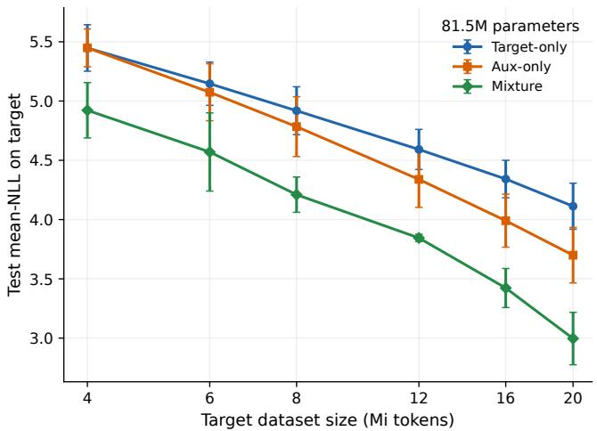  
(a) $\gamma _ { 2 } = 1 . 2 5$

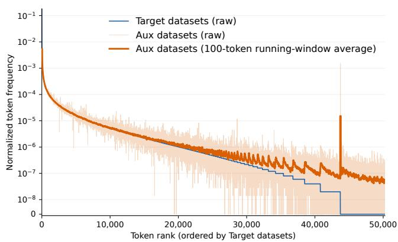  
(b) Token-frequency distributions  
Figure 4: Target-domain test negative log-likelihood (NLL) scaling of an 81.5M-parameter GPT-2-style language model trained from scratch on SlimPajama. Panel (a) reports mean NLL on a fixed target-domain test set as a function of the reference target budget n. We use $n \in \{ 4 , 6 , 8 , 1 2 , 1 6 , 2 0 \}$ Mi, except for the $\gamma _ { 2 } = 1 . 7 5$ experiment that uses $n \leq 1 6 \mathrm { M i }$ . Panel (b) compares the normalized target and auxiliary token frequencies. Token types are ordered by decreasing target-domain frequency. The light auxiliary curve shows the raw frequencies, and the darker, thicker curve shows their 100-token running-window average.

Table 1: Linear OLS scaling slopes on the target test set for the 81.5M-parameter model over 4–20 M target datasets tokens. More-negative values indicate a faster decrease in target NLL, i.e. better scaling law. Each slope is obtained by fitting ${ \mathrm { N L L } } = \alpha + s \ln ( n )$ over the six Target dataset sizes n $\in \{ 4 , 6 , 8 , 1 2 , 1 6 , 2 0 \}$ M within each seed and then averaging over three seeds. Improvement is 100 $( | s _ { \mathrm { M i x t u r e } } | - | s _ { X } | ) / | s _ { X } |$ , reported against target-only and auxiliary-only, respectively.
<table><tr><td colspan="4">Mixture improvement (%)</td></tr><tr><td> $\gamma _ { 2 }$ </td><td></td><td>Target-only Auxiliary-only Mixture</td><td>Target / Auxiliary</td></tr><tr><td>0.75</td><td>-0.8319</td><td>-0.6085 -0.8742</td><td>+5.1% / +43.7%</td></tr><tr><td>1</td><td>-0.8319</td><td>-0.8389 -1.0272</td><td>+23.5% / +22.4%</td></tr><tr><td>1.25</td><td>-0.8319</td><td>-1.1155 -1.1225</td><td>+34.9% / +0.6%</td></tr><tr><td>1.5</td><td>-0.8319</td><td>-1.4015 -1.2513</td><td>+50.4% / -10.7%</td></tr><tr><td>1.75</td><td>-0.8319</td><td>-1.5971 -1.3208</td><td>+58.8% / -17.3%</td></tr><tr><td>2</td><td>-0.8319</td><td>-1.7332 -1.4361</td><td>+72.6% / -17.1%</td></tr></table>

## G.2 Experiments on datasets with close distributions

Figure 4 shows that when the token frequency of the two datasets is close, for $\gamma _ { 2 } = 1 . 2 5 $ , the data mixture does not improve the scaling law compared to using one of the individual datasets. Table 1 shows that this phenomenon occurs across diferent scales $\gamma _ { 2 }$ . This qualitatively supports our theoretical finding that data mixtures improve scaling only when spectral decay rates are suficiently diferent.