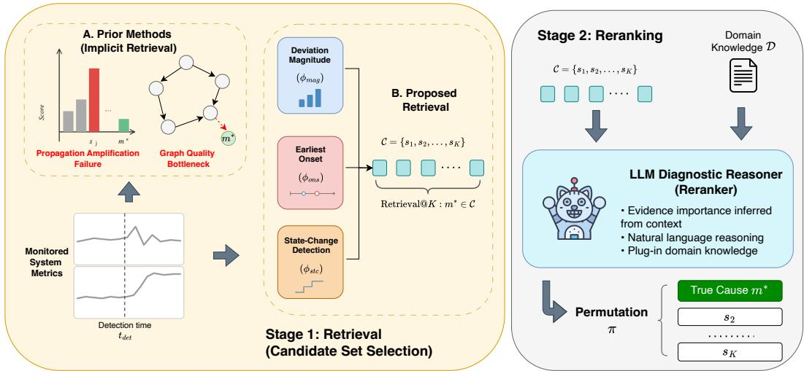
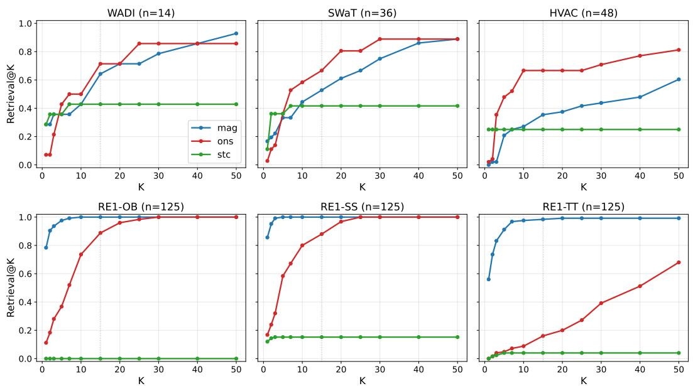

# Where Root Cause Analysis Fails: A Retrieval-Reranking Decomposition

Hada Melino Muhammad1 Luan Pham1 Laure Barrière2 Sachin Shetty2 Leonardo Pulga2 Flora D. Salim1

1University of New South Wales 2Baker Hughes

{hada\_melino.muhammad, luan.pham, flora.salim}@unsw.edu.au {laure.barriere, sachin.shetty, leonardo.pulga}@bakerhughes.com

## Abstract

Identifying the root cause of an anomaly among hundreds of sensors is critical for preventing safety incidents and costly downtime in complex monitored systems. Existing studies evaluate root cause analysis (RCA) methods using top@k accuracy. We show that this metric has a fundamental blind spot: it conflates two failure modes, retrievalfailure, where the true cause is never considered, and reranking failure, where it is considered but ranked too low. In this work, we introduce a retrieval–reranking decomposition and audit four well-known benchmarks to expose this blind spot. Our experiments show that, on benchmarks with complex faults, statistical baselines mis-rank the true cause 79–100% of the time, and graph-based methods never clearly beat the best statistical baseline, whether their causal graphs are learned on short fault windows, on retrieved candidate pools guaranteed to contain the cause, or on multi-day normal-operation data. Meanwhile, on simple benchmarks where faults manifest significantly at their origin, retrieval is nearly solved (98–100%). Guided by the decomposition, we build a two-stage pipeline combining a multi-signal retriever with an LLM reranker that, as one fixed configuration, matches or exceeds the best baseline’s top@1 accuracy on all six benchmark suites (by up to +12 points), with no causal graph or labeled data required. When all methods rank the same retrieved candidates with the true cause guaranteed present, adding a short system-description document lets the reranker lead the best baseline by +7 to +18 points on every benchmark. Code is available at https://github.com/cruiseresearchgroup/DecompRCA.

## 1 Introduction

Complex monitored systems, from water treatment plants [1, 2] and building management systems [3, 4] to cloud service systems [5], are instrumented with hundreds to thousands of sensors. When an anomaly or a failure is detected, operators must rapidly identify its root cause to prevent further damage, which may lead to huge financial losses [6] or even fatalities [7]. This task is known as root cause analysis (RCA), and automated approaches to it have progressed through statistical analysis [8, 9], causal inference-based approaches [10–12], and LLM-based reasoners [13], with each generation reporting improvements on standard benchmarks. Progress is measured by how well methods surface the true root cause within a short window of candidates, whether it appears at all and how near the top it lands. Yet existing benchmarks pre-package the diagnostic context in a way that implicitly assumes the root cause is already exposable: fault scenarios are provided with known injection timestamps, analysis windows are fixed, and preprocessing decisions are made for the method rather than by it. The fault types that dominate existing benchmarks, namely microservice faults such as CPU overload and memory leaks, happen to satisfy this assumption naturally, making the true cause the most visible signal in the window. This does not generalize: in cyber-physical systems (CPS), where faults propagate and amplify through physical components [10], the true cause is suppressed beneath its downstream effects, and any method evaluated only on direct-fault benchmarks inherits a false sense of retrieval coverage that will not transfer to propagating-fault settings.

Every RCA pipeline has, at least implicitly, two stages: a retriever that produces a candidate set C and a reranker that orders C. The fraction of true causes inside C, which we call Retrieval@K for a set of size K, is a hard ceiling on any downstream ranker, since no reranker can recover a candidate it was never shown, yet existing evaluation collapses both stages into a single score, making it impossible to determine which stage is responsible for failure. In propagating-fault systems, deviation magnitude alone is insufficient for retrieval since the root cause is suppressed beneath downstream effects, and the recency assumption fails because anomaly detection fires on detected deviations rather than true fault onset. Structure-based methods [10–12] face a further obstacle: ranking on their learned causal graphs is unreliable, whether the graphs are learned on short fault windows, on retrieved pools guaranteed to contain the cause, or on multi-day normal corpora (Section 7 and Appendix J), and expert-specified graphs are rarely available in practice [11]. The result is a literature where a method that never retrieves the true cause and one that retrieves but mis-ranks it appear identical under any rank-based metric, yet require categorically different fixes.

We introduce a retrieval–reranking decomposition and apply it as a systematic audit across four benchmarks (WADI [1], SWaT [2], HVAC [4], RCAEval [5]) and three method families, surfacing findings invisible under any single rank-based metric alone. Critically, WADI and SWaT are among the most widely used industrial benchmarks in the RCA literature [14, 12], yet methods evaluated on them consistently report low accuracy with no further investigation into why: our decomposition reveals that this is not an undifferentiated dataset-complexity problem but two compounding failures: the true cause is often absent from the candidate set before any ranking is attempted, and even when present it is hard to rank. To validate that the two failure modes admit independent remedies, we address each subproblem in isolation: first targeting retrieval failure with a multi-signal retriever combining deviation magnitude, earliest-onset, and discrete state-change detection; then targeting reranking failure with a single-call LLM reranker over structured per-candidate evidence and an optional domain-knowledge document D, requiring neither a learned causal graph nor labeled fault traces [11]. The pipeline is meant to validate the decomposition, not to serve as a proposed end system, and we attribute each of its gains to the stage that produces it. Our contributions are:

• A retrieval–reranking decomposition for RCA evaluation. We formalize ranking error as two independently measurable failure modes, scored by two metrics that apply to any ranking method, Retrieval@K (is the true cause among the K candidates?) and Rerank@k (if so, is it ranked among the first k?), and audit four benchmarks across three method families, surfacing findings invisible under top@k alone.

• An empirical characterization of the retrieval gap. Deviation magnitude caps Retrieval@15 at 35–64% on propagating-fault benchmarks while reaching 98–100% on direct-fault benchmarks, with no single additional signal dominating across datasets.

• Independent remedies for both failure modes. A multi-signal retriever lifts that ceiling to 63–67%, and an LLM reranker with a single configuration for all datasets matches or beats the best baseline’s top@1 on every benchmark (by up to +12 points), showing that each failure mode can be fixed on its own. When the true cause is guaranteed to be among the retrieved candidates, the reranker is never worse than any baseline ranking the same candidates, and a short document describing the system lets it beat the best baseline by +7 to +18 points on every benchmark.

• A design implication. Anomaly detection and RCA must be co-designed: the anomaly detector determines the retrieval substrate, and misalignment caps accuracy regardless of reranker quality.

## 2 Related Work

Single-signal RCA scorers. Most unsupervised RCA methods attach a deviation score to every time series and report the resulting order. BARO [8] proposes a robust median-IQR scorer, ϵ-Diagnosis [9] ranks by ϵ-statistic, FaaSRCA [15] ranks by graph-autoencoder reconstruction error, KPIRoot+ [16] blends waveform similarity with a recency proxy, MicroHECL [17] prunes a service call graph and scores the residual nodes by Pearson correlation, TORAI [18] clusters services by symptom severity before applying robust hypothesis testing, and PRISM [19] ranks on an internal-versus-external property asymmetry that explicitly refutes the maximum-deviation rule. None forms an explicit candidate set, so top@k merges the two stages; taking each method’s first K items as its candidate set, Retrieval@K shows whether the cause is buried and Rerank@k whether it is near the top but misordered (Section 6.3). On microservice benchmarks, where faults directly saturate the anomalous service’s metrics, this conflation is benign: the true cause is the most deviant signal and reranking is the binding problem. On propagating-fault benchmarks, the conflation is costly: the true cause is suppressed beneath its downstream effects, so within any practical candidate budget a method that scores every sensor often fails to retrieve it at all. Two recent measurements surface what this conflation costs. Pham et al. [20] report that most causal inference-based RCA methods barely beat a random baseline at scale, and TraceDiag [21] prunes a 500-node Microsoft Exchange trace down to about eleven candidates while still retaining 92.9% of the true causes, in effect a Retrieval@11 of 0.929 reported without the matching Rerank@k. Both findings point the same way: what enters the candidate set matters as much as how it is reordered, yet no prior work has measured the two separately.

Causal graphs and structure-based RCA. A second family treats the root cause as the time series occupying a privileged position in a causal graph. The graph is either expert-supplied, as in CIRCA [10], which projects time series onto the four golden signals over a system architecture, or learned, as in CausalRCA [22] (DAG-GNN with PageRank), RUN [23] (neural Granger discovery with PageRank), CHASE [24] (causal hypergraph convolution), and REASON [25] (hierarchical GNN with random walk with restart, evaluated on WADI and SWaT). RCD [11] runs a hierarchical PC search, MicroCERCL [26] adapts the recipe to cloud-edge deployments, and Cloud Atlas [27] elicits the graph itself from an LLM. Across this family, ranking runs end-to-end over the full metric set; the candidate set is the entire system, so retrieval failure never separates from reranking failure under top@k. Yet the learned graph is itself a retriever: with its nodes as the candidate set, 1−Retrieval@K counts causes lost in graph learning and Rerank@k scores how graph scoring ranks the rest. Two structural obstacles make this entanglement particularly costly on industrial telemetry. Propagation amplification routinely places downstream metrics above the cause, a failure mode that Li et al. [28] prove for linear SEMs is inherited by any squared-z-score ranker. Learning a reliable graph from a short non-stationary fault window is also hard, so the Retrieval@K of structure-based methods tracks graph quality rather than evidence quality. Nearly all methods in this family are evaluated on microservice benchmarks where retrieval is trivially saturated and these obstacles are absent; REASON [25] is the exception, evaluated on SWaT and WADI with a graph learned from long-run normal data, a setting we also test (Appendix J). Our audit runs these methods under the operationally realistic per-scenario setting and, for the first time, separates their retrieval failure from their reranking failure.

LLM-based RCA. A third family applies LLMs as the diagnostic reasoner. One branch wires multi-agent loops over telemetry: D-Bot [29] runs a tree-of-thought search across diagnostic tools for database anomalies, while RCLAgent [30] and AMER-RCL [31] drive trace, log, and metric agents inside a recursion-of-thought controller. In these systems, the agent’s exploration policy defines a de facto candidate set, but its retrieval coverage is never measured: a hypothesis the agent never generates is a retrieval failure indistinguishable from a mis-ranked hypothesis under top@k; logging what the agent examines would give its Retrieval@K. A second branch uses the LLM as a post-hoc reasoner over a separately-detected candidate set: KAT [32] pairs a kernel-trace anomaly detector with a fine-tuned 14B Analyzer, and RC-LLM [33] fuses change-point and call-tree evidence into a single DeepSeek-V3 prompt. In both cases, the detector constitutes an explicit retrieval stage whose Retrieval@K is never reported separately from the LLM’s Rerank@k. Closest to our pipeline is SpecRCA [34], which drafts hypotheses from multimodal scoring and verifies each in parallel with a distilled 3B model, an architecture that maps directly onto Retrieval@K (the drafter) and Rerank@k (the verifier). Yet SpecRCA, like the others, reports a single end-to-end accuracy number: a hypothesis missed by the drafter is silently absorbed into the same accuracy as a hypothesis misranked by the verifier. None of these systems formalizes retrieval-versus-reranking failure. Nearly all are evaluated exclusively on microservice incidents (AIOps, HipsterShop, Train-Ticket); whether multi-evidence LLM reranking transfers to industrial cyber-physical fault traces, where retrieval and reranking fail together, is the question this paper addresses.

Listwise LLM reranking. Once a candidate set is available, the reranking problem becomes: given a small set of sensors with heterogeneous evidence, which is most likely the root cause? This is structurally analogous to the listwise reranking problem in information retrieval, where a short candidate list must be ordered by relevance. RankGPT-style listwise prompting [35] showed that placing a small candidate set in one LLM call outperforms pointwise scoring; subsequent work strengthens the design along orthogonal axes. Rank-without-GPT [36] ports the recipe to open-source backbones, FIRST [37] cuts inference cost by reading first-token logits, Rank-R1 [38] adds RL-trained reasoning, Rank-K [39] distills chain-of-thought traces into a 32B listwise model, and AcuRank [40] budgets LLM calls under uncertainty. LLMs are a natural fit for fault evidence reranking for three reasons. First, the appropriate weighting of heterogeneous evidence types is context-dependent and varies across fault types and system architectures; a fixed scoring function cannot adapt to this variation, but an LLM can reason over the specific pattern present in each fault instance. Second, LLMs can consume optional natural-language domain knowledge without requiring it to be formalized as a causal graph or structured model, lowering the barrier for operational deployment. Third, the listwise paradigm is efficient when the candidate set is small: one call per fault, with no causal graph to learn per scenario. We adopt this paradigm to validate that reranking failure is independently addressable once the retrieval problem is controlled.

  
Figure 1: Our retrieval–reranking decomposition for RCA. Left: prior methods fail via propagation amplification (statistical) or graph quality bottlenecks (graph-based). Stage 1 retrieves a candidate set C using three complementary signals. Stage 2 reranks C with an LLM reasoner conditioned on per-candidate evidence and optional domain knowledge D, outputting permutation π.

Industrial CPS anomaly detection and benchmarks. Our evaluation builds on a long line of cyber-physical anomaly detectors. Early SWaT baselines compare LSTM autoencoders with one-class SVM [41] and architecture-searched MLPs trained by genetic algorithm [42], both of which produce a deviation-based ranked list of suspect tags. GiBy [43] couples per-sensor bounds with discrete actuator-state lookups, and STOD [44] adds spatio-temporal graph reasoning. These detectors sit upstream of root cause ranking and motivate the discrete state-change signal we add at retrieval time; their ranked suspect lists can be scored directly with Retrieval@K, a criterion for choosing a detector to pair with RCA. On the benchmark side, RCAEval [5] and PetShop [45] provide labeled microservice failure traces and evaluation protocols, with PetShop reporting that methods strong on one benchmark frequently fail on another, a transfer failure our decomposition explains structurally: methods optimized for direct-fault regimes inherit retrieval assumptions that do not hold in propagating-fault settings. LEMMA-RCA [14] evaluates six methods on both microservice and operational-technology (OT) datasets (including SWaT and WADI), observing substantially worse performance on OT benchmarks, but attributes this to dataset complexity rather than the retrieval–reranking structure. We adopt RCAEval as our saturated direct-fault benchmark and pair it with WADI [1], SWaT [2], and an HVAC building-management testbed [4] to measure the retrieval ceiling in the propagating-fault regime that prior work has not diagnosed.

## 3 Problem Formulation

Consider a monitored system with p observable metrics. Let $\mathbf { X } _ { B } \in \mathbb { R } ^ { T _ { B } \times p }$ denote a baseline window collected under normal operation and $\mathbf { X } _ { F } \in \mathbb { R } ^ { T _ { F } \times p }$ afault window collected after fault onset, with $t _ { \mathrm { d e t } }$ the detection timestamp delimiting them. An optional domain-knowledge document D describing system architecture, component roles, and causal dependencies may be provided. The goal is to produce a permutation $\pi \in \operatorname { S y m } ( \{ 1 , \ldots , p \} )$ ranking metrics from most to least likely root cause. Crucially, this setup pre-packages the diagnostic context: the fault window, baseline window, and detection timestamp are all assumed to expose the root cause signal. We argue this assumption, inherited silently by every method evaluated under it, is the source of a systematic blind spot that top@k cannot reveal.

## 4 Decomposition of Root Cause Analysis

## 4.1 Why Root Cause Identification Reduces to Retrieval and Reranking

The ideal case. Write the p sensors as $\boldsymbol { S } = \{ s _ { 1 } , \ldots , s _ { p } \}$ , and let $m ^ { * }$ denote the true root cause. In the ideal case, an oracle anomaly detector observes the true fault onset time $t _ { \mathrm { f a u l t } }$ and produces a ranking of sensors by temporal precedence. If $m ^ { * } \in S$ and the detector is noiseless, then $m ^ { * }$ is the first sensor to deviate at $t _ { \mathrm { f a u l t } }$ , and RCA reduces to a precedence problem: rank sensors by onset and return the earliest. Formally, let $\tau ( s _ { i } )$ denote the true deviation onset of sensor $s _ { i } .$ Then:

$$
m ^ { * } = \arg \operatorname* { m i n } _ { s _ { i } \in S } \tau ( s _ { i } )\tag{1}
$$

and the problem is solved by recency alone. No reranking is required.

The practical case: noisy detectors confound precedence. In practice, no oracle provides $t _ { \mathrm { f a u l t } }$ Anomaly detectors observe $t _ { \mathrm { d e t } }$ , the time at which a deviation is detected, which is a noisy and delayed proxy for $t _ { \mathrm { f a u l t } }$ . Let $\delta _ { i } = t _ { \mathrm { d e t } } ( s _ { i } ) - \tau ( s _ { i } ) \geq 0$ denote the detection lag for sensor $s _ { i }$ . Because $\delta _ { i }$ varies across sensors depending on detection sensitivity, signal-to-noise ratio, and propagation gain, the ordering of detected anomalies need not preserve the ordering of true onsets:

$$
t _ { \mathrm { d e t } } ( s _ { i } ) < t _ { \mathrm { d e t } } ( s _ { j } ) \neq \tau ( s _ { i } ) < \tau ( s _ { j } )\tag{2}
$$

A downstream sensor $s _ { j }$ that responds abruptly to the propagating fault may be detected before the root cause $m ^ { * }$ despite having a later true onset. The recency assumption therefore fails not because precedence is the wrong signal, but because the available signal is $t _ { \mathrm { d e t } }$ rather than $t _ { \mathrm { f a u l t } }$

How prior methods embed implicit retrieval assumptions. Given noisy detectors, prior methods reduce the ranking problem by committing to a signal $\phi : { \mathcal { S } } $ R that scores each sensor and implicitly defines a candidate set $\mathcal { C } = \mathop { \mathrm { t o p } } { \cdot } K ( \phi )$

Statistical methods set $\phi$ to a deviation magnitude or recency statistic and rank all $p$ sensors directly, so ${ \mathcal { C } } = { \mathcal { S } }$ . Retrieval failure is zero by construction, but $\phi$ is a poor discriminator when propagation amplification places downstream sensors above $m ^ { * }$

Graph-based methods define a function $F : \mathbf { X } _ { F } , \mathbf { X } _ { B }  \mathcal { G } ( \mathcal { N } , \mathcal { E } )$ that recovers a causal graph, then set C to the nodes occupying a privileged position in ${ \mathcal { G } } .$ . If the true causal path is $m ^ { * }  a  b $ $\cdots \to c ,$ a missing edge anywhere in the path can exclude $m ^ { * }$ from C entirely; for the first edge, for example:

$$
( m ^ { * } , a ) \not \in \mathcal { E } \Rightarrow m ^ { * } \not \in \mathcal { C }\tag{3}
$$

Graph methods can therefore fail at retrieval before reranking is attempted, in addition to failing at ranking the nodes the graph keeps; where the two can be separated, Section 7 shows that the second failure dominates.

The role of domain knowledge. Since $t _ { \mathrm { f a u l t } }$ is unobservable in practice, the recency-based ideal solution is inaccessible. However, if $m ^ { * } \in { \mathcal { C } }$ can be guaranteed by the retriever, the reranking problem becomes: given heterogeneous evidence for each candidate in ${ \mathcal { C } } ,$ , which is most likely the origin of the fault? This is where domain knowledge $\mathcal { D } .$ , describing system architecture, component roles, and causal dependencies, can be injected. Formally, the reranker computes:

$$
\hat { m } ^ { * } = \arg \operatorname* { m a x } _ { s _ { i } \in \mathcal { C } } \mathcal { F } ( s _ { i } \mid \mathbf { X } _ { F } , \mathbf { X } _ { B } , \mathcal { D } )\tag{4}
$$

where $\mathcal { F }$ is a scoring function that integrates statistical evidence with prior knowledge D. Unlike graph-based methods that require D to be formalized as a causal graph, a flexible reranker can consume D in natural language form, conditioning its ranking on system context without committing to a fixed structural model. The decomposition therefore implies a design principle: retrieval should maximize $\mathbf { 1 } [ m ^ { * } \in \mathcal { C } ]$ using observable signals, and reranking should maximize $\mathbf { \hat { 1 } } [ \hat { m } ^ { * } = m ^ { * } \mid m ^ { * } \in$ C] using all available evidence including D.

## 5 A Two-Stage Remedy: Retrieval Then Reranking

The decomposition makes the two failure modes independently addressable. We instantiate a twostage pipeline (Figure 1) as a validation instrument: closing each gap requires categorically different interventions, and progress on one does not substitute for the other.

## 5.1 Stage 1: Multi-Signal Retrieval

Retrieval produces a candidate set C of at most K sensors that maximizes $\mathbf { 1 } [ m ^ { * } \in \mathcal { C } ]$ . Magnitude alone is insufficient when downstream sensors are rank-displaced above the cause, so we combine three complementary signals, each targeting a distinct fault regime (Section 7).

Deviation magnitude $\phi _ { \mathrm { { m a g } } } \mathrm { { : } }$ : normalized shift of each sensor from its baseline window. Effective when the cause produces the largest amplitude change (direct faults).

Earliest onset $\phi _ { \mathrm { o n s } } \mathrm { : }$ each sensor’s first-deviation timestamp within the fault window, earliest first. Recovers the precedence signal of Section 4.1 when amplitude at the source is suppressed (HVACstyle gradual drifts).

Discrete state-change $\phi _ { \mathrm { s t c } } \mathrm { : }$ whether a discrete-valued sensor leaves its baseline mode, ranked by when it first does. Targets binary actuator or mode-switch faults whose signature is a discrete event rather than a continuous shift (SWaT-style abrupt transitions).

The budget K is split evenly across the signals unless noted, and the deduplicated union forms C $( | { \mathcal { C } } | \leq { \bar { K } } )$ . These three signals are illustrative, not a fixed prescription: each targets a regime we observed in our benchmarks, and a system that surfaces faults through a different signature (e.g., spectral shifts, correlation breaks) would warrant adding the corresponding scorer.

## 5.2 Stage 2: LLM Reranking

Given C, the reranker answers a different question: which candidate is most likely the true cause? For each $s _ { i } \in \mathcal { C }$ we build an evidence record (deviation magnitude, time of first onset, baseline and fault-window means with absolute and relative shift), pass all records in a single prompt to an LLM, and read off the returned permutation π. An optional domain-knowledge document D describing system architecture and propagation pathways is injected into the system prompt; unlike graph-based methods, the reranker accepts D in informal natural language without requiring formalization as a causal graph. The pipeline is unsupervised, uses no labeled fault traces, and runs a single configuration across all datasets (Appendix A).

## 6 Experimental Setup

## 6.1 Datasets

We evaluate on four operational benchmarks spanning two distinct domains. RCAEval [5] is a microservice benchmark with three suites, Online Boutique (RE1-OB), Sock Shop (RE1-SS), and Train Ticket (RE1-TT), each with n=125 scenarios and evaluated at the service level. WADI [1] (n=14), SWaT [2] (n=36), and HVAC [4] (n=48) are industrial control benchmarks covering water distribution, water treatment, and building management respectively, evaluated at the metric level. The four datasets differ in system scale, fault type, sampling rate, and ground-truth granularity, providing a diverse testbed for evaluating retrieval and reranking across direct-fault and propagating-fault regimes. Full dataset details are provided in Appendix B.

Table 1: Cumulative-budget Retrieval@K. At each K, the candidate pool is split across signals while the total pool size is held fixed: mag uses K magnitude items; +ons splits K between magnitude and onset; +stc splits it across magnitude, onset, and state-change (Appendix A). Best per (dataset, K) in bold.
<table><tr><td></td><td colspan="3"> $K = 5$ </td><td colspan="3"> $K = 1 0$ </td><td colspan="3"> $K = 1 5$ </td></tr><tr><td>Dataset</td><td>mag</td><td>+ons</td><td>+stc</td><td>mag</td><td>+ons</td><td>+stc</td><td>mag</td><td>+ons</td><td>+stc</td></tr><tr><td colspan="10">Industrial CPS benchmarks</td></tr><tr><td>WADI (n=14)</td><td>0.36</td><td>0.36</td><td>0.50</td><td>0.43</td><td>0.50</td><td>0.57</td><td>0.64</td><td>0.57</td><td>0.64</td></tr><tr><td>SWaT (n=36)</td><td>0.33</td><td>0.25</td><td>0.31</td><td>0.44</td><td>0.44</td><td>0.61</td><td>0.53</td><td>0.61</td><td>0.67</td></tr><tr><td>HVAC (n=48)</td><td>0.21</td><td>0.06</td><td>0.25</td><td>0.27</td><td>0.56</td><td>0.54</td><td>0.35</td><td>0.65</td><td>0.63</td></tr><tr><td colspan="10">Microservice benchmarks (RCAEval)</td></tr><tr><td>RE1-OB (n=125)</td><td>0.98</td><td>0.95</td><td>0.94</td><td>1.00</td><td>0.98</td><td>0.96</td><td>1.00</td><td>0.99</td><td>0.98</td></tr><tr><td>RE1-SS (n=125)</td><td>1.00</td><td>0.99</td><td>0.96</td><td>1.00</td><td>1.00</td><td>0.99</td><td>1.00</td><td>1.00</td><td>1.00</td></tr><tr><td>RE1-TT (n=125)</td><td>0.91</td><td>0.83</td><td>0.74</td><td>0.98</td><td>0.91</td><td>0.90</td><td>0.98</td><td>0.98</td><td>0.91</td></tr></table>

## 6.2 Baselines

We compare against two families of baselines. Statistical baselines score each sensor directly, without a learned global graph: BARO [8], RCD [11] (which runs a localized causal search), and ϵ-Diagnosis [9]. Graph-based baselines learn a causal graph per scenario via PC or FCI [46] and rank sensors on it with PageRank [47], random walk [48], or CIRCA [10]. All baselines use their published default hyperparameters [5], with dataset-specific patch sizes where the windows require it, and score the same baseline and fault windows as our pipeline (Appendix C).

LLM reranker configurations. The reranker is gpt-oss-120b, run $n { = } 3$ times at $T { = } 1 . 0$ (we report mean±std) with the same prompt on every dataset (Appendix A). We report it both without and with the domain-knowledge (DK) document D (no-DK / with-DK) on every dataset, and use K=15 throughout.

## 6.3 Evaluation Metrics

We report top@k (1 if any ground-truth cause appears among the first k items of the final ranking, averaged over scenarios) for $k \in \{ 1 , 3 , 5 \}$ and $\begin{array} { r } { \mathbf { A v g } @ \mathsf { \overline { { s } } } \left( = \frac { 1 } { 5 } \sum _ { k = 1 } ^ { 5 } \mathsf { t o p } @ k \right) } \end{array}$ for end-to-end ranking evaluation. To separate the two stages we define two metrics over a candidate set $\mathcal { C }$ of size $K$ Retrieval@K is the fraction of scenarios whose ground-truth cause appears in $\mathcal { C } ;$ Rerank@k is, among those scenarios, the fraction in which the cause is ranked among the first k; K is the candidateset size and $k \leq K$ the cutoff on the final ranking. By construction, top@k = Retrieval@ $K \times$ Rerank@k, so 1− Retrieval@K is the retrieval failure and Retrieval@K − top@k the reranking failure. Both apply to any method that outputs a ranking: take C to be the first K items of its final ranking, so Retrieval@ $K = \arg \ @ K$ and Rerank@k = top@k / top@K. For a two-stage pipeline whose reranker only reorders the retrieved set, this C is exactly the retrieved set. We use $K \in \{ 5 , 1 0 , 1 5 \}$ and report $\dot { K }$ alongside both metrics.

## 7 Results

## 7.1 Retrieval Failure

Table 1 exposes a structural divide between the two benchmark regimes. On microservice benchmarks, deviation magnitude alone achieves Retrieval@15 of 0.98–1.00, confirming that retrieval is trivially solved when faults directly saturate their origin. On industrial CPS benchmarks, magnitude alone caps Retrieval@15 at $0 . 3 5 { - } 0 . 6 4 .$ , meaning the true cause is absent from the candidate set in over a third of faults before any reranking is attempted.

Adding complementary signals narrows this gap in a dataset-dependent way. On HVAC, earliestonset detection provides the dominant lift $( 0 . 3 5 4  0 . 6 4 6 , + 2 9 ~ \mathrm { p p } )$ , reflecting that gradual setpoint deviations manifest earlier in onset than in magnitude. On SWaT, discrete state-change detection gives the largest lift (0.44 → 0.61 at K=10, where onset adds nothing), as binary actuator faults produce abrupt transitions that magnitude under-weights. On WADI, the added signals help at small budgets (K=5, 10) but not at K=15, where magnitude already reaches 0.64. On microservice benchmarks, adding signals never raises and often reduces Retrieval@K, since displacing magnitude items that already cover the true cause adds noise without benefit.

Table 2: Headroom decomposition for the multi-evidence LLM reranker without the domain document (no-DK; with-DK results in Table 3). Retrieval failure = 1− Retrieval@15; reranking failure = Retrieval@15 − top@1; Rerank@1 = top@1 / Retrieval@15, best per group in bold.
<table><tr><td>Dataset</td><td>BARO top@1</td><td>Retrieval@15 (+stc, K=15)</td><td>LLM (no DK) top@1</td><td>Retrieval failure</td><td>Reranking failure</td><td>Rerank@1</td></tr><tr><td colspan="7">Industrial CPS benchmarks</td></tr><tr><td>WADI (n=14)</td><td>0.214</td><td>0.64</td><td>0.333±0.082</td><td>0.36</td><td>0.31</td><td>0.52</td></tr><tr><td>SWaT (n=36)</td><td>0.194</td><td>0.67</td><td>0.213±0.016</td><td>0.33</td><td>0.45</td><td>0.32</td></tr><tr><td>HVAC (n=48)</td><td>0.000</td><td>0.63</td><td>0.153±0.043</td><td>0.38</td><td>0.47</td><td>0.24</td></tr><tr><td colspan="7">Microservice benchmarks (RCAEval)</td></tr><tr><td>RE1-OB (n=125)</td><td>0.784</td><td>0.98</td><td>0.875±0.009</td><td>0.02</td><td>0.10</td><td>0.90</td></tr><tr><td> $\operatorname { R E 1 - S S } { ( n = 1 2 5 ) }$ </td><td>0.856</td><td>1.00</td><td> $0 . 8 7 2 { \scriptstyle \pm 0 . 0 2 4 }$ </td><td>0.00</td><td>0.13</td><td>0.87</td></tr><tr><td>RE1-TT (n=125)</td><td>0.560</td><td>0.91</td><td> $0 . 6 5 3 { \scriptstyle \pm 0 . 0 2 4 }$ </td><td>0.09</td><td>0.26</td><td>0.72</td></tr></table>

Three saturation regimes. Figure 2 (Appendix E) allocates each signal its own full budget K, rather than splitting one shared budget, and reveals three qualitatively distinct retrieval regimes. Amplitude-suppressed (HVAC): magnitude reaches only 0.60 even at K=50, while onset attains 0.67 by K=10 (0.81 by K=50). Lag-dominated (WADI, SWaT): magnitude eventually catches up but is rank-displaced by downstream effects in the top 10–20; onset recovers the cause at a budget 5–20 smaller via temporal precedence. Direct fault (RCAEval): the true cause is usually the most-deviant signal; onset and state-change add little.

These regimes carry a design implication: which signal is informative is a property of the system, not a fixed prior. The retriever’s binding question shifts from how to mix signals to which signal this system surfaces faults on, and the anomaly detector must be co-designed with retrieval in mind since it determines which signals are observable in the fault window.

## 7.2 Reranking Failure

Table 2 separates residual error into retrieval and reranking components. On microservice benchmarks, retrieval failure is near zero (0.00–0.09) and Rerank@1 is high (0.72–0.90), confirming that the dominant bottleneck is reranking rather than retrieval. On industrial CPS benchmarks, both failure modes are active simultaneously: retrieval failure accounts for 33–38% of scenarios, while Rerank@1 is highly dataset-dependent (0.24–0.52). The gap between microservice and CPS Rerank@1 (0.72– 0.90 vs. 0.24–0.52) cannot be attributed to retrieval alone; even among scenarios where the true cause is retrieved, the LLM reranker places it first far less reliably on CPS. This suggests that CPS fault evidence is intrinsically harder to rank.

BARO scores every sensor, so at K=p its Retrieval@K is 1 apart from the two unobservable causes (Appendix B), yet statistical top@1 on CPS is at most 0.214: the failure is almost entirely at reranking, with the true cause not ranked first 79–100% of the time. The two gaps are thus independent problems with independent fixes: closing one leaves the other as the binding constraint.

## 7.3 Addressing Each Failure Mode

Table 3 reports end-to-end ranking accuracy without and with the domain document (full top@1/3/5/Avg@5 grids in Appendix E). Without the document, the multi-evidence LLM reranker matches or exceeds all statistical and graph-based baselines on top@1 across all datasets, by up to +12 pp on industrial CPS (WADI) and +9 pp on microservices (RE1-TT); no baseline beats it anywhere at top@1. Margins are narrow on SWaT and HVAC, where a third of causes never reach the reranker, and on RE1-SS, where BARO already reaches 0.856.

Table 3: End-to-end main results (top@1). LLM rows: mean±std over n=3 runs at T=1.0, without and with the domain document; other rows single runs. HVAC LLM rows count the causes the retriever misses as misses (Appendix F). Full top@1/3/5/Avg@5 grids in Appendix E.
<table><tr><td></td><td colspan="3">Industrial CPS</td><td colspan="3">Microservices (RCAEval)</td></tr><tr><td>Method</td><td>WADI</td><td>SWaT</td><td>HVAC</td><td>RE1-OB</td><td>RE1-SS</td><td>RE1-TT</td></tr><tr><td>BARO</td><td>0.214</td><td>0.194</td><td>0.000</td><td>0.784</td><td>0.856</td><td>0.560</td></tr><tr><td>RCD</td><td>0.071</td><td>0.083</td><td>0.083</td><td>0.304</td><td>0.248</td><td>0.144</td></tr><tr><td>€-Diagnosis</td><td>0.000</td><td>0.028</td><td>0.146</td><td>0.072</td><td>0.232</td><td>0.008</td></tr><tr><td>CIRCA (PC)</td><td>0.214</td><td>0.083</td><td>0.062</td><td>0.536</td><td>0.632</td><td>0.320</td></tr><tr><td>CIRCA (FCI)</td><td>0.214</td><td>0.111</td><td>0.104</td><td>0.576</td><td>0.624</td><td>0.328</td></tr><tr><td>PageRank (PC)</td><td>0.000</td><td>0.028</td><td>0.021</td><td>0.112</td><td>0.136</td><td>0.008</td></tr><tr><td>PageRank (FCI)</td><td>0.071</td><td>0.000</td><td>0.000</td><td>0.096</td><td>0.184</td><td>0.048</td></tr><tr><td>RandomWalk (PC)</td><td>0.071</td><td>0.000</td><td>0.000</td><td>0.080</td><td>0.112</td><td>0.064</td></tr><tr><td>RandomWalk (FCI)</td><td>0.000</td><td>0.000</td><td>0.000</td><td>0.112</td><td>0.144</td><td>0.072</td></tr><tr><td>LLM (no DK)</td><td>0.333±0.082</td><td>0.213±0.016</td><td>0.153±0.043</td><td>0.875±0.009</td><td>0.872±0.024</td><td>0.653±0.024</td></tr><tr><td>LLM (with DK)</td><td>0.310±0.041</td><td>0.148±0.016</td><td>0.278±0.012</td><td>0.888±0.008</td><td>0.944±0.008</td><td>0.685±0.009</td></tr></table>

On industrial CPS, no graph-based method beats the best statistical baseline. CIRCA, PageRank, and RandomWalk over per-scenario PC/FCI graphs all achieve top@1 ≤ 0.214 across the three CPS benchmarks (best graph row 0.214 on WADI, tying BARO; 0.111 on SWaT and 0.104 on HVAC, below BARO’s 0.194 and ϵ-Diagnosis’s 0.146). The decomposition explains why: per-scenario graph construction drops the ground-truth cause in some scenarios (its near-constant and collinearity filters remove it in 1/14 WADI, 2/36 SWaT, and 12/48 HVAC scenarios; retrieval failure), and graph-based scoring (whether unweighted centrality or CIRCA’s regression-based hypothesis test) correlates poorly with the manipulated sensor on the surviving pool (reranking failure). Both failure modes compound, leaving graph-based methods no better than the best statistical baseline despite their additional structural machinery. Nor is it a matter of graph size or window length: graphs fitted on ≤15-node pools that provably contain the cause still do not clearly beat the best statistical baseline on CPS (best graph row 0.231 vs. BARO 0.308 on WADI, 0.083 vs. RCD 0.188 on HVAC, and 0.200, tying BARO, on SWaT) while lifting CIRCA on microservices (RE1-OB 0.576 → 0.720), and global graphs learned from multi-day normal-operation corpora do not help either (top@1 ≤ 0.214 on CPS, no better than per-scenario graphs). Their residual failure is reranking-dominated: the cause is in the learned graph in 0.71 (WADI) and 0.86 (SWaT) of scenarios but ranked first in at most 0.214 and 0.083 (Appendix J).

The effect of DK is dataset-dependent and non-monotone end to end. On HVAC, DK improves top@1 substantially (0.153 → 0.278, +12.5 pp), suggesting the LLM cannot ground sensor identities without external context. On SWaT, DK hurts top@1 (−6.5 pp); on WADI the top@1 change is within run-to-run noise (−2.4 pp on top@1, but +9.5 and +11.9 pp on top@3 and top@5). On microservices, DK gives consistent modest gains (RE1-OB: +1.3; RE1-SS: +7.2; RE1-TT: +3.2 pp top@1). Section 7.4 shows that on SWaT, DK’s benefit falls on causes the retriever misses, so end to end only its cost on retrieved causes is visible.

## 7.4 Controlled Comparisons and Robustness

Because the LLM ranks the retriever’s candidates while the baselines rank all sensors, we also compare all methods on the same candidates (Appendix G).

Same-candidate controls. Reranking the LLM’s exact K=15 candidate lists by each signal alone and by an equal-weight Borda fusion of all three shows that no fixed rule generalizes: the best single rule changes across benchmarks (magnitude on microservices, onset on SWaT, state-change on HVAC), Borda never wins one outright, and the rule that wins HVAC scores 0.000 on RE1-TT. The LLM, as one uniform configuration, beats or ties every rule and fusion on five of six benchmarks and overtakes the sixth (HVAC) once domain knowledge is added (0.326 vs. 0.250).

Retrieval-controlled pools. With Retrieval@K pinned to 1 (a reserved spot for the true cause) and all nine baselines re-run on the identical pools (Table 4), the LLM is never worse than any baseline, with one tie (HVAC retriever pool, 0.188 = RCD; Appendix G bounds the effect of where the reserved cause is placed). With domain knowledge, which no baseline can consume, it leads the best same-pool baseline on every benchmark, by +6.7 to +18.1 pp (Table 4, ∆). The all-candidates column, run without DK like the baselines, varies only the pool size, and its effect is dataset-dependent: on WADI and SWaT the LLM gets worse than at K=15 (WADI 0.410 → 0.385, SWaT 0.229 → 0.210; plausibly as structured distractors), while on HVAC and the microservices it is benign to helpful (HVAC 0.188 → 0.299, RE1-OB 0.883 → 0.896, RE1-TT 0.688 → 0.795).

Table 4: Retrieval-controlled top@1 (true cause present in every pool). BB = best of nine baselines on identical pools; ∆ = best LLM column minus BB, in pp. WADI/SWaT n=13/35 (causes outside the evaluated sensor set cannot be pinned). Full grids in Appendix G.
<table><tr><td rowspan="2">Group</td><td colspan="4">Retriever pool (K=15)</td><td colspan="3">All candidates</td></tr><tr><td>BB</td><td>LLM (no DK)</td><td>LLM (with DK)</td><td>∆</td><td>BB</td><td>LLM (no DK)</td><td>∆</td></tr><tr><td>WADI</td><td>0.308</td><td>0.410±0.044</td><td>0.436±0.089</td><td>+12.8</td><td>0.231</td><td>0.385±0.077</td><td>+15.4</td></tr><tr><td>SWaT</td><td>0.200</td><td>0.229±0.029</td><td>0.267±0.017</td><td>+6.7</td><td>0.200</td><td>0.210±0.017</td><td>+1.0</td></tr><tr><td>HVAC</td><td>0.188</td><td>0.188±0.055</td><td>0.326±0.012</td><td>+13.9</td><td>0.146</td><td>0.299±0.032</td><td>+15.3</td></tr><tr><td>RE1-OB</td><td>0.784</td><td>0.883±0.005</td><td>0.891±0.012</td><td>+10.7</td><td>0.784</td><td>0.896±0.014</td><td>+11.2</td></tr><tr><td>RE1-SS</td><td>0.856</td><td>0.859±0.009</td><td>0.928±0.000</td><td>+7.2</td><td>0.856</td><td>0.877±0.005</td><td>+2.1</td></tr><tr><td>RE1-TT</td><td>0.560</td><td>0.688±0.024</td><td>0.741±0.009</td><td>+18.1</td><td>0.560</td><td>0.795±0.020</td><td>+23.5</td></tr><tr><td>Mean</td><td>0.483</td><td>0.543</td><td>0.598</td><td>+11.6</td><td>0.463</td><td>0.577</td><td>+11.4</td></tr></table>

Domain knowledge under controlled retrieval. With retrieval guaranteed, DK raises top@1 on every benchmark (Table 4): clearly on HVAC, RE1-SS, and RE1-TT; modestly on SWaT, where it hurt end to end; within noise on WADI and RE1-OB. On SWaT, DK’s benefit concentrates on quiet-evidence causes that statistics cannot rank: on the 11 SWaT scenarios whose cause the retriever misses (33 scenario-runs), it is ranked first 0/33 times without DK and 6/33 with. These are exactly the causes retrieval misses, so under the end-to-end protocol they score zero regardless of DK, leaving visible only DK’s prior-conflict cost on loud-evidence scenarios $( 2 4 / 7 2  2 \bar { 2 } / 7 2$ scenario-runs). A component’s value can thus be invisible, or even appear negative, under top@k alone.

Robustness. A second backbone (Llama-3.3-70B) still beats every baseline on microservices, with CPS much harder (below the best baseline on SWaT); WADI top@1 stays at or above the best same-pool baseline at every $T \in \{ 0 , 1 , 2 \}$ ; de-identifying all data and DK documents shifts top@1 by a few points in either direction (Appendices H–I); and perturbing $t _ { \mathrm { d e t } }$ by ±1–2 minutes is benign on microservices, while ±5 minutes costs CPS retrieval up to 27 pp, so the CPS gains assume detection accurate to better than 5 minutes.

## 8 Conclusion

We decomposed RCA evaluation into retrieval and reranking and used it to audit four benchmarks. On propagating-fault benchmarks, deviation magnitude alone leaves a substantial fraction of true causes outside a K=15 candidate set, and graph-based methods never clearly beat the best statistical baseline on per-scenario, retrieved-pool, or long-window graphs. A multi-signal retriever narrows this retrieval gap, and a single-call LLM reranker over per-candidate evidence matches or improves top@1 accuracy in both regimes under one fixed configuration, without a learned causal graph or labeled traces. Because the detector determines the retrieval substrate, anomaly detection and RCA must be co-designed. Controlling retrieval also showed that top@k can hide a component’s benefit, as it did for domain knowledge. Nevertheless, these findings come with limitations: the propagatingfault benchmarks are small and cover only water and building systems, the CPS gains assume a detection timestamp accurate to better than 5 minutes, the retriever’s settings were fixed on the same benchmarks, the domain-knowledge document is not yet ingested adaptively, and the LLM reranker is nondeterministic. In deployment, faster diagnosis can shorten incidents in safety-critical infrastructure such as water treatment and building management, but automation bias and miscalibrated reranker confidence on out-of-distribution faults are real risks, so we recommend presenting a short ranked list of candidates rather than a single answer, surfacing the per-candidate evidence behind each rank, and treating human-in-the-loop oversight as essential.

## Acknowledgments and Disclosure of Funding

This research is supported by Baker Hughes, the ARC Training Centre for Whole Life Design of Carbon Neutral Infrastructure (IC230100015), and the ARC Centre of Excellence for Automated Decision-Making and Society (CE200100005).

## References

[1] Chuadhry Mujeeb Ahmed, Venkata Reddy Palleti, and Aditya P Mathur. Wadi: a water distribution testbed for research in the design of secure cyber physical systems. In Proceedings of the 3rd international workshop on cyber-physical systems for smart water networks, pages 25–28, 2017.

[2] Jonathan Goh, Sridhar Adepu, Khurum Nazir Junejo, and Aditya Mathur. A dataset to support research in the design of secure water treatment systems. In International conference on critical information infrastructures security, pages 88–99. Springer, 2016.

[3] Arian Prabowo, Xiachong Lin, Imran Razzak, Hao Xue, Emily W Yap, Matthew Amos, and Flora D Salim. Building timeseries dataset: Empowering large-scale building analytics. Advances in Neural Information Processing Systems, 37:133180–133206, 2024.

[4] Jessica Granderson, Guanjing Lin, Yimin Chen, Armando Casillas, Piljae Im, Sungkyun Jung, Kyle Benne, Jiazhen Ling, Ravi Gorthala, Jin Wen, Zhelun Chen, Sen Huang, and Draguna Vrabie. Lbnl fault detection and diagnostics datasets. Open Energy Data Initiative (OEDI), Lawrence Berkeley National Laboratory, https://doi.org/10.25984/1881324, 2022. URL https://data.openei.org/submissions/5763. Accessed: 2026-05-04.

[5] Luan Pham, Hongyu Zhang, Huong Ha, Flora Salim, and Xiuzhen Zhang. Rcaeval: a benchmark for root cause analysis of microservice systems with telemetry data. In Companion Proceedings of the ACM on Web Conference 2025, pages 777–780, 2025.

[6] Yahoo. Amazon’s One-Hour Downtime on Prime Day May Have Cost It \$72 Million to \$99 Million. https://finance.yahoo.com/news/amazon-apos-one-hour-downtime-145 350120.html, Jul 2018. Accessed: 2026-05-03.

[7] Mark A. Gregory. Optus triple zero outage has left multiple people dead. a telecommunications expert explains what went wrong – and how to fix it. Law Society Journal, Sep 22 2025. URL https://lsj.com.au/articles/optus-triple-zero-outage-has-left-multipl e-people-dead-a-telecommunications-expert-explains-what-went-wrong-and -how-to-fix-it/. Accessed: 2026-05-03.

[8] Luan Pham, Huong Ha, and Hongyu Zhang. Baro: Robust root cause analysis for microservices via multivariate bayesian online change point detection. Proceedings ofthe ACM on Software Engineering, 1(FSE):2214–2237, 2024.

[9] Huasong Shan, Yuan Chen, Haifeng Liu, Yunpeng Zhang, Xiao Xiao, Xiaofeng He, Min Li, and Wei Ding. ε-diagnosis: Unsupervised and real-time diagnosis of small-window long-tail latency in large-scale microservice platforms. In The World Wide Web Conference, pages 3215–3222, 2019.

[10] Mingjie Li, Zeyan Li, Kanglin Yin, Xiaohui Nie, Wenchi Zhang, Kaixin Sui, and Dan Pei. Causal inference-based root cause analysis for online service systems with intervention recognition. In Proceedings of the 28th ACM SIGKDD conference on knowledge discovery and data mining, pages 3230–3240, 2022.

[11] Azam Ikram, Sarthak Chakraborty, Subrata Mitra, Shiv Saini, Saurabh Bagchi, and Murat Kocaoglu. Root cause analysis of failures in microservices through causal discovery. Advances in Neural Information Processing Systems, 35:31158–31170, 2022.

[12] Xiao Han, Saima Absar, Lu Zhang, and Shuhan Yuan. Root cause analysis of anomalies in multivariate time series through granger causal discovery. In The Thirteenth International Conference on Learning Representations, 2025.

[13] Yinfang Chen, Huaibing Xie, Minghua Ma, Yu Kang, Xin Gao, Liu Shi, Yunjie Cao, Xuedong Gao, Hao Fan, Ming Wen, et al. Automatic root cause analysis via large language models for cloud incidents. In Proceedings of the Nineteenth European Conference on Computer Systems, pages 674–688, 2024.

[14] Lecheng Zheng, Zhengzhang Chen, Dongjie Wang, Chengyuan Deng, Reon Matsuoka, and Haifeng Chen. Lemma-rca: A large multi-modal multi-domain dataset for root cause analysis. arXiv preprint arXiv:2406.05375, 2024.

[15] Jin Huang, Pengfei Chen, Guangba Yu, Yilun Wang, Haiyu Huang, and Zilong He. Faasrca: Full lifecycle root cause analysis for serverless applications. In 2024 IEEE 35th International Symposium on Software Reliability Engineering (ISSRE), pages 415–426. IEEE, 2024.

[16] Wenwei Gu, Renyi Zhong, Guangba Yu, Xinying Sun, Jinyang Liu, Yintong Huo, Zhuangbin Chen, Jianping Zhang, Jiazhen Gu, Yongqiang Yang, et al. Kpiroot+: An efficient integrated framework for anomaly detection and root cause analysis in large-scale cloud systems. Empirical Software Engineering, 31(2):28, 2026.

[17] Dewei Liu, Chuan He, Xin Peng, Fan Lin, Chenxi Zhang, Shengfang Gong, Ziang Li, Jiayu Ou, and Zheshun Wu. Microhecl: High-efficient root cause localization in large-scale microservice systems. In 2021 IEEE/ACM 43rd International Conference on Software Engineering: Software Engineering in Practice (ICSE-SEIP), pages 338–347. IEEE, 2021.

[18] Luan Pham, Huong Ha, Xiuzhen Zhang, and Hongyu Zhang. Torai: Multi-source root cause analysis for blind spots in microservice service call graph. Number FSE, 2026.

[19] Luan Pham. Graph-free root cause analysis. arXiv preprint arXiv:2601.21359, 2026.

[20] Luan Pham, Huong Ha, and Hongyu Zhang. Root cause analysis for microservice system based on causal inference: How far are we? In Proceedings of the 39th IEEE/ACM International Conference on Automated Software Engineering, pages 706–715, 2024.

[21] Ruomeng Ding, Chaoyun Zhang, Lu Wang, Yong Xu, Minghua Ma, Xiaomin Wu, Meng Zhang, Qingjun Chen, Xin Gao, Xuedong Gao, et al. Tracediag: Adaptive, interpretable, and efficient root cause analysis on large-scale microservice systems. In Proceedings ofthe 31st ACMjoint European software engineering conference and symposium on the foundations of software engineering, pages 1762–1773, 2023.

[22] Ruyue Xin, Peng Chen, and Zhiming Zhao. Causalrca: Causal inference based precise finegrained root cause localization for microservice applications. Journal of Systems and Software, 203:111724, 2023.

[23] Cheng-Ming Lin, Ching Chang, Wei-Yao Wang, Kuang-Da Wang, and Wen-Chih Peng. Root cause analysis in microservice using neural granger causal discovery. In Proceedings of the AAAI Conference on Artificial Intelligence, volume 38, pages 206–213, 2024.

[24] Ziming Zhao, Zhenwei Wang, Tiehua Zhang, Zhishu Shen, Hai Dong, Zhen Lei, Xingjun Ma, Gaowei Xu, Zhijun Ding, and Yun Yang. Chase: A causal hypergraph based framework for root cause analysis in multimodal microservice systems. arXiv preprint arXiv:2406.19711, 2024.

[25] Dongjie Wang, Zhengzhang Chen, Jingchao Ni, Liang Tong, Zheng Wang, Yanjie Fu, and Haifeng Chen. Hierarchical graph neural networks for causal discovery and root cause localization. arXiv preprint arXiv:2302.01987, 2023.

[26] Yuhan Zhu, Jian Wang, Bing Li, Xuxian Tang, Hao Li, Neng Zhang, and Yuqi Zhao. Root cause localization for microservice systems in cloud-edge collaborative environments. arXiv preprint arXiv:2406.13604, 2024.

[27] Zhiqiang Xie, Yujia Zheng, Lizi Ottens, Kun Zhang, Christos Kozyrakis, and Jonathan Mace. Cloud atlas: Efficient fault localization for cloud systems using language models and causal insight. arXiv preprint arXiv:2407.08694, 2024.

[28] Jinzhou Li, Benjamin B Chu, Ines F Scheller, Julien Gagneur, and Marloes H Maathuis. Root cause discovery via permutations and cholesky decomposition. Journal ofthe Royal Statistical Society Series B: Statistical Methodology, page qkaf066, 2025.

[29] Xuanhe Zhou, Guoliang Li, Zhaoyan Sun, Zhiyuan Liu, Weize Chen, Jianming Wu, Jiesi Liu, Ruohang Feng, and Guoyang Zeng. D-bot: Database diagnosis system using large language models. Proceedings ofthe VLDB Endowment, 17(10):2514–2527, 2024.

[30] Lingzhe Zhang, Tong Jia, Kangjin Wang, Weijie Hong, Chiming Duan, Minghua He, and Ying Li. Adaptive root cause localization for microservice systems with multi-agent recursion-ofthought. arXiv preprint arXiv:2508.20370, 2025.

[31] Lingzhe Zhang, Tong Jia, Yunpeng Zhai, Leyi Pan, Chiming Duan, Minghua He, Mengxi Jia, and Ying Li. Agentic memory enhanced recursive reasoning for root cause localization in microservices. arXiv preprint arXiv:2601.02732, 2026.

[32] Yuyang Liu, Jingjing Cai, Jiayi Ren, Peng Zhou, Danyang Zhang, Yin Du, and Shijian Li. Kunlun anomaly troubleshooter: Enabling kernel-level anomaly detection and causal reasoning for large model distributed inference. arXiv preprint arXiv:2511.05978, 2025.

[33] Liming Zhou, Ailing Liu, Hongwei Liu, Min He, and Heng Zhang. Root cause analysis method based on large language models with residual connection structures. arXiv preprint arXiv:2602.08804, 2026.

[34] Lingzhe Zhang, Tong Jia, Yunpeng Zhai, Leyi Pan, Chiming Duan, Minghua He, Pei Xiao, and Ying Li. Hypothesize-then-verify: Speculative root cause analysis for microservices with pathwise parallelism. arXiv preprint arXiv:2601.02736, 2026.

[35] Xueguang Ma, Xinyu Zhang, Ronak Pradeep, and Jimmy Lin. Zero-shot listwise document reranking with a large language model. arXiv preprint arXiv:2305.02156, 2023.

[36] Crystina Zhang, Sebastian Hofstätter, Patrick Lewis, Raphael Tang, and Jimmy Lin. Rankwithout-gpt: Building gpt-independent listwise rerankers on open-source large language models. In European Conference on Information Retrieval, pages 233–247. Springer, 2025.

[37] Revanth Gangi Reddy, JaeHyeok Doo, Yifei Xu, Md Arafat Sultan, Deevya Swain, Avirup Sil, and Heng Ji. First: Faster improved listwise reranking with single token decoding. In Proceedings of the 2024 Conference on Empirical Methods in Natural Language Processing, pages 8642–8652, 2024.

[38] Shengyao Zhuang, Xueguang Ma, Bevan Koopman, Jimmy Lin, and Guido Zuccon. Rankr1: Enhancing reasoning in llm-based document rerankers via reinforcement learning. arXiv preprint arXiv:2503.06034, 2025.

[39] Eugene Yang, Andrew Yates, Kathryn Ricci, Orion Weller, Vivek Chari, Benjamin Van Durme, and Dawn Lawrie. Rank-k: Test-time reasoning for listwise reranking. arXiv preprint arXiv:2505.14432, 2025.

[40] Soyoung Yoon, Gyuwan Kim, Gyu-Hwung Cho, and Seung-won Hwang. Acurank: Uncertaintyaware adaptive computation for listwise reranking. arXiv preprint arXiv:2505.18512, 2025.

[41] Jun Inoue, Yoriyuki Yamagata, Yuqi Chen, Christopher M Poskitt, and Jun Sun. Anomaly detection for a water treatment system using unsupervised machine learning. In 2017 IEEE international conference on data mining workshops (ICDMW), pages 1058–1065. IEEE, 2017.

[42] Dmitry Shalyga, Pavel Filonov, and Andrey Lavrentyev. Anomaly detection for water treatment system based on neural network with automatic architecture optimization. arXiv preprint arXiv:1807.07282, 2018.

[43] Sarad Venugopalan and Sridhar Adepu. A giant-step baby-step classifier for scalable and real-time anomaly detection in industrial control systems and water treatment systems, 2026. URL https://arxiv.org/abs/2504.20906.

[44] Dongjie Wang, Pengyang Wang, Jinbo Zhou, Leilei Sun, Bowen Du, and Yanjie Fu. Defending water treatment networks: Exploiting spatio-temporal effects for cyber attack detection. In 2020 IEEE International conference on data mining (ICDM), pages 32–41. IEEE, 2020.

[45] Michaela Hardt, William R Orchard, Patrick Blöbaum, Shiva Kasiviswanathan, and Elke Kirschbaum. The petshop dataset–finding causes of performance issues across microservices. arXiv preprint arXiv:2311.04806, 2023.

[46] Peter Spirtes, Clark N Glymour, and Richard Scheines. Causation, prediction, and search. MIT press, 2000.

[47] Lawrence Page, Sergey Brin, Rajeev Motwani, and Terry Winograd. The PageRank Citation Ranking: Bringing Order to the Web. Technical report, Stanford Digital Library Technologies Project, 1998. URL http://citeseerx.ist.psu.edu/viewdoc/summary?doi=10.1.1 .31.1768.

[48] Hanghang Tong, Christos Faloutsos, and Jia-Yu Pan. Fast random walk with restart and its applications. In Proceedings ofthe Sixth International Conference on Data Mining, ICDM ’06, page 613–622, USA, 2006. IEEE Computer Society. ISBN 0769527019. doi: 10.1109/ICDM.2 006.70. URL https://doi.org/10.1109/ICDM.2006.70.

## A Reproducibility

Code and configuration. The full pipeline, baselines, prompt templates, evidence schema, persignal scorers, and scripts to reproduce every reported number are released with the paper (link in the abstract). Per-dataset settings (paths, patch sizes, time unit, and domain phrase) are declared in one registry (method/runners/\_datasets.py); the runner scripts in method/runners/ reproduce Table 1, Figure 2, and the end-to-end baseline and LLM rows (HVAC’s from method/experiments/, Appendix F); the scripts in method/experiments/ reproduce the controlled comparisons and robustness studies; and the README lists the command for each table. LLM rows reproduce within their run-to-run spread.

Signal computation. Let $\mathbf { X } _ { B }$ and $\mathbf { X } _ { F }$ be the baseline and fault windows split at the detection timestamp $t _ { \mathrm { d e t } }$ . For each sensor $s _ { i }$ we compute three scalar scores:

$\begin{array} { r } { \phi _ { \mathrm { m a g } } ( s _ { i } ) \ = \ \operatorname* { m a x } _ { t \in F } \ z _ { i } ^ { \mathrm { r o b } } ( t ) } \end{array}$ , the maximum RobustScaler z-score of the fault-window values (signed, as in RCAEval’s BARO; our CPS BARO uses the absolute value), with scaler parameters fit on $\mathbf { X } _ { B } [ s _ { i } ]$

$\phi _ { \mathrm { o n s } } ( s _ { i } ) = - t _ { i } ^ { \star }$ where $t _ { i } ^ { \star } =$ min $\{ t \in F : | z _ { i } ^ { \mu , \sigma } ( t ) | \geq 1 . 5 \}$ is the first fault-window timestamp at which the standardized value (using baseline mean µ and std σ) crosses the low onset threshold $z _ { \mathrm { l o w } } { = } 1 . 5$ (for a sensor with zero baseline variance, the first row differing from the baseline mean by more than $1 0 ^ { - 4 } )$ . Sensors with no such row are dropped.

$\phi _ { \mathrm { s t c } } ( s _ { i } ) = \mathbf { 1 } [ s _ { i }$ discrete ] · 1[ mode(X [s ]) ̸= mode(X [s ]) ], ranked by the index of the first row whose value differs from the baseline mode by more than $\mathrm { \dot { 1 } 0 ^ { - 2 } }$ . “Discrete” means $\leq 5$ unique values in either window.

The candidate set C at budget K splits K evenly across the active scorers, giving any remainder to the earlier ones (5+5+5 at K=15, 4+3+3 at K=10, 2+2+1 at K=5), takes each scorer’s top entries, and deduplicates the union, so $| { \mathcal { C } } | \leq K ;$ ; order is preserved as magnitude → onset → state-change. For the ablation +ons (+stc) in Table 1, only the magnitude and onset (resp. all three) scorers are activated.

Evidence record schema. The candidate set C is the union of all three scorers (mag, ons, stc), but the rendered lines do not indicate which scorer surfaced each candidate; the LLM ranks from the multi-statistic evidence rather than from our own selection labels. Each candidate is rendered as a single line containing rank, name, $\phi _ { \mathrm { m a g } }$ value, offset of first onset relative to $t _ { \mathrm { d e t } }$ (in rows, printed with a fixed unit suffix), baseline mean, fault-window mean, and absolute and relative shift:

$$
\begin{array} { r l r l r l } { { 3 . } } & { { \mathsf { c a r t s \_ c p u } } } & { { | } } & { { | } } & { { \mathsf { z - s c o r e = 4 . 2 } } } & { { | } } & { { + 2 \mathsf { s } } } & { { | } } \\ { { } } & { { \mathsf { b e f o r e = 0 . 0 8 0 } } } & { { \mathsf { - > \alpha \_ d f t e r = 0 . 3 1 0 } } } & { { \mathrm { ( D e l t a = + 0 . 2 3 0 , } } } & { { + 2 8 7 . 5 \% ) } } & { { \mathsf { c o r t a r t s \_ f l o s s = 5 . } } } & { { \mathsf { d o r t a r t s \_ f l o s s = 5 . } } } \end{array}
$$

The full ordered list of K such lines is interpolated into the user prompt as the anomaly\_summary block.

Reranking prompt. The system prompt has two configurations matching the no-DK and with-DK rows of Tables 5–6.

No-DK (level=none):

You are an expert in root cause analysis of complex systems based on time-series anomaly evidence.

With-DK (level=light):

You are an expert in {domain} and root cause analysis. Use the following operational system documentation to inform your reasoning: {D}

where {domain} is dataset-specific (e.g., “water distribution ICS systems” for WADI, “an Online Boutique e-commerce microservice platform” for RE1-OB) and {D} is the polished domain-knowledge document for that dataset (prompts/wadi/WADI\_Context\_Light.md, prompts/rcaeval/OnlineBoutique\_Context\_Light.md, etc.). The no-DK and with-DK conditions differ only in the system prompt; the user prompt and the candidate set are identical.

The user prompt is held fixed across all four datasets:

A fault has been detected. The following items are candidates for   
root cause analysis, ranked by deviation from baseline behaviour.   
Each line shows the item name, its deviation magnitude, when it   
first deviated, and its before/after values.   
{anomaly\_summary}   
Respond with a single JSON object containing BOTH a reasoning trace   
and the ranked list:   
{   
"reasoning": "<your detailed step-by-step analysis identifying the   
root cause and explaining why each top-ranked item was chosen over   
others>",   
"ranked": ["item1", "item2", ...]   
}   
Only include items from the provided list. Output only the JSON.

The candidates are listed in retrieval order (the magnitude block, then onset, then state-change), despite the prompt’s phrase “ranked by deviation”.

The prompt deliberately avoids any prescribed reasoning chain or domain-specific heuristics; the only guidance the LLM receives about how to rank is the requested reasoning field, which we use for inspection rather than for scoring.

LLM reranker (decoding). The reranker is openai/gpt-oss-120b served via Groq’s OpenAIcompatible chat completions endpoint. We sample at T=1.0 with max\_tokens=4096 and call the endpoint once per scenario, repeated for n=3 independent runs per configuration; no seed is passed (variation across the three runs comes from the API’s stochastic decoding at T=1.0). Each call returns a single JSON object that we parse for the ranked field, discarding names outside C and appending omitted candidates in retrieval order (an unparsable response, 2 of the 2,550 WADI/SWaT/RCAEval end-to-end calls, falls back to retrieval order and is scored as returned); no tool use and no multi-turn interaction.

Optional domain-knowledge document. The domain-knowledge document D used in the with-DK condition is released alongside the code. D is drafted from the public system documentation and revised iteratively for descriptive quality (component roles, propagation pathways, control loops, sensor naming conventions), never against test-set fault outcomes. It also contains general operational heuristics of the kind such documentation carries, e.g. that a database pod’s anomaly is typically a downstream consequence of load on its owning service, or that a sensor held at zero by design is not a fault. We explicitly do not encode the identity of the ground-truth root cause for any evaluation scenario, nor scenario-specific fault labels or descriptions. This is deliberate: the reframing we argue for treats D as the kind of system documentation an operator would supply at deployment, not as a benchmark-tuned prompt, and we avoid the failure mode where iteration silently turns the prompt into a label lookup. The repository ships the final D generated by this process per dataset so readers can directly verify that no fault-label leakage is present.

Datasets and baselines. All four datasets are existing public benchmarks accessed under their original terms (WADI [1], SWaT [2] via iTrust request; HVAC/OEDI [4]; RCAEval [5]); per-dataset preprocessing is detailed in Appendix B. Baseline implementations and hyperparameters are inherited from RCAEval [5] under their published default configurations; see Appendix C.

## B Datasets

Each dataset is consumed via a per-dataset adapter in method/datasets/ that emits a list of FaultScenario objects, each containing a baseline window, a fault window, a detection timestamp $t _ { \mathrm { d e t } }$ , and the ground-truth root-cause metric(s). $t _ { \mathrm { d e t } }$ is the labeled attack start (WADI, SWaT), the injection time (RCAEval), or the first occupied row of the fault day (HVAC). Every method scores the same baseline and fault windows, split at $t _ { \mathrm { d e t } }$

Unobservable-cause scenarios. Two scenarios’ ground-truth sensors are absent from the evaluated sensor set: WADI attack 13 targets the controller setpoint 2\_PIC\_003\_SP, which is recorded but removed by the seven-type sensor filter, and SWaT attack 4 targets the valve MV504, which is not among the 51 recorded columns. No method operating on the evaluated sensors can rank these causes. We retain both scenarios in every end-to-end evaluation, scored as misses for all methods, for two reasons: dropping unwinnable scenarios would silently inflate every method’s scores and break comparability with published results on these benchmarks, and under our decomposition they are retrieval failures at the sensing layer, the extreme case of the blind spot this paper documents, where the deployed signal set cannot observe the cause at all. Only the retrieval-controlled analysis of Section 7.4 excludes them, because a candidate spot cannot be reserved for a sensor outside the evaluated set.

WADI (n=14). 14 attack scenarios from the public WADI dataset [1]. Native sampling rate is 1 Hz, at which scenarios are evaluated (the multi-day normal corpus of Appendix J is subsampled to 1-minute resolution, every 60th row). Each scenario uses a 30-minute baseline window taken from the same day immediately preceding the attack, plus the attack window itself. We retain seven physical-sensor types (MV, LS, LT, FIT, AIT, MCV, P) following the convention of LEMMA-RCA [14], and merge the redundant 2A\_\*/2B\_\* dual sensors. Ground-truth root causes are the manipulated sensors listed by the WADI authors (attack 13’s target is outside the evaluated set; see above).

SWaT (n=36). 36 attack scenarios from the public SWaT dataset [2] (iTrust request). Each scenario uses a 30-minute pre-attack baseline plus the attack window; sampling rate matches WADI. Actuator-type sensors (MV, P, UV) take values 0/1/2 and naturally satisfy the discreteness gate of ϕstc (≤ 5 unique values in either window), so they are surfaced by the state-change scorer whenever their fault-window mode differs from the baseline-window mode by more than 10−2. This discrete treatment is specific to our retriever; statistical and graph-based baselines treat the same columns as continuous numerics.

HVAC (n=48). 48 fault-injected day-long CSVs from the LBNL Fault Detection and Diagnostics dataset (ORNL Experimental RTU) [4], three fault types (SA\_temp\_bias, OA\_damper\_stuck, Inc\_Eco\_SP) crossed with four seasons (Fall\_2020, Spring\_2021, Summer\_2021, Winter\_2022) and four fault levels per type. Native sampling is 1-minute. Each scenario consists of a baseline window taken as the last full occupied day (900 rows) of the matching seasonal fault-free file, followed by the occupied rows of the fault day; the occupied-day baseline is used because rows outside the occupied schedule park the outdoor-air damper, leaving the ground-truth sensor with zero variance (Appendix F). We restrict to the AHU’s occupied schedule (7:00–22:00) following the LBNL documentation, which states that the AHU’s occupied mode runs 7:00 am–10:00 pm and that several temperature and flow sensors stop reading during unoccupied mode. Ground-truth root causes follow the LBNL fault-type labeling (RTU\_SA\_TEMP for SA-temp-bias, RTU\_OA\_DMPR\_DM for the damper / economizer-set-point faults).

RCAEval RE1 (n=125 per suite). The RE1 split of RCAEval [5] comprising three microservice systems: Online Boutique (RE1-OB), Sock Shop (RE1-SS), and Train Ticket (RE1-TT); 125 fault injections per suite. Native sampling is 1 s. As in RCAEval (–length 20), the loader requests 600 rows on each side of the injection time and uses the rows that exist: 360 before injection (480 in 100 RE1-TT cases; 600 in 50 RE1-OB cases) and about 361 after (481 in 99 RE1-TT and 600 in 49 RE1-OB cases), i.e. baseline and fault windows of about 6 minutes (at most 10) each. RE1-OB, RE1-SS, and RE1-TT expose 95, 63, and 241 metric columns. We replicate the ASE’24 main-ase.py preprocessing exactly (drop time column, drop constant columns in each window and keep the columns common to both, convert \*\_mem from bytes to MB) and intentionally retain raw per-quantile latency columns rather than collapsing \_latency-50 / \_latency-90, which is required to reproduce the BARO numbers reported in the RCAEval paper. Evaluation is service-level: predictions {service}\_{metric} are mapped to their service prefix (with -db instances folded into their service) and deduplicated before scoring against service-level ground truth, again following RCAEval’s published protocol.

## C Baselines

All non-LLM baselines run on the same per-scenario (baseline window, fault window, $t _ { \mathrm { d e t } } )$ input as the LLM pipeline. Implementations and default hyperparameters are inherited from the published RCAEval suite [5] and the upstream libraries; the lists below record the values actually used for the reported numbers.

## Statistical baselines.

• BARO [8]: on RCAEval, invoked through the original RCAEval/e2e/baro.py entry point so RCAEval-published numbers reproduce exactly (signed maximum z-score); on the CPS datasets, re-implemented locally with the maximum absolute RobustScaler z-score. No additional tuning.

• RCD [11]: PyRCA implementation with top\_k=10 and $\alpha _ { \mathrm { l i m i t } } { = } 0 . 5 .$

• ϵ-Diagnosis [9]: PyRCA implementation with root\_cause\_top\_k=10.

Both PyRCA methods aggregate rows into patches: patch size 60 on WADI/SWaT, 4 on HVAC, and 100 on RCAEval. RCD reduces the patch on short windows so each window keeps at least five patches, and both methods truncate the two windows to the same number of patches (keeping each window’s earliest patches), as ϵ-Diagnosis’s covariance statistic requires. Unlike RCD, ϵ-Diagnosis keeps its fixed patch size, so on short windows it scores few patches (1–4 in 9/36 SWaT and 2/14 WADI scenarios, and 3–4 on most RCAEval scenarios). On HVAC both are seeded (numpy seed 0 per scenario); elsewhere they are single runs under the upstream defaults.

Graph-based baselines. A causal graph is fitted per scenario on up to 10 minutes (600 rows) of data on each side of $t _ { \mathrm { d e t } }$ on WADI/SWaT, 5 minutes (300 rows) on RCAEval, and 120 minutes (120 rows) on HVAC, after dropping constant columns, near-constant columns (one value in $\geq 9 5 \%$ of rows), and near-duplicate columns $( | r | \geq 0 . 9 9 9 9 )$ ), which PC/FCI’s independence tests need; these filters remove the ground-truth cause from the graph in 1/14 WADI, 2/36 SWaT, and 12/48 HVAC scenarios (none on RCAEval). A centrality- or causal-inference-based scorer is then run on that graph. PC’s undirected and FCI’s circle-marked edges are treated as described in the released converter (an undirected edge becomes two directed edges; o-> becomes ->). Two graph learners and three scorers are crossed.

• Graph learners (per-scenario). PC [46] and FCI [46], both via causal-learn with $\alpha { = } 0 . 0 5$ Fisher-z independence test.

• CIRCA [10]: upstream NetManAIOps implementation1 installed as a package, scoring with RHTScorer (additive-noise linear regressor, $\tau _ { \mathrm { m a x } } { = } 0 .$ , i.e. contemporaneous only) followed by DAScorer, on the per-scenario PC/FCI graph oriented cause→effect (StaticGraphFactory). CIRCA fits its regressions on exactly the scenario’s baseline rows and tests on exactly its fault rows, the same split as the other baselines (detect time at the last row, lookup window $n { - } 1$ , detect window the number of fault rows). CIRCA breaks score ties by set order, so every run fixes PYTHONHASHSEED=0 for reproducibility.

• PageRank [47]: sknetwork.ranking.PageRank run on the per-scenario graph restricted to the intersection of sensor columns and graph nodes. The adjacency is transposed before scoring so that random walks are directed toward upstream sources rather than downstream effects; default damping. No alarm-node subsetting and no magnitude weighting.

• RandomWalk [48]: visit frequency random walk on the per-scenario graph with edges inverted (effect → cause), so the walker traverses causal arrows backwards from a downstream node toward its parents, the same intent as PageRank’s transpose. Walk length num\_loop=10×|nodes|, random seed 42, visit count normalized by walk length yields the per-node score. When the walker reaches a node with no outgoing edges it jumps to a uniformly random node.

PageRank and RandomWalk rank only the sensors in the learned graph; CIRCA returns every sensor, with those it does not score appended in column order. A cause missing from a ranking counts as a miss. No learned graph was empty, so no method fell back to another ranking.

## D Asset Licenses and Versions

Datasets. WADI [1] and SWaT [2] are distributed by iTrust, Singapore University of Technology and Design, on request for research use, and are used here under those terms; the files consumed are listed in the README. The HVAC data are the LBNL Fault Detection and Diagnostics Datasets (ORNL Experimental RTU subset) [4], obtained through the Open Energy Data Initiative (DOI 10.25984/1881324) under the license stated on its OEDI submission page (CC-BY-4.0). RCAEval [5] data and code are used under the MIT license of the RCAEval repository.

Code. Baseline implementations are inherited from the RCAEval suite (MIT) and the upstream libraries: PyRCA (BSD-3-Clause) for RCD and ϵ-Diagnosis, causal-learn (MIT) for PC/FCI, scikit-network (BSD-3-Clause) for PageRank, and the NetManAIOps CIRCA implementation under its repository license. Direct dependencies are pinned in the released requirements.txt, and the full environment in requirements-lock.txt.

Models. The primary reranker backbone is openai/gpt-oss-120b (Apache-2.0 weights) and the second backbone is llama-3.3-70b-versatile (Llama 3.3 Community License), both served through Groq’s API under its terms of service. The domain-knowledge documents were drafted, and rewritten for the de-identification control, with Anthropic’s Claude under its terms of service.

## E Full Result Grids and Saturation Curves

  
Figure 2: Retrieval saturation per signal. Each signal is allocated its own full K. Grey dotted: K=15 reference. The panels show three distinct saturation regimes (HVAC: onset-dominant amplitudesuppressed cause; WADI/SWaT: lag-dominated propagation; microservices: magnitude-dominant direct fault).

Table 5: Full end-to-end grid, industrial CPS benchmarks (expands Table 3). LLM rows: mean±std over n=3 runs at T=1.0; other rows single runs (RCD and ϵ-Diagnosis seeded on HVAC, unseeded elsewhere). HVAC LLM rows are scored as in Appendix F.
<table><tr><td rowspan="2">Method</td><td colspan="4">WADI (n=14)</td><td colspan="4">SWaT (n=36)</td><td colspan="4">HVAC (n=48)</td></tr><tr><td>top@1</td><td>top@3</td><td>top@5</td><td>Avg@5</td><td>top@1</td><td>top@3</td><td>top@5</td><td>Avg@5</td><td>top@1</td><td>top@3</td><td>top@5</td><td>Avg@5</td></tr><tr><td colspan="10">Statistical baselines</td><td colspan="3"></td></tr><tr><td></td><td>0.214</td><td>0.357</td><td>0.357</td><td>0.314</td><td>0.194</td><td>0.306</td><td>0.417</td><td>0.306</td><td>0.000</td><td>0.021</td><td>0.062</td><td>0.025</td></tr><tr><td>BARO RCD</td><td>0.071</td><td>0.214</td><td>0.214</td><td>0.186</td><td>0.083</td><td>0.111</td><td>0.111</td><td>0.106</td><td>0.083</td><td>0.146</td><td>0.146</td><td>0.133</td></tr><tr><td colspan="10"></td><td colspan="3"></td></tr><tr><td>€-Diagnosis</td><td>0.000</td><td>0.071</td><td>0.071</td><td>0.043</td><td>0.028</td><td>0.056</td><td>0.083</td><td>0.061</td><td>0.146</td><td>0.146</td><td>0.146</td><td>0.146</td></tr><tr><td>Graph-based baselines (per-scenario PC/FCI graphs)</td><td></td><td></td><td></td><td></td><td></td><td></td><td></td><td></td><td></td><td></td><td></td><td></td></tr><tr><td colspan="10">CIRCA (PC)</td><td colspan="3"></td></tr><tr><td>CIRCA (FCI)</td><td>0.214 0.214</td><td>0.286 0.357</td><td>0.429 0.429</td><td>0.329 0.343</td><td>0.083 0.111</td><td>0.222 0.222</td><td>0.333 0.333</td><td>0.222 0.228</td><td>0.062 0.104</td><td>0.125 0.125</td><td>0.125 0.125</td><td>0.100 0.117</td></tr><tr><td>PageRank (PC)</td><td>0.000</td><td></td><td>0.214</td><td>0.071</td><td></td><td></td><td></td><td></td><td></td><td>0.042</td><td>0.062</td><td>0.046</td></tr><tr><td>PageRank (FCI)</td><td>0.071</td><td>0.071 0.071</td><td>0.214</td><td>0.114</td><td>0.028 0.000</td><td>0.139 0.028</td><td>0.194 0.139</td><td>0.117 0.044</td><td>0.021 0.000</td><td>0.062</td><td>0.062</td><td>0.050</td></tr><tr><td>RandomWalk (PC)</td><td>0.071</td><td>0.143</td><td>0.286</td><td>0.186</td><td>0.000</td><td>0.167</td><td>0.222</td><td>0.128</td><td>0.000</td><td>0.021</td><td>0.021</td><td>0.013 0.008</td></tr><tr><td colspan="10">RandomWalk (FCI)</td><td colspan="3">0.021</td></tr><tr><td></td><td>0.000</td><td>0.071</td><td>0.143</td><td>0.071</td><td>0.000</td><td>0.056</td><td>0.056</td><td>0.044</td><td>0.000</td><td>0.000</td><td></td><td></td></tr><tr><td colspan="10">Multi-evidence LLM reranker</td><td colspan="3"></td></tr><tr><td>LLM (no DK)</td><td>0.333±0.082</td><td>0.381±0.041</td><td>0.381±0.041</td><td>0.362±0.058</td><td>0.213±0.016</td><td>0.472±0.000</td><td>0.481±0.016</td><td>0.402±0.008</td><td>0.153±0.043</td><td>0.243±0.032</td><td>0.292±0.021</td><td>0.239±0.031</td></tr><tr><td colspan="10">0.310±0.041</td></tr><tr><td>LLM (with DK)</td><td>0.476±0.041</td><td>0.500±0.000</td><td>0.424±0.022</td><td>0.148±0.016</td><td>0.380±0.032</td><td>0.509±0.058</td><td></td><td>0.343±0.023</td><td>0.278±0.012</td><td>0.354±0.021</td><td>0.382±0.012</td><td>0.340±0.009</td></tr></table>

Table 6: Full end-to-end grid, RCAEval microservice suites (expands Table 3). LLM rows report mean±std across n=3 independent runs at temperature 1.0. Other rows are single runs (RCD and ϵ-Diagnosis unseeded).
<table><tr><td rowspan="2">Method</td><td colspan="4">RE1-OB (n=125)</td><td colspan="4">RE1-SS (n=125)</td><td colspan="4">RE1-TT (n=125)</td></tr><tr><td>top@1</td><td>top@3</td><td>top@5</td><td>Avg@5</td><td>top@1</td><td>top@3</td><td>top@5</td><td>Avg@5</td><td>top@1</td><td>top@3</td><td>top@5</td><td>Avg@5</td></tr><tr><td colspan="10">Statistical baselines</td><td colspan="3"></td></tr><tr><td>BARO</td><td>0.784</td><td>0.936</td><td>0.976</td><td>0.912</td><td>0.856</td><td>0.992</td><td>1.000</td><td>0.962</td><td>0.560</td><td>0.856</td><td>0.952</td><td>0.810</td></tr><tr><td>RCD</td><td>0.304</td><td>0.432</td><td>0.432</td><td>0.403</td><td>0.248</td><td>0.512</td><td>0.512</td><td>0.446</td><td>0.144</td><td>0.184</td><td>0.184</td><td>0.176</td></tr><tr><td>€-Diagnosis</td><td>0.072</td><td>0.224</td><td>0.336</td><td>0.221</td><td>0.232</td><td>0.496</td><td>0.616</td><td>0.459</td><td>0.008</td><td>0.072</td><td>0.112</td><td>0.062</td></tr><tr><td colspan="10">Graph-based baselines (per-scenario PC/FCI graphs)</td><td colspan="3"></td></tr><tr><td></td><td></td><td></td><td></td><td></td><td></td><td>0.904</td><td></td><td></td><td></td><td></td><td></td><td></td></tr><tr><td>CIRCA (PC)</td><td>0.536</td><td>0.768</td><td>0.936</td><td>0.754 0.778</td><td>0.632 0.624</td><td></td><td>0.976 0.976</td><td>0.845 0.829</td><td>0.320 0.328</td><td>0.568 0.512</td><td>0.736 0.624</td><td>0.544 0.496</td></tr><tr><td>CIRCA (FCI) PageRank (PC)</td><td>0.576</td><td>0.816 0.280</td><td>0.920 0.448</td><td>0.278</td><td>0.136</td><td>0.864 0.376</td><td>0.592</td><td>0.365</td><td>0.008</td><td>0.056</td><td>0.168</td><td>0.075</td></tr><tr><td>PageRank (FCI)</td><td>0.112 0.096</td><td>0.320</td><td>0.552</td><td>0.334</td><td>0.184</td><td>0.488</td><td>0.672</td><td>0.453</td><td>0.048</td><td>0.112</td><td>0.184</td><td>0.118</td></tr><tr><td>RandomWalk (PC)</td><td>0.080</td><td>0.328</td><td>0.600</td><td>0.338</td><td>0.112</td><td>0.416</td><td>0.656</td><td>0.398</td><td>0.064</td><td>0.128</td><td>0.160</td><td>0.122</td></tr><tr><td>RandomWalk (FCI)</td><td>0.112</td><td>0.352</td><td>0.552</td><td>0.331</td><td>0.144</td><td>0.368</td><td>0.528</td><td>0.358</td><td>0.072</td><td>0.144</td><td>0.168</td><td>0.131</td></tr><tr><td colspan="10">Multi-evidence LLM reranker</td><td colspan="3"></td></tr><tr><td>LLM (no DK)</td><td></td><td>0.952±0.000</td><td>0.968±0.000</td><td>0.937±0.004</td><td></td><td>0.989±0.009</td><td>1.000±0.000</td><td>0.964±0.009</td><td>0.653±0.024</td><td></td><td></td><td></td></tr><tr><td>LLM (with DK)</td><td>0.875±0.009 0.888±0.008</td><td>0.960±0.000</td><td>0.976±0.000</td><td>0.946±0.003</td><td>0.872±0.024 0.944±0.008</td><td>0.995±0.005</td><td>1.000±0.000</td><td>0.979±0.003</td><td>0.685±0.009</td><td>0.821±0.005 0.864±0.014</td><td>0.912±0.000 0.907±0.009</td><td>0.809±0.006 0.834±0.013</td></tr></table>

## F HVAC Baseline Window and LLM Scoring

Baseline window. HVAC is the one dataset whose baseline window is a full occupied day (900 rows) rather than a short pre-fault tail (Appendix B). Outside the occupied schedule the AHU parks its outdoor-air damper, so a baseline drawn from those hours would give the ground-truth damper sensor (RTU\_OA\_DMPR\_DM) zero variance and degenerate statistics for every method; the last ful occupied day avoids this. The stochastic baselines are seeded (Appendix C), and no method solves this regime (best baseline top@1 = 0.146).

LLM rows. HVAC’s LLM runs use the retrieval-controlled pools of Section 7.4: the retriever’s K=15 pool with a spot reserved for the true cause, which the retriever finds in 30 of 48 scenarios and which is added in the other 18. The end-to-end HVAC rows of Table 3 score the same predictions, counting the 18 scenarios whose cause the retriever missed as misses. This equals the end-to-end protocol, because the pools of the other 30 scenarios are identical with or without the reserved spot.

## G Controlled-Comparison Protocols and Full Grids

Same-candidate protocol. The candidate set C is held fixed at exactly the deduplicated K=15 union the LLM was shown, verified byte-for-byte against the prompts sent to the LLM for all 425 WADI, SWaT, and RCAEval scenarios. Every control ranks the same per-scenario list; scoring is metric-level on WADI/SWaT/HVAC and service-level on RCAEval, identical to the main tables. Three sanity checks pin the instrument: Retrieval@15 of C reproduces Table 1’s +stc column exactly on these five datasets; ordering C by $\phi _ { \mathrm { m a g } }$ (BARO’s robust scoring) reproduces BARO’s published top@1 exactly on all three RCAEval suites; and the LLM beats the prompt’s own presentation order, so it does not simply echo that order (though it is not immune to position; see the retrieval-controlled protocol below). The feature-fusion control is a deterministic equal-weight Borda count: every candidate takes its 1-indexed rank under magnitude, onset, and state-change (worst rank +1 when a signal cannot score it), and the summed ranks order the list. Tables 7–8 give the full grids; Table 9 gives the HVAC controls, computed on HVAC’s retrieval-controlled retriever pools, on which its LLM runs were made (Appendix F).

Retrieval-controlled protocol. Retrieval@K is pinned to 1 by construction: the retriever pool keeps the K=15 multi-signal union with a spot reserved for the true cause whenever the retriever misses it, and the all-candidates configuration feeds every sensor. All nine baselines are re-run on the identical pools; graph methods fit their per-scenario PC/FCI graphs on the pool-restricted data (the all-candidates configuration reuses the released per-scenario graphs), BARO uses its end-to-end variant on every pool (RCAEval’s signed entry point on RCAEval), and stochastic baselines are seeded; no learned graph was empty, so no fallback occurred. When the retriever misses the cause, the reserved cause replaces the last candidate at a seeded random position, while the other candidates keep their signal order; baselines ignore this order but the LLM does not. On HVAC, the inserted cause is ranked first in 5/27 (no-DK) and 7/27 (with-DK) scenario-runs when it lands among the top five slots and in 0/27 otherwise. Counting those hits as misses bounds the effect: HVAC no-DK falls from 0.188 to 0.153 (below RCD’s 0.188), HVAC with-DK from 0.326 to 0.278, RE1-TT from 0.688/0.741 to 0.675/0.725, and SWaT with-DK from 0.267 to 0.248; every with-DK lead in Table 4 remains. One WADI and one SWaT scenario are excluded in this analysis because their ground-truth sensor is outside the evaluated sensor set, so Retrieval@K cannot be pinned for them; these are the unobservable-cause scenarios of Appendix B, retained as universal misses in the end-to-end tables, and the denominators here are therefore 13/35 instead of 14/36. RCD and ϵ-Diagnosis are seeded here (except RCD on the RCAEval all-candidates pools, which reuses its end-to-end run) but are single unseeded runs in the WADI/SWaT/RCAEval rows of Tables 5–6, so those cells can differ between the two protocols (e.g. RCD on WADI); no best-baseline value in Table 4 depends on an unseeded run. Tables 10–11 give the full top@1 grids behind Table 4. A third pool composition (a seeded random draw of K−1 non-cause sensors plus the cause) was also run as a stress test. Under it a baseline beats the LLM in three cells: RE1-TT by 2.7 pp (BARO 0.912 vs. 0.885); SWaT by 3.8 pp (CIRCA-FCI, 0.400 vs. 0.362, also above BARO’s 0.286, the one setup where a graph method beats the best statistical baseline); and RE1-SS by 18.4 pp, where the draw strips the culprit service’s corroborating resource metrics so only an orphaned latency symptom remains, which we attribute to truncated evidence rather than weaker ranking.

Table 7: Same-candidate controls, industrial CPS (the candidate lists the LLM was shown; top@1 / top@3 / top@5 / Avg@5). LLM rows are the n=3 runs on the identical lists.
<table><tr><td>Ranker (same candidate set C)</td><td>WADI</td><td>SWaT</td></tr><tr><td>mag-on-C (≈BARO)</td><td>0.286 / 0.357 / 0.357 / 0.329</td><td>0.167 / 0.222 / 0.333 / 0.244</td></tr><tr><td>ons-on-C</td><td>0.214 / 0.286 / 0.500 / 0.329</td><td>0.194 / 0.278 / 0.417 / 0.311</td></tr><tr><td>stc-on-C</td><td>0.286 / 0.357 / 0.429 / 0.357</td><td>0.139 / 0.389 / 0.389 / 0.339</td></tr><tr><td>fusion-on-C (Borda)</td><td>0.286 / 0.500 / 0.571 / 0.443</td><td>0.194 / 0.306 / 0.361 / 0.294</td></tr><tr><td>LLM (no DK, n=3)</td><td>0.333 / 0.381 / 0.381 / 0.362</td><td>0.213 / 0.472 / 0.481 / 0.402</td></tr></table>

Table 8: Same-candidate controls, RCAEval microservices (service-level; top@1 / top@3 / top@5 / Avg@5).
<table><tr><td>Ranker (same candidate set C)</td><td>RE1-OB</td><td>RE1-SS</td><td>RE1-TT</td></tr><tr><td>mag-on-C (≈BARO)</td><td>0.784 / 0.936 / 0.976 / 0.912</td><td>0.856 / 0.992 / 1.000 / 0.962</td><td>0.560 / 0.856 / 0.912 / 0.802</td></tr><tr><td>ons-on-C</td><td>0.240 / 0.336 / 0.696 / 0.403</td><td>0.368 / 0.576 / 0.864 / 0.594</td><td>0.176 / 0.224 / 0.232 / 0.214</td></tr><tr><td>stc-on-C</td><td>0.552 / 0.920 / 0.976 / 0.837</td><td>0.360 / 0.968 / 1.000 / 0.810</td><td>0.000 / 0.128 / 0.360 / 0.157</td></tr><tr><td>fusion-on-C (Borda)</td><td>0.464 / 0.912 / 0.960 / 0.818</td><td>0.512 / 0.936 / 0.992 / 0.846</td><td>0.224 / 0.592 / 0.760 / 0.542</td></tr><tr><td>LLM (no DK, n=3)</td><td>0.875 / 0.952 / 0.968 / 0.937</td><td>0.872 / 0.989 / 1.000 / 0.964</td><td>0.653 / 0.821 / 0.912 / 0.809</td></tr></table>

Table 9: Same-candidate controls on HVAC (retrieval-controlled retriever pools, top@1). Statechange wins at no-DK and domain knowledge flips the comparison; the rule that wins HVAC scores 0.000 on RE1-TT, so no fixed rule deploys uniformly.
<table><tr><td>Ranker</td><td>top@1</td></tr><tr><td>mag-on-C</td><td>0.000</td></tr><tr><td>ons-on-C</td><td>0.104</td></tr><tr><td>stc-on-C</td><td>0.250</td></tr><tr><td>fusion-on-C (Borda)</td><td>0.104</td></tr><tr><td>LLM (no DK, n=3) LLM (with DK, n=3)</td><td>0.188±0.055 0.326±0.012</td></tr></table>

Table 10: Retrieval-controlled grid, retriever pool (K=15, reserved ground-truth spot): top@1 for every baseline on the identical pools. LLM row: no-DK, n=3.
<table><tr><td>Method</td><td>WADI</td><td>SWaT</td><td>RE1-OB</td><td>RE1-SS</td><td>RE1-TT</td><td>HVAC</td></tr><tr><td>BARO</td><td>0.308</td><td>0.200</td><td>0.784</td><td>0.856</td><td>0.560</td><td>0.000</td></tr><tr><td>RCD</td><td>0.154</td><td>0.114</td><td>0.440</td><td>0.384</td><td>0.280</td><td>0.188</td></tr><tr><td>€-Diagnosis</td><td>0.077</td><td>0.057</td><td>0.176</td><td>0.368</td><td>0.104</td><td>0.146</td></tr><tr><td>PageRank (PC)</td><td>0.077</td><td>0.086</td><td>0.304</td><td>0.472</td><td>0.192</td><td>0.062</td></tr><tr><td>PageRank (FCI)</td><td>0.154</td><td>0.114</td><td>0.296</td><td>0.352</td><td>0.176</td><td>0.083</td></tr><tr><td>RandomWalk (PC)</td><td>0.077</td><td>0.114</td><td>0.264</td><td>0.480</td><td>0.208</td><td>0.042</td></tr><tr><td>RandomWalk (FCI)</td><td>0.231</td><td>0.114</td><td>0.216</td><td>0.392</td><td>0.224</td><td>0.021</td></tr><tr><td>CIRCA (PC)</td><td>0.231</td><td>0.200</td><td>0.704</td><td>0.760</td><td>0.480</td><td>0.083</td></tr><tr><td>CIRCA (FCI)</td><td>0.154</td><td>0.114</td><td>0.720</td><td>0.744</td><td>0.520</td><td>0.042</td></tr><tr><td>LLM (no DK, n=3)</td><td>0.410</td><td>0.229</td><td>0.883</td><td>0.859</td><td>0.688</td><td>0.188</td></tr></table>

Table 11: Retrieval-controlled grid, all candidates (every sensor in the pool): top@1 for every baseline. LLM row: no-DK, n=3.
<table><tr><td>Method</td><td>WADI</td><td>SWaT</td><td>RE1-OB</td><td>RE1-SS</td><td>RE1-TT</td><td>HVAC</td></tr><tr><td>BARO</td><td>0.231</td><td>0.200</td><td>0.784</td><td>0.856</td><td>0.560</td><td>0.000</td></tr><tr><td>RCD</td><td>0.231</td><td>0.086</td><td>0.304</td><td>0.248</td><td>0.144</td><td>0.083</td></tr><tr><td>€-Diagnosis</td><td>0.000</td><td>0.029</td><td>0.072</td><td>0.232</td><td>0.008</td><td>0.146</td></tr><tr><td>PageRank (PC)</td><td>0.000</td><td>0.029</td><td>0.112</td><td>0.136</td><td>0.008</td><td>0.021</td></tr><tr><td>PageRank (FCI)</td><td>0.077</td><td>0.000</td><td>0.096</td><td>0.184</td><td>0.048</td><td>0.000</td></tr><tr><td>RandomWalk (PC)</td><td>0.077</td><td>0.000</td><td>0.080</td><td>0.112</td><td>0.064</td><td>0.000</td></tr><tr><td>RandomWalk (FCI)</td><td>0.000</td><td>0.000</td><td>0.112</td><td>0.144</td><td>0.072</td><td>0.000</td></tr><tr><td>CIRCA (PC)</td><td>0.231</td><td>0.086</td><td>0.536</td><td>0.632</td><td>0.320</td><td>0.062</td></tr><tr><td>CIRCA (FCI)</td><td>0.231</td><td>0.114</td><td>0.576</td><td>0.624</td><td>0.328</td><td>0.104</td></tr><tr><td>LLM (no DK, n=3)</td><td>0.385</td><td>0.210</td><td>0.896</td><td>0.877</td><td>0.795</td><td>0.299</td></tr></table>

## H Robustness Controls: Backbone, Temperature, Memorization, Cost

Second backbone. We ran a second backbone from a different model family (llama-3.3-70b-versatile) under the identical protocol on the same retrieval-controlled retriever pools, with the same frozen prompts, reserved ground-truth spots, and parser (ranked list restricted to the pool and back-filled in pool order; an unparsable response is re-queried up to twice; zero parse failures after retries for both backbones). Table 12 reports top@1. The qualitative conclusions are model-independent: both backbones beat every baseline on all three microservice suites (on RE1-SS Llama even exceeds gpt-oss-120b, so backbones have different strengths rather than a strict ordering), and CPS remains much harder than microservices for every backbone, with the CPS advantage growing with backbone capability, consistent with CPS reranking being the hard regime the paper identifies. The second backbone was not run on HVAC, which is covered by the primary backbone’s full grid.

Decoding temperature. We re-ran the WADI retriever-pool cells at $T { = } 0$ and T=2 (the provider maximum) against the T=1.0 band used everywhere else (Table 13). Top@1 ranges from 0.308 (T=2) to 0.410 (T=1), a spread of about 1.3 scenarios at $n { = } 1 3 .$ , and the reranker stays at or above the best same-pool baseline (0.308) at every temperature: at the maximal-randomness extreme it degrades exactly to the best-baseline level and no further. Zero parse failures at any temperature. Notably, $T { = } 0$ is not bit-deterministic in practice (3 of 13 scenarios change their top answer across the T=0 runs; the provider explicitly does not guarantee output determinism), which is why every LLM result in this paper is a mean over n=3 runs, with the standard deviation where space allows, rather than a single greedy run.

Memorization (de-identification) control. These are public benchmarks, so we tested whether the reranker is recalling the benchmark rather than reading the evidence. We de-identified every dataset end-to-end: sensor tags renamed with seeded, structure-preserving maps (e.g. 1\_FIT\_001\_PV → S1\_FLOW\_01\_VALUE; evidence values byte-identical; sensor type and unit semantics are kept, only identity is hidden), the DK documents fully rewritten into the anonymized vocabulary using a model family disjoint from the evaluated backbones, with all facility and application identity removed, and every de-identified DK document regex-audited for benchmark-identifying strings (all names in the prompts come from the maps). We then re-ran the identical protocol (retriever pools, top@1, n=3; Table 14). The deltas are small and bidirectional, which is the signature of no memorization dependence: the reranking skill transfers intact to systems the model has never seen named. Where anonymization costs a few points (RE1-OB, RE1-TT, HVAC), the loss traces to removing legitimately informative names (descriptive service names, unit and room tags); name semantics are evidence, not leakage. The de-identified DK documents help as much as the real ones on every benchmark except SWaT, so a document’s value lies in the process structure it describes, not the benchmark identity it names.

Cost and latency. From the run logs (every call records its token usage): one listwise call per scenario at K=15 costs about 0.8k input and 1.2k output tokens (no-DK configuration, reasoning tokens included; the domain-knowledge document adds roughly 2k input tokens when used) and returns in roughly 3–4 seconds, far below graph baselines that must first learn a per-scenario causal graph. Statistical baselines are faster still but less generalizable, as BARO’s regime dependence shows.

Table 12: Backbone control: top@1 on identical retrieval-controlled retriever pools $( \mathrm { n o - D K } , n { = } 3 )$
<table><tr><td>Group</td><td>gpt-oss-120b</td><td> $\mathrm { L l a m a } { - } 3 . 3 { - } 7 0 \mathrm { B }$ </td><td>Best baseline</td></tr><tr><td>WADI</td><td> $\mathbf { 0 . 4 1 0 { \overset { . } { \bot } } 0 . 0 4 4 }$ </td><td> $0 . 3 0 8 { \scriptstyle \pm 0 . 0 0 0 }$ </td><td>0.308 (BARO)</td></tr><tr><td>SWaT</td><td> $\mathbf { 0 . 2 2 9 } 2 0 . 0 2 9$ </td><td> $0 . 1 7 1 { \scriptstyle \pm 0 . 0 2 9 }$ </td><td>0.200 (BARO, CIRCA)</td></tr><tr><td>RE1-OB</td><td> $\mathbf { 0 . 8 8 3 } \pm 0 . 0 0 5$ </td><td> $0 . 8 5 6 { \scriptstyle \pm 0 . 0 0 8 }$ </td><td>0.784 (BARO)</td></tr><tr><td>RE1-SS</td><td> $0 . 8 5 9 { \pm } 0 . 0 0 9$ </td><td> $\mathbf { 0 . 8 9 3 } { \scriptstyle \pm 0 . 0 0 5 }$ </td><td>0.856 (BARO)</td></tr><tr><td>RE1-TT</td><td> $\mathbf { 0 . 6 8 8 { \scriptstyle \pm 0 . 0 2 4 } }$ </td><td> $0 . 5 9 7 { \scriptstyle \pm 0 . 0 1 2 }$ </td><td>0.560 (BARO)</td></tr></table>

Table 13: Decoding-temperature control (WADI, retrieval-controlled retriever pool, no-DK, n=3 per temperature).
<table><tr><td>Temperature</td><td>top@1</td><td>top@3</td><td>top@5</td></tr><tr><td>T=0</td><td>0.359±0.044</td><td> $0 . 5 3 8 { \pm } 0 . 0 0 0$ </td><td> $0 . 5 9 0 { \scriptstyle \pm 0 . 0 4 4 }$ </td></tr><tr><td>T=1.0 (default)</td><td> $0 . 4 1 0 { \scriptstyle \pm 0 . 0 4 4 }$ </td><td> $0 . 5 3 8 { \pm } 0 . 0 7 7$ </td><td> $0 . 6 1 5 { \scriptstyle \pm 0 . 0 7 7 }$ </td></tr><tr><td> $T { = } 2 . 0 \ \mathrm { ( p r o v i d e r \ m a x ) }$ </td><td>0.308±0.000</td><td> $0 . 5 1 3 { \scriptstyle \pm 0 . 0 4 4 }$ </td><td> $0 . 5 9 0 { \scriptstyle \pm 0 . 0 4 4 }$ </td></tr></table>

Table 14: De-identification control: top@1 on retriever pools (n=3 means) with real vs. anonymized sensor names and DK documents.
<table><tr><td>Group</td><td> $\mathrm { r e a l } / \mathrm { n o - D K }$ </td><td> $\mathrm { a n o n / n o - D K }$ </td><td>real / with-DK</td><td>anon / anon-DK</td></tr><tr><td>WADI</td><td>0.410</td><td>0.410</td><td>0.436</td><td>0.487</td></tr><tr><td>SWaT</td><td>0.229</td><td>0.286</td><td>0.267</td><td>0.286</td></tr><tr><td>HVAC</td><td>0.188</td><td>0.139</td><td>0.326</td><td>0.375</td></tr><tr><td>RE1-OB</td><td>0.883</td><td>0.848</td><td>0.891</td><td>0.880</td></tr><tr><td>RE1-SS</td><td>0.859</td><td>0.877</td><td>0.928</td><td>0.933</td></tr><tr><td>RE1-TT</td><td>0.688</td><td>0.645</td><td>0.741</td><td>0.731</td></tr></table>

## I Detection-Timestamp Sensitivity

We perturbed $t _ { \mathrm { d e t } }$ , re-extracted every window with the shipped slicing logic, and recomputed the retrieval stage (Retrieval@15 of the +stc candidate pool). Where a positive perturbation leaves a degenerate fault window $( < ~ 5$ minutes of fault data on WADI/SWaT, possible only for short attack $\mathrm { s ; < 1 5 0 }$ rows on RCAEval), the scenario is skipped and, on WADI/SWaT, the comparison is recomputed at $\delta { = } 0$ on the same evaluated subset, so the change column reflects window sensitivity only, not a changed scenario mix (Table 15). No HVAC scenario is skipped; one RE1-SS scenario skipped at $+ 2$ minutes is compared against the full δ=0 set.

The two regimes separate once more: microservices are segmentation-robust, while CPS retrieval is measurably sensitive. On SWaT, an early $t _ { \mathrm { d e t } }$ makes the head of the fault window routine operation, and the onset/state-change scorers latch onto ordinary actuator duty cycles (MV101, P101/P203/P205) and quality-sensor drift in that head, displacing the true cause from the onset and state-change blocks in 11 of 36 scenarios; SWaT is the dataset whose Retrieval@K gains come from the state-change signal, so it is the one that pays for mis-segmentation. On HVAC, an early $t _ { \mathrm { d e t } }$ folds pre-fault rows into the fault window and dilutes the onset statistics. The retrieval signals’ CPS gains therefore assume $t _ { \mathrm { d e t } }$ accurate to better than 5 minutes: segmentation quality is part of the retrieval problem, which is why the formulation of Sections 3 and 4 uses $t _ { \mathrm { d e t } }$ rather than $t _ { \mathrm { f a u l t } }$ as the available signal (Eq. (2)), and why we argue detection and retrieval must be co-designed.

Table 15: Detection-timestamp sensitivity: change in Retrieval@15 of the +stc candidate pool under t perturbation, matched scenario subsets on WADI/SWaT. RCAEval suites are perturbed at ±1 and ±2 minutes (windows of about 6 minutes per side); the entry reports the maximum absolute change across the three suites. No HVAC scenarios are skipped at any offset.
<table><tr><td>Benchmark</td><td>-15 min</td><td>-5 min</td><td>+5 min</td><td>+15 min</td></tr><tr><td>WADI</td><td>-14.3 pp</td><td>0.0 pp</td><td>-12.5 pp</td><td>0.0 pp</td></tr><tr><td>SWaT</td><td>-22.2 pp</td><td>-22.2 pp</td><td>-16.7 pp</td><td>-25.0 pp</td></tr><tr><td>HVAC</td><td>-25.0 pp</td><td>-27.1 pp</td><td>-12.5 pp</td><td>-16.7 pp</td></tr><tr><td>RCAEval ×3 (±1/±2 min)</td><td colspan="4">≤ 3.2 pp at every tested offset</td></tr></table>

## J Graph-Based Methods Under Alternative Setups

Expert-specified graphs do not exist for these benchmarks and are rarely available in practice [11], so we test two alternatives to the per-scenario setting.

Pool-controlled per-scenario graphs. We fitted per-scenario PC/FCI graphs on the ≤15-node retrieval-controlled candidate pools, a setting that favors graph methods: far fewer conditionalindependence tests, and a search space guaranteed to contain the answer. The ground-truth cause survives causal-discovery preprocessing into the fitted graph in 12/13 WADI and 33/35 SWaT scenarios, yet the methods still trail the best baseline on WADI and HVAC (best graph row 0.231 vs. BARO 0.308; 0.083 vs. RCD 0.188) and only tie BARO on SWaT (0.200), while CIRCA improves on microservices (RE1-OB 0.576 → 0.720); the full grids are Tables 10–11. We read this as evidence that the CPS failure is not primarily a consequence of graph size or pool coverage.

Graphs from long normal-operation windows. The paper’s per-scenario setting reflects the deployment condition, but we also learned one global PC/FCI graph per dataset from the full multiday normal-operation corpus and re-ran the ranking heads against the fixed graph (Table 16). Long windows do not help on CPS: the best heads reach 0.214 on WADI (tying BARO), 0.083 on SWaT (below BARO’s 0.194), and 0.083 on HVAC (below ϵ-Diagnosis’s 0.146), no better than the best per-scenario graph rows. On microservices they help CIRCA while remaining far below BARO (RE1- OB CIRCA 0.576 → 0.632 vs. BARO 0.784; RE1-SS CIRCA 0.632 → 0.648 vs. BARO 0.856). RE1-TT was not run, to bound compute: it has 241 metric columns, versus 95 and 63 for RE1-OB and RE1-SS. Two caveats: RCAEval has no continuous normal corpus, so the RE1-OB/RE1-SS graphs are learned from stitched pre-injection baselines (seam discontinuities may fabricate edges), and HVAC’s corpus likewise stitches its four seasonal fault-free files. For tractability the RE1 corpora are subsampled 1:5 and the WADI/SWaT corpora 1:60 (1-minute rows).

The residual failure is reranking-dominated. Splitting the long-window failures with our decomposition (retrieval failure = the cause is absent from the learned graph’s nodes; reranking failure = present but not ranked first): on WADI the cause is in the graph in 0.71 of scenarios and on SWaT in 0.86, yet it reaches rank 1 in at most 0.214 and 0.083 of scenarios; on HVAC and RE1-OB/RE1-SS the cause is always in the graph and the failure is entirely reranking. We hypothesize that ubiquitous CPS feedback loops, redundant sensors, and near-deterministic actuator couplings are at odds with DAG-structured causal discovery at any sample size.

Table 16: Ranking heads on global PC/FCI graphs learned from multi-day normal-operation corpora (top@1).
<table><tr><td>Method</td><td>WADI</td><td>SWaT</td><td>HVAC</td><td>RE1-OB</td><td>RE1-SS</td></tr><tr><td>PageRank (global PC)</td><td>0.071</td><td>0.000</td><td>0.000</td><td>0.104</td><td>0.184</td></tr><tr><td>RandomWalk (global PC)</td><td>0.000</td><td>0.000</td><td>0.000</td><td>0.176</td><td>0.208</td></tr><tr><td>CIRCA (global PC)</td><td>0.214</td><td>0.083</td><td>0.083</td><td>0.568</td><td>0.632</td></tr><tr><td>PageRank (global FCI)</td><td>0.071</td><td>0.000</td><td>0.000</td><td>0.000</td><td>0.216</td></tr><tr><td>RandomWalk (global FCI)</td><td>0.000</td><td>0.000</td><td>0.000</td><td>0.000</td><td>0.192</td></tr><tr><td>CIRCA (global FCI)</td><td>0.214</td><td>0.028</td><td>0.083</td><td>0.632</td><td>0.648</td></tr></table>

## NeurIPS Paper Checklist

## 1. Claims

Question: Do the main claims made in the abstract and introduction accurately reflect the paper’s contributions and scope?

Answer: [Yes].

Justification: The abstract and Section 1 state the retrieval–reranking decomposition, the magnitude-only Retrieval@15 ceiling of 35–64% on propagating-fault benchmarks (vs. 98–100% on direct-fault benchmarks), that the single no-DK configuration matches or exceeds the best baseline’s top@1 on all six suites (by up to +12), the retrieval-controlled comparisons (retriever and all-candidates pools) in which the LLM is at least as accurate as every baseline, and the +7 to +18 top@1 lead of the with-DK configuration over the best same-pool baseline under controlled retrieval; each number is reproduced by Tables 1–4 in Section 7 and the full grids in Appendix E.

Guidelines:

• The answer [N/A] means that the abstract and introduction do not include the claims made in the paper.

• The abstract and/or introduction should clearly state the claims made, including the contributions made in the paper and important assumptions and limitations. A [No] or [N/A] answer to this question will not be perceived well by the reviewers.

• The claims made should match theoretical and experimental results, and reflect how much the results can be expected to generalize to other settings.

• It is fine to include aspirational goals as motivation as long as it is clear that these goals are not attained by the paper.

## 2. Limitations

Question: Does the paper discuss the limitations of the work performed by the authors?

Answer: [Yes].

Justification: Section 8 discusses the small per-dataset scenario counts on the propagatingfault benchmarks (WADI n=14, SWaT n=36, HVAC n=48), the limited domain coverage (two domains: industrial control, spanning water treatment, water distribution, and building HVAC, and microservices), the retrieval-contingent effect of the domain-knowledge document, the dependence of the CPS retrieval gains on a detection timestamp accurate to better than 5 minutes (Appendix I), and the LLM reranker’s nondeterminism (bounded by n=3 runs, a temperature sweep, a second backbone, and a de-identification control).

Guidelines:

• The answer [N/A] means that the paper has no limitation while the answer [No] means that the paper has limitations, but those are not discussed in the paper.

• The authors are encouraged to create a separate “Limitations” section in their paper.

• The paper should point out any strong assumptions and how robust the results are to violations of these assumptions (e.g., independence assumptions, noiseless settings, model well-specification, asymptotic approximations only holding locally). The authors should reflect on how these assumptions might be violated in practice and what the implications would be.

• The authors should reflect on the scope of the claims made, e.g., if the approach was only tested on a few datasets or with a few runs. In general, empirical results often depend on implicit assumptions, which should be articulated.

• The authors should reflect on the factors that influence the performance of the approach. For example, a facial recognition algorithm may perform poorly when image resolution is low or images are taken in low lighting. Or a speech-to-text system might not be used reliably to provide closed captions for online lectures because it fails to handle technical jargon.

• The authors should discuss the computational efficiency of the proposed algorithms and how they scale with dataset size.

• If applicable, the authors should discuss possible limitations of their approach to address problems of privacy and fairness.

• While the authors might fear that complete honesty about limitations might be used by reviewers as grounds for rejection, a worse outcome might be that reviewers discover limitations that aren’t acknowledged in the paper. The authors should use their best judgment and recognize that individual actions in favor of transparency play an important role in developing norms that preserve the integrity of the community. Reviewers will be specifically instructed to not penalize honesty concerning limitations.

## 3. Theory assumptions and proofs

Question: For each theoretical result, does the paper provide the full set of assumptions and a complete (and correct) proof?

Answer: [N/A].

Justification: The paper does not contain theoretical results requiring proofs; the retrieval– reranking decomposition (Section 4) and the formal definitions in Eqs. (1)–(4) are structural and definitional rather than theorem-bearing.

Guidelines:

• The answer [N/A] means that the paper does not include theoretical results.

• All the theorems, formulas, and proofs in the paper should be numbered and crossreferenced.

• All assumptions should be clearly stated or referenced in the statement of any theorems.

• The proofs can either appear in the main paper or the supplemental material, but if they appear in the supplemental material, the authors are encouraged to provide a short proof sketch to provide intuition.

• Inversely, any informal proof provided in the core of the paper should be complemented by formal proofs provided in appendix or supplemental material.

• Theorems and Lemmas that the proof relies upon should be properly referenced.

## 4. Experimental result reproducibility

Question: Does the paper fully disclose all the information needed to reproduce the main experimental results of the paper to the extent that it affects the main claims and/or conclusions of the paper (regardless of whether the code and data are provided or not)?

Answer: [Yes]

Justification: Section 6 and Appendix B cover the benchmarks, window split, and k/K values; Appendix A specifies the per-signal scorers $( \phi _ { \mathrm { m a g } } , \phi _ { \mathrm { o n s } } , \phi _ { \mathrm { s t c } } )$ with thresholds, the candidate-set construction and the budget allocation across signals, the per-candidate evidence schema, the system/user prompt templates with a worked example, decoding configuration (T=1.0, n=3 runs), and the domain-knowledge document D (the final document used per dataset is released alongside the code so readers can directly verify the absence of fault-label leakage).

Guidelines:

• The answer [N/A] means that the paper does not include experiments.

• If the paper includes experiments, a [No] answer to this question will not be perceived well by the reviewers: Making the paper reproducible is important, regardless of whether the code and data are provided or not.

• If the contribution is a dataset and/or model, the authors should describe the steps taken to make their results reproducible or verifiable.

• Depending on the contribution, reproducibility can be accomplished in various ways. For example, if the contribution is a novel architecture, describing the architecture fully might suffice, or if the contribution is a specific model and empirical evaluation, it may be necessary to either make it possible for others to replicate the model with the same dataset, or provide access to the model. In general. releasing code and data is often one good way to accomplish this, but reproducibility can also be provided via detailed instructions for how to replicate the results, access to a hosted model (e.g., in the case of a large language model), releasing of a model checkpoint, or other means that are appropriate to the research performed.

• While NeurIPS does not require releasing code, the conference does require all submissions to provide some reasonable avenue for reproducibility, which may depend on the nature of the contribution. For example

(a) If the contribution is primarily a new algorithm, the paper should make it clear how to reproduce that algorithm.

(b) If the contribution is primarily a new model architecture, the paper should describe the architecture clearly and fully.

(c) If the contribution is a new model (e.g., a large language model), then there should either be a way to access this model for reproducing the results or a way to reproduce the model (e.g., with an open-source dataset or instructions for how to construct the dataset).

(d) We recognize that reproducibility may be tricky in some cases, in which case authors are welcome to describe the particular way they provide for reproducibility. In the case of closed-source models, it may be that access to the model is limited in some way (e.g., to registered users), but it should be possible for other researchers to have some path to reproducing or verifying the results.

## 5. Open access to data and code

Question: Does the paper provide open access to the data and code, with sufficient instructions to faithfully reproduce the main experimental results, as described in supplemental material?

Answer: [Yes].

Justification: All four datasets are existing public benchmarks (WADI, SWaT via iTrust request; HVAC/OEDI; RCAEval) and we cite the originals rather than re-host. Our retriever and LLM reranker pipeline, baselines, prompts, and scripts to reproduce every reported number are publicly released at https://github.com/cruiseresearchgroup/Decom pRCA, accessible without a personal request.

Guidelines:

• The answer [N/A] means that paper does not include experiments requiring code.

• Please see the NeurIPS code and data submission guidelines (https://neurips.cc /public/guides/CodeSubmissionPolicy) for more details.

• While we encourage the release of code and data, we understand that this might not be possible, so [No] is an acceptable answer. Papers cannot be rejected simply for not including code, unless this is central to the contribution (e.g., for a new open-source benchmark).

• The instructions should contain the exact command and environment needed to run to reproduce the results. See the NeurIPS code and data submission guidelines (https: //neurips.cc/public/guides/CodeSubmissionPolicy) for more details.

• The authors should provide instructions on data access and preparation, including how to access the raw data, preprocessed data, intermediate data, and generated data, etc.

• The authors should provide scripts to reproduce all experimental results for the new proposed method and baselines. If only a subset of experiments are reproducible, they should state which ones are omitted from the script and why.

• At submission time, to preserve anonymity, the authors should release anonymized versions (if applicable).

• Providing as much information as possible in supplemental material (appended to the paper) is recommended, but including URLs to data and code is permitted.

## 6. Experimental setting/details

Question: Does the paper specify all the training and test details (e.g., data splits, hyperparameters, how they were chosen, type of optimizer) necessary to understand the results?

Answer: [Yes].

Justification: Section 6 specifies the per-dataset scenario counts and the evaluated k and K values, Appendix B the baseline-vs-fault window split, and Appendix C the baseline configurations (published defaults with dataset-specific patch sizes). No model training is performed since the pipeline is unsupervised and relies on a pretrained LLM.

Guidelines:

• The answer [N/A] means that the paper does not include experiments.

• The experimental setting should be presented in the core of the paper to a level of detail that is necessary to appreciate the results and make sense of them.

• The full details can be provided either with the code, in appendix, or as supplemental material.

## 7. Experiment statistical significance

Question: Does the paper report error bars suitably and correctly defined or other appropriate information about the statistical significance of the experiments?

Answer: [Yes].

Justification: We run the LLM reranker n=3 times at T=1.0 per configuration and report the mean and the sample standard deviation over runs in Tables 2–4, 5, and 6; a decodingtemperature sweep and a second backbone bound the remaining variability (Appendix H). The retriever, BARO, PageRank, RandomWalk (fixed seed), and, with PYTHONHASHSEED=0, PC/FCI graph fitting and CIRCA are deterministic given the data; the stochastic baselines (RCD, ϵ-Diagnosis) are single runs under the upstream defaults on WADI/SWaT/RCAEval and seeded on HVAC and in the controlled grids, except RCD on the RCAEval all-candidates pools, which reuses its end-to-end run (Appendix G).

Guidelines:

• The answer [N/A] means that the paper does not include experiments.

• The authors should answer [Yes] if the results are accompanied by error bars, confidence intervals, or statistical significance tests, at least for the experiments that support the main claims of the paper.

• The factors of variability that the error bars are capturing should be clearly stated (for example, train/test split, initialization, random drawing of some parameter, or overall run with given experimental conditions).

• The method for calculating the error bars should be explained (closed form formula, call to a library function, bootstrap, etc.)

• The assumptions made should be given (e.g., Normally distributed errors).

• It should be clear whether the error bar is the standard deviation or the standard error of the mean.

• It is OK to report 1-sigma error bars, but one should state it. The authors should preferably report a 2-sigma error bar than state that they have a 96% CI, if the hypothesis of Normality of errors is not verified.

• For asymmetric distributions, the authors should be careful not to show in tables or figures symmetric error bars that would yield results that are out of range (e.g., negative error rates).

• If error bars are reported in tables or plots, the authors should explain in the text how they were calculated and reference the corresponding figures or tables in the text.

## 8. Experiments compute resources

Question: For each experiment, does the paper provide sufficient information on the computer resources (type of compute workers, memory, time of execution) needed to reproduce the experiments?

## Answer: [Yes]

Justification: The LLM reranker is served by Groq’s inference API using openai/gpt-oss-120b; runs are stateless single-prompt completions, so the dominant cost is third-party API calls rather than local hardware. The optional domain-knowledge document D was drafted offline using Anthropic Claude over each dataset’s public descrip tion, and is reused across all evaluation runs (it is not part of the per-scenario inference loop). The multi-signal retriever, statistical baselines (BARO, RCD, ϵ-Diagnosis), and the per-scenario PC/FCI graph fits with CIRCA / PageRank / RandomWalk scorers all run on a single Apple Silicon MacBook (CPU only, no GPU) and complete in minutes per dataset, with two exceptions: the per-scenario FCI fits on RE1-TT, whose larger metric count makes each fit take about two minutes (a few hours for the suite), and the graphs of Appendix J learned from multi-day normal corpora (up to about six minutes per graph).

## Guidelines:

• The answer [N/A] means that the paper does not include experiments.

• The paper should indicate the type of compute workers CPU or GPU, internal cluster, or cloud provider, including relevant memory and storage.

• The paper should provide the amount of compute required for each of the individual experimental runs as well as estimate the total compute.

• The paper should disclose whether the full research project required more compute than the experiments reported in the paper (e.g., preliminary or failed experiments that didn’t make it into the paper).

## 9. Code of ethics

Question: Does the research conducted in the paper conform, in every respect, with the NeurIPS Code of Ethics https://neurips.cc/public/EthicsGuidelines?

Answer: [Yes]

Justification: All datasets used are existing public benchmarks employed under their original terms; the paper involves no human subjects, no scraped or sensitive personal data, and no model release with elevated misuse risk, and we have reviewed the NeurIPS Code of Ethics.

Guidelines:

• The answer [N/A] means that the authors have not reviewed the NeurIPS Code of Ethics.

• If the authors answer [No], they should explain the special circumstances that require a deviation from the Code of Ethics.

• The authors should make sure to preserve anonymity (e.g., if there is a special consideration due to laws or regulations in their jurisdiction).

## 10. Broader impacts

Question: Does the paper discuss both potential positive societal impacts and negative societal impacts of the work performed?

Answer: [Yes]

Justification: Section 8 discusses positive impacts (faster, more reliable diagnosis of faults in safety-critical cyber-physical systems, reducing downtime and incident risk in water treatment, water distribution, and building management) and negative impacts (operator over-reliance on LLM rankings, automation bias in safety-critical loops, and miscalibrated confidence on out-of-distribution faults), together with mitigations (human-in-the-loop deployment, presenting the top k candidates rather than a single answer, and surfacing per-candidate evidence rather than only the final rank).

Guidelines:

• The answer [N/A] means that there is no societal impact of the work performed.

• If the authors answer [N/A] or [No], they should explain why their work has no societal impact or why the paper does not address societal impact.

• Examples of negative societal impacts include potential malicious or unintended uses (e.g., disinformation, generating fake profiles, surveillance), fairness considerations (e.g., deployment of technologies that could make decisions that unfairly impact specific groups), privacy considerations, and security considerations.

• The conference expects that many papers will be foundational research and not tied to particular applications, let alone deployments. However, if there is a direct path to any negative applications, the authors should point it out. For example, it is legitimate to point out that an improvement in the quality of generative models could be used to generate Deepfakes for disinformation. On the other hand, it is not needed to point out that a generic algorithm for optimizing neural networks could enable people to train models that generate Deepfakes faster.

• The authors should consider possible harms that could arise when the technology is being used as intended and functioning correctly, harms that could arise when the technology is being used as intended but gives incorrect results, and harms following from (intentional or unintentional) misuse of the technology.

• If there are negative societal impacts, the authors could also discuss possible mitigation strategies (e.g., gated release of models, providing defenses in addition to attacks, mechanisms for monitoring misuse, mechanisms to monitor how a system learns from feedback over time, improving the efficiency and accessibility of ML).

## 11. Safeguards

Question: Does the paper describe safeguards that have been put in place for responsible release of data or models that have a high risk for misuse (e.g., pre-trained language models, image generators, or scraped datasets)?

Answer: [N/A]

Justification: The paper releases no pre-trained model, no scraped data, and no generative artifact; the released code is a thin pipeline that orchestrates an existing third-party LLM API and existing public benchmarks, none of which carries a high misuse risk warranting additional safeguards.

Guidelines:

• The answer [N/A] means that the paper poses no such risks.

• Released models that have a high risk for misuse or dual-use should be released with necessary safeguards to allow for controlled use of the model, for example by requiring that users adhere to usage guidelines or restrictions to access the model or implementing safety filters.

• Datasets that have been scraped from the Internet could pose safety risks. The authors should describe how they avoided releasing unsafe images.

• We recognize that providing effective safeguards is challenging, and many papers do not require this, but we encourage authors to take this into account and make a best faith effort.

## 12. Licenses for existing assets

Question: Are the creators or original owners of assets (e.g., code, data, models), used in the paper, properly credited and are the license and terms of use explicitly mentioned and properly respected?

Answer: [Yes]

Justification: We cite the original sources for every dataset (WADI [1], SWaT [2], HVAC/OEDI [4], RCAEval [5]) and every baseline implementation (BARO, RCD, ϵ- Diagnosis, CIRCA, PageRank, RandomWalk) in Section 6, and Appendix D enumerates the license or terms of use of each dataset, code asset, and LLM backbone; package versions are listed in the released requirements file.

Guidelines:

• The answer [N/A] means that the paper does not use existing assets.

• The authors should cite the original paper that produced the code package or dataset.

• The authors should state which version of the asset is used and, if possible, include a URL.

• The name of the license (e.g., CC-BY 4.0) should be included for each asset.

• For scraped data from a particular source (e.g., website), the copyright and terms of service of that source should be provided.

• If assets are released, the license, copyright information, and terms of use in the package should be provided. For popular datasets, paperswithcode.com/datasets has curated licenses for some datasets. Their licensing guide can help determine the license of a dataset.

• For existing datasets that are re-packaged, both the original license and the license of the derived asset (if it has changed) should be provided.

• If this information is not available online, the authors are encouraged to reach out to the asset’s creators.

## 13. New assets

Question: Are new assets introduced in the paper well documented and is the documentation provided alongside the assets?

## Answer: [Yes]

Justification: The released code is documented in its README, with one dataset registry and a command for each table (Appendix A); the per-dataset domain-knowledge documents are released with it, and the HVAC scenario construction is documented in Appendix F. No new datasets or models are released.

Guidelines:

• The answer [N/A] means that the paper does not release new assets.

• Researchers should communicate the details of the dataset/code/model as part of their submissions via structured templates. This includes details about training, license, limitations, etc.

• The paper should discuss whether and how consent was obtained from people whose asset is used.

• At submission time, remember to anonymize your assets (if applicable). You can either create an anonymized URL or include an anonymized zip file.

## 14. Crowdsourcing and research with human subjects

Question: For crowdsourcing experiments and research with human subjects, does the paper include the full text of instructions given to participants and screenshots, if applicable, as well as details about compensation (if any)?

Answer: [N/A]

Justification: The paper does not involve crowdsourcing or research with human subjects;   
all evaluation is conducted on existing public benchmarks containing only system telemetry.

Guidelines:

• The answer [N/A] means that the paper does not involve crowdsourcing nor research with human subjects.

• Including this information in the supplemental material is fine, but if the main contribution of the paper involves human subjects, then as much detail as possible should be included in the main paper.

• According to the NeurIPS Code of Ethics, workers involved in data collection, curation, or other labor should be paid at least the minimum wage in the country of the data collector.

## 15. Institutional review board (IRB) approvals or equivalent for research with human subjects

Question: Does the paper describe potential risks incurred by study participants, whether such risks were disclosed to the subjects, and whether Institutional Review Board (IRB) approvals (or an equivalent approval/review based on the requirements of your country or institution) were obtained?

Answer: [N/A]

Justification: The paper does not involve human subjects research, so IRB approval was not applicable.

Guidelines:

• The answer [N/A] means that the paper does not involve crowdsourcing nor research with human subjects.

• Depending on the country in which research is conducted, IRB approval (or equivalent) may be required for any human subjects research. If you obtained IRB approval, you should clearly state this in the paper.

• We recognize that the procedures for this may vary significantly between institutions and locations, and we expect authors to adhere to the NeurIPS Code of Ethics and the guidelines for their institution.

• For initial submissions, do not include any information that would break anonymity (if applicable), such as the institution conducting the review.

## 16. Declaration of LLM usage

Question: Does the paper describe the usage of LLMs if it is an important, original, or non-standard component of the core methods in this research? Note that if the LLM is used only for writing, editing, or formatting purposes and does not impact the core methodology, scientific rigor, or originality of the research, declaration is not required.

## Answer: [Yes]

Justification: An LLM is a core component of the proposed pipeline as the listwise reranker over the candidate set C in Section 5, Section 6 documents the model identity, run protocol, and the no-DK and with-DK configurations, and Appendix A gives the prompt templates and decoding configuration, with second-backbone and temperature controls in Appendix H. A separate LLM from a model family disjoint from the evaluated backbones was used offline to draft the optional domain-knowledge documents and to rewrite them for the de-identification control. Any use of LLMs for editing the manuscript is not part of the method.

## Guidelines:

• The answer [N/A] means that the core method development in this research does not involve LLMs as any important, original, or non-standard components.

• Please refer to our LLM policy in the NeurIPS handbook for what should or should not be described.