# Where the Model Changes Its Mind: Hindsight-Divergence Localization for Eficient Reinforcement Learning with Verifiable Rewards

Fanchao Chen2,\*,†, Hengyu Fu3,\*, Shivaram Venkataraman2,4, Jiantao Jiao1,3 1NVIDIA, 2University of Wisconsin–Madison, 3University of California, Berkeley, 4ETH Zurich

Abstract. Group-relative methods for reinforcement learning with verifiable rewards (RLVR) learn from diferences in rollout outcomes. Independently sampling complete trajectories is costly and does not explicitly explore the decision space at critical positions. Feedback on a completed trajectory can reveal which earlier choices the policy reconsiders, suggesting where to sample alternative continuations. We introduce Hindsight-Divergence Localization (HDL), which uses hindsight-induced changes in token log-likelihoods to select branch points. HDL generates a small number of complete root trajectories and fills each training group with continuations from the selected positions under the original task context. Each continuation reuses its root prefix and contributes policy updates only through its newly generated sufix, reducing generation cost while focusing additional exploration and learning on decisions after branching. Experiments with three models across math, code, and agent tasks show gains in both rollout eficiency and task performance. Compared with GRPO at matched group sizes and training steps, HDL yields up to a 2.5× reduction in generated tokens and a 1.8× speedup in rollout wall-clock time. Despite this reduced generation budget, HDL improves performance across all three domains, with gains of up to 12.5 points on agent tasks.

## 1. Introduction

Reinforcement learning with verifiable rewards (RLVR) has been widely adopted for improving mathematical reasoning, code generation, and agentic capabilities in large language models (LLMs) (Shao et al., 2024; DeepSeek-AI, 2025; Lambert et al., 2024). Group-relative methods obtain their learning signal from multiple trajectories sampled for the same prompt, making rollout generation a dominant training cost. The cost grows further for long reasoning traces and agentic tasks. Asynchronous RL systems improve rollout eficiency by decoupling generation from policy optimization, with partial rollouts allowing unfinished trajectories to continue across policy updates (Fu et al., 2025). These systems improve rollout throughput without changing the complete-trajectory sampling unit of group-relative RL.

Yet tokens within a trajectory need not contribute equally to learning. Wang et al. (2025) show that restricting policy-gradient updates to the 20% highest-entropy tokens can match or exceed full-token updates in their mathematical reasoning experiments. These results suggest that the learning benefit of a trajectory may depend disproportionately on a small subset of decisions. However, selecting tokens for optimization does not reduce the cost of generating the complete trajectories in the first place. This raises a question at the generation stage: can the rollout budget be allocated to alternative continuations from selected positions, while reusing the prefixes that precede them?

TreeRL (Hou et al., 2025) and BPO (He et al., 2026) use policy uncertainty to allocate additional rollouts to intermediate decisions, reusing the preceding prefixes. However, these entropy-based criteria do not use the observed outcome to reassess earlier decisions. Reflection-based methods such as PivoARL (Guo et al., 2026) and $\mathrm { R ^ { 3 } I }$ (Shi et al., 2026) use completed trajectories and feedback to generate reflections that explicitly identify where to retry. However, both methods introduce additional training objectives to develop the model’s reflection capability for retry-point identification. We evaluate entropy-based and reflection-based methods as baselines in Section 4.4.

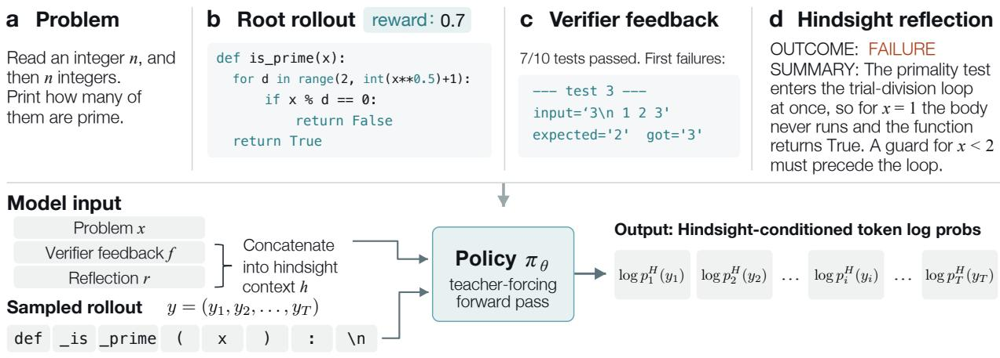

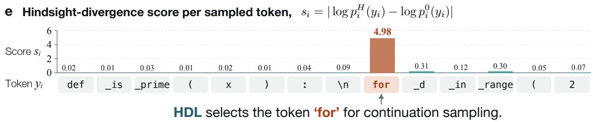

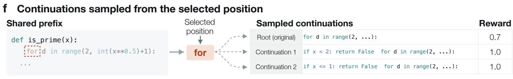  
Figure 1 | Hindsight-divergence localization on a coding example. The root’s primality test incorrectly accepts 1 as prime. Verifier feedback prompts a reflection identifying the missing guard for $x < 2 .$ . Hindsight re-scoring produces the largest absolute log-likelihood change at for, which HDL selects as a branch point. Fresh continuations are sampled under the original task context while reusing the preceding prefix. The illustrated continuations introduce alternative guards before the loop, increasing the reward from 0.7 to 1.0.

Recent hindsight self-distillation methods use completed trajectories and their outcomes to derive token-level supervision, improving performance on reasoning and agentic tasks (Ma et al., 2026; Yeo et al., 2026; Li et al., 2026b). These methods compare the model’s token predictions with and without hindsight to guide updates on its own sampled trajectories. The same comparison can also reveal which earlier choices the model reconsiders after feedback, even when it was initially confident. This motivates selecting branch points according to how much hindsight changes the model’s assessment of those choices.

We introduce Hindsight-Divergence Localization (HDL). Given a completed root trajectory and verifier feedback, the rollout policy generates a hindsight reflection. HDL re-scores the sampled tokens with and without a hindsight context containing the feedback and reflection. The absolute change in each sampled token’s log-likelihood defines its hindsight-divergence score. HDL selects the highest-scoring positions as branch points, localizing where the model changes its mind after feedback. Figure 1 illustrates HDL on a code-generation task: counting the primes in a list of integers. The root’s primality test incorrectly accepts 1 as prime. Verifier feedback prompts a reflection identifying the missing guard for $x < 2$ , and the largest log-likelihood change occurs at for, where the root proceeds to the loop without this check.

To form a training group, HDL generates a small number of complete roots and fills the remaining slots with continuations from the selected positions. Each continuation reuses the corresponding root prefix and samples a fresh sufix under the original rollout context; hindsight information is used only for branch selection. In Figure 1’s example, continuations from the selected for position retain the function definition and explore alternative guards before the loop. Their verified outcomes provide feedback on alternative choices from the same history. Roots and continuations use the same group-relative objective, with continuation losses restricted to newly generated sufixes. Prefix reuse reduces generation cost, while the new sufixes concentrate additional exploration and learning around the selected decisions.

We evaluate HDL with three models across math, code, and agent tasks. At matched group sizes and training steps, HDL efectively halves the rollout generation budget relative to GRPO, cutting token usage by up to 61% and accelerating wall-clock time by up to 45%. Task performance improves across all three domains, with the largest gains reaching 12.5 points on agent tasks.

## 2. Related work

Eficient RLVR. Existing work improves RLVR eficiency through faster rollouts and selective use of generated data. AReaL decouples generation from training and supports interruptible rollouts across policy updates (Fu et al., 2025); Kimi k1.5 carries unfinished rollouts across training iterations (Kimi Team, 2025). DAPO filters groups with uniform rewards and samples additional groups until the training batch is filled (Yu et al., 2025). Token-selective RL updates only high-entropy tokens after generating complete trajectories (Wang et al., 2025). HDL reduces generation through prefix reuse while preserving the group size and RL objective.

Branch-point selection. Branching methods reuse prefixes to sample from intermediate states. TreeRL uses policy uncertainty to guide tree expansion (Hou et al., 2025), while BPO selects high-entropy action states and computes advantages from sibling returns (He et al., 2026). InfoTree combines value estimates, exploration bonuses, and token entropy to allocate tree expansions (Hu et al., 2026). PivotRL samples local actions from intermediate states in existing SFT trajectories and retains turns with mixed outcomes (Yi et al., 2026). PivoARL and $\mathrm { R ^ { 3 } L }$ use reflection to identify retry points and guide the regenerated continuations (Guo et al., 2026; Shi et al., 2026). HDL derives branch points from changes in sampled-token log-likelihood rather than explicit error locations. It samples continuations under the original rollout context without reflection guidance and retains the group-relative objective.

On-policy self-distillation. On-policy self-distillation uses a model conditioned on additional information to supervise its own sampled trajectories. SDPO conditions the self-teacher on environment feedback or successful rollouts to obtain token-level supervision (Hübotter et al., 2026). RLSD uses answer-conditioned token likelihoods to reweight group-relative advantages (Yang et al., 2026), while SRPO routes trajectories between GRPO and self-distillation according to their outcomes and the availability of successful peers (Li et al., 2026a). Other methods tailor hindsight supervision to particular decisions. SD-Search conditions on group search traces and outcomes to supervise search-query tokens (Ma et al., 2026). HINT-SD uses full-trajectory hindsight to identify action spans for feedback-conditioned distillation (Yeo et al., 2026). HSD uses successful peer trajectories to concentrate supervision near the divergence from a failed path (Li et al., 2026b). HDL similarly compares token likelihoods with and without hindsight, but uses their absolute log-likelihood diference to rank branch points rather than for token-level supervision.

## 3. Hindsight-Divergence Localization

Group Relative Policy Optimization (GRPO) (Shao et al., 2024) samples a group of $G$ complete trajectories $\{ \boldsymbol { y } ^ { ( j ) } \} _ { j = 1 } ^ { G }$ independently from the rollout policy $\pi _ { \theta _ { \mathrm { o l d } } }$ for each problem �. A task verifier assigns each trajectory a reward $R _ { j } = R ( x , y ^ { ( j ) } )$ . GRPO uses these rewards to assess each trajectory relative to the group. The mean-centered advantage $\begin{array} { r } { A _ { j } = R _ { j } - \frac { 1 } { G } \sum _ { k = 1 } ^ { G } R _ { k } } \end{array}$ is positive for trajectories whose rewards exceed the group mean and negative for those below it.

HDL first samples $M < G$ complete trajectories as roots. It uses verifier feedback and hindsight reflections to select branch points within these roots, then fills the remaining $G - M$ slots with continuations from those positions.

## 3.1. Hindsight-conditioned scoring

Let $y = ( y _ { 1 } , \dots , y _ { T } )$ denote one root trajectory and $f$ its verifier feedback. Given the problem $x ,$ , the completed root $y ,$ and $f ,$ the rollout policy generates a reflection � that interprets the outcome in relation to earlier decisions. The feedback and reflection form the hindsight context $h = [ f ; r ]$

HDL re-scores the root by feeding its recorded tokens back as inputs for predicting subsequent tokens. This teacher-forced evaluation conditions the prediction at position � on the original root prefix $y _ { < i }$ . For each policy-generated token $y _ { i }$ , the next-token distributions under the original and hindsight-conditioned contexts are

$$
p _ { i } ^ { 0 } ( \cdot ) = \pi _ { \theta _ { \mathrm { o l d } } } ( \cdot \mid x , y _ { < i } ) , \qquad p _ { i } ^ { H } ( \cdot ) = \pi _ { \theta _ { \mathrm { o l d } } } ( \cdot \mid x , h , y _ { < i } ) .\tag{1}
$$

Both distributions use the same policy parameters and the same root prefix $y _ { < i } ;$ only the hindsight context difers.

## 3.2. Branch-point selection

To identify decisions whose assessment changes under hindsight, HDL scores each sampled token $y _ { i }$ by the absolute change in its log-likelihood:

$$
s _ { i } = \left| \log p _ { i } ^ { H } ( y _ { i } ) - \log p _ { i } ^ { 0 } ( y _ { i } ) \right| .\tag{2}
$$

We refer to $s _ { i }$ as the hindsight-divergence score. After the outcome is known, hindsight may increase the likelihood of tokens at key steps in a successful trajectory. In a failed trajectory, it may decrease the likelihood of tokens at a step where an error occurred. Taking the absolute value captures both increased and decreased support for the sampled token.

HDL ranks candidate positions within each root by $s _ { i }$ and selects the highest-scoring positions as branch points.

## 3.3. Localized group construction

The selected branch points determine where to sample the remaining � − � trajectories. Given a root � and branch point �, HDL reuses the prefix $y _ { < i }$ and samples a fresh sufix under the original task context:

$$
\widetilde { y } _ { \geq i } \sim \pi _ { \theta _ { \mathrm { o l d } } } ( \cdot \ : | \ : x , y _ { < i } ) .\tag{3}
$$

The prefix and sufix form a complete trajectory $\widetilde { y } = y _ { < i } \| \widetilde { y } _ { \geq i }$ . Section 4.1 specifies the default root count � and allocation of the � − � continuations across roots and branch points; Section 4.5 compares alternative branching configurations.

The � roots and � − � continuations form a single training group, whose verifier rewards determine the advantages $A _ { j }$ defined above. The policy is optimized with the same objective as the GRPO baseline. Each root contributes policy loss over its generated tokens. For a continuation, the reused prefix provides context, and the loss is applied only to newly sampled tokens. This avoids counting the shared prefix again in each continuation’s loss and focuses its learning signal on the decisions explored after branching.

## 4. Evaluation

## 4.1. Experimental setup

Tasks and training data. We study three domains with verifiable outcomes: Math, Code, and Agent.

• Math. We draw problems from DeepMath-103K (He et al., 2025). Before training, we use the initial policy to filter out problems that are either too easy or too dificult, retaining 4,555 unique problems. Exact-answer verification provides a binary reward. Feedback consists of a correctness verdict and, for incorrect solutions, the predicted and reference answers.

• Code. We combine the TACO and PrimeIntellect subsets of DeepCoder (Agentica Team, 2025) with the seed\_testcase subset of rStar-Coder (Liu et al., 2025a). Applying the same filtering procedure leaves 4,063 unique problems. Programs are executed against stdin/stdout tests; the reward is the fraction of tests passed, and the feedback reports the pass count and details of the first failing tests.

• Agent. We use ScienceWorld (Wang et al., 2022), a text-based interactive environment in which an agent completes elementary-science tasks by navigating rooms and manipulating objects through natural-language actions. Its training split contains 1,856 task–variation pairs across 30 task types after limiting each type to at most 200 variations. Episodes are limited to 30 actions. The reward is the environment’s cumulative subgoal score normalized to [0, 1], and the feedback reports the final score and whether the task was completed.

Models. We evaluate HDL on Qwen3-4B, Qwen3-8B (Qwen Team, 2025), and Llama-3.1-Nemotron-Nano-8B-v1 (NVIDIA, 2025), abbreviated as Llama3.1-8B. Qwen3 uses thinking mode for Math and Code and non-thinking mode for Agent; Llama3.1-8B uses its reasoning system prompt. Hindsight reflections are generated in non-thinking mode for all models (prompt template in Appendix B.1).

Training. All experiments use the slime framework (Zhu et al., 2025) on four nodes, each equipped with four GB200 GPUs. All methods share the same training settings: 128 problems per step, �=16 trajectories per group, 200 optimization steps, learning rate 10−6, and sampling temperature 1.0.

Math and Code responses are limited to 32,768 tokens. Agent trajectories, including environment observations, are limited to 8,192 tokens for Qwen3 and 16,384 for Llama3.1. The same length limits apply during evaluation. We train all methods with GRPO, omitting group standard-deviation normalization following Dr. GRPO (Liu et al., 2025b). Losses are aggregated at the token level. We use asymmetric clipping with lower and upper thresholds of 0.2 and 0.28, respectively, and no KL penalty.

Rollout protocols. GRPO independently samples �=16 complete trajectories per problem. DAPO uses dynamic sampling (Yu et al., 2025), filtering out groups with uniform rewards and sampling additional complete trajectories to replace them.

HDL samples �=2 complete roots per problem. For each root, it selects the two positions with the highest hindsight-divergence scores and allocates three and four continuations to these positions. Including the roots, this gives �=2 × (1 + 3 + 4)=16 trajectories per group. Each continuation reuses its root prefix and samples a fresh sufix under the original rollout context. We compare alternative branching configurations in Section 4.5.

For the localization-signal comparison in Section 4.4, we compare HDL with two alternative localization methods:

Entropy follows the use of policy entropy to guide branching in TreeRL (Hou et al., 2025) and BPO (He et al., 2026). It ranks candidate positions by the entropy of the next-token distribution conditioned on the problem and root prefix, without verifier feedback or hindsight context.

Reflection uses explicit self-reflection to identify retry points, as in PivoARL (Guo et al., 2026) and R3L (Shi et al., 2026). Given the completed root and verifier feedback, the policy is prompted to identify the earliest erroneous step, or a step worth revisiting when the root is successful (prompt templates in Appendix B.2). The returned step indices are mapped to branch points.

Both alternatives use the same root–continuation allocation, original-context continuation sampling, and RL objective as HDL.

Evaluation. For task performance, we evaluate mathematical reasoning on AIME24 (math-ai, 2024), AIME25 (math-ai, 2025), AIME26 (math-ai, 2026), HMMT February 2026 (MathArena, 2026), Minerva Math (Lewkowycz et al., 2022), and OlympiadBench (He et al., 2024); code generation on LiveCodeBench v5 and v6 (Jain et al., 2024); and agent performance on held-out ScienceWorld task variations (Wang et al., 2022). For Math and Code, we report average accuracy over � independently sampled responses per problem (avg@�): �=16 for AIME and HMMT, �=8 for Minerva Math and LiveCodeBench, and �=4 for OlympiadBench. For Agent, we average task scores over four episodes per held-out variation. Evaluation is performed every 10 training steps with a sampling temperature of 0.6. For each method and model, we select the three checkpoints with the highest average benchmark score within each domain and report the mean and standard deviation of each metric across these checkpoints.

For rollout eficiency, we report generated tokens and end-to-end rollout wall-clock time per training step. Token counts include HDL’s hindsight reflections and candidates discarded by DAPO’s dynamic sampling. Wall-clock time covers the full rollout pipeline, including reflection generation and hindsight scoring for HDL.

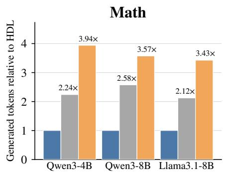

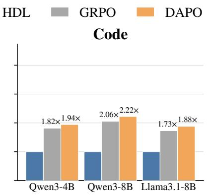

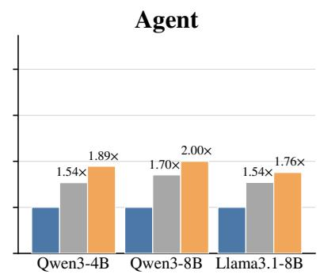  
Figure 2 | HDL reduces generated tokens by 35–61% relative to GRPO. Bars show mean generated tokens per training step, normalized to HDL within each model–task pair; annotations give the corresponding cost ratios.

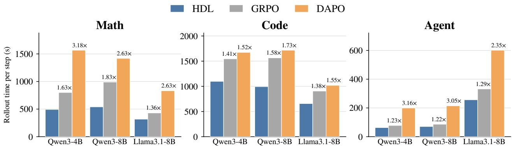  
Figure 3 | HDL reduces end-to-end rollout time by 18–45% relative to GRPO. Bars show mean seconds per training step on identical hardware; annotations give time ratios relative to HDL. Each task uses a separate vertical scale.

## 4.2. Rollout eficiency

HDL cuts generated tokens by 35–61% and end-to-end rollout wall-clock time by 18–45% relative to GRPO. These savings hold across all three models on Math, Code, and Agent tasks. Figures 2 and 3 report the corresponding costs per training step.

Generated tokens. The largest reductions relative to GRPO occur on Math, where HDL more than halves generation for every model (Figure 2). For Qwen3-8B, mean generation falls from 27.28M to 10.59M tokens per training step. Compared with DAPO, HDL reduces generated tokens by 43–75% across the three domains.

Rollout wall-clock time. The generation savings translate into faster rollout collection for every model and task (Figure 3). HDL achieves 1.22×–1.83× rollout speedups over GRPO and 1.52×–3.18× over DAPO, corresponding to 34–69% less rollout time than DAPO. Thus, prefix reuse yields substantial savings in the complete rollout pipeline even after accounting for HDL’s localization overhead.

Table 1 | Math. Scores $( \% , \uparrow )$ on six benchmarks and their unweighted average $\left( \mathrm { A v g . } \right)$ . Entries show $\mathrm { m e a n } _ { \pm \mathrm { s t d } }$ over the three checkpoints with the highest Avg. Bold and underlining mark the best and second-best means within each model, respectively.
<table><tr><td>Method</td><td>AIME24</td><td>AIME25</td><td>AIME26</td><td>HMMT</td><td>Minerva</td><td>Olympiad</td><td>Avg.</td></tr><tr><td colspan="8">Qwen3-4B</td></tr><tr><td>GRPO</td><td> $\mathbf { 7 4 . 5 1 _ { \pm 0 . 2 6 } }$ </td><td> $6 5 . 6 2 _ { \pm 0 . 7 4 }$ </td><td> $6 6 . 4 6 _ { \pm 0 . 2 9 }$ </td><td> $\underline { { 1 9 . 4 4 } } _ { \pm 0 . 3 9 }$ </td><td> $\underline { { 3 1 . 1 3 } } _ { \pm 0 . 4 5 }$ </td><td> $5 2 . 2 5 _ { \pm 0 . 1 6 }$ </td><td> $5 1 . 5 7 _ { \pm 0 . 0 7 }$ </td></tr><tr><td>DAPO</td><td> $\underline { { 7 4 . 5 1 } } _ { \pm 0 . 6 0 }$ </td><td> ${ \bf 6 8 . 8 2 _ { \pm 0 . 3 5 } }$ </td><td> ${ \bf 6 8 . 9 6 _ { \pm 0 . 5 1 } }$ </td><td> $1 8 . 3 7 _ { \pm 0 . 5 4 }$ </td><td> $\mathbf { 3 1 . 2 0 _ { \pm 0 . 3 2 } }$ </td><td> $5 3 . 0 4 _ { \pm 0 . 1 0 }$  </td><td> ${ \bf 5 2 . 4 8 _ { \pm 0 . 0 2 } }$ </td></tr><tr><td>HDL</td><td> $7 3 . 1 2 _ { \pm 0 . 6 8 }$ </td><td> $\underline { { 6 7 . 0 1 } } _ { \pm 0 . 8 0 }$ </td><td> $\underline { { 6 7 . 5 7 } } _ { \pm 1 . 5 2 }$ </td><td> $\mathbf { 1 9 . 8 9 _ { \pm 1 . 0 7 } }$ </td><td> $3 0 . 3 8 _ { \pm 0 . 2 1 }$ </td><td> ${ \bf 5 3 . 1 8 _ { \pm 0 . 4 5 } }$ </td><td> $\underline { { 5 1 . 8 6 } } _ { \pm 0 . 1 4 }$ </td></tr><tr><td colspan="8">Qwen3-8B</td></tr><tr><td>GRPO</td><td> $\underline { { 7 5 . 6 2 } } _ { \pm 0 . 3 4 }$ </td><td> $6 8 . 4 0 _ { \pm 0 . 6 4 }$ </td><td> $6 8 . 3 3 _ { \pm 2 . 7 8 }$ </td><td> $2 1 . 0 9 _ { \pm 1 . 1 7 }$ </td><td> $\mathbf { 3 2 . 7 2 _ { \pm 0 . 1 0 } }$ </td><td> $5 2 . 8 6 _ { \pm 0 . 2 9 }$ </td><td> $5 3 . 1 7 _ { \pm 0 . 1 3 }$ </td></tr><tr><td>DAPO</td><td> $7 4 . 8 6 _ { \pm 0 . 6 9 }$ </td><td> $\underline { { 6 9 . 5 8 } } _ { \pm 0 . 3 4 }$ </td><td> ${ \bf 6 9 . 1 7 _ { \pm 0 . 7 4 } }$ </td><td> $\underline { { 2 1 . 4 6 } } _ { \pm 1 . 2 0 }$ </td><td> $\underline { { 3 2 . 5 7 } } _ { \pm 0 . 1 8 }$ </td><td> $5 3 . 2 0 _ { \pm 0 . 0 8 }$ </td><td> $5 3 . 4 7 _ { \pm 0 . 1 3 }$ </td></tr><tr><td>HDL</td><td> ${ \bf 7 5 . 9 7 _ { \pm 0 . 8 7 } }$ </td><td> ${ \bf 7 0 . 5 6 _ { \pm 0 . 3 5 } }$ </td><td> $\underline { { 6 9 . 1 0 } } _ { \pm 0 . 5 5 }$ </td><td> $\mathbf { 2 3 . 3 0 _ { \pm 0 . 1 5 } }$ </td><td> $3 2 . 4 9 _ { \pm 0 . 1 4 }$ </td><td> ${ \bf 5 3 . 5 2 _ { \pm 0 . 3 5 } }$ </td><td> $\mathbf { 5 4 . 1 6 _ { \pm 0 . 1 0 } }$ </td></tr><tr><td colspan="8">Llama3.1-8B</td></tr><tr><td>GRPO</td><td> $\underline { { 6 8 . 6 8 } } _ { \pm 0 . 9 4 }$ </td><td> $5 5 . 7 6 _ { \pm 0 . 9 8 }$ </td><td> $\underline { { 6 5 . 6 9 } } _ { \pm 0 . 5 5 }$ </td><td> $\underline { { 2 7 . 9 0 } } _ { \pm 0 . 5 0 }$ </td><td> $\underline { { 2 9 . 2 0 } } _ { \pm 0 . 1 8 }$ </td><td> $6 1 . 7 0 _ { \pm 0 . 8 7 }$ </td><td> $\underline { { 5 1 . 4 9 } } _ { \pm 0 . 3 4 }$ </td></tr><tr><td>DAPO</td><td> ${ \bf 7 0 . 3 5 _ { \pm 0 . 4 9 } }$ </td><td> $\mathbf { 5 9 . 8 6 } _ { \pm 0 . 6 4 }$ </td><td> $\mathbf { 6 8 . 7 5 _ { \pm 0 . 8 8 } }$ </td><td> $2 7 . 5 9 _ { \pm 1 . 3 5 }$ </td><td> ${ \bf 2 9 . 8 1 _ { \pm 0 . 3 1 } }$ </td><td> ${ \bf 6 3 . 6 9 _ { \pm 0 . 4 3 } }$ </td><td> ${ \bf 5 3 . 3 4 _ { \pm 0 . 4 5 } }$ </td></tr><tr><td>HDL</td><td> $6 8 . 1 9 _ { \pm 0 . 6 0 }$ </td><td> $5 5 . 2 8 _ { \pm 1 . 1 6 }$ </td><td> $6 4 . 0 3 _ { \pm 1 . 1 3 }$ </td><td> $\mathbf { 2 9 . 0 4 } _ { \pm 1 . 1 8 }$ </td><td> $2 8 . 8 6 _ { \pm 0 . 2 5 }$  </td><td> $\underline { { 6 2 . 9 5 } } _ { \pm 0 . 5 5 }$  </td><td> $5 1 . 3 9 _ { \pm 0 . 1 9 }$ </td></tr></table>

Table 2 | Code. Avg@8 accuracy on LCB v5 and v6 (%, ↑).  
Table 3 | Agent. Mean task-completion score on ScienceWorld (%, ↑).
<table><tr><td>Model</td><td>GRPO</td><td>DAPO</td><td>HDL</td><td>Model</td><td>GRPO</td><td>DAPO</td><td>HDL</td></tr><tr><td>Qwen3-4B</td><td> $\underline { { 5 4 . 0 2 } } _ { \pm 0 . 1 2 }$ </td><td> $5 3 . 5 5 _ { \pm 0 . 0 9 }$ </td><td> $\mathbf { 5 4 . 1 5 _ { \pm 0 . 1 0 } }$ </td><td>Qwen3-4B</td><td> $5 7 . 7 6 _ { \pm 0 . 4 5 }$ </td><td> $\underline { { 6 0 . 8 4 } } _ { \pm 0 . 2 9 }$ </td><td> ${ \bf 6 7 . 4 4 _ { \pm 1 . 4 2 } }$ </td></tr><tr><td>Qwen3-8B</td><td> $5 5 . 4 2 _ { \pm 0 . 2 2 }$ </td><td> $5 4 . 8 8 _ { \pm 0 . 0 8 }$ </td><td> $\mathbf { 5 5 . 5 6 _ { \pm 0 . 0 9 } }$ </td><td>Qwen3-8B</td><td> $5 9 . 5 0 _ { \pm 0 . 1 5 }$ </td><td> $\underline { { 6 0 . 8 0 } } _ { \pm 0 . 5 2 }$ </td><td> $\mathbf { 7 1 . 9 6 _ { \pm 1 . 5 5 } }$ </td></tr><tr><td>Llama3.1-8B</td><td> $\mathbf { 5 4 . 8 7 _ { \pm 0 . 4 3 } }$ </td><td> $\underline { { 5 4 . 4 8 } } _ { \pm 0 . 4 7 }$ </td><td> $5 4 . 3 4 _ { \pm 0 . 2 9 }$ </td><td>Llama3.1-8B</td><td> $6 9 . 9 4 _ { \pm 1 . 2 2 }$ </td><td> ${ \bf 7 5 . 3 5 _ { \pm 0 . 8 6 } }$ </td><td> $\underline { { 7 1 . 8 1 } } _ { \pm 0 . 9 7 }$ </td></tr></table>

Entries report mean $\pm \mathrm { s t d }$ over the three checkpoints with the highest average score in each domain. Bold and underlining indicate the best and second-best means within each model.

## 4.3. Downstream task performance

HDL delivers task-performance gains alongside its rollout savings, reaching up to 12.46 percentage points over GRPO on Agent tasks (Tables 1–3).

Mathematical reasoning and code generation. HDL outperforms GRPO on both Qwen3 models in Math and Code. On Qwen3-8B Math, HDL achieves the highest average score (54.16%), outperforming both GRPO (53.17%) and DAPO (53.47%). On Qwen3-4B, HDL scores 51.86%, outperforming GRPO and remaining within 0.62 points of DAPO, despite DAPO consuming nearly four times as many tokens. On Code tasks, HDL achieves the highest accuracy on both Qwen3-4B (54.15%) and Qwen3-8B (55.56%). HDL achieves these results with substantially fewer generated tokens.

Agent. The most pronounced performance gains emerge in the Agent domain (ScienceWorld), where multi-step sequential execution creates challenging credit assignment problems. HDL improves over standard GRPO by 9.68 points on Qwen3-4B (67.44% vs 57.76%) and by 12.46 points on Qwen3-8B (71.96% vs 59.50%), while also outperforming DAPO by 6.60 and 11.16 points, respectively.

In long-horizon interactive environments, early sub-optimal actions (such as navigating to an incorrect room or selecting the wrong tool) cascade into irreversible failure, causing independently sampled rollouts to redundantly explore failed trajectories from scratch. By localizing the critical turning points in hindsight and branching multiple fresh sufixes, HDL efectively rescues near-failure episodes. This creates high-contrast advantage groups with informative reward variance, accelerating policy improvement on interactive decision-making tasks.

Table 4 | Localization-signal comparison on Qwen3-8B. Scores (%, ↑) are reported as $\mathrm { m e a n } _ { \pm \mathrm { s t d } }$ over the three checkpoints with the highest average score in each domain. Bold and underlining mark the best and second-best means.
<table><tr><td>Task</td><td>HDL</td><td>Entropy</td><td>Reflection</td></tr><tr><td>Math</td><td> $\mathbf { 5 4 . 1 6 _ { \pm 0 . 1 0 } }$ </td><td> $\underline { { 5 4 . 0 2 } } _ { \pm 0 . 2 5 }$ </td><td> $5 3 . 1 2 _ { \pm 0 . 0 5 }$ </td></tr><tr><td>Code</td><td> $\mathbf { 5 5 . 5 6 _ { \pm 0 . 0 9 } }$ </td><td> $5 5 . 3 7 _ { \pm 0 . 2 6 }$ </td><td> $5 3 . 9 5 _ { \pm 0 . 1 0 }$ </td></tr><tr><td>Agent</td><td> $\mathbf { 7 1 . 9 6 _ { \pm 1 . 5 5 } }$ </td><td> $\underline { { 6 6 . 2 9 } } _ { \pm 1 . 5 9 }$ </td><td> $6 5 . 4 2 _ { \pm 0 . 6 6 }$ </td></tr></table>

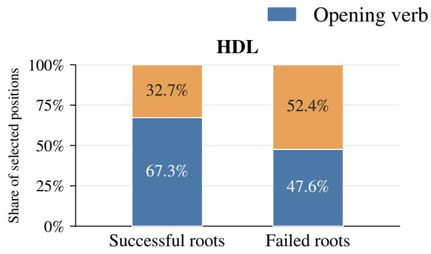

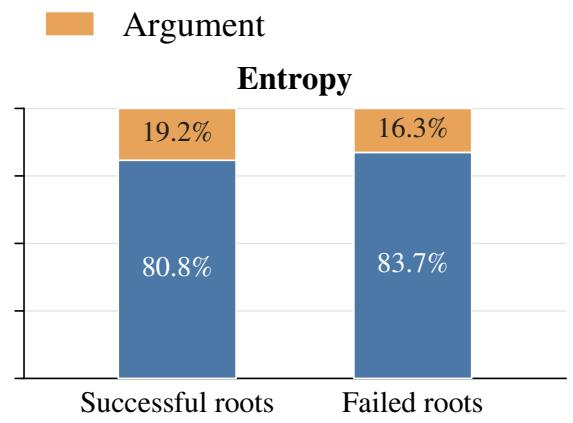  
Figure 5 | Proportions of HDL and Entropy branch points on opening verbs and arguments in successful and failed roots.

## 4.4. Comparison of localization signals

To evaluate the choice of localization signal, we compare HDL with Entropy and Reflection on Qwen3- 8B under the same training settings, root–continuation allocation, and branch-point constraints. HDL achieves the highest scores in all three domains (Table 4). Its advantage is largest on Agent tasks, where it exceeds Entropy and Reflection by 5.67 and 6.54 percentage points, respectively. We examine their branch-point selections on ScienceWorld to understand this diference.

Figure 4 illustrates a single interaction step in Science-World. The agent observes the current state, generates an action, and receives feedback from the environment. Within the action, the opening verb connect specifies the operation, while its arguments identify the bulb’s cathode and the battery’s anode.

Comparison with Entropy. Entropy’s preference for opening verbs is nearly unchanged by root outcome (Figure 5): 80.8% of its branch points fall on verbs in successful roots and 83.7% in failed roots. This bias reflects action structure: many operations compete at the opening verb, while choosing one constrains the argu-

Task: Test whether unknown substance J conducts electricity.

Observation: J connects the battery to the bulb’s anode. The bulb is of; its cathode is unconnected.

Thought: Complete the circuit to test J.

Action: connect red light bulb cathode to battery anode

Feedback: Bulb cathode connected to battery anode.

## Figure 4 | A single ScienceWorld interaction step.

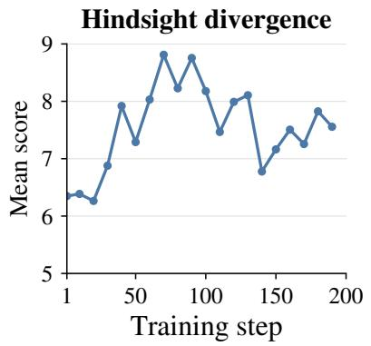

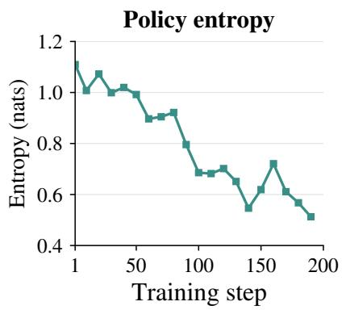

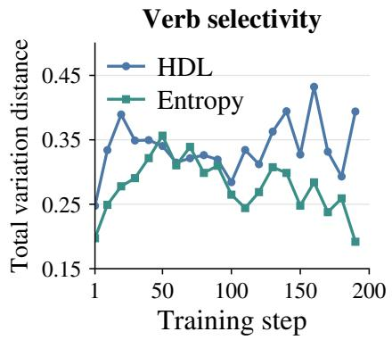  
Figure 6 | Localization signals and verb selectivity. Left and middle: mean signal at positions selected by HDL and Entropy, respectively. Right: verb selectivity, measured by total variation distance (TVD). Higher values indicate stronger preferences for particular opening verbs.

Table 5 | Branching configurations on Qwen3-8B Agent. Points are counted per root. Tokens and rollout time are per-step means.
<table><tr><td>Roots × Points</td><td>Continuations per root</td><td>Score (%) ↑</td><td>Tokens (M) ↓</td><td>Time (s) ↓</td></tr><tr><td>2 × 2 (default)</td><td>3+4</td><td> $\mathbf { 7 1 . 9 6 _ { \pm 1 . 5 5 } }$ </td><td>0.27</td><td>70.46</td></tr><tr><td> $2 \times 1$ </td><td>7</td><td> $7 1 . 0 9 { \scriptstyle \pm 0 . 2 9 }$ </td><td>0.25</td><td>59.97</td></tr><tr><td> $4 \times 2$ </td><td> $1 + 2$ </td><td> $6 7 . 8 7 _ { \pm 0 . 4 4 }$ </td><td>0.31</td><td>68.07</td></tr></table>

ments that follow. HDL, by contrast, places more branch

points on arguments in failed roots than in successful

roots (52.4% vs. 32.7%), allowing continuations to vary the object or destination while retaining the operation.

Entropy also weakens during training (Figure 6). Mean entropy at its selected positions falls from 1.03 in steps 1–50 to 0.57 in steps 151–200. Over the same windows, Entropy’s selected verbs move closer to the distribution of all opening verbs in the same roots (TVD 0.278 to 0.246), so its selections increasingly track verb frequency rather than a distinct subset. HDL’s mean hindsight-divergence score rises from 6.85 to 7.78, while its selected verbs remain more distinct from the root distribution (TVD 0.329 to 0.348).

Comparison with Reflection. Reflection prompts the model to specify revisit points directly. Some returned position identifiers cannot be parsed or mapped to valid positions. More often, the proposed points are too close together, so only one is retained. Reflection consequently yields an average of 3.22 branch points per group, compared with 3.95 for HDL, out of a maximum of four. Even when only one valid branch point remains for a root, we sample all of its allocated continuations from that point to maintain the same group size.

## 4.5. Comparison of branching configurations

With HDL as the localization signal, we compare three branching configurations on Qwen3-8B Agent at the same group size (Table 5). Each configuration is written as roots × branch points per root, with 2 × 2 as the default.

The default 2 × 2 achieves the highest score (71.96%). Reducing the number of branch points per root to one (2 × 1) concentrates all seven continuations at a single position. This reduces rollout time by 15%, at a 0.87-point decrease in task score.

Increasing the number of roots to four (4 × 2) leaves only one or two continuations per branch point. This configuration generates more tokens and scores 4.09 points below the default. Together, these comparisons favor revisiting multiple positions within each root while retaining several continuations per position.

## 5. Conclusion

We introduced Hindsight-Divergence Localization (HDL) to allocate rollout generation to intermediate decisions that the model reconsiders after feedback. HDL identifies these positions through hindsight induced changes in token log-likelihoods, then builds training groups from a small number of complete roots and continuations sampled under the original task context. Prefix reuse reduces generation cost, while the new sufixes concentrate additional exploration and learning around the selected decisions. Experiments with three models across math, code, and agent tasks show that HDL reduces generated tokens by 35–61% and rollout wall-clock time by 18–45% relative to GRPO, while improving task performance across all three domains, with gains of up to 12.5 percentage points on agent tasks. In controlled comparisons, HDL also achieves higher task scores than entropy-based and reflection-based localization methods, supporting hindsight divergence as a criterion for deciding where to branch.

## References

Agentica Team. DeepCoder: A fully open-source 14B coder at o3-mini level. https:// agentica-project.com/, 2025.

DeepSeek-AI. DeepSeek-R1: Incentivizing reasoning capability in LLMs via reinforcement learning. arXiv preprint arXiv:2501.12948, 2025.

Wei Fu, Jiaxuan Gao, Xujie Shen, Chen Zhu, Zhiyu Mei, Chuyi He, Shusheng Xu, Guo Wei, Jun Mei, Jiashu Wang, Tongkai Yang, Binhang Yuan, and Yi Wu. AReaL: A large-scale asynchronous reinforcement learning system for language reasoning. arXiv preprint arXiv:2505.24298, 2025.

Weiyang Guo, Zesheng Shi, Longhui Zhang, Zeen Zhu, Min Zhang, and Jing Li. Agent reinforcement learning via pivotal-aware self-feedback retry. arXiv preprint arXiv:2607.03702, 2026.

Bowei He, Yankai Chen, Xiaokun Zhang, and Xue Liu. Branching policy optimization: Sandboxnative language agent reinforcement learning. arXiv preprint arXiv:2607.14171, 2026.

Chaoqun He, Renjie Luo, Yuzhuo Bai, Shengding Hu, Zhen Leng Thai, Junhao Shen, Jinyi Hu, Xu Han, Yujie Huang, Yuxiang Zhang, Jie Liu, Lei Qi, Zhiyuan Liu, and Maosong Sun. Olympiad Bench: A challenging benchmark for promoting AGI with olympiad-level bilingual multimodal scientific problems. arXiv preprint arXiv:2402.14008, 2024.

Zhiwei He, Tian Liang, Jiahao Xu, Qiuzhi Liu, Xingyu Chen, Yue Wang, Linfeng Song, Dian Yu, Zhenwen Liang, Wenxuan Wang, Zhuosheng Zhang, Rui Wang, Zhaopeng Tu, Haitao Mi, and Dong Yu. DeepMath-103K: A large-scale, challenging, decontaminated, and verifiable mathematical dataset for advancing reasoning. arXiv preprint arXiv:2504.11456, 2025.

Zhenyu Hou et al. TreeRL: LLM reinforcement learning with on-policy tree search. In Proceedings of the 63rd Annual Meeting of the Association for Computational Linguistics, 2025.

Yuelin Hu, Zhenbo Yu, Zhengxue Cheng, Wei Liu, and Li Song. Maximizing rollout informativeness under a fixed budget: A submodular view of tree search for tool-use agentic reinforcement learning. arXiv preprint arXiv:2605.05262, 2026.

Jonas Hübotter, Frederike Lübeck, Lejs Behric, Anton Baumann, Marco Bagatella, Daniel Marta, Ido Hakimi, Idan Shenfeld, Thomas Kleine Buening, Carlos Guestrin, and Andreas Krause. Reinforcement learning via self-distillation. arXiv preprint arXiv:2601.20802, 2026.

Naman Jain, King Han, Alex Gu, Wen-Ding Li, Fanjia Yan, Tianjun Zhang, Sida Wang, Armando Solar-Lezama, Koushik Sen, and Ion Stoica. LiveCodeBench: Holistic and contamination free evaluation of large language models for code. arXiv preprint arXiv:2403.07974, 2024.

Kimi Team. Kimi k1.5: Scaling reinforcement learning with LLMs. arXiv preprint arXiv:2501.12599, 2025.

Nathan Lambert, Jacob Morrison, Valentina Pyatkin, et al. Tülu 3: Pushing frontiers in open language model post-training. arXiv preprint arXiv:2411.15124, 2024.

Aitor Lewkowycz, Anders Andreassen, David Dohan, Ethan Dyer, Henryk Michalewski, Vinay Ramasesh, Ambrose Slone, Cem Anil, Imanol Schlag, Theo Gutman-Solo, Yuhuai Wu, Behnam Neyshabur, Guy Gur-Ari, and Vedant Misra. Solving quantitative reasoning problems with language models. arXiv preprint arXiv:2206.14858, 2022.

Gengsheng Li, Tianyu Yang, Junfeng Fang, Mingyang Song, Mao Zheng, Haiyun Guo, Dan Zhang, Jinqiao Wang, and Tat-Seng Chua. Unifying group-relative and self-distillation policy optimization via sample routing. arXiv preprint arXiv:2604.02288, 2026a.

Yu Li, Shu Hong, and Tian Lan. Localizing credit at the divergence: Path-conditioned self-distillation for LLM reasoning. arXiv preprint arXiv:2606.15576, 2026b.

Yifei Liu, Li Lyna Zhang, Yi Zhu, Bingcheng Dong, Xudong Zhou, Ning Shang, Fan Yang, and Mao Yang. rStar-Coder: Scaling competitive code reasoning with a large-scale verified dataset. arXiv preprint arXiv:2505.21297, 2025a.

Zichen Liu, Changyu Chen, Wenjun Li, Penghui Qi, Tianyu Pang, Chao Du, Wee Sun Lee, and Min Lin. Understanding R1-Zero-like training: A critical perspective. arXiv preprint arXiv:2503.20783, 2025b.

Yufei Ma, Zihan Liang, Ben Chen, Zhipeng Qian, Huangyu Dai, Lingtao Mao, Xuxin Zhang, Chenyi Lei, and Wenwu Ou. SD-Search: On-policy hindsight self-distillation for search-augmented reasoning. arXiv preprint arXiv:2605.18299, 2026.

math-ai. AIME 2024. https://huggingface.co/datasets/math-ai/aime24, 2024. Benchmark dataset.

math-ai. AIME 2025. https://huggingface.co/datasets/math-ai/aime25, 2025. Benchmark dataset.

math-ai. AIME 2026. https://huggingface.co/datasets/math-ai/aime26, 2026. Benchmark dataset.

MathArena. HMMT February 2026. https://huggingface.co/datasets/MathArena/hmmt\_feb\_ 2026, 2026. Benchmark dataset.

NVIDIA. Llama-Nemotron: Eficient reasoning models. arXiv preprint arXiv:2505.00949, 2025.

Qwen Team. Qwen3 technical report. arXiv preprint arXiv:2505.09388, 2025.

Zhihong Shao, Peiyi Wang, Qihao Zhu, Runxin Xu, Junxiao Song, Xiao Bi, Haowei Zhang, Mingchuan Zhang, YK Li, Yu Wu, and Daya Guo. DeepSeekMath: Pushing the limits of mathematical reasoning in open language models. arXiv preprint arXiv:2402.03300, 2024.

Weijie Shi, Yanxi Chen, Zexi Li, Xuchen Pan, Yuchang Sun, Jiajie Xu, Xiaofang Zhou, and Yaliang Li. $\mathrm { R ^ { 3 } L }$ : Reflect-then-retry reinforcement learning with language-guided exploration, pivotal credit, and positive amplification. arXiv preprint arXiv:2601.03715, 2026.

Ruoyao Wang, Peter Jansen, Marc-Alexandre Côté, and Prithviraj Ammanabrolu. ScienceWorld: Is your agent smarter than a 5th grader? arXiv preprint arXiv:2203.07540, 2022.

Shenzhi Wang, Le Yu, Chang Gao, et al. Beyond the 80/20 rule: High-entropy minority tokens drive efective reinforcement learning for LLM reasoning. arXiv preprint arXiv:2506.01939, 2025.

Chenxu Yang, Chuanyu Qin, Qingyi Si, Minghui Chen, Naibin Gu, Dingyu Yao, Zheng Lin, Weiping Wang, Jiaqi Wang, and Nan Duan. Self-distilled RLVR. arXiv preprint arXiv:2604.03128, 2026.

Woongyeong Yeo, Yumin Choi, Taekyung Ki, and Sung Ju Hwang. HINT-SD: Targeted hindsight self-distillation for long-horizon agents. arXiv preprint arXiv:2605.17873, 2026.

Junkeun Yi, Damon Mosk-Aoyama, Baihe Huang, Ritu Gala, Charles Wang, Sugam Dipak Devare, Khushi Bhardwaj, Abhibha Gupta, Oleksii Kuchaiev, Jiantao Jiao, Jian Zhang, and Venkat Srinivasan. PivotRL: High accuracy agentic post-training at low compute cost. arXiv preprint arXiv:2603.21383, 2026.

Qiying Yu, Zheng Zhang, Ruofei Zhu, et al. DAPO: An open-source LLM reinforcement learning system at scale. arXiv preprint arXiv:2503.14476, 2025.

Zilin Zhu, Chengxing Xie, Xin Lv, and slime Contributors. slime: An LLM post-training framework for RL scaling. https://github.com/THUDM/slime, 2025. GitHub repository.

## A. Limitations

HDL relies on the premise that the policy can reliably interpret verifier feedback to re-score its own decisions. We examine the boundary of this capability across model scales. In its reflection, the policy reports whether the root trajectory succeeded or failed. Table 6 reports the percentage of reflections in which this outcome matches the verifier’s verdict. On Qwen3-8B, the policy achieves near-perfect outcome reporting (99.7–99.9%). However, on Qwen3-1.7B, outcome agreement drops sharply to 76.0% on Math and 56.1% on Code. Even when Math feedback consists of a single word (“Correct.”), the 1.7B policy frequently hallucinates or misattributes the verdict.

Table 6 | Outcome-label agreement. Percentage of reflections whose success/failure label matches the verifier verdict (%, ↑), on identical training pools.  
Table 7 | ScienceWorld across model scales. Scores (%, ↑) are mean±std over the top three checkpoints. Bold marks the best-performing method for each model.
<table><tr><td>Model</td><td>Math</td><td>Code</td></tr><tr><td>Qwen3-8B</td><td>99.7</td><td>99.9</td></tr><tr><td>Qwen3-1.7B</td><td>76.0</td><td>56.1</td></tr></table>

<table><tr><td>Model</td><td>GRPO</td><td>Entropy</td><td>HDL</td></tr><tr><td>Qwen3-1.7B</td><td> $4 5 . 6 6 _ { \pm 0 . 7 5 }$ </td><td> $\mathbf { 4 7 . 5 4 } _ { \pm 0 . 8 5 }$ </td><td> $4 5 . 7 0 _ { \pm 0 . 1 9 }$ </td></tr><tr><td>Qwen3-8B</td><td> $5 9 . 5 0 _ { \pm 0 . 1 5 }$ </td><td> $6 6 . 2 9 _ { \pm 1 . 5 9 }$ </td><td> $\mathbf { 7 1 . 9 6 _ { \pm 1 . 5 5 } }$ </td></tr></table>

As shown in Table 7, on Qwen3-1.7B ScienceWorld, HDL’s performance advantage vanishes, matching GRPO (45.70% vs 45.66%) and trailing Entropy (47.54%). When the model cannot reliably understand its own feedback, hindsight re-scoring can introduce noise into branch-point ranking.

## B. Reflection prompts

## B.1. HDL reflection

HDL uses the following prompt across Math, Code, and Agent tasks. Braced fields contain the problem, root trajectory, and verifier feedback.

{problem}

[A completed attempt] {root}

[Record]

{verifier feedback}

Summarize this attempt in your own words: what approach it took, and why, according to the record, it turned out the way it did. If it went wrong, say what the right approach would have been. Do not quote the attempt verbatim. Do not mention positions, line numbers or percentages.

Answer in exactly this format (60-120 tokens for the summary):

OUTCOME: SUCCESS or FAILURE

SUMMARY: <your summary>

Stop immediately after the summary: write nothing after it.

## B.2. Reflection baseline

The Reflection baseline requests two branch points directly. Math and Code roots are presented as numbered steps; Agent roots are presented as numbered interaction turns. The fields lo and hi specify the allowed index range.

Math and Code.

You attempted this problem:   
{problem}   
Your attempt, split into numbered steps:   
{numbered steps}   
Feedback: {verifier feedback}   
{selection instruction} Then give a second, different step as an alternative.   
Choose steps between {lo} and {hi}. Answer with exactly two lines:   
STEP: <number>   
STEP2: <number>

For failed roots, the selection instruction is:

Identify the EARLIEST step where the attempt goes wrong.

For successful roots, it is:

Identify the step where you would BRANCH to explore a different, potentially better continuation.

## Agent.

You attempted this task:   
{problem}   
Your episode, split into numbered turns:   
{numbered turns}   
Feedback: {verifier feedback}   
{selection instruction} Then give a second, different turn as an alternative.   
Choose turns between {lo} and {hi}. Answer with exactly two lines:   
STEP: <number>   
STEP2: <number>

For failed roots, the selection instruction is:

Identify the EARLIEST turn where the episode goes wrong.

For successful roots, it is:

Identify the turn where you would BRANCH to try a different, potentially better course of action.