# YOU CANNOT RECOVER WHAT WAS NEVER MEA-SURED: QUANTIFYING THE INFORMATION CEILING OF ULTRA-LOW-FIELD MRI SUPER-RESOLUTION

Prathamesh Pradeep Khole<sup>1∗</sup> Shreya Handa<sup>1,2</sup> Utkarsh Gupta<sup>1</sup> Razvan Marinescu<sup>1</sup>   
<sup>1</sup>University of California, Santa Cruz   
<sup>2</sup>Johns Hopkins University

## ABSTRACT

Generative super-resolution models can turn portable 64 mT MRI into images that look like 3T scans, and the field evaluates them with PSNR, SSIM, and pixelwise uncertainty, most often on pairs built by synthetically degrading high-field images. Prior work acknowledges that these models hallucinate and that the problem is ill posed, but to our knowledge no study measures how much information about the individual subject the real low-field scan actually contains. We measure it. Using paired 64 mT and 3T scans of the same subjects from three public datasets, and a measurement protocol validated on tests whose correct answer is known in advance, we find that, judged over the whole brain, real 64 mT scans carry structure specific to the individual only down to approximately 3 to 4 mm halfpitch in plane, and coarser still through plane. Standard synthetic degradations preserve subject information roughly 1 mm beyond this ceiling, so models trained and benchmarked on synthetic pairs are evaluated on information that real scanners never record. We then test trained diffusion models and a publicly released external model on real paired acquisitions; 24 trained runs of five architectures (GAN, diffusion, and transformer families) give the coverage of the audit. On every subject where faithfulness can be measured, fine output detail is no more correlated with the subject’s own 3T scan than with a stranger’s, while samplevariance uncertainty does not distinguish fabricated structure from reconstruction difficulty. Because PSNR and SSIM score resemblance to a reference rather than whether detail belongs to the subject, a benchmark scored by them cannot tell recovery from fabrication. Code for the measurement protocol will be released so that recoverability claims can be tested for newer models.

## 1 INTRODUCTION

Portable 64 mT MRI reaches patients that fixed 3T systems cannot (Sheth et al., 2021), and generative super-resolution models are trained to map its images to 3T appearance (Iglesias et al., 2023). Their evaluation still rests on PSNR and SSIM (Wang et al., 2004) against a high-field reference, most often on pairs built by synthetically degrading high-field images, with a pixelwise uncertainty map as the safety signal. Each of these tools measures how closely the output resembles a reference. None asks the question a clinician cares about: does the fine structure in the output belong to this subject, or is it only a plausible sample from the population?

The question has a physical answer. A reconstruction cannot contain more information about the subject than its input does, so the finest scale at which a real 64 mT scan still carries structure specific to the individual bounds what any model can recover from the input; subject-specific detail finer than that can come only from a prior inferring it from coarser structure, which is a testable inference. Work on hallucination in inverse problems established that learned reconstructions insert realistic false structure (Cohen et al., 2018; Antun et al., 2020; Bhadra et al., 2021), and low-field superresolution work acknowledges that detail generated where the input gives weak support is unstable (Zhang et al., 2026). These statements are qualitative: no study reports the bound in millimetres for a real low-field scanner, so no benchmark can tell recovery from invention by the model.

We measure that number on paired 64 mT and 3T acquisitions of the same subjects from three public datasets, using a shared rigid-registration pipeline and estimators validated on synthetic cases with known ground truth. We then test models trained on the real paired data against it, comparing each reconstruction with the true 3T image of the same subject and with the 3T image of a stranger, once per spatial scale: the images are split into frequency bands from coarse to fine and the two comparisons are repeated in each band. Where the two correlations are equal, the output fits a stranger as well as the subject, so its detail at that scale is not specific to the subject. Two of these tools can be applied beyond MRI: cross-modality Fourier shell correlation (FSC) on paired real data as a shared-information ceiling, and a stranger-controlled, band-resolved faithfulness test tha reports, per scale, how much better an output matches its subject than a stranger.

Our contributions are the following. 1) A measured recoverability ceiling (Claim 1; Section 5.1): the FSC between the real 64 mT and 3T scans of the same subject (cross-FSC) crosses the halfbit threshold, the standard FSC resolution criterion, at 3.16 mm half-pitch ([HP]; conventions in Section 3) on Zenodo T1w, and the limit is coarser through plane; to our knowledge this is the first millimetre-scale measurement of that limit on a real low-field scanner. 2) A measured gap between synthetic and real degradation (Claim 2; Section 5.2): real acquisition is coarser than the noisematched k-space-truncation synthetic by 1.16 mm [HP], so a synthetic benchmark scores recovery of content that a real scanner never records. 3) A direct fabrication measurement and an audit of trust tools (Claim 3; Section 5.3, Tables 2, 7 and 9): on four held-out subjects, fine diffusionoutput detail is no more correlated with the subject’s own 3T than with a stranger’s, sample-variance uncertainty flags reconstruction difficulty and not fabrication, and a public external model behaves the same way; 24 trained runs of five architectures give the coverage of the audit. 4) A measurement protocol with its validation tests, algorithms, audit reason codes, and the approaches that failed (Section 3, Appendices A and F).

## 2 RELATED WORK

Low-field super-resolution calls the problem ill posed but never measures how ill posed. Learned mappings from low-field or clinical-quality MRI to high-resolution appearance are trained mostly on pairs made by degrading high-field images (Iglesias et al., 2021; 2023). These models build on general-purpose GAN (Ledig et al., 2017) and diffusion (Ho et al., 2020; Saharia et al., 2023) backbones, including MRI-specific diffusion variants (Safari et al., 2025). Image Quality Transfer and related methods synthesize low-field training inputs by blurring, downsampling, and contrast change (Kalluvila et al., 2022; Lin et al., 2023; Figini et al., 2024). A score on such inputs does not measure recovery from a real acquisition. Clinical validation of low-field super-resolution has centred on morphometry (Iglesias et al., 2023), which operates at coarse scales consistent with the ceiling we measure; our challenge is to fine-detail claims and to PSNR- and SSIM-scored benchmarks, not to morphometry. ReDiff (Zhang et al., 2026) observes that weak low-field support produces unstable high-frequency generation and responds with reliability-guided sampling, but does not quantify the support at any spatial scale. A reader study reports a lesion-detectability threshold at 64 mT (Arnold et al., 2022), a task-performance number, distinct from the subject-information scale we measure. The OpenNeuro release (Váša et al., 2025) assesses test-retest reliability and the correspondence of 64 mT to 3T images through regional morphometry and segmentation overlap; it does not estimate the spatial scale at which image correspondence stops.

Hallucination is documented, mostly without a scale. Distribution-matching losses can add or remove pathology (Cohen et al., 2018), learned reconstructions can insert false structure (Antun et al., 2020), and hallucination maps can be defined relative to a known forward operator’s null space (Bhadra et al., 2021). In low-field MRI the forward operator is not known in closed form, so we measure the limit empirically from paired scans. PSNR, SSIM (Wang et al., 2004), and LPIPS (Zhang et al., 2018) trade off against each other (Blau & Michaeli, 2018), but all score resemblance to a reference, not whether detail belongs to the subject.

Resolution and uncertainty tools. Fourier shell correlation (Harauz & van Heel, 1986) with the half-bit criterion (van Heel & Schatz, 2005), Fourier ring correlation (Koho et al., 2019) usually compare two views of one acquisition, and decorrelation analysis (Descloux et al., 2019) reads resolution from a single image. We apply FSC between a low-field and a high-field scan of the same subject, which turns a resolution measure into a measure of shared subject information. Predictive variance (Kendall & Gal, 2017) and calibrated intervals (Angelopoulos et al., 2022) are scored against the error of the output alone; we add a stranger control that asks whether the map tracks error for the correct subject or only regions that are hard to reconstruct in any brain.

## 3 MEASUREMENT PROTOCOL

Conventions and preprocessing. Half-pitch, [HP], is $1 / ( 2 k _ { c } )$ and full-period, [FP], is $1 / k _ { c } ,$ where k is the cutoff spatial frequency. Intuitively, [FP] is the width of one line pair (a bright band and the adjacent dark band) and [HP] is the width of a single band, the smallest feature at that frequency; the two differ by a factor of two. For measurement, each volume is bias corrected with N4 (Tustison et al., 2010), the 64 mT scan is registered to the 3T scan of the same subject with a rigid transform under mutual information (Mattes et al., 2003), and both are resampled once onto a common isotropic grid. Brain and ventricle masks are SynthSeg labels (Billot et al., 2023) of the 3T scan carried by the known transform. Deformable registration is excluded because a flexible warp could manufacture agreement between the two scans that the acquisition did not record. (The reconstruction models of Section 4 are trained on a separate 2D slice pipeline, rigidly registered for Zenodo T1w and affinely registered for the others; every model output is mapped back onto the rigid measurement grid by one interpolation.)

Estimators and their roles. The measurement is cross-FSC (Algorithm 1): a gated 3D Fourier shell correlation between the registered 64 mT and 3T volumes under a soft brain mask and Hann window (Harris, 1978). The reported scale is where the correlation falls below the half-bit threshold (the correlation at which the two images share about half a bit of information per Fourier component at that scale, van Heel & Schatz, 2005) and stays below it for two consecutive shells; an empirical null from subject-swapped pairs shows the correlation that shared anatomy and preprocessing produce without any subject-specific information. It is the only estimator that compares the two scans of one subject over the whole brain. Two further single-image readouts, decorrelation of the 64 mT scan (Algorithm 2) and a blur sweep on the 3T scan alone, are reported in Table 8 as consistency checks only; they are not independent estimates of shared information and enter no claim.

Known-answer gates. Each estimator is run through pre-specified known-answer gates (A1 to A5, Table 3), tests whose correct answer is known in advance, before any value from it is used; the outcomes decide what role each estimator plays. FSC recovers imposed cutoffs (gate A1) within 2.5–7.5% over 3 to 6 mm [FP] but misses the 10% criterion at 8 mm, so its validated range ends near 7 mm [FP]; values coarser than that (the OpenNeuro T1w ceiling and several per-subject anchors) lie beyond the directly validated range. The 3T self-split (A2) misses its 25% criterion and is used only as a fine upper bound, and decorrelation fails A1 and A5 (cutoff recovery and monotone response to added blur) and is kept as a qualitative check. Because FSC compares two different contrasts, its crossing could respond to the choice of intensity normalization rather than to shared information. Decision D1 therefore recomputes the real crossing under several intensity normalizations of the same images and compares the spread of those crossings with the real-versus-synthetic gap: the spread-to-gap ratio is 0.79 on Zenodo and 0.52 on OpenNeuro, below one on both, so the gap is not a normalization artifact and FSC stays primary.

Synthetic degradations. The 3T scan is degraded by k-space truncation (S-KSP), bicubic resampling (S-BIC), or anisotropic Gaussian blur (S-GAU). A noiseless synthetic keeps the exact noise pattern of its source image, so its agreement with that source is guaranteed by construction; the comparison therefore uses noise-matched versions (S-KSP+N, S-BIC+N, S-GAU+N). S-GAU and S-BIC follow the blur-and-resample recipes of Image Quality Transfer (Lin et al., 2023), S-KSP is the physical band-limit model, and randomized generators such as SynthSR sample over such operators rather than fixing one (Iglesias et al., 2021). S-KSP zeroes every k-space frequency outside the Nyquist box of the native 64 mT voxel, so in-plane periods finer than 3.2 mm [FP] and through-plane periods finer than 10 mm [FP] are removed (the box is square, so its corners keep diagonal periods down to 2.26 mm); the noise-matched versions add Rician noise at the level that reproduces the real 64 mT scan’s signal-to-noise ratio (mean brain intensity over background standard deviation). The gap is the difference between the median real and the median synthetic crossing. Injecting a 1 mm shift moves the crossing by 0.473 mm [FP]; this is the registration bound a gap must exceed.

Faithfulness by scale (Algorithm 3). The idea is a stranger test: if the fine detail a model outputs is no more correlated with the subject’s own 3T scan than with a different person’s, then that detail cannot be about the subject. For each held-out subject and band s, REC(s) is the correlation between the model output and the subject’s own 3T scan, SWAP(s) is the correlation between the same output and the 3T scan of a stranger (the other held-out subject of the same dataset, fixed before scoring and rigidly aligned), and CON(s) is the mean correlation between posterior samples. Every correlation in this readout is the Pearson correlation between band-passed images, computed over the pooled 3T foreground voxels (intensity above 5% of the maximum) of the sampled slices within the model’s coverage (Appendix G). Bands are one-octave annuli applied to each 2D slice with hard edges; the 13 band centres from 32 to 2 mm [FP] sit 1.14 to 1.5 times apart, so adjacent bands overlap and a cutoff spreads over its neighbours. The merge scale is the coarsest band at which REC stays within 0.05 of SWAP for two consecutive bands; because adjacent bands overlap, the persistence rule guards against a single-band accident rather than testing two independent scales; the rule skips the coarsest band, so 24 mm [FP] is the coarsest merge it can report. A knownanswer test calibrates the readout (Appendix B): when a stranger’s 3T replaces the subject’s own at every scale finer than a known cutoff, the recovered merge equals the cutoff or lies one grid step finer (two steps, 1.0 mm, at a 4 mm cutoff), with or without added noise and never coarser, so the readout can only credit an output with slightly finer faithfulness than it has. Throughout the paper, faithfulness means this merge scale: detail finer than it is no more correlated with the subject than with a stranger; the per-band difference REC minus SWAP is the quantity we suggest others report. The rule assumes SWAP is non-negative; where SWAP is negative, a REC near zero can exceed the threshold without any subject-specific agreement (Section 5.3 reports one such case, and Table 2 gives every merge under a SWAP clipped at zero). In any band, high CON with REC at SWAP is confident fabrication in that band: the samples agree with one another but not with the subject. Two controls pass through the identical readout: the registered real 64 mT input (the raw-input benchmark) and a noise-matched k-space oracle built from the subject’s own 3T (S-KSP+N). The data-processing inequality bounds information, not estimator correlation: a model may modestly exceed the raw input’s band correlation at coarse, noise-swamped scales by denoising structure the input carries, so a merge one band finer than the raw-input benchmark is not by itself information creation. Each subject is read on the registration frame selected by the raw-input control alone, the frame on which the registered input reproduces its anchor; that choice does not involve the model outputs (Appendix F).

Uncertainty and audit. Four controls test what per-voxel sample variance (VAR) responds to: its Spearman correlation with the posterior-mean error against the own 3T (RHO\_own), the same after removing (partialling out) the effect of band energy, its correlation with the error against a stranger (RHO\_stranger), and its voxel AUROC for top-decile band error. Each audited run is scored only on its own held-out subjects after a contamination check (no held-out subject appears in its training set). Four checks are applied to each held-out input: a 3T self-split fine bound (G-M1); the input’s cross-FSC crossing inside the CI of the dataset ceiling (G-M2, the input anchor); the input’s cross-FSC against the frozen stranger’s 3T crossing at least one band coarser than the subject’s own anchor, or not at all (G-M3, so that the input tells its own 3T from a stranger’s); and deterministic reproducibility (G-M4). An arm enters the audit when at least two held-out subjects pass G-M2; for the direct arm every check is reported per subject, and a subject that passes both G-M2 and G-M3 is called certified (Section 5.3, Appendix B). Where faithfulness cannot be computed a reason code records why: NC-EPI (echo-planar distortion of the NIST low-field b0, the non-diffusion-weighted image), NC-ANCHOR (held-out subjects fail G-M2, Zenodo T2w), or NC-XDEV (fewer than two held-out subjects pass under registration-limited cross-device correspondence, OpenNeuro T2w). Every run also receives apparent sharpness (decorrelation of the output alone, reported for coverage only because decorrelation failed two gates), PSNR, and SSIM.

## 4 DATA AND AUDITED SYSTEMS

Datasets. Zenodo (van den Broek et al., 2025) provides 64 mT and 3T T1-weighted (T1w) pairs $( n = 8$ well-registered subjects in the T1w statistics) and T2-weighted (T2w) pairs $( n = 1 0 )$ , with ${ \mathrm { a ~ } } 1 . 6 \times 1 . 6 \times 5 . 0$ mm low-field acquisition. OpenNeuro ds006557 (Váša et al., 2025) provides T1w $( n = 1 1 ;$ ; one subject with a null crossing is excluded) and T2w pairs (n = 23). NIST (Dienstfrey et al., 2025a;b) provides diffusion b0 images $( n = 1 9 / 2 0 )$ . These n are measurement counts; the reconstruction train/test partitions below are separate.

Table 1: Headline measurements (full table with controls: Table 8). [HP] is $1 / ( 2 k _ { c } )$ , [FP] is $1 / k _ { c } ;$ a dash means the row is tabulated in one convention only.
<table><tr><td>Quantity</td><td>Role</td><td>Dataset</td><td>n</td><td>mm [HP]</td><td>mm [FP]</td><td>CI [HP]</td></tr><tr><td>Ceiling, cross-FSC half-bit</td><td>measurement</td><td>Zenodo T1w</td><td>8</td><td>3.157</td><td>6.313</td><td>2.46–3.61</td></tr><tr><td>Ceiling, cross-FSC half-bit</td><td>measurement</td><td>OpenNeuro T1w</td><td>11</td><td>4.814</td><td>9.628</td><td>3.91-9.38</td></tr><tr><td>Ceiling, cross-FSC half-bit</td><td>measurement</td><td>Zenodo T2w</td><td>10</td><td>3.187</td><td>6.373</td><td>1.90-3.67</td></tr><tr><td>Anisotropy, in / through plane</td><td>measurement</td><td>Zenodo T1w</td><td>8</td><td></td><td>6.13 / 11.07</td><td></td></tr><tr><td>Gap vs S-KSP+N (primary)</td><td>measurement</td><td>Zenodo T1w</td><td>8</td><td>1.162</td><td>2.324</td><td>一</td></tr><tr><td>Gap vs S-BIC+N / S-GAU+N</td><td>measurement</td><td>Zenodo T1w</td><td>8</td><td>0.921 / 0.937</td><td>1.842 / 1.873</td><td>一</td></tr><tr><td>Gap vs S-KSP+N</td><td>measurement</td><td>OpenNeuro T1w</td><td>11</td><td>3.115</td><td>6.231</td><td>一</td></tr></table>

Reference arm. Proprietary products cannot be audited, so we audit the practice. We train the families used in low-field SR on real paired data under standard recipes: Res-SRDiff (Safari et al., 2025) (diffusion), DISGAN (Wang et al., 2023), medSynthesis (Nie et al., 2017; 2018), and SR-CycleGAN adapted to paired training (Zheng et al., 2022) (GANs), and ViT-Fuser (Oved et al., 2025) used as a direct 64 mT to 3T mapping (transformer). The audit covers 24 runs with held-out predictions: 18 GAN, 1 transformer, and 5 diffusion (1 multicontrast T2w and 4 single-contrast T1w). The direct fabrication measurement uses the single-contrast T1w diffusion runs on the four held-out T1w subjects, sub-0048 and sub-0064 (Zenodo) and sub-HYPE21 and sub-HYPE22 (OpenNeuro), with 50 posterior samples per subject under z-score normalization and 5 under WhiteStripe (Shinohara et al., 2014). Their recipe, the T2w and NIST recipes, and the trained runs outside the audit are listed in Appendix G.

External arm. The publicly released single-input SynthSR model (Iglesias et al., 2021) is audited with identical measurements on the identical held-out subjects. It is not the dual-input low-field variant of Iglesias et al. (2023), which needs a co-registered 64 mT T2w that these subjects lack.

## 5 RESULTS

## 5.1 THE INPUT CARRIES SUBJECT INFORMATION ONLY DOWN TO A MEASURED CEILING

On Zenodo T1w the cross-FSC between the real 64 mT scan and the 3T scan of the same subject crosses the half-bit threshold at 3.157 mm [HP] (6.313 mm [FP], CI 2.46–3.61 mm [HP], n = 8; Table 1, Figure 1, left; curves in Figure 5). In plain terms: judged over the whole brain, the finest structure the two scans of one person still share is about 3 mm half-pitch; finer than that, agreement falls below the half-bit threshold and approaches the band that subject-swapped pairs produce (Figure 5). On OpenNeuro T1w the crossing is 4.814 mm [HP] (9.628 mm [FP], CI 3.91–9.38). On Zenodo T2w the crossing is 3.187 mm [HP], close to T1w on the same scanner, so the ceiling belongs to the acquisition rather than the contrast. The OpenNeuro T2w ceiling is registration-limited, qualitative (Mattes mutual information median around −0.45, weak in a convention where better alignment is more negative, and beyond the FSC-validated range), and we quote no millimetre value for it.

On NIST the cross-FSC is degenerate under EPI distortion (Appendix F); single-image Fourier ring correlation (1FRC, a resolution read from one image, Koho et al., 2019) gives 5.06 (64 mT) and 3.63 mm [FP] (3T), a self-resolution and not a ceiling. The ceiling is anisotropic: the in-plane sector crosses at 6.13 mm [FP] (3.07 mm [HP]) and the through-plane sector at 11.07 mm [FP] (5.54 mm [HP]), reflecting the $1 . 6 \times 1 . 6 \times 5 . 0$ mm acquisition; the headline 3.157 mm [HP] is the 3D shell average.

Scope of the ceiling. The ceiling is judged over the whole brain with the half-bit criterion. The band readout of Section 5.3 sets a lower bar on a smaller region: a scale counts as subject-specific if the image matches its own subject’s 3T better than a stranger’s by more than 0.05. Applied to the raw 64 mT input, it finds subject information somewhat finer than the whole-brain value on two subjects, 5.0 mm [FP] on sub-0048 (whole-brain anchor 6.9) and 6.0 mm [FP] on sub-HYPE21 (anchor 10.9), consistent with high-contrast structure such as the ventricle margins. Finer than the ceiling, the input therefore carries little subject information averaged over the brain but can still carry some at a few high-contrast edges; this is why every model below is compared with its own raw input, read the same way, and not with the ceiling alone. Figure 3 (Appendix D) shows the ceiling in image space.

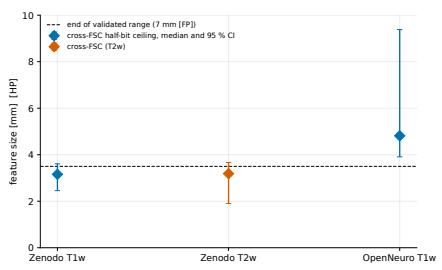

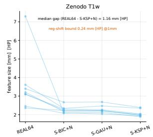

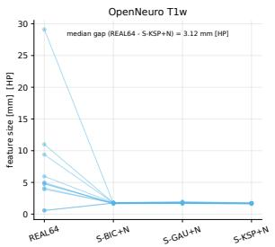  
Figure 1: Left: Recoverability ceiling. Cross-FSC half-bit crossing between the real 64 mT and 3T scans of the same subject (median over subjects, 95% CI), mm [HP]: Zenodo T1w 3.16 (2.46–3.61, $n = 8 )$ , Zenodo T2w 3.19 (1.90–3.67, n = 10), OpenNeuro T1w 4.81 (3.91–9.38, n = 11). Dashed: end of the directly validated range, 7 mm [FP] (3.5 mm [HP]); values above it are coarser than the range the estimator was validated on. Right: Gap between real and synthetic degradation. Persubject half-bit crossings [HP] for the real 64 mT scan and the three noise-matched synthetics (one line per subject). Zenodo T1w gap to S-KSP+N (difference of median crossings) 1.16 mm [HP], above the 0.24 mm [HP] registration bound. Two OpenNeuro subjects sit at the grid cap (0.58 mm [HP]) and are shown as capped values.

## 5.2 SYNTHETIC DEGRADATION PRESERVES WHAT REAL ACQUISITION DESTROYS

Real 64 mT acquisition is coarser than the noise-matched k-space-truncation synthetic by 1.16 mm [HP] (2.32 mm [FP]) on Zenodo T1w, exceeding a registration bound of 0.24 mm [HP] (0.47 mm [FP]), so synthetic degradation pipelines preserve fine information that real low-field acquisition destroys (Figure 1, right). k-space truncation is the physically principled band-limit model, so its gap is primary; the softer S-BIC+N and S-GAU+N give 0.921 and 0.937 mm [HP], both above the bound, and on OpenNeuro T1w the gap is 3.115 mm [HP] $( n = 1 1 )$ , in line with its coarser ceiling. Two OpenNeuro subjects read at the grid cap (0.58 mm [HP], the finest scale the analysis grid can express) despite good registration, a physically implausible value for 64 mT; they are kept in the $n = 1 1$ median at the capped value rather than dropped after the fact; dropping them would move the median ceiling to 4.99 mm [HP] (Figure 1, right). Both OpenNeuro choices, excluding the null-crossing subject and keeping the capped ones, move the ceiling finer and are therefore conservative for Claim 1. Because synthetics inherit 3T contrast and the real 64 mT scan does not, part of the gap could in principle come from the nonlinear way tissue contrast changes between field strengths rather than from lost information. Three observations argue against this being the driver. The crossing’s spread across intensity normalizations is below the gap (D1 ratio 0.79), and the gap is positive under every normalization we ran (1.16, 1.46 and 1.83 mm [HP] on Zenodo, 3.11, 3.11 and 5.11 on OpenNeuro), the tabulated value being the smallest on Zenodo and within 0.01 mm of the smallest on OpenNeuro. T1w and T2w, whose contrast mappings to 3T differ, give the same ceiling on the same scanner (6.313 versus 6.373 mm [FP]). Giving the synthetic low-field contrast, by matching each tissue class of the 3T to the 64 mT scan’s median and spread before truncation, narrows the gap only to 0.91 mm [HP], positive on all 8 subjects (minimum 0.27) and above the registration bound. A model trained and tested on synthetic pairs therefore sees subject structure in a band that a real 64 mT scan leaves empty; recovering it is recovery on the benchmark and invention in deployment, and the benchmark cannot tell which.

## 5.3 TRAINED MODELS FABRICATE AT FINE SCALES, AND TRUST TOOLS DO NOT FLAG IT

This section asks whether trained models respect the ceiling, and whether the tools the field trusts, metrics and uncertainty maps, would notice if they did not. The claim rests on three layers, strongest first. (1) Input-side bound: the ceiling is a property of the input, measured directly; no reconstruction can carry more subject information than its input, so subject-specific detail finer than the ceiling can only be inferred from coarser structure through the prior. (2) Direct demonstration on the diffusion arm (n = 4 held-out subjects, 2 of them certified by every check). (3) Coverage: 24 trained runs of five architectures, on which faithfulness is computable for the 4 single-contrast diffusion runs and not computable on the remaining 20 for documented reasons. In short: the input carries no subject information at fine scales, the stranger test shows that these models do not infer it either, and their metrics and uncertainty maps do not register the difference.

Direct demonstration. The T1w arms carry the direct measurement because their held-out inputs have usable per-subject anchors, and every model is read against its own subject’s anchor and raw-input benchmark. All four subjects pass G-M1 and G-M4. G-M2 passes sub-0048 and sub-HYPE21 and fails sub-0064 and sub-HYPE22, whose anchors (14.04 and 21.6 mm [FP]) lie outside the dataset intervals; on OpenNeuro this gate is frame-dependent, so the per-subject anchor on the validated frame is the operative check. G-M3 passes every subject except sub-0064, where the stranger’s 3T correlates with the input to about the same scale as the subject’s own, so on that subject the readout cannot separate fabrication from misalignment of its own 3T. Two subjects, one per dataset, are therefore certified; the other two are shown for completeness (Table 2, Appendix B), and the finding below is the same on all four. On T2w the held-out subjects fail G-M2 (Zenodo) or too few pass (OpenNeuro, one of four), so all 13 T2w runs are not computable. REC merges with SWAP at 16.0, 24.0, 6.0 (posterior mean 5.0) and 12.0 mm [FP] for sub-0048, sub-0064, sub-HYPE21 and sub-HYPE22, against raw-input benchmarks of 5.0, 12.0, 6.0 and 16.0 mm [FP] (Table 2, Figure 2). Finer than each subject’s merge scale the output is no more correlated with the subject’s own anatomy than with a stranger’s. At fine scales all four subjects show REC at SWAP: fabrication. On Zenodo the fabricated structure is internally consistent across samples (CON 0.59 to 0.95), confident fabrication; on OpenNeuro inter-sample consistency itself decays at fine bands (CON near 0.15), diffuse fabrication. Neither form is distinguishable from recovery by any metric or uncertainty map we audit.

Exceedances and the two datasets. Two merges in the diffusion arm fall one band finer than their raw-input benchmark (both single-band, both within 0.025 of threshold, both on the coarse-recovery subjects); they are the coarse-scale denoising the benchmark allows (Section 3), not information creation. No model shows sustained subject-specific agreement at scales where the input carries none; the one further merge finer than a benchmark is a negative-SWAP artifact with REC at zero (SynthSR, below). On Zenodo the models fabricate at scales where the raw input still carries subject information, and for sub-0048 the output matches the truth less than the raw input at every scale from 32 to 8 mm: the model degrades structure the raw input still resolves, failing even the denoising role the OpenNeuro arm demonstrates. On OpenNeuro the models recover coarse ventricle-scale structure to the input’s limit and fabricate finer than it; this recovery also serves as a positive control that the measurement detects genuine recovery when present.

Controls. The S-KSP+N oracle recovers strongly (merge 2.5 mm [FP] on OpenNeuro), so the readout reports recovery when it is present; on Zenodo it never merges within the grid, because the truncation is a box in k-space and the bands are an octave wide, so the oracle keeps a band correlation of 0.70 at 4 mm and 0.40 at 2.5 mm although its own half-bit crossing is 2.7 mm [FP]. Under WhiteStripe (5 seeds) merges are 10 / 24 / 6 / 16 mm [FP], the same picture. Halving or doubling the 0.05 threshold moves each merge by at most one band, except the sub-0048 diffusion merge at the lower threshold (16 to 10 mm), and at every threshold the models merge coarser than their raw input on Zenodo and at or within one band of it on OpenNeuro. Misregistration cannot produce the merges: shifting the true 3T by 1 mm in plane or by one slice keeps its band correlation with itself at 0.70 to 0.99 across the 6 to 24 mm bands where the models merge, against 0.03 to 0.12 for the Zenodo models and 0.06 to 0.47 for the OpenNeuro models; at 3 mm and finer a 1 mm shift alone lowers it to 0.4 or below, so the finding rests on the merge scales, not on the finest bands. Replacing the frozen stranger by each same-dataset training subject (8 on Zenodo, 21 on OpenNeuro, each rigidly registered into the held-out frame) gives diffusion merges of 8 to 16 / 16 to 24 / 4 to 10 / 10 to 16 and raw-input merges of 4 to 5 / 10 to 24 / 5 to 8 / 8 to 24 mm [FP], each interval containing the frozen-pair merge; these strangers were seen by the model in training, so the pool is a robustness check. Resampling the Zenodo models with their 15-step training chain leaves both z-score merges unchanged (16 and 24 mm [FP]) and their uncertainty controls within 0.01 of the values below, and moves the WhiteStripe merges to 12 and 24 mm [FP], no finer than before.

External model. On the same subjects and readout, SynthSR merges at 12 / 24 mm [FP] on Zenodo, coarser than the raw-input benchmarks of 5.0 / 12.0, and at 6.0 / 10.0 mm [FP] on OpenNeuro against benchmarks of 6.0 / 16.0; the one merge finer than its benchmark comes from a negative SWAP with REC at zero and moves to the benchmark, 16.0 mm [FP], when SWAP is clipped at <sup>†</sup>Two diffusion merges fall one band finer than the benchmark (sub-HYPE22 12.0 vs 16.0; sub-HYPE21 posterior mean 5.0 vs 6.0), each decided by one band clearing the 0.05 threshold by 0.023 and 0.016: coarse-scale denoising, not information creation. SWAP uses one frozen stranger per subject (sub-0048 with sub-0064, sub-HYPE21 with sub-HYPE22). G-M2 on OpenNeuro is frame-dependent and G-M3 on sub-0064 passes by 0.01 mm under the ladder anchor recipe and fails by 5.0 mm under the gate recipe (Appendix B). All arms are read on one ROI per subject: the 3T foreground mask intersected with the model’s coverage and the sampled slices (Appendix G). Under a SWAP clipped at zero (REC − max(SWAP, 0)) every merge in this table is unchanged except the SynthSR sub-HYPE22 entry, which becomes 16.0, equal to its benchmark, and the sub-0048 raw-input benchmark, which becomes 4.0 because its 5.0 mm band sits exactly at the 0.05 threshold. A merge of 24.0 is the coarsest the rule can report and means no subject-specific agreement at any reportable band.

Table 2: Control ladder for the direct measurement, all mm [FP]. Anchor: whole-brain cross-FSC of the subject’s input. Raw-input benchmark: the registered 64 mT input through the identical band readout (a correlation benchmark, not an information bound). Oracle: S-KSP+N of the subject’s own 3T (“–”: no merge within the grid). Diffusion: z-score arm, 50 samples (posterior mean in parentheses where it differs). SynthSR: deterministic. G-M2, G-M3: audit status of the input (Section 3, Appendix B); a subject passing both is certified.<sup>†</sup>
<table><tr><td>Subject</td><td>Dataset</td><td>G-M2</td><td>G-M3</td><td>Anchor</td><td>Raw-input</td><td>Oracle</td><td>Diffusion</td><td>SynthSR</td></tr><tr><td>sub-0048</td><td>Zenodo</td><td>pass</td><td>pass</td><td>6.9</td><td>5.0</td><td></td><td>16.0</td><td>12.0</td></tr><tr><td>sub-0064</td><td>Zenodo</td><td>fail</td><td>mârginal</td><td>14.04</td><td>12.0</td><td></td><td>24.0</td><td>24.0</td></tr><tr><td>sub-HYPE21</td><td>OpenNeuro</td><td>pass</td><td>pass</td><td>10.9</td><td>6.0</td><td>2.5</td><td>6.0 (5.0)</td><td>6.0</td></tr><tr><td>sub-HYPE22</td><td>OpenNeuro</td><td>fail</td><td>pass</td><td>21.6</td><td>16.0</td><td>2.5</td><td>12.0</td><td>10.0</td></tr></table>

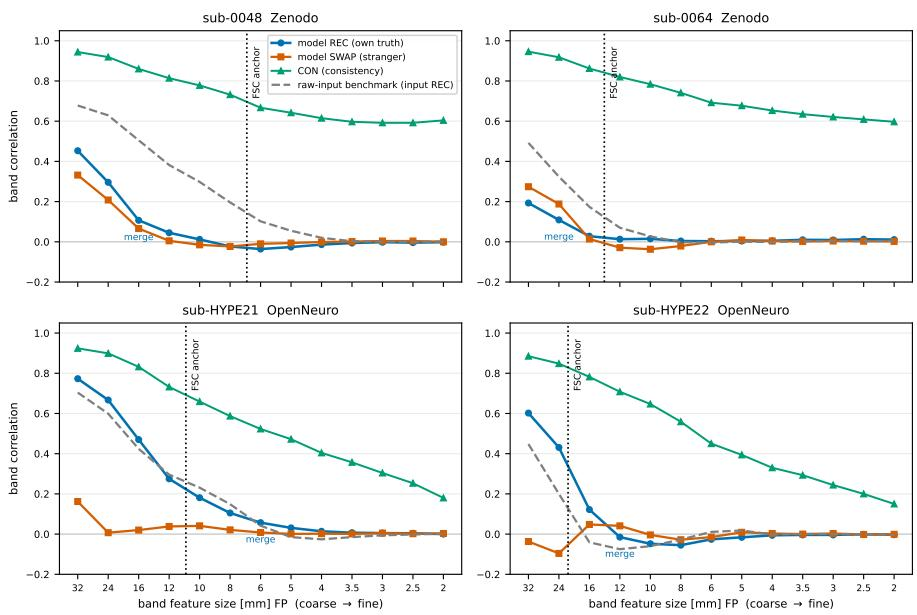  
Figure 2: Fabrication against the raw-input benchmark. REC (output vs own 3T), SWAP (output vs stranger 3T) and CON (between samples) by band feature size [FP] for the four held-out subjects (z-score arm, 50 samples); grey dashed: raw-input benchmark; dotted: whole-brain FSC anchor. Merges in Table 2.

zero (Appendix H). Its apparent sharpness, 5.2 to 6.1 mm [FP], sits at the input ceiling rather than beyond it, so it invents less fine detail than the trained runs while, on Zenodo, still failing to match the subject where the input would allow it (on sub-0064 its output aligns poorly with the 3T, so that merge is read with care). The behavior is therefore not a property of our implementations.

Uncertainty. Sample-variance uncertainty flags reconstruction difficulty, not fabrication. The variance map carries real spatial error signal: the voxel AUROC of variance flagging top-decile band error is 0.771 on bands finer than 4 mm [FP] and 0.677 on bands of 4 mm [FP] and coarser (chance level 0.5), and its Spearman correlation with error is 0.390 and 0.293, surviving control for band energy at partial 0.260 and 0.205. It is, however, largely non-specific: in every band of the original registration frame its correlation with a stranger’s error is at least two thirds of its correlation with the subject’s own (RHO\_own 0.390 versus RHO\_stranger 0.307 on the fine bands; Table 7), so it locates hard regions rather than fabricated content (Figure 6, left). Recomputed on the validated frames and the common ROI, per subject, the fine-band AUROC is 0.69 to 0.79 and the correlation with error 0.30 to 0.39, and a known-fabricated output, the frozen stranger’s own posterior samples read against this subject’s 3T, receives the same variance-error agreement as the subject’s own output on Zenodo (AUROC 0.71 and 0.72 against 0.71 and 0.69) and less on OpenNeuro (0.59 and 0.41 against 0.79 and 0.78); the conclusion is unchanged.

Coverage. The audit spans 24 trained runs of five architectures (Table 9). Faithfulness is computable on the four single-contrast T1w diffusion runs and fails on all four; the other 20 carry a reason code (13 T2w runs, NC-ANCHOR or NC-XDEV; 7 NIST runs, NC-EPI). Every trained run renders detail finer than its input ceiling (apparent sharpness 0.97–3.77 mm [FP], Figure 6, right), whether or not that detail can be checked. Because faithfulness fails wherever it can be computed, the audit cannot test whether PSNR or SSIM track it across models, but on the four direct-arm subjects the metrics barely separate fabricating outputs from the unfabricated input: PSNR puts the diffusion posterior mean within 1.4 dB of the raw input, against an oracle lead of 4.7 to 7.7 dB, and LPIPS scores it as good as or better than the raw input on every subject, including both Zenodo subjects, where its merge is far coarser.

## 6 LIMITATIONS AND LESSONS

Limitations. The direct demonstration rests on n = 4 held-out subjects, every held-out subject with a trained single-contrast diffusion model and ground truth; we show per-subject curves and rely on agreement across datasets, normalizations, strangers and thresholds instead of a pooled test, and the WhiteStripe rows use 5 seeds. Only 2 of the four, one per dataset, are certified by every audit check; the result is the same on all four. The merge is read against one frozen stranger per subject, and the stranger pool that brackets it uses training subjects the model has seen. The diffusion checkpoints were selected on validation PSNR of the same held-out subjects (Appendix G), which favours agreement with their own 3T and so works against the fabrication finding, though it may contribute to the two diffusion exceedances. The reported samples use 4 steps while the Zenodo models were trained with a 15-step chain; resampling with 15 steps leaves the Zenodo merges unchanged or coarser. Faithfulness is not computable on 20 of 24 runs, further trained runs with held-out predictions are outside the audit (Appendix G), proprietary products remain unauditable, and the public SynthSR we audit is the single-input model, not the dual-input low-field variant. A different scanner or se quence will have a different ceiling, which is why we contribute a protocol and not a constant; an accurate forward model of a specific scanner, learned or simulated, would let the ceiling be derived analytically and models be trained against a known operator. The strongest layer, the input ceiling, depends on no model and on none of the four subjects.

Lessons for practice (Appendix F). Each documented failure implies a check: report a volumetric resolution only beside a grid-invariance check; report a cross-field ceiling as not computable when rigid registration cannot align the pair; check any fixed test split against the input anchor (G-M2) before reporting metrics on it; validate the registration of every held-out subject before reading a model against its input; and gate a held-out subject only on a frame on which both its anchor and the dataset ceiling are measured, since a dataset-level gate is undefined across frames.

## 7 CONCLUSION

A real 64 mT scan limits what any model can recover about the subject, and the limit can be measured: about 3 to 4 mm half-pitch in plane here, coarser than the detail synthetic benchmarks preserve and coarser than the detail current models render. Recoverability claims for low-field superresolution should therefore be tested against the measured input ceiling and a stranger control rather than PSNR, SSIM, or sample variance alone. We will release the protocol code so that both checks can be run on any model. Its two tools, cross-modality FSC and the stranger-controlled band readout, apply to any setting with paired acquisitions.

## ACKNOWLEDGMENTS

This work used computing resources from the National Research Platform (NRP) Nautilus cluster and the NCSA Delta system. We thank the NRP and NCSA teams for their support.

## REPRODUCIBILITY STATEMENT

All datasets are public (Section 4). The protocol, gate definitions (Table 3), algorithms (Appendix A), frozen splits, stranger lists, seeds, sampler settings, result files and a verification script that regenerates every table will be made available online with the code; the external SynthSR run is documented in Appendix H.

## ETHICS STATEMENT

All data are public, de-identified human MRI released by their providers for research (Section 4); no new data were collected. The work evaluates existing methods and argues for caution in their clinical use; it introduces no new generative model.

## USE OF LARGE LANGUAGE MODELS

Large language model assistants were used to help write and debug analysis and plotting code, to check the consistency of numbers between result files, tables, and text, and to edit the prose of this paper. All experiments, results, and claims were designed, verified, and approved by the authors, who take full responsibility for the content.

## REFERENCES

Anastasios N. Angelopoulos, Amit Pal Kohli, Stephen Bates, Michael I. Jordan, Jitendra Malik, Thayer Alshaabi, Srigokul Upadhyayula, and Yaniv Romano. Image-to-image regression with distribution-free uncertainty quantification and applications in imaging. In Proceedings of the 39th International Conference on Machine Learning, volume 162 of Proceedings of Machine Learning Research, pp. 717–730. PMLR, 2022.

Vegard Antun, Francesco Renna, Clarice Poon, Ben Adcock, and Anders C. Hansen. On instabilities of deep learning in image reconstruction and the potential costs of AI. Proceedings of the National Academy ofSciences, 117(48):30088–30095, 2020. doi: 10.1073/pnas.1907377117.

T. Campbell Arnold, Danni Tu, Serhat V. Okar, Govind Nair, Samantha By, Karan D. Kawatra, Timothy E. Robert-Fitzgerald, Lisa M. Desiderio, Matthew K. Schindler, Russell T. Shinohara, Daniel S. Reich, and Joel M. Stein. Sensitivity of portable low-field magnetic resonance imaging for multiple sclerosis lesions. NeuroImage: Clinical, 35:103101, 2022. doi: 10.1016/j.nicl.2022. 103101.

Sayantan Bhadra, Varun A. Kelkar, Frank J. Brooks, and Mark A. Anastasio. On hallucinations in tomographic image reconstruction. IEEE Transactions on Medical Imaging, 40(11):3249–3260, 2021. doi: 10.1109/TMI.2021.3077857.

Benjamin Billot, Douglas N. Greve, Oula Puonti, Axel Thielscher, Koen Van Leemput, Bruce Fischl, Adrian V. Dalca, and Juan Eugenio Iglesias. SynthSeg: Segmentation of brain MRI scans of any contrast and resolution without retraining. Medical Image Analysis, 86:102789, 2023. doi: 10.1016/j.media.2023.102789.

Yochai Blau and Tomer Michaeli. The perception-distortion tradeoff. In IEEE/CVF Conference on Computer Vision and Pattern Recognition (CVPR), pp. 6228–6237, 2018. doi: 10.1109/CVPR. 2018.00652.

Joseph Paul Cohen, Margaux Luck, and Sina Honari. Distribution matching losses can hallucinate features in medical image translation. In Medical Image Computing and Computer Assisted Intervention – MICCAI 2018, pp. 529–536, Cham, 2018. Springer. doi: 10.1007/978-3-030-00928-1\_ 60.

A. Descloux, K. S. Grußmayer, and A. Radenovic. Parameter-free image resolution estimation based on decorrelation analysis. Nature Methods, 16(9):918–924, 2019. doi: 10.1038/ s41592-019-0515-7.

Andrew Dienstfrey, Zydrunas Gimbutas, Joe Chalfoun, Adele Peskin, Kalina V. Jordanova, Kathryn E. Keenan, and Stephen E. Ogier. Database of diffusion MRI brain scans at 64 mT and 3 T. NIST Public Data Repository, identifier mds2-3896, 2025a. URL https: //data.nist.gov/od/id/mds2-3896.

Andrew Dienstfrey, Zydrunas Gimbutas, Joe Chalfoun, Adele Peskin, Kalina V. Jordanova, Kathryn E. Keenan, and Stephen E. Ogier. Database of diffusion MRI brain scans at 64 mT and 3 T. NIST Internal Report NIST IR 8580, National Institute of Standards and Technology, Boulder, CO, December 2025b.

Matteo Figini, Hongxiang Lin, Felice D’Arco, Godwin Ogbole, Maria Camilla Rossi-Espagnet, Olalekan Ibukun Oyinloye, Joseph Yaria, Donald Amasike Nzeh, Mojisola Omolola Atalabi, David W. Carmichael, Judith Helen Cross, Ikeoluwa Lagunju, Delmiro Fernandez-Reyes, and Daniel C. Alexander. Evaluation of epilepsy lesion visualisation enhancement in low-field MRI using image quality transfer: a preliminary investigation of clinical potential for applications in developing countries. Neuroradiology, 66(12):2243–2252, 2024. doi: 10.1007/ s00234-024-03448-2.

George Harauz and Marin van Heel. Exact filters for general geometry three dimensional reconstruction. Optik, 73(4):146–156, 1986.

Fredric J. Harris. On the use of windows for harmonic analysis with the discrete Fourier transform. Proceedings ofthe IEEE, 66(1):51–83, 1978. doi: 10.1109/PROC.1978.10837.

Jonathan Ho, Ajay Jain, and Pieter Abbeel. Denoising diffusion probabilistic models. In Advances in Neural Information Processing Systems, volume 33, pp. 6840–6851, 2020.

Juan Eugenio Iglesias, Benjamin Billot, Yaël Balbastre, Azadeh Tabari, John Conklin, R. Gilberto González, Daniel C. Alexander, Polina Golland, Brian L. Edlow, and Bruce Fischl. Joint superresolution and synthesis of 1 mm isotropic MP-RAGE volumes from clinical MRI exams with scans of different orientation, resolution and contrast. NeuroImage, 237:118206, 2021. doi: 10.1016/j.neuroimage.2021.118206.

Juan Eugenio Iglesias, Riana Schleicher, Sonia Laguna, Benjamin Billot, Pamela Schaefer, Brenna McKaig, Joshua N. Goldstein, Kevin N. Sheth, Matthew S. Rosen, and W. Taylor Kimberly. Quantitative brain morphometry of portable low-field-strength MRI using super-resolution machine learning. Radiology, 306(3):e220522, 2023. doi: 10.1148/radiol.220522.

Aryan Kalluvila, Neha Koonjoo, Danyal Bhutto, Marcio Rockenbach, and Matthew S. Rosen. Synthetic low-field MRI super-resolution via nested U-Net architecture. arXiv preprint arXiv:2211.15047, 2022. URL https://arxiv.org/abs/2211.15047.

Alex Kendall and Yarin Gal. What uncertainties do we need in Bayesian deep learning for computer vision? In Advances in Neural Information Processing Systems, volume 30, 2017.

Sami Koho, Giorgio Tortarolo, Marco Castello, Takahiro Deguchi, Alberto Diaspro, and Giuseppe Vicidomini. Fourier ring correlation simplifies image restoration in fluorescence microscopy. Nature Communications, 10(1):3103, 2019. doi: 10.1038/s41467-019-11024-z.

Christian Ledig, Lucas Theis, Ferenc Huszár, Jose Caballero, Andrew Cunningham, Alejandro Acosta, Andrew Aitken, Alykhan Tejani, Johannes Totz, Zehan Wang, and Wenzhe Shi. Photo-realistic single image super-resolution using a generative adversarial network. In IEEE Conference on Computer Vision and Pattern Recognition (CVPR), pp. 105–114, 2017. doi: 10.1109/CVPR.2017.19.

Hongxiang Lin, Matteo Figini, Felice D’Arco, Godwin Ogbole, Ryutaro Tanno, Stefano B. Blumberg, Lisa Ronan, Biobele J. Brown, David W. Carmichael, Ikeoluwa Lagunju, Judith Helen Cross, Delmiro Fernandez-Reyes, and Daniel C. Alexander. Low-field magnetic resonance image enhancement via stochastic image quality transfer. Medical Image Analysis, 87:102807, 2023. doi: 10.1016/j.media.2023.102807.

David Mattes, David R. Haynor, Hubert Vesselle, Thomas K. Lewellen, and William Eubank. PET-CT image registration in the chest using free-form deformations. IEEE Transactions on Medical Imaging, 22(1):120–128, 2003. doi: 10.1109/TMI.2003.809072.

Dong Nie, Roger Trullo, Jun Lian, Caroline Petitjean, Su Ruan, Qian Wang, and Dinggang Shen. Medical image synthesis with context-aware generative adversarial networks. In Medical Image Computing and Computer Assisted Intervention – MICCAI 2017. Springer International Publish ing, 2017. doi: 10.1007/978-3-319-66179-7\_48.

Dong Nie, Roger Trullo, Jun Lian, Li Wang, Caroline Petitjean, Su Ruan, Qian Wang, and Dinggang Shen. Medical image synthesis with deep convolutional adversarial networks. IEEE Transactions on Biomedical Engineering, 65(12):2720–2730, 2018. doi: 10.1109/TBME.2018.2814538.

Tal Oved, Beatrice Lena, Chloé F. Najac, Sheng Shen, Matthew S. Rosen, Andrew Webb, and Efrat Shimron. Deep learning of personalized priors from past MRI scans enables fast, qualityenhanced point-of-care MRI with low-cost systems. arXiv preprint arXiv:2505.02470, 2025. URL https://arxiv.org/abs/2505.02470.

Jacob C. Reinhold, Blake E. Dewey, Aaron Carass, and Jerry L. Prince. Evaluating the impact of intensity normalization on MR image synthesis. In Medical Imaging 2019: Image Processing, volume 10949 of Proc. SPIE, pp. 109493H. SPIE, 2019. doi: 10.1117/12.2513089.

Mojtaba Safari, Shansong Wang, Zach Eidex, Qiang Li, Richard L. J. Qiu, Erik H. Middlebrooks, David S. Yu, and Xiaofeng Yang. MRI super-resolution reconstruction using efficient diffusion probabilistic model with residual shifting. Physics in Medicine & Biology, 70(12):125008, 2025. doi: 10.1088/1361-6560/ade049.

Chitwan Saharia, Jonathan Ho, William Chan, Tim Salimans, David J. Fleet, and Mohammad Norouzi. Image super-resolution via iterative refinement. IEEE Transactions on Pattern Analysis and Machine Intelligence, 45(4):4713–4726, 2023. doi: 10.1109/TPAMI.2022.3204461.

Kevin N. Sheth, Mercy H. Mazurek, Matthew M. Yuen, Bradley A. Cahn, Jill T. Shah, Adrienne Ward, Jennifer A. Kim, Emily J. Gilmore, Guido J. Falcone, Nils Petersen, Kevin T. Gobeske, Firas Kaddouh, David Y. Hwang, Joseph Schindler, Lauren Sansing, Charles Matouk, Jonathan Rothberg, Gordon Sze, Jonathan Siner, Matthew S. Rosen, Serena Spudich, and W. Taylor Kimberly. Assessment of brain injury using portable, low-field magnetic resonance imaging at the bedside of critically ill patients. JAMA Neurology, 78(1):41–47, 2021. doi: 10.1001/jamaneurol.2020.3263.

Russell T. Shinohara, Elizabeth M. Sweeney, Jeff Goldsmith, Navid Shiee, Farrah J. Mateen, Peter A. Calabresi, Samson Jarso, Dzung L. Pham, Daniel S. Reich, and Ciprian M. Crainiceanu. Statistical normalization techniques for magnetic resonance imaging. NeuroImage: Clinical, 6: 9–19, 2014. doi: 10.1016/j.nicl.2014.08.008.

Nicholas J. Tustison, Brian B. Avants, Philip A. Cook, Yuanjie Zheng, Alexander Egan, Paul A. Yushkevich, and James C. Gee. N4ITK: Improved N3 bias correction. IEEE Transactions on Medical Imaging, 29(6):1310–1320, 2010. doi: 10.1109/TMI.2010.2046908.

Ruben van den Broek, Beatrice Lena, and Andrew Webb. Paired 64mT and 3T brain MRI scans of healthy subjects for neuroimaging research. Zenodo dataset, 2025. URL https://doi.org/ 10.5281/zenodo.15471394.

Marin van Heel and Michael Schatz. Fourier shell correlation threshold criteria. Journal of Structural Biology, 151(3):250–262, 2005. doi: 10.1016/j.jsb.2005.05.009.

František Váša, Carly Bennallick, Niall J. Bourke, Francesco Padormo, Paul Cawley, Tomoki Arichi, Tobias C. Wood, Robert Leech, and Steven C. R. Williams. Ultra-low-field brain MRI: test-retest reliability and correspondence to high-field MRI. OpenNeuro dataset ds006557, 2025. URL https://doi.org/10.18112/openneuro.ds006557.v1.0.2.

Qi Wang, Lucas Mahler, Julius Steiglechner, Florian Birk, Klaus Scheffler, and Gabriele Lohmann. DISGAN: Wavelet-informed discriminator guides GAN to MRI super-resolution with noise cleaning. In 2023 IEEE/CVF International Conference on Computer Vision Workshops (ICCVW), pp. 2444–2453. IEEE, 2023. doi: 10.1109/ICCVW60793.2023.00259.

Zhou Wang, Alan C. Bovik, Hamid R. Sheikh, and Eero P. Simoncelli. Image quality assessment: from error visibility to structural similarity. IEEE Transactions on Image Processing, 13(4):600– 612, 2004. doi: 10.1109/TIP.2003.819861.

Richard Zhang, Phillip Isola, Alexei A. Efros, Eli Shechtman, and Oliver Wang. The unreasonable effectiveness of deep features as a perceptual metric. In IEEE/CVF Conference on Computer Vision and Pattern Recognition (CVPR), pp. 586–595, 2018. doi: 10.1109/CVPR.2018.00068.

Zhenxuan Zhang, Peiyuan Jing, Ruicheng Yuan, Liwei Hu, Anbang Wang, Fanwen Wang, Yinzhe Wu, Kh Tohidul Islam, Zhaolin Chen, Zi Wang, Peter Lally, and Guang Yang. ReDiff: Reliabilityguided diffusion for trustworthy ultra-low-field to high-field MRI synthesis. arXiv preprint arXiv:2603.11325, 2026. URL https://arxiv.org/abs/2603.11325.

Tong Zheng, Hirohisa Oda, Yuichiro Hayashi, Takayasu Moriya, Shota Nakamura, Masaki Mori, Hirotsugu Takabatake, Hiroshi Natori, Masahiro Oda, and Kensaku Mori. SR-CycleGAN: superresolution of clinical CT to micro-CT level with multi-modality super-resolution loss. Journal of Medical Imaging, 9(2):024003, 2022. doi: 10.1117/1.JMI.9.2.024003.

## A ALGORITHMS

```latex
Algorithm 1 Gated 3D cross-FSC with half-bit and empirical-null readout
Require: registered volumes X, Y on one grid (soft dilated brain mask $\times$ Hann window), voxel
size v, shell width $\Delta k = 1 / ( N v )$
1: $F _ { X } \gets \mathrm { F F T } ( X ) , F _ { Y } \gets \mathrm { F \ " F T } ( Y )$ ; radial frequency grid K in cycles/mm
2: for each shell $\begin{array} { r } { \dot { S _ { j } } = \{ K \in [ j \Delta k , ( j + 1 ) \Delta k ) \} } \end{array}$ do
3: $\begin{array} { r } { \mathrm { F S C } _ { j } \gets \mathrm { R e } \sum _ { S _ { j } } F _ { X } \overline { { F _ { Y } } } / \sqrt { \sum _ { S _ { j } } | F _ { X } | ^ { 2 } \sum _ { S _ { j } } | F _ { Y } | ^ { 2 } } ; n _ { j } \gets | S _ { j } | } \end{array}$
4: $T _ { j } \gets ( 0 . 2 0 7 1 + 1 . 9 1 0 2 / \sqrt { \dot { n _ { j } } } ) / ( 1 . 2 0 7 1 + 0 . 9 1 0 2 / \sqrt { n _ { j } } )$ ▷ half-bit threshold (van Heel &
Schatz, 2005)
5: end for
6: $k _ { c } \gets$ interpolated frequency where FSC falls below T and stays below for two consecutive
shells
7: repeat against the empirical null curve from subject-swapped pairs
8: return $\bar { 1 } / k _ { c } \ [ \mathrm { F P } ] , 1 / \bar { ( 2 k _ { c } ) } \ [ \mathrm { H P } ] ;$ anisotropic variant uses in-plane and through-plane sectors
```

Algorithm 2 Decorrelation analysis (single-image self-resolution, port of Descloux et al. (2019))   
Require: image $\overline { { I ; N _ { r } } }$ radii; $N _ { g }$ high-pass strengths   
1: remove DC; $I _ { n } \gets \mathrm { F F T } ( I ) \overline { { / | \mathrm { F F T } ( I ) | } }$   
2: for each Gaussian high-pass strength g do   
3: for each radius $r \in [ 0$ , Nyquist] with low-pass mask $M _ { r }$ do   
4: $d _ { g } ( r ) \gets \mathrm { R e } \sum \mathrm { F F T } ( I _ { g } ) \overline { { I _ { n } } } M _ { r } / \sqrt { \sum | \mathrm { F F T } ( I _ { g } ) M _ { r } | ^ { 2 } \sum | I _ { n } M _ { r } | ^ { 2 } }$   
5: end for   
6: $r _ { g } \gets$ highest-frequency local maximum of $d _ { g }$   
7: end for   
8: return 1/ max<sub>g</sub> r<sub>g</sub> [FP]

Algorithm 3 Band-resolved faithfulness: REC, SWAP, CON, merge scale, and uncertainty   
Require: samples $y _ { 1 } , \ldots , y _ { N }$ for a held-out subject; own 3T t; stranger $\overline { { 3 \mathrm { T } ~ t ^ { \prime } } }$ (frozen pair list);   
bands $s _ { 1 } > \cdots > s _ { B }$ (mm [FP]); bp : one-octave annulus band-pass centred at s, applied   
per 2D slice; ROI: 3T foreground ∩ model coverage ∩ sampled slices; corr is the Pearson   
correlation over ROI voxels   
1: for each band s do   
2: $B _ { t } \gets \mathrm { b p } _ { s } ( t ) , B _ { t ^ { \prime } } \gets \mathrm { b p } _ { s } ( t ^ { \prime } ) , B _ { n } \gets \mathrm { b p } _ { s } ( y _ { n } )$   
3: $\mathrm { R E C } ( s ) \gets \operatorname* { m e a n } _ { n } \mathrm { c o r r } ( \dot { B } _ { n } , B _ { t } ) ; \mathrm { S W A P } ( s ) \gets \mathrm { m e a n } _ { n } \mathrm { c o r r } ( B _ { n } , B _ { t ^ { \prime } } )$   
4: $\mathrm { C O N } ( s ) \gets \mathrm { m e a n } _ { n < m } \mathrm { c o r r } ( B _ { n } , B _ { m } )$   
5: $\mathrm { V A R }  \operatorname { v a r } _ { n } ( y _ { n } )$ per voxel; $\mathrm { E R R }  \vert \mathrm { b p } _ { s } ( \bar { y } ) - B _ { t } \vert ;$ RHO ← Spearman(VAR, ERR)   
6: end for   
7: merge ← coarsest s below $s _ { 1 }$ such that $\mathrm { R E C } - \mathrm { S W A P } \leq 0 . 0 5$ at s and at the next finer band ▷   
clipped variant: $\mathrm { R E C - m a x ( S W A P , 0 ) }$   
8: the same readout is applied to the registered 64 mT input (raw-input benchmark), to S-KSP+N   
(oracle), and to SynthSR; for a single deterministic image $N = 1$ and CON is not defined

## B VALIDATION GATES

Table 3 lists the known-answer gates, their pre-specified criteria, and their outcomes, including the two criteria that are not met.

Table 3: Known-answer gates run on Zenodo before any reported value (3 subjects). Pass criteria are pre-specified; decision D1 is reported in Section 3.  
Gate Test Pre-specified criterion Outcome   
A1 recovery of an imposed cutoff (3, 4, 5, 6, 8 mm [FP]) within 10% FSC: 2.5–7.5% error at 3–6 mm (pass over the operative range); 9–11% at 8 mm (fails the strict   
criterion; brain field of view); decorrelation fails (0 of 15) and is kept qualitative   
A2 3T self-split (binomial 1FRC) vs native 2.0 mm within 25% 2.44–2.77 mm (22–38%): fails; used only as a fine upper bound, far finer than the 6.31 mm [FP] crossing   
A3 grid invariance (1.0 vs 1.25 mm grid) within 10% within 3%: pass   
A4 registration robustness (0 to 2 mm injected shift) bound below every gap crossings move 0.02–0.57 mm [FP]; a 1 mm shift moves the crossing 0.47 mm [FP], below the 2.32 mm [FP] gap   
A5 response to added blur (FWHM 2–6 mm) strictly monotone FSC strictly monotone: pass; decorrelation fails   
cross-check against an independent FRC implementation agreement 3.79 vs 3.58 mm on a 4.0 mm imposed cutoff (5.7%)

Table 4 gives the four audit checks of Section 3 for the held-out subjects of the direct arm, and Table 5 the OpenNeuro T1w gate under each frame pairing. The anchors of Table 2 use the ladder recipe; the gate recipe (whole-brain FSC with z-score intensity normalization) differs by 0.5 to 1.1 mm and gives the same pass or fail on every subject.

Table 4: Audit checks on the direct-arm inputs, all mm [FP]. G-M1: 3T self-split fine bound (1FRC on Zenodo, checkerboard split on OpenNeuro). G-M2: anchor inside the dataset CI (Zenodo T1w 4.91–7.22, OpenNeuro T1w 7.82–18.77, both on the E1 frame). G-M3: input cross-FSC against the frozen stranger’s 3T, required at least one band coarser than the own anchor or absent, under the ladder and the gate anchor recipes. G-M4: deterministic rerun. Certified: G-M2 and G-M3 both pass.
<table><tr><td>Subject</td><td>G-M1</td><td>Anchor (ladder / gate)</td><td>G-M2</td><td>Anchor ≤ 7</td><td>G-M3 required</td><td>G-M3 (ladder / gate)</td><td>Certified</td></tr><tr><td>sub-0048</td><td>2.53</td><td>6.90 / 6.41</td><td>pass</td><td>yes</td><td>≥8</td><td>17.6 / 36.4 pass</td><td>yes</td></tr><tr><td>sub-0064</td><td>2.42</td><td>14.04 /14.60</td><td>fail</td><td>no</td><td>≥16</td><td>16.01 / 10.97 marginal</td><td>no</td></tr><tr><td>sub-HYPE21</td><td>1.16</td><td>10.90 / 11.52</td><td>pass</td><td>no</td><td>≥12</td><td>absent / 69.3 pass</td><td>yes</td></tr><tr><td>sub-HYPE22</td><td>1.16</td><td>21.60 / 22.72</td><td>fail</td><td>no</td><td>≥24</td><td>47.8 / 45.0 pass</td><td>no</td></tr></table>

Table 5: OpenNeuro T1w gate G-M2 under each frame pairing, mm [FP]. The paper’s evaluation mixes frames (CI on E1, anchors on the validated v3 frame). Like against like on E1 the heldout inputs do not register; like against like on v3 the dataset ceiling is degenerate (12 subjects, foreground mask). No pairing passes both subjects.
<table><tr><td>Frames (CI / anchors)</td><td>Dataset ceiling and CI</td><td>sub-HYPE21 anchor</td><td>sub-HYPE22 anchor</td><td>Outcome</td></tr><tr><td>E1 / v3 (paper)</td><td>9.628 (7.82–18.77)</td><td>10.90</td><td>21.60</td><td>pass / fail</td></tr><tr><td>E1 / E1</td><td>9.628 (7.82–18.77)</td><td>51.4 (no crossing, gate recipe)</td><td>55.8 / 101.3</td><td>fail / fail</td></tr><tr><td>v3 / v3</td><td>158 (22–512)</td><td>10.90</td><td>21.60</td><td>fail / pass</td></tr></table>

Table 6 calibrates the merge readout of Algorithm 3 on a known answer. For each held-out subject A with frozen stranger $\bar { B , _ { * } } \bar { F _ { c } } = \mathrm { l o w } _ { c } ( \bar { A } \bar { ) } + \mathrm { h i g h } _ { c } ( B )$ with complementary hard filters at cutoff c (the two parts sum back to the full image), read on the common ROI with the ladder rule; the recovered merge should equal c. A noisy repeat (Rician noise at the input’s signal-to-noise ratio) gives identical merges in every case, and clipped and unclipped merges agree in every case. The band that straddles the cutoff mixes both subjects’ content, and whether it merges is decided by which subject’s 3T carries more energy there, so the error is always toward the finer side and never coarser.

Table 6: Known-answer test of the merge readout, recovered merge in mm [FP] (error in grid steps). End cases: B alone merges at 24 mm, the coarsest reportable band; A alone never merges.
<table><tr><td>Subject</td><td> $c = 1 6$ </td><td> $c = 1 2$ </td><td> $c = 8$ </td><td> $c = 6$ </td><td> $c = 4$ </td><td>B alone</td><td>A alone</td></tr><tr><td>sub-0048</td><td>16 (0)</td><td>12 (0)</td><td>8 (0)</td><td>6 (0)</td><td>4 (0)</td><td>24</td><td>none</td></tr><tr><td>sub-0064</td><td>12 (1)</td><td>10 (1)</td><td>6 (1)</td><td>5 (1)</td><td>3 (2)</td><td>24</td><td>none</td></tr><tr><td>sub-HYPE21</td><td>12 (1)</td><td>10 (1)</td><td>6 (1)</td><td>5 (1)</td><td>3 (2)</td><td>24</td><td>none</td></tr><tr><td>sub-HYPE22</td><td>16 (0)</td><td>12 (0)</td><td>8 (0)</td><td>6 (0)</td><td>4 (0)</td><td>24</td><td>none</td></tr></table>

## C FULL TABLES

Table 8 gives every measurement with its controls and source, Table 9 the per-run audit, and Table 7 the uncertainty controls per band.

Table 7: Uncertainty controls per band (band centres in mm [FP]) and grouped into bands of 4 mm [FP] and coarser versus finer than 4 mm [FP] (the split point used by the analysis; the whole-brain ceiling is 6.31 mm [FP]). Computed on the original registration frame; the validatedframe recompute is reported in Section 5.3. RHO: Spearman correlation between sample variance and band error against the own 3T (own), after partialling out band energy (partial), and against a stranger (stranger); AUROC: variance flagging top-decile band error.
<table><tr><td>band centre mm [FP] or group</td><td>RHO_own</td><td>partial RHO</td><td>RHO_stranger</td><td>AUROC</td></tr><tr><td>8.0</td><td>0.171</td><td>0.123</td><td>0.115</td><td>0.566</td></tr><tr><td>6.0</td><td>0.270</td><td>0.189</td><td>0.219</td><td>0.659</td></tr><tr><td>5.0</td><td>0.342</td><td>0.239</td><td>0.280</td><td>0.725</td></tr><tr><td>4.0</td><td>0.388</td><td>0.269</td><td>0.315</td><td>0.758</td></tr><tr><td>3.5</td><td>0.395</td><td>0.271</td><td>0.318</td><td>0.763</td></tr><tr><td>3.0</td><td>0.392</td><td>0.265</td><td>0.313</td><td>0.766</td></tr><tr><td>2.5</td><td>0.387</td><td>0.258</td><td>0.304</td><td>0.773</td></tr><tr><td>2.0</td><td>0.387</td><td>0.245</td><td>0.294</td><td>0.781</td></tr><tr><td>coarse group: mean of 8.0–4.0</td><td>0.293</td><td>0.205</td><td>0.232</td><td>0.677</td></tr><tr><td>fine group: mean of 3.5–2.0</td><td>0.390</td><td>0.260</td><td>0.307</td><td>0.771</td></tr></table>

<sub>ent</sub> <sub>table.</sub> <sub>Every</sub> <sub>ceiling</sub> <sub>readout</sub> <sub>with</sub> <sub>its</sub> <sub>role,</sub> <sub>the</sub> <sub>synthetic</sub> <sub>gaps</sub> <sub>(difference</sub> <sub>of</sub> m<sup>edian</sup> <sup>crossings)</sup> <sup>with</sup> <sup>the</sup> <sup>regi</sup> <sub>and</sub> <sub>the</sub> <sub>direct-measure</sub>m<sup>ent</sup> <sup>control</sup> <sup>ladder.</sup> <sup>OpenNeuro</sup> <sup>T1w</sup> <sup>usesn=</sup> <sup>11of</sup> <sup>12</sup> <sup>prepared</sup> <sup>subjects</sup> <sup>(on</sup>
<table><tr><td>claim</td><td>quantity (role)</td><td>dataset</td><td>n</td><td>mm [HP]</td><td>mm [FP]</td><td>CI [HP]</td><td>controls / readout</td></tr><tr><td>1</td><td>ceiling: cross-FSC half-bit (measurement)</td><td>Zenodo T1w</td><td>8</td><td>3.157</td><td></td><td>2.46-3.61</td><td>A1 (3–6 mm), A3–A5; A2 fine bound only; null, FRC; half-bit crossing</td></tr><tr><td></td><td>decorrelation, 64 mT alone (consistency check)</td><td>Zenodo T1w</td><td>8</td><td>4.172</td><td></td><td></td><td>qualitative; highest-frequency local max</td></tr><tr><td></td><td>blur-sweep kc, 3T alone (consistency check)</td><td>Zenodo T1w</td><td>8</td><td>4.168</td><td></td><td></td><td>consistency check; blur-sweep half-drop</td></tr><tr><td></td><td>ceiling: cross-FSC (measurement)</td><td>Zenodo T2w</td><td>10</td><td>3.187</td><td></td><td>1.90-3.67</td><td>A1, null, D1; half-bit crossing</td></tr><tr><td></td><td>ceiling: cross-FSC (measurement)</td><td>OpenNeuro T1w</td><td>11</td><td>4.814</td><td>6.373 9.628</td><td>3.91-9.38</td><td>A1 (3–6 mm), A3–A5; A2 fine bound only; beyond validated range (&gt;7 mm [FP]); half-bit crossing</td></tr><tr><td></td><td>ceiling: cross-FSC, registration-limited, qualitative</td><td>OpenNeuro T2w</td><td>23</td><td></td><td></td><td></td><td>A1; MI median -0.45; beyond validated range</td></tr><tr><td></td><td>anisotropy in-plane / through-plane</td><td>Zenodo T1w</td><td>8</td><td></td><td>6.13 / 11.07</td><td></td><td>in-plane 2D vs through-plane 1D</td></tr><tr><td>2</td><td>gap vs S-KSP+N (primary)</td><td>Zenodo T1w</td><td>8</td><td>1.162</td><td>2.324</td><td></td><td>exceeds registration bound 0.473 [FP]; difference of medians</td></tr><tr><td>222</td><td>gap vs S-BIC+N</td><td>Zenodo T1w</td><td>8</td><td>0.921</td><td>1.842</td><td></td><td>noise-matched; difference of medians</td></tr><tr><td></td><td>gap vs S-GAU+N</td><td>Zenodo T1w</td><td>d</td><td>0.937</td><td>1.873 6.231</td><td></td><td>noise-matched; difference of medians</td></tr><tr><td>neg</td><td>gap vs S-KSP+N</td><td>OpenNeuro T1w NIST</td><td>11 19/20</td><td>3.115</td><td>5.06 / 3.63</td><td></td><td>noise-matched; difference of medians</td></tr><tr><td>3</td><td>self-1FRC 64 mT / 3T (cross-FSC degenerate) merge, diffusion z-score (50 samples)</td><td></td><td>4</td><td></td><td>16.0 / 24.0 / 6.0 (5.0) / 12.0</td><td></td><td>distortion-robust single-image readout</td></tr><tr><td>3</td><td></td><td>sub-0048 / 0064 / HYPE21 / HYPE22 sub-0048 / 0064</td><td>2</td><td></td><td>16.0 / 24.0</td><td></td><td>two-band persistence; posterior mean in parentheses</td></tr><tr><td></td><td>merge, diffusion z-score, 15-step sampling (50 samples) merge, diffusion WhiteStripe (5 samples)</td><td>sub-0048 / 0064 / HYPE21 / HYPE22</td><td>4</td><td></td><td>10.0 / 24.0 / 6.0 / 16.0</td><td></td><td>training chain length; unchanged from 4 steps two-band persistence</td></tr><tr><td>33</td><td>merge, SynthSR (deterministic)</td><td>sub-0048 / 0064 / HYPE21 / HYPE22</td><td>4</td><td></td><td>12.0 / 24.0 / 6.0 /10.0</td><td></td><td>two-band persistence; HYPE22 exceedance from negative S WAP</td></tr><tr><td>3-ctrl</td><td>raw-input benchmark merge</td><td>sub-0048 / 0064 / HYPE21 / HYPE22</td><td>4</td><td></td><td>5.0 / 12.0 / 6.0 / 16.0</td><td></td><td>correlation benchmark, not an information bound</td></tr><tr><td>3-ctrl</td><td>whole-brain FSC anchor</td><td>sub-0048 / 0064 / HYPE21 / HYPE22</td><td>4</td><td></td><td>6.9 / 14.04 / 10.9 / 21.6</td><td></td><td></td></tr><tr><td>3-ctrl</td><td>S-KSP+N oracle merge</td><td>HYPE21 / HYPE22 (Zenodo: none in grid)</td><td>2</td><td></td><td>2.5 /2.5</td><td></td><td>readout detects recovery when present</td></tr><tr><td>3 3</td><td>CON, inter-sample consistency (not mm)</td><td>Zenodo / OpenNeuro T1w</td><td>2/2</td><td></td><td></td><td></td><td>0.59 to 0.95 (confident) / near 0.15 (diffuse)</td></tr></table>

<sub>e</sub> <sub>row</sub> <sub>per</sub> <sub>audited</sub> <sub>run</sub> <sub>(24)</sub> <sub>plus</sub> <sub>the</sub> <sub>external</sub> <sub>SynthSR</sub> <sub>model</sub> <sub>and</sub> <sub>per-famil</sub>y <sup>medians.</sup> <sup>Faithfulness</sup> <sup>is</sup> <sup>the</sup> <sup>m</sup> <sub>se</sub> <sub>NC</sub> <sub>with</sub> <sub>a</sub> <sub>reason</sub> <sub>code</sub> <sub>(NC-EPI:</sub> <sub>NIST;</sub> <sub>NC-ANCHO</sub><sup>R:</sup> <sup>Zenodo</sup> <sup>T2w;</sup> <sup>NC-XDEV:</sup> <sup>OpenNeuro</sup> <sup>T2w).</sup> <sup>L</sup> <sub>w</sub> <sub>diffusion</sub> <sub>runs</sub> <sub>it</sub> <sub>is</sub> <sub>co</sub>m<sup>pared</sup> <sup>against</sup> <sup>the</sup> <sup>raw</sup> <sup>input</sup> <sup>per</sup> <sup>subjec</sup>
<table><tr><td>run_id</td><td>family</td><td>dataset</td><td>training pairing</td><td>apparent sharpness mm [FP]</td><td>PSNR</td><td>SSIM</td><td>LPIPS</td><td>faithfulness (merge mm [FP]) or reason code</td></tr><tr><td>disgan_zenodo_minmax_lpips_wavelet</td><td>GAN</td><td>Zenodo T2w</td><td>64mT→3T T2w</td><td>2.06</td><td>14.45</td><td>0.921</td><td></td><td>NC-ANCHOR</td></tr><tr><td>disgan_zenodo_minmax_balanced_image</td><td>GAN</td><td>Zenodo T2w</td><td>64mT→3T T2w</td><td>2.35</td><td>14.66</td><td>0.925</td><td></td><td>NC-ANCHOR</td></tr><tr><td>medsynthesis_zenodo_minmax_lpips_wavelet</td><td>GAN</td><td>Zenodo T2w</td><td>64mT→3T T2w</td><td>2.26</td><td>14.15</td><td>0.920</td><td></td><td>NC-ANCHOR</td></tr><tr><td>medsynthesis_zenodo_minmax_balanced_image</td><td>GAN</td><td>Zenodo T2w</td><td>64mT→3T T2w</td><td>3.77</td><td>13.49</td><td>0.918</td><td></td><td>NC-ANCHOR</td></tr><tr><td>srcyclegan_zenodo_minmax_lpips_wavelet</td><td>GAN</td><td>Zenodo T2w</td><td>64mT→3T T2w</td><td>2.06</td><td>13.65</td><td>0.912</td><td></td><td>NC-ANCHOR</td></tr><tr><td>srcyclegan_zenodo_minmax_balanced_image</td><td>GAN</td><td>Zenodo T2w</td><td>64mT→3T T2w</td><td>2.06</td><td>13.56</td><td>0.912</td><td></td><td>NC-ANCHOR</td></tr><tr><td>disgan nist minmax lpips wavelet</td><td>GAN</td><td>NIST</td><td>64mT→3T DWI b0</td><td>1.60</td><td>28.41</td><td>0.931</td><td>0.043</td><td>NC-EPI</td></tr><tr><td>disgan_nist_whitestripe_balanced_image</td><td>GAN</td><td>NIST</td><td>64mT→3T DWI b0</td><td>1.66</td><td>30.16</td><td>0.892</td><td>0.068</td><td>NC-EPI</td></tr><tr><td>medsynthesis nist minmax lpips wavelet</td><td>GAN</td><td>NIST</td><td>64mT→3T DWI b0</td><td>0.97</td><td>30.29</td><td>0.944</td><td>0.030</td><td>NC-EPI</td></tr><tr><td>medsynthesis_nist_whitestripe_balanced_image</td><td>GAN</td><td>NIST</td><td>64mT→3T DWI b0</td><td>2.02</td><td>32.27</td><td>0.904</td><td>0.057</td><td>NC-EPI</td></tr><tr><td>srcyclegan_nist_minmax_lpips_wavelet</td><td>GAN</td><td>NIST</td><td>64mT→3T DWI b0</td><td>1.01</td><td>25.58</td><td>0.918</td><td>0.052</td><td>NC-EPI</td></tr><tr><td>srcyclegan_nist_whitestripe_balanced_image</td><td>GAN ViT</td><td>NIST</td><td>64mT→3T DWI b0</td><td>1.94</td><td>27.59</td><td>0.880</td><td>0.077</td><td>NC-EPI</td></tr><tr><td>vitfuser nist_direct</td><td></td><td>NIST</td><td>64mT→3T DWI b0</td><td>0.97</td><td>27.68</td><td>0.768</td><td></td><td>NC-EPI</td></tr><tr><td>multicontrast_zenodo_t2t1 flair</td><td>diffusion (multicontrast)</td><td>Zenodo T2w</td><td>T2+T1+FLAIR→3T T2w</td><td>2.40</td><td>22.40</td><td>0.716</td><td></td><td>NC-ANCHOR</td></tr><tr><td>disgan_openneuro_minmax_lpips_wavelet</td><td>GAN</td><td>OpenNeuro T2w</td><td>64mT→3T T2w</td><td>2.53</td><td>16.79</td><td>0.297</td><td></td><td>NC-XDEV</td></tr><tr><td>disgan_openneuro_minmax_balanced_image</td><td>GAN</td><td>OpenNeuro T2w</td><td>64mT→3T T2w</td><td>2.53</td><td>17.06</td><td>0.346</td><td></td><td></td></tr><tr><td>medsynthesis_openneuro_minmax_lpips_wavelet</td><td>GAN</td><td>OpenNeuro T2w</td><td>64mT→3T T2w</td><td>1.78</td><td>16.98</td><td>0.336</td><td></td><td>NC-XDEV NC-XDEV</td></tr><tr><td>medsynthesis_openneuro_minmax_balanced_image</td><td>GAN</td><td>OpenNeuro T2w</td><td>64mT→3T T2w</td><td>2.00</td><td>17.14</td><td>0.373</td><td></td><td></td></tr><tr><td>srcyclegan_openneuro_minmax_lpips_wavelet</td><td>GAN</td><td>OpenNeuro T2w</td><td>64mT→3T T2w</td><td>2.53</td><td>15.14</td><td>0.272</td><td></td><td>NC-XDEV</td></tr><tr><td>srcyclegan_openneuro_minmax_balanced_image</td><td>GAN</td><td>OpenNeuro T2w</td><td>64mT→3T T2w</td><td>2.40</td><td>15.31</td><td>0.282</td><td></td><td>NC-XDEV</td></tr><tr><td>ressrdiff_zenodo_zscore_fg_t1w</td><td>diffusion</td><td>Zenodo T1w</td><td>64mT→3T T1w</td><td>2.53</td><td>11.94</td><td>0.339</td><td></td><td>NC-XDEV 16 / 24 (sub-0048 / 0064)</td></tr><tr><td>ressrdiff_zenodo_whitestripe_t1w</td><td>diffusion</td><td>Zenodo T1w</td><td>64mT→3T T1w</td><td>2.41</td><td>10.48</td><td>0.334</td><td></td><td></td></tr><tr><td>ressrdiff_openneuro_zscore_fg_t1w</td><td>diffusion</td><td>OpenNeuro T1w</td><td>64mT→3T T1w</td><td>1.39</td><td>12.17</td><td>0.746</td><td></td><td>10 / 24 (5 samples) 6 / 12 (HYPE21 / HYPE22)</td></tr><tr><td>ressrdiff_openneuro_whitestripe_t1w</td><td>diffusion</td><td>OpenNeuro T1w</td><td>64mT→3T T1w</td><td>1.36</td><td>11.44</td><td>0.719</td><td></td><td>6 / 16 (5 samples)</td></tr><tr><td>synthsr_v10_standard</td><td>external (public)</td><td>Zenodo + OpenNeuro T1w</td><td>64mT→1 mm T1w</td><td>5.2–6.1</td><td>7.1-11.0</td><td>0.07-0.17</td><td></td><td></td></tr><tr><td></td><td></td><td></td><td></td><td></td><td></td><td></td><td></td><td>12 / 24 / 6 / 10</td></tr><tr><td>MEDIAN GAN (n = 18)</td><td>GAN</td><td></td><td></td><td>2.06</td><td></td><td></td><td></td><td></td></tr><tr><td>MEDIAN ViT (n = 1)</td><td>ViT</td><td></td><td></td><td></td><td></td><td></td><td></td><td></td></tr><tr><td>MEDIAN diffusion multicontrast (n = 1)</td><td>diffusion</td><td></td><td></td><td>0.97 2.40</td><td></td><td></td><td></td><td></td></tr></table>

## D ADDITIONAL FIGURES

Figure 3 shows the ceiling in image space, Figure 4 the synthetic-gap band, Figure 5 the cross-FSC curves, Figure 6 the uncertainty controls and apparent sharpness, and Figures 7 and 8 qualitative fabrication and breadth.  
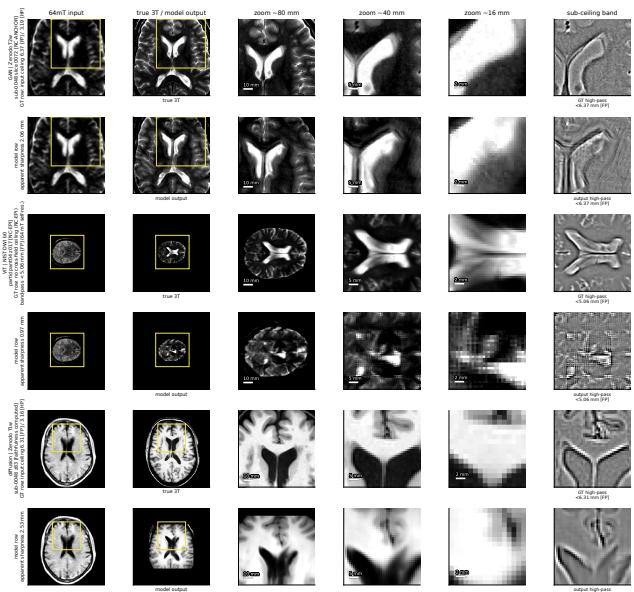  
Figure 3: Faithful information stops at the measured ceiling (display only). One representative run per family on its own held-out subject, matched on the anterior lateral-ventricle margin: GAN on Zenodo T2w, ViT on NIST b0, diffusion on Zenodo T1w (posterior mean). Row 1: 64 mT input, true 3T, zoom ladder; row 2: model output at identical coordinates; last column: band-pass finer than the input ceiling (NIST, which has no cross-field ceiling: finer than the 64 mT self-resolution, 5.06 mm [FP]). Finer than the ceiling the input carries little subject information while every output renders fine detail; faithfulness is computed only for the diffusion row (Table 9), and the GAN and ViT rows are not computable (NC-ANCHOR, NC-EPI).

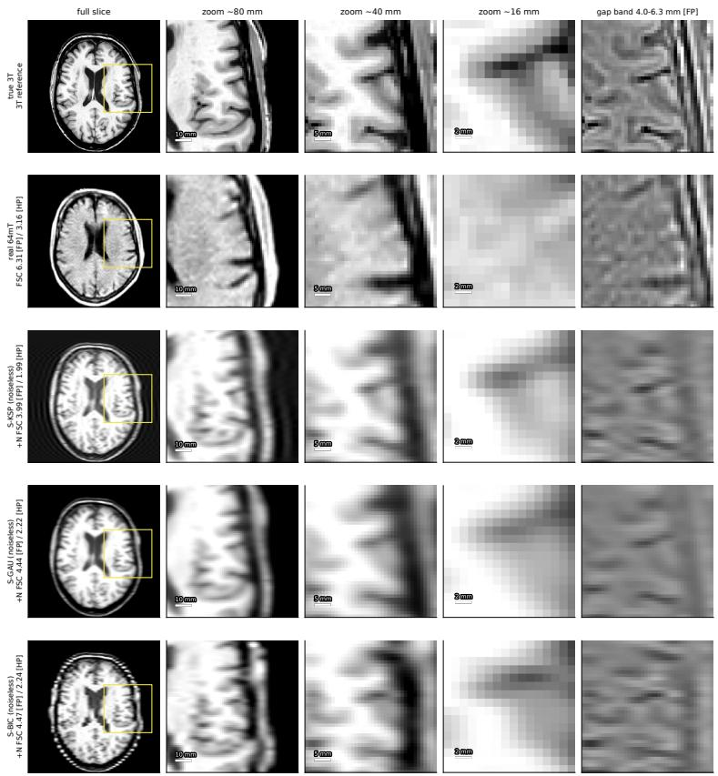  
Figure 4: Synthetic degradations keep a band the real acquisition lacks (display only). Zenodo T1w sub-0048: true 3T, real 64 mT, and noiseless S-KSP, S-GAU, S-BIC, with zooms and a 4.0– 6.3 mm [FP] band-pass between the synthetic and real crossings. Annotations are the noise-matched crossings: real 6.31 [FP], S-KSP+N 3.99, S-GAU+N 4.44, S-BIC+N 4.47.

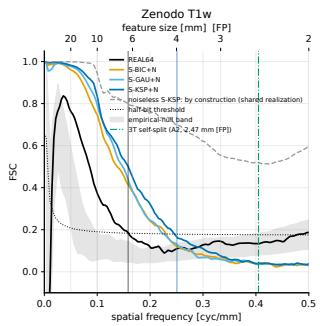

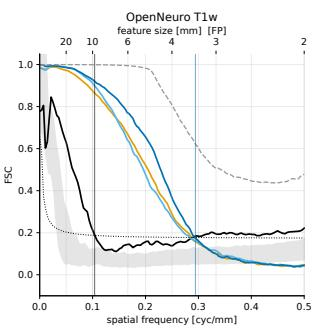  
Figure 5: Cross-FSC curves. Median over subjects of FSC against the 3T for the real 64 mT scan and the noise-matched synthetics (noiseless S-KSP dashed; it shares the 3T noise, so its curve is inflated), with the half-bit threshold, the empirical null band, and the 3T self-split scalar (2.47 mm [FP]).

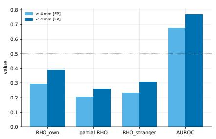

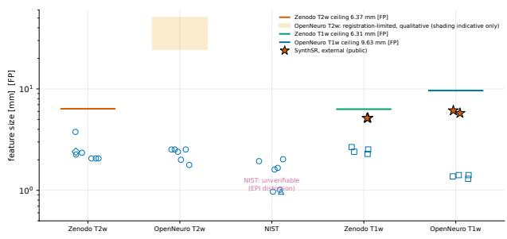  
Figure 6: Left: Uncertainty controls on the original registration frame, bands of 4 mm [FP] and coarser vs finer than 4 mm [FP]. Fine bands: AUROC 0.77, RHO\_own 0.39 vs RHO\_stranger 0.31; coarse bands: AUROC 0.68 (Table 7). The validated-frame recompute is reported in Section 5.3. Right: Apparent sharpness vs input ceiling, 24 reference runs (marker = family) and SynthSR (star), by dataset column; horizontal lines mark each column’s input ceiling (OpenNeuro T2w: registration-limited, qualitative, shading indicative only; NIST: no cross-field ceiling). Every trained run renders detail finer than its ceiling; SynthSR (5.2–6.1 mm [FP]) sits at it.

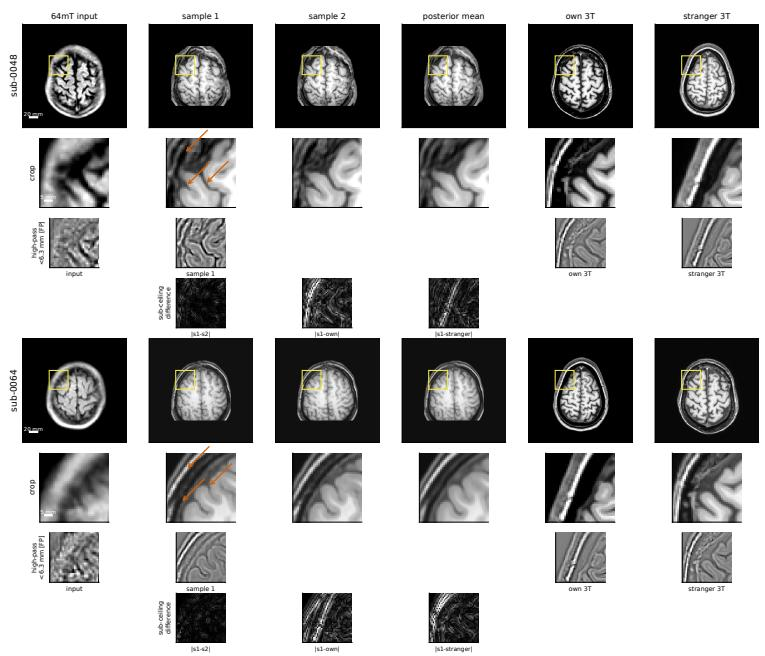  
Figure 7: Fabrication in image space (display only). Zenodo T1w held-out subjects sub-0048 and sub-0064: 64 mT input, two posterior samples, posterior mean, own 3T and stranger 3T, with zooms and a high-pass strip finer than the ceiling. Quantities for these subjects are in Table 2 and Figure 2.

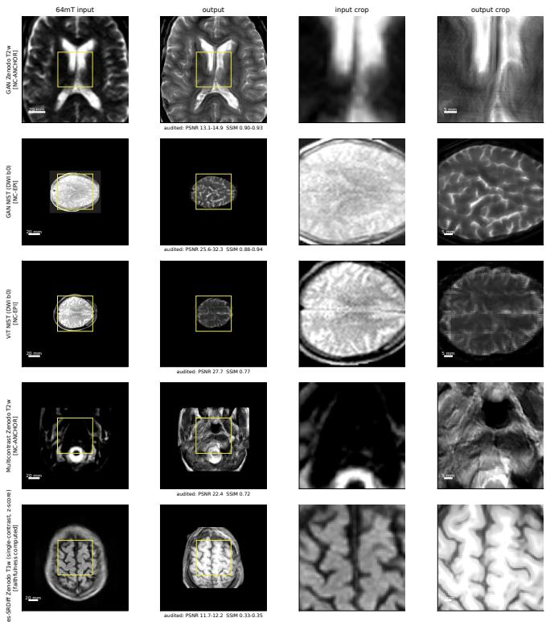  
Figure 8: Confident detail across audit arms (display only). Input and output with zooms for five arms, no truth column: GAN Zenodo T2w (NC-ANCHOR), GAN NIST b0 (NC-EPI), ViT NIST b0 (NC-EPI), multicontrast Zenodo T2w (NC-ANCHOR), single-contrast diffusion Zenodo T1w (faithfulness computed, merges 16 and 24 mm [FP], Table 2). The OpenNeuro T2w GAN arm is omitted here (outputs collapse under the cross-device gap, NC-XDEV) and reported in Table 9.

## E OPENNEURO T2W CEILING

The OpenNeuro T2w recoverability ceiling is registration-limited, qualitative: the exact millimetre value is uncertain (weak cross-acquisition registration, MI median around −0.45, and the reading is beyond the FSC-validated range), while the qualitative conclusion is robust (the low-field T2w input carries essentially no faithful fine information about the high-field T2w).

## F LESSONS FOR PRACTICE: WHAT FAILED AND WHY

Resolution estimators that read the grid instead of the image. Radial power-spectrum resolution and slice-accumulated 2D FSC both return the grid limit rather than an image property: accumulating in-plane over ∼149 slices inflates the per-shell voxel count, the half-bit threshold floors, and the crossing lands at the grid limit (0.69 mm). All audit FSC therefore uses the gated 3D Algorithm 1; the FSC null-floor crossing (∼36 mm [FP] median, highly variable) is excluded as a ceiling estimate.

Cross-field correlation needs geometric correspondence. NIST cross-FSC is degenerate (∼65 mm) because the low-field diffusion b0 is EPI-distorted and rigid registration cannot align it; deformable registration is not allowed, so NIST is reported through self-1FRC and its runs carry NC-EPI.

A fixed test split can hide a data pathology from PSNR and SSIM. The fixed two-subject held-out T2w split of the Zenodo reconstruction study coincides with the two extreme low-field-resolution outliers of the distribution, one registration-degenerate and one anomalously fine. PSNR and SSIM on that split do not detect this; the input anchor (G-M2) does, and it is why those runs carry NC ANCHOR.

A dataset-level gate needs a shared frame. The OpenNeuro T1w ceiling and its CI are measured on the E1 frame, on which the held-out inputs do not register (anchors 51.4 and 55.8 mm [FP], no crossing under the gate recipe), while on the held-out subjects’ validated v3 frame the dataset ceiling itself is degenerate (median 158 mm [FP], CI 22–512, 12 subjects). Evaluated across frames the gate passes sub-HYPE21 and fails sub-HYPE22; like against like on E1 both fail and on v3 the outcome reverses (Table 5). No pairing passes both subjects, so the per-subject anchor on the validated frame is the operative check on OpenNeuro, and a dataset-level gate should be reported as undefined when the dataset ceiling and the held-out anchors need different frames.

Registration caches must be validated per subject. The first fabrication analysis ran on a registration cache whose held-out alignment was worse than the validated one; the raw-input control floored everywhere and exposed it. Re-running on per-subject validated frames moved the merges to the values reported here. On OpenNeuro the ordering of the two caches is reversed, so each dataset is analysed on its better-registered frame.

## G RECONSTRUCTION EXPERIMENT DETAILS

T1w single-contrast diffusion (direct measurement). Res-SRDiff (Safari et al., 2025) (residualshifting diffusion, exponential schedule with power 0.3, κ = 2.0, x<sub>0</sub> prediction) is trained on 2D axial slices $( 2 5 6 \times 2 5 6$ at 0.49 mm, padded to 384) of paired scans, rigidly registered on Zenodo and affinely on OpenNeuro. Zenodo uses 8 training subjects (1220 slices) and OpenNeuro 21; the held-out subjects are sub-0048/sub-0064 and sub-HYPE21/sub-HYPE22. Intensities are foreground z-scores clipped to [−3, 3] or WhiteStripe white-matter-peak units clipped to [−10, 8], both mapped $\mathrm { t o } [ - 1 , 1 ]$ . The loss is MSE and LPIPS weighted 4:2 plus a gradient term of weight 3; learning rate $5 \times 1 0 ^ { - 5 }$ with cosine decay, EMA 0.999, batch 1, mixed precision, no augmentation, validation every 5 epochs with early-stopping patience 5. The diffusion chain has 15 steps in Zenodo training and 4 in OpenNeuro training; all posterior sampling uses 4 steps (seeds 70001–70050 for the z-score arm, five fixed seeds for WhiteStripe). There is no separate validation split at this sample size: the checkpoint with the best validation PSNR on the two held-out subjects of each dataset was kept, namely epoch 90 of 100 (Zenodo z-score), 100 (Zenodo WhiteStripe), 40 of 45 (OpenNeuro zscore), and 5 of a short 6-epoch run (OpenNeuro WhiteStripe, reported as a robustness check only). PSNR for these runs is computed on foreground voxels after per-volume 0.5/99.5-percentile scaling of prediction and truth to [0, 1]. On OpenNeuro only a ventricle band of slices is sampled (92 and 98 slices for sub-HYPE21 and sub-HYPE22) and the remaining slices are filled from the 3T reference; these fill slices are excluded from every readout (a slice counts as sampled when its across-sample standard deviation exceeds 15% of the volume maximum on at least 50 voxels). Algorithm 3 and the uncertainty controls use only the sampled slices, and the apparent sharpness, PSNR, and SSIM of the OpenNeuro rows in Table 9 are computed on the sampled slices only. On Zenodo the model predictions cover a central 125 mm of the field of view, so in the validated frame they cover 75 and 80% of the brain mask of sub-0048 and sub-0064. Every Algorithm 3 readout for these runs, and for the raw-input benchmark, oracle, WhiteStripe runs, and SynthSR compared against them, is restricted to the 3T foreground mask (intensity above 5% of the maximum) intersected with this coverage and with the sampled slices; only the whole-brain FSC anchor uses the SynthSeg brain mask. After a least-squares linear intensity fit of the z-score posterior mean to the truth in the same scaled space, PSNR is 13.8–14.9 dB, so the low values reflect disagreement with the subject rather than intensity scaling.

T2w and NIST reference runs. All reconstruction experiments use acquired paired low-field inputs; no low-field training input is synthesized. NIST uses paired nominal $b = 0$ diffusion trace images (recorded b-values of approximately $0 . 0 5 ~ \mathrm { s / m m ^ { 2 } }$ at 64 mT and $0 ~ \mathrm { s / m m ^ { 2 } }$ at 3T) from 14 training and 3 test participants; OpenNeuro uses paired T2w from 16 and 4; Zenodo uses paired T2w from 8 and 2. Participants are partitioned before slice extraction. All models are 2D. NIST low-field images are interpolated to a 1.2 mm in-plane grid and center-padded to $3 8 4 \times 3 8 4 ;$ OpenNeuro and Zenodo low-field volumes are affine-registered to their 3T references and prepared as $2 5 6 \times 2 5 6$ axial slices. All networks are trained from fresh initialization for 100 epochs. Two training configurations are used. Balanced weights the pixel, LPIPS, and gradient terms $4 : 2 : 3 ;$ perceptual-dominant weights them $1 : 1 0 : 1$ and adds a Haar-style consistency term (weight 1: an average-pooled low-pass L1, plus a high-pass residual L1 for DISGAN). The pixel term is L1 for all GANs and MSE for Res-SRDiff. All GAN generators predict in the image domain and keep their native adversarial objectives (DISGAN: a relativistic loss with a Haar wavelet discriminator in both configurations; medSynthesis: WGAN-GP with its gradient-difference loss; SR-CycleGAN: cycle and identity terms, trained on pairs); only the perceptual-dominant Res-SRDiff predicts Haar wavelet coefficients. On Zenodo and OpenNeuro both configurations use per-volume 0.5/99.5-percentile min–max scaling (run identifiers ending in minmax\_balanced\_image were originally named whitestripe\_balanced\_image); on NIST the balanced runs use a WhiteStripe-inspired scaling (Shinohara et al., 2014; Reinhold et al., 2019) and the perceptual-dominant runs slice min–max.

Runs outside the audit. Table 10 marks which trained runs are audited. The perceptual-dominant Res-SRDiff T2w runs (Zenodo, OpenNeuro), the Res-SRDiff NIST runs, and the two-input multicontrast runs have held-out slice predictions but were not included in the audit; the balanced Res-SRDiff T2w runs did not complete training. We list them so that the coverage of the audit is explicit; their held-out subjects are those of the corresponding audited GAN runs, so faithfulness falls under the same reason codes, and their sharpness and metric rows are not reported here.

## H REPRODUCIBILITY OF THE EXTERNAL SYNTHSR ARM

The external arm uses the publicly released SynthSR (Iglesias et al., 2021), the standard single-input model SynthSR\_v10\_210712.h5 at repository commit 9e63935, run with scripts/predict\_command\_line.py --cpu --threads 4 on each held-out subject’s registered 64 mT scan; each output is mapped onto that subject’s analysis frame by a single interpolation before the identical Algorithm 3, apparent-sharpness, and foreground PSNR/SSIM readouts. The environment is Python 3.8.10 with TensorFlow 2.2.0, Keras 2.3.1, and protobuf pinned to 3.19.6 (TensorFlow 2.2 is incompatible with protobuf 4.x). The released commit carries two dictionary-access defects in the inference script (args.model and args.disable\_flipping, where args is a dictionary built by vars(parse\_args())); we correct both to item access, changing no weights and no inference behaviour. On sub-0064 the SynthSR output correlates only 0.10 with the 3T at the coarsest band, below the harness alignment warning (0.2), so its merge there should be read with care; the same subject is marginal on the G-M3 correspondence check (Appendix B). On sub-HYPE22 its REC is 0.04 and 0.00 against SWAP of −0.043 and −0.058 at the 16 and 12 mm bands, which is why its unclipped merge (10 mm) is finer than its benchmark. The dual-input low-field variant (Iglesias et al., 2023) is not audited because these held-out subjects lack a paired 64 mT T2w.

<table><tr><td colspan="8">Table 10: Reconstruction experiments of the reference arm. All use acquired paired low-field inputs and high-field targets. Balanced: pixel/LPIPS/gradient 4 : 2 : 3; perceptual-dominant: 1 : 10 : 1 plus consistency. Pixel term L1 (GANs) or MSE (Res-SRDiff). Train/Test gives the participant split; the last column marks runs in the audit (Table 9). The four single-contrast T1w diffusion runs of the direct measurement are listed first in their dataset blocks.</td></tr><tr><td>Dataset</td><td>Low-field input</td><td>High-field target</td><td>Model</td><td>Normalization</td><td>Configuration</td><td>Train/Test</td><td>Audited</td></tr><tr><td>NIST</td><td>Lowest-b trace</td><td>Lowest-b trace</td><td>Res-SRDiff</td><td>Slice min-max</td><td>Perceptual-dominant, wavelet prediction</td><td>14/3</td><td>no</td></tr><tr><td>NIST</td><td>Lowest-b trace</td><td>Lowest-b trace</td><td>Res-SRDiff</td><td>WhiteStripe-inspired</td><td>Balanced, image prediction</td><td>14/3</td><td>no</td></tr><tr><td>NIST</td><td>Lowest-b + higher-b trace</td><td>Lowest-b trace</td><td>Res-SRDiff</td><td>Training-derived percentile scaling</td><td>Balanced, multi-b conditioning</td><td>14/3</td><td>no</td></tr><tr><td>NIST</td><td>Lowest-b trace</td><td>Lowest-b trace</td><td>DISGAN</td><td>Slice min-max</td><td>Perceptual-dominant + consistency</td><td>14/3</td><td>yes</td></tr><tr><td>NIST</td><td>Lowest-b trace</td><td>Lowest-b trace</td><td>DISGAN</td><td>WhiteStripe-inspired</td><td>Balanced</td><td>14/3</td><td>yes</td></tr><tr><td>NIST</td><td>Lowest-b trace</td><td>Lowest-b trace</td><td>medSynthesis</td><td>Slice min-max</td><td>Perceptual-dominant + consistency</td><td>14/3</td><td>yes</td></tr><tr><td>NIST</td><td>Lowest-b trace</td><td>Lowest-b trace</td><td>medSynthesis</td><td>WhiteStripe-inspired</td><td>Balanced</td><td>14/3</td><td>yes</td></tr><tr><td>NIST</td><td>Lowest-b trace</td><td>Lowest-b trace</td><td>SR-CycleGAN</td><td>Slice min-max</td><td>Perceptual-dominant + consistency</td><td>14/3</td><td>yes</td></tr><tr><td>NIST</td><td>Lowest-b trace</td><td>Lowest-b trace</td><td>SR-CycleGAN</td><td>WhiteStripe-inspired</td><td>Balanced</td><td>14/3</td><td>yes</td></tr><tr><td>NIST</td><td>Lowest-b trace</td><td>Lowest-b trace</td><td>ViT-Fuser (direct)</td><td>Training-derived percentile scaling</td><td>SSIM + feature-style loss</td><td>14/3</td><td>yes</td></tr><tr><td>OpenNeuro</td><td>T1w</td><td>T1w</td><td>Res-SRDiff</td><td>Foreground z-score</td><td>Balanced, image prediction</td><td>21/2</td><td>yes</td></tr><tr><td>OpenNeuro</td><td>T1w</td><td>T1w</td><td>Res-SRDiff</td><td>WhiteStripe</td><td>Balanced, image prediction</td><td>21/2</td><td>yes</td></tr><tr><td>OpenNeuro</td><td>T2w</td><td>T2w</td><td>Res-SRDiff</td><td>Volume percentile min-max</td><td>Perceptual-dominant, wavelet prediction</td><td>16/4</td><td>no</td></tr><tr><td>OpenNeuro</td><td>T2w</td><td>T2w</td><td>DISGAN</td><td>Volume percentile min-max</td><td>Perceptual-dominant + consistency</td><td>16/4</td><td>yes</td></tr><tr><td>OpenNeuro</td><td>T2w</td><td>T2w</td><td>DISGAN</td><td>Volume percentile min-max</td><td>Balanced</td><td>16/4</td><td>yes</td></tr><tr><td>OpenNeuro</td><td>T2w</td><td>T2w</td><td>medSynthesis</td><td>Volume percentile min-max</td><td>Perceptual-dominant + consistency</td><td>16/4</td><td>yes</td></tr><tr><td>OpenNeuro</td><td>T2w</td><td>T2w</td><td>medSynthesis</td><td>Volume percentile min-max</td><td>Balanced</td><td>16/4</td><td>yes</td></tr><tr><td>OpenNeuro</td><td>T2w T2w</td><td>T2w</td><td>SR-CycleGAN</td><td>Volume percentile min-max</td><td>Perceptual-dominant + consistency</td><td>16/4</td><td>yes</td></tr><tr><td>OpenNeuro</td><td></td><td>T2w</td><td>SR-CycleGAN</td><td>Volume percentile min-max</td><td>Balanced</td><td>16/4</td><td>yes</td></tr><tr><td>Zenodo</td><td>T1w</td><td>T1w</td><td>Res-SRDiff</td><td>Foreground z-score</td><td>Balanced, image prediction</td><td>8/2</td><td>yes</td></tr><tr><td>Zenodo</td><td>T1w T2w</td><td>T1w</td><td>Res-SRDiff</td><td>WhiteStripe</td><td>Balanced, image prediction</td><td>8/2</td><td>yes</td></tr><tr><td>Zenodo</td><td></td><td>T2w</td><td>Res-SRDiff</td><td>Volume percentile min-max</td><td>Perceptual-dominant, wavelet prediction</td><td>8/2</td><td>no</td></tr><tr><td>Zenodo</td><td>T2w T2w</td><td>T2w</td><td>DISGAN</td><td>Volume percentile min-max</td><td>Perceptual-dominant + consistency</td><td>8/2</td><td>yes</td></tr><tr><td>Zenodo</td><td>T2w</td><td>T2w</td><td>DISGAN</td><td>Volume percentile min-max Volume percentile min-max</td><td>Balanced Perceptual-dominant + consistency</td><td>8/2</td><td>yes</td></tr><tr><td>Zenodo</td><td>T2w</td><td>T2w T2w</td><td>medSynthesis</td><td>Volume percentile min-max</td><td>Balanced</td><td>8/2</td><td>yes</td></tr><tr><td>Zenodo</td><td>T2w</td><td>T2w</td><td>medSynthesis SR-CycleGAN</td><td>Volume percentile min-max</td><td>Perceptual-dominant + consistency</td><td>8/2 8/2</td><td>yes</td></tr><tr><td>Zenodo</td><td>T2w</td><td>T2w</td><td>SR-CycleGAN</td><td>Volume percentile min-max</td><td>Balanced</td><td>8/2</td><td>yes</td></tr><tr><td>Zenodo Zenodo</td><td>T2w + T1w</td><td>T2w</td><td>Res-SRDiff</td><td>Training-derived percentile scaling</td><td>Balanced, multicontrast conditioning</td><td>8/2</td><td>yes no</td></tr><tr><td>Zenodo</td><td>T2w + FLAIR</td><td>T2w</td><td>Res-SRDiff</td><td>Training-derived percentile scaling</td><td>Balanced, multicontrast conditioning</td><td>8/2</td><td>no</td></tr><tr><td>Zenodo</td><td>T2w + T1w + FLAIR</td><td>T2w</td><td>Res-SRDiff</td><td>Training-derived percentile scaling</td><td>Balanced, multicontrast conditioning</td><td>8/2</td><td></td></tr><tr><td></td><td></td><td></td><td></td><td></td><td></td><td></td><td>yes</td></tr></table>