# vSkipper: Translating Dynamic Layer Skipping into LLM Serving Gains

<sup>WEI</sup> <sup>DA∗</sup>, The University of Cambridge, United Kingdom

<sup>YAVUZ</sup> <sup>FERHATOSMANOGLU</sup>, The University of Cambridge, United Kingdom

<sup>EVANGELIA</sup> <sup>KALYVIANAKI</sup>, The University of Cambridge, United Kingdom

Dynamic layer skipping reduces LLM computation by allowing each token to execute only a subset of the model’s layers. However, existing skippers rely on specialized generation loops and do not integrate with modern serving engines. As a result, fewer executed layers do not necessarily translate into lower serving latency: FlexiDepth skips 8 of Llama-3-8B’s 32 layers on average, yet its standard generation loop decodes 14.6–21.0% more slowly than the base model. We present vSkipper, a virtualization layer that makes dynamic layer skippers pluggable in serving engines while preserving continuous batching, fixed-shape batches, paged KV caching, and captured decode graphs. At each routed layer, vSkipper groups tokens by the skipper’s decision and uses routed execution only when predicted to be profitable. We implement vSkipper in SGLang and evaluate the released FlexiDepth checkpoint against upstream SGLang under identical prompts, arrivals, output lengths, and launch settings. At the knee of upstream’s load curve, vSkipper reduces mean end-toend latency by 36.8% on GSM8K and 13.6% on BBH. Under saturation, it increases request throughput by 11.3% and 7.4%. Serving adds no statistically resolved quality loss beyond the checkpoint’s own. Across synthetic skip policies, two Qwen3 skippers, and three GPUs, we demonstrate reuse without workload-specific tuning. To our knowledge, vSkipper is the first system to realize serving-eficiency gains from per-token interior layer skipping within a modern LLM serving engine. The code is open-sourced as an SGLang fork at https://github.com/AKafakA/sglang-vskipper/tree/vskipper-ref

## 1 Introduction

Not every token requires the full depth of an LLM. Dynamic layer-skipping methods exploit this observation by choosing, for each token, which layers to execute [10, 15, 25]. FlexiDepth [15], for example, adds lightweight per-token routers to a pretrained model and skips 20–30% of its layers. Such methods reduce model computation without replacing the underlying transformer backbone. However, translating saved computation into batched serving gains is a separate execution problem.

Modern LLM serving engines rely on regular batched execution, continuous batching, paged KV-cache management, and captured GPU graphs [12, 26, 28]. These optimizations largely assume that tokens in a batch traverse every layer. Dynamic skipping breaks this regularity: at a given layer, some tokens execute the full computation while others bypass it. Released skippers therefore commonly use model-specific research execution paths and report FLOP savings [15], rather than gains in modern serving engines. The missing piece is an interface between layer skipping and the engine’s batching, cache management, and execution.

We present vSkipper, a serving virtualization layer for per-token interior layer skipping. vSkipper makes a dynamic skipper a pluggable component of the serving engine through a reusable interface. The skipping policy decides where each token skips, while vSkipper preserves the engine’s batching, cache, and graph interfaces. We realize mixed-depth execution through a RUN/Project-Only interface. At each routed layer, vSkipper packs rows sharing a decision into cohorts and scatters their outputs back to the original batch positions. Project-Only rows bypass the layer’s attention and FFN while still writing the KV state required by future tokens’ attention computation. Since routing introduces overhead, vSkipper performs mode switching only when its estimated savings exceed the cost.

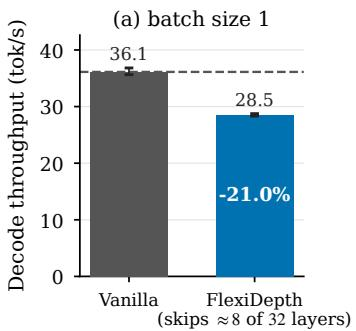

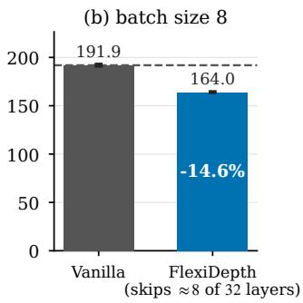  
Fi<sub>g</sub>. 1. Saved FLOPs are not saved time: decode throu<sub>g</sub>h<sub>p</sub>ut of the FlexiDe<sub>p</sub>th check<sub>p</sub>oint a<sub>g</sub>ainst its base model in a standard <sub>g</sub>eneration loo<sub>p</sub>, with fixed batches of 1 and 8 re<sub>q</sub>uests each <sub>g</sub>eneratin<sub>g</sub> 256 tokens (mean of three runs; whiskers show the ran<sub>g</sub>e).

We implement vSkipper in SGLang and evaluate it against upstream SGLang using identical launch settings, prompts, arrivals and per-request output lengths. At the knee of upstream’s load curve, mean end-to-end latency falls by 36.8% on GSM8K and 13.6% on BBH. Under saturation, request throughput rises by 11.3% and 7.4%. Serving introduces no statistically resolved quality loss beyond that of the checkpoint, and under load we find no resolved quality diference from routing every pass at the knee. To our knowledge, vSkipper is the first serving system to realize serving-eficiency gains from per-token interior whole-layer skipping within a modern LLM serving engine.

Our contributions are:

(1) A virtualization layer for skippers. We introduce a whole-layer RUN/Project-Only interface that makes per-token skip policies pluggable components of a modern serving engine without redesigning its scheduler or memory manager (§3).

(2) Mixed-depth execution. We develop route-guided cohort execution for heterogeneous pertoken paths within captured graphs (§3.1), establish the invariants required for correct dynamicdepth execution (§3.2), and introduce profitability-aware mode switching (§3.3).

(3) A controlled evaluation. We compare vSkipper with upstream SGLang under matched work and launch settings, and separate checkpoint quality from serving efects. We then demonstrate how the same implementation generalizes beyond FlexiDepth across nine synthetic skip policies, two Qwen3 skippers in addition to Llama-3-8B, three workloads, and A100, H100, and RTX A6000 GPUs, without workload-specific tuning (§4).

## 2 Background and Motivation

Serving engines assume fixed-depth execution. Continuous-batching engines such as Orca [26], vLLM [12], and SGLang [28] organize kernels, metadata, page tables, and captured graphs around the assumption that every row in a batch traverses every layer. Dynamic layer skipping breaks this assumption because tokens follow diferent layer paths.

Saved FLOPs are not saved time. FlexiDepth reports that its implementation “does not lead to improved throughput on the existing GPU hardware” [15]. We reproduce this gap using the public checkpoint over 100 prompts with 256 greedy output tokens. Despite skipping 8 of 32 layers on average, decode throughput falls by 21.0% at batch size 1 and 14.6% at batch size 8 (Figure 1). At batch size 1, routing overhead ofsets the saved work. At batch size 8, the batch still traverses the union of its tokens’ required layers, while splitting it sacrifices batch width.

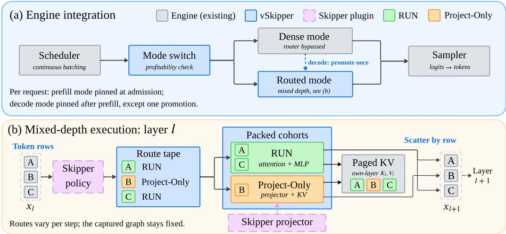  
Fi<sub>g</sub>. 2. Overview of vSkipper. (a) The mode switch selects dense or routed execution <sub>p</sub>er re<sub>q</sub>uest and <sub>p</sub>hase based on <sub>p</sub>redicted <sub>p</sub>rofitabilit<sub>y</sub> (§3.3). (b) Routed la<sub>y</sub>ers record ski<sub>pp</sub>er decisions, <sub>p</sub>ack rows into RUN and Project-Onl<sub>y</sub> cohorts, and scater out<sub>p</sub>uts back to the batch (§3.1). Project-Onl<sub>y</sub> rows still write their own-la<sub>y</sub>er KV (§3.2).

What a serving abstraction must provide. Turning dynamic depth into serving gains requires preserving batch eficiency, maintaining correct per-layer state across divergent paths, and routing only when the savings exceed the overhead. For autoregressive attention, even a row that skips a layer’s main computation must still produce the KV state required by future tokens. The benefit also depends on phase: skipping reduces attention memory trafic during memory-bound decode and avoids arithmetic during compute-bound prefill.

## 3 Design and Implementation

vSkipper separates the skipping policy from execution and engine state (Figure 2). A skipper implements the skipper interface: it supplies per-token RUN or Project-Only decisions and the projector applied to skipped rows. We realize these decisions through mixed-depth execution, which turns them into route data, packed cohorts, and KV-complete cache state (§3.1). Two invariants keep this execution correct under dynamic depth (§3.2), and the mode switch decides when routing is worth its cost (§3.3). The engine remains compatible with its serving optimizations, including continuous batching, admission control, paged KV management and prefix reuse (§3.4).

Vocabulary. A row holds one token’s hidden state, one per sequence in decode and several per sequence in prefill. Each request uses dense or routed mode, chosen separately for prefill and decode. Dense mode is the unmodified engine’s forward pass and runs every layer without consulting the router. Routed mode takes RUN or Project-Only per row at each routed layer. If a batch mixes modes, it uses the routed path with dense rows taking RUN. � denotes a batch’s resident KV tokens.

## 3.1 Route-Guided Cohort Execution

Mixed-depth execution runs inside the engine’s existing forward passes. Decode steps run as in a standard engine, replaying a single captured graph over the batch. Inside the graph, as Figure 2 shows, rows in the same batch can take diferent actions chosen by the policy from the current rows, and the RUN and Project-Only rows compute their updates separately before scattering them back to their rows. The next routed layer evaluates the updated states and may route diferently. Route tape. A layer’s policy decisions are written into a device-resident route tape, a per-row mask for each routed layer. Since the captured graph consumes the tape as data, routes can change from step to step without host synchronization or graph recapture.

<table><tr><td>Algorithm 1 One routed layer of a decode graph captured at batch size C. The cohort counts  $n _ { r } ,$   $n _ { p }$  and router weights w live on the device, so the layer runs without host synchronization.</td></tr><tr><td>Require: the layer&#x27;s route tape, hidden states X, residual Y, layer and projector weights, tile table Ensure: Y updated for all rows and the layer&#x27;s KV cache complete 1: Maps. From the route tape build the index maps run  $\left[ 0 { : } n _ { r } \right]$  and proj  $[ 0 { : } n _ { \mathnormal { p } } ]$  , mapping each cohort position to its batch row, and the counts as device scalars.</td></tr><tr><td> $n _ { r } , n _ { p }$  2: Attention. Compute and write every valid row&#x27;s own-layer KV through the layer&#x27;s normal projection and cache-write path. The decode kernel takes the RUN mask: a Project-Only row reads no KV at this layer and emits zero.</td></tr><tr><td>3: Tiles. For each of the four count-bounded GEMMs (gate-up and down, per cohort) select the tile configuration from the device&#x27;s tuned tile table with captured batch size C. 4: RUN cohort.  $G \gets \mathrm { G E M M } _ { n _ { r } } ( X [ \mathrm { r u n } ] , W _ { \mathrm { g a t e , u p } } )$  with the gather folded into the operand load;</td></tr><tr><td> $A \gets \mathrm { s i l u } ( G _ { \mathrm { g a t e } } ) \odot G _ { \mathrm { u p } } \mathrm { o v e r } n _ { r } \mathrm { r o w s } ; Y [ \mathrm { r u n } [ m ] ] + = w \mathrm { G E M M } _ { n _ { r } } ( A , W _ { \mathrm { d o w n } } ) [ m ]$  with the scatter and the router weight w folded into the epilogue.</td></tr><tr><td>5: Project-Only cohort. The same three steps over proj and  $n _ { p }$  , with the projector&#x27;s weights and route weight  $1 - w$  6: Grid exit. Every GEMM launches a static grid sized for C rows, and a tile starting at or beyond</td></tr></table>

Project-Only path. A skipped token cannot simply bypass a layer: future tokens attending to it expect that layer’s KV to exist (Invariant 1, §3.2). Skipped layers are therefore traversed cheaply, with the skipper’s own skip semantics. A skipped row writes only the layer’s key and value projections to the KV cache, dropping its attention output and running the plugged projector instead of the MLP. For FlexiDepth, the projector is the checkpoint’s adapter, mixed by the router’s weight $w \in [ 0 , 1 ]$ The skip avoids the row’s attention KV read and, when compute-bound, its bypassed arithmetic.

Packed cohorts. From the tape, each routed layer derives its two groups of rows, the cohorts, and their sizes as device scalars. We treat each cohort as one contiguous operand, folding the row gather into the operand load and the weighted scatter of results into the epilogue, so the cohort GEMMs are bounded by cohort size rather than batch size. Attention instead keeps its launch shape and masks skipped rows’ KV reads, leaving the graph capture-safe (Algorithm 1, Appendix B).

Captured execution. We capture both modes at fixed batch sizes, up to a device-derived maximum (e.g., 1,024 rows on an A100), so the mode switch always finds a captured graph. Within the routed graph, each routed layer runs the mixed-cohort path of Algorithm 1, and a device-side conditional CUDA-graph node adds an all-RUN fast path for the frequent steps where no row skips the layer. Prefill. The same interface and cohorts govern prefill, with one row per prompt token and its own switching rule (§3.3). Its variable-size inputs keep prefill outside capture, so cohorts use standard cuBLAS GEMMs with the same gather and scatter (Appendix B). In this compute-bound phase, a skipped row saves arithmetic directly and writes each layer’s KV as in decode.

## 3.2 Invariants for Correct Mixed-Depth Execution

vSkipper enforces two invariants that preserve correctness when depth varies per token.

Invariant 1: every layer writes its own KV. Every cached token has keys and values computed by each layer’s own projection weights at all � layers, including the skipped layers. Batched attention, paged KV caches [12] and prefix reuse all assume that position � of layer ℓ’s cache holds the outputs of that layer’s own key and value projections, rather than copied or missing state. Early-exit methods can violate this and must recompute, keep per-depth caches [8], or copy state across depths [13]. The Project-Only path preserves it.

Invariant 2: row metadata is never stale. Any structure that maps rows to memory is recomputed from the current row set wherever that set can change. This covers attention metadata, KV page mappings and every gather or scatter map derived from routes. Under dynamic depth these maps change per layer and step, and reusing a stale map can make requests silently read other requests’ KV pages. vSkipper therefore derives every route-dependent map on the device from the current tape.

## 3.3 Profitability-Aware Mode Switching

Routed mode has a fixed per-step cost, so it is profitable only when its savings exceed that cost. The mode switch is a host-side profitability check that selects dense or routed mode separately for prefill and decode. Prefill mode is fixed at admission, while decode mode is set after prefill and may be promoted once from dense to routed if load crosses the enter threshold, after which it never reverts. Because this promotion can change computation mid-generation, we evaluate the resulting served hybrid directly (§4.3). The always-route setting disables the switch.

Decode. Below the device’s ridge point, where a kernel becomes compute-bound in the roofline model [24], decode is limited by weight bandwidth, and a skipped row saves only its KV read. Let $L _ { r }$ be the number of routed layers, � the fraction of decisions projecting, � the bytes of KV per token and layer, and � routed mode’s fixed per-step cost. Routing is profitable when

$$
V ~ > ~ V ^ { * } = { \frac { \tau \cdot \mathrm { B W } } { s L _ { r } b } } ~ \approx ~ 1 5 8 \mathrm { k } { \mathrm { ~ r e s i d e n t ~ t o k e n s ~ o n ~ a n ~ } } \mathrm { A } 1 0 0
$$

(� = 2.67 ms, � = 0.5, � = 16, � = 4 KB; Appendix D). The served switching thresholds form a hysteresis band: routing is enabled at $V \geq 2 0 0 \mathrm { k }$ and disabled for new decode requests at $V \leq 1 6 0 \mathrm { k }$ Within this range, the current switching state is retained. The rule reproduces the served exit threshold within 2%. Every other deployment’s thresholds follow from the rule with its device and model constants (Appendix D).

Prefill. Prefill uses routed mode for batches with at least 1,536 prompt tokens and an estimated Project-Only share above 0.35, jointly suficient to cover the fixed cost. The share is probed every 64 admitted batches. These constants are fixed across workloads (Appendix D).

## 3.4 Implementation

We implement vSkipper as a fork of SGLang [28], leaving unchanged its multiprocess architecture, admission control and memory management. The scheduler additionally records each request’s mode, which also keys prefix reuse. Routed-layer hooks support the Llama-3 and Qwen3 families. The main skipper is the released FlexiDepth checkpoint for Llama-3-8B [15], routing the last 16 of 32 layers, and we train and serve two Qwen3 skippers (Appendix K).

Under the skipper interface, we implement policies of two kinds: a trained gate (FlexiDepth and the Qwen3 skippers) and a seeded hash of request and token (RandomSkip). A new policy can reuse an existing projector and its execution path; only a new projector requires its own loading and execution code and checkpoint tensors. At startup, the runtime rejects any policy whose actions fall outside the whole-layer {RUN, Project-Only} set. Appendix A illustrates the interface with a static-depth policy.

T<sub>a</sub>bl<sub>e</sub> 1<sub>.</sub> Th<sub>e</sub> th<sub>ree wor</sub>kl<sub>oa</sub>d<sub>s: serv</sub>i<sub>ng pro</sub>t<sub>oco</sub>l<sub>, reques</sub>t<sub>s per per</sub>f<sub>ormance ce</sub>ll<sub>, an</sub>d d<sub>ocumen</sub>t<sub>s per qua</sub>lit<sub>y ce</sub>ll<sub>.</sub> Out<sub>p</sub>ut tokens and E2E are u<sub>p</sub>stream’s mean values at its knee.
<table><tr><td>Workload</td><td>protocol</td><td>requests</td><td>documents</td><td>output tokens</td><td> $\boldsymbol { Q } ^ { * } \left( \mathrm { r e q } / s \right)$ </td><td>upstream E2E (s)</td></tr><tr><td>GSM8K</td><td>5-shot, chat template</td><td>3,600</td><td>1,319</td><td>116</td><td>13</td><td>26.9</td></tr><tr><td>BBH</td><td>3-shot chain-of-thought</td><td>4,000</td><td>6,511</td><td>255</td><td>34</td><td>23.9</td></tr><tr><td>CoQA</td><td>raw completion</td><td>4,000</td><td>500</td><td>164</td><td>25</td><td>13.1</td></tr></table>

## 4 Evaluation

We present the experimental setup (§4.1) and then evaluate vSkipper on three questions. (Q1) Does it turn a skipper’s serving deficit into a gain at matched work (§4.2)? (Q2) Does it add any quality loss beyond the skipper’s own (§4.3)? (Q3) Is the abstraction general across skippers, models, workloads and hardware (§4.4)?

## 4.1 Experimental Setup

Arms. We define an arm as one measured configuration and a cell as one (workload, ofered rate) pair. The baseline arm is upstream SGLang, the code our fork derives from, served from its own checkout. The vSkipper arms are the served hybrid and always-route settings (§3.3). All arms share one launch profile (fp16 for Llama, bf16 for Qwen, static memory fraction 0.8, Triton attention), capture decode graphs at the same batch sizes, and keep SGLang’s radix prefix cache enabled, with vSkipper maintaining mode-consistent prefix reuse (Appendix J). We check every arm’s reported execution settings for undeclared diferences (Appendix C).

Load. We set load through the ofered arrival rate rather than admission control: seeded Poisson arrivals, no client-side concurrency cap, and every request served to completion. For each workload we measure $Q ^ { * }$ , the last ofered rate at which the baseline’s output token rate still grows under its own natural generation (Appendix M). We call $0 . 9 5 \times Q ^ { * }$ the knee, $0 . 7 5 \times Q ^ { * }$ below the knee and $1 . 2 5 \times Q ^ { * }$ overload, evaluating arms at those absolute rates.

Workloads. We evaluate on three standard tasks with complementary serving profiles (Table 1): GSM8K mathematical reasoning [5], pairing long few-shot prompts with short outputs; BBH (BIG-Bench Hard) [23], whose chain-of-thought generations result in long outputs and whose shared few-shot prefixes are largely served from the prefix cache; and CoQA conversational QA [19], whose long passages and very short answers (43% end within five tokens) concentrate decode work in a few long requests. We serve each workload as a frozen suite of token-id prompts, padding the GSM8K and CoQA load with training-split prompts and scoring only their held-out documents.

Matched work. The arms generate the same number of output tokens for each request and difer only in how they execute that work. Under natural stopping, the checkpoint’s output lengths difer from the base model’s (Appendix G), which would confound execution speed with generation behavior. We therefore record each request’s output length from the baseline’s natural generation at the cell’s rate and replay it in both arms with ignore\_eos. Prompts, arrival schedule, output lengths and launch profile are identical across arms, and a per-request gate rejects any cell whose token counts difer. This matched-work lane measures how fast each engine executes the same work. Its complement, the natural lane, lets each stack generate to its own end (Appendix G).

Testbed. Each measured pair runs on one NVIDIA A100-SXM4-80GB of a four-GPU node with no other tenant, and the two arms alternate order across repetitions. Hardware transfer to an H100 and an RTX A6000 follows the same protocol (§4.4, Appendix L), with machine details in Appendix M. Metrics. Performance experiments use SGLang’s standard serving benchmark module, to replay the same seeded Poisson arrival schedule for both arms and collect metrics, with no client-side concurrency cap. We report end-to-end latency (E2E), time to first token (TTFT), and time per output token (TPOT), where TPOT is a request’s mean inter-token interval. All latency means and percentiles are over requests. At the cell level, makespan is the time from injection start until the final request completes, and drain time is the time from the end of the injection window until completion. Whole-cell tokens per second therefore depends on both the arrival schedule and drain, rather than service capacity alone. We instead measure saturated throughput as in FaaScale [27]: output tokens (TPS) and completed requests (RPS) per second within the injection window at $1 . 2 5 \times Q ^ { * }$ (Appendix F). Below saturation, we compare latency at equal ofered load.

Table 2. Matched-work servin<sub>g</sub> <sub>p</sub>erformance of vSkipper a<sub>g</sub>ainst u<sub>p</sub>stream SGLan<sub>g</sub>: mean <sub>p</sub>ercenta<sub>g</sub>e chan<sub>g</sub>e wit<sup>h</sup> 95% interva<sup>l</sup>s over six paired repetitions per row. Negative is beter. Ma<sup>k</sup>espan c<sup>h</sup>anges on<sup>l</sup>y t<sup>h</sup>roug<sup>h</sup> t<sup>h</sup>e drain after t<sup>h</sup>e s<sup>h</sup>ared injection window.
<table><tr><td></td><td colspan="2">E2E</td><td colspan="2">TPOT</td><td colspan="2">TTFT</td><td></td></tr><tr><td>Rate</td><td>mean</td><td> $\mathrm { p } 9 9$ </td><td>mean</td><td>p99</td><td>mean</td><td> $\mathsf { p } ^ { 9 9 }$ </td><td>makespan</td></tr><tr><td>GSM8K</td><td></td><td></td><td></td><td></td><td></td><td></td><td></td></tr><tr><td> $0 . 7 5 \times Q ^ { * }$ </td><td> $- 6 . 6 \pm 1 . 5$ </td><td> $- 9 . 7 \pm 2 . 8$ </td><td> $- 6 . 8 \pm 1 . 6$ </td><td> $- 1 0 . 0 \pm 3 . 7$ </td><td> $- 7 . 1 \pm 1 . 2$ </td><td> $- 4 . 4 \pm 4 . 8$ </td><td> $- 0 . 5 \pm 0 . 1$ </td></tr><tr><td> $0 . 9 5 \times Q ^ { * }$ </td><td> $- 3 6 . 8 \pm 2 . 0$ </td><td> $- 3 7 . 3 \pm 2 . 5$ </td><td> $- 3 5 . 6 \pm 1 . 8$ </td><td> $- 1 5 . 3 \pm 3 . 8$ </td><td> $- 6 6 . 0 \pm 6 . 8$ </td><td> $- 7 4 . 5 \pm 3 . 0$ </td><td> $- 1 . 4 \pm 0 . 1$ </td></tr><tr><td> $1 . 2 5 \times Q ^ { * }$ </td><td> $- 2 5 . 7 \pm 0 . 7$ </td><td> $- 2 1 . 2 \pm 0 . 6$ </td><td> $- 1 0 . 5 \pm 0 . 2$ </td><td> $- 1 8 . 9 \pm 1 . 7$ </td><td> $- 4 1 . 5 \pm 1 . 1$ </td><td> $- 4 0 . 7 \pm 0 . 9$ </td><td> $- 7 . 2 \pm 0 . 2$ </td></tr><tr><td>BBH</td><td></td><td></td><td></td><td></td><td></td><td></td><td></td></tr><tr><td> $0 . 7 5 \times Q ^ { * }$ </td><td> $- 4 . 6 \pm 0 . 5$ </td><td> $- 8 . 2 \pm 1 . 0$ </td><td> $- 4 . 4 \pm 0 . 6$ </td><td> $- 1 0 . 7 \pm 2 . 7$ </td><td> $+ 4 . 4 \pm 1 7 . 7$ </td><td> $+ 1 2 . 0 \pm 3 7 . 5$ </td><td> $- 4 . 7 \pm 0 . 5$ </td></tr><tr><td> $0 . 9 5 \times Q ^ { * }$ </td><td> $- 1 3 . 6 \pm 1 . 2$ </td><td> $- 1 1 . 4 \pm 0 . 3$ </td><td> $- 1 4 . 6 \pm 1 . 4$ </td><td> $- 2 2 . 4 \pm 1 . 5$ </td><td> $- 4 . 9 \pm 8 . 7$ </td><td> $+ 6 . 8 \pm 3 1 . 3$ </td><td> $- 7 . 1 \pm 0 . 2$ </td></tr><tr><td> $1 . 2 5 \times Q ^ { * }$ </td><td> $- 8 . 5 \pm 1 . 0$ </td><td> $- 8 . 9 \pm 0 . 9$ </td><td> $- 8 . 8 \pm 0 . 7$ </td><td> $- 1 0 . 4 \pm 2 . 0$ </td><td> $- 5 . 6 \pm 1 4 . 6$ </td><td> $- 1 6 . 4 \pm 7 . 1$ </td><td> $- 6 . 3 \pm 0 . 7$ </td></tr><tr><td>CoQA</td><td></td><td></td><td></td><td></td><td></td><td></td><td></td></tr><tr><td> $0 . 7 5 \times Q ^ { * }$ </td><td> $- 8 . 0 \pm 0 . 6$ </td><td> $- 1 0 . 1 \pm 0 . 4$ </td><td> $+ 1 . 1 \pm 5 . 9$ </td><td> $- 2 . 0 \pm 1 8 . 4$ </td><td> $+ 1 . 6 \pm 6 . 8$ </td><td> $+ 5 . 4 \pm 3 0 . 0$ </td><td> $- 7 . 8 \pm 0 . 3$ </td></tr><tr><td> $0 . 9 5 \times Q ^ { * }$ </td><td> $- 4 . 0 \pm 4 . 4$ </td><td></td><td> $- 9 . 2 \pm 0 . 5 + 1 . 0 \pm 1 5 . 1$ </td><td> $+ 1 . 0 \pm 2 4 . 0$ </td><td> $- 1 . 2 \pm 5 . 9$ </td><td> $+ 0 . 8 \pm 5 . 2$ </td><td> $- 7 . 0 \pm 0 . 4$ </td></tr><tr><td> $1 . 2 5 \times \bar { Q } ^ { * }$ </td><td> $- 2 . 7 \pm 0 . 2$ </td><td> $- 9 . 1 \pm 0 . 2$ </td><td> $- 0 . 9 \pm 0 . 2$ </td><td> $- 1 . 7 \pm 0 . 6$ </td><td> $+ 0 . 1 \pm 0 . 6$ </td><td> $+ 0 . 3 \pm 0 . 7$ </td><td> $- 7 . 3 \pm 0 . 1$ </td></tr></table>

Quality. Task quality is scored with lm-eval [9], a unified framework for evaluating language models, on each workload’s held-out documents. For GSM8K, we use a composite of its two answer filters (Appendix E.2). To attribute quality changes between the checkpoint and our serving, we use a 2×2 design (Table 5, left): the base model and the checkpoint run natively in PyTorch (arms A and B) and are served on upstream and on vSkipper with always-route (arms C and D), all on the same documents. The paired diference-in-diferences (DiD), $\left( D / - C \right) - \left( B / - A \right)$ , with a 95% interval, isolates what serving adds beyond the checkpoint’s own cost.

Statistics. We repeat each main cell six times, running both arms within every repetition, and report the mean of the per-repetition diferences with a �-based 95% interval. A diference is resolved when its interval excludes zero, and unresolved otherwise, evidence of neither an efect nor equivalence. Experiments with fewer repetitions state � per table, and single-repetition serving cells, having no interval, are never called resolved.

## 4.2 Serving Comparison (Q1)

We serve the released FlexiDepth checkpoint on Llama-3-8B, testing whether vSkipper turns its native serving deficit (§2) into a gain at matched work. Table 2 reports the percentage change of each metric against upstream, per workload and load point. Mean end-to-end latency is lower on every row, with the 95% interval excluding zero on eight of nine: −4.6 to −8.0% below the knee, −36.8% at the GSM8K knee, and −13.6% at the BBH knee.

The gains come from diferent phases, which Table 3 isolates by routing one phase at a time. GSM8K’s gain comes from prefill routing, which alone gives −35.6% at the knee (�=1; Appendix H). Shorter prefill passes also reduce concurrent decode rows’ inter-token time because SGLang runs prefill and decode as separate passes on one stream. Decode routing drives BBH, matching vSkipper at the knee (−16.0%), with prefill contributing nothing, and produces CoQA’s smaller gain. Alwaysroute improves further at the GSM8K knee but becomes slower than upstream at the CoQA knee (+5.5%), while disabling promotion reduces the GSM8K knee gain to −32.6%.

Table 3. GSM8K mechanism ablation: mean E2E and makes<sub>p</sub>an chan<sub>g</sub>e (%) a<sub>g</sub>ainst u<sub>p</sub>stream. The served arm uses �=6 repetitions and each ablation arm �=1. All workloads appear in Appendix H.
<table><tr><td></td><td colspan="2">served (n=6)</td><td colspan="2">decode only</td><td colspan="2">prefill only</td><td colspan="2">always route</td><td colspan="2">no promotion E2E makespan</td></tr><tr><td>rate</td><td></td><td>E2E makespan</td><td></td><td>E2E makespan</td><td></td><td>E2E makespan</td><td></td><td>E2E makespan</td><td></td><td></td></tr><tr><td>0.75×</td><td> $- 6 . 6 \pm 1 . 5$ </td><td> $- 0 . 5 \pm 0 . 1$ </td><td> $+ 0 . 4$ </td><td>+0.0</td><td>-8.6</td><td>-0.7</td><td>-5.5</td><td>-1.0</td><td>-6.7</td><td>-0.5</td></tr><tr><td>0.95×</td><td> $- 3 6 . 8 \pm 2 . 0$ </td><td> $- 1 . 4 \pm 0 . 1$ </td><td> $- 1 4 . 3$ </td><td>-0.9</td><td>-35.6</td><td>-1.2</td><td>-46.5</td><td>-1.9</td><td>-32.6</td><td>-1.2</td></tr><tr><td>1.25×</td><td> $- 2 5 . 7 \pm 0 . 7$ </td><td> $- 7 . 2 \pm 0 . 2$ </td><td>-7.8</td><td>-2.6</td><td>-19.9</td><td>-5.4</td><td>-26.3</td><td>-7.4</td><td>-24.5</td><td>-7.0</td></tr></table>

T<sub>a</sub>bl<sub>e</sub> 4<sub>.</sub> Th<sub>roug</sub>h<sub>pu</sub>t <sub>un</sub>d<sub>er sa</sub>t<sub>ura</sub>ti<sub>on a</sub>t $1 . 2 5 \times Q ^ { * }$ : mean c<sup>h</sup>ange (%) wit<sup>h</sup> 95% interva<sup>l</sup>s against upstream in TPS and RPS inside the injection window; <sub>p</sub>ositive is beter. GSM8K, BBH, CoQA: Llama-3-8B on the A100 $( n { = } 6 ) ;$ other columns: GSM8K (�=3).
<table><tr><td></td><td>GSM8K</td><td>BBH</td><td></td><td>CoQA Qwen3-4B Qwen3-8B</td><td></td><td></td><td>H100 RTX A6000</td></tr><tr><td>TPS</td><td> $+ 1 0 . 4 \pm 0 . 3$ </td><td> $+ 4 . 1 \pm 0 . 4$ </td><td> $- 1 . 0 \pm 1 . 6$ </td><td> $- 0 . 2 \pm 0 . 3$ </td><td> $+ 2 . 5 \pm 0 . 2$ </td><td> $+ 1 8 . 5 \pm 3 . 0$ </td><td> $+ 9 . 1 \pm 2 . 1$ </td></tr><tr><td>RPS</td><td> $+ 1 1 . 3 \pm 0 . 2$ </td><td> $+ 7 . 4 \pm 0 . 3$ </td><td> $- 1 . 0 \pm 1 . 7$ </td><td> $- 0 . 2 \pm 0 . 4$ </td><td> $+ 2 . 8 \pm 0 . 1$ </td><td> $+ 1 9 . 3 \pm 3 . 4$ </td><td> $+ 9 . 3 \pm 1 . 7$ </td></tr></table>

Table 5. Task <sub>q</sub>ualit<sub>y</sub> (%; GSM8K com<sub>p</sub>osite exact match, BBH exact match, CoQA F1). Left: base (A) and check<sub>p</sub>oint (B) in P<sub>y</sub>Torch, served on u<sub>p</sub>stream (C) and alwa<sub>y</sub>s-route vSkipper (D), with the DiD. Ri<sub>g</sub>ht: served <sub>a</sub>t th<sub>e</sub> k<sub>nee;</sub> <sub>rou</sub>t<sub>e</sub>d<sub>:</sub> <sub>s</sub>h<sub>are</sub> <sub>o</sub>f d<sub>eco</sub>d<sub>e</sub> <sub>rows,</sub> h<sub>y</sub>b<sub>r</sub>id / <sub>a</sub>l<sub>ways-rou</sub>t<sub>e.</sub>
<table><tr><td></td><td colspan="7">PyTorch versus served (1m-eval)</td><td colspan="4">Served at the knee</td></tr><tr><td>Task</td><td>A</td><td>B</td><td>C</td><td>D</td><td>(B-A)</td><td>(D-C)</td><td>DiD (pp)</td><td>upstream</td><td></td><td>hybrid always-route</td><td>routed (%)</td></tr><tr><td>GSM8K</td><td>77.41</td><td>74.15</td><td>77.79</td><td>74.30</td><td>-3.26</td><td>-3.49</td><td> $- 0 . 2 3 \pm 0 . 6 8$ </td><td>77.63</td><td>74.00</td><td>74.07</td><td>90  / 100</td></tr><tr><td>CoQA</td><td>78.31</td><td>78.99</td><td>78.31</td><td>79.07</td><td>+0.68</td><td>+0.75</td><td> $+ 0 . 0 7 \pm 0 . 1 2$ </td><td>76.74</td><td>77.68</td><td>77.73</td><td>71 / 100</td></tr><tr><td>BBH</td><td>68.04</td><td>59.65</td><td>67.93</td><td>59.99</td><td>-8.39</td><td>-7.94</td><td> $+ 0 . 4 5 \pm 0 . 5 5$ </td><td>67.87</td><td>59.47</td><td>59.68</td><td>99 / 100</td></tr></table>

Near saturation, queueing amplifies execution savings into large latency gains (Appendix F). At the same ofered load, requests wait less: time to first token falls by 66.0% at the GSM8K knee, where shorter prefill passes clear the admission queue. Under saturation at $1 . 2 5 \times Q ^ { * }$ , vSkipper raises RPS by 11.3% on GSM8K and 7.4% on BBH. CoQA, bound by prefill that vSkipper tends to avoid routing, shows no resolved change (Table 4).

CoQA is tail-heavy: 2.0% of the base model’s generations run past 4,096 tokens and carry 94% of a cell’s output tokens. vSkipper finishes this tail faster, improving makespan by 7.0–7.8% at every rate; the gain sits in the long requests (Appendix I).

At matched work, vSkipper thus converts FlexiDepth’s serving deficit into lower mean and p99 end-to-end latency across the grid, largest at and beyond the knee on GSM8K and BBH.

## 4.3 Task Quality (Q2)

Serving adds no resolved quality loss beyond the checkpoint’s own. Table 5 (left) reports the 2×2: the DiD is $- 0 . 2 3 \pm 0 . 6 8$ pp on GSM8K, $+ 0 . 4 5 \pm 0 . 5 5$ pp on BBH and $+ 0 . 0 7 \pm 0 . 1 2$ pp on CoQA, each interval containing zero. The checkpoint’s own change, �−�, is the skipper’s quality–compute trade-of. The same serving interface can therefore support checkpoints with diferent trade-ofs.

Table 5 (right) evaluates the served hybrid under load at the knee. It shows no resolved diference from always-route: $- 0 . 0 8 \pm 1 . 4 6$ pp on GSM8K, $- 0 . 2 2 \pm 0 . 3 8$ pp on BBH, and $- 0 . 0 5 \pm 1 . 7 6$ pp on CoQA. Intervals are computed per document with �=1, and other load rates appear in Appendix E.3.

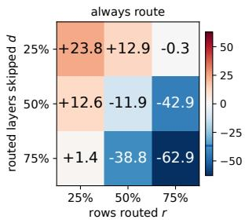  
(a) always route

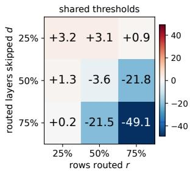  
(b) shared thresholds

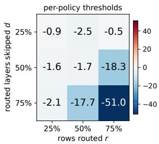  
(c) per-policy thresholds  
Fi<sub>g</sub>. 3. Mean E2E chan<sub>g</sub>e (%) a<sub>g</sub>ainst u<sub>p</sub>stream for the nine RandomSki<sub>p</sub> arms at the GSM8K knee (�=1), b<sub>y</sub> rows routed � and routed la<sub>y</sub>ers ski<sub>pp</sub>ed �, under the three switch setin<sub>g</sub>s (a–c).

Table 6. Cross-model comparison on GSM8K at each model’s knee. Matched-work mean E2E uses �=6 for L<sup>l</sup>ama and �=3 <sup>f</sup>or Qwen. Served accuracy uses one repetition. S<sup>k</sup>ip is t<sup>h</sup>e a<sup>l</sup>ways-route Project-On<sup>l</sup>y decode <sub>s</sub>h<sub>are.</sub>
<table><tr><td></td><td></td><td colspan="3">mean E2E (s)</td><td colspan="3">accuracy (%)</td></tr><tr><td>Model</td><td>skip</td><td>upstream</td><td>VSKIPPER</td><td>change (%)</td><td>upstream</td><td>VSKIPPER</td><td>change (pp)</td></tr><tr><td>Llama-3-8B (FlexiDepth)</td><td>0.504</td><td>26.9</td><td>17.0</td><td> $- 3 6 . 8 \pm 2 . 0$ </td><td>77.6</td><td>74.0</td><td> $- 3 . 6 4 \pm 2 . 2 2$ </td></tr><tr><td>Qwen3-4B</td><td>0.119</td><td>26.7</td><td>27.4</td><td> $+ 2 . 7 \pm 2 . 8$ </td><td>80.7</td><td>77.7</td><td> $- 2 . 9 6 \pm 2 . 1 5$ </td></tr><tr><td>Qwen3-8B</td><td>0.416</td><td>71.6</td><td>66.8</td><td> $- 6 . 6 \pm 0 . 3$ </td><td>80.4</td><td>75.9</td><td> $- 4 . 4 7 \pm 2 . 3 3$ </td></tr></table>

## 4.4 Generality (Q3)

The framework generalizes across skippers, model families, workloads, and hardware. New skippers, models, and devices reuse the same interface and execution framework without scheduler or memory-manager redesign or per-workload tuning, aside from architecture-specific projections. Skippers. Alongside FlexiDepth, we define a deterministic mock skipper (RandomSkip) that implements the interface by routing a fixed fraction � of rows around a fixed fraction � of routed layers, giving skip ratio $s = r d .$ . Figure 3 maps the nine arms’ mean E2E change under three switch settings: always route (a), FlexiDepth’s thresholds for every arm (b), and rule-derived thresholds per policy (c). Without the switch, unprofitable arms cost up to +23.8%. With shared thresholds, routing becomes profitable between $\begin{array} { r } { s = \bar { \frac { 3 } { 1 6 } } } \end{array}$ and $\begin{array} { r } { s = \frac { 1 } { 4 } } \end{array}$ , where the rule places the crossover (Appendix D), and gains reach −49.1% at $r = d = 7 5 \%$ . Per-policy thresholds keep unprofitable arms dense while retaining gains for profitable ones.

Models. We train Qwen3 skippers with only the first of FlexiDepth’s two training stages (Appendix K). They use the same RUN/Project-Only interface and execution path as FlexiDepth on Llama-3-8B. The only model-specific change is a hook that applies Qwen3’s per-head query and key normalization when a skipped layer writes its KV, as Qwen3’s own attention does; the switching thresholds follow from the rule in §3.3. Table 6 pairs latency and quality at each model’s knee. Qwen3-4B, whose always-route decode skip of 0.119 is too low for routing to be profitable at these loads, shows no resolved change in mean E2E at any load $( + 2 . 7 \pm 2 . 8 \%$ at the knee). Qwen3-8B, at skip 0.416, lowers mean E2E by $6 . 6 \pm 0 . 3 \%$ with no resolved quality loss beyond the checkpoint’s own (Appendix K). Across three Qwen3-8B checkpoints, serving gains grow with the skip rate, and along the lower-penalty run, continued training raised skipping and accuracy together, suggesting skipper training can further improve this quality–eficiency trade-of.

T<sub>a</sub>bl<sub>e</sub> 7<sub>.</sub> H<sub>ar</sub>d<sub>ware</sub> t<sub>rans</sub>f<sub>er:</sub> th<sub>e</sub> GSM8K <sub>ma</sub>t<sub>c</sub>h<sub>e</sub>d<sub>-wor</sub>k <sub>compar</sub>i<sub>son on an</sub> H100 $( Q ^ { * } = 1 4 { \mathrm { ~ r e q } } / s )$ <sub>a</sub>nd <sub>a</sub>n RTX A6000 $( Q ^ { * } = 6 \ r e q / s )$ , as mean percentage c<sup>h</sup>ange wit<sup>h</sup> 95% interva<sup>l</sup>s over t<sup>h</sup>ree paired repetitions against <sub>ups</sub>t<sub>ream</sub> <sub>on</sub> th<sub>e</sub> <sub>same</sub> d<sub>ev</sub>i<sub>ce.</sub>
<table><tr><td></td><td></td><td></td><td colspan="2">E2E</td><td colspan="2">TPOT</td><td colspan="2">TTFT</td><td></td></tr><tr><td>Device</td><td>Rate</td><td>n</td><td>mean</td><td>p99</td><td>mean</td><td>p99</td><td>mean</td><td></td><td>p99 makespan</td></tr><tr><td>H100</td><td> $0 . 7 5 \times Q ^ { * }$ </td><td>3</td><td> $- 6 . 0 \pm 3 . 2$ </td><td> $- 8 . 8 \pm 5 . 2$ </td><td> $- 6 . 3 \pm 3 . 5$ </td><td> $- 9 . 8 \pm 9 . 1$ </td><td> $- 5 . 2 \pm 0 . 2$ </td><td> $- 9 . 8 \pm 6 . 4$ </td><td> $- 0 . 5 \pm 0 . 3$ </td></tr><tr><td>H100</td><td> $0 . 9 5 \times Q ^ { * }$ </td><td>3</td><td> $- 3 9 . 4 \pm 0 . 2$ </td><td> $- 3 4 . 2 \pm 9 . 6$ </td><td> $- 3 1 . 4 \pm 7 . 6$ </td><td> $- 1 1 . 5 \pm 7 . 9$ </td><td> $- 9 1 . 7 \pm 4 . 8$ </td><td> $- 9 3 . 0 \pm 2 . 2$ </td><td> $- 2 . 3 \pm 2 . 2$ </td></tr><tr><td>H100</td><td> $1 . 2 5 \times Q ^ { * }$ </td><td>3</td><td> $- 3 5 . 8 \pm 3 . 4$ </td><td> $- 3 2 . 1 \pm 3 . 0$ </td><td> $- 1 5 . 7 \pm 1 . 5$ </td><td> $- 2 4 . 4 \pm 9 . 3$ </td><td> $- 5 1 . 8 \pm 3 . 8$ </td><td> $- 5 0 . 8 \pm 2 . 4$ </td><td> $- 9 . 8 \pm 1 . 1$ </td></tr><tr><td>RTX A6000</td><td> $0 . 7 5 \times \widetilde Q ^ { * }$ </td><td>3</td><td> $- 1 . 4 \pm 2 . 3$ </td><td> $- 7 . 3 \pm 2 . 4$ </td><td> $- 1 . 4 \pm 2 . 5$ </td><td> $- 9 . 3 \pm 2 . 5$ </td><td> $- 8 . 9 \pm 2 . 3$ </td><td> $- 1 6 . 4 \pm 8 . 9$ </td><td> $+ 0 . 3 \pm 0 . 7$ </td></tr><tr><td>RTX A6000</td><td> $0 . 9 5 \times Q ^ { * }$ </td><td>3</td><td> $- 3 0 . 0 \pm 4 . 2$ </td><td> $- 2 7 . 7 \pm 4 . 6$ </td><td> $- 2 3 . 0 \pm 5 . 0$ </td><td> $- 1 2 . 0 \pm 6 . 0$ </td><td> $- 8 1 . 1 \pm 2 . 8$ </td><td> $- 6 2 . 9 \pm 4 . 7$ </td><td> $- 2 . 2 \pm 0 . 2$ </td></tr><tr><td>RTX A6000</td><td> $1 . 2 5 \times Q ^ { * }$ </td><td>3</td><td> $- 2 7 . 1 \pm 4 . 2$ </td><td> $- 2 6 . 6 \pm 4 . 4$ </td><td> $- 9 . 9 \pm 1 . 3$ </td><td> $- 1 5 . 8 \pm 5 . 5$ </td><td> $- 3 4 . 8 \pm 5 . 5$ </td><td> $- 3 3 . 3 \pm 5 . 4$ </td><td> $- 6 . 7 \pm 1 . 1$ </td></tr></table>

Hardware. We run the same implementation on an H100 and an RTX A6000 without workloadspecific tuning. Each device uses rule-derived thresholds and its own knee, while only device-specific kernel tiles and, on the A6000, the decode-graph range change (Table 7). At the knees, mean E2E falls by $3 9 . 4 \pm 0 . 2 \%$ on the H100 and $3 0 . 0 \pm 4 . 2 \%$ on the A6000 (GSM8K, �=3; Appendix L).

## 5 Related Work

Layer skipping. Prior work reduces transformer depth by selecting layers per token [15, 25], skipping sublayers [10], using fixed or temporally scheduled layer subsets [14, 17], exiting early [4, 8, 20], or removing layers [16]. Other methods constrain the policy to simplify execution [6, 18]. These works primarily decide what to skip, and released FlexiDepth, AdaSkip, and LoRA-Drop implementations use specialized PyTorch paths. vSkipper instead enables layer skipping in modern serving engines by providing a RUN/Project-Only interface.

Serving dynamic computation. Modern engines [1, 12, 26, 28] schedule at token granularity but execute each batch through the full model. DREX [13] and Apparate [7] serve early exits, where each decision removes a sufix of layers; DREX rebatches by depth and transfers state across depths. Multi-adapter LoRA serving [3, 11, 22] separate customized model adapter from batched execution, but retain fixed layer traversal. MoE systems [21] route tokens across experts within a layer, whereas vSkipper routes across depth while keeping the batch and captured graph fixed and preserving per-layer KV state.

## 6 Conclusion and Future Work

We present vSkipper, a serving virtualization layer that translates per-token interior layer skipping into gains in a modern LLM serving engine. Its RUN/Project-Only interface, mixed-depth cohort execution, and profitability-aware switching preserve the batching, cache, and graph optimizations of SGLang. vSkipper converts FlexiDepth’s saved computation into lower latency and higher saturated throughput without statistically resolved serving-induced quality loss, and the framework extends across additional policies, Qwen3 skippers, workloads, and three GPUs without workloadspecific tuning. Three directions could further broaden vSkipper’s scope. (1) Extend execution support across additional serving engines and attention backends. (2) Generalize the interface to sublayer skippers such as AdaSkip and more model families. (3) Support distributed serving. Separate prefill and decode modes naturally fit disaggregation [29], while tensor and pipeline parallelism require routing-aware execution across devices. Pipeline parallelism is particularly promising: assigning stages using profiled skip rates could balance dynamic work and translate layer skipping into pipeline-level gains.

## Reproducibility statement

The main code repository is available anonymously at https://github.com/AKafakA/sglangvskipper/tree/vskipper-ref The vSkipper implementation over SGLang, the training scripts for the Qwen3 skippers, and the experiment scripts that reproduce the results, from serving cells to measurement-derived tables, figures and numerical summaries. The two Qwen3 skippers we trained are released at https://huggingface.co/asdwb/vskip-flexidepth-qwen-3.

GPU reproduction uses the repository scripts with the model, dataset and checkpoint assets specified in Appendix M and the code guides. The serving cells take about 75 GPU-hours across the three devices, under USD 100 at the recorded prices. Each Qwen3 skipper trains in 40 to 60 A100-hours. Appendix M gives the revisions, launch profile, $Q ^ { * }$ sweeps, training setup and cost breakdown. Appendix C lists the checks each cell passed; Appendix A gives a policy-plugin example.

## References

[1] Amey Agrawal, Nitin Kedia, Ashish Panwar, Jayashree Mohan, Nipun Kwatra, Bhargav S. Gulavani, Alexey Tumanov, and Ramachandran Ramjee. 2024. Taming throughput-latency tradeof in LLM inference with sarathi-serve. In Proceedings ofthe 18th USENIX Conference on Operating Systems Design and Implementation (Santa Clara, CA, USA) (OSDI’24). USENIX Association, USA, Article 7, 18 pages.

[2] Amey Agrawal, Ashish Panwar, Jayashree Mohan, Nipun Kwatra, Bhargav S. Gulavani, and Ramachandran Ramjee. 2023. SARATHI: Eficient LLM Inference by Piggybacking Decodes with Chunked Prefills. arXiv:2308.16369 [cs.LG] https://arxiv.org/abs/2308.16369

[3] Lequn Chen, Zihao Ye, Yongji Wu, Danyang Zhuo, Luis Ceze, and Arvind Krishnamurthy. 2023. Punica: Multi-Tenant LoRA Serving. arXiv:2310.18547 [cs.DC] https://arxiv.org/abs/2310.1854

[4] Yanxi Chen, Xuchen Pan, Yaliang Li, Bolin Ding, and Jingren Zhou. 2024. EE-LLM: large-scale training and inference of early-exit large language models with 3D parallelism. In Proceedings ofthe 41st International Conference on Machine Learning (Vienna, Austria) (ICML’24). JMLR.org, Article 277, 27 pages.

[5] Karl Cobbe, Vineet Kosaraju, Mohammad Bavarian, Mark Chen, Heewoo Jun, Lukasz Kaiser, Matthias Plappert, Jerry Tworek, Jacob Hilton, Reiichiro Nakano, Christopher Hesse, and John Schulman. 2021. Training Verifiers to Solve Math Word Problems. arXiv:2110.14168 [cs.LG] https://arxiv.org/abs/2110.14168

[6] Luciano Del Corro, Allie Del Giorno, Sahaj Agarwal, Bin Yu, Ahmed Awadallah, and Subhabrata Mukherjee. 2023. SkipDecode: Autoregressive Skip Decoding with Batching and Caching for Eficient LLM Inference. arXiv:2307.02628 [cs.CL] https://arxiv.org/abs/2307.02628

[7] Yinwei Dai, Rui Pan, Anand Iyer, Kai Li, and Ravi Netravali. 2024. Apparate: Rethinking Early Exits to Tame Latency-Throughput Tensions in ML Serving. In Proceedings of the ACM SIGOPS 30th Symposium on Operating Systems Principles (Austin, TX, USA) (SOSP ’24). Association for Computing Machinery, New York, NY, USA, 607–623. doi:10.1145/3694715.3695963

[8] Mostafa Elhoushi, Akshat Shrivastava, Diana Liskovich, Basil Hosmer, Bram Wasti, Liangzhen Lai, Anas Mahmoud, Bilge Acun, Saurabh Agarwal, Ahmed Roman, Ahmed Aly, Beidi Chen, and Carole-Jean Wu. 2024. LayerSkip: Enabling Early Exit Inference and Self-Speculative Decoding. In Proceedings ofthe 62nd Annual Meeting ofthe Association fo Computational Linguistics (Volume 1: Long Papers), Lun-Wei Ku, Andre Martins, and Vivek Srikumar (Eds.). Association for Computational Linguistics, Bangkok, Thailand, 12622–12642. doi:10.18653/v1/2024.acl-long.681

[9] Leo Gao, Jonathan Tow, Baber Abbasi, Stella Biderman, Sid Black, Anthony DiPofi, Charles Foster, Laurence Golding, Jefrey Hsu, Alain Le Noac’h, Haonan Li, Kyle McDonell, Niklas Muennighof, Chris Ociepa, Jason Phang, Laria Reynolds, Hailey Schoelkopf, Aviya Skowron, Lintang Sutawika, Eric Tang, Anish Thite, Ben Wang, Kevin Wang, and Andy Zou. 2024. The Language Model Evaluation Harness. doi:10.5281/zenodo.12608602

[10] Zhuomin He, Yizhen Yao, Pengfei Zuo, Bin Gao, Qinya Li, Zhenzhe Zheng, and Fan Wu. 2025. AdaSkip: adaptive sublayer skipping for accelerating long-context LLM inference. In Proceedings of the Thirty-Ninth AAAI Conference on Artificial Intelligence and Thirty-Seventh Conference on Innovative Applications of Artificial Intelligence and Fifteenth Symposium on Educational Advances in Artificial Intelligence (AAAI’25/IAAI’25/EAAI’25). AAAI Press, Article 2681, 9 pages. doi:10.1609/aaai.v39i22.34579

[11] Edward J Hu, yelong shen, Phillip Wallis, Zeyuan Allen-Zhu, Yuanzhi Li, Shean Wang, Lu Wang, and Weizhu Chen. 2022. LoRA: Low-Rank Adaptation of Large Language Models. In International Conference on Learning Representations. https://openreview.net/forum?id=nZeVKeeFYf9

[12] Woosuk Kwon, Zhuohan Li, Siyuan Zhuang, Ying Sheng, Lianmin Zheng, Cody Hao Yu, Joseph Gonzalez, Hao Zhang, and Ion Stoica. 2023. Eficient Memory Management for Large Language Model Serving with PagedAttention. In

Proceedings ofthe 29th Symposium on Operating Systems Principles (Koblenz, Germany) (SOSP ’23). Association for Computing Machinery, New York, NY, USA, 611–626. doi:10.1145/3600006.3613165

[13] Xuting Liu, Daniel Alexander, Siva Kesava Reddy Kakarla, Behnaz Arzani, and Vincent Liu. 2025. Dynamic Rebatching for Eficient Early-Exit Inference with DREX. arXiv:2512.15705 [cs.DC] https://arxiv.org/abs/2512.15705

[14] Yijin Liu, Fandong Meng, and Jie Zhou. 2024. Accelerating Inference in Large Language Models with a Unified Layer Skipping Strategy. arXiv:2404.06954 [cs.CL] https://arxiv.org/abs/2404.06954

[15] Xuan Luo, Weizhi Wang, and Xifeng Yan. 2025. Adaptive Layer-skipping in Pre-trained LLMs. In Second Conference on Language Modeling. https://openreview.net/forum?id=Gu0XSax2YS

[16] Xin Men, Mingyu Xu, Qingyu Zhang, Qianhao Yuan, Bingning Wang, Hongyu Lin, Yaojie Lu, Xianpei Han, and Weipeng Chen. 2025. ShortGPT: Layers in Large Language Models are More Redundant Than You Expect. In Findings ofthe Association for Computational Linguistics: ACL 2025, Wanxiang Che, Joyce Nabende, Ekaterina Shutova, and Mohammad Taher Pilehvar (Eds.). Association for Computational Linguistics, Vienna, Austria, 20192–20204. doi:10.18653/v1/2025.findings-acl.1035

[17] Hossein Rajabzadeh, Maryam Dialameh, Chul B. Park, Il-Min Kim, and Hyock Ju Kwon. 2026. LoRA-Drop: Temporal LoRA Decoding for Eficient LLM Inference. arXiv:2601.02569 [cs.CL] https://arxiv.org/abs/2601.02569

[18] David Raposo, Sam Ritter, Blake Richards, Timothy Lillicrap, Peter Conway Humphreys, and Adam Santoro. 2024. Mixture-of-Depths: Dynamically allocating compute in transformer-based language models. arXiv:2404.02258 [cs.LG] https://arxiv.org/abs/2404.02258

[19] Siva Reddy, Danqi Chen, and Christopher D. Manning. 2019. CoQA: A Conversational Question Answering Challenge. Transactions ofthe Association for Computational Linguistics 7 (2019), 249–266. doi:10.1162/tacl\_a\_00266

[20] Tal Schuster, Adam Fisch, Jai Gupta, Mostafa Dehghani, Dara Bahri, Vinh Q. Tran, Yi Tay, and Donald Metzler. 2022. Confident adaptive language modeling. In Proceedings ofthe 36th International Conference on Neural Information Processing Systems (New Orleans, LA, USA) (NIPS ’22). Curran Associates Inc., Red Hook, NY, USA, Article 1269, 17 pages.

[21] Noam Shazeer, Azalia Mirhoseini, Krzysztof Maziarz, Andy Davis, Quoc Le, Geofrey Hinton, and Jef Dean. 2017. Outrageously Large Neural Networks: The Sparsely-Gated Mixture-of-Experts Layer. arXiv:1701.06538 [cs.LG] https://arxiv.org/abs/1701.06538

[22] Ying Sheng, Shiyi Cao, Dacheng Li, Coleman Hooper, Nicholas Lee, Shuo Yang, Christopher Chou, Banghua Zhu, Lianmin Zheng, Kurt Keutzer, Joseph E. Gonzalez, and Ion Stoica. 2024. S-LoRA: Serving Thousands of Concurrent LoRA Adapters. arXiv:2311.03285 [cs.LG] https://arxiv.org/abs/2311.03285

[23] Mirac Suzgun, Nathan Scales, Nathanael Schärli, Sebastian Gehrmann, Yi Tay, Hyung Won Chung, Aakanksha Chowdhery, Quoc V. Le, Ed H. Chi, Denny Zhou, and Jason Wei. 2022. Challenging BIG-Bench Tasks and Whether Chain-of-Thought Can Solve Them. arXiv:2210.09261 [cs.CL] https://arxiv.org/abs/2210.09261

[24] Samuel Williams, Andrew Waterman, and David Patterson. 2009. Roofline: an insightful visual performance model for multicore architectures. Commun. ACM 52, 4 (April 2009), 65–76. doi:10.1145/1498765.1498785

[25] Ning Yang, Fangxin Liu, Junjie Wang, Tao Yang, Kan Liu, Haibing Guan, and Li Jiang. 2025. DASH: Input-Aware Dynamic Layer Skipping for Eficient LLM Inference with Markov Decision Policies. arXiv:2505.17420 [cs.CL] https://arxiv.org/abs/2505.17420

[26] Gyeong-In Yu, Joo Seong Jeong, Geon-Woo Kim, Soojeong Kim, and Byung-Gon Chun. 2022. Orca: A Distributed Serving System for Transformer-Based Generative Models. In 16th USENIX Symposium on Operating Systems Design and Implementation (OSDI 22). USENIX Association, Carlsbad, CA, 521–538. https://www.usenix.org/conference osdi22/presentation/yu

[27] Minchen Yu, Rui Yang, Chaobo Jia, Zhaoyuan Su, Sheng Yao, Tingfeng Lan, Yuchen Yang, Zirui Wang, Yue Cheng, Wei Wang, Ao Wang, and Ruichuan Chen. 2026. FaaScale: Unlocking Fast LLM Scaling for Serverless Inference. In Ninth Conference on Machine Learning and Systems. https://openreview.net/forum?id=jgL8LuOVyT

[28] Lianmin Zheng, Liangsheng Yin, Zhiqiang Xie, Chuyue Sun, Jef Huang, Cody Hao Yu, Shiyi Cao, Christos Kozyrakis, Ion Stoica, Joseph E. Gonzalez, Clark Barrett, and Ying Sheng. 2024. SGLang: eficient execution of structured language model programs. In Proceedings ofthe 38th International Conference on Neural Information Processing Systems (Vancouver, BC, Canada) (NIPS ’24). Curran Associates Inc., Red Hook, NY, USA, Article 2000, 27 pages.

[29] Yinmin Zhong, Shengyu Liu, Junda Chen, Jianbo Hu, Yibo Zhu, Xuanzhe Liu, Xin Jin, and Hao Zhang. 2024. DistServe: disaggregating prefill and decoding for goodput-optimized large language model serving. In Proceedings ofthe 18th USENIX Conference on Operating Systems Design and Implementation (Santa Clara, CA, USA) (OSDI’24). USENIX Association, USA, Article 11, 18 pages.

## A A Minimal Skipper Plugin

A policy plugin returns one action per row without executing either branch. The projector specifies the skip-path computation, while the runtime also writes the layer’s own KV (Invariant 1). The example selects a static layer subset, following the unified layer-skipping strategy [14], and reuses the released checkpoint’s projector. Place the definition in the skipper module, which already imports the adapter types, registration function and PyTorch.

```python
class StaticDepthSkipper(FullGraphSkipperAdapter):
name = "static_depth"
supported_actions = frozenset((LogicalAction.RUN,
LogicalAction.PROJECT_ONLY))
requires_router_weights = False
projector_kind = FLEXIDEPTH_PROJECTOR
payload_semantics = "binary_static_depth"
def __init__(self, ratio):
self.ratio = float(ratio)
if not 0.0 <= self.ratio <= 1.0:
raise ValueError("ratio must be in [0, 1]")
def prepare_batch(self, *, hidden_states, valid_rows,
route_layer_order, **_):
# Choose a tail within the engine's existing routed set.
take = int(len(route_layer_order) * self.ratio)
layers = frozenset(
route_layer_order[len(route_layer_order) - take:])
project_mask = (~valid_rows).view(-1, 1)
run_mask = torch.ones_like(project_mask)
# Preallocate device payloads; padding rows always RUN.
dtype = hidden_states.dtype
return (layers, run_mask, run_mask.to(dtype),
project_mask, project_mask.to(dtype))
def route(self, hidden_states, *, router, forced_action=None,
layer_id=None, batch_state=None):
if forced_action is not None:
raise ValueError("forced routes are unsupported")
if layer_id is None or batch_state is None:
raise ValueError("layer and prepared batch required")
layers, run, run_w, project, project_w = batch_state
mask, weights = ((project, project_w) if layer_id in layers
else (run, run_w))
return FullGraphActionBatch(
adapter_name=self.name,
supported_actions=self.supported_actions,
branch_weights=weights, explicit_run_mask=mask,
payload_semantics=self.payload_semantics)
def attestation(self):
return {"name": self.name, "decision": "static_tail_fraction",
"static_depth_ratio": self.ratio,
"requires_router_weights": self.requires_router_weights,
"projector_kind": self.projector_kind,
"supported_actions": ["run", "project_only"]}
def build_static_depth(arm):
return StaticDepthSkipper(arm["static_depth_ratio"])
register_skipper("static_depth", build_static_depth)
Register the serving configuration in the design module:
ARMS["integrated_staticdepth"] = {
```

"skipper": "static\_depth", "phases": "both",   
"regime\_switch": True, "static\_depth\_ratio": 0.5,

The explicit mask and branch weights have shape [rows, 1]; no threshold or forced action accompanies the mask. At ratio zero every routed layer runs; at ratio one every valid row projects throughout the routed set.

The example reuses FlexiDepth’s projector execution. To integrate a diferent projector, implement its model-loading and executor paths, register its metadata and checkpoint tensors, and select it from the policy.

## B Route-Guided Cohort Execution at the Kernel Level

Algorithm 1 gives one routed decode layer. There are � resident rows in a graph captured for batch size $C \geq B ; C$ is the graph’s capacity. The released router supplies a weight $w _ { i } \in [ 0 , 1 ]$ and selects RUN when $w _ { i } > 0 . 5 ;$ Qwen uses a straight-through hard gate. Exact device-side counts determine the cohort sizes, without a capacity fraction or host synchronization.

Prefill uses the same pack and scatter with cuBLAS over the packed rows. Captured decode uses count-bounded Triton GEMMs with a device-tuned tile table (Appendix L). Their accumulation order difers from cuBLAS; Table 5 evaluates end-task quality through the routed execution path.

## C Validation Gates

The quality comparison. For each task the paired per-document diference-in-diferences (� − �) − (� − �) has a two-sided 95% � interval, reported as is.

Attestation. The runtime attests what actually executed through its info endpoint: route and cohort counters, passes per mode, and every switch decision. The gates below read this attestation rather than the launch configuration, so a misconfigured mechanism cannot pass silently.

Serving gates. Each is enforced in code and can refuse a cell. Grouped by what they protect:

• Identity of what is served. Served design: the design read from the info endpoint after boot equals the intended arm’s, field by field.

• Comparability ofthe two arms. Execution diference: the two servers’ reported execution (graph capture sizes, KV capacity, chunk size, backends) matches a declared configuration. Cross-arm identity: resolved configurations may difer only in an allow-listed set. This covers the runtime’s own settings and the KV budget consumed by its weights: 3,840 tokens, or 480 MB at 128 KB per Llama-3-8B token. That is 0.98% of the A100’s 393,319-token pool and 2.07% of the RTX A6000’s 185,766. The gate refuses a larger KV pool on the served arm.

• Validity of a cell. Work identity: both arms generated the same number of tokens per request, from raw server-reported output ids. Accounting: submitted = started = completed = reported, zero errors, no filtered tail. Declared cell size: the exact suite, duration derived as requests over rate. Zero-empty: no empty generation in a natural-lane or quality cell, except the cases of Appendix E. Protocol identity: served arms receive the same token ids as the PyTorch arms.

• Mechanism evidence. Skipping executed: the attestation read before and after the cell must show routed passes on the phases the arm declares, with per-mode prefill counters summing to the scheduler’s pass count. A cell whose declared mechanism never executed is refused.

Every arm is a named entry in one module, and an undeclared diference in the arms’ executed settings fails the cell.

## D The Switching Thresholds from the Roofline

Prefill floor. A coarse sweep over 1k–3k-token prefill passes put routed mode’s crossover near 1.5k tokens, so 1,536 was fixed as the floor; it is applied to an admission round’s prompt tokens, before prefix-cache hits. Like a chunked-prefill size [2], this setting is applied unchanged to every workload, rate, arm and device.

Decode rule. For a weight-stationary decode GEMM over � rows with fp16 weights, FLOPs are 2��� and weight bytes 2��. The arithmetic intensity, the FLOPs per byte moved, is therefore �. The device’s ridge point becomes a row count, $M ^ { * } = \mathrm { p e a k } \mathrm { F L O P / s / b a n d w i d t h } \approx 1 6 1$ on the A100. Below $M ^ { * }$ the weights are streamed whether or not a row skips. What a skipped row saves at a routed layer is that layer’s attention read of its own context, $b = 4 \mathrm { K B }$ per resident token for Llama-3-8B. Over $L _ { r } = 1 6$ routed layers with a fraction � of decisions projecting, a step holding � resident tokens removes � $L _ { r } b V$ bytes, i.e. $: L _ { r } b V / \mathrm { B W }$ of time, against routed mode’s fixed per-step cost $\tau = 2 . 6 7$ ms. This cost is the measured intercept diference of the two modes’ per-step latency lines on the ${ \bf A } 1 0 0 ^ { \circ } s$ 16 routed layers. It is calibrated once and reused as a per-routed-layer coeficient on every device and model (scaled by $L _ { r } / 1 6$ for Qwen); only the device bandwidth and the model and policy constants change. The H100, A6000 and Qwen results therefore test the rule’s transfer without per-device retuning. Routed mode is profitable when

$$
V ~ > ~ V ^ { * } = { \frac { \tau \cdot \mathrm { B W } } { s L _ { r } b } } ~ = ~ { \frac { 2 . 6 7 \mathrm { m } s \times 1 . 9 4 \mathrm { T B / s } } { 0 . 5 \times 1 6 \times 4 \mathrm { K B } } } ~ \approx ~ 1 5 8 \mathrm { k } \mathrm { r e s i d e n t } \mathrm { t o k e n s } ,
$$

with the checkpoint’s declared decode skip ratio $s = 0 . 5$ (the always-route arm attests 0.504 at the GSM8K knee). The rule estimates the break-even point using the unweighted decision ratio as a proxy for its context-weighted counterpart. Above $M ^ { * }$ , skipped rows also remove compute, making the estimate conservative.

The served thresholds and the rule. The A100 thresholds (exit 160k, enter 200k) were measured with a two-mode row sweep at 1k context. Routed mode ran 7% slower per step at 128 rows (131k tokens) and 4% faster at 256 rows (262k). Linear interpolation places the crossover near 214k; the enter threshold was set just below it and the exit 20% lower. The rule gives 158k, within 2% of the exit. Rows alone would misplace the thresholds, since the saving scales with rows × context. For another device or model, the rule gives predicted thresholds: exit at $V ^ { * }$ , enter at $1 . 2 5 V ^ { \ast }$ . This sets the H100, A6000 and Qwen thresholds (Appendices L and K). From when � crosses the enter threshold until it falls to the exit threshold, requests that start decoding are pinned to routed mode, and the crossing promotes the dense-decoding requests already running.

always route (a) shared thresholds (b) per-policy thresholds (c)  
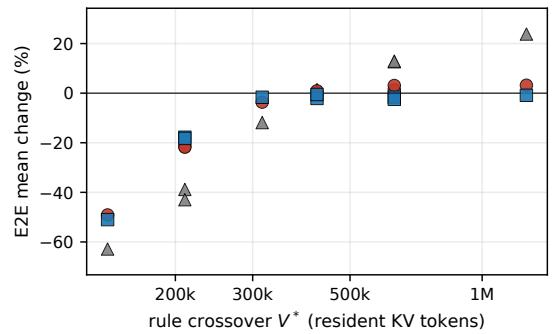  
Fi<sub>g</sub>. 4. The rule’s crossover $V ^ { * }$ <sub>p</sub>er RandomSki<sub>p</sub> arm a<sub>g</sub>ainst its measured mean E2E chan<sub>g</sub>e under the three switch setin<sub>g</sub>s of Fi<sub>g</sub>ure 3.

The two rules on this grid. The grid’s skip ratios are $\begin{array} { r } { s = r d \in \{ \frac { 1 } { 1 6 } , \frac { 1 } { 8 } , \frac { 3 } { 1 6 } , \frac { 1 } { 4 } , \frac { 3 } { 8 } , \frac { 9 } { 1 6 } \} } \end{array}$ . At upstream’s estimated knee occupancy of 411k tokens the decode rule splits the grid between $\textstyle s = { \frac { 3 } { 1 6 } }$ and $\textstyle s = { \frac { 1 } { 4 } }$ the prefill share threshold sits at 0.35. One point, $5 0 \% \times 5 0 \% ( s = \textstyle { \frac { 1 } { 4 } } )$ , lies between them and routes only in decode (−3.6%; Figure 4). The three winners are the arms whose prefill passes are routed under the thresholds: their TTFT moves by −61.2 to −78.2%, the others’ by −33.6 to +44.2%. With always route (Figure 3a) the change runs from +23.8% at 25% × 25% to −62.9% at $7 5 \% \times 7 5 \%$ . This is the policy’s return under routed mode. Switching rules reduce the cost of unprofitable policies (Table 8).

Table 8. The nine RandomSki<sub>p</sub> arms (�=1 each): the rule’s crossover $V ^ { * }$ <sub>an</sub>d <sub>own</sub> th<sub>res</sub>h<sub>o</sub>ld<sub>s,</sub> <sub>an</sub>d <sub>per</sub> <sub>sw</sub>it<sub>c</sub>h setin<sub>g</sub> the cell’s estimated <sub>p</sub>90 occu<sub>p</sub>anc<sub>y</sub> (runnin<sub>g</sub> re<sub>q</sub>uests × mean context), the share of decode <sub>p</sub>asses and rows served in routed mode, and the mean E2E chan<sub>g</sub>e (%).
<table><tr><td></td><td></td><td></td><td></td><td>always route (Fig. 3a)</td><td colspan="3">shared thresholds (Fig. 3b)</td><td colspan="3">per-policy thresholds (Fig. 3c)</td></tr><tr><td>r</td><td>d</td><td>V*</td><td>own thresholds</td><td>E2EΔ</td><td>occupancy</td><td>routed</td><td>E2E ∆</td><td>occupancy</td><td>routed</td><td>E2EΔ</td></tr><tr><td>25 %</td><td>25%</td><td>1261k</td><td>1260k/1580k</td><td>+23.8</td><td>408k</td><td>95/91%</td><td>+3.2</td><td>407k</td><td>0/0%</td><td>-0.9</td></tr><tr><td>25 %</td><td>50 %</td><td>631k</td><td>630k/790k</td><td>+12.6</td><td>408k</td><td>95/91%</td><td>+1.3</td><td>408k</td><td>0/0%</td><td>-1.6</td></tr><tr><td>25 %</td><td>75%</td><td>420k</td><td>420k/530k</td><td>+1.4</td><td>408k</td><td>95/91%</td><td>+0.2</td><td>407k</td><td>0/0%</td><td>-2.1</td></tr><tr><td>50 %</td><td>25%</td><td>631k</td><td>630k/790k</td><td>+12.9</td><td>407k</td><td>95/91%</td><td>+3.1</td><td>408k</td><td>0/0%</td><td>-2.5</td></tr><tr><td>50 %</td><td>50%</td><td>315k</td><td>320k/390k</td><td>-11.9</td><td>407k</td><td>95/91%</td><td>-3.6</td><td>408k</td><td>92/76%</td><td>-1.7</td></tr><tr><td>50 %</td><td>75%</td><td>210k</td><td>210k/260k</td><td>-38.8</td><td>404k</td><td>93/88%</td><td>-21.5</td><td>407k</td><td>93/87%</td><td>-17.7</td></tr><tr><td>75%</td><td>25%</td><td>420k</td><td>420k/530k</td><td>-0.3</td><td>407k</td><td>95/91%</td><td>+0.9</td><td>408k</td><td>0/0%</td><td>-0.5</td></tr><tr><td>75%</td><td>50%</td><td>210k</td><td>210k/260k</td><td>-42.9</td><td>405k</td><td>93/87%</td><td>-21.8</td><td>406k</td><td>93/88%</td><td>-18.3</td></tr><tr><td>75%</td><td>75%</td><td>140k</td><td>140k/180k</td><td>-62.9</td><td>263k</td><td>93/87%</td><td>-49.1</td><td>273k</td><td>93/87%</td><td>-51.0</td></tr></table>

## E Faithfulness at the Token Level

## E.1 First-Token Agreement

Routed mode reproduces the checkpoint’s first-token choice on both tokenized inputs in Table 9. They represent CoQA lm-eval document 80 and serving request coqa:train:856:15. We compare the top-5 first-token log-probabilities under native PyTorch, upstream SGLang and routed mode.

Table 9. First <sub>g</sub>enerated token and its lo<sub>g</sub>-<sub>p</sub>robabilit<sub>y</sub> on the two <sub>p</sub>rom<sub>p</sub>ts whose <sub>g</sub>enerations are em<sub>p</sub>t<sub>y</sub>. Each served arm matc<sup>h</sup>es its PyTorc<sup>h</sup> re<sup>f</sup>erence wit<sup>h</sup>in 0.01 nats.
<table><tr><td>prompt</td><td></td><td></td><td>base, PyTorch (A) upstream SGLang (C) checkpoint, own code (B) vSKIPpER routed (D)</td><td></td></tr><tr><td>doc 80</td><td> $\mathtt { I s l a n d } - 0 . 4 8 9$ </td><td>Island -0.489</td><td> $< \tt e o t > - 0 . 8 8 2$ </td><td> $< \mathsf { e o t } > - 0 . 8 7 2$ </td></tr><tr><td>856:15</td><td>Le -0.047</td><td>Le-0.047</td><td> $< \mathsf { e o t } > - 1 . 0 3 3$ </td><td> $< \mathsf { e o t } > - 1 . 0 3 3$ </td></tr></table>

The checkpoint itself selects <|eot\_id|> on both prompts. Each served arm matches its native reference within 0.01 nats: the immediate stop reflects the checkpoint’s first choice.

All four quality arms receive identical token ids. This controls for a tokenization diference: lm-eval’s HF backend omits BOS, while the server’s text path prepends it. On doc 80, adding BOS changes the checkpoint’s first choice from Island to <eot>. The serving gate records coqa:train:856:15 as one immediate-stop exception.

## E.2 GSM8K Answer Extraction

lm-eval ships two GSM8K filters, and on this checkpoint they disagree by 11 pp: flexible extraction puts the checkpoint’s cost at −5.53 pp, strict-match at +5.31. Each fails on a diferent arm.

Flexible extraction takes the last number in the generation, and the checkpoint appends a confidence epilogue after its answer marker (#### 594\nConfidence: 95%), so the filter reads 95.

The epilogue is the checkpoint’s: under its own code the checkpoint emits it on 2.9% of held-out documents, and on 3.0% when served by vSkipper, while the base model never does.

Strict-match matches #### <number> and returns [invalid] when the marker is missing or followed by anything else, such as #### \$21; the base model under a chat template trips it on a fifth of its documents. On the 1,319 held-out documents:
<table><tr><td>arm</td><td>strict-match unusable</td><td>flexible extraction misreads</td></tr><tr><td>A base model, 1m-eval backend</td><td>271 (20.5%)</td><td>0 (0.0%)</td></tr><tr><td>C base model, upstream SGLang</td><td>274 (20.8%)</td><td>0 (0.0%)</td></tr><tr><td>B checkpoint, its own code</td><td>121 (9.2%)</td><td>38 (2.9%)</td></tr><tr><td>D checkpoint, served by vSKIPPER</td><td>121 (9.2%)</td><td>39 (3.0%)</td></tr></table>

The composite applies one rule to every arm: use strict-match when it parses, otherwise flexible extraction. Both filters come from lm-eval. The rule preserves the two base-model scores and correctly reads the checkpoint’s confidence epilogues. Its checkpoint cost is −3.26 pp, between the two single-filter values.

The two diagnosed format failures are disjoint: strict-match reads the marked answers whose epilogues mislead flexible extraction. Disagreements where strict-match parses incorrectly and flexible extraction is correct afect 0.00% of upstream documents at every rate, at most 0.53% of hybrid documents and 0.61% of always-route documents. The single-filter comparisons give DiD values of $- 0 . 3 8 \pm 0 . 7 4$ pp with flexible extraction and $+ 0 . 1 5 \pm 0 . 6 6$ with strict-match. Both agree within their intervals with the composite result, $- 0 . 2 3 \pm 0 . 6 8$ in Table 5.

## E.3 The Served Configuration Across Loads

Table 10 scores the three served systems at every rate of the load grid; Table 5 (right) is its knee row. Below the knee, where these cells keep GSM8K and CoQA decode in dense mode, the hybrid shows no resolved diference from upstream $( - 0 . 3 8 \pm 1 . 3 9$ pp on GSM8K). At and above the knee, where it routes 89.5 and 98.7% of GSM8K decode rows, it shows none from always-route. On BBH, the hybrid serves 99.0% of decode rows through routed mode at the knee. Every cell is one repetition with a per-document interval.

T<sub>a</sub>bl<sub>e</sub> 10<sub>.</sub> T<sub>as</sub>k <sub>qua</sub>lit<sub>y o</sub>f th<sub>e</sub> th<sub>ree serve</sub>d <sub>sys</sub>t<sub>ems across</sub> th<sub>e</sub> l<sub>oa</sub>d <sub>gr</sub>id<sub>, one repe</sub>titi<sub>on per ce</sub>ll<sub>, same me</sub>t<sub>r</sub>i<sub>cs</sub> as Table 5. “Routed” is the share of decode rows served in routed mode (vSkipper / alwa<sub>y</sub>s-route).
<table><tr><td>Task</td><td>Load</td><td>upstream</td><td>VSKIPPER</td><td>always-route</td><td>routed (%)</td><td>vs. upstream (pp)</td><td>vs. always-route (pp)</td></tr><tr><td>GSM8K</td><td> $0 . 7 5 \times Q ^ { * }$ </td><td>77.63</td><td>77.26</td><td>74.00</td><td> $0 ~ / ~ 1 0 0$ </td><td> $- 0 . 3 8 \pm 1 . 3 9$ </td><td> $+ 3 . 2 6 \pm 2 . 3 4$ </td></tr><tr><td>GSM8K</td><td> $0 . 9 5 \times Q ^ { * }$ </td><td>77.63</td><td>74.00</td><td>74.07</td><td> $9 0 ~ / ~ 1 0 0$ </td><td> $- 3 . 6 4 \pm 2 . 2 2$ </td><td> $- 0 . 0 8 \pm 1 . 4 6$ </td></tr><tr><td>GSM8K</td><td> $1 . 2 5 \times Q ^ { * }$ </td><td>77.79</td><td>74.00</td><td>73.92</td><td> $9 9 / 1 0 0 $ </td><td> $- 3 . 7 9 \pm 2 . 3 0$ </td><td> $+ 0 . 0 8 \pm 0 . 6 5$ </td></tr><tr><td>CoQA</td><td> $0 . 7 5 \times Q ^ { * }$ </td><td>76.74</td><td>76.74</td><td>77.66</td><td> $0 ~ / ~ 1 0 0$ </td><td> $+ 0 . 0 0 \pm 0 . 0 0$ </td><td> $- 0 . 9 2 \pm 1 . 9 4$ </td></tr><tr><td>CoQA</td><td> $0 . 9 5 \times Q ^ { * }$ </td><td>76.74</td><td>77.68</td><td>77.73</td><td>71 / 100</td><td> $+ 0 . 9 4 \pm 0 . 8 2$ </td><td> $- 0 . 0 5 \pm 1 . 7 6$ </td></tr><tr><td>CoQA</td><td> $1 . 2 5 \times Q ^ { * }$ </td><td>76.71</td><td>79.65</td><td>77.66</td><td>99 / 100</td><td> $+ 2 . 9 4 \pm 1 . 5 5$ </td><td> $+ 1 . 9 9 \pm 1 . 4 5$ </td></tr><tr><td>BBH</td><td> $0 . 7 5 \times Q ^ { * }$ </td><td>67.93</td><td>59.35</td><td>59.58</td><td>98 / 100</td><td> $- 8 . 5 9 \pm 1 . 0 6$ </td><td> $- 0 . 2 3 \pm 0 . 5 2$ </td></tr><tr><td>BBH</td><td> $0 . 9 5 \times Q ^ { * }$ </td><td>67.87</td><td>59.47</td><td>59.68</td><td>99 / 100</td><td> $- 8 . 4 0 \pm 1 . 0 7$ </td><td> $- 0 . 2 2 \pm 0 . 3 8$ </td></tr><tr><td>BBH</td><td> $1 . 2 5 \times Q ^ { * }$ </td><td>67.98</td><td>59.45</td><td>59.59</td><td> $1 0 0 ~ / ~ 1 0 0$ </td><td> $- 8 . 5 2 \pm 1 . 0 7$ </td><td> $- 0 . 1 4 \pm 0 . 2 6$ </td></tr></table>

## F Latency and Makespan Across Load

The benchmark is open-loop with fixed work and a common injection window. Each arm’s makespan includes that window and its final drain. While the server keeps up with arrivals, execution savings appear as lower latency: smaller concurrent batches, shorter token intervals and less queueing. Makespan moves only through the drain, the last and longest requests to finish, so it reflects the tail of each cell (Figure 5).

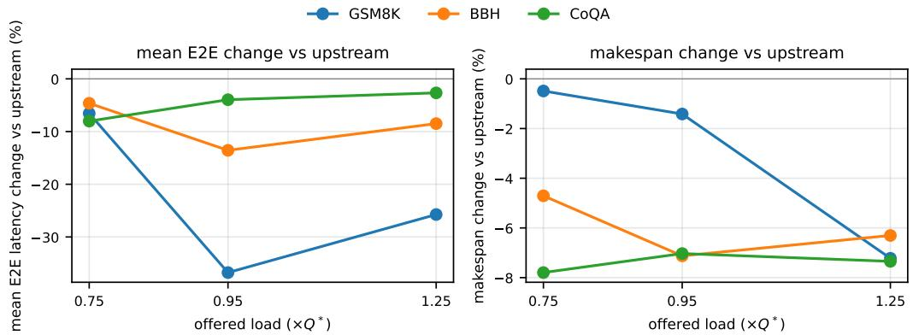  
Fi<sub>g</sub>. 5. Mean E2E chan<sub>g</sub>e (left) and makes<sub>p</sub>an chan<sub>g</sub>e (ri<sub>g</sub>ht) a<sub>g</sub>ainst ofered load, <sub>p</sub>er workload, from the <sub>ce</sub>ll<sub>s o</sub>f T<sub>a</sub>bl<sub>e</sub> 2<sub>.</sub>

The E2E reduction is roughly uniform across output lengths at and below the knee on GSM8K and BBH. Binning by pinned output tokens gives per-bin spreads of 0.7 and 1.3 pp on GSM8K and 0.9 and 3.6 pp on BBH. It widens to 8.0 pp on GSM8K in overload and to 7.8–11.1 pp on CoQA, where a request’s place in the queue sets its gain.

Mean TTFT falls on GSM8K at every rate, where prefill routing shortens the prefill passes (Table 2). On BBH and CoQA it shows no resolved diference from upstream: prefill routes few passes on CoQA (Table 16), and on BBH prefill-only routing stays near upstream (Table 13).

Throughput under saturation. Table 4 counts the output tokens emitted and the requests completed between the first and the last arrival of each $1 . 2 5 \times Q ^ { * }$ cell, the injection window both arms share; the drain is excluded. Both arms are saturated there: in every repetition of every column they complete only 0.50–0.80 of the requests that arrive inside the window, and their backlog grows through it. On GSM8K and CoQA the running batch stays full while the waiting queue grows, and TPS and RPS agree within one percentage point. On BBH, whose shared few-shot prefixes keep each request cheap in KV, the backlog accumulates in the running batch; in-flight requests grow through the window, and the RPS change (+7.4%) exceeds the TPS change (+4.1%).

## G Natural Stopping and the Output Lengths

The matched-work lane replays output lengths recorded from the base model’s natural generation. Here the base model on upstream SGLang and the FlexiDepth checkpoint on vSkipper each generate to their own stop. Both receive the same open-loop arrivals, with one repetition per cell (Table 11). A generation reaching its remaining context window is counted as a context-limit hit.

Matched work measures the runtime; natural stopping characterizes each model–runtime stack, whose generated work difers. At the GSM8K knee the checkpoint generates 330 output tokens per request against the base model’s 116 (+185%). It reaches the context limit on 99 requests against 3; on BBH it generates 53–59% more. The long requests carry most of a cell’s tokens, so each stack’s latency and makespan follow its generated work. They rise on GSM8K and BBH. On CoQA the checkpoint generates similar or less work (−3 to −24% output tokens), and its stack finishes sooner (E2E −4 to −26%). These are stack-level diferences, not runtime efects.

The matched-work cells freeze the base model’s per-request lengths, separating the serving engine’s execution cost from changes in generated work. In this natural lane, requests run to EOS

Table 11. The two stacks under natural sto<sub>pp</sub>in<sub>g,</sub> one re<sub>p</sub>etition <sub>p</sub>er cell: mean out<sub>p</sub>ut tokens <sub>p</sub>er re<sub>q</sub>uest<sub>,</sub> <sub>co</sub>nt<sub>e</sub>xt-limit hit<sub>s,</sub> m<sub>ea</sub>n E2E l<sub>a</sub>t<sub>e</sub>n<sub>cy</sub> <sub>a</sub>nd m<sub>a</sub>k<sub>espa</sub>n<sub>.</sub> A third r<sub>o</sub>w <sub>se</sub>rv<sub>es</sub> th<sub>e</sub> <sub>c</sub>h<sub>ec</sub>k<sub>po</sub>int in th<sub>e</sub> <sub>a</sub>lw<sub>ays</sub>-r<sub>ou</sub>t<sub>e</sub> confi<sub>g</sub>uration.
<table><tr><td>Workload</td><td>Load (×Q*)</td><td>Stack</td><td>out tokens</td><td>limit hits</td><td>E2E s</td><td>makespan s</td></tr><tr><td>GSM8K</td><td>0.75</td><td>Base + upstream</td><td>116</td><td>3</td><td>6.1</td><td>437</td></tr><tr><td rowspan="4">GSM8K</td><td rowspan="4">0.95</td><td>FlexiDepth + vSKIPPER</td><td>126</td><td>5</td><td>6.4</td><td>440</td></tr><tr><td>FlexiDepth always-route</td><td>299</td><td>82</td><td>18.8</td><td>632</td></tr><tr><td>Base + upstream</td><td>116</td><td>3</td><td>22.4</td><td>388</td></tr><tr><td>FlexiDepth + vSKIPPER</td><td>330</td><td>99</td><td>38.2</td><td>668</td></tr><tr><td rowspan="3">GSM8K</td><td rowspan="3">1.25</td><td>FlexiDepth always-route</td><td>302</td><td>84</td><td>32.4</td><td>612</td></tr><tr><td>Base + upstream</td><td>116</td><td>3</td><td>57.2</td><td>388</td></tr><tr><td>FlexiDepth + vSKIPPER</td><td>271</td><td>69</td><td>61.6</td><td>563</td></tr><tr><td rowspan="3">BBH</td><td rowspan="3">0.75</td><td>FlexiDepth always-route</td><td>297</td><td>81</td><td>64.6</td><td>598</td></tr><tr><td>Base + upstream</td><td>257</td><td>42</td><td>14.0</td><td>349</td></tr><tr><td>FlexiDepth + vSKIPPER</td><td>394</td><td>114</td><td>24.4</td><td>548</td></tr><tr><td rowspan="3">BBH</td><td rowspan="3">0.95</td><td>FlexiDepth always-route</td><td>408</td><td>121</td><td>25.8</td><td>565</td></tr><tr><td>Base + upstream</td><td>255</td><td>41</td><td>21.9</td><td>329</td></tr><tr><td>FlexiDepth + vSKIPPER</td><td>405</td><td>120</td><td>31.9</td><td>551</td></tr><tr><td rowspan="3">BBH</td><td rowspan="3">1.25</td><td>FlexiDepth always-route</td><td>420</td><td>128</td><td>33.8</td><td>576</td></tr><tr><td>Base + upstream</td><td>262</td><td>45</td><td>36.3</td><td>336</td></tr><tr><td>FlexiDepth + vSKIPPER FlexiDepth always-route</td><td>405</td><td>121</td><td>44.7</td><td>545</td></tr><tr><td rowspan="3">CoQA</td><td rowspan="3">0.75</td><td></td><td>413</td><td>125</td><td>46.0</td><td>565</td></tr><tr><td>Base + upstream</td><td>166</td><td>82</td><td>8.9</td><td>563</td></tr><tr><td>FlexiDepth + vSKIPPER</td><td>156</td><td>76</td><td>7.5</td><td>497</td></tr><tr><td rowspan="3">CoQA</td><td rowspan="3">0.95</td><td>FlexiDepth always-route</td><td>83</td><td>38</td><td>3.9</td><td>393</td></tr><tr><td>Base + upstream</td><td>164</td><td>81</td><td>11.9</td><td>546</td></tr><tr><td>FlexiDepth + vSKIPPER</td><td>125</td><td>59</td><td>8.8</td><td>410</td></tr><tr><td rowspan="3">CoQA</td><td rowspan="3">1.25</td><td>FlexiDepth always-route</td><td>86</td><td>40</td><td>7.3</td><td>362</td></tr><tr><td>Base + upstream</td><td>166</td><td>82</td><td>25.1</td><td>541</td></tr><tr><td>FlexiDepth + vSKIPPER</td><td>161</td><td>78</td><td>24.0</td><td>478</td></tr><tr><td colspan="2"></td><td>FlexiDepth always-route</td><td>84</td><td>39</td><td>20.4</td><td>348</td></tr></table>

or their remaining context window (6, 171–7, 988 tokens), with context-limit hits counted explicitly.   
Task quality is measured separately under lm-eval’s per-task generation limits.

## G.1 Native Checkpoint Repetition Analysis

Under the checkpoint authors’ native PyTorch execution, FlexiDepth increases the incidence of runaway generation over its base model on the same prompts (Table 12). Both the base model and checkpoint generate greedily from frozen token ids within an 8192-token window. On a seeded random sample of 500 prompts of the GSM8K knee cell, the base model repeats on none and the checkpoint on 2.2 ± 1.3%, each a degenerate repetition of the answer line.

The propensity is prompt-specific. The checkpoint repeats on 20.3% of the 143 served-arm repeaters, against 2.0% of the controls. The sampled groups stop once repetition is detected.

Under serving, which prompts repeat varies with load and stack (Table 11). Sampling penalties, such as repetition and frequency penalties, are a standard mitigation. The evaluation keeps greedy decoding under the third-party lm-eval protocol, and tuning these parameters is left to future work.

## H Mechanism Ablation

Four arms isolate the mechanisms of §3.1 and §3.3 on all three workloads at the three main rates, one repetition each, paired against upstream at the main output lengths (Table 13). Decode only: routed mode on the decode passes the decode thresholds select, prefill dense. Prefill only: routed mode on the prefill rounds the admission rule selects, decode dense. Always-route: both phases without the mode switch. No promotion: the served hybrid without the one-way promotion into routed decode (§3.3). All routed arms share the cohort execution path (Appendix B).

Table 12. Native re<sub>p</sub>etition atribution on the GSM8K knee cell’s <sub>p</sub>rom<sub>p</sub>ts (P<sub>y</sub>Torch, base model and check-<sub>p</sub>oint). A re<sub>p</sub>etition is a de<sub>g</sub>enerate re<sub>p</sub>eated answer or a <sub>g</sub>eneration that reached the window (ca<sub>p</sub>).
<table><tr><td>Model</td><td>Prompt group</td><td>prompts</td><td>repeats</td><td>%</td><td>cap</td><td>mean</td><td> $\mathrm { p } 9 0$ </td></tr><tr><td rowspan="3">Base, batch 16</td><td>random sample</td><td>500</td><td>0</td><td>0.0</td><td>0</td><td>108</td><td>163</td></tr><tr><td>of which served-arm repeaters</td><td>15</td><td>0</td><td>0.0</td><td>0</td><td>100</td><td>153</td></tr><tr><td>of which never repeated</td><td>485</td><td>0</td><td>0.0</td><td>0</td><td>109</td><td>164</td></tr><tr><td rowspan="3">FlexiDepth, batch 16</td><td>random sample</td><td>500</td><td>11</td><td>2.2</td><td>0</td><td>155</td><td>213</td></tr><tr><td>of which served-arm repeaters</td><td>15</td><td>4</td><td>26.7</td><td>0</td><td>364</td><td>1024</td></tr><tr><td>of which never repeated</td><td>485</td><td>7</td><td>1.4</td><td>0</td><td>148</td><td>209</td></tr><tr><td rowspan="3">Base, batch 1</td><td>served-arm repeaters</td><td>143</td><td>0</td><td>0.0</td><td>0</td><td>107</td><td>153</td></tr><tr><td>upstream repeaters</td><td>3</td><td>2</td><td>66.7</td><td>2</td><td>4656</td><td>6956</td></tr><tr><td>controls</td><td>100</td><td>0</td><td>0.0</td><td>0</td><td>102</td><td>145</td></tr><tr><td rowspan="3">FlexiDepth, batch 1</td><td>served-arm repeaters</td><td>143</td><td>29</td><td>20.3</td><td>29</td><td>1583</td><td>7278</td></tr><tr><td>upstream repeaters</td><td>3</td><td>0</td><td>0.0</td><td>0</td><td>194</td><td>215</td></tr><tr><td>controls</td><td>100</td><td>2</td><td>2.0</td><td>2</td><td>273</td><td>196</td></tr><tr><td rowspan="3">FlexiDepth, batch 16</td><td>served-arm repeaters</td><td>143</td><td>29</td><td>20.3</td><td>29</td><td>1518</td><td>7009</td></tr><tr><td>upstream repeaters</td><td>3</td><td>0</td><td>0.0</td><td>0</td><td>188</td><td>222</td></tr><tr><td>controls</td><td>100</td><td>3</td><td>3.0</td><td>3</td><td>330</td><td>196</td></tr></table>

Table 13. Mechanism ablation: mean E2E and makes<sub>p</sub>an chan<sub>g</sub>e (%) a<sub>g</sub>ainst u<sub>p</sub>stream at the main out<sub>p</sub>ut lengths. The served arm is the �=6 main result; each ablation arm is one repetition, and negative is beter.
<table><tr><td rowspan="2">rate</td><td colspan="2">served (n=6)</td><td colspan="2">decode only</td><td colspan="2">prefill only</td><td colspan="2">always route</td><td colspan="2">no promotion E2E makespan</td></tr><tr><td></td><td>E2E makespan</td><td></td><td>E2E makespan</td><td></td><td>E2E makespan</td><td>E2E makespan</td><td></td><td></td><td></td></tr><tr><td colspan="9">GSM8K</td><td></td><td></td></tr><tr><td>0.75×</td><td> $- 6 . 6 \pm 1 . 5$ </td><td> $- 0 . 5 \pm 0 . 1$ </td><td>+0.4</td><td>+0.0</td><td>-8.6</td><td>-0.7</td><td>-5.5</td><td>-1.0</td><td>-6.7</td><td>-0.5</td></tr><tr><td>0.95×</td><td> $- 3 6 . 8 \pm 2 . 0$ </td><td> $- 1 . 4 \pm 0 . 1$ </td><td>-14.3</td><td>-0.9 -35.6</td><td></td><td>-1.2 -46.5</td><td></td><td>-1.9-32.6</td><td></td><td>-1.2</td></tr><tr><td>1.25×</td><td> $- 2 5 . 7 \pm 0 . 7$ </td><td> $- 7 . 2 \pm 0 . 2$ </td><td>-7.8</td><td>-2.6 -19.9</td><td></td><td>-5.4 -26.3</td><td></td><td></td><td>-7.4 -24.5</td><td>-7.0</td></tr><tr><td colspan="9">BBH</td><td></td><td></td></tr><tr><td>0.75×</td><td> $- 4 . 6 \pm 0 . 5$ </td><td> $- 4 . 7 \pm 0 . 5$ </td><td>-3.7</td><td>-4.7</td><td>-0.3</td><td>+0.1</td><td>-3.2</td><td>-5.7</td><td>+2.0</td><td>-2.8</td></tr><tr><td>0.95×</td><td> $- 1 3 . 6 \pm 1 . 2$ </td><td> $- 7 . 1 \pm 0 . 2$ </td><td>-16.0</td><td>-6.2</td><td>+0.5</td><td>+0.1 -13.0</td><td></td><td>-6.7</td><td>-9.9</td><td>-3.8</td></tr><tr><td>1.25×</td><td> $- 8 . 5 \pm 1 . 0$ </td><td> $- 6 . 3 \pm 0 . 7$ </td><td>-9.7</td><td>-5.9</td><td>-0.2</td><td>+0.1</td><td>-9.0</td><td>-6.1</td><td>-6.3</td><td>-3.3</td></tr><tr><td colspan="9">CoQA</td><td></td><td></td></tr><tr><td>0.75×</td><td> $- 8 . 0 \pm 0 . 6$ </td><td> $- 7 . 8 \pm 0 . 3$ </td><td>-8.0</td><td> $- 7 . 8 + 0 . 8$ </td><td></td><td> $+ 0 . 4 \qquad - 1 . 3$ </td><td></td><td>-5.1</td><td>+3.4</td><td>+0.5</td></tr><tr><td>0.95×</td><td> $- 4 . 0 \pm 4 . 4$ </td><td> $- 7 . 0 \pm 0 . 4$ </td><td>-2.6</td><td> $- 7 . 3 \qquad - 0 . 9$ </td><td></td><td>+0.3</td><td>+5.5</td><td>-6.1</td><td>+4.9</td><td>+5.3</td></tr><tr><td>1.25×</td><td> $- 2 . 7 \pm 0 . 2$ </td><td> $- 7 . 3 \pm 0 . 1$ </td><td>-2.7</td><td> $- 8 . 1 + 0 . 1$ </td><td></td><td>+0.1</td><td>+0.0</td><td>-7.1</td><td>-1.1</td><td>-4.0</td></tr></table>

GSM8K. Prefill routing provides the gain: its knee-cell E2E change, −35.6%, is close to the served arm’s −36.8%. Decode-only remains inactive below the knee. Always-route is faster at the knee in this single repetition; the CoQA paragraph shows what the switch gains in exchange.

BBH. Decode routing provides the gain across the load grid; prefill-only stays near upstream. The served arm is faster than always-route at and below the knee. The switch avoids routed-mode costs on passes it keeps dense.

CoQA. The gain comes from finishing the long-output tail sooner: the served and decode-only arms improve makespan by 7.0–8.1%. The switch matters most at the knee, where always-route is 9.5 pp behind the served arm in mean E2E.

## H.1 Kernel Headroom

Routed mode’s GEMMs use count-bounded Triton kernels so captured execution can consume row counts held on the device. Outside capture, the same rows go through cuBLAS. The tile tuner times cuBLAS on the same packed rows beside each candidate. On the A100, the served kernels take a median of 1.18× cuBLAS’s time (0.82–1.79× over the 20 operation/count-range shapes). On the RTX A6000, the median is 1.13× (0.77–1.53×). The serving gains already include these count-bounded kernels. The comparisons identify target shapes for further kernel optimization.

## I Tail Latencies

Table 14 gives the p50 and p99 companions of Table 2; Figure 6 the p99 companion of the RandomSkip maps.

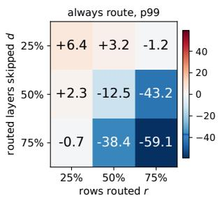  
(a) always route

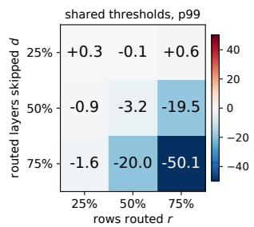  
(b) shared thresholds

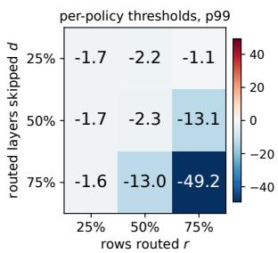  
(c) per-policy thresholds  
Fi<sub>g</sub>. 6. <sub>p</sub>99 E2E chan<sub>g</sub>e a<sub>g</sub>ainst u<sub>p</sub>stream for the nine RandomSki<sub>p</sub> arms under the three switch setin<sub>g</sub>s<sub>,</sub> the same cells as Fi<sub>g</sub>ure 3.

Tab<sup>l</sup>e 14. p50 and p99 companions o<sup>f</sup> Tab<sup>l</sup>e 2: mean percentage c<sup>h</sup>ange wit<sup>h</sup> 95% interva<sup>l</sup>s over t<sup>h</sup>e same six <sub>p</sub>aired re<sub>p</sub>etitions.
<table><tr><td></td><td></td><td></td><td colspan="2">E2E</td><td colspan="2">TPOT</td><td colspan="2">TTFT</td></tr><tr><td>Workload Rate</td><td></td><td>n</td><td> $\mathsf { p } 5 0$ </td><td> $\mathrm { p } 9 9$ </td><td>p50</td><td> $\mathrm { p } 9 9$ </td><td> $\mathrm { p } 5 0$ </td><td> $\mathrm { p } 9 9$ </td></tr><tr><td>BBH</td><td> $0 . 7 5 \times Q ^ { * }$ </td><td>6</td><td> $- 3 . 0 \pm 0 . 5$ </td><td> $- 8 . 2 \pm 1 . 0$ </td><td> $- 5 . 0 \pm 0 . 8$ </td><td> $- 1 0 . 7 \pm 2 . 7$ </td><td> $- 0 . 0 \pm 2 . 8$ </td><td> $+ 1 2 . 0 \pm 3 7 . 5$ </td></tr><tr><td>BBH</td><td> $0 . 9 5 \times Q ^ { * }$ </td><td>6</td><td> $- 1 5 . 6 \pm 1 . 7$ </td><td> $- 1 1 . 4 \pm 0 . 3$ </td><td> $- 1 3 . 8 \pm 0 . 8$ </td><td> $- 2 2 . 4 \pm 1 . 5$ </td><td> $- 1 0 . 3 \pm 2 . 4$ </td><td> $+ 6 . 8 \pm 3 1 . 3$ </td></tr><tr><td>BBH</td><td> $1 . 2 5 \times Q ^ { * }$ </td><td>6</td><td> $- 1 0 . 4 \pm 1 . 1$ </td><td> $- 8 . 9 \pm 0 . 9$ </td><td> $- 1 0 . 1 \pm 1 . 2$ </td><td> $- 1 0 . 4 \pm 2 . 0$ </td><td> $+ 0 . 7 \pm 1 1 . 6$ </td><td> $- 1 6 . 4 \pm 7 . 1$ </td></tr><tr><td>CoQA</td><td> $0 . 7 5 \times Q ^ { * }$ </td><td>6</td><td> $+ 1 . 8 \pm 2 . 6$ </td><td> $- 1 0 . 1 \pm 0 . 4$ </td><td> $+ 2 . 1 \pm 2 . 1$ </td><td> $- 2 . 0 \pm 1 8 . 4$ </td><td> $- 0 . 6 \pm 2 . 7$ </td><td> $+ 5 . 4 \pm 3 0 . 0$ </td></tr><tr><td>CoQA</td><td> $0 . 9 5 \times Q ^ { * }$ </td><td>6</td><td> $+ 2 . 5 \pm 9 . 9$ </td><td> $- 9 . 2 \pm 0 . 5$ </td><td> $+ 4 . 2 \pm 1 1 . 3$ </td><td> $+ 1 . 0 \pm 2 4 . 0$ </td><td> $- 2 . 6 \pm 7 . 8$ </td><td> $+ 0 . 8 \pm 5 . 2$ </td></tr><tr><td>CoQA</td><td> $1 . 2 5 \times Q ^ { * }$ </td><td>6</td><td> $- 0 . 3 \pm 0 . 4$ </td><td> $- 9 . 1 \pm 0 . 2$ </td><td>-2.5 ± 0.6</td><td> $- 1 . 7 \pm 0 . 6$ </td><td> $+ 0 . 3 \pm 0 . 8$ </td><td> $+ 0 . 3 \pm 0 . 7$ </td></tr><tr><td>GSM8K</td><td> $0 . 7 5 \times Q ^ { * }$ </td><td>6</td><td> $- 6 . 3 \pm 1 . 5$ </td><td> $- 9 . 7 \pm 2 . 8$ </td><td> $- 6 . 3 \pm 1 . 6$ </td><td> $- 1 0 . 0 \pm 3 . 7$ </td><td> $- 6 . 3 \pm 0 . 6$ </td><td> $- 4 . 4 \pm 4 . 8$ </td></tr><tr><td>GSM8K</td><td> $0 . 9 5 \times Q ^ { * }$ </td><td>6</td><td> $- 3 8 . 4 \pm 1 . 9$ </td><td> $- 3 7 . 3 \pm 2 . 5$ </td><td> $- 4 3 . 6 \pm 2 . 1$ </td><td> $- 1 5 . 3 \pm 3 . 8$ </td><td> $- 5 3 . 8 \pm 1 1 . 6$ </td><td> $- 7 4 . 5 \pm 3 . 0$ </td></tr><tr><td>GSM8K</td><td> $1 . 2 5 \times Q ^ { * }$ </td><td>6</td><td> $- 2 6 . 4 \pm 0 . 7$ </td><td> $- 2 1 . 2 \pm 0 . 6$ </td><td> $- 1 0 . 3 \pm 0 . 2$ </td><td> $- 1 8 . 9 \pm 1 . 7$ </td><td> $- 4 1 . 8 \pm 1 . 3$ </td><td> $- 4 0 . 7 \pm 0 . 9$ </td></tr></table>

## J Absolute Baseline Numbers

Table 15 gives the upstream arm’s absolute values behind the relative rows of Table 2, averaged over the same repetitions. The artifact separately records the served arm’s absolute means directly. The injected arrival rate matches the ofered rate within 2% on every cell. Makespan exceeds the injection window by the drain, the tail of the longest pinned requests; on CoQA the drain is 61–76% of the makespan at every load, so its gain appears in makespan.

Decode-graph coverage. Both arms capture decode graphs up to 1,024 rows. The load samples show how often a decode batch exceeded SGLang’s default A100 capture setting of 256 rows, which the default configuration would have run without a graph. For the baseline it is 57% at the GSM8K knee, 39% at the BBH knee and 5% at the CoQA knee; for the served arm, 20, 40 and 6%. Samples exceed 1,024 rows only at BBH overload, on 23% (baseline) and 23% (served) of samples; there upstream runs uncaptured and vSkipper replays its captured graphs in capture-sized chunks.

Prefix cache. The radix prefix cache is enabled on both arms. The cached share of prefill tokens, upstream / vSkipper, is 1.7 / 1.4% on GSM8K, 91.0 / 90.2% on BBH (shared few-shot prefixes) and 1.1 / 1.1% on CoQA, within 0.8 pp between the arms. vSkipper keeps separate dense and routed namespaces keyed by a request’s prefill mode, so a prompt reuses only KV computed under its own prefill mode, and a request whose decode mode difers from its prefill mode does not insert its generated KV.

Table 15. U<sub>p</sub>stream SGLan<sub>g</sub> absolutes <sub>p</sub>er cell<sub>,</sub> means over the re<sub>p</sub>etitions<sub>;</sub> drain is makes<sub>p</sub>an minus the injection window.
<table><tr><td>Workload</td><td>×Q*</td><td>TTFT (ms)</td><td>TPOT (ms)</td><td>E2E (s)</td><td>makespan (s)</td><td>drain (s)</td><td>tok/s</td><td>req/s injected</td><td>req/s offered</td></tr><tr><td>GSM8K</td><td>0.75</td><td>197</td><td>52.8</td><td>6.1</td><td>437</td><td>62</td><td>955</td><td>9.6</td><td>9.75</td></tr><tr><td>GSM8K</td><td>0.95</td><td>894</td><td>238.3</td><td>26.9</td><td>390</td><td>94</td><td>1087</td><td>12.2</td><td>12.35</td></tr><tr><td>GSM8K</td><td>1.25</td><td>29017</td><td>274.2</td><td>58.8</td><td>377</td><td>152</td><td>1106</td><td>16.0</td><td>16.25</td></tr><tr><td>BBH</td><td>0.75</td><td>132</td><td>64.4</td><td>14.4</td><td>354</td><td>195</td><td>2943</td><td>25.2</td><td>25.50</td></tr><tr><td>BBH</td><td>0.95</td><td>250</td><td>118.2</td><td>23.9</td><td>330</td><td>205</td><td>3111</td><td>31.9</td><td>32.30</td></tr><tr><td>BBH</td><td>1.25</td><td>1251</td><td>200.5</td><td>38.7</td><td>323</td><td>228</td><td>3180</td><td>42.0</td><td>42.50</td></tr><tr><td>CoQA</td><td>0.75</td><td>211</td><td>138.5</td><td>8.8</td><td>561</td><td>345</td><td>1169</td><td>18.5</td><td>18.75</td></tr><tr><td>CoQA</td><td>0.95</td><td>493</td><td>796.7</td><td>13.1</td><td>543</td><td>373</td><td>1193</td><td>23.5</td><td>23.75</td></tr><tr><td>CoQA</td><td>1.25</td><td>10204</td><td>1809.5</td><td>30.8</td><td>534</td><td>405</td><td>1240</td><td>30.9</td><td>31.25</td></tr></table>

T<sub>a</sub>bl<sub>e</sub> 16<sub>.</sub> P<sub>ass s</sub>h<sub>are per p</sub>h<sub>ase:</sub> th<sub>e</sub> f<sub>rac</sub>ti<sub>on o</sub>f th<sub>e serve</sub>d <sub>arm</sub>’<sub>s pre</sub>fill <sub>an</sub>d d<sub>eco</sub>d<sub>e passes</sub> th<sub>a</sub>t <sub>ran</sub> i<sub>n rou</sub>t<sub>e</sub>d mode (a routed <sub>p</sub>ass ma<sub>y</sub> also carr<sub>y</sub> dense re<sub>q</sub>uests), from each cell’s atestation. Means use the six re<sub>p</sub>etition <sup>l</sup>o<sub>g</sub>s.
<table><tr><td>Workload</td><td>×Q*</td><td>n</td><td>prefill passes routed (%)</td><td>decode passes routed (%)</td></tr><tr><td>GSM8K</td><td>0.75</td><td>6</td><td>24</td><td>0.0</td></tr><tr><td>GSM8K</td><td>0.95</td><td>6</td><td>42</td><td>92.9</td></tr><tr><td>GSM8K</td><td>1.25</td><td>6</td><td>94</td><td>99.0</td></tr><tr><td>BBH</td><td>0.75</td><td>6</td><td>37</td><td>95.9</td></tr><tr><td>BBH</td><td>0.95</td><td>6</td><td>54</td><td>98.7</td></tr><tr><td>BBH</td><td>1.25</td><td>6</td><td>67</td><td>99.2</td></tr><tr><td>CoQA</td><td>0.75</td><td>6</td><td>0</td><td>69.8</td></tr><tr><td>CoQA</td><td>0.95</td><td>6</td><td>1</td><td>97.1</td></tr><tr><td>CoQA</td><td>1.25</td><td>6</td><td>0</td><td>99.8</td></tr></table>

## K Two Qwen3 Skippers: the Profitability Boundary

Two skippers we trained test where the method starts to be profitable. Both are alignment-only straight-through-gate routers and projectors on Qwen3 with thinking of, routing layers 18–35 of 36. Each is served by the same runtime with the thresholds the rule derives from its declared skip (Appendix D); training and checkpoint selection are in Appendix M. We report Qwen3-4B at step 20,000 and three Qwen3-8B checkpoints. Table 17 identifies each checkpoint, its decode thresholds and its attested always-route decode skip. The thresholds use skip-rate estimates from a 32-request training-time routing probe: 0.25 for 4B, and 0.445, 0.485, and 0.520 for the three 8B checkpoints. These probe estimates are used only for pre-serving threshold calibration.

Each follows the main matched-work protocol: its own upstream �<sup>∗</sup> (17 and 14 req/s), its own output lengths, GSM8K at the three rates, three paired repetitions, bf16. In both Qwen arms the Project-Only KV path applies Qwen3’s per-head q/k norms and projects all rows. The Qwen natural lane runs under an 8,192-token output budget (Qwen3’s context window is 40,960 tokens); the quality suites use lm-eval’s per-task limits.

Serving. Higher skipping translates into larger serving gains in the three-checkpoint comparison. The highest-skipping Qwen3-8B checkpoint lowers mean E2E the most at every load, with each interval excluding zero (Table 17). Qwen3-4B shows no resolved change in mean E2E at any load. The table also reports its single-repetition run under the shared Llama thresholds.

Tab<sup>l</sup>e 17. Qwen3 c<sup>h</sup>ec<sup>k</sup>points against upstream: matc<sup>h</sup>ed-wor<sup>k</sup> percentage c<sup>h</sup>anges wit<sup>h</sup> 95% interva<sup>l</sup>s (A100, bf16, GSM8K; �=3, exce<sub>p</sub>t the Llama-threshold rows). Grou<sub>p</sub> headin<sub>g</sub>s <sub>g</sub>ive the check<sub>p</sub>oint, exit/enter th<sub>res</sub>h<sub>o</sub>ld<sub>s an</sub>d <sub>a</sub>l<sub>ways-rou</sub>t<sub>e</sub> d<sub>eco</sub>d<sub>e s</sub>ki<sub>p a</sub>t th<sub>e</sub> k<sub>nee.</sub>
<table><tr><td colspan="2"></td><td colspan="2">E2E</td><td colspan="2">TPOT</td><td colspan="2">TTFT</td><td></td></tr><tr><td>Rate</td><td>n</td><td>mean</td><td>p99</td><td>mean</td><td>p99</td><td>mean</td><td></td><td>p99 makespan</td></tr><tr><td colspan="9">Qwen3-4B, step 20k; thresholds 320k/390k, skip 0.119</td></tr><tr><td> $0 . { \dot { 7 } } 5 \times Q ^ { * }$ </td><td>3</td><td> $+ 1 . 2 \pm 1 . 9$ </td><td> $+ 1 . 1 \pm 2 . 3$ </td><td> $+ 1 . 3 \pm 1 . 9$ </td><td> $+ 2 . 7 \pm 1 . 9$ </td><td> $- 0 . 2 \pm 7 . 6$ </td><td> $+ 0 . 3 \pm 5 8 . 9$ </td><td> $+ 0 . 1 \pm 0 . 4$ </td></tr><tr><td> $0 . 9 5 \times Q ^ { * }$ </td><td>3</td><td> $+ 2 . 7 \pm 2 . 8$ </td><td> $+ 0 . 9 \pm 2 . 3$ </td><td> $+ 1 . 0 \pm 1 . 1$ </td><td> $+ 0 . 8 \pm 0 . 7$ </td><td> $+ 9 . 3 \pm 1 1 . 2$ </td><td> $+ 1 0 . 4 \pm 1 0 . 2$ </td><td> $+ 4 . 5 \pm 0 . 7$ </td></tr><tr><td> $1 . 2 5 \times Q ^ { * }$ </td><td>3</td><td> $+ 0 . 6 \pm 1 . 0$ </td><td> $+ 0 . 7 \pm 1 . 8$ </td><td> $- 0 . 0 \pm 0 . 6$ </td><td> $- 0 . 2 \pm 2 . 8$ </td><td> $+ 1 . 1 \pm 1 . 3$ </td><td> $+ 1 . 4 \pm 2 . 4$ </td><td> $+ 3 . 1 \pm 0 . 7$ </td></tr><tr><td colspan="9">Qwen3-8B, pen  $\mathbf { u l t y } 2 { \times } 1 0 ^ { - 4 }$  , step 10k; thresholds 180k/220k, skip 0.345</td></tr><tr><td> $0 . { \dot { 7 } } 5 \times Q ^ { * }$ </td><td>3</td><td> $- 6 . 4 \pm 2 . 1$ </td><td> $- 4 . 5 \pm 2 . 1$ </td><td> $- 2 . 3 \pm 0 . 5$ </td><td> $- 1 . 1 \pm 3 . 1$ </td><td> $- 1 9 . 5 \pm 4 . 7$ </td><td> $- 1 8 . 7 \pm 5 . 1$ </td><td> $+ 1 . 1 \pm 0 . 2$ </td></tr><tr><td> $0 . 9 5 \times Q ^ { * }$ </td><td>3</td><td> $- 3 . 8 \pm 1 . 7$ </td><td> $- 3 . 7 \pm 0 . 9$ </td><td> $- 2 . 1 \pm 0 . 2$ </td><td> $- 1 . 1 \pm 6 . 2$ </td><td> $- 4 . 9 \pm 2 . 8$ </td><td> $- 4 . 9 \pm 0 . 9$ </td><td> $+ 0 . 6 \pm 0 . 7$ </td></tr><tr><td> $1 . 2 5 \times Q ^ { * }$ </td><td>3</td><td> $- 3 . 0 \pm 0 . 2$ </td><td> $- 3 . 0 \pm 0 . 7$ </td><td> $- 2 . 3 \pm 0 . 3$ </td><td> $- 1 . 9 \pm 1 . 4$ </td><td> $- 3 . 2 \pm 0 . 2$ </td><td> $- 3 . 3 \pm 0 . 4$ </td><td> $+ 0 . 3 \pm 0 . 4$ </td></tr><tr><td colspan="9">Qwen3-8B, penalty 2×10−4, step 18.75k; thresholds 160k/200k, skip 0.350</td></tr><tr><td> $0 . { \dot { 7 } } 5 \times Q ^ { * }$ </td><td>3</td><td> $- 6 . 5 \pm 4 . 6$ </td><td> $- 4 . 4 \pm 3 . 7$ </td><td> $- 2 . 3 \pm 1 . 6$ </td><td> $- 1 . 3 \pm 3 . 6$ </td><td> $- 1 9 . 7 \pm 1 3 . 8$ </td><td> $- 2 0 . 9 \pm 8 . 7$ </td><td> $+ 0 . 7 \pm 0 . 9$ </td></tr><tr><td> $0 . 9 5 \times Q ^ { * }$ </td><td>3</td><td> $- 5 . 0 \pm 2 . 2$ </td><td> $- 4 . 2 \pm 1 . 8$ </td><td> $- 2 . 5 \pm 0 . 7$ </td><td> $- 3 . 0 \pm 4 . 1$ </td><td> $- 6 . 7 \pm 3 . 3$ </td><td> $- 6 . 3 \pm 2 . 4$ </td><td> $- 0 . 2 \pm 1 . 1$ </td></tr><tr><td> $1 . 2 5 \times Q ^ { * }$ </td><td>3</td><td> $- 3 . 5 \pm 0 . 9$ </td><td> $- 3 . 3 \pm 0 . 7$ </td><td> $- 2 . 5 \pm 0 . 2$ </td><td> $- 1 . 2 \pm 2 . 3$ </td><td> $- 3 . 9 \pm 1 . 2$ </td><td> $- 3 . 7 \pm 0 . 6$ </td><td> $+ 0 . 3 \pm 0 . 6$ </td></tr><tr><td colspan="9">Qwen3-8B,  $\mathbf { p e n a l t y } 4 { \times } 1 0 ^ { - 4 }$  , step 15k (served); thresholds 150k/190k, skip 0.416</td></tr><tr><td> $0 . { \dot { 7 } } 5 \times Q ^ { * }$ </td><td>3</td><td> $- 1 0 . { \overset { \cdot } { 3 } } \pm 1 . 8$ </td><td> $- 6 . 3 \pm 0 . 8$ </td><td> $- 3 . 4 \pm 0 . 4$ </td><td> $- 2 . 9 \pm 7 . 2$ </td><td> $- 3 2 . 1 \pm 8 . 4$ </td><td> $- 3 1 . 5 \pm 5 . 3$ </td><td> $- 0 . 5 \pm 1 . 0$ </td></tr><tr><td> $0 . 9 5 \times Q ^ { * }$ </td><td>3</td><td> $- 6 . 6 \pm 0 . 3$ </td><td> $- 6 . 0 \pm 0 . 3$ </td><td> $- 3 . 1 \pm 0 . 2$ </td><td> $- 2 . 4 \pm 3 . 5$ </td><td> $- 9 . 1 \pm 0 . 3$ </td><td> $- 8 . 7 \pm 0 . 7$ </td><td> $- 0 . 8 \pm 0 . 3$ </td></tr><tr><td> $1 . 2 5 \times Q ^ { * }$ </td><td>3</td><td> $- 4 . 9 \pm 0 . 3$ </td><td> $- 4 . 8 \pm 0 . 9$ </td><td> $- 3 . 3 \pm 0 . 4$ </td><td> $- 2 . 0 \pm 0 . 8$ </td><td> $- 5 . 5 \pm 0 . 4$ </td><td> $- 5 . 4 \pm 1 . 1$ </td><td> $- 1 . 0 \pm 1 . 2$ </td></tr><tr><td colspan="9">Qwen3-4B, shared Llama thresholds (n=1)</td></tr><tr><td> $0 . { \dot { 7 } } 5 \times Q ^ { * }$ </td><td>1</td><td>+0.9</td><td>+3.6</td><td>+0.9</td><td>-1.0</td><td>+1.8</td><td>+4.0</td><td>+0.0</td></tr><tr><td> $0 . 9 5 \times Q ^ { * }$ </td><td>1</td><td>+2.3</td><td>+0.7</td><td>+0.4</td><td>+1.6</td><td>+8.5</td><td>+9.4</td><td>+3.8</td></tr><tr><td> $1 . 2 5 \times Q ^ { * }$ </td><td>1</td><td>+1.2</td><td>+1.4</td><td>+0.3</td><td>+1.1</td><td>+1.8</td><td>+2.4</td><td>+3.5</td></tr></table>

Quality and tuning. Training improves skipping and accuracy together along the $2 \times 1 0 ^ { - 4 }$ run: the later checkpoint skips more and scores higher both natively and when served (Tables 17 and 18). FlexiDepth’s released Llama-3-8B checkpoint was trained by its authors in two stages, alignment and then annealing. Our Qwen3 skippers use only the alignment stage, stopped before one epoch, with a short search over the router penalty, the weight of the training term that rewards skipping; a larger penalty trades accuracy for skipping (Appendix M). They are proofs of concept and do not show the best trade-of that full two-stage training can reach on Qwen3. These results motivate further hyperparameter tuning of the skipper’s quality–eficiency trade-of, which we leave to future work.

Table 18 repeats the 2×2 design of Table 5 for all four checkpoints. All four diference-indiferences intervals contain zero at one run per arm, with no resolved loss beyond the checkpoint’s own in the routed comparison.

The separately measured hybrids route 86.5% (4B) and 99.3% (8B) of decode rows at the knee and score $+ 1 . 5 2 \pm 2 . 4 9$ and $+ 4 . 2 5 \pm 2 . 6 8$ pp against always-route.

## L Hardware Transfer

The protocol of Table 2 was repeated on two other devices with the same code (the A6000 build adds only its decode-graph range and tuned tile table), launch profile, suite, gates and prefill floor.

Tab<sup>l</sup>e 18. T<sup>h</sup>e Qwen3 c<sup>h</sup>ec<sup>k</sup>points<sup>’</sup> qua<sup>l</sup>ity on GSM8K (composite exact matc<sup>h</sup>, 1,319 <sup>h</sup>e<sup>l</sup>d-out documents, bf16): the 2×2 as in Table 5 (left), and the served h<sub>y</sub>brid at its knee cell, as in Table 5 (ri<sub>g</sub>ht), with routed <sub>s</sub>h<sub>ares or</sub>d<sub>ere</sub>d h<sub>y</sub>b<sub>r</sub>id / <sub>a</sub>l<sub>ways-rou</sub>t<sub>e.</sub>
<table><tr><td>Model</td><td>A</td><td>B</td><td>C</td><td>D</td><td>(B-A)</td><td>(D-C)</td><td> $\mathrm { D i D ( p p ) }$ </td></tr><tr><td>Qwen3-4B</td><td>79.45</td><td>76.80</td><td>80.14</td><td>75.74</td><td>-2.65</td><td>-4.40</td><td> $- 1 . 7 4 \pm 1 . 9 8$ </td></tr><tr><td> $\tilde { \mathrm { Q } } \mathrm { w e n } 3 { - } 8 \mathrm { B } 2 { \times } 1 0 ^ { - 4 } ~ 1 0 \mathrm { k }$ </td><td>80.97</td><td>75.44</td><td>81.12</td><td>75.28</td><td>-5.53</td><td>-5.84</td><td> $- 0 . 3 0 \pm 1 . 8 4$ </td></tr><tr><td> $\mathrm { \tilde { Q } w e n 3 - 8 B } 2 { \times } 1 0 ^ { - 4 } ~ 1 8 . 7 5 \mathrm { k }$ </td><td>80.97</td><td>77.71</td><td>81.12</td><td>78.01</td><td>-3.26</td><td>-3.11</td><td> $+ 0 . 1 5 \pm 1 . 8 0$ </td></tr><tr><td> $\mathrm { Q w e n 3 - 8 B 4 } { \times } 1 0 ^ { - 4 } \ 1 5 \mathrm { k ( s e r v e d ) }$ </td><td>80.97</td><td>70.96</td><td>81.12</td><td>70.51</td><td>-10.01</td><td>-10.61</td><td> $- 0 . 6 1 \pm 2 . 1 1$ </td></tr></table>

<table><tr><td>Model</td><td></td><td></td><td></td><td></td><td></td><td>upstream vSkIppER (served) always-route routed (%) vs. upstream (pp) vs. always-route (pp)</td></tr><tr><td>Qwen3-4B</td><td>80.67</td><td>77.71</td><td>76.19</td><td> $8 7 / 1 0 0$ </td><td> $- 2 . 9 6 \pm 2 . 1 5$ </td><td> $+ 1 . 5 2 \pm 2 . 4 9$ </td></tr><tr><td> $\mathrm { \bar { Q } w e n 3 - 8 B 2 } \times 1 0 ^ { - 4 } ~ 1 0 \mathrm { k }$ </td><td>80.36</td><td>76.65</td><td>75.21</td><td> $9 9 / 1 0 0 $ </td><td> $- 3 . 7 1 \pm 2 . 2 3$ </td><td> $+ 1 . 4 4 \pm 2 . 6 0$ </td></tr><tr><td> $\mathrm { Q w e n 3 - 8 B } 2 { \times } 1 0 ^ { - 4 } 1 8 . 7 5 \mathrm { k }$ </td><td>80.36</td><td>80.06</td><td>78.39</td><td>99 / 100</td><td> $- 0 . 3 0 \pm 2 . 2 7$ </td><td> $+ 1 . 6 7 \pm 2 . 4 1$ </td></tr><tr><td> $\mathrm { Q w e n 3 - 8 B 4 } { \times } 1 0 ^ { - 4 } \ 1 5 \mathrm { k ( s e r v e d ) }$ </td><td>80.36</td><td>75.89</td><td>71.65</td><td>99 / 100</td><td> $- 4 . 4 7 \pm 2 . 3 3$ </td><td> $+ 4 . 2 5 \pm 2 . 6 8$ </td></tr></table>

Each device gets its own knee, its own output lengths, its own decode-graph range, and three paired repetitions against upstream on that device (Table 7). The thresholds come from the rule with the bandwidth in Table 19; no workload-dependent configuration search was run on any device.

H100 (80 GB HBM3). Its upstream $Q ^ { * }$ is 14 req/s (Table 20), with 270k/340k-token thresholds. It uses the ${ \bf A } 1 0 0 ^ { \circ } s$ tile table unchanged. End-to-end latency falls on every row with every interval excluding zero, most at the knee (−39.4%). The sign transfers across the devices, each measured on its own load grid.

RTX A6000 (48 GB GDDR6, 768 GB/s). By default, upstream captures decode graphs up to 32 rows on this card. vSkipper captures up to 256, the occupancy this card reaches at its knee, and the upstream control is launched with –cuda-graph-max-bs 256. Its $Q ^ { * }$ is 6 req/s, with 60k/80k-token thresholds. The device provides 101 KB of shared memory per block; the ${ \bf A } 1 0 0 ^ { \prime } s$ cohort tiles require 110 KB. The tuner selects tiles within the device’s shared-memory limit, holding block-� fixed and requiring bit-identical outputs to the A100 tiles. It replaced 19 of 20 tile keys (Appendix H.1); the same tuner supports new devices. Mean end-to-end latency falls on every row, with the interval excluding zero at the knee and in overload (Table 7).

T<sub>a</sub>bl<sub>e</sub> 19<sub>.</sub> B<sub>an</sub>d<sub>w</sub>idth <sub>an</sub>d <sub>compu</sub>t<sub>e</sub> i<sub>npu</sub>t<sub>s</sub> t<sub>o</sub> th<sub>e ru</sub>l<sub>e, es</sub>ti<sub>ma</sub>t<sub>e</sub>d <sub>crossovers an</sub>d <sub>serve</sub>d d<sub>eco</sub>d<sub>e</sub> th<sub>res</sub>h<sub>o</sub>ld<sub>s.</sub> Estimates use $V ^ { * } = \tau \mathrm { B W } / ( s L _ { r } b )$ <sub>w</sub>ith $\tau = 2 . 6 7$ ms, � = 0.5, � = 16 and � = 4,096 bytes.
<table><tr><td>Device</td><td>BW (GB/s)</td><td>TFLOPS</td><td> $V ^ { * }$ </td><td>exit / enter</td><td> $Q ^ { * }$  (req/s)</td></tr><tr><td>A100-SXM4-80GB</td><td>1,935</td><td>312</td><td>157.7k</td><td>160k / 200k</td><td>13</td></tr><tr><td>H100 80 GB HBM3</td><td>3,350</td><td>990</td><td>273.0k</td><td>270k / 340k</td><td>14</td></tr><tr><td>RTX A6000 48 GB GDDR6</td><td>768</td><td>155</td><td>62.6k</td><td>60k / 80k</td><td>6</td></tr></table>

T<sub>a</sub>bl<sub>e</sub> 20<sub>.</sub> Th<sub>e</sub> <sub>ups</sub>t<sub>ream</sub> $Q ^ { * }$ swee<sub>p</sub>s: conti<sub>g</sub>uous inte<sub>g</sub>er ofered rates<sub>,</sub> $Q ^ { * } ,$ <sub>,</sub> <sub>ac</sub>hi<sub>eve</sub>d <sub>ou</sub>t<sub>pu</sub>t t<sub>o</sub>k/<sub>s</sub> <sub>a</sub>t $Q ^ { * }$ <sub>an</sub>d <sub>a</sub>t th<sub>e</sub> hi<sub>g</sub>h<sub>es</sub>t <sub>ra</sub>t<sub>e,</sub> <sub>an</sub>d th<sub>e</sub> <sub>grow</sub>th l<sub>e</sub>ft <sub>a</sub>b<sub>ove</sub> $Q ^ { * }$ (com<sub>p</sub>uted from unrounded values).
<table><tr><td>Workload</td><td>rates (req/s)</td><td> $Q ^ { * }$ </td><td>tok/s at  $Q ^ { * }$ </td><td>tok/s at top</td><td>growth above  $Q ^ { \ast } \left( \% \right)$ </td></tr><tr><td>GSM8K</td><td>8-18</td><td>13</td><td>1079</td><td>1080</td><td>+0.1</td></tr><tr><td>BBH</td><td>20-36</td><td>34</td><td>3121</td><td>3106</td><td>-0.5</td></tr><tr><td>CoQA</td><td>16-33</td><td>25</td><td>1216</td><td>1217</td><td>+0.0</td></tr><tr><td>GSM8K (H100)</td><td>12-22</td><td>14</td><td>1226</td><td>1228</td><td>+0.1</td></tr><tr><td>GSM8K (RTX A6000)</td><td>2-10</td><td>6</td><td>493</td><td>492</td><td>-0.2</td></tr></table>

Table 21. The rented Vast.ai machines behind the servin<sub>g</sub> cells, b<sub>y</sub> host id (instance numbers chan<sub>g</sub>e on ever<sub>y</sub> rental); driver as re<sub>p</sub>orted b<sub>y</sub> the node, <sub>p</sub>rices as rented, DLPerf as Vast.ai re<sub>p</sub>orts it for the whole machine.
<table><tr><td>Host</td><td>CPU</td><td>GPU</td><td>Price</td><td>Driver</td><td></td><td>DLPerf Location</td></tr><tr><td>458442</td><td>2× AMD EPYC 7713</td><td>4× A100-SXM4-80GB (NVLink)</td><td>$4.60/h 595.71</td><td></td><td></td><td>469.1 Japan</td></tr><tr><td>638511</td><td>AMD EPYC 9454 (24 vCPU)</td><td>1× H100 80 GB HBM3 (SXM)</td><td>$2.09/h 595.71</td><td></td><td></td><td>314.6 Germany</td></tr><tr><td>314882</td><td>2× Intel Xeon E5-2699 v4</td><td>1× RTX A6000 48 GB</td><td></td><td>$0.49/h 580.173</td><td></td><td>54.5 Virginia, US</td></tr></table>

## M Reproducibility

Models. Base: For Llama-3-8B, NousResearch/Meta-Llama-3-8B-Instruct at revision 53346005fb0e. Skipper: the released xuan-luo/FlexiDepth-Llama-3-8B-Instruct (routes the last 16 of 32 layers), served as published. Qwen3-4B: Qwen/Qwen3-4B at 1cfa9a72; Qwen3-8B: Qwen/Qwen3-8B at d117af2f; both with thinking disabled through the chat template. Their skippers are released with the artifact: the served checkpoints as full exports, the two other Qwen3-8B checkpoints as router deltas, each with its probe and gate records.

Training of the Qwen3 skippers. Both use alignment-only FlexiDepth training: the router and projector are trained over a frozen base with a straight-through hard gate. Training uses allenai/tulu-3-sft-mixture, sequence length 2,048, lr $1 0 ^ { - 4 }$ , global batch 32 and at most one epoch (27,643 steps). Checkpoints are saved every 1,250 steps with a 100-document scoring probe and a 32-prompt routing probe that reports the chat-template skip share.

Training varies the router penalty using the probe’s skip share and score. The efective coeficient is penalty divided by accumulation, with accumulation fixed at 4. Qwen3-4B uses $1 0 ^ { - 5 } / 4$ through step 20,000. Qwen3-8B uses $1 0 ^ { - 4 } / 4$ for 7,500 steps, then $2 \times 1 0 ^ { - 4 } / 4$ or $4 \times 1 0 ^ { - 4 } / 4$ to step 20,000. The routing probe’s skip shares of the reported checkpoints are 0.445 and 0.485 at steps 10,000 and 18,750 of the $2 \times { 1 0 } ^ { - 4 }$ run and 0.520 at step 15,000 of the $4 \times { 1 0 } ^ { - 4 }$ run, which is served.

Both ran on a CloudLab node with four A100-SXM4-40GB GPUs. The trainer and export scripts are in vskipper/training/qwen3-flexidepth/, alongside the input files and gate records.

Engine. Baseline: upstream SGLang at commit 602c8615a1, a separate checkout. vSkipper: the same commit plus the runtime. Both use the shared launch profile and graph-capture settings of §4.1. Appendix C specifies the boot-configuration and execution-diference checks. The switch’s constants live in one module and are attested in every cell.

$Q ^ { * }$ sweeps. Table 20 gives the upstream rate sweeps used to measure $Q ^ { * } \left( \ S 4 . 1 \right)$ . A rate counts as growth when it and the next rate both exceed the running maximum by at least 1%. The Qwen $Q ^ { * }$ values use the same rule.

Cost of a rerun. The measured cells sum to about 34 GPU-hours on the A100: main cells 12.5, ablations 5.2, RandomSkip 7.4 and Qwen 8.9. The H100 cells take 1.8 GPU-hours and the RTX A6000 cells 4.2. Rate sweeps, length-recording runs, quality cells and restarts roughly double the A100 figure. At the rental prices in Table 21, the serving evidence reruns for under USD 100; the A100 price covers four GPUs. The Qwen3-4B skipper trains in about 40 A100-40GB GPU-hours; each Qwen3-8B run, trained to step 20,000, in about 60.