# SCALABLE COX REGRESSION VIA GROUPED RISK SETS AND SHARPER LOGSUMEXP RATES

Elizaveta Iashchinskaia HSE University

Egor Gladin HSE University

## ABSTRACT

Motivated by the computational challenges of large-scale Cox regression, we study stochastic minimization of LogSumExp objectives over large sets. Mini-batch normalizer estimates generally yield biased gradients. We instead use a softplus surrogate that introduces one auxiliary scalar per normalizer and admits unbiased single-sample gradients. For smooth convex LogSumExp objectives, we prove an $O ( T ^ { - 1 / 2 } )$ averaged objective bound, improving the previous $\bar { T } ^ { - 1 / 4 }$ analysis. With a strongly convex regularizer on the original variable, we also obtain a last-iterate squared-error rate of Oe(T−1) without strong convexity in the auxiliary variables. For Cox regression, the normalizers are defined over nested risk sets. We exploit this structure by grouping neighboring failures and sharing one auxiliary variable per group. The resulting compressed objective admits uniform score and curvature bounds that control the errors from grouping and softplus approximation. Together with the general optimization result, these bounds give a mean-square rate of $T ^ { - 4 / 5 }$ , up to logarithmic factors, relative to the full Cox solution. The compressed estimator also matches the full estimator’s asymptotic distribution. Experiments on synthetic and real survival datasets with slowly decreasing risk sets show a favorable performance relative to stochastic baselines.

## 1 INTRODUCTION

The motivating problem for this work is large-scale Cox regression. The Cox proportional-hazards model relates covariates to a right-censored event time without specifying the baseline hazard (Cox, 1972). Its partial likelihood associates each failure with a LogSumExp normalizer over everyone still at risk. Nested risk sets admit efficient cumulative-sum and coordinate-descent implementations for linear Cox models (Simon et al., 2011), but these methods rely on full passes over the data. They are less natural when access is stochastic, data are distributed or out of core, or a full pass is itself the resource to avoid.

The Cox bottleneck is an instance of a broader optimization problem: large-set LogSumExp normalizers also arise in numerous applications, including large-class softmax models, distributionally robust optimization, and contrastive learning (Fagan & Iyengar, 2018; Levy et al., 2020; Wei et al., 2026a). Replacing a normalizer by a mini-batch estimate generally biases the gradient of the original objective. Variational formulations instead introduce one auxiliary variable per normalizer and admit unbiased single-sample gradients (Ben-Tal & Teboulle, 1986; Fagan & Iyengar, 2018). Motivated by the Cox problem, we sharpen the analysis of the smooth, tunable softplus formulation of Gladin et al. (2025). For general smooth convex LogSumExp objectives we obtain an $O ( T ^ { - 1 / 2 } )$ averaged rate. With a strongly convex regularizer on the original parameter, we also obtain an $\dot { O } ( \log T / T )$ last-iterate squared-distance rate, even though the auxiliary variables are not strongly convex.

The nested Cox structure supplies a second, equally important ingredient. Nearby failure times have similar risk sets, so we group consecutive failures and share one normalizer variable within each group.

A single group–event–subject draw gives an unbiased stochastic gradient of the resulting surrogate. Importantly, the gradient perturbation from grouping is second order in the relative risk-set change: exponential reweighting within a group is multiplied by the variation of neighboring risk-set gradients.

This sharper gradient control permits substantial compression while controlling error relative to the full Cox optimizer and preserving the estimator’s first-order statistical behavior.

Our contributions are:

• For smooth convex LogSumExp objectives, we establish an $O ( T ^ { - 1 / 2 } )$ averaged objective bound for the softplus method. When a strongly convex regularizer on the original parameter is added, we further obtain an $O ( \log T / T )$ last-iterate squared-distance bound without assuming strong convexity in the auxiliary variables.

• For Cox regression, we give a deterministic compression theorem that controls the gradient and Hessian uniformly through grouping-independent measures of risk-weight dispersion. The gradient error caused by grouping is second order in the within-group risk-set change, while the softplus error is first order in its approximation level. These bounds transfer curvature from the full Cox objective and, together with the general optimization result, yield mean squared parameter error $O ( ( \log T / T ) ^ { 4 / 5 } )$ relative to the full Cox solution.

• We prove that the compressed and full Cox estimators have the same first-order limit under vanishing approximation schedules, while using a sublinear number of auxiliary shifts. Experiments on synthetic and real survival data evaluate the resulting accuracy–computation tradeoff against stochastic Cox baselines.

The general optimization results apply to smooth convex LogSumExp objectives, our survival-analysis claims concern the convex linear Cox model. This scope lets us separate computational approximation from statistical model error and gives proofs that can be checked directly. Section 3 develops the general optimization guarantees. Section 4 specializes the construction to Cox regression, establishes the deterministic approximation properties, derives the end-to-end computational rate, and gives the statistical transfer result. The appendix contains all auxiliary lemmas and complete proofs.

## 2 RELATED WORK

Scalable Cox optimization. Exact Cox solvers exploit nested risk sets and sparsity but require fulldata passes (Simon et al., 2011). Achab et al. (2015) approximate each risk-set expectation by MCMC inside a variance-reduced method. Their strongly convex guarantee uses increasing MCMC accuracy and periodic full gradients. Unbiased multilevel gradients provide an exact stochastic-composition route (Blanchet et al., 2017). Optimal subsampling and one-step correction instead approximate or recover the full-data estimator through a reduced subject sample (Zhang et al., 2024; Wang et al., 2024).

Classical nested case-control estimators have large-sample guarantees under correct Cox specification (Goldstein & Langholz, 1992). Sampled-risk-set neural losses adapt this construction (Kvamme et al., 2019), while online small-stratum objectives (Tarkhan & Simon, 2024) and ordinary mini-batch partial likelihood (Zeng et al., 2026) target related stochastic criteria. In particular, the mini-batch estimator generally optimizes a batch-size-dependent population objective rather than the realized full-data partial likelihood. We instead retain a deterministic, uniformly controlled approximation to the fixed full-data Cox gradient while compressing its outer family of normalizers. Learned normalizer predictors can also compress per-example state (Wei et al., 2026a); our construction uses nested risk sets and provides uniform gradient and Hessian guarantees.

LogSumExp optimization. The Cox loss is a finite sum of coupled compositional objectives of the type studied by Wang & Yang (2022). Single-loop methods obtain near-optimal rates when the outer functions are convex and nondecreasing (Wang & Yang, 2025), whereas the direct logarithmic decomposition falls outside that setting. For the softplus formulation, where $\rho > 0$ is the approximation parameter and smaller values give a sharper approximation, Gladin et al. (2025) obtain $O ( ( \rho { \sqrt { T } } ) ^ { - 1 } + \rho )$ , which optimizes to $T ^ { - 1 / 4 }$ ; our expected-smoothness analysis gives $O ( ( \rho T ) ^ { - 1 } + \rho )$ and hence $O ( T ^ { - 1 / 2 } )$

SCENT optimizes the exact exponential variational form and also obtains an $O ( T ^ { - 1 / 2 } )$ averaged convex-objective rate (Wei et al., 2026b). Its general guarantee depends on variance quantities accumulated along the optimization trajectory, and therefore does not directly provide an a priori bound with explicit constants. In contrast, our bounds are expressed in terms of fixed problem parameters. Our strongly convex result additionally gives an $O ( \log T / T )$ last-iterate squared-distance rate without uniform strong convexity in the auxiliary directions. Applied directly to Cox, variational methods retain one shift per event; risk-set grouping reduces this state from m to K and quantifies the resulting error relative to the full Cox target.

## 3 STOCHASTIC OPTIMIZATION OF LOGSUMEXP OBJECTIVES

We first state the optimization results independently of Cox regression. Consider K distributions $\mu _ { k }$ with weights $\begin{array} { r } { p _ { k } > 0 , \sum _ { k = 1 } ^ { K } p _ { k } = 1 } \end{array}$ , and write $\mathbb { E } _ { k }$ for expectation with respect to $X \sim \mu _ { k }$ . The convex objective under consideration is

$$
J ( \theta ) = R ( \theta ) + \sum _ { k = 1 } ^ { K } p _ { k } \log \mathbb { E } _ { k } e ^ { L _ { k } ( X , \theta ) }\tag{1}
$$

on a compact convex set Θ. Uniformly over the domain, assume that R and every $L _ { k }$ are twice continuously differentiable, $| L _ { k } | \ \le \ \dot { B } , \ \| \nabla L _ { k } \| \ \le G , 0 \ \preceq \ \nabla ^ { 2 } L _ { k } \ \preceq H I , \ \| \nabla \dot { R } \| \ \le G _ { R }$ , and $0 \preceq \nabla ^ { 2 } R \preceq L _ { R } I$ . Define the normalized exponential moment

$$
\bar { \kappa } = \operatorname* { m a x } _ { k } \operatorname* { s u p } _ { \theta \in \Theta } \frac { \mathbb { E } _ { k } e ^ { 2 L _ { k } ( X , \theta ) } } { ( \mathbb { E } _ { k } e ^ { L _ { k } ( X , \theta ) } ) ^ { 2 } } .
$$

For $0 < \rho < 1$ , let $h _ { \rho } ( u ) = \rho ^ { - 1 } \log ( 1 + \rho e ^ { u } )$ . Building on the softplus construction of Gladin et al. (2025), we introduce the joint surrogate and its profiled counterpart:

$$
G _ { \rho } ( \theta , s ) = R ( \theta ) + \sum _ { k = 1 } ^ { K } p _ { k } \{ s _ { k } - 1 + \mathbb { E } _ { k } h _ { \rho } ( L _ { k } ( X , \theta ) - s _ { k } ) \} , \qquad J _ { \rho } ( \theta ) = \operatorname* { m i n } _ { s \in \mathbb { R } ^ { K } } G _ { \rho } ( \theta , s ) .\tag{2}
$$

Proposition $\mathrm { A . 1 }$ , based on the approximation bound of Gladin et al. (2025), gives $J + \rho / 2 + \log ( 1 -$ $\rho \bar { \kappa } ) \leq J _ { \rho } \leq J$ whenever $\rho \bar { \kappa } < 1 . \mathrm { I f } \rho \bar { \kappa } \leq 1 / 8$ , all optimal shifts lie in $[ - \bar { B _ { \mathrm { ~ - ~ } } } 1 , B ] ^ { \bar { K _ { \mathrm { ~ } } } }$

For $z = ( \theta , s )$ and a gradient $g = ( g _ { \theta } , g _ { s } )$ , let $P = \mathrm { d i a g } ( I _ { d } , p _ { 1 } , . . . , p _ { K } )$ and use the matrix-induced norm and its dual:

$$
\| z \| _ { P } ^ { 2 } = z ^ { \top } P z = \| \theta \| ^ { 2 } + \sum _ { k } p _ { k } s _ { k } ^ { 2 } , \qquad \| g \| _ { P ^ { - 1 } } ^ { 2 } = g ^ { \top } P ^ { - 1 } g = \| g _ { \theta } \| ^ { 2 } + \sum _ { k } \frac { g _ { s , k } ^ { 2 } } { p _ { k } } .
$$

At each iteration, sample k uniformly from $\{ 1 , \ldots , K \}$ and X from its group distribution. With

$$
w = \frac { 1 } { \rho + \exp \{ s _ { k } - L _ { k } ( X , \theta ) \} } ,
$$

an unbiased stochastic gradient of $G _ { \rho }$ is

$$
g _ { \theta } = \nabla R ( \theta ) + K p _ { k } w \nabla L _ { k } ( X , \theta ) , \qquad g _ { s , k } = K p _ { k } ( 1 - w ) ,
$$

with all other shift coordinates zero. We apply the corresponding weighted projected step on $\mathcal { Z } : = \Theta \times [ - B - 1 , B ] ^ { K }$

$$
z _ { t + 1 } = \arg \operatorname* { m i n } _ { z \in \mathcal { Z } } \left\{ \eta \left. g _ { t } , z \right. + \frac { 1 } { 2 } \left. z - z _ { t } \right. _ { P } ^ { 2 } \right\} .\tag{3}
$$

Equivalently, the parameter uses an ordinary projected step, while the sampled shift is clipped after $s _ { k } \gets s _ { k } - \eta K ( 1 - w )$ ; all other shifts stay fixed. Initialize $z _ { 1 }$ anywhere in this domain. Let $\boldsymbol { z } _ { \rho } = ( \theta _ { \rho } , s _ { \rho } )$ minimize $G _ { \rho }$ there and define

$$
C = L _ { R } + K H + \frac { K } { 4 } ( G ^ { 2 } + 1 ) , ~ V = 2 G _ { R } ^ { 2 } + 2 K + 8 K \bar { \kappa } ( G ^ { 2 } + 1 ) ,\tag{4}
$$

$$
D ^ { 2 } = \mathrm { d i a m } ( \Theta ) ^ { 2 } + ( 2 B + 1 ) ^ { 2 } .\tag{5}
$$

The next two results cover the general convex regime with iterate averaging and the strongly convex regime with last-iterate convergence, respectively.

Theorem 3.1. Set $\rho _ { T } = T ^ { - 1 / 2 }$ and $\eta _ { T } = ( 4 C \sqrt { T } ) ^ { - 1 }$ , and suppose $T \geq 6 4 \bar { \kappa } ^ { 2 }$ . For the averaged parameter ${ \bar { \theta } } _ { T } = T ^ { - 1 } \sum _ { t = 1 } ^ { T } \theta _ { t }$

$$
\mathbb { E } [ J ( \bar { \theta } _ { T } ) - \operatorname* { m i n } _ { \Theta } J ] \leq \frac { 4 C D ^ { 2 } } { \sqrt { T } } + \frac { V } { 2 C \sqrt { T } } + \frac { 8 \bar { \kappa } } { 7 \sqrt { T } } .\tag{6}
$$

Thus the softplus method attains an $O ( T ^ { - 1 / 2 } )$ objective rate for the original LogSumExp problem. Theorem 3.2. Assume $0 < \rho < 1 , \rho \bar { \kappa } \leq 1 / 8 ,$ , and that $J _ { \rho }$ is γ-strongly convex. Define

$$
\mu = \left\{ \frac { 2 ( 1 + 2 G ^ { 2 } ) } { \gamma } + 1 6 B + 8 \right\} ^ { - 1 } .\tag{7}
$$

For a constant step size $0 < \eta \leq \operatorname* { m i n } \{ \rho / ( 4 C ) , 1 / \mu \}$ , the last iterate satisfies

$$
\mathbb { E } \left\| z _ { T + 1 } - z _ { \rho } \right\| _ { P } ^ { 2 } \leq e ^ { - \mu \eta T } D ^ { 2 } + \frac { 2 \eta V } { \mu } .\tag{8}
$$

In particular, for $T \geq 2 ,$ , set $\rho _ { T } = 8 C \log T / ( \mu T )$ and $\eta _ { T } = \rho _ { T } / ( 4 C )$ ). If these choices satisfy the preceding conditions, then

$$
\mathbb { E } \| \theta _ { T + 1 } - \theta _ { \rho _ { T } } \| ^ { 2 } \leq \frac { D ^ { 2 } } { T ^ { 2 } } + \frac { 4 V \log T } { \mu ^ { 2 } T } .\tag{9}
$$

Corollary 3.3. Let $\theta ^ { \star }$ minimize J and assume that it is stationary, and define $L _ { J } = L _ { R } + H + G ^ { 2 }$ Under the scheduled choices ofTheorem 3.2, the last iterate satisfies

$$
\mathbb { E } [ J ( \theta _ { T + 1 } ) - J ( \theta ^ { \star } ) ] \leq \frac { L _ { J } D ^ { 2 } } { T ^ { 2 } } + \frac { 4 L _ { J } V \log T } { \mu ^ { 2 } T } + \frac { 1 6 L _ { J } \rho _ { T } \bar { \kappa } } { 7 \gamma } = O \left( \frac { \log T } { T } \right) .\tag{10}
$$

If R is λ-strongly convex, then so is $J _ { \rho } ,$ , and one may take $\gamma = \lambda$ . Appendix A proves the two theorems and the corollary using the expected-smoothness estimate of Lemma A.2 and, under strong convexity, the restricted-secant inequality of Lemma $\mathrm { A . 4 }$

## 4 COX REGRESSION WITH GROUPED RISK SETS

We now introduce grouped Cox risk sets and specialize the construction of Section 3 to the resulting objective.

## 4.1 COX OBJECTIVE AND RISK-SET GROUPING

Full Cox objective. Consider N subjects. Subject j has observed time $y _ { j }$ , event indicator $\Delta _ { j } \in$ {0, 1}, and covariate vector $x _ { j } \in \mathbb { R } ^ { d }$ . For simplicity, we assume distinct observed failure times.1 Let $\mathcal { \bar { E } } = \left\{ j : \Delta _ { j } = 1 \right\}$ and assume $m = | \mathcal { E } | \ge 1$ . For $i \in \mathcal { E }$ , define the risk set and its size by

$$
\mathcal { R } _ { i } = \{ j : y _ { j } \geq y _ { i } \} , \qquad n _ { i } = | \mathcal { R } _ { i } | .
$$

For a coefficient vector $\beta$ in a compact convex set $B \subset  { \mathbb { R } } ^ { d }$ , write

$$
a _ { i } ( \beta ) = \log \left( \frac { 1 } { n _ { i } } \sum _ { j \in \mathcal { R } _ { i } } e ^ { \beta ^ { \top } x _ { j } } \right) , \qquad \mathscr { L } ( \beta ) = \frac { \lambda } { 2 } \left\| \beta \right\| ^ { 2 } - \beta ^ { \top } \bar { x } \varepsilon + \frac { 1 } { m } \sum _ { i \in \mathcal { E } } a _ { i } ( \beta ) ,\tag{11}
$$

where $\lambda \geq 0$ is an optional ridge coefficient and $\begin{array} { r } { \bar { x } \varepsilon = m ^ { - 1 } \sum _ { i \in \mathcal { E } } x _ { i } } \end{array}$ . The factors $1 / n _ { i }$ add only a constant to the usual negative log partial likelihood, so they do not change its minimizer for a fixed λ (Cox, 1972). Setting $\lambda = 0$ recovers the unpenalized objective. We call $\beta ^ { \top } x _ { j }$ the linear predictor and $e ^ { \beta ^ { \top } x _ { j } }$ the risk weight of subject $j .$

Compressing neighboring risk sets. Order failures by time and greedily partition them into consecutive groups $\mathcal { T } _ { 1 } , \dotsc , \mathcal { T } _ { K } . \ A$ group is extended for as long as

$$
\frac { \operatorname* { m a x } _ { i \in \mathbb { Z } _ { k } } n _ { i } } { \operatorname* { m i n } _ { i \in \mathbb { Z } _ { k } } n _ { i } } \leq 1 + \delta ,\tag{12}
$$

where $\delta > 0$ is chosen by the user. Equivalently, setting $r _ { \delta } : = \delta / ( 1 + \delta )$ bounds the fraction of the largest risk set that disappears within a group by $r _ { \delta }$ . Let $m _ { k } = \vert \dot { \mathbb { Z } } _ { k } \vert$ and $p _ { k } = m _ { k } / m$ . Conditional on group $k ,$ draw an event I uniformly from $\mathcal { T } _ { k }$ and then a subject J uniformly from $\mathcal { R } _ { I }$ . We use $\mathbb { E } _ { k }$ for this two-stage expectation and set

$$
\Phi _ { k } ( \beta ) = \log \mathbb { E } _ { k } e ^ { \beta ^ { \top } x _ { J } } = \log \left( \frac { 1 } { m _ { k } } \sum _ { i \in \mathcal { I } _ { k } } e ^ { a _ { i } ( \beta ) } \right) .\tag{13}
$$

Replacing the average of the $a _ { i }$ in each group by $\Phi _ { k }$ gives the grouped objective $\widetilde { \mathcal { L } } _ { \delta } ( \beta ) = \lambda \left\| \beta \right\| ^ { 2 } / 2 -$ $\begin{array} { r } { \beta ^ { \top } \bar { x } _ { \mathcal { E } } + \mathbf { \bar { \sum } } _ { k } p _ { k } \Phi _ { k } \mathbf { \bar { ( } } \beta ) } \end{array}$ ). The replacement is exact for singleton groups. More importantly, its gradient error is quadratic in the within-group risk-set change; this is formalized in Theorem 4.1.

For $0 < \rho < 1$ , use the softplus function $h _ { \rho }$ from Section 3. Introduce one shift $s _ { k } \in \mathbb { R }$ per group and the joint objective

$$
G _ { \rho , \delta } ( { \boldsymbol { \beta } } , s ) = { \frac { \lambda } { 2 } } \left\| { \boldsymbol { \beta } } \right\| ^ { 2 } - { \boldsymbol { \beta } } ^ { \mathsf { T } } { \bar { x } } _ { \mathcal { E } } + \sum _ { k = 1 } ^ { K } p _ { k } \left[ s _ { k } - 1 + \mathbb { E } _ { k } h _ { \rho } ( { \boldsymbol { \beta } } ^ { \mathsf { T } } { \boldsymbol { x } } _ { J } - s _ { k } ) \right] .\tag{14}
$$

Its profiled version is

$$
\mathcal { L } _ { \rho , \delta } ( \beta ) = \operatorname* { m i n } _ { s \in \mathbb { R } ^ { K } } G _ { \rho , \delta } ( \beta , s ) .\tag{15}
$$

Thus $\mathcal { L } , \widetilde { \mathcal { L } } _ { \delta }$ , and $\mathcal { L } _ { \rho , \delta }$ denote the exact, grouped, and grouped-softplus objectives, all with the same λ. With $R ( \beta ) = \lambda \left\| \beta \right\| ^ { 2 } / 2 - \beta ^ { \top } \bar { x } _ { \mathcal { E } } , L _ { k } ( ( I , J ) , \beta ) = \beta ^ { \top } x _ { J }$ , and $\Theta = B$ , this is exactly the generic construction in (2) for the two-stage group distributions defined above. The scalar minimizers are unique, finite, and have strictly positive second derivatives. Consequently the envelope and implicitfunction theorems justify differentiating the profile and taking the Schur complement of the joint Hessian; details appear in Appendix A.

Stochastic updates and cost model. Assume $\| x _ { j } \| \leq X$ and $| \beta ^ { \top } x _ { j } | \leq M$ for every subject and $\beta \in B$ . At iteration $t ,$ draw $k _ { t } \sim \operatorname { U n i f } \{ 1 , \dots , K \}$ , then $i _ { t } \sim \mathrm { U n i f } ( \mathbb { Z } _ { k _ { t } } )$ , and finally $j _ { t } \sim \mathrm { U n i f } ( \mathcal { R } _ { i _ { t } } )$ With

$$
\widehat { x } \varepsilon , t = K p _ { k _ { t } } x _ { i _ { t } } , \qquad w _ { t } = \frac { 1 } { \rho + \exp ( s _ { k _ { t } , t } - \beta _ { t } ^ { \top } x _ { j _ { t } } ) } ,
$$

we have $\mathbb { E } _ { t } { \widehat { x } } \varepsilon , t = { \bar { x } } \varepsilon$ . One projected stochastic-gradient step is

$$
\beta _ { t + 1 } = \mathrm { p r o j } _ { \mathcal { B } } \big [ \beta _ { t } - \eta \{ \lambda \beta _ { t } + K p _ { k _ { t } } ( w _ { t } x _ { j _ { t } } - x _ { i _ { t } } ) \} \big ] ,\tag{16}
$$

$$
s _ { k _ { t } , t + 1 } = \mathrm { c l i p } _ { [ - M - 1 , M ] } [ s _ { k _ { t } , t } - \eta K ( 1 - w _ { t } ) ] ,\tag{17}
$$

and all unsampled shifts stay fixed. The sampled Euclidean gradient of (14) has coefficient component $\lambda \beta _ { t } + K p _ { k _ { t } } ( \bar { w } _ { t } x _ { j _ { t } } - x _ { i _ { t } } )$ and shift component $g _ { s , k _ { t } } = K p _ { k _ { t } } ( 1 - w _ { t } )$ , with all other shift components zero. This gradient estimator is unbiased. The weighted update divides the sampled shift component by $p _ { k _ { t } } , \mathbf { g i v i n g } \left( 1 7 \right) ;$ see Appendix A.

After event times have been sorted and group boundaries stored, an iteration uses two sampled covariate vectors and $O ( d )$ arithmetic. The optimizer state is $O ( d + K )$ beyond storage or streaming access to the data. We assume constant time access to a uniformly sampled member of an indexed risk set and an inexpensive projection onto $B .$

## 4.2 GRADIENT AND CURVATURE PRESERVATION

We first introduce the two data quantities that govern the result. The normalized risk-weight second moment is

$$
\kappa = \operatorname* { s u p } _ { \beta \in \mathcal { B } } \operatorname* { m a x } _ { i \in \mathcal { E } } \frac { n _ { i } ^ { - 1 } \sum _ { j \in \mathcal { R } _ { i } } e ^ { 2 \beta ^ { \top } x _ { j } } } { ( n _ { i } ^ { - 1 } \sum _ { j \in \mathcal { R } _ { i } } e ^ { \beta ^ { \top } x _ { j } } ) ^ { 2 } } .\tag{18}
$$

Fix $q \in ( 0 , 1 )$ . To control the risk weights of subjects leaving over a short time interval, define

$$
L _ { q } = 1 \vee \operatorname* { s u p } _ { \beta \in \mathcal { B } } \operatorname* { m a x } _ { \boldsymbol { u } , \boldsymbol { v } \in \mathcal { E } , \mathcal { R } _ { v } \subset \mathcal { R } _ { u } } \frac { | \mathcal { R } _ { \boldsymbol { u } } \setminus \mathcal { R } _ { v } | ^ { - 1 } \sum _ { j \in \mathcal { R } _ { u } \setminus \mathcal { R } _ { v } } e ^ { \beta ^ { \top } x _ { j } } } { n _ { u } ^ { - 1 } \sum _ { j \in \mathcal { R } _ { u } } e ^ { \beta ^ { \top } x _ { j } } } .\tag{19}
$$

For fixed $\beta$ and $\mathcal { R } _ { u } ,$ , the maximum ranges over later nested risk sets $\mathcal { R } _ { v }$ that retain at least a q fraction of $\mathcal { R } _ { u } ;$ the ratio compares the mean risk weight of the subjects who leave between the two event times with the mean risk weight in $\mathcal { R } _ { u }$ . If the maximum has no admissible pair, it is omitted. Both quantities are defined independently of the grouping. They are finite under bounded linear predictors, but keeping them explicit replaces a worst-case exponential range factor by the observed normalized dispersion and local risk-weight ratio.

Theorem 4.1. Suppose $r _ { \delta } \leq 1 - q , L _ { q } r _ { \delta } \leq 1 / 2 ,$ , and $\rho \kappa \leq 1 / 9$ . Then, uniformly for $\beta \in B ,$

$$
\begin{array} { r } { \| \nabla \mathcal { L } _ { \rho , \delta } ( \beta ) - \nabla \mathcal { L } ( \beta ) \| \le X \{ L _ { q } ^ { 2 } r _ { \delta } ^ { 2 } + 4 \rho \kappa \} , } \end{array}\tag{20}
$$

$$
\nabla ^ { 2 } { \mathcal { L } } _ { \rho , \delta } ( \beta ) \succeq \nabla ^ { 2 } { \mathcal { L } } ( \beta ) - X ^ { 2 } \left\{ \frac { 5 } { 2 } L _ { q } ^ { 2 } r _ { \delta } ^ { 2 } + 2 0 \rho \kappa \right\} I .\tag{21}
$$

$I f \nabla ^ { 2 } \mathcal { L } ( \beta ) \succeq \nu I$ on B for some $\nu > 0 ,$ , and $i f \beta ^ { \star }$ and $\beta _ { \rho , \delta }$ minimize $\mathcal { L }$ and $\mathcal { L } _ { \rho , \delta }$ on $B ,$ respectively, then

$$
\| \beta _ { \rho , \delta } - \beta ^ { \star } \| \leq \frac { X } { \nu } \{ L _ { q } ^ { 2 } r _ { \delta } ^ { 2 } + 4 \rho \kappa \} .\tag{22}
$$

For $\lambda > 0$ , the ridge term supplies the full-objective curvature assumption with $\nu = \lambda ;$ when $\lambda = 0 ,$ this assumption depends on the data and design. The Hessian bound also shows that if the matrix error subtracted in (21) is at most $\nu / 2$ , then $\mathcal { L } _ { \rho , \delta }$ is $\nu / 2$ -strongly convex. The quadratic grouping error comes from multiplying the $O ( L _ { q } r _ { \delta } )$ change in event weights by the $O ( X L _ { q } r _ { \delta } )$ variation of event gradients within a group. Softplus profiling contributes $O ( \rho \kappa )$ , and the Hessian comparison retains the nonnegative covariance term. Appendix B proves the gradient, curvature, and minimizer bounds.

## 4.3 END-TO-END COMPUTATIONAL RATE

We now combine the generic last-iterate guarantee of Theorem 3.2 with the Cox gradient and curvature bounds in Theorem 4.1.

Corollary 4.2. Assume $\nabla ^ { 2 } { \mathcal { L } } ( \beta ) \succeq \nu I$ on B for some $\nu > 0 ,$ fix $q \in ( 0 , 1 )$ , and suppose every event risk set contains at least cN subjectsfor afixed $c \in ( 0 , 1 )$ . Let the problem constants befixed as $T$ varies. For all sufficiently large declared horizons T, use maximal grouping and the schedule

$$
\delta _ { T } = \left( \frac { \log T } { T } \right) ^ { 1 / 5 } , \qquad \rho _ { T } = \frac { 8 A _ { K _ { T } } \log T } { \mu T } , \qquad \eta _ { T } = \frac { 2 \log T } { \mu T } ,\tag{23}
$$

where $A _ { K } = \lambda + K ( X ^ { 2 } + 1 ) / 4$ and $\mu = \{ 4 ( 1 + 2 X ^ { 2 } ) / \nu + 1 6 M + 8 \} ^ { - 1 }$ . Initialize $( \beta _ { 1 } , s _ { 1 } )$ in $\boldsymbol { \mathcal { B } } \times [ - \boldsymbol { M } - 1 , \boldsymbol { M } ] ^ { K _ { T } }$ . Then, conditional on the data, the last iterate $o f ( \bar { 1 } 6 ) { - } ( 1 7 )$ satisfies

$$
\begin{array} { r } { \mathbb { E } \left\| \beta _ { T + 1 } - \beta ^ { \star } \right\| ^ { 2 } = O \left( ( \log T / T ) ^ { 4 / 5 } \right) . } \end{array}\tag{24}
$$

When $\beta ^ { \star }$ is interior, the exact-objective error has the same order, and the auxiliary state is $K _ { T } =$ $O ( ( T / \log T ) ^ { 1 / 5 } )$ until singleton groups causefinite-data saturation.

Indeed, maximal grouping gives $K _ { T } = O ( \delta _ { T } ^ { - 1 } )$ , so the stochastic error is $O ( \log T / ( \delta _ { T } T ) )$ , whereas the squared grouping bias is $O ( \delta _ { T } ^ { 4 } )$ . Balancing these terms gives (24); Appendix B gives the exact finite-time bound and all smallness conditions.

## 4.4 FIRST-ORDER STATISTICAL EFFICIENCY

We now let the data set vary with sample size N and set $\lambda = 0$ in all objectives on a fixed compact convex set B. Fix $q \in ( 0 , 1 )$ and assume max $\cdot 1 { \le } j { \le } N \left\| x _ { j } \right\| \le X$ uniformly in N. Let ${ \widehat { \beta } } _ { N }$ minimize the full empirical objective $\mathcal { L } _ { N }$ , and let $\widehat { \beta } _ { N } ^ { \rho , \delta }$ minimize its grouped-softplus counterpart. Classical conditions for the Cox model yield asymptotic normality of the maximum partial-likelihood estimator (Tsiatis, 1981; Andersen & Gill, 1982). We take the asymptotic normality of the full Cox estimator as given and isolate the additional conditions under which it transfers to the grouped-softplus estimator.

Theorem 4.3. Suppose $\sqrt { N } ( \widehat { \beta } _ { N } - \beta _ { 0 } ) \Longrightarrow { \cal N } ( 0 , { \cal { T } } ( \beta _ { 0 } ) ^ { - 1 } )$ for a positive-definite information matrix $\mathcal { T } ( \beta _ { 0 } )$ . Assume that, with probability tending to one, ${ \widehat { \beta } } _ { N }$ and $\widehat { \beta } _ { N } ^ { \rho , \delta }$ lie in a fixed convex neighborhood $U \subset B o f \beta _ { 0 }$ and $\nabla ^ { 2 } { \mathcal { L } } _ { N } ( { \boldsymbol { \beta } } ) \succeq \nu _ { 0 } I$ on U for afixed $\nu _ { 0 } > 0 .$ . Let $\boldsymbol { L } _ { q , N }$ and $\kappa _ { N }$ denote (19) and (18) for the N-subject data set. If

$$
\sqrt { N } \{ L _ { q , N } ^ { 2 } \delta _ { N } ^ { 2 } + \rho _ { N } \kappa _ { N } \} \stackrel { p } {  } 0 ,\tag{25}
$$

then

$$
\sqrt { N } \| \widehat { \beta } _ { N } ^ { \rho , \delta } - \widehat { \beta } _ { N } \| \overset { p } {  } 0 , \qquad \sqrt { N } ( \widehat { \beta } _ { N } ^ { \rho , \delta } - \beta _ { 0 } ) \Longrightarrow { \cal N } ( 0 , { \cal Z } ( \beta _ { 0 } ) ^ { - 1 } ) .
$$

In particular, $i f L _ { q , N } = O _ { p } ( 1 )$ and $\kappa _ { N } = O _ { p } ( 1 )$ , then for any $\ell _ { N } \to \infty$ one may choose

$$
\delta _ { N } = N ^ { - 1 / 4 } / \ell _ { N } , \qquad \rho _ { N } = N ^ { - 1 / 2 } / \ell _ { N } .
$$

If every event risk set contains at least cN subjects with probability tending to one for some fixed $c \in ( 0 , 1 )$ , and $i f \ell _ { N } = o ( N ^ { 3 / 4 } )$ , maximal grouping uses $\dot { K } _ { N } = { \cal O } _ { p } \dot { ( } N ^ { 1 / 4 } \ell _ { N } \dot { ) } = o _ { p } \dot { ( } N )$ shifts.

The proof in Appendix C combines the uniform gradient bound in Theorem 4.1 with local strong convexity and Slutsky’s theorem.

Numerical accuracy. Suppose that the assumptions of Corollary 4.2 hold with constants uniform in N: the curvature and minimum risk-set fraction are bounded away from zero, while $X , M , L _ { q , N }$ and $\kappa _ { N }$ are bounded above. Then a run of $T _ { N }$ iterations has the same first-order limit as the full empirical Cox estimator whenever

$$
N \left( { \frac { \log T _ { N } } { T _ { N } } } \right) ^ { 4 / 5 } \longrightarrow 0 ,\tag{26}
$$

by Markov’s inequality and (24). The precise joint numerical and statistical conditions are recorded in Appendix C.

## 5 EXPERIMENTS

The code for the experiments is publicly available at https://github.com/elizkaveta/ Cox-Regression-Analysis/.

## 5.1 BENCHMARK PROTOCOL

We compare our method with Batch LSE, Minibatch Cox (Zeng et al., 2026), BigSurv (Tarkhan & Simon, 2020), and Cox-CC (Kvamme et al., 2019) on SUPPORT2 (Vanderbilt Biostatistics, n.d.), NWTCO (R survival package documentation, n.d.), and three synthetic datasets (Table 1). All methods share a stratified 60/20/20 train/validation/test split on each dataset, with preprocessing fitted on training data and Breslow handling of ties (Breslow, 1974).

Table 1: Datasets, training event counts $m _ { \mathrm { t r } } ,$ group counts K at $\delta = 0 . 0 5$ , and per-fit vector budgets (millions). Dimension d is after preprocessing.
<table><tr><td>Dataset</td><td>N</td><td>d</td><td> $m _ { \mathrm { t r } }$ </td><td>K</td><td>Tuning cap</td><td>Final cap</td></tr><tr><td>SUPPORT2</td><td>8,873</td><td>22</td><td>3,621</td><td>61</td><td>3</td><td>4.5</td></tr><tr><td>NWTCO</td><td>4,028</td><td>11</td><td>342</td><td>15</td><td>3</td><td>4.5</td></tr><tr><td>Correlated 100k</td><td>100,000</td><td>10</td><td>6,005</td><td>133</td><td>10</td><td>15</td></tr><tr><td>Correlated 1M</td><td>1,000,000</td><td>20</td><td>60,136</td><td>178</td><td>100</td><td>150</td></tr><tr><td>Independent 100k</td><td>100,000</td><td>20</td><td>41,921</td><td>166</td><td>10</td><td>15</td></tr></table>

All methods initialize the coefficient vector at $\beta _ { 0 } = 0$ and include the ridge penalty $\lambda \| \beta \| _ { 2 } ^ { 2 } / 2$ , with $\lambda = 1 0 ^ { - 3 }$ . Our method averages mini-batches of b independent stochastic gradient samples; although the theory is stated for one oracle sample per iteration, such averaging preserves unbiasedness and the moment bounds used in the analysis. We use the decreasing step size $\eta _ { t } = \eta _ { 0 } ( 1 + t / 1 0 0 0 ) ^ { - 1 / 2 }$ and initialize the auxiliary shifts at $s _ { k , 0 } = \log ( 1 - \rho )$ . We fix $\rho = 1 0 ^ { - 4 }$ and $\delta = 0 . 0 5$ . The batch size b and initial step size $\eta _ { 0 }$ are selected by validation. At each saved checkpoint after initialization, optimization and validation curves for our method are evaluated at $\begin{array} { r } { \bar { \beta } _ { t } = t ^ { - 1 } \sum _ { r = 1 } ^ { t } \beta _ { r } } \end{array}$ , the arithmetic mean of the projected post-update iterates.

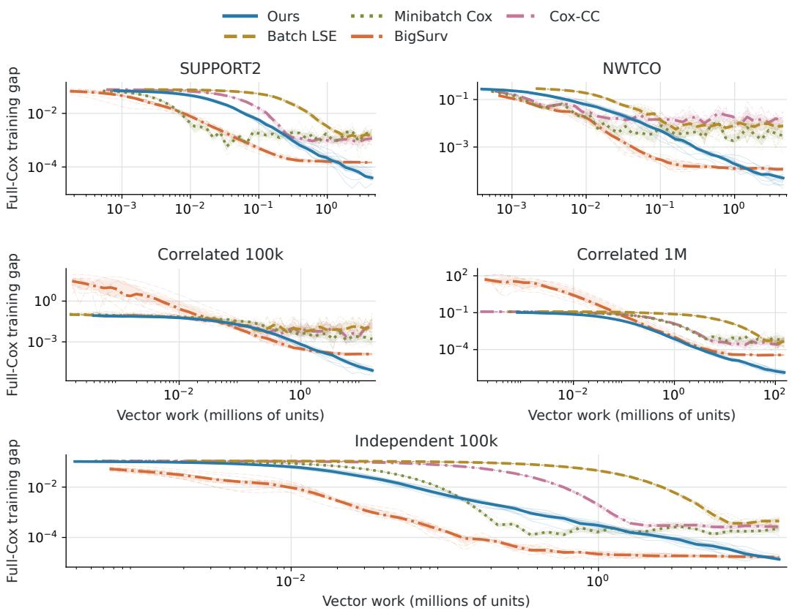  
Figure 1: Regularized full-Cox training gap against vector work. Each dataset has the same cap for all five methods. Thin lines show ten optimizer seeds, thick lines their medians, and bands their interquartile ranges. Ours and BigSurv use running arithmetic averages of post-update coefficient iterates. The other methods use current coefficient iterates.

For each method and dataset, we evaluate twelve configurations with two tuning seeds. We select the configuration with the smallest mean of the two seeds’ minimum saved validation Cox losses and run it with ten optimizer seeds. All methods receive the same per-fit vector budgets: $U _ { \mathrm { H P O } } =$ max{3 · 106, 100N} for tuning and $U _ { \mathrm { f i n a l } } = 1 . 5 U _ { \mathrm { H P O } }$ for final runs, where N is the total number of subjects.

We measure training accuracy by the regularized full-Cox gap $\mathscr { L } ( \beta ) - \mathscr { L } ( \beta _ { \mathrm { r e f } } )$ to a numerical reference. Test Cox loss and Harrell’s C-index are evaluated at validation-selected checkpoints; predictive Cox loss is unpenalized. Appendix D details the baseline objectives, vector-work accounting, preprocessing, and selection and evaluation history.

## 5.2 OPTIMIZATION AND PREDICTION

Our method achieves the lowest median terminal regularized full-Cox training gap on all five datasets at matched vector-work budgets (Figure 1). BigSurv is the closest baseline, with median terminal gaps 1.22–26.15 times ours (Table 4).

$\mathrm { A t } \delta = 0 . 0 5$ , grouping reduces the number of auxiliary shifts by factors of 22.8–337.8 relative to one shift per training event (Table 1).

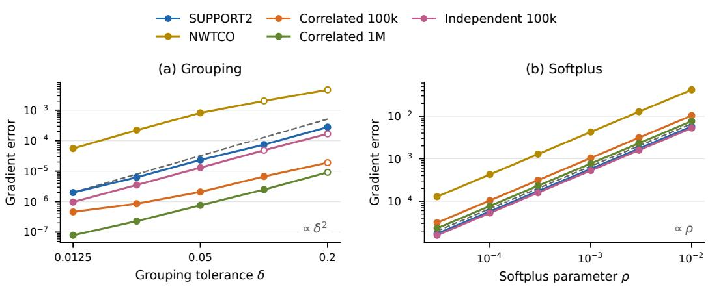  
Figure 2: Coefficient-gradient approximation errors at $\beta _ { \mathrm { r e f } }$ . The left panel isolates risk-set grouping using exact group normalizers; the right isolates softplus profiling at $\delta = 0 . 0 5$ . Filled markers satisfy the measured pointwise conditions of Theorem 4.1; hollow markers violate at least one applicable condition. Dashed lines are proportionality guides with arbitrary vertical offsets.

Additionally, to isolate the two approximation mechanisms in Theorem 4.1, we measure at the full-Cox reference $\beta _ { \mathrm { r e f } }$

$$
e _ { \mathrm { g r o u p } } ( \delta ) = \lVert \nabla \widetilde { \mathcal { L } } _ { \delta } ( \beta _ { \mathrm { r e f } } ) - \nabla \mathcal { L } ( \beta _ { \mathrm { r e f } } ) \rVert , \qquad e _ { \mathrm { s o f t } } ( \rho ) = \lVert \nabla \mathcal { L } _ { \rho , 0 . 0 5 } ( \beta _ { \mathrm { r e f } } ) - \nabla \widetilde { \mathcal { L } } _ { 0 . 0 5 } ( \beta _ { \mathrm { r e f } } ) \rVert .
$$

Figure 2 examines the quadratic grouping and linear softplus terms in (20). Softplus error is nearly linear in $\rho$ across all datasets. The grouping slopes are 1.37–1.87; because the partition changes discretely with δ, the $O ( \delta ^ { 2 } )$ bound does not imply an exact finite-grid slope of two.

Our method has the lowest mean test Cox loss on NWTCO, Correlated 100k, and Independent 100k. Minibatch Cox has the lowest mean on SUPPORT2, and BigSurv on Correlated 1M. Full metrics and trajectories are reported in Appendices E and G.

Appendix F gives the parameter grids, diagnostics at additional coefficient vectors, fitted slopes, numerical profiling details, and pointwise checks of the sufficient conditions.

## 6 LIMITATIONS AND CONCLUSION

Risk-set grouping converts the full Cox objective into a stochastic problem with K shared normalizers while preserving its gradient to second order in the grouping tolerance. Under the stated approximation and curvature conditions, this yields the ${ \widetilde O } ( T ^ { - 4 / 5 } )$ computational rate. Under the additional statistical conditions and parameter schedules, the compressed estimator is first-order equivalent to the full Cox estimator, with sublinear auxiliary state under the stated risk-set size condition. The method is intended for stochastic-access regimes; the experiments do not establish an end-to-end runtime advantage over optimized cumulative-sum full-Cox solvers.

The analysis assumes a convex linear predictor and the stated boundedness and curvature conditions. The constants $L _ { q }$ and κ can be large under adverse risk-weight heterogeneity. The implementation handles equal failure times with the Breslow convention, whereas the main statistical transfer result is stated for distinct failures. Tied-time asymptotics, time-varying covariates, and nonlinear predictors remain outside its scope.

At matched vector-work budgets, our method achieves the smallest median terminal regularized full-Cox training gap on all five datasets. Together, the theory and experiments establish a stochastic approach to full-Cox optimization that combines explicit approximation guarantees with compact auxiliary state.

## REPRODUCIBILITY STATEMENT

The appendix provides complete proofs and a detailed account of the experimental setup, implementation, tuning, and evaluation procedures. The accompanying source code is available at https://github.com/elizkaveta/Cox-Regression-Analysis/.

## AI USE STATEMENT

Generative AI assisted with language editing, literature searches, and proof development. All AIassisted mathematical content was independently verified, and the authors take full responsibility for the manuscript.

## REFERENCES

Massil Achab, Agathe Guilloux, Stéphane Gaïffas, and Emmanuel Bacry. SGD with variance reduction beyond empirical risk minimization. arXiv preprint arXiv:1510.04822, 2015. doi: 10.48550/arXiv.1510.04822. URL https://arxiv.org/abs/1510.04822.

Per K. Andersen and Richard D. Gill. Cox’s regression model for counting processes: A large sample study. The Annals ofStatistics, 10(4):1100–1120, 1982. doi: 10.1214/aos/1176345976.

Aharon Ben-Tal and Marc Teboulle. Expected utility, penalty functions, and duality in stochastic nonlinear programming. Management Science, 32(11):1445–1466, 1986. doi: 10.1287/mnsc.32. 11.1445.

Jose Blanchet, Donald Goldfarb, Garud Iyengar, Fengpei Li, and Chaoxu Zhou. Unbiased simulation for optimizing stochastic function compositions. arXiv preprint arXiv:1711.07564, 2017. doi: 10.48550/arXiv.1711.07564. URL https://arxiv.org/abs/1711.07564.

Norman E. Breslow. Covariance analysis of censored survival data. Biometrics, 30(1):89–99, 1974. doi: 10.2307/2529620.

David R. Cox. Regression models and life-tables. Journal ofthe Royal Statistical Society: Series B (Methodological), 34(2):187–220, 1972. doi: 10.1111/j.2517-6161.1972.tb00899.x.

Francois Fagan and Garud Iyengar. Unbiased scalable softmax optimization. arXiv preprint arXiv:1803.08577, 2018. doi: 10.48550/arXiv.1803.08577. URL https://arxiv.org/ abs/1803.08577.

Egor Gladin, Alexey Kroshnin, Jia-Jie Zhu, and Pavel Dvurechensky. Improved stochastic optimization of LogSumExp. arXiv preprint arXiv:2509.24894, 2025. doi: 10.48550/arXiv.2509.24894. URL https://arxiv.org/abs/2509.24894.

Larry Goldstein and Bryan Langholz. Asymptotic theory for nested case-control sampling in the Cox regression model. The Annals ofStatistics, 20(4):1903–1928, 1992. doi: 10.1214/aos/1176348895.

Håvard Kvamme, Ørnulf Borgan, and Ida Scheel. Time-to-event prediction with neural networks and Cox regression. Journal of Machine Learning Research, 20(129):1–30, 2019. URL https: //www.jmlr.org/papers/v20/18-424.html.

Daniel Levy, Yair Carmon, John C. Duchi, and Aaron Sidford. Large-scale methods for distributionally robust optimization. In Advances in Neural Information Processing Systems, volume 33, pp. 8847–8860, 2020.

Eric Moulines and Francis R. Bach. Non-asymptotic analysis of stochastic approximation algorithms for machine learning. In Advances in Neural Information Processing Systems, volume 24, 2011. URL https://proceedings.neurips.cc/paper/2011/hash/ 40008b9a5380fcacce3976bf7c08af5b-Abstract.html.

R survival package documentation. nwtco: Data from the national wilm’s tumor study. https://stat.ethz.ch/R-manual/R-devel/library/survival/html/ nwtco.html, n.d. Dataset documentation; accessed 2026-09-17.

Noah Simon, Jerome H. Friedman, Trevor Hastie, and Rob Tibshirani. Regularization paths for Cox’s proportional hazards model via coordinate descent. Journal of Statistical Software, 39(5):1–13, 2011. doi: 10.18637/jss.v039.i05.

Aliasghar Tarkhan and Noah Simon. BigSurvSGD: Big survival data analysis via stochastic gradient descent. arXiv preprint arXiv:2003.00116, 2020. URL https://arxiv.org/abs/2003. 00116.

Aliasghar Tarkhan and Noah Simon. An online framework for survival analysis: Reframing Cox proportional hazards model for large data sets and neural networks. Biostatistics, 25(1):134–153, 2024. doi: 10.1093/biostatistics/kxac039.

Anastasios A. Tsiatis. A large sample study of Cox’s regression model. The Annals ofStatistics, 9(1): 93–108, 1981. doi: 10.1214/aos/1176345335.

Vanderbilt Biostatistics. SUPPORT Datasets. https://hbiostat.org/data/repo/ supportdesc, n.d. Dataset documentation; accessed 2026-09-17.

Bokun Wang and Tianbao Yang. Finite-sum coupled compositional stochastic optimization: Theory and applications. In Proceedings of the 39th International Conference on Machine Learning, volume 162 of Proceedings of Machine Learning Research, pp. 23292–23317, 2022. URL https://proceedings.mlr.press/v162/wang22ak.html.

Bokun Wang and Tianbao Yang. A near-optimal single-loop stochastic algorithm for convex finitesum coupled compositional optimization. In Proceedings of the 42nd International Conference on Machine Learning, volume 267 of Proceedings ofMachine Learning Research, pp. 65091–65121, 2025. URL https://proceedings.mlr.press/v267/wang25dw.html.

Jianqiao Wang, Donglin Zeng, and Dan-Yu Lin. Fitting the Cox proportional hazards model to big data. Biometrics, 80(1):ujae018, 2024. doi: 10.1093/biomtc/ujae018.

Xiyuan Wei, Chih-Jen Lin, and Tianbao Yang. NeuCLIP: Efficient large-scale CLIP training with neural normalizer optimization. In The Fourteenth International Conference on Learning Representations, 2026a. URL https://openreview.net/forum?id=WoMMSVZHfP.

Xiyuan Wei, Linli Zhou, Bokun Wang, Chih-Jen Lin, and Tianbao Yang. A geometry-aware efficient algorithm for compositional entropic risk minimization. In Proceedings ofthe 43rd International Conference on Machine Learning, 2026b. URL https://arxiv.org/abs/2602.02877.

Lang Zeng, Weijing Tang, Zhao Ren, and Ying Ding. Mini-batch estimation for deep Cox models: Statistical foundations and practical guidance. Journal ofthe American Statistical Association, 121 (554):988–999, 2026. doi: 10.1080/01621459.2026.2644611.

Haixiang Zhang, Lulu Zuo, HaiYing Wang, and Liuquan Sun. Approximating partial likelihood estimators via optimal subsampling. Journal ofComputational and Graphical Statistics, 33(1): 276–288, 2024. doi: 10.1080/10618600.2023.2216261.

## A GENERIC GROUPED LOGSUMEXP OPTIMIZATION

This section proves Theorems 3.1 and 3.2. It first establishes the approximation, optimum-noise, and profile-to-joint curvature lemmas, then derives the convex averaged bound and the strongly convex last-iterate recursion.

## A.1 SOFTPLUS IDENTITIES AND PROFILE REGULARITY

We use the assumptions and objectives of Section 3. Write $F _ { k } \mathopen { } \mathclose \bgroup \left( \theta \aftergroup \egroup \right) : = \log \mathbb { E } _ { k } e ^ { L _ { k } \left( X , \theta \right) }$ for one group’s LogSumExp term. The scalar weight and curvature identities needed below are

$$
w _ { \rho } ( a ) : = h _ { \rho } ^ { \prime } ( a ) = \frac { e ^ { a } } { 1 + \rho e ^ { a } } , \qquad h _ { \rho } ^ { \prime \prime } ( a ) = w _ { \rho } ( a ) [ 1 - \rho w _ { \rho } ( a ) ] \in \left( 0 , \frac { 1 } { 4 \rho } \right] .
$$

For $0 < \rho < 1$ , each scalar objective tends to +∞ at both ends. $\mathrm { A s } \ s _ { k } \to + \infty$ , its leading term is $s _ { k } ,$ while as $s _ { k } \to - \infty ,$ , its leading term is $( 1 - \rho ^ { - 1 } ) s _ { k }$ , both tend to $+ \infty .$ Thus a scalar minimizer exists, and it is unique because the second derivative with respect to $s _ { k }$ is positive. Boundedness of the losses permits differentiation under the expectation. The minimizer is interior and its scalar second derivative is nonzero, so the implicit-function theorem makes the optimal shift differentiable in $\theta ,$ the envelope theorem therefore justifies the profile gradients used below.

Proposition A.1. Suppose $\rho \bar { \kappa } < 1$ . Then, for every $\theta \in \Theta$

$$
J ( \theta ) + \frac { \rho } { 2 } + \log ( 1 - \rho \bar { \kappa } ) \leq J _ { \rho } ( \theta ) \leq J ( \theta ) .\tag{27}
$$

$I f s _ { k , \rho } ( \theta )$ is the optimal shift for group $k ,$ then

$$
F _ { k } ( \theta ) + \log ( 1 - \rho \bar { \kappa } ) \leq s _ { k , \rho } ( \theta ) < F _ { k } ( \theta ) .\tag{28}
$$

Proof. For each group, apply the softplus approximation and optimal-shift bounds of Gladin et al. (2025) with $\varphi = L _ { k } ( X , \theta )$ . Their normalized second moment is $\begin{array} { r } { \bar { \mathbb { E } } _ { k } e ^ { 2 [ L _ { k } - F _ { k } ] } \le \bar { \kappa } , } \end{array}$ so the groupwise profile lies between $F _ { k } + \rho / 2 + \log ( 1 - \rho \bar { \kappa } )$ and $F _ { k }$ , and its optimal shift lies in the interval (28). Weighting the value bounds by pk proves (27). □

## A.2 WEIGHTED STOCHASTIC GRADIENT METHOD

Write $\mathcal { A } = [ - B - 1 , B ] ^ { K }$ for the shift component of the feasible set $\mathcal { Z }$ in Section 3. We use the weighted norm, stochastic gradient, projected update, and constants $C , V , D$ defined there. For a sampled pair $( k , X )$ , the function differentiated below is

$$
R ( \theta ) + K p _ { k } \left[ s _ { k } - 1 + h _ { \rho } ( L _ { k } ( X , \theta ) - s _ { k } ) \right] .
$$

Lemma A.2. Every sample function is convex and $C / \rho$ -smooth in the weighted norm. $H \rho \bar { \kappa } \leq 1 / 8 ,$ $z _ { \rho }$ minimizes $G _ { \rho } ,$ and $g ( z _ { \rho } )$ is a stochastic gradient at that point, then

$$
\mathbb { E } \left\| g ( z _ { \rho } ) \right\| _ { P ^ { - 1 } } ^ { 2 } \leq V .
$$

Consequently, at every iterate,

$$
\mathbb { E } _ { t } \left. g _ { t } \right. _ { P ^ { - 1 } } ^ { 2 } \leq \frac { 4 C } { \rho } [ G _ { \rho } ( z _ { t } ) - G _ { \rho } ( z _ { \rho } ) ] + 2 V .\tag{29}
$$

Proof. For a direction $( u , v )$ , the second directional derivative of one sample function is

$$
\begin{array} { r l } & { u ^ { \top } \nabla ^ { 2 } R ( \theta ) u + K p _ { k } w u ^ { \top } \nabla ^ { 2 } L _ { k } ( X , \theta ) u } \\ & { \qquad + K p _ { k } h _ { \rho } ^ { \prime \prime } ( L _ { k } - s _ { k } ) [ \langle \nabla L _ { k } , u \rangle - v _ { k } ] ^ { 2 } . } \end{array}
$$

All terms are nonnegative. Weighted Cauchy–Schwarz gives

$$
[ \langle \nabla L _ { k } , u \rangle - v _ { k } ] ^ { 2 } \leq \left( G ^ { 2 } + \frac { 1 } { p _ { k } } \right) ( \left\| u \right\| ^ { 2 } + p _ { k } v _ { k } ^ { 2 } ) .
$$

Together with $w \le 1 / \rho$ and $h _ { \rho } ^ { \prime \prime } \leq 1 / ( 4 \rho )$ , this bounds the directional derivative by $( C / \rho ) \left\| ( u , v ) \right\| _ { P } ^ { 2 }$

$\operatorname { A t } z _ { \rho }$ , let $w _ { k , : }$ ∗ be the weight in group k. The shift first-order condition gives $\mathbb { E } _ { k } w _ { k , * } = 1$ . Proposition A.1 gives

$$
w _ { k , * } \le q _ { k } W _ { k } , \qquad q _ { k } \le ( 1 - \rho \bar { \kappa } ) ^ { - 1 } \le \frac 8 7 ,
$$

where $W _ { k } = e ^ { L _ { k } - F _ { k } }$ and $q _ { k } = e ^ { F _ { k } - s _ { k , \rho } }$ . Consequently,

$$
\mathbb { E } _ { k } w _ { k , * } ^ { 2 } \le q _ { k } ^ { 2 } \mathbb { E } _ { k } W _ { k } ^ { 2 } \le \frac { 6 4 } { 4 9 } \bar { \kappa } < 2 \bar { \kappa } \le 4 \bar { \kappa } \qquad \mathrm { w h e n ~ } \rho \bar { \kappa } \le 1 / 8 .
$$

Substituting these two bounds in the stochastic gradients of Section 3 and averaging over the uniformly sampled group gives the value of V in (4).

We prove (29) directly using the globally smooth scalar softplus. Fix $z = ( \theta , s )$ in the feasible set and write $z _ { \ast } : = z _ { \rho } = ( \theta _ { \ast } , s _ { \ast } )$ . Using the same sampled pair $( k , X )$ for the current and optimal weights, set

$$
a = L _ { k } ( X , \theta ) - s _ { k } , \quad \quad a _ { * } = L _ { k } ( X , \theta _ { * } ) - s _ { k , * } , \quad \quad w = h _ { \rho } ^ { \prime } ( a ) , \quad \quad w _ { * } = h _ { \rho } ^ { \prime } ( a _ { * } ) .
$$

For a differentiable function F, write $D _ { F } ( x , y ) : = F ( x ) - F ( y ) - \langle \nabla F ( y ) , x - y \rangle$ . In particular, with $h = h _ { \rho } ,$

$$
D _ { h } ( a , a _ { * } ) = h _ { \rho } ( a ) - h _ { \rho } ( a _ { * } ) - w _ { * } ( a - a _ { * } ) .
$$

Since $h _ { \rho }$ is convex and $( 4 \rho ) ^ { - 1 }$ -smooth on all of R, scalar co-coercivity gives

$$
( w - w _ { * } ) ^ { 2 } \leq \frac { D _ { h } ( a , a _ { * } ) } { 2 \rho } .
$$

Decompose the sampled Euclidean gradient as $g ( z ) = b + r$ , where

$$
\begin{array} { r l } & { \boldsymbol { b } = \big ( \nabla R ( { \boldsymbol { \theta } } ) + K p _ { k } w _ { * } \nabla L _ { k } ( { \boldsymbol { X } } , { \boldsymbol { \theta } } ) , K p _ { k } ( { \boldsymbol { 1 } } - w _ { * } ) \boldsymbol { e } _ { k } \big ) , } \\ & { \boldsymbol { r } = K p _ { k } ( { \boldsymbol { w } } - { \boldsymbol { w } } _ { * } ) \big ( \nabla L _ { k } ( { \boldsymbol { X } } , { \boldsymbol { \theta } } ) , - \boldsymbol { e } _ { k } \big ) , } \end{array}
$$

and $e _ { k }$ is the kth coordinate vector in $\mathbb { R } ^ { K }$ . The previously established identities $\mathbb { E } _ { k } w _ { * } = 1$ and $\mathbb { E } _ { k } w _ { * } ^ { 2 } \le 4 \bar { \kappa }$ , together with the uniform gradient bounds and $\textstyle \sum _ { k } p _ { k } ^ { 2 } \leq 1$ , imply

$$
\begin{array} { r l r } {  { \mathbb { E } \| b \| _ { P ^ { - 1 } } ^ { 2 } \leq 2 G _ { R } ^ { 2 } + 2 K G ^ { 2 } \sum _ { k } p _ { k } ^ { 2 } \mathbb { E } _ { k } w _ { * } ^ { 2 } + K \sum _ { k } p _ { k } \mathbb { E } _ { k } ( 1 - w _ { * } ) ^ { 2 } } } \\ & { } & { \quad \quad \quad \quad \quad \quad \quad \quad \quad \quad \quad \quad \quad \quad \quad \quad \quad \quad \quad \quad \quad \quad \quad \quad } \\ & { } & { \quad \quad \leq 2 G _ { R } ^ { 2 } + 8 K \bar { \kappa } G ^ { 2 } + 4 K \bar { \kappa } - K \leq V . } \end{array}
$$

Moreover, since $p _ { k } \leq 1$

$$
\begin{array} { r } { \mathbb E \left. r \right. _ { P ^ { - 1 } } ^ { 2 } \le K ( G ^ { 2 } + 1 ) \displaystyle \sum _ { k } p _ { k } \mathbb E _ { k } ( w - w _ { * } ) ^ { 2 } } \\ { \le \frac { K ( G ^ { 2 } + 1 ) } { 2 \rho } \displaystyle \sum _ { k } p _ { k } \mathbb E _ { k } D _ { h } ( a , a _ { * } ) . } \end{array}
$$

The Bregman divergence of the full objective satisfies the exact identity

$$
D _ { G _ { \rho } } ( z , z _ { * } ) = D _ { R } ( \theta , \theta _ { * } ) + \sum _ { k } p _ { k } \mathbb { E } _ { k } \big [ D _ { h } ( a , a _ { * } ) + w _ { * } D _ { L _ { k } ( X , \cdot ) } ( \theta , \theta _ { * } ) \big ] .
$$

Here the same sampled X is used in both arguments of $D _ { L _ { k } ( X , \cdot ) }$ . Convexity of R and every $L _ { k } ( X , \cdot )$ and $w _ { * } > 0$ , give

$$
D _ { G _ { \rho } } ( z , z _ { * } ) \geq \sum _ { k } p _ { k } \mathbb { E } _ { k } D _ { h } ( a , a _ { * } ) .
$$

Consequently,

$$
\begin{array} { r l r } {  { \mathbb { E } \| g ( z ) \| _ { P ^ { - 1 } } ^ { 2 } \leq 2 \mathbb { E } \| b \| _ { P ^ { - 1 } } ^ { 2 } + 2 \mathbb { E } \| r \| _ { P ^ { - 1 } } ^ { 2 } } } \\ & { } & { \leq 2 V + \frac { K ( G ^ { 2 } + 1 ) } { \rho } D _ { G _ { \rho } } ( z , z _ { * } ) } \\ & { } & { \leq 2 V + \frac { 4 C } { \rho } [ G _ { \rho } ( z ) - G _ { \rho } ( z _ { * } ) ] . } \end{array}
$$

The last inequality uses $\begin{array} { r l r } { 4 C } & { { } \ge } & { K ( G ^ { 2 } \ + \ 1 ) } \end{array}$ and constrained first-order optimality, $\langle \nabla G _ { \rho } ( z _ { * } ) , z - { \bar { z } } _ { * } \rangle \stackrel { . } { \geq } 0$ . Conditioning on the history through $z _ { t }$ and taking a fresh sample gives (29). □

## A.3 CURVATURE OF THE JOINT SURROGATE

The pointwise second derivative of softplus can be very small. The next scalar inequality instead measures curvature relative to the optimal shift.

Lemma A.3. Fix a∗ and let

$$
\begin{array} { r } { w _ { * } : = w _ { \rho } ( a _ { * } ) , \qquad m _ { * } : = w _ { * } [ 1 - \rho w _ { * } ] . } \end{array}
$$

Then, for every $a \in \mathbb { R } ,$

$$
[ w _ { \rho } ( a ) - w _ { * } ] ( a - a _ { * } ) \geq m _ { * } \frac { ( a - a _ { * } ) ^ { 2 } } { 1 + | a - a _ { * } | } .\tag{30}
$$

Proof. Put $d = a - a _ { * }$ . If $d \geq 0$ , direct substitution gives

$$
w _ { \rho } ( a _ { * } + d ) - w _ { * } = \frac { m _ { * } ( e ^ { d } - 1 ) } { 1 + \rho w _ { * } ( e ^ { d } - 1 ) } \geq m _ { * } ( 1 - e ^ { - d } ) .
$$

If $d = - x \leq 0$ , the same calculation gives

$$
w _ { * } - w _ { \rho } ( a _ { * } - x ) = \frac { m _ { * } ( 1 - e ^ { - x } ) } { 1 - \rho w _ { * } ( 1 - e ^ { - x } ) } \geq m _ { * } ( 1 - e ^ { - x } ) .
$$

The weight is increasing, and $1 - e ^ { - x } \geq x / ( 1 + x )$ for $x \geq 0$ . Multiplying by |d| proves (30).

At the surrogate minimizer, the average scalar curvature is not small. Indeed, $\mathbb { E } _ { k } w _ { k , * } = 1$ and $\mathbb { E } _ { k } w _ { k , * } ^ { 2 } \le 4 \bar { \kappa } .$ , so

$$
{ \mathbb E } _ { k } \{ w _ { k , * } [ 1 - \rho w _ { k , * } ] \} = 1 - \rho { \mathbb E } _ { k } w _ { k , * } ^ { 2 } \geq \frac { 1 } { 2 } .\tag{31}
$$

We now state the only additional assumption needed for the fast generic rate. The profiled objective $J _ { \rho }$ is called γ-strongly convex if

$$
J _ { \rho } ( \theta ^ { \prime } ) \geq J _ { \rho } ( \theta ) + \langle \nabla J _ { \rho } ( \theta ) , \theta ^ { \prime } - \theta \rangle + \frac { \gamma } { 2 } \left. \theta ^ { \prime } - \theta \right. ^ { 2 } .
$$

When $J _ { \rho }$ is twice differentiable, a sufficient condition is $\nabla ^ { 2 } J _ { \rho } ( \theta ) \succeq \gamma I$ on Θ. The optimal shift is unique and interior, and its Hessian block is positive definite. Differentiating its first-order condition and then the envelope identity shows that the profile Hessian is the Schur complement

$$
\nabla ^ { 2 } J _ { \rho } = G _ { \theta \theta } - G _ { \theta s } G _ { s s } ^ { - 1 } G _ { s \theta } ,\tag{32}
$$

where all blocks are evaluated at the optimal shifts. Thus profile curvature concerns the parameter after the auxiliary variables have adjusted optimally.

Lemma A.4. Suppose $\rho \bar { \kappa } \leq 1 / 8$ and $J _ { \rho }$ is γ-strongly convex. Define

$$
\mu : = \left[ \frac { 2 ( 1 + 2 G ^ { 2 } ) } { \gamma } + 1 6 B + 8 \right] ^ { - 1 } .\tag{33}
$$

Then, for every $z \in \Theta \times \mathcal { A }$

$$
\begin{array} { r } { \langle \nabla G _ { \rho } ( z ) - \nabla G _ { \rho } ( z _ { \rho } ) , z - z _ { \rho } \rangle \geq \mu \left. z - z _ { \rho } \right. _ { P } ^ { 2 } . } \end{array}\tag{34}
$$

Proof. Write $u = \theta - \theta _ { \rho }$ and $\begin{array} { r } { { v } _ { k } = { s } _ { k } - { s } _ { k , \rho } . } \end{array}$ . For an observation in group k, put

$$
d _ { k } = L _ { k } ( X , \theta ) - L _ { k } ( X , \theta _ { \rho } ) - v _ { k } , \qquad m _ { k } = w _ { k , * } ( 1 - \rho w _ { k , * } ) .
$$

Indeed, $| L _ { k } ( X , \theta ) - L _ { k } ( X , \theta _ { \rho } ) | \leq 2 B$ and $| v _ { k } | \le 2 B + 1$ , so $| d _ { k } | \le 4 B + 1$ . Convexity of each loss and Lemma ${ \mathrm { A } } . 3$ give the needed samplewise lower bound as follows. Write

$$
a = L _ { k } ( X , \theta ) - s _ { k } , \quad \quad a _ { * } = L _ { k } ( X , \theta _ { \rho } ) - s _ { k , \rho } .
$$

The two convexity inequalities for $L _ { k }$ imply

$$
\begin{array} { r l } & { \langle w _ { \rho } ( a ) \nabla L _ { k } ( X , \theta ) - w _ { \rho } ( a _ { * } ) \nabla L _ { k } ( X , \theta _ { \rho } ) , u \rangle - [ w _ { \rho } ( a ) - w _ { \rho } ( a _ { * } ) ] v _ { k } } \\ & { \qquad \ge [ w _ { \rho } ( a ) - w _ { \rho } ( a _ { * } ) ] [ L _ { k } ( X , \theta ) - L _ { k } ( X , \theta _ { \rho } ) - v _ { k } ] } \\ & { \qquad = [ w _ { \rho } ( a ) - w _ { \rho } ( a _ { * } ) ] d _ { k } . } \end{array}
$$

Lemma A.3 and $| d _ { k } | \le 4 B + 1$ bound this by $m _ { k } d _ { k } ^ { 2 } / ( 4 B + 2 )$ . After taking expectations and weighting the groups, the softplus contribution to the gradient secant is therefore at least

$$
\frac { A } { 4 B + 2 } , \qquad A : = \sum _ { k = 1 } ^ { K } p _ { k } \mathbb { E } _ { k } ( m _ { k } d _ { k } ^ { 2 } ) .
$$

The regularizer is convex, so its contribution is nonnegative. Hence, if S denotes the left-hand side of (34),

$$
S \geq { \frac { A } { 4 B + 2 } } .\tag{35}
$$

Next, $v _ { k } = L _ { k } ( X , \theta ) - L _ { k } ( X , \theta _ { \rho } ) - d _ { k }$ and $\vert L _ { k } ( X , \theta ) - L _ { k } ( X , \theta _ { \rho } ) \vert \leq G \left. u \right.$ . Multiply $( r + s ) ^ { 2 } \leq$ $2 r ^ { 2 } + 2 s ^ { 2 }$ by $m _ { k }$ and take expectations to obtain

$$
\begin{array} { r } { v _ { k } ^ { 2 } \mathbb { E } _ { k } m _ { k } \leq 2 G ^ { 2 } \left. u \right. ^ { 2 } \mathbb { E } _ { k } m _ { k } + 2 \mathbb { E } _ { k } ( m _ { k } d _ { k } ^ { 2 } ) . } \end{array}
$$

Equation (31) gives $\mathbb { E } _ { k } m _ { k } \ge 1 / 2$ (and trivially $\mathbb { E } _ { k } m _ { k } \le 1 )$ , so division by $\mathbb { E } _ { k } m _ { k }$ and averaging with the $p _ { k }$ gives

$$
\sum _ { k = 1 } ^ { K } p _ { k } v _ { k } ^ { 2 } \leq 4 A + 2 G ^ { 2 } \left. u \right. ^ { 2 } ,
$$

and therefore

$$
\left\| z - z _ { \rho } \right\| _ { P } ^ { 2 } \leq \left( 1 + 2 G ^ { 2 } \right) \left\| u \right\| ^ { 2 } + 4 A .\tag{36}
$$

The symmetric Bregman divergence of $G _ { \rho }$ is the sum of its two one-sided Bregman divergences and equals S. Convexity makes both summands nonnegative, so S is at least either one. At the optimal shifts, $\nabla _ { s } G _ { \rho } ( z _ { \rho } ) = 0$ and $\nabla _ { \theta } G _ { \rho } ( z _ { \rho } ) = \nabla J _ { \rho } ( \theta _ { \rho } )$ . Since $G _ { \rho } ( \theta , s ) \geq J _ { \rho } ( \theta )$ and equality holds at $z _ { \rho } .$ the one-sided Bregman divergence satisfies

$$
G _ { \rho } ( z ) - G _ { \rho } ( z _ { \rho } ) - \langle \nabla G _ { \rho } ( z _ { \rho } ) , z - z _ { \rho } \rangle \geq J _ { \rho } ( \theta ) - J _ { \rho } ( \theta _ { \rho } ) - \langle \nabla J _ { \rho } ( \theta _ { \rho } ) , u \rangle .
$$

Strong convexity of $J _ { \rho }$ now gives

$$
S \geq { \frac { \gamma } { 2 } } \left. u \right. ^ { 2 } .\tag{37}
$$

Equations (35) and (37) imply

$$
\left\| z - z _ { \rho } \right\| _ { P } ^ { 2 } \leq \left[ \frac { 2 ( 1 + 2 G ^ { 2 } ) } { \gamma } + 4 ( 4 B + 2 ) \right] S .
$$

This is (34).

Remark A.5. If R is λ-strongly convex, then $G _ { \rho } ( \theta , s ) - \lambda \left\| \theta \right\| ^ { 2 } / 2$ is jointly convex. Partial minimization over s preserves convexity, so $J _ { \rho }$ remains λ-strongly convex and one may take $\gamma = \lambda$ The Cox application below instead obtains γ from the partial likelihood itself, and therefore permits $\lambda = 0$

## A.4 GENERIC CONVERGENCE BOUNDS

ProofofTheorem 3.1. Write ${ \bar { z } } _ { T } = T ^ { - 1 } \sum _ { t = 1 } ^ { T } z _ { t }$ . Nonexpansiveness of the weighted projection, unbiasedness, convexity, and Lemma $_ { \mathrm { A } . 2 }$ give

$$
\mathbb { E } _ { t } \left. z _ { t + 1 } - z _ { \rho } \right. _ { P } ^ { 2 } \leq \left. z _ { t } - z _ { \rho } \right. _ { P } ^ { 2 } - \left( 2 \eta _ { T } - \frac { 4 C \eta _ { T } ^ { 2 } } { \rho _ { T } } \right) \left[ G _ { \rho } ( z _ { t } ) - G _ { \rho } ( z _ { \rho } ) \right] + 2 \eta _ { T } ^ { 2 } V .
$$

The chosen step size makes the coefficient in parentheses equal to $\eta _ { T }$ . Sum over t, use $\begin{array} { r } { \left\| z _ { 1 } - z _ { \rho } \right\| _ { P } ^ { 2 } \leq } \end{array}$ $D ^ { 2 }$ , and apply Jensen’s inequality to the averaged iterate. This yields

$$
\mathbb { E } [ G _ { \rho } ( \bar { z } _ { T } ) - G _ { \rho } ( z _ { \rho } ) ] \leq \frac { 4 C D ^ { 2 } } { \rho _ { T } T } + \frac { \rho _ { T } V } { 2 C } .
$$

Proposition $\mathrm { A . 1 }$ transfers this inequality from $G _ { \rho }$ to $J .$ . Since $\rho _ { T } \bar { \kappa } \leq 1 / 8$ , the approximation error is at most $- \rho _ { T } / 2 - \log ( 1 - \rho _ { T } \bar { \kappa } ) \stackrel { - } { \leq } 8 \rho _ { T } \bar { \kappa } / 7$ □

The fast result is most useful in distance form, because applications can compare the surrogate minimizer with the desired target through a problem-specific gradient bound.

ProofofTheorem 3.2. Let $z _ { \rho }$ minimize $G _ { \rho } .$ . As in the convex proof, nonexpansiveness and unbiasedness give

$$
\begin{array} { r } { \mathbb { E } _ { t } \left. z _ { t + 1 } - z _ { \rho } \right. _ { P } ^ { 2 } \leq \left. z _ { t } - z _ { \rho } \right. _ { P } ^ { 2 } - 2 \eta \left. \nabla G _ { \rho } ( z _ { t } ) , z _ { t } - z _ { \rho } \right. + \eta ^ { 2 } \mathbb { E } _ { t } \left. g _ { t } \right. _ { P ^ { - 1 } } ^ { 2 } . } \end{array}
$$

The gradient inner product is at least the surrogate gap by convexity and at least $\mu \left\| z _ { t } - z _ { \rho } \right\| _ { P } ^ { 2 }$ by Lemma $\mathrm { A . 4 }$ and first-order optimality. It is therefore at least half the sum of these two lower bounds. Substitute this fact and (29). Since $\eta \leq \rho / ( 4 C )$ , the coefficient of the nonnegative surrogate gap is nonpositive and may be dropped, giving

$$
\begin{array} { r } { \mathbb { E } _ { t } \left\| z _ { t + 1 } - z _ { \rho } \right\| _ { P } ^ { 2 } \leq ( 1 - \mu \eta ) \left\| z _ { t } - z _ { \rho } \right\| _ { P } ^ { 2 } + 2 \eta ^ { 2 } V . } \end{array}
$$

Because $0 \leq 1 - \mu \eta < 1$ , iteration of this recursion and the geometric sum give

$$
\mathbb { E } \left\| z _ { T + 1 } - z _ { \rho } \right\| _ { P } ^ { 2 } \leq ( 1 - \mu \eta ) ^ { T } D ^ { 2 } + 2 \eta ^ { 2 } V \sum _ { j = 0 } ^ { T - 1 } ( 1 - \mu \eta ) ^ { j } \leq e ^ { - \mu \eta T } D ^ { 2 } + \frac { 2 \eta V } { \mu } ,
$$

which proves (8). For the displayed schedule, $\eta _ { T } = \rho _ { T } / ( 4 C ) , \mu \eta _ { T } T = 2 \log T$ , and $\eta _ { T } \leq 1 / \mu$ for $T \geq 2$ . Substitution proves (9) after dropping the shift coordinates. This last step is the standard constant-step strongly convex SGD recursion (Moulines & Bach, 2011). □

Proof of Corollary 3.3. Let $\theta ^ { \star }$ minimize J. By the value approximation (27), optimality and the two sides of that bound give

$$
J _ { \rho } ( \theta ^ { \star } ) - J _ { \rho } ( \theta _ { \rho } ) \leq J ( \theta ^ { \star } ) - J ( \theta _ { \rho } ) - \rho / 2 - \log ( 1 - \rho \bar { \kappa } ) \leq - \rho / 2 - \log ( 1 - \rho \bar { \kappa } ) .
$$

Strong convexity of $J _ { \rho }$ therefore gives

$$
\left\| \theta _ { \rho } - \theta ^ { \star } \right\| ^ { 2 } \leq \frac { 2 } { \gamma } [ - \rho / 2 - \log ( 1 - \rho \bar { \kappa } ) ] \leq \frac { 1 6 \rho \bar { \kappa } } { 7 \gamma } .
$$

The smoothness assumptions at the start of this section imply that J is $L _ { J } .$ -smooth. Since $\theta ^ { \star }$ is stationary, smoothness, the preceding display, (9), and $\left\| a + b \right\| ^ { 2 } \leq 2 \left\| a \right\| ^ { 2 } + 2 \left\| b \right\| ^ { 2 }$ give (10). Finally, $\rho _ { T } = 8 \dot { C } \log T / ( \mu T )$ yields the stated order. □

Stationarity is needed because the smoothness upper bound contains a linear term at a constrained boundary. In Cox regression we use a sharper gradient comparison, its softplus contribution is quadratic after conversion to objective error.

## B COX REGRESSION

This section proves the uniform comparison in Theorem 4.1 and specializes the generic recursion to obtain Corollary 4.2, with all constants retained.

## B.1 NOTATION AND DATA CONSTANTS

We use the data, grouping rule, and objectives of Section 4: the exact L, grouped $\widetilde { \mathcal { L } } _ { \delta }$ , joint $G _ { \rho , \delta }$ , and profiled $\mathcal { L } _ { \rho , \delta }$ . The optional ridge coefficient $\lambda \geq 0$ is the same in all four objectives. Throughout this section, $\| x _ { j } \| \leq X$ and $| \beta ^ { \top } x _ { j } | \le M$ for every subject j and $\beta \in B$

For $i \in \mathcal { E }$ , let $Q _ { i } ^ { \beta }$ be the Cox distribution on $\mathcal { R } _ { i }$

$$
Q _ { i } ^ { \beta } ( j ) : = \frac { e ^ { \beta ^ { \top } x _ { j } } } { \sum _ { \ell \in \mathcal { R } _ { i } } e ^ { \beta ^ { \top } x _ { \ell } } } .
$$

The constants κ and $L _ { q }$ are defined in (18) and (19). Both are independent of the grouping.

The suprema over B are needed for a global optimization theorem. For a local statistical comparison they may instead be taken over a fixed neighborhood of the target.

## B.2 GROUPING BOUNDS

Recall $r _ { \delta } = \delta / ( 1 + \delta )$ from Section 4. By the grouping rule, at most this fraction of the largest risk set disappears inside one group.

Lemma B.1. Suppose

$$
r _ { \delta } \leq 1 - q , \qquad L _ { q } r _ { \delta } \leq \frac 1 2 .\tag{38}
$$

For any two risk sets $\mathcal { R } _ { v } \subset \mathcal { R } _ { u }$ in the same group,

$$
| a _ { u } ( \beta ) - a _ { v } ( \beta ) | \le 2 L _ { q } r _ { \delta } ,\tag{39}
$$

$$
\| \nabla a _ { u } ( \beta ) - \nabla a _ { v } ( \beta ) \| \le 2 X L _ { q } r _ { \delta } ,\tag{40}
$$

$$
\begin{array} { r } { \left\| \nabla ^ { 2 } a _ { u } ( \beta ) - \nabla ^ { 2 } a _ { v } ( \beta ) \right\| _ { \mathrm { o p } } \leq 5 X ^ { 2 } L _ { q } r _ { \delta } . } \end{array}\tag{41}
$$

Proof. Let $A = \mathcal { R } _ { u } \ \backslash \ \mathcal { R } _ { v }$ and define its cardinality and Cox-mass fractions by

$$
r : = \frac { | A | } { | \mathcal { R } _ { u } | } , \qquad \alpha : = Q _ { u } ^ { \beta } ( A ) .
$$

The first condition in (38) makes the pair admissible in (19). Therefore

$$
r \le r _ { \delta } , \qquad \alpha \le L _ { q } r \le L _ { q } r _ { \delta } .\tag{42}
$$

Removing A changes the average risk weight according to the exact identity

$$
a _ { u } - a _ { v } = \log { \frac { 1 - r } { 1 - \alpha } } .\tag{43}
$$

Both r and α lie in $[ 0 , L _ { q } r _ { \delta } ]$ . Hence

$$
| a _ { u } - a _ { v } | \leq - \log ( 1 - L _ { q } r _ { \delta } ) \leq 2 L _ { q } r _ { \delta } ,
$$

which proves (39).

Let $Q _ { A }$ be the Cox distribution conditional on A. The outer Cox law is the mixture

$$
Q _ { u } ^ { \beta } = ( 1 - \alpha ) Q _ { v } ^ { \beta } + \alpha Q _ { A } .
$$

Its mean therefore differs from that of $Q _ { v } ^ { \beta }$ by at most 2Xα, which proves (40).

Write $H _ { u } , H _ { v } , H _ { A }$ for the corresponding covariance matrices and $g _ { v } , g _ { A }$ for the two conditional means. The covariance of a mixture is

$$
H _ { u } = ( 1 - \alpha ) H _ { v } + \alpha H _ { A } + \alpha ( 1 - \alpha ) ( g _ { A } - g _ { v } ) ( g _ { A } - g _ { v } ) ^ { \top } .
$$

All covariance matrices are between 0 and $X ^ { 2 } I ,$ while $\| g _ { A } - g _ { v } \| \leq 2 X$ . Consequently

$$
\begin{array} { r } { \| \boldsymbol H _ { u } - \boldsymbol H _ { v } \| _ { \mathrm { o p } } \le \alpha { \boldsymbol X } ^ { 2 } + 4 \alpha { \boldsymbol X } ^ { 2 } \le 5 { \boldsymbol X } ^ { 2 } L _ { q } r _ { \delta } . } \end{array}
$$

This proves the last claim.

Proposition B.2. Under (38), for every $\beta \in B ,$

$$
\begin{array} { r } { \left\| \nabla \widetilde { \mathcal { L } } _ { \delta } ( \beta ) - \nabla \mathcal { L } ( \beta ) \right\| \le X L _ { q } ^ { 2 } r _ { \delta } ^ { 2 } , } \end{array}\tag{44}
$$

$$
\nabla ^ { 2 } \widetilde { \mathcal { L } } _ { \delta } ( \beta ) \succeq \nabla ^ { 2 } \mathcal { L } ( \beta ) - \frac { 5 } { 2 } X ^ { 2 } L _ { q } ^ { 2 } r _ { \delta } ^ { 2 } I .\tag{45}
$$

Proof. Fix a group and suppress $\beta$ in $a _ { i } ( \beta )$ . Write $g _ { i } = \nabla a _ { i } ( \beta )$ and $H _ { i } = \nabla ^ { 2 } a _ { i } ( \beta )$ . Differentiating (13) gives

$$
\nabla \Phi _ { k } = \sum _ { i \in \mathcal { T } _ { k } } \pi _ { i } g _ { i } ,\tag{46}
$$

$$
\nabla ^ { 2 } \Phi _ { k } = \sum _ { i \in \mathcal { I } _ { k } } \pi _ { i } H _ { i } + \mathrm { C o v } _ { \pi } ( g _ { i } ) ,\tag{47}
$$

where $\textstyle \pi _ { i } = e ^ { a _ { i } } / \sum _ { r \in \mathcal { T } _ { k } } e ^ { a _ { r } }$ . The exact Cox group uses the uniform average of the $g _ { i }$ and $H _ { i }$

By Lemma B.1, the oscillation of the $a _ { i }$ is at most $2 L _ { q } r _ { \delta }$ , the diameter of the $g _ { i }$ is at most $2 X L _ { q } r _ { \delta }$ and the diameter of the $H _ { i }$ is at most $5 X ^ { 2 } L _ { q } r _ { \delta }$ . To compare the group weights, interpolate from the uniform law u to π via $\begin{array} { r } { \pi _ { t , i } = e ^ { t a _ { i } } / \sum _ { r \in \mathcal { T } _ { k } } ^ { \cdot } e ^ { t a _ { r } } , 0 \stackrel { \cdot } { \leq } t \leq 1 } \end{array}$ . For any scalar array $f _ { i }$ , write osc $( f ) = \mathrm { m a x } _ { i } f _ { i } - \mathrm { m i n } _ { i } f _ { i }$ . Then $\begin{array} { r } { \frac { d } { d t } \mathbb { E } _ { \pi _ { t } } f = \operatorname { C o v } _ { \pi _ { t } } ( f , a ) } \end{array}$ . Cauchy–Schwarz and the variance bound $\operatorname { V a r } ( f ) \leq \sec ( f ) ^ { 2 } / 4$ therefore give

$$
| \mathbb { E } _ { \pi } f - \mathbb { E } _ { u } f | \leq { \frac { 1 } { 4 } } \sec ( f ) \sec ( a ) .\tag{48}
$$

Apply this to $f _ { i } = v ^ { \top } g _ { i }$ and take the supremum over unit vectors v. The groupwise gradient difference is at most

$$
\left\| \sum _ { i } \pi _ { i } g _ { i } - \frac { 1 } { m _ { k } } \sum _ { i } g _ { i } \right\| \leq ( 2 X L _ { q } r _ { \delta } ) \frac { 2 L _ { q } r _ { \delta } } { 4 } = X L _ { q } ^ { 2 } r _ { \delta } ^ { 2 } .
$$

For the Hessian, apply (48) to $f _ { i } = v ^ { \top } H _ { i } v$ for each unit v. The covariance term in (47) is positive semidefinite, so

$$
\nabla ^ { 2 } \Phi _ { k } \succeq \frac { 1 } { m _ { k } } \sum _ { i } H _ { i } - \left( 5 X ^ { 2 } L _ { q } r _ { \delta } \right) \frac { 2 L _ { q } r _ { \delta } } { 4 } I .
$$

Weighting the groupwise bounds by $p _ { k }$ proves the proposition.

The same oscillation bound removes the group dependence from the softplus moment.

Lemma B.3. Under (38), every group satisfies

$$
\operatorname* { s u p } _ { \beta \in B } \mathbb E _ { k } \exp \big ( 2 [ \beta ^ { \top } x _ { J } - \Phi _ { k } ( \beta ) ] \big ) \leq \frac { 9 } { 8 } \kappa .\tag{49}
$$

Proof. Put

$$
A _ { i } = e ^ { a _ { i } ( \beta ) } , \qquad B _ { i } = \frac { 1 } { n _ { i } } \sum _ { j \in \mathcal { R } _ { i } } e ^ { 2 \beta ^ { \top } x _ { j } } .
$$

Definition (18) gives $B _ { i } \le \kappa A _ { i } ^ { 2 }$ . Consequently the group moment is at most

$$
\kappa { \frac { m _ { k } ^ { - 1 } \sum _ { i } { \cal A } _ { i } ^ { 2 } } { ( m _ { k } ^ { - 1 } \sum _ { i } { \cal A } _ { i } ) ^ { 2 } } } .
$$

If positive numbers $y$ lie in $[ a , b ]$ , then $( y - a ) ( b - y ) \geq 0$ implies $y ^ { 2 } \leq ( a + b ) y - a b$ . Writing $\overline { { y } } = \mathbb { E } y$ and maximizing over ${ \overline { { y } } } \in [ a , b ]$ gives

$$
\frac { \mathbb { E } y ^ { 2 } } { ( \mathbb { E } y ) ^ { 2 } } \leq \frac { a + b } { \overline { { y } } } - \frac { a b } { \overline { { y } } ^ { 2 } } \leq \frac { ( a + b ) ^ { 2 } } { 4 a b }
$$

the last maximum occurs at ${ \overline { { y } } } = 2 a b / ( a + b )$ . For any pair in the group, identity (43) shows that both $e ^ { a _ { u } - a _ { v } }$ and $e ^ { a _ { v } - a _ { u } }$ are at most $( \dot { 1 } - L _ { q } r _ { \delta } ) ^ { - 1 }$ . Hence the largest and smallest group values obey the sharper ratio bound $b / a = e ^ { \mathrm { o s c } a } \leq ( \dot { 1 } - L _ { q } r _ { \delta } ) ^ { - 1 } \leq 2$ . The last display is therefore at most $( 1 + 2 ) ^ { 2 } / ( 4 \cdot 2 ) = 9 / 8$ □

## B.3 SOFTPLUS GRADIENT AND CURVATURE

The next lemma is stated for a single group distribution. It will be applied with the fixed envelope from Lemma B.3. Its κ¯ is the group-moment envelope of Section 3, bounded here by $9 \kappa / 8$

Lemma B.4. Let

$$
\begin{array} { r } { \Phi ( \beta ) = \log \mathbb { E } e ^ { \beta ^ { \top } X } } \end{array}
$$

for a distribution supported on $\| X \| \leq X _ { 0 } ,$ , and suppose

$$
\mathbb { E } e ^ { 2 [ \beta ^ { \top } X - \Phi ( \beta ) ] } \le \bar { \kappa } .
$$

Let $\Phi _ { \rho }$ be its profiled softplus representation. $H \rho \bar { \kappa } \leq 1 / 8 ,$ then

$$
\begin{array} { r } { \| \nabla \Phi _ { \rho } ( \beta ) - \nabla \Phi ( \beta ) \| \leq 3 X _ { 0 } \rho \bar { \kappa } , } \end{array}\tag{50}
$$

$$
\begin{array} { r } { \nabla ^ { 2 } \Phi _ { \rho } ( \beta ) \succeq \nabla ^ { 2 } \Phi ( \beta ) - 1 6 X _ { 0 } ^ { 2 } \rho \hat { \kappa } I . } \end{array}\tag{51}
$$

Proof. Put $W = e ^ { \beta ^ { \top } X - \Phi ( \beta ) }$ ), so $\mathbb { E } W = 1$ and $\mathbb { E } W ^ { 2 } \leq \bar { \kappa } .$ . At the optimal shift, write

$$
c = e ^ { \Phi ( \beta ) - s _ { \rho } ( \beta ) } , \qquad w = \frac { c W } { 1 + \rho c W } .
$$

The shift first-order condition is $\mathbb { E } w = 1$ , and Proposition A.1 gives

$$
1 < c \leq \frac { 1 } { 1 - \rho \bar { \kappa } } .
$$

Therefore

$$
\begin{array} { l } { \displaystyle \mathbb { E } | w - W | \leq ( c - 1 ) \mathbb { E } W + \rho c \mathbb { E } W ^ { 2 } } \\ { \displaystyle \leq \frac { 2 \rho \bar { \kappa } } { 1 - \rho \bar { \kappa } } \leq 3 \rho \bar { \kappa } . } \end{array}
$$

Since the two gradients are $\mathbb { E } ( w X )$ and E(WX), this proves (50).

For the Hessian, let

$$
m = w ( 1 - \rho w ) .
$$

The exact and profiled Hessians have the weighted least-squares forms

$$
v ^ { \top } \nabla ^ { 2 } \Phi ( \beta ) v = \operatorname* { m i n } _ { r \in \mathbb { R } } \mathbb { E } [ W ( v ^ { \top } X - r ) ^ { 2 } ] ,\tag{52}
$$

$$
v ^ { \top } \nabla ^ { 2 } \Phi _ { \rho } ( \beta ) v = \operatorname* { m i n } _ { r \in \mathbb { R } } \mathbb { E } [ m ( v ^ { \top } X - r ) ^ { 2 } ] .\tag{53}
$$

For the first identity, $\mathbb { E } W = 1$ and $\nabla ^ { 2 } \Phi = \mathbb { E } ( W X X ^ { \top } ) - \mathbb { E } ( W X ) \mathbb { E } ( W X ) ^ { \top }$ . For the second, the joint softplus Hessian blocks are

$$
G _ { \beta \beta } = \mathbb { E } ( m X X ^ { \top } ) , \qquad G _ { \beta s } = - \mathbb { E } ( m X ) , \qquad G _ { s s } = \mathbb { E } m .
$$

Taking their Schur complement gives $\mathbb { E } ( m X X ^ { \top } ) - \mathbb { E } ( m X ) \mathbb { E } ( m X ) ^ { \top } / \mathbb { E } m$ , which is exactly the minimum over r in (53).

Moreover,

$$
\mathbb { E } w ^ { 2 } \leq c ^ { 2 } \mathbb { E } W ^ { 2 } \leq \frac { \bar { \kappa } } { ( 1 - \rho \bar { \kappa } ) ^ { 2 } } ,
$$

and hence, with $a = \rho \bar { \kappa } \leq 1 / 8$

$$
\mathbb { E } | m - W | \leq \mathbb { E } | w - W | + \rho \mathbb { E } w ^ { 2 } \leq \frac { 2 a } { 1 - a } + \frac { a } { ( 1 - a ) ^ { 2 } } = \frac { a ( 3 - 2 a ) } { ( 1 - a ) ^ { 2 } } \leq 4 a = 4 \rho \bar { \kappa } .
$$

Let $r _ { m }$ minimize (53). It is a weighted mean of $v ^ { \top } X$ and therefore lies between the smallest and largest values of $v ^ { \top } X$ . Thus $| v ^ { \top } \bar { X } - r _ { m } | \leq 2 X _ { 0 } \| v \|$ . Evaluating both weighted variances at $r _ { m }$ gives

$$
\begin{array} { r l } & { v ^ { \top } \nabla ^ { 2 } \Phi _ { \rho } v = \mathbb { E } [ m ( v ^ { \top } X - r _ { m } ) ^ { 2 } ] } \\ & { \qquad \geq \underset { r } { \operatorname* { m i n } } \mathbb { E } [ W ( v ^ { \top } X - r ) ^ { 2 } ] - 4 X _ { 0 } ^ { 2 } \left. v \right. ^ { 2 } \mathbb { E } \vert m - W \vert } \\ & { \qquad \geq v ^ { \top } \nabla ^ { 2 } \Phi v - 1 6 X _ { 0 } ^ { 2 } \rho \bar { \kappa } \left. v \right. ^ { 2 } . } \end{array}
$$

This proves (51).

Combining the preceding results gives one finite-sample comparison that will be used twice: first for computation and later for statistics.

Proposition B.5. Suppose (38) holds and

$$
\rho \kappa \leq { \frac { 1 } { 9 } } .\tag{54}
$$

Then, uniformly over $\beta \in B ,$

$$
\begin{array} { r } { \| \nabla \mathcal { L } _ { \rho , \delta } ( \beta ) - \nabla \mathcal { L } ( \beta ) \| \le X L _ { q } ^ { 2 } r _ { \delta } ^ { 2 } + 4 X \rho \kappa , } \end{array}\tag{55}
$$

$$
\nabla ^ { 2 } \mathcal { L } _ { \rho , \delta } ( \beta ) \succeq \nabla ^ { 2 } \mathcal { L } ( \beta ) - \left( \frac { 5 } { 2 } X ^ { 2 } L _ { q } ^ { 2 } r _ { \delta } ^ { 2 } + 2 0 X ^ { 2 } \rho \kappa \right) I .\tag{56}
$$

Proof. Lemma B.3 bounds each group moment by $9 \kappa / 8 .$ Condition (54) therefore makes $\rho ( 9 \kappa / 8 ) \leq$ $1 / 8$ in every group. Lemma $\mathbf { B . 4 , }$ followed by averaging with the $p _ { k }$ , gives a softplus gradient error smaller than $4 X \rho \kappa$ and a Hessian loss smaller than $2 0 X ^ { 2 } \rho \kappa$ . Add the grouping bounds in Proposition B.2. □

## B.4 CURVATURE TRANSFER AND DETERMINISTIC MINIMIZER COMPARISON

We now impose the main Cox assumption:

$$
\nabla ^ { 2 } \mathcal { L } ( \beta ) \succeq \nu I \qquad \mathrm { f o r e v e r y } \beta \in \mathcal { B } ,\tag{57}
$$

for some $\nu > 0$ . When $\lambda = 0$ , this is an identifiability and design condition on the exact partial likelihood, not curvature supplied by a penalty.

Theorem B.6. Assume (57), (38), and (54). Let $\beta ^ { \star }$ minimize L and let $\beta _ { \rho , \delta }$ minimize $\mathcal { L } _ { \rho , \delta }$ on B. Then

$$
\| \beta _ { \rho , \delta } - \beta ^ { \star } \| \leq \frac { X } { \nu } \left( L _ { q } ^ { 2 } r _ { \delta } ^ { 2 } + 4 \rho \kappa \right) .\tag{58}
$$

If, in addition,

$$
\frac { 5 } { 2 } X ^ { 2 } L _ { q } ^ { 2 } r _ { \delta } ^ { 2 } + 2 0 X ^ { 2 } \rho \kappa \leq \frac { \nu } { 2 } ,\tag{59}
$$

then

$$
\nabla ^ { 2 } \mathcal { L } _ { \rho , \delta } ( \beta ) \succeq \frac { \nu } { 2 } I \qquad ( \beta \in \mathcal { B } ) .\tag{60}
$$

Proof. Under the additional curvature budget, the curvature conclusion follows immediately from (56). For the distance bound, which does not use that budget, put $h = \beta _ { \rho , \delta } - \beta ^ { \star }$ . Strong convexity of the exact objective gives

$$
\begin{array} { r } { \left. \nabla { \mathcal { L } } ( \beta _ { \rho , \delta } ) - \nabla { \mathcal { L } } ( \beta ^ { \star } ) , h \right. \geq \nu \left\| h \right\| ^ { 2 } . } \end{array}
$$

The variational inequalities for the two constrained minimizers give

$$
\langle \nabla { \mathcal { L } } ( \beta ^ { \star } ) , h \rangle \geq 0 , \qquad \langle \nabla { \mathcal { L } } _ { \rho , \delta } ( \beta _ { \rho , \delta } ) , h \rangle \leq 0 .
$$

Insert and subtract $\nabla \mathcal { L } _ { \rho , \delta } ( \beta _ { \rho , \delta } )$ in the left side of the strong-convexity display. The two variationalinequality terms are nonpositive after this rearrangement, so

$$
\begin{array} { r } { \nu \left\| h \right\| ^ { 2 } \leq \langle \nabla { \mathcal { L } } ( \beta _ { \rho , \delta } ) - \nabla { \mathcal { L } } _ { \rho , \delta } ( \beta _ { \rho , \delta } ) , h \rangle \leq \| \nabla { \mathcal { L } } ( \beta _ { \rho , \delta } ) - \nabla { \mathcal { L } } _ { \rho , \delta } ( \beta _ { \rho , \delta } ) \| \| h \| . } \end{array}
$$

Now use (55). If $h = 0$ there is nothing to prove.

## B.5 END-TO-END COMPUTATIONAL RATE

For a declared horizon $T ,$ choose the grouping tolerance $\delta _ { T }$ , build the groups once, and keep them fixed throughout the run. Let $K _ { T }$ be their number and define

$$
A _ { K _ { T } } : = \lambda + \frac { K _ { T } } { 4 } ( X ^ { 2 } + 1 ) ,\tag{61}
$$

$$
V _ { T } : = 2 \lambda ^ { 2 } B _ { 0 } ^ { 2 } + \frac { 9 } { 2 } K _ { T } \kappa ( 5 X ^ { 2 } + 1 ) ,\tag{62}
$$

$$
D ^ { 2 } : = \dim ( B ) ^ { 2 } + ( 2 M + 1 ) ^ { 2 } ,\tag{63}
$$

where $B _ { 0 } : = \operatorname* { s u p } _ { \beta \in B } \| \beta \|$ . These are the generic constants (4)–(5), using the fixed group moment envelope $9 \kappa / 8$

Under the curvature budget (59), the profiled Cox surrogate has curvature at least $\nu / 2$ . Taking $\gamma = \nu / 2$ in (7) gives the $\bar { T }$ -independent restricted-secant constant $\mu$ stated in Corollary 4.2. This constant has only polynomial dependence on M. The separate intrinsic factors $L _ { q }$ and κ may still be large when risk weights are highly heterogeneous.

The specialized stochastic step samples a group uniformly, then an event uniformly from that group, and finally a subject uniformly from the event’s risk set. Its expected objective has

$$
R ( \beta ) = \frac \lambda 2 \left\| \beta \right\| ^ { 2 } - \beta ^ { \top } \bar { x } \varepsilon , \qquad L ( \beta , x ) = \beta ^ { \top } x .
$$

The weighted projection and shift box $[ - M - 1 , M ] ^ { K _ { T } }$ are as in (3). All expectations in this subsection are conditional on the data and are over the random draws made by the algorithm.

Lemma B.7. Suppose (38) holds and $\rho \kappa \leq 1 / 9$ . For the single-triple gradient $g _ { t }$ in (16)–(17), the minimizer $z _ { \rho } o f G _ { \rho , \delta }$ on $\boldsymbol { B } \times [ - \boldsymbol { M } - \dot { 1 } , \boldsymbol { M } ] ^ { K _ { T } }$ satisfies

$$
\mathbb { E } _ { t } \left. g _ { t } \right. _ { P ^ { - 1 } } ^ { 2 } \leq \frac { 4 A _ { K _ { T } } } { \rho } [ G _ { \rho , \delta } ( z _ { t } ) - G _ { \rho , \delta } ( z _ { \rho } ) ] + 2 V _ { T } .\tag{64}
$$

Proof. Write $\bar { \kappa } _ { \mathrm { g r p } }$ for the maximum normalized exponential moment of the group distributions. Lemma B.3 gives $\bar { \kappa } _ { \mathrm { g r p } } \leq 9 \kappa / 8$ , so $\rho \bar { \kappa } _ { \mathrm { g r p } } \leq 1 / 8$ $\begin{array} { r } { \mathbf { A t } \ z _ { \rho } , } \end{array}$ , the groupwise shift condition and the moment bound used in Lemma ${ \tt A } . 2$ give $\mathbb { E } _ { k } w _ { k , * } = 1$ and $\mathbb { E } _ { k } w _ { k , * } ^ { 2 } \le 4 \bar { \kappa } _ { \mathrm { g r p } }$ . For the same sampled triple at $z = ( { \boldsymbol { \beta } } , s )$ and $z _ { \rho } .$ , decompose its gradient as $g ( z ) = b + r$ , where

$$
\begin{array} { r } { b _ { \beta } = \lambda \beta + K _ { T } p _ { k } ( w _ { k , * } x _ { J } - x _ { I } ) , } \\ { r = K _ { T } p _ { k } ( w - w _ { k , * } ) ( x _ { J } , - e _ { k } ) . } \end{array}
$$

$$
b _ { s } = K _ { T } p _ { k } ( 1 - w _ { k , * } ) e _ { k } ,
$$

The bound $\| \beta \| \leq B _ { 0 } , \| x _ { j } \| \leq X$ , and uniform group sampling give

$$
\begin{array} { r l r } {  { \mathbb { E } \| b \| _ { P ^ { - 1 } } ^ { 2 } \leq 2 \lambda ^ { 2 } B _ { 0 } ^ { 2 } + 4 K _ { T } X ^ { 2 } \sum _ { k } p _ { k } ^ { 2 } ( \mathbb { E } _ { k } w _ { k , * } ^ { 2 } + 1 ) + K _ { T } \sum _ { k } p _ { k } \mathbb { E } _ { k } \bigl ( 1 - w _ { k , * } \bigr ) ^ { 2 } } } \\ & { } & \\ & { } & { \leq 2 \lambda ^ { 2 } B _ { 0 } ^ { 2 } + 4 K _ { T } X ^ { 2 } \bigl ( 4 \bar { \kappa } _ { \mathrm { g r p } } + 1 \bigr ) + 4 K _ { T } \bar { \kappa } _ { \mathrm { g r p } } \leq V _ { T } . } \end{array}
$$

The last step uses $1 \leq \bar { \kappa } _ { \mathrm { g r p } } \leq 9 \kappa / 8$ . As in the proof of Lemma $\mathbf { A . } 2 .$ , scalar co-coercivity of $h _ { \rho }$ yields

$$
\mathbb { E } \left\| r \right\| _ { P ^ { - 1 } } ^ { 2 } \leq \frac { K _ { T } ( X ^ { 2 } + 1 ) } { 2 \rho } \sum _ { k } p _ { k } \mathbb { E } _ { k } D _ { h _ { \rho } } ( a , a _ { * } ) .
$$

The sampled event term is affine in $\beta ,$ so its Bregman divergence vanishes. Consequently the sum on the right is at most $D _ { G _ { \rho , \delta } } ( z , z _ { \rho } )$ , which is at most the objective gap by constrained optimality. Apply $\left\| b + r \right\| _ { P ^ { - 1 } } ^ { 2 } \leq 2 \left\| b \right\| _ { P ^ { - 1 } } ^ { 2 } + 2 \left\| r \right\| _ { P ^ { - 1 } } ^ { 2 }$ and $K _ { T } ( X ^ { 2 } + 1 ) \le 4 A _ { K _ { \operatorname { I } } }$ to obtain (64). □

Theorem B.8. Assume the standing covariate and predictor bounds and (57). Fix $T \geq 2$ and $q \in ( 0 , 1 )$ , and suppose the chosen δ satisfies

$$
r _ { T } : = \frac { \delta _ { T } } { 1 + \delta _ { T } } , \qquad r _ { T } \leq 1 - q , \qquad L _ { q } r _ { T } \leq \frac { 1 } { 2 } .
$$

Set

$$
\rho _ { T } : = \frac { 8 A _ { K _ { T } } \log T } { \mu T } , \qquad \eta _ { T } : = \frac { 2 \log T } { \mu T } .\tag{65}
$$

Suppose $\rho _ { T } \leq 1 , \rho _ { T } \kappa \leq 1 / 9$ , and

$$
\frac { 5 } { 2 } X ^ { 2 } L _ { q } ^ { 2 } r _ { T } ^ { 2 } + 2 0 X ^ { 2 } \rho _ { T } \kappa \leq \frac { \nu } { 2 } .\tag{66}
$$

Run weighted projected softplus SGDfor T iterations and let $\widehat { \beta } _ { T } = \beta _ { T + 1 }$ . Then

$$
\begin{array} { l } { \displaystyle \mathbb { E } \left\| \widehat { \beta } _ { T } - \beta ^ { \star } \right\| ^ { 2 } \leq \frac { 2 D ^ { 2 } } { T ^ { 2 } } + \frac { 8 V _ { T } \log T } { \mu ^ { 2 } T } } \\ { \displaystyle \qquad + \frac { 2 X ^ { 2 } } { \nu ^ { 2 } } \left( L _ { q } ^ { 2 } r _ { T } ^ { 2 } + 4 \rho _ { T } \kappa \right) ^ { 2 } . } \end{array}\tag{67}
$$

$I f \beta ^ { \star }$ is in the interior of $B ,$ then also

$$
\mathbb { E } [ \mathcal { L } ( \widehat { \beta } _ { T } ) - \mathcal { L } ( \beta ^ { \star } ) ] \leq ( \lambda + X ^ { 2 } ) \left\{ \frac { D ^ { 2 } } { T ^ { 2 } } + \frac { 4 V _ { T } \log T } { \mu ^ { 2 } T } + \frac { X ^ { 2 } } { \nu ^ { 2 } } \left( L _ { q } ^ { 2 } r _ { T } ^ { 2 } + 4 \rho _ { T } \kappa \right) ^ { 2 } \right\} .\tag{68}
$$

Proof. Proposition B.5 and (66) show that, at the chosen $\rho _ { T } ,$ the profiled objective has Hessian at least $\nu I \bar { / } 2$ . Its group moment is at most $9 \kappa / 8 .$ . Lemma $\mathrm { A . 4 }$ therefore gives the joint restrictedsecant constant $\mu .$ . The sampled-event estimate (64), unbiasedness, and the weighted projection give the same recursion as in the proof of Theorem 3.2, with $C = A _ { K _ { T } }$ and $V \overset { = } { = } V _ { T }$ . Thus, for the profiled-surrogate minimizer $\beta _ { \rho _ { T } , \delta _ { T } }$

$$
\mathbb { E } \left\| \widehat { \beta } _ { T } - \beta _ { \rho _ { T } , \delta _ { T } } \right\| ^ { 2 } \leq \frac { D ^ { 2 } } { T ^ { 2 } } + \frac { 4 V _ { T } \log T } { \mu ^ { 2 } T } .
$$

Theorem B.6 bounds the squared distance from $\beta _ { \rho _ { T } , \delta _ { T } } \ t o \ \beta ^ { \star }$ . Apply $\left. a + b \right. ^ { 2 } \leq 2 \left. a \right. ^ { 2 } + 2 \left. b \right. ^ { 2 }$ to obtain (67).

The exact objective is $( \lambda + X ^ { 2 } )$ )-smooth: each $\nabla ^ { 2 } a _ { i }$ is a covariance matrix bounded by $X ^ { 2 } I . \operatorname { I f } \beta ^ { \star }$ i interior, then $\nabla { \mathcal { L } } ( \beta ^ { \star } ) = 0$ , and smoothness gives

$$
\mathcal { L } ( \beta ) - \mathcal { L } ( \beta ^ { \star } ) \leq \frac { \lambda + X ^ { 2 } } { 2 } \left. \beta - \beta ^ { \star } \right. ^ { 2 } .
$$

Combining this with (67) proves (68).

We now make the dependence on T explicit. Suppose every event risk set has at least cN subjects for a fixed $c \in ( 0 , 1 )$ . Maximal grouping gives

$$
K _ { T } \leq \operatorname* { m i n } \left\{ m , \left\lceil \frac { \log ( 1 / c ) } { \log ( 1 + \delta _ { T } ) } \right\rceil \right\} .\tag{69}
$$

Indeed, let $n _ { k } ^ { \mathrm { s t a r t } }$ be the first risk-set size in group k. Maximality gives $n _ { k } ^ { \mathrm { s t a r t } } / n _ { k + 1 } ^ { \mathrm { s t a r t } } > 1 + \delta _ { T }$ for $k = 1 , \dots , K _ { T } - 1$ . Since $n _ { 1 } ^ { \mathrm { s t a r t } } / n _ { K _ { T } } ^ { \mathrm { s t a r t } } \leq 1 / c _  $ , multiplication yields $( 1 + \delta _ { T } ) ^ { K _ { T } - 1 } < 1 / c ,$ which is equivalent to (69) after taking integer parts.

Corollary B.9. Suppose every event risk set has at least cN subjects for a fixed $c \in ( 0 , 1 )$ , and suppose the constants in Theorem B.8, together with $c _ { * }$ do not depend on T. For all sufficiently large $T ,$ , choose

$$
\delta _ { T } : = \left( { \frac { \log T } { T } } \right) ^ { 1 / 5 }\tag{70}
$$

and use (65). Then

$$
\mathbb { E } \left. \widehat { \beta } _ { T } - \beta ^ { \star } \right. ^ { 2 } = O \left( \left( \frac { \log T } { T } \right) ^ { 4 / 5 } \right) ,\tag{71}
$$

$$
\mathbb { E } [ \mathcal { L } ( \widehat { \beta } _ { T } ) - \mathcal { L } ( \beta ^ { \star } ) ] = O \left( \left( \frac { \log T } { T } \right) ^ { 4 / 5 } \right)\tag{72}
$$

when $\beta ^ { \star }$ is interior. Moreover,

$$
\mathbb { E } \left\| { \widehat { \beta } } _ { T } - \beta ^ { \star } \right\| = O \left( \left( { \frac { \log T } { T } } \right) ^ { 2 / 5 } \right) .\tag{73}
$$

Proof. For $\delta _ { T } \leq 1 , ( 6 9 )$ gives $K _ { T } = O ( \delta _ { T } ^ { - 1 } )$ . Hence

$$
A _ { K _ { T } } = O ( \delta _ { T } ^ { - 1 } ) , \qquad V _ { T } = O ( \delta _ { T } ^ { - 1 } ) , \qquad \rho _ { T } = O \biggl ( { \frac { \log T } { \delta _ { T } T } } \biggr ) .
$$

With $( 7 0 ) , \rho _ { T } \mathrm { i s } O ( ( \log T / T ) ^ { 4 / 5 } )$ , so all the smallness and curvature conditions hold eventually. The stochastic term in (67) is

$$
O \left( \frac { \log T } { \delta _ { T } T } \right) = O \left( \left( \frac { \log T } { T } \right) ^ { 4 / 5 } \right) .
$$

The grouping part of the squared minimizer bias is $O ( \delta _ { T } ^ { 4 } )$ and has the same order. The squared softplus bias is $\dot { O } ( \rho _ { T } ^ { 2 } )$ and is smaller. This proves (71). The objective result follows from Theorem B.8. Jensen’s inequality gives (73). □

Remark B.10. For a fixed finite data set, decreasing $\delta _ { T }$ eventually produces singleton event groups. At that point $K _ { T } \le m$ and the grouping bias is zero, so the bound crosses over from the grouping-limited $T ^ { - 4 / 5 }$ regime toward the ordinary $\widetilde { \cal O } ( m / T )$ finite-problem rate.

Remark B.11. Suppose instead that $\beta ^ { \star }$ is unique and interior and only

$$
\nabla ^ { 2 } { \mathcal { L } } ( \beta ^ { \star } ) \succeq \nu _ { * } I
$$

is known. Continuity gives a neighborhood on which $\mathcal { L } ( \beta ) - \mathcal { L } ( \beta ^ { \star } ) \geq \left( \nu _ { * } / 4 \right) \left. \beta - \beta ^ { \star } \right. ^ { 2 }$ . On the compact complement of that neighborhood, uniqueness gives a strictly positive minimum objective gap. Combining the two regions shows that convergence in objective implies convergence in argument, and an expected objective rate also gives the same rate for expected squared distance. This local observation does not by itself establish the uniform profile curvature needed by the RSI during the whole optimization path. That is why Theorem B.8 uses (57) on B.

## C STATISTICAL CONSEQUENCE

This section proves Theorem 4.3. To clarify its minimum-risk-set condition, let $T ^ { 0 }$ and C be a subject’s event and censoring times, and put $\widetilde { T } = \operatorname* { m i n } ( T ^ { 0 } , C ) , \Delta = \mathbf { 1 } \{ T ^ { 0 } \leq C \}$ , and $Y ( t ) =$ $\mathbf { 1 } \{ \widetilde { T } \geq t \}$ . Only observed failures at or before a fixed horizon $t _ { \mathrm { m a x } } < \infty$ enter the empirical partial likelihood. If $\begin{array} { r } { \operatorname* { i n f } _ { 0 \leq t \leq t _ { \operatorname* { m a x } } } \operatorname* { P r } \{ Y ( t ) = 1 \} > 0 , } \end{array}$ , a uniform law of large numbers for independent subjects makes every risk set through this horizon contain a fixed positive fraction of the sample with probability tending to one. Independent subjects, the proportional-hazards model, conditionally independent censoring, bounded covariates, and nonsingular population information are familiar sufficient conditions for the full estimator’s classical limit (Tsiatis, 1981; Andersen & Gill, 1982). As in Section 4.4, we take that limit as given.

ProofofTheorem 4.3. Condition (25) and $L _ { q , N } ~ \geq ~ 1$ imply $\delta _ { N } ~ \to _ { p } ~ 0 , ~ L _ { q , N } \delta _ { N } ~ \to _ { p } ~ 0$ , and $\rho _ { N } \kappa _ { N } \ \to _ { p } \ 0$ Since $q$ is fixed, the smallness conditions of Theorem 4.1 therefore hold with probability tending to one. On the same event, the segment joining the two estimators lies in the convex neighborhood U. Integrating the Hessian bound on that segment and using the variational inequalities for the two constrained minimizers, as in Theorem B.6, gives

$$
\left\| \widehat { \beta } _ { N } ^ { \rho , \delta } - \widehat { \beta } _ { N } \right\| \leq \frac { X } { \nu _ { 0 } } \left( L _ { q , N } ^ { 2 } r _ { \delta _ { N } } ^ { 2 } + 4 \rho _ { N } \kappa _ { N } \right) \leq \frac { X } { \nu _ { 0 } } \left( L _ { q , N } ^ { 2 } \delta _ { N } ^ { 2 } + 4 \rho _ { N } \kappa _ { N } \right) .
$$

After multiplication by $\sqrt { N }$ , this tends to zero in probability. Slutsky’s theorem transfers the assumed limit of ${ \widehat { \beta } } _ { N }$ to $\widehat { \beta } _ { N } ^ { \rho , \delta }$

For the schedule in Theorem 4.3, the two terms of (25) are respectively $O _ { p } ( \ell _ { N } ^ { - 2 } )$ and $O _ { p } ( \ell _ { N } ^ { - 1 } )$ . If every event risk set has at least cN subjects with probability tending to one, then (69) and $\log ( 1 + \delta _ { N } ) \geq$ $\delta _ { N } / 2$ eventually give $K _ { N } = O _ { p } ( \delta _ { N } ^ { - 1 } ) = O _ { p } ( N ^ { 1 / 4 } \ell _ { N } ) = o _ { p } ( N )$ when $\ell _ { N } = o ( N ^ { 3 / 4 } )$ □

Vanishing ridge. A fixed ridge coefficient changes the population target. If the exact and grouped objectives share a coefficient $\lambda _ { N }$ and the ridge and unregularized estimators lie in $U$ , the same curvature argument gives $\left\| \widehat { \beta } _ { N , \lambda _ { N } } - \widehat { \beta } _ { N , 0 } \right\| \leq B _ { 0 } \lambda _ { N } / \nu _ { 0 }$ . Thus $\sqrt { N } \lambda _ { N }  0$ preserves the ordinary Cox limit.

Numerical accuracy and the two limits. Here N is sample size, while T is the iteration horizon. The schedule in Theorem 4.3 controls statistical approximation as N grows. Corollary B.9 balances approximation and computation as T grows. Once the statistical condition holds, a numerical iterate $\widehat { \beta } _ { N , T _ { N } }$ retains the exact Cox limit if $\begin{array} { r } { \bigg | \bigg | \widehat { \beta } _ { N , T _ { N } } - \widehat { \beta } _ { N } ^ { \rho , \delta } \bigg | \bigg | = o _ { p } ( N ^ { - 1 / 2 } ) } \end{array}$ . A sufficient unconditional criterion is $N \mathbb { E } \left\| \widehat { \beta } _ { N , T _ { N } } - \widehat { \beta } _ { N } ^ { \rho , \delta } \right\| ^ { 2 } \to 0$ . When the grouped estimator and algorithm use the same balanced δ and $\rho ,$ the global computational assumptions hold with probability tending to one, and the conditional error prefactor is ${ \bar { O } } _ { p } { \bar { ( 1 ) } }$ , condition (26) suffices in probability. An unconditional meansquare conclusion additionally requires integrable bounds, for example deterministic computational assumptions and a uniformly integrable prefactor.

## D EXPERIMENTAL PROTOCOL

## D.1 DATA PREPARATION

For SUPPORT2 (Vanderbilt Biostatistics, n.d.), we use time to death and 14 covariates: age, sex, race, number of comorbidities, diabetes, dementia, cancer status, mean blood pressure, heart rate, respiratory rate, temperature, white blood cell count, sodium, and creatinine. Missing race is a category, records missing another selected covariate or the outcome are excluded, retaining 8,873 of 9,105 subjects. Prognostic scores and outcome-derived variables are excluded. For NWTCO (R survival package documentation, n.d.), we use time to relapse and the corresponding event indicator. Predictors are histology assessments from the local institution and central laboratory, stage, study, and age. Identifiers and the subcohort indicator are excluded.

Synthetic event times follow

$$
T = \{ E \exp ( - x ^ { \top } \beta _ { * } ) \} ^ { 1 / 1 . 5 } , \qquad E \sim \mathrm { E x p } ( 1 ) , \quad x \sim \mathcal { N } ( 0 , \Sigma ) .
$$

Independently, we draw $b \sim \mathcal { N } ( 0 , I _ { d } )$ and set $\beta _ { \mathrm { { w h i t e } } } ~ = ~ 0 . 5 b / \| b \| _ { 2 }$ The correlated cases use $\begin{array} { r } { \Sigma _ { u v } \stackrel { \bf { \bar { \Pi } } } { = } r ^ { | u - v | } } \end{array}$ , with $r = 0 . 9 5$ for $( N , d ) = ( 1 0 ^ { 5 } , 1 0 )$ and $r = 0 . 9 0$ for $( 1 0 ^ { 6 } , 2 0 )$ . Let $Z \in \mathbb { R } ^ { N \times d }$ have independent standard normal entries. We form $\dot { X } = Z L ^ { \top } , L L ^ { \top } = \Sigma$ , and set $\beta _ { * } = L ^ { - \top } \beta _ { \mathrm { w h i t e } }$ Independent 100k uses $( N , d ) = ( 1 0 ^ { 5 } , 2 0 ) , \Sigma = I _ { 2 0 } \thinspace$ , and $\beta _ { * } = \beta _ { \mathrm { w h i t e } } .$ . Thus the population standard deviation of the linear predictor is 0.5 in every case. Independent exponential censoring targets 90% in the correlated cases and 30% in Independent 100k, calibrated on separate 65,536-observation pilots; realized fractions are 89.991%, 89.9774%, and 30.131%. Data seeds are 1701 for both correlated cases and 2701 for the independent case. The correlated cases differ in dimension and correlation, as well as $N$

All methods share event-stratified 60/20/20 splits, using seed 1701 for training and 1702 for splitting the remainder. Imputation medians, categorical vocabularies, and standardization are fitted on training data. After one-hot encoding, columns with training standard deviation at most $1 0 ^ { - 1 2 }$ are removed. Validation and test use the fitted transformation unchanged. Sorting and risk indices are shared across all fits within each dataset and training phase. Breslow ties share risk sets while retaining event multiplicities in both the objective and sampling distribution. Table 1 gives training event counts and the resulting numbers of groups at $\delta = 0 . 0 { \bar { 5 } }$ , alongside dimensions and budgets.

Each dataset uses one realization and one fixed split. Dataset and candidate-menu choices were informed by exploratory optimization results.

## D.2 NATIVE OBJECTIVES AND OPTIMIZER CONVENTIONS

All methods use $x ^ { \top } \beta ,$ , initialize $\beta = 0$ , and add the explicit ridge penalty $\lambda \| \beta \| _ { 2 } ^ { 2 } / 2$ , with $\lambda = 1 0 ^ { - 3 }$ and zero optimizer weight decay. Their sampled risk sets and native training objectives differ. Every trajectory is evaluated using the same regularized full-Cox objective defined below.

Our method. Groups are sampled uniformly, each with probability $1 / K$ . We use mini-batches of independent stochastic gradient samples, the unbiased sampled event mean $K p _ { k } x _ { i } \mathrm { { w i t h } } i \sim \mathrm { U n i f } (  { \mathcal { T } } _ { k } )$ weighted projection and arithmetic averaging of the projected post-update coefficient iterates. We project the coefficient vector onto the Euclidean ball $\bar { \{ \beta : \| \beta \| _ { 2 } }  \bar { \leq } B _ { 0 } \}$ and clip the updated auxiliary shifts to $[ - S , S ]$ . We fix $\rho = 1 0 ^ { - 4 } , \delta = 0 . 0 5 , B _ { 0 } \stackrel {  } { = } 1 0 , \stackrel { \cdot } { S } = 4 0 .$ , and $t _ { 0 } = 1 0 0 0$ . Batch size and initial step are tuned. Full-Cox diagnostics never enter updates.

Batch LSE. Adam averages over $Q$ sampled events, each with c controls from its full training risk set, the loss

$$
- z _ { i } + \log \left( \frac { 1 } { c } \sum _ { r = 1 } ^ { c } e ^ { z _ { j _ { r } } } \right) , \qquad z _ { j } = x _ { j } ^ { \top } \beta ,
$$

plus ridge. Taking the logarithm of a sampled mean generally gives a biased full-Cox gradient.

Minibatch Cox. Adam uses event-normalized Cox loss with risk sets restricted to shuffled observation batches of size $b ,$ retaining incomplete final batches. A batch with no observed events has zero data gradient; the ridge term and the optimizer’s existing moment state remain active.

BigSurv. Updates average event-sum losses over ℓ strata of 20 observations (Tarkhan & Simon, 2020). This data loss is divided by $a _ { \mathrm { { B S } } } = 2 0 m _ { \mathrm { { t r } } } / n _ { \mathrm { { t r } } }$ , the expected number of observed events in a uniformly sampled stratum, before adding ridge. Here $n _ { \mathrm { t r } }$ and $m _ { \mathrm { t r } }$ are the training subject and event counts. The denominator is fixed from the training split rather than the realized event count of each stratum. AMSGrad uses uncorrected moments $( 0 . 9 , 0 . 9 9 ) , \epsilon = 1 0 ^ { - 8 } , \eta _ { t } = \eta _ { 0 } / \sqrt { t } \left( t \geq 1 \right)$ , and arithmetic iterate averaging. Strata are formed from shuffled training observations; incomplete strata batches are discarded at epoch boundaries.

Cox-CC. Adam minimizes the case-control loss (Kvamme et al., 2019)

$$
\frac { 1 } { Q } \sum _ { i \in \mathrm { s a m p l e d c a s e s } } \log \left( 1 + \sum _ { r = 1 } ^ { c } e ^ { z _ { j _ { r } } - z _ { i } } \right)
$$

plus ridge, including the case score in the denominator. Batch LSE and Cox-CC sample with replacement, allow controls equal to the case, and do not deduplicate score evaluations.

Batch LSE, Minibatch Cox, and Cox-CC use Adam with moment decay rates $( 0 . 9 , 0 . 9 9 9 ) , \epsilon = 1 0 ^ { - 8 }$ bias correction, and a constant selected learning rate. These local linear implementations use Breslow ties and stable log-sum-exp. BigSurv jitter and Cox-CC score clamping/additional shrinkage are disabled.

## D.3 TUNING MENUS AND SELECTION

Twelve candidate configurations per method use tuning seeds 100 and 101:

$$
h _ { * } = \arg \operatorname* { m i n } _ { h } \frac { 1 } { 2 } \sum _ { r \in \{ 1 0 0 , 1 0 1 \} } \operatorname* { m i n } _ { j \in \mathcal { I } _ { h , r } } \ell _ { \mathrm { v a l } } ( \beta _ { h , r , j } ) ,\tag{74}
$$

where $\mathcal { T } _ { h , r }$ contains saved checkpoints; ties favor the lower candidate index. Each method has two structural settings and six learning rates per setting (Table 2), giving 600 configuration–seed evaluations across the five datasets and five methods. For each dataset, all five configurations are fixed before its final fits. Each selected configuration is trained from zero with optimizer seeds 0–9 on the same fixed split, giving 250 final runs in total. Per-fit caps are $U _ { \mathrm { H P O } } = \operatorname* { m a x } \{ 3 \cdot 1 0 ^ { 6 } , 1 0 0 N \}$ and $U _ { \mathrm { f i n a l } } = 1 . 5 U _ { \mathrm { H P O } }$ , where N is the retained pre-split sample size. Budgets are enforced separately for each run.

Table 2: Twelve candidate configurations per method: two structural settings and six learning rates per setting, shared across datasets. Here b is batch size, Q is the number of sampled cases, c the controls per case, and ℓ the strata per update.
<table><tr><td>Method</td><td>Candidates</td></tr><tr><td>Ours</td><td> $\mathbf { \Phi } ( b , \eta _ { 0 } ) \in \{ 1 2 8 , 2 5 6 \} \times \{ 0 . 0 0 3 , 0 . 0 1 , 0 . 0 3 , 0 . 1 , 0 . 3 , 1 \}$ </td></tr><tr><td>Batch LSE</td><td> $( Q , c ) = ( 8 , 8 ) \colon \eta \in \{ 0 . 0 0 0 9 , 0 . 0 0 3 , 0 . 0 0 9 , 0 . 0 3 , 0 . 0 { \dot { 9 } } , 0 . 3 \} ;$ </td></tr><tr><td>Minibatch Cox</td><td> $( Q , c ) = ( 1 6 , 6 4 ) \colon \eta \in \{ 0 . 0 0 0 3 , 0 . 0 0 1 , 0 . 0 0 3 , 0 . 0 1 , 0 . 0 3 , 0 . 1 \}$   $( b , \eta ) \in \{ 3 2 , 2 5 6 \} \times \{ 0 . 0 0 1 , 0 . 0 0 3 , 0 . 0 1 , 0 . 0 3 , 0 . 1 , 0 . 3 \}$ </td></tr><tr><td>BigSurv</td><td> $\mathrm { S t r a t u m ~ s i z e ~ } 2 0 ; ( \ell , \eta _ { 0 } ) \in \{ 1 , 1 6 \} \times \{ 0 . 0 0 6 , 0 . 0 2 , 0 . 0 6 , 0 . 2 , 0 . 6 , 2 \}$ </td></tr><tr><td>Cox-CC</td><td> $Q = 3 2 ; ( c , \eta ) \in \{ 1 , 8 \} \times \{ 0 . 0 0 0 3 , 0 . 0 0 1 , 0 . 0 0 3 , 0 . 0 1 , 0 . 0 3 , 0 . 1 \}$ </td></tr></table>

Table 3: Configurations minimizing the mean, over two tuning seeds, of the minimum saved validation Cox loss within the tuning budget. Tuples are $( b , \eta _ { 0 } )$ for Ours, $( Q , c , \eta )$ for Batch LSE, $( b , \eta )$ for Minibatch Cox, $( \ell , \eta _ { 0 } )$ for BigSurv, and $( c , \eta )$ for Cox-CC (with $Q = 3 2 )$ . Candidate menus are given in Table 2.
<table><tr><td>Method</td><td>SUPPORT2</td><td>NWTCO</td><td>Correlated 100k</td><td>Correlated 1M</td><td>Independent 100k</td></tr><tr><td>Ours</td><td>(256, 0.03)</td><td>(128,0.03)</td><td>(128,0.1)</td><td>(256,0.1)</td><td>(128,0.03)</td></tr><tr><td>Batch LSE</td><td>(16, 64, 0.001)</td><td>(16, 64, 0.01)</td><td>(8,8, 0.009)</td><td>(16, 64, 0.0003)</td><td>(16, 64, 0.0003)</td></tr><tr><td>Minibatch Cox</td><td>(256, 0.01)</td><td>(256, 0.03)</td><td>(32, 0.003)</td><td>(256, 0.001)</td><td>(256, 0.001)</td></tr><tr><td>BigSurv</td><td>(1, 0.02)</td><td>(16, 0.06)</td><td>(1, 2)</td><td>(1, 2)</td><td>(16, 0.06)</td></tr><tr><td>Cox-CC</td><td>(8, 0.001)</td><td>(8,0.03)</td><td>(8, 0.03)</td><td>(1, 0.0003)</td><td>(8, 0.0003)</td></tr></table>

## D.4 VECTOR-WORK ACCOUNTING AND TIMING

A vector unit is one length-d inner product, accumulation, arithmetic pass, or norm; $X \beta$ and $X ^ { \top } v$ each cost one per processed row. Our updates cost three batch passes (risk scores, weighted risk and event feature sums) and seven coefficient passes (gradient difference, ridge, update, norm, and averaging); active projection adds one. Setup requires no feature-vector arithmetic. Baseline Adam/AMSGrad use a fixed estimate of 12 passes per update: total $2 P + 1 5 t \ : \mathrm { f o r } \ : P$ physical scores and t updates, plus 3t for BigSurv averaging. Units exclude scalar nonlinearities, shifts, sampling, sorting, searches, memory copies, and runtime overhead; this work enters elapsed time when performed within the timed intervals below. Units model vector work, not hardware FLOPs.

All runs use float64 arithmetic, one compute thread, and one training worker. Our method uses NumPy and the baselines use PyTorch. Reported time is method setup plus optimizer execution, including sampling and budget checks. Common data preparation, reference computation, checkpoint snapshot recording, full-data diagnostics, and serialization are excluded. Runtime comparisons characterize these implementations and were recorded in separate execution sessions; software dependencies are listed in the code repository.

## D.5 METRICS, CHECKPOINTS, AND AGGREGATION

For split $D$ with $m _ { D }$ events,

$$
\ell _ { D } ( \beta ) = \frac { 1 } { m _ { D } } \sum _ { i \in \mathcal { E } _ { D } } \left[ \log \sum _ { j \in \mathcal { R } _ { i , D } } e ^ { x _ { j } ^ { \top } \beta } - x _ { i } ^ { \top } \beta \right] .
$$

On the training split, $\ell _ { \mathrm { t r } } ( \beta ) + \lambda \left\| \beta \right\| ^ { 2 } / 2$ differs from ${ \mathcal { L } } ( \beta )$ in (11) only by $m ^ { - 1 } \sum _ { i \in \mathcal { E } }$ log $n _ { i }$ . We report the signed gap ${ \mathcal { L } } ( \beta ) - { \mathcal { L } } ( \beta _ { \mathrm { r e f } } )$ , with recorded resolution approximately $1 . { \overset { - } { 2 } } - 1 . 8 \cdot 1 0 ^ { - 1 3 }$ References minimize the full-risk-set, event-normalized Breslow objective with $\lambda = 1 0 ^ { - 3 }$ , using float64 L-BFGS/strong-Wolfe from zero and a Newton-polishing fallback. All five stopped at full regularized gradient norm below $1 0 ^ { - 1 0 }$ . Reference computation is separate from compared trajectories.

Validation/test use unpenalized $\ell _ { D }$ and reporting-only Harrell C-index. Each tuning and final run uses 48 geometrically spaced work targets from 128 to its respective cap, together with the initial and actual terminal states. We record the first completed update crossing each target and coalesce targets crossed by the same update. Target locations are shared within a dataset and phase, while realized checkpoint costs can differ between methods. The saved checkpoint with the smallest validation Cox loss is selected, with ties resolved in favor of the earliest checkpoint. Full-data diagnostics are computed after training and do not affect updates.

A run attains a threshold through the cap at the earliest saved post-update checkpoint at which the gap plus reference resolution, and its value at every later saved checkpoint, is at most that threshold. We use thresholds $1 0 ^ { - 3 } , 1 0 ^ { - 5 } , 1 0 ^ { - 7 } , 1 0 ^ { - 9 }$ . A first crossing at the terminal checkpoint also qualifies. Costs use recorded points without interpolation; nonattainment is reported separately from the median cost among attainers. This assesses saved checkpoints rather than all iterates.

Figures show ten seed traces, medians, and 25th–75th percentile bands. Aggregation follows linear interpolation in displayed axis coordinates on common observed support, without extrapolation or best-so-far smoothing. Tables report means and sample SD where stated. Variability concerns optimizer randomness on one split, not independent cohorts or realizations.

For each dataset, all 50 validation-selected models are fixed before their test evaluation. Each selected model is scored once on its test split. These test cohorts were also evaluated during earlier exploratory work, so the predictive results are descriptive rather than a new independent confirmation.

## E ADDITIONAL RESULTS

## E.1 OPTIMIZATION ACCURACY AND TARGET ATTAINMENT

Our method achieves the lowest median terminal full-Cox training gap on all five datasets at matched vector-work caps (Table 4). BigSurv is the closest baseline, with median gaps 3.74, 2.38, 16.14, 26.15, and 1.22 times ours in table order. Our method has a smaller gap than BigSurv for all ten seed labels on four datasets and for eight on Independent 100k. These results compare complete training procedures against a common regularized full-Cox reference; their native objectives and optimizers differ (Appendix D.2).

At the $1 0 ^ { - 5 }$ target, our method is the only method to attain the required accuracy within the final caps: seven of ten runs on Correlated 100k and all ten on Correlated 1M (Table 5). $\mathrm { A t 1 0 ^ { - 3 } }$ , our method and BigSurv attain the target in all ten runs on every dataset. Among these two methods, our method uses less median work on Correlated 1M, while BigSurv uses less on SUPPORT2, NWTCO, Correlated 100k, and Independent 100k. No method attains $1 0 ^ { - 7 }$ or $1 0 ^ { - 9 }$ within these caps. Reported costs are conditional on sustained attainment at saved checkpoints through the cap and depend on the target accuracy.

Table 4: Median terminal full-Cox training gap over ten optimizer seeds
<table><tr><td>Dataset</td><td>Ours</td><td></td><td>Batch LSE Minibatch Cox</td><td>BigSurv</td><td> $\overline { { \mathrm { C o x - C C } } }$ </td></tr><tr><td>SUPPORT2</td><td> $\mathbf { 3 . 9 3 \cdot 1 0 ^ { - 5 } }$ </td><td> $\overline { { 1 . 4 7 \cdot 1 0 ^ { - 3 } } }$ </td><td> $\overline { { 2 . 1 3 \cdot 1 0 ^ { - 3 } } }$ </td><td> $\overline { { 1 . 4 7 \cdot 1 0 ^ { - 4 } } }$ </td><td> $\overline { { 1 . 1 6 \cdot 1 0 ^ { - 3 } } }$ </td></tr><tr><td>NWTCO</td><td> $\mathbf { 4 . 9 6 \cdot 1 0 ^ { - 5 } }$ </td><td> $7 . 7 7 \cdot 1 0 ^ { - 3 }$ </td><td> $2 . 9 8 \cdot 1 0 ^ { - 3 }$ </td><td> $1 . 1 8 \cdot 1 0 ^ { - 4 }$ </td><td> $1 . 1 9 \cdot 1 0 ^ { - 2 }$ </td></tr><tr><td>Correlated 100k</td><td> $\mathbf { 7 . 9 2 \cdot 1 0 ^ { - 6 } }$ </td><td> $1 . 7 6 \cdot 1 0 ^ { - 2 }$ </td><td> $1 . 6 1 \cdot 1 0 ^ { - 3 }$ </td><td> $1 . 2 8 \cdot 1 0 ^ { - 4 }$ </td><td> $1 . 2 4 \cdot 1 0 ^ { - 2 }$ </td></tr><tr><td>Correlated 1M</td><td> $\mathbf { 1 . 3 9 \cdot 1 0 ^ { - 6 } }$ </td><td> $4 . 7 9 \cdot 1 0 ^ { - 4 }$ </td><td> $7 . 1 1 \cdot 1 0 ^ { - 4 }$ </td><td> $3 . 6 4 \cdot 1 0 ^ { - 5 }$ </td><td> $6 . 4 6 \cdot 1 0 ^ { - 4 }$ </td></tr><tr><td>Independent 100k</td><td> $\mathbf { 1 . 3 6 \cdot 1 0 ^ { - 5 } }$ </td><td> $4 . 4 9 \cdot 1 0 ^ { - 4 }$ </td><td> $2 . 2 7 \cdot 1 0 ^ { - 4 }$ </td><td> $1 . 6 5 \cdot 1 0 ^ { - 5 }$ </td><td> $2 . 6 8 \cdot 1 0 ^ { - 4 }$ </td></tr></table>

Table 5: Sustained training-gap attainment at saved post-update checkpoints through the final cap. Threshold columns give the number of attainers out of ten runs. Costs are median work in millions of vector units among attainers. A first crossing at the terminal checkpoint qualifies, a dash indicates no attainment.
<table><tr><td>Dataset</td><td>Method</td><td> $\overline { { 1 0 ^ { - 3 } } }$ </td><td>Cost (M)</td><td> $\overline { { 1 0 ^ { - 5 } } }$ </td><td>Cost (M)</td></tr><tr><td>SUPPORT2</td><td>Ours</td><td>10/10</td><td>0.3115</td><td>0/10</td><td></td></tr><tr><td>SUPPORT2</td><td>Batch LSE</td><td>1/10</td><td>4.4980</td><td>0/10</td><td></td></tr><tr><td>SUPPORT2</td><td>Minibatch Cox</td><td>0/10</td><td></td><td>0/10</td><td></td></tr><tr><td>SUPPORT2</td><td>BigSurv</td><td>10/10</td><td>0.0654</td><td>0/10</td><td></td></tr><tr><td>SUPPORT2</td><td>Cox-CC</td><td>3/10</td><td>4.4999</td><td>0/10</td><td></td></tr><tr><td>NWTCO</td><td>Ours</td><td>10/10</td><td>0.3108</td><td>0/10</td><td></td></tr><tr><td>NWTCO</td><td>Batch LSE</td><td>0/10</td><td></td><td>0/10</td><td></td></tr><tr><td>NWTCO</td><td>Minibatch Cox</td><td>1/10</td><td>4.4998</td><td>0/10</td><td></td></tr><tr><td>NWTCO</td><td>BigSurv</td><td>10/10</td><td>0.0474</td><td>0/10</td><td></td></tr><tr><td>NWTCO</td><td>Cox-CC</td><td>0/10</td><td></td><td>0/10</td><td></td></tr><tr><td>Correlated 100k</td><td>Ours</td><td>10/10</td><td>0.9767</td><td>7/10</td><td>11.7018</td></tr><tr><td>Correlated 100k</td><td>Batch LSE</td><td>0/10</td><td></td><td>0/10</td><td></td></tr><tr><td>Correlated 100k</td><td>Minibatch Cox</td><td>4/10</td><td>12.0642</td><td>0/10</td><td></td></tr><tr><td>Correlated 100k</td><td>BigSurv</td><td>10/10</td><td>0.4127</td><td>0/10</td><td></td></tr><tr><td>Correlated 100k</td><td>Cox-CC</td><td>0/10</td><td></td><td>0/10</td><td></td></tr><tr><td>Correlated 1M</td><td>Ours</td><td>10/10</td><td>0.9571</td><td>10/10</td><td>25.1968</td></tr><tr><td>Correlated 1M</td><td>Batch LSE</td><td>10/10</td><td>61.4778</td><td>0/10</td><td></td></tr><tr><td>Correlated 1M</td><td>Minibatch Cox</td><td>6/10</td><td>72.6711</td><td>0/10</td><td></td></tr><tr><td>Correlated 1M</td><td>BigSurv</td><td>10/10</td><td>1.2885</td><td>0/10</td><td></td></tr><tr><td>Correlated 1M</td><td>Cox-CC</td><td>9/10</td><td>13.9025</td><td>0/10</td><td></td></tr><tr><td>Independent 100k</td><td>Ours</td><td>10/10</td><td>0.3621</td><td>0/10</td><td></td></tr><tr><td>Independent 100k</td><td>Batch LSE</td><td>10/10</td><td>5.5559</td><td>0/10</td><td>一</td></tr><tr><td>Independent 100k</td><td>Minibatch Cox</td><td>10/10</td><td>0.2205</td><td>0/10</td><td></td></tr><tr><td>Independent 100k</td><td>BigSurv</td><td>10/10</td><td>0.0388</td><td>0/10</td><td></td></tr><tr><td>Independent 100k</td><td>Cox-CC</td><td>10/10</td><td>1.2523</td><td>0/10</td><td></td></tr></table>

Table 7: Validation metrics at checkpoints selected by validation Cox loss: mean ± sample SD over

## E.2 PREDICTIVE PERFORMANCE

Tables 6 and 7 report validation-selected metrics. Mean test Cox loss is lowest for our method on NWTCO, Correlated 100k, and Independent 100k, for Minibatch Cox on SUPPORT2, and for BigSurv on Correlated 1M. Mean test C-index is highest for our method on NWTCO and Correlated 100k, for BigSurv on SUPPORT2 and Independent 100k, and for Cox-CC on Correlated 1M.

Table 6: Test metrics at validation-selected checkpoints: mean ± sample SD over ten optimizer seeds. One fixed split; unpenalized Cox loss per event (↓), Harrell C-index (↑).
<table><tr><td>Dataset</td><td>Method</td><td>Test Cox loss</td><td>Test C-index</td></tr><tr><td>SUPPORT2</td><td>Ours</td><td>6.866840 ± 0.000700</td><td>0.602019 ± 0.000693</td></tr><tr><td>SUPPORT2</td><td>Batch LSE</td><td>6.867794 ± 0.001330</td><td>0.600758 ± 0.001080</td></tr><tr><td>SUPPORT2</td><td>Minibatch Cox</td><td>6.866488 ± 0.002054</td><td>0.601296 ± 0.001637</td></tr><tr><td>SUPPORT2</td><td>BigSurv</td><td>6.867411 ± 0.000304</td><td>0.602970 ± 0.000435</td></tr><tr><td>SUPPORT2</td><td>Cox-CC</td><td>6.867097 ± 0.001045</td><td>0.601770 ± 0.001126</td></tr><tr><td>NWTCO</td><td>Ours</td><td>6.227649 ± 0.001645</td><td>0.731458 ± 0.000142</td></tr><tr><td>NWTCO</td><td>Batch LSE</td><td>6.241507 ± 0.015734</td><td>0.726018 ± 0.007678</td></tr><tr><td>NWTCO</td><td>Minibatch Cox</td><td>6.248697 ± 0.012824</td><td>0.723723 ± 0.004764</td></tr><tr><td>NWTCO</td><td>BigSurv</td><td>6.232977 ± 0.005778</td><td>0.730110 ± 0.001328</td></tr><tr><td>NWTCO</td><td>Cox-CC</td><td>6.263264 ± 0.020098</td><td>0.717591 ± 0.008785</td></tr><tr><td>Correlated 100k</td><td>Ours</td><td>8.420984 ± 0.000132</td><td>0.635188 ± 0.000056</td></tr><tr><td>Correlated 100k</td><td>Batch LSE</td><td>8.424820 ± 0.001777</td><td>0.634273 ± 0.001613</td></tr><tr><td>Correlated 100k</td><td>Minibatch Cox</td><td>8.422421 ± 0.001239</td><td>0.634502 ± 0.000873</td></tr><tr><td>Correlated 100k</td><td>BigSurv</td><td>8.421654 ± 0.000315</td><td>0.634838 ± 0.000220</td></tr><tr><td>Correlated 100k</td><td>Cox-CC</td><td>8.422216 ± 0.001405</td><td>0.634370 ± 0.000942</td></tr><tr><td>Correlated 1M</td><td>Ours</td><td>10.702666 ± 0.000042</td><td>0.639196 ± 0.000023</td></tr><tr><td>Correlated 1M</td><td>Batch LSE</td><td>10.702925 ± 0.000225</td><td>0.639051 ± 0.000096</td></tr><tr><td>Correlated 1M</td><td>Minibatch Cox</td><td>10.702853 ± 0.000179</td><td>0.639099 ± 0.000066</td></tr><tr><td>Correlated 1M</td><td>BigSurv</td><td>10.702654 ± 0.000035</td><td>0.639178 ± 0.000019</td></tr><tr><td>Correlated 1M</td><td>Cox-CC</td><td>10.702712 ± 0.000103</td><td>0.639204 ± 0.000037</td></tr><tr><td>Independent 100k</td><td>Ours</td><td>8.725094 ± 0.000077</td><td>0.630792 ± 0.000043</td></tr><tr><td>Independent 100k</td><td>Batch LSE</td><td>8.725489 ± 0.000289</td><td>0.630621 ± 0.000188</td></tr><tr><td>Independent 100k</td><td>Minibatch Cox</td><td>8.725183 ± 0.000084</td><td>0.630782 ± 0.000090</td></tr><tr><td>Independent 100k</td><td>BigSurv</td><td>8.725162 ± 0.000225</td><td>0.630811 ± 0.000022</td></tr><tr><td>Independent 100k</td><td>Cox-CC</td><td>8.725228 ± 0.000211</td><td>0.630728 ± 0.000135</td></tr></table>

<table><tr><td>Dataset</td><td>Method</td><td>Validation Cox loss</td><td>Validation C-index</td></tr><tr><td>SUPPORT2</td><td>Ours</td><td>6.871160 ± 0.000429</td><td>0.594114 ± 0.000440</td></tr><tr><td>SUPPORT2</td><td>Batch LSE</td><td>6.871841 ± 0.000956</td><td>0.593927 ± 0.001286</td></tr><tr><td>SUPPORT2</td><td>Minibatch Cox</td><td>6.870807 ± 0.000519</td><td>0.594091 ± 0.000511</td></tr><tr><td>SUPPORT2</td><td>BigSurv</td><td>6.871334 ± 0.000152</td><td>0.594797 ± 0.000370</td></tr><tr><td>SUPPORT2</td><td>Cox-CC</td><td>6.870968 ± 0.000646</td><td>0.594495 ± 0.000652</td></tr><tr><td>NWTCO</td><td>Ours</td><td>6.153779 ± 0.000821</td><td>0.723944 ± 0.001528</td></tr><tr><td>NWTCO</td><td>Batch LSE</td><td>6.141673 ± 0.003232</td><td>0.728380 ± 0.002980</td></tr><tr><td>NWTCO</td><td>Minibatch Cox</td><td>6.139356 ± 0.005738</td><td>0.728560 ± 0.003219</td></tr><tr><td>NWTCO</td><td>BigSurv</td><td>6.141284 ± 0.005943</td><td>0.727106 ± 0.001478</td></tr><tr><td>NWTCO</td><td>Cox-CC</td><td>6.135449 ± 0.005278</td><td>0.731840 ± 0.002403</td></tr><tr><td>Correlated 100k</td><td>Ours</td><td>8.402429 ± 0.000093</td><td>0.642029 ± 0.000081</td></tr><tr><td>Correlated 100k</td><td>Batch LSE</td><td>8.404346 ± 0.001473</td><td>0.641605 ± 0.001088</td></tr><tr><td>Correlated 100k</td><td>Minibatch Cox</td><td>8.402208 ± 0.000598</td><td>0.641995 ± 0.000268</td></tr><tr><td>Correlated 100k</td><td>BigSurv</td><td>8.402015 ± 0.000557</td><td>0.642109 ± 0.000269</td></tr><tr><td>Correlated 100k</td><td>Cox-CC</td><td>8.402560 ± 0.000860</td><td>0.641725 ± 0.000603</td></tr><tr><td>Correlated 1M</td><td>Ours</td><td>10.705947 ± 0.000033</td><td>0.637771 ± 0.000027</td></tr><tr><td>Correlated 1M</td><td>Batch LSE</td><td>10.706178 ± 0.000166</td><td>0.637626 ± 0.000096</td></tr><tr><td>Correlated 1M</td><td>Minibatch Cox</td><td>10.706057 ± 0.000099</td><td>0.637729 ± 0.000065</td></tr><tr><td>Correlated 1M</td><td>BigSurv</td><td>10.705949 ± 0.000016</td><td>0.637750 ± 0.000011</td></tr><tr><td>Correlated 1M</td><td>Cox-CC</td><td>10.705979 ± 0.000040</td><td>0.637758 ± 0.000047</td></tr><tr><td>Independent 100k</td><td>Ours</td><td>8.711592 ± 0.000117</td><td>0.634014 ± 0.000091</td></tr><tr><td>Independent 100k</td><td>Batch LSE</td><td>8.711744 ± 0.000291</td><td>0.633971 ± 0.000185</td></tr><tr><td>Independent 100k</td><td>Minibatch Cox</td><td>8.711506 ± 0.000052</td><td>0.634057 ± 0.000052</td></tr><tr><td>Independent 100k</td><td>BigSurv</td><td>8.711569 ± 0.000096</td><td>0.634021 ± 0.000090</td></tr><tr><td>Independent 100k</td><td>Cox-CC</td><td>8.711505 ± 0.000148</td><td>0.634071 ± 0.000087</td></tr></table>

## F APPROXIMATION DIAGNOSTICS

On each training dataset we evaluate $v \in \{ 0 , 0 . 5 \beta _ { \mathrm { r e f } } , \beta _ { \mathrm { r e f } } , 1 . 5 \beta _ { \mathrm { r e f } } \}$ , where $\beta _ { \mathrm { r e f } }$ is the saved regularized full-Cox reference. The grouping grid is $\delta \in \{ 0 . 2 , 0 . 1 , 0 . 0 5 , 0 . 0 2 5 , 0 . 0 1 2 5 \}$ ; the softplus grid is $\rho \in \{ 1 0 ^ { - 2 } , 3 \cdot 1 0 ^ { - 3 } , 1 0 ^ { - 3 } , 3 \cdot 1 0 ^ { \div 4 } , \mathbf { \bar { 1 0 } } ^ { - 4 } , 3 \cdot 1 0 ^ { - 5 } \}$ at $\delta = 0 . 0 5$

We use $\mathcal { L } , \widetilde { \mathcal { L } } _ { \delta } .$ , and $\mathcal { L } _ { \rho , \delta }$ from Section 4, all with $\lambda = 1 0 ^ { - 3 }$ . The grouped objective uses exact group normalizers; the softplus objective profiles the shifts over $\mathbb { R } ^ { \bar { K } }$ . The errors are Euclidean coefficient-gradient differences:

$$
e _ { \mathrm { g r o u p } } ( v , \delta ) = \lVert \nabla \widetilde { \mathcal { L } } _ { \delta } ( v ) - \nabla \mathcal { L } ( v ) \rVert ,\tag{75}
$$

$$
e _ { \mathrm { s o f t } } ( \boldsymbol { v } , \rho ) = \lVert \nabla \mathcal { L } _ { \rho , 0 . 0 5 } ( \boldsymbol { v } ) - \nabla \widetilde { \mathcal { L } } _ { 0 . 0 5 } ( \boldsymbol { v } ) \rVert .\tag{76}
$$

Softplus shifts are profiled by safeguarded scalar roots with tolerance $5 \cdot 1 0 ^ { - 1 3 }$ . All 100 grouping and 120 softplus comparisons are retained; near-zero errors at $v = 0$ are excluded from logarithmic fits.

Figure 2 and Table 8 use every grid point at $\beta _ { \mathrm { r e f } }$ . Ordinary least-squares log–log slopes are 1.37–1.87 for grouping and 0.997–1.000 for softplus error. Softplus error is nearly linear in ρ over the tested range. Grouping changes discretely as δ varies, so its finite-grid slopes also reflect changes in the partition. The theoretical $O ( \delta ^ { 2 } )$ bound applies under the stated compression conditions and does not prescribe an exact finite-grid slope. These diagnostics characterize approximation at fixed coefficients; they do not estimate convergence over optimizer iterations.

Table 8: Group count $K$ at $\delta = 0 . 0 5$ and ordinary least-squares log–log slopes of coefficient-gradient error against $\delta$ (grouping) and ρ (softplus), using every point in the respective grid at $\beta _ { \mathrm { r e f } }$
<table><tr><td>Dataset</td><td> $\overline { { K } }$  δslope</td><td> $\rho$  slope</td></tr><tr><td>SUPPORT2</td><td>61</td><td>1.783 1.000</td></tr><tr><td>NWTCO</td><td>15</td><td>1.601 0.997</td></tr><tr><td>Correlated 100k</td><td>133</td><td>1.372 0.999</td></tr><tr><td>Correlated 1M</td><td>178</td><td>1.716 0.999</td></tr><tr><td>Independent 100k</td><td>166 1.866</td><td>0.999</td></tr></table>

The markers evaluate $r _ { \delta } \le 1 - q , L _ { q } ( v ) r _ { \delta } \le 1 / 2$ , and $\rho \kappa ( v ) \leq 1 / 9$ , with $q = 0 . 5$ and $r _ { \delta } = $ $\delta / ( 1 + \delta )$ . Here $L _ { q } ( v )$ and $\kappa ( v )$ are the expressions in (19) and (18) evaluated at $\beta = v$ before taking the supremum over B. The applicable conditions hold in 80/100 grouping and 96/120 softplus comparisons. These pointwise checks do not certify the assumptions uniformly over the radius-10 ball. The calculations preserve event multiplicity and the Breslow convention for ties.

Millions of vector units (log scale)

## G COMPLETE TRAJECTORY FIGURES

## Regularized full-Cox training gap

Ours Batch LSE Minibatch Cox BigSurv Cox-CC Thin: 10 seeds | thick: median | shaded: IQR

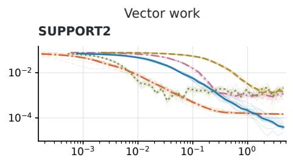

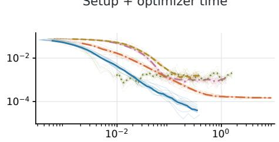

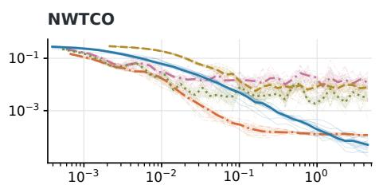

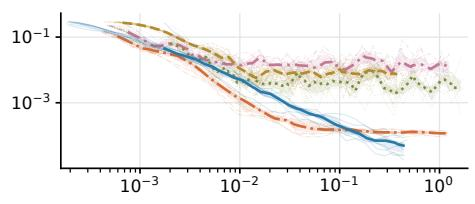

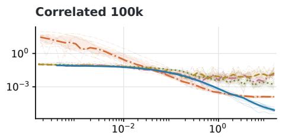

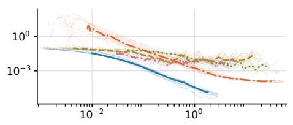

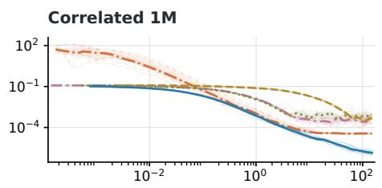

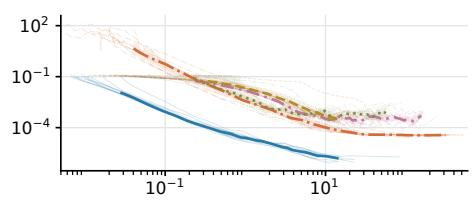

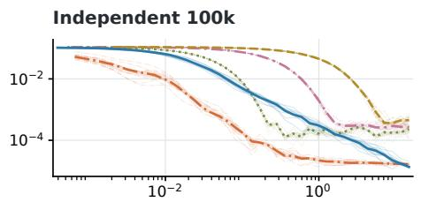

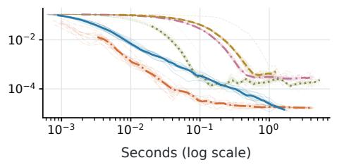  
Figure 3: Regularized full-Cox training gap against vector work and setup plus optimizer time. Thin lines show individual optimizer seeds, thick lines and bands give the median and interquartile range. Ours and BigSurv use running arithmetic averages of post-update coefficient iterates; Ours averages after projection. The other methods use current coefficient iterates.

# Validation Cox loss per event

$$
\begin{array} { l }  { \begin{array} { l l l } { { \mathrm { O u r s ~ -- } } } & { { \mathrm { B a t c h ~ L S E ~ \cdots ~ \Gamma ~ } ^ { \mathrm { M i n i b a t c h ~ C o x ~ \Gamma ~ \mathrm { S } ~ \mathrm { ~ s } ~ i g ~ S u r v ~ \mathrm { ~ \cdots ~ \Gamma ~ } ~ { ~ C o x . } ~ \Gamma ~ } } } } \\ { { } } & { { \mathrm { T h i n . ~ 1 0 ~ s e e d s ~ | \ t h i c k : ~ m e d i a n ~ | ~ s h a d e d : ~ | { \mathrm { Q R } ~ \mathrm { ~ e } ~ } } } } \end{array} } \end{array}
$$

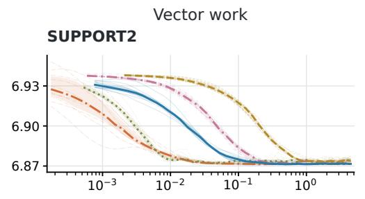

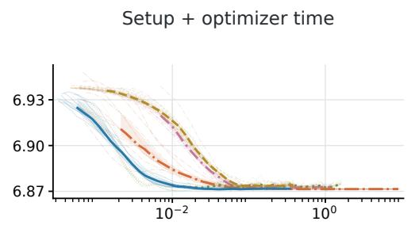

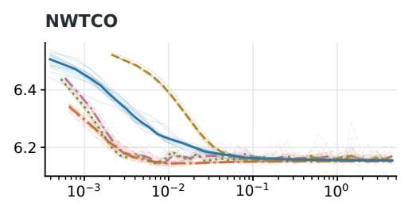

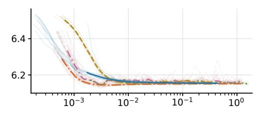

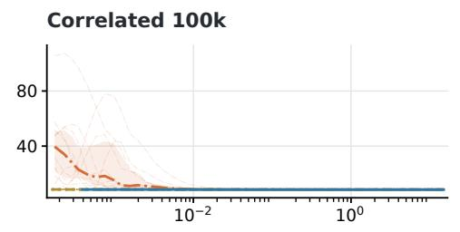

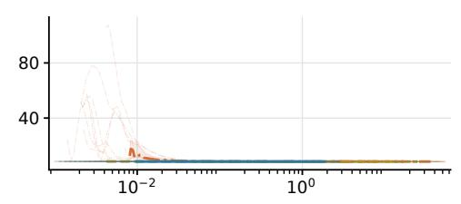

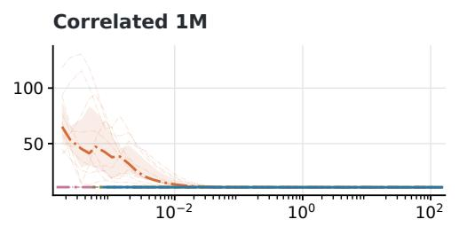

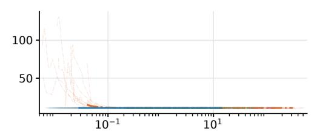

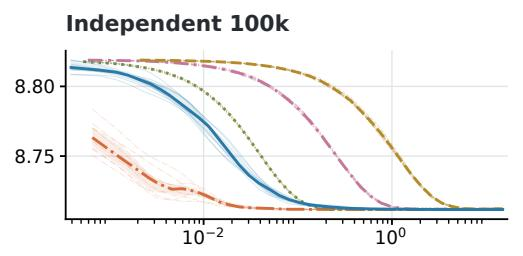

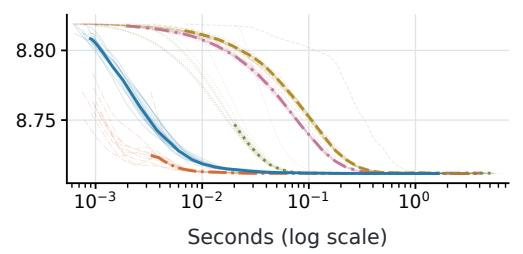  
Figure 4: Unpenalized validation Cox loss per event against vector work (left) and setup plus optimizer time (right); lower is better. Matched panels share Y-axis limits.

$$
\begin{array} { l }  { \begin{array} { l l l } { { \mathrm { O u r s ~ -- } } } & { { \mathrm { B a t c h ~ L S E ~ \cdots ~ \Gamma ~ } ^ { \mathrm { M i n i b a t c h ~ C o x ~ \Gamma ~ \mathrm { S } ~ \mathrm { ~ s } ~ i g ~ S u r v ~ \mathrm { ~ \cdots ~ \Gamma ~ } ~ { ~ C o x . } ~ \Gamma ~ } } } } \\ { { } } & { { \mathrm { T h i n . ~ 1 0 ~ s e e d s ~ | \ t h i c k : ~ m e d i a n ~ | ~ s h a d e d : ~ | { \mathrm { Q R } ~ \mathrm { ~ e } ~ } } } } \end{array} } \end{array}
$$

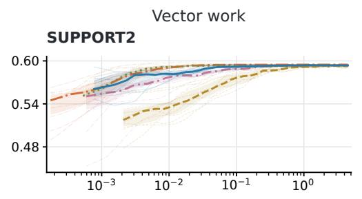

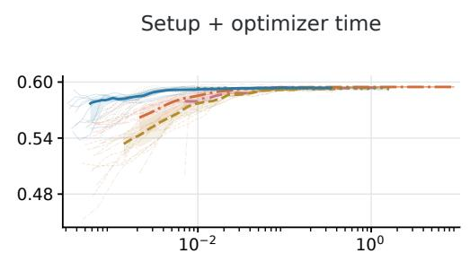

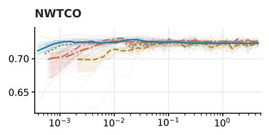

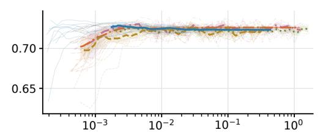

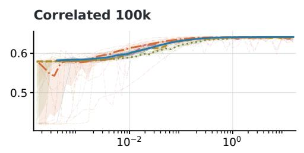

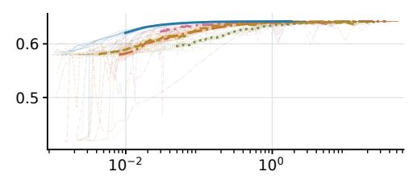

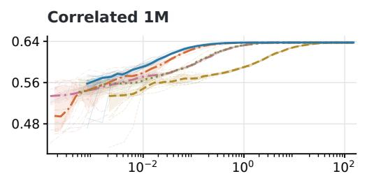

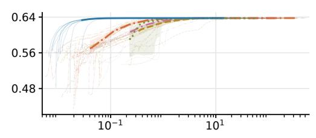

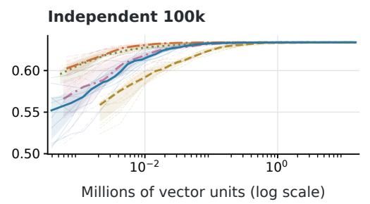

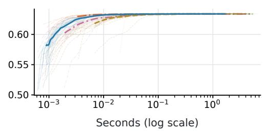  
Figure 5: Validation Harrell C-index against vector work (left) and setup plus optimizer time (right); higher is better. Matched panels share Y-axis limits.