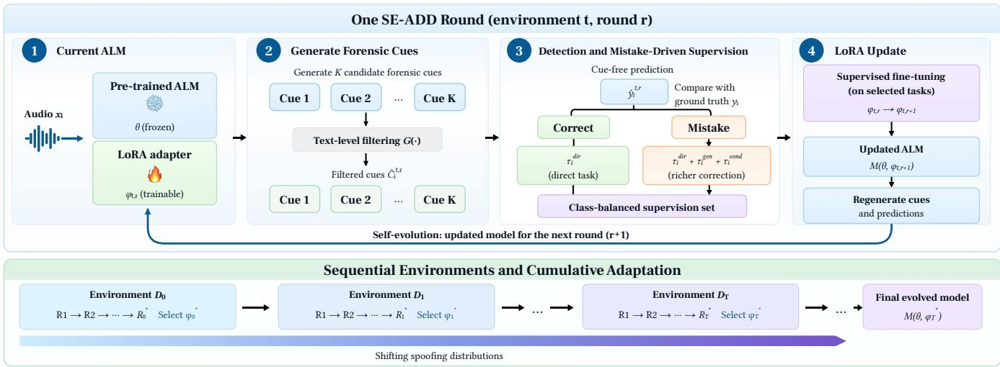
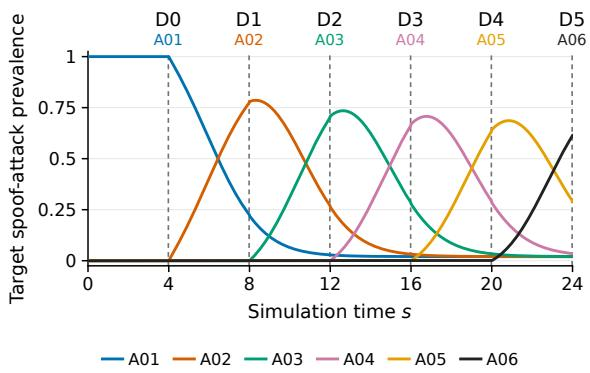
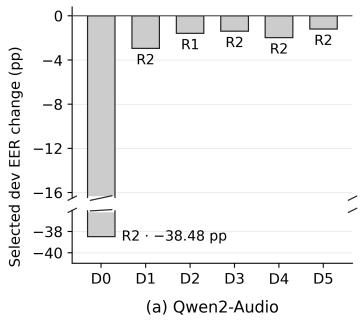
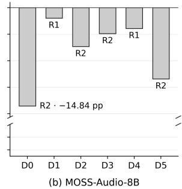
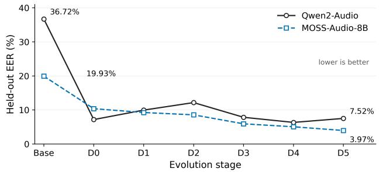

# SE-ADD: SELF-EVOLVING AUDIO DEEPFAKE DETECTION WITH MISTAKE-DRIVEN SUPERVISION

Rong Wan1, Wei Xie2, Jiaxi Li1, Wenwu Wang1, Lu Yin3, Yiliao Song4, Xilu Wang1

1 University of Surrey, 2 Guangxi University, 3 Shenzhen University of Advanced Technology, 4 Adelaide University

## ABSTRACT

Audio deepfake detection (ADD) must remain effective when new spoofing attacks emerge after deployment. Emerging audio language model (ALM)-based ADD methods are built on predefined supervision from ground-truth labels or verified forensic rationales. However, this paradigm overlooks an ALM’s own mistakes, which indicate where targeted supervision is most needed. To this end, we first introduce evolving spoofing environments for ALM-based ADD, where a new attack becomes dominant while previously observed attacks persist. Motivated by the above learning-from-mistakes perspective, we further propose SE-ADD, a self-evolving framework that iteratively adapts an ALM via low-rank adaptation (LoRA) using mistake-driven supervision built from its verdicts and self-generated forensic cues. All training samples receive direct authenticity supervision, while misclassified ones receive additional cue-augmented supervision. As verdicts and cues are regenerated by the updated ALM, the resulting supervision evolves accordingly. Experiments on two ALMs demonstrate the effectiveness of SE-ADD in generalizing to unseen attacks, reducing the equal error rate (EER) from 36.72% to 7.52% for Qwen2-Audio and from 19.93% to 3.97% for MOSS-Audio.

Index Terms— Audio language model, self-evolving, audio deepfake detection, mistake-driven supervision

## 1. INTRODUCTION

Evolving speech-generation technologies continually introduce new dominant spoofing attacks [1]. This poses a challenge for audio deepfake detection (ADD), which must remain effective as spoofing attacks change [2]. Due to the promising performance of audio language models (ALMs) across various audio reasoning tasks [3, 4], recent studies have begun to explore ALM-based ADD methods. These approaches primarily rely on predefined supervision, such as ground-truth labels [5] or curated forensic reasoning in the form of rationales [6] and chain-of-thought annotations [7].

However, such a paradigm is specified independently of an ALM’s current failures in ADD, overlooking its potential to learn from its own mistakes. These failures can reveal limitations in the model’s current ADD capability and indicate where additional supervision would be beneficial [8, 9]. Moreover, such supervision remains fixed despite changes in an ALM’s performance as the spoofing environment evolves. This leaves open whether an ALM can use its own mistakes to guide additional supervision as the dominant spoofing attack changes. To study this problem, we introduce a practically motivated evolving ADD setting composed of a sequence of spoofing environments. In each environment, the training and development sets share the same evolving attack mixture and contain balanced bona fide and spoof samples, with a newly introduced attack dominating the spoof samples while previously observed attacks remain at low prevalence. The development set is used to select the best-performing adaptation within the current environment. Separately, an evaluation set, which consists of bona fide samples and spoof samples generated by unseen attacks, is used to assess generalization.

Meanwhile, self-evolving language models suggest that model-generated outputs can serve as training signals for subsequent parameter updates [10–13]. Combining the selfevolving mechanism with the learning-from-mistakes perspective, we propose self-evolving audio deepfake detection (SE-ADD), a framework for ALM-based ADD that performs iterative low-rank adaptation (LoRA) [14] within each evolving environment using mistake-driven supervision. At each round, the current ALM generates forensic cues and cue-free predictions on the training set. All training samples receive direct authenticity supervision, while misclassified ones additionally receive cue-augmented supervision using the forensic cues generated by the ALM. Within each environment, the updated ALM regenerates cues and predictions for the next round. Selected on the development set, the best-performing LoRA adaptor is carried forward to the next environment.

In summary, our contributions are threefold:

• We introduce ALM-based ADD under evolving spoofing environments, where new attacks become dominant while previously observed attacks remain present.

  
Fig. 1. Overview of SE-ADD. Top: one self-evolution round with forensic-cue generation, mistake-driven supervision, and LoRA updating. Bottom: selected LoRA parameters are carried across shifting environments for cumulative adaptation.

• We propose SE-ADD1, which uses ALM-generated forensic cues and its detection failures to construct mistakedriven supervision for cumulative LoRA adaptation.

• We evaluate SE-ADD on two ALMs across six evolving environments, showing consistent adaptation, transfer to held-out unseen attacks, and effective forensic-cue supervision for cue-conditioned detection.

## 2. PROBLEM SETUP

ALM-based ADD is considered under a sequence of T evolving spoofing environments $\{ \mathcal { E } _ { t } \} _ { t = 0 } ^ { T - 1 }$ , where the relative prevalence of spoofing attacks changes over time. Each environment provides a labeled training set $\mathcal { D } _ { t } ^ { \mathrm { t r a i n } } = \{ ( x _ { i } , y _ { i } ) \} _ { i = 1 } ^ { N _ { t } } ,$ where $x _ { i }$ is an audio utterance and $y _ { i } \in \{ b o n a f i d e , s p o o f \}$ A disjoint development set $\mathcal { D } _ { t } ^ { \mathrm { d e v } }$ is used for model selection within the same environment.

We denote the ALM at evolution round r of environment t by $\mathcal { M } ( \theta , \phi _ { t , r } )$ , where θ contains the frozen base-model parameters and $\phi _ { t , \cdot }$ r the trainable LoRA parameters. Here, $r = 0$ denotes the model entering an environment, and the withinenvironment evolution carried only by $\phi _ { t , r }$ is

$$
\mathcal { M } ( \theta , \phi _ { t , 0 } )  \mathcal { M } ( \theta , \phi _ { t , 1 } )  \cdots  \mathcal { M } ( \theta , \phi _ { t , R } ) ,\tag{1}
$$

where R is the maximum number of evolution rounds.

To model the distribution shift, let $\mathcal { A } = \{ a _ { i } \} _ { i = 1 } ^ { A }$ denote the set of spoofing attacks and define the spoof-attack mixture in environment $\mathcal { E } _ { t } \mathrm { ~ a s ~ } \pi _ { t } ( a _ { i } ) = P ( A = a _ { i } \mid Y = s p o o f , \mathcal { E } _ { t } )$ We construct a controlled sequence of such mixtures using a Norton–Bass activity process [15]. Given a continuous synthetic progression variable s and an attack $a _ { i }$ introduced at $\tau _ { i } ,$ the attack prevalence at s is defined as

$$
\pi _ { s } ( a _ { i } ) = \epsilon \mathbf { 1 } [ i < c ( s ) ] + \left[ 1 - ( c ( s ) - 1 ) \epsilon \right] b _ { i } ( s ) ,\tag{2}
$$

where $b _ { i } ( s )$ is the normalized Norton–Bass activity, ϵ preserves probability mass for previously introduced attacks, and $c ( s ) = \operatorname* { m a x } \{ i : s \geq \tau _ { i } \}$ denotes the latest introduced attack. Each experimental environment corresponds to a selected snapshot $s _ { t } ,$ such that $\pi _ { t } ( a _ { i } ) = \pi _ { s _ { t } } ( a _ { i } )$ . The attack ordering is synthetic and is not intended to represent the historical chronology of attack development.

## 3. SE-ADD

As shown in Fig. 1, SE-ADD turns the sequence defined in Eq. (1) into a self-evolution process. At round $r ,$ the ALM generates forensic cues from the training samples and uses its current mistakes to build various mistake-driven supervision. The resulting supervision is then used to update the LoRA adapter from $\phi _ { t , r } \mathrm { ~ t o ~ } \phi _ { t , r + 1 }$ . The updated ALM regenerates forensic cues and verdicts, allowing the supervision itself to evolve with the adaptor. After reaching the bounded evolution cycle, a development set is used to select the LoRA adaptor for the next environment.

## 3.1. Self-Generated Forensic Cues

To expose the model’s own forensic interpretation of each training sample, SE-ADD first elicits self-generated forensic cues from the current ALM. For each training audio sample $x _ { i } ~ \in ~ { \mathcal { D } } _ { t } ^ { \mathrm { t r a i n } }$ , the current ALM first generates K candidate forensic cue lists using a fixed cue-generation prompt $P _ { \mathrm { c u e } } { \mathrm { : } }$

$$
\mathcal { C } _ { i } ^ { t , r } = \{ c _ { i , k } \} _ { k = 1 } ^ { K } , \qquad c _ { i , k } \sim \mathcal { M } \left( \cdot \mid x _ { i } , P _ { \mathrm { c u e } } ; \theta , \phi _ { t , r } \right) .\tag{3}
$$

Neither the ground-truth label $y _ { i }$ nor the attack identity is provided during generation. The retained set $\widetilde { \mathcal { C } } _ { i } ^ { t , r }$ is subsequently used to construct mistake-driven supervision. We refer to these outputs as forensic cues rather than verified explanations, since G(·) performs text-level quality control but does not independently verify their acoustic correctness.

## 3.2. Mistake-Driven Supervision

Rather than treating all training samples uniformly, SE-ADD adopts the current model’s mistakes to build various mistakedriven supervision [8, 9]. Specifically, it first locates current failures using cue-free verdicts, and then uses the selfgenerated forensic cues from Section 3.1 to construct additional supervision for those mistakes. For each training sample $x _ { i }$ , the current ALM makes a cue-free authenticity verdict

$$
\hat { y } _ { i } ^ { t , r } = \mathcal { M } \left( x _ { i } , P _ { \mathrm { c l s } } ; \theta , \phi _ { t , r } \right) ,\tag{4}
$$

where $P _ { \mathrm { c l s } }$ is a fixed binary classification prompt that does not include $\widetilde { \mathcal { C } } _ { i } ^ { t , r }$ , and $\hat { y } _ { i } ^ { t , r } \neq y _ { i }$ marks a current mistake. We further define three supervision tasks τ for $x _ { i } { : }$

$$
\begin{array} { r l } & { \tau _ { i } ^ { \mathrm { d i r } } = ( x _ { i } \to y _ { i } ) , } \\ & { \tau _ { i } ^ { \mathrm { g e n } } = ( x _ { i } \to ( \widetilde { \mathcal { C } } _ { i } ^ { t , r } , y _ { i } ) ) , } \\ & { \tau _ { i } ^ { \mathrm { c o n d } } = ( ( x _ { i } , \widetilde { \mathcal { C } } _ { i } ^ { t , r } ) \to y _ { i } ) . } \end{array}\tag{5}
$$

where $\tau _ { i } ^ { \mathrm { d i r } } , \tau _ { i } ^ { \mathrm { g e n } }$ and $\tau _ { i } ^ { \mathrm { c o n d } }$ supervises direct authenticity prediction from the audio, the joint generation of forensic cues and the ground-truth verdict, and authenticity prediction conditioned on the generated forensic cues, respectively. Consequently, SE-ADD uses $\tau _ { i } ^ { \mathrm { d i r } }$ as the base supervision for every training sample, and augments current mistakes with the two cue-based tasks. The supervision constructed for $x _ { i }$ is

$$
\mathcal { T } _ { i } ^ { t , r } = \{ \tau _ { i } ^ { \mathrm { d i r } } \} \cup \left\{ \begin{array} { l l } { \{ \tau _ { i } ^ { \mathrm { g e n } } , \tau _ { i } ^ { \mathrm { c o n d } } \} , } & { \hat { y } _ { i } ^ { t , r } \neq y _ { i } \land \widetilde { \mathcal { C } } _ { i } ^ { t , r } \neq \emptyset , } \\ { \emptyset , } & { \mathrm { o t h e r w i s e } . } \end{array} \right.\tag{6}
$$

Since the augmentation may produce unequal numbers of training tasks across two labels, the resulting task pool for supervised fine-tuning is class-balanced by oversampling.

## 3.3. Cumulative Self-Evolution

To turn mistake-driven correction into persistent self-evolution, SE-ADD updates the current LoRA state rather than training a new adapter at each round. With the class-balancde task pool $\mathcal { T } _ { t , }$ r constructed from $\{ \mathcal { T } _ { i } ^ { t , r } \} _ { i = 1 } ^ { N _ { t } }$ , the next LoRA parameters are updated $\mathrm { a s } \phi _ { t , r + 1 } = \mathrm { S F T } \left( \phi _ { t , r } ; \mathcal { T } _ { t , r } , \theta \right)$ , with fixed θ. Hence, the adaptation is accumulated across rounds rather than reinitialized from the beginning. After R rounds of the evolution within each environment, a disjoint development set $\mathcal { D } _ { t } ^ { \mathrm { d e v } }$ is used to select the round $r _ { t } ^ { * }$ with the lowest EER:

$$
r _ { t } ^ { * } = \arg \operatorname* { m i n } _ { r \in \{ 1 , \dots , R \} } \mathrm { E E R } \left( \mathcal { M } ( \theta , \phi _ { t , r } ) , \mathcal { D } _ { t } ^ { \mathrm { d e v } } \right) .\tag{7}
$$

The LoRA parameters $\phi _ { t , r _ { t } ^ { * } }$ are then carried forward to initialize the ALM $\mathcal { M } ( \theta , \phi _ { t + 1 , 0 } )  \mathcal { M } ( \theta , \phi _ { t , r _ { t } ^ { * } } )$ afterwards.

  
Fig. 2. Constructed evolving spoofing environments.

## 4. EXPERIMENTS

## 4.1. Experimental Setup

Environment construction. We construct six environments from the ASVspoof 2019 LA train/dev partitions [16], using attacks A01–A06 with the environment-specific spoof mixtures $\pi _ { t }$ defined in Section 2. Each environment contains 1,024 training and 1,024 development utterances, both balanced between 512 bona fide and 512 spoof samples. Spoof utterances are disjoint across environments, while bona fide samples are drawn from a shared split-specific pool; train and development sets are mutually disjoint. Fig. 2 shows the resulting attack-prevalence trajectories and the six snapshots used to instantiate the evolving environments. Held-out evaluation uses 8,192 balanced utterances from the evaluation partition of the ASVSpoof 2019 LA [16], where spoof samples are constructed via unseen attacks A07–A19.

Models and training. Two ALMs are adopted as backbones in SE-ADD: Qwen2-Audio-7B-Instruct (Qwen2-Audio) [17] and MOSS-Audio-8B-Instruct (MOSS-Audio) [18]. LoRA is applied to the attention and feed-forward projections. We use rank 8, scaling factor 16 for Qwen2-Audio, and dropout 0.05, and rank 8, scaling factor 2, and no dropout for MOSS-Audio. Each environment contains two evolution rounds, and each round is trained for three epochs with a learning rate of $2 \times 1 0 ^ { - 5 }$ , batch size 1, and gradient accumulation of 4. The ALM produces K = 3 candidate generations of forensic cue per audio, with temperature 0.8, top-p 0.95, and maximal 160 new tokens for each output.

Baselines. Four adaptation settings are compared. Base denotes the backbone ALM without adaptation. Direct performs sequential supervised adaptation using only authenticity targets and follows the same environment sequence, number of rounds, training examples, and optimization steps as SE-ADD. Frozen-Cue follows the SE-ADD correction procedure but reuses the self-generated forensic cues in the first round rather than regenerating them after the model update. SE-ADD denotes the full method with mistake-driven supervision and cue regeneration across rounds. Sinece cueaugmented targets are longer, Direct and SE-ADD have no identical token exposure despite their matched numbers of training examples and optimization steps.

Fig. 3. Within-environment development-set EER change.  
  
Fig. 4. Held-out unseen-attack EER across evolution stages.

Evaluation Metric. Equal error rate (EER) is used as the primary detection metric, with lower values indicating better performance [19]. We report cue-free and self-hint inference where applicable to separate the detector’s direct decision capability from its use of self-generated forensic cues.

## 4.2. Within-Environment Self-Evolution

We examine whether SE-ADD brings beneficial updates within each environment. Figure 3 reports the developmentset EER change of the selected evolved model relative to the model entering the same environment, where negative values indicate improvement and labels denote the selected round. Across both ALMs, the selected model achieves a lower EER than the incoming model in all six environments, indicating that SE-ADD identifies beneficial adaptation within each shifted spoofing mixture. The development-selected round varies across environments: Qwen2-Audio selects R1 in $D _ { 2 } ,$ while MOSS-Audio selects R1 in $D _ { 1 }$ and $D _ { 4 } ;$ R2 is selected otherwise. This indicates that the preferred checkpoint is environment- and backbone-dependent.

## 4.3. Held-Out Generalization across Evolution

We explore whether the adaptation accumulated across shifting spoofing environments transfers to attacks that are never observed during evolution. As shown in Fig. 4, both ALMs retain substantial improvements on the fixed held-out set as evolution proceeds. For Qwen2-Audio, the EER decreases from 36.72% for the frozen base model to 7.52% after the final environment, while MOSS-Audio decreases from 19.93% to 3.97%. The intermediate trajectories are not strictly monotonic, implying that adaptation to a newly shifted attack mixture can temporarily trade off performance on unseen attacks. Besides, the large overall reductions from the backbones show that the knowledge accumulated over the A01–A06 stream transfers beyond the attacks used for adaptation.

Table 1. Held-out EER (%) under cue-free vs. self-hint.
<table><tr><td rowspan="2">Method</td><td colspan="2">Qwen2-Audio</td><td colspan="2">MOSS-Audio</td></tr><tr><td>Direct</td><td>Self-hint</td><td>Direct</td><td>Self-hint</td></tr><tr><td>Base</td><td>36.72</td><td>43.12</td><td>19.93</td><td>37.78</td></tr><tr><td>Direct-SFT</td><td>6.42</td><td>6.45</td><td>3.47</td><td>21.07</td></tr><tr><td>SE-ADD</td><td>7.52</td><td>5.90</td><td>3.97</td><td>9.84</td></tr></table>

We further examine retention on previously observed environments in Qwen2-Audio. The final $D _ { 5 }$ model achieves a mean EER of 2.23% on $D _ { 0 } { - } D _ { 4 } ,$ although performance degrades by an average of 0.66 percentage points relative to the best earlier checkpoints. Thus, cumulative adaptation exhibits mild forgetting while largely retaining performance on previously observed attack mixtures.

## 4.4. Effect of Forensic-Cue Supervision

Table 1 shows that the benefit of forensic-cue supervision depends on the inference mode. Under cue-free inference, Direct-SFT achieves lower EER than SE-ADD on both backbones (6.42% vs. 7.52% for Qwen2-Audio and 3.47% vs. 3.97% for MOSS-Audio). Under self-hint inference, however, SE-ADD outperforms Direct-SFT, reducing EER from 6.45% to 5.90% and from 21.07% to 9.84%, respectively. This indicates that forensic-cue supervision mainly improves the model’s ability to use explicit forensic cues rather than uniformly strengthening cue-free discrimination.

However, the absolute effect of cue conditioning remains backbone-dependent. Self-hints improve SE-ADD on Qwen2-Audio from 7.52% to 5.90%, but degrade performance on MOSS-Audio from 3.97% to 9.84%). Thus, learning from forensic cues and benefiting from them at inference are related but not equivalent capabilities.

## 5. CONCLUSION

We introduced SE-ADD, which adapts ALMs under evolving spoofing environments through mistake-driven supervision from self-generated forensic cues and current detection failures. Across two ALM backbones, SE-ADD yields beneficial within-environment updates and transfers to held-out unseen attacks, while the benefit of forensic-cue supervision remains inference- and backbone-dependent.

## 6. REFERENCES

[1] Menglu Li, Yasaman Ahmadiadli, and Xiao-Ping Zhang, “A survey on speech deepfake detection,” ACM Comput. Surv., vol. 57, no. 7, Feb. 2025.

[2] Daixian Li, Jun Xue, Yanzhen Ren, Zhuolin Yi, Yihuan Huang, Guanxiang Feng, and Yi Chai, “How well do current speech deepfake detection methods generalize to the real world?,” 2026.

[3] Ziyang Ma, Zhuo Chen, Yuping Wang, Eng-Siong Chng, and Xie Chen, “Audio-CoT: Exploring chainof-thought reasoning in large audio language model,” in 2025 IEEE Automatic Speech Recognition and Understanding Workshop (ASRU), 2025, pp. 1–6.

[4] Qian Yang, Jin Xu, Wenrui Liu, Yunfei Chu, Ziyue Jiang, Xiaohuan Zhou, Yichong Leng, Yuanjun Lv, Zhou Zhao, Chang Zhou, et al., “AIR-Bench: Benchmarking large audio-language models via generative comprehension,” in Proceedings of the 62nd Annual Meeting of the Association for Computational Linguistics (Volume 1: Long Papers), 2024, pp. 1979–1998.

[5] Hao Gu et al., “ALLM4ADD: Unlocking the capabilities of audio large language models for audio deepfake detection,” in Proceedings of the 33rd ACM International Conference on Multimedia, New York, NY, USA, 2025, MM ’25, p. 11736–11745, Association for Computing Machinery.

[6] Artem Dvirniak, Evgeny Kushnir, Dmitrii Tarasov, Artem Iudin, Oleg Kiriukhin, Mikhail Pautov, Dmitrii Korzh, and Oleg Y. Rogov, “Towards robust speech deepfake detection via human-inspired reasoning,” 2026.

[7] Runkun Chen, Yixiong Fang, Pengyu Chang, Yuante Li, Massa Baali, and Bhiksha Raj, “Audio language model for deepfake detection grounded in acoustic chain-ofthought,” 2026.

[8] Shengnan An, Zexiong Ma, Zeqi Lin, Nanning Zheng, Jian-Guang Lou, and Weizhu Chen, “Learning from mistakes makes LLM better reasoner,” 2024.

[9] Yongqi Tong, Dawei Li, Sizhe Wang, Yujia Wang, Fei Teng, and Jingbo Shang, “Can LLMs learn from previous mistakes? investigating LLMs’ errors to boost for reasoning,” in Proceedings of the 62nd Annual Meeting of the Association for Computational Linguistics (Volume 1: Long Papers), Bangkok, Thailand, Aug. 2024, pp. 3065–3080, Association for Computational Linguistics.

[10] Adam Zweiger, Jyo Pari, Han Guo, Yoon Kim, and Pulkit Agrawal, “Self-adapting language models,” in Advances in Neural Information Processing Systems. 2025, vol. 38, Main Conference, pp. 74084–74115, Curran Associates, Inc.

[11] Peidong Wang, Ming Wang, Zhiming Ma, Xiaocui Yang, Shi Feng, Daling Wang, Yifei Zhang, and Kaisong Song, “Language models as continuous selfevolving data engineers,” in Proceedings of the 2025 Conference on Empirical Methods in Natural Language Processing, Suzhou, China, Nov. 2025, pp. 18097– 18116, Association for Computational Linguistics.

[12] Zixiang Chen, Yihe Deng, Huizhuo Yuan, Kaixuan Ji, and Quanquan Gu, “Self-play fine-tuning converts weak language models to strong language models,” in Proceedings of the 41st International Conference on Machine Learning. 21–27 Jul 2024, vol. 235 of Proceedings of Machine Learning Research, pp. 6621–6642, PMLR.

[13] Weizhe Yuan, Richard Yuanzhe Pang, Kyunghyun Cho, Xian Li, Sainbayar Sukhbaatar, Jing Xu, and Jason E Weston, “Self-rewarding language models,” in Proceedings of the 41st International Conference on Machine Learning. 21–27 Jul 2024, vol. 235 of Proceedings of Machine Learning Research, pp. 57905–57923, PMLR.

[14] Edward J Hu, Yelong Shen, Phillip Wallis, Zeyuan Allen-Zhu, Yuanzhi Li, Shean Wang, Lu Wang, and Weizhu Chen, “LoRA: Low-rank adaptation of large language models,” arXiv preprint arXiv:2106.09685, 2021.

[15] John A. Norton and Frank M. Bass, “A diffusion theory model of adoption and substitution for successive generations of high-technology products,” Management Science, vol. 33, no. 9, pp. 1069–1086, 1987.

[16] Xin Wang et al., “ASVspoof 2019: A large-scale public database of synthesized, converted and replayed speech,” Computer Speech & Language, vol. 64, pp. 101114, 2020.

[17] Yunfei Chu et al., “Qwen2-Audio technical report,” arXiv preprint arXiv:2407.10759, 2024.

[18] OpenMOSS Team, “MOSS-Audio technical report,” https://github.com/OpenMOSS/ MOSS-Audio, 2026, GitHub repository.

[19] Xiang Li, Pin-Yu Chen, and Wenqi Wei, “Where are we in audio deepfake detection? a systematic analysis over generative and detection models,” ACM Trans. Internet Technol., vol. 25, no. 3, Aug. 2025.