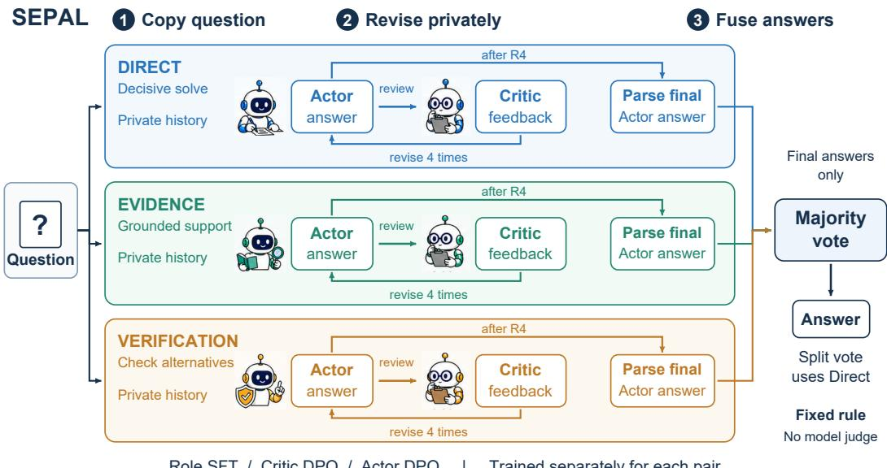
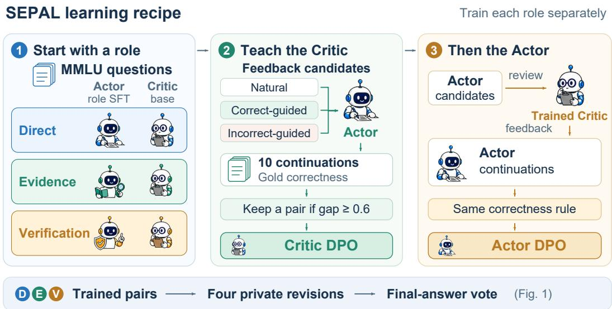
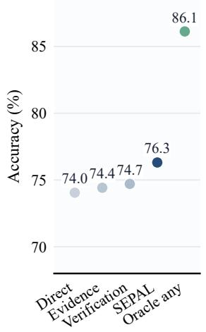
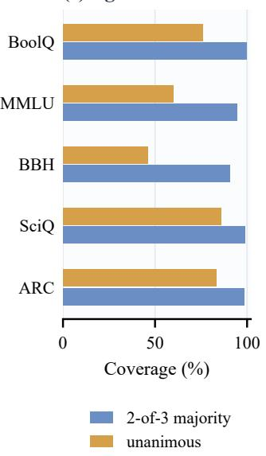
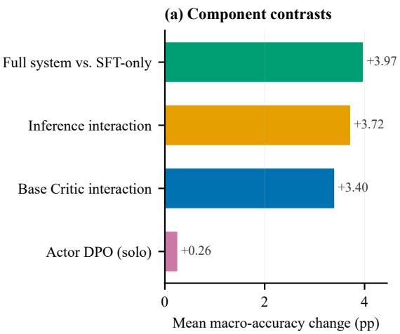
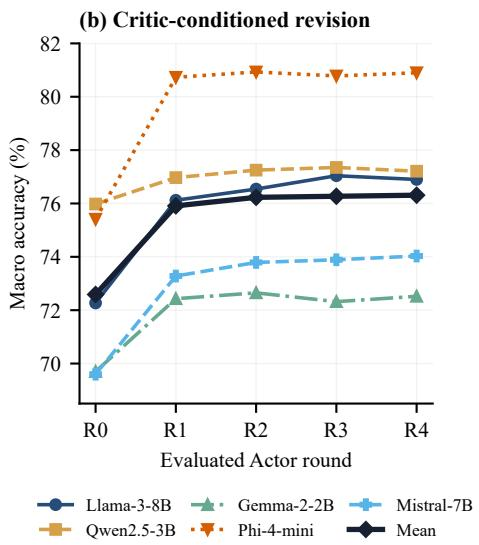

# SEPAL: SEPARATED EXPERT PAIRS WITH ANSWER-LEVEL FUSION FOR RELIABLE LLM COLLABORATION

Weijie Ren<sup>1,∗</sup> Yanwen Zhang<sup>2,∗</sup> Hao Li<sup>3,∗</sup> Zhuolin Qi<sup>1</sup> Hengyi Zhang<sup>1</sup> Naibo Wang<sup>1,†</sup> <sup>1</sup>Zhejiang University <sup>2</sup>University of Electronic Science and Technology of China   
<sup>3</sup>University of Science and Technology of China <sup>∗</sup>Equal contribution. <sup>†</sup>Corresponding author. 3200101501@zju.edu.cn, 2023091601016@std.uestc.edu.cn,   
haoli2101@mail.ustc.edu.cn, qizhuolin666@gmail.com,   
22651274@zju.edu.cn, wangnaibo@zju.edu.cn

## ABSTRACT

Multi-agent collaboration lets large language models (LLMs) improve question answering through deliberation and feedback. Yet shared discussion couples correction with exposure to the same mistakes, which can erode the diversity needed for voting. Self-consistency offers sampling diversity without feedback, while single-pair Actor–Critic collaboration refines only one candidate. We introduce SEPAL, which assigns three private Actor–Critic teams to direct reasoning, evidence grounding, and verification. Role-specific training gives the teams different reasoning objectives beyond sampling variation. Each Critic guides revisions within its own team, preventing feedback from carrying errors across candidates. Once revision ends, majority voting combines only the final answers, keeping the reasoning histories separate until the decision. Across five open-weight backbones and five question-answering benchmarks, SEPAL improves mean accuracy by 1.81 percentage points over a matched single Actor– Critic pair, with improvements across all five backbones. Code is available at https://github.com/zhansan114514/SEPAL.

  
Role SFT / Critic DPO / Actor DPO | Trained separately for each pair  
Figure 1: SEPAL in one view. A question enters three isolated role pairs, each refined through four private Critic-guided revisions (R1–R4). Only final parsed answers cross team boundaries. A fixed majority vote returns the prediction and uses Direct for split decisions.

## 1 INTRODUCTION

Reasoning with large language models (LLMs) increasingly relies on generating, inspecting, and comparing intermediate solutions. Chain-of-thought prompting makes a reasoning path explicit (Wei et al., 2022), and self-consistency improves reliability by sampling several paths (Wang et al., 2023). Multi-agent discussion adds opportunities to question an argument and revise an answer (Du et al., 2024; Liang et al., 2024). For question answering, these approaches offer both feedback that can repair mistakes and alternative answers for the final decision.

However, existing approaches leave a gap between these two benefits. In shared-history debate, each agent sees peer arguments, so an early error can enter several later candidates. Self-consistency keeps sampled paths separate but provides no corrective feedback. ACC-Collab learns an Actor and a Critic using the correctness of subsequent Actor responses (Estornell et al., 2025), but its interaction refines a single answer. It supplies learned feedback without a set of separately revised candidates for voting.

The key issue is that a vote depends on how candidates fail together, as well as how accurate they are individually. A critique can repair an answer, yet a shared critique can also steer several agents toward the same faulty premise. When revision increases agreement without adding independent evidence, better individual answers can coexist with less benefit from voting. Useful collaboration therefore depends on both individual accuracy and the errors candidates share after feedback.

We hypothesize that restricting feedback to each team and combining only final answers can retain revision gains while preserving useful differences between candidates. Private feedback removes the path by which one team’s faulty argument enters another team’s reasoning before the vote. The final decision can then draw on solutions developed in separate conversation histories.

We instantiate this hypothesis in SEPAL, Separated Expert Pairs with Answer-Level fusion (Figure 1). Each of three teams contains an Actor that proposes an answer and a Critic that guides revision. To introduce structured diversity beyond repeated sampling of one pair, we assign different reasoning objectives. Direct derives an answer, Evidence grounds it in relevant facts or passages, and Verification re-solves the question and checks alternatives. These objectives guide both answer generation and critique. Teams revise privately before a fixed majority vote combines their final answers. Direct supplies the fallback for split decisions, with no additional judge.

The teams share a backbone and training questions but learn separate adapters. Role-specific supervised training initializes the Actors, followed by Critic and Actor preference learning. A Critic’s feedback is preferred during training when it leads to more correct Actor revisions. We train each role on its own trajectories using ACC-Collab’s preference rule.

We evaluate five open-weight backbones ranging from 2B to 8B parameters on five questionanswering benchmarks. MMLU supplies all training data; the other four benchmarks test transfer. Relative to a matched single Actor–Critic pair, SEPAL improves macro accuracy for every backbone by 1.06–2.22 percentage points, averaging 1.81 points.

Our contributions are threefold.

• A collaboration method that separates local Actor–Critic revision from final aggregation and trains three teams with distinct reasoning objectives.

• Evidence that revision gives the largest component gain, while final voting exceeds the strongest individual role in 21 of 25 evaluated settings.

• An analysis of diminishing returns from further revision, showing how later repairs are increasingly offset by regressions in correct answers.

## 2 RELATED WORK

Independent sampling and late aggregation. Self-consistency improves chain-of-thought reasoning by sampling independent paths and aggregating their answers (Wang et al., 2023). Increasing the number of agents extends the same intuition to replicated LLM calls (Li et al., 2024), while Multiagent Finetuning trains separate agents to preserve distinct reasoning behaviors (Subramaniam et al., 2025). Tree of Thoughts preserves several partial solutions and alternates expansion with model-based evaluation, making diversity an explicit search resource (Yao et al., 2023). These methods differ in where alternatives are reduced: search may prune partial states, whereas latevoting systems keep complete candidates until the decision interface. Independent sampling keeps candidate histories separate, while tree search uses intermediate evaluations to guide expansion. SEPAL gives each complete candidate its own learned reviewer and aggregates the revised answers.

Inference-time communication. Multi-agent debate exposes agents to peer arguments and can improve factuality or reasoning (Du et al., 2024; Liang et al., 2024); ChatEval applies debate to LLM evaluation (Chan et al., 2024). ReConcile aggregates diverse LLMs through a round-table protocol (Chen et al., 2024a), and Mixture-of-Agents passes outputs through layered aggregators (Wang et al., 2025). SEPAL permits revision within each team and applies a fixed answer vote after all teams finish. Its private feedback paths and final decision rule specify the information available to each agent.

Role prompts provide a second source of diversity. CoMM assigns distinct roles and reasoning paths and finds that independently prompted experts are important for science reasoning (Chen et al., 2024b). Unlike its collaborative discussion, however, SEPAL prevents a role from seeing peer content before aggregation. Role labels alone do not establish complementarity when a shared transcript can synchronize the candidates.

Candidate selection and corrective feedback. LLM-Blender learns a pairwise ranker and a generative fuser to select and merge outputs from heterogeneous models (Jiang et al., 2023b). That approach can exploit information beyond exact answers, but introduces a learned selection layer whose errors and training distribution become part of the system. SEPAL uses a fixed answer parser and majority rule to expose the quality of the candidate trajectories at the decision interface. Correction methods expose a related boundary. CRITIC grounds revision in tool-interactive feedback (Gou et al., 2024), while intrinsic self-correction without external feedback can preserve or amplify reasoning errors (Huang et al., 2024). Our Critics receive no tools or gold labels at test time, but are trained using the downstream correctness of Actor continuations. The component and round analyses therefore test whether this learned, role-local signal repairs answers rather than assuming that another revision prompt is beneficial.

Learning to revise and collaborate. STaR bootstraps reasoning traces from successful solutions (Zelikman et al., 2022); Self-Refine and Reflexion use generated feedback or verbal memory to improve later behavior (Madaan et al., 2023; Shinn et al., 2023). DPO provides a direct objective for preference learning without an explicit reward model (Rafailov et al., 2023). ACC-Collab uses continuation correctness to construct Actor and Critic preferences (Estornell et al., 2025), while Multiagent Finetuning independently specializes agents to preserve diverse reasoning chains (Subramaniam et al., 2025). We retain ACC-Collab’s continuation-valued training rule, replicate it independently for each role, and study the resulting components rather than assuming that the full training stack is uniformly beneficial.

## 3 METHOD

We study a question x with gold answer y. A collaborative system produces candidate trajectories $\tau _ { i }$ ending in responses ${ { a } _ { i } } ,$ and a deterministic task-aware extractor maps each response to $z _ { i } = g ( a _ { i } )$ The method is designed for local repair, so feedback can change a candidate rather than merely score it; alternative preservation, so candidate i never conditions on candidate $j$ before aggregation; and transparent fusion, so the final decision does not hide another generative Judge. Shared dialogue can make several votes descendants of one error. Our goal is therefore useful complementarity: improve each trajectory while retaining enough residual variation for late fusion to matter.

## 3.1 ISOLATED ROLE TEAMS

For role $i \in \{ D , E , V \}$ , Actor $A _ { i }$ and Critic $C _ { i }$ form a separate team. At round $0 , A _ { i }$ produces $a _ { i } ^ { 0 }$ and $C _ { i }$ returns feedback $c _ { i } ^ { 0 }$ . At rounds $t = 1 , \ldots , 4$ , the Actor revises from its previous answer and feedback, then the Critic reviews it unless $t = 4$ . The reported team answer is $z _ { i } = g ( a _ { i } ^ { 4 } )$ , with the following local generation dependencies.

  
Figure 2: Training the private teams. Role SFT initializes Actors; Critics start from the base model. Feedback is valued by Actor continuation correctness. Critic DPO precedes Actor preference construction and Actor DPO. Each role follows this sequence separately before inference in Figure 1.

$$
a _ { i } ^ { 0 } \sim A _ { i } ( \cdot \mid x ) , \qquad c _ { i } ^ { t } \sim C _ { i } ( \cdot \mid x , a _ { i } ^ { t } ) , \qquad a _ { i } ^ { t + 1 } \sim A _ { i } ( \cdot \mid x , a _ { i } ^ { t } , c _ { i } ^ { t } ) .\tag{1}
$$

Thus a team never receives another team’s response, rationale, confidence, or adapter. Direct emphasizes a decisive derivation; Evidence grounds its answer in the relevant definition, fact, or passage; Verification independently re-solves the question and checks alternatives. The exact instructions are in Appendix B.

Equation 1 defines the implemented prompt dependencies. Role prefixes are included in $A _ { i }$ and $C _ { i }$ and $t = 0 , \ldots , 3$ for the revision transition. The three pairs share pretrained weights and training questions, so their errors can remain correlated. Separate histories remove cross-pair text from generation; Section 4.3 measures the agreement that remains at the final decision.

## 3.2 WHY THREE ENCAPSULATED PAIRS?

Three is the smallest odd ensemble that supports a strict majority and a nontrivial diversity analysis. The roles vary the route to an answer while receiving the same full question and base prompt. This gives a fixed inference budget of three five-round pair trajectories followed by a vote.

## 3.3 BALANCED ROLE INITIALIZATION

Training begins with role-specific Actor SFT (Figure 2). For each backbone, the base model generates candidates for 10,000 MMLU auxiliary-training questions under every role at temperatures 0.4, 0.7, and 1.0. A target is eligible only when its extracted answer is correct and its generation is not truncated. We keep at most one target per question–role pair and intersect question IDs across all three roles. Consequently, roles within a backbone receive the same questions, target count, and number of SFT updates. The retained count per role is 7,847 for Llama, 8,313 for Qwen2.5, 6,902 for Gemma, 7,755 for Phi, and 7,005 for Mistral. Critics start from the unadapted backbone.

## 3.4 CONTINUATION-VALUED PREFERENCE LEARNING

Every team processes all 1,531 MMLU validation questions, using five sampled trajectories per question for Mistral and one for each other backbone. It follows the ACC-Collab training order: construct Critic preferences, train the Critic, construct Actor preferences with that Critic, then train the Actor (Estornell et al., 2025). For an Actor state $( x , a )$ , the generator samples natural feedback $c ^ { 0 }$ , feedback guided toward a correct answer $c ^ { + }$ , and feedback guided toward an incorrect answer $c ^ { - }$ . Candidate feedback is valued through $K = 1 0$ Actor continuations:

$$
\widehat { R } ( c \mid x , a ) = \frac { 1 } { K } \sum _ { k = 1 } ^ { K } \mathbf { 1 } [ g ( a _ { k } ^ { \prime } ) = y ] , \qquad a _ { k } ^ { \prime } \sim A _ { i } ( \cdot \mid x , a , c ) .\tag{2}
$$

The ordered rule retains $( c ^ { + } , c ^ { 0 } )$ when its reward gap is at least $\epsilon = 0 . 6 ;$ otherwise it retains $( c ^ { 0 } , c ^ { - } )$ when that gap is at least ϵ. Each state therefore contributes at most one Critic comparison, and weak contrasts are discarded. After Critic DPO, Actor candidates are valued by sampling natural Critic feedback followed by an Actor continuation. The Actor stage uses the same margin rule. The score ties feedback quality to the Actor’s next answer. Gold labels supply training supervision; inference follows the private path in Figure 1.

For either stage, a retained preferred/dispreferred pair $( u ^ { + } , u ^ { - } )$ is trained with DPO (Rafailov et al., 2023):

$$
\begin{array} { r } { \mathcal { L } _ { \mathrm { D P O } } ( \theta ) = - \mathbb { E } \log \sigma \left( \beta \left[ \log \frac { \pi _ { \theta } ( u ^ { + } \mid s ) } { \pi _ { \mathrm { r e f } } ( u ^ { + } \mid s ) } - \log \frac { \pi _ { \theta } ( u ^ { - } \mid s ) } { \pi _ { \mathrm { r e f } } ( u ^ { - } \mid s ) } \right] \right) + \lambda \mathcal { L } _ { \mathrm { N L L } } , } \end{array}\tag{3}
$$

with $\beta = 0 . 1$ and $\lambda = 1$ . Here s is the stage-specific prompt, $\pi _ { \mathrm { r e f } }$ is the fixed reference policy, and $\mathcal { L } _ { \mathrm { N L L } }$ is the mean token negative log-likelihood of the preferred completion $u ^ { + }$ . Actor DPO starts from the role-SFT adapter. Source questions are not partitioned among roles: every team receives the complete source set but produces independent trajectories and a data-dependent number of retained pairs.

## 3.5 JUDGE-FREE LATE FUSION

After round 4, the system counts valid answers. If an answer receives at least two votes, it is returned; otherwise the Direct answer is the fixed fallback:

$$
{ \widehat { y } } = \left\{ { \begin{array} { l l } { m , } & { | \{ i : z _ { i } = m \} | \geq 2 , } \\ { z _ { D } , } & { { \mathrm { o t h e r w i s e } } . } \end{array} } \right.\tag{4}
$$

The fallback is fixed before evaluation. Critic text is never a vote, and no model is invoked to adjudicate disagreements. Compared with one ACC-Collab team, SEPAL uses three pair trajectories; the vote adds negligible cost.

## 4 EXPERIMENTS

## 4.1 EXPERIMENTAL SETUP

Models, data, and benchmarks. We evaluate Meta-Llama-3-8B-Instruct (Grattafiori et al., 2024), Qwen2.5-3B-Instruct (Yang et al., 2024), Gemma-2-2B-it (Gemma Team et al., 2024), Phi-4-miniinstruct (Microsoft et al., 2025), and Mistral-7B-Instruct-v0.3 (Jiang et al., 2023a). MMLU contains 57 academic subjects (Hendrycks et al., 2021). BoolQ is yes/no reading comprehension (Clark et al., 2019); BBH collects challenging BIG-Bench tasks (Suzgun et al., 2023); SciQ is multiple-choice science QA (Welbl et al., 2017); and ARC combines the official Easy and Challenge test splits (Clark et al., 2018). We use the available examples for four datasets and a category-stratified 1,260-example BBH subset; only MMLU supplies optimization data.

Baselines and metric. Direct is one response from the unadapted instruction model. Debate uses an untrained Actor and Critic for the same five-round protocol. SoM-2 and SoM-4 use two or four symmetric untrained agents that observe peer responses; the metric is mean final-round accuracy over agents, following their original evaluation protocol. ACC is a single trained Actor–Critic pair using the same MMLU source data, parser, splits, and hyperparameters as SEPAL. The primary metric is exact match after task-aware normalization, and macro accuracy is the unweighted mean over five datasets. All comparisons are descriptive, using one fixed realization per model–method– dataset cell under the recorded protocol.

<table><tr><td>Dataset Split</td><td></td><td>N Use</td><td></td></tr><tr><td>MMLU</td><td>test</td><td>14,042</td><td>in-domain</td></tr><tr><td>BoolQ</td><td>validation</td><td>3,270</td><td>transfer</td></tr><tr><td>BBH</td><td>22-category stratified</td><td>1,260</td><td>transfer</td></tr><tr><td>SciQ</td><td>test</td><td>1,000</td><td>transfer</td></tr><tr><td>ARC</td><td>Easy + Challenge test</td><td>3,548</td><td>transfer</td></tr></table>

Table 1: Evaluation datasets. Transfer rows supply no training examples.
<table><tr><td>Model</td><td>Dataset</td><td>Direct</td><td>Debate</td><td>SoM-2</td><td>SoM-4</td><td>ACC</td><td>SEPAL</td></tr><tr><td>Llama-3-8B</td><td>BoolQ MMLU BBH SciQ</td><td>77.34 62.41 49.52 91.90</td><td>76.76 63.55 50.00 92.00</td><td>78.98 63.39 50.52 92.45</td><td>78.74 63.33 51.31 92.03</td><td>76.54 65.00 53.17</td><td>76.70 66.93 56.67</td></tr><tr><td></td><td>ARC Macro</td><td>88.30 73.89</td><td>88.92 74.25</td><td>89.04 74.87</td><td>88.65 74.81</td><td>91.50 89.04 75.05</td><td>93.40 90.78 76.90</td></tr><tr><td>Qwen2.5-3B</td><td>BoolQ MMLU BBH SciQ</td><td>65.17 65.80 50.87 92.70</td><td>69.30 65.67 49.60</td><td>67.58 65.81 53.45</td><td>68.21 66.04 54.86</td><td>73.30 67.45 51.98</td><td>77.71 68.37 55.63</td></tr><tr><td></td><td>ARC Macro BoolQ</td><td>89.49 72.81 71.47</td><td>92.30 90.90 73.55 79.85</td><td>92.05 89.56 73.69 80.64</td><td>91.77 90.17 74.21 79.61</td><td>91.80 90.84 75.07 80.40</td><td>91.90 92.42 77.21 80.24</td></tr><tr><td>Gemma-2-2B</td><td>MMLU BBH SciQ ARČ</td><td>56.48 41.83 89.20 84.67</td><td>57.68 40.16 90.80 86.78</td><td>58.19 38.21 90.65 87.02</td><td>58.12 37.48 90.38 86.94</td><td>58.62 42.54 89.90 85.82</td><td>59.50 44.05 91.80 87.01</td></tr><tr><td>Phi-4-mini</td><td>Macro BoolQ MMLU BBH</td><td>68.73 70.31 67.29</td><td>71.05 80.40 70.25</td><td>70.94 84.16 69.37</td><td>70.50 84.01 70.17</td><td>71.46 82.97 71.41</td><td>72.52 85.26 73.04</td></tr><tr><td></td><td>SciQ ARC</td><td>52.78 90.70 89.88</td><td>56.03 92.30 92.70</td><td>55.95 90.05 91.05</td><td>57.40 91.27 91.92</td><td>57.46 91.80 91.80</td><td>60.08 92.90 93.21</td></tr><tr><td></td><td>Macro BoolQ</td><td>74.19 75.78</td><td>78.34 79.20</td><td>78.12 79.48</td><td>78.95</td><td>79.09</td><td>80.90</td></tr><tr><td>Mistral-7B</td><td>MMLU BBH SciQ ARČ</td><td>56.95 42.14 85.10</td><td>59.17 44.13 84.90</td><td>58.10 44.17 86.85</td><td>79.12 57.90 44.03</td><td>80.18 59.69 46.35</td><td>83.88 62.09 48.10</td></tr></table>

Table 2: Accuracy (%). ACC is the matched single-team implementation and SEPAL uses three teams. Black bold marks each row’s best value; pale blue identifies SEPAL throughout. Macro averages the five datasets.

Implementation. We use model-native chat templates, bfloat16 weights, and vLLM (Kwon et al., 2023) on up to four 80 GB NVIDIA A800 GPUs. Exact generation limits, optimizer settings, adapter configuration, seeds, prompts, and answer handling are recorded in Appendix A. The adapters follow the LoRA parameterization (Hu et al., 2022). The matched ACC baseline uses one Actor–Critic trajectory, whereas SEPAL runs three role-local trajectories before voting; other baselines keep their original call patterns. The main comparison therefore follows each method’s own protocol rather than imposing an artificial equal-call budget.

These choices make the evaluation answer three connected questions. Does late fusion improve on a matched learned pair? Do private trajectories retain useful alternatives at the decision point? Which part of the training and revision cycle produces the gain? The main table answers the first question; the decision, ablation, and revision analyses trace each role’s trajectory back to the final vote.

## 4.2 MAIN RESULTS

The first question has a consistent answer. Table 2 shows that SEPAL exceeds matched ACC in 24 of 25 model–dataset cells. Macro accuracy improves for all five backbones, by 1.06–2.22 points and 1.81 points on average. Phi attains the highest absolute macro accuracy (80.90), while Mistral has the largest gain over ACC (+2.22). Gemma BoolQ is the only negative cell (−0.15 points).

The improvement also transfers beyond the optimization distribution. Training uses MMLU only, while BBH, SciQ, and ARC improve over ACC for all five backbones; MMLU itself improves in every case. BoolQ is mixed. Lower-cost baselines lead on four individual rows: SoM-2 on Llama BoolQ, Gemma BoolQ, and Gemma ARC, and Direct on Qwen2.5 SciQ. These baselines use their own recorded inference protocols, so the comparison reflects both accuracy and the practical cost of the full recorded protocol.

The result is therefore not explained by a uniformly stronger individual role. Some cheaper baselines remain best on individual cells, while the three-role vote raises the macro score for every backbone. We next examine whether that gain comes from retaining different answers until the final decision.

## 4.3 DECISION ANALYSIS

Aggregate accuracy cannot distinguish complementarity from three copies of one policy. We therefore measure majority coverage, unanimity, oracle-any-role accuracy, fallback use, and per-role accuracy for every final decision record.

(a) SEPAL - ACC (pp)
<table><tr><td rowspan=1 colspan=1>Llama-3-8B</td><td rowspan=1 colspan=1>+0.15</td><td rowspan=1 colspan=1>+1.93</td><td rowspan=1 colspan=1>+3.49</td><td rowspan=1 colspan=1>+1.90</td><td rowspan=1 colspan=1>+1.75</td></tr><tr><td rowspan=1 colspan=1>Qwen2.5-3B</td><td rowspan=1 colspan=1>+4.40</td><td rowspan=1 colspan=1>+0.92</td><td rowspan=1 colspan=1>+3.65</td><td rowspan=1 colspan=1>+0.10</td><td rowspan=1 colspan=1>+1.58</td></tr><tr><td rowspan=1 colspan=1>Gemma-2-2B</td><td rowspan=1 colspan=1>-0.15</td><td rowspan=1 colspan=1>+0.88</td><td rowspan=1 colspan=1>+1.51</td><td rowspan=1 colspan=1>+1.90</td><td rowspan=1 colspan=1>+1.18</td></tr><tr><td rowspan=1 colspan=1>Phi-4-mini</td><td rowspan=1 colspan=1>+2.29</td><td rowspan=1 colspan=1>+1.62</td><td rowspan=1 colspan=1>+2.62</td><td rowspan=1 colspan=1>+1.10</td><td rowspan=1 colspan=1>+1.41</td></tr><tr><td rowspan=1 colspan=1>Mistral-7B</td><td rowspan=1 colspan=1>+3.70</td><td rowspan=1 colspan=1>+2.40</td><td rowspan=1 colspan=1>+1.75</td><td rowspan=1 colspan=1>+0.50</td><td rowspan=1 colspan=1>+2.76</td></tr><tr><td rowspan=1 colspan=5>BoolQMMLUBBHSciQAR</td><td rowspan=1 colspan=1>C</td></tr></table>

(b) Role accuracy  


(c) Agreement  
  
Figure 3: Decision diagnostics across all 25 cells. (a) Accuracy change from ACC to SEPAL. (b) Mean role, vote, and oracle-any-role accuracy. (c) Majority coverage and unanimity by dataset, averaged over backbones.

Figure 3 shows how these gains reach the final decision. Direct, Evidence, and Verification average 74.05, 74.42, and 74.71% accuracy; the vote reaches 76.31%, exceeding the strongest role in 21 of 25 cells and by 0.62 points on average.

Consensus and unanimity are different. A two-of-three answer exists for 96.41% of examples on average, so the Direct fallback is used only 3.59% of the time. Yet all three roles agree on 70.34%. BBH is the clearest case: majority coverage is 90.51%, while unanimity is only 46.27%. The system can therefore make a stable decision while retaining substantial role-level variation. Oracle-any-role accuracy reaches 86.12%, exposing a 9.81-point selection gap. This gap quantifies the opportunity for a future calibrated router or verifier evaluated on a separate validation protocol.

Pairwise agreement covers 78.70–79.22% of examples, with shared-answer accuracy of 81.80– 82.09%. Thus pairs retain different answers on roughly one fifth of questions, while agreement predicts greater reliability. Appendix F gives the full role and decision statistics.

The vote improves on the individual roles, while the oracle gap shows that useful answers still go unselected. We now turn to the candidates themselves and examine which stages of training and revision make them more accurate.

## 4.4 ABLATIONS

We first ask whether the gain comes from stronger one-shot Actors or from interaction with Critics. Table 3 follows the same three-role team through initialization, preference learning, and revision. SFT-only Actors provide the starting point. SFT+Base-C and SFT+Trained-C add private feedback from a base or preference-trained Critic, respectively. Full-R0 evaluates the fully trained Actors before feedback, and Full-R4 includes all four revisions. No-SFT removes role initialization from the full pipeline. The final vote and all 25 evaluation cells are shared across variants.

<table><tr><td>Model</td><td>SFT</td><td>Base-C</td><td>Trained-C</td><td>Full-R0</td><td>No-SFT</td><td>Full-R4</td></tr><tr><td>Llama-3-8B</td><td>71.95</td><td>76.35</td><td>76.72</td><td>72.27</td><td>77.79</td><td>76.90</td></tr><tr><td>Qwen2.5-3B</td><td>75.57</td><td>76.71</td><td>77.79</td><td>75.98</td><td>75.98</td><td>77.21</td></tr><tr><td>Gemma-2-2B</td><td>69.58</td><td>71.96</td><td>72.31</td><td>69.70</td><td>71.98</td><td>72.52</td></tr><tr><td>Phi-4-mini</td><td>74.37</td><td>80.29</td><td>81.03</td><td>75.41</td><td>80.41</td><td>80.90</td></tr><tr><td>Mistral-7B</td><td>70.20</td><td>73.38</td><td>73.66</td><td>69.60</td><td>73.65</td><td>74.03</td></tr><tr><td>Mean</td><td>72.34</td><td>75.74</td><td>76.30</td><td>72.59</td><td>75.96</td><td>76.31</td></tr></table>

Table 3: Macro accuracy (%) over five datasets. Black bold marks the best variant for each backbone; pale blue identifies Full-R4.

Critic feedback produces the largest improvement (Figure 4). The same trained Actors gain +3.72 macro points from Full-R0 to Full-R4, with improvements in 23 of 25 cells. Feedback is already useful without Critic preference learning. SFT+Base-C improves on SFT-only by +3.40 points, also in 23 cells. By comparison, Full-R0 gains just +0.26 points over SFT-only before any feedback, improving 17 cells. Better initial answers account for only a small part of the full system’s gain.

Preference learning has a smaller effect once feedback is available. Replacing the base Critic with the trained Critic adds +0.57 points on average; subsequently training the Actor adds +0.01. These averages hide differences among backbones. SFT+Trained-C leads on Qwen2.5 and Phi, while No-SFT leads on Llama. The complete pipeline improves on SFT-only by +3.97 points and in 24 of 25 cells, but the best configuration depends on the backbone.

These Actor comparisons address different questions. Full-R0 versus SFT-only measures the update before any feedback. Full-R4 versus SFT+Trained-C measures the same update when a trained Critic can respond. Reading the two together separates initial-answer quality from the benefit that remains after feedback.

All variants keep the three private role histories and the same final vote. The ablations therefore compare candidate generation under a fixed fusion rule. The remaining question is how much further improvement comes from repeating the revision step. All contrasts use unrounded aggregates; Appendix E gives the full per-dataset results.



  
Figure 4: Component ablations and revision rounds. Left: observed macro-accuracy contrasts averaged over five backbones. Right: majority-vote macro accuracy by Actor round, with the first Critic-conditioned revision at R1.

## 4.5 REVISION DYNAMICS

How long should a team keep revising? The first Critic-conditioned exchange raises mean accuracy from 72.59 to 75.91%, capturing 89.2% of the final 3.72-point gain. The per-example decision records separate two processes behind this trajectory. At R1, 6.50% of all examples change from wrong to right, while 3.19% change from right to wrong. By R4, these fractions reach 7.79% and 4.07%. Every transition is measured against the same R0 decision.

From R1 to R4, the corrected fraction rises by 1.29 percentage points and the regressed fraction by 0.89 points, for a net gain of 0.40 points. These changes use unrounded cell averages against the same R0 baseline. A useful stopping policy must account for both effects, since additional feedback can rescue an unresolved error or overturn an answer that was already correct.

Later rounds keep correcting errors, but increasingly offset those repairs with regressions. The net benefit also depends on the dataset. From R1 to R4, BoolQ’s gain over R0 grows from 5.68 to 6.91 points; BBH’s falls from 4.02 to 3.33. The common R4 protocol therefore leaves room for a stopping rule validated on held-out data. The released decisions preserve all these transitions, including the changes that reduce accuracy.

All methods use model-native chat templates and the same answer extractor. Appendix G describes parser corrections and uniform re-scoring of the cached raw generations.

## 5 DISCUSSION AND CONCLUSION

The decision records separate two ways a team can fail. When all three roles are wrong, stronger candidates or external evidence are needed. When a correct role loses the vote, selection is the bottleneck. The 9.81-point oracle-any-role gap identifies room for a router trained on disjoint validation data. A selector restricted to the three final answers cannot exceed this oracle, giving future routing experiments a measurable ceiling. Correction and regression counts provide a second target: deciding when to stop revising. Private histories make both interventions traceable to the candidates that produced the final answer.

Limitations. SEPAL uses three pair trajectories and reports one fixed run per cell on five 2B– 8B backbones and short-answer QA tasks. Repeated training seeds, comparisons at equal compute, and a direct communication-boundary ablation would clarify robustness and the source of the ensemble gain.

SEPAL keeps critique inside three private Actor–Critic teams and fuses only their final answers. Across five backbones, it improves macro accuracy over matched single-team ACC-Collab and wins 24 of 25 model–dataset comparisons. Critic-conditioned revision produces the largest measured component gain, most of it after the first exchange. Late voting then improves on the strongest role in most evaluated cells. The resulting recipe is to revise candidates locally and fuse completed answers. Released records trace repairs and selection errors to individual questions.

## ETHICS STATEMENT

The study uses public benchmark questions and open-weight language models; it does not involve human subjects or newly collected personal data. The method can nevertheless inherit factual errors, social biases, and unsafe behavior from its backbones, and majority agreement is not a guarantee of truth. Its additional computation also has environmental cost. The reported system should not be used as an autonomous decision maker in high-stakes settings without domain-specific validation and human oversight.

## REPRODUCIBILITY STATEMENT

Code, configurations, and result records are publicly available at https://github.com/ zhansan114514/SEPAL. The repository contains the source code with its test suite, 50 training and evaluation configurations for the five backbones, resolved per-role configurations, aggregate metrics for every reported cell, the result matrices as CSV files, and 125 compressed per-example decision files. Two scripts recompute the reported numbers from these records without model inference. Appendix A gives the checkpoints, data splits, hyperparameters, and generation settings; Appendix B gives the prompts; and Appendix E reports every ablation cell.

## AI USE STATEMENT

During the experiments, we used large language models (LLMs) as an auxiliary tool for experiment monitoring and management. Specifically, the LLMs were used to monitor experiment logs and runtime information, identify potential execution issues or anomalies, and assist in reporting the status of ongoing experiments. The LLMs did not determine the research questions, experimental methodology, hyperparameter settings, or final experimental conclusions. All experimental configurations, result verification, analysis, and scientific conclusions were determined and validated by the authors. We take full responsibility for the final content and results of this work.

## REFERENCES

Chi-Min Chan, Weize Chen, Yusheng Su, Jianxuan Yu, Wei Xue, Shanghang Zhang, Jie Fu, and Zhiyuan Liu. ChatEval: Towards better LLM-based evaluators through multi-agent debate. In International Conference on Learning Representations (ICLR), 2024. URL https: //openreview.net/forum?id=FQepisCUWu.

Justin Chen, Swarnadeep Saha, and Mohit Bansal. ReConcile: Round-table conference improves reasoning via consensus among diverse LLMs. In Proceedings of the Annual Meeting of the Association for Computational Linguistics (ACL), pp. 7066–7085, 2024a. doi: 10.18653/v1/ 2024.acl-long.381. URL https://aclanthology.org/2024.acl-long.381/.

Pei Chen, Shuai Zhang, and Boran Han. CoMM: Collaborative multi-agent, multi-reasoning-path prompting for complex problem solving. In Findings of the Association for Computational Linguistics: NAACL 2024, pp. 1720–1738. Association for Computational Linguistics, 2024b. doi: 10.18653/v1/2024.findings-naacl.112. URL https://aclanthology.org/2024. findings-naacl.112/.

Christopher Clark, Kenton Lee, Ming-Wei Chang, Tom Kwiatkowski, Michael Collins, and Kristina Toutanova. BoolQ: Exploring the surprising difficulty of natural yes/no questions. In Proceedings of the 2019 Conference of the North American Chapter of the Association for Computational Linguistics: Human Language Technologies, Volume 1 (Long and Short Papers), pp. 2924–2936. Association for Computational Linguistics, 2019. doi: 10.18653/v1/N19-1300. URL https: //aclanthology.org/N19-1300/.

Peter Clark, Isaac Cowhey, Oren Etzioni, Tushar Khot, Ashish Sabharwal, Carissa Schoenick, and Oyvind Tafjord. Think you have solved question answering? Try ARC, the AI2 reasoning challenge. CoRR, abs/1803.05457, 2018. URL http://arxiv.org/abs/1803.05457.

Yilun Du, Shuang Li, Antonio Torralba, Joshua B. Tenenbaum, and Igor Mordatch. Improving factuality and reasoning in language models through multiagent debate. In Proceedings of the

International Conference on Machine Learning (ICML), pp. 11733–11763, 2024. URL https: //proceedings.mlr.press/v235/du24e.html.

Andrew Estornell, Jean-Francois Ton, Yuanshun Yao, and Yang Liu. ACC-Collab: An actor-critic approach to multi-agent LLM collaboration. In International Conference on Learning Representations (ICLR), 2025. URL https://openreview.net/forum?id=nfKfAzkiez.

Gemma Team, Morgane Riviere, Shreya Pathak, Pier Giuseppe Sessa, Cassidy Hardin, Surya Bhupatiraju, Léonard Hussenot, Thomas Mesnard, Bobak Shahriari, Alexandre Ramé, et al. Gemma 2: Improving open language models at a practical size. CoRR, abs/2408.00118, 2024. doi: 10. 48550/ARXIV.2408.00118. URL https://doi.org/10.48550/arXiv.2408.00118.

Zhibin Gou, Zhihong Shao, Yeyun Gong, Yelong Shen, Yujiu Yang, Nan Duan, and Weizhu Chen. CRITIC: Large language models can self-correct with tool-interactive critiquing. In The Twelfth International Conference on Learning Representations. OpenReview.net, 2024. URL https: //openreview.net/forum?id=Sx038qxjek.

Aaron Grattafiori, Abhimanyu Dubey, Abhinav Jauhri, Abhinav Pandey, Abhishek Kadian, Ahmad Al-Dahle, Aiesha Letman, Akhil Mathur, Alan Schelten, Alex Vaughan, et al. The Llama 3 herd of models. CoRR, abs/2407.21783, 2024. doi: 10.48550/ARXIV.2407.21783. URL https: //doi.org/10.48550/arXiv.2407.21783.

Dan Hendrycks, Collin Burns, Steven Basart, Andy Zou, Mantas Mazeika, Dawn Song, and Jacob Steinhardt. Measuring massive multitask language understanding. In International Conference on Learning Representations (ICLR), 2021. URL https://openreview.net/forum?id= d7KBjmI3GmQ.

Edward J. Hu, Yelong Shen, Phillip Wallis, Zeyuan Allen-Zhu, Yuanzhi Li, Shean Wang, Lu Wang, and Weizhu Chen. LoRA: Low-rank adaptation of large language models. In International Conference on Learning Representations (ICLR), 2022. URL https://openreview.net/ forum?id=nZeVKeeFYf9.

Jie Huang, Xinyun Chen, Swaroop Mishra, Huaixiu Steven Zheng, Adams Wei Yu, Xinying Song, and Denny Zhou. Large language models cannot self-correct reasoning yet. In The Twelfth International Conference on Learning Representations. OpenReview.net, 2024. URL https: //openreview.net/forum?id=IkmD3fKBPQ.

Albert Q. Jiang, Alexandre Sablayrolles, Arthur Mensch, Chris Bamford, Devendra Singh Chaplot, Diego de las Casas, Florian Bressand, Gianna Lengyel, Guillaume Lample, Lucile Saulnier, Lélio Renard Lavaud, Marie-Anne Lachaux, Pierre Stock, Teven Le Scao, Thibaut Lavril, Thomas Wang, Timothée Lacroix, and William El Sayed. Mistral 7B, 2023a. URL https: //arxiv.org/abs/2310.06825.

Dongfu Jiang, Xiang Ren, and Bill Yuchen Lin. LLM-Blender: Ensembling large language models with pairwise ranking and generative fusion. In Proceedings of the 61st Annual Meeting of the Association for Computational Linguistics (Volume 1: Long Papers), pp. 14165–14178. Association for Computational Linguistics, 2023b. doi: 10.18653/v1/2023.acl-long.792. URL https://aclanthology.org/2023.acl-long.792/.

Woosuk Kwon, Zhuohan Li, Siyuan Zhuang, Ying Sheng, Lianmin Zheng, Cody Hao Yu, Joseph Gonzalez, Hao Zhang, and Ion Stoica. Efficient memory management for large language model serving with PagedAttention. In Proceedings ofthe Symposium on Operating Systems Principles (SOSP), pp. 611–626, 2023. doi: 10.1145/3600006.3613165. URL https://doi.org/10. 1145/3600006.3613165.

Junyou Li, Qin Zhang, Yangbin Yu, Qiang Fu, and Deheng Ye. More agents is all you need. Trans. Mach. Learn. Res., 2024. URL https://openreview.net/forum?id=bgzUSZ8aeg.

Tian Liang, Zhiwei He, Wenxiang Jiao, Xing Wang, Yan Wang, Rui Wang, Yujiu Yang, Shuming Shi, and Zhaopeng Tu. Encouraging divergent thinking in large language models through multiagent debate. In Proceedings of the Conference on Empirical Methods in Natural Language Processing (EMNLP), pp. 17889–17904, 2024. doi: 10.18653/v1/2024.emnlp-main.992. URL https://aclanthology.org/2024.emnlp-main.992/.

Aman Madaan, Niket Tandon, Prakhar Gupta, Skyler Hallinan, Luyu Gao, Sarah Wiegreffe, Uri Alon, Nouha Dziri, Shrimai Prabhumoye, Yiming Yang, Shashank Gupta, Bodhisattwa Prasad Majumder, Katherine Hermann, Sean Welleck, Amir Yazdanbakhsh, and Peter Clark. Self-Refine: Iterative refinement with self-feedback. In Advances in Neural Information Processing Systems (NeurIPS), 2023. doi: 10.52202/075280-2019. URL https://doi.org/10. 52202/075280-2019.

Microsoft, Abdelrahman Abouelenin, Atabak Ashfaq, Adam Atkinson, Hany Awadalla, Nguyen Bach, Jianmin Bao, Alon Benhaim, Martin Cai, Vishrav Chaudhary, Congcong Chen, Dong Chen, Dongdong Chen, Junkun Chen, Weizhu Chen, Yen-Chun Chen, Yi-ling Chen, Qi Dai, Xiyang Dai, Ruchao Fan, Mei Gao, Min Gao, Amit Garg, Abhishek Goswami, Junheng Hao, Amr Hendy, Yuxuan Hu, Xin Jin, Mahmoud Khademi, Dongwoo Kim, Young Jin Kim, Gina Lee, Jinyu Li, Yunsheng Li, Chen Liang, Xihui Lin, Zeqi Lin, Mengchen Liu, Yang Liu, Gilsinia Lopez, Chong Luo, Piyush Madan, Vadim Mazalov, Arindam Mitra, Ali Mousavi, Anh Nguyen, Jing Pan, Daniel Perez-Becker, Jacob Platin, Thomas Portet, Kai Qiu, Bo Ren, Liliang Ren, Sambuddha Roy, Ning Shang, Yelong Shen, Saksham Singhal, Subhojit Som, Xia Song, Tetyana Sych, Praneetha Vaddamanu, Shuohang Wang, Yiming Wang, Zhenghao Wang, Haibin Wu, Haoran Xu, Weijian Xu, Yifan Yang, Ziyi Yang, Donghan Yu, Ishmam Zabir, Jianwen Zhang, Li Lyna Zhang, Yunan Zhang, and Xiren Zhou. Phi-4-Mini technical report: Compact yet powerful multimodal language models via Mixture-of-LoRAs, 2025. URL https://arxiv.org/abs/2503.01743.

Rafael Rafailov, Archit Sharma, Eric Mitchell, Christopher D. Manning, Stefano Ermon, and Chelsea Finn. Direct preference optimization: Your language model is secretly a reward model. In Advances in Neural Information Processing Systems (NeurIPS), 2023. doi: 10.52202/ 075280-2338. URL https://doi.org/10.52202/075280-2338.

Noah Shinn, Federico Cassano, Ashwin Gopinath, Karthik Narasimhan, and Shunyu Yao. Reflexion: Language agents with verbal reinforcement learning. In Advances in Neural Information Processing Systems (NeurIPS), 2023. doi: 10.52202/075280-0377. URL https: //doi.org/10.52202/075280-0377.

Vighnesh Subramaniam, Yilun Du, Joshua B. Tenenbaum, Antonio Torralba, Shuang Li, and Igor Mordatch. Multiagent finetuning: Self improvement with diverse reasoning chains. In International Conference on Learning Representations (ICLR), 2025. URL https://openreview. net/forum?id=JtGPIZpOrz.

Mirac Suzgun, Nathan Scales, Nathanael Schärli, Sebastian Gehrmann, Yi Tay, Hyung Won Chung, Aakanksha Chowdhery, Quoc V. Le, Ed H. Chi, Denny Zhou, and Jason Wei. Challenging BIG-Bench tasks and whether chain-of-thought can solve them. In Findings of the Association for Computational Linguistics (ACL), pp. 13003–13051, 2023. doi: 10. 18653/V1/2023.FINDINGS-ACL.824. URL https://doi.org/10.18653/v1/2023. findings-acl.824.

Junlin Wang, Jue Wang, Ben Athiwaratkun, Ce Zhang, and James Y. Zou. Mixture-of-Agents enhances large language model capabilities. In International Conference on Learning Representations (ICLR), 2025. URL https://iclr.cc/virtual/2025/poster/28787.

Xuezhi Wang, Jason Wei, Dale Schuurmans, Quoc V. Le, Ed H. Chi, Sharan Narang, Aakanksha Chowdhery, and Denny Zhou. Self-consistency improves chain of thought reasoning in language models. In International Conference on Learning Representations (ICLR), 2023. URL https: //openreview.net/forum?id=1PL1NIMMrw.

Jason Wei, Xuezhi Wang, Dale Schuurmans, Maarten Bosma, Brian Ichter, Fei Xia, Ed Chi, Quoc V Le, and Denny Zhou. Chain-of-thought prompting elicits reasoning in large language models. In Advances in Neural Information Processing Systems (NeurIPS), 2022. doi: 10.52202/068431-1800. URL https://doi.org/10.52202/068431-1800.

Johannes Welbl, Nelson F. Liu, and Matt Gardner. Crowdsourcing multiple choice science questions. In Proceedings of the 3rd Workshop on Noisy User-generated Text, pp. 94–106. Association for Computational Linguistics, 2017. doi: 10.18653/v1/W17-4413. URL https: //aclanthology.org/W17-4413/.

An Yang, Baosong Yang, Beichen Zhang, Binyuan Hui, Bo Zheng, Bowen Yu, Chengyuan Li, Dayiheng Liu, Fei Huang, Haoran Wei, Huan Lin, Jian Yang, Jianhong Tu, Jianwei Zhang, Jianxin Yang, Jiaxi Yang, Jingren Zhou, Junyang Lin, Kai Dang, Keming Lu, Keqin Bao, Kexin Yang, Le Yu, Mei Li, Mingfeng Xue, Pei Zhang, Qin Zhu, Rui Men, Runji Lin, Tianhao Li, Tianyi Tang, Tingyu Xia, Xingzhang Ren, Xuancheng Ren, Yang Fan, Yang Su, Yichang Zhang, Yu Wan, Yuqiong Liu, Zeyu Cui, Zhenru Zhang, and Zihan Qiu. Qwen2.5 technical report. CoRR, abs/2412.15115, 2024. doi: 10.48550/ARXIV.2412.15115. URL https: //doi.org/10.48550/arXiv.2412.15115.

Shunyu Yao, Dian Yu, Jeffrey Zhao, Izhak Shafran, Tom Griffiths, Yuan Cao, and Karthik Narasimhan. Tree of Thoughts: Deliberate problem solving with large language models. In Advances in Neural Information Processing Systems, volume 36, pp. 11809–11822. Curran Associates, Inc., 2023. doi: 10.52202/075280-0517. URL https://doi.org/10.52202/ 075280-0517.

Eric Zelikman, Yuhuai Wu, Jesse Mu, and Noah D. Goodman. STaR: Bootstrapping reasoning with reasoning. In Advances in Neural Information Processing Systems (NeurIPS), 2022. doi: 10.52202/068431-1126. URL https://doi.org/10.52202/068431-1126.

## A EXPERIMENTAL DETAILS

This appendix lists the settings behind every result cell: (i) the model checkpoint and adapter state, (ii) the dataset split and expected sample count, (iii) the prompt, parser, and decision rule, and (iv) the resolved training or evaluation configuration. A new run is directly comparable to our results only when all four match the released records.

## A.1 CHECKPOINTS AND DATA LIFECYCLE

Table 4 records the five checkpoint identities.  
```powershell
Backbone Checkpoint identifier
Llama-3-8B meta-llama/Meta-Llama-3-8B-Instruct
Qwen2.5-3B Qwen/Qwen2.5-3B-Instruct
Gemma-2-2B google/gemma-2-2b-it
Phi-4-mini microsoft/Phi-4-mini-instruct
Mistral-7B mistralai/Mistral-7B-Instruct-v0.3
```  
Table 4: Public checkpoint identities used in every reported run.

Deployments used offline mirrors with the same model configuration and weights. The three phases consume disjoint dataset uses:

1. Role initialization. For each backbone, 10,000 questions are sampled from MMLU auxiliary\_train. Candidate responses are generated separately under the Direct, Evidence, and Verification prefixes.

2. Preference construction. All Critic and Actor comparisons use the 1,531-question MMLU validation split. Every role receives the complete source set, including every subject.

3. Evaluation. MMLU uses its 14,042-item test split. BoolQ, SciQ, and ARC use the official splits listed in Table 1. BBH uses a 1,260-item subset sampled at approximately 25% from each of 22 evaluable categories.

Only MMLU supplies optimization examples. BoolQ, BBH, SciQ, and ARC are transfer evaluations. Gold evaluation labels are passed to the scorer, never to the generation prompt, role selector, vote, or fallback. Direct is fixed before each full-system evaluation.

## A.2 GENERATION AND OPTIMIZATION SETTINGS

Table 5 expands the compact implementation paragraph in the main text. Generation uses modelnative chat templates with thinking mode disabled and bfloat16 weights. Phi uses a 4,096-token model context; the other backbones use 8,192 tokens. The DPO runner enforces a 4,096-token total training limit. The recorded 3,072/1,024 prompt/completion budgets are configuration metadata; the released TRL runner applies the total limit. Both role SFT and DPO use LoRA rank 256 and scaling factor 512.

<table><tr><td>Setting</td><td>Role SFT</td><td>Preference / DPO</td><td>Evaluation</td></tr><tr><td>Source split</td><td>MMLU auxiliary train</td><td>MMLU validation</td><td>benchmark-specific</td></tr><tr><td>Source questions</td><td>10,000</td><td>1,531</td><td>all configured</td></tr><tr><td>Generation temperature</td><td>{0.4, 0.7, 1.0}</td><td>0.7</td><td>0.7</td></tr><tr><td>Top-p</td><td>0.9</td><td>0.9</td><td>0.9</td></tr><tr><td>Maximum new tokens</td><td>1,024</td><td>1,024</td><td>1,024</td></tr><tr><td>Epochs</td><td>1</td><td>3</td><td>Not used</td></tr><tr><td>Learning rate</td><td> $5 . 0 \times 1 0 ^ { - 5 }$ </td><td> $1 . 4 1 \times 1 0 ^ { - 5 }$ </td><td>Not used</td></tr><tr><td>Effective batch size</td><td>16</td><td>4</td><td>Not used</td></tr><tr><td>Warmup ratio</td><td>0.10</td><td>0.03</td><td>Not used</td></tr><tr><td>Weight decay</td><td>0.01</td><td>0.10</td><td>Not used</td></tr><tr><td>Maximum gradient norm</td><td>1.0</td><td>0.3</td><td>Not used</td></tr><tr><td>LoRA rank / scaling</td><td>256 / 512</td><td>256 / 512</td><td>loaded adapters</td></tr><tr><td>DPO β / NLL weight</td><td>Not used</td><td>0.1 / 1.0</td><td>Not used</td></tr><tr><td>Training token limit</td><td>4,096</td><td>4,096</td><td>Not used</td></tr></table>

Table 5: Resolved settings for role initialization, preference optimization, and evaluation.

Preference construction uses K = 10 Actor continuations per feedback candidate and margin ϵ = 0.6. Mistral uses five independently sampled preference trajectories per source question; the other backbones use one. These are training trajectories, and every reported evaluation cell uses one trial. DPO uses sigmoid loss, AdamW, gradient checkpointing, and optimizer-state-aware resumption. SFT and DPO checkpoints retain only the latest scheduled state. No evaluation score is used to select an optimizer checkpoint.

<table><tr><td>Model</td><td>SFT / role</td><td>Critic pairs</td><td>Actor pairs</td></tr><tr><td>Llama-3-8B</td><td>7,847</td><td>827–2,041</td><td>437-828</td></tr><tr><td>Qwen2.5-3B</td><td>8,313</td><td>429-771</td><td>960-1,032</td></tr><tr><td>Gemma-2-2B</td><td>6,902</td><td>494-593</td><td>704-927</td></tr><tr><td>Phi-4-mini</td><td>7,755</td><td>276-533</td><td>880-975</td></tr><tr><td>Mistral-7B</td><td>7,005</td><td>1,077–2,223</td><td>2,811-4,813</td></tr></table>

Table 6: Observed optimization-data yields. Preference entries give the role-wise minimum– maximum under the fixed margin rule.

Balanced SFT retains only question IDs with an eligible target for every role within a backbone. Consequently, the three roles receive identical SFT counts and question identities even though their generated targets differ. Preference yields are allowed to differ because the continuation-valued margin is applied independently to each role state.

## A.3 RUNTIME, SEEDS, AND EXECUTION ORDER

The original environment used Python 3.10, vLLM inference, and up to four 80 GB NVIDIA A800 GPUs. Prefix caching is enabled; eager execution is disabled; Llama and Gemma allow 8,192 batched tokens and 128 sequences, while Qwen2.5, Phi, and Mistral allow 32,768 batched tokens and 256 sequences. The base seed is 42. Direct, Evidence, and Verification use role offsets 0, 10,000, and 20,000 so that they cannot accidentally share a random stream.

For every role, the order is fixed: build Critic preferences, train the Critic, build Actor preferences using that trained Critic, then train the Actor. At evaluation, all three role records are aligned by trial, sample index, sample identifier, task type, and gold-label signature before voting. Any mismatch in length, sample identity, parser version, or role configuration stops aggregation.

## B PROMPT TEMPLATES AND ROLE INSTRUCTIONS

Each prompt consists of an ACC-Collab base template plus exactly one role prefix. The released prompt identity concatenates the base version, the role prefix version, and the role name. This prevents a prompt edit from being silently treated as the same experiment.

## B.1 BASE ACTOR AND CRITIC TEMPLATES

For a multiple-choice item, the initial Actor receives this semantic template after its role prefix:

“Please answer the following multiple choice question as accurately as possible. You must provide an extremely brief justification for your answer, and you must give your final answer as a letter by saying ‘Final Answer:’. Question: [question]. Options: [labeled choices].”

Each revision prompt places the previous Actor answer before its paired Critic feedback:

“Several people have provided answers to a multiple choice question. Person 0 said: [previous Actor response]. Person 1 said: [paired Critic feedback]. Take these answers into consideration, give an extremely brief justification, and state the final answer as a letter.”

The natural Critic template asks for brief additional details that improve the correctness of the sup plied Actor response. Guided preference candidates use the same question and response but explicitly request details supporting a target answer. Yes/no tasks substitute a constrained final answer of Yes or No and include the BoolQ passage when present. These templates are identical across roles; only the prefixes below change.

## B.2 EXACT ROLE PREFIXES

Each following string follows the literal prefix Role specialization and the role name in parentheses, then a colon. Two newline characters separate this role instruction from the corresponding base prompt.

Direct Actor. Solve directly and concisely. Identify the decisive fact or calculation and avoid adding speculative alternatives once the answer is supported.

Direct Critic. Check the decisive fact or calculation in the Actor response. Supply only brief missing details that improve correctness,following the original ACC-Collab critic style.

Evidence Actor. Ground the answer in the most relevant definition, fact, passage evidence, or domain principle before selecting thefinal option.

Evidence Critic. Check whether the Actor used the relevant evidence or principle correctly and add only briefcorrective evidence in the original ACC-Collab critic style.

Verification Actor. Independently solve the problem, then verify the selected option against the main alternatives or likelyfailure mode before stating thefinal answer.

Verification Critic. Independently verify the Actor answer and its strongest alternative, then provide only brief details that improve correctness in the original ACC-Collab critic style.

The instructions specialize how a pair approaches a question; they do not grant external tools, retrieval, private reference material, different answer choices, or different token budgets. Critic prefixes also preserve the base instruction that feedback should be terse and corrective rather than a second full answer presented to another role.

## C ALGORITHMS AND COMPUTATIONAL STRUCTURE

## C.1 CONTINUATION-VALUED PREFERENCE CONSTRUCTION

Algorithm 1: one role-local preference stage.   
Input: state $\boldsymbol { s } = ( \boldsymbol { x } , \boldsymbol { a } )$ , gold answer y, Actor A , Critic $C _ { i } ,$ extractor $^ { g , }$ rollout count $K = 1 0 ,$ margin   
ϵ = 0.6.   
1. Generate natural feedback $c ^ { 0 } ,$ correct-guided feedback $c ^ { + }$ , and incorrect-guided feedback $c ^ { - }$   
2. For each $c ,$ sample K one-step Actor continuations and compute $\begin{array} { r } { \widehat { R } ( c \mid s ) = K ^ { - 1 } \sum _ { k } \mathbf { 1 } [ g ( a _ { k } ^ { \prime } ) = y ] . } \end{array}$   
3. If $\widehat { R } ( c ^ { + } ) - \widehat { R } ( c ^ { 0 } ) \geq \epsilon ,$ retain $( c ^ { + } , c ^ { 0 } )$ ; else if $\widehat { R } ( c ^ { 0 } ) - \widehat { R } ( c ^ { - } ) \geq \epsilon ,$ retain $( c ^ { 0 } , c ^ { - } )$ ; otherwise   
discard the state.   
4. Train $C _ { i }$ on retained Critic pairs. Rebuild comparisons for Actor candidates using feedback from the   
trained C<sub>i</sub>, then train $A _ { i }$ with the same ordered margin rule.   
Output: one independently adapted Actor–Critic pair.  
Figure 5: Role-local preference construction. The ordered if/else rule permits at most one retained comparison per state and stage.

The guided candidates are used only to construct preference comparisons; they are not evaluationtime hints. Continuation correctness evaluates whether a piece of feedback helps the Actor reach the gold answer, rather than whether the feedback text resembles a written reference critique.

## C.2 PRIVATE REVISION AND LATE FUSION

Algorithm 2: SEPAL inference.   
Input: question x; pairs $( A _ { i } , C _ { i } )$ for $i \in \{ D , E , V \}$ ; extractor g.   
1. In parallel, each Actor produces a<sup>0</sup> from x and its role prefix; its paired Critic returns $c _ { i } ^ { 0 } .$   
2. For $t = 1 , \ldots , 4 ,$ , each Actor revises using only $( x , a _ { i } ^ { t - 1 } , c _ { i } ^ { t - 1 } )$ ; for t < 4, its paired Critic reviews   
the new answer.   
3. Parse $z _ { i } = g ( a _ { i } ^ { 4 } )$ . Do not expose $a _ { i } ^ { t } , c _ { i } ^ { t } .$ , or z<sub>i</sub> to another pair during Steps 1–3.   
4. If a valid answer occurs at least twice among $\left\{ z _ { D } , z _ { E } , z _ { V } \right\}$ , return it. Otherwise return   
the parsed Direct answer.   
Output: final answer yb and its decision source (unanimous, majority, or fixed Direct fallback).  
Figure 6: Inference contains no learned Judge and no cross-pair message.

With five Actor rounds and one Critic response after each of the first four Actor responses, one ACC pair uses five Actor and four Critic generations. SEPAL uses three such trajectories: 15 Actor and 12 Critic generations, parallelizable across roles. Answer extraction and voting are deterministic string operations. Direct uses one Actor generation; SoM and Debate follow their original protocols and are not normalized to the same number of generated tokens.

## D COMPLETE MAIN COMPARISONS

Table 7 expands the headline comparison into the exact sample count, ACC accuracy, SEPAL accuracy, and difference for every cell. The better accuracy in each row is black bold; positive differences appear in mint and the single negative cell in pale red.

<table><tr><td>Model</td><td>Dataset</td><td>N</td><td>ACC</td><td>SEPAL</td><td>∆</td></tr><tr><td>Llama-3-8B</td><td>BoolQ</td><td>3,270</td><td>76.54</td><td>76.70</td><td>+0.15</td></tr><tr><td></td><td>MMLU</td><td>14,042</td><td>65.00</td><td>66.93</td><td>+1.93</td></tr><tr><td></td><td>BBH</td><td>1,260</td><td>53.17</td><td>56.67</td><td>+3.49</td></tr><tr><td></td><td>SciQ</td><td>1,000</td><td>91.50</td><td>93.40</td><td>+1.90</td></tr><tr><td></td><td>ARC</td><td>3,548</td><td>89.04</td><td>90.78</td><td>+1.75</td></tr><tr><td>Qwen2.5-3B</td><td>BoolQ</td><td>3,270</td><td>73.30</td><td>77.71</td><td>+4.40</td></tr><tr><td></td><td>MMLU</td><td>14,042</td><td>67.45</td><td>68.37</td><td>+0.92</td></tr><tr><td></td><td>BBH</td><td>1,260</td><td>51.98</td><td>55.63</td><td>+3.65</td></tr><tr><td></td><td>SciQ</td><td>1,000</td><td>91.80</td><td>91.90</td><td>+0.10</td></tr><tr><td></td><td>ARC</td><td>3,548</td><td>90.84</td><td>92.42</td><td>+1.58</td></tr><tr><td>Gemma-2-2B</td><td>BoolQ</td><td>3,270</td><td>80.40</td><td>80.24</td><td>-0.15</td></tr><tr><td></td><td>MMLU</td><td>14,042</td><td>58.62</td><td>59.50</td><td>+0.88</td></tr><tr><td></td><td>BBH</td><td>1,260</td><td>42.54</td><td>44.05</td><td>+1.51</td></tr><tr><td></td><td>SciQ</td><td>1,000</td><td>89.90</td><td>91.80</td><td>+1.90</td></tr><tr><td></td><td>ARC</td><td>3,548</td><td>85.82</td><td>87.01</td><td>+1.18</td></tr><tr><td>Phi-4-mini</td><td>BoolQ</td><td>3,270</td><td>82.97</td><td>85.26</td><td>+2.29</td></tr><tr><td></td><td>MMLU</td><td>14,042</td><td>71.41</td><td>73.04</td><td>+1.62</td></tr><tr><td></td><td>BBH</td><td>1,260</td><td>57.46</td><td>60.08</td><td>+2.62</td></tr><tr><td></td><td>SciQ</td><td>1,000</td><td>91.80</td><td>92.90</td><td>+1.10</td></tr><tr><td></td><td>ARC</td><td>3,548</td><td>91.80</td><td>93.21</td><td>+1.41</td></tr><tr><td>Mistral-7B</td><td>BoolQ</td><td>3,270</td><td>80.18</td><td>83.88</td><td>+3.70</td></tr><tr><td></td><td>MMLU</td><td>14,042</td><td>59.69</td><td>62.09</td><td>+2.40</td></tr><tr><td></td><td>BBH</td><td>1,260</td><td>46.35</td><td>48.10</td><td>+1.75</td></tr><tr><td></td><td>SciQ</td><td>1,000</td><td>88.60</td><td>89.10</td><td>+0.50</td></tr><tr><td></td><td>ARC</td><td>3,548</td><td>84.24</td><td>87.01</td><td>+2.76</td></tr></table>

Table 7: Complete matched comparison (accuracy, %). The five rows within a model use different evaluation sets but the same trained policy family and decision rule.

All 25 cells contain measured values; no missing cell is copied, interpolated, or replaced by a macro average. The four transfer datasets contribute 20 of the 25 comparisons, of which 19 improve over ACC. MMLU improves for every backbone, while training uses only MMLU questions.

## E COMPLETE COMPONENT AND ROUND RESULTS

The component comparisons follow recorded paths through the training pipeline. Pale blue identifies the reported Full-R4 row, while black bold identifies the strongest value in each comparable dataset column within a backbone. All six completed configurations are reported. SFT+Trained-C combines the role-SFT Actor with the trained Critic before Actor DPO. No-SFT starts Actors and Critics from the base model and retains the three roles, preference learning, private revision, and fixed vote. Full-R0 and Full-R4 use identical trained policies and differ only in the evaluated Actor round.

The additional controls show why the training stages should be distinguished. SFT+Trained-C reaches 77.79 on Qwen2.5 and 81.03 on Phi, exceeding Full-R4 by 0.58 and 0.14 macro points. No-SFT reaches 77.79 on Llama, exceeding Full-R4 by 0.89 points. Full-R4 is best on Gemma and Mistral and has the highest mean, 76.31, closely followed by SFT+Trained-C at 76.30. These descriptive results support private revision while showing that the preferred initialization and Actor update depend on the backbone.

The cell-level exceptions clarify the aggregate contrasts. Full-R4 improves on Full-R0 in 23 cells; the only decreases are Qwen2.5 BBH (−0.32 points) and Qwen2.5 SciQ (−0.30). Its largest revision gains occur on Phi BoolQ (+14.46), Mistral BBH (+6.12), and Qwen2.5 BoolQ (+5.60). Adding an untrained base Critic is similarly broad but not automatic: the SFT+Base-C contrast is negative on Gemma BBH (−1.03) and Qwen2.5 SciQ (−0.30). Full-R4 improves on SFT-only in 24 cells, with Qwen2.5 SciQ (−0.60) as the sole exception. Table 8 includes both exceptions and all 24 positive cells, and every reported mean uses the complete 25-cell matrix.

<table><tr><td>Model</td><td>Variant</td><td>BoolQ</td><td>MMLU</td><td>BBH</td><td>SciQ</td><td>ARC</td><td>Macro</td></tr><tr><td>Llama-3-8B</td><td>SFT-only</td><td>73.82</td><td>60.58</td><td>49.84</td><td>88.20</td><td>87.29</td><td>71.95</td></tr><tr><td></td><td>SFT+Base-C</td><td>78.47</td><td>64.48</td><td>56.03</td><td>92.90</td><td>89.85</td><td>76.35</td></tr><tr><td></td><td>SFT+Trained-C</td><td>78.99</td><td>65.57</td><td>55.71</td><td>92.80</td><td>90.53</td><td>76.72</td></tr><tr><td></td><td>Full-R0</td><td>71.47</td><td>62.15</td><td>51.35</td><td>88.80</td><td>87.57</td><td>72.27</td></tr><tr><td></td><td>No-SFT</td><td>79.94</td><td>67.05</td><td>57.62</td><td>93.80</td><td>90.53</td><td>77.79</td></tr><tr><td></td><td>Full-R4</td><td>76.70</td><td>66.93</td><td>56.67</td><td>93.40</td><td>90.78</td><td>76.90</td></tr><tr><td>Qwen2.5-3B</td><td>SFT-only</td><td>73.70</td><td>66.76</td><td>53.73</td><td>92.50</td><td>91.18</td><td>75.57</td></tr><tr><td></td><td>SFT+Base-C</td><td>76.39</td><td>66.93</td><td>56.43</td><td>92.20</td><td>91.57</td><td>76.71</td></tr><tr><td></td><td>SFT+Trained-C</td><td>77.28</td><td>68.20</td><td>57.46</td><td>94.00</td><td>92.00</td><td>77.79</td></tr><tr><td></td><td>Full-R0</td><td>72.11</td><td>68.36</td><td>55.95</td><td>92.20</td><td>91.29</td><td>75.98</td></tr><tr><td></td><td>No-SFT</td><td>75.66</td><td>68.31</td><td>50.95</td><td>93.20</td><td>91.77</td><td>75.98</td></tr><tr><td></td><td>Full-R4</td><td>77.71</td><td>68.37</td><td>55.63</td><td>91.90</td><td>92.42</td><td>77.21</td></tr><tr><td>Gemma-2-2B</td><td>SFT-only</td><td>74.77</td><td>56.00</td><td>42.70</td><td>90.10</td><td>84.33</td><td>69.58</td></tr><tr><td></td><td>SFT+Base-C</td><td>80.95</td><td>58.55</td><td>41.67</td><td>91.60</td><td>87.03</td><td>71.96</td></tr><tr><td></td><td>SFT+Trained-C</td><td>80.40</td><td>58.82</td><td>43.02</td><td>92.10</td><td>87.20</td><td>72.31</td></tr><tr><td></td><td>Full-R0</td><td>75.17</td><td>57.37</td><td>41.98</td><td>89.50</td><td>84.47</td><td>69.70</td></tr><tr><td></td><td>No-SFT</td><td>80.49</td><td>59.85</td><td>43.17</td><td>90.50</td><td>85.88</td><td>71.98</td></tr><tr><td></td><td>Full-R4</td><td>80.24</td><td></td><td>59.50 44.05 91.80 87.01</td><td></td><td></td><td>72.52</td></tr><tr><td>Phi-4-mini</td><td>SFT-only</td><td>69.79</td><td>68.40</td><td>53.25</td><td>90.10</td><td>90.33</td><td>74.37</td></tr><tr><td></td><td>SFT+Base-C</td><td>84.07</td><td>71.82</td><td>60.56</td><td>92.20</td><td>92.81</td><td>80.29</td></tr><tr><td></td><td>SFT+Trained-C</td><td>85.57</td><td>72.23</td><td>61.90</td><td>92.70</td><td>92.76</td><td>81.03</td></tr><tr><td></td><td>Full-R0</td><td>70.80</td><td>68.73</td><td>56.59</td><td>90.40</td><td>90.56</td><td>75.41</td></tr><tr><td></td><td>No-SFT</td><td>85.75</td><td>72.26</td><td>58.89</td><td>92.50</td><td>92.64</td><td>80.41</td></tr><tr><td></td><td>Full-R4</td><td>85.26</td><td>73.04</td><td>60.08</td><td>92.90</td><td>93.21</td><td>80.90</td></tr><tr><td>Mistral-7B</td><td>SFT-only</td><td>78.75</td><td>57.01</td><td>44.76</td><td>86.70</td><td>83.79</td><td>70.20</td></tr><tr><td></td><td>SFT+Base-C</td><td>83.33</td><td>60.05</td><td>48.10</td><td>89.30</td><td>86.10</td><td>73.38</td></tr><tr><td></td><td>SFT+Trained-C</td><td>83.36</td><td>60.72</td><td>48.73</td><td>88.60</td><td>86.89</td><td>73.66</td></tr><tr><td></td><td>Full-R0</td><td>79.69</td><td>57.11</td><td>41.98</td><td>86.30</td><td>82.89</td><td>69.60</td></tr><tr><td></td><td>No-SFT</td><td>84.62</td><td>61.19</td><td>47.94</td><td>88.20</td><td>86.30</td><td>73.65</td></tr><tr><td></td><td>Full-R4</td><td>83.88</td><td>62.09</td><td>48.10</td><td>89.10</td><td>87.01</td><td>74.03</td></tr></table>

Table 8: Complete component matrix (accuracy, %). Black bold marks the best value per dataset and backbone; Macro weights all five datasets equally.

<table><tr><td>Model</td><td>R0</td><td>R1</td><td>R2</td><td>R3</td><td>R4</td></tr><tr><td>Llama-3-8B</td><td>72.27</td><td>76.12</td><td>76.54</td><td>77.04</td><td>76.90</td></tr><tr><td>Qwen2.5-3B</td><td>75.98</td><td>76.97</td><td>77.25</td><td>77.35</td><td>77.21</td></tr><tr><td>Gemma-2-2B</td><td>69.70</td><td>72.43</td><td>72.65</td><td>72.32</td><td>72.52</td></tr><tr><td>Phi-4-mini</td><td>75.41</td><td>80.73</td><td>80.93</td><td>80.78</td><td>80.90</td></tr><tr><td>Mistral-7B</td><td>69.60</td><td>73.28</td><td>73.79</td><td>73.89</td><td>74.03</td></tr><tr><td>Mean</td><td>72.59</td><td>75.91</td><td>76.23</td><td>76.27</td><td>76.31</td></tr></table>

Table 9: Round-wise macro accuracy (%). R1 is the first Critic-conditioned revision. Pale blue marks the fixed endpoint; black bold marks the best round.

Most of the five-round improvement arrives immediately. The mean gain is +3.32 points at R1, followed by +0.32 from R1 to R2, +0.04 from R2 to R3, and +0.04 from R3 to R4. The fixed R4 endpoint keeps one protocol across benchmarks, and the recorded curve motivates future validationset stopping rules.

## F ROLE AND DECISION DIAGNOSTICS

Table 10 reports the final accuracy of each role before fusion. The best role varies across cells. Verification has the highest mean, but Direct is strongest on Llama SciQ and ARC, Gemma BBH, Phi BBH and ARC, and Mistral MMLU, BBH, and SciQ; Evidence is strongest on all five Qwen2.5 datasets, Phi MMLU, and Mistral BoolQ and ARC; and Direct and Evidence tie on Phi SciQ. The fixed vote therefore does not reduce to selecting one globally dominant role.

Agreement varies much more than parse reliability. Unanimity ranges from 40.16% on Mistral BBH to 89.32% on Phi-4-mini ARC, while two-of-three coverage remains 87.46% even in the lowestcoverage cell. Parse rate never falls below 99.76%. The oracle-any-role gap ranges from 7.46 points for Phi to 10.83 for Mistral, so headroom is not an artifact of one weak backbone or one parser format.

Majority coverage is lowest on Qwen2.5 BBH (87.46%) and highest on Phi BoolQ (100.00%). Fallback behavior is concentrated on the more heterogeneous reasoning benchmark rather than uniformly distributed. The Evidence–Verification pair has the highest conditional accuracy (82.09%) and agreement coverage (79.22%), followed closely by Direct–Evidence at 79.17% coverage. Evidence–Verification leads both pairwise summaries.

<table><tr><td>Model</td><td>Dataset</td><td>Direct</td><td>Evidence</td><td>Verification</td><td>SEPAL</td><td>Oracle-any</td></tr><tr><td>Llama-3-8B</td><td>BoolQ</td><td>74.19</td><td>71.56</td><td>80.52</td><td>76.70</td><td>88.26</td></tr><tr><td></td><td>MMLU</td><td>64.86</td><td>64.56</td><td>65.23</td><td>66.93</td><td>80.98</td></tr><tr><td></td><td>BBH</td><td>53.81</td><td>52.06</td><td>56.19</td><td>56.67</td><td>75.63</td></tr><tr><td></td><td>SciQ</td><td>92.80</td><td>91.80</td><td>91.20</td><td>93.40</td><td>96.60</td></tr><tr><td></td><td>ARC</td><td>90.02</td><td>89.04</td><td>89.29</td><td>90.78</td><td>95.29</td></tr><tr><td>Qwen2.5-3B</td><td>BoolQ</td><td>68.96</td><td>79.51</td><td>77.49</td><td>77.71</td><td>88.13</td></tr><tr><td></td><td>MMLU</td><td>65.05</td><td>67.28</td><td>66.14</td><td>68.37</td><td>81.38</td></tr><tr><td></td><td>BBH</td><td>49.92</td><td>57.62</td><td>52.94</td><td>55.63</td><td>75.16</td></tr><tr><td></td><td>SciQ</td><td>89.90</td><td>92.30</td><td>90.50</td><td>91.90</td><td>96.50</td></tr><tr><td></td><td>ARC</td><td>90.28</td><td>90.95</td><td>89.04</td><td>92.42</td><td>96.62</td></tr><tr><td>Gemma-2-2B</td><td>BoolQ</td><td>76.45</td><td>78.69</td><td>79.39</td><td>80.24</td><td>89.97</td></tr><tr><td></td><td>MMLU</td><td>57.97</td><td>57.81</td><td>58.57</td><td>59.50</td><td>72.82</td></tr><tr><td></td><td>BBH</td><td>43.41</td><td>42.30</td><td>42.38</td><td>44.05</td><td>60.32</td></tr><tr><td></td><td>SciQ</td><td>89.40</td><td>89.00</td><td>90.60</td><td>91.80</td><td>96.30</td></tr><tr><td></td><td>ARC</td><td>84.78</td><td>84.61</td><td>85.79</td><td>87.01</td><td>92.98</td></tr><tr><td>Phi-4-mini</td><td>BoolQ</td><td>82.57</td><td>83.06</td><td>84.59</td><td>85.26</td><td>91.56</td></tr><tr><td></td><td>MMLU</td><td>70.91</td><td>71.05</td><td>70.63</td><td>73.04</td><td>83.24</td></tr><tr><td></td><td>BBH</td><td>59.21</td><td>56.67</td><td>57.94</td><td>60.08</td><td>74.21</td></tr><tr><td></td><td>SciQ</td><td>92.20</td><td>92.20</td><td>90.50</td><td>92.90</td><td>96.50</td></tr><tr><td></td><td>ARC</td><td>92.62</td><td>91.66</td><td>91.63</td><td>93.21</td><td>96.28</td></tr><tr><td>Mistral-7B</td><td>BoolQ</td><td>82.08</td><td>82.32</td><td>81.68</td><td>83.88</td><td>91.41</td></tr><tr><td></td><td>MMLU</td><td>60.03</td><td>59.21</td><td>59.30</td><td>62.09</td><td>76.78</td></tr><tr><td></td><td>BBH</td><td>47.38</td><td>44.76</td><td>44.68</td><td>48.10</td><td>67.38</td></tr><tr><td></td><td>SciQ</td><td>88.00</td><td>85.80</td><td>86.90</td><td>89.10</td><td>94.70</td></tr><tr><td></td><td>ARC</td><td>84.36</td><td>84.58</td><td>84.50</td><td>87.01</td><td>94.05</td></tr></table>

Table 10: Per-role, voted, and oracle-any-role accuracy (%). Pale blue marks the actual SEPAL decision; mint marks diagnostic oracle headroom.

<table><tr><td>Role pair</td><td>Agreement coverage</td><td>Accuracy when agreeing</td></tr><tr><td>Direct + Evidence</td><td>79.17</td><td>81.80</td></tr><tr><td>Direct + Verification</td><td>78.70</td><td>82.04</td></tr><tr><td>Evidence + Verification</td><td>79.22</td><td>82.09</td></tr></table>

Table 11: Pairwise final-answer agreement averaged over all 25 cells (%). Conditional accuracy evaluates the shared answer only on agreeing examples.

Across all cells, parse rates average 99.93%, so the agreement pattern is driven by answer differences rather than systematic extraction failure.

<table><tr><td>Model</td><td>Dataset</td><td>Majority</td><td>Unanimous</td><td>Oracle-any</td><td>Fallback</td><td>Parsed</td></tr><tr><td>Llama-3-8B</td><td>BoolQ</td><td>99.42</td><td>73.06</td><td>88.26</td><td>0.58</td><td>99.79</td></tr><tr><td></td><td>MMLU</td><td>93.51</td><td>58.48</td><td>80.98</td><td>6.49</td><td>99.94</td></tr><tr><td></td><td>BBH</td><td>89.52</td><td>43.97</td><td>75.63</td><td>10.48</td><td>99.76</td></tr><tr><td></td><td>SciQ</td><td>99.20</td><td>89.10</td><td>96.60</td><td>0.80</td><td>100.00</td></tr><tr><td></td><td>ARC</td><td>98.70</td><td>85.96</td><td>95.29</td><td>1.30</td><td>100.00</td></tr><tr><td>Qwen2.5-3B</td><td>BoolQ</td><td>99.88</td><td>71.90</td><td>88.13</td><td>0.12</td><td>100.00</td></tr><tr><td></td><td>MMLU</td><td>94.52</td><td>60.52</td><td>81.38</td><td>5.48</td><td>99.99</td></tr><tr><td></td><td>BBH</td><td>87.46</td><td>43.10</td><td>75.16</td><td>12.54</td><td>100.00</td></tr><tr><td></td><td>SciQ</td><td>99.40</td><td>86.60</td><td>96.50</td><td>0.60</td><td>100.00</td></tr><tr><td></td><td>ARC</td><td>98.62</td><td>83.74</td><td>96.62</td><td>1.38</td><td>100.00</td></tr><tr><td>Gemma-2-2B</td><td>BoolQ</td><td>99.91</td><td>74.31</td><td>89.97</td><td>0.09</td><td>99.94</td></tr><tr><td></td><td>MMLU</td><td>95.20</td><td>59.98</td><td>72.82</td><td>4.80</td><td>99.81</td></tr><tr><td></td><td>BBH</td><td>94.68</td><td>47.62</td><td>60.32</td><td>5.32</td><td>99.84</td></tr><tr><td></td><td>SciQ</td><td>98.40</td><td>84.60</td><td>96.30</td><td>1.60</td><td>99.80</td></tr><tr><td></td><td>ARC</td><td>98.22</td><td>80.61</td><td>92.98</td><td>1.78</td><td>99.92</td></tr><tr><td>Phi-4-mini</td><td>BoolQ</td><td>100.00</td><td>81.83</td><td>91.56</td><td>0.00</td><td>100.00</td></tr><tr><td></td><td>MMLU</td><td>96.59</td><td>67.93</td><td>83.24</td><td>3.41</td><td>99.92</td></tr><tr><td></td><td>BBH</td><td>92.54</td><td>56.51</td><td>74.21</td><td>7.46</td><td>100.00</td></tr><tr><td></td><td>SciQ</td><td>99.50</td><td>88.50</td><td>96.50</td><td>0.50</td><td>100.00</td></tr><tr><td></td><td>ARC</td><td>99.35</td><td>89.32</td><td>96.28</td><td>0.65</td><td>99.97</td></tr><tr><td>Mistral-7B</td><td>BoolQ</td><td>99.91</td><td>79.24</td><td>91.41</td><td>0.09</td><td>99.94</td></tr><tr><td></td><td>MMLU</td><td>92.29</td><td>53.26</td><td>76.78</td><td>7.71</td><td>99.96</td></tr><tr><td></td><td>BBH</td><td>88.33</td><td>40.16</td><td>67.38</td><td>11.67</td><td>99.76</td></tr><tr><td></td><td>SciQ</td><td>97.50</td><td>81.30</td><td>94.70</td><td>2.50</td><td>99.90</td></tr><tr><td></td><td>ARC</td><td>97.63</td><td>76.97</td><td>94.05</td><td>2.37</td><td>99.94</td></tr></table>

Table 12: Complete final-round decision diagnostics (%). Majority is the fraction with a valid two-of-three answer; Unanimous requires all three normalized answers to agree; Fallback is the complement of Majority.

## G ANSWER EXTRACTION AND EVALUATION INTEGRITY

All methods share a deterministic, dataset-aware answer extractor. It applies the following normalization rules in order.

1. remove model-specific thinking blocks without editing visible answer text;

2. prioritize explicit final-answer markers near the end of the response;

3. for multiple-choice tasks, extract an option letter by checking final-marker, tail-claim, then weak-tail patterns;

4. for yes/no tasks, accept constrained final labels and label-plus-text forms such as “A: Yes” and ${ \bf { \bar { \Psi } } B } \colon { \bf { N } } { \bf { 0 } } ^ { 3 } \colon$ ; and

5. select the last recognized match within the highest-priority pattern group, or return an invalid parse when no pattern matches.

The test suite covers answer-marker precedence, case normalization, punctuation, option-letter extraction, label-plus-text BoolQ forms, thinking-block removal, truncation metadata, and antiovermatching. Anti-overmatching examples include ordinary mentions of “yes” or “no” inside a rationale that do not declare a final answer. Every metric file records the version of the parser that produced it.

During development, the label-plus-text forms exposed an overly narrow BoolQ rule. The correction was applied to the shared extractor, after which every affected cached raw generation was re-scored. Training and generation outputs were not selectively repeated. Result aggregation rejects missing values, inconsistent sample counts, and incomplete trial grids, and every table value is checked against the released CSV files at the reported precision.