# SHARED PHASE AND RETENTION CONTROLFOR EFFICIENT ADAPTIVE SPECTRAL RECURRENCE

Wentao Wang<sup>1</sup> Hengyu Zhong<sup>2</sup> Yunhan Jiang<sup>1</sup> Jialiang An<sup>1</sup> Meng Lu<sup>1∗</sup> <sup>1</sup>Peking University <sup>2</sup>GigaAI

## ABSTRACT

As new evidence arrives, a sequence model must update both what it remembers and how that memory influences subsequent predictions. While Transformers incur computation and cache costs that scale with context length, fixed-state recurrent models offer constant-memory inference. However, linear and spectral recurrences traditionally rely on static, time-invariant transitions: fixed dynamics can append new content, but cannot dynamically revise how stored representations decay, rotate, or evolve. Although recent selective architectures introduce input-dependent transitions, they typically assign independent controls to every memory mode, coupling control cost directly to state capacity. We show that high-dimensional spectral memory does not require high-dimensional control, and introduce Shared Phase and Retention Control for Efficient Adaptive Spectral Recurrence (SPARC). SPARC employs just two input-dependent scalar signals to coordinate memory retention and phase rotation across heterogeneous complex modes, while preserving mode-specific baseline timescales and frequencies. Its diagonal, affine recurrence supports parallel associative scans for sequence-level BPTT, as well as exact structured Real-Time Recurrent Learning (RTRL) for online credit assignment. Across partially observable continuous control, POPGym, and sequence classification, SPARC achieves a 9.09% relative return improvement on Walker-P and a 1.36% relative accuracy gain on FordA over second-best methods. On an NVIDIA Blackwell GPU, our implementation reduces recurrentmixer training latency by 18.2%–34.2% in fixed-token workloads and accelerates scans by 3.1–4.7× over an optimized RG-LRU baseline. These results show that two shared control signals can efficiently govern adaptive spectral memory across both online and full-sequence learning settings. Code is available at https://github.com/Botwwt/sparc.

## 1 INTRODUCTION

A system receiving continuous inputs must not only preserve the past, but also revise how past information affects future computation. Memory therefore involves both writing new information and transforming existing information, including its retention and evolution. Transformers address this need by retaining token-level representations and establishing content-dependent interactions through self-attention, enabling flexible access to the past and highly parallel training (Vaswani et al., 2017). However, accessing historical representations incurs computational and memory costs that grow with context length. For fixed model width, dense global attention requires quadratic computation in sequence length, while the full key–value (KV) cache for autoregressive inference grows linearly (De et al., 2024; Botev et al., 2024). Fixed-state recurrent models offer an alternative: compressing history into a continuously updated hidden state provides inference-state storage independent of history length and linear-time stream processing (Gu et al., 2020). Recent developments, including the structured state-space formulation of S4 (Gu et al., 2021), the parallel scan formulation of S5 (Smith et al., 2022), and the diagonal spectral parameterization, initialization, and normalization of LRU (Orvieto et al., 2023), establish a practical foundation for efficient long-range sequence modeling. Building on Real-Time Recurrent Learning (RTRL) (Williams & Zipser, 1989), RTU exploits structured sensitivities in spectral recurrence for online credit assignment, allowing recurrent memory to continue learning during interaction in partially observable environments (Elelimy et al., 2024).

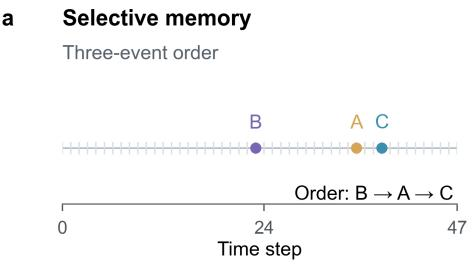  
b Event-driven dynamics  
Changing rotation and contraction

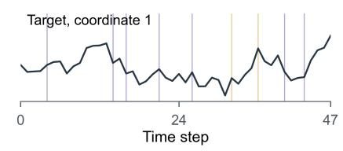

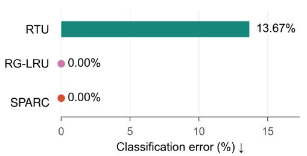

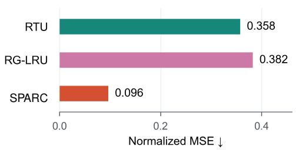  
Figure 1: Two complementary memory requirements. (a) Recall relevant events in order despite distractors. (b) Track event-driven changes in contraction and rotation. Task details are in Appendix C.3.

Efficiently compressing history, however, does not by itself explain how new evidence should transform stored information. In a linear recurrence with a fixed state transition, a write determined only by the current layer input can add information, but cannot generally change how arbitrary existing states evolve. When an observation indicates a memory reset, a regime change, or a switch in latent dynamics, adding new content may therefore be insufficient to transform stored information as required. In a complex-valued spectral representation, this transformation has two complementary components: transition magnitude determines how strongly information is retained, whereas phase determines how the memory state rotates in the complex plane. Input-dependent gates have long been used to regulate recurrent memory (Gers et al., 2000; Cho et al., 2014). RG-LRU modulates retention and writing through input-dependent gates (De et al., 2024); Mamba makes state-space parameters content-selective (Gu & Dao, 2023); and GateLoop uses data-controlled complex transitions whose magnitude and phase vary with the input (Katsch, 2023). These approaches allow recurrent memory to accumulate information and adapt how it propagates, raising a design question about the relationship between state capacity and the dimensionality of dynamic control.

Figure 1 contrasts two memory requirements. In event-order recall, adaptive retention lets RG-LRU and SPARC achieve zero error, whereas RTU reaches 13.7%. Tracking event-driven contraction and rotation additionally requires adapting state dynamics: SPARC controls both retention and phase and achieves NMSE 0.096, compared with 0.358 for RTU and 0.382 for RG-LRU.

Generating independent controls for every mode makes control cost grow with memory size. We therefore ask: does a high-dimensional memory require equally high-dimensional control?

We introduce SPARC: Shared Phase and Retention Control for Efficient Adaptive Spectral Recurrence. SPARC uses shared phase and retention control to adapt heterogeneous spectral memory modes. Two signals from the current input coordinate state evolution, while each mode retains its learned decay, frequency, input projection, and write response. The same signals also regulate new input through a modal write gate and retention-dependent normalization.

SPARC remains diagonal and affine in the previous state, enabling associative scans for fullsequence BPTT (Martin & Cundy, 2018; Smith et al., 2022). Its diagonal state dependence and shared controllers also permit exact structured RTRL for recurrent-layer sensitivities at fixed parameters (Williams & Zipser, 1989; Elelimy et al., 2024).

## Our main contributions are as follows:

1. Shared retention–phase control. We introduce a spectral recurrence in which two inputdependent signals are shared across spectral modes to jointly modulate memory retention and phase evolution, while preserving mode-specific baseline timescales and frequencies.

2. Exact structured RTRL. We derive exact RTRL updates that exploit the diagonal state Jacobian, per-mode parameter dependencies, and low-dimensional shared controllers. This structure avoids the full state–parameter influence matrix required by general dense recurrence while preserving complete recurrent-layer temporal sensitivities at fixed parameters and supplied layer inputs.

3. Efficient GPU implementations. We develop optimized GPU implementations of RG-LRU (De et al., 2024) and SPARC. Shared control reduces coefficient-generation and backpropagation costs, yielding 18.2%–34.2% lower recurrent-mixer training latency in fixed-token workloads and 3.1–4.7× faster scans than our optimized RG-LRU baseline on a single NVIDIA RTX PRO 6000 Blackwell Server Edition GPU.

4. Evaluation across tasks and training regimes. We evaluate SPARC on partially observable continuous control, POPGym, and sequence classification. SPARC improves Walker-P return and FordA accuracy by 9.09% and 1.36%, respectively, relative to the second-best methods.

## 2 RELATED WORK

## 2.1 SPECTRAL RECURRENCE AND PARALLEL COMPUTATION

Structured recurrence combines long-range memory with efficient computation. S4 uses structured state matrices (Gu et al., 2021), S5 uses multi-input, multi-output layers and parallel scans (Smith et al., 2022), and LRU uses stable diagonal complex dynamics (Orvieto et al., 2023). LinOSS builds oscillatory memory from discretized harmonic oscillators (Rusch & Rus, 2025), while RTU exploits spectral sensitivities for online reinforcement learning (Elelimy et al., 2024). Affine composition enables parallel prefix scans (Blelloch, 1990; Martin & Cundy, 2018), but practical efficiency also depends on coefficient generation, memory access, and differentiation. Mamba addresses these costs through selective scans, fusion, and recomputation (Gu & Dao, 2023); Mamba-2 uses state space duality to organize blockwise computation (Dao & Gu, 2024). SPARC preserves scan-compatible spectral recurrence while reducing dynamic-control overhead through two shared signals. With controls disabled, linear content, and matched write parameters, it recovers the recurrent forms of LRU and linear RTU.

## 2.2 INPUT-DEPENDENT RECURRENT DYNAMICS

Input-dependent recurrent models differ in the dynamics they control and how those controls are parameterized. RG-LRU uses real-valued gates for retention and writing (De et al., 2024), while GateLoop uses complex transitions with input-dependent magnitude and phase (Katsch, 2023). Mamba introduces selective dynamics through input-dependent discretization and input–output projections, including structured, low-rank selection (Gu & Dao, 2023). Mamba-3 uses complex-valued updates whose rotations admit an interpretation as data-dependent rotary embeddings (Lahoti et al., 2026). SPARC jointly adapts retention and phase through two signals shared across spectral modes, each retaining its learned baseline decay and frequency. This separates dynamic-control dimensionality from recurrent-state capacity.

## 2.3 ONLINE LEARNING FOR RECURRENT MODELS

Recurrent training balances temporal credit assignment against computation and memory. BPTT differentiates through an unrolled graph; truncated BPTT limits credit assignment to a finite window (Werbos, 1990). RTRL propagates state–parameter sensitivities forward but is prohibitively expensive for dense recurrent networks (Williams & Zipser, 1989). Approximations include UORO’s unbiased rank-one estimator (Tallec & Ollivier, 2017), KF-RTRL’s stochastic Kronecker factors (Mujika et al., 2018), SnAp’s finite-step influence sparsity (Menick et al., 2020), and e-prop’s local eligibility traces with learning signals (Bellec et al., 2020). Structured architectures instead restrict state dependencies to make sensitivities more efficient to represent (Zucchet et al., 2023; Elelimy et al., 2024). SPARC’s diagonal state Jacobian, mode-local parameters, and shared controllers permit exact structured RTRL without temporal truncation or stochastic approximation, at fixed parameters and supplied layer inputs.

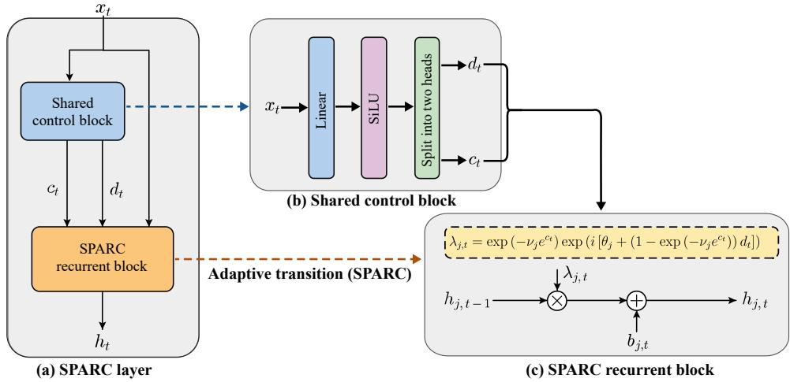  
Figure 2: Overview of SPARC. (a) The layer input supplies a shared control block and the recurrent block, which produces the updated state. (b) Two scalar control heads coordinate retention and phase across spectral modes. The Linear–SiLU pathway illustrates a possible controller architecture; Eq. (31) specifies the tanh-projection parameterization used in this paper. (c) Mode $j$ multiplies its previous state by an input-dependent complex transition and adds the current write contribution.

## 3 METHOD

SPARC builds on a diagonal spectral recurrence whose modes retain their own decay rates and frequencies, while two shared input-dependent signals modulate retention and phase. Figure 2 traces the input flow through the shared controls and mode-wise state update. This structure connects to fixed spectral recurrence while preserving the affine form needed for parallel sequence computation and exact structured RTRL.

## 3.1 SPECTRAL RECURRENCE PRELIMINARIES

Linear recurrent models compress history into a fixed-dimensional state. Consider

$$
\mathbf { h } _ { t } = A \mathbf { h } _ { t - 1 } + B \mathbf { x } _ { t } ,\tag{1}
$$

where $\mathbf { x } _ { t } \in \mathbb { R } ^ { D } , \mathbf { h } _ { t } \in \mathbb { C } ^ { H } , A \in \mathbb { C } ^ { H \times H }$ , and $B \in \mathbb { C } ^ { H \times D }$ . The transition propagates existing information; the input projection writes new content. For diagonalizable $A = \dot { V } \Lambda \dot { V } ^ { - \top }$ , express the state in its eigenbasis, retaining the notation $\mathbf { h } _ { t }$ , and let $\widetilde { B } = V ^ { - 1 } B$ . Then

$$
\mathbf { h } _ { t } = \lambda \odot \mathbf { h } _ { t - 1 } + \widetilde { B } \mathbf { x } _ { t } .\tag{2}
$$

In this basis, each mode evolves independently through a complex transition. A stable transition can be written as

$$
\lambda _ { j } = \exp ( - \nu _ { j } + i \theta _ { j } ) , \qquad \nu _ { j } > 0 ,\tag{3}
$$

where $e ^ { - \nu _ { j } }$ controls retention and $\theta _ { j }$ controls rotation. After k steps, a stored contribution is multiplied by $e ^ { - k \nu _ { j } } e ^ { i k \theta _ { j } }$ : decay determines its remaining magnitude, while phase determines its orientation and hence its projection onto a readout. Distinct modal decays and frequencies therefore provide heterogeneous memory responses, as in LRU and the linear RTU core (Orvieto et al., 2023; Elelimy et al., 2024).

A fixed spectrum applies this same retention and rotation at every step. To let the current input modify the evolution of stored information, consider

$$
h _ { j , t } = \lambda _ { j , t } ( \mathbf { x } _ { t } ) h _ { j , t - 1 } + b _ { j , t } ( \mathbf { x } _ { t } ) .\tag{4}
$$

The distinction between transition and writing is seen by applying the same input to two states produced by different histories:

$$
h _ { j , t } - h _ { j , t } ^ { \prime } = \lambda _ { j , t } ( \mathbf { x } _ { t } ) ( h _ { j , t - 1 } - h _ { j , t - 1 } ^ { \prime } ) .\tag{5}
$$

The input-only write cancels. It can add information, but cannot change how differences between historical states are transformed. This is why input-dependent writing alone cannot generally replace transition control in the same state representation. Appendix A gives the precise condition and the effect of accumulated phase on historical contributions.

## 3.2 SHARED ADAPTIVE SPECTRAL DYNAMICS

SPARC computes two shared scalar controls, $c _ { t }$ and $d _ { t } ,$ from affine input projections followed by scaled tanh activations. Appendix C.1 gives their parameterization and ranges. Each mode retains its learned decay $\nu _ { j } > 0$ and frequency $\theta _ { j }$ , with transition

$$
\rho _ { j , t } = \exp ( - \nu _ { j } e ^ { c _ { t } } ) , \qquad \lambda _ { j , t } = \rho _ { j , t } \exp \bigl ( i [ \theta _ { j } + ( 1 - \rho _ { j , t } ) d _ { t } ] \bigr ) .\tag{6}
$$

The retention control rescales modal decay rates together; the phase control adjusts their rotation. The factor $1 - \rho _ { j , t }$ reduces phase adjustments for persistent modes. Every transition remains contractive because $\left| { \lambda _ { j , t } } \right| = { \rho _ { j , t } } < 1$

The input is projected into real and imaginary content coordinates,

$$
\mathbf { u } _ { t } = \varphi ( B ^ { \mathrm { R e } } \mathbf { x } _ { t } ) + i \varphi ( B ^ { \mathrm { I m } } \mathbf { x } _ { t } ) ,\tag{7}
$$

where both matrices have shape $H \times D$ . The elementwise activation $\varphi$ is tanh or the identity and acts only on the input. Writing combines this content with retention-dependent normalization and a sigmoid gate:

$$
b _ { j , t } = g _ { j } \sqrt { 1 - \rho _ { j , t } ^ { 2 } } q _ { j , t } u _ { j , t } .\tag{8}
$$

Here $g _ { j } > 0$ is a learned modal gain, and $q _ { j , t }$ is a sigmoid of a mode-specific linear combination of the two controls. Appendix B gives their full definitions and derivatives.

The state update is

$$
\mathbf { h } _ { t } = \lambda _ { t } \odot \mathbf { h } _ { t - 1 } + \mathbf { b } _ { t } .\tag{9}
$$

The coefficients depend only on the current input and parameters, preserving affine dependence on the previous state. Sharing the controls leaves modal decays, frequencies, input projections, and write responses distinct.

Connection to fixed spectral recurrences. Zero-initialized controllers give $c _ { t } = d _ { t } = 0$ , recovering the fixed spectrum in Eq. (3). With linear content and matched effective write parameters, this has the recurrent form of LRU; the corresponding decay-dependent write scale also recovers the linear RTU core (Orvieto et al., 2023; Elelimy et al., 2024).

## 3.3 PARALLEL BPTT AND STRUCTURED RTRL

Transition and write coefficients depend only on supplied inputs and parameters, so they can be generated before recurrent propagation. Represent each update by $F _ { t } = \left( \lambda _ { t } , \mathbf { b } _ { t } \right)$ , with composition

$$
F _ { 2 } \circ F _ { 1 } = \left( \lambda _ { 2 } \odot \lambda _ { 1 } , \lambda _ { 2 } \odot \mathbf { b } _ { 1 } + \mathbf { b } _ { 2 } \right) .\tag{10}
$$

The operation is associative, with identity (1, 0). A work-efficient prefix scan therefore evaluates the recurrent states with $O ( T H )$ work and $O ( \log T )$ temporal depth for a length-T sequence (Blelloch, 1990; Martin & Cundy, 2018).

Backpropagating through coefficient generation and the scan gives full-sequence BPTT without temporal truncation. For online interaction, the same cell runs one step at a time and propagates recurrent sensitivities forward.

For a real recurrent parameter block ψ, define the complex row Jacobian $Z _ { j , t } ^ { \psi } = \partial h _ { j , t } / \partial \psi$ . Holding supplied layer inputs fixed, the chain rule gives

$$
Z _ { j , t } ^ { \psi } = \lambda _ { j , t } Z _ { j , t - 1 } ^ { \psi } + h _ { j , t - 1 } \frac { \partial \lambda _ { j , t } } { \partial \psi } + \frac { \partial b _ { j , t } } { \partial \psi } .\tag{11}
$$

The first term propagates historical sensitivity; the remaining terms capture the current transition and write effects. With a parameter-independent initial state, $Z _ { j , 0 } ^ { \psi } = 0$ , these updates give exact recurrent-layer derivatives at fixed parameters. Mode-local parameters influence only their own mode, while shared controllers reuse instantaneous input Jacobians. Contracting the traces with state gradients from the readout yields recurrent-parameter gradients. Appendix B gives the local derivatives and qualifications for upstream encoders and stored-trace PPO.

Shared control uses $2 ( D + 1 )$ controller parameters and $O ( D )$ projection work per step, versus $2 H ( D + 1 )$ and $O ( H D )$ for independent dense controls per mode. Dense content projections leave the complete cell at $O ( \dot { H } D + H )$ work; structured RTRL uses the same order of work and storage. Appendix B.7 details the comparison, including RG-LRU’s block-diagonal gates; Section 5 reports measured latency and memory use.

## 3.4 GPU-EFFICIENT IMPLEMENTATION

Google DeepMind’s released RecurrentGemma implementation provides a TPU-optimized Pallas scan and a reference PyTorch implementation (Botev et al., 2024). We implement GPU kernels for both RG-LRU and SPARC. SPARC divides time into chunks and modes into tiles. A prefix scan over local affine summaries supplies chunk entrance states, followed by parallel replay. The backward pass similarly uses a reverse scan for boundary cotangents, local adjoint replay, and gradient reduction.

Fusing content activation, write normalization, and gating, while recomputing modal transitions inside the scan, stores two $B \times T$ control arrays instead of a $B \times T \times H$ complex transition tensor. Modal control gradients are reduced within each tile; recurrent accumulation and scan summaries use FP32. Appendix G provides the pseudocode (Algorithm 1), memory layout, reset handling, and single-step kernel.

## 4 EXPERIMENTS

We evaluate whether shared spectral control supports useful recurrent representations in three settings: partially observable continuous control, POPGym memory and decision-making tasks, and sequence classification. The reinforcement-learning experiments use an RTU recurrent actor–critic backbone with stored online sensitivities; classification uses an LRU residual sequence backbone and full-sequence BPTT. All benchmark tasks use three training seeds.

## 4.1 EXPERIMENTAL SETUP

Tasks. Continuous control uses Ant-P, Walker-P, Hopper-P, and Cheetah-P (-P denotes masked observations), with 4,999,168 environment steps per run. POPGym uses Autoencode, CountRecall, RepeatFirst, RepeatPrevious, Noisy Pendulum, and HigherLower, with 3,999,744 steps per run (Morad et al., 2023), testing recall, memory updating, and noisy control.

Classification uses FordA, StarLightCurves, and UWaveGestureLibraryAll from UCR (Dau et al., 2019), plus permuted MNIST and sequential grayscale CIFAR-10. Inputs are scalar sequences without two-dimensional spatial modules.

Compared methods and state size. We compare SPARC with RTU, LRU, RG-LRU, GateLoop, Mamba-3, and GRU (Elelimy et al., 2024; Orvieto et al., 2023; De et al., 2024; Katsch, 2023; Lahoti et al., 2026; Cho et al., 2014), matching real recurrent-state budgets at 384 coordinates for continuous control and 128 for POPGym. Parameter counts remain architecture-dependent. SPARC uses tanh content; Appendix D gives architecture and initialization details.

Table 1: Partially observable continuous control.
<table><tr><td>Method</td><td>Ant-P</td><td>Walker-P</td><td>Hopper-P</td><td>Cheetah-P</td></tr><tr><td>RTU</td><td>3823.8</td><td>899.8</td><td>1266.7</td><td>2547.3</td></tr><tr><td>LRU</td><td>4476.5</td><td>655.5</td><td>1363.4</td><td>2688.9</td></tr><tr><td>RG-LRU</td><td>1953.7</td><td>865.5</td><td>1224.4</td><td>2539.5</td></tr><tr><td>GateLoop</td><td>4105.6</td><td>911.9</td><td>1325.1</td><td>2466.1</td></tr><tr><td>Mamba-3</td><td>1355.7</td><td>680.2</td><td>863.6</td><td>2019.9</td></tr><tr><td>GRU</td><td>1921.1</td><td>760.1</td><td>631.3</td><td>2174.1</td></tr><tr><td>SPARC</td><td>4507.8</td><td>994.8</td><td>1282.9</td><td>2563.8</td></tr></table>

Mean return across three training seeds. Higher is better. Best means are bold; second-best means are underlined.

Recurrent actor–critic backbone. Following RTU (Elelimy et al., 2024), RL models use a width-64 observation encoder and policy/value heads, resetting recurrent states and sensitivities at episode boundaries. Appendix D.2 specifies the backbone and action distributions.

PPO optimization. All methods use PPO (Schulman et al., 2017), rollout length 2048, and matched task-specific learning rates. SPARC, RTU, LRU, RG-LRU, and GateLoop use stored recurrent sensitivities; GRU and Mamba-3 use length-4 TBPTT. Appendices D.2 and B.6 detail optimization and stored-trace credit assignment.

Full-sequence backbone and optimization. Classification uses the LRU residual backbone (Orvieto et al., 2023): four width-64 layers and sequence-mean pooling, with 64 complex modes per SPARC layer. All methods use full-sequence BPTT for 20,000 updates at batch size 32; Appendix D.4 gives architecture and optimizer details.

Evaluation metrics. RL reports mean return over the final 100 rollouts; classification reports selected internal-validation accuracy (%). Scores average three training seeds. Preprocessing and splits are shared across methods. Appendices D.5 and D.6 detail checkpoint selection and aggregation.

## 4.2 PARTIALLY OBSERVABLE REINFORCEMENT LEARNING

SPARC achieves the highest mean returns on Ant-P (4507.8) and Walker-P (994.8) in Table 1. The Walker-P result improves on GateLoop’s 911.9 by 9.09%, while Ant-P exceeds LRU by 0.70%. SPARC also ranks second on Cheetah-P with a return of 2563.8. The Walker-P phase ablation in Section 4.4 suggests that adapting rotation contributes to this performance alongside selective retention. Figure 5 in Appendix D.7 shows the learning curves.

On POPGym, SPARC obtains the highest mean returns on CountRecall, RepeatFirst, and Noisy Pendulum (Figure 3). The largest gain over the strongest baseline occurs on Noisy Pendulum, where return increases from GRU’s 0.311 to 0.461. CountRecall improves by 0.050 over RTU, while RepeatFirst reaches 0.829 compared with GRU’s 0.811. These gains cover both recall and memory updates under noisy observations. Table 6 in Appendix D.7 gives the complete results.

## 4.3 SEQUENCE MODELING UNDER FULL-SEQUENCE BPTT

Under full-sequence BPTT, SPARC achieves the highest mean accuracy on FordA and permuted MNIST and matches the highest displayed mean on StarLightCurves (Table 2). FordA accuracy rises from RTU and LRU’s 95.38% to 96.68%, a relative gain of 1.36%. On permuted MNIST, SPARC reaches 96.87%, narrowly ahead of LRU’s 96.82%, while StarLightCurves accuracy is 99.67%. With all methods trained in the same residual backbone, these results support SPARC’s use in multilayer sequence models as well as recurrent policies.

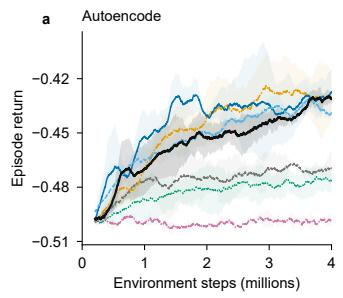

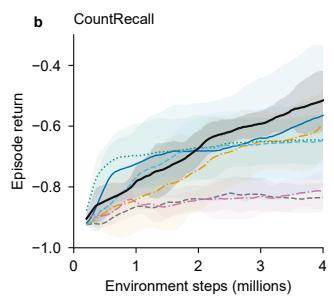

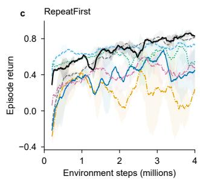

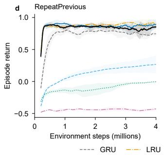

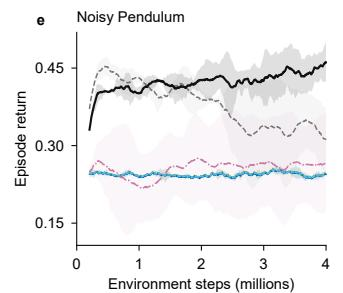

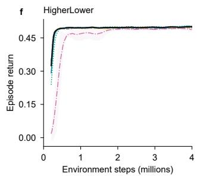  
Figure 3: Learning curves for Autoencode, CountRecall, RepeatFirst, RepeatPrevious, Noisy Pendulum, and HigherLower. Curves and shading use the same three-seed averaging and sample-standarddeviation convention as Figure 5.

Table 2: Full-sequence classification.
<table><tr><td>Method</td><td>FordA</td><td>SLC</td><td>UWave</td><td>pMNIST</td><td>CIFAR-10</td></tr><tr><td>RTU</td><td>95.38</td><td>99.67</td><td>93.33</td><td>96.75</td><td>59.32</td></tr><tr><td>LRU</td><td>95.38</td><td>99.67</td><td>92.22</td><td>96.82</td><td>60.11</td></tr><tr><td>RG-LRU</td><td>92.89</td><td>99.67</td><td>98.52</td><td>85.48</td><td>51.01</td></tr><tr><td>GateLoop</td><td>91.97</td><td>99.00</td><td>91.85</td><td>62.31</td><td>52.46</td></tr><tr><td>Mamba-3</td><td>90.58</td><td>99.33</td><td>98.15</td><td>88.51</td><td>48.65</td></tr><tr><td>GRU</td><td>93.54</td><td>99.00</td><td>94.81</td><td>90.92</td><td>62.69</td></tr><tr><td>SPARC</td><td>96.68</td><td>99.67</td><td>96.30</td><td>96.87</td><td>59.92</td></tr></table>

Mean accuracy (%) across three seeds under full-sequence BPTT. SLC: StarLightCurves; pMNIST: permuted MNIST; CIFAR-10: sequential grayscale inputs. Evaluation follows Appendix D.5. Higher is better; best means are bold and second-best means underlined.

## 4.4 ABLATION STUDIES

Nine retrained variants isolate retention, phase, their coupling, and write components. Appendix E provides the selected comparisons (Table 7) and complete 16-task results.

Removing adaptive phase lowers Walker-P return from 994.79 to 837.70. Removing the phase clock lowers RepeatFirst return from 0.829 to 0.288 and sequential CIFAR-10 accuracy from 59.92% to 49.03%.

Neutralizing the write gate lowers RepeatFirst return to 0.663 while FordA remains at 96.68%; linear content lowers RepeatFirst to 0.123. Diagnostics show stronger gate variation and content saturation on RepeatFirst than on FordA (Appendix F).

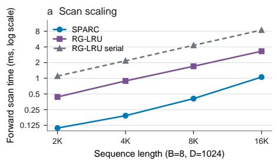

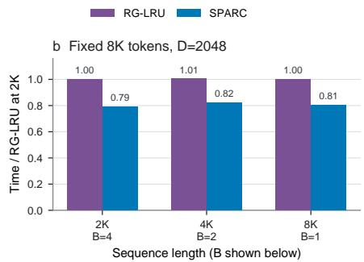

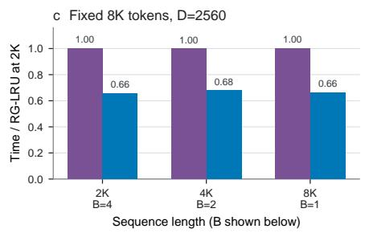

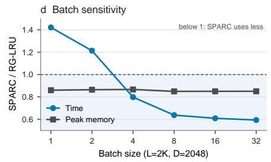  
Figure 4: GPU efficiency on a single NVIDIA RTX PRO 6000 Blackwell Server Edition GPU. (a) Scan-only timing after coefficient generation. (b,c) Recurrent-mixer forward-plus-backward timing at fixed token count, for widths 2048 and 2560. (d) Runtime and peak allocated-memory ratios, SPARC divided by RG-LRU, as batch size varies. Ratios below one favor SPARC.

## 5 COMPUTATIONAL EFFICIENCY

We compare SPARC with our optimized RG-LRU implementation on a single NVIDIA RTX PRO 6000 Blackwell Server Edition GPU (Figure 4). Both use matched workloads, BF16 inputs and outputs, and FP32 recurrent accumulation. We time scans after coefficient generation and complete recurrent-mixer forward–backward passes including coefficient generation. These timings exclude the surrounding model and optimizer; Appendix G.1 specifies measurement scope, workload shapes, and normalization.

At batch size 8 and width 1024, SPARC’s scan is 3.1–4.7× faster for sequence lengths 2048–16384. With 8192 tokens per batch, complete-mixer training latency falls by 18.2%–21.0% at width 2048 and 32.1%–34.2% at width 2560. These gains include the control pathway and its gradients, alongside the scan optimizations in Section 3.4. In the batch-size sweep, SPARC is 42.2% and 21.4% slower at batch sizes 1 and 2, respectively, but its runtime ratio is approximately 0.6 at batch sizes 8 and above. Peak allocated memory is roughly 13%–15% lower for most tested batch sizes. Lower memory use therefore does not guarantee lower latency in the smallest-batch workloads. Appendices G.2 and G.3 report sequential-reference comparisons and numerical checks.

## 6 LIMITATIONS AND FUTURE WORK

Shared control coordinates changes across memory modes, which limits their ability to adapt independently. The ablations also show task-dependent gains and variation across training seeds, motivating further study of control grouping, initialization, and training stability. Our evaluation covers control and sequence classification at moderate model sizes. Extending SPARC to large language models, including hybrids with local attention as in Griffin (De et al., 2024), will require evaluating language-modeling quality, long-context behavior, and training efficiency at scale.

## 7 CONCLUSION

SPARC uses shared phase and retention control to adapt heterogeneous spectral memory modes. Two input-dependent signals adjust the evolution of a high-dimensional state while preserving distinct modal timescales and frequencies. The resulting affine recurrence supports parallel fullsequence BPTT and exact recurrent-layer sensitivities at fixed parameters. Across the evaluated tasks, SPARC improves Walker-P return by 9.09% and FordA accuracy by 1.36% over the strongest competing means. On a single Blackwell GPU, its optimized mixer reduces forward–backward latency by 18.2%–34.2% at a fixed token budget. These results support shared retention and phase control as an efficient mechanism for adapting recurrent memory.

## AI USE STATEMENT

In this work, generative AI tools were used to assist in research execution and ideation, primarily for software implementation, code debugging, and preliminary technical discussions. Additionally, these tools were used to aid and polish the manuscript to improve clarity, grammar, and overall readability. All AI-generated code and drafted text were thoroughly inspected, tested, and verified by the authors, and generative AI was not used to produce core scientific claims. The authors take full responsibility for the entirety and integrity of this paper.

## REFERENCES

Guillaume Bellec, Franz Scherr, Anand Subramoney, Elias Hajek, Darjan Salaj, Robert Legenstein, and Wolfgang Maass. A solution to the learning dilemma for recurrent networks of spiking neurons. Nature communications, 11(1):3625, 2020.

Guy E Blelloch. Prefix sums and their applications. Technical Report CMU-CS-90-190, School of Computer Science, Carnegie Mellon University, November 1990.

Aleksandar Botev, Soham De, Samuel L Smith, Anushan Fernando, George-Cristian Muraru, Ruba Haroun, Leonard Berrada, Razvan Pascanu, Pier Giuseppe Sessa, Robert Dadashi, et al. Recurrentgemma: Moving past transformers for efficient open language models. arXiv preprint arXiv:2404.07839, 2024.

Kyunghyun Cho, Bart Van Merrienboer, C¸ a ¨ glar Gulc¸ehre, Dzmitry Bahdanau, Fethi Bougares, Hol- ˘ ger Schwenk, and Yoshua Bengio. Learning phrase representations using rnn encoder–decoder for statistical machine translation. In Proceedings of the 2014 conference on empirical methods in natural language processing (EMNLP), pp. 1724–1734, 2014.

Tri Dao and Albert Gu. Transformers are ssms: Generalized models and efficient algorithms through structured state space duality. arXiv preprint arXiv:2405.21060, 2024.

Hoang Anh Dau, Anthony Bagnall, Kaveh Kamgar, Chin-Chia Michael Yeh, Yan Zhu, Shaghayegh Gharghabi, Chotirat Ann Ratanamahatana, and Eamonn Keogh. The ucr time series archive. IEEE/CAA Journal ofAutomatica Sinica, 6(6):1293–1305, 2019.

Soham De, Samuel L Smith, Anushan Fernando, Aleksandar Botev, George Cristian-Muraru, Albert Gu, Ruba Haroun, Leonard Berrada, Yutian Chen, Srivatsan Srinivasan, et al. Griffin: Mixing gated linear recurrences with local attention for efficient language models. arXiv preprint arXiv:2402.19427, 2024.

Esraa Elelimy, Adam White, Michael Bowling, and Martha White. Real-time recurrent learning using trace units in reinforcement learning. Advances in Neural Information Processing Systems, 37:17006–17043, 2024.

Felix A Gers, Jurgen Schmidhuber, and Fred Cummins. Learning to forget: Continual prediction¨ with lstm. Neural computation, 12(10):2451–2471, 2000.

Albert Gu and Tri Dao. Mamba: Linear-time sequence modeling with selective state spaces. arXiv preprint arXiv:2312.00752, 2023.

Albert Gu, Tri Dao, Stefano Ermon, Atri Rudra, and Christopher Re. Hippo: Recurrent memory´ with optimal polynomial projections. Advances in neural information processing systems, 33: 1474–1487, 2020.

Albert Gu, Karan Goel, and Christopher Re. Efficiently modeling long sequences with structured´ state spaces. arXiv preprint arXiv:2111.00396, 2021.

Tobias Katsch. Gateloop: Fully data-controlled linear recurrence for sequence modeling. arXiv preprint arXiv:2311.01927, 2023.

Diederik P Kingma and Jimmy Ba. Adam: A method for stochastic optimization. arXiv preprint arXiv:1412.6980, 2014.

Aakash Sunil Lahoti, Kevin Li, Berlin Chen, Caitlin Wang, Aviv Bick, Zico Kolter, Tri Dao, and Albert Gu. Mamba-3: Improved sequence modeling using state space principles. In International Conference on Learning Representations, volume 2026, pp. 86173–86202, 2026.

Ilya Loshchilov and Frank Hutter. Decoupled weight decay regularization. arXiv preprint arXiv:1711.05101, 2017.

Eric Martin and Chris Cundy. Parallelizing linear recurrent neural nets over sequence length. In International Conference on Learning Representations, 2018.

Jacob Menick, Erich Elsen, Utku Evci, Simon Osindero, Karen Simonyan, and Alex Graves. A practical sparse approximation for real time recurrent learning. arXiv preprint arXiv:2006.07232, 2020.

Steven Morad, Ryan Kortvelesy, Matteo Bettini, Stephan Liwicki, and Amanda Prorok. Popgym: Benchmarking partially observable reinforcement learning. arXiv preprint arXiv:2303.01859, 2023.

Asier Mujika, Florian Meier, and Angelika Steger. Approximating real-time recurrent learning with random kronecker factors. In Advances in Neural Information Processing Systems, volume 31, 2018.

Antonio Orvieto, Samuel L Smith, Albert Gu, Anushan Fernando, Caglar Gulcehre, Razvan Pascanu, and Soham De. Resurrecting recurrent neural networks for long sequences. In International conference on machine learning, pp. 26670–26698. PMLR, 2023.

T Konstantin Rusch and Daniela Rus. Oscillatory state-space models. In International Conference on Learning Representations, volume 2025, pp. 22303–22322, 2025.

John Schulman, Filip Wolski, Prafulla Dhariwal, Alec Radford, and Oleg Klimov. Proximal policy optimization algorithms. arXiv preprint arXiv:1707.06347, 2017.

Jimmy TH Smith, Andrew Warrington, and Scott W Linderman. Simplified state space layers for sequence modeling. arXiv preprint arXiv:2208.04933, 2022.

Corentin Tallec and Yann Ollivier. Unbiased online recurrent optimization. arXiv preprint arXiv:1702.05043, 2017.

Ashish Vaswani, Noam Shazeer, Niki Parmar, Jakob Uszkoreit, Llion Jones, Aidan N Gomez, Łukasz Kaiser, and Illia Polosukhin. Attention is all you need. Advances in neural information processing systems, 30, 2017.

Paul J Werbos. Backpropagation through time: what it does and how to do it. Proceedings of the IEEE, 78(10):1550–1560, 1990.

Ronald J Williams and David Zipser. A learning algorithm for continually running fully recurrent neural networks. Neural computation, 1(2):270–280, 1989.

Nicolas Zucchet, Robert Meier, Simon Schug, Asier Mujika, and Joao Sacramento. Online learning of long-range dependencies. Advances in Neural Information Processing Systems, 36:10477– 10493, 2023.

## A WHY WRITING CANNOT GENERALLY REPLACE TRANSITION CONTROL

The distinction in Eq. (5) applies to a common state representation and to all reachable histories at a fixed current input.

Fix an input x and let $\mathcal { R } _ { \mathbf { x } }$ be the set of previous states reachable immediately before that input. Suppose an input-dependent transition and a fixed transition agree after changing only the inputdependent write:

$$
A ( \mathbf { x } ) \mathbf { h } + \mathbf { b } ( \mathbf { x } ) = A _ { 0 } \mathbf { h } + \mathbf { b } ^ { \prime } ( \mathbf { x } ) \qquad { \mathrm { f o r ~ e v e r y ~ } } \mathbf { h } \in \mathscr { R } _ { \mathbf { x } } .\tag{12}
$$

Then

$$
[ A ( \mathbf { x } ) - A _ { 0 } ] \mathbf { v } = 0 \quad \mathrm { f o r e v e r y } \ \mathbf { v } \in \mathrm { s p a n } ( \mathcal { R } _ { \mathbf { x } } - \mathcal { R } _ { \mathbf { x } } ) .\tag{13}
$$

In particular, if this difference span is the full state space, then $A ( \mathbf { x } ) = A _ { 0 }$

Apply Eq. (12) to two reachable states and subtract. The input-only writes cancel, giving $[ A ( \mathbf { x } ) -$ $A _ { 0 } ] ( { \bf h } - { \bf h } ^ { \prime } ) = 0$ . Linearity extends this equality to the span of all reachable-state differences. A matrix that vanishes on the full state space is zero.

Thus an input-only write can reproduce an adaptive transition on all reachable histories only when the transition difference vanishes on their difference span.

Accumulated phase. For a fixed input sequence, expanding Eq. (9) gives

$$
h _ { j , t } = \left( \prod _ { \ell = 1 } ^ { t } \lambda _ { j , \ell } \right) h _ { j , 0 } + \sum _ { k = 1 } ^ { t } \left( \prod _ { \ell = k + 1 } ^ { t } \lambda _ { j , \ell } \right) b _ { j , k } .\tag{14}
$$

An empty product is one. The contribution of one past write is therefore

$$
\Delta h _ { j , t } ^ { ( k ) } = \left( \prod _ { \ell = k + 1 } ^ { t } \rho _ { j , \ell } \right) e ^ { i [ ( t - k ) \theta _ { j } + \sum _ { \ell = k + 1 } ^ { t } ( 1 - \rho _ { j , \ell } ) \kappa _ { p } p _ { \ell } ] } b _ { j , k } .\tag{15}
$$

The product of retention factors determines how much of a past write remains, while accumulated phase rotates its contribution. A readout of the real state component therefore changes with phase even when the retained magnitude is fixed. Phase differences between past writes also determine whether their contributions reinforce or cancel.

The baseline term depends on elapsed time, while the additional term depends on intervening inputs.   
Retention-only control does not directly alter this rotation angle within a mode.

## B EXPLICIT STRUCTURED RTRL DERIVATIVES

## B.1 PARAMETER BLOCKS AND OPTIMIZATION SEMANTICS

The modal gain in Eq. (8) is $g _ { j } \ = \ e ^ { \zeta _ { j } }$ . To preserve the experimental parameterization, its log coordinate is represented by

$$
\zeta _ { j } = \beta _ { j } + \log 2 - \frac { 1 } { 2 } \log ( 1 - e ^ { - 2 \nu _ { j } } ) , \qquad \nu _ { j } = e ^ { a _ { j } } .\tag{16}
$$

The optimized gain and decay coordinates are $\beta _ { j }$ and $a _ { j } ; \zeta _ { j }$ is derived from them. Substitution into Eq. (8) gives exactly

$$
b _ { j , t } = e ^ { \beta _ { j } } \sqrt { \frac { 1 - e ^ { - 2 e _ { j , t } } } { 1 - e ^ { - 2 \nu _ { j } } } } \left[ 2 \sigma ( s _ { j } p _ { t } + v _ { j } r _ { t } ) \right] u _ { j , t } .\tag{17}
$$

The independently optimized parameters comprise the real and imaginary content matrices, the retention and phase controller weights, and five parameter vectors with one entry per mode: log decay, log frequency, reference log gain, and the phase and retention coefficients of the write gate. The content matrices have shape $\bar { H } \bar { \times } D$ , the controller vectors have length $D + 1$ , and each modal vector has length H. Derivatives hold the supplied input fixed. The reference log gain is optimized independently of log decay; the compact gain in Eq. (16) includes the decay-dependent normalization.

Using the normalized controls from Appendix C.1, the sigmoid write gate is

$$
q _ { j , t } = \sigma ( s _ { j } p _ { t } + v _ { j } r _ { t } ) , \qquad 0 < q _ { j , t } < 1 .\tag{18}
$$

The local derivatives below are substituted directly into Eq. (11).

## B.2 TRANSITION DERIVATIVES

Differentiating the expanded transition in Eq. (32) gives

$$
\begin{array} { r l } & { \frac { \partial \lambda _ { j , t } } { \partial p _ { t } } = i \kappa _ { p } ( 1 - \rho _ { j , t } ) \lambda _ { j , t } , } \\ & { \frac { \partial \lambda _ { j , t } } { \partial r _ { t } } = \kappa _ { r } e _ { j , t } ( - 1 + i \rho _ { j , t } \kappa _ { p } p _ { t } ) \lambda _ { j , t } , } \\ & { \frac { \partial \lambda _ { j , t } } { \partial a _ { j } } = e _ { j , t } ( - 1 + i \rho _ { j , t } \kappa _ { p } p _ { t } ) \lambda _ { j , t } , } \\ & { \frac { \partial \lambda _ { j , t } } { \partial \vartheta _ { j } } = i \theta _ { j } \lambda _ { j , t } . } \end{array}\tag{19}
$$

Changing log decay affects both the retained magnitude and the phase correction through the retention-coupled clock. The content projections, reference gain, and write-gate coefficients affect only the write pathway, so their direct derivatives of the transition are zero.

## B.3 WRITE DERIVATIVES

The logarithm of the positive amplitude multiplying $q _ { j , t } u _ { j , t }$ is

$$
\beta _ { j } + \log 2 + \frac { 1 } { 2 } \log ( 1 - e ^ { - 2 e _ { j , t } } ) - \frac { 1 } { 2 } \log ( 1 - e ^ { - 2 \nu _ { j } } ) .\tag{20}
$$

Its derivative with respect to $a _ { j }$ therefore contains both the effective-decay term and the baselinenormalization term. Combining these with the sigmoid derivative gives

$$
\begin{array} { r l } & { \frac { \partial b _ { j , t } } { \partial p _ { t } } = b _ { j , t } ( 1 - q _ { j , t } ) s _ { j } , } \\ & { \frac { \partial b _ { j , t } } { \partial r _ { t } } = b _ { j , t } \left[ \frac { K _ { r } e _ { j , t } } { e ^ { 2 } e _ { j , t } } + ( 1 - q _ { j , t } ) v _ { j } \right] , } \\ & { \frac { \partial b _ { j , t } } { \partial a _ { j } } = b _ { j , t } \left[ \frac { e _ { j , t } } { e ^ { 2 } e _ { j , t } } - \frac { v _ { j } } { e ^ { 2 } v _ { j } } - 1 \right] , } \\ & { \frac { \partial b _ { j , t } } { \partial b _ { j } } = b _ { j , t } , \qquad \frac { \partial b _ { j , t } } { \partial v _ { j } } = 0 , } \\ & { \frac { \partial b _ { j , t } } { \partial s _ { j } } = b _ { j , t } ( 1 - q _ { j , t } ) p _ { t } , \qquad \frac { \partial b _ { j , t } } { \partial v _ { j } } = b _ { j , t } ( 1 - q _ { j , t } ) r _ { t } . } \end{array}\tag{21}
$$

These formulas follow from product differentiation and remain valid when $u _ { j , t } = 0 ;$ they do not require taking the logarithm of complex content.

For the two content-projection rows,

$$
\begin{array} { r l } & { \frac { \partial b _ { j , t } } { \partial B _ { j , : } ^ { \mathrm { R e } } } = e ^ { \zeta _ { j } } \sqrt { 1 - \rho _ { j , t } ^ { 2 } } q _ { j , t } \varphi ^ { \prime } ( ( B ^ { \mathrm { R e } } \mathbf { x } _ { t } ) _ { j } ) \mathbf { x } _ { t } ^ { \top } , } \\ & { \frac { \partial b _ { j , t } } { \partial B _ { j , : } ^ { \mathrm { I m } } } = i e ^ { \zeta _ { j } } \sqrt { 1 - \rho _ { j , t } ^ { 2 } } q _ { j , t } \varphi ^ { \prime } ( ( B ^ { \mathrm { I m } } \mathbf { x } _ { t } ) _ { j } ) \mathbf { x } _ { t } ^ { \top } . } \end{array}\tag{22}
$$

Here $\varphi ^ { \prime } ( z ) = 1 - \operatorname { t a n h } ^ { 2 } ( z )$ for bounded content and $\varphi ^ { \prime } ( z ) = 1$ for linear content. Other rows have zero direct effect on mode j.

## B.4 CONTROLLER TRACES, LOSS GRADIENTS, AND RESETS

For example, the normalized phase-controller trace between episode resets is

$$
Z _ { j , t } ^ { \mathbf { w } _ { p } } = \lambda _ { j , t } Z _ { j , t - 1 } ^ { \mathbf { w } _ { p } } + \left( h _ { j , t - 1 } \frac { \partial \lambda _ { j , t } } { \partial p _ { t } } + \frac { \partial b _ { j , t } } { \partial p _ { t } } \right) ( 1 - p _ { t } ^ { 2 } ) \bar { \mathbf { x } } _ { t } ^ { \top } ,\tag{23}
$$

where $\partial \lambda _ { j , t } / \partial p _ { t } = i \kappa _ { p } ( 1 - \rho _ { j , t } ) \lambda _ { j , t }$ . The radial-controller trace follows the same chain rule with $r _ { t }$ and ${ \bf w } _ { r }$

The shared input-controller Jacobians are

$$
\frac { \partial r _ { t } } { \partial \mathbf { w } _ { r } } = ( 1 - r _ { t } ^ { 2 } ) \bar { \mathbf { x } } _ { t } ^ { \top } , \qquad \frac { \partial p _ { t } } { \partial \mathbf { w } _ { p } } = ( 1 - p _ { t } ^ { 2 } ) \bar { \mathbf { x } } _ { t } ^ { \top } .\tag{24}
$$

At episode boundaries, let $m _ { t } \in \{ 0 , 1 \}$ indicate whether the previous state belongs to the current episode. Resetting to zero gives

$$
\mathbf { h } _ { t } = \left( m _ { t } \pmb { \lambda } _ { t } \right) \odot \mathbf { h } _ { t - 1 } + \mathbf { b } _ { t } .\tag{25}
$$

The mask preserves affine composition and resets accumulated sensitivities. The controller derivative includes both transition and write pathways, giving

$$
Z _ { j , t } ^ { \mathbf { w } _ { r } } = m _ { t } \lambda _ { j , t } Z _ { j , t - 1 } ^ { \mathbf { w } _ { r } } + \left( m _ { t } h _ { j , t - 1 } \frac { \partial \lambda _ { j , t } } { \partial r _ { t } } + \frac { \partial b _ { j , t } } { \partial r _ { t } } \right) ( 1 - r _ { t } ^ { 2 } ) \bar { \mathbf { x } } _ { t } ^ { \top } ,
$$

$$
Z _ { j , t } ^ { \mathbf { w } _ { p } } = m _ { t } \lambda _ { j , t } Z _ { j , t - 1 } ^ { \mathbf { w } _ { p } } + \left( m _ { t } h _ { j , t - 1 } \frac { \partial \lambda _ { j , t } } { \partial p _ { t } } + \frac { \partial b _ { j , t } } { \partial p _ { t } } \right) ( 1 - p _ { t } ^ { 2 } ) \bar { \mathbf { x } } _ { t } ^ { \top } .\tag{26}
$$

For any parameter block, the corresponding reset-aware rule is

$$
Z _ { j , t } ^ { \psi } = m _ { t } \lambda _ { j , t } Z _ { j , t - 1 } ^ { \psi } + m _ { t } h _ { j , t - 1 } \partial _ { \psi } \lambda _ { j , t } + \partial _ { \psi } b _ { j , t } .\tag{27}
$$

The mask is supplied by the environment and is not differentiated. At a reset, historical state and sensitivity vanish, while the current write can still create a nonzero parameter derivative. Gradients are obtained by the real-coordinate contraction in Eq. (28), and storage is exactly the trace count in Eq. (29) for this explicit representation.

At zero initialization, $r _ { t } = p _ { t } = 0$ and $s _ { j } = v _ { j } = 0$ . Direct derivatives of the modal response coefficients initially vanish because they multiply zero controls. The controllers can nevertheless receive gradients through the transition and, for the radial controller, through retention-dependent writing. The write-gate pathway is therefore initially neutral without permanently disabling adaptation.

## B.5 LOSS CONTRACTION AND TRACE STORAGE

For a real instantaneous loss $\mathcal { L } _ { t }$ , ordinary backpropagation through the current readout supplies the real-coordinate state gradients. Their contraction with the traces is

$$
\frac { \partial \mathcal { L } _ { t } } { \partial \psi } = \sum _ { j = 1 } ^ { H } \biggl ( \frac { \partial \mathcal { L } _ { t } } { \partial \ : \mathrm { R e } h _ { j , t } } \ : \mathrm { R e } Z _ { j , t } ^ { \psi } + \frac { \partial \mathcal { L } _ { t } } { \partial \mathrm { I m } h _ { j , t } } \mathrm { I m } Z _ { j , t } ^ { \psi } \biggr ) + \left. \frac { \partial \mathcal { L } _ { t } } { \partial \psi } \right| _ { \mathrm { d i r e c t } } .\tag{28}
$$

The final term includes parameter dependence outside the recurrent state. This expression avoid reliance on a particular complex-gradient convention.

The two content matrices require 2HD complex trace entries, the five modal parameter vectors require 5H, and the two shared controllers require 2H(D + 1). The total is

$$
2 H D + 5 H + 2 H ( D + 1 ) = 4 H D + 7 H ,\tag{29}
$$

with $O ( H D + H )$ update work per step. Shared control therefore does not mean that only two traces are stored: each mode has its own accumulated response to the controller parameters.

## B.6 EXACTNESS SCOPE AND STORED-TRACE PPO

For fixed recurrent parameters and supplied inputs, Eq. (11) is the full recurrent-layer chain rule without temporal truncation or stochastic approximation. If an upstream-only parameter block ω changes the input, its total derivative additionally satisfies

$$
\frac { d h _ { j , t } } { d \omega } = \lambda _ { j , t } \frac { d h _ { j , t - 1 } } { d \omega } + \left( h _ { j , t - 1 } \frac { \partial \lambda _ { j , t } } { \partial \mathbf { x } _ { t } } + \frac { \partial b _ { j , t } } { \partial \mathbf { x } _ { t } } \right) \frac { d \mathbf { x } _ { t } } { d \omega } .\tag{30}
$$

Omitting historical upstream sensitivities does not yield exact end-to-end temporal gradients for the encoder or an entire stack of recurrent layers.

The RL implementation uses local encoder gradients and stores recurrent sensitivities during rollout collection. PPO reuses those stored quantities rather than replaying the full history after every minibatch update, following the stored-trace approach studied with RTU (Elelimy et al., 2024). They therefore retain collection-time semantics instead of becoming exact sensitivities under each updated parameter vector. If traces are carried across parameter changes, they also inherit the usual stale-trace qualification. Storing all rollout traces uses $O ( T H D )$ memory even though the running online trace state is $O ( H D + \bar { H } )$

## B.7 CONTROL-PATH COMPLEXITY

SPARC separates dynamic-control dimensionality from the number of modes. For input width D and H complex modes, two independent dense controls per mode require $2 H ( D + 1 )$ parameters and $O ( H D )$ projection work per step; SPARC uses $2 ( \bar { D } + 1 )$ parameters and $O ( \dot { D } )$ work. Its two outputs per step require $2 T$ stored values over a length-T sequence, versus 2HT for per-mode controls. Sharing also reduces backward projection work.

Modal coefficient generation remains $O ( H )$ and dense content projection $O ( H D )$ , so the complete cell still costs $O ( \bar { H } D + H )$ per step. Exact structured RTRL has the same work and storage order as other diagonal cores with local parameter dependencies (Elelimy et al., 2024). Sharing therefore reduces the control pathway within the same overall asymptotic order. Practical gains depend on the competing controller: RG-LRU’s block-diagonal gates already reduce projection cost (De et al., 2024). Section 5 measures latency and memory use, including coefficient generation.

## C COMPONENT ANALYSIS AND CONTROLLED DIAGNOSTICS

This section explains the components and defines the corresponding interventions. Retrained ablation results are reported in Appendix E and checkpoint diagnostics in Appendix F.

## C.1 CONTROL RANGES AND RETENTION-COUPLED PHASE

The two scalar controls are computed from affine projections of the current layer input. With $\bar { \bf x } _ { t } =$ $[ \mathbf { x } _ { t } ; 1 ]$ and $\mathbf { w } _ { r } , \mathbf { w } _ { p } \in \mathbb { R } ^ { D + 1 }$

$$
\begin{array} { r } { r _ { t } = \operatorname { t a n h } ( \mathbf w _ { r } ^ { \top } \bar { \mathbf x } _ { t } ) , } \\ { p _ { t } = \operatorname { t a n h } ( \mathbf w _ { p } ^ { \top } \bar { \mathbf x } _ { t } ) . } \end{array}\tag{31}
$$

The scaled controls in Section 3.2 are $c _ { t } = \kappa _ { r } r _ { t }$ and $d _ { t } = \kappa _ { p } p _ { t }$ . Each mode learns log decay $a _ { j }$ and log frequency $\vartheta _ { j }$ , giving $\nu _ { j } = \exp ( a _ { j } ) > 0$ and $\theta _ { j } = \exp ( \vartheta _ { j } ) > 0$ . The expanded transition used in the derivative formulas is

$$
\begin{array} { r l } & { e _ { j , t } = \nu _ { j } \exp ( \kappa _ { r } r _ { t } ) , } \\ & { \rho _ { j , t } = \exp ( - e _ { j , t } ) , } \\ & { \lambda _ { j , t } = \rho _ { j , t } \exp \bigl ( i [ \theta _ { j } + ( 1 - \rho _ { j , t } ) \kappa _ { p } p _ { t } ] \bigr ) . } \end{array}\tag{32}
$$

The shared decay rescaling preserves $e _ { j , t } / e _ { k , t } = \nu _ { j } / \nu _ { k }$

The constants $\kappa _ { r } = \log 1 6$ and $\kappa _ { p } = \pi / 2$ are fixed hyperparameters. The first allows the effective decay to vary from just above one sixteenth to just below sixteen times its baseline, centered at the unmodified spectrum when $r _ { t } = 0$ . Under a held-constant control, the exponential decay timescale $1 / e _ { j , t }$ changes reciprocally. This gives a substantial adjustment range without requiring an unbounded controller output. Smaller ranges restrict adaptation; larger ranges permit more extreme forgetting and more rapid variation.

The phase range permits a signed correction of less than a quarter turn before multiplication by the retention factor. It is large enough to change orientation appreciably without allowing an unrestricted per-step correction.

Role of the phase clock. The factor $1 \mathrm { ~ - ~ } \rho _ { j , t }$ protects nearly persistent modes from large observation-driven phase corrections. For small effective decay, $1 - e ^ { - e _ { j , t } }$ is approximately $e _ { j , t } .$ so the correction decreases with the decay. For rapidly forgotten modes, larger phase changes act on a previous-state contribution that is already attenuated. Removing this factor tests the retention dependence of phase adaptation.

## C.2 CONTENT, WRITE GATE, NORMALIZATION, AND GAIN

Input activation and saturation. The identity mapping preserves the amplitude of each projected input and avoids activation saturation. A componentwise tanh instead limits the real and imaginary input contributions to $( - 1 , 1 )$ , which can reduce the effect of extreme projected observations. The trade-off is that $\varphi ^ { \prime } ( z ) = 1 - \operatorname { t a n h } ^ { 2 } ( z )$ becomes small at large |z|, potentially weakening contentprojection gradients and discarding magnitude information. The checkpoint analysis in Appendix F measures projected-input magnitudes, activation saturation, and derivatives alongside task scores; saturation is markedly task-dependent.

Modal write response. The gate $\begin{array} { r } { q _ { j , t } = \sigma ( s _ { j } p _ { t } + v _ { j } r _ { t } ) } \end{array}$ couples writing to the same two controls used by the transition, but gives each mode its own response. Modes can therefore write more or less strongly under a common retention or phase signal. To remove adaptive gating without changing the initialization scale, the matched intervention is $q _ { j , t } = 1 / 2$ . Setting $q _ { j , t } = 1$ while leaving the gain unchanged would double the reference write and confound the comparison.

Retention-dependent normalization. The factor $\sqrt { 1 - \rho _ { j , t } ^ { 2 } }$ reduces the instantaneous write when a mode is highly persistent and increases it when old content is attenuated more strongly. In the implemented coordinates, the denominator in Eq. (17) makes this factor equal to one relative to the reference gain when $r _ { t } = 0 .$ This is related to decay-dependent normalizations used in recurrent models (Orvieto et al., 2023; De et al., 2024), but temporally correlated inputs and input-dependent coefficients prevent a general constant-variance interpretation. A matched ablation replaces the adaptive square-root factor with $\sqrt { 1 - e ^ { - 2 \nu _ { j } } }$ , retaining its baseline amplitude.

Independent reference gain. The parameter $\beta _ { j }$ sets a learned reference write scale independently of the decay parameter $a _ { j }$ . For nonlinear content, an external gain generally cannot be absorbed into the content matrix over the full input range. The gain-learning ablation holds its initialized value fixed. Since $\zeta _ { j }$ depends on $\nu _ { j }$ through Eq. (16), freezing $\zeta _ { j }$ is not the same intervention as freezing $\beta _ { j }$

Control sharing. Shared controllers use $2 ( D { + } 1 )$ parameters. Replacing them by two independent controllers per complex mode uses $2 H ( D + 1 )$ parameters and increases control-projection work from ${ \cal O } ( D ) \bar { \mathrm { t o } } { \cal O } ( H \bar { D } )$ . The state still has H complex modes in both cases. The increased parameter count and projection work affect latency. Accumulated sensitivity storage remains $O ( H { \bar { D ) } }$ for both shared and unshared coordinate-local controls.

## C.3 PROGRAMMATICALLY GENERATED DIAGNOSTIC TASKS

Figure 1 evaluates two memory requirements with generated sequences: preserving relevant events among distractors and tracking a state with changing dynamics.

Selective event-order retention. Each sequence contains three relevant events, labeled $\mathbf { A } , \mathbf { B } .$ , and $\mathrm { C } ,$ among distractor inputs. The classification target is their order of occurrence: the example in Figure 1(a) has target B–A–C. Recovering this order requires remembering the earlier event identities through the distractors and incorporating each later event in sequence. Classification error is the fraction of evaluation sequences with an incorrect order prediction. SPARC and RG-LRU both achieve zero error, compared with 13.7% for RTU.

Event-driven dynamical tracking. The prediction target is a latent-state trajectory generated under event-dependent contraction and rotation. Event times mark changes in how the state evolves: contraction changes its retained magnitude, while rotation changes its direction and thus its coordinates. The model receives the generated input sequence and predicts the evolving state throughout the sequence. Figure 1(b) shows the first target coordinate and marks the event times. SPARC obtains NMSE 0.096, compared with 0.358 for RTU and 0.382 for RG-LRU. NMSE is the summed squared prediction error divided by the summed squared target magnitude over the evaluation set.

Table 3: Component-removal definitions.
<table><tr><td>Variant</td><td>Intervention and scope</td></tr><tr><td>Fixed shared controls</td><td>Set  $r _ { t } = p _ { t } = 0$  in every pathway; retain the learned modal spectrum and the selected content activation.</td></tr><tr><td>No adaptive retention</td><td>Set  $e _ { j , t } = \nu _ { j }$  only in the transition, including its phase clock; retain the original adaptive write normalization and gate.</td></tr><tr><td>No adaptive phase</td><td>Set  $\lambda _ { j , t } = \rho _ { j , t } e ^ { i \theta _ { j } } ;$  retain  $p _ { t }$  in the write gate.</td></tr><tr><td>No phase clock</td><td>Replace  $( 1 - \rho _ { j , t } ) \kappa _ { p } p _ { t }$  by  $\kappa _ { p } p _ { t } ;$  keep retention and all write terms.</td></tr><tr><td>Static phase clock</td><td>Use  $( 1 - e ^ { - \nu _ { j } } ) \kappa _ { p } p _ { t } ;$  retain adaptive retention and writing.</td></tr><tr><td>Static transition</td><td>Set  $\lambda _ { j } = e ^ { - \nu _ { j } + i \theta _ { j } }$  ; retain the original adaptive write pathway.</td></tr><tr><td>Constant write gate</td><td>Set  $q _ { j , t } = 1 / 2 ; \mathrm { k e e p }$  the reference gain and retention-dependent normalization.</td></tr><tr><td>Fixed write normalization</td><td>Replace  $\sqrt { 1 - \rho _ { j , t } ^ { 2 } }$  by  $\sqrt { 1 - e ^ { - 2 \nu _ { j } } }$  in Eq. (8).</td></tr><tr><td>Frozen reference gain</td><td>Hold  $\beta _ { j } \stackrel { \cdot } { = } \beta _ { j } ^ { ( 0 ) }$  ; continue to compute  $\zeta _ { j }$  using Eq. (16).</td></tr><tr><td>Linear input content</td><td>Use  $\varphi ( z ) = z$  instead of tanh(z), without adding a recurrent-state nonlinearity.</td></tr><tr><td>Unshared control</td><td>Use separate  $r _ { j , t } , p _ { j , t }$  controllers for each mode with the same ranges; report the added parameters and computation.</td></tr></table>

Appendix E reports measured variants; fixed shared controls and unshared control were not run. Constant-gate and fixed-normalization variants preserve the baseline write amplitude.

Training and evaluation. Each task uses 384 training and 512 evaluation sequences of length 48, with batch size 64 and 128 real recurrent-state coordinates. Training runs for 1200 updates on event order and 450 on dynamical tracking, using AdamW (Loshchilov & Hutter, 2017) with learning rate 0.01, zero weight decay, and gradient-norm clipping at one. Methods share the same generated task data. All 512 evaluation sequences contribute to each reported score. The upper panels of Figure 1 display the input and target of evaluation sequence zero.

## C.4 MATCHED COMPONENT-REMOVAL DEFINITIONS

Table 3 specifies interventions that distinguish these mechanisms. For retention or phase interventions, the other uses of the shared signal are retained where indicated; otherwise setting a controller to zero would alter both transition and writing. The measured variants were retrained with matched task protocols, initialization sources, and state sizes. Appendix E gives their numerical results.

The retrained comparisons evaluate task performance under each intervention; checkpoint diagnostics measure how the trained cell uses the same components.

## D EXPERIMENTAL DETAILS AND HYPERPARAMETERS

## D.1 SEEDS AND REPORTING CONVENTION

All benchmark and ablation results are averaged over three training seeds, with the same taskspecific seed set used across methods. Data splits and pixel permutations are fixed independently of training randomness. The classification data split and checkpoint-selection rule are specified below.

Methods retain their native recurrent equations, internal gating, normalization, and initialization within the common task wrapper. The matched RL state budgets correspond to 192 complex modes for SPARC and LRU in continuous control, and 64 for SPARC in POPGym. SPARC uses tanh content; the identity mapping is evaluated as a separate ablation.

Table 4: Shared reinforcement-learning hyperparameters.
<table><tr><td>Setting</td><td>Continuous control</td><td>POPGym</td></tr><tr><td>Environment interaction steps</td><td>4,999,168</td><td>3,999,744</td></tr><tr><td>Physical rollout length</td><td>2048</td><td>2048</td></tr><tr><td>PPO epochs per rollout</td><td>4</td><td>10</td></tr><tr><td>Minibatches per epoch</td><td>32</td><td>32</td></tr><tr><td>Real-valued recurrent state coordinates</td><td>384</td><td>128</td></tr><tr><td>SPARC complex modes</td><td>192</td><td>64</td></tr><tr><td>Encoder width</td><td>64</td><td>64</td></tr><tr><td>Policy-head / value-head width</td><td>64/64</td><td>64/64</td></tr><tr><td>Discount factor</td><td>0.99</td><td>0.99</td></tr><tr><td>GAE parameter</td><td>0.95</td><td>0.95</td></tr><tr><td>PPO clipping parameter</td><td>0.2</td><td>0.2</td></tr><tr><td>Value-loss coefficient</td><td>0.5</td><td>0.5</td></tr><tr><td>Entropy coefficient</td><td>0</td><td>0</td></tr><tr><td>Global gradient-norm clipping</td><td>0.5</td><td>0.5</td></tr><tr><td>Optimizer</td><td>Adam</td><td>Adam</td></tr><tr><td>Optimizer €</td><td> $1 0 ^ { - 5 }$ </td><td> $1 0 ^ { - 5 }$ </td></tr><tr><td>Observation normalization</td><td>Enabled</td><td>Disabled</td></tr><tr><td>Reward normalization</td><td>Enabled</td><td>Disabled</td></tr><tr><td>Previous action / reward inputs</td><td>Absent / absent</td><td>Absent / absent</td></tr><tr><td>RTRL minibatch sequence length</td><td>1</td><td></td></tr><tr><td></td><td></td><td>1</td></tr><tr><td>GRU / Mamba-3 TBPTT length</td><td>4</td><td>4</td></tr></table>

Learning rates are fixed across methods within each task.

## D.2 REINFORCEMENT-LEARNING ARCHITECTURE AND OPTIMIZATION

The observation encoder, policy head, and value head each have width 64. The encoder uses tanh; SPARC’s real and imaginary states are concatenated and passed through ReLU before the two heads. Continuous policies use a diagonal Gaussian with learned state-independent log standard deviation and action clipping; discrete policies use categorical logits. No previous-action or previous-reward features are supplied to the recurrent cell. The encoded input and SPARC head features are

$$
\begin{array} { r } { { \mathbf { x } } _ { t } = \operatorname { t a n h } ( W _ { \mathrm { e n c } } { \mathbf { o } } _ { t } + { \mathbf { b } } _ { \mathrm { e n c } } ) , \qquad { \mathbf { z } } _ { t } = \operatorname { R e L U } ( [ \operatorname { R e } { \mathbf { h } } _ { t } ; \operatorname { I m } { \mathbf { h } } _ { t } ] ) . } \end{array}\tag{33}
$$

Continuous control applies the partial-observation mask and enables observation and reward normalization. POPGym uses the native task observations without an added mask or injected-noise wrapper, and disables both normalizations. Native task noise is retained. The POPGym environment configurations are the Easy variants. Noisy Pendulum uses the continuous-action policy, while the other five tasks use categorical policies.

The learning rate is $1 0 ^ { - 4 }$ for all listed RL tasks except Walker-P $( 3 \times 1 0 ^ { - 5 } )$ , RepeatFirst $( 1 0 ^ { - 3 } )$ and HigherLower $( 1 0 ^ { - 5 } )$ .

SPARC, RTU, LRU, RG-LRU, and GateLoop use stored recurrent sensitivities and minibatch sequence length 1. GRU and Mamba-3 use TBPTT with length 4: GRU has dense state-dependent gates, and Mamba-3 maintains additional recurrent caches, requiring sensitivity structures beyond the mode-local diagonal updates used here.

Both SPARC controllers use the full task learning rate. Stored-gradient and stored-target options are enabled in PPO. Recurrent states and eligibility traces reset at episode boundaries. RL states use complex64, with single-precision real parameters and projections.

## D.3 SPECTRAL AND CONTROLLER INITIALIZATION

Shared initialization. The controller vectors and biases, together with $s _ { j }$ and $v _ { j } .$ , are initialized to zero. Consequently ${ r _ { t } } = { p _ { t } } = 0 , { q _ { j , t } } = 1 / 2$ , and

$$
e ^ { \zeta _ { j } } \sqrt { 1 - e ^ { - 2 \nu _ { j } } } q _ { j , t } = e ^ { \beta _ { j } } .\tag{34}
$$

Content projections have no bias, and recurrent states start at zero. This initialization sets the reference write amplitude to $e ^ { \beta _ { j } }$

Reinforcement learning. SPARC reuses the paired RTU arrays for the encoder, readout, modal spectrum, and content projections. For independent uniform draws $U _ { j } , V _ { j } \in ( 0 , 1 )$ ,

$$
\rho _ { j } ^ { ( 0 ) } = \sqrt { U _ { j } } , \qquad \nu _ { j } ^ { ( 0 ) } = - \log \rho _ { j } ^ { ( 0 ) } , \qquad \theta _ { j } ^ { ( 0 ) } = 6 . 2 8 V _ { j } .\tag{35}
$$

The log coordinates are $a _ { j } ^ { ( 0 ) } = \log \nu _ { j } ^ { ( 0 ) }$ and $\vartheta _ { j } ^ { ( 0 ) } = \log \theta _ { j } ^ { ( 0 ) }$ . The reference gain is initialized as

$$
\beta _ { j } ^ { ( 0 ) } = \log \left( \sqrt { 1 - e ^ { - 2 \nu _ { j } ^ { ( 0 ) } } } + 1 0 ^ { - 8 } \right) ,\tag{36}
$$

and then optimized independently of $a _ { j }$ . The compact log gain is obtained from Eq. (16), including its factor-of-two conversion.

Classification. The squared spectral radius is uniform on $[ 0 . 9 ^ { 2 } , 0 . 9 9 9 ^ { 2 } ]$ and the phase is uniform on [0, 2π). Sampling squared radius uniformly gives an area-uniform annulus, following LRU; placing this annulus near the unit circle initializes slowly decaying modes useful for long-range propagation (Orvieto et al., 2023). Shared arrays, including the readout and reference gain, are copied from the paired LRU initializer. The real and imaginary content matrices use its scaling by $1 / { \sqrt { 2 d _ { \mathrm { m o d e l } } } }$ , with $d _ { \mathrm { m o d e l } } = 6 4$

## D.4 FULL-SEQUENCE ARCHITECTURE AND OPTIMIZATION

Classification uses four unidirectional residual sequence layers of model width 64, pre-layer normalization, the full-GLU activation block, dropout 0.1, and sequence-mean pooling. SPARC has 64 complex modes per layer. The learned complex readout matrix C and real skip coefficients $\mathbf { D } _ { \mathrm { s k i p } }$ give

$$
\mathbf { y } _ { t } = \mathrm { R e } ( C \mathbf { h } _ { t } ) + \mathbf { D } _ { \mathrm { s k i p } } \odot \mathbf { x } _ { t } .\tag{37}
$$

They belong to the regular-parameter optimizer group. A scalar-input embedding feeds the stack;   
each residual layer contains the recurrent mixer, readout, and activation block.

Training uses 20,000 full-sequence updates, batch size 32, and validation every 500 updates. The regular learning rate warms up from $1 0 ^ { - 6 } \ \mathrm { t o } \ 1 . 9 5 \times 1 0 ^ { - 3 }$ over 2,000 updates, then uses cosine decay to $1 0 ^ { - 6 }$ . The recurrent learning rate is one quarter of the regular rate throughout. Recurrent parameters use Adam (Kingma & Ba, 2014) without weight decay, and the remaining parameters use AdamW (Loshchilov & Hutter, 2017) with weight decay 0.05.

## D.5 CLASSIFICATION DATA AND PREPROCESSING

The classification protocol splits the official training partition into fit and internal-validation subsets; reported accuracies are measured on internal validation. All inputs have one scalar channel, and Table 5 gives the exact sizes and sequence lengths.

UCR preprocessing uses a single global z-score transformation fitted only on the training-fit subset. Pixel normalization also uses training-fit examples only. No data augmentation is applied. Permuted MNIST uses one fixed pixel permutation; grayscale CIFAR-10 uses row-major ordering. The data splits and pixel permutation remain fixed across models and training runs; exact seeds are retained in the experiment configurations.

For each run, checkpoint selection maximizes internal validation accuracy over the fixed budget and breaks ties by lower validation loss. Table 2 averages the selected internal-validation accuracies across three seeds.

Table 5: Classification data configurations.
<table><tr><td>Dataset</td><td>Length</td><td>Classes</td><td>Fit</td><td>Validation</td></tr><tr><td>FordA</td><td>500</td><td>2</td><td>3240</td><td>361</td></tr><tr><td>StarLightCurves</td><td>1024</td><td>3</td><td>900</td><td>100</td></tr><tr><td>UWaveGestureLibraryAll</td><td>945</td><td>8</td><td>806</td><td>90</td></tr><tr><td>Permuted MNIST</td><td>784</td><td>10</td><td>54,001</td><td>5999</td></tr><tr><td>Seq. CIFAR-10 Gray</td><td>1024</td><td>10</td><td>45,000</td><td>5000</td></tr></table>

Length is the number of sequence positions. Fit and validation counts refer to examples in an internal split of the official training partition.

## D.6 SCORE AGGREGATION AND CURVE CONSTRUCTION

For training run $n \in \{ 1 , \dots , N _ { \mathrm { r u n } } \}$ with $N _ { \mathrm { r u n } } = 3$ and rollout k, let $C _ { n , k }$ count completed episodes and $R _ { n , k , \ell }$ denote their undiscounted returns. The rollout mean and final-window score are

$$
m _ { n , k } = \frac { 1 } { C _ { n , k } } \sum _ { \ell = 1 } ^ { C _ { n , k } } R _ { n , k , \ell } , \qquad J _ { n } = \frac { 1 } { 1 0 0 } \sum _ { k = K _ { n } - 9 9 } ^ { K _ { n } } m _ { n , k } ,\tag{38}
$$

where $K _ { n }$ is the final rollout index. Every reporting-window rollout must have a positive completedepisode count and finite returns. Each rollout receives equal weight in the final-window average.

Benchmark tables use the three-seed mean

$$
\bar { J } = \frac { 1 } { N _ { \mathrm { r u n } } } \sum _ { n = 1 } ^ { N _ { \mathrm { r u n } } } J _ { n } .\tag{39}
$$

For classification, $J _ { n }$ instead denotes the selected internal validation accuracy.

Learning curves first apply the same 100-rollout moving average within each run:

$$
\widetilde { m } _ { n , k } = \frac { 1 } { 1 0 0 } \sum _ { \ell = k - 9 9 } ^ { k } m _ { n , \ell } , \qquad k \geq 1 0 0 .\tag{40}
$$

At each shared environment-step position, the curve is the mean of the three smoothed seed trajectories and shading is their sample standard deviation. Curves start at rollout 100 and retain the original environment-step and return scales.

## D.7 ADDITIONAL BENCHMARK RESULTS

Table 6 gives the complete POPGym means. Figure 5 shows continuous-control learning curves using the aggregation above.

## E COMPONENT ABLATIONS

We retrain nine variants to examine the contributions of adaptive retention, phase, their coupling, and the write pathway. Each uses SPARC’s task-specific backbone, training budget, initialization, and three training seeds. The evaluation covers the 15 main benchmark tasks plus StatelessCartPoleEasy, abbreviated CartPole. Tables report mean scores and sample standard deviations, together with differences computed between matched seeds. A positive difference means the variant scores higher.

The transition ablations leave the adaptive write normalization and gate active, so that changes in performance can be assessed while the model can still control incoming information. All remaining parameters are retrained under each intervention. These comparisons therefore measure performance after adaptation to the modified cell; Appendix F separately examines component activity and interventions at fixed checkpoints.

Table 7 summarizes selected variants on four representative tasks before the complete comparisons below.

Table 6: Partially observable memory tasks in POPGym.
<table><tr><td>Method</td><td>Autoenc.</td><td>CountRec.</td><td>Repeat1st</td><td>RepeatPrev.</td><td>NoisyPend.</td><td>HigherLow.</td></tr><tr><td>RTU</td><td>-0.427</td><td>-0.565</td><td>0.448</td><td>0.891</td><td>0.244</td><td>0.501</td></tr><tr><td>LRU</td><td>-0.431</td><td>-0.597</td><td>0.242</td><td>0.908</td><td>0.246</td><td>0.498</td></tr><tr><td>RG-LRU</td><td>-0.476</td><td>-0.644</td><td>0.550</td><td>-0.004</td><td>0.246</td><td>0.503</td></tr><tr><td>GateLoop</td><td>-0.438</td><td>-0.647</td><td>0.727</td><td>0.268</td><td>0.245</td><td>0.498</td></tr><tr><td>Mamba-3</td><td>-0.499</td><td>-0.811</td><td>0.471</td><td>-0.428</td><td>0.269</td><td>0.487</td></tr><tr><td>GRU</td><td>-0.469</td><td>-0.835</td><td>0.811</td><td>0.744</td><td>0.311</td><td>0.495</td></tr><tr><td>SPARC</td><td>-0.431</td><td>-0.515</td><td>0.829</td><td>0.855</td><td>0.461</td><td>0.500</td></tr></table>

Mean return across three training seeds. Columns follow the task order in Figure 3. Higher is better. Best means are bold; second-best means are underlined.

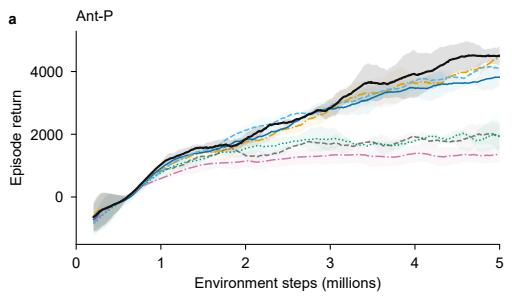

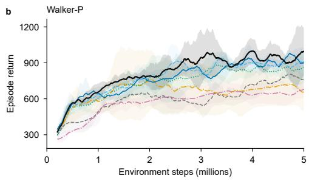

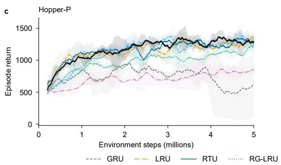

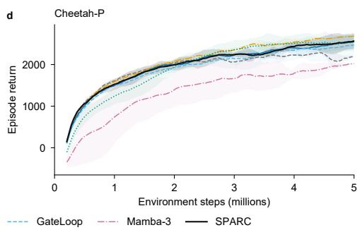  
Figure 5: Learning curves on Ant-P, Walker-P, Hopper-P, and Cheetah-P. Each curve averages three seed trajectories after applying a 100-rollout moving average within each seed. Shading denotes one sample standard deviation across the smoothed trajectories.

## E.1 ADAPTIVE PHASE

The retention-only variant sets $\lambda _ { j , t } = \rho _ { j , t } e ^ { i \theta _ { j } }$ , removing the input-dependent phase correction while retaining baseline rotation, adaptive retention, and the full write pathway. The phase controller still participates in the write gate.

Removing adaptive phase lowers Walker-P return from 994.79 to 837.70, RepeatFirst return from 0.829 to 0.756, and FordA accuracy from 96.68% to 96.03% (Table 8). These losses occur despite retaining selective forgetting and writing, indicating a contribution from input-dependent rotation on these tasks. The Walker-P difference has substantial seed variation $( - 1 5 \bar { 7 } . 0 9 \pm 2 3 3 . 4 6 )$ , however, and the retention-only variant improves UWave by 1.11 percentage points and RepeatPrevious by 0.083. Adaptive phase thus provides an additional useful control of memory evolution, with benefits that depend on the task.

Table 7: Selected component ablations.
<table><tr><td>Variant</td><td>RepeatFirst</td><td>Walker-P</td><td>FordA</td><td>CIFAR-10</td></tr><tr><td>SPARC</td><td>0.829</td><td>994.79</td><td>96.68</td><td>59.92</td></tr><tr><td>Neutral write gate</td><td>0.663</td><td>909.56</td><td>96.68</td><td>59.35</td></tr><tr><td>Linear content</td><td>0.123</td><td>921.90</td><td>96.12</td><td>59.46</td></tr><tr><td>Fixed write normalization</td><td>0.628</td><td>943.45</td><td>96.40</td><td>58.73</td></tr><tr><td>No phase clock</td><td>0.288</td><td>928.64</td><td>96.49</td><td>49.03</td></tr><tr><td>Retention-only transition</td><td>0.756</td><td>837.70</td><td>96.03</td><td>59.79</td></tr></table>

RepeatFirst and Walker-P: return; FordA and CIFAR-10: accuracy (%). Higher is better; best means are bold and second-best means underlined. Transition-only variants retain the original write pathway. Paired differences, sample spreads, and all variants are in Appendix E.

Table 8: Retention-only transition.
<table><tr><td>Task</td><td>SPARC</td><td>Variant</td><td>∆ (variant – SPARC)</td></tr><tr><td>Autoencode</td><td>-0.431,±, 0.003</td><td>−0.424,±, 0.023</td><td>0.007,±, 0.021</td></tr><tr><td>CountRecall</td><td>−0.515,±, 0.098</td><td>−0.493,±, 0.148</td><td>0.022,±, 0.051</td></tr><tr><td>RepeatFirst</td><td>0.829,±, 0.008</td><td>0.756,±, 0.051</td><td>−0.073,±, 0.058</td></tr><tr><td>RepeatPrevious</td><td>0.855,±, 0.033</td><td>0.938,±, 0.051</td><td>0.083,±, 0.019</td></tr><tr><td>Noisy Pendulum</td><td>0.461,±, 0.039</td><td>0.504,±, 0.053</td><td>0.043,±, 0.020</td></tr><tr><td>CartPole</td><td>0.959,±, 0.026</td><td>0.921,±, 0.016</td><td>-0.038,±, 0.010</td></tr><tr><td>HigherLower</td><td>0.500,±, 0.003</td><td>0.499,±, 0.001</td><td>-0.001,±, 0.003</td></tr><tr><td>Ant-P</td><td>4507.80,±, 292.89</td><td>4554.24,±, 319.76</td><td>46.44,±, 26.87</td></tr><tr><td>Walker-P</td><td>994.79,±, 198.05</td><td>837.70,±,112.75</td><td>-157.09,±,233.46</td></tr><tr><td>Hopper-P</td><td>1282.94,±, 78.06</td><td>1273.43,±, 81.61</td><td>-9.51,±, 153.98</td></tr><tr><td>Cheetah-P</td><td>2563.76,±, 184.38</td><td>2629.61,±, 3.15</td><td>65.85,±, 181.23</td></tr><tr><td>FordA</td><td>96.68,±, 0.28</td><td>96.03,±, 0.42</td><td>−0.65,±, 0.42</td></tr><tr><td>StarLightCurves</td><td>99.67,±, 0.58</td><td>99.67,±, 0.58</td><td>0.00,±, 1.00</td></tr><tr><td>UWave</td><td>96.30,±, 1.70</td><td>97.41,±, 0.64</td><td>1.11,±, 1.92</td></tr><tr><td>Permuted MNIST</td><td>96.87,±,0.11</td><td>96.93,±,0.17</td><td>0.06,±, 0.15</td></tr><tr><td>Seq. CIFAR-10 Gray</td><td>59.92,±, 1.41</td><td>59.79,±, 1.29</td><td>−0.13,±,0.17</td></tr></table>

Mean ± sample SD. Classification: accuracy (%); other tasks: return. ∆: paired variant − SPARC difference. Higher is better; the larger mean in each pair is bold.

## E.2 ADAPTIVE RETENTION

The phase-only variant uses exp $\left( - \nu _ { j } + i [ \theta _ { j } + ( 1 - e ^ { - \nu _ { j } } ) \kappa _ { p } p _ { t } ] \right)$ as its transition. Each mode keeps a learned, input-independent decay while its phase remains adaptive. The write gate and dynamic write normalization are retained. Because the phase clock also uses the baseline decay, this intervention removes both adaptive retention and its influence on the size of the phase correction.

Mean return decreases on all four continuous-control tasks, including Ant-P from 4507.80 to 3930.02 and Walker-P from 994.79 to 863.20 (Table 9). UWave accuracy falls from 96.30% to 91.85%, the largest classification loss. RepeatFirst also drops to 0.326, with a large sample standard deviation of 0.515. Adaptive phase and writing therefore do not fully compensate for removing retention control in these comparisons, although Autoencode, RepeatPrevious, and sequential CIFAR-10 obtain higher means with the phase-only transition.

## E.3 STATIC TRANSITION WITH ADAPTIVE WRITING

To test the value of adapting existing memory when writing is already adaptive, we fix the transition to $\lambda _ { j } = \exp ( - \nu _ { j } + i \theta _ { j } )$ . The modal spectrum remains trainable, and both shared controllers still regulate the write pathway. Thus, incoming information can be selected and scaled according to the input, while every stored contribution propagates through an input-independent transition.

Table 9: Phase-only transition.
<table><tr><td>Task</td><td>SPARC</td><td>Variant</td><td>∆ (variant − SPARC)</td></tr><tr><td>Autoencode</td><td>−0.431,±, 0.003</td><td>−0.424,±, 0.023</td><td>0.007,±, 0.021</td></tr><tr><td>CountRecall</td><td>−0.515,±, 0.098</td><td>−0.568,±, 0.229</td><td>−0.053,±, 0.131</td></tr><tr><td>RepeatFirst</td><td>0.829,±, 0.008</td><td>0.326,±, 0.515</td><td>−0.503,±, 0.522</td></tr><tr><td>RepeatPrevious</td><td>0.855,±, 0.033</td><td>0.902,±, 0.024</td><td>0.047,±, 0.056</td></tr><tr><td>Noisy Pendulum</td><td>0.461,±, 0.039</td><td>0.457,±, 0.097</td><td>−0.004,±, 0.102</td></tr><tr><td>CartPole</td><td>0.959,±, 0.026</td><td>0.947,±, 0.005</td><td>−0.012,±, 0.032</td></tr><tr><td>HigherLower</td><td>0.500,±, 0.003</td><td>0.498,±, 0.004</td><td>−0.002,±, 0.003</td></tr><tr><td>Ant-P</td><td>4507.80,±, 292.89</td><td>3930.02,±, 70.94</td><td>-577.78,±,363.83</td></tr><tr><td>Walker-P</td><td>994.79,±, 198.05</td><td>863.20,±, 111.82</td><td>-131.59,±, 104.36</td></tr><tr><td>Hopper-P</td><td>1282.94,±, 78.06</td><td>1220.37,±,80.70</td><td>-62.57,±, 139.22</td></tr><tr><td>Cheetah-P</td><td>2563.76,±,184.38</td><td>2535.70,±, 61.05</td><td>-28.06,±, 123.33</td></tr><tr><td>FordA</td><td>96.68,±, 0.28</td><td>95.48,±, 0.42</td><td>−1.20,±, 0.58</td></tr><tr><td>StarLightCurves</td><td>99.67,±, 0.58</td><td>99.00,±, 1.00</td><td>−0.67,±,0.58</td></tr><tr><td>UWave</td><td>96.30,±, 1.70</td><td>91.85,±, 2.80</td><td>−4.44,±, 2.94</td></tr><tr><td>Permuted MNIST</td><td>96.87,±, 0.11</td><td>96.77,±, 0.07</td><td>−0.10,±,0.06</td></tr><tr><td>Seq. CIFAR-10 Gray</td><td>59.92,±, 1.41</td><td>60.16,±, 1.45</td><td>0.24,±, 1.30</td></tr></table>

Mean ± sample SD. Classification: accuracy (%); other tasks: return. ∆: paired variant − SPARC difference. Higher is better; the larger mean in each pair is bold.

SPARC exceeds this variant on Ant-P (4507.80 versus 3794.64), RepeatFirst (0.829 versus 0.534), and UWave (96.30% versus 92.59%; Table 10). These comparisons provide empirical examples where adaptive writing alone does not recover the full model’s performance. The static transition nevertheless improves CountRecall and Noisy Pendulum, reaching −0.397 and 0.532, respectively, so the advantage of adapting memory propagation is not uniform across the recall and control tasks.

## E.4 RETENTION-COUPLED PHASE CLOCK

The phase clock scales the shared phase correction according to each mode’s current retention. Replacing $( 1 - \rho _ { j , t } ) \kappa _ { p } p _ { t }$ by $\kappa _ { p } p _ { t }$ removes this scaling, so even highly persistent modes receive the full correction. Adaptive retention, baseline rotation, and all write terms remain in place.

This change produces large losses across several task families (Table 11): RepeatFirst return falls from 0.829 to 0.288, Ant-P return from 4507.80 to 2848.36, and sequential CIFAR-10 accuracy from 59.92% to 49.03%. The CIFAR-10 paired difference is −10.89 ± 2.16 percentage points. In checkpoint diagnostics, the clock reduces RepeatFirst’s phase correction to 3.29% of its uncoupled value (Appendix F). Together with the retraining results, this supports limiting observation-driven rotation in persistent modes as a useful part of the phase-control design.

## E.5 INPUT DEPENDENCE OF THE PHASE CLOCK

The static-clock variant retains modal scaling of the phase correction but computes it from the learned baseline decay: $( 1 - e ^ { - \nu _ { j } } ) \kappa _ { p } p _ { t }$ Retention, the phase signal, and writing remain inputdependent. Comparing this variant with SPARC tests whether the phase scale benefits from following current retention; comparing it with the uncoupled variant distinguishes that effect from modal scaling itself.

On sequential CIFAR-10, a static clock reaches 59.68%, close to SPARC’s 59.92% and substantially above the uncoupled variant’s 49.03% (Tables 12 and 11). Baseline scaling therefore recovers most of the loss on this task. RepeatFirst shows a larger gap to SPARC (0.383 versus 0.829), although the static-clock result varies widely across seeds (0.547 sample SD). CountRecall improves to −0.389.

Table 10: Static transition.
<table><tr><td>Task</td><td>SPARC</td><td>Variant</td><td>∆ (variant – SPARC)</td></tr><tr><td>Autoencode</td><td>-0.431,±, 0.003</td><td>-0.441,±,0.019</td><td>−0.009,±, 0.016</td></tr><tr><td>CountRecall</td><td>−0.515,±, 0.098</td><td>−0.397,±, 0.161</td><td>0.119,±, 0.064</td></tr><tr><td>RepeatFirst</td><td>0.829,±, 0.008</td><td>0.534,±, 0.196</td><td>−0.294,±, 0.189</td></tr><tr><td>RepeatPrevious</td><td>0.855,±, 0.033</td><td>0.900,±, 0.077</td><td>0.045,±, 0.061</td></tr><tr><td>Noisy Pendulum</td><td>0.461,±, 0.039</td><td>0.532,±, 0.031</td><td>0.070,±, 0.050</td></tr><tr><td>CartPole</td><td>0.959,±, 0.026</td><td>0.949,±, 0.012</td><td>−0.010,±, 0.038</td></tr><tr><td>HigherLower</td><td>0.500,±, 0.003</td><td>0.499,±, 0.004</td><td>−0.001,±, 0.001</td></tr><tr><td>Ant-P</td><td>4507.80,±, 292.89</td><td>3794.64,±,383.71</td><td>−713.16,±,676.60</td></tr><tr><td>Walker-P</td><td>994.79,±, 198.05</td><td>884.66,±, 53.96</td><td>-110.13,±, 163.06</td></tr><tr><td>Hopper-P</td><td>1282.94,±, 78.06</td><td>1318.28,±, 203.47</td><td>35.34,±, 169.24</td></tr><tr><td>Cheetah-P</td><td>2563.76,±, 184.38</td><td>2557.46,±,147.79</td><td>-6.30,±, 36.60</td></tr><tr><td>FordA</td><td>96.68,±, 0.28</td><td>96.21,±,0.16</td><td>−0.46,±, 0.42</td></tr><tr><td>StarLightCurves</td><td>99.67,±, 0.58</td><td>99.67,±, 0.58</td><td>0.00,±, 1.00</td></tr><tr><td>UWave</td><td>96.30,±, 1.70</td><td>92.59,±, 2.31</td><td>−3.70,±, 0.64</td></tr><tr><td>Permuted MNIST</td><td>96.87,±, 0.11</td><td>96.87,±, 0.12</td><td>−0.01,±,0.18</td></tr><tr><td>Seq. CIFAR-10 Gray</td><td>59.92,±, 1.41</td><td>59.51,±,0.63</td><td>−0.41,±,0.87</td></tr></table>

Mean ± sample SD. Classification: accuracy (%); other tasks: return. ∆: paired variant − SPARC difference. Higher is better; the larger mean in each pair is bold.

Table 11: No phase clock.
<table><tr><td>Task</td><td>SPARC</td><td>Variant</td><td>∆ (variant – SPARC)</td></tr><tr><td>Autoencode</td><td>−0.431,±, 0.003</td><td>−0.454,±, 0.029</td><td>−0.022,±, 0.027</td></tr><tr><td>CountRecall</td><td>−0.515,±, 0.098</td><td>−0.627,±,0.151</td><td>−0.112,±,0.145</td></tr><tr><td>RepeatFirst</td><td>0.829,±, 0.008</td><td>0.288,±, 0.242</td><td>−0.541,±, 0.234</td></tr><tr><td>RepeatPrevious</td><td>0.855,±, 0.033</td><td>0.661,±, 0.120</td><td>−0.194,±,0.136</td></tr><tr><td>Noisy Pendulum</td><td>0.461,±, 0.039</td><td>0.384,±, 0.017</td><td>−0.077,±, 0.056</td></tr><tr><td>CartPole</td><td>0.959,±, 0.026</td><td>0.945,±, 0.008</td><td>−0.013,±, 0.018</td></tr><tr><td>HigherLower</td><td>0.500,±, 0.003</td><td>0.499,±, 0.002</td><td>-0.001,±, 0.002</td></tr><tr><td>Ant-P</td><td>4507.80,±, 292.89</td><td>2848.36,±, 945.33</td><td>-1659.44,±, 652.44</td></tr><tr><td>Walker-P</td><td>994.79,±, 198.05</td><td>928.64,±, 118.58</td><td>-66.16,±, 89.52</td></tr><tr><td>Hopper-P</td><td>1282.94,±, 78.06</td><td>1181.06,±, 87.00</td><td>-101.88,±,120.14</td></tr><tr><td>Cheetah-P</td><td>2563.76,±, 184.38</td><td>2440.37,±,80.43</td><td>-123.39,±, 103.95</td></tr><tr><td>FordA</td><td>96.68,±, 0.28</td><td>96.49,±,0.70</td><td>−0.18,±, 0.58</td></tr><tr><td>StarLightCurves</td><td>99.67,±, 0.58</td><td>99.33,±, 1.15</td><td>−0.33,±, 0.58</td></tr><tr><td>UWave</td><td>96.30,±, 1.70</td><td>96.30,±, 1.70</td><td>0.00,±, 2.22</td></tr><tr><td>Permuted MNIST</td><td>96.87,±, 0.11</td><td>96.44,±, 0.10</td><td>−0.43,±, 0.20</td></tr><tr><td>Seq. CIFAR-10 Gray</td><td>59.92,±, 1.41</td><td>49.03,±, 2.48</td><td>−10.89,±, 2.16</td></tr></table>

Mean ± sample SD. Classification: accuracy (%); other tasks: return. ∆: paired variant − SPARC difference. Higher is better; the larger mean in each pair is bold.

The additional benefit of following current retention is thus less consistent than the benefit of retaining a phase clock, particularly in classification.

Table 12: Static phase clock.
<table><tr><td>Task</td><td>SPARC</td><td>Variant</td><td>∆ (variant – SPARC)</td></tr><tr><td>Autoencode</td><td>-0.431,±, 0.003</td><td>−0.452,±, 0.015</td><td>−0.021,±,0.017</td></tr><tr><td>CountRecall</td><td>-0.515,±, 0.098</td><td>-0.389,±, 0.068</td><td>0.126,±, 0.081</td></tr><tr><td>RepeatFirst</td><td>0.829,±, 0.008</td><td>0.383,±, 0.547</td><td>−0.446,±, 0.555</td></tr><tr><td>RepeatPrevious</td><td>0.855,±, 0.033</td><td>0.845,±, 0.053</td><td>−0.010,±, 0.071</td></tr><tr><td>Noisy Pendulum</td><td>0.461,±, 0.039</td><td>0.413,±, 0.087</td><td>−0.048,±, 0.069</td></tr><tr><td>CartPole</td><td>0.959,±, 0.026</td><td>0.811,±,0.016</td><td>−0.148,±, 0.042</td></tr><tr><td>HigherLower</td><td>0.500,±, 0.003</td><td>0.499,±, 0.003</td><td>−0.001,±, 0.003</td></tr><tr><td>Ant-P</td><td>4507.80,±, 292.89</td><td>4155.32,±, 981.54</td><td>-352.48,±, 1274.43</td></tr><tr><td>Walker-P</td><td>994.79,±, 198.05</td><td>944.61,±, 116.43</td><td>—50.18,±, 256.05</td></tr><tr><td>Hopper-P</td><td>1282.94,±, 78.06</td><td>1263.91,±, 113.93</td><td>-19.04,±, 140.13</td></tr><tr><td>Cheetah-P</td><td>2563.76,±, 184.38</td><td>2628.95,±, 183.48</td><td>65.19,±, 0.90</td></tr><tr><td>FordA</td><td>96.68,±, 0.28</td><td>96.03,±, 0.97</td><td>−0.65,±, 1.12</td></tr><tr><td>StarLightCurves</td><td>99.67,±, 0.58</td><td>99.33,±, 1.15</td><td>−0.33,±, 0.58</td></tr><tr><td>UWave</td><td>96.30,±, 1.70</td><td>95.19,±, 1.70</td><td>−1.11,±,0.00</td></tr><tr><td>Permuted MNIST</td><td>96.87,±, 0.11</td><td>96.91,±, 0.28</td><td>0.03,±, 0.18</td></tr><tr><td>Seq. CIFAR-10 Gray</td><td>59.92,±, 1.41</td><td>59.68,±, 1.40</td><td>−0.24,±, 0.27</td></tr></table>

Mean ± sample SD. Classification: accuracy (%); other tasks: return. ∆: paired variant − SPARC difference. Higher is better; the larger mean in each pair is bold.

## E.6 MODAL WRITE GATE

We replace the modal gate $\sigma ( s _ { j } p _ { t } + v _ { j } r _ { t } )$ by its neutral value 1/2, preserving the reference write amplitude while removing each mode’s learned gating response to the shared controls. The transition, reference gain, and retention-dependent write normalization remain active. In the implementation and diagnostics, the equivalent normalized gate is 2σ $( s _ { j } p _ { t } + v _ { j } r _ { t } )$ , whose neutral value is one.

Neutralizing the gate lowers RepeatFirst return from 0.829 to 0.663 and Ant-P return from 4507.80 to 3942.01, while FordA remains at 96.68% (Table 13). The contrast between RepeatFirst and FordA also appears in the fitted models: with other write factors held fixed, gating multiplies recorded write energy by 1.816 on RepeatFirst and 1.011 on FordA. The retrained results and checkpoint measurements both indicate greater use of this pathway on RepeatFirst, where a neutral gate leaves a performance gap even after the remaining parameters are retrained.

## E.7 LEARNED REFERENCE WRITE GAIN

The reference gain sets the write amplitude of each mode at zero control, independently of its learned decay. We freeze $\beta _ { j }$ at initialization while continuing to train the spectrum, content projections, and dynamic write factors. The derived coordinate $\zeta _ { j }$ is still recomputed using Eq. (16); fixing $\zeta _ { j }$ would change the reference amplitude as the decay is trained and would test a different constraint.

With the reference gain frozen, Walker-P return decreases from 994.79 to 856.69, RepeatFirst from 0.829 to 0.721, and FordA accuracy from 96.68% to 96.12% (Table 14). Learning a persistent modal write scale thus remains useful even when writing already adapts to the input. The gain is less consequential on StarLightCurves and UWave, whose means are unchanged at the reported precision. RepeatPrevious instead improves to 0.907 with the gain frozen.

## E.8 RETENTION-DEPENDENT WRITE NORMALIZATION

The normalization links write amplitude to the current retention: persistent modes receive smaller writes, while stronger forgetting permits larger writes. We remove this dependence by replacing $\sqrt { ( 1 - e ^ { - 2 e _ { j , t } } ) / ( 1 - e ^ { - 2 \nu _ { j } } ) }$ with one in the implemented coordinates. Equivalently, the compact write uses $\sqrt { 1 - e ^ { - 2 \nu _ { j } } }$ in place of $\sqrt { 1 - \rho _ { j , t } ^ { 2 } }$ . The reference gain and gate remain trainable, and the zero-control amplitude is preserved.

Table 13: Neutral write gate.
<table><tr><td>Task</td><td>SPARC</td><td>Variant</td><td>∆ (variant − SPARC)</td></tr><tr><td>Autoencode</td><td>−0.431,±, 0.003</td><td>-0.430,±, 0.026</td><td>0.001,±, 0.025</td></tr><tr><td>CountRecall</td><td>−0.515,±, 0.098</td><td>−0.511,±,0.059</td><td>0.004,±, 0.073</td></tr><tr><td>RepeatFirst</td><td>0.829,±, 0.008</td><td>0.663,±, 0.067</td><td>−0.166,±, 0.074</td></tr><tr><td>RepeatPrevious</td><td>0.855,±, 0.033</td><td>0.867,±, 0.033</td><td>0.012,±, 0.001</td></tr><tr><td>Noisy Pendulum</td><td>0.461,±,0.039</td><td>0.425,±, 0.030</td><td>−0.036,±, 0.022</td></tr><tr><td>CartPole</td><td>0.959,±, 0.026</td><td>0.915,±, 0.078</td><td>−0.044,±, 0.104</td></tr><tr><td>HigherLower</td><td>0.500,±, 0.003</td><td>0.500,±, 0.003</td><td>−0.000,±, 0.002</td></tr><tr><td>Ant-P</td><td>4507.80,±, 292.89</td><td>3942.01,±, 65.70</td><td>—565.79,±,358.59</td></tr><tr><td>Walker-P</td><td>994.79,±, 198.05</td><td>909.56,±, 305.84</td><td>-85.23,±,276.07</td></tr><tr><td>Hopper-P</td><td>1282.94,±, 78.06</td><td>1316.95,±, 90.72</td><td>34.00,±, 162.90</td></tr><tr><td>Cheetah-P</td><td>2563.76,±, 184.38</td><td>2600.65,±, 69.98</td><td>36.89,±, 114.40</td></tr><tr><td>FordA</td><td>96.68,±, 0.28</td><td>96.68,±, 0.28</td><td>0.00,±,0.28</td></tr><tr><td>StarLightCurves</td><td>99.67,±, 0.58</td><td>99.67,±, 0.58</td><td>0.00,±, 0.00</td></tr><tr><td>UWave</td><td>96.30,±, 1.70</td><td>95.93,±, 2.31</td><td>−0.37,±, 0.64</td></tr><tr><td>Permuted MNIST</td><td>96.87,±, 0.11</td><td>96.86,±, 0.03</td><td>−0.02,±,0.10</td></tr><tr><td>Seq. CIFAR-10 Gray</td><td>59.92,±, 1.41</td><td>59.35,±, 1.78</td><td>−0.57,±, 0.40</td></tr></table>

Mean ± sample SD. Classification: accuracy (%); other tasks: return. ∆: paired variant − SPARC difference. Higher is better; the larger mean in each pair is bold.

Table 14: Frozen reference gain.
<table><tr><td>Task</td><td>SPARC</td><td>Variant</td><td>∆ (variant − SPARC)</td></tr><tr><td>Autoencode</td><td>-0.431,±, 0.003</td><td>−0.447,±,0.024</td><td>−0.016,±, 0.021</td></tr><tr><td>CountRecall</td><td>−0.515,±, 0.098</td><td>−0.613,±,0.114</td><td>−0.098,±, 0.051</td></tr><tr><td>RepeatFirst</td><td>0.829,±, 0.008</td><td>0.721,±, 0.016</td><td>−0.107,±, 0.024</td></tr><tr><td>RepeatPrevious</td><td>0.855,±, 0.033</td><td>0.907,±, 0.031</td><td>0.052,±, 0.052</td></tr><tr><td>Noisy Pendulum</td><td>0.461,±, 0.039</td><td>0.464,±, 0.031</td><td>0.003,±, 0.041</td></tr><tr><td>CartPole</td><td>0.959,±, 0.026</td><td>0.950,±, 0.027</td><td>−0.009,±, 0.000</td></tr><tr><td>HigherLower</td><td>0.500,±, 0.003</td><td>0.500,±, 0.003</td><td>−0.000,±, 0.001</td></tr><tr><td>Ant-P</td><td>4507.80,±, 292.89</td><td>4353.05,±, 19.52</td><td>-154.75,±,312.41</td></tr><tr><td>Walker-P</td><td>994.79,±, 198.05</td><td>856.69,±, 55.47</td><td>-138.11,±,146.46</td></tr><tr><td>Hopper-P</td><td>1282.94,±, 78.06</td><td>1226.34,±, 229.83</td><td>-56.60,±, 300.35</td></tr><tr><td>Cheetah-P</td><td>2563.76,±, 184.38</td><td>2623.83,±, 83.09</td><td>60.07,±, 101.30</td></tr><tr><td>FordA</td><td>96.68,±, 0.28</td><td>96.12,±,0.28</td><td>−0.55,±, 0.00</td></tr><tr><td>StarLightCurves</td><td>99.67,±, 0.58</td><td>99.67,±, 0.58</td><td>0.00,±, 1.00</td></tr><tr><td>UWave</td><td>96.30,±, 1.70</td><td>96.30,±, 1.70</td><td>0.00,±, 0.00</td></tr><tr><td>Permuted MNIST</td><td>96.87,±, 0.11</td><td>96.69,±, 0.36</td><td>−0.18,±,0.36</td></tr><tr><td>Seq. CIFAR-10 Gray</td><td>59.92,±, 1.41</td><td>59.72,±, 1.65</td><td>−0.20,±, 0.27</td></tr></table>

Mean ± sample SD. Classification: accuracy (%); other tasks: return. ∆: paired variant − SPARC difference. Higher is better; the larger mean in each pair is bold.

The largest continuous-control loss occurs on Ant-P, from 4507.80 to 2983.48, with substantial variation across seeds (Table 15). RepeatFirst falls from 0.829 to 0.628, and sequential CIFAR-10 accuracy from 59.92% to 58.73%; CountRecall improves to −0.452. The losses support coordinating writing with retention beyond the adjustment available through the learned gain and gate. This interpretation concerns control of write amplitude: correlated inputs and adaptive coefficients prevent a general constant-variance interpretation of the normalization.

Table 15: Fixed write normalization.
<table><tr><td>Task</td><td>SPARC</td><td>Variant</td><td>∆ (variant – SPARC)</td></tr><tr><td>Autoencode</td><td>−0.431,±, 0.003</td><td>−0.477,±,0.021</td><td>−0.045,±, 0.019</td></tr><tr><td>CountRecall</td><td>-0.515,±, 0.098</td><td>−0.452,±, 0.036</td><td>0.063,±, 0.077</td></tr><tr><td>RepeatFirst</td><td>0.829,±, 0.008</td><td>0.628,±, 0.049</td><td>-0.200,±, 0.057</td></tr><tr><td>RepeatPrevious</td><td>0.855,±, 0.033</td><td>0.878,±, 0.065</td><td>0.023,±, 0.037</td></tr><tr><td>Noisy Pendulum</td><td>0.461,±, 0.039</td><td>0.366,±, 0.145</td><td>-0.095,±, 0.133</td></tr><tr><td>CartPole</td><td>0.959,±, 0.026</td><td>0.891,±, 0.065</td><td>-0.067,±, 0.039</td></tr><tr><td>HigherLower</td><td>0.500,±, 0.003</td><td>0.501,±, 0.004</td><td>0.000,±, 0.001</td></tr><tr><td>Ant-P</td><td>4507.80,±, 292.89</td><td>2983.48,±, 1285.42</td><td>-1524.33,±, 992.53</td></tr><tr><td>Walker-P</td><td>994.79,±, 198.05</td><td>943.45,±, 63.39</td><td>-51.34,±, 158.83</td></tr><tr><td>Hopper-P</td><td>1282.94,±, 78.06</td><td>1242.74,±, 103.53</td><td>-40.20,±, 43.20</td></tr><tr><td>Cheetah-P</td><td>2563.76,±, 184.38</td><td>2407.62,±, 144.89</td><td>−156.14,±,39.49</td></tr><tr><td>FordA</td><td>96.68,±, 0.28</td><td>96.40,±, 1.11</td><td>−0.28,±,1.27</td></tr><tr><td>StarLightCurves</td><td>99.67,±, 0.58</td><td>99.33,±, 0.58</td><td>−0.33,±, 1.15</td></tr><tr><td>UWave</td><td>96.30,±, 1.70</td><td>96.30,±, 0.64</td><td>0.00,±, 1.92</td></tr><tr><td>Permuted MNIST</td><td>96.87,±, 0.11</td><td>96.89,±, 0.17</td><td>0.02,±,0.10</td></tr><tr><td>Seq. CIFAR-10 Gray</td><td>59.92,±, 1.41</td><td>58.73,±, 1.90</td><td>−1.19,±, 0.63</td></tr></table>

Mean ± sample SD. Classification: accuracy (%); other tasks: return. ∆: paired variant − SPARC difference. Higher is better; the larger mean in each pair is bold.

## E.9 CONTENT NONLINEARITY AND SATURATION

Replacing tanh content with the identity removes the bound on projected input amplitudes while preserving both controller nonlinearities and all transition and write factors. This tests whether bounding new content helps learning within the same adaptive recurrence.

On RepeatFirst, mean return falls from 0.829 to 0.123, and the linear variant’s sample standard deviation rises to 0.857 (Table 16). The fitted SPARC model is also strongly saturated on this task: (95.73±1.79)% of real and imaginary content activations exceed 0.95 in magnitude, compared with (3.01 ± 0.15)% on FordA. Bounding content therefore materially changes the write pathway used on RepeatFirst, although these diagnostics alone do not explain the variation between runs. Linear content remains effective elsewhere, improving permuted MNIST from 96.87% to 97.07% and StarLightCurves from 99.67% to 100.00%. These gains show that bounded content is not necessary for strong classification performance with the adaptive recurrence.

## E.10 AGGREGATE COMPARISON AND CONTROL DIMENSIONALITY

To summarize performance across tasks with different score scales, we rank each candidate against the same six baseline methods using unrounded means and competition ranks, then average with equal weight over the 16 tasks. SPARC obtains the lowest mean rank, 1.9375, with the retention-only variant closest at 2.0625. This small aggregate gap is consistent with the phase ablation: adaptive phase contributes on particular tasks, while selective retention alone remains a strong alternative.

Table 16: Linear content.
<table><tr><td>Task</td><td>SPARC</td><td>Variant</td><td>∆ (variant – SPARC)</td></tr><tr><td>Autoencode</td><td>−0.431,±, 0.003</td><td>-0.442,±,0.012</td><td>-0.011,±,0.009</td></tr><tr><td>CountRecall</td><td>−0.515,±, 0.098</td><td>−0.465,±, 0.060</td><td>0.050,±, 0.081</td></tr><tr><td>RepeatFirst</td><td>0.829,±, 0.008</td><td>0.123,±, 0.857</td><td>−0.705,±, 0.865</td></tr><tr><td>RepeatPrevious</td><td>0.855,±, 0.033</td><td>0.867,±, 0.070</td><td>0.012,±,0.041</td></tr><tr><td>Noisy Pendulum</td><td>0.461,±, 0.039</td><td>0.425,±, 0.060</td><td>-0.037,±, 0.079</td></tr><tr><td>CartPole</td><td>0.959,±, 0.026</td><td>0.944,±, 0.001</td><td>−0.015,±, 0.027</td></tr><tr><td>HigherLower</td><td>0.500,±, 0.003</td><td>0.500,±, 0.002</td><td>-0.000,±, 0.001</td></tr><tr><td>Ant-P</td><td>4507.80,±, 292.89</td><td>4143.82,±, 100.87</td><td>-363.98,±, 393.76</td></tr><tr><td>Walker-P</td><td>994.79,±, 198.05</td><td>921.90,±, 52.32</td><td>−72.89,±, 157.41</td></tr><tr><td>Hopper-P</td><td>1282.94,±, 78.06</td><td>1242.39,±, 107.85</td><td>-40.55,±, 70.63</td></tr><tr><td>Cheetah-P</td><td>2563.76,±, 184.38</td><td>2594.39,±, 31.84</td><td>30.63,±, 152.54</td></tr><tr><td>FordA</td><td>96.68,±, 0.28</td><td>96.12,±, 0.00</td><td>−0.55,±, 0.28</td></tr><tr><td>StarLightCurves</td><td>99.67,±,0.58</td><td>100.00,±, 0.00</td><td>0.33,±, 0.58</td></tr><tr><td>UWave</td><td>96.30,±, 1.70</td><td>96.30,±, 1.70</td><td>0.00,±, 2.94</td></tr><tr><td>Permuted MNIST</td><td>96.87,±,0.11</td><td>97.07,±, 0.10</td><td>0.19,±, 0.03</td></tr><tr><td>Seq. CIFAR-10 Gray</td><td>59.92,±, 1.41</td><td>59.46,±, 1.06</td><td>−0.46,±, 0.50</td></tr></table>

Mean ± sample SD. Classification: accuracy (%); other tasks: return. ∆: paired variant − SPARC difference. Higher is better; the larger mean in each pair is bold.

Removing the phase clock gives the largest deterioration in mean rank (3.5000); using a static clock partially recovers performance (2.8750). Phase-only and static transitions obtain 3.1875 and 2.5625. Among write interventions, neutral gates, frozen reference gains, linear content, and fixed normalization obtain 2.3750, 2.6250, 2.5000, and 3.1250, respectively. The full design therefore gives the strongest aggregate performance in this panel, even though individual variants improve some tasks. The per-task differences and seed spreads remain necessary for interpreting these ranks.

All measured variants use shared control. Two shared projections require 2(D + 1) parameters, compared with 2H(D + 1) for separate controllers per complex mode. Since the unshared variant was not run, this parameter comparison describes the structural saving; the ablations establish the roles of components within SPARC, without measuring the performance cost of sharing itself.

## F CHECKPOINT AND TRAINING DIAGNOSTICS

## F.1 SAMPLING, AGGREGATION, AND DIAGNOSTIC CONVENTIONS

Checkpoint replay uses a fixed environment stream from reset for the first 1024 RL steps, or the first eight internal-validation examples and all four classification layers. Statistics are averaged within each independently trained run before aggregating runs. Diagnostics use the same three training seeds as the ablations. Recorded-input interventions hold the observed input stream fixed.

We measure the normalized gate $2 \sigma ( s _ { j } p _ { t } + v _ { j } r _ { t } )$ , reference gain $e ^ { \beta _ { j } }$ , and dynamic gain ratio $\sqrt { ( 1 - e ^ { - 2 e _ { j , t } } ) / ( 1 - e ^ { - 2 \nu _ { j } } ) }$ . The product of the last two factors excludes the gate. A gate value of one is neutral. Entries are run means; temporal standard deviations are calculated within each fragment before run-level aggregation.

## F.2 GATE ACTIVITY AND CONTENT SATURATION

The gate and content activation regulate different aspects of writing. The normalized gate can attenuate or amplify projected content, while tanh bounds each real and imaginary activation. Table 17 combines their activity statistics with their effects on write energy. Gate energy compares the original write with a neutral gate; content energy compares tanh with linear content while retaining the same gate and gain weights.

RepeatFirst combines substantial gate variation with $( 9 5 . 7 3 \pm 1 . 7 9 ) $ % content saturation. Its gate increases recorded write energy by a factor of 1.816, whereas tanh retains only 0.76% of the corresponding linear-content energy. FordA has much weaker gate variation and retains 51.45% of linear-content energy. These measurements describe how trained models use the write pathway; the retrained comparisons in Appendix E test whether other parameters compensate when a component is removed.

Table 17: Write-gate activity and content saturation.
<table><tr><td>Task</td><td>Gate SD</td><td>Saturation (%)</td><td>Gate ratio</td><td>Content (%)</td></tr><tr><td>Autoencode</td><td>0.0913, ±, 0.0299</td><td>32.67, ±, 3.70</td><td>1.171</td><td>15.49</td></tr><tr><td>CountRecall</td><td>0.0426, ±, 0.0274</td><td>23.50, ±, 5.50</td><td>1.252</td><td>25.38</td></tr><tr><td>RepeatFirst</td><td>0.4508, ±, 0.0382</td><td>95.73, ±, 1.79</td><td>1.816</td><td>0.76</td></tr><tr><td>RepeatPrevious</td><td>0.0081, ±, 0.0013</td><td>31.52, ±, 4.34</td><td>1.244</td><td>16.43</td></tr><tr><td>Noisy Pendulum</td><td>0.0890, ±, 0.0203</td><td>75.65, ±, 1.48</td><td>1.079</td><td>4.23</td></tr><tr><td>CartPole</td><td>0.0072, ±, 0.0015</td><td>28.33, ±, 5.32</td><td>1.149</td><td>26.49</td></tr><tr><td>HigherLower</td><td>0.0028, ±, 0.0015</td><td>0.01, ±, 0.02</td><td>1.014</td><td>75.86</td></tr><tr><td>Ant-P</td><td>0.0075, ±, 0.0060</td><td>0.74, ±, 0.93</td><td>1.020</td><td>58.37</td></tr><tr><td>Walker-P</td><td>0.0044, ±, 0.0007</td><td>1.20, ±, 0.77</td><td>1.026</td><td>55.15</td></tr><tr><td>Hopper-P</td><td>0.0148, ±, 0.0078</td><td>9.82, ±, 2.93</td><td>1.128</td><td>34.79</td></tr><tr><td>Cheetah-P</td><td>0.0146, ±, 0.0020</td><td>6.09, ±, 0.79</td><td>1.032</td><td>42.82</td></tr><tr><td>FordA</td><td>0.0082, ±, 0.0044</td><td>3.01, ±, 0.15</td><td>1.011</td><td>51.45</td></tr><tr><td>StarLightCurves</td><td>0.0131, ±, 0.0020</td><td>1.04, ±, 0.72</td><td>1.004</td><td>55.66</td></tr><tr><td>UWave</td><td>0.0223, ±, 0.0037</td><td>4.45, ±, 1.42</td><td>1.050</td><td>47.08</td></tr><tr><td>Permuted MNIST</td><td>0.0094, ±, 0.0024</td><td>2.66, ±, 0.57</td><td>1.006</td><td>57.53</td></tr><tr><td>Seq. CIFAR-10 Gray</td><td>0.0132, ±, 0.0018</td><td>3.33, ±, 1.30</td><td>1.008</td><td>48.01</td></tr></table>

Gate SD is the per-mode temporal standard deviation. Gate ratio and content (%) report write-energy ratios. Gate variability and saturation report run means ± sample SD. Saturation is the fraction of real/imaginary activations with magnitude above 0.95. Energy ratios hold the other write factors fixed.

## F.3 STATIC AND DYNAMIC WRITE SCALES

The reference gain sets a fixed scale for each mode at a checkpoint, while the dynamic gain ratio responds to retention. Their effects on writing depend on the content reaching each mode. For RepeatFirst, the mean reference gain is 3.574, the dynamic gain ratio is 0.324, and their mean product is 1.153; the corresponding FordA values are 0.289, 0.702, and 0.203. The dynamic normalization scales the recorded write energy to 21.2% of its value without this factor on RepeatFirst and 59.2% on FordA.

## F.4 RETENTION AND PHASE ACTIVITY

Table 18 relates the two shared controls to their effects on the existing state. The decay multiplier rescales the learned baseline decay. History-energy survival is the summed energy after the transition divided by the previous-state energy; its baseline comparison uses the same states and learned spectrum. The phase offset is the mean absolute additional rotation. The clock ratio compares the coupled phase offset with the corresponding uncoupled offset.

RepeatFirst retains 99.12% of the recorded previous-state energy per step while its clock reduces the phase correction to 3.29% of the uncoupled value. Ant-P instead retains 17.71% and has a clock ratio of 45.33%. Shared controls thus produce different temporal responses across tasks and modes, consistent with the distinct removal effects in Appendix E.

Table 18: Retention and phase activity.
<table><tr><td>Task</td><td>Decay scale</td><td>Surv. (%)</td><td>Rel. surv.</td><td>Phase (deg)</td><td>Clock (%)</td></tr><tr><td>Autoencode</td><td>2.769</td><td>63.99</td><td>1.039</td><td>30.553</td><td>38.05</td></tr><tr><td>CountRecall</td><td>0.708</td><td>80.46</td><td>1.114</td><td>17.901</td><td>25.30</td></tr><tr><td>RepeatFirst</td><td>0.255</td><td>99.12</td><td>1.091</td><td>2.963</td><td>3.29</td></tr><tr><td>RepeatPrevious</td><td>0.223</td><td>84.66</td><td>1.584</td><td>6.026</td><td>9.74</td></tr><tr><td>Noisy Pendulum</td><td>4.416</td><td>54.92</td><td>0.967</td><td>30.287</td><td>41.12</td></tr><tr><td>CartPole</td><td>0.623</td><td>67.66</td><td>1.210</td><td>17.442</td><td>22.16</td></tr><tr><td>HigherLower</td><td>1.801</td><td>54.09</td><td>0.864</td><td>17.852</td><td>43.13</td></tr><tr><td>Ant-P</td><td>2.762</td><td>17.71</td><td>0.465</td><td>5.492</td><td>45.33</td></tr><tr><td>Walker-P</td><td>1.782</td><td>46.55</td><td>0.892</td><td>13.414</td><td>42.92</td></tr><tr><td>Hopper-P</td><td>2.856</td><td>46.14</td><td>0.860</td><td>33.468</td><td>45.57</td></tr><tr><td>Cheetah-P</td><td>2.261</td><td>35.86</td><td>0.708</td><td>20.096</td><td>49.86</td></tr><tr><td>FordA</td><td>0.591</td><td>95.15</td><td>1.043</td><td>0.776</td><td>3.00</td></tr><tr><td>StarLightCurves</td><td>1.216</td><td>91.40</td><td>0.991</td><td>1.778</td><td>5.77</td></tr><tr><td>UWave</td><td>0.895</td><td>94.86</td><td>1.024</td><td>1.459</td><td>4.02</td></tr><tr><td>Permuted MNIST</td><td>0.590</td><td>96.21</td><td>1.032</td><td>0.623</td><td>2.97</td></tr><tr><td>Seq. CIFAR-10 Gray</td><td>0.520</td><td>96.23</td><td>1.042</td><td>0.581</td><td>2.56</td></tr></table>

Run-averaged statistics on recorded inputs. Decay scale multiplies the baseline decay; survival measures history energy and is divided by baseline survival in the relative column. Phase is the absolute additional rotation; clock is the coupled-to-uncoupled phase ratio.

## F.5 FIXED-INPUT INTERVENTIONS

We intervene at trained checkpoints while holding the parameters and recorded inputs fixed. Neutralizing the gate gives a mean policy KL divergence of 1.7050 on RepeatFirst, compared with 0.0014 on Walker-P; the prediction-distribution KL on FordA is 0.0009. Removing the phase clock gives larger changes of 5.4257, 5.2410, and 3.9080, respectively. These measurements describe the fitted model’s response to each intervention. The retrained ablations in Appendix E evaluate the corresponding effects on task performance.

## F.6 DEPTH AND TRAINING EVOLUTION

Layer statistics retain all four classification layers and average eight examples within each run. Training diagnostics compare the first and last 10% of common finite logged environment-step positions, without extrapolation, endpoint rescaling, or treating checkpoints as independent runs. Component activity varies with depth. In FordA, content saturation falls from 9.02% in layer one to 0.75% in layer four, while the temporal standard deviation of the gain ratio rises from 0.1056 to 0.3239. In UWave, the temporal standard deviation of the normalized gate increases from 0.0119 to 0.0315 across the same layers.

During RepeatFirst training, logged saturation rises from 54.152% to 95.625%, gate standard devi ation from 0.331 to 0.735, and state RMS from 2.666 to 22.638. HigherLower shows much weaker gate variation (0.008 to 0.010). The logged gate standard deviation differs from the per-mode temporal statistic used in checkpoint replay. The retrained linear-content ablation evaluates its effect on task performance.

## G GPU IMPLEMENTATION DETAILS

Algorithm 1 divides time into chunks $\mathcal { C } _ { k } = [ s _ { k } , e _ { k } ]$ and modes into M tiles, indexed by m. The affine updates $F _ { t , m }$ are reconstructed from the shared controls within each tile; Θ denotes the recurrent parameters.

```latex
Algorithm 1 Chunked scan with backward replay.
Input: shared controls, writes, h<sub>0</sub>, chunks $\{ \mathcal { C } _ { k } \} _ { k = 1 } ^ { K }$
Output: $\mathbf { h } _ { 1 : T } , \nabla \Theta$
▶ FORWARD PASS
1: parallel for $( k , m ) \in [ K ] \times [ M ] \colon \quad S _ { k , m } \gets \mathrm { C o m p o s e } ( F c _ { k } , m )$
2: parallel for $m \in [ M ] \colon \quad { \widehat { S } } _ { 1 : K , m } \gets \operatorname { P r e f i x S c a n } ( S _ { 1 : K , m } )$
3: parallel for $\begin{array} { r } { ( k , \underline { { m } } ) \in [ K ] \times [ M ] : \quad \mathbf { h } _ { { \mathscr { n } } _ { k } , m } \gets \mathrm { R e p l a y } ( F _ { { \mathscr { C } } _ { k } , m } , \widehat S _ { k - 1 , m } ( \mathbf { h } _ { 0 , m } ) ) } \end{array}$
▶ BACKWARD PASS
4: parallel for $( k , m ) \in [ K ] \times [ M ] \colon \ \widetilde { S } _ { k , m } \gets \mathrm { A d j o i n t S u m m a r y } ( \mathcal { C } _ { k } , m )$
5: parallel for $m \in [ M ] \colon \ \bar { \mathbf { h } } _ { e _ { 1 : K } , m } \gets \mathrm { R e v e r s e S c a n } ( \widetilde { S } _ { 1 : K , m } )$
6: parallel for $( k , m ) \in [ \underline { { K } } ] \times [ \dot { | M | } ] \colon \quad ( \bar { \mathbf { h } } _ { s _ { k } - 1 , m } , \Delta \Theta _ { k , m } ) \gets \mathrm { A d j o i n t R e p l a y } ( \mathcal { C } _ { k } , m , \bar { \mathbf { h } } _ { e _ { k } , m } )$
7: $\nabla \Theta \gets \operatorname { R e d u c e } _ { k , m } \bigl ( \bar { \Delta { \Theta _ { k , m } ^ { - } } } \bigr ) ^ { - }$
```

Coefficient generation and layout. The complex state is stored in separate real and imaginary arrays. The two controller projections are evaluated once per token in FP32, producing $B \times T$ arrays for $r _ { t }$ and $p _ { t }$ . Content projections run in parallel over tokens and modes. Each modal tile broadcasts the controls and loads its spectral and write parameters. Content activation, retention-dependent normalization, modal gating, and real–imaginary write conversion are fused into one tiled operation with the layout required by the scan.

Chunk summaries and replay. A GPU program assigned to a time chunk and a modal tile reconstructs the transitions and composes the local updates using Eq. (10). It writes one complex-affine summary $( P _ { k } , Q _ { k } )$ per chunk. A prefix scan gives the state entering each chunk, and local replay produces the complete state sequence. Episode resets set the transition to zero at the reset position, as in Eq. (25). In Algorithm $1 , \widehat { S } _ { 0 , m }$ is the identity map and h<sup>¯</sup> denotes a state cotangent.

Backward computation and storage. Each chunk forms a reverse summary of its cotangent propagation. A reverse scan supplies boundary cotangents, and local reverse replay reconstructs transitions and accumulates gradients. Modal contributions are reduced before updating the two token-level control gradients. The scan retains the state outputs needed by BPTT and recomputes transition coefficients during summary and replay. Static spectral values can be cached per mode, and scalar functions of the controls per token. The write backward operation recomputes content activations, the normalization ratio, and the gate from saved inputs and controls, then reduces parameter gradients over token tiles.

Precision and online execution. Inputs and visible outputs may use BF16. Controller projections, spectral parameters, exponentials, trigonometric functions, complex-affine summaries, recurrent accumulation, and reverse adjoints use FP32. Conversion to output precision occurs at write-back boundaries. For an online step, one fused kernel evaluates the two controls, reconstructs the transition and write, updates the real and imaginary states, and emits the visible activation and next FP32 state.

## G.1 EFFICIENCY BENCHMARK PROTOCOL

Both implementations use matched tensor shapes, BF16 inputs and outputs, FP32 recurrent accumulation, and gradients for inputs and parameters. The scan benchmark takes precomputed recurrent coefficients as input. The complete-mixer benchmark includes control and coefficient generation, recurrent propagation, and their backward computations. Surrounding projection layers, normalization, feed-forward blocks, loss evaluation, optimizer updates, and multi-GPU communication are outside the timed region. Memory results compare peak allocated GPU memory for the matched training workloads.

The benchmark dimensions are mixer width $d _ { \mathrm { m i x } } .$ , batch size $B _ { \mathrm { b a t c h } }$ , and sequence length T. Figure 4(a) uses $B _ { \mathrm { b a t c h } } = 8$ and $d _ { \operatorname* { m i x } } = 1 0 2 4$ , varying T from 2048 to 16384. Panels (b) and (c) fix $B _ { \mathrm { b a t c h } } T = 8 1 9 2$ at widths 2048 and 2560. Panel (d) fixes $T = 2 0 4 8$ and $d _ { \operatorname* { m i x } } = 2 0 4 8$ , varying batch size from 1 to 32.

For complete recurrent-mixer forward and backward computation, the fixed-token configurations are

$$
( B _ { \mathrm { b a t c h } } , T ) \in \{ ( 4 , 2 0 4 8 ) , ( 2 , 4 0 9 6 ) , ( 1 , 8 1 9 2 ) \} , \qquad B _ { \mathrm { b a t c h } } T = 8 1 9 2 .\tag{41}
$$

Latency reductions divide by the RG-LRU time at each matched configuration. The plotted bar heights instead use the width-specific RG-LRU time at $T = 2 0 4 8$ as a common denominator. The batch sweep fixes $T = 2 0 4 8$ and $d _ { \operatorname* { m i x } } = 2 0 4 8 ;$ its latency ratio crosses one between batch sizes 2 and 4 and is approximately 0.6 at batch sizes 8 and above. Peak allocated-memory ratios are approximately 0.85–0.87 for most batch sizes.

## G.2 PERFORMANCE COMPARED WITH A NAIVE IMPLEMENTATION

To quantify the computational benefit of the accelerated kernels, we compare the SPARC mixer with an eager PyTorch implementation of the same recurrence. The naive implementation computes the control and write terms, unbinds the time axis once, and propagates the state sequentially; PyTorch automatic differentiation supplies the backward pass. Identical parameters, input tensors, and output cotangents are used for each pair. Both paths accept BF16 inputs, return BF16 outputs, accumulate recurrent states in FP32, and compute input and parameter gradients. An NVIDIA RTX PRO 6000 Blackwell Server Edition GPU runs the measurements with PyTorch 2.8.0, CUDA 12.8, and Triton 3.4.0. After one warmup iteration, three timed iterations yield the reported medians. CUDA synchronization brackets the forward and backward stages, with each backward pass consuming a freshly constructed forward graph. Compilation is excluded, and speedups use the ratio of unrounded naive and accelerated medians.

At a fixed budget of 8192 tokens, longer sequences increase the cost of sequential execution substantially (Table 19). For width 2048, naive backward latency rises from 238.730 ms at $T = 2 0 4 8$ to 967.711 ms at $T = 8 1 9 2$ , while the accelerated measurements range from 0.911 to 1.289 ms. The resulting backward speedups span 194.81–1061.91×. Width 2560 exhibits a similar trend: its backward speedup increases from 218.45× to 888.98× over the same sequence lengths. Across both widths, combined forward–backward speedups range from 137.13× to 869.62×. The measured gains show the practical benefit of the accelerated execution paths for full-sequence differentiation.

Table 19: SPARC versus its naive implementation at a fixed budget of 8192 tokens.
<table><tr><td></td><td></td><td></td><td colspan="3">Backward</td><td colspan="3">Forward + backward</td></tr><tr><td>B</td><td> $T$ </td><td> $d _ { \mathrm { m i x } }$ </td><td>Naive</td><td>Accel.</td><td>Speedup</td><td>Naive</td><td>Accel.</td><td>Speedup</td></tr><tr><td>4</td><td>2048</td><td>2048</td><td>238.730</td><td>1.225</td><td>194.81×</td><td>358.822</td><td>2.617</td><td>137.13×</td></tr><tr><td>2</td><td>4096</td><td>2048</td><td>479.999</td><td>1.289</td><td>372.50×</td><td>721.780</td><td>2.510</td><td>287.54×</td></tr><tr><td>1</td><td>8192</td><td>2048</td><td>967.711</td><td>0.911</td><td>1061.91×</td><td>1469.467</td><td>1.690</td><td>869.62×</td></tr><tr><td>4</td><td>2048</td><td>2560</td><td>236.191</td><td>1.081</td><td>218.45×</td><td>358.953</td><td>1.824</td><td>196.78×</td></tr><tr><td>2</td><td>4096</td><td>2560</td><td>489.609</td><td>1.105</td><td>442.89×</td><td>740.985</td><td>1.846</td><td>401.39×</td></tr><tr><td>1</td><td>8192</td><td>2560</td><td>969.447</td><td>1.091</td><td>888.98×</td><td>1500.917</td><td>1.847</td><td>812.84×</td></tr></table>

Times are medians in milliseconds. Speedups divide the naive time by the accelerated time for the same configuration.

Increasing batch size at fixed $T \ : = \ : 2 0 4 8$ and $d _ { \operatorname* { m i x } } = 2 0 4 8$ produces a different scaling pattern (Table 20). Naive backward latency remains within 228.853–265.053 ms, whereas the accelerated path grows from 0.853 ms at B = 1 to 5.614 ms at $B = 3 2$ . Backward acceleration therefore falls from 268.35× to $4 7 . 2 1 \times$ between these endpoints. Combined speedup reaches 230.69× at $B = 4$ and remains 45.68× at $B = 3 2$ Together, the two sweeps demonstrate substantial acceleration across the tested sequence lengths and batch sizes, with the largest measured gains occurring in long-sequence, small-batch configurations.

Table 20: SPARC versus its naive implementation across batch sizes, with $T = 2 0 4 8$ and $d _ { \operatorname* { m i x } } =$ 2048.
<table><tr><td></td><td colspan="3">Backward</td><td colspan="3">Forward + backward</td></tr><tr><td>B</td><td>Naive</td><td>Accel.</td><td>Speedup</td><td>Naive</td><td>Accel.</td><td>Speedup</td></tr><tr><td>1</td><td>228.853</td><td>0.853</td><td>268.35×</td><td>344.970</td><td>1.900</td><td>181.56×</td></tr><tr><td>2</td><td>240.696</td><td>0.942</td><td>255.42×</td><td>361.919</td><td>2.026</td><td>178.67×</td></tr><tr><td>4</td><td>236.798</td><td>0.890</td><td>265.99×</td><td>355.549</td><td>1.541</td><td>230.69×</td></tr><tr><td>8</td><td>239.711</td><td>1.710</td><td>140.21×</td><td>365.954</td><td>2.548</td><td>143.62×</td></tr><tr><td>16</td><td>244.437</td><td>3.044</td><td>80.31×</td><td>366.240</td><td>4.570</td><td>80.15×</td></tr><tr><td>32</td><td>265.053</td><td>5.614</td><td>47.21×</td><td>390.188</td><td>8.542</td><td>45.68×</td></tr></table>

Times are in milliseconds. The fixed-token and batch sweeps are measured in separate runs.

## G.3 NUMERICAL AGREEMENT WITH THE NAIVE REFERENCE

Numerical validation uses an independent PyTorch reference that explicitly constructs the complex transition and write terms, advances the state through a sequential loop, and obtains derivatives through automatic differentiation. With $( B , T , d _ { \mathrm { m i x } } ) \stackrel { \smile } { = } ( 2 , 6 \dot { 4 } , 3 2 )$ and FP32 inputs, the accelerated mixer uses the chunked scan backend (chunk size 32). Nonzero random controller and write-gate parameters exercise input-dependent retention, phase, and writing. Both implementations receive matching parameters, inputs, and output cotangents, allowing direct comparison of the forward output, input gradient, and recurrent parameter gradients.

For each tensor z, agreement is summarized by the maximum absolute error and an error normalized by the reference magnitude:

$$
E _ { \mathrm { a b s } } = \Vert z _ { \mathrm { a c c e l } } - z _ { \mathrm { r e f } } \Vert _ { \infty } , \qquad E _ { \mathrm { n o r m } } = \frac { E _ { \mathrm { a b s } } } { \operatorname* { m a x } ( 1 , \Vert z _ { \mathrm { r e f } } \Vert _ { \infty } ) } .\tag{42}
$$

The denominator keeps the normalization bounded for reference tensors with small magnitude. Table 21 reports both measures for the output and each active gradient block. Acceptance thresholds are $2 \times \mathrm { 1 \bar { 0 } ^ { - 5 } }$ for output absolute error and $1 0 ^ { - 4 }$ for normalized gradient error.

Forward outputs agree to a maximum absolute error of $5 . 6 6 \times 1 0 ^ { - 7 } .$ , and the input-gradient normalized error is $\mathrm { { \dot { 5 } } } . 2 8 \times 1 0 ^ { - 7 }$ . Among parameter gradients, the largest normalized error is $1 . 4 3 \times 1 0 ^ { - 6 }$ for the retention controller. The log-phase gradient has the largest absolute discrepancy, $7 . 6 3 \times 1 0 ^ { - 5 }$ with a normalized error of $6 . 5 8 \times 1 0 ^ { - 7 } .$ The normalized errors for all reported outputs and gradients lie between $1 . 2 7 \times 1 0 ^ { - 7 }$ and $1 . 4 3 \times 1 0 ^ { - 6 }$ , approximately one to twelve times the FP32 machine epsilon, consistent with the accumulated rounding error induced by the different floatingpoint evaluation orders of the length-64 sequential recurrence and the chunked scan, and demonstrating agreement between the accelerated computation and the independently differentiated reference within FP32 numerical precision.

Table 21: Numerical agreement between the accelerated SPARC mixer and the naive reference.
<table><tr><td>Quantity</td><td>Maximum absolute error</td><td>Normalized error</td></tr><tr><td>Forward output</td><td> $5 . 6 6 \times 1 0 ^ { - 7 }$ </td><td> $5 . 6 6 \times 1 0 ^ { - 7 }$ </td></tr><tr><td>Input gradient</td><td> $2 . 0 3 \times 1 0 ^ { - 6 }$ </td><td> $5 . 2 8 \times 1 0 ^ { - 7 }$ </td></tr><tr><td>Log-decay parameter gradient</td><td> $4 . 7 7 \times 1 0 ^ { - 6 }$ </td><td> $1 . 1 7 \times 1 0 ^ { - 6 }$ </td></tr><tr><td>Log-phase parameter gradient</td><td> $7 . 6 3 \times 1 0 ^ { - 5 }$ </td><td> $6 . 5 8 \times 1 0 ^ { - 7 }$ </td></tr><tr><td>Phase-controller gradient</td><td> $6 . 6 8 \times 1 0 ^ { - 6 }$ </td><td> $7 . 0 9 \times 1 0 ^ { - 7 }$ </td></tr><tr><td>Retention-controller gradient</td><td> $3 . 0 5 \times 1 0 ^ { - 5 }$ </td><td> $1 . 4 3 \times 1 0 ^ { - 6 }$ </td></tr><tr><td>Log-write-gain gradient</td><td> $1 . 4 3 \times 1 0 ^ { - 6 }$ </td><td> $3 . 3 2 \times 1 0 ^ { - 7 }$ </td></tr><tr><td>Write-phase-response gradient</td><td> $2 . 3 8 \times 1 0 ^ { - 7 }$ </td><td> $2 . 3 8 \times 1 0 ^ { - 7 }$ </td></tr><tr><td>Write-retention-response gradient</td><td> $1 . 2 7 \times 1 0 ^ { - 7 }$ </td><td> $1 . 2 7 \times 1 0 ^ { - 7 }$ </td></tr></table>