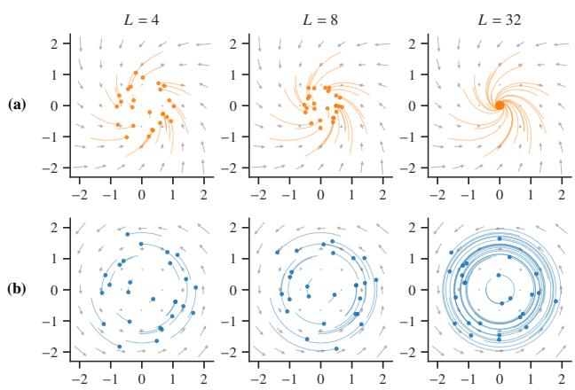
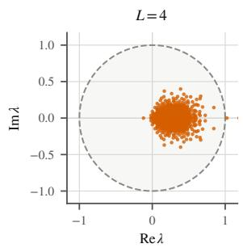
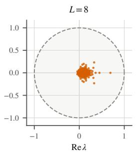
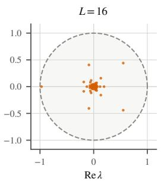
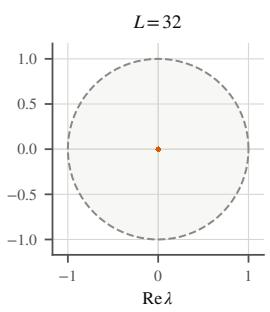
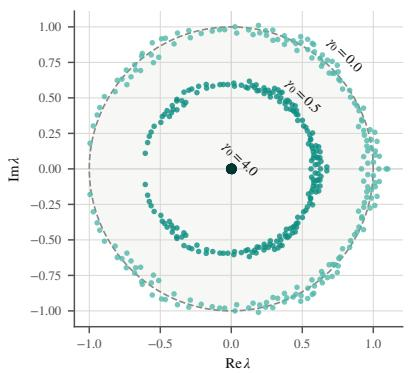
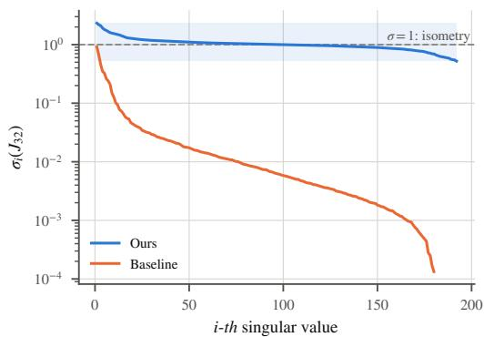
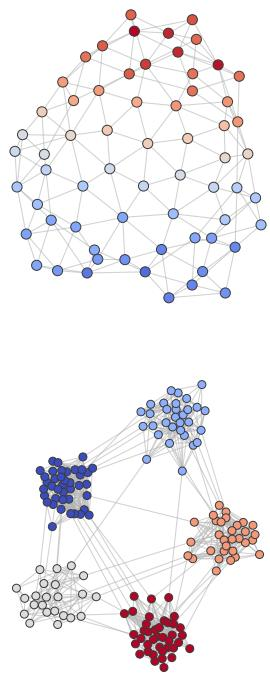
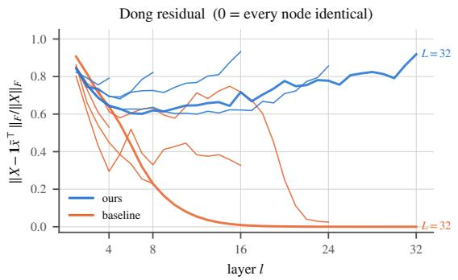
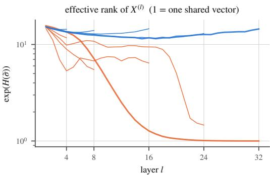

# STABLE TRANSFORMERS FOR GRAPH GENERATION

Luca Miglior∗ † Alessio Gravina∗ Davide Bacciu Department of Computer Science, University of Pisa, Italy

## ABSTRACT

Graph generative models increasingly rely on Graph Transformers (GT) to capture complex dependencies among nodes and edges. While deeper architectures should provide greater expressive capacity and a broader receptive field, their effectiveness can decline with depth: repeated self-attention progressively contracts node representations, impeding information flow and gradient propagation. We analyse this phenomenon from a dynamical systems perspective, focusing on how the denoiser’s spectral dynamics affect graph generation. We show that standard GT denoisers become increasingly dissipative as depth grows, leading to vanishing gradients and representation collapse. To isolate the effect of these dynamics, we construct a permutation-equivariant GT with inherently stable, non-dissipative transport. We also introduce a damping mechanism that continuously interpolates between non-dissipative and increasingly contractive regimes, enabling a direct assessment of how dissipation influences generation. Experiments on synthetic and molecular graph generation benchmarks show that the gap between these regimes widens with depth: non-dissipative dynamics preserve representation diversity and gradient flow, sustaining strong generative performance, whereas greater contraction progressively impairs it. These findings identify the denoiser’s dynamical regime as a key design factor for deep graph generative models.

## 1 INTRODUCTION

Learning to generate graphs is central to a wide range of problems in which both the entities and their relations must be modeled jointly, such as in biology and life science (Li et al., 2026). Recent graph generative models have advanced substantially, with diffusion- and flow-matching-based approaches emerging as particularly effective frameworks (Vignac et al., 2023; Qin et al., 2025; Liu et al., 2024a; Jo et al., 2022; Hou et al., 2024; Eijkelboom et al., 2024; Jang et al., 2024; Carballo-Castro et al., 2026; Zhao et al., 2024; Luo et al., 2026). A common trait of these methods is their increasing reliance on expressive Graph Transformer (GT) models (Shi et al., 2021; Dwivedi & Bresson, 2021), making the architecture’s properties crucial to generation. Greater depth is especially appealing because it increases expressive capacity, enriches representations, and allows information to propagate farther across the graph, potentially capturing longer-range dependencies. However, a wider receptive field does not necessarily ensure effective long-range communication. Although stacking layers progressively enlarges the receptive field, the influence of distant nodes can rapidly fade because of over-smoothing (Cai & Wang, 2020; Oono & Suzuki, 2020; Rusch et al., 2023) and over-squashing (Alon & Yahav, 2021; Topping et al., 2022; Giovanni et al., 2023; Mishayev et al., 2025), both closely linked to vanishing gradients (Arroyo et al., 2025). Similar effects have been observed in Transformers (Vaswani et al., 2017), where repeated self-attention can progressively reduce representation diversity and drive token representations toward low-rank or collapsed states (Dong et al., 2021; Noci et al., 2022). In graph generation, tokens represent nodes whose distinct identities are essential to reconstructing graph structure. Increasing depth may therefore weaken the very information that additional layers are meant to propagate. This leads to our central question: to what extent is the behavior of a deep Graph Transformer determined by the dynamical regime underpinning its layers?

We address this question from a dynamical-systems perspective and show that standard selfattention contracts representations along the node axis. Repeated composition consequently attenuates the information encoded in differences between nodes. To the best of our knowledge, this is the first work to directly connect the dissipative dynamics of Graph Transformer denoisers to graph generation quality. Our analysis identifies stable and non-dissipative node dynamics as a principled design criterion for graph generative models which preserve information across layers, allowing graph generative models to exploit depth more effectively.

Building on this insight, we replace the contractive attention map with a Cayley-based orthogonal nodemixing operator. Acting directly on the node dimension, the operator is guaranteed to be orthogonal by construction and prevents systematic contraction across layers (see Figure 1). This yields a simple drop-in replacement for standard self-attention in existing GT denoisers, leaving the surrounding generative framework and procedure unchanged. Our approach also interpolates continuously between nondissipative and increasingly contractive regimes, enabling us to isolate the role of vanishing gradients in deep GTs. By varying contraction strength, we track how information and node representations evolve with depth, while the pure non-dissipative regime allows us to assess whether

  
Figure 1: Illustration of node-state trajectories across depth $L .$ (a) Under a standard Graph Transformer denoiser, node states spiral into a single point and node-specific information is lost. (b) Under non-dissipative orthogonal transport (ours), node states rotate while keeping their norms and remain distinct.

preserving signal propagation sustains long-range interactions. Our experiments show that these differences become increasingly pronounced as depth grows: non-dissipative dynamics retain strong generative performance, whereas contractive dynamics progressively degrade it.

Contributions. Our main contributions are threefold. (i) In Section 2.3, we provide, to the best of our knowledge, the first study connecting the dissipative dynamics of Graph Transformer denois ers to graph generation quality. We show that standard self-attention progressively contracts node representations with depth, leading to the loss of node-specific information and vanishing gradients. (ii) In Section 3, we introduce a simple drop-in modification of the Graph Transformer node-mixing operator based on the Cayley transform. The resulting transport is non-dissipative by construction, preserves permutation equivariance, and can be integrated into existing GT-based generative models without modifying their training objective or sampling procedure. (iii) Finally, in Section 4, we systematically control the amount of dissipation in discrete flow-matching graph generation and establish its effect on generation quality. The advantage of non-dissipative dynamics grows with depth: contractive denoisers degrade and eventually collapse as layers are added, while non-dissipative ones continue to benefit from them.

## 2 BACKGROUND AND RELATED WORK

## 2.1 DISCRETE FLOW MATCHING FOR GRAPH GENERATION

Score- and diffusion-based models have recently become prominent approaches to graph generation through iterative denoising of node and edge states. Such methods differ in how this generative process is instantiated: GDSS (Jo et al., 2022) evolves continuous graph representations through score-based stochastic dynamics, whereas DiGress (Vignac et al., 2023) performs diffusion directly over categorical node and edge attributes. Flow Matching (FM) (Lipman et al., 2023) instead learns a transport dynamics along a prescribed probability path, with Discrete Flow Matching (Gat et al., 2024; Campbell et al., 2024) extending this principle to discrete state spaces. Despite these differences, recent graph generative models commonly rely on GT to parameterize the evolution of node and edge states, making multi-head attention a shared architectural component across otherwise dis tinct generative formulations. Within this landscape, we adopt DeFoG (Qin et al., 2025) because of its robustness, efficiency and compatibility with discrete graph structures.

Let $\mathcal { G } _ { t } = ( \nu , X _ { t } , E _ { t } )$ ) denote the graph state at time $t \in [ 0 , 1 ]$ , where V contains N nodes and $X _ { t } , E _ { t }$ represent categorical node and edge states. Following DeFoG, we define a factorized conditional path $p _ { t \mid 1 } ( \mathcal { G } _ { t } \mid \mathcal { G } _ { 1 } )$ that describes intermediate states conditioned on a clean target graph $\mathcal { G } _ { 1 }$

$$
p _ { t | 1 } ( \mathcal { G } _ { t } \mid \mathcal { G } _ { 1 } ) = \prod _ { i = 1 } ^ { N } p _ { t | 1 } ^ { X } ( x _ { t } ^ { i } \mid x _ { 1 } ^ { i } ) \prod _ { 1 \leq i < j \leq N } p _ { t | 1 } ^ { E } ( e _ { t } ^ { i j } \mid e _ { 1 } ^ { i j } ) ,\tag{1}
$$

where each factor interpolates between the corresponding source distribution and the clean state:

$$
p _ { t | 1 } ^ { Z } ( z _ { t } \mid z _ { 1 } ) = ( 1 - t ) p _ { 0 } ^ { Z } ( z _ { t } ) + t \delta _ { z _ { 1 } } ( z _ { t } ) , \qquad Z \in \{ X , E \} .\tag{2}
$$

Here, $\delta _ { z _ { 1 } }$ denotes a point mass at $z _ { 1 } .$ Averaging the conditional path over $\mathcal { G } _ { 1 } \sim p _ { \mathrm { d a t a } }$ yields a marginal path $p _ { t }$ that connects source noise at $t = 0$ to the data distribution at $t = 1$

Generation follows this path through a continuous-time Markov chain (CTMC), with transition rates governing jumps between categorical states. For each node or edge variable,

$$
\operatorname* { P r } ( z _ { t + h } = z ^ { \prime } \mid \mathcal { G } _ { t } ) = \delta _ { z _ { t } } ( z ^ { \prime } ) + h R _ { t } ^ { \theta } ( z _ { t } , z ^ { \prime } ; \mathcal { G } _ { t } ) + o ( h ) .\tag{3}
$$

The rates $R _ { t } ^ { \theta }$ are computed by averaging the conditional transition rates over the predicted cleanstate marginal $p _ { 1 | t } ^ { \theta } ( z _ { 1 } ^ { \star } \mid \mathcal { G } _ { t } )$ . The denoiser is trained with standard cross-entropy to predict these marginals for all nodes and edges, conditioned on the current graph. We analyse its architecture as a dynamical system across network depth, while retaining DeFoG’s training objective and CTMC generation framework as the foundation of our contribution.

Literature methods, such as Vignac et al. (2023); Huang et al. (2023); Jo et al. (2024); Qin et al. (2025); Eijkelboom et al. (2024); Luo et al. (2026), typically parametrize the denoising network as a GT with standard multi-head self-attention (Vaswani et al., 2017). In each layer, head h propagates information between nodes through an attention matrix $A ^ { ( \ell , h ) } \in \mathbb { R } ^ { N \times N }$ . For node representations $\pmb { X } ^ { ( \ell ) } \in \mathbb { R } ^ { N \times d }$ , the layer computes

$$
X ^ { ( \ell + 1 ) } = \mathrm { F F } ( \mathrm { L a y e r N o r m } ( X ^ { ( \ell ) } + \bigoplus A ^ { ( \ell , h ) } X ^ { ( \ell ) } W _ { V } ^ { ( \ell , h ) } ) ) ,\tag{4}
$$

where ${ W _ { V } ^ { ( \ell , h ) } \in \mathbb { R } ^ { d \times d } }$ is the value projection matrix for layer ℓ and head $h ,$ and $\oplus$ denotes head aggregation (e.g., concatenation). An output projection combines the head outputs before the residual connections, normalization, and feed-forward blocks. Softmax normalization makes every attention matrix row-stochastic: $A ^ { ( \ell , h ) } \geq 0$ entrywise and $\pmb { A } ^ { ( \ell , h ) } \mathbf { 1 } = \mathbf { 1 }$ . Therefore, each head forms convex combinations of node values. This averaging behaviour motivates our analysis of how repeated attention transforms representations across network depth.

## 2.2 EFFECTIVE INFORMATION PROPAGATION

Several studies (Haber & Ruthotto, 2017; Chen et al., 2018; Chang et al., 2019; Poli et al., 2019; Gravina et al., 2023; Arroyo et al., 2025) analyse information propagation by interpreting neural networks as discretized dynamical systems governed by differential equations. From this perspective, network layers correspond to successive steps of a numerical scheme for solving the differential equation: each layer transformation represents one step in the evolution of the underlying continuous dynamical system. Information preservation and propagation are governed by the system Jacobian (Ascher & Petzold, 1998; Haber & Ruthotto, 2017):

$$
J = \prod _ { \ell = 1 } ^ { L } { \frac { \partial { \pmb x } ^ { ( \ell ) } } { \partial { \pmb x } ^ { ( \ell - 1 ) } } } = \prod _ { \ell = 1 } ^ { L } J _ { \ell }\tag{5}
$$

where L is the number of neural layers and $\pmb { x } ^ { ( \ell ) }$ is the state vector at layer ℓ. The singular values of the Jacobian quantify directional changes in representation space. Specifically, values below one attenuate perturbations and promote vanishing gradients, whereas values above one amplify them and promote exploding gradients. Across many layers, even mild contraction or expansion can therefore produce substantial signal attenuation or amplification.

We distinguish three regimes. Dynamics are dissipative when representations progressively contract and information decays through composition, typically because eigenvalues lie strictly inside the unit circle; smaller magnitude implies faster modes decay. Dynamics are unstable when eigenvalues lie outside the unit circle, amplifying perturbations across layers. Stability therefore requires eigenvalues to remain within the unit circle, but does not by itself guarantee information preservation: a stable system may still be strongly dissipative and rapidly forget its input as depth increases. Finally, non-dissipative dynamics occupies the boundary regime in which the relevant eigenvalues lie on the unit circle, preventing asymptotic information decay.

Vanishing gradients have been extensively studied in sequence modeling (Bengio, 1994; Hochreiter & Schmidhuber, 1997; Pascanu et al., 2013), motivating architectures that preserve information over long sequences (Arjovsky et al., 2016; Henaff et al., 2016; Orvieto et al., 2023; Gu et al., 2022; Gu & Dao, 2023). More recently, analogous principles have been applied to graph learning (Gravina et al., 2023; Arroyo et al., 2025), where contractive spectral structures can cause severe gradient vanishing and information loss. These findings show that effective long-range modeling depends on preserving signal strength through non-dissipative dynamics. However, whether similar spectral phenomena arise in graph generative models, and how they affect the denoising dynamics with increasing depth, remains largely unexplored.

## 2.3 DEEP GRAPH TRANSFORMERS SUFFER FROM RANK-COLLAPSE

In this section, we argue why the class of GTs commonly used as denoisers in graph generative models are prone to vanishing gradients and relate this behavior to the spectral contraction of their dynamics.

Recent works (Dong et al., 2021; Noci et al., 2022; Saada et al., 2025) have studied signal propagation in Transformers through rank collapse, where token representations become increasingly aligned with depth. In particular, Dong et al. (2021) showed that pure self-attention networks converge to rank-one representations. This phenomenon affects not only forward dynamics but also gradient propagation. Noci et al. (2022) showed that increasing token alignment causes vanishing gradients in the query and key parameters. More recently, Saada et al. (2025) provided a spectral characterization of this behavior, showing that the spectral gap induced by softmax attention promotes rank collapse and degrades gradient propagation. These findings link the mechanisms driving representation collapse in deep Transformers to their ability to propagate informative signal and gradients effectively. In Graph Transformers, where tokens represent nodes (Shi et al., 2021;

  
Figure 2: Jacobian spectra of the GT by Vignac et al. (2023) for different number of layers L.

Dwivedi & Bresson, 2021), this degeneration directly impairs information propagation across the graph. As node representations progressively collapse with increasing depth, the model becomes less sensitive to node-specific information, making the dynamics increasingly dissipative. In this scenario, Arroyo et al. (2025) show that the contractive nature of graph propagation can jointly cause feature collapse and vanishing gradients, limiting both the influence of distant nodes and modeling of node dependencies. Moreover, Zhao et al. (2023) show that deeper GTs face an attention-capacity bottleneck that increasingly restricts their ability to identify and propagate information from relevant graph substructures. Together, these results indicate that greater depth can induce increasingly contractive dynamics that hinder effective information propagation in GTs.

  
(a) Jacobian eigenvalue spectra for different $\gamma .$

  
(b) Jacobian singular values at $L = 3 2 .$  
Figure 3: Spectral behavior of SGT. (a) Jacobian eigenvalue spectra of SGT with $L = 8$ for different values of $\gamma$ . Increasing γ progressively moves the spectrum from the unit circle into increasingly contractive regimes. (b) Jacobian singular values at $L = 3 2$ for SGT and GT proposed by Qin et al. (2025).

We empirically examine this behavior through the Jacobian spectrum in Figure 2 for the GT introduced by Vignac et al. (2023), which is representative of the Transformer-based denoisers used in recent graph generative models, e.g., Qin et al. (2025); Eijkelboom et al. (2024); Luo et al. (2026). Shallow models retain Jacobian eigenvalues of substantial magnitude across layers, whereas increasing depth progressively drives them toward zero, indicating stronger contraction and vanishing gradients. As a result, deep GT denoisers struggle to propagate gradients and preserving node-specific information.

## 3 CONTROLLING GRAPH TRANSFORMER DYNAMICS

The preceding analysis characterized deep Transformer dynamics in terms of information propagation on graphs. We now build on this perspective to design a Graph Transformer with stable, non-dissipative propagation. We enforce a near-orthogonal Jacobian, with singular values close to one, to preserve the norms of forward and backward gradients across discrete composition of layers. The architecture must also retain graph-dependent interactions and permutation equivariance, ensuring that propagation depends on the graph structure but not on node ordering. These principles define our S-Graph Transformer (SGT), introduced next.

## 3.1 S-GRAPH TRANSFORMER

The core idea is to replace the contractive node mixing of the standard GT with a graph-dependent orthogonal propagation operator. We construct it from a skew-symmetric attention-score matrix, whose Cayley transform is guaranteed to be orthogonal (Cayley, 1846; Helfrich et al., 2018), thereby enforcing non-dissipative dynamics.

Let $\mathbf { X } ^ { ( \ell ) } \in \mathbb { R } ^ { N \times d }$ denote the node representations at layer ℓ, with edge representations $\mathbf { E } ^ { ( \ell ) }$ and a conditioning vector $\mathbf { y } ^ { ( \ell ) }$ containing the time-level and graph-level conditioning information described in Section 2, and described in detail in Appendix B. We split the node channels into H heads, writing $\mathbf { X } ^ { ( \ell , h ) } \in \mathbb { R } ^ { N \times d _ { h } }$ , where $d _ { h } = d / H$ . All equations below are defined over the N active nodes.

Let $\mathbf { S } ^ { ( \ell , h ) }$ be the attention-score matrix at layer ℓ and head $h ,$ obtained from the query-key interactions before softmax normalization. We define the skew-symmetric attention-score matrix1 ${ \bf K } ^ { ( \ell , h ) }$ as

$$
\mathbf { K } ^ { ( \ell , h ) } = \frac { \varepsilon _ { \ell , h } ( \mathbf { y } ^ { ( \ell ) } ) } { 2 \sqrt { N } } \left( \mathbf { S } ^ { ( \ell , h ) } - \mathbf { S } ^ { ( \ell , h ) \top } \right) ,\tag{6}
$$

where $\varepsilon _ { \ell , h }$ is a learned gate applied to the conditioning vector, and the scaling factor adjusts its magnitude to the graph size. We then apply the Cayley transform

$$
\begin{array} { r } { \mathbf { R } ^ { ( \ell , h ) } = \mathrm { c a y } ( \mathbf { K } ^ { ( \ell , h ) } ) : = \left( \mathbf { I } - \frac { 1 } { 2 } \mathbf { K } ^ { ( \ell , h ) } \right) ^ { - 1 } \left( \mathbf { I } + \frac { 1 } { 2 } \mathbf { K } ^ { ( \ell , h ) } \right) . } \end{array}\tag{7}
$$

This transform maps ${ \bf K } ^ { ( \ell , h ) }$ to the orthogonal attention-score matrix $\mathbf { R } ^ { ( \ell , h ) 2 }$ , which acts as the nodepropagation operator. The output of head h is

$$
\mathbf { Z } ^ { ( \ell , h ) } = \mathbf { R } ^ { ( \ell , h ) } \mathbf { X } ^ { ( \ell , h ) } \mathbf { C } ^ { ( \ell , h ) } ,\tag{8}
$$

where $\mathbf { C } ^ { ( \ell , h ) } = \mathrm { c a y } ( \mathbf { W } ^ { ( \ell , h ) } )$ is an orthogonal channel mixing matrix, obtained by applying the Cayley transform to the learnable skew-symmetric weight matrix $\mathbf { W } ^ { ( \ell , h ) }$ . The head outputs are then combined as

$$
\tilde { \mathbf { X } } ^ { ( \ell ) } = \mathrm { C o n c a t } _ { h = 1 } ^ { H } \big ( \mathbf { Z } ^ { ( \ell , h ) } \big ) \mathbf { O } ^ { ( \ell ) } + f _ { \ell } ( \mathbf { y } ^ { ( \ell ) } )\tag{9}
$$

$$
{ \bf X } ^ { ( \ell + 1 ) } = \tilde { { \bf X } } ^ { ( \ell ) } + \alpha _ { \ell } \mathrm { F F N } _ { \ell } \big ( \mathrm { L N } ( \tilde { { \bf X } } ^ { ( \ell ) } ) \big )\tag{10}
$$

where $\mathbf { O } ^ { ( \ell ) }$ is either the identity or a Cayley-parametrized orthogonal matrix that mixes channels across heads, $\alpha _ { \ell }$ is a learned scalar, and $f _ { \ell }$ linearly transforms the conditioning vector. A final node LayerNorm is applied before the output Feed Forward Neural Network.

## 3.2 GUARANTEES OF ORTHOGONAL TRANSPORT

We now establish the main properties of the orthogonal transport defined above.

Non-dissipative propagation. The Cayley-based construction prevents information from progressively decaying across layers. Because both node propagation and channel-mixing are orthogonal, the transport map preserves signal norms throughout the network. The following result formalizes this property and characterizes the Jacobian spectrum.

Theorem 3.1 (Isometric node transport). Consider the attention submap in Equation (9) restricted to active nodes, with edge and global inputs fixed and the attention scores used in the attention branch. Its node Jacobian $\mathbf { J } _ { \ell }$ is orthogonal:

$$
\mathbf { J } _ { \boldsymbol { \ell } } ^ { \top } \mathbf { J } _ { \boldsymbol { \ell } } = \mathbf { I } , \qquad \sigma _ { i } ( \mathbf { J } _ { \boldsymbol { \ell } } ) = 1 , \qquad | \lambda _ { i } ( \mathbf { J } _ { \boldsymbol { \ell } } ) | = 1 .\tag{11}
$$

Therefore, products of these conditional transport Jacobians preserve the norms of perturbations and backpropagated gradients at every depth.

The proof is in Appendix A.1. By Section 2.2, the proposed transport lies in the non-dissipative regime and therefore preserves information and gradient propagation across depth. Figure 3 shows the resulting Jacobian spectrum.

Permutation equivariance. Orthogonalizing the node propagation must preserve a fundamental property of graph architectures: equivariance to node relabeling. Cayley-based construction, retains, in fact, this property. Intuitively, the result follows from the fact that node relabeling conjugates the attention scores, the skew-symmetric generator, and the corresponding Cayley map by the same permutation matrix, while the remaining channel-wise and node-wise operations commute with the relabeling. Orthogonalizing the propagation operator therefore preserves the GT’s permutation equivariance. We show the complete proof in Appendix A.3.

## 3.3 CONTROLLING SGT DYNAMICS

To assess how dissipation affects generation, we introduce a mechanism that continuously interpolates between non-dissipative and increasingly contractive regimes while keeping the rest of the architecture fixed. Specifically, we define a nonnegative damping parameter $\gamma$ that shifts the skewsymmetric matrix in Equation (7) before the Cayley transform:

$$
{ \bf R } _ { \gamma } ^ { ( \ell , h ) } = \mathrm { c a y } \big ( { \bf K } ^ { ( \ell , h ) } - \gamma { \bf I } \big ) , \qquad \gamma = \frac { \gamma _ { 0 } } { L } ,\tag{12}
$$

where L is the number of layers and $\gamma _ { 0 } \geq 0$ sets the total dissipation across depth. Thus, $\gamma _ { 0 } = 0$ recovers the orthogonal transport above, whereas larger values progressively make the dynamics more contractive. Figure 3a illustrates the corresponding change in the Jacobian spectrum.

The spectral effect of damping follows directly from the Cayley transform. Without damping, the eigenvalues of $\mathbf { K } ^ { ( \ell , h ) }$ map to the unit circle; shifting by −γI moves the spectrum into the left halfplane, placing the Cayley transform inside the unit circle. The following result characterizes this transition.

Proposition 3.2 (Controlled dissipation). Let K be the skew-symmetric attention score matrix from Equation (6). For each eigenvalue iω of K, the corresponding eigenvalue of ${ \bf R } _ { \gamma } = \mathrm { c a y } ( { \bf K } - \gamma { \bf I } )$ is

$$
r _ { \gamma } ( \omega ) = \frac { 1 - \gamma / 2 + \mathrm { i } \omega / 2 } { 1 + \gamma / 2 - \mathrm { i } \omega / 2 } , \qquad | r _ { \gamma } ( \omega ) | ^ { 2 } = \frac { ( 1 - \gamma / 2 ) ^ { 2 } + \omega ^ { 2 } / 4 } { ( 1 + \gamma / 2 ) ^ { 2 } + \omega ^ { 2 } / 4 } .\tag{13}
$$

The matrix $\mathbf { R } _ { \gamma }$ is normal, and its singular values are $| r _ { \gamma } ( \omega ) |$

The proof is given in Appendix A.2. Proposition 3.2 shows that $\gamma _ { 0 }$ directly controls the transport operator’s spectral contraction, enabling systematic variation of attenuation across depth without changing the rest of the architecture.

## 4 HOW DOES DISSIPATIVITY AFFECT GRAPH GENERATION?

Our analysis so far identifies dissipation as a constraint on deep GTbased denoisers. We now shift from comparing architectures to a more direct question: how does the denoiser’s dynamical regime affect graph generation? We address this question by varying dissipation and depth jointly while keeping the surrounding flow-matching framework unchanged.

Setup. We empirically study how dissipativity and denoiser depth influence graph generation, following established experimental protocols (Luo et al., 2026; Qin et al., 2025; Siraudin et al., 2025; Vignac et al., 2023). We use SGT, introduced in Section 3.1, as the denoising backbone within DeFoG’s discrete flow matching framework, retaining its training objective and CTMC sampling procedure. For a fair comparison, we retrain all DeFoG baselines reported below using the public implementation and best-performing hyperparameters. We evaluate DeFoG and SGT with progressively deeper GTs. Using De-FoG as a strong Transformer baseline lets us assess how each method benefits from greater depth and isolate the contribution of orthogonal node transport. Results for the remaining baselines are taken from Qin et al. (2025). Further baseline details are in Appendix B.1.

Datasets and Metrics. We evaluate structural validity and distri  
butional agreement on two synthetic benchmarks and two molecu  
lar generation tasks, using the metrics of Qin et al. (2025). For the   
Planar and SBM synthetic datasets (Martinkus et al., 2022), we report   
V.U.N, the fraction of simultaneously valid, unique, and novel graphs,   
and Ratio, the average generated-to-test MMD across graph statis  
tics, normalized by the corresponding mean training-to-test MMD.   
For molecular generation, we use ZINC250k (Irwin et al., 2012) and   
MOSES (Polykovskiy et al., 2020), measuring validity, uniqueness, and distributional agreement via Frechet ChemNet Distance (FCD). Additional metrics for both molecular benchmarks are in via Frechet ChemNet Distance (FCD). Additional metrics for both Appendix B.2. Appendix B.2.

Figure 4: Graphs generated by SGT on Planar (top) and SBM (bottom)

## 4.1 SYNTHETIC GRAPH GENERATION

Table 1 shows that the advantage of SGT grows with depth. At $L = 8$ , the depth originally employed by Qin et al. (2025), results are mixed: SGT improves on retrained DeFoG on SBM (V.U.N. 95.0% versus 89.7%, Ratio 1.38 versus 2.12) but trails it on Planar (90.0% versus 95.5%, Ratio 10.22 versus 2.41). From $L = 1 6$ onward, SGT outperforms DeFoG on both datasets, and at $L = 3 2$ DeFoG collapses (0.0% V.U.N.) while SGT attains its lowest Ratio on both benchmarks.

Table 1: Graph generation performance on Planar and SBM. For our model, we report results at each depth L. Metrics are computed on 40 generated graphs. Higher V.U.N. is better and lower ratio is better. Best in bold, second best underlined.
<table><tr><td></td><td colspan="2">Planar</td><td colspan="2">SBM</td></tr><tr><td>Model</td><td>V.U.N.↑</td><td>Ratio↓</td><td>V.U.N.↑</td><td>Ratio↓</td></tr><tr><td>Train set</td><td>100.0</td><td>1.0</td><td>85.9</td><td>1.0</td></tr><tr><td>GraphRNN</td><td>0.0</td><td>490.2</td><td>5.0</td><td>14.7</td></tr><tr><td>GRAN</td><td>0.0</td><td>2.0</td><td>25.0</td><td>9.7</td></tr><tr><td>SPECTRE</td><td>25.0</td><td>3.0</td><td>52.5</td><td>2.2</td></tr><tr><td>EDGE</td><td>0.0</td><td>431.4</td><td>0.0</td><td>51.4</td></tr><tr><td>BwR (EDP-GNN)</td><td>0.0</td><td>251.9</td><td>7.5</td><td>38.6</td></tr><tr><td>BiGG</td><td>5.0</td><td>16.0</td><td>10.0</td><td>11.9</td></tr><tr><td>GraphGen</td><td>7.5</td><td>210.3</td><td>5.0</td><td>48.8</td></tr><tr><td>HSpectre</td><td>95.0</td><td>2.1</td><td>75.0</td><td>10.5</td></tr><tr><td>DiGress</td><td>77.5</td><td>5.1</td><td>60.0</td><td>1.7</td></tr><tr><td>DisCo</td><td>83.6</td><td></td><td>66.2</td><td></td></tr><tr><td>Cometh</td><td>99.5</td><td></td><td>75.0</td><td></td></tr><tr><td>GruM</td><td>90.0</td><td>1.8</td><td>85.0</td><td>1.1</td></tr><tr><td>CatFlow</td><td>80.0</td><td></td><td>85.0</td><td></td></tr><tr><td>DeFoG (retrained  $L = 8 )$ </td><td>95.5</td><td>2.41</td><td>89.7</td><td>2.12</td></tr><tr><td>DeFoG (retrained  $L = 1 6 )$ </td><td>90.0</td><td>3.13</td><td>84.9</td><td>2.41</td></tr><tr><td>DeFoG (retrained  $L = 3 2 )$ </td><td>0.0</td><td>106.12</td><td>0.0</td><td>23.98</td></tr><tr><td> $\mathbf { S } \mathbf { G } \mathbf { T } \left( L = 8 \right)$ </td><td>90.0</td><td>10.22</td><td>95.0</td><td>1.38</td></tr><tr><td> $\mathrm { S G T } \left( L = 1 6 \right)$ </td><td>100.0</td><td>2.84</td><td>95.0</td><td>1.49</td></tr><tr><td> $\mathrm { S G T } \left( L = 3 2 \right)$ </td><td>100.0</td><td>1.32</td><td>92.5</td><td>1.05</td></tr></table>

Planar shows the clearest depth dependence: increasing L from 8 to 32 drives Ratio from 10.22 down to 1.32, outperforming DeFoG’s results. Notably, V.U.N. and Ratio improve on different depth scales: V.U.N. reaches 100.0% at $L = 1 6$ and remains saturated, whereas Ratio more than halves across the remaining layers. Thus greater depth continues to sharpen the generated graph distribution even after V.U.N. saturates. SBM likewise shows a consistent overall improvement in Ratio.

At $L = 3 2$ , Ratio reaches its minimum of 1.05, while V.U.N. remains above DeFoG’s reference. To isolate the effect of the dynamical regime, Appendix B.3 reports an ablation that progressively increases SGT’s contraction through $\gamma _ { 0 } .$ As the dynamics become increasingly contractive and approach the regime observed for DeFoG (and related denoisers in Section 2.3), generation performance consistently declines. This offers independent evidence that deeper denoisers improve performance by maintaining propagation non-dissipative, rather than from depth alone. We additionally show samples from SGT final trained models on synthetic benchmarks in Figure 4.

## 4.2 MOLECULAR GRAPH GENERATION

We next test whether the advantages of depth carry over to molecular generation, where models must jointly ensure chemical validity and match the target distribution. Table 2 reports results from 10,000 (ZINC) and 25,000 (MOSES) molecules generated by SGT with $L \in \{ 8 , 1 6 , 3 2 \}$ on ZINC and MOSES.

For these experiments, we set $\gamma _ { 0 } = 0 ,$ , corresponding to the fully non-dissipative regime. This choice is motivated by the results in Section 4.1 and by the ablation in Appendix B.3, where increasing dissipation consistently degrades generation quality. We therefore use the non-dissipative variant of SGT for molecular generation, while standard contractive GT-based models, such as DiGress and DeFoG, provide the comparison with dissipative dynamics. Additional metrics for both ZINC and MOSES, including training cost, are reported in Appendix B.2.

ZINC

Table 2: Molecule generation on ZINC (10,000 samples) and MOSES (25,000 samples); DeFoG is retrained by us. MOSES FCD is measured against the scaffold-split test set (TestSF), as for all baselines; Test-split FCD is in Table 3. Best in bold, second best underlined.
<table><tr><td>Model</td><td>Val.↑</td><td>Unique.↑ FCD↓</td><td></td></tr><tr><td>GruM</td><td>98.7</td><td></td><td>2.26</td></tr><tr><td>GBD</td><td>97.9</td><td></td><td>2.25</td></tr><tr><td>CatFlow</td><td>99.2</td><td>100.0</td><td>13.21</td></tr><tr><td>GGFlow</td><td>99.6</td><td>100.0</td><td>1.45</td></tr><tr><td>DeFoG (retrained  $L = 8 )$ </td><td>99.2</td><td>100.0</td><td>1.43</td></tr><tr><td>DeFoG (retrained  $L = 1 6 )$ </td><td>95.3</td><td>100.0</td><td>1.81</td></tr><tr><td>SGT (L = 8)</td><td>98.4</td><td>100.0</td><td>0.94</td></tr><tr><td>SGT (L = 16)</td><td>98.1</td><td>100.0</td><td>0.86</td></tr><tr><td>SGT (L = 32)</td><td>98.1</td><td>100.0</td><td>0.85</td></tr></table>

MOSES
<table><tr><td>Model Val.↑ Unique.↑ FCD↓</td></tr><tr><td>Training set 100.0 100.0 0.64</td></tr><tr><td>GraphInvent 96.4 99.8 1.22</td></tr><tr><td>DiGress 85.7 100.0 1.19</td></tr><tr><td>DisCo 88.3 100.0 1.44</td></tr><tr><td>Cometh 90.5 99.9 1.27</td></tr><tr><td>SimGFM 89.4 100.0 1.08</td></tr><tr><td>DeFoG (retrained  $L = 8 )$  89.3 99.9 1.34</td></tr><tr><td>DeFoG (retrained L = 16) 86.1 99.9 1.68</td></tr><tr><td>SGT (L = 8) 91.7 100.0 1.23</td></tr><tr><td>SGT (L = 16) 92.7 100.0 1.15</td></tr><tr><td>SGT (L = 32) 92.1 100.0 1.10</td></tr></table>

ZINC. Generation quality improves with depth: FCD decreases from 0.94 at $L = 8$ to 0.85 at $L = 3 2$ , with a further improvement at $L = 3 2 .$ . At matched depth, SGT consistently outperforms retrained DeFoG, whose FCD instead worsens from 1.43 at L = 8 to 1.81 at $L = 1 6$ . DeFoG’s validity also declines from 99.2% to 95.3%, whereas SGT achieves 98.1% at both $L \ = \ 1 6$ and $L = 3 2$ . Uniqueness remains at 100.0% for both methods. Hence, added depth improves SGT’s distributional fit while preserving high validity; deeper DeFoG models instead degrade on both metrics.

MOSES. A depth-dependent trend similar to ZINC emerges on MOSES. At $L = 8 ,$ SGT already improves over retrained DeFoG in both validity (91.7% versus 89.3%) and FCD (1.23 versus 1.34). At $L = 1 6$ , validity rises to 92.7%; with $L = 3 2$ our SGT further raises validity to 92.1%, while dropping FCD at 1.10. Uniqueness remains at 100.0% across all depths. Conversely, deepening DeFoG from $L = 8$ to $L \ = \ 1 6$ reduces validity from 89.3% to 86.1% and worsens FCD from 1.34 to 1.68. Therefore, additional layers progressively improve SGT while degrading the standard denoiser. Overall, these results indicate that orthogonal node transport is not confined to very deep architectures and it enables deeper denoisers to improve distributional agreement on both datasets and validity on MOSES.

## 4.3 RELATING DEPTH GAINS TO REPRESENTATION DYNAMICS

To connect these gains to the mechanism in Section 2.3, we probe the forward dynamics of trained Planar denoisers across increasing depths. Following (Dong et al., 2021), we track Dong residual $\| \mathbf { X } - \mathbf { 1 } \bar { \mathbf { x } } ^ { \top } \| _ { F } / \| \mathbf { X } \| _ { F }$ , where x¯ denotes the mean node representation, and the effective rank of the node-feature matrix (Roy & Vetterli, 2007), $\begin{array} { r } { \exp [ - \sum _ { i } \bar { p } _ { i } \log p _ { i } ] } \end{array}$ with $p _ { i } = { \sigma _ { i } ( \mathbf { X } ) } / { \sum _ { i } \sigma _ { j } ( \mathbf { X } ) }$ Dong residual near zero or effective rank near one indicates collapse to a shared node representation. Figure 5 shows that the baseline denoiser progressively loses representational diversity with depth, as both Dong residual and effective rank approach their collapse limits. In contrast, SGT, trained at the same depth, preserves both metrics, maintaining distinct node representations throughout the forward pass. This difference is most pronounced in the deep regime, where the baseline collapses and SGT achieves its best generation quality according to Table 1. These results align the empirical gains from depth with the predicted dynamical behavior: while standard transport progressively erases node-specific information, the proposed non-dissipative transport preserves it across layers, enabling SGT to exploit additional depth without representation collapse.

## 5 CONCLUSION

We investigated graph generation through the dynamical regime induced by Graph Transformer denoisers. Our analysis reveals that standard self-attention becomes increasingly contractive with depth, causing gradients to vanish and node-specific information to collapse. This finding motivated

  
Figure 5: Representation dynamics of trained Planar models across depth. Left: Dong residual between node states. Right: effective rank of the node-feature matrix. Each curve ends at its model depth; the $L = 3 2$ curves are highlighted. Orthogonal transport mitigates the collapse observed in the deep baseline for these checkpoints.

SGT, a permutation-equivariant GT with intrinsically stable, non-dissipative transport. Across synthetic and molecular benchmarks, the advantage of its non-dissipative dynamics grows with depth: deeper contractive denoisers degrade and eventually collapse, whereas SGT continues to benefit from added layers; within SGT, increasing damping progressively degrades generation quality. These gains align with sustained gradient flow and preserved diversity among node representations in deep regimes. Taken together, our results establish spectral dynamics, not architectural capacity alone, as a key determinant of whether depth strengthens or undermines graph generative models.

## REFERENCES

Uri Alon and Eran Yahav. On the bottleneck of graph neural networks and its practical implications. In 9th International Conference on Learning Representations, ICLR 2021, Virtual Event, Austria, May 3-7, 2021. OpenReview.net, 2021. URL https://openreview.net/forum?id= i80OPhOCVH2.

Mart´ın Arjovsky, Amar Shah, and Yoshua Bengio. Unitary evolution recurrent neural networks. In Maria-Florina Balcan and Kilian Q. Weinberger (eds.), Proceedings of the 33nd International Conference on Machine Learning, ICML 2016, New York City, NY, USA, June 19-24, 2016, volume 48 of JMLR Workshop and Conference Proceedings, pp. 1120–1128. JMLR.org, 2016. URL http://proceedings.mlr.press/v48/arjovsky16.html.

Alvaro Arroyo, Alessio Gravina, Benjamin Gutteridge, Federico Barbero, Claudio Gallicchio, Xiaowen Dong, Michael Bronstein, and Pierre Vandergheynst. On vanishing gradients, over-smoothing, and over-squashing in gnns: Bridging recurrent and graph learning. In D. Belgrave, C. Zhang, H. Lin, R. Pascanu, P. Koniusz, M. Ghassemi, and N. Chen (eds.), Advances in Neural Information Processing Systems, volume 38, Main Conference, pp. 74356–74393. Curran Associates, Inc., 2025. doi: 10.52202/ 085713-2495. URL https://proceedings.neurips.cc/paper\_files/paper/ 2025/file/6ba7ebba4d54408b00a2b0275629f625-Paper-Conference.pdf.

Uri M. Ascher and Linda R. Petzold. Computer Methods for Ordinary Differential Equations and Differential-Algebraic Equations. Society for Industrial and Applied Mathematics, USA, 1st edition, 1998. ISBN 0898714125.

Yoshua Bengio. Learning long-term dependencies with gradient descent is difficult. IEEE transactions on neural networks, 5(2):157–166, 1994.

Andreas Bergmeister, Karolis Martinkus, Nathanael Perraudin, and Roger Wattenhofer. Efficient¨ and scalable graph generation through iterative local expansion. In The Twelfth International Conference on Learning Representations, ICLR 2024, Vienna, Austria, May 7-11, 2024. OpenReview.net, 2024. URL https://openreview.net/forum?id=2XkTz7gdpc.

Chen Cai and Yusu Wang. A note on over-smoothing for graph neural networks, 2020. URL https://arxiv.org/abs/2006.13318.

Andrew Campbell, Jason Yim, Regina Barzilay, Tom Rainforth, and Tommi S. Jaakkola. Generative flows on discrete state-spaces: Enabling multimodal flows with applications to protein codesign. In Forty-first International Conference on Machine Learning, ICML 2024, Vienna, Austria, July 21-27, 2024. OpenReview.net, 2024. URL https://openreview.net/forum? id=kQwSbv0BR4.

Alba Carballo-Castro, Manuel Madeira, Yiming QIN, Dorina Thanou, and Pascal Frossard. Generating directed graphs with dual attention and asymmetric encoding. In The Fourteenth International Conference on Learning Representations, 2026. URL https://openreview.net/ forum?id=s2s5xGQCKM.

A. Cayley. Sur quelques propriet´ es des d´ eterminants gauches.´ Journalfur die reine und angewandte¨ Mathematik, 32:119–123, 1846.

Bo Chang, Minmin Chen, Eldad Haber, and Ed H. Chi. Antisymmetricrnn: A dynamical system view on recurrent neural networks. In 7th International Conference on Learning Representations, ICLR 2019, New Orleans, LA, USA, May 6-9, 2019. OpenReview.net, 2019. URL https: //openreview.net/forum?id=ryxepo0cFX.

Tian Qi Chen, Yulia Rubanova, Jesse Bettencourt, and David Duvenaud. Neural ordinary differential equations. In Samy Bengio, Hanna M. Wallach, Hugo Larochelle, Kristen Grauman, Nicolo Cesa-Bianchi, and Roman Garnett (eds.),\` Advances in Neural Information Processing Systems 31: Annual Conference on Neural Information Processing Systems 2018, NeurIPS 2018, December 3-8, 2018, Montreal, Canada ´ , pp. 6572–6583, 2018. URL https://proceedings.neurips.cc/paper/2018/hash/ 69386f6bb1dfed68692a24c8686939b9-Abstract.html.

Xiaohui Chen, Jiaxing He, Xu Han, and Liping Liu. Efficient and degree-guided graph generation via discrete diffusion modeling. In Andreas Krause, Emma Brunskill, Kyunghyun Cho, Barbara Engelhardt, Sivan Sabato, and Jonathan Scarlett (eds.), International Conference on Machine Learning, ICML 2023, 23-29 July 2023, Honolulu, Hawaii, USA, volume 202 of Proceedings of Machine Learning Research, pp. 4585–4610. PMLR, 2023. URL https://proceedings. mlr.press/v202/chen23k.html.

Hanjun Dai, Azade Nazi, Yujia Li, Bo Dai, and Dale Schuurmans. Scalable deep generative modeling for sparse graphs. In Proceedings of the 37th International Conference on Machine Learning, ICML 2020, 13-18 July 2020, Virtual Event, volume 119 of Proceedings of Machine Learning Research, pp. 2302–2312. PMLR, 2020. URL http://proceedings.mlr.press/v119/ dai20b.html.

Nathaniel Diamant, Alex M. Tseng, Kangway V. Chuang, Tommaso Biancalani, and Gabriele Scalia. Improving graph generation by restricting graph bandwidth, 2023. URL https://arxiv. org/abs/2301.10857.

Yihe Dong, Jean-Baptiste Cordonnier, and Andreas Loukas. Attention is not all you need: pure attention loses rank doubly exponentially with depth. In Marina Meila and Tong Zhang (eds.), Proceedings ofthe 38th International Conference on Machine Learning, ICML 2021, 18-24 July 2021, Virtual Event, volume 139 of Proceedings of Machine Learning Research, pp. 2793–2803. PMLR, 2021. URL http://proceedings.mlr.press/v139/dong21a.html.

Vijay Prakash Dwivedi and Xavier Bresson. A Generalization of Transformer Networks to Graphs. AAAI Workshop on Deep Learning on Graphs: Methods and Applications, 2021.

Floor Eijkelboom, Grigory Bartosh, Christian Andersson Naesseth, Max Welling, and Jan-Willem van de Meent. Variational flow matching for graph generation. In Amir Globersons, Lester Mackey, Danielle Belgrave, Angela Fan, Ulrich Paquet, Jakub M. Tomczak, and Cheng Zhang (eds.), Advances in Neural Information Processing Systems 37: Annual Conference on Neural Information Processing Systems 2024, NeurIPS 2024, Vancouver, BC, Canada, December 10 - 15, 2024, 2024. URL http://papers.nips.cc/paper\_files/paper/2024/hash/ 15b780350b302a1bf9a3bd273f5c15a4-Abstract-Conference.html.

Itai Gat, Tal Remez, Neta Shaul, Felix Kreuk, Ricky T. Q. Chen, Gabriel Synnaeve, Yossi Adi, and Yaron Lipman. Discrete flow matching. In Amir Globersons, Lester Mackey, Danielle Belgrave, Angela Fan, Ulrich Paquet, Jakub M. Tomczak, and Cheng Zhang (eds.), Advances in Neural Information Processing Systems 37: Annual Conference on Neural In formation Processing Systems 2024, NeurIPS 2024, Vancouver, BC, Canada, December 10 - 15, 2024, 2024. URL http://papers.nips.cc/paper\_files/paper/2024/hash/ f0d629a734b56a642701bba7bc8bb3ed-Abstract-Conference.html.

Francesco Di Giovanni, Lorenzo Giusti, Federico Barbero, Giulia Luise, Pietro Lio, and Michael M. Bronstein. On over-squashing in message passing neural networks: The impact of width, depth, and topology. In Andreas Krause, Emma Brunskill, Kyunghyun Cho, Barbara Engelhardt, Sivan Sabato, and Jonathan Scarlett (eds.), International Conference on Machine Learning, ICML 2023, 23-29 July 2023, Honolulu, Hawaii, USA, volume 202 of Proceedings ofMachine Learning Research, pp. 7865–7885. PMLR, 2023. URL https://proceedings.mlr.press/v202/ di-giovanni23a.html.

Nikhil Goyal, Harsh Vardhan Jain, and Sayan Ranu. Graphgen: A scalable approach to domainagnostic labeled graph generation. In Yennun Huang, Irwin King, Tie-Yan Liu, and Maarten van Steen (eds.), WWW ’20: The Web Conference 2020, Taipei, Taiwan, April 20-24, 2020, pp. 1253– 1263. ACM / IW3C2, 2020. doi: 10.1145/3366423.3380201. URL https://doi.org/10. 1145/3366423.3380201.

Alessio Gravina, Davide Bacciu, and Claudio Gallicchio. Anti-symmetric DGN: a stable architecture for deep graph networks. In The Eleventh International Conference on Learning Representations, ICLR 2023, Kigali, Rwanda, May 1-5, 2023. OpenReview.net, 2023. URL https://openreview.net/pdf?id=J3Y7cgZOOS.

Albert Gu and Tri Dao. Mamba: Linear-time sequence modeling with selective state spaces, 2023. URL https://arxiv.org/abs/2312.00752.

Albert Gu, Karan Goel, and Christopher Re. Efficiently modeling long sequences with structured´ state spaces. In The Tenth International Conference on Learning Representations, ICLR 2022, Virtual Event, April 25-29, 2022. OpenReview.net, 2022. URL https://openreview.net/ forum?id=uYLFoz1vlAC.

E. Haber and L. Ruthotto. Stable architectures for deep neural networks. Inverse Problems, 34(1), 2017.

Kyle Helfrich, Devin Willmott, and Qiang Ye. Orthogonal recurrent neural networks with scaled cayley transform. In Jennifer G. Dy and Andreas Krause (eds.), Proceedings of the 35th International Conference on Machine Learning, ICML 2018, Stockholmsmassan, Stockholm, Sweden,¨ July 10-15, 2018, volume 80 of Proceedings of Machine Learning Research, pp. 1974–1983. PMLR, 2018. URL http://proceedings.mlr.press/v80/helfrich18a.html.

Mikael Henaff, Arthur Szlam, and Yann LeCun. Recurrent orthogonal networks and long-memory tasks. In Maria-Florina Balcan and Kilian Q. Weinberger (eds.), Proceedings ofthe 33nd International Conference on Machine Learning, ICML 2016, New York City, NY, USA, June 19-24, 2016, volume 48 of JMLR Workshop and Conference Proceedings, pp. 2034–2042. JMLR.org, 2016. URL http://proceedings.mlr.press/v48/henaff16.html.

Sepp Hochreiter and Jurgen Schmidhuber. Long short-term memory. ¨ Neural computation, 9(8): 1735–1780, 1997.

Xiaoyang Hou, Tian Zhu, Milong Ren, Dongbo Bu, Xin Gao, Chunming Zhang, and Shiwei Sun. Improving molecular graph generation with flow matching and optimal transport, 2024. URL https://arxiv.org/abs/2411.05676.

Han Huang, Leilei Sun, Bowen Du, and Weifeng Lv. Conditional diffusion based on discrete graph structures for molecular graph generation. In Brian Williams, Yiling Chen, and Jennifer Neville (eds.), Thirty-Seventh AAAI Conference on Artificial Intelligence, AAAI 2023, Thirty-Fifth Conference on Innovative Applications of Artificial Intelligence, IAAI 2023, Thirteenth Symposium

on Educational Advances in Artificial Intelligence, EAAI 2023, Washington, DC, USA, February 7-14, 2023, pp. 4302–4311. AAAI Press, 2023. doi: 10.1609/AAAI.V37I4.25549. URL https://doi.org/10.1609/aaai.v37i4.25549.

John J. Irwin, Teague Sterling, Michael M. Mysinger, Erin S. Bolstad, and Ryan G. Coleman. ZINC: A Free Tool to Discover Chemistry for Biology. Journal ofChemical Information and Modeling, 52(7):1757–1768, 2012. doi: 10.1021/ci3001277. URL 10.1021/ci3001277. ISBN: 1549- 9596 Type: doi: 10.1021/ci3001277.

Yunhui Jang, Dongwoo Kim, and Sungsoo Ahn. Graph generation with k2-trees. In The Twelfth International Conference on Learning Representations, ICLR 2024, Vienna, Austria, May 7-11, 2024. OpenReview.net, 2024. URL https://openreview.net/forum?id= RIEW6M9YoV.

Jaehyeong Jo, Seul Lee, and Sung Ju Hwang. Score-based generative modeling of graphs via the system of stochastic differential equations. In Kamalika Chaudhuri, Stefanie Jegelka, Le Song, Csaba Szepesvari, Gang Niu, and Sivan Sabato (eds.),´ International Conference on Machine Learning, ICML 2022, 17-23 July 2022, Baltimore, Maryland, USA, volume 162 of Proceedings of Machine Learning Research, pp. 10362–10383. PMLR, 2022. URL https://proceedings.mlr. press/v162/jo22a.html.

Jaehyeong Jo, Dongki Kim, and Sung Ju Hwang. Graph generation with diffusion mixture. In Forty-first International Conference on Machine Learning, ICML 2024, Vienna, Austria, July 21-27, 2024. OpenReview.net, 2024. URL https://openreview.net/forum?id= cZTFxktg23.

Zihao Li, Zhichen Zeng, Xiao Lin, Feihao Fang, Yanru Qu, Zhe Xu, Zhining Liu, Xuying Ning, Tianxin Wei, Ge Liu, Hanghang Tong, and Jingrui He. Flow matching meets biology and life science: a survey. npj Artificial Intelligence, 2(1):17, 2026. ISSN 3005-1460. doi: 10.1038/ s44387-025-00066-y. URL https://doi.org/10.1038/s44387-025-00066-y.

Renjie Liao, Yujia Li, Yang Song, Shenlong Wang, Charlie Nash, William L. Hamilton, David Duvenaud, Raquel Urtasun, and Richard S. Zemel. Efficient graph generation with graph recurrent attention networks, 2020. URL https://arxiv.org/abs/1910.00760.

Yaron Lipman, Ricky T. Q. Chen, Heli Ben-Hamu, Maximilian Nickel, and Matthew Le. Flow matching for generative modeling. In The Eleventh International Conference on Learning Representations, ICLR 2023, Kigali, Rwanda, May 1-5, 2023. OpenReview.net, 2023. URL https://openreview.net/pdf?id=PqvMRDCJT9t.

Gang Liu, Jiaxin Xu, Tengfei Luo, and Meng Jiang. Graph diffusion transformers for multi-conditional molecular generation. In Amir Globersons, Lester Mackey, Danielle Belgrave, Angela Fan, Ulrich Paquet, Jakub M. Tomczak, and Cheng Zhang (eds.), Advances in Neural Information Processing Systems 37: Annual Conference on Neural Information Processing Systems 2024, NeurIPS 2024, Vancouver, BC, Canada, December 10 - 15, 2024, 2024a. URL http://papers.nips.cc/paper\_files/paper/2024/hash/ 0f6931a9e339a012a9909306d7c758b4-Abstract-Conference.html.

Xinyang Liu, Yilin He, Bo Chen, and Mingyuan Zhou. Advancing graph generation through beta diffusion, 2024b. URL https://arxiv.org/abs/2406.09357.

Chunyu Luo, Yuankai Luo, Xiao-Ming Wu, and Lei Shi. SimGFM: Simplifying discrete flow matching for graph generation. In Forty-third International Conference on Machine Learning, 2026. URL https://openreview.net/forum?id=Z3xgDd5B2L.

Karolis Martinkus, Andreas Loukas, Nathanael Perraudin, and Roger Wattenhofer. SPECTRE: spec-¨ tral conditioning helps to overcome the expressivity limits of one-shot graph generators. In Kamalika Chaudhuri, Stefanie Jegelka, Le Song, Csaba Szepesvari, Gang Niu, and Sivan Sabato (eds.),´ International Conference on Machine Learning, ICML 2022, 17-23 July 2022, Baltimore, Maryland, USA, volume 162 of Proceedings ofMachine Learning Research, pp. 15159–15179. PMLR, 2022. URL https://proceedings.mlr.press/v162/martinkus22a.html.

Roc´ıo Mercado, Tobias Rastemo, Edvard Lindelof, G ¨ unter Klambauer, Ola Engkvist, Hongming ¨ Chen, and Esben Jannik Bjerrum. Graph networks for molecular design. Machine Learning: Science and Technology, 2(2):025023, 2021. doi: 10.1088/2632-2153/abcf91. URL https: //doi.org/10.1088/2632-2153/abcf91.

Yaaqov Mishayev, Yonatan Sverdlov, Tal Amir, and Nadav Dym. Short-range oversquashing. In The Fourth Learning on Graphs Conference, 2025. URL https://openreview.net/forum? id=rmX8Jamnyg.

Chenhao Niu, Yang Song, Jiaming Song, Shengjia Zhao, Aditya Grover, and Stefano Ermon. Permutation invariant graph generation via score-based generative modeling. In Silvia Chiappa and Roberto Calandra (eds.), The 23rd International Conference on Artificial Intelligence and Statistics, AISTATS 2020, 26-28 August 2020, Online [Palermo, Sicily, Italy], volume 108 of Proceedings of Machine Learning Research, pp. 4474–4484. PMLR, 2020. URL http: //proceedings.mlr.press/v108/niu20a.html.

Lorenzo Noci, Sotiris Anagnostidis, Luca Biggio, Antonio Orvieto, Sidak Pal Singh, and Aurelien´ Lucchi. Signal propagation in transformers: Theoretical perspectives and the role of rank collapse. In Sanmi Koyejo, S. Mohamed, A. Agarwal, Danielle Belgrave, K. Cho, and A. Oh (eds.), Advances in Neural Information Processing Systems 35: Annual Conference on Neural Information Processing Systems 2022, NeurIPS 2022, New Orleans, LA, USA, November 28 - December 9, 2022, 2022. URL http://papers.nips.cc/paper\_files/paper/2022/hash/ ae0cba715b60c4052359b3d52a2cff7f-Abstract-Conference.html.

Kenta Oono and Taiji Suzuki. Graph neural networks exponentially lose expressive power for node classification. In 8th International Conference on Learning Representations, ICLR 2020, Addis Ababa, Ethiopia, April 26-30, 2020. OpenReview.net, 2020. URL https://openreview. net/forum?id=S1ldO2EFPr.

Antonio Orvieto, Samuel L. Smith, Albert Gu, Anushan Fernando, C¸ aglar Gulc¸ehre, Razvan Pas-¨ canu, and Soham De. Resurrecting recurrent neural networks for long sequences. In Andreas Krause, Emma Brunskill, Kyunghyun Cho, Barbara Engelhardt, Sivan Sabato, and Jonathan Scarlett (eds.), International Conference on Machine Learning, ICML 2023, 23-29 July 2023, Honolulu, Hawaii, USA, volume 202 of Proceedings of Machine Learning Research, pp. 26670– 26698. PMLR, 2023. URL https://proceedings.mlr.press/v202/orvieto23a. html.

Razvan Pascanu, Tomas Mikolov, and Yoshua Bengio. On the difficulty of training recurrent neural´ networks. In Proceedings ofthe 30th International Conference on Machine Learning, ICML 2013, Atlanta, GA, USA, 16-21 June 2013, volume 28 of JMLR Workshop and Conference Proceedings, pp. 1310–1318. JMLR.org, 2013. URL http://proceedings.mlr.press/v28/ pascanu13.html.

Michael Poli, Stefano Massaroli, Junyoung Park, Atsushi Yamashita, Hajime Asama, and Jinkyoo Park. Graph neural ordinary differential equations, 2019. URL https://arxiv.org/abs/ 1911.07532.

Daniil Polykovskiy, Alexander Zhebrak, Benjamin Sanchez-Lengeling, Sergey Golovanov, Oktai Tatanov, Stanislav Belyaev, Rauf Kurbanov, Aleksey Artamonov, Vladimir Aladinskiy, Mark Veselov, Artur Kadurin, Simon Johansson, Hongming Chen, Sergey Nikolenko, Alan Aspuru-Guzik, and Alex Zhavoronkov. Molecular sets (moses): A benchmarking platform for molecular generation models, 2020. URL https://arxiv.org/abs/1811.12823.

Yiming Qin, Manuel Madeira, Dorina Thanou, and Pascal Frossard. Defog: Discrete flow matching for graph generation. In Aarti Singh, Maryam Fazel, Daniel Hsu, Simon Lacoste-Julien, Felix Berkenkamp, Tegan Maharaj, Kiri Wagstaff, and Jerry Zhu (eds.), Forty-second International Conference on Machine Learning, ICML 2025, Vancouver, BC, Canada, July 13-19, 2025, volume 267 of Proceedings of Machine Learning Research. PMLR / OpenReview.net, 2025. URL https://proceedings.mlr.press/v267/qin25d.html.

Olivier Roy and Martin Vetterli. The effective rank: A measure of effective dimensionality. In 2007 15th European Signal Processing Conference, pp. 606–610, 2007.

T. Konstantin Rusch, Michael M. Bronstein, and Siddhartha Mishra. A Survey on Oversmoothing in Graph Neural Networks, 2023. URL https://arxiv.org/abs/2303.10993.

Thiziri Nait Saada, Alireza Naderi, and Jared Tanner. Mind the gap: a spectral analysis of rank collapse and signal propagation in attention layers. In Aarti Singh, Maryam Fazel, Daniel Hsu, Simon Lacoste-Julien, Felix Berkenkamp, Tegan Maharaj, Kiri Wagstaff, and Jerry Zhu (eds.), Fortysecond International Conference on Machine Learning, ICML 2025, Vancouver, BC, Canada, July 13-19, 2025, volume 267 of Proceedings ofMachine Learning Research. PMLR / OpenReview.net, 2025. URL https://proceedings.mlr.press/v267/nait-saada25a. html.

Yunsheng Shi, Zhengjie Huang, Shikun Feng, Hui Zhong, Wenjing Wang, and Yu Sun. Masked label prediction: Unified message passing model for semi-supervised classification. In Zhi-Hua Zhou (ed.), Proceedings of the Thirtieth International Joint Conference on Artificial Intelligence, IJCAI 2021, Virtual Event /Montreal, Canada, 19-27 August 2021, pp. 1548–1554. ijcai.org, 2021. doi: 10.24963/IJCAI.2021/214. URL https://doi.org/10.24963/ijcai.2021/214.

Antoine Siraudin, Fragkiskos D. Malliaros, and Christopher Morris. Cometh: A continuous-time discrete-state graph diffusion model. Trans. Mach. Learn. Res., 2025, 2025. URL https: //openreview.net/forum?id=nuN1mRrrjX.

Jake Topping, Francesco Di Giovanni, Benjamin Paul Chamberlain, Xiaowen Dong, and Michael M. Bronstein. Understanding over-squashing and bottlenecks on graphs via curvature. In The Tenth International Conference on Learning Representations, ICLR 2022, Virtual Event, April 25-29, 2022. OpenReview.net, 2022. URL https://openreview.net/forum?id= 7UmjRGzp-A.

Ashish Vaswani, Noam Shazeer, Niki Parmar, Jakob Uszkoreit, Llion Jones, Aidan N. Gomez, Lukasz Kaiser, and Illia Polosukhin. Attention is all you need. In Isabelle Guyon, Ulrike von Luxburg, Samy Bengio, Hanna M. Wallach, Rob Fergus, S. V. N. Vishwanathan, and Roman Garnett (eds.), Advances in Neural Information Processing Systems 30: Annual Conference on Neural Information Processing Systems 2017, December 4-9, 2017, Long Beach, CA, USA, pp. 5998–6008, 2017. URL https://proceedings.neurips.cc/paper/2017/hash/ 3f5ee243547dee91fbd053c1c4a845aa-Abstract.html.

Clement Vignac, Igor Krawczuk, Antoine Siraudin, Bohan Wang, Volkan Cevher, and Pascal´ Frossard. Digress: Discrete denoising diffusion for graph generation. In The Eleventh International Conference on Learning Representations, ICLR 2023, Kigali, Rwanda, May 1-5, 2023. OpenReview.net, 2023. URL https://openreview.net/pdf?id=UaAD-Nu86WX.

Zhe Xu, Ruizhong Qiu, Yuzhong Chen, Huiyuan Chen, Xiran Fan, Menghai Pan, Zhichen Zeng, Mahashweta Das, and Hanghang Tong. Discrete-state continuous-time diffusion for graph generation. In Amir Globersons, Lester Mackey, Danielle Belgrave, Angela Fan, Ulrich Paquet, Jakub M. Tomczak, and Cheng Zhang (eds.), Advances in Neural Information Processing Systems 37: Annual Conference on Neural Information Processing Systems 2024, NeurIPS 2024, Vancouver, BC, Canada, December 10 - 15, 2024, 2024. URL http://papers.nips.cc/paper\_files/paper/2024/hash/ 91813e5ddd9658b99be4c532e274b49c-Abstract-Conference.html.

Jiaxuan You, Rex Ying, Xiang Ren, William L. Hamilton, and Jure Leskovec. Graphrnn: Generating realistic graphs with deep auto-regressive models. In Jennifer G. Dy and Andreas Krause (eds.), Proceedings of the 35th International Conference on Machine Learning, ICML 2018, Stockholmsmassan, Stockholm, Sweden, July 10-15, 2018¨ , volume 80 of Proceedings of Machine Learning Research, pp. 5694–5703. PMLR, 2018. URL http://proceedings.mlr. press/v80/you18a.html.

Haiteng Zhao, Shuming Ma, Dongdong Zhang, Zhi-Hong Deng, and Furu Wei. Are more layers beneficial to graph transformers? In The Eleventh International Conference on Learning Representations, ICLR 2023, Kigali, Rwanda, May 1-5, 2023. OpenReview.net, 2023. URL https://openreview.net/pdf?id=uagC-X9XMi8.

Lingxiao Zhao, Xueying Ding, and Leman Akoglu. Pard: Permutation-invariant autoregressive diffusion for graph generation. In Amir Globersons, Lester Mackey, Danielle Belgrave, Angela Fan, Ulrich Paquet, Jakub M. Tomczak, and Cheng Zhang (eds.), Advances in Neural Information Processing Systems 37: Annual Conference on Neural Information Processing Systems 2024, NeurIPS 2024, Vancouver, BC, Canada, December 10 - 15, 2024, 2024. URL http://papers.nips.cc/paper\_files/paper/2024/hash/ 0d89cf183391e12063cb63ff0d75ed95-Abstract-Conference.html.

## A PROOFS FOR THE S-GRAPH TRANSFORMER

We use the notation of Section 3. All orthogonality and conditioning statements concern active node coordinates and exact arithmetic. Unless stated otherwise, layer parameters are fixed. The conditional transport Jacobian holds the edge and global inputs fixed and uses the detached-score differential specified in Theorem 3.1.

## A.1 PROOF OF THEOREM 3.1

Theorem 3.1 (Isometric node transport). Consider the attention submap in Equation (9) restricted to active nodes, with edge and global inputs fixed and the attention scores used in the attention branch. Its node Jacobian $\mathbf { J } _ { \ell }$ is orthogonal:

$$
\mathbf { J } _ { \boldsymbol { \ell } } ^ { \top } \mathbf { J } _ { \boldsymbol { \ell } } = \mathbf { I } , \qquad \sigma _ { i } ( \mathbf { J } _ { \boldsymbol { \ell } } ) = 1 , \qquad | \lambda _ { i } ( \mathbf { J } _ { \boldsymbol { \ell } } ) | = 1 .\tag{11}
$$

Therefore, products of these conditional transport Jacobians preserve the norms of perturbations and backpropagated gradients at every depth.

Proof. Consider a single layer ℓ and a single attention head h. For each $h ,$ skew-symmetry of $\mathbf { K } ^ { ( h ) }$ implies that its Cayley transform $\mathbf { R } ^ { ( h ) }$ is orthogonal (Helfrich et al., 2018). The orthogonal head update is then:

$$
\mathbf { Z } ^ { ( h ) } = \mathbf { R } ^ { ( h ) } \mathbf { X } ^ { ( h ) } \mathbf { C } ^ { ( h ) } .
$$

Holding the attention matrix fixed, its element-wise derivative is

$$
\frac { \partial Z _ { i a } ^ { ( h ) } } { \partial X _ { j b } ^ { ( h ) } } = R _ { i j } ^ { ( h ) } C _ { b a } ^ { ( h ) } .
$$

With column-wise vectorization the Jacobian of a single head is therefore

$$
\begin{array} { r } { \mathbf { J } ^ { ( h ) } = \mathbf { C } ^ { ( h ) \top } \otimes \mathbf { R } ^ { ( h ) } . } \end{array}
$$

Using the transpose and multiplication identities for Kronecker products, we obtain

$$
\begin{array} { r l r } {  { \mathbf { J } ^ { ( h ) \top } \mathbf { J } ^ { ( h ) } = ( \mathbf { C } ^ { ( h ) } \otimes \mathbf { R } ^ { ( h ) \top } ) ( \mathbf { C } ^ { ( h ) \top } \otimes \mathbf { R } ^ { ( h ) } ) } } \\ & { } & { = ( \mathbf { C } ^ { ( h ) } \mathbf { C } ^ { ( h ) \top } ) \otimes ( \mathbf { R } ^ { ( h ) \top } \mathbf { R } ^ { ( h ) } ) = \mathbf { I } _ { N d _ { h } } . } \end{array}\tag{14}
$$

Since the heads act on independent and disjoint blocks, their concatenation has the orthogonal Jaco bian

$$
\mathbf { D } = \mathrm { d i a g } \big ( \mathbf { J } ^ { ( 1 ) } , \ldots , \mathbf { J } ^ { ( H ) } \big ) .
$$

Right multiplication by O has Jacobian $\mathbf { O } ^ { \top } \otimes \mathbf { I } _ { N }$ , while the additive bias has zero derivative under the fixed-conditioning assumption. Thus,

$$
\mathbf { J } _ { \ell } = ( \mathbf { O } ^ { \top } \otimes \mathbf { I } _ { N } ) \mathbf { D } ,
$$

and

$$
\mathbf { J } _ { \ell } ^ { \top } \mathbf { J } _ { \ell } = \mathbf { D } ^ { \top } \big ( ( \mathbf { O O } ^ { \top } ) \otimes \mathbf { I } _ { N } \big ) \mathbf { D } = \mathbf { I } _ { N d } .
$$

This identity implies that every singular value of $\mathbf { J } _ { \ell }$ equals one. For any eigenpair $\mathbf { J } _ { \ell } \mathbf { v } = \lambda \mathbf { v }$ , with $\mathbf { v } \in \mathbb { C } ^ { N d } \setminus \mathbf { \dot { \{ 0 \} } }$ , orthogonality also gives

$$
\| \mathbf { v } \| _ { 2 } = \| \mathbf { J } _ { \ell } \mathbf { v } \| _ { 2 } = | \boldsymbol { \lambda } | \| \mathbf { v } \| _ { 2 } ,
$$

hence $| \lambda | \ = \ 1$ . Finally, the chain rule expresses the propagation Jacobian across $L$ layers as $\mathbf { J } _ { L - 1 } \cdots \mathbf { J } _ { 0 }$ . Since a product of orthogonal matrices is orthogonal, this completes the proof.

## A.2 DAMPED SPECTRUM AND COMPOSITION BOUNDS

Proposition 3.2 (Controlled dissipation). Let K be the skew-symmetric attention score matrixfrom Equation (6). For each eigenvalue iω of K, the corresponding eigenvalue of ${ \bf R } _ { \gamma } = \mathrm { c a y } ( { \bf K } - \gamma { \bf I } )$ is

$$
r _ { \gamma } ( \omega ) = \frac { 1 - \gamma / 2 + \mathrm { i } \omega / 2 } { 1 + \gamma / 2 - \mathrm { i } \omega / 2 } , \qquad | r _ { \gamma } ( \omega ) | ^ { 2 } = \frac { ( 1 - \gamma / 2 ) ^ { 2 } + \omega ^ { 2 } / 4 } { ( 1 + \gamma / 2 ) ^ { 2 } + \omega ^ { 2 } / 4 } .\tag{13}
$$

The matrix $\mathbf { R } _ { \gamma }$ is normal, and its singular values are $| r _ { \gamma } ( \omega )$ |.

ProofofProposition 3.2. Let $\gamma \geq 0$ . Since K is real and skew-symmetric, its eigenvalues are purely imaginary. Let $\mathbf { v } \in \mathbb { C } ^ { N } \setminus \{ 0 \}$ satisfy $\mathbf { K } \mathbf { v } = \mathrm { i } \omega \mathbf { v }$ , with $\omega \in \mathbb { R } .$ . By definition,

$$
{ \bf R } _ { \gamma } = \left( ( 1 + \gamma / 2 ) { \bf I } - { \textstyle \frac { 1 } { 2 } } { \bf K } \right) ^ { - 1 } \left( ( 1 - \gamma / 2 ) { \bf I } + { \textstyle \frac { 1 } { 2 } } { \bf K } \right) .\tag{15}
$$

The matrix being inverted is nonsingular, since each of its eigenvalues has real part $1 + \gamma / 2 > 0$ Applying the second factor to v gives

$$
\begin{array} { r } { \left( ( 1 - \gamma / 2 ) { \bf I } + \frac { 1 } { 2 } { \bf K } \right) { \bf v } = ( 1 - \gamma / 2 ) { \bf v } + \frac { 1 } { 2 } { \bf K } { \bf v } } \\ { = ( 1 - \gamma / 2 + \mathrm { i } \omega / 2 ) { \bf v } . } \end{array}\tag{16}
$$

Similarly, v is an eigenvector of the inverting factor,

$$
\begin{array} { r } { \left( ( 1 + \gamma / 2 ) \mathbf { I } - \frac { 1 } { 2 } \mathbf { K } \right) \mathbf { v } = \left( 1 + \gamma / 2 - \mathrm { i } \omega / 2 \right) \mathbf { v } , } \end{array}\tag{17}
$$

so it is also an eigenvector of its inverse, with the reciprocal eigenvalue $\left( 1 + \gamma / 2 - \mathrm { i } \omega / 2 \right) ^ { - 1 }$ (the scalar is nonzero because its real part is $1 + \gamma / 2 > 0 )$ :

$$
\left( ( 1 + \gamma / 2 ) { \bf I } - { \bf \nabla } _ { 2 } ^ { 1 } { \bf K } \right) ^ { - 1 } { \bf v } = \frac { 1 } { 1 + \gamma / 2 - \mathrm { i } \omega / 2 } { \bf v } .\tag{18}
$$

Combining these identities, we obtain

$$
\mathbf { R } _ { \gamma } \mathbf { v } = { \frac { 1 - \gamma / 2 + \mathrm { i } \omega / 2 } { 1 + \gamma / 2 - \mathrm { i } \omega / 2 } } \mathbf { v } .\tag{19}
$$

Thus the eigenvalue corresponding to v is $r _ { \gamma } ( \omega )$ as stated in equation 13. Taking its squared modulus gives

$$
| r _ { \gamma } ( \omega ) | ^ { 2 } = \frac { ( 1 - \gamma / 2 ) ^ { 2 } + \omega ^ { 2 } / 4 } { ( 1 + \gamma / 2 ) ^ { 2 } + \omega ^ { 2 } / 4 } .\tag{20}
$$

It remains to show that $\mathbf { R } _ { \gamma }$ is normal with singular values $| r _ { \gamma } ( \omega ) |$ |. Being real and skewsymmetric, K is normal, hence unitarily diagonalizable: $\textbf { K } = \mathbf { \Lambda } \mathbf { U } \mathbf { \Lambda } \mathbf { \Lambda } \mathbf { U } ^ { * }$ with U unitary and $\pmb { \Lambda } = \mathrm { d i a g } ( \mathrm { i } \omega _ { 1 } , . . . , \mathrm { i } \omega _ { N } )$ . Since both factors defining $\mathbf { R } _ { \gamma }$ are polynomials in K, they are simultaneously diagonalized by the same U, and therefore

$$
\mathbf { R } _ { \gamma } = \mathbf { U } r _ { \gamma } ( \mathbf { A } ) \mathbf { U } ^ { * } , \qquad r _ { \gamma } ( \mathbf { A } ) = \mathrm { d i a g } \big ( r _ { \gamma } ( \omega _ { 1 } ) , \dots , r _ { \gamma } ( \omega _ { N } ) \big ) .\tag{21}
$$

Thus $\mathbf { R } _ { \gamma }$ is unitarily diagonalizable and hence normal. For a normal matrix the singular values coincide with the moduli of its eigenvalues, so the singular values of $\mathbf { R } _ { \gamma }$ are exactly $| r _ { \gamma } ( \omega )$ |.

In particular,

$$
1 - | r _ { \gamma } ( \omega ) | ^ { 2 } = \frac { 2 \gamma } { ( 1 + \gamma / 2 ) ^ { 2 } + \omega ^ { 2 } / 4 } .\tag{22}
$$

Hence $| r _ { \gamma } ( \omega ) | = 1$ when $\gamma = 0$ , whereas $| r _ { \gamma } ( \omega ) | < 1$ when $\gamma > 0$

Corollary A.1 (Depth-scaled attenuation). Consider L damped transport layers with orthogonal channel matrices $\bar { \mathbf { C } } ^ { ( \ell , h ) }$ and orthogonal (or identity) cross-head mixing $\mathbf { O } ^ { ( \ell ) }$ , holding attention scores and conditioning fixed when differentiating. For $0 \leq \gamma < 2 ,$ , define

$$
a _ { \gamma } : = \frac { 1 - \gamma / 2 } { 1 + \gamma / 2 } .
$$

Each conditional node-propagation Jacobian $\mathbf { J } _ { \ell }$ has singular values in $[ a _ { \gamma } , 1 ]$ , and their composition satisfies

$$
a _ { \gamma } ^ { L } \leq \sigma _ { \operatorname* { m i n } } ( \mathbf { J } _ { L - 1 } \cdot \cdot \cdot \mathbf { J } _ { 0 } ) \leq \sigma _ { \operatorname* { m a x } } ( \mathbf { J } _ { L - 1 } \cdot \cdot \cdot \mathbf { J } _ { 0 } ) \leq 1 .\tag{23}
$$

In particular,forfixed $\gamma _ { 0 } \geq 0$ and $\gamma = \gamma _ { 0 } / L$ with $L > \gamma _ { 0 } / 2 ,$

$$
\operatorname* { l i m } _ { L  \infty } a _ { \gamma _ { 0 } / L } ^ { L } = e ^ { - \gamma _ { 0 } } .\tag{24}
$$

Proof. Fix a layer ℓ and omit its index. As in the proof of Theorem 3.1, with scores and conditioning held fixed, the damped attention submap has Jacobian

$$
{ \bf J } = ( { \bf O } ^ { \top } \otimes { \bf I } _ { N } ) \mathrm { d i a g } \big ( { \bf C } ^ { ( 1 ) \top } \otimes { \bf R } _ { \gamma } ^ { ( 1 ) } , \ldots , { \bf C } ^ { ( H ) \top } \otimes { \bf R } _ { \gamma } ^ { ( H ) } \big ) .
$$

The singular values of a Kronecker product are the pairwise products of the singular values of its factors. Since $\mathbf { C } ^ { ( h ) }$ is orthogonal, the singular values of $\mathbf { C } ^ { ( h ) \top } \otimes \mathbf { R } _ { \gamma } ^ { ( h ) }$ are those of $\mathbf { R } _ { \gamma } ^ { ( h ) }$ , each repeated $d _ { h }$ times. A block-diagonal matrix has the union of the singular values of its blocks, and left multiplication by the orthogonal matrix $\mathbf { O } ^ { \top } \otimes \mathbf { I } _ { N }$ leaves singular values unchanged. By Proposition 3.2, the singular values of J are therefore the moduli $| r _ { \gamma } ( \omega )$ |, where iω ranges over the eigenvalues of the generators $\mathbf { K } ^ { ( h ) }$

Write $s = \omega ^ { 2 } / 4 \geq 0 , \alpha = ( 1 - \gamma / 2 ) ^ { 2 }$ and $\beta = ( 1 + \gamma / 2 ) ^ { 2 }$ , so that $| r _ { \gamma } ( \omega ) | ^ { 2 } = ( \alpha + s ) / ( \beta + s )$ Since $\alpha \leq \beta ,$ , this function is nondecreasing in s and bounded above by one; its minimum over $s \geq 0$ is $\alpha / \beta ,$ , attained at $s = 0 ,$ . For $0 \leq \gamma < 2$ we have $\sqrt { \alpha / \beta } = a _ { \gamma }$ , hence every singular value of $\mathbf { J } _ { \ell }$ lies in $[ a _ { \gamma } , 1 ]$

For square matrices A, $\mathbf { B } , \sigma _ { \operatorname* { m i n } } ( \mathbf { A B } ) \geq \sigma _ { \operatorname* { m i n } } ( \mathbf { A } ) \sigma _ { \operatorname* { m i n } } ( \mathbf { B } )$ and $\sigma _ { \operatorname* { m a x } } ( \mathbf { A B } ) \leq \sigma _ { \operatorname* { m a x } } ( \mathbf { A } ) \sigma _ { \operatorname* { m a x } } ( \mathbf { B } )$ Applying these inequalities inductively to $\mathbf { J } _ { L - 1 } \cdots \mathbf { J } _ { 0 }$ yields Equation (23).

Finally, let $x = \gamma _ { 0 } / ( 2 L ) \in [ 0 , 1 )$ . Then

$$
L \log a _ { \gamma _ { 0 } / L } = L \bigl [ \log ( 1 - x ) - \log ( 1 + x ) \bigr ] = - 2 L x + O ( L x ^ { 3 } ) = - \gamma _ { 0 } + O \bigl ( \gamma _ { 0 } ^ { 3 } / L ^ { 2 } \bigr ) ,
$$

which tends $\mathrm { t o } - \gamma _ { 0 }$ as $L \to \infty$ , proving Equation (24).

Padding and damping range. After grouping active and padded coordinates, the masked generator and damping matrix take the block forms

$$
\mathbf { K } _ { \mathrm { p a d } } = \left( \begin{array} { c c } { \mathbf { K } _ { \mathrm { a c t } } } & { 0 } \\ { 0 } & { 0 } \end{array} \right) , \mathbf { G } = \left( \begin{array} { c c } { \gamma \mathbf { I } _ { N } } & { 0 } \\ { 0 } & { 0 } \end{array} \right) .
$$

Their Cayley map is diag $( \mathrm { c a y } ( \mathbf { K } _ { \mathrm { a c t } } - \gamma \mathbf { I } _ { N } ) , \mathbf { I } )$ . This establishes decoupling and the identity action on padding. Normality here follows from the uniform damping on the active block; arbitrary unequal nodewise damping need not commute with the generator. $\mathbf { A t } \ \gamma = \ 2$ , zero-frequency modes are annihilated, so the positive lower bound requires $\gamma < 2$ . Contractivity itself holds for every $\gamma > 0$

## A.3 PERMUTATION EQUIVARIANCE

Let $\mathbf { P } \in \mathbb { R } ^ { M \times M }$ be a permutation matrix, where M includes padded coordinates. The node mask m $\in \{ 0 , 1 \} ^ { M }$ satisfies $m _ { i } = 1$ for active nodes and $m _ { i } = 0$ for padding, so that $N = { \bf 1 } ^ { \top }$ m is the active-node count. For each edge channel $c ,$ define $( \mathbf { P } \cdot \mathbf { E } ) _ { : : c } = \dot { \mathbf { P } } \mathbf { E } _ { : : c } \mathbf { P } ^ { \top }$ . The action on the graph state is

$$
\mathbf { P } \cdot ( \mathbf { X } , \mathbf { E } , \mathbf { y } , \mathbf { m } ) = ( \mathbf { P } \mathbf { X } , \mathbf { P } \cdot \mathbf { E } , \mathbf { y } , \mathbf { P } \mathbf { m } ) .\tag{25}
$$

We next show that the Cayley-based construction preserves this permutation action, yielding permutation equivariance of SGT.

Theorem A.2 (Permutation equivariance). SGT is permutation equivariant.

Proof. Assume that nodewise and pairwise maps share parameters across nodes and ordered node pairs, respectively, LayerNorm acts on feature channels, and global readouts are permutation invariant. We first consider dropout disabled.

Fix a layer and omit its index ℓ. Following the main text, $\mathbf { S } _ { h }$ denotes the edge-modulated attentionscore matrix for head $h ,$ and ${ \bf K } _ { h }$ its skew-symmetric node generator. Writing $\mathbf { D _ { m } } = \mathrm { d i a g } ( \mathbf { m } )$ , the padded version of Equation (6) is

$$
\mathbf { K } _ { h } = \frac { \varepsilon _ { h } ( \mathbf { y } ) } { 2 \sqrt { N } } \mathbf { D _ { m } } ( \mathbf { S } _ { h } - \mathbf { S } _ { h } ^ { \top } ) \mathbf { D _ { m } } .\tag{26}
$$

For convenience, denote the damped generator by $\mathbf { A } _ { h } : = \mathbf { K } _ { h } - \gamma \mathbf { D _ { m } } ,$ , where $\gamma = \gamma _ { 0 } / L$ . Its Cayley transform ${ \bf R } _ { \gamma , h } = \mathrm { c a y } ( { \bf A } _ { h } )$ is the node-transport matrix. The orthogonal construction corresponds to $\gamma = 0$

Scores and generators. Primes denote quantities computed from the permuted input. Shared query–key maps and edge modulation apply the same score function to every ordered node pair. Relabeling the nodes therefore reorders both score indices:

$$
\mathbf { S } _ { h } ^ { \prime } = \mathbf { P S } _ { h } \mathbf { P } ^ { \top } .\tag{27}
$$

This identity ensures that the transport matrix constructed from these scores also transforms consistently under relabelingVignac et al. (2023). Indeed, the global gate is unchanged, and

$$
N ^ { \prime } = \mathbf { 1 } ^ { \top } \mathbf { P m } = N , \qquad \mathbf { D } _ { \mathbf { P m } } = \mathbf { P D } _ { \mathbf { m } } \mathbf { P } ^ { \top } .
$$

Using $\mathbf { P } ^ { \top } \mathbf { P } = \mathbf { I }$ gives

$$
\mathbf { K } _ { h } ^ { \prime } = \frac { \varepsilon _ { h } ( \mathbf { y } ) } { 2 \sqrt { N } } \mathbf { P } \mathbf { D _ { m } } ( \mathbf { S } _ { h } - \mathbf { S } _ { h } ^ { \top } ) \mathbf { D _ { m } } \mathbf { P ^ { \top } } = \mathbf { P } \mathbf { K } _ { h } \mathbf { P ^ { \top } } ,\tag{28}
$$

$$
\mathbf { A } _ { h } ^ { \prime } = \mathbf { K } _ { h } ^ { \prime } - \gamma \mathbf { D } _ { \mathbf { P m } } = \mathbf { P A } _ { h } \mathbf { P } ^ { \top } .\tag{29}
$$

Detachment changes no forward values and preserves these identities.

Node transport. The Cayley transform commutes with permutation conjugation:

$$
\begin{array} { r l } & { \mathbf { R } _ { \gamma , h } ^ { \prime } = \left[ \mathbf { P } ( \mathbf { I } - \mathbf { A } _ { h } / 2 ) \mathbf { P } ^ { \top } \right] ^ { - 1 } \mathbf { P } ( \mathbf { I } + \mathbf { A } _ { h } / 2 ) \mathbf { P } ^ { \top } } \\ & { \qquad = \mathbf { P } \mathbf { R } _ { \gamma , h } \mathbf { P } ^ { \top } . } \end{array}\tag{30}
$$

Recall that ${ \bf X } _ { h }$ contains the node features of head $h ,$ and $\mathbf { C } _ { h }$ mixes its feature channels. Since ${ \bf X } _ { h } ^ { \prime } = { \bf P } { \bf X } _ { h }$ and $\mathbf { C } _ { h }$ is independent of node labels,

$$
\begin{array} { r l } & { \mathbf { Z } _ { h } ^ { \prime } = \mathbf { R } _ { \gamma , h } ^ { \prime } \mathbf { X } _ { h } ^ { \prime } \mathbf { C } _ { h } } \\ & { \quad \quad = ( \mathbf { P } \mathbf { R } _ { \gamma , h } \mathbf { P } ^ { \top } ) ( \mathbf { P } \mathbf { X } _ { h } ) \mathbf { C } _ { h } = \mathbf { P } \mathbf { Z } _ { h } . } \end{array}\tag{31}
$$

Thus permuting the input permutes each transported head in exactly the same way. Head concatenation and the channel-mixing matrix O preserve this identity. The broadcast bias does also, since $\mathbf { P 1 } = \mathbf { 1 }$

$$
\begin{array} { r l } & { \widetilde { \mathbf { X } } ^ { \prime } = \operatorname { C o n c a t } _ { h } ( \mathbf { P } \mathbf { Z } _ { h } ) \mathbf { O } + \mathbf { 1 } \mathbf { b } ( \mathbf { y } ) ^ { \top } } \\ & { \qquad = \mathbf { P } \left[ \operatorname { C o n c a t } _ { h } ( \mathbf { Z } _ { h } ) \mathbf { O } + \mathbf { 1 } \mathbf { b } ( \mathbf { y } ) ^ { \top } \right] = \mathbf { P } \widetilde { \mathbf { X } } . } \end{array}\tag{32}
$$

Applying the permuted node mask preserves this equality.

Complete denoiser. The edge branch consists of shared pairwise operations, so its output transforms by the same permutation of both node indices. Invariant node and edge readouts leave the updated global representation unchanged. Shared feed-forward maps, channelwise normalization, residual additions, and layer scalars preserve these transformation laws. Each complete layer is therefore equivariant, and induction extends the result to the entire stack Vignac et al. (2023).

Input/output maps, masks, and input-to-output residuals obey the same laws. Time embeddings are global; edge symmetrization commutes with permutation conjugation, as does diagonal removal because $\mathbf { P I P } ^ { \mathsf { \tilde { T } } } = \mathbf { I }$ . Consequently, for every $\gamma _ { 0 } \geq 0$

$$
F ( \mathbf { P } \cdot \mathbf { s } ) = \mathbf { P } \cdot F ( \mathbf { s } ) , \qquad \mathbf { s } = ( \mathbf { X } , \mathbf { E } , \mathbf { y } , \mathbf { m } ) .\tag{33}
$$

Finally, with dropout enabled, relabeling its masks $\boldsymbol { \xi }$ along with the graph gives

$$
F _ { \mathbf { P } \cdot \pmb { \xi } } ( \mathbf { P } \cdot \mathbf { s } ) = \mathbf { P } \cdot F _ { \pmb { \xi } } ( \mathbf { s } ) .
$$

Independent identically distributed dropout masks have the same law after relabeling, establishing equivariance in distribution.

## B ADDITIONAL EXPERIMENTAL DETAILS AND RESULTS

This section provides additional details on the experimental setup and complements the results reported in the main text. For all experiments, we build on the public implementation of DeFoG (Qin et al., 2025) and reuse its released training and sampling hyperparameters for each dataset (optimizer, learning rate, batch size, number of training epochs, and number of sampling steps), for both DeFoG and SGT and at every depth L. The only differences between the two models are the architectural changes introduced by SGT in Section 3. Furthermore, we first describe the global conditioning mechanism used by SGT, followed by details on the employed baselines. We then report additional molecular generation metrics and an ablation on the damping parameter γ0 to further assess the effect of increasingly dissipative dynamics.

Global Conditioning Following DeFoG, each layer receives a graph-level vector y recomputed from the noisy graph $G _ { t }$ at every step. It concatenates the normalized node count $n / n _ { \mathrm { m a x } }$ , the counts of 3-, 4-, 5- and 6-cycles in $G _ { t }$ (each scaled by $1 / 1 0$ and clipped to [0, 1]), the normalized molecular weight of $G _ { t }$ on the molecular datasets, and the flow time $t \in [ 0 , \bar { 1 } ]$ . No class or property label is used: all runs are unconditional. A 64-dimensional sinusoidal embedding of t is appended, and a two-layer MLP maps the result to $d _ { y }$ . In the orthogonal block y enters the node update in exactly two places. It sets the per-head rotation angle, $K ^ { h } = { \varepsilon } ^ { h } ( y ) ( S ^ { h } - S ^ { h \top } ) / ( 2 \sqrt { n } )$ with $\varepsilon ^ { h } ( y )$ a learned gate, and contributing an additive bias inX $\mathit { \Pi } _ { x } ^ { \prime } \gets R X C + W _ { x } y$ . Because the bias is a constant shift, it leaves the node Jacobian unchanged. The time dependence therefore changes how far each layer rotates, never whether the map is orthogonal. This replaces the multiplicative FiLM gate on X used by the baseline, which could rescale node states. The edge stream keeps the baseline’s FiLM modulation $E  W _ { e } ^ { a } y + ( 1 + W _ { e } ^ { m } y ) \odot E$ . The y stream is updated residually from pooled node and edge statistics.

## B.1 EMPLOYED BASELINES

In our experiments, the performance of our method is compared with various state-of-the-art generative models from the literature. Specifically, we consider:

• Autoregressive and recurrent models, including GraphRNN (You et al., 2018), GRAN (Liao et al., 2020), BiGG (Dai et al., 2020), GraphGen (Goyal et al., 2020), and GraphInvent (Mercado et al., 2021).

• Spectral and hierarchical models, including SPECTRE (Martinkus et al., 2022) and HSpectre (Bergmeister et al., 2024).

• GNN-based diffusion models, including EDGE (Chen et al., 2023), EDP-GNN (Niu et al., 2020), BwR (EDP-GNN) Diamant et al. (2023)

• Graph Transformer-based diffusion and flow models, including DiGress (Vignac et al., 2023), DisCo (Xu et al., 2024), Cometh (Siraudin et al., 2025), GBD (Liu et al., 2024b), CatFlow (Eijkelboom et al., 2024), GGFlow (Hou et al., 2024), SimGFM (Luo et al., 2026), GruM (Jo et al., 2024). and DeFoG (Qin et al., 2025).

## B.2 ADDITIONAL METRICS

We complement the main evaluation with additional molecular metrics to examine how depth affects distributional agreement, structural similarity, and diversity. The extended MOSES evaluation uses 25,000 generated molecules and 500 sampling steps, with results computed against both the standard test set (Test) and the scaffold-split test set (TestSF). The ZINC250k evaluation uses 10,000 generated molecules and a single evaluation fold. Training-data scores provide an empirical reference at the same sample size.

MOSES. Increasing the depth of SGT from $L = 8$ to $L = 1 6$ and $L = 3 2$ improves all reported metrics. FCD decreases from 0.793 to 0.705 on Test and from 1.1.51 to 1.101 on TestSF, with the deepest configuraiton. These improvements are accompanied by higher nearest-neighbor similarity (SNN), which increases from 0.587 to 0.600 on Test and from 0.556 to 0.565 on TestSF. Scaffold similarity also increases on both splits, while the fraction of molecules passing the filters rises from

99.02% to 99.21%. Thus, the improvement in FCD is accompanied by gains in the additional structural metrics.

Conversely, DeFoG exhibits a different response to depth. Its FCD worsens from 0.818 to 1.129 on Test and from 1.339 to 1.676 on TestSF, despite modest improvements in SNN. Its scaffold similarity increases on Test but decreases on TestSF. At L = 16, SGT achieves lower FCD and higher SNN than DeFoG on both splits, with the same filter pass rate. Interestingly, for our model, TestSF scaffold similarity is nearly identical at this depth (11.09% versus 11.10%), and DeFoG at L = 8 achieves the highest value (12.13%).

ZINC250k. Increasing the depth of SGT from L = 8 to L = 32 likewise improves all reported metrics. FCD decreases from 0.943 to 0.851, SNN increases from 0.434 to 0.452, and scaffold similarity rises from 60.38% to 66.37% with 16 layers. Fragment similarity and internal diversity also increase slightly, from 0.996 to 0.998 and from 0.863 to 0.864, respectively.

Table 3: MOSES benchmark metrics (molsets), test phase on 25,000 generated molecules, 500 sampling steps. FCD, SNN and Scaf are measured against the MOSES test set (Test) and the scaffold test set (TestSF); Filters and Scaf are percentages. Train data scores n random training molecules and is the reference for a perfect model at the same n (Scaf/TestSF is 0 by construction: the scaffold split shares no scaffolds with training). Best model value in bold, second best underlined.
<table><tr><td></td><td></td><td></td><td colspan="3">Test</td><td colspan="3">TestSF</td></tr><tr><td>Model</td><td>Depth</td><td>Filters ↑</td><td>FCD↓</td><td>SNN↑</td><td>Scaf ↑</td><td>FCD↓</td><td>SNN↑</td><td>Scaf ↑</td></tr><tr><td>DeFoG</td><td>L = 8</td><td>99.21</td><td>0.818</td><td>0.584</td><td>85.28</td><td>1.339</td><td>0.552</td><td>12.13</td></tr><tr><td></td><td>L = 16</td><td>99.21</td><td>1.129</td><td>0.591</td><td>86.52</td><td>1.676</td><td>0.556</td><td>11.10</td></tr><tr><td>SGT</td><td>L = 8</td><td>99.02</td><td>0.793</td><td>0.587</td><td>85.38</td><td>1.229</td><td>0.556</td><td>10.26</td></tr><tr><td></td><td>L = 16</td><td>99.21</td><td>0.777</td><td>0.600</td><td>86.67</td><td>1.151</td><td>0.567</td><td>11.09</td></tr><tr><td></td><td>L = 32</td><td>99.21</td><td>0.705</td><td>0.597</td><td>90.63</td><td>1.101</td><td>0.565</td><td>11.45</td></tr><tr><td>Train data</td><td></td><td>100.00</td><td>0.134</td><td>0.643</td><td>88.84</td><td>0.636</td><td>0.586</td><td>0.00</td></tr></table>

Table 4: ZINC250k, MOSES benchmark metrics (molsets) against the ZINC250k test set, test phase on $n = 1 0 ^ { 4 }$ generated molecules, single fold. Scaf is a percentage. Train data scores 104 random training molecules, the reference for a perfect model at the same n; Scaf and IntDiv can exceed it. ZINC250k has no scaffold split, so only the Test variants exist. Best model value in bold, second best underlined.
<table><tr><td>Model</td><td>Depth</td><td>FCD↓</td><td>SNN↑</td><td>Scaf ↑</td><td>Frag ↑</td><td>IntDiv ↑</td></tr><tr><td>DeFoG</td><td>L = 8</td><td>1.43</td><td>0.433</td><td>62.17</td><td>0.995</td><td>0.862</td></tr><tr><td></td><td>L = 16</td><td>1.30</td><td>0.441</td><td>61.50</td><td>0.990</td><td>0.863</td></tr><tr><td>SGT</td><td>L = 8</td><td>0.94</td><td>0.434</td><td>60.38</td><td>0.996</td><td>0.863</td></tr><tr><td></td><td>L = 16</td><td>0.86</td><td>0.442</td><td>66.37</td><td>0.998</td><td>0.864</td></tr><tr><td></td><td>L = 32</td><td>0.85</td><td>0.452</td><td>66.13</td><td>0.998</td><td>0.868</td></tr><tr><td colspan="2">Train data</td><td>0.21</td><td>0.483</td><td>63.22</td><td>1.000</td><td>0.869</td></tr></table>

Training cost. Table 6 compares model size and training time at matched depths of our SGT against the standard GT used in Qin et al. (2025), measured on a single GPU of the platform described in Table 5. Across all available comparisons, SGT uses 11.4–15.8% fewer parameters than the baseline while maintaining comparable or lower per-epoch training times, with reductions reaching approximately 13% on SBM and 10% on ZINC250k. On MOSES, the baseline at L = 32 failed to train effectively due to vanishing gradients, whereas SGT remained trainable. These results complement the generation experiments: the proposed architecture enables effective training at greater depth without increasing the measured per-epoch cost at matched depths.

Table 5: Hardware and software configuration of the experimental platform.
<table><tr><td>Component</td><td>Specification</td></tr><tr><td>Compute node</td><td></td></tr><tr><td>Platform</td><td>Dell PowerEdge XE9640 (BIOS 2.11.2)</td></tr><tr><td>CPU</td><td>2 × Intel Xeon Platinum 8452Y</td></tr><tr><td>Clock</td><td>36 cores / 72 threads each (144 threads total) 0.8–3.2 GHz</td></tr><tr><td>Cache</td><td>3.4 MiB L1d, 2.3 MiB L1i, 144 MiB L2, 135 MiB L3</td></tr><tr><td>NUMA</td><td>2 nodes</td></tr><tr><td>System memory</td><td>1 TiB DDR5</td></tr><tr><td>Accelerators</td><td></td></tr><tr><td>GPU</td><td>4 × NVIDIA H100 SXM5, 80 GB HBM3 each</td></tr><tr><td>Compute capability</td><td>9.0 (Hopper)</td></tr><tr><td>TDP</td><td>700 W per GPU</td></tr><tr><td>Interconnect</td><td>NVLink 4.0, all-to-all (18 links × 26.6 GB/s, 900 GB/s aggregate bidirectional per GPU)</td></tr><tr><td>Storage</td><td></td></tr><tr><td>System volume</td><td>447 GB Dell BOSS-N1 NVMe (ext4, LVM)</td></tr><tr><td>Data volume</td><td>4 × 1.92 TB Dell CM7 U.2 NVMe,</td></tr><tr><td></td><td>software RAID, 5.3 TB XFS</td></tr><tr><td>Software</td><td></td></tr><tr><td>OS</td><td>Ubuntu 24.04.5 LTS, kernel 6.8.0-139 (x86_64)</td></tr><tr><td>NVIDIA driver</td><td>580.173.02 (CUDA 13.0 runtime)</td></tr><tr><td>CUDA toolkit</td><td>12.0 (nvcc V12.0.140)</td></tr><tr><td>Compiler</td><td>GCC 13.3.0</td></tr><tr><td>Python</td><td>3.12.3</td></tr><tr><td>Deep learning stack</td><td>PyTorch 2.11.0, PyTorch Lightning 2.6.1, TorchMetrics 1.9.0, PyTorch Geometric 2.7.0</td></tr><tr><td>Numerics</td><td>NumPy 1.26.4, SciPy 1.17.1</td></tr></table>

Table 6: Model size and training cost. ∆ is the SGT’s parameter count relative to the baseline (i.e., the standard GT used in Qin et al. (2025)) at the same depth. Time per epoch is the median wall-clock of the training-only epochs (no validation or sampling) logged during each campaign run, excluding the first epoch of every process; times are measured on a single GPU of the platform described in Table 5.
<table><tr><td></td><td></td><td colspan="3">Parameters (M)</td><td colspan="2">Time / epoch (s)</td></tr><tr><td>Dataset</td><td>L</td><td>Baseline</td><td>SGT</td><td>∆</td><td>Baseline</td><td>SGT</td></tr><tr><td>Planar</td><td>8</td><td>7.14</td><td>6.02</td><td>-15.6%</td><td>0.4</td><td>0.4</td></tr><tr><td></td><td>16</td><td>14.18</td><td>11.95</td><td>-15.7%</td><td>0.8</td><td>0.7</td></tr><tr><td></td><td>32</td><td>28.25</td><td>23.79</td><td>-15.8%</td><td>1.5</td><td>1.5</td></tr><tr><td>SBM</td><td>8</td><td>7.14</td><td>6.03</td><td>-15.6%</td><td>2.9</td><td>2.6</td></tr><tr><td></td><td>16</td><td>14.18</td><td>11.95</td><td>-15.7%</td><td>8.3</td><td>7.2</td></tr><tr><td></td><td>32</td><td>28.25</td><td>23.79</td><td>-15.8%</td><td>16.5</td><td>14.5</td></tr><tr><td>ZINC250k</td><td>8</td><td>10.93</td><td>9.68</td><td>-11.4%</td><td>228</td><td>219</td></tr><tr><td></td><td>16</td><td>21.61</td><td>19.12</td><td>-11.5%</td><td>440</td><td>411</td></tr><tr><td></td><td>32</td><td>42.97</td><td>38.00</td><td>-11.6%</td><td>1329</td><td>1195</td></tr><tr><td>MOSES</td><td>8</td><td>10.93</td><td>9.68</td><td>-11.4%</td><td>874</td><td>845</td></tr><tr><td></td><td>16</td><td>21.61</td><td>19.12</td><td>-11.5%</td><td>1660</td><td>1633</td></tr><tr><td></td><td>32</td><td></td><td>38.00</td><td></td><td></td><td>3232</td></tr></table>

## B.3 ABLATION ON THE EFFECT OF $\gamma _ { 0 }$

To isolate the role of the dynamical regime, we vary only the damping $\gamma _ { 0 }$ at fixed depth $L = 3 2 .$ keeping architecture and training unchanged. $\mathrm { { A t } \ \gamma _ { 0 } \ = \ 0 }$ node transport is exactly orthogonal; increasing $\gamma _ { 0 }$ makes it progressively contractive (Proposition 3.2). Table 7 shows that the nondissipative model is best on both datasets, and that no amount of damping improves on it. On Planar, V.U.N. decreases from 100.0% to 95.0% as $\gamma _ { 0 }$ grows to 4; on SBM, any damping lowers it from 92.5% to 90.0%. Dissipation therefore degrades deep graph generation, which motivates using the non-dissipative regime.

Table 7: V.U.N. (%) of SGT at $L = 3 2$ with damping $\gamma _ { 0 } .$ $\gamma _ { 0 } = 0$ is exactly orthogonal (i.e., nondissipative dynamics), while increasing γ induces progressively stronger dissipation. 40 generated graphs.
<table><tr><td rowspan="2"></td><td colspan="3">γ0 non-dissipative  dissipative</td></tr><tr><td>0</td><td>0.5 1</td><td>4</td></tr><tr><td>Planar</td><td>100.0</td><td>97.5</td><td>97.5</td></tr><tr><td>SBM</td><td>92.5</td><td>90.0</td><td>95.0 90.0 90.0</td></tr></table>