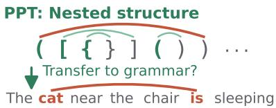
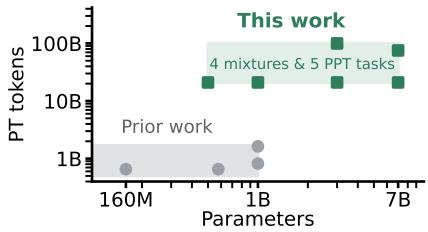
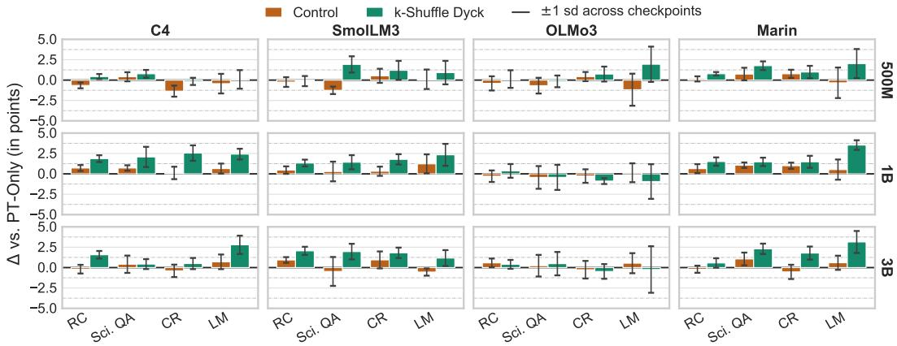
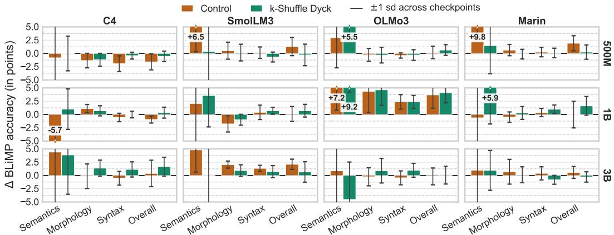
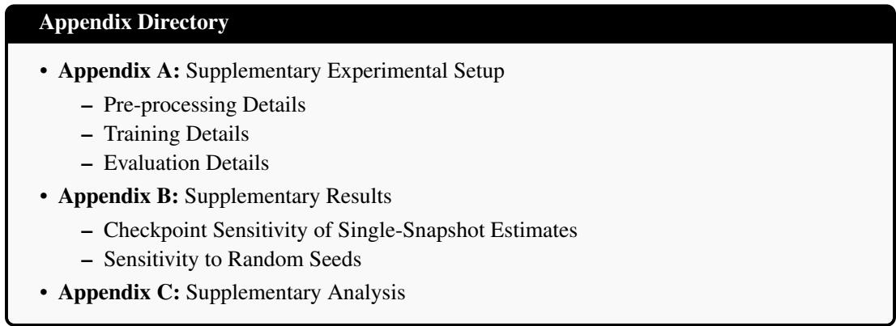

# SYNTHETIC PRE-PRETRAINING SURVIVES SCALE, BUT NOT AS A GRAMMATICAL PRIOR

Atsuki Yamaguchi1 Tatsuro Inaba2 Joel Niklaus3 Michal Štefánik4 Aline Villavicencio1,5,6 Nikolaos Aletras1

1University of Sheffield, UK 2Mohamed bin Zayed University of Artificial Intelligence, UAE 3Hugging Face 4National Institute of Informatics, Japan 5University of Exeter, UK 6Federal University of Rio Grande do Norte, Brazil

## ABSTRACT

Pre-pretraining (PPT) on synthetic non-natural language data improves token efficiency during language model pre-training (PT). Prior work attributes this gain to a grammatical prior, i.e., a structural inductive bias learned during PPT that transfers to natural language grammar. However, PPT has only been tested on models of at most 1B parameters and PT budgets below 2B tokens on predominantly web text. It is unknown whether PPT is effective at larger scales and under more realistic PT data mixtures that combine diverse sources (e.g., code and math). We therefore present a comprehensive study on PPT spanning five PPT tasks, four PT data mixtures, four parameter scales (500M to 7B), and PT budgets of up to 100B tokens. Our results demonstrate that the downstream performance and token efficiency gains of PPT persist at scale, e.g., saving at least 21B PT tokens at the 3B scale. However, in contrast to prior work, we find no consistent evidence that these gains stem from a grammatical prior. Downstream performance does not consistently align with grammatical acceptability across model sizes. Instead, we find that downstream gains arise from PPT tasks that improve long-range retrieval. Finally, PPT performance gains are robust to how PT data mixtures are composed and diminish only when web text is absent. Overall, PPT is a low-cost addition to PT, and future PPT task design should target long-range retrieval rather than natural language grammar.

https://github.com/gucci-j/verify-ppt-at-scale

8 https://huggingface.co/verify-ppt

## 1 INTRODUCTION

Pre-training (PT) equips language models (LMs) with general capabilities (Gemma Team et al., 2026; Qwen Team, 2026; Kimi Team et al., 2026, inter alia) but is prohibitively expensive, often consuming tens of trillions of tokens (Hoffmann et al., 2022). Recent studies (Hu et al., 2025; Mita et al., 2026; Cheng et al., 2026, inter alia) show that pre-pretraining (PPT), a warm-up phase on synthetic non-natural language sequences such as k-Shuffle Dyck (i.e., an interleaved balanced-parentheses language), improves token efficiency during subsequent PT on natural language data. Previous work (Hu et al., 2025; Mita et al., 2026) attributes this improvement to a grammatical prior, i.e., a structural inductive bias acquired from PPT data, which transfers to natural language (Figure 1a).

The practical utility of PPT rests on one question that remains unanswered under more realistic conditions of larger model size, longer PT, and more diverse PT data: do the performance and token efficiency gains ofPPTpersist at scale? Prior studies on PPT cannot answer this question, because their experimental setups diverge from typical PT scenarios in three ways (Figure 1b). First, they experiment with models at or below 1B parameters (Hu et al., 2025; Mita et al., 2026; Jiang et al., 2026; Guo et al., 2026; Cheng et al., 2026), whereas PT studies often operate at 2B parameters and above to draw conclusions (Biderman et al., 2023; Penedo et al., 2023; Xue et al., 2026). Hu et al. (2025) and Mita et al. (2026) leave the behavior of PPT beyond 1B parameters as an open question. Second, they often stop PT early at less than 2B tokens (Hu et al., 2025; Mita et al., 2026, inter alia), far short of the budgets used to validate PT design decisions in recent work (Cheng et al., 2024; Ye et al., 2025; Yamaguchi et al., 2026, e.g., 100B tokens). This raises the possibility that observed gains stem from temporary initialization effects. Such benefits may disappear as extended optimization shifts parameters away from the warm-up state (Ji & Telgarsky, 2020; Liu et al., 2023). Third, they rely on single-domain PT corpora, e.g., C4 (Raffel et al., 2020), that are dominated by or entirely derived from web text (Hu et al., 2025; Mita et al., 2026). Modern PT instead employs curated mixtures containing code and mathematics data (Bakouch et al., 2025; Martins et al., 2025; Team Olmo et al., 2026). Because code and mathematics contain nested dependencies and strict structural rules, these domains may supply structural signals similar to those from PPT, potentially rendering it redundant.

In this paper, we systematically evaluate PPT across four parameter scales (500M, 1B, 3B, and 7B) under a default PT budget of 21B tokens and an extended budget reaching 100B tokens, i.e., up to around 50× more than previous work. We test four publicly available PT data mixtures with documented composition: web text (C4); a web-dominant mixture (Marin1); a filtered-web mixture with balanced code and mathematics (SmolLM3 (Bakouch et al., 2025)); and a STEM-weighted mixture (OLMo3 (Team Olmo et al., 2026)). We also compare five PPT tasks: two formal languages; two structured synthetic tasks lacking formal grammars; and an in-domain text control that samples PPT data from the PT corpus. We evaluate each model on linguistic competence via BLiMP (Warstadt et al., 2020) for grammatical acceptability and verbatim retrieval (Armeni et al., 2022; 2024) for long-range retrieval capability. Furthermore, we test general capability across ten benchmarks spanning reading comprehension, science question answering (QA), commonsense reasoning, and language modeling.

## Our key contributions are as follows:

  
(a) Hypothesis under test.

  
(b) Design space.  
Figure 1: (a) PPT is claimed to induce a grammatical prior that transfers to natural language. (b) Prior work sits at or below 1B parameters and short training horizons. We span four scales, four PT mixtures, five PPT tasks, and up to 100B PT tokens.

• We present the first systematic evaluation of PPT at model and data scale, spanning 500M to 7B model parameters, PT budgets up to 100B tokens, four PT data mixtures, and five PPT tasks.

• We show that the downstream performance and token efficiency benefits of PPT persist under parameter scaling and extended PT up to 100B tokens, saving at least 21B PT tokens at the 3B scale, and remain positive even at 7B.

• However, we find no consistent evidence that considering PPT as a grammatical prior (Hu et al., 2025) explains the effectiveness of PPT. Downstream performance does not consistently align with grammatical acceptability. Instead, we find that downstream gains arise only from PPT tasks that improve long-range retrieval.

• We show that PPT gains depend on the presence of web text rather than the proportion of code and mathematics. A 13× increase in mathematical data leaves the downstream gain from PPT unchanged, whereas removing web text collapses it.

## 2 RELATED WORK

## 2.1 SYNTHETIC PRE-PRETRAINING

Early work has explored structural transfer by pre-training LSTMs (Hochreiter & Schmidhuber, 1997) and Transformers (Vaswani et al., 2017) on artificial languages or non-linguistic sequences, including music (Papadimitriou & Jurafsky, 2020) and artificial formal grammars (Papadimitriou & Jurafsky, 2020; Ri & Tsuruoka, 2022; Papadimitriou & Jurafsky, 2023), prior to fine-tuning or evaluating them on natural language tasks. In modern decoder-only LMs, PPT is a warm-up training phase on synthetic sequences before PT on natural language data, consisting of three steps. First, a generator produces a synthetic corpus, typically from a formal language such as k-Shuffle Dyck (Hu et al., 2025). Second, a randomly initialized model trains on the generated corpus for a budget far smaller than the subsequent PT run. Third, the resulting parameters initialize PT, either transferred in full (Hu et al., 2025; Mita et al., 2026) or with the embedding matrix and LM head re-initialized for the natural language tokenizer (Cheng et al., 2026; Lee et al., 2026).

Prior work on PPT differs mainly in what underlying structure the synthetic corpus encodes. Hu et al. (2025) argue that an effective corpus should capture hierarchical dependencies while remaining learnable by a Transformer. They instantiate this with k-Shuffle Dyck, a context-sensitive bracket language to generate synthetic PPT data. Mita et al. (2026) claim that bracket matching in k-Shuffle Dyck lacks cues to which opening bracket a closing one resolves. To tackle this issue, they propose adding agreement and displacement to the bracketed structure. Beyond formal grammars, PPT has expanded to algorithmic tasks (Jiang et al., 2026), formal logical derivations (Cheng et al., 2026), state trajectories of neural cellular automata (Lee et al., 2026), and synthetic recurrent structures (Guo et al., 2026), with recent extensions reaching vision models (Shinnick et al., 2026).

## 2.2 INTERPLAY BETWEEN PRE-PRETRAINING AND PRE-TRAINING

Hu et al. (2025) attribute PPT effectiveness to a grammatical prior. Models acquire structural priors independently of natural language vocabulary or world knowledge, and these priors transfer to natural language grammar (Papadimitriou & Jurafsky, 2020; Ri & Tsuruoka, 2022; Papadimitriou & Jurafsky, 2023). However, this explanation has been tested only on predominantly web-text data, leaving unexamined how PPT interacts with PT data mixtures that combine more diverse sources, e.g., code and mathematics. Such PT mixtures may induce structural abstractions (Kim et al., 2024; Petty et al., 2025), making PPT unnecessary.

## 2.3 SCALE, OPTIMIZATION DYNAMICS, AND WARM-UP RETENTION

Three conditions related to the experimental settings used in PPT challenge the generalizability of earlier findings. First, prior evaluations generally operate at or below the 1B parameter scale (Hu et al., 2025; Budnikov & Yamshchikov, 2025; Mita et al., 2026; Jiang et al., 2026; Guo et al., 2026; Cheng et al., 2026). Larger Transformers, however, can internalize hierarchical abstractions through standard training objectives alone (Liu et al., 2023; Allen-Zhu & Li, 2025). Therefore, larger model capacity may already supply what synthetic PPT provides. Second, previous studies rely on small batch sizes (e.g., 32) in both PPT and PT (Hu et al., 2025; Mita et al., 2026; Guo et al., 2026), introducing higher stochastic gradient noise than large-batch setups (McCandlish et al., 2018; Smith et al., 2018). In such noisy regimes, reported advantages may reflect initialization variance rather than a durable bias. Third, existing work often stops PT early $( \leq 2 \mathrm { B }$ tokens) (Hu et al., 2025; Budnikov & Yamshchikov, 2025; Mita et al., 2026; Guo et al., 2026), whereas extended optimization may dilute initialization biases that persist in under-trained models (Ji & Telgarsky, 2020; Liu et al., 2023).

## 3 A SYSTEMATIC FRAMEWORK FOR EVALUATING PRE-PRETRAINING

## 3.1 PROBLEM SETTING

Let $\mathcal { M } _ { \theta }$ be an autoregressive LM with weights $\boldsymbol { \theta } \in \mathbb { R } ^ { N }$ , where N is the number of parameters, and let $\begin{array} { r } { \mathcal { L } ( \boldsymbol { \theta } ; \mathcal { D } ) \ = \ \mathbb { E } _ { \boldsymbol { x } \sim \mathcal { D } } \left[ - \sum _ { t = 1 } ^ { | \boldsymbol { x } | } \log p _ { \boldsymbol { \theta } } ( x _ { t } \mid \boldsymbol { x } _ { < t } ) \right] } \end{array}$ denote the negative log-likelihood (NLL) over a corpus D. Standard PT minimizes $\mathcal { L } ( \boldsymbol { \theta } ; \mathcal { D } _ { \mathrm { P T } } )$ from a random initialization $\theta _ { 0 } .$ , yielding $\theta _ { \mathrm { P T } }$ (PT-Only). PPT first minimizes $\mathcal { L } ( \boldsymbol { \theta } ; \mathcal { D } _ { \mathrm { P P T } } )$ from the same $\theta _ { 0 }$ over a much smaller dataset $\mathcal { D } _ { \mathrm { P P T } }$ where $| \mathcal { D } _ { \mathrm { P P T } } | \ll | \mathcal { D } _ { \mathrm { P T } } |$ , yielding $\theta _ { \mathrm { P P T } }$ . These weights then replace $\theta _ { 0 }$ as the initialization state for PT.

To test whether the benefits of PPT generalize beyond small-scale settings, we evaluate performance across four dimensions: the PPT task (§3.2), PT data mixture (§3.3), parameter scale (§3.4), and PT budget (§3.5).

## 3.2 PRE-PRETRAINING DATA

We evaluate five approaches for constructing $\mathcal { D } _ { \mathrm { P P T } } \colon$ two based on formal languages, two structured synthetic tasks without formal grammars, and an in-domain text control where we sample $\mathcal { D } _ { \mathrm { P P T } }$ data from $\mathcal { D } _ { \mathrm { P T } }$ . This allows us to test whether transfer requires a formal grammar or follows from structured sequences of any kind.

Formal Languages. k-Shuffle Dyck (Hu et al., 2025) is a context-sensitive language of interleaved bracket pairs (e.g., ( [ ( ] ) )). As the foundational PPT task for which transfer to natural language grammar was reported, it serves as our primary synthetic task. MP-Struct Core (Mita et al., 2026) places marker tokens beside each bracket pair (e.g., [0 H\_C (4 )4 ]0), making the matching bracket unambiguous, whereas k-Shuffle Dyck leaves several candidates open (e.g., the first ‘)’ above has two open ‘(’ candidates).

Structured Synthetic Tasks without Formal Grammars. Set (Jiang et al., 2026) removes duplicate tokens while preserving their original order $( \mathbf { e } . \mathbf { g } . , 1 \ 2 \ 2 \ | \ 1 \ 2 )$ . This requires tracking previously seen tokens, but no hierarchical recursion. The neural cellular automata (NCA) task (Lee et al., 2026) consists of successive states of an NCA, where a fixed rule updates each cell from its neighbors. The resulting dependencies repeat over time and are not nested.

In-domain Text Control. We introduce a natural-language control task (Control) where we sample sequences for DPPT from $\mathcal { D } _ { \mathrm { P T } }$ , disjoint from samples seen during PT. This separates the effect of synthetic sequences from that of the extra optimization steps on performance.

## 3.3 PRE-TRAINING DATA MIXTURE

The composition of $\mathcal { D } _ { \mathrm { P T } }$ is itself a variable in modern LM PT, comprising curated mixtures of domains, $\mathcal { D } _ { \mathrm { { P T } } } = \alpha \mathcal { D } _ { \mathrm { { N L } } } + \beta \mathcal { D } _ { \mathrm { { C o d e } } } + \gamma \mathcal { D } _ { \mathrm { { M a t h } } }$ , where $\alpha + \beta + \gamma = 1$ are the mixing coefficients for natural language, source code, and mathematical data. We compare four PT data mixtures with varying degrees of code and mathematics to test the interplay between PPT and PT data (Table 1).

Table 1: Comparison of PT data mixtures, as reported by their creators. Web is a subset of natural language, with the remainder drawn from non-web sources such as books, academic text, and encyclopedic text. Our PT runs follow these ratios.

C4 (Raffel et al., 2020) consists entirely of cleaned web text with no code or math $( \beta = \gamma = 0 )$ , where models acquire syntactic knowledge from natural language alone. Following Hu et al. (2025), we adopt it as our reference mixture. It tests whether earlier PPT approaches survive scaling (§3.4 and §3.5).

<table><tr><td>Category (%)</td><td>C4</td><td>SmolLM3</td><td>OLMo3 Marin</td><td></td></tr><tr><td rowspan="2">Natural Lang. LWeb</td><td>100.0</td><td>85.0</td><td>89.5</td><td>92.6</td></tr><tr><td>100.0</td><td>79.8</td><td>76.9</td><td>92.6</td></tr><tr><td>Code</td><td>0.0</td><td>12.0</td><td>7.1</td><td>6.1</td></tr><tr><td>Math</td><td>0.0</td><td>3.0</td><td>3.4</td><td>1.3</td></tr></table>

The other three are curated multi-domain mixtures. SmolLM3 (Stage $1 \mathrm { d a t a } ) ^ { 2 }$ (Bakouch et al., 2025) pairs heavily filtered web text (Penedo et al., 2024a; Li et al., 2024; Penedo et al., 2025) with the largest combined code and math share, at 15.0% (Lozhkov et al., 2024; Allal et al., 2025; Han et al., 2025). OLMo3 (Stage 1) (Team Olmo et al., 2026) is the most STEM-weighted mixture. It adds 12.6% OCR-extracted academic PDFs (Poznanski et al., 2025) to 7.1% code and 3.4% math, which leaves the smallest general web share at 76.9%. Marin (Phase $1 ) ^ { 2 }$ is web-dominant, combining classifier-filtered DCLM data with light code (Li et al., 2023) and math (Azerbayev et al., 2024).

## 3.4 MODEL SCALES

To evaluate how model capacity interacts with PPT, we test four model scales: 500M, 1B, 3B, and 7B.

500M and 1B scales follow the setting of prior work in model size (§2.3), verifying reported PPT downstream performance and token-efficiency gains.

3B crosses the model size in which Biderman et al. (2023) report a transition point, where LMs begin to acquire complex factual and structural capabilities that smaller models fail to learn under the same PT data regime. Theoretical studies (Merrill et al., 2021; Strobl et al., 2024) also show that large Transformers can learn hierarchical abstractions directly through standard gradient descent. This setting therefore tests whether capacity alone makes PPT redundant.

7B extends the model size beyond the ≤ 1B setting of prior work and is widely used among openweight releases (Touvron et al., 2023; Qwen et al., 2025; IFM Team, 2026). This setting tests whether PPT helps as model capacity grows further.3

## 3.5 PRE-TRAINING BUDGET

Prior PPT studies stop PT early, typically after roughly 2B tokens, and train with small batches (Hu et al., 2025; Mita et al., 2026; Jiang et al., 2026; Guo et al., 2026). Under these conditions, reported gains may reflect a short-lived initialization advantage or gradient noise rather than a durable bias (§2.3). We therefore adopt a two-tiered optimization budget.

Our standard PT budget keeps the 10K-step horizon of Hu et al. (2025) but raises the batch size to 512 sequences (2.1M tokens per step) with a 4,096-token context window, yielding 21B tokens, following a recent approach for effective PT with synthetic data (Niklaus et al., 2026). This expansion increases token exposure during training by 12.8 to 25.6× over prior work (Hu et al., 2025; Mita et al., 2026). This setup tests whether the PPT benefits persist under large-batch, low-noise optimization with long-context dependencies.

Our extended PT budget reaches 100B tokens (47,684 steps) at 3B, roughly 33 tokens per parameter, which exceeds compute-optimal allocations for multi-billion parameter models (Hoffmann et al., 2022; Chen et al., 2025) and matches foundation model recipe ablations (Bakouch et al., 2025; Team Olmo et al., 2026). This tests whether the benefit of PPT persists or dilutes over prolonged training.

## 4 EXPERIMENTAL SETUP

## 4.1 MODEL TRAINING

Architecture and Tokenizer. All models use the SmolLM3 architecture and tokenizer (Bakouch et al., 2025) with a 128,256-token vocabulary. We vary only width, depth, and head counts and keep the optimizer, learning rate schedule, batch size, context window, and precision identical (Appendix Table 6). At 7B, we lower the learning rate for training stability while keeping the same schedule. Performance differences across scales therefore primarily reflect the influence of model capacity.

Pre-pretraining. Each PPT run optimizes L(θ; D ) from a random initialization $\theta _ { 0 }$ for 500 steps, following Hu et al. (2025). As mentioned in §3.2, we primarily use k-Shuffle Dyck as our PPT task.

Pre-training. Following Hu et al. (2025) and Mita et al. (2026), PPT runs initialize weights from the step-500 checkpoint, $\theta _ { \mathrm { P P T } }$ , and reset the optimizer moments and scheduler. A PPT run and its PT-Only counterpart therefore differ only in the initialization state. See Appendix A.2 for details.

## 4.2 EVALUATION

Baselines. We compare each PPT configuration against two baselines at the same scale and PT data mixture. PT-Only $( \theta _ { \mathrm { P T } } )$ trains from a random initialization with no preliminary phase $( \theta _ { 0 } )$ , measuring the net effect of PPT. Control (§3.2) serves as a second baseline, as it runs the identical 500-step phase on held-out text from $\mathcal { D } _ { \mathrm { P T } }$

General Capability. We evaluate models across ten downstream benchmarks grouped into four categories to test whether PPT translates into downstream performance.

• Reading Comprehension (RC): RACE (Lai et al., 2017) and ReCoRD (Zhang et al., 2018), both zero-shot, scored by accuracy and span F1, respectively.

• Science QA: zero-shot SciQ (Welbl et al., 2017), plus five-shot ARC-Easy (Clark et al., 2018) and OpenBookQA (Mihaylov et al., 2018), all scored by normalized accuracy.

• Commonsense Reasoning (CR): zero-shot HellaSwag (Zellers et al., 2019) and PIQA (Bisk et al., 2020), scored by normalized accuracy, alongside zero-shot COPA (Gordon et al., 2012) and five-shot SocialIQA (Sap et al., 2019), scored by accuracy.

  
Figure 2: Downstream score changes from PPT relative to PT-Only. Bars show mean paired differences across 5K–10K checkpoints; whiskers denote ±1 SD. Full scores are in Appendix Table 7.

• Language Modeling (LM): LAMBADA (Paperno et al., 2016) (OpenAI version), which requires a final word recoverable only from the full passage, scored by zero-shot accuracy.

Linguistic Competence. We also examine whether the explanation for the effectiveness of PPT proposed by Hu et al. (2025), a grammatical prior evidenced by grammatical acceptability, holds under our expanded scale and PT budgets. We adopt the same two benchmarks: (1) BLiMP (Warstadt et al., 2020) measures zero-shot grammatical acceptability over 12 paradigm groups, reporting overall mean accuracy alongside subgroup scores for semantics, morphology, and syntax. (2) Verbatim retrieval (Armeni et al., 2022; 2024) cues a model to repeat a noun list seen earlier in context, reporting mean NLL over the full stimulus, where lower values indicate more reliable retrieval.

Result Reporting. We evaluate each run every 1K steps and report the mean and standard deviation (SD) over the second half of training (i.e., 5K to 10K steps). We call a PPT gain stable when its mean exceeds its SD across these checkpoints. Downstream conclusions remain invariant to window selection (Appendix B.1). Each configuration is a single run, except for PT-Only and k-Shuffle Dyck at 3B on Marin, which we repeat with three random seeds (Appendix B.2). Appendix A.3 gives further evaluation details.

## 5 RESULTS

## 5.1 GENERAL CAPABILITY

Figure 2 shows the change in downstream performance from PPT relative to PT-Only. k-Shuffle Dyck improves downstream performance in most scale-mixture pairs. Of the 12 pairs (4 PT data mixtures × 3 model scales), 9 gain at least 0.6 points on the downstream average, with a mean gain of 1.6 among them. The gain is also similar across scales (0.8 at 500M, 1.4 at 1B, 1.3 at 3B). The effectiveness of PPT thus does not diminish as model capacity grows. The remaining three pairs gain little or lose (C4 at 500M +0.3, OLMo3 at 1B −0.5, OLMo3 at 3B +0.0), which leaves OLMo3 as the only PT mixture that fails to benefit at more than one scale. We examine its data composition in §6.

The Control results indicate that the gains stem from the synthetic PPT data rather than from the additional optimization steps. Control, which runs the same 500 warm-up steps on held-out PT text, stays close to PT-Only at every scale, with mean differences of −0.2 at 500M, +0.4 at 1B, and +0.2 at 3B. In contrast, k-Shuffle Dyck outperforms Control in 10 of the 12 pairs, by mean margins of 1.0, 1.0, and 1.1 points at the three scales.

We observe that the downstream gains are also broad across task types. Each category improves in 9 or more of the 12 scale-mixture pairs in Figure 2 (RC 11, Science QA 10, CR 9, and LM 10). In particular, language modeling gains the most at all three scales (1.2, 1.8, and 1.7 points, against 0.3 to 1.3 for the remaining categories). At the benchmark level, ReCoRD and HellaSwag improve in all 12 pairs and LAMBADA in 10 (Appendix Table 7). All three require information from the preceding passage, since their answers are often not determined by the candidate sentence alone. We return to this shared requirement in §5.2.

  
Figure 3: BLiMP score changes from PPT relative to PT-Only. Bars show mean paired differences across 5K–10K checkpoints; whiskers denote ±1 SD. Full scores are in Appendix Table 8.

Takeaway Synthetic PPT yields a downstream gain that holds across model scales and PT mixtures for a small fraction of the training cost.

## 5.2 LINGUISTIC COMPETENCE

We now test whether the downstream gains from PPT stem from the grammatical prior proposed by Hu et al. (2025). If they do, PPT should also improve grammatical acceptability on BLiMP. Figure 3 shows the BLiMP accuracy delta induced by PPT relative to PT-Only. Although k-Shuffle Dyck improves overall accuracy in 9 of the 12 scale-mixture pairs, only one of these gains is stable (OLMo3 at 1B), against 10 of 12 for the downstream average (Appendix Table 9). This outcome does not align with prior work, which reports gains in grammatical acceptability from formal language PPT (Hu et al., 2025; Mita et al., 2026). Even at 500M, a scale within the range of prior work, we observe mixed results. Two mixtures improve (OLMo3 +0.6, Marin +0.3), while two degrade (SmolLM3 −0.3, C4 −0.6). The largest degradation is on C4, on which Hu et al. (2025) report gains. Looking at the results by model scale, we find that larger models do not resolve the disagreement either. On Marin, the overall delta moves from +0.3 at 500M to +1.6 at 1B and back to −0.3 at 3B.

Table 2: Verbatim retrieval as mean NLL (↓) averaged over checkpoints at 5K–10K steps (∆ = PPT − PT-Only). Subscripts are standard deviations (SD) across checkpoints. Green marks an improvement over the baseline.
<table><tr><td rowspan="2">Data Mix</td><td rowspan="2">PT-Only NLL</td><td colspan="2">∆ NLL vs. PT-Only</td></tr><tr><td>Control</td><td>k-Shuffle Dyck</td></tr><tr><td>C4 S000M</td><td>SmolLM3 OLMo3 Marin</td><td>3.358.041 3.391.058 3.650.063 3.341.065</td><td>+0.060.044 -0.064.047 +0.030.033 -0.020.036 -0.046.053 -0.066.072 -0.006.016 -0.084.033</td></tr><tr><td>B</td><td>C4 SmolLM3 OLMo3 Marin</td><td>3.307.052 3.305.073 3.601.093 3.233.078</td><td>-0.036.031 -0.058.027 -0.033.042 -0.058.049 -0.053.035 -0.023.034 -0.008.030 -0.039.021</td></tr><tr><td>3B</td><td>C4 SmolLM3 OLMo3 Marin</td><td>3.227.063 3.183.075 3.673.083 3.150.052</td><td>+0.004.019 -0.093.028  $+ 0 . 0 3 1 _ { . 0 3 2 }$  -0.030.046  $- 0 . 1 1 5 _ { . 0 7 2 }$   $- 0 . 0 5 6 _ { . 0 7 1 }$   $- 0 . 0 0 5 _ { . 0 2 6 }$   $- 0 . 0 7 3 _ { . 0 2 4 }$ </td></tr></table>

The subgroup breakdown does not change this picture. If PPT imparts a grammatical prior, it should surface in Morphology and Syntax, which test hierarchical dependencies such as agreement and constituency. These are the exact dependencies that k-Shuffle Dyck, a hierarchical bracket-matching language, is hypothesized to transfer. Yet neither subgroup shows a stable gain (Appendix Table 8).

Verbatim retrieval, the second benchmark of Hu et al. (2025), shows a different pattern (Table 2). k-Shuffle Dyck lowers NLL in all 12 scale-mixture pairs, with a stable reduction in 7 of them against 1 of 12 for BLiMP. Control, by contrast, improves in 8 but only 3 of these reductions are stable.

We attribute this gap to the divergent demands of the two evaluations. BLiMP compares two sentences that differ in one grammatical feature, where the deciding evidence lies within the sentence. Verbatim retrieval instead requires locating a span earlier in a long context and copying it. k-Shuffle Dyck requires an analogous operation over an abstract vocabulary, matching each closing bracket to it opening bracket across an arbitrary number of intervening symbols. This suggests that PPT induces a long-range retrieval capability rather than the grammatical prior proposed by Hu et al. (2025). It also explains why downstream gains are largest on LAMBADA, ReCoRD, and HellaSwag (§5.1), as all three require information from the preceding passage to determine an answer.

Table 3: Ablations at 3B: (a) Marin composition and (b) PPT task. Scores are mean paired differences from PT-Only over checkpoints at 5K–10K steps. In (a), subscripts are standard deviations across checkpoints. In (b), scores are averaged over the four mixtures, except for PT-Only, which gives absolute scores, and n/4 counts the mixtures in which the downstream average improves (per-mixture breakdown in Appendix Table 14). Green marks an improvement.
<table><tr><td rowspan="2"></td><td colspan="5">Downstream (%)</td><td>BLiMP</td><td>Verbatim</td><td></td></tr><tr><td>RC</td><td>Sci. QA</td><td>CR</td><td>LM</td><td>Avg</td><td>(%)</td><td>NLL↓</td><td>n/4</td></tr><tr><td>Marin (full)</td><td>+0.60.6</td><td>+2.30.6</td><td>+1.80.8</td><td>+3.11.3 +1.90.5</td><td></td><td>-0.31.0</td><td>-0.0730.024</td><td></td></tr><tr><td>17% Math</td><td>+1.00.4</td><td>+2.21.1</td><td>+1.80.4</td><td>+3.10.8 +2.00.3</td><td></td><td>-0.31.6</td><td>-0.0240.014</td><td></td></tr><tr><td>(a) DCLM only</td><td>+0.80.2</td><td>+1.60.5</td><td>+1.60.9</td><td>+2.10.7</td><td>+1.50.3</td><td>+0.02.0</td><td>-0.0540.043</td><td></td></tr><tr><td>FineWeb-Edu only</td><td>+0.50.6</td><td>+0.01.3</td><td>+1.91.2</td><td>+1.51.4</td><td>+1.00.4</td><td>-1.53.9</td><td>-0.0420.050</td><td></td></tr><tr><td>Marin\DCLM</td><td>+0.40.2</td><td>+0.60.9</td><td>-0.91.3</td><td>+0.60.9</td><td>+0.20.5</td><td>+0.41.4</td><td>-0.0120.041</td><td></td></tr><tr><td>PT-Only (absolute)</td><td>50.7</td><td>50.1</td><td>55.9</td><td>40.8</td><td>49.4</td><td>79.0</td><td>3.308</td><td></td></tr><tr><td>k-Shufle Dyck</td><td>+1.1</td><td>+1.3</td><td>+0.9</td><td>+1.7</td><td>+1.3</td><td>+0.5</td><td>-0.063</td><td>3/4</td></tr><tr><td>(b) MP-Struct Čore</td><td>+0.7</td><td>+0.9</td><td>+0.7</td><td>+1.5</td><td>+0.9</td><td>+0.6</td><td>-0.044</td><td>3/4</td></tr><tr><td>NCA</td><td>+0.8</td><td>+1.6</td><td>+0.8</td><td>+1.4</td><td>+1.2</td><td>+1.3</td><td>-0.082</td><td>3/4</td></tr><tr><td>Set</td><td>-6.2</td><td>-6.2</td><td>-5.2</td><td>-11.2</td><td>-7.2</td><td>-2.3</td><td>+0.587</td><td>0/4</td></tr></table>

Takeaway PPT improves long-range retrieval more reliably than grammatical acceptability, and its downstream gains, while broad, are largest on tasks that depend on the preceding context.

## 6 ANALYSIS

PT Data Type. Modern PT mixtures allocate a large share to code and mathematics, whose nested dependencies may already supply the structural signal that PPT provides (§3.3). If this holds, PPT should become redundant as code and mathematics content grows. We test this on Marin, the mixture with the largest gains at 3B (§5.1; Figure 2), by varying its PT composition (Table 3a).4 Raising the mathematics share from 1.3% to 17.0% lowers the web share from 92.6% to 76.9%, matching OLMo3 (Table 1). This results in an average gain of 2.0 points against 1.9 for the Marin full PT mixture, with the per-category deltas almost unchanged. Therefore, a 13× increase in mathematical content does not diminish the benefits of PPT.

By contrast, we find that web text is essential. DCLM alone retains 1.5 of the 1.9 points on average and FineWeb-Edu retains 1.0. Removing web text entirely (Marin\DCLM in Table 3a), which leaves 82% source code and 18% mathematics, reduces the average PPT gain to 0.2 points. Language modeling follows the same pattern, gaining 1.5 to 3.1 points wherever web text is present and 0.6 without it. Verbatim retrieval improves for all five PT data variants, and the improvement is stable in three of them (Marin full, 17% Math, and DCLM only). BLiMP echoes the pattern of §5.2, in that the performance deltas remain small and none is stable. The benefit of PPT thus holds across the diverse range of content that current PT mixtures occupy and disappears only under a web-free condition that no practical mixture approaches.

Neither the math share nor the web share explains the weak PPT gains on OLMo3 (§5.1). The 17% Math variant matches the 76.9% web share of OLMo3 yet retains an average gain of 2.0 points. Likewise, SmolLM3 differs from OLMo3 by only three points in web share, yet its PPT gain at 3B is 1.8 points against 0.0 for OLMo3 (Appendix Table 14; k-Shuffle Dyck). We leave a direct ablation of OLMo3, and the property responsible for this gap, for future work.5

Takeaway Code and mathematics do not make PPT redundant. Its gain holds across the compositions of current PT mixtures and requires only the presence of web text.

PPT Tasks. To test whether the PPT benefit requires a formal grammar, we evaluate three further tasks at the 3B scale across all mixtures (Table 3b): MP-Struct Core (formal), alongside NCA and Set (non-formal). We first observe that the formal boundary does not separate the effective PPT tasks. MP-Struct Core (+0.9 on average) and the non-formal NCA (+1.2) yield gains comparable to k-Shuffle Dyck (+1.3), and all three improve 3 of the 4 mixtures.

In contrast, Set degrades downstream performance by 7.2 points and improves none. The three effective tasks all require retrieving a specific earlier position in the sequence. Specifically, k-Shuffle Dyck matches a closing bracket to its opening bracket; MP-Struct Core anchors an explicit structural marker; and NCA reproduces the corresponding cell of the preceding automaton state. Set only asks whether a token has appeared before. The model can answer this by keeping a running record of seen tokens, without locating any specific earlier position. This lack of positional retrieval may explain why Set performs poorly.

This retrieval account is consistent with prior work, which already hints at dependency structure as the active property. Specifically, Hu et al. (2025) require an effective PPT language to capture hierarchical dependencies, and Mita et al. (2026) find that reducing retrieval ambiguity in those dependencies is what drives the gain. Our results converge with prior work on which property of the task matters, and diverge on what the model acquires from it. These results suggest that synthetic PPT aids general capability by inducing a long-range retrieval capability rather than a grammatical prior (§5.2).

Takeaway Any PPT task that requires retrieving a specific earlier position is a safe choice, with k-Shuffle Dyck and NCA giving comparable gains. In contrast, Set, which only requires tracking seen tokens, degrades performance.

Further Model and Data Scaling. Our main experiments stop at 21B PT tokens and at most 3B parameters. The PPT benefit may still disappear with longer training (§3.5), and larger models may not need it (§3.4). We therefore extend the 3B PT runs to 100B tokens on C4 and Marin, and train a 7B model on Marin for 75.5B tokens. Table 4 shows that the downstream benefit persists under both extensions. The downstream average improves in all 14 budget points across the three extended runs, by 1.0 on average on C4, 1.3 on Marin, and 0.6 at 7B. Although PPT gains fluctuate, they do not degrade at longer budgets, ending at +1.6 on C4 and +1.2 on Marin at

Table 4: Scaling. Each entry is the difference between PPT (k-Shuffle Dyck) and the PT-Only baseline at the same PT budget. Score breakdowns are in Appendix Tables 15 and 16. Results at 21B tokens are not comparable to §5, as the two use different learning rate schedules.

<table><tr><td></td><td colspan="3">C4 (3B)</td><td colspan="3">Marin (3B)</td><td colspan="3">Marin (7B)</td></tr><tr><td>Tokens Avg</td><td></td><td></td><td>BLiMP NLL↓</td><td>Avg</td><td>BLiMP NLL↓</td><td></td><td>Avg</td><td></td><td>BLiMP NLL↓</td></tr><tr><td>21B</td><td>+1.2</td><td>+3.0</td><td>-0.039 +1.1</td><td></td><td>-3.1</td><td>-0.015 +0.5</td><td></td><td>-0.2</td><td>+0.008</td></tr><tr><td>42B</td><td>+0.7</td><td>+3.1</td><td>+0.014</td><td>+1.6</td><td>-10.3</td><td>-0.014 +0.3</td><td></td><td>+1.8</td><td>+0.002</td></tr><tr><td>63B</td><td>+0.7</td><td>-2.2</td><td></td><td>-0.033 +1.5</td><td>-1.2</td><td>-0.019 +0.4</td><td></td><td>-0.6</td><td>-0.004</td></tr><tr><td>75.5B</td><td></td><td></td><td></td><td></td><td></td><td></td><td>+1.0</td><td>-1.1</td><td>-0.029</td></tr><tr><td>84B</td><td>+0.8</td><td>-0.7</td><td></td><td>-0.021 +1.3</td><td>+1.3</td><td>-0.035</td><td></td><td></td><td>1</td></tr><tr><td>100B</td><td>+1.6</td><td>-15.5</td><td>+0.008+1.2</td><td></td><td>-0.6</td><td>-0.039</td><td></td><td>1</td><td>1</td></tr></table>

100B, against +1.2 and +1.1 at 21B. On Marin, PPT reaches 62.3 on average after 63B tokens, whereas PT-Only reaches 62.0 after 84B (Appendix Table 15). This saves at least 21B PT tokens.

At 7B, the downstream gain narrows but persists. On Marin, the average gain falls from 1.3 at 3B to 0.6 at 7B, yet it remains positive at every budget. This narrowing may partly reflect budget rather than capacity. The 7B runs reach roughly 11 tokens per parameter against 33 at 3B, and the largest 7B gain occurs at the longest budget (+1.0 at 75.5B tokens). As in §5.2, BLiMP gains remain mixed at both scales, improving in only 4 of the 14 budget points, whereas verbatim retrieval improves in 10. Extended optimization and added capacity therefore preserve the downstream benefit of PPT.

Takeaway PPT gains still persist up to 100B PT tokens and 7B parameters, and on Marin at 3B, PPT saves at least 21B PT tokens for about 1% of the PT compute.

## 7 CONCLUSION

We have presented the first systematic study of PPT at scale, spanning five PPT tasks, four PT data mixtures, four model scales (500M to 7B), and PT budgets of up to 100B tokens. We first show that the downstream benefits of PPT persist under both parameter and PT budget scaling. In contrast to previous work, we find that the attribution of these gains to a grammatical prior does not hold.

Specifically, downstream gains from PPT arise without equivalent gains in grammatical acceptability. We show instead that PPT is effective when the PPT task requires retrieving tokens from earlier positions in a sequence (§6; PPT Tasks). Finally, we demonstrate that PPT gains are insensitive to the share of code and math in the PT corpus, and diminish only when web text is absent. These findings suggest that future PPT tasks may benefit more from targeting long-range retrieval directly than from mimicking the hierarchical structure of natural language grammar.

## AI USE STATEMENT

In this work, we used Antigravity with Gemini 3.6/3.7/3.8 Flash to extend DataTrove preprocessing scripts for PPT data generation and to debug Nanotron scripts for deployment on our clusters (as they were originally designed for SmolLM model development). Additionally, we used Gemini 3.1 Pro to assist with our literature survey. Finally, we used Gemini 3.1 Pro, Claude Opus 5, and Gemini 3.8 Flash to improve the grammar and clarity of the draft.

## REPRODUCIBILITY STATEMENT

Our code and a step-by-step guide for preprocessing, training, and evaluation for all approaches are available in our GitHub repository: https://github.com/gucci-j/verify-ppt-at-scale. Full details on hyperparameters, software, and hardware, including specific versions used, are provided in Appendix A. All artifacts, including pre-processed datasets and model checkpoints, are available on the Hugging Face Hub: https://huggingface.co/verify-ppt.

## ACKNOWLEDGMENTS

We acknowledge (1) IT Services at the University of Sheffield for the provision of high-performance computing services; (2) the Isambard-AI National AI Research Resource (AIRR), operated by the University of Bristol and funded by the UK Government’s Department for Science, Innovation and Technology (DSIT) via UK Research and Innovation, under Science and Technology Facilities Council grant [ST/AIRR/I-A-I/1023]; (3) the EuroHPC Joint Undertaking for awarding access to Leonardo (hosted by CINECA, Italy) and JUPITER (hosted by JSC, Germany); and (4) the use of “mdx: a platform for building data-empowered society” (Suzumura et al., 2022). This work was supported by the “Development Acceleration Use” program of ABCI 3.0, provided by AIST and AIST Solutions and by the “R&D Hub Aimed at Ensuring Transparency and Reliability of Generative AI Models” project of the Ministry of Education, Culture, Sports, Science and Technology of Japan. AY is supported by the Engineering and Physical Sciences Research Council (EPSRC) [grant number EP/W524360/1] and the Japan Student Services Organization (JASSO) Student Exchange Support Program (Graduate Scholarship for Degree Seeking Students).

## REFERENCES

Loubna Ben Allal, Anton Lozhkov, Elie Bakouch, Gabriel Martin Blazquez, Guilherme Penedo, Lewis Tunstall, Andrés Marafioti, Agustín Piqueres Lajarín, Hynek Kydlícek, Vaibhav Srivastav, Joshuaˇ Lochner, Caleb Fahlgren, Xuan Son NGUYEN, Ben Burtenshaw, Clémentine Fourrier, Haojun Zhao, Hugo Larcher, Mathieu Morlon, Cyril Zakka, and others. SmolLM2: When smol goes big — data-centric training of a fully open small language model. In Proceedings ofthe Second Conference on Language Modeling, 2025. URL https://openreview.net/forum?id=3JiCl2A14H.

Zeyuan Allen-Zhu and Yuanzhi Li. Physics of language models: Part 1, learning hierarchical language structures. Transactions on Machine Learning Research, 2025. ISSN 2835-8856. URL https://openreview.net/forum?id=mPQKyzkA1K.

Kristijan Armeni, Christopher Honey, and Tal Linzen. Characterizing verbatim short-term memory in neural language models. In Antske Fokkens and Vivek Srikumar (eds.), Proceedings ofthe 26th Conference on Computational Natural Language Learning (CoNLL), pp. 405–424, Abu Dhabi, United Arab Emirates (Hybrid), December 2022. Association for Computational Linguistics. doi: 10.18653/v1/2022.conll-1.28. URL https://aclanthology.org/2022.conll-1.28/.

Kristijan Armeni, Marko Pranjic, and Senja Pollak. Transformer verbatim in-context retrieval across´ time and scale. In Libby Barak and Malihe Alikhani (eds.), Proceedings of the 28th Conference on Computational Natural Language Learning, pp. 56–68, Miami, FL, USA, November 2024. Association for Computational Linguistics. doi: 10.18653/v1/2024.conll-1.6. URL https: //aclanthology.org/2024.conll-1.6/.

Zhangir Azerbayev, Hailey Schoelkopf, Keiran Paster, Marco Dos Santos, Stephen Marcus McAleer, Albert Q. Jiang, Jia Deng, Stella Biderman, and Sean Welleck. Llemma: An open language model for mathematics. In Proceedings of the Twelfth International Conference on Learning Representations, 2024. URL https://openreview.net/forum?id=4WnqRR915j.

Elie Bakouch, Loubna Ben Allal, Anton Lozhkov, Nouamane Tazi, Lewis Tunstall, Carlos Miguel Patiño, Edward Beeching, Aymeric Roucher, Aksel Joonas Reedi, Quentin Gallouédec, Kashif Rasul, Nathan Habib, Clémentine Fourrier, Hynek Kydlicek, Guilherme Penedo, Hugo Larcher, Mathieu Morlon, Vaibhav Srivastav, Joshua Lochner, and others. SmolLM3: smol, multilingual, long-context reasoner. https://huggingface.co/blog/smollm3, 2025. Blog post.

Stella Biderman, Hailey Schoelkopf, Quentin Gregory Anthony, Herbie Bradley, Kyle O’Brien, Eric Hallahan, Mohammad Aflah Khan, Shivanshu Purohit, Usvsn Sai Prashanth, Edward Raff, Aviya Skowron, Lintang Sutawika, and Oskar Van Der Wal. Pythia: A suite for analyzing large language models across training and scaling. In Andreas Krause, Emma Brunskill, Kyunghyun Cho, Barbara Engelhardt, Sivan Sabato, and Jonathan Scarlett (eds.), Proceedings of the 40th International Conference on Machine Learning, volume 202 of Proceedings of Machine Learning Research, pp. 2397–2430. PMLR, 23–29 Jul 2023. URL https://proceedings.mlr.press/ v202/biderman23a.html.

Yonatan Bisk, Rowan Zellers, Ronan Le Bras, Jianfeng Gao, and Yejin Choi. PIQA: Reasoning about physical commonsense in natural language. In Proceedings of the AAAI Conference on Artificial Intelligence, volume 34, pp. 7432–7439, 2020. doi: 10.1609/aaai.v34i05.6239. URL https://doi.org/10.1609/aaai.v34i05.6239.

Mikhail Budnikov and Ivan Yamshchikov. Transfer of structural knowledge from synthetic languages. In Hao Fei, Kewei Tu, Yuhui Zhang, Xiang Hu, Wenjuan Han, Zixia Jia, Zilong Zheng, Yixin Cao, Meishan Zhang, Wei Lu, N. Siddharth, Lilja Øvrelid, Nianwen Xue, and Yue Zhang (eds.), Proceedings ofthe 1st Joint Workshop on Large Language Models and Structure Modeling (XLLM 2025), pp. 242–251, Vienna, Austria, August 2025. Association for Computational Linguistics. ISBN 979-8-89176-286-2. doi: 10.18653/v1/2025.xllm-1.20. URL https://aclanthology. org/2025.xllm-1.20/.

Zhengyu Chen, Siqi Wang, Teng Xiao, Yudong Wang, Shiqi Chen, Xunliang Cai, Junxian He, and Jingang Wang. Revisiting scaling laws for language models: The role of data quality and training strategies. In Wanxiang Che, Joyce Nabende, Ekaterina Shutova, and Mohammad Taher Pilehvar (eds.), Proceedings of the 63rd Annual Meeting of the Association for Computational Linguistics (Volume 1: Long Papers), pp. 23881–23899, Vienna, Austria, July 2025. Association for Computational Linguistics. ISBN 979-8-89176-251-0. doi: 10.18653/v1/2025.acl-long.1163. URL https://aclanthology.org/2025.acl-long.1163/.

Daixuan Cheng, Yuxian Gu, Shaohan Huang, Junyu Bi, Minlie Huang, and Furu Wei. Instruction pre-training: Language models are supervised multitask learners. In Yaser Al-Onaizan, Mohit Bansal, and Yun-Nung Chen (eds.), Proceedings of the 2024 Conference on Empirical Methods in Natural Language Processing, pp. 2529–2550, Miami, Florida, USA, November 2024. Association for Computational Linguistics. doi: 10.18653/v1/2024.emnlp-main.148. URL https://aclanthology.org/2024.emnlp-main.148/.

Jo-Ku Cheng, Nikolaos Aletras, and Marco Valentino. Logic before language: Pre-pretraining on formal derivations fosters skill acquisition and compressibility. arXiv preprint, arXiv:2608.03930, 2026. URL https://arxiv.org/abs/2608.03930.

Peter Clark, Isaac Cowhey, Oren Etzioni, Tushar Khot, Ashish Sabharwal, Carissa Schoenick, and Oyvind Tafjord. Think you have solved question answering? try ARC, the AI2 reasoning challenge. arXiv preprint, arXiv:1803.05457, 2018. URL https://arxiv.org/abs/1803.05457.

Tri Dao. Flashattention-2: Faster attention with better parallelism and work partitioning. In Proceedings of the Twelfth International Conference on Learning Representations, 2024. URL https://openreview.net/forum?id=mZn2Xyh9Ec.

Leo Gao, Jonathan Tow, Baber Abbasi, Stella Biderman, Sid Black, Anthony DiPofi, Charles Foster, Laurence Golding, Jeffrey Hsu, Alain Le Noac’h, Haonan Li, Kyle McDonell, Niklas Muennighoff, Chris Ociepa, Jason Phang, Laria Reynolds, Hailey Schoelkopf, Aviya Skowron, Lintang Sutawika, and others. The language model evaluation harness, July 2024. URL https: //zenodo.org/records/12608602.

Gemma Team, Sherif El Abd, Vaibhav Aggarwal, Robin Algayres, Alek Andreev, Olivier Bachem, Ian Ballantyne, Cormac Brick, Victor Carbune, Michelle Casbon, Mayank Chaturvedi, Aditya ˘ Chawla, Victor Cotruta, Alice Coucke, Phil Culliton, Robert Dadashi, Lucas Dixon, Mohamed Elhawaty, Utku Evci, and others. Gemma 4 technical report. arXiv preprint, arXiv:2607.02770, 2026. URL https://arxiv.org/abs/2607.02770.

Andrew Gordon, Zornitsa Kozareva, and Melissa Roemmele. SemEval-2012 task 7: Choice of plausible alternatives: An evaluation of commonsense causal reasoning. In Eneko Agirre, Johan Bos, Mona Diab, Suresh Manandhar, Yuval Marton, and Deniz Yuret (eds.), \*SEM 2012: The First Joint Conference on Lexical and Computational Semantics – Volume 1: Proceedings ofthe main conference and the shared task, and Volume 2: Proceedings ofthe Sixth International Workshop on Semantic Evaluation (SemEval 2012), pp. 394–398, Montréal, Canada, 7-8 June 2012. Association for Computational Linguistics. URL https://aclanthology.org/S12-1052/.

Xu Guo, Runyu Peng, Jian Tong, Yunhua Zhou, Haijun Lv, Zhihui Lu, and Qipeng Guo. Synthetic pre-pre-training improves language model robustness to noisy pre-training data. arXiv preprint, arXiv:2605.10129, 2026. URL https://arxiv.org/abs/2605.10129.

Xiaotian Han, Yiren Jian, Xuefeng Hu, Haogeng Liu, Yiqi Wang, Qihang Fan, Yuang Ai, Huaibo Huang, Ran He, Zhenheng Yang, and Quanzeng You. InfiMM-WebMath-40B: Advancing multimodal pre-training for enhanced mathematical reasoning. In Christos Christodoulopoulos, Tanmoy Chakraborty, Carolyn Rose, and Violet Peng (eds.), Findings ofthe Associationfor Computational Linguistics: EMNLP 2025, pp. 14221–14231, Suzhou, China, November 2025. Association for Computational Linguistics. ISBN 979-8-89176-335-7. doi: 10.18653/v1/2025.findings-emnlp.766. URL https://aclanthology.org/2025.findings-emnlp.766/.

Sepp Hochreiter and Jürgen Schmidhuber. Long short-term memory. Neural Computation, 9 (8):1735–1780, 11 1997. ISSN 0899-7667. doi: 10.1162/neco.1997.9.8.1735. URL https: //doi.org/10.1162/neco.1997.9.8.1735.

Jordan Hoffmann, Sebastian Borgeaud, Arthur Mensch, Elena Buchatskaya, Trevor Cai, Eliza Rutherford, Diego de Las Casas, Lisa Anne Hendricks, Johannes Welbl, Aidan Clark, Thomas Hennigan, Eric Noland, Katherine Millican, George van den Driessche, Bogdan Damoc, Aurelia Guy, Simon Osindero, Karén Simonyan, Erich Elsen, and others. An empirical analysis of compute-optimal large language model training. In S. Koyejo, S. Mohamed, A. Agarwal, D. Belgrave, K. Cho, and A. Oh (eds.), Advances in Neural Information Processing Systems, volume 35, pp. 30016–30030. Curran Associates, Inc., 2022. doi: 10.52202/ 068431-2176. URL https://proceedings.neurips.cc/paper\_files/paper/2022/file/ c1e2faff6f588870935f114ebe04a3e5-Paper-Conference.pdf.

Michael Y. Hu, Jackson Petty, Chuan Shi, William Merrill, and Tal Linzen. Between circuits and Chomsky: Pre-pretraining on formal languages imparts linguistic biases. In Wanxiang Che, Joyce Nabende, Ekaterina Shutova, and Mohammad Taher Pilehvar (eds.), Proceedings ofthe 63rdAnnual Meeting of the Association for Computational Linguistics (Volume 1: Long Papers), pp. 9691–9709, Vienna, Austria, July 2025. Association for Computational Linguistics. ISBN 979-8-89176-251-0. doi: 10.18653/v1/2025.acl-long.478. URL https://aclanthology.org/2025.acl-long.478/.

IFM Team. Introducing K2 Horizon: Frontier performance, radically open, 2026. URL https: //ifm.ai/blog/k2/. Blog post.

Ziwei Ji and Matus Telgarsky. Directional convergence and alignment in deep learning. In H. Larochelle, M. Ranzato, R. Hadsell, M.F. Balcan, and H. Lin (eds.), Advances

in Neural Information Processing Systems, volume 33, pp. 17176–17186. Curran Associates, Inc., 2020. URL https://proceedings.neurips.cc/paper\_files/paper/2020/file/ c76e4b2fa54f8506719a5c0dc14c2eb9-Paper.pdf.

Liangze Jiang, Zachary Shinnick, Anton van den Hengel, Hemanth Saratchandran, and Damien Teney. Procedural pretraining: Warming up language models with abstract data. In Proceedings ofthe Forty-third International Conference on Machine Learning, 2026. URL https://openreview. net/forum?id=XFTTezxLdU.

Najoung Kim, Sebastian Schuster, and Shubham Toshniwal. Code pretraining improves entity tracking abilities of language models. arXiv preprint, arXiv:2405.21068, 2024. URL https: //arxiv.org/abs/2405.21068.

Kimi Team, Tongtong Bai, Yifan Bai, Yiping Bao, M. C., Jianfeng Cai, Xinyuan Cai, Peizhou Cao, Yuxuan Cao, Ziwei Chai, Y. Charles, H. S. Che, Guanduo Chen, Guangyu Chen, Guanzheng Chen, Huarong Chen, Jia Chen, Jianlong Chen, Jun Chen, and others. Kimi K3: Open frontier intelligence. arXiv preprint, arXiv:2607.24653, 2026. URL https://arxiv.org/abs/2607.24653.

Guokun Lai, Qizhe Xie, Hanxiao Liu, Yiming Yang, and Eduard Hovy. RACE: Large-scale ReAding comprehension dataset from examinations. In Martha Palmer, Rebecca Hwa, and Sebastian Riedel (eds.), Proceedings ofthe 2017 Conference on Empirical Methods in Natural Language Processing, pp. 785–794, Copenhagen, Denmark, September 2017. Association for Computational Linguistics. doi: 10.18653/v1/D17-1082. URL https://aclanthology.org/D17-1082/.

Dan Lee, Seungwook Han, Akarsh Kumar, and Pulkit Agrawal. Training language models via neural cellular automata. arXiv preprint, arXiv:2603.10055, 2026. URL https://arxiv.org/abs/2603. 10055.

Quentin Lhoest, Albert Villanova del Moral, Yacine Jernite, Abhishek Thakur, Patrick von Platen, Suraj Patil, Julien Chaumond, Mariama Drame, Julien Plu, Lewis Tunstall, Joe Davison, Mario Šaško, Gunjan Chhablani, Bhavitvya Malik, Simon Brandeis, Teven Le Scao, Victor Sanh, Canwen Xu, Nicolas Patry, and others. Datasets: A community library for natural language processing. In Heike Adel and Shuming Shi (eds.), Proceedings ofthe 2021 Conference on Empirical Methods in Natural Language Processing: System Demonstrations, pp. 175–184, Online and Punta Cana, Dominican Republic, November 2021. Association for Computational Linguistics. doi: 10.18653/ v1/2021.emnlp-demo.21. URL https://aclanthology.org/2021.emnlp-demo.21/.

Jeffrey Li, Alex Fang, Georgios Smyrnis, Maor Ivgi, Matt Jordan, Samir Gadre, Hritik Bansal, Etash Guha, Sedrick Keh, Kushal Arora, Saurabh Garg, Rui Xin, Niklas Muennighoff, Reinhard Heckel, Jean Mercat, Mayee Chen, Suchin Gururangan, Mitchell Wortsman, Alon Albalak, and others. DataComp-LM: In search of the next generation of training sets for language models. In A. Globerson, L. Mackey, D. Belgrave, A. Fan, U. Paquet, J. Tomczak, and C. Zhang (eds.), Advances in Neural Information Processing Systems, volume 37, pp. 14200–14282. Curran Associates, Inc., 2024. doi: 10.52202/ 079017-0455. URL https://proceedings.neurips.cc/paper\_files/paper/2024/file/ 19e4ea30dded58259665db375885e412-Paper-Datasets\_and\_Benchmarks\_Track.pdf.

Raymond Li, Loubna Ben allal, Yangtian Zi, Niklas Muennighoff, Denis Kocetkov, Chenghao Mou, Marc Marone, Christopher Akiki, Jia LI, Jenny Chim, Qian Liu, Evgenii Zheltonozhskii, Terry Yue Zhuo, Thomas Wang, Olivier Dehaene, Joel Lamy-Poirier, Joao Monteiro, Nicolas Gontier, Ming-Ho Yee, and others. StarCoder: may the source be with you! Transactions on Machine Learning Research, 2023. ISSN 2835-8856. URL https://openreview.net/forum?id=KoFOg41haE. Reproducibility Certification.

Hong Liu, Sang Michael Xie, Zhiyuan Li, and Tengyu Ma. Same pre-training loss, better downstream: Implicit bias matters for language models. In Andreas Krause, Emma Brunskill, Kyunghyun Cho, Barbara Engelhardt, Sivan Sabato, and Jonathan Scarlett (eds.), Proceedings of the 40th International Conference on Machine Learning, volume 202 of Proceedings of Machine Learning Research, pp. 22188–22214. PMLR, 23–29 Jul 2023. URL https://proceedings.mlr.press/ v202/liu23ao.html.

Anton Lozhkov, Raymond Li, Loubna Ben Allal, Federico Cassano, Joel Lamy-Poirier, Nouamane Tazi, Ao Tang, Dmytro Pykhtar, Jiawei Liu, Yuxiang Wei, Tianyang Liu, Max Tian, Denis Kocetkov, Arthur Zucker, Younes Belkada, Zijian Wang, Qian Liu, Dmitry Abulkhanov, Indraneil Paul, and others. StarCoder 2 and the Stack v2: The next generation. arXiv preprint, arXiv:2402.19173, 2024. URL https://arxiv.org/abs/2402.19173.

Pedro Henrique Martins, João Alves, Patrick Fernandes, Nuno M. Guerreiro, Ricardo Rei, Amin Farajian, Mateusz Klimaszewski, Duarte M. Alves, José Pombal, Nicolas Boizard, Manuel Faysse, Pierre Colombo, François Yvon, Barry Haddow, José G. C. de Souza, Alexandra Birch, and André F. T. Martins. EuroLLM-9B: Technical report. arXiv preprint, arXiv:2506.04079, 2025. URL https://arxiv.org/abs/2506.04079.

Sam McCandlish, Jared Kaplan, Dario Amodei, and OpenAI Dota Team. An empirical model of large-batch training. arXiv preprint, arXiv:1812.06162, 2018. URL https://arxiv.org/abs/ 1812.06162.

William Merrill, Vivek Ramanujan, Yoav Goldberg, Roy Schwartz, and Noah A. Smith. Effects of parameter norm growth during transformer training: Inductive bias from gradient descent. In Marie-Francine Moens, Xuanjing Huang, Lucia Specia, and Scott Wen-tau Yih (eds.), Proceedings of the 2021 Conference on Empirical Methods in Natural Language Processing, pp. 1766–1781, Online and Punta Cana, Dominican Republic, November 2021. Association for Computational Linguistics. doi: 10.18653/v1/2021.emnlp-main.133. URL https://aclanthology.org/2021. emnlp-main.133/.

Todor Mihaylov, Peter Clark, Tushar Khot, and Ashish Sabharwal. Can a suit of armor conduct electricity? a new dataset for open book question answering. In Ellen Riloff, David Chiang, Julia Hockenmaier, and Jun’ichi Tsujii (eds.), Proceedings ofthe 2018 Conference on Empirical Methods in Natural Language Processing, pp. 2381–2391, Brussels, Belgium, October-November 2018. Association for Computational Linguistics. doi: 10.18653/v1/D18-1260. URL https: //aclanthology.org/D18-1260/.

Masato Mita, Taiga Someya, Ryo Yoshida, and Yohei Oseki. Language acquisition device in large language models. In Maria Liakata, Viviane P. Moreira, Jiajun Zhang, and David Jurgens (eds.), Proceedings ofthe 64th Annual Meeting ofthe Associationfor Computational Linguistics (Volume 1: Long Papers), pp. 19564–19577, San Diego, California, United States, July 2026. Association for Computational Linguistics. ISBN 979-8-89176-390-6. doi: 10.18653/v1/2026.acl-long.895. URL https://aclanthology.org/2026.acl-long.895/.

Joel Niklaus, Atsuki Yamaguchi, Michal Štefánik, Guilherme Penedo, Hynek Kydlícek, Elie Bakouch,ˇ Lewis Tunstall, Edward Emanuel Beeching, Thibaud Frere, Colin Raffel, Leandro von Werra, and Thomas Wolf. How can we synthesize high-quality pretraining data? a systematic study of prompt design, generator model, and source data. In Proceedings ofthe Third Conference on Language Modeling, 2026. URL https://openreview.net/forum?id=fnqFKR2Y4T.

Jose Javier Gonzalez Ortiz, Abhay Gupta, Christopher Rinard, and Davis Blalock. FlashOptim: Optimizers for memory-efficient training. In Proceedings ofthe Forty-third International Conference on Machine Learning, 2026. URL https://openreview.net/forum?id=Wfe1iJocjF.

Isabel Papadimitriou and Dan Jurafsky. Learning Music Helps You Read: Using transfer to study linguistic structure in language models. In Bonnie Webber, Trevor Cohn, Yulan He, and Yang Liu (eds.), Proceedings ofthe 2020 Conference on Empirical Methods in Natural Language Processing (EMNLP), pp. 6829–6839, Online, November 2020. Association for Computational Linguistics. doi: 10.18653/v1/2020.emnlp-main.554. URL https://aclanthology.org/2020.emnlp-main. 554/.

Isabel Papadimitriou and Dan Jurafsky. Injecting structural hints: Using language models to study inductive biases in language learning. In Houda Bouamor, Juan Pino, and Kalika Bali (eds.), Findings of the Association for Computational Linguistics: EMNLP 2023, pp. 8402–8413, Singapore, December 2023. Association for Computational Linguistics. doi: 10.18653/v1/2023. findings-emnlp.563. URL https://aclanthology.org/2023.findings-emnlp.563/.

Denis Paperno, Germán Kruszewski, Angeliki Lazaridou, Ngoc Quan Pham, Raffaella Bernardi, Sandro Pezzelle, Marco Baroni, Gemma Boleda, and Raquel Fernández. The LAMBADA dataset: Word prediction requiring a broad discourse context. In Katrin Erk and Noah A. Smith (eds.), Proceedings ofthe 54th Annual Meeting ofthe Associationfor Computational Linguistics (Volume 1: Long Papers), pp. 1525–1534, Berlin, Germany, August 2016. Association for Computational Linguistics. doi: 10.18653/v1/P16-1144. URL https://aclanthology.org/P16-1144/.

Guilherme Penedo, Quentin Malartic, Daniel Hesslow, Ruxandra Cojocaru, Hamza Alobeidli, Alessandro Cappelli, Baptiste Pannier, Ebtesam Almazrouei, and Julien Launay. The refinedweb dataset for falcon llm: Outperforming curated corpora with web data only. In A. Oh, T. Naumann, A. Globerson, K. Saenko, M. Hardt, and S. Levine (eds.), Advances in Neural Information Processing Systems, volume 36, pp. 79155–79172. Curran Associates, Inc., 2023. doi: 10.52202/075280-3464. URL https://proceedings.neurips.cc/paper\_files/paper/ 2023/file/fa3ed726cc5073b9c31e3e49a807789c-Paper-Datasets\_and\_Benchmarks.pdf.

Guilherme Penedo, Hynek Kydlícek, Loubna Ben allal, Anton Lozhkov, Margaret Mitchell,ˇ Colin Raffel, Leandro Von Werra, and Thomas Wolf. The FineWeb datasets: Decanting the web for the finest text data at scale. In A. Globerson, L. Mackey, D. Belgrave, A. Fan, U. Paquet, J. Tomczak, and C. Zhang (eds.), Advances in Neural Information Processing Systems, volume 37, pp. 30811–30849. Curran Associates, Inc., 2024a. doi: 10.52202/ 079017-0970. URL https://proceedings.neurips.cc/paper\_files/paper/2024/file/ 370df50ccfdf8bde18f8f9c2d9151bda-Paper-Datasets\_and\_Benchmarks\_Track.pdf.

Guilherme Penedo, Hynek Kydlícek, Alessandro Cappelli, Thomas Wolf, and Mario Sasko. Data- ˇ Trove: large scale data processing, 2024b. URL https://github.com/huggingface/datatrove. GitHub repository.

Guilherme Penedo, Hynek Kydlícek, Vinko Sabolˇ cec, Bettina Messmer, Negar Foroutan, Amir Hos-ˇ sein Kargaran, Colin Raffel, Martin Jaggi, Leandro Von Werra, and Thomas Wolf. FineWeb2: One pipeline to scale them all — adapting pre-training data processing to every language. In Proceedings of the Second Conference on Language Modeling, 2025. URL https://openreview. net/forum?id=jnRBe6zatP.

Jackson Petty, Sjoerd van Steenkiste, and Tal Linzen. How does code pretraining affect language model task performance? Transactions on Machine Learning Research, 2025. ISSN 2835-8856. URL https://openreview.net/forum?id=pxxmUKKgel.

Jake Poznanski, Aman Rangapur, Jon Borchardt, Jason Dunkelberger, Christopher Wilhelm, Kyle Lo, and Luca Soldaini. olmOCR: Unlocking trillions of tokens in PDFs with vision language models. In Championing Open-source DEvelopment in ML Workshop @ ICML25, 2025. URL https://openreview.net/forum?id=0RoEHuBzc5.

Qwen, An Yang, Baosong Yang, Beichen Zhang, Binyuan Hui, Bo Zheng, Bowen Yu, Chengyuan Li, Dayiheng Liu, Fei Huang, Haoran Wei, Huan Lin, Jian Yang, Jianhong Tu, Jianwei Zhang, Jianxin Yang, Jiaxi Yang, Jingren Zhou, Junyang Lin, and others. Qwen2.5 technical report. arXiv preprint, arXiv:2412.15115v2, 2025. URL https://arxiv.org/abs/2412.15115.

Qwen Team. Qwen3.5-Omni technical report. arXiv preprint, arXiv:2604.15804, 2026. URL https://arxiv.org/abs/2604.15804.

Colin Raffel, Noam Shazeer, Adam Roberts, Katherine Lee, Sharan Narang, Michael Matena, Yanqi Zhou, Wei Li, and Peter J. Liu. Exploring the limits of transfer learning with a unified text-to-text transformer. Journal of Machine Learning Research, 21(140):1–67, 2020. URL http://jmlr.org/papers/v21/20-074.html.

Ryokan Ri and Yoshimasa Tsuruoka. Pretraining with artificial language: Studying transferable knowledge in language models. In Smaranda Muresan, Preslav Nakov, and Aline Villavicencio (eds.), Proceedings ofthe 60th Annual Meeting ofthe Associationfor Computational Linguistics (Volume 1: Long Papers), pp. 7302–7315, Dublin, Ireland, May 2022. Association for Computational Linguistics. doi: 10.18653/v1/2022.acl-long.504. URL https://aclanthology.org/ 2022.acl-long.504/.

Maarten Sap, Hannah Rashkin, Derek Chen, Ronan Le Bras, and Yejin Choi. Social IQa: Commonsense reasoning about social interactions. In Kentaro Inui, Jing Jiang, Vincent Ng, and Xiaojun Wan (eds.), Proceedings ofthe 2019 Conference on Empirical Methods in Natural Language Processing and the 9th International Joint Conference on Natural Language Processing (EMNLP-IJCNLP), pp. 4463–4473, Hong Kong, China, November 2019. Association for Computational Linguistics. doi: 10.18653/v1/D19-1454. URL https://aclanthology.org/D19-1454/.

Zachary Shinnick, Liangze Jiang, Hemanth Saratchandran, Damien Teney, and Anton van den Hengel. Can you learn to see without images? procedural warm-up for vision transformers. In Proceedings ofthe IEEE/CVF Conference on Computer Vision and Pattern Recognition (CVPR), pp. 27439–27448, June 2026.

Samuel L. Smith, Pieter-Jan Kindermans, and Quoc V. Le. Don’t decay the learning rate, increase the batch size. In Proceedings ofthe Sixth International Conference on Learning Representations, 2018. URL https://openreview.net/forum?id=B1Yy1BxCZ.

Lena Strobl, William Merrill, Gail Weiss, David Chiang, and Dana Angluin. What formal languages can transformers express? a survey. Transactions of the Association for Computational Linguistics, 12:543–561, 2024. doi: 10.1162/tacl\_a\_00663. URL https://aclanthology.org/2024. tacl-1.30/.

Toyotaro Suzumura, Akiyoshi Sugiki, Hiroyuki Takizawa, Akira Imakura, Hiroshi Nakamura, Kenjiro Taura, Tomohiro Kudoh, Toshihiro Hanawa, Yuji Sekiya, Hiroki Kobayashi, Yohei Kuga, Ryo Nakamura, Renhe Jiang, Junya Kawase, Masatoshi Hanai, Hiroshi Miyazaki, Tsutomu Ishizaki, Daisuke Shimotoku, Daisuke Miyamoto, and others. mdx: A cloud platform for supporting data science and cross-disciplinary research collaborations. In 2022 IEEE Intl Conf on Dependable, Autonomic and Secure Computing, Intl Conf on Pervasive Intelligence and Computing, Intl Confon Cloud and Big Data Computing, Intl Confon Cyber Science and Technology Congress (DASC/PiCom/CBDCom/CyberSciTech), pp. 1–7, 2022. doi: 10.1109/DASC/PiCom/CBDCom Cy55231.2022.9927975.

Team Olmo, Allyson Ettinger, Amanda Bertsch, Bailey Kuehl, David Graham, David Heineman, Dirk Groeneveld, Faeze Brahman, Finbarr Timbers, Hamish Ivison, Jacob Morrison, Jake Poznanski, Kyle Lo, Luca Soldaini, Matt Jordan, Mayee Chen, Michael Noukhovitch, Nathan Lambert, Pete Walsh, and others. Olmo 3. arXiv preprint, arXiv:2512.13961v2, 2026. URL https: //arxiv.org/abs/2512.13961.

Hugo Touvron, Louis Martin, Kevin Stone, Peter Albert, Amjad Almahairi, Yasmine Babaei, Nikolay Bashlykov, Soumya Batra, Prajjwal Bhargava, Shruti Bhosale, Dan Bikel, Lukas Blecher, Cristian Canton Ferrer, Moya Chen, Guillem Cucurull, David Esiobu, Jude Fernandes, Jeremy Fu, Wenyin Fu, and others. Llama 2: Open foundation and fine-tuned chat models. arXiv preprint, arXiv:2307.09288, 2023. URL https://arxiv.org/abs/2307.09288.

Ashish Vaswani, Noam Shazeer, Niki Parmar, Jakob Uszkoreit, Llion Jones, Aidan N Gomez, Ł ukasz Kaiser, and Illia Polosukhin. Attention is all you need. In I. Guyon, U. Von Luxburg, S. Bengio, H. Wallach, R. Fergus, S. Vishwanathan, and R. Garnett (eds.), Advances in Neural Information Processing Systems, volume 30. Curran Associates, Inc., 2017. URL https://proceedings.neurips.cc/paper\_files/paper/2017/file/ 3f5ee243547dee91fbd053c1c4a845aa-Paper.pdf.

Alex Warstadt, Alicia Parrish, Haokun Liu, Anhad Mohananey, Wei Peng, Sheng-Fu Wang, and Samuel R. Bowman. BLiMP: The benchmark of linguistic minimal pairs for English. Transactions of the Association for Computational Linguistics, 8:377–392, 2020. doi: 10.1162/tacl\_a\_00321. URL https://aclanthology.org/2020.tacl-1.25/.

Johannes Welbl, Nelson F. Liu, and Matt Gardner. Crowdsourcing multiple choice science questions. In Leon Derczynski, Wei Xu, Alan Ritter, and Tim Baldwin (eds.), Proceedings of the 3rd Workshop on Noisy User-generated Text, pp. 94–106, Copenhagen, Denmark, September 2017. Association for Computational Linguistics. doi: 10.18653/v1/W17-4413. URL https://aclanthology.org/ W17-4413/.

Huiyin Xue, Atsuki Yamaguchi, and Nikolaos Aletras. MultiHashFormer: Hash-based generative language models. arXiv preprint, arXiv:2606.28057, 2026. URL https://arxiv.org/abs/2606. 28057.

Atsuki Yamaguchi, Maggie Mi, and Nikolaos Aletras. Enhancing linguistic competence of language models through pre-training with language learning tasks. In Maria Liakata, Viviane P. Moreira, Jiajun Zhang, and David Jurgens (eds.), Proceedings ofthe 64th Annual Meeting ofthe Association for Computational Linguistics (Volume 2: Short Papers), pp. 316–336, San Diego, California, United States, July 2026. Association for Computational Linguistics. ISBN 979-8-89176-391-3. doi: 10.18653/v1/2026.acl-short.27. URL https://aclanthology.org/2026.acl-short.27/.

Jiasheng Ye, Peiju Liu, Tianxiang Sun, Jun Zhan, Yunhua Zhou, and Xipeng Qiu. Data mixing laws: Optimizing data mixtures by predicting language modeling performance. In Proceedings of the Thirteenth International Conference on Learning Representations, 2025. URL https: //openreview.net/forum?id=jjCB27TMK3.

Rowan Zellers, Ari Holtzman, Yonatan Bisk, Ali Farhadi, and Yejin Choi. HellaSwag: Can a machine really finish your sentence? In Anna Korhonen, David Traum, and Lluís Màrquez (eds.), Proceedings of the 57th Annual Meeting of the Association for Computational Linguistics, pp. 4791–4800, Florence, Italy, July 2019. Association for Computational Linguistics. doi: 10.18653/v1/P19-1472. URL https://aclanthology.org/P19-1472/.

Sheng Zhang, Xiaodong Liu, Jingjing Liu, Jianfeng Gao, Kevin Duh, and Benjamin Van Durme. ReCoRD: Bridging the gap between human and machine commonsense reading comprehension. arXiv preprint, arXiv:1810.12885, 2018. URL https://arxiv.org/abs/1810.12885.

Table 5: Generation parameters for the pre-pretraining corpora.
<table><tr><td>Task</td><td>Symbol inventory</td><td>Ints / doc</td></tr><tr><td>k-Shuffle Dyck</td><td> $k = 6 4 , p _ { \mathrm { o p e n } } = 0 . 5 0 , \mathrm { d e p t h } \in [ 1 , 8 ]$ </td><td>2,048</td></tr><tr><td>MP-Struct Core</td><td> $k _ { \mathrm { s t r u c t } } = 1 , \mathrm { \Delta } k _ { \mathrm { d e p } } = 4 , 3$  heads, 1 leaf</td><td>2,048</td></tr><tr><td>Set</td><td>999 values, separator 999</td><td>2,048</td></tr><tr><td>NCA</td><td>12×12 grid, 10 states, 2×2 patches,  $T = 1 0 ^ { - 4 }$ </td><td>1,406</td></tr></table>

## A SUPPLEMENTARY EXPERIMENTAL SETUP

## A.1 PRE-PROCESSING DETAILS

Each synthetic corpus is emitted as space-separated integers and tokenized with the SmolLM3 tokenizer (§4.1). Symbol identifiers remain constrained to three digits. This design ensures that each integer maps to a fixed number of BPE pieces, enabling each document to occupy exactly one 4,096-token sequence. Table 5 lists the generation parameters. Note that Control uses the same tokenization and packing pipeline as $\mathcal { D } _ { \mathrm { P T } }$

k-Shuffle Dyck. We use the generator of Hu et al. (2025) without modification, constraining bracket depth to [1, 8].

MP-Struct Core. We use the generator released by Mita et al. (2026) unchanged,6 retaining the default configuration of one structural bracket type, four dependency types, active functional head markers, and disabled complex arguments. We increase document length from the default of 1,024 to 2,048 integers, allowing each document to populate the 4,096-token context window.

Set. Following Jiang et al. (2026), each document concatenates an input sequence, a separator, and the unique input values in order of initial appearance.

NCA. We implement the configuration identified as optimal by Lee et al. (2026), retaining only trajectories with a GZIP compression ratio of at least 0.50. Because patch identifiers reach five digits, subword tokenization introduces slight length variation: documents average 4,085.6 tokens (SD 206.7) rather than matching the context boundary uniformly.

## A.2 TRAINING DETAILS

Table 6 summarizes architectural specifications and training hyperparameters across the four parameter scales evaluated in this study (500M, 1B, 3B, and 7B).

Table 6: Architectural and optimization hyperparameters across model scales.
<table><tr><td>Hyperparameter</td><td>500M</td><td>1B</td><td>3B</td><td>7B</td></tr><tr><td colspan="5">Architecture</td></tr><tr><td>Hidden size  $( d _ { \mathrm { m o d e l } } )$ </td><td>1,024</td><td>1,536</td><td>2,560</td><td>3,584</td></tr><tr><td>Intermediate size (dff)</td><td>2,816</td><td>4,096</td><td>6,912</td><td>18,944</td></tr><tr><td>Number of layers (nlayer)</td><td>32</td><td>36</td><td>40</td><td>28</td></tr><tr><td>Attention heads (nhead)</td><td>16</td><td>12</td><td>20</td><td>28</td></tr><tr><td>Key-Value heads (nkv)</td><td>4</td><td>4</td><td>4</td><td>4</td></tr><tr><td>Vocabulary size</td><td>128,256</td><td>128,256</td><td>128,256</td><td>128,256</td></tr><tr><td>Max context length</td><td>4,096</td><td>4,096</td><td>4,096</td><td>4,096</td></tr><tr><td>RoPE base frequency (θ)</td><td>50,000</td><td>50,000</td><td>50,000</td><td>50,000</td></tr><tr><td>RMSNorm €</td><td> $1 . 0 \times 1 0 ^ { - 5 }$ </td><td> $1 . 0 \times 1 0 ^ { - 5 }$ </td><td> $1 . 0 \times 1 0 ^ { - 5 }$ </td><td> $1 . 0 \times 1 0 ^ { - 6 }$ </td></tr><tr><td>Weight tying</td><td>True</td><td>True</td><td>True</td><td>True</td></tr><tr><td colspan="5">Optimization &amp; LR Schedule (WSD)</td></tr><tr><td>Optimizer</td><td>AdamW</td><td>AdamW</td><td>AdamW</td><td>AdamW</td></tr><tr><td> $\beta _ { 1 } , \beta _ { 2 }$ </td><td>0.9, 0.95</td><td>0.9, 0.95</td><td>0.9,0.95</td><td>0.9, 0.95</td></tr><tr><td>€adam</td><td>1.0 × 10 -8</td><td> $1 . 0 \times 1 0 ^ { - 8 }$ </td><td> $1 . 0 \times 1 0 ^ { - 8 }$ </td><td>1.0 × 10 -8</td></tr><tr><td>Weight decay</td><td>0.1</td><td>0.1</td><td>0.1</td><td>0.1</td></tr><tr><td>Gradient clipping</td><td>1.0</td><td>1.0</td><td>1.0</td><td>1.0</td></tr><tr><td>LR schedule</td><td>WSD</td><td>WSD</td><td>WSD</td><td>WSD</td></tr><tr><td>LR warmup style</td><td>Linear</td><td>Linear</td><td>Linear</td><td>Linear</td></tr><tr><td>LR warmup steps (21B / 100B or 75.5B)</td><td>1,000 / —</td><td>1,000 / </td><td> $1 , 0 0 0 / 2 , 0 0 0$ </td><td>1,000 / 2,000</td></tr><tr><td>LR decay style</td><td>Cosine</td><td>Cosine</td><td>Cosine</td><td>Cosine</td></tr><tr><td>LR decay duration</td><td>Final 10%</td><td>Final 10%</td><td>Final 10%</td><td>Final 10%</td></tr><tr><td>Peak learning rate  $( \eta _ { \mathrm { m a x } } )$ </td><td> $5 . 0 \times 1 0 ^ { - 4 }$ </td><td> $5 . 0 \times 1 0 ^ { - 4 }$ </td><td> $5 . 0 \times 1 0 ^ { - 4 }$ </td><td> $3 . 0 \times 1 0 ^ { - 4 }$ </td></tr><tr><td>Min learning rate (ηmin)</td><td> $5 . 0 \times 1 0 ^ { - 5 }$ </td><td> $5 . 0 \times 1 0 ^ { - 5 }$ </td><td> $5 . 0 \times 1 0 ^ { - 5 }$ </td><td> $3 . 0 \times 1 0 ^ { - 5 }$ </td></tr><tr><td>Global batch size (sequences)</td><td></td><td>512</td><td>512</td><td>512</td></tr><tr><td>Global batch size (tokens)</td><td>≈ 2.1M</td><td>≈ 2.1M</td><td>≈ 2.1M</td><td>≈ 2.1M</td></tr><tr><td>Precision</td><td>bfloat16</td><td>bfloat16</td><td>bfloat16</td><td>bfloat16</td></tr><tr><td colspan="5">Training Budgets</td></tr><tr><td>PPT duration (steps / tokens)</td><td> $5 0 0 / \approx 1 . 0 5 \mathrm { B }$ </td><td> $5 0 0 / \approx 1 . 0 5 \mathrm { B }$ </td><td> $5 0 0 / \approx 1 . 0 5 \mathrm { B }$ </td><td> $5 0 0 / \approx 1 . 0 5 \mathrm { B }$ </td></tr><tr><td>PT standard (steps / tokens)</td><td> $1 0 , 0 0 0 / \approx 2 1 \mathrm { B }$ </td><td> $1 0 , 0 0 0 / \approx 2 1 \mathrm { B }$ </td><td> $1 0 , 0 0 0 / \approx 2 1 \mathrm { B }$ </td><td> $1 0 , 0 0 0 / \approx 2 1 \mathrm { B }$ </td></tr><tr><td>PT extended (steps / tokens)</td><td></td><td></td><td> $4 7 , 6 8 4 / \approx 1 0 0 \mathrm { B }$ </td><td> $3 6 , 0 0 0 / \approx 7 5 . 5 \mathrm { B }$ </td></tr></table>

We run training with Nanotron $( \mathrm { v } 0 . 4 ) ^ { 7 }$ and FlashAttention-2 (Dao, 2024, v2.7.4.post1). Data processing relies on DataTrove (Penedo et al., 2024b, v0.4.0) and datasets (Lhoest et al., 2021, v5.0.1). To minimize GPU memory overhead during large-batch optimization, we employ flash\_adamw from the FlashOptim library (Ortiz et al., 2026, v0.1.4). Due to resource constraints, we run experiments on multiple NVIDIA GPU clusters, equipped with A100, H100, H200, or GH200 devices. To ensure cross-platform reproducibility, all runs are executed within a uniform containerized environment built upon the NVIDIA vLLM container (nvcr.io/nvidia/vllm: $2 6 . \boldsymbol { \vartheta } 1 - \mathsf { p y } 3 ) ^ { 8 }$ with PyTorch 2.10.0 and CUDA 13.1.

Compute Cost. On 16 A100 40GB GPUs, the 500-step PPT requires 3 hours and 32 minutes (approximately 56.5 GPU hours) for the 3B parameter model. The corresponding 21B-token pretraining phase consumes 2 days and 23 hours (approximately 1,136 GPU hours). Consequently, the PPT stage represents 4.74% of total wall-clock execution time, closely matching the theoretical projection of 5.0%.

## A.3 EVALUATION DETAILS

All evaluations except verbatim retrieval use lm-evaluation-harness (Gao et al., 2024, v0.4.10) with default settings, automated batch sizing, and bfloat16 precision.

BLiMP. We adopt the twelve paradigm groups and their assignment to Semantics, Morphology, and Syntax from Warstadt et al. (2020).

Table 7: Task-level downstream performance. Gray rows give the PT-Only mean over checkpoints at 5K–10K steps; the rows below give the mean paired difference from that baseline, with standard deviations across checkpoints as subscripts. Green marks an improvement.
<table><tr><td rowspan="2"></td><td rowspan="2">Approach</td><td colspan="2">RC</td><td colspan="3">Science QA</td><td colspan="4">CR</td><td>LM</td></tr><tr><td>RACE</td><td>ReCoRD</td><td>SciQ</td><td>ARC-Easy</td><td>OpenBookQA</td><td>COPA</td><td>PIQA</td><td>SIQA</td><td>HellaSwag</td><td>LAMBADA</td></tr><tr><td rowspan="7">S00M</td><td>C4 (PT-Only) Control</td><td>29.3 -0.5 0.6</td><td>66.8 -0.8 0.5</td><td>61.5 -0.4 1.6</td><td>35.9 +1.4 1.2</td><td>27.4 +0.2 1.1</td><td>71.2 -4.5 2.8</td><td>67.8 -1.0 0.6</td><td>35.1 +0.6 0.7</td><td>37.7 -0.6 0.6</td><td>30.8 -0.4 1.2</td></tr><tr><td>k-Shuffle Dyck</td><td>-0.0 1.0</td><td>+0.9 0.7</td><td>+1.1 1.3</td><td>+0.6 1.1</td><td>+0.7 0.9</td><td>-2.3 2.1</td><td>-1.0 1.1</td><td>+1.0 0.6</td><td>+1.7 0.7</td><td>+0.1 1.1</td></tr><tr><td>SmolLM3 (PT-Only) Control</td><td>29.6 -0.2 0.8</td><td>65.1 -0.3 0.7</td><td>67.8 -1.6 1.5</td><td>53.5 +0.0 0.9</td><td>30.0 -2.2 1.5</td><td>66.0 +2.8 2.4</td><td>64.9 -0.5 1.3</td><td>38.3 +0.6 0.5</td><td>36.3 -0.8 0.4</td><td>35.7 +0.1 1.2</td></tr><tr><td>k-Shuffle Dyck</td><td>-0.8 1.0</td><td>+0.5 0.9</td><td>+2.8 1.7</td><td>+2.6 2.0</td><td>+0.4 0.7</td><td>+3.0 4.5</td><td>+0.3 0.8</td><td>+0.7 0.6</td><td>+0.8 0.4</td><td>+0.9 1.4</td></tr><tr><td>OLMo3 (PT-Only) Control</td><td>28.2 -0.1 1.3</td><td>60.7 -0.7 0.6</td><td>58.5 -2.9 2.7</td><td>38.1 +0.2 1.5</td><td>26.5 +0.6 1.4</td><td>67.4 +1.4 1.7</td><td>62.7 +0.2 1.2</td><td>38.3 +0.0 1.0</td><td>33.4 +0.1 0.3</td><td>34.2 -1.2 2.0</td></tr><tr><td>k-Shuffle Dyck Marin (PT-Only)</td><td>-0.1 1.8 29.6</td><td>+0.4 0.6 67.6</td><td>-0.0 1.5 66.8</td><td>+0.1 0.8 51.1</td><td>-0.6 1.0 28.7</td><td>+1.6 2.5 69.0</td><td>+0.3 1.0 66.2</td><td>+0.2 0.8 38.6</td><td>+0.8 0.2 36.5</td><td>+1.9 2.2</td></tr><tr><td>Control k-Shuffle Dyck C4 (PT-Only)</td><td>+0.4 0.4 +0.6 0.4 30.1</td><td>-0.1 0.5 +0.9 0.4 69.9</td><td>+1.6 1.0 +1.9 1.7 64.3</td><td>+0.1 1.1 +2.5 0.3 37.6</td><td>+0.6 0.9 +0.9 0.8</td><td>+1.7 1.9 +1.0 3.0</td><td>+0.6 0.7 +0.3 0.7</td><td>+0.5 0.7 +0.8 0.4</td><td>+0.3 0.2 +1.8 0.3</td><td>38.7 -0.3 1.9 +2.0 1.8</td></tr><tr><td>Control B</td><td>Control k-Shuffle Dyck SmolLM3 (PT-Only)</td><td>+0.7 0.5 +1.1 0.4 30.9</td><td>+0.7 0.3 +2.7 0.4 68.3</td><td>+0.6 0.9 +2.2 1.1 70.1</td><td>+1.8 0.8 +3.4 2.6 57.4</td><td>28.6 -0.2 0.8 +0.7 1.0 32.0</td><td>68.5 -0.5 2.6 +4.3 2.7 67.2</td><td>68.8 +0.1 0.8 +1.1 0.8 66.8</td><td>35.8 +0.6 0.6 +1.4 0.9 39.9</td><td>42.2 +0.3 0.3 +3.4 0.5 39.5</td><td>33.6 +0.6 0.6 +2.4 0.7 38.5</td></tr><tr><td>Control</td><td>k-Shuffle Dyck OLMo3 (PT-Only)</td><td>+0.1 1.2 +0.3 0.8 28.7</td><td>+0.8 0.4 +2.4 0.2 61.8</td><td>+2.1 1.4 +1.4 1.7 59.9</td><td>+0.6 0.6 +2.7 1.0 39.8</td><td>-1.9 2.2 +0.2 1.2 26.8</td><td>+0.5 3.0 +3.0 3.6 68.3</td><td>+0.3 1.4 +1.3 0.7 64.0</td><td>-0.5 0.7 -0.1 0.6 39.1</td><td>+1.0 0.3 +2.9 0.4 35.0</td><td>+1.2 1.2 +2.3 1.3 35.7</td></tr><tr><td>Control</td><td>k-Shuffle Dyck Marin (PT-Only)</td><td>-0.9 1.2 +0.4 1.4</td><td>+0.3 0.8 +0.3 0.7</td><td>-0.8 1.2 -1.0 2.3</td><td>-0.6 1.1 -0.4 1.3</td><td>+0.0 2.7 +0.1 2.9</td><td>-0.2 3.2 -2.8 1.5</td><td>-0.6 0.7 -0.0 0.4</td><td>-0.5 0.8 -1.2 0.7</td><td>+0.1 0.4 +0.5 0.7</td><td>+0.1 1.2 -0.9 2.1</td></tr><tr><td></td><td>k-Shuffle Dyck</td><td>30.9 -0.1 0.9 +0.5 1.2</td><td>71.1 +1.3 0.5 +2.5 0.3</td><td>70.2 +3.0 0.9 +1.7 1.5</td><td>56.0 +0.9 1.0 +2.6 0.7</td><td>31.9 -0.7 1.0 +0.1 0.5</td><td>69.8 +2.7 2.0 +2.0 2.4</td><td>68.1 +0.5 0.9 +0.5 0.7</td><td>41.0 -0.1 0.4 +0.6 0.3</td><td>41.6 +0.9 0.3 +2.8 0.3</td><td>44.0 +0.5 1.2 +3.5 0.6</td></tr><tr><td></td><td>C4 (PT-Only) Control</td><td>31.8 -0.1 0.8</td><td>74.4 -0.3 0.7</td><td>66.6 +0.8 1.3</td><td>41.4 +0.8 2.2</td><td>29.7 -0.3 1.7</td><td>72.8 -1.0 1.8</td><td>71.3 -0.2 0.9</td><td>36.5 -0.4 0.9</td><td>48.0 +0.1 0.3</td><td>36.7 +0.7 0.9</td></tr><tr><td></td><td>k-Shuffle Dyck</td><td>+1.3 1.3</td><td>+1.8 0.6</td><td>+2.1 1.1</td><td>-1.3 2.3</td><td>+0.5 0.8</td><td>-1.3 2.5</td><td>+0.3 0.5</td><td>-0.2 0.8</td><td>+3.2 0.4</td><td>+2.8 1.1</td></tr><tr><td>3B</td><td>SmolLM3 (PT-Only)</td><td>31.1</td><td>71.9</td><td>74.9</td><td>61.9</td><td>33.7</td><td></td><td></td><td></td><td></td><td></td></tr><tr><td></td><td></td><td></td><td></td><td></td><td></td><td></td><td></td><td></td><td></td><td></td><td></td></tr><tr><td></td><td>Control</td><td>+1.2 0.7</td><td>+0.6 0.2</td><td></td><td></td><td></td><td>+3.0 3.7</td><td>+0.5 0.7</td><td></td><td></td><td></td></tr><tr><td></td><td></td><td></td><td></td><td>-0.1 1.2</td><td></td><td></td><td>68.8</td><td>68.7</td><td>41.6</td><td>44.9</td><td>44.5</td></tr><tr><td></td><td></td><td></td><td></td><td></td><td>+0.1 3.9</td><td></td><td></td><td></td><td></td><td></td><td>-0.5 0.4</td></tr><tr><td></td><td></td><td></td><td></td><td></td><td></td><td></td><td></td><td></td><td>-0.4 1.1</td><td></td><td></td></tr><tr><td></td><td>k-Shuffle Dyck</td><td></td><td></td><td></td><td></td><td>-1.4 1.7</td><td></td><td></td><td></td><td>+0.7 0.3</td><td></td></tr><tr><td></td><td></td><td>+2.5 1.0</td><td>+1.6 0.4</td><td>+2.8 1.7</td><td>+2.3 1.1</td><td>+0.8 1.8</td><td></td><td></td><td></td><td>+3.5 0.2</td><td></td></tr><tr><td></td><td></td><td></td><td></td><td></td><td></td><td></td><td>+2.3 2.4</td><td>+1.2 0.6</td><td>+0.3 0.4</td><td></td><td>+1.2 1.0</td></tr><tr><td>Control</td><td>OLMo3 (PT-Only)</td><td>27.5</td><td>60.4</td><td>58.9</td><td>39.2</td><td>26.0</td><td>70.5</td><td></td><td>38.2</td><td>35.2</td><td></td></tr><tr><td></td><td></td><td></td><td></td><td></td><td></td><td></td><td></td><td>64.4</td><td></td><td></td><td>33.7</td></tr><tr><td></td><td></td><td>+1.2 0.9</td><td>-0.0 0.6</td><td>+0.5 1.8</td><td>-0.7 2.2</td><td>+1.0 1.4</td><td>-1.7 4.3</td><td>+0.7 0.6</td><td>-0.7 1.1</td><td>+0.6 0.3</td><td>+0.5 1.2</td></tr><tr><td></td><td>k-Shuffle Dyck</td><td>+0.5 0.6</td><td>+0.3 0.9</td><td>+0.6 2.1</td><td>+0.7 1.4</td><td>+0.2 1.9</td><td>-2.8 2.9</td><td></td><td></td><td></td><td></td></tr><tr><td></td><td></td><td></td><td></td><td></td><td></td><td></td><td></td><td>+0.2 0.7</td><td>-0.4 0.6</td><td>+1.1 0.2</td><td>-0.2 2.9</td></tr><tr><td></td><td></td><td></td><td></td><td></td><td></td><td></td><td></td><td></td><td></td><td></td><td></td></tr><tr><td></td><td>Marin (PT-Only)</td><td>33.7</td><td>75.1</td><td>75.9</td><td>60.5</td><td>32.0</td><td>73.3</td><td>69.8</td><td>42.9</td><td>47.4</td><td>48.5</td></tr><tr><td>Control k-Shuffle Dyck</td><td></td><td> $- 0 . 7 _ { \ 0 . 9 }$ </td><td>+0.3 0.3 +1.7 0.5</td><td>+1.9 2.2 +2.4 1.3</td><td>+0.2 0.6 +2.6 0.7</td><td>+1.0 0.6 +1.9 1.4</td><td>-1.7 3.2 +0.8 2.9</td><td>-0.0 0.7 +2.3 0.6</td><td>-0.7 0.5 +0.4 0.6</td><td>+0.3 0.4 +3.6 0.2</td><td>+0.6 0.9 +3.1 1.3</td></tr></table>

Verbatim Retrieval. We evaluate verbatim retrieval using the five repeat-condition stimulus sets of Armeni et al. (2022), released as categorized\_lists\_sce1–5\_repeat,9 wherein each context contains two presentations of a noun list. Word-level markers distinguish the first occurrence from the repeat. We score each stimulus in a single teacher-forced forward pass and map word markers onto BPE tokens by character offset. Following Hu et al. (2025), we report the mean NLL over the full stimulus rather than over the repeated span alone, averaged over stimuli.

## B SUPPLEMENTARY RESULTS

• Table 7 shows task-level downstream score changes from PPT relative to PT-Only.

• Table 8 shows the breakdown of BLiMP score changes from PPT relative to PT-Only. In Morphology and Syntax, the delta of k-Shuffle Dyck stays at or below 1.0 point in 19 of the 24 subgroup cases, and is not stable in 20 of them. Both movement and variance instead concentrate in Semantics, where the deciding evidence is lexical and pragmatic rather than structural: the average checkpoint SD for k-Shuffle Dyck is 5.7 in Semantics, against 1.5 in Morphology and 0.9 in Syntax.

Table 8: Linguistic competence on BLiMP by phenomenon. Gray rows give the PT-Only mean over checkpoints at 5K–10K steps; the rows below give the mean paired difference from that baseline, with standard deviations across checkpoints as subscripts. Green marks an improvement.
<table><tr><td rowspan=1 colspan=15>Semantics             Morphology                           SyntaxApproach        Quant  NPI  Ana AgrIrregulDN AgrSV AgrArg Str Bind Ctrl Rais Ellips Fill Gap Island Overall</td></tr><tr><td rowspan=1 colspan=1></td><td rowspan=1 colspan=5>C4 (PT-Only)      71.0   64.5   97.5   93.9</td><td rowspan=1 colspan=3>94.8  85.8  80.3</td><td rowspan=1 colspan=1>77.2</td><td rowspan=1 colspan=5>81.4   87.2  78.7  68.8  79.6</td></tr><tr><td></td><td></td><td></td><td></td><td></td><td></td><td></td><td rowspan=1 colspan=2>-2.0 1.8 -1.6 2.0</td><td rowspan=1 colspan=1>+2.2 2.2</td><td rowspan=1 colspan=3>-2.2 2.4 -0.2 1.6 -1.7 1.8</td><td rowspan=1 colspan=2>-6.4 2.2 -1.6 1.5</td></tr><tr><td rowspan=1 colspan=1></td><td rowspan=1 colspan=5>k-Shuffle Dyck    +3.7 5.9  -2.1 3.9  -2.4 2.9 -1.0 1.6</td><td rowspan=1 colspan=1>-0.4 0.4</td><td rowspan=1 colspan=2>-2.0 3.2 -0.5 0.8</td><td rowspan=1 colspan=1>+2.9 1.2</td><td rowspan=1 colspan=1>-0.8 1.0</td><td rowspan=1 colspan=2>+0.2 1.8+0.6 1.0</td><td rowspan=1 colspan=2>-3.9 3.4-0.6 1.0</td></tr><tr><td rowspan=1 colspan=1></td><td rowspan=1 colspan=5>SmolLM3 (PT-Only)  73.8   57.0   96.0  94.8</td><td rowspan=1 colspan=1>95.6</td><td rowspan=1 colspan=2>86.7  80.9</td><td rowspan=1 colspan=1>79.7</td><td rowspan=1 colspan=1>82.4</td><td rowspan=1 colspan=1>88.3</td><td rowspan=1 colspan=1>80.7</td><td rowspan=1 colspan=2>67.7  79.7</td></tr><tr><td></td><td></td><td></td><td></td><td rowspan=1 colspan=2>+0.8 3.3+0.4 2.0</td><td rowspan=1 colspan=1>-0.1 1.1</td><td rowspan=1 colspan=1>+1.3 2.5</td><td rowspan=1 colspan=1>-0.1 1.3</td><td rowspan=1 colspan=1>+1.7 1.2</td><td rowspan=1 colspan=1>-2.7 1.0</td><td rowspan=1 colspan=1>-0.1 1.1</td><td rowspan=1 colspan=1>+1.3 1.0</td><td rowspan=1 colspan=2>-0.0 3.0+1.3 1.7</td></tr><tr><td rowspan=1 colspan=1>m</td><td rowspan=1 colspan=1>k-Shuffle Dyck</td><td rowspan=1 colspan=2>+0.4 8.0 +0.3 10.6</td><td rowspan=1 colspan=2>-1.3 3.9 -0.7 2.2</td><td rowspan=1 colspan=1>+0.6 0.7</td><td rowspan=1 colspan=1>+0.4 2.1</td><td rowspan=1 colspan=1>-0.9 1.4</td><td rowspan=1 colspan=1>+0.6 1.7</td><td rowspan=1 colspan=1>+0.0 0.6</td><td rowspan=1 colspan=1>+0.4 1.4</td><td rowspan=1 colspan=1>-2.7 1.0</td><td rowspan=1 colspan=2>-0.4 2.2 -0.3 2.0</td></tr><tr><td rowspan=1 colspan=1></td><td rowspan=1 colspan=1>OLMo3 (PT-Only)</td><td rowspan=1 colspan=2>65.7   56.8</td><td rowspan=1 colspan=2>98.3  94.0</td><td rowspan=1 colspan=1>94.5</td><td rowspan=1 colspan=1>83.5</td><td rowspan=1 colspan=1>80.3</td><td rowspan=1 colspan=1>79.2</td><td rowspan=1 colspan=2>80.1   88.3</td><td rowspan=1 colspan=1>76.7</td><td rowspan=1 colspan=2>61.0  77.3</td></tr><tr><td rowspan=2 colspan=1></td><td rowspan=1 colspan=1>k-Shuffle Dyck</td><td rowspan=1 colspan=2>+1.9 6.5 +7.5 4.6</td><td rowspan=1 colspan=2>-1.4 2.0 -2.5 2.8</td><td rowspan=1 colspan=1>-1.4 0.6</td><td rowspan=1 colspan=1>+2.2 3.0</td><td rowspan=1 colspan=1>+0.4 1.2</td><td rowspan=1 colspan=1>-2.0 2.1</td><td rowspan=1 colspan=1>+0.4 0.2</td><td rowspan=1 colspan=1>-3.2 1.3</td><td rowspan=1 colspan=1>-1.3 1.3</td><td rowspan=1 colspan=2>+1.5 2.8+0.6 1.0</td></tr><tr><td rowspan=1 colspan=1>Marin (PT-Only)</td><td rowspan=1 colspan=2>70.4   60.7</td><td rowspan=1 colspan=2>97.9  91.9</td><td rowspan=1 colspan=1>95.8</td><td rowspan=1 colspan=1>88.3</td><td rowspan=1 colspan=1>81.2</td><td rowspan=1 colspan=1>82.1</td><td rowspan=1 colspan=1>79.4</td><td rowspan=1 colspan=1>88.3</td><td rowspan=1 colspan=1>80.2</td><td rowspan=1 colspan=2>68.9  80.2</td></tr><tr><td></td><td></td><td></td><td></td><td rowspan=1 colspan=2>+0.2 0.7 +2.7 2.2</td><td rowspan=1 colspan=1>+0.0 0.5</td><td rowspan=1 colspan=1>+0.9 2.3</td><td rowspan=1 colspan=1>+0.4 0.8</td><td rowspan=1 colspan=1>-1.8 0.3</td><td rowspan=1 colspan=1>+1.8 0.8</td><td rowspan=1 colspan=1>+0.9 0.5</td><td rowspan=1 colspan=1>-0.7 0.7</td><td rowspan=1 colspan=1>+1.7 4.0</td><td rowspan=1 colspan=1>+1.9 1.4</td></tr><tr><td rowspan=1 colspan=1></td><td rowspan=1 colspan=1>k-Shuffle Dyck</td><td rowspan=1 colspan=2>+0.1 5.0 +2.3 7.1</td><td rowspan=1 colspan=2>+1.0 0.6 +3.3 1.7</td><td rowspan=1 colspan=1>-0.0 0.7</td><td rowspan=1 colspan=1>-1.8 2.0</td><td rowspan=1 colspan=1>+0.2 1.3</td><td rowspan=1 colspan=1>-0.1 0.6</td><td rowspan=1 colspan=1>+3.5 0.9</td><td rowspan=1 colspan=1>+0.3 1.6</td><td rowspan=1 colspan=1>-1.4 0.5</td><td rowspan=1 colspan=1>-0.8 3.1</td><td rowspan=1 colspan=1>+0.3 1.4</td></tr><tr><td rowspan=1 colspan=1></td><td rowspan=1 colspan=1>C4 (PT-Only)</td><td rowspan=1 colspan=2>79.2   65.1</td><td rowspan=1 colspan=2>96.5  90.8</td><td rowspan=1 colspan=1>93.9</td><td rowspan=1 colspan=1>86.0</td><td rowspan=1 colspan=1>79.1</td><td rowspan=1 colspan=1>78.8</td><td rowspan=1 colspan=1>80.3</td><td rowspan=1 colspan=1>87.4</td><td rowspan=1 colspan=1>78.8</td><td rowspan=1 colspan=1>68.7</td><td rowspan=1 colspan=1>79.9</td></tr><tr><td rowspan=1 colspan=1></td><td rowspan=1 colspan=1>Control</td><td rowspan=1 colspan=1>-7.4 7.1</td><td rowspan=1 colspan=1>-4.7 5.0</td><td rowspan=1 colspan=2>+0.8 1.2 +2.1 1.4</td><td rowspan=1 colspan=1>+1.2 0.8</td><td rowspan=1 colspan=1>+0.8 2.4</td><td rowspan=1 colspan=1>+0.1 0.7</td><td rowspan=1 colspan=1>+0.4 0.9</td><td rowspan=1 colspan=1>+0.9 0.9</td><td rowspan=1 colspan=1>+0.8 0.8</td><td rowspan=1 colspan=1>+0.5 1.6</td><td rowspan=1 colspan=1>-4.3 3.3</td><td rowspan=1 colspan=1>-1.0 0.7</td></tr><tr><td rowspan=2 colspan=1></td><td rowspan=1 colspan=1>k-Shuffle Dyck</td><td rowspan=1 colspan=1>-6.2 5.4</td><td rowspan=1 colspan=1>+5.1 4.8</td><td rowspan=1 colspan=2>+1.5 1.6+3.8 3.3</td><td rowspan=1 colspan=1>+0.7 0.9</td><td rowspan=1 colspan=1>-0.7 2.3</td><td rowspan=1 colspan=1>+0.3 1.3</td><td rowspan=1 colspan=1>+1.1 1.0</td><td rowspan=1 colspan=1>-0.2 0.6</td><td rowspan=1 colspan=1>+0.6 1.0</td><td rowspan=1 colspan=1>-0.3 1.7</td><td rowspan=1 colspan=1>-1.2 2.7</td><td rowspan=1 colspan=1>+0.3 1.0</td></tr><tr><td rowspan=1 colspan=1>SmolLM3 (PT-Only)</td><td rowspan=1 colspan=1>74.3</td><td rowspan=1 colspan=1>63.1</td><td rowspan=1 colspan=2>97.1   95.1</td><td rowspan=1 colspan=1>95.8</td><td rowspan=1 colspan=1>89.5</td><td rowspan=1 colspan=1>80.0</td><td rowspan=1 colspan=1>81.4</td><td rowspan=1 colspan=1>80.4</td><td rowspan=1 colspan=1>87.8</td><td rowspan=1 colspan=1>79.7</td><td rowspan=1 colspan=1>69.3</td><td rowspan=1 colspan=1>80.7</td></tr><tr><td rowspan=1 colspan=1></td><td rowspan=1 colspan=1>Control</td><td rowspan=1 colspan=1>+1.6 10.0</td><td rowspan=1 colspan=1>+2.4 7.0</td><td rowspan=1 colspan=1>-6.4 3.1</td><td rowspan=1 colspan=1>-2.5 2.3</td><td rowspan=1 colspan=1>+0.3 1.2</td><td rowspan=1 colspan=1>-2.8 2.0</td><td rowspan=1 colspan=1>+0.6 1.0</td><td rowspan=1 colspan=1>+0.2 1.6</td><td rowspan=1 colspan=1>-0.1 1.2</td><td rowspan=1 colspan=1>+1.4 1.3</td><td rowspan=1 colspan=1>+0.9 0.8</td><td rowspan=1 colspan=1>+0.0 4.3</td><td rowspan=1 colspan=1>+0.1 1.4</td></tr><tr><td rowspan=2 colspan=1>B</td><td rowspan=1 colspan=1>k-Shuffle Dyck</td><td rowspan=1 colspan=1>-2.8 7.9</td><td rowspan=1 colspan=1>+7.2 6.6</td><td rowspan=1 colspan=1>+1.2 1.8</td><td rowspan=1 colspan=1>-0.3 0.7</td><td rowspan=1 colspan=1>-0.6 0.8</td><td rowspan=1 colspan=1>-2.6 2.4</td><td rowspan=1 colspan=1>+1.1 1.0</td><td rowspan=1 colspan=1>-0.5 1.7</td><td rowspan=1 colspan=1>+1.6 0.6</td><td rowspan=1 colspan=1>+0.6 1.3</td><td rowspan=1 colspan=1>-0.0 0.8</td><td rowspan=1 colspan=1>+1.3 2.7</td><td rowspan=1 colspan=1>+0.7 1.2</td></tr><tr><td rowspan=1 colspan=1>OLMo3 (PT-Only)</td><td rowspan=1 colspan=1>66.9</td><td rowspan=1 colspan=1>54.3</td><td rowspan=1 colspan=1>90.7</td><td rowspan=1 colspan=1>86.7</td><td rowspan=1 colspan=1>92.3</td><td rowspan=1 colspan=1>76.1</td><td rowspan=1 colspan=1>77.7</td><td rowspan=1 colspan=1>76.4</td><td rowspan=1 colspan=1>77.9</td><td rowspan=1 colspan=1>81.9</td><td rowspan=1 colspan=1>76.3</td><td rowspan=1 colspan=1>57.1</td><td rowspan=1 colspan=1>74.3</td></tr><tr><td rowspan=1 colspan=1></td><td rowspan=1 colspan=1>Control</td><td rowspan=1 colspan=1>+10.6 4.6</td><td rowspan=1 colspan=1>+5.2 10.2</td><td rowspan=1 colspan=1>+5.9 3.5</td><td rowspan=1 colspan=1>+4.3 6.8</td><td rowspan=1 colspan=1>+1.9 2.0</td><td rowspan=1 colspan=1>+7.1 8.0</td><td rowspan=1 colspan=1>+1.9 1.8</td><td rowspan=1 colspan=1>+2.3 1.5</td><td rowspan=1 colspan=1>+0.8 1.9</td><td rowspan=1 colspan=1>+3.2 2.6</td><td rowspan=1 colspan=1>+2.4 1.8</td><td rowspan=1 colspan=1>+3.7 3.9</td><td rowspan=1 colspan=1>+3.7 2.5</td></tr><tr><td rowspan=2 colspan=1></td><td rowspan=1 colspan=1>k-Shuffle Dyck</td><td rowspan=1 colspan=2>+8.1 4.3 +9.8 7.8</td><td rowspan=1 colspan=2>+6.2 3.4 +6.5 4.4</td><td rowspan=1 colspan=1>+1.2 2.1</td><td rowspan=1 colspan=1>+8.1 5.3</td><td rowspan=1 colspan=1>+2.4 1.8</td><td rowspan=1 colspan=1>+2.6 1.3</td><td rowspan=1 colspan=1>+1.9 2.5</td><td rowspan=1 colspan=1>+3.5 2.5</td><td rowspan=1 colspan=1>+0.7 1.7</td><td rowspan=1 colspan=2>+3.7 4.0+4.1 1.9</td></tr><tr><td rowspan=1 colspan=1>Marin (PT-Only)</td><td rowspan=1 colspan=2>75.6   58.3</td><td rowspan=1 colspan=2>96.9  92.8</td><td rowspan=1 colspan=1>95.9</td><td rowspan=1 colspan=1>86.8</td><td rowspan=1 colspan=1>80.5</td><td rowspan=1 colspan=1>81.4</td><td rowspan=1 colspan=1>80.8</td><td rowspan=1 colspan=1>89.5</td><td rowspan=1 colspan=1>78.9</td><td rowspan=1 colspan=2>67.5  79.8</td></tr><tr><td></td><td></td><td></td><td></td><td></td><td></td><td></td><td rowspan=1 colspan=1>-0.1 2.6</td><td rowspan=1 colspan=1>-1.5 1.2</td><td rowspan=1 colspan=1>+0.9 0.5</td><td rowspan=1 colspan=1>+0.2 0.6</td><td rowspan=1 colspan=1>+0.3 1.2</td><td rowspan=1 colspan=1>+1.7 0.9</td><td rowspan=1 colspan=2>+1.0 2.7-0.0 2.5</td></tr><tr><td rowspan=1 colspan=1></td><td rowspan=1 colspan=1>k-Shuffle Dyck</td><td rowspan=1 colspan=1>-2.0 3.8</td><td rowspan=1 colspan=1>+10.5 11.6</td><td rowspan=1 colspan=2>+2.1 2.2 -0.1 4.4</td><td rowspan=1 colspan=1>-0.9 0.8</td><td rowspan=1 colspan=1>+1.4 2.3</td><td rowspan=1 colspan=1>+0.6 1.9</td><td rowspan=1 colspan=1>-0.2 1.2</td><td rowspan=1 colspan=1>+1.0 0.8</td><td rowspan=1 colspan=1>-0.7 1.0</td><td rowspan=1 colspan=1>+0.4 1.1</td><td rowspan=1 colspan=2>+3.4 3.0+1.6 1.8</td></tr><tr><td rowspan=1 colspan=1></td><td rowspan=1 colspan=1>C4 (PT-Only)</td><td rowspan=1 colspan=1>68.4</td><td rowspan=1 colspan=1>59.9</td><td rowspan=1 colspan=2>94.4  91.7</td><td rowspan=1 colspan=1>95.5</td><td rowspan=1 colspan=1>82.4</td><td rowspan=1 colspan=1>79.0</td><td rowspan=1 colspan=1>81.3</td><td rowspan=1 colspan=1>80.1</td><td rowspan=1 colspan=1>89.0</td><td rowspan=1 colspan=1>78.6</td><td rowspan=1 colspan=2>64.3  78.3</td></tr><tr><td rowspan=1 colspan=1></td><td rowspan=1 colspan=1>Control</td><td rowspan=1 colspan=1>+4.5 7.9</td><td rowspan=1 colspan=1>+4.4 11.8</td><td rowspan=1 colspan=2>-2.6 5.8 -1.5 8.1</td><td rowspan=1 colspan=1>-1.0 1.2</td><td rowspan=1 colspan=1>+2.2 3.8</td><td rowspan=1 colspan=1>-1.0 1.3</td><td rowspan=1 colspan=1>+0.9 0.7</td><td rowspan=1 colspan=1>-0.1 0.4</td><td rowspan=1 colspan=1>+0.6 1.1</td><td rowspan=1 colspan=1>-1.6 1.6</td><td rowspan=1 colspan=2>-0.8 5.7+0.4 2.5</td></tr><tr><td rowspan=3 colspan=1></td><td rowspan=1 colspan=1>k-Shuffle Dyck</td><td rowspan=1 colspan=1>+12.5 8.7</td><td rowspan=1 colspan=1>-1.0 8.8</td><td rowspan=1 colspan=2>+4.2 2.9 +1.9 6.2</td><td rowspan=1 colspan=1>-0.9 0.6</td><td rowspan=1 colspan=1>+3.3 3.8</td><td rowspan=1 colspan=1>+1.1 1.4</td><td rowspan=1 colspan=1>-0.9 0.8</td><td rowspan=1 colspan=1>+1.1 0.8</td><td rowspan=1 colspan=1>+0.1 1.4</td><td rowspan=1 colspan=1>-0.8 0.8</td><td rowspan=1 colspan=2>+5.1 5.9+1.7 1.8</td></tr><tr><td rowspan=1 colspan=1>SmolLM3 (PT-Only)</td><td rowspan=1 colspan=2>74.6   64.7</td><td rowspan=1 colspan=2>96.6   93.9</td><td rowspan=1 colspan=1>95.6</td><td rowspan=1 colspan=1>85.1</td><td rowspan=1 colspan=1>79.2</td><td rowspan=1 colspan=1>79.7</td><td rowspan=1 colspan=1>79.8</td><td rowspan=1 colspan=1>88.7</td><td rowspan=1 colspan=1>78.8</td><td rowspan=1 colspan=2>72.0  80.3</td></tr><tr><td rowspan=1 colspan=1>Control</td><td rowspan=1 colspan=2>+2.8 4.5 +6.0 5.7</td><td rowspan=1 colspan=2>+2.4 1.2 -1.5 3.2</td><td rowspan=1 colspan=1>+1.0 0.6</td><td rowspan=1 colspan=1>+4.6 1.2</td><td rowspan=1 colspan=1>+2.1 0.5</td><td rowspan=1 colspan=1>+2.0 1.3</td><td rowspan=1 colspan=1>+1.7 0.6</td><td rowspan=1 colspan=1>+1.0 1.2</td><td rowspan=1 colspan=1>+1.2 1.2</td><td rowspan=1 colspan=2>-0.1 1.1+2.1 1.0</td></tr><tr><td rowspan=2 colspan=1>3B</td><td rowspan=1 colspan=1>k-Shuffle Dyck</td><td rowspan=1 colspan=1>+1.0 4.9</td><td rowspan=1 colspan=1>-0.5 9.8</td><td rowspan=1 colspan=2>+1.6 0.7-0.7 3.0</td><td rowspan=1 colspan=1>+0.6 0.8</td><td rowspan=1 colspan=1>+1.7 2.5</td><td rowspan=1 colspan=1>-0.2 1.6</td><td rowspan=1 colspan=1>+2.6 1.6</td><td rowspan=1 colspan=1>+2.1 1.5</td><td rowspan=1 colspan=1>-0.1 1.3</td><td rowspan=1 colspan=1>+0.7 1.2</td><td rowspan=1 colspan=2>-0.4 1.9+0.7 1.9</td></tr><tr><td rowspan=1 colspan=1>OLMo3 (PT-Only)</td><td rowspan=1 colspan=1>75.7</td><td rowspan=1 colspan=1>62.0</td><td rowspan=1 colspan=2>95.3   87.2</td><td rowspan=1 colspan=1>93.5</td><td rowspan=1 colspan=1>82.0</td><td rowspan=1 colspan=1>79.6</td><td rowspan=1 colspan=1>80.5</td><td rowspan=1 colspan=1>76.1</td><td rowspan=1 colspan=1>85.6</td><td rowspan=1 colspan=1>76.5</td><td rowspan=1 colspan=2>61.0  77.6</td></tr><tr><td rowspan=3 colspan=1></td><td></td><td></td><td></td><td rowspan=1 colspan=2>+2.7 1.8+3.0 6.1</td><td rowspan=1 colspan=1>-0.7 0.9</td><td rowspan=1 colspan=1>-1.8 3.3</td><td rowspan=1 colspan=1>-0.1 0.9</td><td rowspan=1 colspan=1>-0.5 2.0</td><td rowspan=1 colspan=1>-0.1 6.7</td><td rowspan=1 colspan=1>-0.9 1.2</td><td rowspan=1 colspan=1>-0.7 1.2</td><td rowspan=1 colspan=2>-0.6 2.5 -0.2 1.6</td></tr><tr><td rowspan=1 colspan=1>k-Shuffle Dyck</td><td rowspan=1 colspan=2>-1.3 7.5  -6.4 7.4</td><td rowspan=1 colspan=2>+1.9 2.5+4.2 6.7</td><td rowspan=1 colspan=1>+0.1 1.3</td><td rowspan=1 colspan=1>+0.6 3.1</td><td rowspan=1 colspan=1>+0.6 0.8</td><td rowspan=1 colspan=1>-0.2 2.6</td><td rowspan=1 colspan=1>+2.9 2.2</td><td rowspan=1 colspan=1>-0.9 1.4</td><td rowspan=1 colspan=1>+2.4 1.7</td><td rowspan=1 colspan=2>+0.4 3.8+0.1 1.7</td></tr><tr><td rowspan=1 colspan=1>Marin (PT-Only)</td><td rowspan=1 colspan=2>77.8   58.5</td><td rowspan=1 colspan=2>93.1   88.9</td><td rowspan=1 colspan=1>96.0</td><td rowspan=1 colspan=1>86.2</td><td rowspan=1 colspan=1>80.7</td><td rowspan=1 colspan=1>82.2</td><td rowspan=1 colspan=1>79.4</td><td rowspan=1 colspan=2>89.5  77.9</td><td rowspan=1 colspan=2>68.2  79.7</td></tr><tr><td></td><td></td><td></td><td></td><td></td><td></td><td></td><td rowspan=1 colspan=1>+1.2 3.4</td><td rowspan=1 colspan=1>-0.6 1.3</td><td rowspan=1 colspan=1>+0.1 1.4</td><td rowspan=1 colspan=1>+0.8 1.7</td><td rowspan=1 colspan=2>-2.4 2.2 -0.4 0.6</td><td rowspan=1 colspan=2>+3.0 2.9+0.6 1.1</td></tr><tr><td rowspan=1 colspan=1></td><td rowspan=1 colspan=1>k-Shuffle Dyck</td><td rowspan=1 colspan=2>-8.7 5.6 +6.5 6.8</td><td rowspan=1 colspan=2>+2.9 3.2 +1.0 3.8</td><td rowspan=1 colspan=1>-0.6 0.9</td><td rowspan=1 colspan=1>-0.1 2.8</td><td rowspan=1 colspan=1>-2.0 1.3</td><td rowspan=1 colspan=1>-1.9 1.1</td><td rowspan=1 colspan=1>+1.1 1.6</td><td rowspan=1 colspan=2>-2.3 0.4 -0.5 1.0</td><td rowspan=1 colspan=2>+0.3 3.2-0.3 1.0</td></tr></table>

## B.1 CHECKPOINT SENSITIVITY OF SINGLE-SNAPSHOT ESTIMATES

Single Checkpoints versus Multi-Checkpoint Averages. Table 9 compares the single-checkpoint delta at step 10K against the multi-checkpoint average across steps 5K to 10K for k-Shuffle Dyck over all 12 scale-mixture pairs. Downstream task averages demonstrate strong directional agreement. No pair reverses sign, and the two estimates differ by an average of only 0.54 points. In contrast, BLiMP evaluations diverge substantially. Half of the 12 pairs reverse sign, and the two estimates differ by 1.50 points on average. On SmolLM3 at the 500M parameter scale, for example, a gain of 2.93 points at step 10K corresponds to a multi-checkpoint average of −0.28 points, with only two of six checkpoints favoring PPT. The BLiMP differences reported in this paper are typically a few points, which falls below the intra-run variance observed across checkpoints. A single checkpoint therefore cannot determine whether an observed margin on BLiMP reflects a true effect, which is why we average across checkpoints throughout.

Sensitivity to the Averaging Window. We average metrics across the second half of training, and verify that no conclusion depends on that choice. Table 10 sweeps the start of the window from 2K to 7K steps. Across every starting checkpoint, downstream performance improves in 11 of the 12 pairs, verbatim retrieval improves in all 12, and no downstream pair reverses sign relative to the 10K snapshot. In contrast, BLiMP scores reverse sign in five or six of the 12 pairs across the same windows. Mean downstream gains shift by at most 0.3 points, preserving the relative ranking across model scales. These findings therefore do not depend on where the window starts.

The default evaluation window spans both the steady learning rate interval and the final 1K cooling steps of the Warmup-Stable-Decay (WSD) schedule. To verify that the observed advantages do not depend on this terminal phase, we also examine an alternative window restricted to steps 5K to 9K

Table 9: Single-checkpoint versus multi-checkpoint estimates of the k-Shuffle Dyck effect. $\Delta _ { \perp }$ 10K denotes the paired difference at step 10K, while $\bar { \Delta }$ and sd represent the mean and standard deviation across checkpoints from 5K to 10K steps. The column Ckpts reports the ratio of checkpoints favoring PPT, and † marks configurations with directional disagreement between the two estimates.
<table><tr><td>Scale</td><td>Data</td><td> $\Delta _ { \mathrm { 1 0 K } }$ </td><td> $\bar { \Delta }$ </td><td>sd</td><td>Ckpts</td></tr><tr><td colspan="6">Downstream Average</td></tr><tr><td>500M</td><td>C4</td><td>+0.66</td><td>+0.28</td><td>0.23</td><td>6/6</td></tr><tr><td>500M</td><td>Marin</td><td>+1.89</td><td>+1.39</td><td>0.57</td><td>6/6</td></tr><tr><td>500M</td><td>OLMo3</td><td>+1.38</td><td>+0.66</td><td>0.62</td><td>4/6</td></tr><tr><td>500M</td><td>SmolLM3</td><td>+2.64</td><td>+0.98</td><td>0.94</td><td>5/6</td></tr><tr><td>1B</td><td>C4</td><td>+2.94</td><td>+2.23</td><td>0.73</td><td>6/6</td></tr><tr><td>1B</td><td>Marin</td><td>+2.23</td><td>+2.00</td><td>0.33</td><td>6/6</td></tr><tr><td>1B</td><td>OLMo3</td><td>-0.40</td><td>-0.47</td><td>0.68</td><td>1/6</td></tr><tr><td>1B</td><td>SmolLM3</td><td>+1.63</td><td>+1.72</td><td>0.47</td><td>6/6</td></tr><tr><td>3B</td><td>C4</td><td>+1.94</td><td>+1.32</td><td>0.55</td><td>6/6</td></tr><tr><td>3B</td><td>Marin</td><td>+1.45</td><td>+1.95</td><td>0.54</td><td>6/6</td></tr><tr><td>3B</td><td>OLMo3</td><td>+0.65</td><td>+0.04</td><td>1.21</td><td>3/6</td></tr><tr><td>3B</td><td>SmolLM3</td><td>+2.09</td><td>+1.75</td><td>0.35</td><td>6/6</td></tr><tr><td colspan="6">BLiMP Overall</td></tr><tr><td>500M</td><td>C4</td><td>+1.05</td><td>-0.56†</td><td>0.99</td><td>1/6</td></tr><tr><td>500M</td><td>Marin</td><td>-1.07</td><td>+0.26†</td><td>1.36</td><td>3/6</td></tr><tr><td>500M</td><td>OLMo3</td><td>+0.88</td><td>+0.64</td><td>1.02</td><td>3/6</td></tr><tr><td>500M</td><td>SmolLM3</td><td>+2.93</td><td>-0.28†</td><td>2.02</td><td>2/6</td></tr><tr><td>1B</td><td>C4</td><td>+1.73</td><td>+0.34</td><td>1.03</td><td>3/6</td></tr><tr><td>1B</td><td>Marin</td><td>+3.22</td><td>+1.61</td><td>1.76</td><td>5/6</td></tr><tr><td>1B</td><td>OLMo3</td><td>+1.31</td><td>+4.10</td><td>1.91</td><td>6/6</td></tr><tr><td>1B</td><td>SmolLM3</td><td>-0.32</td><td>+0.71†</td><td>1.19</td><td>3/6</td></tr><tr><td>3B</td><td>C4</td><td>+3.76</td><td>+1.66</td><td>1.77</td><td>5/6</td></tr><tr><td>3B</td><td>Marin</td><td>+0.19</td><td>-0.27†</td><td>0.97</td><td>3/6</td></tr><tr><td>3B</td><td>OLMo3</td><td>-1.96</td><td>+0.05†</td><td>1.67</td><td>2/6</td></tr><tr><td>3B</td><td>SmolLM3</td><td>+0.47</td><td>+0.67</td><td>1.93</td><td>4/6</td></tr></table>

Table 10: Sensitivity of downstream gains and linguistic benchmarks to the choice of averaging window. The metric $C e l l s > 0$ records the proportion of configurations where k-Shuffle Dyck yields improvements, whereas Flips denotes directional disagreement relative to the 10K snapshot across all 12 scale and mixture combinations. Bold text denotes the baseline 5K–10K window adopted throughout this study.
<table><tr><td rowspan="2">Window</td><td colspan="5">Downstream average</td><td rowspan="2">BLiMP</td><td rowspan="2">Verbatim  $\mathrm { C e l l s > 0 }$ </td></tr><tr><td> $\mathrm { C e l l s > 0 }$ </td><td>Flips</td><td>500M</td><td>1B</td><td>3B</td></tr><tr><td>2K-10K</td><td>11/12</td><td>0/12</td><td>+0.86</td><td>+1.13</td><td>+1.23</td><td>Flips 5/12</td><td>12/12</td></tr><tr><td>3K-10K</td><td>11/12</td><td>0/12</td><td>+0.84</td><td>+1.29</td><td>+1.22</td><td>5/12</td><td>12/12</td></tr><tr><td>4K-10K</td><td>11/12</td><td>0/12</td><td>+0.84</td><td>+1.36</td><td>+1.22</td><td>5/12</td><td>12/12</td></tr><tr><td>5K-10K</td><td>11/12</td><td>0/12</td><td>+0.83</td><td>+1.37</td><td>+1.27</td><td>6/12</td><td>12/12</td></tr><tr><td>6K-10K</td><td>11/12</td><td>0/12</td><td>+0.80</td><td>+1.43</td><td>+1.29</td><td>6/12</td><td>12/12</td></tr><tr><td>7K-10K</td><td>11/12</td><td>0/12</td><td>+0.84</td><td>+1.42</td><td>+1.28</td><td>6/12</td><td>12/12</td></tr><tr><td>5K-9K</td><td>10/12</td><td>2/12</td><td>+0.64</td><td>+1.32</td><td>+1.21</td><td>5/12</td><td>12/12</td></tr></table>

(Table 10). Excluding the decay phase weakens the downstream estimate only slightly: 10 of 12 pairs improve rather than 11, and the 500M mean falls from +0.83 to +0.64. All three scale means remain positive and their ordering is unchanged, as are the BLiMP and verbatim counts. The reported advantages therefore persist independently of the terminal cooling phase.

Table 11: Task-level downstream performance across random seeds (3B Marin). Gray rows give the PT-Only mean over checkpoints at 5K–10K steps; the rows below give the mean paired difference from that baseline, with standard deviations across checkpoints as subscripts. Green marks an improvement.
<table><tr><td rowspan="2"></td><td rowspan="2">Approach</td><td colspan="2">RC</td><td colspan="3">Science QA</td><td colspan="4">CR</td><td>LM</td></tr><tr><td></td><td>RACE ReCoRD</td><td>SciQ</td><td>ARC-Easy OpenBookQA</td><td></td><td>COPA</td><td>PIQA</td><td>SIQA</td><td></td><td>HellaSwag LAMBADA</td></tr><tr><td rowspan="2">Seed 1</td><td>Marin 3B (PT-Only)</td><td>33.7</td><td>75.1</td><td>75.9</td><td>60.5</td><td>32.0</td><td>73.3</td><td>69.8</td><td>42.9</td><td>47.4</td><td>48.5</td></tr><tr><td>k-Shuffle Dyck</td><td> $- 0 . 6 _ { 0 . 7 }$ </td><td>+1.7 0.5</td><td>+2.4 1.3</td><td>+2.6 0.7</td><td>+1.9 1.4</td><td>+0.8 2.9 +2.3 0.6</td><td></td><td>+0.4 0.6</td><td>+3.6 0.2</td><td>+3.1 1.3</td></tr><tr><td rowspan="2">Seed 2</td><td>Marin 3B (PT-Only)</td><td>33.0</td><td>74.6</td><td>74.9</td><td>60.5</td><td>33.4</td><td>71.7</td><td>69.7</td><td>42.4</td><td>47.0</td><td>48.1</td></tr><tr><td>k-Shuffle Dyck</td><td>-0.4 0.9</td><td>+1.7 1.0</td><td>+3.6 1.7</td><td>+2.1 0.4</td><td>+0.2 0.9</td><td>+1.2 3.7 +1.4 0.9 +1.1 0.8</td><td></td><td></td><td>+3.4 0.3</td><td>+3.3 1.3</td></tr><tr><td rowspan="2">Seed 3</td><td>Marin 3B (PT-Only)</td><td>32.4</td><td>75.2</td><td>75.4</td><td>61.3</td><td>34.0</td><td>72.8</td><td>70.0</td><td>41.4</td><td>47.7</td><td>49.4</td></tr><tr><td>k-Shuffle Dyck</td><td>+0.6 0.4</td><td>+0.9 0.3</td><td>+2.3 0.9</td><td>+1.6 0.7</td><td>+0.0 1.5</td><td>+2.2 1.5 +1.3 0.6 +1.7 0.5</td><td></td><td></td><td>+2.7 0.3</td><td>+2.8 1.1</td></tr><tr><td rowspan="2">Seed Mean</td><td>Marin 3B (PT-Only)</td><td>33.0 0.6</td><td>75.0 0.3</td><td>75.4 0.5</td><td>60.8 0.5</td><td>33.1 1.0</td><td>72.6 0.9 69.8 0.2 42.3 0.8</td><td></td><td></td><td>47.4 0.3</td><td>48.7 0.7</td></tr><tr><td>k-Shuffle Dyck</td><td>-0.1 0.6</td><td>+1.4 0.5</td><td>+2.8 0.7</td><td>+2.1 0.5</td><td>+0.7 1.0</td><td>+1.4 0.7 +1.7 0.5 +1.1 0.7</td><td></td><td></td><td>+3.2 0.4</td><td>+3.1 0.2</td></tr></table>

Table 12: Linguistic competence on BLiMP across random seeds (3B Marin). Gray rows give the PT-Only mean over checkpoints at 5K–10K steps; the rows below give the mean paired difference from that baseline, with standard deviations across checkpoints as subscripts. Green marks an improvement.
<table><tr><td rowspan="2">Approach</td><td rowspan="2"></td><td colspan="2">Semantics</td><td colspan="4">Morphology</td><td colspan="6">Syntax</td><td rowspan="2"></td></tr><tr><td></td><td>Quant</td><td>NPI</td><td>Ana Agr Irregul DN Agr</td><td></td><td>SV Agr</td><td>Arg Str</td><td>Bind</td><td>Ctrl Rais</td><td>Ellips</td><td>Fill Gap</td><td>Island</td><td>Overall</td></tr><tr><td>Seed 1</td><td>Marin 3B (PT-Only) k-Shuffle Dyck</td><td>77.8 -8.7 5.6</td><td>58.5 +6.5 6.8</td><td>93.1 +2.9 3.2</td><td>88.9 +1.0 3.8</td><td>96.0 -0.60.9</td><td>86.2 -0.1 2.8</td><td>80.7 -2.0 1.3</td><td>82.2 -1.9 1.1</td><td>79.4 +1.1 1.6</td><td>89.5 -2.3 0.4</td><td>77.9 -0.5 1.0</td><td>68.2 +0.3 3.2</td><td>79.7 -0.3 1.0</td></tr><tr><td>Seed 2</td><td>Marin 3B (PT-Only) k-Shuffle Dyck</td><td>72.4 +3.9 9.3</td><td>66.1 -3.0 8.2</td><td>90.9 +7.9 6.8</td><td>90.0 +4.0 6.4</td><td>95.3 -0.2 0.4</td><td>87.2 -1.5 2.4</td><td>80.0 -0.7 1.3</td><td>82.3 -0.3 0.9</td><td>80.4 +0.5 1.0</td><td>89.6 -1.9 1.0</td><td>78.7 -0.41.3</td><td>68.3 +1.5 3.3</td><td>80.2 +0.1 1.9</td></tr><tr><td>Seed 3</td><td>Marin 3B (PT-Only) k-Shuffle Dyck</td><td>79.3 -0.3 6.7</td><td>66.5 +3.9 5.3</td><td>94.1 +4.7 3.8</td><td>87.7 +5.9 1.4</td><td>96.2 -1.1 1.1</td><td>85.5 +2.8 2.8</td><td>81.8 -1.3 0.7</td><td>82.2 +0.7 1.0</td><td>80.2 +1.9 1.3</td><td>88.9 -1.3 2.0</td><td>79.3 -1.41.0</td><td>71.6 +1.9 4.2</td><td>81.3  $+ 0 . 9 \ _ { 1 . 3 }$ </td></tr><tr><td>Seed Mean</td><td>Marin 3B (PT-Only) 76.5 3.6  $k { \mathrm { - } } { \mathrm { S h u f f i e ~ D y c k } }$ </td><td>-1.7 6.4</td><td>63.7 4.5 +2.5 4.9</td><td>92.7 1.6 +5.2 2.5</td><td>88.9 1.1 +3.6 2.5</td><td>95.8 0.5 -0.6 0.4</td><td>86.3 0.9 +0.4 2.2</td><td>80.8 0.9 -1.3 0.6 -0.5 1.3</td><td>82.3 0.1</td><td>80.0 0.5 +1.2 0.7</td><td>89.3 0.4 -1.8 0.5</td><td>78.6 0.7 -0.8 0.6</td><td>69.4 1.9</td><td>80.4 0.8 +1.2 0.8 +0.2 0.6</td></tr></table>

Table 13: Verbatim retrieval performance across random seeds (3B Marin). Gray rows give the PT-Only baseline mean over checkpoints at 5K–10K steps; the rows below give the mean paired difference (∆) from that baseline, with checkpoint standard deviations as subscripts. Lower is better (∆ < 0 is green ).
<table><tr><td></td><td>Approach</td><td>Mean NLL ↓</td></tr><tr><td rowspan="2">Seed 1</td><td>Marin 3B (PT-Only)</td><td>3.150</td></tr><tr><td>k-Shuffle Dyck</td><td>-0.073 0.024</td></tr><tr><td rowspan="2">Seed 2</td><td>Marin 3B (PT-Only)</td><td>3.101</td></tr><tr><td>k-Shuffle Dyck</td><td>+0.014 0.022</td></tr><tr><td rowspan="2">Seed 3</td><td>Marin 3B (PT-Only)</td><td>3.113</td></tr><tr><td>k-Shuffle Dyck</td><td>-0.040 0.044</td></tr><tr><td rowspan="2">Seed Mean</td><td>Marin 3B (PT-Only)</td><td>3.121 0.025</td></tr><tr><td>k-Shuffle Dyck</td><td>-0.033 0.044</td></tr></table>

## B.2 SENSITIVITY TO RANDOM SEEDS

Our main experiments report single runs per configuration due to compute constraints. For instance, the 3B PT experiments alone consume approximately 1.07T tokens, which precludes repeating every cell of the grid. Nonetheless, we quantify seed sensitivity on the configuration our conclusions rely on most: Marin at 3B. It yields the highest absolute scores for PT-Only and the largest 3B gain for k-Shuffle Dyck. We train two additional seeds per approach, giving three seeds each. Each additional seed resamples the parameter initialization and the training data order while holding every architectural and optimization hyperparameter of Table 6 fixed, isolating stochastic variation from any change of setting.

Table 14: Pre-pretraining task ablation at 3B, per data mixture. Entries are mean paired differences from PT-Only over checkpoints at 5K–10K steps, with standard deviations across checkpoints as subscripts. Higher is better except for verbatim NLL.
<table><tr><td rowspan="2">Approach</td><td rowspan="2"></td><td colspan="5">Downstream (%)</td><td>BLiMP</td><td>Verbatim</td></tr><tr><td>RC</td><td>Sci. QA</td><td>CR</td><td>LM</td><td>Avg</td><td>(%)</td><td>NLL↓</td></tr><tr><td rowspan="5">4</td><td>PT-Only (abs.)</td><td>53.1</td><td>45.9</td><td>57.2</td><td>36.7</td><td>48.2</td><td>78.3</td><td>3.227</td></tr><tr><td>k-Shuffle Dyck</td><td>+1.60.5</td><td>+0.40.6</td><td>+0.50.7</td><td>+2.81.1</td><td>+1.30.6</td><td>+1.71.8</td><td>-0.0930.028</td></tr><tr><td>MP-Struct Core</td><td>+1.10.7</td><td>+1.31.4</td><td>+1.11.0</td><td>+3.20.7</td><td>+1.70.6</td><td>+2.31.9</td><td> $- 0 . 0 7 7 _ { 0 . 0 2 6 }$ </td></tr><tr><td>NCA</td><td>+0.50.3</td><td>+1.90.7</td><td>+0.81.1</td><td>+1.40.9</td><td>+1.20.4</td><td>+2.11.8</td><td>-0.1010.033</td></tr><tr><td>Set</td><td>-8.34.6</td><td>-6.43.8</td><td>-7.24.4</td><td>-14.011.4</td><td>-9.06.0</td><td>-4.410.8</td><td> $+ 0 . 5 2 7 _ { 0 . 4 6 9 }$ </td></tr><tr><td rowspan="5">SmLLM3</td><td>PT-Only (abs.)</td><td>51.5</td><td>56.8</td><td>56.0</td><td>44.5</td><td>52.2</td><td>80.3</td><td>3.183</td></tr><tr><td>k-Shuffle Dyck</td><td>+2.10.5</td><td>+2.01.0</td><td>+1.80.6</td><td>+1.21.0</td><td>+1.80.3</td><td>+0.71.9</td><td>-0.0300.046</td></tr><tr><td>MP-Struct Core</td><td>+1.10.6</td><td>+1.21.0</td><td>+1.30.6</td><td>+0.50.7</td><td>+1.00.2</td><td>+1.81.5</td><td> $- 0 . 0 1 9 _ { 0 . 0 2 6 }$ </td></tr><tr><td>NCA Set</td><td>+1.50.9</td><td>+2.40.9</td><td>+1.80.5</td><td>+1.51.4</td><td>+1.80.3</td><td>+1.22.3</td><td>-0.0590.030</td></tr><tr><td></td><td>-6.39.0</td><td>-7.79.8</td><td>-5.34.5</td><td>-12.814.0</td><td>-8.09.3</td><td>-1.76.5</td><td> $+ 0 . 4 7 9 _ { 0 . 8 9 6 }$ </td></tr><tr><td rowspan="5">LO3</td><td>PT-Only (abs.)</td><td>44.0</td><td>41.4</td><td>52.1</td><td>33.7</td><td>42.8</td><td>77.6</td><td>3.673</td></tr><tr><td>k-Shuffle Dyck</td><td>+0.40.5</td><td>+0.51.4</td><td>-0.50.9</td><td>-0.22.9</td><td>+0.01.2</td><td>+0.11.7</td><td>-0.0560.071</td></tr><tr><td>MP-Struct Čore</td><td>+0.50.7</td><td>-0.50.9</td><td>-0.41.3</td><td>-0.51.7</td><td>-0.20.7</td><td>-2.21.7</td><td>-0.0420.083</td></tr><tr><td>NCA Set</td><td>+0.70.9</td><td>-0.21.5</td><td>-0.50.9</td><td>-0.32.2</td><td>-0.10.9</td><td>+0.81.2</td><td>-0.0930.084</td></tr><tr><td></td><td> $- 3 . 4 _ { 7 . 9 }$ </td><td>-3.65.9</td><td>-2.43.0</td><td>-6.212.5</td><td>-3.97.3</td><td>-3.36.5</td><td>+0.3710.972</td></tr><tr><td rowspan="5">Marin</td><td>PT-Only (abs.)</td><td>54.4</td><td>56.1</td><td>58.4</td><td>48.5</td><td>54.3</td><td>79.7</td><td>3.150</td></tr><tr><td>k-Shuffle Dyck</td><td>+0.60.6</td><td>+2.30.6</td><td>+1.80.8</td><td>+3.11.3</td><td>+1.90.5</td><td>-0.31.0</td><td>-0.0730.024</td></tr><tr><td>MP-Struct Čore</td><td> $+ 0 . 0 _ { 0 . 6 }$ </td><td>+1.40.8</td><td>+0.71.1</td><td>+2.90.9</td><td>+1.30.3</td><td>+0.62.0</td><td> $- 0 . 0 3 9 _ { 0 . 0 2 9 }$ </td></tr><tr><td>NCA Set</td><td> $+ 0 . 5 _ { 0 . 5 }$  _</td><td> $+ 2 . 2 _ { 1 . 0 }$ </td><td>+1.10.3</td><td>+3.11.6</td><td>+1.70.6</td><td>+1.22.0</td><td> $- 0 . 0 7 5 _ { 0 . 0 2 0 }$ </td></tr><tr><td></td><td> $\mathbf { - 6 . 8 4 . 9 }$ </td><td> $- 7 . 0 { 5 . 4 }$ </td><td> $- 5 . 9 _ { 4 . 2 }$ </td><td> $- 1 1 . 6 _ { 1 2 . 5 }$ </td><td> $- 7 . 8 _ { 6 . 7 }$ </td><td> $- 0 . 0 _ { 6 . 1 }$ </td><td> $+ 0 . 9 7 3 _ { 1 . 3 0 0 }$ </td></tr></table>

Table 11 reports per-seed scores and the paired difference within each seed. The PT-Only downstream average varies by 0.5 points across seeds (54.3, 54.0, and 54.5), and the gain from k-Shuffle Dyck varies by 0.2 points (+1.9, +1.9, and +1.7), which falls within the 0.5 checkpoint standard deviation reported for this configuration (Table 3). Every downstream task category retains its sign in all three seeds, and HellaSwag and LAMBADA retain their large gains across seeds. The downstream conclusion is therefore not an artifact of a single initialization.

The two linguistic competence benchmarks behave as §5.2 predicts. BLiMP overall (Table 12) moves from −0.3 to +0.9 across seeds, with a baseline spread of 1.6 points, reproducing within one configuration the sign instability we observe across mixtures and scales. Verbatim retrieval (Table 13) improves in two of the three seeds, averaging −0.033 NLL, with the remaining seed at +0.014. The magnitude of this effect at a single configuration is thus comparable to checkpoint variance, and the retrieval account in §6 rests on the stable verbatim gains across task-mixture pairs rather than on this configuration alone. Seed variation therefore preserves the direction and magnitude of the PPT effect in this setting, which is consistent with the reduced gradient noise expected under large-batch optimization (§3.5).

## C SUPPLEMENTARY ANALYSIS

• Table 14 shows the per-mixture breakdown of the PPT task ablation.

• Table 15 shows the full absolute scores for the 100B PT runs, grouped by task category.

• Table 16 shows the task-level breakdown for the 100B PT runs.

Table 15: Absolute scores for the extended-budget runs. Baselines ( PT-Only ) are shaded gray; green and bold mark improvements from PPT (k-Shuffle Dyck).
<table><tr><td>Setting</td><td>Tokens</td><td>Approach</td><td>RC</td><td>Science QA</td><td>CR</td><td>LM</td><td>Avg (%)</td><td>BLiMP (%)</td><td>Verbatim NLL ↓</td></tr><tr><td rowspan="6">C4 (3B)</td><td>21B</td><td>PT-Only PPT (k-Shuffle Dyck)</td><td>55.0 55.5</td><td>46.0 47.8</td><td>59.0 59.4</td><td>39.0 41.2</td><td>49.7 51.0</td><td>77.8 80.8</td><td>3.165 3.127</td></tr><tr><td>42B</td><td>PT-Only PPT (k-Shuffle Dyck)</td><td>57.0 58.5</td><td>51.0 49.2</td><td>60.5 61.8</td><td>44.2 46.0</td><td>53.2 53.9</td><td>77.9 81.0</td><td>3.062 3.077</td></tr><tr><td>63B</td><td>PT-Only PPT (k-Shuffle Dyck)</td><td>58.3 58.8</td><td>53.0 52.9</td><td>61.8 63.0</td><td>44.6 46.1</td><td>54.4 55.2</td><td>78.2 75.9</td><td>3.057 3.025</td></tr><tr><td>84B</td><td>PT-Only PPT (k-Shuffle Dyck)</td><td>59.0 59.6</td><td>55.0 54.2</td><td>63.7 64.5</td><td>46.1 48.8</td><td>55.9 56.8</td><td>80.2 79.5</td><td>3.062 3.041</td></tr><tr><td>100B</td><td>PT-Only PPT (k-Shuffle Dyck)</td><td>60.1 61.3</td><td>56.0 56.0</td><td>65.0 66.2</td><td>48.7 52.7</td><td>57.5 59.1</td><td>79.9 64.4</td><td>2.958 2.966</td></tr><tr><td rowspan="6">Marin (3B)</td><td>21B</td><td>PT-Only PPT (k-Shuffle Dyck)</td><td>55.7 56.0</td><td>58.2 59.3</td><td>59.3 60.4</td><td>50.9 52.7</td><td>56.0 57.1</td><td>82.3 79.2</td><td>3.121 3.106</td></tr><tr><td>42B</td><td>PT-Only PPT (k-Shuffle Dyck)</td><td>58.1 58.5</td><td>62.1 64.0</td><td>62.7 64.3</td><td>55.7 58.5</td><td>59.7 61.3</td><td>82.5 72.2</td><td>3.020 3.006</td></tr><tr><td>63B</td><td>PT-Only PPT (k-Shuffle Dyck)</td><td>58.2 59.1</td><td>62.8 64.5</td><td>63.5 64.4</td><td>58.6 61.1</td><td>60.8 62.3</td><td>81.8 80.7</td><td>2.959 2.940</td></tr><tr><td>84B</td><td>PT-Only PPT (k-Shuffle Dyck)</td><td>60.0 60.3</td><td>64.3 65.7</td><td>64.9 65.1</td><td>58.7 62.0</td><td>62.0 63.3</td><td>81.1 82.4</td><td>2.984 2.949</td></tr><tr><td>100B</td><td>PT-Only PPT (k-Shuffle Dyck)</td><td>61.5 61.2</td><td>66.7 68.0</td><td>67.4 68.9</td><td>63.3 65.5</td><td>64.7 65.9</td><td>83.0 82.5</td><td>2.962 2.923</td></tr><tr><td>21B</td><td>PT-Only PPT (k-Shuffle Dyck)</td><td>55.4 56.4</td><td>60.4 60.2</td><td>61.0 61.5</td><td>51.8 52.6</td><td>57.1 57.6</td><td>81.2 81.0</td><td>3.104 3.113</td></tr><tr><td rowspan="4">Marin (7B)</td><td>42B</td><td>PT-Only</td><td>59.3</td><td>63.9</td><td>64.9</td><td>57.7</td><td>61.4</td><td>80.4</td><td>2.957</td></tr><tr><td>63B</td><td>PPT (k-Shuffle Dyck) PT-Only</td><td>59.0 59.1</td><td>63.8 65.1</td><td>65.0 66.2</td><td>59.2 61.6</td><td>61.8 63.0</td><td>82.2 82.0</td><td>2.959 2.925 2.921</td></tr><tr><td>75.5B</td><td>PPT (k-Shuffle Dyck) PT-Only</td><td>60.0 60.0</td><td>67.1 66.2</td><td>65.9 66.6</td><td>60.8 63.2</td><td>63.5 64.0</td><td>81.4 82.9</td><td>2.934</td></tr><tr><td></td><td>PPT (k-Shuffle Dyck)</td><td>60.3</td><td>67.7</td><td>68.4</td><td>63.6</td><td>65.0</td><td>81.8</td><td>2.905</td></tr></table>

Table 16: Task-level breakdown for the extended-budget runs. Baselines ( PT-Only ) are shaded gray; green and bold mark improvements from PPT (k-Shuffle Dyck).
<table><tr><td></td><td></td><td></td><td colspan="2">RC</td><td colspan="3">Science QA</td><td colspan="4">CR</td><td>LM</td></tr><tr><td>Setting</td><td>Tokens</td><td>Approach</td><td>RACE</td><td>ReCoRD</td><td>SciQ</td><td>ARC-Easy</td><td>OpenBookQA</td><td>COPA</td><td>PIQA</td><td>SIQA</td><td>HellaSwag</td><td>LAMBADA</td></tr><tr><td rowspan="5">C4 (3B)</td><td>21B</td><td>PT-Only PPT</td><td>33.2 33.2</td><td>76.8 77.8</td><td>67.8 69.5</td><td>41.3 39.8</td><td>28.8 34.0</td><td>76.0 75.0</td><td>71.7 73.2</td><td>36.9 35.9</td><td>51.2 53.7</td><td>39.0 41.2</td></tr><tr><td>42B</td><td>PT-Only PPT</td><td>34.3 36.0</td><td>79.7 81.0</td><td>72.9 74.3</td><td>49.0 40.1</td><td>31.0 33.2</td><td>75.0 76.0</td><td>72.6 75.0</td><td>37.7 37.4</td><td>56.6 58.8</td><td>44.2 46.0</td></tr><tr><td>63B</td><td>PT-Only PPT</td><td>35.9 35.2</td><td>80.8 82.4</td><td>77.2 78.6</td><td>50.8 46.0</td><td>31.0 34.0</td><td>73.0 77.0</td><td>74.9 74.9</td><td>40.7 38.8</td><td>58.6 61.5</td><td>44.6 46.1</td></tr><tr><td>84B</td><td>PT-Only PPT</td><td>35.9 36.4</td><td>82.2 82.9</td><td>76.5 78.2</td><td>53.5 50.6</td><td>35.0 33.8</td><td>77.0 79.0</td><td>74.4 76.0</td><td>43.0 40.5</td><td>60.3 62.4</td><td>46.1 48.8</td></tr><tr><td>100B</td><td>PT-Only PPT</td><td>36.2 37.2</td><td>84.0 85.4</td><td>76.2 80.1</td><td>56.9 53.9</td><td>35.0 34.0</td><td>78.0 81.0</td><td>76.3 77.1</td><td>42.0 40.3</td><td>63.8 66.3</td><td>48.7 52.7</td></tr><tr><td rowspan="5">Marin (3B)</td><td>21B</td><td>PT-Only PPT</td><td>34.0 33.5</td><td>77.5 78.5</td><td>77.4 79.6</td><td>63.0 64.2</td><td>34.2 34.2</td><td>71.0 72.0</td><td>71.5 72.4</td><td>43.5 44.0</td><td>51.2 53.5</td><td>50.9 52.7</td></tr><tr><td>42B</td><td>PT-Only PPT</td><td>35.4 35.3</td><td>80.7</td><td>82.4</td><td>65.9</td><td>38.0</td><td>77.0</td><td>72.8</td><td>44.4</td><td>56.7 58.7</td><td>55.7 58.5</td></tr><tr><td>63B</td><td>PT-Only</td><td>34.6 34.9</td><td>81.7 81.8</td><td>85.4 84.5</td><td>67.7 68.7</td><td>38.8 35.2</td><td>79.0 75.0</td><td>74.2 73.9</td><td>45.2 45.0</td><td>60.0</td><td>58.6</td></tr><tr><td>84B</td><td>PPT PT-Only</td><td>36.6</td><td>83.2 83.4</td><td>87.4 87.1</td><td>69.7 69.1</td><td>36.4 36.8</td><td>77.0 79.0</td><td>74.6 74.3</td><td>45.0 45.5</td><td>61.1 60.8</td><td>61.1 58.7</td></tr><tr><td>100B</td><td>PPT PT-Only PPT</td><td>36.5 37.7 36.7</td><td>84.2 85.2 85.8</td><td>88.6 88.7 89.5</td><td>71.0 72.1 74.3</td><td>37.4 39.2</td><td>77.0 83.0 85.0</td><td>74.5 75.5</td><td>46.7 46.1</td><td>62.0 64.9 66.1</td><td>62.0 63.3 65.5</td></tr><tr><td rowspan="4">Marin (7B)</td><td>21B</td><td>PT-Only PPT</td><td>32.8 34.9</td><td>78.0 77.8</td><td>78.9 78.9</td><td>65.7 65.2</td><td>40.2 36.6 36.4</td><td>74.0 76.0</td><td>76.7 72.2 72.5</td><td>47.7 44.0 43.2</td><td>53.8 54.2</td><td>51.8 52.6</td></tr><tr><td>42B</td><td>PT-Only PPT</td><td>36.1 35.6</td><td>82.5</td><td>83.5</td><td>70.0</td><td>38.2</td><td>80.0</td><td>73.3</td><td>46.2 44.4</td><td>60.2 61.2</td><td>57.7 59.2</td></tr><tr><td>63B</td><td>PT-Only PPT</td><td>34.4 35.3</td><td>82.4 83.9</td><td>86.3 85.0</td><td>67.4 71.7</td><td>37.6 38.6</td><td>81.0 81.0</td><td>73.6 75.2 75.1</td><td>45.1 45.2</td><td>63.5 64.1</td><td>61.6 60.8</td></tr><tr><td>75.5B</td><td>PT-Only PPT</td><td>35.5 35.4</td><td>84.7 84.5 85.2</td><td>88.4 88.3 90.1</td><td>72.4 70.4 72.3</td><td>40.6 39.8 40.8</td><td>79.0 80.0 86.0</td><td>74.9 76.2</td><td>46.6 46.0</td><td>65.1 65.4</td><td>63.2 63.6</td></tr></table>