# SparseEngine: Sparse-First Inference Engine

Jitai Hao∗ Quansheng Gu∗ Qiang Huang† Jun Yu†

∗Equal contribution. †Corresponding authors.

## Abstract

Long-context LLM agents accumulate interaction histories that strain KV-cache memory and attention computation. Although sparse attention reduces these costs, heterogeneous cache representations and workflows hinder integration with existing inference engines, while prior sparse-serving abstractions support only specific layouts or workflows. We present SparseEngine, a ground-up, sparse-first inference engine whose shared lifecycle contract lets each method control its KV representation and computation while coordinating state transitions with common serving infrastructure. SparseEngine supports 15 methods across four categories and enables cross-request state management through Chain Cache, which resumes KV-eviction methods from retained history, and controllable Prefix-Cache Pruning, which removes KV from selected history regions while preserving logical-prefix matching. While maintaining method quality, SparseEngine delivers over 10× higher throughput with KV eviction, over 2.5× faster decoding at matched concurrency than vLLM, and over 2× end-to-end speedup on agent benchmarks. The code is available at https://github.com/CURRENTF/SparseEngine.

Email: jitaihao@outlook.com, gqs060905@outlook.com, huangqiang@hit.edu.cn, yujun@hit.edu.cn

## 1 Introduction

As LLMs evolve into autonomous, multi-turn agents, inference workloads become fundamentally stateful [31, 41]. In iterative agent workflows (e.g., coding, research, and reasoning), context history expands rapidly through repeated tool use and reasoning chains. This creates dual GPU bottlenecks in KV cache capacity and attention compute latency. Sparse inference methods mitigate these costs via selective attention or compressed KV storage [8, 17, 24, 25, 32]. These methods difer in how they represent KV cache and when they update it, yet must operate within shared infrastructure for request scheduling and cache reuse. The key challenge is to define an abstraction that gives methods control over their state and computation while preserving these shared serving capabilities

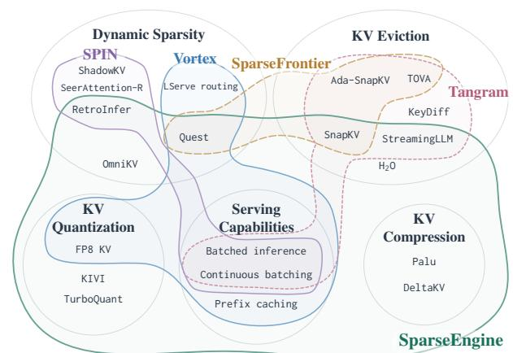  
Figure 1 Method coverage across sparse inference engines. Contours enclose representative implementations.

patterns can constrain others. MATLAB’s matrix operations simplify numerical computation [28], but irregular computations often require explicit control flow. SQL expresses relational queries [2], but stateful iterative algorithms often require recursive queries or procedural extensions. Rust’s ownership and borrowing support memory-safe systems programming [20], but constrain how mutable state can be shared. In each case, assumptions about data or state determine which computations are natural to express. For sparse inference engines, assumptions about KV layouts and update workflows similarly determine which method-specific computations and state changes their interfaces can accommodate.

Current engines organize these interfaces around particular cache layouts or workflows. Vortex exposes page-centric operations [11], while SPIN manages partitions through a GPU–CPU pipeline [49]. Tangram specializes in non-uniform head-wise KV retention [21]. Such interfaces fit some methods but constrain others: Quest uses query-dependent page selection [32], whereas H2O also needs persistent attention scores and physical KV eviction during generation [48]. Figure 1 compares method coverage with support for prefix caching, continuous batching and batched inference. This raises a central question:

Where should the abstraction boundary lie between shared serving infrastructure and method-specific control over KV state and computation?

We present SparseEngine, which places this boundary at a shared lifecycle contract that lets sparse methods define their own computational workflows and KV representations. Fine-grained hooks coordinate methodspecific computation and state updates, while common interfaces integrate these methods with attention execution and scheduling. Building on this flexibility, we introduce Chain Cache to reuse retained KV across turns. Controllable Prefix-Cache Pruning further lets applications prune selected history intervals while preserving prefix matching. Our contributions are:

• A general lifecycle abstraction for diverse sparse methods. We establish a unified lifecycle contract by introducing fine-grained hooks across prefill and decoding stages, module execution boundaries, and step transitions. This allows diverse sparse attention methods to customize their own KV representations and computational workflows without modifying model implementations, enabling the integration of 15 methods across four heterogeneous families.

• Higher-level sparsity-based cache state management. Building upon the lifecycle contract, we introduce higher-level cross-request cache management abstractions: Chain Cache enables eviction-based methods to resume directly from compacted historical state across interactions, while Prefix-Cache Pruning selectively reclaims physical KV capacity from application-specified history regions while preserving logical prefix matching.

• Eficient serving and fast inference with faithful quality. SparseEngine achieves over 10× aggregate decode throughput compared to vLLM via physical KV eviction under large batch sizes, delivers over 2.5× decode throughput speedup under identical concurrency, and attains up to 2.24× end-to-end replay speedup on multi-turn agent benchmarks, all while faithfully preserving the original task quality of evaluated sparse methods.

## 2 Related Work

Sparse Attention. Existing methods reduce KV cache cost through four complementary strategies. Dynamic sparse attention, including Quest [32], InfLLM [36], and OmniKV [17], selects query-dependent context while typically preserving unselected history for future queries. NSA [44] learns native sparse-attention patterns, whereas IndexCache [3] reuses selection indices across layers. KV eviction, including H2O [48], SnapKV [24], and PyramidKV [6], discard entries to reduce memory and subsequent attention work. KV compression methods, including Palu [8], LoRC [47], and DeltaKV [18], replace full-dimensional KV tensors with compact representations, while KV quantization methods, such as KIVI [25] and TurboQuant [45], reduce numerical precision.

These strategies require distinct state and execution semantics: dynamic selection maintains query-dependent indices and summaries; eviction changes the resident set and releases capacity; and compression or quantization changes the payload and may require specialized metadata or reconstruction. SparseEngine provides a shared lifecycle contract that supports heterogeneous sparse methods while preserving method control over KV representations, metadata, updates, and attention paths.

Inference Engine. Inference engines coordinate model execution, request scheduling, and KV cache management. Continuous batching updates the active batch between decoding steps, while chunked prefill divides long prompts into smaller scheduling units [1, 43]. Paged caches map logical token positions to physical KV blocks [23], and prefix caching reuses computed state across requests with shared prefixes [50].

Sparse inference systems further coordinate sparse computation, data placement, and memory reclamation. SparseFrontier [29] evaluates the accuracy-eficiency trade-ofs of sparse-attention methods. Among serving systems, SPIN [49] maps diferent selection granularities to partitions backed by hierarchical GPU-CPU KV storage; Vortex [11] provides programmable page-centric routing; and Tangram [21] manages non-uniform head-wise retention through budget reservation and Ragged Paging. HiSparse [38] bounds GPU residency by storing the complete KV history in host memory and fetching selected entries into a GPU cache, whereas vToken [16] reclaims token-level storage through logical-to-physical indirection and repacking.

These systems organize sparsity around specific access, placement, or retention patterns. In contrast, SparseEngine places the abstraction boundary at the method lifecycle: shared interfaces expose scheduling and capacity requirements, while methods control their physical representation and execution. This supports heterogeneous method families with continuous batching and method-compatible prefix caching (Figure 1). It also extends sparse-state management across requests: Chain Cache preserves compacted KV and metadata across turns, while controllable pruning reclaims history without losing logical-prefix reuse. See Appendix A for detailed background and notation.

## 3 SparseEngine

Lifecycle Contract. Existing sparse inference engines organize methods around predefined computational workflows. For instance, SPIN follows Index → Ofload → Select → Retrieve → Attention [49], while Vortex follows Cache Update & Summary Calculation → Page Selection → Attention [11]. SparseEngine instead anchors its abstraction to a key invariant: the model’s native module execution order. By exposing fine-grained hooks along this order, SparseEngine allows each sparse method to register callbacks and compose its own computational workflow without modifying the model implementation.

Section 3.1 develops the three components of this lifecycle contract: (1) fine-grained hooks exposed through SparseController; (2) a method-customized CacheManager; and (3) an AttentionView that connects methodowned state to attention execution. Building on these foundations, Section 3.2 extends method control across model executions: Chain Cache reuses retained KV and method-specific state across agent turns, while sparsity-based prefix-cache pruning removes selected physical KV entries without forfeiting logical-prefix matching or reuse.

## 3.1 Architectural Foundations

Fine-Grained Lifecycle Hooks in SparseController. Figure 2 shows the hooks and their interactions with method-defined cache state and attention views. The hooks span both prefill and decoding, with extension points before and after attention and at the end of every layer and execution step. A SparseMethodRuntime, selected at initialization, implements the method-specific callbacks invoked through SparseController. These callbacks compose scoring, selection, and state-update operations across prefill chunks, decoding steps, and Transformer layers, allowing the same model implementation to execute diferent sparse methods.

During prefill, finish\_step supports $\mathrm { H } _ { 2 } \mathrm { O ^ { \prime } } \mathbf { s }$ chunk-wise eviction using accumulated attention scores and SnapKV’s selection and eviction after the final prompt chunk. These hooks preserve chunked prefill without requiring method-specific model implementations such as LlamaSnapKV or Qwen3H2O. During decoding, build\_- decode\_selection performs Quest’s query-dependent page selection, while finish\_step updates $\mathrm { H } _ { 2 } \mathrm { O ^ { \prime } } \mathrm { s }$ cumulative scores and applies online eviction. Combining on\_layer\_end with build\_decode\_selection also enables OmniKV and DeltaKV to reuse observation-layer indices across subsequent layers.

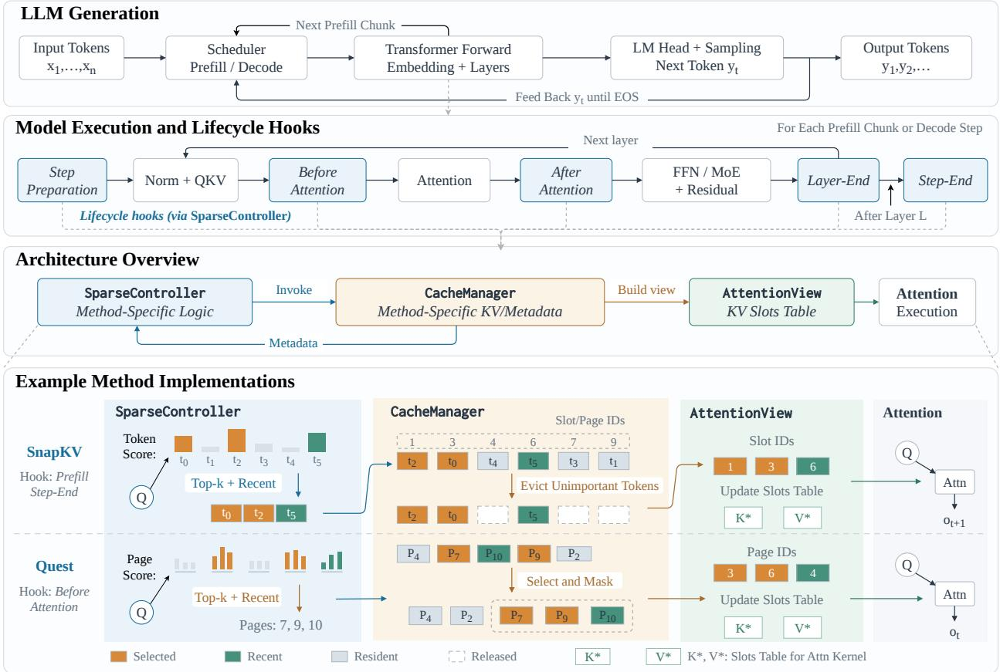  
Figure 2 Overview of SparseEngine. From top to bottom, the figure shows the LLM generation loop; the Transformer execution path and lifecycle hooks invoked during prefill and decoding; the interactions among SparseController, the method-specific CacheManager, AttentionView, and attention execution; and representative implementations of SnapKV and Quest.

Method-Customized CacheManager. The CacheManager owns the method-specific state and storage required by these workflows. Each method defines its KV representation, physical layout, position mapping, and allocation, write, update, and release operations. It also maintains persistent metadata alongside the corresponding KV state.

Lifecycle hooks invoke these operations to modify the physical cache. For example, SnapKV compaction and $_ { \mathrm { H } _ { 2 } \mathrm { O } }$ eviction jointly update retained positions, method statistics, and available capacity. OmniKV applies cross-layer selections to resident KV entries, whereas KIVI manages quantized KV pages, quantization metadata, and an unquantized residual region. Physical eviction updates retained-slot mappings and context lengths before returning discarded slots to the allocator; logical selection changes only which resident entries attention reads. This separation allows methods with diferent storage and access semantics to share the same lifecycle.

Attention Through AttentionView. AttentionView connects method-owned cache representations to attention execution. For a selection-based method,

$$
\operatorname { V i e w } _ { \ell , t } = \mathrm { B u i l d V i e w } ( C _ { \ell , t } , { \mathcal { I } } _ { \ell , t } ) , \quad o _ { \ell , t } = \mathrm { A t t e n t i o n } ( q _ { \ell , t } , \operatorname { V i e w } _ { \ell , t } ) ,\tag{1}
$$

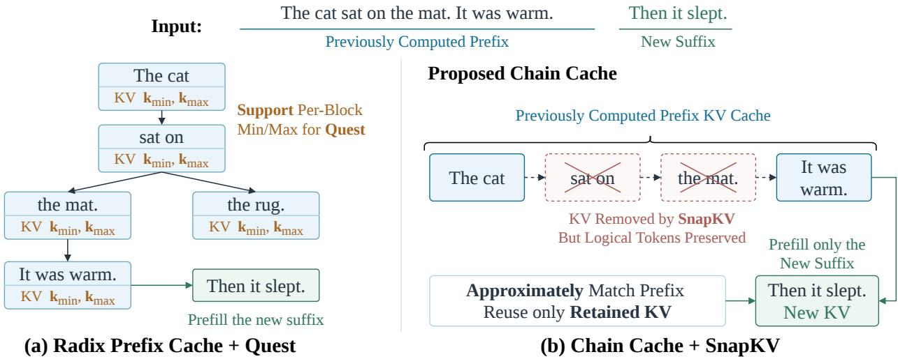  
Figure 3 Radix prefix caching with Quest and Chain Cache with SnapKV. Conventional radix prefix caching retains complete KV blocks and attaches the summaries required by Quest. After SnapKV evicts physical KV entries, Chain Cache preserves the logical token prefix and reuses the retained KV and method state, so a continuation prefills only the new sufix.

where � is an execution step, $C _ { \ell , t }$ is the persistent cache state, and $\mathcal { T } _ { \ell , 1 }$ � identifies the selected tokens or pages. Given this state and selection, CacheManager constructs a view that describes the accessible data and its physical layout for a compatible attention backend. The underlying state may contain explicit KV tensors or MLA latent and positional states together with method-specific metadata.

This interface supports attention over selected, compressed, quantized, or temporarily reconstructed KV while leaving persistent-state management to CacheManager. For example, a Quest view contains selected KV pages, an OmniKV view references resident KV according to cross-layer selections, and a DeltaKV view exposes KV reconstructed on demand. Thus, lifecycle hooks determine when state is selected or updated, CacheManager performs the corresponding storage operations, and AttentionView presents the resulting payload to attention. Appendix B details view payloads, temporary bufer lifetimes, and CUDA graph execution.

Execution Overview. Figure 2 traces inference from input tokens to generated output. The scheduler processes the prompt in prefill chunks and then feeds each sampled token back for the next decoding step. It queries MemoryOracle for method-specific capacity and reservation requirements and coordinates execution across GPU ranks (Appendix B.1). Within each Transformer layer, lifecycle hooks run the method-specific selection logic, and CacheManager exposes the required KV through an AttentionView. Layer-end hooks coordinate state across layers, while the step-end hook applies cache updates before the next forward pass.

## 3.2 Extended Sparsity-Based State Management

As agent contexts grow through repeated interactions, persistent cache management becomes as vital as fast execution. SparseEngine addresses this by extending method-owned state across requests to support compacted-history reuse and controlled pruning.

Chain Cache. Multi-turn agents accumulate long trajectories, making prefix caching important for reusing prior computation [30, 35, 41, 50]. Dynamic sparse-attention methods (e.g., Quest, OmniKV, NSA, and DSA) retain full KV histories and thus support conventional prefix caching. In contrast, eviction-based methods (e.g., SnapKV, KVzip, and $_ { \mathrm { H } _ { 2 } \mathrm { O } ) }$ violate the resident-KV assumption by discarding entries.

Chain Cache enables these eviction-based methods to reuse compacted state across turns. Its ChainCacheIndex associates a session with its retained per-layer KV, method-specific metadata, and logical token prefix. As illustrated in Figure 3, the logical prefix remains available for matching even when SnapKV has removed some of its physical KV entries. A continuation can therefore resume from the retained KV and method state instead of reconstructing the complete prefix. This is particularly important when diferent layers retain diferent token positions, as in $_ { \mathrm { H } _ { 2 } \mathrm { O } }$ and SnapKV, or when continuation requires persistent statistics such as $\mathrm { H } _ { 2 } \mathrm { O ^ { \prime } } \mathbf { s }$ accumulated attention scores.

Each session receives a chain\_id that identifies its retained state. A continuation must match the previously processed logical prefix, although not every matched token needs a resident KV entry. When a request completes, its chain becomes idle while CacheManager retains the per-layer KV and associated metadata. A matching continuation reattaches this state and prefills only the unprocessed sufix, preserving the method’s previous cache decisions. When capacity is required, idle chains and their state are reclaimed in least-recently-used order. Appendix B.2 provides the implementation details.

Sparsity-Based Prefix-Cache Pruning. Agent trajectories contain regions with diferent KV utility, including user inputs, tool results, reasoning traces, and outputs [26]; for example, a tool response may lose value after its relevant information is summarized. SparseEngine therefore applies sparse scoring policies such as KVzip [22] to application-selected history

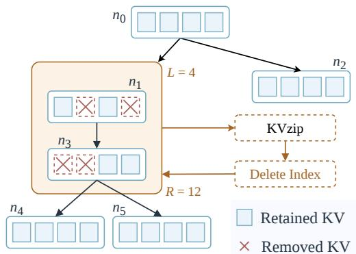  
Figure 4 Controllable prefix-cache pruning. Within an application-specified history interval, a sparse policy selects retained KV entries; SparseEngine releases the rest while preserving the logical prefix for matching.

regions, allowing the application to specify both the pruning interval and KV retention ratio. Concretely, the application submits the request’s complete token\_ids sequence and a pruning interval [�, �) with zero-based boundaries, defining $\mathcal { T } = \bar { \{ i \ | \ L \leq i < \bar { \boldsymbol { R } } \} }$ . A scoring policy, such as SnapKV or KVzip, selects the positions to retain within � and returns a mask. The cache manager applies this mask only to idle blocks with no active references or transfers in flight.

Let � denote the logical token prefix and ℛ the positions with resident KV. Retaining selected positions $\mathcal { I } \subseteq \mathcal { R } \cap \mathcal { T }$ yields:

$$
P ^ { \prime } = P , \qquad \mathcal { R } ^ { \prime } = ( \mathcal { R } \setminus \mathcal { T } ) \cup \bar { \mathcal { I } } .\tag{2}
$$

The cache manager releases the physical slots excluded from ℛ′ but leaves the logical prefix � unchanged. Subsequent requests can therefore match the same prefix while reusing only its retained KV. Figure 4 illustrates KVzip-based selection over $[ L , R )$ with � = 4 and � = 12. Appendix B.2 details the pruning metadata and cache operations.

## 4 Experiments

## 4.1 Experimental Setup

We evaluate whether SparseEngine preserves the quality of the original sparse methods on the long-context benchmarks LongBenchV1 [4] and LongBenchV2 [5], and assess reasoning quality on AIME [27]. We further evaluate the impact of sparsity on multi-turn agent task quality using SWE-Bench Lite [19] and Claw-Eval [42]. We follow the evaluation metrics defined by each benchmark.

For quality evaluation, we compare against the original sparse-method implementations where available to assess whether SparseEngine preserves their task quality, and against full attention to measure the quality impact of sparsity. For serving performance, we compare SparseEngine against Vortex [11], HiSparse [38], Tangram [21], and vLLM (v0.26.0) [23]. Appendix C gives the benchmark protocols and hardware configurations.

For grouped-query attention (GQA), we evaluate dense models represented by Llama-3.1-8B-Instruct [13] and Qwen3-4B-Thinking-2507 [39], as well as the MoE model Qwen3-30B-A3B-Instruct-2507 [39]. For multi-head latent attention (MLA), we evaluate the MoE model GLM-4.7-Flash [46]. We also evaluate Qwen3.6-27B [39], a dense hybrid model that combines linear attention with GQA. Appendix C.8 lists the full set of supported models and sparse methods. The hardware platforms used across our experiments include NVIDIA H100, H20, RTX PRO 6000, 4090, and 5090 GPUs.

Qwen3-30B-A3B (FP8) · TP=1, EP=1  
GLM-4.7-Flash (BF16) · TP=2, EP=2  
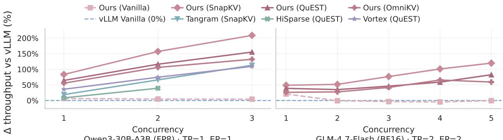

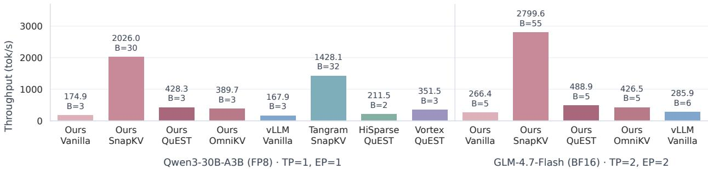

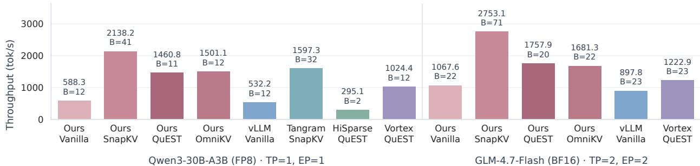  
Figure 5 Decode throughput on Qwen3-30B-A3B (left) and GLM-4.7-Flash (right). The upper plot shows throughput improvement over vanilla vLLM at matched batch sizes with 128K-token inputs, with vanilla vLLM defining the 0% baseline. The middle and lower plots show absolute throughput at each system–method pair’s largest successfully tested batch size with 128K- and 32K-token inputs, respectively. Bar annotations report throughput and batch size (�); the largest tested batch size need not be the system’s maximum capacity. Vortex encounters OOM on GLM with 128K-token inputs even at batch size 1. HiSparse and Tangram do not support the evaluated MLA.

## 4.2 Overall Serving Performance and Quality

Long-Context Decode Performance. SparseEngine improves long-context decode eficiency. Physical KV eviction lets SparseEngine sustain substantially larger tested decode batches on the same GPU configuration. At each system–method pair’s largest successfully tested batch size (Figure 5, middle), SparseEngine with SnapKV delivers approximately 10× the aggregate decode throughput of vanilla vLLM on both models. Dynamic sparse attention reduces attention computation by accessing only a selected subset of the KV cache at each decode step, improving throughput at matched batch sizes. With Quest and OmniKV, SparseEngine reaches roughly 1 5×–2 6× the decode throughput of vanilla vLLM at several matched batch sizes across the two evaluated models (upper). These results capture complementary benefits of sparse inference: lower attention cost and higher concurrency within the same GPU memory budget. The lower plot in Figure 5 shows that the throughput benefit from larger tested batches also extends to 32K-token inputs. Appendix C.6 also reports the absolute decode throughput of Figure 6. Appendix C.7 details the 32K settings and complementary results.

Table 1 Sparse-method quality on LongBench V1 and V2. Deltas below scores report SparseEngine minus the reference implementation in percentage points. Following oficial evaluation metrics, average score is the six-category average for V1 and accuracy over all examples for V2.
<table><tr><td></td><td colspan="8">LongBenchV1</td><td colspan="8">LongBenchV2</td></tr><tr><td>Method</td><td>S-Doc M-Doc Summ. F-Shot Synth. Code Avg. S-Doc M-Doc Hist. Learn. Struct. Code Avg.</td><td></td><td></td><td></td><td></td><td></td><td></td><td></td><td></td><td></td><td></td><td></td><td></td><td></td><td></td><td></td></tr><tr><td>GLM-4.7-Flash†</td><td>41.6</td><td>47.1</td><td>27.8</td><td>71.0</td><td></td><td>52.5</td><td>65.7 51.0</td><td></td><td>34.3</td><td>28.8</td><td>20.5</td><td>29.6</td><td></td><td>21.2</td><td>46.0</td><td>31.4</td></tr><tr><td>SnapKV</td><td>41.0</td><td>47.2</td><td>26.9</td><td>69.8</td><td></td><td>52.5</td><td>65.2 50.4</td><td></td><td>36.0</td><td>31.2</td><td>20.5</td><td>32.1</td><td></td><td>30.3</td><td>42.0</td><td>33.2</td></tr><tr><td>OmniKV</td><td>41.7</td><td>47.1</td><td>27.8</td><td>70.6</td><td></td><td>52.5</td><td>65.1 50.8</td><td></td><td>35.4</td><td>28.0</td><td>23.1</td><td>33.3</td><td></td><td>42.4</td><td>42.0</td><td>33.4</td></tr><tr><td>Quest</td><td>41.4</td><td>47.2</td><td>27.7</td><td>71.2</td><td></td><td>52.5</td><td>65.4 50.9</td><td></td><td>34.9</td><td>29.6</td><td>23.1</td><td>40.7</td><td></td><td>27.3</td><td>42.0</td><td>33.8</td></tr><tr><td>StreamingLLM</td><td>34.7</td><td>41.7</td><td>26.4</td><td>69.2</td><td></td><td>53.0</td><td>64.1 48.2</td><td></td><td>34.3</td><td>32.0</td><td>23.1</td><td>34.6</td><td></td><td>30.3</td><td>32.0</td><td>32.4</td></tr><tr><td>PyramidKV</td><td>39.1</td><td>46.4</td><td>26.2</td><td>70.1</td><td></td><td>53.0</td><td>64.6</td><td>49.9</td><td>35.4</td><td>26.4</td><td>25.6</td><td>34.6</td><td></td><td>24.2</td><td>36.0</td><td>31.6</td></tr><tr><td>Llama-3.1-8B</td><td>43.3</td><td>46.6</td><td>28.8</td><td>69.3</td><td></td><td>55.8</td><td>60.2</td><td>50.7</td><td>33.7</td><td>31.2</td><td>10.3</td><td>25.9</td><td></td><td>27.3</td><td>36.0</td><td>29.8</td></tr><tr><td></td><td>-0.1</td><td>+0.0</td><td>+0.0</td><td>-0.1</td><td></td><td>+0.8</td><td>+0.7</td><td>+0.2</td><td>-1.2</td><td>+1.6</td><td>-5.1</td><td>+2.5</td><td></td><td>-3.0</td><td>+2.0</td><td>+0.0</td></tr><tr><td>SnapKV</td><td>43.4</td><td>46.6</td><td>27.0</td><td>68.4</td><td></td><td>55.9</td><td>60.1 50.2 34.3</td><td></td><td></td><td>31.2</td><td>10.3</td><td>24.7</td><td></td><td>27.3</td><td>36.0 29.8</td><td></td></tr><tr><td></td><td>+0.0</td><td>+0.0</td><td>-0.1</td><td>-0.5</td><td></td><td>+0.8</td><td>+0.1</td><td>+0.1</td><td>+0.6</td><td>+0.8</td><td>-2.6</td><td>+0.0</td><td></td><td>-3.0</td><td>+0.0</td><td>+0.0</td></tr><tr><td>OmniKV</td><td>43.2</td><td>46.7</td><td>29.0</td><td>69.1</td><td></td><td>56.2</td><td>60.1</td><td>50.7</td><td>33.1</td><td>30.4</td><td>10.3</td><td>24.7</td><td></td><td>27.3</td><td>38.0</td><td>29.4</td></tr><tr><td></td><td>-0.2</td><td>+0.5</td><td>-0.1</td><td>+0.0</td><td></td><td>+1.9</td><td>+0.0</td><td>+0.4</td><td>+0.0</td><td>+0.8</td><td>-2.6</td><td>-1.2</td><td></td><td>-3.0</td><td>+2.0</td><td>-0.2</td></tr><tr><td>Quest</td><td>43.1</td><td>46.1</td><td>28.6</td><td>68.8</td><td></td><td>55.4</td><td>59.0 50.2</td><td></td><td>29.1</td><td>28.8</td><td>12.8</td><td>24.7</td><td></td><td>24.2</td><td>32.0</td><td>27.0</td></tr><tr><td></td><td>+0.2</td><td>-0.2</td><td>-0.3</td><td>-0.2</td><td></td><td>+0.5</td><td>-0.1</td><td>+0.0</td><td>-2.3</td><td>-0.8</td><td>+7.7</td><td>+1.2</td><td></td><td>+3.0</td><td>+0.0</td><td>+0.0</td></tr><tr><td>RetroInfer</td><td>43.6</td><td>46.5</td><td>28.9</td><td>69.4</td><td></td><td>55.9</td><td>60.5 50.8</td><td></td><td>32.6</td><td>30.4</td><td>10.3</td><td>24.7</td><td></td><td>27.3</td><td>38.0</td><td>29.2</td></tr><tr><td></td><td>+0.2</td><td>+0.1</td><td>-0.1</td><td>+0.0</td><td></td><td>+0.3</td><td>+0.5</td><td>+0.2</td><td>-0.6</td><td>+0.0</td><td>+0.0</td><td>+1.2</td><td></td><td>-3.0</td><td>-2.0</td><td>-0.4</td></tr><tr><td>StreamingLLM</td><td>33.9</td><td>40.1</td><td>25.5</td><td>67.0</td><td></td><td>52.3</td><td>59.4 46.4</td><td></td><td>33.7</td><td>32.8</td><td>10.3</td><td>19.8</td><td></td><td>30.3</td><td>34.0</td><td>29.2</td></tr><tr><td></td><td>+0.1</td><td>+0.5</td><td>+0.1</td><td>-0.1</td><td></td><td>+0.5</td><td>+0.3</td><td>+0.2</td><td>-0.6</td><td>+1.6</td><td>-2.6</td><td>-4.9</td><td></td><td>+3.0</td><td>+2.0</td><td>-0.4</td></tr><tr><td>PyramidKV</td><td>43.4</td><td>46.7</td><td>27.1</td><td>69.0</td><td></td><td>55.9</td><td>59.0 50.2</td><td></td><td>32.6</td><td>28.8</td><td>10.3</td><td>29.6</td><td></td><td>33.3</td><td>38.0</td><td>30.0</td></tr><tr><td></td><td>-0.1</td><td>+0.2</td><td>-0.1</td><td>+0.0</td><td></td><td>+0.8</td><td>-0.6</td><td>+0.0</td><td>+0.0</td><td>-2.4</td><td>-2.6</td><td>+2.5</td><td></td><td>+3.0</td><td>+4.0</td><td>+0.2</td></tr><tr><td>DeltaKV</td><td>43.5</td><td>46.2</td><td>27.8</td><td>69.5</td><td></td><td>55.6</td><td>59.7</td><td>50.4</td><td>32.6</td><td>34.4</td><td>10.3</td><td>22.2</td><td></td><td>30.3</td><td>32.0</td><td>29.4</td></tr><tr><td></td><td>+0.0</td><td>+2.0</td><td>-0.2</td><td>+1.7</td><td></td><td>+1.8</td><td>-0.8</td><td>+0.8</td><td>+0.6</td><td>+2.4</td><td>-5.1</td><td>-9.9</td><td></td><td>+3.0</td><td>+2.0</td><td>-0.8</td></tr><tr><td>Palu</td><td>36.6</td><td>36.4</td><td>25.2</td><td>66.4</td><td></td><td>47.0</td><td>39.041.8</td><td></td><td>32.0</td><td>28.8</td><td>18.0</td><td>28.4</td><td></td><td>30.3</td><td>18.0</td><td>28.0</td></tr><tr><td></td><td>+0.3</td><td>+0.4</td><td>+0.0</td><td>+0.6</td><td></td><td>+0.0</td><td>-0.2</td><td>+0.2</td><td>+1.7</td><td>+0.0</td><td>-2.6 12.8</td><td>+2.5 27.2</td><td></td><td>+0.0 39.4</td><td>+2.0 38.0</td><td>+1.0 31.0</td></tr><tr><td>TurboQuant</td><td>43.5 +0.3</td><td>46.4 -0.7</td><td>29.1 +0.0</td><td>+0.0</td><td>68.8</td><td>54.6 +0.1</td><td>59.6 50.3 -0.6</td><td>-0.1</td><td>36.0 +3.4</td><td>27.2 -6.4</td></table>

Eficiency within Specialized Systems’ Supported Methods. We further conduct fair, method-specific comparisons against baselines to examine whether SparseEngine’s more general implementation comes at the expense of eficiency. Quest directly matches Vortex and HiSparse’s page-selection abstraction, and SnapKV directly matches Tangram’s KV-retention abstraction [11, 21, 38]. At a matched batch size of two on Qwen3 with 128K-token inputs (Figure 5, upper), SparseEngine with Quest delivers 1 24× Vortex’s and 1.55× HiSparse’s decode throughput. With SnapKV, SparseEngine delivers 1.55× Tangram’s throughput at the same batch size. SparseEngine remains ahead at every other common measured batch size in the upper plot. These method-matched results show that SparseEngine’s broader method support is compatible with eficient execution even for methods that directly fit the competing systems’ abstractions. Next, we show that our acceleration does not sacrifice the quality of the original sparse methods.

Sparse-Method Quality This experiment evaluates whether sparse methods retain task quality when implemented within SparseEngine. We evaluate diverse sparse methods on Llama-3.1-8B and GLM-4.7-Flash, using full attention (Vanilla) and the original implementations as references for each model and method. Table 1 reports the results, with method-specific settings in Appendix C.1. Across the 20 overall-score comparisons on LongBench V1 and V2, SparseEngine achieves a mean diference of +0.17 points from the reference implementations, with a population variance of 0.32 squared points. These small aggregate diferences indicate that SparseEngine closely preserves the task quality of the evaluated methods. Notably, because top-p sampling introduces randomness and the number of instances in LongBench V2 subtasks is relatively small, individual subtask scores show noticeable fluctuations, although the average score remains stable.

End-to-End Reasoning Performance and Eficiency. Table 2 evaluates task accuracy and end-to-end generation speed on AIME 2024 with Qwen3-4B-Thinking-2507. In SnapKV, Low, Mid, High represent sparsity budgets of 4k, 8k, and 16k, respectively. These results also reveal a broad quality-eficiency trade-of: methods ofering larger speedups generally sufer greater accuracy drops. The speedup here is lower than that in Figure 5 because the evaluated contexts are shorter. The shorter contexts in this workload reduce attention’s share of execution time relative to the longcontext decode benchmark, leaving less computation for sparse attention to eliminate. Appendix C.2 details the evaluation protocol and the method-specific concurrency limits, which reflect diferent GPU memory requirements.

Table 2 AIME 2024 results. Acc. (%) averages 60 responses (two per problem). Speedup is relative to Qwen3-4B-Thinking.
<table><tr><td>Method</td><td>Acc.</td><td>E2E Speedup</td></tr><tr><td>Qwen3-4B</td><td>81.7</td><td>1.00×</td></tr><tr><td>OmniKV</td><td>80.0</td><td>1.51×</td></tr><tr><td>Quest</td><td>76.7</td><td>1.28×</td></tr><tr><td>Quest (Vortex)</td><td>75.0</td><td>0.91×</td></tr><tr><td>SnapKV (Low)</td><td>58.3</td><td>1.66×</td></tr><tr><td>SnapKV (Mid)</td><td>80.0</td><td>1.33×</td></tr><tr><td>SnapKV (High)</td><td>85.0</td><td>1.05×</td></tr><tr><td>PyramidKV</td><td>53.3</td><td>1.66×</td></tr><tr><td>R-KV</td><td>51.7</td><td>1.30×</td></tr><tr><td>StreamingLLM</td><td>18.3</td><td>3.36×</td></tr></table>

## 4.3 Performance of Cache State Management

## Chain Cache Quality on Agent Tasks We evaluate chain cache

with mini-SWE-agent on SWE-bench Lite and with Claw-Eval on text-only agent tasks. SnapKV and $_ { \mathrm { H } _ { 2 } \mathrm { O } }$ retain their compacted KV and method state through Chain Cache, while Quest and OmniKV use radix prefix caching. Table 3 reports task success alongside a full-attention reference for each model, using the model-specific settings in Appendix C.3. SnapKV with Chain Cache achieves a task success rate close to the full-attention reference on GLM and resolves more tasks than the reference on Qwen3, demonstrating multiturn agent execution with retained compacted state. Table 4 reports Qwen3.6 results on Claw-Eval. OmniKV maintains task quality close to the reference, with settings in Appendix C.5. Experiments demonstrate that, as long as an overly aggressive sparsity budget is not used, Chain Cache is able to maintain robust quality on complex multi-turn agent tasks.

Table 3 SWE-bench Lite resolved tasks (%) with mini-SWE-agent.
<table><tr><td>Model</td><td>Vanilla SnapKV</td><td></td><td> ${ \bf H } _ { 2 } { \bf O }$ </td><td>Quest</td><td>OmniKV</td></tr><tr><td>GLM-4.7-Flash</td><td>25.0</td><td>24.7</td><td>13.0</td><td>25.3</td><td>26.0</td></tr><tr><td>Qwen3-30B-A3B</td><td>5.3</td><td>8.3</td><td>一</td><td>7.3</td><td>5.3</td></tr></table>

Table 4 Claw-Eval quality on Qwen3.6-FP8.
<table><tr><td>Method</td><td>Avg. score (%) Pass@1 (%)</td></tr><tr><td>Vanilla</td><td>67.4 50.5</td></tr><tr><td>OmniKV</td><td>68.0 51.1</td></tr></table>

Quality of Prefix Pruning We evaluate prefix-cache pruning during mini-SWE-agent execution on SWE-bench Lite (Table 5). Using KVzip-based global scoring to retain 20% of the aligned KV tokens in targeted tool results incurs a slight drop in performance. However, when we delay pruning with lag=4 (i.e., when a new tool result arrives, it prunes only the fifth most recent tool-result round, leaving the latest four rounds intact), the original performance is immediately restored. This policy achieves a 25.0% task success rate, illustrating the potential of adapting pruning to an agent’s use of recent evidence, as agent dialogues indeed often contain many low-value tool results. The result motivates further exploration of pruning thresholds and selection policies within the same cache-management abstraction. Appendix C.4 details the protocol and configurations.

End-to-End Agent Serving Performance Table 6 complements the agent quality evaluation with end-to-end replay of SWE-bench Lite trajectories on GLM-4.7-Flash and a dedicated Gasai agent trace on Qwen3-30B-A3B FP8. Gasai is used only to evaluate system eficiency. Replay fixes recorded outputs and includes prefill, decoding, and scheduling, together with simulated tool waits. All methods use the same GPU configuration, with concurrency selected for each method’s KV memory requirements. SnapKV with an 8K cache budget and Chain Cache reach a 2.24× end-to-end speedup over Vanilla on Gasai. Its memory savings support higher concurrency, while Chain Cache retains compacted state for reuse across turns. OmniKV also accelerates both workloads at matched concurrency, showing that dynamic sparse attention remains efective with cross-turn prefix reuse. Together, these results show how SparseEngine translates both sparse computation and KV memory savin

Table 5 SWE-bench Lite resolved tasks (%) with mini-SWE-agent and tool-result prefix pruning. All runs use 300 tasks; settings are in Appendix C.4.
<table><tr><td>Method</td><td>Resolved (%)</td></tr><tr><td>Vanilla</td><td>23.7</td></tr><tr><td>Quest</td><td>21.3</td></tr><tr><td>OmniKV</td><td>22.3</td></tr><tr><td>OmniKV (Lag=4)</td><td>25.0</td></tr></table>

SparseEngine translates both sparse computation and KV memory savings into end-to-end serving eficiency.

## 5 Discussions

Agent-Assisted Method Integration. Agentassisted development creates an opportunity to combine broad method support with specialized execution. Frameworks often reduce implementation efort by routing methods through a common representation or workflow. As coding agents lower the cost of specialized implementations, framework design can give each method greater freedom over its state and computation. SparseEngine provides such a boundary through explicit lifecycle hooks and method-owned cache state. Building on this contract, an integration harness could guide agents through implementing new methods using reference modules and automated checks for method fidelity and cache lifecycle correctness. Agents could then use test feedback to refine their implementations within a clearly defined scope. This development model would accelerate method integration while preserving method-specific optimizations and access to shared serving capabilities.

Table 6 End-to-end agent trace replay performance. Speedup is relative to each workload’s Vanilla at the listed batch sizes. Gasai measures system eficiency only.
<table><tr><td>Method</td><td>Approx. Time Max BS</td><td>E2E (min) Speedup</td><td>E2E Out. tok/s</td></tr><tr><td>SWE-lite: GLM-4.7-Flash</td><td></td><td></td><td></td></tr><tr><td>Vanilla 40</td><td>98.1</td><td>1.00×</td><td>302.0</td></tr><tr><td>Quest 32</td><td>92.2</td><td>1.06×</td><td>321.3</td></tr><tr><td>OmniKV 40</td><td>62.4</td><td>1.57×</td><td>474.5</td></tr><tr><td>SnapKV (High) 52</td><td>82.0</td><td>1.20×</td><td>361.2</td></tr><tr><td>H2O 80</td><td>48.5</td><td>2.02×</td><td>610.8</td></tr><tr><td colspan="4">Gasai: Qwen3-30B-A3B FP8</td></tr><tr><td>Vanilla 32</td><td>49.9</td><td>1.00×</td><td>346.3</td></tr><tr><td>Quest 32</td><td>58.9</td><td>0.85×</td><td>293.5</td></tr><tr><td>OmniKV 32</td><td>30.6</td><td>1.63×</td><td>564.2</td></tr><tr><td>SnapKV (Mid) 72</td><td>22.2</td><td>2.24×</td><td>777.3</td></tr><tr><td>SnapKV (High) 52</td><td>30.0</td><td>1.66×</td><td>575.9</td></tr><tr><td>H2O 80</td><td>25.0</td><td>1.99×</td><td>690.2</td></tr></table>

Serving Natively Sparse Models. Native sparse attention makes sparse-state management an increasingly central part of model serving. DeepSeek-

V3.2 incorporates sparse attention into the model architecture [12]. Cross-layer index reuse, explored by OmniKV for inference-time sparsification, also underlies IndexCache’s acceleration of learned sparse attention [3, 17]. These mechanisms fit naturally with SparseEngine’s lifecycle hooks, which expose when selection state is produced and reused while preserving method-specific cache representations. Native sparse execution also opens opportunities for complementary KV optimizations. For selection-based models that retain full KV histories, eviction can control cache growth, while quantization and compression can reduce the storage cost of retained state. SparseEngine provides a common foundation for exploring these combinations and extending their state reuse across agent turns.

## AI Use Statement

We used AI tools to polish the language of the manuscript and assist with implementing portions of the code.   
The authors take full responsibility for the manuscript and the accompanying implementation.

## Ethics Statement

This work studies eficient inference and cache management for large language models. Its intended benefit is to reduce the computational and memory costs of long-context applications. The proposed system does not address the safety or biases of the underlying models, and deployment should retain appropriate safeguards for the intended application.

## Reproducibility Statement

Appendix C documents the evaluation protocols, with hardware configurations and method-specific hyperparameters provided in the corresponding subsections. Appendix B describes the lifecycle interfaces and cache-management mechanisms used in SparseEngine. The implementation and reproduction materials are available at https://github.com/CURRENTF/SparseEngine.

## References

[1] Amey Agrawal, Nitin Kedia, Ashish Panwar, Jayashree Mohan, Nipun Kwatra, Bhargav S. Gulavani, Alexey Tumanov, and Ramachandran Ramjee. Taming throughput-latency tradeof in llm inference with sarathi-serve. In USENIX Symposium on Operating Systems Design and Implementation, pages 117–134, 2024. URL https://api.semanticscholar. org/CorpusID:268249103.

[2] M. M. Astrahan and D. D. Chamberlin. Implementation of a structured English query language. Communications of the ACM, 18(10):580–588, 1975. doi: 10.1145/361020.361215. URL https://doi.org/10.1145/361020.361215.

[3] Yu Bai, Qian Dong, Tingyu Jiang, Xin Lv, Zhengxiao Du, Aohan Zeng, Jie Tang, and Juanzi Li. Indexcache: Accelerating sparse attention via cross-layer index reuse. ArXiv, abs/2603.12201, 2026. URL https://api.semanticscholar.org/ CorpusID:286493297.

[4] Yushi Bai, Xin Lv, Jiajie Zhang, Hong Lyu, Jiankai Tang, Zhidian Huang, Zhengxiao Du, Xiao Liu, Aohan Zeng, Lei Hou, Yuxiao Dong, Jie Tang, and Juan-Zi Li. Longbench: A bilingual, multitask benchmark for long context understanding. In Proceedings of the 62nd annual meeting of the associationfor computational linguistics (volume 1: Long papers), pages 3119–3137, 2024. URL https://api.semanticscholar.org/CorpusID:261245264.

[5] Yushi Bai, Shangqing Tu, Jiajie Zhang, Hao Peng, Xiaozhi Wang, Xin Lv, Shulin Cao, Jiazheng Xu, Lei Hou, Yuxiao Dong, Jie Tang, and Juan-Zi Li. Longbench v2: Towards deeper understanding and reasoning on realistic long-context multitasks. In Proceedings ofthe 63rd Annual Meeting ofthe Associationfor Computational Linguistics (Volume 1: Long Papers), pages 3639–3664, 2025. URL https://api.semanticscholar.org/CorpusID:274859535.

[6] Zefan Cai, Yichi Zhang, Bofei Gao, Yuliang Liu, Tianyu Liu, Keming Lu, Wayne Xiong, Yue Dong, Baobao Chang, Junjie Hu, and Wen Xiao. Pyramidkv: Dynamic kv cache compression based on pyramidal information funneling. ArXiv, abs/2406.02069, 2024. URL https://api.semanticscholar.org/CorpusID:270226243.

[7] Zefan Cai, Wen Xiao, Hanshi Sun, Cheng Luo, Yi-Kai Zhang, Ke Wan, Yucheng Li, Yeyang Zhou, Li-Wen Chang, Jiuxiang Gu, Zhen Dong, Anima Anandkumar, Abedelkadir Asi, and Junjie Hu. R-kv: Redundancy-aware kv cache compression for reasoning models. Advances in neural information processing systems, 38:60980–61005, 2025. URL https://api.semanticscholar.org/CorpusID:279070957.

[8] Chi-Chih Chang, Wei-Cheng Lin, Chien-Yu Lin, Chong-Yan Chen, Yu-Fang Hu, Pei-Shuo Wang, Ning-Chi Huang, Luis Ceze, and Kai-Chiang Wu. Palu: Compressing kv-cache with low-rank projection. ArXiv, abs/2407.21118, 2024. URL https://api.semanticscholar.org/CorpusID:271571616.

[9] MiniMax Aili Chen, Aonian Li, Baichuan Zhou, Bangwei Gong, Binyan Jiang, Bo Dan, Chang Yu, Chao Wang, Chengnuo Ma, Chengzhi Zhong, Chen Zhu, Chengjun Xiao, Chengyi Yang, Chengyu Du, Chenyang Zhang, Chi Zhang, Chuang Huang, Chunhao Zhang, Chunhui Du, Chunyu Zhao, Cong Guo, Da Chen, Deming Ding, Dianjun

Sun, Dongyu Zhang, Enhui Yang, Fei Richard Yu, Guangxuan Zheng, et al. The minimax-m2 series: Mini activations unleashing max real-world intelligence. ArXiv, abs/2605.26494, 2026. URL https://api.semanticscholar.org/ CorpusID:288672090.

[10] Yaoqi Chen, Jin-Kai Zhang, Baotong Lu, Qianxi Zhang, Chengruidong Zhang, Jing Liu, Jingjia Luo, Di Liu, Huiqiang Jiang, Qi Chen, Bailu Ding, Xiao Yan, Jia-Wei Jiang, Chen Chen, Mingxing Zhang, Cheng Li, Yuqing Yang, Fan Yang, and Mao Yang. Retroinfer: A vector storage engine for scalable long-context llm inference. Proc. VLDB Endow., 19: 1016–1031, 2025. URL https://api.semanticscholar.org/CorpusID:287782427.

[11] Zhuoming Chen, Xin Zhong, Qilong Feng, Ranajoy Sadhukhan, Yang Zhou, Michael Qizhe Shieh, Zhihao Jia, and Beidi Chen. Vortex: Eficient and programmable sparse attention serving for ai agents. ArXiv, abs/2606.06453, 2026. URL https://api.semanticscholar.org/CorpusID:288977094.

[12] DeepSeek-AI, Aixin Liu, Aoxue Mei, Ban Lin, Bing Xue, Bing-Li Wang, Bin Xu, Bochao Wu, Bowei Zhang, Chaofan Lin, Chen Dong, Chengda Lu, Chenggang Zhao, Chengqi Deng, Chenhao Xu, Chong Ruan, Damai Dai, Daya Guo, Dejian Yang, Deli Chen, Erhang Li, Fangqi Zhou, Fangyun Lin, Fucong Dai, Guangbo Hao, Guanting Chen, Guowei Li, H. Zhang, Hanwei Xu, Hao Li, Hao Liang, Haoran Wei, Haowei Zhang, Hao sheng Luo, Haozhe Ji, Honghui Ding, Hongxuan Tang, Huan Cao, Huazuo Gao, Huixian Qu, Hui Zeng, Jialiang Huang, Jiashi Li, Jiaxin Xu, et al. Deepseek-v3.2: Pushing the frontier of open large language models. ArXiv, abs/2512.02556, 2025. URL https://api.semanticscholar.org/CorpusID:283448719.

[13] Abhimanyu Dubey, Abhinav Jauhri, Abhinav Pandey, Abhishek Kadian, Ahmad Al-Dahle, Aiesha Letman, Akhil Mathur, Alan Schelten, Amy Yang, Angela Fan, Anirudh Goyal, A. S. Hartshorn, Aobo Yang, Archi Mitra, Archie Sravankumar, Artem Korenev, Arthur Hinsvark, Arun Rao, Aston Zhang, Aurélien Rodriguez, Austen Gregerson, Ava Spataru, Baptiste Rozière, Bethany M. Biron, Binh Tang, Bobbie Chern, Char lotte Caucheteux, Chaya Nayak, Chloe Bi, Chris Marra, Chris McConnell, Christian Keller, Christophe Touret, Chunyang Wu, Corinne Wong, Cristian Canton Ferrer, Cyrus Nikolaidis, Damien Allonsius, Daniel Song, Danielle Pintz, Danny Livshits, et al. The llama 3 herd of models. arXiv preprint arXiv:2407.21783, 2024. URL https://api.semanticscholar.org/CorpusID:271571434.

[14] Qihang Fan, Huaibo Huang, Zhiying Wu, Bingning Wang, and Ran He. Flashprefill v2: Block-sparse prefill attention for long-context llm serving. arXiv preprint arXiv:2608.19758, 2026. URL https://api.semanticscholar. org/CorpusID:291257315.

[15] Yuan Feng, Junlin Lv, Yukun Cao, Xike Xie, and S. Kevin Zhou. Ada-kv: Optimizing kv cache eviction by adaptive budget allocation for eficient llm inference. Advances in Neural Information Processing Systems, 38:113152–113188, 2025. URL https://api.semanticscholar.org/CorpusID:271218006.

[16] Yuanhang Gao, Xiangrui Yang, Yuanfeng Chen, Hongjia Chen, Qianru Lv, Wenfei Wu, and Dongsheng Li. vtoken: Token-level virtualization for reclaimable kv caches. arXiv preprint arXiv:2608.13263, 2026. URL https: //api.semanticscholar.org/CorpusID:291084792.

[17] Jitai Hao, Yuke Zhu, Tian Wang, Jun Yu, Xin Xin, Bo Zheng, Zhaochun Ren, and Sheng Guo. Omnikv: Dynamic context selection for eficient long-context llms. In International Conference on Learning Representations, volume 2025, pages 87443–87464, 2025. URL https://api.semanticscholar.org/CorpusID:278601790.

[18] Jitai Hao, Qiang Huang, Yaowei Wang, Min Zhang, and Jun Yu. Deltakv: Residual-based kv cache compression via long-range similarity. ArXiv, abs/2602.08005, 2026. URL https://api.semanticscholar.org/CorpusID:285454299.

[19] Carlos E. Jimenez, John Yang, Alexander Wettig, Shun-Yu Yao, Kexin Pei, Ofir Press, and Karthik Narasimhan. Swebench: Can language models resolve real-world github issues? In International Conference on Learning Representations, volume 2024, pages 54107–54157, 2024. URL https://api.semanticscholar.org/CorpusID:263829697.

[20] Ralf Jung, Jacques-Henri Jourdan, Robbert Krebbers, and Derek Dreyer. RustBelt: Securing the foundations of the Rust programming language. Proceedings of the ACM on Programming Languages, 2(POPL):1–34, 2018. doi: 10.1145/3158154. URL https://doi.org/10.1145/3158154.

[21] Hyungmin Kim, Minsoo Kim, Hongseok Kim, and Jungwook Choi. Tangram: Unlocking non-uniform kv cache compression for eficient multi-turn llm serving. ArXiv, abs/2606.06302, 2026. URL https://api.semanticscholar. org/CorpusID:288976234.

[22] Jang-Hyun Kim, Jinuk Kim, Sangwoo Kwon, Jae W. Lee, Sangdoo Yun, and Hyun Oh Song. Kvzip: Query-agnostic kv

cache compression with context reconstruction. Advances in Neural Information Processing Systems, 38:167563–167591, 2025. URL https://api.semanticscholar.org/CorpusID:278996887.

[23] Woosuk Kwon, Zhuohan Li, Siyuan Zhuang, Ying Sheng, Lianmin Zheng, Cody Hao Yu, Joseph E. Gonzalez, Haotong Zhang, and Ion Stoica. Eficient memory management for large language model serving with pagedattention. Proceedings of the 29th Symposium on Operating Systems Principles, pages 611–626, 2023. URL https://api.semanticscholar.org/CorpusID:261697361.

[24] Yuhong Li, Yingbing Huang, Bowen Yang, Bharat Venkitesh, Acyr F. Locatelli, Hanchen Ye, Tianle Cai, Patrick Lewis, and Deming Chen. Snapkv: Llm knows what you are looking for before generation. Advances in Neural Information Processing Systems, 37:22947–22970, 2024. URL https://api.semanticscholar.org/CorpusID:269303164.

[25] Zirui Liu, Jiayi Yuan, Hongye Jin, Shaochen Zhong, Zhaozhuo Xu, Vladimir Braverman, Beidi Chen, and Xia Hu. Kivi: A tuning-free asymmetric 2bit quantization for kv cache. In International Conference on Machine Learning, 2024. URL https://api.semanticscholar.org/CorpusID:267413049.

[26] Venkatesha Matam and Keonwoo Kim. Memdecay: Region-aware kv cache eviction for eficient llm agent inference. ArXiv, abs/2607.10582, 2026. URL https://api.semanticscholar.org/CorpusID:290135698.

[27] Maxwell-Jia. AIME 2024 Dataset. Hugging Face, 2024. URL https://huggingface.co/datasets/Maxwell-Jia/AIME\_ 2024. 30 problems from the 2024 American Invitational Mathematics Examination (AIME I and II).

[28] Cleve Moler and Jack Little. A history of MATLAB. Proceedings ofthe ACM on Programming Languages, 4(HOPL):1–67, 2020. doi: 10.1145/3386331. URL https://doi.org/10.1145/3386331.

[29] Piotr Nawrot, Robert Li, Renjie Huang, Sebastian Ruder, Kelly Marchisio, and E. Ponti. The sparse frontier: Sparse attention trade-ofs in transformer llms. In Findings of the Association for Computational Linguistics: ACL 2026, pages 38667–38701, 2026. URL https://api.semanticscholar.org/CorpusID:278033756.

[30] Zai-Feng Pan, Ajjkumar Patel, Yipeng Shen, Zheng-Ding Hu, Yue Guan, Wanlu Li, Lian-Hui Qin, Yida Wang, and Yu-Fei Ding. Kvflow: Eficient prefix caching for accelerating llm-based multi-agent workflows. Advances in Neural Information Processing Systems, 38:126246–126265, 2025. URL https://api.semanticscholar.org/CorpusID: 280298721.

[31] Noah Shinn, Federico Cassano, Beck Labash, Ashwin Gopinath, Karthik Narasimhan, and Shunyu Yao. Reflexion: language agents with verbal reinforcement learning. Advances in neural information processing systems, 36:8634–8652, 2023. URL https://api.semanticscholar.org/CorpusID:258833055.

[32] Jiaming Tang, Yilong Zhao, Kan Zhu, Guangxuan Xiao, Baris Kasikci, and Song Han. Quest: Query-aware sparsity for eficient long-context llm inference. ArXiv, abs/2406.10774, 2024. URL https://api.semanticscholar.org/CorpusID: 270559146.

[33] Gemma Team, Sherif El Abd, Vaibhav Aggarwal, Robin Algayres, Alek Andreev, Olivier Bachem, Ian Ballantyne, Cormac Brick, Victor Cărbune, Michelle Casbon, et al. Gemma 4 technical report. ArXiv, abs/2607.02770, 2026. URL https://api.semanticscholar.org/CorpusID:289923375.

[34] Jiayi Tian, Seyedarmin Azizi, Yequan Zhao, Erfan Baghaei Potraghloo, Sean McPherson, Sharath Nittur Sridhar, Zhengyang Wang, Zheng Zhang, Massoud Pedram, and Souvik Kundu. Skipkv: Selective skipping of kv generation and storage for eficient inference with large reasoning models. Proceedings of Machine Learning and Systems, 8: 1496–1514, 2026. URL https://api.semanticscholar.org/CorpusID:283711700.

[35] Noppanat Wadlom, Junyi Shen, and Yao Lu. Eficient llm serving for agentic workflows: A data systems perspective. Proc. ACM Manag. Data, 4:169:1–169:29, 2026. URL https://api.semanticscholar.org/CorpusID:286579910.

[36] Chaojun Xiao, Pengle Zhang, Xu Han, Guangxuan Xiao, Yankai Lin, Zhengyan Zhang, Zhiyuan Liu, Song Han, and Maosong Sun. Infllm: Training-free long-context extrapolation for llms with an eficient context memory. Advances in neural information processing systems, 37:119638–119661, 2024. URL https://api.semanticscholar.org/CorpusID: 267523068.

[37] Guangxuan Xiao, Yuandong Tian, Beidi Chen, Song Han, and Mike Lewis. Eficient streaming language models with attention sinks. In International Conference on Learning Representations, volume 2024, pages 21875–21895, 2024. URL https://api.semanticscholar.org/CorpusID:263310483.

[38] Zhiqiang Xie, Zhangheng Huang, Ting-Jun Huang, Ziyi Xu, Ruiyang Ma, and Christos Kozyrakis. Hisparse: Scaling sparse-attention decoding with hierarchical kv cache management. arXiv preprint arXiv:2608.07009, 2026. URL https://api.semanticscholar.org/CorpusID:290978977.

[39] An Yang, An-Feng Li, Baosong Yang, Beichen Zhang, Binyuan Hui, Bo Zheng, Bo-Wen Yu, Chang Gao, Chengen Huang, Chenxu Lv, Chujie Zheng, Dayiheng Liu, Fan Zhou, Fei Huang, Feng Hu, Hao Ge, Haoran Wei, Huan Lin, Jialong Tang, Jian Yang, Jianhong Tu, Jianwei Zhang, Jianxin Yang, Jiaxin Yang, Jingren Zhou, Jingren Zhou, Junyan Lin, Kai Dang, Keqin Bao, Ke-Pei Yang, Le Yu, Li-Chun Deng, Mei Li, Min Xue, Ming-Ze Li, Pei Zhang, Peng Wang, Qin Zhu, Rui Men, Ruize Gao, Shixuan Liu, Shuang Luo, Tianhao Li, Tian-Yi Tang, Wenbiao Yin, Xingzhang Ren, Xinyu Wang, Xinyu Zhang, Xuancheng Ren, Yang Fan, Yang Su, Yi-Chao Zhang, Ying-Er Zhang, Yu Wan, Yuqiong Liu, Zekun Wang, Zeyu Cui, Zhen-Ru Zhang, Zhipeng Zhou, and Zihan Qiu. Qwen3 technical report. arXiv preprint arXiv:2505.09388, 2025. URL https://api.semanticscholar.org/CorpusID:278602855.

[40] Qwen An Yang, Baosong Yang, Beichen Zhang, Binyuan Hui, Bo Zheng, Bo-Wen Yu, Chengyuan Li, Dayiheng Liu, Fei Huang, Guanting Dong, Haoran Wei, Huan Lin, Jian Yang, Jianhong Tu, Jianwei Zhang, Jianxin Yang, Jiaxin Yang, Jingren Zhou, Junyang Lin, Kai Dang, Keming Lu, Keqin Bao, Kexin Yang, Le Yu, Mei Li, Mingfeng Xue, Pei Zhang, Qin Zhu, Rui Men, Runji Lin, Tianhao Li, Tingyu Xia, Xingzhang Ren, Xuancheng Ren, Yang Fan, Yang Su, Yi-Chao Zhang, Yunyang Wan, Yuqi Liu, Zeyu Cui, Zhen-Ru Zhang, Zihan Qiu, Shanghaoran Quan, and Zekun Wang. Qwen2.5 technical report. ArXiv, abs/2412.15115, 2024. URL https://api.semanticscholar.org/CorpusID:274859421.

[41] Shunyu Yao, Jefrey Zhao, Dian Yu, Nan Du, Izhak Shafran, Karthik Narasimhan, and Yuan Cao. React: Synergizing reasoning and acting in language models. ArXiv, abs/2210.03629, 2022. URL https://api.semanticscholar.org/ CorpusID:252762395.

[42] Bowen Ye, Rang Li, Qibin Yang, Yuanxin Liu, Linli Yao, Hanglong Lv, Zhihui Xie, Chenxin An, Lei Li, Lingpeng Kong, Qi Liu, Zhifang Sui, and Tong Yang. Claw-eval: Towards trustworthy evaluation of autonomous agents. arXiv preprint arXiv:2604.06132, 2026. URL https://api.semanticscholar.org/CorpusID:287209548.

[43] Gyeong-In Yu and Joo Seong Jeong. Orca: A distributed serving system for transformer-based generative models. In USENIX Symposium on Operating Systems Design and Implementation, 2022. URL https://api.semanticscholar.org/ CorpusID:251734964.

[44] Jingyang Yuan, Huazuo Gao, Damai Dai, Junyu Luo, Liang Zhao, Zhengyan Zhang, Zhenda Xie, Y. X. Wei, Lean Wang, Zhiping Xiao, Yuqing Wang, Chong Ruan, Ming Zhang, Wenfeng Liang, and Wangding Zeng. Native sparse attention: Hardware-aligned and natively trainable sparse attention. In Proceedings of the 63rd Annual Meeting of the Association for Computational Linguistics (Volume 1: Long Papers), pages 23078–23097, 2025. URL https://api.semanticscholar.org/CorpusID:276408911.

[45] Amir Zandieh, Majid Daliri, Majid Hadian, and Vahab S. Mirrokni. Turboquant: Online vector quantization with near-optimal distortion rate. In International Conference on Learning Representations, volume 2026, pages 56418–56439, 2026. URL https://api.semanticscholar.org/CorpusID:278165621.

[46] GLM-4.5 Team Aohan Zeng, Xin Lv, Qinkai Zheng, Zhenyu Hou, Bin Chen, Chengxing Xie, Cunxiang Wang, Da Yin, Hao Zeng, Jiajie Zhang, Kedong Wang, Lucen Zhong, Mingdao Liu, Rui Lu, Shulin Cao, Xiaohan Zhang, Xuancheng Huang, Yao Wei, Yean Cheng, Yifang An, Yilin Niu, Yuan Wen, Yu Bai, Zhengxiao Du, Zi-Han Wang, Zilin Zhu, Bohan Zhang, Bosi Wen, Bowen Wu, et al. Glm-4.5: Agentic, reasoning, and coding (arc) foundation models. ArXiv, abs/2508.06471, 2025. URL https://api.semanticscholar.org/CorpusID:280561359.

[47] Rongzhi Zhang, Kuan Wang, Liyuan Liu, Shuohang Wang, Hao Cheng, Chao Zhang, and Yelong Shen. Lorc: Low-rank compression for llms kv cache with a progressive compression strategy. ArXiv, abs/2410.03111, 2024. URL https://api.semanticscholar.org/CorpusID:273162265.

[48] Zhenyu (Allen) Zhang, Ying Sheng, Tianyi Zhou, Tianlong Chen, Lianmin Zheng, Ruisi Cai, Zhao Song, Yuandong Tian, Christopher Ré, Clark W. Barrett, Zhangyang Wang, and Beidi Chen. H2o: Heavy-hitter oracle for eficient generative inference of large language models. Advances in neural information processing systems, 36:34661–34710, 2023. URL https://api.semanticscholar.org/CorpusID:259263947.

[49] Zihan Zhao, Baotong Lu, Shengjie Lin, Yizou Chen, Jing Liu, Yanqi Zhang, Ziming Miao, Ming-Chang Yang, Haiying Shen, Qi Chen, and Fan Yang. Unifying sparse attention with hierarchical memory for scalable long-context llm serving. ArXiv, abs/2604.26837, 2026. URL https://api.semanticscholar.org/CorpusID:287902044.

Table 7 Notation for the background equations. Layer and head indices are omitted when discussing a single layer and head.
<table><tr><td>Symbol</td><td>Meaning</td></tr><tr><td> $\ell , a$ </td><td>Transformer layer and query-head indices.</td></tr><tr><td> $n , i , j$ </td><td>Prompt length, current query position, and a key position.</td></tr><tr><td> $[ i ]$ </td><td>The causal history  $\{ 1 , \cdots , i \}$  , including the current token.</td></tr><tr><td> $\smash { \mathcal { I } _ { 0 } ^ { ( a ) } }$   $q _ { \ell , i }$ </td><td>Query vector for head a at position i.</td></tr><tr><td> $k _ { \ell , j } ^ { ( a ) } , v _ { \ell , j } ^ { ( a ) }$ </td><td>Logical key and value used by query head a at position  $j .$ </td></tr><tr><td> $z _ { i , j } , \alpha _ { i , j }$ </td><td>Query-key logit and normalized attention weight.</td></tr><tr><td> $s _ { i } , \mathcal { R } _ { i }$ </td><td>Positions read by attention at  $i ,$  and positions retained after processing i.</td></tr><tr><td> $\mathrm { T o p K } _ { b } ( s ; \mathcal { A } )$ </td><td>Indices of the b largest scores  $s ( j )$  among candidates  $j \in { \mathcal { A } } ,$  or all candidates if fewer than b exist</td></tr><tr><td> $B , \mathcal { W } _ { i }$ </td><td>Retained-token budget and protected recent-token window.</td></tr></table>

[50] Lianmin Zheng, Liangsheng Yin, Zhiqiang Xie, Chuyue Sun, Jef Huang, Cody Hao Yu, Shiyi ${ \mathrm { C a o , } }$ Christoforos E. Kozyrakis, Ion Stoica, Joseph E. Gonzalez, Clark W. Barrett, and Ying Sheng. Sglang: Eficient execution of structured language model programs. Advances in neural information processing systems, 37:62557–62583, 2024. URL https://api.semanticscholar.org/CorpusID:266174771.

## A Detailed Background and Notations

This appendix expands the background introduced in Section 2 with a common notation for attention and cache state, followed by the selection rules of four representative sparse methods. The equations describe their core mechanisms, with small examples to illustrate how their cache behavior difers.

## A.1 Attention and Cached Representations

Notation. Consider one request with a prompt of � tokens. We use � for a query’s token position and $j \leq i$ for a key’s position. These positions difer from the execution-step index � in Section 3: a prefill step can process several positions, while a standard decode step processes one position per request. Table 7 summarizes the notation.

Attention over Selected Positions. For one layer and head, write vectors as rows and let $d _ { k }$ be the key dimension. Given a nonempty set $S _ { i } \subseteq [ i ]$ , attention computes

$$
z _ { i , j } = \frac { q _ { i } k _ { j } ^ { \top } } { \sqrt { d _ { k } } } , \quad \alpha _ { i , j } ( S _ { i } ) = \frac { \exp ( z _ { i , j } ) } { \sum _ { u \in S _ { i } } \exp ( z _ { i , u } ) } , \quad o _ { i } = \sum _ { j \in S _ { i } } \alpha _ { i , j } ( S _ { i } ) v _ { j } .\tag{3}
$$

Dense causal attention uses $S _ { i } = [ i ]$ . Sparse attention restricts this set and normalizes over the selected positions. Physical eviction additionally changes $\mathcal { R } _ { i } ,$ determining which entries remain available to later queries. For example, reading positions $\{ 1 , 4 , 8 \}$ from an eight-token cache can leave all eight entries stored, whereas retaining only these positions prevents later queries from recovering the other five entries from that cache.

MHA, MQA, and GQA. Let $H _ { q }$ and $H _ { k v }$ be the numbers of query heads and KV heads, and let $g ( a )$ map query head � to its KV head. The logical vectors above satisfy $k _ { \ell , j } ^ { ( a ) } = k _ { \ell , j } ^ { g ( a ) }$ and $v _ { \ell , j } ^ { ( a ) } = v _ { \ell , j } ^ { g ( a ) }$ . Multi-head attention (MHA) uses a separate KV head for each query head. Multi-query attention $\mathrm { ( M Q A ) }$ shares one KV head across all query heads, while grouped-query attention (GQA) shares each KV head within a group. For � layers with uniform head dimensions and � cached tokens, explicit KV contains $L N H _ { k v } ( d _ { k } + d _ { v } )$ scalar elements, excluding metadata. Sharing KV across heads changes storage cost while preserving the attention computation for each query head.

MLA. Multi-head latent attention represents the content keys and values through a shared low-dimensional latent vector. Suppressing the layer index, let $h _ { j }$ be the hidden state and define

$$
c _ { j } = h _ { j } W ^ { D K V } , \qquad k _ { j } ^ { C , ( a ) } = c _ { j } U _ { a } ^ { K } , \qquad v _ { j } ^ { ( a ) } = c _ { j } U _ { a } ^ { V } .\tag{4}
$$

Here $W ^ { D K V }$ projects to the latent dimension, while $U _ { a } ^ { K }$ and $U _ { a } ^ { V }$ recover a head’s content key and value. MLA also stores a positional key $k _ { j } ^ { R }$ , with a corresponding positional query $q _ { i } ^ { R , ( a ) }$ . The query’s content component $\boldsymbol { q } _ { i } ^ { C , ( a ) }$ . Writing $d _ { C }$ and $d _ { R }$ for their dimensions, the logit and output can be evaluated as

$$
z _ { i , j } ^ { ( a ) } = \frac { ( q _ { i } ^ { C , ( a ) } ( U _ { a } ^ { K } ) ^ { \top } ) c _ { j } ^ { \top } + q _ { i } ^ { R , ( a ) } ( k _ { j } ^ { R } ) ^ { \top } } { \sqrt { d _ { C } + d _ { R } } } , \quad o _ { i } ^ { ( a ) } = \left( \sum _ { j \in S _ { i } } \alpha _ { i , j } ^ { ( a ) } ( S _ { i } ) c _ { j } \right) U _ { a } ^ { V } .\tag{5}
$$

This rearrangement computes with cached $( c _ { j } , k _ { j } ^ { R } )$ without explicitly storing the full per-head content keys and values. With latent dimension $d _ { c , }$ , these tensors contain $L N ( d _ { c } + d _ { R } )$ scalar elements under uniform layer dimensions. Thus the logical attention rule does not prescribe the physical cache format. In SparseEngine, the cache manager owns that format and exposes it to a compatible backend through an attention view (Section 3.1).

## A.2 Inference Execution and Cache Management

Prefill and Decode. Prefill evaluates the prompt with a causal mask, producing the state needed to sample the first output token. Each later decode step feeds the last sampled token through the model to obtain the next token distribution. Consequently, the last sampled token has no KV until it is processed in a subsequent forward pass. Chunked prefill partitions prompt positions into consecutive intervals. A chunk attends to the preceding cached context and the causally available positions within that chunk. The scheduler can interleave these chunks with decode work from other requests, while continuous batching updates the participating requests between steps.

Logical Positions and Physical Blocks. Paged cache management [23] allocates KV in fixed-capacity physical blocks and maintains a block table for each request. For blocks of � tokens, an uncompressed token position � has logical block number $\lfloor ( j - 1 ) / p \rfloor$ and ofset $( j - 1 )$ mod $p .$ . The block table resolves this logical block to its physical allocation. This indirection allows noncontiguous storage and lets attention kernels locate a request’s KV. Sparse compaction additionally needs retained-position mappings because physical ofsets need no longer correspond to consecutive logical tokens.

Reuse and Capacity. Prefix caching [50] matches a request’s token prefix against previously processed history and reuses compatible cached state. The scheduler still needs to reserve capacity for the uncached sufix and subsequent generation. An attention budget measures how much context a computation reads, while a storage budget measures how much state remains allocated. Quest and OmniKV can read a small subset while retaining the complete history, potentially across memory tiers. $_ { \mathrm { H } _ { 2 } \mathrm { O } }$ and SnapKV also reduce retained KV through eviction. This distinction motivates the separate selection and cache-management interfaces in Section 3.1.

## A.3 Representative Sparse Methods

The following equations describe one request. For $\mathrm { H } _ { 2 } \mathrm { O } ,$ , SnapKV, and Quest, layer and head indices are suppressed to emphasize the selection rule. Each method uses a budget with its own meaning: retained tokens for eviction, or tokens/pages read by a sparse attention operation.

${ \bf H } _ { 2 } { \bf O } { \bf : \quad }$ Accumulated Scores and Online Eviction. $_ { \mathrm { H } _ { 2 } \mathrm { O } }$ [48] treats tokens receiving substantial accumulated attention as heavy hitters. Before processing position $i ,$ the available positions are $\mathcal { A } _ { i } = \mathcal { R } _ { i - 1 } \cup \{ i \}$ . Attention reads this set and adds its weights to persistent scores:

$$
u _ { i } ( j ) = u _ { i - 1 } ( j ) + \alpha _ { i , j } ( \mathcal { A } _ { i } ) , \qquad j \in \mathcal { A } _ { i } ,\tag{6}
$$

where the new token starts with score zero before this update. For a cache budget � and a protected recent window $\mathcal { W } _ { i } \subseteq \mathcal { A } _ { i }$ of at most � positions, the retained set is

$$
\mathscr { R } _ { i } = \mathscr { W } _ { i } \cup \mathrm { T o p K } _ { B - | \mathscr { W } _ { i } | } ( u _ { i } ; \mathscr { A } _ { i } \setminus \mathscr { W } _ { i } ) .\tag{7}
$$

KV outside $\mathcal { R } _ { i }$ is evicted, while the scores of retained entries persist for later updates. For example, with $B = 4$ and two protected recent tokens, the other two slots hold the highest-scoring older tokens. A recent token that leaves the protected window must compete on its accumulated score to remain cached. The recurrence explains why continuing $_ { \mathrm { H } _ { 2 } \mathrm { O } }$ requires both retained KV and aligned score state.

SnapKV: Prompt Selection from an Observation Window. SnapKV [24] estimates which prompt entries will matter during generation by inspecting attention from the prompt’s final � positions, $O = \{ n - w + 1 , \cdots , n \}$ For each earlier prompt position, it accumulates attention from these observation queries and pools neighboring scores:

$$
u ( j ) = \sum _ { i \in O } \alpha _ { i , j } ( [ i ] ) , \qquad s = \mathrm { P o o l } _ { \kappa } ( u ) , \qquad j \in [ n ] \setminus O .\tag{8}
$$

The one-dimensional pooling operator has width � and promotes neighborhoods around important positions. For example, max pooling sets $s ( j ) = \mathrm { m a x } _ { r \in N _ { \kappa } ( j ) } u ( r )$ , where $N _ { \kappa } ( j )$ is the local prefix neighborhood centered at �. For a prompt-cache budget $B \geq w .$ , the retained prompt is

$$
{ \mathcal { R } } _ { \mathrm { p r o m p t } } = O \cup \mathrm { T o p K } _ { B - w } ( s ; [ n ] \backslash O ) .\tag{9}
$$

For example, an eight-token prompt with $w = 2$ and $B = 4$ retains positions 7 and 8 plus two earlier positions selected by the pooled scores. This selection is computed separately for attention heads, so their retained positions can difer. The selected prompt KV remains fixed during decoding, while newly generated tokens add their own KV. The observation window must therefore be available before prompt compaction, including when prefill is chunked.

Quest: Query-Dependent Page Selection. Quest [32] groups token positions into pages $\mathcal { P } _ { b }$ and stores a minimum and maximum key value for each channel �:

$$
m _ { b , c } = \operatorname* { m i n } _ { j \in \mathcal { P } _ { b } } k _ { j , c } , \qquad M _ { b , c } = \operatorname* { m a x } _ { j \in \mathcal { P } _ { b } } k _ { j , c } .\tag{10}
$$

For query $q _ { i } , \mathsf { a p a g e ^ { \prime } s }$ importance estimate is

$$
\widehat { z } _ { i , b } = \frac { 1 } { \sqrt { d _ { k } } } \sum _ { c = 1 } ^ { d _ { k } } \operatorname* { m a x } \{ q _ { i , c } m _ { b , c } , \ q _ { i , c } M _ { b , c } \} .\tag{11}
$$

This quantity upper-bounds the query–key logit of every token in the page. It need not equal any individual token’s logit because diferent channels can attain their extrema at diferent positions. Quest ranks pages by this estimate and performs attention using the actual KV in the selected pages. For example, an eight-token history stored in four two-token pages can be searched through four page summaries before loading two selected pages for attention. Unselected pages remain stored and can be selected by a later query. New keys update the extrema of their pages, so the page summaries persist alongside the KV history.

OmniKV: Selection Reuse across Layers. OmniKV [17] exploits the similarity of important context positions across nearby layers during decoding. Designated observation (filter) layers inspect the context and produce token indices that subsequent sparse layers reuse. For illustration, a current-query selector can rank each position by its largest query–key logit across heads:

$$
s _ { f , i } ( j ) = \operatorname* { m a x } _ { a } \boldsymbol { z } _ { f , i , j } ^ { ( a ) } , \qquad \mathcal { T } _ { f , i } = \mathrm { T o p K } _ { b } ( s _ { f , i } ; [ i ] ) ,\tag{12}
$$

where $f$ is an observation layer and � is the selected-token budget. This is a current-query scoring example from the method’s released implementation. For a sparse layer ℓ assigned to observation layer $f ( \ell )$ , the defining reuse relationship is

$$
\bar { J } _ { \ell , i } = \mathcal { T } _ { f ( \ell ) , i } , \qquad o _ { \ell , i } ^ { ( a ) } = \sum _ { j \in \bar { J } _ { \ell , i } } \alpha _ { \ell , i , j } ^ { ( a ) } ( \bar { J } _ { \ell , i } ) v _ { \ell , j } ^ { ( a ) } .\tag{13}
$$

Thus layers reuse token positions while computing their own attention weights over their own KV. For example, if an observation layer selects $\{ 1 , 4 , 8 \} ,$ , its associated sparse layers each read those positions from their respective caches. A later decode query can select a diferent set because historical KV has been retained. The engine needs to pass selection indices between layers while preserving each layer’s cache state.

These mechanisms illustrate the lifecycle requirements used in Section 3.1. $_ { \mathrm { H } _ { 2 } \mathrm { O } }$ updates persistent statistics as inference advances, while SnapKV compacts prompt state after observation-window scoring. Quest consumes the current query together with persistent page summaries, and OmniKV carries selection results across layers.

## B Lifecycle Implementation Details

Attention View Payloads. Separate prefill and decode view types pair a physical payload with request indices, context lengths, and token-slot or page-table coordinates. Payload types distinguish explicit KV tensors from MLA latent and positional tensors, allowing attention implementations to declare which representations they support. The cache manager resolves selections into the required physical inputs, including temporary reconstruction when needed. Reconstruction slots are released after the layer consumes them, while persistent KV remains under the cache manager’s ownership.

CUDA Graph Execution. For supported CUDA Graph paths, cache managers, method runtimes, and attention implementations provide bufers whose addresses remain stable across replay. Step preparation updates slot mappings, lengths, and other mutable inputs in these bufers. The model runner handles capture and replay, while each component keeps its referenced storage alive. Graph and layout compatibility are checked when the execution path is configured. This division allows method-specific cache representations and update logic to participate in graph execution through the same lifecycle interfaces.

## B.1 Scheduling Interfaces

MemoryOracle. The scheduler queries the runtime state on rank $0 ,$ whose cache manager provides the capacity reference for admission and step reservations. A sparse method’s attention budget alone does not determine its memory requirement. Quest may read a small set of pages while retaining a much larger cache. An eviction method may temporarily hold prompt KV before compaction, and a compressed method may need reconstruction space in addition to its persistent storage. The scheduler therefore queries method-specific capacity and reservation costs through MemoryOracle, implemented by the runtime state and cache-manager interfaces.

For prompt admission, the interface returns a set of named resource budgets and a request’s cost in each budget. Let $B _ { j }$ be the remaining budget for resource � and $c _ { j } ( r )$ the reservation required by request �. The scheduler admits � only when

$$
c _ { j } ( r ) \leq B _ { j } \quad { \mathrm { f o r e v e r y r e p o r t e d r e s o u r c e } } j ,\tag{14}
$$

and deducts each reservation before considering another request. The cache manager defines the resources and their units. For example, PyramidKV can report a separate retained-slot budget for each layer, while DeltaKV reports budgets for full-attention layers, reference entries, and retained raw KV, with space reserved for reconstruction. This allows methods with heterogeneous storage to expose multiple capacity constraints to the same admission loop.

Step Reservations and Batching. Admission reserves capacity for the request, and each execution step also checks the space required for its next prefill chunk or decode token. The interface reports step costs, available slots, and prefill execution requirements. These requirements distinguish chunked prefill, full-prompt prefill, and prefill paths that use raw-KV ofload. A compatibility key groups requests that can use the same prefill path. The scheduler builds a batch within the reported capacity and token limits, reserving space as requests are added. Requests that cannot fit remain queued or follow the configured failure policy. When execution requires reclamation or preemption, RuntimeState releases the associated payload through its owner before the capacity is reused.

## B.2 State Reuse and Pruning Details

Chain Records and Continuation Boundaries. A chain record contains an identifier, its active or idle status, a method/configuration fingerprint, and the token count and digest at the processed boundary. A continuation must match the fingerprint and the exact logical prefix through that boundary before the retained cache can be attached. The processed boundary excludes the final sampled token when that token has not yet passed through the model, so its KV is computed as part of the continuation. The driver retains compact logical token IDs to preserve token identity for text-based continuation. Cancellation, failure, or preemption invalidates the chain and releases its payload and metadata together. Under tensor parallelism, the driver distributes the admission and victim plan so every rank applies the same state transition.

Pruning Metadata and Cache Operations. Applications can inspect radix prefixes, assign retention priorities, and request deletion of eligible subtrees. Interval pruning accepts a retained-token budget and a scoring policy for a block-aligned history interval. A zero budget removes all KV entries in that interval. After pruning, the cache manager records retained ofsets within each logical block, and a pruning record marks afected continuations as using compressed history. Device capacity accounting and subsequent transfers follow the retained slots. The original logical token history remains the prefix-matching key, while attention uses the reduced physical payload.

## C Experimental Settings

## C.1 Sparse-Method Quality

Models and Hardware. Table 1 evaluates GLM-4.7-Flash and Llama-3.1-8B-Instruct with a maximum model length of 131,072 tokens, except for Llama Palu and RetroInfer on LongBench v1, which use 121,000 tokens. Tensor parallelism is 2 for GLM on LongBench except StreamingLLM and PyramidKV, which use TP1, and 1 for all other model-benchmark combinations.

Evaluation Protocol. LongBench v1 reports category scores and their six-category macro-average, using temperature 0, top-� 1, and top-� 1. LongBenchV2 uses all examples with the zero-shot direct-answer prompt and the model’s chat template. Inputs exceeding 120,000 tokens undergo middle truncation before chat formatting, with a prompt-token ceiling of 130,944 and at most 128 generated tokens. Its overall score is sample-level accuracy, including unparsed responses in the denominator.

LongBench Sparse Configurations. Table 8 summarizes settings for the methods listed there from Table 1.   
SnapKV, Quest, OmniKV, H2O, and PyramidKV use probability-based prefill scoring with FP32 scores.

LongBenchV2 Sparse Configurations. Table 9 summarizes method-specific settings for Table 1. Prefill chunk eviction is enabled for the reported H2O configurations on both models. These methods use FP32

Table 8 Method-specific settings for LongBench results in Table 1. Budgets and windows are in tokens. The method-budget column retains each method’s budget definition.
<table><tr><td>Method</td><td>Sink</td><td></td><td>Recent Method budget</td><td>Other settings</td></tr><tr><td>SnapKV</td><td>0</td><td>32</td><td>2,016 selected</td><td>32 scoring window; pooling kernel 7</td></tr><tr><td>Quest</td><td></td><td></td><td>2,048 selected</td><td>16-token pages; first two layers dense</td></tr><tr><td>OmniKV</td><td>0</td><td>32</td><td>2,048 selected</td><td>Full layers: GLM {0, 3, 8, 16, 19, 25, 31, 37, 44}; Llama {0, 2, 7, 13, 16, 26}</td></tr><tr><td>H2O</td><td></td><td></td><td></td><td>2,048 prefill, 2,048 decode Prefill chunk eviction; recent ratio 0.5; requested prefill scoring window 128</td></tr><tr><td>StreamingLLM (GLM)</td><td>8</td><td>4,096</td><td></td><td></td></tr><tr><td>PyramidKV (GLM)</td><td>64</td><td>512</td><td>4,096 selected</td><td>Layer ratios 0.6 to 0.01 (linear); 32 scoring win- dow</td></tr><tr><td>StreamingLLM (Llama)</td><td>4</td><td>2,044</td><td></td><td></td></tr><tr><td>PyramidKV (Llama)</td><td></td><td>8</td><td>3,978 base selected</td><td>Layer ratios 1 to 0.02564 (linear), averaging ap- proximately 2,048; 8 scoring window; pooling kernel 7</td></tr><tr><td>DeltaKV</td><td>8</td><td>128</td><td>2,048 decode; 4,096 prefill</td><td>Full layers {0, 2, 7, 13, 16, 26}; latent dimension 512; center ratio 0.1; 4-bit latent and full-layer KV, group size 32</td></tr><tr><td>RetroInfer</td><td>4</td><td>64</td><td></td><td>Retrieval ratio 0.018; estimation ratio 0.232; av- erage cluster size 16</td></tr><tr><td>Palu</td><td></td><td></td><td>All tokens</td><td>Grouped SVD (group size 1); K/V rank 96; BF16</td></tr><tr><td>TurboQuant</td><td></td><td></td><td>All tokens</td><td>factors 4-bit K/V; Gaussian codebook (SparseEngine), Lloyd–Max keys and uniform values (vLLM)</td></tr></table>

scores and a prefill chunk size of 8,192, with GPU memory utilization set to 0.95.

Reference Implementations. For the corresponding Llama rows in Table 1, DeltaKV and Palu use the authors’ HF implementations, StreamingLLM uses KVCache-Factory, RetroInfer uses the authors’ GPU implementation, and TurboQuant uses upstream vLLM 0.20.2 as references.

## C.2 AIME Reasoning Performance

Model and Hardware. All methods in Table 2 use Qwen3-4B-Thinking-2507 in BF16 on one NVIDIA H100 80GB HBM3 GPU per run.

Evaluation Protocol. Table 2 evaluates all 30 problems in the Maxwell-Jia/AIME\_2024 dataset’s train split with two attempts per problem, for 60 generated responses per method. Accuracy is the fraction of correct responses among all 60 attempts. Sampling uses temperature 0.6, top-� 0.95, top-� 20, min-� 0, and seed 42, with at most 40,960 generated tokens and a context limit of 41,984 tokens.

Concurrency and Sparse Configurations. Concurrency limits difer across methods to accommodate their GPU memory requirements. Vanilla and OmniKV use a limit of 24 concurrent requests. SparseEngine Quest and Vortex Quest both use a limit of 20. SnapKV, H O, PyramidKV, R-KV, and StreamingLLM use a concurrency limit of 64. All runs disable prefix caching and enable CUDA Graph, with a 4,096-token prefill chunk and a 65,536-token batch budget.

Table 10 summarizes the method-specific budgets and retention settings for Table 2.

Table 9 Method-specific settings for LongBenchV2 results in Table 1. Budgets and windows are in tokens. The method-budget column retains each method’s budget definition. SnapKV sink values are GLM/Llama.
<table><tr><td>Method</td><td>Sink</td><td>Recent</td><td>Method budget</td><td>Other settings</td></tr><tr><td>SnapKV</td><td>0/64</td><td>256</td><td>4,096 selected</td><td>32 scoring window; pooling kernel 7</td></tr><tr><td>Quest</td><td>64</td><td>256</td><td>4,096 selected (4,416 total)</td><td>16-token pages; first two layers dense</td></tr><tr><td>OmniKV</td><td>64</td><td>256</td><td>4,096 selected</td><td>Full-attention layers: GLM {0, 3, 8, 16, 19, 25, 31, 38, 44}; Llama</td></tr><tr><td>H2O</td><td></td><td></td><td>8,192 prefill; 4,096 configured decode</td><td>{0, 2, 7, 13, 16, 26} 128 prefill scoring window; recent ratio 0.5; decode eviction disabled</td></tr><tr><td>StreamingLLM (GLM)</td><td>8</td><td>4,096</td><td></td><td></td></tr><tr><td>PyramidKV (GLM)</td><td>64</td><td>512</td><td>4,096 selected</td><td>Layer ratios 0.6 to 0.01 (linear); 32 scoring window</td></tr><tr><td>StreamingLLM (Llama)</td><td>512</td><td>4,096</td><td></td><td></td></tr><tr><td>PyramidKV (Llama)</td><td>64</td><td>256</td><td>4,096 base selected</td><td>Layer ratios 0.6 to 0.01 (linear); 32 scoring window; pooling kernel 1</td></tr><tr><td>DeltaKV</td><td>8</td><td>128</td><td>2,048 decode; 4,096 prefill</td><td>Full layers {0, 2, 7, 13, 16, 26}; latent dimension 512; center ratio 0.1; 4-bit latent and full-layer KV, group size 32; HF</td></tr><tr><td>RetroInfer</td><td>4</td><td>64</td><td></td><td>sparse-reference FP8 (SparseEngine off) Retrieval ratio 0.018; estimation ratio 0.232;</td></tr><tr><td>Palu</td><td></td><td></td><td>All tokens</td><td>average cluster size 16 Grouped SVD (group size 1); K/V rank 96;</td></tr><tr><td>TurboQuant</td><td></td><td></td><td>All tokens</td><td>BF16 factors 4-bit K/V; Gaussian codebook (SparseEngine), Lloyd–Max keys and uniform values (vLLM)</td></tr></table>

## C.3 Multi-Turn Agent Quality

Evaluation Protocol. Table 3 reports GLM-4.7-Flash in BF16 and Qwen3-30B-A3B-Instruct-2507-FP8. We use mini-SWE-agent with the canonical 300 test tasks of SWE-bench Lite and the oficial Docker evaluator.

Thinking is enabled and retained across turns. Each configuration reports one 300-task evaluation, scored as the fraction of resolved tasks. The context limit is 202K tokens, with at most 16,384 generated tokens per response, temperature 0.7, top-� 0.8, and top-� 20. Table 11 summarizes the GLM and Qwen3 cache settings for Table 3.

## C.4 Tool-Result Prefix Pruning Quality

Table 5 uses GLM-4.7-Flash with the same mini-SWE-agent task set and evaluator as Appendix C.3. Each configuration runs one closed-loop evaluation with its own tool trajectories. The three immediate-pruning runs retain thinking across turns and use the same response-length limit and temperature as that evaluation, with top-� 1 and limits of 80 steps and 7,200 seconds per task.

The immediate-pruning runs use BF16 on two NVIDIA H20 96GB GPUs with tensor and expert parallel sizes of 2. Agent and decode concurrency are both 24, with a context limit of 202,752 tokens.

Pruning targets only aligned token ranges within tool-result bodies after each turn containing new tool results. KVzip-based global scoring selects a shared mask with a 20% keep ratio, rounded down to whole 16-token pages for Quest. All three methods use radix prefix caching. Vanilla uses dense decode attention, while Quest and OmniKV use the GLM cache settings in Table 11.

Delayed OmniKV uses the same keep ratio with lag=4: each new tool result triggers pruning of the fifth most recent tool-result round, leaving the latest four rounds intact and older pruned rounds unchanged. It runs in

Table 10 Method budgets for the AIME 2024 results in Table 2. Budgets and windows are in tokens. Selected budgets exclude separately listed sink and recent tokens.
<table><tr><td>Method</td><td>Sink</td><td></td><td>Recent Method budget</td><td>Other settings</td></tr><tr><td>OmniKV</td><td>16</td><td>64</td><td>2,048 selected</td><td>Model-profile full-attention layers</td></tr><tr><td>Quest (SparseEngine)</td><td>16</td><td>64</td><td>2,992 selected (3,072 total)</td><td>16-token pages; first two layers dense</td></tr><tr><td>Quest (Vortex)</td><td>16</td><td>64</td><td>2,048 selected (128 pages; 2,128 total)</td><td>First two layers dense</td></tr><tr><td>SnapKV</td><td>16</td><td>64</td><td>4,096 selected (4,176 total)</td><td>16 observation window; probability-based prefill scores; no full-attention layers; eviction every 1,024 decode steps</td></tr><tr><td>H2O</td><td></td><td></td><td>4,096 prefill, 4,096 decode</td><td>128 prefill scoring window; recent ratio 0.2; probability-based prefill scores; eviction every 1,024 decode steps</td></tr><tr><td>PyramidKV</td><td>16</td><td>64</td><td>7,987 configured selected</td><td>32 observation window; layer ratios 0.6 to 0.0154712 from layer 0; eviction every 1,024 decode steps</td></tr><tr><td>R-KV</td><td>16</td><td>64</td><td>4,096 selected</td><td>Compression interval 1,024; 8 observation tokens; α = 0.1; pooling kernel 7</td></tr><tr><td>StreamingLLM</td><td>64</td><td>2,048</td><td></td><td></td></tr></table>

Table 11 Cache settings for the agent-quality results in Table 3. Budgets are in tokens and retain each method’s configured meaning.
<table><tr><td>Method</td><td>Sink</td><td></td><td>Recent Method budget</td><td>Prefix cache</td><td>Other settings</td></tr><tr><td>GLM-4.7-Flash</td><td></td><td></td><td></td><td></td><td></td></tr><tr><td>SnapKV</td><td>64</td><td>512</td><td>15,808 selected</td><td>Chain</td><td>32 scoring window; probability-based prefill scores; no full-attention layers</td></tr><tr><td>H2O</td><td></td><td></td><td>16,384 prefill; 8,192 decode</td><td>Chain</td><td>128 prefill scoring window; recent ratio 0.5; FP32 logit scoring; decode eviction disabled</td></tr><tr><td>Quest</td><td>64</td><td>512</td><td>1,472 selected (2,048 total)</td><td>Radix</td><td>16-token pages; first two layers dense</td></tr><tr><td>OmniKV</td><td>64</td><td>512</td><td>1,472 selected (2,048 total)</td><td>Radix</td><td>Model-profile full-attention layers</td></tr><tr><td>Qwen3-30B-A3B</td><td></td><td></td><td></td><td></td><td></td></tr><tr><td>Vanilla</td><td></td><td></td><td>Full KV</td><td>Radix</td><td></td></tr><tr><td>SnapKV</td><td>0</td><td>32</td><td>8,192 selected</td><td>Chain</td><td>32 scoring window; pooling kernel 7</td></tr><tr><td>Quest</td><td>0</td><td>32</td><td>8,192 selection budget</td><td>Radix</td><td>16-token pages; no full-attention layers</td></tr><tr><td>OmniKV</td><td>0</td><td>32</td><td>8,192 selected</td><td>Radix</td><td>Full-attention layers {0, 3, 9, 18, 22, 27, 43}</td></tr></table>

FP8 on four NVIDIA RTX 4090 GPUs with four TP1 replicas and concurrency 24.

The unpruned GLM results in Table 3 use diferent hardware and concurrency and serve as a task-quality reference rather than a matched ablation.

## C.5 Claw-Eval Agent Quality

Table 4 evaluates the 182 text-only tasks among the 199 general Claw-Eval tasks, with one trial per task and DeepSeek-V4-Flash as the judge. Qwen3.6-27B-FP8 runs on one NVIDIA H100 80GB HBM3 GPU with eight concurrent workers, a 65,536-token context limit, and at most 4,096 generated tokens per response. Both methods use prefix caching. OmniKV retains 2,048 selected tokens and 32 recent tokens, with no sink tokens, and keeps layers {3, 19, 35, 51} dense. Mean scores are reported as percentages over valid tasks: 181 for Vanilla after one endpoint error and 182 for OmniKV. Pass@1 uses all 182 tasks for both methods.

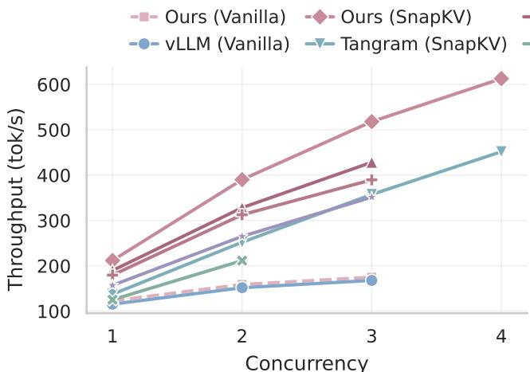  
Qwen3-30B-A3B (FP8) · TP=1, EP=1

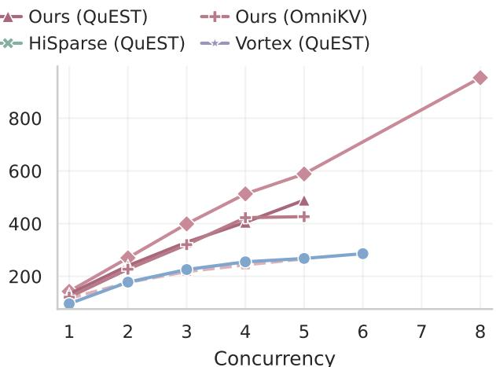  
GLM-4.7-Flash (BF16) · TP=2, EP=2

Figure 6 Absolute decode throughput. Under 128K-token inputs and 2K-token outputs on Qwen3-30B-A3B (left) and GLM-4.7-Flash (right). Ours denotes SparseEngine. Available external baselines are retained; Vortex encounters OOM on GLM at batch size 1, and HiSparse and Tangram do not support the evaluated GLM MLA configuration.  
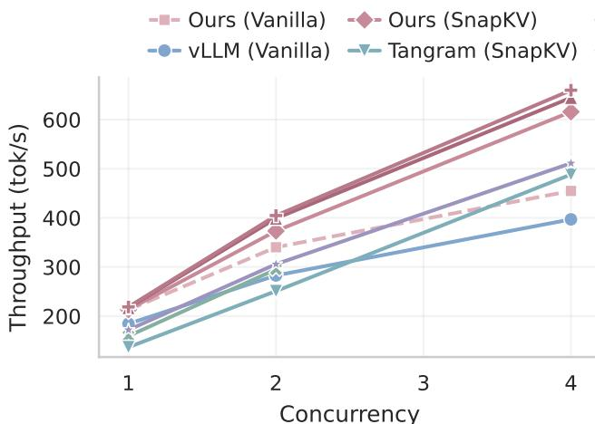  
Qwen3-30B-A3B (FP8) · TP=1, EP=1

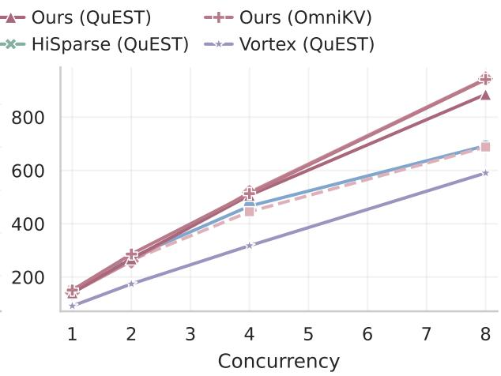  
GLM-4.7-Flash (BF16) · TP=2, EP=2  
Figure 7 Absolute decode throughput. Under 32K-token inputs and 2K-token outputs on Qwen3-30B-A3B (left) and GLM-4.7-Flash (right). Ours denotes SparseEngine. HiSparse and Tangram are omitted for GLM because they do not support the evaluated MLA configuration.

## C.6 Overall Serving Performance

Long-Context Decode Benchmark. Figures 5 and 6 evaluate Qwen3-30B-A3B-Instruct-2507-FP8 on one NVIDIA H100 80GB HBM3 GPU and GLM-4.7-Flash in BF16 on two such GPUs. The tensor- and expertparallel sizes are both 1 for Qwen3 and both 2 for GLM. Each request uses 131,072 input tokens and 2,048 output tokens, with GPU memory utilization set to 0.9.

Table 12 lists the sparse-method configurations used for SparseEngine on both models in Figure 5. SnapKV uses a scoring window of 32 and probability-based prefill scoring. For the 128K SnapKV runs, requests are admitted in waves of two with one decode step between waves, using an 8,192-token prefill chunk and batch-token budget; measurement begins only after the full batch is resident.

External Sparse Baselines. Vortex uses Quest with 16-token pages: 4 sink pages, 32 recent pages, and 92 selected pages, with layers 0 and 1 kept dense. HiSparse uses Quest with 16-token pages, 32 recent pages, and a sparsity ratio of 1/85. Tangram uses SnapKV with a uniform 8,192-token compression budget, 64 sink tokens, a 512-token recent window, a scoring window of 32, a pooling kernel of 7, and a prefill chunk size of 4,096.

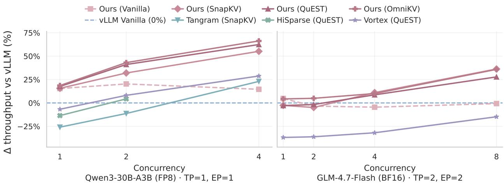  
Figure 8 Decode throughput improvement over vanilla vLLM at matched batch sizes with 32K-token inputs and 2K-token outputs. Ours denotes SparseEngine; vanilla vLLM defines the 0% baseline. HiSparse and Tangram do not support the evaluated GLM MLA configuration and are omitted for that model. Hardware, hyperparameters, and the measurement protocol are specified in Appendix C.7.

Measurement Protocol. After one discarded workload, we measure three repetitions, each with 32 warmup decode steps followed by a contiguous 256-step full-batch decode window. Decode throughput is the total number of decoded tokens across these windows divided by their total elapsed time, excluding prefill. GPU synchronization occurs only at window boundaries. Each request completes the full 2,048-token output, and a batch size is accepted only when all requests remain resident throughout the measured window and the run completes successfully. The upper plot in Figure 5 reports $1 0 0 ( T / T _ { \mathrm { v L L M } } - 1 )$ at matched batch sizes, where � denotes decode throughput. The middle plot reports absolute throughput at each system–method pair’s largest successfully tested batch size, a lower bound on its capacity. Figure 6 gives the absolute throughput corresponding to the low-batch comparison in the upper plot of Figure 5.

## C.7 Serving Performance with 32K-token Inputs

Experiments Setup. The lower plot in Figure 5 and Figures 7 and 8 use 32,768 input tokens and 2,048 output tokens per request. The models, hardware, GPU memory utilization, and measurement protocol follow Appendix C.6. SparseEngine uses the budgets in Table 12 and the SnapKV scoring settings above. External baseline settings are unchanged, except that HiSparse uses a sparsity ratio of 1/21 and Tangram uses a pooling kernel of 1.

Table 12 SparseEngine hyperparameters for Figure 5. Token-budget entries are in tokens.
<table><tr><td>Parameter</td><td>SnapKV</td><td>Quest</td><td>OmniKV</td></tr><tr><td>sink_keep_tokens</td><td>64</td><td>64</td><td>64</td></tr><tr><td>recent_keep_tokens</td><td>512</td><td>512</td><td>512</td></tr><tr><td>decode_keep_tokens</td><td>7,616</td><td>1,472</td><td>1,472</td></tr><tr><td>full_attention_layers</td><td>一</td><td>一</td><td>auto</td></tr></table>

## Results. SparseEngine maintains higher Quest decode throughput than Vortex at the matched

batch sizes shown for both models in Figure 8. The SnapKV results in the lower plot of Figure 5 further demonstrate how physical KV eviction enables higher serving concurrency within the same GPU memory budget. Together with the 128K results, these experiments support eficient execution across diferent context lengths under SparseEngine’s shared lifecycle contract.

## C.8 Supported Models and Sparse Methods

Table 13 Supported models and their attention and FFN architectures. GQA denotes grouped-query attention, MLA denotes multi-head latent attention, and MoE denotes mixture of experts. Hybrid linear attention combines GQA with Gated DeltaNet layers.
<table><tr><td>No.</td><td>Model</td><td>Attention Architecture</td><td>FFN Architecture</td></tr><tr><td>1</td><td>Qwen2.5 [40]</td><td>GQA</td><td>Dense</td></tr><tr><td>2</td><td>Qwen3 Dense [39]</td><td>GQA</td><td>Dense</td></tr><tr><td>3</td><td>Qwen3 MoE [39]</td><td>GQA</td><td>MoE</td></tr><tr><td>4</td><td>Qwen3.5 Dense</td><td>Hybrid linear attention</td><td>Dense</td></tr><tr><td>5</td><td>Qwen3.5 MoE</td><td>Hybrid linear attention</td><td>MoE</td></tr><tr><td>6</td><td>Qwen3.6 Dense</td><td>Hybrid linear attention</td><td>Dense</td></tr><tr><td>7</td><td>Qwen3.6 MoE</td><td>Hybrid linear attention</td><td>MoE</td></tr><tr><td>8</td><td>Qwen3.8</td><td>Hybrid linear attention</td><td>Dense</td></tr><tr><td>9</td><td>GLM-4.7-Flash [46]</td><td>MLA</td><td>MoE</td></tr><tr><td>10</td><td>Gemma 4 Dense [33]</td><td>Sliding-window / global attention</td><td>Dense</td></tr><tr><td>11</td><td>Gemma 4 MoE [33]</td><td>Sliding-window / global attention</td><td>MoE</td></tr><tr><td>12</td><td>Llama 3 [13]</td><td>GQA</td><td>Dense</td></tr><tr><td>13</td><td>Llama 3.1 [13]</td><td>GQA</td><td>Dense</td></tr><tr><td>14</td><td>MiniMax-M2.7 [9]</td><td>GQA</td><td>MoE</td></tr></table>

Table 13 lists 14 supported model variants spanning grouped-query attention, multi-head latent attention, hybrid linear attention, and slidingwindow/global attention, with both dense and mixture-of-experts FFNs. Table 14 groups 15 cache methods and FlashPrefill-v2 into the four categories introduced in Figure 1. These integrations cover diferent attention paths, KV representations, and state-update workflows, demonstrating that SparseEngine’s shared lifecycle contract can accommodate diverse model architectures and sparse inference mechanisms.

## D Abstraction Compatibility Criteria

Scope of the assessment. Table 15 concerns extensibility through each system’s documented boundary, not the number of shipped methods. A compatible mapping may add an algorithm module, kernels, and method-owned state behind that boundary; it may not replace a storage layout, allocator, or transport contract that the abstraction assigns to the shared system. A checkmark requires a mapping for the method’s defining computation, state updates, and storage semantics. A triangle identifies a partial mapping, such as selecting the same tokens without physically reclaiming the discarded KV, or providing eviction without the required online score updates.

Table 14 Supported sparse methods grouped into four categories. The inventory includes 15 cache methods and FlashPrefill-v2 for sparse prefill. Each method is assigned to one category according to its primary mechanism.
<table><tr><td>No.</td><td>Method</td><td>Sparsity Category</td></tr><tr><td>1</td><td>Quest [32]</td><td>Dynamic Sparsity</td></tr><tr><td>2</td><td>OmniKV [17]</td><td>Dynamic Sparsity</td></tr><tr><td>3</td><td>RetroInfer [10]</td><td>Dynamic Sparsity</td></tr><tr><td>4</td><td>FlashPrefill-v2 [14]</td><td>Dynamic Sparsity</td></tr><tr><td>5</td><td>StreamingLLM [37]</td><td>KV Eviction</td></tr><tr><td>6</td><td>SnapKV [24]</td><td>KV Eviction</td></tr><tr><td>7</td><td>H2O [48]</td><td>KV Eviction</td></tr><tr><td>8</td><td>PyramidKV [6]</td><td>KV Eviction</td></tr><tr><td>9</td><td>R-KV [7]</td><td>KV Eviction</td></tr><tr><td>10</td><td>SkipKV [34]</td><td>KV Eviction</td></tr><tr><td>11</td><td>KVzip [22]</td><td>KV Eviction</td></tr><tr><td>12</td><td>Palu [8]</td><td>KV Compression</td></tr><tr><td>13</td><td>DeltaKV [18]</td><td>KV Compression</td></tr><tr><td>14</td><td>KIVI [25]</td><td>KV Quantization</td></tr><tr><td>15</td><td>TurboQuant [45]</td><td>KV Quantization</td></tr><tr><td></td><td></td><td></td></tr><tr><td>16</td><td>FP8 KV</td><td>KV Quantization</td></tr></table>

Table 15 Abstraction-level compatibility with representative sparse methods. ✓: the method’s defining computation and KV-state semantics fit the documented extension boundary; △: only part of the method fits; –: a mapping is not established by that contract. These are design assessments, not implementation or performance results. New method modules are allowed; changes to system-owned storage/transport contracts are not. Physical eviction must release KV storage, rather than merely mask reads or ofload entries. Appendix D gives the mapping criteria and evidence.
<table><tr><td rowspan="2">System</td><td colspan="2">Query-dependent retrieval</td><td colspan="3">Physical KV eviction</td><td colspan="3">Compressed KV representations</td></tr><tr><td>Quest</td><td>RetroInfer</td><td></td><td>SnapKV Ada-SnapKV</td><td> ${ \bf H } _ { 2 } { \bf O }$ </td><td>Palu LoRC</td><td></td><td>KIVI</td></tr><tr><td>SparseEngine (Ours)</td><td>√</td><td>√</td><td>√</td><td>√</td><td>√</td><td>√</td><td>√</td><td>√</td></tr><tr><td>HiSparse</td><td>√</td><td>∆</td><td>∆</td><td>∆</td><td>Δ</td><td>一</td><td>一</td><td>一</td></tr><tr><td>Tangram</td><td>一</td><td>一</td><td>√</td><td>√</td><td>∆</td><td>一</td><td>一</td><td>一</td></tr><tr><td>Vortex</td><td>√</td><td>Δ</td><td>∆</td><td>Δ</td><td>∆</td><td></td><td>一</td><td></td></tr><tr><td>SPIN</td><td>√</td><td>√</td><td>Δ</td><td>Δ</td><td>Δ</td><td></td><td></td><td>一</td></tr></table>

Method requirements. Quest requires persistent page summaries and query-dependent selection. RetroInfer additionally requires variable-sized clusters, GPU–CPU retrieval, and attention estimation over unselected content [10]. SnapKV selects prompt KV using an observation window and physically retains the selected entries; Ada-SnapKV [15] also requires non-uniform head budgets. $_ { \mathrm { H } _ { 2 } \mathrm { O } }$ requires cumulative attention statistics for retained tokens, online updates, and physical eviction as decoding advances. Palu and LoRC replace full-dimensional KV storage with low-rank representations and matching reconstruction/computation; KIVI requires asymmetric $\mathrm { K } / \mathrm { V }$ quantization, grouped scales, and a residual full-precision region. Storing auxiliary summaries alongside an unchanged full KV cache does not implement those representation-level memory savings.

HiSparse. The published design [38] keeps the complete history in host memory and swaps selected entries into a GPU hot bufer. For algorithm extensibility we also inspect SGLang revision f618022, including its sparse-algorithm interface: algorithms construct/update representations and return selected indices, which a backend adaptor maps to attention metadata. Quest fits this selected-index design; this assessment does not assert that every Quest/HiSparse deployment path is implemented. Token-retention methods can supply selection policies, but hot-bufer LRU replacement does not delete their host-backed history. RetroInfer’s selection component fits, while its cluster-aware transport and estimation require additional contracts. The inspected interfaces also do not establish method-owned Palu/LoRC payloads or KIVI’s packed payload and quantization-state lifecycle.

Tangram. Tangram’s scorer, budget-scope, and eviction abstractions support SnapKV and Ada-SnapKV directly [21]. At revision 6fa551f, the scorer contract is stateless; cached-position rescoring exposes cached keys/values, rather than the current query and accumulated attention state required by $\mathrm { H } _ { 2 } \mathrm { O } .$ Its eviction regime supplies retention machinery; hence, $_ { \mathrm { H } _ { 2 } \mathrm { O } }$ receives a partial mark. The compression boundary chooses which KV entries remain; it does not expose query-time retrieval of discarded entries or replacement of the retained KV payload with method-defined low-rank/quantized storage.

Vortex. Vortex exposes cache-side auxiliary computation and query-side page selection [11]. Its vFlow contract (revision ab9ac68) reserves the standard $\mathrm { K } / \mathrm { V }$ entries; create\_cache declares additional tensors, and forward\_indexer writes routing indices for a paged attention backend. This supports Quest and parts of retention/statistics policies, including the paper’s $_ { \mathrm { H } _ { 2 } \mathrm { O } }$ example, without exposing physical reclamation of the standard KV allocation. RetroInfer additionally needs cluster-aware storage/movement and its estimation operator. Backend FP8 or MLA support does not by itself establish an extension path for Palu, LoRC, or KIVI’s distinct storage semantics.

SPIN. Sections 4-5 of SPIN [49] expose algorithm-defined Index, Select, and Attention, with system-managed Ofload and Retrieve. A partition may represent one token, a page, or a variable-sized cluster. Quest maps to page summaries and selection; RetroInfer is explicitly integrated, including its custom estimation-aware attention. The same selection interface covers parts of retention policies, but the documented pipeline retrieves subsets of a full tiered KV history and does not establish permanent algorithm-driven deletion. Its system-owned head-wise KV pages and transport also do not establish a payload-replacement contract for the three representation methods.

SparseEngine. The mappings follow the lifecycle boundary and implementation interfaces at revision 8ea8f80. Quest uses page summaries and query-aware compute views. A RetroInfer integration places cluster maps, summaries, and tiered payloads behind a method-owned cache manager, with a specialized attention provider and explicit memory requirements. SnapKV, Ada-SnapKV, and H2O place retained indices, head budgets, and persistent scores under the runtime/cache-manager lifecycle, including physical compaction and release. Palu/LoRC integrations can own latent storage and reconstruction, while KIVI owns packed K/V, scales, and residual storage; providers consume the corresponding compute views. These are integration mappings, not claims that all eight complete methods are already shipped.