# Synthetic Data Characterization via Training Dynamics

Irene Lago,1 Ana Ezquerro,2 David Vilares1

1 Universidade da Coruña, CITIC, Spain

2 Graz University of Technology, IML, Austria

i.lago@udc.es, ana.ezquerro@tugraz.at, david.vilares@udc.es

## Abstract

Interpreting properties of LLM-generated data is important for understanding its utility and limitations across learning tasks. In this work, we characterize synthetic data through samplelevel learnability, studying variation among LLM families and scales, alongside humanwritten data as a reference. We first generate synthetic datasets spanning single- and multilabel classification, labeling, and tree prediction tasks. We then derive empirical data distributions from encoder training dynamics for both machine and organic data, and estimate the robustness of these distributions across encoders. Finally, we evaluate how data selection strategies based on these learnability signals affect both data sources differently.

## 1 Introduction

Synthetic data, comprising training or evaluation samples generated by large language models (LLMs; Radford et al., 2019; Brown et al., 2020; Ouyang et al., 2022), has become a key component of dataset construction for pre-training, instruction tuning, and fine-tuning (Gunasekar et al., 2023; Maini et al., 2024; Xu et al., 2024). Its importance has grown with rising data demands and the scarcity of new, high-quality human-written text (Villalobos et al., 2024), motivating scalable annotation, broader domain coverage, controllable sample-level features, and lower-noise data.

Prior studies have shown the effectiveness of LLMs both as annotators (Gilardi et al., 2023) and as data generators for tasks including classification (Wang et al., 2023; Horych et al., 2025), grammatical error correction (Stahlberg and Kumar, 2024), coding (Abed et al., 2025), machine translation (Wang et al., 2024), and reasoning (Ho et al., 2023; Zelikman et al., 2022). However, synthetic text raises concerns regarding the diversity (Gude et al., 2026) and realism relative to humanwritten text, as it may deviate from the underlying natural data distribution (Viswanathan et al., 2025).

In this context, recent work has explored strategies to assess the diversity and quality of synthetic data from linguistic perspectives (Muñoz-Ortiz et al., 2024; Zamaraeva et al., 2025), as well as frameworks that measure distributional or semantic similarity with respect to reference datasets across a range of downstream applications (Li et al., 2023; Geng et al., 2025; Kim et al., 2025). However, these approaches treat datasets as a static, monolithic distribution, rely on feature-space similarity metrics, and overlook the downstream behavior of individual samples during training.

Contribution To address these limitations, we present a framework for characterizing synthetic data via sample-level learnability across diverse NLP tasks, including classification, sequence labeling, and tree-structured prediction; quantifying learnability using optimization dynamics and studying its behavior relative to reference benchmarks. First, we provide a comparative distributional analysis across LLMs and prompting strategies, measuring divergence between models and relative to human-written data.

Second, we assess the stability of these dynamics across encoders to evaluate robustness to backbone choice. Third, we evaluate difficulty-based data selection by training on difficulty strata and comparing against baselines. Code is available in our public repository1.

## 2 Background

We review work on synthetic data generation, diversity and deviation from human text, and trainingdynamics methods related to our framework.

## 2.1 Synthetic data generation

Producing synthetic data has long been challenging due to language ambiguity and contextual variability. Pre-LLM methods used operations to extend seed samples, like lexical perturbations (Wei and Zou, 2019), context-aware substitutions (Kobayashi, 2018), back-translation (Xie et al., 2020), and subtree edits (Dehouck and Gómez-Rodríguez, 2020). However, these methods often lead to low-diversity, near-duplicate examples.

LLMs overcome many of these historical issues (Wu et al., 2024), producing higher-quality synthetic annotated data with minimal manual effort. While early work explored LLMs as substitutes for annotators on human-generated data (Gilardi et al., 2023), recent research increasingly focuses on autonomous data synthesis in zero-shot and fewshot settings, driven by the growing scarcity of high-quality natural text (Kang et al., 2025). For instance, prompting frameworks (Ye et al., 2022; Meng et al., 2022) show that LLMs can synthesize high-quality training sets for text classification from scratch, using only class descriptors. This success extends to other domains such as question answering (Puri et al., 2020; Harsha et al., 2025) and information extraction (Dao et al., 2025). Beyond specific tasks, synthetic data has been used to elicit reasoning via Chain-of-Thought approaches (Zelikman et al., 2022), showing that even small models can acquire such capabilities from synthetic explanation traces generated by teacher models (Mukherjee et al., 2023).

## 2.2 Diagnosis of synthetic data

Alongside their use for data generation, concerns have emerged regarding whether LLM-generated data reflects the underlying human data distribution or instead exhibits distributional biases. Synthetic text is known to amplify biases (Santurkar et al., 2023; Perez et al., 2023; Hartmann et al., 2023), exhibit linguistic differences (Muñoz-Ortiz et al., 2024; Guo et al., 2024; Zamaraeva et al., 2025), and can lead to model collapse (Shumailov et al., 2024; Alemohammad et al., 2024), where models progressively lose the ability to represent low-probability events. To mitigate these issues, recent work proposes prompting techniques for generating diverse samples (Honovich et al., 2023; Misaki and Akiba, 2026), machine-generated text detectors for resampling toward more human-like outputs (Drayson et al., 2025), and verification methods for filtering erroneous data (Feng et al., 2024).

These limitations motivate evaluations beyond surface-level quality (Gudibande et al., 2024), e.g., focusing on learning impact. Data-driven approaches have measured similarity with respect to human data (Ramesh et al., 2025; Chim et al., 2025) or a reference dataset (Dankar et al., 2022), and studied sample replicability (El Emam et al., 2024; Alaa et al., 2022).

## 2.3 Training dynamics

Training dynamics (Wang et al., 2022) studies sample-specific behavior during model optimization, with goals like improving efficiency (Chimoto et al., 2024; Wang et al., 2026), data pruning (Hanafi et al., 2025), and understanding pretraining (Zhang et al., 2025; Sun et al., 2025) and finetuning curves (Wang et al., 2025; Du et al., 2025). Swayamdipta et al. (2020) observed these dynamics in classification NLP tasks on organic data by grouping instances based on learnability to improve performance. Notably, they introduced data maps—leveraging confidence, variability, and correctness metrics—to visualize and categorize examples. Mekala et al. (2024) modeled sample difficulty in LLM pretraining as function of learning speed, showing that small-model dynamics can be used to filter samples and reduce pretraining data for larger LLMs. Sosea and Caragea (2022) adopted this concept for transfer learning, enhancing the pseudo-labeling in classification tasks to transfer knowledge from teacher to student models.

Training dynamics for synthetic data The literature has begun to explore training-dynamicsbased strategies for machine-generated data, e.g., by producing instances that match the embedding or gradient manifolds of models trained on humanauthored data (Sucholutsky and Schonlau, 2021; Maekawa et al., 2024; Nguyen et al., 2025). While these methods enhance generalization, they treat training dynamics as an optimization objective rather than a tool for diagnosing text. Bridging this gap, Kang et al. (2025) propose a framework to analyze the quality of synthetic data in LLM pretraining, finding that mixing rephrased and original text can accelerate convergence and that effective training mixtures depend on a complex trade-off between lexical and semantic diversity.

## 3 Methodology

We describe our approach to sample-level characterization of synthetic data via training dynamics. We first explain the metrics for sample difficulty and predictability derived from training behavior, then describe our synthetic data generation process.

## 3.1 Data maps for classification and beyond

Swayamdipta et al. (2020) mapped training dynamics of human-authored instances to estimate their utility. The framework targeted sequence-level classification, where samples $( \mathbf { x } , y ) \sim \mathcal { D }$ are characterized by learning trajectories defined by confidence, variability, and correctness.

Let V denote a finite vocabulary of tokens, and $\mathbf { x } = ( x _ { 1 } \ldots x _ { n } ) \in { \mathcal { V } } ^ { n }$ the input where each token is defined as $x _ { i } \in \mathcal V$ , for $i \in \{ 1 \ldots n \}$ . Let $\mathcal { V }$ denote the target set, and let $p _ { \theta _ { t } } ( y | \mathbf { x } )$ represent the categorical distribution over $\mathcal { V }$ conditioned on x estimated by a model with parameters θ at training step $t \in [ 1 , T ]$ . The confidence (Equation 1) averages the expected accuracy of the model across training, the variability (Equation 2) is the standard deviation of the confidence, and the correctness (Equation 3) indicates how often the model produces the correct output on average.

$$
\gamma ( \mathbf { x } , y ) = \mathbb { E } _ { t } [ p _ { \theta _ { t } } ( y | \mathbf { x } ) ] = \frac { 1 } { T } \sum _ { t = 1 } ^ { T } p _ { \theta _ { t } } ( y | \mathbf { x } )\tag{1}
$$

$$
\sigma ( \mathbf { x } , y ) = \mathsf { s t d } _ { t } \big [ p _ { \theta _ { t } } ( y | \mathbf { x } ) \big ] = \sqrt { \mathbb { E } _ { t } \left[ \big ( p _ { \theta _ { t } } ( y | \mathbf { x } ) - \gamma ( \mathbf { x } , y ) \big ) ^ { 2 } \right] }\tag{2}
$$

$$
\alpha ( \mathbf { x } , y ) = \mathbb { E } _ { t } \left[ \mathbb { I } \{ y = \underset { y ^ { \prime } \in \mathcal { V } } { \arg \operatorname* { m a x } } p \theta _ { t } ( y ^ { \prime } | \mathbf { x } ) \} \right]\tag{3}
$$

These three variables map each instance into a three-dimensional continuous space, yielding distinct regions corresponding to diverse sample characteristics. Swayamdipta et al. named these regions as easy (high confidence, low variability), hard (low confidence, low variability) and ambiguous (high variability) samples, where the latter tend to reside closer to the decision boundary, and would be informative for improving generalization.

To generalize these metrics to different types of NLP tasks, we introduce the concept of the individual confidence (λ) of a sample at timestep t. In sequence classification, $\lambda ( \mathbf { x } , y , t ) = p _ { \theta _ { t } } ( \mathbf { x } , y , t )$ corresponds to the model’s predicted probability for the true class, but in other tasks, λ is adapted to account for different target structures. The confidence and variability are computed directly from λ, by averaging and scaling on the number of training steps $t \in [ 1 , T ] , \operatorname { s o } \gamma _ { * } ( \cdot ) = \mathbb { E } _ { t } [ \lambda _ { * } ( \cdot , t ) ]$ and $\sigma _ { * } ( \cdot ) = \mathrm { s t d } _ { t } [ \lambda _ { * } ( \cdot , t ) ]$

In multi-label classification (MLC), each training sample is defined as (x, y), where $\textbf {  { y } } \subseteq \mathbf { \mathcal { V } }$ corresponds to a set of target classes. The model $p _ { \theta _ { t } } ( y _ { j } = 1 | \mathbf { x } )$ estimates the Bernoulli distribution over each $y _ { j } \in \mathcal { V }$ conditioned on x, so confidence and variability are reinterpreted by averaging the individual label contributions (Equation 4), and the correctness is defined with the averaged Jaccard score (Equation 5) given a threshold $\tau \in [ 0 , 1 ]$

$$
\lambda _ { \mathrm { M L C } } ( \mathbf { x } , \pmb { y } , t ) = \frac { 1 } { | \pmb { y } | } \sum _ { y _ { j } \in \pmb { y } } p _ { \theta _ { t } } ( y _ { j } = 1 | \mathbf { x } )\tag{4}
$$

$$
\begin{array} { r l r } {  { \alpha _ { \mathrm { { M L C } } } ( \mathbf { x } , \pmb { y } ) = \frac { 1 } { T } \sum _ { t = 1 } ^ { T } \frac { \vert \pmb { y } \cap \hat { \pmb { y } } _ { \theta _ { t } } \vert } { \vert \pmb { y } \cup \hat { \pmb { y } } _ { \theta _ { t } } \vert } } } \\ & { } & { \mathrm { ~ w h e r e ~ } \hat { \pmb { y } } _ { \theta _ { t } } = \{ y _ { j } : p _ { \theta _ { t } } ( y _ { j } = 1 \vert \mathbf { x } ) > \tau \} _ { y _ { j } \in \mathcal { D } } } \end{array}\tag{5}
$$

In sequence labeling (SL), each training sample is defined as $\displaystyle ( \mathbf { x } , \mathbf { y } )$ , where $\mathbf { y } = ( y _ { 1 } \dots y _ { n } ) \in \mathcal { Y } ^ { n }$ associates each token $x _ { i }$ with a label $y _ { i }$ . The model $p _ { \theta _ { t } } ^ { i }$ estimates the categorical distribution over $\mathcal { V }$ for the i-th label, enabling either averaging (Equation 6) or considering individual token contributions (Equation 7) to compute the confidence, variability, and correctness.

$$
\lambda _ { \mathrm { S L } } ( \mathbf { x } , \mathbf { y } , t ) = \frac { 1 } { n } \sum _ { i = 1 } ^ { n } p _ { \theta _ { t } } ^ { i } ( y _ { i } | \mathbf { x } )\tag{6}
$$

$$
\lambda _ { \mathrm { S L } } ^ { i } ( \mathbf { x } , y _ { i } , t ) = p _ { \theta _ { t } } ^ { i } ( y _ { i } | \mathbf { x } )\tag{7}
$$

In graph prediction (GP), each training sample is defined as $( \mathbf { x } , E )$ , where E denotes the set of edges forming a labeled directed graph over x. We represent an edge connecting tokens $x _ { i }$ and $x _ { j }$ through the label $r \in \mathcal { R }$ as $e \ = \ ( h \ { \overset { r } { \to } } \ i )$ Since modeling $p ( E | \mathbf { x } )$ is intractable, parameterized models factorize the distribution at edge-level, $\begin{array} { r } { p ( E | \mathbf { x } ) : = \prod _ { e } p _ { \theta _ { t } } ( e | \mathbf { x } ) } \end{array}$ . Their training dynamics can thus be measured by averaging edge-level performance (Equation 8):

$$
\lambda _ { \mathrm { G P } } ( \mathbf { x } , E , t ) = \frac { 1 } { | E | } \sum _ { e \in E } p _ { \theta _ { t } } ( e | \mathbf { x } )\tag{8}
$$

$$
\begin{array} { r l } & { \alpha _ { \mathrm { G P } } ( \mathbf { x } , E ) = \displaystyle \frac { 1 } { T } \sum _ { t = 1 } ^ { T } \frac { \left| E \cap \hat { E } _ { \theta _ { t } } \right| } { \left| E \cup \hat { E } _ { \theta _ { t } } \right| } } \\ & { \mathrm { w h e r e } \ \hat { E } _ { \theta _ { t } } = \{ e : p _ { \theta _ { t } } ( e | \mathbf { x } ) > \tau \} } \end{array}\tag{9}
$$

In the specific case of tree dependency parsing (DP), edge factorization coincides with token factorization since each edge is uniquely associated with a token, allowing the distribution to be parameterized as a SL approach, where the model learns to assign heads to tokens. This allows us to express $\begin{array} { r } { \lambda _ { \mathrm { D P } } ( \mathbf { x } , E , t ) = \frac { 1 } { n } \sum _ { i = 1 } ^ { n } p _ { \theta _ { t } } ( ( h \stackrel { r } {  } i ) | \mathbf { x } ) } \end{array}$ as a special case of λSL and reduce the correctness formulation (Equation 9) to the mean of the correct head predictions.

Distributional comparison of training dynamics To assess differences across synthetic datasets, models, and relative to human-authored data, we compare their underlying distributions. Operating at the sample level, the maps emerge from the distribution of individual trajectories. By formalizing model dynamics through the variables defined in Equations 1-3 (and variants), a dataset D can be characterized by the empirical distribution of training dynamics—induced by a model parameterized by θ trained on D—over a threedimensional space of confidence, variability, and correctness, denoted as $\mathcal { T } \subset \mathbb { R } ^ { 3 }$ . Since the distribution of the training dynamics is unknown and may be highly non-Gaussian and multimodal,2 we avoid imposing parametric assumptions (Dror et al., 2018). Instead, we quantify distributional differences using the Wasserstein distance (Vaserstein, 1969)3 as a metric-based measure and Cliff’s delta (Cliff, 1993)4 as a non-parametric effect size over confidence, variability, and correctness.

## 3.2 Synthetic Data Generation

Our goal is to characterize the training dynamics across different generative processes and model parameterizations. We distinguish between (i) $\mathcal { T } _ { \mathcal { H } } ^ { \tilde { \theta } } .$ , the training dynamics induced by a human-authored data distribution (H) under a reference model with parameters ${ \tilde { \theta } } ;$ and (ii) $\mathcal { T } _ { S } ^ { \theta }$ , the dynamics of a synthetic distribution (S) produced by an LLM-based process and evaluated under an arbitrary model parameterization θ, where potentially ${ \boldsymbol { \theta } } \neq { \tilde { \boldsymbol { \theta } } }$ . Unless otherwise stated, we assume H and $s$ contain the same number of data points.

To assess the utility of different data regimes in the training-dynamics space (§3.1), we induce targeted biases into the generative process of S. This enables exploration of prompt-based perturbations of S that steer generation toward regions associated with particular learning signatures in $T _ { \mathcal { H } } ^ { \tilde { \theta } } .$ This facilitates a dual analysis: (i) a comparison of synthetic dynamics obtained from different generative processes and model architectures $\theta ;$ and (ii) a proxy comparison of the fidelity of synthetic dynamics relative to the human-authored counterparts.

Generations via prompting We design four prompting strategies of increasing granularity to generate task-specific samples. (i) Naive provides basic instructions about the target task and the average sequence length of H. (ii) Exemplified builds upon the Naive baseline by incorporating two fewshot examples uniformly sampled from $\mathcal { H } . ^ { 5 }$ (iii) Difficulty-aware extends the Exemplified approach by including two examples drawn from the ambiguous, easy-, and hard-to-learn partitions of $\mathcal { T } _ { \mathcal { H } } ^ { \tilde { \theta } ~ 6 }$ without instructing for complexity calibration. (iv) Ambiguous-targeted explicitly prompts the model to generate samples resembling those expected in the ambiguous region of $\mathcal { T } _ { \mathcal { H } } ^ { \tilde { \theta } ~ 7 }$ By iterating over these strategies, we move from unconstrained synthesis to a taxonomy-informed generation pipeline that isolates specific learning dynamics. Prompt templates are included in Appendix A.1.

## 4 Experimental Framework

LLM choices To generate our synthetic datasets, we rely on open-source LLM families spanning different architectures and scales. We consider Qwen-3 8B (Yang et al., 2025), Llama-3.1 8B (Grattafiori et al., 2024), Olmo-3 7B (Team Olmo et al., 2025), and the Gemma-3 family (Gemma Team et al., 2025). The latter is used as a representative case to study the effect of model size, for which we analyze the 4B, 12B, and 27B variants. As explained in §3.2, we generate multiple versions of the synthetic datasets by conditioning on four prompting strategies: Naive, Exemplified, Difficulty-aware, and Ambiguous-targeted. We conducted a preliminary hyperparameter search to tune the top-k and top-p sampling parameters, aiming to balance diversity with fluency and structural consistency across tasks. Appendix A.3 reports the selected settings.

Datasets We consider representative tasks from each NLP paradigm for which training dynamics were defined in §3.1. For single-label classification, we use SST-5 (Socher et al., 2013) as a representative sentiment analysis dataset. For multi-label classification, we use the SemEval-2018 Task Emotion Classification (EC) dataset (Mohammad et al.,

2018), which contains Twitter posts annotated with multiple emotion categories.8 For SL and GP, we rely on UD 2.15 (Nivre et al., 2020), focusing on universal part-of-speech tagging and dependency parsing on the English EWT treebank.9

Encoder models for training dynamics To compute the empirical training dynamics T∗ associated with a synthetic dataset S or a human-authored dataset H, we rely on RoBERTa (Liu et al., 2019) as the primary encoder. We further assess the robustness of the resulting distributions using BERT (Devlin et al., 2019), DistilBERT (Sanh et al., 2019), and LLM2Vec10 (BehnamGhader et al., 2024) with its pre-trained Llama-3.1-8B version as the underlying model and fine-tuning it with LoRA (Hu et al., 2022), serving as a proxy for modern autoregressive architectures.

From the encoder representations, we compute task-specific output probabilities. In singlelabel classification and PoS tagging, we use a linear layer followed by a softmax over the label space, whereas in the multi-label setting, we use element-wise sigmoid activations, producing independent probability estimates for each label. For dependency parsing, we approximate it using scores from the state-of-the-art biaffine parser of Dozat and Manning (2017) over the product of head–dependent pairs, with separate softmaxes over candidate heads and relations.

Ill-formed LLM outputs We found that LLM outputs, although well-formed in classification tasks, required some post-processing in structured prediction tasks. In preliminary experiments, we observed that native output formats lead to more formatting issues than JSON-based generation; therefore we adopt the latter to better preserve the intended structure. Also, for PoS tagging, we used Stanza (Qi et al., 2020) to normalize generated labels outside the valid space, correcting an average of 1.64% ± 2.89 of the generated tokens across LLMs and prompts. For dependency parsing, we use simple heuristics to enforce wellformed outputs. In practice, label corrections affect only 1.95% ± 1.31 of dependency relations, whereas most modifications (28.36% ± 9.19) involve structural fixes to ensure valid trees. This suggests that LLMs struggle to generate fully valid tree structures, which is coherent with recent findings (Ezquerro et al., 2025).

Filtering of near-duplicated LLM outputs To ensure clean comparisons across distributions, we filter generated samples using a MinHash approximation of Jaccard similarity (Broder, 1997) with a threshold of 0.4. Filtering is performed in two stages: (i) reducing redundancy within the synthetic set via a similarity graph and extracting a maximal independent set (Luby, 1986) to avoid retaining multiple highly similar instances; and (ii) removing samples that are near-duplicates or regurgitations of instances in the human reference dataset used in the prompt.

Evaluation We report accuracy for SA and PoS tagging, Jaccard score for EC, and labeled attachment score (LAS) for dependency parsing. We use the original test set of each dataset for indistribution (ID) evaluation and external datasets for out-of-distribution (OOD) evaluation. Specifically, we use Yelp (Zhang et al., 2015) for OOD evaluation on SST-5, and evaluate PoS tagging and dependency parsing on the English PUD test set using models trained on English EWT.11

## 5 Results and Analysis

We analyze, both from qualitative and quantitative perspectives, the training dynamics of synthetic datasets (§5.1); the robustness of the framework for characterizing such samples according to their confidence, variability and correctness (§5.2); and the impact of exploiting different regions of the resulting data maps during tuning (§5.3). Unless otherwise specified, qualitative results correspond to RoBERTa as encoder to produce the data maps, and Gemma-27B as the representative model (being the largest among all considered models) to generate the synthetic datasets with the Difficulty-aware prompt strategy (enabling taxonomy-informed synthetic sample generation).

## 5.1 Training dynamics distributions

We discuss the data maps derived from synthetic datasets generated by different LLMs across multiple tasks. Since the models were prompted using different strategies, designed to reflect characteristics of reference human datasets (e.g., label space, domain, or task formulation), we analyze how these choices affect the resulting training dynamics and whether they yield patterns similar to those observed in the corresponding human datasets used as references for prompting.

## 5.1.1 Human vs. synthetic data maps

We first provide a qualitative analysis to ground the subsequent quantitative comparison of training dynamics maps. Figure 1 shows the data maps obtained for SST-5 (polarity classification), EC (emotion classification) and EWT (PoS tagging and dependency parsing, at token-level).

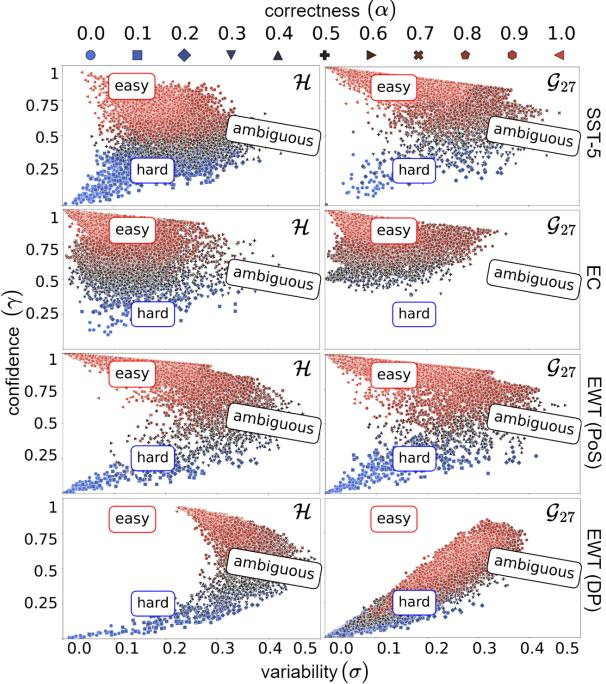  
Figure 1: Human (H) vs. synthetic training dynamics with Gemma 27B $( \mathcal { G } _ { 2 7 } )$ and the Difficulty-aware prompt on SST-5 (top), EC (middle-top) and PoS tagging (middle-bottom) and dependency parsing based on EWT (bottom). For display, we subsampled the EWT dataset to 20 000 uniformly sampled tokens.

The SST-5 and EWT distributions exhibit the characteristic ‘inverted-C’ shape—also observed by Swayamdipta et al. (2020) for other humangenerated datasets—reflecting the relationship between confidence and variability, where highconfidence predictions tend to remain stable across epochs, whereas more uncertain instances display greater variability. EC, instead, shows a concentration of variability in lower ranges, leading to the disappearance of the inverted C-shape. This effect likely stems from the formulation of multi-label confidence (Equation 4). This formulation smooths the model’s predictions across labels, which reduces the sample-level standard deviation.

In qualitative comparison with human counterparts, Gemma 27B reproduces similar training dynamics on sentiment classification and PoS tagging, with comparable easy, hard, and ambiguous regions; but fails to produce hard-to-learn examples for the multi-label EC data. On the other hand, results on dependency parsing highlight difficulties in reproducing human-annotated training dynamics, especially on easy samples, where no sample is characterized by high-confidence and low variability. This suggests a lack of high-quality, learnable synthetic data and is also coherent with previous findings on the limitations of LLMs as zero- or few-shot dependency parsers (Ezquerro et al., 2025). For parsing, we also verified that the observed training dynamics were not affected by filtering artifacts, as nearly identical distributions are obtained when showing only uncorrected samples (Appendix B).

## 5.1.2 Training dynamics across LLMs

Figure 2 compares the empirical data maps across the considered LLMs on SST-5. See Appendix B for comparisons on the other datasets.

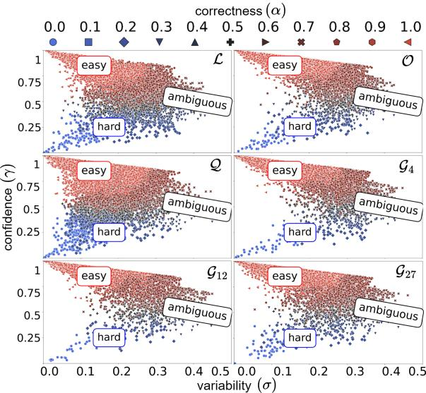  
Figure 2: Data maps on SA (SST-5) with LLMgenerated samples with the Difficulty-aware prompt. We include: Gemma 4B (G ) Gemma 12B $( \mathcal { G } _ { 1 2 } )$ and 27B $( \mathcal { G } _ { 2 7 } )$ , Llama (L), Olmo (O) and Qwen (Q).

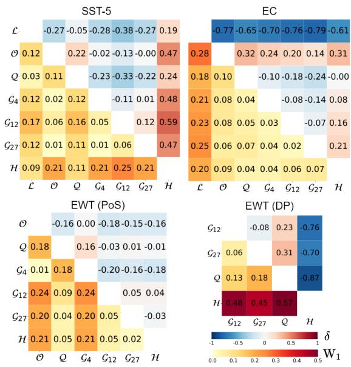

Quantitatively, to summarize the impact of prompting on training dynamics distributions, Figure 3 presents the distributional shift between the naive prompt and the alternative strategies using Cliff’s delta on confidence and variability. Our analysis shows some fluctuations in confidence and variability, though without a clear correlation with the prompting complexity. The lack of a consistent pattern (such as increasing divergence with more sophisticated templates) suggests that the training dynamics are insensitive to the specific prompting strategy. Instead, the observed deviations likely stem from the model’s generative process.

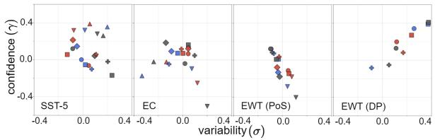  
Figure 3: Comparison of training dynamics across prompting strategies. Subfigures illustrate the Cliff’s delta for confidence $( \gamma )$ and variability (σ) across SST-5, EC, EWT (PoS) and EWT (DP) relatively to the Naive prompt. Colors denote the prompt strategy (• Exemplified, • Difficulty-aware, • Ambiguous targeted), while symbols correspond to the LLM used for data generation $( \diamond \mathcal { G } _ { 4 } , \odot \mathcal { G } _ { 1 2 } , \sqcup \mathcal { G } _ { 2 7 } , \triangle \mathcal { L } , \odot )$

Figure $4 ^ { 1 2 }$ compares LLM-generated synthetic datasets under the Difficulty-aware strategy by quantifying differences in their data maps. We include a human reference row to complete the human vs synthetic comparison (§5.1.1). The lower triangles report pairwise Wasserstein distances $( \mathbb { W } _ { 1 } ) .$ while the upper triangular matrices report Cliff’s delta (δ) on correctness.

Overall, $\mathrm { W _ { 1 } }$ distances indicate that training dynamics distributions are more consistent across LLMs than across tasks. In SST-5, LLaMA and Qwen yield highly similar distributions $( \mathbf { W } _ { 1 } =$ 0.03), while Olmo closely aligns with the Gemma family (e.g., $\mathrm { W _ { 1 } }$ values between 0.01 and 0.06). In EC, all models except LLaMA produce similar distributions, with consistently small pairwise $\mathrm { W _ { 1 } }$ values. For PoS tagging, the closest agreement is observed between Gemma and Qwen, while dependency parsing shows substantially larger divergences across models, likely due to inconsistent or poor generation. With respect to the human reference, despite some variation across tasks, Qwen and the Gemma models generally produce the distributions closest to those of humans, although LLaMA’s distribution for SST-5 is also highly aligned.

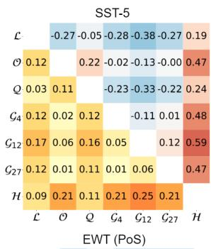

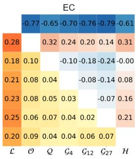

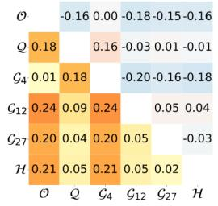

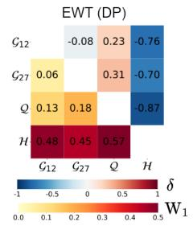  
Figure 4: Comparison of human and synthetic distributions across LLMs and the Difficulty-aware prompt using Wasserstein distance on $\mathcal { T } _ { * } ^ { \bar { \theta } }$ (lower triangular matrices), and Cliff’s delta, evaluated on correctness (upper triangular matrices). Same notation as in Figure 2.

Cliff’s delta results on correctness further characterize these differences in terms of learnability. As observed in $\mathrm { W _ { 1 } }$ , in SST-5, LLaMA and Qwen exhibit small pairwise effect sizes, indicating similar correctness distributions. EC shows more negative values for LLaMA. For PoS tagging, Cliff’s delta values are near zero between Gemma and Qwen, suggesting highly similar behavior across synthetic distributions. In contrast, dependency parsing shows much larger discrepancies, with stronger negative effect sizes across model comparisons. Compared to human-authored datasets, most synthetic datasets show positive Cliff’s delta on SST-5 and EC, indicating easier samples, whereas dependency parsing consistently shows strongly negative values, suggesting that synthetic data fails to reproduce even the easy-to-learn regions observed in human training dynamics.

## 5.2 Dynamics robustness across encoders

We assess the robustness of our framework to encoder choice by analyzing sample-level variations in $\mathcal { T } _ { S } ^ { \theta }$ or $\mathcal { T } _ { \mathcal { H } } ^ { \theta }$ when replacing RoBERTa with Distil-BERT, BERT, or LLM2Vec on SST-5 (Figure 5).

The results indicate that the relative positioning of samples within the empirical data maps remains overall stable across encoders: differences in learnability metrics are concentrated around small values. LLM2Vec exhibits a tendency toward negative differences in correctness and confidence, suggesting a better fit on the training set relative to RoBERTa (the reference model). We observe a divergent pattern between synthetic and human data: while human-authored samples seem more evenly distributed across all four quadrants, indicating cross-model consistency; synthetic samples are polarized in the second and fourth quadrants, displaying a negative correlation that aligns with a downward-sloping regression fit. This trend suggests that synthetic samples are easier or harder for specific architectures to learn, suggesting that synthetic data potentially contains architecture-specific biases that do not generalize as consistently as human annotations. Similar analyses for other tasks are included in Appendix B.13

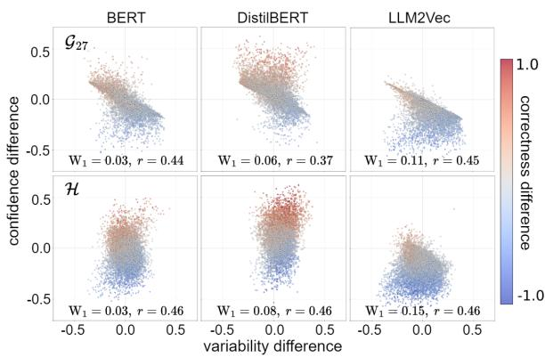  
Figure 5: Differences on the training dynamics across encoders with synthetic (top) and human (bottom) data on SST-5. Subfigures show instance-level differences in confidence, variability, and correctness relative to the original RoBERTa encoder used in §5.1.1. Here, r denotes the percentage of ambiguous samples (top 33% highest variability) shared with RoBERTa.

## 5.3 Training with selected data

Finally, we study how training on different data strata affects performance. We limit each subset to 33% of the dataset maximizing confidence, variability, or correctness metrics (Swayamdipta et al., 2020); and consider two baselines: (i) a 33% random subset baseline, and (ii) a full-dataset model. Table 1 shows that the behavior varies across tasks and subsets. Synthetic subsets with high correctness (max.α) tend to achieve stronger and more consistent performance, especially under OOD evaluation. In contrast, subsets dominated by difficult samples (min.γ, min.α) and by easy samples with high confidence (max.γ) generally obtain weaker results. Clear differences are observed between synthetic and human data, where models built on top of human data achieve strong performance even with easy samples with max.γ in both ID and OOD evaluation, indicating that these subsets are still informative for training, as noted in §5.1.1.

<table><tr><td rowspan=1 colspan=1></td><td rowspan=1 colspan=4>in-distributionSST-5EC EWTPoSEWTDP</td><td rowspan=1 colspan=3>out-of-distributionSST-5 EWTPoSEWTDP</td></tr><tr><td rowspan=1 colspan=1>L</td><td rowspan=1 colspan=2>40.738.6</td><td rowspan=1 colspan=2>X    ×</td><td rowspan=1 colspan=1>38.9</td><td rowspan=1 colspan=2>X     ×</td></tr><tr><td rowspan=1 colspan=1>O</td><td rowspan=1 colspan=2>43.026.4</td><td rowspan=1 colspan=1>71.9</td><td rowspan=1 colspan=1>X</td><td rowspan=1 colspan=1>37.6</td><td rowspan=1 colspan=1>74.9</td><td rowspan=1 colspan=1>X</td></tr><tr><td rowspan=1 colspan=1></td><td rowspan=1 colspan=1>40.4</td><td rowspan=1 colspan=1>40.8</td><td rowspan=1 colspan=1>82.2</td><td rowspan=1 colspan=1>8.5</td><td rowspan=1 colspan=1>38.7</td><td rowspan=1 colspan=1>86.7</td><td rowspan=1 colspan=1>8.6</td></tr><tr><td rowspan=1 colspan=1>G12</td><td rowspan=1 colspan=1>38.3</td><td rowspan=1 colspan=1>38.4</td><td rowspan=1 colspan=1>80.5</td><td rowspan=1 colspan=1>24.9</td><td rowspan=1 colspan=1>44.1</td><td rowspan=1 colspan=1>86.6</td><td rowspan=1 colspan=1>27.9</td></tr><tr><td rowspan=1 colspan=1>H</td><td rowspan=1 colspan=1>58.1</td><td rowspan=1 colspan=1>59.0</td><td rowspan=1 colspan=1>93.0</td><td rowspan=1 colspan=1>93.2</td><td rowspan=1 colspan=1>57.1</td><td rowspan=1 colspan=2>94.4  92.3</td></tr><tr><td rowspan=1 colspan=1></td><td rowspan=1 colspan=1>37.0</td><td rowspan=1 colspan=1>32.8</td><td rowspan=1 colspan=1>×</td><td rowspan=1 colspan=1>×</td><td rowspan=1 colspan=1>38.6</td><td rowspan=1 colspan=2>×    ×</td></tr><tr><td rowspan=1 colspan=1>mO</td><td rowspan=1 colspan=1>17.6</td><td rowspan=1 colspan=1>23.9</td><td rowspan=1 colspan=1>68.0</td><td rowspan=1 colspan=1>×</td><td rowspan=1 colspan=1>20.0</td><td rowspan=1 colspan=1>68.5</td><td rowspan=1 colspan=1>×</td></tr><tr><td rowspan=1 colspan=1>d Q</td><td rowspan=1 colspan=1>37.0</td><td rowspan=1 colspan=1>38.5</td><td rowspan=1 colspan=1>82.0</td><td rowspan=1 colspan=1>8.7</td><td rowspan=1 colspan=1>39.3</td><td rowspan=1 colspan=1>86.2</td><td rowspan=1 colspan=1>7.3</td></tr><tr><td rowspan=1 colspan=1> G12</td><td rowspan=1 colspan=1>38.7</td><td rowspan=1 colspan=1>39.2</td><td rowspan=1 colspan=1>81.1</td><td rowspan=1 colspan=1>22.6</td><td rowspan=1 colspan=1>46.3</td><td rowspan=1 colspan=1>86.4</td><td rowspan=1 colspan=1>24.6</td></tr><tr><td rowspan=1 colspan=1>H</td><td rowspan=1 colspan=1>54.2</td><td rowspan=1 colspan=1>58.9</td><td rowspan=1 colspan=1>92.1</td><td rowspan=1 colspan=1>92.1</td><td rowspan=1 colspan=1>56.6</td><td rowspan=1 colspan=1>93.5</td><td rowspan=1 colspan=1>91.6</td></tr><tr><td rowspan=1 colspan=1></td><td rowspan=1 colspan=1>17.6</td><td rowspan=1 colspan=1>37.7</td><td rowspan=1 colspan=1>×</td><td rowspan=1 colspan=1>X</td><td rowspan=1 colspan=1>20.0</td><td rowspan=1 colspan=1>×</td><td rowspan=1 colspan=1>×</td></tr><tr><td rowspan=1 colspan=1></td><td rowspan=1 colspan=1>38.6</td><td rowspan=1 colspan=1>22.8</td><td rowspan=1 colspan=1>75.5</td><td rowspan=1 colspan=1>×</td><td rowspan=1 colspan=1>31.6</td><td rowspan=1 colspan=1>80.4</td><td rowspan=1 colspan=1>×</td></tr><tr><td rowspan=1 colspan=1></td><td rowspan=1 colspan=1>28.9</td><td rowspan=1 colspan=1>44.4</td><td rowspan=1 colspan=1>82.8</td><td rowspan=1 colspan=1>6.5</td><td rowspan=1 colspan=1>22.1</td><td rowspan=1 colspan=1>86.4</td><td rowspan=1 colspan=1>6.2</td></tr><tr><td rowspan=1 colspan=1>m G12</td><td rowspan=1 colspan=1>19.9</td><td rowspan=1 colspan=1>39.6</td><td rowspan=1 colspan=1>81.1</td><td rowspan=1 colspan=1>22.3</td><td rowspan=1 colspan=1>23.0</td><td rowspan=1 colspan=1>85.7</td><td rowspan=1 colspan=1>22.7</td></tr><tr><td rowspan=1 colspan=1>H</td><td rowspan=1 colspan=1>56.5</td><td rowspan=1 colspan=1>51.5</td><td rowspan=1 colspan=1>91.1</td><td rowspan=1 colspan=1>87.5</td><td rowspan=1 colspan=1>57.3</td><td rowspan=1 colspan=1>93.9</td><td rowspan=1 colspan=1>88.7</td></tr><tr><td rowspan=1 colspan=1>L</td><td rowspan=1 colspan=1>39.0</td><td rowspan=1 colspan=1>40.6</td><td rowspan=1 colspan=1>×</td><td rowspan=1 colspan=1>×</td><td rowspan=1 colspan=1>41.5</td><td rowspan=1 colspan=1>×</td><td rowspan=1 colspan=1>×</td></tr><tr><td rowspan=1 colspan=1>α O</td><td rowspan=1 colspan=1>38.3</td><td rowspan=1 colspan=1>22.8</td><td rowspan=1 colspan=1>76.2</td><td rowspan=1 colspan=1>×</td><td rowspan=1 colspan=1>38.3</td><td rowspan=1 colspan=1>80.1</td><td rowspan=1 colspan=1>×</td></tr><tr><td rowspan=1 colspan=1>u Q</td><td rowspan=1 colspan=1>35.5</td><td rowspan=1 colspan=1>49.0</td><td rowspan=1 colspan=1>82.1</td><td rowspan=1 colspan=1>8.1</td><td rowspan=1 colspan=1>31.8</td><td rowspan=1 colspan=1>86.1</td><td rowspan=1 colspan=1>7.2</td></tr><tr><td rowspan=1 colspan=1>m G12</td><td rowspan=1 colspan=1>42.4</td><td rowspan=1 colspan=1>40.7</td><td rowspan=1 colspan=1>81.0</td><td rowspan=1 colspan=1>24.1</td><td rowspan=1 colspan=1>47.6</td><td rowspan=1 colspan=1>86.5</td><td rowspan=1 colspan=1>24.0</td></tr><tr><td rowspan=1 colspan=1>H</td><td rowspan=1 colspan=1>59.3</td><td rowspan=1 colspan=1>60.6</td><td rowspan=1 colspan=1>91.4</td><td rowspan=1 colspan=1>87.5</td><td rowspan=1 colspan=1>58.9</td><td rowspan=1 colspan=1>93.5</td><td rowspan=1 colspan=1>88.3</td></tr><tr><td rowspan=1 colspan=1>L</td><td rowspan=1 colspan=1>17.6</td><td rowspan=1 colspan=1>36.8</td><td rowspan=1 colspan=1>×</td><td rowspan=1 colspan=1>×</td><td rowspan=1 colspan=1>20.0</td><td rowspan=1 colspan=1>×</td><td rowspan=1 colspan=1></td></tr><tr><td rowspan=1 colspan=1>5O</td><td rowspan=1 colspan=1>38.2</td><td rowspan=1 colspan=1>27.2</td><td rowspan=1 colspan=1>71.2</td><td rowspan=1 colspan=1>X</td><td rowspan=1 colspan=1>33.7</td><td rowspan=1 colspan=1>73.2</td><td rowspan=1 colspan=1></td></tr><tr><td rowspan=1 colspan=1>zu Q</td><td rowspan=1 colspan=1>36.8</td><td rowspan=1 colspan=1>36.2</td><td rowspan=1 colspan=1>81.9</td><td rowspan=1 colspan=1>8.5</td><td rowspan=1 colspan=1>37.6</td><td rowspan=1 colspan=1>86.2</td><td rowspan=1 colspan=1>7.4</td></tr><tr><td rowspan=1 colspan=1>m G12</td><td rowspan=1 colspan=1>38.9</td><td rowspan=1 colspan=1>39.0</td><td rowspan=1 colspan=1>80.7</td><td rowspan=1 colspan=1>22.4</td><td rowspan=1 colspan=1>44.7</td><td rowspan=1 colspan=1>85.9</td><td rowspan=1 colspan=1>23.8</td></tr><tr><td rowspan=1 colspan=1>H</td><td rowspan=1 colspan=1>51.6</td><td rowspan=1 colspan=1>56.6</td><td rowspan=1 colspan=1>92.1</td><td rowspan=1 colspan=1>92.6</td><td rowspan=1 colspan=1>53.0</td><td rowspan=1 colspan=1>93.1</td><td rowspan=1 colspan=1>92.1</td></tr><tr><td rowspan=1 colspan=1>L</td><td rowspan=1 colspan=1>35.9</td><td rowspan=1 colspan=1>38.2</td><td rowspan=1 colspan=1>×</td><td rowspan=1 colspan=1>×</td><td rowspan=1 colspan=1>45.8</td><td rowspan=1 colspan=1>×</td><td rowspan=1 colspan=1></td></tr><tr><td rowspan=1 colspan=1></td><td rowspan=1 colspan=1>39.0</td><td rowspan=1 colspan=1>29.6</td><td rowspan=1 colspan=1>61.7</td><td rowspan=1 colspan=1>×</td><td rowspan=1 colspan=1>44.2</td><td rowspan=1 colspan=1>61.9</td><td rowspan=1 colspan=1></td></tr><tr><td rowspan=1 colspan=1>d Q</td><td rowspan=1 colspan=1>37.6</td><td rowspan=1 colspan=1>33.8</td><td rowspan=1 colspan=1>81.3</td><td rowspan=1 colspan=1>7.6</td><td rowspan=1 colspan=1>34.7</td><td rowspan=1 colspan=1>85.7</td><td rowspan=1 colspan=1>6.9</td></tr><tr><td rowspan=1 colspan=1>m 912</td><td rowspan=1 colspan=1>32.4</td><td rowspan=1 colspan=1>33.6</td><td rowspan=1 colspan=1>81.8</td><td rowspan=1 colspan=1>24.9</td><td rowspan=1 colspan=1>43.5</td><td rowspan=1 colspan=1>86.8</td><td rowspan=1 colspan=1>25.6</td></tr><tr><td rowspan=1 colspan=1>H</td><td rowspan=1 colspan=1>49.8</td><td rowspan=1 colspan=1>50.8</td><td rowspan=1 colspan=1>91.1</td><td rowspan=1 colspan=1>92.5</td><td rowspan=1 colspan=1>50.3</td><td rowspan=1 colspan=1>92.1</td><td rowspan=1 colspan=1>92.0</td></tr><tr><td rowspan=1 colspan=1>L</td><td rowspan=1 colspan=1>37.9</td><td rowspan=1 colspan=1>2.3</td><td rowspan=1 colspan=1>×</td><td rowspan=1 colspan=1>×</td><td rowspan=1 colspan=1>35.7</td><td rowspan=1 colspan=1>×</td><td rowspan=1 colspan=1>×</td></tr><tr><td rowspan=3 colspan=1>mn</td><td rowspan=1 colspan=1>12.6</td><td rowspan=1 colspan=1>29.2</td><td rowspan=1 colspan=1>67.4</td><td rowspan=1 colspan=1>×</td><td rowspan=1 colspan=1>20.0</td><td rowspan=1 colspan=1>68.7</td><td rowspan=1 colspan=1>×</td></tr><tr><td rowspan=1 colspan=1>18.1</td><td rowspan=1 colspan=1>33.2</td><td rowspan=1 colspan=1>81.8</td><td rowspan=1 colspan=1>11.6</td><td rowspan=1 colspan=1>20.0</td><td rowspan=1 colspan=1>85.9</td><td rowspan=1 colspan=1>9.8</td></tr><tr><td rowspan=1 colspan=1>37.6</td><td rowspan=1 colspan=1>37.2</td><td rowspan=1 colspan=1>81.2</td><td rowspan=1 colspan=1>22.4</td><td rowspan=1 colspan=1>49.8</td><td rowspan=1 colspan=1>86.9</td><td rowspan=1 colspan=1>24.1</td></tr><tr><td rowspan=1 colspan=1>H</td><td rowspan=1 colspan=1>33.2</td><td rowspan=1 colspan=1>52.4</td><td rowspan=1 colspan=1>91.0</td><td rowspan=1 colspan=1>92.6</td><td rowspan=1 colspan=1>34.4</td><td rowspan=1 colspan=1>92.2</td><td rowspan=1 colspan=1>92.1</td></tr><tr><td rowspan=1 colspan=1></td><td rowspan=1 colspan=1>23.1</td><td rowspan=1 colspan=1>20.1</td><td rowspan=1 colspan=1>×</td><td rowspan=1 colspan=1>×</td><td rowspan=1 colspan=1>20.0</td><td rowspan=1 colspan=1>×</td><td rowspan=1 colspan=1>×</td></tr><tr><td rowspan=1 colspan=1></td><td rowspan=1 colspan=1>37.9</td><td rowspan=1 colspan=1>28.7</td><td rowspan=1 colspan=1>60.0</td><td rowspan=1 colspan=1>×</td><td rowspan=1 colspan=1>28.9</td><td rowspan=1 colspan=1>60.5</td><td rowspan=1 colspan=1>×</td></tr><tr><td rowspan=2 colspan=1>mn.a</td><td rowspan=1 colspan=1>33.3</td><td rowspan=1 colspan=1>30.7</td><td rowspan=1 colspan=1>81.1</td><td rowspan=1 colspan=1>6.0</td><td rowspan=1 colspan=1>37.3</td><td rowspan=1 colspan=1>85.4</td><td rowspan=1 colspan=1>5.1</td></tr><tr><td rowspan=1 colspan=1>42.0</td><td rowspan=1 colspan=1>33.5</td><td rowspan=1 colspan=1>81.3</td><td rowspan=1 colspan=1>16.9</td><td rowspan=1 colspan=1>48.0</td><td rowspan=1 colspan=1>86.3</td><td rowspan=1 colspan=1>17.4</td></tr><tr><td rowspan=1 colspan=1></td><td rowspan=1 colspan=1>30.2</td><td rowspan=1 colspan=1>46.5</td><td rowspan=1 colspan=1>91.3</td><td rowspan=1 colspan=1>91.1</td><td rowspan=1 colspan=1>36.5</td><td rowspan=1 colspan=1>92.2</td><td rowspan=1 colspan=1>91.1</td></tr></table>

Table 1: Performance on full data and sample subsets of LLMs selected via uniform sampling: uniform selection (random), maximizing (max) or minimizing (min) confidence (γ), correctness (α) and variability (σ); and approximating the variability threshold (mid.α). The last row (H) corresponds to the performance with the human-counterpart dataset. Colors are independently normalized per column on a continuous scale from low (red) to high (green) performance to visually illustrate trends. RoBERTa-large is used both to compute α, γ, and σ; and to train on the selected subsets.

## 6 Conclusion

We introduce a framework for characterizing LLMgenerated data using training dynamics and learnability metrics from encoder-only models. We show that LLM–dataset pairs across families and scales exhibit systematic differences in confidence and variability, while prompting has no consistent effect on these properties. The framework is stable across encoders but reveals distinct patterns between human and synthetic data. Finally, we find that data selection based on these signals impacts performance differently than for human data.

## Limitations

Challenges in data generation Even for sentiment analysis tasks, where synthetic data generation might appear straightforward, we encountered several practical challenges. First, some LLMs struggled to consistently follow the required output format when generating large numbers of samples. Second, we observed a high degree of nearduplication, both among generated samples and with respect to reference human datasets. We mitigate these issues using filtering mechanisms based on Jaccard similarity and BERT-based similarity measures. To match the size of the human dataset, we often had to generate 3–25× more data due to filtering and reduced output diversity under lower generation parameter settings in PoS tagging and dependency parsing.

Synthetic vs. human annotation equivalence Synthetic annotations may not fully capture all nuances of human labeling, particularly in subjective tasks. Nonetheless, although this is difficult to verify reliably, we rely on well-defined benchmarks with relatively high annotation consistency, which reduces ambiguity in label interpretation. Our goal is not to fully replicate human annotation behavior, but rather to study comparative patterns under controlled and scalable annotation regimes.

Robustness of prompts and model choice We evaluate the stability of our findings across multiple prompt variants and encoder backbones. Empirically, we observe consistent trends across different prompt formulations and models, suggesting that the reported effects are not driven by a specific prompting strategy or encoder choice. This indicates that our results are robust to moderate variations in both generation and representation components. While this does not exclude residual sensitivity to prompt or model design, it provides evidence that the observed patterns reflect general properties of the studied training dynamics rather than idiosyncrasies of a particular configuration.

Limited computational resources The infrastructure available to us is constrained along several dimensions. We have access to a group server with three RTX A6000 Ada Generation GPUs, one RTX 5000 GPU, and eight RTX 3090 GPUs. In addition, we can access a shared supercomputing facility through a queuing system, providing access to approximately 400 GPUs. Also, due to the computational cost and non-negligible API expenses associated with proprietary models, we focus on open-weight alternatives.

## Ethical Considerations

Model-generated annotations may reflect or amplify biases present in the underlying models and may not fully align with human annotation standards. Although this is, to some extent, aligned with the motivation of our work, we recommend treating synthetic labels as approximations rather than ground truth.

Use of AI assistants We used AI assistants to improve the writing quality of the paper in terms of grammar, vocabulary, and phrasing.

## Acknowledgements

This work was funded by GAP (PID2022- 139308OA-I00) funded by MICI-U/AEI/10.13039/501100011033/ and by ERDF, EU; LATCHING (PID2023-147129OB-C21) funded by MICIU/AEI/10.13039/501100011033 and ERDF; by Xunta de Galicia (ED431C 2024/02); by TSI-100925-2023-1 funded by Ministry for Digital Transformation and Civil Service and “NextGenerationEU” PRTR; and Centro de Investigación de Galicia “CITIC”, funded by the Xunta de Galicia through the collaboration agreement between the Consellería de Cultura, Educación, Formación Profesional e Universidades and the Galician universities for the reinforcement of the research centres of the Galician University System (CIGUSA).

This research project was made possible through the access granted by the Galician Supercomputing Center (CESGA) to its supercomputing infrastructure. The supercomputer FinisTerrae III and its permanent data storage system have been funded by the NextGeneration EU 2021 Recovery, Transformation and Resilience Plan, ICT2021-006904, and also from the Pluriregional Operational Programme of Spain 2014-2020 of the European Regional Development Fund (ERDF), ICTS-2019-02-CESGA-3, and from the State Programme for the Promotion of Scientific and Technical Research of Excellence of the State Plan for Scientific and Technical Research and Innovation 2013-2016 State subprogramme for scientific and technical infrastructures and equipment of ERDF, CESG15-DE-3114.

We also acknowledge the contribution of the Austrian Science Fund (FWF) [10.55776/COE12].

## References

Amal Abed, Ivan Lukic, Jörg K.H. Franke, and Frank Hutter. 2025. Increasing LLM Coding Capabilities through Diverse Synthetic Coding Tasks. In NeurIPS 2025 Fourth Workshop on Deep Learning for Code.

Ahmed Alaa, Boris Van Breugel, Evgeny S. Saveliev, and Mihaela van der Schaar. 2022. How Faithful is your Synthetic Data? Sample-level Metrics for Evaluating and Auditing Generative Models. In Proceedings of the 39th International Conference on Machine Learning, volume 162 of Proceedings of Machine Learning Research, pages 290–306. PMLR.

Sina Alemohammad, Josue Casco-Rodriguez, Lorenzo Luzi, Ahmed Imtiaz Humayun, Hossein Babaei, Daniel LeJeune, Ali Siahkoohi, and Richard Baraniuk. 2024. Self-Consuming Generative Models Go MAD. In The Twelfth International Conference on Learning Representations.

Martin Arjovsky, Soumith Chintala, and Léon Bottou. 2017. Wasserstein Generative Adversarial Networks. In Proceedings of the 34th International Conference on Machine Learning, volume 70 of Proceedings of Machine Learning Research, pages 214–223. PMLR.

Parishad BehnamGhader, Vaibhav Adlakha, Marius Mosbach, Dzmitry Bahdanau, Nicolas Chapados, and Siva Reddy. 2024. LLM2Vec: Large Language Models Are Secretly Powerful Text Encoders. In First Conference on Language Modeling.

Andrei Z Broder. 1997. On the resemblance and containment of documents. In Proceedings. Compression and Complexity ofSEQUENCES 1997 (Cat. No. 97TB100171), pages 21–29. IEEE.

Tom Brown, Benjamin Mann, Nick Ryder, Melanie Subbiah, Jared D Kaplan, Prafulla Dhariwal, Arvind Neelakantan, Pranav Shyam, Girish Sastry, Amanda Askell, Sandhini Agarwal, Ariel Herbert-Voss, Gretchen Krueger, Tom Henighan, Rewon Child, Aditya Ramesh, Daniel Ziegler, Jeffrey Wu, Clemens Winter, and 12 others. 2020. Language Models are Few-Shot Learners. In Advances in Neural Information Processing Systems, volume 33, pages 1877– 1901. Curran Associates, Inc.

Jenny Chim, Julia Ive, and Maria Liakata. 2025. Evaluating Synthetic Data Generation from User Generated Text. Computational Linguistics, 51(1):191–233.

Everlyn Asiko Chimoto, Jay Gala, Orevaoghene Ahia, Julia Kreutzer, Bruce A. Bassett, and Sara Hooker. 2024. Critical Learning Periods: Leveraging Early Training Dynamics for Efficient Data Pruning. In Findings of the Association for Computational Linguistics: ACL 2024, pages 9407–9426, Bangkok, Thailand. Association for Computational Linguistics.

Norman Cliff. 1993. Dominance statistics: Ordinal analyses to answer ordinal questions. Psychological Bulletin, 114:494–509.

Alexis Conneau, Kartikay Khandelwal, Naman Goyal, Vishrav Chaudhary, Guillaume Wenzek, Francisco Guzmán, Edouard Grave, Myle Ott, Luke Zettlemoyer, and Veselin Stoyanov. 2020. Unsupervised Cross-lingual Representation Learning at Scale. In Proceedings ofthe 58th Annual Meeting ofthe Association for Computational Linguistics, pages 8440– 8451, Online. Association for Computational Linguistics.

Fida K. Dankar, Mahmoud K. Ibrahim, and Leila Ismail. 2022. A Multi-Dimensional Evaluation of Synthetic Data Generators. IEEE Access, 10:11147–11158.

An Dao, Hiroki Teranishi, Yuji Matsumoto, Florian Boudin, and Akiko Aizawa. 2025. Overcoming Data Scarcity in Named Entity Recognition: Synthetic Data Generation with Large Language Models. In Proceedings of the 24th Workshop on Biomedical Language Processing, pages 328–340, Vienna, Austria. Association for Computational Linguistics.

Mathieu Dehouck and Carlos Gómez-Rodríguez. 2020. Data Augmentation via Subtree Swapping for Dependency Parsing of Low-Resource Languages. In Proceedings of the 28th International Conference on Computational Linguistics, pages 3818–3830, Barcelona, Spain (Online). International Committee on Computational Linguistics.

Jacob Devlin, Ming-Wei Chang, Kenton Lee, and Kristina Toutanova. 2019. BERT: Pre-training of Deep Bidirectional Transformers for Language Understanding. In Proceedings ofthe 2019 Conference ofthe North American Chapter ofthe Associationfor Computational Linguistics: Human Language Technologies, Volume 1 (Long and Short Papers), pages 4171–4186, Minneapolis, Minnesota. Association for Computational Linguistics.

Timothy Dozat and Christopher D. Manning. 2017. Deep Biaffine Attention for Neural Dependency Parsing. In International Conference on Learning Representations.

George Drayson, Emine Yilmaz, and Vasileios Lampos. 2025. Machine-generated text detection prevents language model collapse. In Proceedings of the 2025 Conference on Empirical Methods in Natural Language Processing, pages 29657–29673, Suzhou, China. Association for Computational Linguistics.

Rotem Dror, Gili Baumer, Segev Shlomov, and Roi Reichart. 2018. The Hitchhiker’s Guide to Testing Statistical Significance in Natural Language Processing. In Proceedings of the 56th Annual Meeting of the Associationfor Computational Linguistics (Volume 1: Long Papers), pages 1383–1392, Melbourne, Australia. Association for Computational Linguistics.

Yupei Du, Albert Gatt, and Dong Nguyen. 2025. FTFT: Efficient and Robust Fine-Tuning by Transferring Training Dynamics. In Proceedings of the 31st International Conference on Computational Linguistics, pages 1294–1308, Abu Dhabi, UAE. Association for Computational Linguistics.

Khaled El Emam, Lucy Mosquera, Xi Fang, and Alaa El-Hussuna. 2024. An evaluation of the replicability of analyses using synthetic health data. Scientific Reports, 14(1):6978.

Ana Ezquerro, Carlos Gómez-Rodríguez, and David Vilares. 2025. Better Benchmarking LLMs for Zero-Shot Dependency Parsing. In Proceedings of the Joint 25th Nordic Conference on Computational Linguistics and 11th Baltic Conference on Human Language Technologies (NoDaLiDa/Baltic-HLT 2025), pages 121–135, Tallinn, Estonia. University of Tartu Library.

Yunzhen Feng, Elvis Dohmatob, Pu Yang, Francois Charton, and Julia Kempe. 2024. Beyond Model Collapse: Scaling Up with Synthesized Data Requires Reinforcement. In ICML 2024 Workshop on Theoretical Foundations ofFoundation Models.

Gemma Team, Aishwarya Kamath, Johan Ferret, Shreya Pathak, Nino Vieillard, Ramona Merhej, Sarah Perrin, Tatiana Matejovicova, Alexandre Ramé, Morgane Rivière, Louis Rouillard, Thomas Mesnard, Geoffrey Cideron, Jean bastien Grill, Sabela Ramos, Edouard Yvinec, Michelle Casbon, Etienne Pot, Ivo Penchev, and 196 others. 2025. Gemma 3 Technical Report. Preprint, arXiv:2503.19786.

Xiang Geng, Zhejian Lai, Jiajun Chen, Hao Yang, and Shujian Huang. 2025. Alleviating Distribution Shift in Synthetic Data for Machine Translation Quality Estimation. In Proceedings of the 63rd Annual Meeting of the Association for Computational Linguistics (Volume 1: Long Papers), pages 7546–7560, Vienna, Austria. Association for Computational Linguistics.

Fabrizio Gilardi, Meysam Alizadeh, and Maël Kubli. 2023. ChatGPT outperforms crowd workers for text-annotation tasks. Proceedings of the National Academy ofSciences, 120(30):e2305016120.

Aaron Grattafiori, Abhimanyu Dubey, Abhinav Jauhri, Abhinav Pandey, Abhishek Kadian, Ahmad Al-Dahle, Aiesha Letman, Akhil Mathur, Alan Schelten, Alex Vaughan, Amy Yang, Angela Fan, Anirudh Goyal, Anthony Hartshorn, Aobo Yang, Archi Mitra, Archie Sravankumar, Artem Korenev, Arthur Hinsvark, and 538 others. 2024. The Llama 3 Herd of Models. Preprint, arXiv:2407.21783.

Adrián Gude, Roi Santos-Rios, Francis Bond, Dan Flickinger, Carlos Gómez-Rodríguez, and Olga Zamaraeva. 2026. More Aligned, Less Diverse? Analyzing the Grammar and Lexicon of Two Generations of LLMs. In Proceedings ofthe 64th Annual Meeting of the Association for Computational Linguistics (Volume 1: Long Papers), pages 38900–38911, San Diego, California, United States. Association for Computational Linguistics.

Arnav Gudibande, Eric Wallace, Charlie Victor Snell, Xinyang Geng, Hao Liu, Pieter Abbeel, Sergey Levine, and Dawn Song. 2024. The False Promise of Imitating Proprietary Language Models. In The Twelfth International Conference on Learning Representations.

Suriya Gunasekar, Yi Zhang, Jyoti Aneja, Caio César Teodoro Mendes, Allie Del Giorno, Sivakanth Gopi, Mojan Javaheripi, Piero Kauffmann, Gustavo de Rosa, Olli Saarikivi, Adil Salim, Shital Shah, Harkirat Singh Behl, Xin Wang, Sébastien Bubeck, Ronen Eldan, Adam Tauman Kalai, Yin Tat Lee, and Yuanzhi Li. 2023. Textbooks Are All You Need. Preprint, arXiv:2306.11644.

Yanzhu Guo, Guokan Shang, Michalis Vazirgiannis, and Chloé Clavel. 2024. The Curious Decline of Linguistic Diversity: Training Language Models on Synthetic Text. In Findings ofthe Associationfor Computational Linguistics: NAACL 2024, pages 3589–3604, Mexico City, Mexico. Association for Computational Linguistics.

Maeda Hanafi, Ishan Jindal, Yannis Katsis, Lucian Popa, and Huaiyu Zhu. 2025. Identifying Noise in Human-Created Datasets using Training Dynamics from Generative Models. In Findings of the Association for Computational Linguistics: EMNLP 2025, pages 15534–15550, Suzhou, China. Association for Computational Linguistics.

Chetan Harsha, Karmvir Singh Phogat, Sridhar Dasaratha, Sai Akhil Puranam, and Shashishekar Ramakrishna. 2025. Synthetic Data Generation Using Large Language Models for Financial Question Answering. In Proceedings of the Joint Workshop of the 9th Financial Technology and Natural Language Processing (FinNLP), the 6th Financial Narrative Processing (FNP), and the 1st Workshop on Large Language Modelsfor Finance and Legal (LLMFin-Legal), pages 76–95, Abu Dhabi, UAE. Association for Computational Linguistics.

Jochen Hartmann, Jasper Schwenzow, and Maximilian Witte. 2023. The political ideology of conversational AI: Converging evidence on ChatGPT’s proenvironmental, left-libertarian orientation. Preprint, arXiv:2301.01768.

Namgyu Ho, Laura Schmid, and Se-Young Yun. 2023. Large Language Models Are Reasoning Teachers. In Proceedings of the 61st Annual Meeting of the Association for Computational Linguistics (Volume 1: Long Papers), pages 14852–14882, Toronto, Canada. Association for Computational Linguistics.

Or Honovich, Thomas Scialom, Omer Levy, and Timo Schick. 2023. Unnatural Instructions: Tuning Language Models with (Almost) No Human Labor. In Proceedings of the 61st Annual Meeting of the Associationfor Computational Linguistics (Volume 1: Long Papers), pages 14409–14428, Toronto, Canada. Association for Computational Linguistics.

Tomáš Horych, Christoph Mandl, Terry Ruas, Andre Greiner-Petter, Bela Gipp, Akiko Aizawa, and Timo Spinde. 2025. The Promises and Pitfalls of LLM Annotations in Dataset Labeling: a Case Study on Media Bias Detection. In Findings ofthe Association for Computational Linguistics: NAACL 2025, pages 1370–1386, Albuquerque, New Mexico. Association for Computational Linguistics.

Edward J Hu, Yelong Shen, Phillip Wallis, Zeyuan Allen-Zhu, Yuanzhi Li, Shean Wang, Lu Wang, and Weizhu Chen. 2022. LoRA: Low-Rank Adaptation of Large Language Models. In International Conference on Learning Representations.

Feiyang Kang, Newsha Ardalani, Michael Kuchnik, Youssef Emad, Mostafa Elhoushi, Shubhabrata Sengupta, Shang-Wen Li, Ramya Raghavendra, Ruoxi Jia, and Carole-Jean Wu. 2025. Demystifying Synthetic Data in LLM Pre-training: A Systematic Study of Scaling Laws, Benefits, and Pitfalls. In Proceedings ofthe 2025 Conference on Empirical Methods in Natural Language Processing, pages 10739–10758, Suzhou, China. Association for Computational Linguistics.

Seungone Kim, Juyoung Suk, Xiang Yue, Vijay Viswanathan, Seongyun Lee, Yizhong Wang, Kiril Gashteovski, Carolin Lawrence, Sean Welleck, and Graham Neubig. 2025. Evaluating Language Models as Synthetic Data Generators. In Proceedings of the 63rd Annual Meeting of the Association for Computational Linguistics (Volume 1: Long Papers), pages 6385–6403, Vienna, Austria. Association for Computational Linguistics.

Sosuke Kobayashi. 2018. Contextual augmentation: Data augmentation by words with paradigmatic relations. In Proceedings of the 2018 Conference of the North American Chapter of the Association for Computational Linguistics: Human Language Technologies, Volume 2 (Short Papers), pages 452–457, New Orleans, Louisiana. Association for Computational Linguistics.

Cléa Laouar, Yuki Takezawa, and Makoto Yamada. 2023. Large-scale similarity search with optimal transport. In Proceedings of the 2023 Conference on Empirical Methods in Natural Language Processing, pages 11920–11930, Singapore. Association for Computational Linguistics.

Zhuoyan Li, Hangxiao Zhu, Zhuoran Lu, and Ming Yin. 2023. Synthetic Data Generation with Large Language Models for Text Classification: Potential and Limitations. In Proceedings of the 2023 Conference

on Empirical Methods in Natural Language Processing, pages 10443–10461, Singapore. Association for Computational Linguistics.

Yinhan Liu, Myle Ott, Naman Goyal, Jingfei Du, Mandar Joshi, Danqi Chen, Omer Levy, Mike Lewis, Luke Zettlemoyer, and Veselin Stoyanov. 2019. RoBERTa: A Robustly Optimized BERT Pretraining Approach. Preprint, arXiv:1907.11692.

Michael Luby. 1986. A simple parallel algorithm for the maximal independent set problem. SIAM J. Comput., 15(4):1036–1055.

Aru Maekawa, Satoshi Kosugi, Kotaro Funakoshi, and Manabu Okumura. 2024. DiLM: Distilling Dataset into Language Model for Text-level Dataset Distillation. In Findings ofthe Associationfor Computational Linguistics: NAACL 2024, pages 3138–3153, Mexico City, Mexico. Association for Computational Linguistics.

Pratyush Maini, Skyler Seto, Richard Bai, David Grangier, Yizhe Zhang, and Navdeep Jaitly. 2024. Rephrasing the Web: A Recipe for Compute and Data-Efficient Language Modeling. In Proceedings of the 62nd Annual Meeting of the Association for Computational Linguistics (Volume 1: Long Papers), pages 14044–14072, Bangkok, Thailand. Association for Computational Linguistics.

Dheeraj Mekala, Alex Nguyen, and Jingbo Shang. 2024. Smaller language models are capable of selecting instruction-tuning training data for larger language models. In Findings ofthe Associationfor Computational Linguistics: ACL 2024, pages 10456–10470, Bangkok, Thailand. Association for Computational Linguistics.

Yu Meng, Jiaxin Huang, Yu Zhang, and Jiawei Han. 2022. Generating Training Data with Language Models: Towards Zero-Shot Language Understanding. In Advances in Neural Information Processing Systems, volume 35, pages 462–477. Curran Associates, Inc.

Kou Misaki and Takuya Akiba. 2026. String Seed of Thought: Prompting LLMs for Distribution-Faithful and Diverse Generation. In The Fourteenth International Conference on Learning Representations.

Saif Mohammad, Felipe Bravo-Marquez, Mohammad Salameh, and Svetlana Kiritchenko. 2018. SemEval-2018 Task 1: Affect in Tweets. In Proceedings ofthe 12th International Workshop on Semantic Evaluation, pages 1–17, New Orleans, Louisiana. Association for Computational Linguistics.

Subhabrata Mukherjee, Arindam Mitra, Ganesh Jawahar, Sahaj Agarwal, Hamid Palangi, and Ahmed Awadallah. 2023. Orca: Progressive Learning from Complex Explanation Traces of GPT-4. Preprint, arXiv:2306.02707.

Alberto Muñoz-Ortiz, Carlos Gómez-Rodríguez, and David Vilares. 2024. Contrasting linguistic patterns in human and LLM-generated news text. Artificial Intelligence Review, 57(10):265.

Dang Nguyen, Zeman Li, Mohammadhossein Bateni, Vahab Mirrokni, Meisam Razaviyayn, and Baharan Mirzasoleiman. 2025. Synthetic Text Generation for Training Large Language Models via Gradient Matching. In Forty-second International Conference on Machine Learning.

Joakim Nivre, Marie-Catherine de Marneffe, Filip Ginter, Jan Hajic, Christopher D. Manning, Sampoˇ Pyysalo, Sebastian Schuster, Francis Tyers, and Daniel Zeman. 2020. Universal Dependencies v2: An Evergrowing Multilingual Treebank Collection. In Proceedings of the Twelfth Language Resources and Evaluation Conference, pages 4034–4043, Marseille, France. European Language Resources Association.

NLLB Team, Marta R. Costa-jussà, James Cross, Onur Çelebi, Maha Elbayad, Kenneth Heafield, Kevin Heffernan, Elahe Kalbassi, Janice Lam, Daniel Licht, Jean Maillard, Anna Sun, Skyler Wang, Guillaume Wenzek, Al Youngblood, Bapi Akula, Loic Barrault, Gabriel Mejia Gonzalez, Prangthip Hansanti, and 20 others. 2022. No Language Left Behind: Scaling Human-Centered Machine Translation. Preprint, arXiv:2207.04672.

Long Ouyang, Jeffrey Wu, Xu Jiang, Diogo Almeida, Carroll Wainwright, Pamela Mishkin, Chong Zhang, Sandhini Agarwal, Katarina Slama, Alex Ray, John Schulman, Jacob Hilton, Fraser Kelton, Luke Miller, Maddie Simens, Amanda Askell, Peter Welinder, Paul F Christiano, Jan Leike, and Ryan Lowe. 2022. Training language models to follow instructions with human feedback. In Advances in Neural Information Processing Systems, volume 35, pages 27730–27744. Curran Associates, Inc.

Ethan Perez, Sam Ringer, Kamile Lukosiute, Karina Nguyen, Edwin Chen, Scott Heiner, Craig Pettit, Catherine Olsson, Sandipan Kundu, Saurav Kadavath, Andy Jones, Anna Chen, Benjamin Mann, Brian Israel, Bryan Seethor, Cameron McKinnon, Christopher Olah, Da Yan, Daniela Amodei, and 44 others. 2023. Discovering Language Model Behaviors with Model-Written Evaluations. In Findings of the Associationfor Computational Linguistics: ACL 2023, pages 13387–13434, Toronto, Canada. Association for Computational Linguistics.

Raul Puri, Ryan Spring, Mohammad Shoeybi, Mostofa Patwary, and Bryan Catanzaro. 2020. Training Question Answering Models From Synthetic Data. In Proceedings of the 2020 Conference on Empirical Methods in Natural Language Processing (EMNLP), pages 5811–5826, Online. Association for Computational Linguistics.

Peng Qi, Yuhao Zhang, Yuhui Zhang, Jason Bolton, and Christopher D. Manning. 2020. Stanza: A Python Natural Language Processing Toolkit for Many Human Languages. In Proceedings ofthe 58th Annual Meeting of the Association for Computational Linguistics: System Demonstrations, pages 101–108, Online. Association for Computational Linguistics.

Alec Radford, Jeff Wu, Rewon Child, David Luan, Dario Amodei, and Ilya Sutskever. 2019. Language Models are Unsupervised Multitask Learners.

Krithika Ramesh, Daniel Smolyak, Zihao Zhao, Nupoor Gandhi, Ritu Agarwal, Margrét V. Bjarnadóttir, and Anjalie Field. 2025. SynthTextEval: Synthetic text data generation and evaluation for high-stakes domains. In Proceedings of the 2025 Conference on Empirical Methods in Natural Language Processing: System Demonstrations, pages 487–499, Suzhou, China. Association for Computational Linguistics.

Ricardo Rei, Craig Stewart, Ana C Farinha, and Alon Lavie. 2020. COMET: A neural framework for MT evaluation. In Proceedings of the 2020 Conference on Empirical Methods in Natural Language Processing (EMNLP), pages 2685–2702, Online. Association for Computational Linguistics.

Victor Sanh, Lysandre Debut, Julien Chaumond, and Thomas Wolf. 2019. DistilBERT, a distilled version of BERT: smaller, faster, cheaper and lighter. In 5th Workshop on Energy Efficient Machine Learning and Cognitive Computing @ NeurIPS 2019.

Shibani Santurkar, Esin Durmus, Faisal Ladhak, Cinoo Lee, Percy Liang, and Tatsunori Hashimoto. 2023. Whose opinions do language models reflect? In Proceedings of the 40th International Conference on Machine Learning, volume 202 of Proceedings ofMachine Learning Research, pages 29971–30004. PMLR.

Ilia Shumailov, Zakhar Shumaylov, Yiren Zhao, Nicolas Papernot, Ross Anderson, and Yarin Gal. 2024. Ai models collapse when trained on recursively generated data. Nature, 631(8022):755–759.

Richard Socher, Alex Perelygin, Jean Wu, Jason Chuang, Christopher D. Manning, Andrew Ng, and Christopher Potts. 2013. Recursive Deep Models for Semantic Compositionality Over a Sentiment Treebank. In Proceedings of the 2013 Conference on Empirical Methods in Natural Language Processing, pages 1631–1642, Seattle, Washington, USA. Association for Computational Linguistics.

Tiberiu Sosea and Cornelia Caragea. 2022. Leveraging Training Dynamics and Self-Training for Text Classification. In Findings ofthe Associationfor Computational Linguistics: EMNLP 2022, pages 4750–4762, Abu Dhabi, United Arab Emirates. Association for Computational Linguistics.

Felix Stahlberg and Shankar Kumar. 2024. Synthetic data generation for low-resource grammatical error correction with tagged corruption models. In Proceedings of the 19th Workshop on Innovative Use ofNLPfor Building Educational Applications (BEA 2024), pages 11–16, Mexico City, Mexico. Association for Computational Linguistics.

Ilia Sucholutsky and Matthias Schonlau. 2021. Soft-Label Dataset Distillation and Text Dataset Distillation. In 2021 International Joint Conference on Neural Networks (IJCNN), pages 1–8.

Jiawei Sun, Shuai Zhang, Hongkang Li, and Meng Wang. 2025. Theoretical Guarantees and Training Dynamics of Contrastive Learning: How Misaligned Data Influence Feature Purity. In High-dimensional Learning Dynamics 2025.

Swabha Swayamdipta, Roy Schwartz, Nicholas Lourie, Yizhong Wang, Hannaneh Hajishirzi, Noah A. Smith, and Yejin Choi. 2020. Dataset cartography: Mapping and diagnosing datasets with training dynamics. In Proceedings of the 2020 Conference on Empirical Methods in Natural Language Processing (EMNLP), pages 9275–9293, Online. Association for Computational Linguistics.

Team Olmo, Allyson Ettinger, Amanda Bertsch, Bailey Kuehl, David Graham, David Heineman, Dirk Groeneveld, Faeze Brahman, Finbarr Timbers, Hamish Ivison, Jacob Morrison, Jake Poznanski, Kyle Lo, Luca Soldaini, Matt Jordan, Mayee Chen, Michael Noukhovitch, Nathan Lambert, Pete Walsh, and 49 others. 2025. Olmo 3. Preprint, arXiv:2512.13961.

Leonid N. Vaserstein. 1969. Markov Processes over Denumerable Products of Spaces, Describing Large Systems of Automata. Problemy Peredachi Informatsii, 5(3):47–52.

Pablo Villalobos, Anson Ho, Jaime Sevilla, Tamay Besiroglu, Lennart Heim, and Marius Hobbhahn. 2024. Position: Will we run out of data? Limits of LLM scaling based on human-generated data. In Proceedings ofthe 41st International Conference on Machine Learning, volume 235 of Proceedings of Machine Learning Research, pages 49523–49544. PMLR.

Vijay Viswanathan, Xiang Yue, Alisa Liu, Yizhong Wang, and Graham Neubig. 2025. Synthetic Data in the Era of Large Language Models. In Proceedings of the 63rd Annual Meeting of the Association for Computational Linguistics (Volume 5: Tutorial Abstracts), pages 11–12, Vienna, Austria. Association for Computational Linguistics.

Fanqi Wang, Weisheng Tang, Landon Harris, Hairong Qi, Dan Wilson, and Igor Mezic. 2026. Predictive Differential Training Guided by Training Dynamics. In International Conference on Learning Representations, volume 2026, pages 28927–28959.

Haonan Wang, Wei Huang, Ziwei Wu, Hanghang Tong, Andrew J Margenot, and Jingrui He. 2022. Deep Active Learning by Leveraging Training Dynamics. In Advances in Neural Information Processing Systems, volume 35, pages 25171–25184. Curran Associates, Inc.

Xingjin Wang, Howe Tissue, Lu Wang, Linjing Li, and Daniel Dajun Zeng. 2025. Learning Dynamics in Continual Pre-Training for Large Language Models. In Forty-second International Conference on Machine Learning.

Yizhong Wang, Yeganeh Kordi, Swaroop Mishra, Alisa Liu, Noah A. Smith, Daniel Khashabi, and Hannaneh Hajishirzi. 2023. Self-instruct: Aligning language

models with self-generated instructions. In Proceedings ofthe 61st Annual Meeting ofthe Associationfor Computational Linguistics (Volume 1: Long Papers), pages 13484–13508, Toronto, Canada. Association for Computational Linguistics.

Yusong Wang, Dongyuan Li, Jialun Shen, Yicheng Xu, Mingkun Xu, Kotaro Funakoshi, and Manabu Okumura. 2024. LAMBDA: Large Language Model-Based Data Augmentation for Multi-Modal Machine Translation. In Findings ofthe Associationfor Computational Linguistics: EMNLP 2024, pages 15240– 15253, Miami, Florida, USA. Association for Computational Linguistics.

Jason Wei and Kai Zou. 2019. EDA: Easy data augmentation techniques for boosting performance on text classification tasks. In Proceedings ofthe 2019 Conference on Empirical Methods in Natural Language Processing and the 9th International Joint Conference on Natural Language Processing (EMNLP-IJCNLP), pages 6382–6388, Hong Kong, China. Association for Computational Linguistics.

Shanshan Wu, Zheng Xu, Yanxiang Zhang, Yuanbo Zhang, and Daniel Ramage. 2024. Prompt Public Large Language Models to Synthesize Data for Private On-device Applications. In First Conference on Language Modeling.

Qizhe Xie, Zihang Dai, Eduard Hovy, Thang Luong, and Quoc Le. 2020. Unsupervised Data Augmentation for Consistency Training. In Advances in Neural Information Processing Systems, volume 33, pages 6256–6268. Curran Associates, Inc.

Can Xu, Qingfeng Sun, Kai Zheng, Xiubo Geng, Pu Zhao, Jiazhan Feng, Chongyang Tao, Qingwei Lin, and Daxin Jiang. 2024. WizardLM: Empowering large pre-trained language models to follow complex instructions. In The Twelfth International Conference on Learning Representations.

An Yang, Anfeng Li, Baosong Yang, Beichen Zhang, Binyuan Hui, Bo Zheng, Bowen Yu, Chang Gao, Chengen Huang, Chenxu Lv, Chujie Zheng, Dayiheng Liu, Fan Zhou, Fei Huang, Feng Hu, Hao Ge, Haoran Wei, Huan Lin, Jialong Tang, and 41 others. 2025. Qwen3 Technical Report. Preprint, arXiv:2505.09388.

Jiacheng Ye, Jiahui Gao, Qintong Li, Hang Xu, Jiangtao Feng, Zhiyong Wu, Tao Yu, and Lingpeng Kong. 2022. ZeroGen: Efficient zero-shot learning via dataset generation. In Proceedings ofthe 2022 Conference on Empirical Methods in Natural Language Processing, pages 11653–11669, Abu Dhabi, United Arab Emirates. Association for Computational Linguistics.

Olga Zamaraeva, Dan Flickinger, Francis Bond, and Carlos Gómez-Rodríguez. 2025. Comparing LLMgenerated and human-authored news text using formal syntactic theory. In Proceedings ofthe 63rd Annual Meeting ofthe Associationfor Computational

Linguistics (Volume 1: Long Papers), pages 9041– 9060, Vienna, Austria. Association for Computational Linguistics.

Eric Zelikman, Yuhuai Wu, Jesse Mu, and Noah Goodman. 2022. STaR: Bootstrapping Reasoning With Reasoning. In Advances in Neural Information Processing Systems, volume 35, pages 15476–15488. Curran Associates, Inc.

Xiang Zhang, Junbo Zhao, and Yann LeCun. 2015. Character-level Convolutional Networks for Text Classification. In Advances in Neural Information Processing Systems, volume 28. Curran Associates, Inc.

Yedi Zhang, Aaditya K Singh, Peter E. Latham, and Andrew M Saxe. 2025. Training Dynamics of In-Context Learning in Linear Attention. In Proceedings of the 42nd International Conference on Machine Learning, volume 267 of Proceedings of Machine Learning Research, pages 76047–76087. PMLR.

## A Synthetic Data Generation

In this appendix, we provide details of our procedure for generating synthetic samples for the selected tasks. We detail the task-specific prompting formats (§A.1), strategies (§A.2), and hyperparameters (§A.3).

## A.1 Prompt design

In this work we considered four types of tasks: single-label classification, multi-label classification, token-level classification, and tree prediction. We designed the prompt template to satisfy their requirements and adjust to the format of the original datasets. For SST-5 (single-label classification), we designed the prompt template to parse outputs in a tabular, comma-separated format. To ensure a balanced target distribution, samples were generated conditioned on a target label. For EC (multi-label emotion classification), we followed a similar approach, generating samples conditioned on a unique label, optionally expanded for diverse label combinations. For PoS tagging and dependency parsing, we use a JSON format with fields adapted to CoNLL-U terminology. Figure 6 shows synthetic samples obtained for each task.

## A.2 Prompt strategies

To analyze whether the prompt can shape data generation differently in terms of training dynamics, we designed four prompting strategies of increasing granularity.

Naive prompt As a first strategy, we only provide basic instructions regarding the task and the average sequence length estimated from the original dataset (Figure 7a).

Exemplified prompt The Naive strategy is extended by incorporating two reference examples from the original dataset (Figure 7b), selected based on their proximity to the average sequence length. For PoS tagging and parsing, these reference examples are selected by maximizing label diversity. The same examples are used across all LLMs to ensure consistency.

Difficulty-aware prompt Following the same structure as the Exemplified prompt, reference examples are selected from the subsets defined by the training dynamics (easy, ambiguous, and hard) (Figure 7c).

Ambiguous-targeted prompt This strategy also relies on cartography-based examples, but explicitly instructs the LLM to generate ambiguous samples (Figure 7d).

## A.3 Generation parameters

Generation parameters were adjusted depending on the LLM and the task. In particular, for PoS tagging and dependency parsing tasks, lower sampling values were required to generate valid UD labels and maintain the correct output format. The selected values are reported in Table 2.

<table><tr><td rowspan="2"></td><td colspan="3">SA</td><td colspan="3">PoS/DP</td></tr><tr><td>temperature</td><td>top-p</td><td>top-k</td><td>temperature</td><td>top-p</td><td>top-k</td></tr><tr><td>L</td><td>0.8</td><td>0.95</td><td>50</td><td>×</td><td>×</td><td>×</td></tr><tr><td>O</td><td>0.8</td><td>0.95</td><td>50</td><td>0.5</td><td>0.9</td><td>20</td></tr><tr><td>Q</td><td>1.2</td><td>0.95</td><td>50</td><td>1</td><td>0.9</td><td>20</td></tr><tr><td>G4</td><td>1</td><td>0.95</td><td>50</td><td>0.7</td><td>0.9</td><td>20</td></tr><tr><td>G12</td><td>1</td><td>0.95</td><td>50</td><td>0.8</td><td>0.9</td><td>20</td></tr><tr><td>G27</td><td>1</td><td>0.95</td><td>50</td><td>0.8</td><td>0.9</td><td>20</td></tr></table>

Table 2: LLM configuration for prompting.

## B Results on English datasets

We report the complete results of our framework in terms of dataset cartographies and performance on evaluation sets. Due to space limitations, the main content of the paper focused on SST-5 (Section 5).

Figure 18 shows the human and synthetic-based dataset cartographies on English datasets. For the dependency parsing task, Figure 11 shows the data maps containing only the samples that originally preserved the tree structure and did not require any corrections. The nearly identical plots confirm that the observed training dynamics reflect the data characteristics rather than artifacts introduced by the correction process. Encoder comparisons are included in Figures 8-10 for English datasets.

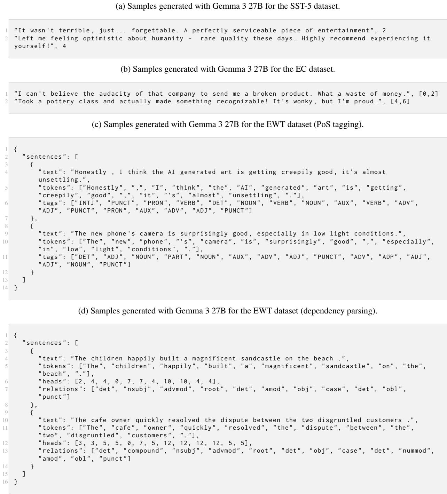  
Figure 6: Examples from our synthetic datasets.

The distributional comparison between prompts in terms of Wasserstein distance (W1) and Cliff’s delta (δ) is provided in Table 4. The results using the full datasets (human-authored and synthetic) are included in Table 5.

## C Multilingual benchmark

To extend our framework to a multilingual setting, we incorporate Spanish and French experiments. To establish a comparison of training dynamics across languages, we opted to translate the English SST-5 dataset using the NLLB-200 model (NLLB Team et al., 2022), thereby maintaining parallel semantic structures. For the multi-label task, we used the Spanish version of the EC dataset (no French version available). For token-level and tree prediction tasks (PoS tagging and dependency parsing), we used UD treebanks: Spanish GSD and French Sequoia. Since text generation is time-consuming and generating enough data to reach the desired number of filtered instances required a large overgeneration factor, we subsampled the Spanish GSD corpus to 2,000 instances. French Sequoia already contains a relatively small number of samples, but we did not find Spanish UD datasets of comparable size. Therefore, all results reported for Spanish GSD are based on this 2,000 sample subset. We controlled translation quality by back-translating the data and measuring BLEU, ROUGE-L, TER, METEOR, and COMET (Rei et al., 2020) scores (Table 3). We relied on XLM-RoBERTa (Conneau et al., 2020) as the encoder to obtain the training dynamics in our analysis.

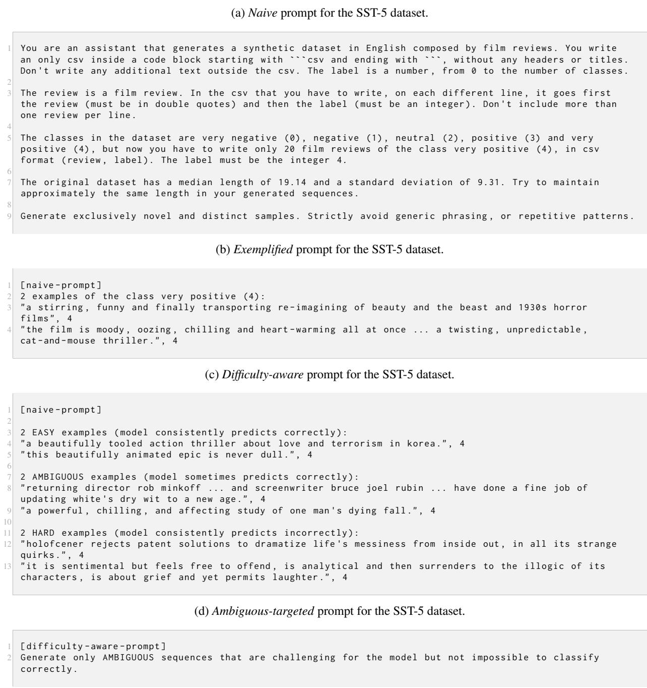  
Figure 7: Prompt templates. Note that the exemplified (Figure 7b) and Difficulty-aware (Figure 7c) extend the naive prompt (Figure 7a); and the ambiguous-targeted (Figure 7d) extends the Difficulty-aware prompt.

<table><tr><td></td><td>BLEU ROUGE</td><td>TER</td><td>METEOR</td><td>COMET</td></tr><tr><td>Spanish</td><td>43.2 0.77</td><td>29.8</td><td>0.77</td><td>0.83</td></tr><tr><td>French</td><td>38.0</td><td>0.72 35.1</td><td>0.73</td><td>0.82</td></tr></table>

Table 3: Translation quality for SST-5 data.

Results on Spanish Figures 12, 13, 14, and 19 show the distributional comparison between prompts, the distributional comparison between LLMs, the encoder differences, and the dataset cartographies for Spanish human and synthetic datasets.

Results on French As in the Spanish case, Figures 15, 16, 17 and 20 present the corresponding analyses for French datasets.

In both languages, differences between prompts exhibit a broader range than in the English setting. There are even extreme cases, such as the point near (1, 1) in Figure 12 for the multi-label task, indicating that the exemplified and Difficulty-aware prompts on the LLaMA model differ substantially from the naive prompt, showing higher confidence and variability in their distributions. This is consistent with the test results (Table 6), where the data generated by LLaMA for the multi-label task appears to degrade substantially when no examples are provided in the prompt.

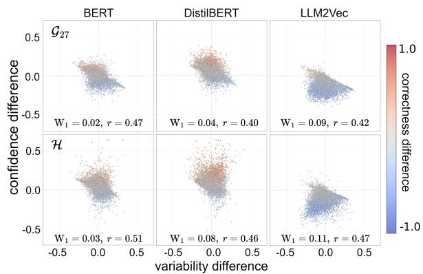  
Figure 8: Differences on the training dynamics across encoders with synthetic (top) and human (bottom) data on EC. Same notation as in Figure 5.

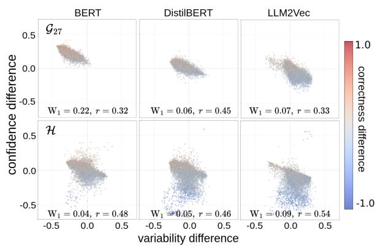  
Figure 9: Differences on the training dynamics across encoders with synthetic (top) and human (bottom) data on PoS tagging. Same notation as in Figure 5.

Tables 6 and 7 show the performance summary of the multilingual benchmark. For OOD evaluation, we use the same datasets as in the English experiments: the Yelp dataset translated with NLLB-200 and the UD PUD dataset corresponding to each language.

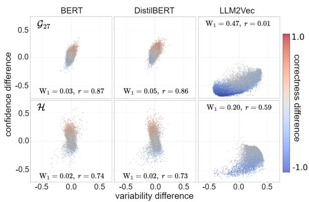  
Figure 10: Differences on the training dynamics across encoders with synthetic (top) and human (bottom) data on dependency parsing. Same notation as in Figure 5.

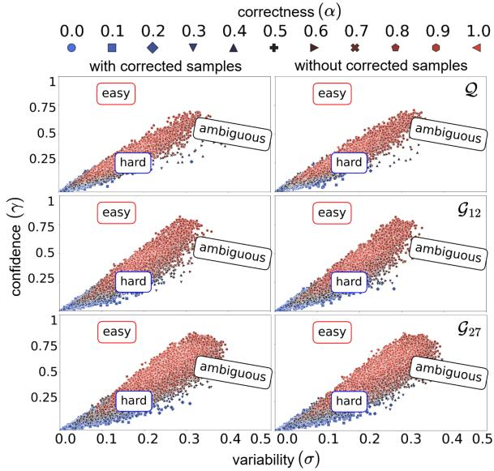  
Figure 11: Dataset cartographies on dependency parsing task with LLM-generated English samples with the Difficulty-aware prompt and RoBERTa encoder. The first column corresponds to the synthetic datasets after applying the corrections, whereas the second column contains only the samples that originally preserved the tree structure. Both distributions were subsampled to 20,000 instances to facilitate visualization. Same notation as in Figure 4.

<table><tr><td rowspan="2"></td><td colspan="4">SST-5</td><td colspan="4">EC</td><td colspan="4">EWTPoS</td><td colspan="4">EWTDP</td></tr><tr><td></td><td colspan="3"></td><td colspan="4"></td><td colspan="4"></td><td colspan="4"></td></tr><tr><td>L</td><td>W1 0.11</td><td>α 0.22</td><td>σ 0.06</td><td>γ 0.39</td><td> $\mathrm { w } _ { 1 }$  0.03</td><td>α -0.08</td><td>σ -0.13</td><td>γ -0.02</td><td>W1 X</td><td>α ×</td><td>σ ×</td><td>γ ×</td><td>W1 X</td><td>α ×</td><td>σ ×</td><td>γ ×</td></tr><tr><td>exep.</td><td>0 Q 0.03 0.06</td><td>0.09 0.18 0.03</td><td>-0.08 0.11</td><td>0.32 0.06</td><td>0.10 0.03</td><td>-0.26 0.10</td><td>0.12 -0.01</td><td>-0.25 0.12</td><td>0.18 0.07</td><td>0.07 0.04</td><td>0.13 0.01</td><td>0.02 0.07</td><td>X 0.03</td><td>X 0.09</td><td>X -0.06</td><td>X 0.11</td></tr><tr><td></td><td>G4  $\mathcal { G } _ { 1 2 }$ </td><td>0.12 -0.02</td><td>-0.08</td><td>0.21</td><td>0.03</td><td>0.11</td><td>0.04</td><td>0.12</td><td>0.03</td><td>-0.11</td><td>-0.03</td><td>-0.17</td><td>X</td><td>X</td><td>X</td><td>X</td></tr><tr><td></td><td>0.01</td><td></td><td>0.05</td><td>-0.06</td><td>0.01</td><td>0.06</td><td>0.04</td><td>0.07</td><td>0.10</td><td>-0.06</td><td>0.07</td><td>-0.12</td><td>0.08</td><td>0.13</td><td>-0.20</td><td>0.32</td></tr><tr><td> $\mathcal { G } _ { 2 7 }$ </td><td>0.02</td><td>0.05</td><td>-0.13</td><td>0.06</td><td>0.02</td><td>0.05</td><td>0.00</td><td>0.07</td><td>0.03</td><td>-0.16</td><td>0.06</td><td>-0.28</td><td>0.10</td><td>0.19</td><td>0.00</td><td>0.35</td></tr><tr><td>L 0</td><td>0.10</td><td>0.18</td><td>0.20</td><td>0.36</td><td>0.07</td><td>-0.23</td><td>-0.33</td><td>-0.17</td><td>×</td><td>×</td><td>×</td><td>×</td><td>×</td><td>×</td><td>×</td><td>×</td></tr><tr><td></td><td></td><td>0.10 0.17</td><td>0.01</td><td>0.32</td><td>0.03</td><td>-0.08</td><td>0.07</td><td>-0.10</td><td>0.16</td><td>0.00</td><td>0.08</td><td>-0.07</td><td></td><td></td><td></td><td>X</td></tr><tr><td>0 Q</td><td></td><td>0.03 -0.11</td><td>0.07</td><td>-0.10</td><td>0.02</td><td>-0.05</td><td>-0.11</td><td>-0.05</td><td>0.09</td><td></td><td></td><td></td><td>X</td><td>X</td><td>X</td><td>-0.07</td></tr><tr><td>G4</td><td></td><td></td><td></td><td></td><td></td><td></td><td></td><td></td><td></td><td>0.11</td><td>-0.05</td><td>0.15</td><td>0.01</td><td>-0.03</td><td>0.03</td><td></td></tr><tr><td></td><td></td><td>0.04 0.09</td><td>-0.05</td><td>0.15</td><td>0.02</td><td>0.06</td><td>-0.09</td><td>0.09</td><td>0.04</td><td>-0.12</td><td>-0.03</td><td>-0.20</td><td>X</td><td>X</td><td>X</td><td>X</td></tr><tr><td>G12</td><td></td><td>0.01 0.00</td><td>-0.01</td><td>0.00</td><td>0.03</td><td>0.10</td><td>0.05</td><td>0.14</td><td>0.27</td><td>0.26</td><td>0.05</td><td>0.32</td><td>0.13</td><td>0.23</td><td>-0.17</td><td>0.46</td></tr><tr><td>G27 L</td><td></td><td>0.01 -0.01</td><td>0.02</td><td>-0.05</td><td>0.01</td><td>0.06</td><td>-0.04</td><td>0.07</td><td>0.06</td><td>0.01</td><td>-0.04</td><td>-0.01</td><td>0.14</td><td>0.29</td><td>0.09</td><td>0.45</td></tr><tr><td></td><td></td><td>0.08 0.15</td><td>0.17</td><td>0.26</td><td>0.05</td><td>-0.08</td><td>-0.24</td><td>-0.02</td><td>×</td><td>×</td><td>×</td><td>×</td><td>×</td><td></td><td></td><td>X</td></tr><tr><td>O</td><td></td><td>0.09 0.13</td><td>0.12</td><td>0.28</td><td>0.18</td><td>-0.53</td><td>0.20</td><td>-0.50</td><td>0.12</td><td>-0.09</td><td>0.08</td><td>-0.17</td><td></td><td>×</td><td>×</td><td>×</td></tr><tr><td>Q</td><td></td><td></td><td>0.20</td><td>-0.02</td><td>0.03</td><td>0.04</td><td>0.10</td><td>0.05</td><td>0.08</td><td>0.11</td><td></td><td></td><td>X</td><td>X</td><td>X</td><td></td></tr><tr><td></td><td></td><td>0.03 -0.07</td><td></td><td></td><td></td><td></td><td></td><td></td><td></td><td></td><td>-0.09</td><td>0.17</td><td>0.02</td><td>0.04</td><td>-0.16</td><td>-0.01</td></tr><tr><td>anqqig. G4</td><td></td><td>0.02 0.06</td><td>0.10</td><td>0.04</td><td>0.04</td><td>0.14</td><td>-0.14</td><td>0.19</td><td>0.08</td><td>-0.14</td><td>-0.02</td><td>-0.25</td><td>X</td><td>X</td><td>X</td><td>×</td></tr><tr><td></td><td>G12</td><td>0.03 0.05</td><td>-0.08</td><td>0.12</td><td>0.01</td><td>-0.02</td><td>0.02</td><td>-0.04</td><td>0.33</td><td>0.30</td><td>0.09</td><td>0.35</td><td>0.06</td><td>0.09</td><td>-0.05</td><td>0.15</td></tr><tr><td></td><td>G27</td><td>0.04 -0.10</td><td>0.24</td><td>-0.17</td><td>0.04</td><td>0.14</td><td>0.04</td><td>0.16</td><td>0.01</td><td>0.01</td><td>-0.08</td><td>-0.00</td><td>0.15</td><td>0.30</td><td>0.02</td><td>0.50</td></tr></table>

Table 4: Comparison of prompt strategies with respect to the naive prompt using the Wasserstein distance $( \mathrm { W _ { 1 } } )$ and Cliff’s delta (δ) over confidence $( \gamma ) .$ , variability (σ) and correctness (α) across the English datasets. Same notation as Figure 4 for LLM symbols. The symbol (×) denotes runs where the LLM could not produce valid formatted or meaningful samples.

<table><tr><td rowspan="2" colspan="2"></td><td colspan="4">in-distribution</td><td colspan="3">out-of-distribution</td></tr><tr><td>SST-5</td><td>EC</td><td> $\mathrm { E W T _ { P o S } }$ </td><td> $\mathrm { E W T _ { D P } }$ </td><td>SST-5</td><td> $\mathrm { E W T _ { P o S } }$ </td><td> $\mathrm { E W T _ { D P } }$ </td></tr><tr><td rowspan="6">naive</td><td>CO</td><td>40.5</td><td>30.9</td><td>×</td><td>×</td><td>49.2</td><td>×</td><td>×</td></tr><tr><td></td><td>35.6</td><td>27.4</td><td>75.0</td><td>X</td><td>46.1</td><td>77.9</td><td>×</td></tr><tr><td>0</td><td>37.5</td><td>39.7</td><td>81.1</td><td>12.1</td><td>46.0</td><td>86.2</td><td>9.8</td></tr><tr><td></td><td>39.3</td><td>33.7</td><td>69.5</td><td>X</td><td>44.4</td><td>73.0</td><td>X</td></tr><tr><td>G12</td><td>42.2</td><td>35.3</td><td>81.0</td><td>12.7</td><td>47.6</td><td>86.4</td><td>12.0</td></tr><tr><td>G27</td><td>42.5</td><td>41.4</td><td>83.7</td><td>14.6</td><td>48.7</td><td>88.6</td><td>15.3</td></tr><tr><td rowspan="6">exennp.</td><td>L O</td><td>35.0</td><td>31.7</td><td>×</td><td>×</td><td>48.3</td><td>×</td><td>×</td></tr><tr><td></td><td>40.9</td><td>29.6</td><td>75.5</td><td>X</td><td>30.4</td><td>79.3</td><td>X</td></tr><tr><td>Q</td><td>40.1</td><td>37.6</td><td>81.9</td><td>10.5</td><td>45.2</td><td>86.8</td><td>8.7</td></tr><tr><td>G4</td><td>28.6</td><td>37.2</td><td>74.0</td><td>X</td><td>47.3</td><td>77.9</td><td>X</td></tr><tr><td>G12</td><td>39.8</td><td>38.2</td><td>82.1</td><td>21.3</td><td>43.3</td><td>87.0</td><td>24.3</td></tr><tr><td>G27</td><td>19.2</td><td>43.5</td><td>83.8</td><td>36.2</td><td>45.9</td><td>88.8</td><td>39.5</td></tr><tr><td rowspan="6">00</td><td>L O</td><td>40.7</td><td>38.6</td><td>×</td><td>×</td><td>38.9</td><td>×</td><td>×</td></tr><tr><td></td><td>43.0</td><td>26.4</td><td>71.9</td><td>X</td><td>37.6</td><td>74.9</td><td>X</td></tr><tr><td>94</td><td>40.4</td><td>40.8</td><td>82.2</td><td>8.5</td><td>38.7</td><td>86.7</td><td>8.6</td></tr><tr><td></td><td>37.2</td><td>36.8</td><td>73.1</td><td>X</td><td>46.6</td><td>77.3</td><td>X</td></tr><tr><td>G12</td><td>38.3</td><td>38.4</td><td>80.5</td><td>24.9</td><td>44.1</td><td>86.6</td><td>27.9</td></tr><tr><td>G27</td><td>41.6</td><td>43.2</td><td>83.9</td><td>35.9</td><td>53.9</td><td>88.8</td><td>38.9</td></tr><tr><td rowspan="7">aqu.</td><td>L 0</td><td>44.1</td><td>38.6</td><td>×</td><td>×</td><td>48.6</td><td>×</td><td>×</td></tr><tr><td></td><td>40.3</td><td>34.2</td><td>72.4</td><td>X</td><td>44.8</td><td>75.9</td><td>X</td></tr><tr><td>94</td><td>41.4</td><td>40.5</td><td>82.3</td><td>8.6</td><td>28.3</td><td>86.7</td><td>7.3</td></tr><tr><td></td><td>40.8</td><td>37.7</td><td>71.0</td><td>X</td><td>49.0</td><td>75.8</td><td>X</td></tr><tr><td>G12</td><td>30.5</td><td>40.1</td><td>81.1</td><td>23.8</td><td>47.6</td><td>87.0</td><td>25.9</td></tr><tr><td>G27</td><td>40.6</td><td>42.3</td><td>83.9</td><td>35.6</td><td>44.6</td><td>88.5</td><td>37.1</td></tr><tr><td>H</td><td>58.1</td><td>59.0</td><td>93.0</td><td>93.2</td><td>57.1</td><td>94.4</td><td>92.3</td></tr></table>

Table 5: Performance of RoBERTa on synthetic data generated from different prompts, LLMs and English datasets (SST-5 for sentiment analysis, EC for multi-label classification and EWT for PoS-tagging and dependency parsing). The symbol (×) denotes runs where the LLM could not produce valid formatted or meaningful samples. Last row (H) denotes the performance with the full original dataset.

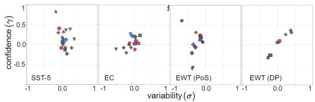  
Figure 12: Comparison of training dynamics across prompting strategies on Spanish datasets. Subfigures illustrate the Cliff’s delta for confidence (γ) and variability (σ) across SST-5, EC, EWT (PoS) and EWT (DP) relatively to the naive prompt. Same notation as in Figure 3.

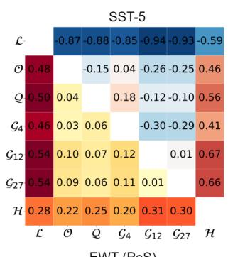

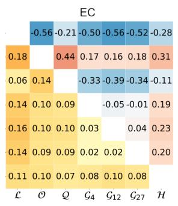

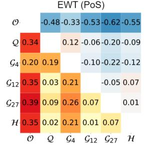

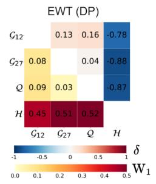  
Figure 13: Comparison of human and synthetic Spanish distributions across LLMs and the Difficulty-aware prompt using Wasserstein distance on $\mathcal { T } _ { * } ^ { \theta }$ (lower triangular matrices), and Cliff’s delta on correctness (upper triangular matrices). Same notation as in Figure 2.

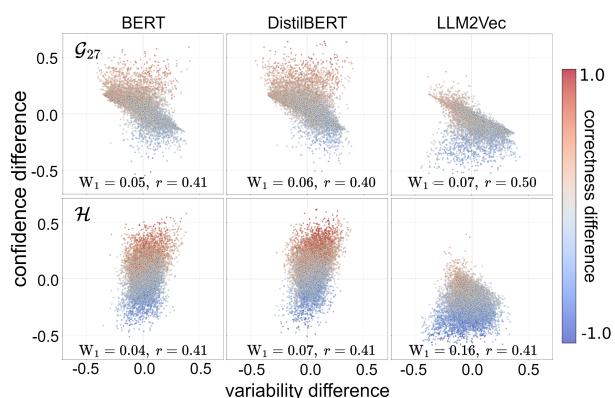  
Figure 14: Differences on the training dynamics across encoders with synthetic (top) and human (bottom) data on Spanish SST-5. Same notation as in Figure 5.

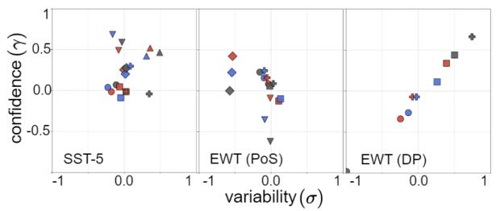  
Figure 15: Comparison of training dynamics across prompting strategies on French datasets. Subfigures illustrate the Cliff’s delta for confidence (γ) and variability (σ) across SST-5, EC, EWT (PoS) and EWT (DP) relatively to the naive prompt. Same notation as in Figure 3.

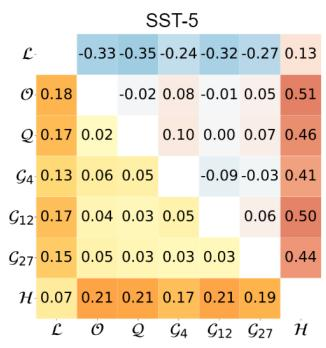

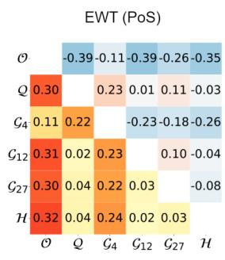

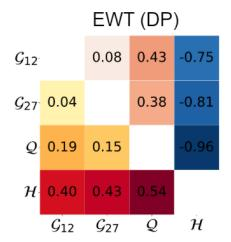

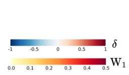

Figure 16: Comparison of human and synthetic French distributions across LLMs and the Difficulty-aware prompt using Wasserstein distance on $ { \mathcal { T } _ { * } ^ { \theta } }$ (lower triangular matrices), and Cliff’s delta on correctness (upper triangular matrices). Same notation as in Figure 2.  
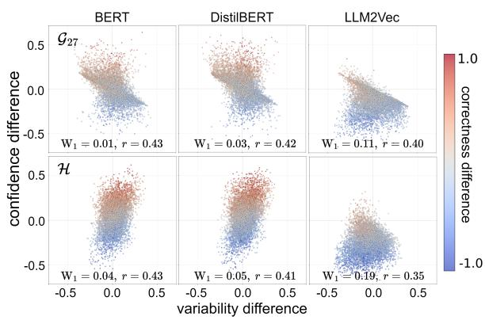  
Figure 17: Differences on the training dynamics across encoders with synthetic (top) and human (bottom) data on French SST-5. Same notation as in Figure 5.

<table><tr><td rowspan="2"></td><td colspan="6">in-distribution</td><td colspan="5">out-of-distribution</td></tr><tr><td>SST-5 es</td><td>fr</td><td>EC</td><td>EWTPoS</td><td></td><td>EWTDP</td><td>SST-5</td><td></td><td>EWTPoS</td><td>EWTDP</td><td></td></tr><tr><td>L 0</td><td></td><td>37.6 35.4</td><td>es 4.9</td><td>es</td><td>fr ×</td><td>es fr</td><td>es</td><td>fr</td><td>es fr</td><td>es</td><td>fr</td></tr><tr><td></td><td></td><td>36.2</td><td>24.2</td><td>× 75.5</td><td>×</td><td>×</td><td>35.3</td><td>42.6 36.2</td><td>× ×</td><td>×</td><td>×</td></tr><tr><td></td><td>34.4</td><td></td><td></td><td>68.5</td><td>X</td><td>X</td><td>45.9</td><td>79.5</td><td>71.0</td><td>X</td><td>X</td></tr><tr><td>naive QG</td><td>36.3</td><td>37.6</td><td>36.0</td><td>87.5 84.9</td><td>7.2</td><td>7.3</td><td>42.8</td><td>46.4 89.5</td><td>87.7</td><td>9.5</td><td>6.8</td></tr><tr><td></td><td>32.1</td><td>32.9</td><td>30.9</td><td>77.6 77.9</td><td>X</td><td>X</td><td>43.2</td><td>44.5 80.3</td><td>80.4</td><td>X</td><td>X</td></tr><tr><td>G12 G27</td><td>39.5 39.7</td><td>38.6 37.9</td><td>29.1 39.0</td><td>86.8 86.9 87.3</td><td>6.3 1.8</td><td>5.3</td><td>45.4</td><td>42.4 90.3</td><td>88.6</td><td>8.1</td><td>6.0</td></tr><tr><td>L QG</td><td>34.5</td><td>35.5</td><td>32.3</td><td>86.9 ×</td><td>×</td><td>10.3</td><td>49.3 38.3</td><td>46.8 89.8</td><td>89.5</td><td>2.5 ×</td><td>10.6</td></tr><tr><td rowspan="6">exeep.</td><td>0 38.1</td><td>38.5</td><td>27.1</td><td>× 69.4</td><td></td><td>×</td><td></td><td>38.6</td><td>×</td><td>×</td><td></td><td>×</td></tr><tr><td></td><td></td><td></td><td></td><td>65.5 X</td><td>X</td><td>36.3</td><td>41.8</td><td>77.6</td><td>68.0</td><td>X</td><td>X</td></tr><tr><td>40.5</td><td>36.1</td><td>31.9</td><td>87.5</td><td>86.8 6.9</td><td>7.1</td><td>42.9</td><td>37.8</td><td>88.0</td><td>89.1</td><td>8.9</td><td>6.6</td></tr><tr><td>35.5</td><td>31.0</td><td>35.6</td><td>75.0</td><td>77.7 X</td><td>X</td><td>42.7</td><td>44.3</td><td>77.3</td><td>79.0</td><td>X</td><td>X</td></tr><tr><td>G12 38.4</td><td>37.0</td><td>34.5</td><td>88.9</td><td>86.0 12.9</td><td>13.0</td><td>43.0</td><td>44.7</td><td>89.4</td><td>88.3</td><td>15.5</td><td>14.2</td></tr><tr><td>G27 L</td><td>39.5 36.5</td><td>39.3</td><td>88.8</td><td>88.2</td><td>1.3</td><td>27.7</td><td>45.9 40.4</td><td>90.7</td><td>90.0</td><td>1.9</td><td>31.4</td></tr><tr><td rowspan="6">94 0</td><td>23.1</td><td>35.7</td><td>32.6</td><td>×</td><td>× ×</td><td>×</td><td>20.0</td><td>39.7</td><td>×</td><td>×</td><td>×</td><td>X</td></tr><tr><td>0 38.7</td><td>39.4</td><td>23.5</td><td>57.7</td><td>56.8 X</td><td>X</td><td>41.4</td><td>40.1</td><td>58.2</td><td>58.8</td><td>X</td><td>X</td></tr><tr><td>37.2</td><td>38.9</td><td>38.1</td><td>87.8 85.8</td><td>8.2</td><td>8.3</td><td>45.0</td><td>45.8</td><td>88.9</td><td>87.9</td><td>10.6</td><td>8.0</td></tr><tr><td>36.4</td><td>35.9</td><td>33.9</td><td>75.5</td><td>72.3 X</td><td>X</td><td>42.3</td><td>40.7</td><td>78.8</td><td>76.3</td><td>X</td><td>X</td></tr><tr><td>40.2</td><td>37.5</td><td>35.0</td><td>87.6 88.3</td><td>23.7</td><td>28.3</td><td>46.0</td><td>44.5</td><td>89.0</td><td>89.5</td><td>26.9</td><td>30.5</td></tr><tr><td>G12 G27</td><td>37.4 35.7</td><td>41.4</td><td>88.8</td><td>87.9</td><td>27.8</td><td>22.4</td><td>46.7 48.4</td><td>89.3</td><td>89.5</td><td>33.5</td><td>24.8</td></tr><tr><td rowspan="6">L QG qup</td><td>35.1</td><td>36.8</td><td>32.7</td><td>× ×</td><td>×</td><td>×</td><td>40.1</td><td>42.7</td><td>×</td><td>×</td><td>×</td><td>×</td></tr><tr><td>O 35.0</td><td>32.2</td><td>28.6</td><td>41.7</td><td>53.5</td><td>X</td><td>X</td><td>40.0 33.7</td><td>41.6</td><td>53.5</td><td>X</td><td>X</td></tr><tr><td>40.3</td><td>38.7</td><td>35.9</td><td>87.8</td><td>86.6 6.6</td><td>22.1</td><td>42.5</td><td>42.6</td><td>89.0</td><td>87.7</td><td>8.2</td><td>25.2</td></tr><tr><td>29.8</td><td>36.0</td><td>33.6</td><td>66.6</td><td>67.9</td><td></td><td>43.7</td><td>43.9</td><td>70.6</td><td>69.4</td><td>X</td><td>X</td></tr><tr><td>41.2</td><td>43.1</td><td>33.6</td><td>88.9 86.6</td><td>X 23.5</td><td>X 23.8</td><td>45.6</td><td>44.5</td><td>89.7</td><td>87.5</td><td>27.5</td><td>26.3</td></tr><tr><td>G12 G27</td><td>36.7 35.7</td><td>37.8</td><td>89.3</td><td>87.3</td><td>27.9</td><td>23.3</td><td>46.6 48.3</td><td>89.9</td><td>88.6</td><td>32.5</td><td>27.0</td></tr><tr><td>H</td><td>50.8 51.8</td><td></td><td>59.0</td><td>94.9 97.2</td><td>90.3</td><td>94.9</td><td>49.7</td><td>48.0</td><td>92.0</td><td>95.5</td><td>82.1</td><td>84.6</td></tr></table>

Table 6: Performance of XLM-RoBERTa on synthetic data, generated with different prompts and LLMs in our multilingual benchmark. Same notation as in Table 5.

<table><tr><td rowspan=3 colspan=1></td><td rowspan=3 colspan=2>SST-5es fr</td><td rowspan=3 colspan=1>in-disECes</td><td rowspan=1 colspan=2>tribution</td><td rowspan=1 colspan=1></td><td rowspan=3 colspan=3>out-of-distributSST-5  EWTPoSes fr</td><td rowspan=3 colspan=1>ionEWTDPes fr</td></tr><tr><td rowspan=2 colspan=2>EWTPoSes fr</td><td rowspan=1 colspan=1>EWTDP</td><td rowspan=1 colspan=1>T-5</td></tr><tr><td rowspan=1 colspan=1>es fr</td><td rowspan=1 colspan=2>es fr</td></tr><tr><td rowspan=1 colspan=1></td><td rowspan=1 colspan=1>23.1</td><td rowspan=1 colspan=1>35.7</td><td rowspan=1 colspan=1>32.6</td><td rowspan=1 colspan=2>×  ×</td><td rowspan=1 colspan=1>×</td><td rowspan=1 colspan=2>20.039.7</td><td rowspan=1 colspan=1>×  ×</td><td rowspan=1 colspan=1>×</td></tr><tr><td rowspan=1 colspan=1>O</td><td rowspan=1 colspan=1>38.7</td><td rowspan=1 colspan=1>39.4</td><td rowspan=1 colspan=1>23.5</td><td rowspan=1 colspan=2>57.7 56.8</td><td rowspan=1 colspan=1>×</td><td rowspan=1 colspan=2>41.440.1</td><td rowspan=1 colspan=1>58.2 58.8</td><td rowspan=1 colspan=1>X</td></tr><tr><td rowspan=2 colspan=1>m</td><td rowspan=1 colspan=1>37.2</td><td rowspan=1 colspan=1>38.9</td><td rowspan=1 colspan=1>38.1</td><td rowspan=1 colspan=2>87.885.8</td><td rowspan=1 colspan=1>8.2 8.3</td><td rowspan=1 colspan=2>45.045.8</td><td rowspan=1 colspan=1>88.987.9</td><td rowspan=1 colspan=1>10.68.0</td></tr><tr><td rowspan=1 colspan=2>40.237.5</td><td rowspan=1 colspan=1>35.0</td><td rowspan=1 colspan=2>87.688.3</td><td rowspan=1 colspan=1>23.728.3</td><td rowspan=1 colspan=2>46.044.5</td><td rowspan=1 colspan=1>89.089.5</td><td rowspan=1 colspan=1>26.930.5</td></tr><tr><td rowspan=1 colspan=1>H</td><td rowspan=1 colspan=1>50.8</td><td rowspan=1 colspan=1>51.8</td><td rowspan=1 colspan=1>59.0</td><td rowspan=1 colspan=2>94.997.2</td><td rowspan=1 colspan=1>90.394.9</td><td rowspan=1 colspan=2>49.748.0</td><td rowspan=1 colspan=1>92.095.5</td><td rowspan=1 colspan=1>82.184.6</td></tr><tr><td rowspan=1 colspan=1></td><td rowspan=1 colspan=1>17.6</td><td rowspan=1 colspan=1>34.5</td><td rowspan=1 colspan=1>33.9</td><td rowspan=1 colspan=2>×  ×</td><td rowspan=1 colspan=1>×  ×</td><td rowspan=1 colspan=2>20.044.1</td><td rowspan=1 colspan=1>×  X</td><td rowspan=1 colspan=1>×  ×</td></tr><tr><td rowspan=1 colspan=1>mO</td><td rowspan=1 colspan=1>39.6</td><td rowspan=1 colspan=1>37.1</td><td rowspan=1 colspan=1>22.4</td><td rowspan=1 colspan=2>58.2 58.3</td><td rowspan=1 colspan=1>X  X</td><td rowspan=1 colspan=1>42.0</td><td rowspan=1 colspan=1>36.9</td><td rowspan=1 colspan=1>61.9 61.8</td><td rowspan=1 colspan=1>X  ×</td></tr><tr><td rowspan=1 colspan=1>u Q</td><td rowspan=1 colspan=1>33.1</td><td rowspan=1 colspan=1>36.7</td><td rowspan=1 colspan=1>33.4</td><td rowspan=1 colspan=2>87.285.1</td><td rowspan=1 colspan=1>7.6 0.7</td><td rowspan=1 colspan=1>33.4</td><td rowspan=1 colspan=1>45.4</td><td rowspan=1 colspan=1>88.587.5</td><td rowspan=1 colspan=1>9.4 0.7</td></tr><tr><td rowspan=1 colspan=1>u G12</td><td rowspan=1 colspan=1>40.9</td><td rowspan=1 colspan=1>35.5</td><td rowspan=1 colspan=1>33.2</td><td rowspan=1 colspan=2>88.085.5</td><td rowspan=1 colspan=1>19.820.1</td><td rowspan=1 colspan=1>44.6</td><td rowspan=1 colspan=1>44.6</td><td rowspan=1 colspan=1>89.386.3</td><td rowspan=1 colspan=1>23.823.8</td></tr><tr><td rowspan=1 colspan=1>H</td><td rowspan=1 colspan=1>51.4</td><td rowspan=1 colspan=1>48.8</td><td rowspan=1 colspan=1>55.0</td><td rowspan=1 colspan=2>95.595.8</td><td rowspan=1 colspan=1>87.292.1</td><td rowspan=1 colspan=1>49.1</td><td rowspan=1 colspan=1>46.0</td><td rowspan=1 colspan=1>92.294.7</td><td rowspan=1 colspan=1>81.283.5</td></tr><tr><td rowspan=1 colspan=1></td><td rowspan=1 colspan=1>39.8</td><td rowspan=1 colspan=1>38.9</td><td rowspan=1 colspan=1>39.6</td><td rowspan=1 colspan=2>×  ×</td><td rowspan=1 colspan=1>×  ×</td><td rowspan=1 colspan=1>40.5</td><td rowspan=1 colspan=1>38.5</td><td rowspan=1 colspan=1>×  ×</td><td rowspan=1 colspan=1>×  ×</td></tr><tr><td rowspan=1 colspan=1></td><td rowspan=1 colspan=1>39.5</td><td rowspan=1 colspan=1>35.8</td><td rowspan=1 colspan=1>21.0</td><td rowspan=1 colspan=2>74.968.7</td><td rowspan=1 colspan=1>× ×</td><td rowspan=1 colspan=1>31.0</td><td rowspan=1 colspan=1>41.1</td><td rowspan=1 colspan=1>79.770.2</td><td rowspan=1 colspan=1>X  ×</td></tr><tr><td rowspan=2 colspan=1>1x.</td><td rowspan=1 colspan=1>33.4</td><td rowspan=1 colspan=1>31.0</td><td rowspan=1 colspan=1>39.0</td><td rowspan=1 colspan=2>87.284.6</td><td rowspan=1 colspan=1>7.1 8.2</td><td rowspan=1 colspan=1>33.2</td><td rowspan=1 colspan=1>38.6</td><td rowspan=1 colspan=1>87.287.0</td><td rowspan=1 colspan=1>8.2 8.4</td></tr><tr><td rowspan=1 colspan=1>36.7</td><td rowspan=1 colspan=1>32.5</td><td rowspan=1 colspan=1>35.2</td><td rowspan=1 colspan=2>83.781.6</td><td rowspan=1 colspan=1>20.42.4</td><td rowspan=1 colspan=1>37.7</td><td rowspan=1 colspan=1>40.6</td><td rowspan=1 colspan=1>86.683.0</td><td rowspan=1 colspan=1>23.42.9</td></tr><tr><td rowspan=1 colspan=1>H</td><td rowspan=1 colspan=1>53.3</td><td rowspan=1 colspan=1>52.7</td><td rowspan=1 colspan=1>50.4</td><td rowspan=1 colspan=2>93.695.0</td><td rowspan=1 colspan=1>82.182.3</td><td rowspan=1 colspan=1>49.7</td><td rowspan=1 colspan=1>48.4</td><td rowspan=1 colspan=1>91.094.4</td><td rowspan=1 colspan=1>79.9 77.2</td></tr><tr><td rowspan=1 colspan=1></td><td rowspan=1 colspan=1>39.7</td><td rowspan=1 colspan=1>38.2</td><td rowspan=1 colspan=1>40.3</td><td rowspan=1 colspan=2>×  ×</td><td rowspan=1 colspan=1>×  ×</td><td rowspan=1 colspan=1>46.7</td><td rowspan=1 colspan=1>42.4</td><td rowspan=1 colspan=1>×  ×</td><td rowspan=1 colspan=1>×</td></tr><tr><td rowspan=1 colspan=1>α O</td><td rowspan=1 colspan=1>39.8</td><td rowspan=1 colspan=1>37.9</td><td rowspan=1 colspan=1>19.3</td><td rowspan=1 colspan=2>75.771.3</td><td rowspan=1 colspan=1>X  ×</td><td rowspan=1 colspan=1>35.7</td><td rowspan=1 colspan=1>34.7</td><td rowspan=1 colspan=1>80.373.7</td><td rowspan=1 colspan=1>× ××</td></tr><tr><td rowspan=1 colspan=1>uxQ</td><td rowspan=1 colspan=1>34.8</td><td rowspan=1 colspan=1>37.1</td><td rowspan=1 colspan=1>36.6</td><td rowspan=1 colspan=2>87.584.7</td><td rowspan=1 colspan=1>7.9 6.4</td><td rowspan=1 colspan=1>42.6</td><td rowspan=1 colspan=1>42.2</td><td rowspan=1 colspan=1>88.486.7</td><td rowspan=1 colspan=1>10.86.8</td></tr><tr><td rowspan=1 colspan=1>m G12</td><td rowspan=1 colspan=1>36.3</td><td rowspan=1 colspan=1>37.2</td><td rowspan=1 colspan=1>33.2</td><td rowspan=1 colspan=2>86.384.6</td><td rowspan=1 colspan=1>14.217.3</td><td rowspan=1 colspan=1>40.8</td><td rowspan=1 colspan=1>47.7</td><td rowspan=1 colspan=1>89.486.1</td><td rowspan=1 colspan=1>17.120.7</td></tr><tr><td rowspan=1 colspan=1>H</td><td rowspan=1 colspan=1>52.3</td><td rowspan=1 colspan=1>51.9</td><td rowspan=1 colspan=1>54.6</td><td rowspan=1 colspan=2>93.895.1</td><td rowspan=1 colspan=1>82.283.2</td><td rowspan=1 colspan=1>47.0</td><td rowspan=1 colspan=1>49.2</td><td rowspan=1 colspan=1>91.494.7</td><td rowspan=1 colspan=1>79.878.0</td></tr><tr><td rowspan=1 colspan=1></td><td rowspan=1 colspan=1>40.8</td><td rowspan=1 colspan=1>34.9</td><td rowspan=1 colspan=1>4.9</td><td rowspan=1 colspan=2>×  ×</td><td rowspan=1 colspan=1>× X</td><td rowspan=1 colspan=1>45.0</td><td rowspan=1 colspan=1>42.9</td><td rowspan=1 colspan=1>×  ×</td><td rowspan=1 colspan=1>X</td></tr><tr><td rowspan=1 colspan=1>5O</td><td rowspan=1 colspan=1>36.7</td><td rowspan=1 colspan=1>36.2</td><td rowspan=1 colspan=1>20.7</td><td rowspan=1 colspan=2>73.965.4</td><td rowspan=1 colspan=1>X  ×</td><td rowspan=1 colspan=1>40.2</td><td rowspan=1 colspan=1>37.9</td><td rowspan=1 colspan=1>77.965.8</td><td rowspan=1 colspan=1>X</td></tr><tr><td rowspan=1 colspan=1></td><td rowspan=1 colspan=1>38.0</td><td rowspan=1 colspan=1>37.1</td><td rowspan=1 colspan=1>40.9</td><td rowspan=1 colspan=1>88.1</td><td rowspan=1 colspan=1>85.7</td><td rowspan=1 colspan=1>2.3 1.1</td><td rowspan=1 colspan=1>44.4</td><td rowspan=1 colspan=1>39.4</td><td rowspan=1 colspan=1>88.788.0</td><td rowspan=1 colspan=1>2.9 0.7</td></tr><tr><td rowspan=1 colspan=1>m G12</td><td rowspan=1 colspan=1>40.6</td><td rowspan=1 colspan=1>39.0</td><td rowspan=1 colspan=1>33.8</td><td rowspan=1 colspan=1>87.0</td><td rowspan=1 colspan=1>87.8</td><td rowspan=1 colspan=1>15.91.1</td><td rowspan=1 colspan=1>45.3</td><td rowspan=1 colspan=1>42.6</td><td rowspan=1 colspan=1>89.089.1</td><td rowspan=1 colspan=1>19.91.3</td></tr><tr><td rowspan=1 colspan=1>H</td><td rowspan=1 colspan=1>45.0</td><td rowspan=1 colspan=1>23.1</td><td rowspan=1 colspan=1>54.3</td><td rowspan=1 colspan=2>94.193.7</td><td rowspan=1 colspan=1>89.794.3</td><td rowspan=1 colspan=1>47.5</td><td rowspan=1 colspan=1>20.0</td><td rowspan=1 colspan=1>91.292.8</td><td rowspan=1 colspan=1>81.9 84.4</td></tr><tr><td rowspan=1 colspan=1></td><td rowspan=1 colspan=1>39.9</td><td rowspan=1 colspan=1>40.2</td><td rowspan=1 colspan=1>39.1</td><td rowspan=1 colspan=2>×  ×</td><td rowspan=1 colspan=1>X  ×</td><td rowspan=1 colspan=1>49.3</td><td rowspan=1 colspan=1>37.7</td><td rowspan=1 colspan=1>×  ×</td><td rowspan=1 colspan=1>X</td></tr><tr><td rowspan=1 colspan=1>α O</td><td rowspan=1 colspan=1>23.1</td><td rowspan=1 colspan=1>37.1</td><td rowspan=1 colspan=1>25.1</td><td rowspan=1 colspan=2>44.542.7</td><td rowspan=1 colspan=1>X  X</td><td rowspan=1 colspan=1>20.0</td><td rowspan=1 colspan=1>37.9</td><td rowspan=1 colspan=1>47.4 44.0</td><td rowspan=1 colspan=1>X</td></tr><tr><td rowspan=2 colspan=1>midda</td><td rowspan=1 colspan=1>35.2</td><td rowspan=1 colspan=1>32.8</td><td rowspan=1 colspan=1>34.5</td><td rowspan=1 colspan=1>86.3</td><td rowspan=1 colspan=1>84.8</td><td rowspan=1 colspan=1>6.1 5.6</td><td rowspan=1 colspan=1>41.2</td><td rowspan=1 colspan=1>26.9</td><td rowspan=1 colspan=1>88.286.4</td><td rowspan=1 colspan=1>7.3 5.6</td></tr><tr><td rowspan=1 colspan=1>38.7</td><td rowspan=1 colspan=1>32.5</td><td rowspan=1 colspan=1>26.6</td><td rowspan=1 colspan=1>86.6</td><td rowspan=1 colspan=1>86.8</td><td rowspan=1 colspan=1>0.5 1.1</td><td rowspan=1 colspan=1>44.8</td><td rowspan=1 colspan=1>45.8</td><td rowspan=1 colspan=1>88.588.4</td><td rowspan=1 colspan=1>0.5 1.0</td></tr><tr><td rowspan=1 colspan=1>H</td><td rowspan=1 colspan=1>42.6</td><td rowspan=1 colspan=1>17.6</td><td rowspan=1 colspan=1>52.4</td><td rowspan=1 colspan=2>93.595.2</td><td rowspan=1 colspan=1>89.694.1</td><td rowspan=1 colspan=1>49.8</td><td rowspan=1 colspan=1>20.0</td><td rowspan=1 colspan=1>90.993.6</td><td rowspan=1 colspan=1>81.384.2</td></tr><tr><td rowspan=1 colspan=1></td><td rowspan=1 colspan=1>35.1</td><td rowspan=1 colspan=1>23.1</td><td rowspan=1 colspan=1>4.9</td><td rowspan=1 colspan=2>×  ×</td><td rowspan=1 colspan=1></td><td rowspan=1 colspan=1>41.1</td><td rowspan=1 colspan=1>20.0</td><td rowspan=1 colspan=1>× ×</td><td rowspan=1 colspan=1> × ×</td></tr><tr><td rowspan=1 colspan=1></td><td rowspan=1 colspan=1>35.7</td><td rowspan=1 colspan=1>39.6</td><td rowspan=1 colspan=1>23.5</td><td rowspan=1 colspan=2>30.6 44.8</td><td rowspan=1 colspan=1></td><td rowspan=1 colspan=1>39.0</td><td rowspan=1 colspan=1>39.3</td><td rowspan=1 colspan=1>33.1 44.5</td><td rowspan=1 colspan=1>× ×</td></tr><tr><td rowspan=2 colspan=1>m</td><td rowspan=1 colspan=1>42.7</td><td rowspan=1 colspan=1>39.3</td><td rowspan=1 colspan=1>30.3</td><td rowspan=1 colspan=2>86.485.5</td><td rowspan=1 colspan=1>1.0 0.3</td><td rowspan=1 colspan=1>35.3</td><td rowspan=1 colspan=1>24.9</td><td rowspan=1 colspan=1>87.887.4</td><td rowspan=1 colspan=1>1.1 0.3</td></tr><tr><td rowspan=1 colspan=1>41.1</td><td rowspan=1 colspan=1>41.5</td><td rowspan=1 colspan=1>27.1</td><td rowspan=1 colspan=2>86.387.5</td><td rowspan=1 colspan=1>0.70.7</td><td rowspan=1 colspan=1>44.2</td><td rowspan=1 colspan=1>37.6</td><td rowspan=1 colspan=1>88.488.7</td><td rowspan=1 colspan=1>0.60.6</td></tr><tr><td rowspan=1 colspan=1>H</td><td rowspan=1 colspan=1>17.6</td><td rowspan=1 colspan=1>29.6</td><td rowspan=1 colspan=1>43.5</td><td rowspan=1 colspan=2>93.991.5</td><td rowspan=1 colspan=1>89.9 94.6</td><td rowspan=1 colspan=1>20.0</td><td rowspan=1 colspan=1>35.5</td><td rowspan=1 colspan=1>91.290.8</td><td rowspan=1 colspan=1>81.5 84.3</td></tr><tr><td rowspan=1 colspan=1></td><td rowspan=1 colspan=1>35.9</td><td rowspan=1 colspan=1>35.4</td><td rowspan=1 colspan=1>7.5</td><td rowspan=1 colspan=2>×  ×</td><td rowspan=1 colspan=1>×  ×</td><td rowspan=1 colspan=1>41.6</td><td rowspan=1 colspan=1>33.8</td><td rowspan=1 colspan=1>×  X</td><td rowspan=1 colspan=1>×  X</td></tr><tr><td rowspan=1 colspan=1>α O</td><td rowspan=1 colspan=1>18.1</td><td rowspan=1 colspan=1>38.9</td><td rowspan=1 colspan=1>21.2</td><td rowspan=1 colspan=2>27.2 39.2</td><td rowspan=1 colspan=1>X  X</td><td rowspan=1 colspan=1>20.0</td><td rowspan=1 colspan=1>45.8</td><td rowspan=1 colspan=1>30.5 39.2</td><td rowspan=1 colspan=1>X  X</td></tr><tr><td rowspan=1 colspan=1>z Q</td><td rowspan=1 colspan=1>31.8</td><td rowspan=1 colspan=1>35.4</td><td rowspan=1 colspan=1>28.8</td><td rowspan=1 colspan=2>85.685.1</td><td rowspan=1 colspan=1>0.2 0.0</td><td rowspan=1 colspan=1>38.6</td><td rowspan=1 colspan=1>40.0</td><td rowspan=1 colspan=1>87.987.2</td><td rowspan=1 colspan=1>0.2 0.0</td></tr><tr><td rowspan=1 colspan=1>m G12</td><td rowspan=1 colspan=1>39.1</td><td rowspan=1 colspan=1>32.4</td><td rowspan=1 colspan=1>25.9</td><td rowspan=1 colspan=2>85.187.0</td><td rowspan=1 colspan=1>0.20.0</td><td rowspan=1 colspan=1>41.5</td><td rowspan=1 colspan=1>38.0</td><td rowspan=1 colspan=1>88.188.6</td><td rowspan=1 colspan=1>0.30.0</td></tr><tr><td rowspan=1 colspan=1>H</td><td rowspan=1 colspan=1>17.6</td><td rowspan=1 colspan=1>30.0</td><td rowspan=1 colspan=1>4.9</td><td rowspan=1 colspan=2>93.895.8</td><td rowspan=1 colspan=1>89.6 93.9</td><td rowspan=1 colspan=1>20.0</td><td rowspan=1 colspan=1>37.1</td><td rowspan=1 colspan=1>90.794.4</td><td rowspan=1 colspan=1>81.3 84.4</td></tr></table>

Table 7: Performance comparison on sample subsets for Spanish and French datasets. Same criteria and notation as in Table 1. We use ISO-639 codes to denote languages.

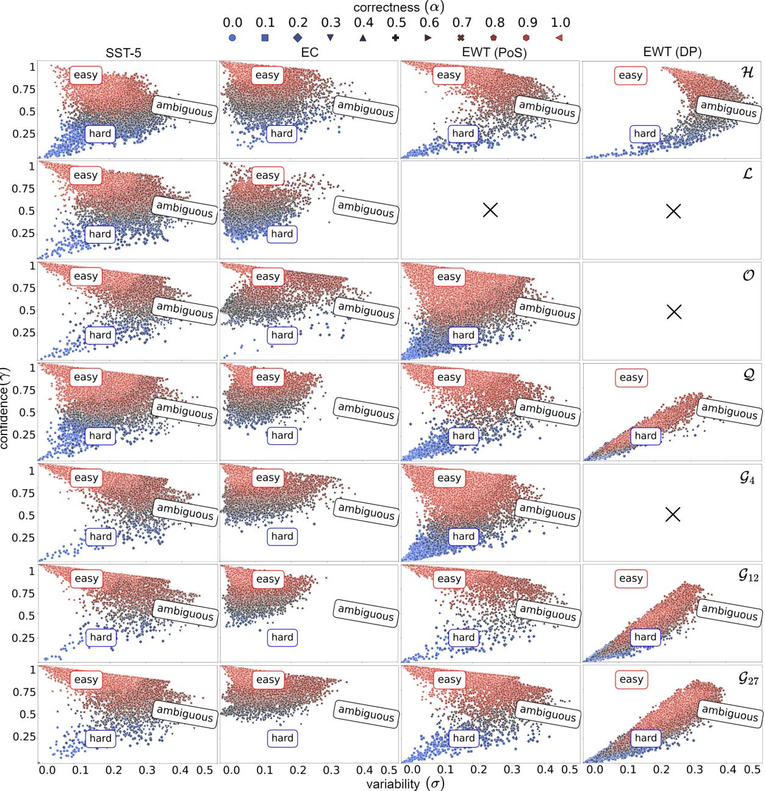  
Figure 18: Dataset cartographies on all tasks with human and LLM-generated English samples with the Difficultyaware prompt and RoBERTa encoder. Same notation as in Figure 4.

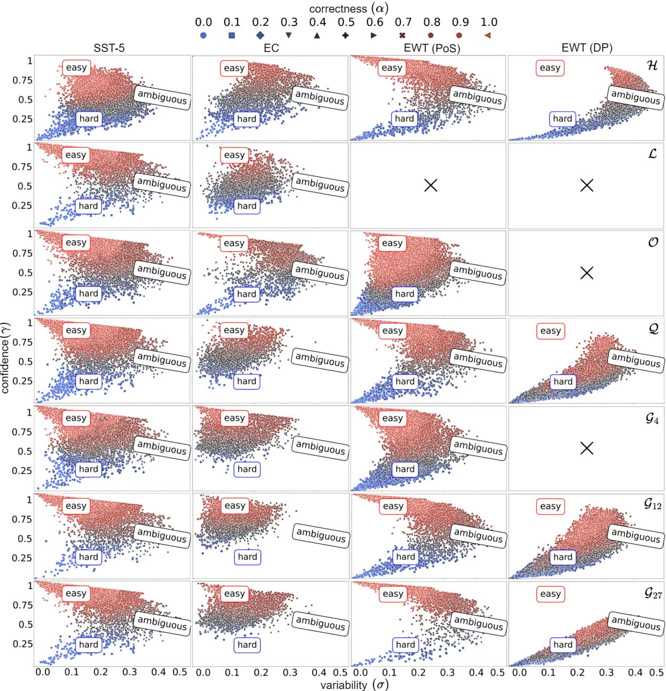  
Figure 19: Dataset cartographies on all tasks with human and LLM-generated Spanish samples with the Difficultyaware prompt and RoBERTa encoder. Same notation as in Figure 4.

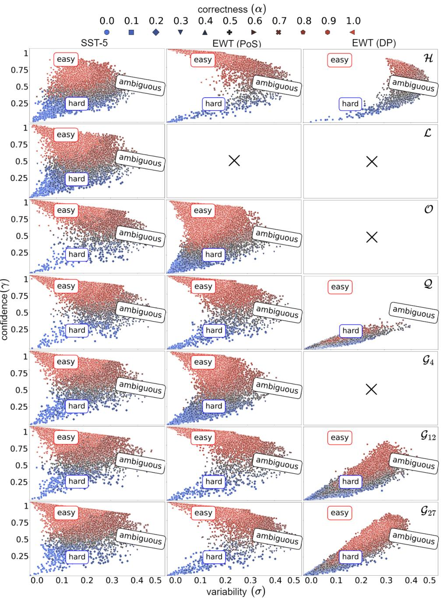  
Figure 20: Dataset cartographies on all tasks with human and LLM-generated French samples with the Difficulty aware prompt and RoBERTa encoder. Same notation as in Figure 4.