# THE GEOMETRY OF RANDOMIZED SMOOTHING ON FEASIBLE SETS

Syed Izhan Khilji Technische Universitat Wien¨

Alireza Furutanpey<sup>∗</sup> NeverBlink

Schahram Dustdar Technische Universitat Wien¨ Universitat Pompeu Fabra

## ABSTRACT

Randomized smoothing certifies the probability of a fixed output event as the center of Gaussian noise moves. Feasibility or confidence filtering reports label probabilities only among retained proposals, producing a ratio. Its numerator is a fixed Gaussian event mass, while its denominator is the probability of retention and can change with the center. Substituting this ratio into the ordinary smoothing formula can therefore certify a ball that contains a decision boundary. We separate the problem into a geometric question and a certification question. Geometry determines when conditioning preserves Gaussian comparisons. Convex retained sets preserve the full comparison, while general sets require geometric control of the retained law as the center moves. Without such control, conditional probabilities imply no positive universal radius. Joint retention-and-label probabilities always yield a valid certificate for the same filtered predictor. A uniform covariance bound transfers divergence certificates to the retained law and can yield larger radii even when the Gaussian event comparison fails. Both methods admit finite-sample bounds. For a learned image classifier with a training-selected nonconvex filter, conditional Renyi´ bounds certify more images than joint-mass bounds without additional model evaluations. A released confidence filter exhibits verified label changes inside radii obtained by conditional substitution. An application of adaptive Gaussian composition covers causal finite-horizon executions with history-dependent center shifts under a pathwise energy bound.

## 1 INTRODUCTION

Randomized smoothing turns predictions under Gaussian noise into a robustness certificate (Cohen et al., 2019). Now consider a system that discards nine out of ten noisy inputs. If one label receives nine out of ten surviving votes, the reported probability is 0.9. Yet, the event that an input is both retained and assigned that label may have a Gaussian mass of only 0.09. The standard smoothing proof controls the event mass, not the fraction among survivors.

Let $s _ { y } ( a )$ be the Gaussian probability that a proposal centered at a is retained and assigned label y. Let $\zeta _ { \sigma } ( a )$ be the probability of retention. The filtered vote is $p _ { y } ( a ) = s _ { y } ( a ) / \zeta _ { \sigma } ( a )$ . Dividing all label masses by the same value preserves their order at a given center. It does not preserve the comparison between two centers because $\zeta _ { \sigma } ( a )$ changes with a. A large majority among retained proposals can therefore carry little Gaussian mass and can change label inside the radius obtained by substituting $p _ { y } ( a )$ into the ordinary formula.

This observation leads to two questions. When does conditioning preserve the Gaussian comparison, and how can the filtered predictor be certified when it does not? The retained distribution answers the first question. Its one-dimensional projections determine whether event probabilities obey the Gaussian comparison. The curvature of log retention probability controls KL and Renyi divergence,´ while conditional covariance describes the same behavior locally. Convex retained sets satisfy the strongest condition and preserve the full event comparison.

The second question has two practical answers. Joint retained-label masses are probabilities of fixed Gaussian events, so they always produce a sound certificate without changing the filtered predictor or adding model evaluations. A uniform covariance bound instead permits direct certification from conditional probabilities through the Renyi bound of Li et al. (2019). This can yield a larger radius´ without requiring the full Gaussian event comparison. Without either geometric control or joint masses, the conditional label probabilities alone cannot determine a positive universal radius.

We test both conclusions on a learned image model. A training-selected nonconvex filter on CIFAR-10.2 admits a global covariance proof, which permits a direct comparison between covariance and joint-mass certificates. A separate AuditVotes case study finds independently verified label changes inside radii computed from conditional probabilities. The first study shows how geometric control recovers a direct certificate. The second exhibits the failure when that control is absent. Our derivations combine truncated exponential-family identities, strong log-concavity, and rejection-aware smoothing (Nielsen, 2022; Gopi et al., 2022; Sheikholeslami et al., 2022).

Code and retained result records are publicly available <sup>1</sup>.

## Contributions.

• We characterize when conditioning retains Gaussian event and divergence comparisons. The criteria cover arbitrary fixed measurable retained sets and identify conditional covariance as the exact local quantity.

• We prove that conditional probabilities alone provide no positive universal radius. Algorithm 1 gives a finite-sample certificate for the unchanged filtered predictor from joint masses. A uniform covariance bound transfers divergence certificates to the retained law, with an explicit spatial requirement when the bound is local.

• Exact counterexamples and two learned-model studies demonstrate both failure and recovery. A finite-horizon extension covers history-dependent center shifts chosen before each Gaussian proposal block under one common causal execution.

The single-step results compare centers under the same measurable retention and task rules. Appendix F treats fixed post-processing alternatives. Appendix I develops the causal finite-horizon result and Algorithm 2 gives its finite-sample procedure.

## 2 FILTERED GAUSSIAN SMOOTHING

Fix a noise scale $\sigma > 0$ and a finite-dimensional affine space H with direction space $L = H - H$ Let $I _ { L }$ be the identity on L and let $G _ { a } = \mathcal { N } _ { H } ( a , \sigma ^ { 2 } I _ { L } )$ be the Gaussian proposal centered at $a \in H$ The retention rule $R : H  \{ 0 , 1 \}$ and task rule $f : \dot { H }  \mathcal { V }$ are measurable and fixed, where $\mathcal { V }$ is finite and $| \mathscr { y } | \geq 2$ . Define

$$
K = \{ z : R ( z ) = 1 \} , \qquad E _ { y } = K \cap \{ z : f ( z ) = y \} .
$$

Assume $G _ { a } ( K ) > 0$ . This holds at every finite center once it holds at one center. Gaussian measures with equal nonsingular covariance are mutually absolutely continuous.

The joint retained-label mass, acceptance probability, and conditional label probability are

$$
s _ { y } ( a ) = G _ { a } ( E _ { y } ) , \qquad \zeta _ { \sigma } ( a ) = G _ { a } ( K ) = \sum _ { y } s _ { y } ( a ) , \qquad p _ { y } ( a ) = \frac { s _ { y } ( a ) } { \zeta _ { \sigma } ( a ) } .
$$

The filtered classifier uses one fixed tie rule and satisfies

$$
g ( a ) = \arg \operatorname* { m a x } _ { y } p _ { y } ( a ) = \arg \operatorname* { m a x } _ { y } s _ { y } ( a ) .\tag{1}
$$

Thus the denominator affects the numerical probabilities but not their order.

Write Φ for the standard normal CDF. The Gaussian event comparison states that every measurable $E \subseteq H$ and every $a , b \in H$ satisfy

$$
\Phi \left( \Phi ^ { - 1 } ( G _ { a } ( E ) ) - \frac { \| a - b \| } { \sigma } \right) \leq G _ { b } ( E ) \leq \Phi \left( \Phi ^ { - 1 } ( G _ { a } ( E ) ) + \frac { \| a - b \| } { \sigma } \right) ,
$$

using the extended Gaussian quantiles at zero and one. A certificate of radius r at a is invalid if the smoothed decision changes at some b with $\| b - a \| < r$ . In particular, if A and B are the top and runner-up labels at a, the substituted conditional radius is

$$
r _ { \mathrm { c o n d } } ( a ) = \frac { \sigma } { 2 } \left[ \Phi ^ { - 1 } ( p _ { A } ( a ) ) - \Phi ^ { - 1 } ( p _ { B } ( a ) ) \right] _ { + } .
$$

Here $[ t ] _ { + } = \operatorname* { m a x } \{ t , 0 \}$

Whole-set conditioning gives $Q _ { a } = G _ { a } ( \cdot \mid K )$ , whose label probabilities are $p _ { y } ( a )$ . The Gaussian event comparison applies to the joint mass $s _ { y } ( a )$ , not directly to this conditional ratio. By contrast, a projection, classifier, or randomized repair applied after the Gaussian draw acts identically at both centers. The comparison therefore carries through by data processing. Appendix F formalizes this distinction.

The perturbation changes only the center a. For a learned center map $a _ { \theta } ( x )$ , an observation-space certificate also needs a verified bound on $\| a _ { \theta } ( x ^ { \prime } ) - a _ { \theta } ( x ) \|$ . A support or filter that changes with x requires a separate analysis.

## 3 OCCUPANCY CONTROLS CONDITIONAL GAUSSIAN GEOMETRY

Define the Gaussian occupancy

$$
\zeta _ { \sigma } ( a ) = G _ { a } ( K ) , \qquad \ell ( a ) = \log \zeta _ { \sigma } ( a ) .
$$

For centers $a , b \in \mathrm { a f f } ( K )$ , conditioned KL differs from ordinary Gaussian KL by the exact first-order Taylor remainder of log occupancy.

$$
D _ { \mathrm { K L } } ( Q _ { a } \| Q _ { b } ) = \frac { \| a - b \| ^ { 2 } } { 2 \sigma ^ { 2 } } + \ell ( b ) - \ell ( a ) - \langle \nabla \ell ( a ) , b - a \rangle .\tag{2}
$$

The same exponential-family calculation gives a three-point correction for finite-order Renyi diver-´ gence. Write $D _ { \alpha }$ for order-α Renyi divergence, with´ $D _ { 1 } = D _ { \mathrm { K L } }$ . Appendix A gives the calculation.

Theorem 1 (Global divergence-rate criterion). Assume K is measurable with positive intrinsic measure in $H \ = \ \mathrm { a f f } ( K )$ . The following are equivalent. First, ℓ is concave on H. Second, $D _ { \mathrm { K L } } ( Q _ { a } \| Q _ { b } ) \leq \| a - \ ' b \| ^ { 2 } / ( 2 \sigma ^ { 2 } )$ for every ordered pair. Third, $D _ { \alpha } ( Q _ { a } \| Q _ { b } ) \leq \alpha \| a - b \| ^ { 2 } / ( 2 \sigma ^ { 2 } )$ for every ordered pair and everyfinite $\alpha > 0 ,$ , with $D _ { 1 } = D _ { \mathrm { K L } }$

Concavity of ℓ characterizes the divergence bound. Preserving every Gaussian event comparison requires the stronger one-dimensional condition below.

Corollary 2 (Convex conditioning preserves the Gaussian comparison). If K is convex, then every measurable $E \subseteq K$ and every $a , b \in H$ satisfy

$$
\Phi { \bigg ( } \Phi ^ { - 1 } ( Q _ { a } ( E ) ) - { \frac { \| a - b \| } { \sigma } } { \bigg ) } \leq Q _ { b } ( E ) \leq \Phi { \bigg ( } \Phi ^ { - 1 } ( Q _ { a } ( E ) ) + { \frac { \| a - b \| } { \sigma } } { \bigg ) } ~ .
$$

Consequently $r _ { \mathrm { c o n d } }$ is sound for every fixed convex retained set. The same conclusion holds when nominal conditional label probabilities are replaced by familywise-valid lower and upper bounds.

This is the strongly log-concave tradeoff comparison of Gopi et al. (2022, Theorem 13) specialized in the intrinsic affine hull. It is sharp because $\dot { K } = H$ recovers the ordinary Gaussian comparison. The proof and scale calculation are in Appendix A.

For a general retained set, the full comparison still has an exact one-dimensional test.

Proposition 3 (Ordered-pair event criterion). Let $a \neq b , u = ( b - a ) / \| b - a \| , \rho = \| b - a \| / \sigma$ , and

$$
X ( z ) = \langle u , z - a \rangle / \sigma , \qquad F _ { c } ( t ) = Q _ { c } \{ X \leq t \} .
$$

Every measurable $E \subseteq K$ obeys the two-sided Gaussian event comparison from $Q _ { a }$ to $Q _ { b }$ if and only if, for every $t \in \mathbb R$

$$
\Phi ^ { - 1 } ( F _ { b } ( t ) ) \ge \Phi ^ { - 1 } ( F _ { a } ( t ) ) - \rho .\tag{3}
$$

Extended quantiles cover zero and one.

The likelihood ratio $d Q _ { b } / d Q _ { a }$ is increasing in X. Neyman–Pearson ordering therefore reduces all measurable events to the nested halfspaces in Proposition 3. The proof is in Appendix A.

The occupancy identities also yield a local diagnostic.

Proposition 4 (Integrated and local covariance control). Let $X _ { c } \sim Q _ { c }$ and write $C _ { c } = \mathrm { C o v } _ { L } ( X _ { c } )$ For $d = b - a ,$

$$
D _ { \mathrm { K L } } ( Q _ { a } \| Q _ { b } ) = \frac { 1 } { \sigma ^ { 4 } } \int _ { 0 } ^ { 1 } ( 1 - t ) d ^ { \top } C _ { a + t d } d d t .\tag{4}
$$

If dim $L \geq 1$ , then for every unit $u \in L$ and every finite $\alpha > 0 ,$ , with $D _ { 1 } = D _ { \mathrm { K L } }$ ，

$$
\operatorname* { l i m } _ { t  0 } \frac { D _ { \alpha } ( Q _ { a } \| Q _ { a + t u } ) } { \alpha t ^ { 2 } / ( 2 \sigma ^ { 2 } ) } = \frac { \mathrm { V a r } \langle u , X _ { a } \rangle } { \sigma ^ { 2 } } .
$$

Consequently the worst local divergence ratio is

$$
\Lambda ( a ) = \lambda _ { \mathrm { m a x } } ( \operatorname { C o v } _ { L } ( X _ { a } ) ) / \sigma ^ { 2 } .
$$

$I f \Lambda ( a ) > 1$ , the ordinary Gaussian KL bound fails along a corresponding direction for all sufficiently small nonzero displacements. $I f \lambda _ { \operatorname* { m a x } } ( C _ { c } ) \leq \Lambda \bar { \sigma } ^ { 2 }$ along the segment from a to b, then $\begin{array} { r } { { \bf \tilde { \Delta } } D _ { \mathrm { K L } } ( \dot { Q } _ { a } \| Q _ { b } ) \leq { \Lambda } \| a - b \| ^ { 2 } / ( 2 \sigma ^ { 2 } ) } \end{array}$

Appendix K.8 compares this local quantity with KL at finite displacement. A local ratio above one proves failure of the ordinary Gaussian KL bound. Certifying a decision radius additionally requires either locating a label change or bounding covariance throughout the candidate ball.

The conditional substitution. The Gaussian comparison controls the joint event probability $G _ { b } ( E _ { y } )$ from the nominal mass $G _ { a } ( E _ { y } )$ . For the filtered classifier, the latter equals $\zeta _ { \sigma } ( a ) p _ { y } ( a )$ rather than $p _ { y } ( a )$ . The lower comparison would require $G _ { a } ( E _ { A } ) \geq \underline { { p } } _ { A } .$ , while a conditional premise gives only $G _ { a } ( E _ { A } ) \geq \zeta _ { \sigma } ( a ) \underline { { p } } _ { \ A }$ . Dividing perturbed joint masses by $\zeta _ { \sigma } ( b )$ preserves their order, but it cannot restore the missing nominal factor.

Proposition 5 (Confidence-filter counterexample). Let $H = \mathbb { R } , \sigma = 1$ , and let the two logits at proposal u be (0, (log 9)u). Retain a proposal when its largest softmax probability is strictly above 0.9. Thus $K = \bar { ( - \infty , - 1 ) } \cup ( 1 , \infty )$ , with label zero on the left tail and label one on the right tail. At center $a = - 0 . 1$

$$
p _ { 0 } ( a ) = { \frac { \Phi ( - 0 . 9 ) } { \Phi ( - 0 . 9 ) + \Phi ( - 1 . 1 ) } } = 0 . 5 7 5 6 8 0 \ldots , \qquad r _ { \mathrm { c o n d } } ( a ) = 0 . 1 9 0 8 5 5 \ldots . . .
$$

The conditional decision boundary is at zero. Center $b = 0 . 0 1$ therefore has the opposite label although $| b - a | = 0 . 1 1 < r _ { \mathrm { c o n d } } ( a )$ . The joint-mass radius in Theorem 7 equals 0.1, the exact distancefrom a to the boundary.

Proposition 6 (Compact finite-displacement witness). Let

$$
\begin{array} { r } { K = ( [ 0 , 1 ] \times [ 0 , \frac { 1 } { 2 } ] ) \cup ( [ 0 , \frac { 1 } { 2 } ] \times [ \frac { 1 } { 2 } , 1 ] ) , \qquad \sigma = \frac { 3 } { 2 0 } , } \end{array}
$$

and take $a = ( 1 3 / 2 0 , 4 9 / 1 0 0 )$ and $b = ( 6 6 / 1 0 0 , 4 9 / 1 0 0 ) , s o \| a - b \| = 1 / 1 0 0$ . For $E = K \cap \left\{ z _ { 1 } \leq \right.$ 633/1000}, exact-rational outward interval propagation certifies

$$
Q _ { a } ( E ) > 0 . 5 2 7 4 7 6 5 8 , \qquad Q _ { b } ( E ) < 0 . 4 9 8 8 8 5 1 4 , \qquad Q _ { a } ( E ) - \Phi ( 1 / 1 5 ) > 9 / 1 0 0 0 0 .
$$

It also certifies

$$
D _ { \mathrm { K L } } ( Q _ { a } \| Q _ { b } ) - \frac { \| a - b \| ^ { 2 } } { 2 \sigma ^ { 2 } } > \frac { 1 } { 5 0 0 0 } , \qquad d _ { \mathrm { T V } } ( Q _ { a } , Q _ { b } ) - \left( 2 \Phi \left( \frac { \| a - b \| } { 2 \sigma } \right) - 1 \right) > \frac { 1 } { 5 0 0 } .
$$

Consequently the binary rule $f = \mathbf { 1 } _ { E }$ changes its conditioned label at b, although b lies strictly inside $r _ { \mathrm { c o n d } } ( a )$

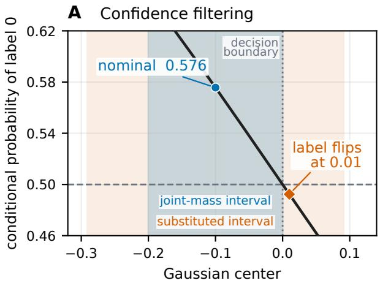

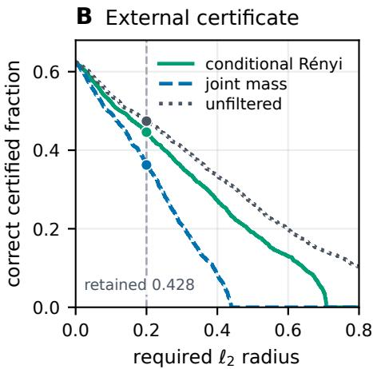  
Figure 1: Normalization failure and geometry-controlled recovery. Panel A shows Proposition 5. The conditional label changes at zero. The substituted interval crosses this boundary, while the joint-mass interval ends at it. Panel B uses the projected-band filter selected before CIFAR-10.2 access. Curves give the fraction of all test images with the correct selected label and a positive valid radius at least as large as the abscissa. Conditional Renyi and joint mass certify the same filtered predictor. Unfiltered´ smoothing is a separate baseline. The vertical line marks radius 0.2.

Prekopa log-concavity also makes a convex support satisfy Theorem 1 (Pr´ ekopa, 1971). Convexity is´ sufficient but not necessary for log occupancy to be concave. The confidence filter and the connected L-shape show that simple fixed nonconvex supports need not satisfy either the substituted decision radius or the Gaussian divergence rate. The outward interval algorithm and certified enclosures are in Appendix D. Figure 3 shows the retained supports.

## 4 CERTIFYING THE UNCHANGED FILTERED CLASSIFIER

Equation (1) gives a direct correction. The conditional predictor can be left unchanged while its certificate is computed from the probabilities of the fixed Gaussian events $E _ { y }$

Theorem 7 (Joint retained-label certificate). Fix the retention rule, task rule, label set, and noise scale from Section 2. Let A be the selected label at center a. Suppose numbers $L _ { A }$ and $U _ { y }$ satisfy

$$
L _ { A } \leq s _ { A } ( a ) , \qquad s _ { y } ( a ) \leq U _ { y } \quad f o r e \nu e r y y y \neq A .
$$

Set $U _ { B } = \operatorname* { m a x } _ { y \neq A } U _ { y }$ and set $r _ { \mathrm { m a s s } } ( a ) = 0$ when $L _ { A } \leq U _ { B }$ . Otherwise, the conditional classifier is constant throughout the open ball of radius

$$
r _ { \mathrm { m a s s } } ( a ) = \frac { \sigma } { 2 } \left[ \Phi ^ { - 1 } ( L _ { A } ) - \Phi ^ { - 1 } ( U _ { B } ) \right] .\tag{5}
$$

At the population level one may take $L _ { A } = s _ { A } ( a )$ and $U _ { B } = \operatorname* { m a x } _ { y \neq A } { s _ { y } ( a ) }$

The proof applies the lower Gaussian comparison to $E _ { A }$ and the upper comparison to each $E _ { y }$ . Their bounds remain strictly ordered inside (5). Equation (1) then transfers the result to the conditional classifier. The full proof is in Appendix C.

Sheikholeslami et al. (2022) previously retained rejection as an output and certified joint selectedlabel and selected-or-rejection masses. If $L _ { A \cup \perp }$ lower bounds the combined mass of the selected and rejected outputs, then $1 - L _ { A \cup \bot }$ upper bounds every task competitor. Explicit competitor bounds can be smaller in multiclass problems. Neither finite-sample construction uniformly dominates because they divide the confidence budget differently. Algorithm 1 combines both bounds within one confidence event.

Proposition 8 (Sharpness and conditional-only impossibility). For every $0 ~ < ~ s _ { B } ~ < ~ s _ { A }$ with $s _ { A } + s _ { B } \leq 1$ , there is a one-dimensionalfixedfilter and binary task whosejoint masses at the nominal center are $s _ { A }$ and s and whose nearest decision boundary is exactly $\underline { { \sigma } } [ \Phi ^ { - 1 } ( s _ { A } ) { - } \Phi ^ { - 1 } ( s _ { B } ) ]$ ]. Hence, no uniformly larger binary radius can be determinedfrom these two masses alone. In contrast,for every $p \in ( 1 / 2 , 1 )$ and every $\varepsilon > 0 ,$ , there is a fixed filter with conditional top probability p whose decision boundary is less than ε away. Conditional probabilities and σ alone therefore give no positive universal radius over arbitrary fixed filters.

The sharp construction uses two oppositely oriented half-lines and rejects the interval between them. The impossibility construction moves the two retained tails outward while moving the nominal center toward their symmetry point. Appendix C gives both calculations.

Transferring divergence certificates through conditioning. A covariance bound controls divergences of the conditional law even when the Gaussian event comparison fails. It therefore permits direct use of the Renyi classification bound of Li et al. (2019). For´ $p > q > 0$ and $p + q \leq 1$ , define

$$
C _ { \alpha } ( p , q ) = - \log ( 1 - p - q + 2 M _ { 1 - \alpha } ( p , q ) ) , \qquad M _ { t } ( p , q ) = \left( \frac { p ^ { t } + q ^ { t } } { 2 } \right) ^ { 1 / t } ,
$$

with $M _ { 0 } ( p , q ) = { \sqrt { p q } }$ . Zero probabilities use continuous limits. This is the least reverse categorical Renyi divergence permitting a tie.´

Proposition 9 (Conditional divergence certificates). Fix a and $R \in ( 0 , \infty ]$ . Let $X _ { c } \sim Q _ { c }$ and write $C _ { c } = \mathrm { C o v } _ { L } ( X _ { c } )$ . Suppose $\lambda _ { \operatorname* { m a x } } ( C _ { c } ) \leq \Lambda \sigma ^ { 2 }$ for every c with $\| c - a \| < R ,$ , where $\Lambda > 0$ . If $p _ { A } ( a ) > p _ { B } ( a )$ , the conditional decision isfixed throughout the open ball ofradius

$$
r _ { \mathrm { R } } = \operatorname * { s u p } _ { \alpha \geq 1 } \operatorname * { m i n } \left\{ \frac { R } { \alpha } , \sigma \sqrt { \frac { 2 C _ { \alpha } ( p _ { A } , p _ { B } ) } { \alpha \Lambda } } \right\} .\tag{6}
$$

For any finite set oforders containing one, its maximum is also valid. For conditional confidence bounds, replace $p _ { A } , p _ { B }$ by $L _ { A } , \operatorname* { m i n } \{ U _ { B } , 1 - L _ { A } \}$ , returning zero when these are not strictly ordered.

The covariance premise bounds $D _ { \alpha } ( Q _ { b } \| Q _ { a } )$ by $\alpha \Lambda \| b - a \| ^ { 2 } / ( 2 \sigma ^ { 2 } )$ . Orders above one require control as far as the tilted center $a + \alpha ( b - a )$ , which explains $R / \alpha$ . Covariance at a alone is insufficient. The order-one case uses reverse KL. It improves on the forward-KL radius $r _ { \mathrm { c o v } } =$ min $\{ R , \sigma \sqrt { 2 \mathcal { I } ( p _ { A } , p _ { B } ) / \Lambda } \}$ , where $\mathcal { I } ( p , q ) ~ = ~ p \log ( 2 p / ( p + q ) ) + q \log ( 2 q / ( p + q ) )$ . Order selection reuses one confidence event and adds no model evaluations. Appendix C proves the transfer and the improvement.

Certified nonconvex recovery. Let $\sigma = 1$ and retain the two horizontal bands $K \ = \ \mathbb { R } \times$ $( [ - 1 , - 0 . 9 ] \cup [ 0 . 9 , 1 ] )$ , labeled by band. $\mathrm { A t } \ a \ = \ ( 0 , - 0 . 1 )$ the nearest decision boundary is exactly 0.1 away. The law factorizes and Popoviciu gives $\mathrm { C o v } ( Q _ { c } ) \preceq I$ at every center. Thus $\Lambda = 1$ is certified globally although K is nonconvex and has infinite diameter. Outward rational intervals certify

$$
r _ { \mathrm { m a s s } } = 0 . 0 4 0 6 7 \dots < r _ { \mathrm { c o v } } = 0 . 0 9 4 7 0 \dots < 0 . 1 < r _ { \mathrm { c o n d } } = 0 . 1 1 8 8 8 \dots . . .
$$

This example shows that the ordinary Gaussian KL bound can hold even when the full Gaussian event comparison fails. Even the forward-KL certificate is larger than the joint-mass certificate while remaining below the exact decision boundary. The construction extends to a unit vector u learned on separate data and then fixed in the filter $\begin{array} { r } { \bar { R ( x ) } = \mathbf { 1 } \{ \alpha \leq | u ^ { \top } x + b | \leq \beta \} } \end{array}$ , where $0 < \alpha < \beta \leq \sigma$ The same global covariance bound holds. Appendix E gives the calculation and this extension, and Figure 4 gives a continuous sweep.

Write $\mathrm { C P _ { l o w e r } } ( c , n , \eta )$ and $\mathrm { C P _ { u p p e r } } ( c , n , \eta )$ for one-sided Clopper–Pearson endpoints with tail failure probability η (Clopper & Pearson, 1934).

```latex
Algorithm 1 Filtered Gaussian certification with familywise competitor bounds
Fixed inputs center $^ { a , }$ scale $\sigma ,$ filter $R ,$ task rule ${ \overline { { f , } } }$ labels ${ \overline { { \mathcal { V } } } } ,$ tie rule
Statistical inputs selection size $N _ { 0 } ,$ estimation size $N ,$ error $\delta$
1: Draw $Z _ { i } ^ { ( 0 ) } \stackrel { \mathrm { i i d } } { \sim } G _ { a }$ for $i = 1 , \ldots , N _ { 0 }$
2: $\begin{array} { r } { C _ { y } ^ { ( 0 ) } \gets \sum _ { i } \mathbf { 1 } \{ R ( Z _ { i } ^ { ( 0 ) } ) = 1 , \ f ( Z _ { i } ^ { ( 0 ) } ) = y \} } \end{array}$ for every $y \in \mathcal { V }$
3: Select $\widehat { A }$ from $( C _ { y } ^ { ( 0 ) } ) _ { y }$ using the fixed tie rule
4: Draw a fresh batch $Z _ { i } \stackrel { \mathrm { i i d } } { \sim } G _ { a } \mathrm { f o r } i = 1 , . . . , N$
5: $\begin{array} { r } { C _ { y } \gets \sum _ { i } \mathbf { 1 } \{ R ( Z _ { i } ) = 1 , \ f ( Z _ { i } ) = y \} } \end{array}$ for every $y \in \mathcal { V }$
6: $\begin{array} { r } { \check { C _ { \perp } } \gets \overline { { N } } - \sum _ { y \in \mathcal { y } } C _ { y } } \end{array}$
7: $L _ { \widehat { A } } \gets \mathrm { C P } _ { \mathrm { l o w e r } } ( \overline { { C } } _ { \widehat { A } } , N , \delta / 3 )$
8: $L _ { \widehat { A } \cup \perp } ^ { \prime \prime }  \mathrm { C P } _ { \mathrm { l o w e r } } ( C _ { \widehat { A } } + ^ { \cdot } C _ { \perp } , N , \delta / 3 )$
9: for $y \in \mathcal { y } \backslash \{ \widehat { A } \}$ do
10: $\mathsf { \bar { U } } _ { y } \gets \dot { \mathrm { C P } } _ { \mathrm { u p p e r } } ( C _ { y } , N , \delta / [ 3 ( | \mathcal { V } | - 1 ) ] )$
11: $U _ { B } \gets \operatorname* { m i n } \{ \operatorname* { m a x } _ { y \neq \widehat { A } } U _ { y } , 1 - L _ { \widehat { A } \cup \perp } \}$
12: if $L _ { \widehat { A } } \leq U _ { B }$ then
13: return abstain
14: $\begin{array} { r } { r  \frac { \sigma } { 2 } [ \Phi ^ { - 1 } ( L _ { \widehat { A } } ) - \Phi ^ { - 1 } ( U _ { B } ) ] } \end{array}$
15: return $( \widehat { A } , \boldsymbol { r } )$
```

With probability at least $1 - \delta ,$ the bounds hold jointly for each input. The algorithm computes two valid upper bounds on the strongest competitor and uses the smaller one. One comes from explicit competitor counts and the other from the selected-or-rejected mass (Sheikholeslami et al., 2022). Rejected proposals count toward the common denominator $N ,$ so both bounds use the same model evaluations. Normalizing by the retained count instead estimates conditional probabilities and does not support the ordinary Gaussian radius. A single-batch variant bounds every label before selection.

Which comparison applies. A fixed classifier, projection, or randomized repair is common postprocessing and uses the ordinary event certificate. Convex conditioning uses the same certificate by Corollary 2. Log-concave occupancy gives the KL and Renyi rate in Theorem 1, but not by itself ´ the event comparison. A certified uniform covariance bound gives $r _ { \mathrm { R } }$ . Arbitrary fixed conditioning uses joint retained-label masses. Appendix I gives the corresponding finite-horizon comparison fo predictable Gaussian blocks under one common causal program.

## 5 EXPERIMENTS

We evaluate a geometry-controlled certificate on a learned predictor, then measure normalization error and locate individual conditional-label changes for a different released filter.

Global covariance certificate on a learned model. Using CIFAR-10 training images, we selected a unit direction and offset for the nonconvex filter $\alpha \leq | \langle u , \bar { z } \rangle + b | \leq \beta$ with $0 < \alpha < \beta = \sigma = 0 . 2 5$ This support satisfies the analytic bound $\mathrm { C o v } ( Q _ { c } ) \preceq \sigma ^ { 2 } I$ at every center. We evaluated the resulting filter on all 2,000 CIFAR-10.2 images. All images, including abstentions, remain in each reported denominator. The joint confidence bounds have familywise error at most 0.001.

At radius 0.2, conditional Renyi, joint-mass, and unfiltered smoothing correctly certify´ 892, 725, and 948 images. The original forward-KL analysis certifies 829. At radius 0.5, Renyi certifies´ 381 images, where forward KL and joint mass certify none and unfiltered smoothing certifies 529. The Renyi calculation is a reanalysis of the same saved counts and confidence bounds, with no additional´ model evaluations. On $8 7 7$ correctly classified images, its lower radius bound exceeds the joint-mass upper radius bound by at least 0.01. Figure 1B gives the curves. Appendix K.9 reports the original experiment, reanalysis, and a matched-model-call comparison. Unfiltered smoothing remains stronger at these radii, including with matched model calls.

Released image model. We use the AuditVotes Gaussian image code, released CIFAR-10 (Krizhevsky, 2009) ResNet-110 checkpoint, and $\sigma = 0 . 2 5$ (Lai et al., 2026). The filter retains a proposal when its largest softmax probability exceeds 0.9. We evaluate all 10,000 CIFAR-10 test images and all 2,021 CIFAR-10.1 v4 images (Recht et al., 2019). A deterministic protocol specified the latter dataset, full evaluation, and attack cohort before model inference. Each image uses independent batches of $N _ { 0 } = 1 0 0$ proposals for label selection and $N = 1 0 { , } 0 0 0$ for estimation at $\delta = 0 . 0 0 1$ . Appendix K.2 gives provenance and full results.

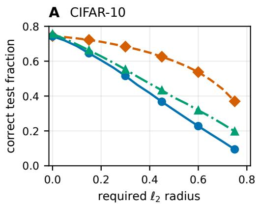

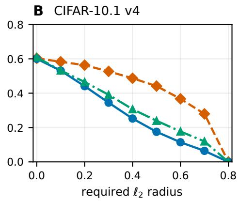

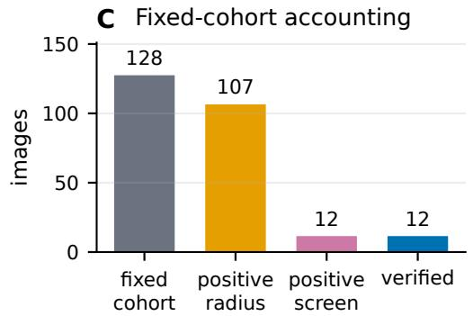

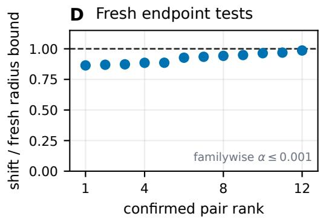  
Figure 2: Released-model evaluation and fixed-cohort attack. Panels A and B use all CIFAR-10 and CIFAR-10.1 v4 images with $N _ { 0 } = 1 0 0 , N = 1 0 , 0 0 0$ , and $\delta = 0 . 0 0 1$ . The diagnostic conditionalsubstitution curve shares proposal batches with the certified calculations. Panel C includes all 128 deterministically selected images. Panel D divides twelve independently confirmed shifts by familywise lower bounds on their substituted radii. Every ratio is below one, its endpoint labels differ, and familywise error is at most 0.001.

The released certificate uses conditional label probabilities as the nominal inputs to the Gaussian halfspace formula. Its implementation estimates those probabilities using the retained count as the binomial denominator (Lai et al., 2026).

For each image, every method uses the same selection and estimation batches. The released one-sided calculation uses $\sigma [ \dot { \Phi } ^ { - 1 } ( \underline { { p } } _ { A } ) ] _ { + }$ , where ${ \underline { { p } } } _ { A }$ is a retained-count binomial lower bound. The explicitcompetitor calculation keeps N as the denominator and applies Theorem 7. The rejection-complement calculation is due to Sheikholeslami et al. (2022). Algorithm 1 combines both runner bounds in one familywise confidence event. Each curve reports the fraction of all images with the correct selected label and radius greater than ε. The joint-mass and unfiltered curves report certified accuracy. The conditional-substitution curve is diagnostic.

At radius 0.5, Algorithm 1 certifies 32.02% of CIFAR-10 and 17.52% of CIFAR-10.1 images. Unfiltered smoothing certifies 39.17% and 23.95%. The conditional substitution reports 60.07% and 44.14%. Mean retention is 49.34% and 35.11%. A nine-threshold study selects no confidence filtering on development data and confirms the choice on untouched indices. Appendices K.1– K.5 give the complete calculations.

The endpoint study reports all 128 images in a cohort selected without model output. Fresh independent samples verify opposite population conditional labels in twelve endpoint pairs. Every displacement is smaller than its familywise lower radius bound, with displacement-to-bound ratios from 0.864 to 0.986. Nine cases occur among the 80 correctly classified images with a positive conditional-substitution radius. Appendix K.3 gives the search, joint inference, and every confirmed case.

Interpreting the comparisons. Figure 1B compares two sound certificates for one projected-band predictor under a global covariance proof. Figure 2 studies a distinct confidence filter, for which no covariance premise is asserted.

Algorithm 1 reuses the conditional calculation’s model evaluations. Rejected proposals remain in the fixed denominator. Sampling to a fixed number of acceptances requires stopping-rule-aware inference.

Sequential extension. We also test the finite-horizon result on SafetyPointGoal2 (Ji et al., 2023). Across three PPO-Lagrangian controllers and two proposal settings per controller, the lower confidence bound on cost avoidance remains above 0.5 for every center-shift sequence with cumulative Euclidean shift budget $B \leq 0 . 0 2$ . This certificate concerns avoidance of positive native cost until goal or timeout. It does not establish task completion, observation robustness, or forward invariance.

## 6 RELATED WORK

Gaussian smoothing certifies fixed output events under isotropic noise (Lecuyer et al., 2019; Li et al.,´ 2019; Cohen et al., 2019). Likelihood-ratio methods cover broader noise laws (Dvijotham et al., 2020; Yang et al., 2020). Rejection-aware smoothing treats rejection as an output (Sheikholeslami et al., 2022; Daubener et al., 2024). We retain that joint-event foundation and study probabilities ¨ conditioned on acceptance.

Projection is fixed post-processing (Pfrommer et al., 2023), while known-domain methods certify bounded inputs (Kou et al., 2022; Voracek & Hein, 2023). Neither divides by a center-dependent acceptance probability. Input-dependent smoothing changes the noise law (Suken´ ´ık et al., 2022), whereas Double Sampling keeps its primary law fixed (Li et al., 2022).

Truncated exponential-family identities yield our occupancy calculation (Nielsen & Nock, 2011; Nielsen, 2022). Work on bounded Gaussian mechanisms studies related normalizers (Chen & Hale, 2022; Fu et al., 2023; Hu et al., 2024). Action-constrained learning maps, masks, projects, or truncates actions (Brahmanage et al., 2023; Hung et al., 2025; Stolz et al., 2024; Lee et al., 2025; Stolz et al., 2026; Chzhen & Donti, 2026). Policy Smoothing certifies adaptive trajectories (Kumar et al., 2022), and Adaptive Randomized Smoothing certifies multi-step computation (Lyu et al., 2024). Our trajectory result specializes fully adaptive Gaussian composition (Smith & Thakurta, 2022; Koskela et al., 2023) to correlated proposal blocks and a common causal feasibility program.

## 7 LIMITATIONS AND CONCLUSION

The single-step guarantees require unchanged retention and task rules. Observation perturbations also require a verified map to Gaussian centers. The learned-model studies use one checkpoint and noise scale. The CIFAR-10.2 experiment evaluates one training-selected filter. The AuditVotes 12/128 result concerns a selected cohort, not dataset prevalence. Outward arithmetic validates the CIFAR-10.2 count-to-radius calculations, not noise generation or model execution (Vora´cek & Hein, 2023).ˇ The trajectory theorem certifies cost avoidance under proposal-center shifts, not task completion, observation robustness, or forward invariance.

Filtering changes a Gaussian event probability into a ratio whose denominator depends on the center.   
Convex retention controls this denominator strongly enough to preserve the ordinary event comparison.   
General nonconvex retention requires a verified geometric condition or joint retained-label events.   
The resulting certificates leave the predictor unchanged.

## REFERENCES

Janaka Brahmanage, Jiajing Ling, and Akshat Kumar. FlowPG: Actionconstrained policy gradient with normalizing flows. In Advances in Neural Information Processing Systems, volume 36, pp. 20118–20132, 2023. URL https://proceedings.neurips.cc/paper\_files/paper/2023/hash/ 3fd9fe8ec6d7238bf71784797399bb61-Abstract-Conference.html.

Bo Chen and Matthew Hale. The bounded gaussian mechanism for differential privacy, 2022. URL https://arxiv.org/abs/2211.17230.

Maria Chzhen and Priya L. Donti. Improving feasibility via fast autoencoderbased projections. In International Conference on Learning Representations, 2026. URL https://proceedings.iclr.cc/paper\_files/paper/2026/hash/ 7991a1ef0ff5f56d2e0ac8134dfe68d0-Abstract-Conference.html.

C. J. Clopper and E. S. Pearson. The use of confidence or fiducial limits illustrated in the case of the binomial. Biometrika, 26(4):404–413, 1934. doi: 10.1093/biomet/26.4.404.

Jeremy M. Cohen, Elan Rosenfeld, and J. Zico Kolter. Certified adversarial robustness via randomized smoothing. In Proceedings of the 36th International Conference on Machine Learning, volume 97 of Proceedings of Machine Learning Research, pp. 1310–1320, 2019. URL https://proceedings.mlr.press/v97/cohen19c.html.

Sina Daubener, Kira Maag, David Krueger, and Asja Fischer. Integrating uncertainty quantification¨ into randomized smoothing based robustness guarantees, 2024. URL https://arxiv.org/ abs/2410.20432.

Krishnamurthy Dvijotham, Jamie Hayes, Borja Balle, J. Zico Kolter, Chongli Qin, Andras Gy´ orgy,¨ Kai Xiao, Sven Gowal, and Pushmeet Kohli. A framework for robustness certification of smoothed classifiers using f-divergences. In International Conference on Learning Representations, 2020. URL https://openreview.net/forum?id=SJlKrkSFPH.

Jie Fu, Zhiyu Sun, Haitao Liu, and Zhili Chen. Truncated laplace and gaussian mechanisms of RDP, 2023. URL https://arxiv.org/abs/2309.12647.

Sivakanth Gopi, Yin Tat Lee, and Daogao Liu. Private convex optimization via exponential mechanism. In Proceedings ofthe 35th Conference on Learning Theory, volume 178 of Proceedings of Machine Learning Research, pp. 1948–1989, 2022. URL https://proceedings.mlr. press/v178/gopi22a.html.

Shengyuan Hu, Saeed Mahloujifar, Virginia Smith, Kamalika Chaudhuri, and Chuan Guo. Privacy amplification for the gaussian mechanism via bounded support, 2024. URL https://arxiv. org/abs/2403.05598.

Wei Hung, Shao-Hua Sun, and Ping-Chun Hsieh. Efficient action-constrained reinforcement learning via acceptance-rejection method and augmented MDPs. In International Conference on Learning Representations, 2025. URL https://proceedings.iclr.cc/paper\_files/paper/2025/hash/ 34b70ece5f8d273fd670a17e2248d034-Abstract-Conference.html.

Jiaming Ji, Borong Zhang, Jiayi Zhou, Xuehai Pan, Weidong Huang, Ruiyang Sun, Yiran Geng, Yifan Zhong, Josef Dai, and Yaodong Yang. Safety gymnasium: A unified safe reinforcement learning benchmark. In Advances in Neural Information Processing Systems, volume 36, 2023.

Antti Koskela, Marlon Tobaben, and Antti Honkela. Individual privacy accounting with gaussian differential privacy. In International Conference on Learning Representations, 2023. URL https://openreview.net/forum?id=JmC\_Tld3v-f.

Yiwen Kou, Qinyuan Zheng, and Yisen Wang. Certified adversarial robustness under the bounded support set. In Proceedings ofthe 39th International Conference on Machine Learning, volume 162 of Proceedings of Machine Learning Research, pp. 11559–11597, 2022. URL https: //proceedings.mlr.press/v162/kou22a.html.

Alex Krizhevsky. Learning multiple layers of features from tiny images. Technical report, University of Toronto, 2009.

Aounon Kumar, Alexander Levine, and Soheil Feizi. Policy smoothing for provably robust reinforcement learning. In International Conference on Learning Representations, 2022. URL https://openreview.net/forum?id=mwdfai8NBrJ.

Yuni Lai, Yulin Zhu, Yixuan Sun, Yulun Wu, Bin Xiao, Gaolei Li, Jianhua Li, Qi Xie, and Kai Zhou. AuditVotes: Elevating provable defense for GNNs with efficient augmentation and conditional smoothing. In ACM SIGSAC Conference on Computer and Communications Security, 2026. doi: 10.1145/3830454.3832651. URL https://arxiv.org/abs/2503.22998.

Mathias Lecuyer, Vaggelis Atlidakis, Roxana Geambasu, Daniel Hsu, and Suman Jana. Certified ´ robustness to adversarial examples with differential privacy. In 2019 IEEE Symposium on Security and Privacy, pp. 656–672, 2019. doi: 10.1109/SP.2019.00044.

Ganghun Lee, Minji Kim, Minsu Lee, and Byoung-Tak Zhang. Truncated gaussian policy for debiased continuous control. Proceedings ofthe AAAI Conference on Artificial Intelligence, 39 (17):18071–18081, 2025. doi: 10.1609/aaai.v39i17.33988.

Bai Li, Changyou Chen, Wenlin Wang, and Lawrence Carin. Certified adversarial robustness with additive noise. In Advances in Neural Information Processing Systems, volume 32, 2019. URL https://proceedings.neurips.cc/paper\_files/paper/ 2019/file/335cd1b90bfa4ee70b39d08a4ae0cf2d-Paper.pdf.

Linyi Li, Jiawei Zhang, Tao Xie, and Bo Li. Double sampling randomized smoothing. In Proceedings of the 39th International Conference on Machine Learning, volume 162 of Proceedings of Machine Learning Research, pp. 13163–13208, 2022. URL https://proceedings.mlr.press/ v162/li22aa.html.

Shangyun Lu, Bradley Nott, Aaron Olson, Alberto Todeschini, Puya Vahabi, Yair Carmon, and Ludwig Schmidt. Harder or different? a closer look at distribution shift in dataset reproduction. In ICML Workshop on Uncertainty and Robustness in Deep Learning, 2020. URL https://www.gatsby.ucl.ac.uk/<sub>˜</sub>balaji/udl2020/accepted-papers/ UDL2020-paper-101.pdf.

Saiyue Lyu, Shadab Shaikh, Frederick Shpilevskiy, Evan Shelhamer, and Mathias Lecuyer. Adaptive´ randomized smoothing: Certified adversarial robustness for multi-step defences. In Advances in Neural Information Processing Systems, volume 37, 2024. doi: 10.52202/079017-4260. URL https://proceedings.neurips.cc/paper\_files/paper/2024/hash/ f1e7c90552850afcc2558d78950c519d-Abstract-Conference.html.

Frank Nielsen. Statistical divergences between densities of truncated exponential families with nested supports: Duo Bregman and duo Jensen divergences. Entropy, 24(3):421, 2022. doi: 10.3390/e24030421.

Frank Nielsen and Richard Nock. On Renyi and Tsallis entropies and divergences for exponential´ families, 2011. URL https://arxiv.org/abs/1105.3259.

Samuel Pfrommer, Brendon G. Anderson, and Somayeh Sojoudi. Projected randomized smoothing for certified adversarial robustness. Transactions on Machine Learning Research, 2023. URL https://openreview.net/forum?id=FObkvLwNSo.

Andras Pr´ ekopa. Logarithmic concave measures with application to stochastic programming.´ Acta Scientiarum Mathematicarum, 32(3–4):301–316, 1971. URL https://acta.bibl.u-szeged. hu/14319/.

Benjamin Recht, Rebecca Roelofs, Ludwig Schmidt, and Vaishaal Shankar. Do ImageNet classifiers generalize to ImageNet? In Proceedings of the 36th International Conference on Machine Learning, volume 97 of Proceedings of Machine Learning Research, pp. 5389–5400, 2019. URL https://proceedings.mlr.press/v97/recht19a.html.

Fatemeh Sheikholeslami, Wan-Yi Lin, Jan Hendrik Metzen, Huan Zhang, and J. Zico Kolter. Denoised smoothing with sample rejection for robustifying pretrained classifiers. In Workshop on Trustworthy and Socially Responsible Machine Learning at NeurIPS, 2022. URL https://openreview. net/forum?id=i1lF1WqMw3j.

Adam Smith and Abhradeep Thakurta. Fully adaptive composition for gaussian differential privacy, 2022. URL https://arxiv.org/abs/2210.17520.

Roland Stolz, Hanna Krasowski, Jakob Thumm, Michael Eichelbeck, Philipp Gassert, and Matthias Althoff. Excluding the irrelevant: Focusing reinforcement learning through continuous action masking. In Advances in Neural Information Processing Systems, volume 37, 2024.

Roland Stolz, Michael Eichelbeck, and Matthias Althoff. Improving stochastic action-constrained reinforcement learning via truncated distributions. Proceedings ofthe AAAI Conference on Artificial Intelligence, 40(30):25617–25626, 2026. doi: 10.1609/aaai.v40i30.39758.

Peter Suken´ ´ık, Aleksei Kuvshinov, and Stephan Gunnemann. Intriguing properties of input-dependent¨ randomized smoothing. In Proceedings of the 39th International Conference on Machine Learning, volume 162 of Proceedings of Machine Learning Research, pp. 20697–20743, 2022. URL https://proceedings.mlr.press/v162/sukeni-k22a.html.

Tim van Erven and Peter Harremoes. R ¨ enyi divergence and kullback–leibler divergence. ´ IEEE Transactions on Information Theory, 60(7):3797–3820, 2014. doi: 10.1109/TIT.2014.2320500.

Vaclav Voracek and Matthias Hein. Improving ℓ<sub>1</sub>-certified robustness via randomized smoothing by leveraging box constraints. In Proceedings ofthe 40th International Conference on Machine Learning, volume 202 of Proceedings of Machine Learning Research, pp. 35198–35222, 2023. URL https://proceedings.mlr.press/v202/voracek23a.html.

Vaclav Vor´ a´cek and Matthias Hein. Sound randomized smoothing in floating-point arithmetic. Inˇ International Conference on Learning Representations, 2023. URL https://openreview. net/forum?id=HaHCoGcpV9.

Greg Yang, Tony Duan, J. Edward Hu, Hadi Salman, Ilya Razenshteyn, and Jerry Li. Randomized smoothing of all shapes and sizes. In Proceedings ofthe 37th International Conference on Machine Learning, volume 119 of Proceedings ofMachine Learning Research, pp. 10693–10705, 2020. URL https://proceedings.mlr.press/v119/yang20c.html.

## A OCCUPANCY IDENTITIES AND GLOBAL CHARACTERIZATION

This appendix gives proofs and supporting arguments for the analytic statements and the provenance of the finite nonconvex witness. All measures and derivatives are intrinsic to the affine hull introduced in Section 2. No ambient density is used when the feasible set is lower dimensional.

Write $\lambda _ { H }$ for intrinsic Lebesgue measure on H and

$$
\varphi _ { \sigma , a } ( z ) = ( 2 \pi \sigma ^ { 2 } ) ^ { - \dim L / 2 } \exp \biggl ( - \frac { \| z - a \| ^ { 2 } } { 2 \sigma ^ { 2 } } \biggr )
$$

for the intrinsic Gaussian density. Thus $\begin{array} { r } { \zeta _ { \sigma } ( a ) ~ = ~ \int _ { K } \varphi _ { \sigma , a } d \lambda _ { H } } \end{array}$ and $Q _ { a }$ has density $q _ { a } ( z ) \ =$ $\mathbf { 1 } _ { K } ( z ) \varphi _ { \sigma , a } ( z ) / \zeta _ { \sigma } ( a )$ . Positive intrinsic measure and strict positivity of the Gaussian density imply $\zeta _ { \sigma } ( a ) > 0$ for every $a \in H$ . Let $m _ { a } = \mathbb { E } _ { Q _ { a } } X _ { a }$ and $C _ { a } = \mathrm { C o v } _ { L } ( X _ { a } )$

Lemma 10 (Differentiation envelope). Fix a compact set of centers $U \subset H$ . For each derivative order $k ,$ every kth center derivative of $\varphi _ { \sigma , a } ( z )$ , uniformly over $a \in U ,$ , is bounded in absolute value by an integrable polynomial times a Gaussian density with a variance strictly larger than $\sigma ^ { 2 } .$ Consequently $\zeta _ { \sigma }$ and $\ell = \log \zeta _ { \sigma }$ are smooth on $H ,$ , and their derivatives may be taken under the integral sign.

Proof. Each center derivative is a degree-k polynomial in $( z - a ) / \sigma ^ { 2 }$ times $\varphi _ { \sigma , a } ( z )$ . Fix $a _ { \star } \in H$ and r with $U \subseteq \{ a : \| a - a _ { \star } \| \leq r \}$ . If $\sigma ^ { \prime } > \sigma$ , completing the square shows that, uniformly on this ball,

$$
\varphi _ { \sigma , a } ( z ) \leq c \varphi _ { \sigma ^ { \prime } , a _ { \star } } ( z )
$$

for a finite $c = c ( \sigma , \sigma ^ { \prime } , r )$ . The polynomial factor is bounded by a polynomial in $\| z - a _ { \star } \| + r$ , and every polynomial is integrable against the wider Gaussian. Restricting the integral to measurable $K$ preserves the bound. Differentiation under the integral follows at every order. Continuity and positivity of $\zeta _ { \sigma }$ then give smoothness of its logarithm. □

Differentiating once and twice gives the identities

$$
\nabla \ell ( a ) = { \frac { m _ { a } - a } { \sigma ^ { 2 } } } , \qquad \nabla ^ { 2 } \ell ( a ) = { \frac { C _ { a } } { \sigma ^ { 4 } } } - { \frac { I _ { L } } { \sigma ^ { 2 } } } .\tag{7}
$$

Indeed,

$$
\nabla \zeta _ { \sigma } ( a ) = \frac { 1 } { \sigma ^ { 2 } } \int _ { K } ( z - a ) \varphi _ { \sigma , a } ( z ) d \lambda _ { H } ( z ) ,
$$

and division by $\zeta _ { \sigma } ( a )$ yields the gradient. $\mathbf { A }$ second derivative gives

$$
\frac { \nabla ^ { 2 } \zeta _ { \sigma } ( a ) } { \zeta _ { \sigma } ( a ) } = \frac { \mathbb { E } _ { Q _ { a } } [ ( X _ { a } - a ) ( X _ { a } - a ) ^ { \top } ] } { \sigma ^ { 4 } } - \frac { I _ { L } } { \sigma ^ { 2 } } .
$$

Subtracting $\nabla \ell ( a ) \nabla \ell ( a ) ^ { \top }$ yields the covariance form.

For completeness, the common-support likelihood ratio is integrable and equals, $Q _ { c }$ -almost surely,

$$
\log { \frac { q _ { a } ( z ) } { q _ { b } ( z ) } } = { \frac { \| z - b \| ^ { 2 } - \| z - a \| ^ { 2 } } { 2 \sigma ^ { 2 } } } + \ell ( b ) - \ell ( a ) .
$$

Taking its $Q _ { a }$ expectation, expanding the two squares, and using the first identity in (7) proves (2). For $\alpha \in ( 0 , \infty ) \setminus \{ 1 \}$ , the same common support gives

$$
\int _ { \cal K } q _ { a } ( z ) ^ { \alpha } q _ { b } ( z ) ^ { 1 - \alpha } d \lambda _ { \cal H } ( z ) = \frac { 1 } { \zeta _ { \sigma } ( a ) ^ { \alpha } \zeta _ { \sigma } ( b ) ^ { 1 - \alpha } } \int _ { \cal K } \varphi _ { \sigma , a } ( z ) ^ { \alpha } \varphi _ { \sigma , b } ( z ) ^ { 1 - \alpha } d \lambda _ { \cal H } ( z ) .
$$

The square-completion identity

$$
\alpha \| z - a \| ^ { 2 } + ( 1 - \alpha ) \| z - b \| ^ { 2 } = \| z - ( \alpha a + ( 1 - \alpha ) b ) \| ^ { 2 } + \alpha ( 1 - \alpha ) \| a - b \| ^ { 2 }
$$

holds for every real α. Hence the integral is finite for every finite positive order, including $\alpha > 1$ , and

$$
D _ { \alpha } ( Q _ { a } \| Q _ { b } ) = \frac { \alpha \| a - b \| ^ { 2 } } { 2 \sigma ^ { 2 } } + \frac { \ell ( \alpha a + ( 1 - \alpha ) b ) - \alpha \ell ( a ) - ( 1 - \alpha ) \ell ( b ) } { \alpha - 1 } .\tag{8}
$$

ProofofTheorem 1. Suppose first that ℓ is concave. Its supporting-hyperplane inequality makes the correction in (2) nonpositive, proving the KL bound. $\mathrm { I f } \ : 0 < \alpha < 1$ , concavity makes the numerator in (8) nonnegative while $\alpha - 1 < 0$ . If $\alpha > 1$ , put $c = \alpha a + ( 1 - \alpha ) b$ and observe that

$$
a = { \frac { 1 } { \alpha } } c + \left( 1 - { \frac { 1 } { \alpha } } \right) b .
$$

Concavity now makes the same numerator nonpositive while $\alpha - 1 > 0$ . Thus the Renyi correction´ is nonpositive at every finite positive order.

Conversely, the KL bound and (2) imply

$$
\ell ( b ) \leq \ell ( a ) + \langle \nabla \ell ( a ) , b - a \rangle \qquad { \mathrm { f o r ~ e v e r y ~ } } a , b \in H .
$$

This is the first-order characterization of concavity for the smooth function ℓ. Finally, the all-order statement contains its declared order-one KL case, so it implies the KL statement. This proves all three equivalences. □

ProofofCorollary 2. Use orthonormal coordinates on H. On the convex set $K ,$ the density of $Q _ { c }$ is proportional to $\exp ( - F _ { c } )$ , where $F _ { c } ( z ) = \| z - c \| ^ { 2 } / ( 2 \sigma ^ { 2 } )$ . Both $F _ { a }$ and $F _ { b }$ are $\sigma ^ { - 2 }$ -strongly convex. Their difference is affine with Lipschitz constant $\| a - b \| / \sigma ^ { 2 }$ . The strongly log-concave tradeoff comparison of Gopi et al. (2022, Theorem 13) therefore dominates the tradeoff curve of two unit Gaussians separated by $( \| a - b \| / \sigma ^ { 2 } ) / \sqrt { \sigma ^ { - 2 } } = \| a - b \| / \sigma$ . Applying its lower bound to $E$ gives the left inequality. Applying the same bound to $E ^ { \dot { c } }$ gives the right inequality. The usual topversus-runner argument then gives $r _ { \mathrm { c o n d } }$ and its simultaneous-bound version. The zero-dimensional case is immediate. □

Proof of Proposition 3. On the common support $K$

$$
\frac { d Q _ { b } } { d Q _ { a } } ( z ) = C \exp ( \rho X ( z ) )
$$

for a positive constant $C .$ . The likelihood ratio is therefore increasing in $X$ . The projection X has a continuous law under $Q _ { a }$ because K has positive intrinsic measure. For a prescribed value $p \in ( 0 , 1 )$ ), the Neyman–Pearson lemma shows that the event with $Q _ { a }$ mass $p$ and smallest $Q _ { b }$ mass is $\{ \dot { X } \leq \dot { F } _ { a } ^ { - 1 } ( p ) \}$ }. Thus the lower Gaussian event comparison holds for every event exactly when

$$
F _ { b } ( F _ { a } ^ { - 1 } ( p ) ) \geq \Phi \big ( \Phi ^ { - 1 } ( p ) - \rho \big ) \qquad \mathrm { f o r } \mathrm { e v e r y } p \in ( 0 , 1 ) .
$$

This is equivalent to (3). Applying the lower comparison to complements gives the upper comparison. Mutual absolute continuity supplies the endpoint cases. □

## B INTEGRATED AND LOCAL COVARIANCE IDENTITIES

ProofofProposition 4. First write $d = b - a$ . The second-order integral remainder gives

$$
\ell ( b ) - \ell ( a ) - \langle \nabla \ell ( a ) , d \rangle = \int _ { 0 } ^ { 1 } ( 1 - t ) d ^ { \top } \nabla ^ { 2 } \ell ( a + t d ) d d t .
$$

Combining this identity with (2) and (7) yields

$$
D _ { \mathrm { K L } } ( Q _ { a } \| Q _ { b } ) = \int _ { 0 } ^ { 1 } ( 1 - t ) d ^ { \top } \left( \frac { I _ { L } } { \sigma ^ { 2 } } + \nabla ^ { 2 } \ell ( a + t d ) \right) d t = \frac { 1 } { \sigma ^ { 4 } } \int _ { 0 } ^ { 1 } ( 1 - t ) d ^ { \top } C _ { a + t d } d d t .
$$

The segmentwise eigenvalue bound follows immediately because $\begin{array} { r } { \int _ { 0 } ^ { 1 } ( 1 - t ) d t = 1 / 2 . } \end{array}$

Fix $a \in H .$ , a unit $u \in L$ , and set $b = a + t u$ . Lemma 10 permits a second-order Taylor expansion of $\ell$ around a. For $\alpha \neq 1$ , the third center in (8) is $\alpha a + ( 1 - \alpha ) b = a + ( 1 - \alpha ) t u$ . The constant and linear Taylor terms cancel, while the quadratic occupancy numerator is

$$
\frac { t ^ { 2 } } { 2 } \big ( ( 1 - \alpha ) ^ { 2 } - ( 1 - \alpha ) \big ) \langle u , \nabla ^ { 2 } \ell ( a ) u \rangle + o ( t ^ { 2 } ) = \frac { \alpha ( \alpha - 1 ) t ^ { 2 } } { 2 } \langle u , \nabla ^ { 2 } \ell ( a ) u \rangle + o ( t ^ { 2 } ) .
$$

Substitution in (8) gives

$$
D _ { \alpha } ( Q _ { a } \| Q _ { a + t u } ) = \frac { \alpha t ^ { 2 } } { 2 \sigma ^ { 2 } } \left( 1 + \sigma ^ { 2 } \langle u , \nabla ^ { 2 } \ell ( a ) u \rangle \right) + o ( t ^ { 2 } ) .
$$

For $\alpha = 1$ , the same expansion follows directly from (2). Equation (7) identifies the factor in parentheses as

$$
1 + \sigma ^ { 2 } \langle u , \nabla ^ { 2 } \ell ( a ) u \rangle = \frac { \langle u , C _ { a } u \rangle } { \sigma ^ { 2 } } = \frac { \mathrm { V a r } \langle u , X _ { a } \rangle } { \sigma ^ { 2 } } .
$$

Dividing proves the claimed limit. Maximizing this Rayleigh quotient over unit vectors gives $\bar { \lambda _ { \operatorname* { m a x } } } ( \bar { C _ { a } } ) \bar { / \sigma ^ { 2 } }$ . If that value is strictly larger than one, the expansion and the definition of $o ( t ^ { 2 } )$ make the corresponding divergence strictly larger than its Gaussian comparator for every sufficiently small nonzero t. □

## C JOINT-MASS PROOFS AND GEOMETRY-CONTROLLED RADII

Proof of Theorem 7. If $L _ { A } \leq U _ { B }$ , the stated open ball is empty. Assume $L _ { A } > U _ { B } . \operatorname { L e t } d = \left\| a - b \right\|$ The Gaussian event comparison applied to $E _ { A }$ gives

$$
s _ { A } ( b ) \geq \Phi \big ( \Phi ^ { - 1 } ( s _ { A } ( a ) ) - d / \sigma \big ) \geq \Phi \big ( \Phi ^ { - 1 } ( L _ { A } ) - d / \sigma \big ) .
$$

For every $y \neq A$ , the other side of the comparison gives

$$
s _ { y } ( b ) \leq \Phi \big ( \Phi ^ { - 1 } ( s _ { y } ( a ) ) + d / \sigma \big ) \leq \Phi \big ( \Phi ^ { - 1 } ( U _ { B } ) + d / \sigma \big ) .
$$

The first displayed lower bound is strictly larger than the second displayed upper bound whenever

$$
d < \frac { \sigma } { 2 } \left[ \Phi ^ { - 1 } ( L _ { A } ) - \Phi ^ { - 1 } ( U _ { B } ) \right] .
$$

Thus $s _ { A } ( b ) > s _ { y } ( b )$ for every competitor. Division by the common positive acceptance probability $\zeta _ { \sigma } ( b )$ preserves these inequalities, so the conditional classifier also selects A. □

Proof of Proposition 8. First fix $0 < s _ { B } < s _ { A }$ with $s _ { A } + s _ { B } \leq 1$ and write $q _ { A } = \Phi ^ { - 1 } ( s _ { A } )$ and $q _ { B } = \Phi ^ { - 1 } ( s _ { B } )$ . At nominal center zero, let

$$
E _ { A } = ( - \infty , \sigma q _ { A } ] , \qquad E _ { B } = [ - \sigma q _ { B } , \infty ) .
$$

The condition on the masses makes these half-lines disjoint. The interval between them is rejected. At center t their joint masses are

$$
s _ { A } ( t ) = \Phi ( q _ { A } - t / \sigma ) , \qquad s _ { B } ( t ) = \Phi ( q _ { B } + t / \sigma ) .
$$

They are equal first at $\begin{array} { r } { t = \frac { \sigma } { 2 } ( q _ { A } - q _ { B } ) } \end{array}$ , exactly the population radius in Theorem 7. This proves binary sharpness from the two masses.

For the second assertion, fix $p \in ( 1 / 2 , 1 )$ . For $T > 0$ , retain the symmetric tails

$$
K _ { T } = ( - \infty , - T ] \cup [ T , \infty )
$$

and assign one label to each tail. At cente $\cdot - d ,$ the conditional probability of the left label is

$$
F _ { T } ( d ) = \frac { \Phi ( ( d - T ) / \sigma ) } { \Phi ( ( d - T ) / \sigma ) + \Phi ( - ( T + d ) / \sigma ) } .
$$

The function is continuous and strictly increasing from $F _ { T } ( 0 ) = 1 / 2$ toward one, so there is a unique $d _ { T } > 0$ with $F _ { T } ( d _ { T } ) = p .$ Put

$$
c _ { * } = \frac { \sigma ^ { 2 } } { 2 } \log { \frac { p } { 1 - p } } .
$$

Gaussian tail asymptotics, applied at $d = c / T$ , give uniformly for c in any fixed bounded interval

$$
\log \frac { \Phi ( ( c / T - T ) / \sigma ) } { \Phi ( - ( T + c / T ) / \sigma ) } = \frac { 2 c } { \sigma ^ { 2 } } + o ( 1 ) .
$$

For every $\eta \in ( 0 , c _ { * } )$ , the last display is eventually smaller than $\log \{ p / ( 1 - p ) \} { \mathrm { ~ a t ~ } } c = c _ { * } - \eta$ and larger at $c = c _ { * } + \eta$ . Monotonicity therefore gives

$$
c _ { * } - \eta < T d _ { T } < c _ { * } + \eta
$$

for all sufficiently large T. Hence $T d _ { T }  c _ { * }$ and $d _ { T } \to 0 .$ . Symmetry places the decision boundary at zero. Taking T large enough makes its distance from the nominal center smaller than any prescribed ε while keeping the same conditional probability p. □

ProofofProposition 9. Let $d = b - a$ and let $\psi ( c ) = \| c \| ^ { 2 } / ( 2 \sigma ^ { 2 } ) + \log \zeta _ { \sigma } ( c )$ , using coordinates on the affine hull. Log-normalizer differentiation gives $\ddot { \nabla } ^ { 2 } \dot { \psi ( c ) } = \mathrm { C o v } _ { L } ( \dot { X _ { c } } ) / \sigma ^ { 4 }$ . Write $g ( t ) =$ $\psi ( a + t d )$ . Whenever the complete segment from a to $a +$ αd lies in the stated ball,

$$
g ^ { \prime \prime } ( t ) \leq v , \qquad v = \Lambda \| d \| ^ { 2 } / \sigma ^ { 2 } .
$$

The exponential-family identity gives, for $\alpha > 1$

$$
D _ { \alpha } ( Q _ { b } \| Q _ { a } ) = \frac { g ( \alpha ) - \alpha g ( 1 ) + ( \alpha - 1 ) g ( 0 ) } { \alpha - 1 } \le \frac { \alpha v } { 2 } .
$$

For the inequality, $g ( t ) - v t ^ { 2 } / 2$ is concave, so its value at one is at least the interpolation of its values at zero and $\alpha .$ . The limit at one is $D _ { \mathrm { K L } } ( Q _ { b } | | Q _ { a } ) = g ( 0 ) - g ( 1 ) + g ^ { \prime } ( 1 ) \leq v / 2$ . Thus the order-one bound requires only the segment to $b ,$ while order $\alpha > 1$ requires $\alpha \| d \| < R$

For completeness, consider nominal category probabilities $( p , q , s )$ , where $s = 1 - p - q$ and $p > q$ . Among distributions whose second category ties or exceeds the first, the reverse Renyi ´ divergence is minimized on the tie. This follows from convexity of $\sum _ { j } x _ { j } ^ { \alpha } p _ { j } ^ { 1 - \alpha }$ and the location of its unconstrained minimum. Setting the tied probabilities to t leaves the objective

$$
t ^ { \alpha } ( p ^ { 1 - \alpha } + q ^ { 1 - \alpha } ) + ( 1 - 2 t ) ^ { \alpha } s ^ { 1 - \alpha } .
$$

Put $m = M _ { 1 - \alpha } ( p , q )$ and $S = 2 m + s$ . The minimizer is $( m / S , m / S , s / S )$ , and the objective is $S ^ { 1 - \alpha }$ . The minimum divergence is therefore $- \log S = C _ { \alpha } ( p , q )$ , as in Li et al. (2019, Lemma 1). At order one, the same calculation uses $m = { \sqrt { p q } }$ and gives the reverse-KL minimum. Boundary probabilities follow by continuity. Data processing to the selected label, any competitor, and their complement now rules out a tie whenever $x \Lambda \| d \| ^ { 2 } \big / ( 2 \sigma ^ { 2 } ) < C _ { \alpha } ( p _ { A } , p _ { B } )$ . This proves each radius in (6). Their supremum certifies the union of these concentric open balls.

For $\alpha \geq 1$ and $p > q > 0$ , differentiating $S = 1 - p - q + 2 m \mathrm { g i v e }$ s

$$
\partial _ { p } S = - 1 + ( m / p ) ^ { \alpha } < 0 , \qquad \partial _ { q } S = - 1 + ( m / q ) ^ { \alpha } > 0 .
$$

Thus $C _ { \alpha }$ increases with $p$ and decreases with $q .$ The same upper bound on the strongest competitor covers every smaller competitor. Replacing the probabilities by their stated confidence bounds is conservative. Every order is a deterministic function of the same bounds, so maximizing over orders requires no additional probability statement. □

Why reverse KL improves the forward bound. Let $s = p + q$ and $t = ( p - q ) / s$ . Then

$$
C _ { 1 } ( p , q ) = - \log ( 1 - s + s { \sqrt { 1 - t ^ { 2 } } } ) \geq s ( 1 - { \sqrt { 1 - t ^ { 2 } } } ) \geq { \mathcal { I } } ( p , q ) .
$$

The first inequality uses $- \log ( 1 - x ) \geq x$ . For the second, the derivative of $1 - \sqrt { 1 - t ^ { 2 } } \mathrm { i s } t / \sqrt { 1 - t ^ { 2 } }$ which is at least arctanh(t), the derivative of $\{ ( 1 + t ) \log ( 1 + t ) + ( 1 - t ) \log ( 1 - t ) \} / 2$ . Both vanish at zero. Consequently the order-one radius is never smaller than $r _ { \mathrm { c o v } }$ under the same covariance premise. The forward cost is at most log 2, which imposes the ceiling $\sigma \sqrt { 2 \log { 2 } / \Lambda }$ . The reverse cost has no such ceiling as $( p , q )$ approaches (1, 0).

The categorical bound is an existing Renyi smoothing result. The conditional application here follows´ from the covariance identity, with the additional spatial requirement $R / \alpha$ for a local covariance certificate. It does not require the Gaussian event comparison for the retained law.

Forward-KL and bounded-support alternatives. The uniform covariance premise and (4) give

$$
D _ { \mathrm { K L } } ( Q _ { a } \| Q _ { b } ) \leq \frac { \Lambda } { 2 \sigma ^ { 2 } } \| a - b \| ^ { 2 }
$$

whenever the segment from a to b stays in the stated ball. Suppose a competitor $y$ ties or overtakes A at b. Data processing under the three-cell partition formed by $E _ { A } , E _ { y }$ , and their complement in K $\mathrm { g i v e s }$

$$
D _ { \mathrm { K L } } ( Q _ { a } \| Q _ { b } ) \geq \mathcal { I } ( p _ { A } ( a ) , p _ { y } ( a ) ) .
$$

Indeed, among categorical laws in which the second cell ties or overtakes the first, forward KL from $( p , q , 1 - p - q )$ is minimized at $( ( p + q ) / 2 , ( p + q ) / 2 , 1 - p - q )$ . The attained value is $\mathcal { I } ( p , q )$ . For $p > q > 0 ,$

$$
\partial _ { p } \mathcal { I } = \log \frac { 2 p } { p + q } > 0 , \qquad \partial _ { q } \mathcal { I } = \log \frac { 2 q } { p + q } < 0 .
$$

Thus every competitor requires KL at least $\mathcal { I } ( p _ { A } ( a ) , p _ { B } ( a ) )$ . The covariance KL upper bound stays strictly below this value inside $r _ { \mathrm { c o v } } .$ , which rules out a tie. The same monotonicity permits simultaneous bounds $L _ { A }$ and $\widetilde { U } _ { B } = \operatorname* { m i n } \{ U _ { B } , 1 - L _ { A } \}$ in the displayed radius. The second term is also an upper bound because the conditional label probabilities sum to one. If $p _ { B } = 0 ;$ , every competitor is null and Gaussian mutual absolute continuity makes the decision constant over all centers.

If K has diameter D, every scalar projection of a random variable supported on K has range at most D. Popoviciu’s inequality therefore gives

$$
\lambda _ { \operatorname* { m a x } } ( C _ { c } ) \leq D ^ { 2 } / 4 .
$$

Taking $\Lambda = D ^ { 2 } / ( 4 \sigma ^ { 2 } )$ gives the first of the two radii

$$
r _ { \mathrm { K L } } = \frac { 2 \sigma ^ { 2 } } { D } \sqrt { 2 \mathcal { I } ( p _ { A } , p _ { B } ) } , \qquad r _ { \mathrm { o d d s } } = \frac { \sigma ^ { 2 } } { D } \log \frac { p _ { A } } { p _ { B } } .\tag{9}
$$

For the remaining radius, the likelihood ratio $d Q _ { b } / d Q _ { c }$ <sub>a</sub> has logarithmic oscillation at most $D \| b -$ $a \| / \sigma ^ { 2 }$ over $K$ . Hence

$$
\frac { Q _ { b } ( E _ { A } ) } { Q _ { b } ( E _ { B } ) } \geq \exp \left( - \frac { D \| b - a \| } { \sigma ^ { 2 } } \right) \frac { Q _ { a } ( E _ { A } ) } { Q _ { a } ( E _ { B } ) } .
$$

The right side exceeds one inside $r _ { \mathrm { o d d s } } . \mathrm { I f } p _ { B } = 0$ , Gaussian mutual absolute continuity makes the competitor null at every center, giving the stated infinite value.

Finite-sample coverage. In Algorithm 1, the selection batch is independent of the estimation batch. Conditional on the selected label, its lower tail and the selected-or-rejected lower tail each fail with probability at most $\delta / 3$ . The union of the $| \mathcal { y } | - 1$ explicit competitor upper-tail failures has probability at most $\delta / 3$ . When none fail, both runner upper bounds in Algorithm 1 are valid, so their minimum is valid and Theorem 7 applies. If one batch is used for selection and estimation, one may form all label lower bounds, all label-or-rejection lower bounds, and all label upper bounds before selection. Assigning total error $\delta / 3$ to each family gives simultaneous coverage.

For the covariance-controlled radius, condition on a positive retained count. The retained label counts are multinomial with probabilities $( p _ { y } ( a ) ) _ { y }$ . An independent selection batch or simultaneous conditional bounds therefore provides $L _ { A }$ and $U _ { B }$ with the stated coverage. The covariance upper bound needs its own simultaneous guarantee over the complete center ball. A sample covariance at the anchor does not supply that guarantee.

This statement treats binomial endpoints and Gaussian quantiles as real numbers. The empirical implementation uses SciPy to evaluate them. It therefore does not by itself address adversarial floating-point execution. A deployment requiring a machine-arithmetic guarantee must use validated probability and quantile routines, as in sound floating-point smoothing (Vora´cek & Hein, 2023). Theˇ compact witness in Appendix D uses separate outward rational intervals.

## D OUTWARD-RATIONAL CERTIFICATE FOR THE COMPACT WITNESS

We prove Proposition 6 without treating floating-point quadrature as exact. Write $\phi$ and Φ for the standard-normal density and CDF. For a rectangle $\begin{array} { r } { R = \prod _ { k = 1 } ^ { d } [ r _ { k } ^ { - } , r _ { k } ^ { + } ] } \end{array}$ , center $c ,$ and scale $\sigma ,$ define

$$
\alpha _ { k } = { \left( r _ { k } ^ { - } - c _ { k } \right) } / { \sigma } , \qquad \beta _ { k } = { \left( r _ { k } ^ { + } - c _ { k } \right) } / { \sigma } , \qquad p _ { k } = \Phi ( \beta _ { k } ) - \Phi ( \alpha _ { k } ) .
$$

Gaussian factorization gives $\begin{array} { r } { G _ { c } ( R ) = \prod _ { k } p _ { k } } \end{array}$ . Because the two rectangles in the witness have disjoint interiors, their masses add exactly. The same factorization gives the unnormalized first-coordinate moment

$$
\left[ c _ { 1 } p _ { 1 } + \sigma \{ \phi ( \alpha _ { 1 } ) - \phi ( \beta _ { 1 } ) \} \right] \prod _ { k \neq 1 } p _ { k } .
$$

These formulas yield both occupancies and the conditional mean used in the KL identity (2).

The corresponding unnormalized second moment of the first coordinate is

$$
\left[ c _ { 1 } ^ { 2 } p _ { 1 } + 2 c _ { 1 } \sigma \{ \phi ( \alpha _ { 1 } ) - \phi ( \beta _ { 1 } ) \} + \sigma ^ { 2 } \{ p _ { 1 } + \alpha _ { 1 } \phi ( \alpha _ { 1 } ) - \beta _ { 1 } \phi ( \beta _ { 1 } ) \} \right] \prod _ { k \neq 1 } p _ { k } .
$$

Adding this quantity over the two rectangles, dividing by occupancy, and subtracting the squared conditional mean gives the local variance ratio reported in the certified enclosure table below.

For $\boldsymbol { b } = \boldsymbol { a } + d \boldsymbol { e } _ { 1 }$ with $d > 0$ , the common-support likelihood ratio obeys

$$
\log \frac { q _ { a } ( z ) } { q _ { b } ( z ) } = \frac { d } { \sigma ^ { 2 } } ( x _ { * } - z _ { 1 } ) , \qquad x _ { * } = \frac { a _ { 1 } + b _ { 1 } } { 2 } + \frac { \sigma ^ { 2 } } { d } \log \frac { \zeta _ { \sigma } ( b ) } { \zeta _ { \sigma } ( a ) } .
$$

Thus $q _ { a } > q _ { b }$ precisely to the left of $x _ { * } ,$ , up to a null hyperplane, and

$$
d _ { \mathrm { T V } } ( Q _ { a } , Q _ { b } ) = Q _ { a } \{ z _ { 1 } \leq x _ { * } \} - Q _ { b } \{ z _ { 1 } \leq x _ { * } \} .
$$

All primitive evaluations are enclosed by rational intervals. We use the alternating series for $e ^ { - y }$ and

$$
\int _ { 0 } ^ { t } e ^ { - x ^ { 2 } / 2 } d x = \sum _ { n \geq 0 } { \frac { ( - 1 ) ^ { n } t ^ { 2 n + 1 } } { 2 ^ { n } n ! ( 2 n + 1 ) } } ,
$$

after their terms decrease. Adjacent partial sums enclose the value. For $x > 0$ , we enclose

$$
\log x = 2 \sum _ { k \geq 0 } { \frac { z ^ { 2 k + 1 } } { 2 k + 1 } } , \qquad z = { \frac { x - 1 } { x + 1 } } ,
$$

with tail at most $2 | z | ^ { 2 N + 3 } / ( ( 2 N + 3 ) ( 1 - z ^ { 2 } ) )$ . Machin’s identity and alternating arctangent series enclose π. Closed rational interval arithmetic then propagates these bounds through rectangle masses, normalization, logarithms, and event differences. Every divisor interval has a strictly positive lower endpoint.

## At the rational data in Proposition 6, the resulting outward enclosures are

<table><tr><td colspan="2">Quantity</td></tr><tr><td> $D _ { \mathrm { K L } } ( Q _ { a } \vert \vert Q _ { b } )$ </td><td>[0.002423524, 0.002423525]</td></tr><tr><td>Gaussian KL comparator</td><td> $1 / 4 5 0 = 0 . 0 0 2 2 2 2 \ldots$ </td></tr><tr><td> $\mathrm { V a r } _ { Q _ { a } } ( Z _ { 1 } ) / \sigma ^ { 2 }$ </td><td>[1.091538667648430022208362, 1.091538667648430022208363]</td></tr><tr><td> $d _ { \mathrm { T V } } \lbrack \boldsymbol { Q } _ { a } , \boldsymbol { Q } _ { b } )$ </td><td>[0.028641422, 0.028641423]</td></tr><tr><td>Gaussian TV comparator</td><td>[0.026591227, 0.026591228]</td></tr><tr><td> $Q _ { a } ( E )$ </td><td>[0.527476587, 0.527476588]</td></tr><tr><td> $Q _ { b } ( E )$ </td><td>[0.498885133, 0.498885134]</td></tr><tr><td> $Q _ { a } ( E ) - \Phi ( 1 / 1 5 )$ </td><td>[0.000900122, 0.000900123]</td></tr><tr><td> $x _ { * }$ </td><td>[0.623175082, 0.623175083]</td></tr></table>

The KL excess is therefore greater than $0 . 0 0 0 2 0 1 3 > 1 / 5 0 0 0$ , and the TV excess is greater than $0 . 0 0 2 0 5 0 1 > 1 / 5 0 0$ . The event bounds give opposite strict binary labels at a and b. Finally, $Q _ { a } ( E ) > \Phi ( 1 / 1 5 )$ implies

$$
\sigma \Phi ^ { - 1 } ( Q _ { a } ( E ) ) > \frac { 3 } { 2 0 } \frac { 1 } { 1 5 } = \frac { 1 } { 1 0 0 } = \| a - b \| ,
$$

so the changed label is strictly inside the imported ambient-Gaussian radius. This proves every assertion in Proposition 6.

The retained verifier evaluates the same rational series and records every remainder and propagated interval. A focused test checks the printed strict inequalities and fails if an endpoint is interchanged. Figure 3 shows the connected support and the certified displacement.

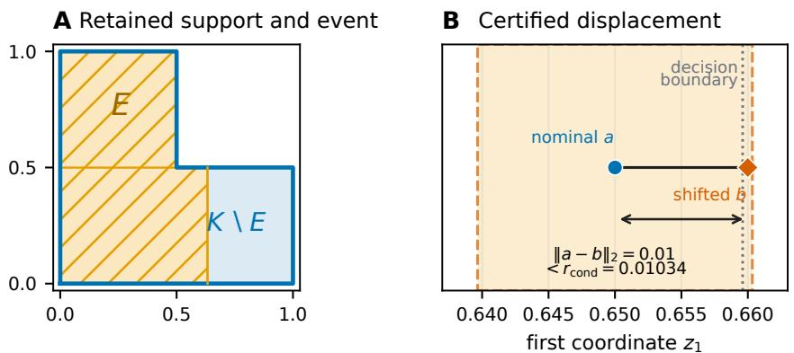  
Figure 3: Compact nonconvex witness. Panel A shows the connected L-shaped support, the event $E ,$ and its complement $K \backslash E$ . Panel B shows the tested displacement, the conditional decision boundary, and the substituted radius. The outward-certified bounds above establish the label change.

## E A COVARIANCE-CONTROLLED NONCONVEX FAMILY

Let $L = L _ { 0 } \oplus L _ { 1 }$ be an orthogonal decomposition and let $K = L _ { 0 } \times S $ , where $S \subseteq L _ { 1 }$ has positive measure and diameter at most $2 \sigma$ . The conditioned Gaussian factors into an unrestricted Gaussian on $L _ { 0 }$ and a Gaussian conditioned on $S$ in $L _ { 1 }$ . For every center $c ,$ the covariance has blocks $\sigma ^ { 2 } I _ { L _ { 0 } }$ and $\mathrm { C o v } ( Y _ { c } \mid Y _ { c } \in S )$ . Every unit projection of the second block has range at most diam $( S )$ , so Popoviciu’s inequality gives $\dot { \mathrm { C o v } } ( Q _ { c } ) \stackrel { - } { \preceq } \sigma ^ { 2 } I _ { L }$ for every $c .$ Thus the covariance radius in Proposition $\bar { 9 }$ applies globally with $\Lambda = 1$ even for a disconnected $S$ . The result does not assert the Gaussian event comparison.

This construction gives a proof-carrying learned filter. Fix a unit vector u, an offset $b ,$ and $0 < \alpha <$ $\beta \leq \sigma$ after training, and set

$$
R ( x ) = \mathbf { 1 } \{ \alpha \leq | u ^ { \top } x + b | \leq \beta \} .
$$

For $X _ { c } \sim \mathcal { N } ( c , \sigma ^ { 2 } I )$ , the component orthogonal to u is independent of $u ^ { \top } X _ { c } + b$ and is unchanged by retention. The retained scalar lies in $[ - \bar { \beta } , \beta ]$ . Popoviciu’s inequality therefore gives

$$
\operatorname { C o v } ( X _ { c } \mid R ( X _ { c } ) = 1 ) = \sigma ^ { 2 } ( I - u u ^ { \top } ) + \operatorname { V a r } ( u ^ { \top } X _ { c } \mid R ( X _ { c } ) = 1 ) u u ^ { \top } \preceq \sigma ^ { 2 } I
$$

for every center c. The direction and offset may be learned on separate data because the proof uses only their fixed values and $\lVert u \rVert = 1$

The same statement holds for an orthonormal matrix $U \ = \ [ u _ { 1 } , \ldots , u _ { k } ]$ and the product rule $\begin{array} { r }  \prod _ { j } \mathbf { 1 } \{ \alpha _ { j } \ \leq \ | u _ { j } ^ { \top } x + b _ { j } | \ \leq \ \beta _ { j } \} \end{array}$ with $\beta _ { j } \ \leq \ \sigma$ . The Gaussian coordinates in the columns of $U$ are independent, the retained event factorizes, and every retained coordinate has variance at most $\beta _ { j } ^ { 2 }$ The orthogonal complement remains unchanged.

Let $H = \mathbb { R } ^ { 2 } , \sigma = 1$ , and

$$
K = \mathbb { R } \times \left( [ - 1 , - 0 . 9 ] \cup [ 0 . 9 , 1 ] \right) .
$$

The two horizontal bands receive different labels. For $a _ { \delta } = ( 0 , - \delta )$ , reflection gives the lower-band and upper-band joint masses

$$
\begin{array} { l l l } { \displaystyle { s _ { - } ( \delta ) = \Phi ( 1 - \delta ) - \Phi ( 0 . 9 - \delta ) , \qquad s _ { + } ( \delta ) = \Phi ( 1 + \delta ) - \Phi ( 0 . 9 + \delta ) . } } \end{array}
$$

The lower band is selected for $\delta > 0$ . Reflection makes the masses equal when the second center coordinate is zero. Pointwise Gaussian likelihood ordering makes their order strict on either side. The nearest decision boundary to $a _ { \delta }$ is therefore exactly $\delta$ away.

Conditioning does not affect the first coordinate, so

$$
\operatorname { C o v } ( Q _ { c } ) = \operatorname { d i a g } ( 1 , \operatorname { V a r } ( Y \mid Y \in [ - 1 , - 0 . 9 ] \cup [ 0 . 9 , 1 ] ) ) .
$$

The retained second coordinate lies in [−1, 1]. Popoviciu’s inequality gives variance at most one for every center. Hence $\lambda _ { \operatorname* { m a x } } ( \operatorname { C o v } ( Q _ { c } ) ) \dot { \leq } 1$ globally. Proposition 9 applies with $R = \infty$ and $\Lambda = 1$ Notice that K has infinite diameter, so the two diameter-based formulas in (9) are unavailable.

This numerical witness uses the forward-KL alternative proved in Appendix C. Writing $\begin{array} { r l } { p _ { - } } & { { } = } \end{array}$ $s _ { - } / ( s _ { - } + s _ { + } )$ ) and $p _ { + } = 1 - p .$ <sub>−</sub>, the compared radii are

$$
r _ { \mathrm { c o n d } } = \Phi ^ { - 1 } ( p _ { - } ) , \qquad r _ { \mathrm { m a s s } } = \frac { 1 } { 2 } \left[ \Phi ^ { - 1 } ( s _ { - } ) - \Phi ^ { - 1 } ( s _ { + } ) \right] , \qquad r _ { \mathrm { c o v } } = \sqrt { 2 \mathcal { I } ( p _ { - } , p _ { + } ) } .
$$

At $\delta = 0 . 1$ , exact rational interval propagation gives

<table><tr><td>Quantity</td><td>Certified enclosure</td></tr><tr><td> $G _ { a _ { \delta } } ( K )$ </td><td>[0.05078446622171157326, 0.05078446622171157327]</td></tr><tr><td> $ { p _ { - } } ( a _ { \delta } )$ </td><td>[0.54731840865059743984, 0.54731840865059743985]</td></tr><tr><td> $r _ { \mathrm { m a s s } }$ </td><td>[0.04067994841241465132, 0.04067994841241465133]</td></tr><tr><td> $r _ { \mathrm { c o v } }$ </td><td>[0.09470767664273030523, 0.09470767664273030524]</td></tr><tr><td> $r _ { \mathrm { c o n d } }$ </td><td>[0.11888914386462333130, 0.11888914386462333131]</td></tr></table>

The Renyi certificate is at least as large as´ $r _ { \mathrm { c o v } }$ , but it is not the quantity enclosed in this table. The strict ordering printed in the main text follows. Figure 4 traces the four quantities. The same covariance bound also gives the global KL and finite-order Renyi rates through Theorem 1.´ The substituted event radius nevertheless crosses the exact boundary. Thus Gaussian divergence contraction does not imply the Gaussian event comparison.

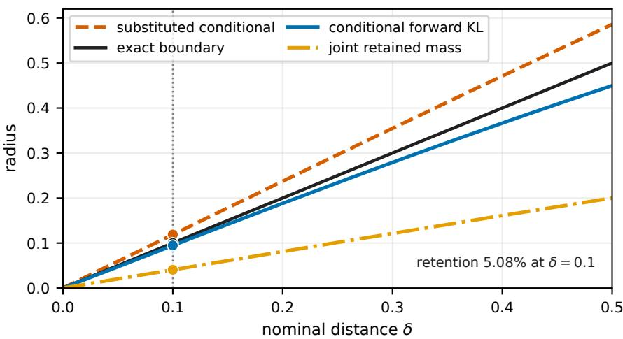  
Figure 4: End-to-end radii for the nonconvex two-band family. The curves use the analytic Gaussian CDF formulas above. The points at $\delta = 0 . 1$ use the outward-certified calculation. The forward-KL radius remains close to the exact boundary and is more than twice the joint-mass radius at the certified point. The substituted conditional radius crosses the boundary.

The verifier uses exact fractions, alternating Gaussian-integral brackets, an atanh logarithm bound, and outward square roots. It records all interval endpoints and strict checks in the supplement. The displayed sweep uses standard floating-point Gaussian CDF evaluations and is illustrative. The certified point does not depend on those evaluations.

## F ALTERNATIVE FEASIBLE KERNELS

A common repair channel and a fixed-weight mixture change the sampling kernel rather than recertifying whole-set conditioning. They remain useful when the application permits that change.

Proposition 11 (Fixed randomized repair). Let $U \sim \rho$ be independent of the center and let $T$ : $H { \times } \bar { \mathcal { U } } \to K$ be one measurable map used unchanged at both centers. Then $\dot { P _ { a } } = T _ { \# } ( G _ { a } \otimes \rho )$ satisfies the Gaussian event and total-variation comparisons and every finite-order Gaussian divergence bound. This includes a fixed categorical component followed by a component-specific projection.

Suppose $K = \textstyle \bigcup _ { i = 1 } ^ { m } K _ { j }$ , where the $K _ { j }$ are convex subsets of one affine space with positive intrinsic measure and every distinct pair has zero-intrinsic-measure intersection. All component-conditioned laws $Q _ { a , j } \ = \ G _ { a } \ ' ( \cdot \ | \ K _ { j } )$ use scale $\sigma .$ . For a center-independent probability vector $w ,$ , define $\begin{array} { r } { P _ { a } ^ { w } = \sum _ { j } w _ { j } Q _ { a , j } . } \end{array}$

Theorem 12 (Fixed-weight comparison). For everyfinite $\alpha > 0 _ { : }$

$$
D _ { \alpha } ( P _ { a } ^ { w } \| P _ { b } ^ { w } ) \leq \frac { \alpha \| a - b \| ^ { 2 } } { 2 \sigma ^ { 2 } } , \qquad D _ { 1 } = D _ { \mathrm { K L } } .
$$

The family also satisfies the Gaussian event comparison and

$$
d _ { \mathrm { T V } } ( P _ { a } ^ { w } , P _ { b } ^ { w } ) \leq 2 \Phi \biggl ( \frac { \| a - b \| } { 2 \sigma } \biggr ) - 1 .
$$

For a bounded common-affine partition and $\tau \in [ 0 , 1 ]$ ], let $\pi _ { j } ( a ) = G _ { a } ( K _ { j } ) / G _ { a } ( K )$ , fix anchor $a _ { 0 }$ , and define

$$
w _ { j } ^ { ( \tau , a _ { 0 } ) } ( a ) = \frac { \pi _ { j } ( a _ { 0 } ) ^ { 1 - \tau } \pi _ { j } ( a ) ^ { \tau } } { \sum _ { k } \pi _ { k } ( a _ { 0 } ) ^ { 1 - \tau } \pi _ { k } ( a ) ^ { \tau } } , \qquad \nu _ { a } ^ { ( \tau , a _ { 0 } ) } = \sum _ { i } w _ { j } ^ { ( \tau , a _ { 0 } ) } ( a ) Q _ { a , j } .
$$

Proposition 13 (Anchored comparison). $\begin{array} { r } { I f D _ { K } = \operatorname* { s u p } _ { x , y \in K } \| x - y \| } \end{array}$ , then

$$
D _ { \mathrm { K L } } \Big ( \nu _ { b } ^ { ( \tau , a _ { 0 } ) } \Big \| \nu _ { c } ^ { ( \tau , a _ { 0 } ) } \Big ) \leq \left( \frac { 1 } { 2 \sigma ^ { 2 } } + \frac { \tau ^ { 2 } D _ { K } ^ { 2 } } { 8 \sigma ^ { 4 } } \right) \| b - c \| ^ { 2 } .
$$

For $p _ { y } ^ { \nu } ( a ) = \nu _ { a } ^ { ( \tau , a _ { 0 } ) } ( f ^ { - 1 } ( y ) )$ , write the coefficient as $C _ { \tau \cdot A }$ top label A and runner-up B at a have the valid radius

$$
r _ { \mathrm { P i n } } ^ { \nu } ( a , \tau , a _ { 0 } ) = \frac { p _ { A } ^ { \nu } ( a ) - p _ { B } ^ { \nu } ( a ) } { \sqrt { 2 C _ { \tau } } } .
$$

The endpoint $\tau = 0$ has fixed weights and the Gaussian event certificate. Positive temperatures use only the corrected bound above. The proofs are in Appendices G and H. Exact evaluation requires certified component occupancies, and positive temperatures also require a certified diameter. These quantities can be intractable for neural confidence regions. We therefore record the construction as an alternative for applications with an explicit convex partition rather than use it in the learned-model experiment.

## G FIXED-WEIGHT AND ANCHORED COMPARISONS

We first record the two component facts used below. If $K _ { j }$ is convex, Theorem 1 and Corollary 2 give, for every finite $\alpha > 0$

$$
D _ { \alpha } ( Q _ { a , j } \| Q _ { b , j } ) \leq \frac { \alpha \| a - b \| ^ { 2 } } { 2 \sigma ^ { 2 } } .\tag{10}
$$

and, for every measurable $E ,$

$$
\Phi \big ( \Phi ^ { - 1 } ( Q _ { a , j } ( E ) ) - r \big ) \le Q _ { b , j } ( E ) \le \Phi \big ( \Phi ^ { - 1 } ( Q _ { a , j } ( E ) ) + r \big ) , \qquad r = \frac { \| a - b \| } { \sigma } .\tag{11}
$$

The intrinsic scale in both statements is $r = \| a - b \| / \sigma$

Proof of Theorem 12. Attach the component index to a sample and define the tagged laws

$$
\widetilde { P } _ { a } ( j , d z ) = w _ { j } Q _ { a , j } ( d z ) , \qquad \widetilde { P } _ { b } ( j , d z ) = w _ { j } Q _ { b , j } ( d z ) .
$$

For $\alpha \neq 1$ , let $d _ { \alpha , j } = D _ { \alpha } ( Q _ { a , j } \lVert Q _ { b , j } )$ . Directly from the definition,

$$
\exp \Bigl ( ( \alpha - 1 ) D _ { \alpha } \bigl ( \widetilde { P } _ { a } \| \widetilde { P } _ { b } \bigr ) \Bigr ) = \sum _ { j } w _ { j } \exp ( ( \alpha - 1 ) d _ { \alpha , j } ) .
$$

Let $C _ { \alpha } = \alpha \| a - b \| ^ { 2 } / ( 2 \sigma ^ { 2 } )$ . Equation (10) gives $d _ { \alpha , j } \leq C _ { \alpha }$ . For $\alpha > 1$ , the exponential is increasing and division by $\alpha - 1$ keeps the resulting upper bound. For $0 < \alpha < 1$ , the exponential is decreasing, so the sum is bounded below by $\exp ( ( \alpha - 1 ) C _ { \alpha } )$ . Division by the negative $\alpha - 1$ reverses the inequality and gives the same upper bound. $\mathrm { A t } \alpha = 1$ , the tagged KL chain rule gives

$$
D _ { \mathrm { K L } } ( \widetilde { P } _ { a } \| \widetilde { P } _ { b } ) = \sum _ { j } w _ { j } D _ { \mathrm { K L } } ( Q _ { a , j } \| Q _ { b , j } ) \leq \frac { \| a - b \| ^ { 2 } } { 2 \sigma ^ { 2 } } .
$$

Forgetting the tag is a measurable channel. Data processing for every positive Renyi order (van Erven´ & Harremoes, 2014) transfers the tagged bounds to¨ $P _ { a } ^ { w }$ and $P _ { b } ^ { w }$

For the event statement, set $h _ { r } ( p ) = \Phi ( \Phi ^ { - 1 } ( p ) - r )$ . For $r > 0$ , writing $p = \Phi ( x )$ gives

$$
h _ { r } ^ { \prime } ( p ) = \exp ( r x - r ^ { 2 } / 2 ) ,
$$

which is increasing in $p .$ Hence $h _ { r }$ is convex. It is the identity when $r = 0$ . Applying the lower half of (11), averaging, and using Jensen’s inequality gives

$$
P _ { b } ^ { w } ( E ) \geq \sum _ { j } w _ { j } h _ { r } ( Q _ { a , j } ( E ) ) \geq h _ { r } \left( \sum _ { j } w _ { j } Q _ { a , j } ( E ) \right) = h _ { r } ( P _ { a } ^ { w } ( E ) ) .
$$

Applying this lower bound to $E ^ { c }$ gives the upper event comparison. Finally, for $p = \Phi ( x )$ , both possible endpoint differences are maximized at the midpoint of the two shifted Gaussian means and equal $2 \Phi ( r / 2 ) - 1$ . Taking the supremum over events proves the total-variation bound. □

Proof of Proposition 13. Let $Z _ { j } ( x ) = G _ { x } ( K _ { j } ) > 0$ and let $m _ { x , j }$ be the mean of $Q _ { x , j }$ . From (7), applied to component $K _ { j }$

$$
\nabla _ { x } \log Z _ { j } ( x ) = \frac { m _ { x , j } - x } { \sigma ^ { 2 } } .\tag{12}
$$

Because the common-affine union is bounded, conditional means lie in the closures of their convex components, and therefore $\| m _ { x , j } - m _ { x , k } \| \leq D _ { K }$

Write $v _ { x } ( j ) = w _ { j } ^ { ( \tau , a _ { 0 } ) } ( x )$ for the anchored categorical law. For two centers $b , c ,$ define

$$
\delta _ { j } = \tau \big ( \log Z _ { j } ( c ) - \log Z _ { j } ( b ) \big ) .
$$

Terms common to every component cancel on normalization, so $v _ { c } ( j ) = v _ { b } ( j ) e ^ { \delta _ { j } } / \mathbb { E } _ { v _ { b } } e ^ { \delta _ { J } }$ . Consequently

$$
D _ { \mathrm { K L } } ( v _ { b } \| v _ { c } ) = \log \mathbb { E } _ { v _ { b } } e ^ { \delta _ { J } } - \mathbb { E } _ { v _ { b } } \delta _ { J } .\tag{13}
$$

For every $j , k ,$ integration of (12) along the segment from b to c gives

$$
| ( \delta _ { j } - \delta _ { k } ) | \leq \frac { \tau D _ { K } } { \sigma ^ { 2 } } \| b - c \| .
$$

Thus the range of the random variable $\delta _ { J }$ has width at most the right-hand side. Hoeffding’s lemma applied to (13) yields

$$
D _ { \mathrm { K L } } ( v _ { b } \| v _ { c } ) \leq \frac { \tau ^ { 2 } D _ { K } ^ { 2 } } { 8 \sigma ^ { 4 } } \| b - c \| ^ { 2 } .\tag{14}
$$

Attach the component tag to $\nu _ { b } ^ { ( \tau , a _ { 0 } ) }$ and $\nu _ { c } ^ { ( \tau , a _ { 0 } ) }$ . The tagged KL chain rule, the convex-component order-one case of (10), and (14) give

$$
D _ { \mathrm { K L } } ( \widetilde { \nu } _ { b } \| \widetilde { \nu } _ { c } ) \leq \left( \frac { 1 } { 2 \sigma ^ { 2 } } + \frac { \tau ^ { 2 } D _ { K } ^ { 2 } } { 8 \sigma ^ { 4 } } \right) \| b - c \| ^ { 2 } .
$$

Forgetting the tag and applying KL data processing proves the asserted bound with coefficient $C _ { \tau }$ Pinsker’s inequality then gives, for any $a , b \in H$

$$
d _ { \mathrm { T V } } ( \nu _ { a } ^ { ( \tau , a _ { 0 } ) } , \nu _ { b } ^ { ( \tau , a _ { 0 } ) } ) \leq \sqrt { \frac { C _ { \tau } } { 2 } } \| a - b \| .
$$

Every fixed label event changes by at most this quantity. If A is top at a and $y \neq A$ , then

$$
p _ { A } ^ { \nu } ( b ) - p _ { y } ^ { \nu } ( b ) \geq p _ { A } ^ { \nu } ( a ) - p _ { y } ^ { \nu } ( a ) - \sqrt { 2 C _ { \tau } } \| a - b \| .
$$

Since $p _ { B } ^ { \nu } ( a )$ is the largest competing probability, every such difference is strictly positive whenever

$$
\| a - b \| < \frac { p _ { A } ^ { \nu } ( a ) - p _ { B } ^ { \nu } ( a ) } { \sqrt { 2 C _ { \tau } } } .
$$

This proves the radius and independently checks its factor of two.

## H FIXED RANDOMIZED REPAIR IS A COMMON CHANNEL

Proof of Proposition 11. Let $U \sim \rho$ be auxiliary randomness whose law does not depend on the center, and define $M _ { a } = G _ { a } \otimes \rho .$ The likelihood ratio between $M _ { a }$ and $M _ { b }$ depends only on the Gaussian coordinate. Hence

$$
D _ { \alpha } ( M _ { a } \| M _ { b } ) = D _ { \alpha } ( G _ { a } \| G _ { b } ) , \qquad d _ { \mathrm { T V } } ( M _ { a } , M _ { b } ) = d _ { \mathrm { T V } } ( G _ { a } , G _ { b } )
$$

for every finite positive order, with the order-one convention. Applying the same measurable map $T : H \times \dot { \mathcal { U } }  \dot { K }$ at both centers and using data processing gives

$$
D _ { \alpha } ( P _ { a } \| P _ { b } ) \leq D _ { \alpha } ( G _ { a } \| G _ { b } ) = \frac { \alpha \| a - b \| ^ { 2 } } { 2 \sigma ^ { 2 } } , \qquad 0 < \alpha < \infty ,
$$

with $D _ { 1 } = D _ { \mathrm { K L } }$ , and

$$
d _ { \mathrm { T V } } ( P _ { a } , P _ { b } ) \leq 2 \Phi \Big ( \frac { \| a - b \| } { 2 \sigma } \Big ) - 1 .
$$

For completeness, the event statement also survives the auxiliary mixture. For $E \subseteq K$ and fixed $u ,$ put $\mathring { A _ { u } } = \{ z : T ( z , u ) \in E \}$ and $h _ { r } ( p ) = \Phi ( \Phi ^ { - 1 } ( p ) - r )$ with $r = \| a - b \| / \sigma$ . The ordinary Gaussian event comparison gives $G _ { b } ( A _ { u } ) \geq h _ { r } ( G _ { a } ( A _ { u } ) )$ . The function $h _ { r }$ is convex, as shown in Appendix G. Averaging over u and applying Jensen yields

$$
\begin{array} { r } { P _ { b } ( E ) \geq \mathbb { E } _ { \rho } h _ { r } ( G _ { a } ( A _ { U } ) ) \geq h _ { r } ( \mathbb { E } _ { \rho } G _ { a } ( A _ { U } ) ) = h _ { r } ( P _ { a } ( E ) ) . } \end{array}
$$

Applying the lower bound to $E ^ { c }$ gives the upper event comparison.

A deterministic repair is recovered when $\rho$ is a point mass. A component-indexed repair takes $U$ to be a categorical component index with a fixed center-independent law and lets $T ( \cdot , U )$ be a component map fixed in advance, such as clipping or projection. This argument permits a state-specific channel $T _ { s }$ when the compared centers belong to the same fixed state fibre. It does not compare different states, different feasible sets, center-dependent auxiliary laws, or channels that are recomputed after the center perturbation. □

## I ADAPTIVE FEASIBLE-TRAJECTORY COMPARISON

At step t, a fixed controller maps history $h _ { t } \ \mathrm { t o } \ m _ { t } ( h _ { t } )$ . A causal shift rule chooses $\Delta _ { t }$ before the current proposal block. Fix $N _ { t } \ge 1 , \sigma _ { t } > 0$ , and $0 \leq \rho _ { t } < 1$ . Let $\mathcal { F } _ { t }$ contain the public pre-block history and any private seed used by the shift rule. Fresh variables $\xi _ { t , 0 } , \ldots , \xi _ { t , N _ { t } }$ are conditionally independent standard Gaussians given $\mathcal { F } _ { t }$ and are independent of $\mathcal { F } _ { t }$ . The proposals are

$$
Z _ { t , k } = m _ { t } ( h _ { t } ) + \Delta _ { t } + \sigma _ { t } \bigl ( \sqrt { \rho _ { t } } \xi _ { t , 0 } + \sqrt { 1 - \rho _ { t } } \xi _ { t , k } \bigr ) , \qquad \kappa _ { t } = \frac { N _ { t } } { 1 + ( N _ { t } - 1 ) \rho _ { t } } .
$$

One fixed causal program receives the complete block and returns its first verified action, uses a finite fallback library, or abstains without a system transition.

Policy Smoothing gives Gaussian event comparisons for adaptive trajectory perturbations under a cumulative Euclidean budget (Kumar et al., 2022, Theorem 1). Adaptive Randomized Smoothing applies Gaussian differential privacy to adaptive multi-step computation (Lyu et al., 2024, Theorem 2.3). Below, the fully adaptive Gaussian composition result of Smith & Thakurta (2022) and Koskela et al. (2023) gives a comparison under a pathwise budget. Whitening computes the exact Mahalanobis cost of each correlated proposal block, and the common causal feasibility program preserves the comparison.

Theorem 14 (Adaptive feasible-trajectory comparison). Fix afinite horizon, a standard-Borel history space, and a Borel action subset $\mathcal { \bar { o } } f \mathbb { R } ^ { d }$ . Let $P _ { 0 }$ and $P _ { \Delta }$ be the public-trace laws obtainedfrom the same measurable controller, verifier, fallback, dynamics, initial law, and stopping rule, with the requested shifts respectively suppressed and applied. History-dependentfeasible sets are allowed. If the fresh Gaussian innovations underlying the current block are independent of the pre-block information and every reachable history and private shift seed obeys

$$
\sum _ { t } \kappa _ { t } \| \Delta _ { t } \| _ { 2 } ^ { 2 } / \sigma _ { t } ^ { 2 } \leq \mu ^ { 2 } ,
$$

then every measurable public-trace event E obeys

$$
\Phi \big ( \Phi ^ { - 1 } ( P _ { 0 } ( E ) ) - \mu \big ) \le P _ { \Delta } ( E ) \le \Phi \big ( \Phi ^ { - 1 } ( P _ { 0 } ( E ) ) + \mu \big ) .
$$

ProofofTheorem 14. Let the action dimension be d. For step t, write

$$
C _ { t } = ( 1 - \rho _ { t } ) I _ { N _ { t } } + \rho _ { t } \mathbf { 1 1 } ^ { \top } .
$$

The proposal block conditioned on the current history is Gaussian with covariance $\sigma _ { t } ^ { 2 } C _ { t } \otimes I _ { d }$ . Since $0 \leq \rho _ { t } < 1$ , this covariance is nonsingular. The nominal and perturbed conditional means differ by $\mathbf { 1 } \otimes \Delta _ { t }$ . Whitening gives squared displacement

$$
\begin{array} { r l } & { r _ { t } ^ { 2 } = \cfrac { 1 } { \sigma _ { t } ^ { 2 } } ( \mathbf { 1 } \otimes \Delta _ { t } ) ^ { \top } ( C _ { t } ^ { - 1 } \otimes I _ { d } ) ( \mathbf { 1 } \otimes \Delta _ { t } ) } \\ & { \quad = \cfrac { \mathbf { 1 } ^ { \top } C _ { t } ^ { - 1 } \mathbf { 1 } } { \sigma _ { t } ^ { 2 } } \| \Delta _ { t } \| _ { 2 } ^ { 2 } = \cfrac { \kappa _ { t } \| \Delta _ { t } \| _ { 2 } ^ { 2 } } { \sigma _ { t } ^ { 2 } } . } \end{array}
$$

The last equality follows because 1 is an eigenvector of $C _ { t }$ with eigenvalue $1 + ( N _ { t } - 1 ) \rho _ { t }$

The shift rule chooses $\Delta _ { t }$ from the previously visible history and any private randomness before the current Gaussian block is generated. Couple its private seed under both laws and include it in the latent filtration. Write $u _ { t }$ for the whitened mean displacement and $X _ { t }$ for the corresponding standard-normal block under the nominal law. Then $u _ { t }$ is predictable and $\| \dot { u _ { t } } \| ^ { 2 } = r _ { t } ^ { 2 }$ . After the last block, append one unobserved scalar Gaussian with predictable displacement

$$
u _ { * } = \left( \mu ^ { 2 } - \sum _ { t } r _ { t } ^ { 2 } \right) ^ { 1 / 2 } .
$$

This quantity is real by the pathwise energy condition. The enlarged experiment has total squared displacement exactly $\bar { \mu } ^ { 2 }$

Under its nominal law, define

$$
M = \sum _ { t } \langle u _ { t } , X _ { t } \rangle + u _ { * } X _ { * } .
$$

Iterated conditional expectation of the Gaussian moment generating function gives, for every $\lambda \in \mathbb { R }$

$$
\mathbb { E } _ { 0 } \exp \biggl ( \lambda M - \frac { \lambda ^ { 2 } \mu ^ { 2 } } { 2 } \biggr ) = 1 .
$$

Thus $M \sim \mathcal N ( 0 , \mu ^ { 2 } )$ . The sequential Gaussian density ratio of the enlarged shifted experiment with respect to the enlarged nominal experiment is

$$
\exp \biggl ( M - \frac { \mu ^ { 2 } } { 2 } \biggr ) .
$$

For any event of nominal probability p, Neyman–Pearson ordering places the smallest shifted probability on the lower tail of M and the largest on its upper tail. Direct evaluation of these two Gaussian tails gives

$$
\Phi \big ( \Phi ^ { - 1 } ( p ) - \mu \big ) \mathrm { ~ a n d ~ } \Phi \big ( \Phi ^ { - 1 } ( p ) + \mu \big ) .
$$

An event that ignores the appended scalar is an event of the enlarged experiment, so the same bounds hold before the scalar is appended. Forgetting the private seed is also common post-processing.

At a fixed generated history, proposal ordering, clipping, feasibility tests, fallback construction, dynamics, process randomness, and stopping use the same conditional kernel under both laws. Their causal composition is common post-processing of the Gaussian blocks. This remains true when the feasible action set changes with the generated state. It fails if the perturbation changes the verifier, fallback, dynamics, or feasible set through another input. After stopping, append zero-shift dummy blocks to the fixed horizon. Standard-Borel history and action spaces ensure the required regular conditional kernels exist.

For a measurable public-trace event $E _ { \mathrm { { : } } }$ the Gaussian tradeoff gives

$$
\Phi \big ( \Phi ^ { - 1 } ( P _ { 0 } ( E ) ) - \mu \big ) \le P _ { \Delta } ( E ) \le \Phi \big ( \Phi ^ { - 1 } ( P _ { 0 } ( E ) ) + \mu \big ) .
$$

Applying the same comparison to all measurable events yields d<sub>TV</sub> $( P _ { 0 } , P _ { \Delta } ) \le 2 \Phi ( \mu / 2 ) - 1$ . The enlarged likelihood-ratio experiment also has Renyi divergence´ $\alpha \mu ^ { 2 } / 2$ in both directions at every order $\alpha > 1$ . Therefore data processing gives

$$
D _ { \alpha } ( P _ { \Delta } \| P _ { 0 } ) \leq { \frac { \alpha \mu ^ { 2 } } { 2 } } , \qquad D _ { \alpha } ( P _ { 0 } \| P _ { \Delta } ) \leq { \frac { \alpha \mu ^ { 2 } } { 2 } } .
$$

Letting α ↓ 1 gives both directed KL bounds $\mu ^ { 2 } / 2$

Suppose $\sigma _ { t } = \sigma$ and $\kappa _ { t } = \kappa$ . Every perturbation with $\begin{array} { r } { \sum _ { t } \| \Delta _ { t } \| _ { 2 } ^ { 2 } \leq B ^ { 2 } } \end{array}$ has $\mu \le \sqrt { \kappa } B / \sigma$ . Replacing $P _ { 0 } ( E )$ by a simultaneous lower confidence bound $p _ { L }$ obtained from independent nominal trajectories and solving

$$
\Phi \left( \Phi ^ { - 1 } ( p _ { L } ) - \frac { \sqrt { \kappa } B } { \sigma } \right) \geq q
$$

for a target probability $q \in ( 0 , 1 )$ gives

$$
B _ { \mathrm { c e r t } } = \frac { \sigma } { \sqrt { \kappa } } \left[ \Phi ^ { - 1 } ( p _ { L } ) - \Phi ^ { - 1 } ( q ) \right] _ { + } .
$$

When $p _ { L } \geq q ,$ , this radius inherits the coverage of $p _ { L }$ . When $p _ { L } < q _ { \because }$ , the target probability is not certified even at $B = 0$

The public trace includes every externally visible selection index, fallback result, and abstention symbol. If abstention occurs, the stopping rule does not execute a physical action. An event requiring no abstention therefore charges finite-library exhaustion directly. The result bounds that event’s probability. It does not prove that the feasible-action fibre is nonempty or that the physical dynamics are forward invariant. □

Executable certification procedure. Fix before sampling the horizon, event $E ,$ schedules $( N _ { t } , \sigma _ { t } , \rho _ { t } )$ , controller, candidate map, verifier, ordered finite fallback rule $\mathcal { L } _ { t } ( h _ { t } )$ , transition kernel, and stopping rule. For $N _ { t } > 1$ , a desired multiplier $\lambda _ { t } \in ( 1 , N _ { t } ]$ can be set exactly by

$$
\rho _ { t } = \frac { N _ { t } / \lambda _ { t } - 1 } { N _ { t } - 1 } , \qquad \kappa _ { t } = \lambda _ { t } .
$$

For $N _ { t } ~ = ~ 1$ , use $\rho _ { t } = 0$ and $\kappa _ { t } = \lambda _ { t } = 1$ . An attacked comparison may choose $\Delta _ { t }$ from the pre-block history, but must commit it before the current proposal block and cannot alter another program input. Use separate proposal, attack, and transition random streams. Do not expose the proposal or transition stream to the shift rule. Evaluate that rule on an isolated copy of the pre-block history. For each of M independent nominal trajectories, set $\Delta _ { t } = 0$ . At history $h _ { t } .$ , compute $m _ { t } ( h _ { t } )$ and draw the complete correlated proposal block. Apply the common candidate map and verifier in index order. If every proposal fails, inspect $\mathcal { L } _ { t } ( h _ { t } )$ in its declared order. Record ⊥ and stop without a system transition when the library is exhausted. Otherwise execute the selected verified action through the common transition kernel. Record the selected proposal or fallback index, every system outcome, and any abstention.

Let $X _ { i }$ indicate whether trace i satisfies $E ,$ and let $p _ { L }$ be a valid one-sided lower confidence bound for $P _ { 0 } ( E )$ . Iid initial-law draws permit an exact Clopper–Pearson bound based on $\textstyle \sum _ { i } X _ { i }$ . A fixed finite cohort with one independent draw at each support point permits a Hoeffding bound for the uniform cohort average. For target $q \in ( 0 , 1 )$ , define

$$
\mu _ { \mathrm { c e r t } } = \Phi ^ { - 1 } ( p _ { L } ) - \Phi ^ { - 1 } ( q )
$$

only when $p _ { L } \geq q .$ No radius is certified when $p _ { L } < q .$ For constant $\sigma _ { t } = \sigma$ and $\kappa _ { t } = \kappa _ { : }$ , return $B _ { \mathrm { c e r t } } = \sigma \mu _ { \mathrm { c e r t } } / \sqrt { \kappa }$ . With varying schedules, retain the certified ellipsoid $\begin{array} { r } { \sum _ { t } \kappa _ { t } \| \Delta _ { t } \| _ { 2 } ^ { 2 } / \sigma _ { t } ^ { 2 } \leq \mu _ { \mathrm { c e r t } } ^ { 2 } } \end{array}$ The event must be fixed independently of these nominal samples or covered by simultaneous inference. The energy condition must hold for every reachable history and attack seed. One observed trace cannot establish this condition. Algorithm 2 gives the complete certification procedure. The supplement includes tested implementations of the proposal block, totalized selector, finite trajectory rollout, energy calculation, and count-to-radius calculation.

Algorithm 2 Capped feasible rollout and trajectory-event certification   
Fixed program horizon $T ,$ event $E ,$ schedules $( N _ { t } , \sigma _ { t } , \rho _ { t } )$ , controller $m _ { t }$   
verifier $V _ { t } ,$ ordered fallback library $\mathcal { L } _ { t } ,$ dynamics, stopping rule   
Statistical inputs trials $M ,$ , valid lower-bound rule $B ,$ error δ, target probability $q$   
1: for independent nominal trials $i = 1 , \dots , M$ do   
2: for $\dot { t } = 0 , \dots , T - 1$ do   
3: Compute $m _ { t } ( h _ { t } ^ { ( i ) } )$ and draw the complete correlated proposal block   
4: Select the first proposal accepted by $V _ { t } ( h _ { t } ^ { ( i ) } , \cdot )$   
5: If none is accepted, inspect $\mathcal { L } _ { t } ( h _ { t } ^ { ( i ) } )$ in its fixed order   
6: If no fallback is accepted, record ⊥ and stop without a transition   
7: Otherwise execute the selected action, record the outcome, and update the history   
8: $X _ { i } \gets \mathbf { 1 } { : }$ {public trace $i \in E \}$ for every i   
9: $p _ { L } \gets \bar { B ( X _ { 1 } , \ldots , X _ { M } , \delta ) }$   
10: $\mathbf { i f } \ p _ { L } < q$ then   
11: return no positive certificate   
12: $\mu _ { \mathrm { c e r t } }  \Phi ^ { - 1 } ( p _ { L } ) - \Phi ^ { - 1 } ( q )$   
13: return predictable shifts satisfying   
$\begin{array} { r } { \sum _ { t } \dot { \kappa } _ { t } \| \Delta _ { t } \| _ { 2 } ^ { 2 } / \sigma _ { t } ^ { 2 } \leq \mu _ { \mathrm { c e r t } } ^ { 2 } } \end{array}$ on every reachable history

## I.1 LEARNED-CONTROLLER EVALUATION

We trained three PPO-Lagrangian controllers for 10 million environment steps each and retained their terminal actor and observation-normalizer files. The controller seeds are 1120275774, 1346831933, and 658990255. Evaluation uses SafetyPointGoal2-v0 in Safety-Gymnasium 1.0.0 (Ji et al., 2023). One observation-only verifier restricts the two action coordinates. A deterministic clipped-controller action is used when no proposal passes. The verifier is a fixed heuristic and is not a native-cost oracle.

An earlier study used goal-before-cost as its event and did not certify probability 0.5. Those outcomes do not enter this calculation. A 16-seed pilot then informed the event below. The final 256-seed cohort was specified before evaluation. The audit reconstructs these seeds and verifies that they are disjoint from the earlier confirmation cohort and all 36 development labels.

The certified event is no positive native cost until the first goal or 500 executed steps. A positive cost, an early environment stop, or a nonfinite transition is failure. Reaching the goal stops the event, so no claim concerns later states. A timeout without cost is success. The target initial law is the uniform mixture over the 256 fixed reset seeds. We draw one independent Gaussian trajectory for each seed and arm. If S trajectories succeed, the simultaneous lower bound is

$$
p _ { L } = \left[ \frac { S } { 2 5 6 } - \sqrt { \frac { \log ( 6 / 0 . 0 0 1 ) } { 2 \cdot 2 5 6 } } \right] _ { + } .
$$

Hoeffding’s inequality applies to the independent, nonidentical Bernoulli outcomes and targets the uniform-cohort average. It does not extend the result to other reset distributions.

The correlated-four arm has $N = 4 , \sigma = 0 . 2 , \rho = 5 9 / 6 3 .$ , and $\kappa = 1 . 0 5$ . The matched-one arm has $N = 1 , \sigma = 0 . 2 / \sqrt { 1 . 0 5 } , \rho = 0$ , and $\kappa = 1$ . Both have Gaussian energy charge $\kappa / \sigma ^ { 2 } = 2 6 . 2 5$ . The protocol records 0.2 and 1.05 as shared base values. The post-run integrity record distinguishes the literal schedules above. The executed schedules, energy calculations, and radii use the same charge.

At each step, the tested shift points opposite the clipped controller center and has norm $0 . 0 2 / \sqrt { 5 0 0 }$ The empirical shifted counts in Table 1 are descriptive. The certificate uses the nominal lower bound and Theorem 14, hence it covers every predictable proposal-center sequence with cumulative Euclidean budget at most $B = 0 . 0 2$ under the same causal program.

Table 1: SafetyPointGoal2 trajectory evaluation. Safe is the certified event count. Goal and timeout partition that count. Cost is the nominal positive-cost count. $L _ { . 0 2 }$ is the familywise lower event probability at $B = 0 . 0 2$ . Shift safe is the descriptive count under the tested shift. C1, C2, and C3 follow the controller-seed order in the text.
<table><tr><td>Ctrl</td><td>Proposals</td><td>Safe</td><td>Goal</td><td>Timeout</td><td>Cost</td><td> $p _ { L }$ </td><td> $B _ { \mathrm { c e r t } }$ </td><td> $L _ { . 0 2 }$ </td><td>Shift safe</td></tr><tr><td>C1</td><td>one</td><td>211</td><td>78</td><td>133</td><td>45</td><td>.694</td><td>.0989</td><td>.657</td><td>213</td></tr><tr><td>C1</td><td>four</td><td>210</td><td>85</td><td>125</td><td>46</td><td>.690</td><td>.0968</td><td>.653</td><td>214</td></tr><tr><td>C2</td><td>one</td><td>187</td><td>60</td><td>127</td><td>69</td><td>.600</td><td>.0495</td><td>.560</td><td>180</td></tr><tr><td>C2</td><td>four</td><td>189</td><td>59</td><td>130</td><td>67</td><td>.608</td><td>.0535</td><td>.568</td><td>187</td></tr><tr><td>C3</td><td>one</td><td>205</td><td>107</td><td>98</td><td>51</td><td>.670</td><td>.0861</td><td>.633</td><td>204</td></tr><tr><td>C3</td><td>four</td><td>207</td><td>106</td><td>101</td><td>49</td><td>.678</td><td>.0903</td><td>.641</td><td>202</td></tr></table>

All six arms certify event probability above 0.5 at $B = 0 . 0 2$ with familywise error at most 0.001. Only 59–107 nominal trajectories per arm reach the goal before cost. Most certified successes are therefore timeouts. This result does not certify task completion, observation perturbations, changes to the verifier or dynamics, or forward invariance.

The raw result stores aggregate trajectory records rather than full per-step traces. A post-run audit checks the record schema, all 3,072 arm keys, every reported summary, seed separation, finite energy, method schedules, and source closure. It cannot replay each selection from the stored aggregate records. The theorem’s public trace is the arm-blind controller, selection, fallback, dynamics, and stopping output. Attack budgets and energy diagnostics are separate experimental metadata. The supplement includes the protocol, results, audit, checksums, and environment versions.

## J RELATION OF THE FORMAL RESULTS TO PRIOR WORK

Table 2 identifies the earlier result used by each formal step and its application to conditional laws, their decision rules, and center-dependent occupancy.

Table 2: Result-level relation to prior work. The middle column gives the earlier statement used here. The last column gives the result established in this paper.
<table><tr><td>Current result</td><td>Used here</td><td>Established here</td></tr><tr><td>Occupancy divergences</td><td>Fixed-support Rényi log-partition identities and truncated-family KL and</td><td>Gaussian occupancy specialization followed by the equivalence between concave log occupancy and the stated</td></tr><tr><td></td><td>skew-Jensen identities (Nielsen &amp; Nock, 2011; Nielsen, 2022) Log-normalizer differentiation</td><td>ordered-pair KL and positive-order Rényi rates Their specialization gives the finite-path</td></tr><tr><td>Covariance control</td><td>supplies standard moment and Fisher identities</td><td>KL integral, local Rényi rate, and top-covariance diagnostic used here Intrinsic affine-hull specialization with</td></tr><tr><td>Corollary 2</td><td>Strongly log-concave tradeoff comparison of Gopi et al. (2022, Theorem 13)</td><td>displacement scale  $\| \dot { a } - b \| / \sigma$ </td></tr><tr><td>Proposition 3</td><td>Neyman-Pearson ordering for the monotone likelihood ratio between two conditioned Gaussian centers</td><td>Necessary and sufficient projected-mass inequalities for every measurable retained event under an arbitrary fixed set</td></tr><tr><td>Theorem 7 and Algorithm 1</td><td>Joint selected-label and selected-or-rejection masses (Sheikholeslami et al., 2022, Theorem 3.1)</td><td>Explicit competitor bounds and their simultaneous combination with the rejection-complement bound for arbitrary fixed filters</td></tr><tr><td>Limits of conditional votes Proposition 9</td><td>The cited joint-event certificate does not provide a radius from conditional votes alone Categorical Rényi reversal bound (Li et al., 2019, Lemma 1), data</td><td>Sharpness of the joint-mass radius and the support-free conditional-only impossibility result Transfer to conditional laws under a</td></tr><tr><td></td><td>processing, Popoviciu's inequality, and likelihood-ratio oscillation Adaptive trajectory and</td><td>uniform covariance bound, with the  $R / \alpha$  restriction when that bound holds only in a ball of radius R Exact Mahalanobis cost for correlated</td></tr><tr><td>Theorem 14</td><td>multi-step smoothing (Kumar et al., 2022; Lyu et al., 2024), and fully adaptive Gaussian composition (Smith &amp; Thakurta, 2022; Koskela et al., 2023)</td><td>proposal blocks followed by one common causal selector, verifier, fallback, dynamics, and stopping program</td></tr></table>

## K EXPERIMENTAL PROTOCOL AND ADDITIONAL RESULTS

## K.1 RELEASED-MODEL RECERTIFICATION

We audit Theorem 2 in Section 5.2 and its proof in Appendix A.2 of the retained AuditVotes v3 manuscript. The public source<sup>2</sup> is identified by its exact revision in the supplement. The supplement also authenticates the manuscript, released CIFAR-10 checkpoint, and inspected core.py. The upstream repository has no license file, so neither its source nor its checkpoint is redistributed.

The retained manuscript defines the image predictor by conditional label probabilities in Eq. (15). Its Theorem 2 uses bounds on those probabilities in the Gaussian radius, while Appendix A.2 applies the Gaussian halfspace comparison to joint retention-and-label indicators. In the released core.py, lines 97–103 of Smooth. sample noise filter predictions by confidence before counting them. Lines 47–55 of Smooth.certify then replace the requested proposal count by the sum of retained class counts, compute a binomial lower bound with that denominator, and insert the bound into sigma<sub>\*</sub>norm.ppf. The bound therefore estimates a conditional probability, whereas the joint indicator used in the halfspace comparison has nominal mass $\zeta _ { \sigma } ( a ) p _ { y } ( a )$ . This trace concerns the Gaussian image extension, not the separate graph certificate. The released multiclass routine uses the one-sided radius $\sigma [ \Phi ^ { - 1 } ( \underline { { p } } _ { A } ) ] _ { + }$ , whereas $r _ { \mathrm { c o n d } }$ in Section 2 is the top-versus-runner population expression. For $p _ { A } ( a ) > 1 / 2 , \quad$ the one-sided population radius is no larger than $r _ { \mathrm { c o n d } } ( a )$ because $p _ { B } ( a ) \leq 1 - p _ { A } ( a )$ . All learned-model plots and endpoint tests use the released one-sided calculation.

We use PyTorch 2.3.1, torchvision 0.18.1, and one NVIDIA RTX 4070 Ti. The full test run uses 100 proposals per image in the selection phase and 10,000 in the estimation phase, using batches of 1024. Random streams are derived from a declared base seed and image index. The run takes 7562 seconds. The supplement includes all 10,000 per-image records and the analysis script. We do not call this an exact reproduction of the published table. The released code does not seed the $\mathrm { P y }$ Torch proposal stream and the original stream is unavailable. Instead, this is a seeded full-test evaluation of the released checkpoint and filtering rule under the published sample sizes.

The executed input path follows the pinned image code. CIFAR-10 test images are converted to tensors in $[ 0 , 1 ] ^ { d } .$ . Isotropic noise is added in these pixel coordinates before the model’s fixed channel normalization. The noisy tensor is not clipped. The ResNet logits determine the class by their first maximum, and a proposal is retained only when its largest softmax probability is strictly greater than 0.9. The audited source functions are Smooth.certify and Smooth. sample noise in the pinned core.py. Our evaluator reproduces that proposal law and tie rule while using explicit seeded streams and retaining both filtered and unfiltered counts.

Table 3 separates three sound finite-sample calculations. The explicit calculation reserves half of the error probability for the selected lower bound and half for simultaneous competitor upper bounds. The rejection-complement calculation reserves half for the selected lower bound and half for the selected-or-rejected lower bound. These two calculations are preselected separately. Algorithm 1 combines both runner bounds and assigns one third of the error probability to each confidence-event family.

Table 3: Additional full-test results. Positive is the fraction receiving a strictly positive radius. Median is over all test images. The remaining columns are correct fractions with radius strictly above the displayed value.
<table><tr><td>Calculation</td><td>Positive</td><td>Median</td><td>0.3</td><td>0.5</td><td>0.7</td></tr><tr><td>Conditional substitution</td><td>.8941</td><td>.6668</td><td>.6835</td><td>.6007</td><td>.4406</td></tr><tr><td>Joint complement</td><td>.8868</td><td>.3342</td><td>.5163</td><td>.3221</td><td>.1416</td></tr><tr><td>Joint explicit</td><td>.8872</td><td>.3293</td><td>.5114</td><td>.3137</td><td>.1323</td></tr><tr><td>Joint simultaneous</td><td>.8875</td><td>.3330</td><td>.5153</td><td>.3202</td><td>.1394</td></tr><tr><td>Unfiltered Gaussian</td><td>.9122</td><td>.3924</td><td>.5525</td><td>.3917</td><td>.2403</td></tr></table>

The selected-label accuracy is 0.7603 after filtering and 0.7867 without filtering. The mean retained fraction is 0.493386. All reported radius thresholds use a strict comparison.

The confidence statements above are mathematical real-arithmetic statements. The evaluation uses conventional SciPy beta and Gaussian quantiles. We record the numerical scope rather than claim adversarial floating-point soundness (Vora´cek & Hein, 2023). Every count file and post-processingˇ script is retained so a validated quantile implementation can be substituted without reevaluating the network.

## K.2 CIFAR-10.1 EVALUATION

The CIFAR-10.1 v4 evaluation protocol was specified before model inference. This version contains 2,021 images and was the first version on which its creators evaluated classifiers (Recht et al., 2019). The supplement records the exact dataset revision and file checksums. The image and label files are not redistributed.

The protocol specifies the full evaluation, a hash-ranked attack cohort, the random streams, and all confirmation tests. The model, filter, noise scale, sample sizes, batching, and no-clipping proposal law match the CIFAR-10 evaluation. The run uses an independent base seed and took 1636 seconds on the same GPU with PyTorch 2.2.2 and torchvision 0.17.2. The supplement includes the protocol, implementation, per-image records, and summary.

Table 4: Full CIFAR-10.1 v4 results. Positive is the fraction receiving a strictly positive radius. Median is over all 2,021 images. The remaining columns are correct fractions with radius strictly above the displayed value.
<table><tr><td>Calculation</td><td>Positive</td><td>Median</td><td>0.3</td><td>0.5</td><td>0.7</td></tr><tr><td>Conditional substitution</td><td>.8461</td><td>.5193</td><td>.5270</td><td>.4414</td><td>.2796</td></tr><tr><td>Joint simultaneous</td><td>.8362</td><td>.2122</td><td>.3449</td><td>.1752</td><td>.0643</td></tr><tr><td>Joint complement</td><td>.8362</td><td>.2125</td><td>.3459</td><td>.1757</td><td>.0663</td></tr><tr><td>Joint explicit</td><td>.8352</td><td>.2095</td><td>.3414</td><td>.1707</td><td>.0579</td></tr><tr><td>Unfiltered Gaussian</td><td>.8733</td><td>.2503</td><td>.3909</td><td>.2395</td><td>.1192</td></tr></table>

Table 4 reports the full calculation. The filtered and unfiltered selected-label accuracies are 0.6319 and 0.6502. The mean retained fraction is 0.351061. All methods use the same selection and estimation proposal batches within each image.

Table 5: Fresh confirmation for every positive screen in the fixed cohort. The last two columns give the declared winner’s advantage over the other listed label as a percentage of all retained proposals. Every row is verified.
<table><tr><td>Cohort</td><td>ID</td><td>labels</td><td> $\lVert \Delta \rVert _ { 2 }$ </td><td> $r _ { L }$ </td><td> $\| \Delta \| _ { 2 } / r _ { L }$ </td><td>nominal</td><td>shifted</td></tr><tr><td>3</td><td>174</td><td>6 → 2</td><td>.1641</td><td>.1852</td><td>.886</td><td>57.47</td><td>18.19</td></tr><tr><td>11</td><td>1586</td><td>3 → 2</td><td>.3205</td><td>.3707</td><td>.864</td><td>88.38</td><td>29.30</td></tr><tr><td>15</td><td>879</td><td>2 → 6</td><td>.2744</td><td>.2912</td><td>.942</td><td>77.59</td><td>29.93</td></tr><tr><td>16</td><td>1060</td><td>7 → 4</td><td>.4674</td><td>.4739</td><td>.986</td><td>94.80</td><td>23.82</td></tr><tr><td>19</td><td>759</td><td>1 → 9</td><td>.2920</td><td>.3014</td><td>.969</td><td>78.27</td><td>5.80</td></tr><tr><td>37</td><td>215</td><td>0 → 9</td><td>.1325</td><td>.1496</td><td>.885</td><td>47.36</td><td>3.88</td></tr><tr><td>51</td><td>1986</td><td>8 → 0</td><td>.1649</td><td>.1896</td><td>.870</td><td>57.37</td><td>11.17</td></tr><tr><td>61</td><td>366</td><td>9 → 2</td><td>.3198</td><td>.3421</td><td>.935</td><td>84.24</td><td>21.36</td></tr><tr><td>79</td><td>775</td><td>1 → 9</td><td>.1799</td><td>.1940</td><td>.927</td><td>57.96</td><td>2.99</td></tr><tr><td>84</td><td>289</td><td>9 → 8</td><td>.3499</td><td>.3687</td><td>.949</td><td>87.21</td><td>19.66</td></tr><tr><td>99</td><td>1267</td><td>8 → 0</td><td>.2453</td><td>.2544</td><td>.964</td><td>71.19</td><td>15.82</td></tr><tr><td>125</td><td>791</td><td>8 → 1</td><td>.3082</td><td>.3530</td><td>.873</td><td>86.34</td><td>7.77</td></tr></table>

## K.3 FIXED-COHORT CIFAR-10.1 ATTACK

The protocol orders all 2,021 indices by the SHA-256 hash of a fixed salt and the index, then takes the first 128. This selection does not use a model output or image label. All cohort members remain in the primary denominator. The released radius is positive for 107 images and nonpositive for 21.

Every positive-radius image receives four projected-gradient restarts with 150 steps, 256 Gaussian proposals per step, and temperatures 1, 0.5, and 0.25. Candidate centers are projected to $[ 0 , 1 ] ^ { d }$ while the Gaussian proposals supplied to the model remain unclipped. The best and final centers from each restart give eight candidates per positive-radius image. Each candidate receives a disjoint 50,000-proposal screen. The center with the largest target margin is retained for that image. The search takes 8852 seconds and produces twelve positive screens. The supplement contains every search attempt and the preconfirmation summary.

Each positive screen then receives 250,000 new proposals at the nominal and shifted endpoints. One Bonferroni family reserves nine pairwise winner tests at each endpoint and one nominal conditional probability lower bound for every possible cohort member. Its size is $1 2 8 [ 2 ( 1 0 - 1 ) + 1 ] = 2 { , } 4 3 2$ its familywise error is 0.001, and its per-inference error is $4 . 1 1 2 \times 1 0 ^ { - 7 }$ . The confirmation takes 466 seconds. Its result and row file are included in the supplement.

All twelve screened candidates have verified opposite endpoint labels and lie below fresh lower bounds on the corresponding population substituted radii. The largest endpoint test value among them is $5 . 2 7 \times 1 0 ^ { - 1 1 }$ . Table 5 gives the displacement, fresh radius bound, and retained-share effect sizes. The primary fixed-cohort attack yield is 12/128. Nine of the twelve verified cases occur among the 80 cohort images that are correctly classified and have a positive released radius. These are results for the declared attack and finite cohort. The generic output also contains a binomial interval for the count. We do not use it because deterministic hash-ranking does not define an independent probability sample from a model population. Candidate tensors derived from CIFAR-10.1 images are not redistributed.

## K.4 OUTPUT-SELECTED BOUNDARY CONFIRMATION

The boundary protocol specifies twelve candidate images, the search procedure, and disjoint search, screen, and confirmation seeds. Candidate images came from the opened full-test output and were correctly classified examples whose filtered and unfiltered selected labels differed. Four projectedgradient restarts used 256 proposals per step. A fresh 50,000-proposal screen selected at most six positive alternative-minus-original differences. The selected order, labels, and image tensors were then fixed before confirmation. Candidate centers were projected to $[ 0 , 1 ] ^ { d }$ , and Gaussian proposals remained unclipped.

Each endpoint uses one million fresh proposals under the released Gaussian law and confidence filter. For a declared winner w and competitor c, condition on the number of retained proposals carrying either label. Under the null $s _ { w } \leq s _ { c } ,$ , the winner count is binomial with success probability at most 1/2. Its upper tail therefore gives an exact one-sided test. One Bonferroni family contains all $6 \times 2 \times 9 = 1 0 8$ endpoint tests and six nominal one-sided Clopper–Pearson lower bounds. The per-inference error is $0 . 0 0 1 / 1 1 4$ . If $L _ { A }$ is a nominal conditional-probability lower bound, $r _ { L } = \sigma \Phi ^ { - 1 } ( L _ { A } )$ lower bounds the binary population radius used by the released formula. Verification requires opposite endpoint winners and $| | \bar { \Delta } | | _ { 2 } < r _ { L }$ . Table 6 reports every endpoint test.

Table 6: Independent endpoint confirmation. Count pairs give original-label and alternative-label retained counts among one million proposals. A verified row has both declared endpoint winners and a shift below $r _ { L } .$
<table><tr><td>ID</td><td>labels</td><td> $\lVert \Delta \rVert _ { 2 }$ </td><td> $r _ { L }$ </td><td>nominal counts</td><td>shifted counts</td><td>verified</td></tr><tr><td>4924</td><td>7→ 5</td><td>.4577</td><td>.5097</td><td>52295/965</td><td>7182/17611</td><td>yes</td></tr><tr><td>5089</td><td>6 → 3</td><td>.3116</td><td>.3585</td><td>32339/2345</td><td>9196/17483</td><td>yes</td></tr><tr><td>8654</td><td>2 → 3</td><td>.3316</td><td>.4141</td><td>8736/358</td><td>2052/4782</td><td>yes</td></tr><tr><td>6665</td><td>4 → 3</td><td>.2843</td><td>.3685</td><td>18244/1172</td><td>5741/7099</td><td>yes</td></tr><tr><td>634</td><td>7 → 4</td><td>.3068</td><td>.4013</td><td>36793/1873</td><td>11556/12135</td><td>no</td></tr><tr><td>5211</td><td>7 → 3</td><td>.2570</td><td>.3775</td><td>27299/1245</td><td>7754/7157</td><td>no</td></tr></table>

All nominal endpoint maximum p-values are below $1 0 ^ { - 3 0 0 }$ . The largest shifted-endpoint p-value among verified rows is $2 . 0 9 \times 1 0 ^ { - \hat { 3 } 3 }$ . Pair 634 has a shifted value $8 . 6 5 \times 1 0 ^ { - 5 }$ , above the simultaneous cutoff, and pair 5211 does not reverse its empirical label ordering. Numerical underflowed values are not reported as exact zeros. Four population substitution violations are verified with familywise error at most 0.001. Each verified shift is also below the finite-sample radius stored by the released calculation during candidate selection. The stronger confirmation statement uses fresh nominal samples to lower bound the corresponding population substituted radius. The raw confirmation records, analysis, and execution log are included in the supplement. Since the candidates were selected from opened output, this result establishes existence but does not estimate prevalence.

## K.5 CONFIDENCE-THRESHOLD SELECTION

The threshold protocol was specified before any multithreshold result was generated. The declared grid is 0, 0.5, 0.7, 0.8, 0.85, 0.9, 0.925, 0.95, and 0.975. Each network evaluation is shared across every threshold. The proposal counts, error probability, model, checkpoint, and noise scale match the full-test study, while the base random seed is independent. The first 1,000 ordered test indices form the development set and the remaining 9,000 form the confirmation set. The supplement includes the per-image record and summary.

The objective averages explicit-joint certified accuracy over radii 0.25, 0.5, and 0.75. The development set selects threshold zero. Table 7 reports every candidate and confirms the same ordering on the untouched indices. This study addresses the released checkpoint only and does not rule out a benefit from confidence filtering after different training.

Table 7: Threshold selection. Dev and confirm are mean explicit-joint certified accuracies over the three declared radii. Retained is the mean confirmation proposal fraction.
<table><tr><td>Threshold</td><td>0</td><td>.5</td><td>.7</td><td>.8</td><td>.85</td><td>.9</td><td>.925</td><td>.95</td><td>.975</td></tr><tr><td>Dev</td><td>.400</td><td>.395</td><td>.376</td><td>.355</td><td>.344</td><td>.324</td><td>.308</td><td>.283</td><td>.240</td></tr><tr><td>Confirm</td><td>.399</td><td>.394</td><td>.376</td><td>.358</td><td>.343</td><td>.320</td><td>.304</td><td>.279</td><td>.237</td></tr><tr><td>Retained</td><td>1.000</td><td>.876</td><td>.698</td><td>.607</td><td>.555</td><td>.493</td><td>.455</td><td>.407</td><td>.338</td></tr></table>

## K.6 POPULATION FEASIBLE-ACTION REANALYSIS

The reach–avoid reanalysis uses the already opened protocol-v2 population. It contains seven deterministic reference states from each of 64 layouts. Analytic products of one-dimensional Gaussian CDF differences give occupancy and label-event masses for each rectangular union. A bracketed scalar root locates the first vertical label boundary with Brent tolerances $2 \times 1 0 ^ { - 1 3 }$ . These are population calculations with standard floating-point Gaussian CDF evaluations and contain no Monte Carlo confidence interval. The smallest substituted-radius excess over the located boundary is $4 . 1 9 \times 1 0 ^ { - 4 }$ . The smallest boundary excess over the joint radius is $4 . 7 2 \times 1 0 ^ { - 4 }$ . The crossing statements use a $2 \times 1 0 ^ { - 1 0 }$ numerical margin. They are not outward-interval certificates.

The substituted conditional radius crosses the located boundary at all 448 states. The joint-mass radius is positive at all states and crosses none. Its median, fifth percentile, and ninety-fifth percentile are 0.2267, 0.0197, and 0.4719. The corresponding substituted values are 0.3307, 0.0320, and 0.6540. The joint radius divided by the boundary distance has median 0.7708 and maximum 0.8628. The joint radius divided by the substituted radius has median 0.6872.

## K.7 GEOMETRIC BREADTH

A separate synthetic study crosses dimensions 2, 5, 10, 20, component counts 4, 8, 16, two geometry families, two Gaussian scales, two normalized separations, and paired volume settings. The 6,144 cells reuse 384 independently seeded base geometries and are not independent observations. Figure 5 reports the geometry-level comparison.

A Whole conditioning  
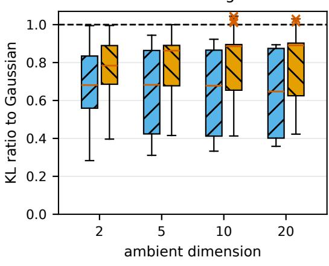

B Fixed-anchor control  
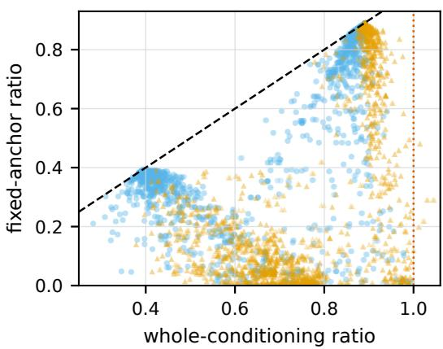  
independent covariance direction ratio above one  
Figure 5: Product-box study. Panel A finds ten covariance-direction KL ratios above one from five base geometries. The maximum is 1.0448, and no independent-direction ratio exceeds one. Every fixed-anchor control in Panel B stays below one. The study does not estimate prevalence.

## K.8 HELD-OUT COVARIANCE REPLICATION

The replication protocol was specified after the earlier study identified the coherent 16-box, balanced volume family and before drawing the new geometry and direction seeds. It uses dimensions 10 and 20, scales 0.25 and 0.5, normalized distances 0.05 and 0.15, and 64 base geometries per dimension. Each geometry is reused for the fixed scale, distance, and direction comparisons. The 128 base geometries, not the 1,024 factor rows, are independent analysis units.

Fourteen geometries exceed the Gaussian KL rate in the anchor top-covariance direction and none does so in the independently seeded direction. The exact one-sided sign test on the paired exceedance indicators has value $6 . 1 0 \times 1 0 ^ { - 5 }$ . The covariance-direction maximum exceeds the independent maximum in every geometry, with median difference 0.06629. The minimum fixed-cell Spearman correlation between anchor directional covariance and finite KL ratio is 0.9941. Direct KL and the covariance path integral agree within $1 . 7 7 \times 1 0 ^ { - 1 5 }$ . Figure 6 gives the full local diagnostic. The paired maxima are computed from the complete row file, which is included with the result summary in the supplement.

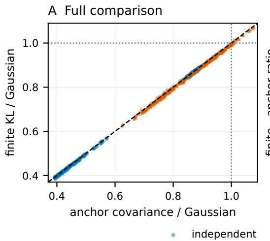

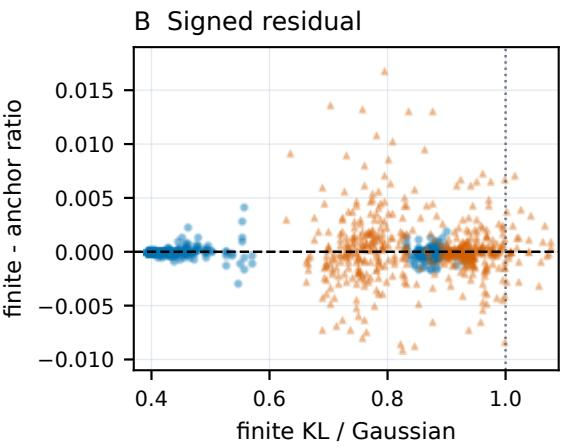  
Figure 6: Held-out covariance replication. Panel A compares anchor directional covariance and finite KL over all 1,024 factor rows. The diagonal is equality and dotted lines mark the Gaussian rate of one. Panel B shows the signed finite-minus-anchor ratio, exposing the finite-scale discrepancy hidden by the near-diagonal scatter. Twenty-seven repeated top-covariance rows from 14 base geometries exceed one. No independent row does. The 128 base geometries, not factor rows, are the independent analysis units. Direct KL and the path integral agree within $1 . 7 7 \times 1 0 ^ { - 1 5 }$

The family was selected from earlier results, so this is a targeted replication rather than a prevalence study. The top-covariance direction is an adaptive stress direction. The local covariance ratio and finite KL ratio test Proposition 4. They do not certify a uniform covariance bound or predict a label change.

## K.9 EXTERNAL PROJECTED-BAND CONFIRMATION

This study evaluates the geometry-controlled certificate in Proposition 9 on a learned image classifier. The filter was selected using CIFAR-10 training images and fixed before CIFAR-10.2 was accessed. It retains a raw noisy proposal z when

$$
0 . 0 6 2 5 \leq | \langle u , z \rangle + 0 . 1 0 7 2 1 3 0 4 8 1 | \leq 0 . 2 5 , \qquad \sigma = 0 . 2 5 .
$$

The unit vector u and its exact representation are included in the supplement. For $T = \langle u , z \rangle + b .$ retention implies $T \in [ - \beta , \beta ]$ . Popoviciu gives $\operatorname { V a r } ( T \mid R = 1 ) \stackrel {  } { \leq } \beta ^ { 2 } \leq \sigma ^ { 2 }$ . The orthogonal Gaussian coordinates are unchanged and independent of the retention event. Hence $\mathrm { C o v } ( Q _ { c } ) \stackrel { - } { \preceq } \sigma ^ { 2 } I$ for every center c. This is a global analytic premise, not an empirical covariance estimate.

The official CIFAR-10.2 test set (Lu et al., 2020) contains 2,000 images with 200 from each class. The supplement records its exact revision and file checksum. Images are evaluated in stored order. The AuditVotes source, checkpoint, and architecture are those in Appendix K.1. The supplement records the dataset checksum and contains the confirmation protocol and runner.

Each image receives four independent streams. Filtered and unfiltered label selection use 10,000 raw proposals each. Their independent estimation streams use 100,000 proposals each. Gaussian proposals are not clipped. The filter is applied before model inference and rejected proposals are not replaced. All images remain in the denominator. One Bonferroni family assigns error 0.001 across 64,000 one-sided Clopper–Pearson bounds. These cover conditional label probabilities, joint retained-label masses, the independently selected joint runner used for an upper radius bound, and the unfiltered probabilities.

Table 8: CIFAR-10.2 results by class. Retained is the mean estimation-stream fraction. F-acc and U-acc are filtered and unfiltered selected-label accuracy. KL and Joint are correct certified fractions at radius 0.2 in the original forward-KL analysis. Strong counts correct images whose forward-KL lower radius exceeds the joint-mass upper radius by at least 0.01.
<table><tr><td>Class</td><td>Retained</td><td>F-acc</td><td>U-acc</td><td>KL</td><td>Joint</td><td>Strong</td></tr><tr><td>airplane</td><td>.420</td><td>.505</td><td>.505</td><td>.280</td><td>.250</td><td>26</td></tr><tr><td>automobile</td><td>.418</td><td>.640</td><td>.640</td><td>.420</td><td>.385</td><td>35</td></tr><tr><td>bird</td><td>.437</td><td>.505</td><td>.510</td><td>.275</td><td>.210</td><td>34</td></tr><tr><td>cat</td><td>.424</td><td>.545</td><td>.540</td><td>.250</td><td>.190</td><td>44</td></tr><tr><td>deer</td><td>.432</td><td>.585</td><td>.585</td><td>.340</td><td>.275</td><td>34</td></tr><tr><td>dog</td><td>.415</td><td>.660</td><td>.655</td><td>.490</td><td>.420</td><td>34</td></tr><tr><td>frog</td><td>.437</td><td>.665</td><td>.665</td><td>.470</td><td>.410</td><td>35</td></tr><tr><td>horse</td><td>.425</td><td>.745</td><td>.740</td><td>.520</td><td>.490</td><td>32</td></tr><tr><td>ship</td><td>.437</td><td>.770</td><td>.770</td><td>.585</td><td>.535</td><td>29</td></tr><tr><td>truck</td><td>.430</td><td>.695</td><td>.690</td><td>.515</td><td>.460</td><td>26</td></tr><tr><td>all</td><td>.428</td><td>.632</td><td>.630</td><td>.415</td><td>.363</td><td>329</td></tr></table>

Filter selection and a 200-image replication used CIFAR-10 training images only. These development results do not enter the reported CIFAR-10.2 evidence. The supplement contains the development records, the final protocol, and the complete execution history.

At radius 0.2, the original forward-KL, joint-mass, and unfiltered calculations correctly certify 829/2000, 725/2000, and 948/2000 images. Forward KL certifies 104 images that joint mass does not, with none in the reverse direction. The paired exact one-sided value is $4 . 9 3 \times 1 0 ^ { - 3 2 }$ . This value is secondary evidence rather than sampling uncertainty for the finite census. Among correctly selected filtered labels, 329 have $r _ { \mathrm { c o v } , L } - r _ { \mathrm { m a s s } , U } \geq 0 . 0 1$ under the same simultaneous confidence event. This compares two certificate formulas. It is not a lower bound on a difference between true robust radii.

The mean retained fraction is 0.427570. Filtered and unfiltered selected-label accuracies are 0.6315 and 0.6300. The filtered streams make 94,064,290 model calls from 220 million proposals. The unfiltered streams make 220 million calls. The run took 26,992 seconds on one RTX 4070 Ti with PyTorch 2.2.2. The supplement contains the manifest, complete row file, and summary. Ordinary unfiltered smoothing remains stronger at radius 0.2. This finite census covers one checkpoint, noise scale, and training-selected filter, not other models, filters, or systems.

## K.10 CONDITIONAL DIVERGENCE REANALYSIS

We applied Proposition 9 to the same stored counts after the original experiment. The filter, predictions, and confidence bounds are unchanged. The finite order set is

$$
\{ 1 \} \cup \{ 1 + k / 2 0 | k = 1 , \ldots , 8 0 \} \cup \{ 6 , 8 , 1 2 , 1 6 , 3 2 , 6 4 \} .
$$

For each image, we maximize the valid radius over these orders using its original conditional lower and upper probability bounds. This choice adds no confidence events or model evaluations. The covariance premise is global, so R = ∞ and Λ = 1. This is a deterministic reanalysis, not a new independent confirmation.

Table 9 separates the effect of reversing KL from the additional improvement obtained by optimizing the Renyi order. The forward-KL radius cannot exceed´ $0 . 2 5 { \sqrt { 2 \log 2 } } = 0 . 2 9 4 3 5 \ .$ . for this covariance bound. Reverse KL removes that ceiling. At radius 0.2, Renyi certifies´ 167 correct images that joint mass does not, with none in the reverse direction. For 877 correctly selected labels, the Renyi´ lower radius exceeds the joint-mass upper radius by at least 0.01. These bounds share the original familywise error 0.001 and compare certificate formulas, not true robust radii.

Outward numerical validation. We recomputed the full-count conditional Renyi, reverse-KL,´ joint-mass, and unfiltered certificates using Arb interval arithmetic at 128-bit precision. Each binomial endpoint is accepted only after its tail inequality is proved against the exact rational error

Table 9: Correctly certified CIFAR-10.2 images out of 2,000. All filtered methods use identical counts and selected labels. The unfiltered predictor uses its separate original streams. Matched call uses a random subset of those streams with the same model-call count as the filtered methods.
<table><tr><td>Certificate</td><td> $r \geq 0 . 2$ </td><td> $r \geq 0 . 3$ </td><td> $r \geq 0 . 5$ </td></tr><tr><td>Conditional forward KL</td><td>829</td><td>0</td><td>0</td></tr><tr><td>Conditional reverse KL</td><td>888</td><td>698</td><td>329</td></tr><tr><td>Conditional Rényi</td><td>892</td><td>713</td><td>381</td></tr><tr><td>Joint mass</td><td>725</td><td>417</td><td>0</td></tr><tr><td>Unfiltered, original</td><td>948</td><td>814</td><td>529</td></tr><tr><td>Unfiltered, matched calls</td><td>945</td><td>806</td><td>522</td></tr></table>

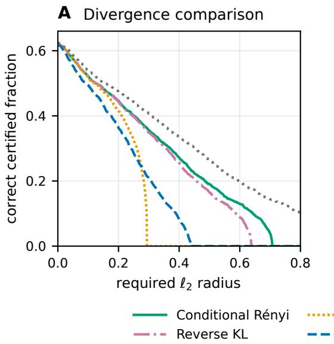

B Paired certificate bounds  
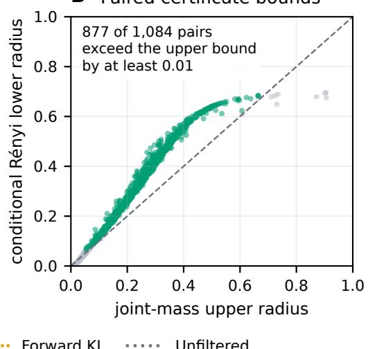  
Figure 7: Conditional divergence certificates on the retained CIFAR-10.2 counts. Panel A includes all 2,000 images and displays the forward-KL ceiling and its removal by reverse KL. Panel B shows all 1,084 correctly selected labels with finite paired bounds. Green points have a conditional Renyi ´ lower radius at least 0.01 above their joint-mass upper radius. The dashed diagonal denotes equality.

1/64,000,000. A positive-term binomial recurrence bounds its remaining terms by a geometric series. Gaussian quantiles and the finite-order divergence formulas are rounded outward. The certified counts at 0.2, 0.3, and 0.5, and all 877 separation statements, are unchanged. The largest change to a conditional probability endpoint is below $3 . 5 1 \times 1 0 ^ { - 1 2 }$ . Reporting thresholds are compared as exact rational numbers. This validates inference from the stored integer counts. It does not validate noise generation, filter evaluation, neural inference, the matched-call calculation, or the separate AuditVotes endpoint study.

Matching model calls. The filtered streams evaluate only retained proposals. To compare equal model call counts, we draw multivariate-hypergeometric subsets of each original unfiltered count vector. Each subset size equals the corresponding filtered stream’s model-call count, giving 94,064,290 calls in total. Selection and estimation subsets are drawn separately with seed 20260924. Their sizes depend on independent filtered streams, not on unfiltered labels. Thus they represent uniformly sampled subsets of the unfiltered IID proposals. We reselect labels on the smaller selection batch and use the original per-tail error $1 . 5 6 2 \bar { 5 } \times 1 0 ^ { - 8 }$ for 20,000 one-sided binomial bounds. Six selected labels change. Unfiltered smoothing still certifies more images at all three tabulated radii. This is one randomized count-level comparison, not a new network or timing run. Its confidence family is separate from the original evaluation. Its familywise error is at most 0.0003125, and the combined error is at most 0.0013125.