# TOWARDS BETTER EXPLORATION IN SEQUENTIAL TEST-TIME SCALING

Joseph Rance<sup>1,†</sup>, Fabio Pizzati<sup>2</sup>, Juil Sock<sup>3</sup>, Woody Bayliss <sup>3</sup>, Marc Górriz Blanch<sup>3</sup>, Philip Torr<sup>1</sup>, Adel Bibi<sup>1</sup>

<sup>1</sup>University of Oxford, <sup>2</sup>MBZUAI, <sup>3</sup>BBC R&D

<sup>†</sup>joseph.rance@eng.ox.ac.uk

## ABSTRACT

Test-time scaling improves language model reasoning by spending additional compute at inference. However, both classes of existing methods often fail to continue improving over long timescales. Parallel methods repeatedly sample independent answers from the model, scaling poorly on problems the model is unlikely to solve in a single attempt. In contrast, sequential methods build on previous answers to access new ideas, yet so far have not been shown to reach answers beyond those found by parallel scaling. First, we show that sequential scaling often stops improving because it becomes prematurely trapped in an attractor: a set of answers that prevents exploration of different answers once entered. Across 27 combinations of scaling methods, models, and benchmarks, we find that 53.8% of sequential scaling trajectories enter an attractor within four iterations. Second, we show that a simple model-mixing intervention helps escape attractors. This reduces the attractor hit rate by 21.2 percentage points on average, expands solution coverage beyond a compute-matched parallel baseline, and improves accuracy of recursive self-aggregation by at least 2.2 percentage points. Our results motivate refocusing long-horizon test-time scaling from parallel methods to sequential methods that improve previous answers.<sup>1</sup>

## 1 INTRODUCTION

Test-time scaling has been shown to improve language model reasoning by using additional compute at test-time (Wu et al., 2025; Snell et al., 2024). A widely used class of test-time scaling methods generates many independent answers to the given problem, and uses a heuristic to select the best (Zhang et al., 2025c; Wang et al., 2023). However, these parallel scaling methods scale poorly over long timespans: if they do not find a correct answer in the first few attempts, such an answer is unlikely to be accessible to the base model, leading to little improvement with increased scaling (Brown et al., 2024). Building methods to trade large amounts of compute for even a small improvement in reasoning capabilities would benefit high-value tasks such as developing large software systems (Jimenez et al., 2024) or scientific research (Gottweis et al., 2026; Novikov et al., 2025).

A natural solution is to let the model iteratively refine its previous answers (Zhang et al., 2025c; Madaan et al., 2023). These sequential scaling methods may be able to build on earlier answers to reach lines of reasoning that the model is unlikely to generate in an independent attempt. Yet there is so far little evidence of existing sequential scaling methods solving problems that parallel scaling could not (Huang et al., 2024). In this paper, we explain why existing sequential scaling methods fail to improve beyond parallel scaling, and show that a simple intervention lets them reach answers that were not accessible through parallel scaling.

Specifically, we propose that a common failure mode of sequential scaling is premature convergence to an attractor: a set of answers that, once reached, the scaling method is unlikely to move away from. When stuck in an attractor, further scaling provides little benefit because it is prevented from exploring new answers. This behaviour can be useful for sequential scaling because we want states that contain correct answers to be attractors. However, we hypothesise, as the blue line in Figure 1 (left) illustrates, that sequential scaling methods prematurely converge to attractors before finding a correct answer, preventing further iterations from improving towards a correct answer. We test this hypothesis across 27 combinations of diverse sequential scaling methods, models, and reasoningfocused benchmarks, finding that an average of 53.8% of trajectories get stuck in an attractor within the first four iterations (mean of Table 2).

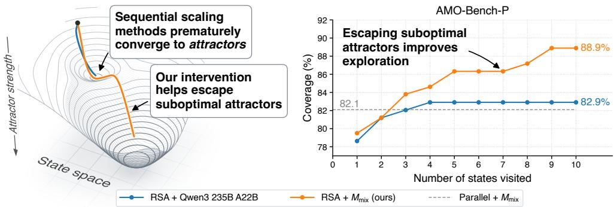  
Figure 1: Escaping locally optimal attractors allows test-time scaling to improve for longer. Left: Schematic illustration of two sequential scaling trajectories through the state space, with minimum points as attractors. Both trajectories initially reach an attractor; the baseline (blue throughout this paper) remains trapped, while our intervention (orange throughout this paper) escapes and continues exploring. Right: Coverage (problems solved at any point during scaling) on AMO-Bench-P, over time. Our method continues improving after the baseline saturates by mixing Qwen3 235B A22B Thinking 2507 with GPT OSS 120B.

As a simple intervention to demonstrate the potential of sequential scaling, we propose repeatedly switching the underlying language model to escape these attractors. Our intuition is that an attractor for one model may not be an attractor for another, allowing the second model to explore new ideas when the first hits an attractor. For example, the orange line in Figure 1 (left) initially enters the same suboptimal attractor as the blue trajectory, but switching models allows it to escape and continue towards the correct answer. Figure 1 (right) shows that this improves sequential scaling to reach answers not found by parallel scaling.

In short, the primary takeaway of this paper is to demonstrate the potential of sequential scaling, which motivates refocusing long-horizon test-time scaling from parallel methods (a search process under a fixed model policy) to sequential methods that improve on previous answers (a learning process where the model iteratively builds on its ideas to improve its search). Our contributions are the following:

1. We introduce a general formulation for test-time scaling methods, and the notion of attractors within this formulation.

2. We show that existing sequential scaling methods prematurely converge to attractors: across 27 scaling-method–model–benchmark combinations, 53.8% of trajectories enter an attractor within the first four states, limiting further gains in the number of problems solved.

3. We show that a simple model-mixing intervention lets existing sequential scaling methods escape these attractors, access 3.3 percentage points more correct answers than parallel scaling, and improve benchmark performance by 2.2 percentage points.

## 2 RELATED WORK

## 2.1 PARALLEL SCALING

Test-time scaling is often categorised into parallel methods and sequential methods (Zhang et al., 2025c). Parallel scaling methods have been shown to be a compute-efficient option for improving language model output quality (Wu et al., 2025). These methods sample N independent answers from the model, and then try to select the best. The idea is to improve the probability that the model produces a good answer by considering more than one high-probability answer. For example, Wang et al. (2023) return the most common final answer out of N. Other parallel scaling methods use more advanced approaches to select between the N answers (Lightman et al., 2024; Brown et al., 2024), or generate higher quality and more diverse answers (Jiang et al., 2023; Yao et al., 2023).

However, for problems that the base model is not already likely to solve,<sup>2</sup> parallel methods must scale up an expensive search procedure to obtain at least one correct answer out of N. Consequently, once the ‘easy’ problems are exhausted, each new problem solved often requires exponentially more test time compute (Brown et al., 2024; Wang et al., 2025b; Yue et al., 2025), leading to a performance plateau under practical budgets. For test-time scaling methods to continue to improve, they must devote additional compute to individual answers.

## 2.2 SEQUENTIAL SCALING

Sequential scaling allocates additional test-time compute to a single reasoning chain by generating new answers conditioned on previous answers. Each new answer aims to build on the ‘understanding encoded in the previous, potentially shifting the answer distribution away from that of parallel scaling. For example, self-refine (Madaan et al., 2023) starts with one answer, and then generates each new one using the previous answer and a language-model-generated critique of that answer as context. There are many approaches to stimulate the generation of new answers (Shinn et al., 2023; Yan et al., 2026; Snell et al., 2024), which are often combined with parallel scaling to form hybrid scaling (Liang et al., 2024; Zhou et al., 2026). An example of the latter is recursive self-aggregation (Venkatraman et al., 2025), which iterates on a state of N answers, where each answer is conditioned on K random answers from the previous state, and the output is selected from the last state.

However, none of these works demonstrate that sequential scaling with off-the-shelf models generates answers that are better than those generated by parallel scaling. In fact, existing evidence points in the opposite direction: Huang et al. (2024) show that sequential scaling often fails to produce any benefit (see also Kamoi et al., 2024; Stechly et al., 2025; Wang et al., 2025b; Zeng et al., 2025; Choi et al., 2025; Mang et al., 2026).

Previous work such as that of Liang et al. (2024) has observed that specific instances of test-time scaling may fail due to repeating the same answers rather than exploring. There are other works that similarly observe attractors in specific cases (Ko & Geiping, 2026; Chen et al., 2026b; Gurkan et al., 2026; Wang et al., 2025d; Tacheny, 2025; Awadhiya, 2026; Wu et al., 2026b; Huang et al., 2026; Fein-Ashley & Rashidinejad, 2026). In contrast, we claim that attractors are a common failure mode across the general class of sequential scaling methods.

## 2.3 MIXTURES OF MODELS

Prior work has studied whether mixing different language models within sequential scaling improves performance, with mixed results. Several works report that mixing models improves performance for specific methods: Zhang et al. (2025b), Chen et al. (2024), and Yang et al. (2026b) demonstrate gains in multi-agent debate, while Wang et al. (2025c) and Yang et al. (2026a) report improvements for other hybrid approaches. Meanwhile, Wang et al. (2025a) find that mixing models often underperforms the strongest constituent model, with similar negative results reported by Li et al. (2024). While these works compare overall performance relative to specific sequential scaling methods, we focus on whether our model-mixing intervention, when applied to a range of existing sequential methods, escapes attractors and increases exploration beyond that achieved through parallel scaling.

## 3 A GENERAL FORMULATION OF TEST-TIME SCALING

In this section, we unify test-time scaling methods under a general formulation that allows us to reason about their shared properties through the lens of a dynamical system. We focus on test-time scaling methods that operate entirely through natural language using off-the-shelf models without task-specific feedback (further discussed in Appendix A).

Given a question X and language model M, we aim to generate an answer Y . For any prompt text p, we can sample responses from the model’s output distribution $M ( p )$ . We define a test-time scaling method to consist of three functions $\left( f _ { s } , f _ { r } , f _ { o } \right)$ , which maintain a state $S _ { ; }$ , and return an answer $Y _ { T }$ after T states.

Table 1: How different test-time scaling methods fit into our general formulation.
<table><tr><td>Method</td><td>Structure</td><td>Start fs</td><td></td><td>Transition  $f _ { r }$ </td><td>Output  $f _ { o }$ </td></tr><tr><td>Direct prompt no scaling</td><td></td><td>YT</td><td> $S _ { 1 } ^ { 1 } \sim M ( X )$ </td><td></td><td> $Y _ { t } = S _ { t } ^ { 1 }$ </td></tr><tr><td>Self-consistency (Wang et al., 2023) parallel</td><td>majority vote</td><td>YT</td><td>Si ~ M(X)</td><td></td><td> $Y _ { t } = \mathrm { M a j V o t e } ( S _ { t } )$ </td></tr><tr><td>Reasoning Cache (Wu et al., 2026a) sequential</td><td></td><td>answer</td><td> $\begin{array} { l } { S _ { 1 } ^ { 1 } \sim M ( X ) } \\ { S _ { 1 } ^ { 2 } = \emptyset } \end{array}$ </td><td> $S _ { t + 1 } ^ { 2 } \sim M ( ^ { \cdot } \mathrm { S u m m a r i s e } \ S _ { t } \ \mathrm { f o r } \ X ^ { \cdot } )$   $S _ { t + 1 } ^ { 1 ^ { \prime } } \sim M ( ^ { \cdot } \mathrm { A n s w e r } \ X \ \mathrm { g i v e n } \ S _ { t + 1 } ^ { 2 } ) $ </td><td> $Y _ { t } = S _ { t } ^ { 1 }$ </td></tr><tr><td>Self-Refine (Madaan et al., 2023) sequential</td><td>critique then revise</td><td>S3 YT</td><td> $S _ { 1 } ^ { 1 } \sim M ( X )$ </td><td> $C \sim M ( \mathrm { ` C r i t i q u e  } \ S _ { t }$  for X&#x27;) for X using C’)  $S _ { t + 1 } ^ { 1 } \sim M ( ^ { \cdot } \mathrm { R e v i s e } \ S _ { t }$ </td><td> $Y _ { t } = S _ { t } ^ { 1 }$ </td></tr><tr><td>Recursive Self- Aggregation (Venkatraman et al., 2025) hybrid</td><td>aggregate K s2</td><td>rand. j YT</td><td> $S _ { 1 } ^ { i } \sim M ( X )$ </td><td> $J \sim \mathcal { U } \big ( \{ I \subseteq [ N ] : | I | = K \} \big )$   $A _ { t } ^ { i } = \{ S _ { t } ^ { j } \} _ { j \in J }$   $S _ { t + 1 } ^ { i } \sim M ( ^ { \cdot } \mathrm { A n s w e r } \ X \ \mathrm { g i v e n } \ A _ { t } ^ { i , \cdot } )$ </td><td> $Y _ { t } = S _ { t } ^ { i } , i \sim \mathcal { U } ( [ N ] )$ </td></tr></table>

(1) Initial state generator. $f _ { s }$ generates the first state $S _ { 1 }$ from X. We define a state $S _ { t }$ to be a length-N vector of complete responses generated from the language model: $S _ { t } = ( S _ { t } ^ { 1 } , S _ { t } ^ { 2 } , \ldots , S _ { t } ^ { N } )$ , where $S _ { t } ^ { i } \sim M ( . . . )$ . For example, a sequential method that iterates on only the most recent answer would have $N = 1$ , with $S _ { t } ^ { 1 }$ being the answer at timestep t.

$$
S _ { 1 } \sim f _ { s } ( X , M )\tag{1}
$$

(2) Next-state transition. $f _ { r }$ generates $S _ { t + 1 }$ from $S _ { t }$ . We iteratively apply $f _ { r }$ for $T - 1$ iterations, until we have $S _ { T }$ . For example, in self-refine (Madaan et al., 2023), each application of $f _ { r }$ first generates a critique of the current state $C \sim M$ (‘Critique $S _ { t }$ for X’), and then conditions the next state on this critique, $S _ { t + 1 } ^ { 1 } \sim M ($ (‘Revise $S _ { t }$ for X using $C ^ { \bullet } )$

$$
S _ { t + 1 } \sim f _ { r } ( S _ { t } ; X , M )\tag{2}
$$

(3) Output function. A state $S _ { t }$ cannot be returned on its own, because it does not necessarily contain a single answer. Instead, we define $f _ { o }$ to map from states to answers. For example, in recursive selfaggregation, we first sample $i \sim \mathcal { U } ( [ N ] )$ , and then return $Y _ { t } = S _ { t } ^ { i }$

$$
Y _ { t } \sim f _ { o } ( S _ { t } ; X , M )\tag{3}
$$

A trajectory is a sequence of sampled states $( S _ { 1 } , S _ { 2 } , \ldots , S _ { T } )$ . The goal is to build a test-time scaling method where each answer $Y _ { t }$ is more likely to be correct than the previous answer $Y _ { t - 1 }$ , so that we can use extra compute to get a better answer. Table 1 shows how different test-time scaling methods discussed in Section 2 fit into the proposed formulation. For example, on the third row, reasoning cache (Wu et al., 2026a) uses $f _ { s }$ to initialise an answer $S _ { 1 } ^ { 1 }$ and an empty summary $S _ { 1 } ^ { 2 } , f _ { r }$ to generate a new summary based on the previous state and a new answer conditioned on this summary, and $f _ { o }$ to return the current answer.

## 4 WHY SEQUENTIAL SCALING FAILS

We now study why sequential scaling methods fail to outperform parallel methods, using our formulation of sequential scaling methods as a dynamical system. In Section 4.1, we present our hypothesis: sequential scaling is often prevented from making further progress because it gets stuck in a suboptimal attractor. We test this hypothesis in Section 4.2.

## 4.1 HYPOTHESIS: SEQUENTIAL SCALING GETS STUCK IN SUBOPTIMAL ATTRACTORS

Our hypothesis stems from the observation that some sets of states generated during sequential scaling represent attractors: sets that, once reached, the scaling method is unlikely to move away from (e.g. a set A where if $S _ { t } \in A$ then $S _ { t + 1 } \in A )$ . We hypothesise that a common failure mode in sequential scaling comes from getting stuck, within the first few states of a trajectory, at an attractor that does not contain a correct answer, preventing further exploration. Such attractors could arise if the language model M is biased towards reusing the reasoning in previous answers included in its prompt (Nehring et al., 2024; Ali et al., 2026; Holtzman et al., 2020), stopping us from escaping a local optimum. In the next section (4.2), we test this hypothesis, identifying attractors using Definition 4.1.

```latex
DEFINITION 4.1 (ATTRACTOR). For $0 < \epsilon _ { 0 } , \epsilon _ { 1 } < 1$ , a non-empty set of states A is an
attractor iff
i for any $\begin{array} { r } { s \in A , \sum _ { { s ^ { \prime } } \notin A } P ( S _ { i + 1 } = s ^ { \prime } | S _ { i } = s ) < \epsilon _ { 0 } ; } \end{array}$ The next state is unlikely to fall
outside the attractor.
ii there is a set $B ( A )$ where $A \subset B ( A )$ , and, for all $s \in$ States in the basin of attraction
$B ( A )$ and some $k > 0$ $P ( S _ { i + k } \in \dot { A } | \dot { S } _ { i } = s ) > 1 - \epsilon _ { 1 } ;$ transition into the attractor.
iii no $A ^ { \prime } \subset A$ is an attractor. Only accept minimal attractors.
```

## 4.2 EVIDENCE THAT SEQUENTIAL SCALING GETS STUCK IN SUBOPTIMAL ATTRACTORS

We now provide empirical evidence for the hypothesis in Section 4.1, across 27 combinations of sequential scaling methods, language models, and reasoning-focused benchmarks.

Experimental setup. We focus our experiments on benchmarks that involve maths and games, where success depends on reasoning rather than extensive domain knowledge: (1) IMO-AnswerBench (IMO): 400 questions from mathematical olympiad competitions (Luong et al., 2025); (2) AMO-Bench-P (AMO): 39 maths questions that are less saturated than those of IMO-AnswerBench (An et al., 2025); (3) Reasoning Gym Games (RGG): 100 questions that require reasoning about games such as chess, generated by Venkatraman et al. (2025) from the Reasoning Gym benchmark (Stojanovski et al., 2025). In all three benchmarks, the test-time scaling method receives a question X as text. Its output Y should include a final answer, such as a single number or mathematical expression. This final answer is checked for equivalence against the golden answer.

We test the three sequential scaling methods described in Table 1: (1) Reasoning cache (Wu et al., 2026a), as a simple configuration for chain-of-thought with compaction (we do not fine-tune, unlike Wu et al. (2026a)); (2) Self-refine (Madaan et al., 2023), as a critique-based approach; (3) Recursive self-aggregation (RSA) (Venkatraman et al., 2025) as a hybrid approach with strong empirical results. Compaction and critique cover the most popular works on pure sequential scaling (Zhang et al., 2025c), while RSA tests whether the same dynamics persist when combined with parallel scaling.

In our experiments, we generate T = 60 states per trajectory for reasoning cache and self-refine, and $T = 5$ for RSA. We use N = 12 answers per state in RSA, and $N = 6 0$ answers for our parallel baselines, so that all methods are matched in their total number of attempts to solve the problem. In Figures 1, 5 and 13, these T values are doubled, to demonstrate capabilities over long timescales. We test each method with each of the models: GPT OSS 120B (medium reasoning effort) (OpenAI, 2025), Gemma 3 12B IT (Gemma Team, 2025), Granite 4.1 8B (Granite Team, 2026). We select these models to cover a diverse set of model families and capabilities, while providing a fair comparison with our results in Section 5.

We identify attractors by grouping semantically similar states using their text embeddings, and then applying Definition 4.1 to the Markov chain over the resulting groups (Prinz et al., 2011). Appendix B further details our scaling methods, models, and benchmarks, how we assign grades and attractors, and our validation of the resulting attractors.

Finding 1: Sequential scaling gets stuck in attractors after visiting a small number of states. Table 2 (left) shows the proportion of trajectories where at least one of the first four states is identified as in an attractor (i.e. hit an attractor by $S _ { 4 } )$ . 23.3–88.7% of trajectories enter an attractor within the first four states, halting exploration to other states. This attractor effect is clearest for RSA, which we attribute to including more answers in each state, increasing the number of opportunities to find an attractor quickly.

Table 2: Left columns: Probability that each scaling method hits an attractor within the first 4 states. Higher values mean the scaling-method–model combination is more likely to get stuck early on. Right columns: Probability that, if two trajectories – using the same scaling method, model, and question – both terminate in attractors, then exactly one of the attractors contains only incorrect answers, making it a suboptimal attractor.
<table><tr><td rowspan="2">Method</td><td rowspan="2">Model</td><td colspan="3">Attractor hit by  $S _ { 4 } \left( \% \right) \downarrow$ </td><td colspan="3">Different correctness (%) ↓</td></tr><tr><td>IMO</td><td>AMO</td><td>RGG</td><td>IMO</td><td>AMO</td><td>RGG</td></tr><tr><td rowspan="3">Reasoning Cache</td><td>GPT OSS 120B</td><td>50.1</td><td>39.3</td><td>23.3</td><td>15.1</td><td>21.0</td><td>9.5</td></tr><tr><td>Gemma 3 12B IT</td><td>48.0</td><td>37.6</td><td>23.7</td><td>17.1</td><td>19.4</td><td>20.4</td></tr><tr><td>Granite 4.1 8B</td><td>73.2</td><td>62.4</td><td>35.3</td><td>22.2</td><td>20.1</td><td>27.4</td></tr><tr><td rowspan="3">Self-Refine</td><td>GPT OSS 120B</td><td>57.1</td><td>37.6</td><td>27.0</td><td>15.5</td><td>14.3</td><td>10.5</td></tr><tr><td>Gemma 3 12B IT</td><td>48.0</td><td>33.3</td><td>33.3</td><td>16.7</td><td>17.4</td><td>10.3</td></tr><tr><td>Granite 4.1 8B</td><td>71.4</td><td>60.7</td><td>37.7</td><td>28.1</td><td>27.9</td><td>15.5</td></tr><tr><td rowspan="3">Recursive Self-Aggregation</td><td>GPT OSS 120B</td><td>88.7</td><td>72.6</td><td>81.0</td><td>12.7</td><td>9.8</td><td>12.7</td></tr><tr><td>Gemma 3 12B IT</td><td>60.7</td><td>61.5</td><td>77.3</td><td>5.1</td><td>7.3</td><td>7.3</td></tr><tr><td>Granite 4.1 8B</td><td>69.3</td><td>60.7</td><td>81.3</td><td>10.9</td><td>10.5</td><td>11.3</td></tr></table>

Finding 2: The attractors sequential scaling gets stuck in can be suboptimal. Getting stuck in an attractor is only harmful if the attractor contains only incorrect answers, and a correct answer could have otherwise been found. To measure how often this occurs, Table 2 (right) shows the probability that, if two trajectories – using the same scaling method, model, and question – both terminate in attractors, then exactly one of the attractors contains only incorrect answers. On average, 15.4% of these trajectory pairs differ in correctness, implying that at least $1 5 . 4 / 2 = 7 . 7 \%$ of attractors must be suboptimal (i.e. incorrect even though we have evidence – from the other attractor in the pair – that the model could reach a correct answer). If we could escape these attractors, we could therefore improve accuracy by at least 7.7 percentage points. In Appendix C, we show the presence of even more (potentially-suboptimal) attractors.

Summary.

i The sequential scaling methods tested converge to suboptimal attractors;

ii They get stuck at these attractors rather than exploring;

iii This constrains answer correctness to that of the suboptimal attractor.

## 5 IMPROVED EXPLORATION BY ESCAPING SUBOPTIMAL ATTRACTORS

We now present a simple model-mixing intervention to help sequential scaling methods escape attractors, with the aim of letting these methods solve problems that are not solved by parallel methods.

## 5.1 HYPOTHESIS: SEQUENTIAL SCALING CAN ESCAPE ATTRACTORS BY MIXING MODELS

We propose to reduce the bias towards getting prematurely stuck in attractors by repeatedly switching the model M used by our sequential scaling methods. If at least one model does not share a given attractor, switching to that model can allow the scaling method to escape it (example in Figure 2). Furthermore, attractors that contain only incorrect answers may be shared less often because they reflect model-specific biases, whereas correct attractors may be shared more widely because they correspond to solutions intrinsic to the problem. We therefore hypothesise that randomly switching M will help eliminate incorrect attractors while retaining correct ones. This would allow sequential scaling to explore answers beyond the initial basins of attraction of the individual models.

Specifically, we propose an upgrade to any sequential scaling method that replaces the model M with a new model $\bar { M } _ { \mathrm { m i x } }$ , which returns the response of a model selected at random from a pool of candidate models $\left\{ M _ { 1 } , M _ { 2 } , \ldots M _ { n } \right\}$ . In other words, for each sample $Z \sim M _ { \mathrm { m i x } }$ , we select $j \sim \operatorname { U n i f o r m } ( \{ 1 , . . . , n \} )$ ), and then return $Z \sim M _ { j } ( p )$ . Using $M _ { \mathrm { m i x } }$ changes the models used but does not change the total number of model calls.

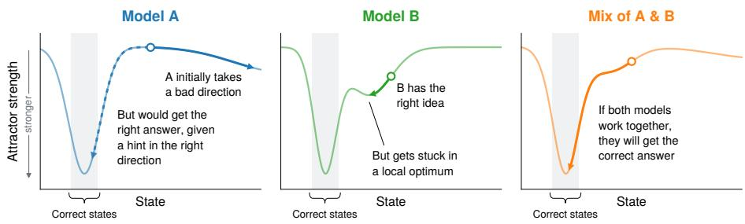  
Figure 2: Illustration of how mixing models can help escape suboptimal attractors. Y axis represents attractor strength (i.e. attractors that satisfy Definition 4.1 for lower values of $\epsilon _ { 0 }$ and $\epsilon _ { 1 }$ are stronger).

Table 3: Comparison of attractor behaviour between scaling methods using $M _ { \mathrm { m i x } }$ and methods using only GPT OSS 120B, for the same experiments as in Table 2. Left columns: Probability that the scaling method hits an attractor within the first 4 states for a single trajectory. Right columns: Probability that, if two trajectories – using the same scaling method, model, and question – both terminate in attractors, then exactly one of the attractors contains only incorrect answers, making it a suboptimal attractor.
<table><tr><td rowspan="2">Method</td><td rowspan="2">Model</td><td colspan="3">Attractor hit by  $S _ { 4 } \left( \% \right) \downarrow$ </td><td colspan="3">Different correctness (%) ↓</td></tr><tr><td>IMO</td><td>AMO</td><td>RGG</td><td>IMO</td><td>AMO</td><td>RGG</td></tr><tr><td rowspan="2">Reasoning Cache</td><td>GPT</td><td>50.1</td><td>39.3</td><td>23.3</td><td>15.1</td><td>21.0</td><td>9.5</td></tr><tr><td> $M _ { \mathrm { m i x } } \ : ( \mathrm { o u r s } )$ </td><td>30.3</td><td>11.1</td><td>12.7</td><td>15.1</td><td>14.3</td><td>10.5</td></tr><tr><td rowspan="2">Self-Refine</td><td>GPT</td><td>57.1</td><td>37.6</td><td>27.0</td><td>15.5</td><td>14.3</td><td>10.5</td></tr><tr><td> $M _ { \mathrm { m i x } }$  (ours)</td><td>33.4</td><td>11.1</td><td>18.7</td><td>8.8</td><td>20.4</td><td>6.7</td></tr><tr><td>Recursive</td><td>GPT</td><td>88.7</td><td>72.6</td><td>81.0</td><td>12.7</td><td>9.8</td><td>12.7</td></tr><tr><td>Self-Aggregation</td><td> $M _ { \mathrm { m i x } }$  (ours)</td><td>67.7</td><td>51.3</td><td>49.7</td><td>4.7</td><td>6.3</td><td>3.3</td></tr></table>

## 5.2 EVIDENCE THAT MODEL MIXING ENABLES ATTRACTOR ESCAPE

We now show that mixing models makes sequential scaling less likely to get stuck in attractors early on, and more likely to converge to the same attractor across multiple trajectories. We then show that this allows each sequential scaling method to continue to find new answers for longer.

We repeat the experimental setup in Section 4.2, implementing $M _ { \mathrm { m i x } }$ on top of the existing test-time scaling baselines. $M _ { \mathrm { m i x } }$ selects uniformly from {GPT OSS 120B, Gemma 3 12B IT, Granite 4.1 8B}. GPT OSS 120B is the primary model (the one with the strongest reasoning capability), while the two non-primary models – Gemma 3 12B IT and Granite 4.1 8B – are weaker, to help escape attractors without individually contributing many complete solutions. Appendix B provides further information about our experimental setup.

Finding 3: Scaling methods with $M _ { \mathrm { m i x } }$ are less likely to get stuck in suboptimal attractors. Table 3 (left) shows that the sequential methods using $M _ { \mathrm { m i x } }$ are less likely to hit attractors within the first four states than the baseline GPT OSS 120B model. This allows them to more often perform additional steps of sequential scaling before progress is halted by an attractor. We demonstrate that these extra steps contribute useful progress in Finding 4. Table 3 (right) shows that sequential scaling using $M _ { \mathrm { m i x } }$ is less likely to find attractors that we can identify as suboptimal.

Finding 4: Sequential methods using $M _ { \mathbf { m i x } }$ solve more problems than parallel methods. To show that a sequential scaling method explores answers that parallel scaling does not, we show that sequential scaling achieves higher coverage (the percentage of problems for which we have generated a correct answer at any stage of scaling) (Brown et al., 2024). The grey lines in Figure 3 show the mean coverage for 60 parallel answers from $M _ { \mathrm { m i x } }$ (i.e. each attempt is conditioned only on the question, such as in self-consistency (Wang et al., 2023)). While sequential scaling with only the primary model (blue line) could not consistently outperform parallel scaling, sequential scaling using $M _ { \mathrm { m i x } }$ (orange line) continues to solve new problems for longer, surpassing both baselines in almost every case. Appendix D shows an example of a solution found by only our intervention. We also find that the problems solved by using $M _ { \mathrm { m i x } }$ are close to supersets of those from using just the primary model (Appendix E). We find similar effects on coverage when comparing to a wide range of baselines, including increasing temperature as an alternative method for improving diversity, and compute-matching by cost rather than number of states (Appendices F-H).

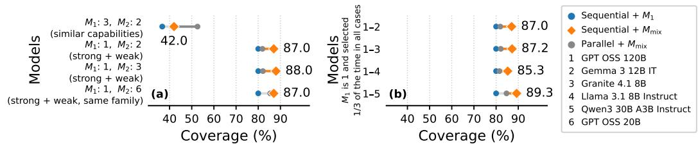

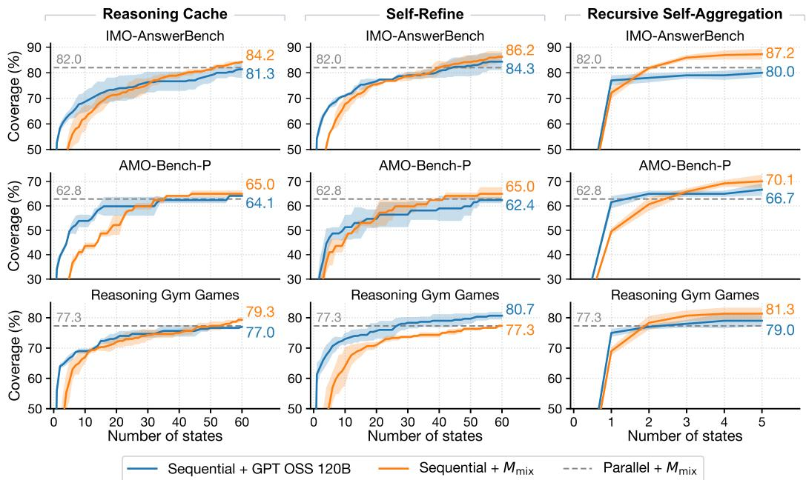  
Figure 3: Coverage over time of different sequential methods using $M _ { \mathrm { m i x } }$ across three benchmarks. $M _ { \mathrm { m i x } }$ (orange) outperforms both the sequential baseline that uses GPT OSS 120B (blue), and the parallel baseline (grey) in almost every case.  
Figure 4: Coverage for alternative model mixtures for RSA on IMO-AnswerBench. Left: Results for different combinations of models, to identify whether some models are better at escaping attractors than others. Right: Results for different numbers of non-primary models where the primary model is always selected with probability $^ { 1 / 3 , }$ to test whether adding more models provides meaningfully more opportunities for one model being able to escape attractors.

Finding 5: Model mixing is effective across different combinations of models. Figure 4 shows that sequential methods using $M _ { \mathrm { m i x } }$ achieve better coverage than those using a single strong model across different candidate model pools (additional omitted experiments are in Appendix I). The improvements are weakest using models from the same family (GPT OSS 20B and 120B), or of similar capabilities (Gemma 3 12B IT and Granite 4.1 8B), while all other configurations produce relatively uniform improvements. We further show that our results transfer to larger models by testing the same configuration with Qwen3 235B A22B Thinking 2507 (Qwen Team, 2025) and GPT OSS 120B (both medium reasoning effort), where Qwen is selected with probability 0.75.

Finding 6: Model mixing is most effective when the primary model is used most often. We now test how the probability of selecting the primary model (the model with the strongest reasoning capability) changes the performance. Let us assume $M _ { \mathrm { m i x } }$ selects from a set of three models $\{ \bar { M } _ { 1 } , \bar { M } _ { 2 } , \bar { M _ { 3 } } \}$ with $M _ { 1 }$ being the primary model. We parametrise $M _ { \mathrm { m i x } }$ by $c \in [ 0 , 1 ]$ so that we sample these three models with probabilities $\begin{array} { r } { \frac { 1 } { 3 } \times \left[ 1 + 2 c , \dot { 1 } - c , 1 - c \right] ( 0 \leq \dot { c } \leq 1 ) } \end{array}$ respectively. For example, $c = 0$ would yield uniform sampling, and $c = 1$ would yield sampling only $M _ { 1 }$ (i.e. no model mixing). Figure 5 (left) shows that the best exploration comes from $c = 0 . 7 5$ . This may be because non-primary models are useful in order to escape attractors, but sampling them any more than the minimum just slows progress by overusing weak models. Conversely, Figure 5 (centre) shows that the default RSA setup with just the primary model is the best at retaining correct answers. This also achieves the highest final accuracy (probability of $Y _ { T }$ being correct).

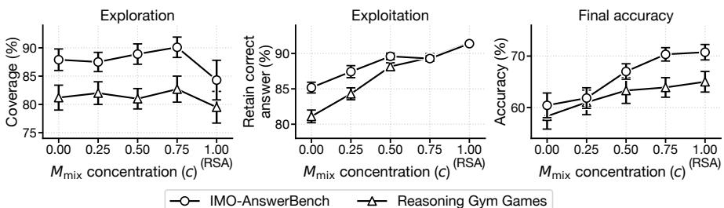  
Figure 5: Effect of mixture concentration c on RSA with $M _ { \mathrm { m i x } }$ over 10 states. Left: Coverage is maximised by occasionally sampling weaker models. Centre: Probability of generating a correct answer when there was one in the previous state improves as sampling concentrates on the primary model. Right: Using a single model outperforms mixtures of models overall.

Finding 7: Mixing models can improve final accuracy. Figure 5 shows that simple mixtures can provide strong exploration, but fail to improve over using single models because they are also more likely to escape correct answers. This could be true even given our hypothesis that correct answers are more likely to remain as attractors for the mixture. To help demonstrate that mixing models can also improve overall performance, Appendix J presents a simple annealing method for balancing increased exploration from model mixing with stronger correct-answer exploitation from using just the primary model. Our annealed model sampling method improves accuracy for RSA over using just GPT OSS 120B, by 2.2 percentage points on IMO-AnswerBench, and 2.3 points on Reasoning Gym Games, and at a lower cost.

Summary.

i Mixing models makes sequential scaling less likely to get prematurely stuck in attractors;

ii This allows sequential scaling to access problems that parallel scaling does not;

iii These findings show the potential of sequential scaling methods over long timescales.

## 6 CONCLUSION

In this work, we show that, across 27 combinations of sequential scaling methods, models, and benchmarks, sequential scaling often fails to explore because it becomes trapped in suboptimal attractors, but that a simple model-mixing intervention helps escape these attractors and access solutions beyond parallel scaling.

We highlight two main limitations in our experiments due to cost constraints. First, we test a limited range of configurations. For example, further investigation is necessary to confirm for which tasks attractors do not appear (see Appendix K). Second, we do not extend our investigation to frontier models.

Our results motivate refocusing long-horizon test-time scaling from parallel methods (a search process under a fixed model policy) to sequential methods that improve on previous answers (a learning process where the model iteratively builds on its ideas to improve its search). Future work could investigate whether better attractors can be found by doing sequential scaling with alternative state representations (Dehghani et al., 2019; Phan et al., 2025), or optimising components of sequential scaling methods (Zhou et al., 2026; Agrawal et al., 2026; Qu et al., 2024) against the coverage metric.

## REPRODUCIBILITY STATEMENT

Appendix B provides all the details required to reproduce our results, including the experimental setup, prompts, model configurations, and evaluation procedures. A link to the code we use to run our experiments is included at the end of the abstract.

## AI USE STATEMENT

Outside of the models studied in our experiments, language models were used in the following ways in the writing of this paper:

• To help search for relevant prior work, for example based on a short explanation of the paper.

• To help improve efficiency of experiments, for example by adding parallelism to the code. All of our experiments were initially written by hand, and the changes made by language models did not change the underlying operations performed in the experiments.

• To make existing figures more aesthetically pleasing, for example to change the colours.

• To help critique and improve on individual sentences of this paper, without generating full paragraphs at once.

• Language models were not used for research ideation.

We take responsibility for the final content of this work.

## REFERENCES

Lakshya A Agrawal, Shangyin Tan, Dilara Soylu, Noah Ziems, Rishi Khare, Krista Opsahl-Ong, Arnav Singhvi, Herumb Shandilya, Michael J Ryan, Meng Jiang, et al. GEPA: Reflective prompt evolution can outperform reinforcement learning. In International Conference on Learning Representations, volume 2026, pp. 8479–8565, 2026. 9

Ameen Ali, Lior Wolf, and Ivan Titov. Mitigating copy bias in in-context learning through neuron pruning. In Findings of the Association for Computational Linguistics: EACL 2026, pp. 230–251, 2026. 5

Shengnan An, Xunliang Cai, Xuezhi Cao, Xiaoyu Li, Yehao Lin, Junlin Liu, Xinxuan Lv, Dan Ma, Xuanlin Wang, Ziwen Wang, and Shuang Zhou. AMO-Bench: Large language models still struggle in high school math competitions, 2025. URL https://arxiv.org/abs/2510.26768. 5, 15, 17

Kanishk Awadhiya. Reasoning as attractor dynamics: Latent memory retrieval via Gibbs-weighted energy minimization. arXiv preprint arXiv:2606.24543, 2026. 3

Bradley Brown, Jordan Juravsky, Ryan Ehrlich, Ronald Clark, Quoc V Le, Christopher Ré, and Azalia Mirhoseini. Large language monkeys: Scaling inference compute with repeated sampling. arXiv preprint arXiv:2407.21787, 2024. 1, 2, 3, 7

Justin Chen, Swarnadeep Saha, and Mohit Bansal. ReConcile: Round-table conference improves reasoning via consensus among diverse LLMs. In Proceedings of the 62nd Annual Meeting of the Association for Computational Linguistics (Volume 1: Long Papers), pp. 7066–7085, 2024. 3

Mingguang Chen, Licheng Wang, and Bo Qu. Recursive self-improvement in AI: From bounded self-refinement to autonomous research loops. arXiv preprint arXiv:2607.07663, 2026a. 3

Nuo Chen, Yicheng Tong, Yuzhe Yang, Yufei He, Xueyi Zhang, Qian Wang, Qingyun Zou, and Bingsheng He. Diversity collapse in multi-agent LLM systems: Structural coupling and collective failure in open-ended idea generation. In Findings of the Association for Computational Linguistics: ACL 2026, pp. 251–306, 2026b. 3

Hyeong Kyu Choi, Jerry Zhu, and Sharon Li. Debate or vote: Which yields better decisions in multiagent large language models? In Advances in Neural Information Processing Systems, 2025. URL https://openreview.net/forum?id=iUjGNJzrF1. 3

François Chollet. On the measure of intelligence. arXiv preprint arXiv:1911.01547, 2019. 17, 25

Mostafa Dehghani, Stephan Gouws, Oriol Vinyals, Jakob Uszkoreit, and Lukasz Kaiser. Universal transformers. In International Conference on Learning Representations, 2019. URL https: //openreview.net/forum?id=HyzdRiR9Y7. 9, 15

Jacob Fein-Ashley and Paria Rashidinejad. Solve the loop: Attractor models for language and reasoning. In COLM 2026 Workshop on Efficient Reasoning, 2026. URL https://openreview. net/forum?id=wtWZNZUxQO. 3

Marc Finzi, Shikai Qiu, Yiding Jiang, Pavel Izmailov, J Zico Kolter, and Andrew Gordon Wilson. From entropy to epiplexity: Rethinking information for computationally bounded intelligence. arXiv preprint arXiv:2601.03220, 2026. 19

Gemma Team. Gemma 3 Technical Report. arXiv preprint arXiv:2503.19786, 2025. URL https: //arxiv.org/abs/2503.19786. 5, 15

Juraj Gottweis, Wei-Hung Weng, Alexander Daryin, Tao Tu, Petar Sirkovic, Artiom Myaskovsky, Grzegorz Glowaty, Felix Weissenberger, Alessio Orlandi, Dan Popovici, Anil Palepu, Keran Rong, Ryutaro Tanno, Khaled Saab, Fan Zhang, Jacob Blum, Andrew Carroll, Kavita Kulkarni, Nenad Tomašev, Dina Zverinski, Ivor Rendulic, Elahe Vedadi, Florian Hasler, Luka Rimanic, Marina Boia, Ivan Budiselic, Ben Feinstein, Mathias Bellaiche, Tom Sheffer, Jan Freyberg, Jeremy Ratcliff, Ottavia Bertolli, Katherine Chou, Avinatan Hassidim, Burak Gokturk, Amin Vahdat, Yuan Guan, Vikram Dhillon, Eeshit Dhaval Vaishnav, Byron Lee, Tiago R. D. Costa, José R. Penadés, Gary Peltz, Yossi Matias, James Manyika, Demis Hassabis, Yunhan Xu, Pushmeet Kohli, Annalisa Pawlosky, Alan Karthikesalingam, and Vivek Natarajan. Accelerating scientific discovery with co-scientist. Nature, 655(8122):487–496, 2026. doi: 10.1038/s41586-026-10644-y. URL https://doi.org/10.1038/s41586-026-10644-y. 1

Sachin Goyal, Ziwei Ji, Ankit Singh Rawat, Aditya Krishna Menon, Sanjiv Kumar, and Vaishnavh Nagarajan. Think before you speak: Training language models with pause tokens. In International Conference on Learning Representations, volume 2024, pp. 27896–27923, 2024. 15

Granite Team. Granite 4.1 8v. https://huggingface.co/ibm-granite/granite-4. 1-8b, 2026. Accessed: 2026-04-28. 5, 15

Can Gurkan, Forrest Stonedahl, and Uri Wilensky. Mutation Without Variation: Convergence Dynamics in LLM-Driven Program Evolution. In Proceedings of the Genetic and Evolutionary Computation Conference Companion, pp. 1392–1407, 2026. 3

Ari Holtzman, Jan Buys, Li Du, Maxwell Forbes, and Yejin Choi. The curious case of neural text degeneration. In International Conference on Learning Representations, 2020. 5

Benhao Huang, Zhengyang Geng, and Zico Kolter. Equilibrium reasoners: Learning attractors enables scalable reasoning. arXiv preprint arXiv:2605.21488, 2026. 3, 15

Jie Huang, Xinyun Chen, Swaroop Mishra, Huaixiu Steven Zheng, Adams Yu, Xinying Song, and Denny Zhou. Large language models cannot self-correct reasoning yet. In International conference on learning representations, volume 2024, pp. 32808–32824, 2024. 1, 3

Thomas Hubert, Rishi Mehta, Laurent Sartran, Miklós Z Horváth, Goran Žužic, Eric Wieser, Aja´ Huang, Julian Schrittwieser, Yannick Schroecker, Hussain Masoom, et al. Olympiad-level formal mathematical reasoning with reinforcement learning. Nature, 651(8106):607–613, 2026. 15

Dongfu Jiang, Xiang Ren, and Bill Yuchen Lin. LLM-blender: Ensembling large language models with pairwise ranking and generative fusion. In Proceedings of the 61st Annual Meeting of the Association for Computational Linguistics (Volume 1: Long Papers), pp. 14165–14178, 2023. 2

Carlos E Jimenez, John Yang, Alexander Wettig, Shunyu Yao, Kexin Pei, Ofir Press, and Karthik Narasimhan. SWE-bench: Can language models resolve real-world GitHub issues? In International Conference on Learning Representations, volume 2024, pp. 54107–54157, 2024. 1

Ryo Kamoi, Yusen Zhang, Nan Zhang, Jiawei Han, and Rui Zhang. When can LLMs actually correct their own mistakes? A critical survey of self-correction of LLMs. Transactions of the Association for Computational Linguistics, 12:1417–1440, 2024. 3

Ting-Wen Ko and Jonas Geiping. Attractor states emerge in multi-turn LLM conversations. In Trustworthy AI for Good (AI4GOOD) Workshop @ ICML 2026, 2026. URL https:// openreview.net/forum?id=KzcWVeuFUj. 3

Wenzhe Li, Yong Lin, Mengzhou Xia, and Chi Jin. Rethinking mixture-of-agents: Is mixing different large language models beneficial? In Language Gamification-NeurIPS 2024 Workshop, 2024. 3, 24

Tian Liang, Zhiwei He, Wenxiang Jiao, Xing Wang, Yan Wang, Rui Wang, Yujiu Yang, Shuming Shi, and Zhaopeng Tu. Encouraging divergent thinking in large language models through multiagent debate. In Proceedings of the 2024 conference on empirical methods in natural language processing, pp. 17889–17904, 2024. 3

Hunter Lightman, Vineet Kosaraju, Yuri Burda, Harrison Edwards, Bowen Baker, Teddy Lee, Jan Leike, John Schulman, Ilya Sutskever, and Karl Cobbe. Let’s verify step by step. In International Conference on Learning Representations, 2024. URL https://openreview.net/forum? id=v8L0pN6EOi. 2, 15

Thang Luong, Dawsen Hwang, Hoang H. Nguyen, Golnaz Ghiasi, Yuri Chervonyi, Insuk Seo, Junsu Kim, Garrett Bingham, Jonathan Lee, Swaroop Mishra, Alex Zhai, Clara Huiyi Hu, Henryk Michalewski, Jimin Kim, Jeonghyun Ahn, Junhwi Bae, Xingyou Song, Trieu H. Trinh, Quoc V. Le, and Junehyuk Jung. Towards robust mathematical reasoning. In Proceedings of the 2025 Conference on Empirical Methods in Natural Language Processing, 2025. URL https:// aclanthology.org/2025.emnlp-main.1794/. 5, 15, 17

Aman Madaan, Niket Tandon, Prakhar Gupta, Skyler Hallinan, Luyu Gao, Sarah Wiegreffe, Uri Alon, Nouha Dziri, Shrimai Prabhumoye, Yiming Yang, et al. Self-refine: Iterative refinement with selffeedback. Advances in neural information processing systems, 36:46534–46594, 2023. 1, 3, 4, 5, 16

Qiuyang Mang, Kaiyuan Liu, Bo Peng, Shreyas Pimpalgaonkar, Luke Zettlemoyer, Alex Dimakis, and Alvin Cheung. Humans still beat AI in the long horizon: Revisiting test-time scaling in the agent era, 2026. URL https://joyemang33.github.io/blog/2026/ humans-dont-just-sample/. 3

Jan Nehring, Aleksandra Gabryszak, Pascal Jürgens, Aljoscha Burchardt, Stefan Schaffer, Matthias Spielkamp, and Birgit Stark. Large language models are echo chambers. In Proceedings of LREC-COLING 2024, pp. 10117–10123, 2024. 5

Alexander Novikov, Ngân Vu, Marvin Eisenberger, Emilien Dupont, Po-Sen Huang, Adam Zsolt Wag-˜ ner, Sergey Shirobokov, Borislav Kozlovskii, Francisco JR Ruiz, Abbas Mehrabian, et al. AlphaEvolve: A coding agent for scientific and algorithmic discovery. arXiv preprint arXiv:2506.13131, 2025. 1

OpenAI. GPT-OSS-120B & GPT-OSS-20B Model Card, 2025. URL https://arxiv.org/ abs/2508.10925. 5, 15

OpenRouter. OpenRouter. https://openrouter.ai, 2026. Accessed: 2026-08-28. 21, 22, 24

Peter Phan, Dhruv Agarwal, Kavitha Srinivas, Horst Samulowitz, Pavan Kapanipathi, and Andrew McCallum. MiGrATe: Mixed-policy GRPO for adaptation at test-time. arXiv preprint arXiv:2508.08641, 2025. 9, 15

Jan-Hendrik Prinz, Hao Wu, Marco Sarich, Bettina Keller, Martin Senne, Martin Held, John D Chodera, Christof Schütte, and Frank Noé. Markov models of molecular kinetics: Generation and validation. The Journal of chemical physics, 134(17), 2011. 5, 17

Yuxiao Qu, Tianjun Zhang, Naman Garg, and Aviral Kumar. Recursive introspection: Teaching language model agents how to self-improve. Advances in Neural Information Processing Systems, 37:55249–55285, 2024. 9

Qwen Team. Qwen3 technical report, 2025. URL https://arxiv.org/abs/2505.09388. 8

Matthew Renze and Erhan Guven. The effect of sampling temperature on problem solving in large language models. In Findings of the association for computational linguistics: EMNLP 2024, pp. 7346–7356, 2024. 23

Bernardino Romera-Paredes, Mohammadamin Barekatain, Alexander Novikov, Matej Balog, M Pawan Kumar, Emilien Dupont, Francisco JR Ruiz, Jordan S Ellenberg, Pengming Wang, Omar Fawzi, et al. Mathematical discoveries from program search with large language models. Nature, 625(7995):468–475, 2024. 15

Noah Shinn, Federico Cassano, Ashwin Gopinath, Karthik Narasimhan, and Shunyu Yao. Reflexion: Language agents with verbal reinforcement learning. Advances in neural information processing systems, 36:8634–8652, 2023. 3

Charlie Snell, Jaehoon Lee, Kelvin Xu, and Aviral Kumar. Scaling LLM test-time compute optimally can be more effective than scaling model parameters. arXiv preprint arXiv:2408.03314, 2024. 1, 3, 15

Kaya Stechly, Karthik Valmeekam, and Subbarao Kambhampati. On the self-verification limitations of large language models on reasoning and planning tasks. In International conference on learning representations, volume 2025, pp. 98190–98243, 2025. 3

Zafir Stojanovski, Oliver Stanley, Joe Sharratt, Richard Jones, Abdulhakeem Adefioye, Jean Kaddour, and Andreas Köpf. Reasoning gym: Reasoning environments for reinforcement learning with verifiable rewards. Advances in Neural Information Processing Systems, 38, 2025. 5, 15, 17

Nicolas Tacheny. Geometric dynamics of agentic loops in large language models. arXiv preprint arXiv:2512.10350, 2025. 3

Siddarth Venkatraman, Vineet Jain, Sarthak Mittal, Vedant Shah, Johan Obando-Ceron, Yoshua Bengio, Brian R Bartoldson, Bhavya Kailkhura, Guillaume Lajoie, Glen Berseth, et al. Recursive self-aggregation unlocks deep thinking in large language models. arXiv preprint arXiv:2509.26626, 2025. 3, 4, 5, 15, 16, 24

Fali Wang, Jihai Chen, Shuhua Yang, Runxue Bao, Tianxiang Zhao, Zhiwei Zhang, Xianfeng Tang, Hui Liu, Qi He, and Suhang Wang. Generalizing test-time compute-optimal scaling as an optimizable graph. arXiv preprint arXiv:2511.00086, 2025a. 3

Jian Wang, Boyan Zhu, Chak Tou Leong, Yongqi Li, and Wenjie Li. Scaling over scaling: Exploring test-time scaling plateau in large reasoning models. arXiv preprint arXiv:2505.20522, 2025b. 3

Junlin Wang, Jue Wang, Ben Athiwaratkun, Ce Zhang, and James Y Zou. Mixture-of-agents enhances large language model capabilities. In International Conference on Learning Representations, volume 2025, pp. 33944–33963, 2025c. 3, 24

Xuezhi Wang, Jason Wei, Dale Schuurmans, Quoc V Le, Ed H. Chi, Sharan Narang, Aakanksha Chowdhery, and Denny Zhou. Self-consistency improves chain of thought reasoning in language models. In International Conference on Learning Representations, 2023. URL https: //openreview.net/forum?id=1PL1NIMMrw. 1, 2, 4, 7, 16

Zhilin Wang, Yafu Li, Jianhao Yan, Yu Cheng, and Yue Zhang. Unveiling attractor cycles in large language models: A dynamical systems view of successive paraphrasing. arXiv preprint arXiv:2502.15208, 2025d. 3

Jason Wei, Xuezhi Wang, Dale Schuurmans, Maarten Bosma, Brian Ichter, Fei Xia, Ed Chi, Quoc V Le, and Denny Zhou. Chain-of-thought prompting elicits reasoning in large language models. Advances in neural information processing systems, 35:24824–24837, 2022. 15

Ian Wu, Yuxiao Qu, Amrith Setlur, and Aviral Kumar. Reasoning cache: Continual improvement over long horizons via short-horizon RL. arXiv preprint arXiv:2602.03773, 2026a. 4, 5, 16

Xuening Wu, Qianya Xu, Yanlan Kang, Zeping Chen, Yubin Liu, and Shenqin Yin. Do language models converge to themselves? Recursive self-refinement as textual relaxation. arXiv preprint arXiv:2607.22653, 2026b. 3

Yangzhen Wu, Zhiqing Sun, Shanda Li, Sean Welleck, and Yiming Yang. Inference scaling laws: An empirical analysis of compute-optimal inference for LLM problem-solving. In The Thirteenth International Conference on Learning Representations, 2025. URL https://openreview. net/forum?id=VNckp7JEHn. 1, 2

Yuchen Yan, Yongliang Shen, Yang Liu, Jin Jiang, Mengdi Zhang, Jian Shao, and Yueting Zhuang. InftyThink: Breaking the length limits of long-context reasoning in large language models. In International Conference on Learning Representations, volume 2026, pp. 107391–107430, 2026. 3

Sen Yang, Yafu Li, Wai Lam, and Yu Cheng. Multi-LLM collaborative search for complex problem solving. In Findings of the Association for Computational Linguistics: ACL 2026, pp. 42599– 42614, 2026a. 3

Yingxuan Yang, Chengrui Qu, Muning Wen, Laixi Shi, Ying Wen, Weinan Zhang, Adam Wierman, and Shangding Gu. Understanding agent scaling in LLM-based multi-agent systems via diversity. arXiv preprint arXiv:2602.03794, 2026b. 3

Shunyu Yao, Dian Yu, Jeffrey Zhao, Izhak Shafran, Tom Griffiths, Yuan Cao, and Karthik Narasimhan. Tree of thoughts: Deliberate problem solving with large language models. Advances in neural information processing systems, 36:11809–11822, 2023. 2, 23

Yang Yue, Zhiqi Chen, Rui Lu, Andrew Zhao, Zhaokai Wang, Yang Yue, Shiji Song, and Gao Huang. Does reinforcement learning really incentivize reasoning capacity in LLMs beyond the base model? Advances in Neural Information Processing Systems, 38:57654–57689, 2025. 3

Mert Yuksekgonul, Daniel Koceja, Xinhao Li, Federico Bianchi, Jed McCaleb, Xiaolong Wang, Jan Kautz, Yejin Choi, James Zou, Carlos Guestrin, et al. Learning to discover at test time. arXiv preprint arXiv:2601.16175, 2026. 15

Eric Zelikman, Yuhuai Wu, Jesse Mu, and Noah Goodman. STaR: Bootstrapping reasoning with reasoning. Advances in Neural Information Processing Systems, 35:15476–15488, 2022. 3

Zhiyuan Zeng, Qinyuan Cheng, Zhangyue Yin, Yunhua Zhou, and Xipeng Qiu. Revisiting the testtime scaling of o1-like models: Do they truly possess test-time scaling capabilities? In Proceedings of the 63rd Annual Meeting of the Association for Computational Linguistics (Volume 1: Long Papers), pp. 4651–4665, 2025. 3

Alex L Zhang, Tim Kraska, and Omar Khattab. Recursive language models. arXiv preprint arXiv:2512.24601, 2025a. 15

Hangfan Zhang, Zhiyao Cui, Jianhao Chen, Xinrun Wang, Qiaosheng Zhang, Zhen Wang, Dinghao Wu, and Shuyue Hu. Stop overvaluing multi-agent debate–we must rethink evaluation and embrace model heterogeneity. arXiv preprint arXiv:2502.08788, 2025b. 3

Qiyuan Zhang, Fuyuan Lyu, Zexu Sun, Lei Wang, Weixu Zhang, Wenyue Hua, Haolun Wu, Zhihan Guo, Yufei Wang, Niklas Muennighoff, et al. A survey on test-time scaling in large language models: What, how, where, and how well? arXiv preprint arXiv:2503.24235, 2025c. 1, 2, 5

Tong Zheng, Xidong Wu, Zheng Zhang, Zhankui He, Chaoyi Zhang, Benjamin Coleman, Ruoqiao Wei, Di Bai, Haolin Liu, Rui Liu, et al. Dream-RSI: Recursive self-improvement through evolving worlds. arXiv preprint arXiv:2609.14858, 2026. 15

Han Zhou, Xingchen Wan, Ruoxi Sun, Hamid Palangi, Shariq Iqbal, Ivan Vulic, Anna Korhonen,´ and Sercan Arik. Multi-agent design: Optimizing agents with better prompts and topologies. In International Conference on Learning Representations, volume 2026, pp. 15844–15872, 2026. 3, 9

## A SCOPE OF TEST-TIME SCALING METHODS INVESTIGATED

We focus only on test-time scaling methods that operate entirely through natural language using offthe-shelf models without task-specific feedback. Below are some popular methods not in the scope of our investigation.

• Methods that scale in a learnt latent space that is updated on each forward pass (eg Dehghani et al., 2019). Huang et al. (2026) provide similar analysis for these methods.

• Methods that do gradient updates to the model at test-time (Phan et al., 2025; Yuksekgonul et al., 2026; Hubert et al., 2026), because these methods are often costly in this regime as they must compress their full experience into their weights at once while also maintaining pretrained knowledge.

• Methods similar to vanilla chain-of-thought (Wei et al., 2022; Goyal et al., 2024), because they can only be scaled up to the model’s context length. We therefore treat a long chain-ofthought as a single model call.

• Methods that rely on problem-specific tools such as a REPL, or a verifier that is fine-tuned for the current task (Lightman et al., 2024; Snell et al., 2024; Romera-Paredes et al., 2024; Zheng et al., 2026).

• Methods that use subagents (eg Zhang et al., 2025a) because they are primarily specialised for problems that can be decomposed into subproblems.

## B EXPERIMENTAL SETUP

We repeat every experiment across three random seeds and present the mean, except for in Figures 4, 11 and 12, where we used only one seed to reduce costs.

## B.1 BENCHMARKS

We focus our experiments around the following three benchmarks.

• IMO-AnswerBench (IMO). 400 difficult maths questions selected from past mathematical olympiad competitions (Luong et al., 2025).

• AMO-Bench-P (AMO). A smaller set of 39 maths questions (An et al., 2025), which are less saturated than those of IMO-AnswerBench.

• Reasoning Gym Games (RGG). A set of 100 problems used by Venkatraman et al. (2025), originally generated from the Reasoning Gym benchmark (Stojanovski et al., 2025). These problems cover a range of small games, such as finding the best move in a simplified game of Go.

In all three cases, the benchmark defines a set of problems, each consisting of a text-based question, and a single correct answer.

## B.2 SCALING METHODS

We test the three sequential scaling methods that are described in Table 1. In Table 2 we test the methods with each of the following models: GPT OSS 120B (medium reasoning effort) (OpenAI, 2025), Gemma 3 12B IT (Gemma Team, 2025), Granite 4.1 8B (Granite Team, 2026). We select these models to cover a diverse set of model families and capabilities, while also aligning with our experiments in Section 5, where we test identical sequential scaling setups, but with $M _ { \mathrm { m i x } }$ as the model instead. We sample with a temperature of 1 (except in Figure 11) for all models except for Granite 4.1 8B, where we use 0.2.

We use the same three models for our main experiments with $M _ { \mathrm { m i x } } ,$ where GPT OSS 120B is the primary model (the one with the strongest reasoning capability). The two non-primary models – Gemma 3 12B IT and Granite 4.1 8B – are included to help escape attractors. We select weaker nonprimary models so that they are unlikely to individually contribute complete solutions to problems the primary model cannot solve, to help isolate their effect on the dynamical system.

In our experiments, we generate T = 60 states per trajectory for reasoning cache and self-refine, and T = 5 states for recursive self-aggregation. We use N = 12 answers per state in recursive selfaggregation, and use N = 60 individual answers for our parallel baselines, so that all methods are matched in their total number of attempts to solve the problem. In Figures 1, 5 and 13, these T values are doubled, to demonstrate capabilities over long timescales. We more directly compare compute cost in Appendix F.

## B.2.1 REASONING CACHE

We use the same prompts in our reasoning cache implementation as Wu et al. (2026a), with minor changes made to remove the references to ‘maths’ for the Reasoning Gym Games benchmark, and with the summary length set to ‘one-page’. Unless stated otherwise, we generate 60 states (i.e. pairs of a summary and an answer) for each experiment.

## B.2.2 SELF-REFINE

We adapt the prompts presented by Madaan et al. (2023) so that they apply across a range of tasks.   
Specifically, we use the following system prompt when generating the critique.

You are a strict grader. Review the solution provided. Identify any   
logical errors, missing justifications, calculation mistakes, or   
unclear reasoning. Provide constructive feedback focusing on what is   
incorrect or could be improved.

We use the following system prompt for refining the previous answer based on a critique.

Based on the feedback provided, refine and improve your solution.   
Ensure that all errors are corrected, gaps are filled, and the logic   
is rigorous. End with your final answer in \boxed{}.

Unless stated otherwise, we generate 60 states (i.e. answers conditioned on a critique) for each experiment.

## B.2.3 RECURSIVE SELF-AGGREGATION

We use the same prompts in our recursive self-aggregation implementation as Venkatraman et al. (2025). Unless stated otherwise, we generate T = 5 states where each state consists of N = 12 answers. This is primarily because generating 60 states would be prohibitively expensive, and there is no need to match compute across sequential scaling methods as we do not compare these different methods to each other. In every case for recursive self-aggregation we aggregate K = 3 answers from the previous state. We select these parameters as the lowest cost configuration that achieves close to the best performance in the experiments by Venkatraman et al. (2025).

## B.2.4 PARALLEL SCALING

For experiments that measure coverage, we compare to a parallel scaling baseline consisting of N independent answers from the language model (e.g. as in Wang et al. (2023)). Because we measure coverage, we do not need to implement a method to select between these N answers. For the independent answers, the language model is given only the question in its prompt, with a simple system prompt to account for very similar prompts appearing in the test-time scaling methods:

You are given a question. Reason step-by-step and return your final   
answer in \boxed{}.

To obtain the parallel scaling scores in Figures 3 and 4, we generate 180 independent answers for each question from the relevant model, and compute the number of problems solved at least once when sampling $N = 6 0$ random answers from the 180. We repeat this 50 times and report the mean. The standard deviation in coverage between three disjoint sets of these 60 random answers is too low to display on any plots.

## B.3 GRADING

Answers generated by a language model generally consist of a final answer, for example a single number or mathematical expression, surrounded by an explanation for why this answer is correct. In all three benchmarks, only the final answer is checked against the golden answer provided by the benchmark.

For AMO-Bench-P, Reasoning Gym Games, and ARC AGI 1, we use the grading logic proposed in the respective papers (An et al., 2025; Stojanovski et al., 2025; Chollet, 2019). For IMO-AnswerBench, we use the same grader prompts as Luong et al. (2025) to extract and compare final answers, but using GPT OSS 20B (low reasoning effort) instead of Gemini 2.5 Pro, to save on compute costs. We find that the use of a weaker grader model yields little loss of grader quality, and does not increase the uncertainty in our results enough to change our conclusions. Specifically, GPT OSS 20B generates identical grades to Gemini 2.5 Pro on 99.25% of answers across 2,000 random samples from our experiments. We find no evidence that grading disagreements are systematically associated with a particular scaling method, and use Gemini to test the problems that change correctness when using $M _ { \mathrm { m i x } }$ in Figure 9 to find only 17 grading disagreements across all problems, which did not lead to any changes to the overall figures.

## B.4 ATTRACTORS

## B.4.1 IDENTIFYING ATTRACTORS FROM TEXT DATA

We identify attractors following Definition 4.1, from combinations of three independently-sampled trajectories with identical configurations. We augment the attractor definition by requiring

• Each attractor must have at least 10 states to avoid satisfying the $\epsilon _ { \mathrm { 0 } }$ bound by counting a very small number of transitions.

• Attractors must cover fewer than 60% of clusters to avoid the degenerate case where an attractor covers most states across different seeds, as such an ‘attractor’ necessarily almost always satisfies the entry and retention probability requirements, but is rarely interesting because it is not constrained to a specific part of the potential answer space.

These values must be selected to avoid degenerate cases while minimising other effects. To ensure this, we selected these values before viewing the results in Table 2 to avoid biasing our choices, and verify that they lead to meaningful attractors in Section B.4.3.

Because answers that contain different tokens but are mathematically equivalent should be considered to belong to the same state, we group together mathematically equivalent answers, following Algorithm 1 (Prinz et al., 2011). We select the configuration in Algorithm 1 to find, as an objective heuristic, the largest clusters that ensure a low probability of a cluster containing states that result in different final answers. We then apply Definition 4.1 by exhaustive search over a pruned tree of possible sets of clusters, using the combined transitions from three seeds with the same configuration. Section B.4.3 shows that the configuration we selected finds meaningful attractors.

## B.4.2 IDENTIFYING ATTRACTORS IN RECURSIVE SELF-AGGREGATION

For recursive self-aggregation, each state contains 12 answers, so generating enough answers to directly estimate transitions between complete states would be prohibitively expensive. We instead identify attractors from transitions between individual answers and use these to assign attractor membership to complete states. In particular, we record a transition whenever one answer was included in the context used to generate another, apply the clustering procedure in Algorithm 1 to the answers, and identify attractors in the resulting cluster transition graph. For each answer-level attractor $A ^ { \mathrm { ( a n s ) } }$ we estimate the retention requirement for attractors as the fraction of generated answers that belong to $A ^ { \mathrm { ( a n s ) } }$ , out of those with a context containing at least one answer from $A ^ { \mathrm { ( a n s ) } }$ to avoid double counting instances that conditioned on multiple answers from $A ^ { \mathrm { ( a n s ) } }$ at once. We use an answer-level escape threshold of $\epsilon _ { 0 } ^ { \mathrm { ( a n s ) } } = 0 . 2 9 8 5 .$ , so that $\epsilon _ { \mathrm { 0 } }$ will become 0.1 after we transform it to the state level. We assign a state to state-level attractor A, when at least six of its twelve answers belong to the corresponding answer-level attractor $A ^ { \mathrm { ( a n s ) } }$

Algorithm 1 Identifying attractors from sampled trajectories   
Require: Summariser $M _ { \mathrm { s u m } }$ (GPT OSS 20B); embedder $M _ { \mathrm { e m b } }$ (Gemini Embedding 2, preview)   
1: function EMBED(X, Y) ▷ problem X, answer to embed Y   
2: sPrompt ← SUMMARYPROMPT(X, Y)   
3: summary ← M<sub>sum</sub>(sPrompt; temperature = 1, reasoning effort = LOW)   
4: ePrompt ← QUERYPROMPT(summary)   
5: $v  M _ { \mathrm { e m b } }$ (ePrompt; output dimension = 256)   
6: return $v / \| v \| _ { 2 }$ ▷ unit vector in $\mathbb { R } ^ { 2 5 6 }$   
7: end function   
8: function GETATTRACTORS(X, A) ▷ A: states from multiple seeds with the same config   
9: $E  \{ \operatorname { E M B E D } ( X , Y ) : Y \in A \}$   
10: C ← KMEANS(E, num clusters $\dot { = } \left\lceil | E | / 1 2 \right\rceil$ ▷ one centroid per cluster   
11: return ATTRACTORS(C, ϵ<sub>0</sub> = 0.1, ϵ<sub>1</sub> = 0.1) ▷ Definition 4.1, by exhaustive search   
12: end function   
SUMMARYPROMPT(X, Y):   
Write a four-sentence, technical summary of the main points of the   
below solution. Do not include the problem in your summary. Try to   
state the names of theorems or constructions you use.   
Problem:   
{X}   
Solution to summarise:   
{Y}   
QUERYPROMPT(summary):   
task: theorem similarity | query: {summary}

The resulting state-level attractors satisfy the retention and basin-entry conditions of Definition 4.1 for $\epsilon _ { 0 } = \epsilon _ { 1 } = 0 . 1$ , while allowing us to identify these attractors through answer-level transition dynamics. Specifically, for a particular answer-level attractor $A ^ { \mathrm { ( a n s ) } }$ a new answer belongs to $A ^ { \mathrm { ( a n s ) } }$ with probability at least $1 - \epsilon _ { 0 } ^ { \mathrm { ( a n s ) } } = 0 . 7 0 1 5$ , when its context includes at least one answer from $A ^ { \mathrm { ( a n s ) } }$ . Here, we assume that the distribution of the other two answers in context is always consistent, which could be false, but is a reasonable assumption in practice (see Appendix B.4.3). Therefore, for any current state containing at least six answers in $A ^ { \mathrm { ( a n s ) } }$ , the probability that a given answer in the next state belongs to $A ^ { \mathrm { ( a n s ) } }$ is at least

$$
P \left( S _ { t + 1 } ^ { i } \in A ^ { \left( \mathrm { a n s } \right) } \bigg | \sum _ { j = 1 } ^ { 1 2 } \mathbb { 1 } _ { S _ { t } ^ { j } \in A ^ { \left( \alpha n s \right) } } \geq 6 \right) \geq 0 . 7 0 1 5 \left( 1 - \frac { 6 } { 1 2 } \frac { 5 } { 1 1 } \frac { 4 } { 1 0 } \right) \approx 0 . 6 3 7 7 ,
$$

which gives the required $\epsilon _ { \mathrm { 0 } }$ bound at the state-level. A similar bound can be obtained for $\epsilon _ { 1 }$ by considering states containing at least five answers already in the attractor, followed by $k = \dot { 2 }$ transitions.

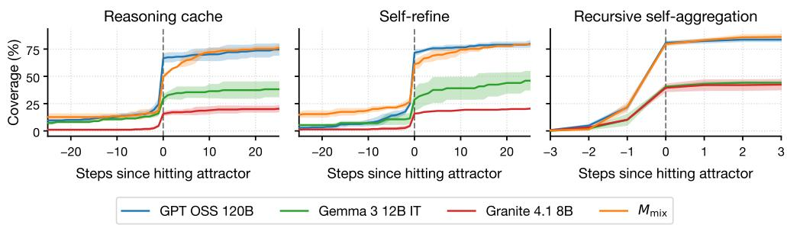  
Figure 6: Coverage before and after entering an attractor on IMO-AnswerBench, with trajectories aligned to the state where they enter the attractor (grey dashed line). Progress slows substantially after entry, indicating that we identify attractor states that limit further exploration.

Table 4: Sensitivity of attractor hitting-time probabilities to randomness in Algorithm 1 for IMO-AnswerBench (i.e. standard deviation for left column of Table 2). Results are stable across two different seeds used in Algorithm 1.
<table><tr><td>Method</td><td>Model</td><td>Attractor hit by  $S _ { 4 } \left( \% \right) \downarrow$ </td></tr><tr><td rowspan="3">Reasoning Cache</td><td>GPT OSS 120B</td><td> $4 7 . 6 7 \pm 2 . 3 3$ </td></tr><tr><td>Gemma 3 12B IT</td><td> $4 6 . 6 7 \pm 1 . 3 3$ </td></tr><tr><td>Granite 4.1 8B</td><td> $7 3 . 5 0 \pm 0 . 5 0$ </td></tr><tr><td rowspan="3">Self-Refine</td><td>GPT OSS 120B</td><td> $5 7 . 3 1 \pm 0 . 3 3$ </td></tr><tr><td>Gemma 3 12B IT</td><td> $4 4 . 3 3 \pm 3 . 6 7$ </td></tr><tr><td>Granite 4.1 8B</td><td> $6 9 . 1 7 \pm 2 . 1 7$ </td></tr><tr><td rowspan="3">Recursive Self-Aggregation</td><td>GPT OSS 120B</td><td> $8 7 . 1 7 \pm 2 . 8 3$ </td></tr><tr><td>Gemma 3 12B IT</td><td> $5 9 . 8 3 \pm 3 . 8 3$ </td></tr><tr><td>Granite 4.1 8B</td><td> $6 9 . 5 0 \pm 2 . 1 7$ </td></tr></table>

## B.4.3 VALIDATING OUR ATTRACTOR DEFINITION

In the previous section we outline how we identify attractors from trajectories. Our goal is to identify attractors that follow Definition 4.1 in practice: once entered, an attractor prevents transitions to states that are semantically different to the centroids of its constituent clusters. Figure 6 provides evidence that the configuration we present succeeds in this goal by demonstrating that, after we hit an attractor (vertical grey line), progress towards correct answers slows to a halt almost immediately after entering an attractor (the gradients of all lines flatten after passing the vertical dashed line). The large jump before entering an attractor is likely due to attractors appearing once we hit correct answers. This does not necessarily mean the state transitions prior to entering the attractor are not important: they may have played a useful role in approaching the correct answer.<sup>3</sup>

Furthermore, we show that these results are stable, by recomputing the attractors with a different seed (which affects summaries, embeddings, and clusters). Table 4 shows the mean and standard deviation of the first column of Table 2 after we recomputed the attractors a single time for a random set of 100 questions. Table 4 shows that the hit rates of attractors we identify are unlikely to change much under different random seeds.

## B.4.4 ATTRACTOR METRICS

In sections 4.2 and 5.2, we present the probability that each sequential scaling method hits an attractor within the first four states. We select this threshold, because, if we set the threshold earlier, it would

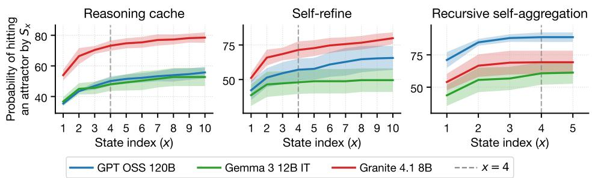  
Figure 7: Probability of entering an attractor at or before state index x for IMO-AnswerBench. The probability begins to level off after four states, motivating the four-state threshold used throughout our experiments.

Table 5: Probability that, if we generate two trajectories using the same scaling method, model, and question, and both terminate in attractors, then the two attractors are different. Higher values suggest there are more attractors in the state space.
<table><tr><td rowspan="2">Method</td><td rowspan="2">Model</td><td colspan="3">Different attractors (%) ↓</td></tr><tr><td>IMO</td><td>AMO</td><td>RGG</td></tr><tr><td rowspan="4">Reasoning Cache</td><td>GPT OSS 120B</td><td>33.7</td><td>22.2</td><td>31.0</td></tr><tr><td>Gemma 3 12B IT</td><td>34.3</td><td>18.9</td><td>32.2</td></tr><tr><td>Granite 4.1 8B</td><td>68.0</td><td>65.3</td><td>63.7</td></tr><tr><td> $M _ { \mathrm { m i x } }$  (ours)</td><td>20.5</td><td>20.0</td><td>8.2</td></tr><tr><td rowspan="4">Self-Refine</td><td>GPT OSS 120B</td><td>47.3</td><td>47.6</td><td>23.7</td></tr><tr><td>Gemma 3 12B IT</td><td>43.8</td><td>43.6</td><td>20.2</td></tr><tr><td>Granite 4.1 8B</td><td>74.5</td><td>79.3</td><td>40.6</td></tr><tr><td> $M _ { \mathrm { m i x } }$  (ours)</td><td>25.0</td><td>33.3</td><td>20.0</td></tr><tr><td rowspan="4">Recursive Self-Aggregation</td><td>GPT OSS 120B</td><td>12.4</td><td>10.8</td><td>12.0</td></tr><tr><td>Gemma 3 12B IT</td><td>4.9</td><td>8.7</td><td>7.7</td></tr><tr><td>Granite 4.1 8B</td><td>8.8</td><td>9.3</td><td>11.3</td></tr><tr><td> $M _ { \mathrm { m i x } }$  (ours)</td><td>5.9</td><td>4.3</td><td>1.9</td></tr></table>

not yet provide evidence that the hit rate eventually becomes high, while if we use a later threshold, it would only provide the weaker conclusion that this is true at a later state (see Figure 7).

## C PROBABILITY THAT DIFFERENT TRAJECTORIES HIT DIFFERENT ATTRACTORS

In Table 2, we measure the probability that, if we generate two trajectories using the same sequential scaling method and model, on the same question, and both terminate in attractors, then exactly one of the attractors contains only incorrect answers. To show the presence of even more attractors in the answer space with potentially varying correctness, we now measure how often two trajectories reach different attractors regardless of correctness (e.g. two attractors that both contain only incorrect states, but have no states in common). Table 5 shows that it is common for the same scaling-method– model combination to find different attractors when run with different random seeds. The existence of multiple attractors implies the answer space may have even more suboptimal attractors than are identified in Table 2. The values in Table 5 reduce for the scaling methods using $M _ { \mathrm { m i x } } .$ , implying the starting distribution $f _ { s } ( X , M _ { \mathrm { m i x } } )$ can be partitioned into fewer basins of attraction on average, potentially meaning there are fewer suboptimal attractors that we could get stuck in on our way to a better attractor.

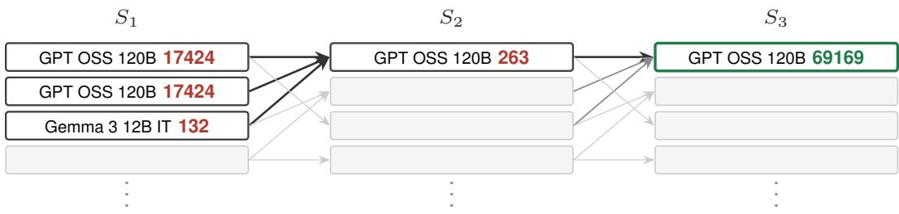  
Figure 8: Example of $M _ { \mathrm { m i x } }$ escaping an attractor containing only incorrect answers by using a nonprimary model to help revise its reasoning and reach the correct answer (69169).

## D EXAMPLE SOLUTION ONLY IDENTIFIED BY A SEQUENTIAL SCALING METHOD WITH $M _ { \mathrm { M I X } }$

We present a hand-picked problem from IMO-AnswerBench that no individual model solved using either parallel or sequential scaling, but that recursive self-aggregation using $M _ { \mathrm { m i x } }$ solved:

IMO-ANSWERBENCH

For a positive integer n, we call $g : \mathbb { Z } \to \mathbb { Z }$ a [sic] n-goodfunction if $g ( 1 ) = 1$ and for any two distinct integers a and $b , g ( a ) - g ( b )$ divides $a ^ { n } - b ^ { n }$ . We call a positive integer n an exotic integer if the number of n-good functions is twice of [sic] an odd integer. Find 132th [sic] exotic integer.

Scaling methods using only GPT OSS 120B consistently return an incorrect answer of 17424. The derivation for this solution is correct except that it incorrectly includes some even candidates. The weaker Gemma 3 12B IT model often answers 132, which contains more errors, but approaches the problem from a different perspective. When combined in $M _ { \mathrm { m i x } }$ with recursive self-aggregation, GPT OSS 120B aggregates these two solutions together (see Figure 8), forcing it to reconcile the two differing approaches. This leads GPT OSS 120B to identify the inconsistency with the answer of 17424 and generate a new answer, 263. This new solution is incorrect, but is corrected in the next state to obtain the correct answer of 69169. This example shows that, although the weaker Gemma model may not contribute much useful work itself, it can be used to pull a stronger model out of its local optimum.

## E BREAKDOWN OF PROBLEMS SOLVED BY DIFFERENT SCALING METHODSWHEN USING $M _ { \mathrm { M I X } }$ COMPARED TO THE BASELINE

Figure 3 shows that sequential scaling methods using $M _ { \mathrm { m i x } }$ solve more problems than those using any single model. This implies there must be problems that only sequential scaling with $M _ { \mathrm { m i x } }$ solves. Figure 9 shows how many such problems there are. The problems solved by sequential scaling using $M _ { \mathrm { m i x } }$ are relatively close to being supersets of the problems solved by the same methods with the primary model. This agrees with our hypothesis that correct answers are universal attractors across models, and therefore not lost when additional models are added to the mix.

## F COST OF USING $M _ { \mathrm { M I X } }$

Figure 3 measures how coverage improves against the number of states visited because our focus is on the behaviour of the dynamical system. As a more practical baseline, Figure 10 presents the same coverage results against compute. To fairly compare compute, we report the cost of each trajectory using prices from OpenRouter (2026), assuming no cache hits. Although prices from OpenRouter (2026) may be misleading, for example due to some models being subsidised, for the models we use, the prices also track with each model’s reasoning capabilities.

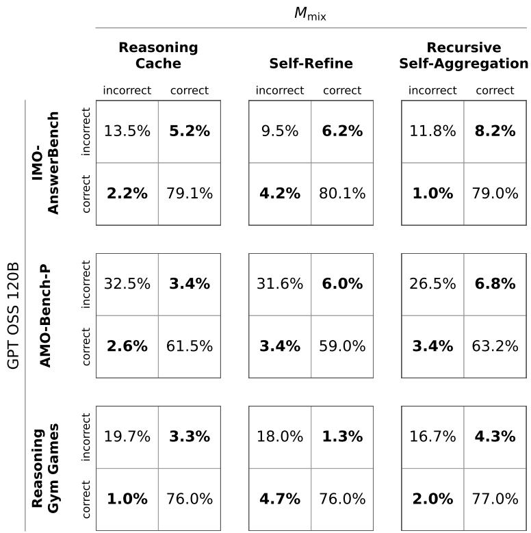  
Figure 9: Per-problem coverage changes between $M _ { \mathrm { m i x } }$ and GPT OSS 120B with different sequential scaling methods. $M _ { \mathrm { m i x } }$ improves over GPT OSS 120B without losing many correct answers.

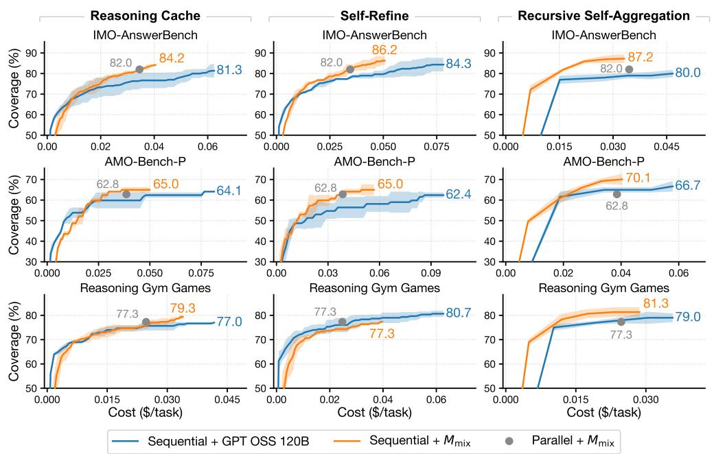  
Figure 10: Coverage achieved by each scaling-method–model combination against price on Open-Router (2026) (identical to Figure 3, but with cost on the x axis).

Table 6: Parallel scaling coverage over 60 answers. The $M _ { \mathrm { m i x } }$ row is identical to results displayed in Figure 3. Sampling from $M _ { \mathrm { m i x } }$ alone does not improve coverage over GPT OSS 120B, so its sequential scaling gains in Figure 3 are not explained by complementary model capabilities.
<table><tr><td rowspan="2">Model</td><td colspan="2">Coverage (%) ↑</td></tr><tr><td>IMO</td><td>AMO RGG</td></tr><tr><td>GPT OSS 120B</td><td>82.8</td><td>64.5 79.0</td></tr><tr><td> $M _ { \mathrm { m i x } }$  (ours)</td><td>82.0</td><td>62.8 77.3</td></tr></table>

## G ADDITIONAL PARALLEL SCALING BASELINES

$M _ { \mathrm { m i x } }$ gains are not explained by complementary model capabilities. In Section 5.2, we compare against a parallel baseline using $M _ { \mathrm { m i x } }$ . We do not use parallel scaling with only GPT OSS 120B in Figure 3 to ensure that improvements arise from additional exploration rather than from solutions contributed independently by the non-primary models, and because this comparison is unfair due to the baseline generating more answers with the primary model. Nonetheless, for transparency, we present this baseline in Table 6. On all three benchmarks, GPT OSS 120B achieves higher coverage than $M _ { \mathrm { m i x } }$ showing that adding answers from Gemma 3 12B IT and Granite 4.1 8B does not improve coverage enough to make up for the calls to GPT OSS 120B they replace. This justifies our selection of Gemma 3 12B IT and Granite 4.1 8B as models that offer very few capabilities on their own that are not already present in the primary model (in this case, GPT OSS 120B). Furthermore, sequential scaling with $M _ { \mathrm { m i x } }$ still mostly achieves higher coverage than parallel scaling with only GPT OSS 120B.

The parallel baseline is not limited by redundant sampling. A second possibility is that I.I.D. parallel sampling explores the unscaled models’ answer distributions inefficiently, rather than the distribution itself being too restricted. We test this using tree-of-thoughts (Yao et al., 2023), which prioritises generating diverse and promising answers. We implement tree-of-thoughts on the Reasoning Gym Games benchmark with GPT OSS 120B (medium). At each round, we generate new answers using the ‘propose’ recipe, with a branch factor of 3 in BFS mode. We evaluate states using the ‘value’ recipe, averaged across two samples. At the end of four rounds, we return the resulting 60 answers. Across the 60 answers, the tree-of-thoughts implementation found at least one solution to 78.0% of problems across three seeds, which is only slightly above the 77.3% baseline coverage of I.I.D. parallel sampling in Figure 3. We also investigate increasing temperature as a method for improving diversity in Appendix H, although this is already known to have a relatively small effect on reasoning performance (Renze & Guven, 2024).

## H MIXING MODELS DOES MORE THAN JUST ADD NOISE

Our proposed intervention aims to perturb the primary model to escape attractors. A naive alternative approach to perturbing model outputs for increased diversity could be to introduce randomness by increasing the temperature that models are sampled at. Figure 11 shows the coverage achieved by recursive self-aggregation on IMO-AnswerBench across different temperature parameters, using an identical configuration to Figure 3. Changing the temperature from the value of 1 that we use elsewhere does not meaningfully improve coverage in these experiments. This result is similar to those of Renze & Guven (2024).

## I OMITTED ABLATION RESULTS

We do not include results in the main paper from experiments for which the baselines already saturated the dataset and therefore could not be meaningfully improved. For transparency, we present the experiment where this occurred in Figure 12. In this case, the better exploration our method enables cannot be demonstrated, while the disadvantage of our method using the primary model less often remains. To help demonstrate that the lack of improvement from our model-mixing intervention is due to the dataset being saturated for the baselines (and not because our results do not translate to larger models), Figure 1 shows that our model-mixing intervention is effective for other configurations of large models.

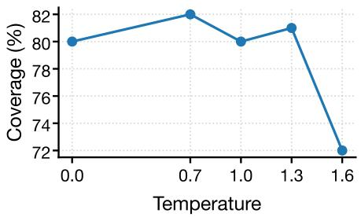  
Figure 11: Coverage achieved by recursive self-aggregation with GPT OSS 120B (medium reasoning effort) on IMO-AnswerBench across different temperature parameters, using an identical configuration to Figure 3.

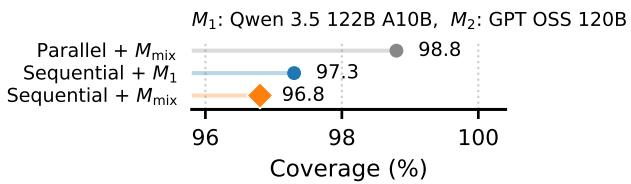  
Figure 12: Results of mixing Qwen 3.5 122B A10B with GPT OSS 120B (both medium reasoning effort) in recursive self-aggregation, for IMO-AnswerBench. Except for the models used, this experi ment is identical to those in Figure 4.

## J BALANCING EXPLORATION AND EXPLOITATION WITH ANNEALED MODELSAMPLING

While mixing models may improve exploration, it may also cause sequential scaling to escape the attractors of correct answers. This could be true even given our hypothesis that correct answers are likely to remain as attractors for the mixture more often than incorrect ones will. In contrast, Figure 5 shows that using only the single best model leads to good exploitation (i.e. the ability to retain good answers once we have found them). For example, Li et al. (2024) show that mixture-of-agents (Wang et al., 2025c) often has reduced performance compared to using only the strongest model. Therefore, to help demonstrate that escaping attractors can also improve overall performance, we present a simple heuristic for balancing the increased exploration from model mixing with the stronger correctanswer exploitation from using just the primary model.

Let us assume $M _ { \mathrm { m i x } }$ selects from three models, $\{ M _ { 1 } , M _ { 2 } , M _ { 3 } \}$ , with $M _ { 1 }$ being the primary model. We have suggested that sampling $j \in \{ 1 , 2 , 3 \}$ with probability $[ \textstyle { \frac { 1 } { 3 } } , \textstyle { \frac { 1 } { 3 } } , \textstyle { \frac { 1 } { 3 } } ]$ respectively (i.e. a uniform distribution) leads to good exploration, and that sampling with probability [1, 0, 0] (i.e. using only the primary model) leads to good exploitation of correct answers that we have already found. Therefore we parametrise $M _ { \mathrm { m i x } }$ by $\bar { \mathbf { \Phi } } _ { c } \in [ 0 , \bar { 1 } ]$ ] (as in Section 5.2) to control the concentration of the sampling distribution $\textstyle { \frac { 1 } { 3 } } \times [ 1 + 2 \dot { c } , 1 - \dot { c } , 1 - c ] ( 0 \leq c \leq 1 )$ over time. We propose to use a distribution with good exploration to generate our initial states, and then move towards better exploitation for later states. This is similar to simulated annealing, where initial states search for a region of the answer space that contains a good attractor, while later states more carefully converge to its centre.

Figure 13 compares recursive self-aggregation (Venkatraman et al., 2025) (i.e. with $c = 1 )$ to the same method, but using $c = 0 . 7 5$ to select the model for the first answer, $c = 1$ for the final answer, and a linear interpolation for the answers in between. This annealed model sampling achieves higher accuracy than the baseline recursive self-aggregation in both benchmarks by improving its exploration while achieving similar exploitation performance. Furthermore, because annealed model sampling sometimes swaps the primary model for weaker – and cheaper – models, its cost on OpenRouter (2026) is 3.6% and 3.4% lower than that of the baseline for IMO-AnswerBench and Reasoning Gym Games respectively.

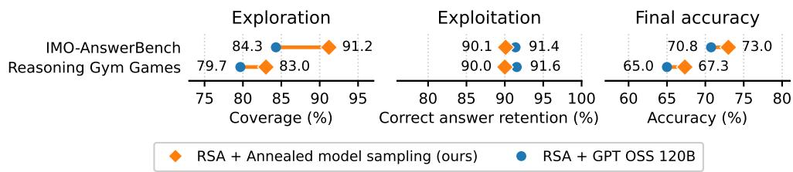  
Figure 13: Comparison between recursive self-aggregation with a single model, and with annealed model sampling. For annealed model sampling, we initialise c as 0.75 to select the model for the first answer, and then increase c linearly at each attempt, until we have $c = 1$ for the final attempt. We use an otherwise identical experimental setup to that in Figure 5.

Table 7: Attractor dynamics on ARC AGI 1, similar to Tables 2 and 3. Sequential scaling is less likely to get stuck in attractors within the first few states compared to the other benchmarks tested.
<table><tr><td>Method</td><td>Model</td><td>Attractor hit by  $S _ { 4 } \left( \% \right) \downarrow$ </td><td>Different attractors (%) ↓</td></tr><tr><td rowspan="4">Reasoning Cache</td><td>GPT OSS 120B</td><td>20.6</td><td>23.6</td></tr><tr><td>Gemma 3 12B IT</td><td>13.3</td><td>16.4</td></tr><tr><td>Granite 4.1 8B </td><td>25.9</td><td>53.4</td></tr><tr><td> $M _ { \mathrm { m i x } }$  (ours)</td><td>16.4</td><td>34.8</td></tr><tr><td rowspan="4">Self-Refine</td><td>GPT OSS 120B</td><td>8.0</td><td>25.0</td></tr><tr><td>Gemma 3 12B IT</td><td>7.7</td><td>30.0</td></tr><tr><td>Granite 4.1 8B</td><td>15.0</td><td>30.0</td></tr><tr><td> $M _ { \mathrm { m i x } }$  (ours)</td><td>12.7</td><td>26.7</td></tr><tr><td rowspan="4">Recursive Self-Aggregation</td><td>GPT OSS 120B</td><td>26.3</td><td>5.3</td></tr><tr><td>Gemma 3 12B IT</td><td>22.6</td><td>3.0</td></tr><tr><td>Granite 4.1 8B</td><td>22.4</td><td>5.9</td></tr><tr><td> $M _ { \mathrm { m i x } }$  (ours)</td><td>24.3</td><td>4.1</td></tr></table>

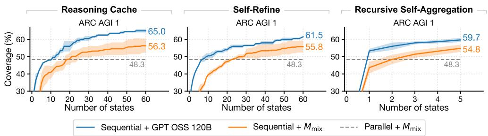  
Figure 14: Coverage over time on ARC AGI 1 (similar to Figure 3). The GPT OSS 120B baseline continues improving after the first few states, outperforming $M _ { \mathrm { m i x } }$

## K RESULTS ON ARC AGI 1

We repeat our experiments from sections 4 and 5 for the ARC AGI 1 dataset (Chollet, 2019). Table 7 shows that, before any intervention with $M _ { \mathrm { m i x } }$ , the sequential scaling methods tested get stuck in attractors less often than for other datasets, and, when they are stuck, the attractor they find is more often the same across multiple different trajectories. This implies there are likely fewer attractors, and larger basins, rather than many small, suboptimal attractors. As a result, the baseline using only GPT OSS 120B outperforms our proposed method using $M _ { \mathrm { m i x } }$ (Figures 14 and 15). This is because the baseline continues to improve for longer compared to the other datasets, so mixing models offers little benefit while reducing how often the strongest model is used.

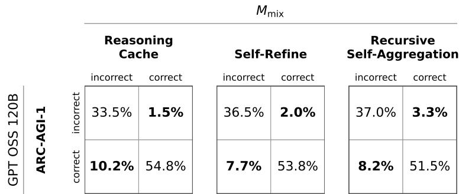  
Figure 15: Per-problem agreement between $M _ { \mathrm { m i x } }$ and GPT OSS 120B on ARC AGI 1 (similar to Figure 9).

Why does ARC AGI 1 not hit attractors in the first four states as often as the other datasets? A difference between the datasets in Sections 4 and 5, and ARC AGI 1 is that the latter does not have an objective that the model can attempt to verify. Specifically, problems based on maths and games provide a clear goal that the language model can use to test whether it has succeeded. This can lead to suboptimal attractors, because the language model may be unable to spot a logical error in its reasoning, and therefore conclude that the answer it has already obtained must be correct. This is not only true for verifiable problems: a task where we are asked to summarise a piece of text, for example, may define goals of faithfulness to the text and brevity of the summary. A language model could receive a summary and conclude that it has already maximised both of these goals. Conversely, ARC AGI 1 displays patterns and then asks the model to decide what comes next, but defines no clear rules that the language model can use to argue that a given answer must be correct, potentially making it harder for sequential scaling to get stuck in suboptimal attractors. A more in-depth exploration of exactly which tasks attractors appear in would be costly, so we leave this for future work.