# The Row Normalization Puzzle in Muon

Jiayu Zhang

Tianyi Lin

Department of Industrial Engineering and Operations Research Columbia University

October 1, 2026

## Abstract

This paper examines how row-wise renormalization afects Muon, focusing on the gap between NorMuon’s worst-case guarantees and its practical performance [Li et al., 2026]. Despite its growing adoption and promising performance in large language model (LLM) pretraining, NorMuon’s worstcase guarantees remain poorly understood. One fundamental question is: Does row normalization yield provable convergence gains, potentially through its interaction with approximate polar computation and exponential moving-average momentum? Our results show that row normalization introduces a dimension-dependent factor in the worst-case iteration complexity under the operator-norm geometry, which persists even with exact polar computation and any fixed momentum parameters. Indeed, we establish an algorithm-dependent lower bound and a matching upper bound in deterministic settings, and extend our upper bound analysis to stochastic settings. Both upper-bound analyses allow approximate polar computation. Experiments show that NorMuon is slower than Muon on synthetic problems inspired by our worst-case construction, yet outperforms Muon in LLM pretraining. These findings sharpen the puzzle of why row normalization helps in practice and complement the recent findings of Dewulf et al. [2026].

## 1 Introduction

Large-scale neural network training has driven major advances in vision and language [Krizhevsky et al., 2012, He et al., 2016, Vaswani et al., 2017], with large language model (LLM) pretraining placing increasing demands on optimization eficiency [Team et al., 2025]. Progress depends not only on data and computational resources, but also on optimizers that exploit the structure of neural network pa rameters. Among recent methods, Muon [Jordan et al., 2024] has attracted attention for its training eficiency and scalability [Liu et al., 2025]. Rather than applying coordinate-wise rescaling, Muon up dates weight matrices using the polar factor of gradient momentum. Together with related methods such as Scion [Pethick et al., 2025], it reflects a shift toward optimizer design based on input-output matrix geometry. More recently, NorMuon [Li et al., 2026] introduces row-wise second-moment normalization to balance update magnitudes across neurons and reports improved performance. Its practical relevance extends beyond optimizer benchmarks: NorMuon was used to train Datadog’s Toto 2.0 forecasting models [Khwaja et al., 2026], while similar normalization has been incorporated into the nanochat LLM training pipeline [Karpathy, 2025]. NVIDIA’s Megatron Core also supports NorMuon-style updates as an optimizer option [NVIDIA, n.d.]. These empirical gains motivate a closer examination of the convergence consequences of row normalization.

This design philosophy has a long history in optimization. Indeed, the simplex method exploits the polyhedral geometry of linear optimization [Dantzig, 1963], while gradient descent applies carefully designed step sizes in nonlinear optimization [Polyak, 1963]. Row normalization follows a related principle by respecting the neuron-wise organization of matrix parameters. Yet, geometric insights and practical success do not necessarily imply favorable worst-case guarantees. The simplex method is effective in practice, but needs exponentially many iterations in the worst case [Klee and Minty, 1972]. A related tension appears in gradient-based optimization. Step-size scheduling improves practical neural network training, from cosine annealing with warm restarts [Loshchilov and Hutter, 2017] to warmupstable-decay schedules for LLM pretraining [Wen et al., 2025]. In theory, step-size scheduling alone can accelerate gradient descent beyond its classical $O ( T ^ { - 1 } )$ rate [Altschuler and Parrilo, 2025a,b]. However, recent work shows that optimally chosen schedules cannot attain the algorithm-independent lower bound of $\Omega ( T ^ { - 2 } )$ [Ye and Liu, 2026]. We continue this line of thought for matrix optimizers, investigating whether the practical benefits of row normalization are reflected in its worst-case guarantees.

The benefits of row normalization have been systematically studied in recent work [Dewulf et al., 2026], which identified a mechanism behind the imbalance in Muon’s neuron-wise updates: neurons with low row leverage can receive persistently small updates and will become efectively inactive. NorMuon mitigates this issue by using exponential moving averages of squared row norms to rebalance update magnitudes across neurons. Their findings provide empirical evidence and alternative explanations for the practical value of balanced neuron updates, motivating a rigorous analysis of the worst-case convergence consequences of row normalization.

In this paper, we investigate row normalization through gradient-update alignment in operator-norm geometry. Our key construction uses a rank-one gradient with unequal row magnitudes: normalizing its polar factor balances the rows but weakens alignment with the gradient. We embed this mechanism in a smooth objective whose gradient remains constant along the iterates, isolating a directional distortion that persists under fixed momentum parameters and deterministic adaptive step sizes. A complementary descent analysis controls the same alignment together with momentum error and polar approximation. Importantly, balanced neuron updates alone do not guarantee faster convergence. Our experimenta results illustrate this distinction: NorMuon is slower than Muon on synthetic problems, yet outperforms it in LLM pretraining. Our findings sharpen the row normalization puzzle and further call for a deeper understanding of which key features of practical training make normalization beneficial despite its worst-case cost.

Contributions. We focus on one fundamental question: does row normalization yield provable convergence gains, potentially through its interaction with approximate polar computation and exponential moving-average momentum? Our contributions can be summarized as follows:

1. We establish an algorithm-dependent lower bound of $\Omega ( m L \epsilon ^ { - 2 } )$ for NorMuon on smooth optimization over $\mathbb { R } ^ { m \times n }$ , compared with Muon’s $O ( L \epsilon ^ { - 2 } )$ rate in operator-norm geometry, where $L > 0$ is the smoothness parameter. We prove upper bounds of $O ( m L \epsilon ^ { - 2 } )$ in the deterministic setting and $O ( m L \epsilon ^ { - 2 } + m ^ { 2 } L \sigma ^ { 2 } \epsilon ^ { - 4 } )$ in the stochastic setting, where $\sigma ^ { 2 }$ is a bound on the noise variance measured in the nuclear norm. Our analysis accommodates polar approximation.

2. We conduct experiments on synthetic problems and LLM pretraining. The contrasting results separate the theoretical cost of row normalization from its practical benefits, complementing the findings of Dewulf et al. [2026] and showing that improved neuron balance alone does not imply uniformly faster optimization.

Related works. Our work is most closely related to the literature on structured matrix-aware optimization and algorithm-dependent convergence analysis. Due to space limitations, we defer our com ments on other relevant topics to Appendix A. Muon exploits matrix structure through polar-factor updates of gradient momentum, connecting spectral descent to eficient LLM pretraining [Jordan et al., 2024, Bernstein and Newhouse, 2024, Liu et al., 2025]. However, controlling singular values does not generally ensure balanced update magnitudes across neurons. To address this issue, NorMuon introduces row-wise second-moment normalization [Li et al., 2026], while Muon+ applies stateless row/column normalization after orthogonalization [Zhang et al., 2026b]. Their ablation studies provide evidence of lower validation loss and highlight the importance of normalization direction. MuonEq instead normalizes momentum before orthogonalization, reporting lower validation loss and improved robustness [Chang et al., 2026]. Dion3 incorporates row normalization into a variant with selective orthogonalization [Amsel et al., 2026b], while Aurora addresses low-leverage neurons in tall matrices, reporting reduced neuron death and lower validation loss [Dewulf et al., 2026]. These empirical findings motivate our analysis of the worst-case convergence cost of row normalization in NorMuon.

Algorithm-dependent convergence analysis studies specified update rules rather than oracle classes. Classical works have established sharp worst-case analyses for line search methods [Cartis et al., 2010, 2018] and many other first-order methods [Drori and Teboulle, 2014, Taylor et al., 2017]. Recent works characterized the pros and cons of predetermined step-size schedules in gradient descent [Grimmer, 2024, Altschuler and Parrilo, 2025a,b, Ye and Liu, 2026]. For heavy-ball methods, the convergence analyses and cycling counterexamples [Ghadimi et al., 2015, Lessard et al., 2016] were followed by provable non-acceleration results for smooth strongly convex objectives [Goujaud et al., 2025], while acceleration becomes possible through over-relaxed recurrences [Wei and Chen, 2025] or randomized scheduling on smooth convex objectives [He and Zhang, 2026]. Our work establishes the dimensiondependent lower bound specifically for NorMuon with exact polar computation under any deterministic adaptive nonnegative step-size policy and any fixed momentum parameters.

## 2 Preliminaries and Technical Background

We review the setup for LLM pretraining and the update rules of Muon and NorMuon, followed by the assumptions and basic properties used in our analysis.

## 2.1 LLM pretraining and matrix optimization

We consider an autoregressive language model with parameters θ and vocabulary V. Given a token sequence $\mathbf { s } = ( s _ { 1 } , \ldots , s _ { | \mathbf { s } | } ) \in \mathcal { V } ^ { | \mathbf { s } | }$ , the model assigns probability $\begin{array} { r } { p _ { \theta } ( \mathbf { s } ) = \prod _ { k = 1 } ^ { | \mathbf { s } | } p _ { \theta } ( s _ { k } \mid s _ { < k } ) } \end{array}$ , where $s _ { < k }$ denotes the first $k - 1$ tokens. For a data distribution $\mathcal { D }$ over such sequences, the goal of pretraining is to minimize the following expected next-token prediction loss

$$
\begin{array} { l } { \displaystyle \mathcal { L } ( \theta ) = - \mathbb { E } _ { { \mathbf s } \sim \mathcal { D } } \left[ \frac { | { \mathbf s } | } { | { \mathbf s } | } \sum _ { k = 1 } ^ { | { \mathbf s } | } \log p _ { \theta } ( s _ { k } \mid s _ { < k } ) \right] , } \end{array}
$$

where the model parameters $\theta$ consist of weight matrices in attention and feed-forward layers [Vaswani et al., 2017]. Muon and its variants apply their updates to each weight matrix separately. As such, we consider a single matrix variable in our theoretical analysis. Formally, we have

$$
\operatorname* { m i n } _ { X \in \mathbb { R } ^ { m \times n } } F ( X ) ,
$$

Algorithm 1 NorMuon   
1: Input: $X _ { 0 } \in \mathbb { R } ^ { m \times n } , \ell , \delta , \beta _ { 1 } , \beta _ { 2 } \in [ 0 , 1 ) , \eta _ { t } , \alpha \geq 0 , v _ { 0 } = 0 \in \mathbb { R } ^ { m }$ , and $M _ { 0 } = 0 \in \mathbb { R } ^ { m \times n }$   
2: for $t = 0 , \ldots , T - 1$ do   
3: $G _ { t } \gets G ( X _ { t } , \xi _ { t } ) .$ , where $\xi _ { t }$ is independent of $\{ X _ { 0 } , \xi _ { 0 } , \ldots , \xi _ { t - 1 } \}$   
4: $M _ { t + 1 }  \beta _ { 1 } M _ { t } + ( 1  \beta _ { 1 } ) G _ { t } ,$   
5: $\begin{array} { r } { O _ { t + 1 }  \operatorname { P o l a r } _ { \ell , \delta } \big ( \frac { M _ { t + 1 } } { \| M _ { t + 1 } \| _ { F } } \big ) . } \end{array}$   
6: $\begin{array} { r } { v _ { t + 1 }  \beta _ { 2 } v _ { t } + \frac { 1 - \beta _ { 2 } } { n } \mathrm { d i a g } ( O _ { t + 1 } O _ { t + 1 } ^ { \top } ) . } \end{array}$   
7: $\begin{array} { r } { [ \overline { { O } } _ { t + 1 } ] _ { i , : }  \frac { [ O _ { t + 1 } ] _ { i , : } } { \sqrt { v _ { t + 1 , i } } + \alpha } } \end{array}$ for all $i \in \{ 1 , \ldots , m \}$   
8: $\begin{array} { r } { D _ { t + 1 } \gets \frac { 0 . 2 \sqrt { m n } } { \| \overline { { O } } _ { t + 1 } \| _ { F } } \overline { { O } } _ { t + 1 } } \end{array}$   
9: $X _ { t + 1 } \gets \ddot { X } _ { t } - \eta _ { t } D _ { t + 1 } .$   
return $\dot { X } = X _ { \widetilde { T } }$ where $\widetilde { T }$ is sampled independently and uniformly from $\{ 0 , \ldots , T - 1 \}$

where $F : \mathbb { R } ^ { m \times n }  \mathbb { R }$ is diferentiable but not necessarily convex.

Muon [Jordan et al., 2024] updates a weight matrix using the polar factor of its gradient momentum. For a nonzero matrix $Z \in \mathbb { R } ^ { m \times n }$ with compact singular value decomposition $( \mathrm { S V D } ) ~ Z = U \Sigma V ^ { \top }$ , where $\boldsymbol { \Sigma } \in \mathbb { R } ^ { r \times r }$ and $r = { \mathrm { r a n k } } ( Z )$ , we define Polar $( Z ) = U V ^ { \top }$ , and set $\mathrm { P o l a r } ( 0 ) = 0$ . Let $\| \cdot \| _ { F }$ denote the Frobenius norm. Starting from $M _ { 0 } = 0$ , the exact Muon recursion is

$$
\begin{array} { r } { M _ { t + 1 } = \beta M _ { t } + ( 1 - \beta ) G ( X _ { t } , \xi _ { t } ) , \quad O _ { t + 1 } = \mathrm { P o l a r } ( \frac { M _ { t + 1 } } { \| M _ { t + 1 } \| _ { F } } ) , \quad X _ { t + 1 } = X _ { t } - \eta _ { t } O _ { t + 1 } , } \end{array}
$$

where $G ( X _ { t } , \xi _ { t } ) \in \mathbb { R } ^ { m \times n }$ is a stochastic gradient at $X _ { t } , ~ \beta ~ \in ~ [ 0 , 1 )$ is the momentum parameter, and $\eta _ { t } > 0$ is the step size. In practice, Newton-Schulz iterations [Jordan et al., 2024] or PolarExpress [Amsel et al., 2026a] can approximate the polar factor using the normalized momentum $\frac { M _ { t + 1 } } { \parallel M _ { t + 1 } \parallel _ { F } }$ as input.

NorMuon [Li et al., 2026] adds row-wise normalization to this update. Given the possibly approximate polar factor $O _ { t + 1 }$ , it maintains an exponential moving average of the mean squared entries of each row and rescales that row accordingly:

$$
\begin{array} { r } { v _ { t + 1 , i } = \beta _ { 2 } v _ { t , i } + ( 1 - \beta _ { 2 } ) \frac { \lVert [ O _ { t + 1 } ] _ { i , * } \rVert _ { 2 } ^ { 2 } } { n } , \quad [ \overline { { O } } _ { t + 1 } ] _ { i , : } = \frac { [ O _ { t + 1 } ] _ { i , : } } { \sqrt { v _ { t + 1 , i } } + \alpha } , \quad \mathrm { f o r ~ e a c h ~ } i = 1 , \dots , m , } \end{array}
$$

where $[ O ] _ { i , }$ denotes the $i ^ { \mathrm { t h } }$ row of $O , \parallel \cdot \parallel _ { 2 }$ denotes the Euclidean norm, $v _ { 0 } = 0 , \beta _ { 2 } \in [ 0 , 1 )$ , and $\alpha \geq 0$ is a stabilization constant. Then, following the rescaling of [Liu et al., 2025, Li et al., 2026], we set

$$
\begin{array} { r } { D _ { t + 1 } = \frac { 0 . 2 \sqrt { m n } } { \| \overline { { O } } _ { t + 1 } \| _ { F } } \overline { { O } } _ { t + 1 } , \quad X _ { t + 1 } = X _ { t } - \eta _ { t } D _ { t + 1 } . } \end{array}
$$

We see that row normalization changes the relative magnitudes of the rows, while the final rescaling fixes the Frobenius norm of every nonzero update. The full scheme is summarized in Algorithm 1, including approximate polar computation as specified in Assumption 2.3.

## 2.2 Assumptions and basic properties

Throughout, we assume that $F ^ { \star } = \operatorname* { i n f } _ { X \in \mathbb { R } ^ { m \times n } } F ( X ) > - \infty$ and let $\Delta \geq 0$ be an upper bound on $F ( X _ { 0 } ) \mathrm { ~ - ~ } F ^ { \star }$ . For $\ b X \in \mathbb { R } ^ { m \times n }$ , we define $\begin{array} { r } { \| X \| _ { \mathrm { o p } } = \operatorname* { m a x } _ { \| z \| _ { 2 } \leq 1 } \| X z \| _ { 2 } } \end{array}$ , and $\| X \| _ { \mathrm { n u c } }$ as the sum of its singular values. These norms are dual under the Frobenius inner product $\langle X , Y \rangle = \operatorname { t r } ( X ^ { \top } Y )$ . Indeed, we have

$$
\operatorname* { m a x } _ { \| Y \| _ { \mathrm { o p } } \leq 1 } \langle X , Y \rangle = \langle X , \mathrm { P o l a r } ( X ) \rangle = \| X \| _ { \mathrm { n u c } } .
$$

This implies that the exact Muon recursion minimizes a linear model over an operator-norm ball centered at $X _ { t }$ [Pethick et al., 2025]. In other words, we have $X _ { t + 1 } \in$ argmin $X { - } X _ { t } \| _ { \mathrm { o p } } { \leq } \eta _ { t } \left. X - X _ { t } , M _ { t + 1 } \right.$ . This motivates the operator-norm geometry used in our analysis. In particular, we impose the following assumptions on the objective and stochastic gradients.

Assumption 2.1 There exists $L \geq 0$ such that $\| \nabla F ( Y ) - \nabla F ( X ) \| _ { \mathrm { n u c } } \leq L \| Y - X \| _ { \mathrm { o p } } ~ f o r$ all $X , Y \in$ $\mathbb { R } ^ { m \times n }$

Assumption 2.2 There exist $\sigma \geq 0$ and a stochastic gradient oracle $G : \mathbb { R } ^ { m \times n } \times \Xi  \mathbb { R } ^ { m \times n }$ such that $\mathbb { E } [ G ( X , \xi ) \mid X ] = \nabla F ( X )$ and $\begin{array} { r } { \mathbb { E } [ \| G ( X , \xi ) - \nabla F ( X ) \| _ { \mathrm { n u c } } ^ { 2 } \mid X ] \le \sigma ^ { 2 } } \end{array}$ for all $\ b X \in \mathbb { R } ^ { m \times n }$

Assumption 2.1 implies the following descent inequality:

$$
\begin{array} { r } { F ( Y ) \leq F ( X ) + \langle \nabla F ( X ) , Y - X \rangle + \frac { L } { 2 } \| Y - X \| _ { \mathrm { o p } } ^ { 2 } , \quad \mathrm { f o r ~ a l l ~ } X , Y \in \mathbb { R } ^ { m \times n } . } \end{array}\tag{2.1}
$$

Our analysis uses this inequality to relate the decrease in the objective to the alignment between the gradient and the update direction. In the deterministic setting, we have $G _ { t } = \nabla F ( X _ { t } )$ and $\sigma = 0$ . To cover approximate polar computation, we impose a condition on the singular values of its output.

Assumption 2.3 There exist $\ell , \delta \in [ 0 , 1 )$ and Polar $\boldsymbol { \cdot } _ { , \delta } : \mathbb { R } ^ { m \times n }  \mathbb { R } ^ { m \times n }$ with Pola $\mathbf { \partial } _ { \cdot \ell , \delta } ( 0 ) = 0$ such that the following statement holds. For every nonzero $Z \in \mathbb { R } ^ { m \times n }$ with $\| Z \| _ { F } \le 1$ , let $Z = U \Sigma V ^ { \top }$ be a compact SVD, where $r = { \mathrm { r a n k } } ( Z )$ . Then $\mathrm { P o l a r } _ { \ell , \delta } ( Z ) = U \widetilde { \Sigma } V ^ { \top }$ for some diagonal $\widetilde { \Sigma } \in \mathbb { R } ^ { r \times r }$ satisfying $( i ) \widetilde { \Sigma } _ { j j } \in [ 0 , 1 + \delta ]$ and $( i i ) \ \widetilde { \Sigma } _ { j j } \in [ 1 - \delta , 1 + \delta ]$ whenever $\Sigma _ { j j } \geq \ell ,$ for all j.

Assumption 2.3 allows an approximate polar computation. If an input singular value is at least $\ell ,$ the output singular value must be within δ of 1. For smaller input singular values, the corresponding output singular values lie between 0 and $1 + \delta$ . As such, a smaller ℓ requires accurate approximation for more singular values, while a smaller δ requires greater accuracy. PolarExpress [Amsel et al., 2026a] uses polynomial iterations to adjust the singular values without changing the singular vectors and guarantees $\bar { \delta } \leq ( 1 - \ell ^ { 2 } ) ^ { 3 ^ { K } }$ after K iterations.

We use mi $\mathsf { \tau } ^ { \mathsf { l } } 0 \leq t < T \left\| \nabla F ( X _ { t } ) \right\| _ { \mathsf { n u c } } \leq \epsilon$ and $\mathbb { E } [ \| \nabla F ( X _ { \widetilde { T } } ) \| _ { \mathrm { n u c } } ] \le \epsilon$ to measure convergence in the deterministic and stochastic settings, and study the number of iterations that NorMuon requires to meet these criteria. In particular, we establish matching lower and upper bounds in the deterministic setting (Theorems 3.1 and 3.2), showing that row normalization incurs an extra factor of m compared with Muon. We extend the upper bound to the stochastic setting (Theorem 3.3), allowing approximate polar computation in both upper bound analyses.

## 3 Main Results

We establish matching upper and lower bounds for NorMuon in the deterministic setting and extend the upper bound to stochastic settings. We also explain the main ideas behind our analysis, with full proofs deferred to Appendix B.

## 3.1 Deterministic setting

We establish an algorithm-dependent lower bound with exact polar computation. This isolates the efect of row normalization from errors in computing the polar factor.

Theorem 3.1 Let $m \ge 2 , n \ge 1 , \Delta , L > 0 $ , and $\epsilon \in ( 0 , \frac { 1 } { 4 } \sqrt { \Delta L } )$ . For any deterministic step-size rule $\{ \eta _ { t } \} _ { t \ge 0 }$ based on the observed history $\{ ( \boldsymbol { X } _ { s } , \boldsymbol { F } ( \boldsymbol { X } _ { s } ) , \nabla \boldsymbol { F } ( \boldsymbol { X } _ { s } ) ) \} _ { s \leq t }$ , there exists $F : \mathbb { R } ^ { m \times n } $ R satisfying Assumption 2.1 and $F ( X _ { 0 } ) { - } F ^ { \star } \leq \Delta$ such that Algorithm 1 with any fixed $\beta _ { 1 } , \beta _ { 2 } \in [ 0 , 1 )$ , exact gradients, and $\ell = \delta = \alpha = 0$ satisfies

$$
\begin{array} { r } { \| \nabla F ( X _ { t } ) \| _ { \mathrm { n u c } } > \epsilon \mathrm { ~ f o r ~ a l l ~ } 0 \leq t \leq T _ { 0 } = \left\lfloor \frac { m \Delta L } { 3 2 \epsilon ^ { 2 } } \right\rfloor . } \end{array}
$$

Muon achieves a dimension-independent rate of ${ \cal O } ( \Delta L \epsilon ^ { - 2 } )$ under the same smoothness assumption and stationarity criterion [Shen et al., 2026]. Theorem 3.1 therefore shows that row normalization can introduce an extra factor of $m ,$ even when the momentum parameters and the adaptive step-size rule are chosen.

We next show that this dimension dependence is attainable. Indeed, we define

$$
\begin{array} { r } { \kappa = \frac { ( 1 - \delta ) ( 1 - \ell \operatorname* { m i n } \{ m , n \} ) \sqrt { 1 - \beta _ { 2 } } } { ( 1 + \delta ) \sqrt { m } } , } \end{array}
$$

which quantifies the alignment retained after approximate polar computation and row normalization.

Theorem 3.2 Suppose that Assumptions 2.1 and 2.3 hold with $L > 0$ and let $\ell < \frac { c } { \mathrm { m i n } \{ m , n \} }$ where $c \in ( 0 , 1 )$ is a universal constant. Then, there exists some $T > 0$ such that Algorithm 1 with $\beta _ { 1 } = 0 ;$ $\beta _ { 2 } \in [ 0 , 1 ) , \ : \alpha \geq 0 , \ : \eta _ { t } \equiv \eta : = \frac { \kappa \epsilon } { 0 . 2 L \sqrt { m n } }$ and exact gradients satisfies $\begin{array} { r } { \operatorname* { m i n } _ { 0 \leq t < T } \| \nabla F ( X _ { t } ) \| _ { \mathrm { n u c } } \leq \epsilon } \end{array}$ and the total number of calls to the gradient oracle is bounded by

$$
\begin{array} { r } { O \left( \frac { m \Delta L } { \epsilon ^ { 2 } } \right) , } \end{array}
$$

where $\Delta > 0$ is an upper bound for the initial objective function gap $F ( X _ { 0 } ) - F ^ { \star }$

Theorem 3.2 shows that the upper bound for Algorithm 1 matches the lower bound for exact polar computation with $\alpha = 0$ , and this bound is attained without first-moment momentum $( \beta _ { 1 } ~ = ~ 0 )$ . The same $O ( m \Delta L \epsilon ^ { - 2 } )$ rate continues to hold under approximate polar computation, provided that $\ell < \frac { c } { \operatorname* { m i n } \{ m , n \} }$ for a universal constant $c \in ( 0 , 1 )$ .

## 3.2 Stochastic setting

We proceed to the stochastic setting, where Algorithm 1 uses stochastic gradients.

Theorem 3.3 Suppose that Assumptions 2.1, 2.2 and 2.3 hold with $L > 0$ and let $\ell < \frac { c } { \operatorname* { m i n } \{ m , n \} }$ where $c \in ( 0 , 1 )$ is a universal constant and $\epsilon \in ( 0 , \sqrt { \Delta L } )$ . Then, there exists some $T > 0$ such that Algorithm 1 with $\begin{array} { r } { \beta _ { 1 } = 1 - \operatorname* { m i n } \{ 1 , \frac { \kappa ^ { 2 } \epsilon ^ { 2 } } { 6 4 \sigma ^ { 2 } } \} , \beta _ { 2 } \in [ 0 , 1 ) , \alpha \geq 0 } \end{array}$ and $\begin{array} { r } { \eta _ { t } \equiv \eta : = \frac { \kappa ( 1 - \beta _ { 1 } ) \epsilon } { 3 . 2 L \sqrt { m n } } } \end{array}$ satisfies $\mathbb { E } [ \| \nabla F ( X _ { \widetilde { T } } ) \| _ { \mathrm { n u c } } ] \le \epsilon$ and the total number of calls to the stochastic gradient oracle is bounded by

$$
\begin{array} { r } { O \left( \frac { m \Delta L } { \epsilon ^ { 2 } } + \frac { m ^ { 2 } \Delta L \sigma ^ { 2 } } { \epsilon ^ { 4 } } \right) , } \end{array}
$$

where $\Delta > 0$ is an upper bound for the initial objective function gap $F ( X _ { 0 } ) - F ^ { \star }$

For fixed $\sigma > 0$ and suficiently small $\epsilon > 0$ , Muon has an upper bound of $O ( \operatorname* { m i n } \{ m , n \} ) \Delta L \sigma ^ { 2 } \epsilon ^ { - 4 } )$ which is shown to be optimal under the same smoothness and noise assumptions [Zhang and Lin, 2026]. Theorem 3.3 shows a bound that contains an additional dimension-dependent factor of m max $\{ 1 , m / n \}$ for NorMuon in the stochastic setting. A promising direction is to either improve NorMuon’s upper bound or prove that such an improvement is impossible by establishing a lower bound in the stochastic setting.

## 3.3 Proof sketches

Lower bound. The proof is divided into (i) constructing a function $F ( X )$ and (ii) proving it is hard for NorMuon within $T _ { 0 }$ iterations. Indeed, we define $\begin{array} { r } { \lambda = \langle H _ { \star } , D _ { \star } \rangle = \frac { 2 m - 1 } { \sqrt { m ( m ^ { 2 } + m - 1 ) } } } \end{array}$ , where $e _ { 1 } ^ { ( n ) }$ is the first standard basis vector of $\mathbb { R } ^ { n }$ and

$$
\begin{array} { r } { H _ { \star } = \frac { ( m , 1 , \ldots , 1 ) ^ { \top } } { \sqrt { m ^ { 2 } + m - 1 } } ( e _ { 1 } ^ { ( n ) } ) ^ { \top } \in \mathbb { R } ^ { m \times n } , \quad D _ { \star } = \frac { 1 } { \sqrt { m } } ( 1 , 1 , \ldots , 1 ) ^ { \top } ( e _ { 1 } ^ { ( n ) } ) ^ { \top } \in \mathbb { R } ^ { m \times n } . } \end{array}
$$

We construct two sequences $\{ q _ { t } \} _ { t \le T _ { 0 } }$ and $\{ f _ { t } \} _ { t \le T _ { 0 } }$ , starting from $q _ { 0 } = f _ { 0 } = 0$ . For $0 \leq t < T _ { 0 }$ , we feed the history $\{ ( X _ { 0 } + q _ { s } D _ { \star } , f _ { s } , 2 \epsilon H _ { \star } ) \} _ { s \leq t }$ to the deterministic step-size rule, which returns $\eta _ { t } \geq 0$ . We set $q _ { t + 1 } : = q _ { t } - \eta _ { t } ^ { \prime }$ with $\eta _ { t } ^ { \prime } : = 0 . 2 \sqrt { m n } \eta _ { t }$ and $\begin{array} { r } { f _ { t + 1 } : = f _ { t } - \int _ { 0 } ^ { \eta _ { t } ^ { \prime } } \operatorname* { m a x } \lbrace 2 \epsilon \lambda - L \operatorname* { m i n } \lbrace z , \eta _ { t } ^ { \prime } - z \rbrace , 0 \rbrace d z } \end{array}$ . Given $\{ q _ { t } \} _ { t \le T _ { 0 } }$ and $P = H _ { \star } - \lambda D _ { \star }$ , we define

$$
\begin{array} { r c l } { f ( q ) } & { = } & { \int _ { 0 } ^ { q } \operatorname* { m a x } _ { 0 \leq j \leq T _ { 0 } } \operatorname* { m a x } \{ 2 \epsilon \lambda - L | z - q _ { j } | , 0 \} d z , } \\ { F ( X ) } & { = } & { f ( \langle D _ { \star } , X - X _ { 0 } \rangle ) + \frac { L } { 2 \| P \| _ { F } ^ { 2 } } \Big ( \langle P , X - X _ { 0 } \rangle + \frac { 2 \epsilon \| P \| _ { F } ^ { 2 } } { L } \Big ) ^ { 2 } - \frac { 2 \epsilon ^ { 2 } \| P \| _ { F } ^ { 2 } } { L } . } \end{array}
$$

We show that Algorithm 1 applied to F observes exactly $\{ ( X _ { 0 } + q _ { s } D _ { \star } , f _ { s } , 2 \epsilon H _ { \star } ) \} _ { s \leq T _ { 0 } }$ , that is,

$$
X _ { t } = X _ { 0 } + q _ { t } D _ { \star } , \quad F ( X _ { t } ) = f _ { t } , \quad \nabla F ( X _ { t } ) = 2 \epsilon H _ { \star } , \quad \mathrm { f o r ~ a l l ~ } 0 \leq t \leq T _ { 0 } ,
$$

which implies $\| \nabla F ( X _ { t } ) \| _ { \mathrm { n u c } } = 2 \epsilon > \epsilon$ for all $t \leq T _ { 0 }$ . Indeed, we have $F ( X _ { 0 } + q _ { t } D _ { \star } ) = f _ { t }$ and $\nabla F ( X _ { 0 } +$ $q _ { t } D _ { \star } ) = 2 \epsilon \lambda D _ { \star } + 2 \epsilon P = 2 \epsilon H ,$ for all $t \leq T _ { 0 }$ . It remains to show that $X _ { t } = X _ { 0 } + q _ { t } D _ { \star } , $ which we prove by induction on t. The case $t = 0$ is trivial. Suppose that $X _ { s } = X _ { 0 } + q _ { s } D ,$ for all $s \leq t .$ . Then $G _ { s } = 2 \epsilon H _ { \star }$ for all $s \leq t ,$ , and hence $M _ { t + 1 }$ is a positive multiple of $H _ { \star }$ and $O _ { t + 1 } = H _ { \star }$ . Since every row of $H _ { \star }$ is a positive multiple of $e _ { 1 } ^ { ( n ) }$ , row normalization equalizes the rows and gives $D _ { t + 1 } = 0 . 2 \sqrt { m n } D _ { \star }$ for any fixed $\beta _ { 1 } , \beta _ { 2 } \in [ 0 , 1 )$ . Therefore, the step-size rule observes $\{ ( X _ { 0 } + q _ { s } D _ { \star } , f _ { s } , 2 \epsilon H _ { \star } ) \} _ { s \leq t }$ and returns the same ηt, which gives $X _ { t + 1 } = X _ { 0 } + q _ { t + 1 } D _ { \star }$

Since $\begin{array} { r } { F ( X _ { 0 } ) - F ^ { \star } \le \frac { 2 \epsilon ^ { 2 } } { L } + \frac { 4 T _ { 0 } \epsilon ^ { 2 } \lambda ^ { 2 } } { L } , \lambda ^ { 2 } < \frac { 4 } { m } } \end{array}$ , and $\begin{array} { r } { \epsilon < \frac { 1 } { 4 } \sqrt { \Delta L } } \end{array}$ , we have $F ( X _ { 0 } ) - F ^ { \star } \leq \Delta$ whenever $\begin{array} { r } { T _ { 0 } \le \frac { m \Delta L } { 3 2 \epsilon ^ { 2 } } } \end{array}$ . Hence, our construction allows $T _ { 0 } = \Omega ( m \Delta L \epsilon ^ { - 2 } )$ .

Upper bound. The key is to apply the descent inequality with $X = X _ { t }$ and $Y = X _ { t + 1 }$ as follows:

$$
\begin{array} { r } { F ( X _ { t + 1 } ) - F ( X _ { t } ) \leq - \eta _ { t } \langle \nabla F ( X _ { t } ) , D _ { t + 1 } \rangle + \frac { L \eta _ { t } ^ { 2 } } { 2 } \| D _ { t + 1 } \| _ { \mathrm { o p } } ^ { 2 } . } \end{array}\tag{3.1}
$$

By definition, $\| D _ { t + 1 } \| _ { \mathrm { o p } } \leq 0 . 2 \sqrt { m n }$ . It sufices to bound $\langle \nabla F ( X _ { t } ) , D _ { t + 1 } \rangle$ from below, and this is where row normalization matters. Lemma B.2 shows that

$$
\langle M _ { t + 1 } , D _ { t + 1 } \rangle \geq 0 . 2 \kappa \sqrt { m n } \| M _ { t + 1 } \| _ { \mathrm { n u c } }\tag{3.2}
$$

for any $\alpha \geq 0$ under approximate polar computation, where $\kappa = \Theta ( m ^ { - 1 / 2 } )$

In the deterministic setting with $\beta _ { 1 } = 0$ , we have $M _ { t + 1 } = \nabla F ( X _ { t } )$ . With η defined in Theorem 3.2, Eq. (3.1) becomes $\begin{array} { r } { F ( X _ { t + 1 } ) - F ( X _ { t } ) \le - \frac { \kappa ^ { 2 } \epsilon } { L } \| \nabla F ( X _ { t } ) \| _ { \mathrm { n u c } } + \frac { \kappa ^ { 2 } \epsilon ^ { 2 } } { 2 L } } \end{array}$ , which guarantees a decrease of at least $\frac { \kappa ^ { 2 } \epsilon ^ { 2 } } { 2 L }$ whenever $\| \nabla F ( X _ { t } ) \| _ { \mathrm { n u c } } > \epsilon$ . Telescoping $\mathrm { E q . ~ ( 3 . 1 ) }$ yields the desired result.

In the stochastic setting, we decompose $M _ { t + 1 } = \nabla F ( X _ { t } ) + E _ { t } + B _ { t }$ using a drift term $E _ { t }$ and a noise term $B _ { t }$ . Using Eq. (3.2) and the definition of κ, $\langle \nabla F ( X _ { t } ) , D _ { t + 1 } \rangle \geq 0 . 2 \sqrt { m n } ( \kappa \| \nabla F ( X _ { t } ) \| _ { \mathrm { n u c } } -$ $2 \| E _ { t } \| _ { \mathrm { n u c } } - 2 \| B _ { t } \| _ { F } )$ . Here, $\| E _ { t } \| _ { \mathrm { n u c } }$ is controlled by Assumption 2.1, and $\| B _ { t } \| _ { F }$ is controlled by the martingale structure of the gradient noise and Assumption 2.2. Choosing $\beta _ { 1 }$ and η and telescoping Eq. (3.1) yields the desired result.

## 4 Experiments

We compare Muon and NorMuon on synthetic least-squares problems motivated by Theorem 3.1, image classification with a convolutional neural network (CNN), and LLM pretraining. We run the synthetic experiments on an AMD Ryzen 7 8845HS CPU, and the CNN and LLM experiments on 1 and 8 NVIDIA H200 GPUs, respectively. In all neural network experiments, we use the practical variant of NorMuon [Li et al., 2026], which replaces the update direction $\begin{array} { r } { D _ { t + 1 } = \frac { 0 . 2 \sqrt { m n } } { \Vert \overline { { O } } _ { t + 1 } \Vert _ { F } } \overline { { O } } _ { t + 1 } } \end{array}$ in Algorithm 1 with

$$
\begin{array} { r } { D _ { t + 1 } = \frac { \| O _ { t + 1 } \| _ { F } } { \| \overline { { O } } _ { t + 1 } \| _ { F } } \overline { { O } } _ { t + 1 } , \quad X _ { t + 1 } \gets X _ { t } - \eta _ { t } D _ { t + 1 } , } \end{array}\tag{4.1}
$$

so that the update has the same Frobenius norm as the Muon update, which simplifies parameter tuning. Since this change only rescales the step size, our lower bound still applies, and our upper bounds hold once the rescaling is absorbed into the step size.

## 4.1 Synthetic experiment

The hard function in Theorem 3.1 depends on the step-size rule, and hence it cannot serve as a fixed benchmark for candidate methods. We instead minimize the following least-squares objective with imbalanced rows:

$$
\begin{array} { r } { F ( \boldsymbol { X } ) = \frac { 1 } { 2 } \| \boldsymbol { X } - \| C \| _ { F } ^ { - 1 } C \| _ { F } ^ { 2 } , \ \mathrm { w h e r e } \ C \in \mathbb { R } ^ { m \times n } , \ [ C ] _ { i , : } = \frac { 1 } { i } u _ { i } ^ { \top } , } \end{array}
$$

and $u _ { 1 } , \ldots , u _ { m }$ are drawn independently and uniformly from the unit sphere in $\mathbb { R } ^ { n }$ . We set $n = 8$ and $m \in \{ 8 , 3 2 , 1 2 8 , 5 1 2 , 2 0 4 8 \}$ . We run Muon, NorMuon (Algorithm 1), and NorMuon with $\mathrm { E q . ~ ( 4 . 1 ) }$ from $X _ { 0 } = M _ { 0 } = v _ { 0 } = 0$ with $\alpha = 0$ for $T = 1 0 0 0$ iterations, and tune a constant step size and the momentum parameters for each method and each m. See Appendix C for more details.

We consider the reduction $\begin{array} { r } { \log _ { 1 0 } ( F ( X _ { 0 } ) ) - \log _ { 1 0 } ( \operatorname* { m i n } _ { 0 \leq t \leq T } F ( X _ { t } ) ) } \end{array}$ , where a larger value is better. We tune the hyperparameters on 50 random seeds and report the results over 100 other random seeds. We compare Muon and NorMuon on the hard instances and report the results in Table 1. As m grows from 8 to 2048, the loss reduction of NorMuon drops, while that of Muon remains nearly unchanged (see Appendix C for the loss curves). The two versions of NorMuon perform almost identically. Since NorMuon with Eq. (4.1) has the same update norm as Muon, the gap can be attributed to row normalization.

Table 1: Mean ± twice the standard error of the loss reduction $\begin{array} { r } { ( \log _ { 1 0 } F ( X _ { 0 } ) - \log _ { 1 0 } \operatorname* { m i n } _ { 0 \leq t \leq T } F ( X _ { t } ) ) } \end{array}$ over 100 random seeds. A larger value means better performance.
<table><tr><td>m</td><td>8</td><td>32</td><td>128</td><td>512</td><td>2048</td></tr><tr><td>Muon</td><td> $5 . 7 0 { \scriptstyle \pm 0 . 0 3 }$ </td><td> $5 . 7 0 { \scriptstyle \pm 0 . 0 2 }$ </td><td> $5 . 7 0 { \scriptstyle \pm 0 . 0 2 }$ </td><td> $5 . 7 2 _ { \pm 0 . 0 3 }$ </td><td> $5 . 7 2 _ { \pm 0 . 0 3 }$ </td></tr><tr><td>NorMuon (Algorithm 1)</td><td> $5 . 7 0 { \scriptstyle \pm 0 . 0 3 }$ </td><td> $5 . 4 6 _ { \pm 0 . 0 2 }$ </td><td> $5 . 0 0 { \scriptstyle \pm 0 . 0 2 }$ </td><td> $4 . 1 2 _ { \pm 0 . 0 1 }$ </td><td> $3 . 1 5 _ { \pm 0 . 0 1 }$ </td></tr><tr><td>NorMuon with Eq. (4.1)</td><td> $5 . 7 0 { \scriptstyle \pm 0 . 0 3 }$ </td><td> $5 . 4 6 { \scriptstyle \pm 0 . 0 2 }$ </td><td> $5 . 0 0 { \scriptstyle \pm 0 . 0 1 }$ </td><td> $4 . 1 3 { \scriptstyle \pm 0 . 0 1 }$ </td><td> $3 . 1 5 { \scriptstyle \pm 0 . 0 1 }$ </td></tr></table>

## 4.2 Image classification

Training. We train CIFARNET [Jordan, 2024], a CNN with 2M parameters, on CIFAR-10 [Krizhevsky, 2009]. CIFARNET has 3 groups of convolutional layers with widths 64, 256, and 256. Each group applies a $3 \times 3$ convolution, max pooling, BatchNorm, GELU, a second $3 \times 3$ convolution, BatchNorm, and GELU. Flattening each convolution into a matrix in $\mathbb { R } ^ { d _ { \mathrm { o u t } } \times 9 d _ { \mathrm { i n } } }$ , where $d _ { \mathrm { i n } }$ and $d _ { \mathrm { o u t } }$ are its numbers of input and output channels, gives six matrices: one each of sizes $6 4 \times 2 1 6 , 6 4 \times 5 7 6$ , and $2 5 6 \times 5 7 6$ and three of size $2 5 6 \times 2 3 0 4 .$ . We update these matrix-valued parameters with AdamW [Kingma and Ba, 2015, Loshchilov and Hutter, 2019], Muon, or NorMuon with row or column normalization, and all other parameters with the same SGD optimizer, following Jordan et al. [2024]. We train for 50 epochs with a batch size of 512. See Appendix C for tuning details.

Evaluation. We select hyperparameters using the mean final validation accuracy over 20 seeds on a fixed 45,000/5,000 training/validation split of the training set. We retrain each selected configuration on all 50,000 training images with 50 new seeds and evaluate it on the test set.

Results. We compare AdamW, Muon, and both NorMuon variants in Table 2. All three Muonfamily optimizers outperform AdamW. NorMuon with column normalization, which normalizes along the larger dimension of every weight matrix, attains the highest mean test accuracy by more than a standard error, while Muon attains the lowest mean test loss.

Table 2: Mean ± standard error of the test loss and accuracy over 50 seeds for CIFARNET.
<table><tr><td></td><td>AdamW</td><td>Muon</td><td>NorMuon (column) NorMuon (row)</td><td></td></tr><tr><td>Test loss</td><td> $0 . 4 2 9 8 _ { \pm 0 . 0 0 0 5 }$ </td><td> $\mathbf { 0 . 3 8 8 4 } _ { \pm 0 . 0 0 0 4 }$ </td><td> $0 . 3 8 8 9 _ { \pm 0 . 0 0 0 5 }$ </td><td> $0 . 3 9 0 0 { \scriptstyle \pm 0 . 0 0 0 4 }$ </td></tr><tr><td>Test accuracy</td><td> $9 2 . 3 3 { \scriptstyle \pm 0 . 0 2 } \%$ </td><td> $9 3 . 7 9 _ { \pm 0 . 0 3 } \%$ </td><td> $\mathbf { 9 3 . 8 7 _ { \pm 0 . 0 2 } } \%$ </td><td> $9 3 . 8 3 _ { \pm 0 . 0 2 } \%$ </td></tr></table>

## 4.3 LLM pretraining

Training. We pretrain decoder-only transformers with 286M, 1.38B, and 6.44B total parameters using the nanochat codebase [Karpathy, 2025] on the Nemotron-CLIMB dataset [Diao et al., 2025] for 2.20B, 14.6B, and 19.7B tokens, respectively. Following the practice for Muon [Jordan et al., 2024], Muon or NorMuon trains only the transformer matrices, which have about 84.9M, 679M, and 1.61B parameters, and AdamW trains all other parameters. The token budget of the 6.44B model follows the compute-optimal setting of nanochat, which allocates about 10.5 tokens per parameter in the transformer matrices and the language model head. The 286M and 1.38B models use 20 tokens per parameter in the transformer matrices and the language model head, which exceeds this setting. See Appendix C for more details.

We compare NorMuon with Muon and include AdamW with default hyperparameters, i.e., step size 0.001 and momentum factors (0.9, 0.999), as a reference for the 1.38B and 6.44B models. As in Karpathy [2025], the query, key, value, and output projections are separate square matrices. NorMuon normalizes these square matrices along their rows and the MLP matrices along their larger dimension. The decoupled weight decay is 0.02 throughout. For Muon and NorMuon, the step size is set to $\eta { \sqrt { 2 ^ { - 1 9 } B } }$ [Krizhevsky, 2014], where η is the base step size and B is the batch size in tokens. We select $\eta = 0 . 0 3$ and $\eta = 0 . 0 1$ by a grid search on the 286M and 1.38B models, respectively (Section 4.4) and reuse $\eta = 0 . 0 1$ for the 6.44B model. Both optimizers use Nesterov-type momentum [Dozat, 2016] with $\beta _ { 1 } = 0 . 9 5$ and 5 PolarExpress iterations [Amsel et al., 2026a], and NorMuon uses $\beta _ { 2 } = 0 . 9 5$ . We perform a grid search to select the best step size for AdamW on the 286M model from $\{ 3 \times 1 0 ^ { - 4 } , 1 0 ^ { - 3 } , 3 \times 1 0 ^ { - 3 } \}$ and pick $1 0 ^ { - 3 }$

Evaluation. We hold out 41.94M tokens to compute the validation loss and 167.77M tokens to compute the test loss of the final model. Following OLMES [Gu et al., 2025], we report accuracy on 10 knowledge and reasoning benchmarks: MMLU [Hendrycks et al., 2021], HellaSwag (HSwag) [Zellers et al., 2019], PIQA [Bisk et al., 2020], WinoGrande [Sakaguchi et al., 2021], ARC-Challenge (ARC-C) and ARC-Easy (ARC-E) [Clark et al., 2018], BoolQ [Clark et al., 2019], CommonsenseQA (CSQA) [Talmor et al., 2019], Social IQa (SIQA) [Sap et al., 2019], and OpenBookQA (OBQA) [Mihaylov et al., 2018].

Results. We show that NorMuon achieves lower validation loss than Muon for most of training at all 3 model sizes in Figure 1. We show that NorMuon improves upon Muon’s test loss and average downstream accuracy for the 1.38B and 6.44B models in Table 3. For the 1.38B model, we run Muon and NorMuon with 3 random seeds and report the mean. Standard deviations are reported in Appendix C. All other runs use a single seed. Both Muon and NorMuon outperform AdamW. The 6.44B model uses a diferent tokenizer, and its loss is not directly comparable to those of the other models.

Table 3: LLM pretraining downstream accuracies and test losses.
<table><tr><td>MMLU HSwag PIQA Wino. ARC-C ARC-E BoolQ CSQA SIQA OBQA Avg</td><td></td><td></td><td></td><td></td><td></td><td></td><td></td><td></td><td></td><td></td><td></td></tr><tr><td>38B AdamW</td><td>31.9</td><td>54.9</td><td>74.6</td><td>54.2</td><td>45.1</td><td>72.3</td><td>57.9</td><td>56.6</td><td>46.2</td><td>48.2</td><td>54.2</td><td>2.3553</td></tr><tr><td>Muon</td><td>33.3</td><td>60.3</td><td>75.9</td><td>55.5</td><td>43.8</td><td>73.6</td><td>64.4</td><td>60.0</td><td>49.1</td><td>47.1</td><td></td><td>56.3 2.2914</td></tr><tr><td>NorMuon</td><td>33.3</td><td>60.9</td><td>76.1</td><td>58.4</td><td>45.4</td><td>75.0</td><td>62.0</td><td>59.6</td><td>50.2</td><td>49.8</td><td></td><td>57.1 2.2810</td></tr><tr><td>AdamW</td><td>34.2</td><td>60.8</td><td>76.4</td><td>57.2</td><td>43.5</td><td>73.1</td><td>66.9</td><td>60.2</td><td>48.8</td><td>46.4</td><td></td><td>56.8 2.3748</td></tr><tr><td>dam</td><td>36.2</td><td>67.3</td><td>78.5</td><td>61.4</td><td>48.7</td><td>79.6</td><td>65.7</td><td>63.1</td><td>53.0</td><td>50.4</td><td></td><td>60.4 2.2803</td></tr><tr><td>6. NorMuon</td><td>36.4</td><td>68.2</td><td>78.0</td><td>60.5</td><td>47.9</td><td>76.5</td><td>72.8</td><td>64.5</td><td>52.5</td><td>51.6</td><td></td><td>60.9 2.2674</td></tr></table>

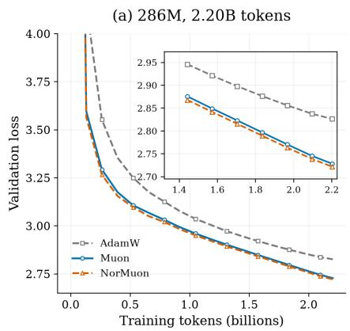

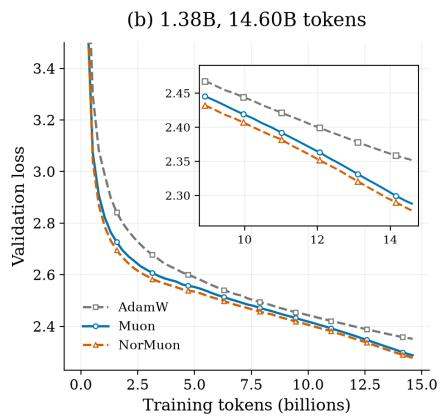

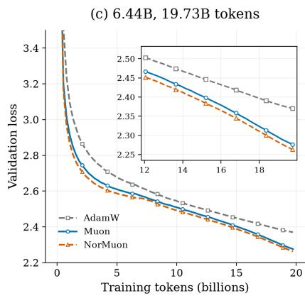  
Figure 1: Validation loss in LLM pretraining for the (a) 286M, (b) 1.38B, and (c) 6.44B models.

## 4.4 Ablation studies

Step-size sensitivity. We test how sensitive Muon and NorMuon are to step sizes. We train the 286M model on 2.20B tokens with step sizes in {0.01, 0.02, 0.03, 0.04} and the 1.38B model on 14.6B tokens with step sizes in {0.005, 0.01, 0.02}, and compare NorMuon with Muon at each step size. Figure 2(a) shows the final validation loss. NorMuon has lower loss than Muon at every step size, and both reach their lowest loss at 0.03 for the 286M model and 0.01 for the 1.38B model.

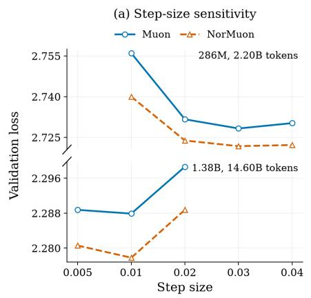

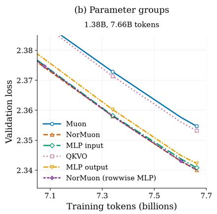

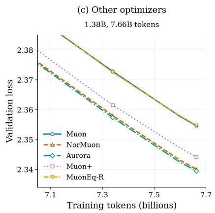  
Figure 2: Ablation studies. (a) Final validation loss versus step size. (b) NorMuon applied to diferent groups of matrices. (c) Comparison with other Muon variants that use normalization.

In what follows, we instead train the 1.38B model in the compute-optimal setting of 7.66B tokens.

Parameter groups. We test which weight matrices benefit from normalization. We apply NorMuon only to the attention query/key/value/output projections (QKVO), the MLP input projections, or the MLP output projections, with Muon optimizing the remaining matrices. We compare these variants with Muon, NorMuon on all transformer matrices, and NorMuon (row-wise MLP), which normalizes the MLP matrices along their rows instead of their larger dimension. As shown in Figure 2(b) and the left half of Table 4, normalizing only the QKVO matrices gives nearly the same validation and test losses as Muon, while normalizing only the MLP input or only the MLP output projections recovers most of the gain of NorMuon, and NorMuon (row-wise MLP) nearly matches NorMuon. Thus, the gain of NorMuon comes mainly from the MLP matrices. This aligns with the findings of Dewulf et al. [2026].

Other matrix optimizers with normalization. We compare NorMuon with other Muon variants that use normalization. The baselines include Muon, Aurora [Dewulf et al., 2026], Muon+ [Zhang et al., 2026b], and MuonEq-R [Chang et al., 2026]. As shown in Figure 2(c) and the right half of Table 4, Aurora and NorMuon achieve nearly identical validation and test losses, with Aurora’s losses being slightly lower, followed by Muon+, while MuonEq-R performs nearly identically to Muon. With the same step size and 5 PolarExpress iterations, Aurora, NorMuon, and Muon+, which all normalize the orthogonalized update, improve on Muon.

Table 4: Test loss for parameter group and optimizer ablations.
<table><tr><td>NorMuon parameter groups</td><td>286M</td><td>1.38B</td><td>Other optimizers</td><td>286M</td><td>1.38B</td></tr><tr><td>Muon</td><td>2.7311</td><td>2.3587</td><td>Muon</td><td>2.7311</td><td>2.3587</td></tr><tr><td>NorMuon</td><td>2.7248</td><td>2.3442</td><td>NorMuon</td><td>2.7248</td><td>2.3442</td></tr><tr><td>QKVO only</td><td>2.7319</td><td>2.3572</td><td>Aurora</td><td>2.7237</td><td>2.3435</td></tr><tr><td>MLP input only</td><td>2.7258</td><td>2.3448</td><td>Muon+</td><td>2.7265</td><td>2.3483</td></tr><tr><td>MLP output only</td><td>2.7260</td><td>2.3463</td><td>MuonEq-R</td><td>2.7305</td><td>2.3587</td></tr><tr><td>NorMuon (row-wise MLP)</td><td>2.7260</td><td>2.3442</td><td></td><td></td><td></td></tr></table>

## 5 Conclusion

We studied the efect of row normalization on Muon through the worst-case convergence of NorMuon in operator-norm geometry. Indeed, we established matching deterministic lower and upper bounds of $\Theta ( m L \epsilon ^ { - 2 } )$ , revealing an extra factor of m compared with Muon. The lower bound holds with exact polar computation, any fixed momentum parameters and any deterministic adaptive step sizes. We also extended the upper bound analysis to stochastic settings, allowing approximate polar computation in both upper bound analyses. Synthetic experiments show a slowdown for NorMuon, whereas LLM pretraining experiments demonstrate improved performance over Muon. These findings highlight that balanced neuron-wise updates alone do not guarantee faster optimization in the worst case. Future directions include identifying structural properties of LLM training that explain when row normalization is beneficial and developing a theory that captures these benefits.

## Acknowledgments

We sincerely appreciate Buzz High Performance Computing (https://www.buzzhpc.ai, info@buzzhpc.ai) for providing computational resources and support for this work. The second author is partially sup ported by a start-up fund and the Early Career Scholarship Support Grant at Columbia University.

## References

K. Ahn, B. Xu, N. Abreu, Y. Fan, G. Magakyan, P. Sharma, Z. Zhan, and J. Langford. Dion: Distributed orthonormalized updates. ArXiv Preprint: 2504.05295, 2025. (Cited on page 20.)

J. M. Altschuler and P. A. Parrilo. Acceleration by stepsize hedging: Multi-step descent and the silver stepsize schedule. Journal of the ACM, 72(2):1–38, 2025a. (Cited on pages 2 and 3.)

J. M. Altschuler and P. A. Parrilo. Acceleration by stepsize hedging: Silver stepsize schedule for smooth convex optimization. Mathematical Programming, 213(1):1105–1118, 2025b. (Cited on pages 2 and 3.)

N. Amsel, D. Persson, C. Musco, and R. M. Gower. The polar express: Optimal matrix sign methods and their application to the Muon algorithm. In ICLR, volume 2026, pages 138323–138360, 2026a. (Cited on pages 4, 5, 9, 20, and 28.)

N. Amsel, J. Zhang, K. Ahn, A. Naeimi, A. Feng, B. Chen, T. Dao, and J. Langford. Dion3: Full-stack orthogonal updates. ArXiv Preprint: 2608.11612, 2026b. (Cited on pages 3 and 20.)

Y. Arjevani, Y. Carmon, J. C. Duchi, D. J. Foster, N. Srebro, and B. Woodworth. Lower bounds for non-convex stochastic optimization. Mathematical Programming, 199(1):165–214, 2023. (Cited on page 20.)

J. Bernstein and L. Newhouse. Old optimizer, new norm: An anthology. In NeurIPS Workshop on Optimization for Machine Learning, 2024. URL https://openreview.net/forum?id=ux18f5nOpD. (Cited on pages 3 and 20.)

J. Bernstein and L. Newhouse. Modular duality in deep learning. In ICML, 2025. URL https: //openreview.net/forum?id=hErdffTsLu. (Cited on page 20.)

Y. Bisk, R. Zellers, R. Le Bras, J. Gao, and Y. Choi. PIQA: Reasoning about physical commonsense in natural language. In AAAI, volume 34, pages 7432–7439, 2020. (Cited on page 10.)

Y. Carmon, J. C. Duchi, O. Hinder, and A. Sidford. Lower bounds for finding stationary points I. Mathematical Programming, 184(1-2):71–120, 2020. (Cited on page 20.)

Y. Carmon, J. C. Duchi, O. Hinder, and A. Sidford. Lower bounds for finding stationary points II: First-order methods. Mathematical Programming, 185(1-2):315–355, 2021. (Cited on page 20.)

C. Cartis, N. I. M. Gould, and P. L. Toint. On the complexity of steepest descent, Newton’s and regularized Newton’s methods for nonconvex unconstrained optimization problems. SIAM Journa on Optimization, 20(6):2833–2852, 2010. (Cited on page 3.)

C. Cartis, N. I. M. Gould, and P. L. Toint. Worst-case evaluation complexity and optimality of secondorder methods for nonconvex smooth optimization. In Proceedings of the International Congress of Mathematicians: Rio de Janeiro, pages 3711–3750. World Scientific, 2018. (Cited on page 3.)

D. Chang, Q. Shi, L. Zhang, Y. Li, R. Zhang, Y. Lu, Y. Liu, and G. Yuan. MuonEq: Balancing before orthogonalization with lightweight equilibration. ArXiv Preprint: 2603.28254, 2026. (Cited on pages 3 and 11.)

L. Chen, J. Li, and Q. Liu. Muon optimizes under spectral norm constraints. Transactions on Machine Learning Research (TMLR), 2026. ISSN 2835-8856. URL https://openreview.net/forum?id= Blz4hjxLwU. (Cited on page 20.)

S. Choudhury, X. Cheng, M. Tak´aˇc, S. Na, and M. Kolar. Muon with Nesterov momentum: Heavytailed noise and (randomized) inexact polar decomposition. ArXiv Preprint: 2605.06884, 2026. (Cited on page 20.)

C. Clark, K. Lee, M.-W. Chang, T. Kwiatkowski, M. Collins, and K. Toutanova. BoolQ: Exploring the surprising dificulty of natural yes/no questions. In Proceedings of the 2019 Conference of the North American Chapter of the Association for Computational Linguistics: Human Language Technologies, Volume 1 (Long and Short Papers), pages 2924–2936, 2019. (Cited on page 10.)

P. Clark, I. Cowhey, O. Etzioni, T. Khot, A. Sabharwal, C. Schoenick, and O. Tafjord. Think you have solved question answering? Try ARC, the AI2 reasoning challenge. ArXiv Preprint: 1803.05457, 2018. (Cited on page 10.)

G. B. Dantzig. Linear Programming and Extensions. Princeton University Press, 1963. (Cited on page 1.)

D. Davis and D. Drusvyatskiy. When do spectral gradient updates help in deep learning? ArXiv Preprint: 2512.04299, 2025. (Cited on page 20.)

E. De Klerk, F. Glineur, and A. B. Taylor. On the worst-case complexity of the gradient method with exact line search for smooth strongly convex functions. Optimization Letters, 11(7):1185–1199, 2017. (Cited on page 21.)

A. Dewulf, D. Pai, L. Yang, A. Zhang, and B. Keigwin. Aurora: A leverage-aware spectral optimizer. ArXiv Preprint: 2606.27715, 2026. (Cited on pages 1, 2, 3, 11, 29, and 31.)

S. Diao, Y. Yang, Y. Fu, X. Dong, D. Su, M. Kliegl, Z. Chen, P. Belcak, Y. Suhara, H. Yin, et al. Nemotron-CLIMB: Clustering-based iterative data mixture bootstrapping for language model pretraining. In NeurIPS Datasets and Benchmarks Track, 2025. URL https://openreview.net/forum? id=aBlqKPkc4a. (Cited on page 9.)

T. Dozat. Incorporating Nesterov momentum into Adam. In ICLR, 2016. URL https://openreview. net/forum?id=OM0jvwB8jIp57ZJjtNEZ. (Cited on page 9.)

S. Dragutinovi´c and R. Ranganath. To use or not to use Muon: How simplicity bias in optimizers matters. In ICLR Workshop on Scientific Methods for Understanding Deep Learning, 2026. URL https://openreview.net/forum?id=GsZtgQf3IM. (Cited on page 20.)

Y. Drori and O. Shamir. The complexity of finding stationary points with stochastic gradient descent. In ICML, pages 2658–2667. PMLR, 2020. (Cited on page 20.)

Y. Drori and M. Teboulle. Performance of first-order methods for smooth convex minimization: A novel approach. Mathematical Programming, 145(1):451–482, 2014. (Cited on page 3.)

J. Duchi, E. Hazan, and Y. Singer. Adaptive subgradient methods for online learning and stochastic optimization. Journal of Machine Learning Research, 12(7), 2011. (Cited on page 21.)

C. Fan, M. Schmidt, and C. Thrampoulidis. Implicit bias of spectral descent and Muon on multiclass separable data. In NeurIPS, pages 39622–39669, 2025. (Cited on page 20.)

E. Ghadimi, H. R. Feyzmahdavian, and M. Johansson. Global convergence of the heavy-ball method for convex optimization. In ECC, pages 310–315. IEEE, 2015. (Cited on page 3.)

A. Gonon, A.-A. Mu¸sat, and N. Boumal. Insights on Muon from simple quadratics. ArXiv Preprint: 2602.11948, 2026. (Cited on page 20.)

B. Goujaud, A. Taylor, and A. Dieuleveut. Provable non-accelerations of the heavy-ball method. Mathematical Programming, pages 1–59, 2025. (Cited on page 3.)

B. Grimmer. Provably faster gradient descent via long steps. SIAM Journal on Optimization, 34(3): 2588–2608, 2024. (Cited on page 3.)

Y. Gu, O. Tafjord, B. Kuehl, D. Haddad, J. Dodge, and H. Hajishirzi. OLMES: A standard for language model evaluations. In Findings of ACL: NAACL, pages 5020–5048, 2025. (Cited on page 10.)

V. Gupta, T. Koren, and Y. Singer. Shampoo: Preconditioned stochastic tensor optimization. In ICML, pages 1842–1850. PMLR, 2018. (Cited on page 20.)

C. He and S. Zhang. Heavy-ball method under randomized schedules. ArXiv Preprint: 2609.09743, 2026. (Cited on page 3.)

K. He, X. Zhang, S. Ren, and J. Sun. Deep residual learning for image recognition. In CVPR, pages 770–778. IEEE, 2016. (Cited on page 1.)

D. Hendrycks, C. Burns, S. Basart, A. Zou, M. Mazeika, D. Song, and J. Steinhardt. Measuring massive multitask language understanding. In ICLR, 2021. URL https://openreview.net/forum? id=d7KBjmI3GmQ. (Cited on page 10.)

A. Henry, P. R. Dachapally, S. S. Pawar, and Y. Chen. Query-key normalization for transformers. In Findings of the ACL: EMNLP, pages 4246–4253, 2020. (Cited on page 28.)

F. H¨ubler, K. Lion, A. Orvieto, and N. He. Muown implicitly performs angular step-size decay. ArXiv Preprint: 2606.23637, 2026. (Cited on page 20.)

K. Jordan. 94% on CIFAR-10 in 3.29 seconds on a single GPU. ArXiv Preprint: 2404.00498, 2024. (Cited on page 8.)

K. Jordan, Y. Jin, V. Boza, J. You, F. Cesista, L. Newhouse, and J. Bernstein. Muon: An optimizer for hidden layers in neural networks, 2024. URL https://kellerjordan.github.io/posts/muon/. (Cited on pages 1, 3, 4, 9, 20, and 28.)

A. Karpathy. Nanochat: The best ChatGPT that \$100 can buy, 2025. URL https://github.com/ karpathy/nanochat. (Cited on pages 1, 9, and 28.)

E. Khwaja, C. Lettieri, G. Woo, E. Belouadah, M. Cenac, G. Jarry, E. Paquin, X. Zhao, V. Zhukov, O. Abou-Amal, et al. Toto 2.0: Time series forecasting enters the scaling era. ArXiv Preprint: 2605.20119, 2026. (Cited on page 1.)

G. Y. Kim and M. Oh. Convergence of Muon with Newton-Schulz. In ICLR, 2026. URL https: //openreview.net/forum?id=lJSfxtLpLm. (Cited on page 20.)

D. P. Kingma and J. Ba. Adam: A method for stochastic optimization. In International Conference on Learning Representations, 2015. URL https://openreview.net/forum?id=8gmWwjFyLj. (Cited on pages 9 and 21.)

V. Klee and G. J. Minty. How good is the simplex algorithm? Inequalities, 3(3):159–175, 1972. (Cited on page 2.)

A. Krizhevsky. Learning multiple layers of features from tiny images. Technical report, University of Toronto, 2009. URL https://www.cs.toronto.edu/ kriz/learning-features-2009-TR.pdf. (Cited on page 8.)

A. Krizhevsky. One weird trick for parallelizing convolutional neural networks. ArXiv Preprint: 1404.5997, 2014. (Cited on page 9.)

A. Krizhevsky, I. Sutskever, and G. E. Hinton. ImageNet classification with deep convolutional neural networks. In NeurIPS, pages 1097–1105, 2012. (Cited on page 1.)

T. Large, Y. Liu, M. Huh, H. Bahng, P. Isola, and J. Bernstein. Scalable optimization in the modular norm. In NeurIPS, pages 73501–73548, 2024. (Cited on page 20.)

T. T. Lau, Q. Long, and W. Su. PolarGrad: A class of matrix-gradient optimizers from a unifying preconditioning perspective. ArXiv Preprint: 2505.21799, 2025. (Cited on page 20.)

L. Lessard, B. Recht, and A. Packard. Analysis and design of optimization algorithms via integral quadratic constraints. SIAM Journal on Optimization, 26(1):57–95, 2016. (Cited on page 3.)

Z. Li, L. Liu, C. Liang, W. Chen, and T. Zhao. NorMuon: Making Muon more eficient and scalable. In ICML, 2026. URL https://openreview.net/forum?id=m1IRWFAMsa. (Cited on pages 1, 3, 4, 8, and 28.)

K. Lion, F. H¨ubler, B. Li, A. Orvieto, and N. He. Muown: Row-norm control for Muon optimization. ArXiv Preprint: 2605.10797, 2026. (Cited on page 20.)

J. Liu, J. Su, X. Yao, Z. Jiang, G. Lai, Y. Du, Y. Qin, W. Xu, E. Lu, J. Yan, et al. Muon is scalable for LLM training. ArXiv Preprint: 2502.16982, 2025. (Cited on pages 1, 3, and 4.)

Z. Liu, R. Zhang, Z. Wang, Y. Zhao, Y. Su, Z. Yang, and Z. Zhang. Muon2: Boosting Muon via adaptive second-moment preconditioning. ArXiv Preprint: 2604.09967, 2026. (Cited on page 20.)

I. Loshchilov and F. Hutter. SGDR: Stochastic gradient descent with warm restarts. In ICLR, 2017. URL https://openreview.net/forum?id=Skq89Scxx. (Cited on page 2.)

I. Loshchilov and F. Hutter. Decoupled weight decay regularization. In ICLR, 2019. URL https: //openreview.net/forum?id=Bkg6RiCqY7. (Cited on pages 9 and 21.)

C. Ma, W. Gong, M. Scetbon, and E. Meeds. SWAN: SGD with normalization and whitening enables stateless LLM training. In ICML, 2025. URL https://openreview.net/forum?id=CQZXGmw5vO. (Cited on page 20.)

J. Ma, Y. Huang, Y. Chi, and Y. Chen. Preconditioning benefits of spectral orthogonalization in Muon. ArXiv Preprint: 2601.13474, 2026. (Cited on page 20.)

J. Martens and R. Grosse. Optimizing neural networks with Kronecker-factored approximate curvature. In ICML, pages 2408–2417. PMLR, 2015. (Cited on page 20.)

T. Mihaylov, P. Clark, T. Khot, and A. Sabharwal. Can a suit of armor conduct electricity? A new dataset for open book question answering. In EMNLP, pages 2381–2391, 2018. (Cited on page 10.)

A. S. Nemirovski and D. B. Yudin. Problem Complexity and Method Eficiency in Optimization. Wiley-Interscience, 1983. (Cited on page 20.)

Y. Nesterov. Lectures on Convex Optimization, volume 137. Springer, 2018. (Cited on page 20.)

NVIDIA. Megatron Core API documentation: Emerging optimizers, n.d. URL https: //docs.nvidia.com/megatron-core/developer-guide/latest/apidocs/core/core.optimizer. emerging\_optimizers.html. (Cited on page 1.)

T. Parshakova, A. Khaled, M. Crawshaw, G. Garrigos, and R. M. Gower. Muon does not converge on convex Lipschitz functions. ArXiv Preprint: 2605.08980, 2026. (Cited on page 20.)

T. Pethick, W. Xie, K. Antonakopoulos, Z. Zhu, A. Silveti-Falls, and V. Cevher. Training deep learning models with norm-constrained LMOs. In ICML, pages 49069–49104. PMLR, 2025. (Cited on pages 1, 5, and 20.)

B. T. Polyak. Gradient methods for the minimisation of functionals. USSR Computational Mathematics and Mathematical Physics, 3(4):864–878, 1963. (Cited on page 2.)

S. J. Reddi, S. Kale, and S. Kumar. On the convergence of Adam and beyond. In ICLR, 2018. URL https://openreview.net/forum?id=ryQu7f-RZ. (Cited on page 21.)

I. Safran and O. Shamir. How good is SGD with random shufling? In COLT, pages 3250–3284. PMLR, 2020. (Cited on page 20.)

K. Sakaguchi, R. Le Bras, C. Bhagavatula, and Y. Choi. WinoGrande: An adversarial Winograd schema challenge at scale. Communications of the ACM, 64(9):99–106, 2021. (Cited on page 10.)

M. Sap, H. Rashkin, D. Chen, R. Le Bras, and Y. Choi. Social IQa: Commonsense reasoning about social interactions. In EMNLP-IJCNLP, pages 4463–4473, 2019. (Cited on page 10.)

M. Scetbon, C. Ma, W. Gong, and E. Meeds. Gradient multi-normalization for eficient LLM training. In NeurIPS, 2025. URL https://openreview.net/forum?id=oanhUGY6un. (Cited on page 20.)

M. Sfyraki and J. Wang. Lions and Muons: Optimization via stochastic Frank-Wolfe under heavy-tailed noise. In ICML, 2026. URL https://openreview.net/forum?id=gvroXZ0HS8. (Cited on page 20.)

N. Shazeer and M. Stern. Adafactor: Adaptive learning rates with sublinear memory cost. In ICML, pages 4596–4604. PMLR, 2018. (Cited on page 21.)

W. Shen, R. Huang, M. Huang, C. Shen, and J. Zhang. On the convergence analysis of Muon. Transactions on Machine Learning Research (TMLR), 2026. ISSN 2835-8856. URL https://openreview. net/forum?id=4nH4CulGaP. J2C Certification. (Cited on pages 6 and 20.)

C. Si, D. Zhang, and W. Shen. AdaMuon: Adaptive Muon optimizer. ArXiv Preprint: 2507.11005, 2025. (Cited on page 20.)

J. Su, M. Ahmed, Y. Lu, S. Pan, W. Bo, and Y. Liu. RoFormer: Enhanced transformer with rotary position embedding. Neurocomputing, 568:127063, 2024. (Cited on page 28.)

R. Sun and Y. Ye. Worst-case complexity of cyclic coordinate descent: O(n2) gap with randomized version. Mathematical Programming, 185(1):487–520, 2021. (Cited on page 20.)

I. Sutskever, J. Martens, G. Dahl, and G. Hinton. On the importance of initialization and momentum in deep learning. In ICML, pages 1139–1147. PMLR, 2013. (Cited on page 21.)

A. Talmor, J. Herzig, N. Lourie, and J. Berant. CommonsenseQA: A question answering challenge targeting commonsense knowledge. In Proceedings of the 2019 Conference of the North American Chapter of the Association for Computational Linguistics: Human Language Technologies, Volume 1 (Long and Short Papers), pages 4149–4158, 2019. (Cited on page 10.)

H. Tao, D. Yu, and L. Zhang. When and why SignSGD outperforms SGD: A theoretical study based on ℓ1-norm lower bounds. ArXiv Preprint: 2605.06615, 2026. (Cited on page 21.)

A. B. Taylor, J. M. Hendrickx, and F. Glineur. Smooth strongly convex interpolation and exact worstcase performance of first-order methods. Mathematical Programming, 161(1):307–345, 2017. (Cited on page 3.)

Kimi Team, Y. Bai, Y. Bao, Y. Charles, C. Chen, G. Chen, H. Chen, H. Chen, J. Chen, N. Chen, et al. Kimi K2: Open agentic intelligence. ArXiv Preprint: 2507.20534, 2025. (Cited on page 1.)

T. Tieleman and G. E. Hinton. Neural networks for machine learning, Lecture 6.5 - RMSProp, 2012. COURSERA: Neural Networks for Machine Learning. (Cited on page 21.)

A. Vaswani, N. Shazeer, N. Parmar, J. Uszkoreit, L. Jones, A. N. Gomez, L. Kaiser, and I. Polosukhin. Attention is all you need. In NeurIPS, pages 6000–6010, 2017. (Cited on pages 1 and 3.)

N. Vyas, D. Morwani, R. Zhao, I. Shapira, D. Brandfonbrener, L. Janson, and S. Kakade. SOAP: Improving and stabilizing Shampoo using Adam for language modeling. In ICLR, volume 2025, pages 93423–93444, 2025. (Cited on page 20.)

J. Wei and L. Chen. Accelerated over-relaxation heavy-ball method: Achieving global accelerated convergence with broad generalization. In ICLR, 2025. URL https://openreview.net/forum?id= SWEqzy7IQB. (Cited on page 3.)

K. Wen, Z. Li, J. Wang, D. Hall, P. Liang, and T. Ma. Understanding warmup-stable-decay learning rates: A river valley loss landscape view. In ICLR, 2025. URL https://openreview.net/forum? id=m51BgoqvbP. (Cited on page 2.)

A. C. Wilson, R. Roelofs, M. Stern, N. Srebro, and B. Recht. The marginal value of adaptive gradient methods in machine learning. In NeurIPS, pages 4151–4161, 2017. (Cited on page 21.)

Y. Ye and K. Liu. Silver rate is (almost) optimal for gradient descent. ArXiv Preprint: 2609.09152, 2026. (Cited on pages 2 and 3.)

Y. You, J. Li, S. Reddi, J. Hseu, S. Kumar, S. Bhojanapalli, X. Song, J. Demmel, K. Keutzer, and C.-J. Hsieh. Large batch optimization for deep learning: Training BERT in 76 minutes. In ICLR, 2020. URL https://openreview.net/forum?id=Syx4wnEtvH. (Cited on page 21.)

R. Zellers, A. Holtzman, Y. Bisk, A. Farhadi, and Y. Choi. HellaSwag: Can a machine really finish your sentence? In ACL, pages 4791–4800, 2019. (Cited on page 10.)

A. Zhang, Z. C. Lipton, M. Li, and A. J. Smola. Dive into Deep Learning. Cambridge University Press, 2023. (Cited on page 20.)

B. Zhang and R. Sennrich. Root mean square layer normalization. In NeurIPS, volume 32, 2019. (Cited on page 28.)

J. Zhang and T. Lin. Scale-invariant neural network optimization: Norm geometry and heavy-tailed noise. ArXiv Preprint: 2605.18528, 2026. (Cited on page 6.)

M. Zhang, Y. Liu, and H. Schaefer. Adam improves Muon: Adaptive moment estimation with orthogonalized momentum. ArXiv Preprint: 2602.17080, 2026a. (Cited on page 20.)

R. Zhang, Y. Zhao, Z. Liu, Z. Wang, Y. Su, L. Tan, and Z. Zhang. MUON+: Towards more efective Muon via one additional normalization step for LLM pre-training. ArXiv Preprint: 2602.21545, 2026b. (Cited on pages 3 and 11.)

Y. Zhang, C. Chen, N. Shi, R. Sun, and Z. Luo. Adam can converge without any modification on update rules. In NeurIPS, pages 28386–28399, 2022. (Cited on page 21.)

Y. Zhang, C. Chen, Z. Li, T. Ding, C. Wu, D. Kingma, Y. Ye, Z. Luo, and R. Sun. Adam-mini: Use fewer learning rates to gain more. In ICLR, 2025. URL https://openreview.net/forum?id=iBExhaU3Lc. (Cited on page 21.)

Z. Zhou, T. Wu, Z. Jiang, F. Obeid, and Z. Lan. Value residual learning. In ACL (Volume 1: Long Papers), pages 28341–28356, 2025. (Cited on page 28.)

## A Further Related Works

We make some comments on other topics, including more discussions on matrix-aware optimization methods, the theoretical analysis of matrix-aware optimization methods, lower bound analysis, and other optimizers and analysis. For an overview of neural network optimization methods and analysis, we refer to the monographs [Nesterov, 2018, Zhang et al., 2023].

More discussion on matrix-aware optimization methods. Earlier matrix optimizers exploit the structure of weight matrices through Kronecker-factored or second-moment preconditioners [Martens and Grosse, 2015, Gupta et al., 2018, Vyas et al., 2025]. Muon [Jordan et al., 2024] and Scion [Pethick et al., 2025] depart from preconditioning and instead construct updates by dualizing the gradient under the operator norm. Several other Muon variants modify how the update is scaled or preconditioned. AdaMuon [Si et al., 2025] applies element-wise second-moment normalization to the orthogonalized update. NAMO [Zhang et al., 2026a] scales the orthogonalized momentum by a single adaptive step size, while its diagonal extension NAMO-D applies column-wise adaptive scaling. Muon2 [Liu et al., 2026] instead preconditions the momentum before orthogonalization, which improves the conditioning of the input to the polar computation. Muown [Lion et al., 2026, H¨ubler et al., 2026] controls row magnitudes through reparameterization. Stateless normalization has also been studied: SWAN [Ma et al., 2025] applies row normalization followed by orthogonalization, and SinkGD [Scetbon et al., 2025] replaces the orthogonalization with alternating row and column normalization. Other extensions target distributed eficiency [Ahn et al., 2025, Amsel et al., 2026b], step-size scaling based on polar decomposition [Lau et al., 2025], and more accurate polar approximation [Amsel et al., 2026a].

Analysis of matrix-aware optimization methods. A conceptual basis for Muon is that the gradient is a dual vector and should be mapped back to the primal space before being used as an update. Bernstein and Newhouse [2024] identify the orthogonalized update as steepest descent under the spectral norm, and modular dualization [Bernstein and Newhouse, 2025, Large et al., 2024] extends this view by assigning each layer an operator norm according to its input-output structure; see also [Pethick et al., 2025, Chen et al., 2026]. Within this operator-norm geometry, exact polar analyses establish a dimension-free $O ( \Delta L \epsilon ^ { - 2 } )$ rate for Muon [Shen et al., 2026], and Muon with weight decay converges as a stochastic Frank-Wolfe method [Sfyraki and Wang, 2026]. Kim and Oh [2026] prove that finite Newton-Schulz steps only introduce a multiplicative factor that approaches one doubly exponentially, and Choudhury et al. [2026] further handle Nesterov momentum and heavy-tailed noise. Other works study implicit and simplicity biases, local quadratic models, structured problems, and nonsmooth settings [Fan et al., 2025, Dragutinovi´c and Ranganath, 2026, Davis and Drusvyatskiy, 2025, Ma et al., 2026, Gonon et al., 2026, Parshakova et al., 2026].

Lower bound analysis. Classical first-order complexity analysis applies to every gradient-based optimization method and therefore gives no specific treatment to individual update rules [Nemirovski and Yudin, 1983, Carmon et al., 2020, 2021, Arjevani et al., 2023], leaving open the best rate that a particular algorithm can achieve. Algorithm-dependent convergence analysis instead analyzes a fixed update rule and seeks the best convergence result attainable by tuning it. Additional examples include tight stationary-point lower bounds for SGD [Drori and Shamir, 2020], explicit dimension-dependent lower bounds for cyclic coordinate descent relative to randomized coordinate descent [Sun and Ye, 2021], lower bounds distinguishing random-shufling and incremental-gradient schemes [Safran and Shamir,

2020], and exact worst-case constructions for gradient descent with exact line search De Klerk et al. [2017]. More recently, related lower-bound analyses have been developed for sign-based methods [Tao et al., 2026].

Other optimizers and analysis. Classical optimizers treat weight matrices as vectors, from SGD with momentum [Sutskever et al., 2013] to adaptive methods that rescale each coordinate by accumulated or exponentially averaged squared gradients [Duchi et al., 2011, Tieleman and Hinton, 2012, Kingma and Ba, 2015, Loshchilov and Hutter, 2019]. Other works rescale updates at a coarser granularity to exploit parameter structure [You et al., 2020]. Adafactor [Shazeer and Stern, 2018] factorizes the second moment of a weight matrix into row and column statistics to save memory. Adam-mini [Zhang et al., 2025] uses a single second-moment estimate for each Hessian-informed block. NorMuon adopts this normalization, but applies it to the row-wise norms of the orthogonalized update rather than to gradient coordinates.

Our analysis is also motivated by prior works that study adaptive gradient methods. Wilson et al. [2017] construct a linear classification problem on which adaptive methods converge to poorly generalizing solutions, whereas SGD finds the minimum-norm solution. Reddi et al. [2018] construct simple convex problems on which Adam fails to converge. Zhang et al. [2022] show that Adam converges when $\beta _ { 2 }$ is chosen large enough after the problem is fixed. In contrast, we show that the worst-case cost of row normalization in NorMuon is not non-convergence but an extra dimension-dependent factor in the iteration complexity, and this cost persists under any fixed momentum parameters.

## B Missing Proofs

Throughout this section, we let $d = \operatorname* { m i n } \{ m , n \}$ and $e _ { i } ^ { ( n ) } \in \mathbb { R } ^ { n }$ be the $i ^ { \mathrm { t h } }$ basis vector of $\mathbb { R } ^ { n }$

## B.1 Proof of Theorem 3.1

We define $\begin{array} { r } { \lambda = \langle H _ { \star } , D _ { \star } \rangle = \frac { 2 m - 1 } { \sqrt { m ( m ^ { 2 } + m - 1 ) } } } \end{array}$ , where

$$
\begin{array} { r } { H _ { \star } : = \frac { ( m , 1 , \ldots , 1 ) ^ { \top } } { \sqrt { m ^ { 2 } + m - 1 } } ( e _ { 1 } ^ { ( n ) } ) ^ { \top } \in \mathbb { R } ^ { m \times n } , \quad D _ { \star } : = \frac { 1 } { \sqrt { m } } ( 1 , 1 , \ldots , 1 ) ^ { \top } ( e _ { 1 } ^ { ( n ) } ) ^ { \top } \in \mathbb { R } ^ { m \times n } . } \end{array}\tag{B.1}
$$

We construct two sequences $\{ q _ { t } \} _ { t = 0 } ^ { T _ { 0 } }$ and $\{ f _ { t } \} _ { t = 0 } ^ { T _ { 0 } }$ by setting $q _ { 0 } = 0$ and $f _ { 0 } = 0$ . For $0 \leq t < T _ { 0 }$ , we feed the history $\{ ( X _ { 0 } + q _ { s } D _ { \star } , f _ { s } , 2 \epsilon H _ { \star } ) \} _ { s \leq t }$ to the deterministic adaptive step-size rule, which returns a fixed $\eta _ { t } \geq 0$ . We let $\eta _ { t } ^ { \prime } = 0 . 2 \sqrt { m n } \eta _ { t }$ and define

$$
q _ { t + 1 } = q _ { t } - \eta _ { t } ^ { \prime } , \quad f _ { t + 1 } = f _ { t } - \int _ { 0 } ^ { \eta _ { t } ^ { \prime } } \operatorname* { m a x } \{ 2 \epsilon \lambda - L \operatorname* { m i n } \{ z , \eta _ { t } ^ { \prime } - z \} , 0 \} d z .\tag{B.2}
$$

We also define

$$
\begin{array} { r l } & { f ( q ) = \ \displaystyle \int _ { 0 } ^ { q } \operatorname* { m a x } _ { 0 \leq j \leq T _ { 0 } } \operatorname* { m a x } \{ 2 \epsilon \lambda - L | z - q _ { j } | , 0 \} d z , } \\ & { F ( X ) = \ f ( \langle D _ { \star } , X - X _ { 0 } \rangle ) + \frac { L } { 2 \| H _ { \star } - \lambda D _ { \star } \| _ { F } ^ { 2 } } ( \langle H _ { \star } - \lambda D _ { \star } , X - X _ { 0 } \rangle + \frac { 2 \epsilon \| H _ { \star } - \lambda D _ { \star } \| _ { F } ^ { 2 } } { L } ) ^ { 2 } } \\ & { \quad \quad \quad - \frac { 2 \epsilon ^ { 2 } \| H _ { \star } - \lambda D _ { \star } \| _ { F } ^ { 2 } } { L } . } \end{array}\tag{B.3}
$$

(B.4)

We claim that, when applied to F with any fixed $\beta _ { 1 } , \beta _ { 2 } \in [ 0 , 1 )$ , exact gradients and $\ell = \delta = \alpha = 0$ ， Algorithm 1 satisfies

$$
X _ { t } = X _ { 0 } + q _ { t } D _ { \star } , \quad F ( X _ { t } ) = f ( q _ { t } ) = f _ { t } , \quad \nabla F ( X _ { t } ) = 2 \epsilon H _ { \star } , \quad \mathrm { f o r ~ a l l ~ } t = 0 , 1 , \dots , T _ { 0 } .\tag{B.5}
$$

In other words, Algorithm 1 observes $\{ ( X _ { 0 } + q _ { s } D _ { \star } , f _ { s } , 2 \epsilon H _ { \star } ) \} _ { s \leq T _ { 0 } }$ and selects the same $\{ \eta _ { s } \} _ { s < T _ { 0 } }$ . Since $\| 2 \epsilon H _ { \star } \| _ { \mathrm { n u c } } = 2 \epsilon > \epsilon ,$ we obtain the desired result in Theorem 3.1. Thus, it sufices to show that (i) Eq. (B.5) holds; (ii) F satisfies Assumption 2.1; and (iii) $F ( X _ { 0 } ) - F ^ { \star } \leq \Delta$

We prove (i). The sequence $\{ q _ { t } \} _ { t \le T _ { 0 } }$ is nonincreasing, which implies that the distance from any $q \in [ q _ { t + 1 } , q _ { t } ] \mathrm { ~ t o ~ } \{ q _ { 0 } , \dots , q _ { T _ { 0 } } \}$ is min $\{ q - q _ { t + 1 } , q _ { t } - q \}$ . Therefore, we have

$$
f ( q _ { t } ) - f ( q _ { t + 1 } ) = \int _ { 0 } ^ { \eta _ { t } ^ { \prime } } \operatorname* { m a x } \{ 2 \epsilon \lambda - L \operatorname* { m i n } \{ z , \eta _ { t } ^ { \prime } - z \} , 0 \} d z = f _ { t } - f _ { t + 1 } .
$$

Since $f ( q _ { 0 } ) = f _ { 0 } = 0$ , we have $f ( q _ { t } ) = f _ { t }$ for all $0 \leq t \leq T _ { 0 }$ . By definition, we have

$$
\begin{array} { r } { \nabla F ( X ) = f ^ { \prime } ( \langle D _ { \star } , X - X _ { 0 } \rangle ) D _ { \star } + ( \frac { L \langle H _ { \star } - \lambda D _ { \star } , X - X _ { 0 } \rangle } { \| H _ { \star } - \lambda D _ { \star } \| _ { F } ^ { 2 } } + 2 \epsilon ) ( H _ { \star } - \lambda D _ { \star } ) . } \end{array}
$$

Since $j = t$ attains the maximum in Eq. (B.3), we have $f ^ { \prime } ( q _ { t } ) = 2 \epsilon \lambda$ . Putting these pieces together with $\langle H _ { \star } - \lambda D _ { \star } , D _ { \star } \rangle = 0$ yields that $F ( X _ { 0 } + q _ { t } D _ { \star } ) = f _ { t }$ and $\nabla F ( X _ { 0 } + q _ { t } D _ { \star } ) = 2 \epsilon H _ { \star }$ for all $0 \leq t \leq T _ { 0 }$

It remains to show $X _ { t } = X _ { 0 } + q _ { t } D ,$ for all $t \leq T _ { 0 }$ . We prove this by induction on t. The case of $t = 0$ follows from $q _ { 0 } = 0$ . Suppose that $X _ { s } = X _ { 0 } + q _ { s } D _ { \star }$ for all $s \leq t < T _ { 0 }$ . Then, we have $G _ { s } = \nabla F ( X _ { s } ) = 2 \epsilon H _ { \star }$ and $F ( X _ { s } ) = f _ { s }$ for $s \leq t .$ . Thus, the deterministic adaptive step-size rule observes $\{ ( X _ { 0 } + q _ { \tau } D _ { \star } , f _ { \tau } , 2 \epsilon H _ { \star } ) \} _ { \tau \le t }$ and selects $\eta _ { t }$ . Since rank $( H _ { \star } ) = \| H _ { \star } \| _ { F } = 1$ , Algorithm 1 gives $M _ { s + 1 } = 2 \epsilon ( 1 - \beta _ { 1 } ^ { s + 1 } ) H _ { \star }$ and $O _ { s + 1 } = \mathrm { P o l a r } ( H _ { \star } ) = H _ { \star }$ for all $s \leq t$ . By the definition of $H _ { \star }$ (see Eq. (B.1)), we have

$$
v _ { t + 1 } = \sum _ { s = 0 } ^ { t } \beta _ { 2 } ^ { t - s } \frac { 1 - \beta _ { 2 } } { n } \mathrm { d i a g } ( O _ { s + 1 } O _ { s + 1 } ^ { \top } ) = \frac { 1 - \beta _ { 2 } ^ { t + 1 } } { n ( m ^ { 2 } + m - 1 ) } ( m ^ { 2 } , 1 , \ldots , 1 ) ^ { \top } .\tag{B.6}
$$

Since $\alpha = 0$ , we have

$$
\begin{array} { r } { [ \overline { { O } } _ { t + 1 } ] _ { i , : } = \frac { 1 } { \sqrt { [ v _ { t + 1 } ] _ { i } } } [ O _ { t + 1 } ] _ { i , : } = \frac { 1 } { \sqrt { [ v _ { t + 1 } ] _ { i } } } [ H _ { \star } ] _ { i , : } = \left\{ \frac { m } { \sqrt { ( m ^ { 2 } + m - 1 ) [ v _ { t + 1 } ] _ { i } } } e _ { 1 } ^ { ( n ) } , \quad i = 1 , \ldots , m _ { \star } \right. } \end{array}
$$

Together with Eq. (B.6), this implies that $\begin{array} { r } { [ \overline { { O } } _ { t + 1 } ] _ { i , : } = \sqrt { \frac { n } { 1 - \beta _ { 2 } ^ { t + 1 } } } e _ { 1 } ^ { ( n ) } } \end{array}$ for all $i = 1 , \ldots , m$ . In addition, by the definition of $D _ { \star }$ (see Eq. (B.1)), we have

$$
\begin{array} { r } { \overline { { O } } _ { t + 1 } = \sqrt { \frac { m n } { 1 - \beta _ { 2 } ^ { t + 1 } } } D _ { \star } , } \end{array}
$$

which further implies

$$
\begin{array} { r } { \| \overline { { O } } _ { t + 1 } \| _ { F } = \sqrt { \frac { m n } { 1 - \beta _ { 2 } ^ { t + 1 } } } , \quad D _ { t + 1 } = 0 . 2 \sqrt { m n } \frac { \overline { { O } } _ { t + 1 } } { \| \overline { { O } } _ { t + 1 } \| _ { F } } = 0 . 2 \sqrt { m n } D _ { \star } . } \end{array}
$$

By induction, we have $X _ { t + 1 } = X _ { t } - \eta _ { t } D _ { t + 1 } = X _ { 0 } + q _ { t } D _ { \star } - \eta _ { t } D _ { t + 1 } = X _ { 0 } + q _ { t + 1 } D _ { \star } .$

We prove (ii). Since $f ^ { \prime }$ is a maximum of L-Lipschitz functions, we obtain that $f ^ { \prime }$ is L-Lipschitz. Since $\nabla F ( X )$ and $\nabla F ( Y )$ are supported in the first column for all $X , Y \in \mathbb { R } ^ { m \times n }$ , we have

$$
\begin{array} { r l } {  { \| \nabla F ( X ) - \nabla F ( Y ) \| _ { \mathrm { n u c } } ^ { 2 } = \| \nabla F ( X ) - \nabla F ( Y ) \| _ { F } ^ { 2 } } } \\ & { = \enspace | f ^ { \prime } ( \langle D _ { \star } , X - X _ { 0 } \rangle ) - f ^ { \prime } ( \langle D _ { \star } , Y - X _ { 0 } \rangle ) | ^ { 2 } + \frac { L ^ { 2 } | \langle H _ { \star } - \lambda D _ { \star } , X - Y \rangle | ^ { 2 } } { \| H _ { \star } - \lambda D _ { \star } \| _ { F } ^ { 2 } } } \\ & { \le \enspace L ^ { 2 } ( | \langle D _ { \star } , X - Y \rangle | ^ { 2 } + \frac { | \langle H _ { \star } - \lambda D _ { \star } , X - Y \rangle | ^ { 2 } } { \| H _ { \star } - \lambda D _ { \star } \| _ { F } ^ { 2 } } ) } \\ & { \le \enspace L ^ { 2 } \| ( X - Y ) e _ { 1 } ^ { ( n ) } \| _ { 2 } ^ { 2 } \le L ^ { 2 } \| X - Y \| _ { \mathrm { o p } } ^ { 2 } , } \end{array}
$$

where we used the fact that $D _ { \star }$ and $\frac { H _ { \star } - \lambda D _ { \star } } { \| H _ { \star } - \lambda D _ { \star } \| _ { F } }$ are orthonormal and supported in the first column.

We prove (iii). Since $f ^ { \prime } \geq 0$ , it follows from Eq. (B.3) that

$$
\begin{array} { r l r } {  { f ( 0 ) - \operatorname* { i n f } _ { q \in \mathbb { R } } f ( q ) = \int _ { - \infty } ^ { 0 } \operatorname* { m a x } _ { 0 \leq j \leq T _ { 0 } } \operatorname* { m a x } \{ 2 \epsilon \lambda - L | z - q _ { j } | , 0 \} d z } } \\ & { \leq } & { \int _ { - \infty } ^ { 0 } \operatorname* { m a x } \{ 2 \epsilon \lambda - L | q | , 0 \} d q + \displaystyle \sum _ { j = 1 } ^ { T _ { 0 } } \int _ { - \infty } ^ { + \infty } \operatorname* { m a x } \{ 2 \epsilon \lambda - L | q - q _ { j } | , 0 \} d q } \\ & { = } & { \frac { 2 \epsilon ^ { 2 } \lambda ^ { 2 } } { L } + \frac { 4 T _ { 0 } \epsilon ^ { 2 } \lambda ^ { 2 } } { L } . } \end{array}
$$

This implies that f is bounded below. By definition, $F$ is bounded below and $F ^ { \star }$ is finite.

Since $F ( X _ { 0 } ) = f ( 0 ) = 0 \quad$ , Eq. (B.4) gives

$$
\begin{array} { r } { F ( X _ { 0 } ) - F ^ { \star } \le \frac { 2 \epsilon ^ { 2 } \lambda ^ { 2 } } { L } + \frac { 4 T _ { 0 } \epsilon ^ { 2 } \lambda ^ { 2 } } { L } + \frac { 2 \epsilon ^ { 2 } \| H _ { \star } - \lambda D _ { \star } \| _ { F } ^ { 2 } } { L } = \frac { 2 \epsilon ^ { 2 } } { L } + \frac { 4 T _ { 0 } \epsilon ^ { 2 } \lambda ^ { 2 } } { L } \le \frac { 2 \epsilon ^ { 2 } } { L } + \frac { 1 6 T _ { 0 } \epsilon ^ { 2 } } { m L } < \frac { 5 \Delta } { 8 } < \Delta _ { \star } } \end{array}
$$

where we used $\begin{array} { r } { \lambda ^ { 2 } < \frac { 4 } { m } , T _ { 0 } \le \frac { m \Delta L } { 3 2 \epsilon ^ { 2 } } } \end{array}$ , and $\epsilon < \frac { 1 } { 4 } \sqrt { \Delta L }$

## B.2 Proof of Theorems 3.2 and 3.3

We first prove the descent inequality in Eq. (2.1) for the sake of completeness.

Lemma B.1 If Assumption 2.1 holds with $L > 0$ , we have

$$
\begin{array} { r } { F ( Y ) \leq F ( X ) + \langle \nabla F ( X ) , Y - X \rangle + \frac { L } { 2 } \| Y - X \| _ { \mathrm { o p } } ^ { 2 } \mathrm { ~ f o r ~ a n y ~ } X , Y \in \mathbb { R } ^ { m \times n } . } \end{array}\tag{B.7}
$$

In addition, $F ( X ) - F ^ { \star } \leq \Delta$ implies $\| \nabla F ( X ) \| _ { \mathrm { n u c } } \leq \sqrt { 2 \Delta L }$

Proof. For any $X , Y \in \mathbb { R } ^ { m \times n }$ , we have

$$
\begin{array} { r } { F ( Y ) - F ( X ) = \displaystyle \int _ { 0 } ^ { 1 } \langle \nabla F ( ( 1 - s ) X + s Y ) , Y - X \rangle d s \leq \langle \nabla F ( X ) , Y - X \rangle + \frac { L } { 2 } \| Y - X \| _ { \mathrm { o p } } ^ { 2 } . } \end{array}
$$

Suppose that $\boldsymbol { \nabla } F ( \boldsymbol { X } ) = \boldsymbol { U } \boldsymbol { \Sigma } \boldsymbol { V } ^ { \intercal }$ is a compact SVD. Then, we let $\begin{array} { r } { Y = X - \frac { 1 } { L } \| \nabla F ( X ) \| _ { \mathrm { n u c } } U V ^ { \top } } \end{array}$ and obtain that $\begin{array} { r } { F ^ { \star } \le F ( Y ) \le F ( X ) - \frac { \| \nabla F ( X ) \| _ { \mathrm { n u c } } ^ { 2 } } { 2 L } } \end{array}$ . □

We then bound $\langle M _ { t + 1 } , D _ { t + 1 } \rangle$ in the following lemma.

Lemma B.2 If Assumption 2.3 holds and $\ell \in [ 0 , \frac { 1 } { d } )$ , we have $\langle M _ { t + 1 } , D _ { t + 1 } \rangle \geq 0 . 2 \kappa \sqrt { m n } \| M _ { t + 1 } \| _ { \mathrm { n u c } }$ and $\| D _ { t + 1 } \| _ { \mathrm { o p } } \leq \| D _ { t + 1 } \| _ { F } = 0 . 2 \sqrt { m n }$ for any $\alpha \geq 0$ and any $t \geq 0$

Proof. If $M _ { t + 1 } = 0$ , we have $D _ { t + 1 } = \overline { { O } } _ { t + 1 } = O _ { t + 1 } = 0$ which yields the desired result. Otherwise, by the update rule of Algorithm 1, we have

$$
\begin{array} { r } { \langle M _ { t + 1 } , D _ { t + 1 } \rangle = \frac { 0 . 2 \sqrt { m n } \langle M _ { t + 1 } , \overline { { O } } _ { t + 1 } \rangle } { \Vert \overline { { O } } _ { t + 1 } \Vert _ { F } } . } \end{array}\tag{B.8}
$$

First, we upper bound $\| \overline { { O } } _ { t + 1 } \| _ { F }$ . By Assumption 2.3, we have $O _ { t + 1 } = U \widetilde { \Sigma } V ^ { \top }$ where $M _ { t + 1 } = U \Sigma V ^ { \top }$ is the compact SVD. For all $t ,$ the largest singular value of $\frac { M _ { t + 1 } } { \parallel M _ { t + 1 } \parallel _ { F } }$ is at least $\textstyle { \frac { 1 } { \sqrt { d } } } > \ell ,$ which implies that $1 - \delta \leq \| O _ { t + 1 } \| _ { \mathrm { o p } } \leq 1 + \delta$ . Since $\begin{array} { r } { [ v _ { t + 1 } ] _ { i } = \beta _ { 2 } [ v _ { t } ] _ { i } + \frac { 1 - \beta _ { 2 } } { n } \lVert [ O _ { t + 1 } ] _ { i , : } \rVert _ { 2 } ^ { 2 } } \end{array}$ and $v _ { 0 } = 0$ , we have

$$
\begin{array} { r } { \frac { 1 - \beta _ { 2 } } { n } \| [ O _ { t + 1 } ] _ { i , : } \| _ { 2 } ^ { 2 } \leq [ v _ { t + 1 } ] _ { i } \leq \frac { ( 1 + \delta ) ^ { 2 } } { n } , \quad \mathrm { f o r ~ a l l ~ } i . } \end{array}
$$

By the definition of $\overline { { O } } _ { t + 1 }$ , we have

$$
\begin{array} { r } { \| [ \overline { { O } } _ { t + 1 } ] _ { i , : } \| _ { 2 } = \frac { \| [ O _ { t + 1 } ] _ { i , : } \| _ { 2 } } { \sqrt { [ v _ { t + 1 } ] _ { i } } + \alpha } \leq \frac { \| [ O _ { t + 1 } ] _ { i , : } \| _ { 2 } } { \sqrt { \frac { 1 - \beta _ { 2 } } { n } } \| [ O _ { t + 1 } ] _ { i , : } \| _ { 2 } + \alpha } \leq \frac { 1 + \delta } { \sqrt { \frac { 1 - \beta _ { 2 } } { n } } ( 1 + \delta ) + \alpha } , \quad \mathrm { ~ f o r ~ a l l ~ } i , } \end{array}
$$

where the last inequality follows from monotonicity and $\| [ O _ { t + 1 } ] _ { i , : } \| _ { 2 } \leq \| O _ { t + 1 } \| _ { \mathrm { o p } } \leq 1 + \delta$ . Thus, we have

$$
\begin{array} { r } { \| \overline { { O } } _ { t + 1 } \| _ { F } \leq \frac { ( 1 + \delta ) \sqrt { m } } { \sqrt { \frac { 1 - \beta _ { 2 } } { n } } ( 1 + \delta ) + \alpha } . } \end{array}\tag{B.9}
$$

Second, we lower bound $\langle M _ { t + 1 } , \overline { { O } } _ { t + 1 } \rangle$ . Since $M _ { t + 1 } O _ { t + 1 } ^ { \top } = U \Sigma \tilde { \Sigma } U ^ { \top } \succeq 0$ , for $i = 1 , \ldots , m$ , we have $\langle [ M _ { t + 1 } ] _ { i , : } , [ O _ { t + 1 } ] _ { i , : } \rangle \geq 0$ . Then, we have

$$
\begin{array} { l l l } { \langle M _ { t + 1 } , \overline { { O } } _ { t + 1 } \rangle } & { = } & { \sum _ { i = 1 } ^ { m } \langle [ M _ { t + 1 } ] _ { i , : } , [ \overline { { O } } _ { t + 1 } ] _ { i , : } \rangle = \sum _ { i = 1 } ^ { m } \langle [ M _ { t + 1 } ] _ { i , : } , \frac { 1 } { \sqrt { [ v _ { t + 1 } ] _ { i } } + \alpha } [ O _ { t + 1 } ] _ { i , : } \rangle } \\ & { \geq } & { \sum _ { i = 1 } ^ { m } \frac { 1 } { \frac { 1 + \delta } { \sqrt { n } } + \alpha } \langle [ M _ { t + 1 } ] _ { i , : } , [ O _ { t + 1 } ] _ { i , : } \rangle = \frac { 1 } { \frac { 1 + \delta } { \sqrt { n } } + \alpha } \langle M _ { t + 1 } , O _ { t + 1 } \rangle . } \end{array}\tag{B.10}
$$

By Assumption 2.3, we obtain from $\Sigma _ { j j } \geq \ell \| M _ { t + 1 } \| _ { F }$ that $\widetilde { \Sigma } _ { j j } \geq 1 - \delta$ . It follows that

$$
\begin{array} { r c l } { \langle M _ { t + 1 } , O _ { t + 1 } \rangle } & { \geq } & { ( 1 - \delta ) \sum _ { j : \Sigma _ { j j } \geq \ell \| M _ { t + 1 } \| _ { F } } \Sigma _ { j j } \geq ( 1 - \delta ) ( \| M _ { t + 1 } \| _ { \operatorname { n u c } } - d \ell \| M _ { t + 1 } \| _ { F } ) } \\ & { \geq } & { ( 1 - \delta ) ( 1 - d \ell ) \| M _ { t + 1 } \| _ { \operatorname { n u c } } , } \end{array}\tag{B.11}
$$

where the last inequality uses $\| M _ { t + 1 } \| _ { F } \leq \| M _ { t + 1 } \| _ { \mathrm { n u c } }$ . Combining Eq. (B.8), Eq. (B.9), Eq. (B.10), and Eq. (B.11) yields

$$
\begin{array} { r } { \frac { \langle M _ { t + 1 } , D _ { t + 1 } \rangle } { 0 . 2 \sqrt { m n } } \geq \frac { \sqrt { \frac { 1 - \beta _ { 2 } } { n } } ( 1 + \delta ) + \alpha } { ( 1 + \delta ) \sqrt { m } ( \frac { 1 + \delta } { \sqrt { n } } + \alpha ) } ( 1 - \delta ) ( 1 - d \ell ) \| M _ { t + 1 } \| _ { \mathrm { n u c } } \geq \kappa \| M _ { t + 1 } \| _ { \mathrm { n u c } } . } \end{array}
$$

By definition, we have $\| D _ { t + 1 } \| _ { \mathrm { o p } } \leq \| D _ { t + 1 } \| _ { F } = 0 . 2 \sqrt { m n } .$

Proof of Theorem 3.2. Since $\beta _ { 1 } = 0$ and $G _ { t } = \nabla F ( X _ { t } )$ , we have $M _ { t + 1 } = \nabla F ( X _ { t } )$ . By applying Lemmas B.1 and B.2 and using $X _ { t + 1 } = X _ { t } - \eta D _ { t + 1 }$ , we have

$$
\begin{array} { r c l } { F ( X _ { t + 1 } ) - F ( X _ { t } ) } & { \leq } & { - \eta \langle \nabla F ( X _ { t } ) , D _ { t + 1 } \rangle + \frac { L \eta ^ { 2 } } { 2 } \| D _ { t + 1 } \| _ { \mathrm { o p } } ^ { 2 } } \\ & { \leq } & { - 0 . 2 \eta \kappa \sqrt { m n } \| \nabla F ( X _ { t } ) \| _ { \mathrm { n u c } } + \frac { L \eta ^ { 2 } } { 2 } ( 0 . 2 \sqrt { m n } ) ^ { 2 } } \\ & { = } & { - \frac { \kappa ^ { 2 } \epsilon } { L } \| \nabla F ( X _ { t } ) \| _ { \mathrm { n u c } } + \frac { \kappa ^ { 2 } \epsilon ^ { 2 } } { 2 L } . } \end{array}
$$

Summing the above inequality over $t = 0 , 1 , \ldots , T - 1$ and using $F ( X _ { 0 } ) - F ^ { \star } \leq \Delta$ yields

$$
\operatorname* { m i n } _ { 0 \leq t < T } \| \nabla F ( \boldsymbol { X } _ { t } ) \| _ { \mathrm { n u c } } \leq \frac { 1 } { T } \sum _ { t = 0 } ^ { T - 1 } \| \nabla F ( \boldsymbol { X } _ { t } ) \| _ { \mathrm { n u c } } \leq \frac { \Delta L } { \kappa ^ { 2 } \epsilon T } + \frac { \epsilon } { 2 } .
$$

We choose $\begin{array} { r } { T : = \lceil \frac { 2 \Delta L } { \kappa ^ { 2 } \epsilon ^ { 2 } } \rceil } \end{array}$ . By the definition of $\kappa ,$ we have min $0 \leq t < T \| \nabla F ( X _ { t } ) \| _ { \mathrm { n u c } } \leq \epsilon$ and $\begin{array} { r } { T = O ( \frac { m \Delta L } { \epsilon ^ { 2 } } ) } \end{array}$ Since Algorithm 1 calls the gradient oracle once per iteration, the total number of calls to the gradient oracle is bounded by $O ( \frac { m \Delta L } { \epsilon ^ { 2 } } )$ □

Proof of Theorem 3.3. By applying Lemma B.1 and using $X _ { t + 1 } = X _ { t } - \eta D _ { t + 1 }$ , we have

$$
\begin{array} { r } { F ( X _ { t + 1 } ) - F ( X _ { t } ) \leq - \eta \langle \nabla F ( X _ { t } ) , D _ { t + 1 } \rangle + \frac { L \eta ^ { 2 } } { 2 } \| D _ { t + 1 } \| _ { \mathrm { o p } } ^ { 2 } . } \end{array}\tag{B.12}
$$

We write $M _ { t + 1 } = \nabla F ( X _ { t } ) + E _ { t } + B _ { t }$ , where

$$
\begin{array} { l l l } { { E _ { t } } } & { { = } } & { { - \beta _ { 1 } ^ { t + 1 } \nabla F ( X _ { 0 } ) + \sum _ { s = 1 } ^ { t } \beta _ { 1 } ^ { t - s + 1 } ( \nabla F ( X _ { s - 1 } ) - \nabla F ( X _ { s } ) ) , } } \\ { { B _ { t } } } & { { = } } & { { ( 1 - \beta _ { 1 } ) \sum _ { s = 0 } ^ { t } \beta _ { 1 } ^ { t - s } ( G _ { s } - \nabla F ( X _ { s } ) ) . } } \end{array}
$$

By using $\| D _ { t + 1 } \| _ { \mathrm { o p } } \leq \| D _ { t + 1 } \| _ { F } = 0 . 2 \sqrt { m n }$ (see Lemma B.2) and $\begin{array} { r } { \kappa \leq \frac { 1 } { \sqrt { d } } . } \end{array}$ , we have

$$
\begin{array} { r l } {  { \frac { \langle \nabla F ( X _ { t } ) , D _ { t + 1 } \rangle } { 0 . 2 \sqrt { m n } } \geq \kappa \| M _ { t + 1 } \| _ { \mathrm { n u c } } - \| E _ { t } \| _ { \mathrm { n u c } } - \| B _ { t } \| _ { F } } } \\ & { \geq \kappa \| \nabla F ( X _ { t } ) \| _ { \mathrm { n u c } } - ( 1 + \kappa ) \| E _ { t } \| _ { \mathrm { n u c } } - \| B _ { t } \| _ { F } - \kappa \| B _ { t } \| _ { \mathrm { n u c } } } \\ & { \geq \kappa \| \nabla F ( X _ { t } ) \| _ { \mathrm { n u c } } - 2 \| E _ { t } \| _ { \mathrm { n u c } } - 2 \| B _ { t } \| _ { F } . } \end{array}
$$

Combining this inequality with Eq. (B.12) and using $\| D _ { t + 1 } \| _ { \mathrm { o p } } \leq 0 . 2 \sqrt { m n }$ (see Lemma B.2) and the definition of η yields

$$
\begin{array} { r } { F ( X _ { t + 1 } ) - F ( X _ { t } ) \le - \frac { \kappa ( 1 - \beta _ { 1 } ) \epsilon } { 1 6 L } ( \kappa \| \nabla F ( X _ { t } ) \| _ { \mathrm { n u c } } - 2 \| E _ { t } \| _ { \mathrm { n u c } } - 2 \| B _ { t } \| _ { F } ) + \frac { \kappa ^ { 2 } ( 1 - \beta _ { 1 } ) ^ { 2 } \epsilon ^ { 2 } } { 5 1 2 L } . } \end{array}
$$

Summing the above inequality over $t = 0 , \ldots , T - 1$ and using $F ( X _ { 0 } ) - F ^ { \star } \leq \Delta$ yields

$$
\begin{array} { r } { \kappa \sum _ { t = 0 } ^ { T - 1 } \| \nabla F ( X _ { t } ) \| _ { \mathrm { n u c } } \le \frac { 1 6 \Delta L } { \kappa ( 1 - \beta _ { 1 } ) \epsilon } + 2 \sum _ { t = 0 } ^ { T - 1 } \| E _ { t } \| _ { \mathrm { n u c } } + 2 \sum _ { t = 0 } ^ { T - 1 } \| B _ { t } \| _ { F } + \frac { \kappa ( 1 - \beta _ { 1 } ) \epsilon T } { 3 2 } . } \end{array}\tag{B.13}
$$

First, we bound $\begin{array} { r } { \sum _ { t = 0 } ^ { T - 1 } \| E _ { t } \| _ { \mathrm { n u c } } } \end{array}$ . Indeed, we have $\| \nabla F ( X _ { 0 } ) \| _ { \mathrm { n u c } } \leq \sqrt { 2 \Delta L }$ (see Lemma B.1) and obtain from Assumption 2.1 and $\| X _ { s } - X _ { s - 1 } \| _ { \mathrm { o p } } \leq 0 . 2 \eta \sqrt { m n }$ that $\begin{array} { r } { \| \nabla F ( X _ { s } ) - \nabla F ( X _ { s - 1 } ) \| _ { \mathrm { n u c } } \leq \frac { \kappa ( 1 - \beta _ { 1 } ) \epsilon } { 1 6 } } \end{array}$ for $1 \leq s \leq T$ . This implies

$$
\begin{array} { r } { \| E _ { t } \| _ { \mathrm { n u c } } \leq \beta _ { 1 } ^ { t + 1 } \sqrt { 2 \Delta L } + \frac { \kappa ( 1 - \beta _ { 1 } ) \epsilon } { 1 6 } \sum _ { s = 1 } ^ { t } \beta _ { 1 } ^ { t - s + 1 } \leq \beta _ { 1 } ^ { t + 1 } \sqrt { 2 \Delta L } + \frac { \kappa \epsilon } { 1 6 } , } \end{array}
$$

and

$$
\frac { 1 } { T } \sum _ { t = 0 } ^ { T - 1 } \| E _ { t } \| _ { \mathrm { n u c } } \leq \frac { \sqrt { 2 \Delta L } } { ( 1 - \beta _ { 1 } ) T } + \frac { \kappa \epsilon } { 1 6 } .
$$

Second, we bound $\mathbb { E } [ \left| \left| B _ { t } \right| \right| _ { F } ]$ . Indeed, we let $\mathcal { F } _ { s }$ be the sigma algebra generated by $X _ { 0 } , \xi _ { 0 } , \ldots , \xi _ { s - 1 }$ The independence of $\xi _ { s }$ and $\mathcal { F } _ { s }$ and Assumption 2.2 give $\mathbb { E } [ G _ { s } - \nabla F ( X _ { s } ) | \mathcal { F } _ { s } ] ~ = ~ 0$ and $\mathbb { E } [ | | G _ { s } \mathrm { ~ - ~ }$ $\nabla F ( X _ { s } ) \bar { \| _ { \mathrm { n u c } } ^ { 2 } } | \mathcal { F } _ { s } ] \leq \sigma ^ { 2 }$ . Since ${ G _ { s } - \nabla F ( X _ { s } ) }$ is ${ \mathcal { F } } _ { j } .$ -measurable and $\begin{array} { r } { { \mathbb { E } } [ \langle G _ { s } - \nabla F ( X _ { s } ) , G _ { j } - \nabla F ( X _ { j } ) \rangle ] = 0 } \end{array}$ for $s < j$ , we have

$$
\begin{array} { r c l } { \mathbb { E } [ \| B _ { t } \| _ { F } ^ { 2 } ] } & { = } & { ( 1 - \beta _ { 1 } ) ^ { 2 } \sum _ { s = 0 } ^ { t } \beta _ { 1 } ^ { 2 ( t - s ) } \mathbb { E } [ \| G _ { s } - \nabla F ( X _ { s } ) \| _ { F } ^ { 2 } ] \ \le \ ( 1 - \beta _ { 1 } ) ^ { 2 } \sigma ^ { 2 } \sum _ { s = 0 } ^ { t } \beta _ { 1 } ^ { 2 ( t - s ) } } \\ & { \le } & { ( 1 - \beta _ { 1 } ) \sigma ^ { 2 } . } \end{array}
$$

Taking expectations in Eq. (B.13) and putting these pieces together, we have

$$
\frac { 1 } { T } \sum _ { t = 0 } ^ { T - 1 } \mathbb { E } [ \| \nabla F ( X _ { t } ) \| _ { \mathrm { n u c } } ] \le \frac { 1 6 \Delta L } { \kappa ^ { 2 } ( 1 - \beta _ { 1 } ) \epsilon T } + \frac { 2 \sqrt { 2 \Delta L } } { \kappa ( 1 - \beta _ { 1 } ) T } + \frac { 5 \epsilon } { 3 2 } + \frac { 2 \sigma \sqrt { 1 - \beta _ { 1 } } } { \kappa } .\tag{B.14}
$$

We choose $\begin{array} { r } { T : = \lceil \frac { 6 4 \Delta L } { \kappa ^ { 2 } ( 1 - \beta _ { 1 } ) \epsilon ^ { 2 } } \rceil } \end{array}$ . Using the definition of $\beta _ { 1 }$ and the condition $\epsilon \leq \sqrt { \Delta L }$ , we have

$$
\mathbb { E } [ \| \nabla F ( \widetilde { X } ) \| _ { \mathrm { n u c } } ] = \frac { 1 } { T } \sum _ { t = 0 } ^ { T - 1 } \mathbb { E } [ \| \nabla F ( X _ { t } ) \| _ { \mathrm { n u c } } ] \le \left( \frac { 1 } { 4 } + \frac { \sqrt { 2 } } { 3 2 } + \frac { 5 } { 3 2 } + \frac { 1 } { 4 } \right) \epsilon < \epsilon .
$$

In addition, we have $\begin{array} { r } { \frac { 1 } { 1 - \beta _ { 1 } } = \operatorname* { m a x } \{ 1 , \frac { 6 4 \sigma ^ { 2 } } { \kappa ^ { 2 } \epsilon ^ { 2 } } \} \leq 1 + \frac { 6 4 \sigma ^ { 2 } } { \kappa ^ { 2 } \epsilon ^ { 2 } } } \end{array}$ . By the definition of $\kappa ,$ we have

$$
\begin{array} { r } { T = \left\lceil \frac { 6 4 \Delta L } { \kappa ^ { 2 } ( 1 - \beta _ { 1 } ) \epsilon ^ { 2 } } \right\rceil \leq 1 + \frac { 6 4 \Delta L } { \kappa ^ { 2 } \epsilon ^ { 2 } } + \frac { 4 0 9 6 \Delta L \sigma ^ { 2 } } { \kappa ^ { 4 } \epsilon ^ { 4 } } = O \left( \frac { m \Delta L } { \epsilon ^ { 2 } } + \frac { m ^ { 2 } \Delta L \sigma ^ { 2 } } { \epsilon ^ { 4 } } \right) . } \end{array}
$$

Since Algorithm 1 calls the stochastic gradient oracle once per iteration, the total number of calls to the stochastic gradient oracle is bounded by $\begin{array} { r } { O ( \frac { m \Delta L } { \epsilon ^ { 2 } } + \frac { m ^ { 2 } \Delta L \bar { \sigma } ^ { 2 } } { \epsilon ^ { 4 } } ) } \end{array}$ □

## C Additional Experiments

We present detailed setups and additional results for our experiments.

## C.1 Setup and additional results for the synthetic experiment

Setup. We run Muon, NorMuon (Algorithm 1), and practical NorMuon with the scaling in Eq. (4.1) on the same 150 fixed random seeds. We use 50 of these seeds to tune the constant step size and momentum parameters of each method for each m. For both Muon and NorMuon, we search over $\beta _ { 1 } ~ \in ~ \{ 0 , 0 . 5 , 0 . 9 , 0 . 9 5 \}$ , and for NorMuon we additionally search over $\beta _ { 2 } ~ \in ~ \{ 0 , 0 . 9 , 0 . 9 5 , 0 . 9 9 \}$ We search over the efective step sizes $\gamma _ { j } = 1 0 ^ { - 5 + 0 . 5 j }$ for $j = 0 , \ldots , 1 0$ . To match the global update scale across methods, we set $\eta = \gamma _ { j }$ for Muon and NorMuon with Eq. (4.1), and $\begin{array} { r } { \eta = \frac { \gamma _ { j } } { 0 . 2 \sqrt { m } } } \end{array}$ for NorMuon (Algorithm 1). For each method and $m ,$ we select the hyperparameters that achieve the smallest minimum loss mi $1 0 { \le } t { \le } T ^ { F \left( X _ { t } \right) }$ over $T = 1 0 0 0$ iterations. We then evaluate all methods with their selected hyperparameters on the remaining 100 seeds. The selected hyperparameters are reported in Table 5, and the loss curves are shown in Figure 3. As m grows, NorMuon selects larger step sizes. Hence, its loss decreases faster initially but stalls later.

Cosine schedule. We additionally compare Muon and NorMuon under a cosine step-size schedule on the same hard instance and observe a similar dimension-dependent slowdown for NorMuon. The setup remains the same except that $T = 2 5$ and we search over efective peak step sizes $\gamma _ { j } = 1 0 ^ { - 5 + 0 . 5 j }$ for $j = 0 , \ldots , 1 2$ for all methods. We use the cosine schedule $\begin{array} { r } { \eta _ { t } = \frac { \eta } { 2 } \left( 1 + \cos \frac { \pi t } { T } \right) } \end{array}$ for $t = 0 , \ldots , T - 1$ , where the peak step size is $\eta = \gamma _ { j }$ for Muon and NorMuon with Eq. (4.1), and $\eta = \gamma _ { j } / ( 0 . 2 \sqrt { m } )$ for NorMuon in Algorithm 1. For each method and m, we select the hyperparameters that maximize the mean loss reduction $\begin{array} { r } { \log _ { 1 0 } F ( X _ { 0 } ) - \log _ { 1 0 } \operatorname* { m i n } _ { 0 \leq t \leq T } F ( X _ { t } ) } \end{array}$ over 50 tuning seeds. The selected hyperparameters are reported in Table 6. We then evaluate all methods with their selected hyperparameters on the remaining 100 seeds. The evaluation results are reported in Table 7, and the loss curves are shown in Figure 4.

Table 5: Selected hyperparameters $( \gamma , \beta _ { 1 } , \beta _ { 2 } )$ for the synthetic experiment.
<table><tr><td>m</td><td>Muon</td><td>NorMuon  $\left( \mathrm { A l g o r i t h m ~ 1 } \right)$ </td><td>NorMuon with  $\mathrm { E q . ~ ( 4 . 1 ) }$ </td></tr><tr><td>8</td><td> $( 1 0 ^ { - 3 } , 0 , - )$ </td><td> $( 1 0 ^ { - 3 } , 0 , 0 . 9 5 )$ </td><td> $( 1 0 ^ { - 3 } , 0 , 0 )$ </td></tr><tr><td>32</td><td> $( 1 0 ^ { - 3 } , 0 , - )$ </td><td> $( 1 0 ^ { - 2 . 5 } , 0 . 5 , 0 . 9 9 )$ </td><td> $( 1 0 ^ { - 2 . 5 } , 0 . 5 , 0 . 9 9 )$ </td></tr><tr><td>128</td><td> $( 1 0 ^ { - 3 } , 0 , - )$ </td><td> $( 1 0 ^ { - 2 . 5 } , 0 . 5 , 0 . 9 )$ </td><td> $( 1 0 ^ { - 2 . 5 } , 0 . 5 , 0 . 9 )$ </td></tr><tr><td>512</td><td> $( 1 0 ^ { - 3 } , 0 , - )$ </td><td> $( 1 0 ^ { - 2 } , 0 . 5 , 0 . 9 )$ </td><td> $( 1 0 ^ { - 2 } , 0 . 5 , 0 . 9 )$ </td></tr><tr><td>2048</td><td> $( 1 0 ^ { - 3 } , 0 , - )$ </td><td> $( 1 0 ^ { - 1 . 5 } , 0 . 5 , 0 . 9 )$ </td><td> $( 1 0 ^ { - 1 . 5 } , 0 . 5 , 0 . 9 )$ </td></tr></table>

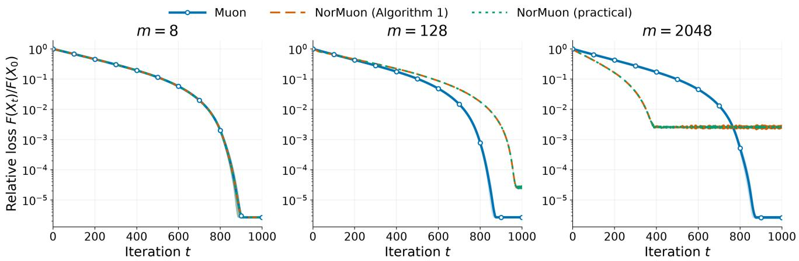  
Figure 3: Loss curves for the synthetic experiment.

Table 6: Selected hyperparameters $( \gamma , \beta _ { 1 } , \beta _ { 2 } )$ for the synthetic experiment with a cosine step-size schedule.
<table><tr><td>m</td><td>Muon</td><td>NorMuon  $\left( \mathrm { A l g o r i t h m ~ 1 } \right)$ </td><td>NorMuon with  $\mathrm { E q . ~ ( 4 . 1 ) }$ </td></tr><tr><td>8</td><td> $( 1 0 ^ { - 1 } , 0 , - )$ </td><td> $( 1 0 ^ { - 1 } , 0 , 0 . 9 5 )$ </td><td> $( 1 0 ^ { - 1 } , 0 , 0 )$ </td></tr><tr><td>32</td><td> $( 1 0 ^ { - 1 } , 0 , - )$ </td><td> $( 1 0 ^ { - 0 . 5 } , 0 , 0 . 9 )$ </td><td> $( 1 0 ^ { - 0 . 5 } , 0 , 0 . 9 )$ </td></tr><tr><td>128</td><td> $( 1 0 ^ { - 1 } , 0 , - )$ </td><td> $( 1 0 ^ { - 0 . 5 } , 0 , 0 . 9 )$ </td><td> $( 1 0 ^ { - 0 . 5 } , 0 , 0 . 9 )$ </td></tr><tr><td>512</td><td> $( 1 0 ^ { - 1 } , 0 , - )$ </td><td> $( 1 0 ^ { 0 } , 0 , 0 . 9 9 )$ </td><td> $( 1 0 ^ { 0 } , 0 , 0 . 9 9 )$ </td></tr><tr><td>2048</td><td> $( 1 0 ^ { - 1 } , 0 , - )$ </td><td> $( 1 0 ^ { 0 } , 0 , 0 )$ </td><td> $( 1 0 ^ { 0 } , 0 , 0 )$ </td></tr></table>

Table 7: Mean $\pm ~ 2 \times$ standard error of the loss reduction $\begin{array} { r } { \log _ { 1 0 } F ( X _ { 0 } ) - \log _ { 1 0 } \operatorname* { m i n } _ { 0 \leq t \leq T } F ( X _ { t } ) } \end{array}$ over 100 evaluation seeds under a cosine schedule with $T = 2 5 .$ . A larger value means better performance.
<table><tr><td>m</td><td>8</td><td>32</td><td>128</td><td>512</td><td>2048</td></tr><tr><td>Muon</td><td> $5 . 5 1 { \scriptstyle \pm 0 . 0 5 }$ </td><td> $5 . 5 7 { \scriptstyle \pm 0 . 0 4 }$ </td><td> $5 . 5 5 { \scriptstyle \pm 0 . 0 5 }$ </td><td> $5 . 5 7 { \scriptstyle \pm 0 . 0 4 }$ </td><td> $5 . 5 7 { \scriptstyle \pm 0 . 0 5 }$ </td></tr><tr><td>NorMuon (Algorithm 1)</td><td> $5 . 5 1 _ { \pm 0 . 0 5 }$ </td><td> $4 . 6 4 _ { \pm 0 . 0 4 }$ </td><td> $4 . 7 5 _ { \pm 0 . 0 5 }$ </td><td> $3 . 6 3 _ { \pm 0 . 0 5 }$ </td><td> $3 . 5 8 { \scriptstyle \pm 0 . 0 5 }$ </td></tr><tr><td>NorMuon with Eq. (4.1)</td><td> $5 . 5 1 { \scriptstyle \pm 0 . 0 5 }$ </td><td> $4 . 6 4 _ { \pm 0 . 0 4 }$ </td><td> $4 . 7 5 { \scriptstyle \pm 0 . 0 5 }$ </td><td> $3 . 6 3 _ { \pm 0 . 0 5 }$ </td><td> $3 . 5 8 { \scriptstyle \pm 0 . 0 5 }$ </td></tr></table>

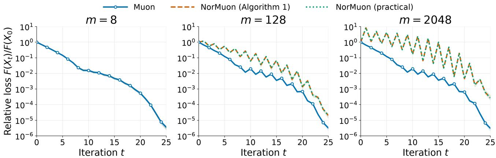  
Figure 4: Loss curves for the cosine schedule synthetic experiment with $T = 2 5$

## C.2 Setup for image classification

For Muon, NorMuon (with both column and row normalization), and AdamW, we use a step-size schedule with 5% linear warmup followed by cosine decay to 0. Muon and NorMuon use 5 PolarExpress iterations [Amsel et al., 2026a]. For AdamW, we sweep the step size over {0.0003, 0.001, 0.003, 0.01} with momentum factors $( \beta _ { 1 } , \beta _ { 2 } ) = ( 0 . 9 , 0 . 9 9 9 )$ . For Muon and NorMuon, we sweep the step size over $\{ 0 . 0 3 , 0 . 0 5 , 0 . 1 0 , 0 . 1 5 \}$ and the momentum factor over {0.5, 0.6, 0.7, 0.8, 0.9, 0.95}. NorMuon additionally uses $\beta _ { 2 } = 0 . 9$ . For all methods, we sweep the decoupled weight decay over {0, 0.01}. We use label smoothing with a factor of 0.2 and clip the Euclidean norm of the gradient to at most 1.

## C.3 Setup and additional results for LLM pretraining

We pretrain decoder-only transformers with the nanochat codebase [Karpathy, 2025] at depths 12, 24, and 32. All models use $\mathrm { R e L U ^ { 2 } }$ activations, root mean square (RMS) normalization [Zhang and Sennrich, 2019], rotary positional embeddings [Su et al., 2024], query-key normalization [Henry et al., 2020], untied token embeddings and language-model (LM) heads, and separate value embeddings [Zhou et al., 2025]. Following the standard design of Muon [Jordan et al., 2024], Muon or NorMuon updates only the transformer’s weight matrices, while AdamW updates the embeddings, LM head, and other trainable parameters. Table 8 summarizes the model configurations and training token budgets for the experiments in Table 3 and Figure 1. We follow the step-size schedule of nanochat [Karpathy, 2025]: the step size is warmed up linearly over the first 40 updates, held constant until 35% of training, and then decayed linearly to $5 \%$ of its peak value over the remaining 65% of training. The original NorMuon [Li et al., 2026] rescales each row as $[ \overline { { O } } _ { t + 1 } ] _ { i , : } = [ O _ { t + 1 } ] _ { i , : } / ( \sqrt { v _ { t + 1 , i } } + \alpha )$ with $\alpha = 1 0 ^ { - 1 0 }$ . See Algorithm 1 for details. In our experiments, we instead use $[ \overline { { O } } _ { t + 1 } ] _ { i , : } = [ O _ { t + 1 } ] _ { i , : } / \sqrt { \operatorname* { m a x } \{ v _ { t + 1 , i } , \alpha \} }$ with the same α, following Karpathy [2025].

Random seeds. For the 1.38B model, we run Muon and NorMuon with 3 random seeds and report the mean ± standard deviation in Table 9. The average improvement of NorMuon over Muon exceeds one standard deviation. Due to space constraints, Table 3 reports only the mean.

Table 8: Model configurations and training budgets for LLM pretraining.
<table><tr><td>Model</td><td>Depth</td><td>Hidden dim.</td><td> $\mathrm { M L P }$  dim.</td><td>Vocab. size</td><td> ${ \mathrm { S e q . } }$  length</td><td>Matrix params</td><td>Batch size (tokens)</td><td>Training tokens</td></tr><tr><td>286M</td><td>12</td><td>768</td><td>3072</td><td>32,768</td><td>2048</td><td>84.9M</td><td>524,288</td><td>2.20B</td></tr><tr><td>1.38B</td><td>24</td><td>1536</td><td>6144</td><td>32,768</td><td>2048</td><td>679M</td><td>1,048,576</td><td>14.6B</td></tr><tr><td>6.44B</td><td>32</td><td>2048</td><td>8192</td><td>131,072</td><td>4096</td><td>1.61B</td><td>1,048,576</td><td>19.7B</td></tr></table>

Table 9: Mean ± standard deviation of LLM pretraining downstream accuracies and test losses.
<table><tr><td>Benchmark</td><td>Muon</td><td>NorMuon</td></tr><tr><td>MMLU</td><td> ${ \bf 3 3 . 3 _ { \pm 0 . 3 } }$ </td><td> ${ \bf 3 3 . 3 _ { \pm 0 . 0 6 } }$ </td></tr><tr><td>HellaSwag</td><td> $6 0 . 3 { \scriptstyle \pm 0 . 2 }$ </td><td> ${ \bf 6 0 . 9 _ { \pm 0 . 4 } }$ </td></tr><tr><td>PIQA</td><td> $7 5 . 9 { \scriptstyle \pm 0 . 3 }$ </td><td> ${ \bf 7 6 . 1 _ { \pm 0 . 4 } }$ </td></tr><tr><td>WinoGrande</td><td> $5 5 . 5 { \scriptstyle \pm 0 . 4 }$ </td><td> ${ \bf 5 8 . 4 _ { \pm 1 . 5 } }$ </td></tr><tr><td>ARC-C</td><td> $4 3 . 8 { \scriptstyle \pm 0 . 8 }$ </td><td> ${ \bf 4 5 . 4 } _ { \pm 0 . 3 }$ </td></tr><tr><td>ARC-E</td><td> $7 3 . 6 { \scriptstyle \pm 0 . 3 }$ </td><td> ${ \bf 7 5 . 0 _ { \pm 0 . 8 } }$ </td></tr><tr><td>BoolQ</td><td> ${ \bf 6 4 . 4 } _ { \pm 2 . 6 }$ </td><td> $6 2 . 0 { \scriptstyle \pm 1 . 7 }$ </td></tr><tr><td> $\mathrm { C S Q A }$ </td><td> ${ \bf 6 0 . 0 _ { \pm 1 . 0 } }$ </td><td> $5 9 . 6 { \scriptstyle \pm 0 . 5 }$ </td></tr><tr><td>SIQA</td><td> $4 9 . 1 _ { \pm 0 . 1 }$ </td><td> ${ \bf 5 0 . 2 _ { \pm 0 . 0 3 } }$ </td></tr><tr><td> $\mathrm { O B Q A }$ </td><td> $4 7 . 1 { \scriptstyle \pm 2 . 8 }$ </td><td> $\mathbf { 4 9 . 8 } _ { \pm 2 . 1 }$ </td></tr><tr><td> $\operatorname { A v g }$ </td><td> $5 6 . 3 { \scriptstyle \pm 0 . 4 }$ </td><td> ${ \bf 5 7 . 1 _ { \pm 0 . 2 } }$ </td></tr><tr><td>Test loss</td><td> $2 . 2 9 1 4 _ { \pm 0 . 0 0 0 6 }$ </td><td> $\mathbf { 2 . 2 8 1 0 _ { \pm 0 . 0 0 0 9 } }$ </td></tr></table>

Setup for ablation studies. We conduct ablation studies on the 1.38B model trained on the compute-optimal budget of 7.66B tokens. Unless otherwise stated, we use a base step size of 0.02, 5 PolarExpress iterations, a weight decay of 0.02, and Nesterov-type momentum with $\beta _ { 1 } = 0 . 9 5$

We next describe the setups for the other optimizers considered in Section 4. For Aurora [Dewulf et al., 2026], we use the K = 2 variant and apply diagonal refinement to tall matrices. For Muon+, we use the column–row variant, which normalizes columns and then rows after the polar approximation. MuonEq-R instead equilibrates rows before the polar approximation. For the 286M model, we sweep the base step size over {0.02, 0.03, 0.04} for all methods, and all of them select 0.03. For the 1.38B model, we use a common base step size of 0.02 for the reasons given below.

Step-size sensitivity under the compute-optimal setting. We compare base step sizes in {0.01, 0.02, 0.03, 0.04} for the 1.38B model in Figure 5(a) and Table 10. NorMuon attains lower validation and test losses than Muon at every step size tested. For NorMuon, step sizes 0.01 and 0.02 give nearly identical losses, and the loss increases for larger step sizes. Muon is nearly insensitive to step sizes between 0.01 and 0.03, attains its lowest loss at 0.03, and degrades at 0.04. Even when each optimizer uses its own best step size, NorMuon still attains a lower loss. We therefore use 0.02 as the common step size for the ablation studies, since it lies in a good regime for both optimizers and enables a comparison at a matched step size.

(a) Step-size sensitivity  
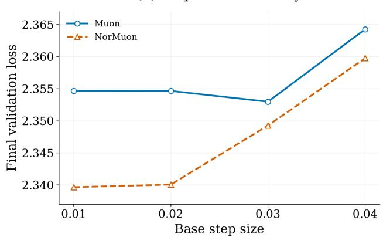  
(c) Second-moment factor

(b) Polar approximation  
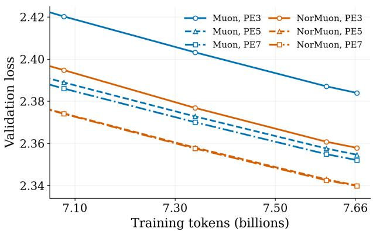  
(d) Weight decay

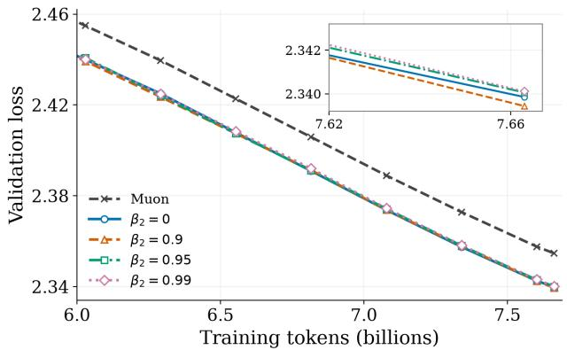

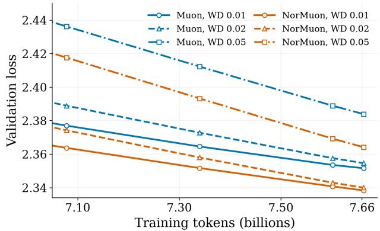  
Figure 5: Ablation studies on the 1.38B model trained on 7.66B tokens. (a) Final validation loss versus step size. (b) Muon and NorMuon with 3, 5, and 7 PolarExpress (PE) iterations. (c) NorMuon with diferent second-moment factors $\beta _ { 2 }$ . (d) Muon and NorMuon with diferent weight decay (WD) factors.

Table 10: Test loss versus base step size for the 1.38B model trained on 7.66B tokens.
<table><tr><td>Step size</td><td>0.01</td><td>0.02</td><td>0.03</td><td>0.04</td></tr><tr><td>Muon</td><td>2.3587</td><td>2.3587</td><td>2.3571</td><td>2.3684</td></tr><tr><td>NorMuon</td><td>2.3436</td><td>2.3442</td><td>2.3533</td><td>2.3637</td></tr></table>

Accuracy of polar approximation. We test whether the benefit of NorMuon persists across polar approximation accuracies by running Muon and NorMuon with 3, 5, or 7 PolarExpress (PE) steps in Figure 5(b) and Table 11. NorMuon achieves lower validation and test losses than Muon in every setting. Increasing the number of PE steps from 3 to 5 substantially reduces the test loss of both optimizers, while increasing it further to 7 has little efect. The gap between Muon and NorMuon persists across all settings and is largest with 3 PE steps.

Second-moment factor. We compare second-moment factors $\beta _ { 2 } \in \{ 0 , 0 . 9 , 0 . 9 5 , 0 . 9 9 \}$ for NorMuon in Figure 5(c) and Table 12. NorMuon achieves nearly identical validation and test losses across all tested values of $\beta _ { 2 }$ and outperforms Muon in every case.

Table 11: Test loss versus the number of PolarExpress (PE) steps.
<table><tr><td>PE steps</td><td>3</td><td>5</td><td>7</td></tr><tr><td>Muon</td><td>2.3882</td><td>2.3587</td><td>2.3562</td></tr><tr><td>NorMuon</td><td>2.3620</td><td>2.3442</td><td>2.3440</td></tr></table>

Table 12: Test loss versus the second-moment factor $\beta _ { 2 }$
<table><tr><td>NorMuon  $\beta _ { 2 }$ </td><td>0</td><td>0.9</td><td>0.95</td><td>0.99</td><td>Muon</td></tr><tr><td>Test loss</td><td>2.3440</td><td>2.3435</td><td>2.3442</td><td>2.3439</td><td>2.3587</td></tr></table>

Table 13: Test loss versus weight decay.
<table><tr><td>Weight decay</td><td>0.01</td><td>0.02</td><td>0.05</td></tr><tr><td>Muon</td><td>2.3557</td><td>2.3587</td><td>2.3880</td></tr><tr><td>NorMuon</td><td>2.3424</td><td>2.3442</td><td>2.3685</td></tr></table>

Weight decay. We compare decoupled weight decay factors of 0.01, 0.02, and 0.05 for both Muon and NorMuon in Figure 5(d) and Table 13. NorMuon achieves lower test loss than Muon at every weight decay tested.

Alignment. On the 286M model, we compare Muon and the practical NorMuon variant in Eq. (4.1) using the alignment $\langle M _ { t + 1 } , D _ { t + 1 } \rangle$ from Lemma B.2. At a fixed time step t + 1, let $M _ { \mathrm { M } }$ and $M _ { \mathrm { N } }$ denote the gradient momenta $M _ { t + 1 }$ of Muon and NorMuon, respectively. The corresponding update directions are

$$
\begin{array} { r } { D _ { \mathrm { M } } = \mathrm { P o l a r } _ { \ell , \delta } \big ( \frac { M _ { \mathrm { M } } } { \| M _ { \mathrm { M } } \| _ { F } } \big ) , \qquad D _ { \mathrm { N } } = \frac { \| O \| _ { F } } { \| \overline { { O } } \| _ { F } } \overline { { O } } \mathrm { w i t h } O = \mathrm { P o l a r } _ { \ell , \delta } \big ( \frac { M _ { \mathrm { N } } } { \| M _ { \mathrm { N } } \| _ { F } } \big ) , } \end{array}
$$

where $\overline { O }$ denotes the row-normalized version of O, computed as in Algorithm 1. We compare the relative diference in alignment, $\frac { \langle M _ { \mathrm { M } } , D _ { \mathrm { M } } \rangle - \langle M _ { \mathrm { N } } , D _ { \mathrm { N } } \rangle } { \langle M _ { \mathrm { M } } , D _ { \mathrm { M } } \rangle }$ , together with the analogous relative diferences in $\| M \| _ { \mathrm { n u c } } ,$ $\| D \| _ { \mathrm { o p } } , \ \| M \| _ { F } .$ , and $\| D \| _ { F }$ in Figure 6. A negative value indicates that the corresponding quantity is larger for NorMuon. On the MLP matrices, NorMuon tends to attain a slightly larger alignment $\langle M _ { \mathrm { N } } , D _ { \mathrm { N } } \rangle$ after the first few hundred steps, along with a larger $\| M _ { \mathrm { N } } \| _ { \mathrm { n u c } }$ , while on the QKVO matrices, the two optimizers have similar alignment. This is consistent with the observation of Dewulf et al. [2026] that NorMuon mainly afects the MLP matrices. Finally, by the design of Eq. (4.1), the update directions of Muon and NorMuon have similar Frobenius norms, although NorMuon’s updates have larger operator norms on the MLP matrices.

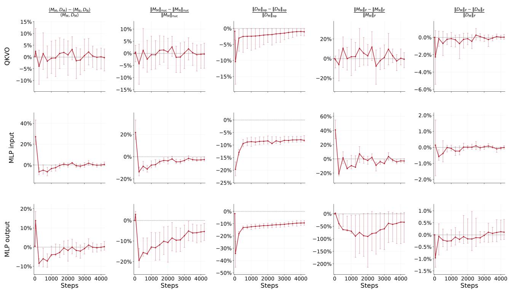  
Figure 6: Relative diferences between Muon and NorMuon in the alignment and in the norms of the momentum and update direction, for diferent parameter groups. Error bars show the 10th–90th percentile range across the matrices in each group.