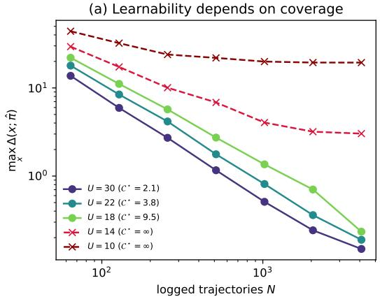
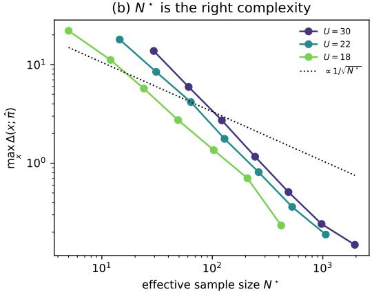
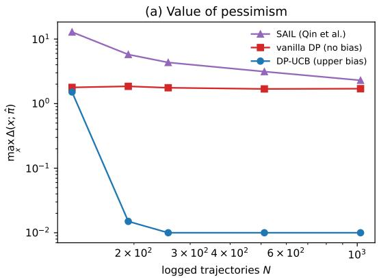
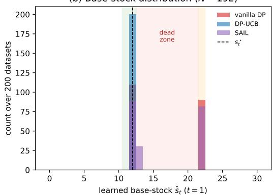
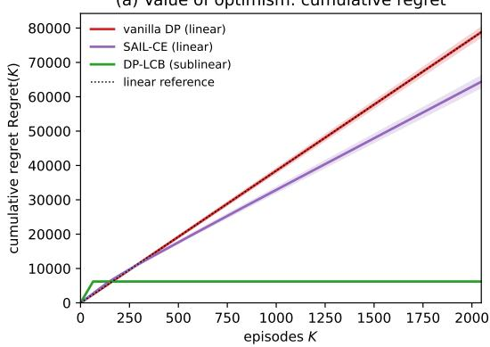
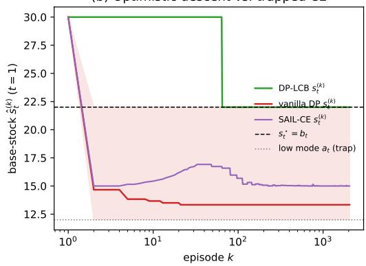

# Towards Optimal Inventory Control under Censored Demand: A Biased Sample-Average Approximation Approach

Yuxuan Han, Xiaoyu Fan, Jiawei Zhang, Zhengyuan Zhou Stern School of Business, New York University {yh6061, fx2087, jz31, zzhou}@stern.nyu.edu

We study data-driven multi-period lost-sales inventory control under censored demand, where a stockou reveals only that demand exceeded the stocking level. We develop a unified, model-based framework for policy learning from censored data, built on a new cost decomposition for base-stock policies and a biased sample-average approximation (SAA) approach. The cost decomposition allows us to propose a new coverage condition under which censored observations are informative enough for sample-eficient policy learning. Guided by this coverage condition, we design two biased SAA algorithms: an upper-biased one that achieves near-optimal sample complexity under the ofline coverage condition, and a lower-biased one that actively generates the required coverage and achieves near-optimal regret online. More broadly, this biased SAA approach provides a general principle for implementing pessimism and optimism under censored feedback, which may be of independent interest.

Key words : inventory control; censored demand; sample-average approximation

## 1. Introduction

Multi-period inventory control with possibly time-changing costs and demands is a classic problem in operations management and supply chain theory, with broad practical importance and a long research tradition (Stevens 1989, Zipkin 2000, Chen and Simchi-Levi 2012).

Under standard demand-independence assumptions, inventory control problems can be formulated as Markov decision processes (MDP), and the optimal policies can be computed via the dynamic programming (DP) approach (Scarf 1960, Zipkin 2008, Bertsekas 2012). In many real-world settings, however, the demand distribution is unknown and must be learned from data. This motivates the study of data-driven inventory control, which seeks to design near-optimal replenishment policies from historical data in which demand observations are often censored.

The underlying MDP structure of inventory control has led to substantial recent progress in data-driven inventory learning, enabling the adaptation of reinforcement learning techniques and the analysis of their sample-complexity guarantees (Cheung and Simchi-Levi 2019, Halman 2020, Qin et al. 2023, Xie et al. 2024). In particular, the recent analysis of Xie et al. (2024) establishes the sharpest known sample-complexity guarantees by exploiting structure specific to inventory problems that generic MDP arguments do not capture. However, most existing works in this line focus on the uncensored observation model, in which the learner always observes the full demand realization regardless of the corresponding order-up-to level. This model is often unrealistic: stockouts typically make the realized demand unobservable, so that the informativeness of a dataset depends on the replenishment strategy under which it was collected.

Switching from uncensored to censored observations in an ofline dataset changes the statistical nature of the problem fundamentally. Under censored observations, a sample collected at censoring level y reveals the realized demand only when demand is below y; otherwise, it reveals only that demand is at least y. Each sample is thus informative only about demand below the level at which it was collected. Because diferent samples are collected at diferent censoring levels, the data inform policy learning only about the demand range these levels cover. This raises two challenges absent from the uncensored setting: characterizing when this range sufices for learning the optimal policy, and designing algorithms that exploit the available censored information eficiently. These challenges prevent existing uncensored analyses, including the sharp guarantees of Xie et al. (2024), from carrying over directly to the censored setting.

To the best of our knowledge, Qin et al. (2023) is the only prior work that studies censored feedback in the ofline multi-period inventory setting, where the learner must act on a fixed, pre-collected dataset. A central message of their analysis is an impossibility result: for any algorithm and non-trivial censoring level, there exist problem instances for which demand censoring induces an Ω(1) learning error. While this negative result highlights the dificulty of policy learning under censored observations, its worst-case perspective does not identify the instance-dependent condition that actually governs policy learning. This motivates two questions for the ofline policy learning beyond the worst case:

Question 1: For a fixed problem instance, what coverage condition on the observed censoring levels sufices to consistently learn its optimal policy?

Question 2: When this condition holds, which algorithm attains the optimal sample complexity?

The two questions above concern a fixed, pre-collected dataset produced by a behavior policy taken as given. Answering Question 1 would tell us which censored datasets are informative enough for policy learning, and immediately raises an online policy-design counterpart: can such a condition be satisfied by data collected from a cost-aware adaptive policy that actively interacts with the inventory system? This is not a routine extension of the ofline problem, because a single adaptive data-collection policy now plays two roles at once. Its trajectory forms the dataset from which demand information is learned; but the same trajectory also incurs real inventory cost as it unfolds. These two roles can pull in opposite directions: collecting more informative observations may require stocking higher to reveal demand at more levels, yet higher stocking incurs holding cost and worsens the policy’s own performance. This motivates the following question:

Question 3: Can a single adaptive policy generate a dataset satisfying the condition of Question 1 while achieving low online regret?

In this work, we answer these three questions within a unified, model-based framework for policy learning under censored demand. For the ofline setting, we identify an instance-dependent coverage condition on the censoring levels of the dataset that is suficient for consistent learning, and we give an algorithm that attains the optimal sample complexity whenever this condition holds. For the online setting, we design an adaptive algorithm that achieves optimal regret while ensuring its collected data satisfy the same coverage condition. Conceptually, these results rely on two new technical ingredients: an intentionally biased, one-sided sample-average approximation (SAA) of demand distributions, whose perturbation direction is chosen according to the task; and a structural cost decomposition tailored to base-stock policies, which serves as the common backbone of our analysis by decomposing the policy gap into local errors on the parts of the demand distribution that are decision-relevant.

## 1.1. Contributions

In this work, we study a T-period lost-sales inventory problem under bounded demand distributions, with the holding and lost-sales penalty coeficients $h _ { t } , b _ { t }$ . We denote by $C _ { 1 } ^ { \pi } ( x )$ the total cost of a policy π with starting inventory level x and $C _ { 1 } ^ { \star } ( x ) = C _ { 1 } ^ { \pi ^ { \star } } ( x )$ the optimal cost benchmark. In most of this work, we assume a discrete demand setting for simplicity: at each period t, the demand distribution $P _ { t }$ with CDF $F _ { t }$ is supported on $[ M ] _ { + } : = \{ 0 , 1 , \ldots , M \}$ ; we extend our analysis to the general demand setting in Section 7. We summarize our main contributions as follows.

A derivative-based cost decomposition for base-stock policies. Our first contribution is a cost-decomposition identity, detailed in Theorem 3.6, tailored to the derivative structure of base-stock policies. The key structural fact is that a base-stock level is determined by the sign of the marginal order-up-to value, $D _ { t } ^ { \star } ( j ) : = W _ { t } ^ { \star } ( j + 1 ) - W _ { t } ^ { \star } ( j )$ , rather than by the value function itself. We therefore analyze how these marginal values, and their estimation errors, propagate through the demand-induced inventory dynamics. This leads to a deterministic decomposition of the policy gap into localized errors of the estimated demand model, instead of reducing it to the policy evaluation gap as in generic RL analysis (Li et al. 2024b, Ren et al. 2021, Xiong et al. 2022).

A remarkable corollary of this cost-decomposition identity, detailed in Corollary 4.1, is the uniform-CDF-error reduction

$$
C _ { 1 } ^ { \hat { \pi } } ( x ) - C _ { 1 } ^ { \pi ^ { \star } } ( x ) \lesssim ( h _ { \infty } + b _ { \infty } ) M T \cdot \operatorname* { s u p } _ { 1 \leq t \leq T } \| F _ { t } - \hat { F } _ { t } \| _ { \infty } ,\tag{1.1}
$$

up to a lower-order term in the uniform CDF error. Although censored feedback is the main focus of this paper, this corollary alone, when applied to the uncensored setting, already illustrates why the decomposition is powerful.

First, under non-stationary demand, applying the standard period-wise SAA estimator to uncensored observations recovers the sharp rate ${ \tilde { \mathcal { O } } } ( T M / { \sqrt { N } } )$ of Xie et al. (2024) up to logarithmic terms when N trajectories of demands are observed. Our proof, however, obtains this rate by directly tracking error propagation through the model-based DP, rather than through a VC-dimension analysis of the policy class. To the best of our knowledge, this is the first direct model-based proof of the sharp sample-complexity rate for this multi-period inventory setting.

Second, under stationary demand, the estimator-agnostic nature of the decomposition allows us to aggregate samples across periods and obtain the sharper policy-learning rate $\tilde { \mathcal { O } } ( M \sqrt { T / N } )$ . Notably, this rate is strictly below the $\Omega ( M T / \sqrt { N } )$ lower bound for evaluating the optimal cost $C _ { 1 } ^ { \pi ^ { \star } } ( x )$ . This has two implications. Conceptually, it shows that in this structured inventory class, learning a near-optimal policy can be strictly easier than evaluating the optimal policy, which is not true for general RL (Ren et al. 2021). Methodologically, it rules out previous proof strategies that reduce the policy-learning gap to policy evaluation error, as in Qin et al. (2023) or general RL works (Li et al. 2024b, Ren et al. 2021, Xiong et al. 2022, Sidford et al. 2018): any such route inherits the $\Omega ( M T / \sqrt { N } )$ policy evaluation barrier and therefore cannot attain the sharper $\tilde { \mathcal { O } } ( M \sqrt { T / N } )$ policy learning rate. Obtaining the sharp rate requires a diferent analytical machinery, which is precisely what our derivative-based cost-decomposition identity provides.

Finally, Ganggang and Shi (2024) consider an asymptotic reduction result, as in (1.1), for the optimal policy evaluation task under possibly unbounded, continuous demand distributions with additional regularity assumptions. Under our notation, their result reads as $\begin{array} { r } { \mathcal { O } _ { p } \big ( T ^ { 2 } \sum _ { t = 1 } ^ { T } \lVert \pmb { F } _ { t } - \widehat { \pmb { F } } _ { t } \rVert _ { \infty } \big ) } \end{array}$ with cost factors and regularity factors treated as constants. In contrast, our result (1.1) provides a deterministic reduction for policy sub-optimality in the bounded-demand setting, with an improved dependence on T.

The uniform reduction (1.1) is, however, only a weakened form of the identity and is not the mechanism behind our censored guarantees. Under censored observations, estimation precision is highly non-uniform across demand levels, and the sup-norm bound loses precisely the coverage information that drives the censored rate. The ofline and online analyses below therefore work directly with Theorem 3.6 instead of Corollary 4.1, and pair it with task-specific biased CDF estimators.

Optimal ofline policy learning with upper-biased SAA. We now turn to the ofline censored setting, where the learner is given a fixed dataset $\mathcal { D } : = \{ ( y _ { t } ^ { k } , \bar { d } _ { t } ^ { k } ) \} _ { t = 1 , k = 1 } ^ { T , N }$ of N censored trajectories collected through any adaptive process. At each period t of each trajectory $k , y _ { t } ^ { k }$ is the realized order-up-to level, equivalently the post-ordering inventory level, and ${ \bar { d } } _ { t } ^ { k } = \operatorname* { m i n } \{ y _ { t } ^ { k } , d _ { t } ^ { k } \}$ is the censored demand observation.

<table><tr><td>Setup</td><td>Work</td><td>Stationary demand</td><td>Censored observations</td><td>Leading-order Result</td></tr><tr><td rowspan="4">Offline sub-optimality gap with N trajectories</td><td>Qin et al. (2023)</td><td>X</td><td>X</td><td> $\mathcal { O } ( M T ^ { 3 / 2 } / \sqrt { N } )$ </td></tr><tr><td>Xie et al. (2024)</td><td>X</td><td>x</td><td> $\mathcal { O } ( M T / \sqrt { N } )$ </td></tr><tr><td>This work</td><td>x</td><td>√</td><td> $\widetilde { \mathcal { O } } ( M T / \sqrt { \mathcal { N } \star } )$ </td></tr><tr><td>This work</td><td>√</td><td>J</td><td> $\widetilde { \mathcal { O } } ( M T / \sqrt { \star _ { \mathrm { a g g } } } )$ </td></tr><tr><td rowspan="2">Online episodic regret over K episodes</td><td>This work</td><td>X</td><td></td><td> $\widetilde { \Theta } ( M T \sqrt { K } )$ </td></tr><tr><td>This work</td><td>√</td><td></td><td> $\widetilde { \Theta } ( M \sqrt { K T } )$ </td></tr></table>

Table 1 Comparison of sub-optimality and regret guarantees for learning multi-period inventory policies. $\overline { { \mathcal { N } } } ^ { \star }$ and $\mathcal { N } _ { \mathsf { a g g } } ^ { \star }$ denote the efective sample sizes and its time-aggregated version under censored observations, where $\smash { \mathcal { N } ^ { \star } \geq N }$ and $\mathcal { N } _ { \mathrm { a g g } } ^ { \star } \geq N T$ in the uncensored setting.

For Question 1, we show that the learning error in the ofline setting can be captured by an instance-dependent efective sample size

$$
\mathcal { N } ^ { \star } : = \biggl ( \frac { 1 } { M T } \sum _ { \substack { t \in [ T ] , j \in [ M - 1 ] _ { + } } } \frac { \mathbb { P } ( y _ { t } ^ { \star } > j \mid x _ { 1 } = 0 ) } { N _ { t , j } \vee 1 } \biggr ) ^ { - 1 } , \qquad N _ { t , j } : = \sum _ { k = 1 } ^ { N } \mathbf { 1 } \{ y _ { t } ^ { k } > j \} ,
$$

with the convention $a / 0 = + \infty$ . Here $N _ { t , j }$ counts the trajectories whose period-t order-up-to level exceeds j—precisely those that reveal whether demand falls below j—while $\mathbb { P } ( y _ { t } ^ { \star } > j \mid x _ { 1 } = 0 )$ measures how often the optimal policy requires information above level $j .$ Thus $\mathcal { N } ^ { \star }$ captures the relevant coverage condition for censored feedback: the dataset need not cover all demand levels uniformly, but it must cover the demand coordinates that matter for the optimal policy.

For Question 2, we propose DP-UCB, which constructs an upper-biased SAA estimator of the demand CDF from D and then solves the DP under this biased model. The upward CDF bias can be viewed as a model-level analogue of the pessimistic principle in ofline RL: by acting under a conservative model for poorly covered regions, the learner avoids relying on parts of the problem that the data cannot certify (Xiong et al. 2022, Rashidinejad et al. 2021, Li et al. 2024a, Jin et al. 2025). In ofline RL, pessimism is typically implemented at the level of value or Q-functions, by penalizing state-action pairs with limited coverage. In contrast, we propose a diferent implementation due to the nature of censored feedback: the informativeness of the dataset about $F _ { t } ( j )$ is non-increasing in $j ,$ since fewer trajectories satisfy $y _ { t } ^ { k } > j$ at higher demand levels. Pessimism therefore acts on the demand model itself rather than on the value function: we show that inflating the CDF upward induces a downward bias in the resulting base-stock levels, pushing the policy toward lower demand coordinates where censored observations are more informative.

Technically, this shift in where pessimism is applied requires a diferent analysis. Since the bias is placed on the CDF rather than on a value or Q-function, standard pessimistic-value analyses do not directly translate. Our cost-decomposition identity provides such missing bridge: combined with the one-sided policy bias, it turns the model-level CDF errors into a cost-gap bound weighted by the optimal-policy coverage $\mathbb { P } ( y _ { t } ^ { \star } > j \mid x _ { 1 } = 0 )$ . Thus, when the ofline dataset covers the coordinates relevant to the optimal policy, the cost gap is controlled by estimation errors on precisely the coordinates measured by $\mathcal { N } ^ { \star }$ . Up to logarithmic and burn-in terms, DP-UCB attains the sub-optimality gap

$$
\operatorname* { m a x } _ { x } \left[ C _ { 1 } ^ { \hat { \pi } } ( x ) - C _ { 1 } ^ { \pi ^ { \star } } ( x ) \right] = \tilde { \mathcal { O } } \left( \frac { ( h _ { \infty } + b _ { \infty } ) M T } { \sqrt { \mathcal { N } ^ { \star } } } \right) .\tag{1.2}
$$

In particular, $\mathcal { N } ^ { \star } \geq N$ in the uncensored setting, so this rate reduces to the uncensored non-stationary guarantee derived from (1.1) above.

When demand is stationary, the estimator-agnostic property of our cost decomposition allows us to aggregate censored observations across periods into a single CDF estimator. The aggregated efective sample size $\mathcal { N } _ { \mathrm { a g g } } ^ { \star }$ is defined analogously to $\mathcal { N } ^ { \star }$ , with $N _ { t , j }$ replaced by the period-summed count $\textstyle \sum _ { s = 1 } ^ { T } N _ { s , j }$ . The aggregated DP-UCB algorithm achieves the improved rate

$$
\tilde { \mathcal { O } } \left( \frac { ( h _ { \infty } + b _ { \infty } ) M T } { \sqrt { \mathcal { N } _ { \mathrm { a g g } } ^ { \star } } } \right) .
$$

In the uncensored setting, $\mathcal { N } _ { \mathrm { a g g } } ^ { \star } \geq N T$ , so this result recovers the sharper aggregated rate $\tilde { \mathcal { O } } ( M \sqrt { T / N } )$ obtained in the uncensored stationary setting above.

Regarding the optimality of the above results, it is tricky to state optimality directly with respect to $\mathcal { N } ^ { \star }$ , as it depends jointly on the underlying instance and the ofline censoring levels. We therefore state optimality in a minimax sense over coverage classes: in Theorems 5.7 and 5.8, for a given coverage fraction $p \in ( 0 , 1 ]$ , we construct classes of instances, together with deterministic censoring levels, satisfying $\mathcal { N } ^ { \star } \geq \lfloor N p \rfloor$ (and $\mathcal { N } _ { \mathrm { a g g } } ^ { \star } \geq \lfloor N T p \rfloor$ , respectively) for all instances, and then show the $\Omega ( M T ( h _ { \infty } + b _ { \infty } ) / \sqrt { N p } )$ (and $\Omega ( M ( h _ { \infty } + b _ { \infty } ) \sqrt { T / ( N p ) } )$ , respectively) minimax lower bounds over such classes. In particular, these results also cover the uncensored case when $p = 1$ . Our lower bound results are, to the best of our knowledge, the first tight lower bounds for multi-period inventory policy learning even under the uncensored setting1. Previous lower bound results mostly focus on single-period newsvendor problems (Cheung and Simchi-Levi 2019, Fan et al. 2022).

Optimal online adaptive policy design with lower-biased SAA. We now turn to the online policy-design problem to resolve Question 3, where the learner adaptively interacts with the inventory system over K episodes.

We resolve Question 3 by proposing DP-LCB, an optimistic counterpart of DP-UCB with the bias direction reversed. At each episode k, DP-LCB executes a base-stock policy $\{ s _ { t } ^ { ( k ) } \} _ { t = 1 } ^ { T }$ obtained by solving the DP under a lower-biased SAA model fitted from the censored observations collected over all previous interactions. Just as the upper-biased CDFs in DP-UCB implement pessimism at the level of the demand model, the lower-biased CDFs in DP-LCB implement the standard principle of optimism in the face of uncertainty at the level of the demand model itself (Auer et al. 2002, 2008, Azar et al. 2017, Jin et al. 2020). Lowering the estimated CDFs makes the optimistic model expect higher demand, so the DP prescribes upward-biased base-stock levels. Importantly, DP-LCB does not keep this upward bias fixed. As more censored observations are collected, the imposed bias shrinks across episodes, producing the monotone pattern

$$
s _ { t } ^ { \star } \leq s _ { t } ^ { ( K ) } \leq s _ { t } ^ { ( K - 1 ) } \leq \cdots \leq s _ { t } ^ { ( 1 ) } , \quad \forall t \in [ T ] .\tag{1.3}
$$

Thus early episodes use more optimistic base-stock levels to reveal demand information at the coordinates relevant to the optimal policy, while later episodes, computed from richer data, rely only on coordinates that earlier episodes have already covered. Each episode therefore uses information from earlier episodes while providing information for later episodes.

The monotone pattern (1.3) yields two guarantees at once.

First, the left inequality in (1.3) ensures that every executed policy covers the optimal policy from above. Consequently, the data generated by DP-LCB satisfy the ofline coverage condition identified in Question 1: after K episodes, the efective sample size $\mathcal { N } ^ { \star }$ of the collected dataset satisfies $\smash { \mathcal { N } ^ { \star } \gtrsim K }$ , up to logarithmic and burn-in terms. In particular, if one runs the proposed ofline algorithm on the K trajectories collected by DP-LCB, the ofline guarantee (1.2) yields the same statistical order as in the uncensored setting. This establishes the data-collection optimality of DP-LCB: its censored trajectories are, for the purpose of ofline policy learning, as informative as K uncensored trajectories up to logarithmic and burn-in terms.

Second, the monotone decrease in (1.3) turns this self-coverage into regret control: at each episode $k ,$ the ofline guarantee of Question 2 applies to the data accumulated so far, yielding a per-episode cost gap of order $\tilde { \mathcal { O } } ( M T / \sqrt { k } )$ . Summing over k gives

$$
\mathrm { R e g r e t } ( K ) : = \sum _ { k = 1 } ^ { K } \operatorname* { m a x } _ { x } \left[ C _ { 1 } ^ { ( k ) } ( x ) - { C _ { 1 } ^ { \pi ^ { \star } } ( x ) } \right] \lesssim ( h _ { \infty } + b _ { \infty } ) M T \sqrt { K } ,
$$

up to logarithmic and burn-in terms. A matching lower bound holds even under uncensored demand observations, so this rate is optimal. Thus active coverage generation eliminates the leading-order cost of censoring in the online setting.

Finally, when demand is stationary, the same aggregation principle as in the ofline setting applies: observations can be pooled across both periods and episodes into a single CDF estimator. The aggregated DP-LCB algorithm achieves the sharper optimal regret

$$
\mathrm { R e g r e t } ( K ) = \tilde { \mathcal { O } } \big ( ( h _ { \infty } + b _ { \infty } ) M \sqrt { K T } \big ) ,
$$

reflecting a factor-T gain in efective sample size and hence a $\sqrt { T }$ improvement in the regret rate.

## 1.2. Other Related Works

Data-driven Inventory Control. Data-driven inventory control has been extensively studied across a variety of settings, including the online setting where the decision maker sequentially observes sales or demand information and updates ordering decisions over time while simultaneously learning from the data (Godfrey and Powell 2001, Huh and Rusmevichientong 2009, Chen et al. 2015, Shi et al. 2016, Zhang et al. 2018, Agrawal and Jia 2019, Zhang et al. 2020a, Yuan et al. 2021, Zhang et al. 2020b, Chen et al. 2022, Lyu et al. 2024a), and the ofline setting where the decision maker instead learns a replenishment policy from a fixed historical dataset before deploying the learned policy in future operations (Levi et al. 2007, 2015, Cheung and Simchi-Levi 2019, Besbes and Mouchtaki 2021, Fan et al. 2022, Zhang et al. 2021, Chen et al. 2023, Xie et al. 2024, Fan et al. 2024b, Fan and Zhou 2025).

The line most closely related to our work studies inventory control with possibly non-stationary demands and costs (Qin et al. 2023, Halman 2020, Xie et al. 2024, Ganggang and Shi 2024). To our knowledge, no prior work in this line provides consistent learning guarantees under censored demand feedback.

Another related line of work studies the repeated newsvendor problem with possibly censored feedback (Besbes and Muharremoglu 2013, Fan et al. 2022, Lyu et al. 2024b, Hssaine and Sinclair 2024, Chen and Ma 2024, Kumar and Mouchtaki 2026, Chen et al. 2025), as well as the multiperiod setting with stationary demand and costs (Huh and Rusmevichientong 2009, Besbes and Muharremoglu 2013, Lyu et al. 2024a). Under both setups, the optimal policy is a base-stock policy determined by a one-stage quantile rather than by multi-period DP.

General RL. Our results also connect to reinforcement learning for finite-horizon Markov decision processes (MDPs). The full-information results of Section 4 are most directly comparable to RL under a generative model, where the transition kernel can be sampled freely (Sidford et al. 2018,

Li et al. 2024b). Viewing the inventory problem as an MDP with horizon $T _ { i }$ , and suppressing inventory-size and cost factors, Qin et al. (2023) obtain the rate ${ \tilde { \mathcal { O } } } ( T ^ { 3 / 2 } / { \sqrt { N } } )$ , matching the horizon dependence of a generic model-based analysis, whereas Xie et al. (2024) exploit the inventory structure to obtain the sharper $\tilde { \mathcal { O } } ( T / \sqrt { N } )$ policy-learning rate. Our cost decomposition recovers this rate through a direct model-based argument and, under stationary demand, further sharpens it to $\tilde { \mathcal { O } } ( \sqrt { T / N } )$ . This improvement reflects one of the main diferences between inventory learning and generic RL: reducing policy learning to policy evaluation is sharp for general MDPs (Li et al. $^ \mathrm { 2 0 2 4 a , b }$ , Xiong et al. 2022), but is too coarse for the structured base-stock policy class, where policy learning can be strictly easier than evaluating the optimal cost (Ren et al. 2021).

Under censored feedback, our ofline result is related to pessimism under partial data coverage in ofline RL (Rashidinejad et al. 2021, Jin et al. 2025, Xiong et al. 2022, Nguyen-Tang and Arora 2023, Li et al. 2024a). Compared with the standard $\tilde { \Theta } ( T ^ { 3 / 2 } \sqrt { \mathcal { C } / N } )$ scaling under singlepolicy concentrability, our ofline bound improves the horizon dependence to $\tilde { \Theta } ( T \sqrt { \mathcal { C } ^ { \star } / N } )$ ; see the discussion following Corollary 5.5. The online result is analogous to optimism in episodic RL (Auer et al. 2008, Azar et al. 2017, Jin et al. 2020, Dann and Brunskill 2015): DP-LCB uses a lower-biased CDF to generate exploration through higher base-stock levels. This yields the optimal regret $\tilde { \Theta } ( T \sqrt { K } )$ , improving the horizon dependence relative to the generic finite-horizon RL rate $\tilde { \Theta } ( T ^ { 3 / 2 } \sqrt { K } )$

Finally, our stationary-demand results complement the line of RL work that exploits stationary, time-homogeneous transitions to improve the leading horizon dependence from $\mathcal { O } ( T ^ { 3 / 2 } )$ to $\mathcal { O } ( T )$ (Ren et al. 2021). In the structured inventory setting, aggregation sharpens the corresponding dependence further, from $\mathcal { O } ( T )$ to $\mathcal { O } ( \sqrt { T } )$ , in both the ofline and online bounds.

## 2. Preliminaries

Notations. For any positive integer $n .$ , we denote $[ n ] = \{ 1 , 2 , \dots , n \}$ and $[ n ] _ { + } = \{ 0 , 1 , 2 , \ldots , n \}$ . For integers $a \leq b ,$ , we write $[ a , b ] = \{ a , a + 1 , \ldots , b \}$ and $[ a , b ) = \{ a , a + 1 , \ldots , b - 1 \}$ . For any real number $r ,$ we denote $( r ) _ { + } = \operatorname* { m a x } \{ r , 0 \}$ . For a finite sum $\textstyle \sum _ { i = a } ^ { b } z _ { i } .$ , we set it to be 0 whenever $a > b$ . Similarly, an empty product is interpreted as the identity operator of the appropriate dimension. All vectors and matrices are indexed from 0 unless otherwise stated. In particular, an M-dimensional vector is indexed by $[ M - 1 ] _ { + }$ , while an $( M + 1 )$ -dimensional vector is indexed by $[ M ] _ { + }$ . For a discrete function f defined on $[ M - 1 ] _ { + }$ , we use its boldface version $f$ to denote the corresponding vector, i.e., $[ \pmb { f } ] _ { j } = f ( j )$ ). We adopt the conventions $a / 0 : = + \infty$ for any $a > 0$ and $0 / 0 { : } = 1$ , applied throughout to all ratios. Throughout this work, we assume the confidence level $\delta \in ( 0 , 1 / 2 )$ in all high probability statements.

Multi-Period Inventory Control. We consider a finite-horizon multi-period inventory control problem over T periods. At each period $t \in [ T ]$

1. The system starts at entering inventory level $x _ { t } .$ , and the decision maker selects an order-up-to level $y _ { t } \geq x _ { t }$

2. Demand $d _ { t }$ is realized from distribution $P _ { t } ,$ and the one-period cost

$$
c _ { t } ( y _ { t } ) : = h _ { t } ( y _ { t } - d _ { t } ) _ { + } + b _ { t } ( d _ { t } - y _ { t } ) _ { + }
$$

is incurred, where $h _ { t }$ and $b _ { t }$ denote the holding-cost and lost-sales penalty rates, respectively.

3. The next entering inventory level is $x _ { t + 1 } = ( y _ { t } - d _ { t } ) _ { + }$

The objective is to design a policy π that adaptively selects the order-up-to levels $\{ y _ { t } ^ { \pi } \} _ { t = 1 } ^ { T }$ to minimize the total expected cost starting from an initial inventory level $x ,$

$$
C _ { 1 } ^ { \pi } ( x ) : = \mathbb { E } [ \sum _ { t = 1 } ^ { T } c _ { t } ( y _ { t } ^ { \pi } ) | x _ { 1 } = x ] ,
$$

where the expectation is taken over the demand realizations and the behavior of $\pi$

Throughout most parts of this work, we assume the following facts:

1. The cost coeficients are uniformly bounded: $0 \leq h _ { t } \leq h _ { \infty } , 0 \leq b _ { t } \leq b _ { \infty } , \forall t \in [ T ]$

2. Each demand distribution $P _ { t }$ is supported on the finite set $[ M ] _ { + }$ , with masses $P _ { t } ( d _ { t } = k ) = \mu _ { t k }$ for $k \in [ M ] _ { + }$ . And the initial inventory level $x _ { 1 }$ is integer.

3. The demand realizations $\{ d _ { t } \} _ { t = } ^ { T }$ are independent across $t \in [ T ]$

And we generalize the discrete demand assumption to general demand distributions in Section 7. Optimal Policy and Dynamic Programming. Under the independent demand assumption, $\pi ^ { \star }$

can be solved by DP. More precisely, $\pi ^ { \star }$ can be obtained via

$$
\pi _ { t } ^ { \star } ( x ) = \underset { y \geq x } { \mathrm { a r g m i n } } W _ { t } ^ { \star } ( y ) , \quad W _ { t } ^ { \star } ( y ) : = \mathbb { E } \big [ c _ { t } ( y ) + C _ { t + 1 } ^ { \star } \big ( ( y - d _ { t } ) _ { + } \big ) \big ] ,
$$

with $C _ { t } ^ { \star } ( x )$ given by the Bellman equation

$$
C _ { t } ^ { \star } ( x ) = \operatorname* { m i n } _ { y \ge x } \mathbb { E } \big [ c _ { t } ( y ) + C _ { t + 1 } ^ { \star } \big ( ( y - d _ { t } ) _ { + } \big ) \big ] , \qquad C _ { T + 1 } ^ { \star } ( x ) \equiv 0 .
$$

In particular, the minimum over $y \geq x$ can always be attained within $[ x , M ]$ , as demands are supported on $[ M ] _ { + }$ . We therefore restrict to $y \in [ x , M ]$ throughout. In addition to the above general characterization, it has been shown in Levi et al. (2007), Cheung and Simchi-Levi (2019) that $W _ { t } ^ { \star } ( \cdot )$ is discrete convex in the sense that its discrete derivative

$$
D _ { t } ^ { \star } ( y ) : = W _ { t } ^ { \star } ( y + 1 ) - W _ { t } ^ { \star } ( y ) , \qquad \forall y \in [ M - 1 ] _ { + } , t \in [ T ] ,
$$

is always non-decreasing in y. This indicates that $\pi ^ { \star }$ can be a base-stock policy given as

$$
\begin{array} { r } { \pi _ { t } ^ { \star } ( x ) = \left\{ \begin{array} { l l } { s _ { t } ^ { \star } , } & { \mathrm { ~ i f ~ } x \leq s _ { t } ^ { \star } , } \\ { x , } & { \mathrm { ~ o t h e r w i s e . } } \end{array} \right. , \quad s _ { t } ^ { \star } : = \operatorname* { m i n } \{ y \in [ M - 1 ] _ { + } : D _ { t } ^ { \star } ( y ) \geq 0 \} , } \end{array}\tag{2.1}
$$

with the convention $s _ { t } ^ { \star } = M \mathrm { ~ i f ~ } D _ { t } ^ { \star } ( y ) < 0$ for all $y \in [ M - 1 ] _ { + }$ . Notably, restricting the order-up-to levels to integer values in (2.1) is without loss of optimality: when the demands are integer-valued and $x _ { t } \in [ M ] _ { + }$ , it is well-known that an integer-valued optimal base-stock policy remains optimal even when arbitrary order-up-to levels larger than $x _ { t }$ are allowed (Zipkin 2000).

Data-Driven Policy Learning. In this work, the demand distributions $\{ P _ { t } \} _ { t = 1 } ^ { T }$ are unknown to the decision maker (the learner), who must instead learn a near-optimal policy from data. We focus throughout on censored demand observations: whenever an order-up-to level y is chosen and demand $d \sim P _ { t }$ is realized, the learner observes only the truncated quantity $\bar { d } : = \operatorname* { m i n } \{ y , d \}$ . The realized demand is revealed only when it falls below the available inventory $y ;$ otherwise the learner learns only that demand is at least $y .$ . The order-up-to levels at which data are collected therefore govern their informativeness: a period-t observation collected at level $y _ { t } ^ { k }$ reveals whether demand falls below a coordinate $j \in [ M - 1 ]$ + only when $j < y _ { t } ^ { k }$ , so what matters is not just how many trajectories are collected, but which demand coordinates their censoring levels cover.

We study this censored problem in two settings. In the ofline setting, the learner is given a fixed dataset $\mathcal { D } : = \{ ( y _ { t } ^ { k } , \bar { d } _ { t } ^ { k } ) \} _ { t = 1 , k = 1 } ^ { T , N }$ of N censored trajectories, collected in advance by a behavior policy $\pi ^ { ( b ) }$ that may itself be adaptive. Here $y _ { t } ^ { k }$ is the realized order-up-to level in period t of trajectory k, and ${ \bar { d } } _ { t } ^ { k } : = \operatorname* { m i n } \{ y _ { t } ^ { k } , d _ { t } ^ { k } \}$ is the corresponding censored observation. Using only ${ \mathcal { D } } ,$ the learner outputs a policy $\hat { \pi } .$ , whose performance is measured by the worst-case sub-optimality gap

$$
\operatorname* { m a x } _ { \boldsymbol { x } \in [ M ] _ { + } } \underbrace { [ C _ { 1 } ^ { \hat { \pi } } ( \boldsymbol { x } ) - C _ { 1 } ^ { \star } ( \boldsymbol { x } ) ] } _ { : = \Delta ( \boldsymbol { x } ; \hat { \pi } ) } .
$$

In this ofline setting, the coverage of D is fixed before learning begins: the learner can exploit the demand coordinates revealed by the behavior policy, but cannot extend them.

In the online setting, the learner instead interacts with the system over K episodes: in each episode $k \in [ K ]$ it selects a policy $\pi ^ { ( k ) }$ , executes it for all T periods, and observes the resulting censored trajectory before proceeding to the next. Writing $C _ { 1 } ^ { ( k ) } : = C _ { 1 } ^ { \pi ^ { ( k ) } }$ for the cost of the deployed policy, the learner is evaluated solely by its cumulative regret

$$
\mathrm { R e g r e t } ( K ) : = \sum _ { k = 1 } ^ { K } \operatorname* { m a x } _ { x } \Delta ( x ; \pi ^ { ( k ) } ) .
$$

Although regret is the only criterion against which the online learner is measured, the K trajectories it generates themselves constitute a censored dataset of exactly the ofline form D. The coverage of this dataset is now endogenous: each episode’s order-up-to levels simultaneously determine the cost charged to regret and which demand coordinates that episode reveals for future learning. Thus the online problem is not regret minimization in isolation: the learner must control its current inventory cost while generating coverage rich enough to support the ofline learning guarantees developed below. It is this coupling between immediate cost and self-generated coverage—rather than either concern alone—that distinguishes the online problem from a routine repetition of the ofline one, and that the online algorithm we develop is designed to exploit.

## 3. Cost Gap Decomposition of Base-Stock Policies

In this work, we adopt a model-based approach for data-driven inventory control, where a demand model with per-period CDF sequence $\{ \hat { F } _ { t } \} _ { t = 1 } ^ { T }$ is first constructed, and then the estimated policy πˆ is solved via performing $\mathrm { D P }$ under $\{ \hat { F } _ { t } \} _ { t = 1 } ^ { T }$ . While the construction of $\{ \hat { F } _ { t } \} _ { t = 1 } ^ { T }$ varies across diferent demand models and observation protocols, the performance of $\hat { \pi }$ usually relies on how accurately $\hat { F }$ approximates ${ \pmb F } .$ . The goal of this section is to provide a general cost gap decomposition theorem that relates the cost diference between $\pi ^ { \star }$ and $\hat { \pi }$ to the gap between $\hat { F }$ and F. This serves as the backbone of our sample complexity analysis in later analyses under diferent constructions of $\{ \hat { F } _ { t } \} _ { t = 1 } ^ { T }$

To formally describe $\hat { \pi } _ { ; }$ we briefly replicate the DP procedure under $\{ \hat { F } _ { t } \} _ { t = 1 } ^ { T }$ in this paragraph. For the estimated value sequence $\{ \hat { C } _ { t } \} _ { t = 1 } ^ { T }$ given by the Bellman equation under $\{ \hat { F } _ { t } \} _ { t = : } ^ { T }$

$$
\hat { C } _ { t } ( x ) = \operatorname* { m i n } _ { y \ge x } \hat { \mathbb { E } } \big [ c _ { t } ( y ) + \hat { C } _ { t + 1 } \big ( ( y - d _ { t } ) _ { + } \big ) \big ] , \quad \hat { C } _ { T + 1 } ( x ) \equiv 0 , \quad \forall x \in [ M ] _ { + } ,
$$

and $\hat { D } _ { t } ( y ) : = \hat { W } _ { t } ( y + 1 ) - \hat { W } _ { t } ( y ) , \hat { W } _ { t } ( y ) = \hat { \mathbb { E } } \big [ c _ { t } ( y ) + \hat { C } _ { t + 1 } \big ( ( y - d _ { t } ) _ { + } \big ) \big ]$ for $y \in [ M - 1 ] _ { + }$ , with $\hat { \mathbb { E } }$ the expectation taken under the demand distribution given by $\{ \hat { F } _ { t } \} _ { t = 1 } ^ { T }$ . The optimal $\hat { \pi }$ can be characterized via a base-stock sequence $\{ s _ { t } \} _ { t = 1 } ^ { T } \colon$

$$
\hat { \pi } _ { t } ( x ) = \left\{ \begin{array} { l l } { s _ { t } , } & { \mathrm { ~ i f ~ } x \leq s _ { t } , } \\ { x , } & { \mathrm { ~ o t h e r w i s e . ~ } } \end{array} \right. \quad \mathrm { w i t h ~ } s _ { t } : = \operatorname* { m i n } \{ y \in [ M - 1 ] _ { + } : \hat { D } _ { t } ( y ) \geq 0 \} ,\tag{3.1}
$$

with the convention $s _ { t } = M$ if $\hat { D } _ { t } ( y ) < 0$ for all $y \in [ M - 1 ] _ { + }$

In the remainder of this section, we derive a cost-gap decomposition for the model-based policy $\hat { \pi }$ relative to the optimal policy $\pi ^ { \star }$ , using the base-stock structure above. We adopt the vector convention introduced in Section 2, the main notations used throughout this section are summarized in Table 2. Here we set the boundary value $F _ { t } ( M ) = 1$ as a scalar; the vector $\pmb { F } _ { t } \in \mathbb { R } ^ { M }$ collects only the coordinates $\{ F _ { t } ( j ) \} _ { j \in [ M - 1 ] + }$

Derivative based performance diference lemma. We start with the following performance diference lemma, which provides a decomposition of total cost gap as the summation of optimal value gap caused by immediate action mismatch along the trajectory induced by the policy ˆπ:

<table><tr><td>Notation Interpretation</td><td></td><td>Notation</td><td>Interpretation</td></tr><tr><td> $\pmb { F } _ { t } \in \mathbb { R } ^ { M }$ </td><td> $\left[ F _ { t } \right] _ { i } = F _ { t } ( j ) \mathrm { f o r } j \in [ M - 1 ] _ { + }$ </td><td> $\pmb { W } _ { t } ^ { \star } \in \mathbb { R } ^ { M + 1 }$ </td><td>Order-up-to value under the optimal policy</td></tr><tr><td> $D _ { t } ^ { \star } \in \mathbb { R } ^ { M }$ </td><td> $\mathrm { D i s c r e t e ~ d e r i v a t i v e ~ o f ~ } W _ { t } ^ { \star }$ </td><td> $\mathbf { \boldsymbol { A } } _ { t } ( s ) \in \mathbb { R } ^ { M \times M }$ </td><td> $[ A _ { t } ( s ) ] _ { i j } = \mu _ { t , i - j } 1 \{ i \geq j \geq s \}$ </td></tr><tr><td> $\pmb { c } _ { t } \in \mathbb { R } ^ { M }$ </td><td> $\left[ \boldsymbol { c } _ { t } \right] _ { j } = ( h _ { t } + b _ { t } ) F _ { t } ( j ) - b _ { t }$ </td><td> $\pmb q _ { t } \in \mathbb { R } ^ { M }$ </td><td> $[ \pmb { q } _ { t } ] _ { j } = \sigma _ { t } \pmb { 1 } \{ j \in [ \alpha _ { t } , \beta _ { t } ) \} \mathbb { P } ( x _ { t } \leq j \mid x _ { 1 } = 0 )$ </td></tr><tr><td> $\pmb { u } _ { t } \in \mathbb { R } ^ { M }$ </td><td> $\left[ \boldsymbol { u } _ { t } \right] _ { i } = \sigma _ { t } \mathbf { 1 } \{ j \in [ \alpha _ { t } , \beta _ { t } ) \} \mathbb { P } ( x _ { t } ^ { \star } \leq j \mid x _ { 1 } = \textbf { } \pmb { v } _ { t } \in \mathbb { R } ^ { M }$  0)</td><td></td><td> $[ \pmb { v } _ { t } ] _ { j } = \mathbb { P } ( y _ { t } ^ { \star } \le j \mid x _ { 1 } = 0 ) - \mathbb { P } ( y _ { t } \le j \mid x _ { 1 } = 0 )$ </td></tr></table>

Table 2 Summary of notations in Section 3, where the estimated versions $\overline { { \hat { W } _ { t } , \hat { D } _ { t } , \hat { A } _ { t } ( s ) } }$ , and $\scriptstyle { \hat { \mathbf { c } } } _ { t }$ are defined analogously by replacing $\pmb { F } _ { t }$ with $\hat { F } _ { t }$ and $\pmb { \mu } _ { t }$ with $\hat { \pmb { \mu } } _ { t }$

Lemma 3.1. Denote $\{ x _ { t } \} _ { t = 1 } ^ { T }$ as the entering inventory level trajectory when executing policy $\hat { \pi } _ { \boldsymbol { \kappa } }$ then

$$
\Delta ( x ; \hat { \pi } ) : = C _ { 1 } ^ { \hat { \pi } } ( x ) - C _ { 1 } ^ { \star } ( x ) = \sum _ { t = 1 } ^ { T } \mathbb { E } [ W _ { t } ^ { \star } ( \hat { \pi } _ { t } ( x _ { t } ) ) - W _ { t } ^ { \star } ( \pi _ { t } ^ { \star } ( x _ { t } ) ) \vert x _ { 1 } = x ] .
$$

Lemma 3.1 is a straightforward adaptation of standard performance-diference results for general MDP (Kakade and Langford 2002, Nguyen-Tang and Arora 2023, Bhandari and Russo 2024). In our setting, however, the structured transition dynamics of the inventory MDP and the base-stock form of $\pi ^ { \star }$ and $\hat { \pi }$ further imply the following monotonicity property of $\Delta ( \cdot ; \hat { \pi } )$

Proposition 3.2. $\Delta ( \cdot ; \hat { \pi } )$ is a decreasing function in x, i.e. $\Delta ( x ; \hat { \pi } ) \geq \Delta ( x + 1 ; \hat { \pi } ) , \forall x \in [ M - 1 ] _ { + }$

As a consequence, bounding the maximum cost gap maxx $\Delta ( x ; \hat { \pi } )$ reduces to controlling $\Delta ( 0 ; \hat { \pi } )$ For this purpose, noticing that if we define $\alpha _ { t } : = \operatorname* { m i n } \{ s _ { t } , s _ { t } ^ { \star } \} , \beta _ { t } = \operatorname* { m a x } \{ s _ { t } , s _ { t } ^ { \star } \} , \sigma _ { t } = \mathrm { s g n } \{ s _ { t } - s _ { t } ^ { \star } \}$ , then

$$
W _ { t } ^ { \star } ( \hat { \pi } _ { t } ( x _ { t } ) ) - W _ { t } ^ { \star } ( \pi _ { t } ^ { \star } ( x _ { t } ) ) = \sigma _ { t } \sum _ { j = \alpha _ { t } } ^ { \beta _ { t } - 1 } \mathbf { 1 } \{ x _ { t } \le j \} D _ { t } ^ { \star } ( j ) = \left\{ \begin{array} { l l } { 0 , } & { \mathrm { ~ i f ~ } x _ { t } \ge \beta _ { t } , } \\ { \sigma _ { t } \sum _ { j = x _ { t } } ^ { \beta _ { t } - 1 } D _ { t } ^ { \star } ( j ) , } & { \mathrm { ~ i f ~ } \alpha _ { t } \le x _ { t } < \beta _ { t } < \beta _ { t } } \\ { \sigma _ { t } \sum _ { j = \alpha _ { t } } ^ { \beta _ { t } - 1 } D _ { t } ^ { \star } ( j ) , } & { \mathrm { ~ o t h e r w i s e . } } \end{array} \right.
$$

Thus, if we introduce the weight vector $\pmb q _ { t } \in \mathbb { R } ^ { M }$ with

$$
\left[ \pmb { q } _ { t } \right] _ { j } : = \sigma _ { t } \cdot \pmb { 1 } \{ \alpha _ { t } \leq j < \beta _ { t } \} \mathbb { P } ( x _ { t } \leq j | x _ { 1 } = 0 ) ,
$$

then we have the following derivative based representation of the cost gap:

$$
\Delta ( 0 ; \hat { \pi } ) = \sum _ { t = 1 } ^ { T } \mathbb { E } \Big [ \sigma _ { t } \sum _ { j = \alpha _ { t } } ^ { \beta _ { t } - 1 } \mathbf { 1 } \{ x _ { t } \leq j \} D _ { t } ^ { \star } ( j ) \Big | x _ { 1 } = 0 \Big ] = \sum _ { t = 1 } ^ { T } \langle q _ { t } , D _ { t } ^ { \star } \rangle .\tag{3.2}
$$

To explicitly connect (3.2) with the model diference between $\{ \pmb { F } _ { t } \} _ { t = 1 } ^ { T }$ and $\{ \hat { F } _ { t } \} _ { t = 1 } ^ { T }$ , observe that by the rule of determining $s _ { t } ^ { \star } , s _ { t }$ in (2.1), (3.1), we have $\sigma _ { t } \hat { D } _ { t } ( j ) \leq 0 , \forall \alpha _ { t } \leq j < \beta _ { t }$ . As a consequence, $\langle \pmb { q } _ { t } , \pmb { D } _ { t } ^ { \star } \rangle \leq \langle \pmb { q } _ { t } , \pmb { D } _ { t } ^ { \star } - \hat { \pmb { D } } _ { t } \rangle$ . This then motivates us to track the role of the model distance in propagation of derivatives.

Derivative Propagation. To provide tight description on how derivatives propagate along t, we first introduce the transportation matrices $\boldsymbol { A } _ { t } ( \boldsymbol { s } ) , \hat { \boldsymbol { A } } _ { t } ( \boldsymbol { s } ) \in \mathbb { R } ^ { M \times M }$ for $t \in [ T ] , s \in [ M ]$ ]+ as

$$
\begin{array} { r } { \big [ \boldsymbol A _ { t } ( s ) \big ] _ { i j } = \mu _ { t , i - j } \mathbf 1 \{ i \geq j \geq s \} , \quad \big [ \hat { A } _ { t } ( s ) \big ] _ { i j } = \hat { \mu } _ { t , i - j } \mathbf 1 \{ i \geq j \geq s \} , \quad \forall i , j \in [ M - 1 ] _ { + } , } \end{array}
$$

where $\hat { \mu } _ { t , j } : = \hat { F } _ { t } ( j ) - \hat { F } _ { t } ( j - 1 )$ is the induced mass from $\hat { F } _ { t }$

With this definition, we have the following recursive formula of derivatives:

Proposition 3.3. It holds for $t \in [ T ]$ that

$$
D _ { t } ^ { \star } = \underbrace { h _ { t } F _ { t } - b _ { t } ( \mathbf { 1 } - F _ { t } ) } _ { : = c _ { t } } + A _ { t } ( s _ { t + 1 } ^ { \star } ) D _ { t + 1 } ^ { \star } ,\tag{3.3}
$$

$$
\hat { D } _ { t } = h _ { t } \hat { F _ { t } } - b _ { t } \big ( { \bf 1 } - \hat { F _ { t } } \big ) + \hat { A _ { t } } \big ( s _ { t + 1 } \big ) \hat { D } _ { t + 1 } ,\tag{3.4}
$$

where we set $f o r$ convenience $\pmb { D } _ { T + 1 } ^ { \star } = \hat { \pmb { D } } _ { T + 1 } = \mathbf { 0 }$ and $s _ { T + 1 } : = s _ { T + 1 } ^ { \star } : = 0$

As a consequence, with the notations $\Delta D _ { t } : = D _ { t } ^ { \star } - \hat { D } _ { t } , \Delta F _ { t } : = F _ { t } - \hat { F } _ { t }$ , and $\Delta A _ { t } ( s ) : = A _ { t } ( s ) -$ $\hat { A } _ { t } ( s )$ , we have

$$
\begin{array} { r } { \Delta D _ { t } = A _ { t } ( s _ { t + 1 } ) \Delta D _ { t + 1 } + \Delta A _ { t } ( s _ { t + 1 } ) \hat { { \cal D } } _ { t + 1 } + \underbrace { ( h _ { t } + b _ { t } ) \Delta F _ { t } } _ { : = \Delta c _ { t } } + \left[ A _ { t } ( s _ { t + 1 } ^ { \star } ) - A _ { t } ( s _ { t + 1 } ) \right] { \cal D } _ { t + 1 } ^ { \star } . } \end{array}\tag{3.5}
$$

In (3.5), the $\Delta \pmb { D } _ { t }$ term is decomposed into three terms: (i) the propagation term $A _ { t } ( s _ { t + 1 } ) \Delta D _ { t + 1 } ;$ (ii) the instantaneous error term due to the model distance at t-th period $\Delta \boldsymbol { A } _ { t } ( \boldsymbol { s } _ { t + 1 } ) \hat { \boldsymbol { D } } _ { t + 1 } + \Delta \boldsymbol { c } _ { t } ;$ (iii) the policy mismatch term $\left[ { \cal A } _ { t } ( s _ { t + 1 } ^ { \star } ) - { \cal A } _ { t } ( s _ { t + 1 } ) \right] { \cal D } _ { t + 1 } ^ { \star }$

In the following, we dualize the transportation rule of $D _ { t } ^ { \star }$ to $\pmb q _ { t }$ through (3.2) to make its efect more transparent. For this purpose, we introduce the following identity.

Proposition 3.4. For $\{ \boldsymbol { u } _ { t } \} _ { t = 1 } ^ { T } \subset \mathbb { R } ^ { M }$ sequence defined as $[ \pmb { u } _ { t } ] _ { j } = \sigma _ { t } \cdot \mathbf { 1 } \{ \alpha _ { t } \leq j < \beta _ { t } \} \mathbb { P } ( x _ { t } ^ { \star } \leq j | x _ { 1 } =$ 0). And $f o r \ \{ \pmb { v } _ { t } \} _ { t = 1 } ^ { T }$ defined recursively through

$$
\pmb { v } _ { t + 1 } : = \pmb { A } _ { t } \big ( \boldsymbol { s } _ { t + 1 } \big ) ^ { \top } \pmb { v } _ { t } + \pmb { u } _ { t + 1 } , \forall t \in [ T - 1 ] , \quad \pmb { v } _ { 1 } : = \pmb { u } _ { 1 } .
$$

It holds that

$$
\big ( \pmb { A } _ { t } \big ( \pmb { s } _ { t + 1 } ^ { \star } \big ) - \pmb { A } _ { t } \big ( \pmb { s } _ { t + 1 } \big ) \big ) ^ { \top } \pmb { v } _ { t } + \pmb { q } _ { t + 1 } = \pmb { u } _ { t + 1 } , \quad \forall t \in [ T - 1 ] .
$$

Remark 3.5 (Probabilistic Interpretation of Proposition 3.4). We have $t h e \quad \{ \pmb { v } _ { t } \} _ { t = 1 } ^ { T }$ sequence defined in Proposition 3.4 satisfies $\left[ \pmb { v } _ { t } \right] _ { j } = \mathbb { P } ( y _ { t } ^ { \star } \le j | x _ { 1 } = 0 ) - \mathbb { P } ( y _ { t } \le j | x _ { 1 } = 0 )$ . And the last identity in Proposition $\it 3 . 4$ is simply describing the transportation efect of $\boldsymbol { A } _ { t } \big ( \boldsymbol { s } _ { t + 1 } \big )$ as

$$
\begin{array} { r } { \big [ \pmb { A } _ { t } ^ { \top } \big ( s _ { t + 1 } ^ { \star } \big ) \pmb { v } _ { t } \big ] _ { j } = \pmb { 1 } \{ j \geq s _ { t + 1 } ^ { \star } \} \big [ \mathbb { P } ( x _ { t + 1 } ^ { \star } \leq j | x _ { 1 } = 0 ) - \mathbb { P } ( x _ { t + 1 } \leq j | x _ { 1 } = 0 ) \big ] , } \end{array}
$$

$$
\begin{array} { r } { \left[ A _ { t } ^ { \top } ( s _ { t + 1 } ) { v } _ { t } \right] _ { j } = \mathbf { 1 } \{ j \geq s _ { t + 1 } \} \left[ \mathbb { P } ( x _ { t + 1 } ^ { \star } \leq j | x _ { 1 } = 0 ) - \mathbb { P } ( x _ { t + 1 } \leq j | x _ { 1 } = 0 ) \right] . } \end{array}
$$

Now with (3.2) and Proposition 3.4, we can show the following cost decomposition theorem:

Theorem 3.6. With the notations ${ \mathbf { } } { \mathbf { } } { \mathbf { } } { \mathbf { } } { \mathbf { } } { \mathbf { } } { \mathbf { } } { \mathbf { } } { \mathbf { } } { \mathbf { } } { \mathbf { } } { \mathbf { } } { \mathbf { } } { \mathbf { } } { \mathbf { } } { \mathbf { } } { \mathbf { } } { \mathbf { } } { \mathbf { } } { \mathbf { } } { \mathbf { } } { \mathbf { } } { \mathbf { } } { \mathbf { } } { \mathbf { } } { \mathbf { } } { \mathbf { } } { \mathbf { } } { \mathbf { } } { \mathbf { } } { \mathbf { } } { \mathbf { } } { \mathbf { } } { \mathbf { } } { \mathbf { } } { \mathbf { } } { \mathbf { } } { \mathbf { } } { \mathbf { } } { \mathbf { } } { \mathbf { } } { \mathbf { } } { \mathbf { } } { \mathbf { } } { \mathbf { } } { \mathbf { } } { \mathbf { } } { \mathbf { } } { \mathbf { } } { \mathbf { } } { \mathbf { } } { \mathbf { } } { \mathbf { } } { \mathbf { } } { \mathbf { } } { \mathbf { } } { \mathbf { } } { \mathbf { } } { \mathbf { } } { \mathbf { } } { \mathbf { } } { \mathbf { } } { \mathbf { } } { \mathbf { } } { \mathbf { } } { \mathbf { } } { \mathbf { } } { \mathbf { } } { \mathbf { } } { \mathbf { } \mathbf { } } { \mathbf { } } { \mathbf { } } { \mathbf } { \mathbf { } } { \mathbf { } \mathbf { } } { \mathbf { } \mathbf { } } { \mathbf } { \mathbf { } } { \mathbf } { \mathbf { } } { \mathbf } { \mathbf } { \mathbf { } } { \mathbf } { \mathbf } { \mathbf } { } \mathbf { } { \mathbf } { \mathbf } { \mathbf } { \mathbf } { \mathbf } { } \mathbf { } \mathbf { } \mathbf { } \mathbf { } \mathbf { } \mathbf { } \mathbf { } \mathbf { } \mathbf { } \mathbf { \mathbf } \mathbf { } \mathbf { } \mathbf { } \mathbf \mathbf { } \mathbf { } \mathbf \mathbf { } \mathbf { } \mathbf \mathbf { } \mathbf \mathbf { } \mathbf \mathbf { } \mathbf \mathbf  $ introduced above, we have

$$
\operatorname* { m a x } _ { \boldsymbol { x } \in [ M ] _ { + } } \Delta ( \boldsymbol { x } ; \hat { \boldsymbol { \pi } } ) = \sum _ { t = 1 } ^ { T } \langle \boldsymbol { v } _ { t } , \Delta A _ { t } ( \boldsymbol { s } _ { t + 1 } ) \hat { \boldsymbol { D } } _ { t + 1 } + \Delta \boldsymbol { c } _ { t } \rangle + \sum _ { t = 1 } ^ { T } \langle \boldsymbol { u } _ { t } , \hat { \boldsymbol { D } } _ { t } \rangle .\tag{3.6}
$$

Comparing (3.6) with the original representation (3.2), the key transformation is an exchange of roles between the two policies in the inner-product terms: the weight vector $\mathbf { \delta } _ { \mathbf { q } _ { t } } .$ , generated by the entering-inventory trajectory induced by the model-based policy ${ \hat { \pi } } ,$ is replaced by the weight vector $\mathbf { \Delta } \mathbf { u } _ { t } .$ , generated by the entering-inventory trajectory induced by the optimal policy $\pi ^ { \star }$ . Meanwhile, the derivative sequence $D _ { t } ^ { \star }$ , whose signs determine the optimal base-stock level $s _ { t } ^ { \star }$ , is replaced by $\hat { D } _ { t }$ , whose signs determine the model-based base-stock level $s _ { t } .$ . The first term in (3.6) is precisely the residual generated by this exchange.

The reason for passing from (3.2) to the exchanged term $\textstyle \sum _ { t = 1 } ^ { T } \langle { \pmb u } _ { t } , \hat { \pmb D } _ { t } \rangle$ is that, by construction, $\sigma _ { t } \hat { D } _ { t }$ is non-positive on the support of $\mathbf { \Delta } \mathbf { u } _ { t }$ , which lies on the index interval between $s _ { t }$ and $s _ { t } ^ { \star }$ Consequently, $\textstyle \sum _ { t = 1 } ^ { T } \langle { \boldsymbol { u } } _ { t } , { \hat { \boldsymbol { D } } } _ { t } \rangle$ is always non-positive, and therefore can be dropped when deriving an upper bound on the cost gap.

Proof of Theorem 3.6. From (3.5) and Proposition 3.4, we have the following identity for every $t \in [ T - 1 ]$ 1]:

$$
\begin{array} { r l } & { \langle { \pmb v } _ { t } , \Delta { \pmb D } _ { t } \rangle + \langle { \pmb q } _ { t + 1 } , { \pmb D } _ { t + 1 } ^ { \star } \rangle = \langle { \pmb u } _ { t + 1 } , { \pmb D } _ { t + 1 } ^ { \star } \rangle + \langle { \pmb A } _ { t } ( s _ { t + 1 } ) ^ { \top } { \pmb v } _ { t } , \Delta { \pmb D } _ { t + 1 } \rangle + \langle { \pmb v } _ { t } , \Delta { \pmb A } _ { t } ( s _ { t + 1 } ) { \hat { \pmb D } } _ { t + 1 } + \Delta { \pmb c } _ { t } \rangle } \\ & { = \underbrace { \langle { \pmb A } _ { t } ( s _ { t + 1 } ) ^ { \top } { \pmb v } _ { t } + u _ { t + 1 } , \Delta { \pmb D } _ { t + 1 } \rangle + \langle { \pmb v } _ { t } , \Delta { \pmb A } _ { t } ( s _ { t + 1 } ) { \hat { \pmb D } } _ { t + 1 } + \Delta { \pmb c } _ { t } \rangle + \langle { \pmb u } _ { t + 1 } , { \hat { \pmb D } } _ { t + 1 } \rangle } _ { = { \pmb v } _ { t + 1 } } . } \end{array}
$$

Then by ${ \pmb v } _ { 1 } = { \pmb q } _ { 1 } = { \pmb u } _ { 1 } , \langle { \pmb q } _ { 1 } , { \pmb D } _ { 1 } ^ { \star } \rangle = \langle { \pmb v } _ { 1 } , \Delta { \pmb D } _ { 1 } \rangle + \langle { \pmb u } _ { 1 } , \hat { { \pmb D } } _ { 1 } \rangle$ , and $\hat { D } _ { T + 1 } = \mathbf { 0 } , \Delta D _ { T } = \Delta c _ { T }$ , applying the above identity recursively for terms in the summation $\textstyle \sum _ { t = 1 } ^ { T } \langle q _ { t } , D _ { t } ^ { \star } \rangle$ finishes the proof. □

## 4. Performance Bound with Uniform Convergence of CDF

In this section, we introduce a corollary of the cost-decomposition identity in Theorem 3.6, which reduces the policy cost gap to uniform estimation error of the underlying CDF functions $\{ \pmb { F } _ { t } \} _ { t = 1 } ^ { T }$

While this uniform reduction is coarse for censored feedback, which is the main focus of this paper, it already sufices to illustrate the power of Theorem 3.6 in the uncensored setting considered in prior work (Cheung and Simchi-Levi 2019, Halman 2020, Qin et al. 2023, Xie et al. 2024). While in all these works the inventory dynamics are backlogged rather than lost-sales, the two dynamics are equivalent in our setup, as discussed in detail in $\mathrm { A }$ ppendix A. It not only recovers the sharp non-stationary SAA rate, but also yields a previously unknown aggregation-based rate under stationary demand and clarifies the separation between policy learning and policy evaluation in this structured inventory class.

More precisely, under a uniform error condition

$$
\begin{array} { r } { \operatorname* { s u p } _ { 1 \leq t \leq T } \| \pmb { F } _ { t } - \hat { \pmb { F } } _ { t } \| _ { \infty } \leq \epsilon } \end{array}\tag{4.1}
$$

for $\epsilon > 0$ , we can show the following cost gap guarantee between $\hat { \pi }$ and $\pi ^ { \star }$ .

Corollary 4.1. Under condition (4.1), we have

$$
\operatorname* { m a x } _ { x \in [ M ] _ { + } } \Delta ( x ; \hat { \pi } ) \leq c _ { 0 } ( h _ { \infty } + b _ { \infty } ) M \big [ T \epsilon + T ^ { 3 } \epsilon ^ { 2 } \big ] ,
$$

for some absolute constant $c _ { 0 }$

Corollary 4.1 is a deterministic reduction from cost gap to model distance, and does not restrict how one obtains the model estimator $\hat { F } _ { t }$ . It can be directly applied to obtain the sample complexity results in the data-driven inventory control setting with uncensored observations, as we discuss in the following two subsections.

## 4.1. Uncensored Non-Stationary Demand via Period-wise SAA

We first apply Corollary 4.1 to the uncensored setting, where the demand random variables $\{ d _ { t } \} _ { t = 1 } ^ { T }$ are independent across periods while their marginal distributions $\{ P _ { t } \} _ { t = 1 } ^ { T }$ may vary with t.

CDF Estimator. With uncensored observations $\mathcal { D } : = \{ ( y _ { t } ^ { k } , d _ { t } ^ { k } ) \} _ { t = 1 , k = 1 } ^ { T , N }$ , we construct the empirical environment $\{ \hat { F } _ { t } \} _ { t = 1 } ^ { T }$ via the standard period-wise SAA estimator for each t :

$$
\hat { F } _ { t } ( j ) = \frac { 1 } { N } \sum _ { k = 1 } ^ { N } \mathbf { 1 } \{ d _ { t } ^ { k } \leq j \} , \quad \forall j \in [ M - 1 ] _ { + } , \qquad \hat { F } _ { t } ( M ) : = 1 .\tag{4.2}
$$

It is well known that this SAA estimator satisfies the uniform convergence result as the following: Lemma 4.2 (Dvoretzky–Kiefer–Wolfowitz inequality). For $\hat { F } _ { t }$ defined as in (4.2), the uniform convergence condition (4.1) holds with $\begin{array} { r } { \epsilon = \sqrt { \frac { \log ( 2 T / \delta ) } { 2 N } } } \end{array}$ with probability at least $1 - \delta .$

Sample Complexity Bound. Applying Corollary 4.1 with Lemma 4.2 leads to the following sample complexity result:

Theorem 4.3. With N observations of uncensored trajectories $\{ y _ { t } ^ { k } , d _ { t } ^ { k } \} _ { t = 1 , k = 1 } ^ { T , N }$ , the policy πˆ obtained via DP under (4.2) satisfies

$$
\operatorname* { m a x } _ { x \in \left[ M \right] _ { + } } \Delta ( x ; \hat { \pi } ) \leq c _ { 0 } ( h _ { \infty } + b _ { \infty } ) M \bigl [ T \sqrt { \frac { \log ( T / \delta ) } { N } } + \frac { T ^ { 3 } \log ( T / \delta ) } { N } \bigr ]
$$

for some absolute constant $c _ { 0 }$ with probability at least $1 - \delta .$

After a burn-in regime $N \gtrsim T ^ { 4 }$ , Theorem 4.3 states a ${ \tilde { \mathcal { O } } } ( M T / { \sqrt { N } } )$ error bound, which translates into a ${ \tilde { \mathcal { O } } } ( M ^ { 2 } T ^ { 2 } / \varepsilon ^ { 2 } )$ sample complexity upper bound to obtain an ε-accurate policy. This bound matches those first proposed in Xie et al. (2024) up to logarithmic factors, which are obtained via VC theory and applied to the ERM estimator2, and improves the ${ \tilde { \mathcal { O } } } ( M ^ { 2 } T ^ { 3 } / \varepsilon ^ { 2 } )$ result in Halman (2020), Qin et al. (2023).

## 4.2. Uncensored Stationary Demand via Aggregated SAA

We now apply Corollary 4.1 to the uncensored stationary setting, where the demand random variables $\{ d _ { t } \} _ { t = 1 } ^ { T }$ are i.i.d. with a common distribution $P _ { 1 } = \cdots = P _ { T }$

CDF Estimator. With observations $\mathcal { D } : = \{ ( \boldsymbol { y } _ { t } ^ { k } , \boldsymbol { d } _ { t } ^ { k } ) \} _ { t = 1 , k = 1 } ^ { T , N } ,$ we construct the empirical environment $\{ \hat { F } _ { t } \} _ { t = 1 } ^ { T }$ by aggregating all samples into a single sample-average approximation (SAA) estimator for each t :

$$
\hat { F } _ { t } ( j ) \equiv \hat { F } ( j ) : = \frac { 1 } { N T } \sum _ { \ell = 1 } ^ { T } \sum _ { k = 1 } ^ { N } \mathbf 1 \{ d _ { \ell } ^ { k } \leq j \} , \quad \forall j \in [ M - 1 ] _ { + } , t \in [ T ] , \qquad \hat { F } ( M ) : = 1 .\tag{4.3}
$$

Similar to Lemma 4.2, the following uniform convergence guarantee of (4.3) holds.

Lemma 4.4. For $\hat { F } _ { t }$ defined as in (4.3), the uniform convergence condition (4.1) holds with $\epsilon =$ $\sqrt { \frac { \log ( 2 / \delta ) } { 2 N T } }$ with probability at least $1 - \delta .$

Sample Complexity Bound. Applying Corollary 4.1 with Lemma 4.4, we arrive at the following sample complexity result:

Theorem 4.5. With N observations of uncensored trajectories $\{ y _ { t } ^ { k } , d _ { t } ^ { k } \} _ { t = 1 , k = 1 } ^ { T , N } .$ , the policy $\hat { \pi }$ obtained via DP under (4.3) satisfies

$$
\operatorname* { m a x } _ { x \in [ M ] _ { + } } \Delta ( x ; \hat { \pi } ) \leq c _ { 0 } ( h _ { \infty } + b _ { \infty } ) M \bigl [ \sqrt { \frac { T \log ( 2 / \delta ) } { N } } + \frac { T ^ { 2 } \log ( 2 / \delta ) } { N } \bigr ]
$$

for some absolute constant $c _ { 0 }$ with probability at least $1 - \delta .$

After the burn-in regime $N \gtrsim T ^ { 3 }$ , Theorem 4.5 yields the leading policy-learning error $\tilde { \mathcal { O } } ( M \sqrt { T / N } )$ , or equivalently a sample-complexity upper bound of order $\tilde { \mathcal { O } } ( M ^ { 2 } T / \varepsilon ^ { 2 } )$ for obtaining an ε-accurate policy. To the best of our knowledge, this is the first such bound for the stationarydemand multi-period inventory setting.

The improvement comes from a feature that is not captured by existing VC-type analyses. In the non-stationary setting, each period has its own demand distribution, so the natural estimator uses only the N samples from that period. Under stationary demand, however, the NT demand observations are all drawn from the same distribution and can be aggregated into a single CDF estimator. Our model-based decomposition is estimator-agnostic and can directly exploit this aggregation. By contrast, VC-type analyses control a trajectory-level empirical process over policy classes; they average over trajectories rather than over the $N T$ period-level demand observations, and therefore do not directly yield the factor-T gain from across-time aggregation.

We next show that this sharper policy-learning rate is not obtainable through a reduction to policy evaluation. The following lower bound shows that estimating the optimal cost remains statistically harder.

Lemma 4.6. There exist cost parameters $\{ ( h _ { t } , b _ { t } ) \} _ { t = 1 } ^ { T }$ , an initial inventory level x, and a collection of demand distributions P such that the following holds: For any algorithm A that takes observations $\mathcal { D } : = \{ ( y _ { t } ^ { k } , d _ { t } ^ { k } ) \} _ { t = 1 , k = 1 } ^ { T , N }$ from some $\pmb { P } \in \mathcal { P }$ and outputs an estimate of $C _ { 1 } ^ { \star } ( x )$

$$
\operatorname* { m a x } _ { P \in \mathcal { P } } \mathbb { E } _ { \mathcal { D } \sim P ^ { \otimes N T } } \big | \mathcal { A } ( \mathcal { D } ) - C _ { 1 } ^ { \star } ( x ) \big | \ge c _ { 0 } \big ( h _ { \infty } + b _ { \infty } \big ) M T / \sqrt { N } .
$$

Comparing Lemma 4.6 with Theorem 4.5 gives a strict separation: in this structured inventory class, learning a near-optimal base-stock policy can require fewer samples than estimating the optimal cost $C _ { 1 } ^ { \star } ( x )$ to the same accuracy.

This separation is specific to the inventory structure. A common route in proving finite-horizon RL sample complexity bounds is to reduce policy learning to policy evaluation: one first proves a sharp bound for estimating value functions, and then converts it into a sharp policy-learning guarantee. This route is powerful enough to obtain optimal rates for general MDPs, and the corresponding lower-bound arguments can often transfer policy-evaluation hardness to policy-learning hardness by augmenting the instance with non-stationary rewards, as in Ren et al. (2021), Li et al. (2024a,b), Xiong et al. (2022). Theorem 4.5 shows that this otherwise sharp RL template is too coarse for multi-period inventory control. Even with non-stationary costs, the base-stock policy class and the demand-induced transition dynamics make policy learning strictly simpler than evaluating the optimal value. This complements recent work showing that inventory systems can be statistically simpler than generic MDPs (Fan et al. 2024b, Xie et al. 2024, Zhang et al. 2025, Fan and Zhou 2025).

This observation also clarifies the lower-bound argument of Qin et al. (2023) for the stationarydemand setting. Their claimed $\Omega ( T / { \sqrt { N } } )$ policy-learning lower bound is based on first proving a lower bound for evaluating $C _ { 1 } ^ { \star } ( \cdot )$ and then transferring it to policy optimization. Lemma 4.6 confirms the evaluation lower bound, but Theorem 4.5 shows that the transfer step is not valid in this inventory setting. Together with the matching lower bound in Theorem 5.8, our results identify the correct optimal policy-learning rate as $\Theta ( \sqrt { T / N } )$ up to logarithmic and burn-in terms.

## 5. Ofline Policy Learning via Upper-Biased SAA

In this section, we study ofline policy learning from censored observations. Motivated by Questions 1 and 2, our goals are twofold: to identify the instance-dependent coverage condition under which a fixed censored dataset is informative enough for policy learning, and to design a model-based algorithm that attains the optimal rate under this condition.

The key algorithmic idea proposed in this section is to introduce a one-sided upper bias into the estimated demand CDF. This upper-biased CDF acts as a model-level form of pessimism: it induces downward-biased base-stock levels, thereby avoiding poorly covered high-demand coordinates.

Combined with the cost-decomposition identity in Theorem 3.6, this bias helps localize the efect of estimation error to the coordinates that are relevant along the optimal-policy trajectory, leading to an optimal-policy-dependent coverage condition.

In the following subsections, we first establish the general construction and statistical properties of biased CDF estimators in Section 5.1. We then show how the cost decomposition result in Theorem 3.6 can be applied to obtain the sample complexity bounds in Section 5.2 and 5.3.

## 5.1. Biased SAA: Construction and Statistical Properties

In this subsection, we introduce biased CDF estimators constructed from a general censored, adaptively collected dataset $\{ ( y _ { k } , \bar { d } _ { k } ) \} _ { k = 1 } ^ { n }$ . Although the ofline algorithm below only uses the upper-biased estimator, we also define lower-biased versions here for consistency and later use in online policy design.

Here, by adaptively collected, we mean that for the filtration $\{ \mathcal { F } _ { k } \} _ { k = 1 } ^ { n }$ generated by all observations from 1 to $k - 1$ , it holds that

1. $\{ y _ { k } \} _ { k = 1 } ^ { n }$ is predictable with respect to $\{ \mathcal { F } _ { k } \} _ { k = 1 } ^ { n }$

2. Conditional on $\mathcal { F } _ { k }$ , the uncensored demand $d _ { k }$ follows a fixed distribution P with CDF F.

With such observations, we set $\begin{array} { r } { n _ { j } : = \sum _ { k = 1 } ^ { n } \mathbf { 1 } \{ y _ { k } > j \} } \end{array}$ , and the sub-sampled SAA estimator as

$$
\begin{array} { r } { \tilde { F } ( j ) : = \left\{ \begin{array} { l l } { n _ { j } ^ { - 1 } \sum _ { k = 1 } ^ { n } \mathbf { 1 } \{ y _ { k } > j , \bar { d } _ { k } \leq j \} , } & { \mathrm { i f ~ } n _ { j } \geq 1 , } \\ { 1 , } & { \mathrm { o t h e r w i s e } . } \end{array} \right. } \end{array}\tag{5.1}
$$

We first recall the following standard Freedman-type inequality for (5.1)(cf. Lemma 3 in Rakhlin et al. (2011)):

Proposition 5.1. With the adaptively collected observations $\{ ( y _ { k } , \bar { d } _ { k } ) \} _ { k = 1 } ^ { n }$ and $\tilde { F }$ defined as in (5.1), it holds with probability at least $1 - \delta$ that

$$
| \tilde { F } ( j ) - F ( j ) | \leq \underbrace { 4 \sqrt { \frac { F ( j ) \big ( 1 - F ( j ) \big ) \log ( M n / \delta ) } { n _ { j } \vee 1 } } + \frac { 4 \log ( M n / \delta ) } { n _ { j } \vee 1 } } _ { : = \mathcal { C } _ { j } } ,\tag{5.2}
$$

uniformly over all $j \in [ M ] _ { + }$

With (5.1) and (5.2), we define the empirical confidence bound as

$$
\tilde { \mathcal { C } } _ { j } : = 8 \sqrt { \frac { \tilde { F } ( j ) \bigl ( 1 - \tilde { F } ( j ) \bigr ) \log ( M n / \delta ) } { n _ { j } \vee 1 } } + \frac { 2 4 \log ( M n / \delta ) } { n _ { j } \vee 1 } .
$$

Using $\tilde { \mathcal { C } } _ { j }$ , we define the upper- and lower-biased estimators ${ \pmb F } ^ { \mathrm { U C B } }$ and ${ \pmb F } ^ { \mathrm { L C B } }$ sequentially for each $j \in [ M - 1 ] _ { + }$ ，

Upper-Biased Estimator:

$$
F ^ { \mathrm { U C B } } ( j ) : = \operatorname* { m i n } \{ 1 , \operatorname* { m a x } \{ F ^ { \mathrm { U C B } } ( j - 1 ) , \tilde { F } ( j ) + \tilde { \mathcal { C } } _ { j } \} \} ,\tag{5.3}
$$

Lower-Biased Estimator:

$$
F ^ { \mathrm { L C B } } ( j ) : = \operatorname* { m a x } \{ F ^ { \mathrm { L C B } } ( j - 1 ) , \tilde { F } ( j ) - \tilde { \mathcal { C } } _ { j } \} .\tag{5.4}
$$

with boundary values $F ^ { \mathrm { U C B } } ( - 1 ) = F ^ { \mathrm { L C B } } ( - 1 ) = 0 , F ^ { \mathrm { U C B } } ( M ) = F ^ { \mathrm { L C B } } ( M ) = 1 .$

The following bias and closeness result holds for the biased estimators.

Proposition 5.2. For each $j \in [ M ] _ { + }$ , under the event (5.2), it holds that

$$
F ( j ) \leq F ^ { \mathrm { U C B } } ( j ) \leq F ( j ) + c _ { 0 } \mathcal { C } _ { j } , \quad F ( j ) \geq F ^ { \mathrm { L C B } } ( j ) \geq F ( j ) - c _ { 0 } \mathcal { C } _ { j } ,
$$

for an absolute constant $c _ { 0 } > 0$

## 5.2. Sample Complexity under Censored Feedback

In this subsection, we apply the construction introduced in Section 5.1 to the episodic censored observations $\mathcal { D } : = \{ ( y _ { t } ^ { k } , \bar { d } _ { t } ^ { k } ) \} _ { k , t = 1 } ^ { N , T }$ to obtain the upper-biased SAA algorithm for ofline policy learning, as presented in Algorithm 1.

In Algorithm 1, for each $t \in [ T ]$ , we construct the period-wise filtered SAA estimator as

$$
\tilde { F } _ { t } ( j ) : = \left\{ \begin{array} { l l } { N _ { t , j } ^ { - 1 } \sum _ { k = 1 } ^ { N } \mathbf { 1 } \{ y _ { t } ^ { k } > j , \bar { d } _ { t } ^ { k } \leq j \} , } & { \mathrm { i f ~ } N _ { t , j } \geq 1 , } \\ { 1 , } & { \mathrm { o t h e r w i s e } , } \end{array} \right. \qquad N _ { t , j } : = \sum _ { k = 1 } ^ { N } \mathbf { 1 } \{ y _ { t } ^ { k } > j \} .\tag{5.5}
$$

The corresponding upper-biased estimators $\{ \mathbfcal { F } _ { t } ^ { \mathrm { U C B } } \} _ { t = 1 } ^ { T }$ are given as

$$
\begin{array} { r l } & { F _ { t } ^ { \mathrm { U C B } } ( j ) : = \operatorname* { m i n } \{ 1 , \operatorname* { m a x } \{ F _ { t } ^ { \mathrm { U C B } } ( j - 1 ) , \tilde { F } _ { t } ( j ) + \tilde { \mathcal { C } } _ { t , j } \} \} , \quad \forall j \in [ M - 1 ] _ { + } , } \\ & { F _ { t } ^ { \mathrm { U C B } } ( - 1 ) : = 0 , \quad F _ { t } ^ { \mathrm { U C B } } ( M ) : = 1 , } \end{array}\tag{5.6}
$$

with

$$
\tilde { \mathcal { C } } _ { t , j } : = 8 \sqrt { \frac { \tilde { F } _ { t } ( j ) \bigl ( 1 - \tilde { F } _ { t } ( j ) \bigr ) \log ( M T N / \delta ) } { N _ { t , j } \vee 1 } } + \frac { 2 4 \log ( M T N / \delta ) } { N _ { t , j } \vee 1 } .\tag{5.7}
$$

For each $t \in [ T ]$ , the construction in (5.5) and (5.6) is the direct application of (5.1) and (5.3) to the t-period data subset $\{ ( y _ { t } ^ { k } , \bar { d } _ { t } ^ { k } ) \} _ { k = 1 } ^ { N }$ . In particular, by problem formulation it satisfies the adaptive requirements specified in Section 5.1, thus the statistical guarantee provided in Proposition 5.2 can be applied directly to show that

$$
F _ { t } ( j ) \leq F _ { t } ^ { \mathrm { U C B } } ( j ) \leq F _ { t } ( j ) + c _ { 0 } { \Bigg ( } 4 { \sqrt { \frac { F _ { t } ( j ) { \big ( } 1 - F _ { t } ( j ) { \big ) } \log ( M T N / \delta ) } { N _ { t , j } \vee 1 } } } + { \frac { 4 \log ( M T N / \delta ) } { N _ { t , j } \vee 1 } } { \Bigg ) } ,\tag{5.8}
$$

holds uniformly for all $t \in [ T ] , j \in [ M ] _ { + }$ with probability at least $1 - \delta$

With the biased estimators $\{ { \cal F } _ { t } ^ { \mathrm { U C B } } \} _ { t = 1 } ^ { T }$ , we then define the base-stock policy $\pi = \{ s _ { t } \} _ { t = 1 } ^ { T }$ induced by the upper-biased CDFs, i.e., the policy obtained by solving the DP under $\{ \mathbf { } \mathbf { } F _ { t } ^ { \mathrm { U C B } } \} _ { t = 1 } ^ { T }$ . An important consequence is that the bias in the CDF estimator induces a corresponding bias in the opposite direction on the resulting base-stock policies:

Algorithm 1 DP-UCB   
Require: Censored dataset $\{ y _ { t } ^ { k } , \bar { d } _ { t } ^ { k } \} _ { k , t = 1 } ^ { N , T }$ , cost coeficient sequence $\{ ( h _ { t } , b _ { t } ) \} _ { t = 1 } ^ { T }$ , confidence level δ.   
1: for $t = 1 , 2 , \dots , T$ do   
2: Step 1 (Compute the CDF estimator): Compute $\tilde { \mathbf { } } _ { \tilde { \mathbf { } } _ { t } }$ as in (5.5).   
3: Step 2 (Compute the upper-biased CDF estimator): Construct $F _ { t } ^ { \mathrm { U C B } }$ from $\tilde { \mathbf { \cal { F } } } _ { t }$ as   
in (5.6).   
4: end for   
5: Compute $\pi : = \{ s _ { t } \} _ { t = 1 } ^ { T }$ by solving the DP under $\{ ( h _ { t } , b _ { t } , { \cal F } _ { t } ^ { \mathrm { U C B } } ) \} _ { t = 1 } ^ { T }$   
6: return π.

Lemma 5.3. Let $\pi = \{ s _ { t } \} _ { t = 1 } ^ { T }$ be the base-stock policy obtained by solving the $D P$ under the upperbiased CDF sequence $\{ { \cal F } _ { t } ^ { \mathrm { U C B } } \} _ { t = 1 } ^ { T }$ . If the event in (5.8) holds, then $s _ { t } \leq s _ { t } ^ { \star }$ for all $t \in [ T ]$

To see at a high level how the bias structure controls the cost gap, consider the terms $\langle \pmb { v } _ { t } , \Delta \pmb { A } _ { t } ( s _ { t + 1 } ) \hat { \pmb { D } } _ { t + 1 } + \Delta \pmb { c } _ { t } \rangle$ in Theorem 3.6. First, since $F _ { t } ^ { \mathrm { U C B } } \geq F _ { t }$ , we have $\Delta \boldsymbol { c } _ { t } = ( h _ { t } + b _ { t } ) \Delta \boldsymbol { F } _ { t } \le 0$ entry-wise; moreover, by the Abel-summation argument in the proof of Corollary 4.1, the upper bias $\Delta F _ { t } \le 0$ together with the monotonicity of $\hat { D } _ { t + 1 }$ (convexity of the cost-to-go) yields $\Delta { \cal A } _ { t } ( s _ { t + 1 } ) \hat { D } _ { t + 1 } \leq$ 0 entry-wise as well. Second, Lemma 5.3 gives the downward-biased base-stock levels $s _ { t } \leq s _ { t } ^ { \star }$ , so by Remark 3.5 we have $- \mathbb { P } ( y _ { t } ^ { \star } > j | x _ { 1 } = 0 ) \le \left[ \pmb { v } _ { t } \right] _ { j } \le 0$ . Combining these two observations,

$$
\langle v _ { t } , \Delta A _ { t } ( s _ { t + 1 } ) \hat { D } _ { t + 1 } + \Delta c _ { t } \rangle \leq - \sum _ { j = 0 } ^ { M - 1 } \mathbb { P } ( y _ { t } ^ { \star } > j | x _ { 1 } = 0 ) \big [ \Delta A _ { t } ( s _ { t + 1 } ) \hat { D } _ { t + 1 } + \Delta c _ { t } \big ] _ { j } ,
$$

so only the estimation error weighted by the optimal-policy coverage $\mathbb { P } ( y _ { t } ^ { \star } > j | x _ { 1 } = 0 )$ matters. To formalize this, we introduce the efective sample size:

$$
\mathcal { N } ^ { \star } : = \biggl ( \frac { 1 } { M T } \sum _ { t \in \left[ T \right] } \sum _ { j \in \left[ M - 1 \right] _ { + } } \frac { \mathbb { P } ( y _ { t } ^ { \star } > j | x _ { 1 } = 0 ) } { N _ { t , j } \vee 1 } \biggr ) ^ { - 1 } ,\tag{5.9}
$$

which is the efective sample size of the censored dataset relative to the optimal policy: it aggregates over all coordinates the inverse count $1 / ( N _ { t , j } \vee 1 )$ , each weighted by the optimal-trajectory visiting probability $\mathbb { P } ( y _ { t } ^ { \star } > j | x _ { 1 } = 0 )$ , so that $\mathcal { N } ^ { \star }$ is governed by the coverage ratio weighted by the optimal trajectory’s visiting probabilities. Thus the dataset need not cover all demand coordinates uniformly— it only needs suficient coverage on the coordinates visited by the optimal policy.

Now we are ready to state the sample complexity result with respect to $\mathcal { N } ^ { \star }$ :

Theorem 5.4. There exists an absolute constant $c _ { 0 }$ so that with probability at least $1 - \delta$ , the output policy π of Algorithm 1 satisfies

$$
\operatorname* { m a x } _ { x \in [ M ] _ { + } } \Delta ( x ; \pi ) \leq c _ { 0 } ( h _ { \infty } + b _ { \infty } ) M \bigg [ T \sqrt { \frac { \log ( M T N / \delta ) \log ( e N ) } {  { \mathcal { N } } ^ { \star } } } + \frac { T ^ { 2 } \log ( M T N / \delta ) \log ( e N ) } {  { \mathcal { N } } ^ { \star } } \bigg ] .
$$

Fixed Behavior Policy Setting. A special case of the adaptively collected setting is when all ofline data are sampled by a fixed behavior policy $\pi ^ { b }$ repeatedly for N episodes, starting at the initial inventory level $x _ { 1 } = 0$ . Define the policy-level coverage ratio

$$
\mathcal { C } ^ { \star } : = \frac { 1 } { M T } \sum _ { t = 1 } ^ { T } \sum _ { j = 0 } ^ { M - 1 } \frac { \mathbb { P } ( y _ { t } ^ { \star } > j | x _ { 1 } = 0 ) } { \mathbb { P } ( y _ { t } ^ { b } > j | x _ { 1 } = 0 ) }
$$

for $y _ { t } ^ { b }$ the post-ordering inventory level at each t under $\pi ^ { b }$ . We have the following corollary of Theorem 5.4 stated with respect to ${ \mathcal { C } } ^ { \star }$ :

Corollary 5.5. There exist absolute constants $c _ { 0 }$ so that with probability at least $1 - \delta _ { : }$ , the output policy π of Algorithm 1 satisfies

$$
\operatorname* { m a x } _ { x \in [ M ] _ { + } } \Delta ( x ; \pi ) \leq c _ { 0 } ( h _ { \infty } + b _ { \infty } ) M \cdot \bigg [ T \sqrt { \frac { C ^ { \star } \log ^ { 2 } ( M T N / \delta ) \log ( e N ) } { N } } + \frac { C ^ { \star } T ^ { 2 } \log ^ { 2 } ( M T N / \delta ) \log ( e N ) } { N } \bigg ] .
$$

Comparison to Ofline Reinforcement Learning. Compared with the familiar $\tilde { \Theta } ( T ^ { 3 / 2 } \sqrt { \mathcal { C } / N } )$ scaling in ofline reinforcement learning with single-policy concentrability (Xiong et al. 2022, Nguyen-Tang and Arora 2023), with ${ \mathcal { C } } ^ { \star }$ playing the role of the concentrability coeficient, Corollary 5.5 achieves the sharper horizon dependence $\tilde { \Theta } ( T \sqrt { \mathcal { C } ^ { \star } / N } )$ , up to the inventory-specific factor $( h _ { \infty } +$ $b _ { \infty } ) M$ . This improvement reflects the structural advantage of inventory systems over general $\mathrm { M D P s }$ already visible in the uncensored analysis of Section 4.

A more fundamental distinction lies in the coverage definition itself. In ofline RL, single-policy concentrability is defined via visitation measure ratios, involving the probability of visiting a specific state (an equality condition). In contrast, ${ \mathcal { C } } ^ { \star }$ involves survival probabilities (an inequality condition). The inequality-based version is more relaxed: it is easier for the behavior policy to cover the optimal policy under this measure, since the survival probability aggregates over multiple demand levels. This relaxation arises from the censored feedback structure—rather than observing exact state-action pairs as in RL, one only observes whether demand exceeds the inventory level, which naturally induces coverage through survival probabilities.

## 5.3. Improved Sample Complexity under Stationary Demand

We next consider the stationary-demand setting of Section 4.2, where the demand variables remain independent across periods but share a common marginal distribution $P _ { 1 } = \cdots = P _ { T }$ . As in the uncensored case, stationarity lets us aggregate observations across periods; the only diference is that, under censoring, the number of informative observations still varies with the coordinate j. We show that an aggregated version of Algorithm 1 achieves an improved sample complexity bound.

Aggregated CDF Estimator. With the observed dataset $\{ ( y _ { t } ^ { k } , \bar { d } _ { t } ^ { k } ) \} _ { k , t = 1 } ^ { N , T }$ and aggregated sample size $\begin{array} { r } { N _ { \mathsf { a g g } , j } : = \sum _ { t = 1 } ^ { T } N _ { t , j } } \end{array}$ , we define the aggregated version of CDF estimator in (5.5) as

$$
\begin{array} { r } { \tilde { F } _ { \mathrm { a g g } } ( j ) : = \left\{ \begin{array} { l l } { N _ { \mathrm { a g g } , j } ^ { - 1 } \sum _ { k , t = 1 } ^ { N , T } \mathbf { 1 } \{ y _ { t } ^ { k } > j , \bar { d } _ { t } ^ { k } \leq j \} , } & { \mathrm { ~ i f ~ } N _ { \mathrm { a g g } , j } \geq 1 , } \\ { 1 , } & { \mathrm { ~ o t h e r w i s e , } } \end{array} \right. } \end{array}\tag{5.10}
$$

and its biased version as

$$
\begin{array} { r l } & { F _ { \mathrm { a g g } } ^ { \mathrm { U C B } } ( j ) : = \operatorname* { m i n } \{ 1 , \operatorname* { m a x } \{ F _ { \mathrm { a g g } } ^ { \mathrm { U C B } } ( j - 1 ) , \tilde { F } _ { \mathrm { a g g } } ( j ) + \tilde { \mathcal { C } } _ { \mathrm { a g g } , j } \} \} , \forall j \in [ M - 1 ] _ { + } , } \\ & { F _ { \mathrm { a g g } } ^ { \mathrm { U C B } } ( - 1 ) : = 0 , \quad F _ { \mathrm { a g g } } ^ { \mathrm { U C B } } ( M ) : = 1 , } \end{array}\tag{5.11}
$$

with

$$
\tilde { \mathcal { C } } _ { \mathrm { a g g } , j } : = 8 \sqrt { \frac { \tilde { F } _ { \mathrm { a g g } } ( j ) \left( 1 - \tilde { F } _ { \mathrm { a g g } } ( j ) \right) \log ( M N T / \delta ) } { N _ { \mathrm { a g g } , j } \vee 1 } } + \frac { 2 4 \log ( M N T / \delta ) } { N _ { \mathrm { a g g } , j } \vee 1 } .
$$

With the aggregated estimators above, we apply the modified version of Algorithm 1 that sets $\pmb { F } _ { t } ^ { \mathrm { U C B } } \equiv \pmb { F } _ { \mathrm { a g g } } ^ { \mathrm { U C B } }$ for all $t \in [ T ]$ (replacing Steps 1 and 2 by (5.10) and (5.11), respectively) and solves the DP under this common CDF sequence. This yields the following guarantee with respect to the aggregated efective sample size:

$$
\mathcal { N } _ { \mathrm { a g g } } ^ { \star } : = \biggl ( \frac { 1 } { M T } \sum _ { t \in [ T ] } \sum _ { j \in [ M - 1 ] _ { + } } \frac { \mathbb { P } ( y _ { t } ^ { \star } > j | x _ { 1 } = 0 ) } { N _ { \mathrm { a g g } , j } \vee 1 } \biggr ) ^ { - 1 } .
$$

Theorem 5.6. For the aggregated version of Algorithm 1 that sets $\pmb { F } _ { t } ^ { \mathrm { U C B } } \equiv \pmb { F } _ { \mathrm { a g g } } ^ { \mathrm { U C B } }$ for all $t \in [ T ]$ there exists an absolute constant $c _ { 0 } > 0$ so that with probability at least $1 - \delta$ its output π satisfies

$$
\operatorname* { m a x } _ { x \in [ M ] _ { + } } \Delta ( x ; \pi ) \leq c _ { 0 } ( h _ { \infty } + b _ { \infty } ) M \bigg [ T \sqrt { \frac { \log ( M N T / \delta ) \log ( e N T ) } {  { \mathcal { N } } _ { \mathrm { a g g } } ^ { \star } } } + \frac { T ^ { 2 } \log ( M N T / \delta ) \log ( e N T ) } {  { \mathcal { N } } _ { \mathrm { a g g } } ^ { \star } } \bigg ] .
$$

In the uncensored setting, every coordinate is revealed in every trajectory, so $N _ { t , j } = N$ and $N _ { \mathsf { a g g } , j } = N T$ for all $t \in [ T ] , j \in [ M - 1 ] _ { + }$ ; hence $\mathcal { N } ^ { \star } \geq N$ and $\mathcal { N } _ { \mathrm { a g g } } ^ { \star } \geq N T$ , and Theorems 5.4 and 5.6 recover the uncensored rates of Theorems 4.3 and 4.5. Thus stationarity provides a factor-T gain in the efective sample size and a factor- $\sqrt { T }$ improvement in the leading policy-learning error.

## 5.4. Sample Complexity Lower Bounds

In this subsection, we establish sample-complexity lower bounds showing that the dependence on $M , T , h _ { \infty } , b _ { \infty }$ and the relevant efective sample sizes in Theorems 5.4 and 5.6 is optimal in a minimax sense over coverage classes, up to logarithmic and burn-in terms. The constructions allow an arbitrary coverage fraction $p \in ( 0 , 1 ]$ , with $p = 1$ recovering the uncensored setting. To the best of our knowledge, these are the first lower bounds for multi-period inventory policy learning, even under uncensored observations.

In the non-stationary demand setting, we have the following result.

Theorem 5.7. For any $c _ { \infty } > 0 , M \ge 2 , T \ge 3$ , coverage fraction $p \in ( 0 , 1 ]$ , and suficiently large N so that $N p \gtrsim T ^ { 2 }$ , there exist cost parameters $\{ ( h _ { t } , b _ { t } ) \} _ { t = 1 } ^ { T }$ , an initial inventory level x, a collection of demand distribution sequences $\mathcal { P } _ { \cdot }$ , and a deterministic sequence of ofline censoring levels $\{ y _ { t } ^ { k } \} _ { t , k = 1 } ^ { T , N }$ such that the following hold:

1. $h _ { \infty } = b _ { \infty } = c _ { \infty }$

2. $\mathcal { N } ^ { \star } \geq \lfloor N p \rfloor$ for every instance in $\mathcal { P }$

3. For any algorithm A that takes the censored dataset $\mathcal { D } : = \{ ( y _ { t } ^ { k } , \bar { d } _ { t } ^ { k } ) \} _ { t = 1 , k = 1 } ^ { T , N }$ as input and outputs a policy $\pi = \boldsymbol { A } ( \mathcal { D } )$

$$
\operatorname* { m a x } _ { \{ P _ { t } \} _ { t = 1 } ^ { T } \in \mathcal { P } } \mathbb { E } _ { \{ d _ { t } ^ { k } \} _ { t , k = 1 } ^ { T , N } \sim ( \prod _ { t = 1 } ^ { T } P _ { t } ) ^ { \otimes N } } \big [ \Delta ( x ; \pmb { \mathcal { A } } ( \mathcal { D } ) ) \big ] \geq c _ { 0 } c _ { \infty } M T / \sqrt { N p }
$$

for some absolute constant $c _ { 0 }$ , where, for each $t \in [ T ]$ , the demands $\{ d _ { t } ^ { k } \} _ { k = 1 } ^ { N }$ are sampled i.i.d. from $P _ { t }$ , independently across periods, and the algorithm observes only the censored value ${ \bar { d } } _ { t } ^ { k } = \operatorname* { m i n } \{ y _ { t } ^ { k } , d _ { t } ^ { k } \}$

By combining points 2 and 3 of Theorem 5.7, we have even when $\mathcal { N } ^ { \star } \geq N p$ uniformly over the constructed class, the minimax sub-optimality gap is at least $\Omega ( M T / \sqrt { N p } )$ , which indicates the optimality of Theorem 5.4 up to logarithmic factors in minimax sense.

In the stationary demand setting, we have the following result.

Theorem 5.8. For any $c _ { \infty } > 0 , M \ge 2 , T \ge 3$ , coverage fraction $p \in ( 0 , 1 ]$ , and sample size N suficiently large so that $N p \gtrsim T$ , there exist cost parameters $\{ ( h _ { t } , b _ { t } ) \} _ { t = 1 } ^ { T }$ , an initial inventory level $x _ { i }$ , a collection of stationary demand distributions $\mathcal { P }$ , and a deterministic sequence of ofline censoring levels $\{ y _ { t } ^ { k } \} _ { t , k = 1 } ^ { T , N }$ such that the following hold:

1. $h _ { t } = b _ { t } = c _ { \infty }$ for all $t \in [ T ]$

2. $\mathcal { N } _ { \mathrm { a g g } } ^ { \star } \geq \lfloor N T p \rfloor$ for every instance in $\mathcal { P }$

3. For any algorithm A that takes the censored dataset $\mathcal { D } : = \{ ( y _ { t } ^ { k } , \bar { d } _ { t } ^ { k } ) \} _ { t = 1 , k = 1 } ^ { T , N }$ as input and outputs a policy $\pi = A ( \mathcal { D } )$ (D),

$$
\operatorname* { m a x } _ { P \in \mathcal { P } } \mathbb { E } _ { \{ d _ { t } ^ { k } \} _ { t , k = 1 } ^ { T , N } \sim P ^ { \otimes N T } } \big [ \Delta ( x ; \pmb { \mathcal { A } } ( \mathcal { D } ) ) \big ] \ge c _ { 0 } c _ { \infty } M \sqrt { \frac { T } { N p } } ,
$$

for some absolute constant $c _ { 0 } > 0$ , where all demands $\{ d _ { t } ^ { k } \} _ { t , k }$ are sampled i.i.d. from $P _ { - }$ , and the algorithm observes only the censored value ${ \bar { d } } _ { t } ^ { k } = \operatorname* { m i n } \{ y _ { t } ^ { k } , d _ { t } ^ { k } \}$

Similar to the non-stationary case, combining points 2 and 3 of Theorem 5.8 shows that even when $\mathcal { N } _ { \mathrm { a g g } } ^ { \star } \geq N T p$ , the best achievable minimax sub-optimality gap is of order $\Omega ( M \sqrt { T / ( N p ) } )$ , indicating the optimality of Theorem 5.6 up to logarithmic factors in minimax sense.

## 6. Online Policy Design via Lower-Biased SAA

In this section, we turn to the online counterpart of the ofline censored problem studied in Section 5. Unlike the ofline setting, where the censoring levels are fixed before learning begins, the online learner chooses its own policies over K episodes, and the data collected by these policies determine which parts of the demand distribution become observable. The learner therefore faces the two coupled tasks described in Question 3: it must incur low inventory cost while actively generating the coverage needed for policy learning.

Our answer is a lower-biased counterpart of DP-UCB, which we call DP-LCB and summarize in Algorithm 2. Whereas the upper-biased CDF in the ofline algorithm implements pessimism and pushes the learned base-stock levels downward, the lower-biased CDF used here implements optimism: by underestimating the CDF, the model expects larger demand and prescribes larger base-stock levels. This optimistic over-ordering is useful for exploration, since higher inventory levels reveal demand at more coordinates.

In the following subsections, we first provide a self-coverage-based regret analysis in Section 6.1. We then present the aggregated version with improved regret under stationary demand in Section 6.2, and state matching regret lower bounds in Section 6.3.

## 6.1. Regret Analysis Through Self-Coverage Property

Episodic Regret. The online learner is evaluated by cumulative regret. It executes a sequence of policies $\pi ^ { ( 1 ) } , \pi ^ { ( 2 ) } , \dots , \pi ^ { ( K ) }$ over K episodes with possibly diferent initial inventory levels, where each $\pi ^ { ( k ) }$ is computed from the first $k - 1$ episodes of data. Denoting by $C _ { 1 } ^ { ( k ) } ( x ) : = C _ { 1 } ^ { \pi ^ { ( k ) } } ( x )$ the cost of policy $\pi ^ { ( k ) }$ from initial inventory x, we define the episodic regret as

$$
{ \mathrm { R e g r e t } } ( K ) : = \sum _ { k = 1 } ^ { K } \operatorname* { m a x } _ { x \in [ M ] _ { + } } \Delta ( x ; \pi ^ { ( k ) } ) .
$$

Lower-biased SAA. For each episode $k ,$ let

$$
N _ { t , j } ^ { ( k ) } : = \sum _ { \ell = 1 } ^ { k - 1 } \mathbf { 1 } \{ y _ { t } ^ { ( \ell ) } > j \} , \qquad t \in [ T ] , \ j \in [ M - 1 ] _ { + } ,
$$

be the number of observations collected up to episode k that reveal coordinate $j$ at period t. From these data we construct the filtered SAA estimator and the lower-biased CDF estimator exactly as in Section 5.1, with the UCB construction (5.3) replaced by the LCB construction (5.4). More precisely, at the k-th episode, with the filtered SAA estimator

$$
\tilde { F } _ { t } ^ { ( k ) } ( j ) : = \left\{ \begin{array} { l l } { \displaystyle \frac { 1 } { N _ { t , j } ^ { ( k ) } } \sum _ { \ell = 1 } ^ { k - 1 } \mathbf { 1 } \{ y _ { t } ^ { ( \ell ) } > j , \bar { d } _ { t } ^ { ( \ell ) } \leq j \} , \quad } & { \mathrm { ~ i f ~ } N _ { t , j } ^ { ( k ) } \geq 1 , } \\ { \displaystyle 1 , \quad } & { \mathrm { ~ o t h e r w i s e , ~ } } \end{array} \right.
$$

Algorithm 2 DP-LCB   
Require: Horizon $T ,$ number of episodes K, confidence level $\delta ,$ cost coeficients $\{ ( h _ { t } , b _ { t } ) \} _ { t = 1 } ^ { T }$ , and   
the LCB construction rule in (5.4).   
1: Initialize: set $\hat { F } _ { t } ^ { ( 1 ) } ( j ) \equiv 0$ for all $t \in [ T ]$ and $j \in [ M - 1 ] _ { + }$ , and $\hat { F } _ { t } ^ { ( 1 ) } ( M ) = 1 .$   
2: for $k = 1 , 2 , \ldots , K$ do   
3: Compute optimistic policy: Solve the DP under $\{ \hat { F } _ { t } ^ { ( k ) } \} _ { t = 1 } ^ { T }$ to obtain the base-stock policy   
$\pi ^ { ( k ) } = \{ s _ { t } ^ { ( k ) } \} _ { t = 1 } ^ { T } .$ , where for $k = 1$ , we break ties by setting $s _ { t } ^ { ( 1 ) } = M , \forall t \in [ T ]$   
4: Execute policy: execute $\pi ^ { ( k ) }$ for one episode and observe the censored trajectory   
$\{ ( y _ { t } ^ { ( k ) } , \bar { d } _ { t } ^ { ( k ) } ) \} _ { t = 1 } ^ { T } ,$ , where $\bar { d } _ { t } ^ { ( k ) }$ is the censored demand observation.   
5: Construct fresh LCB model: using all data collected up to and including episode $k ,$   
construct the lower-biased CDF sequence $\{ \boldsymbol { F } _ { t } ^ { \mathrm { L C B } , ( k + 1 ) } \} _ { t = 1 } ^ { T }$ by applying (5.4) period-wise, with   
the confidence radius scaled by log $\left( M T K ^ { 2 } / \delta \right)$ to union-bound over the K episodes.   
6: Monotone update: for all $t \in [ T ]$ and $j \in [ M - 1 ] _ { + }$ , set   
$\hat { F } _ { t } ^ { ( k + 1 ) } ( j ) : = \operatorname* { m a x } \big \{ \hat { F } _ { t } ^ { ( k ) } ( j ) , ~ F _ { t } ^ { \mathrm { L C B } , ( k + 1 ) } ( j ) \big \} .$ (6.1)   
and set $\hat { F } _ { t } ^ { ( k + 1 ) } ( M ) = 1$   
7: end for   
8: return policies $\{ \pi ^ { ( k ) } \} _ { k = 1 } ^ { K }$ and the collected dataset $\{ ( y _ { t } ^ { ( k ) } , \bar { d } _ { t } ^ { ( k ) } ) \} _ { t , k = 1 } ^ { T , K }$   
the LCB estimator is constructed as   
$F _ { t } ^ { \mathrm { L C B } , ( k ) } ( j ) : = \operatorname* { m i n } \{ 1 , \operatorname* { m a x } \{ F _ { t } ^ { \mathrm { L C B } , ( k ) } ( j - 1 ) , \tilde { F } _ { t } ^ { ( k ) } ( j ) - \tilde { \mathcal { C } } _ { t , j } ^ { ( k ) } \} \} , \forall j \in [ M - 1 ] _ { + }$   
$F _ { t } ^ { \mathrm { L C B } , ( k ) } ( - 1 ) : = 0 , \quad F _ { t } ^ { \mathrm { L C B } , ( k ) } ( M ) : = 1 ,$   
with   
$\tilde { \mathcal { C } } _ { t , j } ^ { ( k ) } : = 8 \sqrt { \frac { \tilde { F } _ { t } ^ { ( k ) } ( j ) ( 1 - \tilde { F } _ { t } ^ { ( k ) } ( j ) ) \log ( M T K ^ { 2 } / \delta ) } { N _ { t , j } ^ { ( k ) } \vee 1 } + \frac { 2 4 \log ( M T K ^ { 2 } / \delta ) } { N _ { t , j } ^ { ( k ) } \vee 1 } } .$   
To ensure the monotone property of the constructed sequence across $k ,$ we add a truncation step   
as in (6.1), this monotonicity property ensures the following inductive bias on the sequence of   
base-stock policies.   
Lemma 6.1 (LCB optimism and monotonicity). For any $k \in [ K ]$ , the CDF estimates gener  
ated by Algorithm $\mathcal { Q }$ satisfy   
${ \bf 0 } = \hat { F } _ { t } ^ { ( 1 ) } \le \hat { F } _ { t } ^ { ( 2 ) } \le \dots \le \hat { F } _ { t } ^ { ( k ) } \le F _ { t } , \qquad \forall t \in [ T ]$   
with probability at least $1 - \delta .$ Consequently, the induced base-stock levels form the monotone sequence   
$s _ { t } ^ { \star } \le s _ { t } ^ { ( k ) } \le s _ { t } ^ { ( k - 1 ) } \le \cdots \le s _ { t } ^ { ( 1 ) } = M , \qquad \forall t \in [ T ] .$ (6.2)

In particular, let

$$
\mathcal { E } ^ { ( k ) } : = \Bigg \{ F _ { t } ( j ) - c _ { 0 } \mathcal { C } _ { t , j } ^ { ( \ell ) } \leq \hat { F } _ { t } ^ { ( \ell ) } ( j ) \leq F _ { t } ( j ) , \quad \forall t \in [ T ] , j \in [ M - 1 ] _ { + } , 1 \leq \ell \leq k \Bigg \} ,
$$

with $c _ { 0 }$ the absolute constant of Proposition 5.2 and

$$
\mathcal { C } _ { t , j } ^ { ( \ell ) } : = 8 \sqrt { \frac { F _ { t } ( j ) ( 1 - F _ { t } ( j ) ) \log ( M T K ^ { 2 } / \delta ) } { N _ { t , j } ^ { ( \ell ) } \vee 1 } } + \frac { 2 4 \log ( M T K ^ { 2 } / \delta ) } { N _ { t , j } ^ { ( \ell ) } \vee 1 } .
$$

By Proposition 5.2, ${ \mathcal { E } } ^ { ( K ) } = \cap _ { k = 1 } ^ { K } { \mathcal { E } } ^ { ( k ) }$ holds with probability at least $1 - \delta .$

To see how this optimistic bias enters the cost decomposition, fix an episode k and denote $\mathcal { F } _ { k }$ the sigma-algebra generated by all information up to the beginning of k-th episode, and

$$
q _ { t , j } ^ { ( k ) } : = \mathbb { P } ( y _ { t } ^ { ( k ) } > j | x _ { 1 } = 0 )
$$

the corresponding visitation probability of $\pi ^ { ( k ) }$ , where the probability is taken over the k-th episode demand distributions. In particular, $q _ { t , j } ^ { ( k ) }$ is a random variable depending on all historical information in past $k - 1$ episodes and is measurable under $\mathcal { F } _ { k }$ . Conditional on $\mathcal { F } _ { k } .$ applying Theorem 3.6 to $\pi ^ { ( k ) }$ leads to

$$
\operatorname* { m a x } _ { { x } \in [ M ] _ { + } } \Delta ( { x } ; { \pi } ^ { ( k ) } ) \leq \sum _ { t = 1 } ^ { T }  { \langle { v } _ { t } ^ { ( k ) } , \Delta { A } _ { t } ^ { ( k ) } ( { s } _ { t + 1 } ^ { ( k ) } ) \hat { { D } } _ { t + 1 } ^ { ( k ) } + \Delta { c } _ { t } ^ { ( k ) } \rangle }
$$

with $\hat { D } _ { t } ^ { ( k ) } , \Delta c _ { t } ^ { ( k ) } , A _ { t } ^ { ( k ) } , v _ { t } ^ { ( k ) }$ the corresponding quantities in Table 2 associated with $\{ \hat { F } _ { t } ^ { ( k ) } \} _ { t \in [ T ] }$ . Now suppose ${ \mathcal { E } } ^ { ( k ) }$ holds, by Lemma 6.1, $\hat { F } _ { t } ^ { ( k ) } \le F _ { t }$ , and hence $\Delta \pmb { c } _ { t } ^ { ( k ) } : = \left( h _ { t } + b _ { t } \right) \left( \pmb { F } _ { t } - \hat { \pmb { F } } _ { t } ^ { ( k ) } \right) \geq \mathbf { 0 }$ entry-wise. Moreover, by the same summation-by-parts argument used in the proof of Corollary 4.1, the lower CDF bias together with the monotonicity of $\hat { D } _ { t + 1 } ^ { ( k ) }$ yields $\Delta A _ { t } ^ { ( k ) } ( s _ { t + 1 } ^ { ( k ) } ) \hat { D } _ { t + 1 } ^ { ( k ) } \geq 0$ entry-wise, so the model-error residual in Theorem 3.6 is entry-wise non-negative. On the other hand, Lemma 6.1 gives $s _ { t } ^ { ( k ) } \geq s _ { t } ^ { \star }$ , so the deployed post-ordering inventory stochastically dominates the optimal one, and by Remark 3.5,

$$
[ { \pmb v } _ { t } ^ { ( k ) } ] _ { j } = \mathbb { P } ( y _ { t } ^ { \star } \le j | x _ { 1 } = 0 ) - \mathbb { P } ( y _ { t } ^ { ( k ) } \le j | x _ { 1 } = 0 ) = \mathbb { P } ( y _ { t } ^ { ( k ) } > j | x _ { 1 } = 0 ) - \mathbb { P } ( y _ { t } ^ { \star } > j | x _ { 1 } = 0 ) ,
$$

so that $0 \le [ { \pmb v } _ { t } ^ { ( k ) } ] _ { j } \le \mathbb { P } ( y _ { t } ^ { ( k ) } > j | x _ { 1 } = 0 )$ . Combining the two sign relations,

$$
0 \leq \big \langle v _ { t } ^ { ( k ) } , \Delta A _ { t } ^ { ( k ) } ( s _ { t + 1 } ^ { ( k ) } ) \hat { D } _ { t + 1 } ^ { ( k ) } + \Delta c _ { t } ^ { ( k ) } \big \rangle \leq \sum _ { j = 0 } ^ { M - 1 } \mathbb { P } ( y _ { t } ^ { ( k ) } > j | x _ { 1 } = 0 ) \left[ \Delta A _ { t } ^ { ( k ) } ( s _ { t + 1 } ^ { ( k ) } ) \hat { D } _ { t + 1 } ^ { ( k ) } + \Delta c _ { t } ^ { ( k ) } \right] _ { j } .
$$

Thus the estimation errors in episode k are weighted by the visitation probabilities of the policy executed in that episode, rather than by the optimal-policy visitation probabilities in the ofline setting, as in Section 5.2.

With such correspondence, our key step then is to show the following online efective sample size

$$
\mathcal { N } _ { \mathrm { c o v } } ^ { ( k ) } : = \bigg ( \frac { 1 } { M T } \sum _ { t = 1 } ^ { T } \sum _ { j = 0 } ^ { M - 1 } \frac { \mathbb { P } ( y _ { t } ^ { ( k ) } > j | x _ { 1 } = 0 ) } { N _ { t , j } ^ { ( k ) } \vee 1 } \bigg ) ^ { - 1 } ,
$$

dominates the performance of the k-th episode regret, in a form similar to that in Theorem 5.4:

Proposition 6.2. For every $k \in [ K ]$ , suppose the event ${ \mathcal { E } } ^ { ( k ) }$ holds, then there exists an absolute constant $c _ { 0 }$ so that the k-th episode cost gap in Algorithm 2 satisfies

$$
\operatorname* { m a x } _ { x \in [ M ] _ { + } } \Delta ( x ; \pi ^ { ( k ) } ) \leq c _ { 0 } ( h _ { \infty } + b _ { \infty } ) M \cdot \bigg [ T \sqrt { \frac { \log ( K M T / \delta ) \log ( e K ) } { \mathcal { N } _ { \infty } ^ { ( k ) } } } + \frac { T ^ { 3 } \log ( K M T / \delta ) \log ( e K ) } { \mathcal { N } _ { \infty } ^ { ( k ) } } \bigg ] .
$$

We leave the proof of Proposition 6.2 to Appendix EC.5. In particular, this proposition reduces the regret control to the growth of online efective sample size in $k ,$ which is determined by the self-coverage property of the generated sequence of policies. In the following proposition, we show that this efective number grows at a nearly linear rate.

Proposition 6.3 (Self-generated coverage). There is an absolute constant $c _ { 0 } > 0$ such $t h a t ,$ with probability at least $1 - \delta ,$ , the dataset generated by Algorithm 2 satisfies

$$
\mathcal { N } _ { \mathrm { c o v } } ^ { ( k ) } \geq \frac { c _ { 0 } \left( k - 1 \right) } { \log ( K M T / \delta ) } , \qquad \forall k \in [ K ] .
$$

Besides providing a tool for controlling per-episode regrets when combined with Proposition 6.2, Proposition 6.3 also reveals how efectively Algorithm 2 collects data. By the policy ordering fact (6.2), the lower bound of $\mathcal { N } _ { \mathsf { c o v } } ^ { ( k ) }$ can be automatically transferred to that of $\mathcal { N } ^ { \star }$ . In particular, after K episodes, it is guaranteed that $\smash { \mathcal { N } ^ { \star } \gtrsim K }$ up to logarithmic factors, which is as good as having uncensored observations when applied to ofline policy learning algorithms.

Combining Proposition 6.2, Proposition 6.3, and the fact that $\mathbb { P } \big ( \cap _ { \ell = 1 } ^ { K } \mathcal { E } ^ { ( \ell ) } \big ) \geq 1 - \delta$ , we have the following regret guarantee of Algorithm 2.

Theorem 6.4. With probability at least 1 − δ, Algorithm 2 satisfies

$$
\mathrm { R e g r e t } ( K ) \le C _ { 0 } ( h _ { \infty } + b _ { \infty } ) M \biggl [ T \sqrt { K \log ( e K ) } \log ( K M T / \delta ) + T ^ { 3 } \log ^ { 2 } ( K M T / \delta ) \log ^ { 2 } ( e K ) \biggr ] ,
$$

for some absolute constant $C _ { 0 }$

## 6.2. Stationary Demand: Aggregated DP-LCB

We next consider the stationary-demand setting of Section 5.3, where the demand variables remain independent across periods but share a common marginal distribution $P _ { 1 } = \cdots = P _ { T }$ . As in the ofline stationary analysis, observations can be pooled across periods to estimate the shared demand distribution. We therefore replace the period-wise LCB model by an aggregated lower-biased CDF estimator and solve the DP under the aggregated model ${ \hat { \pmb { F } } } _ { 1 } ^ { ( k ) } = \cdot \cdot \cdot = { \hat { \pmb { F } } } _ { T } ^ { ( k ) }$ . The same monotone maximum-update rule is applied to the aggregated estimator, so the policy sequence remains optimistic and non-increasing as in (6.2). The proof shows that this aggregation yields a factor-T gain in the efective sample size, leading to the sharper regret bound below.

Theorem 6.5. Under stationary demand, the aggregated version of Algorithm 2 satisfies, with probability at least $1 - \delta$ 2

$$
\mathrm { R e g r e t } ( K ) \le c _ { 0 } ( h _ { \infty } + b _ { \infty } ) M \biggl [ \sqrt { K T \mathrm { l o g } ( K T ) } \mathrm { l o g } ( K M T / \delta ) + T ^ { 2 } \log ^ { 2 } ( K M T / \delta ) \mathrm { l o g } ^ { 2 } ( K T ) \biggr ] ,
$$

for some absolute constant $c _ { 0 }$

Thus stationarity of the demand distribution yields the same aggregation gain in the online setting as in the ofline setting: the efective sample size increases by a factor of $T ,$ and the leading regret improves by a factor of $\sqrt { T }$ , from $\tilde { \mathcal { O } } ( ( h _ { \infty } + b _ { \infty } ) M T \sqrt { K } )$ to $\tilde { \mathcal { O } } ( ( h _ { \infty } + b _ { \infty } ) M \sqrt { K T } )$ , as an analogue of the improvement in general RL setting.

## 6.3. Regret Lower Bounds

We now show that the regret bounds in Section 6.1, 6.2 are near-optimal up to logarithmic factors and higher order terms, as presented in the following lower bound result:

Theorem 6.6. For any $c _ { \infty } > 0 , M \ge 2 , T \ge 3$ , and $K \gtrsim T ^ { 2 }$ , there exist cost parameters with $h _ { \infty } = b _ { \infty } = c _ { \infty }$ and a collection P of non-stationary demand distribution sequences such that, for any online algorithm that adaptively outputs the policy sequence $\{ \pi ^ { ( k ) } \} _ { k = 1 } ^ { K }$

$$
\operatorname* { m a x } _ { \{ P _ { t } \} _ { t = 1 } ^ { T } \in \mathcal { P } } \sum _ { k = 1 } ^ { K } \mathbb { E } _ { \{ d _ { t } ^ { \ell } \} _ { t , \ell = 1 } ^ { T , k - 1 } \sim ( \prod _ { t = 1 } ^ { T } P _ { t } ) ^ { \otimes ( k - 1 ) } } \big [ \Delta ( 0 ; \pi ^ { ( k ) } ) \big ] \geq c _ { 0 } c _ { \infty } M T \sqrt { K }
$$

for some absolute constant $c _ { 0 }$ , where for every t the demands $\{ d _ { t } ^ { \ell } \} _ { \ell = 1 } ^ { k - 1 }$ are sampled i.i.d. from $P _ { t }$ independently across periods, and the algorithm observes only censored values.

Similarly, in the stationary demand setting, there exists a collection $\mathcal { P } _ { \mathrm { s t a t } }$ of stationary demand distributions with $h _ { \infty } = b _ { \infty } = c _ { \infty }$ such that, for any online algorithm that adaptively outputs the policy sequence $\{ \pi ^ { ( k ) } \} _ { k = 1 } ^ { K }$ ，

$$
\operatorname* { m a x } _ { P \in \mathcal { P } _ { \mathrm { s t a t } } } \sum _ { k = 1 } ^ { K } \mathbb { E } _ { \{ d _ { t } ^ { \ell } \} _ { t , \ell = 1 } ^ { T , k - 1 } \sim P ^ { \otimes T ( k - 1 ) } } [ \Delta ( 0 ; \pi ^ { ( k ) } ) ] \ge c _ { 0 } c _ { \infty } M \sqrt { K T } ,
$$

for some absolute constant $c _ { 0 }$ , where for every t the demands $\{ d _ { t } ^ { \ell } \} _ { t , \ell = 1 } ^ { T , k - 1 }$ are sampled i.i.d. from $P ,$ and the algorithm observes only censored values.

Theorem 6.6 follows directly from the uncensored specializations of Theorems 5.7 and 5.8 through the standard online-to-batch conversion. More precisely, with uncensored observations $\{ d _ { t } ^ { \ell } \} _ { t , \ell = 1 } ^ { T , K }$ , an ofline learner can first simulate the online environment over K episodes to obtain the online policy $\{ \pi ^ { ( k ) } \} _ { k = 1 } ^ { K }$ , and then execute a policy through uniform randomization over $\{ \pi ^ { ( k ) } \} _ { k = 1 } ^ { K }$ . Consequently, we have

$$
\operatorname* { m a x } _ { \{ P _ { k } \} _ { t = 1 } ^ { T } \in { \cal P } } \sum _ { k = 1 } ^ { K } \mathbb { E } _ { \{ a _ { t } ^ { \ell } \} _ { t , \ell = 1 } ^ { T , k - 1 } \sim ( \prod _ { i = 1 } ^ { T } P _ { t } ) ^ { \otimes ( k - 1 ) } } \left[ \Delta ( 0 ; \pi ^ { ( k ) } ) \right] \gtrsim K \operatorname* { i n f } _ { \lambda ^ { ( m ) } \{ P _ { t } \} _ { t = 1 } ^ { T } \in { \cal P } } \mathbb { E } _ { \{ a _ { t } ^ { \ell } \} _ { t , \ell = 1 } ^ { T , K } \sim ( \prod _ { i = 1 } ^ { T } P _ { t } ) ^ { \otimes K } } \left[ \Delta \left( 0 ; \mathcal { A } ^ { \sf P } \right) \right]
$$

where the infimum is taken over all ofline algorithms ${ \mathcal { A } } ^ { \circ \mathsf { f } \mathsf { f } }$ that map the uncensored demand observations $\{ d _ { t } ^ { \ell } \} _ { t , \ell = 1 } ^ { T , K }$ to a policy. The right-hand side can then be lower bounded through Theorem 5.7. The same reduction to Theorem 5.8 holds for the stationary demand setting.

## 7. Discussion of General Bounded Demand Distributions

In this section, we extend our results from discrete demand distributions to general demand distributions on a bounded interval [0, B] for some $B \geq 1$ through a discretization argument. The discrete demand assumption maintained throughout this work is therefore mainly a notational simplification rather than a real restriction. Beyond its role in the analysis, the discretization procedure introduced here also matches how SAA-based methods are eficiently implemented in practice: as discussed in Cheung and Simchi-Levi (2019), such a discretize-then-plan step is usually necessary for model-based methods under general demand distributions, since solving the continuous DP directly is computationally intractable. In the remainder of this section, we first describe the discretization method and its implications for the uncensored setting, then present the extension of ofline and online policy learning results under censored feedback.

Throughout the discussion, we consider the T-period inventory control problem with cost factors $\{ h _ { t } , b _ { t } \} _ { t = 1 } ^ { T }$ , following the same setup as in Section 2. The only diference is that each period’s demand $D _ { t }$ now has an arbitrary distribution $P _ { t }$ supported on $[ 0 , B ]$ , and the policy is allowed to order up to any level in [0, B] rather than only on the integer grid. We write $C _ { 1 } ^ { \pi } ( x ) , C _ { 1 } ^ { \star } ( x ) , \Delta ( x ; \pi )$ for the expected cost of a policy $\pi ,$ the optimal cost, and the sub-optimality of $\pi$ with initial inventory level $x \in [ 0 , B ]$ , respectively.

## 7.1. Discretized Environments and Rounded Policies

Choose $M \in \mathbb { N }$ and set $\eta : = B / M$ , we define the η-rounded operation $Z ^ { \eta } ( \cdot ) : [ 0 , B ] \to [ M ] _ { + } , Z ^ { \eta } ( d ) : =$ $\lceil d / \eta \rceil$ . For each $t \in [ T ]$ and $d _ { t } \sim P _ { t }$ , we have $Z ^ { \eta } ( d _ { t } ) \sim P _ { t } ^ { \eta }$ , with the CDF function $F _ { t } ^ { \eta } ( j ) : = \mathbb { P } ( Z ^ { \eta } ( d _ { t } ) \leq$ $j ) = F _ { t } ( \eta j )$ for $j \in [ M ] _ { + }$ . With $h _ { t } ^ { \eta } : = \eta h _ { t } , b _ { t } ^ { \eta } : = \eta b _ { t }$ , we define the η-discretized problem of the original problem as the one with cost factors $\{ ( h _ { t } ^ { \eta } , b _ { t } ^ { \eta } ) \} _ { t = 1 } ^ { T }$ and demand distributions with CDF sequence $\{ F _ { t } ^ { \eta } \} _ { t = 1 } ^ { T }$ . Similarly, we write $C _ { \eta , 1 } ^ { \pi } ( z ) , C _ { \eta , 1 } ^ { \star } ( z ) , \Delta ^ { \eta } ( z ; \pi ^ { \eta } )$ for the policy cost, optimal cost, sub-optimality gap of $\pi ^ { \eta }$ of this discretized problem with initial inventory level $z \in [ M ] _ { + }$ , respectively.

With the possibly censored observation dataset $\mathcal { D } = \{ ( y _ { t } ^ { k } , \bar { d } _ { t } ^ { k } ) \} _ { t = 1 , k = 1 } ^ { T , N }$ , we say a policy π is obtained via an η-rounded version of a discrete demand setting algorithm $\mathcal { A }$ output base-stock policy, if $\pi$ is obtained as the following: The learner first feeds the rounded dataset $\mathcal { D } ^ { \eta } : = \{ ( Z ^ { \eta } ( y _ { t } ^ { k } ) , Z ^ { \eta } ( \bar { d } _ { t } ^ { k } ) ) \} _ { t = 1 , k = 1 } ^ { T , N }$ to A to obtain the resulting policy $\hat { \pi } ^ { \eta }$ with base stock levels $\{ s _ { t } ^ { \eta } \} _ { t = 1 } ^ { T }$ , and then set $\hat { \pi }$ as the base-stock policy of the original problem with base stock levels $\{ \eta s _ { t } ^ { \eta } \} _ { t = 1 } ^ { T }$

The following approximation result holds for the rounded environments.

Lemma 7.1. For every base-stock policy $\pi ^ { \eta }$ with base-stock levels $\{ s _ { t } ^ { \eta } \} _ { t = 1 } ^ { T } \subset [ M ]$ + for the $\eta -$ discretized problem and its induced η-grid base-stock policy π of the original problem with base-stock levels $\{ \eta s _ { t } ^ { \eta } \} _ { t \in [ T ] } \subset [ 0 , B ]$ , it holds that $\begin{array} { r } { \operatorname* { s u p } _ { x \in [ 0 , B ] } \Delta ( x ; \pi ) \leq \operatorname* { m a x } _ { z \in [ M ] _ { + } } \Delta ^ { \eta } ( z ; \pi ^ { \eta } ) + 4 ( h _ { \infty } + b _ { \infty } ) T ^ { 2 } \eta } \end{array}$

This structural result shows that for any base-stock policy $\pi ^ { \eta }$ for the $\eta -$ -discretized problem, its sub-optimality gap under such a discrete demand problem can be converted to a sub-optimality gap guarantee of the induced policy of the original problem up to an $\mathcal { O } ( ( h _ { \infty } + b _ { \infty } ) T ^ { 2 } \eta )$ term.

Extension of uncensored results. By $( h _ { \infty } ^ { \eta } + b _ { \infty } ^ { \eta } ) M \leq ( h _ { \infty } + b _ { \infty } ) B$ , combining Lemma 7.1 together with Corollary 4.1 directly gives the general demand extension of Corollary 4.1. More precisely, given any CDF estimator sequence $\{ \hat { F } _ { t } ^ { \eta } \} _ { t = 1 } ^ { T }$ of the η-discretized problem and $\hat { \pi } ^ { \eta }$ the corresponding optimal base-stock policy, then the $\hat { \pi } ^ { \eta }$ induced η-grid base-stock policy $\hat { \pi }$ under the original problem satisfies

$$
\begin{array} { r } { \operatorname* { s u p } _ { x \in [ 0 , B ] } \Delta ( x ; \hat { \pi } ) \leq c _ { 0 } ( h _ { \infty } + b _ { \infty } ) B \big ( T \operatorname* { m a x } \lVert \hat { F } _ { t } ^ { \eta } - F _ { t } ^ { \eta } \rVert _ { \infty } + T ^ { 3 } \operatorname* { m a x } _ { t } \lVert \hat { F } _ { t } ^ { \eta } - F _ { t } ^ { \eta } \rVert _ { \infty } ^ { 2 } + T ^ { 2 } \eta \big ) } \end{array}\tag{7.1}
$$

for some absolute constant $c _ { 0 }$ . Notably, as $\eta  0 , ( 7 . 1 )$ provides a policy performance counterpart of the evaluation-to-CDF-error reduction result in Ganggang and Shi (2024), whereas their result is asymptotic and its leading-order dependence on the CDF error is of order $\begin{array} { r } { \mathcal { O } ( T ^ { 2 } \sum _ { t = 1 } ^ { T } \lVert \hat { F } _ { t } - F _ { t } \rVert _ { \infty } ) } \end{array}$

In particular, as the convergence rate SAA estimators (4.2) and (4.3) in Lemma 4.2 and 4.4 are independent of $\eta ,$ (7.1) directly yields policy learning guarantees under uncensored demand observations that parallel Theorems 4.3 and 4.5 up to an additive $\mathcal { O } ( ( h _ { \infty } + b _ { \infty } ) T ^ { 2 } \eta )$ term. In particular, the resulting error bounds improve monotonically as $\eta$ decreases, so setting a smaller η always yields a sharper error guarantee; the only trade-of is the increased computational cost of solving the finer η-grid DP.

Besides the SAA estimators, the deterministic reduction from the policy performance gap to the model error in (7.1) can also be applied to other CDF estimators for possibly covariatedependent demand models, including the tree-based method of Ban et al. (2019) and the log-spline or kernel-density based estimators of Ganggang and Shi (2024), Fan et al. (2024a).

## 7.2. Extension of Ofline Policy Learning Results

In this section, we consider ofline policy learning with censored observations $\mathcal { D } : = \{ ( y _ { t } ^ { k } , \bar { d } _ { t } ^ { k } ) \} _ { t , k = 1 } ^ { T , N }$ 1 and provide the sample complexity guarantee of the policy $\hat { \pi }$ as the output of η-rounded version of Algorithm 1.

Denoting $\mathcal { N } ^ { \eta , \star }$ as the discrete efective sample size (5.9) of the rounded observations $\mathcal { D } ^ { \eta }$ under the η-discretized environment, combining Lemma 7.1 and Theorem 5.4 together yields

$$
\operatorname* { m a x } _ { x \in [ 0 , B ] } \Delta ( x ; \hat { \pi } ) \lesssim ( h _ { \infty } + b _ { \infty } ) B \left[ T \sqrt { \frac { \log \left( \frac { B T N } { \eta \delta } \right) \log ( e N ) } { \mathcal { N } ^ { \eta , \star } } + T ^ { 2 } \big ( \frac { \log \left( \frac { B T N } { \eta \delta } \right) \log ( e N ) } { \mathcal { N } ^ { \eta , \star } } + \eta \big ) } \right] ,\tag{7.2}
$$

with probability at least $1 - \delta$

To connect this result to a more transparent, problem-intrinsic description of the coverage, we introduce the following integral-form efective sample size

$$
\tilde { \mathcal { N } } ^ { \star } : = \biggl ( \frac { 1 } { B T } \sum _ { t = 1 } ^ { T } \int _ { 0 } ^ { B } \frac { \mathbb { P } ( y _ { t } ^ { \star } > u | x _ { 1 } = 0 ) } { N _ { t } ( u ) \vee 1 } d u \biggr ) ^ { - 1 } , \quad N _ { t } ( u ) : = \sum _ { k = 1 } ^ { N } \mathbf { 1 } \{ y _ { t } ^ { k } > u \} .\tag{7.3}
$$

Equation (7.3) provides a natural generalization of the discrete efective sample size by replacing the summation over the demand space by the integral form. A Riemann-sum approximation argument, combined with a comparison of the optimal base-stock levels of the original and the discretized problems, leads to the following approximation result, as detailed in Appendix B:

$$
| 1 / \Lambda ^ { \eta , \star } - 1 / \tilde { \Lambda ^ { \star } } | \leq T \eta .\tag{7.4}
$$

With (7.4), the bound (7.2) continues to hold with $\mathcal { N } ^ { \eta , \star }$ replaced by $\tilde { \mathcal { N } } ^ { \star }$ , with an additional additive $\tilde { \mathcal { O } } \big ( ( h _ { \infty } + b _ { \infty } ) B ( T ^ { 3 / 2 } \sqrt { \eta } + T ^ { 3 } \eta ) \big )$ term. This gives the ofline policy learning guarantee under general demand distributions. Notably, unlike in the uncensored case, decreasing the discretization gap η may now increase the $\begin{array} { r } { \log \bigl ( \frac { T } { \delta \eta } \bigr ) } \end{array}$ terms, so η cannot be set arbitrarily small. On the other hand, setting $\eta \times 1 / ( N T ) ^ { 3 }$ is always a safe choice, which gives the same rate of convergence as in the discrete demand setting up to polylog(NT) factors.

When all demand distributions are identical, both the aggregated version of (7.2) (cf. Theorem 5.6) and the approximation result in (7.4) extend analogously, with the aggregated integral-form efective sample size defined as

$$
\tilde { \mathcal { N } } _ { \mathrm { a g g } } ^ { \star } : = \bigg ( \frac { 1 } { B T } \sum _ { t = 1 } ^ { T } \int _ { 0 } ^ { B } \frac { \mathbb { P } ( y _ { t } ^ { \star } > u | x _ { 1 } = 0 ) } { N _ { \mathrm { a g g } } ( u ) \vee 1 } d u \bigg ) ^ { - 1 } , \quad N _ { \mathrm { a g g } } ( u ) : = \sum _ { r = 1 } ^ { T } \sum _ { k = 1 } ^ { N } \mathbf { 1 } \{ y _ { r } ^ { k } > u \} .\tag{7.5}
$$

Consequently, a result similar to Theorem 5.6 holds with respect to the new efective sample size $\tilde { \mathcal { N } } _ { \mathrm { a g g } } ^ { \star }$ , up to an additional additive $\tilde { \mathcal { O } } \big ( ( h _ { \infty } + b _ { \infty } ) B ( T ^ { 3 / 2 } \sqrt { \eta } + T ^ { 3 } \eta ) \big )$ term.

## 7.3. Extension of Online Policy Learning Results

In this section, we consider the online learning extension over K episodes. Unlike in the previous section, an η-rounded algorithm alone is not suficient here, as the online policy design also involves the data collection procedure. To describe the details of the algorithm, given a base-stock policy $\{ s _ { t } ^ { ( k ) } \} _ { t = 1 } ^ { T }$ over η-grids, we define two associated inventory-level processes over $[ M ] _ { + }$ based on the demand realizations $\{ ( d _ { t } ^ { ( k ) } ) \} _ { t = 1 } ^ { T }$ as follows:

$$
Y _ { t } ^ { \eta , ( k ) } = \operatorname* { m a x } \{ X _ { t } ^ { \eta , ( k ) } , Z ^ { \eta } \big ( s _ { t } ^ { ( k ) } \big ) \} , \quad X _ { t + 1 } ^ { \eta , ( k ) } = \big ( Y _ { t } ^ { \eta , ( k ) } - Z ^ { \eta } \big ( d _ { t } ^ { ( k ) } \big ) \big ) _ { + } , \quad X _ { 1 } ^ { \eta , ( k ) } = 0 .
$$

The processes $X _ { t } ^ { \eta , ( k ) } , Y _ { t } ^ { \eta , ( k ) }$ can be seen as the entering and post-ordering inventory levels under the discrete base-stock policy $\{ Z ^ { \eta } ( s _ { t } ^ { ( k ) } ) \} _ { t = 1 } ^ { T }$ in the η-discretized environment, with initial inventory level 0. The following relation holds between these processes and the observed inventory levels under the original problem.

Lemma 7.2. Let $\{ ( x _ { t } ^ { ( k ) } , y _ { t } ^ { ( k ) } ) \} _ { t = 1 } ^ { T }$ denote the entering and post-ordering inventory levels of the original problem under the same η-grid base-stock policy $\{ s _ { t } ^ { ( k ) } \} _ { t = } ^ { T }$ and demand realizations $\{ d _ { t } ^ { ( k ) } \} _ { t = 1 } ^ { T }$ Then we have $\eta Y _ { t } ^ { \eta , ( k ) } \leq y _ { t } ^ { ( k ) }$ and $\eta X _ { t } ^ { \eta , ( k ) } \leq x _ { t } ^ { ( k ) }$ for all $t \in [ T ]$

In particular, by $\eta Y _ { t } ^ { \eta , ( k ) } \leq y _ { t } ^ { ( k ) }$ and $\eta Z ^ { \eta } ( d _ { t } ^ { ( k ) } ) \geq d _ { t } ^ { ( k ) }$ , we have $Z ^ { \eta } ( y _ { t } ^ { ( k ) } ) \ge Y _ { t } ^ { \eta , ( k ) }$ and $d _ { t } ^ { ( k ) } \geq y _ { t } ^ { ( k ) } \implies$ $Z ^ { \eta } ( d _ { t } ^ { ( k ) } ) \geq Y _ { t } ^ { \eta , ( k ) }$ . As a result, min $\{ Y _ { t } ^ { \eta , ( k ) } , Z ^ { \eta } ( d _ { t } ^ { ( k ) } ) \} = \operatorname* { m i n } \{ Y _ { t } ^ { \eta , ( k ) } , Z ^ { \eta } ( { \bar { d } } _ { t } ^ { ( k ) } ) \}$ : the augmented censored observations can be computed from the censored observations $\{ ( y _ { t } ^ { ( k ) } , \bar { d } _ { t } ^ { ( k ) } ) \} _ { t = 1 } ^ { T }$ alone.

Now we can describe the online learning algorithm under general demand distributions: At each episode $k \in [ K ]$ , the learner first reconstructs the rounded historical dataset $\mathcal { D } _ { k } ^ { \eta } : =$ $\{ ( Y _ { t } ^ { \eta , ( \ell ) }$ , min $\{ Y _ { t } ^ { \eta , ( \ell ) } , Z ^ { \eta } ( \bar { d } _ { t } ^ { ( \ell ) } ) \} ) \} _ { t , \ell = 1 } ^ { T , k - 1 }$ from the censored observations $\{ ( y _ { t } ^ { ( \ell ) } , \bar { d } _ { t } ^ { ( \ell ) } ) \} _ { t , \ell = 1 } ^ { T , k - 1 }$ , computes the k-th episode’s policy $\pi ^ { \eta , ( k ) }$ as in Algorithm 2 for the η-discretized problem, and executes its η-grid version in the original problem environment to obtain $\{ y _ { t } ^ { ( k ) } , \bar { d } _ { t } ^ { ( k ) } \} _ { t = 1 } ^ { T }$

Since $\mathcal { D } _ { k } ^ { \eta }$ is exactly the observable dataset obtained by executing the historical policies $\hat { \pi } ^ { \eta , ( \ell ) }$ on the η-discretized problem with initial inventory level $X _ { 1 } ^ { \eta } = 0$ , the online regret guarantee in Theorem 6.4 holds. Combining this with the approximation result in Lemma 7.1, we obtain

$$
\mathrm { R e g r e t } ( K ) \le C _ { 0 } ( h _ { \infty } + b _ { \infty } ) B \left[ T \sqrt { K \log ( e K ) } \log ( \frac { K B T } { \eta \delta } ) + T ^ { 3 } \big ( \log ^ { 2 } ( \frac { K B T } { \delta \eta } ) \log ^ { 2 } ( e K ) + K \eta \big ) \right] .
$$

As in the ofline results, taking $\eta \asymp 1 / K$ gives the same online regret result as in Theorem 6.4 up to additional log K factors. Moreover, the same extension of Theorem 6.5 also holds for the stationary demand setting, with the leading-order regret improving from $\tilde { \mathcal { O } } ( T \sqrt { K } )$ to $\tilde { \mathcal { O } } ( \sqrt { T K } )$

## 8. Numerical Illustrations

In this section, we provide numerical results for both the ofline and online settings. In the ofline setting, we test DP-UCB against vanilla DP and SAIL (Qin et al. 2023), and plot the sub-optimality gap $\operatorname* { m a x } _ { x } \Delta ( x ; { \hat { \pi } } )$ . In the online setting, we test DP-LCB against vanilla DP and $\mathrm { S A I L  – C E }$ , and plot cumulative regret Regret(K). Details of the instances and implementation are given in Appendix C. Throughout the experiments, we replace the conservative absolute constants 8 and 24 in (5.7) and its online counterpart by 1, and find that the empirical performance is consistently good.

  
Figure 1 Panel (a) plots the DP-UCB gap versus the number of trajectories $N ;$ panel (b) plots the adequatecoverage curves versus the efective sample size $\mathcal { N } ^ { \star }$ . Experiments are conducted under a seasonal truncated-Poisson instance with $M = 3 0 , T = 6$ and $s _ { t } ^ { \star } \in \{ 7 , \ldots , 1 7 \}$ , with 150 repetitions. In each trajectory, the logging policy draws $B _ { t } \sim \mathrm { U n i f o r m } \{ 0 , \dots , U \}$ each period and orders up to $y _ { t } ^ { b } = \operatorname* { m a x } \{ x _ { t } , B _ { t } \}$

## 8.1. Ofline Policy Learning

We conduct two ofline experiments. Figure 1 shows that the sub-optimality gap is governed by the efective sample size $\mathcal { N } ^ { \star }$ , rather than by the raw number of trajectories. Figure 2 shows the efect of upper-biased estimates in DP-UCB, by comparing it with vanilla DP and SAIL (Qin et al. 2023).

Efective Sample Size and Coverage. Theorem 5.4 and Corollary 5.5 show that ofline policy learning is governed by the efective sample size $\mathcal { N } ^ { \star }$ and the coverage ratio ${ \mathcal { C } } ^ { \star }$ . Figure 1 supports this prediction. When the logging policy explores high enough to cover the coordinates used by the optimal policy, $\mathcal { C } ^ { \star } < + \infty$ and the gap decreases as N grows; smaller ${ \mathcal { C } } ^ { \star }$ leads to a smaller gap. When $\mathcal { C } ^ { \star } = + \infty$ , some needed coordinates are never revealed, and the gap stays flat even with more data. Panel (b) further plots maxx $\Delta ( x ; \pi )$ against $\mathcal { N } ^ { \star }$ and shows that data collected under diferent behavior policies have very similar dependence on $\mathcal { N } ^ { \star }$

Value of Pessimism. Figure 2 compares DP-UCB with vanilla DP and SAIL. In this instance, the optimal base-stock level lies at a thinly covered CDF crossing followed by a dead zone. Due to the lack of directional bias, vanilla DP and SAIL may underestimate this crossing and jump across the dead zone to a much higher stock level, causing a large and nearly flat gap. DP-UCB avoids this failure by pushing the CDF upward, which lowers the learned base-stock level and keeps the policy in the covered region. Panel (b) shows illustrate this mechanism directly through the distribution of learned first-period order-up-to levels.

## 8.2. Online Policy Learning

In this section, we compare the DP-LCB algorithm with vanilla DP and SAIL-CE (the certaintyequivalent online deployment of SAIL (Qin et al. 2023)) in the online setting with censored feedback.

(a) Value of optimism: cumulative regret  

(b) Base-stock distribution (N = 192)  
  
Figure 2 Performance gap under partial coverage. DP-UCB is compared with vanilla DP and SAIL on an instance with M = 30 and T = 12 over 200 repetitions; the demand distributions are detailed in Appendix C. Panel (a) plots the sub-optimality gap versus N with N ∈ {128, 192, 256, 512, 1024}. Panel (b) plots the distribution of learned first-period base-stock levels at N = 192 across 200 repetitions.

(b) Optimistic descent vs. trapped CE  
  
Figure 3 Online regret under censored feedback. DP-LCB is compared with vanilla DP and SAIL-CE on an instance with M = 30 and T = 12 over 60 repetitions, with demand distributions detailed in Appendix C. Panel (a) plots cumulative regret versus the number of episodes K, up to K = 2048. Panel (b) shows how the mean value of the learned first-period base-stock levels changes across episodes, over 60 repetitions.

We report the regret results in panel (a) and the distribution of first-period base-stock levels in panel (b). In the problem instance considered, as detailed in Appendix C, the optimal base-stock level is high, but a policy that orders too low cannot observe the high-demand spike because of censoring. As shown in panel (b), vanilla DP quickly gets trapped at a low stock level, so it keeps missing the spike and sufers nearly linear regret. SAIL-CE has the same issue because it is used greedily and does not add optimism. DP-LCB avoids this trap by pushing the CDF downward, which raises the learned base-stock level and generates the needed coverage. This leads to much smaller regret in panel (a), matching the role of optimism in Theorem 6.4.

## A. Equivalence Between Backlogging and Lost-Sales Dynamics

In this section, we formalize the equivalence between the lost-sales setup introduced in Section 2 and the backlogging dynamics commonly adopted in the uncensored inventory-learning literature (Qin et al. 2023, Xie et al. 2024). For clarity of presentation, we use the superscripts B and LS to denote the corresponding quantities under the backlogging and the lost-sales dynamics, respectively. In particular, the quantities associated with the lost-sales dynamics corresponds to the notations in the main article.

Fix a demand trajectory $( d _ { 1 } , \dots , d _ { T } ) \in [ M ] _ { + } ^ { T }$ and a base-stock policy $\pi = \{ s _ { t } \} _ { t = 1 } ^ { T }$ with $s _ { t } \in [ M ] .$ + for every $t \in [ T ]$ . Let $x _ { t } ^ { \mathsf { B } } , y _ { t } ^ { \mathsf { B } }$ be the corresponding entering inventory level and post-ordering inventory levels under the backlogged system, i.e. $y _ { t } ^ { \mathsf { B } } = \operatorname* { m a x } \{ x _ { t } ^ { \mathsf { B } } , s _ { t } \} , x _ { t + 1 } ^ { \mathsf { B } } = y _ { t } ^ { \mathsf { B } } - d _ { t }$ . We have the following relation between the lost-sales and backlogging inventory levels.

Proposition A.1. Fix any initial inventory $x \in [ M ] .$ + and suppose $x _ { 1 } ^ { \mathsf { L S } } = x _ { 1 } ^ { \mathsf { B } } = x$ , then

$$
x _ { t } ^ { \mathsf { L S } } = ( x _ { t } ^ { \mathsf { B } } ) _ { + } , \quad \forall t \in [ T + 1 ] , \qquad y _ { t } ^ { \mathsf { L S } } = y _ { t } ^ { \mathsf { B } } , \quad \forall t \in [ T ] .\tag{A.1}
$$

As a consequence, $\textstyle \sum _ { t = 1 } ^ { T } c _ { t } ( y _ { t } ^ { \lfloor S \rfloor } ) = \sum _ { t = 1 } ^ { T } c _ { t } ( y _ { t } ^ { \mathsf { B } } )$

Proof of Proposition A.1. We prove (A.1) by induction. The initial condition holds because $x \ge 0$ . Suppose that $x _ { t } ^ { \mathsf { L S } } = ( x _ { t } ^ { \mathsf { B } } ) .$ + for some $t \in [ T ]$ . Since $s _ { t } \geq 0$ , max $\{ ( x _ { t } ^ { \mathsf { B } } ) _ { + } , s _ { t } \} = \operatorname* { m a x } \{ x _ { t } ^ { \mathsf { B } } , s _ { t } \}$ . It follows that

$$
y _ { t } ^ { \mathrm { L S } } = \operatorname* { m a x } \{ x _ { t } ^ { \mathrm { L S } } , s _ { t } \} = \operatorname* { m a x } \{ ( x _ { t } ^ { \mathrm { B } } ) _ { + } , s _ { t } \} = \operatorname* { m a x } \{ x _ { t } ^ { \mathrm { B } } , s _ { t } \} = y _ { t } ^ { \mathrm { B } } .
$$

Using the two transition equations then gives $x _ { t + 1 } ^ { \mathsf { L S } } = ( y _ { t } ^ { \mathsf { L S } } - d _ { t } ) _ { + } = ( y _ { t } ^ { \mathsf { B } } - d _ { t } ) _ { + } = ( x _ { t + 1 } ^ { \mathsf { B } } ) _ { + }$ , which completes the induction. □

Now, let $C _ { t } ^ { \star , \mathsf { B } } , C _ { t } ^ { \star , \mathsf { L S } }$ denote the optimal cost-to-go in period t under the backlogging and lost-sales dynamics respectively, with $C _ { T + 1 } ^ { \star , \mathsf { L S } } = C _ { T + 1 } ^ { \star , \mathsf { B } } \equiv 0$ . We have the following equivalence result.

Proposition A.2. For every $t \in [ T ] , z \in \mathbb { Z } , C _ { t } ^ { \star , \mathsf { B } } ( z ) = C _ { t } ^ { \star , \mathsf { L S } } ( z _ { + } )$ . In particular, $C _ { 1 } ^ { \star , \mathsf { B } } ( x ) = C _ { 1 } ^ { \star } ( x )$ for every initial inventory $x \in [ M ] _ { + }$

Proof. We proceed by backward induction. The claim is immediate at $t = T + 1$ . Suppose that it holds at period t + 1. The Bellman equation of the backlogging system gives, for any $z \in \mathbb { Z }$

$$
C _ { t } ^ { \star , \mathsf { B } } ( z ) = \operatorname* { m i n } _ { y \geq z } \mathbb { E } \Big [ c _ { t } ( y ) + C _ { t + 1 } ^ { \star , \mathsf { B } } ( y - d _ { t } ) \Big ] = \operatorname* { m i n } _ { y \geq z } \mathbb { E } \Big [ c _ { t } ( y ) + C _ { t + 1 } ^ { \star , \mathsf { A } } ( ( y - d _ { t } ) _ { + } ) \Big ] ,
$$

where the second equality uses the induction hypothesis. On the other hand, since every feasible $y < 0$ is weakly dominated by 0: since $d _ { t } \geq 0 , ( y - d _ { t } ) _ { + } = ( 0 - d _ { t } ) _ { + } = 0 , c _ { t } ( y ) = b _ { t } ( d _ { t } - y ) \geq b _ { t } d _ { t } = c _ { t } ( 0 )$ . We may therefore restrict the minimization to $y \geq \operatorname* { m a x } \{ z , 0 \} = z _ { + }$ , and hence

$$
C _ { t } ^ { \star , \mathtt { B } } ( z ) = \operatorname* { m i n } _ { y \geq z _ { + } } \mathbb { E } \Big [ c _ { t } ( y ) + C _ { t + 1 } ^ { \star } ( ( y - d _ { t } ) _ { + } ) \Big ] = C _ { t } ^ { \star } ( z _ { + } ) ,
$$

which completes the induction.

Let $C _ { 1 } ^ { \pi , 8 } ( x ) , C _ { 1 } ^ { \pi , \mathsf { L S } } ( x )$ denote the expected total cost under $\pi$ under the corresponding dynamics, by taking expectation in Proposition A.1, we obtain $C _ { 1 } ^ { \pi , \mathsf { L S } } ( x ) = C _ { 1 } ^ { \pi , \mathsf { B } } ( x )$ for any $x \in [ M ] _ { + }$ and base stock policy π. Applying Proposition A.2 then gives ${ \cal C } _ { 1 } ^ { \pi , 1 5 } ( x ) - { \cal C } _ { 1 } ^ { \star , 1 5 } ( x ) = { \cal C } _ { 1 } ^ { \pi , 8 } ( x ) - { \cal C } _ { 1 } ^ { \star , 8 } ( x )$ , as desired.

## B. Proof of General Demand Results

## B.1. Proof of Lemma 7.1

For any demand realizations $\{ d _ { t } \} _ { t = 1 } ^ { T }$ of the original problem, we denote $\tilde { d } _ { t } : = \eta Z ^ { \eta } ( d _ { t } )$ as its η-rounded version. Consider any base-stock policy π with base-stock levels $\{ s _ { t } \} _ { t = 1 } ^ { T } \subset [ 0 , B ]$ , and denote the entering and post-ordering inventory levels under $\{ d _ { t } \} , \{ \tilde { d } _ { t } \}$ from any same initial inventory level by $( x _ { t } , y _ { t } )$ and $( \tilde { x } _ { t } , \tilde { y } _ { t } )$ respectively. Then by $\tilde { d } _ { t } \geq d _ { t }$ for all $t \in [ T ]$ and monotonicity, 1-Lipschitz continuity of the order-up-to function $x \mapsto$ max $\{ x , s _ { t } \}$ , we have

$$
0 \leq x _ { t } - \tilde { x } _ { t } \leq \sum _ { k = 1 } ^ { t - 1 } ( \tilde { d } _ { k } - d _ { k } ) \leq t \eta , \qquad 0 \leq y _ { t } - \tilde { y } _ { t } \leq x _ { t } - \tilde { x } _ { t } \leq t \eta .
$$

Then, since each period’s newsvendor cost is $( h _ { \infty } + b _ { \infty } ) -$ Lipschitz, taking expectation over $d$ leads to

$$
\operatorname* { m a x } _ { x \in [ 0 , B ] } | C _ { 1 } ^ { \pi } ( x ) - \tilde { C } _ { 1 } ^ { \pi } ( x ) | \leq T ^ { 2 } ( h _ { \infty } + b _ { \infty } ) \eta
$$

for every base-stock policy π of the original problem, with ${ \tilde { C } } _ { 1 } ^ { \pi }$ the expected total cost under the distribution of $\{ \tilde { d } _ { t } \}$ . In particular, for each base-stock policy π, we have

$$
\tilde { C } _ { 1 } ^ { \pi } ( x ) = \sum _ { t = 1 } ^ { T } \mathbb { E } [ h _ { t } ^ { \eta } ( \frac { \tilde { y } _ { t } } { \eta } - Z ^ { \eta } ( d _ { t } ) ) _ { + } + b _ { t } ^ { \eta } ( Z ^ { \eta } ( d _ { t } ) - \frac { \tilde { y } _ { t } } { \eta } ) _ { + } | \tilde { x } _ { 1 } = x ] .
$$

This corresponds to the total cost under the η-discretized environment of some policy $\pi ^ { \prime }$ with possibly non-integer base-stock levels with the initial inventory level $x / \eta$ , and, since integer orderup-to levels are without loss of optimality for the η-discretized problem (cf. Section 2), it holds that $\tilde { C } _ { 1 } ^ { \pi } ( \eta z ) \ge C _ { \eta , 1 } ^ { \star } ( z )$ for every base-stock policy π and $z \in [ M ] _ { + }$ . And if π is an η-grid policy induced by some $\pi ^ { \eta } ,$ then $\tilde { C } _ { 1 } ^ { \pi } ( \eta z ) = C _ { \eta , 1 } ^ { \pi ^ { \eta } } ( z )$ for all $z \in [ M ] _ { + }$ . Now, for every fixed $x \in [ 0 , B ]$ and an η-grid base-stock policy $\pi$ induced by $\pi ^ { \eta }$ , there exists some η-grid point $r _ { x }$ so that $| r _ { x } - x | \leq \eta$ . For such $r _ { x } ,$ we have

$$
\begin{array} { r } { \Delta ( r _ { x } ; \pi ) = \underbrace { C _ { 1 } ^ { \pi } ( r _ { x } ) - \tilde { C } _ { 1 } ^ { \pi } ( r _ { x } ) } _ { \le T ^ { 2 } ( h _ { \infty } + b _ { \infty } ) \eta } + \underbrace { \tilde { C } _ { 1 } ^ { \pi } ( r _ { x } ) - \tilde { C } _ { 1 } ^ { \pi ^ { \star } } ( r _ { x } ) } _ { \le \Delta ^ { \eta } ( r _ { x } / \eta ; \pi ^ { \eta } ) } + \underbrace { \tilde { C } _ { 1 } ^ { \pi ^ { \star } } ( r _ { x } ) - C _ { 1 } ^ { \star } ( r _ { x } ) } _ { \le T ^ { 2 } ( h _ { \infty } + b _ { \infty } ) \eta } , } \end{array}\tag{B.1}
$$

with $\pi ^ { \star }$ an optimal base-stock policy of the original problem. By $r _ { x } / \eta \in [ M ] _ { + }$ , (B.1) implies $\begin{array} { r } { \Delta ( r _ { x } ; \pi ) \le \operatorname* { m a x } _ { z \in [ M ] _ { + } } \Delta ^ { \eta } ( z ; \pi ^ { \eta } ) + 2 T ^ { 2 } ( h _ { \infty } + b _ { \infty } ) \eta } \end{array}$ . By the $2 T ^ { 2 } ( h _ { \infty } + b _ { \infty } ) \ – \mathrm { I }$ ipschitz continuity of $\Delta ( x ; \pi )$ in $x ,$

$$
\Delta ( x ; \pi ) \leq \Delta ( r _ { x } ; \pi ) + 2 T ^ { 2 } ( h _ { \infty } + b _ { \infty } ) \eta \leq \operatorname* { m a x } _ { z \in [ M ] _ { + } } \Delta ^ { \eta } ( z ; \pi ^ { \eta } ) + 4 T ^ { 2 } ( h _ { \infty } + b _ { \infty } ) \eta .
$$

Taking maximum over $x \in [ 0 , B ]$ gives the desired result.

## B.2. Proof of Equation (7.4)

In this section, we provide the proof of $( 7 . 4 )$ . The aggregated version follows from the same argument with the count $N _ { t } ( u )$ replaced by the pooled count $N _ { \mathsf { a g g } } ( u )$ in (7.5).

Given any demand realization $d _ { t }$ , we define an η-rounded coupled demand $\tilde { d } _ { t } = \eta Z ^ { \eta } ( d _ { t } )$ , so that $d _ { t } \leq \tilde { d } _ { t } < d _ { t } + \eta$ . By definition, the $\tilde { d } _ { t }$ follows the demand distribution of the η-discretized problem. Let $\{ s _ { t } ^ { \star } \} _ { t = 1 } ^ { T }$ and $\{ s _ { t } ^ { \eta , \star } \} _ { t = 1 } ^ { T }$ be the optimal base-stock levels of the original problem and the η-discretized problem respectively. We set $y _ { t } ^ { \star }$ and $y _ { t } ^ { \eta , \star }$ as the post-ordering inventory levels under the two optimal policies with $x _ { 1 } = 0$ . With $N _ { t } ( u )$ defined in (7.3), we set $\lambda _ { t } ( u ) : = 1 / ( N _ { t } ( u ) \vee 1 )$

Since $Z ^ { \eta } ( y ) > j \Leftrightarrow y > j \eta$ , the coordinate counts of the rounded dataset satisfy $\begin{array} { r } { \sum _ { k = 1 } ^ { N } \mathbf { 1 } \{ Z ^ { \eta } ( y _ { t } ^ { k } ) > } \end{array}$ $j \} = N _ { t } ( j \eta )$ . Hence, by definitions (5.9) and (7.3), together with $1 / ( M T ) = \eta / ( B T )$ , it sufices to show, for every $t \in [ T ]$ , the per-period bound

$$
- t \eta \le \eta \sum _ { j = 0 } ^ { M - 1 } \mathbb { P } ( y _ { t } ^ { \eta , \star } > j | x _ { 1 } = 0 ) \lambda _ { t } ( j \eta ) - \int _ { 0 } ^ { B } \mathbb { P } ( y _ { t } ^ { \star } > u | x _ { 1 } = 0 ) \lambda _ { t } ( u ) d u \le T \eta ;\tag{B.2}
$$

averaging (B.2) over $t ,$ dividing by $B ,$ and using $B \geq 1$ then yield $| 1 / \Lambda ^ { \eta , \star } - 1 / \tilde { \mathcal { N } } ^ { \star } | \le T \eta / B \le T \eta$ Step 1: control the base-stock policy gap. For this purpose, we first show the following base-stock level gap result:

$$
s _ { t } ^ { \star } \leq \eta s _ { t } ^ { \eta , \star } \leq \operatorname* { m i n } \{ B , s _ { t } ^ { \star } + ( T - t + 1 ) \eta \} .\tag{B.3}
$$

To see (B.3), let $D _ { t } ^ { \star }$ denote the right derivative of the general-demand order-up-to value function $W _ { t } ^ { \star } ( y ) : = \mathbb { E } [ h _ { t } ( y - d _ { t } ) _ { + } + b _ { t } ( d _ { t } - y ) _ { + } + C _ { t + 1 } ^ { \star } ( ( y - d _ { t } ) _ { + } ) ]$ , so that $s _ { t } ^ { \star } = \operatorname* { m i n } \{ y : D _ { t } ^ { \star } ( y ) \geq 0 \}$ . Direct diferentiation gives

$$
\begin{array} { r } { D _ { t } ^ { \star } ( y ) = ( h _ { t } + b _ { t } ) F _ { t } ( y ) - b _ { t } + \mathbb { E } \big [ \Gamma _ { t + 1 } ^ { \star } ( y - d _ { t } ) \big ] , \quad \forall t \in [ T ] , \quad D _ { T + 1 } ^ { \star } \equiv 0 , } \end{array}
$$

with $\Gamma _ { t } ^ { \star } ( z ) : = \mathbf { 1 } \{ z \geq 0 \} \big ( D _ { t } ^ { \star } ( z ) \big ) .$ the right derivative of the constrained value function $C _ { t } ^ { \star }$ , which + is non-decreasing by convexity. The same recursion holds for the η-discretized problem with $d _ { t }$ replaced by $\tilde { d } _ { t }$ and the cost factors $h _ { t } , b _ { t }$ unchanged, after a rescaling in $\eta \colon$ if we denote $\tilde { D } _ { t } ^ { \star } , \tilde { \Gamma } _ { t } ^ { \star }$ as the related quantities given in this new recursion, it holds that $\eta s _ { t } ^ { \eta , \star } = \operatorname* { m i n } \{ y : \tilde { D } _ { t } ^ { \star } ( y ) \geq 0 \}$ . (To see this fact, noticing that $h _ { t } ^ { \eta } ( z - Z ^ { \eta } ( d _ { t } ) ) _ { + } + b _ { t } ^ { \eta } ( Z ^ { \eta } ( d _ { t } ) - z ) _ { + } = h _ { t } ( \eta z - \tilde { d } _ { t } ) _ { + } + b _ { t } ( \tilde { d } _ { t } - \eta z ) _ { + } . )$

By the rule of determining $s _ { t } ^ { \star } , s _ { t } ^ { \eta , \star }$ , to prove (B.3), it sufices to show that for $\rho _ { t } : = ( T - t + 1 ) \eta$

$$
\tilde { D } _ { t } ^ { \star } ( y ) \leq D _ { t } ^ { \star } ( y ) \leq \tilde { D } _ { t } ^ { \star } ( y + \rho _ { t } ) \quad \mathrm { w h e n ~ } y + \rho _ { t } \leq B .\tag{B.4}
$$

We prove (B.4) by backward induction over t: at $t = T + 1$ both inequalities hold directly by $D _ { T + 1 } ^ { \star } = \tilde { D } _ { T + 1 } ^ { \star } \equiv 0$ . Now suppose the result holds at $t + 1$ for some $t \in [ T ]$ , taking positive parts in (B.4) gives

$$
\tilde { \Gamma } _ { t + 1 } ^ { \star } \leq \Gamma _ { t + 1 } ^ { \star } , \qquad \tilde { \Gamma } _ { t + 1 } ^ { \star } ( z + \rho _ { t + 1 } ) \geq \Gamma _ { t + 1 } ^ { \star } ( z ) \quad \mathrm { w h e n } z + \rho _ { t + 1 } \leq B .
$$

To see the first inequality in (B.4) at $t ,$ denote $\tilde { F } _ { t } ^ { \eta }$ as the CDF function of $\tilde { d } _ { t }$ , then $\tilde { d } _ { t } \geq d _ { t }$ implies $\tilde { F } _ { t } ^ { \eta } ( y ) \le F _ { t } ( y )$ , and $\tilde { \Gamma } _ { t + 1 } ^ { \star } ( y - \tilde { d } _ { t } ) \leq \Gamma _ { t + 1 } ^ { \star } ( y - \tilde { d } _ { t } ) \leq \Gamma _ { t + 1 } ^ { \star } ( y - { d } _ { t } )$ by the induction hypothesis and the monotonicity of $\Gamma _ { t + 1 } ^ { \star }$ , taking expectation over $d _ { t }$ and $\tilde { d } _ { t }$ then gives the desired inequality.

To see the second inequality at t: $\tilde { d } _ { t } < d _ { t } + \eta$ implies $\tilde { F } _ { t } ^ { \eta } ( y + \rho _ { t } ) \ge \tilde { F } _ { t } ^ { \eta } ( y + \eta ) \ge F _ { t } ( y )$ , and $\tilde { \Gamma } _ { t + 1 } ^ { \star } ( y + \rho _ { t } - \tilde { d } _ { t } ) \geq \tilde { \Gamma } _ { t + 1 } ^ { \star } ( y - d _ { t } + \rho _ { t + 1 } ) \geq \Gamma _ { t + 1 } ^ { \star } ( y - d _ { t } )$ by $\tilde { d } _ { t } - d _ { t } < \eta = \rho _ { t } - \rho _ { t + 1 }$ , the monotonicity of $\tilde { \Gamma } _ { t + 1 } ^ { \star }$ , and the induction hypothesis. Taking expectations over $d _ { t } ,$ and $\tilde { d } _ { t }$ gives the second inequality. This finishes the proof of (B.3).

Step 2: control the visiting probability gap. Started from $x _ { 1 } = 0$ , the period-t postordering inventory level of a base-stock policy with levels $\{ s _ { r } \} _ { r = 1 } ^ { T }$ under demands $\{ d _ { r } \} _ { r = 1 } ^ { T }$ equals max $\begin{array} { r } { { 1 } \leq r \leq t \left( s _ { r } - \sum _ { \ell = r } ^ { t - 1 } d _ { \ell } \right) } \end{array}$ + pathwise. Combining this representation with (B.3) and $0 \leq \tilde { d } _ { \ell } - d _ { \ell } < \eta$ yields $y _ { t } ^ { \star } - ( t - 1 ) \eta \leq \eta y _ { t } ^ { \eta , \star } \leq y _ { t } ^ { \star } + T \eta$ , and therefore $\mathbb { P } ( y _ { t } ^ { \star } > u + ( t - 1 ) \eta | x _ { 1 } = 0 ) \le \mathbb { P } ( \eta y _ { t } ^ { \eta , \star } > u | x _ { 1 } =$ $0 ) \leq \mathbb { P } ( y _ { t } ^ { \star } > u - T \eta | x _ { 1 } = 0 )$ . Taking integration of u over [0, B] then gives

$$
\int _ { 0 } ^ { B } \left( \mathbb { P } ( \eta y _ { t } ^ { \eta , \star } > u | x _ { 1 } = 0 ) - \mathbb { P } ( y _ { t } ^ { \star } > u | x _ { 1 } = 0 ) \right) _ { + } d u \leq T \eta ,\tag{B.5}
$$

$$
\int _ { 0 } ^ { B } \left( \mathbb { P } ( y _ { t } ^ { \star } > u | x _ { 1 } = 0 ) - \mathbb { P } ( \eta y _ { t } ^ { \eta , \star } > u | x _ { 1 } = 0 ) \right) _ { + } d u \leq ( t - 1 ) \eta .\tag{B.6}
$$

Step 3: putting all together. Since $\eta y _ { t } ^ { \eta , \star }$ takes values on the η-grid, we have $\mathbb { P } ( \eta y _ { t } ^ { \eta , \star } > u | x _ { 1 } = 0 )$ is a constant function in u over each interval $[ j \eta , ( j + 1 ) \eta )$ with value $\mathbb { P } ( y _ { t } ^ { \eta , \star } > j | x _ { 1 } = 0 )$ , while $\lambda _ { t }$ is non-decreasing, [0, 1]-valued. This gives

$$
0 \leq \int _ { 0 } ^ { B } \mathbb { P } ( \eta y _ { t } ^ { \eta , \star } > u | x _ { 1 } = 0 ) \lambda _ { t } ( u ) d u - \eta \sum _ { j = 0 } ^ { M - 1 } \mathbb { P } ( y _ { t } ^ { \eta , \star } > j | x _ { 1 } = 0 ) \lambda _ { t } ( j \eta ) \leq \eta .\tag{B.7}
$$

To see (B.7), the constancy over each interval $\displaystyle [ j \eta , ( j + 1 ) \eta )$ shown above implies that its middle term equals $\begin{array} { r } { \sum _ { j = 0 } ^ { M - 1 } \mathbb { P } ( y _ { t } ^ { \eta , \star } > j | x _ { 1 } = 0 ) \int _ { j \eta } ^ { ( j + 1 ) \eta } \big ( \lambda _ { t } ( u ) - \lambda _ { t } ( j \eta ) \big ) d u } \end{array}$ . Each term in the sum is non-negative by the monotonicity of $\lambda _ { t } ,$ which gives the first inequality in (B.7). For the second inequality, bounding the probabilities by one and using the monotonicity of $\lambda _ { t }$ again, the sum above is at most $\begin{array} { r } { \eta \sum _ { j = 0 } ^ { M - 1 } \big ( \lambda _ { t } ( ( j + 1 ) \eta ) - \lambda _ { t } ( j \eta ) \big ) = \eta \big ( \lambda _ { t } ( B ) - \lambda _ { t } ( 0 ) \big ) \leq \eta } \end{array}$ , where the last step uses the telescoping structure of the sum and $0 \leq \lambda _ { t } \leq 1$ . The desired bound in (B.2) now follows from $0 \leq \lambda _ { t } \leq 1$ combining the left inequality of (B.7) with (B.5) gives its upper-bound side, while combining the right inequality of (B.7) with (B.6) gives its lower side.

## B.3. Proof of Lemma 7.2

We prove this result by induction: First at $t = 1$ the result holds directly by $\eta X _ { 1 } ^ { \eta , ( k ) } = 0 \leq x _ { 1 } ^ { ( k ) }$ and $\eta Y _ { 1 } ^ { \eta , ( k ) } = \eta Z ^ { \eta } ( s _ { 1 } ^ { ( k ) } ) = s _ { 1 } ^ { ( k ) } \leq y _ { 1 } ^ { ( k ) }$ . Now suppose the result holds at some $t \in [ T - 1 ]$ , then at $t + 1$ , we have $\begin{array} { r } { \eta X _ { t + 1 } ^ { \eta , ( k ) } = \left( \eta Y _ { t } ^ { \eta , ( k ) } - \eta Z ^ { \eta } \big ( d _ { t } ^ { ( k ) } \big ) \right) _ { + } \leq \left( \eta Y _ { t } ^ { \eta , ( k ) } - d _ { t } ^ { ( k ) } \right) _ { + } \leq \left( y _ { t } ^ { ( k ) } - d _ { t } ^ { ( k ) } \right) _ { + } = x _ { t + 1 } ^ { ( k ) } } \end{array}$ , where the first inequality uses $\eta Z ^ { \eta } ( d _ { t } ^ { ( k ) } ) \geq d _ { t } ^ { ( k ) }$ , and the second uses the induction hypothesis $\eta Y _ { t } ^ { \eta , ( k ) } \leq y _ { t } ^ { ( k ) }$ . And then, $\eta Y _ { t + 1 } ^ { \eta , ( k ) } = \operatorname* { m a x } \{ \eta X _ { t + 1 } ^ { \eta , ( k ) } , s _ { t + 1 } ^ { ( k ) } \} \leq y _ { t + 1 } ^ { ( k ) }$ by $\eta Z ^ { \eta } ( s _ { t + 1 } ^ { ( k ) } ) = s _ { t + 1 } ^ { ( k ) }$ . Thus the result holds by induction.

## C. Details of the Numerical Experiments

This appendix details the experiment setups of Section 8.

Shared setup. All experiments use a discrete demand support $[ M ] _ { + }$ with $M = 3 0$ and fixed costs $h \equiv 1 , b \equiv 3$ . The demand distributions are non-stationary and vary seasonally across periods. Each reported sub-optimality gap maxx $\Delta ( x ; \hat { \pi } )$ is computed exactly by evaluating the learned policy under the true model via DP.

Details of demand distributions. Now we describe the detailed demand distributions.

• In Figure 1, we use a seasonal truncated Poisson distribution with mean $\lambda _ { t } = 1 0 ( 1 +$ ${ \scriptstyle { \frac { 1 } { 2 } } } \sin ( 2 \pi t / T ) \big )$ on a horizon $T = 6$ , so $\lambda _ { t }$ ranges over [5, 15] and the optimum $s _ { t } ^ { \star }$ ranges over $\{ 7 , \ldots , 1 7 \}$ . This smooth, fully supported instance is used to isolate the efect of coverage: the demand shape is fixed, while the logging policy’s exploration range is varied.

• In Figure 2, we use a near-critical three-point distribution on a horizon $T = 1 2$ . Let $\ell _ { t } =$ 12+round(5 sin $( 2 \pi t / T ) ) \in \{ 7 , \dots , 1 7 \} , H _ { t } = \ell _ { t } + 1 0$ . The demand places mass 0.50, 0.26, and 0.24 on $\ell _ { t } - 1 , \ell _ { t }$ , and $H _ { t }$ , respectively. Hence, $F _ { t } ( \ell _ { t } - 1 ) = 0 . 5 0 , \qquad F _ { t } ( \ell _ { t } ) = 0 . 7 6 , \qquad F _ { t } ( H _ { t } ) = 1$ Solving the DP gives the optimal base-stock level $s _ { t } ^ { \star } = \ell _ { t } , \forall t \in [ T ]$ for this instance.

• In Figure 3, we use a bimodal two-point distribution on a horizon $T = 1 2 .$ . Let $a _ { t } = 1 2 +$ round $( 5 \sin ( 2 \pi t / T ) ) \in \{ 7 , \dots , 1 7 \} , H _ { t } = a _ { t } + 1 0 \in \{ 1 7 , \dots , 2 7 \}$ . The demand places mass 0.65 on the low mode $a _ { t }$ and mass 0.35 on the high spike Ht. Thus, $F _ { t } ( a _ { t } ) = 0 . 6 5 , F _ { t } ( H _ { t } ) = 1$ . Solving the DP gives the high optimal base-stock level $s _ { t } ^ { \star } = H _ { t } , \forall t \in [ T ]$ for this instance.

Logging and data-generating policies. For the coverage experiment, the logging policy draws $B _ { t } \sim \mathrm { U n i f o r m } \{ 0 , \dots , U \}$ each period and orders up to $y _ { t } ^ { b } = \operatorname* { m a x } \{ x _ { t } , B _ { t } \}$ . The parameter U controls the coverage level. For the pessimism experiment, the logging policy uses target $\ell _ { t }$ with probability 0.95 and target M with probability 0.05, and orders up to the maximum of the current inventory and the target. Thus $\ell _ { t }$ and all higher coordinates are only thinly covered. For the online experiment, every method starts from the uninformed model $\hat { \pmb { F } } ^ { ( 1 ) } \equiv 0$ , so the first episode orders up to M and observes demand uncensored.

SAIL baseline. We implement SAIL (Qin et al. 2023) following its main structure and run it on the same logged trajectories as our methods. From those trajectories, for each period t and stock level y, we form the re-censored sample pool $\{ \operatorname* { m i n } ( \bar { d } _ { t } ^ { k } , y ) : y _ { t } ^ { k } \geq y \}$ . We then apply variance-reduced value iteration to the observable virtual newsvendor costs $h ( y - d ) - b d .$ , with the per-period monotonicity bonus taken as a single period-level constant and the value function held flat above the observable boundary $\lambda _ { t } = \operatorname* { m a x } _ { k } y _ { t } ^ { k }$ . SAIL returns a policy table, which is not necessarily a base-stock policy. We evaluate it by the same exact DP evaluation used for all other methods. Its online deployment, denoted by SAIL-CE, repeatedly re-solves this ofline procedure on the data collected so far and then acts greedily, without extra exploration.

## References

Agrawal S, Jia R (2019) Learning in structured mdps with convex cost functions: Improved regret bounds for inventory management. Proceedings of the 2019 ACM Conference on Economics and Computation, 743–744.

Auer P, Cesa-Bianchi N, Fischer P (2002) Finite-time analysis of the multiarmed bandit problem. Machine learning 47(2):235–256.

Auer P, Jaksch T, Ortner R (2008) Near-optimal regret bounds for reinforcement learning. Advances in neural information processing systems 21.

Azar MG, Osband I, Munos R (2017) Minimax regret bounds for reinforcement learning. International conference on machine learning, 263–272 (PMLR).

Ban GY, Gallien J, Mersereau AJ (2019) Dynamic procurement of new products with covariate information: The residual tree method. Manufacturing & Service Operations Management 21(4):798–815.

Bartlett PL, Bousquet O, Mendelson S (2005) Local rademacher complexities .

Bertsekas D (2012) Dynamic programming and optimal control: Volume I, volume 4 (Athena scientific).

Besbes O, Mouchtaki O (2021) How big should your data really be? data-driven newsvendor and the transient of learning. arXiv preprint arXiv:2107.02742 .

Besbes O, Muharremoglu A (2013) On implications of demand censoring in the newsvendor problem. Management Science 59(6):1407–1424.

Bhandari J, Russo D (2024) Global optimality guarantees for policy gradient methods. Operations Research 72(5):1906–1927.

Chen B, Chao X, Shi C (2015) Nonparametric learning algorithms for joint pricing and inventory control with lost-sales and censored demand. Available at SSRN 2836057 .

Chen B, Jiang J, Zhang J, Zhou Z (2022) Learning to order for inventory systems with lost sales and uncertain supplies. arXiv preprint arXiv:2207.04550 .

Chen X, Lyu J, Yuan S, Zhou Y (2023) Learning in lost-sales inventory systems with stochastic lead times and random supplies. Available at SSRN 4671416 .

Chen X, Lyu J, Yuan S, Zhou Y (2025) Learning when to restart: Nonstationary newsvendor from uncensored to censored demand. arXiv preprint arXiv:2509.18709 .

Chen X, Simchi-Levi D (2012) Pricing and inventory management .

Chen Z, Ma W (2024) Survey of data-driven newsvendor: Unified analysis and spectrum of achievable regrets. arXiv preprint arXiv:2409.03505 .

Cheung WC, Simchi-Levi D (2019) Sampling-based approximation schemes for capacitated stochastic inventory control models. Mathematics of Operations Research 44(2):668–692.

Dann C, Brunskill E (2015) Sample complexity of episodic fixed-horizon reinforcement learning. Advances in Neural Information Processing Systems 28.

Fan J, Guo Y, Yu M (2024a) Policy optimization using semiparametric models for dynamic pricing. Journal of the American Statistical Association 119(545):552–564.

Fan X, Chen B, Lennon Olsen T, Qin H, Zhou Z (2024b) Don’t follow rl blindly: Lower sample complexity of learning optimal inventory control policies with fixed ordering costs. Available at SSRN 4828001 .

Fan X, Chen B, Zhou Z (2022) Sample complexity of policy learning for inventory control with censored demand. Available at SSRN 4178567 .

Fan X, Zhou Z (2025) Sample complexity of inventory control with setup costs beyond plug-in demand estimation. Available at SSRN 5679182 .

Ganggang X, Shi C (2024) It is all about the demand cdf: Data-driven periodic review inventory control. University of Miami Business School Research Paper (4860515).

Godfrey GA, Powell WB (2001) An adaptive, distribution-free algorithm for the newsvendor problem with censored demands, with applications to inventory and distribution. Management Science 47(8):1101– 1112.

Halman N (2020) Provably near-optimal approximation schemes for implicit stochastic and sample-based dynamic programs. INFORMS Journal on Computing 32(4):1157–1181.

Hssaine C, Sinclair SR (2024) The data-driven censored newsvendor problem. arXiv preprint arXiv:2412.01763

Huang J, Han Y, Zhou Z (2025) Lower bounds in data-driven decision making: Twenty-five applications of le cam’s two-point method. Available at SSRN 5371640 .

Huh WT, Rusmevichientong P (2009) A nonparametric asymptotic analysis of inventory planning with censored demand. Mathematics of Operations Research 34(1):103–123.

Jin C, Yang Z, Wang Z, Jordan MI (2020) Provably eficient reinforcement learning with linear function approximation. Conference on learning theory, 2137–2143 (PMLR).

Jin Y, Yang Z, Wang Z (2025) Is pessimism provably eficient for ofline reinforcement learning? Mathematics of Operations Research 50(4):2738–2793.

Kakade S, Langford J (2002) Approximately optimal approximate reinforcement learning. Proceedings of the nineteenth international conference on machine learning, 267–274.

Kumar R, Mouchtaki O (2026) What is the value of censored data? an exact analysis for the data-driven newsvendor. arXiv preprint arXiv:2602.16842 .

Levi R, Perakis G, Uichanco J (2015) The data-driven newsvendor problem: new bounds and insights. Operations Research 63(6):1294–1306.

Levi R, Roundy RO, Shmoys DB (2007) Provably near-optimal sampling-based policies for stochastic inventory control models. Mathematics of Operations Research 32(4):821–839.

Li G, Shi L, Chen Y, Chi Y, Wei Y (2024a) Settling the sample complexity of model-based ofline reinforcement learning. The Annals of Statistics 52(1):233–260.

Li G, Wei Y, Chi Y, Chen Y (2024b) Breaking the sample size barrier in model-based reinforcement learning with a generative model. Operations Research 72(1):203–221.

Lyu J, Xie J, Yuan S, Zhou Y (2024a) A minibatch-sgd-based learning meta-policy for inventory systems with myopic optimal policy. arXiv preprint arXiv:2408.16181 .

Lyu J, Yuan S, Zhou B, Zhou Y (2024b) Closing the gaps: Optimality of sample average approximation for data-driven newsvendor problems. arXiv preprint arXiv:2407.04900 .

Nguyen-Tang T, Arora R (2023) On sample-eficient ofline reinforcement learning: Data diversity, posterior sampling and beyond. Advances in neural information processing systems 36:61115–61157.

Qin H, Simchi-Levi D, Zhu R (2023) Sailing through the dark: Provably sample-eficient inventory control. Available at SSRN 4652347 .

Rakhlin A, Shamir O, Sridharan K (2011) Making gradient descent optimal for strongly convex stochastic optimization. arXiv preprint arXiv:1109.5647 .

Rashidinejad P, Zhu B, Ma C, Jiao J, Russell S (2021) Bridging ofline reinforcement learning and imitation learning: A tale of pessimism. Advances in Neural Information Processing Systems 34:11702–11716.

Ren T, Li J, Dai B, Du SS, Sanghavi S (2021) Nearly horizon-free ofline reinforcement learning. Advances in neural information processing systems 34:15621–15634.

Scarf H (1960) The optimality of (s, s) policies in the dynamic inventory problem .

Shi C, Chen W, Duenyas I (2016) Nonparametric data-driven algorithms for multiproduct inventory systems with censored demand. Operations Research 64(2):362–370.

Sidford A, Wang M, Wu X, Yang L, Ye Y (2018) Near-optimal time and sample complexities for solving markov decision processes with a generative model. Advances in Neural Information Processing Systems 31.

Stevens GC (1989) Integrating the supply chain. international Journal of physical distribution & Materials Management 19(8):3–8.

Tsybakov AB (2009) Lower bounds on the minimax risk, 77–135 (New York, NY: Springer New York), ISBN 978-0-387-79052-7, URL http://dx.doi.org/10.1007/978-0-387-79052-7\_2.

Wainwright MJ (2019) High-dimensional statistics: A non-asymptotic viewpoint, volume 48 (Cambridge university press).

Xie Y, Ma W, Xin L (2024) Vc theory for inventory policies. arXiv preprint arXiv:2404.11509 .

Zhang Z, Agrawal S, Lobel I, Sinclair SR, Yu CL (2025) Reinforcement learning in mdps with informationordered policies. arXiv preprint arXiv:2508.03904 .

Xiong W, Zhong H, Shi C, Shen C, Wang L, Zhang T (2022) Nearly minimax optimal ofline reinforcement learning with linear function approximation: Single-agent mdp and markov game. arXiv preprint arXiv:2205.15512 .

Yu B (1997) Assouad, fano, and le cam. Festschrift for Lucien Le Cam: research papers in probability and statistics, 423–435 (Springer).

Yuan H, Luo Q, Shi C (2021) Marrying stochastic gradient descent with bandits: Learning algorithms for inventory systems with fixed costs. Management Science 67(10):6089–6115.

Zhang H, Chao X, Shi C (2018) Perishable inventory systems: Convexity results for base-stock policies and learning algorithms under censored demand. Operations Research 66(5):1276–1286.

Zhang H, Chao X, Shi C (2020a) Closing the gap: A learning algorithm for lost-sales inventory systems with lead times. Management Science 66(5):1962–1980.

Zhang H, Chao X, Shi C (2020b) Closing the gap: A learning algorithm for lost-sales inventory systems with lead times. Management Science 66(5):1962–1980.

Zhang K, Gao X, Wang Z, Zhou S (2021) Sampling-based approximation for serial multi-echelon inventory system. Available at SSRN 3859856 .

Zipkin P (2000) Foundations of Inventory Management (McGraw-Hill Companies,Incorporated), ISBN 9780256113792.

Zipkin P (2008) On the structure of lost-sales inventory models. Operations research 56(4):937–944.

## Electronic Companion

## EC.1. Proof of Results in Section 3

## EC.1.1. Technical Lemmas and Notations.

To present the proof of results in Section 3, we first introduce several auxiliary stochastic dynamics and related events:

Definition EC.1.1 (Time-reverse random walk). For each index j and $t ^ { \prime } \in [ T ]$ , we introduce the sequence of (time-reversed) random walks $\{ Z _ { t ^ { \prime }  t } ^ { j } \} _ { 1 \leq t \leq t ^ { \prime } }$ with starting level j as

$$
Z _ { t ^ { \prime }  t ^ { \prime } } ^ { j } = j , \quad Z _ { t ^ { \prime }  t } ^ { j } = Z _ { t ^ { \prime }  t + 1 } ^ { j } + d _ { t } , \quad d _ { t } \sim P _ { t } , \quad \forall 1 \leq t < t ^ { \prime } .
$$

Noticing that by the demand independence across t, we always have for any $t ^ { \prime \prime } \geq t ^ { \prime } ,$

$$
\mathbb { P } \big ( f \big ( Z _ { t ^ { \prime }  t ^ { \prime } } ^ { j } , Z _ { t ^ { \prime }  t ^ { \prime } - 1 } ^ { j } , \dots , Z _ { t ^ { \prime }  1 } ^ { j } \big ) \big ) = \mathbb { P } \big ( f \big ( Z _ { t ^ { \prime \prime }  t ^ { \prime } } ^ { k } , Z _ { t ^ { \prime \prime }  t ^ { \prime } - 1 } ^ { k } , \dots , Z _ { t ^ { \prime \prime }  1 } ^ { k } \big ) \big | Z _ { t ^ { \prime \prime }  t ^ { \prime } } ^ { k } = j \big )\tag{EC.1.1}
$$

for arbitrary measurable function f. We also introduce the events

$$
\begin{array} { r } { \mathcal { E } _ { t , j } ( \ell ) : = \big \{ Z _ { t \to \ell } ^ { j } \geq s _ { \ell } \big \} , \quad \mathcal { E } _ { t , j } ^ { \star } ( \ell ) : = \big \{ Z _ { t \to \ell } ^ { j } \geq s _ { \ell } ^ { \star } \big \} , } \end{array}
$$

for later reference. In addition, for integers $0 \leq a \leq b \leq M$ , we denote by $\boldsymbol { e } ( a , b ) \in \mathbb { R } ^ { M }$ the indicator vector of the index interval $[ a , b )$ , i.e. $[ e ( a , b ) ] _ { j } : = \mathbf { 1 } \{ a \leq j < b \}$ for $j \in [ M - 1 ] _ { + }$

This time-reverse random walk can provide a probabilistic interpretation of the $\pmb { A } _ { t }$ as the following:

Proposition EC.1.2 (Probabilistic Interpretation of A). For each index $r , j \in [ M - 1 ] .$ + and $t \leq t ^ { \prime } .$ , we have $\begin{array} { r } { \big [ \boldsymbol { A } _ { t : t ^ { \prime } - 1 } \big ] _ { \boldsymbol { r } _ { j } } = \mathbb { P } \big ( Z _ { t ^ { \prime }  t } ^ { j } = \boldsymbol { r } , \boldsymbol { \cap } _ { t < \ell \leq t ^ { \prime } } \mathcal { E } _ { t ^ { \prime } , j } ( \ell ) \big ) \ f o r \ \boldsymbol { A } _ { t : t ^ { \prime } - 1 } : = \prod _ { i = t } ^ { t ^ { \prime } - 1 } \boldsymbol { A } _ { i } ( s _ { i + 1 } ) } \end{array}$

Proof of Proposition EC.1.2. We prove this result by induction: When $t ^ { \prime } = t .$ , we have the fact holds directly by $A _ { t : t - 1 } = I$ and the definition of $Z _ { t  t ^ { \prime } } ^ { j }$ . Now for some $t ^ { \prime } > t$ , suppose the result holds for all $t \leq k \leq t ^ { \prime }$ , then for $t ^ { \prime } + 1$ , we have

$$
\begin{array} { r l } & { \displaystyle \big [ A _ { t : t ^ { \prime } } \Big ] _ { r j } = \sum _ { k = 0 } ^ { M - 1 } \big [ A _ { t : t ^ { \prime } - 1 } \big ] _ { r k } \big [ A _ { t ^ { \prime } } ( s _ { t ^ { \prime } + 1 } ) \big ] _ { k j } = \sum _ { k = 0 } ^ { M - 1 } \mathbb { P } ( Z _ { t ^ { \prime }  t } ^ { k } = r , \cap _ { t < \ell \leq t ^ { \prime } } \mathcal { E } _ { t ^ { \prime } , k } ( \ell ) ) \mathbb { P } ( d _ { t ^ { \prime } } = k - j ) \mathbf { 1 } \big \{ j \geq s _ { t ^ { \prime } + 1 } \big \} } \\ & { \displaystyle = \sum _ { k = 0 } ^ { M - 1 } \mathbb { P } ( Z _ { t ^ { \prime }  t } ^ { k } = r , \cap _ { t < \ell \leq t ^ { \prime } } \mathcal { E } _ { t ^ { \prime } , k } ( \ell ) ) \mathbb { P } ( Z _ { t ^ { \prime } + 1  t ^ { \prime } } ^ { j } - \underbrace { Z _ { t ^ { \prime } + 1  t ^ { \prime } + 1 } ^ { j } } _ { = j } = k - j ) \mathbf { 1 } \big \{ j \geq s _ { t ^ { \prime } + 1 } \big \} } \\ & { \displaystyle = \sum _ { k = 0 } ^ { M - 1 } \mathbb { P } ( Z _ { t ^ { \prime }  t } ^ { k } = r , \cap _ { t < \ell \leq t ^ { \prime } } \mathcal { E } _ { t ^ { \prime } , k } ( \ell ) ) \mathbb { P } ( Z _ { t ^ { \prime } + 1  t ^ { \prime } } ^ { j } = k ) \mathbf { 1 } \big \{ j \geq s _ { t ^ { \prime } + 1 } \big \} . } \end{array}
$$

Now by (EC.1.1),

$$
\begin{array} { r } { \mathbb { P } \big ( Z _ { t ^ { \prime }  t } ^ { k } = r , \cap _ { t < \ell \leq t ^ { \prime } } \mathcal { E } _ { t ^ { \prime } , k } ( \ell ) \big ) = \mathbb { P } \big ( Z _ { t ^ { \prime } + 1  t } ^ { j } = r , \cap _ { t < \ell \leq t ^ { \prime } } \mathcal { E } _ { t ^ { \prime } + 1 , j } ( \ell ) | Z _ { t ^ { \prime } + 1  t ^ { \prime } } ^ { j } = k \big ) } \end{array}
$$

which then implies

$$
\begin{array} { r l } {  { \sum _ { k = 0 } ^ { M - 1 } \mathbb { P } ( Z _ { t ^ { \prime } \to t } ^ { k } = r , \cap _ { t < \ell \leq t ^ { \prime } } \mathcal { E } _ { t ^ { \prime } , k } ( \ell ) ) \mathbb { P } ( Z _ { t ^ { \prime } + 1 \to t ^ { \prime } } ^ { j } = k ) \mathbf { 1 } \{ j \geq s _ { t ^ { \prime } + 1 } \} } \quad } & { } \\ & { = \sum _ { k = 0 } ^ { M - 1 } \mathbb { P } ( Z _ { t ^ { \prime } + 1 \to t } ^ { j } = r , Z _ { t ^ { \prime } + 1 \to t ^ { \prime } } ^ { j } = k , \cap _ { t < \ell \leq t ^ { \prime } } \mathcal { E } _ { t ^ { \prime } + 1 , j } ( \ell ) ) \mathbf { 1 } \{ j \geq s _ { t ^ { \prime } + 1 } \} } \\ & { = \mathbb { P } ( Z _ { t ^ { \prime } + 1 \to t } ^ { j } = r , \cap _ { t < \ell \leq t ^ { \prime } } \mathcal { E } _ { t ^ { \prime } + 1 , j } ( \ell ) ) \underbrace { \mathbf { 1 } \{ j \geq s _ { t ^ { \prime } + 1 } \} } _ { = \mathbf { 1 } \{ Z _ { t ^ { \prime } + 1 \to t ^ { \prime } + 1 } ^ {  j } \geq s _ { t ^ { \prime } + 1 } \} } = \mathbb { P } ( Z _ { t ^ { \prime } + 1 \to t } ^ { j } = r , \cap _ { t < \ell \leq t ^ { \prime } + 1 } \mathcal { E } _ { t ^ { \prime } + 1 , j } ( \ell ) ) , } \end{array}
$$

as desired.

Lemma EC.1.3. Given $x _ { 1 } = 0$ , under any base-stock policy determined by $\{ s _ { t } \} _ { t = 1 } ^ { T }$ , its entering inventory level $x _ { t }$ and post-ordering inventory level $y _ { t }$ satisfies

$$
x _ { t } = \operatorname* { m a x } _ { 1 \leq \tau < t } \Big \{ \big ( s _ { \tau } - \sum _ { r = \tau } ^ { t - 1 } d _ { r } \big ) _ { + } \Big \} , \qquad y _ { t } = \operatorname* { m a x } _ { 1 \leq \tau \leq t } \Big \{ \big ( s _ { \tau } - \sum _ { r = \tau } ^ { t - 1 } d _ { r } \big ) _ { + } \Big \} .
$$

Proof of Lemma EC.1.3. The result of $y _ { t }$ can be directly obtained by noticing $y _ { t } = \operatorname* { m a x } \{ s _ { t } , x _ { t } \}$ once we have the result for $x _ { t }$ . To prove the result for $x _ { t }$ , we can do this backward:

$$
\begin{array} { l } { { \displaystyle x _ { t } = \operatorname* { m a x } \{ \left( x _ { t - 1 } - d _ { t - 1 } \right) _ { + } , \left( s _ { t - 1 } - d _ { t - 1 } \right) _ { + } \} } } \\ { { \displaystyle \quad = \operatorname* { m a x } \{ \left( x _ { t - 2 } - d _ { t - 2 } - d _ { t - 1 } \right) _ { + } , \left( s _ { t - 2 } - d _ { t - 1 } - d _ { t - 2 } \right) _ { + } , \left( s _ { t - 1 } - d _ { t - 1 } \right) _ { + } \} } } \\ { { \displaystyle \quad = \cdot \cdot = \operatorname* { m a x } _ { 1 \leq \tau \leq t - 1 } \{ \left( s _ { \tau } - \sum _ { r = \tau } ^ { t - 1 } d _ { r } \right) _ { + } \} , } } \end{array}
$$

as desired.

## EC.1.2. Proof of Proposition 3.2

To prove Proposition 3.2, we first introduce the following matrix representation of the trajectory visiting probability $x _ { t } .$

Proposition EC.1.4. We have for $\boldsymbol { M } _ { t } : = \left[ \pmb { m } _ { t 0 } ^ { \top } \ \pmb { m } _ { t 1 } ^ { \top } \ldots \ \pmb { m } _ { t M } ^ { \top } \right] ^ { \top } \in \mathbb { R } ^ { ( M + 1 ) \times ( M + 1 ) }$ with

$$
\begin{array} { r } { \pmb { m } _ { t j } = \left( 1 - F _ { t } ( a _ { t j } - 1 ) \mu _ { t , a _ { t j } - 1 } \mu _ { t , a _ { t j } - 2 } \dots \mu _ { t 0 } \mathbf { 0 } _ { M - a _ { t j } } \right) , \quad \forall j \in [ M ] _ { + } , } \end{array}
$$

$$
\begin{array} { r } { a _ { t j } : = \operatorname* { m a x } \{ s _ { t } , j \} \ H \ h o l d s \ t h a t \ \big [ M _ { 1 : t - 1 } \big ] _ { r j } = \mathbb { P } ( x _ { t } = j | x _ { 1 } = r ) \ f o r \ M _ { j : k } : = \prod _ { i = j } ^ { k } M _ { i } , t \in [ T ] . } \end{array}
$$

Proof of Proposition EC.1.4. First, for $t = 1$ the result holds directly since $[ { M _ { \mathrm { 1 : 0 } } } ] _ { r j } = \mathbf { 1 } \{ j = r \}$ Now suppose the result holds for t, then for $t + 1$ , we have for $j \geq 1$

$$
\begin{array} { r l } & { [ M _ { 1 : t } ] _ { r j } = [ M _ { 1 : t - 1 } M _ { t } ] _ { r j } = \displaystyle \sum _ { k = 0 } ^ { M } [ M _ { 1 : t - 1 } ] _ { r k } [ M _ { t } ] _ { k j } = \displaystyle \sum _ { k = 0 } ^ { M } \mathbb { P } ( x _ { t } = k | x _ { 1 } = r ) ( m _ { t k } ) _ { j } } \\ & { = \{ \sum _ { k = 0 } ^ { M } \mathbb { P } ( x _ { t } = k | x _ { 1 } = r ) \mu _ { t , a _ { t k } - j } = \sum _ { k = 0 } ^ { M } \mathbb { P } ( x _ { t } = k | x _ { 1 } = r ) \mathbb { P } ( d _ { t } = a _ { t k } - j ) \qquad \mathrm { ~ i f ~ } j \ge 1 , } \\ & { = \{ \sum _ { k = 0 } ^ { M } \mathbb { P } ( x _ { t } = k | x _ { 1 } = r ) [ 1 - F _ { t } ( a _ { t k } - 1 ) ] = \sum _ { k = 0 } ^ { M } \mathbb { P } ( x _ { t } = k | x _ { 1 } = r ) \mathbb { P } ( d _ { t } \ge a _ { t k } )  \quad \mathrm { ~ i f ~ } j = 0 . } \end{array}
$$

In both cases, we have the right-hand-side equals to $\mathbb { P } ( x _ { t + 1 } = j | x _ { 1 } = r )$ , this finishes the proof. □

With Proposition EC.1.4, the decomposition in Lemma 3.1 can be re-written as

$$
\Delta ( x ; \hat { \pi } ) = \sum _ { t = 1 } ^ { T } \sum _ { j = 0 } ^ { M } \left[ M _ { 1 : t - 1 } \right] _ { x j } \left[ W _ { t } ^ { \star } \big ( \hat { \pi } _ { t } ( j ) \big ) - W _ { t } ^ { \star } \big ( \pi _ { t } ^ { \star } ( j ) \big ) \right]
$$

Noticing that by definition we have $W _ { t } ^ { \star } \big ( \hat { \pi } _ { t } ( j ) \big ) - W _ { t } ^ { \star } \big ( \pi _ { t } ^ { \star } ( j ) \big ) \geq 0$ for all $j \in [ M ] .$ + (since $\pi _ { t } ^ { \star } ( j ) =$ arg $\mathrm { m i n } _ { y \geq j } W _ { t } ^ { \star } ( y )$ while $\hat { \pi } _ { t } ( j ) \geq j )$ , denote $\pmb { { E } } _ { t } \in \mathbb { R } ^ { M + 1 }$ as the vector with j-th entry $E _ { t } ( j ) : =$ $W _ { t } ^ { \star } \big ( \hat { \pi } _ { t } ( j ) \big ) - W _ { t } ^ { \star } \big ( \pi _ { t } ^ { \star } ( j ) \big )$ for $j \in [ M ] _ { + }$ . Then the monotonicity statement in Proposition 3.2 can be covered by the following general property of $M$ :

Proposition EC.1.5. For every $1 \leq t \leq T , M _ { k : t - 1 } E _ { t }$ is non-negative and non-increasing for every $1 \leq k \leq t _ { \mathrm { { ; } } }$ , in the sense that $\left[ M _ { k : t - 1 } E _ { t } \right] _ { 0 } \geq \left[ M _ { k : t - 1 } E _ { t } \right] _ { 1 } \geq \cdots \geq \left[ M _ { k : t - 1 } E _ { t } \right] _ { M } \geq 0 .$

Proof of Proposition EC.1.5. First, by $\sigma _ { t } D _ { t } ^ { \star } ( j )$ is non-negative for $\alpha _ { t } \le j < \beta _ { t }$ , we have $E _ { t } ( j )$ is non-increasing by definition. Now it remains to show that for any non-negative, non-increasing vector w and $1 \leq t \leq T , M _ { t } w$ is also a non-negative, non-increasing vector. To see this, we have for any $0 < j \le M$ with $a _ { t , j - 1 } = a _ { t j } - 1$ (otherwise $a _ { t , j - 1 } = a _ { t j }$ and the result holds directly)

$$
\begin{array} { r l } & { ( M _ { t } w ) _ { j } = \left( 1 - F _ { t } ( a _ { t j } - 1 ) \right) w _ { 0 } + \displaystyle \sum _ { k = 1 } ^ { a _ { t j } } \mu _ { t , a _ { t j } - k } w _ { k } \leq \left( 1 - F _ { t } ( a _ { t j } - 1 ) \right) w _ { 0 } + \displaystyle \sum _ { k = 1 } ^ { a _ { t j } } \mu _ { t , a _ { t j } - k } w _ { k - 1 } } \\ & { \qquad = \left( 1 - F _ { t } ( a _ { t , j - 1 } - 1 ) \right) w _ { 0 } + \displaystyle \sum _ { k = 1 } ^ { a _ { t , j - 1 } } \mu _ { t , a _ { t , j - 1 } - k } w _ { k } = ( M _ { t } w ) _ { j - 1 } , } \end{array}
$$

this finishes the proof.

## EC.1.3. Proof of Proposition 3.3

Proof of Proposition 3.3. To show the first claim, we have for every m and $t ,$ by definition

$$
D _ { t } ^ { \star } ( m ) = \left\{ { h _ { t } F _ { t } } ( m ) - b _ { t } [ 1 - F _ { t } ( m ) ] + \sum _ { k = 0 } ^ { m - s _ { t + 1 } ^ { \star } } \mu _ { t k } D _ { t + 1 } ^ { \star } ( m - k ) \quad m \geq s _ { t + 1 } ^ { \star } . \right.
$$

This gives (3.3), and (3.4) can be shown in similar way. By applying (3.3), (3.4) directly, we can get the second claim. □

## EC.1.4. Proof of Remark 3.5

Proof of Remark 3.5. By definition, we have

$$
\pmb { v } _ { t } = \pmb { u } _ { t } + \sum _ { \ell = 1 } ^ { t - 1 } \pmb { A } _ { \ell : t - 1 } ^ { \top } \pmb { u } _ { \ell } ,
$$

and, observing that

$$
\sigma _ { t } \mathbf { 1 } \{ \alpha _ { t } \leq j < \beta _ { t } \} = \mathbf { 1 } \{ j \geq s _ { t } ^ { \star } \} - \mathbf { 1 } \{ j \geq s _ { t } \} , \qquad \mathbb { P } ( x _ { t } ^ { \star } \leq j \mid x _ { 1 } = 0 ) = \mathbb { P } ( Z _ { t  \tau } ^ { j } \geq s _ { \tau } ^ { \star } \forall 1 \leq \tau < t ) ,
$$

$\mathbf { \pmb { u } } _ { t }$ can be equivalently written as the diference

$$
\begin{array} { r l } & { [ u _ { t } ] _ { j } = \mathbb { P } \big ( \underbrace { Z _ { t  t } ^ { j } \geq s _ { t } ^ { \star } } _ { \iff j \geq s _ { t } ^ { \star } } Z _ { t  \tau } ^ { j } \geq s _ { \tau } ^ { \star } , \forall 1 \leq \tau < t \big ) - \mathbb { P } \big ( \underbrace { Z _ { t  t } ^ { j } \geq s _ { t } } _ { \iff j \geq s _ { t } } Z _ { t  \tau } ^ { j } \geq s _ { \tau } ^ { \star } , \forall 1 \leq \tau < t \big ) } \\ & { \qquad = \mathbb { P } \big ( \cap _ { \tau = 1 } ^ { t } \mathcal { E } _ { t , j } ^ { \star } ( \tau ) \big ) - \mathbb { P } \big ( \mathcal { E } _ { t , j } ( t ) , \cap _ { \tau = 1 } ^ { t - 1 } \mathcal { E } _ { t , j } ^ { \star } ( \tau ) \big ) . } \end{array}
$$

Then by

$$
\begin{array} { r } { ( \pmb { \mathscr { u } } _ { t } ) _ { j } = \mathbb { P } \big ( \cap _ { \ell = 1 } ^ { t } \pmb { \mathscr { E } } _ { t , j } ^ { \star } ( \ell ) \big ) - \mathbb { P } \big ( \mathscr { E } _ { t , j } ( t ) , \cap _ { \ell = 1 } ^ { t - 1 } \pmb { \mathscr { E } } _ { t , j } ^ { \star } ( \ell ) \big ) , } \end{array}
$$

it holds that

$$
\begin{array} { r l } & { \big ( A _ { t : t ^ { \prime } - 1 } ^ { \top } u _ { t } \big ) _ { j } = \displaystyle \sum _ { r } \bigl ( A _ { t : t ^ { \prime } - 1 } \bigr ) _ { r j } \bigl ( u _ { t } \bigr ) _ { r } } \\ & { = \displaystyle \sum _ { r } \mathbb { P } \bigl ( Z _ { t ^ { \prime } \to t } ^ { j } = r , \cap _ { t < \ell \leq t ^ { \prime } } \mathcal { E } _ { t ^ { \prime } , j } ( \ell ) \bigr ) \left[ \mathbb { P } \bigl ( \cap _ { \ell = 1 } ^ { t } \mathcal { E } _ { t , r } ^ { \star } ( \ell ) \bigr ) - \mathbb { P } \bigl ( \mathcal { E } _ { t , r } ( t ) \cap \cap \cap _ { \ell = 1 } ^ { t - 1 } \mathcal { E } _ { t , r } ^ { \star } ( \ell ) \bigr ) \right] . } \end{array}
$$

Noticing that by (EC.1.1),

$$
\begin{array} { r l } & { \mathbb { P } \big ( Z _ { t ^ { \prime } \to t } ^ { j } = r , \cap _ { t < \ell \leq t ^ { \prime } } \mathcal { E } _ { t ^ { \prime } , j } ( \ell ) \cap \cap \cap _ { \ell = 1 } ^ { t } \mathcal { E } _ { t ^ { \prime } , j } ^ { \star } ( \ell ) \big ) = \mathbb { P } \big ( Z _ { t ^ { \prime } \to t } ^ { j } = r , \cap _ { t < \ell \leq t ^ { \prime } } \mathcal { E } _ { t ^ { \prime } , j } ( \ell ) \cap \cap \cap _ { \ell = 1 } ^ { t } \mathcal { E } _ { t ^ { \prime } , j } ^ { \star } ( \ell ) \big ) } \\ & { = \mathbb { P } \big ( Z _ { t ^ { \prime } \to t } ^ { j } = r , \cap _ { t < \ell \leq t ^ { \prime } } \mathcal { E } _ { t ^ { \prime } , j } ( \ell ) \big ) \mathbb { P } \big ( \cap _ { \ell = 1 } ^ { t } \mathcal { E } _ { t ^ { \prime } , j } ^ { \star } ( \ell ) \big | Z _ { t ^ { \prime } \to t } ^ { j } = r , \cap _ { t < \ell \leq t ^ { \prime } } \mathcal { E } _ { t ^ { \prime } , j } ( \ell ) \big ) } \\ & { = \mathbb { P } \big ( Z _ { t ^ { \prime } \to t } ^ { j } = r , \cap _ { t < \ell \leq t ^ { \prime } } \mathcal { E } _ { t ^ { \prime } , j } ( \ell ) \big ) \mathbb { P } \big ( \cap _ { \ell = 1 } ^ { t } \mathcal { E } _ { t , r } ^ { \star } ( \ell ) \big ) , } \end{array}
$$

and similarly,

$$
\begin{array} { r } { \mathbb { P } \big ( Z _ { t ^ { \prime }  t } ^ { j } = r , \cap _ { t < \ell \leq t ^ { \prime } } \mathcal { E } _ { t ^ { \prime } , j } ( \ell ) \cap \mathcal { E } _ { t ^ { \prime } , j } ( t ) \cap _ { \ell = 1 } ^ { t - 1 } \mathcal { E } _ { t ^ { \prime } , j } ^ { \star } ( \ell ) \big ) = \mathbb { P } \big ( Z _ { t ^ { \prime }  t } ^ { j } = r , \cap _ { t < \ell \leq t ^ { \prime } } \mathcal { E } _ { t ^ { \prime } , j } ( \ell ) \big ) \mathbb { P } \big ( \mathcal { E } _ { t , r } ( t ) \cap _ { \ell = 1 } ^ { t - 1 } \mathcal { E } _ { t , r } ^ { \star } ( \ell ) \big ) , } \end{array}
$$

thus

$$
\begin{array} { r l } & { \displaystyle \big ( A _ { t : t ^ { \prime } - 1 } ^ { \top } u _ { t } \big ) _ { j } = \sum _ { r } \bigg [ \mathbb { P } \big ( \{ Z _ { t ^ { \prime }  t } ^ { j } = r \} \cap \cap _ { t < \ell \leq t ^ { \prime } } \mathcal { E } _ { t ^ { \prime } , j } ( \ell ) \cap \cap _ { \ell = 1 } ^ { t } \mathcal { E } _ { t ^ { \prime } , j } ^ { \star } ( \ell ) \big ) } \\ & { \qquad - \mathbb { P } \big ( \{ Z _ { t ^ { \prime }  t } ^ { j } = r \} \cap \cap _ { t < \ell \leq t ^ { \prime } } \mathcal { E } _ { t ^ { \prime } , j } ( \ell ) \cap \mathcal { E } _ { t ^ { \prime } , j } ( t ) \cap _ { \ell = 1 } ^ { t - 1 } \mathcal { E } _ { t ^ { \prime } , j } ^ { \star } ( \ell ) \big ) \bigg ] } \\ & { \qquad = \mathbb { P } \big ( \cap _ { t < \ell \leq t ^ { \prime } } \mathcal { E } _ { t ^ { \prime } , j } ( \ell ) \cap \cap _ { \ell = 1 } ^ { t } \mathcal { E } _ { t ^ { \prime } , j } ^ { \star } ( \ell ) \big ) - \mathbb { P } \big ( \cap _ { t \leq \ell \leq t ^ { \prime } } \mathcal { E } _ { t ^ { \prime } , j } ( \ell ) \cap \cap _ { \ell = 1 } ^ { t - 1 } \mathcal { E } _ { t ^ { \prime } , j } ^ { \star } ( \ell ) \big ) . } \end{array}
$$

Thus via telescoping summation, we can have

$$
\begin{array} { r l } & { ( \pmb { v } _ { t } ) _ { j } = \displaystyle \sum _ { k = 1 } ^ { t } \left( \mathbb { P } \big ( \cap _ { k < \ell \leq t } \pmb { \mathscr { E } } _ { t , j } ( \ell ) \cap \cap _ { \ell = 1 } ^ { k } \pmb { \mathscr { E } } _ { t , j } ^ { \star } ( \ell ) \big ) - \mathbb { P } \big ( \cap _ { k \leq \ell \leq t } \pmb { \mathscr { E } } _ { t , j } ( \ell ) \cap \cap _ { \ell = 1 } ^ { k - 1 } \pmb { \mathscr { E } } _ { t , j } ^ { \star } ( \ell ) \big ) \right) } \\ & { \qquad = \mathbb { P } \big ( \cap _ { 1 \leq \ell \leq t } \pmb { \mathscr { E } } _ { t , j } ^ { \star } ( \ell ) \big ) - \mathbb { P } \big ( \cap _ { 1 \leq \ell \leq t } \pmb { \mathscr { E } } _ { t , j } ( \ell ) \big ) = \mathbb { P } \big ( y _ { t } ^ { \star } \leq j | x _ { 1 } = 0 \big ) - \mathbb { P } \big ( y _ { t } \leq j | x _ { 1 } = 0 \big ) . } \end{array}
$$

## EC.1.5. Proof of Proposition 3.4

Proof of Proposition $\it 3 . 4$ . For every $1 \leq t < T$ , if we denote

$$
B _ { t } : = A _ { t } ( s _ { t + 1 } ^ { \star } ) - A _ { t } ( s _ { t + 1 } ) = \sigma _ { t + 1 } \big [ A _ { t } ( \alpha _ { t + 1 } ) - A _ { t } ( \beta _ { t + 1 } ) \big ] .
$$

Then, by definition of ${ \mathbf { } } v _ { t } ,$ it holds that

$$
\boldsymbol { B } _ { t } ^ { \intercal } \boldsymbol { v } _ { t } = \sum _ { \ell = 1 } ^ { t } \underbrace { \boldsymbol { B } _ { t } ^ { \intercal } \boldsymbol { A } _ { \ell : t - 1 } ^ { \intercal } } _ { : = \boldsymbol { C } _ { \ell } ^ { \intercal } } \boldsymbol { u } _ { \ell } .
$$

It holds that by

$$
\begin{array} { r } { \left[ \pmb { u } _ { \ell } \right] _ { j } = \mathbb { P } \big ( \cap _ { k = 1 } ^ { \ell } \pmb { \mathcal { E } } _ { \ell , j } ^ { \star } ( k ) \big ) - \mathbb { P } \big ( \pmb { \mathcal { E } } _ { \ell , j } ( \ell ) , \cap _ { k = 1 } ^ { \ell - 1 } \pmb { \mathcal { E } } _ { \ell , j } ^ { \star } ( k ) \big ) , } \end{array}
$$

and Proposition EC.1.2,

$$
\begin{array} { r l } & { \big [ C _ { \ell } ^ { \top } u _ { \ell } \big ] _ { j } = \displaystyle \sum _ { r = 0 } ^ { M - 1 } \big [ u _ { \ell } \big ] _ { r } ( C _ { \ell } ) _ { r j } } \\ & { \stackrel { ( a ) } { = } \sigma _ { t + 1 } \mathbf { 1 } \big \{ \alpha _ { t + 1 } \leq j < \beta _ { t + 1 } \big \} \displaystyle \sum _ { r = 0 } ^ { M - 1 } \big [ u _ { \ell } \big ] _ { r } \mathbb { P } \big ( Z _ { t + 1  \ell } ^ { j } = r , Z _ { t + 1  k } ^ { j } \geq s _ { k } , \ell < k < t + 1 \big ) } \\ & { = \sigma _ { t + 1 } \displaystyle \sum _ { r = 0 } ^ { M - 1 } \bigg [ \mathbb { P } \big ( \cap _ { k = 1 } ^ { \ell } \mathcal { E } _ { \ell , r } ^ { \star } ( k ) \big ) - \mathbb { P } \big ( \mathcal { E } _ { \ell , r } ( \ell ) , \cap _ { k = 1 } ^ { \ell - 1 } \mathcal { E } _ { \ell , r } ^ { \star } ( k ) \big ) \bigg ] \mathbb { P } \big ( Z _ { t + 1  \ell } ^ { j } = r , \cap _ { \ell < k < t + 1 } \mathcal { E } _ { t + 1 , j } ( k ) \big ) . } \end{array}
$$

Where in (a) we have used

$$
[ B _ { t } ] _ { r j } = \left\{ { \begin{array} { l l } { \sigma _ { t + 1 } \big [ { \pmb A } _ { t } \big ] _ { r j } } & { \mathrm { ~ i f ~ } \alpha _ { t + 1 } \leq j < \beta _ { t + 1 } , } \\ { 0 } & { \mathrm { o t h e r w i s e } . } \end{array} } \right.
$$

Noticing that as long as $\mathbb { P } ( Z _ { t + 1  \ell } ^ { j } = r ) \neq ($ 0(otherwise both-sides are $0$ and the result holds directly), we have by the independence of demands across $t ,$

$$
\begin{array} { r l } & { \mathbb { P } ( \cap _ { k = 1 } ^ { \ell } \mathcal { E } _ { \ell , r } ^ { \star } ( k ) ) \mathbb { P } \big ( Z _ { t + 1 \to \ell } ^ { j } = r , \cap _ { \ell < k < t + 1 } \mathcal { E } _ { t + 1 , j } ( k ) \big ) } \\ & { = \mathbb { P } ( \cap _ { k = 1 } ^ { \ell } \mathcal { E } _ { t + 1 , j } ^ { \star } ( k ) | Z _ { t + 1 \to \ell } ^ { j } = r ) \mathbb { P } \big ( Z _ { t + 1 \to \ell } ^ { j } = r , \cap _ { \ell < k < t + 1 } \mathcal { E } _ { t + 1 , j } ( k ) \big ) } \\ & { = \mathbb { P } ( \cap _ { k = 1 } ^ { \ell } \mathcal { E } _ { t + 1 , j } ^ { \star } ( k ) | Z _ { t + 1 \to \ell } ^ { j } = r , \cap _ { \ell < k < t + 1 } \mathcal { E } _ { t + 1 , j } ( k ) ) \mathbb { P } \big ( Z _ { t + 1 \to \ell } ^ { j } = r , \cap _ { \ell < k < t + 1 } \mathcal { E } _ { t + 1 , j } ( k ) \big ) } \\ & { = \mathbb { P } ( \cap _ { k = 1 } ^ { \ell } \mathcal { E } _ { t + 1 , j } ^ { \star } ( k ) , Z _ { t + 1 \to \ell } ^ { j } = r , \cap _ { \ell < k < t + 1 } \mathcal { E } _ { t + 1 , j } ( k ) ) . } \end{array}
$$

And similarly, we can show that

$$
\begin{array} { r l } & { \mathbb { P } ( \mathcal { E } _ { \ell , r } ( \ell ) , \cap _ { k = 1 } ^ { \ell - 1 } \mathcal { E } _ { \ell , r } ^ { \star } ( k ) ) ) \mathbb { P } \big ( Z _ { t + 1 \to \ell } ^ { j } = r , \cap _ { \ell < k < t + 1 } \mathcal { E } _ { t + 1 , j } ( k ) \big ) } \\ & { ~ = \mathbb { P } ( \mathcal { E } _ { t + 1 , j } ( \ell ) , \cap _ { k = 1 } ^ { \ell - 1 } \mathcal { E } _ { t + 1 , j } ^ { \star } ( k ) , Z _ { t + 1 \to \ell } ^ { j } = r , \cap _ { \ell < k < t + 1 } \mathcal { E } _ { t + 1 , j } ( k ) \big ) . } \end{array}
$$

thus

$$
\begin{array} { l } { \displaystyle \big [ C _ { \ell } ^ { \top } u _ { \ell } \big ] _ { j } = \sigma _ { t + 1 } \sum _ { r = 0 } ^ { M - 1 } \Bigg [ \mathbb { P } ( \cap _ { k = 1 } ^ { \ell } \xi _ { t + 1 , j } ^ { \star } ( k ) , Z _ { t + 1 \to \ell } ^ { j } = r , \cap _ { \ell < k < t + 1 } \xi _ { t + 1 , j } ( k ) ) } \\ { \displaystyle - \mathbb { P } ( \mathcal { E } _ { t + 1 , j } ( \ell ) , \cap _ { k = 1 } ^ { \ell - 1 } \mathcal { E } _ { t + 1 , j } ^ { \star } ( k ) , Z _ { t + 1 \to \ell } ^ { j } = r , \cap _ { \ell < k < t + 1 } \mathcal { E } _ { t + 1 , j } ( k ) ) \Bigg ] } \\ { = \sigma _ { t + 1 } \Bigg [ \mathbb { P } ( \cap _ { k = 1 } ^ { \ell } \mathcal { E } _ { t + 1 , j } ^ { \star } ( k ) , \cap _ { \ell < k < t + 1 } \mathcal { E } _ { t + 1 , j } ( k ) ) - \mathbb { P } ( \cap _ { k = 1 } ^ { \ell - 1 } \mathcal { E } _ { t + 1 , j } ^ { \star } ( k ) , \cap _ { \ell \leq k < t + 1 } \mathcal { E } _ { t + 1 , j } ( k ) ) \Bigg ] . } \end{array}
$$

Now taking summation of ℓ from $\ell = 1$ to $t ,$ we have

$$
\begin{array} { r l } & { \bigl [ \boldsymbol { B } _ { t } ^ { \top } \boldsymbol { v } _ { t } \bigr ] _ { j } = \sigma _ { t + 1 } \mathbf { 1 } \bigl \{ \alpha _ { t + 1 } \leq j < \beta _ { t + 1 } \bigr \} \displaystyle \sum _ { \ell = 1 } ^ { t } \Biggl [ \mathbb { P } ( \cap _ { k = 1 } ^ { \ell } \mathcal { E } _ { t + 1 , j } ^ { \star } ( k ) , \cap _ { \ell < k < t + 1 } \mathcal { E } _ { t + 1 , j } ( k ) ) } \\ & { \qquad - \mathbb { P } ( \cap _ { k = 1 } ^ { \ell - 1 } \mathcal { E } _ { t + 1 , j } ^ { \star } ( k ) , \cap _ { \ell \leq k < t + 1 } \mathcal { E } _ { t + 1 , j } ( k ) ) \Biggr ] } \\ & { \qquad = \sigma _ { t + 1 } \mathbf { 1 } \bigl \{ \alpha _ { t + 1 } \leq j < \beta _ { t + 1 } \bigr \} \Bigl [ \mathbb { P } \bigl ( \cap _ { k = 1 } ^ { t } \mathcal { E } _ { t + 1 , j } ^ { \star } ( k ) \bigr ) - \mathbb { P } \bigl ( \cap _ { k = 1 } ^ { t } \mathcal { E } _ { t + 1 , j } ( k ) \bigr ) \Bigr ] . } \end{array}
$$

Finally, by Lemma EC.1.3, we have

$$
\begin{array} { r l } & { [ \mathbf { q } _ { t + 1 } ] _ { j } = \mathbf { 1 } \big \{ \alpha _ { t + 1 } \leq j < \beta _ { t + 1 } \big \} \sigma _ { t + 1 } \mathbb { P } \big ( x _ { t + 1 } \leq j \big ) } \\ & { \qquad = \mathbf { 1 } \big \{ \alpha _ { t + 1 } \leq j < \beta _ { t + 1 } \big \} \sigma _ { t + 1 } \mathbb { P } \big ( \underset { 1 \leq k \leq t } { \operatorname* { m a x } } \big ( s _ { k } - \underset { \ell = k } { \overset { \ell } { \sum } } d _ { \ell } \big ) _ { + } \leq j \big ) } \\ & { \qquad = \mathbf { 1 } \big \{ \alpha _ { t + 1 } \leq j < \beta _ { t + 1 } \big \} \sigma _ { t + 1 } \mathbb { P } \big ( \underset { 1 \leq k \leq t } { \operatorname* { m a x } } \big ( s _ { k } - \underset { \ell = k } { \overset { \ell } { \sum } } d _ { \ell } \big ) \leq j \big ) } \\ & { \qquad = \mathbf { 1 } \big \{ \alpha _ { t + 1 } \leq j < \beta _ { t + 1 } \big \} \sigma _ { t + 1 } \mathbb { P } \big ( \underset { \ell = k } { \overset { j } { \underbrace { j } + \sum _ { k } d _ { \ell } \geq s _ { k } , \forall 1 \leq k \leq t } } \big ) . } \end{array}
$$

This gives

$$
\begin{array} { r } { \big [ \pmb { B } _ { t } ^ { \top } \pmb { v } _ { t } \big ] _ { j } + [ \pmb { q } _ { t + 1 } ] _ { j } = \sigma _ { t + 1 } \pmb { 1 } \{ \alpha _ { t + 1 } \leq j < \beta _ { t + 1 } \} \mathbb { P } ( \cap _ { k = 1 } ^ { t } \pmb { \mathscr { E } } _ { t + 1 , j } ^ { \star } ( k ) ) = \big [ \pmb { u } _ { t + 1 } \big ] _ { j } , } \end{array}
$$

as desired.

## EC.2. Proof of Results in Section 4

In the proof of results in Section 4, we introduce the following notation for describing propagation of derivatives, which is a direct result of (3.3) and (3.4), for later reference: It holds for any $t \leq t ^ { \prime }$ that

$$
D _ { t } = \underbrace { \sum _ { k = t } ^ { t ^ { \prime } - 1 } \prod _ { r = t } ^ { k - 1 } A _ { r } ( s _ { r + 1 } ^ { \star } ) \left[ h _ { k } F _ { k } - b _ { k } ( \mathbf 1 - F _ { k } ) \right] } _ { : = S _ { t : t ^ { \prime } - 1 } } + \underbrace { \prod _ { k = t } ^ { t ^ { \prime } - 1 } A _ { k } ( s _ { k + 1 } ^ { \star } ) } _ { = A _ { t : t ^ { \prime } - 1 } } D _ { t ^ { \prime } } ,\tag{EC.2.1}
$$

$$
\hat { D } _ { t } = \underbrace { \sum _ { k = t } ^ { t ^ { \prime } - 1 } \prod _ { r = t } ^ { k - 1 } \hat { A } _ { r } ( s _ { r + 1 } ) \left[ h _ { k } \hat { F } _ { k } - b _ { k } ( \mathbf 1 - \hat { F } _ { k } ) \right] } _ { : = \hat { S } _ { t ; t ^ { \prime } - 1 } } + \underbrace { \prod _ { k = t } ^ { t ^ { \prime } - 1 } \hat { A } _ { k } ( s _ { k + 1 } ) } _ { = \hat { A } _ { t ; t ^ { \prime } - 1 } } \hat { D } _ { t ^ { \prime } } .
$$

Introducing the notation $[ \hat { w } _ { t } ] _ { j } : = \hat { \mathbb { P } } ( y _ { t } > j | x _ { 1 } = 0 )$ with ${ \hat { \mathbb { P } } } ( \cdot )$ the probability taken under the environment induced by $\{ \hat { F } _ { t } \} _ { t = 1 } ^ { T }$ , we provide the following basic perturbation lemma for later reference.

## Lemma EC.2.1. Under (4.1), we have

$$
\| w \| _ { \infty } \le 1 , \quad \| D _ { t } \| _ { \infty } \le ( h _ { \infty } + b _ { \infty } ) T , \quad \| \Delta w _ { t } \| _ { \infty } \le T \epsilon , \quad \| \Delta D _ { t } \| _ { \infty } \le 4 T ^ { 2 } ( h _ { \infty } + b _ { \infty } ) \epsilon ( \mathrm { E C . 2 . } 2 )
$$

Proof of Lemma EC.2.1. The first bound is immediate since $[ { \pmb w } _ { t } ] _ { j } = \mathbb { P } ( y _ { t } > j | x _ { 1 } = 0 )$

For the second bound, applying (EC.2.1) with $t ^ { \prime } = T + 1$ gives

$$
| | D _ { t } | | _ { \infty } = \big \| \sum _ { k = t } ^ { T } \big ( \prod _ { r = t } ^ { k - 1 } A _ { r } ( s _ { r + 1 } ^ { \star } ) \big ) \big [ h _ { k } F _ { k } - b _ { k } ( \mathbf 1 - F _ { k } ) \big ] \big \| _ { \infty } \leq \sum _ { k = t } ^ { T } \| h _ { k } F _ { k } - b _ { k } ( \mathbf 1 - F _ { k } ) \| _ { \infty }
$$

by $\begin{array} { r } { \sum _ { j } \lvert [ \boldsymbol { A } _ { r } ( s ) ] _ { i j } \rvert = \mathbb { P } ( d _ { r } \leq i - s ) \leq 1 } \end{array}$

To see the third bound, first define the mixed distribution $\mathbb { Q } _ { t }$ of demands so that the demands for time period $1 \leq \tau < t$ following the distribution with CDF $\hat { F } _ { \tau }$ , while demands for time period $t \leq \tau \leq T$ follows the distribution with CDF $\pmb { F } _ { \tau }$ . Then by Lemma EC.1.3, and the fact that $\cap _ { \tau = 1 } ^ { t } \mathcal { E } _ { t , j } ( \tau )$ depends only on $\{ d _ { \tau } \} _ { 1 \leq \tau \leq t - 1 }$

$$
\begin{array} { r l } & { | [ w _ { t } ] _ { j } - [ \hat { w } _ { t } ] _ { j } | = | \hat { \mathbb { P } } ( y _ { t } \le j | x _ { 1 } = 0 ) - { \mathbb { P } } ( y _ { t } \le j | x _ { 1 } = 0 ) | } \\ & { \qquad = | \hat { \mathbb { P } } ( \cap _ { \tau = 1 } ^ { t } \mathcal { E } _ { t , j } ( \tau ) ) - { \mathbb { P } } ( \cap _ { \tau = 1 } ^ { t } \mathcal { E } _ { t , j } ( \tau ) ) | } \\ & { \qquad = | \mathbb { Q } _ { t } ( \cap _ { \tau = 1 } ^ { t } \mathcal { E } _ { t , j } ( \tau ) ) - \mathbb { Q } _ { 1 } ( \cap _ { \tau = 1 } ^ { t } \mathcal { E } _ { t , j } ( \tau ) ) | } \\ & { \qquad \le \displaystyle \sum _ { k = 1 } ^ { t - 1 } | \mathbb { Q } _ { k + 1 } ( \cap _ { \tau = 1 } ^ { t } \mathcal { E } _ { t , j } ( \tau ) ) - \mathbb { Q } _ { k } ( \cap _ { \tau = 1 } ^ { t } \mathcal { E } _ { t , j } ( \tau ) ) | . } \end{array}
$$

On the other hand, for each $k , \cap _ { \tau = 1 } ^ { t } \mathcal { E } _ { t , j }$ can be written as a threshold event of $\{ d _ { k } \geq g _ { t , j } ( k ) \}$ for some $g _ { t , j } ( k )$ depending only on $\{ d _ { \tau } \} _ { 1 \leq \tau \leq t - 1 , \tau \neq k } , \{ s _ { \tau } \} _ { 1 \leq \tau \leq t }$ and j, thus

$$
\begin{array} { r } { | \mathbb { Q } _ { k + 1 } \big ( \cap _ { \tau = 1 } ^ { t } \mathcal { E } _ { t , j } ( \tau ) \big ) - \mathbb { Q } _ { k } \big ( \cap _ { \tau = 1 } ^ { t } \mathcal { E } _ { t , j } ( \tau ) \big ) | \leq \mathbb { E } _ { g _ { t , j } ( k ) } [ | \hat { F } _ { k } ( g _ { t , j } ( k ) ) - F _ { k } ( g _ { t , j } ( k ) ) | ] \leq \epsilon . } \end{array}
$$

Taking summation over k then leads to the desired bound.

Finally, to see the last bound, noticing that by (3.5), and the fact

$$
\begin{array} { r } { \big [ \pmb { A } _ { t } \big ( s _ { t + 1 } ^ { \star } \big ) - \pmb { A } _ { t } \big ( s _ { t + 1 } \big ) \big ] \hat { \pmb { D } } _ { t + 1 } \le 0 , \quad \big [ \pmb { A } _ { t } \big ( s _ { t + 1 } ^ { \star } \big ) - \pmb { A } _ { t } \big ( s _ { t + 1 } \big ) \big ] \pmb { D } _ { t + 1 } ^ { \star } \ge 0 , } \end{array}
$$

which hold because the diference $A _ { t } ( s _ { t + 1 } ^ { \star } ) - A _ { t } ( s _ { t + 1 } )$ is supported on the index range between $s _ { t + 1 }$ and $s _ { t + 1 } ^ { \star }$ , on which $\hat { \cal D } _ { t + 1 }$ and $D _ { t + 1 } ^ { \star }$ carry opposite signs, we have

$$
\begin{array} { r } { \Delta D _ { t } \leq A _ { t } ( s _ { t + 1 } ^ { \star } ) \Delta D _ { t + 1 } + \Delta A _ { t } ( s _ { t + 1 } ) \hat { D } _ { t + 1 } + ( h _ { t } + b _ { t } ) \Delta F _ { t } , } \end{array}
$$

$$
\Delta D _ { t } \ge A _ { t } ( s _ { t + 1 } ) \Delta D _ { t + 1 } + \Delta A _ { t } ( s _ { t + 1 } ) \hat { D } _ { t + 1 } + ( h _ { t } + b _ { t } ) \Delta F _ { t } .
$$

This gives

$$
\begin{array} { r } { \| \Delta D _ { t } \| _ { \infty } \leq \operatorname* { m a x } \left( \| A _ { t } ( s _ { t + 1 } ) \Delta D _ { t + 1 } \| _ { \infty } , \| A _ { t } ( s _ { t + 1 } ^ { \star } ) \Delta D _ { t + 1 } \| _ { \infty } \right) + \| \Delta A _ { t } ( s _ { t + 1 } ) \hat { D } _ { t + 1 } \| _ { \infty } + ( h _ { \infty } + b _ { \infty } ) \epsilon _ { t } } \end{array}
$$

For the first term, we have

$$
\begin{array} { r l } & { \| \pmb { A } _ { t } ( s _ { t + 1 } ^ { \star } ) \Delta \pmb { D } _ { t + 1 } \| _ { \infty } \leq \operatorname* { m a x } _ { k } \displaystyle \sum _ { j = 0 } ^ { M - 1 } \| \pmb { A } _ { t } ( s _ { t + 1 } ^ { \star } ) \| _ { k j } | \| \Delta \pmb { D } _ { t + 1 } \| _ { \infty } \leq \| \Delta \pmb { D } _ { t + 1 } \| _ { \infty } , } \\ & { \| \pmb { A } _ { t } ( s _ { t + 1 } ) \Delta \pmb { D } _ { t + 1 } \| _ { \infty } \leq \operatorname* { m a x } _ { k } \displaystyle \sum _ { j = 0 } ^ { M - 1 } \| \pmb { A } _ { t } ( s _ { t + 1 } ) \| _ { k j } | \| \Delta \pmb { D } _ { t + 1 } \| _ { \infty } \leq \| \Delta \pmb { D } _ { t + 1 } \| _ { \infty } . } \end{array}
$$

For the second term, we have by (EC.2.3),

$$
\begin{array} { r } { \| \Delta \boldsymbol { A } _ { t } ( \boldsymbol { s } _ { t + 1 } ) \hat { \boldsymbol { D } } _ { t + 1 } \| _ { \infty } \leq \epsilon \| \boldsymbol { H } _ { t } \| _ { 1 } \leq \epsilon \| \hat { \boldsymbol { D } } _ { t + 1 } \| _ { \infty } \leq \epsilon ( h _ { \infty } + b _ { \infty } ) T , } \end{array}
$$

where in the last inequality we have used $\| \hat { D } _ { t + 1 } \| _ { \infty } \leq T ( h _ { \infty } + b _ { \infty } )$ by the same reason in getting the second bound.

Combining these bounds together leads to

$$
\| \Delta D _ { t } \| _ { \infty } \leq \| \Delta D _ { t + 1 } \| _ { \infty } + 2 \epsilon ( h _ { \infty } + b _ { \infty } ) T .
$$

Applying this inequality recursively then gives $\| \Delta D _ { t } \| _ { \infty } \leq 4 T ^ { 2 } \epsilon ( h _ { \infty } + b _ { \infty } )$

## EC.2.1. Proof of Corollary 4.1

Throughout the proof, we suppose $\varepsilon \le 1 / 8$ , otherwise the result holds directly by the trivial bound $\Delta ( 0 ; \hat { \pi } ) \lesssim ( h _ { \infty } + b _ { \infty } ) M T$ . By Theorem 3.6 and the non-positivity of the policy-mismatch term $\begin{array} { r } { \sum _ { t = 1 } ^ { T } \langle { \boldsymbol u } _ { t } , \hat { { \boldsymbol D } } _ { t } \rangle \leq 0 } \end{array}$ (cf. the discussion after Theorem 3.6), it sufices to bound

$$
S : = \sum _ { t = 1 } ^ { T } \langle \pmb { v } _ { t } , \Delta \pmb { A } _ { t } ( s _ { t + 1 } ) \hat { \pmb { D } } _ { t + 1 } + \Delta \pmb { c } _ { t } \rangle .
$$

The instantaneous cost term is easy: the CDF error guarantee (4.1) directly gives $\| \Delta \boldsymbol { c } _ { t } \| _ { \infty } \leq$ $( h _ { \infty } + b _ { \infty } ) \epsilon$ , and since $\| \pmb { v } _ { t } \| _ { \infty } \leq 1$ ，

$$
\sum _ { t = 1 } ^ { T } \langle \pmb { v } _ { t } , \Delta \pmb { c } _ { t } \rangle \leq ( h _ { \infty } + b _ { \infty } ) M T \epsilon .
$$

It remains to control the propagation term $\begin{array} { r } { \sum _ { t = 1 } ^ { T } \langle \pmb { v } _ { t } , \Delta \pmb { A } _ { t } ( s _ { t + 1 } ) \hat { \pmb { D } } _ { t + 1 } \rangle } \end{array}$ , which we show is of order $M ( h _ { \infty } + b _ { \infty } ) ( T \epsilon + T ^ { 3 } \epsilon ^ { 2 } )$ . The naive bound $\hat { D } _ { t + 1 } = \mathcal { O } ( T - t )$ via Proposition 3.3 would only give $\mathcal { O } ( M T ^ { 2 } \epsilon )$ result, so a more careful argument is needed. We do so by a discrete summation-by-parts transform followed by a bulk-tail decomposition. Detailed proofs are deferred to Appendix EC.2. A Bulk-Tail Decomposition. A summation-by-parts identity yields the factorization

$$
\Delta \boldsymbol { A } _ { t } ( s _ { t + 1 } ) \hat { \boldsymbol { D } } _ { t + 1 } = \boldsymbol { G } _ { t } \boldsymbol { H } _ { t }\tag{EC.2.3}
$$

with

$$
\begin{array} { r l } & { [ G _ { t } ] _ { i j } = \left\{ \begin{array} { l l } { F _ { t } ( i - j ) - \hat { F } _ { t } ( i - j ) , \mathrm { ~ i f ~ } s _ { t + 1 } \leq j \leq i \leq M - 1 , } \\ { 0 , \mathrm { ~ o t h e r w i s e . ~ } } \end{array} \right. } \\ & { [ H _ { t } ] _ { j } = \left\{ \begin{array} { l l } { 0 } & { \mathrm { ~ i f ~ } 0 \leq j < s _ { t + 1 } , } \\ { \hat { D } _ { t + 1 } ( s _ { t + 1 } ) } & { \mathrm { ~ i f ~ } j = s _ { t + 1 } , } \\ { \hat { D } _ { t + 1 } ( j ) - \hat { D } _ { t + 1 } ( j - 1 ) } & { \mathrm { ~ i f ~ } M - 1 \geq j > s _ { t + 1 } . } \end{array} \right. } \end{array}\tag{EC.2.4}
$$

We then consider the index $k _ { t } : = \operatorname* { i n f } \{ k \geq 0 : F _ { t } ( k ) \geq \frac { 1 } { 2 } \}$ and decompose $G _ { t } = L _ { t } + R _ { t }$ , where the bulk part $\scriptstyle { L _ { t } }$ contains the sub-diagonal lines of $G _ { t }$ corresponding to large CDF coordinate indices $\ell \geq k _ { t }$ , and the tail part $\pmb { R } _ { t }$ contains the remaining elements.

Bounding the Bulk Part. We show the summed bulk bound:

$$
\sum _ { t = 1 } ^ { T } \lvert \langle v _ { t } , L _ { t } H _ { t } \rangle \rvert \leq M T ( h _ { \infty } + b _ { \infty } ) \left[ 1 6 \epsilon + 2 0 T ^ { 2 } \epsilon ^ { 2 } \right] .
$$

The key ingredient is a self-bounding property for the bulk part: since all non-zero elements in $\scriptstyle { \mathbf { L } } _ { t }$ are of the form $F _ { t } ( j ) - \hat { F } _ { t } ( j )$ for some $j \geq k _ { t }$ , we have

$$
F _ { t } ( k _ { t } ) \geq \frac { 1 } { 2 } \mathrm { ~ a n d ~ } \epsilon \leq \frac { 1 } { 4 } \Longrightarrow \operatorname* { i n f } _ { j \geq k _ { t } } F _ { t } ( j ) \geq \frac { 1 } { 2 } \Longrightarrow | F _ { t } ( j ) - \hat { F } _ { t } ( j ) | \leq 2 F _ { t } ( j ) \epsilon \leq 4 \hat { F } _ { t } ( j ) \epsilon , \quad \forall j \geq k _ { t } .
$$

This gives the element-wise bound $\left| [ L _ { t } ] _ { i j } \right| \le 4 \epsilon \hat { F } _ { t } ( i - j ) \mathbf { 1 } \{ s _ { t + 1 } \le j \le i \le M - 1 \}$ , and thus

$$
\begin{array} { r } { | L _ { t } H _ { t } | \leq | L _ { t } | H _ { t } \leq 4 \epsilon \hat { A } _ { t } ( s _ { t + 1 } ) \hat { D } _ { t + 1 } . } \end{array}
$$

entry-wisely. This then gives

$$
| \langle v _ { t } , L _ { t } H _ { t } \rangle | \leq 4 \epsilon \langle | v _ { t } | , \hat { A } _ { t } ( s _ { t + 1 } ) \hat { D } _ { t + 1 } \rangle .
$$

Noticing that by the probabilistic interpretation in Remark 3.5, we have

$$
\begin{array} { r l r } & { } & { | \pmb { v } _ { t } | _ { j } = | \mathbb { P } ( y _ { t } ^ { \star } \leq j | x _ { 1 } = 0 ) - \mathbb { P } ( y _ { t } \leq j | x _ { 1 } = 0 ) | } \\ & { } & { = | \mathbb { P } ( y _ { t } ^ { \star } > j | x _ { 1 } = 0 ) - \mathbb { P } ( y _ { t } > j | x _ { 1 } = 0 ) | } \end{array}
$$

$$
\begin{array} { r } { \leq \underbrace { \mathbb { P } ( y _ { t } ^ { \star } > j | x _ { 1 } = 0 ) } _ { : = [ { \pmb { w } } ^ { \star } ] _ { j } } + \underbrace { \mathbb { P } ( y _ { t } > j | x _ { 1 } = 0 ) } _ { [ { \pmb { w } } _ { t } ] _ { j } } . } \end{array}
$$

We further have

$$
\begin{array} { r l } { { 4 } \epsilon \langle \left| v _ { t } \right| , \hat { A } _ { t } \big ( s _ { t + 1 } \big ) \hat { D } _ { t + 1 } \rangle \leq 4 \epsilon \langle w _ { t } + w _ { t } ^ { \star } , \hat { A } _ { t } \big ( s _ { t + 1 } \big ) \hat { D } _ { t + 1 } \rangle } & { } \\ { = 4 \epsilon \langle w _ { t } + w _ { t } ^ { \star } , \hat { D } _ { t } + b _ { t } \big ( { \mathbf 1 } - \hat { F } _ { t } \big ) - h _ { t } \hat { F } _ { t } \rangle } & { } \\ { \leq 4 \epsilon \langle w _ { t } + w _ { t } ^ { \star } , \hat { D } _ { t } \rangle + 8 \epsilon M \big ( h _ { \infty } + b _ { \infty } \big ) , } & { } \end{array}
$$

where the first inequality uses $| \pmb { v } _ { t } | \le \pmb { w } _ { t } + \pmb { w } _ { t } ^ { \star }$ and $\hat { A } _ { t } ( s _ { t + 1 } ) \hat { D } _ { t + 1 } \geq \mathbf { 0 }$

For the first term, we have

$$
\begin{array} { r l } & { \langle w _ { t } + w _ { t } ^ { * } , \hat { D } _ { t } \rangle = \langle \hat { w } _ { t } , \hat { D } _ { t } \rangle + \langle w _ { t } ^ { * } , D _ { t } ^ { * } \rangle + \langle \underbrace { w _ { t } - \hat { w } _ { t } } _ { : = \Delta w _ { t } } , \hat { D } _ { t } \rangle + \langle w _ { t } ^ { * } , \hat { D } _ { t } - D _ { t } ^ { * } \rangle } \\ & { \displaystyle \leq \displaystyle \sum _ { j = 0 } ^ { M - 1 } \hat { \mathbb { P } } ( y _ { t } > j | x _ { 1 } = 0 ) [ \hat { D } _ { t } ] _ { j } + \displaystyle \sum _ { j = 0 } ^ { M - 1 } \mathbb { P } ( y _ { t } ^ { * } > j | x _ { 1 } = 0 ) [ D _ { t } ^ { * } ] _ { j } + \| \Delta w _ { t } \| _ { \infty } \| \hat { D } _ { t } \| _ { 1 } + \| w _ { t } ^ { * } \| _ { 1 } \| \Delta D _ { t } \| _ { \infty } } \\ & { \displaystyle \overset { ( ) } { \leq } \displaystyle \sum _ { j = s _ { t } } ^ { M } \hat { \mathbb { P } } ( y _ { t } = j | x _ { 1 } = 0 ) [ \hat { C } _ { t } ( j ) - \hat { C } _ { t } ( s _ { t } ) ] + \displaystyle \sum _ { j = s _ { t } ^ { * } } ^ { M } \mathbb { P } ( y _ { t } ^ { * } = j | x _ { 1 } = 0 ) [ C _ { t } ^ { * } ( j ) - C _ { t } ^ { * } ( s _ { t } ^ { * } ) ] } \\ & { + \| \Delta w _ { t } \| _ { \infty } \| \hat { D } _ { t } \| _ { 1 } + \| w _ { t } ^ { * } \| _ { 1 } \| \Delta D _ { t } \| _ { \infty } . } \end{array}
$$

Here (a) is by summation-by-parts: for the first term we have,

$$
\sum _ { j = 0 } ^ { M - 1 } \hat { \mathbb { P } } ( y _ { t } > j | x _ { 1 } = 0 ) [ \hat { D } _ { t } ] _ { j } = \underbrace { \big [ \hat { W } _ { t } ( s _ { t } ) - \hat { W } _ { t } ( 0 ) \big ] } _ { < 0 } + \sum _ { j = s _ { t } } ^ { M } \hat { \mathbb { P } } ( y _ { t } = j | x _ { 1 } = 0 ) [ \hat { C } _ { t } ( j ) - \hat { C } _ { t } ( s _ { t } ) ] ,
$$

and the leading term is non-positive because $s _ { t } = \arg \operatorname* { m i n } _ { y } \hat { W } _ { t } ( y )$ . The second term follows the same argument.

For the last two terms, Lemma EC.2.1 gives $\| \Delta \boldsymbol { w } _ { t } \| _ { \infty } \| \hat { D } _ { t } \| _ { 1 } + \| \boldsymbol { w } _ { t } ^ { \star } \| _ { 1 } \| \Delta D _ { t } \| _ { \infty } \leq 5 T ^ { 2 } ( h _ { \infty } + b _ { \infty } ) M \epsilon _ { 3 }$ so it remains to control the first two terms, noticing that they are of the form of expected overshooting gap induced by optimal policy under each $( F$ or $\hat { F }$ induced) environments. This can be bounded by O(1) as in the following statement.

Proposition EC.2.2. Given any environment with independent demand distributions $\mathbf { \nabla } _ { \mathbf { \cdot } } =$ $( P _ { 1 } , \ldots , P _ { T } )$ denote $\left\{ s _ { t } ^ { \star } \right\} _ { 1 \leq t \leq T }$ the optimal policy under P and $y _ { t } ^ { \star }$ the post-ordering inventory level process driven by the optimal policy, we have then

$$
\sum _ { j = s _ { t } ^ { \star } + 1 } ^ { M } \mathbb { P } ( y _ { t } ^ { \star } = j | x _ { 1 } = 0 ) \left[ C _ { t } ^ { \star } ( j ) - C _ { t } ^ { \star } ( s _ { t } ^ { \star } ) \right] \leq ( h _ { \infty } + b _ { \infty } ) M .
$$

Combining all bounds together gives the per-period bulk bound $| \langle v _ { t } , L _ { t } H _ { t } \rangle | \leq M ( h _ { \infty } + b _ { \infty } ) \big [ 1 6 \epsilon +$ $2 0 T ^ { 2 } \epsilon ^ { 2 } ]$ , and summing over t yields the claimed bound.

Bounding the Tail Part. Assuming $\epsilon \leq 1 / 8$ , we show the summed tail bound :

$$
\sum _ { t = 1 } ^ { T } \lvert \langle v _ { t } , R _ { t } H _ { t } \rangle \rvert \leq 6 \epsilon ( T + 1 ) M ( h _ { \infty } + b _ { \infty } ) .
$$

Let $Q ( k _ { t } )$ denote the matrix with only the $k _ { t } \mathrm { - t h }$ sub-diagonal equal to 1, and all other elements 0. We claim that the tail part satisfies the entry-wise bound

$$
| R _ { t } H _ { t } | _ { j } \leq \left\{ \begin{array} { l l } { 0 } & { \mathrm { ~ i f ~ } 0 \leq j < s _ { t + 1 } , } \\ { \epsilon [ \hat { D } _ { t + 1 } ] _ { j } } & { \mathrm { ~ i f ~ } s _ { t + 1 } \leq j < \operatorname* { m i n } \{ M , s _ { t + 1 } + k _ { t } \} , } \\ { \epsilon \big ( [ \hat { D } _ { t + 1 } ] _ { j } - [ \hat { D } _ { t + 1 } ] _ { j - k _ { t } } \big ) } & { \mathrm { ~ i f ~ } s _ { t + 1 } + k _ { t } \leq j \leq M - 1 . } \end{array} \right.\tag{EC.2.5}
$$

Proof of (EC.2.5). Case 1 $( 0 \leq j < s _ { t + 1 } )$ . Since $\scriptstyle { R _ { t } }$ inherits the support structure of $G _ { t }$ (nonzero entries only on rows and columns indexed by $\geq s _ { t + 1 } )$ , row $j$ of $\scriptstyle { R _ { t } }$ is identically zero, giving $( R _ { t } { H } _ { t } ) _ { j } = 0$

Case 2 & $\textbf { 3 } ( j \geq s _ { t + 1 } )$ . Recall that $\pmb { R } _ { t }$ contains the diagonal and the first $k _ { t } - 1$ sub-diagonals of $G _ { t }$ , with the ℓ-th sub-diagonal entry equal to $F _ { t } ( \ell ) - \hat { F } _ { t } ( \ell )$ for $\ell = 0 , 1 , \dots , k _ { t } - 1$ . Each such entry is bounded by ϵ in absolute value via the uniform perturbation (4.1). Together with $\pmb { H } _ { t } \geq 0$ , this gives

$$
| R _ { t } H _ { t } | _ { j } \leq \epsilon \sum _ { i = \operatorname* { m a x } ( s _ { t + 1 } , j - k _ { t } + 1 ) } ^ { j } H _ { t } ( i ) .
$$

Using the definition of $\pmb { H } _ { t }$ , the right-hand-side summation telescopes:

• If $s _ { t + 1 } \leq j < s _ { t + 1 } + k _ { t }$ , the lower limit of the sum is $s _ { t + 1 }$ , giving

$$
\hat { D } _ { t + 1 } \big ( s _ { t + 1 } \big ) + \sum _ { i = s _ { t + 1 } + 1 } ^ { j } \big ( \hat { D } _ { t + 1 } \big ( i ) - \hat { D } _ { t + 1 } \big ( i - 1 \big ) \big ) = \hat { D } _ { t + 1 } \big ( j ) ,
$$

matching the second case.

• If $j \geq s _ { t + 1 } + k _ { t }$ , the lower limit is $j - k _ { t } + 1 > s _ { t + 1 }$ , and all terms are consecutive diferences, giving

$$
\sum _ { \substack { i = j - k _ { t } + 1 } } ^ { j } \left( \hat { D } _ { t + 1 } ( i ) - \hat { D } _ { t + 1 } ( i - 1 ) \right) = \hat { D } _ { t + 1 } ( j ) - \hat { D } _ { t + 1 } ( j - k _ { t } ) ,
$$

matching the third case.

This establishes (EC.2.5).

Using $| \pmb { v } _ { t } | \le \pmb { w } _ { t } + \pmb { w } _ { t } ^ { \star } \le 2$ · 1 entry-wise (cf. (EC.2.2)), this gives

$$
\sum _ { t = 1 } ^ { T } | \langle v _ { t } , R _ { t } H _ { t } \rangle | \leq 2 \sum _ { t = 1 } ^ { T } \langle \mathbf { 1 } , | R _ { t } H _ { t } | \rangle \leq 2 \epsilon \sum _ { t = 1 } ^ { T } \langle e ( M - k _ { t } , M ) , ( \hat { D } _ { t + 1 } ) _ { + } \rangle .\tag{EC.2.6}
$$

To bound the right-hand-side summation, the key idea is then to construct a non-negative dominating sequence $\{ g _ { t } \} _ { 1 \le t \le T }$ satisfying $( \hat { D } _ { t } ) _ { + } \le g _ { t }$ coordinate-wise. We construct this sequence recursively:

$$
{ \pmb g } _ { t } = \big ( h _ { \infty } + b _ { \infty } \big ) { \bf 1 } + \underbrace { \big ( ( \frac 1 2 + \epsilon ) { \pmb I } + ( \frac 1 2 - \epsilon ) { \pmb Q } ( k _ { t } ) \big ) } _ { : = { \pmb z } _ { t } } { \pmb g } _ { t + 1 } , \quad { \pmb g } _ { T + 1 } = 0
$$

with $k _ { T + 1 } = 0$ for convenience.

The following claim holds for this sequence $\{ \pmb { g } _ { t } \} _ { t = 1 } ^ { T } ;$

Lemma EC.2.3. It holds that $\pmb { g } _ { t } \ge ( \hat { \pmb { D } } _ { t } ) _ { + } \ge \mathbf { 0 }$ entry-wise for every $t \in [ T + 1 ]$

Proof of Lemma EC.2.3. The result holds for $t = T + 1$ directly by $\pmb { g } _ { T + 1 } = \hat { \pmb { D } } _ { T + 1 } = \mathbf { 0 }$ . Now suppose the result holds for t + 1 with some $t \leq T$ , we now show it holds also at t by induction: by (3.4)

$$
\begin{array} { r l } & { | \hat { D } _ { t } | \le ( h _ { \infty } + b _ { \infty } ) \mathbf 1 + | \hat { A } _ { t } ( s _ { t + 1 } ) \hat { D } _ { t + 1 } | \overset { \mathrm { ( a ) } } = ( h _ { \infty } + b _ { \infty } ) \mathbf 1 + \hat { A } _ { t } ( s _ { t + 1 } ) ( \hat { D } _ { t + 1 } ) _ { + } } \\ & { \qquad \overset { \mathrm { ( b ) } } \le ( h _ { \infty } + b _ { \infty } ) \mathbf 1 + \big ( ( \frac 1 2 + \epsilon ) I + ( \frac 1 2 - \epsilon ) Q ( k _ { t } ) \big ) ( \hat { D } _ { t + 1 } ) _ { + } } \\ & { \qquad \le ( h _ { \infty } + b _ { \infty } ) \mathbf 1 + \big ( ( \frac 1 2 + \epsilon ) I + ( \frac 1 2 - \epsilon ) Q ( k _ { t } ) \big ) g _ { t + 1 } = g _ { t } . } \end{array}
$$

Here the last line is by induction hypothesis; (a) uses $( \hat { D } _ { t + 1 } ) _ { j } \geq 0$ if and only if $j \geq s _ { t + 1 } ;$ (b) uses, with the convention $[ ( \hat { D } _ { t + 1 } ) _ { + } ] _ { r } : = 0$ for $r < 0$

$$
\begin{array} { r l } & { \Bigl [ \hat { A } _ { t } ( s _ { t + 1 } ) ( \hat { D } _ { t + 1 } ) _ { + } \Bigr ] _ { j } = \displaystyle \sum _ { \ell = s _ { t + 1 } } ^ { j } \hat { \mu } _ { j - \ell } \bigl [ ( \hat { D } _ { t + 1 } ) _ { + } \bigr ] _ { \ell } = \sum _ { \ell = s _ { t + 1 } } ^ { j - k _ { t } } \hat { \mu } _ { j - \ell } \bigl [ ( \hat { D } _ { t + 1 } ) _ { + } \bigr ] _ { \ell } + \displaystyle \sum _ { \ell = \bar { s } _ { t + 1 } } ^ { j } \hat { \mu } _ { j - \ell } \bigl [ ( \hat { D } _ { t + 1 } ) _ { + } \bigr ] _ { \ell } } \\ & { \qquad \leq ( 1 - \hat { F } _ { t } ( k _ { t } - 1 ) ) \bigl [ ( \hat { D } _ { t + 1 } ) _ { + } \bigr ] _ { j - k _ { t } } + \hat { F } _ { t } ( k _ { t } - 1 ) \bigl [ ( \hat { D } _ { t + 1 } ) _ { + } \bigr ] _ { j } } \\ & { \qquad = \bigl [ ( \hat { D } _ { t + 1 } ) _ { + } \bigr ] _ { j - k _ { t } } + \hat { F } _ { t } ( k _ { t } - 1 ) \underbrace { \bigl ( \bigl [ ( \hat { D } _ { t + 1 } ) _ { + } \bigr ] _ { j } - \bigl [ ( \hat { D } _ { t + 1 } ) _ { + } \bigr ] _ { j - k _ { t } } \bigr ) } _ { \geq 0 } } \\ & { \qquad \leq \bigl [ ( \hat { D } _ { t + 1 } ) _ { + } \bigr ] _ { j - k _ { t } } + \bigl ( \frac { 1 } { 2 } + \epsilon \bigr ) \bigl ( \bigl [ ( \hat { D } _ { t + 1 } ) _ { + } \bigr ] _ { j } - \bigl [ ( \hat { D } _ { t + 1 } ) _ { + } \bigr ] _ { j - k _ { t } } \bigr ) } \\ &  \qquad = ( \frac { 1 } { 2 } - \epsilon ) \bigl [ ( \hat { D } _ { t + 1 } \end{array}
$$

where the second line is by $\hat { D } _ { t + 1 }$ is non-decreasing, the last second line is by $\begin{array} { r } { \hat { F } _ { t } ( k _ { t } - 1 ) \le \frac { 1 } { 2 } + \epsilon } \end{array}$ . □

Then we have

$$
\begin{array} { r l } & { \epsilon \displaystyle \sum _ { t = 1 } ^ { T } \langle e ( M - k _ { t } , M ) , ( \hat { D } _ { t + 1 } ) _ { + } \rangle \leq \epsilon \displaystyle \sum _ { t = 1 } ^ { T } \langle e ( M - k _ { t } , M ) , g _ { t + 1 } \rangle } \\ & { \stackrel { \mathrm { ( a ) } } { = } \displaystyle \frac { 2 \epsilon } { 1 - 2 \epsilon } \displaystyle \sum _ { t = 1 } ^ { T } \langle ( I - Z _ { t } ) ^ { \top } \mathbf { 1 } , g _ { t + 1 } \rangle \stackrel { \mathrm { ( b ) } } { = } \displaystyle \frac { 2 \epsilon } { 1 - 2 \epsilon } \displaystyle \sum _ { t = 1 } ^ { T } \big ( \langle \mathbf { 1 } , g _ { t + 1 } - g _ { t } \rangle + ( h _ { \infty } + b _ { \infty } ) M \big ) } \\ & { = \displaystyle \frac { 2 \epsilon } { 1 - 2 \epsilon } \big ( \langle \mathbf { 1 } , g _ { T + 1 } - g _ { 1 } \rangle + T M \big ( h _ { \infty } + b _ { \infty } \big ) \big ) \leq \displaystyle \frac { 2 \epsilon T M \big ( h _ { \infty } + b _ { \infty } \big ) } { 1 - 2 \epsilon } \leq \frac { 8 \epsilon T M \big ( h _ { \infty } + b _ { \infty } \big ) } { 3 } , } \end{array}
$$

where the last inequality uses $\epsilon \leq 1 / 8$ . Here (a) uses the identity $\begin{array} { r } { { Z _ { t } ^ { \top } } { \mathbf 1 } = ( \frac { 1 } { 2 } + \epsilon ) \mathbf { 1 } + ( \frac { 1 } { 2 } - \epsilon ) ( \mathbf { 1 } - } \end{array}$ $\begin{array} { r } { e ( M - k _ { t } , M ) ) = \mathbf { 1 } - ( \frac { 1 } { 2 } - \epsilon ) e ( M - k _ { t } , M ) } \end{array}$ , obtained from the column sums of $Q ( k _ { t } )$ , namely $Q ( k _ { t } ) ^ { \top } { \bf 1 } = e ( 0 , M - k _ { t } )$ ; rearranging gives $\begin{array} { r } { \pmb { e } ( M - k _ { t } , M ) = \frac { 2 } { 1 - 2 \epsilon } ( \pmb { I } - \pmb { Z } _ { t } ) ^ { \top } \pmb { 1 } } \end{array}$ . Step (b) combines the adjoint relation $\langle ( I - Z _ { t } ) ^ { \top } \mathbf { 1 } , \pmb { g } _ { t + 1 } \rangle = \langle \mathbf { 1 } , ( I - Z _ { t } ) \pmb { g } _ { t + 1 } \rangle$ with the recursion $Z _ { t } \pmb { g } _ { t + 1 } = \pmb { g } _ { t } - ( h _ { \infty } + b _ { \infty } ) \mathbf { 1 }$ The penultimate inequality uses ${ \pmb g } _ { T + 1 } = { \bf 0 }$ and ${ \bf g } _ { 1 } \geq { \bf 0 }$ , giving $\langle { \mathbf { 1 } } , \pmb { g } _ { T + 1 } - \pmb { g } _ { 1 } \rangle \leq 0$

Combining with (EC.2.6), we arrive at

$$
\sum _ { t = 1 } ^ { T } | \langle v _ { t } , R _ { t } H _ { t } \rangle | \leq 2 \cdot \frac { 8 \epsilon T M ( h _ { \infty } + b _ { \infty } ) } { 3 } = \frac { 1 6 } { 3 } \epsilon T M ( h _ { \infty } + b _ { \infty } ) \leq 6 \epsilon ( T + 1 ) M ( h _ { \infty } + b _ { \infty } ) ,
$$

as claimed.

## EC.2.2. Proof of Proposition EC.2.2

For each $t \in [ T ]$ , we first consider the following time index set $\mathcal { T } _ { t }$ constructed via looking backward from $t : ^ { 3 }$

• Initialize ${ \mathcal { T } } _ { t } = \{ t \}$

• For $\tau = t - 1 , \ldots , 1$ : If $s _ { \tau } ^ { \star } > \operatorname* { m a x } \{ \operatorname* { s u p } _ { l \in \mathcal { T } _ { t } } s _ { l } ^ { \star } , s _ { t } ^ { \star } \}$ , add τ to $\mathcal { T } _ { t } .$

Then if we denote $\mathcal { T } _ { t } : = \{ t _ { 1 } < t _ { 2 } < \cdot \cdot \cdot < t _ { L } = t \}$ (with $L \geq 1$ since $t \in \mathcal { T } _ { t } )$ , it holds that

$$
\mathbb { P } ( y _ { t } ^ { \star } = j | x _ { 1 } = 0 ) = \sum _ { l = 1 } ^ { L } \mathbb { P } \bigg ( y _ { t } ^ { \star } = j , y _ { t _ { l } } ^ { \star } = s _ { t _ { l } } ^ { \star } , y _ { t _ { \ell } } ^ { \star } > s _ { t _ { \ell } } ^ { \star } , \forall \ell > l \bigg | x _ { 1 } = 0 \bigg ) , \quad \forall j > s _ { t } ^ { \star } .\tag{EC.2.7}
$$

Proof of (EC.2.7). When ${ \mathcal { T } } _ { t } = \{ t \}$ , we have $\boldsymbol { y } _ { t } ^ { \star } \le \boldsymbol { s } _ { t } ^ { \star }$ a.s. by construction, and as a result $\mathbb { P } ( y _ { t } ^ { \star } =$ $j ) = 0 , \forall j > s _ { t } ^ { \star }$ , as desired.

When ${ \mathcal { T } } _ { t } \neq \{ t \}$ , noticing that for any $\ell \in [ L ]$ and $\mathcal { A } _ { \ell } : = \{ y _ { t _ { \ell } } ^ { \star } = s _ { t _ { \ell } } ^ { \star } \}$ , we have by $\mathcal { A } _ { \ell } ^ { c } = \{ y _ { t _ { \ell } } ^ { \star } > s _ { t _ { \ell } } ^ { \star } \}$ it holds for any $l \in [ L ]$ that $\mathbb { P } ( y _ { t } ^ { \star } = j , \cap _ { \ell > l } \pmb { A } _ { \ell } ^ { c } ) = \mathbb { P } ( y _ { t } ^ { \star } = j , \pmb { A } _ { l } , \cap _ { \ell > l } \pmb { A } _ { \ell } ^ { c } ) + \mathbb { P } ( y _ { t } ^ { \star } = j , \cap _ { \ell \ge l } \pmb { A } _ { \ell } ^ { c } )$ . Applying this rule recursively from $l = L$ leads to

$$
\mathbb { P } ( y _ { t } ^ { \star } = j ) = \mathbb { P } ( y _ { t } ^ { \star } = j , \cap _ { \ell > L } { \cal A } _ { \ell } ^ { c } ) = \sum _ { l = 1 } ^ { L } \mathbb { P } ( y _ { t } ^ { \star } = j , { \cal A } _ { l } , \cap _ { \ell > l } { \cal A } _ { \ell } ^ { c } ) + \mathbb { P } ( y _ { t } ^ { \star } = j , \cap _ { \ell \geq 1 } { \cal A } _ { \ell } ^ { c } ) .
$$

Finally, by definition of $t _ { 1 }$ , we have $\mathbb { P } ( A _ { 1 } ^ { c } ) = 0$ , we have the second term in the right-hand-side is $0 ,$ thus the desired result holds. □

Based on the decomposition in (EC.2.7), we have

$$
\begin{array} { l } { \displaystyle \sum _ { j > s _ { t } ^ { * } } \mathbb { P } ( y _ { t } ^ { \star } = j ) \left[ C _ { t } ^ { \star } ( j ) - C _ { t } ^ { \star } ( s _ { t } ^ { \star } ) \right] = \displaystyle \sum _ { l = 1 } ^ { L } \displaystyle \sum _ { j > s _ { t } ^ { * } } \mathbb { P } \bigg ( y _ { t } ^ { \star } = j , y _ { t _ { l } } ^ { \star } = s _ { t _ { l } } ^ { \star } , y _ { t _ { \ell } } ^ { \star } > s _ { t _ { \ell } } ^ { \star } , \forall \ell > l \bigg ) \left[ C _ { t } ^ { \star } ( j ) - C _ { t } ^ { \star } ( s _ { t } ^ { \star } ) \right] } \\ { = \displaystyle \sum _ { l = 1 } ^ { L } \displaystyle \sum _ { j > s _ { t } ^ { * } } \mathbb { P } \bigg ( y _ { t } ^ { \star } \geq j , y _ { t _ { l } } ^ { \star } = s _ { t _ { l } } ^ { \star } , y _ { t _ { \ell } } ^ { \star } > s _ { t _ { \ell } } ^ { \star } , \forall \ell > l \bigg ) \left[ C _ { t } ^ { \star } ( j ) - C _ { t } ^ { \star } ( j - 1 ) \right] } \end{array}
$$

$$
= \sum _ { l = 1 } ^ { L } \sum _ { j = s _ { t } ^ { \star } } ^ { M - 1 } \mathbb { P } \bigg ( y _ { t } ^ { \star } > j , y _ { t _ { l } } ^ { \star } = s _ { t _ { l } } ^ { \star } , y _ { t _ { \ell } } ^ { \star } > s _ { t _ { \ell } } ^ { \star } , \forall \ell > l \bigg ) D _ { t , j } ^ { \star } .
$$

Now we bound the above summation by induction from $l = L$ to $l = 1$ , with the additional notation $\begin{array} { r } { y _ { t  t ^ { \prime } } ^ { \star } = \operatorname* { m a x } _ { t \leq \tau \leq t ^ { \prime } } \lbrace \big ( s _ { \tau } ^ { \star } - \sum _ { r = \tau } ^ { t ^ { \prime } - 1 } d _ { r } \big ) _ { + } \rbrace } \end{array}$ denoting the post-ordering inventory level at $t ^ { \prime }$ under $\pi ^ { \star }$ when starting at time t with inventory level $s _ { t } ^ { \star }$ . With this notation, we can rewrite the summation as

$$
\sum _ { l = 1 } ^ { L } \sum _ { j = s _ { t } ^ { \star } } ^ { M - 1 } \mathbb { P } \bigg ( y _ { t _ { l }  t } ^ { \star } > j , y _ { t _ { l } } ^ { \star } = s _ { t _ { l } } ^ { \star } , y _ { t _ { \ell } } ^ { \star } > s _ { t _ { \ell } } ^ { \star } , \forall \ell > l \bigg ) D _ { t , j } ^ { \star } .
$$

For $l = L$ , we have

$$
\begin{array} { r l } & { \displaystyle \sum _ { j \ge s _ { t } ^ { \star } } \mathbb { P } ( y _ { t } ^ { \star } > j , y _ { t _ { L } } ^ { \star } = s _ { t _ { L } } ^ { \star } ) D _ { t j } ^ { \star } = \displaystyle \sum _ { j \ge s _ { t } ^ { \star } } \mathbb { P } ( y _ { t _ { L }  t } ^ { \star } > j , y _ { t _ { L } } ^ { \star } = s _ { t _ { L } } ^ { \star } ) D _ { t j } ^ { \star } } \\ & { = \displaystyle \sum _ { j \ge s _ { t } ^ { \star } } [ \mathbb { P } ( y _ { t _ { L }  t } ^ { \star } > j ) - \mathbb { P } ( y _ { t _ { L }  t } ^ { \star } > j , y _ { t _ { L } } ^ { \star } > s _ { t _ { L } } ^ { \star } ) ] D _ { t j } ^ { \star } . } \end{array}
$$

For $l < L$ , we introduce the following Lemma:

Lemma EC.2.4. It holds that for every $1 < l \leq L$ ，

$$
\begin{array} { r l } & { \mathbb { P } ( y _ { t _ { l }  t } ^ { \star } > j , y _ { t _ { l } } ^ { \star } = s _ { t _ { l } } ^ { \star } , y _ { t _ { \ell } } ^ { \star } > s _ { t _ { \ell } } ^ { \star } \forall \ell > l ) - \mathbb { P } ( y _ { t _ { \ell } } ^ { \star } > s _ { t _ { \ell } } ^ { \star } \forall \ell > l , y _ { t _ { \ell }  t } ^ { \star } > j \exists \ell > l ) } \\ & { \leq \mathbb { P } ( y _ { t _ { l }  t } ^ { \star } > j , y _ { t _ { \ell }  t } ^ { \star } \leq j \forall \ell > l ) - \mathbb { P } ( y _ { t _ { \ell } } ^ { \star } > s _ { t _ { \ell } } ^ { \star } \forall \ell > l - 1 , y _ { t _ { \ell }  t } ^ { \star } > j \exists \ell > l - 1 ) } \end{array}\tag{EC.2.8}
$$

By applying Lemma EC.2.4 recursively for $1 < l \leq L$ , we can get

$$
\begin{array} { r l } & { \displaystyle \sum _ { l = 1 } ^ { L } \sum _ { j = s _ { t } ^ { * } } ^ { M - 1 } \mathbb { P } \bigg ( y _ { t _ { l } \to t } ^ { \star } > j , y _ { t _ { l } } ^ { \star } = s _ { t _ { l } } ^ { \star } , y _ { t _ { \ell } } ^ { \star } > s _ { t _ { \ell } } ^ { \star } \forall \ell > l \bigg ) D _ { t j } ^ { \star } } \\ & { \le \displaystyle \sum _ { j \ge s _ { t } ^ { * } } \bigg [ \sum _ { l = 1 } ^ { L } \mathbb { P } \big ( y _ { t _ { l } \to t } ^ { \star } > j , y _ { t _ { \ell } \to t } ^ { \star } \le j \forall \ell > l \big ) - \mathbb { P } \big ( y _ { t _ { \ell } } ^ { \star } > s _ { t _ { \ell } } ^ { \star } \forall \ell \ge 1 , y _ { t _ { \ell } \to t } ^ { \star } > j \exists \ell \ge 1 \big ) \bigg ] D _ { t j } ^ { \star } } \\ & { \le \displaystyle \sum _ { j \ge s _ { t } ^ { * } } \sum _ { l = 1 } ^ { L } \mathbb { P } \big ( y _ { t _ { l } \to t } ^ { \star } > j , y _ { t _ { \ell } \to t } ^ { \star } \le j \forall \ell > l \big ) D _ { t j } ^ { \star } , } \end{array}
$$

where the last line is by $D _ { t j } ^ { \star } \geq 0 , \forall j \geq s _ { t } ^ { \star }$

So it sufices to control $\begin{array} { r } { \sum _ { j \geq s _ { t } ^ { \star } } \sum _ { l = 1 } ^ { L } \mathbb { P } ( y _ { t _ { l } \to t } ^ { \star } > j , y _ { t _ { \ell } \to t } ^ { \star } \leq j \forall \ell > l ) D _ { t j } ^ { \star } } \end{array}$ . For this purpose, noticing that for each $1 \leq l < L$ ，

$$
\begin{array} { r l } & { W _ { t _ { l } } ^ { \star } ( s _ { t _ { l } } ^ { \star } ) \leq W _ { t _ { l } } ^ { \star } ( s _ { t _ { l + 1 } } ^ { \star } ) \implies \langle e ( s _ { t _ { l + 1 } } ^ { \star } , s _ { t _ { l } } ^ { \star } ) , D _ { t _ { l } } ^ { \star } \rangle \leq 0 } \\ & { \implies \langle e ( s _ { t _ { l + 1 } } ^ { \star } , s _ { t _ { l } } ^ { \star } ) , A _ { t _ { l } : t - 1 } D _ { t } ^ { \star } \rangle \leq - \langle e ( s _ { t _ { l + 1 } } ^ { \star } , s _ { t _ { l } } ^ { \star } ) , S _ { t _ { l } : t - 1 } ^ { \star } \rangle . } \end{array}\tag{EC.2.9}
$$

Then by Proposition EC.1.2,

$$
\begin{array} { r l } & { [ A _ { t _ { l } : t - 1 } ^ { \top } e ( s _ { t } ^ { \star } , s _ { t _ { l } } ^ { \star } ) ] _ { j } = \displaystyle \sum _ { r = s _ { t } ^ { \star } } ^ { s _ { t _ { l } } ^ { \star } - 1 } [ A _ { t _ { l } : t - 1 } ] _ { r j } = \mathbb { P } \big ( s _ { t } ^ { \star } \le Z _ { t  t _ { l } } ^ { j } < s _ { t _ { l } } ^ { \star } , Z _ { t  \tau } ^ { j } \ge s _ { \tau } ^ { \star } \quad \forall t _ { l } < \tau \le t \big ) } \\ & { = \{ \begin{array} { l l } { \mathbb { P } \bigg ( s _ { t } ^ { \star } \le Z _ { t  t _ { l } } ^ { j } < s _ { t _ { l } } ^ { \star } , Z _ { t  \tau } ^ { j } \ge s _ { \tau } ^ { \star } \quad \forall t _ { l } < \tau < t \bigg ) } & { \mathrm { ~ i f ~ } j \ge s _ { t } ^ { \star } , } \\ { 0 } & { \mathrm { o t h e r w i s e . } } \end{array}  } \end{array}
$$

For $j \geq s _ { t } ^ { \star }$ , the survival event in the preceding probability implies

$$
Z _ { t  t _ { l } } ^ { j } = Z _ { t  t _ { l + 1 } } ^ { j } + \sum _ { k = t _ { l } } ^ { t _ { l + 1 } - 1 } d _ { k } \geq Z _ { t  t _ { l + 1 } } ^ { j } \geq s _ { t _ { l + 1 } } ^ { \star } \geq s _ { t } ^ { \star } .
$$

As a result, $\begin{array} { r } { \left[ A _ { t _ { l } : t - 1 } ^ { \top } e ( s _ { t } ^ { \star } , s _ { t _ { l } } ^ { \star } ) \right] _ { j } = \left[ A _ { t _ { l } : t - 1 } ^ { \top } e ( s _ { t _ { l + 1 } } ^ { \star } , s _ { t _ { l } } ^ { \star } ) \right] _ { j } } \end{array}$ . Moreover, $Z _ { t  t _ { l } } ^ { j } \geq j \geq s _ { t } ^ { \star }$ , while the survival condition at $\tau = t$ is exactly $j \geq s _ { t } ^ { \star }$ . Therefore, for any $j \geq s _ { t } ^ { \star }$

$$
\begin{array} { r l } & { \mathbb { P } \bigg ( s _ { t } ^ { * } \leq Z _ { t - t _ { t } } ^ { i _ { 2 } } < s _ { t _ { t } } ^ { * } , \zeta _ { t - t } ^ { i _ { 2 } } \geq s _ { t } ^ { * } \forall t _ { i } < \tau < i \bigg ) = \mathbb { P } \bigg ( Z _ { t - t _ { t } } ^ { i _ { 2 } } < s _ { t _ { t } } ^ { * } , Z _ { t - t } ^ { i _ { 2 } } \geq s _ { \tau } ^ { * } \forall t _ { i } < \tau \leq i \bigg ) } \\ & { = \mathbb { P } \bigg ( \displaystyle \boldsymbol { j } + \sum _ { k = t _ { t } } ^ { i - 1 } d _ { k } < s _ { t _ { t } } ^ { * } , \displaystyle \boldsymbol { j } + \sum _ { k = t } ^ { i - 1 } d _ { k } \geq s _ { \tau } ^ { * } \forall t _ { i } < \tau \leq t \bigg ) } \\ & { \overset { ( a ) } { = } \mathbb { P } \bigg ( \operatorname* { m a x } _ { t _ { t } \leq \tau \leq t } \displaystyle ( s _ { \tau } ^ { * } - \sum _ { k = t _ { t } } ^ { i - 1 } d _ { k } ) > \boldsymbol { j } , \boldsymbol { j } + \sum _ { k = \tau } ^ { i - 1 } d _ { k } \geq s _ { \tau } ^ { * } \forall t _ { i } < \tau \leq t \bigg ) } \\ & { \overset { ( b ) } { = } \mathbb { P } \bigg ( g _ { t _ { t - t } + \tau } ^ { * } > \boldsymbol { j } , \boldsymbol { j } + \sum _ { k = \tau } ^ { i } d _ { k } \geq s _ { \tau } ^ { * } \forall t _ { i } < \tau \leq t \bigg ) } \\ &  \overset { ( c ) } { = } \mathbb { P } \bigg ( g _ { t _ { t - t } } ^ { * } > \boldsymbol { j } , y _ { t _ { t - t } ^ { * } \in \mathcal { J } } \forall t _ { i } < \tau \leq t \bigg ) \overset { ( c ) } { = } \mathbb { P } \bigg ( g _ { t _ { t - t } ^ { * } \in \mathcal { J } } ^ { * } > \boldsymbol  j \end{array}
$$

Where in (a), given $\begin{array} { r } { j + \sum _ { k = \tau } ^ { t - 1 } d _ { k } \geq s _ { \tau } ^ { \star } , \forall t _ { l } < \tau \leq t } \end{array}$ , it holds that $\begin{array} { r } { j + \sum _ { k = t _ { l } } ^ { t - 1 } d _ { k } < s _ { t _ { l } } ^ { \star } \iff } \end{array}$ $\begin{array} { r } { \operatorname* { m a x } _ { t _ { l } \leq \tau \leq t } \left( s _ { \tau } ^ { \star } - \sum _ { k = \tau } ^ { t - 1 } d _ { k } \right) > j . \ ( \mathrm { b } ) } \end{array}$ and (c) are by Lemma EC.1.3, (d) is by

$$
s _ { \tau } ^ { \star } \leq s _ { t _ { \ell } } ^ { \star } , \forall t _ { \ell - 1 } < \tau \leq t _ { \ell } \implies y _ { \tau  t } ^ { \star } \leq y _ { t _ { \ell }  t } ^ { \star } , \forall t _ { \ell - 1 } < \tau \leq t _ { \ell } .
$$

Thus (EC.2.9) gives $\begin{array} { r } { \sum _ { j \geq s _ { t } ^ { \star } } \mathbb { P } \bigg ( y _ { t _ { l }  t } ^ { \star } > j , y _ { t _ { \ell }  t } ^ { \star } \leq j \forall \ell > l \bigg ) D _ { t j } ^ { \star } \leq - \langle e ( s _ { t _ { l + 1 } } ^ { \star } , s _ { t _ { l } } ^ { \star } ) , S _ { t _ { l } : t - 1 } ^ { \star } \rangle } \end{array}$ . Since $t _ { L } = t$ the $l = L$ term vanishes because $y _ { t _ { L }  t } ^ { \star } = y _ { t  t } ^ { \star } = s _ { t } ^ { \star } \leq j$ . Taking summation over $1 \leq l \leq L - 1$ , we arrive at

$$
\begin{array} { r l } & { \displaystyle \sum _ { l = 1 } ^ { L - 1 } \sum _ { j = s _ { t } ^ { * } } ^ { M - 1 } \mathbb { P } \bigg ( y _ { t _ { l } \to t } ^ { \star } > j , y _ { t _ { l } } ^ { \star } = s _ { t _ { l } } ^ { \star } , y _ { t _ { \ell } } ^ { \star } > s _ { t _ { \ell } } ^ { \star } \forall \ell > l \bigg ) D _ { t _ { j } } ^ { \star } } \\ & { \le \displaystyle \sum _ { l = 1 } ^ { L - 1 } \sum _ { j \ge s _ { t } ^ { * } } \mathbb { P } ( y _ { t _ { l } \to t } ^ { \star } > j , y _ { t _ { \ell } \to t } ^ { \star } \le j \forall \ell > l ) D _ { t _ { j } } ^ { \star } \le - \displaystyle \sum _ { l = 1 } ^ { L - 1 } \langle e ( s _ { t _ { l + 1 } } ^ { \star } , s _ { t _ { l } } ^ { \star } ) , S _ { t _ { l } \colon t - 1 } ^ { \star } \rangle } \\ & { \le \displaystyle \sum _ { l = 1 } ^ { L - 1 } \langle e ( s _ { t _ { l + 1 } } ^ { \star } , s _ { t _ { l } } ^ { \star } ) , \displaystyle \sum _ { k = t _ { l } } ^ { t - 1 } b _ { k } A _ { t _ { l } \colon k - 1 } ( { \bf 1 } - F _ { k } ) \rangle } \end{array}
$$

Finally, by $\pmb { F } _ { k } = \pmb { A } _ { k } ( 0 ) \mathbf { 1 }$ and $\begin{array} { r } { \pmb { A } _ { j : k - 1 } \leq \tilde { \pmb { A } } _ { j : k - 1 } : = \prod _ { i = j } ^ { k - 1 } \pmb { A } _ { i } ( 0 ) } \end{array}$ entry-wisely,

$$
\begin{array} { r l } & { \displaystyle \sum _ { l = 1 } ^ { L - 1 } \langle e ( s _ { t _ { l + 1 } } ^ { \star } , s _ { t _ { l } } ^ { \star } ) , \displaystyle \sum _ { k = t _ { l } } ^ { t - 1 } b _ { k } A _ { t _ { l } : k - 1 } ( { \bf 1 } - F _ { k } ) \rangle \leq b _ { \infty } \displaystyle \sum _ { l = 1 } ^ { L - 1 } \sum _ { k = t _ { l } } ^ { t - 1 } \langle e ( s _ { t _ { l + 1 } } ^ { \star } , s _ { t _ { l } } ^ { \star } ) , \tilde { A } _ { t _ { l } : k - 1 } ( { \bf 1 } - F _ { k } ) \rangle } \\ & { = b _ { \infty } \displaystyle \sum _ { l = 1 } ^ { L - 1 } \sum _ { k = t _ { l } } ^ { t - 1 } \langle e ( s _ { t _ { l + 1 } } ^ { \star } , s _ { t _ { l } } ^ { \star } ) , ( \tilde { A } _ { t _ { l } : k - 1 } - \tilde { A } _ { t _ { l } : k } ) { \bf 1 } \rangle \leq b _ { \infty } \displaystyle \sum _ { l = 1 } ^ { L - 1 } \| e ( s _ { t _ { l + 1 } } ^ { \star } , s _ { t _ { l } } ^ { \star } ) \| _ { 1 } \leq b _ { \infty } M , } \end{array}
$$

we get the desired $\mathcal { O } ( b _ { \infty } M )$ bound.

## EC.2.3. Proof of Lemma EC.2.4

First noticing that by $y _ { t _ { l }  t } ^ { \star } > j , y _ { t _ { \ell }  t } ^ { \star } \leq j \forall \ell > l \implies y _ { t _ { l }  t } ^ { \star } > j , y _ { t _ { \ell } } ^ { \star } > s _ { t _ { \ell } } ^ { \star } \forall \ell > l ,$ , we have

$$
\begin{array} { r l } & { \mathbb { P } ( y _ { t _ { l }  t } ^ { \star } > j , y _ { t _ { l } } ^ { \star } = s _ { t _ { l } } ^ { \star } , y _ { t _ { \ell } } ^ { \star } > s _ { t _ { \ell } } ^ { \star } \forall \ell > l ) - \mathbb { P } ( y _ { t _ { l }  t } ^ { \star } > j , y _ { t _ { \ell }  t } ^ { \star } \le j \forall \ell > l ) } \\ & { = \mathbb { P } ( y _ { t _ { l }  t } ^ { \star } > j , y _ { t _ { l } } ^ { \star } = s _ { t _ { l } } ^ { \star } , y _ { t _ { \ell } } ^ { \star } > s _ { t _ { \ell } } ^ { \star } \forall \ell > l , y _ { t _ { \ell }  t } ^ { \star } > j \exists \ell > l ) - \mathbb { P } ( y _ { t _ { l }  t } ^ { \star } > j , y _ { t _ { l } } ^ { \star } > s _ { t _ { l } } ^ { \star } , y _ { t _ { \ell }  t } ^ { \star } \le j \forall \ell > l ) } \end{array}
$$

thus (EC.2.8) is equivalent to

$$
\begin{array} { r l } & { \mathbb { P } \big ( y _ { t _ { l }  t } ^ { \star } > j , y _ { t _ { l } } ^ { \star } = s _ { t _ { l } } ^ { \star } , y _ { t _ { \ell } } ^ { \star } > s _ { t _ { \ell } } ^ { \star } \forall \ell > l , y _ { t _ { \ell }  t } ^ { \star } > j \exists \ell > l \big ) - \mathbb { P } \big ( y _ { t _ { l }  t } ^ { \star } > j , y _ { t _ { l } } ^ { \star } > s _ { t _ { l } } ^ { \star } , y _ { t _ { \ell }  t } ^ { \star } \leq j \forall \ell > l \big ) } \\ & { \leq \mathbb { P } \big ( y _ { t _ { \ell } } ^ { \star } > s _ { t _ { \ell } } ^ { \star } \forall \ell > l , y _ { t _ { \ell }  t } ^ { \star } > j \exists \ell > l \big ) - \mathbb { P } \big ( y _ { t _ { \ell } } ^ { \star } > s _ { t _ { \ell } } ^ { \star } \forall \ell > l - 1 , y _ { t _ { \ell }  t } ^ { \star } > j \exists \ell > l - 1 \big ) . } \end{array}
$$

On the other hand, by

$$
\begin{array} { r l } & { \mathbb { P } \big ( y _ { t _ { l }  t } ^ { \star } > j , y _ { t _ { l } } ^ { \star } = s _ { t _ { l } } ^ { \star } , y _ { t _ { \ell } } ^ { \star } > s _ { t _ { \ell } } ^ { \star } \forall \ell > l , y _ { t _ { \ell }  t } ^ { \star } > j \exists \ell > l \big ) - \mathbb { P } \big ( y _ { t _ { \ell } } ^ { \star } > s _ { t _ { \ell } } ^ { \star } \forall \ell > l , y _ { t _ { \ell }  t } ^ { \star } > j \exists \ell > l \big ) } \\ & { = - \mathbb { P } \big ( \{ y _ { t _ { l }  t } ^ { \star } \leq j \mathrm { ~ o r ~ } y _ { t _ { l } } ^ { \star } > s _ { t _ { l } } ^ { \star } \} , y _ { t _ { \ell } } ^ { \star } > s _ { t _ { \ell } } ^ { \star } \forall \ell > l , y _ { t _ { \ell }  t } ^ { \star } > j \exists \ell > l \big ) . } \end{array}
$$

It sufices to show that

$$
\begin{array} { r l } & { \mathbb { P } ( y _ { t _ { i } \sim } ^ { \star } > s _ { t _ { i } } ^ { \star } \vee \ell > l - 1 , y _ { t _ { i } \sim i } ^ { \star } > j \exists \ell > l - 1 ) } \\ & { \le \mathbb { P } \big ( \underbrace { \{ y _ { t _ { i }  t } ^ { \star } \le j \mathrm { ~ o r ~ } y _ { t _ { i } } ^ { \star } > s _ { t _ { i } } ^ { \star } \} , y _ { t _ { i } \sim } ^ { \star } > s _ { t _ { i } } ^ { \star } \forall \ell > l , y _ { t _ { i }  t } ^ { \star } > j \exists \ell > l } _ { : = A _ { 1 } } \big ) + \mathbb { P } ( \underbrace { y _ { t _ { i }  t } ^ { \star } > j , y _ { t _ { i } } ^ { \star } > s _ { t _ { i } } ^ { \star } , y _ { t _ { i }  t } ^ { \star } \le j \forall \ell > l } _ { : = A _ { 2 } } ) . } \end{array}
$$

To see this, just noticing that

$$
\begin{array} { r l } & { y _ { t _ { \ell } } ^ { \star } > s _ { t _ { \ell } } ^ { \star } \forall \ell > l - 1 , y _ { t _ { \ell }  t } ^ { \star } > j \exists \ell > l - 1 } \\ & { \implies \underbracket { \{ y _ { t _ { \ell } } ^ { \star } > s _ { t _ { \ell } } ^ { \star } \forall \ell > l - 1 , y _ { t _ { l }  t } ^ { \star } \leq j , y _ { t _ { \ell }  t } ^ { \star } > j \exists \ell > l \} } _ { : = B _ { 1 } } \mathrm { ~ o r ~ } \underbracket { \{ y _ { t _ { \ell } } ^ { \star } > s _ { t _ { \ell } } ^ { \star } \forall \ell > l - 1 , y _ { t _ { l }  t } ^ { \star } > j \} } _ { : = B _ { 2 } } . } \end{array}
$$

Then by $B _ { 1 } \subset A _ { 1 } , B _ { 2 } \subset A _ { 1 } \cup A _ { 2 }$ , we have

$$
\begin{array} { r } { \mathbb { P } \big ( y _ { t _ { \ell } } ^ { \star } > s _ { t _ { \ell } } ^ { \star } \forall \ell > l - 1 , y _ { t _ { \ell }  t } ^ { \star } > j \exists \ell > l - 1 \big ) = \mathbb { P } \big ( B _ { 1 } \cup B _ { 2 } \big ) \leq \mathbb { P } \big ( A _ { 1 } \cup A _ { 2 } \big ) \leq \mathbb { P } \big ( A _ { 1 } \big ) + \mathbb { P } \big ( A _ { 2 } \big ) , } \end{array}
$$

as desired.

## EC.3. Proof of Results in Section 5

In this section, we provide the detailed proof of results in Section 5. For this purpose, we first provide several technical facts for later reference.

The first result is an equivalence relation between $\tilde { \mathcal { C } } _ { j }$ and $\mathcal { C } _ { j }$ , which ensures using the empirical radius $\tilde { \mathcal { C } } _ { j }$ to build upper/lower confidence estimators is a valid choice.

Lemma EC.3.1. Under the event (5.2) and suppose $n _ { j } \geq 1$ , define $\begin{array} { r } { \hat { \mathcal { C } } _ { j } : = 4 \sqrt { \frac { \tilde { F } ( j ) \left( 1 - \tilde { F } ( j ) \right) \log \left( M n / \delta \right) } { n _ { j } } } + } \end{array}$ $\frac { 4 \log ( M n / \delta ) } { n _ { j } }$ , it holds that $\begin{array} { r } { | \hat { \mathcal { C } } _ { j } - \mathcal { C } _ { j } | \le 4 \mathcal { C } _ { j } \le 8 \hat { \mathcal { C } } _ { j } + \frac { 6 4 \log ( M n / \delta ) } { n _ { j } } , \quad \forall j \in [ M ] _ { + } } \end{array}$

In particular, noticing that $\tilde { \mathcal { C } } _ { j } : = 2 \hat { \mathcal { C } } _ { j } + \frac { 1 6 \log ( M n / \delta ) } { n _ { j } }$ , Lemma EC.3.1 implies

$$
\hat { \mathcal { C } } _ { j } \leq 5 \mathcal { C } _ { j } , \quad \mathcal { C } _ { j } \leq 4 0 \hat { \mathcal { C } } _ { j } , \quad \mathcal { C } _ { j } \leq \tilde { \mathcal { C } } _ { j } \leq 1 4 \mathcal { C } _ { j } ,\tag{EC.3.1}
$$

Now we establish the second result to control the bias incurred by the sequential UCB construction process when selecting an earlier $j _ { 0 } < j$

Lemma EC.3.2. For $0 \leq j _ { 0 } \leq j \leq M - 1$ . Suppose $F ( j ) - F ( j _ { 0 } ) \leq A \mathcal { C } _ { j _ { 0 } }$ for some constant $A > 0$ Then $\mathcal { C } _ { j _ { 0 } } \leq ( 2 + 4 A ) \mathcal { C } _ { j }$

Finally, we state the following deterministic inequality for the later usage.

Lemma EC.3.3. Let $0 \leq p \leq u \leq 1$ and $\xi \ge 0$ , and define $d : = u - p$ . For any constants $a , b > 0$ , the following two statements hold:

$$
d \leq a \sqrt { p ( 1 - p ) \xi } + b \xi \Longrightarrow d \leq 2 a \sqrt { u ( 1 - u ) \xi } + ( a ^ { 2 } + 2 b ) \xi ,\tag{EC.3.2}
$$

$$
d \leq a \sqrt { u ( 1 - u ) \xi } + b \xi \Longrightarrow d \leq 2 a \sqrt { p ( 1 - p ) \xi } + ( a ^ { 2 } + 2 b ) \xi .\tag{EC.3.3}
$$

Consequently, $u - p \lesssim \sqrt { p ( 1 - p ) \xi } + \xi \Longleftrightarrow u - p \lesssim \sqrt { u ( 1 - u ) \xi } + \xi .$

## EC.3.1. Proof of Proposition 5.2

Proof of Proposition 5.2. When the maximum $n _ { j } \vee 1$ in both inequalities are taken at 1, the results hold directly by $0 \leq F ^ { \mathrm { U C B } } ( j ) \leq 1 , 0 \leq F ^ { \mathrm { L C B } } ( j ) \leq 1$ , so in the followed proof, we focus on the case $n _ { j } > 1$

We first prove the first inequality. Under the event (5.2), $F ^ { \mathrm { U C B } } ( j ) \geq F ( j )$ holds by induction on $j \colon$ assuming $F ^ { \mathrm { U C B } } ( j - 1 ) \geq F ( j - 1 )$ , we have $\tilde { F } ( j ) + \tilde { \mathcal { C } } _ { j } \geq \tilde { F } ( j ) + \mathcal { C } _ { j } \geq F ( j )$ , where the first inequality uses Lemma EC.3.1’s corollary (EC.3.1) $( \mathcal { C } _ { j } \leq \tilde { \mathcal { C } } _ { j } )$ and the second uses (5.2); hence $F ^ { \mathrm { U C B } } ( j ) = \operatorname* { m i n } \{ 1 , \operatorname* { m a x } \{ F ^ { \mathrm { U C B } } ( j - 1 ) , \tilde { F } ( j ) + \tilde { \mathcal { C } } _ { j } \} \} \geq F ( j )$

For the upper bound, noticing the monotone nature $n _ { 1 } \ge n _ { 2 } \ge \dots \ge n _ { M - 1 }$ , if the maximum in (5.3) is attained at some $j _ { 0 } \le j$ , then

$$
\begin{array} { r l } & { F ^ { \mathrm { U C B } } ( j ) \leq \tilde { F } ( j _ { 0 } ) + \tilde { \mathcal { C } } _ { j _ { 0 } } \overset { \mathrm { ( a ) } } { \leq } F ( j _ { 0 } ) + 1 5 \mathcal { C } _ { j _ { 0 } } } \\ & { \overset { \mathrm { ( b ) } } { \leq } F ( j ) + 6 0 \sqrt { \frac { F ( j ) ( 1 - F ( j _ { 0 } ) ) \log ( M n / \delta ) } { n _ { j } } } + \frac { 6 0 \log ( M n / \delta ) } { n _ { j } } } \end{array}
$$

$$
\overset { \left( \mathrm { c } \right) } { \leq } F ( j ) + c _ { 0 } ^ { \prime } \mathcal { C } _ { j } ,
$$

for some absolute constant $c _ { 0 } ^ { \prime } .$ . Here: (a) follows from (5.2) together with (EC.3.1), giving

$$
\begin{array} { r } { \tilde { F } ( j _ { 0 } ) + \tilde { \mathcal { C } } _ { j _ { 0 } } \le F ( j _ { 0 } ) + \mathcal { C } _ { j _ { 0 } } + 1 4 \mathcal { C } _ { j _ { 0 } } = F ( j _ { 0 } ) + 1 5 \mathcal { C } _ { j _ { 0 } } . } \end{array}
$$

(b) uses $F ( j _ { 0 } ) \leq F ( j )$ for the first factor and $n _ { j _ { 0 } } \geq n _ { j }$ for the denominator. To see (c), noticing that

$$
F ( j _ { 0 } ) + 1 5 \mathcal { C } _ { j _ { 0 } } \geq \tilde { F } ( j _ { 0 } ) + \tilde { \mathcal { C } } _ { j _ { 0 } } \geq F ^ { \mathrm { U C B } } ( j ) \geq F ( j ) \implies F ( j ) - F ( j _ { 0 } ) \leq 1 5 \mathcal { C } _ { j _ { 0 } } .
$$

Then by Lemma EC.3.2 with $A = 1 5$ , we have $\mathcal { C } _ { j _ { 0 } } \leq \bar { c } _ { 0 } \mathcal { C } _ { j }$ for some absolute constant $\bar { c } _ { 0 }$ . Therefore,

$$
F ( j ) ( 1 - F ( j _ { 0 } ) ) \leq F ( j ) ( 1 - F ( j ) ) + \bar { c } _ { 0 } \mathcal { C } _ { j } .
$$

Finally, by the elementary inequalities $\begin{array} { r } { \sqrt { x + y } \leq \sqrt { x } + \sqrt { y } , \sqrt { x y } \leq ( x + y ) / 2 , \forall x , y \geq 0 , } \end{array}$

$$
\sqrt { \frac { F ( j ) ( 1 - F ( j _ { 0 } ) ) \log ( M n / \delta ) } { n _ { j } } } \leq \sqrt { \frac { F ( j ) ( 1 - F ( j ) ) \log ( M n / \delta ) } { n _ { j } } + \frac { \bar { c } _ { 0 } \mathcal { C } _ { j } } { 2 } + \frac { \log ( M n / \delta ) } { 2 n _ { j } } } \leq ( \bar { c } _ { 0 } + 1 ) \mathcal { C } _ { j } .
$$

Selecting $c _ { 0 } ^ { \prime } = 6 0 ( \bar { c } _ { 0 } + 1 )$ then concludes the proof for the first inequality.

For the second inequality, $F ^ { \mathrm { L C B } } ( j ) \leq F ( j )$ holds by induction on j in parallel to the UCB direction: $\tilde { F } ( j ) - \tilde { \mathcal { C } } _ { j } \leq \tilde { F } ( j ) - \mathcal { C } _ { j } \leq F ( j )$ , where the first inequality uses $\mathcal { C } _ { j } \leq \tilde { \mathcal { C } } _ { j }$ and the second uses (5.2); hence $F ^ { \mathrm { L C B } } ( j ) = \operatorname* { m a x } \{ F ^ { \mathrm { L C B } } ( j - 1 ) , \tilde { F } ( j ) - \tilde { \mathcal { C } } _ { j } \} \leq F ( j )$

For the lower bound, we have

$$
F ^ { \mathrm { L C B } } ( j ) \geq \tilde { F } ( j ) - \tilde { \mathcal { C } } _ { j } \stackrel { \mathrm { ( d ) } } { \geq } F ( j ) - \mathcal { C } _ { j } - \tilde { \mathcal { C } } _ { j } \stackrel { \mathrm { ( e ) } } { \geq } F ( j ) - \mathcal { C } _ { j } - 1 4 \mathcal { C } _ { j } = F ( j ) - 1 5 \mathcal { C } _ { j } ,
$$

where (d) follows from (5.2), and (e) uses $\tilde { \mathcal { C } } _ { j } \leq 1 4 \mathcal { C } _ { j }$ from (EC.3.1). Thus selecting $c _ { 0 } = \operatorname* { m a x } \{ c _ { 0 } ^ { \prime } , 1 5 \}$ finishes the proof. □

## EC.3.2. Proof of Lemma 5.3

Recall that the base-stock levels obey

$$
s _ { t } = \operatorname* { m i n } \{ y : D _ { t } ^ { \mathrm { U C B } } ( y ) \geq 0 \} , \quad s _ { t } ^ { \star } = \operatorname* { m i n } \{ y : D _ { t } ^ { \star } ( y ) \geq 0 \} , \forall t \in [ T ] ,
$$

it sufices to show that $\Delta D _ { t } : = D _ { t } ^ { \star } - D _ { t } ^ { \mathrm { U C B } } \leq \mathbf { 0 } , \forall t \in [ T ]$

We now use the induction to show this fact. First, when $t = T$ , the result holds directly by

$$
\Delta D _ { T } = ( h _ { T } + b _ { T } ) ( { \pmb F } _ { T } - { \pmb F } _ { T } ^ { \mathrm { U C B } } ) \le { \bf 0 } .
$$

Now suppose for any $k > t$ we have $\Delta D _ { k } \le { \bf 0 }$ . Applying (3.5) with ${ \hat { \mathbf { F } } } = F ^ { \mathrm { U C B } }$ and $\hat { { \cal F } } _ { t } = { \cal F } _ { t } ^ { \mathrm { U C B } }$ gives

$$
\begin{array} { r } { \Delta D _ { t } = A _ { t } ( s _ { t + 1 } ^ { \star } ) \Delta D _ { t + 1 } + [ A _ { t } ( s _ { t + 1 } ^ { \star } ) - A _ { t } ^ { \mathrm { U C B } } ( s _ { t + 1 } ) ] D _ { t + 1 } ^ { \mathrm { U C B } } + ( h _ { t } + b _ { t } ) \Delta F _ { t } , } \end{array}
$$

each of the three terms is non-positive: (i) $A _ { t } ( s _ { t + 1 } ^ { \star } ) \Delta D _ { t + 1 } \leq \mathbf { 0 }$ by the induction hypothesis and ${ \pmb { A } } _ { t } ( s _ { t + 1 } ^ { \star } ) \geq \mathbf { 0 }$ entry-wise; (ii) $( h _ { t } + b _ { t } ) \Delta F _ { t } \leq 0$ since $\Delta { F } _ { t } = F _ { t } - F _ { t } ^ { \mathrm { U C B } } \leq { \bf 0 } ;$ (iii) for the middle term,

$$
[ A _ { t } ( s _ { t + 1 } ^ { \star } ) - A _ { t } ^ { \mathrm { U C B } } ( s _ { t + 1 } ) ] D _ { t + 1 } ^ { \mathrm { U C B } } = \underbrace { [ A _ { t } ( s _ { t + 1 } ^ { \star } ) - A _ { t } ( s _ { t + 1 } ) ] D _ { t + 1 } ^ { \mathrm { U C B } } } _ { \le 0 } + \underbrace { \Delta A _ { t } ( s _ { t + 1 } ) D _ { t + 1 } ^ { \mathrm { U C B } } = G _ { t } H _ { t } ^ { \mathrm { U C B } } } _ { \le 0 } ,
$$

where,

1. To see the sign of the first term: by the induction hypothesis, $s _ { t + 1 } \leq s _ { t + 1 } ^ { \star }$ , then for $j \in [ M - 1 ] .$ +,

$$
\left[ [ \pmb { A } _ { t } ( s _ { t + 1 } ^ { \star } ) - \pmb { A } _ { t } ( s _ { t + 1 } ) ] \pmb { D } _ { t + 1 } ^ { \mathrm { U C B } } \right] _ { j } = - \sum _ { k = s _ { t + 1 } } ^ { \operatorname* { m i n } \{ s _ { t + 1 } ^ { \star } - 1 , j \} } \mu _ { t , j - k } [ \pmb { D } _ { t + 1 } ^ { \mathrm { U C B } } ] _ { k } \leq 0
$$

by $[ \pmb { D } _ { t + 1 } ^ { \mathrm { U C B } } ] _ { k } \geq 0$ for $k \geq s _ { t + 1 }$ 1, this gives the non-positivity of the first term.

2. To see the sign of the second term: Applying the summation-by-parts argument in (EC.2.3), we obtain

$$
\Delta { \cal A } _ { t } ( s _ { t + 1 } ) D _ { t + 1 } ^ { \mathrm { U C B } } = G _ { t } H _ { t } ^ { \mathrm { U C B } }
$$

with ${ \bf \Xi } _ { G _ { t } } \le { \bf 0 }$ (as $\pmb { F } _ { t } \le \pmb { F } _ { t } ^ { \mathrm { U C B } } )$ and ${ \pmb H } _ { t } ^ { \mathrm { U C B } } \geq { \bf 0 }$ (as $D _ { t + 1 } ^ { \mathrm { U C B } } ( s _ { t + 1 } ) \geq 0$ and $ { \boldsymbol { D } } _ { t + 1 } ^ { \mathrm { U C B } }$ is increasing) entry-wisely.

This then finishes the induction.

## EC.3.3. Proof of Theorem 5.4 and Theorem 5.6

In this section, we provide the proofs of Theorem 5.4 and Theorem 5.6. The two proofs nearly follow the same arguments; the only diferences arise from the distinct confidence bounds and demand estimators used by the two algorithms, which depend on the product-level count $N _ { t , j }$ or its aggregated counterpart $\begin{array} { r } { N _ { \mathrm { a g g } , j } = \sum _ { t = 1 } ^ { T } N _ { t , j } } \end{array}$ . In the following, we focus on the proof of Theorem 5.4, and substituting $N _ { t , j }$ by $N _ { \mathsf { a g g } , j }$ , with the count upper bound N replaced by NT accordingly, gives the proof of Theorem 5.6.

Throughout this proof, quantities carrying the superscript UCB are computed from the upperbiased CDFs $\{ { \cal F } _ { t } ^ { \mathrm { U C B } } \} _ { t = 1 } ^ { T }$ . In particular, $D _ { t } ^ { \mathrm { U C B } } , A _ { t } ^ { \mathrm { U C B } } ( \cdot )$ , and ${ \cal H } _ { t } ^ { \mathrm { U C B } }$ are defined as the analogues of $\hat { D } _ { t } , \hat { A } _ { t } ( \cdot )$ , and $\pmb { H } _ { t }$ in Appendix EC.2, with $\hat { F } _ { t }$ replaced by $\mathbf { \Xi } _ { \pmb { F } _ { t } ^ { \mathrm { U C B } } }$ . We keep $s _ { t }$ to denote the UCB base-stock policy and $y _ { t }$ to denote the trajectory induced by this policy. Throughout this proof, the plain $D _ { t } \equiv D _ { t } ^ { \star }$ always denotes the derivative under the true CDF sequence $\{ \pmb { F } _ { t } \} _ { t = 1 } ^ { T }$ and the optimal base-stock levels $\left\{ s _ { t + 1 } ^ { \star } \right\}$ (cf. (3.3)), to be distinguished from its optimistic counterpart $ { \mathbf { } D } _ { t } ^ { \mathrm { U C B } }$ , which is built from $\{ \mathbfcal { F } _ { t } ^ { \mathrm { U C B } } \} _ { t = 1 } ^ { T }$ and the UCB levels $\left\{ { { s } _ { t + 1 } } \right\}$

For the given $\delta > 0$ , we also assume the following concentration bound holds throughout the proof:

$$
0 \leq F _ { t } ^ { \mathrm { U C B } } ( j ) - F _ { t } ( j ) \lesssim \sqrt { \frac { F _ { t } ^ { \mathrm { U C B } } ( j ) ( 1 - F _ { t } ^ { \mathrm { U C B } } ( j ) ) \log ( M T N / \delta ) } { N _ { t , j } \vee 1 } } + \frac { \log ( M T N / \delta ) } { N _ { t , j } \vee 1 } .\tag{EC.3.4}
$$

Actually, (EC.3.4) holds with probability at least $1 - \delta$ uniformly for all $t \in [ T ] , j \in [ M ] .$ + via combining the deterministic fact in Lemma EC.3.3 with $u = F _ { t } ^ { \mathrm { U C B } } ( j ) , p = F _ { t } ( j )$ and (5.8). This is the source of high-probability statement in both Theorems.

Proof of Theorem $5 . 4 .$ Applying the cost decomposition in Theorem 3.6 under $\{ \mathbf { } \mathbf { } F _ { t } ^ { \mathrm { U C B } } \} _ { t = 1 } ^ { T }$ gives

$$
\operatorname* { m a x } _ { x \in [ M ] _ { + } } \Delta ( x ; \pi ) \leq \underbrace { \sum _ { t = 1 } ^ { T } \left. v _ { t } , \left[ A _ { t } ( s _ { t + 1 } ) - A _ { t } ^ { \mathrm { U C B } } ( s _ { t + 1 } ) \right] D _ { t + 1 } ^ { \mathrm { U C B } } + \Delta c _ { t } \right. } _ { : = : r r _ { T } } .
$$

We may assume $\mathcal { N } ^ { \star } < \infty .$ since otherwise $\mathbb { P } ( y _ { t } ^ { \star } > j | x _ { 1 } = 0 ) = 0$ for all $t , j$ (each count $N _ { t , j } \vee 1$ being finite), so $\mathbf { } v _ { t } = \mathbf { 0 }$ and the right-hand side above vanishes; in particular $a _ { \star } > 0$ , as required by Lemma EC.3.4. By (EC.3.4), we have with probability at least $1 - \delta ,$

$$
- c _ { 0 } \big ( h _ { \infty } + b _ { \infty } \big ) \sqrt { \frac { \log ( M T N / \delta ) } { N _ { t , j } \vee 1 } } \le \Delta c _ { t , j } \le 0 ,
$$

for some absolute constant $c _ { 0 } .$ . Since $s _ { t } \leq s _ { t } ^ { \star }$ for all $t \in [ T ]$ ,

$$
- \mathbb { P } \big ( y _ { t } ^ { \star } > j | x _ { 1 } = 0 \big ) \le v _ { t , j } = \mathbb { P } \big ( y _ { t } ^ { \star } \le j | x _ { 1 } = 0 \big ) - \mathbb { P } \big ( y _ { t } \le j | x _ { 1 } = 0 \big ) \le 0 .\tag{EC.3.5}
$$

As a consequence, it holds that

$$
0 \leq \left. \pmb { v } _ { t } , \Delta \pmb { c } _ { t } \right. \lesssim \left( h _ { \infty } + b _ { \infty } \right) \sum _ { j = 0 } ^ { M - 1 } \mathbb { P } ( y _ { t } ^ { \star } > j | x _ { 1 } = 0 ) \sqrt { \frac { \log \left( M T N / \delta \right) } { N _ { t , j } \vee 1 } }\tag{EC.3.6}
$$

Summing over t and applying the Cauchy–Schwarz inequality, with $\begin{array} { r } { \sum _ { t , j } \mathbb { P } ( y _ { t } ^ { \star } > j | x _ { 1 } = 0 ) \le M T } \end{array}$ , gives

$$
\sum _ { t = 1 } ^ { T } \langle \pmb { v } _ { t } , \Delta \pmb { c } _ { t } \rangle \lesssim ( h _ { \infty } + b _ { \infty } ) M T \sqrt { \log ( M T N / \delta ) / \mathcal { N } ^ { \star } } .
$$

It remains to control $\begin{array} { r l } {  { \sum _ { t = 1 } ^ { T } \langle \pmb { v } _ { t } , [ \pmb { A } _ { t } ( \pmb { s } _ { t + 1 } ) - \pmb { A } _ { t } ^ { \mathrm { U C B } } ( \pmb { s } _ { t + 1 } ) ] \pmb { D } _ { t + 1 } ^ { \mathrm { U C B } } \rangle } } \end{array}$ . Revisiting the proof of Theorem 3.6, this can be equivalently written as $\begin{array} { r } { \sum _ { t = 1 } ^ { T } \sum _ { j = 0 } ^ { M - 1 } v _ { t j } \left[ G _ { t } H _ { t } ^ { \mathrm { U C B } } \right] _ { j } } \end{array}$ , and it holds by Proposition 5.2 and (EC.3.5) that

$$
G _ { t } \leq \mathbf { 0 } \implies \langle v _ { t } , \left[ A _ { t } ( s _ { t + 1 } ) - A _ { t } ^ { \mathrm { U C B } } ( s _ { t + 1 } ) \right] D _ { t + 1 } ^ { \mathrm { U C B } } \rangle = \langle v _ { t } , G _ { t } H _ { t } ^ { \mathrm { U C B } } \rangle \geq 0 .\tag{EC.3.7}
$$

Now for each t, denoting $\begin{array} { r } { \eta _ { t , j } : = \sqrt { \frac { \log \left( M T N / \delta \right) } { N _ { t , j } \vee 1 } } , \zeta _ { t , j } : = \frac { \log \left( M T N / \delta \right) } { N _ { t , j } \vee 1 } } \end{array}$ , we can use the error bound in (EC.3.4) to obtain

$$
\sum _ { t = 1 } ^ { T } \sum _ { j = 0 } ^ { M - 1 } v _ { t j } \big [ G _ { t } H _ { t } ^ { \mathrm { U C B } } \big ] _ { j } = - \sum _ { t = 1 } ^ { T } \sum _ { j = 0 } ^ { M - 1 } \sum _ { m = s _ { t + 1 } } ^ { j } v _ { t j } \big ( F _ { t } ^ { \mathrm { U C B } } ( j - m ) - F _ { t } ( j - m ) \big ) \big [ H _ { t } ^ { \mathrm { U C B } } \big ] _ { m }
$$

$$
\stackrel { \mathrm { ( a ) } } { \lesssim } - \sum _ { t = 1 } ^ { T } \sum _ { j = 0 } ^ { M - 1 } \sum _ { m = s _ { t + 1 } } ^ { j } v _ { t j } \left( \sqrt { F _ { t } ^ { \mathrm { U C B } } ( j - m ) ( 1 - F _ { t } ^ { \mathrm { U C B } } ( j - m ) ) } \eta _ { t , j } + \zeta _ { t , j } \right) [ H _ { t } ^ { \mathrm { U C B } } ] _ { m }\tag{EC.3.8}
$$

where in (a), we have used $N _ { t , j - m } \ge N _ { t , j }$ and the error bound (EC.3.4).

To control the variance term, we introduce the following elementary fact through the peeling technique (Bartlett et al. 2005)

Lemma EC.3.4. . Given non-negative sequences $\{ p _ { m } \} , \{ h _ { m } \}$ over a index set $\mathcal { M } \subset \mathbb { N }$ satisfying the monotonicity condition $1 \ge p _ { m } \ge p _ { m ^ { \prime } } \ge 0$ for all $m < m ^ { \prime } .$ , it holds for any $0 < a < 1 / 4$ that

$$
\sum _ { m \in \mathcal { M } } \sqrt { p _ { m } ( 1 - p _ { m } ) } h _ { m } \lesssim \sqrt { \log ( e / a ) } \sqrt { \sum _ { m \in \mathcal { M } } h _ { m } ^ { 2 } p _ { m } ( 1 - p _ { m } ) + 2 \sum _ { m < m ^ { \prime } } h _ { m } h _ { m ^ { \prime } } p _ { m ^ { \prime } } ( 1 - p _ { m } ) } + \sqrt { a } \sum _ { m \in \mathcal { M } } h _ { m } .
$$

For each $t , j$ denoting

$$
\begin{array} { r l } & { \mathcal { V } _ { t , j } : = \displaystyle \sum _ { s _ { t + 1 } \leq m \leq j } [ H _ { t } ^ { \mathrm { U C B } } ] _ { m } ^ { 2 } F _ { t } ^ { \mathrm { U C B } } ( j - m ) \big ( 1 - F _ { t } ^ { \mathrm { U C B } } ( j - m ) \big ) } \\ & { \quad \quad + 2 \displaystyle \sum _ { s _ { t + 1 } \leq m < m ^ { \prime } \leq j } [ H _ { t } ^ { \mathrm { U C B } } ] _ { m } [ H _ { t } ^ { \mathrm { U C B } } ] _ { m ^ { \prime } } F _ { t } ^ { \mathrm { U C B } } ( j - m ^ { \prime } ) \big ( 1 - F _ { t } ^ { \mathrm { U C B } } ( j - m ) \big ) , } \end{array}
$$

it holds that by selecting $\begin{array} { r } { a = a _ { \star } : = \frac { 1 } { 8 } \operatorname* { m i n } \lbrace 1 , \log ( M T N / \delta ) / ( N ^ { \star } \wedge N ) \rbrace } \end{array}$ in Lemma EC.3.4,

$$
\sum _ { m = s _ { t + 1 } } ^ { j } \sqrt { F _ { t } ^ { \mathrm { U C B } } ( j - m ) ( 1 - F _ { t } ^ { \mathrm { U C B } } ( j - m ) ) } [ H _ { t } ^ { \mathrm { U C B } } ] _ { m } \lesssim \sqrt { \log ( e / a _ { \star } ) \mathcal { V } _ { t , j } } + \sqrt { a _ { \star } } [ ( D _ { t + 1 } ^ { \mathrm { U C B } } ) _ { + } ] _ { j } .
$$

Together with (EC.3.8), using $- v _ { t j } \ge 0$ and $\begin{array} { r } { \sum _ { m = s _ { t + 1 } } ^ { j } [ { H } _ { t } ^ { \mathrm { U C B } } ] _ { m } = [ ( D _ { t + 1 } ^ { \mathrm { U C B } } ) _ { + } ] _ { j } } \end{array}$ , we get

$$
\begin{array} { r l } & { \displaystyle \sum _ { t = 1 } ^ { T } \displaystyle \sum _ { j = 0 } ^ { M - 1 } v _ { t j } \big [ G _ { t } H _ { t } ^ { \mathrm { U C B } } \big ] _ { j } \lesssim - \displaystyle \sum _ { t = 1 } ^ { T } \sum _ { j = 0 } ^ { M - 1 } v _ { t j } \eta _ { t , j } \sqrt { \log ( e / a _ { \star } ) \mathcal { V } _ { t , j } } - \displaystyle \sum _ { t = 1 } ^ { T } \sum _ { j = 0 } ^ { M - 1 } v _ { t j } \zeta _ { t , j } \big [ ( D _ { t + 1 } ^ { \mathrm { U C B } } ) _ { + } \big ] _ { j } } \\ & { \quad + \underbrace { \sqrt { a _ { \star } } \displaystyle \sum _ { t = 1 } ^ { T } \displaystyle \sum _ { j = 0 } ^ { M - 1 } ( - v _ { t j } ) \eta _ { t , j } \big [ ( D _ { t + 1 } ^ { \mathrm { U C B } } ) _ { + } \big ] _ { j } } _ { : = \mathcal { R } _ { \mathrm { p e e d } } } } \\ & { \lesssim \sqrt { \displaystyle \frac { M T \log \big ( M T N / \delta \big ) \log \big ( e / a _ { \star } \big ) } { \mathcal { N } ^ { \star } } } \sqrt { - \sum _ { t = 1 } ^ { T } \sum _ { j = 0 } ^ { M - 1 } v _ { t j } \mathcal { V } _ { t , j } } - \displaystyle \sum _ { t = 1 } ^ { T } \sum _ { i = 0 } ^ { M - 1 } v _ { t j } \zeta _ { t , j } \big [ ( D _ { t + 1 } ^ { \mathrm { U C B } } ) _ { + } \big ] _ { j } + \mathcal { R } _ { \mathrm { p e e l } } . } \end{array}
$$

The Cauchy–Schwarz step in the first term uses $\eta _ { t , j } ^ { 2 } = \zeta _ { t , j }$ together with the coverage bound

$$
\cdot \sum _ { t = 1 } ^ { T } \sum _ { j = 0 } ^ { M - 1 } v _ { t j } \zeta _ { t , j } \leq \log ( M T N / \delta ) \sum _ { t = 1 } ^ { T } \sum _ { j = 0 } ^ { M - 1 } \frac { \mathbb { P } ( y _ { t } ^ { \star } > j | x _ { 1 } = 0 ) } { N _ { t , j } \vee 1 } \leq \frac { M T \log ( M T N / \delta ) } { \delta ^ { \star } } ,
$$

which follows from (EC.3.5) and the definition (5.9) of $\mathcal { N } ^ { \star }$ . By (EC.2.1), $[ ( D _ { t + 1 } ^ { \mathrm { U C B } } ) _ { + } ] _ { j } = \mathcal { O } \big ( ( h _ { \infty } +$ $b _ { \infty } ) T )$ ; hence both $\mathcal { R } _ { \mathrm { p e e l } }$ and the $\zeta _ { t , j }$ term are of lower order:

$$
\begin{array} { r l } & { \mathcal { R } _ { \mathrm { p e e l } } \lesssim \sqrt { a _ { \star } } \big ( h _ { \infty } + b _ { \infty } \big ) T \displaystyle \sum _ { t = 1 } ^ { T } \displaystyle \sum _ { j = 0 } ^ { M - 1 } \mathbb { P } \big ( y _ { t } ^ { \star } > j | x _ { 1 } = 0 \big ) \eta _ { t , j } \lesssim \displaystyle \frac { \big ( h _ { \infty } + b _ { \infty } \big ) M T ^ { 2 } \log \left( M T N / \delta \right) } { \mathcal { N } ^ { \star } } , } \\ & { \quad - \displaystyle \sum _ { t = 1 } ^ { T } \displaystyle \sum _ { j = 0 } ^ { M - 1 } v _ { t j } \zeta _ { t , j } \big [ \big ( D _ { t + 1 } ^ { \mathrm { U C B } } \big ) _ { + } \big ] _ { j } \lesssim ( h _ { \infty } + b _ { \infty } ) T \log \left( M T N / \delta \right) \displaystyle \sum _ { t = 1 } ^ { T } \displaystyle \sum _ { j = 0 } ^ { M - 1 } \displaystyle \frac { \mathbb { P } \big ( y _ { t } ^ { \star } > j | x _ { 1 } = 0 \big ) } { N _ { t , j } \vee 1 } } \\ & { \qquad \lesssim \displaystyle \frac { \big ( h _ { \infty } + b _ { \infty } \big ) M T ^ { 2 } \log \left( M T N / \delta \right) } { \mathcal { N } ^ { \star } } , } \end{array}
$$

where for $\mathcal { R } _ { \mathrm { p e e l } } ,$ , with $p _ { t , j } ^ { \star } : = \mathbb { P } ( y _ { t } ^ { \star } > j | x _ { 1 } = 0 )$ , we used $\sqrt { a _ { \star } } \le \sqrt { \frac { 1 } { 8 } \log ( M T N / \delta ) } / ( N ^ { \star } \wedge N )$ together with $\begin{array} { r } { \sum _ { t , j } p _ { t , j } ^ { \star } \eta _ { t , j } = \sqrt { \log ( M T N / \delta ) } \sum _ { t , j } \frac { p _ { t , j } ^ { \star } } { \sqrt { N _ { t , j } \vee 1 } } , } \end{array}$ : when $\smash { \mathcal { N } ^ { \star } \leq N }$ , Cauchy–Schwarz gives $\begin{array} { r } { \sum _ { t , j } \frac { p _ { t , j } ^ { \star } } { \sqrt { N _ { t , j } \vee 1 } } { \le \sqrt { M T } \sqrt { M T / N ^ { \star } } } } \end{array}$ , and when $\mathcal { N } ^ { \star } > N$ , the bound $N _ { t , j } \vee 1 \le N$ gives $\begin{array} { r } { \sum _ { t , j } \frac { p _ { t , j } ^ { \star } } { \sqrt { N _ { t , j } \vee 1 } } \le } \end{array}$ $\begin{array} { r } { \sqrt { N } \sum _ { t , j } \frac { p _ { t , j } ^ { \star } } { N _ { t , j } \vee 1 } = \sqrt { N } M T / N ^ { \star } } \end{array}$ ; either way $\begin{array} { r } { \sqrt { a _ { \star } } \sum _ { t , j } p _ { t , j } ^ { \star } \eta _ { t , j } \lesssim M T \log ( M T N / \delta ) / \mathcal { N } ^ { \star } } \end{array}$ . Now it remains to control the $\textstyle \sum _ { t , j } v _ { t j } \mathcal { V } _ { t , j }$ term, for this purpose, we introduce the following identity:

Lemma EC.3.5. For every $t \in [ T ] , j \geq s _ { t + 1 }$ , with $\gamma _ { t + 1 } \in \mathbb { R } ^ { M }$ defined as $[ \gamma _ { t + 1 } ] _ { i } : = [ ( D _ { t + 1 } ^ { \mathrm { U C B } } )$ +]2i for $i \in [ M - 1 ] _ { + }$ , it holds that $\mathcal { V } _ { t , j } = \left[ A _ { t } ^ { \mathrm { U C B } } ( s _ { t + 1 } ) \gamma _ { t + 1 } \right] _ { j } - \left( \left[ A _ { t } ^ { \mathrm { U C B } } ( s _ { t + 1 } ) ( D _ { t + 1 } ^ { \mathrm { U C B } } ) _ { + } \right] _ { j } \right) ^ { 2 }$

Moreover, write $m _ { t , j } : = \left[ A _ { t } ^ { \mathrm { U C B } } ( s _ { t + 1 } ) ( D _ { t + 1 } ^ { \mathrm { U C B } } ) _ { + } \right] _ { j } \geq 0$ and $c _ { t , j } : = [ { \cal c } _ { t } ^ { \mathrm { U C B } } ] _ { j } . \mathrm { ~ B y ~ } ( 3 . 3 ) , [ D _ { t } ^ { \mathrm { U C B } } ] _ { j } = m _ { t , j } +$ $c _ { t , j }$ , so that $[ ( D _ { t } ^ { \mathrm { U C B } } ) _ { + } ] _ { j } = [ m _ { t , j } + c _ { t , j } ] _ { + }$ , while $c _ { t , j } = ( h _ { t } + b _ { t } ) F _ { t } ^ { \mathrm { U C B } } ( j ) - b _ { t } \leq h _ { t }$

Now we can show that $m _ { t , j } ^ { 2 } \geq [ ( D _ { t } ^ { \mathrm { U C B } } ) _ { + } ] _ { j } ^ { 2 } - 2 h _ { t } [ ( D _ { t } ^ { \mathrm { U C B } } ) _ { + } ] _ { j }$ . Actually, if $c _ { t , j } \leq 0$ then $[ ( D _ { t } ^ { \mathrm { U C B } } ) _ { + } ] _ { j } =$ $[ m _ { t , j } + c _ { t , j } ] _ { + } \leq m _ { t , j }$ and the claim holds, otherwise if $c _ { t , j } > 0$ then $[ ( D _ { t } ^ { \mathrm { U C B } } ) _ { + } ] _ { j } = m _ { t , j } + c _ { t , j }$ , and

$$
m _ { t , j } ^ { 2 } = \left( [ ( D _ { t } ^ { \mathrm { U C B } } ) _ { + } ] _ { j } - c _ { t , j } \right) ^ { 2 } \geq [ ( D _ { t } ^ { \mathrm { U C B } } ) _ { + } ] _ { j } ^ { 2 } - 2 c _ { t , j } [ ( D _ { t } ^ { \mathrm { U C B } } ) _ { + } ] _ { j } \geq [ ( D _ { t } ^ { \mathrm { U C B } } ) _ { + } ] _ { j } ^ { 2 } - 2 h _ { t } [ ( D _ { t } ^ { \mathrm { U C B } } ) _ { + } ] _ { j } ,
$$

using $c _ { t , j } \leq h _ { t }$ and $[ ( D _ { t } ^ { \mathrm { U C B } } ) _ { + } ] _ { j } \geq 0$ , as desired.

By $[ \gamma _ { t } ] _ { j } = [ ( D _ { t } ^ { \mathrm { U C B } } ) _ { + } ] _ { j } ^ { 2 }$ and $h _ { t } \leq h _ { \infty }$ , we have $\big ( \big [ A _ { t } ^ { \mathrm { U C B } } ( s _ { t + 1 } ) ( D _ { t + 1 } ^ { \mathrm { U C B } } ) _ { + } \big ] _ { \mathfrak { j } } \big ) ^ { 2 } \geq [ \gamma _ { t } ] _ { \mathfrak { j } } - 2 h _ { \infty } [ ( D _ { t } ^ { \mathrm { U C B } } ) _ { + } ] _ { \mathfrak { j } }$ $\mathrm { A s \ a }$ result, $\mathcal { V } _ { t , j } \leq \left[ A _ { t } ^ { \mathrm { U C B } } ( s _ { t + 1 } ) \gamma _ { t + 1 } \right] _ { j } - [ \gamma _ { t } ] _ { j } + 2 h _ { \infty } \left[ ( D _ { t } ^ { \mathrm { U C B } } ) _ { + } - D _ { t } \right] _ { j } + 2 h _ { \infty } [ D _ { t } ] _ { j }$ , this gives

$$
\begin{array} { r l } & { - \displaystyle \sum _ { j = 0 } ^ { M - 1 } v _ { t j } \chi _ { t , j } \overset { \mathrm { ( a ) } } { \leq } - \langle v _ { t } , A _ { t } ^ { \mathrm { U C B } } ( s _ { t + 1 } ) \gamma _ { t + 1 } - \gamma _ { t } \rangle - 2 h _ { \infty } \langle v _ { t } , D _ { t } ^ { \mathrm { U C B } } - D _ { t } \rangle - 2 h _ { \infty } \langle v _ { t } , D _ { t } \rangle } \\ & { \qquad = \underbrace { \langle v _ { t } , \left[ A _ { t } ( s _ { t + 1 } ) - A _ { t } ^ { \mathrm { U C B } } ( s _ { t + 1 } ) \right] \gamma _ { t + 1 } \rangle - 2 h _ { \infty } \langle v _ { t } , D _ { t } ^ { \mathrm { U C B } } - D _ { t } \rangle } _ { : = \kappa _ { t , 1 } } } \\ & { \qquad + \underbrace { \langle v _ { t } , \gamma _ { t } - A _ { t } ( s _ { t + 1 } ) \gamma _ { t + 1 } \rangle } _ { : = \kappa _ { t , 2 } } + \underbrace { 2 h _ { \infty } \langle - v _ { t } , D _ { t } \rangle } _ { : = \kappa _ { t , 3 } } , } \end{array}
$$

Where in the $\boldsymbol { \mathcal { K } } _ { t , 1 }$ part we have used $\langle { \pmb v } _ { t } , ( { \pmb D } _ { t } ^ { \mathrm { U C B } } ) _ { + } \rangle = \langle { \pmb v } _ { t } , { \pmb D } _ { t } ^ { \mathrm { U C B } } \rangle$ by $v _ { t j } = 0 , \forall j < s _ { t } \leq s _ { t } ^ { \star }$ . Now it remains to bound the summation of $\textstyle { \boldsymbol { \mathcal { K } } } _ { t }$ terms.

Bounding the summation of $\boldsymbol { \mathcal { K } } _ { t , 1 }$ . By the summation-by-parts identity, we have

$$
\begin{array} { r l } & { \big ( \big [ A _ { t } ^ { \mathrm { U C B } } ( s _ { t + 1 } ) - A _ { t } ( s _ { t + 1 } ) \big ] \gamma _ { t + 1 } \big ) _ { j } = \displaystyle \sum _ { m = s _ { t + 1 } } ^ { j } \big [ F _ { t } ^ { \mathrm { U C B } } ( j - m ) - F _ { t } ( j - m ) \big ] \big ( \big [ ( D _ { t + 1 } ^ { \mathrm { U C B } } ) _ { + } \big ] _ { m } ^ { 2 } - \big [ ( D _ { t + 1 } ^ { \mathrm { U C B } } ) _ { + } \big ] _ { m - 1 } ^ { 2 } \big ) } \\ & { \leq 2 \operatorname* { m a x } _ { m } \big [ ( D _ { t + 1 } ^ { \mathrm { U C B } } ) _ { + } \big ] _ { m } \cdot \displaystyle \sum _ { m = s _ { t + 1 } } ^ { j } \big [ F _ { t } ^ { \mathrm { U C B } } ( j - m ) - F _ { t } ( j - m ) \big ] \big ( \big [ ( D _ { t + 1 } ^ { \mathrm { U C B } } ) _ { + } \big ] _ { m } - \big [ ( D _ { t + 1 } ^ { \mathrm { U C B } } ) _ { + } \big ] _ { m - 1 } \big ) } \\ & { \lesssim ( h _ { \infty } + b _ { \infty } ) T \cdot \displaystyle \sum _ { m = s _ { t + 1 } } ^ { j } \big [ F _ { t } ^ { \mathrm { U C B } } ( j - m ) - F _ { t } ( j - m ) \big ] \big ( \big [ ( D _ { t + 1 } ^ { \mathrm { U C B } } ) _ { + } \big ] _ { m } - \big [ ( D _ { t + 1 } ^ { \mathrm { U C B } } ) _ { + } \big ] _ { m - 1 } \big ) } \\ & { = ( h _ { \infty } + b _ { \infty } ) T \cdot \big ( \big [ A _ { t } ^ { \mathrm { U C B } } ( s _ { t + 1 } ) - A _ { t } ( s _ { t + 1 } ) \big ] D _ { t + 1 } ^ { \mathrm { U C B } } \big ) _ { j } . } \end{array}
$$

Since $- \pmb { v } _ { t } \ge \mathbf { 0 }$ , this entry-wise bound leads to

$$
\begin{array} { r } { \langle v _ { t } , [ A _ { t } ( s _ { t + 1 } ) - A _ { t } ^ { \mathrm { U C B } } ( s _ { t + 1 } ) ] \gamma _ { t + 1 } \rangle \lesssim ( h _ { \infty } + b _ { \infty } ) T \langle v _ { t } , [ A _ { t } ( s _ { t + 1 } ) - A _ { t } ^ { \mathrm { U C B } } ( s _ { t + 1 } ) ] D _ { t + 1 } ^ { \mathrm { U C B } } \rangle . } \end{array}
$$

On the other hand, applying the one-step identity in the proof of Theorem 3.6 with ${ \hat { \pmb { F } } } = { \pmb { F } } ^ { \mathrm { U C B } }$ and writing $\pmb { r } _ { \ell } : = \left[ \pmb { A } _ { \ell } ( s _ { \ell + 1 } ) - \pmb { A } _ { \ell } ^ { \mathrm { U C B } } ( s _ { \ell + 1 } ) \right] \pmb { D } _ { \ell + 1 } ^ { \mathrm { U C B } } + \Delta \pmb { c } _ { \ell }$ , we have

$$
\langle v _ { t } , D _ { t } - D _ { t } ^ { \mathrm { U C B } } \rangle = \langle v _ { t + 1 } , D _ { t + 1 } - D _ { t + 1 } ^ { \mathrm { U C B } } \rangle + \langle v _ { t } , r _ { t } \rangle + \underbrace { \langle u _ { t + 1 } , D _ { t + 1 } ^ { \mathrm { U C B } } \rangle } _ { \le 0 } - \underbrace { \langle q _ { t + 1 } , D _ { t + 1 } \rangle } _ { \ge 0 } .
$$

Here $\langle { \pmb u } _ { t + 1 } , { \pmb D } _ { t + 1 } ^ { \mathrm { U C B } } \rangle \le 0$ since $\pmb { u } _ { t + 1 } \le \mathbf { 0 }$ is supported on $[ s _ { t + 1 } , s _ { t + 1 } ^ { \star } )$ where $D _ { t + 1 } ^ { \mathrm { U C B } } \geq \mathbf { 0 } ~ ( \mathrm { a s } ~ j \geq s _ { t + 1 } )$ ; and $\langle \pmb q _ { t + 1 } , \pmb { D } _ { t + 1 } \rangle \geq 0$ since $\mathbf { { q } } _ { t + 1 } \le \mathbf { { 0 } }$ is supported on the same interval where $D _ { t + 1 } = D _ { t + 1 } ^ { \star } < \mathbf { 0 }$ $( \mathrm { a s \ } j < s _ { t + 1 } ^ { \star } )$ . Iterating from t to $T$ with ${ \pmb { D } } _ { T + 1 } = { \pmb { D } } _ { T + 1 } ^ { \mathrm { U C B } } = { \bf { 0 } }$ and dropping these two non-positive contributions gives

$$
\langle { \pmb v } _ { t } , { \pmb D } _ { t } - { \pmb D } _ { t } ^ { \mathrm { U C B } } \rangle \leq \sum _ { \ell = t } ^ { T } \langle { \pmb v } _ { \ell } , { \pmb r } _ { \ell } \rangle \leq \sum _ { \ell = 1 } ^ { T } \langle { \pmb v } _ { \ell } , { \pmb r } _ { \ell } \rangle ,
$$

where the second inequality holds since every term is non-negative, as shown in (EC.3.6) and (EC.3.7). Combining these two bounds together, we obtain

$$
\sum _ { t = 1 } ^ { T } \boldsymbol { K } _ { t , 1 } \lesssim ( h _ { \infty } + b _ { \infty } ) T \cdot \sum _ { \ell = 1 } ^ { T } \langle \pmb { v } _ { \ell } , \big ( \pmb { A } _ { \ell } \big ( s _ { \ell + 1 } \big ) - \pmb { A } _ { \ell } ^ { \mathrm { U C B } } \big ( s _ { \ell + 1 } \big ) \big ) \pmb { D } _ { \ell + 1 } ^ { \mathrm { U C B } } + \Delta \pmb { c } _ { \ell } \rangle
$$

Bounding the summation of $\boldsymbol { \mathcal { K } } _ { t , 2 }$ . Set $\gamma _ { T + 1 } : = \mathbf { 0 }$ . By the recursion $A _ { t } ( s _ { t + 1 } ) ^ { \top } { \pmb v } _ { t } = { \pmb v } _ { t + 1 } - { \pmb u } _ { t + 1 }$ of Proposition 3.4, we have

$$
\begin{array} { l } { \displaystyle \sum _ { t = 1 } ^ { T } K _ { t , 2 } = \displaystyle \sum _ { t = 1 } ^ { T } \langle \pmb { v } _ { t } , \gamma _ { t } - \pmb { A } _ { t } ( s _ { t + 1 } ) \gamma _ { t + 1 } \rangle = \displaystyle \sum _ { t = 1 } ^ { T - 1 } \left[ \langle \pmb { v } _ { t } , \gamma _ { t } \rangle - \langle \pmb { v } _ { t + 1 } , \gamma _ { t + 1 } \rangle + \langle \pmb { u } _ { t + 1 } , \gamma _ { t + 1 } \rangle \right] + \langle \pmb { v } _ { T } , \gamma _ { T } \rangle } \\ { \displaystyle \qquad = \langle \pmb { v } _ { 1 } , \gamma _ { 1 } \rangle + \displaystyle \sum _ { t = 2 } ^ { T } \langle \pmb { u } _ { t } , \gamma _ { t } \rangle \leq 0 , } \end{array}
$$

where the telescoping uses $\gamma _ { T + 1 } = \mathbf { 0 }$ , and the inequality holds since $\gamma _ { t } \geq \mathbf { 0 }$ while ${ \pmb v } _ { 1 } = { \pmb u } _ { 1 } \le { \pmb 0 }$ and ${ \pmb u } _ { t } \le { \pmb 0 } \ ( \mathrm { b y } \ \sigma _ { t } \le 0$ in the UCB setting).

Bounding the summation of $\boldsymbol { \mathcal { K } } _ { t , 3 }$ . For $\boldsymbol { \mathcal { K } } _ { t , 3 } ,$ , we first bound $- \left. \boldsymbol { v } _ { t } , \boldsymbol { D } _ { t } \right.$ by splitting at $s _ { t } ^ { \star }$

$$
\begin{array} { r l r } {  { - \langle { \boldsymbol v } _ { t } , { D } _ { t } \rangle = \sum _ { j < s _ { t } ^ { \star } } ( - v _ { t j } ) [ { D } _ { t } ] _ { j } + \sum _ { j \ge s _ { t } ^ { \star } } ( - v _ { t j } ) [ { D } _ { t } ] _ { j } \le \sum _ { j = s _ { t } ^ { \star } } ^ { M - 1 } ( - v _ { t j } ) [ { D } _ { t } ] _ { j } } } \\ & { } & { \le \displaystyle \sum _ { j = s _ { t } ^ { \star } } ^ { M - 1 } { \mathbb { P } } ( y _ { t } ^ { \star } > j | x _ { 1 } = 0 ) [ { D } _ { t } ] _ { j } \lesssim ( h _ { \infty } + b _ { \infty } ) M , } \end{array}
$$

where the first inequality drops the indices $j < s _ { t } ^ { \star }$ , for which $- v _ { t j } \ge 0$ and $[ \boldsymbol { D } _ { t } ] _ { j } \le 0$ make each term non-positive; the second applies $- v _ { t j } \le \mathbb { P } ( y _ { t } ^ { \star } > j | x _ { 1 } = 0 )$ from (EC.3.5) on $j \geq s _ { t } ^ { \star }$ , where

$[ { D _ { t } } ] _ { j } \ge 0 ;$ and the last uses Proposition EC.2.2. Since $\mathcal { K } _ { t , 3 } = 2 h _ { \infty } \langle - { \pmb v } _ { t } , D _ { t } \rangle$ , this gives $\Sigma _ { t = 1 } ^ { T } \kappa _ { t , 3 } \lesssim$ $h _ { \infty } ( h _ { \infty } + b _ { \infty } ) M T \leq ( h _ { \infty } + b _ { \infty } ) ^ { 2 } M T .$

Putting all together. Combining the bounds on $\mathcal { K } _ { t , { 1 } } , \mathcal { K } _ { t , { 2 } } , \mathcal { K } _ { t , { 3 } }$ leads to

$$
- \sum _ { t = 1 } ^ { T } \sum _ { j = 0 } ^ { M - 1 } v _ { t j } \mathcal { V } _ { t , j } \leq \sum _ { t = 1 } ^ { T } \left( K _ { t , 1 } + K _ { t , 2 } + K _ { t , 3 } \right) \lesssim ( h _ { \infty } + b _ { \infty } ) T \mathsf { E r r } _ { T } + ( h _ { \infty } + b _ { \infty } ) ^ { 2 } M T .
$$

Substituting this into the bound on $\begin{array} { r l } { \sum _ { t , j } v _ { t j } [ G _ { t } { H } _ { t } ^ { \mathrm { U C B } } ] _ { j } } & { { } } \end{array}$ , and adding the immediate-cost term (EC.3.6) together with the lower-order terms $\mathcal { R } _ { \mathrm { p e e l } }$ and the $\zeta _ { t , j }$ contribution, we obtain

$$
\begin{array} { r } { \mathsf { E r r } _ { T } \lesssim \sqrt { \frac { M T \log ( M T N / \delta ) \log ( e / a _ { \star } ) } { \mathcal { N } ^ { \star } } } \cdot \sqrt { ( h _ { \infty } + b _ { \infty } ) T \mathsf { E r r } _ { T } + ( h _ { \infty } + b _ { \infty } ) ^ { 2 } M T } } \\ { + \frac { ( h _ { \infty } + b _ { \infty } ) M T ^ { 2 } \log ( M T N / \delta ) } { \mathcal { N } ^ { \star } } + ( h _ { \infty } + b _ { \infty } ) M T \sqrt { \frac { \log ( M T N / \delta ) } { \mathcal { N } ^ { \star } } } . } \end{array}
$$

Using ${ \sqrt { x + y } } \leq { \sqrt { x } } + { \sqrt { y } }$ to split the first term and Young’s inequality $\begin{array} { r } { C \sqrt { \alpha \mathsf { E } \mathsf { r } \mathsf { r } _ { T } } \le \frac { 1 } { 2 } \mathsf { E } \mathsf { r } \mathsf { r } _ { T } + C ^ { 2 } \alpha } \end{array}$ with $\alpha : = \frac { ( h _ { \infty } + \dot { b } _ { \infty } ) M \dot { T } ^ { 2 } \log ( M T N / \delta ) \log ( e / a _ { \star } ) } { \mathcal { N } ^ { \star } }$ to absorb the self-referential term, we have then

$$
\mathsf { E r r } _ { T } \lesssim ( h _ { \infty } + b _ { \infty } ) M \cdot \bigg ( T \sqrt { \frac { \log ( M T N / \delta ) \log ( e / a _ { \star } ) } { \mathcal { N } ^ { \star } } } + \frac { T ^ { 2 } \log ( M T N / \delta ) \log ( e / a _ { \star } ) } { \mathcal { N } ^ { \star } } \bigg ) .
$$

Finally, since $a _ { \star } \geq 1 / ( 8 (  { \mathcal { N } } ^ { \star } \wedge N ) )$ , we have $\log ( e / a _ { \star } ) \leq \log ( 8 e ( N ^ { \star } \wedge N ) ) \leq 4 \log \left( e ( N ^ { \star } \wedge N ) \right) \leq$ $4 \log ( e N )$ , which yields the bound stated in Theorem 5.4. □

## EC.4. Proof of Corollary 5.5

For each $t , j ,$ , noticing that by the Chernof’s bound, we have the following dichotomy result:

Lemma EC.4.1. With probability at least $1 - \delta ,$ for every $t , j$ at least one of the following statements holds:

1. $\mathbb { P } ( y _ { t } ^ { ( b ) } > j ) \le 8 \log ( M T / \delta ) / N ,$

2. $N _ { t , j } \geq \mathbb { P } ( y _ { t } ^ { ( b ) } > j ) N / 2 .$

With Lemma EC.4.1, we can divide the index set to $[ M - 1 ] _ { + } =  { \mathcal { T } } _ { t } \cup  { \mathcal { T } } _ { t } ^ { c }$ accordingly as

$$
\mathcal { T } _ { t } : = \{ j \in [ M - 1 ] _ { + } : \mathbb { P } ( y _ { t } ^ { ( b ) } > j ) \leq 8 \log ( M T / \delta ) / N \}
$$

and relate the efective sample size $\mathcal { N } ^ { \star }$ to $\mathcal { C } ^ { \star } / N$ the following:

$$
\begin{array} { l } { \displaystyle \frac { M T } { \mathcal { N } ^ { \star } } = \sum _ { t = 1 } ^ { T } \sum _ { j = 0 } ^ { M - 1 } \frac { \mathbb { P } ( y _ { t } ^ { \star } > j | x _ { 1 } = 0 ) } { N _ { t , j } \vee 1 } } \\ { \displaystyle = \sum _ { t = 1 } ^ { T } \left[ \sum _ { j \in \mathcal { I } _ { t } } \frac { \mathbb { P } ( y _ { t } ^ { \star } > j | x _ { 1 } = 0 ) } { N _ { t , j } \vee 1 } + \sum _ { j \notin \mathcal { I } _ { t } } \frac { \mathbb { P } ( y _ { t } ^ { \star } > j | x _ { 1 } = 0 ) } { N _ { t , j } \vee 1 } \right] } \end{array}
$$

$$
\begin{array} { r l } & { \leq \displaystyle \sum _ { t = 1 } ^ { T } \left[ \displaystyle \sum _ { j \in \mathcal { I } _ { t } } \frac { 8 \mathbb { P } ( y _ { t } ^ { \star } > j | x _ { 1 } = 0 ) \log ( M T / \delta ) } { \mathbb { P } ( y _ { t } ^ { ( b ) } > j ) N } + \displaystyle \sum _ { j \notin \mathcal { I } _ { t } } \frac { 2 \mathbb { P } ( y _ { t } ^ { \star } > j | x _ { 1 } = 0 ) } { \mathbb { P } ( y _ { t } ^ { ( b ) } > j ) N } \right] } \\ & { \leq 8 M T \log ( M T / \delta ) \frac { \mathcal { C } ^ { \star } } { N } . } \end{array}
$$

Bringing this bound to Theorem 5.4, with the Lemma and the Theorem each applied at confidence level $\delta / 2$ and a union bound (the enlarged log $\ge M T N / \delta ) \le 2 \log ( M T N / \delta )$ being absorbed into $c _ { 0 } )$ leads to the desired result.

## EC.4.1. Proof of auxiliary results

## EC.4.1.1. Proof of Lemma EC.3.1

Proof of Lemma EC.3.1. Under (5.2), for any $j \in [ M ]$ +

$$
| \tilde { F } ( j ) ( 1 - \tilde { F } ( j ) ) - F ( j ) ( 1 - F ( j ) ) | = | \tilde { F } ( j ) - F ( j ) | \cdot | 1 - \tilde { F } ( j ) - F ( j ) | \le { \mathcal C } _ { j } ,\tag{EC.4.1}
$$

this then gives

$$
\begin{array} { r l } & { \sqrt { \frac { \tilde { F } ( j ) \left( 1 - \tilde { F } ( j ) \right) \log \left( M n / \delta \right) } { n _ { j } } } \leq \sqrt { \frac { F ( j ) ( 1 - F ( j ) ) \log \left( M n / \delta \right) } { n _ { j } } } + \sqrt { \frac { \mathcal { C } _ { j } \log \left( M n / \delta \right) } { n _ { j } } } } \\ & { \leq \sqrt { \frac { F ( j ) \left( 1 - F ( j ) \right) \log \left( M n / \delta \right) } { n _ { j } } } + \frac { \mathcal { C } _ { j } } { 2 } + \frac { \log \left( M n / \delta \right) } { 2 n _ { j } } \leq \mathcal { C } _ { j } . } \end{array}
$$

Similarly, by (EC.4.1),

$$
\begin{array} { r l } & { \sqrt { \frac { F ( j ) \left( 1 - F ( j ) \right) \log \left( M n / \delta \right) } { n _ { j } } } \leq \sqrt { \frac { \tilde { F } ( j ) ( 1 - \tilde { F } ( j ) ) \log \left( M n / \delta \right) } { n _ { j } } + \sqrt { \frac { \mathcal { C } _ { j } \log \left( M n / \delta \right) } { n _ { j } } } \left( \mathrm { E C . 4 . 2 } \right) } } \\ & { \leq \sqrt { \frac { \tilde { F } ( j ) ( 1 - \tilde { F } ( j ) ) \log \left( M n / \delta \right) } { n _ { j } } + \frac { \mathcal { C } _ { j } } { 2 } + \frac { \log \left( M n / \delta \right) } { 2 n _ { j } } } \leq \mathcal { C } _ { j } . } \end{array}
$$

As a result,

$$
| \hat { \mathcal { C } } _ { j } - \mathcal { C } _ { j } | = 4 \left| \sqrt { \frac { \tilde { F } ( j ) \big ( 1 - \tilde { F } ( j ) \big ) \log ( M n / \delta ) } { n _ { j } } } - \sqrt { \frac { F ( j ) \big ( 1 - F ( j ) \big ) \log ( M n / \delta ) } { n _ { j } } } \right| \leq 4 \mathcal { C } _ { j } .
$$

This gives the first inequality. To see the second inequality, noticing that (EC.4.2) also implies

$$
\begin{array} { r l } & { \displaystyle \mathcal { C } _ { j } = 4 \sqrt { \frac { F ( j ) \big ( 1 - F ( j ) \big ) \log \left( M n / \delta \right) } { n _ { j } } } + 4 \frac { \log \left( M n / \delta \right) } { n _ { j } } } \\ & { \quad \le 4 \sqrt { \frac { \tilde { F } ( j ) ( 1 - \tilde { F } ( j ) ) \log \left( M n / \delta \right) } { n _ { j } } } + 4 \sqrt { \frac { \mathcal { C } _ { j } \log \left( M n / \delta \right) } { n _ { j } } } + \frac { 4 \log \left( M n / \delta \right) } { n _ { j } } } \\ & { \quad \le \hat { \mathcal { C } } _ { j } + \displaystyle \frac { \mathcal { C } _ { j } } { 2 } + \frac { 8 \log \left( M n / \delta \right) } { n _ { j } } , } \end{array}
$$

where the last step uses $4 \sqrt { \mathcal { C } _ { j } \log ( M n / \delta ) / n _ { j } } \le \mathcal { C } _ { j } / 2 + 8 \log ( M n / \delta ) / n _ { j } \ ( \mathrm { A M \mathrm { - } G M } \ \sqrt { x y } \le \alpha x + y / ( 4 \alpha ) $ with $\alpha = 1 / 8 )$ . Moving $\mathcal { C } _ { j } / 2$ term to left and multiplying both sides by 8 gives the desired result. □

## EC.4.1.2. Proof of Lemma EC.3.2

Proof of Lemma EC.3.2. We have by $F ( j ) \geq F ( j _ { 0 } )$

$$
F ( j _ { 0 } ) ( 1 - F ( j _ { 0 } ) ) - F ( j ) ( 1 - F ( j ) ) = ( F ( j ) - F ( j _ { 0 } ) ) ( F ( j ) + F ( j _ { 0 } ) - 1 ) \le ( F ( j ) - F ( j _ { 0 } ) ) .
$$

As a result,

$$
\begin{array} { r l } & { \mathcal { C } _ { j _ { 0 } } \leq 4 \sqrt { \frac { F ( j _ { 0 } ) ( 1 - F ( j _ { 0 } ) ) \log ( M n / \delta ) } { n _ { j _ { 0 } } } } + \frac { 4 \log ( M n / \delta ) } { n _ { j _ { 0 } } } } \\ & { \quad \leq 4 \sqrt { \frac { F ( j ) ( 1 - F ( j ) ) \log ( M n / \delta ) } { n _ { j _ { 0 } } } } + \frac { 4 \log ( M n / \delta ) } { n _ { j _ { 0 } } } + 4 \sqrt { \frac { ( F ( j ) - F ( j _ { 0 } ) ) \log ( M n / \delta ) } { n _ { j _ { 0 } } } } } \\ & { \quad \overset { ( \alpha ) } { \leq } 4 \sqrt { \frac { F ( j ) ( 1 - F ( j ) ) \log ( M n / \delta ) } { n _ { j } } } + \frac { 4 \log ( M n / \delta ) } { n _ { j } } + 4 \sqrt { \frac { ( F ( j ) - F ( j _ { 0 } ) ) \log ( M n / \delta ) } { n _ { j } } } } \\ & { \quad \overset { ( \delta ) } { \leq } C _ { j } + \sqrt { \frac { 1 6 A \mathcal { C } _ { j n } \log ( M n / \delta ) } { n _ { j } } } \leq { \mathcal { C } _ { j } } + \frac { C _ { j _ { 0 } } } { 2 } + \frac { 8 A \log ( M n / \delta ) } { n _ { j } } . } \end{array}
$$

Then moving the $\mathcal { C } _ { j _ { 0 } } / 2$ to left-hand-side and multiplying both sides by 2 gives

$$
\mathcal { C } _ { j _ { 0 } } \leq 2 \mathcal { C } _ { j } + 1 6 A \log ( M n / \delta ) / n _ { j } \leq ( 2 + 4 A ) \mathcal { C } _ { j } ,
$$

as desired.

In the above arguments, (a) uses $n _ { j _ { 0 } } \geq n _ { j } ; \mathrm { ~ ( b ) ~ }$ uses the condition $F ( j ) - F ( j _ { 0 } ) \leq A \mathcal { C } _ { j _ { 0 } }$ and the weighted AM-GM inequality

$$
\sqrt { 1 6 A \mathcal { C } _ { j _ { 0 } } \log / n _ { j } } \le 1 6 A \alpha \mathcal { C } _ { j _ { 0 } } + \log / ( 4 \alpha n _ { j } )
$$

with $\alpha = 1 / ( 3 2 A )$

## EC.4.1.3. Proof of Lemma EC.3.3

Proof of Lemma EC.3.3. Let $\varphi ( x ) : = x ( 1 - x )$ . Since $\varphi$ is 1-Lipschitz on [0, 1], we have $| \varphi ( p ) -$ $\varphi ( u ) | \leq | p - u | = d .$ As a result,

$$
\begin{array} { r } { p ( 1 - p ) \leq u ( 1 - u ) + d , } \end{array}\tag{EC.4.3}
$$

$$
u ( 1 - u ) \leq p ( 1 - p ) + d .\tag{EC.4.4}
$$

To see (EC.3.2), suppose $d \leq a \sqrt { p ( 1 - p ) \xi } + b \xi$ holds, using (EC.4.3), we obtain

$$
\begin{array} { r } { d \leq a \sqrt { p ( 1 - p ) \xi } + b \xi \leq a \sqrt { \left( u ( 1 - u ) + d \right) \xi } + b \xi \leq a \sqrt { u ( 1 - u ) \xi } + a \sqrt { d \xi } + b \xi . } \end{array}
$$

By AM–GM inequality,

$$
a \sqrt { d \xi } \leq \frac { 1 } { 2 } d + \frac { a ^ { 2 } } { 2 } \xi \Longrightarrow d \leq a \sqrt { u ( 1 - u ) \xi } + \frac { 1 } { 2 } d + \left( \frac { a ^ { 2 } } { 2 } + b \right) \xi .
$$

Absorbing d into the left-hand side gives $d \leq 2 a { \sqrt { u ( 1 - u ) \xi } } + ( a ^ { 2 } + 2 b ) \xi$ . This proves (EC.3.2). And (EC.3.3) follows the same argument with (EC.4.3) replaced by (EC.4.4). □

## EC.4.1.4. Proof of Lemma EC.3.4

Proof of Lemma EC.3.4. Split the index set into an extreme part and a middle part,

$$
\mathcal { M } _ { \mathrm { e x t } } : = \{ m \in \mathcal { M } : p _ { m } ( 1 - p _ { m } ) \leq a \} , \qquad \mathcal { M } _ { \mathrm { m i d } } : = \mathcal { M } \setminus \mathcal { M } _ { \mathrm { e x t } } .
$$

On $\mathcal { M } _ { \mathrm { e x t } }$ we have ${ \sqrt { p _ { m } ( 1 - p _ { m } ) } } \leq { \sqrt { a } } .$ , so the extreme part is bounded by the second term on the right-hand side, $\begin{array} { r } { \sum _ { m \in \mathcal { M } _ { \mathrm { e x t } } } \sqrt { p _ { m } ( 1 - p _ { m } ) } h _ { m } \leq \sqrt { a } \sum _ { m \in \mathcal { M } } h _ { m } } \end{array}$ . It remains to control the middle part. For $m \in \mathcal { M } _ { \mathrm { m i d } }$ we have $p _ { m } ( 1 - p _ { m } ) > a > 0$ , hence $p _ { m } \in ( 0 , 1 )$ and the odds ratio $\theta _ { m } : = p _ { m } / ( 1 - p _ { m } )$ is well-defined. Since $p _ { m } \leq 1$ gives $1 - p _ { m } \ge p _ { m } \bigl ( 1 - p _ { m } \bigr ) > a$ and $1 - p _ { m } \leq 1$ gives $p _ { m } \ge p _ { m } ( 1 - p _ { m } ) > a .$ we obtain $a < \theta _ { m } < 1 / a$ on $\mathcal { M } _ { \mathrm { m i d } }$ . For each integer ℓ define the dyadic block $\mathcal { M } _ { \ell } : = \{ m \in \mathcal { M } _ { \mathrm { m i d } }$ $2 ^ { \ell } \leq \theta _ { m } < 2 ^ { \ell + 1 } \}$ and let $\mathcal { L } : = \{ \ell : \mathcal { M } _ { \ell } \neq \varnothing \}$ ; the two-sided bound on $\theta _ { m }$ forces $| { \mathcal { L } } | \lesssim \log ( e / a )$

We control the cross terms within a single block through the kernel $p _ { m ^ { \prime } } ( 1 - p _ { m } )$ . Writing $p _ { m } = \theta _ { m } / ( 1 + \theta _ { m } )$ and $1 - p _ { m } = 1 / ( 1 + \theta _ { m } )$ ，

$$
p _ { m ^ { \prime } } ( 1 - p _ { m } ) = \frac { \theta _ { m ^ { \prime } } } { ( 1 + \theta _ { m } ) ( 1 + \theta _ { m ^ { \prime } } ) } , \qquad \sqrt { p _ { m } ( 1 - p _ { m } ) p _ { m ^ { \prime } } ( 1 - p _ { m ^ { \prime } } ) } = \frac { \sqrt { \theta _ { m } \theta _ { m ^ { \prime } } } } { ( 1 + \theta _ { m } ) ( 1 + \theta _ { m ^ { \prime } } ) } ,
$$

so that $\sqrt { p _ { m } ( 1 - p _ { m } ) p _ { m ^ { \prime } } ( 1 - p _ { m ^ { \prime } } ) } = \sqrt { \theta _ { m } / \theta _ { m ^ { \prime } } } p _ { m ^ { \prime } } ( 1 - p _ { m } )$ . For $m < m ^ { \prime }$ with $m , m ^ { \prime } \in \mathcal { M } _ { \ell }$ , the monotonicity assumption gives $p _ { m } \geq p _ { m ^ { \prime } }$ , hence $\theta _ { m } \geq \theta _ { m ^ { \prime } }$ , while the definition gives $\theta _ { m } / \theta _ { m ^ { \prime } } < 2 ;$ together $1 \leq \theta _ { m } / \theta _ { m ^ { \prime } } \leq 2$ and therefore $\sqrt { p _ { m } ( 1 - p _ { m } ) p _ { m ^ { \prime } } ( 1 - p _ { m ^ { \prime } } ) } \leq \sqrt { 2 } p _ { m ^ { \prime } } ( 1 - p _ { m } )$ . Consequently, setting $\begin{array} { r } { B _ { \ell } : = \sum _ { m \in \mathcal { M } _ { \ell } } \sqrt { p _ { m } ( 1 - p _ { m } ) } h _ { m } } \end{array}$ and expanding the square, the non-negativity of $\{ h _ { m } \}$ yields

$$
\begin{array} { r l } & { B _ { \ell } ^ { 2 } = \sum _ { m \in \mathcal { M } _ { \ell } } h _ { m } ^ { 2 } p _ { m } ( 1 - p _ { m } ) + 2 \sum _ { m < m ^ { \prime } , m , m ^ { \prime } \in \mathcal { M } _ { \ell } } h _ { m } h _ { m ^ { \prime } } \sqrt { p _ { m } ( 1 - p _ { m } ) } p _ { m ^ { \prime } } ( 1 - p _ { m ^ { \prime } } ) } \\ & { \quad \lesssim \sum _ { m \in \mathcal { M } _ { \ell } } h _ { m } ^ { 2 } p _ { m } ( 1 - p _ { m } ) + 2 \sum _ { m < m ^ { \prime } , m , m ^ { \prime } \in \mathcal { M } _ { \ell } } h _ { m } h _ { m ^ { \prime } } p _ { m ^ { \prime } } ( 1 - p _ { m } ) . } \end{array}
$$

Summing ℓ, we have then $\begin{array} { r } { \sum _ { m \in \mathcal { M } _ { \mathrm { m i d } } } \sqrt { p _ { m } ( 1 - p _ { m } ) } h _ { m } = \sum _ { \ell \in \mathcal { L } } B _ { \ell } \leq \sqrt { | \mathcal { L } | } \Big ( \sum _ { \ell \in \mathcal { L } } B _ { \ell } ^ { 2 } \Big ) ^ { 1 / 2 } } \end{array}$ . Since each term involved is non-negative, so restricting the two sums to within-block pairs only decreases them; hence

$$
\sum _ { \ell \in \mathcal { L } } B _ { \ell } ^ { 2 } \lesssim \sum _ { m \in \mathcal { M } } h _ { m } ^ { 2 } p _ { m } \big ( 1 - p _ { m } \big ) + 2 \sum _ { m < m ^ { \prime } } h _ { m } h _ { m ^ { \prime } } p _ { m ^ { \prime } } \big ( 1 - p _ { m } \big ) .
$$

Combining this with $| { \mathcal { L } } | \lesssim \log ( e / a )$ and the extreme part proves the lemma.

EC.4.1.5. Proof of Lemma EC.3.5 Fix $t \in [ T ]$ and $j \geq s _ { t + 1 }$ , and denote $g _ { m } : = [ ( D _ { t + 1 } ^ { \mathrm { U C B } } ) _ { + } ] _ { m }$ with the convention $g _ { s _ { t + 1 } - 1 } : = 0$ . By the definition of ${ \cal H } _ { t } ^ { \mathrm { U C B } }$ in (EC.2.4) and $[ { D } _ { t + 1 } ^ { \mathrm { U C B } } ] _ { m } \ge 0$ for $m \geq$ $s _ { t + 1 }$ , it holds that $\begin{array} { r } { g _ { r } = \sum _ { m = s _ { t + 1 } } ^ { r } [ { H } _ { t } ^ { \mathrm { U C B } } ] _ { m } , \forall r \geq s _ { t + 1 } } \end{array}$ . Let ˜d be a random variable with CDF $F _ { t } ^ { \mathrm { U C B } }$ and set $\begin{array} { r } { Z _ { t , j } : = \sum _ { m = s _ { t + 1 } } ^ { j } [ { H } _ { t } ^ { \mathrm { U C B } } ] _ { m } \mathbf { 1 } \{ \tilde { d } \leq j - m \} } \end{array}$ . Since ${ \mathbf { 1 } } \{ \tilde { d } \leq j - m \} = { \mathbf { 1 } } \{ m \leq j - \tilde { d } \}$ and $\tilde { d } \geq 0$ , we have $Z _ { t , j } = g _ { j - \tilde { d } } \mathbf { 1 } \{ \tilde { d } \leq j - s _ { t + 1 } \}$ . By $\begin{array} { r } { \left[ \pmb { A } _ { t } ^ { \mathrm { U C B } } ( s _ { t + 1 } ) \pmb { x } \right] _ { j } = \sum _ { r = s _ { t + 1 } } ^ { j } \mathbb { P } ( \tilde { d } = j - r ) \ b { x } _ { r } . } \end{array}$ , the substitution $r = j - { \tilde { d } }$ gives $\begin{array} { r } { \mathbb { E } [ Z _ { t , j } ] = \sum _ { r = s _ { t + 1 } } ^ { j } \mathbb { P } ( \tilde { d } = j - r ) g _ { r } = \left[ A _ { t } ^ { \mathrm { U C B } } ( s _ { t + 1 } ) ( D _ { t + 1 } ^ { \mathrm { U C B } } ) _ { + } \right] _ { j } } \end{array}$  , and $\begin{array} { r } { \mathbb { E } [ Z _ { t , j } ^ { 2 } ] = \sum _ { r = s _ { t + 1 } } ^ { j } \mathbb { P } ( \tilde { d } = j - } \end{array}$ r $) g _ { r } ^ { 2 } = \left[ A _ { t } ^ { \mathrm { U C B } } ( s _ { t + 1 } ) \gamma _ { t + 1 } \right] _ { i }$ . Therefore, $\left[ A _ { t } ^ { \mathrm { U C B } } ( s _ { t + 1 } ) \gamma _ { t + 1 } \right] _ { j } - \left( \left[ A _ { t } ^ { \mathrm { U C B } } ( s _ { t + 1 } ) ( D _ { t + 1 } ^ { \mathrm { U C B } } ) _ { + } \right] _ { j } \right) ^ { 2 } = \mathrm { V a r } ( Z _ { t , j } )$

It remains to expand this variance from the original representation of $Z _ { t , j } \colon$

$$
\begin{array} { r l } & { \mathrm { V a r } ( Z _ { t , j } ) = \displaystyle \sum _ { m = s _ { t + 1 } } ^ { j } \vert H _ { t } ^ { \mathrm { U C B } } \vert _ { m } ^ { 2 } \mathrm { V a r } \left( \mathbf { 1 } \{ \tilde { d } \leq j - m \} \right) } \\ & { \qquad + 2 \displaystyle \sum _ { s _ { t + 1 } \leq m < m ^ { \prime } \leq j } [ H _ { t } ^ { \mathrm { U C B } } ] _ { m } [ H _ { t } ^ { \mathrm { U C B } } ] _ { m ^ { \prime } } \mathrm { C o v } \left( \mathbf { 1 } \{ \tilde { d } \leq j - m \} , \mathbf { 1 } \{ \tilde { d } \leq j - m ^ { \prime } \} \right) . } \end{array}
$$

The diagonal terms equal $F _ { t } ^ { \mathrm { U C B } } ( j - m ) { \left( 1 - F _ { t } ^ { \mathrm { U C B } } ( j - m ) \right) }$ . For $m < m ^ { \prime }$ the events are nested, $\{ \tilde { d } \leq j - m ^ { \prime } \} \subseteq \{ \tilde { d } \leq j - m \}$ , so

$$
\begin{array} { r l } & { \mathrm { C o v } \left( \mathbf { 1 } \{ \tilde { d } \leq j - m \} , \mathbf { 1 } \{ \tilde { d } \leq j - m ^ { \prime } \} \right) = \mathbb { P } ( \tilde { d } \leq j - m ^ { \prime } ) - \mathbb { P } ( \tilde { d } \leq j - m ) \mathbb { P } ( \tilde { d } \leq j - m ^ { \prime } ) } \\ & { \qquad = F _ { t } ^ { \mathrm { U C B } } ( j - m ^ { \prime } ) \big ( 1 - F _ { t } ^ { \mathrm { U C B } } ( j - m ) \big ) . } \end{array}
$$

Bringing these two equations back gives the desired identity.

## EC.5. Proof of Results in Section 6

## EC.5.1. Proof of Lemma 6.1

To prove Lemma 6.1, we first record the following monotone result for the LCB, which follows by the same DP-monotonicity argument as Lemma 5.3.

Lemma EC.5.1. Let $\pi = \{ s _ { t } \} _ { t = 1 } ^ { T }$ be the base-stock policy obtained by solving the DP with $\{ \mathbfcal { F } _ { t } ^ { \mathrm { L C B } } \} _ { t = 1 } ^ { T }$ If the event in (5.2) holds for every $t \in [ T ]$ ], then $s _ { t } \geq s _ { t } ^ { \star }$ for all $t \in [ T ]$

Proof of Lemma EC.5.1. The argument mirrors that of Lemma 5.3, with all inequalities reversed. Recall that the base-stock levels obey $s _ { t } = \operatorname* { m i n } \{ y : D _ { t } ^ { \operatorname { L C B } } ( y ) \geq 0 \}$ ， $s _ { t } ^ { \star } = \operatorname* { m i n } \{ y : D _ { t } ^ { \star } ( y ) \geq 0 \} , \forall t \in [ T ]$ Since both $D _ { t } ^ { \mathrm { L C B } }$ and $D _ { t } ^ { \star }$ are non-decreasing, $\Delta D _ { t } : = D _ { t } ^ { \star } - D _ { t } ^ { \mathrm { L C B } } \geq { \bf 0 }$ for all t forces the lowerbiased derivative to cross zero no earlier than the optimal one, i.e. $s _ { t } \geq s _ { t } ^ { \star }$ ; it therefore sufices to establish $\Delta D _ { t } \geq 0$ . We proceed by induction. When $t = T , \Delta D _ { T } = ( h _ { T } + b _ { T } ) ( F _ { T } - F _ { T } ^ { \mathrm { L C B } } ) \geq \mathbf { 0 }$ since $F _ { T } ^ { \mathrm { L C B } } \leq F _ { T }$ . Now suppose $\Delta D _ { k } \ge 0$ for all k > t. Applying (3.5) with $\hat { \pmb { F } } = \pmb { F } ^ { \mathrm { L C B } }$ gives

$$
\Delta D _ { t } = A _ { t } ( s _ { t + 1 } ) \Delta D _ { t + 1 } + \Delta A _ { t } ( s _ { t + 1 } ) D _ { t + 1 } ^ { \mathrm { { L C B } } } + ( h _ { t } + b _ { t } ) \Delta F _ { t } + \left[ A _ { t } ( s _ { t + 1 } ^ { \ast } ) - A _ { t } ( s _ { t + 1 } ) \right] D _ { t + 1 } ^ { \ast } ,
$$

and each of the four terms is non-negative:

1. $A _ { t } ( s _ { t + 1 } ) \Delta D _ { t + 1 } \geq 0$ by the induction hypothesis and $A _ { t } ( s _ { t + 1 } ) \geq \mathbf { 0 } \ \mathrm { e n t r y – w i s e } ;$

2. $( h _ { t } + b _ { t } ) \Delta F _ { t } \geq 0$ since $\Delta F _ { t } = F _ { t } - F _ { t } ^ { \mathrm { L C B } } \geq \mathbf { 0 } ;$

3. by the summation-by-parts identity (EC.2.3), $\Delta { \cal A } _ { t } ( s _ { t + 1 } ) D _ { t + 1 } ^ { \mathrm { L C B } } = G _ { t } H _ { t } ^ { \mathrm { L C B } } \geq { \bf 0 }$ , with $\mathbf { \nabla } _ { G _ { t } } \geq \mathbf { 0 }$ (as $F _ { t } \geq F _ { t } ^ { \mathrm { L C B } } )$ and $H _ { t } ^ { \mathrm { L C B } } \geq \mathbf { 0 }$ (as $D _ { t + 1 } ^ { \mathrm { L C B } }$ is increasing) entry-wise;

4. by the induction hypothesis $s _ { t + 1 } \geq s _ { t + 1 } ^ { \star }$ , so the matrix diference $A _ { t } ( s _ { t + 1 } ^ { \star } ) - A _ { t } ( s _ { t + 1 } )$ is supported on $s _ { t + 1 } ^ { \star } \leq k \leq s _ { t + 1 } - 1$ , on which $[ { D } _ { t + 1 } ^ { \star } ] _ { k } \ge 0 ;$ explicitly, for $j \in [ M - 1 ] _ { + }$ -，

$$
\left[ [ \pmb { A } _ { t } ( s _ { t + 1 } ^ { \star } ) - \pmb { A } _ { t } ( s _ { t + 1 } ) ] \pmb { D } _ { t + 1 } ^ { \star } \right] _ { j } = \sum _ { k = s _ { t + 1 } ^ { \star } } ^ { \operatorname* { m i n } \{ s _ { t + 1 } - 1 , j \} } \mu _ { t , j - k } [ \pmb { D } _ { t + 1 } ^ { \star } ] _ { k } \geq 0 .
$$

This then finishes the induction.

Proof of Lemma 6.1. The lower bound $\hat { \pmb { F } } _ { t } ^ { ( 1 ) } = \mathbf { 0 } \leq \hat { \pmb { F } } _ { t } ^ { ( k ) }$ and the across-episode monotonicity $\hat { F } _ { t } ^ { ( k - 1 ) } ( j ) \leq \hat { F } _ { t } ^ { ( k ) } ( j )$ are immediate from the maximum update in Step 4 of Algorithm 2. For the upper bound, Proposition 5.2 gives $F _ { t } ^ { \mathrm { L C B } , ( k ) } ( j ) \leq F _ { t } ( j )$ on ${ \mathcal { E } } ^ { ( K ) }$ ; since $\hat { F } _ { t } ^ { ( 1 ) } \equiv 0 \le F _ { t } ( j )$ and the maximum of two quantities bounded by $F _ { t } ( j )$ is again bounded by $F _ { t } ( j )$ , induction on k yields $\hat { F } _ { t } ^ { ( k ) } ( j ) \leq F _ { t } ( j )$ for all k. This proves the CDF chain. The base-stock ordering follows from the DP-monotonicity argument of Lemma EC.5.1: a coordinate-wise larger CDF can only lower the optimal base-stock level, so the non-decreasing sequence $\{ \hat { F } _ { t } ^ { ( k ) } \} _ { k }$ induces the non-increasing sequence $s _ { t } ^ { ( 1 ) } \geq \cdots \geq s _ { t } ^ { ( K ) }$ 2 while $\hat { F } _ { t } ^ { ( k ) } \le F _ { t }$ gives $s _ { t } ^ { ( k ) } \geq s _ { t } ^ { \star }$ □

In particular, Lemma 6.1 ensures the following monotone property:

$$
q _ { t , j } ^ { ( k ) } \leq q _ { t , j } ^ { ( k - 1 ) } \leq \cdots \leq q _ { t , j } ^ { ( 1 ) } .\tag{EC.5.1}
$$

## EC.5.2. Proof of Proposition 6.2

The proof of Proposition 6.2 follows a similar argument as in the proof of Theorem 5.4, we provide the detailed arguments here for completeness. Throughout the proof, we fix an episode index k and proceed analysis conditional on $\mathcal { F } _ { k }$ , underwhich both $q _ { t , j } ^ { ( k ) } , \mathcal { N } _ { \mathrm { c o v } } ^ { ( k ) } , \mathcal { E } ^ { ( k ) }$ are measurable.

We work on the event $\mathcal { E } ^ { ( k ) }$ and condition on $\mathcal { F } _ { k }$ throughout. The argument runs parallel to the proof of Theorem 5.4: once the ofline (UCB) quantities are translated into their episode-k (LCB) analogues, the only structural change is that the optimistic bias reverses the signs that pessimism induced. We first introduce the corresponding notation and then detail only the steps where the reversal matters.

Compared with the proof of Theorem 5.4, every quantity carrying the superscript UCB in the proof of Theorem 5.4 is replaced by the episode-k quantity built from the lower-biased CDFs $\hat { F } _ { t } ^ { ( k ) }$ More precisely, we write $\hat { D } _ { t } ^ { ( k ) } , A _ { t } ^ { ( k ) } ( \cdot ) , H _ { t } ^ { ( k ) } , G _ { t } ^ { ( k ) } , c _ { t } ^ { ( k ) } , v _ { t } ^ { ( k ) }$ for the induced quantities under $\{ \hat { F } _ { t } ^ { ( k ) } \}$ as introduced during the proof of Theorem 5.4 or in Table 2. We also define the confidence radius related notations $\begin{array} { r } { \eta _ { t , j } : = \sqrt { \frac { \log ( K M T / \delta ) } { N _ { t , j } ^ { ( k ) } \vee 1 } } , \zeta _ { t , j } : = \frac { \log ( K M T / \delta ) } { N _ { t , j } ^ { ( k ) } \vee 1 } } \end{array}$

Proof of Proposition 6.2. Applying Theorem 3.6 to $\pi ^ { ( k ) }$ under $\{ \hat { F } _ { t } ^ { ( k ) } \} _ { t = 1 } ^ { T }$ , we have

$$
\operatorname* { m a x } _ { x \in [ M ] _ { + } } \Delta ( x ; \pi ^ { ( k ) } ) \leq \mathsf { E r r } _ { T } ^ { ( k ) } : = \sum _ { t = 1 } ^ { T } \big \langle { \pmb v } _ { t } ^ { ( k ) } , \big [ \Delta { \pmb A } _ { t } ^ { ( k ) } ( s _ { t + 1 } ^ { ( k ) } ) \big ] \hat { \pmb D } _ { t + 1 } ^ { ( k ) } + \Delta { \pmb c } _ { t } ^ { ( k ) } \big \rangle .
$$

We may assume $\mathcal { N } _ { \mathsf { c o v } } ^ { ( k ) } < \infty .$ since otherwise $q _ { t , j } ^ { ( k ) } = 0$ for all $t , j$ , hence ${ \pmb v } _ { t } ^ { ( k ) } = { \bf 0 }$

For the second term in $\mathsf { E r r } _ { T } ^ { ( k ) }$ , under $\mathcal { E } ^ { ( k ) }$ , we have $\begin{array} { r } { 0 \leq \langle \pmb { v } _ { t } ^ { ( k ) } , \Delta \pmb { c } _ { t } ^ { ( k ) } \rangle \lesssim ( h _ { \infty } + b _ { \infty } ) \sum _ { j } q _ { t , j } ^ { ( k ) } \eta _ { t , j } } \end{array}$ summing over t and applying Cauchy–Schwarz with $\begin{array} { r } { \sum _ { t , j } q _ { t , j } ^ { ( k ) } \le M T } \end{array}$ , we arrive at

$$
\sum _ { t = 1 } ^ { T } \langle v _ { t } ^ { ( k ) } , \Delta c _ { t } ^ { ( k ) } \rangle \lesssim ( h _ { \infty } + b _ { \infty } ) M T \sqrt { \log ( K M T / \delta ) / \mathcal { N } _ { \mathrm { c o v } } ^ { ( k ) } } .
$$

It remains to control the first term, for which applying summation-by-parts gives

$$
\begin{array} { r l } & { \displaystyle \sum _ { t = 1 } ^ { T } \big \langle v _ { t } ^ { ( k ) } , \Delta A _ { t } ^ { ( k ) } ( s _ { t + 1 } ^ { ( k ) } ) \hat { D } _ { t + 1 } ^ { ( k ) } \big \rangle = \displaystyle \sum _ { t = 1 } ^ { T } \sum _ { j = 0 } ^ { M - 1 } v _ { t j } ^ { ( k ) } \big [ G _ { t } ^ { ( k ) } H _ { t } ^ { ( k ) } \big ] _ { j } } \\ & { = \displaystyle \sum _ { t = 1 } ^ { T } \sum _ { j = 0 } ^ { M - 1 } \sum _ { m = s _ { t + 1 } ^ { ( k ) } } ^ { j } v _ { t j } ^ { ( k ) } \big ( F _ { t } ( j - m ) - \hat { F } _ { t } ^ { ( k ) } ( j - m ) \big ) [ H _ { t } ^ { ( k ) } ] _ { m } } \\ & { \displaystyle \lesssim \sum _ { t = 1 } ^ { ( s ) } \sum _ { j = 0 } ^ { T } \sum _ { m = s _ { t + 1 } ^ { ( k ) } } ^ { j } v _ { t j } ^ { ( k ) } \bigg ( \sqrt { \hat { F } _ { t } ^ { ( k ) } ( j - m ) ( 1 - \hat { F } _ { t } ^ { ( k ) } ( j - m ) ) } \eta _ { t , j } + \zeta _ { t , j } \bigg ) [ H _ { t } ^ { ( k ) } ] _ { m } } \end{array}
$$

where in (a), we have used $N _ { t , j - m } ^ { ( k ) } \ge N _ { t , j } ^ { ( k ) }$ and Lemma EC.3.3 with $p = \hat { F } _ { t } ^ { ( k ) } ( j - m ) , u = F _ { t } ( j - m )$ for each $t , j , m$ . Now, applying Lemma EC.3.4 with $p _ { m } = \hat { F } _ { t } ^ { ( k ) } ( j - m ) , h _ { m } = [ { \cal H } _ { t } ^ { ( k ) } ] _ { m }$

$$
a = a _ { \star } ^ { ( k ) } : = \frac { 1 } { 8 } \operatorname* { m i n } \big \{ 1 , \log ( K M T / \delta ) / ( N _ { \mathrm { c o v } } ^ { ( k ) } \wedge K ) \big \} ,
$$

and defining $\mathcal { V } _ { t , j } ^ { ( k ) }$ exactly as in the proof of Theorem 5.4 with $ { \boldsymbol { F } } _ { t } ^ { \mathrm { U C B } } ,  { \boldsymbol { H } } _ { t } ^ { \mathrm { U C B } }$ replaced by $\hat { F } _ { t } ^ { ( k ) } , H _ { t } ^ { ( k ) }$ we obtain, by $\begin{array} { r } { \sum _ { m } [ \pmb { H } _ { t } ^ { ( k ) } ] _ { m } = [ ( \hat { \pmb { D } } _ { t + 1 } ^ { ( k ) } ) _ { + } ] _ { \mathcal { I } } } \end{array}$ j ,

$$
\sum _ { t , j } v _ { t j } ^ { ( k ) } [ G _ { t } ^ { ( k ) } H _ { t } ^ { ( k ) } ] _ { j } \lesssim \sqrt { \frac { M T \log ( K M T / \delta ) \log ( e / a _ { \star } ^ { ( k ) } ) } {  { \mathcal { N } } _ { \mathrm { c e w } } ^ { ( k ) } } } \sqrt { \sum _ { t , j } v _ { t j } ^ { ( k ) }  { \gamma } _ { t , j } ^ { ( k ) } } + \sum _ { t , j } v _ { t j } ^ { ( k ) } \zeta _ { t , j } [ (  { \hat { D } } _ { t + 1 } ^ { ( k ) } ) _ { + } ] _ { j } +  { \mathcal { R } } _ { \mathrm { p e l } } ^ { ( k ) } ,
$$

with $\begin{array} { r } { \mathcal { R } _ { \mathrm { p e e l } } ^ { ( k ) } : = \sqrt { a _ { \star } ^ { ( k ) } } \sum _ { t , j } v _ { t j } ^ { ( k ) } \eta _ { t , j } [ ( \hat { D } _ { t + 1 } ^ { ( k ) } ) _ { + } ] _ { j } . } \end{array}$

For the last two terms, by (EC.2.1), $[ ( \hat { D } _ { t + 1 } ^ { ( k ) } ) _ { + } ] _ { j } = \mathcal { O } ( ( h _ { \infty } + b _ { \infty } ) T )$ , so, exactly as in the ofline proof, we get $\begin{array} { r } { \mathcal { R } _ { \mathrm { p e e l } } ^ { ( k ) } + \sum _ { t , j } v _ { t j } ^ { ( k ) } \zeta _ { t , j } [ ( \hat { D } _ { t + 1 } ^ { ( k ) } ) _ { + } ] _ { j } \lesssim ( h _ { \infty } + b _ { \infty } ) M T ^ { 2 } \log ( K M T / \delta ) / \mathcal { N } _ { \mathrm { c o v } } ^ { ( k ) } } \end{array}$

It remains to control $\textstyle \sum _ { t , j } v _ { t j } ^ { ( k ) } \mathcal { V } _ { t , j } ^ { ( k ) }$ . Applying the identity in Lemma EC.3.5 obtains

$$
\mathcal { V } _ { t , j } ^ { ( k ) } = \big [ A _ { t } ^ { ( k ) } ( s _ { t + 1 } ^ { ( k ) } ) \gamma _ { t + 1 } ^ { ( k ) } \big ] _ { j } - \big ( \big [ A _ { t } ^ { ( k ) } ( s _ { t + 1 } ^ { ( k ) } ) ( \hat { D } _ { t + 1 } ^ { ( k ) } ) _ { + } \big ] _ { j } \big ) ^ { 2 } , \quad \gamma _ { t } ^ { ( k ) } : = [ ( \hat { D } _ { t } ^ { ( k ) } ) _ { + } ] ^ { 2 } .
$$

By the elementary bound $\mathcal { V } _ { t , j } ^ { ( k ) } \leq [ \pmb { A } _ { t } ^ { ( k ) } ( s _ { t + 1 } ^ { ( k ) } ) \pmb { \gamma } _ { t + 1 } ^ { ( k ) } ] _ { j } - [ \pmb { \gamma } _ { t } ^ { ( k ) } ] _ { j } + 2 h _ { \infty } [ ( \hat { \pmb { D } } _ { t } ^ { ( k ) } ) _ { + } ] _ { j }$ , we arrive at the following decomposition as in the ofline proof:

$$
\sum _ { t = 1 } ^ { T } \sum _ { j = 0 } ^ { M - 1 } v _ { t j } ^ { ( k ) } \mathcal { V } _ { t , j } ^ { ( k ) } \leq \sum _ { t = 1 } ^ { T } \underbrace { \langle v _ { t } ^ { ( k ) } , \left[ A _ { t } ^ { ( k ) } ( s _ { t + 1 } ^ { ( k ) } ) - A _ { t } ( s _ { t + 1 } ^ { ( k ) } ) \right] \gamma _ { t + 1 } ^ { ( k ) } \rangle } _ { : = K _ { t , 1 } ^ { ( k ) } } + \sum _ { t = 1 } ^ { T } \underbrace { \langle v _ { t } ^ { ( k ) } , A _ { t } ( s _ { t + 1 } ^ { ( k ) } ) \gamma _ { t + 1 } ^ { ( k ) } - \gamma _ { t } ^ { ( k ) } \rangle } _ { : = K _ { t , 2 } ^ { ( k ) } }
$$

$$
+ \sum _ { t = 1 } ^ { T } \underbrace { 2 h _ { \infty } \langle { \pmb v } _ { t } ^ { ( k ) } , ( \hat { \pmb D } _ { t } ^ { ( k ) } ) _ { + } \rangle } _ { : = \mathcal { K } _ { t , 3 } ^ { ( k ) } } .
$$

It remains to bound the summation over ${ \boldsymbol { \kappa } } _ { t } ^ { ( k ) }$ terms as in the ofline setting. Notably, due to the lower-biased CDF estimator, the control of $\mathcal { K } _ { t , 1 } ^ { ( k ) }$ is much easier, while the control of ${ \ K } _ { t , 2 } ^ { ( k ) }$ follows the same recursive argument and the control of $\mathcal { K } _ { t , 3 } ^ { ( k ) }$ has additional dificulty.

Bounding the summation of $\mathcal { K } _ { t , 1 } ^ { ( k ) }$ . For each $j \in [ M - 1 ] _ { + }$ , by summation-by-parts, we have

$$
\bigl ( \bigl [ A _ { t } ^ { ( k ) } ( s _ { t + 1 } ^ { ( k ) } ) - A _ { t } ( s _ { t + 1 } ^ { ( k ) } ) \bigr ] \gamma _ { t + 1 } ^ { ( k ) } \bigr ) _ { j } = \sum _ { m = s _ { t + 1 } ^ { ( k ) } } ^ { j } \underbrace { \bigl [ \hat { F } _ { t } ^ { ( k ) } ( j - m ) - F _ { t } ( j - m ) \bigr ] } _ { \le 0 } \bigl ( \underbrace { [ ( \hat { D } _ { t + 1 } ^ { ( k ) } ) _ { + } ] _ { m } ^ { 2 } - [ ( \hat { D } _ { t + 1 } ^ { ( k ) } ) _ { + } ] _ { m - 1 } ^ { 2 } } _ { \ge 0 } \bigr ) \le 0 ,
$$

thus $\begin{array} { r } { \sum _ { t = 1 } ^ { T } \mathcal { K } _ { t , 1 } ^ { ( k ) } \le 0 } \end{array}$

Bounding the summation of ${ \boldsymbol { \kappa } } _ { t , 2 } ^ { ( k ) }$ . Set $\gamma _ { T + 1 } ^ { ( k ) } : = \mathbf { 0 }$ . By the recursion $\pmb { A } _ { t } \big ( s _ { t + 1 } ^ { ( k ) } \big ) ^ { \top } \pmb { v } _ { t } ^ { ( k ) } = \pmb { v } _ { t + 1 } ^ { ( k ) } - \pmb { u } _ { t + 1 } ^ { ( k ) }$ of Proposition 3.4, $\begin{array} { r } { \sum _ { t = 1 } ^ { T } \mathcal { K } _ { t , 2 } ^ { ( k ) } = \sum _ { t = 1 } ^ { T } \big \langle v _ { t } ^ { ( k ) } , A _ { t } ( s _ { t + 1 } ^ { ( k ) } ) \gamma _ { t + 1 } ^ { ( k ) } - \gamma _ { t } ^ { ( k ) } \big \rangle = - \big \langle v _ { 1 } ^ { ( k ) } , \gamma _ { 1 } ^ { ( k ) } \big \rangle - \sum _ { t = 2 } ^ { T } \langle u _ { t } ^ { ( k ) } , \gamma _ { t } ^ { ( k ) } \rangle \leq 0 , } \end{array}$ where the inequality holds since $\gamma _ { t } ^ { ( k ) } \geq \mathbf { 0 }$ while ${ \pmb v } _ { 1 } ^ { ( k ) } = { \pmb u } _ { 1 } ^ { ( k ) } \ge { \pmb 0 }$ and ${ \pmb u } _ { t } ^ { ( k ) } \ge { \bf 0 }$ , by $\sigma _ { t } \geq 0$

Bounding the summation of ${ \ K } _ { t , 3 } ^ { ( k ) }$ . Denote $\hat { q } _ { t , j } ^ { ( k ) } : = \hat { \mathbb { P } } ^ { ( k ) } ( y _ { t } ^ { ( k ) } > j | x _ { 1 } = 0 )$ , where ${ \hat { \mathbb { P } } } ^ { ( k ) } ( \cdot )$ is taken with respect to the demand distributions under $\{ \hat { F } _ { t } ^ { ( k ) } \} _ { t = 1 } ^ { T }$ , we have then for each $t \in [ T ]$

$$
\langle v _ { t } ^ { ( k ) } , ( \hat { D } _ { t } ^ { ( k ) } ) _ { + } \rangle \leq \sum _ { j = s _ { t } ^ { ( k ) } } ^ { M - 1 } q _ { t , j } ^ { ( k ) } \big [ ( \hat { D } _ { t } ^ { ( k ) } ) _ { + } \big ] _ { j } = \sum _ { j = s _ { t } ^ { ( k ) } } ^ { M - 1 } \hat { q } _ { t , j } ^ { ( k ) } \big [ ( \hat { D } _ { t } ^ { ( k ) } ) _ { + } \big ] _ { j } + \sum _ { j = s _ { t } ^ { ( k ) } } ^ { M - 1 } \big ( q _ { t , j } ^ { ( k ) } - \hat { q } _ { t , j } ^ { ( k ) } \big ) \big [ ( \hat { D } _ { t } ^ { ( k ) } ) _ { + } \big ] _ { j } .
$$

For the first term, by $\pi ^ { ( k ) }$ is the optimal base-stock policy under the environment induced by $\{ \hat { F } _ { t } ^ { ( k ) } \} _ { t = 1 } ^ { T }$ , Proposition EC.2.2 shows it is of order $\mathcal { O } \big ( M ( h _ { \infty } + b _ { \infty } ) \big )$ . To control the second term, if we introduced the vector notations ${ \pmb w } _ { t } ^ { ( k ) } , \hat { { \pmb w } } _ { t } ^ { ( k ) } , { \pmb b } _ { t } \in \mathbb { R } ^ { M }$ as in the proof of Proposition 4.1:

$$
[ { \pmb w } _ { t } ^ { ( k ) } ] _ { j } : = q _ { t , j } ^ { ( k ) } , \quad [ \hat { \pmb w } _ { t } ^ { ( k ) } ] _ { j } : = \hat { q } _ { t , j } ^ { ( k ) } , \quad [ { \pmb b } _ { t } ^ { ( k ) } ] _ { j } : = { \pmb 1 } \{ j < s _ { t } ^ { ( k ) } \} , \quad { \pmb w } _ { 1 } ^ { ( k ) } = \hat { \pmb w } _ { 1 } ^ { ( k ) } = { \pmb b } _ { 1 } ^ { ( k ) } ,
$$

then $\begin{array} { r } { \sum _ { j = s _ { i } ^ { ( k ) } } ^ { M - 1 } \left( q _ { t , j } ^ { ( k ) } - \hat { q } _ { t , j } ^ { ( k ) } \right) \left[ ( \hat { D } _ { t } ^ { ( k ) } ) _ { + } \right] _ { j } \leq \| w _ { t } ^ { ( k ) } - \hat { w } _ { t } ^ { ( k ) } \| _ { 1 } \| \hat { D } _ { t } ^ { ( k ) } \| _ { \infty } \lesssim ( h _ { \infty } + b _ { \infty } ) T \| w _ { t } ^ { ( k ) } - \hat { w } _ { t } ^ { ( k ) } \| _ { 1 } } \end{array}$ . To control the $\lVert \dot { \boldsymbol { w } } _ { t } ^ { ( k ) } - \hat { \boldsymbol { w } } _ { t } ^ { ( k ) } \rVert _ { 1 }$ term, noticing that the following recursion formula

$$
\pmb { w } _ { t + 1 } ^ { ( k ) } = \pmb { A } _ { t } \big ( s _ { t + 1 } ^ { ( k ) } \big ) ^ { \top } \pmb { w } _ { t } ^ { ( k ) } + \pmb { b } _ { t + 1 } ^ { ( k ) } , \quad \hat { \pmb { w } } _ { t + 1 } ^ { ( k ) } = \pmb { A } _ { t } ^ { ( k ) } \big ( s _ { t + 1 } ^ { ( k ) } \big ) ^ { \top } \hat { \pmb { w } } _ { t } ^ { ( k ) } + \pmb { b } _ { t + 1 } ^ { ( k ) } , \quad \forall t \in [ T - 1 ] ,
$$

$$
\mathrm { g i v e s } ~ { \boldsymbol { w } } _ { t + 1 } ^ { ( k ) } - \hat { { \boldsymbol { w } } } _ { t + 1 } ^ { ( k ) } = A _ { t } \big ( { \boldsymbol { s } } _ { t + 1 } ^ { ( k ) } \big ) ^ { \top } \big ( { \boldsymbol { w } } _ { t } ^ { ( k ) } - \hat { { \boldsymbol { w } } } _ { t } ^ { ( k ) } \big ) + \left( A _ { t } \big ( { \boldsymbol { s } } _ { t + 1 } ^ { ( k ) } \big ) - A _ { t } ^ { ( k ) } \big ( { \boldsymbol { s } } _ { t + 1 } ^ { ( k ) } \big ) \right) ^ { \top } \hat { { \boldsymbol { w } } } _ { t } ^ { ( k ) } , \quad \forall t \in [ T - 1 ] .
$$

Iterating the error propagation with ${ \pmb w } _ { 1 } ^ { ( k ) } - \hat { { \pmb w } } _ { 1 } ^ { ( k ) } = { \bf 0 }$ and the $\ell _ { 1 }$ non-expansiveness of $\pmb { A } _ { t } ( s ) ^ { \top }$ on $\mathbb { R } _ { + } ^ { M }$ (its row sums obey $\begin{array} { r } { \sum _ { j } [ \pmb { A } _ { t } ( s ) ] _ { i j } = \sum _ { m = 0 } ^ { i - s } \mu _ { t , m } \leq 1 ) } \end{array}$ gives, for every t,

$$
\big \| \pmb { w } _ { t } ^ { ( k ) } - \hat { \pmb { w } } _ { t } ^ { ( k ) } \big \| _ { 1 } \leq \sum _ { \tau = 1 } ^ { t - 1 } \big \| \big ( \pmb { A } _ { \tau } \big ( s _ { \tau + 1 } ^ { ( k ) } \big ) - \pmb { A } _ { \tau } ^ { ( k ) } \big ( s _ { \tau + 1 } ^ { ( k ) } \big ) \big ) ^ { \top } \hat { \pmb { w } } _ { \tau } ^ { ( k ) } \big \| _ { 1 } .
$$

By the summation-by-parts argument in the proof of Corollary 4.1, $\begin{array} { r l } { \left[ \left( A _ { \tau } ( s _ { \tau + 1 } ^ { ( k ) } ) - A _ { \tau } ^ { ( k ) } ( s _ { \tau + 1 } ^ { ( k ) } ) \right) \mathbf { 1 } \right] _ { i } = } & { { } } \end{array}$ $F _ { \tau } ( i - s _ { \tau + 1 } ^ { ( k ) } ) - \hat { F } _ { \tau } ^ { ( k ) } ( i - s _ { \tau + 1 } ^ { ( k ) } ) \geq 0$ , and the fact that $\hat { \pmb w } _ { \tau } ^ { ( k ) }$ is non-negative and non-increasing(thus, then $\left( A _ { \tau } \big ( s _ { \tau + 1 } ^ { ( k ) } \big ) - A _ { \tau } ^ { ( k ) } \big ( s _ { \tau + 1 } ^ { ( k ) } \big ) \right) ^ { \top } \hat { \pmb w } _ { \tau } ^ { ( k ) } \geq \mathbf { 0 }$ entry-wise). Using $\hat { q } _ { \tau , i } ^ { ( k ) } \leq q _ { \tau , i } ^ { ( k ) } , N _ { \tau , i - s } ^ { ( k ) } \geq N _ { \tau , i } ^ { ( k ) }$ and Lemma EC.3.3,

$$
\big \| \big ( \boldsymbol { A } _ { \tau } \big ( s _ { \tau + 1 } ^ { ( k ) } \big ) - \boldsymbol { A } _ { \tau } ^ { ( k ) } \big ( s _ { \tau + 1 } ^ { ( k ) } \big ) \big ) ^ { \top } \hat { w } _ { \tau } ^ { ( k ) } \big \| _ { 1 } = \sum _ { i } \hat { q } _ { \tau , i } ^ { ( k ) } \big [ F _ { \tau } \big ( i - s _ { \tau + 1 } ^ { ( k ) } \big ) - \hat { F } _ { \tau } ^ { ( k ) } \big ( i - s _ { \tau + 1 } ^ { ( k ) } \big ) \big ] \lesssim \sum _ { i } \boldsymbol { q } _ { \tau , i } ^ { ( k ) } \big ( \eta _ { \tau , i } + \zeta _ { \tau , i } \big ) .
$$

Hence $\begin{array} { r } { \| \boldsymbol { w } _ { t } ^ { ( k ) } - \hat { \boldsymbol { w } } _ { t } ^ { ( k ) } \| _ { 1 } \lesssim \sum _ { \tau = 1 } ^ { T } \sum _ { i } q _ { \tau , i } ^ { ( k ) } ( \eta _ { \tau , i } + \zeta _ { \tau , i } ) } \end{array}$ for every $t ,$ and by Cauchy–Schwarz inequality,

$$
\sum _ { \tau = 1 } ^ { T } \sum _ { i = 0 } ^ { M - 1 } q _ { \tau , i } ^ { ( k ) } \left( \eta _ { \tau , i } + \zeta _ { \tau , i } \right) \lesssim M T \left( \sqrt { \frac { \log ( K M T / \delta ) } {  { \mathcal { N } } _ { \mathrm { c o v } } ^ { ( k ) } } } + \frac { \log ( K M T / \delta ) } {  { \mathcal { N } } _ { \mathrm { c o v } } ^ { ( k ) } } \right) .
$$

Summing the second-term bound over t and adding the first term $\begin{array} { r } { \sum _ { t } \mathcal { O } \big ( M ( h _ { \infty } + b _ { \infty } ) \big ) = \mathcal { O } \big ( M ( h _ { \infty } + } \end{array}$ $b _ { \infty } ) T )$ , we conclude

$$
\sum _ { t = 1 } ^ { T } K _ { t , 3 } ^ { ( k ) } = 2 h _ { \infty } \sum _ { t = 1 } ^ { T } \langle v _ { t } ^ { ( k ) } , ( \hat { D } _ { t } ^ { ( k ) } ) _ { + } \rangle \lesssim ( h _ { \infty } + b _ { \infty } ) ^ { 2 } M T \Bigg ( 1 + T ^ { 2 } \bigg ( \sqrt { \frac { \log \left( K M T / \delta \right) } {  { \mathcal { N } _ { \infty } } ^ { ( k ) } } } + \frac { \log \left( K M T / \delta \right) } {  { \mathcal { N } _ { \infty } } ^ { ( k ) } } \bigg ) \Bigg ) .
$$

Putting all together. Since $\begin{array} { r } { \sum _ { t = 1 } ^ { T } \mathcal { K } _ { t , 1 } ^ { ( k ) } \le 0 } \end{array}$ and $\begin{array} { r } { \sum _ { t = 1 } ^ { T } \mathcal { K } _ { t , 2 } ^ { ( k ) } \le 0 } \end{array}$ , we have

$$
\sum _ { t , j } v _ { t j } ^ { ( k ) } \gamma _ { t , j } ^ { ( k ) } \leq \sum _ { t = 1 } ^ { T } K _ { t , 3 } ^ { ( k ) } \lesssim ( h _ { \infty } + b _ { \infty } ) ^ { 2 } M T \bigg ( 1 + T ^ { 2 } \Big ( \sqrt { \frac { \log ( K M T / \delta ) } { \mathcal { N } _ { \infty } ^ { ( k ) } } } + \frac { \log ( K M T / \delta ) } { \mathcal { N } _ { \infty } ^ { ( k ) } } \Big ) \bigg ) .
$$

Substituting the above bound on $\textstyle \sum _ { t , j } v _ { t j } ^ { ( k ) } \mathcal { V } _ { t , j } ^ { ( k ) }$ into the estimate for $\begin{array} { r } { \sum _ { t , j } v _ { t j } ^ { ( k ) } [ G _ { t } ^ { ( k ) } H _ { t } ^ { ( k ) } ] _ { j } } \end{array}$ and applying the elementary inequality $T ^ { 2 } \rho ^ { 3 / 4 } \lesssim T \sqrt { \rho } + T ^ { 3 } \rho$ for $\rho = \log ( e / a _ { \star } ^ { ( k ) } ) \log ( K M T / \delta ) / \mathcal { N } _ { \mathrm { c o v } } ^ { ( k ) }$ , we obtain

$$
\mathsf { E r r } _ { T } ^ { ( k ) } \lesssim ( h _ { \infty } + b _ { \infty } ) M \bigg ( T \sqrt { \frac { \log ( K M T / \delta ) \log ( e / a _ { * } ^ { ( k ) } ) } { \mathcal { N } _ { \mathrm { c o v } } ^ { ( k ) } } } + \frac { T ^ { 3 } \log ( K M T / \delta ) \log ( e / a _ { * } ^ { ( k ) } ) } { \mathcal { N } _ { \mathrm { c o v } } ^ { ( k ) } } \bigg ) .
$$

Finally, since $a _ { \star } ^ { ( k ) } \geq 1 / ( 8 ( \mathcal { N } _ { \mathsf { c o v } } ^ { ( k ) } \wedge K ) )$ we have lo $\mathfrak { z } ( e / a _ { \star } ^ { ( k ) } ) \le \log ( 8 e ( \mathcal { N } _ { \mathrm { c o v } } ^ { ( k ) } \wedge K ) ) \le \log ( 8 e K )$ , so that

$$
\mathsf { E r r } _ { T } ^ { ( k ) } \lesssim ( h _ { \infty } + b _ { \infty } ) M \Bigg ( T \sqrt { \frac { \log ( K M T / \delta ) \log ( e K ) } {  { \mathcal { N } } _ { \infty } ^ { ( k ) } } } + \frac { T ^ { 3 } \log ( K M T / \delta ) \log ( e K ) } {  { \mathcal { N } } _ { \infty } ^ { ( k ) } } \Bigg ) ,
$$

which is the bound stated in Proposition 6.2.

## EC.5.3. Proof of Proposition 6.3 and Theorem 6.4

In this section, we provide the proof of Proposition 6.3 and Theorem 6.4. To prove Proposition 6.3, we first introduce the following dichotomy lemma,

Lemma EC.5.2 (Online coverage dichotomy). With probability at least $1 - \delta _ { i }$ , for every $k =$ $2 , \ldots , K , t \in [ T ] , j \in [ M - 1 ] _ { + }$ , at least one of the following holds:

$$
q _ { t , j } ^ { ( k ) } \leq \frac { 1 0 0 \log ( K M T / \delta ) } { k - 1 } , \qquad o r \qquad N _ { t , j } ^ { ( k ) } \geq \frac { k - 1 } { 2 } q _ { t , j } ^ { ( k ) } .
$$

Proof of Lemma EC.5.2. Define $\mathcal { F } _ { \ell } .$ -measurable random variable $\widetilde { q } _ { t , j } ^ { ( \ell ) } : = \mathbb { P } ( y _ { t } ^ { ( \ell ) } > j | x _ { 1 } = x _ { 1 } ^ { ( \ell ) } )$ and the binary variable $Z _ { t , \ell } : = \mathbf { 1 } \{ y _ { t } ^ { ( \ell ) } > j \}$ . Then, $\begin{array} { r } { N _ { t , j } ^ { ( k ) } = \sum _ { \ell = 1 } ^ { k - 1 } Z _ { t , \ell } , \mathbb { E } \big [ Z _ { t , \ell } \big | \mathcal { F } _ { \ell } \big ] = \widetilde { q } _ { t , j } ^ { ( \ell ) } , \mathrm { V a r } ( Z _ { t , \ell } \big | \mathcal { F } _ { \ell } ) \leq \widetilde { q } _ { t , j } ^ { ( \ell ) } } \end{array}$ Applying Freedman’s inequality with confidence level $\delta / 2 .$ , it holds with probability at least $1 - \delta / 2$ that

$$
\big | N _ { t , j } ^ { ( k ) } - \widetilde Q _ { t , j } ^ { ( k ) } \big | \leq 4 \sqrt { \widetilde Q _ { t , j } ^ { ( k ) } \log ( K M T / \delta ) } + 2 \log ( K M T / \delta ) , \qquad \widetilde Q _ { t , j } ^ { ( k ) } : = \sum _ { \ell = 1 } ^ { k - 1 } \widetilde q _ { t , j } ^ { ( \ell ) } ,\tag{EC.5.2}
$$

uniformly for all $t \in [ T ] , j \in [ M - 1 ] _ { + } , k \in [ K ]$

Denote $\bar { \mathcal { E } }$ the event that (EC.5.2) holds. Applying Proposition 5.2 at confidence level $\delta / 2$ so that $\mathcal { E } ^ { ( K ) }$ holds with probability at least $1 - \delta / 2$ , a union bound gives $\mathbb { P } ( \mathcal { \bar { E } } \cap \mathcal { E } ^ { ( K ) } ) \geq 1 - \delta$ . Under ${ \mathcal { E } } ^ { ( K ) } \cap { \bar { \mathcal { E } } }$ , we have for any $k \geq 2 , t \in [ T ] , j \in [ M - 1 ] +$ :

Case (a): If $q _ { t , j } ^ { ( k ) } \leq 1 0 0 \log ( K M T / \delta ) / ( k - 1 )$ , the first alternative holds in the dichotomy.

Case (b): Otherwise, by $\tilde { q } _ { t , j } ^ { ( \ell ) } \geq q _ { t , j } ^ { ( \ell ) }$ and (EC.5.1), $\begin{array} { r } { \widetilde { Q } _ { t , j } ^ { ( k ) } \ge \sum _ { \ell = 1 } ^ { k - 1 } q _ { t , j } ^ { ( \ell ) } \ge ( k - 1 ) q _ { t , j } ^ { ( k ) } \ge 1 0 0 \log ( K M T / \delta ) } \end{array}$ \~(h) this gives $\begin{array} { r } { N _ { t , j } ^ { ( k ) } \geq \widetilde Q _ { t , j } ^ { ( k ) } - 4 \sqrt { \widetilde Q _ { t , j } ^ { ( k ) } \log ( K M T / \delta ) } - 2 \log ( K M T / \delta ) \geq \frac { Q _ { t , j } ^ { ( k ) } } { 2 } \geq \frac { k - 1 } { 2 } q _ { t , j } ^ { ( k ) } \log ( K M T / \delta ) . } \end{array}$ , as desired. □

Proof of Proposition 6.3. By Lemma EC.5.2, it holds with probability at least $1 - \delta ,$ for all $k = 2 , \ldots , K , t \in [ T ] , j \in [ M - 1 ] _ { + }$ ,

$$
\frac { q _ { t , j } ^ { ( k ) } } { N _ { t , j } ^ { ( k ) } \vee 1 } \leq \left\{ \begin{array} { l l } { \displaystyle \frac { 1 0 0 \log ( K M T / \delta ) } { k - 1 } , } & { \mathrm { ~ i f ~ } q _ { t , j } ^ { ( k ) } \leq \displaystyle \frac { 1 0 0 \log ( K M T / \delta ) } { k - 1 } , } \\ { \displaystyle \frac { 2 } { k - 1 } , } & { \mathrm { ~ o t h e r w i s e ~ b y ~ L e m m a ~ E C . 5 . 2 ~ } . } \end{array} \right.
$$

Taking average over such element-wise upper bound then gives $\begin{array} { r } { \mathcal { N } _ { \mathrm { c o v } } ^ { ( k ) } \geq \frac { k - 1 } { 1 0 0 \log \left( K M T / \delta \right) } } \end{array}$ , as desired. □

Proof of Theorem $6 . 4 \cdot$ Combining Proposition 6.2 and Proposition 6.3, we have with probability at least $1 - \delta ,$ for every $k \geq 2$ the per-episode cost gap satisfies

$$
\operatorname* { m a x } _ { x \in [ M ] _ { + } } \Delta ( x ; \pi ^ { ( k ) } ) \lesssim ( h _ { \infty } + b _ { \infty } ) M \biggl ( \frac { T \log ( K M T / \delta ) \sqrt { \log ( K ) } } { \sqrt { k - 1 } } + \frac { T ^ { 3 } \log ^ { 2 } ( K M T / \delta ) \log ( K ) } { k - 1 } \biggr ) .
$$

On the other hand, for $k = 1$ we use the trivial per-episode bound ma $\mathrm { x } _ { x \in [ M ] _ { + } } \Delta ( x ; \pi ^ { ( 1 ) } ) \le ( h _ { \infty } +$ $\begin{array} { r } { b _ { \infty } ) M T } \end{array}$ . Summing over episodes via $\textstyle \sum _ { k = 2 } ^ { K } ( k - 1 ) ^ { - 1 / 2 } \leq 2 { \sqrt { K } }$ and $\begin{array} { r } { \sum _ { k = 2 } ^ { K } ( k - 1 ) ^ { - 1 } \leq 1 + \log K } \end{array}$ , and absorbing the trivial upper bound $( h _ { \infty } + b _ { \infty } ) M T$ for $k = 1$ case yields the desired result. □

## EC.5.4. Proof of Theorem 6.5

The proof of Theorem 6.5 relies on an aggregated version of Proposition 6.2 and Lemma EC.5.2. More precisely, define the aggregated per-episode sample size $\begin{array} { r } { N _ { \mathsf { a g g } , j } ^ { ( k ) } : = \sum _ { t = 1 } ^ { T } N _ { t , j } ^ { ( k ) } , \quad \forall j \in [ M - 1 ] . } \end{array}$ + and $\mathcal { N } _ { \sf a g g } ^ { ( k ) } : = \left( \frac { 1 } { M T } \sum _ { t = 1 } ^ { T } \sum _ { j = 0 } ^ { M - 1 } \frac { \mathbb { P } ( y _ { t } ^ { ( k ) } > j | x _ { 1 } = 0 ) } { N _ { \sf a g g . ~ j } ^ { ( k ) } \vee 1 } \right)$ −1 the per-episode efective sample size for $k \in [ K ]$ We have the following two results: gg,

Proposition EC.5.3. For every $k \in [ K ]$ , suppose the event ${ \mathcal { E } } ^ { ( k ) }$ holds, then there exists an absolute constant $c _ { 0 }$ so that the k-th episode cost gap in aggregated version of Algorithm 2 satisfies

$$
\operatorname* { m a x } _ { x \in [ M ] _ { + } } \Delta ( x ; \pi ^ { ( k ) } ) \leq c _ { 0 } ( h _ { \infty } + b _ { \infty } ) M \cdot \bigg [ T \sqrt { \frac { \log ( K M T / \delta ) \log ( K T ) } { \mathcal { N } _ { \mathrm { a g g } } ^ { ( k ) } } } + \frac { T ^ { 3 } \log ( K M T / \delta ) \log ( K T ) } { \mathcal { N } _ { \mathrm { a g g } } ^ { ( k ) } } \bigg ] .
$$

Proposition EC.5.4 (Self-generated coverage, aggregated). There is an absolute constant $c _ { 0 } > 0$ such that, with probability at least $1 - \delta ,$ the dataset generated by the aggregated version of Algorithm 2 satisfies $\begin{array} { r } { \mathcal { N } _ { \sf { a g g } } ^ { ( k ) } \geq \frac { c _ { 0 } ( k - 1 ) T } { \log ( K M T / \delta ) } , \forall k \in [ K ] } \end{array}$

Proposition EC.5.3 holds directly by substituting $N _ { \mathsf { a g g } , j } ^ { ( k ) }$ to $N _ { t , j } ^ { ( k ) }$ , with the count upper bound K replaced by $K T$ accordingly, in the proof of Proposition 6.2, so we only provide the proof of Proposition EC.5.4 here.

Proof of Proposition EC.5.4. At k = 1 the claimed bound is vacuous, as its right-hand side is 0; we therefore fix $k \geq 2$ in what follows and write $\begin{array} { r } { Q _ { j } ^ { ( k ) } : = \sum _ { t = 1 } ^ { T } q _ { t , j } ^ { ( k ) } } \end{array}$ for the aggregated coverage probability of coordinate $j$ in episode k. Under this notation, the aggregated efective sample size satisfies $\begin{array} { r } { \left( \mathcal { N } _ { \mathsf { a g g } } ^ { ( k ) } \right) ^ { - 1 } = \frac { 1 } { M T } \sum _ { j = 0 } ^ { M - 1 } \frac { Q _ { j } ^ { ( k ) } } { N _ { \mathsf { a g g } , j } ^ { ( k ) } \vee 1 } } \end{array}$

For each episode ℓ and coordinate $j$ , define $\begin{array} { r } { X _ { \ell , j } : = \sum _ { t = 1 } ^ { T } \mathbf { 1 } \{ y _ { t } ^ { ( \ell ) } > j \} } \end{array}$ , so that $\begin{array} { r } { N _ { \mathsf { a g g } , j } ^ { ( k ) } = \sum _ { \ell = 1 } ^ { k - 1 } X _ { \ell , j } } \end{array}$ Conditional on $\mathcal { F } _ { \ell }$ , we have $X _ { \ell , j } \in [ 0 , T ]$ and $\widetilde Q _ { j } ^ { ( \ell ) } : = \mathbb E [ X _ { \ell , j } | \mathcal F _ { \ell } ] \ge Q _ { j } ^ { ( \ell ) } , \mathrm { V a r } ( X _ { \ell , j } | \mathcal F _ { \ell } ) \le \mathbb E [ X _ { \ell , j } ^ { 2 } | \mathcal F _ { \ell } ] \le$ $T \widetilde { Q } _ { j } ^ { ( \ell ) }$ . Applying Freedman’s inequality to the martingale diference sequence $\{ ( X _ { \ell , j } - \widetilde { Q } _ { j } ^ { ( \ell ) } ) \} _ { \ell \in [ k - 1 ] }$ with confidence level $\delta / 2$ and taking a union bound over $j \in [ M - 1 ] _ { + } , k \in [ K ]$ , it holds with probability at least $1 - \delta / 2$ that

$$
\left| N _ { \mathsf { a g g } , j } ^ { ( k ) } - \widetilde { Q } _ { j } ^ { ( k ) } \right| \le 4 \sqrt { T \widetilde { Q } _ { j } ^ { ( k ) } \log ( K M T / \delta ) } + 2 T \log ( K M T / \delta ) , \forall j \in [ M - 1 ] _ { + } , k \in [ K ] ( \mathrm { E C . 5 . } ) ,
$$

for $\begin{array} { r } { \widetilde { \mathcal { Q } } _ { j } ^ { ( k ) } : = \sum _ { \ell = 1 } ^ { k - 1 } \widetilde { Q } _ { j } ^ { ( \ell ) } } \end{array}$ . Denote by E¯ the event that (EC.5.3) holds. Applying Proposition 5.2 at confidence level $\delta / 2$ so that ${ \mathcal { E } } ^ { ( K ) }$ holds with probability at least $1 - \delta / 2$ , a union bound gives $\mathbb { P } ( \mathcal { \bar { E } } \cap \mathcal { E } ^ { ( K ) } ) \geq 1 - \delta$ . We then proceed the analysis under $\mathcal { E } ^ { ( K ) } \cap \bar { \mathcal { E } }$ in the remained proof.

According to the value of $Q _ { j } ^ { ( k ) }$ , we partition the set of inventory level coordinates as

$$
\begin{array} { r } { \mathcal { I } _ { 1 } ^ { ( k ) } : = \Big \{ j \in [ M - 1 ] _ { + } : Q _ { j } ^ { ( k ) } \leq \frac { 1 0 0 T \log ( K M T / \delta ) } { k - 1 } \Big \} , \qquad \mathcal { I } _ { 2 } ^ { ( k ) } : = [ M - 1 ] _ { + } \setminus \mathcal { I } _ { 1 } ^ { ( k ) } . } \end{array}
$$

For $j \in \mathcal { J } _ { 1 } ^ { ( k ) }$ , the first episode is run under $\hat { F } _ { t } ^ { ( 1 ) } \equiv \mathbf { 0 }$ and hence orders up to M in every period, so $\mathbf { 1 } \{ y _ { t } ^ { ( 1 ) } > j \} = 1$ for all $t \in [ T ]$ ; thus $X _ { 1 , j } = T$ and $N _ { \mathsf { a g g } , j } ^ { ( k ) } \ge T$ for every $k \geq 2$ . Consequently

$$
\sum _ { j \in \mathcal { I } _ { 1 } ^ { ( k ) } } \frac { Q _ { j } ^ { ( k ) } } { N _ { \mathsf { a g g } , j } ^ { ( k ) } \vee 1 } \le \sum _ { j \in \mathcal { I } _ { 1 } ^ { ( k ) } } \frac { Q _ { j } ^ { ( k ) } } { T } \le \frac { 1 0 0 M \log ( K M T / \delta ) } { k - 1 } .
$$

For $j \in \mathcal { J } _ { 2 } ^ { ( k ) }$ , we have $Q _ { j } ^ { ( k ) } > 1 0 0 T \log ( K M T / \delta ) / ( k - 1 )$ , so by the monotonicity (EC.5.1),

$$
\widetilde { \mathcal { Q } } _ { j } ^ { ( k ) } \geq \sum _ { \ell = 1 } ^ { k - 1 } Q _ { j } ^ { ( \ell ) } \geq ( k - 1 ) Q _ { j } ^ { ( k ) } \geq 1 0 0 T \log ( K M T / \delta ) .
$$

Plugging this into (EC.5.3) yields $\begin{array} { r } { N _ { \mathfrak { a g g } , j } ^ { ( k ) } \ge \widetilde { \mathcal { Q } } _ { j } ^ { ( k ) } - 4 \sqrt { T \widetilde { \mathcal { Q } } _ { j } ^ { ( k ) } \log ( K M T / \delta ) } - 2 T \log ( K M T / \delta ) \ge \frac { \widetilde { \mathcal { Q } } _ { j } ^ { ( k ) } } { 2 } \ge 1 . } \end{array}$ (1)   
$\frac { k - 1 } { 2 } Q _ { j } ^ { ( k ) }$ , and therefore $\begin{array} { r } { \sum _ { j \in \mathcal { I } _ { 2 } ^ { ( k ) } } \frac { Q _ { j } ^ { ( \kappa ) } } { N _ { \mathtt { a g e } , j } ^ { ( k ) } \vee 1 } \le \sum _ { j \in \mathcal { I } _ { 2 } ^ { ( k ) } } \frac { 2 } { k - 1 } \le \frac { 2 M } { k - 1 } } \end{array}$ gg,

Combining above bounds together, we have then

$$
\bigl (  { N _ { \mathrm { \mathrm { a g g } } } ^ { ( k ) } } \bigr ) ^ { - 1 } = \frac { 1 } { M T } \sum _ { j = 0 } ^ { M - 1 } \frac { Q _ { j } ^ { ( k ) } } {  { N _ { \mathrm { \mathrm { a g g } } , j } ^ { ( k ) } } \vee 1 } \le \frac { 1 } { M T } \Bigl ( \frac { 1 0 0 M \log ( K M T / \delta ) } { k - 1 } + \frac { 2 M } { k - 1 } \Bigr ) \lesssim \frac { \log ( K M T / \delta ) } { ( k - 1 ) T } ,
$$

as desired.

Proof of Theorem 6.5. Combining Proposition EC.5.3 and Proposition EC.5.4, we have with probability at least $1 - \delta ,$ for every $k \geq 2$ the per-episode cost gap satisfies

$$
\operatorname* { m a x } _ { x \in [ M ] _ { + } } \Delta ( x ; \pi ^ { ( k ) } ) \lesssim ( h _ { \infty } + b _ { \infty } ) M \biggl ( \frac { \sqrt { T } \log ( K M T / \delta ) \sqrt { \log ( K T ) } } { \sqrt { k - 1 } } + \frac { T ^ { 2 } \log ^ { 2 } ( K M T / \delta ) \log ( K T ) } { k - 1 } \biggr ) .
$$

As in the proof of Theorem 6.4, the first episode carries no historical data, for which we use the trivial bound $\begin{array} { r } { \operatorname* { m a x } _ { x \in [ M ] _ { + } } \Delta ( x ; \pi ^ { ( 1 ) } ) \le ( h _ { \infty } + b _ { \infty } ) M T } \end{array}$ . Summing the per-episode bound over $k \geq 2$ via $\textstyle \sum _ { k = 2 } ^ { K } ( k - 1 ) ^ { - 1 / 2 } \leq 2 { \sqrt { K } }$ and $\begin{array} { r } { \sum _ { k = 2 } ^ { K } ( k - 1 ) ^ { - 1 } \leq 1 + } \end{array}$ log K, and absorbing the first-episode term into the second term, yields the desired result. □

## EC.6. Proof of Lower Bound Results

In this section, we collect the proof of lower bound results, including Lemma 4.6, Theorem 5.7, Theorem 5.8. In particular, the online lower bound results Theorem 6.6 are direct corollary of Theorem 5.7 and Theorem 5.8 in uncensored setting thus are omitted.

Reduction to an arbitrary coverage fraction. All information-theoretic proofs below are carried out for the fully informative case $p = 1$ . To obtain a coverage fraction $p \in ( 0 , 1 ]$ , set the censoring levels to M (fully revealing) on $n _ { p } : = \lceil N p \rceil$ trajectories and to 0 on the rest; each padded observation equals $\bar { d } = \operatorname* { m i n } \{ 0 , d \} = 0$ deterministically under every instance, thus contributing neither KL divergence nor coverage counts. The experiment is therefore the $p = 1$ experiment with N replaced by $n _ { p } ,$ with $N _ { t , j } = n _ { p } \geq \lfloor N p \rfloor$ and $N _ { \mathsf { a g g } , j } = n _ { p } T \geq \lfloor N T p \rfloor$ for every $t , j$ , so $\mathcal { N } ^ { \star } \geq \lfloor N p \rfloor$ and $\mathcal { N } _ { \mathrm { a g g } } ^ { \star } \geq \lfloor N T p \rfloor$

Notations and information theoretic tools. Most of our arguments in this section can be seen as a problem-specific construction of problem instances to meet the requirement of general information theoretic limit results (Yu 1997, Tsybakov 2009, Wainwright 2019, Huang et al. 2025). More precisely, in the proof of all results, we use the following notations:

1. We use Θ to denote the space of instances, for each $\theta \in \Theta$ , we let $P _ { \theta }$ be the corresponding joint distribution of all observations when the underlying environment is given by θ.

2. We use A to denote the space of possible decisions taken by the learner.

3. For each $a \in \mathbf { A }$ and $\theta \in \Theta$ , we set $L ( \theta , a )$ as the expected cost incurred by taking decision a under environment θ.

It is worth noting that some later proofs require modifications to this typical choice due to technical reasons, which we specify on a case-by-case basis.

With such general notations, we provide the basic information theoretic tools for controlling the minimax lower bound min $_ { \cdot \cdot \cdot \cdot u \operatorname* { m a x } _ { \theta \in \Theta } \mathbb { E } _ { \mathcal { D } \sim \theta } \left[ L \left( \theta , \mathcal { A } ( \mathcal { D } ) \right) \right] }$ , where the minimum is taken over all possible data-driven algorithms taking D as an input and outputs the decision variables.

The first result is a standard lower bound of the binary testing problem:

Lemma EC.6.1. Let P and Q be two probability measures on a common measurable space, and let $\phi$ be any measurable test taking values in $\{ 0 , 1 \}$ . Then $P ( \phi = 1 ) + Q ( \phi = 0 ) \geq 1 - \mathrm { T V } ( P , Q )$ Consequently, by Pinsker’s inequality, in $\mathrm { f } _ { \phi }$ max $\begin{array} { r } { \left\{ P ( \phi = 1 ) , Q ( \phi = 0 ) \right\} \ge \frac { 1 - \sqrt { D ( P \| Q ) / 2 } } { 2 } } \end{array}$

Lemma EC.6.2 (Assouad’s lemma). Given a m-Hamming cube $\mathcal { Z } ^ { m } : = \{ - 1 , 1 \} ^ { m }$ and a class of problem instances $\Theta = \{ \theta _ { z } : z \in \mathcal { Z } ^ { m } \}$ indexed by ${ \mathcal { Z } } ^ { m }$ , suppose it holds that

$$
L ( \theta _ { z } , a ) + L ( \theta _ { z ^ { \prime } } , a ) \geq \sum _ { j = 1 } ^ { m } \Delta _ { j } { \bf 1 } \{ z _ { j } \neq z _ { j } ^ { \prime } \} , \quad \forall z , z ^ { \prime } \in \mathcal { Z } ^ { m } ,\tag{EC.6.1}
$$

for some $\{ \Delta _ { j } \} _ { j = 1 } ^ { m } \mathrm { . }$ sequence. Then for $\begin{array} { r } { P _ { j , + } : = \frac { 1 } { 2 ^ { m - 1 } } \sum _ { z \in \mathcal { Z } ^ { m } : z _ { j } = 1 } P _ { \theta _ { z } } , P _ { j , - } : = \frac { 1 } { 2 ^ { m - 1 } } \sum _ { z \in \mathcal { Z } ^ { m } : z _ { j } = - 1 } P _ { \theta _ { z } } } \end{array}$

$$
\operatorname* { m i n } _ { \mathcal { A } } \operatorname* { m a x } _ { \theta \in \Theta } \mathbb { E } _ { \mathcal { D } \sim \theta } [ L ( \theta , \boldsymbol { \mathcal { A } } ( \mathcal { D } ) ) ] \ge \frac { 1 } { 4 } \sum _ { j = 1 } ^ { m } \Delta _ { j } \big ( 1 - \lVert P _ { j , + } - P _ { j , - } \rVert _ { \mathrm { T V } } \big ) .\tag{EC.6.2}
$$

Lemma EC.6.3. For two Bernoulli distributions Bern $\left( { p _ { 1 } } \right)$ , Bern(p ) with $0 < p _ { 1 } , p _ { 2 } < 1$ , it holds that $\begin{array} { r } { D ( \mathrm { B e r n } ( p _ { 1 } ) \| \mathrm { B e r n } ( p _ { 2 } ) ) \le \frac { ( p _ { 1 } - p _ { 2 } ) ^ { 2 } } { p _ { 2 } ( 1 - p _ { 2 } ) } } \end{array}$

## EC.6.1. Proof of Lemma 4.6

In the proof of Lemma 4.6, we replicate the construction of the single-action MDP instances in Appendix B.1 of Ren et al. (2021) and present it in the language of a two-support demand inventory problem, with the general framework introduced before.

Construction of the instance collection Θ. With the shared cost coeficients $h _ { t } \equiv c _ { \infty } , b _ { t } \equiv 0$ we construct two instances with diferent demand distributions $P _ { t } ^ { + } \equiv P ^ { + } , P _ { t } ^ { - } \equiv P ^ { - }$ , where

$$
P ^ { \pm } ( d = 0 ) = p _ { \pm } , P ^ { \pm } ( d = M ) = 1 - p _ { \pm } , p _ { + } = 1 - \frac { c _ { + } } { T } , p _ { - } = 1 - \frac { c _ { - } } { T } , c _ { - } = c _ { + } - \sqrt { \frac { c _ { + } ( T - c _ { + } ) } { 2 N T } } ,
$$

for some $c _ { + } > 0$ to be determined later. This corresponds to the general case $\Theta = \{ p _ { + } , p _ { - } \}$

Action A and loss L. In this policy evaluation setting, the ”action” here is simply an estimation of the optimal policy value, thus A = R and if we denote the optimal cost as $C ^ { \star , + } , C ^ { \star , - }$ under the environment induced by $p _ { + } , p _ { - }$ respectively, we then set $L ( p _ { \pm } , a ) = | C ^ { \star , \pm } ( M ) - a |$

Separation condition. It is easy to see that in both instances, the optimal policy is given by $s _ { t } ^ { \star , \pm } \equiv 0$ . As a consequence, $\begin{array} { r } { C ^ { \star , \pm } ( M ) = c _ { \infty } M \sum _ { k = 1 } ^ { T } p _ { \pm } ^ { k } = c _ { \infty } M p _ { \pm } \frac { 1 - p _ { \pm } ^ { T } } { 1 - p _ { \pm } } } \end{array}$ . By our selection of $p _ { \pm }$ and $c _ { \pm }$ , we have then for any $a \in \mathbf { A }$

$$
\begin{array} { c } { { L ( p _ { + } , a ) + L ( p _ { - } , a ) \ge C ^ { \star , - } ( M ) - C ^ { \star , + } ( M ) \ge c _ { \infty } M \displaystyle \frac { 1 - ( 1 + c _ { + } ) e ^ { - c _ { + } } } { ( 1 - p _ { + } ) ^ { 2 } } ( p _ { - } - p _ { + } ) } } \\ { { = \displaystyle \frac { 1 - ( 1 + c _ { + } ) e ^ { - c _ { + } } } { c _ { + } ^ { 2 } } c _ { \infty } M T \displaystyle \sqrt { \displaystyle \frac { c _ { + } ( T - c _ { + } ) } { 2 N T } } . } } \end{array}
$$

The second inequality follows from the mean value theorem and the monotonicity of the derivative, with the derivative at $p _ { + }$ calculated as $\begin{array} { r } { \frac { \mathrm { d } } { \mathrm { d } p } \sum _ { k = 1 } ^ { T } p ^ { k } = \frac { 1 - ( 1 + c _ { + } ) p _ { + } ^ { T } } { ( 1 - p _ { + } ) ^ { 2 } } \geq \frac { 1 - ( 1 + c _ { + } ) e ^ { - c _ { + } } } { ( 1 - p _ { + } ) ^ { 2 } } } \end{array}$

This verifies (EC.6.1) with $\begin{array} { r } { \Delta _ { 1 } = \frac { 1 - ( 1 + c _ { + } ) e ^ { - c _ { + } } } { c _ { + } ^ { 2 } } c _ { \infty } M T \sqrt { \frac { c _ { + } ( T - c _ { + } ) } { 2 N T } } . } \end{array}$

Putting all together. Finally, noticing that the observation $\mathcal { D } = \{ d _ { t } ^ { k } \} _ { t , k = : } ^ { T , N }$ follows $( P ^ { \pm } ) ^ { \otimes N T }$ under the environment determined by $p _ { \pm }$ , applying Lemma EC.6.2 with $m = 1$ leads to

$$
\begin{array} { r l } & { \underset { \mathcal { A } } { \mathop { \operatorname* { m i n } } } \operatorname* { m a x } \left\{ \mathbb { E } _ { \mathcal { D } \sim ( P ^ { + } ) ^ { \otimes N T } } \big | C ^ { \star , + } ( M ) - \mathcal { A } ( \mathcal { D } ) \big | , \mathbb { E } _ { \mathcal { D } \sim ( P ^ { - } ) ^ { \otimes N T } } \big | C ^ { \star , - } ( M ) - \mathcal { A } ( \mathcal { D } ) \big | \right\} } \\ & { \geq \frac { \Delta _ { 1 } } { 4 } \left( 1 - \sqrt { \frac { N T } { 2 } } D \big ( \mathrm { B e r n } ( p _ { - } ) \| \mathrm { B e r n } ( p _ { + } ) \big ) \right) . } \end{array}
$$

On the other hand, by Lemma EC.6.3, $\begin{array} { r } { N T \cdot D \big ( \mathrm { B e r n } ( p _ { - } ) \| \mathrm { B e r n } ( p _ { + } ) \big ) \leq \frac { N T ( c _ { + } - c _ { - } ) ^ { 2 } } { c _ { + } ( T - c _ { + } ) } = \frac { 1 } { 2 } } \end{array}$ , selecting $c _ { + } = 1 / 2$ gives the desired $\Omega ( c _ { \infty } M T / \sqrt { N } )$ result.

## EC.6.2. Proof of Theorem 5.7

In this section, we present the proof of Theorem 5.7 by Lemma EC.6.2.

Construction of the instance collection $\Theta .$ To present our construction of the T-period instance, we first present our construction of a 3-period sub-problem as the following:

Fix $\epsilon \in ( 0 , \frac { 1 } { 2 T } )$ to be determined later and consider two three-period instances $B _ { + }$ and $B _ { - }$ with shared cost $b _ { 1 } = h _ { 2 } = h _ { 3 } = c _ { \infty } , h _ { 1 } = b _ { 2 } = b _ { 3 } = 0$ , and diferent 3-period demand distributions $P ^ { + } , P ^ { - }$ over {0, M}, defined as:

$$
\begin{array} { l l l } { { P _ { 1 } ^ { + } ( d = M ) = \displaystyle \frac { 1 + \epsilon } { 2 } , } } & { { P _ { 1 } ^ { + } ( d = 0 ) = \displaystyle \frac { 1 - \epsilon } { 2 } , } } & { { P _ { 2 } ^ { + } ( d = 0 ) = 1 , } } & { { P _ { 3 } ^ { + } ( d = M ) = 1 , } } \\ { { P _ { 1 } ^ { - } ( d = M ) = \displaystyle \frac { 1 - \epsilon } { 2 } , } } & { { P _ { 1 } ^ { - } ( d = 0 ) = \displaystyle \frac { 1 + \epsilon } { 2 } , } } & { { P _ { 2 } ^ { - } ( d = 0 ) = 1 , } } & { { P _ { 3 } ^ { - } ( d = M ) = 1 . } } \end{array}
$$

To construct a T-period instance from above, we write $T = 3 T ^ { \prime } + r$ with $r \in \{ 0 , 1 , 2 \}$ , use the first $3 T ^ { \prime }$ periods to concatenate $T ^ { \prime }$ three-period block above, and set the remaining r periods to have deterministic zero demand $P _ { t } ( d = 0 ) = 1$ with cost coeficients $h _ { t } = 0 , b _ { t } = c _ { \infty }$ . Since $h _ { t } = 0$ and $d _ { t } \equiv 0$ ， each such period incurs zero cost under every policy $( h _ { t } ( y _ { t } - d _ { t } ) _ { + } + b _ { t } ( d _ { t } - y _ { t } ) _ { + } = c _ { \infty } ( 0 - y _ { t } ) _ { + } = 0$ as $y _ { t } \geq 0 )$ ), so it leaves the sub-optimality gap unchanged while keeping min $\{ h _ { t } , b _ { t } \} = 0 , \operatorname* { m a x } \{ h _ { t } , b _ { t } \} = c _ { \infty }$ for all $t \in [ T ]$ . This gives the same $h _ { t } , b _ { t }$ pattern for all instances. And all possible combinations of $B _ { + } , B _ { - }$ across T can be represented as a Hamming sequence $\pmb { z } = ( z _ { 0 } , \dots , z _ { T ^ { \prime } - 1 } ) \in \mathcal { Z } ^ { T ^ { \prime } }$ , with

$$
z _ { k } = { \left\{ \begin{array} { l l } { + 1 } & { { \mathrm { ~ i f ~ t h e ~ } } k { \mathrm { - t h ~ b l o c k ~ i n ~ t h e ~ s e q u e n c e ~ i s ~ } } B _ { + } , } \\ { - 1 } & { { \mathrm { ~ i f ~ t h e ~ } } k { \mathrm { - t h ~ b l o c k ~ i n ~ t h e ~ s e q u e n c e ~ i s ~ } } B _ { - } . } \end{array} \right. }
$$

This gives a natural index set $\Theta$ via $\mathcal { Z } ^ { T ^ { \prime } }$

Action space A and loss L. Due to the multi-period nature of the problem formulation, we set the possible action space A as all policies π that determine T-period order-up-to levels sequentially, possibly depending on all historical demand realizations $d _ { 1 } , \dotsc , d _ { t - 1 }$ at each t. Then for $z \in \mathcal { Z } ^ { T ^ { \prime } }$ and $\pi \in \mathbf { A }$ , we set $L ( \pi , z ) : = C _ { 1 } ^ { \pi , z } ( 0 ) - C _ { 1 } ^ { \star , z } ( 0 )$

Separation condition. Given any fixed $\pi \in \mathbf { A }$ , if we denote $q _ { t }$ its order-up-to level at time $t ,$ we have then by construction,

$$
\begin{array} { r l } { C _ { 1 } ^ { n , n } ( \lfloor 1 \rfloor ) = \mathbb { E } _ { n } \left\{ \displaystyle \sum _ { k = 0 } ^ { n - 1 } \left[ \frac { \displaystyle \sum _ { k = 1 } ^ { n } \left( k _ { 1 } - q _ { k + 1 } \right) _ { 1 } + b _ { 1 } \left( k _ { 2 } - q _ { k + 1 } \right) _ { 1 } } { \displaystyle \sum _ { k = 1 } ^ { n - 1 } \left( k _ { 1 } - q _ { k + 1 } \right) _ { 1 } } \right] \right. } & { } \\ { \left. \quad \quad = \mathbb { E } _ { n } \left\{ \displaystyle \sum _ { k = 0 } ^ { n - 1 } \sum _ { \alpha \in \mathbb { R } _ { n + 1 } - \textsc { q } ( k _ { 1 } + 1 ) _ { 1 } } \right. + \left. ( q _ { k + 1 } - q _ { \alpha \in \mathbb { R } _ { n + 1 } - \textsc { q } ( k _ { 1 } ) _ { 1 } } - ( q _ { k + 1 } \dots q _ { \alpha \in \mathbb { R } _ { n + 1 } - \textsc { q } ( k _ { 1 } ) _ { 1 } } ) \right] \right\} } \\ &  \quad = \mathbb { E } _ { n } \left\{ \displaystyle \sum _ { k = 0 } ^ { n - 1 } \sum _ { \alpha \in \mathbb { R } _ { n + 1 } - \textsc { q } ( k _ { 1 } - \textsc { q } ( k _ { 2 } + 1 ) _ { 1 } + 1 ) _ { 2 } + \textsc { q } ( k _ { 2 } + 2 ) _ { 1 } + \textsc { q } ( k _ { 1 } \dots \textsc { q } ( k _ { 1 } ) _ { 1 } ) \right\} } \\ &  \quad \quad \stackrel { \mathrm { i n ~ } } { = } \mathbb { E } _ { n } \left\{ \displaystyle \sum _ { k = 0 } ^ { n - 1 } \sum _ { \alpha \in \mathbb { R } _ { n + 1 } - \textsc { q } ( k _ { 2 } - \textsc { q } ( k _ { 3 } + 1 ) _ { 1 } + \textsc { q } ( k _ { 2 } - \textsc { q } ( k _ { 3 } + \dots , \textsc { q } ) _ { 1 } ) \right\} } \\ &  \quad \stackrel  \mathrm  i n ~ \end{array}
$$

Here, (i) is by the definition of $P ^ { \pm }$ , (ii) is by $q _ { 3 k + 3 } \geq q _ { 3 k + 2 } \geq ( q _ { 3 k + 1 } - d _ { 3 k + 1 } ) _ { + }$ , and in (iii) the last period cost is dropped. In particular, the right-hand-side of inequality (ii) can be achieved by an auxiliary policy π˜ induced by $\pi$ as the following: At each time $t ,$ with the historical demand realizations $d _ { 1 } , \dotsc , d _ { t - 1 }$ , the $\tilde { \pi }$ policy first calculate the order-up-to level $q _ { t }$ given by $\pi ,$ , then modify it to

$$
\tilde { q } _ { 3 k + 1 } : = \left\{ \begin{array} { l l } { \operatorname* { m i n } \{ M , q _ { t } \} , } & { \mathrm { ~ i f ~ } t = 3 k + 1 \mathrm { ~ f o r ~ s o m e ~ } 0 \leq k \leq T ^ { \prime } - 1 , } \\ { x _ { t } , } & { \mathrm { ~ i f ~ } t = 3 k + 2 \mathrm { ~ f o r ~ s o m e ~ } 0 \leq k \leq T ^ { \prime } - 1 , } \\ { M , } & { \mathrm { ~ i f ~ } t = 3 k + 3 \mathrm { ~ f o r ~ s o m e ~ } 0 \leq k \leq T ^ { \prime } - 1 . } \end{array} \right.
$$

It can be checked directly by calculation that

$$
C _ { 1 } ^ { \tilde { \pi } , z } ( 0 ) = \mathbb { E } _ { z } \bigg [ \sum _ { k = 0 } ^ { T ^ { \prime } - 1 } c _ { \infty } \big [ \frac { 1 + z _ { k } \epsilon } { 2 } ( M - \tilde { q } _ { 3 k + 1 } ) + \frac { 1 - z _ { k } \epsilon } { 2 } \tilde { q } _ { 3 k + 1 } \big ] \bigg ]
$$

$$
\leq \mathbb { E } _ { z } \bigg [ \sum _ { k = 0 } ^ { T ^ { \prime } - 1 } c _ { \infty } \big [ \frac { 1 + z _ { k } \epsilon } { 2 } ( M - q _ { 3 k + 1 } ) _ { + } + \frac { 1 + z _ { k } \epsilon } { 2 } ( q _ { 3 k + 1 } - M ) _ { + } + \frac { 1 - z _ { k } \epsilon } { 2 } q _ { 3 k + 1 } \big ] \bigg ] \leq C _ { 1 } ^ { \pi , z } ( 0 ) .
$$

On the other hand, by construction, we have an optimal policy under z given by the base-stock policy $\{ s _ { t } ^ { \star , z } \} _ { t = 1 } ^ { T }$ with

$$
s _ { 3 k + 1 } ^ { \star , z } = \left\{ \begin{array} { l l } { M , } & { \mathrm { i f ~ } z _ { k } = 1 , } \\ { 0 , } & { \mathrm { i f ~ } z _ { k } = - 1 } \end{array} \right. = \frac { 1 + z _ { k } } 2 M , \quad s _ { 3 k + 2 } ^ { \star , z } = 0 , \quad s _ { 3 k + 3 } ^ { \star , z } = M , \quad \forall 0 \leq k \leq T ^ { \prime } - 1 .
$$

And then, $\begin{array} { r } { C ^ { \star , z } = \mathbb E _ { z } \big [ \sum _ { t = 1 } ^ { T } h _ { t } ( q _ { t } ^ { \star } - d _ { t } ) _ { + } + b _ { t } ( d _ { t } - q _ { t } ^ { \star } ) _ { + } \big ] = \sum _ { k = 0 } ^ { T ^ { \prime } - 1 } c _ { \infty } \big [ \frac { 1 + z _ { k } \epsilon } { 2 } \frac { 1 - z _ { k } } { 2 } M + \frac { 1 - z _ { k } \epsilon } { 2 } \frac { 1 + z _ { k } } { 2 } M \big ] . } \end{array}$

As a result,

$$
\begin{array} { r l } & { L ( \pi , z ) = C _ { 1 } ^ { \pi , z } ( 0 ) - C _ { 1 } ^ { \star , z } ( 0 ) \geq C _ { 1 } ^ { \pi , z } ( 0 ) - C _ { 1 } ^ { \star , z } ( 0 ) } \\ & { \geq \mathbb { E } _ { z } \Bigg [ \displaystyle \sum _ { k = 0 } ^ { \jmath ^ { \prime } - 1 } c _ { \infty } \bigg ( [ \frac { 1 + z _ { k } \epsilon } { 2 } ( M - \tilde { q } _ { 3 k + 1 } ) + \frac { 1 - z _ { k } \epsilon } { 2 } \tilde { q } _ { 3 k + 1 } ] - [ \frac { 1 + z _ { k } \epsilon } { 2 } \frac { 1 - z _ { k } } { 2 } M + \frac { 1 - z _ { k } \epsilon } { 2 } \frac { 1 + z _ { k } } { 2 } M ] \bigg ) \Bigg ] } \\ & { \geq \mathbb { E } _ { z } \Bigg [ \displaystyle \sum _ { k = 0 } ^ { \jmath ^ { \prime } - 1 } c _ { \infty } \bigg ( [ \frac { 1 + z _ { k } \epsilon } { 2 } ( \frac { 1 + z _ { k } } { 2 } M - \tilde { q } _ { 3 k + 1 } ) + \frac { 1 - z _ { k } \epsilon } { 2 } ( \tilde { q } _ { 3 k + 1 } - \frac { 1 + z _ { k } } { 2 } M ) ] \bigg ] } \\ & { = \mathbb { E } _ { z } \Bigg [ \displaystyle \sum _ { k = 0 } ^ { \jmath ^ { \prime } - 1 } c _ { \infty } z _ { k } \epsilon ( \frac { 1 + z _ { k } } { 2 } M - \tilde { q } _ { 3 k + 1 } ) \Bigg ] . } \end{array}
$$

Now, for any distinct $z , z ^ { \prime }$ , adding and subtracting the same expectation gives

$$
\begin{array} { r l } & { L ( \pi , z ) + L ( \pi , z ^ { \prime } ) \geq \mathbb { E } _ { z } \bigg [ \displaystyle \sum _ { k = 0 } ^ { 7 / - 1 } c _ { \infty } z _ { k } \epsilon \bigg ( \displaystyle \frac { 1 + z _ { k } } { 2 } M - \tilde { q } _ { 3 k + 1 } \bigg ) \bigg ] + \mathbb { E } _ { z ^ { \prime } } \bigg [ \displaystyle \sum _ { k = 0 } ^ { 7 / - 1 } c _ { \infty } z _ { k } ^ { \prime } \epsilon \bigg ( \displaystyle \frac { 1 + z _ { k } ^ { \prime } } { 2 } M - \tilde { q } _ { 3 k + 1 } \bigg ) \bigg ] } \\ & { \quad \quad \quad \quad = \mathbb { E } _ { z } \bigg [ \displaystyle \sum _ { k = 0 } ^ { 7 / - 1 } c _ { \infty } \epsilon \bigg \{ z _ { k } \bigg ( \displaystyle \frac { 1 + z _ { k } } { 2 } M - \tilde { q } _ { 3 k + 1 } \bigg ) + z _ { k } ^ { \prime } \bigg ( \displaystyle \frac { 1 + z _ { k } ^ { \prime } } { 2 } M - \tilde { q } _ { 3 k + 1 } \bigg ) \bigg \} \bigg ] } \\ & { \quad \quad \quad \quad \quad \quad + \mathbb { E } _ { z ^ { \prime } } \bigg [ \displaystyle \sum _ { k = 0 } ^ { 7 / - 1 } c _ { \infty } z _ { k } ^ { \prime } \epsilon \bigg ( \displaystyle \frac { 1 + z _ { k } ^ { \prime } } { 2 } M - \tilde { q } _ { 3 k + 1 } \bigg ) \bigg ] - \mathbb { E } _ { z } \bigg [ \displaystyle \sum _ { k = 0 } ^ { 7 / - 1 } c _ { \infty } z _ { k } ^ { \prime } \epsilon \bigg ( \displaystyle \frac { 1 + z _ { k } ^ { \prime } } { 2 } M - \tilde { q } _ { 3 k + 1 } \bigg ) \bigg ] } \\ &  \quad \quad \quad \geq c _ { \infty } M \epsilon N _ { d } - c _ { \infty } \mathcal { M } \epsilon ^ { \prime } \| P _ { z } - P _ { z ^ { \prime } } \| _ { \Gamma \nabla } \geq c _ { \infty } \mathcal { M } \epsilon N _ { d } - c _ { \infty } \mathcal { M } \epsilon ^  \end{array}
$$

where $\begin{array} { r } { N _ { d } : = \sum _ { k = 0 } ^ { T ^ { \prime } - 1 } \mathbf { 1 } \{ z _ { k } \neq z _ { k } ^ { \prime } \} } \end{array}$ . The TV step uses $0 \leq \tilde { q } _ { 3 k + 1 } \leq M ;$ the paired terms contribute at least $c _ { \infty } M \epsilon N _ { d }$ , and the remaining random variable lies in $[ 0 , c _ { \infty } M \epsilon T ^ { \prime } ]$ . Bound (i) follows from

$$
D ( P _ { z } \| P _ { z ^ { \prime } } ) \leq \sum _ { k = 0 } ^ { T ^ { \prime } - 1 } \mathbf { 1 } \{ z _ { k } \neq z _ { k } ^ { \prime } \} \operatorname* { m a x } \{ D ( P ^ { + } \| P ^ { - } ) , D ( P ^ { - } \| P ^ { + } ) \} \leq 6 \epsilon ^ { 2 } N _ { d } ,
$$

and (ii) uses $\sqrt { N _ { d } } \leq N _ { d }$ for $N _ { d } \geq 1$ . Finally, $\epsilon T ^ { \prime } \leq 1 / 6$ follows from $\epsilon < 1 / ( 2 T )$ and $T \geq 3 T ^ { \prime }$ , so $1 - 3 \epsilon T ^ { \prime } \ge 1 / 2$ . This verifies (EC.6.1) with $\Delta _ { j } \equiv c _ { \infty } M \epsilon / 2$

Putting all together. With the specified Θ, A, L and the verified separation condition, now we are ready to apply Lemma EC.6.2 to obtain the desired lower bound. We apply the lemma with

$m = T ^ { \prime }$ , indexing the Hamming coordinates by $k \in \{ 0 , 1 , \ldots , T ^ { \prime } - 1 \}$ to match the 0-based block convention used throughout the construction. Noticing that in this setting, we have $\mathcal { D } = \{ d _ { t } ^ { k } \} _ { t = 1 , k = 1 } ^ { T , N }$ follows the distribution $P _ { z } ^ { \otimes N }$ under the environment determined by $z ,$ thus (EC.6.2) yields

$$
\operatorname* { m i n } _ { A } \operatorname* { m a x } _ { z } \mathbb { E } _ { \mathcal { D } \sim P _ { z } ^ { \otimes N } } [ L ( z , \mathcal { A } ( \mathcal { D } ) ) ] \ge \frac { c _ { \infty } M \epsilon } { 8 } \sum _ { k = 0 } ^ { T ^ { \prime } - 1 } \big ( 1 - \sqrt { \frac { 1 } { 2 } D ( P _ { k , + } \| P _ { k , - } ) } \big ) .
$$

Noticing that for each $k \in \{ 0 , 1 , \ldots , T ^ { \prime } - 1 \}$ , by the joint convexity of KL divergence, we have

$$
D ( P _ { k , + } \| P _ { k , - } ) \leq \frac { 1 } { 2 ^ { T ^ { \prime } - 1 } } \sum _ { z \in \mathcal { Z } ^ { T ^ { \prime } } : z _ { k } = 1 } D ( P ^ { z \otimes N } \| P ^ { z ^ { ( k ) } \otimes N } ) ,
$$

with $z ^ { ( k ) }$ defined as the flip-one element induced by z at its k-th coordinate. Then, by Lemma EC.6.3, $D ( P ^ { z \otimes N } \| P ^ { z ^ { ( k ) } \otimes N } ) \le 8 N \epsilon ^ { 2 } , \forall z \in \mathcal { Z } ^ { T ^ { \prime } }$ . Selecting $\begin{array} { r } { \epsilon = \frac { 1 } { 8 \sqrt { N } } } \end{array}$ , we have $\begin{array} { r } { \sum _ { k = 0 } ^ { T ^ { \prime } - 1 } \big ( 1 - \sqrt { \frac { 1 } { 2 } D ( P _ { k , + } \| P _ { k , - } ) } \big ) \geq } \end{array}$ $T ^ { \prime } / 4$ , and this gives the desired $\Omega ( c _ { \infty } M T / \sqrt { N } )$ lower bound.

## EC.6.3. Proof of Theorem 5.8

Construction of the instance collection Θ. For the given $c _ { \infty } .$ , set $h _ { t } = b _ { t } = c _ { \infty }$ for all $t \in [ T ]$ and pick $\epsilon \in ( 0 , 1 / 4 )$ to be determined later. We construct two distributions supported over $\{ 0 , M \}$ as

$$
P ^ { + } ( d = 0 ) = \frac { 1 } { 2 } + \epsilon , \quad P ^ { + } ( d = M ) = \frac { 1 } { 2 } - \epsilon , \quad P ^ { - } ( d = 0 ) = \frac { 1 } { 2 } - \epsilon , \quad P ^ { - } ( d = M ) = \frac { 1 } { 2 } + \epsilon .
$$

and set the corresponding two instances with shared cost coeficients $h _ { t } = b _ { t } = c _ { \infty }$ and stationary distributions $P ^ { + } , P ^ { - } \ \mathrm { s o }$ that $P _ { t } ^ { \pm } \equiv P ^ { \pm }$ for all $t \in [ T ]$ . With such construction, we can represent two instances using binary class $\Theta = \{ + , - \}$ , where the parameter $z \in \Theta$ corresponds to the environment with distribution $\pmb { P } ^ { z }$

Action space A and loss L. We set A as all policies π that determine T-period order-up-to levels sequentially, possibly depending on all historical demand realizations $d _ { 1 } , \dotsc , d _ { t - 1 }$ at each t. For $z \in \Theta$ and $\pi \in \mathbf { A }$ , the loss is the sub-optimality gap $L ( \pi , z ) : = C _ { 1 } ^ { \pi , z } ( 0 ) - C _ { 1 } ^ { \star , z } ( 0 )$

Separation condition. By construction, the optimal base-stock levels are $s _ { t } ^ { \star , + } \equiv 0$ under $P ^ { + }$ and $s _ { t } ^ { \star , - } \equiv M$ under ${ \pmb P } ^ { - }$ . For any sequential policy π with order-up-to level $q _ { t }$ at period t, a direct calculation gives $\begin{array} { r } { L ( \pi , + ) \ge 2 \epsilon c _ { \infty } \mathbb { E } ^ { + } \left[ \sum _ { t = 1 } ^ { T } q _ { t } \right] , L ( \pi , - ) \ge 2 \epsilon c _ { \infty } \mathbb { E } ^ { - } \left[ \sum _ { t = 1 } ^ { T } ( M - q _ { t } ) _ { + } \right] } \end{array}$ (both with equality whenever $q _ { t } \leq M$ for all t). Together with $q _ { t } \geq M - ( M - q _ { t } ) _ { + }$ , this yields

$$
L ( \pi , \boldsymbol { P } ^ { + } ) + L ( \pi , \boldsymbol { P } ^ { - } ) \geq 2 \epsilon c _ { \infty } \bigg ( \mathbb { E } ^ { + } \big [ \sum _ { t = 1 } ^ { T } \big ( M - ( M - q _ { t } ) _ { + } \big ) \big ] + \mathbb { E } ^ { - } \big [ \sum _ { t = 1 } ^ { T } ( M - q _ { t } ) _ { + } \big ] \bigg )
$$

$$
\geq 2 \epsilon c _ { \infty } \Big ( M T - \big | \mathbb { E } ^ { + } \big [ \sum _ { t = 1 } ^ { T } ( M - q _ { t } ) _ { + } \big ] - \mathbb { E } ^ { - } \big [ \sum _ { t = 1 } ^ { T } ( M - q _ { t } ) _ { + } \big ] \big | \Big )
$$

$$
\ge 2 \epsilon c _ { \infty } M T \biggl ( 1 - \left\| \bigl ( P ^ { + } \bigr ) ^ { \otimes T } - \bigl ( P ^ { - } \bigr ) ^ { \otimes T } \right\| _ { \mathrm { T V } } \biggr ) \ge 2 \epsilon c _ { \infty } M T \biggl ( 1 - \sqrt { \frac { T D \bigl ( P ^ { + } \bigr \| P ^ { - } \bigr ) } { 2 } } \biggr ) .
$$

To bound the $\mathrm { K L }$ divergence term, applying Lemma EC.6.3 gives $\begin{array} { r } { D ( P ^ { + } \| P ^ { - } ) \le \frac { 4 \epsilon ^ { 2 } } { ( \frac { 1 } { 2 } - \epsilon ) ( \frac { 1 } { 2 } + \epsilon ) } \le 6 4 \epsilon ^ { 2 } } \end{array}$ by $\epsilon \le \frac { 1 } { 4 }$ . Thus the separation lower bound $L ( \pi , P ^ { + } ) + L ( \pi , P ^ { - } ) \ge \epsilon c _ { \infty } M T$ holds when $\begin{array} { r } { \epsilon \leq \sqrt { \frac { 1 } { 1 2 8 T } } . } \end{array}$ This verifies (EC.6.1) with $\Delta _ { 1 } = \epsilon c _ { \infty } M T$

Putting all together. Now selecting $\begin{array} { r } { \epsilon = \sqrt { \frac { 1 } { 1 2 8 N T } } } \end{array}$ and applying Lemma EC.6.2 with $m = 1$ gives

$$
\begin{array} { r l } & { \displaystyle \underset { \vphantom { \int } } { \operatorname* { m i n } } \ \underset { P \in \{ P ^ { + } , P ^ { - } \} } { \operatorname* { m a x } } \mathbb { E } _ { \mathcal { D } \sim P ^ { \otimes N T } } \left[ C _ { 1 } ^ { A ( \mathcal { D } ) } ( 0 ) - C _ { 1 } ^ { \star } ( 0 ) \right] \geq \frac { \Delta _ { 1 } } { 4 } \Big ( 1 - \big \| ( P ^ { + } ) ^ { \otimes N T } - ( P ^ { - } ) ^ { \otimes N T } \big \| _ { \mathrm { T V } } \Big ) } \\ & { \quad \quad \geq \frac { c _ { \infty } M T \epsilon } { 8 } = \Omega \left( M c _ { \infty } \sqrt { \frac { T } { N } } \right) , } \end{array}
$$

as desired.