# Trust the Critic More

Kaiyue Wen\*, Luke Bailey\*, Arvind Mahankali, Tengyu Ma

Stanford University

## Abstract

Standard language model RL algorithms credit every token of a long rollout with the same advantage determined by the terminal reward. Actor–critic methods can provide finer-grained credit assignment, but learned critics are generally considered too inaccurate to trust when training LLMs with RL. In recent works, even when a critic is present, it is used only for baseline estimation, so every trajectory must be rolled out to its terminal reward (Venkatraman et al., 2026; Pan et al., 2026a). We introduce Actor-Critic with Action Chunking (AC2) that removes the need to roll every trajectory to completion. AC2 instead assigns credit to action chunks: short continuations of prefixes of past trajectories. A learned critic scores the state reached at the end of each action chunk, allowing the policy to update without observing a terminal reward. We make critic-based credit assignment reliable through three design choices. First, we introduce local readiness which uses critic-based updates on a problem only when the critic is sufficiently accurate on that particular problem. Second, when available, we provide the critic with a reference solution from a previous successful rollout. Third, we assign credit over action chunks of 10k tokens rather than individual tokens, giving the critic a more meaningful portion of the trajectory to evaluate. We train Qwen3- 4B on FineProofs-RL using AC2 and evaluate on IMO-ProofBench. AC2 exceeds GRPO’s peak validation score of 18.5% using 2.5× fewer decoding FLOPs. This gain comes from two sources, (1) AC2 requires 25% fewer training steps to reach this score, and (2) each step generates fewer tokens because the policy does not need to continue every trajectory to completion. Conceptually, we demonstrate that we can remove the need to roll out every trajectory to completion, opening up a large previously unexplored design space for LLM RL algorithms.

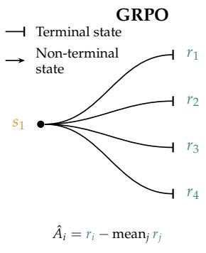

AC2  
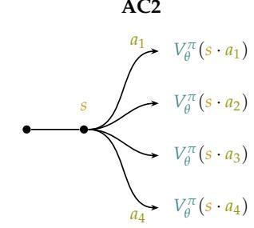

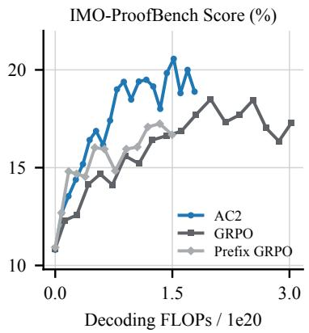  
Figure 1: Advantage estimation in GRPO and AC2. GRPO rolls every sample out from the root to a terminal reward. AC2 starts from a replayed prefix $s ,$ generates a short chunk $a _ { i }$ per sample, and reads the critic at the chunk’s end, $V _ { \theta } ^ { \pi } ( s \cdot { \dot { a } } _ { i } )$ , where · denotes concatenation. The same group also trains the critic. L is a classification loss that fits the critic’s prediction at the prefix to the group-mean value, its bootstrapped target (§3.3). Right: mean score against decoding compute for AC2, GRPO, and Prefix GRPO, which applies GRPO to full-length continuations of replayed prefixes (§4.1).

## 1 Introduction

Standard reinforcement learning algorithms today, such as Group Relative Policy Optimization (GRPO) (Shao et al., 2024), treat each sampled rollout as a single action. As a result, every token of a rollout is credited with the same advantage that depends solely on the terminal reward. This provides only coarse credit assignment. For example, a minor calculation error at the end of a math proof can cause an otherwise correct and valuable reasoning trajectory to be penalized.

If we instead view a rollout as a sequence of many small actions, actor–critic methods can assign credit to each action individually, providing dense learning signal throughout the trajectory (Haarnoja et al., 2018; Konda $\&$ Tsitsiklis, 1999). However, current LLM reinforcement learning methods largely avoid using critics for fine-grained credit assignment, and at most use them as baselines while still relying on terminal rewards for advanatage estimation (Pan et al., 2026a; Venkatraman et al., 2026). In essence, learned critics are considered too inaccurate to be used in isolation without any terminal reward (Kazemnejad et al., 2025).

We revisit this reliance on terminal rewards by introducing Actor-Critic with Action Chunking (AC2), which instead assigns credit to action chunks: short continuations of prefixes of past trajectories. A learned critic scores the state reached at the end of each action chunk, allowing the policy to update without rolling out to a terminal reward (Figure 1). Formally, let $\pi _ { \theta }$ and $V _ { \theta } ^ { \pi }$ be the policy and value function. From a partial chain-of-thought prefix $s ,$ we sample $g$ token chunks $a _ { i }$ of the same length. Each continuation is scored by the critic at its endpoint, $v _ { i } = V _ { \theta } ^ { \pi } ( s \cdot a _ { i } )$ where · denotes concatenation, and receives advantage $\hat { A } _ { i } = v _ { i } - 1 / g \sum _ { j } v _ { j }$ . No terminal reward is required for these updates.

Removing the need for a terminal reward on every update opens up a part of the design space for LLM reinforcement learning that has not been explored. AC2 benefits from this in two ways. Firstly, each step can generate far fewer tokens by only rolling out groups of action-chunks instead of full trajectories. Secondly, the actor receives finer-grained supervision of a single advantage for each action-chunk as opposed to trajectory.

We identify three components of the algorithm that make fully critic based advantage estimates reliable. First, we introduce local readiness, which measures the critic’s error on the particular problem the actor is rolling out. Before the critic becomes sufficiently accurate on a problem, we generate a group of continuations to completion from a sampled prefix. We use their terminal rewards as endpoint values for policy updates and fit the critic to the average terminal reward. After the problem meets the readiness criteria, we instead generate action chunks, use the critic to assign endpoint values for policy updates, and update the critic using the average predicted value. Second, when available, we provide reference solutions from previous successful rollouts on the problem to the critic in context. Third, we use an action-chunk budget of 10k tokens with a full rollout budget of 50k tokens, providing a more meaningful unit of credit assignment than a single token.

We train Qwen3-4B-Thinking-2507 (Yang et al., 2025) on FineProofs-RL (LM-Provers et al., 2026) and evaluate on IMO-ProofBench (Luong et al., 2025), a collection of math olympiad level problems. AC2 exceeds GRPO’s peak mean score of 18.50% using 2.5× fewer decoding FLOPs (Figure 1). This gain comes from two places: (1) AC2 requires 25% fewer training steps, surpassing GRPO’s peak in 90 as opposed to 120 steps, and (2) AC2 generates fewer tokens per update because it does not need to continue every trajectory to completion. AC2 also achieves a higher peak mean score of 20.57%, compared with 18.50% for GRPO. Decoding FLOPs are highly correlated with GPU hours in our main RL run (§B). We use them as a normalized compute proxy throughout the paper, since different experiments use different numbers of GPUs.

We provide evidence that all three components, local readiness, providing reference solution to critic, and action-chunking, are all integral to the success of the agorithm. We find that runs without local readiness plateau early because they apply an imprecise critic to some problems (Figure 3 right). When we reduce action-chunk size from 10k to 2k tokens, performance plateaus earlier than the 10k run (Figure 3 right). Finally, we show the critic error is lower when provided with a correct reference solution in context (Figure 2, fourth panel). We also demonstrate two variants of the AC2 algorithm that perform comparably, the first samples a single action-chunk for each critic-ready problem, using $\mathbf { \hat { A } } = V _ { \theta } ^ { \pi } ( s \cdot c ) \mathbf { \hat { \Pi } } - V _ { \theta } ^ { \pi } ( s )$ . The second uses a highly stale replay buffer for sampling trajectory prefixes (Figure 3 left). We present these variants because they broaden the space of RL algorithms, for example, by enabling algorithms that leverage existing trajectories more extensively.

Conceptually, our results can be summarized as showing that LLM RL can trust a learned critic far more than current methods do. Once the critic is accurate, rolling every trajectory out to a terminal reward is no longer required, and removing that requirement opens up the design space. AC2 is one example of what this makes possible. It assigns credit to individual action chunks, generates a small number of tokens per step, and learns from off-policy initial states drawn from a replay buffer.

## 2 Preliminaries

We consider the problem of reinforcement learning with verifiable rewards. Let D be the question distribution and V the model vocabulary. A policy $\pi _ { \theta }$ with parameters θ maps a question $x \sim \mathcal { D }$ to an autoregressively generated response of length T tokens, $y = ( y _ { 1 } , \dots , y _ { T } ) , y _ { t } \in \mathcal { V } _ { \cdot }$ , which a deterministic verifier scores $R ( x , y ) \ { \stackrel { \textstyle - } { \in } } \ [ 0 , 1 ]$ . The learning objective is the expected verifier score $J ( \theta ) = \mathbb { E } _ { x \sim \mathcal { D } } \mathbb { E } _ { y \sim \pi _ { \theta } ( \cdot | x ) } \big [ R ( x , y ) \big ]$ . R is defined only on complete responses.

Token-level MDP. We will consider the following MDP. Let $s _ { t } = { \boldsymbol { x } } \cdot { \boldsymbol { y } } _ { < t }$ where · denotes string concatenation, with $s _ { 1 } = x$ and $a _ { t } = y _ { t } \in \mathcal V$ . The transition dynamics are simply $s _ { t + 1 } = s _ { t } \cdot a _ { t }$ The reward of the MDP is $r _ { t } = 0$ for $t < T$ and $r _ { T } = R ( x , y )$ . Let $V ^ { \pi } ( s )$ denote the expected terminal verifier score when following π from prefix s (equal to $R ( x , y )$ for a complete response) and $Q ^ { \pi } ( s , a )$ the expected score after taking a at s and following π. Since transitions are deterministic and rewards are terminal-only we have

$$
Q ^ { \pi } ( s , a ) \ = \ V ^ { \pi } ( s \cdot a ) , { \quad } A ^ { \pi } ( s , a ) \ = \ Q ^ { \pi } ( s , a ) - V ^ { \pi } ( s ) \ = \ V ^ { \pi } ( s \cdot a ) - V ^ { \pi } ( s ) .\tag{1}
$$

One can also reform the MDP to have a denote a fixed-size chunk of consecutive tokens, and these identities are unchanged.

Policy gradients and advantage estimation. The policy gradient theorem (Sutton et ${ \mathrm { a l . } } ,$ , 1999) states that, for any action-independent baseline $b ( s )$ and policy $\pi _ { \theta }$ with state visitation distribution $d ^ { \pi }$ ,

$$
\nabla _ { \boldsymbol { \theta } } J ( \boldsymbol { \theta } ) \propto \mathbb { E } _ { s \sim d ^ { \pi } , a \sim \pi _ { \boldsymbol { \theta } } } \Big [ \nabla _ { \boldsymbol { \theta } } \log \pi _ { \boldsymbol { \theta } } ( a \mid s ) \big ( Q ^ { \pi } ( s , a ) - b ( s ) \big ) \Big ] .\tag{2}
$$

Note that the reward to ${ \bf g 0 }$ does not appear in Equation (2). An algorithm needs some estimate $\hat { A } _ { t }$ of $A ^ { \pi } ( s _ { t } , a _ { t } )$ , and the choice of estimator is what separates existing LLM policy gradient methods. Let V be an approximate state-value function, set to $R ( x , y )$ on a complete response, and let $\lambda \in \left[ 0 , 1 \right]$ control the decay of residual weights in Generalized Advantage Estimation (GAE) (Schulman et al., 2018). With the one-step residual $\delta _ { t } ^ { V } = V ( s _ { t + 1 } ) - V ( s _ { t } )$ ,

$$
\hat { A } _ { t } ^ { \mathrm { G A E } ( \lambda ) } = \sum _ { l = 0 } ^ { T - t } \lambda ^ { l } \delta _ { t + l } ^ { V } .\tag{3}
$$

In the case when ${ \cal V } \ne { \cal V } ^ { \pi }$ , for example in practice when we use a learnt value model, low λ corresponds to low variance and high bias estimators, and high λ the converse. Importantly, once $\lambda > 0$ , estimating $\hat { A } _ { t } ^ { \mathrm { G A E } ( \lambda ) }$ requiers evaluating the terminal reward. The two λ endpoints take particularly simple forms:

$$
\hat { A } _ { t } ^ { \mathrm { G A E ( 0 ) } } = V ( s _ { t } \cdot a _ { t } ) - V ( s _ { t } ) , \qquad \hat { A } _ { t } ^ { \mathrm { G A E ( 1 ) } } = R ( x , y ) - V ( s _ { t } ) .\tag{4}
$$

The first is the single residual $\delta _ { t } ^ { V } .$ , the second follows by telescoping the residuals through the complete response. $\mathrm { A t } \lambda = 0 .$ , advantages at nonterminal transitions are estimated entirely using the learned value function, without the terminal reward. $\mathrm { A t } \lambda = 1$ it is the realized verifier score, with the value function serving only as a baseline.

Existing RLVR methods estimate the advantage at $\lambda \approx 1$ . Modern RLVR pipelines optimize $J ( \theta )$ with a PPO-style clipped surrogate (Schulman et al., 2017). Let $\theta _ { \mathrm { o l d } }$ be the fixed parameters of the policy that generated the sampled responses and $\rho _ { t } ( \theta ) = \pi _ { \theta } ( a _ { t } \mid s _ { t } ) / \pi _ { \theta _ { \mathrm { o l d } } } ( a _ { t } \mid \mathbf { \bar { \theta } } _ { s _ { t } } )$ denote the off-policy importance sampling ratio. With lower and upper clipping parameters $\epsilon _ { \mathrm { l o w } }$ and $\epsilon _ { \mathrm { h i g h } } ,$ the PPO loss is

$$
\begin{array} { r l } { \mathcal { L } ( \theta ) \ = \ - \mathbb { E } _ { x \sim \mathcal { D } , y \sim \pi _ { \theta _ { \mathrm { o l d } } } ( \cdot | x ) } \Big [ \sum _ { l } \operatorname* { m i n } \big ( \rho _ { t } ( \theta ) \hat { A } _ { t } , \mathrm { c l i p } ( \rho _ { t } ( \theta ) , 1 - \epsilon _ { \mathrm { l o w } } , 1 + \epsilon _ { \mathrm { h i g h } } ) \hat { A } _ { t } \big ) \Big ] . } \end{array}\tag{5}
$$

Most RLVR methods differ in the estimator $\hat { A } _ { t }$ . All of them use λ (Equation (3)) very close to 1. For comparison, PPO-based RLHF (Ouyang et al., 2022) trains a token-level value network $V _ { \theta }$ and uses $\hat { A } _ { t }$ from Equation (3) with $\lambda \approx 0 . 9 \breve { 5 }$ . In RLVR, GRPO (Shao et al., 2024) replaces the learned value network with a baseline computed from a group of sampled responses. For each question $x ,$ it samples g responses $y _ { 1 } , \dots , y _ { G } \sim \pi _ { \theta _ { \mathrm { o l d } } } ( \cdot \mid x )$ and computes their mean reward, $V =$ $1 / g \textstyle \sum _ { j = 1 } ^ { g } R ( x , y _ { j } )$ . Every token in response $y _ { i }$ receives the same advantage, $\begin{array} { r } { \hat { A } _ { i , t } = R ( x , y _ { i } ) - V , } \end{array}$ optionally divided by the group’s reward standard deviation. The group mean is a Monte Carlo estimate of the root-state value $\hat { V } ^ { \pi } ( s _ { 1 } )$ , so GRPO uses the $\lambda = 1$ estimator with a shared baseline.

Other RLVR methods learn a value model but use its predictions only as a baseline, retaining the $\lambda = 1$ advantage estimator. Like GRPO, these methods estimate advantages from the realized terminal reward but they differ in how they construct the baseline (more details in §5). Our method differs from the previous works by choosing $\lambda = 0$ , using the critic to remove the dependency on terminal rewards for some problems.

## 3 Actor-Critic with Action Chunking

We present Actor-Critic with Action Chunking (AC2). Let $\mathcal { D }$ be a set of training problems that admit a terminal reward. AC2 trains a policy $\pi _ { \theta }$ and value model $V _ { \theta } ^ { \pi }$ that share parameters θ. Our method is motivated by a single guiding principle. When we know the value function is accurate, we use it to update the policy. Each step of the AC2 proceeds as follows (see Algorithm 1):

1. Problem sampling. We maintain a replay buffer B of complete rollouts on prior problems. At each step we sample $n _ { \mathrm { r e f i l l } }$ new problems from D and $n _ { \mathrm { b a t c h } }$ complete trajectories from B.

2. Policy sampling. For each sampled new problem, we do a rollout to the end, and use these to refill the buffer for the next step. For each buffer sampled trajectory, we cut to a random prefix of tokens $s ,$ and rollout a group number g of token blocks from there. If our value model is deemed accurate on the problem, which we call ready (§3.1), then we rollout a chunk of b tokens. If not then we rollout until the end of the trajectory. Let $c _ { i }$ denote these sampled tokens for the ith entry in the group. This gives us a group of visited states $\{ s \cdot c _ { i } \} _ { i = 1 } ^ { g }$

3. Advantage estimation. To calculate the advantage we need the expected return from each continuations state $s \cdot c _ { i }$ . If $s \cdot c _ { i }$ is a complete trajectory this is simply the terminal reward $r _ { i } .$ Otherwise we use the critic’s estimate $V _ { \theta } ^ { \frac { \bf { x } } { \pi } } ( s \cdot c _ { i } )$ . Writing $v _ { i }$ for endpoint value, the advantage is $\hat { A } _ { i } = v _ { i } - \mathrm { m e a n } _ { j } ( v _ { j } )$

4. Actor update. We take a clipped policy gradient step with $\hat { A } _ { i }$ on the newly sampled tokens, leaving the replayed prefix s as conditioning context that receives no loss.

5. Critic update. We fit $V _ { \theta } ^ { \pi }$ to each prefix’s group-mean value mean $\mathbf { \rho } _ { 1 _ { i } } ( v _ { i } )$ . If $V _ { \theta } ^ { \pi }$ was not ready on the problem, then this target will be the average terminal reward over the group. If it was ready, the target will be an average over the value model’s own estimates mean $\mathfrak { i } \big ( V _ { \theta } ^ { \overline { { \pi } } } ( s \cdot c _ { j } ) \big ) \big )$ .

## 3.1 Problem and policy sampling

We begin by sampling states to generate actions for. We keep a replay buffer B of complete rollouts (that are not necessarily correct) on prior problems. We sample $n _ { \mathrm { r e f i l l } }$ fresh problems from D without replacement and $n _ { \mathrm { b a t c h } }$ stored trajectories from B. For each of these $n _ { \mathrm { b a t c h } }$ trajectories we choose a random cut position after the problem statement. We keep all tokens before the cut. We refer to this state as s. Let $S _ { \mathrm { r e f i l l } }$ be the set of $n _ { \mathrm { r e f i l l } }$ fresh states, each a problem statement with an empty response, and let $\boldsymbol { S _ { \mathrm { b a t c h } } }$ be the set of $n _ { \mathrm { b a t c h } }$ cut states. For each problem in $\mathcal { S } _ { \mathrm { r e f i l l } } ,$ , we do a single full rollout to the end, and add these to $B ,$ which is simply a first-in-first-out queue with fixed capacity. We only use these rollouts to update the buffer, and they are not part of the actor and critic loss.

We use the trajectory prefixes in $ { S _ { \mathrm { b a t c h } } }$ to update the actor and critic. We partition the problems into ready and unready sets according to whether they have satisfied the readiness criteria, and write $\mathcal { D } _ { \mathrm { r e a d y } } \subseteq \mathcal { D }$ for the ready set. A prefix is ready when its problem is. By default, a problem is not ready. Assume we have access to the error of the critic ε on the problem from prior steps (we explain how this error is calculated in the following paragraph). A problem is deemed ready when three conditions hold: (1) the mean of ε over every prefix sampled in the last five steps falls below a global threshold $\tau _ { \mathrm { g l o b a l } } ,$ (2) the error recorded for that problem from the prior step it was sampled falls below a tighter local threshold $\tau _ { \mathrm { l o c a l } } ,$ , and (3) at least one correct trajectory has been found by the policy on this problem.

For each prefix $s \in \mathcal { S } _ { \mathrm { b a t c h } }$ we then sample a group of $g$ continuations $c _ { i } \sim \pi _ { \theta } ( \cdot \mid s )$ from the policy. If the problem is not ready, each continuation runs until the response terminates and receives a terminal reward $r _ { i }$ . In this case we use the terminal reword to calculate the critic error $\varepsilon = \vert V _ { \theta } ^ { \pi } ( s ) - \mathrm { m e a n } _ { i } ( r _ { i } ) \vert$ and store it for future readiness calculations. If the problem is ready, each continuation is a single chunk of at most b new tokens, after which generation stops. For a fraction α of ready problems (normally $\alpha = 1 / 4 )$ we rollout full trajectories, so that terminal rewards continue to be recorded for them and ε remains measurable after a problem becomes ready. This is useful for (1) measuring the accuracy of the critic during the run and (2) for updating the critic on ready problems (see §3.3). We call this feature auditing, and it can be turned off by setting $\alpha = 0$ (see §4.3 for this ablation).

Overall this gives ${ \bf u } { \bf s } ,$ for every $s \in S _ { \mathrm { b a t c h } } , \mathrm { { \sf ~ a ~ g r o u p } }$ of $g$ continuations $\{ c _ { i } \} _ { i = 1 } ^ { g }$ and hence $g$ new states $\{ s \cdot c _ { i } \} _ { i = 1 } ^ { g }$ . We write $\mathcal { G } = \left\{ ( s , \{ c _ { i } \} _ { i = 1 } ^ { g } ) : s \in S _ { \mathrm { b a t c h } } \right\}$ for the set of prefix–group pairs. We use $\mathcal { G }$ to compute actor and critic updates.

```latex
Algorithm 1 Actor-Critic with Action Chunking (AC2)
Require: problems ${ \mathcal { D } } ,$ actor $\pi _ { \theta }$ and critic $\overline { { V _ { \theta } ^ { \pi } } } ,$ group size $g ,$ chunk length b
1: $\mathbf { \bar { \mathbf { \Gamma } } } \mathbf { \mathbf { \Phi } } \mathbf { \cdot } \mathbf { \bar { \mathbf { \Gamma } } } \mathbf { \Phi } \mathbf { \hat { \mathbf { \Gamma } } } \mathbf { \Phi } \mathbf { \hat { \mathbf { \Gamma } } } \mathbf { \Phi } \mathbf { \cdot } \mathbf { \bar { \mathbf { \Gamma } } } \mathbf { \Phi } \mathbf { \Phi } \mathbf { \hat { \mathbf { \Gamma } } } \mathbf { \Phi } \mathbf { \Phi } \mathbf { \hat { \mathbf { \Gamma } } } \mathbf { \Phi }$
2: for iteration $\check { k } = 1 , 2 , \ldots$ . do
3: Sample $S _ { \mathrm { r e f i l l } } \subseteq { \mathcal { D } } ;$ cut $ { S _ { \mathrm { b a t c h } } }$ from rollouts in $\boldsymbol { B }$
4: for each $x \in S _ { \mathrm { r e f i l l } }$ do
5: Generate one full response, judge it, insert into $\boldsymbol { B }$
6: for each $s \in \mathcal { S } _ { \mathrm { b a t c h } }$ do
7: Sample $c _ { 1 } , \ldots , c _ { g } \sim \pi _ { \theta } ( \cdot \mid s ) .$ , to termination if the problem /∈ $\mathcal { D } _ { \mathrm { r e a d y } } ,$
else for at most b tokens
8: $v _ { i }  V _ { \theta } ^ { \pi } ( s \cdot c _ { i } ) { \mathrm { i f } } s \cdot c _ { i }$ is not complete, else $\boldsymbol { r } _ { i } ,$ for $i = 1 , \ldots , g$
9: $\hat { A } _ { i } \gets v _ { i } - ( \sum _ { j } v _ { j } ) / g$
10: $\varepsilon \gets \big | V _ { \theta } ^ { \pi } ( s ) - ( \textstyle \sum _ { j } v _ { j } ) / g \big |$
11: Add to $\mathcal { D } _ { \mathrm { r e a d y } }$ each problem satisfying both readiness criteria based on $\varepsilon ( s )$ (§3.1)
12: Update actor (Equation (5)) using $\hat { A } _ { i }$ and critic
```

## 3.2 Advantage estimation

We use every pair $( s , \{ c _ { i } \} ) \in \mathcal { G }$ to update the actor and critic. For each pair we wish to compute an advantage $\mathring { A } _ { i }$ for continuation $c _ { i }$ . By Equation (1), the advantage of a block is $V ^ { \pi } ( s \cdot c _ { i } ) - { \Big . } V ^ { \pi } ( s )$ We first consider the expected return $\hat { V } ^ { \pi } ( s \cdot c _ { i } )$ for each new state $s \cdot c _ { i } . \enspace \mathrm { ~ I f ~ } s \cdot c _ { i }$ is a complete trajectory we know this exactly, is it the terminal reward $r _ { i } .$ If the trajectory is not complete, which is usually the case on critic ready problems that we sample a single action chunk for, we we use the critic, $V _ { \theta } ^ { \pi } ( s \cdot c _ { i } )$ . Write $v _ { i }$ for this endpoint value at $s \cdot c _ { i } ,$ whether it is the terminal reward or the critic’s estimate. The advantage also needs $V ^ { \pi } ( s )$ , the expected return from the prefix itself. Since $V ^ { \pi } ( s ) = \mathbb { E } _ { c \sim \pi } \big [ V ^ { \pi } ( s \cdot c ) \big ]$ the group-mean value ${ \mathrm { m e a n } } _ { j } ( v _ { j } )$ is an unbiased Monte-Carlo estimate of it. Together these give $\hat { A } _ { i } \ = \ v _ { i } - 1 / g \textstyle \sum _ { j = 1 } ^ { g } v _ { j }$

Note that on critic ready problems, this is the the $\lambda = 0$ form of the GAE advantage in Equation (4), with the baseline estimated from the group. On an unready problem, every $v _ { j }$ is a terminal reward, and thus the advantage is the $\lambda = 1$ form. Readiness can thus be interpretted as a per-problem switch to the λ parameter of the advantage estimate. With $\lambda = 0$ we no longer need to observe the terminal reward, and instead can update on a single action-chunk.

The critic $V _ { \theta } ^ { \pi }$ share weights with the policy network. We query the critic through a prompt rather than a separate head. The prompt contains the problem, the partial response, and, when the problem has previously been solved, a known-correct solution. The model answers with a value in $\{ 0 , 0 . 1 , \ldots , 1 \}$ , which we decode greedily and parse. The exact instruction is given in $\ S C$

## 3.3 Actor and critic update

The actor optimizes objective of Equation (5) on the newly generated tokens, holding $\hat { A } _ { i }$ fixed across the tokens of $c _ { i }$ . Replayed prefix tokens are conditioning context and receive no loss. We adapt $\epsilon _ { \mathrm { h i g h } }$ based on the policy entropy following The Microsoft AI Team (2026).

The critic’s target for a prefix is the group-mean value mean $_ { i } ( v _ { j } )$ , rounded to the nearest grid value. Since the critic answers with a value on a discrete grid, we fit it is as a next-token-prediction task. When the problem has a reference solution we train the same target under both prompts, with and without the reference, at equal weight. When there is no reference solution we train only the plain prompt. Prefix–target pairs are kept in a first-in-first-out buffer of their own and each critic step trains on a batch sampled from it, so a target is reused across several updates before it ages out.

We optimize the same parameters θ for both objectives, using different optimizer state and learning rate for each. For all our experiments, at each step we update the actor with two steps. We interleave the critic update between the two. We defer details of this algorithm to $\ S C$

## 4 Experiments

We test AC2 by training Qwen3-4B-Thinking-2507 on FineProofs-RL (LM-Provers et al., 2026), a set of roughly 5,200 Olympiad proof problems from international competitions and AoPS. We evaluate on IMO-ProofBench (Luong et al., 2025), 60 Olympiad problems curated with grading rubrics, and reference solutions. We use DeepSeek-V4-Flash (DeepSeek-AI et al., 2026) to judge proof correctness, scoring each generated proof from 0 to 7. The judge is prompted with the correct reference solution and problem-specific rubric as well as the candidate proof to grade for validation. We do not provide the reference solution or the problem-specific rubric to the judge during training.

Methods. We compare AC2 with GRPO and Prefix GRPO, a GRPO variant that starts its rollouts from replayed prefixes. AC2 uses group size $g \ = \ 1 6 ,$ , chunk length $b = 1 0 , 0 0 0 _ { \cdot }$ , and auditing with $\alpha = 1 / 4$ , and empty initial replay buffers. Prefix GRPO uses the same actor trajectory buffer system as AC2, but rolls out full-length continuations of prefixes and uses terminal rewards for advantage estimation identical to GRPO. We select the GRPO learning rate by peak validation mean score (§A.1). See Table 4 for hyperparameters and §C for additional details).

Compute accounting. We track policy performance against a measure of compute used. The standard measure would be number of steps. This is imperfect in our setting as AC2, Prefix GRPO, and GRPO use different amounts of compute, and accordingly wall-clock time for each step. Specifically, GRPO uses the most compute as it requires rolling out all trajectories to completion. A strong candidate to use is GPU hours (as used by Khatri et al. (2026)), however we conduct our experiments using different numbers of GPUs, and due to differing communication overhead GPU hours are not directly comparable between runs. Instead we find Decoding FLOPs (the FLOPs used in policy rollouts) correlate strongly with GPU hours in our main run (§B) and so use this hardware-agnostic measure instead. We also report performance against steps for full clarity.

## 4.1 Main Results

AC2 is more compute efficient and data efficient than GRPO. We present results in Figure 1. AC2 reaches higher validation score with fewer steps and less decoding compute than GRPO (Figure 1). AC2 first exceeds GRPO’s peak mean score of 18.50% at 0.79e20 FLOPs compared to 1.99e20 for GRPO. This is a 2.5× compute efficiency gain over GRPO. Here both algorithms are also acting under a data constrained setting as there is a fixed number of training problems that we epoch. Under this constraint, AC2 reaches a higher peak score of 20.57% over 18.5% for GRPO.

The replay-buffer state distribution alone does not explain AC2’s gains. We test whether AC2’s gains come from the state distribution induced by replay using Prefix GRPO. Prefix GRPO falls well behind AC2 when measured by Decoding FLOPs (Figure 1).

The critic becomes trustworthy early and stays so. The first three panels of Figure 2 track the two quantities that govern how much AC2 relies on its critic. The global readiness threshold is first crossed at the end of step $^ { 7 , }$ after which the fraction of sampled problems that are ready rises steadily, reaching about 70% by step 200. The critic’s error ε decrease steadily over training.

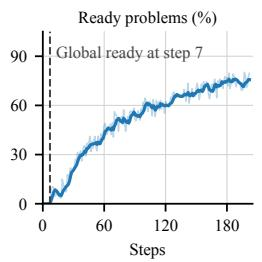

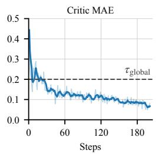

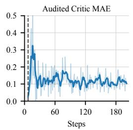

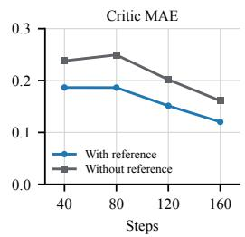  
Figure 2: Critic readiness and accuracy for AC2. The first three panels show critic metrics over the course of the main AC2 run, shown as the blue line in Figure 1. First: fraction of sampled problems that are ready. Second: critic error over all sampled prefixes, $\vert V _ { \theta } ^ { \pi } ( s ) - \mathrm { m e a n } _ { j } ( \bar { v } _ { j } ) \vert ,$ where $v _ { j }$ is the terminal reward or the critic’s value of the continuation. Third: critic error on audited groups of critic ready problems, $| V _ { \theta } ^ { \pi } ( s ) - \mathrm { m e a n } _ { j } ( r _ { j } ) |$ , where every continuation runs to completion, so the target is a mean of terminal rewards only. In the first three panels, faint lines show per-step values, dark lines average these over the trailing five steps. Fourth: critic MAE with and without the reference solution in its prompt.

## 4.2 AC2 variants

We present three variants of the AC2 algorithm that also perform well: (1) training with a highly stale replay buffer, (2) training without auditing, and (3) setting group size on ready problems to 1. Results are shown in Figure 3, left.

AC2 with stale replay buffer. Actor–critic methods (Haarnoja et al., 2018; Fujimoto et al., 2018), such as Soft Actor-Critic (SAC), can learn from rollouts generated by earlier policies. We test AC2s tolerance to a more stale initial state distribution by collecting 1920 fresh rollouts every 10 steps and setting this to be the actor replay buffer for those steps (instead of 192 rollouts per step and a buffer with size 256). The mean sore reaches 17.90% (Figure 3, pink line) and appears to plateau there, but reaches this value far faster than GRPO. We conclude that AC2 can learn astale state distribution.

AC2 without auditing. We try removing auditing from critic ready problems (Figure 3, teal line). The run shows slightly larger instability than AC2 run, but it still reaches a peak mean of 18.66% at step 160, outperforming the GRPO baseline. We still recommend using auditing as it reaches a higher peak reward and allows for tracking the health of the critic during training more closely.

AC2 with group size 1. We next consider removing grouping as well as auditing, giving AC2 w/o Group & Audit. For each sampled ready problem, this variant samples 16 separate prefixes and generates one action chunk c per prefix. Each continuation uses the advantage estimate $\hat { A } = \overset { \cdot } { v } - V _ { \theta } ^ { \pi } ( s )$ , with $v = V _ { \theta } ^ { \pi } ( s \cdot c )$ or $v = r$ if the action chunk ends the trajectory. The critic is trained on the same single endpoint, fitting $V _ { \theta } ^ { \pi } ( s )$ to v as per the Bellman equation. We retain full-length groups on unready problems to train the critic using average terminal rewards. This run performs similarly to AC2 (Figure 3, purple line).

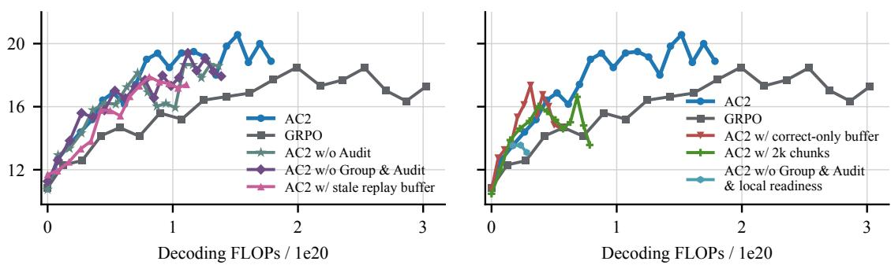  
Figure 3: Component ablations evaluated by mean score versus Decoding FLOPs. Left: variants that perform comparably to AC2. AC2 w/o Audit removes full-length audits with little effect on performance. $\Delta \bar { \mathrm { C } } 2 ~ \mathrm { w } / \mathrm { o }$ Group & Audit uses one short continuation per ready prefix and the starting-prefix value as its baseline, achieving comparable scores. AC2 w/ stale replay buffer refreshes its replay buffer only every ten steps and continues to improve. Right: variants that fall behind. With AC2 w/o Group & Audit & local readiness, learning stalls and scores decline; this run branches off AC2 at the checkpoint of step 20. AC2 w/ correct-only buffer retains trajectories receiving at least six of seven judge points in the replay buffer, following Setlur et al. (2026), and worsens later in training. AC2 w/ 2k chunks uses 2,000-token chunks and falls behind after step 50. The corresponding training-step plots are in Appendix Figure 6.

## 4.3 Ablations that hurt performance

We now ablate the other components of AC2 to show their necessity. We find that the use of the local readiness criterion and 10k long action chunks (as opposed to smaller ones) are essential. Intuitively, local readiness ensures the critic is accurate when we use it, and larger action chunks are easier for a the critic to judge, and thus make it more accurate, while still allowing for finer grained credit attribution than rolling out the full trajectory. Finally, we consider only storing correct trajectories in the actor replay buffer like Setlur et al. (2026), but find this hurts performance.

Smaller chunk size hurts performance. We test AC2 with chunk size of 2,000 as opposed to 10,000 used in the main run. The two runs track each other through step 50, where AC2 w/ 2k chunks reaches 16.03%, compared with 16.41% for AC2’s 10,000-token chunks. Beyond that step the shorter chunks stop improving. AC2 w/ 2k chunks peaks at 16.62% at step 100 and falls to 13.57% at step 120 (Figure 3, green line).

AC2 w/ correct-only buffer improves early but worsens later. Motivated by Setlur et al. (2026), we keep only trajectories receiving at least six of seven training-judge points in the replay buffer. This run reaches 17.35% at step 60, compared with 16.88% for AC2. However, this early advantage does not persist. At step 110, its score falls to 14.67% (Figure 3, red line).

Without local readiness. We now consider ablating the use of a local readiness threshold. Specifically, as soon as the critic MAE drops below the global $\tau _ { \mathrm { g l o b a l } }$ threshold, we consider all problems critic ready. For this ablation we run without group and audit. Specifically we branch off the AC2 run at step 20 (the blue line in Figure 3. With local readiness disabled, mean score falls from 13.56% at step 30 to 13.10% at step 40, while the run without group and audit but with local readiness reaches 15.33% at step 40 (Figure 3, cyan line versus purple line). At that step, only 18.23% of sampled problems are ready with local readiness, compared with 100% (by definition) without it (Appendix Figure 8).

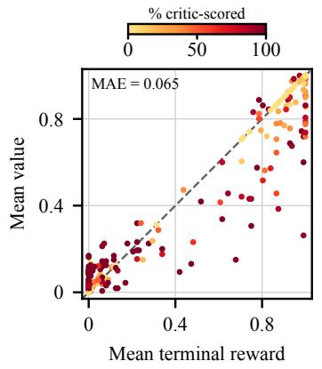

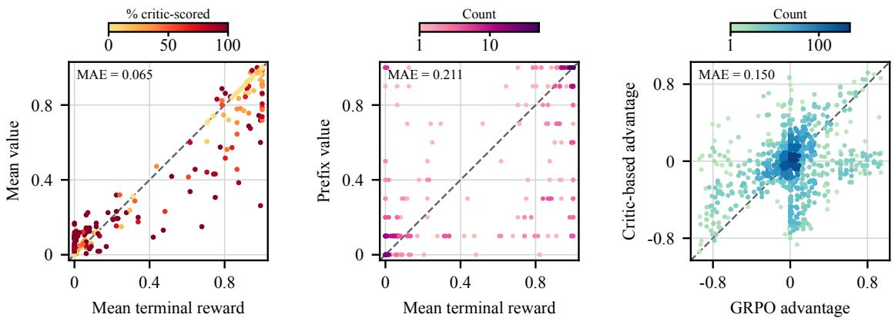  
Figure 4: Group-mean values are more accurate than prefix predictions, and critic-based advantages correlate with GRPO advantages. At step 80, the left panel compares ${ \mathrm { m e a n } } _ { i } ( v _ { i } )$ with $\mathrm { m e a n } _ { i } ( r _ { i } )$ for 256 prefixes; colour indicates the percentage of continuations scored by the critic. The middle panel compares the prefix value prediction $\overset \sim V _ { \boldsymbol { \theta } } ^ { \pi } ( s )$ with $\mathrm { m e a n } _ { i } ( r _ { i } )$ for the same prefixes. The right panel compares $\hat { A } _ { i }$ with $r _ { i } - \mathrm { m e a n } _ { j } ( r _ { j } )$ for $2 { , } 6 4 0$ responses in 165 groups containing at least one critic prediction. Details are deffered to $\ S \mathrm { A . 4 }$

## 4.4 Critic Diagnostics

Group-mean values are more accurate than the prefix value. At step 80, we sample 256 ready training problems, cut one prefix s from each problem’s latest stored trajectory, and generate $g =$ 16 full continuations. We reconstruct the endpoint value $v _ { i }$ using the critic prediction after $1 0 { , } 0 0 0$ new tokens when available and the terminal reward $r _ { i }$ otherwise (see $\ S \bar { \mathrm { A } } . 4$ for details). Against the mean terminal reward $\mathrm { m e a n } _ { i } ( r _ { i } )$ , the group-mean value ${ \mathrm { m e a n } } _ { i } ( v _ { i } )$ has mean absolute error (MAE) 0.065, compared with 0.211 for the prefix value $V _ { \theta } ^ { \pi } ( s )$ (Figure 4, left and middle). This justifies using the group-mean value as supervision for the prefix value.

Critic-based advantages are positively correlated with Prefix GRPO advantages. Although the prefix value has a larger MAE, the critic-based advantages $\hat { A } _ { i } = v _ { i } - \mathrm { m e a n } _ { j } ( v _ { j } )$ have MAE 0.150 relative to the prefix GRPO advantages $r _ { i } - \mathrm { m e a n } _ { j } ( r _ { j } )$ across 2,640 responses in 165 groups containing at least one critic prediction (Figure $4 , \mathrm { r i g h t } )$ . Their Pearson correlation is 0.388. As AC2 outperforms Prefix GRPO (§4.1), Prefix GRPO advantages should not be treated as ground truth.

A reference solution in the prompt makes the critic more accurate. We take the main run’s checkpoints (the blue line in Figure 1) at steps 40, 80, 120 and 160. For each, we collect the prefixes probed over the next 20 steps whose problem had a reference solution and whose target is a mean of terminal rewards, about 1,500 per checkpoint. The critic scores each prefix twice, with and without the reference in its prompt. With the reference, MAE is lower at every checkpoint (Figure 2, fourth panel).

## 5 Related Work

AC2 is an actor-critic method as it learns a value model and policy, improving the policy using the value model (Mnih et al., 2016; Fujimoto et al., 2018; Haarnoja et al., 2018; Konda & Tsitsiklis, 1999). Some readers will have noticed that our method name is very similar to A3C (Mnih et al.,

2016), and this reflects the similarity in the methods themselves (although the application settings are vastly different). A3C estimates the advantage from an n-step return with n far smaller than the episode horizon, using the critic at step n. It then uses this advantage to improve the actor through a policy gradient update. Our use of the GAE λ = 0 advantage estimator on critic ready problems to get the advantage of a single action chunk without rolling out to the end of the trajectory is similar in nature.

Despite their success in continuous control, actor-critic methods have not been widely adopted for LLM RLVR. Instead, group-relative methods dominate (specifically GRPO (Shao et al., 2024; Guo et al., 2025a) and its descendants (Yu et al., 2025; Chen et al., 2025; Khatri et al., 2026; Liu et al., 2024)). These methods sample a group of complete responses per problem and use the group mean of the terminal rewards as a Monte-Carlo baseline. In the language of §2 this is the $\lambda \ : = \ : 1$ estimator with the baseline evaluated at the root. This requires every rollout to run to termination, and every token of a response receives the same advantage.

In response to the latter concern, a recent wave of work reintroduces a learned value model to RLVR, but still require calculating terminal rewards at each step. Concurrent Le Critique (Venkatraman et al., 2026), EVPO (Pan et al., 2026a), BPCO (Qi et al., 2026), POISE (Choi et al., 2026), JustRL 2 (Pan et al., 2026b), V (Zhang et al., 2026), GenAC (Shan et al., 2026), and VAPO (Yue et al., 2025) each train a critic alongside the policy but advantage estimation still depends on terminal rewards. One can also solve the uniform advantage problem without a learnt value model, by estimating intermediate values with additional Monte-Carlo rollouts to terminal reward. This is the approach taken by VinePPO (Kazemnejad et al., 2025) and SPO (Guo et al., 2025b), however, this requires generating a large number of tokens for each advantage calculated. As the value estimate (whether from a value model or additional rollouts) is used (primarily) for baseline, all these methods sit at or near λ = 1 in Equation (3). Note any $\lambda > 0$ needs to observe the terminal reward, and to our knowledge AC2 is the first method to date to use $\lambda = 0$ for LLM RLVR.

Using the value model so aggressively requires an accurate critic. We achieve this through (1) local critic readiness, (2) providing the critic with privileged information (a correct solution) if we have it, and (3) action chunking, so the critic judges the state after a meaningful chunk of reasoning rather than after every token. All three have some precedent in the literature but have not been combined. Conditioning the critic on privileged information is also done by Le Critique and BPCO (Venkatraman et al., 2026; Qi et al., 2026). Parameterising the critic as the language model itself, rather than a scalar head, follows GenAC (Shan et al., 2026). Deciding when to trust the critic has been posed globally, by switching or interpolating baselines on a reliability signal (Zhang et al., 2026; Venkatraman et al., 2026) and per-problem by Pan et al. (2026a), although their method requires terminal rollouts on every problem. Action chunking (Zhao et al., 2023), as an intermediate unit of credit assignment between individual tokens and complete responses, has been explored in reinforcement learning more broadly by Li et al. (2025), and for LLMs by SPO (Guo et al., 2025b) and VinePPO (Kazemnejad et al., 2025), which estimate segment values with additional Monte-Carlo rollouts rather than a learned critic.

## 6 Conclusion

We forward the idea that critics in LLM RL can be used more aggressively than prior works. One example of this is abandoning the requirement of collecting a terminal reward, instead using a GAE advantage with λ = 0. Removing this requirement opens up the design space of LLM RL algorithms, with AC2 being an example of such a new algorithm. AC2 also leverages the special property that you can reset the states during LLM RL by sampling action chunks on top of prefixes from a replay buffer. One can imagine more exotic combinations of a critic and state resetting. For example, you could conduct beam search over action chunks using an AC2 trained model, or even alpha-go style MCTS tree search (Silver et al., 2016; Liu et al., 2023).

One of the key components that makes AC2 work, local readiness, is also its largest limitation. In particular, local readiness requires epoching the training data as we require complete rollouts to get a “ground truth” estimate of the value. In the non data constrained setting, this epoching is not realistic. We leave adapting AC2, and more generally the local readiness criteria, to the single epoch regime as future work.

## Acknowledgments

KW thanks the support of a Stanford Graduate Fellowship. LB thanks the support of a Stanford Graduate and Vitalik Buterin Fellowship. TM thanks the support of NSF 2522743. This work does not necessarily reflect the position or policy of the government and no official endorsement should be inferred. We thank Google TPU Research Cloud and Stanford Marlowe (Kapfer et al., 2025) for computing resources.

We thank Xingyu Dang, Lars Ankile and Tanishq Kumar for helpful feedback throughout the project. We thank Neil Band and Caroline Choi, for feedback on an early draft of this work. We thank Marka Ellertson for help with manuscript writing.

## References

Aili Chen, Aonian Li, Bangwei Gong, Binyang Jiang, Bo Fei, Bo Yang, Boji Shan, Changqing Yu, Chao Wang, Cheng Zhu, et al. Minimax-m1: Scaling test-time compute efficiently with lightning attention. arXiv preprint arXiv:2506.13585, 2025.

Yunho Choi, Jongwon Lim, Woojin Ahn, Minjae Oh, Jeonghoon Shim, and Yohan Jo. Your language model is its own critic: Reinforcement learning with value estimation from actor’s internal states. arXiv preprint arXiv:2605.07579, 2026.

DeepSeek-AI, Anyi Xu, Bangcai Lin, Bing Xue, Bingxuan Wang, Bingzheng Xu, Bochao Wu, Bowei Zhang, Chaofan Lin, Chen Dong, Chenchen Ling, Chengda Lu, Chenggang Zhao, Chengqi Deng, Chengyu Hou, Chenhao Xu, Chenze Shao, Chong Ruan, Conner Sun, Damai Dai, Daya Guo, Dejian Yang, Deli Chen, Donghao Li, Dongjie Ji, Erhang Li, Fang Wei, Fangyun Lin, Fangzhou Yuan, Feiyu Xia, Fucong Dai, Guangbo Hao, Guanting Chen, Guoai Cao, Guo lai Meng, Guowei Li, Han Yu, Han Zhang, Hanwei Xu, Hao Li, Haofen Liang, Haoling Zhang, Haoming Luo, Haoran Wei, Haotian Yuan, Haowei Zhang, Haowen Luo, Haoyu Chen, Haozhe Ji, Hengqing Zhang, Honghui Ding, Hongxuan Tang, Huanqi Cao, Huazuo Gao, Hui Qu, Hui Zeng, J Yang, JQ Zhu, Jia Luo, Jia Song, Jia Yu, Jialiang Huang, Jialu Cai, Jian Liang, Jiangting Zhou, Jiasheng Ye, Jiashi Li, Jiaxin Xu, Jiewen Hu, Jieyu Yang, Jin Chen, Jin Yan, Jingchang Chen, Jingli Zhou, Jingting Xiang, Jingyang Yuan, Jingyuan Cheng, Jingzi Zhou, Jinhua Zhu, Jiping Yu, Joseph Sun, Jun Ran, Junguang Jiang, Junjie Qiu, Junlong Li, Junmin Zheng, Junxiao Song, Kai Dong, Kaige Gao, Kang Guan, Kexing Zhou, Kezhao Huang, Kuai Yu, Lean Wang, Lecong Zhang, Lei Wang, Leyi Xia, Li Zhang, Liang Zhao, Lihua Guo, Lingxiao Luo, Linwang Ma, Linyan Zhu, Litong Wang, Liyu Cai, Liyue Zhang, Longhao Chen, MS Di, MY Xu, Max Mei, Miaojun Wang, Mingchuan Zhang, Minghua Zhang, Minghui Tang, Mingming Li, Mingxu Zhou, Minmin Han, Ning Wang, Panpan Huang, Panpan Wang, Peixin Cong, Peiyi Wang, Peng Zhang, Qiancheng Wang, Qihao Zhu, Qingyang Li, Qinyu Chen, Qiushi Du, Qiwei Jiang, Rui Tian, Ruifan Xu, Ruijie Lu, Ruiling Xu, Ruiqi Ge, Ruisong Zhang, Ruizhe Pan, Runji Wang, Runqian Chen, Runqiu Yin, Runxin Xu, Ruomeng Shen, Ruoyu Zhang, Ruyi Chen, SH Liu, Shanghao Lu, Shangmian Sun, Shangyan Zhou, Shanhuang Chen, Shaofei Cai, Shaoheng Nie, Shaoqing Wu, Shaoyuan Chen, Shengding Hu, Shengyu Liu, Shiqiang Hu, Shirong Ma, Shiyu Wang, Shuiping Yu, Shunfeng Zhou, Shuting Pan, Shuying Yu, Songyang Zhou, Tao Ni, Tao Yun, Tian Jin, Tian Pei, Tian Ye, Tianle Lin, Tianran Ji, Tianyi Cui, Tianyuan Yue, Tingting Yu, Tun Wang, W Zhang, WL Xiao, Wangding Zeng, Wei An, Weilin Zhao, Wen Liu, Wenfeng Liang, Wenjie Pang, Wenjing Luo, Wenjing Yao, Wenjun Gao, Wenkai Yang, Wenlve Huang, Wenqing Hou, Wentao Zhang, Wenting Ma, Xi Gao, Xiang He, Xiangwen Wang, Xianzu Wang, Xiao Bi, Xiaodong Liu, Xiaohan Wang, Xiaokang Chen, Xiaokang Zhang, Xiaotao Nie, Xiaowen Sun, Xiaoxiang Wang, Xin Cheng, Xin Liu, Xin Xie, Xingchao Liu, Xingchen Liu, Xingkai Yu, Xingyou Li, Xinyu Yang, Xinyu Zhang, Xu Chen, Xuanyu Wang, Xuecheng Su, Xueyin Chen, Xuheng Lin, Xuwei Fu, YC Yan, YQ Wang, YW Ma, Yanfeng Luo, Yang Zhang, Yanhong Xu, Yanru Ma, Yanwen Huang, Yao Li, Yao Li, Yao Xu, Yao Zhao, Yaofeng Sun, Yaohui Wang, Yi Qian, Yi Shao, Yi Yu, Yichao Zhang, Yifan Ding, Yifan Shi, Yijia Wu, Yiliang Xiong, Yiling Ma, Ying He, Ying Tang, Ying Zhou, Yingjia Luo, Yinmin Zhong, Yishi Piao, Yisong Wang, Yixiang Zhang, Yixiao Chen, Yixuan Tan, Yixuan Wei, Yiyang Ma, Yiyuan Liu, Yonglun Yang, Yongqiang Guo, Yongtong Wu, Yu Wu, YuKun Li, Yuan Cheng, Yuan Ou, Yuanfan Xu, Yuanhao Li, Yuduan Wang, Yuehan Yang, Yuer Xu, Yuhan Wu, Yuhao Meng, Yuheng Zou, Yukun Zha, Yunfan Xiong, Yupeng Chen, Yuping Lin, Yuqian Cao, Yuqian Wang, Yushun Zhang, Yuting Yan, Yutong Lin, Yuxian Gu, Yuxiang Luo, Yuxiang You, Yuxuan Liu, Yuxuan Zhou, Yuyang Zhou, Yuzhen Huang, ZF Wu, Zehao Wang, Zehua Zhao, Zehui Ren, Zekai Zhang, Zhangli Sha, Zhe Fu, Zhe Ju, Zhean Xu, Zhenda Xie, Zhengyan Zhang, Zheren Gao, Zhewen Hao, Zhibin Gou, Zhicheng Ma, Zhigang Yan, Zhihong Shao, Zhixian Huang, Zhixuan Chen, Zhiyu Wu,

Zhizhou Ren, Zhongyu Wu, Zhuoshu Li, Zhuping Zhang, Zian Xu, Zihao Wang, Zihua Qu, Zihui Gu, Zijia Zhu, Zilin Li, Zipeng Zhang, Ziwei Xie, Ziyi Gao, Ziyi Wan, Zizheng Pan, and Zongqing Yao. Deepseek-v4: Towards highly efficient million-token context intelligence, 2026. URL https://arxiv.org/abs/2606.19348.

Scott Fujimoto, Herke van Hoof, and David Meger. Addressing function approximation error in actor-critic methods. In International conference on machine learning, pp. 1587–1596. Pmlr, 2018.

Daya Guo, Dejian Yang, Haowei Zhang, Junxiao Song, Peiyi Wang, Qihao Zhu, Runxin Xu, Ruoyu Zhang, Shirong Ma, Xiao Bi, et al. Deepseek-r1: Incentivizing reasoning capability in llms via reinforcement learning. arXiv preprint arXiv:2501.12948, 2025a.

Yiran Guo, Lijie Xu, Jie Liu, Dan Ye, and Shuang Qiu. Segment policy optimization: Effective segment-level credit assignment in RL for large language models. In Advances in Neural Information Processing Systems, volume 38, 2025b. doi: 10.52202/ 085713-3815. URL https://proceedings.neurips.cc/paper\_files/paper/2025/ hash/a6536243037d1e32c20de85137d478da-Abstract-Conference.html.

Tuomas Haarnoja, Aurick Zhou, Pieter Abbeel, and Sergey Levine. Soft actor-critic: Off-policy maximum entropy deep reinforcement learning with a stochastic actor. In International conference on machine learning, pp. 1861–1870. Pmlr, 2018.

Craig Kapfer, Kurt Stine, Balasubramanian Narasimhan, Christopher Mentzel, and Emmanuel Candès. Marlowe: Stanford’s gpu-based computational instrument, 2025. URL https:// doi.org/10.5281/zenodo.14751899.

Amirhossein Kazemnejad, Milad Aghajohari, Eva Portelance, Alessandro Sordoni, Siva Reddy, Aaron Courville, and Nicolas Le Roux. VinePPO: Refining credit assignment in RL training of LLMs. In Proceedings of the 42nd International Conference on Machine Learning, volume 267, pp. 29557–29590. PMLR, 2025. URL https://proceedings.mlr.press/v267/ kazemnejad25a.html.

Devvrit Khatri, Lovish Madaan, Rishabh Tiwari, Rachit Bansal, Venkata Sai Surya Subramanyam Duvvuri, Manzil Zaheer, Inderjit Dhillon, David Brandfonbrener, and Rishabh Agarwal. The art of scaling reinforcement learning compute for llms. In International Conference on Learning Representations, volume 2026, pp. 72438–72467, 2026.

Vijay Konda and John Tsitsiklis. Actor-critic algorithms. Advances in neural information processing systems, 12, 1999.

Qiyang Li, Zhiyuan Zhou, and Sergey Levine. Reinforcement learning with action chunking. arXiv preprint arXiv:2507.07969, 2025. URL https://arxiv.org/abs/2507.07969.

Jiacheng Liu, Andrew Cohen, Ramakanth Pasunuru, Yejin Choi, Hannaneh Hajishirzi, and Asli Celikyilmaz. Don’t throw away your value model! generating more preferable text with valueguided monte-carlo tree search decoding. arXiv preprint arXiv:2309.15028, 2023.

Zichen Liu, Changyu Chen, Wenjun Li, Penghui Qi, Tianyu Pang, Chao Du, Wee Sun Lee, and Min Lin. Understanding r1-zero-like training: A critical perspective, 2025. URL https://arxiv. org/abs/2503.20783, 1, 2024.

LM-Provers, Yuxiao Qu, Amrith Setlur, Jasper Dekoninck, Edward Beeching, Jia Li, Ian Wu, Lewis Tunstall, and Aviral Kumar. QED-Nano: Teaching a tiny model to prove hard theorems. arXiv preprint arXiv:2604.04898, 2026. URL https://arxiv.org/abs/2604.04898.

Thang Luong, Dawsen Hwang, Hoang H Nguyen, Golnaz Ghiasi, Yuri Chervonyi, Insuk Seo, Junsu Kim, Garrett Bingham, Jonathan Lee, Swaroop Mishra, Alex Zhai, Huiyi Hu, Henryk Michalewski, Jimin Kim, Jeonghyun Ahn, Junhwi Bae, Xingyou Song, Trieu Hoang Trinh, Quoc V Le, and Junehyuk Jung. Towards robust mathematical reasoning. In Proceedings of the 2025 Conference on Empirical Methods in Natural Language Processing, pp. 35418–35442. Association for Computational Linguistics, 2025. doi: 10.18653/v1/2025.emnlp-main.1794. URL https://aclanthology.org/2025.emnlp-main.1794/.

Volodymyr Mnih, Adria Puigdomenech Badia, Mehdi Mirza, Alex Graves, Timothy Lillicrap, Tim Harley, David Silver, and Koray Kavukcuoglu. Asynchronous methods for deep reinforcement learning. In International conference on machine learning, pp. 1928–1937. PmLR, 2016.

Long Ouyang, Jeffrey Wu, Xu Jiang, Diogo Almeida, Carroll L. Wainwright, Pamela Mishkin, Chong Zhang, Sandhini Agarwal, Katarina Slama, Alex Ray, John Schulman, Jacob Hilton, Fraser Kelton, Luke Miller, Maddie Simens, Amanda Askell, Peter Welinder, Paul Christiano, Jan Leike, and Ryan Lowe. Training language models to follow instructions with human feedback. In Advances in Neural Information Processing Systems (NeurIPS), 2022.

Chengjun Pan, Shichun Liu, Jiahang Lin, Dingwei Zhu, Jiazheng Zhang, Shihan Dou, Songyang Gao, Zhenhua Han, Binghai Wang, Rui Zheng, et al. Evpo: Explained variance policy optimization for adaptive critic utilization in llm post-training. arXiv preprint arXiv:2604.19485, 2026a.

Haoxuan Pan et al. Justrl-ii: Scaling small llms to 128k reasoning with a critic. https://panhaoxuan.notion.site/ justrl-ii-scaling-small-llms-to-128k-reasoning-with-a-critic, 2026b. Chinese version: https://panhaoxuan.notion.site/ justrl-ii-small-llms-to-128k-reasoning-with-a-critic-cn.

Penghui Qi, Xiangxin Zhou, and Wee Sun Lee. Best practice critic optimization. arXiv preprint arXiv:2608.23566, 2026.

John Schulman, Filip Wolski, Prafulla Dhariwal, Alec Radford, and Oleg Klimov. Proximal policy optimization algorithms. arXiv preprint arXiv:1707.06347, 2017.

John Schulman, Philipp Moritz, Sergey Levine, Michael Jordan, and Pieter Abbeel. Highdimensional continuous control using generalized advantage estimation, 2018. URL https: //arxiv.org/abs/1506.02438.

Amrith Setlur, Zijian Wang, Andrew Cohen, Paria Rashidinejad, and Sang Michael Xie. Reuse your FLOPs: Scaling RL on hard problems by conditioning on very off-policy prefixes. arXiv preprint arXiv:2601.18795, 2026. URL https://arxiv.org/abs/2601.18795.

Zikang Shan, Han Zhong, Liwei Wang, and Li Zhao. Bringing value models back: Generative critics for value modeling in llm reinforcement learning. arXiv preprint arXiv:2604.10701, 2026.

Zhihong Shao, Peiyi Wang, Qihao Zhu, Runxin Xu, Junxiao Song, Xiao Bi, Haowei Zhang, Mingchuan Zhang, Y. K. Li, Y. Wu, and Daya Guo. DeepSeekMath: Pushing the limits of mathematical reasoning in open language models. arXiv preprint arXiv:2402.03300, 2024.

David Silver, Aja Huang, Chris J Maddison, Arthur Guez, Laurent Sifre, George Van Den Driessche, Julian Schrittwieser, Ioannis Antonoglou, Veda Panneershelvam, Marc Lanctot, et al. Mastering the game of go with deep neural networks and tree search. nature, 529(7587):484–489, 2016.

Richard S. Sutton, David McAllester, Satinder Singh, and Yishay Mansour. Policy gradient methods for reinforcement learning with function approximation. In Advances in Neural Information Processing Systems (NeurIPS), 1999.

The Microsoft AI Team. MAI-Thinking-1: Building a hill-climbing machine. Technical report, Microsoft AI, 2026. URL https://microsoft.ai/pdf/mai-thinking-1.pdf.

Siddarth Venkatraman, Matthieu Dinot, and Laurence Aitchison. Le critique: Privileged value functions for llm reinforcement learning. arXiv preprint arXiv:2608.16739, 2026.

An Yang, Anfeng Li, Baosong Yang, Beichen Zhang, Binyuan Hui, Bo Zheng, Bowen Yu, Chang Gao, Chengen Huang, Chenxu Lv, et al. Qwen3 technical report. arXiv preprint arXiv:2505.09388, 2025.

Qiying Yu, Zheng Zhang, Ruofei Zhu, Yufeng Yuan, Xiaochen Zuo, Yu Yue, Tiantian Fan, Gaohong Liu, Lingjun Liu, Xin Liu, Haibin Lin, Zhiqi Lin, Bole Ma, Guangming Sheng, Yuxuan Tong, Chi Zhang, Mofan Zhang, Wang Zhang, Hang Zhu, Jinhua Zhu, Jiaze Chen, Jiangjie Chen, Chengyi Wang, Hongli Yu, Weinan Dai, Yuxuan Song, Xiangpeng Wei, Hao Zhou, Jingjing Liu, Wei-Ying Ma, Ya-Qin Zhang, Lin Yan, Mu Qiao, Yonghui Wu, and Mingxuan Wang. DAPO: An open-source LLM reinforcement learning system at scale. arXiv preprint arXiv:2503.14476, 2025.

Yu Yue, Yufeng Yuan, Qiying Yu, Xiaochen Zuo, Ruofei Zhu, Wenyuan Xu, Jiaze Chen, Chengyi Wang, TianTian Fan, Zhengyin Du, et al. Vapo: Efficient and reliable reinforcement learning for advanced reasoning tasks. arXiv preprint arXiv:2504.05118, 2025.

Yi-Kai Zhang, Yueqing Sun, Hongyan Hao, Qi Gu, Xunliang Cai, De-Chuan Zhan, and Han-Jia Ye. V<sub>0.5</sub>: Generalist value model as a prior for sparse RL rollouts. arXiv preprint arXiv:2603.10848, 2026.

Tony Z Zhao, Vikash Kumar, Sergey Levine, and Chelsea Finn. Learning fine-grained bimanual manipulation with low-cost hardware. arXiv preprint arXiv:2304.13705, 2023.

## A Additional Experiments

## A.1 GRPO tuning

We test GRPO learning rates $1 \times 1 0 ^ { - 6 } , 2 \times 1 0 ^ { - 6 } , 4 \times 1 0 ^ { - 6 }$ , with results shown Figure 5. $2 \times 1 0 ^ { - 6 }$ is better than $4 \times 1 0 ^ { - 6 }$ and comparable to $1 \times 1 0 ^ { - 6 }$ at step 100, so we select $2 \times 1 0 ^ { - 6 }$ as our learning rate for experiments.

IMO-ProofBench Score (%)  
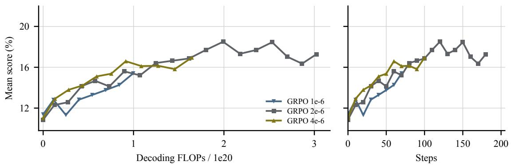  
Figure 5: The observed learning-rate sweep. Panels show mean score against Decoding FLOPs and Steps.

## A.2 Additional ablations

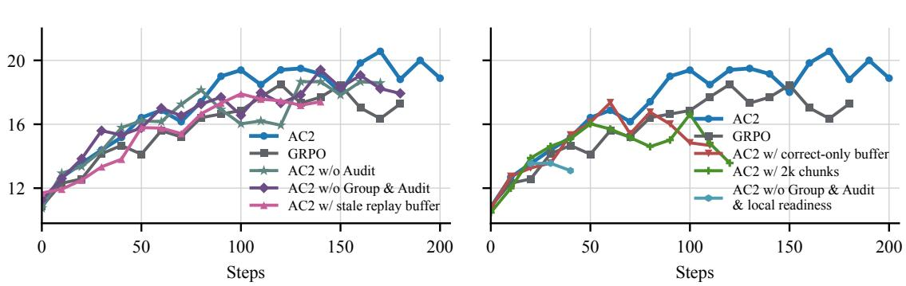  
Figure 6: Component ablations by steps. The panels show the comparisons from Figure 3 with training steps on the horizontal axis.

Starting-prefix baseline. Figure 3 compares AC2 with AC2 w/o Group & Audit. Full groups retain 16 continuations per prefix. For each sampled problem assigned to short generation, AC2 w/o Group & Audit samples 16 separate prefixes and generates one continuation from each $( g =$ 1). This preserves the total number of continuations per sampled problem.

Chunk size. We compare AC2 w/ 2k chunks with AC2, using grouping and auditing in both runs (Figure 7). AC2 w/ 2k chunks also reduces the spacing between possible prefix cuts to

2,000 tokens. At step 50, AC2 w/ 2k chunks and AC2 reach mean scores of 16.03% and 16.41%, respectively. The two runs separate afterwards. AC2 w/ 2k chunks peaks at 16.62% at step 100 and ends at 13.57% at step 120. Because this configuration changes the continuation length and the prefix-cut spacing together, the comparison does not isolate either change.

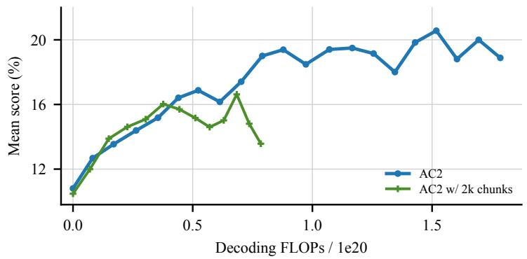

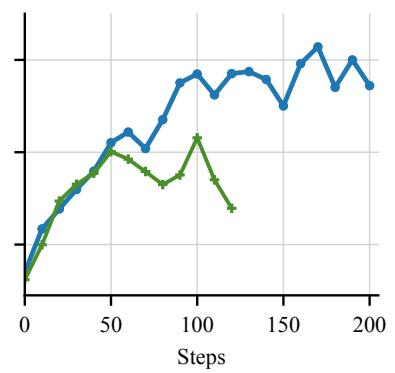

Figure 7: Chunk-size ablation with grouping and auditing enabled. AC2 uses 10,000-token chunks, AC2 w/ 2k chunks uses 2,000-token chunks and prefix-cut spacing.  
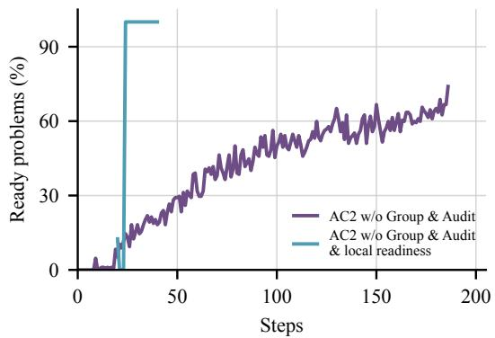  
Figure 8: Removing local readiness. AC2 $\mathbf { w } / \mathbf { o }$ Group & Audit starts from the base model; the variant that also removes local readiness branches off AC2 at the checkpoint of step 20. The plot shows their sampled-problem ready fractions.

## A.3 Additional evaluation metrics

We consider best-of-16 score as an additional metric. We estimate this with a bootstrap over 16 sampled validation trajectories, taking the maximum score of each bootstrapped sample. The results are shown in Figure 9. AC2 continues to be more compute efficient in terms of best-of-16, however AC2 and GRPO plateau at roughly the same score.

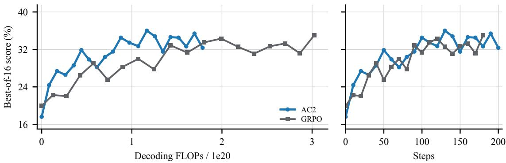  
Figure 9: Best-of-16 scores for AC2 and GRPO.

## A.4 Additional value function diagnostics

We extend the diagnostics in §4.4 to steps 40, 57, 80 and 160. At each checkpoint we select 256 distinct ready problems and their latest trajectories, cut each trajectory at a random fraction between 5% and 95% to give a prefix $s ,$ and use the checkpoint’s policy to generate 16 full continuations from s. As in the main body, $r _ { i }$ is the terminal reward of the ith continuation and $c _ { i }$ is its first 10k tokens, or fewer if it ends sooner. Let $\boldsymbol { v } _ { i } = \boldsymbol { r } _ { i }$ if $c _ { i }$ completes the trajectory and $v _ { i } = V _ { \theta } ^ { \pi } ( s \cdot c _ { i } )$ otherwise, and let $f$ be the fraction of a group’s continuations with $v _ { i } = V _ { \theta } ^ { \pi } ( s \cdot c _ { i } )$

At each checkpoint we make the following comparisons.

$V _ { \theta } ^ { \pi } ( s )$ against $\mathrm { m e a n } _ { i } ( r _ { i } )$ (Figure 10).

$V _ { \theta } ^ { \pi } ( s )$ against its training target mean<sub>i</sub>(v<sub>i</sub>) (Figure 13, left).

${ \mathrm { m e a n } } _ { i } ( v _ { i } )$ against $\mathrm { m e a n } _ { i } ( r _ { i } )$ for each group (Figure 12, and Figure 13, right).

• For groups with at least two continuations where $v _ { i } = V _ { \theta } ^ { \pi } ( s \cdot c _ { i } )$ , the mean of these $v _ { i }$ against the mean of the same continuations’ $r _ { i }$ (Figure 11, and Figures 14 to $^ { 1 6 , }$ left).

$V _ { \theta } ^ { \pi } ( s \cdot c _ { i } )$ against $r _ { i }$ for each such continuation (Figures 17 and 18).

• The critic-based advantage $v _ { i } - \mathrm { m e a n } _ { j } ( v _ { j } )$ against the GRPO advantage $r _ { i } - \mathrm { m e a n } _ { j } ( r _ { j } )$ , for groups with $f > 0$ (Figures 14 to 16, right).

Step-80 versions of the first, third and last comparisons are in Figure 4. Table 2 lists sample counts and MAEs. The sampled problems differ between checkpoints, so differences across checkpoints do not show improvement on a fixed set of problems.

Dependence on $f .$ A group with $f = 0$ has $\boldsymbol { v } _ { i } = \boldsymbol { r } _ { i }$ for every continuation, so its two group means agree by construction, and only groups with $f > 0$ test the critic. Table 1 gives the error between mean<sub>i</sub>(v<sub>i</sub>) and mean<sub>i</sub>(r<sub>i</sub>) separately for $f = \mathrm { \bar { 0 } } , 0 < f < 1$ and $f = 1$ at each checkpoint.

Table 1: Error between mean $\mathbf { \nabla } _ { i } ( v _ { i } )$ and $\mathrm { m e a n } _ { i } ( r _ { i } )$ by $f .$ Each observation is a group of 16 continuations. Bias is ${ \mathrm { m e a n } } _ { i } ( v _ { i } ) - { \mathrm { m e a n } } _ { i } ( r _ { i } )$ , averaged over groups.
<table><tr><td>Step f</td><td>Groups</td><td>MAE</td><td>Signed bias</td></tr><tr><td>40 All 40  $f = 0$  40  $\dot { 0 } < f < 1$  40  $f = 1$ </td><td>256 94 79 83</td><td>0.129 0.000 0.188 0.218</td><td>+0.112 +0.000 +0.169 +0.183</td></tr><tr><td>57 All 57  $f = 0$  57 57  $f = { 1 }$ </td><td>248 93  $0 < f < 1$  103 52</td><td>0.050 0.000 0.066 0.107</td><td>+0.008 +0.000 +0.006 +0.026</td></tr><tr><td>80 All 80  $f = 0$  80  $0 < f < 1$  80  $f = 1$ </td><td>256 91 98 67</td><td>0.065 0.000 0.096 0.106</td><td>-0.031 +0.000 -0.070 -0.018</td></tr><tr><td>160 All 160  $f = 0$  160  $\dot { 0 } < f < 1$  160  $f = 1$ </td><td>256 89 99 68</td><td>0.064 0.000 0.079 0.126</td><td>-0.041 +0.000 -0.059 -0.066</td></tr></table>

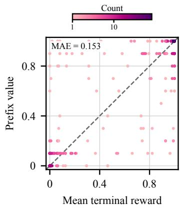

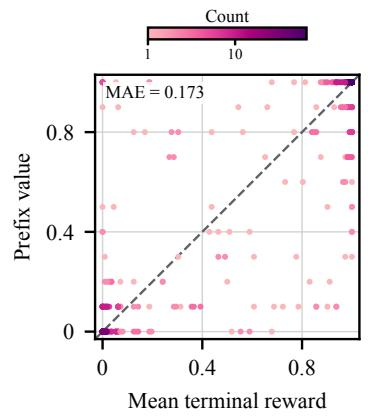  
Figure 10: Critic value at the prefix against the mean terminal reward. Each point is one prefix s, with $V _ { \theta } ^ { \pi } ( s )$ on the vertical axis and $\mathrm { m e a n } _ { i } ( r _ { i } )$ over its 16 continuations on the horizontal axis. Left: step 57 (248 prefixes). Right: step 160 (256 prefixes). Step 80 is shown in Figure 4, middle.

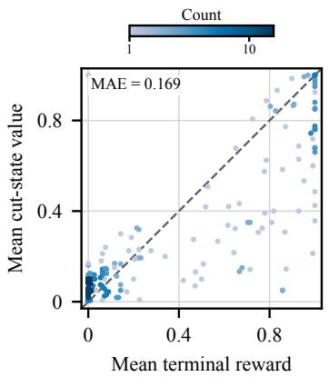  
Figure 11: Group mean of critic values against the group mean of terminal rewards at step 80. For the 157 groups with at least two continuations where $v _ { i } = V _ { \theta } ^ { \pi } ( s \cdot c _ { i } )$ , the mean of these $v _ { i }$ (vertical axis) against the mean of the same continuations’ $r _ { i }$ (horizontal axis).

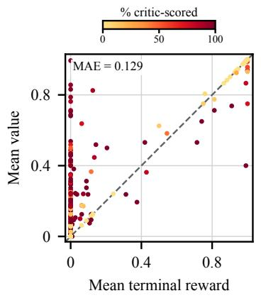

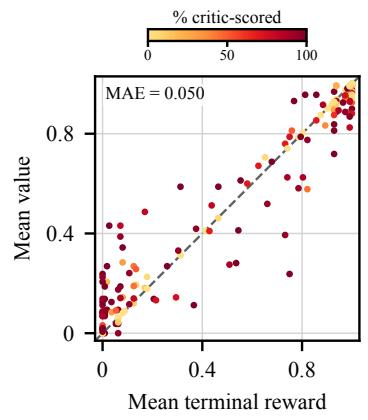  
Figure 12: Group mean of $v _ { i }$ against the group mean of $r _ { i }$ . Each point is one group of 16 continuations, with mean (v ) on the vertical axis and $\mathrm { m e a n } _ { i } ( r _ { i } )$ on the horizontal axis. Left: step 40. Right: step 57. Colour shows 100 f , the percentage of the group’s continuations with $v _ { i } = V _ { \theta } ^ { \bar { \pi } } ( s \cdot c _ { i } )$

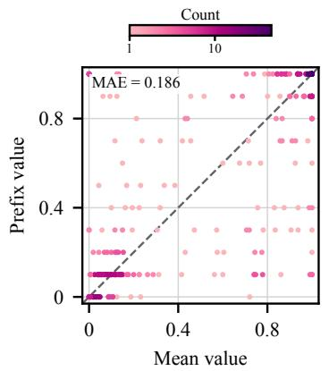

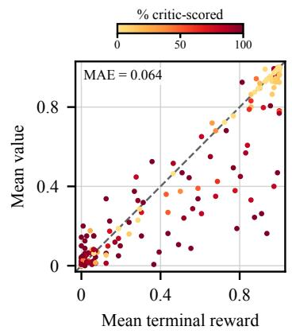  
Figure 13: Critic values and group means at steps 80 and 160. Left: at step 80, $V _ { \theta } ^ { \pi } ( s )$ against ${ \mathrm { m e a n } } _ { i } ( v _ { i } )$ for 256 prefixes. Right: at step 160, ${ \mathrm { m e a n } } _ { i } ( v _ { i } )$ against $\mathrm { m e a n } _ { i } ( r _ { i } )$ for 256 groups, with colour showing 100 f .

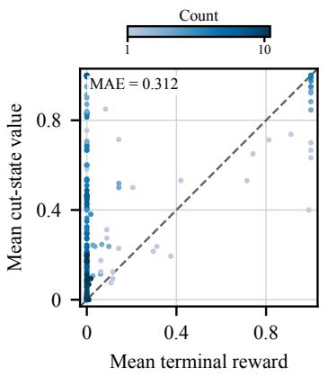

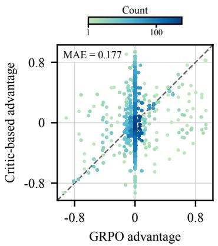  
Figure 14: Value diagnostics at step 40. Left: for groups with at least two continuations where $\overset { \vartriangle } { \boldsymbol { v } _ { i } } = \overset { \vartriangle } { \boldsymbol { V } _ { \boldsymbol { \theta } } ^ { \pi } } ( \boldsymbol { s } \cdot \boldsymbol { c } _ { i } )$ , the mean of these $v _ { i }$ against the mean of the same continuations’ $r _ { i }$ . Right: the critic-based advantage $v _ { i } - \mathrm { m e a n } _ { j } ( v _ { j } )$ against the GRPO advantage $r _ { i } - \mathrm { m e a n } _ { j } ( r _ { j } )$ , for groups with $f > 0$

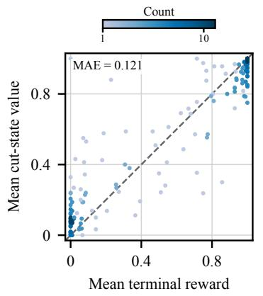

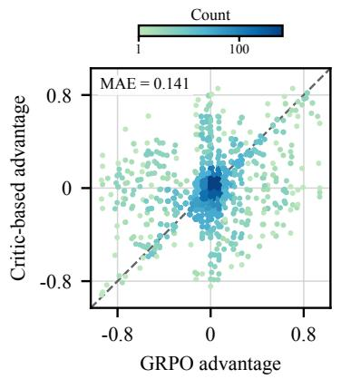  
Figure 15: Value diagnostics at step $^ { 5 7 . }$ Left: for groups with at least two continuations where $v _ { i } = V _ { \theta } ^ { \pi } ( s \cdot c _ { i } )$ , the mean of these $v _ { i }$ against the mean of the same continuations’ $r _ { i }$ . Right: the critic-based advantage $v _ { i } - \mathrm { m e a n } _ { j } ( v _ { j } )$ against the GRPO advantage $r _ { i } - \mathrm { m e a n } _ { j } ( r _ { j } )$ , for groups with $f > 0$

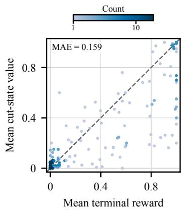

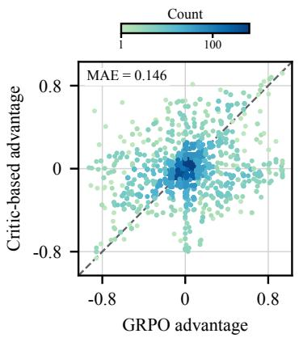  
Figure 16: Value diagnostics at step 160. Left: for groups with at least two continuations where $v _ { i } = V _ { \theta } ^ { \pi } ( s \cdot c _ { i } )$ , the mean of these $v _ { i }$ against the mean of the same continuations’ $r _ { i }$ . Right: the critic-based advantage $v _ { i } - \mathrm { m e a n } _ { j } ( v _ { j } )$ against the GRPO advantage $r _ { i } - \mathrm { m e a n } _ { j } ( r _ { j } )$ , for groups with $f > 0$

Table 2: Sample counts and MAEs for the value diagnostics. Group n counts groups with at least two continuations where $v _ { i } = V _ { \theta } ^ { \pi } ( s \cdot c _ { i } )$ . Centered n and individual n count continuations.
<table><tr><td>Step</td><td>Group n</td><td>MAE</td><td>Centered n</td><td>MAE</td><td>Individual n</td></tr><tr><td>40</td><td>153</td><td>0.312</td><td>2592</td><td>0.177</td><td>1919</td></tr><tr><td>57</td><td>144</td><td>0.121</td><td>2480</td><td>0.141</td><td>1685</td></tr><tr><td>80</td><td>157</td><td>0.169</td><td>2640</td><td>0.150</td><td>1848</td></tr><tr><td>160</td><td>153</td><td>0.159</td><td>2672</td><td>0.146</td><td>1892</td></tr></table>

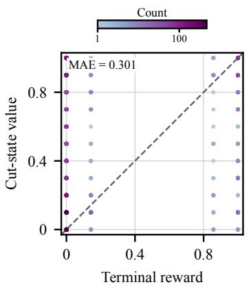

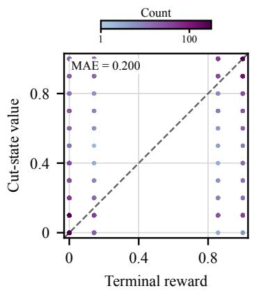  
Figure 17: Critic value at the end of the action chunk against the terminal reward. Each point is one continuation with $v _ { i } = V _ { \theta } ^ { \pi } ( s \cdot c _ { i } )$ , showing $V _ { \theta } ^ { \pi } ( s \cdot c _ { i } )$ against $r _ { i } .$ Left: step 40. Right: step 57.

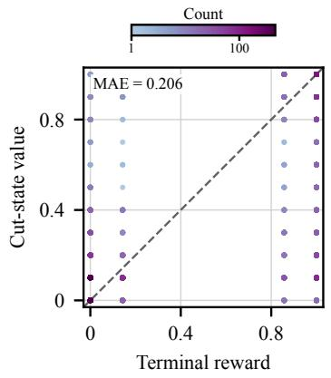

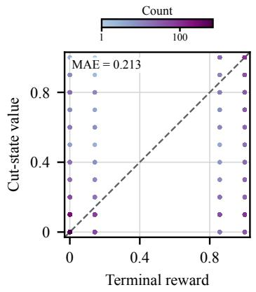  
Figure 18: Critic value at the end of the action chunk against the terminal reward. Each point is one continuation with $v _ { i } = V _ { \theta } ^ { \pi } ( s \cdot c _ { i } )$ , showing $V _ { \theta } ^ { \pi } ( s \cdot c _ { i } )$ against $r _ { i }$ . Left: step 80. Right: step 160.

## B Decoding FLOPs accounting and GPU hours

We compute decoding costs from joint prefix and generated-length statistics when available, and use per-step training-length means otherwise. AC2 uses joint length statistics throughout. All three GRPO runs, the local-readiness singleton run from initialization, and AC2 w/ 2k chunks use mean-length estimates throughout. Prefix GRPO, the no-audit run from initialization, AC2 w/ correct-only buffer, and AC2 w/ stale replay buffer combine means with retained joint length records. Table 3 lists the source and coverage of every run. These distinctions apply to all FLOPs plots and tables in the paper.

For a policy request, let p count the original prompt and any replay prefix, and let g count newly generated response tokens. The first output token is sampled from the prefill computation, leaving $m = \operatorname* { m a x } ( g - 1 , 0 )$ incremental decoding forwards. Let $F ( p , g )$ denote the decoding FLOP count for this request. The fixed coefficient A counts attention projections, the gated feed-forward layers, and vocabulary logits per decoding forward. The coefficient $B$ counts attention matrix multiplications per context position per decoding forward. For the Qwen3-4B architecture used here, our matrix-multiplication accounting is

$$
F ( p , g ) = A m + B \left( m p + { \frac { m ( m + 1 ) } { 2 } } \right) , \qquad A = 8 , 0 4 4 , 5 4 4 , 0 0 0 , \quad B = 5 8 9 , 8 2 4 .\tag{6}
$$

The architecture has 36 layers, hidden dimension 2,560, feed-forward dimension 9,728, 32 query heads, eight key/value heads, head dimension 128, and vocabulary size 151,936. A multiply and an addition count as two FLOPs. We exclude prefill, validation, value function and judge calls, training forward/backward computation, elementwise operations, communication.

We get the cumulative decoding FLOPs by summing over all actor generated tokens, including those to refill the buffer B. Where paired per-request prompt-plus-prefix and generated lengths are unavailable, let N be the number of completed requests and let m¯ and $\bar { p }$ be their empirical mean decoding-forward count and prompt-plus-prefix length. Let $F _ { \mathrm { t o t a l } }$ be the sum of their perrequest decoding costs. We estimate this total by substituting the means into the cost formula, giving the estimate ${ \widehat { F } } ,$

$$
\widehat F = N \left\{ A \bar { m } + B \left[ \bar { m } \bar { p } + \frac { \bar { m } ^ { 2 } + \bar { m } } { 2 } \right] \right\} .\tag{7}
$$

For empirical moments defined with denominator $N ,$ the omitted term is

$$
\begin{array} { r } { F _ { \mathrm { t o t a l } } - \widehat { F } = N B \left[ \mathsf { C o v } ( m , p ) + \frac { 1 } { 2 } \mathsf { V a r } ( m ) \right] . } \end{array}\tag{8}
$$

Because $\operatorname { C o v } ( m , p )$ can be negative, $\widehat F$ can over- or underestimate the true cost. The per-step approximation uses total generated tokens divided by request count and weights replay-only prefix means by the fraction of replay requests. It assumes each request generates at least one token and the logged prompt mean represents all requests. Where complete records exist, the mean-based estimate falls 4.01% below the exact cost for the selected GRPO run (steps 161–180) and 5.51% below for the main AC2 run. All GRPO curves use the mean-based estimate and AC2 uses exact records, so GRPO’s plotted cost is, if anything, slightly lower than the true value.

Table 3: Available decoding-cost records. Joint lengths retain per-request prefix/decode moments. Step means yield estimated costs. The last cost-data step can exceed the last evaluation.
<table><tr><td>Configuration</td><td>Length source</td><td>Last cost step</td></tr><tr><td>AC2</td><td>Joint lengths</td><td>202</td></tr><tr><td> $\mathrm { G R P O } , 1 0 ^ { - 6 }$ </td><td>Step means</td><td>70</td></tr><tr><td> $\mathrm { G R P O } , 2 \times 1 0 ^ { - 6 }$ </td><td>Step means</td><td>180</td></tr><tr><td> $\mathrm { G R P O } , 4 \times 1 0 ^ { - 6 }$ </td><td>Step means</td><td>100</td></tr><tr><td> $\operatorname { P r e f i x } \operatorname { G R P O }$ </td><td>Means + joint lengths</td><td>120</td></tr><tr><td>No audit, branch at 40</td><td>Joint lengths</td><td>123</td></tr><tr><td>No audit, from initialization</td><td>Means + joint lengths</td><td>173</td></tr><tr><td> $\mathsf { A C } 2 \mathrm { w } /$  correct-only buffer AC2 w/o Group &amp; Audit</td><td>Means + joint lengths</td><td>117</td></tr><tr><td>(step-50 branch)  $\dot { \mathrm { A C 2 } } \mathrm { w / o G r o u p } \& \mathrm { A u d i t }$ </td><td>Joint lengths</td><td>117</td></tr><tr><td>(from base model)  $\Delta C 2 \mathrm { w } / \mathrm { o G r o u p \& A u d i t }$ </td><td>Step means</td><td>186</td></tr><tr><td>&amp; local readiness (step-20 branch) Joint lengths</td><td></td><td>40</td></tr><tr><td> $\mathsf { A C } 2 \mathrm { w } /$  2k chunks</td><td>Step means</td><td>128</td></tr><tr><td> $\mathsf { A C } 2 \mathrm { w } /$  stale replay buffer</td><td>Means + joint lengths</td><td>146</td></tr><tr><td>75k response limit</td><td>Joint lengths</td><td>161</td></tr></table>

Relation to GPU hours. We compare Decoding FLOPs with GPU hours for the main AC2 run. For each training step, let D denote its policy-rollout decoding cost from Equation (6), summed over requests, and let H denote its GPU hours: the logged training-step duration in hours multiplied by 32 GPUs. The timer includes generation, value inference, judging, parameter updates, and checkpointing, but excludes validation, startup, and failed attempts. We use 196 complete steps from steps 1–202, excluding six steps resumed from cached intermediate results because their timers omit earlier computation.

We fit H as a linear function of D by ordinary least squares with an intercept. The predicted GPU hours, ${ \widehat { H } } ,$ are $\widehat { H } = 6 . 1 1 + 2 7 . 4 \mathrm { 1 } \left( D / 1 0 ^ { 1 8 } \right)$ . The per-step Pearson correlation is $r = 0 . 8 7 4$ (Figure 19). This association supports Decoding FLOPs as a proxy for training cost in this run.

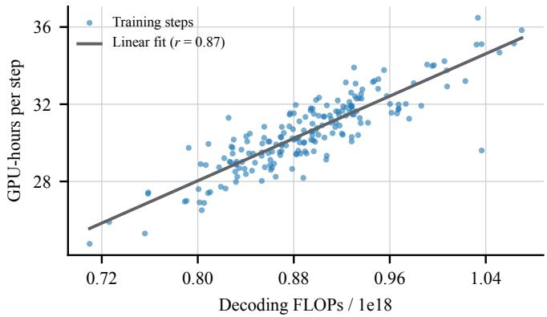  
Figure 19: GPU-hours against Decoding FLOPs per training step. Each point is one training step of the main AC2 run. The line is the least-squares fit.

## C Training and evaluation details

Table 4: Main AC2 configuration and evaluation settings. Symbols follow §3. The total response budget includes replayed prefixes, with b counting new tokens. Settings without a symbol in $\ S 3$ are listed by name.
<table><tr><td>Parameter</td><td>Symbol</td><td>Value</td></tr><tr><td>Group size</td><td>8</td><td>16 continuations per prefix</td></tr><tr><td>Audit fraction</td><td>α</td><td>1/4; count of ready problems rounded</td></tr><tr><td>Replayed prefixes per step</td><td>Nbatch</td><td>up 192</td></tr><tr><td>Fresh problems per step</td><td> $n _ { \mathrm { r e f i l l } }$ </td><td>192 problems, one rollout each</td></tr><tr><td>Replay buffer capacity</td><td></td><td>256 trajectories</td></tr><tr><td>Total response budget</td><td></td><td>50,000 tokens</td></tr><tr><td>Action-chunk length</td><td>b</td><td>10,000 new tokens</td></tr><tr><td>Prefix cut grid / maximum frac- tion</td><td></td><td>10,000 tokens / 0.9</td></tr><tr><td>Critic value grid</td><td></td><td> $\{ 0 , 0 . 1 , \ldots , 1 \}$ </td></tr><tr><td>Critic buffer capacity</td><td></td><td>1,920 prefix-target pairs</td></tr><tr><td>Prefix-target pairs per critic up-</td><td></td><td>Up to 768</td></tr><tr><td>date Valid rewards needed for a critic</td><td></td><td>At least 8</td></tr><tr><td>target Actor learning rate</td><td></td><td> $2 \times 1 0 ^ { - 6 }$ </td></tr><tr><td>Initial critic learning rate</td><td></td><td> $2 \sqrt { 2 } \times 1 0 ^ { - 6 }$ </td></tr><tr><td>Critic learning-rate floor</td><td></td><td> $5 \sqrt { 2 } \times 1 0 ^ { - 7 }$ </td></tr><tr><td>Actor minibatches</td><td></td><td>1,536 continuations each</td></tr><tr><td>Critic gradient-norm clip</td><td></td><td>0.2</td></tr><tr><td>Critic decoding</td><td></td><td>Greedy, at most four tokens</td></tr><tr><td>Readiness window</td><td></td><td>5 training steps</td></tr><tr><td>Global readiness threshold</td><td>τglobal</td><td>0.20</td></tr><tr><td>Local readiness threshold</td><td>Tlocal</td><td>0.18</td></tr><tr><td>Training temperature / top-p /</td><td></td><td>0.8 / 1 / unrestricted</td></tr><tr><td>top-k Evaluation responses per prob-</td><td></td><td>16</td></tr><tr><td>lem Evaluation interval</td><td></td><td>10 training steps</td></tr><tr><td>Evaluation temperature / top-p</td><td></td><td>0.8 / 0.95 / 20</td></tr><tr><td>/ top-k Evaluation response limit</td><td></td><td>50,000 tokens</td></tr></table>

Replay buffer. The replay buffer B, the critic’s buffer of prefix–target pairs and the bank of reference solutions all start empty. While B is empty, the $n _ { \mathrm { b a t c h } }$ training prefixes are replaced by fresh problems with empty responses. Once B holds trajectories, we form $ { S _ { \mathrm { b a t c h } } }$ by randomly permuting the distinct problems in B and cycling through them until $n _ { \mathrm { b a t c h } }$ problems are chosen, then taking one of each problem’s stored trajectories uniformly at random. For a trajectory of L response tokens, the cut position is drawn uniformly from the multiples of 10,000 tokens in [0, 0.9L], where 0 gives an empty prefix. B holds up to 256 trajectories and replaces the oldest first. Rollouts from $S _ { \mathrm { r e f i l l } }$ enter B whether or not they are correct. The 50,000-token response budget counts both the prefix and the newly generated tokens.

Reference solutions. Separately from B, we keep a bank holding one reference solution per problem. A rollout from either $\dot { \boldsymbol { S } } _ { \mathrm { r e f i l l } }$ or $ { S _ { \mathrm { b a t c h } } }$ can supply a reference if the judge awards it at least six of seven points. For each problem without a reference, we store the proof from one such rollout, chosen at random. Existing references are never replaced. Readiness at a step uses the bank as it was before that step’s additions, while that step’s critic update can already use the new references.

Critic targets. A prefix yields a critic target only if at least 8 of its g continuations have a valid reward. In the group-size-1 variant, the single continuation must be valid, and a continuation whose baseline $\bar { V } _ { \theta } ^ { \pi } ( \bar { s } )$ is invalid is left out of both the critic target and the actor loss. Targets are rounded to the nearest value in $\{ 0 , 0 . 1 , \ldots , 1 \}$ , with ties rounded down. Each critic update samples up to 768 prefix–target pairs, without replacement, from its buffer of 1,920, skipping pairs that exceed the context limit. A pair uses the reference solution of its source trajectory when there is one, and otherwise the bank’s current reference for its problem, so an older pair can gain a reference later. As in §3.3, a pair with a reference is trained under both prompts at weight $1 / 2$ each, and a pair without one under the plain prompt at weight 1. The two prompts are given below. The loss is the negative log-likelihood of the value tokens and the end-of-turn token, divided by four (the maximum number of tokens for a completion). At inference, the critic greedily generates at most four tokens and we parse the first valid grid value.

Critic prompt. The critic’s context is the problem prompt, followed by the partial response and a closing </think> if the response has none, followed by the instruction below as a new user turn. The critic’s reply is prefilled with an empty thinking section and the answer stem “Q value: ”, so the critic only generates the number. When a reference solution is available, the prompt includes it in place of {reference\_proof}.

With reference solution   
Pause here and estimate how much rubric credit this attempt will earn if you continue it to completion   
within its remaining token budget: 0 means no credit, 1 means full credit for a complete and correct proof,   
and values in between mean partial credit. You should refer to a reference correct proof here:   
{reference\_proof}   
Don’t think; answer immediately with a single line and nothing else:   
Q value: z   
where z is one of $0 , 0 . 1 , \ldots , 1 .$ The first characters of your response must be \`Q value:\`.

Pause here and estimate how much rubric credit this attempt will earn if you continue it to completion within its remaining token budget: 0 means no credit, 1 means full credit for a complete and correct proof, and values in between mean partial credit.

Don’t think; answer immediately with a single line and nothing else:

$$
0 , 0 . 1 , \ldots , 1
$$

Readiness and auditing. The critic error ε of §3.1 compares the critic’s prediction before that step’s update with the rounded group target, and an invalid prediction counts as error 1. Global readiness averages ε over every prefix sampled in the last five complete steps, with $\tau _ { \mathrm { g l o b a l } } = 0 . 2 0$ and local readiness uses $\tau _ { \mathrm { l o c a l } } = 0 . 1 8$ . Besides the three conditions in §3.1, a problem also needs a nonzero critic prediction at the current or an earlier step. Once ready, a problem stays ready. Of the n ready problems sampled at a step, ⌈αn⌉ are audited, with $\alpha = 1 / 4$ , and receive full rollouts. The other ready problems receive action chunks of at most b new tokens, capped by the remaining response budget, and unready problems always receive full rollouts. A continuation’s endpoint is scored by the critic, $v _ { i } = V _ { \theta } ^ { \bar { \pi } } { \hat { ( s \cdot c _ { i } ) } }$ , only if it reaches b tokens before the response budget runs out and contains no complete proof, that is, no <proof>. . . </proof> block after the thinking section. Continuations that finish, exhaust the response budget or contain a complete proof are scored by the judge.

Scoring failures. A response with no proof receives reward 0. If the judge request fails or its output cannot be parsed, the response is left out of critic targets but still enters the actor update with reward 0. If the critic’s value at a continuation’s endpoint is invalid, that continuation gets zero weight in the actor loss, and its v<sub>i</sub> is replaced by the mean of the valid $v _ { j }$ in its group, or by 0 if none are valid, before mean ${ } _ { j } ( v _ { j } )$ is computed. A group with no valid values gives no critic target.

Optimization. Each step applies the first actor minibatch update, one critic update and then the second actor minibatch update, all to the shared parameters θ with separate optimizer states. Each actor minibatch has 1,536 continuations. Advantages are computed on the whole batch before it is split into minibatches, so the continuations of one group can fall into both. The actor loss is averaged over generated tokens in each minibatch, with one epoch and no minibatch shuffling. The critic uses AdamW with betas (0.9, 0.999), epsilon $1 0 ^ { - 8 }$ and no weight decay. Let $\Delta \theta _ { V } ,$ $\Delta \theta _ { \mathrm { P P O } , 1 }$ and $\Delta \theta _ { \mathrm { P P O } , 2 }$ be the parameter changes from the critic update and the first and second actor updates, each measured from the parameters just before that update. The critic learning rate starts at $2 \sqrt { 2 } \times 1 0 ^ { - 6 }$ and is halved, down to the floor in Table 4, after two consecutive steps in which $\| \Delta \theta _ { V } \| _ { 2 } / ( \| \Delta \theta _ { \mathrm { P P O } , 1 } \| _ { 2 } + \| \Delta \theta _ { \mathrm { P P O } , 2 } \| _ { 2 } ) > \sqrt { 2 } .$ . The actor uses gradient clipping at 0.3 and weight decay 0.01, with no KL penalty or entropy bonus, and a dual-clip coefficient of 3.

Adaptive entropy control. Let $\widehat { H }$ be the mean entropy of the actor’s token distribution, in nats, at the sampling temperature and before the update. It is averaged over generated tokens in responses with an empty prefix, namely the rollouts from $S _ { \mathrm { r e f i l l } }$ and prefixes cut at position 0. Continuations of nonempty prefixes are excluded. Given target entropy $H ^ { \star }$ , step size $\delta _ { H } ,$ an offset k bounded by $k _ { \mathrm { m i n } }$ and $\bar { k } _ { \mathrm { m a x } } ,$ and base upper clipping parameter $\epsilon _ { \mathrm { h i g h } } ^ { \mathrm { b a s e } } ,$ , each step updates

$$
\begin{array} { r l r } & { } & { k \gets \mathrm { c l i p } \left( k + \delta _ { H } \mathrm { s i g n } ( H ^ { \star } - \widehat { H } ) , k _ { \mathrm { m i n } } , k _ { \mathrm { m a x } } \right) , } \\ & { } & { \epsilon _ { \mathrm { h i g h } } = \epsilon _ { \mathrm { h i g h } } ^ { \mathrm { b a s e } } + k . \qquad } \end{array}\tag{9}
$$

The update runs once per step before the actor update, so both actor minibatches use the same $\epsilon _ { \mathrm { h i g h } }$ , and $\epsilon _ { \mathrm { l o w } }$ stays fixed. We use $\epsilon _ { \mathrm { l o w } } = 0 . 2 , \epsilon _ { \mathrm { h i g h } } ^ { \mathrm { b a \dot { s } e } } = 0 . 2 8 , H ^ { \star } = 0 . 2 8 , \delta _ { H } = 0 . 0 2 , k _ { \mathrm { m i n } } = - 0 . 0 8$ and $k _ { \operatorname* { m a x } } = 0 . 0 8$ , and initialise $k = 0 . 0 6$ . The offset persists across steps and across resumes from checkpoints.

Evaluation and baseline. Evaluation draws 16 responses per problem every ten training steps. The main comparison uses a 50,000-token evaluation response limit. GRPO samples 256 fresh problems with 16 responses per problem at each training step, whereas AC2 trains on the $n _ { \mathrm { b a t c h } } =$ 192 groups in Table 4. Equal Steps therefore need not imply equal numbers of responses or equal decoding work.