# UNDERSTANDING HEAD GEOMETRY AND DYNAMICS IN FEDERATED REGRESSION THROUGH A NATURAL SOLUTION SELECTION RULE: AN UNCONSTRAINED FEATURE MODEL ANALYSIS

Chuang Ma1,2 Tomoyuki Obuchi1,3

1Kyoto University 2NII LLMC 3RIKEN AIP

{ma.chuang.52h@st, obuchi@i}.kyoto-u.ac.jp

## ABSTRACT

In federated averaging, local objectives can admit multiple optimal heads, making the aggregate depend on which heads clients return. We study this ambiguity in federated multivariate regression with private backbones and a shared linear head, using an unconstrained feature model (UFM) that treats training-sample features as free variables. We introduce a natural selection rule: each client returns the optimal head closest to the broadcast head. We show that global minimization with a vanishing proximal penalty on the head realizes this rule. When the clients’ optimal Gram matrices and the initial shared Gram matrix are positive definite, the shared Gram matrix follows a closed recursion and converges to the unique Bures–Wasserstein barycenter of the clients’ optimal Gram matrices. Even with this alignment, the limit generally differs from the centralized optimal Gram matrix. We decompose this gap into three positive-semidefinite terms arising from differences in client target means, covariance heterogeneity, and averaging the aligned heads. A correction based on a one-time exchange of target means and covariances recovers the centralized optimal Gram matrix in one round under exact local optimization and the same selection rule. We verify these results numerically in the UFM and test its predictions on five tabular and five image regression datasets using deep networks with feature regularization and long local training. In these experiments, ordinary training approaches the predicted barycenter, while a weak proximal penalty improves endpoint agreement and yields trajectories that closely follow the predicted Gram dynamics. The correction moves the final Gram matrices close to the centralized UFM prediction.

## 1 INTRODUCTION

In federated averaging, clients update the shared model parameters using their local data at each communication round and send the updated parameters to the server. The server then averages these parameters and broadcasts the result (McMahan et al., 2017). Effective aggregation relies on alignment between client models in parameter space, but local objectives alone do not guarantee such alignment. Prior work has characterized the limiting behavior of federated averaging in strongly convex settings, where local minimizers are unique (Charles & Konecný, 2021; Mangold et al.,ˇ 2025). In overparameterized linear regression with fixed features, gradient descent selects the local minimizer closest to the broadcast model, and repeated averaging can recover the centralized solution (Zhu et al., 2026).

In contrast, local training of deep neural networks need not return the minimizer closest to the broadcast model. Different parameter settings can represent the same function (Wang et al., 2020a), so clients may return mutually incompatible solutions. For example, permuting hidden units can cause the same unit index to correspond to different features across clients. Averaging such solutions can produce an arbitrarily poor model (McMahan et al., 2017). Indeed, nonzero local updates can largely cancel upon averaging (Jhunjhunwala et al., 2023), and averaging-based optimization methods can stagnate at nonoptimal points (Pathak & Wainwright, 2020; Teng et al., 2019). To address mismatches in parameter representations, prior work has proposed matching methods across clients before averaging (Wang et al., 2020a; Singh & Jaggi, 2020). These studies, however, did not characterize the limiting behavior of repeated averaging or its relation to centralized training.

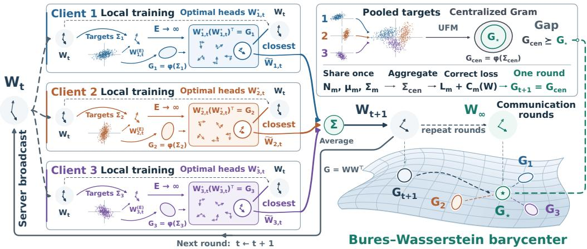  
Figure 1: Federated averaging of a shared head under the selection rule. In the UFM, local optimality fixes the Gram matrix of a client’s head but not the head itself. Our selection rule chooses the optimal head closest to the broadcast head. Averaging these heads over communication rounds drives the Gram matrix of the shared head to the BW barycenter of the clients’ optimal Gram matrices. Inset: the gap to centralized training and its one-round correction from shared target moments.

To study the limiting behavior of federated averaging when local minimizers are nonunique, we focus on the unconstrained feature model (UFM) (Mixon et al., 2022; Fang et al., 2021; Zhu et al., 2021; E & Wojtowytsch, 2022; Lu & Steinerberger, 2022). This model treats the backbone outputs on the training samples as free optimization variables. Originally introduced to explain neural collapse (Papyan et al., 2020) in classification, it was later extended to regression (Andriopoulos et al., 2024; Ma et al., 2025). For regularized multivariate regression, Andriopoulos et al. (2024) derived an explicit expression for the Gram matrix of an optimal linear head in terms of the target covariance. The head itself, however, is determined only up to an orthogonal transformation.

Building on this characterization, we introduce and analyze a UFM for federated multivariate regression with private backbones and a shared linear head (Liang et al., 2020; Jang et al., 2023). Each client’s features are optimized independently, and only the head is averaged (Figure 1). The orthogonal freedom, harmless for an individual model, now complicates aggregation because the server averages the heads rather than their Gram matrices. To resolve the ambiguity in the client returns, we select, for each client, the optimal head closest to the broadcast head in Frobenius norm. This uses the broadcast as a common reference while preserving optimality for each client’s original objective. We further show that this selection arises as a vanishing-regularization limit. Specifically, we add a quadratic proximal penalty on the head, of the form used in FedProx (Li et al., 2020), and show that the heads of global minimizers of the penalized local objective converge to the selected head as the penalty weight tends to zero.

Under this selection rule, we identify the limiting Gram matrix of the shared head as the Bures– Wasserstein (BW) barycenter of the clients’ optimal Gram matrices. When these matrices are positive definite, we prove convergence to this unique barycenter from any positive-definite initial Gram matrix. The key connection is that optimal head alignment in Frobenius norm corresponds to BW distance between Gram matrices (Bhatia et al., 2019): averaging the selected heads induces the barycenter iteration of Álvarez Esteban et al. (2016).

Even with exact local optimization and aligned heads, this barycenter generally differs from the optimal Gram matrix of the centralized UFM trained on the pooled data, i.e., the combined data from all clients. We express the centralized Gram matrix as the barycenter plus three positivesemidefinite terms, corresponding to differences in client target means, the nonlinear dependence of optimal Gram matrices on target covariances, and averaging heads rather than their Gram matrices. We further construct a correction to the local objectives that recovers the centralized Gram matrix in a single communication round under the same selection rule. The correction requires a one-time exchange of the clients’ target means and covariances (Figure 1, inset).

We first verify these results numerically in the UFM. To test whether they extend to learned features, we train deep networks with the feature and head penalties of the UFM on five tabular and five image regression datasets. With a weak proximal regularizer, the Gram matrix of the shared head closely follows the predicted communication dynamics and ends near the BW barycenter, and the correction moves this endpoint close to the centralized Gram matrix. Without the regularizer, the endpoint also lies near the barycenter but less precisely, and an intermediate proximal weight agrees best. Aligning the heads to the broadcast also implements the selection rule, whereas averaging unaligned heads raises the training objective. Removing the between-client mean term leaves a gap consistent with the decomposition. The agreement persists for other architectures, larger training sets and full-model averaging, and weakens with less local training, as our analysis of finite local steps in the UFM also shows (Appendix G). On the image datasets, proximal training keeps test error comparable, and the correction lowers it slightly.

## 2 RELATED WORK

Unconstrained feature models. The UFM and the layer-peeled model explain neural collapse through free-feature optimization (Mixon et al., 2022; Fang et al., 2021). Prior work characterizes their global minimizers, landscapes and dynamics under cross-entropy and squared losses (Zhu et al., 2021; Zhou et al., 2022; Han et al., 2022). Extensions address class imbalance (Fang et al., 2021; Thrampoulidis et al., 2022; Hong & Ling, 2024), deeper models (Tirer & Bruna, 2022; Súkeník et al., 2023; 2024) and constrained features (Tirer et al., 2023). Related analyses examine neural collapse in shallow ReLU (Hong & Ling, 2026) and mean-field networks (Wu & Mondelli, 2025). The UFM has also been extended to multi-label classification (Li et al., 2024), supervised contrastive learning (Behnia & Thrampoulidis, 2024), ordinal regression (Ma et al., 2025) and multivariate regression (Andriopoulos et al., 2024; 2025). In federated classification, related analyses study feature collapse and degradation under aggregation (Shi et al., 2024; 2023; Zhu et al., 2025), and other methods prescribe the classifier geometry (Li et al., 2023; Xiao et al., 2024). We build on the characterization of multivariate regression (Andriopoulos et al., 2024) to analyze repeated averaging of selected optimal heads across clients.

Federated optimization and selection. Prior analyses identify objective inconsistency and biased fixed points (Wang et al., 2020b; Pathak & Wainwright, 2020). Surrogate objectives describe local updates for quadratic losses (Charles & Konecný, 2021), and bias expansions quantify the limitingˇ deviation from centralized training in strongly convex settings (Mangold et al., 2025). Multiple local updates also enable shared representation learning in multitask linear regression (Collins et al., 2022). With fixed features, local gradient descent in overparameterized linear regression selects the minimizer closest to its broadcast initialization (Zhu et al., 2026). Matching methods explicitly align models before averaging (Wang et al., 2020a; Singh & Jaggi, 2020), while FedProx penalizes deviations from the broadcast model (Li et al., 2020). In our UFM, the heads of global minimizers of the penalized objective converge to the selected head as the proximal weight vanishes. For classifier calibration, CCVR uses uploaded feature moments (Luo et al., 2021); our correction instead uses target means and covariances to recover the centralized Gram matrix.

Optimal transport and matrix barycenters. For positive-definite matrices, the BW distance is the Procrustes distance between their factors (Bhatia et al., 2019). Berardini et al. (2026) use BW barycenters to align frozen-encoder feature distributions in one-shot federated learning. Under our selection rule, repeated head averaging instead induces the convergent BW barycenter iteration of Álvarez Esteban et al. (2016) on the shared-head Gram matrix.

## 3 FORMULATION

Federated multivariate regression. We consider a federated multivariate regression problem with $M \geq 2$ clients. Client $m \in \{ 1 , \ldots , M \}$ owns $\mathcal { D } _ { m } = \{ ( x _ { m , i } , y _ { m , i } ) \} _ { i = 1 } ^ { N _ { m } }$ with inputs $x _ { m , i }$ and targets $y _ { m , i } \in \mathbb { R } ^ { C } \left( C \geq 2 \right.$ , not assumed centered), collected columnwise as $Y _ { m } = [ y _ { m , 1 } , \dots , y _ { m , N _ { m } } ] \in$ $\mathbb { R } ^ { C \times N _ { m } }$ . Write $X _ { m } = [ x _ { m , 1 } , \ldots , x _ { m , N _ { m } } ]$ for the inputs, and let $\begin{array} { r } { N = \sum _ { m } N _ { m } } \end{array}$ and $p _ { m } = N _ { m } / N$

Federated averaging (FedAvg) with private backbones and a shared head. A class of federated methods keeps each client’s feature backbone local and averages only a shared head (Liang et al., 2020; Jang et al., 2023). In our model, the shared head is the last linear layer $( W , b )$ , with $W \in$ $\mathbb { R } ^ { C \times P }$ and $b \in \mathbb { R } ^ { C }$ , where $P$ is the common feature dimension. Only (W, b) is broadcast and averaged, while the backbone parameters $\theta _ { m }$ stay local. At each communication round $t ,$ the server broadcasts the current head $( \dot { W } _ { t } , b _ { t } )$ to all clients. Each client trains this head together with its private backbone on local data and uploads only the resulting head $( \widetilde { W } _ { m , t } , \widetilde { b } _ { m , t } )$ . The server then sets $\begin{array} { r } { ( W _ { t + 1 } , b _ { t + 1 } ) = \sum _ { m } p _ { m } ( \widetilde { W } _ { m , t } , \widetilde { b } _ { m , t } ) } \end{array}$

The unconstrained feature model. The UFM replaces the backbone features $H _ { m } ( X _ { m } ; \theta _ { m } ) \in$ $\mathbb { R } ^ { P \times N _ { m } }$ with free features $H _ { m } \in \mathbb R ^ { P \times N _ { m } }$ , giving the local objective

$$
\mathcal { L } _ { m } ( W , b , H _ { m } ) = \frac { 1 } { 2 N _ { m } } \left\| W H _ { m } + b \mathbf { 1 } ^ { \top } - Y _ { m } \right\| _ { F } ^ { 2 } + \frac { \lambda _ { H } } { 2 N _ { m } } \left\| H _ { m } \right\| _ { F } ^ { 2 } + \frac { \lambda _ { W } } { 2 } \left\| W \right\| _ { F } ^ { 2 } ,\tag{1}
$$

with $\lambda _ { H } , \lambda _ { W } > 0 ;$ the bias is unregularized and the squared error sums over the $C$ outputs. In the rounds above, each client now optimizes $H _ { m }$ in place of $\theta _ { m }$ , and the server still averages only $( W , b )$ . The feature penalty is a common abstraction for standard penalties and normalizations on the backbone parameters, whose effects on the features can be complicated (Mixon et al., 2022; Fang et al., 2021). The centralized reference is another UFM with one head for the pooled data and minimizes

$$
\mathcal { L } _ { \mathrm { c e n } } ( W , b , \{ H _ { m } \} , \{ Y _ { m } \} ) = \sum _ { m } p _ { m } \mathcal { L } _ { m } ( W , b , H _ { m } ) .\tag{2}
$$

We compare the limit of the server’s head Gram matrix $G _ { t } = W _ { t } W _ { t } ^ { \top }$ with the Gram matrix of an optimal head of this centralized objective.

Target moments and the fully active regime. Here we introduce and summarize quantities important for later analysis:

$$
\mu _ { m } = \frac { Y _ { m } { \bf 1 } } { N _ { m } } , \quad \mu _ { g } = \sum _ { m } p _ { m } \mu _ { m } ,\tag{3}
$$

$$
\Sigma _ { m } = \frac { Y _ { m } Y _ { m } ^ { \top } } { N _ { m } } - \mu _ { m } \mu _ { m } ^ { \top } , \quad \Sigma _ { \mathrm { w i t h i n } } = \sum _ { m } p _ { m } \Sigma _ { m } , \quad \Sigma _ { \mu } = \sum _ { m } p _ { m } ( \mu _ { m } - \mu _ { g } ) ( \mu _ { m } - \mu _ { g } ) ^ { \top } ,\tag{4}
$$

$$
\Sigma _ { \mathrm { c e n } } = \Sigma _ { \mathrm { w i t h i n } } + \Sigma _ { \mu } .\tag{5}
$$

For our theoretical analysis, we assume $P \geq C$ and $\lambda _ { \operatorname* { m i n } } ( \Sigma _ { m } ) > \lambda _ { H } \lambda _ { W }$ for every client (hence $N _ { m } \geq C + 1 )$ . The same eigenvalue bound holds for $\Sigma _ { \mathrm { w i t h i n } }$ and $\Sigma _ { \mathrm { c e n } }$ . We refer to these conditions as thefully active regime, under which every client’s optimal head Gram matrix is positive definite.

Selecting locally optimal heads. In the fully active regime, the global minimizers of (1) share the same bias and head Gram matrix, while the head itself remains nonunique up to orthogonal transformations (Section 4.1) (Andriopoulos et al., 2025). Optimality alone therefore does not determine the server update. To resolve this ambiguity, we add the proximal regularizer of FedProx (Li et al., 2020), $\begin{array} { r } { \frac { \rho } { 2 } \| \dot { W } - W _ { t } \| _ { F } ^ { 2 } } \end{array}$ , to each client’s objective. For a fixed broadcast $W _ { t }$ of full row rank, the heads of the global minimizers of the penalized objective converge, as $\rho \downarrow 0$ , to the unique optimal head of the original objective that is closest to $W _ { t }$ in Frobenius norm (Lemma 1). In the next section, we analyze the dynamics of the shared head Gram matrix $G _ { t }$ induced by imposing this limiting procedure at every round, and also characterize the gap between its limit and the optimal head Gram matrix of centralized training.

## 4 THEORETICAL ANALYSIS

## 4.1 THE OPTIMAL PARAMETERS AT EACH CLIENT

We first express the local optimization problem in terms of the head alone. Given a dataset $Y$ and fixed $W$ , the minimization of the loss over $( b , H )$ gives

$$
b ^ { \star } ( W ) = \mu , \qquad H ^ { \star } ( W ) = W ^ { \top } A ^ { - 1 } ( Y - \mu { \bf 1 } ^ { \top } ) ,
$$

where $\mu$ is the sample mean of $Y$ and $A = W W ^ { \top } + \lambda _ { H } I _ { C }$ . Substituting these expressions into the loss yields the profiled objective

$$
F ( W ; T ) = \frac { \lambda _ { H } } { 2 } \operatorname { t r } ( T A ^ { - 1 } ) + \frac { \lambda _ { W } } { 2 } \left\| W \right\| _ { F } ^ { 2 } ,\tag{6}
$$

where $T$ is the sample covariance of $Y .$ . This profiled objective is strictly convex with respect to the Gram matrix $G = { \overline { { W } } } W ^ { \top }$ , so the solution is unique and the corresponding stationary condition is $( G + \lambda _ { H } I _ { C } ) ^ { 2 } = ( \lambda _ { H } / \lambda _ { W } ) T$ . Hence, the solution is given by the following function:

$$
\phi ( T ) : = \alpha T ^ { 1 / 2 } - \lambda _ { H } I _ { C } , \quad \alpha = \sqrt { \frac { \lambda _ { H } } { \lambda _ { W } } } .\tag{7}
$$

This accords with the regression-UFM optimum of Andriopoulos et al. (2024) (Appendix A.1). Using this function $\phi ,$ the optimal head Gram matrices for the local and centralized objectives are written as $G _ { m } = \phi ( \Sigma _ { m } )$ and $G _ { \mathrm { c e n } } = \phi ( \Sigma _ { \mathrm { c e n } } )$ , respectively. Similarly, $G _ { \mathrm { w i t h i n } } = \phi ( { \Sigma _ { \mathrm { w i t h i n } } } )$ is the optimal head Gram matrix of the averaged profiled objective $\begin{array} { r } { \sum _ { m } p _ { m } \boldsymbol { F } ( \boldsymbol { W } ; \boldsymbol { \Sigma } _ { m } ) = \dot { F } ( \boldsymbol { W } ; \boldsymbol { \Sigma } _ { \mathrm { w i t h i n } } ) } \end{array}$

## 4.2 SELECTING THE OPTIMAL HEAD

As shown above, the local objective determines a unique optimal head Gram matrix $G _ { m }$ . However, since $F ( W ; T )$ depends on W only through $W W ^ { \top }$ , the optimal head remains nonunique up to right orthogonal transformations. We resolve this ambiguity by selecting the optimal head closest to the broadcast W:

$$
\Pi _ { m } ( W ) = \operatorname * { a r g m i n } _ { U : U U ^ { \top } = G _ { m } } \left\| U - W \right\| _ { F } ^ { 2 } , \qquad G = W W ^ { \top } \succ 0 .\tag{8}
$$

For any feasible $U _ { : }$ , the squared distance expands as

$$
\left\| U - W \right\| _ { F } ^ { 2 } = \operatorname { t r } G _ { m } + \operatorname { t r } G - 2 \operatorname { t r } ( U W ^ { \top } ) .
$$

Finding the closest optimal head therefore reduces to maximizing $\mathrm { t r } ( U W ^ { \top } )$ , a rectangular Procrustes problem. Its minimum squared distance equals the squared BW distance between the two Gram matrices (Bhatia et al., 2019):

$$
d _ { \mathrm { B W } } ^ { 2 } ( G _ { \mathrm { r e f } } , G _ { \mathrm { t a r } } ) : = \mathrm { t r } G _ { \mathrm { r e f } } + \mathrm { t r } G _ { \mathrm { t a r } } - 2 \mathrm { t r } \left[ ( G _ { \mathrm { r e f } } ^ { 1 / 2 } G _ { \mathrm { t a r } } G _ { \mathrm { r e f } } ^ { 1 / 2 } ) ^ { 1 / 2 } \right] .
$$

The following lemma gives the unique minimizing head and shows how it is selected by a vanishing head-only proximal penalty.

Lemma 1 (Closest optimal head and proximal selection). Let client m be fully active and let the broadcast head W satisfy $\begin{array} { l } { { \begin{array} { l l l l } { { \boldsymbol { G } } } & { { \stackrel { - } { = } } } & { { \boldsymbol { W } } { \boldsymbol { W } } ^ { \top } } & { { \succ } } & { { \boldsymbol { 0 } } . } \end{array} } } \end{array} \quad ( i )$ The minimizer in (8) is unique. It equals $\Pi _ { m } ( W ) ~ = ~ T _ { m } ( G ) \ddot { W }$ with $T _ { m } ( G ) ~ = ~ G ^ { - 1 / 2 } ( \stackrel { . } { G } ^ { 1 / 2 } G _ { m } G ^ { 1 / 2 } ) ^ { 1 / 2 } G ^ { - 1 / 2 ^ { ' } } ~ \succ ~ 0 ,$ , and $\Vert \Pi _ { m } ( W ) - W \Vert _ { F } ^ { 2 } ~ = ~ d _ { \mathrm { B W } } ^ { 2 } ( G , G _ { m } )$ . (ii) For $\rho \ > \ 0 ,$ , every global minimizer $( U _ { \rho } , b _ { \rho } , H _ { \rho } )$ of $\begin{array} { r } { \mathcal { L } _ { m } ( U , b , H ) + \frac { \rho } { \lambda } \left. U - W \right. _ { F } ^ { 2 } } \end{array}$ has $b _ { \rho } = \mu _ { m }$ and $\mathcal { L } _ { m } ( U _ { \rho } , b _ { \rho } , H _ { \rho } ) \ -$ min $\begin{array} { r } { \mathcal { L } _ { m } \leq \frac { \rho } { 2 } d _ { \mathrm { B W } } ^ { 2 } ( G , G _ { m } ) } \end{array}$ and $U _ { \rho } \to \Pi _ { m } ( \tilde { W } ) a s \rho \downarrow 0 .$

Part (i) follows from the classical Procrustes characterization of the BW distance (Bhatia et al., 2019), and guarantees that each client has a unique optimal head closest to the common broadcast. By choosing these heads, the selection rule resolves the orthogonal ambiguity and makes the server update well defined. Part (ii) shows that the head-only proximal penalty, of the form used in Fed-Prox (Li et al., 2020), selects $\Pi _ { m } ( W )$ as $\rho \downarrow 0 ,$ , provided that the penalized objective is globally minimized for each $\rho > 0$ . We impose this limiting procedure at every round, before the server averages the returned heads. The proof is given in Appendix A.2.

## 4.3 CONVERGENCE TO THE BW BARYCENTER

Under the selection rule, averaging the returned heads induces a closed recursion for the shared Gram matrix $G _ { t } = W _ { t } W _ { t } ^ { \top }$ . The following theorem shows that this recursion converges to the BW barycenter of the clients’ optimal Gram matrices.

Theorem 1 (Convergence to the Bures–Wasserstein barycenter). In the $f u l l y$ active regime of Section $^ { 3 , }$ let $G _ { 0 } = W _ { 0 } \mathbf { \bar { W } } _ { 0 } ^ { \top } \succ 0$ and suppose each client returns $( \Pi _ { m } ( W _ { t } ) , \mu _ { m } )$ . Then every $G _ { t }$ is positive definite, $b _ { t } = \mu _ { g } f o r t \ge 1$ , and the autonomous Gram dynamics are

$$
G _ { t + 1 } = \mathcal { G } ( G _ { t } ) : = G _ { t } ^ { - 1 / 2 } \left[ \sum _ { m } p _ { m } ( G _ { t } ^ { 1 / 2 } G _ { m } G _ { t } ^ { 1 / 2 } ) ^ { 1 / 2 } \right] ^ { 2 } G _ { t } ^ { - 1 / 2 } .\tag{9}
$$

For every such initialization, $G _ { t }$ converges to the unique positive-definite BW barycenter $G _ { \star }$ ⋆, characterized by

$$
G _ { \star } = \underset { X \succ 0 } { \arg \operatorname* { m i n } } \sum _ { m } p _ { m } d _ { \mathrm { B W } } ^ { 2 } ( X , G _ { m } ) , \qquad G _ { \star } = \sum _ { m } p _ { m } ( G _ { \star } ^ { 1 / 2 } G _ { m } G _ { \star } ^ { 1 / 2 } ) ^ { 1 / 2 } .\tag{10}
$$

Proofsketch. By Lemma 1, $\Pi _ { m } ( W _ { t } ) = T _ { m } ( G _ { t } ) W _ { t }$ , where each $T _ { m } ( G )$ is positive definite and satisfies $T _ { m } ( G ) \mathbf { \dot { } } G T _ { m } ( G ) = G _ { m }$ . All clients act on the same broadcast, so their average is $W _ { t + 1 } =$ $S ( G _ { t } ) W _ { t }$ , where $\begin{array} { r } { S ( G ) ~ = ~ \sum _ { m } p _ { m } T _ { m } ( G ) \ \succ ~ 0 } \end{array}$ . Consequently $G _ { t + 1 } ~ = ~ S ( G _ { t } ) \bar { G _ { t } } \bar { S } ( G _ { t } ) ~ \succ ~ 0$ Substituting the expression for $T _ { m }$ gives (9), while averaging the local biases gives $\mu _ { g }$

The resulting Gram map is the barycenter iteration of Álvarez Esteban et al. (2016). Their convergence theorem applies because the clients’ optimal Gram matrices are positive definite, the weights are positive and sum to one, and $G _ { 0 } \succ 0$ . It yields the limit and characterization in (10). Appendices A.2–A.3 give the projection proof and the full correspondence with that theorem. □

The limiting Gram matrix is therefore the BW barycenter of the local optimal Gram matrices $G _ { m } = \phi ( \bar { \Sigma _ { m } } )$ . It depends only on the client covariances, aggregation weights, and regularization parameters, and is independent of the choice of $G _ { 0 } \succ 0$ and the feature dimension $\bar { \boldsymbol { P } } \geq C$ Centralized training instead yields $G _ { \mathrm { c e n } } = \phi ( \Sigma _ { \mathrm { c e n } } )$ , which generally differs from this barycenter.

## 4.4 THE GAP TO CENTRALIZED TRAINING AND ITS CORRECTION

The barycenter fixed-point equation yields the following decomposition of the gap $G _ { \mathrm { c e n } } - G$ ⋆ into three positive-semidefinite terms.

Proposition 1 (Three positive-semidefinite terms of the gap). Under the assumptions ofTheorem 1, choose any $W _ { \star }$ satisfying $W _ { \star } W _ { \star } ^ { \top } = G ,$ ⋆ and set $U _ { m } ^ { \star } = \mathbf { \bar { I } } \mathbf { I } _ { m } ( W _ { \star } )$ . Then $\begin{array} { r } { \sum _ { m } { p _ { m } U _ { m } ^ { \star } = \mathbf { \bar { \boldsymbol { W } } _ { \star } } } } \end{array}$ and

$$
G _ { \mathrm { c e n } } - G _ { \star } = \mathcal { M } _ { \mu } + \mathcal { M } _ { \Sigma } + \mathcal { M } _ { A } .\tag{11}
$$

Here $\begin{array} { r } { \mathcal { M } _ { \mu } = G _ { \mathrm { c e n } } - G _ { \mathrm { w i t h i n } } , \mathcal { M } _ { \Sigma } = G _ { \mathrm { w i t h i n } } - \sum _ { m } p _ { m } G _ { m } , } \end{array}$ and $\begin{array} { r } { \mathcal { M } _ { A } = \sum _ { m } p _ { m } G _ { m } - G _ { \star } } \end{array}$ . All three matrices are positive semidefinite (PSD). Hence $\begin{array} { r } { G _ { \star } \preceq \sum _ { m } p _ { m } G _ { m } \preceq G _ { \mathrm { w i t h i n } } \preceq G _ { \mathrm { c e n } } } \end{array}$ . The gap vanishes if and only if all client means agree and all client covariances agree. Moreover,

$$
\mathrm { t r } \mathcal { M } _ { A } = \sum _ { m } p _ { m } d _ { \mathrm { B W } } ^ { 2 } ( G _ { \star } , G _ { m } ) .\tag{12}
$$

Proofsketch. The fixed-point equation implies $\begin{array} { r } { \sum _ { m } p _ { m } T _ { m } ( G _ { \star } ) = I _ { C } } \end{array}$ , and hence $\begin{array} { r } { \sum _ { m } p _ { m } U _ { m } ^ { \star } = } \end{array}$ $W _ { \star }$ . Therefore, $\begin{array} { r } { \sum _ { m } p _ { m } G _ { m } - G _ { \star } = \sum _ { m } p _ { m } ( U _ { m } ^ { \star } - W _ { \star } ) ( U _ { m } ^ { \star } - W _ { \star } ) ^ { \top } } \end{array}$ . Add and subtract Gwithin and $\sum _ { m } p _ { m } G _ { m }$ in ${ \bf \ddot { \cal G } } _ { \mathrm { c e n } } - { \cal G } ,$ ⋆ to obtain (11). Square-root monotonicity and concavity make $\mathcal { M } _ { \boldsymbol { \mu } }$ and $\mathcal { M } _ { \Sigma }$ PSD, respectively; $\mathcal { M } _ { A }$ is a covariance matrix.

A zero total gap forces every PSD term to vanish. The mean term then forces the means to agree, and zero averaging covariance forces the returned heads, hence the client covariances, to agree. The converse follows by substitution. Taking traces and using the distance identity of Lemma 1 gives the BW variance in (12). Appendix B provides these steps in detail and bounds this variance by the pairwise BW distances between the $G _ { m }$ □

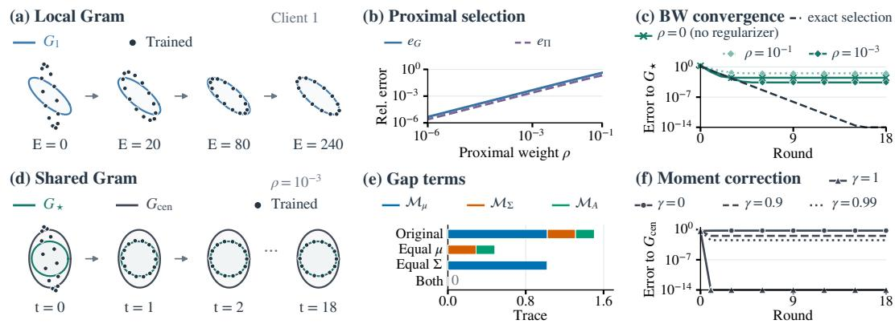  
Figure 2: UFM numerical checks on one fixed instance $( C = P = 2 , M = 3 , \lambda _ { H } = \lambda _ { W } = 0 . 1 ;$ Appendix D.1). Ellipses $\{ G ^ { 1 / 2 } u : \| u \| _ { 2 } = 1 \}$ represent Gram matrices G, and dots trace trained ones. E counts full-batch local steps, and γ scales the moment correction. Errors below $1 0 ^ { - 1 4 }$ are drawn at the axis floor.

The term $\mathcal { M } _ { \mu }$ captures the scatter of client means removed by clientwise centering, while $\mathcal { M } _ { \Sigma }$ is the Jensen gap associated with the operator concavity of ϕ. The term $\mathcal { M } _ { A }$ is the weighted scatter matrix of the selected heads, and its trace equals the BW variance of the clients’ optimal Gram matrices. Thus, resolving the orthogonal ambiguity does not by itself eliminate the gap to centralized training.

To recover the centralized Gram matrix, we make every client’s profiled objective equal to $F ( W ; \Sigma _ { \mathrm { c e n } } )$ . Since $F ( W ; T )$ is affine in $T .$ , this can be achieved by adding the head-only moment correction:

$$
C _ { m } ( W ) = { \frac { \lambda _ { H } } { 2 } } \mathrm { t r } \{ ( \Sigma _ { \mathrm { c e n } } - \Sigma _ { m } ) ( W W ^ { \top } + \lambda _ { H } I _ { C } ) ^ { - 1 } \} .\tag{13}
$$

It satisfies $F ( W ; \Sigma _ { m } ) + C _ { m } ( W ) = F ( W ; \Sigma _ { \mathrm { c e n } } )$ for every W. Thus all corrected clients have the same optimal Gram matrix $G _ { \mathrm { c e n } } .$

Proposition 2 (One-round recovery of the centralized Gram matrix). In the fully active regime of Section 3, suppose $W _ { t } W _ { t } ^ { \top } \succ 0 .$ . Ifevery client globally minimizes $\mathcal { L } _ { m } + C _ { m }$ and returns the optimal head closest to $W _ { t } ,$ , the returned head weight matrices $\widetilde { W } _ { m , t }$ coincide, so $G _ { t + 1 } = G _ { \mathrm { c e n } }$ , and the returned biases $\mu _ { m }$ average to $b _ { t + 1 } = \mu _ { g }$

Proofsketch. The corrected clients have the same optimal Gram matrix $G _ { \mathrm { c e n } }$ and receive the same broadcast. Uniqueness of the closest optimal head makes their returned weight matrices $\widetilde { W } _ { m , t }$ identical, while their biases remain $\mu _ { m }$ . Averaging proves the claim. Appendix C also verifies existence of the corrected global minimizers. □

The correction requires a one-time exchange of client means and covariances, with $O ( C ^ { 2 } )$ entries per client. The local feature solutions still use clientwise-centered targets, so matching the head Gram matrix and aggregate bias need not reproduce centralized predictions (Appendix C).

## 5 EXPERIMENTS

We first check the UFM predictions numerically, then test whether they describe head geometry and dynamics in trained networks.

## 5.1 UFM NUMERICAL EXPERIMENTS

Figure 2 illustrates the theoretical results on one instance with two targets and three clients. Panel (a) shows joint optimization of $( W , b , H )$ bringing the local Gram matrix toward $G _ { m }$ . Panel (b) shows the relative errors to the optimal Gram $( e _ { G } )$ and the selected head $( e _ { \Pi } )$ decreasing as $\rho$ decreases, as predicted by Lemma 1.

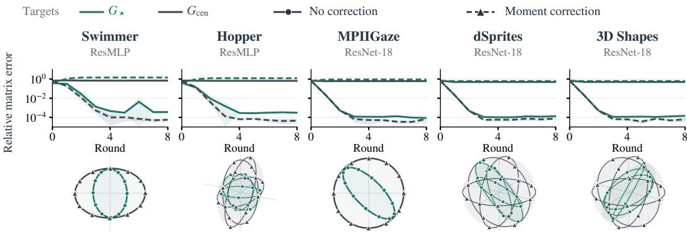  
Figure 3: Proximal training with and without moment correction $( \rho = 1 0 ^ { - 3 } )$ . Colors indicate the reference Gram; solid and dashed curves denote training without and with correction. Curves show seed means $\pm 1$ standard deviation. Below, outlines show $G ,$ and $G _ { \mathrm { c e n } }$ , and markers show final Grams for seed 0. Figure 9 gives the other five settings.

Panel (c) compares the shared Gram matrices obtained by exact selection and by numerical optimization with and without the proximal penalty. Exact selection converges to $G _ { \star }$ , as predicted by Theorem 1. With numerically optimized heads, the final shared Gram is closer to G⋆ at $\rho = 1 0 ^ { - 5 }$ than without the penalty. Panel (d) shows this $\rho = 1 0 ^ { - 3 }$ trajectory as ellipses: the shared Gram approaches $G _ { \star }$ , while a gap to $G _ { \mathrm { c e n } }$ remains. Appendix D.1 specifies the numerical objectives, solvers and initializations.

Panel (e) checks the gap decomposition of Proposition 1. Equalizing client means removes $\mathcal { M } _ { \boldsymbol { \mu } }$ equalizing covariances removes $\mathcal { M } _ { \Sigma }$ and $\mathcal { M } _ { A }$ , and equalizing both closes the gap. Panel (f) applies $\gamma C _ { m }$ under exact selection: full correction $( \gamma = 1 )$ recovers $G _ { \mathrm { c e n } }$ in one round, as Proposition 2 predicts, whereas partial correction leaves a gap. Appendix D repeats these checks on random instances of several sizes.

## 5.2 DNN EXPERIMENTS

We test whether trained networks approach G without correction and $G _ { \mathrm { c e n } }$ with correction, and whether the proximal penalty improves agreement with these predictions.

## 5.2.1 EXPERIMENTAL SETTING

Datasets and models. We use five tabular and five image regression datasets. The tabular datasets are Beijing Multi-Site Air Quality (Chen, 2017; Zhang et al., 2017) and four MuJoCo tasks (Swimmer, Hopper, HalfCheetah and Walker; Todorov et al., 2012) from JAT (Gallouédec et al., 2024). The image datasets are MPIIGaze (Zhang et al., 2015), 300W-LP (Zhu et al., 2016), dSprites (Matthey et al., 2017), 3D Shapes (Burgess & Kim, 2018) and CIFAR-geo, constructed from CIFAR-10 (Krizhevsky, 2009). We partition the data to give clients different target means and covariances (Appendix E.1). The backbones are ResMLP (Ma et al., 2025) for tabular data and ResNet-18 (He et al., 2016) for images.

Training conditions. Each client trains its head and private backbone using minibatch AdamW on (1). Here $H _ { m }$ contains the backbone outputs, whose squared norms are penalized as in the UFM. We use $E = 4 0 0 \mathrm { { ( } }$ local epochs per round to approach local optimality and average only the heads over eight rounds. Ordinary training uses $\rho = 0 ;$ proximal training adds $\rho \| \boldsymbol { W } - \boldsymbol { W } _ { t } \| _ { F } ^ { 2 } / \dot { 2 }$ with $\rho = 1 0 ^ { - 3 }$ to approximate the selection rule. Each is run with and without $C _ { m } ,$ giving four procedures, with five seeds {0, 1, 2, 3, 4} per dataset (Appendix E.5).

Evaluation. We compute $G _ { \star }$ and $G _ { \mathrm { c e n } }$ from training-target moments, client weights and regularization, independently of the trained networks. Relative matrix error $e _ { F } ( G , \bar { G ^ { \prime } } ) ~ = ~ \lVert G \stackrel { - } { - }$ $G ^ { \prime } { | | } _ { F } / { | |  G ^ { \prime } | | } _ { F }$ measures agreement in scale and shape. Endpoint errors compare $G _ { 8 }$ with $G _ { \star }$ without correction and with $G _ { \mathrm { c e n } }$ under correction. For uncorrected runs, trajectory errors instead compare with (9) from the same initial Gram (Appendix F.1).

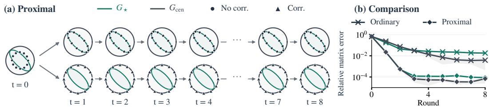  
Figure 4: Gram evolution on MPIIGaze. (a) Seed-0 Gram matrices under proximal training. (b) Relative errors to $G _ { \star }$ without correction (green) and to $G _ { \mathrm { c e n } }$ with correction (graphite gray), with five-seed means ±1 standard deviation.

## 5.2.2 EXPERIMENTAL RESULTS

Convergence toward the BW prediction. Without correction, proximal training approaches $G _ { \star }$ while remaining far from $G _ { \mathrm { c e n } } \mathsf { \bar { \Psi } } ( \mathrm { F i g u r e } \ 3 )$ . Across the 50 dataset–seed combinations, the median endpoint error to $G _ { \star } \mathrm { i s } 2 . 9 0 \times 1 0 ^ { - 4 }$ , compared with $1 . 6 3 \times 1 0 ^ { - 2 }$ for ordinary training. The proximal penalty improves endpoint agreement in every pair, and the proximal trajectories closely follow the predicted Gram iteration (Appendix F.1).

Moment correction. With correction, the shared Gram instead approaches $G _ { \mathrm { c e n } } ~ ( \mathrm { F i g u r e } ~ 3 )$ Across the same 50 combinations, the median endpoint error is $7 . 0 \overset { \vartriangle } { \boldsymbol { 8 } } \times 1 0 ^ { - 5 }$ with the proximal penalty and $5 . 0 6 \times 1 0 ^ { - 3 }$ without it (Appendix F.1). Figure 4 illustrates these different endpoints and the improvement from the proximal penalty on MPIIGaze.

Additional results. Clientwise target centering removes the mean term but leaves a gap, consistent with Proposition 1 (Appendix F.2). Proximal training agrees best with $G _ { \star }$ at an intermediate penalty weight (Appendix F.4). Aligning trained heads to the broadcast also improves agreement with $G _ { \star }$ and lowers the objective after averaging compared with the same unaligned heads (Appendix F.5). The correspondence persists across other architectures, larger training sets and, with sufficient loca training, full-model averaging (Appendix F.6).

## 6 DISCUSSION

Limitations. Our main analysis assumes that clients reach their local optima in every round, unlike typical federated training. It also assumes the fully active regime and does not cover rank-deficient optimal head Gram matrices. The UFM does not model features of unseen inputs, so our analysis provides no test-error guarantees.

Perspectives. To partially resolve the above limitations, we performed additional experiments on test error and an analysis of finite local training. Compared with ordinary training, proximal training yields comparable test error on the image datasets, while proximal training with moment correction yields a modest median reduction (Appendix F.7). For finite local training, we studied profiled updates, which minimize features and bias exactly before each head step. For small total step length $\eta E .$ , we established a locally attracting Gram fixed point near $G _ { \mathrm { w i t h i n } }$ , the fixed point for one local step per round, and quantify its first-order displacement (Appendix G). Numerical checks support the small-step predictions; a separate sweep over local step counts shows a gradual shift toward the BW barycenter (Appendix G.4).

Conclusion. Under the proposed selection rule, we characterized the UFM Gram dynamics through the BW barycenter, decomposed the gap to centralized training, and recovered the centralized optimal Gram in one round by moment correction. UFM and neural-network experiments support the predicted Gram behavior.

## AI USE STATEMENT

In this work, we used generative AI tools to assist with translation and to suggest ideas for the proofs of our mathematical claims. Additionally, we used them to suggest improvements to the English writing, to check and adjust the LAT X formatting, to search for related work beyond the studies already known to us so that the paper is positioned accurately, to search for related theoretical results, and to review and organize code. The authors reviewed and approved all revised text and verified all core theoretical results presented in this paper. We take responsibility for the final content of this work, including text, claims or artifacts produced with the aid of generative AI.

## REPRODUCIBILITY STATEMENT

Theory. Section 3 defines the federated UFM, including the local and centralized objectives and the fully active conditions assumed by every result, and Section 4 states each result with its assumptions. The appendices give complete proofs: Appendix A derives the optimal head Gram matrix and proves Lemma 1 and Theorem 1, Appendix B proves Proposition 1, and Appendix C proves Proposition 2. Appendix G states and proves Theorem 2 on finite local steps.

Experiments. Appendix D describes how the UFM instances are generated and solved, gives the fixed instance of Figure 2 with its random seed, and repeats each numerical check on many random instances of several sizes. For the DNN experiments, Appendix E describes the datasets with their preprocessing, client partitions and licenses (Appendix E.1), the architectures, the federated training procedure with all hyperparameters (Appendix E.3), the evaluation (Appendix E.4), and all runs together with the compute used (Appendix E.5). The fully active condition holds in every reported DNN experiment (Appendix E.3), and the predictions G and $G _ { \mathrm { c e n } }$ are computed from the training-target moments, client weights and regularization parameters alone, independently of the trained networks. Each DNN experiment is repeated over random seeds: five seeds {0, 1, 2, 3, 4} for the main experiments and at least the three seeds {0, 1, 2} for each supplementary experiment (Appendix E.5). We report seed means with standard-deviation bands, medians over all dataset–seed combinations, and paired comparisons within each combination; Appendix F reports the results for every setting.

## REFERENCES

Martial Agueh and Guillaume Carlier. Barycenters in the wasserstein space. SIAM Journal on Mathematical Analysis, 43(2):904–924, 2011. doi: 10.1137/100805741. URL https://doi. org/10.1137/100805741.

George Andriopoulos, Zixuan Dong, Li Guo, Zifan Zhao, and Keith Ross. The prevalence of neural collapse in neural multivariate regression. In A. Globerson, L. Mackey, D. Belgrave, A. Fan, U. Paquet, J. Tomczak, and C. Zhang (eds.), Advances in Neural Information Processing Systems, volume 37, pp. 126417–126451. Curran Associates, Inc., 2024. doi: 10.52202/ 079017-4015. URL https://proceedings.neurips.cc/paper\_files/paper/ 2024/file/e4748b6b6ca49f04b6a8cfce1d5f9a70-Paper-Conference.pdf.

George Andriopoulos, Soyuj Jung Basnet, Juan Guevara, Li Guo, and Keith Ross. Neural multivariate regression: Qualitative insights from the unconstrained feature model, 2025. URL https://arxiv.org/abs/2505.09308.

Tina Behnia and Christos Thrampoulidis. Supervised contrastive representation learning: Landscape analysis with unconstrained features. In 2024 IEEE International Symposium on Information Theory (ISIT), pp. 575–580, 2024. doi: 10.1109/ISIT57864.2024.10619192.

Daniele Berardini, Vito Paolo Pastore, and Vittorio Murino. Distribution alignment for one-shot federated learning via optimal transport, 2026. URL https://arxiv.org/abs/2606. 16655.

Rajendra Bhatia. Operator Monotone and Operator Convex Functions, pp. 112–151. Springer New York, New York, NY, 1997. ISBN 978-1-4612-0653-8. doi: 10.1007/978-1-4612-0653-8\_5. URL https://doi.org/10.1007/978-1-4612-0653-8\_5.

Rajendra Bhatia, Tanvi Jain, and Yongdo Lim. On the bures–wasserstein distance between positive definite matrices. Expositiones Mathematicae, 37(2):165–191, 2019. ISSN 0723-0869. doi: https://doi.org/10.1016/j.exmath.2018.01.002. URL https://www.sciencedirect. com/science/article/pii/S0723086918300021.

Chris Burgess and Hyunjik Kim. 3d shapes dataset. https://github.com/google-deepmind/3dshapes/, 2018.

Zachary Charles and Jakub Konecný. Convergence and accuracy trade-offs in federated learningˇ and meta-learning. In Arindam Banerjee and Kenji Fukumizu (eds.), Proceedings of The 24th International Conference on Artificial Intelligence and Statistics, volume 130 of Proceedings of Machine Learning Research, pp. 2575–2583. PMLR, 13–15 Apr 2021. URL https:// proceedings.mlr.press/v130/charles21a.html.

Song Chen. Beijing Multi-Site Air Quality. UCI Machine Learning Repository, 2017. DOI: https://doi.org/10.24432/C5RK5G.

Liam Collins, Hamed Hassani, Aryan Mokhtari, and Sanjay Shakkottai. Fedavg with fine tuning: Local updates lead to representation learning. In S. Koyejo, S. Mohamed, A. Agarwal, D. Belgrave, K. Cho, and A. Oh (eds.), Advances in Neural Information Processing Systems, volume 35, pp. 10572–10586. Curran Associates, Inc., 2022. doi: 10.52202/ 068431-0768. URL https://proceedings.neurips.cc/paper\_files/paper/ 2022/file/449590dfd5789cc7043f85f8bb7afa47-Paper-Conference.pdf.

Weinan E and Stephan Wojtowytsch. On the emergence of simplex symmetry in the final and penultimate layers of neural network classifiers. In Joan Bruna, Jan Hesthaven, and Lenka Zdeborova (eds.), Proceedings of the 2nd Mathematical and Scientific Machine Learning Conference, volume 145 of Proceedings ofMachine Learning Research, pp. 270–290. PMLR, 16–19 Aug 2022. URL https://proceedings.mlr.press/v145/e22b.html.

Cong Fang, Hangfeng He, Qi Long, and Weijie J. Su. Exploring deep neural networks via layerpeeled model: Minority collapse in imbalanced training. Proceedings ofthe National Academy of Sciences, 118(43):e2103091118, 2021. doi: 10.1073/pnas.2103091118. URL https://www. pnas.org/doi/abs/10.1073/pnas.2103091118.

Quentin Gallouédec, Edward Beeching, Clément Romac, and Emmanuel Dellandréa. Jack of all trades, master of some, a multi-purpose transformer agent, 2024. URL https://arxiv. org/abs/2402.09844.

X.Y. Han, Vardan Papyan, and David L. Donoho. Neural collapse under MSE loss: Proximity to and dynamics on the central path. In International Conference on Learning Representations, 2022. URL https://openreview.net/forum?id=w1UbdvWH\_R3.

Kaiming He, Xiangyu Zhang, Shaoqing Ren, and Jian Sun. Delving deep into rectifiers: Surpassing human-level performance on imagenet classification. In Proceedings of the IEEE International Conference on Computer Vision (ICCV), December 2015.

Kaiming He, Xiangyu Zhang, Shaoqing Ren, and Jian Sun. Deep residual learning for image recognition. In Proceedings of the IEEE Conference on Computer Vision and Pattern Recognition (CVPR), June 2016.

Wanli Hong and Shuyang Ling. Neural collapse for unconstrained feature model under crossentropy loss with imbalanced data. Journal ofMachine Learning Research, 25(192):1–48, 2024. URL http://jmlr.org/papers/v25/23-1215.html.

Wanli Hong and Shuyang Ling. Beyond unconstrained features: Neural collapse for shallow neural networks with general data. Journal of Machine Learning Research, 27(82):1–46, 2026. URL http://jmlr.org/papers/v27/24-1429.html.

Jaehee Jang, Heoneok Ha, Dahuin Jung, and Sungroh Yoon. Fedclassavg: Local representation learning for personalized federated learning on heterogeneous neural networks. In Proceedings of the 51st International Conference on Parallel Processing, ICPP ’22, New York, NY, USA, 2023. Association for Computing Machinery. ISBN 9781450397339. doi: 10.1145/3545008.3545073. URL https://doi.org/10.1145/3545008.3545073.

Divyansh Jhunjhunwala, Shiqiang Wang, and Gauri Joshi. Fedexp: Speeding up federated averaging via extrapolation. In The Eleventh International Conference on Learning Representations, 2023. URL https://openreview.net/forum?id=IPrzNbddXV.

Alex Krizhevsky. Learning multiple layers of features from tiny images. Technical report, 2009.

Pengyu Li, Xiao Li, Yutong Wang, and Qing Qu. Neural collapse in multi-label learning with pick-all-label loss. In Ruslan Salakhutdinov, Zico Kolter, Katherine Heller, Adrian Weller, Nuria Oliver, Jonathan Scarlett, and Felix Berkenkamp (eds.), Proceedings of the 41st International Conference on Machine Learning, volume 235 of Proceedings of Machine Learning Research, pp. 28060–28094. PMLR, 21–27 Jul 2024. URL https://proceedings.mlr.press/ v235/li24ai.html.

Tian Li, Anit Kumar Sahu, Manzil Zaheer, Maziar Sanjabi, Ameet Talwalkar, and Virginia Smith. Federated optimization in heterogeneous networks. In I. Dhillon, D. Papailiopoulos, and V. Sze (eds.), Proceedings of Machine Learning and Systems, volume 2, pp. 429– 450, 2020. URL https://proceedings.mlsys.org/paper\_files/paper/2020/ file/1f5fe83998a09396ebe6477d9475ba0c-Paper.pdf.

Zexi Li, Xinyi Shang, Rui He, Tao Lin, and Chao Wu. No fear of classifier biases: Neural collapse inspired federated learning with synthetic and fixed classifier. In Proceedings of the IEEE/CVF International Conference on Computer Vision (ICCV), pp. 5319–5329, October 2023.

Paul Pu Liang, Terrance Liu, Liu Ziyin, Nicholas B. Allen, Randy P. Auerbach, David Brent, Ruslan Salakhutdinov, and Louis-Philippe Morency. Think locally, act globally: Federated learning with local and global representations, 2020. URL https://arxiv.org/abs/2001.01523.

Ilya Loshchilov and Frank Hutter. Decoupled weight decay regularization. In International Conference on Learning Representations, 2019. URL https://openreview.net/forum?id= Bkg6RiCqY7.

Jianfeng Lu and Stefan Steinerberger. Neural collapse under cross-entropy loss. Applied and Computational Harmonic Analysis, 59:224–241, 2022. ISSN 1063-5203. doi: https://doi.org/10.1016/ j.acha.2021.12.011. URL https://www.sciencedirect.com/science/article/ pii/S1063520321001123. Special Issue on Harmonic Analysis and Machine Learning.

Mi Luo, Fei Chen, Dapeng Hu, Yifan Zhang, Jian Liang, and Jiashi Feng. No fear of heterogeneity: Classifier calibration for federated learning with non-iid data. In M. Ranzato, A. Beygelzimer, Y. Dauphin, P.S. Liang, and J. Wortman Vaughan (eds.), Advances in Neural Information Processing Systems, volume 34, pp. 5972–5984. Curran Associates, Inc., 2021. URL https://proceedings.neurips.cc/paper\_files/paper/2021/ file/2f2b265625d76a6704b08093c652fd79-Paper.pdf.

Chuang Ma, Tomoyuki Obuchi, and Toshiyuki Tanaka. Neural collapse in cumulative link models for ordinal regression: An analysis with unconstrained feature model. In D. Belgrave, C. Zhang, H. Lin, R. Pascanu, P. Koniusz, M. Ghassemi, and N. Chen (eds.), Advances in Neural Information Processing Systems, volume 38, Main Conference, pp. 102065–102112. Curran Associates, Inc., 2025. doi: 10.52202/ 085713-3415. URL https://proceedings.neurips.cc/paper\_files/paper/ 2025/file/93da65de953f738e7160ef1125e288d1-Paper-Conference.pdf.

Paul Mangold, Alain Oliviero Durmus, Aymeric Dieuleveut, Sergey Samsonov, and Eric Moulines. Refined analysis of constant step size federated averaging and federated richardson-romberg extrapolation. In Yingzhen Li, Stephan Mandt, Shipra Agrawal, and Emtiyaz Khan (eds.), Proceedings of The 28th International Conference on Artificial Intelligence and Statistics, volume 258 of Proceedings ofMachine Learning Research, pp. 5023–5031. PMLR, 03–05 May 2025. URL https://proceedings.mlr.press/v258/mangold25a.html.

Loic Matthey, Irina Higgins, Demis Hassabis, and Alexander Lerchner. dsprites: Disentanglement testing sprites dataset. https://github.com/deepmind/dsprites-dataset/, 2017.

Brendan McMahan, Eider Moore, Daniel Ramage, Seth Hampson, and Blaise Aguera y Arcas. Communication-Efficient Learning of Deep Networks from Decentralized Data. In Aarti Singh and Jerry Zhu (eds.), Proceedings of the 20th International Conference on Artificial Intelligence and Statistics, volume 54 of Proceedings of Machine Learning Research, pp. 1273–1282. PMLR, 20–22 Apr 2017. URL https://proceedings.mlr.press/v54/ mcmahan17a.html.

Dustin G. Mixon, Hans Parshall, and Jianzong Pi. Neural collapse with unconstrained features. Sampling Theory, Signal Processing, and Data Analysis, 20(2):11, Jul 2022. ISSN 2730-5724. doi: 10.1007/s43670-022-00027-5. URL https://doi.org/10.1007/ s43670-022-00027-5.

Vardan Papyan, X. Y. Han, and David L. Donoho. Prevalence of neural collapse during the terminal phase of deep learning training. Proceedings of the National Academy of Sciences, 117(40): 24652–24663, 2020. doi: 10.1073/pnas.2015509117. URL https://www.pnas.org/doi/ abs/10.1073/pnas.2015509117.

Reese Pathak and Martin J Wainwright. Fedsplit: an algorithmic framework for fast federated optimization. In H. Larochelle, M. Ranzato, R. Hadsell, M.F. Balcan, and H. Lin (eds.), Advances in Neural Information Processing Systems, volume 33, pp. 7057–7066. Curran Associates, Inc., 2020. URL https://proceedings.neurips.cc/paper\_files/ paper/2020/file/4ebd440d99504722d80de606ea8507da-Paper.pdf.

Lukas Schott, Julius Von Kügelgen, Frederik Träuble, Peter Vincent Gehler, Chris Russell, Matthias Bethge, Bernhard Schölkopf, Francesco Locatello, and Wieland Brendel. Visual representation learning does not generalize strongly within the same domain. In International Conference on Learning Representations, 2022. URL https://openreview.net/forum?id= 9RUHPlladgh.

Mingjia Shi, Yuhao Zhou, Qing Ye, and Jiancheng Lv. Unconstrained feature model and its general geometric patterns in federated learning: Local subspace minority collapse. In Biao Luo, Long Cheng, Zheng-Guang Wu, Hongyi Li, and Chaojie Li (eds.), Neural Information Processing, pp. 449–464, Singapore, 2024. Springer Nature Singapore. ISBN 978-981-99-8132-8.

Yujun Shi, Jian Liang, Wenqing Zhang, Vincent Tan, and Song Bai. Towards understanding and mitigating dimensional collapse in heterogeneous federated learning. In The Eleventh International Conference on Learning Representations, 2023. URL https://openreview.net/ forum?id=EXnIyMVTL8s.

Sidak Pal Singh and Martin Jaggi. Model fusion via optimal transport. In H. Larochelle, M. Ranzato, R. Hadsell, M.F. Balcan, and H. Lin (eds.), Advances in Neural Information Processing Systems, volume 33, pp. 22045–22055. Curran Associates, Inc., 2020. URL https://proceedings.neurips.cc/paper\_files/paper/2020/ file/fb2697869f56484404c8ceee2985b01d-Paper.pdf.

Peter Súkeník, Marco Mondelli, and Christoph Lampert. Deep neural collapse is provably optimal for the deep unconstrained features model. In A. Oh, T. Naumann, A. Globerson, K. Saenko, M. Hardt, and S. Levine (eds.), Advances in Neural Information Processing Systems, volume 36, pp. 52991–53024. Curran Associates, Inc., 2023. doi: 10.52202/ 075280-2306. URL https://proceedings.neurips.cc/paper\_files/paper/ 2023/file/a60c43ba078b723d3d517d28c50ded4c-Paper-Conference.pdf.

Peter Súkeník, Christoph Lampert, and Marco Mondelli. Neural collapse vs. low-rank bias: Is deep neural collapse really optimal? In A. Globerson, L. Mackey, D. Belgrave, A. Fan, U. Paquet, J. Tomczak, and C. Zhang (eds.), Advances in Neural Information Processing Systems, volume 37, pp. 138250–138288. Curran Associates, Inc., 2024. doi: 10.52202/ 079017-4388. URL https://proceedings.neurips.cc/paper\_files/paper/ 2024/file/f9c2ab8d429044e0c35bcece2ff6d123-Paper-Conference.pdf.

Yunfei Teng, Wenbo Gao, François Chalus, Anna E Choromanska, Donald Goldfarb, and Adrian Weller. Leader stochastic gradient descent for distributed training of deep learning models. In H. Wallach, H. Larochelle, A. Beygelzimer, F. d'Alché-Buc, E. Fox, and

R. Garnett (eds.), Advances in Neural Information Processing Systems, volume 32. Curran Associates, Inc., 2019. URL https://proceedings.neurips.cc/paper\_files/ paper/2019/file/fea16e782bc1b1240e4b3c797012e289-Paper.pdf.

Christos Thrampoulidis, Ganesh Ramachandra Kini, Vala Vakilian, and Tina Behnia. Imbalance trouble: Revisiting neural-collapse geometry. In S. Koyejo, S. Mohamed, A. Agarwal, D. Belgrave, K. Cho, and A. Oh (eds.), Advances in Neural Information Processing Systems, volume 35, pp. 27225–27238. Curran Associates, Inc., 2022. doi: 10.52202/ 068431-1974. URL https://proceedings.neurips.cc/paper\_files/paper/ 2022/file/ae54ce310476218f26dd48c1626d5187-Paper-Conference.pdf.

Tom Tirer and Joan Bruna. Extended unconstrained features model for exploring deep neural collapse. In Kamalika Chaudhuri, Stefanie Jegelka, Le Song, Csaba Szepesvari, Gang Niu, and Sivan Sabato (eds.), Proceedings of the 39th International Conference on Machine Learning, volume 162 of Proceedings of Machine Learning Research, pp. 21478–21505. PMLR, 17–23 Jul 2022. URL https://proceedings.mlr.press/v162/tirer22a.html.

Tom Tirer, Haoxiang Huang, and Jonathan Niles-Weed. Perturbation analysis of neural collapse. In Andreas Krause, Emma Brunskill, Kyunghyun Cho, Barbara Engelhardt, Sivan Sabato, and Jonathan Scarlett (eds.), Proceedings ofthe 40th International Conference on Machine Learning, volume 202 of Proceedings ofMachine Learning Research, pp. 34301–34329. PMLR, 23–29 Jul 2023. URL https://proceedings.mlr.press/v202/tirer23a.html.

Emanuel Todorov, Tom Erez, and Yuval Tassa. Mujoco: A physics engine for model-based control. In 2012 IEEE/RSJ International Conference on Intelligent Robots and Systems, pp. 5026–5033, 2012. doi: 10.1109/IROS.2012.6386109.

Hongyi Wang, Mikhail Yurochkin, Yuekai Sun, Dimitris Papailiopoulos, and Yasaman Khazaeni. Federated learning with matched averaging. In International Conference on Learning Representations, 2020a. URL https://openreview.net/forum?id=BkluqlSFDS.

Jianyu Wang, Qinghua Liu, Hao Liang, Gauri Joshi, and H. Vincent Poor. Tackling the objective inconsistency problem in heterogeneous federated optimization. In H. Larochelle, M. Ranzato, R. Hadsell, M.F. Balcan, and H. Lin (eds.), Advances in Neural Information Processing Systems, volume 33, pp. 7611–7623. Curran Associates, Inc., 2020b. URL https://proceedings.neurips.cc/paper\_files/paper/2020/ file/564127c03caab942e503ee6f810f54fd-Paper.pdf.

Diyuan Wu and Marco Mondelli. Neural collapse beyond the unconstrained features model: Landscape, dynamics, and generalization in the mean-field regime. In Aarti Singh, Maryam Fazel, Daniel Hsu, Simon Lacoste-Julien, Felix Berkenkamp, Tegan Maharaj, Kiri Wagstaff, and Jerry Zhu (eds.), Proceedings ofthe 42nd International Conference on Machine Learning, volume 267 of Proceedings ofMachine Learning Research, pp. 67499–67536. PMLR, 13–19 Jul 2025. URL https://proceedings.mlr.press/v267/wu25u.html.

Yuxin Wu and Kaiming He. Group normalization. In Proceedings of the European Conference on Computer Vision (ECCV), September 2018.

Zikai Xiao, Zihan Chen, Liyinglan Liu, YANG FENG, Joey Tianyi Zhou, Jian Wu, Wanlu Liu, Howard Yang, and Zuozhu Liu. Fedloge: Joint local and generic federated learning under long-tailed data. In B. Kim, Y. Yue, S. Chaudhuri, K. Fragkiadaki, M. Khan, and Y. Sun (eds.), International Conference on Learning Representations, volume 2024, pp. 50357–50376, 2024. URL https://proceedings.iclr.cc/paper\_files/paper/2024/file/ db174d373133dcc6bf83bc98e4b681f8-Paper-Conference.pdf.

Shuyi Zhang, Bin Guo, Anlan Dong, Jing He, Ziping Xu, and Song Xi Chen. Cautionary tales on air-quality improvement in beijing. Proceedings of the Royal Society A: Mathematical, Physical and Engineering Sciences, 473(2205):20170457, 09 2017. ISSN 1364-5021. doi: 10.1098/rspa. 2017.0457. URL https://doi.org/10.1098/rspa.2017.0457.

Xucong Zhang, Yusuke Sugano, Mario Fritz, and Andreas Bulling. Appearance-based gaze estimation in the wild. In Proceedings of the IEEE Conference on Computer Vision and Pattern Recognition (CVPR), June 2015.

Jinxin Zhou, Xiao Li, Tianyu Ding, Chong You, Qing Qu, and Zhihui Zhu. On the optimization landscape of neural collapse under MSE loss: Global optimality with unconstrained features. In Kamalika Chaudhuri, Stefanie Jegelka, Le Song, Csaba Szepesvari, Gang Niu, and Sivan Sabato (eds.), Proceedings of the 39th International Conference on Machine Learning, volume 162 of Proceedings of Machine Learning Research, pp. 27179–27202. PMLR, 17–23 Jul 2022. URL https://proceedings.mlr.press/v162/zhou22c.html.

Guogang Zhu, Xuefeng Liu, Jianwei Niu, Shaojie Tang, and Xinghao Wu. The other side of the coin: Unveiling the downsides of model aggregation in federated learning from a layer-peeled perspective, 2025. URL https://arxiv.org/abs/2502.03231.

Heng Zhu, Harsh Vardhan, and Arya Mazumdar. Effectiveness of distributed gradient descent with local steps for overparameterized models, 2026. URL https://arxiv.org/abs/2412. 07971.

Xiangyu Zhu, Zhen Lei, Xiaoming Liu, Hailin Shi, and Stan Z. Li. Face alignment across large poses: A 3d solution. In Proceedings of the IEEE Conference on Computer Vision and Pattern Recognition (CVPR), June 2016.

Zhihui Zhu, Tianyu Ding, Jinxin Zhou, Xiao Li, Chong You, Jeremias Sulam, and Qing Qu. A geometric analysis of neural collapse with unconstrained features. In M. Ranzato, A. Beygelzimer, Y. Dauphin, P.S. Liang, and J. Wortman Vaughan (eds.), Advances in Neural Information Processing Systems, volume 34, pp. 29820–29834. Curran Associates, Inc., 2021. URL https://proceedings.neurips.cc/paper\_files/paper/2021/ file/f92586a25bb3145facd64ab20fd554ff-Paper.pdf.

Pedro C. Álvarez Esteban, E. del Barrio, J.A. Cuesta-Albertos, and C. Matrán. A fixed-point approach to barycenters in wasserstein space. Journal of Mathematical Analysis and Applications, 441(2):744–762, 2016. ISSN 0022-247X. doi: https://doi.org/10.1016/j.jmaa. 2016.04.045. URL https://www.sciencedirect.com/science/article/pii/ S0022247X16300907.

## APPENDIX CONTENTS

Appendices A–C give the proofs of the main results. Appendices D–F report the UFM and DNN   
experiments. Appendix G collects supplementary analyses and their numerical checks.   
A From local optima to the BW limit 17   
A.1 Profiling and the optimal head Gram matrix 17   
A.2 Unique selected head weights and the proximal limit 17   
A.3 The closed Gram recursion and its BW limit . 18   
B The gap to centralized training 19   
B.1 The three positive-semidefinite terms 19   
B.2 The exact zero set 19   
B.3 BW variance and pairwise bounds 19   
C Moment correction and the scope of recovery 20   
C.1 A common corrected profile and recovery 20   
C.2 The two correction terms and required moments 21   
C.3 Predictions with local and shared biases 21   
D UFM numerical experiments 22   
D.1 The fixed instance of Figure 2 22   
D.2 Selection by a vanishing proximal regularizer 23   
D.3 Convergence to the BW barycenter . 24   
D.4 The three terms of the gap to centralized training 24   
D.5 One-round recovery by the moment correction . 26   
E Details of the DNN experimental setup 27   
E.1 Datasets 27   
E.2 Models 28   
E.3 Federated training 28   
E.4 Evaluation 29   
E.5 Experiment overview 29   
F Supplementary DNN experimental results 31   
F.1 Selection and moment correction 31   
F.2 Removing the mean contribution 31   
F.3 Local epochs and the endpoint . 33   
F.4 Dependence on the proximal weight 34   
F.5 Selection by alignment 35   
F.6 Architecture, data size and full-model averaging 36   
F.7 Test error 37   
G Supplementary analysis 38   
G.1 Finite-step dynamics of the profiled UFM 38   
G.2 Proof of Theorem 2 40   
G.3 Dependence of the displacement on client covariances . 44   
G.4 Numerical checks of finite-step dynamics 46

## A FROM LOCAL OPTIMA TO THE BW LIMIT

This appendix gives the proofs for Sections 4.1–4.3. We use the fully active assumptions of Section 3, together with each result’s additional hypotheses.

## A.1 PROFILING AND THE OPTIMAL HEAD GRAM MATRIX

We derive the profile and the local and centralized optimal Gram matrices used in Section 4.1. For a target matrix $\mathbf { \bar { \boldsymbol { Y } } } \in \mathbb { R } ^ { C \times N }$ , write

$$
\mu = Y { \bf 1 } / N , \qquad \widetilde { Y } = Y - \mu { \bf 1 } ^ { \top } , \qquad T = \widetilde { Y } \widetilde { Y } ^ { \top } / N , \qquad A = W W ^ { \top } + \lambda _ { H } I _ { C } ,
$$

where $\mathbf { 1 } \in \mathbb { R } ^ { N }$ is the all-ones vector. At fixed $( W , b )$ , the minimizer of (1) with respect to H is unique thanks to the strict convexity and takes

$$
H ( W , b ) = ( W ^ { \top } W + \lambda _ { H } I _ { P } ) ^ { - 1 } W ^ { \top } ( Y - b \mathbf { 1 } ^ { \top } ) = W ^ { \top } A ^ { - 1 } ( Y - b \mathbf { 1 } ^ { \top } ) .
$$

Substitution into the loss gives

$$
\frac { \lambda _ { H } } { 2 } \operatorname { t r } ( T A ^ { - 1 } ) + \frac { \lambda _ { H } } { 2 } ( b - \mu ) ^ { \top } A ^ { - 1 } ( b - \mu ) + \frac { \lambda _ { W } } { 2 } \left\| \boldsymbol { W } \right\| _ { F } ^ { 2 } .
$$

Since $A \succ 0$ , the unique minimizing bias is $b = \mu ,$ giving $H ^ { \star } ( W ) = W ^ { \top } A ^ { - 1 } \widetilde { Y }$ and the profile (6). Writing $G = W W ^ { \top }$ , we minimize

$$
f _ { T } ( G ) = { \frac { \lambda _ { H } } { 2 } } \operatorname { t r } [ T ( G + \lambda _ { H } I _ { C } ) ^ { - 1 } ] + { \frac { \lambda _ { W } } { 2 } } \operatorname { t r } G
$$

over $G \succeq 0$ , all representable since $P \geq C$ . For X, $T \succ 0$ and nonzero symmetric $D _ { \mathbf { \delta } }$

$$
\begin{array} { c } { { \displaystyle \left. \frac { d ^ { 2 } } { d t ^ { 2 } } \mathrm { t r } [ T ( X + t D ) ^ { - 1 } ] \right. _ { t = 0 } = 2 \mathrm { t r } ( { \cal K } { \cal M } { \cal K } ) > 0 , } } \\ { { { \cal K } = X ^ { - 1 / 2 } D X ^ { - 1 / 2 } , \qquad M = X ^ { - 1 / 2 } T X ^ { - 1 / 2 } \succ 0 . } } \end{array}
$$

Hence $f _ { T }$ is strictly convex. Its interior stationary equation is

$$
- \frac { \lambda _ { H } } { 2 } ( G + \lambda _ { H } I _ { C } ) ^ { - 1 } T ( G + \lambda _ { H } I _ { C } ) ^ { - 1 } + \frac { \lambda _ { W } } { 2 } I _ { C } = 0 , \qquad ( G + \lambda _ { H } I _ { C } ) ^ { 2 } = \frac { \lambda _ { H } } { \lambda _ { W } } T .
$$

Under the fully active condition $\lambda _ { \operatorname* { m i n } } ( T ) > \lambda _ { H } \lambda _ { W }$ , its solution is $G = \phi ( T ) = \sqrt { \lambda _ { H } / \lambda _ { W } } T ^ { 1 / 2 } -$ $\lambda _ { H } I _ { C } \succ 0$ . For any $W$ satisfying $W W ^ { \top } = \phi ( T )$ , the triple $( W , \mu , H ^ { \star } ( W ) )$ is a global minimizer of the full loss (Andriopoulos et al., 2024).

With $p _ { m } = N _ { m } / N , ( 2 )$ is the same loss on concatenated client data, whose moments are $( \mu _ { g } , \Sigma _ { \mathrm { c e n } } )$ Thus the local and centralized optimal head Gram matrices are $G _ { m } = \phi ( \Sigma _ { m } )$ and $G _ { \mathrm { c e n } } = \breve { \phi } ( \Sigma _ { \mathrm { c e n } } )$

## A.2 UNIQUE SELECTED HEAD WEIGHTS AND THE PROXIMAL LIMIT

The following lemma establishes the selection rule of Section 4.2. Taking $G _ { \mathrm { t a r } } = G _ { m }$ and $T = \Sigma _ { m }$ proves Lemma 1; its loss bound follows from (15).

Lemma 2 (Positive-definite rectangular projection and selection). Let $G _ { \mathrm { t a r } } \succ 0$ and let $W \in \mathbb { R } ^ { C \times P }$ havefull row rank, with $G = W W ^ { \top } \succ 0$ and $P \geq C .$ . The unique minimizer of $\| \boldsymbol { U } - \boldsymbol { W } \| _ { F } ^ { 2 }$ subject to $U U ^ { \top } = G _ { \mathrm { t a r } } i s$

$$
\Pi _ { { \cal G } _ { \mathrm { t a r } } } ( W ) = T _ { { \cal G } _ { \mathrm { t a r } } } ( G ) W , \qquad T _ { { \cal G } _ { \mathrm { t a r } } } ( G ) = G ^ { - 1 / 2 } ( G ^ { 1 / 2 } G _ { \mathrm { t a r } } G ^ { 1 / 2 } ) ^ { 1 / 2 } G ^ { - 1 / 2 } ,\tag{14}
$$

and its attained squared distance is $d _ { \mathrm { B W } } ^ { 2 } ( G , G _ { \mathrm { t a r } } )$

For the proximal-selection statement, let $Y \in \mathbb { R } ^ { C \times N }$ have mean µ and covariance T as defined in Appendix A.1, and let $F ( \cdot ; T )$ be given by (6), with $\lambda _ { H } , \lambda _ { W } > 0$ . Assume that $\lambda _ { \operatorname* { m i n } } ( T ) > \dot { \lambda _ { H } }$ λW and $G _ { \mathrm { t a r } } = \phi ( T )$ . For the fixed reference W, global minimizers of

$$
F ( U ; T ) + \frac { \rho } { 2 } \| U - W \| _ { F } ^ { 2 }
$$

exist for every $\rho > 0 .$ . Any choice of these minimizers $U _ { \rho }$ satisfies

$$
U _ { \rho } \to \Pi _ { G _ { \mathrm { t a r } } } ( W ) \qquad a s \rho \downarrow 0 .
$$

For the full UFM loss (1) formedfrom $Y$ with the same head-only penalty, every global minimizer $( U _ { \rho } , b _ { \rho } , H _ { \rho } )$ satisfies $b _ { \rho } = \mu$ and $\dot { H } _ { \rho } = H ^ { \star } ( U _ { \rho } )$ , where $H ^ { \star }$ is defined in Appendix A.1.

Proof. Write $U = G _ { \mathrm { t a r } } ^ { 1 / 2 } R ,$ where $R R ^ { \top } = I _ { C }$ . The squared distance differs by a constant from $- 2 \operatorname { t r } ( R Z )$ , where $Z = W ^ { \top } G _ { \mathrm { t a r } } ^ { 1 / 2 }$ has full column rank. Let $Z = \Phi D \Psi ^ { \top }$ be its thin singular value decomposition; all diagonal entries of D are positive. Then $\mathrm { t r } ( R Z ) \le \mathrm { t r } D$ . Equality forces every diagonal entry of the contraction $\Psi ^ { \top }$ RΦ to equal one. Writing $\phi _ { j }$ and $\psi _ { j }$ for the columns of Φ and $\Psi ,$ this means $\psi _ { j } ^ { \top } R \phi _ { j } = 1$ . Since $\| R \phi _ { j } \| \le 1$ and $\| \psi _ { j } \| = 1$ , equality in Cauchy–Schwarz gives $R \phi _ { j } = \psi _ { j }$ for every j, hence $R \Phi = \Psi$ . Complete Φ to an orthogonal matrix $[ \Phi , \Phi _ { \bot } ]$ and write $R = \Psi \Phi ^ { \top } + Q \Phi _ { \iota } ^ { \top }$ . The row-orthonormality constraint gives $I _ { C } + Q Q ^ { \top } = I _ { C } , { \mathrm { s o } } Q = 0$ . Thus the optimizer is unique.

Since $( T _ { G _ { \mathrm { t a r } } } ( G ) W ) ( T _ { G _ { \mathrm { t a r } } } ( G ) W ) ^ { \top } = T _ { G _ { \mathrm { t a r } } } ( G ) G T _ { G _ { \mathrm { t a r } } } ( G ) = G _ { \mathrm { t a r } }$ holds, $U = T _ { G _ { \mathrm { t a r } } } ( G ) W$ is feasible, and attains the maximum:

$$
\mathrm { t r } [ U W ^ { \top } ] = \mathrm { t r } [ T _ { G _ { \mathrm { t a r } } } ( G ) G ] = \mathrm { t r } [ ( G ^ { 1 / 2 } G _ { \mathrm { t a r } } G ^ { 1 / 2 } ) ^ { 1 / 2 } ] = \mathrm { t r } D .
$$

To justify the last equality, set $X = G ^ { 1 / 2 } G _ { \mathrm { t a r } } ^ { 1 / 2 }$ . Then

$$
X ^ { \top } X = G _ { \mathrm { t a r } } ^ { 1 / 2 } G G _ { \mathrm { t a r } } ^ { 1 / 2 } = Z ^ { \top } Z = \Psi D ^ { 2 } \Psi ^ { \top } , \qquad X X ^ { \top } = G ^ { 1 / 2 } G _ { \mathrm { t a r } } G ^ { 1 / 2 } .
$$

Since $X X ^ { \top }$ and $X ^ { \top }$ X have the same eigenvalues, the eigenvalues of $G ^ { 1 / 2 } G _ { \mathrm { t a r } } G ^ { 1 / 2 }$ are the squared singular values of Z. Taking the positive square root therefore gives

$$
\mathrm { t r } \left[ ( G ^ { 1 / 2 } G _ { \mathrm { t a r } } G ^ { 1 / 2 } ) ^ { 1 / 2 } \right] = \sum _ { i = 1 } ^ { C } D _ { i i } = \mathrm { t r } D .
$$

Hence $T _ { G _ { \mathrm { t a r } } } ( G ) W$ attains the trace upper bound and thus is the unique solution discussed above. Substituting this maximum into $\begin{array} { r } { \left\| U - W \right\| _ { F } ^ { 2 } = \operatorname { t r } G _ { \mathrm { t a r } } + \operatorname { t r } G - 2 \operatorname { t r } ( U W ^ { \top } ) } \end{array}$ gives the BW distance formula.

For the proximal limit, put $F _ { \star } ~ = ~ \operatorname* { m i n } _ { U } F ( U ; T )$ and $U ^ { \dagger } { \mathbf { \tau } } = \Pi _ { G _ { \mathrm { t a r } } } ( W )$ . Coercivity from $\lambda _ { W } \left\| U \right\| _ { F } ^ { 2 } / 2$ ensures a global minimizer $U _ { \rho }$ for each $\rho > 0 .$ . Comparison with $U ^ { \dagger }$ gives

$$
0 \leq F ( U _ { \rho } ; T ) - F _ { \star } , \qquad F ( U _ { \rho } ; T ) - F _ { \star } + { \frac { \rho } { 2 } } \left\| U _ { \rho } - W \right\| _ { F } ^ { 2 } \leq { \frac { \rho } { 2 } } \left\| U ^ { \dagger } - W \right\| _ { F } ^ { 2 } .\tag{15}
$$

Thus $\left\| U _ { \rho } - W \right\| _ { F } \leq \left\| U ^ { \dagger } - W \right\| _ { F }$ and $F ( U _ { \rho } ; T ) \to F _ { \star }$ . The heads $U _ { \rho }$ thus lie in a fixed compact ball centered at $\mathbf { \widehat W }$ , so every sequence of $U _ { \rho }$ with $\rho \downarrow 0$ has a convergent subsequence by the Bolzano–Weierstrass theorem. By continuity, every such subsequential limit minimizes $F \dot { ( } \cdot ; T )$ and is no farther from $W$ than $U ^ { \dagger }$ . Since $U ^ { \dagger }$ is the unique head closest to W among the global minimizers of $F ( \cdot ; T )$ , every such limit equals $U ^ { \dagger }$

Since the proximal penalty depends only on the head, the conditional bias and feature solutions remain unchanged. Thus every global minimizer of the penalized full objective satisfies $b _ { \rho } = \mu$ and $H _ { \rho } = H ^ { \star } ( U _ { \rho } )$ , as derived in Appendix $\mathrm { A . 1 }$ , and its original loss equals $F ( U _ { \rho } ; T )$ . Consequently, (15) gives

$$
0 \leq \mathcal { L } ( U _ { \rho } , b _ { \rho } , H _ { \rho } ) - \operatorname* { m i n } \mathcal { L } = F ( U _ { \rho } ; T ) - F _ { \star } \leq \frac { \rho } { 2 } \| U ^ { \dagger } - W \| _ { F } ^ { 2 } .
$$

The excess loss therefore tends to zero as $\rho \downarrow 0$

## A.3 THE CLOSED GRAM RECURSION AND ITS BW LIMIT

We prove Theorem 1 by deriving the Gram recursion and checking the hypotheses of the BW barycenter convergence theorem. Set $T _ { m } ( G ) \ : = \ T _ { G _ { m } } ( G )$ and $\begin{array} { r } { S ( \mathbf { \bar { G } } ) \mathrel { \mathop : } = \sum _ { m } p _ { m } T _ { m } ( G ) } \end{array}$ . By Lemma $2 ,$ , we have the head update $\begin{array} { r } { W _ { t + 1 } = \sum _ { m } p _ { m } \Pi _ { m } ( W _ { t } ) = S ( G _ { t } ) W _ { t } , } \end{array}$ , implying the following closed Gram recursion:

$$
G _ { t + 1 } = S ( G _ { t } ) G _ { t } S ( G _ { t } ) .
$$

Substituting $T _ { m }$ gives (9). Starting from $G _ { 0 } \succ 0$ , induction gives $T _ { m } ( G _ { t } ) \succ 0 , S ( G _ { t } ) \succ 0$ and $G _ { t + 1 } \succ 0$ . The returned biases $\mu _ { m }$ average to $b _ { t + 1 } = \mu _ { g }$

Convergence of the Gram recursion. For positive weights summing to one and positive-definite $G _ { m }$ , the iteration (9) converges from every $G _ { 0 } \succ 0$ to the unique positive-definite BW barycenter satisfying (10) (Álvarez Esteban et al., 2016, Theorem 4.2 and Remark 4.3). Its variational characterization is the Gaussian barycenter characterization (Agueh & Carlier, 2011; Bhatia et al., 2019). Full activity supplies $G _ { m } \succ \bar { 0 } ,$ , so this proves Theorem 1.

If $G _ { 1 } , \ldots , G _ { M }$ commute with each other, $( \sum _ { m } p _ { m } G _ { m } ^ { 1 / 2 } ) ^ { 2 }$ satisfies the fixed-point equation in their common eigenbasis, so uniqueness identifies it with $G _ { \star }$

## B THE GAP TO CENTRALIZED TRAINING

This appendix proves the gap characterization in Proposition 1 of Section 4.4. We establish the PSD decomposition, characterize equality, and relate the averaging term to BW distances.

## B.1 THE THREE POSITIVE-SEMIDEFINITE TERMS

The weighted scatter of the selected head weights supplies the averaging term in (11). The fixedpoint equation in (10), conjugated by $G _ { \star } ^ { - 1 / 2 }$ , gives $S ( G _ { \star } ) = I _ { C }$ . Hence any factor $W _ { \star }$ of $G _ { \star }$ satisfies $\begin{array} { r } { \sum _ { m } p _ { m } \Pi _ { m } ( W _ { \star } ) \stackrel { - } { = } \bar { W } , } \end{array}$ . More generally, the weighted scatter identity at any round gives

$$
\sum _ { m } p _ { m } G _ { m } - G _ { t + 1 } = \sum _ { m } p _ { m } ( \Pi _ { m } ( W _ { t } ) - W _ { t + 1 } ) ( \Pi _ { m } ( W _ { t } ) - W _ { t + 1 } ) ^ { \top } \succeq 0 .\tag{16}
$$

Expand the weighted scatter using $\begin{array} { r } { \sum _ { m } p _ { m } \Pi _ { m } ( W _ { t } ) = W _ { t + 1 } } \end{array}$ and $\Pi _ { m } ( W _ { t } ) \Pi _ { m } ( W _ { t } ) ^ { \top } = G _ { m }$ to obtain this identity. At any factor $W _ { \star }$ of $G _ { \star }$ , this scatter is $\begin{array} { r } { \mathcal { M } _ { A } = \sum _ { m } p _ { m } G _ { m } - G _ { \ell } } \end{array}$ ⋆, independently of that factor; convergence of $W _ { t }$ is not required.

Adding and subtracting $G _ { \mathrm { w i t h i n } }$ and $\sum _ { m } p _ { m } G _ { m }$ gives (11). For $\alpha = \sqrt { \lambda _ { H } / \lambda _ { W } }$

$$
\mathcal { M } _ { \mu } = \alpha \big ( \Sigma _ { \mathrm { c e n } } ^ { 1 / 2 } - \Sigma _ { \mathrm { w i t h i n } } ^ { 1 / 2 } \big ) \succeq 0 , \qquad \mathcal { M } _ { \Sigma } = \alpha \left( \Sigma _ { \mathrm { w i t h i n } } ^ { 1 / 2 } - \sum _ { m } p _ { m } \Sigma _ { m } ^ { 1 / 2 } \right) \succeq 0 .
$$

Since $\Sigma _ { \mathrm { c e n } } = \Sigma _ { \mathrm { w i t h i n } } + \Sigma _ { \mu } \succeq \Sigma _ { \mathrm { w i t h i n } } .$ , square-root monotonicity gives $\mathcal { M } _ { \mu } \succeq 0$ . Operator concavity of ϕ gives its Jensen gap $\mathcal { M } _ { \Sigma } \succeq 0$ (Bhatia, 1997, Theorems V.1.9 and V.2.5). Equation (16) makes $\mathcal { M } _ { A }$ the PSD weighted scatter of $U _ { m } ^ { \star } = \Pi _ { m } ( W _ { \star , \cdot }$ ) around $W _ { \star }$ . This proves the Loewner chain of Proposition 1.

## B.2 THE EXACT ZERO SET

We next prove the equality condition in Proposition 1: the gap vanishes exactly when client means and covariances agree. A zero sum forces each PSD term to vanish. Square-root injectivity gives $\mathcal { M } _ { \mu } = 0 \iff \Sigma _ { \mu } = 0$ . Since $\begin{array} { r } { \mathrm { t r } \Sigma _ { \mu } = \sum _ { m } p _ { m } \| \mu _ { m } - \mu _ { g } \| ^ { 2 } } \end{array}$ with $p _ { m } > 0$ , all means then agree. Likewise $\mathcal { M } _ { A } ~ = ~ 0$ gives $\begin{array} { r } { \sum _ { m } p _ { m } \left\| U _ { m } ^ { \star } - W _ { \star } \right\| _ { F } ^ { 2 } = 0 . } \end{array}$ , so all $U _ { m } ^ { \star }$ , hence all $G _ { m } ,$ , agree. Injectivity of ϕ implies equal covariances. Conversely, equal means and covariances give $\Sigma _ { \mu } = 0$ and $G _ { m } = G _ { \mathrm { c e n } } = G _ { \star }$ , making all three terms zero.

## B.3 BW VARIANCE AND PAIRWISE BOUNDS

Choose any factor $W _ { \star } W _ { \star } ^ { \top } = G ,$ ⋆ and set $U _ { m } ^ { \star } = \Pi _ { m } ( W _ { \star } )$ . Taking the trace of

$$
\mathcal { M } _ { A } = \sum _ { m } p _ { m } ( U _ { m } ^ { \star } - W _ { \star } ) ( U _ { m } ^ { \star } - W _ { \star } ) ^ { \top }
$$

and using $\operatorname { t r } ( A A ^ { \top } ) = \left\| A \right\| _ { F } ^ { 2 }$ , we obtain

$$
\mathrm { t r } \mathcal { M } _ { A } = \sum _ { m } p _ { m } \left\| U _ { m } ^ { \star } - W _ { \star } \right\| _ { F } ^ { 2 } .
$$

Each $U _ { m } ^ { \star }$ is the factor of $G _ { m }$ closest to $W _ { \star }$ . Hence Lemma 2 gives

$$
\begin{array} { r } { \| U _ { m } ^ { \star } - W _ { \star } \| _ { F } ^ { 2 } = d _ { \mathrm { B W } } ^ { 2 } ( G _ { \star } , G _ { m } ) . } \end{array}
$$

Substitution proves (12).

In addition to this, we prove the following pairwise bounds mentioned in Section 4.4:

$$
D \leq \mathrm { t r } { \mathcal { M } } _ { A } \leq 2 D , \qquad D : = \sum _ { m < n } p _ { m } p _ { n } d _ { \mathrm { B W } } ^ { 2 } ( G _ { m } , G _ { n } ) .\tag{17}
$$

For the lower bound, we first express the scatter around $W _ { \star }$ in terms of pairwise distances. Expand ing the squared distances and using $\begin{array} { r } { \sum _ { m } p _ { m } U _ { m } ^ { \star } = W , } \end{array}$ ⋆ gives

$$
\begin{array} { r l } { \displaystyle \sum _ { m < n } p _ { m } p _ { n } \left\| U _ { m } ^ { \star } - U _ { n } ^ { \star } \right\| _ { F } ^ { 2 } = \frac { 1 } { 2 } \displaystyle \sum _ { m , n } p _ { m } p _ { n } \left\| U _ { m } ^ { \star } - U _ { n } ^ { \star } \right\| _ { F } ^ { 2 } } & { } \\ { \displaystyle = \sum _ { m } p _ { m } \left\| U _ { m } ^ { \star } \right\| _ { F } ^ { 2 } - \left\| W _ { \star } \right\| _ { F } ^ { 2 } } & { } \\ { \displaystyle } & { = { \mathrm { t r } } \mathcal { M } _ { A } . } \end{array}
$$

For each pair $( m , n )$ , Lemma 2 gives

$$
d _ { \mathrm { B W } } ^ { 2 } ( G _ { m } , G _ { n } ) = \operatorname* { m i n } _ { U U ^ { \top } = G _ { m } } \left. U - U _ { n } ^ { \star } \right. _ { F } ^ { 2 } .
$$

Since $U _ { m } ^ { \star } U _ { m } ^ { \star \top } = G _ { m }$ , the head $U _ { m } ^ { \star }$ is a feasible choice in this minimization. Therefore,

$$
d _ { \mathrm { B W } } ^ { 2 } ( G _ { m } , G _ { n } ) \leq \lVert U _ { m } ^ { \star } - U _ { n } ^ { \star } \rVert _ { F } ^ { 2 } .
$$

Multiplying by $p _ { m } p _ { n }$ and summing over $m < n$ yields $D \leq \operatorname { t r } \mathcal { M } _ { A }$

For the upper bound, define

$$
V ( X ) : = \sum _ { m } p _ { m } d _ { \mathrm { B W } } ^ { 2 } ( X , G _ { m } ) .
$$

By the barycenter characterization in $( 1 0 ) , G _ { \star }$ is a global minimizer of V . Since each $G _ { n }$ is positive definite and therefore feasible, we have $V ( G _ { \star } ) \leq V ( G _ { n } )$ for every n. Averaging these inequalities with weights $p _ { n }$ gives

$$
\mathrm { t r } { \mathcal { M } } _ { A } = V ( G _ { \star } ) \leq \sum _ { n } p _ { n } V ( G _ { n } ) = \sum _ { n , m } p _ { n } p _ { m } d _ { \mathrm { B W } } ^ { 2 } ( G _ { n } , G _ { m } ) = 2 D .
$$

The last equality follows because the terms with $m = n$ are zero, while each pair with $m < n$ is counted twice.

## C MOMENT CORRECTION AND THE SCOPE OF RECOVERY

This appendix proves the recovery result in Proposition 2 of Section 4.4 and explains its scope. We identify the moments needed for the correction and compare the resulting predictions with centralized training.

## C.1 A COMMON CORRECTED PROFILE AND RECOVERY

Since $C _ { m } ( W )$ depends only on W, minimizing over the bias and features for a fixed W gives the same conditional solutions as in Appendix A.1:

$$
b _ { m } ^ { \star } ( W ) = \mu _ { m } , \qquad H _ { m } ^ { \star } ( W ) = W ^ { \top } A ^ { - 1 } ( Y _ { m } - \mu _ { m } 1 ^ { \top } ) , \qquad A = W W ^ { \top } + \lambda _ { H } I _ { C } .
$$

Substituting these solutions into the corrected objective gives

$$
\begin{array} { l } { \displaystyle \operatorname* { m i n } _ { b , H } \{ \mathcal { L } _ { m } ( W , b , H ) + C _ { m } ( W ) \} = F ( W ; \Sigma _ { m } ) + C _ { m } ( W ) } \\ { \displaystyle \qquad = \frac { \lambda _ { H } } { 2 } \operatorname { t r } \bigl [ ( \Sigma _ { m } + \Sigma _ { \mathrm { c e n } } - \Sigma _ { m } ) A ^ { - 1 } \bigr ] + \frac { \lambda _ { W } } { 2 } \left\| W \right\| _ { F } ^ { 2 } } \\ { \displaystyle \qquad = F ( W ; \Sigma _ { \mathrm { c e n } } ) . } \end{array}
$$

Thus every client has the same profiled objective for the head.

By Appendix A.1, this common objective is minimized exactly by the heads satisfying

$$
\begin{array} { r } { W W ^ { \top } = G _ { \mathrm { c e n } } = \phi ( \Sigma _ { \mathrm { c e n } } ) \succ 0 . } \end{array}
$$

Such heads exist because $P _ { \mathbf { \lambda } } \geq \mathbf { \lambda } C$ . Pairing any such head with the conditional bias and feature solutions above therefore gives a global minimizer of each client’s corrected full objective.

Now fix a common broadcast $W _ { t }$ of full row rank. Under the selection rule, each client chooses the head closest to $W _ { t }$ among the factors of $G _ { \mathrm { c e n } } . \ \mathrm { B y }$ Lemma 2, this head is unique, so

$$
\widetilde { W } _ { m , t } = \Pi _ { G _ { \mathrm { c e n } } } ( W _ { t } ) , \qquad \widetilde { b } _ { m , t } = \mu _ { m } \quad \mathrm { f o r e v e r y } m .
$$

Since $\begin{array} { r } { \sum _ { m } p _ { m } = 1 } \end{array}$ , server averaging gives

$$
W _ { t + 1 } = \sum _ { m } p _ { m } \widetilde { W } _ { m , t } = \Pi _ { G _ { \mathrm { c e n } } } ( W _ { t } ) ,
$$

$$
G _ { t + 1 } = W _ { t + 1 } W _ { t + 1 } ^ { \top } = G _ { \mathrm { c e n } } ,
$$

$$
b _ { t + 1 } = \sum _ { m } p _ { m } \mu _ { m } = \mu _ { g } .
$$

This proves Proposition 2.

Finally, Appendix A.2 applies to the common profiled objective: any choice of global minimizers

$$
U _ { \rho } \in \underset { U } { \arg \operatorname* { m i n } } \left\{ F ( U ; \Sigma _ { \mathrm { c e n } } ) + \frac { \rho } { 2 } \left\| U - W _ { t } \right\| _ { F } ^ { 2 } \right\}
$$

satisfies $U _ { \rho } \to \Pi _ { G _ { \mathrm { c e n } } } ( W _ { t } )$ as $\rho \downarrow 0$ . Thus the same selection can be imposed by globally minimizing the penalized objective for each $\rho > 0$ and taking this limit before server averaging.

## C.2 THE TWO CORRECTION TERMS AND REQUIRED MOMENTS

Using $\Sigma _ { \mathrm { c e n } } = \Sigma _ { \mathrm { w i t h i n } } + \Sigma _ { \mu }$ , we write

$$
C _ { m } ( W ) = { \frac { \lambda _ { H } } { 2 } } \operatorname { t r } ( \Sigma _ { \mu } A ^ { - 1 } ) + { \frac { \lambda _ { H } } { 2 } } \operatorname { t r } \left[ \left( \Sigma _ { \mathrm { w i t h i n } } - \Sigma _ { m } \right) A ^ { - 1 } \right] , \quad \quad A = W W ^ { \top } + \lambda _ { H } I _ { C } .
$$

The first term restores the mean-scatter contribution removed by local centering. The second replaces $\Sigma _ { m } \ \mathrm { b y } \ \Sigma _ { \mathrm { w i t h i n } }$ in each profiled objective; its weighted average is zero when evaluated at a common $W$

Each client uploads $N _ { m } , \mu _ { m } ,$ and $\Sigma _ { m }$ once. With $\begin{array} { r } { N = \sum _ { m } N _ { m } . } \end{array}$ , the server computes

$$
\mu _ { g } = \frac { 1 } { N } \sum _ { m } N _ { m } \mu _ { m } , \qquad \Sigma _ { \mathrm { c e n } } = \frac { 1 } { N } \sum _ { m } N _ { m } ( \Sigma _ { m } + \mu _ { m } \mu _ { m } ^ { \top } ) - \mu _ { g } \mu _ { g } ^ { \top } ,
$$

and broadcasts $\Sigma _ { \mathrm { c e n } }$ so that each client can evaluate $C _ { m } ( W )$ . This requires $O ( C ^ { 2 } )$ additional entries per client, or $O ( M C ^ { 2 } )$ in total.

## C.3 PREDICTIONS WITH LOCAL AND SHARED BIASES

Fix a common head W with $G = W W ^ { \top } = G _ { \mathrm { c e n } }$ , and let $A = G + \lambda _ { H } I _ { C }$ and $d _ { m } = \mu _ { m } - \mu _ { g }$ . The corrected client centers its targets using $\mu _ { m } .$ , whereas centralized training uses $\mu _ { g }$ . Their optimal features on client m’s samples are therefore

$$
\begin{array} { r } { H _ { m } ^ { \mathrm { c o r r } } = W ^ { \top } A ^ { - 1 } ( Y _ { m } - \mu _ { m } \mathbf { 1 } ^ { \top } ) , } \\ { H _ { m } ^ { \mathrm { c e n } } = W ^ { \top } A ^ { - 1 } ( Y _ { m } - \mu _ { g } \mathbf { 1 } ^ { \top } ) . } \end{array}
$$

Hence

$$
H _ { m } ^ { \mathrm { c o r r } } - H _ { m } ^ { \mathrm { c e n } } = - W ^ { \top } A ^ { - 1 } d _ { m } \mathbf { 1 } ^ { \top } .\tag{18}
$$

After aggregation, each client uses the shared bias $\mu _ { g }$ while retaining its locally optimized features $H _ { m } ^ { \mathrm { c o r r } }$ . By (18), its prediction difference from centralized training is

$$
\left( W H _ { m } ^ { \mathrm { c o r r } } + \mu _ { g } \mathbf { 1 } ^ { \top } \right) - \left( W H _ { m } ^ { \mathrm { c e n } } + \mu _ { g } \mathbf { 1 } ^ { \top } \right) = - G A ^ { - 1 } d _ { m } \mathbf { 1 } ^ { \top } .
$$

If the client instead retains its local bias $\mu _ { m }$ , the prediction difference becomes

$$
\left( W H _ { m } ^ { \mathrm { c o r r } } + \mu _ { m } \mathbf { 1 } ^ { \top } \right) - \left( W H _ { m } ^ { \mathrm { c e n } } + \mu _ { g } \mathbf { 1 } ^ { \top } \right) = \lambda _ { H } A ^ { - 1 } d _ { m } \mathbf { 1 } ^ { \top } .
$$

The latter equality uses $I _ { C } - G A ^ { - 1 } = \lambda _ { H } A ^ { - 1 }$ . Both prediction differences are nonzero whenever $\mu _ { m } \neq \mu _ { g }$ . Thus the correction recovers the centralized head Gram matrix and aggregate bias, but need not reproduce centralized training predictions.

## D UFM NUMERICAL EXPERIMENTS

This appendix checks the results of Section 4 numerically under the fully active conditions of Section 3. Appendix D.1 specifies the fixed instance and the solvers behind Figure 2. Appendices D.2– D.5 repeat each check on random instances of several sizes, in the order of Section 4: selection by the proximal regularizer (Lemma 1), convergence to the BW barycenter (Theorem 1), the three terms of the gap (Proposition 1) and the moment correction (Proposition 2). All results of Section 4 hold for arbitrary positive weights $p _ { m }$ summing to one, with $\mu _ { g } , \bar { \Sigma } _ { \mathrm { w i t h i n } }$ and $\Sigma _ { \mathrm { c e n } }$ formed with these weights. The instances in Appendices D.3–D.5 therefore draw the weights at random instead of setting $p _ { m } = N _ { m } / N$ . Curves show medians over instances; in Figures 5 and 7, shaded bands show interquartile ranges. Appendix G reports the numerical checks of the finite-step analysis.

## D.1 THE FIXED INSTANCE OF FIGURE 2

Figure 2 illustrates the results of Section 4 on one fixed instance with $C = P = 2 , M = 3 .$ $\bar { N _ { m } } = 2 5 6 , p _ { m } = 1 / 3$ and $\lambda _ { H } = \lambda _ { W } = 0 . 1$ . Writing $R _ { \theta }$ for planar rotation through θ degrees, the client moments and the initial Gram matrix are

$$
\begin{array} { r l r l } & { \Sigma _ { 1 } = R _ { - 4 0 } \mathrm { d i a g } ( 3 , 0 . 1 1 ) R _ { - 4 0 } ^ { \top } , } & & { \mu _ { 1 } = ( 0 , - 2 . 2 ) ^ { \top } , } \\ & { \Sigma _ { 2 } = R _ { 1 0 } \mathrm { d i a g } ( 1 . 1 , 0 . 4 5 ) R _ { 1 0 } ^ { \top } , } & & { \mu _ { 2 } = ( 0 , 0 ) ^ { \top } , } \\ & { \Sigma _ { 3 } = R _ { 5 5 } \mathrm { d i a g } ( 2 . 4 , 0 . 1 3 ) R _ { 5 5 } ^ { \top } , } & & { \mu _ { 3 } = ( 0 , 2 . 2 ) ^ { \top } , } \\ & { G _ { 0 } = R _ { 1 0 0 } \mathrm { d i a g } ( 2 . 5 , 0 . 0 9 ) R _ { 1 0 0 } ^ { \top } , } & & { W _ { 0 } = G _ { 0 } ^ { 1 / 2 } . } \end{array}
$$

Each target matrix is generated by centering and whitening a Gaussian draw with random seed 0, then applying the prescribed mean and covariance. The empirical moments equal these values up to rounding, and concatenating the three equal-size matrices gives the same $\bar { \Sigma _ { \mathrm { c e n } } }$ as (5). A Gram matrix G is drawn as the ellipse $\{ G ^ { 1 / 2 } u : \bar { \| } u \| _ { 2 } = 1 \}$ , whose semiaxes are the square roots of its eigenvalues.

Local optimization and selection. Panel (a) follows client 1 during joint training of $( W , b , H )$ with Adam, a learning rate of 0.02 and no proximal regularizer, starting from $W _ { 0 } , b = \mu _ { 1 }$ and the ridge-optimal H at $\bar { W } _ { 0 }$ . Its snapshots show the head Gram matrix after $E = 0 , 2 0 , \dot { 8 0 }$ and 240 full-batch steps, together with client 1’s optimal Gram matrix $G _ { 1 }$ , on the coordinate scale of panel (d). The other panels use the profiled objective (6), in which $( b , H )$ are minimized out in closed form. For $\rho > 0$ , the clients minimize the penalized profiled objective with $\mathrm { S c i P y ^ { \circ } s \ t r u s t { - } e x a c t { - } }$ method, using the analytic gradient and Hessian. For a returned head $W _ { \rho } ,$ we measure the relative Gram error and the relative selection error

$$
e _ { G } ( \rho ) = \frac { \left\| { W _ { \rho } W _ { \rho } ^ { \top } - G _ { m } } \right\| _ { F } } { \left\| { G _ { m } } \right\| _ { F } } , \qquad e _ { \Pi } ( \rho ) = \frac { \left\| { W _ { \rho } - \Pi _ { m } ( W ) } \right\| _ { F } } { \left\| { \Pi _ { m } ( W ) } \right\| _ { F } } .
$$

For panel (b), the broadcast is fixed at $W _ { 0 }$ , and $\rho$ decreases over 11 logarithmically spaced values from $1 0 ^ { - 1 }$ to $1 0 ^ { - 6 } $ ; the first solve starts from $W _ { 0 }$ , and each later one from the previous solution. Panel (b) shows the largest of each error over the three clients; at $\rho = 1 0 ^ { - 6 }$ , they are $4 . 6 6 \times 1 0 ^ { - 6 }$ and $2 . { \overset { \cdot } { 4 } } { \overset { \cdot } { 8 } } \times 1 0 ^ { - 6 }$

Convergence to the barycenter. For panels (c) and (d), each client starts its local solve at the selected head $\Pi _ { m } ( W _ { t } )$ and then minimizes the penalized objective numerically, for 18 rounds at each $\rho \in \{ 1 0 ^ { - 1 } , 1 0 ^ { - 2 } , 1 0 ^ { - 3 } , 1 0 ^ { - 4 } \}$ . Panel (c) shows $\rho = \mathbf { \bar { 1 0 ^ { - 1 } } }$ and $1 0 ^ { - 3 }$ , together with exact selection and with unregularized L-BFGS started from the broadcast head in each round. After 18 rounds, the relative error of $G _ { t }$ to $G ,$ is $3 . 4 9 \times 1 0 ^ { - 2 }$ at $\rho = 1 0 ^ { - 1 }$ $2 . 5 5 \times 1 0 ^ { - 4 }$ at $\rho = 1 0 ^ { - 3 }$ and $3 . 1 1 \times 1 0 ^ { - 3 }$ without the regularizer; with exact selection, it falls below $1 0 ^ { - 1 4 }$ by round 16. Over all 303 profiled solves, the largest gradient norm is $4 . 1 4 \times 1 0 ^ { - 9 }$ . Panel (d) shows the shared Gram matrix at $\rho = 1 0 ^ { - 3 }$ at rounds 0, 1, 2 and 18, on one coordinate scale. The reference $G _ { \star }$ agrees to a relative error of $1 . 4 5 \times 1 0 ^ { - 1 5 }$ with an independent minimization of the variational objective in (10) over Cholesky factors.

Gap and correction. Panel (e) evaluates the three terms of Proposition 1 for the original moments and for three modifications: equal means $\mu _ { m } = \mu _ { g } ,$ equal covariances $\Sigma _ { m } = \Sigma _ { \mathrm { w i t h i n } }$ , and both. All other quantities remain fixed. With the original moments, the traces of $\mathcal { M } _ { \mu } , \mathcal { M } _ { \Sigma }$ and $\mathcal { M } _ { A }$ are 1.02, $2 . 9 0 \times 1 0 ^ { - 1 }$ and $1 . 9 3 \times 1 0 ^ { - 1 }$ . Equalizing the means removes only $\mathcal { M } _ { \boldsymbol { \mu } }$ , equalizing the covariances removes M and $\mathcal { M } _ { A }$ , and equalizing both removes the gap, up to rounding. The computed terms also satisfy (11) and (12) and are positive semidefinite, up to rounding. Panel (f) applies the scaled correction $\gamma C _ { m }$ under exact selection, for $\gamma \in \{ 0 , 0 . 9 , 0 . \bar { 9 } 9 , 1 \}$ ; client m then has the optimal Gram matrix $\phi ( ( 1 - \gamma ) \Sigma _ { m } + \gamma \Sigma _ { \mathrm { c e n } } )$ . After one round, the relative error of $G _ { t }$ to $G _ { \mathrm { c e n } }$ is $\bar { 8 . 0 8 } \times 1 0 ^ { - 1 6 }$ with the full correction, and $3 . 5 3 \times 1 0 ^ { - 2 }$ and $3 . 4 6 \times 1 0 ^ { - 3 }$ for $\gamma = 0 . 9$ and 0.99. Without correction, it settles at the relative gap of this instance, $5 . 7 8 \times 1 0 ^ { - 1 }$

## D.2 SELECTION BY A VANISHING PROXIMAL REGULARIZER

We test Lemma 1(ii) on 128 random fully active instances for each $C \in \{ 2 , 4 , 8 \}$ and $P \in \{ C , 2 C \}$ We set $\lambda _ { H } = \lambda _ { W } = 1$ and $N _ { m } = 6 4$ The client means are standard normal, and the covariances have random orthogonal eigenbases with eigenvalues drawn uniformly from $[ 2 , 5 ]$ ; the samples match these moments exactly. At a fixed broadcast W with singular values drawn uniformly from [0.7, 1.5], each client minimizes $\begin{array} { r } { \mathcal { L } _ { m } + \frac { \rho } { 2 } \left. W _ { m } - W \right. _ { F } ^ { 2 } } \end{array}$ jointly over $( W _ { m } , b , H )$ , using SciPy’s trust-exact solver with analytic derivatives. Each weight is warm-started from the solution at the next larger weight. Figure 5 shows the medians and interquartile ranges of the errors $e _ { G } ( \rho )$ and $e _ { \Pi } ( \rho )$ of Appendix D.1. For $\rho \leq 1 0 ^ { - 1 }$ , both errors decrease in proportion to $\rho .$ At the smallest weight shown, $\rho = 1 . 7 8 \times 1 0 ^ { - 6 }$ , the medians of $_ { e _ { G } }$ lie between $5 . { \overset { . } { 1 } } 5 \times { \overset { . } { 1 } } 0 ^ { - 7 }$ and $6 . 4 7 \times 1 0 ^ { - 7 }$ , and those of $e _ { \Pi }$ between $2 . 7 0 \times 1 0 ^ { - 7 }$ and $3 . 6 7 \times 1 0 ^ { - 7 } . \mathrm { ~ A t ~ } \rho = 0 .$ , the objective determines the Gram matrix but not the head. The left slot of each panel shows this difference: exact optimal heads, sampled on the optimal orbit, have Gram errors of at most $3 . 3 0 \times 1 0 ^ { - 1 5 }$ , whereas unregularized L-BFGS returns from six independent standard-normal head initializations per instance all reach the optimal Gram matrix, with Gram errors below $1 0 ^ { - 3 }$ , but their selection errors have a median of 1.42.

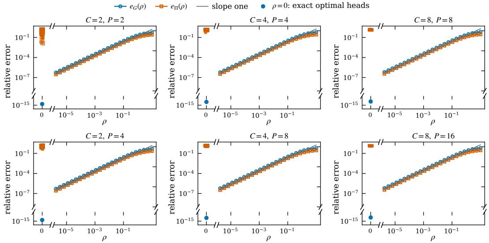  
Figure 5: Selection by a vanishing proximal regularizer (Lemma 1). Relative Gram error $e _ { G } ( \rho )$ (circles) and selection error $e _ { \Pi } ( \rho )$ (squares) in six $( C , P )$ settings, with medians and interquartile ranges over 128 instances. The gray line has slope one. $\mathrm { A t } \rho = 0$ , the circle marks exact optimal heads and the squares mark unregularized L-BFGS returns from random starts.

In networks trained with a fixed local budget, agreement with $G _ { \star }$ is best at an intermediate weight (Appendix F.4). $\mathrm { A t } \ \rho = 1 0 ^ { - 5 }$ , finite local training leaves the heads farther from the selected heads, and at large ρ the clients move away from their optima.

## D.3 CONVERGENCE TO THE BW BARYCENTER

We test Theorem 1 on 16 random fully active instances for each $C \in \{ 2 , 4 , 8 \}$ and $M \in \{ 3 , 8 \}$ whose client covariances do not commute. We set $P = 2 C$ and $\lambda _ { H } = \lambda _ { W } = 1$ Each $G _ { m }$ has a random orthogonal eigenbasis and eigenvalues drawn uniformly from $[ 0 . 4 , 4 ]$ , and we set $\Sigma _ { m } = ( G _ { m } + I _ { C } ) ^ { 2 }$ . The entries of the client means $\mu _ { m }$ and the initial head $\dot { W } _ { 0 }$ are independent standard normal. Each client has $N _ { m } = 2 C$ samples whose empirical mean and covariance equal the prescribed $\mu _ { m }$ and $\Sigma _ { m } .$ , and the aggregation weights are drawn from a symmetric Dirichlet distribution with concentration 2 per client. Figure 6 shows the median relative error $\lVert G _ { t } - G _ { \star } \rVert _ { F } / \lVert G _ { \star } \rVert _ { F }$ of the shared Gram matrix over 18 rounds, with $G _ { \star }$ obtained from a separate run of (9) to convergence.

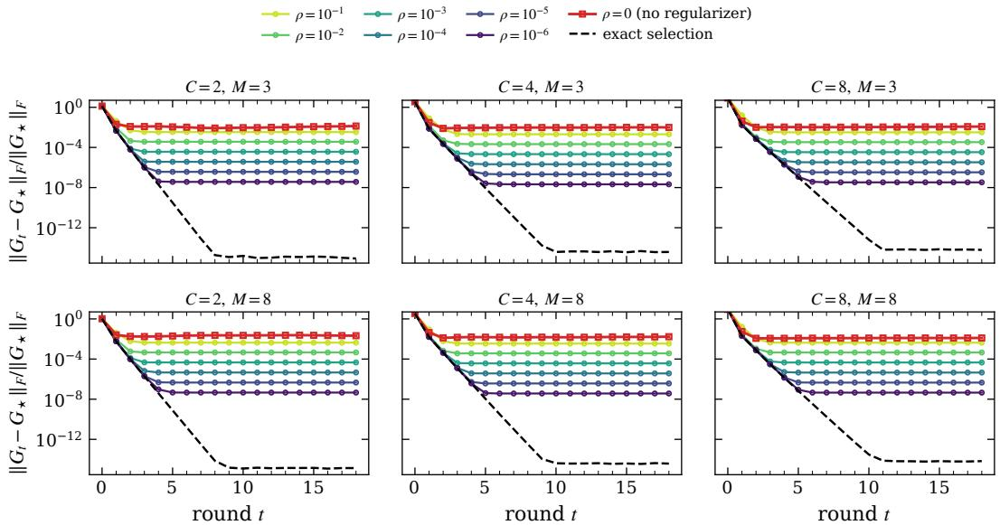  
Figure 6: Convergence to the BW barycenter (Theorem 1). Median relative error of the shared Gram matrix to $G _ { \star }$ over 16 instances in each of six problem sizes. Dashed: exact selection. Colored circles: proximal returns at $\rho = 1 0 ^ { - 1 } , \ldots , 1 0 ^ { - 6 }$ . Red squares: unregularized joint training from the broadcast head.

With exact selection, the error decreases geometrically to below $1 0 ^ { - 1 4 }$ . For six weights $\rho \in$ $\{ 1 0 ^ { - 1 } , \ldots , 1 0 ^ { - 6 } \}$ , each client minimizes the penalized objective jointly over $( W _ { m } , b , H )$ with SciPy’s trust-exact solver and analytic derivatives, starting from $\mathrm { { \bar { I I } } } _ { m } ( \bar { W } _ { t } )$ and its ridge-optimal features. The error then levels off at a value roughly proportional to $\rho .$ Unregularized joint training with Adam from the broadcast head levels off between $\stackrel { \bullet } { 9 . 8 4 } \times 1 0 ^ { - 3 }$ and $2 . 1 \bar { 3 } \times 1 0 ^ { - 2 }$ . Trained networks show the same ordering (Table 4): proximal training closely follows the exact Gram iteration, while ordinary training ends near G⋆ with a larger error.

## D.4 THE THREE TERMS OF THE GAP TO CENTRALIZED TRAINING

We test the three predictions of Proposition 1: each term is positive semidefinite, the gap vanishes exactly when the client means and covariances agree, and tr $\mathcal { M } _ { A }$ equals the BW variance of the clients’ optimal Gram matrices. By (17), this variance lies between D and 2D, where $\begin{array} { r } { D = \sum _ { m < n } \dot { p _ { m } p _ { n } } d _ { \mathrm { B W } } ^ { 2 } ( G _ { m } , G _ { n } ) } \end{array}$ is the pairwise dispersion. Figure 7 reports these checks. All panels use $\dot { \lambda } _ { H } = \lambda _ { W } = 0 . 1$ and standard-normal base client means.

Which heterogeneity produces which term. Panels (a) and (b) use two controlled sweeps with $C = 3$ and $M = 4 ,$ , each with the eight seeds {55, 56, 57, 58, 59, 60, 61, 62} at every strength s.

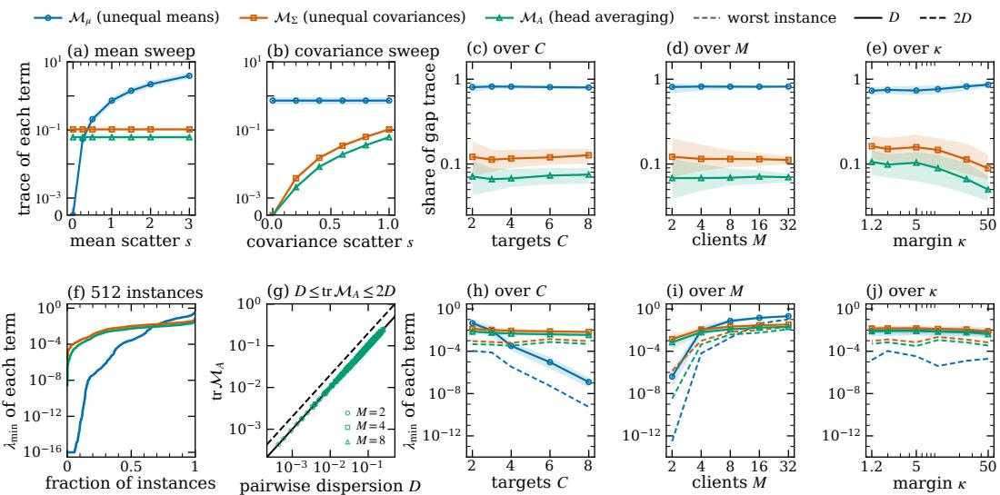  
Figure 7: The three terms of the gap $G _ { \mathrm { c e n } } - G _ { \star }$ ⋆ (Proposition 1). Blue, orange and green identify $\mathcal { M } _ { \mu } , \mathcal { M } _ { \Sigma }$ and $\mathcal { M } _ { A }$ throughout; circles, squares and triangles mark the terms in (a–e) and $( \mathrm { h - j } )$ while in (g) they distinguish $M = 2 , 4 , 8$ . Curves are medians and bands are interquartile ranges. (a, b) Trace of each term when the client means or the client covariances are varied with strength s while the other is held fixed. The vertical axis is linear below $1 0 ^ { - 3 }$ so that exact zeros are visible. (c–e) Share of the gap trace carried by each term against the number of targets $C ,$ , the number of clients M and a lower bound κ on the fully active margin. (f) Smallest eigenvalue of each term over 512 instances, sorted; numerical zeros are drawn at $1 0 ^ { - 1 6 }$ . (g) tr $\mathcal { M } _ { A }$ against the pairwise dispersion D, with the bounds D and 2D of (17). (h–j) Smallest eigenvalue of each term over the sweeps of (c–e); dashed curves show the worst of the 256 instances in each setting.

For each seed, the base covariances have random orthogonal eigenbases and eigenvalues uniform in [0.3, 3]. The weights are normalized independent uniform draws from [0.5, 1.5]. The mean sweep scales the separation of the client means by $s \in \{ 0 , 0 . 2 5 , 0 . 5 , 1 , 1 . 5 , 2 , 3 \}$ and keeps the client covariances fixed. The term $\mathcal { M } _ { \boldsymbol { \mu } }$ then grows from exactly zero at $s \ = \ 0$ to a median trace of 3.90 at $s \ : = \ : 3 ,$ , while $\mathcal { M } _ { \Sigma }$ and $\mathcal { M } _ { A }$ keep their median traces of $1 . 0 4 \times 1 0 ^ { - 1 }$ and $6 . 1 2 \times 1 0 ^ { - 2 }$ The covariance sweep moves each client covariance along $\Sigma _ { m } ( s ) = \Sigma _ { \mathrm { w i t h i n } } + s ( \Sigma _ { m } - \Sigma _ { \mathrm { w i t h i n } } )$ for $s \in \{ 0 , 0 . 2 , 0 . 4 , 0 . 6 , 0 . 8 , 1 \}$ , which keeps the client means and the weighted within-client covariance fixed. Now M and $\mathcal { M } _ { A }$ grow from zero, with traces below $2 \times 1 0 ^ { = 1 4 }$ at $s = 0 ,$ , to the same two values, and $\mathcal { M } _ { \boldsymbol { \mu } }$ keeps its median trace of $7 . 3 0 \times 1 0 ^ { - 1 }$ . Equalizing the moments of the 512 instances described below gives the same pattern: equal means remove $\mathcal { M } _ { \boldsymbol { \mu } } ,$ , equal covariances remove $\mathcal { M } _ { \Sigma }$ and $\mathcal { M } _ { A }$ , and equalizing both removes the gap. Every removed term has trace below $2 \times 1 0 ^ { - 1 4 }$

Positive semidefiniteness. Panel (f) sorts the smallest eigenvalue of each term over 512 random fully active instances, with $M \in \{ 2 , 4 , 8 \}$ clients, $C = \mathsf { \bar { P } } \in \{ 2 , 3 , 5 , 8 \}$ , randomly rotated covariances with eigenvalues drawn uniformly from [0.25, 3], and symmetric Dirichlet weights with concentration 2 per client. No eigenvalue is negative beyond rounding: the minimum over all 1536 values is $- 2 . 4 2 \overset { \cdot } { \times } 1 0 ^ { - 1 5 }$ . Sixty values of $\mathcal { M } _ { \mu }$ lie below $\mathrm { i } 0 ^ { - 1 2 }$ , and 29 of them are drawn at the floor of the panel. They belong to two-client instances with $C \geq 5$ , where the mean scatter $\Sigma _ { \mu }$ has rank one, so the trailing eigenvalues of $\phi ( \Sigma _ { \mathrm { w i t h i n } } + \Sigma _ { \mu } ) - \phi ( \Sigma _ { \mathrm { w i t h i n } } )$ are small but, for generic client means, not exactly zero. Panels $( \mathrm { h } ) \mathrm { - } ( \mathrm { j } )$ repeat the test on 256 new instances per setting while one parameter varies: the number of targets C with $M = 4$ , the number of clients M with $C = 3$ , and the lower bound κ on the fully active margin with $C = 3$ and $M = 4$ . These sweeps use the weight distribution of panel (f); the C and M sweeps also use its covariance distribution. In the last sweep, the covariance eigenvalues are drawn uniformly from $[ \kappa \lambda _ { H } \lambda _ { W } , 3 ]$ , and κ decreases from 50 to 1.2, toward the boundary of the fully active regime. The smallest eigenvalue of the worst instance stays positive in every setting; its minimum, $3 . \dot { 0 7 } \times 1 0 ^ { - 1 3 }$ , occurs for $\mathcal { M } _ { \mu }$ with two clients.

The BW variance. Panel (g) plots tr $\mathcal { M } _ { A }$ against D for the 512 instances. Every point lies between the lines D and 2D. The ratio tr $\mathcal { M } _ { A } / D$ ranges over [1.000, 1.006] and equals one for two clients. In that case the barycenter lies on the BW geodesic between $\vec { G _ { 1 } }$ and $G _ { 2 }$ , at distance $p _ { 2 } d _ { \mathrm { B W } } ( G _ { 1 } , G _ { 2 } )$ from $G _ { 1 }$ (Agueh & Carlier, 2011), so tr $\mathcal { M } _ { A } = p _ { 1 } p _ { 2 } d _ { \mathrm { B W } } ^ { 2 } ( G _ { 1 } , G _ { 2 } ) = D$ exactly. The identity (12) holds to a relative residual of at most $2 . 3 8 \times 1 0 ^ { - 1 2 }$ , and the weighted scatter of the selected heads, $\begin{array} { r } { \sum _ { m } p _ { m } ( U _ { m } ^ { \star } - W _ { \star } ) ( U _ { m } ^ { \star } - W _ { \star } ) ^ { \top } } \end{array}$ , matches $\begin{array} { r } { \mathcal { M } _ { A } = \sum _ { m } p _ { m } G _ { m } { \bf \bar { \Sigma } } - G _ { \star } } \end{array}$ to a relative residual of at most $3 . 2 4 \times 1 0 ^ { - 1 2 }$

Composition of the gap. Panels (c)–(e) show the share of the gap trace carried by each term on the instances of panels $( \mathrm { h } ) \mathrm { - } ( \mathrm { j } )$ , whose client means are standard normal. The term $\mathcal { M } _ { \mu }$ carries 73–86% of the gap trace, $\mathcal { M } _ { \Sigma }$ carries 9–16% and $\mathcal { M } _ { A }$ carries 5–11% (medians). The relative gap $\lVert G _ { \mathrm { c e n } } - G _ { \star } \rVert _ { F } / \left. G _ { \mathrm { c e n } } \right. _ { F }$ has medians between $1 . 6 8 \times 1 0 ^ { - 1 }$ and $3 . 0 \dot { 4 } \times 1 0 ^ { - \dot { 1 } }$ . In networks, removing the mean term by clientwise centering also leaves a positive gap (Appendix F.2), consistent with the remaining terms $\mathbf { \bar { \mathcal { M } } } _ { \Sigma } + \mathbf { \mathcal { M } } _ { A }$

## D.5 ONE-ROUND RECOVERY BY THE MOMENT CORRECTION

We test Proposition 2 under exact selection on the six problem sizes of Figure $^ { 6 , }$ with 32 random fully active instances per size whose client covariances do not commute. Proposition 2 predicts that the corrected clients return identical heads, so that $G _ { t }$ reaches $G _ { \mathrm { c e n } }$ after one round, while the local biases $\mu _ { m }$ average to $\mu _ { g }$ . The eigenvalues of each $G _ { m }$ are uniform in [0.4, 4], the client means are standard normal, the weights are Dirichlet, $P = 2 C$ and $\lambda _ { H } = \lambda _ { W } = 1$ . Every client returns the selected head of its corrected objective, so each round is a closed-form map and involves no solver.

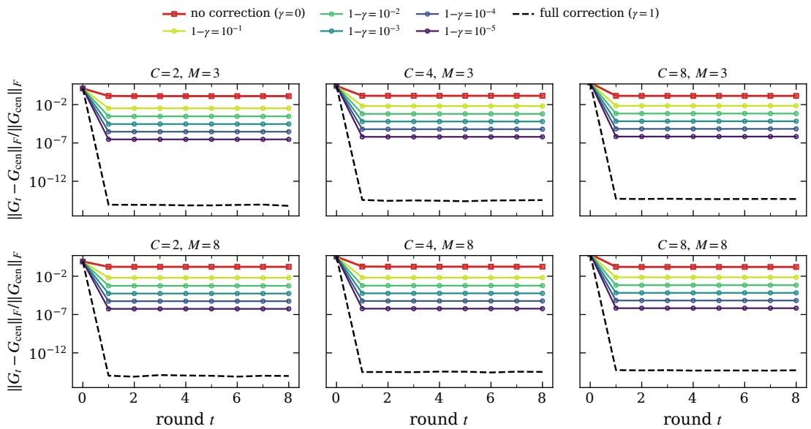  
Figure 8: One-round recovery of the centralized Gram matrix (Proposition 2). Median relative error of the shared Gram matrix to $G _ { \mathrm { c e n } }$ over 32 instances in each of six problem sizes, under exact selection. Red squares: no correction; the plateau is the gap of Proposition 1. Dashed: the correction $C _ { m }$ of (13). Colored: the scaled correction $\gamma C _ { m }$ , with deficit $1 - \gamma$ from $1 0 ^ { - 1 }$ to $1 0 ^ { - 5 }$

Without the correction, $G _ { t }$ converges to $G _ { \star }$ , and its relative distance to $G _ { \mathrm { c e n } }$ settles at the relative gap of the instance, with medians between $1 . 2 9 \times 1 0 ^ { - 1 }$ and $1 . 7 5 \times 1 0 ^ { - 1 }$ . With the correction $C _ { m } ,$ the relative distance after one round is at most $7 . 9 2 \times 1 0 ^ { - 1 5 }$ over all 192 instances. The colored curves scale the correction to $\gamma C _ { m } .$ . Because $F ( W ; T )$ is affine in T, client m then minimizes $F ( W ; ( 1 - \gamma ) \Sigma _ { m } + \gamma \Sigma _ { \mathrm { c e n } } )$ , and the remaining distance is proportional to the deficit $1 - \gamma$ from $1 0 ^ { - 1 }$ to 10−5.

A second check solves the corrected profiled objective numerically, with L-BFGS and a positive proximal weight, in a fixed instance with $M = { \dot { 4 } }$ and $C = P = 3$ . At the final weight $\rho \doteq 1 0 ^ { - 5 }$ one corrected round brings $G _ { t }$ within a relative error of $9 . 1 3 \times 1 0 ^ { - 6 }$ of $G _ { \mathrm { c e n } } .$ , and the four returned heads lie within a Frobenius distance of $3 . 3 7 \times 1 0 ^ { - 7 }$ of the first. With half of the correction, the returned heads differ by $1 . 6 6 \times 1 0 ^ { - 1 }$ , and $G _ { t }$ misses $G _ { \mathrm { c e n } }$ by a relative error of $1 . 0 3 \times 1 0 ^ { - 1 }$ . Across 512 random instances, the identity $F ( W ; \Sigma _ { m } ) + C _ { m } ( W ) \stackrel { \cdot } { = } F ( W ; \Sigma _ { \mathrm { c e n } } )$ holds with residuals of at most $3 . 3 0 \times 1 0 ^ { - 1 6 }$ in value and $\dot { 9 } . 5 1 \times 1 0 ^ { - 1 5 }$ in gradient. In trained networks, corrected proximal training approaches $G _ { \mathrm { c e n } }$ within the first few rounds (Appendix F.1).

## E DETAILS OF THE DNN EXPERIMENTAL SETUP

This appendix describes the datasets, models, federated training and evaluation used in Section 5 and Appendix F. Appendix E.5 defines the experimental settings and summarizes the main and supplementary experiments.

## E.1 DATASETS

The DNN experiments use five tabular and five image datasets; Table 1 lists their input and target dimensions, numbers of clients and sample counts. For Beijing Multi-Site Air Quality (Chen, 2017; Zhang et al., 2017), we predict $\mathrm { P M } _ { 2 . 5 }$ and $\mathrm { N O _ { 2 } }$ concentrations from $\mathrm { P M _ { 1 0 } }$ concentration, temperature, pressure, dew-point temperature, precipitation, wind speed, month and hour. The other tabular datasets are four MuJoCo environments (Swimmer, Hopper, HalfCheetah and Walker; Todorov et al., 2012), in which, following Andriopoulos et al. (2024), actions are predicted from observations. For each environment we use the first 4,000 training transitions from JAT (Gallouédec et al., 2024).

The image datasets differ in how directly they pose multivariate regression. MPIIGaze (Zhang et al., 2015) and 300W-LP (Zhu et al., 2016) are multivariate regression datasets by design, for gaze and head-pose estimation: we predict gaze pitch and yaw from eye images and head pitch, yaw and roll from face images. dSprites (Matthey et al., 2017) and 3D Shapes (Burgess & Kim, 2018) are public datasets labeled with their generative factors. Regressing these factors from images has been studied before (Schott et al., 2022), but without a standard protocol, so we choose the regressed factors and the data split: horizontal position, vertical position and scale for dSprites, and object hue, scale and orientation for 3D Shapes. We construct CIFAR-geo as a regression task: we randomly shift and zoom each CIFAR-10 (Krizhevsky, 2009) image and predict the horizontal translation, vertical translation and log scale. MuJoCo observations and action targets retain their stored scale in both training and evaluation. The targets of the other datasets are centered and scaled with pooled training statistics, in training and at evaluation.

For the main experiments, we divide each dataset among clients using two partition schemes. For CIFAR-geo, we design the client groups to have different distributions of shift and zoom. For the other nine datasets, we project each training target onto the leading eigenvector of the pooled training-target second-moment matrix, sort the training samples by this projection and divide them into equally sized groups, one per client. Both schemes give the clients different target means and covariances.

The sample counts in Table 1 are totals over all clients. In CIFAR-geo, each client holds about 3,000 training samples, and the test samples are split evenly at random, 750 per client. In the other nine datasets, every client holds the same number of training samples. In the other four image datasets, test samples are assigned by their target projections to the nearest client training interval, giving test sets of different sizes. This target-based assignment provides an oracle evaluation protocol.

All datasets are used under their published terms. Beijing Multi-Site Air Quality is released under CC BY 4.0. Apache 2.0 covers dSprites, 3D Shapes and the JAT dataset, from which we take the MuJoCo transitions. MPIIGaze is released under CC BY-NC-SA 4.0 for non-commercial scientific use. 300W-LP is synthesized from 300-W, whose data are provided for research purposes only. The official CIFAR-10 page states no license and asks users to cite Krizhevsky (2009).

Table 1: Datasets and sample counts for the main DNN experiments. Test error is reported only for the image datasets (Appendix F.7).
<table><tr><td>Dataset</td><td>Input dimension</td><td>Target dimension</td><td>Clients</td><td>Training samples</td><td>Test samples</td></tr><tr><td colspan="6">Tabular datasets</td></tr><tr><td>Beijing</td><td>8</td><td>2</td><td>4</td><td>9,000</td><td></td></tr><tr><td>Swimmer</td><td>8</td><td>2</td><td>4</td><td>4,000</td><td></td></tr><tr><td>Hopper</td><td>11</td><td>3</td><td>4</td><td>4,000</td><td></td></tr><tr><td>HalfCheetah</td><td>17</td><td>6</td><td>4</td><td>4,000</td><td></td></tr><tr><td>Walker</td><td>17</td><td>6</td><td>4</td><td>4,000</td><td></td></tr><tr><td colspan="6">Image datasets</td></tr><tr><td>MPIIGaze</td><td> $3 6 \times 6 0 \times 1$ </td><td>2</td><td>8</td><td>12,000</td><td>3,000</td></tr><tr><td>300W-LP</td><td> $6 4 \times 6 4 \times 3$ </td><td>3</td><td>8</td><td>12,000</td><td>3,000</td></tr><tr><td>dSprites</td><td> $6 4 \times 6 4 \times 1$ </td><td>3</td><td>8</td><td>12,000</td><td>3,000</td></tr><tr><td>3D Shapes</td><td> $6 4 \times 6 4 \times 3$ </td><td>3</td><td>8</td><td>12,000</td><td>3,000</td></tr><tr><td>CIFAR-geo</td><td> $4 0 \times 4 0 \times 3$ </td><td>3</td><td>4</td><td>12,000</td><td>3,000</td></tr></table>

## E.2 MODELS

The main experiments use a residual MLP (ResMLP) for the tabular datasets and ResNet-18 (He et al., 2016) for the image datasets. The ResMLP follows the architecture of Ma et al. (2025), with three residual blocks of width 1024 and PReLU activations (He et al., 2015). All networks are trained from scratch and output a 512-dimensional feature through a linear layer with no activation.

Architecture comparisons also use ResNet-34 (He et al., 2016) and a residual CNN implemented as a ResNet-18 variant. The residual CNN has four stages of two basic blocks with 64, 128, 256 and 512 channels. It replaces ResNet-18’s BatchNorm with eight-group GroupNorm (Wu & He, 2018) and its $7 \times 7$ stride-2 stem and max pooling with a $3 \times 3$ stride-1 stem. The first block of each of the last three stages downsamples with stride 2. For ResNet-18 and ResNet-34, the classification layer is replaced by a 512-to-512 linear feature projection after global average pooling. The residual CNN uses the same pooling and projection.

## E.3 FEDERATED TRAINING

Unless stated otherwise, all DNN experiments share the round protocol, local objective and optimizer below; the four training procedures differ only in the terms added to the objective. In each round, all clients receive the shared head $( W _ { t } , b _ { t } )$ , train it together with their private backbone, and upload the resulting head. The server averages these heads with weights $p _ { m } = N _ { m } / N$ . Each backbone and any BatchNorm running statistics remain private throughout training. The main experiments start clients from the same randomly initialized backbone and use eight communication rounds and $E = 4 0 0 0$ local epochs per round. Appendix F.3 varies $E ,$ and Appendix F.6 also studies full-model averaging.

Training uses a minibatch version of (1), with $H _ { m }$ given by the network features, $\lambda _ { H } = \lambda _ { W } = 0 . 0 1$ and zero optimizer weight decay. The head bias is unregularized. The fully active condition $\lambda _ { \operatorname* { m i n } } ( \Sigma _ { m } ) > \lambda _ { H } \lambda _ { W }$ holds for every client in the reported experiments: the smallest client covariance eigenvalue is $9 . 1 1 \times 1 0 ^ { - 3 }$ , compared with $\lambda _ { H } \lambda _ { W } = 1 0 ^ { - 4 }$

The main experiments compare four training procedures. Ordinary training optimizes this objective. Proximal training adds $\rho \| \boldsymbol { W } - \boldsymbol { W _ { t } } \| _ { F } ^ { 2 } / 2$ with $\rho = 1 0 ^ { - 3 }$ to approximate the selection rule of Lemma 1. Corrected ordinary training adds the head-only moment correction $C _ { m } ( W )$ in (13), computed from client and pooled training-target moments. Corrected proximal training adds both terms.

The optimizer is AdamW (Loshchilov & Hutter, 2019), reinitialized for each client’s local training in every round. Its learning rate follows a cosine schedule from $1 0 ^ { - 3 } ~ \mathrm { t o } ~ 1 0 ^ { - 5 }$ within each round. We use shuffled minibatches of size 256 and clip the global gradient norm at 5.

## E.4 EVALUATION

We evaluate each run by the geometry of the shared head, the local fit and prediction error of the trained models, and display the results as curves over rounds and as ellipses.

Head geometry and dynamics. The theoretical targets $G _ { \star }$ and $G _ { \mathrm { c e n } }$ are computed from trainingtarget moments, client weights and regularization. The procedures without correction are compared with $G _ { \star }$ , and the corrected procedures with $G _ { \mathrm { c e n } }$ . For Gram matrices G and $G ^ { \prime }$ , we report relative matrix error and direction error:

$$
e _ { F } ( G , G ^ { \prime } ) = \frac { | | G - G ^ { \prime } | | _ { F } } { | | G ^ { \prime } | | _ { F } } , \qquad d ( G , G ^ { \prime } ) = \left| \left| \frac { G } { | | G | | _ { F } } - \frac { G ^ { \prime } } { | | G ^ { \prime } | | _ { F } } \right| \right| _ { F } .
$$

Endpoint errors compare the final shared Gram $G _ { 8 }$ with these fixed targets. For training without correction, trajectory error compares $G _ { t }$ with the exact recursion (9) started from the same $G _ { 0 }$ taking the median $e _ { F }$ over rounds 1–8 for each run. Table 4 reports medians of these run-level quantities. For these runs, the weighted distance from the uploaded heads to the selected heads is

$$
\delta _ { t } = \sum _ { m } p _ { m } \| \widetilde { W } _ { m , t } - \Pi _ { m } ( W _ { t } ) \| _ { F } , \qquad \delta _ { \mathrm { l a s t } } = \delta _ { 7 } .
$$

Local fitting and prediction. For training without correction, we evaluate the original objective (1) on each trained local model in evaluation mode before server averaging and report the relative gap $( \mathcal { L } _ { m } - \mathcal { L } _ { m } ^ { \star } ) / \mathcal { L } _ { m } ^ { \star }$ . For the eigenvalues $s _ { i }$ of $\Sigma _ { m }$ , the regression-UFM optimum (Andriopoulos et al., 2024) gives

$$
\mathcal { L } _ { m } ^ { \star } = \sum _ { i : s _ { i } > \lambda _ { H } \lambda _ { W } } \left( \sqrt { \lambda _ { H } \lambda _ { W } s _ { i } } - \frac { \lambda _ { H } \lambda _ { W } } { 2 } \right) + \frac { 1 } { 2 } \sum _ { i : s _ { i } \leq \lambda _ { H } \lambda _ { W } } s _ { i } .
$$

Prediction uses the final shared head with each client’s own backbone. MSE averages squared errors over samples and output coordinates, weighting each client by the number of samples in its evaluated subset; it excludes all penalties and correction terms.

Curves and geometric displays. The round curves show means of per-seed errors with one sample standard deviation, using the same seeds across compared procedures. Geometric displays use seed 0 and draw the boundary of $\mathcal { E } ( G ) = \{ G ^ { 1 / 2 } u : \| u \| _ { 2 } \leq 1 \}$ , with common coordinates and equal axis units. HalfCheetah and Walker use the first three target coordinates of their six-dimensional Grams; all reported errors use the full matrices.

## E.5 EXPERIMENT OVERVIEW

We call a dataset paired with a network a setting. The main experiments use ten settings, pairing each tabular dataset with ResMLP and each image dataset with ResNet-18. Every setting is trained with the four procedures of Appendix E.3 and five seeds {0, 1, 2, 3, 4}; Table 2 shows this coverage.

The supplementary comparisons in Table 3 use three seeds {0, 1, 2}. Mean centering and the localepoch and proximal-weight sweeps use the same ten settings. The architecture comparisons add the residual CNN and ResNet-34 on the five image datasets; the data-size comparison enlarges the training sets of CIFAR-geo and 3D Shapes; and the full-model comparison averages the backbones as well as the heads on the five tabular datasets. The prediction comparison uses the five image settings. Comparisons between training procedures pair runs by setting, seed, feature and head penalties, and local-epoch budget.

The alignment experiments in Appendix F.5, which Table 3 does not list, impose the selection rule by aligning each trained head to the broadcast head instead of adding the proximal regularizer. They compare aligned, proximal and ordinary training on six settings (Beijing, Swimmer, Hopper, HalfCheetah, 3D Shapes and CIFAR-geo), with five seeds per setting and three seeds for the moment-corrected comparison, and measure the effect of alignment on a single aggregation in 60 runs.

Table 2: Main DNN experiments. Coverage by setting and procedure in Appendix F.1.
<table><tr><td colspan="5"> $\checkmark \colon$  experiment repeated with five random seeds {0, 1, 2, 3, 4}</td></tr><tr><td></td><td colspan="2">Without correction</td><td colspan="2">With moment correction</td></tr><tr><td>Setting</td><td>Ordinary</td><td>Proximal</td><td>Ordinary</td><td>Proximal</td></tr><tr><td>Tabular datasets</td><td></td><td></td><td></td><td></td></tr><tr><td>Beijing</td><td>√</td><td>√</td><td>√</td><td>√</td></tr><tr><td>Swimmer</td><td>√</td><td>√</td><td>√</td><td>√</td></tr><tr><td>Hopper</td><td>√</td><td>√</td><td>√</td><td>√</td></tr><tr><td>HalfCheetah</td><td>√</td><td>√</td><td>√</td><td>V</td></tr><tr><td>Walker</td><td>√</td><td>√</td><td>√</td><td>√</td></tr><tr><td>Image datasets</td><td></td><td></td><td></td><td></td></tr><tr><td>MPIIGaze</td><td>√</td><td>√</td><td>√</td><td>√</td></tr><tr><td>300W-LP</td><td>√</td><td>√</td><td>√</td><td>√</td></tr><tr><td>dSprites</td><td>√</td><td>√</td><td>√</td><td>√</td></tr><tr><td>3D Shapes</td><td>√</td><td>√</td><td>√</td><td>√</td></tr><tr><td>CIFAR-geo</td><td>√</td><td>√</td><td>√</td><td>√</td></tr></table>

The first five settings use ResMLP; the five image settings use ResNet-18. Each procedure uses eight rounds and $E = 4 0 0 0$ . Proximal training adds $\rho \| \boldsymbol { W } - \mathbf { \check { W } } _ { t } \| _ { F } ^ { 2 } / 2$ with $\rho = 1 0 ^ { - 3 }$ . Moment correction adds $C _ { m }$ from Proposition 2.

Table 3: Supplementary DNN experiments. Coverage by setting and condition; sweep columns give coverage at every parameter value.
<table><tr><td colspan="16">√: experiment repeated with three random seeds {0, 1, 2}</td></tr><tr><td></td><td rowspan="2">F.2</td><td rowspan="2">F.3</td><td rowspan="2">F.4</td><td colspan="8"></td><td rowspan="2">F.7</td></tr><tr><td></td><td></td><td>CNN</td><td></td><td></td><td>F.6</td><td>Full</td><td>Full</td><td>Full</td></tr><tr><td>Setting</td><td>Means</td><td>E</td><td>ρ</td><td>CNN</td><td> $+ C _ { m }$ </td><td></td><td>RN34</td><td>Data</td><td> $E = 4 0 0 0$ </td><td> $E = 4 0 0$ </td><td> $+ C _ { m }$ </td><td>Predict</td></tr><tr><td colspan="10">Tabular datasets</td><td></td><td></td><td></td></tr><tr><td>Beijing</td><td>√</td><td>V</td><td>&gt;&gt;</td><td></td><td></td><td></td><td></td><td>V</td><td></td><td></td><td></td><td></td></tr><tr><td>Swimmer</td><td>V</td><td>V</td><td></td><td></td><td></td><td></td><td></td><td></td><td>V</td><td>&gt;&gt;</td><td>&gt;&gt;</td><td></td></tr><tr><td>Hopper</td><td>V</td><td>√</td><td>√</td><td></td><td></td><td></td><td></td><td></td><td>V</td><td>V</td><td>V</td><td></td></tr><tr><td>HalfCheetah</td><td>V</td><td>√ V</td><td>V √</td><td></td><td></td><td></td><td></td><td></td><td>V V</td><td>V r</td><td>V</td><td></td></tr><tr><td>Walker</td><td>V</td><td></td><td></td><td></td><td></td><td></td><td></td><td></td><td></td><td></td><td>V</td><td></td></tr><tr><td colspan="10">Image datasets</td><td></td><td></td><td></td></tr><tr><td>MPIIGaze</td><td>&gt;&gt;</td><td>&gt;&gt;</td><td>&gt;&gt;</td><td>&gt;&gt;</td><td></td><td>&gt;&gt;</td><td>&gt;&gt;</td><td></td><td></td><td></td><td></td><td>v&gt;</td></tr><tr><td>300W-LP</td><td></td><td></td><td></td><td></td><td></td><td></td><td></td><td>1</td><td></td><td></td><td></td><td></td></tr><tr><td>dSprites</td><td>√ V</td><td>V V</td><td>V r</td><td>V</td><td></td><td>&gt;&gt;</td><td>√ V</td><td>&gt;</td><td></td><td></td><td></td><td>&gt;&gt;</td></tr><tr><td>3D Shapes</td><td>V</td><td>√</td><td>r</td><td>&gt;&gt;</td><td></td><td>V</td><td>√</td><td>√</td><td></td><td></td><td></td><td>√</td></tr><tr><td>CIFAR-geo</td><td></td><td></td><td></td><td></td><td></td><td></td><td></td><td></td><td></td><td></td><td></td><td></td></tr></table>

An em dash marks a setting outside that comparison. Means: clientwise target centering. E: seven local-epoch budgets. ρ: seven proximal weights. CNN and RN34: residual CNN and ResNet-34. CNN + $C _ { m } \colon$ residual CNN with moment correction at $E = 4 0 0 0$ . Data: larger training sets with $E = 1 0 0 0 .$ Full: backbone and head averaging at the stated budget. Full $+ { \cal C } _ { m } \colon$ full-model averaging with moment correction at $E = 4 0 0 0 .$ Predict: training and test MSE for ordinary, proximal and corrected proximal training.

Compute. Computation used NVIDIA GH200 GPUs (GH200 120GB model; 97,871 MiB of visible device memory). Each run used one GPU, with up to eight independent runs sharing a GPU. We estimate 1,415 occupied GPU-hours for the 764 successful runs underlying the reported DNN results by merging their execution intervals on each GPU, including intervals shared with other runs. Experiment configurations, manifests, results and figure-source hashes are retained in the experimental records.

## F SUPPLEMENTARY DNN EXPERIMENTAL RESULTS

This appendix reports the DNN comparisons behind Section 5 and their extensions. Appendix F.1 compares ordinary and proximal training with and without moment correction. Appendices F.2–F.4 test the gap decomposition and the dependence on the local budget and the proximal weight, and $\mathsf { A p - }$ pendix F.5 imposes the selection rule by alignment instead of the proximal regularizer. Appendix F.6 extends the comparison to other architectures, larger training sets and full-model averaging, and $\mathsf { A p - }$ pendix F.7 examines test error, which lies outside the UFM analysis. Appendix E.5 lists the settings and seeds of each comparison.

## F.1 SELECTION AND MOMENT CORRECTION

We first compare ordinary and proximal training across all main experiments, measuring agreement with $G _ { \star }$ without correction and with $G _ { \mathrm { c e n } }$ under moment correction. Table 4 summarizes these comparisons. Without correction, the proximal regularizer improves endpoint agreement with $G _ { \star }$ in every pair. It also reduces the median trajectory error relative to the exact iteration and the median distance to the selected heads.

Table 4: Selection and moment correction. Medians over the same 50 dataset–seed combinations. Without correction, endpoint errors compare with $G _ { \star }$ and trajectory errors with the exact iteration from each run’s $G _ { 0 }$ . All corrected errors compare with $G _ { \mathrm { c e n } }$ . Bold marks the smaller value in each column.
<table><tr><td></td><td colspan="3">Without correction</td><td colspan="3">With moment correction</td></tr><tr><td>Training</td><td>Endpoint eF</td><td>Trajectory eF</td><td> $\delta _ { \mathrm { l a s t } }$ </td><td>Round 1 d</td><td>Round 1  $. \ e F$ </td><td>Round 8  $e _ { F }$ </td></tr><tr><td>Ordinary</td><td> $1 . 6 3 \times 1 0 ^ { - 2 }$ </td><td> $3 . 4 4 \times 1 0 ^ { - 2 }$ </td><td> $1 . 8 5 \times 1 0 ^ { - 1 }$ </td><td> $8 . 3 5 \times 1 0 ^ { - 2 }$ </td><td> $3 . 0 8 \times 1 0 ^ { - 1 }$ </td><td> $5 . 0 6 \times 1 0 ^ { - 3 }$ </td></tr><tr><td>Proximal</td><td> $\mathbf { 2 . 9 0 \times 1 0 ^ { - 4 } }$ </td><td> $\mathbf { 3 . 3 9 \times 1 0 ^ { - 4 } }$ </td><td> $\mathbf { 4 . 4 7 \times 1 0 ^ { - 3 } }$ </td><td> $\mathbf { 4 . 2 1 \times 1 0 ^ { - 3 } }$ </td><td> $\mathbf { 2 . 2 9 \times 1 0 ^ { - 2 } }$ </td><td> $\mathbf { 7 . 0 8 \times 1 0 ^ { - 5 } }$ </td></tr></table>

With moment correction, proximal training reaches a smaller residual to $G _ { \mathrm { c e n } }$ in the first round and improves further over subsequent rounds. Figures 3 and 9 show these dynamics for all ten settings under proximal training. Appendix D.5 reports the corresponding UFM check under exact selection.

Figure 10 gives the ordinary-training counterpart to Figures 3 and 9, using the same seeds, axis limits and geometric scales. Figure 11 directly compares ordinary and proximal training against $G _ { \star }$ without correction and against $G _ { \mathrm { c e n } }$ with correction.

## F.2 REMOVING THE MEAN CONTRIBUTION

To test the gap decomposition of Proposition 1, we remove the between-client mean term by centering each client’s targets and measure the remaining gap under ordinary training. Centering retains each client’s covariance. We evaluate this change on all ten settings, using ResMLP for the tabular datasets and ResNet-18 for the image datasets, with three seeds per setting. The pooled reference then becomes $G _ { \mathrm { w i t h i n } } .$ , while $G ,$ ⋆ remains unchanged. In all 30 dataset–seed combinations, $G _ { \mathrm { w i t h i n } } - G _ { 8 }$ is positive definite, consistent with a remaining covariance and averaging gap. The median direction error to $G _ { \star }$ is $9 . 4 8 \times 1 0 ^ { - 3 }$ , and the median ratio of the observed gap trace to $\operatorname { t r } ( \mathcal { M } _ { \Sigma } + \mathcal { M } _ { A } )$ is 1.19 (Figure 12).

Centering removes only the mean term, so the covariance and averaging terms remain together in this comparison. Two of the 30 runs have a direction error to $G _ { \star }$ above 0.05, and in four runs this error differs from that of the uncentered control by more than 0.02.

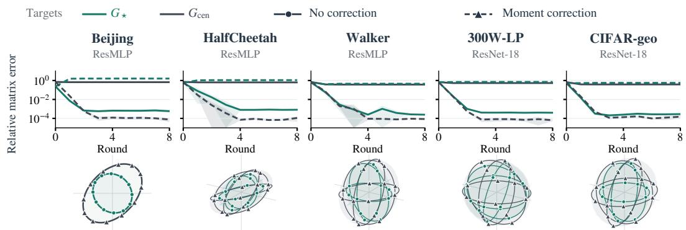  
Figure 9: Proximal training in the other five settings. The design matches Figure 3; sixdimensional settings use coordinates 1–3. All runs use $\rho = 1 0 ^ { - 3 }$

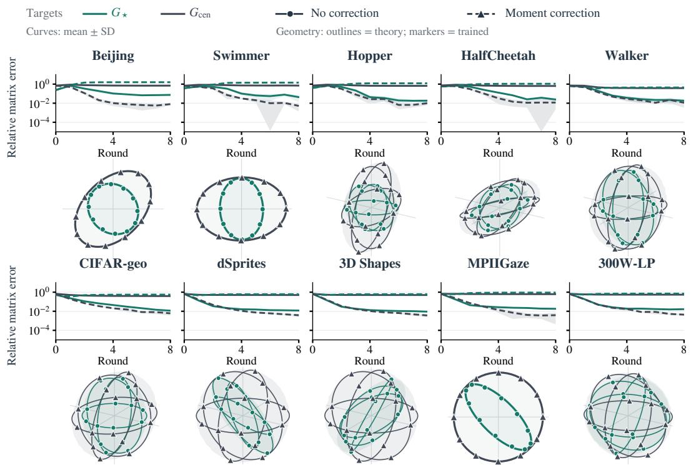  
Figure 10: Ordinary training with and without moment correction. The design matches Figures 3 and 9, with $\rho = 0 .$ . Curves show seed means ±1 standard deviation; geometry uses seed 0. Both variants retain the feature and head penalties.

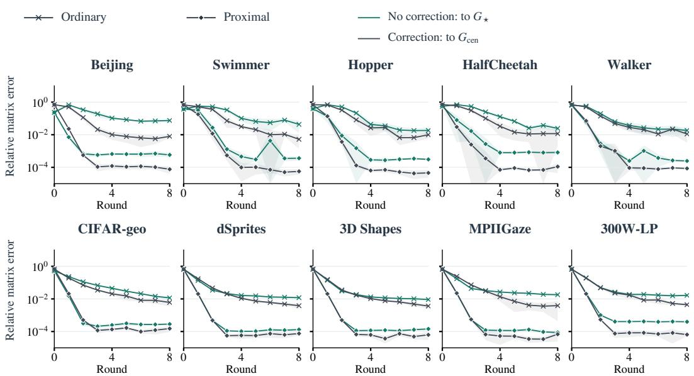  
Figure 11: Direct comparison of ordinary and proximal training. Green curves measure training without correction against $G _ { \star } ;$ graphite gray curves measure training with moment correction against $G _ { \mathrm { c e n } } .$ . Within each color, crosses and filled diamonds denote ordinary and proximal training; both use solid lines. Curves use the same five seeds per setting as Figures 3 and 10, with means and one-standard-deviation bands. All panels share their axis limits.

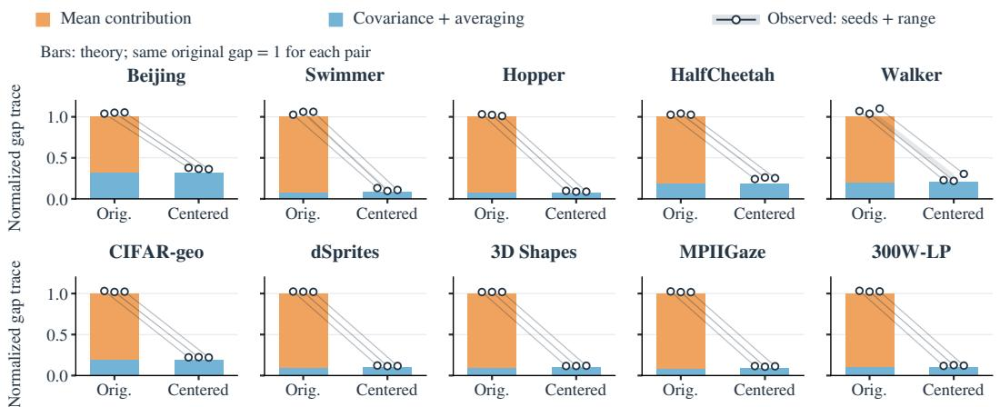  
Figure 12: Removing the mean contribution leaves a residual gap. Stacked bars separate the predicted mean contribution $\operatorname { t r } ( \mathcal { M } _ { \mu } )$ from $\operatorname { t r } ( \mathcal { M } _ { \Sigma } + \mathcal { M } _ { A } )$ before and after centering each client’s targets. Both conditions use the original theoretical gap trace as denominator, computed per seed before averaging the components. Open markers show all three paired seeds, joined by thin lines; pale shading spans their range. Their observed gaps are tr $\left( G _ { \mathrm { c e n } } - \mathbf { \bar { G } } _ { 8 } \right)$ before centering and t $\cdot ( G _ { \mathrm { w i t h i n } } - G _ { 8 } )$ afterward, on the same scale.

## F.3 LOCAL EPOCHS AND THE ENDPOINT

To see how close ordinary training comes to $G _ { \star }$ as local training grows, we vary the number of local epochs E per round. The local-budget sweep covers all ten settings with $E \in$ {50, 100, 200, 400, 1000, 2000, 4000} and seeds {0, 1, 2}, keeping the other training parameters fixed. We compare the direction error of the server Gram $G _ { 8 }$ to $\bar { G } _ { \star }$ across local training budgets (Figure 13). The median over setting-level medians is 4. $5 7 \times 1 0 ^ { - 1 }$ at $E = 5 0$ $1 . 7 6 \times 1 0 ^ { - 1 }$ at $E = 4 0 0$ , 4 $. . 3 3 \times 1 0 ^ { - 2 }$ at $E = 1 0 0 0$ and $1 . 3 9 \times 1 0 ^ { - 2 }$ at $E = 4 0 0 0$ . The first tested budget with median direction error below 0.1 is $E = 4 0 0$ for Beijing and CIFAR-geo, $E = 1 0 0 0$ for Walker and the other four image settings, and $E = 2 0 0 0$ for Swimmer, Hopper and HalfCheetah. All budgets use eight rounds, so total local training grows with E, by a factor of 80 from $E = 5 0$ to $E = 4 0 0 0$ A similar qualitative trend toward the BW prediction is observed in the profiled UFM experiments in Appendix G.4, although the update rules and evaluation protocols differ.

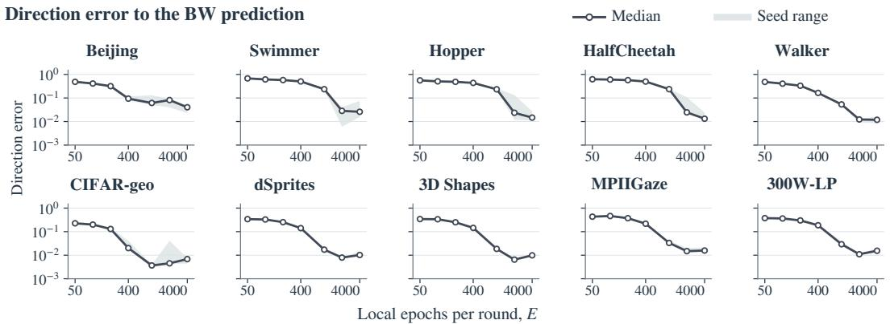  
Figure 13: Local epochs and the endpoint. Direction error $d ( G _ { 8 } , G _ { \star } )$ versus local epochs $E ,$ with shared logarithmic axes. Curves are medians over seeds $\{ 0 , 1 , 2 \}$ and bands span these seeds. Top row: ResMLP; bottom row: ResNet-18.

## F.4 DEPENDENCE ON THE PROXIMAL WEIGHT

To see how the proximal weight affects agreement with the selection rule and with the local optima, we vary ρ and measure the endpoint error, the distance to the selected heads and the relative original-objective gap. The weight sweep uses all ten settings with seeds {0, 1, 2}, giving the same 30 dataset–seed combinations at every weight. It compares $\rho ~ = ~ 0$ with $\rho \in$ $\{ 1 0 ^ { - 5 } , 1 0 ^ { - 4 } , 1 0 ^ { - 3 } , 1 0 ^ { - 2 } , 1 0 ^ { - 1 } , 1 \}$ , and every run uses eight rounds and $\bar { E } = 4 0 0 0$ local epochs.

$\mathrm { A t } \ \rho = 1 0 ^ { - 3 }$ , the distance to the selected heads and the endpoint relative matrix error $e _ { F } ( G _ { 8 } , G _ { \star } )$ both decrease relative to $\rho = 0$ in all 30 dataset–seed combinations. The median final distance $\delta _ { \mathrm { l a s t } }$ falls from $1 . 9 1 \times 1 0 ^ { - 1 } \mathrm { { t o } 5 . 3 3 \times 1 0 ^ { - 3 } }$ , while the median relative original-objective gap rises from $1 . 4 3 \times 1 0 ^ { - 5 }$ to $4 . 0 5 \times 1 0 ^ { - 5 }$ . Increasing $\rho$ further moves the clients away from their unpenalized optima and worsens endpoint agreement (Table 5, Figure 14). $\operatorname { A t } \rho = \mathrm { \dot { 1 } 0 ^ { - 5 } }$ , the median $e _ { F }$ is $7 . 3 8 \times 1 0 ^ { - 3 }$ , compared with $1 . { \check { 7 } } 1 \times 1 0 ^ { - 2 }$ at $\rho = 0$ and $3 . 0 8 \times 1 0 ^ { - 4 }$ at $\rho = 1 0 ^ { - 3 }$ . In Lemma 1, the selected head arises from minimizing each penalized objective globally and then letting $\rho \downarrow 0 .$ whereas with finite local training a very small weight has a weaker effect. The medians of $\delta _ { \mathrm { l a s t } }$ and $e _ { F }$ are therefore U-shaped in $\rho ,$ with minima at $\rho \stackrel { - } { = } 1 0 ^ { - 3 }$ (Table 5).

Table 5: Proximal weight and local fitting. Medians at the final round over the same 30 dataset– seed combinations at each weight. Relative gaps use the original loss without the proximal regularizer and first take the median across clients. Bold marks the smallest value in each column.
<table><tr><td>Proximal weight ρ</td><td>Distance to selected heads  $\delta _ { \mathrm { l a s t } }$ </td><td>Relative original-objective gap</td><td> $e _ { F } ( G _ { 8 } , G _ { \star } )$ </td></tr><tr><td>0</td><td> $1 . 9 1 \times 1 0 ^ { - 1 }$ </td><td> $\mathbf { 1 . 4 3 \times 1 0 ^ { - 5 } }$ </td><td> $1 . 7 1 \times 1 0 ^ { - 2 }$ </td></tr><tr><td> $1 0 ^ { - 5 }$ </td><td> $1 . 1 9 \times 1 0 ^ { - 1 }$ </td><td> $1 . 4 9 \times 1 0 ^ { - 5 }$ </td><td> $7 . 3 8 \times 1 0 ^ { - 3 }$ </td></tr><tr><td> $1 0 ^ { - 4 }$ </td><td> $3 . 7 3 \times 1 0 ^ { - 2 }$ </td><td> $1 . 5 3 \times 1 0 ^ { - 5 }$ </td><td> $9 . 1 4 \times 1 0 ^ { - 4 }$ </td></tr><tr><td> $1 0 ^ { - 3 }$ </td><td> $\mathbf { 5 . 3 3 \times 1 0 ^ { - 3 } }$ </td><td> $4 . 0 5 \times 1 0 ^ { - 5 }$ </td><td> $\mathbf { 3 . 0 8 \times 1 0 ^ { - 4 } }$ </td></tr><tr><td> $1 0 ^ { - 2 }$ </td><td> $3 . 3 1 \times 1 0 ^ { - 2 }$ </td><td> $1 . 4 0 \times 1 0 ^ { - 3 }$ </td><td> $4 . 1 7 \times 1 0 ^ { - 3 }$ </td></tr><tr><td> $1 0 ^ { - 1 }$ </td><td> $1 . 3 2 \times 1 0 ^ { - 1 }$ </td><td> $1 . 8 1 \times 1 0 ^ { - 2 }$ </td><td> $4 . 2 6 \times 1 0 ^ { - 2 }$ </td></tr><tr><td>1</td><td> $3 . 5 6 \times 1 0 ^ { - 1 }$ </td><td> $1 . 5 7 \times 1 0 ^ { - 1 }$ </td><td> $3 . 8 0 \times 1 0 ^ { - 1 }$ </td></tr></table>

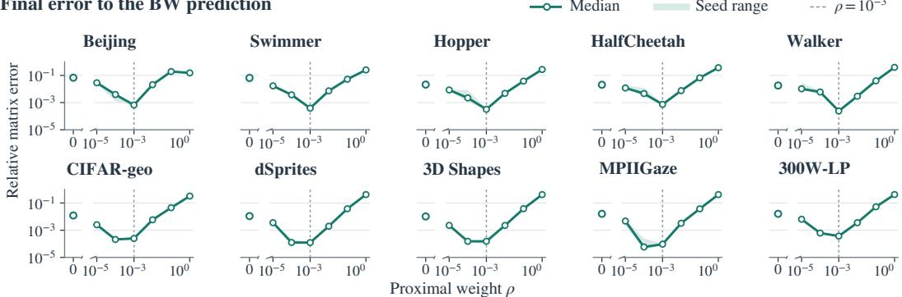  
Figure 14: Weight of the proximal regularizer. Endpoint relative matrix error $e _ { F } ( G _ { 8 } , G _ { \star } )$ with $E = 4 0 0 0$ . In each setting, curves are medians over seeds {0, 1, 2} and pale bands span these seeds. The zero-weight baseline is separate from the positive logarithmic axis; dashed guides mark $\rho = 1 0 ^ { - 3 }$

## F.5 SELECTION BY ALIGNMENT

Besides the proximal regularizer, the selection rule can be imposed by aligning each trained head to the broadcast head. We use this second implementation to examine (1) whether the endpoint again reaches $G _ { \star } , ( 2 )$ whether moment correction still recovers $G _ { \mathrm { c e n } }$ , and (3) how much averaging heads in mismatched coordinates raises the training objective. Each round has two stages: local training followed by an orthogonal alignment to the broadcast head. Local training uses the objective in Appendix E.3 with $\rho = 0$ , either with or without moment correction. Let $\widehat { W } _ { m , t }$ and $\widehat { h } _ { m , t } ( \boldsymbol { x } )$ be the resulting head and feature vector. Client m computes

$$
\begin{array} { r l } & { \quad Q _ { m , t } \in \underset { Q \in \mathbb R ^ { P \times P } \colon Q ^ { \top } Q = I _ { P } } { \arg \operatorname* { m i n } } \| \widehat { W } _ { m , t } Q - W _ { t } \| _ { F } ^ { 2 } , } \\ & { \widetilde { W } _ { m , t } = \widehat { W } _ { m , t } Q _ { m , t } , \qquad \widetilde { h } _ { m , t } ( x ) = Q _ { m , t } ^ { \top } \widehat { h } _ { m , t } ( x ) . } \end{array}
$$

The client applies the feature transformation to its final linear feature layer, including its bias, and retains that layer for the next round. The head bias is unchanged by alignment. This joint transformation preserves the local predictions, head Gram matrix and feature and head penalties. The server then averages the aligned heads and their biases with weights $p _ { m } = N _ { m } / N$

The implementation computes the aligned head from $C \times C$ Gram matrices and obtains $Q _ { m , t }$ by SVD-based orthogonal completion. When both the returned and broadcast heads have full row rank, the aligned head is the unique head with the observed Gram matrix that is closest to $W _ { t }$ in Frobenius norm, by the projection formula in Appendix A.2. When local training reaches the UFM-optimal Gram $G _ { m }$ , this gives the selected head ${ \bar { \Pi } } _ { m } ( W _ { t } )$ in Lemma 1(i).

Geometry over communication rounds. We compare ordinary, proximal $( \rho = 1 0 ^ { - 3 } )$ and aligned training on six settings: Beijing, Swimmer, Hopper and HalfCheetah with ResMLP, and 3D Shapes and CIFAR-geo with ResNet-18. Each setting uses all five seeds {0, 1, 2, 3, 4}, giving 30 matched comparisons. Runs use eight rounds and $E = \overline { { 4 0 0 0 } }$ local epochs, with the other training parameters from Appendix E.3. Alignment reduces the distance to the selected heads, the trajectory error and the endpoint error to $G _ { \star }$ in all 30 comparisons with ordinary training, and brings the median endpoint error to $1 . 1 0 \times 1 0 ^ { - 4 }$ , compared with $3 . 2 4 \times 1 0 ^ { - 4 }$ under proximal training and $1 . 8 6 \times 1 0 ^ { - 2 }$ under ordinary training (Table 6). Relative to proximal training, alignment reduces trajectory error in all 30 comparisons and endpoint error to $G _ { \star }$ in 29.

The moment-corrected comparison uses the same six settings with seeds {0, 1, 2}, giving 18 matched comparisons. Under exact UFM optimization, the corrected local optima share $G _ { \mathrm { c e n } } .$ , and alignment to the common broadcast selects the same head at every client, which yields the one-round recovery in Proposition 2. In the trained networks, corrected alignment reaches a median relative error of $\bf { 8 . 3 8 \times 1 0 ^ { - 5 } }$ to $G _ { \mathbf { c e n } }$ after the first round, whereas corrected proximal training

needs three rounds to reach a comparable error $( 2 . 3 8 \times 1 0 ^ { - 2 } , 6 . 5 4 \times 1 0 ^ { - 4 }$ and $9 . 8 4 \times 1 0 ^ { - 5 }$ after rounds 1, 2 and 3).  
Table 6: Alignment, proximal training and ordinary training. Medians over 30 matched dataset– seed combinations without correction and 18 with moment correction. The distance $\delta _ { \mathrm { l a s t } }$ and trajectory error are defined in Appendix E.4. Without correction, endpoint error compares $G _ { 8 }$ with $G _ { \star }$ ; corrected errors compare $G _ { t }$ with $G _ { \mathrm { c e n } }$ . Bold marks the smallest value in each column.
<table><tr><td rowspan="2">Training</td><td colspan="3">Without correction  $( n = 3 0 )$ </td><td colspan="2">Corrected  $( n = 1 8 )$ </td></tr><tr><td> $\delta _ { \mathrm { l a s t } }$ </td><td>Trajectory  $e _ { F }$ </td><td>Endpoint eF</td><td>Round 1  $e _ { F }$ </td><td>Round  $8 ~ e _ { F }$ </td></tr><tr><td>Ordinary</td><td> $1 . 8 7 \times 1 0 ^ { - 1 }$ </td><td> $6 . 7 5 \times 1 0 ^ { - 2 }$ </td><td> $1 . 8 6 \times 1 0 ^ { - 2 }$ </td><td> $5 . 2 0 \times 1 0 ^ { - 1 }$ </td><td> $7 . 0 7 \times 1 0 ^ { - 3 }$ </td></tr><tr><td>Proximal</td><td> $6 . 3 5 \times 1 0 ^ { - 3 }$ </td><td> $3 . 6 3 \times 1 0 ^ { - 4 }$ </td><td> $3 . 2 4 \times 1 0 ^ { - 4 }$ </td><td> $2 . 3 8 \times 1 0 ^ { - 2 }$ </td><td> $7 . 0 6 \times 1 0 ^ { - 5 }$ </td></tr><tr><td>Aligned</td><td> $\mathbf { 1 . 5 4 \times 1 0 ^ { - 4 } }$ </td><td> $\mathbf { 1 . 1 2 \times 1 0 ^ { - 4 } }$ </td><td> $\mathbf { 1 . 1 0 \times 1 0 ^ { - 4 } }$ </td><td> $\mathbf { 8 . 3 8 \times 1 0 ^ { - 5 } }$ </td><td> $\mathbf { 6 . 2 7 \times 1 0 ^ { - 5 } }$ </td></tr></table>

Cost of mismatched coordinates. To isolate the effect of solution multiplicity on one server update, we aggregate the same first-round local models twice, once as trained and once after alignment, and evaluate the weighted training objective (2) with the corresponding private features and the same head bias. The same six settings, with five seeds each and common or independently initialized backbones, give 60 runs; all clients start from the same head and train for $E = 4 0 0 0$ epochs without correction or a proximal regularizer. Alignment lowers the objective in all 60 runs and removes a median of $4 . 6 \%$ to 23.7% of it across settings, similarly for the two initializations (Table 7). Averaging heads in mismatched coordinates thus raises the training objective within a single round.

Table 7: Cost of mismatched coordinates in one aggregation. The same first-round local models are averaged twice, with the heads as trained and after alignment to the broadcast head, giving training objectives (2) $L _ { \mathrm { r a w } }$ and $L _ { \mathrm { a l } }$ . Each entry is the median over five seeds of $( L _ { \mathrm { r a w } } - L _ { \mathrm { a l } } ) \bar { / } L _ { \mathrm { r a w } } ,$ the fraction of the objective that alignment removes. Columns give the initialization of the private backbones; all clients start from the same head. Tabular settings use ResMLP and image settings use ResNet-18.
<table><tr><td></td><td colspan="2">Fraction of the objective removed by alignment</td></tr><tr><td>Setting</td><td>Common backbone init.</td><td>Independent backbone init.</td></tr><tr><td colspan="3">Tabular datasets</td></tr><tr><td>Beijing</td><td>15.7%</td><td>15.4%</td></tr><tr><td>Swimmer</td><td>10.1%</td><td>10.5%</td></tr><tr><td>Hopper</td><td>17.7%</td><td>18.1%</td></tr><tr><td>HalfCheetah</td><td>23.6%</td><td>23.7%</td></tr><tr><td colspan="3">Image datasets</td></tr><tr><td>3D Shapes</td><td>4.6%</td><td>6.0%</td></tr><tr><td>CIFAR-geo</td><td>7.0%</td><td>8.3%</td></tr></table>

## F.6 ARCHITECTURE, DATA SIZE AND FULL-MODEL AVERAGING

To test whether the agreement with $G _ { \star }$ depends on the backbone, the amount of training data or the averaging scheme, we repeat the experiments with other backbones, larger training sets and full-model averaging. Table 8 first compares network architectures and data sizes, then full-model averaging.

Architecture and data size. The residual CNN and ResNet-34 comparisons use ordinary training on all five image datasets with seeds {0, 1, 2}. The larger-data setting, also with ordinary training and ResNet-18, increases 3D Shapes from 12,000 to 48,000 training samples, keeping its eight clients, and CIFAR-geo from 12,000 to 40,000 training samples partitioned into eight clients by target projection. The corresponding main CIFAR-geo experiment uses four designed client groups. Both larger-data experiments use $E = 1 0 0 0$ local epochs per round, compared with $E = 4 0 0 0$ in the main experiments. In all three comparisons, the median direction error to $G _ { \star }$ lies between $9 . 5 5 \times 1 0 ^ { - 3 }$ and $1 . 4 5 \times 1 0 ^ { - 2 }$ , and every run is closer in direction to $G _ { \star }$ than to $G _ { \mathrm { c e n } }$ (Table 8).

The comparison between ordinary and corrected training in Appendix F.1 also covers the five residual-CNN settings, with three seeds each. All 65 ordinary-training runs, 50 from the main experiments and 15 with the residual CNN, are closer in direction to $G _ { \star }$ than to $G _ { \mathrm { c e n } } .$ . For the residual CNN, moment correction reduces the median direction error to $G _ { \mathrm { c e n } }$ from $5 . 2 4 \times 1 0 ^ { - 1 }$ to $1 . 9 3 \times 1 0 ^ { - 3 }$

Table 8: Architecture, data size and full-model averaging. Median direction errors over all runs in each comparison. Closer to $G _ { \star }$ is the percentage of runs closer in direction to $G _ { \star }$ ⋆ than to $G _ { \mathrm { c e n } } { \mathrm { ; } }$ corrected runs target $G _ { \mathrm { c e n } }$ . Architecture comparisons use $E = 4 0 0 0$ unless specified; other training conditions are described in the text.
<table><tr><td>Training / architecture</td><td>To G*</td><td> $\mathrm { T o } G _ { \mathrm { c e n } }$ </td><td> ${ \mathrm { C l o s e r t o } } G _ { \star }$ </td></tr><tr><td>Architecture and data</td><td></td><td></td><td></td></tr><tr><td>Residual CNN</td><td> $1 . 4 5 \times 1 0 ^ { - 2 }$ </td><td> $5 . 2 4 \times 1 0 ^ { - 1 }$ </td><td>100%</td></tr><tr><td>Residual CNN + correction</td><td> $5 . 0 5 \times 1 0 ^ { - 1 }$ </td><td> $1 . 9 3 \times 1 0 ^ { - 3 }$ </td><td>0%</td></tr><tr><td>ResNet-34</td><td> $1 . 2 9 \times 1 0 ^ { - 2 }$ </td><td> $5 . 1 9 \times 1 0 ^ { - 1 }$ </td><td>100%</td></tr><tr><td>Larger data,  $E = 1 0 0 0$ </td><td> $9 . 5 5 \times 1 0 ^ { - 3 }$ </td><td> $5 . 6 3 \times 1 0 ^ { - 1 }$ </td><td>100%</td></tr><tr><td>Full-model averaging</td><td></td><td></td><td></td></tr><tr><td> $E = 4 0 0$ </td><td> $4 . 4 1 \times 1 0 ^ { - 1 }$ </td><td> $1 . 8 2 \times 1 0 ^ { - 1 }$ </td><td>27%</td></tr><tr><td> $E = 4 0 0 0$ </td><td> $2 . 1 4 \times 1 0 ^ { - 2 }$ </td><td> $6 . 2 0 \times 1 0 ^ { - 1 }$ </td><td>100%</td></tr><tr><td> $E = 4 0 0 0 +$  correction</td><td> $6 . 2 2 \times 1 0 ^ { - 1 }$ </td><td> $8 . 0 8 \times 1 0 ^ { - 3 }$ </td><td>0%</td></tr></table>

Full-model averaging. Under full-model averaging, the server averages the backbone as well as the head, so the clients also share their feature extractors. These experiments use the five tabular datasets with ResMLP and three seeds each. With $E = 4 0 0$ , the endpoint is far from both $G _ { \star }$ and $G _ { \mathrm { c e n } } ,$ with median direction errors of $4 . 4 1 \times 1 0 ^ { - 1 }$ and $1 . 8 2 \times 1 0 ^ { - 1 }$ . With $E = 4 0 0 0$ , the median direction error to $G _ { \star }$ falls to $2 . 1 4 \times 1 0 ^ { - 2 }$ , and every run is closer in direction to $G _ { \star }$ than to $G _ { \mathrm { c e n } }$ . Adding moment correction at $E = 4 0 0 0$ reduces the median direction error to $G _ { \mathrm { c e n } }$ from $6 . 2 0 \times 1 0 ^ { - 1 } \mathrm { t o } \overleftarrow { 8 } . 0 8 \times 1 0 ^ { - 3 } ( \mathrm { F i g u r e } 1 5 )$ . With sufficient local training, the endpoint under full-model averaging therefore stays close to $G _ { \star }$ , and moment correction still moves it to $G _ { \mathrm { c e n } }$

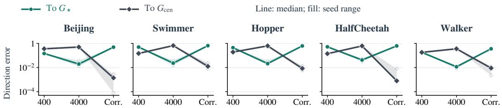  
400 / 4000: local epochs Corr.: 4000 epochs + moment correction

Figure 15: Local training and moment correction under full-model averaging. Each panel shows one tabular dataset with ResMLP and compares the same three seeds across ordinary training with $E = 4 0 0$ , ordinary training with $E = 4 0 0 0$ , and corrected training with $E = 4 0 0 0$ . Colors distinguish direction error to $G _ { \star }$ and $G _ { \mathrm { c e n } }$ . Curves show medians; pale bands span the three seeds. The first transition changes the local budget; the second adds correction at a fixed budget.

## F.7 TEST ERROR

We next examine whether the proximal regularizer and the moment correction change the prediction error on test samples. This question lies outside the UFM analysis. The UFM treats the features of the training samples as free variables and describes how the training objective is optimized; it does not model the features that a backbone produces for unseen inputs, and hence does not predict test error. The preceding experiments show that this analysis predicts the endpoint of training across datasets and architectures. We add a comparison of test error for two reasons: (1) test error ultimately matters for any training procedure, and (2) the two interventions may affect test error differently:

• The moment correction moves the head Gram to the optimum of centralized training, using target moments that the clients share with the server, and may therefore lower test error.

• The proximal regularizer adds an extra constraint to each local update, and it is unclear whether this constraint impairs generalization.

The comparison uses the main-experiment runs on the five image datasets with ResNet-18 and seeds {0, 1, 2}, 15 dataset–seed combinations in total. Ordinary training, proximal training and proximal training with moment correction share the recipe $\lambda _ { H } = \lambda _ { W } = 0 . 0 1$ , zero weight decay, eight rounds and $E \stackrel {  } { = } 4 0 0 0$ . All three keep the feature and head penalties; proximal training adds $\bar { \rho } = \bar { 1 } 0 ^ { - 3 }$ , and the corrected procedure also adds $C _ { m }$ . Prediction error is evaluated as in Appendix E.4, with test samples assigned to clients as in Appendix E.1, and MSE changes are paired within each dataset– seed combination.

The proximal regularizer tightens agreement with $G _ { \star } ,$ , and adding correction moves the endpoint to $G _ { \mathrm { c e n } }$ (Table 9). Both interventions lower training MSE in all 15 comparisons, with median changes of −0.2% and −2.0%. Proximal training changes test MSE by less than 1.5% in every comparison and lowers it in 9 of 15. Adding correction lowers test MSE in 13 of 15 comparisons, with a median change of −1.5%; the mean change ranges from −2.3% on dSprites to +0.3% on MPIIGaze (Figure 16). On these datasets, the proximal regularizer thus constrains training while keeping test error within 1.5% of ordinary training, and the moment correction lowers test error slightly on average.

Table 9: Geometry and prediction under one training recipe. Medians over the 15 image dataset– seed combinations. Geometry columns are relative matrix errors. The loss is the MSE, and loss changes are paired against ordinary training before taking medians. Negative changes indicate lower loss, which is better.
<table><tr><td>Training</td><td> $e _ { F } ( G _ { 8 } , G _ { \star } )$ </td><td> $e _ { F } ( G _ { 8 } , G _ { \mathrm { c e n } } )$ </td><td>Train loss change Test loss change</td><td></td></tr><tr><td>Ordinary</td><td> $1 . 3 7 \times 1 0 ^ { - 2 }$ </td><td> $5 . 0 4 \times 1 0 ^ { - 1 }$ </td><td></td><td></td></tr><tr><td>Proximal</td><td> $1 . 5 4 \times 1 0 ^ { - 4 }$ </td><td> $4 . 9 6 \times 1 0 ^ { - 1 }$ </td><td>-0.2%</td><td>-0.1%</td></tr><tr><td>Proximal + moment correction</td><td> $6 . 2 3 \times 1 0 ^ { - 1 }$ </td><td> $7 . 0 3 \times 1 0 ^ { - 5 }$ </td><td>-2.0%</td><td>-1.5%</td></tr></table>

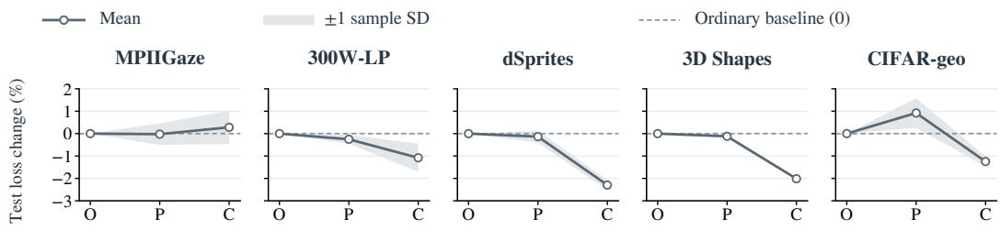  
O: ordinary P: proximal C: proximal + moment correction

Figure 16: Paired test-MSE changes on the five image datasets. Values are $1 0 0 ( \mathrm { M S E / M S E _ { O } - }$ 1), with the same seed’s ordinary-training MSE as denominator for all procedures; O, P and C denote ordinary training, proximal training, and proximal training with moment correction. Curves show means over seeds {0, 1, 2}, and bands span one sample standard deviation; the dashed line is zero. Negative values indicate lower loss, which is better.

## G SUPPLEMENTARY ANALYSIS

## G.1 FINITE-STEP DYNAMICS OF THE PROFILED UFM

We study a federated update in which each client performs gradient descent on its profiled objective $F _ { m } ( W ) \bar { = } F ( W ; \Sigma _ { m } ) \bar { }$ . Each gradient step corresponds to first minimizing the local loss over the features and bias at the current head, then taking a full-batch gradient step on the head. We call this a profiled step.

At each round, all clients start from the broadcast $W _ { t }$ , take $E$ profiled steps with learning rate $\eta ,$ and return their heads for weighted averaging. Since each profiled step uses the full local batch, E also counts the local epochs per round, as in the DNN experiments. We write $h = \eta E$ and denote the server Gram matrix by $\dot { G } _ { t } = W _ { t } W _ { t } ^ { \top }$

One local step per round. For $E = 1$ , the server update is

$$
W _ { t + 1 } = W _ { t } - \eta \sum _ { m } p _ { m } \nabla F ( W _ { t } ; \Sigma _ { m } ) = W _ { t } - \eta \nabla F ( W _ { t } ; \Sigma _ { \mathrm { w i t h i n } } ) ,
$$

where the second equality follows from the affine dependence of $F ( W ; T )$ on $T .$ . Thus the server performs gradient descent on the averaged profiled objective

$$
\bar { F } ( W ) : = \sum _ { m } p _ { m } F _ { m } ( W ) = F ( W ; \Sigma _ { \mathrm { w i t h i n } } ) .
$$

In the fully active regime, its optimal Gram matrix is

$$
G _ { \mathrm { w i t h i n } } = \phi ( \Sigma _ { \mathrm { w i t h i n } } ) .
$$

Every head with this Gram matrix is a fixed point of the one-step update. We use $G _ { \mathrm { w i t h i n } }$ as the reference for studying multiple local steps.

Comparison with joint updates. For comparison, suppose each client takes one simultaneous full-batch gradient step on ${ \mathcal { L } } _ { m }$ in $( W , b , H _ { m } )$ , starting from the common head $( W , b )$ . The server averages the updated heads, while the features remain local.

The averaged updates of W and b equal those of gradient descent on the pooled objective (2). Since $\nabla _ { H _ { m } } \mathcal { L } _ { \mathrm { c e n } } = p _ { m } \nabla _ { H _ { m } } \mathcal { L } _ { m }$ , the feature update is

$$
H _ { m } ^ { + } = H _ { m } - \eta \nabla _ { H _ { m } } \mathcal { L } _ { m } = H _ { m } - \frac { \eta } { p _ { m } } \nabla _ { H _ { m } } \mathcal { L } _ { \mathrm { c e n } } .
$$

Thus the entire round corresponds to gradient descent on $\mathcal { L } _ { \mathrm { c e n } } .$ , with learning rate $\eta$ for $( W , b )$ and $\eta / p _ { m }$ for $H _ { m }$ . If these joint updates converge to a pooled global minimizer, their head Gram converges to $G _ { \mathrm { c e n } }$ . The profiled update instead follows ${ \bar { F } } ,$ , whose optimal Gram is $G _ { \mathrm { w i t h i n } } .$ . The objectives underlying the two procedures therefore have generally different optimal Gram matrices, even with one local step per round.

Displacement under multiple local steps. We now study how the Gram fixed point changes when $E > 1$ . To state the result, write the gradient of the profiled objective as

$$
\nabla F ( W ; T ) = 2 \Lambda _ { T } ( G ) W , \qquad G = W W ^ { \top } ,
$$

where

$$
\Lambda _ { T } ( G ) = \frac { \lambda _ { W } } { 2 } I _ { C } - \frac { \lambda _ { H } } { 2 } ( G + \lambda _ { H } I _ { C } ) ^ { - 1 } T ( G + \lambda _ { H } I _ { C } ) ^ { - 1 } .
$$

We use the abbreviations

$$
\Lambda _ { m } = \Lambda _ { \Sigma _ { m } } , \qquad \bar { \Lambda } = \Lambda _ { \Sigma _ { \mathrm { w i t h i n } } } , \qquad R = \Sigma _ { \mathrm { w i t h i n } } ^ { 1 / 2 } , \qquad \alpha = \sqrt { \lambda _ { H } / \lambda _ { W } } ,
$$

so that $G _ { \mathrm { w i t h i n } } = \alpha R - \lambda _ { H } I _ { C } .$

Let $f ( G ) = { \bar { F } } ( W )$ whenever $W W ^ { \top } = G$ , and define

$$
\begin{array} { l } { { \displaystyle \psi ( G ) = 2 \sum _ { m } p _ { m } \mathrm { t r } \big ( \Lambda _ { m } ( G ) G \Lambda _ { m } ( G ) \big ) , } } \\ { { \displaystyle \mathcal { H } [ X ] = \frac { \lambda _ { W } } { 2 \alpha } ( R ^ { - 1 } X + X R ^ { - 1 } ) . } } \end{array}\tag{19}
$$

These quantities satisfy

$$
\psi ( W W ^ { \top } ) = \frac { 1 } { 2 } \sum _ { m } p _ { m } \left\| \nabla F _ { m } ( W ) \right\| _ { F } ^ { 2 } , \qquad \mathcal { H } = \mathrm { H e s s } f ( G _ { \mathrm { w i t h i n } } ) .
$$

Thus $\psi$ measures the weighted squared norms of the local head gradients, while $\mathcal { H }$ is the Hessian of the averaged objective with respect to the Gram matrix. The operator H is positive definite on $\operatorname { S y m } ( C )$ , the space of symmetric $C \times C$ matrices.

For sufficiently small $h ,$ the following theorem establishes a locally attracting Gram fixed point near $G _ { \mathrm { w i t h i n } }$ and gives its first-order displacement from $G _ { \mathrm { w i t h i n } }$

Theorem 2 (Fixed point and local convergence of profiled updates). Assume thefully active conditions of Section 3. For an integer $E \geq 1$ and learning rate $\eta > 0 ,$ define the server update

$$
\Phi _ { \eta , E } ( W ) = \sum _ { m } p _ { m } \mathrm { G D } _ { \eta } ^ { E } [ F _ { m } ] ( W ) ,
$$

where $\mathrm { G D } _ { \eta } ^ { E } [ F _ { m } ] ( W )$ denotes E gradient steps on $F _ { m }$ , starting from W.

There exist constants $r , \varepsilon _ { 0 } , K > 0$ such that, for every $P \geq C$ and every $( \eta , E )$ satisfying $h =$ $\eta E \leq \varepsilon _ { 0 } ,$ , thefollowing hold.

1. Gram dynamics and a unique nearby fixed point. The next Gram matrix depends only on the current Gram matrix, so the update defines a map

$$
G _ { t + 1 } = \Phi _ { \eta , E } ^ { G } ( G _ { t } ) .
$$

This map has exactly one fixed point in $\left. G - G _ { \mathrm { w i t h i n } } \right. _ { F } \leq r$ . We denote this positivedefinite fixed point by $G _ { \eta , E } .$

2. Displacement from the one-step fixed point. Define

$$
\Delta = \frac 1 2 \mathcal { H } ^ { - 1 } [ \nabla \psi ( G _ { \mathrm { w i t h i n } } ) ] ,
$$

where $\psi$ and H are given in (19). Then

$$
\begin{array} { r } { \| G _ { \eta , E } - G _ { \mathrm { w i t h i n } } - \eta ( E - 1 ) \Delta \| _ { F } \leq K ( \eta E ) ^ { 2 } . } \end{array}
$$

For $E = 1$ , the fixed point is exactly $G _ { \eta , 1 } = G _ { \mathrm { w i t h i n } }$

3. Convergence from nearby initializations. $I f G _ { 0 }$ is sufficiently close to $G _ { \eta , E } ,$ , then for all $t \geq 0 ,$

$$
\left\| G _ { t } - G _ { \eta , E } \right\| _ { F } \leq \left( 1 - \frac { 1 } { 2 } h \theta _ { \operatorname* { m i n } } \right) ^ { t } \left\| G _ { 0 } - G _ { \eta , E } \right\| _ { F } ,
$$

where

$$
\theta _ { \mathrm { m i n } } = 2 \lambda _ { W } \left( 1 - \sqrt { \frac { \lambda _ { H } \lambda _ { W } } { \lambda _ { \mathrm { m i n } } \bigl ( \sum _ { \mathrm { w i t h i n } } \bigr ) } } \right) > 0 .
$$

The constants $r , \varepsilon _ { 0 }$ , K depend only on the client covariances, weights, regularization parameters and $C ;$ they are independent $o f \eta ,$ , E and P. The convergence statement concerns the Gram matrices $G _ { t } .$ No convergence ofthe heads $W _ { t }$ is asserted.

## G.2 PROOF OF THEOREM 2

Proof. We write $\Phi = \Phi _ { \eta , E }$ for the head update and $\Phi ^ { G } = \Phi _ { \eta , E } ^ { G }$ for its induced Gram map. All remainder estimates below hold uniformly in a fixed neighborhood of $G _ { \mathrm { w i t h i n } }$ , for sufficiently small $h = \eta E$ . Their constants may depend on the client covariances, weights, regularization parameters and $C ,$ but not on η, E or $\check { P } .$ For linear operators on $\operatorname { S y m } ( C )$ , we use the norm induced by the Frobenius norm and denote the identity operator by Id.

1. Exact Gram updates and the local expansion. Fix a broadcast head W with Gram $G = W W ^ { \top }$ For client m, let $W _ { m , k }$ be the head after k local steps and let $G _ { m , k } = W _ { m , k } W _ { m , k } ^ { \top }$ , with $W _ { m , 0 } = W$ and $G _ { m , 0 } = G$ . Define

$$
A _ { m , k } = I _ { C } - 2 \eta \Lambda _ { m } ( G _ { m , k } ) .
$$

The head update is $W _ { m , k + 1 } = A _ { m , k } W _ { m , k }$ . Since $A _ { m , k }$ is symmetric, its Gram satisfies

$$
G _ { m , k + 1 } = A _ { m , k } G _ { m , k } A _ { m , k } .\tag{20}
$$

Thus each local Gram trajectory depends only on the initial Gram G. The returned head is $W _ { m , E } =$ $M _ { m } ( G ) W$ , where

$$
M _ { m } ( G ) = A _ { m , E - 1 } \cdot \cdot \cdot A _ { m , 0 } .
$$

Writing $\begin{array} { r } { M ( G ) = \sum _ { m } p _ { m } M _ { m } ( G ) } \end{array}$ , the server update and its Gram are

$$
\Phi ( W ) = M ( G ) W , \qquad \Phi ^ { G } ( G ) = M ( G ) G M ( G ) ^ { \top } .
$$

This establishes that the server Gram evolves independently of the choice of head factor $W .$

Choose two closed Frobenius balls centered at $G _ { \mathrm { w i t h i n } } .$ , with radii $0 < r _ { 1 } < r _ { 2 }$ , both contained in the positive-definite cone. Let the initial Gram satisfy $\left. \boldsymbol { G } - \boldsymbol { G } _ { \mathrm { w i t h i n } } \right. _ { F } \leq r _ { 1 }$ . On the larger ball, smoothness and compactness give uniform bounds on the required derivatives and on each local increment: $\| G _ { m , k + 1 } - G _ { m , k } \| _ { F } \leq c \eta$ for sufficiently small $\eta .$ If $h = \eta E$ is small enough that ch $< r _ { 2 } - r _ { 1 }$ , induction gives

$$
\left\| G _ { m , k } - G \right\| _ { F } \leq c \eta k , \qquad \left\| G _ { m , k } - G _ { \mathrm { w i t h i n } } \right\| _ { F } \leq r _ { 1 } + c \eta k < r _ { 2 } , \qquad 0 \leq k \leq E .
$$

Thus all local iterates remain in the larger ball, where these uniform bounds apply.

The estimates can be made independent of the feature width. Indeed, write $W = G ^ { 1 / 2 } V ,$ where $V V ^ { \top } = I _ { C } .$ . Local gradient descent from W is the corresponding iteration from $G ^ { 1 / 2 }$ followed by right multiplication by V . Since $\| Z V \| _ { F } = \| Z \| _ { F }$ for every $C \times C$ matrix $Z ,$ , the expansion and its remainder can be established using square heads and then transferred to every $P \ge \bar { C }$

For a fixed client, abbreviate $g _ { m } = \nabla F _ { m }$ and $W _ { k } = W _ { m , k }$ . Taylor expansion along the local iterates gives

$$
W _ { k } - W = - \eta k g _ { m } ( W ) + O ( ( \eta k ) ^ { 2 } ) ,
$$

$$
g _ { m } ( W _ { k } ) = g _ { m } ( W ) - \eta k D g _ { m } ( W ) [ g _ { m } ( W ) ] + O ( ( \eta k ) ^ { 2 } ) .
$$

Substituting the second expansion into $\begin{array} { r } { W _ { E } = W - \eta \sum _ { k = 0 } ^ { E - 1 } g _ { m } ( W _ { k } ) } \end{array}$ yields

$$
\mathrm { G D } _ { \eta } ^ { E } [ F _ { m } ] ( W ) = W - h \nabla F _ { m } ( W ) + \frac { \eta ^ { 2 } E ( E - 1 ) } { 2 } \nabla ^ { 2 } F _ { m } ( W ) [ \nabla F _ { m } ( W ) ] + O ( h ^ { 3 } ) .\tag{21}
$$

Here $\textstyle \sum _ { k = 0 } ^ { E - 1 } k \ = \ E ( E - 1 ) / 2$ , while the summed remainder is bounded by a constant times $\eta ^ { 3 } \sum _ { k = 0 } ^ { E - \mathrm { i } } \bar { k ^ { 2 } } \le h ^ { 3 } / 3$ . This gives a remainder bound uniform in $E .$

2. The averaged update and its derivative. Define

$$
\Psi ( W ) = \frac { 1 } { 2 } \sum _ { m } p _ { m } \left\| \nabla F _ { m } ( W ) \right\| _ { F } ^ { 2 } = \psi ( W W ^ { \top } ) .
$$

Its gradient is

$$
\nabla \Psi ( W ) = \sum _ { m } p _ { m } \nabla ^ { 2 } F _ { m } ( W ) [ \nabla F _ { m } ( W ) ] .
$$

Averaging (21) therefore gives

$$
\Phi ( W ) = W - h \nabla \bar { F } ( W ) + \frac { \eta ^ { 2 } E ( E - 1 ) } { 2 } \nabla \Psi ( W ) + O ( h ^ { 3 } ) .
$$

Thus, up to an $O ( h ^ { 3 } )$ remainder, one communication round agrees with a gradient step of size h on $\bar { F } - \eta ( \mathbf { \bar { E } } - 1 ) \Psi / 2$ . The identity $\begin{array} { r } { \nabla \bar { F } = \sum _ { m } p _ { m } \nabla F _ { m } } \end{array}$ also gives

$$
\Psi ( W ) = \frac { 1 } { 2 } \left\| \nabla \bar { F } ( W ) \right\| _ { F } ^ { 2 } + \frac { 1 } { 2 } \sum _ { m } p _ { m } \left\| \nabla F _ { m } ( W ) - \nabla \bar { F } ( W ) \right\| _ { F } ^ { 2 } .
$$

The second term measures the dispersion of the client gradients at the common head $W$

For a symmetric matrix A, define the linear operator $\mathcal { S } _ { A } [ X ] = A X + X A$ on symmetric matrices. Using $\dot { \nabla } \bar { F } ( W ) = 2 \bar { \Lambda } ( G ) W$ and $\nabla \Psi ( W ) = \bar { 2 } \nabla \psi ( G ) W$ , we obtain

$$
\Phi ^ { G } ( G ) = G - 2 h { \cal S } _ { G } [ \bar { \Lambda } ( G ) ] + \eta ^ { 2 } { \cal E } ( E - 1 ) { \cal S } _ { G } [ \nabla \psi ( G ) ] + 4 h ^ { 2 } \bar { \Lambda } ( G ) G \bar { \Lambda } ( G ) + { \cal O } ( h ^ { 3 } ) .\tag{22}
$$

We next estimate the derivative of the exact Gram map. Differentiating the recurrence (20) with respect to the initial Gram gives $D G _ { m , k } ( G ) = \mathrm { I d } + O ( \bar { \eta } k )$ ). The product rule for $M _ { m } ( G )$ then gives

$$
{ \cal D } M _ { m } ( G ) [ X ] = - 2 \eta \sum _ { k = 0 } ^ { E - 1 } P _ { m , > k } { \cal D } \Lambda _ { m } ( G _ { m , k } ) [ { \cal D } G _ { m , k } ( G ) [ X ] ] P _ { m , < k } ,
$$

where

$$
P _ { m , > k } = A _ { m , E - 1 } \cdot \cdot \cdot A _ { m , k + 1 } , \qquad P _ { m , < k } = A _ { m , k - 1 } \cdot \cdot \cdot A _ { m , 0 } .
$$

Empty products equal $I _ { C }$ . Both products are $I _ { C } + O ( h )$ . Using $G _ { m , k } = G + O ( \eta k )$ in these expressions and averaging over clients gives

$$
\begin{array} { c } { { M ( G ) = I _ { C } - 2 h \bar { \Lambda } ( G ) + O ( h ^ { 2 } ) , } } \\ { { { \cal D } M ( G ) [ X ] = - 2 h D \bar { \Lambda } ( G ) [ X ] + O ( h ^ { 2 } ) \left\| X \right\| _ { F } . } } \end{array}
$$

Applying the product rule to $M ( G ) G M ( G ) ^ { \top }$ now yields

$$
{ \cal D } \Phi ^ { G } ( G ) = \mathrm { I d } - 2 h \bigl ( { \cal S } _ { G } \circ { \cal D } \bar { \Lambda } ( G ) + { \cal S } _ { \bar { \Lambda } ( G ) } \bigr ) + { \cal O } ( h ^ { 2 } ) .\tag{23}
$$

The remainder is uniform in the induced operator norm on a fixed smaller neighborhood of $G _ { \mathrm { w i t h i n } } .$

3. Existence and uniqueness ofa nearbyfixed point. For fixed $( \eta , E )$ , define

$$
Q ( G ) = \frac { G - \Phi ^ { G } ( G ) } { 2 h } , \qquad T = S _ { G _ { \mathrm { w i t h i n } } } \circ \mathcal { H } .
$$

A fixed point of $\Phi ^ { G }$ is exactly a zero of $Q .$ At the reference Gram, $\bar { \Lambda } ( G _ { \mathrm { w i t h i n } } ) ~ = ~ 0$ and $D \bar { \Lambda } ( G _ { \mathrm { w i t h i n } } ) = \mathcal { H }$ . Hence (23) implies

$$
D Q ( G ) = \mathcal { T } + O ( \| G - G _ { \mathrm { w i t h i n } } \| _ { F } + h ) .
$$

The operators $\mathcal { H }$ and $ { S _ { G _ { \mathrm { w i t h i n } } } }$ are diagonal in the symmetric matrix basis associated with an orthonormal eigenbasis of R. Their eigenvalues are positive, so their product $\tau$ is self-adjoint, positive definite and invertible.

Consider the auxiliary map

$$
{ \mathcal { K } } ( G ) = G - { \mathcal { T } } ^ { - 1 } Q ( G ) .
$$

The estimate for $D Q$ gives

$$
D K ( G ) = \operatorname { I d } - \mathcal { T } ^ { - 1 } D Q ( G ) = O ( \Vert G - G _ { \mathrm { w i t h i n } } \Vert _ { F } + h ) .
$$

Also, (22) gives $Q ( G _ { \mathrm { w i t h i n } } ) = O ( h )$ , and hence

$$
{ \cal K } ( G _ { \mathrm { w i t h i n } } ) - G _ { \mathrm { w i t h i n } } = - { \cal T } ^ { - 1 } { \cal Q } ( G _ { \mathrm { w i t h i n } } ) = { \cal O } ( h ) .
$$

Thus there are constants $c _ { 1 } , c _ { 2 } > 0$ such that, uniformly in the neighborhood above for sufficiently small $h ,$

$$
\left\| D K ( G ) \right\| _ { \mathrm { o p } } \le c _ { 1 } \big ( \| G - G _ { \mathrm { w i t h i n } } \| _ { F } + h \big ) , \quad \left\| K ( G _ { \mathrm { w i t h i n } } ) - G _ { \mathrm { w i t h i n } } \right\| _ { F } \le c _ { 2 } h .
$$

Choose $r > 0$ small enough that the closed ball $\left. G - G _ { \mathrm { w i t h i n } } \right. _ { F } \leq r$ lies in this neighborhood and $c _ { 1 } r \leq 1 / 4$ . Then choose $\varepsilon _ { 0 } > 0$ small enough that the estimates above hold for $h \leq \varepsilon _ { 0 }$ and

$$
c _ { 1 } \varepsilon _ { 0 } \leq { \frac { 1 } { 4 } } , \qquad c _ { 2 } \varepsilon _ { 0 } \leq { \frac { r } { 2 } } .
$$

For every such h, these choices ensure

$$
\operatorname* { s u p } _ { \| G - G _ { \mathrm { w i t h i n } } \| _ { F } \le r } \| D K ( G ) \| _ { \mathrm { o p } } \le \frac { 1 } { 2 } , \qquad \| K ( G _ { \mathrm { w i t h i n } } ) - G _ { \mathrm { w i t h i n } } \| _ { F } \le \frac { r } { 2 } .
$$

Since the ball is convex, the derivative bound implies

$$
\| \boldsymbol { \mathcal { K } } ( G ) - \boldsymbol { \mathcal { K } } ( G ^ { \prime } ) \| _ { F } \leq \frac { 1 } { 2 } \left\| \boldsymbol { G } - \boldsymbol { G } ^ { \prime } \right\| _ { F }
$$

for any two matrices $G , G ^ { \prime }$ in the ball. Moreover, for every $G$ in the ball,

$$
\begin{array} { l } { \displaystyle \left\| { \cal K } ( G ) - { \cal G } _ { \mathrm { w i t h i n } } \right\| _ { F } \leq \left\| { \cal K } ( G ) - { \cal K } ( G _ { \mathrm { w i t h i n } } ) \right\| _ { F } + \left\| { \cal K } ( G _ { \mathrm { w i t h i n } } ) - G _ { \mathrm { w i t h i n } } \right\| _ { F } } \\ { \displaystyle \qquad \leq \frac { 1 } { 2 } \left\| G - { \cal G } _ { \mathrm { w i t h i n } } \right\| _ { F } + \displaystyle \frac { r } { 2 } \leq r . } \end{array}
$$

Thus K is a contraction from the closed ball into itself. Banach’s fixed-point theorem gives a unique fixed point in this ball, denoted $G _ { \eta , E }$ . Since

$$
{ \cal K } ( G ) = G \quad \Longleftrightarrow \quad Q ( G ) = 0 \quad \Longleftrightarrow \quad \Phi ^ { G } ( G ) = G ,
$$

this is also the unique fixed point of the Gram update in the ball. The ball is contained in the positive-definite cone, so $G _ { \eta , E } \succ 0$

Finally, the fixed-point identity and the contraction bound give

$$
\left\| G _ { \eta , E } - G _ { \mathrm { w i t h i n } } \right\| _ { F } \leq \frac { 1 } { 2 } \left\| G _ { \eta , E } - G _ { \mathrm { w i t h i n } } \right\| _ { F } + \left\| K ( G _ { \mathrm { w i t h i n } } ) - G _ { \mathrm { w i t h i n } } \right\| _ { F } .
$$

Rearranging yields

$$
\lVert G _ { \eta , E } - G _ { \mathrm { w i t h i n } } \rVert _ { F } \leq 2 c _ { 2 } h = O ( h ) .
$$

4. Displacement of the fixed point. The preceding estimate implies $\bar { \Lambda } ( G _ { \eta , E } ) = { \cal { O } } ( h )$ . Evaluate (22) at $G _ { \eta , E }$ and divide the fixed-point equation by 2h. This gives

$$
S _ { G _ { \eta , E } } [ \bar { \Lambda } ( G _ { \eta , E } ) ] = \frac { \eta ( E - 1 ) } { 2 } S _ { G _ { \eta , E } } [ \nabla \psi ( G _ { \eta , E } ) ] + 2 h \bar { \Lambda } ( G _ { \eta , E } ) G _ { \eta , E } \bar { \Lambda } ( G _ { \eta , E } ) + O ( h ^ { 2 } ) .
$$

For $G \succ 0$ , the operator $\cal { S } _ { G }$ multiplies the $( i , j )$ entry by the sum of two eigenvalues of G, when expressed in an eigenbasis of G. These sums are bounded away from zero in our neighborhood, so $S _ { G } ^ { - 1 }$ is uniformly bounded there. The quadratic term $2 h \bar { \Lambda } ( G _ { \eta , E } ) G _ { \eta , E } \bar { \Lambda } ( G _ { \eta , E } )$ is $\breve { O } ( h ^ { 3 } )$ because $\bar { \Lambda } ( G _ { \eta , E } ) = { \cal { O } } ( h )$ . Applying $S _ { G _ { \eta , E } } ^ { - 1 }$ therefore gives

$$
\bar { \Lambda } ( G _ { \eta , E } ) = \frac { \eta ( E - 1 ) } { 2 } \nabla \psi ( G _ { \eta , E } ) + { \cal O } ( h ^ { 2 } ) .
$$

We may replace $\nabla \psi ( G _ { \eta , E } )$ by $\nabla \psi \big ( G _ { \mathrm { w i t h i n } } \big )$ with an additional $O ( h ^ { 2 } )$ error: the two arguments differ by $O ( h )$ and $\eta ( E - 1 ) \leq h$ . Finally, Taylor expansion at $G _ { \mathrm { w i t h i n } }$ yields

$$
\mathcal { H } [ G _ { \eta , E } - G _ { \mathrm { w i t h i n } } ] = \frac { \eta ( E - 1 ) } { 2 } \nabla \psi ( G _ { \mathrm { w i t h i n } } ) + O ( h ^ { 2 } ) .
$$

Applying $\mathcal { H } ^ { - 1 }$ proves

$$
G _ { \eta , E } - G _ { \mathrm { w i t h i n } } = \eta ( E - 1 ) \Delta + O ( h ^ { 2 } ) , \qquad \Delta = \frac { 1 } { 2 } \mathcal { H } ^ { - 1 } [ \nabla \psi ( G _ { \mathrm { w i t h i n } } ) ] .
$$

The uniform remainder gives the asserted bound with a constant $K$ . For $E = 1$ , the exact one-step update fixes $G _ { \mathrm { w i t h i n } }$ . Uniqueness in the ball therefore gives $G _ { \eta , 1 } = G _ { \mathrm { w i t h i n } }$ exactly.

5. Local convergence ofthe Gram iteration. We now establish contraction of the actual update $\Phi ^ { G }$ rather than the auxiliary map $\kappa .$ . Let $r _ { i }$ be the eigenvalues of R and $\beta _ { i } = \alpha r _ { i } - \lambda _ { H } > 0$ those of $G _ { \mathrm { w i t h i n } }$ . In the corresponding symmetric matrix basis, the eigenvalues of $\tau$ are

$$
\theta _ { i j } = \frac { \lambda _ { W } } { 2 \alpha } ( \beta _ { i } + \beta _ { j } ) ( r _ { i } ^ { - 1 } + r _ { j } ^ { - 1 } ) .
$$

Put $s = \sqrt { \lambda _ { H } \lambda _ { W } }$ and $r _ { \mathrm { m i n } } = \operatorname* { m i n } _ { i } r _ { i }$ . Then

$$
\begin{array} { l } { \displaystyle \theta _ { i j } = \frac { \lambda _ { W } } { 2 } \left[ \frac { ( r _ { i } + r _ { j } ) ^ { 2 } } { r _ { i } r _ { j } } - 2 s ( r _ { i } ^ { - 1 } + r _ { j } ^ { - 1 } ) \right] } \\ { \displaystyle \geq 2 \lambda _ { W } \big ( 1 - s / r _ { \operatorname* { m i n } } \big ) = \theta _ { \operatorname* { m i n } } > 0 . } \end{array}
$$

The inequality uses $( r _ { i } + r _ { j } ) ^ { 2 } / ( r _ { i } r _ { j } ) \geq 4$ and $r _ { i } ^ { - 1 } + r _ { j } ^ { - 1 } \leq 2 / r _ { \operatorname* { m i n } }$ . Equality holds when $r _ { i } =$ $r _ { j } = r _ { \operatorname* { m i n } }$ , so this is the smallest eigenvalue of T.

Because $\tau$ is self-adjoint, for $h \leq 1 / ( 2 \operatorname* { m a x } _ { i , j } \theta _ { i j } )$

$$
\left\| \mathrm { I d - 2 } h \mathcal { T } \right\| _ { \mathrm { o p } } = 1 - 2 h \theta _ { \mathrm { m i n } } .
$$

By (23) and smoothness,

$$
D \Phi ^ { G } ( G ) = \operatorname { I d } - 2 h \mathcal { T } + O \big ( h \left. \right. G - G _ { \mathrm { w i t h i n } } \big \vert \big \vert _ { F } + h ^ { 2 } \big ) .
$$

Since $G _ { \eta , E } - G _ { \mathrm { w i t h i n } } = O ( h )$ , there is a constant $C _ { 0 } > 0$ such that

$$
\left\| G _ { \eta , E } - G _ { \mathrm { w i t h i n } } \right\| _ { F } \leq C _ { 0 } h .
$$

For any $G$ satisfying $\left. G - G _ { \eta , E } \right. _ { F } \leq r _ { \mathrm { a t t } }$ , we therefore have

$$
\| G - G _ { \mathrm { w i t h i n } } \| _ { F } \leq r _ { \mathrm { a t t } } + C _ { 0 } h .
$$

Thus the ball centered at $G _ { \eta , E }$ lies inside the uniqueness ball whenever $r _ { \mathrm { a t t } } + C _ { 0 } h \le r$ . On this ball, the derivative estimate above gives

$$
\big \| D \Phi ^ { G } ( G ) \big \| _ { \mathrm { o p } } \leq 1 - 2 h \theta _ { \mathrm { m i n } } + C _ { 1 } h r _ { \mathrm { a t t } } + C _ { 2 } h ^ { 2 }
$$

for constants $C _ { 1 } , C _ { 2 } > 0$ independent of η, E and $P .$ Choose a fixed radius $r _ { \mathrm { a t t } } > 0$ small enough that

$$
r _ { \mathrm { a t t } } \leq \frac { r } { 2 } , \qquad C _ { 1 } r _ { \mathrm { a t t } } \leq \frac { \theta _ { \mathrm { m i n } } } { 2 } .
$$

Then decrease $\varepsilon _ { 0 } .$ , if necessary, so that all previous small-h conditions remain valid and

$$
C _ { 0 } \varepsilon _ { 0 } \le \frac { r } { 2 } , \qquad C _ { 2 } \varepsilon _ { 0 } \le \theta _ { \mathrm { m i n } } .
$$

For every $0 < h \leq \varepsilon _ { 0 }$ , these choices ensure that the ball lies inside the uniqueness ball and that

$$
\operatorname* { s u p } _ { \| G - G _ { \eta , \varepsilon } \| _ { F } \le r _ { \mathrm { a t t } } } \bigl \| D \Phi ^ { G } ( G ) \bigr \| _ { \mathrm { o p } } \le 1 - \frac { 1 } { 2 } h \theta _ { \mathrm { m i n } } = : q , \qquad 0 < q < 1 .
$$

Since the ball is convex and $\Phi ^ { G } ( G _ { \eta , E } ) = G _ { \eta , E }$ , the mean-value bound gives

$$
\left\| \Phi ^ { G } ( G ) - G _ { \eta , E } \right\| _ { F } = \left\| \Phi ^ { G } ( G ) - \Phi ^ { G } ( G _ { \eta , E } ) \right\| _ { F } \leq q \left\| G - G _ { \eta , E } \right\| _ { F } \leq q r _ { \mathrm { a t t } } < r _ { \mathrm { a t t } } .
$$

Thus each update decreases the distance to the fixed point and keeps the Gram matrix inside the same ball. The same estimate therefore applies at every subsequent round. For any initial Gram satisfying $\left. G _ { 0 } - G _ { \eta , E } \right. _ { F } \leq r _ { \mathrm { a t t } }$ , iteration yields

$$
\left\| { G _ { t } - G _ { \eta , E } } \right\| _ { F } \leq q ^ { t } \left\| { G _ { 0 } - G _ { \eta , E } } \right\| _ { F } = \left( 1 - \frac { 1 } { 2 } h \theta _ { \operatorname* { m i n } } \right) ^ { t } \left\| { G _ { 0 } - G _ { \eta , E } } \right\| _ { F } ,
$$

which proves the claimed local convergence. Although $G _ { \eta , E }$ depends on $\eta$ and $E _ { \mathrm { { : } } }$ the radius $r _ { \mathrm { a t t } }$ and the upper bound $\varepsilon _ { \mathrm { 0 } }$ can be chosen independently of $\eta ,$ E and $P _ { - }$ □

## G.3 DEPENDENCE OF THE DISPLACEMENT ON CLIENT COVARIANCES

For small h, Theorem 2 gives $G _ { \eta , E } - G _ { \mathrm { w i t h i n } } = \eta ( E - 1 ) \Delta + O ( h ^ { 2 } )$ . To understand how differences among client covariances affect this displacement, we here evaluate the coefficient $\Delta$ in terms of these covariances. To obtain an explicit prediction, we treat the case of commuting client covariances.

Assume that the client covariances commute pairwise. In a common orthonormal eigenbasis, write

$$
\Sigma _ { m } = { \mathrm { d i a g } } ( \lambda _ { m , 1 } , \ldots , \lambda _ { m , C } ) , \qquad \bar { \lambda } _ { i } = \sum _ { m } p _ { m } \lambda _ { m , i } .
$$

Define

$$
r _ { i } = \sqrt { \bar { \lambda } _ { i } } , \qquad \alpha = \sqrt { \lambda _ { H } / \lambda _ { W } } , \qquad s = \sqrt { \lambda _ { H } \lambda _ { W } } .
$$

The reference Gram is diagonal in this basis, with entries

$$
\bar { g } _ { i } : = ( G _ { \mathrm { w i t h i n } } ) _ { i i } = \alpha r _ { i } - \lambda _ { H } .
$$

To measure the covariance differences in each coordinate, put

$$
e _ { m , i } = \frac { \lambda _ { m , i } } { \bar { \lambda } _ { i } } - 1 , \qquad \bar { e } _ { i } = \sum _ { m } p _ { m } e _ { m , i } ^ { 2 } .
$$

The definition of $\bar { \lambda } _ { i }$ implies $\begin{array} { r } { \sum _ { m } p _ { m } e _ { m , i } = 0 } \end{array}$

For a diagonal Gram $G = \mathrm { d i a g } ( g _ { 1 } , . . . , g _ { C } )$ , the ith diagonal entry of $\Lambda _ { m } ( G )$ is

$$
\ell _ { m , i } ( g _ { i } ) = \frac { \lambda _ { W } } { 2 } - \frac { \lambda _ { H } \lambda _ { m , i } } { 2 ( g _ { i } + \lambda _ { H } ) ^ { 2 } } .
$$

Its derivative is

$$
\ell _ { m , i } ^ { \prime } ( g _ { i } ) = \frac { \lambda _ { H } \lambda _ { m , i } } { ( g _ { i } + \lambda _ { H } ) ^ { 3 } } .
$$

The definition of ψ therefore reduces to

$$
\psi ( G ) = 2 \sum _ { i } g _ { i } \sum _ { m } p _ { m } \ell _ { m , i } ( g _ { i } ) ^ { 2 } .
$$

At $g _ { i } = { \bar { g } } _ { i }$ , using $\bar { g } _ { i } + \lambda _ { H } = \alpha r _ { i }$ and $\lambda _ { m , i } = r _ { i } ^ { 2 } ( 1 + e _ { m , i } )$ , we obtain

$$
\ell _ { m , i } ( { \bar { g } } _ { i } ) = - { \frac { \lambda _ { W } } { 2 } } e _ { m , i } , \qquad \ell _ { m , i } ^ { \prime } ( { \bar { g } } _ { i } ) = { \frac { \lambda _ { W } } { \alpha r _ { i } } } ( 1 + e _ { m , i } ) .
$$

Differentiating $\psi$ with respect to $g _ { i }$ now gives

$$
[ \nabla \psi ( G _ { \mathrm { w i t h i n } } ) ] _ { i i } = 2 \sum _ { m } p _ { m } \ell _ { m , i } ( \bar { g } _ { i } ) ^ { 2 } + 4 \bar { g } _ { i } \sum _ { m } p _ { m } \ell _ { m , i } ( \bar { g } _ { i } ) \ell _ { m , i } ^ { \prime } ( \bar { g } _ { i } ) = \lambda _ { W } ^ { 2 } \left( - \frac { 3 } { 2 } + \frac { 2 s } { r _ { i } } \right) \bar { e } _ { i } .
$$

The relations $\begin{array} { r } { \sum _ { m } p _ { m } e _ { m , i } = 0 } \end{array}$ and $\bar { g } _ { i } / ( \alpha r _ { i } ) = 1 - s / r _ { i }$ are used.

The full gradient at $G _ { \mathrm { w i t h i n } }$ is diagonal as well. Indeed, for every diagonal matrix $\begin{array} { r l } { D } & { { } = } \end{array}$ $\mathrm { d i a g } ( \pm 1 , \cdot \dots , \pm 1 )$ , we have $\psi ( { \cal D } { \cal G } { \cal D } ) = \psi ( { \cal G } )$ and $D G _ { \mathrm { w i t h i n } } D = G _ { \mathrm { w i t h i n } }$ . Differentiating this invariance gives

$$
D \nabla \psi ( G _ { \mathrm { w i t h i n } } ) D = \nabla \psi ( G _ { \mathrm { w i t h i n } } ) .
$$

Since this holds for every choice of signs, all off-diagonal entries of the gradient vanish.

Recall that the displacement coefficient satisfies

$$
2 \mathcal { H } [ \Delta ] = \nabla \psi \big ( G _ { \mathrm { w i t h i n } } \big ) .
$$

In the common eigenbasis, the Hessian acts entrywise as

$$
( \mathcal { H } [ X ] ) _ { i j } = \frac { \lambda _ { W } } { 2 \alpha } ( r _ { i } ^ { - 1 } + r _ { j } ^ { - 1 } ) X _ { i j } .
$$

All these coefficients are positive, so a diagonal $\nabla \psi \big ( G _ { \mathrm { w i t h i n } } \big )$ gives a diagonal $\Delta .$ . Writing $\Delta _ { i } : = $ $\Delta _ { i i }$ , we obtain

$$
\Delta _ { i } = \frac { \alpha r _ { i } } { 2 \lambda _ { W } } [ \nabla \psi ( G _ { \mathrm { w i t h i n } } ) ] _ { i i } = \frac { \alpha r _ { i } \lambda _ { W } } { 2 } \left( - \frac { 3 } { 2 } + \frac { 2 s } { r _ { i } } \right) \bar { e } _ { i } = s \left( s - \frac { 3 } { 4 } r _ { i } \right) \bar { e } _ { i } ,
$$

where the last equality uses $\alpha \lambda _ { W } = s .$ . Substituting the definitions of $s , r _ { i }$ and $\bar { e } _ { i }$ gives

$$
\Delta _ { i } = \sqrt { \lambda _ { H } \lambda _ { W } } \left( \sqrt { \lambda _ { H } \lambda _ { W } } - \frac { 3 } { 4 } \sqrt { \bar { \lambda } _ { i } } \right) \sum _ { m } p _ { m } \left( \frac { \lambda _ { m , i } } { \bar { \lambda } _ { i } } - 1 \right) ^ { 2 } .\tag{24}
$$

At fixed ${ \bar { \lambda } } _ { i } ,$ this coefficient is proportional to the weighted variance $\bar { e } _ { i }$ of the relative client covariance deviations. If $\bar { e } _ { i } = 0$ , then $\Delta _ { i } = 0$ . For $\bar { e } _ { i } > 0 , \Delta _ { i }$ is positive when $\bar { \lambda } _ { i } < 1 6 \lambda _ { H } \lambda _ { W } / 9$ , zero at equality, and negative when $\bar { \lambda } _ { i } > 1 6 \lambda _ { H } \lambda _ { W } / 9$

For sufficiently small h, Theorem 2 gives

$$
( G _ { \eta , E } - G _ { \mathrm { w i t h i n } } ) _ { i i } = \eta ( E - 1 ) \Delta _ { i } + O ( h ^ { 2 } ) .
$$

This predicted displacement $\eta ( E - 1 ) \Delta _ { i }$ is compared with the numerically measured displacement as shown in Figure 17(d).

## G.4 NUMERICAL CHECKS OF FINITE-STEP DYNAMICS

We numerically examine the fixed points of the profiled Gram update. Figure $1 7 ( \mathrm { a - c } )$ compares them with the one-step reference $G _ { \mathrm { w i t h i n } }$ and the BW barycenter $\bar { G } _ { \star }$ ⋆ predicted by Theorem 1 under exact closest-head selection. Panels (d) and (e) test the small-h predictions for the displacement and local convergence rate, where $h = \eta E$ . Below, $G _ { \eta , E }$ denotes the numerically obtained fixed point, including in experiments beyond the small-h regime.

Panels (a–c) use three random noncommuting instances with $C = 3$ and $M = 4 ,$ , five learning rates $\eta \in \{ 0 . 0 2 , 0 . 0 5 , 0 . 1 , 0 . 2 , 0 . 5 \}$ , and ten local step counts $E$ ranging from 1 to 2000. For each pair $( \eta , E )$ , we iterate the server update until the server Gram residual is below $1 0 ^ { - 1 3 }$

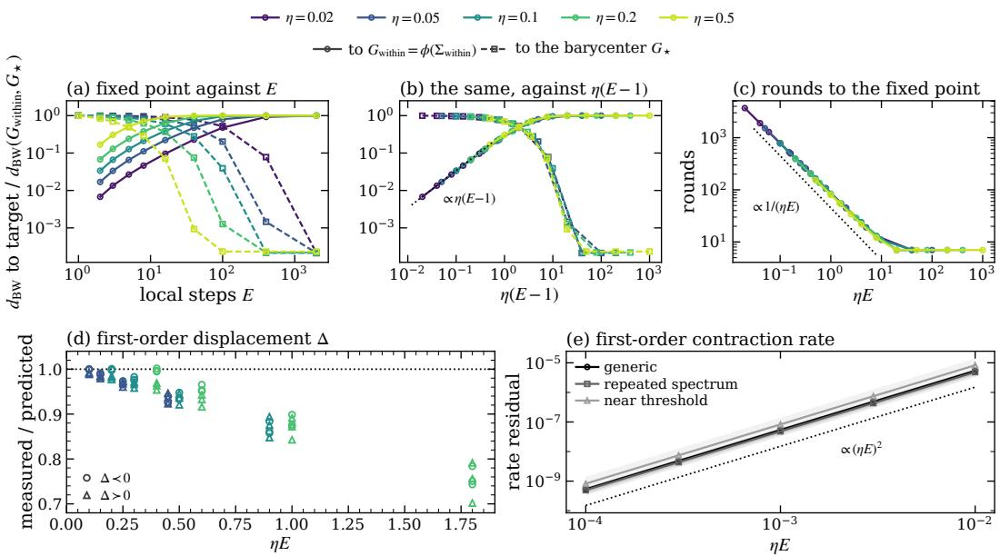  
Figure 17: Numerical checks of finite-step profiled dynamics. (a) BW distances from $G _ { \eta , E }$ to $G _ { \mathrm { w i t h i n } }$ (circles, solid) and $G _ { \star }$ (squares, dashed), normalized by $d _ { \mathrm { B W } } ( G _ { \mathrm { w i t h i n } } , G _ { \star } ) ;$ medians over three instances with $C = 3$ and ${ \bar { M } } = 4 .$ . (b) The same distances plotted against $\eta ( E - 1 ) $ ; the dotted guide has slope one. (c) Communication rounds needed to reach the stopping criterion. (d) Measured displacements divided by the predictions $\eta ( E - 1 ) \Delta _ { i }$ in 24 commuting configurations, colored by $\eta .$ . (e) Absolute errors in the first-order prediction $1 - 2 h \theta _ { \operatorname* { m i n } }$ for the Jacobian spectral radius; medians and interquartile ranges within each instance family over 780 stability records. The dotted guide has slope two.

Fixed points and the BW prediction. Panels (a) and (b) show how the fixed point changes as local training increases. All distances in these panels are normalized by $d _ { \mathrm { B W } } ( \bar { G } _ { \mathrm { w i t h i n } } , G _ { \star } )$ . For $E = 1$ , the numerical fixed point agrees with $G _ { \mathrm { w i t h i n } }$ to within $3 . 5 \times 1 0 ^ { - 6 }$ in these units. For small $h ,$ its distance from $G _ { \mathrm { w i t h i n } }$ grows approximately linearly with $\eta ( E - 1 )$ , consistent with Theorem $2 .$ Panel (b) makes this scaling visible by plotting the same data against η( $E - 1 )$ ).

With more local training, the fixed points in these examples move away from $G _ { \mathrm { w i t h i n } }$ and closer to $G _ { \star }$ . The distances to the two references cross near $\eta ( \mathbf { \bar { { E } } } - 1 ) = 2$ , and the normalized distance to $G ,$ ⋆ eventually levels off between $1 . 4 \times 1 0 ^ { - 4 }$ and $8 . 3 \times 1 0 ^ { - 4 }$ . Thus finite-step profiled training closely approaches the BW prediction in these examples, even though it does not explicitly impose the selection rule assumed in Theorem 1.

Communication rounds. Panel (c) shows the communication cost of reaching the fixed point. For small $h ,$ the median round count decreases approximately as $1 / ( \eta E )$ , from 3698 rounds at $\eta E = 0 . 0 2$ . It levels off at 7 rounds for $\eta E \geq 2 0$ . The number of local head steps per client is E times the round count, so fewer communication rounds need not mean fewer local updates.

Local optimality and head selection. At $E = 2 0 0 0$ and $\eta \in \{ 0 . 1 , 0 . 5 \}$ , we check whether the returned heads are both locally optimal and close to those prescribed by the selection rule. Writing W for the broadcast and $U _ { m }$ for client m’s return, the maximum relative Gram error satisfies

$$
\operatorname* { m a x } _ { m } { \frac { \left\| U _ { m } U _ { m } ^ { \top } - G _ { m } \right\| _ { F } } { \left\| G _ { m } \right\| _ { F } } } < 4 \times 1 0 ^ { - 1 5 } .
$$

In contrast, the selection error

$$
\operatorname* { m a x } _ { m } { \frac { \Vert U _ { m } - \Pi _ { m } ( W ) \Vert _ { F } } { \Vert \Pi _ { m } ( W ) \Vert _ { F } } }
$$

ranges from $6 \times 1 0 ^ { - 5 } \mathrm { t o } 3 \times 1 0 ^ { - 4 }$ across the three noncommuting instances. The heads therefore have nearly optimal local Grams but differ from the closest optimal heads.

This distinction is possible because successive gradient steps multiply the head by symmetric matrices whose ordered product need not be symmetric. This product can differ from the symmetric multiplier $T _ { m } ( W W ^ { \top } )$ defining $\Pi _ { m } ( W )$ in Lemma 1. The selection errors accompany the nonzero distance plateau above; we also observe continued head motion after the server Gram stabilizes in the noncommuting cases with $E > 1$ . For comparison, in one commuting instance with $E = 2 0 0 0$ and $\eta \in \{ 0 . 1 , 0 . 5 \}$ , the selection error is below $7 \times 1 0 ^ { - 1 5 }$ . The BW distance from $G _ { \eta , E }$ to $G _ { \star }$ normalized by $d _ { \mathrm { B W } } ( G _ { \mathrm { w i t h i n } } , G _ { \star } )$ as in panels (a) and (b), is below $1 . 1 4 \times 1 0 ^ { - 6 }$

Testing the displacement formula. Panel (d) tests the coefficient $\Delta _ { i }$ in (24) using 24 commuting configurations. In their common eigenbasis, the first-order prediction is

$$
( G _ { \eta , E } - G _ { \mathrm { w i t h i n } } ) _ { i i } \approx \eta ( E - 1 ) \Delta _ { i } .
$$

The panel plots the measured displacement divided by this prediction, so a ratio of one indicates agreement. Across all 72 coordinates, including positive and negative predicted displacements, every measured sign agrees with the prediction. For the eight configurations with $h \leq 0 . 2 5$ , the ratios lie in [0.96, 1.00].

Testing the local convergence rate. Panel (e) tests the first-order prediction $1 - 2 h \theta _ { \operatorname* { m i n } }$ for the Jacobian spectral radius at the fixed point, derived in Appendix G.2. It plots the absolute error

$$
\left| \operatorname { s p r } \bigl ( D \Phi _ { \eta , E } ^ { G } ( G _ { \eta , E } ) \bigr ) - ( 1 - 2 h \theta _ { \operatorname* { m i n } } ) \right| ,
$$

where spr denotes spectral radius. This prediction concerns the derivative at the fixed point; the bound $\bar { 1 ^ { \mathrm { ~ - ~ } } } \bar { \frac { 1 } { 2 } } h \theta _ { \operatorname* { m i n } }$ in Theorem 2 instead controls contraction throughout a neighborhood.

We evaluate 780 stability records covering generic instances, instances with repeated eigenvalues, and fully active instances near the activation threshold, using $E \in \{ 2 , 4 , 8 \}$ and

$$
h \in \{ 1 0 ^ { - 4 } , 3 \times 1 0 ^ { - 4 } , 1 0 ^ { - 3 } , 3 \times 1 0 ^ { - 3 } , 1 0 ^ { - 2 } \} .
$$

All measured spectral radii are below one. The prediction errors are consistent with $O ( h ^ { 2 } )$ scaling, with a median fitted log–log slope of 1.999. Slopes are fitted separately for each instance and $\bar { E } ,$ using $h \leq 1 0 ^ { - 3 }$ for near-threshold instances and all five values otherwise. Panel (e) displays all five values in every case.