# VALIDITY-PRESERVING HIERARCHICAL RL FOR JOINT ROUTING AND SWITCH PLACEMENT IN EDA

Dorian Gailhard¹, Ugo Lecerf2, Enzo Tartaglione¹, Donatello Conte2, Lirida Naviner1, Jhony H. Giraldo1

1LTCI, Télécom Paris, Institut Polytechnique de Paris, France 2Arteris IP   
1{name.surname}@telecom-paris.fr 2{name.surname}@arteris.com

October 1, 2026

## ABSTRACT

Routing and switch placement are fundamental combinatorial optimization problems in chip design, requiring the joint optimization of routing topology and physical placement under strict structural, geometric and logical constraints. Existing approaches typically rely on carefully engineered heuristics that incorporate strong problem-specific biases to navigate the enormous space of possible designs. In this work, we introduce a hierarchical reinforcement learning framework for joint routing and switch placement at the level of logical communication routes. Starting from a minimal routing graph, our method progressively constructs increasingly expressive solutions through three coupled operations: switch expansion, switch placement, and route refinement. These operations preserve routing validity by construction, restricting exploration to feasible configurations where every communicating initiator-target pair has one assigned loop-free route. We explore the induced solution space using Gumbel Monte Carlo Tree Search, showing that neural-guided search substantially improves solution quality over non-learning optimization methods. Furthermore, pretraining across floorplans provides a strong initialization for fine-tuning on unseen instances

## 1 Introduction

Routing and placement are central optimization problems in modern chip design. Given a set of communicating components and their physical environment, routing must establish connections while optimizing objectives such as wirelength and congestion under physical and topological constraints [1, 2]. These problems are combinatorial: the routing structure, the switch locations, and the individual communication routes interact, and even restricted Steiner-type formulations arising in Very-Large-Scale Integration (VLSI) design are computationally hard [3, 4].

Classical approaches address the complexity stemming from Electronic Design Automation (EDA) through carefully designed combinatorial optimization procedures and domain-specific heuristics [5, 2, 6]. Learning-based methods, and Reinforcement Learning (RL) in particular, provide an alternative in which the strategy used to explore a combinatorial design space can itself be learned. Recent successes in placement and routing demonstrate the potential of this approach for chip design [7, 8, 9, 10, 11, 12].

Routing and switch placement are tightly coupled: switch locations determine which routing structures are effective, while the routing structure determines which switch locations are useful. Optimizing these decisions sequentially can therefore sacrifice solution quality by committing to decisions before accounting for their effect on the other problem. We instead optimize routing and switch placement jointly. We deliberately study a simplified physical model that captures the interaction between shared routing topology, switch placement, and communication routes while abstracting away constraints such as routing layers, capacities, vias, and detailed design rules. We view this formulation as a first step toward an optimization core that can subsequently be extended with richer physical constraints and cost models.

In this work, we introduce a hierarchical construction process that progressively builds solutions through three operations: i) switch expansion, which introduces a new switch; ii) switch placement, which assigns its physical location; and iii)

route refinement, which updates the routes affected by the expansion. The resulting hierarchy restricts exploration to a subset of feasible solutions while ensuring that a globally optimal solution remains reachable, thereby reducing the search space without prescribing how it should be explored. We formulate this construction process as a sequential decision problem and learn graph policies to guide exploration using Gumbel Monte Carlo Tree Search (MCTS) [13]. Finally, we train a policy jointly across floorplans and study whether the resulting initialization can accelerate optimization on previously unseen instances. Our contributions are as follows:

• We introduce a hierarchical graph formulation for joint routing and switch placement that restricts search to feasible configurations while ensuring that a globally optimal solution remains reachable (Section 4).

• We combine this formulation with a learned graph policy and Gumbel MCTS, and show that the resulting search can exploit additional compute to progressively improve solution quality and outperform the evaluated non-learning baselines (Section 5 and Table 1).

• We demonstrate that learned priors can be transferred across floorplans: a policy trained jointly on multiple instances provides a transferable search prior that accelerates optimization when fine-tuned on previously unseen floorplans (Figure 5).

## 2 Related Work

Classical methods. Classical physical-design methods rely on optimized combinatorial and continuous optimization procedures. Analytical placement methods such as RePlAce [14] optimize differentiable placement objectives under density constraints, while physical routing commonly relies on Steiner-tree construction [3, 2, 5], shortest-path and maze-routing procedures [6], and iterative rip-up-and-reroute [15, 16, 17]. Application-specific Network-on-Chip (NoC) synthesis similarly considers the joint design of communication architectures for a given application. [18] optimize application-specific network topologies using communication requirements and physical wirelength information, while [19] jointly optimize topology selection, core mapping, and traffic routing through a multi-objective genetic algorithm. More broadly, classical NoC synthesis methods rely on combinatorial optimization and domain-specific heuristics to navigate large design spaces [1].

Learning-based methods. Machine learning has been applied to several physical-design problems. AlphaChip [7] formulates macro placement as a sequential decision problem and uses RL to optimize placement quality. Subsequent works have incorporated routing information into learning-based physical-design pipelines. [20] use routing results to evaluate placement quality, while [21] combine RL-based placement with a conditional generative routing model. Other approaches have explored black-box optimization for macro placement [22] and combinations of RL and tree search [23].

Learning has also been applied directly to routing and Steiner-tree construction. [24] formulate physical routing as a sequential RL problem, while REST [8] uses RL to construct rectilinear Steiner minimum trees. For obstacle-aware routing, [9] combine RL with MCTS for Steiner-point selection. Other approaches learn intermediate geometric structures: HubRouter [10] generates hubs that guide pin-hub connections, while NeuralSteiner [11] predicts candidate Steiner points. More recently, OAREST [12] uses RL for obstacle-avoiding rectilinear Steiner minimum tree construction and introduces a restricted representation shown to retain an optimal solution.

Our setting differs from these Steiner-tree formulations by optimizing a shared communication infrastructure for multiple communication pairs rather than a tree connecting the pins of a single net. Our formulation jointly optimizes the topology and placement of intermediate switches and the route assigned to each communication pair, allowing communications to share physical infrastructure. It is also related to application-specific NoC synthesis, but focuses on a simplified geometric setting with fixed communicating components and directly constructs the intermediate infrastructure. Within this setting, our hierarchical construction provides a structured search space that preserves feasible assigned routes and contains a globally optimal solution under our model.

## 3 Problem Formulation

Notations. We use calligraphic letters $( e . g . , \mathcal { V } )$ for sets, with cardinality |V|. Bold lowercase letters denote vectors $( e . g .$ p). For a point $\mathbf { p } \in \mathbb { R } ^ { 2 }$ , we write $\mathbf { p } = [ x , y ]$ for its horizontal and vertical coordinates.

Basic definitions. A directed graph $G = ( \nu , \mathcal { E } )$ consists of a set of vertices V’ and a set of directed edges $\mathcal { E } \subseteq \mathcal { V } \times \mathcal { V }$ An edge $( u , v ) \in \mathcal { E }$ is directed from u to v. A directed path from $v _ { 0 }$ to $v _ { k }$ is a sequence of vertices $\pi = ( v _ { 0 } , v _ { 1 } , \ldots , v _ { k } )$ such that $( v _ { j } , v _ { j + 1 } ) \in \mathcal { E }$ for all $j \in \{ 0 , \ldots , k - 1 \}$ . We denote by $E ( \pi ) = \{ ( v _ { j } , v _ { j + 1 } ) : 0 \leq j < k \}$ the set of edges traversed by the directed path π. A path is simple if it contains no repeated vertex, $i . e . , v _ { j } \ne v _ { \ell }$ for all $j \neq \ell .$

## 3.1 Problem Setting

We consider the joint optimization of routing and switch placement for a fixed set of communicating components. Let Z and $\tau$ denote the sets of initiators and targets, representing the source and destination endpoints of communication requests, respectively, such as processing, memory, or other IP blocks. Their positions are fixed within a rectangular floorplan $\Omega \ = [ 0 , \dot { W } ] \times [ 0 , \dot { H } ] \ \subset \ \mathbb { R } ^ { 2 }$ . The communication requirements are specified by a set $\mathcal { R } \subseteq \mathcal { I } \times \mathcal { T }$ of communication pairs, i.e., initiator-target pairs for which a communication route must exist. We additionally consider a set of rectangular blockages $B \subset \Omega$ , whose interiors cannot contain switches or be traversed by wires.

Given these inputs, we jointly determine the number and positions of intermediate switches, the routing structure connecting them, and the route assigned to each communication pair. Let S denote the set of switches, with $| \bar { S } | \le S _ { \mathrm { m a x } } ,$ and let $\mathbf { p } _ { v } = [ x _ { v } , y _ { v } ] \in \Omega \setminus B$ denote the position of each switch v $\in { \mathcal { S } } .$ Together with the fixed initiators and targets, these switches define a directed routing graph $\mathcal { G } = ( \nu , \mathcal { E } )$ , where $\mathcal { V } = \bar { \mathcal { T } \cup \mathcal { T } } \cup \mathcal { S }$ . For each communication pair $( i , t ) \in \mathcal { R }$ , the routing solution assigns a simple directed path $\pi _ { i , t } = ( v _ { 0 } , \ldots , v _ { k } ) , v _ { 0 } = i , v _ { k } = t$ , that traverses at least one switch, with all intermediate nodes belonging to S. The routing graph is induced by these paths, such that $\textstyle { \mathcal { E } } = \bigcup _ { ( i , t ) \in { \mathcal { R } } } E ( \pi _ { i , t } )$ . We make several simplifying assumptions: initiator, target, and switch dimensions and pin-level constraints are ignored, and routing density, congestion, and bandwidth constraints are not modeled.

## 3.2 Objective

We consider rectilinear routing, where wires are composed exclusively of horizontal and vertical segments. For two nodes u, v with positions $\mathbf { p } _ { u }$ and $\mathbf { p } _ { v } ,$ let $\Gamma _ { B } ( u , v )$ denote the set of rectilinear paths between $\mathbf { p } _ { u }$ and $\mathbf { p } _ { v }$ that do not intersect the interior of any blockage. We define the obstacle-avoiding rectilinear distance as $\begin{array} { r } { d _ { \mathcal { B } } ( u , v ) = \operatorname* { m i n } _ { \gamma \in \Gamma _ { \mathcal { B } } ( u , v ) } \mathrm { l e n } ( \gamma ) } \end{array}$ When an unobstructed Manhattan-shortest path exists, this reduces to $d _ { \mathcal { B } } ( u , v ) = | x _ { u } - x _ { v } | + | y _ { u } - y _ { v } |$

Both the physical extent of the interconnect and the lengths of individual communication paths are important considerations in on-chip network design [18, 19]. We therefore distinguish between the total physical wirelength of the routing graph and the route lengths of individual communications. The total wirelength is $\begin{array} { r } { L _ { \mathrm { w i r e } } ~ \stackrel { - } { = } ~ \sum _ { \{ u , v \} : ( u , v ) \in \mathcal { E } \lor ( v , u ) \in \mathcal { E } } d _ { \mathcal { B } } ( u , v ) } \end{array}$ , where each physical connection is counted once, regardless of its traversal direction or the number of communication pairs using it. For a route $\pi _ { i , t } ~ = ~ ( v _ { 0 } ~ = ~ i , \ldots , v _ { k } ~ =$ $t ) _ { ; }$ , its length is len $\begin{array} { r } { { \mathrm {  ~ \psi ~ } } _ { \mathrm { { l } } } ( \pi _ { i , t } ) = \sum _ { j = 0 } ^ { k - 1 } d _ { B } ( v _ { j } , v _ { j + 1 } ) } \end{array}$ , and the total route length is $\begin{array} { r } { L _ { \mathrm { r o u t e } } ~ = ~ \sum _ { ( i , t ) \in \mathcal { R } } \mathrm { l e n } { ( \pi _ { i , t } ) } } \end{array}$ The wirelength encourages compact and shared wires, while the route length discourages long communication paths between individual initiator-target pairs. Let $\Pi _ { i , t } ( S )$ denote the set of simple directed paths from i to t that traverse at least one switch and whose intermediate vertices belong to $\bar { { \cal S } } , i . e . , \Pi _ { i , t } ( { \bar { { \cal S } } } ) =$ $\{ \pi _ { i , t } = ( v _ { 0 } , \ldots , v _ { k } ) \mid v _ { 0 } = i , v _ { k } = t , k \geq 2 , v _ { j } \in S \forall j \in \{ 1 , \ldots , k - 1 \} , v _ { j } \neq v _ { \ell } \forall j \neq \bar { \ell } \}$ : the joint routing and switch-placement problem is defined as

$$
\operatorname* { m i n } _ { ( \mathcal S , \mathbf { p } , \pi ) \in \mathcal F } \ L _ { \mathrm { w i r e } } + \lambda L _ { \mathrm { r o u t e } } , \qquad \mathcal F = \{  ( \mathcal S , \{ \mathbf { p } _ { v } \} _ { v \in \mathcal S } , \{ \pi _ { i , t } \} _ { ( i , t ) \in \mathcal R } ) \ \middle | \ \mathbf { p } _ { v } \in \Omega \setminus \mathcal B \forall v \in \mathcal S \} .\tag{1}
$$

In our experiments, we set $\begin{array} { r } { \lambda = \frac { 1 } { 2 } } \end{array}$ . The problem is closely related to the rectilinear Steiner tree problem, which is NP-hard [25].

## 4 Method

Overview. We formulate joint routing and switch placement as an iterative construction process over a graph representation. Starting from a minimal feasible routing solution containing a single switch, the routing graph is progressively expanded by introducing new switches, placing them on an extended Hanan grid [26], and updating the routes affected by each introduction. Restricting switch placement to this finite set of candidate locations does not exclude a globally optimal solution, but replaces the continuous placement space with a finite one. Each complete refinement step returns a feasible routing configuration, so that search is restricted to valid solutions rather than arbitrary routing graphs. This process is repeated up to a predefined switch budget. We formulate these decisions as a Markov Decision Process and learn a graph policy and value function using Gumbel MCTS [13], with solution quality evaluated according to the objective in Equation (1). Figure 1 summarizes our proposed method. Complete proofs of all propositions are provided in Appendix A.

## 4.1 Route-Node Representation

The routing graph defined in Section 3 specifies the physical connectivity induced by the communication routes. However, an edge may be shared by several communication pairs. Representing these assignments as variable-size edge attributes is inconvenient for our construction process. We therefore make individual route assignments explicit in the graph by introducing route nodes.

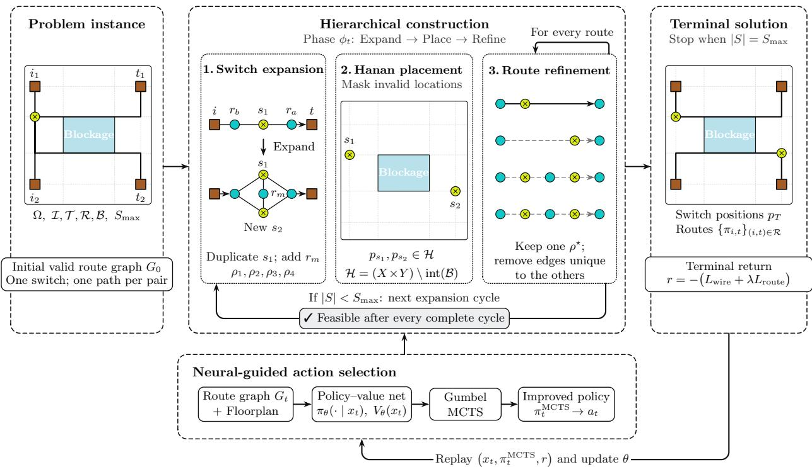  
Figure 1: Overview of our routing and switch-placement method. Gumbel MCTS guides repeated switch expansion, Hanan-grid placement, and route refinement while preserving routing feasibility.

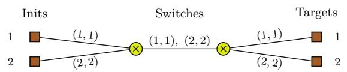  
(a) Routing graph with communication pairs stored as edge attributes.

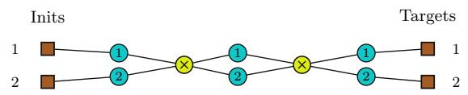  
(b) Graph after conversion to route nodes. Route nodes labeled (1) correspond to pair (1, 1) and those labeled (2) to pair (2, 2).  
Figure 2: Route-node conversion. Each communication pair traversing an edge is represented explicitly by a route node.

Definition 4.1 (Route-node conversion). Let $\mathcal { G } = ( \nu , \mathcal { E } )$ be a routing graph induced by a collection of communication routes. For each edge $( u , v ) \in \mathcal { E }$ , let $\mathcal { R } ( u , v ) = \{ ( i , t ) \in \mathcal { R } : ( u , v ) \in \bar { E } ( \bar { \pi } _ { i , t } ) \}$ denote the communication pairs whose routes traverse that edge. We replace $( u , v )$ by one two-edge path $u  r _ { i , t } ^ { u , v } $ v for each $( i , t ) \in \mathcal { R } ( u , v )$ , where $r _ { i , t } ^ { u , v }$ is a route node associated with communication pair (i, t).

The resulting representation makes each use of a physical connection by a communication pair explicit. Route assignments can therefore be modified through local graph operations rather than variable-size edge attributes. Figure 2 illustrates the conversion. The transformed graph is bipartite between physical nodes (initiators, targets, and switches) and route nodes. Each route node has exactly one incoming and one outgoing edge and is associated with a single communication pair. Moreover, for every communication pair traversing a switch, an incoming route node is paired with an outgoing route node of the same communication pair. These structural properties are invariants preserved by the construction operations introduced below.

## 4.2 Candidate Switch Locations

Switch positions are initially continuous variables over the floorplan. To obtain a finite placement space, we restrict candidate locations to an extended Hanan grid, a classical construction for rectilinear routing [26]. Let $\mathcal { P }$ denote the positions of all initiators and targets, and let $\mathcal { C } _ { B }$ denote the corners of the rectangular blockages. We define the sets of

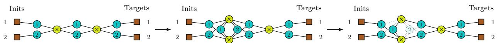  
Figure 4: Switch expansion and route refinement. Expansion of a switch (leftmost yellow node in the first part of the figure) introduces a second switch and exposes four local routing alternatives for each affected communication pair. Route refinement selects one alternative, restoring a unique local route while leaving the remainder of the communication path unchanged.

horizontal and vertical coordinates ${ \mathcal { X } } = \{ x ( p ) : p \in { \mathcal { P } } \} \cup \{ x ( c ) : c \in { \mathcal { C } } _ { \mathcal { B } } \} , { \mathcal { V } } = \{ y ( p ) : p \in { \mathcal { P } } \} \cup \{ y ( c ) : c \in { \mathcal { C } } _ { \mathcal { B } } \}$ The set of candidate switch locations is thèn

$$
\mathcal { H } = \{ ( x , y ) \in \mathcal { X } \times \mathcal { Y } : ( x , y ) \notin \operatorname { i n t } ( \mathcal { B } ) \} .\tag{2}
$$

Figure 3 illustrates the resulting grid.

We have the following result :

Proposition 4.2 (Optimal Switch Placement). Under rectilinear routing, and for fxed positions of initiators, targets, and blockages, there exists an optimal solution in which every switch is placed at an intersection of the extended Hanan grid H.

Thus, restricting switch placement to $\mathcal { H }$ preserves an optimal solution while reducing the continuous placement problem to a finite set of candidate locations. Therefore, in Equation (1), we can replace the search space $\mathbf { p } _ { v } \in \Omega \setminus B _ { : }$ ∀v ∈ S by $\mathbf { p } _ { v } \in \mathcal { H } , \forall v \in \mathcal { S }$

## 4.3 Switch Expansion and Route Refinement

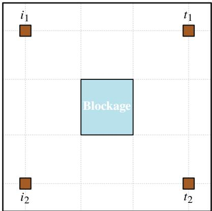

In this section, we describe how the routing graph is locally expanded and refined. Given a switch $s _ { 1 }$ , switch expansion introduces a new switch $s _ { 2 }$ and temporarily introduces routing alternatives associated with $s _ { 1 }$ and $s _ { 2 } .$ Route refinement subsequently resolves these alternatives independently for each affected communication pair. Those two operations are formally defined as follows.

Figure 3: Extended Hanan grid induced by initiators, targets, and blockage corners.

Definition 4.3 (Switch expansion). Let $s _ { 1 }$ be the switch selected for expansion, and let $\sqrt { \vphantom { \biggl | } } _ { b } ( s _ { 1 } )$ and $\bar { \mathcal { N } } _ { a } ( s _ { 1 } )$ denote the sets of route nodes immediately preceding and following $s _ { 1 } .$ , respectively. Switch expansion introduces a new

$$
s _ { 2 } .
$$

$$
r _ { b } \in \mathcal { N } _ { b } ( s _ { 1 } )
$$

$$
r _ { b }  s _ { 2 }
$$

$$
\boldsymbol { r } _ { a } \in \mathcal { N } _ { a } ( s _ { 1 } )
$$

$$
s _ { 2 } \to r _ { a }
$$

For each communication pair (i, t) traversing $s _ { 1 }$ , we additionally introduce a route node $r _ { m } ^ { i , t }$ associated with (i, t) and add the edges $s _ { 1 } \to r _ { m } ^ { i , t } \to s _ { 2 } , \ s _ { 2 } \to r _ { m } ^ { i , t } \to s _ { 1 }$

Remark 4.4. Informally, the expansion duplicates the selected switch and introduces, for each affected communication pair, an additional route node between the two switches. If $r _ { b }$ and $r _ { a }$ denote the route nodes immediately before and after the expanded switch, this exposes four local routing alternatives:

$$
\begin{array} { l l } { { \rho _ { 1 } : r _ { b } \to s _ { 1 } \to r _ { a } , } } & { { \rho _ { 2 } : r _ { b } \to s _ { 2 } \to r _ { a } , } } \\ { { \rho _ { 3 } : r _ { b } \to s _ { 1 } \to r _ { m } \to s _ { 2 } \to r _ { a } , } } & { { \rho _ { 4 } : r _ { b } \to s _ { 2 } \to r _ { m } \to s _ { 1 } \to r _ { a } . } } \end{array}
$$

Route refinement subsequently selects one of these four alternatives.

Definition 4.5 (Route refinement). For each communication pair affected by the expansion, let $\{ \rho _ { 1 } , \rho _ { 2 } , \rho _ { 3 } , \rho _ { 4 } \}$ denote its four local routing alternatives, where each $\rho _ { j }$ is identified with its set of edges. Given a selected alternative $\rho ^ { \star }$ , route refinement removes all edges belonging exclusively to the unselected alternatives: ${ \mathcal { E } } \gets \mathcal { E } \setminus \left( \bigcup _ { \rho _ { j } \neq \rho ^ { \star } } E ( \rho _ { j } ) \setminus E ( \rho ^ { \star } ) \right)$ Route nodes left disconnected by this operation are removed.

Figure 4 illustrates the expansion and subsequent refinement process. Although the expanded intermediate graph contains multiple alternatives for the affected communication pairs, refinement restores a feasible routing configuration.

Proposition 4.6 (Validity preservation). Assume the routing configuration before expansion assigns exactly one simple directed path to every communication pair. After applying switch expansion and route reinement (Deinitions 4.3 and 4.5), the resulting routing configuration again assigns exactly one simple directed path to every communication pair.

This proposition states that the feasibility of the constructed routing is an invariant of the expansion-refinement cycle, $i . e .$ , starting from a minimal feasible routing with a single switch, any routing constructed using those two operations remains feasible. However, the hierarchical construction cannot generate every feasible routing configuration. Indeed, consider the following example:

Example 4.7. Consider three switches $s _ { 1 } , s _ { 2 } , s _ { 3 }$ and three communication routes $\pi _ { 1 } = ( s _ { 1 } , s _ { 2 } , s _ { 3 } ) , \pi _ { 2 } = ( s _ { 2 } , s _ { 3 } , s _ { 1 } )$ ${ \pi } _ { 3 } = ( s _ { 3 } , s _ { 1 } , s _ { 2 } )$ . This configuration cannot be generated by the hierarchical construction following Definitions 4.3 and $4 . 5$ . Indeed, consider the switch introduced last and assume, without loss of generality, that it is $s _ { 3 }$ . This switch must be introduced by expanding either $s _ { 1 }$ or $s _ { 2 }$ . For any route containing both the parent switch and $s _ { 3 }$ , these two switches are consecutive immediately after the expansion. Since $s _ { 3 }$ is introduced last, no subsequent expansion can insert another switch between them. If $s _ { 3 }$ is introduced by expanding $s _ { 1 }$ , this contradicts $\pi _ { 1 } = ( s _ { 1 } , s _ { 2 } , s _ { 3 } )$ . If it is introduced by expanding $s _ { 2 } ,$ this contradicts ${ \boldsymbol { \pi } } _ { 3 } = ( s _ { 3 } , s _ { 1 } , s _ { 2 } )$ . Hence the configuration cannot be generated by the hierarchical construction.

Nevertheless, the following result shows that excluding such configurations does not sacrifice global optimality: at least one globally optimal solution always belongs to the hierarchical search space.

Proposition 4.8 (Optimality of the hierarchical search space). There exists a globally optimal solution to Equation (1) that can be obtained from the initial configuration through a finite sequence of switch expansions, placements, and route refinements.

## 4.4 Routing as a Sequential Markov Decision Process

We formulate the hierarchical construction process as a Markov Decision Process (MDP) $( \mathcal { X } , \mathcal { A } , \mathcal { P } , \mathcal { R } )$ . An episode starts from a single switch connecting every communication pair and progressively refines an initially feasible routing configuration through successive switch expansions, switch placements, and route refinements.

State space. At step $t ,$ the state is defined as $x _ { t } = \Big ( G _ { t } , \mathbf { p } _ { t } , \phi _ { t } , \mathcal { Q } _ { t } ^ { \mathrm { p l a c e } } , \mathcal { Q } _ { t } ^ { \mathrm { r o u t e } } \Big )$ , where $G _ { t } = ( \nu _ { t } , \mathcal { E } _ { t } )$ is the current route-node graph, $\mathbf { p } _ { t } = \{ \mathbf { p } _ { v } \} _ { v \in \mathcal { S } _ { t } }$ contains the positions of the current switches, and $\phi _ { t }$ denotes the current decision phase. The queues $\mathcal { Q } _ { t } ^ { \mathrm { p l a c e } }$ and $\mathcal { Q } _ { t } ^ { \mathrm { r o u t e } }$ contain, respectively, the switches awaiting placement and the communication routes awaiting refinement. The next placement or refinement decision always operates on the first element of the corresponding queue.

Initial state. The initial graph $G _ { 0 }$ contains a single switch $s ^ { ( 0 ) }$ . For every communication pair $( i , t ) \in \mathcal { R }$ , two route nodes $r _ { i , t } ^ { \mathrm { i n } }$ and $r _ { i , t } ^ { \mathrm { o u t } }$ form the path $i \to r _ { i , t } ^ { \mathrm { i n } } \to s ^ { ( 0 ) } \to r _ { i , t } ^ { \mathrm { o u t } } \to t$ . The initial switch is placed at a fixed valid location ${ \bf p } _ { s ^ { ( 0 ) } } \in \mathcal { H }$ . Both queues are initially empty, $\mathcal { Q } _ { 0 } ^ { \mathrm { p l a c e } } = \mathcal { Q } _ { 0 } ^ { \mathrm { r o u t e } } = \emptyset$ , and the initial phase corresponds to switch expansion The initial state therefore represents a feasible routing solution.

Action space. The set of admissible actions depends on the current phase $\phi _ { t }$ . During switch expansion, the action selects a switch $s \in S _ { t }$ to expand according to Definition 4.3. During switch placement, the action selects a valid candidate location $\mathbf { p } \in \mathcal { H }$ for the first switch in $\mathcal { Q } _ { t } ^ { \mathrm { p l a c e } }$ . During route refinement, the action selects one of the four local routing alternatives $\rho ^ { \star } \in \{ \rho _ { 1 } , \rho _ { 2 } , \rho _ { 3 } , \rho _ { 4 } \}$ for the first route in $\scriptstyle \mathcal { Q } _ { t } ^ { \mathrm { r o u t e } }$

Transition dynamics. The environment is deterministic and Markovian. Each construction cycle begins with an expansion action, which introduces a new switch that initially inherits the position of the expanded switch. The two switches affected by the expansion are added to $\mathcal { Q } _ { t } ^ { \mathrm { p l a c e } }$ , and the affected communication routes are added to $\mathcal { Q } _ { t } ^ { \mathrm { r o u t e } }$ The placement and refinement queues are then processed sequentially. Each action operates on and removes the first element of the corresponding queue. Once $\mathcal { Q } _ { t } ^ { \mathrm { p l a c e } }$ is empty, the process transitions from placement to route refinement. Once $\mathcal { Q } _ { t } ^ { \mathrm { r o u t e } }$ is also empty, the resulting graph again represents a feasible routing configuration and the process returns to the switch expansion phase. The episode terminates when the switch budget $\bar { S _ { \mathrm { m a x } } }$ is reached and the final refinement cycle has been completed.

Reward. We use a sparse terminal reward corresponding to the negative routing objective of Equation (1): $r _ { t } = 0$ for all $t < T$ , and $r _ { T } = { \bar { - L } } _ { \mathrm { w i r e } } ( G _ { T } ) - \lambda L _ { \mathrm { r o u t e } } ( G _ { T } { \bar { ) } }$ , where $\begin{array} { r } { \lambda = \frac { 1 } { 2 } } \end{array}$ in our experiments.

## 5 Implementation

We learn a shared graph policy and value network over the sequential decision process defined in Section 4.4. The network jointly encodes the current routing graph, blockage geometry, and candidate switch locations with separate policy heads for switch expansion, placement, and route refinement. Invalid actions are masked throughout construction. We use Gumbel MCTS [13] to explore the resulting search space, using the learned policy and value function to guide tree search and training them toward search-improved targets. Following the risk-seeking value estimation of AlphaTensor [27], we train the value function toward the top 25% of observed returns rather than their average. Per-floorplan PopArt [28] is used for value normalization.

To isolate the contribution of tree search, we additionally train PPO-EWMA [29] on the same hierarchical MDP. PPO-EWMA uses the same policy-value architecture, action masking, terminal objective, and PopArt value normalization, but selects actions directly from the learned policy without tree search. Architectural details, optimization procedures, and hyperparameters are provided in Appendix C.

## 6 Experiments and Results

Our experiments investigate whether (i) learned guidance improves over non-learning optimization methods, (ii) explicit tree search improves over direct policy optimization, and (iii) pretraining across floorplans improves optimization on unseen instances. Experimental details, numerical results, and routing visualizations are provided in Appendices C, D, and E, respectively.

## 6.1 Datasets and Experimental Setup

Floorplans. We evaluate our model on 28 synthetic square floorplans with rectangular blockages and initiator-target communication constraints. We use 24 floorplans for pretraining and hold out the remaining four for transfer experiments. The instances contain 18–25 communication pairs, 3–5 initiators, and 5–8 targets, with switch budgets ranging from 2 to 5. The unobstructed area covers 58.4%–81.3% of each floorplan. We construct an extended Hanan grid from terminal coordinates and blockage boundaries, yielding grids ranging from 24 × 23 to 42 × 44 candidate positions

Metric. We evaluate solutions using the objective defined in Section 3, i.e., $L _ { \mathrm { w i r e } } + { \textstyle { \frac { 1 } { 2 } } } L _ { \mathrm { r o u t e } }$ . Wirelength counts each physical connection once, irrespective of the number or direction of routes using it, while route length counts every route traversal. For readability, all lengths are normalized by the side length of the corresponding floorplan.

Baselines. We compare Gumbel MCTS [13] against classical, model-free search, and direct policy optimization baselines. Heuristic is a deterministic obstacle-aware, Steiner-inspired constructive method that greedily selects switch locations from the extended Hanan grid and sequentially routes communication pairs using their marginal contribution to the objective. Random Search [30] uniformly samples legal actions within our hierarchical framework isolating the benefit of learned guidance. Genetic Algorithm [31] evolves complete hierarchical action sequences using selection, crossover, mutation, and random immigration, providing a stronger non-learning search baseline. Finally. PPO-EWMA [29] uses the same policy-value architecture and hierarchical environment as Gumbel MCTS, but acts directly from the learned policy without tree search, isolating the contribution of explicit search.

All methods except Heuristic are run for 48 hours on the 24 pretraining floorplans. Heuristic is instead run once as a deterministic constructive procedure. Fine-tuning is performed for 24 hours, with transfer results aggregated over three independent runs. For both PPO-EWMA and Gumbel MCTS, we compare fine-tuning from the respective pretrained checkpoint against training from scratch on each of the four held-out floorplans.

## 6.2 Results and Discussion

Comparison with optimization baselines. Table 1 reports the objective obtained on the 24 training floorplans. The Heuristic achieves strong results on several instances, but its performance is highly instance-dependent. Random Search performs poorly throughout. This shows the need for effective guidance within the hierarchical search space. The Genetic Algorithm is considerably stronger and competitive on several instances, but struggles on more challenging floorplans, such as 18 and 19. PPO-EWMA improves upon these baselines on most instances, and shows the benefit of learned guidance, but still exhibits substantial performance gaps on some instances. Gumbel MCTS achieves the strongest and most consistent performance, including on instances where the other methods struggle. This is particularly evident on floorplans 18 and 19, where it obtains objectives of 13.601 and 14.373, compared with 19.147 and 18.488 for PPO-EWMA and 19.881 and 22.062 for the Genetic Algorithm. Among all methods, Gumbel MCTS benefits the most from additional compute, continuing to improve as the search budget increases.

Table 1: Objective values on the 24 training floorplans (lower is better). Best results are shown in bold and second-best results are underlined.
<table><tr><td>Method</td><td>1</td><td>2</td><td>3</td><td>4</td><td>5</td><td>6</td><td>7</td><td>8</td><td>9</td><td>10</td><td>11</td><td>12</td></tr><tr><td>Heuristic</td><td>11.902</td><td>11.255</td><td>15.349</td><td>11.330</td><td>14.847</td><td>11.126</td><td>8.090</td><td>10.301</td><td>11.292</td><td>14.615</td><td>14.741</td><td>13.418</td></tr><tr><td>Random search</td><td>18.706</td><td>20.799</td><td>24.042</td><td>17.420</td><td>23.629</td><td>19.310</td><td>12.672</td><td>18.574</td><td>18.663</td><td>24.931</td><td>22.584</td><td>20.775</td></tr><tr><td>Genetic algorithm</td><td>14.382</td><td>13.999</td><td>16.854</td><td>12.622</td><td>17.970</td><td>13.107</td><td>8.224</td><td>11.954</td><td>14.152</td><td>15.799</td><td>16.478</td><td>16.504</td></tr><tr><td>PPO-EWMA Gumbel MCTS</td><td>12.166 11.333</td><td>11.484 10.880</td><td>15.670 14.274</td><td>11.576 9.784</td><td>14.717 13.926</td><td>10.960 9.918</td><td>8.595 7.739</td><td>10.352 9.897</td><td>11.142 10.820</td><td>13.329 13.028</td><td>14.151 13.995</td><td>13.361 13.361</td></tr><tr><td>Method</td><td></td><td></td><td></td><td></td><td></td><td></td><td></td><td></td><td></td><td></td><td></td><td></td></tr><tr><td></td><td>13</td><td>14</td><td>15</td><td>16</td><td>17</td><td>18</td><td>19</td><td>20</td><td>21</td><td>22</td><td>23</td><td>24</td></tr><tr><td>Heuristic</td><td>13.662</td><td>15.003</td><td>14.512</td><td>15.284</td><td>16.571</td><td>16.366</td><td>16.277</td><td>16.277</td><td>14.909</td><td>15.415</td><td>14.007</td><td>15.684</td></tr><tr><td>Random search Genetic algorithm</td><td>21.425 15.238</td><td>21.875</td><td>19.338</td><td>20.146</td><td>20.943</td><td>30.810</td><td>29.030</td><td>20.421 15.726</td><td>23.683</td><td>21.337</td><td>22.457 14.621</td><td>20.583 15.277</td></tr><tr><td></td><td></td><td>15.057</td><td>14.134</td><td>15.236</td><td>15.239</td><td>19.881</td><td>22.062</td><td></td><td>16.580</td><td>14.531</td><td></td><td></td></tr><tr><td>PPO-EWMA</td><td>13.287</td><td>13.593</td><td>14.134</td><td>15.269</td><td>15.239</td><td>19.147</td><td>18.488</td><td>15.817</td><td>13.095</td><td>13.989</td><td>12.409</td><td>15.277</td></tr><tr><td>Gumbel MCTS</td><td>13.287</td><td>13.466</td><td>14.134</td><td>15.236</td><td>15.239</td><td>13.601</td><td>14.373</td><td>15.726</td><td>12.779</td><td>13.471</td><td>12.386</td><td>15.277</td></tr></table>

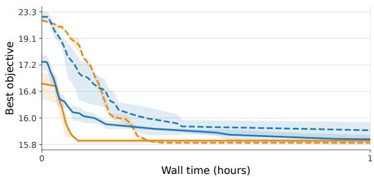  
(a) Fine-tuning instance 1

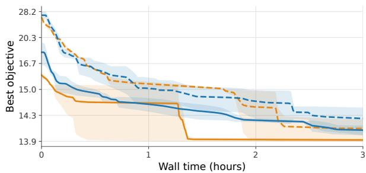  
(b) Fine-tuning instance 2

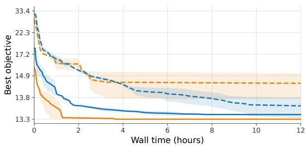  
(c) Fine-tuning instance 3

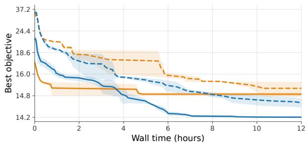  
(d) Fine-tuning instance 4  
Figure 5: Comparison between optimization from scratch and fine-tuning from a policy pretrained on the 24 training floorplans, evaluated on held-out floorplans. Each curve shows the mean over three independent runs, and the shaded region indicates one standard deviation. The objective is shown on a logarithmic scale. For readability, the time axis is truncated once all methods are within 1% of their respective best objective values. PPO-EWMA is shown in orange and Gumbel MCTS in blue. Solid lines correspond to fine-tuning from the pretrained policy, while dotted lines correspond to optimization from scratch.

Transfer to unseen floorplans. We next investigate whether training across multiple floorplans produces reusable policies that facilitate optimization of previously unseen instances. We pretrain on the 24 training floorplans and evaluate transfer on four held-out floorplans. For each target instance, we compare fine-tuning from the fixed pretrained checkpoint against training the same model from random initialization. Results are aggregated over three independent fine-tuning runs. Figure 5 shows that pretraining substantially accelerates optimization on held-out floorplans. Finetuning starts from stronger solutions than training from scratch and reaches competitive solutions using less targetinstance optimization. On some instances, fine-tuning also reaches better solutions within the available optimization budget.

## 6.3 Limitations

Our formulation deliberately omits several aspects of physical design. The current environment does not model component dimensions, pin-level constraints, unit density, routing congestion, or bandwidth constraints, and the optimization objective considers only physical wirelength and communication-route length. Similarly, our experiments are limited to relatively small routing instances compared with real-world NoC designs, which can contain up to tens of thousands of communication connections. While the formulation does not assume fixed instance sizes, larger instances increase the computational cost. Extending the formulation to richer physical constraints and objectives, and evaluating it at industrial scale, are left to future work.

## 7 Conclusion

We introduced a learning-based framework for joint routing and switch placement based on a validity-preserving graph hierarchical formulation. The formulation restricts switch locations to an extended Hanan grid and enforces feasibility at every complete expansion-refinement cycle. Together, these choices discretize the placement space and restrict search to feasible solutions, substantially reducing the difficulty of the search. Experiments across diverse floorplans show that Gumbel MCTS effectively explores the resulting search space, consistently outperforming classical optimization baselines and direct policy optimization, with particularly large improvements on more challenging instances. Pretraining across multiple floorplans also provides a useful initialization for unseen instances, reducing the time required to find high-quality solutions.

## Reproducibility Statement

All proofs are given in Appendix A. Appendices B and C provide all the details for the implementation and experiments.   
The code will be made public upon acceptance of the paper.

## AI Use Statement

Generative AI was used to assist with literature review, polishing the writing, and coding. It was also used to double-check and refine the proofs in Appendix A. In particular, it provided a counterexample to an initial version of Proposition 4.8, which prompted us to refine the proposition statement. We take responsibility for the final content of this work, including all text, claims, code, and other materials produced with the assistance of generative AI.

## References

[1] Radu Marculescu, Umit Y Ogras, Li-Shiuan Peh, Natalie Enright Jerger, and Yatin Hoskote. Outstanding research problems in noc design: system, microarchitecture, and circuit perspectives. IEEE Transactions on computer-aided design of integrated circuits and systems, 2008.

[2] Jiang Hu and Sachin S. Sapatnekar. A survey on multi-net global routing for integrated circuits. Integration, 2001.

[3] Hao Tang, Genggeng Liu, Xiaohua Chen, and Naixue Xiong. A survey on steiner tree construction and global routing for vlsi design. IEEE Access, 2020.

[4] Edmund Ihler, Gabriele Reich, and Peter Widmayer. Class steiner trees and vlsi-design. Discrete Applied Mathematics, 1999.

[5] Chris Chu and Yiu-Chung Wong. Fast and accurate rectilinear steiner minimal tree algorithm for vlsi design. In International Symposium on Physical Design, 2005.

[6] C. Y. Lee. An algorithm for path connections and its applications. IRE Transactions on Electronic Computers, 1961.

[7] Azalia Mirhoseini, Anna Goldie, Mustafa Yazgan, Joe Wenjie Jiang, Ebrahim Songhori, Shen Wang, Young-Joon Lee, Eric Johnson, Omkar Pathak, Azade Nova, et al. A graph placement methodology for fast chip design. Nature, 2021.

[8] Jinwei Liu, Gengjie Chen, and Evangeline FY Young. Rest: Constructing rectilinear steiner minimum tree via reinforcement learning. In ACM/IEEE Design Automation Conference, 2021.

[9] Po-Yan Chen, Bing-Ting Ke, Tai-Cheng Lee, I-Ching Tsai, Tai-Wei Kung, Li-Yi Lin, En-Cheng Liu, Yun-Chih Chang, Yih-Lang Li, and Mango C-T Chao. A reinforcement learning agent for obstacle-avoiding rectilinear steiner tree construction. In International Symposium on Physical Design, 2022.

[10] Xingbo Du, Chonghua Wang, Ruizhe Zhong, and Junchi Yan. Hubrouter: Learning global routing via hub generation and pin-hub connection. Advances in Neural Information Processing Systems, 2023.

[11] Ruizhi Liu, Zhisheng Zeng, Shizhe Ding, Jingyan Sui, Xingquan Li, and Dongbo Bu. Neuralsteiner: Learning steiner tree for overflow-avoiding global routing in chip design. Advances in Neural Information Processing Systems, 2024.

[12] Xingbo Du, Ruizhe Zhong, and Junchi Yan. Train on pins and test on obstacles for rectilinear steiner minimum tree. Advances in Neural Information Processing Systems, 2026.

[13] Ivo Danihelka, Arthur Guez, Julian Schrittwieser, and David Silver. Policy improvement by planning with gumbel. In International Conference on Learning Representations, 2022.

[14] Chung-Kuan Cheng, Andrew B Kahng, Ilgweon Kang, and Lutong Wang. Replace: Advancing solution quality and routability validation in global placement. IEEE Transactions on Computer-Aided Design of Integrated Circuits and Systems, 2018.

[15] W.A. Dees and R.J. Smith. Performance of interconnection rip-up and reroute strategies. In Design Automation Conference, 1981.

[16] Ralph Linsker. An iterative-improvement penalty-function-driven wire routing system. IBM Journal of Research and Development, 1984.

[17] Andrew B. Kahng, Lutong Wang, and Bangqi Xu. Tritonroute: The open-source detailed router. IEEE Transactions on Computer-Aided Design of Integrated Circuits and Systems, 2021.

[18] Tapani Ahonen, David A Sigüenza-Tortosa, Hong Bin, and Jari Nurmi. Topology optimization for applicationspecific networks-on-chip. In International Workshop on System Level Interconnect Prediction, 2004.

[19] Ahmed A Morgan, Haytham Elmiligi, Mohamed Watheq El-Kharashi, and Fayez Gebali. Unified multi-objective mapping and architecture customisation of networks-on-chip. IET Computers & Digital Techniques, 2013.

[20] Ruoyu Cheng and Junchi Yan. On joint learning for solving placement and routing in chip design. Advances in Neural Information Processing Systems, 2021.

[21] Ruoyu Cheng, Xianglong Lyu, Yang Li, Junjie Ye, Jianye Hao, and Junchi Yan. The policy-gradient placement and generative routing neural networks for chip design. Advances in Neural Information Processing Systems, 2022.

[22] Yunqi Shi, Ke Xue, Song Lei, and Chao Qian. Macro placement by wire-mask-guided black-box optimization. Advances in Neural Information Processing Systems, 2023.

[23] Zijie Geng, Jie Wang, Ziyan Liu, Siyuan Xu, Zhentao Tang, Mingxuan Yuan, Jianye Hao, Yongdong Zhang, and Feng Wu. Reinforcement learning within tree search for fast macro placement. In Forty-first International Conference on Machine Learning, 2024.

[24] Haiguang Liao, Wentai Zhang, Xuliang Dong, Barnabas Poczos, Kenji Shimada, and Levent Burak Kara. A deep reinforcement learning approach for global routing. Journal of Mechanical Design, 2020.

[25] Michael R. Garey and David S. Johnson. The rectilinear steiner tree problem is np-complete. SIAM Journal on Applied Mathematics, 1977.

[26] Maurice Hanan. On steiner's problem with rectilinear distance. SIAM Journal on Applied mathematics, 1966.

[27] Alhussein Fawzi, Matej Balog, Aja Huang, Thomas Hubert, Bernardino Romera-Paredes, Mohammadamin Barekatain, Alexander Novikov, Francisco J R. Ruiz, Julian Schrittwieser, Grzegorz Swirszcz, et al. Discovering faster matrix multiplication algorithms with reinforcement learning. Nature, 2022.

[28] Matteo Hessel, Hubert Soyer, Lasse Espeholt, Wojciech Czarnecki, Simon Schmitt, and Hado Van Hasselt. Multi-task deep reinforcement learning with popart. In AAAI Conference on Artificial Intelligence, 2019.

[29] Jacob Hilton, Karl Cobbe, and John Schulman. Batch size-invariance for policy optimization. Advances in Neural Information Processing Systems, 2022.

[30] Dean C Karnopp. Random search techniques for optimization problems. Automatica, 1963.

[31] John H Holland. Genetic algorithms. Scientific american, 1992.

[32] Guillaume MJ-B Chaslot, Mark HM Winands, and H Jaap van Den Herik. Parallel monte-carlo tree search. In International Conference on Computers and Games, 2008.

## Appendix

1   
A Proofs 12   
A.1 Optimality on the Hanan Grid . 12   
A.2 Correct and Static Routing at Every Step of the Algorithm 13   
A.3 Optimality of the Hierarchical Search Space 13   
B Implementation Details 14   
B.1 Model Architecture 14   
B.2 PPO-EWMA. 15   
B.3 Gumbel MCTS 15   
C Experimental Details 16   
C.1 Datasets and Transfer Protocol 16   
C.2 Optimization Baselines 16   
C.3 Compute and Evaluation . 16   
D Detailed Numerical Results 18   
D.1 Pretraining . 18   
D.2 Fine-Tuning 21   
E Floorplans Generated by the Different Methods 22   
E.1 Pretraining . 22   
E.2 Fine-Tuning 46

## A Proofs

In this section, we provide proofs for all the propositions in the main paper.

## A.1 Optimality on the Hanan Grid

Proposition A.1 (Optimal Switch Placement). Under rectilinear routing, and for fixed positions of initiators, targets, and blockages, there exists an optimal solution in which every switch is placed at an intersection of the extended Hanan grid H.

Proof. We first establish a geometric property used in the argument. Recall that blockage interiors are forbidden, while their boundaries are admissible.

Lemma A.2. Let $C$ be the set of switches sharing an off-grid x-coordinate $x ,$ and let $x ^ { - } < x < x ^ { + }$ be consecutive coordinates obtained by augmenting the vertical Hanan lines with all switch x-coordinates. Every physical connection incident to $C$ admits a shortest realization whose length varies affinely when $C$ is translated horizontally within $[ x ^ { - } , x ^ { + } ]$

Proof. Since $x ^ { - }$ and $x ^ { + }$ are consecutive augmented coordinates, no vertical blockage boundary lies in the open slab $( x ^ { - } , x ^ { + } ) \times \mathbb { R }$ . Consequently, from any feasible point $( x , y )$ in the slab, the horizontal segment to either boundary is feasible: otherwise a rectangular blockage would have a vertical boundary inside the slab or would contain $( x , y )$

Consider first a shortest connection from $s = ( x , y _ { s } ) \in C$ to an endpoint outside $C .$ The other endpoint cannot lie strictly inside the slab, since terminal coordinates are Hanan coordinates and all switch coordinates were included in the augmentation. Hence the connection reaches one of the slab boundaries; suppose it first reaches $x ^ { + }$ at $b = ( x ^ { + } , y _ { b } )$ .

The prefix from s to b can be replaced by a horizontal segment from $\left( x , y _ { s } \right) \mathrm { t o } \left( x ^ { + } , y _ { s } \right)$ followed by a vertical segment along $x ^ { + }$ to b. This path is feasible and has length $x ^ { + } - x + | y _ { b } - y _ { s } |$ , the rectilinear lower bound between s and $b .$ It is therefore also shortest. After translating s by $\delta ,$ only its initial horizontal segment changes, so the connection length changes by —δ. A connection reaching $x ^ { - }$ analogously changes by $+ \delta$

Now consider a connection whose two endpoints belong to $C .$ If their vertical segment is feasible, it remains feasible under a common translation within the slab and its length is constant. Otherwise, any feasible connection between them must leave the slab. Applying the preceding argument at both endpoints gives a shortest realization with fixed boundary attachments. Its length therefore changes by —2δ, 2δ, or $0 ,$ according to the boundaries through which it leaves and re-enters the slab.

Thus every connection incident to C has a shortest realization whose length is affine in $\delta .$

We now consider a globally optimal solution with objective $J ^ { \star }$ and fix its logical routing topology. For each physical connection $\{ u , v \}$ , let $m _ { u v }$ be the number of communication routes traversing it. Its contribution to the objective has fixed positive weight $w _ { u v } = 1 + \lambda m _ { u v }$ Hence, for the fixed topology, the optimal objective can be written as $\begin{array} { r } { J ^ { \star } = \sum _ { \{ u , v \} \in E } w _ { u v } \bar { d } _ { B } ( u , v ) } \end{array}$ , where $d _ { B } ( u , v )$ denotes the shortest obstacle-avoiding rectilinear distance between u and v.

We first align the x-coordinates. Let $\mathcal { X }$ be the set of vertical Hanan coordinates and define ${ \widehat { \mathcal { X } } } = { \mathcal { X } } \cup \{ x _ { s } : s \in { \mathcal { S } } \}$ Group switches sharing the same $x \notin \mathcal { X }$ , and let $N _ { x }$ be the number of such off-grid groups.

Consider one group $C$ at $x ,$ with adjacent coordinates $x ^ { - } < x < x ^ { + }$ in $\widehat { \mathcal { X } }$ Choose for each incident connection a shortest realization given by Lemma A.2. If C is translated by $\delta ,$ with $x + \delta \in [ x ^ { - } , x ^ { + } ]$ , the weighted length of these realizations is affine: $\widetilde J ( \delta ) = J ( 0 ) +$ - aδ for some constant a. Since $\delta = 0$ lies between the two boundary displacements at least one boundary satisfies $\tilde { J } ( \delta ) \leq J ( 0 )$

Move $C$ to such a boundary. The constructed paths certify a feasible solution with no larger objective; replacing them by shortest paths at the new switch positions can only improve it further. If the reached coordinate is in $\bar { \boldsymbol { x } } , \boldsymbol { C }$ is now Hanan-aligned; otherwise it merges with another switch group. In either case, $N _ { x }$ strictly decreases. Repeating this operation therefore places every switch on a vertical Hanan line after finitely many moves, without increasing the objective.

Applying the same argument to the y-coordinates, while keeping the x-coordinates fixed, places every switch at an intersection of H without increasing the objective. The paths maintained during these translations are feasible. but need not be shortest at the final switch positions. We therefore replace each physical connection by a shortest obstacle-avoiding rectilinear path between its final endpoints. Such a path exists because the maintained path provides a feasible connection, and this replacement can only decrease the objective. Thus, starting from the globally optimal value $J ^ { \star }$ , we obtain a feasible grid-aligned solution with objective at most $J ^ { \star }$ . By global optimality, its objective must equal $J ^ { \star }$ , completing the proof. □

## A.2 Correct and Static Routing at Every Step of the Algorithm

Proposition A.3 (Validity preservation). Assume the routing configuration before expansion assigns exactly one simple directed path to every communication pair. After applying switch expansion and route reinement (Deinitions 4.3 and 4.5), the resulting routing configuration again assigns exactly one simple directed path to every communication pair.

Proof. Let $G = ( \nu , \mathcal { E } )$ be a valid routing configuration and let $s _ { 1 }$ be the switch selected for expansion. Consider a communication pair $( i , t ) \in \mathcal { R }$

If $\pi _ { i , t }$ does not traverse $s _ { 1 }$ , neither switch expansion nor route refinement modifies its route, so $\pi _ { i , t }$ remains a unique simple directed path.

Now suppose that $\pi _ { i , t }$ traverses $s _ { 1 }$ . Because $\pi _ { i , t }$ is simple, it visits $s _ { 1 }$ exactly once. Let $r _ { b }$ and $r _ { a }$ denote the route nodes immediately preceding and following $s _ { 1 }$ on $\pi _ { i , t }$ . Switch expansion leaves the remainder of $\pi _ { i , t }$ unchanged and replaces the local segment $r _ { b }  s _ { 1 }  r _ { a }$ by the four alternatives $\rho _ { 1 } : r _ { b } \to s _ { 1 } \to r _ { a } , \rho _ { 2 } : r _ { b } \to s _ { 2 } \to r _ { a } ,$ $\rho _ { 3 } : r _ { b }  s _ { 1 }  r _ { m }  s _ { 2 }  r _ { a }$ and $\rho _ { 4 } : r _ { b } \to s _ { 2 } \to r _ { m } \to s _ { 1 } \to r _ { a }$ , where $s _ { 2 }$ is the newly introduced switch and $r _ { m }$ is the corresponding route node for $( i , t )$

Each $\rho _ { j }$ is a simple directed path from $r _ { b } : _ { 0 } r _ { a } .$ Indeed, $s _ { 2 }$ and $r _ { m }$ are newly introduced nodes, while $s _ { 1 }$ occurs only once in each alternative. Route refinement selects exactly one $\rho _ { j }$ and removes the edges belonging exclusively to the remaining alternatives. Replacing the original local segment by the selected $\rho _ { j }$ therefore yields exactly one simple directed path from i to t.

Since this argument applies independently to every communication pair affected by the expansion, while all unaffected routes remain unchanged, the refined configuration assigns exactly one simple directed path to every communication pair. □

## A.3 Optimality of the Hierarchical Search Space

Proposition A.4 (Optimality of the hierarchical search space). There exists a globally optimal solution to Equation (1) that can be obtained from the initial configuration through a finite sequence of switch expansions, placements, and route renements

Proof. We first establish a structural property of optimal routing solutions. For a communication route π containing two switches $s _ { a }$ and $s _ { b } ,$ let $\pi [ s _ { a } , s _ { b } ]$ denote the physical subpath between them, independently of its traversal direction.

Lemma A.5 (Common-subpath property). There exists a globally optimal routing configuration such that, for any pair of switches $s _ { a }$ and $s _ { b } ,$ all communication routes containing both switches use the same switch sequence between them possibly in reverse order.

Proof. Index the switches up to the budget $S _ { \mathrm { m a x } } ,$ and assign every possible undirected connection e between terminals and switches a positive tie-breaking weight $\omega _ { e } = 2 ^ { k ( e ) }$ , where the exponents $k ( e )$ are distinct. For a route $\pi =$ $( v _ { 0 } , \ldots , v _ { k } )$ , define $\begin{array} { r } { \tau ( \pi ) = \sum _ { j = 1 } ^ { k } \omega _ { \{ v _ { j - 1 } , v _ { j } \} } } \end{array}$ . Since routes are simple, two distinct paths between the same endpoints, up to reversal, have different values of τ.

Among all globally optimal routing configurations, choose one minimizing $\begin{array} { r } { \Psi = \sum _ { ( i , t ) \in \mathcal { R } } \tau \big ( \pi _ { i , t } \big ) } \end{array}$ . Such a configuration exists because the switch budget and the number of communication pairs are finite, and hence only finitely many simple route sequences are possible.

Suppose, for contradiction, that two communication routes contain the same switches $s _ { a }$ and $s _ { b }$ but use different switch sequences $P _ { 1 }$ and $P _ { 2 }$ between them. Orient both sequences from $s _ { a }$ to $s _ { b }$ , and let $L ( P )$ denote their route-length contribution. Without loss of generality, assume that $\dot { L ( P _ { 1 } ) } < L ( P _ { 2 } )$ , or that $L ( P _ { 1 } ) = \dot { L } ( \stackrel { . } { P _ { 2 } } )$ and $\tau ( P _ { 1 } ) < \tau ( P _ { 2 } )$

Replace $P _ { 2 }$ in its route by $P _ { 1 }$ , using the reverse of $P _ { 1 }$ if necessary. Every connection of $P _ { 1 }$ is already present in the routing configuration, so this introduces no new physical wire. If the resulting route contains a repeated switch, erase the resulting loops; this preserves connectivity and can only remove physical wire and route length.

If $L ( P _ { 1 } ) < L ( P _ { 2 } )$ , the route-length term strictly decreases while wirelength does not increase, contradicting global optimality. Otherwise, the objective does not increase and therefore, by global optimality, remains unchanged. The resulting configuration is thus also globally optimal, but replacing $P _ { 2 }$ by $P _ { 1 }$ strictly decreases Ψ. Any loop removal only decreases it further because all $\omega _ { e }$ are positive. This contradicts the choice of the globally optimal configuration minimizing Ψ.

Therefore no such pair of routes can exist, proving the claim.

Now let $G ^ { \star }$ be such a globally optimal configuration. By Proposition 4.2, we may additionally choose $G ^ { \star }$ such that every switch is placed on the extended Hanan grid H.

We now construct a finite sequence of contractions $G ^ { \star } = G ^ { ( m ) } \xrightarrow { { \cal C } _ { m } } G ^ { ( m - 1 ) } \xrightarrow { { \cal C } _ { m - 1 } } \cdots \xrightarrow { { \cal C } _ { 1 } } G ^ { ( 0 ) }$ , where $G ^ { ( 0 ) }$ contains a single switch.

Consider a configuration $G ^ { ( k ) }$ containing at least two switches. If some communication route contains at least two switches, choose two switches $s _ { a }$ and $s _ { b }$ that are consecutive on that route. Their physical subpath is the single connection between $s _ { a }$ and ${ \mathit { s } } _ { b } ;$ hence, by Lemma ${ \mathrm { A . 5 } } .$ , every other communication route containing both switches also contains them consecutively, possibly in the opposite order. If no communication route contains two switches, choose any two remaining switches $s _ { a }$ and $s _ { b } .$ , which cannot occur together on any communication route.

For every communication pair whose route contains at least one of $s _ { a }$ and $s _ { b } .$ the local subpath involving these switches is therefore one of $\begin{array} { r } {  s _ { a }  , \qquad s _ { b }  , \qquad s _ { a }  s _ { b }  , \qquad s _ { b }  s _ { a }  } \end{array}$ . Before contracting the switches, we record this local subpath for each such communication pair.

The contraction $C _ { k }$ identifies $s _ { a }$ and $s _ { b }$ with a single macro-switch s and replaces each of these local subpaths by $ s $ . All other communication routes are left unchanged. Each contraction removes one switch. Repeating this construction therefore yields, after finitely many steps, a single-switch configuration $G ^ { ( 0 ) }$

We now reverse the sequence constructively. For each contraction $C _ { k }$ , we recorded the two switches $( s _ { a } , s _ { b } )$ , their positions in $G ^ { \star }$ , and the local subpath of every communication route affected by the contraction. Starting from $\dot { G } ^ { ( k - 1 ) }$ we expand the corresponding macro-switch s into $s _ { a }$ and $s _ { b }$ and assign them their positions $\mathbf { p } _ { s _ { a } } ^ { \star } , \mathbf { p } _ { s _ { b } } ^ { \star } \in \mathcal { H }$ . For each communication pair traversing $s ,$ route refinement replaces $\to s \to \mathbf { b y }$ its recorded local subpath, $ s _ { a } $ → $s _ { b }  , \qquad s _ { a }  s _ { b }  , \qquad \mathrm { o r } \qquad s _ { b }  s _ { a }  . \mathrm { A l l }$ other communication routes are unaffected. Thus, the expansion, placement, and refinement operations reconstruct $G ^ { ( k ) }$ exactly from $G ^ { ( k - 1 ) }$

Reversing all contractions consequently gives $G ^ { ( 0 ) } \longrightarrow G ^ { ( 1 ) } \longrightarrow \cdots \longrightarrow G ^ { ( m ) } = G ^ { \star }$ , where every transition consists of one switch expansion, the corresponding switch placements, and the recorded route refinements. Hence $G ^ { \star }$ can be constructed from the initial configuration through a finite sequence of switch expansions, placements, and route refinements. Since $G ^ { \star }$ is globally optimal, the hierarchical search space contains a globally optimal solution. □

## B Implementation Details

## B.1 Model Architecture

The policy and value functions share a neural architecture that jointly encodes the current routing configuration and physical floorplan. The routing configuration is represented as an augmented directed graph containing initiators, targets, instantiated switches, and route-bundle nodes representing physical segments shared by one or more communication routes. The floorplan is represented by a raster encoding of the blockage geometry and legal candidate switch locations.

The architecture is structured as follows:

1. Routing graph representation: Graph nodes represent initiators, targets, switches, and route bundles. Node and edge attributes encode node type, normalized coordinates, communication identities, active switches, geometric distances, and the current routing configuration.

2. Graph feature embedding: Coordinate and categorical attributes are independently embedded into 24-dimensional representations and combined to initialize the graph features used by the policy and value networks.

3. Floorplan encoding: The physical floorplan is represented by a two-channel $1 2 8 \times 1 2 8$ image. The first channel encodes blockage occupancy, while the second identifies legal candidate switch locations. A convolutional encoder consisting of four blocks with GroupNorm and ReLU activations produces spatial and global floorplan representations. These representations condition both the routing-graph features and the switch-placement predictions.

4. Graph processing: The routing graph is processed by four directed message-passing layers with hidden dimension 80. This produces contextual node representations that combine the current routing structure with the encoded physical environment

5. Policy prediction: Separate policy heads parameterize the three action types of the hierarchical MDP: switch expansion, switch placement, and route refinement. For expansion, the policy predicts a scalar score for each existing switch, normalized across the switches in the current graph. For placement, it predicts a two-dimensional score map over candidate locations for each switch being placed. Invalid and absent locations are masked, and each placement map is normalized independently. For refinement, the policy predicts four scores for each relevant graph edge, corresponding to the four refinement alternatives defined in Sec. 4. Predictions associated with edges belonging to the same affected communication route are averaged to obtain its four refinement scores.

6. Value prediction: The contextual node representations are aggregated using attention pooling with four learned queries and passed through a value network with two hidden layers of dimension 160. For PPO-EWMA, the network predicts a scalar state value. For Gumbel MCTS, following AlphaTensor [27], it predicts eight return quantiles, with the mean of the two largest quantiles used as the leaf value during search. The quantile outputs are trained using the quantile Huber loss at levels $\begin{array} { r } { \tau _ { i } = ( i - \frac { 1 } { 2 } ) / 8 } \end{array}$

We use PopArt normalization with separate statistics for each floorplan. Statistics are updated once per fresh trajectory collection using a decay of 0.9 and a minimum standard deviation of $1 0 ^ { - 6 }$ . Following each update, the output-layer parameters are rescaled so that the corresponding unnormalized value predictions remain unchanged.

The complete policy and value architecture contains approximately 0.7 million trainable parameters. Both learning methods use AdamW with learning rate $1 0 ^ { - 4 }$ and zero weight decay, per-GPU optimization batches of 4096, and gradient-norm clipping at 1.

## B.2 PPO-EWMA

We train PPO using an exponentially weighted moving-average proximal policy [29]. Complete trajectories are collected under the current behavior policy and optimized using a clipped importance-sampling objective relative to the exponentially averaged proximal policy. We use undiscounted Monte Carlo returns with $\gamma = 1$

We use one optimization epoch per rollout, a value-loss coefficient of 0.5, an entropy coefficient of 0.05, a clipping coefficient of 0.01, a proximal-policy EWMA decay of 0.889, and a maximum importance ratio of 100. Advantages are normalized separately for each floorplan using exponentially weighted running moments with decay 0.9. We collect 8192 trajectories per GPU per collection.

## B.3 Gumbel MCTS

We implement Gumbel MCTS following Gumbel AlphaZero [13]. At each decision state, the policy network provides action priors and the value network predicts eight return quantiles. The mean of the largest two predicted quantiles, corresponding to the upper quartile of the predicted return distribution, is used as the scalar leaf value during search. At the root, actions are selected using Gumbel-perturbed policy logits and evaluated through sequential halving. At non-root states, simulations are allocated according to the completed-value policy-improvement rule.

During training, we use 800 MCTS simulations per decision and collect 512 trajectories per floorplan per collection. At most 128 root actions are retained for sequential halving. We use unit-scale Gumbel perturbations, $c _ { \mathrm { v i s i t } } = 5 0$ , and $c _ { \mathrm { s c a l e } } = 0 . 0 1$

Search simulations are evaluated asynchronously. Within each root-action subtree, the number of concurrent simulations is limited to 0.08 of the simulation budget. A virtual loss [32] of 0.1, expressed in normalized completed-Q units, is applied to in-flight branches to reduce collisions between concurrent simulations.

To stabilize learning from search-improved targets, we interpolate the policy target with the current policy using $\eta _ { \pi } = 0 . 2 5 \colon \pi _ { \mathrm { t a r g e t } } = ( 1 - \eta _ { \pi } ) \pi _ { \mathrm { p r i o r } } + \eta _ { \pi } \pi _ { \mathrm { s e a r c h } } .$

For the quantile critic, let $\mathbf { z } _ { \mathrm { p r i o r } } = ( z _ { 1 } , \dots , z _ { 8 } )$ denote the predicted return quantiles and let G denote the realized return. At collection k, each quantile target is

$$
z _ { i , \mathrm { t a r g e t } } = ( 1 - \eta _ { V } ^ { ( k ) } ) z _ { i , \mathrm { p r i o r } } + \eta _ { V } ^ { ( k ) } G , \qquad \eta _ { V } ^ { ( k ) } = \operatorname* { m a x } \left( 0 . 2 5 , \frac { 1 } { k } \right) .\tag{3}
$$

The larger interpolation coefficient during the initial collections mitigates critic cold start; afterward, it matches the policy interpolation coefficient.

MCTS samples are retained for two collections, corresponding to an expected 20 optimization replays per sample. The value-loss coefficient is 0.5.

## C Experimental Details

This section provides additional details on the datasets, baselines, training setup, computational resources, and evaluation protocols used in our experiments.

Unless otherwise stated, all methods are evaluated using the same routing objective and feasibility requirements. Random Search and the Genetic Algorithm operate directly in the same hierarchical routing environment as the learning-based methods. The Heuristic uses the same extended Hanan grid. PPO-EWMA and Gumbel MCTS share the same routing environment and neural backbone, with scalar and quantile value heads, respectively.

## C.1 Datasets and Transfer Protocol

Our pretraining dataset contains 24 synthetically generated routing floorplans. Each instance contains between 6 and 18 rectangular blockages, 3–5 initiators, 5–8 targets, and 18–25 required directed communications. The switch budget ranges from 2 to 5. All floorplans are square.

For each learning algorithm, a single shared model is trained across all pretraining floorplans, with trajectories distributed approximately uniformly across instances during data collection.

For transfer experiments, we use four target floorplans held out from pretraining, covering two-, three-, and fourswitch routing settings. For each target instance, we compare initialization from the corresponding pretrained model against training from scratch. When transferring a pretrained model, we retain all shape-compatible shared parameters, including the floorplan encoder, message-passing layers, policy heads, attention pooling, and hidden value-network layers. The initiator-, target-, and route-identifier embeddings and the floorplan-specific PopArt output layer are reinitialized. Optimizer state, replay data, PopArt statistics, and algorithm-specific training state are not transferred.

## C.2 Optimization Baselines

Heuristic. The Heuristic is a deterministic obstacle-aware, Steiner-inspired constructive method operating on the extended Hanan grid. Every communication route is required to traverse at least one switch. Candidate locations are ranked by evaluating single-switch routing solutions, and the best 128 candidates are retained. The method evaluates the retained one-switch solutions and greedily expands the best partial solution by adding switches until the prescribed maximum budget is reached. The best solution encountered across all intermediate switch counts is retained, so the returned solution may use fewer switches than the maximum budget.

For each candidate switch set, communication pairs are inserted sequentially using obstacle-aware shortest paths that minimize their marginal contribution to the objective. For a segment of length d, introducing a new physical connection incurs d + 0.5d, whereas reusing an existing physical connection incurs only the additional route cost 0.5d. We evaluate eight deterministic demand orderings and retain the best resulting network. Finally, one local-refinement pass considers single-switch replacements and accepts strictly improving configurations.

Random Search. Random Search operates directly on the same hierarchical construction process as the learning-based methods, but uses no learned policy or value function. At each state, it samples uniformly from the currently admissible actions, thereby producing feasible routing configurations by construction. It evaluates 18,000 complete trajectories per GPU and generation and retains the best solution found.

Genetic Algorithm. The Genetic Algorithm represents each candidate solution as a sequence of hierarchical decisions and evaluates it using the same routing environment. Starting from a random population, subsequent generations combine elitist selection, tournament selection, one-point crossover, per-decision mutation, and random immigration. Because action legality depends on preceding decisions, inherited actions that are no longer admissible are replaced by uniformly sampled legal actions. We use an elite pool of 64 programs per floorplan, tournament size 4, crossover probability 0.9, mutation probability 0.05, and a 10% random immigrant fraction. Each generation evaluates 18,000 complete trajectories per GPU.

## C.3 Compute and Evaluation

Pretraining is performed on six NVIDIA L40S GPUs. PPO-EWMA, Gumbel MCTS, Random Search, and the Genetic Algorithm are each run for 48 hours on the 24 pretraining floorplans, with computation distributed approximately

uniformly across instances. The deterministic Heuristic is run once for each floorplan. Due to the computational cost of multi-floorplan pretraining, we train one pretrained model for each learning algorithm.

Fine-tuning is performed for 24 hours on a single NVIDIA L40S GPU. Transfer results are aggregated over three independent fine-tuning runs for each target floorplan and initialization setting. All pretrained fine-tuning runs for a given learning algorithm are initialized from the same fixed pretrained checkpoint.

## D Detailed Numerical Results

This section provides detailed numerical results for all experiments. For each floorplan, we additionally report its main characteristics, including the switch budget, number of initiators, targets, and communication routes, and free space, defined as the percentage of the floorplan area not covered by blockages. We report the route length, wirelength, and best objective found by each method within its corresponding optimization budget. We similarly report transfer results on the four held-out floorplans.

## D.1 Pretraining

Table 2: Detailed numerical results for Heuristic on the 24 pretraining floorplans.
<table><tr><td colspan="10">Heuristic</td></tr><tr><td>Instance</td><td>Switch budget</td><td>Initiators</td><td>Targets</td><td>Routes</td><td>Free space (%)</td><td>Route length↓</td><td>Wirelength ↓</td><td>Objective ↓</td></tr><tr><td>1</td><td>4</td><td>5</td><td>8</td><td>21</td><td>71.9</td><td>16.842</td><td>3.481</td><td>11.902</td></tr><tr><td>2</td><td>4</td><td>4</td><td>7</td><td>18</td><td>68.9</td><td>15.975</td><td>3.267</td><td>11.255</td></tr><tr><td>3</td><td>4</td><td>5</td><td>8</td><td>23</td><td>71.0</td><td>19.626</td><td>5.536</td><td>15.349</td></tr><tr><td>4</td><td>4</td><td>5</td><td>8</td><td>22</td><td>77.2</td><td>15.623</td><td>3.518</td><td>11.330</td></tr><tr><td>5</td><td>4</td><td>5</td><td>8</td><td>19</td><td>76.1</td><td>17.938</td><td>5.878</td><td>14.847</td></tr><tr><td>6</td><td>4</td><td>5</td><td>8</td><td>22</td><td>81.0</td><td>15.640</td><td>3.306</td><td>11.126</td></tr><tr><td>7</td><td>4</td><td>5</td><td>8</td><td>22</td><td>75.0</td><td>9.796</td><td>3.192</td><td>8.090</td></tr><tr><td>8</td><td>4</td><td>5</td><td>8</td><td>23</td><td>77.7</td><td>14.270</td><td>3.166</td><td>10.301</td></tr><tr><td>9</td><td>4</td><td>5</td><td>8</td><td>21</td><td>78.5</td><td>15.834</td><td>3.375</td><td>11.292</td></tr><tr><td>10</td><td>4</td><td>5</td><td>8</td><td>23</td><td>81.3</td><td>20.724</td><td>4.253</td><td>14.615</td></tr><tr><td>11</td><td>3</td><td>4</td><td>5</td><td>19</td><td>68.0</td><td>21.356</td><td>4.063</td><td>14.741</td></tr><tr><td>12</td><td>3</td><td>4</td><td>5</td><td>19</td><td>74.9</td><td>19.355</td><td>3.740</td><td>13.418</td></tr><tr><td>13</td><td>3</td><td>4</td><td>5</td><td>19</td><td>75.2</td><td>19.670</td><td>3.827</td><td>13.662</td></tr><tr><td>14</td><td>3</td><td>4</td><td>5</td><td>19</td><td>72.2</td><td>20.028</td><td>4.989</td><td>15.003</td></tr><tr><td>15</td><td>2</td><td>3</td><td>7</td><td>20</td><td>68.5</td><td>19.366</td><td>4.829</td><td>14.512</td></tr><tr><td>16</td><td>2</td><td>3</td><td>7</td><td>20</td><td>68.7</td><td>21.211</td><td>4.679</td><td>15.284</td></tr><tr><td>17</td><td>2</td><td>3</td><td>7</td><td>20</td><td>63.7</td><td>23.431</td><td>4.855</td><td>16.571</td></tr><tr><td>18</td><td>5</td><td>5</td><td>5</td><td>25</td><td>66.5</td><td>25.126</td><td>3.803</td><td>16.366</td></tr><tr><td>19</td><td>4</td><td>5</td><td>5</td><td>25</td><td>76.2</td><td>24.959</td><td>3.797</td><td>16.277</td></tr><tr><td>20</td><td>2</td><td>4</td><td>5</td><td>19</td><td>60.6</td><td>22.797</td><td>4.879</td><td>16.277</td></tr><tr><td>21</td><td>4</td><td>4</td><td>5</td><td>19</td><td>58.4</td><td>20.369</td><td>4.724</td><td>14.909</td></tr><tr><td>22</td><td>3</td><td>4</td><td>5</td><td>19</td><td>63.2</td><td>20.309</td><td>5.260</td><td>15.415</td></tr><tr><td>23</td><td>4</td><td>4</td><td>5</td><td>19</td><td>61.8</td><td>18.653</td><td>4.681</td><td>14.007</td></tr><tr><td>24</td><td>2</td><td>3</td><td>7</td><td>20</td><td>63.1</td><td>20.961</td><td>5.203</td><td>15.684</td></tr></table>

Table 3: Detailed numerical results for Random search on the 24 pretraining floorplans.
<table><tr><td colspan="10">Random search</td></tr><tr><td>Instance</td><td>Switch budget</td><td>Initiators</td><td>Targets</td><td>Routes</td><td>Free space (%)</td><td>Route length↓</td><td>Wirelength↓</td><td>Objective↓</td></tr><tr><td>1</td><td>4</td><td>5</td><td>8</td><td>21</td><td>71.9</td><td>18.540</td><td>9.436</td><td>18.706</td></tr><tr><td>2</td><td>4</td><td>4</td><td>7</td><td>18</td><td>68.9</td><td>23.403</td><td>9.098</td><td>20.799</td></tr><tr><td>3</td><td>4</td><td>5</td><td>8</td><td>23</td><td>71.0</td><td>24.834</td><td>11.625</td><td>24.042</td></tr><tr><td>4</td><td>4</td><td>5</td><td>8</td><td>22</td><td>77.2</td><td>18.655</td><td>8.092</td><td>17.420</td></tr><tr><td>5</td><td>4</td><td>5</td><td>8</td><td>19</td><td>76.1</td><td>23.366</td><td>11.946</td><td>23.629</td></tr><tr><td>6</td><td>4</td><td>5</td><td>8</td><td>22</td><td>81.0</td><td>20.092</td><td>9.264</td><td>19.310</td></tr><tr><td>7</td><td>4</td><td>5</td><td>8</td><td>22</td><td>75.0</td><td>13.404</td><td>5.970</td><td>12.672</td></tr><tr><td>8</td><td>4</td><td>5</td><td>8</td><td>23</td><td>77.7</td><td>18.610</td><td>9.269</td><td>18.574</td></tr><tr><td>9</td><td>4</td><td>5</td><td>8</td><td>21</td><td>78.5</td><td>19.788</td><td>8.769</td><td>18.663</td></tr><tr><td>10</td><td>4</td><td>5</td><td>8</td><td>23</td><td>81.3</td><td>26.542</td><td>11.660</td><td>24.931</td></tr><tr><td>11</td><td>3</td><td>4</td><td>5</td><td>19</td><td>68.0</td><td>25.169</td><td>9.999</td><td>22.584</td></tr><tr><td>12</td><td>3</td><td>4</td><td>5</td><td>19</td><td>74.9</td><td>24.155</td><td>8.698</td><td>20.775</td></tr><tr><td>13</td><td>3</td><td>4</td><td>5</td><td>19</td><td>75.2</td><td>24.537</td><td>9.157</td><td>21.425</td></tr><tr><td>14</td><td>3</td><td>4</td><td>5</td><td>19</td><td>72.2</td><td>24.847</td><td>9.451</td><td>21.875</td></tr><tr><td>15</td><td>2</td><td>3</td><td>7</td><td>20</td><td>68.5</td><td>22.518</td><td>8.079</td><td>19.338</td></tr><tr><td>16</td><td>2</td><td>3</td><td>7</td><td>20</td><td>68.7</td><td>25.037</td><td>7.627</td><td>20.146</td></tr><tr><td>17</td><td>2</td><td>3</td><td>7</td><td>20</td><td>63.7</td><td>25.112</td><td>8.387</td><td>20.943</td></tr><tr><td>18</td><td>5</td><td>5</td><td>5</td><td>25</td><td>66.5</td><td>33.287</td><td>14.167</td><td>30.810</td></tr><tr><td>19</td><td>4</td><td>5</td><td>5</td><td>25</td><td>76.2</td><td>34.856</td><td>11.602</td><td>29.030</td></tr><tr><td>20</td><td>2</td><td>4</td><td>5</td><td>19</td><td>60.6</td><td>26.344</td><td>7.249</td><td>20.421</td></tr><tr><td>21</td><td>4</td><td>4</td><td>5</td><td>19</td><td>58.4</td><td>27.774</td><td>9.796</td><td>23.683</td></tr><tr><td>22</td><td>3</td><td>4</td><td>5</td><td>19</td><td>63.2</td><td>25.547</td><td>8.564</td><td>21.337</td></tr><tr><td>23</td><td>4</td><td>4</td><td>5</td><td>19</td><td>61.8</td><td>24.468</td><td>10.223</td><td>22.457</td></tr><tr><td>24</td><td>2</td><td>3</td><td>7</td><td>20</td><td>63.1</td><td>25.941</td><td>7.613</td><td>20.583</td></tr></table>

Table 4: Detailed numerical results for Genetic algorithm on the 24 pretraining floorplans.
<table><tr><td colspan="10">Genetic algorithm</td></tr><tr><td>Instance</td><td>Switch budget</td><td>Initiators</td><td>Targets</td><td>Routes</td><td>Free space (%)</td><td>Route length↓</td><td>Wirelength ↓</td><td>Objective ↓</td></tr><tr><td>1</td><td>4</td><td>5</td><td>8</td><td>21</td><td>71.9</td><td>17.970</td><td>5.397</td><td>14.382</td></tr><tr><td>2</td><td>4</td><td>4</td><td>7</td><td>18</td><td>68.9</td><td>16.293</td><td>5.853</td><td>13.999</td></tr><tr><td>3</td><td>4</td><td>5</td><td>8</td><td>23</td><td>71.0</td><td>22.228</td><td>5.740</td><td>16.854</td></tr><tr><td>4</td><td>4</td><td>5</td><td>8</td><td>22</td><td>77.2</td><td>15.589</td><td>4.827</td><td>12.622</td></tr><tr><td>5</td><td>4</td><td>5</td><td>8</td><td>19</td><td>76.1</td><td>20.256</td><td>7.842</td><td>17.970</td></tr><tr><td>6</td><td>4</td><td>5</td><td>8</td><td>22</td><td>81.0</td><td>14.812</td><td>5.701</td><td>13.107</td></tr><tr><td>7</td><td>4</td><td>5</td><td>8</td><td>22</td><td>75.0</td><td>9.982</td><td>3.233</td><td>8.224</td></tr><tr><td>8</td><td>4</td><td>5</td><td>8</td><td>23</td><td>77.7</td><td>15.332</td><td>4.288</td><td>11.954</td></tr><tr><td>9</td><td>4</td><td>5</td><td>8</td><td>21</td><td>78.5</td><td>17.572</td><td>5.366</td><td>14.152</td></tr><tr><td>10</td><td>4</td><td>5</td><td>8</td><td>23</td><td>81.3</td><td>19.600</td><td>5.999</td><td>15.799</td></tr><tr><td>11</td><td>3</td><td>4</td><td>5</td><td>19</td><td>68.0</td><td>21.500</td><td>5.728</td><td>16.478</td></tr><tr><td>12</td><td>3</td><td>4</td><td>5</td><td>19</td><td>74.9</td><td>21.160</td><td>5.924</td><td>16.504</td></tr><tr><td>13</td><td>3</td><td>4</td><td>5</td><td>19</td><td>75.2</td><td>18.885</td><td>5.796</td><td>15.238</td></tr><tr><td>14</td><td>3</td><td>4</td><td>5</td><td>19</td><td>72.2</td><td>20.606</td><td>4.754</td><td>15.057</td></tr><tr><td>15</td><td>2</td><td>3</td><td>7</td><td>20</td><td>68.5</td><td>19.638</td><td>4.315</td><td>14.134</td></tr><tr><td>16</td><td>2</td><td>3</td><td>7</td><td>20</td><td>68.7</td><td>21.019</td><td>4.727</td><td>15.236</td></tr><tr><td>17</td><td>2</td><td>3</td><td>7</td><td>20</td><td>63.7</td><td>20.303</td><td>5.087</td><td>15.239</td></tr><tr><td>18</td><td>5</td><td>5</td><td>5</td><td>25</td><td>66.5</td><td>25.411</td><td>7.175</td><td>19.881</td></tr><tr><td>19</td><td>4</td><td>5</td><td>5</td><td>25</td><td>76.2</td><td>29.455</td><td>7.334</td><td>22.062</td></tr><tr><td>20</td><td>2</td><td>4</td><td>5</td><td>19</td><td>60.6</td><td>21.177</td><td>5.138</td><td>15.726</td></tr><tr><td>21</td><td>4</td><td>4</td><td>5</td><td>19</td><td>58.4</td><td>19.118</td><td>7.021</td><td>16.580</td></tr><tr><td>22</td><td>3</td><td>4</td><td>5</td><td>19</td><td>63.2</td><td>19.422</td><td>4.821</td><td>14.531</td></tr><tr><td>23</td><td>4</td><td>4</td><td>5</td><td>19</td><td>61.8</td><td>19.822</td><td>4.710</td><td>14.621</td></tr><tr><td>24</td><td>2</td><td>3</td><td>7</td><td>20</td><td>63.1</td><td>21.269</td><td>4.643</td><td>15.277</td></tr></table>

Table 5: Detailed numerical results for PPO-EWMA on the 24 pretraining floorplans.
<table><tr><td colspan="10">PPO-EWMA</td></tr><tr><td>Instance</td><td>Switch budget</td><td>Initiators</td><td>Targets</td><td>Routes</td><td>Free space (%)</td><td>Route length↓</td><td>Wirelength ↓</td><td>Objective↓</td></tr><tr><td>1</td><td>4</td><td>5</td><td>8</td><td>21</td><td>71.9</td><td>17.150</td><td>3.591</td><td>12.166</td></tr><tr><td>2</td><td>4</td><td>4</td><td>7</td><td>18</td><td>68.9</td><td>15.969</td><td>3.499</td><td>11.484</td></tr><tr><td>3</td><td>4</td><td>5</td><td>8</td><td>23</td><td>71.0</td><td>20.328</td><td>5.506</td><td>15.670</td></tr><tr><td>4</td><td>4</td><td>5</td><td>8</td><td>22</td><td>77.2</td><td>15.109</td><td>4.021</td><td>11.576</td></tr><tr><td>5</td><td>4</td><td>5</td><td>8</td><td>19</td><td>76.1</td><td>19.440</td><td>4.997</td><td>14.717</td></tr><tr><td>6</td><td>4</td><td>5</td><td>8</td><td>22</td><td>81.0</td><td>15.130</td><td>3.395</td><td>10.960</td></tr><tr><td>7</td><td>4</td><td>5</td><td>8</td><td>22</td><td>75.0</td><td>10.702</td><td>3.244</td><td>8.595</td></tr><tr><td>8</td><td>4</td><td>5</td><td>8</td><td>23</td><td>77.7</td><td>14.482</td><td>3.111</td><td>10.352</td></tr><tr><td>9</td><td>4</td><td>5</td><td>8</td><td>21</td><td>78.5</td><td>15.860</td><td>3.212</td><td>11.142</td></tr><tr><td>10</td><td>4</td><td>5</td><td>8</td><td>23</td><td>81.3</td><td>19.434</td><td>3.612</td><td>13.329</td></tr><tr><td>11</td><td>3</td><td>4</td><td>5</td><td>19</td><td>68.0</td><td>20.563</td><td>3.869</td><td>14.151</td></tr><tr><td>12</td><td>3</td><td>4</td><td>5</td><td>19</td><td>74.9</td><td>19.274</td><td>3.724</td><td>13.361</td></tr><tr><td>13</td><td>3</td><td>4</td><td>5</td><td>19</td><td>75.2</td><td>18.415</td><td>4.080</td><td>13.287</td></tr><tr><td>14</td><td>3</td><td>4</td><td>5</td><td>19</td><td>72.2</td><td>19.741</td><td>3.722</td><td>13.593</td></tr><tr><td>15</td><td>2</td><td>3</td><td>7</td><td>20</td><td>68.5</td><td>19.638</td><td>4.315</td><td>14.134</td></tr><tr><td>16</td><td>2</td><td>3</td><td>7</td><td>20</td><td>68.7</td><td>20.543</td><td>4.998</td><td>15.269</td></tr><tr><td>17</td><td>2</td><td>3</td><td>7</td><td>20</td><td>63.7</td><td>20.303</td><td>5.087</td><td>15.239</td></tr><tr><td>18</td><td>5</td><td>5</td><td>5</td><td>25</td><td>66.5</td><td>27.654</td><td>5.320</td><td>19.147</td></tr><tr><td>19</td><td>4</td><td>5</td><td>5</td><td>25</td><td>76.2</td><td>27.178</td><td>4.899</td><td>18.488</td></tr><tr><td>20</td><td>2</td><td>4</td><td>5</td><td>19</td><td>60.6</td><td>22.841</td><td>4.396</td><td>15.817</td></tr><tr><td>21</td><td>4</td><td>4</td><td>5</td><td>19</td><td>58.4</td><td>18.409</td><td>3.890</td><td>13.095</td></tr><tr><td>22</td><td>3</td><td>4</td><td>5</td><td>19</td><td>63.2</td><td>20.314</td><td>3.832</td><td>13.989</td></tr><tr><td>23</td><td>4</td><td>4</td><td>5</td><td>19</td><td>61.8</td><td>18.419</td><td>3.199</td><td>12.409</td></tr><tr><td>24</td><td>2</td><td>3</td><td>7</td><td>20</td><td>63.1</td><td>21.269</td><td>4.643</td><td>15.277</td></tr></table>

Table 6: Detailed numerical results for Gumbel MCTS on the 24 pretraining floorplans.
<table><tr><td colspan="10">Gumbel MCTS</td></tr><tr><td>Instance</td><td>Switch budget</td><td>Initiators</td><td>Targets</td><td>Routes</td><td>Free space (%)</td><td>Route length ↓</td><td>Wirelength↓</td><td>Objective↓</td></tr><tr><td>1</td><td>4</td><td>5</td><td>8</td><td>21</td><td>71.9</td><td>16.782</td><td>2.942</td><td>11.333</td></tr><tr><td>2</td><td>4</td><td>4</td><td>7</td><td>18</td><td>68.9</td><td>15.463</td><td>3.148</td><td>10.880</td></tr><tr><td>3</td><td>4</td><td>5</td><td>8</td><td>23</td><td>71.0</td><td>19.616</td><td>4.466</td><td>14.274</td></tr><tr><td>4</td><td>4</td><td>5</td><td>8</td><td>22</td><td>77.2</td><td>13.849</td><td>2.859</td><td>9.784</td></tr><tr><td>5</td><td>4</td><td>5</td><td>8</td><td>19</td><td>76.1</td><td>19.014</td><td>4.419</td><td>13.926</td></tr><tr><td>6</td><td>4</td><td>5</td><td>8</td><td>22</td><td>81.0</td><td>14.496</td><td>2.670</td><td>9.918</td></tr><tr><td>7</td><td>4</td><td>5</td><td>8</td><td>22</td><td>75.0</td><td>9.788</td><td>2.845</td><td>7.739</td></tr><tr><td>8</td><td>4</td><td>5</td><td>8</td><td>23</td><td>77.7</td><td>14.084</td><td>2.855</td><td>9.897</td></tr><tr><td>9</td><td>4</td><td>5</td><td>8</td><td>21</td><td>78.5</td><td>15.784</td><td>2.928</td><td>10.820</td></tr><tr><td>10</td><td>4</td><td>5</td><td>8</td><td>23</td><td>81.3</td><td>19.168</td><td>3.444</td><td>13.028</td></tr><tr><td>11</td><td>3</td><td>4</td><td>5</td><td>19</td><td>68.0</td><td>20.850</td><td>3.570</td><td>13.995</td></tr><tr><td>12</td><td>3</td><td>4</td><td>5</td><td>19</td><td>74.9</td><td>19.274</td><td>3.724</td><td>13.361</td></tr><tr><td>13</td><td>3</td><td>4</td><td>5</td><td>19</td><td>75.2</td><td>18.415</td><td>4.080</td><td>13.287</td></tr><tr><td>14</td><td>3</td><td>4</td><td>5</td><td>19</td><td>72.2</td><td>19.870</td><td>3.531</td><td>13.466</td></tr><tr><td>15</td><td>2</td><td>3</td><td>7</td><td>20</td><td>68.5</td><td>19.638</td><td>4.315</td><td>14.134</td></tr><tr><td>16</td><td>2</td><td>3</td><td>7</td><td>20</td><td>68.7</td><td>21.019</td><td>4.727</td><td>15.236</td></tr><tr><td>17</td><td>2</td><td>3</td><td>7</td><td>20</td><td>63.7</td><td>20.303</td><td>5.087</td><td>15.239</td></tr><tr><td>18</td><td>5</td><td>5</td><td>5</td><td>25</td><td>66.5</td><td>22.272</td><td>2.465</td><td>13.601</td></tr><tr><td>19</td><td>4</td><td>5</td><td>5</td><td>25</td><td>76.2</td><td>23.025</td><td>2.861</td><td>14.373</td></tr><tr><td>20</td><td>2</td><td>4</td><td>5</td><td>19</td><td>60.6</td><td>21.177</td><td>5.138</td><td>15.726</td></tr><tr><td>21</td><td>4</td><td>4</td><td>5</td><td>19</td><td>58.4</td><td>18.801</td><td>3.379</td><td>12.779</td></tr><tr><td>22</td><td>3</td><td>4</td><td>5</td><td>19</td><td>63.2</td><td>19.669</td><td>3.637</td><td>13.471</td></tr><tr><td>23</td><td>4</td><td>4</td><td>5</td><td>19</td><td>61.8</td><td>18.393</td><td>3.190</td><td>12.386</td></tr><tr><td>24</td><td>2</td><td>3</td><td>7</td><td>20</td><td>63.1</td><td>21.269</td><td>4.643</td><td>15.277</td></tr></table>

## D.2 Fine-Tuning

Table 7: Detailed PPO-EWMA fine-tuning results with pretrained and scratch initialization. Values are mean ± standard deviation over three runs.
<table><tr><td>Instance</td><td>Initialization</td><td></td><td></td><td></td><td></td><td>Switch budget Initiators Targets Routes Free space (%)</td><td>Route length ↓</td><td>Wirelength ↓</td><td>Objective ↓</td></tr><tr><td>1</td><td>Pretrained Scratch</td><td>2</td><td>5</td><td>6</td><td>20</td><td>76.1</td><td>21.310±0.020 21.290±0.000</td><td>5.165±0.000 5.165±0.000</td><td>15.820±0.010 15.810±0.000</td></tr><tr><td>2</td><td>Pretrained Scratch</td><td>3</td><td>5</td><td>6</td><td>20</td><td>72.9</td><td>18.765±0.010 18.765±0.010</td><td>4.550±0.005 4.550±0.005</td><td>13.933±0.000 13.933±0.000</td></tr><tr><td>3</td><td>Pretrained Scratch</td><td>4</td><td>5</td><td>6</td><td>20</td><td>71.1</td><td>18.045±0.000 20.115±0.050</td><td>4.325±0.000 4.222±0.477</td><td>13.347±0.000 14.280±0.503</td></tr><tr><td>4</td><td>Pretrained Scratch</td><td>4</td><td>5</td><td>5</td><td>25</td><td>69.1</td><td>23.554±0.139 24.000±0.304</td><td>3.048±0.126 3.079±0.198</td><td>14.825±0.057 15.078±0.349</td></tr></table>

Table 8: Detailed Gumbel MCTS fine-tuning results with pretrained and scratch initialization. Values are mean ± standard deviation over three runs
<table><tr><td>Instance</td><td>Initialization</td><td>Switch budget Initiators</td><td></td><td>Targets</td><td>Routes</td><td>Free space (%)</td><td>Route length ↓</td><td>Wirelength ↓</td><td>Objective↓</td></tr><tr><td>1</td><td>Pretrained Scratch</td><td>2</td><td>5</td><td>6</td><td>20</td><td>76.1</td><td>21.290±0.000 21.290±0.000</td><td>5.165±0.000 5.165±0.000</td><td>15.810±0.000 15.810±0.000</td></tr><tr><td>2</td><td>Pretrained Scratch</td><td>3</td><td>5</td><td>6</td><td>20</td><td>72.9</td><td>20.135±0.008 20.365±0.339</td><td>3.903±0.002 3.970±0.092</td><td>13.971±0.005 14.153±0.262</td></tr><tr><td>3</td><td>Pretrained Scratch</td><td>4</td><td>5</td><td>6</td><td>20</td><td>71.1</td><td>18.895±0.523 19.532±0.207</td><td>3.970±0.264 3.815±0.142</td><td>13.417±0.012 13.581±0.245</td></tr><tr><td>4</td><td>Pretrained Scratch</td><td>4</td><td>5</td><td>5</td><td>25</td><td>69.1</td><td>20.620±0.000 23.134±0.215</td><td>3.907±0.000 2.852±0.009</td><td>14.217±0.000 14.419±0.116</td></tr></table>

## E Floorplans Generated by the Different Methods

This section provides the solution corresponding to the best objective value found for each experiment and method.

## E.1 Pretraining

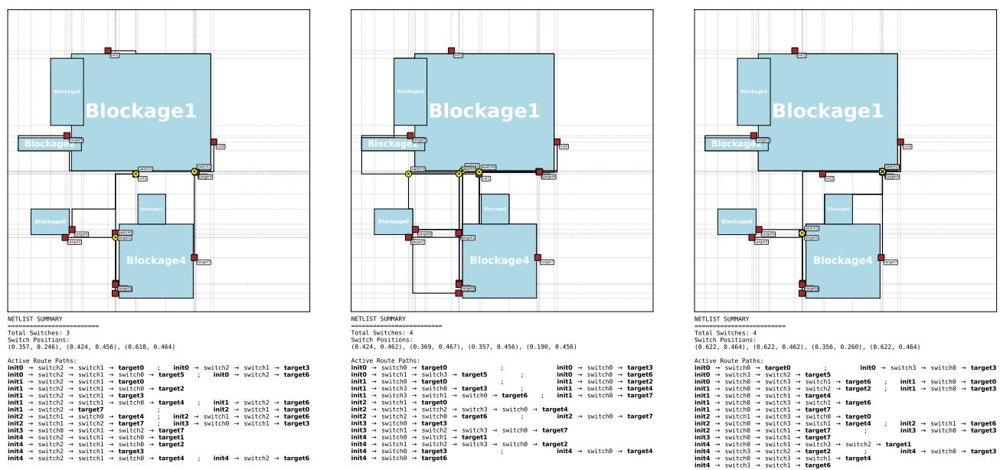  
Heuristic  
Random search  
Genetic algorithm

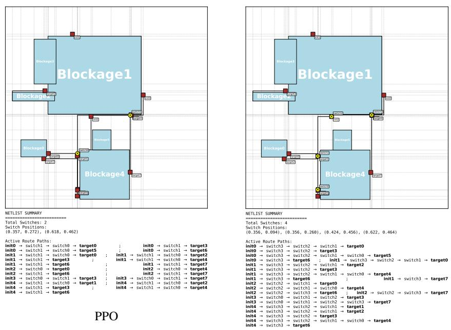  
MCTS  
Figure 6: Instance 1.

Heuristic  
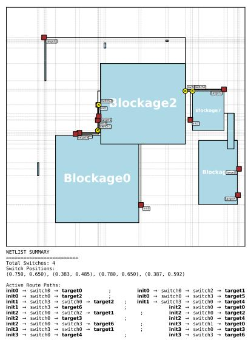

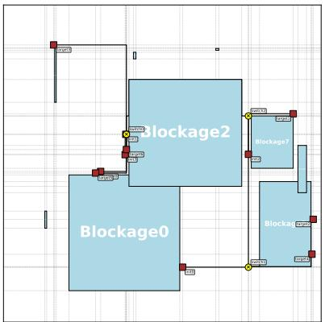  
NETLIST SUMMARY Total Switches: 3 Switch Positions: (0.387, 0.592), (0.771, 0.173), (0.771, 0.650)

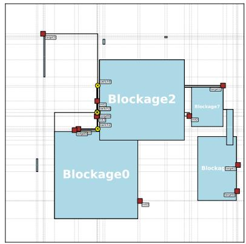  
NETLIST SUMMARY Total Switches: 4 Switch Positions: (0.387, 0.657), (0.385, 0.544), (0.387, 0.475), (0.385, 0.544)

Random search  
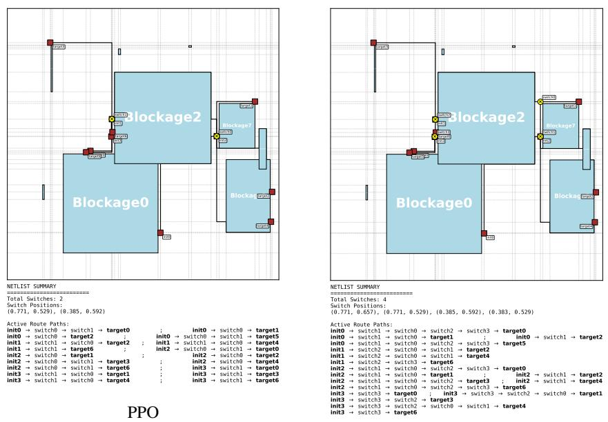  
Figure 7: Instance 2.  
Genetic algorithm  
MCTS

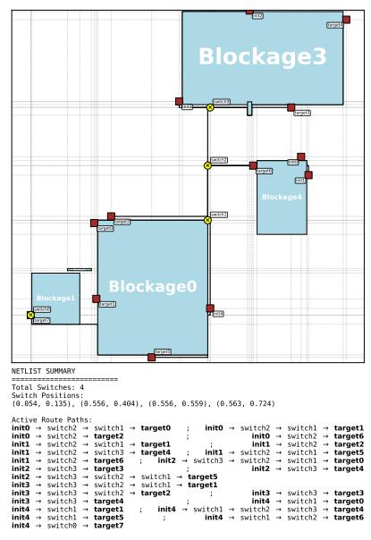  
Heuristic

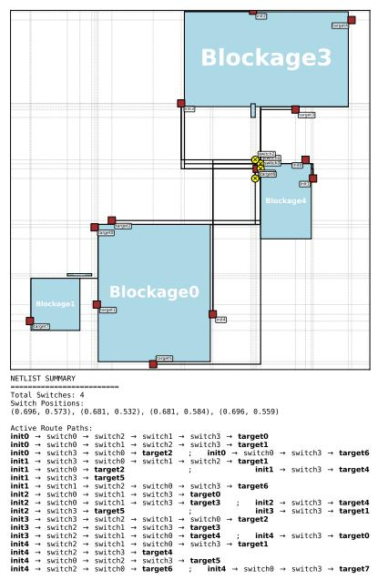  
Random search

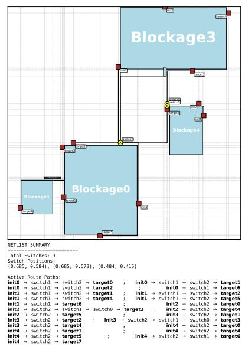  
Genetic algorithm

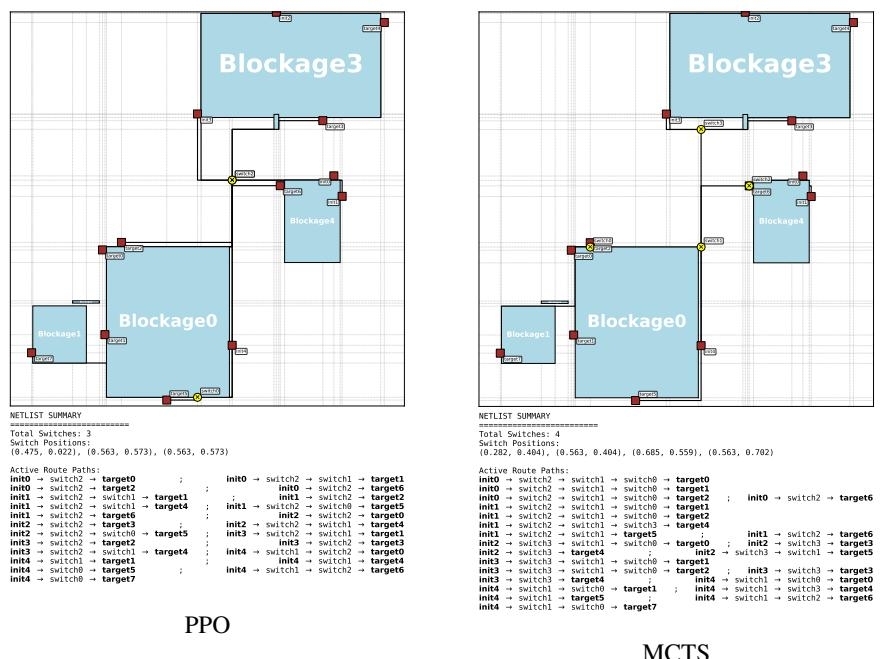  
MCTS  
Figure 8: Instance 3.

NETLIST SUMMARY   
Total Switches: 4   
Switch Positions:   
(0.566, 0.513), (0.762, 0.546), (0.574, 0.558), (0.566, 0.578)   
Active Route Paths:   
inito → switchθ → target1 init0 → switchθ → switch1 → target3 inito → switché → switch2 → target6 inito → switchθ → target7 init1 → switchθ → switch1 → switch3 → targeto   
init1 → switchē → switch2 → target3 init1 → switchθ → target4 init1 → switchē → target6 init2 → switchē → switch1 → target1 init2 → switchē → target3 init2 → switchθ → target4 init2 → switchθ → target5 init2 → switchē → target6 init3 → switch2 → switch0 → target0 init3 → switchē → target1 init3 → switchθ → target5 init3 → switch1 → switchθ → target6 init3 → switch2 → switch3 → switch1 → switchθ → target7   
init4 → switch3 → switch1 → switchθ → targeto init4 → switchθ → target2 init4 → switchθ → target3 init4 → switchθ → target6

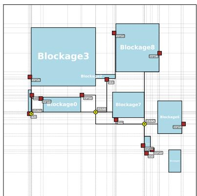

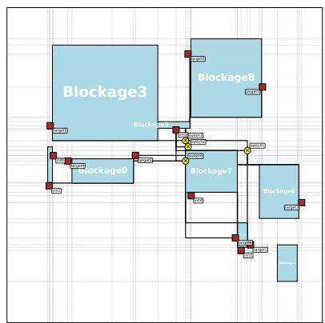  
NETLIST SUMMARY Total Switches: 3 Switch Positions: (0.144, 0.434), (0.478, 0.443), (0.731, 0.381) Active Route Paths: init0 → switchθ → switch1 → switch2 → target1 init0 → switch0 → switch1 → switch2 → target3 init0 → switchθ → switch1 → switch2 → target6 init0 → switch0 → switch1 → switch2 → target7 init1 → switch2 → switch1 → target0 init1 → switch2 → target3 init1 → switch2 → switch1 → switchθ → target4 init1 → switch2 → target6 init2 → switchθ → switch1 → switch2 → target1 init2 → switchθ → switch1 → switch2 → target3 init2 → switchθ → target4 init2 → switchθ → switch1 → target5 init2 → switchθ → switch1 → switch2 → target6 i init3 → switch1 → targeto init3 → switch1 → switch2 → target1 init3 → switch1 → target5 init3 → switch1 → switch2 → target6 init3 → switch1 → switch2 → target7 init4 → switch1 → target0 init4 → switch1 → switchθ → target2 init4 → switch2 → target3 init4 → switch2 → target6

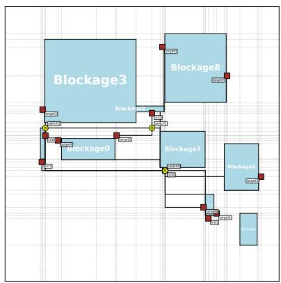

Genetic algorithm  
Heuristic  
Random search  
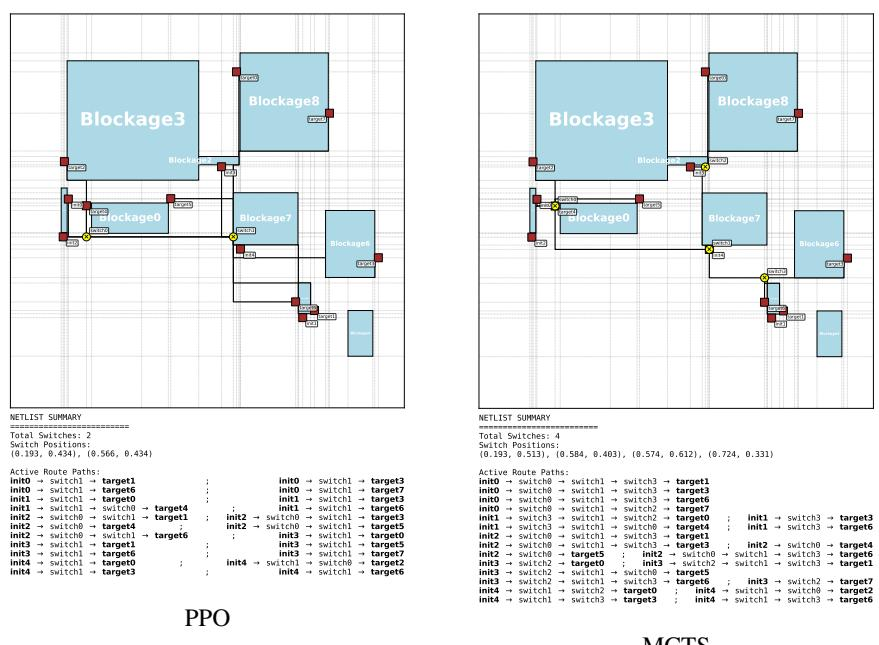  
MCTS  
Figure 9: Instance 4.

Heuristic  
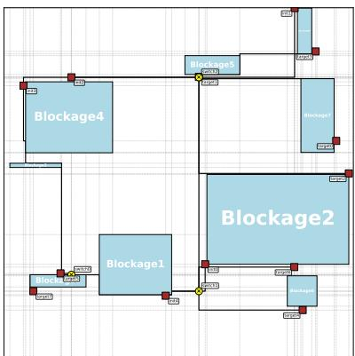

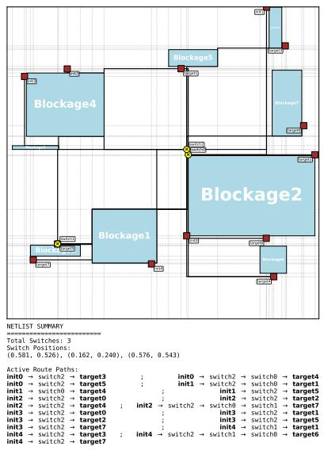  
Random search

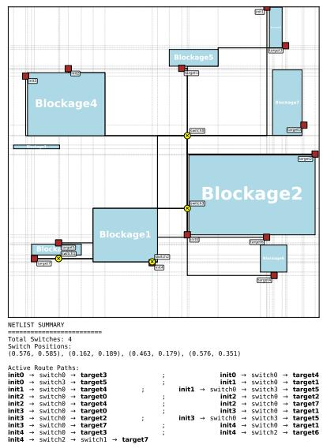

Genetic algorithm  
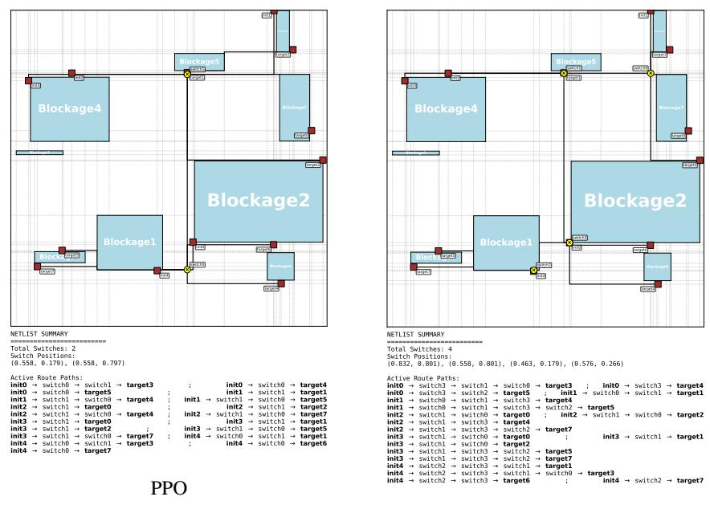  
Figure 10: Instance 5.  
MCTS

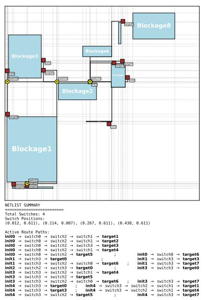

Heuristic  
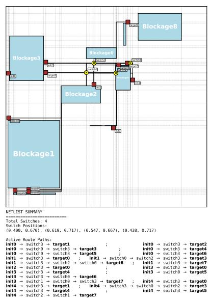  
Random search

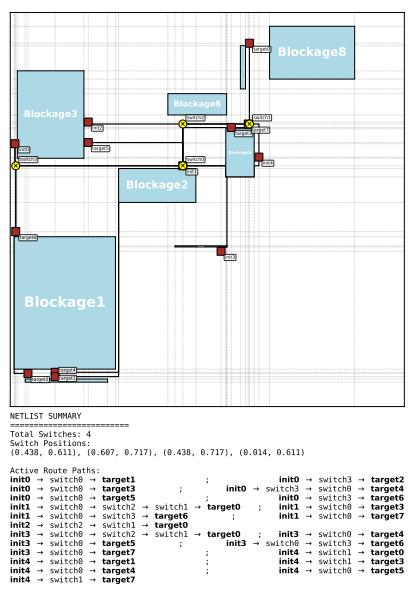  
Genetic algorithm

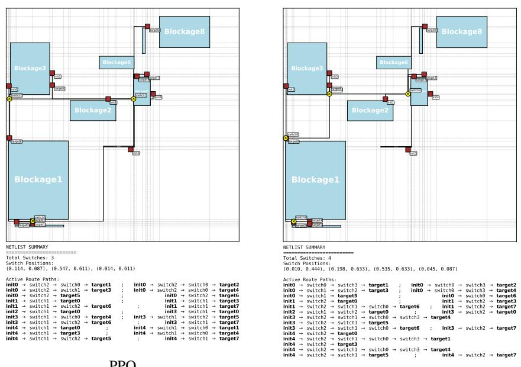  
PPO  
Figure 11: Instance 6.  
MCTS

Heuristic

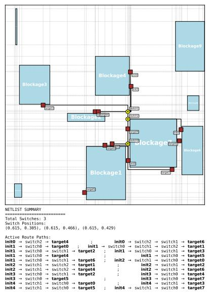  
NETLIST SUMMARY Total Switches: 4 Switch Positions: (0.617, 0.221), (0.617, 0.320), (0.623, 0.376), (0.615, 0.380)

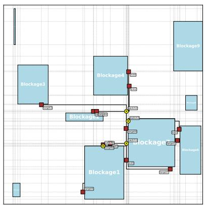

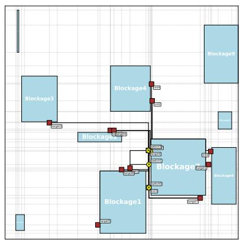

Random search  
Genetic algorithm  
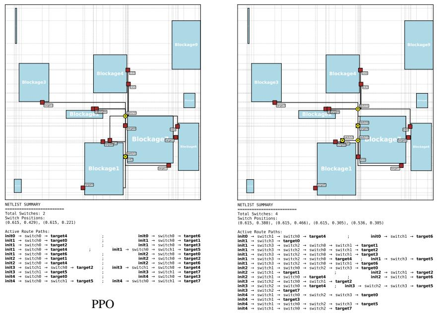  
MCTS  
Figure 12: Instance 7.

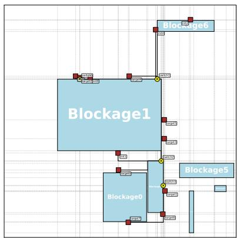

Heuristic  
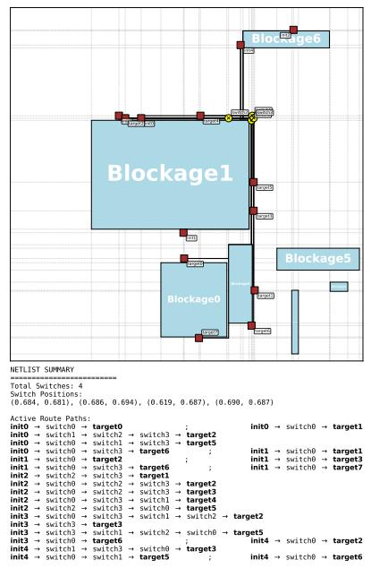

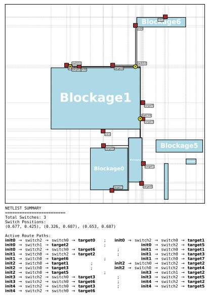  
Genetic algorithm

Random search  
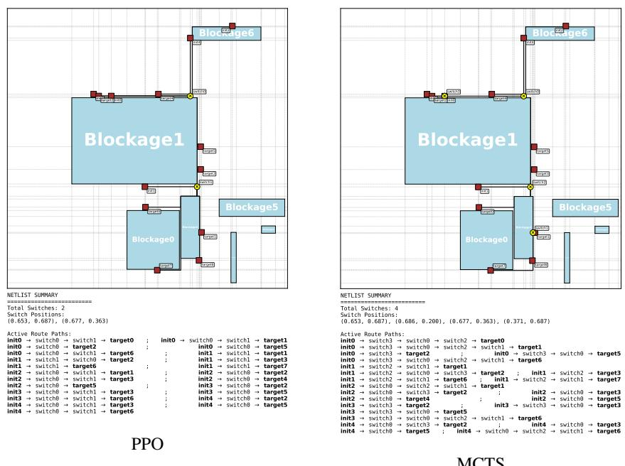  
Figure 13: Instance 8.  
MCTS

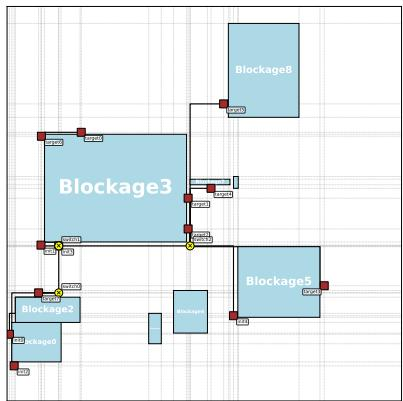  
NETLIST SUMMARY Total Switches: 3 Switch Positions: (0.131, 0.274), (0.131, 0.393), (0.464, 0.393) Active Route Paths: init0 → switch0 → switch1 → switch2 → target2 init0 → switch0 → switch1 → switch2 → target3 init0 → switchθ → switch1 → switch2 → target4 init0 → switchθ → switch1 → switch2 → target5 init0 → switchθ → target7 init1 → switch1 → switch2 → target3 init1 → switchl → switchθ → target7 init2 → switchθ → switch1 → target0 init2 → switchθ → switch1 → switch2 → target1 init2 → switchθ → switch1 → switch2 → target2 init2 → switchθ → switch1 → switch2 → target3 init2 → switchθ → switch1 → switch2 → target5 init3 → switch1 → targeto init3 → switch1 → switch2 → target1 init3 → switch1 → switch2 → target4 init3 → switch1 → switch2 → target5 init3 → switch1 → target6 init4 → switch2 → target3 init4 → switch2 → target5 init4 → switch2 → switch1 → target6 init4 → switch2 → switch1 → switchθ → target7  
Heuristic

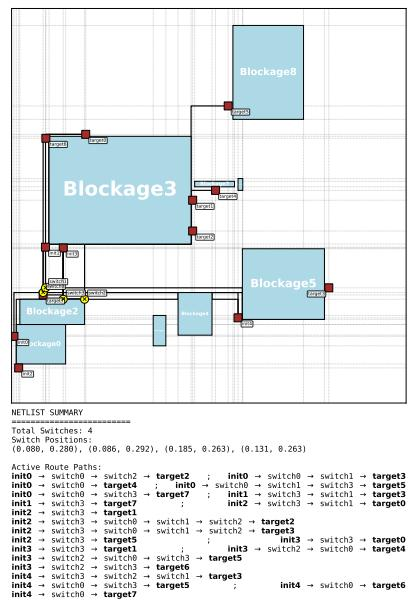  
Random search

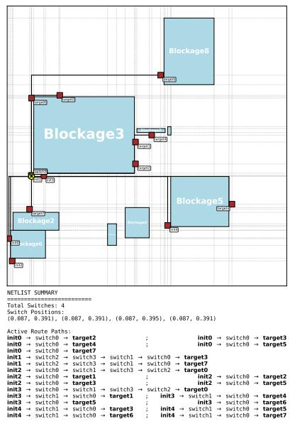  
Genetic algorithm

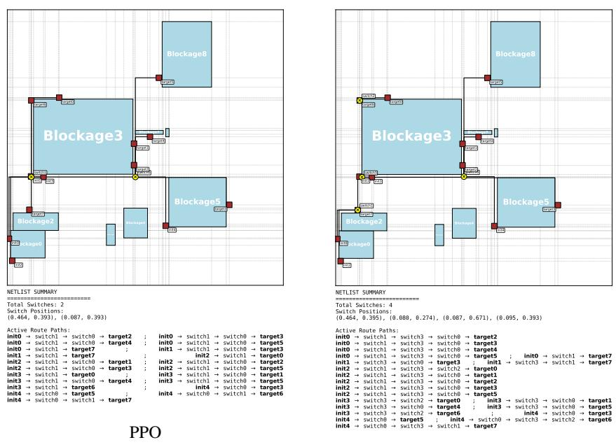  
MCTS  
Figure 14: Instance 9.

Genetic algorithm

Heuristic

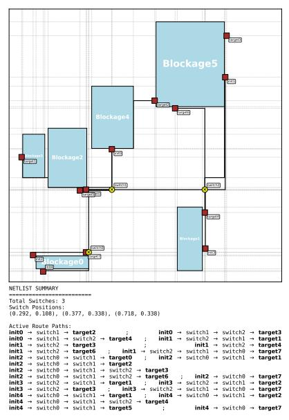

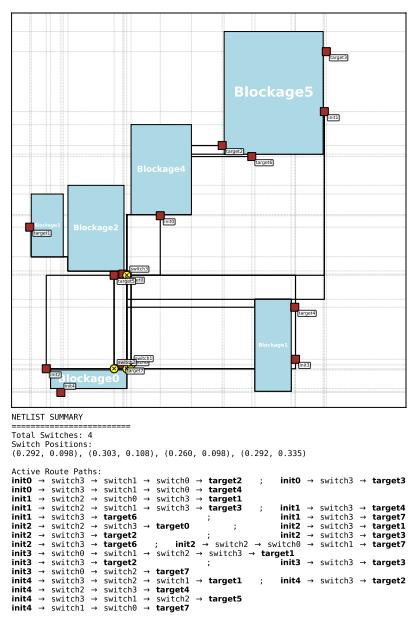  
Random search

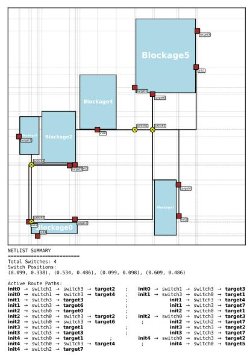

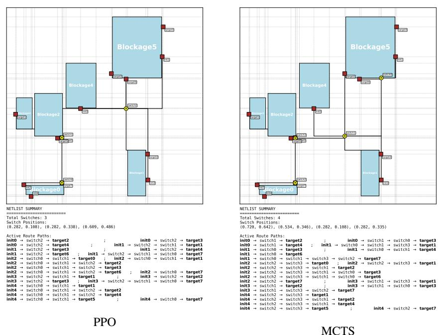  
Figure 15: Instance 10.

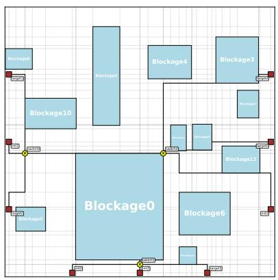  
Heuristic

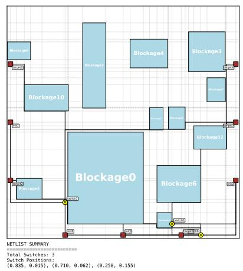

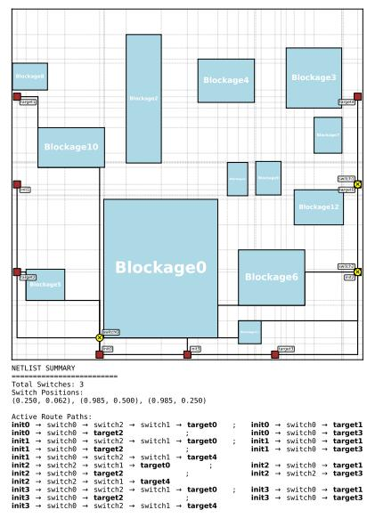  
Genetic algorithm

Random search  
PPO  
  
Figure 16: Instance 11.  
MCTS

  
Heuristic

  
Random search

  
Genetic algorithm

PPO  
  
Figure 17: Instance 12.  
MCTS

Genetic algorithm

  
Heuristic


Random search  
PPO  
  
Figure 18: Instance 13.  
MCTS


Heuristic  
  
Random search

  
Genetic algorithm  
PPO  
Figure 19: Instance 14.  
MCTS


  
Heuristic

  
Random search

  
Genetic algorithm  
PPO  
Figure 20: Instance 15.  
MCTS


Heuristic  
Random search  
Genetic algorithm  
PPO  
  
Figure 21: Instance 16.  
MCTS

  
Heuristic  
Random search

Genetic algorithm  
PPO  
  
Figure 22: Instance 17.  
MCTS

  
Figure 23: Instance 18.  
MCTS

Genetic algorithm

  
NETLIST SUMMARY Total Switches: 3 Switch Positions: (0.233, 0.157), (0.486, 0.724), (0.967, 0.704)

  
NETLIST SUMMARY Total Switches: 4 Switch Positions: (0.391, 0.848), (0.486, 0.756), (0.967, 0.873), (0.427, 0.861)

  
Total Switches: 4 Switch Positions: (0.486, 0.653), (0.486, 0.653), (0.486, 0.653), (0.456, 0.862)


  
Heuristic  
Random search

  
Figure 24: Instance 19.  
MCTS


Heuristic  
Random search  
  
Genetic algorithm  
Figure 25: Instance 20.

  
Heuristic

  
Random search  
Genetic algorithm

  
PPO

  
Figure 26: Instance 21.  
MCTS

Genetic algorithm  
  
Heuristic


Random search  
PPO  
  
Figure 27: Instance 22.  
MCTS

  
Heuristic

  
Random search

  
Genetic algorithm

  
PPO

  
Figure 28: Instance 23.  
MCTS

  
Heuristic

  
Random search

  
Genetic algorithm

  
Figure 29: Instance 24.

## E.2 Fine-Tuning

## PPO, pretrained

PPO, from scratch  
  
MCTS, pretrained  
MCTS, from scratch

NETLIST SUMMARY


  
PPO, pretrained


## PPO, from scratch

NETLIST SUMMARY

NETLIST SUMMARY   
Total Switches: 4   
Switch Positions:   
(0.210, 0.470), (0.645, 0.875), (0.645, 0.135), (0.645, 0.470)

  
Total Switches: 4 Switch Positions: (0.160, 0.470), (0.645, 0.135), (0.645, 0.470), (0.645, 0.900)  
NETLIST SUMMARY


PPO, pretrained  
  
NETLIST SUMMARY Total Switches: 4 Switch Positions: (0.635, 0.900), (0.635, 0.470), (0.635, 0.135), (0.210, 0.470)

## PPO, from scratch

  
MCTS, pretrained  
MCTS, from scratch

NETLIST SUMMARY   
Total Switches: 3   
Switch Positions:   
(0.198, 0.031), (0.458, 0.857), (0.965, 0.700)   
NETLIST SUMMARY   
Total Switches: 4   
Switch Positions:   
(0.458, 0.857), (0.198, 0.031), (0.967, 0.297), (0.965, 0.700)   
Active Route Paths:   
inito → switch0 → targeto inito → switch0 → target1   
init0 → switch0 → switch3 → target2 i init0 → switch0 → switch1 → target3   
inito → switch0 → switch3 → switch2 → target4 ; init1 → switch0 → targeto   
init1 → switch0 → target1 ; init1 → switch0 → switch3 → target2   
init1 → switch0 → switch1 → target3   
init1 → switch0 → switch3 → switch2 → target4   
init2 → switch3 → switch0 → target0; init2 → switch3 → switch0 → target1   
init2 → switch3 → target2; init2 → switch3 → switch2 → switch1 → target3   
init2 → switch3 → switch2 → target4; init3 → switch1 → switch0 → target0   
init3 → switch1 → switch0 → target1   
init3 → switch1 → switch2 → switch3 → target2 ; init3 → switch1 → target3   
init3 → switch1 → switch2 → target4   
init4 → switch2 → switch3 → switch0 → targeto   
init4 → switch2 → switch3 → switchθ → target1   
init4 → switch2 → switch3 → target2;init4 → switch2 → switch1 → target3   
init4 → switch2 → target4

  
NETLIST SUMMARY Total Switches: 4 Switch Positions: (0.965, 0.700), (0.198, 0.031), (0.458, 0.748), (0.458, 0.861)


PPO, pretrained


## PPO, from scratch

