# WAVELET FLOW MATCHING FOR TIME SERIES

Lucas Poinsignon∗ Dept. of Computer Science ETH Zurich, Switzerland

Jorge da Silva Gonçalves∗ Dept. of Computer Science ETH Zurich, Switzerland

Samuel Ruipérez-Campillo∗ Dept. of Computer Science ETH Zurich, Switzerland

Julia E. Vogt Dept. of Computer Science ETH Zurich, Switzerland

## ABSTRACT

Synthetic time series are increasingly used for data augmentation, privacypreserving data sharing, and downstream model development, yet faithfully reproducing both multi-scale temporal structure and cross-channel dependencies remains challenging. We study multivariate time-series generation through flow matching in the wavelet domain. By operating on multilevel discrete wavelet coefficients rather than directly in the time domain, the model represents coarse structure and progressively finer details at separate scales. Their naturally different variances further induce an implicit coarse-to-fine generative process without requiring an explicit multi-scale schedule. Since the transform acts independently on each channel, we pair it with a channel-token transformer whose attention directly models cross-channel dependencies. Across seven benchmark datasets and four sequence lengths, our method is best or tied on a majority of dataset–metric combinations, with the largest and most consistent improvements in Context-FID and discriminative score.

## 1 INTRODUCTION

Time series are central to domains including energy, finance, neuroscience, healthcare, and robotics, yet real data can be scarce, expensive to collect, privacy-sensitive, or imbalanced. Generative models address this by learning the data distribution and producing synthetic samples (Yoon et al., 2019; Desai et al., 2021; Yuan and Qiao, 2024). Multivariate time-series generation is challenging for two structural reasons: (a) signals contain structure at multiple temporal scales, from slow trends to high-frequency transients, and (b) their channels can exhibit strong and heterogeneous dependencies. A successful generative model must capture both.

Representation and generative dynamics. Most diffusion models for time series operate directly in the sampled time domain, while recent work has shown benefits from generating in transformed representations such as Fourier coefficients, log-signature embeddings, and wavelet coefficients (Crabbé et al., 2024; Barancikova et al., 2025; Wang and Milenkovic, 2025; Ruiperez-Campillo et al., 2026). The discrete wavelet transform (DWT) is particularly appealing because it is invertible, localized jointly in time and frequency, and provides an explicit multi-resolution representation of the signal (Mallat, 1989; Daubechies, 1992). In parallel, flow matching (Lipman et al., 2023; Liu et al., 2023; Albergo and Vanden-Eijnden, 2023) provides a simple continuous transport between noise and data and supports deterministic ODE sampling. Existing time-series flow-matching models largely operate in the time domain (Hu et al., 2025), leaving open how a multi-resolution representation changes the structure of the generative flow.

This work. We study flow matching in the wavelet domain for unconditional generation of multivariate time series. Each channel is mapped to multilevel DWT coefficients, and a single flow transports isotropic Gaussian noise to their joint distribution. Crucially, although all coefficients follow the same linear interpolation schedule, natural differences in wavelet-level variance induce different signal-to-noise trajectories: coarse, high-variance levels become data-dominated earlier than finer levels. This yields an implicit coarse-to-fine generative process without an explicit scaledependent schedule. The wavelet representation therefore does more than reorganize the signal: it changes the effective generative dynamics under an otherwise unchanged probability path. Equalizing the level-wise variances collapses these differences in SNR crossing times and substantially degrades generation quality, supporting this mechanism.

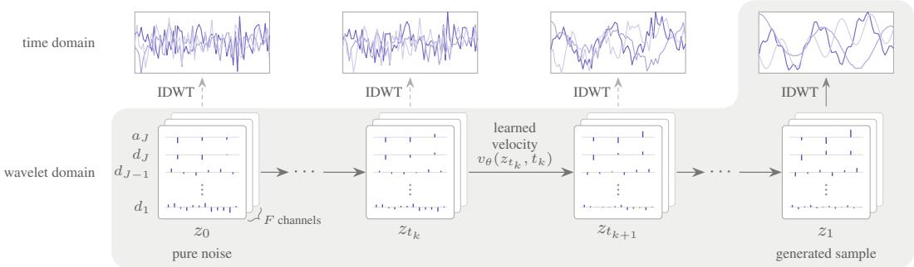  
Figure 1: Wavelet-domain flow matching. Each channel is mapped to multilevel DWT coefficients, and a single learned flow $v _ { \theta }$ transports Gaussian noise $z _ { 0 }$ jointly across all levels and channels. The inverse DWT maps the final coefficients $z _ { 1 }$ back to the time domain.

The representation also suggests a simple division of labor for the velocity network. The DWT organizes within-channel temporal structure across scales but leaves cross-channel dependencies untouched. We therefore represent each channel by its complete wavelet coefficient stack and apply self-attention across channels. Across seven datasets and four sequence lengths, the resulting model achieves the strongest overall performance among five recent baselines, with particularly consistent gains in Context-FID and discriminative score. Our contributions are summarized as:

• We introduce wavelet flow matching, a multiresolution framework for multivariate time-series generation with a channel-token velocity network tailored to wavelet coefficients.

• We show that natural differences in wavelet-level variance induce distinct SNR crossing times under a shared linear probability path, which we probe through a targeted variance-equalization intervention.

• Across seven datasets and four sequence lengths, our model achieves the strongest overall performance among five recent baselines.

## 2 RELATED WORK

Time-series diffusion and flow matching. Denoising diffusion (Sohl-Dickstein et al., 2015; Ho et al., 2020; Song et al., 2021) has become a prominent framework for time-series modeling, with applications spanning forecasting, imputation, generation, and denoising (Tashiro et al., 2021; Alcaraz and Strodthoff, 2023; Kollovieh et al., 2023; Naiman et al., 2024a; Ruipérez-Campillo et al., 2025; 2026). For unconditional generation, Diffusion-TS (Yuan and Qiao, 2024) combines a transformer denoiser with explicit trend and seasonality decomposition and a Fourier reconstruction loss, but requires iterative reverse-time sampling. Flow matching (Lipman et al., 2023; Liu et al., 2023; Albergo and Vanden-Eijnden, 2023) instead learns a continuous transport between noise and data without requiring a diffusion noise schedule and supports deterministic ODE sampling (Esser et al., 2024). Recent time-series applications include FlowTS (Hu et al., 2025), which trains a rectified flow directly on the sampled signal, and TSFlow (Kollovieh et al., 2025), which combines flow matching with Gaussian-process priors for forecasting. Both operate in the time domain.

Generation in transformed domains. Generative models have increasingly operated in transformed representations, including Fourier coefficients (Alaa et al., 2021; Crabbé et al., 2024), logsignature embeddings (Barancikova et al., 2025), and wavelet coefficients. Unlike Fourier coefficients, wavelets are localized jointly in time and scale, making them well suited to transient multi-resolution structure; they have been used in image generation for scale-factorized sampling and accelerated diffusion (Guth et al., 2022; Phung et al., 2023). For time series, WaveletDiff (Wang and Milenkovic, 2025) applies denoising diffusion with dedicated transformers for each wavelet level and cross-level attention. In contrast, we use a single shared flow over all levels and a channel-token velocity network with self-attention across the original channels. DSFM (Tew et al., 2026) also combines wavelets with flow matching, but further applies a blockwise DCT and processes the coefficients as an image with a vision backbone for fMRI. Our framework instead operates directly on multilevel DWT coefficients and is evaluated across heterogeneous multivariate time-series domains.

Coarse-to-fine generation. Diffusion models have long been observed to recover global structure before local detail (Choi et al., 2022), and several approaches impose such hierarchies explicitly through frequency-dependent generation (Lee et al., 2022), hierarchical representations (da Silva Gonçalves et al., 2025), or multi-scale wavelet constructions (Guth et al., 2022). More recently, spectral analyses have connected this behavior to frequency-dependent signal-to-noise trajectories arising from unequal signal energy (Falck et al., 2025). Our setting differs in that the hierarchy emerges across discrete wavelet resolution levels under a single shared linear probability path: their natural variance differences induce distinct SNR crossing times, which we directly probe by equalizing the level-wise variances.

We provide a broader discussion of related work, including additional time-series generative models, transformer tokenization strategies, and learnable wavelet transforms, in Appendix A.

## 3 METHOD

We consider unconditional generation of multivariate time series $\boldsymbol { x } \in \mathbb { R } ^ { T \times F }$ drawn from an unknown distribution $p _ { \mathrm { d a t a } } ,$ where $T$ is the sequence length and $F$ the number of channels. Our design follows a division of labor: a channel-wise wavelet transform exposes temporal structure at multiple scales. The learned velocity field, in turn, models the dependencies between channels that the wavelet transform leaves untouched.

## 3.1 FLOW MATCHING IN THE WAVELET DOMAIN

Wavelet representation. We apply a J-level discrete wavelet transform (DWT) (Mallat, 1989) independently to each channel. For channel $f ,$ the transform yields one coarse approximation $a _ { J }$ and detail coefficients $d _ { j } \in \mathbb { R } ^ { L _ { j } }$ for $j = 1 , \dots , J$ , whose length halves at each stage, $L _ { j } = T / 2 ^ { j }$ . We relabel the final approximation as $d _ { J + 1 } : = a _ { J }$ and set $L _ { J + 1 } : = L _ { J }$ , then concatenate all levels as

$$
c . , \mathscr { r } = \mathrm { c o n c a t } ( d _ { J + 1 } , d _ { J } , \mathscr { . . . } , d _ { 1 } ) \in \mathbb { R } ^ { T } .\tag{1}
$$

Because the DWT is invertible and produces exactly $T$ coefficients per channel, it preserves the dimensionality of the input. Let $\mathbf { W } \in \mathbb { R } ^ { T \times T }$ denote the corresponding linear transform, applied independently to each channel. For the full multivariate sequence, we then write

$$
c = { \bf W } x \in \mathbb { R } ^ { T \times F } , \qquad x = { \bf W } ^ { - 1 } c .\tag{2}
$$

Further details on the DWT, including the filter-bank definitions, boundary handling, and reconstruction, are given in Appendix B. We additionally investigate learning the wavelet transform jointly with the generative model. To this end, we develop a differentiable parametrization of compactly supported orthonormal wavelet filter banks that preserves perfect reconstruction throughout training. The construction is described in Section B.3, with supporting derivations in Appendix C.

Flow matching in coefficient space. Rather than model $p _ { \mathrm { d a t a } }$ directly, we model its pushforward through the wavelet transform, i.e., its induced distribution of coefficients,

$$
p _ { \mathrm { w a v } } = \mathbf { W } _ { \# } p _ { \mathrm { d a t a } } .\tag{3}
$$

Generation proceeds by transporting Gaussian noise to the wavelet-coefficient distribution through an ordinary differential equation. A velocity field $v : \mathbb { R } ^ { T \times F } \times [ 0 , 1 ] \to \mathbb { R } ^ { T \times F }$ defines this transport as

$$
\frac { \mathrm { d } } { \mathrm { d } t } z _ { t } = v ( z _ { t } , t ) , \qquad z _ { 0 } \sim \mathcal { N } ( 0 , \mathbf { I } ) .\tag{4}
$$

Integrating Equation (4) from $t = 0 \mathrm { t o } t = 1$ yields coefficients $z _ { 1 }$ approximately distributed as $p _ { \mathrm { w a v } }$ which are mapped back to the time domain as $\hat { x } = \mathbf { W } ^ { - 1 } z _ { 1 }$ (see Figure 1).

Flow matching (Lipman et al., 2023; Liu et al., 2023; Albergo and Vanden-Eijnden, 2023) learns the velocity field without solving the ODE in Equation (4) during training: one fixes a path from noise to data and trains the network to predict the velocity along it. Given wavelet coefficients $c \sim p _ { \mathrm { w a v } }$ and independent Gaussian noise $z _ { 0 } \sim p _ { 0 } : = \mathcal { N } ( 0 , I )$ , we use the linear path

$$
z _ { t } = t c + ( 1 - t ) z _ { 0 } , \qquad { \frac { \mathrm { d } } { \mathrm { d } t } } z _ { t } = c - z _ { 0 } ,\tag{5}
$$

so each noise-data pair is connected by a straight line with constant conditional velocity $c - z _ { 0 }$ . Thus, $z _ { t }$ is a coefficient array in which every level is partially noised. We therefore train $v _ { \theta }$ by minimizing

$$
\begin{array} { r } { \mathbb { E } _ { t \sim \pi , \ c \sim p _ { \mathrm { w a v } } , \ z _ { 0 } \sim p _ { 0 } } \left[ \| v _ { \theta } ( z _ { t } , t ) - ( c - z _ { 0 } ) \| _ { 2 } ^ { 2 } \right] , } \end{array}\tag{6}
$$

where $\pi$ denotes the training-time distribution on [0, 1]. Since the target $c - z _ { 0 }$ is not uniquely determined by $( z _ { t } , t )$ , the population minimizer of the squared loss is the conditional expectation $\mathbb { E } [ c - z _ { 0 } \mid z _ { t } , \bar { t } ]$ , whose marginal velocity field generates the prescribed probability path (Lipman et al., 2023).

## 3.2 COARSE-TO-FINE FLOW

The linear path of Equation (5) treats all coefficients with the same interpolation schedule, but their signal-to-noise ratios evolve differently across wavelet levels. Let $I _ { j }$ denote the coefficient indices corresponding to level $j ,$ such that $c . . _ { f } [ I _ { j } ] = d _ { j }$ , and let $\sigma _ { j } ^ { 2 }$ denote the variance of the data coefficients at that level. Restricted to level $j$ , the interpolant reads

$$
z _ { t } [ I _ { j } ] = t c [ I _ { j } ] + ( 1 - t ) z _ { 0 } [ I _ { j } ] ,\tag{7}
$$

where the entries of $z _ { 0 } [ I _ { j } ]$ have unit variance while those of $c [ I _ { j } ]$ ] have variance $\sigma _ { j } ^ { 2 }$ . The signal-tonoise ratio of level $j$ along the path is therefore

$$
\mathrm { S N R } _ { j } ( t ) = \frac { t ^ { 2 } \sigma _ { j } ^ { 2 } } { ( 1 - t ) ^ { 2 } } , \qquad j = 1 , \dotsc , J + 1 ,\tag{8}
$$

which increases monotonically from 0 to ∞ and crosses one at $t _ { j } = 1 / ( 1 + \sigma _ { j } )$ . Before $t _ { j } .$ , the level is dominated by noise; after $t _ { j }$ , it is dominated by data. Figure 2 illustrates how differences in $\sigma _ { j }$ translate into different crossing times across wavelet levels.

Across our datasets, the wavelet coefficients have systematically larger variance at coarser levels. Consequently, coarse levels have larger $\sigma _ { j }$ and become data-dominated earlier along the probability path, whereas fine-scale coefficients remain noise-dominated until later. We observe this ordering across all seven datasets; Section F.1 reports full level-wise coefficient variances, crossing times, and SNR trajectories. Thus, although every coefficient follows the same linear probability path, the wavelet representation induces an implicit coarse-to-fine progression.

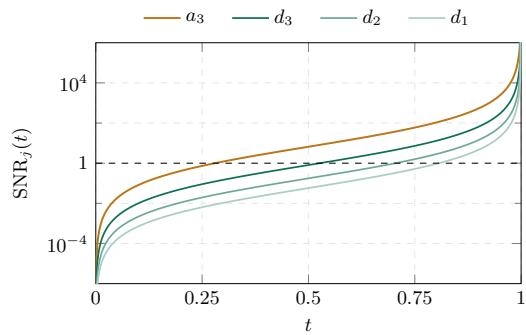  
Figure 2: Level-wise SNR along the linear probability path on ETTh1. Coarse levels cross $\mathrm { S } \bar { \mathrm { N R } } =$ 1 earlier than fine levels.

Importantly, this progression is not imposed

through a scale-dependent noise schedule or separate generative stages. It arises solely from the natural scale-dependent statistics of the wavelet representation under a shared probability path. Standardizing each level to unit variance removes this mechanism precisely: $\sigma _ { j } = 1$ for all $j ,$ , so all crossing times collapse to $t _ { j } = 1 / 2$ . We test this intervention directly in Section 5.2.

## 3.3 VELOCITY NETWORK: CHANNEL-TOKEN TRANSFORMER

The wavelet transform reorganizes temporal structure within each channel but does not mix information across channels. Motivated by architectures such as iTransformer (Liu et al., 2024), we therefore introduce a wavelet-aware channel-token transformer whose self-attention operates exclusively across the $F$ channels. Our tokenization is tailored to the wavelet representation: each channel token aggregates level-specific embeddings of its complete multilevel decomposition, and level-specific heads map the resulting representation back to velocity coefficients at each scale. Figure 3 summarizes the architecture, with further architectural details provided in Appendix D.

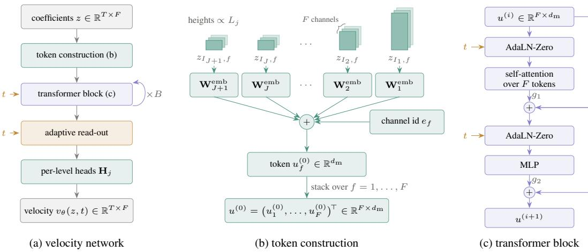  
Figure 3: Velocity-network architecture. (a) The network maps wavelet coefficients to a velocity field of the same shape. (b) Each channel forms one token by combining level-specific embeddings of its wavelet coefficients with a learned channel identity. (c) Transformer blocks apply self-attention across channels with AdaLN-Zero time conditioning; level-specific heads map the resulting tokens back to wavelet coefficients.

Token construction. The wavelet levels have unequal lengths $L _ { j } .$ , whereas the transformer operates on tokens of a common width $d _ { \mathrm { m } }$ . We therefore embed each level separately with a learned linear map ${ \bf W } _ { j } ^ { \mathrm { e m b } } : \mathbb { R } ^ { L _ { j } }  \mathbb { R } ^ { d _ { \mathrm { m } } }$ . Writing $z _ { I _ { j } , f } \in \mathbb { R } ^ { L _ { j } }$ for level j of channel f, the initial token is

$$
u _ { f } ^ { ( 0 ) } = \sum _ { j = 1 } ^ { J + 1 } \mathbf { W } _ { j } ^ { \mathrm { e m b } } z _ { I _ { j } , f } + e _ { f } \in \mathbb { R } ^ { d _ { \mathrm { m } } } , \qquad f = 1 , \dots , F ,\tag{9}
$$

where $\boldsymbol { e } _ { f } \in \mathbb { R } ^ { d _ { \mathrm { m } } }$ is a learned channel identity. All remaining parameters are shared across tokens. Thus, without $e _ { f }$ , the velocity field is equivariant under permutations of the channel axis and the generated distribution is exchangeable across channels. We ablate this component in Section 5.2.

Transformer and time conditioning. The F tokens are processed by B pre-norm transformer blocks with self-attention over channels. The flow time t is encoded with a sinusoidal embedding and injected into each block through AdaLN-Zero conditioning following Peebles and Xie (2023). Thus, the wavelet representation handles the within-channel multi-scale structure, while the transformer is dedicated to modeling cross-channel dependencies.

Adaptive read-out. After the final transformer block, an adaptive normalization produces channel representations $h = ( h _ { 1 } , \ldots , h _ { F } ) ^ { \top }$ , which are passed through level-specific linear heads $\mathbf { H } _ { j }$ $\mathbb { R } ^ { d _ { \mathrm { m } } }  \mathbb { R } ^ { L _ { \mathcal { I } } }$ to reconstruct the velocity coefficients at each scale:

$$
\left[ v _ { \theta } ( z , t ) \right] _ { I _ { j } , f } = \mathbf { H } _ { j } h _ { f } \in \mathbb { R } ^ { L _ { j } } , \qquad j = 1 , \dotsc , J + 1 , \quad f = 1 , \dotsc , F .\tag{10}
$$

Concatenating these outputs over the coefficient index sets $I _ { j }$ recovers a velocity array $v _ { \theta } ( z , t ) \in$ $\mathbb { R } ^ { T \times F }$ with the same layout as the input z.

## 3.4 TRAINING AND INFERENCE

Training-time distribution. The distribution π of training times controls where along the path the regression objective in Equation (6) is evaluated. Following Esser et al. (2024), adopted for time

series by Hu et al. (2025), we draw

$$
t = \mathrm { s i g m o i d } ( m + s \varepsilon ) , \qquad \varepsilon \sim { \cal N } ( 0 , 1 ) ,\tag{11}
$$

with sigmoid being the logistic function and $( m , s ) = ( 0 , 1 )$ . This yields a symmetric density that concentrates mass on intermediate times and vanishes at the endpoints. The regression is easy near the endpoints, since at $t \approx 0$ the input is almost pure noise and at $t \approx 1$ it essentially reveals c. Meanwhile, intermediate times require resolving $\mathbb { E } [ \bar { c } \mid z _ { t } ]$ and dominate the difficulty of the problem. Uniform time sampling is included as an ablation in Section 5.2.

Inference. At inference, we integrate the learned ODE with the explicit Euler scheme, starting from $z _ { \mathrm { 0 } }$ with i.i.d. standard normal entries and stepping along a grid $0 = t _ { 0 } < t _ { 1 } < \cdot \cdot \cdot < t _ { N } = 1$

$$
z _ { t _ { k + 1 } } = z _ { t _ { k } } + ( t _ { k + 1 } - t _ { k } ) v _ { \theta } \bigl ( z _ { t _ { k } } , t _ { k } \bigr ) , \qquad k = 0 , \ldots , N - 1 ,\tag{12}
$$

after which $\hat { x } = \mathbf { W } ^ { - 1 } z _ { t _ { N } }$ . Since the conditional trajectories in Equation (5) are straight by construction, a first-order solver with a moderate number of steps is sufficient in practice (Liu et al., 2023; Esser et al., 2024). All main experiments use $N = 1 0 0$ uniformly spaced Euler steps. We study the effect of the number and placement of integration steps in Section F.5.

## 4 EXPERIMENTAL SETUP

Datasets. We evaluate on seven standard benchmarks for unconditional time-series generation (Yoon et al., 2019; Yuan and Qiao, 2024; Hu et al., 2025; Wang and Milenkovic, 2025): ETTh1 and ETTh2 (Zhou et al., 2021), hourly load and oil temperature measurements from two electricity transformers; Stocks (Yoon et al., 2019), daily Google share prices and trading volume from 2004 to 2019; Exchange (Lai et al., 2018), daily exchange rates of eight currencies against the US dollar; EEG (Roesler, 2013), a continuous 14-electrode electroencephalogram recording; Energy (Candanedo et al., 2017), appliance energy consumption together with indoor and outdoor climate readings from a low-energy house; and MuJoCo (Todorov et al., 2012), simulated physics trajectories of a Hopper robot. The datasets span 6–28 channels. Each time-domain channel is standardized, and windows are extracted with stride one at four lengths, $T \in \{ 2 4 , 3 2 , 6 4 , 1 2 8 \}$ . MuJoCo is the exception, consisting of 10,000 independent rollouts rather than one continuous recording.

Baselines. We compare against five recent models. The diffusion-based baselines span different representations: Diffusion-TS (Yuan and Qiao, 2024) operates in the time domain, SigDiffusion (Barancikova et al., 2025) in the signature domain, FourierDiffusion (Crabbé et al., 2024) in the frequency domain, and WaveletDiff (Wang and Milenkovic, 2025) in the wavelet domain. We addition ally compare against the time-domain flow-matching model FlowTS (Hu et al., 2025). All baselines are run from their official implementations on the same windows and through the same evaluation pipeline, using the model capacity and sampling budget specified by their released configurations.

Metrics. We report four standard benchmark metrics, computed between the real windows and an equally sized set of generated windows, with lower values better throughout. Two metrics assess overall fidelity: the discriminative score (Yoon et al., 2019) measures how easily real and generated samples can be distinguished by a post-hoc classifier, while Context-FID (Jeha et al., 2022) measures how closely their distributions match in a learned TS2Vec representation (Yue et al., 2022). The correlational score (Liao et al., 2024) measures structural fidelity by comparing the cross-channel correlation patterns of real and generated data. The predictive score (Yoon et al., 2019) measures downstream temporal utility by asking how well a predictor trained on generated data transfers to real data. For $T = 2 4$ , we report mean ± standard deviation over three independent training runs, evaluating each run five times to account for stochasticity in auxiliary-network training and subsampling. For $T \in \{ 3 2 , 6 4 , 1 2 8 \}$ , we use one training run with five evaluations.

Implementation and further details. We use a three-level periodized DWT $\left( J \ = \ 3 \right)$ , with Daubechies wavelets of order 2 (db2) for $T \le 3 2$ , order 4 (db4) for $T = 6 4$ , and order 6 (db6) for $T = 1 2 8$ . The velocity network has token width $d _ { m } = 2 5 6 , B = 8$ transformer blocks, and 8 attention heads. Further details on the datasets, baseline configurations, evaluation metrics, and implementation are provided in Appendix E.

Table 1: Unconditional generation on short sequences $( T = 2 4 )$ . Mean±std over three independent end-to-end training runs with five evaluations each. Bold: best; underlined: second best.
<table><tr><td></td><td>ETTh1</td><td>ETTh2</td><td>Stocks</td><td>Exchange</td><td>EEG</td><td>Energy</td><td>MuJoCo</td></tr><tr><td colspan="6">Context-FID (↓)</td><td></td><td></td></tr><tr><td>Diffusion-TS</td><td>0.137 ±.012</td><td>0.056±.006</td><td>0.175 ±.022</td><td>0.047 ±.005</td><td>0.018±.004</td><td>0.090 ±.011</td><td>0.016±.002</td></tr><tr><td>SigDiffusion</td><td>2.473 ±.227</td><td>1.162±.051</td><td>3.285 ±.504</td><td>1.629±.152</td><td>0.020 ±.003</td><td>4.241 ±.372</td><td> $2 . 6 8 1 \pm . 2 6 3$ </td></tr><tr><td>FourierDiffusion</td><td>0.025±.003</td><td>0.026±.001</td><td>0.039 ±.005</td><td>0.080 ±.021</td><td>0.015 ±.002</td><td>0.217 ±.015</td><td>0.062 ±.006</td></tr><tr><td>WaveletDiff</td><td>0.026±.002</td><td>0.031 ±.002</td><td>0.020 ±.002</td><td>0.009 ±.000</td><td>0.008 ±.001</td><td>0.482 ±.042</td><td>1.180 ±.095</td></tr><tr><td>FlowTS</td><td>0.025 ±.001</td><td>0.012±.001</td><td>0.017 ±.005</td><td>0.009 ±.001</td><td>0.005 ±.000</td><td>0.042±.004</td><td>0.012±.001</td></tr><tr><td>Ours</td><td>0.005 ±.001</td><td>0.004±.000</td><td>0.005 ±.002</td><td>0.004 ±.001</td><td>0.013 ±.002</td><td>0.010 ±.003</td><td>0.006 ±.000</td></tr><tr><td colspan="6">Discriminative score (↓)</td><td></td><td></td></tr><tr><td>Diffusion-TS</td><td>0.074±.005</td><td>0.040 ±.005</td><td>0.083 ±.015</td><td>0.024±.002</td><td>0.312±.176</td><td>0.120 ±.005</td><td>0.016±.001</td></tr><tr><td>SigDiffusion</td><td>0.355 ±.023</td><td>0.347 ±.093</td><td>0.364±.011</td><td>0.396±.029</td><td>0.400 ±.197</td><td>0.500 ±.000</td><td>0.499 ±.000</td></tr><tr><td>FourierDiffusion</td><td>0.018 ±.005</td><td>0.011 ±.007</td><td>0.018 ±.009</td><td>0.014±.010</td><td>0.011 ±.008</td><td>0.118±.010</td><td>0.048 ±.008</td></tr><tr><td>WaveletDiff</td><td>0.014±.006</td><td>0.017 ±.006</td><td>0.009 ±.006</td><td>0.011 ±.008</td><td>0.009±.007</td><td>0.311 ±.012</td><td>0.228 ±.010</td></tr><tr><td>FlowTS</td><td>0.008 ±.005</td><td>0.007 ±.005</td><td>0.014±.012</td><td>0.009 ±.002</td><td>0.106±.092</td><td>0.079 ±.015</td><td>0.011 ±.004</td></tr><tr><td>Ours</td><td>0.005 ±.004</td><td>0.005 ±.006</td><td>0.012 ±.009</td><td>0.005 ±.003</td><td>0.003 ±.002</td><td>0.098 ±.018</td><td>0.007 ±.004</td></tr><tr><td colspan="6">Correlational score (↓)</td><td></td><td></td></tr><tr><td>Diffusion-TS</td><td>0.053 ±.012</td><td>0.110±.029</td><td>0.015 ±.004</td><td>0.115 ±.042</td><td>5.164±.243</td><td>0.902 ±.044</td><td>0.283 ±.023</td></tr><tr><td>SigDiffusion</td><td>0.186±.006</td><td>0.413 ±.012</td><td>0.172 ±.006</td><td>0.896±.039</td><td>4.777 ±.316</td><td>7.579±.135</td><td>1.165 ±.025</td></tr><tr><td>FourierDiffusion</td><td>0.052 ±.006</td><td>0.088±.019</td><td>0.013 ±.005</td><td>0.146±.097</td><td>3.585 ±.952</td><td>1.312 ±.280</td><td>0.266±.026</td></tr><tr><td>WaveletDiff</td><td>0.054±.012</td><td>0.090±.021</td><td>0.005 ±.002</td><td>0.120 ±.013</td><td>2.270±.672</td><td>1.234±.168</td><td>0.284±.047</td></tr><tr><td>FlowTS</td><td>0.044±.012</td><td>0.059 ±.009</td><td>0.015 ±.005</td><td>0.047 ±.016</td><td>1.890 ±.636</td><td>0.957 ±.079</td><td>0.228 ±.032</td></tr><tr><td>Ours</td><td>0.042 ±.015</td><td>0.066±.020</td><td>0.007 ±.005</td><td>0.056±.017</td><td>3.870±.422</td><td>0.890 ±.176</td><td>0.246±.033</td></tr><tr><td colspan="6">Predictive score (↓)</td><td></td><td></td></tr><tr><td>Diffusion-TS</td><td>0.120 ±.003</td><td>0.108±.004</td><td>0.037 ±.000</td><td>0.045 ±.005</td><td>0.002 ±.000</td><td>0.251 ±.000</td><td>0.007 ±.000</td></tr><tr><td>SigDiffusion</td><td>0.130 ±.002</td><td>0.134±.004</td><td>0.041 ±.001</td><td>0.089 ±.004</td><td>0.000 ±.000</td><td>0.377 ±.003</td><td>0.025 ±.001</td></tr><tr><td>FourierDiffusion</td><td>0.119±.002</td><td>0.110±.003</td><td>0.037 ±.000</td><td>0.045 ±.002</td><td>0.000 ±.000</td><td>0.251 ±.000</td><td>0.010 ±.002</td></tr><tr><td>WaveletDiff</td><td>0.117 ±.003</td><td>0.104±.003</td><td>0.037 ±.000</td><td>0.046±.003</td><td>0.000 ±.000</td><td>0.251 ±.000</td><td>0.009 ±.001</td></tr><tr><td>FlowTS</td><td>0.120 ±.003</td><td>0.104±.005</td><td>0.037 ±.000</td><td>0.043 ±.010</td><td>0.001 ±.000</td><td>0.251 ±.000</td><td>0.008 ±.001</td></tr><tr><td>Ours</td><td>0.120 ±.003</td><td>0.105 ±.004</td><td>0.037 ±.000</td><td>0.042 ±.004</td><td>0.000 ±.000</td><td>0.250 ±.000</td><td>0.007 ±.001</td></tr></table>

## 5 RESULTS

## 5.1 TIME SERIES GENERATION

Overall generation quality. Table 1 reports all four metrics on the seven datasets at T = 24. As our primary benchmark comparison, it reports variability across three independent end-to-end runs, capturing variation from training, generation, and evaluation. Our model is best or tied for best in 18 of the 28 dataset–metric combinations, compared with 8 for FlowTS and 6 for WaveletDiff. On both fidelity metrics, the gains are substantial. In terms of Context-FID, our model achieves the lowest score on six of seven datasets; the strongest competing method, FlowTS, has a 2.9× higher score on average. Similarly, for the discriminative score, we are best on five of seven datasets, and the strongest competitor has a 1.7× higher score on average. Performance on the correlational score, which specifically assesses cross-channel dependencies, is more mixed: we are best on two datasets, while on the remaining five our score is on average 1.4× that of the best-performing method. Finally, the predictive score, our measure of downstream temporal utility, is largely saturated across methods at this length; our model is nevertheless best or tied for best on five of seven datasets. As this metric probes a narrow prediction task rather than general fidelity, we interpret small differences between methods cautiously.

Performance across sequence lengths. We next assess whether performance is maintained as the sequence length increases, repeating the full comparison at $T \in \{ 3 \bar { 2 } , 6 4 , 1 2 8 \}$ . Figure 4 summarizes the results by the mean rank of each method across the seven datasets, computed separately for each metric and sequence length. This aggregation avoids directly averaging scores whose scales differ substantially across datasets. The relative ordering of the methods changes little with sequence length, and our model maintains the best mean rank across all four metrics as T increases. Full per-dataset results are reported in Tables 7 to 9, and Figure 8 shows the corresponding metric values as a function of sequence length for each dataset.

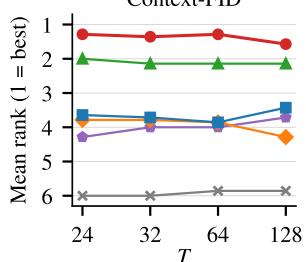

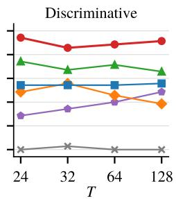

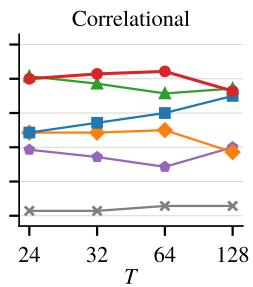  
Diffusion-TS SigDiffusion FourierDiffusion WaveletDiff FlowTS Ours

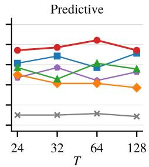

Figure 4: Mean rank of each method over the seven datasets as a function of the window length T (1 = best; tied methods receive the average of their ranks).  
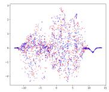

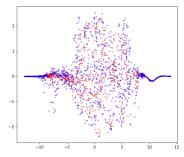

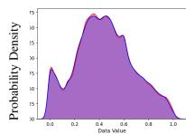  
(a) Ours

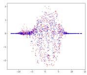

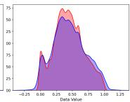  
(b) WaveletDiff

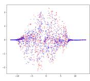

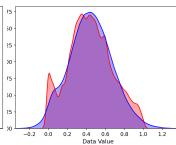  
(c) FlowTS

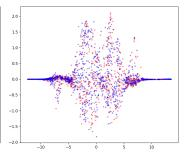

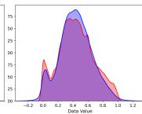  
(d) FourierDiffusion

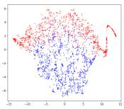

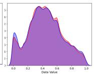  
(e) Diffusion-TS

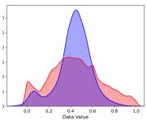  
(f) SigDiffusion

Figure 5: t-SNE visualization and probability distributions on Energy. Red is for real data, and blue for generated data.  
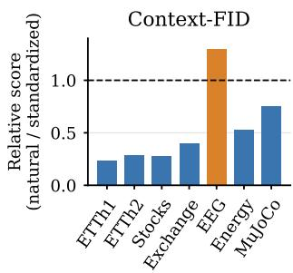

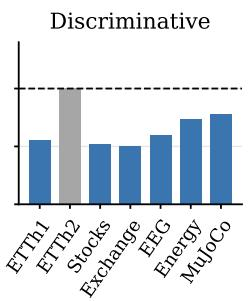

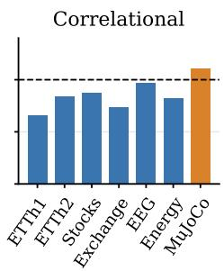

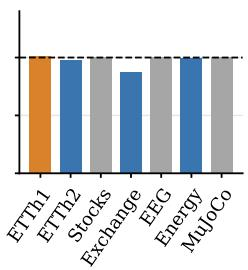  
Figure 6: Effect of removing the implicit coarse-to-fine progression at T = 24. Bars show the ratio of the score under natural coefficient scaling to that under per-level standardization. Values below 1 favor natural scaling and values above 1 favor standardization; the dashed line denotes equal performance.

Qualitative comparison. Figure 5 compares the generated and real distributions on the Energy dataset. Our samples show substantial overlap with the real data in the t-SNE embedding and closely match its empirical density. Corresponding visualizations for all datasets are provided in Section F.3.

<table><tr><td>Variant</td><td>ETTh1</td><td>ETTh2</td><td>Stocks</td><td>Exchange</td><td>EEG</td><td>Energy</td><td>MuJoCo</td></tr><tr><td>(a) Without  $e _ { f }$ </td><td> $1 . 4 8 8 \pm 0 . 0 9 9$ </td><td> $0 . 9 7 7 \pm 0 . 1 6 8$ </td><td> $1 . 7 6 3 \pm 0 . 3 2 1$ </td><td> $0 . 9 3 8 \pm 0 . 0 7 2$ </td><td> $\underline { { 0 . 0 1 1 } } \pm 0 . 0 0 1$ </td><td> $2 . 6 1 7 \pm 0 . 1 4 5$ </td><td> $1 . 3 9 0 \pm 0 . 1 3 9$ </td></tr><tr><td>(b) Std. levels</td><td> $0 . 0 2 1 \pm 0 . 0 0 2$ </td><td> $0 . 0 1 4 \pm 0 . 0 0 1$ </td><td> $0 . 0 1 8 \pm 0 . 0 0 4$ </td><td> $0 . 0 1 0 { \scriptstyle \pm 0 . 0 0 1 }$ </td><td> $\mathbf { 0 . 0 1 0 \bot 0 . 0 0 1 }$ </td><td> $0 . 0 1 9 \pm 0 . 0 0 2$ </td><td> $0 . 0 0 8 \pm 0 . 0 0 0$ </td></tr><tr><td>(c) Time domain</td><td> $\underline { { 0 . 0 0 6 } } \pm 0 . 0 0 1$ </td><td> $\underline { { 0 . 0 0 5 } } \pm 0 . 0 0 1$ </td><td> $0 . 0 1 4 \pm 0 . 0 0 1$ </td><td> $0 . 0 0 7 \pm 0 . 0 0 0$ </td><td> $0 . 0 1 4 \pm 0 . 0 0 1$ </td><td> $\underline { { 0 . 0 1 2 } } \pm 0 . 0 0 0$ </td><td> $\mathbf { 0 . 0 0 5 \bot 0 . 0 0 0 }$ </td></tr><tr><td>(d) Uniform t</td><td> $0 . 0 0 7 \pm 0 . 0 0 0$ </td><td> $0 . 0 0 8 \pm 0 . 0 0 1$ </td><td> $0 . 0 1 3 { \scriptstyle \pm 0 . 0 0 1 }$ </td><td> $0 . 0 0 5 { \scriptstyle \pm 0 . 0 0 0 }$ </td><td> $0 . 0 1 4 \pm 0 . 0 0 2$ </td><td> $0 . 0 1 6 \pm 0 . 0 0 1$ </td><td> $0 . 0 1 0 { \scriptstyle \pm 0 . 0 0 1 }$ </td></tr><tr><td>Full model</td><td> $\mathbf { 0 . 0 0 5 \pm 0 . 0 0 1 }$ </td><td> $\mathbf { 0 . 0 0 4 } \pm 0 . 0 0 0$  </td><td> $\mathbf { 0 . 0 0 5 \pm 0 . 0 0 2 }$ </td><td> $\mathbf { 0 . 0 0 4 \pm 0 . 0 0 1 }$ </td><td> $0 . 0 1 3 { \scriptstyle \pm 0 . 0 0 2 }$  </td><td> $\mathbf { 0 . 0 1 0 \bot } 0 . 0 0 3$ </td><td> $0 . 0 0 6 { \scriptstyle \pm 0 . 0 0 0 }$ </td></tr></table>

Table 2: Context-FID (↓) for one-factor-at-a-time ablations at $T = 2 4$ . The full model uses db2 coefficients, natural level scaling, logit-normal time sampling, and channel-identity embeddings $e _ { f }$ Variants (a)–(d) respectively remove $\boldsymbol { e } _ { f } ,$ , standardize the wavelet levels, replace the wavelet transform with the identity, and sample t uniformly. Results are mean ± standard deviation. Best values are in bold and second-best values are underlined.

## 5.2 ANALYSIS OF THE PROPOSED METHOD

We analyze the mechanisms and design choices underlying our method at $T \ = \ 2 4$ across all seven datasets. Unless stated otherwise, each experiment changes one component of the default configuration while keeping all other settings fixed.

Coarse-to-fine flow. To test whether the implicit coarse-to-fine progression identified in Section 3.2 contributes to generation quality, we standardize each wavelet level to unit variance before flow matching and restore its original scale before the inverse transform (row (b) of Table 2). This equalizes the level-wise coefficient variances and collapses their SNR crossing times. Figure 6 shows the ratio between performance under natural scaling and per-level standardization. Natural scaling is better or tied in 25 of the 28 dataset–metric combinations. The effect is strongest on the two overall-fidelity metrics: Context-FID improves on six of seven datasets and is 2.5× lower on average, while the discriminative score improves on six datasets and ties on the seventh, with a 1.6× lower score on average. EEG is the main exception: its wavelet levels already have similar variances (see Table 6), so standardization changes their SNR trajectories comparatively little. These results support the hypothesis that the natural scale-dependent coefficient statistics and their induced coarse-to-fine progression improve generation quality.

Method components. Table 2 summarizes the remaining one-factor-at-a-time ablations using Context-FID; full results across all four metrics are provided in Table 10. Replacing the wavelet transform with the identity (row (c)) generally degrades performance, supporting the benefit of the multiresolution representation itself. Removing the channel-identity embedding $e _ { f }$ (row (a)) substantially degrades performance on most datasets, showing that explicit channel identity is important for modeling heterogeneous cross-channel structure. EEG is the main exception, where performance changes little, plausibly because its electrode channels are more homogeneous and thus closer to the exchangeable setting induced by removing $e _ { f }$ . Finally, replacing the logit-normal training-time distribution with uniform sampling (row (d)) worsens Context-FID, while its effect on the other metrics is comparatively small.

Choice of wavelet transform. We additionally compare several fixed wavelet families with a learnable orthonormal transform, whose lattice parametrization guarantees an orthonormal filter bank throughout training (Section B.3). No transform consistently dominates across datasets and metrics, and learning the transform provides no systematic improvement over fixed bases. The learned parameters also remain close to their db2 initialization. These results suggest that performance depends primarily on the multiresolution representation rather than on the specific wavelet basis. Full results and the evolution of the learned transform are provided in Table 13 and Figure 11.

Additional sampler sensitivity analyses in Section F.5 show that $N = 1 0 0$ uniformly spaced Euler steps provides a robust default.

## 6 CONCLUSION

We studied unconditional multivariate time-series generation by flow matching in the wavelet domain. The multilevel wavelet representation separates temporal structure across scales, while the natural differences in level variance induce an implicit coarse-to-fine generation process under a single linear probability path. We pair this representation with a channel-token transformer, so that the transform organizes within-channel temporal structure while attention models the cross-channel dependencies it leaves untouched. Across seven datasets and four sequence lengths, the resulting model matches or improves on the strongest baseline for a majority of dataset-metric pairs, with the largest and most consistent gains on Context-FID. Ablations further show that preserving the natural scale-dependent coefficient statistics is important, supporting the role of the induced coarse-to-fine flow.

Limitations and future work. The decomposition depth is currently fixed as a function of window and filter length rather than adapted to the scale structure of each dataset. Moreover, standard timeseries generation metrics do not explicitly measure memorization and can saturate on some datasets. Adapting the decomposition to the scale structure of individual datasets and extending the framework to conditional tasks such as forecasting and imputation are natural directions for future work.

## REPRODUCIBILITY STATEMENT

We provide the information needed to reproduce our results throughout the paper, appendix, and supplementary material. The proposed method, including the training objective, time sampling, and inference procedure, is specified in Section 3, with architectural details and parameter counts in Section D. The wavelet construction, boundary handling, and learnable orthonormal transform are described in Section B. Dataset sources and preprocessing are documented in Sections 4 and E.1, while baseline configurations, evaluation metrics, and implementation details are provided in Sections E.2 to E.4. Ablation and sampler settings are described in Sections 5.2, F.4 and F.5.

## ETHICS STATEMENT

This work develops a generative model for unconditional multivariate time-series synthesis and evaluates it exclusively on publicly available benchmark datasets. We do not collect new humansubject data, conduct interventions, or deploy the model in real-world decision-making systems. Synthetic time-series generation can support applications such as data augmentation and data sharing, but generated data should not automatically be assumed to be anonymous, private, or representative of the underlying population. Generative models may memorize training examples or reproduce biases and artifacts present in their training data. Our evaluation focuses on distributional fidelity and downstream utility and does not constitute a formal privacy or memorization analysis. We therefore caution against using the proposed method as a privacy-preserving mechanism without additional safeguards and dedicated privacy evaluation. Several time-series domains considered in this work, including financial and physiological signals, can arise in high-stakes settings. Synthetic samples produced by the model should not be interpreted as clinically valid measurements, financial advice, or substitutes for domain-specific validation. Any use in such settings should include appropriate expert oversight, validation, and consideration of potential distributional biases and failure modes.

## AI USE STATEMENT

In this work, we used generative AI tools to design or provide feedback on research methodology or experiments, implement methods, help develop theoretical models or conceptual frameworks. We have not used generative AI tools to formulate mathematical claims, assist in the writing of proofs, generate synthetic data sets, provide critical ingredients for proving mathematical claims, propose or refine hypotheses, assist with translation, clean and reformat datasets, support qualitative and thematic data analysis, interpret results. Additionally, we used generative AI tools to create or modify scientific figures or images, suggest experimental parameters, create or edit software code, creation of artifacts, draft parts of a research paper, summarize or analyse existing literature, discover research topics or identify gaps, brainstorming, sourcing/searching for information, edit a research paper to improve readability, identify relevant literature, suggest a structure for a research paper. We have reviewed all AI-assisted work. AI-generated code was manually inspected and tested, and AI-generated text and suggested literature were reviewed and verified by the authors before use. We take responsibility for the final content of this work, including text, claims, code, figures, and other artifacts produced with the aid of generative AI.

## ACKNOWLEDGMENTS

JSG is supported by the StimuLoop grant #1-007811-002 and the Vontobel Foundation. SRC is supported by the Department of Computer Science at ETH Zurich and reports equity, intellectual property and consulting with Physcade Inc.—no disclosures are conflicting with or related to this work. Computational data analysis was performed at Leonhard Med,1 a secure trusted research environment at ETH Zurich.

## REFERENCES

Ahmed Alaa, Alex James Chan, and Mihaela van der Schaar. Generative time-series modeling with Fourier flows. In International Conference on Learning Representations (ICLR), 2021.

Michael Samuel Albergo and Eric Vanden-Eijnden. Building normalizing flows with stochastic interpolants. In The Eleventh International Conference on Learning Representations, 2023. URL https://openreview.net/forum?id=li7qeBbCR1t.

Juan Lopez Alcaraz and Nils Strodthoff. Diffusion-based time series imputation and forecasting with structured state space models. Transactions on Machine Learning Research, 2023. ISSN 2835-8856. URL https://openreview.net/forum?id=hHiIbk7ApW.

Barbora Barancikova, Zhuoyue Huang, and Cristopher Salvi. SigDiffusions: Score-based diffusion models for time series via log-signature embeddings. In The Thirteenth International Conference on Learning Representations, 2025. URL https://openreview.net/forum?id= Y8KK9kjgIK.

Luis M. Candanedo, Véronique Feldheim, and Dominique Deramaix. Data driven prediction models of energy use of appliances in a low-energy house. Energy and Buildings, 140: 81–97, 2017. URL https://www.sciencedirect.com/science/article/pii/ S0378778816308970.

Ricky T. Q. Chen, Yulia Rubanova, Jesse Bettencourt, and David K Duvenaud. Neural ordinary differential equations. In S. Bengio, H. Wallach, H. Larochelle, K. Grauman, N. Cesa-Bianchi, and R. Garnett, editors, Advances in Neural Information Processing Systems, volume 31. Curran Associates, Inc., 2018. URL https://proceedings.neurips.cc/paper\_files/paper/ 2018/file/69386f6bb1dfed68692a24c8686939b9-Paper.pdf.

Kyunghyun Cho, Bart van Merriënboer, Caglar Gulcehre, Dzmitry Bahdanau, Fethi Bougares, Holger Schwenk, and Yoshua Bengio. Learning phrase representations using RNN encoder–decoder for statistical machine translation. In Alessandro Moschitti, Bo Pang, and Walter Daelemans, editors, Proceedings of the 2014 Conference on Empirical Methods in Natural Language Processing (EMNLP), pages 1724–1734, Doha, Qatar, October 2014. Association for Computational Linguistics. doi: 10.3115/v1/D14-1179. URL https://aclanthology.org/D14-1179/.

Jooyoung Choi, Jungbeom Lee, Chaehun Shin, Sungwon Kim, Hyunwoo Kim, and Sungroh Yoon. Perception prioritized training of diffusion models. In 2022 IEEE/CVF Conference on Computer Vision and Pattern Recognition (CVPR), pages 11462–11471. IEEE, 2022.

Jonathan Crabbé, Nicolas Huynh, Jan Pawel Stanczuk, and Mihaela Van Der Schaar. Time series diffusion in the frequency domain. In Ruslan Salakhutdinov, Zico Kolter, Katherine Heller, Adrian Weller, Nuria Oliver, Jonathan Scarlett, and Felix Berkenkamp, editors, Proceedings of the 41st International Conference on Machine Learning, volume 235 of Proceedings ofMachine Learning Research, pages 9407–9438. PMLR, 21–27 Jul 2024. URL https://proceedings.mlr. press/v235/crabbe24a.html.

Jorge da Silva Gonçalves, Laura Manduchi, Moritz Vandenhirtz, and Julia E Vogt. TreeDiffusion: Hierarchical generative clustering for conditional diffusion. In Joint European Conference on Machine Learning and Knowledge Discovery in Databases, pages 447–462. Springer, 2025.

Ingrid Daubechies. Orthonormal bases of compactly supported wavelets. Communications on Pure and Applied Mathematics, 41(7):909–996, 1988. doi: 10.1002/cpa.3160410705.

Ingrid Daubechies. Ten Lectures on Wavelets. Society for Industrial and Applied Mathematics, 1992.

Abhyuday Desai, Cynthia Freeman, Zuhui Wang, and Ian Beaver. TimeVAE: A variational autoencoder for multivariate time series generation. arXiv preprint arXiv:2111.08095, 2021. URL https://arxiv.org/abs/2111.08095.

Patrick Esser, Sumith Kulal, Andreas Blattmann, Rahim Entezari, Jonas Müller, Harry Saini, Yam Levi, Dominik Lorenz, Axel Sauer, Frederic Boesel, Dustin Podell, Tim Dockhorn, Zion English, and Robin Rombach. Scaling rectified flow transformers for high-resolution image synthesis. In Forty-first International Conference on Machine Learning, 2024. URL https://openreview. net/forum?id=FPnUhsQJ5B.

Cristóbal Esteban, Stephanie L. Hyland, and Gunnar Rätsch. Real-valued (medical) time series generation with recurrent conditional GANs. arXiv preprint arXiv:1706.02633, 2017. URL https://arxiv.org/abs/1706.02633.

Fabian Falck, Teodora Pandeva, Kiarash Zahirnia, Rachel Lawrence, Richard Turner, Edward Meeds, Javier Zazo, and Sushrut Karmalkar. A Fourier space perspective on diffusion models. arXiv preprint arXiv:2505.11278, 2025.

Ian J. Goodfellow, Jean Pouget-Abadie, Mehdi Mirza, Bing Xu, David Warde-Farley, Sherjil Ozair, Aaron Courville, and Yoshua Bengio. Generative adversarial nets. In Z. Ghahramani, M. Welling, C. Cortes, N. Lawrence, and K. Weinberger, editors, Advances in Neural Information Processing Systems, volume 27. Curran Associates, Inc., 2014. URL https://proceedings.neurips.cc/paper\_files/paper/2014/ file/f033ed80deb0234979a61f95710dbe25-Paper.pdf.

Florentin Guth, Simon Coste, Valentin De Bortoli, and Stéphane Mallat. Wavelet score-based generative modeling. In S. Koyejo, S. Mohamed, A. Agarwal, D. Belgrave, K. Cho, and A. Oh, editors, Advances in Neural Information Processing Systems, volume 35, pages 478–491. Curran Associates, Inc., 2022. URL https://proceedings.neurips.cc/paper\_files/paper/ 2022/file/03474669b759f6d38cdca6fb4eb905f4-Paper-Conference.pdf.

Wooseok Ha, Chandan Singh, Francois Lanusse, Srigokul Upadhyayula, and Bin Yu. Adaptive wavelet distillation from neural networks through interpretations. In Advances in Neural Information Processing Systems, volume 34, 2021. URL https://proceedings.neurips.cc/ paper/2021/hash/acaa23f71f963e96c8847585e71352d6-Abstract.html.

Martin Heusel, Hubert Ramsauer, Thomas Unterthiner, Bernhard Nessler, and Sepp Hochreiter. GANs trained by a two time-scale update rule converge to a local Nash equilibrium. In I. Guyon, U. von Luxburg, S. Bengio, H. Wallach, R. Fergus, S. Vishwanathan, and R. Garnett, editors, Advances in Neural Information Processing Systems, volume 30. Curran Associates, Inc., 2017. URL https://proceedings.neurips.cc/paper/2017/file/ 8a1d694707eb0fefe65871369074926d-Paper.pdf.

Jonathan Ho, Ajay Jain, and Pieter Abbeel. Denoising diffusion probabilistic models. In H. Larochelle, M. Ranzato, R. Hadsell, M.F. Balcan, and H. Lin, editors, Advances in Neural Information Processing Systems, volume 33, pages 6840–6851. Curran Associates, Inc., 2020. URL https://proceedings.neurips.cc/paper/2020/file/ 4c5bcfec8584af0d967f1ab10179ca4b-Paper.pdf.

Yang Hu, Xiao Wang, Zezhen Ding, Lirong Wu, Huatian Zhang, Stan Z. Li, Sheng Wang, Jiheng Zhang, Ziyun Li, and Tianlong Chen. FlowTS: Time series generation via rectified flow. arXiv preprint arXiv:2411.07506, 2025. URL https://arxiv.org/abs/2411.07506.

Dhruv Jawali, Abhishek Kumar, and Chandra Sekhar Seelamantula. A learning approach for wavelet design. In IEEE International Conference on Acoustics, Speech and Signal Processing (ICASSP), pages 5018–5022. IEEE, 2019. doi: 10.1109/ICASSP.2019.8682751.

Paul Jeha, Michael Bohlke-Schneider, Pedro Mercado, Shubham Kapoor, Rajbir Singh Nirwan, Valentin Flunkert, Jan Gasthaus, and Tim Januschowski. PSA-GAN: Progressive self attention GANs for synthetic time series. In International Conference on Learning Representations, 2022.

Jinsung Jeon, Jeonghak Kim, Haryong Song, Seunghyeon Cho, and Noseong Park. GT-GAN: General purpose time series synthesis with generative adversarial networks. In S. Koyejo, S. Mohamed, A. Agarwal, D. Belgrave, K. Cho, and A. Oh, editors, Advances in Neural Information Processing Systems, volume 35, pages 36999–37010. Curran Associates, Inc., 2022. URL https://proceedings.neurips.cc/paper\_files/paper/2022/ hash/f03ce573aa8bce26f77b76f1cb9ee979-Abstract-Conference.html.

Diederik P. Kingma and Max Welling. Auto-encoding variational Bayes. In The Second International Conference on Learning Representations, 2014. URL https://arxiv.org/abs/1312. 6114.

Marcel Kollovieh, Abdul Fatir Ansari, Michael Bohlke-Schneider, Jasper Zschiegner, Hao Wang, and Yuyang Wang. Predict, refine, synthesize: Self-guiding diffusion models for probabilistic time series forecasting. In A. Oh, T. Naumann, A. Globerson, K. Saenko, M. Hardt, and S. Levine, editors, Advances in Neural Information Processing Systems, volume 36. Curran Associates, Inc., 2023. URL https://papers.neurips.cc/paper\_files/paper/2023/ file/5a1a10c2c2c9b9af1514687bc24b8f3d-Paper-Conference.pdf.

Marcel Kollovieh, Marten Lienen, David Lüdke, Leo Schwinn, and Stephan Günnemann. Flow matching with Gaussian process priors for probabilistic time series forecasting. In The Thirteenth International Conference on Learning Representations, 2025. URL https://proceedings.iclr.cc/paper\_files/paper/2025/hash/ ee1a1ecc92f35702b5c29dad3dc909ea-Abstract-Conference.html.

Guokun Lai, Wei-Cheng Chang, Yiming Yang, and Hanxiao Liu. Modeling long- and short-term temporal patterns with deep neural networks. In The 41st International ACM SIGIR Conference on Research & Development in Information Retrieval, pages 95–104, Ann Arbor, MI, USA, 2018. Association for Computing Machinery. doi: 10.1145/3209978.3210006.

An D. Le, Shiwei Jin, You-Suk Bae, and Truong Q. Nguyen. A lattice-structure-based trainable orthogonal wavelet unit for image classification. IEEE Access, 12:88715–88727, 2024. doi: 10.1109/ACCESS.2024.3418752.

Daesoo Lee, Sara Malacarne, and Erlend Aune. Vector quantized time series generation with a bidirectional prior model. In Proceedings of The 26th International Conference on Artificial Intelligence and Statistics, volume 206 of Proceedings ofMachine Learning Research, pages 7665– 7693. PMLR, 2023. URL https://proceedings.mlr.press/v206/lee23d.html.

Gregory R. Lee, Ralf Gommers, Filip Wasilewski, Kai Wohlfahrt, and Aaron O’Leary. PyWavelets: A Python package for wavelet analysis. Journal ofOpen Source Software, 4(36):1237, 2019. doi: 10.21105/joss.01237.

Sangyun Lee, Hyungjin Chung, Jaehyeon Kim, and Jong Chul Ye. Progressive deblurring of diffusion models for coarse-to-fine image synthesis. arXiv preprint arXiv:2207.11192, 2022.

Shujian Liao, Hao Ni, Marc Sabate-Vidales, Lukasz Szpruch, Magnus Wiese, and Baoren Xiao. Sig-Wasserstein GANs for conditional time series generation. Mathematical Finance, 34(2): 622–670, 2024. doi: 10.1111/mafi.12423.

Yaron Lipman, Ricky T. Q. Chen, Heli Ben-Hamu, Maximilian Nickel, and Matt Le. Flow matching for generative modeling. In The Eleventh International Conference on Learning Representations, 2023. URL https://openreview.net/forum?id=PqvMRDCJT9t.

Xingchao Liu, Chengyue Gong, and Qiang Liu. Flow straight and fast: Learning to generate and transfer data with rectified flow. In The Eleventh International Conference on Learning Representations, 2023. URL https://openreview.net/forum?id=XVjTT1nw5z.

Yong Liu, Tengge Hu, Haoran Zhang, Haixu Wu, Shiyu Wang, Lintao Ma, and Mingsheng Long. iTransformer: Inverted transformers are effective for time series forecasting. In The Twelfth International Conference on Learning Representations, 2024. URL https://openreview. net/forum?id=JePfAI8fah.

Ilya Loshchilov and Frank Hutter. Decoupled weight decay regularization. In The Seventh International Conference on Learning Representations, 2019. URL https://arxiv.org/abs/ 1711.05101.

Stéphane Mallat. A Wavelet Tour ofSignal Processing: The Sparse Way. Academic Press, 3rd edition, 2009.

Stéphane G. Mallat. A theory for multiresolution signal decomposition: The wavelet representation. IEEE Transactions on Pattern Analysis and Machine Intelligence, 11(7):674–693, 1989. doi: 10.1109/34.192463.

Gabriel Michau, Gaëtan Frusque, and Olga Fink. Fully learnable deep wavelet transform for unsupervised monitoring of high-frequency time series. Proceedings ofthe National Academy of Sciences, 119(8):e2106598119, 2022. doi: 10.1073/pnas.2106598119.

Olof Mogren. C-RNN-GAN: Continuous recurrent neural networks with adversarial training. arXiv preprint arXiv:1611.09904, 2016.

Ilan Naiman, Nimrod Berman, Itai Pemper, Idan Arbiv, Gal Fadlon, and Omri Azencot. Utilizing image transforms and diffusion models for generative modeling of short and long time series. In Advances in Neural Information Processing Systems, volume 37, 2024a. doi: 10.52202/079017-3868. URL https://proceedings.neurips.cc/paper\_files/ paper/2024/hash/dc6748383752138af7f00b3185a0a404-Abstract.html.

Ilan Naiman, N. Benjamin Erichson, Pu Ren, Michael W. Mahoney, and Omri Azencot. Generative modeling of regular and irregular time series data via Koopman VAEs. In The Twelfth International Conference on Learning Representations, 2024b. URL https://openreview.net/forum? id=eY7sLb0dVF.

Yuqi Nie, Nam H. Nguyen, Phanwadee Sinthong, and Jayant Kalagnanam. A time series is worth 64 words: Long-term forecasting with transformers. In The Eleventh International Conference on Learning Representations, 2023. URL https://arxiv.org/abs/2211.14730.

Adam Paszke, Sam Gross, Francisco Massa, Adam Lerer, James Bradbury, Gregory Chanan, Trevor Killeen, Zeming Lin, Natalia Gimelshein, Luca Antiga, Alban Desmaison, Andreas Köpf, Edward Yang, Zachary DeVito, Martin Raison, Alykhan Tejani, Sasank Chilamkurthy, Benoit Steiner, Lu Fang, Junjie Bai, and Soumith Chintala. PyTorch: An imperative style, high-performance deep learning library. In H. Wallach, H. Larochelle, A. Beygelzimer, F. d’Alché Buc, E. Fox, and R. Garnett, editors, Advances in Neural Information Processing Systems, volume 32. Curran Associates, Inc., 2019. URL https://papers.nips.cc/paper/9015-pytorch.

William Peebles and Saining Xie. Scalable diffusion models with transformers. In Proceedings ofthe IEEE/CVF International Conference on Computer Vision, pages 4195–4205, 2023. URL https://openaccess.thecvf.com/content/ICCV2023/papers/Peebles\_ Scalable\_Diffusion\_Models\_with\_Transformers\_ICCV\_2023\_paper.pdf.

Hao Phung, Quan Dao, and Anh Tran. Wavelet diffusion models are fast and scalable image generators. In Proceedings of the IEEE/CVF Conference on Computer Vision and Pattern Recognition (CVPR), pages 10199–10208, 2023. URL https://openaccess.thecvf. com/content/CVPR2023/papers/Phung\_Wavelet\_Diffusion\_Models\_Are\_ Fast\_and\_Scalable\_Image\_Generators\_CVPR\_2023\_paper.pdf.

Zaccharie Ramzi, Kevin Michalewicz, Jean-Luc Starck, Thomas Moreau, and Philippe Ciuciu. Wavelets in the deep learning era. Journal ofMathematical Imaging and Vision, 65(1):240–251, 2023. doi: 10.1007/s10851-022-01123-w.

Daniel Recoskie and Richard Mann. Learning filters for the 2D wavelet transform. In 15th Conference on Computer and Robot Vision (CRV), pages 198–205. IEEE, 2018a. doi: 10.1109/CRV.2018. 00036.

Daniel Recoskie and Richard Mann. Learning sparse wavelet representations. arXiv preprint arXiv:1802.02961, 2018b. URL https://arxiv.org/abs/1802.02961.

Oliver Roesler. EEG eye state. UCI Machine Learning Repository, 2013. DOI: https://doi.org/10.24432/C57G7J.

Samuel Ruipérez-Campillo, Alain Ryser, Thomas M Sutter, Ruibin Feng, Prasanth Ganesan, Brototo Deb, Kelly A Brennan, Maarten ZH Kolk, Fleur VY Tjong, Albert J Rogers, et al. Can generative ai learn physiological waveform morphologies? a study on denoising intracardiac signals in ischemic cardiomyopathy. In 2024 46th Annual International Conference of the IEEE Engineering in Medicine and Biology Society (EMBC), pages 1–4. IEEE, 2024.

Samuel Ruipérez-Campillo, Moritz Rau, Prasanth Ganesan, Kelly A Brennan, Ruibin Feng, Sabyasachi Bandyopadhyay, Albert J Rogers, Sanjiv M Narayan, and Julia E Vogt. Physicsinspired diffusion probabilistic models for improved denoising in intracardiac time series. In 2025 47th Annual International Conference ofthe IEEE Engineering in Medicine and Biology Society (EMBC), pages 1–5. IEEE, 2025.

Samuel Ruipérez-Campillo, Pablo Blasco-Fernández, Moritz Rau, Prasanth Ganesan, Sabyasachi Bandyopadhyay, Charles Sillett, Lukas P. Arts, Esteban Peralta, Albert J. Rogers, Fleur V. Y. Tjong, Sanjiv M. Narayan, and Julia E. Vogt. Antithetic sampling enhanced probabilistic diffusion for denoising cardiac time series. IEEE Journal of Biomedical and Health Informatics, pages 1–14, 2026. doi: 10.1109/JBHI.2026.3705976.

Samuel Ruiperez-Campillo, Michele Copetti, Jorge da Silva Goncalves, Sonia Laguna, Thomas Hofmann, and Julia E. Vogt. Cyclostationary phase conditioning for medical time series diffusion, 2026. URL https://arxiv.org/abs/2609.34965.

Samuel Ruipérez-Campillo, Alain Ryser, Thomas M. Sutter, Brototo Deb, Ruibin Feng, Prasanth Ganesan, Kelly A. Brennan, Albert J. Rogers, Maarten Z. H. Kolk, Fleur V. Y. Tjong, Sanjiv M. Narayan, and Julia E. Vogt. Reducing diverse sources of noise in ventricular electrical signals using variational autoencoders. Expert Systems with Applications, 300:130185, 2026. doi: 10. 1016/j.eswa.2025.130185.

Leslie N. Smith and Nicholay Topin. Super-convergence: very fast training of neural networks using large learning rates. In Artificial Intelligence and Machine Learning for Multi-Domain Operations Applications, volume 11006 of Proceedings ofSPIE, page 1100612. SPIE, 2019. doi: 10.1117/12.2520589.

Jascha Sohl-Dickstein, Eric Weiss, Niru Maheswaranathan, and Surya Ganguli. Deep unsupervised learning using nonequilibrium thermodynamics. In Proceedings of the 32nd International Conference on Machine Learning, volume 37 of Proceedings of Machine Learning Research, pages 2256–2265. PMLR, 2015. URL https://proceedings.mlr.press/v37/ sohl-dickstein15.html.

Yang Song, Jascha Sohl-Dickstein, Diederik P. Kingma, Abhishek Kumar, Stefano Ermon, and Ben Poole. Score-based generative modeling through stochastic differential equations. In The Ninth International Conference on Learning Representations, 2021. URL https://openreview. net/forum?id=PxTIG12RRHS.

Yusuke Tashiro, Jiaming Song, Yang Song, and Stefano Ermon. CSDI: Conditional score-based dif fusion models for probabilistic time series imputation. In Advances in Neural Information Processing Systems, volume 34, 2021. URL https://neurips.cc/virtual/2021/poster/ 26846.

Hwa Hui Tew, Junn Yong Loo, Fang Yu Leong, Julia K. Lau, Ding Fan, Hernando Ombao, Raphaël C.-W. Phan, Chee Pin Tan, and Chee-Ming Ting. Functional MRI time series generation via wavelet-based image transform and spectral flow matching for brain disorder identification. In The Fourteenth International Conference on Learning Representations, 2026. URL https: //iclr.cc/virtual/2026/poster/10010754.

Emanuel Todorov, Tom Erez, and Yuval Tassa. MuJoCo: A physics engine for model-based control. In 2012 IEEE/RSJ International Conference on Intelligent Robots and Systems (IROS), pages 5026–5033. IEEE, 2012. doi: 10.1109/IROS.2012.6386109.

P. P. Vaidyanathan and Phuong-Quan Hoang. Lattice structures for optimal design and robust implementation of two-channel perfect-reconstruction QMF banks. IEEE Transactions on Acoustics, Speech, and Signal Processing, 36(1):81–94, 1988.

Jingyuan Wang, Ze Wang, Jianfeng Li, and Junjie Wu. Multilevel wavelet decomposition network for interpretable time series analysis. In Proceedings of the 24th ACM SIGKDD International Conference on Knowledge Discovery & Data Mining, pages 2437–2446, London, United Kingdom, 2018. Association for Computing Machinery. doi: 10.1145/3219819.3220060.

Yu-Hsiang Wang and Olgica Milenkovic. WaveletDiff: Multilevel wavelet diffusion for time series generation. arXiv preprint arXiv:2510.11839, 2025. URL https://arxiv.org/abs/2510. 11839.

Moritz Wolter and Jochen Garcke. Adaptive wavelet pooling for convolutional neural networks. In Proceedings of the 24th International Conference on Artificial Intelligence and Statistics, volume 130 of Proceedings ofMachine Learning Research, pages 1936–1944. PMLR, 2021. URL https://proceedings.mlr.press/v130/wolter21a.html.

Haixu Wu, Jiehui Xu, Jianmin Wang, and Mingsheng Long. Autoformer: Decomposition transformers with auto-correlation for long-term series forecasting. In Advances in Neural Information Processing Systems, volume 34, 2021. URL https://neurips.cc/virtual/2021/poster/ 28217.

Jinsung Yoon, Daniel Jarrett, and Mihaela van der Schaar. Time-series generative adversarial networks. In H. Wallach, H. Larochelle, A. Beygelzimer, F. d’Alché Buc, E. Fox, and R. Garnett, editors, Advances in Neural Information Processing Systems, volume 32. Curran Associates, Inc., 2019. URL https://papers.nips.cc/paper/ 8789-time-series-generative-adversarial-networks.

Han Yu, Peikun Guo, and Akane Sano. AdaWaveNet: Adaptive wavelet network for time series analysis. Transactions on Machine Learning Research, 2024. ISSN 2835-8856. URL https: //arxiv.org/abs/2405.11124.

Xinyu Yuan and Yan Qiao. Diffusion-TS: Interpretable diffusion for general time series generation. In International Conference on Learning Representations, 2024. URL https://proceedings.iclr.cc/paper\_files/paper/2024/hash/ b5b66077d016c037576cc56a82f97f66-Abstract-Conference.html.

Zhihan Yue, Yujing Wang, Juanyong Duan, Tianmeng Yang, Congrui Huang, Yunhai Tong, and Bixiong Xu. TS2Vec: Towards universal representation of time series. In Proceedings ofthe AAAI Conference on Artificial Intelligence, volume 36, pages 8980–8987, 2022. doi: 10.1609/aaai.v36i8. 20881.

Yunhao Zhang and Junchi Yan. Crossformer: Transformer utilizing cross-dimension dependency for multivariate time series forecasting. In The Eleventh International Conference on Learning Representations, 2023. URL https://openreview.net/forum?id=vSVLM2j9eie.

Haoyi Zhou, Shanghang Zhang, Jieqi Peng, Shuai Zhang, Jianxin Li, Hui Xiong, and Wancai Zhang. Informer: Beyond efficient transformer for long sequence time-series forecasting. In Proceedings of the AAAI Conference on Artificial Intelligence, volume 35, pages 11106–11115, 2021. doi: 10.1609/aaai.v35i12.17325.

Yufan Zhuang, Zihan Wang, Fangbo Tao, and Jingbo Shang. WavSpA: Wavelet space attention for boosting transformers’ long sequence learning ability. In Proceedings of UniReps: the First Workshop on Unifying Representations in Neural Models, volume 243 of Proceedings ofMachine Learning Research, pages 27–46. PMLR, 2024. URL https://proceedings.mlr.press/ v243/zhuang24a.html.

## APPENDIX CONTENTS

A Extended Related Work 19   
B Wavelet Transform Background 20   
B.1 Periodized DWT and coefficient layout . 20   
B.2 Wavelet filter families 21   
B.3 Learnable orthonormal wavelets 22   
C Supporting Derivations and Proofs 24   
C.1 Orthonormality is paraunitarity 24   
C.2 The lattice factorization 24   
C.3 Orthogonality of the periodized transform 26   
D Velocity Network Architecture 27   
D.1 Time conditioning . 27   
D.2 AdaLN-Zero transformer blocks 27   
D.3 Adaptive read-out 27   
D.4 Parameter count and computational cost 27   
E Reproducibility and Experimental Details 29   
E.1 Datasets 29   
E.2 Baselines 29   
E.3 Evaluation metrics 31   
E.4 Training and implementation details 31   
F Extended Results 33   
F.1 Coefficient statistics 33   
F.2 Full results on longer sequences 34   
F.3 Qualitative comparison on all datasets 38   
F.4 Method component ablation 40   
F.5 Sampler settings . 42   
F.6 Choice of wavelet transform. 45

## A EXTENDED RELATED WORK

Adversarial and variational generators. The first neural generators of time series operated on the sampled signal and adapted generative adversarial networks (Goodfellow et al., 2014) to sequential data: C-RNN-GAN (Mogren, 2016) and RCGAN (Esteban et al., 2017) pair recurrent generators with recurrent discriminators, while TimeGAN (Yoon et al., 2019) adds a learned embedding space and a supervised stepwise loss, and introduced the discriminative and predictive evaluation protocol that remains standard. Later work refined the training signal through progressive growing and selfattention (Jeha et al., 2022), signature-based Wasserstein objectives (Liao et al., 2024), or generators built on neural ODEs (Chen et al., 2018) to handle irregular sampling (Jeon et al., 2022). Variational models (Kingma and Welling, 2014) traded sharpness for stability, equipping the decoder with interpretable trend and seasonality blocks (Desai et al., 2021), generating in vector-quantized latent spaces (Lee et al., 2023), or imposing Koopman dynamics on the latent process (Naiman et al., 2024b). Beyond sample generation, variational autoencoders have also been used in the physiological domain, for instance, to denoise cardiac time series (Ruipérez-Campillo et al., 2024; 2026).

Choice of tokenization. Early transformer forecasters treat each time step as a token and attend over time (Zhou et al., 2021; Wu et al., 2021). PatchTST (Nie et al., 2023) instead tokenizes contiguous patches and processes channels independently, which improves accuracy and suggests that mixing channels through temporal attention is not where the gains lie. Crossformer (Zhang and Yan, 2023) attends over time and channels in separate stages, and iTransformer (Liu et al., 2024) inverts the convention entirely, making each channel one token so that attention models only inter-channe dependence while the temporal axis is handled by feed-forward layers. This inversion is a good match for a multi-resolution representation, in which the within-channel structure has already been separated by the transform but the dependence between channels has not been touched. We adopt it here, with each token carrying a channel’s full coefficient stack.

Learning the wavelet transform. The wavelet transform itself need not be fixed: Recoskie and Mann (2018b) frame the DWT as a modified convolutional network and learn by gradient descent the filters that give a sparse representation of the data, in one dimension and then for images (Recoskie and Mann, 2018a). Learned banks have since been placed in pooling layers (Wolter and Garcke, 2021), distilled from the attributions of a trained network (Ha et al., 2021), used for unsupervised monitoring of high-frequency signals (Michau et al., 2022) and put inside transformer attention (Zhuang et al., 2024). For time series, mWDN (Wang et al., 2018) initializes at Daubechies filters and fine-tunes them without constraint; see Ramzi et al. (2023) for a survey. These approaches differ in how the admissibility conditions of Section B.2 are imposed. Most add penalty terms to the objective (Recoskie and Mann, 2018b; Wolter and Garcke, 2021; Ha et al., 2021), so the conditions are encouraged rather than enforced: Recoskie and Mann (2018b) note that their filters are, in consequence, only approximately wavelet filters, and Zhuang et al. (2024) note that their parametrization preserves the quadrature-mirror relation but not orthogonality. Others build the conditions into the model rather than the objective: Jawali et al. (2019) build orthonormality and vanishing moments into a filter-bank autoencoder and recover the Daubechies filters from Gaussian training data, AdaWaveNet (Yu et al., 2024) obtains perfect reconstruction structurally from a lifting scheme, though not orthogonality, and Le et al. (2024) train the rotation angles of a paraunitary lattice (Vaidyanathan and Hoang, 1988) inside a ResNet-18, dropping the vanishing moment, which they do not need at a single decomposition level.

## B WAVELET TRANSFORM BACKGROUND

Here, we provide the wavelet background underlying our method. Section B.1 specifies the periodized DWT, coefficient layout, and reconstruction operator used throughout the paper. Section B.2 summarizes the fixed wavelet families considered in our experiments. Section B.3 then introduces the learnable orthonormal wavelet parametrization used in our ablations, with supporting derivations and proofs deferred to Section C.

## B.1 PERIODIZED DWT AND COEFFICIENT LAYOUT

This section provides the discrete wavelet transform details underlying the notation used in Section 3.1. In the main text, we require only that the transform is linear, channel-wise, critically sampled, and invertible; here we specify the filter-bank construction, boundary handling, coefficient layout, and reconstruction operator.

The discrete wavelet transform (DWT) rewrites a signal as one coarse approximation level, carrying the slow structure, together with a sequence of detail levels, carrying the rapid fluctuations. The transform acts channel by channel, so fix a channel f and set $\overline { { a _ { 0 } } } ^ { \cdot } = \overline { { x } } . , f \in \overline { { \mathbb { R } } } ^ { T }$ . A wavelet filter bank consists of a low-pass filter h and a high-pass filter $^ { g , }$ both supported in $\{ 0 , \ldots , q - 1 \}$ . More details about the wavelet families are given in Section B.2. Mallat’s pyramid algorithm (Mallat, 1989) repeats J times a single stage: filter the current approximation $\bar { a _ { j } } \in \mathbb { R } ^ { L _ { j } }$ with h and with g, then downsample by a factor of two. Near the end of the window, this filtering reaches up to $q - 2$ samples past the last one. We therefore apply the step not to $a _ { j }$ but to its periodic extension

$$
\bar { a } _ { j } [ i ] = a _ { j } \big [ i \mathrm { m o d } L _ { j } \big ] , \qquad i \in \mathbb { Z } .\tag{13}
$$

One step then reads, for $j = 0 , \ldots , J - 1$ and $k = 0 , \ldots , L _ { j + 1 } - 1$

$$
a _ { j + 1 } [ k ] \ = \ \sum _ { m = 0 } ^ { q - 1 } h [ m ] \bar { a } _ { j } [ 2 k + m ] , \qquad d _ { j + 1 } [ k ] \ = \ \sum _ { m = 0 } ^ { q - 1 } g [ m ] \bar { a } _ { j } [ 2 k + m ] .\tag{14}
$$

That is the correlation $\begin{array} { r } { \sum _ { m } h [ m ] \bar { a } _ { j } [ n + m ] } \end{array}$ evaluated at the even shifts $n = 2 k$ . Since the extension is periodic, k runs over a full period and

$$
L _ { j + 1 } ~ = ~ { \frac { 1 } { 2 } } L _ { j } , \qquad L _ { 0 } = T , \qquad { \mathrm { h e n c e } } \qquad L _ { j } ~ = ~ { \frac { T } { 2 ^ { j } } } .\tag{15}
$$

Exact halving requires $2 ^ { J } \mid T$ , and every window length considered here satisfies this. After J steps, we obtain the full decomposition:

$$
\mathrm { D W T } ( x . , . f ) = ( a _ { J } , d _ { J } , d _ { J - 1 } , . . . , d _ { 1 } ) .\tag{16}
$$

Reconstruction reverses the pyramid: for $j = J , \dots , 1$ and $n = 0 , \ldots , L _ { j - 1 } - 1$

$$
a _ { j - 1 } [ n ] ~ = ~ \sum _ { k = 0 } ^ { L _ { j } - 1 } \Bigl ( \tilde { h } \bigl [ ( n - 2 k ) \bmod L _ { j - 1 } \bigr ] a _ { j } [ k ] ~ + ~ \tilde { g } \bigl [ ( n - 2 k ) \bmod L _ { j - 1 } \bigr ] d _ { j } [ k ] \Bigr ) ,\tag{17}
$$

with $( \tilde { h } , \tilde { g } )$ the synthesis filters of the filter bank (Section B.2), taken to vanish outside $\{ 0 , \ldots , q - 1 \}$ Equation (17) evaluates the filters at a wrapped index, which coincides with using their periodizations only while the filters are shorter than the stage, $q \leq L _ { j - 1 } ;$ every configuration in this work satisfies this at all stages, and the binding case is quantified in Section C.3. After J steps this returns

$$
x . , f = a _ { 0 } = \mathrm { I D W T } ( a _ { J } , d _ { J } , d _ { J - 1 } , . . . , d _ { 1 } ) .\tag{18}
$$

The final approximation plays the same role in what follows as the details, so we relabel it $d _ { J + 1 } : = a _ { J }$ and set $L _ { J + 1 } : = L _ { J }$ . Concatenating the J+1 sequences

$$
\begin{array} { r } { c . , \varsigma = \left[ \begin{array} { c } { d _ { J + 1 } } \\ { d _ { J } } \\ { \vdots } \\ { d _ { 1 } } \end{array} \right] \in \mathbb { R } ^ { D } , \qquad D = \displaystyle \sum _ { j = 1 } ^ { J + 1 } L _ { j } . } \end{array}\tag{19}
$$

Because the levels halve, we have

$$
D = { \frac { T } { 2 ^ { J } } } + \sum _ { j = 1 } ^ { J } { \frac { T } { 2 ^ { j } } } = { \frac { T } { 2 ^ { J } } } + T \bigl ( 1 - 2 ^ { - J } \bigr ) = T ,\tag{20}
$$

so the transform returns as many coefficients as the series has time steps. We write $I _ { j }$ for the index set of level $d _ { j } ,$ , so that $c _ { \cdot , f } [ I _ { j } ] = d _ { j } ^ { \cdot }$ . Both Equation (13) and Equation (14) are linear, as is Equation (17), so the DWT and the IDWT are each a matrix acting on $\mathbb { R } ^ { \bar { T } }$ . That the second inverts the first is the perfect-reconstruction property: it holds exactly under the admissibility conditions of Section B.2, as shown in Section C.3, so we write the DWT as $\mathbf { W } \in \mathbb { R } ^ { T \times T }$ and the IDWT as $\mathbf { W } ^ { - 1 }$ . The transform acts on each channel independently, so we write $c = \mathbf { W } x \in \mathbb { R } ^ { T \times F }$ and $x = \mathbf { W } ^ { - 1 } c \in \mathbb { R } ^ { T \times F }$

## B.2 WAVELET FILTER FAMILIES

The DWT of Section B is built from a filter bank: the filters $h , g$ entering Equation (14) and $\tilde { h } , \tilde { g }$ entering Equation (17) cannot be arbitrary. This appendix states the two standard admissibility conditions, under which Equation (17) inverts Equation (14) exactly (Section C.3), and lists the four families compared in Section $5 ;$ see Daubechies (1992); Mallat (2009) for complete treatments. Filter names follow $\mathrm { P y }$ Wavelets (Lee et al., 2019).

Orthonormal filter banks. A low-pass filter h generates an orthonormal wavelet basis if it satisfies

$$
\sum _ { n } h [ n ] h [ n - 2 k ] \ = \ \delta _ { k , 0 } \quad \forall k \in \mathbb { Z } ,\tag{21a}
$$

$$
\sum _ { n } h [ n ] \ = \ { \sqrt { 2 } } .\tag{21b}
$$

The high-pass filter is then $g [ n ] = ( - 1 ) ^ { n } h [ q - 1 - n ]$ , which is again supported on $\{ 0 , \ldots , q - 1 \}$ , and the synthesis filters of Equation (17) are the analysis ones, $( \tilde { h } , \tilde { g } ) = ( h , g )$

Biorthogonal filter banks. The low-pass filters of a biorthogonal wavelet must satisfy

$$
\sum _ { n } \tilde { h } [ n ] h [ n - 2 k ] \ = \ \delta _ { k , 0 } \quad \forall k \in \mathbb { Z } ,\tag{22}
$$

and the high-pass filters are then given by $g [ n ] = ( - 1 ) ^ { n } \tilde { h } [ q - 1 - n ]$ and $\tilde { g } [ n ] = ( - 1 ) ^ { n } h [ q - 1 - n ]$ the same alternating flip as in the orthonormal case. Here the four filters need not have the same length: $q$ denotes the longest and is taken even, and the shorter ones are placed inside $\{ 0 , \ldots , q - 1 \}$ so that Equation (22) holds. The four filters are then biorthogonal, meaning

$$
\sum _ { n } \tilde { g } [ n ] g [ n - 2 k ] \ = \ \delta _ { k , 0 } , \qquad \sum _ { n } \tilde { h } [ n ] g [ n - 2 k ] \ = \ \sum _ { n } \tilde { g } [ n ] h [ n - 2 k ] \ = \ 0 .\tag{23}
$$

Symmetry. A filter h supported on $\{ 0 , \ldots , q - 1 \}$ is symmetric when its taps form a palindrome,

$$
h [ n ] \ = \ h [ q - 1 - n ] , \qquad 0 \leq n \leq q - 1 ,\tag{24}
$$

so that it delays every frequency equally and does not distort the shape of a feature.

Vanishing moments. The filter bank has p vanishing moments when the high-pass filter annihilates polynomials of degree $< p ,$ , that is

$$
\sum _ { n } n ^ { m } g [ n ] \ = \ 0 , 0 \leq m < p ,\tag{25}
$$

so detail coefficients are small wherever the signal is locally well approximated by such a polynomial.

Daubechies (db). Daubechies (1988) constructed, for every $p ,$ the orthonormal filter of minimal length with $p$ vanishing moments; its length is $q = 2 p$ . For $p = 2 \left( { \mathrm { d b } } 2 , q = 4 \right)$ ,

$$
h = { \frac { 1 } { 4 { \sqrt { 2 } } } } { \big ( } 1 + { \sqrt { 3 } } , 3 + { \sqrt { 3 } } , 3 - { \sqrt { 3 } } , 1 - { \sqrt { 3 } } { \big ) } .\tag{26}
$$

Coiflets (coif). Coiflets are orthonormal filters that additionally impose vanishing moments on the low-pass filter: $\mathrm { c o i f } k$ has 2k vanishing moments for $g$ and $2 k - 1$ for $h ,$ with length $q = 6 k$ The extra conditions make the filters nearly symmetric and the approximation coefficients close to samples of the signal. For coif1 $( q = 6 )$ ),

$$
h = \frac { 1 } { 1 6 \sqrt { 2 } } \big ( 1 - \sqrt { 7 } , 5 + \sqrt { 7 } , 1 4 + 2 \sqrt { 7 } , 1 4 - 2 \sqrt { 7 } , 1 - \sqrt { 7 } , - 3 + \sqrt { 7 } \big ) .\tag{27}
$$

Biorthogonal splines (bior, rbio). Apart from the Haar case, no real filter of finite length satisfies both Equations (21) and (24) (Daubechies, 1988). The spline family therefore gives up orthonormality Equation (21) for symmetry: its four filters satisfy the biorthogonality conditions Equations (22) to (23), and all satisfy Equation (24) on their support. On top of these two conditions, the high-pass filters carry prescribed numbers of vanishing moments: $g$ has $p$ and $\tilde { g }$ has $\tilde { p } ,$ and the resulting filter bank is denoted bi $. \mathrm { o r } p . \tilde { p } .$ . For bior $\displaystyle { \cdot 2 . 2 \ ( q = 6 ) }$ , the analysis pair is

$$
h = \frac { 1 } { 4 \sqrt { 2 } } \bigl ( - 1 , 2 , 6 , 2 , - 1 \bigr ) \mathrm { o n } \{ 0 , \ldots , 4 \} , \qquad g = \frac { 1 } { 2 \sqrt { 2 } } \bigl ( 1 , - 2 , 1 \bigr ) \mathrm { o n } \{ 2 , 3 , 4 \} ,\tag{28}
$$

and the synthesis pair is $\begin{array} { r } { \tilde { h } = \frac { 1 } { 2 \sqrt { 2 } } ( 1 , 2 , 1 ) } \end{array}$ on {1, 2, 3} and $\begin{array} { r } { \tilde { g } = \frac { 1 } { 4 \sqrt { 2 } } ( 1 , 2 , - 6 , 2 , 1 ) } \end{array}$ on $\{ 1 , \ldots , 5 \}$ , all four vanishing elsewhere.

The reverse family rbi $\hphantom { - } \circ p . \tilde { p }$ is the same construction with the analysis pair $( h , g )$ and the synthesis pair $( \tilde { h } , \tilde { g } )$ exchanged: the filters that bior uses in Equation (14) are used in Equation (17) instead, and conversely.

## B.3 LEARNABLE ORTHONORMAL WAVELETS

## B.3.1 REQUIREMENTS

The filter bank has so far been fixed before training. We propose a way to learn it instead, jointly with the model, in the hope of finding the representation in which the flow is easiest to learn. We restrict the search to orthonormal filter banks (Section B.2), which gives two things at once: perfect reconstruction, since $\mathbf { W } ^ { - 1 } = \mathbf { W } ^ { \top }$ , so no error is introduced when mapping the coefficients back to the time domain, and energy preservation, $\| \mathbf { W } x \| _ { F } = \| x \| _ { F }$ , which prevents the transform from making Equation (6) small by scaling its output down rather than by fitting the data. Recoskie and Mann (2018b) penalize $( \| h \| _ { 2 } ^ { \cdot } - 1 ) ^ { 2 }$ for the same reason, but using a penalty rather than a guarantee. The only freedom left is how the energy is spread across levels.

## B.3.2 THE POLYPHASE MATRIX

Throughout, h is supported on $\{ 0 , \ldots , q - 1 \}$ with $q = 2 K$ even, the high-pass filter is $g [ n ] =$ $( - 1 ) ^ { n } { \bar { h } } [ q - 1 - n ]$ as in Section B.2, and $\begin{array} { r } { H ( z ) = \dot { \sum _ { n } } h [ n ] z ^ { - n } , G ( z ) = \dot { \sum _ { n } } ^ { } g [ n ] z ^ { - n } } \end{array}$ denote the corresponding transfer functions.

Definition B.1 (Polyphase matrix). Splitting a filter into its even- and odd-indexed coefficients gives its two polyphase components. Collecting those of h in the first row and those of $g$ in the second defines the polyphase matrix

$$
\begin{array} { r l } { E ( z ) \ = \ \left( \sum _ { n } h [ 2 n ] z ^ { - n } } & { \sum _ { n } h [ 2 n + 1 ] z ^ { - n } \right) \ \in \ \mathbb { R } ^ { 2 \times 2 } [ z ^ { - 1 } ] , } \end{array}\tag{29}
$$

whose entries are polynomials of degree at most $K - 1$ in $z ^ { - 1 }$

Remark B.2. By construction,

$$
{ \binom { H ( z ) } { G ( z ) } } \ = \ E ( z ^ { 2 } ) \left( { \frac { 1 } { z ^ { - 1 } } } \right) \quad \Longrightarrow \quad { \left\{ { H ( z ) = E _ { 1 1 } ( z ^ { 2 } ) + z ^ { - 1 } E _ { 1 2 } ( z ^ { 2 } ) , } \right. }\tag{30}
$$

Definition B.3 (Paraunitarity). The matrix $E$ is paraunitary if

$$
E ( z ^ { - 1 } ) ^ { \top } E ( z ) \ = \textbf { I } \qquad \mathrm { o n } \ | z | = 1 ,\tag{31}
$$

that is, when $E ( z )$ is unitary at every point of the unit circle. Since E is square, Equation (31) is equivalent to $E ( z ) E ( z ^ { - 1 } ) ^ { \top } = \mathbf { I }$ , the form used below.

## B.3.3 LATTICE PARAMETRIZATION

Let E be the $2 \times 2$ polyphase matrix of $( h , g )$ , defined in Section B.3.2, $R ( \phi ) = { \binom { \cos \phi \ \sin \phi } { - \sin \phi \cos \phi } }$ the rotation of angle $\phi ,$ and $\Lambda ( z ) = \mathrm { d i a g } ( 1 , z ^ { - 1 } )$ the delay. For filters of length $q = 2 K$

$$
( h , g ) \ s a t { \mathrm { i s f i e s ~ E q u a t i o n ~ ( 2 1 a ) } } \iff E ( z ^ { - 1 } ) ^ { \top } E ( z ) = \mathbf { I } \ \mathrm { o n } \ | z | = 1 ,\tag{32}
$$

$$
\iff E ( z ) = \operatorname { d i a g } ( 1 , - 1 ) R ( \phi _ { K - 1 } ) \Lambda ( z ) R ( \phi _ { K - 2 } ) \Lambda ( z ) \cdots \Lambda ( z ) R ( \phi _ { 0 } ) ,\tag{33}
$$

for some $\phi \in \mathbb { R } ^ { K }$ . Le et al. (2024) take these $K$ angles as free parameters. We constrain them: writing $\left( h _ { \phi } , g _ { \phi } \right)$ for the filters obtained from ϕ through Equation (33), the second condition reads

$$
\big ( h _ { \phi } , g _ { \phi } \big ) \mathrm { s a t i s f i e s ~ E q u a t i o n } ( 2 1 { \bf b } ) \iff \sum _ { i = 0 } ^ { K - 1 } \phi _ { i } \equiv \frac { \pi } { 4 } \pmod { 2 \pi } .\tag{34}
$$

See Section C for details on these equivalences and for the recursions mapping $\phi \ t o \ ( h _ { \phi } , g _ { \phi } )$ and back.

A wavelet filter bank of length $q = 2 K$ is therefore described by $K - 1$ free angles: we parametrize $\phi _ { 0 } , \ldots , \phi _ { K - 2 }$ freely and set $\begin{array} { r } { \phi _ { K - 1 } = \pi / 4 - \sum _ { i < K - 1 } \phi _ { i } } \end{array}$ , so every parameter value is an orthonormal bank with one vanishing moment at every step of training, and the angles can be learned jointly with θ. The vanishing moment is what keeps the approximation and detail coefficients apart in frequency. It forces $\begin{array} { r } { \sum _ { n } g [ \bar { n } ] = 0 } \end{array}$ , so the filter producing $d _ { j }$ in Equation (14) has no response at zero frequency, implying that it passes none of the signal’s slow variation, and by Equation (21) the filter producing $a _ { j }$ is then the one that carries it. Without the constraint both filters respond at every frequency, so neither is low- nor high-pass and the two outputs no longer separate the signal by scale. This does not matter when the bank is applied once, which is why Le et al. (2024) leave all K angles free. We apply it J times, so each level would inherit the same blurred split.

## C SUPPORTING DERIVATIONS AND PROOFS

This section proves Equation (32) (orthonormality is paraunitarity) and Equation (34) (the normalization is an affine condition on the angles) of Section B.3, and records the lattice factorization Equation (33) of Vaidyanathan and Hoang (1988), proving the direction used during training. It also derives the recursion that turns angles into filters and its inverse, and the orthogonality of the periodized transform.

## C.1 ORTHONORMALITY IS PARAUNITARITY

## Proposition C.1. h satisfies Equation (21a) ⇐⇒ E is paraunitary.

Proof. Splitting each correlation over n into its even and odd indexed terms, the four entries of $E ( z ) E ( \bar { z } ^ { - 1 } ) ^ { \top }$ collect the even-lag correlations of the two filters:

$$
\begin{array} { r l } { E ( z ) E ( z ^ { - 1 } ) ^ { \top } \ : = \ : \displaystyle \sum _ { k \in \mathbb { Z } } ( \sum _ { n } h [ n ] h [ n - 2 k ]  } & { \sum _ { n } h [ n ] g [ n - 2 k ] ) z ^ { - k } . } \end{array}\tag{35}
$$

Since a Laurent series vanishes if and only if all its coefficients do, $E ( z ) E ( z ^ { - 1 } ) ^ { \top } = \mathbf { I }$ holds if and only if

$$
\sum _ { n } h [ n ] h [ n - 2 k ] = \sum _ { n } g [ n ] g [ n - 2 k ] = \delta _ { k , 0 } , \qquad \sum _ { n } h [ n ] g [ n - 2 k ] = 0 \qquad \forall k \in \mathbb { Z } .\tag{36}
$$

(⇒) Assume Equation (21a). Using $g [ n ] = ( - 1 ) ^ { n } h [ q - 1 - n ] { \mathrm { ~ a n d ~ } } ( - 1 ) ^ { n } ( - 1 ) ^ { n - 2 k } = 1$

$$
\sum _ { n } g [ n ] g [ n - 2 k ] \ = \ \sum _ { n } h [ q - 1 - n ] \ h [ q - 1 - n + 2 k ] \ = \ \sum _ { m } h [ m ] \ h [ m + 2 k ] \ = \ \delta _ { k , 0 } .
$$

For the cross term, write $\begin{array} { r } { S _ { k } = \sum _ { n } h [ n ] g [ n - 2 k ] = \sum _ { n } ( - 1 ) ^ { n } h [ n ] h [ q - 1 + 2 k - n ] } \end{array}$ and substitute $m = q - 1 + 2 k - n$ . As q is even, $( - 1 ) ^ { n } = ( - 1 ) ^ { q - 1 + 2 k - m } = - ( - 1 ) ^ { m }$ , so $S _ { k } = - S _ { k }$ and $S _ { k } = 0$ and Equation (36) holds.

(⇐) Immediate, Equation (21a) being part of Equation (36).

## C.2 THE LATTICE FACTORIZATION

Throughout, h is supported on $\{ 0 , \ldots , 2 K - 1 \} , g$ is its alternating flip $g [ n ] = ( - 1 ) ^ { n } h [ 2 K - 1 - n ]$ and $E$ is their polyphase matrix (Section B.3.2). For $\phi = \big ( \phi _ { 0 } , \dots , \phi _ { K - 1 } \big ) \bar { \in \mathbb { R } ^ { K } }$ , let

$$
E _ { \phi } ( z ) = R ( \phi _ { K - 1 } ) \Lambda ( z ) R ( \phi _ { K - 2 } ) \cdot \cdot \cdot \Lambda ( z ) R ( \phi _ { 0 } )
$$

be the lattice product of Equation (33), and let $h _ { \phi }$ be the filter read off its first row through Equation (30).

Proposition C.2 (Vaidyanathan and Hoang, 1988). E is paraunitary if and only if $E ( z ) \ =$ $\mathrm { d i a g } ( 1 , - 1 ) E _ { \phi } ( z )$ for some $\boldsymbol { \phi } \in \mathbb { R } ^ { K }$ , equivalently, if and only $i f h = h _ { \phi } \dot { f o r }$ some $\phi \in \mathbb { R } ^ { K }$

This is the two-channel real FIR case of the lattice factorization theorem for paraunitary systems; we refer to Vaidyanathan and Hoang (1988) for the proof and record only the direction used during training.

Proofof(⇐), the direction used during training. Every factor of $\mathrm { d i a g ( 1 , - 1 ) } E _ { \phi }$ is paraunitary:

$$
\begin{array} { r l r l r l r } { R ( \phi _ { i } ) ^ { \top } R ( \phi _ { i } ) = \mathbf { I } , } & { } & & { \mathrm { d i a g } ( 1 , - 1 ) ^ { \top } \mathrm { d i a g } ( 1 , - 1 ) = \mathbf { I } , } & { } & & { \Lambda ( z ^ { - 1 } ) ^ { \top } \Lambda ( z ) = \mathrm { d i a g } ( 1 , z { \cdot } z ^ { - 1 } ) = \mathbf { I } , } \end{array}
$$

the first two being constant orthogonal matrices.

Paraunitarity is stable under products: if $A ( z ^ { - 1 } ) ^ { \top } A ( z ) = B ( z ^ { - 1 } ) ^ { \top } B ( z ) = \mathbf { I } ,$ then $( A B ) ( z ^ { - 1 } ) ^ { \dagger } ( A B ) ( z ) = B ( z ^ { - 1 } ) ^ { \dagger } A ( z ^ { - 1 } ) ^ { \top } A ( z ) \dot { B } ( z ) = \mathbf { I }$ . Hence $\mathrm { d i a g ( 1 , - 1 ) } E _ { \phi }$ is paraunitary, so every $\boldsymbol { \phi } \in \mathbb { R } ^ { K }$ yields an admissible filter bank. □

The converse (⇒), that every admissible bank is reached by some $\phi ,$ is proved in Vaidyanathan and Hoang (1988). Beyond the statement, we use two constructive ingredients.

From angles to filters. For $i = 0 , \ldots , K - 1$ , let $E ^ { ( i ) } ( z ) = R ( \phi _ { i } ) \Lambda ( z ) R ( \phi _ { i - 1 } ) \cdot \cdot \cdot \Lambda ( z ) R ( \phi _ { 0 } )$ be the partial products of Equation (33), so $E ^ { ( K - 1 ) } = E _ { \phi }$ , and let $( h ^ { ( i ) } , g ^ { ( i ) } )$ be the filter pair of $E ^ { ( i ) }$ through Equation (30). The entries of $E ^ { ( i ) }$ have degree at most i in $z ^ { - 1 }$ , so $\it { h ^ { ( i ) } }$ and $g ^ { ( i ) }$ have length $2 ( i { \overset { - } { + } } 1 )$ . Write $c _ { i } = \cos \phi _ { i } , s _ { i } = \sin \phi _ { i } . \mathrm { A t } i = 0$

$$
\begin{array} { r } { E ^ { ( 0 ) } ( z ) ~ = ~ R ( \phi _ { 0 } ) ~ = ~ \left( { \begin{array} { l l l l l l l l } { c _ { 0 } } & { s _ { 0 } } & { } & { } & { \boxplus \scriptscriptstyle { \mathrm { q u a t i o n } } ( 3 0 ) } & { } & { H ^ { ( 0 ) } ( z ) = c _ { 0 } + s _ { 0 } z ^ { - 1 } , } & { } & { h ^ { ( 0 ) } = ( c _ { 0 } , s _ { 0 } ) , } \\ { - s _ { 0 } } & { c _ { 0 } } & { } & { } & { G ^ { ( 0 ) } ( z ) = - s _ { 0 } + c _ { 0 } z ^ { - 1 } , } & { } & { g ^ { ( 0 ) } = ( - s _ { 0 } , c _ { 0 } ) . } \end{array} } \right. } \end{array}
$$

For $i \geq 1$ , peeling one factor off the product,

$$
E ^ { ( i ) } ( z ) ~ = ~ R ( \phi _ { i } ) \Lambda ( z ) E ^ { ( i - 1 ) } ( z ) ~ = ~ \left( \begin{array} { l l } { { c _ { i } } } & { { s _ { i } z ^ { - 1 } } } \\ { { - s _ { i } } } & { { c _ { i } z ^ { - 1 } } } \end{array} \right) \left( \begin{array} { l l } { { E _ { 1 1 } ^ { ( i - 1 ) } ( z ) } } & { { E _ { 1 2 } ^ { ( i - 1 ) } ( z ) } } \\ { { E _ { 2 1 } ^ { ( i - 1 ) } ( z ) } } & { { E _ { 2 2 } ^ { ( i - 1 ) } ( z ) } } \end{array} \right) ,
$$

and feeding the first row through Equation (30), where the substitution $z \mapsto z ^ { 2 }$ turns the factor $z ^ { - 1 }$ into $z ^ { - 2 }$

$$
\begin{array} { r l } & { H ^ { ( i ) } ( z ) = E _ { 1 1 } ^ { ( i ) } ( z ^ { 2 } ) + z ^ { - 1 } E _ { 1 2 } ^ { ( i ) } ( z ^ { 2 } ) } \\ & { \phantom { = } = c _ { i } \bigl [ E _ { 1 1 } ^ { ( i - 1 ) } ( z ^ { 2 } ) + z ^ { - 1 } E _ { 1 2 } ^ { ( i - 1 ) } ( z ^ { 2 } ) \bigr ] \ + \ s _ { i } z ^ { - 2 } \bigl [ E _ { 2 1 } ^ { ( i - 1 ) } ( z ^ { 2 } ) + z ^ { - 1 } E _ { 2 2 } ^ { ( i - 1 ) } ( z ^ { 2 } ) \bigr ] } \\ & { \phantom { = } = c _ { i } H ^ { ( i - 1 ) } ( z ) \ + \ s _ { i } z ^ { - 2 } G ^ { ( i - 1 ) } ( z ) , } \end{array}
$$

and identically for the second row, $G ^ { ( i ) } ( z ) = - s _ { i } H ^ { ( i - 1 ) } ( z ) + c _ { i } z ^ { - 2 } G ^ { ( i - 1 ) } ( z )$ . Since $z ^ { - 2 }$ delays by two samples, matching coefficients of $z ^ { - n }$ gives for $i = 1 , \ldots , K - 1$

$$
h ^ { ( 0 ) } = ( c _ { 0 } , s _ { 0 } ) , \quad g ^ { ( 0 ) } = ( - s _ { 0 } , c _ { 0 } ) , \qquad h ^ { ( i ) } [ n ] = c _ { i } h ^ { ( i - 1 ) } [ n ] + s _ { i } g ^ { ( i - 1 ) } [ n - 2 ] ,\tag{37}
$$

and $h _ { \phi } = h ^ { ( K - 1 ) }$ . By induction, $g ^ { ( i ) }$ is minus the alternating flip of $\boldsymbol { h } ^ { ( i ) }$ , which is where the $\mathrm { d i a g } ( 1 , - 1 )$ in Theorem C.2 comes from: with $g _ { \phi }$ the alternating flip of $h _ { \phi }$ , the convention of Section B.2, the pair $\left( h _ { \phi } , g _ { \phi } \right)$ has polyphase matrix $\mathrm { d i a g } ( 1 , - 1 ) E _ { \phi }$

Remark C.3. At K = 2,

$$
h _ { \phi } = ( c _ { 1 } c _ { 0 } , \ c _ { 1 } s _ { 0 } , \ - s _ { 1 } s _ { 0 } , \ s _ { 1 } c _ { 0 } ) ,\tag{38}
$$

which at $\begin{array} { r } { ( \phi _ { 0 } , \phi _ { 1 } ) = ( \frac { \pi } { 3 } , - \frac { \pi } { 1 2 } ) } \end{array}$ returns the Daubechies-2 filter Equation (26), using cos $\begin{array} { r } { \frac { \pi } { 1 2 } = \frac { \sqrt { 6 } + \sqrt { 2 } } { 4 } } \end{array}$ and sin $\textstyle { \frac { \pi } { 1 2 } } = { \frac { { \sqrt { 6 } } - { \sqrt { 2 } } } { 4 } }$

From filters to angles. Fix $i \in \{ 1 , \ldots , K - 1 \}$ , the case $i = 0$ is treated separately at the end. For each n, Equation (37) rotates the stage-(i−1) pair by $R ( \phi _ { i } )$ , which is undone by $R ( \dot { \phi _ { i } } ) ^ { - 1 } = R ( \phi _ { i } ) ^ { \top }$

$$
\binom { h ^ { ( i ) } [ n ] } { g ^ { ( i ) } [ n ] } \ = \ R ( \phi _ { i } ) \left( { h ^ { ( i - 1 ) } [ n ] } \atop g ^ { ( i - 1 ) } [ n - 2 ] \right) , \qquad \left( { h ^ { ( i - 1 ) } [ n ] } \atop g ^ { ( i - 1 ) } [ n - 2 ] \right) \ = \ R ( \phi _ { i } ) ^ { \top } \left( { h ^ { ( i ) } [ n ] } \atop g ^ { ( i ) } [ n ] \right) ,
$$

componentwise

$$
h ^ { ( i - 1 ) } [ n ] = c _ { i } h ^ { ( i ) } [ n ] - s _ { i } g ^ { ( i ) } [ n ] , \qquad g ^ { ( i - 1 ) } [ n - 2 ] = s _ { i } h ^ { ( i ) } [ n ] + c _ { i } g ^ { ( i ) } [ n ] .\tag{39}
$$

As functions of n, the right-hand sides of Equation (39) can be nonzero for $n \in \{ 0 , \ldots , 2 i + 1 \}$ hence define $\boldsymbol { h } ^ { ( i - 1 ) }$ on $\{ 0 , \ldots , 2 i + 1 \}$ and $\mathbf { \Phi } _ { j } ( i - 1 )$ on $\{ - 2 , \ldots , 2 i - 1 \}$ ; but a stage- $( i - 1 )$ pair is supported on $\{ 0 , \ldots , \bar { 2 } i - 1 \}$ , so ϕi is determined by the requirement that the four overflow taps vanish: $h ^ { ( i - 1 ) } [ 2 i ] = h ^ { ( i - 1 ) } [ 2 i + 1 ] = 0$ and $g ^ { ( i - 1 ) } [ - 2 ] \stackrel { - } { = } g ^ { ( i - 1 ) } [ - 1 ] = 0$ . Substituting $g ^ { ( i ) } [ n ] = - ( - 1 ) ^ { n } h ^ { ( i ) } [ 2 i + 1 - n ]$ into Equation (39), these four conditions reduce to

$$
\tan \phi _ { i } ~ = ~ \frac { h ^ { ( i ) } [ 2 i + 1 ] } { h ^ { ( i ) } [ 0 ] } ~ = ~ - \frac { h ^ { ( i ) } [ 2 i ] } { h ^ { ( i ) } [ 1 ] } , \qquad i = K - 1 , \ldots , 1 ,\tag{40}
$$

the two ratios agreeing because $h ^ { ( i ) } [ 0 ] h ^ { ( i ) } [ 2 i ] + h ^ { ( i ) } [ 1 ] h ^ { ( i ) } [ 2 i + 1 ] = \langle h ^ { ( i ) } , h ^ { ( i ) } [ \cdot - 2 i ] \rangle = 0$ for any admissible filter and any lag $2 i \neq 0$ . We take the representative $\phi _ { i } \stackrel { \cdot } { \in } \big ( - \frac { \pi } { 2 } , \frac { \pi } { 2 } \big ]$ : the alternative $\phi _ { i } + \pi$ merely negates $h ^ { ( i - 1 ) }$ , a sign that propagates through the remaining steps and is absorbed by $\phi _ { 0 }$ below. Eliminating $g ^ { ( i ) }$ from Equation (39) by the same flip, the down-step reads

$$
h ^ { ( i - 1 ) } [ n ] = c _ { i } h ^ { ( i ) } [ n ] + s _ { i } ( - 1 ) ^ { n } h ^ { ( i ) } [ 2 i + 1 - n ] , \qquad n = 0 , \ldots , 2 i - 1 ,\tag{41}
$$

and $g ^ { ( i - 1 ) }$ is again minus the alternating flip of $\boldsymbol { h } ^ { ( i - 1 ) }$ (the downward analogue of the induction above), so the recursion closes on h alone. Starting from $h ^ { ( K - 1 ) } = h$ and iterating $i = K - 1 , \ldots , 1$ leaves the length-two filter $h ^ { ( 0 ) }$ , to which Equation (40) does not extend: at $i = 0$ the relevant correlation is the lag-zero one, $\langle h ^ { ( 0 ) } , h ^ { ( 0 ) } \rangle = \bar { 1 } \neq 0 .$ , and the two ratios contradict each other. None is needed: the base case of Equation (37) gives $h ^ { ( 0 ) } = ( \cos \phi _ { 0 } , \sin \phi _ { 0 } )$ directly, a unit vector whose both taps carry the angle, hence

$$
\phi _ { 0 } = \mathrm { a t a n 2 } \big ( h ^ { ( 0 ) } [ 1 ] , h ^ { ( 0 ) } [ 0 ] \big ) ,
$$

determined modulo 2π, unlike the $\phi _ { i } , i \geq 1$ , of which only the tangent is pinned.

Remark C.4. For the Daubechies-2 filter Equation (26), tan $\begin{array} { r } { \phi _ { 1 } = \frac { h [ 3 ] } { h [ 0 ] } = \frac { 1 - \sqrt { 3 } } { 1 + \sqrt { 3 } } = \sqrt { 3 } - 2 . } \end{array}$ , so $\phi _ { 1 } = - \frac { \pi } { 1 2 }$ , and Equation (41) leaves $\begin{array} { r } { h ^ { ( 0 ) } = ( \cos \frac { \pi } { 3 } , \sin \frac { \pi } { 3 } ) } \end{array}$ , recovering the angles of Equation (38).

## C.2.1 THE NORMALIZATION IS AN AFFINE CONDITION ON THE ANGLES

Proposition C.5. Let $\begin{array} { r } { \Phi = \sum _ { i = 0 } ^ { K - 1 } \phi _ { i } } \end{array}$ . Then $\begin{array} { r } { \sum _ { n } h _ { \phi } [ n ] = \sqrt { 2 } \sin \bigl ( \Phi + \frac { \pi } { 4 } \bigr ) } \end{array}$ . In particular, Equation (34) holds: $h _ { \phi }$ satisfies Equation (21b) if and only $i f \Phi \equiv \pi / 4$ (mod 2π).

Proof. Since $\boldsymbol { \Lambda } ( 1 ) = \mathbf { I }$ and $R ( \alpha ) R ( \beta ) \ : = \ : R ( \alpha + \beta )$ , evaluating Equation (33) at $z = 1$ gives $E _ { \phi } ( \mathrm { i } ) = R ( \Phi )$ . Hence, by Equation (30) at $z = 1$

$$
\sum _ { n } h _ { \phi } [ n ] \ = \ H _ { \phi } { ( 1 ) } \ = \ \big [ { \cal E } _ { \phi } \big ] _ { 1 1 } ( 1 ) + \big [ { \cal E } _ { \phi } \big ] _ { 1 2 } ( 1 ) \ = \ \cos \Phi + \sin \Phi \ = \ \sqrt { 2 } \sin \Big ( \Phi + \frac { \pi } { 4 } \Big ) ,
$$

which equals $\sqrt { 2 }$ if and only if sin $\begin{array} { r } { \left( \Phi + \frac { \pi } { 4 } \right) = 1 , \mathrm { i . e . } \ \Phi \equiv \pi / 4 \ \left( \mathrm { m o d } \ 2 \pi \right) } \end{array}$

## C.3 ORTHOGONALITY OF THE PERIODIZED TRANSFORM

The properties invoked in Section B.3 concern the finite matrix W of the periodized transform rather than the filters themselves. For any h satisfying Equation (21a), one periodized analysis stage on $\mathbb { R } ^ { L }$ , L even, is an orthogonal matrix: the even circular shifts of the periodized low and high-pass filters together form an orthonormal basis of $\mathbb { R } ^ { L }$ (Mallat, 2009). The J-level matrix W, a product of such stages, is therefore orthogonal as well, giving $\mathbf { W } ^ { - 1 } = \mathbf { W } ^ { \top }$ and $\| \mathbf { W } x \| _ { F } = \| x \| _ { F } $ . Since Theorem C.2 produces filters satisfying Equation (21a) at every $\phi \in \mathbb { R } ^ { K }$ , this holds at every value of the learned angles. The conclusion is specific to periodization: under symmetric extension the analysis operator of the same filters is a rectangular, merely expansive frame, and both properties fail.

The stage is a genuine multiresolution step only when the periodized filters do not wrap around. In the notation of Section B, stage j filters the approximation $a _ { j - 1 } \in \mathbb { R } ^ { L _ { j - 1 } }$ , so the condition reads $q \leq L _ { j - 1 } ;$ with $2 ^ { J } \mid T$ and $L _ { j } = T / 2 ^ { j }$ , the lengths halve at every stage and the constraint binds at the coarsest one, $q \leq L _ { J - 1 } = T / 2 ^ { J - 1 }$

## D VELOCITY NETWORK ARCHITECTURE

This section provides implementation details for the channel-token velocity network introduced in Section 3.3, including the time-conditioning pathway, AdaLN-Zero transformer blocks, adaptive read-out, and computational cost.

## D.1 TIME CONDITIONING

We condition the velocity network on the continuous flow time $t \in [ 0 , 1 ]$ using a DiT-style pathway (Peebles and Xie, 2023). A sinusoidal featurization of t is passed through a two-layer $\bf M L P$ with SiLU activations, producing a time embedding $\psi ( t ) \in \mathbb { R } ^ { d _ { \mathrm { t } } }$ . This representation is then projected to the transformer width, yielding a conditioning vector $\eta ( t ) \in \mathbb { R } ^ { d _ { \mathrm { m } } }$ . The resulting vector is shared across all channel tokens and supplies the conditioning signal to every transformer block as well as to the final adaptive normalization.

## D.2 ADALN-ZERO TRANSFORMER BLOCKS

Starting from the channel tokens $u ^ { ( 0 ) } \in \mathbb { R } ^ { F \times d _ { \mathrm { m } } }$ defined in Equation $( 9 )$ , the network applies B pre-norm transformer blocks. Block $i \in \{ 0 , \ldots , B - 1 \}$ maps $\mathbf { \boldsymbol { \chi } } ^ { ( i ) } \in \mathbb { R } ^ { \mathbf { \boldsymbol { F } } \times d _ { \mathrm { m } } } \mathrm { \ t o \ } u ^ { ( i + 1 ) } \in \mathbf { \dot { \mathbb { R } } } ^ { \mathbf { \boldsymbol { F } } \times d _ { \mathrm { m } } }$ Following AdaLN-Zero (Peebles and Xie, 2023), each block derives six modulation vectors from the time conditioning:

$$
\begin{array} { r } { \big ( \beta _ { 1 } ^ { ( i ) } , \gamma _ { 1 } ^ { ( i ) } , g _ { 1 } ^ { ( i ) } , \beta _ { 2 } ^ { ( i ) } , \gamma _ { 2 } ^ { ( i ) } , g _ { 2 } ^ { ( i ) } \big ) = \mathbf { A } _ { i } ( \eta ( t ) ) \in \mathbb { R } ^ { 6 d _ { \mathrm { m } } } , \qquad \mathbf { A } _ { i } = \mathrm { L i n e a r \circ S i L U } . } \end{array}\tag{42}
$$

These modulation vectors are shared across the F channel tokens. The attention and feed-forward branches are given by Equation (43) and Equation (44), respectively:

$$
h _ { 1 } ^ { ( i ) } = \mathrm { L N } \big ( u ^ { ( i ) } \big ) \odot \big ( 1 + \gamma _ { 1 } ^ { ( i ) } \big ) + \beta _ { 1 } ^ { ( i ) } , \qquad \tilde { u } ^ { ( i ) } = u ^ { ( i ) } + g _ { 1 } ^ { ( i ) } \odot \mathrm { M H S A } \big ( h _ { 1 } ^ { ( i ) } , h _ { 1 } ^ { ( i ) } , h _ { 1 } ^ { ( i ) } \big ) ,\tag{43}
$$

$$
h _ { 2 } ^ { ( i ) } = \mathrm { L N } \big ( \tilde { u } ^ { ( i ) } \big ) \odot \big ( 1 + \gamma _ { 2 } ^ { ( i ) } \big ) + \beta _ { 2 } ^ { ( i ) } , \quad u ^ { ( i + 1 ) } = \tilde { u } ^ { ( i ) } + g _ { 2 } ^ { ( i ) } \odot \mathrm { M L P } \big ( h _ { 2 } ^ { ( i ) } \big ) .\tag{44}
$$

Here, LN denotes layer normalization without learned affine parameters, MHSA is multi-head selfattention over the $F$ channel tokens, and ⊙ denotes element-wise multiplication with broadcasting over the token dimension. The feed-forward network is a two-layer ML $\bar { \mathbf P }$ with GELU activation and hidden width $4 d _ { \mathrm { m } }$ . Because attention is performed over channels, rather than over the $T$ wavelet coefficients, its sequence length is $F _ { \mathrm { { ; } } }$ , so its cost $O ( F ^ { 2 } d _ { \mathrm { m } } )$ per block is small next to the ${ \cal O } ( F d _ { \mathrm { m } } ^ { 2 } )$ of the token-wise projections and MLP.

The final linear layer of every modulation network Ai is initialized to zero. Consequently, the residual gates $g _ { 1 } ^ { ( i ) }$ and $g _ { 2 } ^ { ( i ) }$ are zero at initialization, so both residual branches are initially inactive and each transformer block implements the identity map. This AdaLN-Zero initialization provides the stable starting point used in DiT (Peebles and Xie, 2023).

## D.3 ADAPTIVE READ-OUT

Let $u = u ^ { ( B ) }$ denote the output of the final transformer block. Before applying the level-specific heads of Equation (10), we use a final adaptive normalization whose scale and shift are obtained from the same time-conditioning representation:

$$
\begin{array} { r } { \left( \beta _ { \mathrm { o } } , \gamma _ { \mathrm { o } } \right) = \mathbf { A } _ { \mathrm { o u t } } ( \eta ( t ) ) , \qquad h = \mathrm { L N } ( u ) \odot ( 1 + \gamma _ { \mathrm { o } } ) + \beta _ { \mathrm { o } } . } \end{array}\tag{45}
$$

The modulation parameters are shared across all channel tokens, and the final affine layer of $\mathbf { A } _ { \mathrm { o u t } }$ is zero-initialized following the AdaLN-Zero initialization used in the transformer blocks. The resulting channel representations $h _ { f }$ are projected back to the individual wavelet levels by the heads $\mathbf { H } _ { j }$ as defined in Equation (10).

## D.4 PARAMETER COUNT AND COMPUTATIONAL COST

Table 3 decomposes the 9,779,352 trainable parameters of the default configuration of Section E.4 into the components of Section 3.3. We write $d _ { \mathrm { m } }$ for the token width, B for the number of blocks,

<table><tr><td rowspan=1 colspan=1>Component</td><td rowspan=1 colspan=1>Formula</td><td rowspan=1 colspan=1>Parameters</td><td rowspan=1 colspan=1>Share</td></tr><tr><td rowspan=1 colspan=1>MLP, all blocksAdaLN-Zero, all blocksChannel attention, all blocks</td><td rowspan=1 colspan=1> $\overline { { B \left( 8 d _ { \mathrm { m } } ^ { 2 } + 5 d _ { \mathrm { m } } \right) } }$  $B \left( 6 d _ { \mathrm { m } } ^ { 2 } + 6 d _ { \mathrm { m } } \right)$  $B \left( 4 d _ { \mathrm { m } } ^ { 2 } + 4 d _ { \mathrm { m } } \right)$ </td><td rowspan=1 colspan=1>4,204,5443,158,0162,105,344</td><td rowspan=1 colspan=1>42.99%32.29%21.53%</td></tr><tr><td rowspan=1 colspan=1>Time embeddingOutput modulationConditioning projection</td><td rowspan=1 colspan=1> $\overline { { 8 d _ { \mathrm { t } } ^ { 2 } + 5 d _ { \mathrm { t } } } }$  $2 d _ { \mathrm { m } } ^ { 2 } + 2 d _ { \mathrm { m } }$  $d _ { \mathrm { m } } d _ { \mathrm { t } } + d _ { \mathrm { m } }$ </td><td rowspan=1 colspan=1>131,712131,58433,024</td><td rowspan=1 colspan=1>1.35%1.35%0.34%</td></tr><tr><td rowspan=1 colspan=1>Level embedders $\overline { { \mathbf { W } _ { j } ^ { \mathrm { e m b } } } }$ Level heads $\mathbf { H } _ { j }$ Channel identity</td><td rowspan=1 colspan=1> $\overline { { d _ { \mathrm { m } } D + ( J + 1 ) d _ { \mathrm { m } } } }$  $d _ { \mathrm { m } } D + D$  $F d _ { \mathrm { { m } } }$ </td><td rowspan=1 colspan=1>7,1686,1681,792</td><td rowspan=1 colspan=1>0.07%0.06%0.02%</td></tr><tr><td rowspan=1 colspan=1>Total</td><td rowspan=1 colspan=1>Equation (46)</td><td rowspan=1 colspan=1>9,779,352</td><td rowspan=1 colspan=1>100%</td></tr></table>

Table 3: Trainable parameters of the default configuration on ETTh1 at $T = 2 4 ( d _ { \mathrm { m } } = 2 5 6 , B = 8$ $d _ { \mathrm { t } } = 1 2 8$ , MLP ratio 4, $J = 3 , D = T = 2 4$ coefficients per channel, $F = 7 )$ .

$d _ { \mathrm { t } }$ for the time-embedding width, J for the decomposition depth and $\begin{array} { r } { D = \sum _ { j = 1 } ^ { J + 1 } L _ { j } = T } \end{array}$ for the number of coefficients per channel.

Summing the second column of Table 3 gives

$$
\begin{array} { r l } & { \# \mathrm { p a r a m e t e r s } \ = \underbrace { B \left( 1 8 d _ { \mathrm { m } } ^ { 2 } + 1 5 d _ { \mathrm { m } } \right) } _ { \mathrm { b l o c k s } } + \underbrace { 8 d _ { \mathrm { t } } ^ { 2 } + 5 d _ { \mathrm { t } } } _ { \mathrm { t i m e ~ e m b e d d i n g } } + \underbrace { 2 d _ { \mathrm { m } } ^ { 2 } + 3 d _ { \mathrm { m } } + d _ { \mathrm { m } } d _ { \mathrm { t } } } _ { \mathrm { c o n d i t i o n i n g } } } \\ & { \quad \quad \ + \ \underbrace { 2 d _ { \mathrm { m } } D + ( J + 1 ) d _ { \mathrm { m } } + D } _ { \mathrm { l e v e l ~ e m b e d d e r s ~ a n d ~ h e a d s } } + \underbrace { F d _ { \mathrm { m } } } _ { \mathrm { c h a m e l ~ i d e n t i t y } } . } \end{array}\tag{46}
$$

Three points follow. The B blocks are 96.8% of the total, while the wavelet-specific level embedders $\mathbf { W } _ { j } ^ { \mathrm { e m b } }$ and heads $\mathbf { H } _ { j }$ are 0.14%: the multi-resolution structure is almost free in parameters, since a token carries all $J { + 1 }$ levels of a channel and the per-level maps are shared across channels. Time conditioning is a third of the model, the AdaLN-Zero projections costing $6 d _ { \mathrm { m } } ^ { 2 }$ per block against $4 d _ { \mathrm { m } } ^ { 2 }$ for the attention itself. Finally, $F$ appears in only one term of Equation (46), so each additional channel adds exactly $d _ { \mathrm { m } } = 2 5 6$ parameters.

## E REPRODUCIBILITY AND EXPERIMENTAL DETAILS

## E.1 DATASETS

Table 4 lists properties of the datasets used in our experiments.
<table><tr><td>Dataset</td><td>Type</td><td>Length</td><td>Channels F</td><td>Source</td></tr><tr><td>ETTh1</td><td>Electricity transformer</td><td>17,420</td><td>7</td><td>Zhou et al. (2021)</td></tr><tr><td>ETTh2</td><td>Electricity transformer</td><td>17,420</td><td>7</td><td>Zhou et al. (2021)</td></tr><tr><td>Stocks</td><td>Daily Google prices</td><td>3,685</td><td>6</td><td>Yoon et al. (2019)</td></tr><tr><td>Exchange</td><td>Daily exchange rates</td><td>7,588</td><td>8</td><td>Lai et al. (2018)</td></tr><tr><td>EEG</td><td>14-electrode recording</td><td>14,980</td><td>14</td><td>Roesler (2013)</td></tr><tr><td>Energy</td><td>Appliance energy</td><td>19,735</td><td>28</td><td>Candanedo et al. (2017)</td></tr><tr><td>MuJoCo</td><td>Simulated Hopper</td><td>T × 10,000</td><td>14</td><td>Todorov et al. (2012)</td></tr></table>

Table 4: Datasets used in our experiments. Length is the number of time steps in the raw series; for MuJoCo, 10,000 trajectories of length T are simulated.

ETTh1 and ETTh2. These two datasets come from Zhou et al. (2021) and record two electricity transformers at separate sites in China. Each is sampled once per hour and covers about two years. Six channels give the electrical load, split into three magnitude levels with a useful and a useless part each, and the seventh is the temperature of the transformer oil.

Stocks. Daily Google share data from 2004 to 2019, used as a benchmark since Yoon et al. (2019).   
The six channels are the open, high, low, close and adjusted close prices, plus the traded volume.

Exchange. Daily exchange rates of eight currencies against the US dollar between 1990 and 2016, from the collection of Lai et al. (2018). The currencies are those of Australia, United Kingdom, Canada, Switzerland, China, Japan, New Zealand and Singapore.

EEG. A single continuous EEG recording of one person, made with a 14-electrode consumer headset and distributed by Roesler (2013). It lasts under two minutes, and the 14,980 samples correspond to about 128 Hz. The 14 channels are the electrode signals, one per position on the scalp.

Energy. Measurements from one low-energy house over about four and a half months, taken every ten minutes, collected by Candanedo et al. (2017). Two channels give the electricity used by the appliances and by the lights. Eighteen more come from nine sensor nodes, eight placed in rooms and one on the north facade, each giving a temperature and a relative humidity. Six channels are outdoor conditions from a nearby weather station, put on the same time grid: outside temperature, pressure, humidity, wind speed, visibility and dew point. The remaining two channels are the pair of uniform random variables that the original authors added as a control for feature selection. They are numerically identical to each other and we keep them so that the channel count matches prior work.

MuJoCo. Trajectories of the Hopper simulated in the MuJoCo physics engine (Todorov et al., 2012). We use 10,000 separate rollouts, each started from a random initial configuration, and the 14 channels are the positions and velocities of the body.

## E.2 BASELINES

Diffusion-TS Diffusion-TS (Yuan and Qiao, 2024) is a denoising diffusion model that operates directly on the time-domain window $x \in \overset { \cdot } { \mathbb { R } } ^ { T \times F }$ . Its denoiser is an encoder–decoder transformer. The decoder is interpretable and writes its output as the sum of a trend component, modeled by a low-degree polynomial regression in time, and a seasonal component, modeled by a small set of trigonometric (Fourier) bases. The network predicts the clean sample rather than the injected noise. Its training loss combines a time-domain reconstruction error with the same error measured between the discrete Fourier transforms of the target and the prediction. Sampling uses ancestral DDPM or DDIM steps (Table 5). Official implementation: https://github.com/Y-debug-sys/ Diffusion-TS.

<table><tr><td>Model</td><td>Sampler</td><td>NFE per sample</td></tr><tr><td>Diffusion-TS</td><td>DDPM / DDIM</td><td>100-1000†</td></tr><tr><td>SigDiffusion</td><td>Tsit5 (128 steps)</td><td>768</td></tr><tr><td>FourierDiffusion</td><td>VP-SDE (1000 steps)</td><td>1000</td></tr><tr><td>WaveletDiff</td><td>DDPM (1000 steps)</td><td>1000</td></tr><tr><td>FlowTS</td><td>Euler (100 steps)</td><td>100</td></tr><tr><td>Ours</td><td>Euler (100 steps)</td><td>100</td></tr></table>

Table 5: Network function evaluations (NFE) per generated sample at T = 24. †Diffusion-TS uses 500 evaluations on ETTh1, ETTh2, Stocks, and Exchange, 100 on EEG, and 1000 on Energy and MuJoCo.

SigDiffusion SigDiffusion (Barancikova et al., 2025) generates time series through their logsignature embedding. Each channel is treated as a continuous path, augmented with deterministic time-dependent channels, and mapped to its truncated log-signature. The per-channel log-signatures are then concatenated. The log-signatures live in a free nilpotent Lie algebra, which is a finitedimensional vector space, so a standard score-based model can be trained on them. Here the model is a transformer score network under a variance-preserving SDE, sampled by integrating the probabilityflow ODE with a Tsit5 solver. Generated log-signatures are mapped back to the time domain by closed-form inversion formulae, which express the truncated Fourier coefficients of the path as polynomial functions of the log-signature. The reconstructed series are therefore truncated Fourier expansions, and the signature truncation level bounds how many frequencies they contain. Official implementation: https://github.com/BarbOra/SigDiffusions.

FourierDiffusion FourierDiffusion (Crabbé et al., 2024) trains a score-based diffusion model on the discrete Fourier transform (DFT) of each window, computed along time for every channel. The unitary DFT is linear, so applying it to the time-domain forward SDE yields a dual SDE in the frequency domain. In this dual SDE the Brownian motion is replaced by a mirrored Brownian motion: for a real signal the coefficients at frequencies κ and T − κ are complex conjugates, so only the non-redundant real and imaginary parts carry independent noise. Denoising score matching is adapted to this non-redundant representation, and samples are mapped back with the inverse DFT. The authors motivate the approach by showing that many real-world series are more localized in frequency than in time. Official implementation: https://github.com/JonathanCrabbe/ FourierDiffusion.

WaveletDiff WaveletDiff (Wang and Milenkovic, 2025) trains a denoising diffusion model directly on the coefficients of a multilevel DWT of each window. Its denoiser assigns a dedicated transformer to each decomposition level, that is, to the approximation band and to every detail band. The levels exchange information through cross-level attention modulated by adaptive gating. Sampling uses DDPM or DDIM steps. Our model differs in two ways. It uses flow matching rather than diffusion. It also uses a single velocity network shared across all levels, with attention across channels, instead of level-specific networks. Official implementation: https://github.com/GarlicWang/ WaveletDiff.

FlowTS FlowTS (Hu et al., 2025) trains a rectified flow (Liu et al., 2023) directly in the time domain, using the linear path of Equation (5) and the loss of Equation (6) with the window x in place of the coefficients c (equivalently, with W = I). Its velocity network is a transformer that keeps a trend–seasonality decomposition similar to that of Diffusion-TS, and adds attention registers for global context aggregation and rotary position embeddings. Training times are drawn from a logit-normal distribution (Esser et al., 2024), and samples are generated by Euler integration of the learned ODE. The comparison with FlowTS therefore keeps the training objective essentially fixed while varying the representation and the network architecture. Official implementation: https: //github.com/UNITES-Lab/FlowTS.

All six models generate a sample by integrating an ODE or SDE driven by the trained network, so sampling cost is naturally measured by the number of function evaluations (NFE), the number of network calls per sample. Table 5 reports it at T = 24 for each method’s default sampler.

NFE is per sample and independent of the batch size. Every method calls its network once per integration step except SigDiffusion, whose sampler is a Tsitouras 5(4) Runge–Kutta method with six evaluations per step, so its 128 configured steps cost 768 evaluations. Diffusion-TS varies because its configuration files set a different number of diffusion steps per dataset and switch to DDIM with 100 steps on EEG. These are the settings released by each method’s authors.

## E.3 EVALUATION METRICS

All four metrics compare the set of real windows against an equally sized set of generated windows, and lower is better throughout.

Discriminative score. A post-hoc classifier is trained to separate real from generated windows. The score is $| \mathrm { a c c } - 0 . 5 |$ on a held-out split, so 0 means the two sets are indistinguishable and 0.5 means perfectly separable. Following TimeGAN (Yoon et al., 2019), the classifier is a single-layer GRU (Cho et al., 2014) of hidden width max $\left( \lfloor F / 2 \rfloor \right.$ , 2 followed by a linear layer, trained for 2000 iterations with Adam and a binary cross-entropy loss at batch size 128.

Predictive score. A one-step-ahead forecaster is trained on the generated windows and evaluated on the real ones, measuring how useful the synthetic data is as a substitute for real training data. The score is the mean absolute error on the real windows. Again following Yoon et al. (2019), the forecaster is a single-layer GRU of hidden width max $( \lfloor F / 2 \rfloor , \bar { 2 } )$ , trained for 5000 iterations at batch size 128.

Context-FID. The Fréchet Inception Distance (Heusel et al., 2017) between two Gaussians fitted to a feature representation,

$$
\mathrm { F I D } ( X , Y ) = ~ \| \mu _ { X } - \mu _ { Y } \| ^ { 2 } ~ + ~ \mathrm { T r } \bigl ( \Sigma _ { X } + \Sigma _ { Y } - 2 ( \Sigma _ { X } \Sigma _ { Y } ) ^ { 1 / 2 } \bigr ) ,\tag{47}
$$

with $\mu$ and Σ the mean and covariance of the features. Context-FID (Jeha et al., 2022) replaces the Inception features of the image version by embeddings from a TS2Vec encoder (Yue et al., 2022) trained on the real windows. We use the implementation of Yuan and Qiao (2024) with output dimension 320.

Correlational score. Writing $\rho _ { i , j } ^ { \mathrm { r e a l } }$ and $\rho _ { i , j } ^ { \mathrm { g e n } }$ for the lag-zero correlation between channels i and $j$ in the real and generated data, the score is

$$
\frac { 1 } { 1 0 } \sum _ { 1 \leq j \leq i \leq F } \big | \rho _ { i , j } ^ { \mathrm { r e a l } } - \rho _ { i , j } ^ { \mathrm { g e n } } \big | .\tag{48}
$$

We keep the factor $1 / 1 0$ of Liao et al. (2024), used by all the baselines, so that our numbers are directly comparable. Note that it does not normalize by F, so the score is not comparable across datasets.

Repeats. All four metrics are stochastic through the auxiliary networks they train, or through subsampling, so each is recomputed five times on the same generated set and we report mean ± standard deviation. This measures the variability of the metric, not of training.

## E.4 TRAINING AND IMPLEMENTATION DETAILS

Unless stated otherwise, all experiments use the following configuration. The analysis transform uses periodic boundary handling, with db2 for $T \leq 3 2 .$ , db4 for $\bar { T } = 6 4$ and db6 for $T = 1 2 8$ (filter length $q = 4 , 8 , 1 2 )$ , at depth J = min $( \operatorname* { m a x } \bar { ( } \lfloor \log _ { 2 } \frac { T } { q - 1 } \rfloor , 3 ) , 7 )$ , i.e. $J = 3$ in all configurations. The velocity network uses token width $d _ { \mathrm { m } } = 2 5 6$ , depth $B = 8 ,$ , 8 attention heads, MLP ratio 4, dropout 0.1, and time-embedding width $d _ { \mathrm { t } } = 1 2 8 \left( \approx 9 . 7 8 \mathbf { M } \right.$ parameters, decomposed in Table 3). Training minimizes Equation (6) with logit-normal time sampling Equation $( 1 1 ) ( m = 0 , s = 1 )$ using AdamW (Loshchilov and Hutter, 2019) (weight decay $\bar { 1 } 0 ^ { - 5 } , \bar { \beta } = ( 0 . 9 , 0 . 9 9 9 ) , \varepsilon = 1 0 ^ { - 8 } ) ,$ a one-cycle learning-rate schedule (Smith and Topin, 2019) with peak learning rate $6 \times 1 0 ^ { - 4 }$ and 6% warm-up, batch size 512, gradient-norm clipping at 1.0, for 2400 epochs per dataset. An EMA of all weights with decay 0.999 is updated every optimizer step and used for sampling and evaluation.

Sampling uses N = 100 Euler steps on the uniform grid (α = 1), and no validation-based model selection is performed so the final EMA weights are evaluated. The learnable wavelet of Section B.3 is disabled in the main configuration and studied separately in the ablations. All models were trained and sampled in the same environment on a single NVIDIA GeForce RTX 4090 (24 GB), in float32 with TF32/bf16 matmuls enabled, under PyTorch 2.13 (Paszke et al., 2019).

## F EXTENDED RESULTS

## F.1 COEFFICIENT STATISTICS

Table 6 reports, for each dataset and each level, the standard deviation σ of the coefficients and the time $t = 1 / ( 1 + \sigma )$ at which that level’s signal-to-noise ratio Equation (8) crosses one (called crossing time).

<table><tr><td></td><td colspan="2"> $a _ { 3 }$ </td><td colspan="2"> $d _ { 3 }$ </td><td colspan="2"> $d _ { 2 }$ </td><td colspan="2"> $d _ { 1 }$ </td></tr><tr><td>Dataset</td><td>σ</td><td>t</td><td>σ</td><td>t</td><td>σ</td><td>t</td><td>σ</td><td>t</td></tr><tr><td>ETTh1</td><td>2.57</td><td>0.28</td><td>0.90</td><td>0.53</td><td>0.42</td><td>0.70</td><td>0.24</td><td>0.81</td></tr><tr><td>ETTh2</td><td>2.76</td><td>0.27</td><td>0.40</td><td>0.71</td><td>0.24</td><td>0.81</td><td>0.17</td><td>0.85</td></tr><tr><td>Stocks</td><td>2.75</td><td>0.27</td><td>0.30</td><td>0.77</td><td>0.23</td><td>0.81</td><td>0.17</td><td>0.85</td></tr><tr><td>Exchange</td><td>2.82</td><td>0.26</td><td>0.12</td><td>0.89</td><td>0.07</td><td>0.93</td><td>0.04</td><td>0.96</td></tr><tr><td>EEG</td><td>1.41</td><td>0.41</td><td>0.95</td><td>0.51</td><td>0.93</td><td>0.52</td><td>0.92</td><td>0.52</td></tr><tr><td>Energy</td><td>2.66</td><td>0.27</td><td>0.51</td><td>0.66</td><td>0.37</td><td>0.73</td><td>0.31</td><td>0.76</td></tr><tr><td>MuJoCo</td><td>2.67</td><td>0.27</td><td>0.66</td><td>0.60</td><td>0.38</td><td>0.72</td><td>0.21</td><td>0.83</td></tr></table>

Table 6: Per-level coefficient standard deviation σ and SNR crossing time $t = 1 / ( 1 + \sigma )$ at $T = 2 4$ under the db2 wavelet. Coarser levels have larger σ and therefore cross earlier.

Figure 7 plots the corresponding SNR trajectories for the six datasets not shown in Figure 2: the crossing order $a _ { 3 }  d _ { 3 }  d _ { 2 }  d _ { 1 }$ holds on all of them, although on EEG the three detail levels nearly coincide.

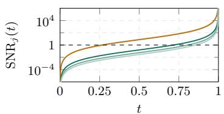  
(a) ETTh2

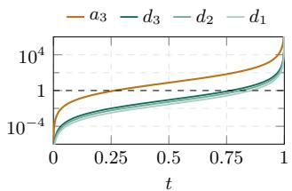

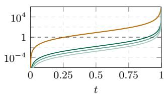

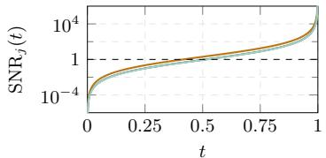  
(d) EEG

(c) Exchange Rate  
(b) Stocks  
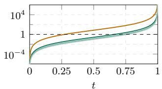  
(e) Energy

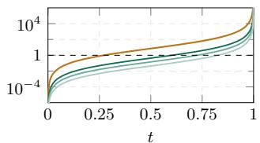  
(f) MuJoCo  
Figure 7: Level-wise SNR along the linear probability path on the other six datasets. Coarse levels cross $\mathrm { S N R } = 1$ earlier than fine levels.

## F.2 FULL RESULTS ON LONGER SEQUENCES

Tables 7 to 9 give the per-dataset values summarized in Figure 4 for all four metrics, seven datasets and six models at $T = 3 2 .$ , 64 and 128, and Figure 8 plots them, together with those of Table 1 at $T = 2 4$ , as a function of T in one plot per dataset–metric pair.

Table 7: Unconditional generation at $T = 3 2 .$ Mean ±std over five recomputations of each metric on the same generated set. Bold: best; underlined: second best.
<table><tr><td></td><td>ETTh1</td><td>ETTh2</td><td>Stocks</td><td>Exchange</td><td>EEG</td><td>Energy</td><td>MuJoCo</td></tr><tr><td colspan="6">Context-FID (↓)</td><td></td><td></td></tr><tr><td>Diffusion-TS</td><td> $0 . 1 8 7 \pm . 0 0 6$ </td><td> $0 . 0 7 3 \pm . 0 0 4$ </td><td>0.238 ±.050</td><td>0.048 ±.005</td><td> $0 . 0 2 4 \pm . 0 0 2$ </td><td> $0 . 1 0 6 \pm . 0 1 9$ </td><td> $\underline { { 0 . 0 2 1 } } \pm . 0 0 2$ </td></tr><tr><td>SigDiffusion</td><td> $2 . 9 7 2 { \scriptstyle \pm . 1 1 2 }$ </td><td>1.413 ±.181</td><td>4.086±.784</td><td>1.702 ±.101</td><td>0.032 ±.004</td><td> $4 . 7 3 0 \pm . 5 4 7$ </td><td> $3 . 1 1 7 \pm . 1 5 0$ </td></tr><tr><td>FourierDiffusion</td><td> $0 . 0 3 9 { \scriptstyle \pm . 0 0 5 }$ </td><td>0.034±.004</td><td>0.055 ±.010</td><td>0.058 ±.009</td><td>0.022 ±.001</td><td> $0 . 2 9 6 \pm . 0 1 8$ </td><td> $0 . 0 9 9 { \scriptstyle \pm . 0 1 2 }$ </td></tr><tr><td>WaveletDiff</td><td> $0 . 0 5 9 { \scriptstyle \pm . 0 0 5 }$ </td><td>0.074±.005</td><td>0.024±.002</td><td>0.007 ±.001</td><td>0.011 ±.002</td><td> $0 . 5 4 1 \pm . 0 2 2$ </td><td> $1 . 2 6 9 \pm . 1 4 9$ </td></tr><tr><td>FlowTS</td><td> $\underline { { 0 . 0 3 0 } } \pm . 0 0 2$ </td><td>0.013±.001</td><td>0.019±.003</td><td>0.010±.001</td><td>0.008 ±.001</td><td> $0 . 0 6 1 \pm . 0 0 4$ </td><td> $0 . 0 2 6 \pm . 0 0 1$ </td></tr><tr><td>Ours</td><td> $\mathbf { 0 . 0 0 7 } \pm . 0 0 0$ </td><td>0.003 ±.000</td><td>0.010 ±.001</td><td>0.003 ±.001</td><td>0.022 ±.003</td><td> $\mathbf { 0 . 0 1 } 2 { \scriptstyle \pm . 0 0 0 }$ </td><td> $\mathbf { 0 . 0 0 6 } \pm . 0 0 0$ </td></tr><tr><td colspan="6">Discriminative score (↓)</td><td></td><td></td></tr><tr><td>Diffusion-TS</td><td> $0 . 0 8 4 \pm . 0 0 6$ </td><td>0.039 ±.004</td><td>0.103 ±.012</td><td>0.026±.007</td><td>0.246±.174</td><td> $0 . 1 1 5 { \scriptstyle \pm . 0 0 3 }$ </td><td> $0 . 0 3 2 { \scriptstyle \pm . 0 0 7 }$ </td></tr><tr><td>SigDiffusion</td><td> $0 . 2 9 9 { \scriptstyle \pm . 0 5 2 }$ </td><td>0.347 ±.040</td><td>0.351 ±.013</td><td>0.340 ±.084</td><td>0.327 ±.216</td><td> $0 . 5 0 0 { \scriptstyle \pm . 0 0 0 }$ </td><td> $0 . 4 6 6 \pm . 0 5 1$ </td></tr><tr><td>FourierDiffusion</td><td> $0 . 0 2 3 \pm . 0 0 7$ </td><td>0.017 ±.009</td><td>0.005 ±.004</td><td>0.020 ±.012</td><td>0.009 ±.004</td><td> $0 . 1 3 3 \pm . 0 0 5$ </td><td> $0 . 0 5 0 { \scriptstyle \pm . 0 0 6 }$ </td></tr><tr><td>WaveletDiff</td><td> $0 . 0 2 3 \pm . 0 1 3$ </td><td>0.019±.003</td><td>0.016±.010</td><td>0.005 ±.006</td><td>0.005 ±.004</td><td> $0 . 3 6 6 \pm . 0 2 1$ </td><td> $0 . 1 9 5 { \scriptstyle \pm . 0 3 6 }$ </td></tr><tr><td>FlowTS</td><td> $\mathbf { 0 . 0 0 6 } \pm . 0 0 4$ </td><td>0.004 ±.002</td><td>0.025 ±.010</td><td>0.010±.008</td><td>0.385 ±.035</td><td> $\mathbf { 0 . 0 9 4 } \pm . 0 2 9$ </td><td> $0 . 0 2 2 { \scriptstyle \pm . 0 0 8 }$ </td></tr><tr><td>Ours</td><td>0.006 ±.006</td><td>0.005 ±.002</td><td>0.008 ±.007</td><td>0.008 ±.004</td><td>0.005 ±.002</td><td>0.101 ±.007</td><td> $\mathbf { 0 . 0 0 5 } \pm . 0 0 3$ </td></tr><tr><td colspan="6">Correlational score (↓)</td><td></td><td></td></tr><tr><td>Diffusion-TS</td><td> $0 . 0 6 1 \pm . 0 1 8$ </td><td>0.087 ±.023</td><td>0.019±.003</td><td>0.103 ±.040</td><td>4.672±.150</td><td> $1 . 1 6 2 \pm . 1 2 4$ </td><td> $0 . 2 3 9 { \scriptstyle \pm . 0 2 1 }$ </td></tr><tr><td>SigDiffusion</td><td> $0 . 2 0 1 \pm . 0 1 5$ </td><td>0.399 ±.017</td><td>0.152 ±.010</td><td>1.067 ±.025</td><td>4.439±.293</td><td> $7 . 2 7 4 \pm . 0 9 0$ </td><td> $0 . 8 4 4 \pm . 0 2 0$ </td></tr><tr><td>FourierDiffusion</td><td> $0 . 0 5 0 { \scriptstyle \pm . 0 1 0 }$ </td><td>0.109 ±.005</td><td>0.015 ±.004</td><td>0.076±.019</td><td>3.623 ±.270</td><td> $1 . 3 2 1 \pm . 2 1 9$ </td><td> $0 . 2 6 7 \pm . 0 2 2$ </td></tr><tr><td>WaveletDiff</td><td> $0 . 0 5 4 \pm . 0 1 7$ </td><td>0.083 ±.018</td><td>0.006 ±.004</td><td>0.086±.025</td><td>2.119±.675</td><td> $1 . 3 3 7 \pm . 2 5 5$ </td><td> $0 . 2 7 7 { \scriptstyle \pm . 0 1 4 }$ </td></tr><tr><td>FlowTS</td><td> $\underline { { 0 . 0 4 1 \pm . 0 1 1 } }$ </td><td>0.065±.016</td><td>0.012±.003</td><td>0.056±.019</td><td>2.698±.601</td><td> $\underline { { 1 . 1 5 2 } } \pm . 2 2 2$ </td><td> $0 . 2 4 9 \pm . 0 2 2$ </td></tr><tr><td>Ours</td><td> $\mathbf { 0 . 0 4 0 } \pm . 0 0 8$ </td><td>0.064±.018</td><td>0.018 ±.004</td><td>0.052 ±.006</td><td>3.972±.542</td><td> $\mathbf { 0 . 7 2 2 \bot . 0 8 9 }$ </td><td> $\mathbf { 0 . 2 3 7 \pm . 0 3 1 }$ </td></tr><tr><td colspan="6">Predictive score (↓)</td><td></td><td></td></tr><tr><td>Diffusion-TS</td><td> $\underline { { 0 . 1 1 9 } } \pm . 0 0 3$ </td><td>0.105 ±.004</td><td>0.037 ±.000</td><td>0.043 ±.004</td><td>0.001 ±.000</td><td> $\underline { { 0 . 2 5 1 } } \pm . 0 0 0$ </td><td> $\mathbf { 0 . 0 0 8 } \pm . 0 0 1$ </td></tr><tr><td>SigDiffusion</td><td> $0 . 1 2 8 \pm . 0 0 3$ </td><td>0.127 ±.005</td><td>0.041 ±.003</td><td>0.085 ±.010</td><td>0.000 ±.000</td><td>0.356±.007</td><td> $0 . 0 2 4 \pm . 0 0 1$ </td></tr><tr><td>FourierDiffusion</td><td> $0 . 1 2 1 \pm . 0 0 3$ </td><td>0.105 ±.003</td><td>0.037 ±.000</td><td>0.046 ±.006</td><td>0.000 ±.000</td><td> $0 . 2 5 1 { \scriptstyle \pm . 0 0 0 }$ </td><td> $0 . 0 1 1 \pm . 0 0 1$ </td></tr><tr><td>WaveletDiff</td><td> $\mathbf { 0 . 1 1 5 \pm . 0 0 4 }$ </td><td>0.102 ±.004</td><td>0.037 ±.000</td><td>0.044±.005</td><td>0.000 ±.000</td><td> $\underline { { 0 . 2 5 1 } } \pm . 0 0 0$ </td><td> $0 . 0 0 9 \pm . 0 0 1$ </td></tr><tr><td>FlowTS</td><td> $0 . 1 2 0 { \scriptstyle \pm . 0 0 3 }$ </td><td>0.106±.003</td><td>0.037 ±.000</td><td>0.041 ±.004</td><td>0.001 ±.000</td><td>0.251 ±.000</td><td> $0 . 0 1 0 { \scriptstyle \pm . 0 0 2 }$ </td></tr><tr><td>Ours</td><td> $0 . 1 2 0 { \scriptstyle \pm . 0 0 3 }$ </td><td>0.104±.003</td><td>0.037 ±.000</td><td>0.041 ±.006</td><td>0.000 ±.000</td><td>0.250 ±.000</td><td> $\mathbf { 0 . 0 0 8 } \pm . 0 0 2$ </td></tr></table>

Table 8: Unconditional generation at $T = 6 4 .$ . Same conventions as Table 7.
<table><tr><td></td><td>ETTh1</td><td>ETTh2</td><td>Stocks</td><td>Exchange</td><td>EEG</td><td>Energy</td><td>MuJoCo</td></tr><tr><td colspan="6">Context-FID (↓)</td><td></td><td></td></tr><tr><td>Diffusion-TS</td><td> $0 . 2 6 7 \pm . 0 2 3$ </td><td> $0 . 1 1 2 { \scriptstyle \pm . 0 1 0 }$ </td><td>0.354±.080</td><td>0.056±.003</td><td>0.058 ±.005</td><td> $0 . 0 8 5 { \scriptstyle \pm . 0 0 7 }$ </td><td> $0 . 0 3 5 { \scriptstyle \pm . 0 0 2 }$ </td></tr><tr><td>SigDiffusion</td><td> $5 . 9 4 8 \pm . 4 6 5$ </td><td>1.581 ±.174</td><td>3.851 ±.744</td><td>1.986±.125</td><td>0.056±.004</td><td> $6 . 4 0 3 \pm . 2 7 1$ </td><td> $3 . 6 2 1 \pm . 1 8 1$ </td></tr><tr><td>FourierDiffusion</td><td> $0 . 0 8 9 \pm . 0 0 5$ </td><td>0.068 ±.005</td><td>0.111 ±.012</td><td>0.081 ±.008</td><td>0.045 ±.005</td><td> $0 . 4 4 6 \pm . 0 3 0$ </td><td> $0 . 1 6 7 \pm . 0 0 9$ </td></tr><tr><td>WaveletDiff</td><td> $0 . 1 0 4 \pm . 0 0 8$ </td><td>0.072±.003</td><td>0.059 ±.011</td><td>0.151 ±.015</td><td>0.025 ±.003</td><td> $0 . 4 3 8 \pm . 0 1 3$ </td><td> $0 . 3 4 7 \pm . 0 2 1$ </td></tr><tr><td>FlowTS</td><td> $\underline { { 0 . 0 5 2 } } \pm . 0 0 3$ </td><td>0.027 ±.002</td><td>0.038 ±.005</td><td>0.016±.001</td><td>0.015 ±.003</td><td> $0 . 1 7 2 { \scriptstyle \pm . 0 1 6 }$ </td><td> $0 . 0 9 3 \pm . 0 0 5$ </td></tr><tr><td>Ours</td><td> $\mathbf { 0 . 0 1 } 2 \pm . 0 0 1$ </td><td>0.009 ±.001</td><td>0.014±.003</td><td>0.003 ±.000</td><td>0.041 ±.006</td><td> $\mathbf { 0 . 0 7 9 } \pm . 0 0 2$ </td><td> $\mathbf { 0 . 0 1 1 } \pm . 0 0 1$ </td></tr><tr><td colspan="6">Discriminative score (↓)</td><td></td><td></td></tr><tr><td>Diffusion-TS</td><td> $0 . 0 9 0 { \scriptstyle \pm . 0 0 4 }$ </td><td>0.040 ±.013</td><td>0.107 ±.007</td><td>0.035 ±.006</td><td>0.308±.179</td><td>0.203 ±.049</td><td> $\underline { { 0 . 0 3 0 } } \pm . 0 0 4$ </td></tr><tr><td>SigDiffusion</td><td> $0 . 3 8 5 { \scriptstyle \pm . 0 6 6 }$ </td><td>0.151 ±.039</td><td>0.316±.021</td><td>0.305 ±.016</td><td>0.395 ±.198</td><td>0.499 ±.003</td><td> $0 . 4 8 4 \pm . 0 0 2$ </td></tr><tr><td>FourierDiffusion</td><td> $0 . 0 4 3 \pm . 0 1 4$ </td><td>0.024±.010</td><td>0.017 ±.007</td><td>0.075 ±.014</td><td>0.013 ±.003</td><td>0.178±.014</td><td> $0 . 0 9 8 \pm . 0 2 5$ </td></tr><tr><td>WaveletDiff</td><td> $0 . 0 2 4 \pm . 0 1 2$ </td><td>0.017 ±.004</td><td>0.003 ±.003</td><td>0.065 ±.018</td><td>0.007±.005</td><td>0.435 ±.023</td><td> $0 . 1 5 5 { \scriptstyle \pm . 0 3 6 }$ </td></tr><tr><td>FlowTS</td><td> $\underline { { 0 . 0 1 7 } } \pm . 0 0 9$ </td><td>0.006±.002</td><td>0.011 ±.005</td><td>0.010±.007</td><td>0.221 ±.135</td><td>0.116±.070</td><td> $0 . 0 8 8 \pm . 0 3 0$ </td></tr><tr><td>Ours</td><td>0.005 ±.003</td><td>0.005 ±.004</td><td>0.010±.008</td><td>0.007 ±.007</td><td>0.005 ±.004</td><td>0.312±.009</td><td> $\mathbf { 0 . 0 0 8 } \pm . 0 0 4$ </td></tr><tr><td colspan="6">Correlational score (↓)</td><td></td><td></td></tr><tr><td>Diffusion-TS</td><td> $0 . 0 6 8 \pm . 0 1 8$ </td><td>0.110±.019</td><td>0.018±.002</td><td>0.125 ±.042</td><td>5.136±.128</td><td> $\underline { { 0 . 8 7 7 } } \pm . 1 5 4$ </td><td> $0 . 2 1 5 { \scriptstyle \pm . 0 2 8 }$ </td></tr><tr><td>SigDiffusion</td><td> $0 . 1 9 8 \pm . 0 1 7$ </td><td>0.337 ±.021</td><td>0.115 ±.007</td><td>1.005 ±.020</td><td>3.706±.198</td><td> $6 . 6 1 5 { \scriptstyle \pm . 0 9 0 }$ </td><td> $0 . 6 8 8 \pm . 0 1 7$ </td></tr><tr><td>FourierDiffusion</td><td> $0 . 0 5 3 \pm . 0 0 9$ </td><td>0.103 ±.012</td><td>0.010±.004</td><td>0.115 ±.019</td><td>2.755±.527</td><td> $1 . 6 3 1 \pm . 2 6 4$ </td><td> $0 . 2 0 8 \pm . 0 2 0$ </td></tr><tr><td>WaveletDiff</td><td> $0 . 0 4 8 \pm . 0 1 2$ </td><td>0.061 ±.020</td><td>0.004±.003</td><td>0.218±.030</td><td>2.608±.128</td><td> $1 . 0 7 1 \pm . 1 0 3$ </td><td> $0 . 2 1 2 { \scriptstyle \pm . 0 2 3 }$ </td></tr><tr><td>FlowTS</td><td> $0 . 0 4 2 { \scriptstyle \pm . 0 1 0 }$ </td><td>0.068 ±.017</td><td>0.012±.003</td><td>0.082 ±.036</td><td>1.744±.773</td><td> $1 . 0 5 7 \pm . 1 7 0$ </td><td> $\underline { { 0 . 1 9 6 } } \pm . 0 1 5$ </td></tr><tr><td>Ours</td><td> $\mathbf { 0 . 0 3 4 } \pm . 0 0 3$ </td><td>0.056 ±.009</td><td>0.010±.005</td><td>0.067 ±.020</td><td>3.788±.364</td><td> $\mathbf { 0 . 7 8 9 \pm . 1 0 4 }$ </td><td> $\mathbf { 0 . 1 9 1 } \pm . 0 2 1$ </td></tr><tr><td colspan="6">Predictive score (↓)</td><td></td><td></td></tr><tr><td>Diffusion-TS</td><td> $0 . 1 1 7 { \scriptstyle \pm . 0 0 6 }$ </td><td>0.119±.017</td><td>0.037 ±.000</td><td>0.041 ±.005</td><td>0.001 ±.000</td><td> $0 . 2 5 0 { \scriptstyle \pm . 0 0 0 }$ </td><td> $0 . 0 0 8 \pm . 0 0 1$ </td></tr><tr><td>SigDiffusion</td><td> $0 . 1 2 5 { \scriptstyle \pm . 0 0 2 }$ </td><td>0.125 ±.003</td><td>0.038 ±.001</td><td>0.068 ±.003</td><td>0.000 ±.000</td><td>0.310±.003</td><td> $0 . 0 1 7 \pm . 0 0 1$ </td></tr><tr><td>FourierDiffusion</td><td> $0 . 1 1 5 { \scriptstyle \pm . 0 0 5 }$ </td><td>0.104±.002</td><td>0.037 ±.000</td><td>0.044±.002</td><td>0.000 ±.000</td><td>0.251 ±.000</td><td> $0 . 0 0 9 \pm . 0 0 1$ </td></tr><tr><td>WaveletDiff</td><td> ${ \bf 0 . 1 1 3 \pm . 0 1 1 }$ </td><td>0.102 ±.001</td><td>0.037 ±.000</td><td>0.043 ±.003</td><td>0.002 ±.000</td><td>0.250±.001</td><td> $\mathbf { 0 . 0 0 6 } \pm . 0 0 1$ </td></tr><tr><td>FlowTS</td><td> $0 . 1 1 7 { \scriptstyle \pm . 0 0 3 }$ </td><td>0.099±.002</td><td>0.036±.000</td><td>0.040 ±.007</td><td>0.001 ±.000</td><td>0.251 ±.000</td><td> $0 . 0 0 8 { \scriptstyle \pm . 0 0 0 }$ </td></tr><tr><td>Ours</td><td> $\mathbf { 0 . 1 1 3 \pm . 0 0 2 }$ </td><td>0.100 ±.001</td><td>0.036 ±.000</td><td>0.040 ±.006</td><td>0.000 ±.000</td><td>0.249 ±.000</td><td> $\underline { { 0 . 0 0 8 } } \pm . 0 0 2$ </td></tr></table>

Table 9: Unconditional generation at $T = 1 2 8 .$ Same conventions as Table 7.
<table><tr><td></td><td>ETTh1</td><td>ETTh2</td><td>Stocks</td><td>Exchange</td><td>EEG</td><td>Energy</td><td>MuJoCo</td></tr><tr><td colspan="6">Context-FID (↓)</td><td></td><td></td></tr><tr><td>Diffusion-TS</td><td> $0 . 9 9 4 \pm . 0 2 5$ </td><td>0.146±.018</td><td>0.611 ±.068</td><td>0.059 ±.004</td><td>0.139 ±.023</td><td> $\mathbf { 0 . 0 7 4 } \pm . 0 0 8$ </td><td> $\underline { { 0 . 0 7 3 } } \pm . 0 0 4$ </td></tr><tr><td>SigDiffusion</td><td> $1 1 . 6 1 9 \pm . 7 3 9$ </td><td>2.087 ±.284</td><td>4.743 ±.381</td><td>2.005 ±.267</td><td>0.130 ±.012</td><td> $1 0 . 4 7 1 \pm . 2 7 2$ </td><td> $3 . 7 3 8 \pm . 2 6 9$ </td></tr><tr><td>FourierDiffusion</td><td> $0 . 3 1 9 { \scriptstyle \pm . 0 2 0 }$ </td><td>0.200 ±.013</td><td>0.272 ±.023</td><td>0.235 ±.040</td><td>0.086±.014</td><td> $0 . 8 3 7 \pm . 0 3 4$ </td><td> $0 . 2 2 4 \pm . 0 2 1$ </td></tr><tr><td>WaveletDiff</td><td> $0 . 1 5 8 \pm . 0 2 3$ </td><td>0.088 ±.006</td><td>0.112±.010</td><td>0.154±.015</td><td>0.059±.005</td><td> $0 . 5 0 1 \pm . 0 3 7$ </td><td> $0 . 2 7 7 { \scriptstyle \pm . 0 1 8 }$ </td></tr><tr><td>FlowTS</td><td> $0 . 0 9 7 { \scriptstyle \pm . 0 0 3 }$ </td><td>0.058±.004</td><td>0.063 ±.010</td><td>0.035 ±.004</td><td>0.027 ±.003</td><td> $0 . 2 6 0 { \scriptstyle \pm . 0 2 1 }$ </td><td> $0 . 1 5 6 \pm . 0 0 9$ </td></tr><tr><td>Ours</td><td> $\mathbf { 0 . 0 3 7 \pm . 0 0 1 }$ </td><td>0.018±.003</td><td>0.043 ±.006</td><td>0.013 ±.001</td><td>0.114±.012</td><td> $\underline { { 0 . 1 2 3 } } \pm . 0 1 3$ </td><td> $\mathbf { 0 . 0 2 4 } \pm . 0 0 2$ </td></tr><tr><td colspan="6">Discriminative score (↓)</td><td></td><td></td></tr><tr><td>Diffusion-TS</td><td> $0 . 1 6 5 \pm . 0 0 8$ </td><td>0.047 ±.013</td><td>0.118±.019</td><td>0.035 ±.005</td><td>0.211 ±.220</td><td> $\mathbf { 0 . 2 3 1 } \pm . 0 5 4$ </td><td> $\underline { { 0 . 0 6 8 } } \pm . 0 0 3$ </td></tr><tr><td>SigDiffusion</td><td> $0 . 2 5 8 \pm . 1 7 8$ </td><td>0.153 ±.087</td><td>0.321 ±.011</td><td>0.245 ±.081</td><td>0.419±.123</td><td> $0 . 4 9 9 \pm . 0 0 1$ </td><td> $0 . 4 8 1 \pm . 0 0 7$ </td></tr><tr><td>FourierDiffusion</td><td> $0 . 0 9 5 { \scriptstyle \pm . 0 3 9 }$ </td><td>0.061 ±.006</td><td>0.041 ±.042</td><td>0.093 ±.018</td><td>0.011 ±.008</td><td> $0 . 3 0 1 \pm . 0 4 1$ </td><td> $0 . 1 6 8 \pm . 0 6 8$ </td></tr><tr><td>WaveletDiff</td><td> $0 . 0 1 0 { \scriptstyle \pm . 0 0 5 }$ </td><td>0.019 ±.007</td><td>0.015±.006</td><td>0.059 ±.011</td><td>0.011 ±.001</td><td> $0 . 4 6 3 \pm . 0 2 3$ </td><td> $0 . 0 7 8 \pm . 0 4 8$ </td></tr><tr><td>FlowTS</td><td> $\underline { { 0 . 0 0 9 } } \pm . 0 0 5$ </td><td>0.007 ±.006</td><td>0.020 ±.017</td><td>0.010 ±.008</td><td>0.176±.118</td><td> $\underline { { 0 . 2 9 6 \pm . 0 2 1 } }$ </td><td> $0 . 1 1 2 { \scriptstyle \pm . 0 4 2 }$ </td></tr><tr><td>Ours</td><td>0.007 ±.004</td><td>0.003 ±.002</td><td>0.007 ±.004</td><td>0.007 ±.005</td><td>0.008 ±.006</td><td>0.411 ±.022</td><td> $\mathbf { 0 . 0 0 8 } \pm . 0 0 4$ </td></tr><tr><td colspan="6">Correlational score (↓)</td><td></td><td></td></tr><tr><td>Diffusion-TS</td><td>0.092 ±.009</td><td>0.086±.020</td><td>0.026±.003</td><td>0.106±.022</td><td>5.141 ±.128</td><td>0.619 ±.051</td><td> $0 . 2 2 9 { \scriptstyle \pm . 0 2 1 }$ </td></tr><tr><td>SigDiffusion</td><td> $0 . 2 2 9 { \scriptstyle \pm . 0 1 7 }$ </td><td>0.393 ±.018</td><td>0.105 ±.004</td><td>1.015 ±.039</td><td>3.141 ±.032</td><td> $5 . 9 0 3 \pm . 0 6 8$ </td><td> $0 . 5 9 6 \pm . 0 2 1$ </td></tr><tr><td>FourierDiffusion</td><td> $0 . 0 8 0 { \scriptstyle \pm . 0 1 2 }$ </td><td>0.160 ±.011</td><td>0.034±.006</td><td>0.155 ±.023</td><td>1.394±.451</td><td> $1 . 3 6 9 \pm . 3 6 9$ </td><td> $0 . 2 0 1 \pm . 0 1 2$ </td></tr><tr><td>WaveletDiff</td><td> $\underline { { 0 . 0 4 0 } } \pm . 0 1 0$ </td><td>0.062±.020</td><td>0.005 ±.002</td><td>0.153 ±.037</td><td>1.572±.313</td><td> $0 . 9 0 5 { \scriptstyle \pm . 0 6 2 }$ </td><td> $\mathbf { 0 . 1 7 7 \pm . 0 1 3 }$ </td></tr><tr><td>FlowTS</td><td> $\mathbf { 0 . 0 3 5 \pm . 0 0 4 }$ </td><td>0.068 ±.010</td><td>0.009 ±.005</td><td>0.068 ±.015</td><td>0.871 ±.097</td><td> $0 . 8 3 7 { \scriptstyle \pm . 0 8 7 }$ </td><td> $0 . 2 0 4 \pm . 0 2 6$ </td></tr><tr><td>Ours</td><td>0.040±.013</td><td>0.059 ±.020</td><td>0.020 ±.001</td><td>0.067 ±.027</td><td>3.348±.603</td><td> $\underline { { 0 . 7 7 0 } } \pm . 1 7 4$ </td><td> $\underline { { 0 . 1 8 2 } } \pm . 0 2 2$ </td></tr><tr><td colspan="6">Predictive score (↓)</td><td></td><td></td></tr><tr><td>Diffusion-TS</td><td> $0 . 1 2 0 { \scriptstyle \pm . 0 0 2 }$ </td><td>0.109 ±.009</td><td>0.036±.000</td><td>0.040 ±.005</td><td>0.000 ±.000</td><td> $\underline { { 0 . 2 4 9 } } \pm . 0 0 1$ </td><td> $0 . 0 0 5 { \scriptstyle \pm . 0 0 1 }$ </td></tr><tr><td>SigDiffusion</td><td> $0 . 1 2 9 \pm . 0 0 2$ </td><td>0.123 ±.006</td><td>0.038 ±.000</td><td>0.068 ±.003</td><td>0.000 ±.000</td><td> $0 . 2 7 8 \pm . 0 0 2$ </td><td> $0 . 0 1 1 { \scriptstyle \pm . 0 0 0 }$ </td></tr><tr><td>FourierDiffusion</td><td> $\underline { { 0 . 1 1 2 } } \pm . 0 0 4$ </td><td>0.107 ±.003</td><td>0.037 ±.000</td><td>0.049 ±.004</td><td>0.000 ±.000</td><td>0.251 ±.000</td><td> $0 . 0 0 6 \pm . 0 0 0$ </td></tr><tr><td>WaveletDiff</td><td> $\mathbf { 0 . 1 0 3 \pm . 0 0 5 }$ </td><td>0.104±.003</td><td>0.036±.000</td><td>0.039 ±.005</td><td>0.000 ±.000</td><td>0.250 ±.000</td><td> $0 . 0 0 5 { \scriptstyle \pm . 0 0 0 }$ </td></tr><tr><td>FlowTS</td><td> $0 . 1 1 2 { \scriptstyle \pm . 0 0 8 }$ </td><td>0.098±.002</td><td>0.036±.000</td><td>0.036±.003</td><td>0.001 ±.000</td><td>0.251 ±.000</td><td> $0 . 0 0 6 \pm . 0 0 1$ </td></tr><tr><td>Ours</td><td> $0 . 1 1 2 { \scriptstyle \pm . 0 0 8 }$ </td><td>0.101 ±.009</td><td>0.036 ±.000</td><td>0.040 ±.004</td><td>0.000 ±.000</td><td>0.248 ±.001</td><td> $\mathbf { 0 . 0 0 4 } \pm . 0 0 1$ </td></tr></table>

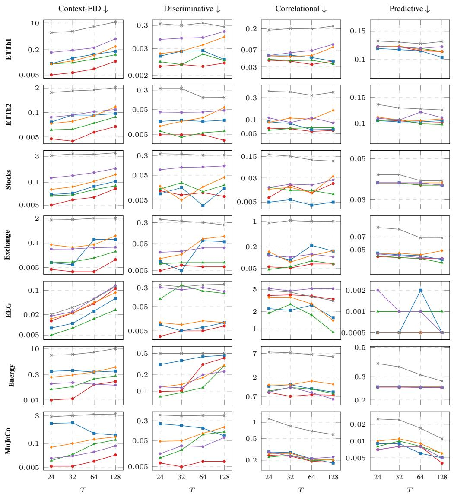  
Figure 8: Evolution of each metric with the window length T.

## F.3 QUALITATIVE COMPARISON ON ALL DATASETS

Figures 9 and 10 show the two qualitative diagnostics for every method and dataset at $T = 2 4 .$

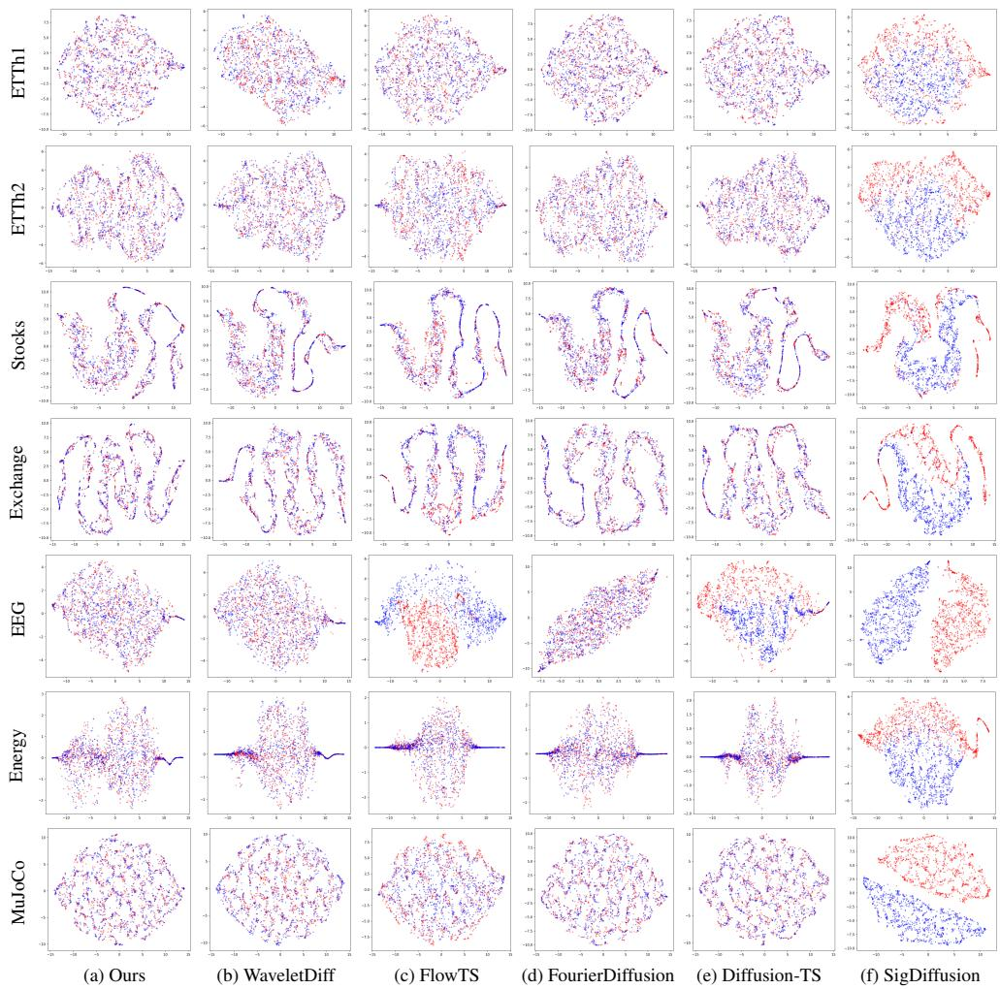  
Figure 9: t-SNE embeddings of real (red) and generated (blue) windows for all methods and datasets at $\bar { T } = 2 4$

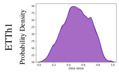

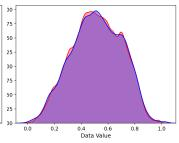

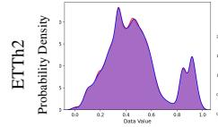

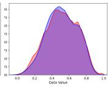

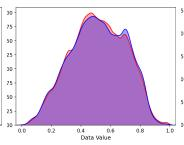

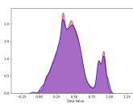

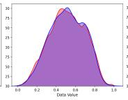

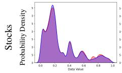

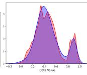

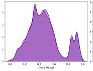

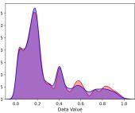

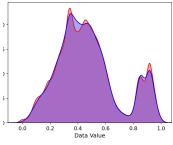

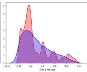

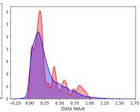

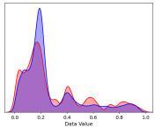

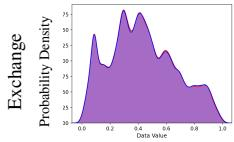

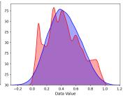

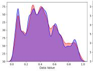

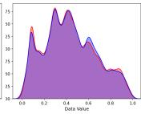

  
(a) Ours

  
(b) WaveletDiff

  
(c) FlowTS

  
(d) FourierDiffusion

  
(e) Diffusion-TS

  
(f) SigDiffusion  
Figure 10: Probability distributions of real (red) and generated (blue) data for all methods and datasets at $T = 2 4$

## F.4 METHOD COMPONENT ABLATION

Table 10 reports one-factor-at-a-time ablations of the main model configuration at $T = 2 4$ . The full model uses db2 wavelet coefficients, natural level scaling, logit-normal sampling of the training time $t ,$ and channel-identity embeddings $e _ { f }$ . Each ablation changes exactly one of these components while keeping the remaining architecture, training, and sampling settings fixed.

For standardized levels, each wavelet level is divided by its standard deviation from Table 6 before training and rescaled before the inverse transform, instead of retaining the natural level scaling described in Section 3. The uniform t ablation replaces logit-normal time sampling with uniform sampling.

For the without $e _ { f }$ ablation, removing the channel-identity embedding from Equation $( 9 )$ makes every parameter shared across tokens, with none depending on the channel. Hence $v _ { \theta } ( z P , t ) = v _ { \theta } ( z , t ) \dot { P }$ for every permutation matrix $P$ of the channels. Since the DWT acts channel-wise and the prior is invariant under $P ,$ the generated law is exchangeable in the channels: all off-diagonal lag-zero correlations share a common value $\rho .$ No choice of $\rho$ can match a real correlation matrix that is not equicorrelated, so Equation (48) is bounded below by $\begin{array} { r } { \frac { 1 } { 1 0 } \sum _ { i < j } \lvert \rho _ { i j } ^ { \mathrm { r e a l } } - \rho ^ { \star } \rvert } \end{array}$ , where $\rho ^ { \star }$ is the median of the real off-diagonal correlations.

Finally, the time-domain ablation replaces the db2 transform by the identity, $\mathbf { W } = I$ , and trains the same model directly on the time-domain signal.

<table><tr><td>Variant</td><td>ETTh1</td><td>ETTh2</td><td>Stocks</td><td>Exchange</td><td>EEG</td><td>Energy</td><td>MuJoCo</td></tr><tr><td colspan="6">Context-FID (↓)</td><td></td><td></td></tr><tr><td>(a) Without ef</td><td> $1 . 4 8 8 \pm 0 . 0 9 9$ </td><td> $0 . 9 7 7 { \scriptstyle \pm 0 . 1 6 8 }$ </td><td> $1 . 7 6 3 \pm 0 . 3 2 1$ </td><td> $0 . 9 3 8 \pm 0 . 0 7 2$ </td><td> $\underline { { 0 . 0 1 1 } } \pm 0 . 0 0 1$ </td><td> $2 . 6 1 7 \pm 0 . 1 4 5$ </td><td> $1 . 3 9 0 \pm 0 . 1 3 9$ </td></tr><tr><td>(b) Std. levels</td><td> $0 . 0 2 1 \pm 0 . 0 0 2$ </td><td> $0 . 0 1 4 \pm 0 . 0 0 1$ </td><td> $0 . 0 1 8 \pm 0 . 0 0 4$ </td><td> $0 . 0 1 0 { \scriptstyle \pm 0 . 0 0 1 }$ </td><td> $\mathbf { 0 . 0 1 0 \bot } 0 . 0 0 1$ </td><td> $0 . 0 1 9 \pm 0 . 0 0 2$ </td><td> $0 . 0 0 8 \pm 0 . 0 0 0$ </td></tr><tr><td>(c) Time domain</td><td> $0 . 0 0 6 { \scriptstyle \pm 0 . 0 0 1 }$ </td><td> $0 . 0 0 5 { \scriptstyle \pm 0 . 0 0 1 }$ </td><td> $0 . 0 1 4 \pm 0 . 0 0 1$ </td><td> $0 . 0 0 7 \pm 0 . 0 0 0$ </td><td> $0 . 0 1 4 \pm 0 . 0 0 1$ </td><td> $0 . 0 1 2 { \scriptstyle \pm 0 . 0 0 0 }$ </td><td> $\mathbf { 0 . 0 0 5 \bot 0 . 0 0 0 }$ </td></tr><tr><td>(d) Uniform t</td><td> $0 . 0 0 7 \pm 0 . 0 0 0$ </td><td> $0 . 0 0 8 \pm 0 . 0 0 1$ </td><td> $\underline { { 0 . 0 1 3 } } \pm 0 . 0 0 1$ </td><td> $\underline { { 0 . 0 0 5 } } \pm 0 . 0 0 0$ </td><td> $0 . 0 1 4 \pm 0 . 0 0 2$ </td><td> $0 . 0 1 6 \pm 0 . 0 0 1$ </td><td> $0 . 0 1 0 { \scriptstyle \pm 0 . 0 0 1 }$ </td></tr><tr><td>Full model</td><td> $\mathbf { 0 . 0 0 5 \pm 0 . 0 0 1 }$ </td><td> $\mathbf { 0 . 0 0 4 } \pm 0 . 0 0 0$ </td><td> $\mathbf { 0 . 0 0 5 \pm 0 . 0 0 2 }$ </td><td> $\mathbf { 0 . 0 0 4 \ : \pm 0 . 0 0 1 }$ </td><td> $0 . 0 1 3 { \scriptstyle \pm 0 . 0 0 2 }$ </td><td> $\mathbf { 0 . 0 1 0 \bot } 0 . 0 0 3$ </td><td> $0 . 0 0 6 { \scriptstyle \pm 0 . 0 0 0 }$ </td></tr><tr><td colspan="6">Discriminative score (↓)</td><td></td><td></td></tr><tr><td>(a) Without e f</td><td> $0 . 2 4 5 \pm 0 . 1 1 2$ </td><td> $0 . 2 5 8 \pm 0 . 1 0 0$ </td><td> $0 . 2 9 9 { \scriptstyle \pm 0 . 0 7 6 }$ </td><td> $0 . 3 3 5 { \scriptstyle \pm 0 . 0 1 4 }$ </td><td> $0 . 0 6 0 { \scriptstyle \pm 0 . 0 2 1 }$ </td><td> $0 . 4 9 6 \pm 0 . 0 0 1$ </td><td> $0 . 4 3 4 \pm 0 . 0 2 3$ </td></tr><tr><td>(b) Std. levels</td><td> $0 . 0 0 9 { \scriptstyle \pm 0 . 0 0 5 }$ </td><td> $\mathbf { 0 . 0 0 5 \pm 0 . 0 0 4 }$ </td><td> $0 . 0 2 3 { \scriptstyle \pm 0 . 0 1 0 }$ </td><td> $0 . 0 1 0 { \scriptstyle \pm 0 . 0 1 0 }$ </td><td> $\underline { { 0 . 0 0 5 } } \pm 0 . 0 0 4$ </td><td> $0 . 1 3 3 { \scriptstyle \pm 0 . 0 0 9 }$ </td><td> $\underline { { 0 . 0 0 9 } } \pm 0 . 0 0 4$ </td></tr><tr><td>(c) Time domain</td><td> $0 . 0 0 6 { \scriptstyle \pm 0 . 0 0 4 }$ </td><td> $0 . 0 0 8 { \scriptstyle \pm 0 . 0 0 4 }$ </td><td> $0 . 0 1 6 { \scriptstyle \pm 0 . 0 0 6 }$ </td><td> $0 . 0 0 6 \pm 0 . 0 0 2$ </td><td> $0 . 0 0 5 { \scriptstyle \pm 0 . 0 0 4 }$ </td><td> $0 . 1 1 8 \pm 0 . 0 0 4$ </td><td> $0 . 0 1 0 { \scriptstyle \pm 0 . 0 0 6 }$ </td></tr><tr><td>(d) Uniform t</td><td> $0 . 0 0 9 { \scriptstyle \pm 0 . 0 0 4 }$ </td><td> $\mathbf { 0 . 0 0 5 \pm 0 . 0 0 3 }$ </td><td> $\mathbf { 0 . 0 1 1 } \pm \mathbf { 0 . 0 0 8 }$ </td><td> $\mathbf { 0 . 0 0 4 } \pm 0 . 0 0 2$ </td><td> $\underline { { 0 . 0 0 5 } } \pm 0 . 0 0 3$ </td><td> $\mathbf { 0 . 0 9 2 \bot 0 . 0 1 9 }$ </td><td> $\mathbf { 0 . 0 0 7 \pm 0 . 0 0 2 }$ </td></tr><tr><td>Full model</td><td> $\mathbf { 0 . 0 0 5 \pm 0 . 0 0 4 }$ </td><td> $\mathbf { 0 . 0 0 5 \bot 0 . 0 0 6 }$ </td><td> $0 . 0 1 2 { \scriptstyle \pm 0 . 0 0 9 }$ </td><td> $\underline { { 0 . 0 0 5 } } \pm 0 . 0 0 3$ </td><td> $\mathbf { 0 . 0 0 3 \pm 0 . 0 0 2 }$ </td><td> $\underline { { 0 . 0 9 8 } } \pm 0 . 0 1 8$ </td><td> $\mathbf { 0 . 0 0 7 \mathop { \pm 0 . 0 0 4 } }$ </td></tr><tr><td colspan="6">Correlational score (↓)</td><td></td><td></td></tr><tr><td>(a) Without e f</td><td> $0 . 3 9 4 \pm 0 . 0 0 8$ </td><td> $0 . 5 7 4 \pm 0 . 0 1 5$ </td><td> $1 . 0 2 3 \pm 0 . 0 2 4$ </td><td> $0 . 8 1 6 \pm 0 . 0 2 7$ </td><td> $4 . 1 4 3 \pm 0 . 3 5 3$ </td><td> $1 1 . 3 8 5 \pm 0 . 0 8 5$ </td><td> $0 . 9 2 2 { \scriptstyle \pm 0 . 0 2 3 }$ </td></tr><tr><td>(b) Std. levels</td><td> $0 . 0 6 4 \pm 0 . 0 1 5$ </td><td> $0 . 0 7 9 { \scriptstyle \pm 0 . 0 1 5 }$ </td><td> $0 . 0 0 8 \pm 0 . 0 0 2$ </td><td> $0 . 0 7 6 \pm 0 . 0 2 6$ </td><td> $\underline { { 4 . 0 0 2 } } \pm 0 . 3 0 3$ </td><td> $1 . 0 8 7 \pm 0 . 3 3 1$ </td><td> $\mathbf { 0 . 2 2 3 \pm 0 . 0 3 5 }$ </td></tr><tr><td>(c) Time domain</td><td> $0 . 0 4 5 \pm 0 . 0 0 8$ </td><td> $0 . 0 7 8 \pm 0 . 0 2 2$ </td><td> $0 . 0 0 8 \pm 0 . 0 0 5$ </td><td> $0 . 0 7 5 { \scriptstyle \pm 0 . 0 3 8 }$ </td><td> $4 . 3 6 3 \pm 0 . 3 1 8$ </td><td> $1 . 0 6 9 \pm 0 . 2 8 7$ </td><td> $0 . 2 5 1 \pm 0 . 0 1 9$ </td></tr><tr><td>(d) Uniform t</td><td> $\mathbf { 0 . 0 3 9 \pm 0 . 0 1 7 }$ </td><td> $\underline { { 0 . 0 7 4 } } \pm 0 . 0 2 3$ </td><td> $\mathbf { 0 . 0 0 4 } \pm 0 . 0 0 4$ </td><td> $0 . 0 6 9 { \scriptstyle \pm 0 . 0 2 8 }$ </td><td> $4 . 4 2 9 \pm 0 . 2 2 7$ </td><td> $\underline { { 0 . 9 7 3 } } \pm 0 . 1 3 0$ </td><td> $0 . 2 6 5 \pm 0 . 0 3 2$ </td></tr><tr><td>Full model</td><td> $\underline { { 0 . 0 4 2 } } \pm 0 . 0 1 5$ </td><td> $\mathbf { 0 . 0 6 6 } \pm 0 . 0 2 0$ </td><td> $\underline { { 0 . 0 0 7 } } \pm 0 . 0 0 5$ </td><td> ${ \bf 0 . 0 5 6 \pm 0 . 0 1 7 }$ </td><td> $\mathbf { 3 . 8 7 0 \bot 0 . 4 2 2 }$ </td><td> $\mathbf { 0 . 8 9 0 \pm 0 . 1 7 6 }$ </td><td> $\underline { { 0 . 2 4 6 } } \pm 0 . 0 3 3$ </td></tr><tr><td colspan="6">Predictive score (↓)</td><td></td><td></td></tr><tr><td>(a) Without e f</td><td> $0 . 1 3 8 \pm 0 . 0 0 1$ </td><td> $0 . 1 6 5 \pm 0 . 0 0 1$ </td><td> $\underline { { 0 . 0 9 0 } } \pm 0 . 0 3 5$ </td><td> $0 . 1 2 6 \pm 0 . 0 0 3$ </td><td> $\mathbf { 0 . 0 0 0 } { \scriptstyle \pm 0 . 0 0 0 }$ </td><td> $0 . 2 6 8 \pm 0 . 0 0 1$ </td><td> $\underline { { 0 . 0 4 0 } } \pm 0 . 0 0 0$ </td></tr><tr><td>(b) Std. levels</td><td> ${ \bf 0 . 1 1 9 } \pm 0 . 0 0 5$ </td><td> $\underline { { 0 . 1 0 7 } } \pm 0 . 0 0 3$ </td><td>0.037 ±0.000</td><td> $0 . 0 4 8 \pm 0 . 0 0 3$ </td><td> $\mathbf { 0 . 0 0 0 } { \scriptstyle \pm 0 . 0 0 0 }$ </td><td> $0 . 2 5 2 \pm 0 . 0 0 0$ </td><td> $\mathbf { 0 . 0 0 7 \mathop { \pm 0 . 0 0 0 } }$ </td></tr><tr><td>(c) Time domain</td><td> $0 . 1 2 2 { \scriptstyle \pm 0 . 0 0 3 }$ </td><td> $\underline { { 0 . 1 0 7 } } \pm 0 . 0 0 4$ </td><td> $\mathbf { 0 . 0 3 7 \bot 0 . 0 0 0 }$ </td><td> $\underline { { 0 . 0 4 2 } } \pm 0 . 0 0 6$ </td><td> $\mathbf { 0 . 0 0 0 } { \scriptstyle \pm 0 . 0 0 0 }$ </td><td> $\mathbf { 0 . 2 5 0 \mathop { \pm 0 . 0 0 0 } }$ </td><td> $\mathbf { 0 . 0 0 7 \mathop { \pm 0 . 0 0 0 } }$ </td></tr><tr><td>(d) Uniform t</td><td> $0 . 1 2 1 \pm 0 . 0 0 2$ </td><td> $\mathbf { 0 . 1 0 5 \pm 0 . 0 0 4 }$ </td><td> $\mathbf { 0 . 0 3 7 \bot 0 . 0 0 0 }$ </td><td> ${ \bf 0 . 0 4 0 } \pm 0 . 0 0 5$ </td><td> $\mathbf { 0 . 0 0 0 } { \scriptstyle \pm 0 . 0 0 0 }$ </td><td> $0 . 2 5 1 { \scriptstyle \pm 0 . 0 0 0 }$ </td><td> $\mathbf { 0 . 0 0 7 \mathop { \pm 0 . 0 0 0 } }$ </td></tr><tr><td>Full model</td><td> $\underline { { 0 . 1 2 0 } } { \pm } 0 . 0 0 3$ </td><td> $\mathbf { 0 . 1 0 5 \pm 0 . 0 0 4 }$ </td><td> $\mathbf { 0 . 0 3 7 \pm 0 . 0 0 0 }$ </td><td>0.042 ±0.004</td><td> $\mathbf { 0 . 0 0 0 } { \scriptstyle \pm 0 . 0 0 0 }$ </td><td> $\mathbf { 0 . 2 5 0 \mathop { \pm 0 . 0 0 0 } }$ </td><td> $\mathbf { 0 . 0 0 7 \pm 0 . 0 0 1 }$ </td></tr></table>

Table 10: One-factor-at-a-time ablations at $T = 2 4 .$ . The full model uses db2 coefficients, natural level scaling, logit-normal time sampling, and channel-identity embeddings ef. Variants (a)–(d) respectively remove $\boldsymbol { e } _ { f } ,$ , standardize the wavelet levels, replace the wavelet transform with the identity, and sample t uniformly. Results are mean ± standard deviation; Best values are in bold and second best values are underlined. The shaded rows show the full model.

## F.5 SAMPLER SETTINGS

The main experiments use deterministic Euler integration with $N = 1 0 0$ uniformly spaced steps, as described in Equation (12). For the sampler ablations, we additionally vary both the number and placement of integration steps.

Time-grid parameterization. Following Hu et al. (2025), we parameterize non-uniform grids through the increasing bijection of [0, 1]

$$
f _ { \alpha } ( \tau ) = \frac { \alpha \tau } { 1 + ( \alpha - 1 ) \tau } , \qquad \alpha > 0 .\tag{49}
$$

We set $t _ { k } = f _ { \alpha } ( k / N )$ . Values $\alpha > 1$ concentrate steps near $t = 1$ , while $0 < \alpha < 1$ concentrates them near $t = 0 ; \alpha = 1$ recovers the uniform grid used by default.

Algorithm 1 Sampling by deterministic Euler integration in the wavelet domain   
Require: trained velocity field $v _ { \theta } .$ , inverse operator $\mathbf { W } ^ { - 1 }$ , steps $N ,$ shift α   
1: $t _ { k } \gets f _ { \alpha } ( k / N )$ for $k = 0 , \ldots , N$ ▷ time grid   
2: $z  z _ { 0 }$ with i.i.d. N(0, 1) entries   
3: for $k = 0 , \ldots , N - 1$ do   
4: $z  z + ( t _ { k + 1 } - t _ { k } ) v _ { \theta } ( z , t _ { k } )$ ▷ explicit Euler step   
5: end for   
6: $\hat { x }  \mathbf { W } ^ { - 1 } z$ ▷ inverse wavelet transform   
7: return xˆ

Sampler ablations. Tables 11 and 12 report all four metrics at $T = 2 4$ while varying the sampler. Table 11 varies the time-grid shift α at fixed $N = 1 0 0$ , whereas Table 12 varies the number of Euler steps $N$ on the uniform grid $( \alpha = 1 )$ . All configurations use the same trained model, so these comparisons isolate inference-time choices. The dagger denotes the default configuration.

<table><tr><td rowspan="2">Dataset</td><td colspan="5">Time shift α</td></tr><tr><td>0.33</td><td>0.5</td><td> $1 . 0 ^ { \dagger }$ </td><td>2.0 3.0</td><td>5.0</td></tr><tr><td colspan="6">Context-FID (↓)</td></tr><tr><td>ETTh1</td><td> $0 . 0 0 7 \pm 0 . 0 0 0$ </td><td> $0 . 0 0 8 \pm 0 . 0 0 0$ </td><td> $\mathbf { 0 . 0 0 5 \pm 0 . 0 0 1 }$ </td><td> $0 . 0 1 1 \pm 0 . 0 0 1$ </td><td> $0 . 0 1 0 { \scriptstyle \pm 0 . 0 0 0 }$   $0 . 0 2 1 \pm 0 . 0 0 1$ </td></tr><tr><td>ETTh2</td><td> $0 . 0 0 8 \pm 0 . 0 0 0$ </td><td> $0 . 0 0 5 \pm 0 . 0 0 0$ </td><td> $\mathbf { 0 . 0 0 4 } \pm 0 . 0 0 0$ </td><td> $\mathbf { 0 . 0 0 4 } \pm 0 . 0 0 0$   $0 . 0 0 5 \pm 0 . 0 0 0$ </td><td> $0 . 0 0 7 \pm 0 . 0 0 0$ </td></tr><tr><td>Stocks</td><td> $0 . 0 0 8 \pm 0 . 0 0 1$ </td><td> $0 . 0 1 1 \pm 0 . 0 0 1$ </td><td> $\mathbf { 0 . 0 0 5 \pm 0 . 0 0 2 }$ </td><td> $0 . 0 0 6 \pm 0 . 0 0 1$   $0 . 0 1 0 { \scriptstyle \pm 0 . 0 0 1 }$ </td><td> $0 . 0 2 3 \pm 0 . 0 0 3$ </td></tr><tr><td>Exchange</td><td> $0 . 0 0 5 \pm 0 . 0 0 1$ </td><td> $0 . 0 0 5 \pm 0 . 0 0 0$ </td><td> $0 . 0 0 4 \pm 0 . 0 0 1$ </td><td> $\mathbf { 0 . 0 0 3 \bot 0 . 0 0 0 }$   $0 . 0 0 7 \pm 0 . 0 0 0$ </td><td> $0 . 0 0 8 \pm 0 . 0 0 1$ </td></tr><tr><td>EEG</td><td> $\mathbf { 0 . 0 1 } 2 \pm 0 . 0 0 1$ </td><td> $0 . 0 1 5 { \scriptstyle \pm 0 . 0 0 2 }$ </td><td> $0 . 0 1 3 { \scriptstyle \pm 0 . 0 0 2 }$ </td><td> $0 . 0 1 4 \pm 0 . 0 0 4$   $0 . 0 1 9 { \scriptstyle \pm 0 . 0 0 3 }$ </td><td> $0 . 0 1 5 { \scriptstyle \pm 0 . 0 0 2 }$ </td></tr><tr><td>Energy</td><td> $0 . 0 1 2 \pm 0 . 0 0 1$ </td><td> $0 . 0 1 1 { \scriptstyle \pm 0 . 0 0 0 }$ </td><td> $\mathbf { 0 . 0 1 0 \bot } 0 . 0 0 3$ </td><td> $0 . 0 1 2 \pm 0 . 0 0 1$   $0 . 0 1 1 \pm 0 . 0 0 2$ </td><td> $0 . 0 1 6 \pm 0 . 0 0 2$ </td></tr><tr><td>MuJoCo</td><td> $0 . 0 0 7 \pm 0 . 0 0 1$ </td><td> $0 . 0 0 7 \pm 0 . 0 0 0$ </td><td> $\mathbf { 0 . 0 0 6 } \pm 0 . 0 0 0$ </td><td> $0 . 0 0 7 \pm 0 . 0 0 0$   $0 . 0 0 8 \pm 0 . 0 0 0$ </td><td> $0 . 0 1 6 \pm 0 . 0 0 1$ </td></tr><tr><td></td><td></td><td></td><td></td><td></td><td></td></tr><tr><td colspan="6">Discriminative score (↓)</td></tr><tr><td>ETTh1</td><td> $0 . 0 0 6 \pm 0 . 0 0 2$ </td><td> $0 . 0 0 7 { \scriptstyle \pm 0 . 0 0 3 }$ </td><td> $\mathbf { 0 . 0 0 5 \pm 0 . 0 0 4 }$   $\mathbf { 0 . 0 0 5 \pm } 0 . 0 0 3$ </td><td> $0 . 0 0 7 \pm 0 . 0 0 6$ </td><td> $0 . 0 1 0 { \scriptstyle \pm 0 . 0 0 2 }$ </td></tr><tr><td>ETTh2</td><td> $0 . 0 0 9 { \scriptstyle \pm 0 . 0 0 7 }$ </td><td> $0 . 0 0 7 \pm 0 . 0 0 4$ </td><td> $0 . 0 0 5 \pm 0 . 0 0 6$ </td><td> $\mathbf { 0 . 0 0 4 } \pm 0 . 0 0 3$   $\mathbf { 0 . 0 0 4 } \pm 0 . 0 0 3$ </td><td> $0 . 0 0 5 \pm 0 . 0 0 3$ </td></tr><tr><td>Stocks</td><td> $0 . 0 1 3 { \scriptstyle \pm 0 . 0 0 6 }$ </td><td> $0 . 0 2 0 { \scriptstyle \pm 0 . 0 1 1 }$ </td><td> $\mathbf { 0 . 0 1 } 2 \pm 0 . 0 0 9$ </td><td> $0 . 0 1 5 { \scriptstyle \pm 0 . 0 0 8 }$ </td><td> $0 . 0 1 5 { \scriptstyle \pm 0 . 0 0 9 }$   $0 . 0 2 4 \pm 0 . 0 0 3$ </td></tr><tr><td>Exchange</td><td> $0 . 0 1 1 { \scriptstyle \pm 0 . 0 0 7 }$ </td><td> $0 . 0 0 8 \pm 0 . 0 0 7$ </td><td> $0 . 0 0 5 \pm 0 . 0 0 3$ </td><td> $\mathbf { 0 . 0 0 3 \pm 0 . 0 0 2 }$ </td><td> $0 . 0 1 3 { \scriptstyle \pm 0 . 0 0 6 }$   $0 . 0 1 3 { \scriptstyle \pm 0 . 0 0 8 }$ </td></tr><tr><td>EEG</td><td> $\mathbf { 0 . 0 0 3 \bot } 0 . 0 0 2$ </td><td> $0 . 0 0 8 \pm 0 . 0 0 3$ </td><td> $\mathbf { 0 . 0 0 3 \bot 0 . 0 0 2 }$ </td><td> $0 . 0 0 5 \pm 0 . 0 0 4$ </td><td> $0 . 0 0 6 \pm 0 . 0 0 2$   $0 . 0 0 8 \pm 0 . 0 0 3$ </td></tr><tr><td>Energy</td><td> $0 . 1 0 2 { \scriptstyle \pm 0 . 0 1 3 }$ </td><td> $0 . 0 9 4 \pm 0 . 0 2 1$ </td><td> $0 . 0 9 8 \pm 0 . 0 1 8$ </td><td> $\mathbf { 0 . 0 9 1 } \pm 0 . 0 1 5$   $0 . 1 0 9 \pm 0 . 0 1 0$ </td><td> $0 . 0 9 9 { \scriptstyle \pm 0 . 0 1 9 }$ </td></tr><tr><td>MuJoCo</td><td> $0 . 0 0 6 \pm 0 . 0 0 3$ </td><td> $0 . 0 0 5 \pm 0 . 0 0 2$ </td><td> $0 . 0 0 7 \pm 0 . 0 0 4$ </td><td> $\mathbf { 0 . 0 0 4 } \pm 0 . 0 0 6$   $0 . 0 0 5 \pm 0 . 0 0 4$ </td><td> $0 . 0 1 1 { \scriptstyle \pm 0 . 0 0 6 }$ </td></tr><tr><td colspan="6">Correlational score (↓)</td></tr><tr><td>ETTh1</td><td> $0 . 0 3 8 \pm 0 . 0 0 5$ </td><td> $\mathbf { 0 . 0 3 1 } \pm 0 . 0 0 3$ </td><td> $0 . 0 4 2 \pm 0 . 0 1 5$ </td><td> $0 . 0 3 7 \pm 0 . 0 0 8$ </td><td> $0 . 0 3 7 \pm 0 . 0 0 6$   $0 . 0 3 4 \pm 0 . 0 0 6$ </td></tr><tr><td>ETTh2</td><td> $\mathbf { 0 . 0 5 5 \pm 0 . 0 1 6 }$ </td><td> $0 . 0 5 7 { \scriptstyle \pm 0 . 0 0 9 }$ </td><td> $0 . 0 6 6 \pm 0 . 0 2 0$   $0 . 0 7 4 \pm 0 . 0 2 7$ </td><td> $0 . 0 8 0 { \scriptstyle \pm 0 . 0 3 7 }$ </td><td> $0 . 0 8 6 \pm 0 . 0 2 7$ </td></tr><tr><td>Stocks</td><td> $\mathbf { 0 . 0 0 4 } \pm 0 . 0 0 1$ </td><td> $0 . 0 0 6 { \scriptstyle \pm 0 . 0 0 3 }$ </td><td> $0 . 0 0 7 \pm 0 . 0 0 5$   $0 . 0 0 6 \pm 0 . 0 0 3$ </td><td> $0 . 0 1 4 \pm 0 . 0 0 4$ </td><td> $0 . 0 0 9 { \scriptstyle \pm 0 . 0 0 4 }$ </td></tr><tr><td>Exchange</td><td> $0 . 0 6 0 \pm 0 . 0 2 2$ </td><td> $0 . 0 7 3 { \scriptstyle \pm 0 . 0 2 7 }$ </td><td> $\mathbf { 0 . 0 5 6 \pm 0 . 0 1 7 }$ </td><td> $0 . 0 5 9 { \scriptstyle \pm 0 . 0 1 0 }$   $0 . 0 6 1 \pm 0 . 0 2 4$ </td><td> $0 . 0 6 5 \pm 0 . 0 1 8$ </td></tr><tr><td>EEG</td><td> $4 . 9 2 1 \pm 0 . 3 8 6$ </td><td> $4 . 1 0 8 \pm 0 . 4 2 6$ </td><td> $\mathbf { 3 . 8 7 0 \bot 0 . 4 2 2 }$ </td><td> $3 . 9 9 1 \pm 0 . 8 1 7$   $3 . 9 5 0 \pm 0 . 2 5 6$ </td><td> $4 . 0 1 8 \pm 0 . 2 9 8$ </td></tr><tr><td>Energy</td><td> $0 . 8 5 2 \pm 0 . 1 1 2$ </td><td> $0 . 8 6 3 \pm 0 . 1 6 0$ </td><td> $0 . 8 9 0 { \scriptstyle \pm 0 . 1 7 6 }$ </td><td> $\mathbf { 0 . 8 2 2 \pm 0 . 1 2 7 }$   $0 . 8 4 3 \pm 0 . 1 4 8$ </td><td> $0 . 8 7 0 { \scriptstyle \pm 0 . 1 9 4 }$ </td></tr><tr><td>MuJoCo</td><td> $0 . 2 5 0 { \scriptstyle \pm 0 . 0 2 5 }$ </td><td> $0 . 2 4 8 \pm 0 . 0 3 8$ </td><td> $\mathbf { 0 . 2 4 6 \pm 0 . 0 3 3 }$ </td><td> $0 . 2 7 2 { \scriptstyle \pm 0 . 0 3 4 }$   $0 . 2 5 9 \pm 0 . 0 2 1$ </td><td> $0 . 2 6 3 \pm 0 . 0 3 1$ </td></tr><tr><td colspan="6">Predictive score (↓)</td></tr><tr><td>ETTh1 ETTh2</td><td>0.121 ±0.002  $0 . 1 0 8 \pm 0 . 0 0 4$ </td><td> $0 . 1 2 1 \pm 0 . 0 0 2$   $0 . 1 0 6 \pm 0 . 0 0 1$ </td><td> $0 . 1 2 0 { \scriptstyle \pm 0 . 0 0 3 }$ </td><td> $0 . 1 1 9 \pm 0 . 0 0 1$   ${ \bf 0 . 1 1 8 \pm 0 . 0 0 4 }$ </td><td> $0 . 1 2 1 \pm 0 . 0 0 5$ </td></tr><tr><td>Stocks</td><td> $0 . 0 3 7 { \scriptstyle \pm 0 . 0 0 0 }$ </td><td></td><td> $\mathbf { 0 . 1 0 5 \pm 0 . 0 0 4 }$   $0 . 1 0 7 \pm 0 . 0 0 6$ </td><td> $0 . 1 1 0 { \scriptstyle \pm 0 . 0 0 5 }$ </td><td> $0 . 1 0 7 \pm 0 . 0 0 5$ </td></tr><tr><td></td><td></td><td> $0 . 0 3 7 { \scriptstyle \pm 0 . 0 0 0 }$ </td><td> $0 . 0 3 7 \pm 0 . 0 0 0$   $0 . 0 3 7 { \scriptstyle \pm 0 . 0 0 0 }$ </td><td> $0 . 0 3 7 \pm 0 . 0 0 0$ </td><td> $0 . 0 3 7 { \scriptstyle \pm 0 . 0 0 0 }$ </td></tr><tr><td>Exchange</td><td> $0 . 0 4 4 \pm 0 . 0 0 3$ </td><td> $0 . 0 4 2 \pm 0 . 0 0 5$ </td><td> $0 . 0 4 2 \pm 0 . 0 0 4$ </td><td> $0 . 0 4 5 \pm 0 . 0 0 4$   $0 . 0 4 3 \pm 0 . 0 0 4$ </td><td> $\mathbf { 0 . 0 4 0 } \pm 0 . 0 0 4$ </td></tr><tr><td>EEG</td><td> $0 . 0 0 0 { \scriptstyle \pm 0 . 0 0 0 }$ </td><td> $0 . 0 0 0 { \scriptstyle \pm 0 . 0 0 0 }$ </td><td> $0 . 0 0 0 { \scriptstyle \pm 0 . 0 0 0 }$ </td><td> $0 . 0 0 0 { \scriptstyle \pm 0 . 0 0 0 }$   $0 . 0 0 0 { \scriptstyle \pm 0 . 0 0 0 }$ </td><td> $0 . 0 0 0 { \scriptstyle \pm 0 . 0 0 0 }$ </td></tr><tr><td>Energy</td><td> $0 . 2 5 0 { \scriptstyle \pm 0 . 0 0 0 }$ </td><td> $0 . 2 5 0 { \scriptstyle \pm 0 . 0 0 0 }$ </td><td> $0 . 2 5 0 { \scriptstyle \pm 0 . 0 0 0 }$ </td><td> $0 . 2 5 0 { \scriptstyle \pm 0 . 0 0 0 }$   $0 . 2 5 0 { \scriptstyle \pm 0 . 0 0 0 }$ </td><td> $0 . 2 5 0 { \scriptstyle \pm 0 . 0 0 0 }$ </td></tr><tr><td>MuJoCo</td><td> $0 . 0 0 7 \pm 0 . 0 0 1$ </td><td> $0 . 0 0 7 \pm 0 . 0 0 1$ </td><td> $0 . 0 0 7 \pm 0 . 0 0 1$ </td><td> $0 . 0 0 7 \pm 0 . 0 0 0$   $0 . 0 0 7 \pm 0 . 0 0 1$ </td><td> $0 . 0 0 7 \pm 0 . 0 0 0$ </td></tr></table>

Table 11: Effect of the sampling time shift α at $T = 2 4 .$ , with $N = 1 0 0$ Euler steps, all from the same trained model. † Default setting. Results are mean ± std; the best value in each row is in bold.

<table><tr><td rowspan="2">Dataset</td><td colspan="5">Euler steps N</td></tr><tr><td>25</td><td>50</td><td> $1 0 0 ^ { \dag }$ </td><td>200</td><td>400</td></tr><tr><td colspan="6">Context-FID (↓)</td></tr><tr><td>ETTh1</td><td> $0 . 0 1 9 { \scriptstyle \pm 0 . 0 0 2 }$ </td><td> $0 . 0 1 1 \pm 0 . 0 0 1$ </td><td> $\mathbf { 0 . 0 0 5 \pm } 0 . 0 0 1$ </td><td> $0 . 0 0 7 \pm 0 . 0 0 0$ </td><td> $0 . 0 0 8 \pm 0 . 0 0 1$ </td></tr><tr><td>ETTh2</td><td> $0 . 0 0 9 \pm 0 . 0 0 1$ </td><td> $0 . 0 0 5 \pm 0 . 0 0 1$ </td><td> $\mathbf { 0 . 0 0 4 } \pm 0 . 0 0 0$ </td><td> $0 . 0 0 5 \pm 0 . 0 0 0$ </td><td> $0 . 0 0 9 { \scriptstyle \pm 0 . 0 0 0 }$ </td></tr><tr><td>Stocks</td><td> $0 . 0 2 1 \pm 0 . 0 0 3$ </td><td> $0 . 0 0 4 \pm 0 . 0 0 1$ </td><td> $0 . 0 0 5 \pm 0 . 0 0 2$ </td><td> $\mathbf { 0 . 0 0 3 \bot } 0 . 0 0 0$ </td><td> $0 . 0 1 0 { \scriptstyle \pm 0 . 0 0 1 }$ </td></tr><tr><td>Exchange</td><td> $0 . 0 0 9 { \scriptstyle \pm 0 . 0 0 0 }$ </td><td> $\mathbf { 0 . 0 0 3 \bot 0 . 0 0 0 }$ </td><td> $0 . 0 0 4 \pm 0 . 0 0 1$ </td><td> $0 . 0 0 5 \pm 0 . 0 0 0$ </td><td> $0 . 0 0 6 \pm 0 . 0 0 0$ </td></tr><tr><td>EEG</td><td> $0 . 0 1 6 \pm 0 . 0 0 2$ </td><td> $0 . 0 1 5 { \scriptstyle \pm 0 . 0 0 2 }$ </td><td> $\mathbf { 0 . 0 1 3 \bot } 0 . 0 0 2$ </td><td> $0 . 0 1 5 { \scriptstyle \pm 0 . 0 0 2 }$ </td><td> $0 . 0 1 6 \pm 0 . 0 0 3$ </td></tr><tr><td>Energy</td><td> $0 . 0 1 3 \pm 0 . 0 0 1$ </td><td> $0 . 0 1 2 { \scriptstyle \pm 0 . 0 0 0 }$ </td><td> $\mathbf { 0 . 0 1 0 \bot } 0 . 0 0 3$ </td><td> $0 . 0 1 2 { \scriptstyle \pm 0 . 0 0 0 }$ </td><td> $0 . 0 1 2 \pm 0 . 0 0 1$ </td></tr><tr><td>MuJoCo</td><td> $0 . 0 1 3 { \scriptstyle \pm 0 . 0 0 2 }$ </td><td> $0 . 0 0 7 \pm 0 . 0 0 1$ </td><td> $\mathbf { 0 . 0 0 6 } \pm 0 . 0 0 0$ </td><td> $0 . 0 0 7 \pm 0 . 0 0 1$ </td><td> $0 . 0 0 7 \pm 0 . 0 0 1$ </td></tr><tr><td colspan="6">Discriminative score (↓)</td></tr><tr><td>ETTh1</td><td> $0 . 0 0 7 \pm 0 . 0 0 4$ </td><td> $0 . 0 0 6 \pm 0 . 0 0 3$ </td><td> $\mathbf { 0 . 0 0 5 \pm 0 . 0 0 4 }$ </td><td> $0 . 0 0 6 { \scriptstyle \pm 0 . 0 0 4 }$ </td><td> $\mathbf { 0 . 0 0 5 \pm 0 . 0 0 2 }$ </td></tr><tr><td>ETTh2</td><td> $0 . 0 0 6 \pm 0 . 0 0 3$ </td><td> $0 . 0 0 7 \pm 0 . 0 0 3$ </td><td> $\mathbf { 0 . 0 0 5 \pm 0 . 0 0 6 }$ </td><td> $0 . 0 0 7 { \scriptstyle \pm 0 . 0 0 3 }$ </td><td> $0 . 0 0 8 \pm 0 . 0 0 4$ </td></tr><tr><td>Stocks</td><td> $0 . 0 0 9 { \scriptstyle \pm 0 . 0 0 4 }$ </td><td> $\mathbf { 0 . 0 0 6 } \pm 0 . 0 0 3$ </td><td> $0 . 0 1 2 { \scriptstyle \pm 0 . 0 0 9 }$ </td><td> $0 . 0 1 1 { \scriptstyle \pm 0 . 0 0 9 }$ </td><td> $0 . 0 2 0 { \scriptstyle \pm 0 . 0 0 8 }$ </td></tr><tr><td>Exchange</td><td> $0 . 0 1 3 { \scriptstyle \pm 0 . 0 0 9 }$ </td><td> $0 . 0 0 6 \pm 0 . 0 0 4$ </td><td> $\mathbf { 0 . 0 0 5 \pm } 0 . 0 0 3$ </td><td> $\mathbf { 0 . 0 0 5 \pm } 0 . 0 0 3$ </td><td> $0 . 0 0 6 \pm 0 . 0 0 5$ </td></tr><tr><td>EEG</td><td> $0 . 0 1 0 { \scriptstyle \pm 0 . 0 0 7 }$ </td><td> $0 . 0 0 9 { \scriptstyle \pm 0 . 0 0 3 }$ </td><td> $\mathbf { 0 . 0 0 3 \bot } 0 . 0 0 2$ </td><td> $\mathbf { 0 . 0 0 3 } \pm 0 . 0 0 2$ </td><td> $0 . 0 0 5 \pm 0 . 0 0 3$ </td></tr><tr><td>Energy</td><td> $0 . 1 1 0 { \scriptstyle \pm 0 . 0 2 3 }$ </td><td> $0 . 1 0 2 { \scriptstyle \pm 0 . 0 0 9 }$ </td><td> $0 . 0 9 8 \pm 0 . 0 1 8$ </td><td> $\mathbf { 0 . 0 9 4 } \pm 0 . 0 1 3$ </td><td> $0 . 1 0 4 \pm 0 . 0 1 8$ </td></tr><tr><td>MuJoCo</td><td> $0 . 0 1 6 \pm 0 . 0 0 3$ </td><td> $\mathbf { 0 . 0 0 5 \pm } 0 . 0 0 3$ </td><td> $0 . 0 0 7 \pm 0 . 0 0 4$ </td><td> $0 . 0 0 8 \pm 0 . 0 0 5$ </td><td> $0 . 0 0 8 \pm 0 . 0 0 3$ </td></tr><tr><td colspan="6">Correlational score (↓)</td></tr><tr><td>ETTh1</td><td> $0 . 0 4 8 \pm 0 . 0 1 2$ </td><td> $0 . 0 5 1 \pm 0 . 0 0 5$ </td><td> $\mathbf { 0 . 0 4 } 2 \pm 0 . 0 1 5$ </td><td> $0 . 0 4 6 \pm 0 . 0 1 3$ </td><td> $0 . 0 5 8 \pm 0 . 0 1 8$ </td></tr><tr><td>ETTh2</td><td> $\mathbf { 0 . 0 5 9 } \pm 0 . 0 0 7$ </td><td> ${ \bf 0 . 0 5 9 } \pm 0 . 0 1 6$ </td><td> $0 . 0 6 6 \pm 0 . 0 2 0$ </td><td> $0 . 0 6 1 \pm 0 . 0 0 7$ </td><td> $0 . 0 7 1 { \scriptstyle \pm 0 . 0 1 3 }$ </td></tr><tr><td>Stocks</td><td> $0 . 0 1 1 { \scriptstyle \pm 0 . 0 0 5 }$ </td><td> $0 . 0 0 7 \pm 0 . 0 0 3$ </td><td> $0 . 0 0 7 \pm 0 . 0 0 5$ </td><td> $\mathbf { 0 . 0 0 5 \pm } 0 . 0 0 3$ </td><td> $\mathbf { 0 . 0 0 5 \pm 0 . 0 0 5 }$ </td></tr><tr><td>Exchange</td><td> $0 . 0 7 0 { \scriptstyle \pm 0 . 0 2 1 }$ </td><td> $0 . 0 7 7 { \scriptstyle \pm 0 . 0 3 0 }$ </td><td> ${ \bf 0 . 0 5 6 } \pm 0 . 0 1 7$ </td><td> $0 . 0 7 3 { \scriptstyle \pm 0 . 0 3 2 }$ </td><td> $0 . 0 7 2 { \scriptstyle \pm 0 . 0 2 0 }$ </td></tr><tr><td>EEG</td><td> $4 . 5 3 5 \pm 0 . 2 0 4$ </td><td> $4 . 1 0 9 \pm 0 . 3 8 5$ </td><td> $\mathbf { 3 . 8 7 0 \bot 0 . 4 2 2 }$ </td><td> $4 . 0 1 8 \pm 0 . 2 3 9$ </td><td> $3 . 9 1 1 \pm 0 . 2 5 7$ </td></tr><tr><td>Energy</td><td> $0 . 9 0 2 \pm 0 . 1 0 1$ </td><td> $0 . 8 7 7 \pm 0 . 1 6 0$ </td><td> $0 . 8 9 0 { \scriptstyle \pm 0 . 1 7 6 }$ </td><td> $\mathbf { 0 . 8 2 3 \pm 0 . 1 5 8 }$ </td><td> $0 . 8 4 2 \pm 0 . 1 3 6$ </td></tr><tr><td>MuJoCo</td><td> $0 . 2 6 7 \pm 0 . 0 2 8$ </td><td> $0 . 2 6 6 \pm 0 . 0 2 0$ </td><td> $\mathbf { 0 . 2 4 6 \pm 0 . 0 3 3 }$ </td><td> $0 . 2 4 9 \pm 0 . 0 1 7$ </td><td> $0 . 2 6 1 \pm 0 . 0 2 8$ </td></tr><tr><td colspan="6">Predictive score (↓)</td></tr><tr><td>ETTh1 ETTh2</td><td> $0 . 1 1 9 { \scriptstyle \pm 0 . 0 0 3 }$ </td><td> ${ \bf 0 . 1 1 8 \pm } 0 . 0 0 2$   $0 . 1 0 7 \pm 0 . 0 0 4$ </td><td> $0 . 1 2 0 { \scriptstyle \pm 0 . 0 0 3 }$ </td><td> $0 . 1 2 2 { \scriptstyle \pm 0 . 0 0 3 }$ </td><td> $0 . 1 1 9 { \scriptstyle \pm 0 . 0 0 3 }$ </td></tr><tr><td>Stocks</td><td> ${ \bf 0 . 1 0 5 } \pm 0 . 0 0 2$   $0 . 0 3 7 { \scriptstyle \pm 0 . 0 0 0 }$ </td><td></td><td> $\mathbf { 0 . 1 0 5 \pm 0 . 0 0 4 }$ </td><td> $0 . 1 0 6 \pm 0 . 0 0 5$ </td><td> $0 . 1 0 7 \pm 0 . 0 0 5$ </td></tr><tr><td>Exchange</td><td></td><td> $0 . 0 3 7 \pm 0 . 0 0 0$ </td><td> $0 . 0 3 7 { \scriptstyle \pm 0 . 0 0 0 }$ </td><td> $0 . 0 3 7 { \scriptstyle \pm 0 . 0 0 0 }$ </td><td> $0 . 0 3 7 \pm 0 . 0 0 0$ </td></tr><tr><td></td><td> $0 . 0 4 4 \pm 0 . 0 0 5$ </td><td> $0 . 0 4 0 { \scriptstyle \pm 0 . 0 0 5 }$ </td><td> $0 . 0 4 2 \pm 0 . 0 0 4$ </td><td> ${ \bf 0 . 0 3 9 } \pm 0 . 0 0 3$ </td><td> $0 . 0 4 1 \pm 0 . 0 0 3$ </td></tr><tr><td>EEG</td><td> $0 . 0 0 0 { \scriptstyle \pm 0 . 0 0 0 }$ </td><td> $0 . 0 0 0 { \scriptstyle \pm 0 . 0 0 0 }$ </td><td> $0 . 0 0 0 { \scriptstyle \pm 0 . 0 0 0 }$ </td><td> $0 . 0 0 0 { \scriptstyle \pm 0 . 0 0 0 }$ </td><td> $0 . 0 0 0 { \scriptstyle \pm 0 . 0 0 0 }$ </td></tr><tr><td>Energy</td><td> $0 . 2 5 0 { \scriptstyle \pm 0 . 0 0 0 }$ </td><td> $0 . 2 5 0 { \scriptstyle \pm 0 . 0 0 0 }$ </td><td> $0 . 2 5 0 { \scriptstyle \pm 0 . 0 0 0 }$ </td><td> $0 . 2 5 0 { \scriptstyle \pm 0 . 0 0 0 }$ </td><td> $0 . 2 5 0 { \scriptstyle \pm 0 . 0 0 0 }$ </td></tr><tr><td>MuJoCo</td><td> $\mathbf { 0 . 0 0 7 \mathop { \pm 0 . 0 0 0 } }$ </td><td> $0 . 0 0 8 \pm 0 . 0 0 2$ </td><td> $\mathbf { 0 . 0 0 7 \pm 0 . 0 0 1 }$ </td><td> $0 . 0 1 0 { \scriptstyle \pm 0 . 0 0 3 }$ </td><td> $\mathbf { 0 . 0 0 7 \pm 0 . 0 0 1 }$ </td></tr></table>

Table 12: Effect of the number of Euler steps N at $T = 2 4$ , with time shift $\alpha = 1 ,$ , all from the same trained model. † Default setting. Results are mean ± std; the best value in each row is in bold.

Halving the budget from 100 to 50 steps leaves the discriminative and predictive scores within one standard deviation of their $N = 1 0 0$ values on six of seven datasets, the exception being EEG, where the discriminative score triples. The average Context-FID rises from 0.007 to 0.008.

## F.6 CHOICE OF WAVELET TRANSFORM.

We compare four fixed wavelet families: Daubechies (db2), Coiflets (coif1), biorthogonal $( \mathtt { b i o r } 2 . 2 )$ and reverse biorthogonal (rbio2.2). As a fifth setting, following Section B.3, we let the transform be learned jointly with the velocity field, initializing the free angles at their Daubechies values and any departure from it is driven by the flow-matching loss alone.
<table><tr><td>Transform</td><td>ETTh1</td><td>ETTh2</td><td>Stocks</td><td>Exchange</td><td>EEG</td><td>Energy</td><td>MuJoCo</td></tr><tr><td colspan="6">Context-FID (↓)</td><td></td><td></td></tr><tr><td>db2</td><td> $0 . 0 0 5 \pm 0 . 0 0 1$ </td><td> $0 . 0 0 4 \pm 0 . 0 0 0$ </td><td> $\mathbf { 0 . 0 0 5 \pm 0 . 0 0 2 }$ </td><td> $\mathbf { 0 . 0 0 4 } \pm 0 . 0 0 1$ </td><td> $0 . 0 1 3 { \scriptstyle \pm 0 . 0 0 2 }$ </td><td> $0 . 0 1 0 { \scriptstyle \pm 0 . 0 0 3 }$ </td><td> $0 . 0 0 6 { \scriptstyle \pm 0 . 0 0 0 }$ </td></tr><tr><td> $\operatorname { c o i f 1 }$ </td><td> $0 . 0 0 5 \pm 0 . 0 0 0$ </td><td> $\mathbf { 0 . 0 0 3 \bot 0 . 0 0 0 }$ </td><td> $0 . 0 0 9 { \scriptstyle \pm 0 . 0 0 1 }$ </td><td> $0 . 0 0 9 \pm 0 . 0 0 1$ </td><td> $0 . 0 1 4 \pm 0 . 0 0 1$ </td><td> $\mathbf { 0 . 0 0 8 \bot 0 . 0 0 0 }$ </td><td> $0 . 0 0 7 \pm 0 . 0 0 1$ </td></tr><tr><td> $\mathrm { b i o r } 2 . 2$ </td><td> $0 . 0 0 6 \pm 0 . 0 0 0$ </td><td> $0 . 0 0 5 \pm 0 . 0 0 0$ </td><td> $0 . 0 0 6 \pm 0 . 0 0 0$ </td><td> $\mathbf { 0 . 0 0 4 } \pm 0 . 0 0 1$ </td><td> $0 . 0 1 4 \pm 0 . 0 0 1$ </td><td> $0 . 0 1 3 \pm 0 . 0 0 1$ </td><td> $0 . 0 0 6 \pm 0 . 0 0 1$ </td></tr><tr><td> $\mathtt { r b i o 2 . 2 }$ </td><td> $\mathbf { 0 . 0 0 4 } \pm 0 . 0 0 0$ </td><td> $0 . 0 0 5 \pm 0 . 0 0 0$ </td><td> $0 . 0 1 9 { \scriptstyle \pm 0 . 0 0 1 }$ </td><td> $0 . 0 0 6 \pm 0 . 0 0 1$ </td><td> $\mathbf { 0 . 0 1 0 \bot } 0 . 0 0 2$ </td><td> $0 . 0 1 3 \pm 0 . 0 0 1$ </td><td> $0 . 0 0 6 { \scriptstyle \pm 0 . 0 0 0 }$ </td></tr><tr><td>Learned</td><td> $\mathbf { 0 . 0 0 4 } \pm 0 . 0 0 0$ </td><td> $\mathbf { 0 . 0 0 3 \bot 0 . 0 0 0 }$ </td><td> $0 . 0 0 8 \pm 0 . 0 0 1$ </td><td> $0 . 0 0 8 \pm 0 . 0 0 0$ </td><td> $0 . 0 1 1 { \scriptstyle \pm 0 . 0 0 2 }$ </td><td> $0 . 0 0 9 \pm 0 . 0 0 1$ </td><td> $\mathbf { 0 . 0 0 5 \bot 0 . 0 0 0 }$ </td></tr><tr><td colspan="6">Discriminative score (↓)</td><td></td><td></td></tr><tr><td> $\mathtt { d b 2 }$ </td><td> $0 . 0 0 5 \pm 0 . 0 0 4$ </td><td> $0 . 0 0 5 \pm 0 . 0 0 6$ </td><td> $0 . 0 1 2 { \scriptstyle \pm 0 . 0 0 9 }$ </td><td> $\mathbf { 0 . 0 0 5 \pm } 0 . 0 0 3$ </td><td> $0 . 0 0 3 \pm 0 . 0 0 2$ </td><td> $\mathbf { 0 . 0 9 8 \pm 0 . 0 1 8 }$ </td><td> $0 . 0 0 7 \pm 0 . 0 0 4$ </td></tr><tr><td> $\operatorname { c o i f 1 }$ </td><td> $0 . 0 0 5 \pm 0 . 0 0 3$ </td><td> $0 . 0 0 7 \pm 0 . 0 0 4$ </td><td> $0 . 0 1 2 { \scriptstyle \pm 0 . 0 1 1 }$ </td><td> $0 . 0 1 2 { \scriptstyle \pm 0 . 0 0 3 }$ </td><td> $\mathbf { 0 . 0 0 2 } \pm 0 . 0 0 1$ </td><td> $0 . 1 0 3 \pm 0 . 0 1 1$ </td><td> $\mathbf { 0 . 0 0 5 \bot 0 . 0 0 6 }$ </td></tr><tr><td> $\mathrm { b i o r } 2 . 2$ </td><td> $0 . 0 0 6 \pm 0 . 0 0 5$ </td><td> $\mathbf { 0 . 0 0 3 \pm 0 . 0 0 3 }$ </td><td> $0 . 0 1 5 { \scriptstyle \pm 0 . 0 0 6 }$ </td><td> $0 . 0 0 7 \pm 0 . 0 0 6$ </td><td> $0 . 0 0 6 { \scriptstyle \pm 0 . 0 0 5 }$ </td><td> $0 . 1 0 6 \pm 0 . 0 0 9$ </td><td> $0 . 0 0 6 \pm 0 . 0 0 8$ </td></tr><tr><td> $\mathtt { r b i o 2 . 2 }$ </td><td> $\mathbf { 0 . 0 0 3 \pm 0 . 0 0 4 }$ </td><td> $0 . 0 0 5 \pm 0 . 0 0 1$ </td><td> $0 . 0 1 4 \pm 0 . 0 0 9$ </td><td> $0 . 0 0 8 \pm 0 . 0 0 3$ </td><td> $0 . 0 0 4 \pm 0 . 0 0 2$ </td><td> $0 . 1 1 1 \pm 0 . 0 0 9$ </td><td> $0 . 0 0 8 \pm 0 . 0 0 7$ </td></tr><tr><td>Learned</td><td> $0 . 0 0 4 \pm 0 . 0 0 3$ </td><td> $0 . 0 0 5 \pm 0 . 0 0 3$ </td><td> ${ \bf 0 . 0 1 0 } \pm 0 . 0 0 5$ </td><td> $0 . 0 0 7 \pm 0 . 0 0 2$ </td><td> $0 . 0 0 4 \pm 0 . 0 0 3$ </td><td> $0 . 1 1 0 { \scriptstyle \pm 0 . 0 1 4 }$ </td><td> $0 . 0 0 6 { \scriptstyle \pm 0 . 0 0 3 }$ </td></tr><tr><td colspan="6">Correlational  $s c o r e \ ( \downarrow )$ </td><td></td><td></td></tr><tr><td>db2</td><td> $0 . 0 4 2 \pm 0 . 0 1 5$ </td><td> $0 . 0 6 6 \pm 0 . 0 2 0$ </td><td> $0 . 0 0 7 \pm 0 . 0 0 5$ </td><td> $0 . 0 5 6 \pm 0 . 0 1 7$ </td><td> $\mathbf { 3 . 8 7 0 \bot 0 . 4 2 2 }$ </td><td> $\mathbf { 0 . 8 9 0 \pm 0 . 1 7 6 }$ </td><td> $0 . 2 4 6 \pm 0 . 0 3 3$ </td></tr><tr><td> $\operatorname { c o i f 1 }$ </td><td> $0 . 0 4 5 \pm 0 . 0 1 4$ </td><td> $0 . 0 8 8 \pm 0 . 0 2 0$ </td><td> $0 . 0 0 5 \pm 0 . 0 0 2$ </td><td> $\mathbf { 0 . 0 4 5 \pm 0 . 0 2 0 }$ </td><td> $4 . 7 7 7 \pm 0 . 5 0 4$ </td><td> $0 . 9 0 1 \pm 0 . 1 3 9$ </td><td> $0 . 2 6 7 \pm 0 . 0 2 5$ </td></tr><tr><td> $\mathrm { b i o r } 2 . 2$ </td><td> $0 . 0 4 1 \pm 0 . 0 0 8$ </td><td> $\mathbf { 0 . 0 5 6 \pm 0 . 0 1 7 }$ </td><td> $0 . 0 0 6 \pm 0 . 0 0 4$ </td><td> $0 . 0 5 6 \pm 0 . 0 1 9$ </td><td> $4 . 7 5 4 \pm 0 . 3 3 1$ </td><td> $1 . 0 3 3 \pm 0 . 2 3 4$ </td><td> $\mathbf { 0 . 2 2 8 \bot 0 . 0 4 6 }$ </td></tr><tr><td> $\mathtt { r b i o 2 . 2 }$ </td><td> $\mathbf { 0 . 0 3 9 } \pm 0 . 0 0 9$ </td><td> $0 . 0 6 6 \pm 0 . 0 1 2$ </td><td> $0 . 0 1 0 { \scriptstyle \pm 0 . 0 0 5 }$ </td><td> $0 . 0 6 7 \pm 0 . 0 1 7$ </td><td> $4 . 4 4 7 \pm 0 . 2 8 8$ </td><td> $1 . 2 4 2 \pm 0 . 2 1 0$ </td><td> $0 . 3 0 8 \pm 0 . 0 3 5$ </td></tr><tr><td>Learned</td><td> $0 . 0 4 1 \pm 0 . 0 1 3$ </td><td> $0 . 0 6 8 \pm 0 . 0 1 8$ </td><td> $\mathbf { 0 . 0 0 4 } \pm 0 . 0 0 2$ </td><td> $0 . 0 5 6 \pm 0 . 0 1 3$ </td><td> $4 . 4 0 1 \pm 0 . 3 4 3$ </td><td> $1 . 0 1 8 \pm 0 . 3 7 0$ </td><td> $0 . 2 6 9 \pm 0 . 0 1 7$ </td></tr><tr><td colspan="6">Predictive score (↓)</td><td></td><td></td></tr><tr><td>db2</td><td> $0 . 1 2 0 { \scriptstyle \pm 0 . 0 0 3 }$ </td><td> ${ \bf 0 . 1 0 5 \pm 0 . 0 0 4 }$ </td><td> $0 . 0 3 7 \pm 0 . 0 0 0$ </td><td> $\mathbf { 0 . 0 4 } 2 \pm 0 . 0 0 4$ </td><td> $0 . 0 0 0 { \scriptstyle \pm 0 . 0 0 0 }$ </td><td> $0 . 2 5 0 { \scriptstyle \pm 0 . 0 0 0 }$ </td><td> $0 . 0 0 7 \pm 0 . 0 0 1$ </td></tr><tr><td> $\operatorname { c o i f 1 }$ </td><td> ${ \bf 0 . 1 1 4 } \pm 0 . 0 0 5$ </td><td> ${ \bf 0 . 1 0 5 \pm 0 . 0 0 4 }$ </td><td> $0 . 0 3 7 \pm 0 . 0 0 0$ </td><td> $0 . 0 4 4 \pm 0 . 0 0 5$ </td><td> $0 . 0 0 0 { \scriptstyle \pm 0 . 0 0 0 }$ </td><td> $0 . 2 5 0 { \scriptstyle \pm 0 . 0 0 0 }$ </td><td> $0 . 0 0 7 \pm 0 . 0 0 0$ </td></tr><tr><td> $\mathrm { b i o r } 2 . 2$ </td><td> $0 . 1 2 2 \pm 0 . 0 0 2$ </td><td> $0 . 1 0 6 \pm 0 . 0 0 2$ </td><td> $0 . 0 3 7 \pm 0 . 0 0 0$ </td><td> $0 . 0 4 3 \pm 0 . 0 0 7$ </td><td> $0 . 0 0 0 { \scriptstyle \pm 0 . 0 0 0 }$ </td><td> $0 . 2 5 0 { \scriptstyle \pm 0 . 0 0 0 }$ </td><td> $0 . 0 0 7 \pm 0 . 0 0 0$ </td></tr><tr><td> $\mathtt { r b i o 2 . 2 }$ </td><td> $0 . 1 1 9 \pm 0 . 0 0 1$ </td><td> ${ \bf 0 . 1 0 5 } \pm 0 . 0 0 2$ </td><td> $0 . 0 3 7 \pm 0 . 0 0 0$ </td><td> $0 . 0 4 4 \pm 0 . 0 0 7$ </td><td> $0 . 0 0 0 { \scriptstyle \pm 0 . 0 0 0 }$ </td><td> $0 . 2 5 0 { \scriptstyle \pm 0 . 0 0 0 }$ </td><td> $0 . 0 0 7 \pm 0 . 0 0 1$ </td></tr><tr><td>Learned</td><td> $0 . 1 2 1 \pm 0 . 0 0 1$ </td><td> ${ \bf 0 . 1 0 5 \pm 0 . 0 0 4 }$ </td><td> $0 . 0 3 7 \pm 0 . 0 0 0$ </td><td> $\mathbf { 0 . 0 4 } 2 \pm 0 . 0 0 4$ </td><td> $0 . 0 0 0 { \scriptstyle \pm 0 . 0 0 0 }$ </td><td> $0 . 2 5 0 { \scriptstyle \pm 0 . 0 0 0 }$ </td><td> $0 . 0 0 7 \pm 0 . 0 0 1$ </td></tr></table>

Table 13: Effect of the wavelet transform at $T = 2 4 .$ Results are mean ± std; the best transform for each dataset and metric is in bold.

No transform wins across the board: each of the five is best somewhere, and the winner changes from one metric to another within a dataset and from one dataset to another within a metric (Table 13). The learned transform gives the model the capacity to move the basis toward a representation better suited to the data, but training makes little use of it. The angles never leave a $2 ^ { \circ }$ neighborhood of the db2 initialization, the direction of the drift is not consistent across datasets, and the final filters differ from db2 by at most $5 \%$ in $\ell ^ { 2 }$ (Figure 11). We conclude that the method is largely insensitive to the choice of filter: what matters is the multi-resolution representation, not the particular basis within it.

  
Figure 11: Deviation of the lattice angles from their db2 initialization during training at $T = 2 4 .$