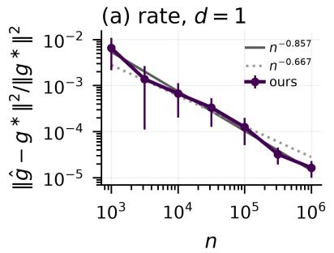
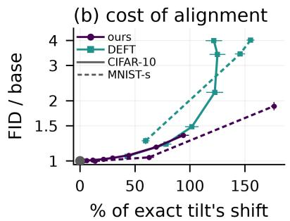
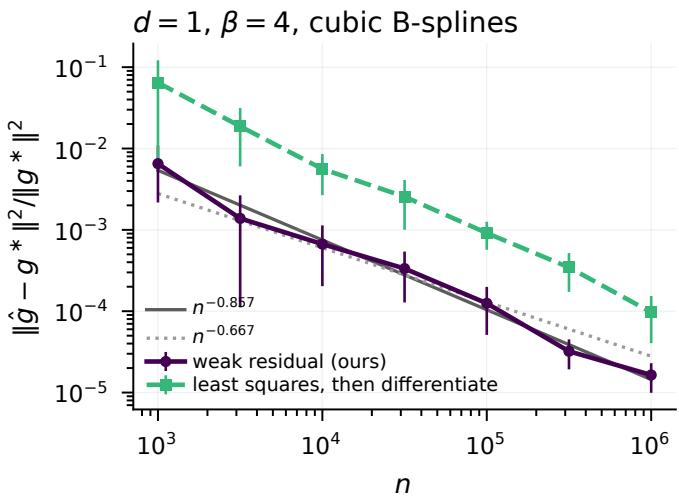
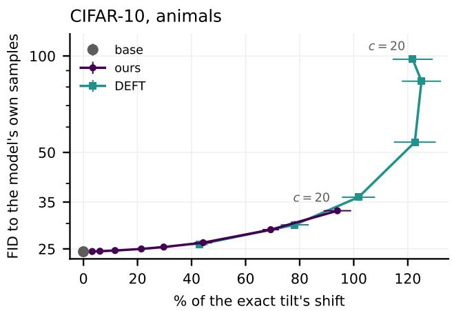
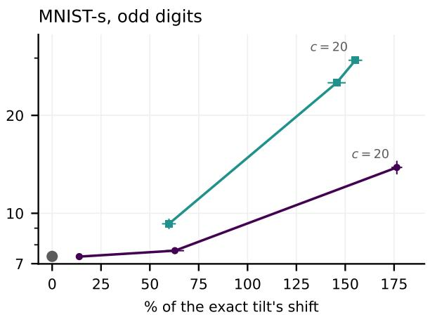
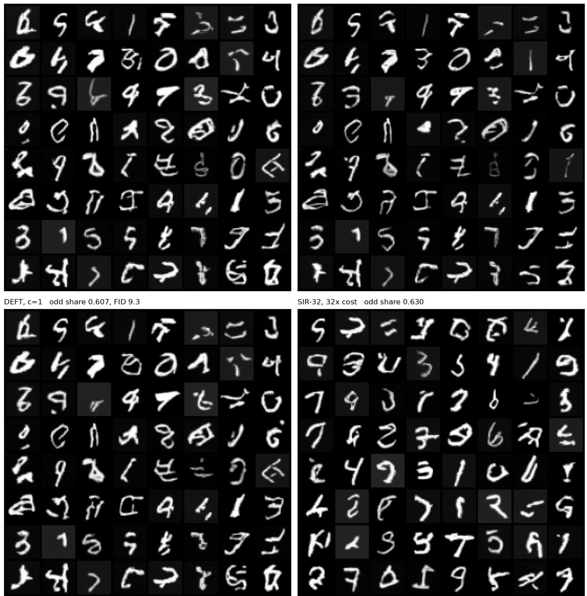

# WEIRDO: WEak resIdual Regularized DOob’s h-transform difusion alignment

Denis Suchkov∗

## Abstract

We study the problem of estimating the guidance that steers the distribution learned by a difusion generative model toward a tilted target $q _ { 0 } \propto w p _ { 0 }$ at inference time. Relying on the stochastic optimal control approach, we observe that the exact drift correction is the gradient of the logarithm of Doob’s h-function, and we study the problem of estimating it from a sample. In the present paper, we assume that the score of the pretrained model is available, that the tilting weight is bounded and positive, and that the reference distribution has a bounded support, no smoothness of the weight is required. Introducing a penalized least-squares risk in which the penalty is the residual of the space-time harmonicity equation satisfied by the h-function, measured in a dual Sobolev norm, we derive high-probability bounds on the squared error of the resulting guidance estimate. Since the penalty vanishes at the target, the estimator is free of regularization bias, and in favourable scenarios its rate of convergence is faster than the minimax rate of estimating first-order derivatives of a smooth regression function. Assuming that w is bounded and positive with $\mathbb { E } _ { p _ { 0 } } [ w ^ { - \mathrm { s } } ] < \infty$ for some $\mathrm { s } \in ( 0 , \infty ]$ , and that the reference data are compactly supported, we prove that the guidance is estimable in squared $L ^ { 2 }$ at rate $\varepsilon _ { n } ^ { \mathrm { s / ( s + 4 ) } }$ where $\varepsilon _ { n } = \stackrel { \sim } { n } ^ { - 2 ( \beta - 1 ) / ( 2 ( \beta - 1 ) + d ) }$ . We also transfer the obtained bounds to the total variation distance between the marginals of the estimated and the exactly guided samplers, and illustrate the performance of the suggested approach with numerical experiments.

## 1 Introduction

Score-based difusion models [Song et al., 2021b] have become a standard tool of generative modelling. Such a model transforms data into noise by a forward stochastic diferential equation and produces new samples by running the corresponding time reversal. Let $p _ { 0 }$ denote the data distri bution on $\mathbb { R } ^ { d }$ and let the forward dynamics be the variance-preserving Ornstein–Uhlenbeck process

$$
d X _ { \tau } = - X _ { \tau } d \tau + \sqrt { 2 } d B _ { \tau } , \qquad 0 \le \tau \le T , \qquad X _ { 0 } \sim p _ { 0 } ,\tag{1.1}
$$

where B is a standard d-dimensional Brownian motion and $T > 0$ is a fixed time horizon. We denote the law of $X _ { \tau }$ by $p _ { \tau }$ , which for $\tau > 0$ has a smooth positive density denoted in the same way, and note that $p _ { \tau }$ approaches the standard Gaussian density as τ grows. It is well known [Anderson, 1982, Haussmann and Pardoux, 1986] that the time reversal $\overleftarrow { X } _ { t } \overset { d } { = } X _ { T - t }$ of the process (1.1) is again a difusion, governed by the SDE

$$
\begin{array} { r } { d \overline { { X } } _ { t } = b ( t , \overleftarrow { X } _ { t } ) d t + \sqrt { 2 } d B _ { t } , \qquad b ( t , x ) = x + 2 s ( t , x ) , \qquad s ( t , x ) = \nabla \log p _ { T - t } ( x ) , } \end{array}\tag{1.2}
$$

started at $\overleftarrow { X } _ { 0 } \sim p _ { T }$ and terminating at $\overleftarrow { X } _ { T } \sim p _ { 0 }$ . The function s is referred to as the score. It is not available in closed form and, in practice, is learned by a neural network. Throughout the paper, a pretrained difusion model is understood as a supplier of $s ,$ and we treat s as known.

Once such a model is available, one usually wants to adapt it to a particular task or reward, and retraining it is expensive. Let $w : \mathbb { R } ^ { d }  \mathbb { R } _ { \geq 0 }$ be a weight expressing the new objective: a reward exponential $e ^ { r / \alpha }$ , a likelihood in an inverse problem, or a class probability. The aim is then to sample not from $p _ { 0 }$ but from the tilted distribution

$$
q _ { 0 } \propto w p _ { 0 } .\tag{1.3}
$$

Several routes are available. One can fine-tune the network [Uehara et al., 2024], resample from a heuristic proposal [Wu et al., 2023], or add a drift to (1.2) [Dhariwal and Nichol, 2021, Ho and Salimans, 2021]. We are interested in the third kind, known as inference-time alignment, because it leaves the pretrained weights untouched: the pretrained network is never retrained, only an auxiliary estimator of the correction is fitted per reward, and there is no need to draw many samples in order to keep a few. Unlike the usual heuristics, however, we work with the drift that is exact.

That drift is determined by a single function. From the optimal control point of view, turning $p _ { 0 }$ into $q _ { 0 }$ reduces to finding

$$
\begin{array} { r } { h ^ { * } ( t , x ) : = \mathbb { E } \left[ w ( X _ { 0 } ) \vert X _ { T - t } = x \right] , } \end{array}\tag{1.4}
$$

known as Doob’s h-function [Doob, 1984]. Adding $2 \nabla _ { x }$ log $h ^ { * }$ to the drift of (1.2) produces

$$
d \overline { { Z } } _ { t } = \big ( b ( t , \overline { { Z } } _ { t } ) + 2 \nabla _ { x } \log h ^ { * } ( t , \overline { { Z } } _ { t } ) \big ) d t + \sqrt { 2 } d B _ { t } ,\tag{1.5}
$$

whose terminal law is exactly $q _ { 0 }$ , when it is started from the tilted law $\begin{array} { r } { h ^ { * } ( 0 , \cdot ) p _ { T } / Z , Z : = \int w d p _ { 0 } } \end{array}$ What the sampler uses is the guidance $g ^ { * } : = \nabla \log h ^ { * }$ , and since p0 is unknown, $h ^ { * }$ Rhas to be estimated from data. This is done on a window of reverse times $I = [ t _ { 0 } , t _ { 1 } ] \subset ( 0 , T )$ kept away from both endpoints, since as $t \uparrow T$ the noise vanishes and recovery is ill-posed, while as $t \downarrow 0$ there is nothing to recover.

Our focus lies on statistical aspects of guidance estimation, and here the following dificulty arises. By (1.4), the function $h ^ { * }$ is a conditional expectation, so a natural strategy is to estimate it by nonparametric regression. The sampler (1.5), however, does not consume $h ^ { * }$ but ∇ log $h ^ { * }$ , and a small value error does not by itself imply a small gradient error. Estimating the derivative is also intrinsically harder than estimating the function: for a β-smooth regression function observed in noise, the optimal squared $L ^ { 2 }$ rate is $n ^ { - 2 \beta / ( 2 \beta + d ) }$ for the function and $n ^ { - 2 ( \beta - 1 ) / ( 2 \beta + d ) }$ for its first derivative [Stone, 1982], one derivative’s worth slower. In order to do better, one has to exploit a property of $h ^ { * }$ that an arbitrary conditional expectation does not possess.

The property we use is that $h ^ { * }$ is space-time harmonic for the generator of (1.2), that is, it satisfies the PDE

$$
\mathcal { M } h ^ { * } : = \partial _ { t } h ^ { * } + b ( t , x ) \cdot \nabla h ^ { * } + \Delta h ^ { * } = 0 .\tag{1.6}
$$

Every term in (1.6) is either a derivative of the unknown function or, through b, the score of the pretrained model. The residual Mh can therefore be evaluated on the sample and added to the regression objective as a penalty. Since it vanishes at $h ^ { * }$ , this penalty introduces no bias at the population level, whatever weight it is given.

However, the Laplacian in (1.6) makes residual second order in the unknown, and second derivatives are exactly what the rate we are aiming for cannot control. We therefore pass to a weak form: we test (1.6) against a function $\psi$ and integrate by parts, which moves one derivative from h onto $\psi .$ . This step is available to us for a specific reason. Integrating by parts against the marginal $p _ { T } .$ t produces its logarithmic derivative as a weight, and that is again the score already appearing in (1.2). What results is a penalty that is first order in both arguments and computable from the pretrained model. From it we obtain an estimator of $h ^ { * }$ whose guidance converges to $g ^ { * }$ in the squared $L ^ { 2 }$ norm at a rate we make explicit, and the same bound transfers to the marginals of (1.5) in total variation.

Throughout we take $\beta = 2$ as the leading case, treating the approximation of $h ^ { * }$ as that of a $W ^ { \beta }$ , function. Although $h ^ { * }$ is smooth for any bounded w, as we show below, $\beta = 2$ is the smallest integer for which the minimax rate $n ^ { - 2 ( \beta - 1 ) / ( \tilde { 2 } \beta + d ) }$ of Stone [1982] is informative, and hence the smallest for which a comparison against it is meaningful. This should be read not as a assumption that $h ^ { * }$ belong to that smoothness class, but as the primary example in which the diference between our estimate and the benchmark is clearest.

## Contribution.

• The main contribution of this paper is a non-asymptotic high-probability upper bound on the squared $L ^ { 2 } \mathrm { - e r r o r }$ of the guidance estimate (Theorem 5.3), which holds on all but an arbitrarily small end-portion of the estimation window. In favourable scenarios, when the weight w is not too close to zero, the obtained rate is faster than the generic minimax rate of first-derivative estimation for a smooth regression function.

• The proof relies on an exact energy identity for the reverse difusion, which allows us to control the gradient by the value error and the weak residual (Theorem 4.1). We would like to emphasize that this result requires no inf-sup condition on the trial and test classes, a hypothesis that a weak formulation would ordinarily need, it is replaced by a containment between the two classes.

• We transfer the obtained bound to the total variation distance between the marginals of the estimated and the exactly guided samplers on the estimation window (Corollary 6.1), so that an error in the estimated guidance is controlled as an error in the law that is sampled.

## Related work

Inference-time alignment. The oldest way of steering a difusion sampler is to add a heuristic drift: classifier guidance [Dhariwal and Nichol, 2021] uses the gradient of a noise-conditioned classifier, and classifier-free guidance [Ho and Salimans, 2021] extrapolates between conditional and unconditional scores. Both are efective but not exact: classifier guidance reproduces the conditional h-transform only with an exact noise-conditioned classifier at unit scale and the matching initial law, and other scales change the terminal law by an unquantified amount. The alternatives split by what they modify. Fine-tuning changes the weights, by reinforcement learning or stochastic control, and is reviewed by Uehara et al. [2024]. Sequential Monte Carlo leaves the model alone and corrects a heuristic proposal by importance weights, as in the twisted sampler of Wu et al. [2023], paying for exactness with a particle system and with weight degeneracy in high dimension. The line closest to ours keeps the sampler exact and learns the h-transform itself. Denker et al. [2024] fit a generalised h-transform on top of a frozen model, without a rate, and Zhu et al. [2026] estimate it at sampling time by Monte Carlo, with a total-variation guarantee governed by the number of look-ahead draws rather than by a sample size. Chang et al. [2026] derive convergence rates for a variational estimator of $h ^ { * }$ , but their smoothness penalty does not vanish at the target, so the rate reflects a bias–variance trade-of in the penalty weight. In Guo et al. [2026], who estimate h and its gradient through martingale identities, and Kawata et al. [2025], who sample dual-averaging iterates through the h-transform, the drift error enters the bound as a parameter rather than being estimated at a rate. The question here is accordingly not whether the drift correction admits a statistical theory, but what it costs: which rate is attainable when the penalty incurs no bias at all, and what has to be assumed to get it.

Statistical theory for difusion models. The nonparametric theory of difusion models has concentrated on the score. Oko et al. [2023] prove minimax-optimal distribution estimation under empirical score matching, and a parallel line takes the score as given and asks what sampling error follows [Chen et al., 2023b, Li et al., 2024]. Because rates in the ambient dimension degrade quickly, much recent efort targets the intrinsic dimension instead: Chen et al. [2023a] under an exact manifold hypothesis, Yakovlev and Puchkin [2025] under a substantially relaxed one — a nonparametric Gaussian mixture in which samples may leave the manifold, with rates set by the intrinsic dimension and valid even when the ambient dimension grows polynomially in $n -$ and Li and Yan [2024] for the sampler, showing DDPM adapts to unknown low-dimensional structure. The guidance is a log-gradient in the same geometry as the score, but is estimated from a regression whose response is the terminal weight, and the error that matters is in the gradient.

Empirical process theory. Localization by local Rademacher complexities [Bartlett et al., 2005, Koltchinskii, 2006], in the form set out by Wainwright [2019], yields multiplicative rather than additive comparisons between empirical and population quantities: on a star hull satisfying a Bernstein condition $P f ^ { 2 } \lesssim P f$ , the deviation is governed by a critical radius read of a uniform entropy bound. That theory is built for bounded classes. For suprema with unbounded envelopes, Adamczak [2008] supplies a Talagrand-type tail inequality that applies after truncation and peeling. We need both, the drift coeficient $x + s$ being only sub-Gaussian under $\rho _ { t }$

## 2 Setup

Notation and conventions. We keep the processes of Section 1 and fix $T > 0$ . The forward SDE (1.1) has Gaussian transition kernel $X _ { \tau } \mid X _ { 0 } = x _ { 0 } \sim { \mathcal { N } } ( \mu _ { \tau } x _ { 0 } , \sigma _ { \tau } ^ { 2 } I _ { d } )$ with $\mu _ { \tau } = e ^ { - \tau } $ and $\sigma _ { \tau } ^ { 2 } = 1 - e ^ { - 2 \dot { \tau } }$ , so $\mu _ { \tau } ^ { 2 } + \sigma _ { \tau } ^ { 2 } = 1$ , and we write $p _ { \tau } : = \mathrm { L a w } ( X _ { \tau } )$ . The reversal (1.2) is started at $\overleftarrow { X } _ { 0 } \sim p _ { T }$ , its marginals $\rho _ { t } : = \mathrm { L a w } ( \overline { { X } } _ { t } ) = p _ { T } .$ t are the laws from which the estimation sample is drawn. Write

$$
( \mathcal { L } _ { t } f ) ( x ) : = b ( t , x ) \cdot \nabla f ( x ) + \Delta f ( x ) , \qquad \mathcal { M } : = \partial _ { t } + \mathcal { L } _ { t }\tag{2.1}
$$

for the generator of (1.2) and the associated space-time operator, the Laplacian rather than $\scriptstyle { \frac { 1 } { 2 } } \Delta$ appears because the difusion coeficient is ${ \sqrt { 2 } } .$ . The score s is supplied by the pretrained model, and we treat it as known throughout. As is standard in the statistical analysis of guidance, we treat s as exact, which separates the approximation error of the pretrained model from the error of estimating $h ^ { * }$ . The image experiments of Section 7 deliberately drop this idealization and use the model’s learned score, to test the estimator where it would be used in practice.

Target and guidance. Given a known weight $w \geq 0$ , the target is $q _ { 0 } = w p _ { 0 } / Z$ with $Z = \int w p _ { 0 }$ Doob’s h-transform adds the drift 2∇ log $h ^ { * }$ to (1.2), giving the controlled process

$$
\dot { d } \overleftarrow { Z } _ { t } = \big ( \overleftarrow { Z } _ { t } + 2 s ( t , \overleftarrow { Z } _ { t } ) + 2 \nabla \log h ^ { * } ( t , \overleftarrow { Z } _ { t } ) \big ) d t + \sqrt { 2 } d B _ { t } ,\tag{2.2}
$$

whose terminal law is $q _ { 0 } ,$ , when started from $\rho _ { 0 } ^ { * } : = h ^ { * } ( 0 , \cdot ) p _ { T } / Z$ by Lemma I.1. Here $h ^ { \ast } ( t , x ) : =$ $\mathbb { E } [ w ( \overleftarrow { X } _ { T } ) \mid \overleftarrow { X } _ { t } = x ] = \mathbb { E } [ w ( X _ { 0 } ) \mid X _ { T - t } = x ]$ is Doob’s h-function and $g ^ { * } : = \nabla \log h ^ { * }$ the guidance. By Bayes’ rule for the Gaussian likelihood, $h ^ { * } ( t , x ) = \mathbb { E } _ { X _ { 0 } \sim \pi _ { t , x } } [ w ( X _ { 0 } ) ]$ for the posterior $\pi _ { t , x } ( d x _ { 0 } )$ ∝ $\phi _ { \sigma _ { T - t } ^ { 2 } } ( x - \mu _ { T - t } x _ { 0 } ) p _ { 0 } ( d x _ { 0 } )$

Assumptions. Exactly two hypotheses are used anywhere below.

Assumption 1 (Weight). $\boldsymbol { w } : \mathbb { R } ^ { d }  \mathbb { R }$ is measurable with $0 < w \le \bar { B } < \infty$ on $\operatorname { s u p p } ( p _ { 0 } )$ , and there is $\mathrm { s } \in ( 0 , \infty ]$ with $\Xi _ { \mathrm { s } } : = \mathbb { E } _ { p _ { 0 } } [ w ^ { - \mathrm { s } } ] < \infty$ , where $\mathrm { s } = \infty$ is read as $w \geq B > 0$ on $\operatorname { s u p p } ( p _ { 0 } )$

Assumption 2 (Compact reference support). p0 is supported in the cube $\{ x _ { 0 } : | x _ { 0 } | _ { \infty } \leq 1 \}$

Reward and likelihood tilts with bounded reward are of this form, $\Xi _ { \mathrm { s } }$ quantifies how close w comes to zero, degenerating at $\mathrm { ~ s ~ } = \infty$ to a uniform lower bound. Assumption 2 is the usual compactsupport hypothesis, and its only role is to make the posterior compactly supported, hence to yield the regularity bounds of Appendix B. No smoothness of $w$ is assumed anywhere: the smoothness index $\beta$ below is a free parameter of the construction, and the requisite derivative envelopes for $h ^ { * }$ are derived from Assumptions 1–2 (Lemma F.8, Step 1). Assumption 1 lets w vanish, which the corresponding hypotheses of prior work do not: Chang et al. [2026] and Kawata et al. [2025] bound w and the density ratio, respectively, from both sides, and Zhu et al. [2026] bounds h from below. Guo et al. [2026] work under conditions of a diferent kind, strong log-concavity of the marginals and of h with the score and the guidance error controlled in sup norm, which are not directly comparable to ours. The order s is free here and enters the rate, so how far w may vanish is traded explicitly against how fast the guidance converges, a trade we measure in Appendix J.10.

Window and function spaces. As $t \uparrow T$ the noise level $\sigma _ { T - t }  0$ and estimation is ill-posed, as $t \downarrow 0$ there is nothing to recover. We fix an early–late window

$$
I : = [ t _ { 0 } , t _ { 1 } ] \subset ( 0 , T ) , \quad \ell : = t _ { 1 } - t _ { 0 } \leq 1 , \quad \sigma _ { * } : = \sigma _ { T - t _ { 1 } } > 0 ,\tag{2.3}
$$

and a probability weight ν on $I ,$ taken to be normalized Lebesgue measure. For each $t , L ^ { 2 } ( \rho _ { t } )$ and $H ^ { 1 } ( \rho _ { t } ) = \{ f : f , \nabla f \in L ^ { 2 } ( \rho _ { t } ) \}$ carry the reverse marginal as reference measure, and $H ^ { - 1 } ( \rho _ { t } )$ is the dual of $H ^ { 1 } ( \rho _ { t } )$ under the pairing

$$
\Vert F \Vert _ { H ^ { - 1 } ( \rho _ { t } ) } : = \operatorname* { s u p } _ { 0 \neq \psi \in H ^ { 1 } ( \rho _ { t } ) } \frac { \langle F , \psi \rangle _ { \rho _ { t } } } { \Vert \psi \Vert _ { H ^ { 1 } ( \rho _ { t } ) } } \ \leq \ \Vert F \Vert _ { \rho _ { t } } .\tag{2.4}
$$

On the window we use the space-time spaces $\mathcal { V } : = L _ { \nu } ^ { 2 } ( I ; H ^ { 1 } ( \rho _ { t } ) )$ and its dual $\mathcal { V } ^ { \ast }$ , with $\| F \| _ { \mathcal { V } ^ { * } } ^ { 2 } =$ $\begin{array} { r } { \int _ { I } \| F ( t , \cdot ) \| _ { H ^ { - 1 } ( \rho _ { t } ) } ^ { 2 } \nu ( d t ) } \end{array}$ . Constants written $\sigma ^ { - c }$ are of the form $C _ { \star } \sigma _ { * } ^ { - c }$ , where c is absolute and $C _ { \star }$ depends only on $( d , \beta , \bar { B } , \ell , C _ { t } , \kappa _ { \Theta } )$ and not on $n , N , \zeta , \delta$ or $\sigma _ { * }$ , the relations $\lesssim$ and  hide constants of the same form.

## 3 Harmonicity and its weak form

Write $\mathscr { R } _ { t } [ h ] : = ( \mathcal { M } h ) ( t , \cdot )$ for the residual and

$$
\mathcal { D } ( h ) : = \int _ { I } \| h ( t , \cdot ) - h ^ { * } ( t , \cdot ) \| _ { \rho _ { t } } ^ { 2 } \nu ( d t ) , \qquad \mathcal { P } ^ { w } ( h ) : = \| \mathcal { R } [ h ] \| _ { \mathcal { V } ^ { * } } ^ { 2 }\tag{3.1}
$$

for the value functional and the weak penalty. Here D is exactly the population excess least-squares risk, since at fixed t the minimizer of $\mathbb { E } [ ( h ( t , X _ { T - t } ) - w ( X _ { 0 } ) ) ^ { 2 } ]$ is the conditional mean $h ^ { \ast } ( t , \cdot )$

Proposition 3.1 (Harmonicity and its weak form). Under Assumptions $1 - 2 , \ h ^ { * }$ is space-time harmonic for the reverse generator, $\mathcal { M } h ^ { * } = 0 ~ \mathrm { o n } ~ ( 0 , T ) \times \mathbb { R } ^ { d }$ with $h ^ { \ast } ( T , \cdot ) = w$ . Moreover, for $t \in I$ $h \in C ^ { 1 , 2 }$ and $\psi \in H ^ { 1 } ( \rho _ { t } )$ of polynomial growth, writing $\varphi : = h - h ^ { * }$ ，

$$
\langle \mathcal { R } _ { t } [ h ] , \psi \rangle _ { \rho _ { t } } = a _ { t } ( h , \psi ) : = \int _ { \mathbb { R } ^ { d } } \Big [ \partial _ { t } h \psi + \big ( ( x + s ) \cdot \nabla h \big ) \psi - \nabla h \cdot \nabla \psi \Big ] \rho _ { t } d x ,\tag{3.2}
$$

and $| a _ { t } ( h , \psi ) | \leq \left( \| \partial _ { t } \varphi \| _ { \rho _ { t } } + \| \nabla \varphi \| _ { \rho _ { t } } + M _ { 4 } \| | \nabla \varphi | \| _ { L ^ { 4 } ( \rho _ { t } ) } \right) \| \psi \| _ { H ^ { 1 } ( \rho _ { t } ) }$ with $M _ { 4 } \leq C \sqrt { d } \sigma _ { * } ^ { - 2 }$

There are three main consequences. The form $a _ { t }$ is computable: it needs first derivatives of $h ,$ first derivatives of $\psi ,$ and the pretrained score, because the weight generated by integrating $\Delta h$ by parts against $\rho _ { t }$ is ∇ log $\rho _ { t } = s$ . It is gap-free: $a _ { t } ( h ^ { * } , \psi ) = 0$ for all $\psi _ { : }$ , so $h ^ { * }$ minimizes $\mathcal { D } + \mu \mathcal { P } ^ { w }$ for every $\mu \geq 0$ and no bias is traded against variance in the penalty weight. And — the point that drives the rate — the continuity bound is first order in $\varphi ,$ so the penalty inherits a first-order approximation floor: for $n \geq n _ { 0 }$ and suitable budgets there is an $h _ { N } \in \mathcal { H } _ { N }$ with

$$
\| h _ { N } - h ^ { * } \| _ { L ^ { 4 } } + \operatorname* { s u p } _ { t \in \cal { I } } \| h _ { N } - h ^ { * } \| _ { \rho _ { t } } + \| | \nabla ( h _ { N } - h ^ { * } ) | \| _ { L ^ { 4 } } + \| \partial _ { t } ( h _ { N } - h ^ { * } ) \| _ { L ^ { 2 } } \leq e _ { N } ,\tag{3.3}
$$

$$
e _ { N } : = 8 Q _ { n } \varepsilon _ { N } , \quad \varepsilon _ { N } : = \mathrm { A } _ { \beta } N ^ { - ( \beta - 1 ) } ,\tag{3.4}
$$

where $\mathrm { A } _ { \beta }$ is the constant, depending only on $\beta , B , \sigma _ { * }$ and, through R, polylogarithmically on $n ,$ and $Q _ { n } \leq \sigma ^ { - c } ( \log n ) ^ { 4 }$ is given in (F.14). Such an $h _ { N }$ exists in a class with $\mathbb { V } _ { N } \lesssim N ^ { d } \mathrm { p o l y l o g } ( n )$ and gives $\begin{array} { r } { \operatorname* { i n f } _ { h \in \mathcal { H } _ { N } } \mathcal { P } ^ { w } ( h ) \lesssim C d \sigma _ { * } ^ { - 4 } e _ { N } ^ { 2 } } \end{array}$ (Lemmas F.1 and F.8). Table 1 places this against the alternatives.

Table 1: Why the residual is measured weakly. The floor is in $\mathrm { f } _ { h \in \mathcal { H } _ { N } } \mathcal { P } ( h )$ at resolution N, only the last is both gap-free and informative at $\beta = 2$
<table><tr><td>Penalty  $\overline { { \mathcal { P } ( h ) } }$ </td><td>order in h</td><td>value at  $\overline { { \boldsymbol { h } ^ { * } } }$ </td><td>approximation floor</td></tr><tr><td>Sobolev,  $\begin{array} { r } { \overline { { \int _ { I } \| \nabla h \| _ { \rho _ { t } } ^ { 2 } \nu ( d t ) } } } \end{array}$ </td><td>1</td><td> $\overline { { \| \nabla h ^ { * } \| ^ { 2 } \neq 0 } }$ </td><td>(nonzero gap for  $\overline { { \lambda > 0 ) } }$ </td></tr><tr><td>strong residual,  $\| \mathcal { R } [ h ] \| _ { L ^ { 2 } ( \nu \otimes \rho ) } ^ { 2 }$ </td><td>2</td><td>0</td><td> $N ^ { - 2 ( \beta - 2 ) }$  , non-informative at  $\beta = 2$ </td></tr><tr><td>weak residual,  $\| \mathcal { R } [ h ] \| _ { \mathcal { V } } ^ { 2 }$ </td><td>1</td><td>0</td><td> $N ^ { - 2 ( \beta - 1 ) }$ </td></tr></table>

## 4 From residual to gradient

Two things remain: that the weak penalty still controls the gradient, and that the part of it an estimator can see sufices. Both rest on an exact identity. Put $\omega ( t ) : = \nu ( [ t , t _ { 1 } ] ) = ( t _ { 1 } - t ) / \ell .$

$\begin{array} { r } { A ( h , \psi ) : = \int _ { I } a _ { t } ( h , \psi ( t , \cdot ) ) \nu ( d t ) } \end{array}$ , and $\begin{array} { r } { E _ { \omega } : = \int _ { I } \omega \| \nabla \varphi \| _ { \rho _ { t } } ^ { 2 } \nu ( d t ) } \end{array}$ . Itô’s formula applied to $\varphi ^ { 2 }$ along the R Rreverse process, averaged over a random endpoint $r \sim \nu ,$ gives (Theorem D.2)

$$
2 \ell E _ { \omega } \ : + \ : \| \varphi ( t _ { 0 } , \cdot ) \| _ { \rho _ { t _ { 0 } } } ^ { 2 } \ : = \ : \mathcal { D } ( h ) \ : - \ : 2 \ell A ( h , \omega \varphi ) .\tag{4.1}
$$

The endpoint averaging is what produces $\omega ,$ and is forced: the identity on a fixed $[ t _ { 0 } , r ]$ leaves a terminal value at a single instant, which the statistical analysis cannot control. Its cost is that ω vanishes at $t _ { 1 }$ , so guarantees are stated on

$$
I _ { \delta } : = [ t _ { 0 } , t _ { 1 } - \delta \ell ] , \qquad \delta \in ( 0 , 1 ) , \qquad \omega \geq \delta \mathrm { o n } I _ { \delta } ,\tag{4.2}
$$

covering a $( 1 - \delta )$ fraction of the window at a cost of $\delta ^ { - 1 }$ in the constant.

Bounding the cross term in (4.1) by $\| \mathcal { R } [ h ] \| _ { \mathcal { V } ^ { * } } \| \omega \varphi \| _ { \mathcal { V } }$ and absorbing already yields coercivity (Corollary D.3). But no estimator sees $\| { \mathcal { R } } [ h ] \| _ { \mathcal { V } ^ { * } }$ . What a finite test class Ψ delivers is the projected residual

$$
\mathcal { N } _ { \Psi , \tau } ( h ) : = \operatorname* { s u p } _ { 0 \neq \psi \in \Psi } \frac { A ( h , \psi ) } { \| \psi \| _ { \mathcal { V } , \tau } } \leq \| \mathcal { R } [ h ] \| _ { \mathcal { V } ^ { * } } , \qquad \| \psi \| _ { \mathcal { V } , \tau } ^ { 2 } : = \| \psi \| _ { \mathcal { V } } ^ { 2 } + \tau ^ { 2 } \| \psi \| _ { \bullet } ^ { 2 } ,\tag{4.3}
$$

with $\Vert \cdot \Vert _ { \bullet ^ { \mathrm { ~ a ~ } } }$ positively homogeneous scale on the cone Ψ and $\tau \mathrm { ~ a ~ }$ slack. Recovering the left-hand side of (4.3) from the right is a discrete inf-sup condition: the requirement that some $\kappa > 0$ satisfy

$$
\| \mathcal { R } [ h ] \| _ { \mathcal { V } ^ { * } } \le \kappa ^ { - 1 } \mathcal { N } _ { \Psi _ { N } } ( h ) \qquad \mathrm { f o r ~ a l l ~ } h \in \mathcal { H } _ { N } ,\tag{4.4}
$$

that is, that the finite test class detect a fixed fraction of any residual the trial class can produce. It is the standard price of a weak formulation, and κ would enter the final rate multiplicatively. We do not assume (4.4). Instead we impose two structural properties on the classes, neither of which requires linearity or convexity:

(S1) Symmetric cone: $\psi \in \Psi \Rightarrow - \psi \in \Psi$ and $r \psi \in \Psi$ for $r \geq 0$ . This makes the inner maximization closed-form up to a scalar problem (Lemma G.2) and costs nothing: leave the output layer unnormalized.

(S2) Absorption: $\omega \cdot ( \mathcal { H } - \mathcal { H } ) \subseteq \Psi$ . This is what replaces (4.4). It costs a test network of twice the width and one more layer than the trial network, since a diference of two networks is a network (Lemma E.2).

Finally, write Λ for the uniform $L ^ { 4 }$ envelope of the coeficients generated by the integration by parts below,

$$
\Lambda _ { * } : = \operatorname* { s u p } _ { t \in I } \left( \| | x + s | \| _ { L ^ { 4 } ( \rho _ { t } ) } + \| d + \nabla \cdot s \| _ { L ^ { 4 } ( \rho _ { t } ) } + \| | x + s | | s | \| _ { L ^ { 4 } ( \rho _ { t } ) } + \| \partial _ { t } \log \rho _ { t } \| _ { L ^ { 4 } ( \rho _ { t } ) } \right) ,\tag{4.5}
$$

which under Assumptions 1-2 satisfies $\Lambda _ { * } \lesssim d ^ { 2 } \sigma _ { * } ^ { - 4 }$

Theorem 4.1 (Coercivity without an inf-sup constant). Let Assumptions 1–2 hold, $\mathcal { H } _ { N } , \Psi _ { N }$ satisfy $\mathrm { ( S 1 ) - ( S 2 ) }$ , every $h \in \mathcal { H } _ { N }$ be $C ^ { 1 , 2 }$ on $I \times \mathbb { R } ^ { d }$ with $| h | \leq 3 \bar { B }$ and bounded $\partial _ { t } h , \nabla h , \nabla ^ { 2 } h ,$ and $| | \omega ( h -$ $h ^ { \prime } ) \| \bullet \leq C _ { 0 }$ for all $h , h ^ { \prime } \in \mathcal { H } _ { N }$ . If $h _ { N } \in \mathcal { H } _ { N }$ satisfies the inequality in (3.3) with some $e _ { N } > 0$ , then for every $h \in \mathcal { H } _ { N } , \tau \geq 0 , \delta \in ( 0 , 1 )$ with $\varphi : = h - h ^ { * }$ 2

$$
\int _ { I _ { \delta } } \| \nabla \varphi \| _ { \rho t } ^ { 2 } \nu ( d t ) \le \frac { C } { \delta } \left( \frac { 1 + \ell } { \ell } \mathcal { D } ( h ) +  { \mathcal { N } } _ { \Psi , \tau } ( h ) ^ { 2 } + C _ { 0 } ^ { 2 } \tau ^ { 2 } + ( 1 + \Lambda _ { * } ^ { 2 } + \ell ^ { - 2 } ) e _ { N } ^ { 2 } \right) ,\tag{4.6}
$$

where C absolute and $\Lambda _ { * }$ as in (4.5). For the classes of Definition 5.2 the regularity conditions hold and $C _ { 0 } = 1$

## 5 Estimator and main result

Let $\varrho ( u ) = ( u \vee 0 ) ^ { 3 }$ be the rectified cubic activation function, which we will use for our proof sketch of main result below.

Definition 5.1. (Network class) Put $Q _ { R } \ : = \ \{ x \ : \ | x | _ { \infty } \ \leq \ R \}$ and $\begin{array} { c c c c } { { Z } } & { { : = } } & { { I \times Q _ { R } } } \end{array}$ . For $W , L , P _ { 0 } \in \mathbb { N }$ and $\Lambda , A ~ \geq ~ 1$ , let $\mathcal { N N } _ { \varrho } ( W , L , \Lambda , P _ { 0 } , \mathcal { A } )$ be the set of $f _ { \vartheta } ( z ) = A _ { L } x ^ { ( L ) } ( z ) + b _ { L }$ with $x ^ { ( 0 ) } ( z ) : = z$ and $x ^ { ( \ell + 1 ) } ( z ) : = \varrho ( A _ { \ell } x ^ { ( \ell ) } ( z ) + b _ { \ell } )$ , subject to: hidden widths at most $W ,$ parameters $\vartheta = \left( A _ { 0 } , b _ { 0 } , \ldots , A _ { L } , b _ { L } \right)$ bounded in modulus by Λ, at most $P _ { 0 }$ of them nonzero and $\begin{array} { r } { \operatorname* { s u p } _ { z \in Z } \| x ^ { ( \ell ) } ( z ) \| _ { \infty } \le \mathcal { A } } \end{array}$ for every hidden layer. We will write $\mathcal { N N } _ { \varrho , \Theta }$ for the same class with Θ as the activation of the last hidden layer.

Definition 5.2. (Trial and test classes) Fix a resolution N, a time degree K, a radius R and budgets $\Lambda , P _ { 0 } , A .$ , and set $W _ { N } \asymp K N ^ { d }$ with $W _ { N } \geq d + 1$ . Let $\Theta \in C ^ { \infty } ( \mathbb { R } , [ - 2 { \bar { B } } , 3 { \bar { B } } ] )$ be a fixed 1-Lipschitz retraction with $\Theta = \mathrm { i d }$ on $[ - \bar { B } , 2 \bar { B } ]$ and bounded second derivative, and let $\chi _ { R }$ be a fixed smooth coordinatewise clip, the identity on $\lceil - ( R - 1 ) , R - 1 \rceil$ , of modulus at most $R ,$ derivative at most 1 and bounded second derivative. Write $f ^ { \chi } ( t , x ) : = f ( t , \chi _ { R } ( x ) )$ ), then

$$
\mathcal { H } _ { N } : = \{ ( \Theta \circ g ) ^ { x } : g \in \mathcal { N N } _ { \varrho } ( W _ { N } , L , \Lambda , P _ { 0 } , { \mathcal A } ) , \operatorname* { s u p } _ { I \times \mathbb R ^ { d } } | \nabla h | \le G , \operatorname* { s u p } _ { I \times \mathbb R ^ { d } } | \partial _ { t } h | \le G _ { t } \} ,\tag{5.1}
$$

$$
\Psi _ { N } : = \{ c \omega \phi ^ { \mathcal { X } } : c \in \mathbb { R } , \phi \in \mathscr { N } \mathcal { N } _ { \varrho , \Theta } ( 2 W _ { N } , L + 1 , \Lambda , 2 P _ { 0 } + 2 , \mathcal { A } \vee 3 \bar { B } ) ,\tag{5.2}
$$

$$
\operatorname* { s u p } _ { I \times \mathbb R ^ { d } } ( | \phi ^ { \chi } | + | \nabla \phi ^ { \chi } | + | \partial _ { t } \phi ^ { \chi } | ) \leq \Gamma ) \} ,\tag{5.3}
$$

the constraint in (5.1) being on $h = ( \Theta \circ g ) ^ { \chi }$ itself, with $G : = 4 \sqrt { d } \bar { B } \sigma _ { * } ^ { - 2 } , G _ { t } : = C _ { t } d \bar { B } ( R { + } 1 ) \sigma _ { * } ^ { - 4 } , \Gamma : =$ $6 \bar { B } + 2 G + 2 G _ { t } + 6 \bar { B } / \ell$ and $C _ { t }$ absolute.

With $\{ ( X _ { 0 } ^ { i } , \varepsilon ^ { i } ) \} _ { i = 1 } ^ { n }$ 1 i.i.d., $X _ { T - t } ^ { i } : = \mu _ { T - t } X _ { 0 } ^ { i } + \sigma _ { T - t } \varepsilon ^ { i } \sim \rho _ { t }$ , and $\hat { a } _ { t } , \hat { \mathcal { D } } , \parallel \cdot \parallel _ { \hat { \mathcal { V } } }$ the empirical counter parts,

$$
\hat { h } \in \underset { h \in \mathcal { H } _ { N } } { \mathrm { a r g m i n } } \hat { \mathcal { D } } ( h ) + \mu \underset { \psi \in \Psi _ { N } } { \operatorname* { s u p } } \left[ \int _ { I } \hat { a } _ { t } ( h , \psi ) \ d \nu ( d t ) - \frac { \alpha } { 2 } \lVert \psi \rVert _ { \hat { \mathcal { V } } , \delta _ { n } } ^ { 2 } \right] , \hat { g } : = \Pi _ { G ^ { * } } \left( \frac { \nabla \hat { h } } { \hat { h } \vee \mathrm { b } } \right) .\tag{5.4}
$$

For $\psi \in \Psi _ { N }$ let $\| \psi \| _ { \bullet } : = \operatorname* { i n f } \{ | c | : \psi = c \omega \phi ^ { \chi }$ as in (5.3)} be its cone scale, the scale entering (5.4). Writing $\mathbb { V } _ { N }$ for the metric entropy index, in the supremum norm and normalized by $\log ( e / \varepsilon )$ , of the first order objects $( h , \partial _ { t } h , \nabla h ) , h \in \mathcal { H } _ { N }$ , and $( \psi , \nabla \psi ) , \psi \in \Psi _ { N } , \| \psi \| _ { \bullet } \leq 1$ (see (E.14)), it is admissible that

$$
\mathbb { V } _ { N } \lesssim N ^ { d } \mathrm { p o l y l o g } ( n )\tag{5.5}
$$

once $R , K$ and the budgets are as specified below. The test class is normalized by the cone scale.

The spatial radius, time degree and the approximation constant are

$$
R : = 2 + \sqrt { ( 8 \beta + 1 6 ) \log ( 2 d n ) } , \quad \eta : = \operatorname* { m i n } \{ \frac { \ell } { 2 } , \frac { \pi \sigma _ { * } ^ { 4 } } { 1 2 d ( 5 R + 3 ) } \} , \quad K : = \left\lceil \frac { \ell } { \eta } ( \beta + 2 ) \log n \right\rceil ,\tag{5.6}
$$

$$
\begin{array} { r } { \mathrm { A } _ { \beta } : = C _ { \beta } \bar { B } \sigma _ { * } ^ { - 2 \beta } ( 2 R ) ^ { \beta - 1 } , \quad C _ { \beta } : = \mathfrak { B } _ { \beta + 1 } \beta ! \left( 2 \sec ( \pi / 6 ) \right) ^ { \beta + 1 } , } \end{array}\tag{5.7}
$$

with $\mathfrak { B } _ { \beta + 1 }$ the Bell number. Here η is the width of a complex neighborhood of I on which $h ^ { * }$ is analytic in $t , C _ { \beta } \bar { B } \sigma _ { * } ^ { - 2 \beta }$ bounds its x-derivatives of order at most $\beta$ there, and $( 2 R ) ^ { \beta - 1 }$ is the cost of rescaling $Q _ { R }$ to the unit cube. Thus $R \asymp \sqrt { \log n } , K \leq \sigma ^ { - c } ( \log n ) ^ { 3 / 2 }$ and $\mathrm { A } _ { \beta } = \mathrm { p o l y l o g } ( n )$ at fixed $\beta .$

Theorem 5.3 (Guidance rate). Grant Assumptions 1–2 and fix $\zeta , \delta \in ( 0 , 1 )$ and $\kappa \geq 1$ . There are constants $C ^ { \# } , c ^ { \# } \geq 1$ and $L _ { 0 } \in \mathbb { N }$ depending only on $( d , \beta )$ , a constant $C _ { 0 } = C _ { \star } \sigma _ { * } ^ { - c }$ and $n _ { 0 }$ not depending on n, such that the following holds for every $n \geq n _ { 0 }$ . Let R, K and $\mathrm { A } _ { \beta }$ be given by (5.6)–(5.7), and choose

$$
\begin{array} { r l } & { N : = \left\lceil ( n \mathrm { A } _ { \beta } ^ { 2 } ) ^ { \frac { 1 } { 2 ( \beta - 1 ) + d } } \right\rceil , \ \varepsilon _ { n } : = \mathrm { A } _ { \beta } ^ { \frac { 2 d } { 2 ( \beta - 1 ) + d } } n ^ { - \frac { 2 ( \beta - 1 ) } { 2 ( \beta - 1 ) + d } } , \ \mu , \alpha \in [ \kappa ^ { - 1 } , \kappa ] , } \\ & { \mathrm { b } : = ( \varepsilon _ { n } / \Xi _ { \mathrm { s } } ) ^ { \frac { 1 } { \mathrm { s } + 4 } } \wedge \bar { B } , \ \delta _ { n } ^ { 2 } : = C _ { 0 } \frac { ( \mathbb { V } _ { N } + \log ( 1 / \zeta ) ) \log ^ { 2 } ( n / \zeta ) } { n } . } \end{array}\tag{5.8}
$$

Let $\mathcal { H } _ { N } , \Psi _ { N }$ be the classes of Definition 5.2 with these $N , R , K$ and the budgets

$$
\begin{array} { r l } & { W _ { N } : = \lceil C ^ { \# } K ( N + 1 ) ^ { d } \rceil , \ L : = L _ { 0 } + \lceil \log _ { 2 } ( K + 1 ) \rceil + 1 , } \\ & { P _ { 0 } : = \lceil C ^ { \# } K ( ( N + 1 ) ^ { d } + L ) \rceil , \ \Lambda : = \mathcal { A } : = n ^ { c \# } , } \end{array}\tag{5.9}
$$

let $\mathbb { V } _ { N }$ be given by (5.5), and let $\hat { h } , \hat { g }$ be the estimator (5.4). Then, with probability at least $1 - \zeta$

$$
\begin{array} { r } { \| \hat { g } - g ^ { * } \| _ { L ^ { 2 } ( \nu \otimes \rho ; I _ { \delta } ) } ^ { 2 } \leq \delta ^ { - 1 } \sigma ^ { - c } \log ^ { 8 } ( e n / \zeta ) \Xi _ { \mathrm { s } } ^ { \frac { 4 } { \mathrm { s } + 4 } } \varepsilon _ { n } ^ { \frac { 8 } { \mathrm { s } + 4 } } . } \end{array}\tag{5.10}
$$

In the boundary case $\mathrm { ~ s ~ } ~ = ~ \infty$ , where $w \geq B > 0$ on $\operatorname { s u p p } ( p _ { 0 } )$ , the right hand side is $\delta ^ { - 1 } B ^ { - 4 } \sigma ^ { - c } \log ^ { 8 } ( e n / \zeta ) \varepsilon _ { n }$ , of order n− $- 2 / ( d { + } 2 )$ at $\beta = 2$ up to logarithmic factors.

Proof sketch. Write $\Pi _ { \Psi } ( h ) : = \mathcal { N } _ { \Psi _ { N } , \delta _ { n } } ( h ) ^ { 2 }$ and let $h _ { N } \in \mathcal { H } _ { N }$ be the approximant of Section 3, satisfying (3.3). Since $Q _ { n } \leq \sigma ^ { - c } ( \log n ) ^ { 4 }$ and $\varepsilon _ { N } ^ { 2 } \leq \varepsilon _ { n }$ for the N of (5.8), $e _ { N } ^ { 2 } \leq \sigma ^ { - c } ( \log n ) ^ { 8 } \varepsilon _ { n } .$ The floor gives $\mathcal { D } ( h _ { N } ) ~ \le ~ e _ { N } ^ { 2 }$ directly, and (4.3) together with the penalty bound of Section 3 gives $\Pi _ { \Psi } ( h _ { N } ) \le \mathcal { P } ^ { w } ( h _ { N } ) \le \mathit { C d } \sigma _ { * } ^ { - 4 } e _ { N } ^ { 2 }$ . The argument runs on the event of the deviation bound (Theorem H.7), which holds with probability $1 - \zeta$ and is proved, not assumed.

Step 1 (the inner maximum is the projected residual). Since $\Psi _ { N }$ is a symmetric cone (S1), the supremum in (5.4) factors into a radial and a directional part, the radial part being a scalar quadratic (Lemma G.2). The deviation bound transfers between aˆ and a and between the empirical and population V-norms multiplicatively, pinning the inner supremum $\hat { F } ( h )$ between $\Pi _ { \Psi } ( h ) / ( 8 \alpha ) -$ $\delta _ { n } ^ { 2 } / ( 2 \alpha )$ and $( 4 \Pi _ { \Psi } ( h ) + 8 \delta _ { n } ^ { 2 } ) / \alpha$ , no additive term appears outside the ridge, which is what the ridge secures.

Step 2 (basic inequality). $\hat { h }$ minimizes and $h _ { N }$ is feasible, so $\hat { \mathcal { D } } ( \hat { h } ) + \mu \hat { F } ( \hat { h } ) \leq \hat { \mathcal { D } } ( h _ { N } ) + \mu \hat { F } ( h _ { N } )$ Subtracting $\hat { \mathcal { D } } ( h ^ { * } )$ and applying Step 1 gives

$$
\begin{array} { r } { \mathcal { D } ( \hat { h } ) + \Pi _ { \Psi } ( \hat { h } ) \ \lesssim \ \mathcal { D } ( h _ { N } ) + \Pi _ { \Psi } ( h _ { N } ) + \delta _ { n } ^ { 2 } \ \lesssim \ d \sigma _ { * } ^ { - 4 } e _ { N } ^ { 2 } + \delta _ { n } ^ { 2 } . } \end{array}\tag{5.11}
$$

Calibration enters only here, and only through $\mu / \alpha \in [ \kappa ^ { - 2 } , \kappa ^ { 2 } ]$ . No choice of $( \mu , \alpha )$ trades bias against variance, because gap-freeness left no bias to trade.

Step 3 (coercivity). Every $h \in \mathcal { H } _ { N }$ is $C ^ { 1 , 2 }$ with bounded derivatives up to second order and $\| \omega ( h - h ^ { \prime } ) \| \bullet \leq 1$ (Proposition $\mathrm { E . 4 } )$ , so Theorem 4.1 applies to $\hat { h }$ at $\tau = \delta _ { n }$ with $C _ { 0 } = 1$ . With (5.11) this gives $\begin{array} { r } { \int _ { I _ { \delta } } \| \nabla \hat { \varphi } \| _ { \rho _ { t } } ^ { 2 } \nu ( d t ) + \mathcal { D } ( \hat { h } ) \lesssim \delta ^ { - 1 } \sigma ^ { - c } ( e _ { N } ^ { 2 } + \delta _ { n } ^ { 2 } ) } \end{array}$

Step 4 (balance). With the budgets (5.9), $\begin{array} { r l r } { \mathbb { V } _ { N } } & { { } \le } & { \sigma ^ { - c } N ^ { d } ( \log n ) ^ { 7 / 2 } } \end{array}$ , so $\delta _ { n } ^ { 2 } \quad \leq$ $\sigma ^ { - c } ( N ^ { d } / n ) \log ^ { 1 3 / 2 } ( e n / \zeta )$ . Balancing $\varepsilon _ { N } ^ { 2 } = \mathrm { A } _ { \beta } ^ { 2 } N ^ { - 2 ( \beta - 1 ) }$ against $N ^ { d } / n$ gives $\bar { N ^ { 2 ( \beta - 1 ) + d } } \asymp n \mathrm { A } _ { \beta } ^ { \tilde { 2 } }$ , the choice in (5.8), with common value of order $\varepsilon _ { n } ,$ hence $e _ { N } ^ { 2 } + \delta _ { n } ^ { 2 } \leq \sigma ^ { - c } \log ^ { 8 } ( e n / \zeta ) \varepsilon _ { n }$ . Here the weak form is decisive: with the strong penalty the floor would be $N ^ { - 2 ( \beta - 2 ) }$ and the balance empty at $\beta = 2$

Step 5 (clipping). Corollary D.4 converts gradient and value bounds into $\delta ^ { - 1 } \sigma ^ { - c } \big ( \log ^ { 8 } ( e n / \zeta ) \ : \mathrm { b } ^ { - 4 } \varepsilon _ { n } \ : + \ : \Xi _ { \mathrm { s } } \mathrm { b } ^ { \mathrm { s } } \big )$ , the two terms being equal to $\Xi _ { \mathrm { s } } ^ { 4 / ( \mathrm { s } + 4 ) } \varepsilon _ { n } ^ { \mathrm { s } / ( \mathrm { s } + 4 ) }$ , up to the logarithmic factor, at b $= ( \varepsilon _ { n } / \Xi _ { \mathrm { s } } ) ^ { 1 / ( \mathrm { s } + 4 ) }$ . If this value exceeds ${ \bar { B } } ,$ then $\Xi _ { \mathrm { s } } \mathrm { b } ^ { \mathrm { s } } \geq \Xi _ { \mathrm { s } } \bar { B } ^ { \mathrm { s } } \geq 1$ because $w \leq \bar { B }$ , and the trivial bound $| \hat { g } - g ^ { * } | \leq 2 G ^ { * }$ already gives (5.10). At $\mathrm { s } = \infty , \mathrm { b } = B \leq h ^ { * }$ and the second term vanishes. □

## 6 From guidance error to sampling error

Corollary 6.1 (Local stability of the controlled marginals). Let $J : = [ t _ { 0 } , { \bar { t } } ] \subseteq I _ { \delta }$ and, conditionally on the sample, let $\mathbb { Q } ^ { * }$ and $\hat { \mathbb { Q } }$ be the laws on $C ( J ; \mathbb { R } ^ { d } )$ of the solutions of

$$
d \overline { { { Z } } } _ { t } = ( b + 2 g ^ { * } ) ( t , \overleftarrow { { Z } } _ { t } ) d t + \sqrt { 2 } d B _ { t } , \quad d \overleftarrow { { Y } } _ { t } = ( b + 2 \hat { g } ) ( t , \overleftarrow { { Y } } _ { t } ) d t + \sqrt { 2 } d B _ { t } ,\tag{6.1}
$$

with $b$ as in (1.2), both started at time $t _ { 0 }$ from $\rho _ { t _ { 0 } } ^ { * } : = h ^ { * } ( t _ { 0 } , \cdot ) \rho _ { t _ { 0 } } / Z .$ , and let $\rho _ { t } ^ { * }$ and $\hat { \rho } _ { t }$ be their marginals at time $t \in J .$ Then the two laws are equivalent, $\begin{array} { r } { \mathrm { K L } ( \mathbb { Q } ^ { * } \| \hat { \mathbb { Q } } ) = \int _ { J } \| \hat { g } - g ^ { * } \| _ { \rho _ { t } ^ { * } } ^ { 2 } d t \leq \ell \Upsilon \| \hat { g } - } \end{array}$ $g ^ { * } \| _ { L ^ { 2 } ( \nu \otimes \rho ; J ) } ^ { 2 }$ with $\begin{array} { r } { \Upsilon : = \operatorname* { s u p } _ { t \in J } \| d \rho _ { t } ^ { * } / d \rho _ { t } \| _ { \infty } \leq \bar { B } \Xi _ { \mathrm { s } } ^ { 1 / \mathrm { s } } } \end{array}$ , and consequently, on the event of Theorem 5.3 and up to $\sigma ^ { - c }$ and polylog(n) factors,

$$
\begin{array} { r } { \mathrm { T V } ( \rho _ { \bar { t } } ^ { * } , \hat { \rho } _ { \bar { t } } ) ^ { 2 } \ \lesssim \ \delta ^ { - 1 } \sigma ^ { - c } \log ^ { 8 } ( e n / \zeta ) \ell \bar { B } \Xi _ { \mathrm { s } } ^ { \frac { 1 } { 8 } + \frac { 4 } { 8 + 4 } } \varepsilon _ { n } ^ { \frac { \mathrm { s } } { 8 + 4 } } , } \end{array}\tag{6.2}
$$

which in the boundary case $\mathrm { s } = \infty$ reads $\delta ^ { - 1 } \ell \bar { B } B ^ { - 5 } \sigma ^ { - c } \log ^ { 8 } ( e n / \zeta ) \varepsilon _ { n }$

The projection $\Pi _ { G ^ { * } }$ is what keeps the Novikov constant independent of $n ,$ and the reweighting bound $\Upsilon \le \bar { B } / Z$ is what lets a guarantee stated under the uncontrolled marginals $\rho _ { t } \mathrm { ~ - ~ }$ the ones we can sample — be read under the controlled ones.

## 7 Numerical Experiments

We test the rate of Theorem 5.3 where every quantity it bounds is closed-form, and apply the estimator (5.4) to pretrained image difusion models, where none is (details in Appendix J). The image experiments ask one question: does the estimator the theorem analyses work on a real pretrained model, and at what cost to the base distribution? We measure that cost and compare with the two estimators closest to it in kind.

The rate. p0 is atomic on 512 points in a ball of radius 0.8 and $0 . 5 \leq w \leq 3$ , so Assumptions 1–2 hold with $\mathrm { s } = \infty$ , and the score is closed-form. In tensor cubic B-splines $( \beta = 4 , \mathbb { V } _ { N } \times N ^ { d } )$ , with $( N , \mu )$ chosen by oracle, the measured exponent over three decades of n is $0 . 8 4 2 { \pm } 0 . 0 2 6 \ \mathrm { ( F i g u r e \ 1 a ) }$ against 0.857 predicted and 0.667 for recovering a first derivative from noisy values [Stone, 1982]. $\mathrm { A t } \ n = 1 0 ^ { 6 }$ , the strong residual, unpenalized least squares and the Sobolev penalty give 1.4, 5.9 and 8.5 times the guidance error of the weak residual. $\mathrm { A t } ~ \beta = 3$ , the strong residual’s approximation floor decays as $N ^ { - 1 . 0 }$ , against $N ^ { - 1 . 8 }$ for the weak one (Appendix J.4).

(c)  
  
Figure 1: (a) Guidance error at $d = 1 , \pm 1$ s.d. over 8 seeds, against slopes 0.857 and 0.667. (b) Held-out reward shift, as a share of the exact tilt’s, against the FID it costs over that dataset’s base (24.5, 7.4), so grey is both base models and lower is cheaper. Colour is the method, line style the dataset, $c \in [ 0 . 2 5 , 2 0 ]$ , bars $\pm 1 \ \mathrm { s . d . }$ . over 3 seeds, DOIT is of the panel at 4.8 and 21 times its base, absolute values in Figure 3. (c) The five largest rises in held-out probability among 64 samples, base above and ours at $c = 2 0$ below on the same initial noise, all 64 in Figure 4.

Alignment of a pretrained model. On a model whose score is only a network, we tilt the CIFAR-10 DDPM of Ho et al. [2020] (100 DDIM steps, Song et al., 2021a) towards animals, with a bounded, positive weight w built from a classifier (Appendix J.1). The reference sample is drawn from the model, so the score entering the penalty is the pretrained network itself, and the trial and test classes are convolutional instances of Definition 5.2, with absorption holding by construction (Appendix J.2). We sample along c ∇ log hˆ: $c = 1$ is the case covered by Theorem 5.3, while $c > 1$ common in practice [Dhariwal and Nichol, 2021], targets a sharper law and is reported separately as a heuristic. Samples are scored by a classifier head that w never saw.

Exact guidance $( c = 1 )$ . The theorem covers a non-degenerate regime: at $c = 1$ the estimated guidance applied only on the estimation window already achieves 11.7% of the exact tilt’s reward shift, at an FID to the base distribution of 24.7 against 24.5. This measures practical steering rather than the guarantee itself.

Scaled guidance $( c > 1 )$ , a heuristic. Scaling the same direction traces the frontier of Figure 1b: the share of animals rises from 0.653 to 0.831 at $c = 2 0$ , against 0.854 for 32-fold importance resampling at 32× the cost. Under the same weight, sample, sweep and cap we compare DEFT [Denker et al., 2024] and DOIT [Zhu et al., 2026], from their authors’ public code (Appendix J.5). Of the three only DEFT is given the gradient of the log weight, ours never diferentiating the reward model. Read at a fixed departure the frontiers coincide: 62.5% of the exact tilt’s shift against 62.7% at FID 28, 77.0% against 79.2% at FID 30, DOIT reaches 70.6% only at FID 116.6. A sample that changes class keeps its counterpart’s layout and palette (Figure 1c). The gain transfers to a head that w never saw: at 94% shift the ratio of the gain on the classifier defining w to the gain on the held-out one is 1.19 for us and 1.20 for DEFT, while for DOIT it is negative, the two heads moving apart.

MNIST. On a public MNIST DDPM with the CIFAR-10 architecture, tilted towards odd digits (Appendix J.6), the ordering is ours: at $c = 2 0$ the share of odd digits rises from 0.523 to 0.819 at

FID 13.8, which is 176% of the exact tilt’s shift, where DEFT at the same FID reaches 84% and needs FID 29.5 for 155% (Figure 1b). DOIT reaches 296% at FID 153, its cap binding on every step (Appendix J.8).

## 8 Discussion and limitations

Constants, and the choice of $\beta .$ . Theorem 5.3 is a family indexed by $\beta ,$ and $\beta$ is not free: $\mathrm { A } _ { \beta }$ enters (5.8) as $\mathrm { A } _ { \beta } ^ { 2 d / ( 2 ( \beta - 1 ) + d ) }$ rather than as a prefactor, and grows factorially, so raising $\beta$ improves the exponent and worsens the constant, and at moderate n and large d the smallest admissible value wins the trade. We therefore read $\beta = 2$ , giving $n ^ { - 2 / ( d + 2 ) }$ , as the operative case — and it is exactly the case in which the strong residual is non-informative (Table 1, see Appendix J.9).

The score enters as a known coeficient. This is what makes the penalty computable from a frozen model and nothing else: the weak form needs exactly the quantity the pretrained sampler already supplies, and no second network is fitted to obtain it. The theory reads that coeficient as exact, and the closed-form instance supplies it exactly. On images it is the base network’s own output, and the estimator remains efective there, which is evidence that the construction tolerates the score error a pretrained model carries. Quantifying how the guarantees degrade with that error is a natural next step.

Towards intrinsic dimension. The ambient dimension enters the exponent only through the approximation budget $\mathbb { V } _ { N } \times N ^ { d }$ . Since natural data concentrate near low-dimensional sets [Pope et al., 2021] and score estimation adapts to the intrinsic dimension [Chen et al., 2023a, Yakovlev and Puchkin, 2025], we expect the same theorem with d replaced by an intrinsic $k ,$ as the bilinear form is integrated against the d-dimensional $\rho _ { t }$ , the gain has to come from the approximation side.

## References

R. Adamczak. A tail inequality for suprema of unbounded empirical processes with applications to Markov chains. Electronic Journal of Probability, 13:1000–1034, 2008.

B. D. O. Anderson. Reverse-time difusion equation models. Stochastic Processes and their Applications, 12(3):313–326, 1982.

D. Bakry, I. Gentil, and M. Ledoux. Analysis and Geometry of Markov Difusion Operators. Springer, 2014.

P. L. Bartlett, O. Bousquet, and S. Mendelson. Local Rademacher complexities. The Annals of Statistics, 33(4):1497–1537, 2005.

J. Chang, C. Duan, Y. Jiao, Y. Xu, and J. Z. Yang. Inference-time alignment for difusion models via variationally stable Doob’s matching. arXiv preprint arXiv:2601.06514, 2026.

M. Chen, K. Huang, T. Zhao, and M. Wang. Score approximation, estimation and distribution recovery of difusion models on low-dimensional data. In Proceedings of the 40th International Conference on Machine Learning, volume 202 of Proceedings of Machine Learning Research, pages 4672–4712, 2023a.

S. Chen, S. Chewi, J. Li, Y. Li, A. Salim, and A. R. Zhang. Sampling is as easy as learning the

score: Theory for difusion models with minimal data assumptions. In International Conference on Learning Representations, 2023b.

C. de Boor. A Practical Guide to Splines. Springer, 1978.

A. Denker, F. Vargas, S. Padhy, K. Didi, S. Mathis, V. Dutordoir, R. Barbano, E. Mathieu, U. J. Komorowska, and P. Liò. DEFT: Eficient fine-tuning of difusion models by learning the generalised h-transform. In Advances in Neural Information Processing Systems, volume 37, pages 19636–19682, 2024.

P. Dhariwal and A. Nichol. Difusion models beat GANs on image synthesis. In Advances in Neural Information Processing Systems, volume 34, pages 8780–8794, 2021.

J. L. Doob. Classical Potential Theory and Its Probabilistic Counterpart. Springer, 1984.

D. V. Godoy. dvgodoy/ddpm-cifar10-32-mnist: DDPM checkpoint fine-tuned on MNIST. https: //huggingface.co/dvgodoy/ddpm-cifar10-32-mnist, 2023.

Google. google/ddpm-cifar10-32: Unconditional DDPM checkpoint for CIFAR-10. https:// huggingface.co/google/ddpm-cifar10-32, 2022.

I. Gühring and M. Raslan. Approximation rates for neural networks with encodable weights in smoothness spaces. Neural Networks, 134:107–130, 2021.

Z. Guo, W. Tang, and R. Xu. Conditional difusion guidance under hard constraint: A stochastic analysis approach. arXiv preprint arXiv:2602.05533, 2026.

U. G. Haussmann and É. Pardoux. Time reversal of difusions. The Annals of Probability, 14(4): 1188–1205, 1986.

M. Heusel, H. Ramsauer, T. Unterthiner, B. Nessler, and S. Hochreiter. GANs trained by a two time-scale update rule converge to a local Nash equilibrium. In Advances in Neural Information Processing Systems, volume 30, pages 6626–6637, 2017.

J. Ho and T. Salimans. Classifier-free difusion guidance. In NeurIPS Workshop on Deep Generative Models and Downstream Applications, 2021.

J. Ho, A. Jain, and P. Abbeel. Denoising difusion probabilistic models. In Advances in Neural Information Processing Systems, volume 33, pages 6840–6851, 2020.

I. Karatzas and S. E. Shreve. Brownian Motion and Stochastic Calculus. Springer, 2nd edition, 1991.

R. Kawata, K. Oko, A. Nitanda, and T. Suzuki. Direct distributional optimization for provable alignment of difusion models. In International Conference on Learning Representations, 2025.

D. P. Kingma and J. Ba. Adam: A method for stochastic optimization. In International Conference on Learning Representations, 2015.

V. Koltchinskii. Local Rademacher complexities and oracle inequalities in risk minimization. The Annals of Statistics, 34(6):2593–2656, 2006.

A. Krizhevsky. Learning multiple layers of features from tiny images. Technical report, University of Toronto, 2009.

Y. LeCun, L. Bottou, Y. Bengio, and P. Hafner. Gradient-based learning applied to document

recognition. Proceedings of the IEEE, 86(11):2278–2324, 1998.

M. Ledoux and M. Talagrand. Probability in Banach Spaces: Isoperimetry and Processes, volume 23 of Ergebnisse der Mathematik und ihrer Grenzgebiete (3). Springer, Berlin, 1991.

G. Li and Y. Yan. Adapting to unknown low-dimensional structures in score-based difusion models. In Advances in Neural Information Processing Systems, volume 37, pages 126297–126331, 2024.

G. Li, Y. Wei, Y. Chen, and Y. Chi. Towards non-asymptotic convergence for difusion-based generative models. In International Conference on Learning Representations, 2024.

K. Oko, S. Akiyama, and T. Suzuki. Difusion models are minimax optimal distribution estimators. In Proceedings of the 40th International Conference on Machine Learning, volume 202 of Proceedings of Machine Learning Research, pages 26517–26582, 2023.

B. Øksendal. Stochastic Diferential Equations: An Introduction with Applications. Springer, 6th edition, 2003.

P. Pope, C. Zhu, A. Abdelkader, M. Goldblum, and T. Goldstein. The intrinsic dimension of images and its impact on learning. In International Conference on Learning Representations, 2021.

J. Song, C. Meng, and S. Ermon. Denoising difusion implicit models. In International Conference on Learning Representations, 2021a.

Y. Song, J. Sohl-Dickstein, D. P. Kingma, A. Kumar, S. Ermon, and B. Poole. Score-based generative modeling through stochastic diferential equations. In International Conference on Learning Representations, 2021b.

C. J. Stone. Optimal global rates of convergence for nonparametric regression. The Annals of Statistics, 10(4):1040–1053, 1982.

C. Szegedy, V. Vanhoucke, S. Iofe, J. Shlens, and Z. Wojna. Rethinking the Inception architecture for computer vision. In IEEE Conference on Computer Vision and Pattern Recognition, pages 2818–2826, 2016.

L. N. Trefethen. Approximation Theory and Approximation Practice. SIAM, 2013.

M. Uehara, Y. Zhao, T. Biancalani, and S. Levine. Understanding reinforcement learning-based fine-tuning of difusion models: A tutorial and review. arXiv preprint arXiv:2407.13734, 2024.

A. W. van der Vaart and J. A. Wellner. Weak Convergence and Empirical Processes: With Applications to Statistics. Springer Series in Statistics. Springer, New York, 1996.

M. J. Wainwright. High-Dimensional Statistics: A Non-Asymptotic Viewpoint. Cambridge University Press, 2019.

L. Wu, B. L. Trippe, C. A. Naesseth, D. M. Blei, and J. P. Cunningham. Practical and asymptotically exact conditional sampling in difusion models. In Advances in Neural Information Processing Systems, volume 36, pages 31372–31403, 2023.

K. Yakovlev and N. Puchkin. Generalization error bound for denoising score matching under relaxed manifold assumption. In Proceedings of the 38th Conference on Learning Theory, volume 291 of Proceedings of Machine Learning Research, pages 5824–5891, 2025.

Q. Zhu, Z. Ye, H. Liu, Z. Wang, and M. Chen. Training-free adaptation of difusion models via Doob’s h-transform. In Proceedings of the 43rd International Conference on Machine Learning,

Proceedings of Machine Learning Research, 2026.

## A Notation recap

For the reader’s convenience we recall the objects fixed in Section 2. The forward process is the variance-preserving Ornstein–Uhlenbeck SDE

$$
d X _ { \tau } = - X _ { \tau } d \tau + \sqrt { 2 } d B _ { \tau } , \quad \tau \in ( 0 , T ) , \quad X _ { 0 } \sim p _ { 0 } ,\tag{A.1}
$$

with Gaussian transition kernel

$$
X _ { \tau } \mid X _ { 0 } = x _ { 0 } \sim \mathcal { N } ( \mu _ { \tau } x _ { 0 } , \sigma _ { \tau } ^ { 2 } I _ { d } ) , \quad \mu _ { \tau } = e ^ { - \tau } , \quad \sigma _ { \tau } ^ { 2 } = 1 - e ^ { - 2 \tau } ,\tag{A.2}
$$

so that $\mu _ { \tau } ^ { 2 } + \sigma _ { \tau } ^ { 2 } = 1$ , and $p _ { \tau } : = \mathrm { L a w } ( X _ { \tau } )$ . The reverse process (1.2) has marginals $\rho _ { t } = p _ { T - t }$ and generator $( \mathcal { L } _ { t } f ) ( x ) = b ( t , x ) \cdot \nabla f ( x ) + \Delta f ( x )$ , with $\mathcal { M } = \partial _ { t } + \mathcal { L } _ { t }$ . The Laplacian, rather than $\scriptstyle { \frac { 1 } { 2 } } \Delta$ appears because the difusion coeficient is $\sqrt { 2 }$ : Itô’s rule reads $d f ( t , X _ { t } ) = ( \partial _ { t } f + b \cdot \nabla f + \Delta f ) d t +$ ${ \sqrt { 2 } } \nabla f \cdot d B _ { t } .$ , the second-order term being ${ \textstyle \frac { 1 } { 2 } } \mathrm { t r } ( 2 I \nabla ^ { 2 } f ) = \Delta f$

Definition A.1 (Doob’s h-function). For $t \in [ 0 , T ]$ and $\boldsymbol { x } \in \mathbb { R } ^ { d }$ ，

$$
h ^ { * } ( t , x ) : = \mathbb { E } [ w ( \overleftarrow { X } _ { T } ) \mid \overleftarrow { X } _ { t } = x ] = \mathbb { E } [ w ( X _ { 0 } ) \mid X _ { T - t } = x ] ,\tag{A.3}
$$

the two expressions coinciding because $( \overleftarrow { X } _ { t } , \overleftarrow { X } _ { T } ) \overset { d } { = } ( X _ { T - t } , X _ { 0 } )$ under time reversal. The guidance is $g ^ { * } : = \nabla$ log $h ^ { * }$

By Bayes’ rule for (A.2), the conditional law of $X _ { 0 }$ given $X _ { T - t } = x$ is

$$
\pi _ { t , x } ( d x _ { 0 } ) \propto \phi _ { \sigma _ { T - t } ^ { 2 } } ( x - \mu _ { T - t } x _ { 0 } ) p _ { 0 } ( d x _ { 0 } ) ,\tag{A.4}
$$

and $h ^ { * } ( t , x ) = \mathbb { E } _ { X _ { 0 } \sim \pi _ { t , x } } [ w ( X _ { 0 } ) ]$ , so $0 < w \le \bar { B }$ implies $0 < h ^ { \ast } \leq \bar { B }$

We write $\begin{array} { r } { \| \varphi \| _ { L ^ { 2 } ( \nu \otimes \rho ) } ^ { 2 } : = \int _ { I } \| \varphi \| _ { \rho _ { t } } ^ { 2 } \nu ( d t ) } \end{array}$ , similarly for $L ^ { 4 } .$ , and $\| \cdot \| _ { c ^ { \ell } }$ for the supremum norm of derivatives up to order ℓ (the reservation of H for hypothesis classes and of $H ^ { 1 }$ for Sobolev spaces makes this notation necessary). Throughout, $\beta \geq 2$ is an integer and the approximation analysis of Appendix F measures $h ^ { * }$ in $W ^ { \beta , \infty }$ uniformly on the window. This is not an assumption: by Proposition B.2, $h ^ { * } \in C ^ { \infty } ( ( 0 , T ) \times \mathbb R ^ { d } )$ , and Step 1 of Lemma F.8 produces from Assumptions 1–2 alone the explicit envelope sup $| \partial _ { x } ^ { \gamma } h ^ { * } | \leq C _ { \beta } \bar { B } \sigma _ { * } ^ { - 2 | \gamma | }$ at every order $| \gamma | \leq \beta .$ . Thus $\beta$ is a free parameter of the construction, traded against a constant growing factorially in $\beta .$

Finally, we write

$$
\begin{array} { r } { I ^ { \circ } : = [ t _ { 0 } , \frac { t _ { 0 } + t _ { 1 } } { 2 } ] } \end{array}\tag{A.5}
$$

for the first half of the window (2.3). It is where the weight $\omega$ of Theorem D.1 satisfies $\omega \ge 1 / 2$ which is why the guarantees below are stated there. Remark I.3 explains how they transfer to a prescribed sampling window.

## B Regularity of the Doob h-function

Lemma B.1. (Score identity and drift envelope) Under Assumptions 1–2, for every $t \in ( 0 , T )$ and $\boldsymbol { x } \in \mathbb { R } ^ { d }$ 2

$$
s ( t , x ) = - \frac { x - \mu _ { T - t } \mathbb { E } [ X _ { 0 } | X _ { T - t } = x ] } { \sigma _ { T - t } ^ { 2 } } , \quad \mathrm { h e n c e } ~ x + s ( t , x ) = \left( 1 - \frac { 1 } { \sigma _ { T - t } ^ { 2 } } \right) x + \frac { \mu _ { T - t } } { \sigma _ { T - t } ^ { 2 } } \mathbb { E } [ X _ { 0 } | x ] .\tag{B.1}
$$

Consequently there is an absolute constant C such that, for all $t \in I$

$$
\| | x + s ( t , \cdot ) | \| _ { \psi _ { 2 } , \rho _ { t } } \leq \frac { C \sqrt { d } } { \sigma _ { T - t } ^ { 2 } } , \quad M _ { 4 } : = \operatorname* { s u p } _ { t \in I } \| | x + s ( t , \cdot ) | \| _ { L ^ { 4 } ( \rho _ { t } ) } \leq \frac { C \sqrt { d } } { \sigma _ { * } ^ { 2 } } < \infty .\tag{B.2}
$$

Proof. Diferentiating $\begin{array} { r } { p _ { \tau } ( x ) = \int \phi _ { \sigma _ { \tau } ^ { 2 } } ( x - \mu _ { \tau } x _ { 0 } ) p _ { 0 } ( d x _ { 0 } ) } \end{array}$ under the integral (legitimate by compact support and Gaussian tails) gives ∇ log $\begin{array} { r } { p _ { \tau } ( x ) = \int ( - \frac { x - \mu _ { \tau } x _ { 0 } } { \sigma _ { - } ^ { 2 } } ) \pi _ { \tau , x } ( d x _ { 0 } ) } \end{array}$ , which is (B.1) at $\tau = T - t .$ the second display follows from $b - s = x + s$ by rearrangement.

By Assumption 2, $\vert X _ { 0 } \vert \leq { \sqrt { d } }$ almost surely, hence $| \mathbb { E } [ X _ { 0 } | x ] | \le { \sqrt { d } }$ for every x. Under $\rho _ { t }$ we may write $X _ { T - t } = \mu _ { T - t } X _ { 0 } + \sigma _ { T - t } \varepsilon$ with $\varepsilon \sim \mathcal { N } ( 0 , I _ { d } )$ independent of $X _ { 0 }$ , so by the triangle inequality for $\| \cdot \| _ { \psi _ { 2 } }$ and $\mu _ { T - t } , \sigma _ { T - t } \leq 1 , \ \lVert X _ { T - t } \rVert _ { \psi _ { 2 } } \leq \mu _ { T - t } \sqrt { d } + \sigma _ { T - t } \lVert | \varepsilon | \rVert _ { \psi _ { 2 } } \leq C \sqrt { d } .$ . Applying the triangle inequality to the second identity in (B.1)

$$
\Vert | x + s | \Vert _ { \psi _ { 2 } , \rho _ { t } } \leq \left| 1 - \frac { 1 } { \sigma _ { T - t } ^ { 2 } } \right| \Vert | X _ { T - t } | \Vert _ { \psi _ { 2 } } + \frac { \mu _ { T - t } } { \sigma _ { T - t } ^ { 2 } } \sqrt { d } \leq \frac { C \sqrt { d } } { \sigma _ { T - t } ^ { 2 } } ,\tag{B.3}
$$

using $\sigma _ { T - t } \leq 1$ . Finally $\| Z \| _ { L ^ { 4 } } \leq C \| Z \| _ { \psi _ { 2 } }$ for any $Z ,$ and $\sigma _ { T - t } \geq \sigma _ { * }$ on $I .$

Lemma B.1 does more than make $M _ { 4 }$ finite: it supplies a sub-Gaussian envelope for the unbounded coeficient of the weak form, which is what the deviation bound of Section H needs.

The Gaussian likelihood smooths the bounded terminal datum w. The following makes the smoothness and its σ-scaling quantitative. The first-derivative identity is Tweedie’s formula and it exhibits the guidance as a posterior covariance.

Proposition B.2. (Smoothness and derivative bounds) Under Assumptions 1–2, $h ^ { \ast } \in C ^ { \infty } ( ( 0 , T ) \times$ $\mathbb { R } ^ { d } )$ , and for all $t \in ( 0 , T ) , x \in \mathbb { R } ^ { d }$ and coordinates $k , l$

$$
\partial _ { x _ { k } } h ^ { * } ( t , x ) = \frac { \mu _ { T - t } } { \sigma _ { T - t } ^ { 2 } } \operatorname { C o v } ( w ( X _ { 0 } ) , X _ { 0 , k } | X _ { T - t } = x ) ,\tag{B.4}
$$

where the covariance is under the posterior (A.4). Consequently

$$
0 < h ^ { \ast } \leq \bar { B } , \quad | \partial _ { x _ { k } } h ^ { \ast } | \leq \frac { 2 \bar { B } } { \sigma _ { T - t } ^ { 2 } } , \quad | \partial _ { x _ { k } x _ { l } } ^ { 2 } h ^ { \ast } | \leq \frac { C _ { 2 } \bar { B } } { \sigma _ { T - t } ^ { 4 } } ,\tag{B.5}
$$

for an absolute constant $C _ { 2 }$ . Moreover the log-density of the reverse marginal satisfies

$$
\begin{array} { r } { - \frac { 1 } { \sigma _ { T - t } ^ { 2 } } I _ { d } \preceq \nabla ^ { 2 } \log \rho _ { t } ( x ) = - \frac { 1 } { \sigma _ { T - t } ^ { 2 } } I _ { d } + \frac { \mu _ { T - t } ^ { 2 } } { \sigma _ { T - t } ^ { 4 } } \operatorname { C o v } ( X _ { 0 } | x ) \preceq \left( \frac { d \mu _ { T - t } ^ { 2 } } { \sigma _ { T - t } ^ { 4 } } - \frac { 1 } { \sigma _ { T - t } ^ { 2 } } \right) I _ { d } . } \end{array}\tag{B.6}
$$

Proof. Smoothness: $\begin{array} { r l r l r l } { h ^ { * } ( t , x ) } & { { } } & { = } & { { } } & { \big ( \int \phi _ { \sigma _ { T - t } ^ { 2 } } ( x } & { { } - } & { \mu _ { T - t } x _ { 0 } ) w ( x _ { 0 } ) p _ { 0 } ( x _ { 0 } ) d x _ { 0 } \big ) / ( \int \phi _ { \sigma _ { T - t } ^ { 2 } } ( x } & { { } - } & { \mu _ { T - t } x _ { 0 } ) d x _ { 0 } \big ) , } \end{array}$ $\mu _ { T - t } x _ { 0 } ) p _ { 0 } ( x _ { 0 } ) d x _ { 0 } )$ is a ratio of Gaussian convolutions with a strictly positive denominator on $( 0 , T )$ . Both are $C ^ { \infty }$ in x by diferentiation under the integral, justified by the compact support and Gaussian tails, and the denominator is positive, so $h ^ { \ast } \in C ^ { \infty }$ . Smoothness in t is likewise clear since $\mu _ { T - t } , \sigma _ { T - t }$ are smooth on (0, T).

Tweedie identity: From (A.4), $\begin{array} { r l r } { \partial _ { x _ { k } } \log \pi _ { t , x } ( x _ { 0 } ) } & { { } = } & { \partial _ { x _ { k } } \left[ - \frac { | x - \mu _ { T - t } x _ { 0 } | ^ { 2 } } { 2 \sigma _ { T - t } ^ { 2 } } - \log Z _ { t } ( x ) \right] } \end{array}$ with $\begin{array} { r } { Z _ { t } ( x ) = \int \phi _ { \sigma _ { T - t } ^ { 2 } } ( x - \mu _ { T - t } x _ { 0 } ) p _ { 0 } ( x _ { 0 } ) d x _ { 0 } } \end{array}$ . The first term diferentiates $\mathrm { ~ t o ~ } - ( x _ { k } - \mu _ { T - t } x _ { 0 , k } ) / \sigma _ { T - t } ^ { 2 } ,$ and $\begin{array} { r l r } { \partial _ { x _ { k } } \log Z _ { t } ( x ) } & { = } & { \int \left( - \frac { x _ { k } - \mu _ { T - t } x _ { 0 , k } } { \sigma _ { T - t } ^ { 2 } } \right) \pi _ { t , x } ( x _ { 0 } ) d x _ { 0 } \ = \ - \frac { x _ { k } } { \sigma _ { T - t } ^ { 2 } } \ + \ \frac { \mu _ { T - t } } { \sigma _ { T - t } ^ { 2 } } \mathbb { E } [ X _ { 0 , k } | x ] } \end{array}$ . Subtracting, $\begin{array} { r } { \partial _ { x _ { k } } \log \pi _ { t , x } ( x _ { 0 } ) = \frac { \mu _ { T - t } } { \sigma _ { T - t } ^ { 2 } } ( x _ { 0 , k } - \mathbb { E } [ X _ { 0 , k } | x ] ) } \end{array}$ . Hence, since $\partial _ { x _ { k } } \pi _ { t , x } = \pi _ { t , x } \partial _ { x _ { k } } \log \pi _ { t , x }$

$$
\begin{array} { r l r } {  { \partial _ { x _ { k } } h ^ { * } = \int w ( x _ { 0 } ) \partial _ { x _ { k } } \pi _ { t , x } ( x _ { 0 } ) d x _ { 0 } = \frac { \mu _ { T - t } } { \sigma _ { T - t } ^ { 2 } } \int w ( x _ { 0 } ) ( x _ { 0 , k } - \mathbb { E } [ X _ { 0 , k } | x ] ) \pi _ { t , x } ( x _ { 0 } ) d x _ { 0 } } } \\ & { } & { = \frac { \mu _ { T - t } } { \sigma _ { T - t } ^ { 2 } } \mathrm { C o v } ( w ( X _ { 0 } ) , X _ { 0 , k } | x ) , } \end{array}
$$

which is (B.4) coordinatewise.

Bounds: With $\bar { w } : = \mathbb { E } [ w | x ]$ , Cauchy-Schwarz gives $| \operatorname { C o v } ( w , X _ { 0 , k } | x ) | \leq \| w - \bar { w } \| _ { \infty } \sqrt { \operatorname { V a r } ( X _ { 0 , k } | x ) } \leq$ ${ \bar { B } } _ { ; }$ , using $\| w - \bar { w } \| _ { \infty } \leq \bar { B }$ and $\mathrm { V a r } ( X _ { 0 , k } | x ) \le 1$ . With $\mu _ { T - t } \leq 1$ this yields $| \partial _ { x _ { k } } h ^ { * } | \leq \bar { B } / \sigma _ { T - t } ^ { 2 } ,$ which we record in the weaker form (B.5) the form in which it is used below. Diferentiating (B.4) once more and using that every conditional expectation obeys the same Tweedie rule expresses $\partial _ { x _ { k } , x _ { l } } ^ { 2 } h ^ { * }$ as $\mu _ { T - t } ^ { 2 } \sigma _ { T - t } ^ { - 4 }$ times a fixed combination of posterior central third moments of $( w ( X _ { 0 } ) , X _ { 0 , k } , X _ { 0 , l } )$ each bounded by an absolute multiple of $\bar { B }$ under Assumption 2.

Hessian: By (B.1), ∇ log $\rho _ { t } ( x ) = \sigma _ { T - t } ^ { - 2 } ( \mu _ { T - t } \mathbb { E } [ X _ { 0 } | x ] - x )$ , and $\nabla _ { x } \mathbb { E } [ X _ { 0 } | x ] = \mu _ { T - t } \sigma _ { T - t } ^ { - 2 } \operatorname { C o v } ( X _ { 0 } | x )$ by the Tweedie rule applied coordinatewise. Combining gives the identity in (B.6). The bounds follow from $0 \preceq \operatorname { C o v } ( X _ { 0 } | x ) \preceq \mathbb { E } [ | X _ { 0 } | ^ { 2 } | x ] I _ { d } \preceq d I _ { d }$ □

Equation (B.4) exhibits the guidance as a rescaled posterior covariance between the weight and the clean signal. The $\sigma ^ { - 2 } , \sigma ^ { - 4 }$ scalings are the quantitative form of the endpoint singularity that (2.3) excises.

Lemma B.3. (The guidance is bounded, with no lower bound on w) Under Assumptions 1–2, write $\pi _ { t , x } ^ { w } ( d x _ { 0 } ) \propto w ( x _ { 0 } ) \pi _ { t , x } ( d x _ { 0 } )$ for the w-tilted posterior. Then for all $t \in ( 0 , T )$ and $\boldsymbol { x } \in \mathbb { R } ^ { d }$

$$
g ^ { * } ( t , x ) = \frac { \mu _ { T - t } } { \sigma _ { T - t } ^ { 2 } } \left( \mathbb { E } _ { \pi _ { t , x } ^ { w } } [ X _ { 0 } ] - \mathbb { E } _ { \pi _ { t , x } } [ X _ { 0 } ] \right) , \quad \mathrm { h e n c e } \ | g ^ { * } ( t , x ) | \leq \frac { 2 \sqrt { d } } { \sigma _ { T - t } ^ { 2 } } ,\tag{B.7}
$$

and in particular $| g ^ { * } ( t , x ) | \leq G ^ { * } : = 2 \sqrt { d } / \sigma _ { * } ^ { 2 }$ for $t \in ( 0 , t _ { 1 } ]$

Proof. Since $w > 0$ on $\operatorname { s u p p } ( p _ { 0 } )$ and $\pi _ { t , x }$ is supported there, $h ^ { * } ( t , x ) = \mathbb { E } _ { \pi _ { t , x } } [ w ] > 0$ and $\pi _ { t , x } ^ { w }$ is a well-defined probability measure. Dividing (B.4) by $h ^ { * }$ and expanding the covariance

$$
\frac { \mathrm { C o v } ( w ( X _ { 0 } ) , X _ { 0 , k } | x ) } { \mathbb { E } [ w ( X _ { 0 } ) | x ] } = \frac { \mathbb { E } [ w ( X _ { 0 } ) X _ { 0 , k } | x ] } { \mathbb { E } [ w ( X _ { 0 } ) | x ] } - \mathbb { E } [ X _ { 0 , k } | x ] = \mathbb { E } _ { \pi _ { t , x } ^ { w } } [ X _ { 0 , k } ] - \mathbb { E } _ { \pi _ { t , x } } [ X _ { 0 , k } ] ,\tag{B.8}
$$

which is (B.7). Both expectations are averages of $X _ { 0 }$ over probability measures supported in $\operatorname { s u p p } ( p _ { 0 } ) \subseteq \{ | x _ { 0 } | _ { \infty } \leq 1 \}$ , hence lie in the convex hull of that cube and difer by at most $2 \sqrt { d }$ in norm. Since $\mu _ { T - t } \leq 1$ this gives the first bound, and $\sigma _ { T - t } \geq \sigma _ { * }$ for $t \leq t _ { 1 }$ gives the second.

Lemma B.4. (Negative moments transfer to $h ^ { * } )$ Under Assumptions 1–2, for every $t \in ( 0 , T )$ and every $\mathrm { b } > 0$

$$
\begin{array} { r } { \mathbb { E } _ { \rho _ { t } } [ ( h ^ { * } ) ^ { - \mathrm { s } } ] \le \Xi _ { \mathrm { s } } , \quad \mathrm { h e n c e } ~ \rho _ { t } ( h ^ { * } < \mathrm { b } ) \le \Xi _ { \mathrm { s } } \mathrm { b } ^ { \mathrm { s } } . } \end{array}\tag{B.9}
$$

Proof. The map $u \mapsto u ^ { - \mathrm { { s } } }$ is convex on $( 0 , \infty )$ , so conditional Jensen applied to $h ^ { \ast } ( t , x ) ~ =$ $\mathbb { E } [ w ( X _ { 0 } ) | X _ { T - t } =  { x } ]$ gives $h ^ { \ast } ( t , x ) ^ { - \mathrm { s } } \leq \mathbb { E } [ w ( X _ { 0 } ) ^ { - \mathrm { s } } | X _ { T - t } = x ]$ pointwise. Taking expectations over $X _ { T - t } \sim \rho _ { t }$ and using the tower property gives $\mathbb { E } _ { \rho _ { t } } [ ( h ^ { * } ) ^ { - \mathrm { s } } ] \le \mathbb { E } _ { p _ { 0 } } [ w ^ { - \mathrm { s } } ] = \Xi _ { \mathrm { s } }$ , uniformly in t. Markov’s inequality applied to $( h ^ { * } ) ^ { - \mathrm { s } }$ at level b−s gives the second claim. □

## C Harmonicity, the weak form, and gap-freenesss

Proposition C.1. (Martingale property) Under Assumption 1, the process $L _ { t } : = h ^ { \ast } ( t , \overleftarrow { X } _ { t } ) , t \in$ $[ t _ { 0 } , t _ { 1 } ]$ is a martingale for the law P of the reverse SDE (1.2), with respect to its natural filtration $\mathcal { F } _ { t } = \sigma ( \overleftarrow { X } _ { s } : 0 \leq s \leq t )$

Proof. By the Markov property of (1.2) and the tower property of conditional expectation

$$
\mathbb { E } [ w ( \overleftarrow { X } _ { T } ) | \mathcal { F } _ { t } ] = \mathbb { E } [ w ( \overleftarrow { X } _ { T } ) | \overleftarrow { X } _ { t } ] = h ^ { * } ( t , \overleftarrow { X } _ { t } ) = L _ { t } ,\tag{C.1}
$$

using Definition $\mathrm { A . 1 }$ . Thus $( L _ { t } )$ is a Doob martingale – a conditional expectation of the single terminal random variable $w ( \overleftarrow { X } _ { T } )$ along the filtration. Integrability is following from $| w | \le \bar { B }$ □

Theorem C.2. (Harmonicity of $h ^ { * } )$ Suppose Assumptions 1–2 hold. Then $h ^ { * }$ is space-time harmonic for the reverse generator:

$$
\mathcal { M } h ^ { * } = \partial _ { t } h ^ { * } + b ( t , x ) \cdot \nabla h ^ { * } + \Delta h ^ { * } = 0 \quad \mathrm { o n ~ } ( 0 , T ) \times \mathbb { R } ^ { d } , \quad h ^ { * } ( T , \cdot ) = w .\tag{C.2}
$$

Moreover $h ^ { * }$ admits the martingale representation $d h ^ { * } ( t , \overleftarrow { X } _ { t } ) = \sqrt { 2 } \nabla h ^ { * } ( t , \overleftarrow { X } _ { t } ) \cdot d B _ { t }$

Proof. $h ^ { \ast } \in C ^ { 1 , 2 } ( I \times \mathbb { R } ^ { d } )$ , by Proposition B.2. Itô’s formula for (1.2) gives

$$
d L _ { t } = ( \partial _ { t } h ^ { * } + \mathcal { L } _ { t } h ^ { * } ) ( t , \overleftarrow { X } _ { t } ) d t + \sqrt { 2 } \nabla h ^ { * } ( t , \overleftarrow { X } _ { t } ) \cdot d B _ { t } = ( \mathcal { M } h ^ { * } ) ( t , \overleftarrow { X } _ { t } ) d t + \sqrt { 2 } \nabla h ^ { * } ( t , \overleftarrow { X } _ { t } ) \cdot d B _ { t } .\tag{C.3}
$$

By Proposition C.1, $\left( L _ { t } \right)$ is a martingale, so its drift part must vanish almost surely: $( \mathcal { M } h ^ { * } ) ( x , \overleftarrow { X } _ { t } ) = 0$ for $\mathrm { a . e . } ~ t , \mathbb { P } \mathrm { - a . s }$ . The law of $\overleftarrow { X } _ { t }$ is $\rho _ { t } = p _ { T - t } , \mathrm { ~ a ~ }$ Gaussian mixture with full support om $\mathbb { R } ^ { d }$ . Since $\mathcal { M } h ^ { * }$ is continuous and vanishes $\rho _ { t ^ { - } } \mathrm { a . e }$ . for a dense set of t, it vanishes identically on $( 0 , T ) \times  { \mathbb { R } } ^ { d }$ . The terminal condition is $h ^ { \ast } ( T , x ) = \mathbb { E } [ w ( \overleftarrow { X } _ { T } ) | \overleftarrow { X } _ { T } = x ] = w ( x )$ . Substituting $\mathcal { M } h ^ { * } = 0$ into (C.2) leaves the representation. □

Definition C.3. (Strong residual and penalized risk) For $\textit { h } \in \ C ^ { 1 , 2 }$ the residual is $\mathcal { R } _ { t } [ h ] : =$ $( \mathcal { M } h ) ( t , \cdot ) = \partial _ { t } h + b \cdot \nabla h + \Delta h$ . By Theorem C.2, $\mathcal { R } _ { t } [ h ^ { * } ] \equiv 0$ and, writing $\varphi : = h - h ^ { * } , \mathcal { M } \varphi = \mathcal { R } _ { t } [ h ]$ The population value-fidelity and strong PDE functionals are

$$
\mathscr { D } ( h ) : = \int _ { I } \| h ( t , \cdot ) - h ^ { * } ( t , \cdot ) \| _ { \rho _ { t } } ^ { 2 } \nu ( d t ) , \quad \mathscr { P } ^ { s } ( h ) : = \int _ { I } \| \mathscr { R } _ { t } [ h ] \| _ { \rho _ { t } } ^ { 2 } \nu ( d t ) .\tag{C.4}
$$

The value functional (C.4) is exactly the population excess least-squares risk: at fixed t the minimizer over measurable $h ( t , \cdot )$ of $\mathbb { E } [ ( h ( t , X _ { T - t } ) - w ( X _ { 0 } ) ) ^ { 2 } ]$ is the conditional mean $h ^ { \ast } ( t , \cdot )$ , and the excess risk equals $\| h ( t , \cdot ) - h ^ { * } ( t , \cdot ) \| _ { \rho t } ^ { 2 }$ so D is what regression naturally drives down.

Theorem C.4. (Gap-freeness) Under Assumptions 1–2, for every penalty weight $\mu \geq 0$ the function $h ^ { * }$ is the unique minimizer, over all measurable h with $\varphi \in L ^ { 2 } ( \nu \otimes \rho )$ and $\mathcal { R } [ h ] \in L ^ { 2 } ( \nu \otimes \rho )$ , of the penalized population risk $J _ { \mu } : = \mathcal { D } + \mu \mathcal { P } ^ { s }$ . In particular the penalized target does not move with $\mu$ : there is no regularization gap. The same holds with $\mathcal { P } ^ { s }$ replaced by any nonnegative functional vanishing at $h ^ { * }$

Proof. $\mathrm { B y }$ Theorem $\mathrm { C } . 2 , \mathcal { R } _ { t } [ h ^ { * } ] = 0$ , so $\mathcal { P } ^ { s } ( h ^ { * } ) = 0$ , and $\mathcal { D } ( h ^ { * } ) = 0$ by definition. Hence, $J _ { \mu } ( h ^ { * } ) =$ 0. Since $\mathcal { D } \geq 0$ and $\mathcal { P } ^ { s } \geq 0$ , we have $J _ { \mu } ( h ) \ge 0 = J _ { \mu } ( h ^ { * } )$ for all h and all $\mu \geq 0$ , so $h ^ { * }$ minimizes. If $J _ { \mu } ( h ) = 0$ then in particular $\mathcal { D } ( h ) = 0$ , i.e. $\| h - h ^ { * } \| _ { L ^ { 2 } ( \nu \otimes \rho ) } = 0$ , whence $h = h ^ { \ast } ( \nu \otimes \rho \mathrm { - a . e . } )$ Uniqueness follows. □

Contrast this with a Sobolev regularized objective $\begin{array} { r } { J ^ { \lambda } ( h ) : = \mathcal { D } ( h ) + \lambda \int _ { I } \| \nabla h \| _ { \rho _ { t } } ^ { 2 } \nu ( d t ) , \lambda > 0 } \end{array}$ its penalty does not vanish at $h ^ { * }$ . If $\begin{array} { r } { \int _ { I } \| \nabla h ^ { * } \| _ { \rho _ { t } } ^ { 2 } \nu ( d t ) > 0 } \end{array}$ , then $h ^ { * }$ does not minimize $J ^ { \lambda }$ , since $\begin{array} { r } { J ^ { \lambda } ( ( 1 - \epsilon ) h ^ { * } ) - J ^ { \lambda } ( h ^ { * } ) = \epsilon ^ { 2 } \int _ { I } \| h ^ { * } \| _ { \rho _ { t } } ^ { 2 } \nu ( \bar { d t } ) - \lambda ( \dot { 2 } \epsilon - \epsilon ^ { 2 } ) \int _ { I } \| \nabla h ^ { * } \| _ { \rho _ { t } } ^ { 2 } \nu ( d t ) < 0 } \end{array}$ for all suficiently small $\epsilon > 0$ R R. The resulting shrinkage bias must be traded against variance in λ. Gap-freeness removes that trade-of.

The bottleneck. Gap-freeness alone does not improve the rate. Since $\mathcal { M } \varphi$ contains $\Delta \varphi$ , the best second-derivative control a resolution-N approximant of a $W ^ { \beta , \infty }$ function supplies is $\Vert \nabla ^ { 2 } ( h _ { N } ~ - \qquad $ $h ^ { * } ) \| _ { L ^ { 2 } } \lesssim N ^ { - ( \beta - 2 ) }$ , so the corresponding upper bound is $\operatorname* { i n f } _ { h \in \mathcal H } \mathcal P ^ { s } ( h )$ is $N ^ { - 2 ( \beta - 2 ) }$ , which is $O ( 1 )$ vacuous at a $\beta = 2$ . Removing this floor is the sole purpose of the weak form.

The idea is to test the residual against a function $\psi$ and move one derivative of $\varphi$ onto $\psi$ by integration by parts. The key algebraic point is that the weight generated by integrating against $\rho _ { t }$ is exactly the base score, because ∇ log $\rho _ { t } = \nabla \log p _ { T - t } = s$

Lemma C.5. (Weak form of residual) Let $t \in I , h \in C ^ { 1 , 2 }$ and $\psi \in H ^ { 1 } ( \rho _ { t } )$ , with $h , \nabla h , \psi$ of polynomial growth. Then, with ∇ log $\rho _ { t } = s ( t , \cdot )$ and $b - s = x + s$ 2

$$
\langle \mathcal { R } _ { t } [ h ] , \psi \rangle _ { \rho _ { t } } = \underbrace { \int _ { \mathbb { R } ^ { d } } \bigl [ \partial _ { t } h \psi + ( ( x + s ) \cdot \nabla h ) \psi - \nabla h \cdot \nabla \psi \bigr ] \rho _ { t } d x } _ { : = a _ { t } ( h , \psi ) } .\tag{C.5}
$$

This bilinear form $a _ { t }$ is first order in both $h$ and $\psi$ (no $\Delta h$ and no $\Delta \psi )$ , and is computable from the covariates and the known score s. Moreover $a _ { t } ( h ^ { * } , \psi ) = 0$ for every $\psi$ , that is, $h ^ { * }$ is the weak solution of (C.2).

Proof. Expand $\begin{array} { r } { \langle \mathcal { R } _ { t } [ h ] , \psi \rangle _ { \rho _ { t } } = \int ( \partial _ { t } h + b \cdot \nabla h + \Delta h ) \psi \rho _ { t } } \end{array}$ and integrate the Laplacian term by parts. RWith no boundary contribution at infinity (polynomial growth against the Gaussian-tailed $\rho _ { t } )$

$$
\int \Delta h \psi \rho _ { t } = - \int \nabla h \cdot \nabla ( \psi \rho _ { t } ) = - \int \nabla h \cdot \nabla \psi \rho _ { t } - \int ( \nabla h \cdot \nabla \rho _ { t } ) \psi .\tag{C.6}
$$

Since $\nabla \rho _ { t } = ( \nabla \log \rho _ { t } ) \rho _ { t } = s \rho _ { t }$ , the last integrand is $( s \cdot \nabla h ) \psi \rho _ { t }$ . Collecting the three terms

$$
\langle \mathcal { R } _ { t } [ h ] , \psi \rangle _ { \rho _ { t } } = \int \partial _ { t } h \psi \rho _ { t } + \int ( ( b - s ) \cdot \nabla h ) \psi \rho _ { t } - \int \nabla h \cdot \nabla \psi \rho _ { t } ,\tag{C.7}
$$

and $b - s = ( x + 2 s ) - s = x + s$ , which is (C.5). Finally, taking $h = h ^ { * }$ and reversing the integration by parts $a _ { t } ( h ^ { * } , \psi ) = \langle \mathcal { M } h ^ { * } , \psi \rangle _ { \rho _ { t } } = 0$ by Theorem C.2. □

That the integration-by-parts weight is exactly s is what makes the weak residual free: no second derivatives, and the only coeficient it needs is the output of the pre-trained model.

Lemma C.6. (Continuity) Under the Assumptions 1–2, with $M _ { 4 } \leq C \sqrt { d } \sigma _ { * } ^ { - 2 }$ from Lemma B.1, for all $h \in C ^ { 1 , 2 }$ of polynomial growth, $\psi \in H ^ { 1 } ( \rho _ { t } )$ and $\varphi : = h - h ^ { * }$

$$
\begin{array} { r } { | a _ { t } ( h , \psi ) | \leq \left( \| \partial _ { t } \varphi \| _ { \rho _ { t } } + \| \nabla \varphi \| _ { \rho _ { t } } + M _ { 4 } \| | \nabla \varphi | \| _ { L ^ { 4 } ( \rho _ { t } ) } \right) \| \psi \| _ { H ^ { 1 } ( \rho _ { t } ) } . } \end{array}\tag{C.8}
$$

Consequently $\| \mathcal { R } _ { t } [ h ] \| _ { H ^ { - 1 } ( \rho _ { t } ) } \leq \| \partial _ { t } \varphi \| _ { \rho _ { t } } + \| \nabla \varphi \| _ { \rho _ { t } } + M _ { 4 } \| | \nabla \varphi | \| _ { L ^ { 4 } ( \rho _ { t } ) }$

Proof. Because $a _ { t }$ is linear in its first argument and $a _ { t } ( h ^ { * } , \psi ) = 0$ by Lemma C.5, $a _ { t } ( h , \psi ) =$ $a _ { t } ( \varphi , \psi )$ . Bound the three terms of $a _ { t } ( \varphi , \psi )$ in (C.5):

$$
\left| \int \partial _ { t } \varphi \psi \rho _ { t } \right| \leq \| \partial _ { t } \varphi \| _ { \rho _ { t } } \| \psi \| _ { \rho _ { t } } ,\tag{C.9}
$$

$$
\left| \int \nabla \varphi \cdot \nabla \psi \rho _ { t } \right| \leq \| \nabla \varphi \| _ { \rho _ { t } } \| \nabla \psi \| _ { \rho _ { t } } ,\tag{C.10}
$$

$$
\left| \int ( ( x + s ) \cdot \nabla \varphi ) \psi \rho _ { t } \right| \leq \| ( x + s ) \cdot \nabla \varphi \| _ { \rho t } \| \psi \| _ { \rho t } \leq M _ { 4 } \| \nabla \varphi \| _ { L ^ { 4 } ( \rho t ) } \| \psi \| _ { \rho t } ,\tag{C.11}
$$

where the last line uses Cauchy-Schwarz twice: first $\begin{array} { r } { \int ( ( x + s ) \cdot \nabla \varphi ) \psi \rho _ { t } \leq \| ( x + s ) \cdot \nabla \varphi \| _ { \rho _ { t } } \| \psi \| _ { \rho _ { t } } } \end{array}$ then $\| ( x + s ) \cdot \nabla \varphi \| _ { \rho t } \le \| | x + s | \| _ { L ^ { 4 } ( \rho t ) } \| | \nabla \varphi | \| _ { L ^ { 4 } ( \rho t ) } \le M _ { 4 } \| \nabla \varphi \| _ { L ^ { 4 } ( \rho t ) }$ . Summing and bounding $\| \psi \| _ { \rho _ { t } } , \| \nabla \psi \| _ { \rho _ { t } } \leq \| \psi \| _ { H ^ { 1 } ( \rho _ { t } ) }$ gives (C.8). The dual-norm consequence is (2.4). □

Definition C.7. (Weak residual norm and penalty) The weak (dual) residual norm at time t is $\| \mathcal { R } _ { t } [ h ] \| _ { H ^ { - 1 } ( \rho _ { t } ) }$ as in (2.4), with $\langle \mathcal { R } _ { t } [ h ] , \psi \rangle _ { \rho _ { t } } = a _ { t } ( h , \psi )$ by Lemma C.5. The associated population penalty is

$$
\mathcal { P } ^ { w } ( h ) : = \int _ { I } \| \mathcal { R } _ { t } [ h ] \| _ { H ^ { - 1 } ( \rho _ { t } ) } ^ { 2 } \nu ( d t ) = \| \mathcal { R } [ h ] \| _ { \mathcal { V } ^ { * } } ^ { 2 } .\tag{C.12}
$$

By Lemma $\mathrm { C . 5 } , \mathcal { P } ^ { w } ( h ^ { \ast } ) = 0$ , so the gap-freeness argument of Theorem C.4 applies verbatim with $\mathcal { P } ^ { w }$ in place of $\mathcal { P } ^ { s } . ~ \mathcal { P } ^ { w }$ is measured in the weaker $H ^ { - 1 }$ norm and the two remaining tasks are to shown this weaker penalty still controls the gradient and has better approximation floor.

## D The energy identity and coercivity

The bridge from residual to gradient is an exact identity obtained by applying Itô’s formula to $\varphi ^ { 2 }$ along the reverse process.

Theorem D.1. (Energy identity) Let $\varphi \in C ^ { 1 , 2 } ( I \times \mathbb { R } ^ { d } )$ be bounded, with $\nabla \varphi \in L ^ { 2 } ( d t \otimes \rho )$ and $\mathcal { M } \varphi \in L ^ { 1 } ( d t \otimes \rho )$ . Then, for every $r \in I$

$$
2 \int _ { t _ { 0 } } ^ { r } \| \nabla \varphi ( t , \cdot ) \| _ { \rho t } ^ { 2 } d t = \| \varphi ( r , \cdot ) \| _ { \rho r } ^ { 2 } - \| \varphi ( t _ { 0 } , \cdot ) \| _ { \rho t _ { 0 } } ^ { 2 } - 2 \int _ { t _ { 0 } } ^ { r } \langle \varphi ( t , \cdot ) , \mathcal { M } \varphi ( t , \cdot ) \rangle _ { \rho t } d t .\tag{D.1}
$$

Proof. For $\varphi \in C ^ { 1 , 2 }$ a direct computation gives the pointwise identity

$$
\mathcal { M } ( \varphi ^ { 2 } ) = 2 \varphi \mathcal { M } \varphi + 2 | \nabla \varphi | ^ { 2 } .\tag{D.2}
$$

Indeed $\partial _ { t } ( \varphi ^ { 2 } ) = 2 \varphi \partial _ { t } \varphi , b \cdot \nabla ( \varphi ^ { 2 } ) = 2 \varphi b \cdot \nabla \varphi .$ , and $\Delta ( \varphi ^ { 2 } ) = 2 \varphi \Delta \varphi + 2 | \nabla \varphi | ^ { 2 }$ . Summing and grouping the factor $2 \varphi$ against $\mathcal { M } \varphi$ yields (D.2), in which the term $| \nabla \varphi | ^ { 2 }$ is the carré du champ $\Gamma ( \varphi , \varphi )$ of $\mathcal { M }$ [Bakry et al., 2014, §1.4.2]. Itô’s formula for (1.2) applied to $t \mapsto \varphi ^ { 2 } ( t , \overleftarrow { X } _ { t } )$ then reads

$$
d [ \varphi ^ { 2 } ( t , \overleftarrow { X } _ { t } ) ] = ( 2 \varphi \mathcal { M } \varphi + 2 | \nabla \varphi | ^ { 2 } ) ( t , \overleftarrow { X } _ { t } ) d t + 2 \sqrt { 2 } ( \varphi \nabla \varphi ) ( t , \overleftarrow { X } _ { t } ) \cdot d B _ { t } .\tag{D.3}
$$

For $R ~ > ~ 0$ let $\tau _ { R } : = \operatorname* { i n f } \{ t \geq t _ { 0 } : | \overleftarrow { X } _ { t } | \geq R \} \wedge r$ . On the stochastic interval $[ t _ { 0 } , \tau _ { R } ]$ the state stays in the ball of radius $R ,$ on which the continuous integrand $\varphi \nabla \varphi$ is bounded, hence E $\begin{array} { r } { \int _ { t _ { 0 } } ^ { \tau _ { R } } | \varphi \nabla \varphi | ^ { 2 } ( t , \overleftarrow { X } _ { t } ) d t < \infty } \end{array}$ and the stopped stochastic integral $\begin{array} { r } { \int _ { t _ { 0 } } ^ { \cdot \wedge \tau _ { R } } \varphi \nabla \varphi \cdot d B } \end{array}$ is a continuous R Rsquare-integrable martingale started at 0, so it has mean zero [Karatzas and Shreve, 1991, §3.2], see also [Øksendal, 2003, Ch. 3]. Taking expectations in the stopped version of (D.3), the martingale term drops:

$$
\mathbb { E } [ \varphi ^ { 2 } ( \tau _ { R } , \overleftarrow { X } _ { \tau _ { R } } ) ] - \mathbb { E } [ \varphi ^ { 2 } ( t _ { 0 } , \overleftarrow { X } _ { t _ { 0 } } ) ] = \mathbb { E } \int _ { t _ { 0 } } ^ { \tau _ { R } } ( 2 \varphi \mathcal { M } \varphi + 2 | \nabla \varphi | ^ { 2 } ) ( t , \overleftarrow { X } _ { t } ) d t .\tag{D.4}
$$

Now let $R  \infty$ . Since $| \overleftarrow { X } _ { t } | ~ < ~ \infty ~ \mathrm { a . s . }$ . on $[ t _ { 0 } , r ] , \ \tau _ { R } \ \uparrow \ r \ \mathrm { a . s . }$ The left side converges by bounded convergence since $\varphi$ is bounded. On the right, the $2 | \nabla \varphi | ^ { 2 } \ \geq \ 0$ contribution converges by monotone convergence and the $2 \varphi \mathcal { M } \varphi$ contribution by dominated convergence, because $| \varphi | \leq \| \varphi \| _ { \infty }$ and $\mathcal { M } \varphi \in L ^ { 1 } ( d t \otimes \rho )$ make it absolutely integrable. Using $\overleftarrow { X } _ { t } \sim \rho _ { t }$ to write $\begin{array} { r } { \mathbb { E } [ G ( t , \overline { { X } } _ { t } ) ] = \int G ( t , x ) \rho _ { t } ( d x ) } \end{array}$ for the surviving deterministic integrands,

$$
\| \varphi ( r ) \| _ { \rho _ { r } } ^ { 2 } - \| \varphi ( t _ { 0 } ) \| _ { \rho _ { t _ { 0 } } } ^ { 2 } = 2 \int _ { t _ { 0 } } ^ { r } \left( \langle \varphi , \mathcal M \varphi \rangle _ { \rho _ { t } } + \| \nabla \varphi \| _ { \rho _ { t } } ^ { 2 } \right) d t .\tag{D.5}
$$

Rearranging gives (D.1).

We now show that the weak residual controls the gradient. The mechanism is to recognize the cross term in (D.1) as the bilinear form $a _ { t }$ evaluated at the test function $\psi = \varphi$ and to bound it by the $H ^ { - 1 }$ norm of the residual times the $H ^ { 1 }$ norm of $\varphi ,$ absorbing the resulting gradient factor.

Throughout this section and the next, ν is normalized Lebesgue measure on $I , \ \ell : = t _ { 1 } - t _ { 0 } , \ \ell \leq 1$ and

$$
\omega ( t ) : = \nu ( [ t , t _ { 1 } ] ) = \frac { t _ { 1 } - t } { t _ { 1 } - t _ { 0 } } \in [ 0 , 1 ] , \quad \omega ( t _ { 0 } ) = 1 , \ \omega ( t _ { 1 } ) = 0 , \ \omega \geq \frac 1 2 \mathrm { ~ o n ~ } I \circ .\tag{D.6}
$$

The weight ω is not a modeling choice. The energy identity of Theorem D.1 holds on $[ t _ { 0 } , r ]$ for each fixed r and leaves a terminal term $\| \varphi ( r , \cdot ) \| _ { \rho _ { r } } ^ { 2 }$ , a value error at a single instant, which the statistical analysis does not control – it controls only the ν-average $\mathcal { D } ( h )$ . Averaging the identity over a random endpoint $r \sim \nu$ turns that term into exactly $\mathcal { D } ( h )$ , and exchanging the order of integration on the left produces $\textstyle \int _ { I } f ( t ) \nu ( [ t , t _ { 1 } ] ) d t$ . Thus $\omega$ is the survival function of $\nu ,$ and its afine Rform is simply the uniformity of $\nu .$ Its three relevant properties each do work below: $\omega ( t _ { 1 } ) = 0$ removes a boundary term in the integration by parts of Theorem $\mathrm { G . 4 } , \omega ^ { 2 } \le \omega$ allows the in-class term of Theorem G.4 to be absorbed into the same weighted energy that appears on the left, and $\omega \geq \frac { 1 } { 2 }$ on $I ^ { \circ }$ converts the weighted bound back into an unweighted one –which is the reason the guarantee is stated on the half-window rather that on I.

For a space-time test function $\psi$ we write $\begin{array} { r } { A ( h , \psi ) : = \int _ { I } a _ { t } ( h , \psi ( t , \cdot ) ) \nu ( d t ) } \end{array}$ , so that $\| \mathcal { R } [ h ] \| _ { \mathcal { V } ^ { * } } =$ sup $A ( h , \psi ) / \| \psi \| _ { \mathcal { V } }$ ψ̸=0

Theorem D.2. (Weighted energy identity) Under Assumptions 1–2, let $h \in C ^ { 1 , 2 } ( I \times \mathbb { R } ^ { d } )$ with $| h | \leq 3 \bar { B }$ and $\nabla \varphi \in L ^ { 2 } ( d t \otimes \rho )$ and

$$
\operatorname* { s u p } _ { I \times \mathbb { R } ^ { d } } \left( \left| \partial _ { t } h \right| + \left| \nabla ^ { 2 } h \right| \right) < \infty ,\tag{D.7}
$$

and write $\varphi : = h - h ^ { * }$ . Then, with $\begin{array} { r } { E _ { \omega } : = \int _ { I } \omega ( t ) \| \nabla \varphi ( t , \cdot ) \| _ { \rho t } ^ { 2 } \nu ( d t ) } \end{array}$ 2

$$
2 \ell E _ { \omega } + \| \varphi ( t _ { 0 } , \cdot ) \| _ { \rho _ { t _ { 0 } } } ^ { 2 } = \mathcal { D } ( h ) - 2 \ell A ( h , \omega \varphi ) .\tag{D.8}
$$

Proof. The hypotheses of Theorem D.1 hold. Boundedness is immediate $| \varphi | \leq 4 \bar { B }$ . Let’s split

$$
\mathcal { M } \varphi = ( \partial _ { t } h - \partial _ { t } h ^ { * } ) + b \cdot ( \nabla h - \nabla h ^ { * } ) + ( \Delta h - \Delta h ^ { * } )\tag{D.9}
$$

and bound the six terms. By (D.7), $\partial _ { t } h$ and $\Delta h$ are bounded. By (B.5), $| \nabla h ^ { * } | \le 2 \sqrt { d } \bar { B } \sigma _ { * } ^ { - 2 }$ and $| \Delta h ^ { * } | \leq d C _ { 2 } \bar { B } \sigma _ { * } ^ { - 4 }$ , whence by harmonicity

$$
| \partial _ { t } h ^ { * } | = | b \cdot \nabla h ^ { * } + \Delta h ^ { * } | \leq 2 b \sqrt { d } \bar { B } \sigma _ { * } ^ { - 2 } + d C _ { 2 } \bar { B } \sigma _ { * } ^ { - 4 } .\tag{D.10}
$$

Finally, $| b | \leq | x + s | + | s |$ lies in $L _ { 2 } ( \rho _ { t } )$ uniformly on I by Lemma B.1 for the first summand and by $| s | \leq \sigma _ { T - t } ^ { - 2 } ( | x | + \sqrt { d } )$ from (B.1) for the second, so Cauchy-Schwarz in $d t \otimes \rho$ gives

$$
\int _ { I } \int | b | | \nabla h - \nabla h ^ { * } | \rho _ { t } d t \leq \sqrt { \ell } \operatorname* { s u p } _ { t \in I } \| | b | \| _ { L ^ { 2 } ( \rho _ { t } ) } \cdot \| | \nabla \varphi | \| _ { L ^ { 2 } ( d t \otimes \rho _ { t } ) } < \infty\tag{D.11}
$$

by the hypothesis $\nabla \varphi \in L ^ { 2 } ( d t \otimes \rho _ { t } )$ . Every remaining term of (D.8) is bounded by afine function of |b|, hence integrable against Gaussian-tailed $\rho _ { t }$ . Thus $\mathcal { M } _ { \varphi } \in \ L ^ { 1 } ( d t \otimes \rho _ { t } )$ . Its cross term is $\langle \varphi , \mathcal { M } \varphi \rangle _ { \rho _ { t } } = a _ { t } ( h , \varphi )$ by Lemma C.5. Integrating (D.1) over the endpoint r against ν and using $\begin{array} { r } { \int _ { I } ( \int _ { t _ { 0 } } ^ { r } f ( \dot { t } ) d t ) \nu ( d r ) = \int _ { I } f ( t ) \omega ( t ) d t = \ell \int _ { I } f \omega \nu ( d t ) } \end{array}$ for $f \in L ^ { 1 } ( I )$ , together with $\begin{array} { r l } { \int _ { I } \| \varphi ( r , \cdot ) \| _ { \rho _ { r } } ^ { 2 } \nu ( d r ) = } & { { } } \end{array}$ R RD(h), gives (D.8). □

Identity (D.8) is exact. Two consequences follow, according to how the cross term $A ( h , \omega \varphi )$ is bounded.

Corollary D.3. (Coercivity, dual-norm form) Under the hypotheses of Theorem D.2, for every $\theta \in ( 0 , 2 \ell )$

$$
E _ { \omega } \leq \frac { 1 + \theta } { 2 \ell - \theta } \mathcal { D } ( h ) + \frac { \ell ^ { 2 } / \theta } { 2 \ell - \theta } \mathcal { P } ^ { w } ( h ) ,\tag{D.12}
$$

and in particular, taking $\theta = \ell$ and using $\begin{array} { r } { \omega \geq \frac { 1 } { 2 } } \end{array}$ on $I ^ { \circ }$

$$
\int _ { I ^ { \circ } } \| \nabla \varphi \| _ { \rho _ { t } } ^ { 2 } \nu ( d t ) \leq \frac { 2 ( 1 + \ell ) } { \ell } \mathcal { D } ( h ) + 2 \mathcal { P } ^ { w } ( h ) .\tag{D.13}
$$

Proof. Abbreviate $E : = E _ { \omega } , \ D : = \mathcal { D } ( h )$ and $\begin{array} { r } { P : = \mathcal { P } ^ { w } ( h ) = \| \mathcal { R } [ h ] \| _ { \mathcal { V } } ^ { 2 } , } \end{array}$

Step 1: Both terms on the left of (D.8) are nonnegative, so dropping $\| \varphi ( t _ { 0 } , \cdot ) \| _ { \rho _ { t _ { 0 } } } ^ { 2 }$ gives

$$
2 \ell E \leq D + 2 \ell | A ( h , \omega \varphi ) | .\tag{D.14}
$$

Note that D enters here without a factor ℓ, because it arises from the terminal value $\| \varphi ( r , \cdot ) \| _ { \rho _ { r } } ^ { 2 }$ of the energy identity, which is averaged over the endpoint r and not integrated in t. Every contribution coming from the cross term, by contrast, carries ℓ.

Step 2: The function ωφ belongs to $\nu ,$ so by the definition of $\| \cdot \| _ { \mathcal { V } ^ { * } }$

$$
| A ( h , \omega \varphi ) | \leq \| \mathcal { R } [ h ] \| _ { \mathcal { V } ^ { * } } \| \omega \varphi \| _ { \mathcal { V } } = \sqrt { P } \| \omega \varphi \| _ { \mathcal { V } } .\tag{D.15}
$$

Step 3: Since ω depends only on $t ,$ we have $\nabla ( \omega \varphi ) = \omega \nabla \varphi .$ , and since $0 \leq \omega \leq 1$ we have both $\omega ^ { 2 } \leq 1$ and $\omega ^ { 2 } \leq \omega$ . Using the first on the value part and the second on the gradient part

$$
\| \omega \varphi \| _ { \mathcal { V } } ^ { 2 } = \int _ { I } \omega ^ { 2 } ( \| \varphi \| _ { \rho _ { t } } ^ { 2 } + \| \nabla \varphi \| _ { \rho _ { t } } ^ { 2 } ) \nu ( d t ) \le \int _ { I } \| \varphi \| _ { \rho _ { t } } ^ { 2 } \nu ( d t ) + \int _ { I } w \| \nabla \varphi \| _ { \rho _ { t } } ^ { 2 } \nu ( d t ) = D + E .\tag{D.16}
$$

The second inequality is where $\omega ^ { 2 } \leq \omega$ is used: it produces the same weighted energy E that stands on the left of (D.14), which is what makes absorption possible.

Step 4: Combining last steps and applying $2 a b \le \theta a ^ { 2 } + \theta ^ { - 1 } b ^ { 2 }$ with $a = { \sqrt { D + E } } , \ b = \ell { \sqrt { P } }$ and any $\theta > 0$

$$
2 \ell E \le D + 2 \ell \sqrt { P } \sqrt { D + E } \le D + \theta ( D + E ) + \frac { \ell ^ { 2 } } { \theta } P .\tag{D.17}
$$

Collecting the E terms, which requires $\theta < 2 \ell$

$$
( 2 \ell - \theta ) E \leq ( 1 + \theta ) D + \frac { \ell ^ { 2 } } { \theta } P ,\tag{D.18}
$$

which is (D.12). Setting $\theta = \ell$ gives $\ell E \leq ( 1 + \ell ) D + \ell P ,$ i.e. $\begin{array} { r } { E \le \frac { 1 + \ell } { \ell } D + P . } \end{array}$

Step 5: For $\delta \in ( 0 , 1 )$ put $I _ { \delta } : = [ t _ { 0 } , t _ { 1 } - \delta \ell ]$ , on which $\omega \ge \delta .$ , so that

$$
\int _ { I _ { \delta } } \| \nabla \varphi \| _ { \rho _ { t } } ^ { 2 } \nu ( d t ) \le \frac { 1 } { \delta } \int _ { I _ { \delta } } \omega \| \nabla \varphi \| _ { \rho _ { t } } ^ { 2 } \nu ( d t ) \le \frac { 1 } { \delta } E .\tag{D.19}
$$

The case $\delta = 1 / 2$ , for which $I _ { \delta } = I ^ { \circ }$ and $\delta ^ { - 1 } = 2$ , is (D.13). Remark I.3 explains how (D.19) places the guarantee on a prescribed sampling window. □

The estimator, however, does not control $\mathcal { P } ^ { w } ( h )$ but only its projection onto the test class. The second consequence, proved in Section ${ \mathrm { G } } ,$ is that with the test class chosen appropriately the projected quantity sufices, and no inf-sup constant is incurred.

Corollary D.4. (Guidance control) Under the hypotheses of Theorem D.2, let b $\in \ ( 0 , \bar { B } ]$ be a clipping level and define the clipped, projected guidance

$$
\boldsymbol { \hat { g } } : = \Pi _ { G ^ { * } } \left( \frac { \nabla h } { h \vee \mathrm { b } } \right) , \quad \Pi _ { G ^ { * } } ( v ) : = v \operatorname* { m i n } \{ 1 , G ^ { * } / | v | \} ,\tag{D.20}
$$

with $G ^ { * } = 2 \sqrt { d } \sigma _ { * } ^ { - 2 }$ from Lemma B.3. Then

$$
\| \hat { g } - g ^ { * } \| _ { L ^ { 2 } ( \nu \otimes \rho ; I ^ { \circ } ) } ^ { 2 } \leq \frac { 2 } { \mathrm { b } ^ { 2 } } \int _ { I ^ { \circ } } \| \nabla \varphi \| _ { \rho _ { t } } ^ { 2 } \nu ( d t ) + \frac { 8 d \bar { B } ^ { 2 } } { \mathrm { b } ^ { 4 } } \sigma _ { * } ^ { - 4 } \mathcal { D } ( h ) + 4 ( G ^ { * } ) ^ { 2 } \Xi _ { \mathrm { s } } \mathrm { b } ^ { \mathrm { s } } .\tag{D.21}
$$

Proof. By Lemma $\mathrm { B } . 3 , \ | g ^ { * } | \leq G ^ { * }$ , so $\Pi _ { G ^ { * } } ( g ^ { * } ) = g ^ { * }$ and $\Pi _ { G ^ { * } }$ is the Euclidean projection onto a convex set, hence 1-Lipschitz. Therefore $| \hat { g } - g ^ { * } | \leq | \nabla h / ( h \vee \mathfrak { b } ) - g ^ { * } |$ pointwise, and it sufices to bound the right-hand side. We split according to the size of the true $h ^ { * }$

On $\{ h ^ { * } \geq \mathrm { b } \}$ . Put $u : = h \vee \mathrm { b } \geq \mathrm { k }$ b and $v : = h ^ { * } \geq \mathrm { b }$ , so that

$$
\frac { \nabla h } { u } - \frac { \nabla h ^ { * } } { v } = \frac { \nabla \varphi } { u } + \nabla h ^ { * } \frac { v - u } { u v } .\tag{D.22}
$$

Here $| v - u | \leq | \varphi | : { \mathrm { i f ~ } } h \geq \mathrm { b }$ then $u = h$ and $v - u = - \varphi$ . If $h <$ b then $u = \mathrm { b }$ and $0 \leq v - u =$ $h ^ { * } - \mathrm { b } \leq h ^ { * } - h = - \varphi$ . With $| \nabla h ^ { * } | \le 2 \sqrt { d } \bar { B } \sigma _ { * } ^ { - 2 }$ from (B.7) and $u , v \geq \mathrm { b }$

$$
\begin{array} { r } { | \nabla h / ( h \vee \mathfrak { b } ) - g ^ { * } | \le \mathfrak { b } ^ { - 1 } | \nabla \varphi | + 2 \sqrt { d } \bar { B } \mathfrak { b } ^ { - 2 } \sigma _ { * } ^ { - 2 } | \varphi | , } \end{array}\tag{D.23}
$$

and squaring with $( a _ { 1 } + a _ { 2 } ) ^ { 2 } \leq 2 a _ { 1 } ^ { 2 } + 2 a _ { 2 } ^ { 2 }$ and integrating over $I ^ { \circ }$ gives the first two of (D.21).

On $\{ h ^ { * } < \mathrm { ~ b } \}$ . Both $\hat { g }$ and $g ^ { * }$ lie in the ball of radius $G ^ { * }$ , the former by construction and the latter by Lemma B.3, so $| \hat { g } - g ^ { * } | \leq 2 G ^ { * }$ regardless of how small $h ^ { * }$ is. The contribution is at most $\begin{array} { r } { 4 ( G ^ { * } ) ^ { 2 } \int _ { I ^ { \circ } } \rho _ { t } ( h ^ { * } < \mathrm { b } ) \nu ( d t ) } \end{array}$ , which Lemma B.4 bounds by $4 ( G ^ { * } ) ^ { 2 } \Xi _ { s } \mathrm { b } ^ { s }$ □

## E The hypothesis classes

Neither property requires H or Ψ to be linear or convex. We record the second as a lemma.

Definition E.1. (Network classes) Fix the evaluation domain and the spatial cube

$$
\begin{array} { r } { \begin{array} { l l l } { Q _ { R } : = \{ x \in \mathbb R ^ { d } : | x | _ { \infty } \leq R \} , } & { Z : = I \times Q _ { R } , } & { R _ { * } : = \operatorname* { m a x } ( t _ { 1 } , R ) . } \end{array} } \end{array}\tag{E.1}
$$

The sup-norm ball is the right choice, since it is exactly the range of the spatial clip $\chi _ { R }$ in Definition E.3, so a constraint verified on Z is automatically global for clipped functions. Note that $| x | \leq { \sqrt { d } } R$ on $Q _ { R } ,$ , and $\| z \| _ { \infty } \leq R _ { * }$ for $z = ( t , x ) \in Z$ . Let $\varrho$ be an activation function. For $W , L \in \mathbb { N }$ and $\Lambda , { \cal A } \ge 1$ and $P _ { 0 } \in \mathbb { N }$ , let $\mathcal { N N } _ { \varrho } ( W , L , \Lambda , P _ { 0 } , \mathcal { A } )$ be the set of functions

$$
f _ { \vartheta } ( z ) = A _ { L } x ^ { ( L ) } ( z ) + b _ { L } , ~ x ^ { ( 0 ) } ( z ) : = z , ~ x ^ { ( \ell + 1 ) } ( z ) : = \varrho ( A _ { \ell } x ^ { ( \ell ) } ( z ) + b _ { \ell } ) ~ ( 0 \le \ell \le L - 1 ) ,\tag{E.2}
$$

with parameter vector $\vartheta : = ( A _ { 0 } , b _ { 0 } , \ldots , A _ { L } , b _ { L } ) \in \mathbb { R } ^ { P }$ , subject to:

(N1) all hidden widths at most W, where $W \geq d + 1$ , so that $P \leq ( L + 1 ) ( W + 1 ) ^ { 2 }$

(N2) all entries of ϑ bounded in modulus by Λ, and at most $P _ { 0 }$ of them nonzero,

(N3) all hidden activations bounded on the evaluation domain: $\operatorname* { s u p } _ { z \in Z } \lVert x ^ { ( \ell ) } ( z ) \rVert _ { \infty } \leq \mathcal { A }$ for $1 \le \ell \le L$

Condition (N3) is a constraint on the realized network, not on its parameters. It is checkable and satisfied by construction we invoke and is what makes the entropy bound in Lemma E.8 polylogarithmic in the parameters. Write $\mathcal { A } _ { \operatorname* { m a x } } : = \mathcal { A } \vee R _ { * }$ and

$$
\mathrm { m } : = 3 \Lambda W ( A _ { \mathrm { m a x } } + 1 ) \geq 3 ,\tag{E.3}
$$

a single quantity in terms of which all the constants below are expressed.

Lemma E.2. (Diferences of networks are networks) Let $\Theta : \mathbb { R }  \mathbb { R }$ be bounded, write $\| \Theta \| _ { \infty } : =$ $\operatorname* { s u p } _ { u \in \mathbb { R } } | \Theta ( u ) |$ , and put $\Theta \circ \mathcal { N N } _ { \varrho } ( W , L , \Lambda , P _ { 0 } , \mathcal { A } ) : = \{ \Theta \circ g : g \in \mathcal { N N } _ { \varrho } ( W , L , \Lambda , P _ { 0 } , \mathcal { A } ) \}$ . Then, for $\Lambda \geq 1$

$$
\begin{array} { r l } { \Theta \circ \mathcal { N N } _ { \varrho } ( W , L , \Lambda , P _ { 0 } , \mathcal { A } ) \ : - \ : \Theta \circ \mathcal { N N } _ { \varrho } ( W , L , \Lambda , P _ { 0 } , \mathcal { A } ) } & { } \\ { \subseteq \mathcal { N N } _ { \varrho , \Theta } \big ( 2 W , L + 1 , \Lambda , 2 P _ { 0 } + 2 , \mathcal { A } \vee \| \Theta \| _ { \infty } \big ) , } & { } \end{array}\tag{E.4}
$$

where $\mathcal { N N } _ { \varrho , \Theta }$ denotes the same architecture with Θ used as the activation of the last hidden layer.

Proof. Let $g _ { 1 } , g _ { 2 } \in \mathcal { N N } _ { \varrho } ( W , L , \Lambda , P _ { 0 } , \mathcal { A } )$ have parameters $( A _ { \ell } ^ { ( i ) } , b _ { \ell } ^ { ( i ) } ) _ { 0 \le \ell \le L }$ . Build a new network whose hidden layers are the two originals stacked side by side: duplicate the input by ${ \tilde { A } } _ { 0 } : =$ $( A _ { 0 } ^ { ( 1 ) } ; A _ { 0 } ^ { ( 2 ) } )$ , and for $1 \leq \ell \leq L - 1$ take block-diagonal weight matrices $\tilde { A } _ { \ell } : = \mathrm { d i a g } ( A _ { \ell } ^ { ( 1 ) } , A _ { \ell } ^ { ( 2 ) } )$ and stacked biases $\tilde { b } _ { \ell } : = ( b _ { \ell } ^ { ( 1 ) } , b _ { \ell } ^ { ( 2 ) } )$ . Because $\varrho$ acts coordinatewise, no information crosses between the two blocks, so after L hidden layers the two halves of the activation vector are the $x ^ { ( L ) }$ of $g _ { 1 }$ and of $g _ { 2 }$

Append one more layer, of width 2, with weights diag $( A _ { L } ^ { ( 1 ) } , A _ { L } ^ { ( 2 ) } )$ and biases $( b _ { L } ^ { ( 1 ) } , b _ { L } ^ { ( 2 ) } )$ and with Θ as its activation: its pre-activations are $( g _ { 1 } ( z ) , g _ { 2 } ( z ) )$ and its activations are $( \Theta ( g _ { 1 } ( z ) ) , \Theta ( g _ { 2 } ( z ) ) )$ Read out with the output weights $( 1 , - 1 )$ and zero bias. The result is $\Theta ( g _ { 1 } ( z ) ) - \Theta ( g _ { 2 } ( z ) )$ , which is the general element of the left-hand side of (E.4).

It remains to check (N1)–(N3) for the new network. (N1): the hidden widths of layers $1 , \ldots , L$ are at most 2W, and the appended layer has width $2 \leq 2 W .$ , the depth is $L + 1 . ~ ( \mathrm { N } 2 )$ : every parameter used is a parameter of $g _ { 1 }$ or of $g _ { 2 }$ , a structural zero, or one of the two output weights $\pm 1$ , so all entries are bounded in modulus by $\Lambda \vee 1 = \Lambda$ , and the number of nonzero entries is at most $2 P _ { 0 }$ (those of $g _ { 1 }$ and $g _ { 2 } .$ , all of which are reused, the readout weights $A _ { L } ^ { ( i ) }$ and biases $b _ { L } ^ { ( i ) }$ having been moved into the appended layer) plus the two output weights, i.e. at most $2 P _ { 0 } + 2 . \ ( \mathrm { N 3 } )$ : the activations of layers $1 , \ldots , L$ are those of $g _ { 1 }$ and $g _ { 2 }$ , bounded by $\mathcal { A }$ on $Z .$ Those of the appended layer lie in the range of Θ, hence are bounded by $\| \Theta \| _ { \infty }$ everywhere. Since (N3) is a single bound over all hidden layers, it holds with budget $\mathcal { A } \vee \| \Theta \| _ { \infty }$ □

Definition E.3. (Trial and test classes) Fix a resolution N, a time degree $K ,$ a truncation radius R and a weight budget $\Lambda = \Lambda ( N )$ , a sparsity budget $P _ { 0 } = P _ { 0 } ( N )$ and an activation budget $\mathcal { A } = \mathcal { A } ( N )$ . Let $\varrho$ be the rectified cubic $\varrho ( u ) = ( u \vee 0 ) ^ { 3 }$ , let $\Theta \in C ^ { \infty } ( \mathbb { R } , [ - 2 \bar { B } , 3 \bar { B } ] )$ be a fixed 1- Lipschitz retraction with $\Theta = \mathrm { i d }$ on $[ - \bar { B } , 2 \bar { B } ]$ and bounded second derivative, $\kappa _ { \Theta } : = \| \Theta ^ { \prime \prime } \| _ { \infty } < \infty$ and set $W _ { N } \asymp K N ^ { d }$ with $W _ { N } \geq d + 1$ . Fix also a spatial clip $\chi _ { R } : \mathbb { R } ^ { d }  \mathbb { R } ^ { d }$ , acting coordinatewise by a fixed $C ^ { \infty }$ function that is the identity on $[ - ( R - 1 ) , R - 1 ]$ , has modulus at most $R ,$ derivative at most 1 in modulus and bounded second derivative. For a function $f$ on $I \times \mathbb { R } ^ { d }$ write

$$
f ^ { \chi } ( t , x ) : = f ( t , \chi _ { R } ( x ) ) .\tag{E.5}
$$

Like the gate ω, the clip is a fixed map with no free parameters. Define

$$
\mathcal { H } _ { N } : = \{ ( \Theta \circ g ) ^ { \mathcal { X } } : g \in \mathcal { N } \mathcal { N } _ { \varrho } ( W _ { N } , L , \Lambda , P _ { 0 } , \mathcal { A } ) , \ \operatorname* { s u p } _ { I \times \mathbb { R } ^ { d } } | \nabla h | \le G , \ \operatorname* { s u p } _ { I \times \mathbb { R } ^ { d } } | \partial _ { t } h | \le G _ { t } \} ,\tag{E.6}
$$

$$
\begin{array} { r l } & { \Psi _ { N } : = \big \{ c \omega \phi ^ { \mathcal { X } } : c \in \mathbb { R } , \ \phi \in \mathcal { N } \mathcal { N } _ { \varrho , \Theta } ( 2 W _ { N } , L + 1 , \Lambda , 2 P _ { 0 } + 2 , A \vee 3 \bar { B } ) , } \\ & { \qquad \mathrm { s u p } \ ( | \phi ^ { \mathcal { X } } | + | \nabla \phi ^ { \mathcal { X } } | + | \partial _ { t } \phi ^ { \mathcal { X } } | ) \leq \Gamma \big \} , } \\ & { \qquad I \times \mathbb { R } ^ { d } } \end{array}\tag{E.7}
$$

the constraint in (E.6) being on $h = ( \Theta \circ g ) ^ { \chi }$ itself. The three constants are

$$
G : = \frac { 4 \sqrt { d } \bar { B } } { \sigma _ { * } ^ { 2 } } , G _ { t } = \frac { C _ { t } d \bar { B } ( R + 1 ) } { \sigma _ { * } ^ { 4 } } , \Gamma : = 6 \bar { B } + 2 G + 2 G _ { t } + \frac { 6 \bar { B } } { \ell } ,\tag{E.8}
$$

with $C _ { t }$ absolute.

Proposition E.4. (The classes have properties (S1)–(S2)) With Definition E.3:

(i) $\Psi _ { N }$ is a symmetric cone, i.e. (S1) holds,

(ii) $\omega \cdot ( \mathcal { H } _ { N } - \mathcal { H } _ { N } ) \subseteq \Psi _ { N }$ , i.e. (S2) holds,

(iii) $\mathcal { H } _ { N } \cup \Psi _ { N } \subset C ^ { 1 , 2 } ( I \times \mathbb { R } ^ { d } )$ , every element has space-time derivatives up to second order bounded on all $I \times \mathbb { R } ^ { d }$ , and in particular the qualitative condition (D.7) holds at every $h \in \mathcal { H } _ { N }$ , so the hypotheses of Lemmas C.5–C.6 and Theorems D.1 and D.2 are met there,

(iv) $h ^ { * }$ satisfies both sup constraints in (E.6) on $Z ,$ and $\Theta \circ h ^ { * } = h ^ { * }$ ，

(v) every $\varphi _ { 1 } \in \mathcal { H } _ { N } - \mathcal { H } _ { N }$ satisfies sup $\begin{array} { r } { \left( | \omega \varphi _ { 1 } | + | \nabla ( \omega \varphi _ { 1 } ) | + | \partial _ { t } ( \omega \varphi _ { 1 } ) | \right) \leq \Gamma } \end{array}$ , so the inclusion in (ii) I Rd lands inside the constrained cone (E.7).

Proof. (i) The scalar c in (E.7) ranges over all of R, so $\Psi _ { N }$ is closed under multiplication by any real number, in particular under negation and under nonnegative scaling.

(ii) The clip commutes with diferences, $( \Theta \circ g _ { 1 } ) ^ { \chi } - ( \Theta \circ g _ { 2 } ) ^ { \chi } = ( ( \Theta \circ g _ { 1 } ) - ( \Theta \circ g _ { 2 } ) ) ^ { \chi }$ , so it sufices to diference the un-clipped networks. By Lemma E.2, $( \Theta \circ g _ { 1 } ) - ( \Theta \circ g _ { 2 } ) \in \mathcal { N } \mathcal { N } _ { \varrho , \Theta } ( 2 W _ { N } , L +$ $1 , \Lambda , 2 P _ { 0 } + 2 , \mathcal { A } \vee 3 \bar { B } )$ – the constraints in (E.6) only shrink the set being difered, so they do not afect the inclusion. Multiplying by $\omega$ and taking $c = 1$ in (E.7) gives the claim. Note that $\omega$ is a fixed function of $t ,$ not a parameter: the test architecture is ”network, then multiply the output by $\omega ( t ) , \ "$ a gate with no free parameters.

(iii) $\varrho ( u ) = ( u \vee 0 ) ^ { 3 }$ has $\varrho ^ { \prime } ( u ) = 3 ( u \vee 0 ) ^ { 2 }$ and $\varrho ^ { \prime \prime } ( u ) = 6 ( u \vee 0 )$ , both continuous, so $\varrho \in C ^ { 2 }$ and any finite composition of afine maps and coordinatewise $\varrho$ is $C ^ { 2 }$ in $( t , x )$ . Θ and $\chi _ { R }$ are $C ^ { \infty }$ and $\omega$ is afine, so composing, clipping and gating preserves $C ^ { 2 }$ . In particular the classes are $C ^ { 1 , 2 }$ , which is what Theorem D.1 requires and what $\mathrm { _ { 1 } } \ : C ^ { 1 }$ activation such as the rectified quadratic would not give. For the boundedness claim, every $h = ( \Theta \circ g ) ^ { \chi }$ factors through the clip, so each sup $| \partial ^ { \alpha } h |$ with $I \times \bar { \mathbb { R } } ^ { d }$

$| \alpha | \le 2$ is a supremum of derivatives of $\Theta \circ g$ over the compact set $Z ,$ multiplied by fixed powers of $\| D \chi _ { R } \| _ { \infty } \leq 1$ and $\| D ^ { 2 } \chi _ { R } \| _ { \infty } < \infty .$ , the derivatives of $\Theta \circ g$ up to second order are continuous, because $\varrho \in C ^ { 2 }$ and $\Theta \in C ^ { \infty }$ , hence bounded on the compact set $Z .$

(iv) All three constraints are verified on $Z ,$ which is what a clipped function needs. By (B.5), $| \partial _ { x _ { k } } h ^ { * } | \leq 2 \bar { B } \sigma _ { T - t } ^ { - 2 } .$ , so $| \nabla h ^ { * } | \le 2 \sqrt { d } \bar { B } \sigma _ { * } ^ { - 2 } = G / 2$ . For the time derivative, harmonicity (C.2) gives $\partial _ { t } h ^ { * } = - b \cdot \nabla h ^ { * } - \Delta h ^ { * }$ , and on $Z$ we have $| x | \leq { \sqrt { d } } R$ by (E.1), so $| b | = | x + 2 s | \leq | x | +$ $2 \sigma _ { T - t } ^ { - 2 } ( | x | + \sqrt { d } ) \leq 3 \sqrt { d } \sigma _ { * } ^ { - 2 } ( R + 1 )$ by (B.1) and $\sigma _ { * } \leq 1$ , while $| \Delta h ^ { * } | \leq d C _ { 2 } \bar { B } \sigma _ { * } ^ { - 4 }$ by (B.5). Hence $| \partial _ { t } \hat { h } ^ { * } \check { | } \le 6 d \bar { B } \sigma _ { * } ^ { - 4 } ( R + 1 ) + d C _ { 2 } \bar { B } \sigma _ { * } ^ { - 4 } \le C d \bar { B } \sigma _ { * } ^ { - 4 } ( R + 1 ) = G _ { t } / 2$ for $C _ { t }$ large enough. Finally, $0 < h ^ { \ast } \leq \bar { B }$ lies in the range on which $\Theta$ is the identity.

(v) For $h , h ^ { \prime } \in \mathcal { H } _ { N }$ and $\varphi _ { 1 } = h - h ^ { \prime }$ , we have, on all of $I \times \mathbb { R } ^ { d }$ now that (E.6) is global, $\left| \varphi _ { 1 } \right| \le 6 \bar { B }$ (both lie in $[ - 2 \bar { B } , 3 \bar { B } ] ) , | \nabla \varphi _ { 1 } | \leq 2 G$ and $\left| \partial _ { t } \varphi _ { 1 } \right| \leq 2 G _ { t }$ . Since $0 \leq \omega \leq 1$ and $| \dot { \boldsymbol { \omega } } | = \ell ^ { - 1 }$ , the function $\omega \varphi _ { 1 }$ obeys $| \omega \varphi _ { 1 } | \leq 6 \bar { B } , ~ | \nabla ( \omega \varphi ) | = \omega | \nabla \varphi _ { 1 } | \leq 2 G$ and $| \partial _ { t } ( \omega \varphi _ { 1 } ) | \leq 2 G _ { t } + 6 \bar { B } / \ell .$ , and the sum of the three is at most Γ by (E.8). □

The statistical analysis measures a test function on two scales: its size in $\nu ,$ and the size of the scalar that generates it. For $\psi \in \Psi _ { N }$ put

$$
\begin{array} { r } { \| \psi \| _ { \bullet } : = \operatorname* { i n f } \{ | c | : \psi = c \omega \phi ^ { \chi } \mathrm { ~ a s ~ i n ~ } ( \mathrm { E . 7 } ) \} , } \end{array}\tag{E.9}
$$

the cone scale of $\psi .$ . It is symmetric and positively homogeneous – the only two properties used   
below – and it dominates the supremum norm globally, sup $\begin{array} { r } { \left( | \psi | + | \nabla \psi | \right) \leq \Gamma \| \psi \| . } \end{array}$ , because every $I \times \mathbb { R } ^ { d }$   
representation $\psi = c \omega \phi ^ { \chi }$ gives $\left| \psi \right| + \left| \nabla \psi \right| = \left| c \right| \omega \left( \left| \phi ^ { \chi } \right| + \left| \nabla \phi ^ { \chi } \right| \right) \leq \Gamma | c |$ by (E.7) and $0 \leq \omega \leq 1$ , so   
that the quantity

$$
\Gamma _ { \mathcal { V } } : = \operatorname* { s u p } \{ \| \psi \| _ { \mathcal { V } } : \psi \in \Psi _ { N } , \| \psi \| _ { \bullet } \le 1 \}\tag{E.10}
$$

satisfies $\Gamma \nu \leq \Gamma , \rho _ { t }$ being a probability measure. By parts (ii) and (v) of Proposition E.4, every displacement obeys

$$
\lVert \omega \varphi _ { 1 } \rVert _ { \bullet } \leq 1 , \quad \mathrm { f o r ~ a l l ~ } \varphi _ { 1 } \in { \mathcal { H } } _ { N } - { \mathcal { H } } _ { N } ,\tag{E.11}
$$

since $c = 1$ is an admissible representation. The two scales are genuinely diferent: under the mild conditions of Remark E.6 the ratio $\operatorname* { s u p } ( | \psi | + | \nabla \psi | ) / \| \psi \| _ { \mathcal { V } }$ , and a fortiori $\| \psi \| _ { \bullet } / \| \psi \| _ { \mathcal { V } } .$ , is unbounded on $\Psi _ { N }$ , a generator being able to be small in $L ^ { 2 } ( \nu \otimes \rho )$ without being small in the supremum norm. This is why the deviation bounds of Section H are two-norm bounds, why the estimator carries a ridge at the scale $\| \cdot \| _ { \bullet }$ , and why the complexity of the test class is measured in (E.14) on the unit ball of $\| \cdot \| .$ and not on that of $\| \cdot \| _ { \nu }$

Remark E.5. (Why the rectified cubic) Three requirements pull in diferent directions and $\varrho ( u ) =$ $( u \vee 0 ) ^ { 3 }$ meets all of them. The energy identity needs $C ^ { 1 , 2 }$ trial functions, which excludes ReLU $( \mathrm { n o t } ~ C ^ { 1 } )$ and the rectified quadratic (only $C ^ { 1 } )$ . Exact emulation of products is needed for the space-time construction of Lemma F.8, and it is available here, since

$$
( u + 1 ) ^ { 3 } - ( u - 1 ) ^ { 3 } = 6 u ^ { 2 } + 2 , \quad u ^ { 3 } = \varrho ( u ) - \varrho ( - u ) ,\tag{E.12}
$$

a two-node layer computes $u \mapsto u ^ { 2 }$ exactly, hence $\begin{array} { r } { u v = \frac { 1 } { 4 } [ ( u + v ) ^ { 2 } - ( u - v ) ^ { 2 } ] } \end{array}$ exactly, hence any polynomial exactly. Smooth activations such as tanh satisfy the first requirement but emulate products only approximately.

The quantity that the statistical analysis consumes is the metric entropy of first-order jets. For a function $F$ on $I \times \mathbb { R } ^ { d }$ with values in a Euclidean space write $\| F \| _ { \infty } : = \operatorname* { s u p } _ { I \times \mathbb { R } ^ { d } } | F |$ , with | · | the Euclidean norm, and put

$$
\begin{array} { r l } & { \Psi _ { N } ^ { \bullet } : = \{ \psi \in \Psi _ { N } : \| \psi \| _ { \bullet } \leq 1 \} , } \\ & { J \mathcal { H } _ { N } : = \{ ( h , \partial _ { t } h , \nabla h ) : h \in \mathcal { H } _ { N } \} , \qquad J \Psi _ { N } ^ { \bullet } : = \{ ( \psi , \nabla \psi ) : \psi \in \Psi _ { N } ^ { \bullet } \} , } \end{array}\tag{E.13}
$$

$$
\mathbb { V } _ { N } : = 1 \vee \operatorname* { s u p } _ { 0 < \varepsilon \leq 1 } \frac { \operatorname* { m a x } \{ \log N ( \varepsilon , J \mathcal { H } _ { N } , \lVert \cdot \rVert _ { \infty } ) , \log N ( \varepsilon , J \Psi _ { N } ^ { \bullet } , \lVert \cdot \rVert _ { \infty } ) \} } { \log ( e / \varepsilon ) } ,\tag{E.14}
$$

the normalization by $\log ( e / \varepsilon )$ being the one under which a P-dimensional parametric class has $\mathbb { V } _ { N } \times P .$ Three features of (E.14) are used below. First, jets are covered jointly, because the summands of Section H depend on $( \partial _ { t } h , \nabla h )$ and on $( \psi , \nabla \psi )$ simultaneously, $\partial _ { t } h$ enters through the bilinear form and $\nabla \psi$ because the adversary is normed in $H ^ { 1 }$ . Second, no lower cutof is imposed on $\varepsilon ,$ so that every scale at which an entropy integral is evaluated in Section H is covered. Third, the free scalar c of (E.7) is removed by the cone scale: on $\Psi _ { N } ^ { \bullet }$ one has sup $\left( | \psi | + | \nabla \psi | \right) \leq \Gamma$ . The unit ball of $\| \cdot \| _ { \nu }$ would define the same projected residual, since every ray of the cone meets both balls and $\psi \mapsto A ( h , \psi ) / \| \psi \| _ { \mathcal { V } , \tau }$ is invariant under positive scaling, but it is not a totally bounded index set: by Remark E.6 its gradients are in general unbounded in $\| \cdot \| _ { \infty } ,$ , so its covering numbers are infinite at every radius.

Remark E.6. (The unit V-ball of $\Psi _ { N }$ is not totally bounded) Suppose that $\chi _ { R }$ is nondecreasing and that $R \ge 2 , W _ { N } \ge 3 , 2 P _ { 0 } + 2 \ge 4 0 L + 1 0$ and $\mathcal { A } \geq ( R + 1 ) ^ { 3 }$ . Then

$$
\operatorname* { s u p } \{ \| \nabla \psi \| _ { \infty } : \psi \in \Psi _ { N } , \| \psi \| _ { \mathcal { V } } \leq 1 \} = \infty .\tag{E.15}
$$

Consequently $\{ \nabla \psi : \psi \in \Psi _ { N } , \| \psi \| _ { \mathcal { V } } \leq 1 \}$ has infinite covering numbers in $\| \cdot \| _ { \infty }$ at every radius, and, since $\| \nabla \psi \| _ { \infty } \leq \Gamma \| \psi \| _ { \infty }$ , the ratio $\| \psi \| _ { \bullet } / \| \psi \| _ { \mathcal { V } }$ is unbounded on $\Psi _ { N } \setminus \{ 0 \}$

Proof. Let B be the centred cardinal cubic B-spline, supported on $[ - 2 , 2 ]$ , which satisfies $0 \leq B \leq$ $2 / 3 , | B ^ { \prime } | \leq 2 / 3$ and $B ^ { \prime } ( 1 ) = - 1 / 2$ , and put $\kappa _ { B } : = \| B \| _ { L ^ { 2 } ( \mathbb { R } ) } ^ { 2 } + \| B ^ { \prime } \| _ { L ^ { 2 } ( \mathbb { R } ) } ^ { 2 } < \infty$ . Its truncated-power representation gives, for $\varepsilon > 0$ and $y \in \mathbb { R }$ ，

$$
g _ { \varepsilon } ( y ) : = \varepsilon ^ { 3 } B ( y / \varepsilon ) = \sum _ { k = - 2 } ^ { 2 } a _ { k } \varrho ( y - k \varepsilon ) , \qquad ( a _ { - 2 } , \cdot \cdot , a _ { 2 } ) : = \frac { 1 } { 6 } ( 1 , - 4 , 6 , - 4 , 1 ) .
$$

Fix $0 < \varepsilon \le$ min $\{ 1 / 4 , ( 3 \bar { B } ) ^ { 1 / 3 } , \Gamma ^ { 1 / 2 } \}$ . Then $0 \leq g _ { \varepsilon } \leq 2 \varepsilon ^ { 3 } / 3 \leq \operatorname* { m i n } \{ 1 , 2 { \bar { B } } \}$ , supp $g _ { \varepsilon } \subseteq [ - 2 \varepsilon , 2 \varepsilon ]$ and $\| g _ { \varepsilon } \| _ { \infty } + \| g _ { \varepsilon } ^ { \prime } \| _ { \infty } \leq \frac 2 3 ( \varepsilon ^ { 3 } + \varepsilon ^ { 2 } ) \leq \varepsilon ^ { 2 } \leq \Gamma$

Realization. We exhibit $\phi _ { \varepsilon } \in \mathcal { N N } _ { \varrho , \Theta } ( 2 W _ { N } , L + 1 , \Lambda , 2 P _ { 0 } + 2 , A \vee 3 \bar { B } )$ with $\phi _ { \varepsilon } ( t , x ) = g _ { \varepsilon } ( x _ { 1 } )$ on $I \times \mathbb { R } ^ { d }$ . Hidden layer 1 consists of the five units $\varrho ( { x } _ { 1 } - k \varepsilon ) , | k | \leq 2$ , so that the afine combination $\begin{array} { r } { \sum _ { k } a _ { k } \varrho ( x _ { 1 } - k \varepsilon ) } \end{array}$ of its outputs is $u : = g _ { \varepsilon } ( x _ { 1 } )$ . If $L \ge 2$ , each of the hidden layers $2 , \ldots , L$ consists Pof the six units $\varrho ( u + 1 ) , \varrho ( - u - 1 ) , \varrho ( u - 1 ) , \varrho ( 1 - u ) , \varrho ( u ) , \varrho ( - u )$ , whose pre-activations are afine combinations of the outputs of the previous layer, and u is recovered exactly from them by

$$
6 u = \varrho ( u + 1 ) - \varrho ( - u - 1 ) + \varrho ( u - 1 ) - \varrho ( 1 - u ) - 2 \varrho ( u ) + 2 \varrho ( - u ) ,
$$

which follows from $\varrho ( v ) - \varrho ( - v ) = v ^ { 3 }$ and $( u + 1 ) ^ { 3 } + ( u - 1 ) ^ { 3 } - 2 u ^ { 3 } = 6 u$ . Hidden layer $L + 1$ is the single unit $\Theta ( u )$ , read out with weight 1 and bias 0. Since $u \in [ 0 , 2 \bar { B } ]$ and $\Theta = \mathrm { i d }$ there, $\phi _ { \varepsilon } ( t , x ) = g _ { \varepsilon } ( x _ { 1 } )$ everywhere. All entries lie in $\{ 0 , \pm 1 / 6 , \pm 1 / 3 , \pm 2 / 3 , \pm 1 , \pm \varepsilon , \pm 2 \varepsilon \}$ and are therefore bounded by $1 \leq \Lambda$ . Hidden widths are at most $6 \leq 2 W _ { N }$ . The number of nonzero entries is 15 for $L = 1$ and $9 + 3 4 + 4 0 ( L - 2 ) + 6 + 1$ for $L \geq 2$ , in both cases at most $4 0 L + 1 0 \leq 2 P _ { 0 } + 2$ , and on $Z ,$ where $| x _ { 1 } | \leq R$ , the units of layer 1 take values in $[ 0 , ( R + 1 ) ^ { 3 } ]$ , those of layers $2 , \ldots , L$ in [0, 8] because $0 \leq u \leq 1$ , and the last one in [0, 2B¯], all within $A \lor 3 \bar { B }$

Clip and constraint. If $| y | \le R - 1$ then $\chi _ { R } ( y ) = y . \mathrm { ~ I f ~ } y > R - 1$ then $y > 2 \varepsilon$ and, $\chi _ { R }$ being nondecreasing, $\chi _ { R } ( y ) \geq R - 1 > 2 \varepsilon$ , symmetrically for $y < - ( R - 1 )$ . In all cases $g _ { \varepsilon } ( \chi _ { R } ( y ) ) = g _ { \varepsilon } ( y )$ so $\phi _ { \varepsilon } ^ { \chi } ( t , x ) = g _ { \varepsilon } ( x _ { 1 } )$ and $| \phi _ { \varepsilon } ^ { \chi } | + | \nabla \phi _ { \varepsilon } ^ { \chi } | + | \partial _ { t } \phi _ { \varepsilon } ^ { \chi } | \leq \Gamma$ . Thus $\psi _ { \varepsilon } ( t , x ) : = \omega ( t ) g _ { \varepsilon } ( x _ { 1 } )$ belongs to $\Psi _ { N }$ with $c = 1$

Two norms. The $x _ { 1 } .$ -marginal of $\rho _ { t } .$ , the law of $\mu _ { T - t } X _ { 0 } + \sigma _ { T - t } \xi$ with $\xi \sim \mathcal { N } ( 0 , I _ { d } )$ independent of $X _ { 0 }$ , has a positive density bounded by (2π) $^ { - 1 / 2 } \sigma _ { T - t } ^ { - 1 } \le ( 2 \pi ) ^ { - 1 / 2 } \sigma _ { * } ^ { - 1 }$ for $t \in I .$ . Since $0 \leq \omega \leq 1$ and

$\varepsilon \leq 1 .$

$$
0 < \| \psi _ { \varepsilon } \| _ { \mathcal { V } } ^ { 2 } = \int _ { I } \omega ^ { 2 } \left( \| g _ { \varepsilon } ( x _ { 1 } ) \| _ { \rho t } ^ { 2 } + \| g _ { \varepsilon } ^ { \prime } ( x _ { 1 } ) \| _ { \rho t } ^ { 2 } \right) \nu ( d t ) \leq \frac { \varepsilon ^ { 7 } \| B \| _ { L ^ { 2 } ( \mathbb { R } ) } ^ { 2 } + \varepsilon ^ { 5 } \| B ^ { \prime } \| _ { L ^ { 2 } ( \mathbb { R } ) } ^ { 2 } } { \sqrt { 2 \pi } \sigma _ { * } } \leq \frac { \kappa _ { B } \varepsilon ^ { 5 } } { \sqrt { 2 \pi } \sigma _ { * } } ,
$$

with positivity because $g _ { \varepsilon } \not \equiv 0$ and $\omega > 0 \mathrm { ~ o n ~ } [ t _ { 0 } , t _ { 1 } )$ . On the other hand $\| \nabla \psi _ { \varepsilon } \| _ { \infty } \geq \omega ( t _ { 0 } ) | g _ { \varepsilon } ^ { \prime } ( \varepsilon ) | =$ $\varepsilon ^ { 2 } | B ^ { \prime } ( 1 ) | = \varepsilon ^ { 2 } / 2$ . Hence $\bar { \psi } _ { \varepsilon } : = \psi _ { \varepsilon } / \| \psi _ { \varepsilon } \| _ { \mathcal { V } } \in \Psi _ { N }$ has $\| \bar { \psi } _ { \varepsilon } \| _ { \mathcal { V } } = 1$ and

$$
\begin{array} { r } { \| \nabla \bar { \psi } _ { \varepsilon } \| _ { \infty } \geq \frac { 1 } { 2 } ( 2 \pi ) ^ { 1 / 4 } \sigma _ { * } ^ { 1 / 2 } \kappa _ { B } ^ { - 1 / 2 } \varepsilon ^ { - 1 / 2 } \longrightarrow \infty \quad ( \varepsilon \downarrow 0 ) , } \end{array}
$$

which is (E.15). The first consequence holds because a set covered by finitely many $\| \cdot \| _ { \infty }$ -balls of finite radius is bounded, the second because $\| \bar { \psi } _ { \varepsilon } \| _ { \bullet } \geq \Gamma ^ { - 1 } \| \nabla \bar { \psi } _ { \varepsilon } \| _ { \infty }$ by (E.9). □

We first record three elementary facts about covering numbers. Throughout, for a subset S of a metric space $( X , \mathrm { d } ) , N ( \varepsilon , S , \mathrm { d } )$ denotes the minimal cardinality of an ε-net of $S ,$ that is, of a set $\mathcal { C } \subset$ X such that every point of $S$ lies at distance at most ε from ${ \mathcal { C } } ,$ in particular $N ( \varepsilon , S , \mathrm { d } ) \leq N ( \varepsilon , S ^ { \prime } , \mathrm { d } )$ whenever $S \subseteq S ^ { \prime }$

Lemma E.7. (Three covering facts)

(E1) (Cube) For $Q : = [ - \Lambda , \Lambda ] ^ { m }$ and $0 < \delta \le \Lambda$ , one has $N ( \delta , Q , \| \cdot \| _ { \infty } ) \leq \lceil \Lambda / \delta \rceil ^ { m } \leq ( 2 \Lambda / \delta ) ^ { m }$

(E2) (Internal nets) $\operatorname { I f } \ S \subseteq X$ and $N ( \delta / 2 , S , \mathrm { d } ) < \infty$ , then S contains a δ-net of $S$ consisting of itself points and of cardinality at most $N ( \delta / 2 , S , { \mathrm { d } } )$

(E3) (Sparse supports) For $1 \leq m \leq P$ the number of subsets of $\{ 1 , \ldots , P \}$ of cardinality at most m is at most $( e P / m ) ^ { m }$

Proof. (E1) Partition $[ - \Lambda , \Lambda ]$ into $\lceil \Lambda / \delta \rceil$ intervals of length at most 2δ and take their midpoints. The product grid has the stated cardinality and every point of Q lies within δ of a grid point in each coordinate, hence within δ in $\| \cdot \| _ { \infty }$ . The final inequality uses $\lceil u \rceil \leq 2 u$ for $u \geq 1$

(E2) Call $s \subseteq S$ δ-separated if distinct points of $\boldsymbol { s }$ are at distance larger than δ. Let $\mathcal { C }$ be a $( \delta / 2 ) \mathrm { - n e t }$ of S of minimal size and assign to each point of a δ-separated S a point of C within $\delta / 2$ of it. The assignment is injective, since two points with the same image are within $\delta$ of each other. Hence every δ-separated subset of $S$ has at most $| { \mathcal C } | = N ( \delta / 2 , S , \mathrm { d } )$ points, and one of maximal cardinality is maximal under inclusion. By maximality no point of S is at distance larger than $\delta$ from all of $s ,$ which is exactly the δ-net property.

(E3) $\begin{array} { r } { \sum _ { k \le m } \binom { P } { k } \le ( e P / m ) ^ { m } } \end{array}$ . Indeed, for $\begin{array} { r } { \lambda : = m / P \le 1 , ~ \sum _ { k < m } { \binom { P } { k } } \lambda ^ { k } \le ( 1 + \lambda ) ^ { P } \le e ^ { \lambda P } = e ^ { m } } \end{array}$ while every term on the left with $k \ \leq \ m$ satisfies $\textstyle { \binom { P } { k } } \lambda ^ { k } \geq { \overline { { \left( { \frac { P } { k } } \right) } } } \lambda ^ { m }$ . Dividing by $\lambda ^ { m }$ gives the claim. □

Content of the next lemma is that the map from the parameters to functions is Lipschitz with a constant that is exponential in depth but polynomial in everything else.

Lemma E.8. (Complexity) Let F be either $\mathcal { N N } _ { \varrho } ( W , L , \Lambda , P _ { 0 } , \mathcal { A } )$ with $\varrho ( u ) ~ = ~ ( u \vee 0 ) ^ { 3 }$ , or $\mathcal { N N } _ { \varrho , \Theta } ( W , L , \Lambda , P _ { 0 } , \mathcal { A } )$ with Θ as in Definition E.3. Let m be as in (E.3) in the first case and m $: = 3 \Lambda W ( \mathcal { A } _ { \mathrm { m a x } } + 1 ) \vee \kappa \Theta$ in the second, put $\mathrm { L } _ { * } : = 2 L \mathrm { m } ^ { 3 L + 1 }$ and $\mathrm { L } _ { * } ^ { \prime } : = \mathrm { 1 } 2 L ^ { 2 } \mathrm { m } ^ { 9 L + 3 }$ , and write $\nabla _ { z } : = \left( \partial _ { t } , \nabla _ { x } \right)$ for the space-time gradient and $| \cdot | _ { 1 } , | \cdot |$ for the $\ell ^ { 1 }$ and the Euclidean norm. Then:

(i) (Parameter Lipschitz bound) For any two parameter vectors $\vartheta , \tilde { \vartheta } \in \mathbb { R } ^ { P }$ of elements of ${ \mathcal { F } } _ { : }$ realized in the common layout of the proof,

$$
\operatorname* { s u p } _ { z \in \mathcal { Z } } | f _ { \vartheta } ( z ) - f _ { \widetilde { \vartheta } } ( z ) | \leq \mathrm { L } _ { * } \| \vartheta - \widetilde { \vartheta } \| _ { \infty } , \qquad \operatorname* { s u p } _ { z \in \mathcal { Z } } | \nabla _ { z } f _ { \vartheta } ( z ) - \nabla _ { z } f _ { \widetilde { \vartheta } } ( z ) | _ { 1 } \leq \mathrm { L } _ { * } ^ { \prime } \| \vartheta - \widetilde { \vartheta } \| _ { \infty } .\tag{E.16}
$$

(ii) (Entropy of jets) Suppose $1 \leq P _ { 0 } \leq P _ { \mathrm { \ell } }$ . For every nonempty ${ \mathcal { F } } ^ { \prime } \subseteq { \mathcal { F } }$ and $0 < \varepsilon \le 1$ , the jet class $J { \mathcal { F } } ^ { \prime } : = \{ ( f , \nabla _ { z } f ) : f \in { \mathcal { F } } ^ { \prime } \}$ , normed by $\| F \| _ { \infty , Z } : = \operatorname* { s u p } _ { z \in Z } | F ( z ) |$ , has an ε-net consisting of jets of elements of ${ \mathcal { F } } ^ { \prime }$ and of cardinality at most $( e P / P _ { 0 } ) ^ { \bar { P _ { 0 } } } ( 8 \Lambda \mathrm { L } _ { * } ^ { \prime } / \varepsilon ) ^ { P _ { 0 } }$ , in particular

$$
\log N ( \varepsilon , J \mathcal { F } ^ { \prime } , \Vert \cdot \Vert _ { \infty , Z } ) \leq P _ { 0 } \left[ \log \frac { e P } { P _ { 0 } } + \log ( 8 \Lambda L _ { * } ^ { \prime } ) + \log \frac { 1 } { \varepsilon } \right] .\tag{E.17}
$$

(iii) (Efective dimension) Let $\mathcal { H } _ { N } , \Psi _ { N }$ be as in Definition $\mathrm { E . 3 } ,$ , let $P _ { \mathcal { H } }$ be the number of entries of a parameter vector of $\mathcal { N N } _ { \varrho } ( W _ { N } , L , \Lambda , P _ { 0 } , \mathcal { A } )$ in that layout, and assume $1 \le P _ { 0 } \le P _ { \mathcal { H } }$ , a larger sparsity budget being no constraint. Put

$$
\begin{array} { r } { \bar { P } _ { 0 } : = 2 P _ { 0 } + 2 , \quad \bar { P } : = ( L + 2 ) ( 2 W _ { N } + 1 ) ^ { 2 } , \quad \bar { \mathfrak { m } } : = 6 \Lambda W _ { N } \bigl ( ( A \vee 3 \bar { B } \vee R _ { * } ) + 1 \bigr ) \vee \kappa _ { \Theta } . } \end{array}\tag{E.18}
$$

Then $\mathbb { V } _ { N }$ of (E.14) satisfies

$$
\mathbb { V } _ { N } \le \log ( 1 + 4 \Gamma ) + \bar { P } _ { 0 } \left[ \log \frac { e \bar { P } } { \bar { P } _ { 0 } } + \log \left( 3 8 4 \Lambda ( L + 1 ) ^ { 2 } \right) + ( 9 L + 1 2 ) \log \bar { \Pi } \right] .\tag{E.19}
$$

In particular, if $P _ { 0 } \lesssim K N ^ { d } , W _ { N } \lesssim K N ^ { d } , 2 \leq N \leq n$ , L ≲ log N and $\Lambda , { \mathcal { A } } \leq \mathrm { p o l y } ( n )$ , then

$$
\Psi _ { N } \lesssim K N ^ { d } \log N \log n \lesssim N ^ { d } \mathrm { p o l y l o g } ( n ) .\tag{E.20}
$$

Proof. (i) Layout. Padding a hidden layer with a unit whose incoming weights, bias and outgoing weights vanish changes neither $f _ { \vartheta }$ nor (N2)–(N3), since $\varrho ( 0 ) = \Theta ( 0 ) = 0$ . We therefore realize every element of $\mathcal { F }$ with all hidden widths equal to $W ,$ so that $A _ { 0 } \in \mathbb { R } ^ { W \times ( d + 1 ) } , A _ { \ell } \in \mathbb { R } ^ { W \times W }$ for $1 \leq \ell \leq L - 1$ and $A _ { L } \in \mathbb { R } ^ { 1 \times W }$ , and a parameter vector is an element of $\mathbb { R } ^ { P }$ with

$$
P = W ( d + 2 ) + ( L - 1 ) W ( W + 1 ) + W + 1 .\tag{E.21}
$$

Write $\sigma _ { \ell }$ for the activation producing $x ^ { ( \ell + 1 ) }$ , so that $\sigma _ { \ell } = \varrho$ except for $\sigma _ { L - 1 } = \Theta$ in the second case. The only properties of the activations used below are, for $u , u ^ { \prime } \in [ - \mathrm { m } , \mathrm { m } ]$

$$
| \sigma _ { \ell } ^ { \prime } ( u ) | \leq 3 \mathrm { m } ^ { 2 } , \qquad | \sigma _ { \ell } ^ { \prime } ( u ) - \sigma _ { \ell } ^ { \prime } ( u ^ { \prime } ) | \leq 6 \mathrm { m } | u - u ^ { \prime } | .\tag{E.22}
$$

For $\varrho$ they follow from $\varrho ^ { \prime } ( u ) = 3 ( u \vee 0 ) ^ { 2 }$ and $\varrho ^ { \prime \prime } ( u ) = 6 ( u \vee 0 )$ , and for Θ from $| \Theta ^ { \prime } | \le 1 \le 3 \mathrm { { m } ^ { 2 } }$ and $| \Theta ^ { \prime \prime } | \le \kappa _ { \Theta } \le \mathrm { m }$

Write $x ^ { ( \ell ) } , \tilde { x } ^ { ( \ell ) }$ for the hidden activations (E.2) of $f _ { \vartheta } , f _ { \tilde { \vartheta } }$ , set $v ^ { ( \ell ) } : = A _ { \ell } x ^ { ( \ell ) } + b _ { \ell }$ and $\tilde { v } ^ { ( \ell ) } : =$ $\tilde { A } _ { \ell } \tilde { x } ^ { ( \ell ) } + \tilde { b } _ { \ell }$ and put

$$
e _ { \ell } : = \operatorname* { s u p } _ { z \in Z } \lVert x ^ { ( \ell ) } ( z ) - \tilde { x } ^ { ( \ell ) } ( z ) \rVert _ { \infty } , \quad \delta : = \lVert \vartheta - \tilde { \vartheta } \rVert _ { \infty } .\tag{E.23}
$$

Since $x ^ { ( 0 ) } = \tilde { x } ^ { ( 0 ) } = z ,$ we have $e _ { 0 } = 0$

First, the pre-activations are bounded. By (N1)-(N3), each row of $A _ { \ell }$ has at most $W$ entries of modulus at most Λ (for $\ell = 0$ because $d + 1 \leq W )$ , and $\| x ^ { ( \ell ) } \| _ { \infty } \leq \mathcal { A } _ { \mathrm { m a x } }$ for every ℓ (including $\ell = 0$ , where $\| z \| _ { \infty } \leq R _ { * } \ )$ , so

$$
\| v ^ { ( \ell ) } \| _ { \infty } \leq \Lambda ( W \mathcal { A } _ { \mathrm { m a x } } + 1 ) \leq \mathrm { m } ,\tag{E.24}
$$

and identically for $\tilde { v } ^ { ( \ell ) }$ , since $f _ { \tilde { \vartheta } }$ also lies in ${ \mathcal F } .$ This is the step that (N3) exists to supply.

Second, one layer of the recursion. Splitting the diference into a term from the activations and a term from the parameters

$$
\| v ^ { ( \ell ) } - \tilde { v } ^ { ( \ell ) } \| _ { \infty } \le \| A _ { \ell } ( x ^ { ( \ell ) } - \tilde { x } ^ { ( \ell ) } ) \| _ { \infty } + \| ( A _ { \ell } - \tilde { A } _ { \ell } ) \tilde { x } ^ { ( \ell ) } \| _ { \infty } + \| b _ { \ell } - \tilde { b } _ { \ell } \| _ { \infty } \le \Lambda W e _ { \ell } + \delta ( W \mathcal { A } _ { \mathrm { m a x } } + 1 ) .\tag{E.25}
$$

On the interval $[ - \mathrm { m } , \mathrm { m } ]$ containing both $v ^ { ( \ell ) }$ and $\tilde { v } ^ { ( \ell ) }$ by (E.24), the mean value theorem and (E.22) give $| \sigma _ { \ell } ( u ) - \sigma _ { \ell } ( u ^ { \prime } ) | \leq 3 \mathrm { m } ^ { 2 } | u - u ^ { \prime } |$ . Hence

$$
\begin{array} { r } { \epsilon _ { \ell + 1 } \leq 3 \mathrm { m } ^ { 2 } \left[ \Lambda W e _ { \ell } + \delta ( W \mathcal { A } _ { \operatorname* { m a x } } + 1 ) \right] = \kappa e _ { \ell } + c _ { 0 } \delta , \\quad \kappa : = 3 \mathrm { m } ^ { 2 } \Lambda W , \quad c _ { 0 } : = 3 \mathrm { m } ^ { 2 } ( W \mathcal { A } _ { \operatorname* { m a x } } + 1 ) . } \end{array}\tag{E.26}
$$

Note $\kappa \leq \mathrm { m ^ { 3 } }$ and $c _ { 0 } \leq \mathrm { m ^ { 3 } }$ , both by the definition of $\mathrm { m } .$ , and $\kappa \geq 1$

Third, unroll. From $e _ { 0 } = 0$ and $e _ { \ell + 1 } \leq \kappa e _ { \ell } + c _ { 0 } \delta$ one gets, for $\begin{array} { r } { 1 \leq \ell \leq L , e _ { \ell } \leq c _ { 0 } \delta \sum _ { j = 0 } ^ { \ell - 1 } \kappa ^ { j } \leq } \end{array}$ $c _ { 0 } \delta \ell \kappa ^ { \ell - 1 } \leq \delta L \mathrm { m } ^ { 3 L }$ . Finally the output layer contributes

$$
| f _ { \vartheta } ( z ) - f _ { \widetilde { \vartheta } } ( z ) | \leq \Lambda W e _ { L } + \delta ( W \cal A _ { \mathrm { m a x } } + 1 ) \leq \delta ( \mathbf { m } \cdot L \mathbf { m } ^ { 3 L } + \mathbf { m } ) \leq 2 L \mathbf { m } ^ { 3 L + 1 } \delta ,\tag{E.27}
$$

which is the first bound in (E.16).

By the chain rule applied to (E.2), $\nabla _ { z } f _ { \vartheta } = A _ { L } D _ { L - 1 } A _ { L - 1 } \cdot \cdot \cdot D _ { 0 } A _ { 0 }$ with $D _ { \ell } : = \mathrm { d i a g } ( \sigma _ { \ell } ^ { \prime } ( v ^ { ( \ell ) } ) )$ Each factor is bounded in the $\ell _ { \infty } \to \ell _ { \infty }$ operator norm, the maximal absolute row sum: $\| A _ { \ell } \| \leq$ $\Lambda W \leq \mathrm { m }$ and $\| D _ { \ell } \| \le 3 \mathrm { { m } ^ { 2 } \le \mathrm { { m } ^ { 3 } } }$ by (E.24) and (E.22). Each factor is also stable: $\| A _ { \ell } - \tilde { A } _ { \ell } \| \le W \delta \le$ mδ, while (E.22) gives $\begin{array} { r } { \| D _ { \ell } - \tilde { D } _ { \ell } \| \le 6 \mathrm { m } \| v ^ { ( \ell ) } - \tilde { v } ^ { ( \ell ) } \| _ { \infty } \le 6 \mathrm { m } ( \Lambda W e _ { \ell } + \delta \mathrm { m } ) \le 1 2 L \mathrm { m } ^ { 3 \tilde { L } + 2 } \delta \le 4 L \mathrm { m } ^ { 3 L + 3 } \delta , } \end{array}$ the last step by $\mathrm { m } \geq 3$ . Writing the product diference as a telescopic sum

$$
\prod _ { i = 1 } ^ { 2 L + 1 } { \cal M } _ { i } - \prod _ { i = 1 } ^ { 2 L + 1 } \tilde { \cal M } _ { i } = \sum _ { i = 1 } ^ { 2 L + 1 } \left( \prod _ { j < i } { \cal M } _ { j } \right) ( { \cal M } _ { i } - \tilde { \cal M } _ { i } ) \left( \prod _ { j > i } \tilde { \cal M } _ { j } \right) ,\tag{E.28}
$$

and bounding every retained factor by $\mathrm { m ^ { 3 } }$ and every diference by $4 L \mathrm { m } ^ { 3 L + 3 } \delta ,$ we obtain $\Vert \nabla _ { z } f _ { \vartheta } -$ $\nabla _ { z } f _ { \widetilde { \phi } } \| _ { \infty } \leq ( 2 L + 1 ) \mathrm { m } ^ { 6 L } \cdot 4 L \mathrm { m } ^ { 3 L + 3 } \delta \leq 1 2 L ^ { 2 } \mathrm { m } ^ { 9 L + 3 } \delta$ using $2 L + 1 \leq 3 L$ , at every $z \in Z$ . The $\ell _ { \infty } \to \ell _ { \infty }$ operator norm of a row vector is its $\ell ^ { 1 }$ norm, so this is the second bound in (E.16).

(ii) Let ${ \mathcal { P } } ^ { \prime }$ be the set of parameter vectors, in the layout above, of elements of ${ \mathcal { F } } ^ { \prime }$ . For $S \subseteq$ $\{ 1 , \ldots , P \}$ with $| S | = P _ { 0 }$ let $\mathcal { P } _ { S } ^ { \prime }$ consist of those $\vartheta \in \mathcal { P } ^ { \prime }$ whose entries outside S vanish. By (N2) and $P _ { 0 } \leq P$ every element of ${ \mathcal { P } } ^ { \prime }$ lies in some $\mathcal { P } _ { S } ^ { \prime }$ , and $\mathcal { P } _ { S } ^ { \prime }$ is contained in $Q _ { S } : = \{ \vartheta : \vartheta _ { i } = 0$ for $i \not \in$ $S , \| \vartheta \| _ { \infty } \leq \Lambda \}$ , which is isometric to $[ - \Lambda , \Lambda ] ^ { P _ { 0 } }$ . Put $\delta : = \varepsilon / ( 2 \mathrm { L } _ { * } ^ { \prime } )$ , so that $\delta / 2 \le 1 \le \Lambda$ . By (E1), $N ( \overset { \cdot } { \delta } / 2 , \mathcal { P } _ { S } ^ { \prime } , \lVert \cdot \rVert _ { \infty } ) \le N ( \delta / 2 , Q _ { S } , \lVert \cdot \rVert _ { \infty } ) \le ( 4 \dot { \Lambda } / \delta ) ^ { P _ { 0 } }$ , so by (E2) each nonempty $\mathcal { P } _ { S } ^ { \prime }$ contains a δ-net ${ \cal S } _ { \cal S } \subseteq { \mathcal { P } } _ { { \cal S } } ^ { \prime }$ with $| S _ { S } | \le ( 4 \Lambda / \delta ) ^ { P _ { 0 } } = ( 8 \Lambda \mathrm { L } _ { * } ^ { \prime } / \varepsilon ) ^ { P _ { 0 } }$ . For $\vartheta \in \mathcal { P } _ { S } ^ { \prime }$ and $\tilde { \vartheta } \in \boldsymbol { S } _ { S }$ with $\| \vartheta - \widetilde { \vartheta } \| _ { \infty } \leq \delta .$ part (i), $| \cdot | \leq | \cdot | _ { 1 }$ and $\mathrm { L } _ { * } \leq \mathrm { L } _ { * } ^ { \prime } \ \mathrm { g i v e }$ , for every $z \in Z ,$

$$
\begin{array} { r } { \big | ( f _ { \vartheta } , \nabla _ { z } f _ { \vartheta } ) ( z ) - ( f _ { \bar { \vartheta } } , \nabla _ { z } f _ { \bar { \vartheta } } ) ( z ) \big | \leq | f _ { \vartheta } ( z ) - f _ { \bar { \vartheta } } ( z ) | + | \nabla _ { z } f _ { \bar { \vartheta } } ( z ) - \nabla _ { z } f _ { \bar { \vartheta } } ( z ) | _ { 1 } \leq ( \mathrm { L } _ { * } + \mathrm { L } _ { * } ^ { \prime } ) \delta \leq \varepsilon . } \end{array}
$$

Hence the jets of $f _ { \tilde { \vartheta } } , \tilde { \vartheta } \in \cup _ { S } S _ { S }$ , form an ε-net of $J { \mathcal { F } } ^ { \prime }$ consisting of jets of elements of $\mathcal { F } ^ { \prime } . \mathrm { B y }$ (E3) there are at most $( e P / P _ { 0 } ) ^ { P _ { 0 } }$ sets $S ,$ which gives the cardinality bound and, taking logarithms, (E.17).

(iii) Put $\mathfrak { F } : = \mathcal { N N } _ { \varrho , \Theta } ( 2 W _ { N } , L + 1 , \Lambda , \bar { P } _ { 0 } , \mathcal { A } \vee 3 \bar { B } )$ , the architecture of $\Psi _ { N }$ . Its constant m in part (i) is ¯m of (E.18) and its depth is $L + 1$ , so its constant $\mathrm { L } _ { \ast } ^ { \prime }$ is $\bar { \mathrm { L } } ^ { \prime } : = 1 2 ( L + 1 ) ^ { 2 } \bar { \mathrm { m } } ^ { 9 L + 1 2 }$ . By (E.21) and $d + 1 \le W _ { N }$ , its number of parameter entries $P _ { \mathfrak { F } }$ satisfies

$$
P _ { \tilde { s } } - ( 2 P _ { \mathcal { H } } + 2 ) = 2 ( L + 1 ) W _ { N } ^ { 2 } + 2 W _ { N } - 3 > 0 , \qquad P _ { \tilde { s } } \le ( 2 W _ { N } + 1 ) \bigl ( 2 ( L + 1 ) W _ { N } + 1 \bigr ) \le \bar { P } .
$$

Hence $1 \leq \bar { P } _ { 0 } \leq P _ { \mathfrak { F } }$ , part (ii) applies to every nonempty subset of ${ \mathfrak { F } } .$ and since $P \mapsto \log ( e P / \bar { P } _ { 0 } )$ is increasing, $\bar { P }$ may replace $P _ { \mathfrak { F } }$ in (E.17). Fix $0 < \varepsilon \le 1$ and write $\mathfrak { e } ( \varepsilon ) : = \bar { P } _ { 0 } [ \log ( e \bar { P } / \bar { P } _ { 0 } ) +$ $\log ( 8 \Lambda \bar { \mathrm { L } } ^ { \prime } ) + \log ( 1 / \varepsilon ) ]$

Trial class. Every $\textit { h } \in \mathcal { H } _ { N }$ equals $f ^ { \chi }$ for some $\textit { f } \in \mathfrak { F }$ . Indeed, let $h \ : = \ : ( \Theta \circ g ) ^ { \chi }$ with $g \ : = \ :$ $A _ { L } x ^ { ( L ) } + b _ { L } \in \mathcal { N N } _ { \varrho } ( W _ { N } , L , \Lambda , P _ { 0 } , \mathcal { A } )$ . Turning the readout of $g$ into a hidden layer of width one with activation Θ, and reading this layer out with weight 1 and bias 0, gives a network that computes $\Theta \circ g$ on all of $I \times \mathbb { R } ^ { d }$ , has depth $L + 1$ and hidden widths at most $W _ { N }$ , entries bounded by $\Lambda \geq 1$ at most $P _ { 0 } + 1 \leq \bar { P } _ { 0 }$ nonzero entries, and hidden activations bounded on $Z$ by $A \vee 3 { \bar { B } } , \mathrm { a s } | \Theta | \leq 3 { \bar { B } }$ Let $\mathcal { F } _ { \mathcal { H } } : = \{ f \in \mathfrak { F } : f ^ { \chi } \in \mathcal { H } _ { N } \}$ . For $f \in { \mathfrak { F } }$ and $( t , x ) \in I \times  { \mathbb { R } } ^ { d }$ the chain rule gives

$$
\begin{array} { r } { ( f ^ { \mathcal { X } } , \partial _ { t } f ^ { \mathcal { X } } , \nabla f ^ { \mathcal { X } } ) ( t , x ) = \big ( f , \partial _ { t } f , D \chi _ { R } ( x ) ^ { \top } \nabla _ { x } f \big ) ( t , \chi _ { R } ( x ) ) , } \end{array}\tag{E.29}
$$

where $D \chi _ { R } ( x )$ is diagonal with entries in $[ - 1 , 1 ]$ and $( t , \chi _ { R } ( x ) ) \in Z .$ Hence, for $f , \tilde { f } \in \mathfrak { F } , \| J ( f ^ { \chi } ) -$ $J ( \tilde { f } ^ { \chi } ) \| _ { \infty } \leq \| ( f , \nabla _ { z } f ) - ( \tilde { f } , \nabla _ { z } \tilde { f } ) \| _ { \infty , Z }$ , and part (ii) applied to $\mathcal { F } _ { \mathcal { H } }$ yields an ε-net of $J { \mathcal { H } } _ { N }$ consisting of jets of elements of $\mathcal { H } _ { N }$ , so that log $N ( \varepsilon , J \mathcal { H } _ { N } , \| \cdot \| _ { \infty } ) \leq \mathfrak { e } ( \varepsilon )$

Generators. Let $\begin{array} { r } { \Phi _ { N } : = \{ \phi ^ { \chi } : \phi \in \mathfrak { F } , \operatorname* { s u p } _ { I \times \mathbb { R } ^ { d } } \bigl ( | \phi ^ { \chi } | + | \nabla \phi ^ { \chi } | + | \partial _ { t } \phi ^ { \chi } | \bigr ) \leq \Gamma \} } \end{array}$ , so that $\Psi _ { N } = \{ c \omega u :$ $c \in \mathbb { R } , u \in \Phi _ { N } \}$ by (E.7), and $J \Phi _ { N } : = \{ ( u , \nabla u ) : u \in \Phi _ { N } \}$ . Deleting the time component in (E.29) does not increase distances, so the same argument gives log $N ( \varepsilon , J \Phi _ { N } , \| \cdot \| _ { \infty } ) \leq \mathfrak { e } ( \varepsilon )$

Unit ball of the cone scale. Let $\psi \in \Psi _ { N } ^ { \bullet } . \mathrm { B y }$ (E.9) there is a representation $\psi = c \omega u$ with $u \in \Phi _ { N }$ and $| c | \le 2$ , and since ω depends on t only, $\left( \psi , \nabla \psi \right) = c \omega \left( u , \nabla u \right)$ . Put $\eta : = \varepsilon / ( 2 \Gamma )$ and let C consist of the points max $\{ - 2 , \operatorname* { m i n } \{ 2 , - 2 + ( 2 k - 1 ) \eta \} \} , 1 \leq k \leq \lceil 2 / \eta \rceil$ . Every point of $[ - 2 , 2 ]$ lies within $\eta$ of C, because the intervals $[ - 2 + 2 ( k - 1 ) \eta , - 2 + 2 k \eta ]$ cover [−2, 2] and projecting onto $[ - 2 , 2 ]$ does not increase distances to its points, and $| \mathcal { C } | \le 1 + 2 / \eta = 1 + 4 \Gamma / \varepsilon$ . Let $\mathcal { U }$ be an $( \varepsilon / 4 )$ -net of $J \Phi _ { N } . \mathrm { H f } \ c ^ { \prime } \in \mathcal { C }$ and $U ^ { \prime } \in \mathcal { U }$ satisfy $| c - c ^ { \prime } | \leq \eta$ and $\| ( u , \nabla u ) - U ^ { \prime } \| _ { \infty } \leq \varepsilon / 4$ , then, using $0 \leq \omega \leq 1$ ， $| ( u , \nabla u ) | \leq | u | + | \nabla u | \leq \Gamma$ and $| c ^ { \prime } | \leq 2$

$$
\left| c \boldsymbol { \omega } \left( \boldsymbol { u } , \nabla \boldsymbol { u } \right) - c ^ { \prime } \boldsymbol { \omega } \boldsymbol { U } ^ { \prime } \right| \leq \left| c - c ^ { \prime } \right| \left| \left( \boldsymbol { u } , \nabla \boldsymbol { u } \right) \right| + \left| c ^ { \prime } \right| \left| \left( \boldsymbol { u } , \nabla \boldsymbol { u } \right) - \boldsymbol { U } ^ { \prime } \right| \leq \eta \Gamma + \varepsilon / 2 = \varepsilon
$$

everywhere on $I \times \mathbb { R } ^ { d }$ . Hence $N ( \varepsilon , J \Psi _ { N } ^ { \bullet } , \| \cdot \| _ { \infty } ) \leq ( 1 + 4 \Gamma / \varepsilon ) N ( \varepsilon / 4 , J \Phi _ { N } , \| \cdot \| _ { \infty } )$ , and with log(1 + $4 \Gamma / \varepsilon ) \le \log ( 1 + 4 \Gamma ) + \log ( 1 / \varepsilon )$ for $\varepsilon \leq 1$

$$
\log N ( \varepsilon , J \Psi _ { N } ^ { \bullet } , \| \cdot \| _ { \infty } ) \leq \log ( 1 + 4 \Gamma ) + \bar { P } _ { 0 } \left[ \log \frac { e \bar { P } } { \bar { P } _ { 0 } } + \log ( 3 2 \Lambda \bar { \mathrm { L } } ^ { \prime } ) \right] + ( \bar { P } _ { 0 } + 1 ) \log \frac { 1 } { \varepsilon } .
$$

Conclusion. With $u : = \log ( 1 / \varepsilon ) \geq 0$ , both logarithms are at most $a + ( \bar { P } _ { 0 } + 1 ) u$ , where $a : =$ $\log ( 1 + 4 \Gamma ) + \bar { P } _ { 0 } [ \log ( e \bar { P } / \bar { P } _ { 0 } ) + \log ( 3 2 \Lambda \bar { \mathrm { L } } ^ { \prime } ) ]$ . The quotient $( a + ( \bar { P } _ { 0 } + 1 ) u ) / ( 1 + u )$ is a convex combination of a and $\bar { P } _ { 0 } + 1$ , and $a \ge \bar { P } _ { 0 } ( 1 + \log 3 2 ) \ge \bar { P } _ { 0 } + 1 \ge 1$ , since $\bar { P } _ { 0 } \leq \bar { P }$ and $\Lambda , \bar { \mathrm { L } } ^ { \prime } \geq 1$ . Therefore $\mathbb { V } _ { N } \le a$ , and substituting log $\bar { \mathrm { L } } ^ { \prime } = \log ( 1 2 ( L + 1 ) ^ { 2 } ) + ( 9 L + 1 2 )$ log ¯m gives (E.19).

For $\left( \mathrm { E . 2 0 } \right)$ , insert the stated magnitudes. Then $\bar { P } _ { 0 } ~ \lesssim ~ K N ^ { d }$ $\log ( e \bar { P } / \bar { P } _ { 0 } ) ~ \le ~ \log ( e \bar { P } ) ~ \lesssim$ log $( L K N ^ { d } ) \ \lesssim$ log n and $\log ( 3 8 4 \Lambda ( L + 1 ) ^ { 2 } ) \ \stackrel { } { \sim }$ log n. Next, log ¯m $\lesssim$ log n, because $\Lambda , W _ { N } , A$ are $\mathrm { p o l y } ( n )$ while $\bar { B } , \kappa _ { \Theta }$ are fixed and $R _ { * } = \mathrm { p o l y l o g } ( n )$ , and likewise $\log ( 1 + 4 \Gamma ) \lesssim$ log n, since Γ depends on n only through R. As $9 L + 1 2 \leq 2 1 L$ and $L \lesssim \log N$ with $N \geq 2$ , the bracket in (E.19) is $\lesssim$ log N log n, and multiplying by $\bar { P } _ { 0 }$ gives $\mathbb { V } _ { N } \lesssim K N ^ { d }$ log N log n. With $K \leq \sigma ^ { - c } ( \log n ) ^ { 3 / 2 }$ from (F.13) this is $N ^ { d } \mathrm { p o l y l o g } ( n )$ □

Remark E.9. (The sparsity budget is attained) Equation (E.20) rests on the sparsity budget $P _ { 0 } \lesssim$ $K N ^ { d }$ of (N2): a dense layer of width $W _ { N } \asymp \qquad K N ^ { d }$ carries $\bar { P } \asymp K ^ { 2 } N ^ { 2 d }$ parameters, and (E.19) would then give $\mathbb { V } _ { N } \asymp N ^ { 2 d } \mathrm { p o l y l o g } ( n )$ and the exponent $2 ( \beta - 1 ) / ( 2 ( \beta - 1 ) + 2 d )$ in Theorem H.8. Two facts from [Gühring and Raslan, 2021] help us. Proposition 4.8 there produces $O ( \varepsilon ^ { - d / ( \beta - k ) } )$ nonzero weights, which at the accuracy $\varepsilon \doteq \bar { N } ^ { - ( \beta - k ) }$ used in Lemma F.7 is exactly $O ( N ^ { d } )$ per Chebyshev mode, hence $O ( N ^ { d } \mathrm { p o l y l o g } ( n ) )$ in total. Also Corollary 3.8 shows that any architecture with encodable weights achieving accuracy $\varepsilon$ in $W ^ { k , \infty }$ on the unit ball of $W ^ { \beta , \infty }$ needs at least $C \varepsilon ^ { - d / ( \beta - k ) } / \log _ { 2 } ( 1 / \bar { \varepsilon } )$ weights.

## F The approximation floor

Every constant in this section and the next depends on $\beta .$ Write

$$
\begin{array} { r } { \mathrm { A } _ { \beta } : = C _ { \beta } \bar { B } \sigma _ { * } ^ { - 2 \beta } ( 2 R ) ^ { \beta - 1 } , \quad C _ { \beta } : = \mathfrak { B } _ { \beta + 1 } \beta ! \left( 2 \sec ( \pi / 6 ) \right) ^ { \beta + 1 } , } \end{array}\tag{F.1}
$$

with $\mathfrak { B } _ { \beta + 1 }$ the Bell number. The factor $C _ { \beta } \sigma _ { * } ^ { - 2 \beta }$ is the derivative envelope of Step 1 of Lemma F.8. The factor $( 2 R ) ^ { \beta - 1 }$ is the price of rescaling $Q _ { R }$ onto the unit cube in Step 3. Since $R \asymp { \sqrt { \log n } }$ by (F.13), the whole of $\mathrm { A } _ { \beta }$ is $ { \operatorname { p o l y l o g } } ( n )$ at fixed $\beta _ { i }$ , but the bound grows factorially in $\beta ,$ see the remark on constants in Section 8. We write

$$
\varepsilon _ { N } : = \mathrm { A } _ { \beta } N ^ { - ( \beta - 1 ) }\tag{F.2}
$$

for the approximation scale, and from here on $\mathrm { A } _ { \beta }$ replaces the $\sigma ^ { - c }$ used to this point wherever a β-dependent constant occurs.

Lemma F.1. (Weak residual approximation) Suppose Assumptions 1–2 hold and that $h _ { N } \in \mathcal { H } _ { N }$ and $e _ { N } > 0$ satisfy, with $\varphi _ { N } : = h _ { N } - h ^ { * }$ 2

$$
\| \varphi _ { N } \| _ { L ^ { 4 } ( \nu \otimes \rho ) } + \operatorname* { s u p } _ { t \in I } \| \varphi _ { N } ( t , \cdot ) \| _ { \rho _ { t } } + \| | \nabla \varphi _ { N } | \| _ { L ^ { 4 } ( \nu \otimes \rho ) } + \| \partial _ { t } \varphi _ { N } \| _ { L ^ { 2 } ( \nu \otimes \rho ) } \leq e _ { N } .\tag{F.3}
$$

Then inf $\ " P ^ { w } ( h ) \leq \mathcal { P } ^ { w } ( h _ { N } ) \leq 4 ( 1 + M _ { 4 } ) ^ { 2 } e _ { N } ^ { 2 } \leq C d \sigma _ { * } ^ { - 4 } e _ { N } ^ { 2 } .$ h∈H

Proof. Lemma C.6 bounds the dual norm of the residual by first-order quantities only: $\| \mathcal { R } _ { t } [ h _ { N } ] \| _ { H ^ { - 1 } ( \rho _ { t } ) } \leq \| \partial _ { t } \varphi _ { N } \| _ { \rho _ { t } } + \| | \nabla \varphi _ { N } | \| _ { \rho _ { t } } + M _ { 4 } \| | \nabla \varphi _ { N } | \| _ { L ^ { 4 } ( \rho _ { t } ) }$ . Since $\rho _ { t }$ is a probability measure, $\| \cdot \| _ { \rho _ { t } } \leq \| \cdot \| _ { L ^ { 4 } ( \rho _ { t } ) }$ , so the right-hand side is at most $\| \partial _ { t } \varphi _ { N } \| _ { \rho _ { t } } + ( 1 + M _ { 4 } ) \| | \nabla \varphi _ { N } | \| _ { L ^ { 4 } ( \rho _ { t } ) }$ . Squaring, using $( a + b ) ^ { 2 } \leq 2 a ^ { 2 } + 2 b ^ { 2 }$ and integrating against $\nu ,$

$$
\mathcal { P } ^ { w } ( h _ { N } ) \leq 2 \| \partial _ { t } \varphi _ { N } \| _ { L ^ { 2 } ( \nu \otimes \rho ) } ^ { 2 } + 2 ( 1 + M _ { 4 } ) ^ { 2 } \int _ { I } \| | \nabla \varphi _ { N } | \| _ { L ^ { 4 } ( \rho _ { t } ) } ^ { 2 } \nu ( d t ) .
$$

By Jensen’s inequality for the concave map $\begin{array} { r } { \sqrt { \cdot } , \int _ { I } ( \int | \nabla \varphi _ { N } | ^ { 4 } \rho _ { t } ) ^ { 1 / 2 } \nu ( d t ) \leq \| | \nabla \varphi _ { N } | \| _ { L ^ { 4 } ( \nu \otimes \rho ) } ^ { 2 } } \end{array}$ . Hence $\mathcal { P } ^ { w } ( h _ { N } ) \leq 2 e _ { N } ^ { 2 } + 2 ( 1 + M _ { 4 } ) ^ { 2 } e _ { N } ^ { 2 } \leq 4 ( 1 + M _ { 4 } ) ^ { 2 } e _ { N } ^ { 2 }$ , and $M _ { 4 } \leq C \sqrt { d } \sigma _ { * } ^ { - 2 }$ by Lemma B.1. □

It remains to exhibit an $h _ { N } \in \mathcal { H } _ { N }$ satisfying (F.3) with $e _ { N }$ of order $\ A _ { \beta } N ^ { - ( \beta - 1 ) }$ up to polylogarithmic factors. The construction separates the two variables – Chebyshev truncation in t and spline quasi-interpolation in $x .$

We will use fact that a function analytic in a neighbourhood of an interval has geometrically decaying Chebyshev coeficients. For $\mathrm { \Delta r > 1 }$ the Bernstein ellipse $E _ { \mathrm { r } } \subset \mathbb { C }$ is the image of the circle $\{ | w | = \mathrm { r } \}$ under the map $w \mapsto { \textstyle \frac { 1 } { 2 } } ( w + w ^ { - 1 } )$ . It is the open ellipse with foci $\pm 1$ , semi-axes

$$
a _ { \mathrm { r } } = { \frac { 1 } { 2 } } ( { \mathrm { r } } + { \mathrm { r } } ^ { - 1 } ) , \quad b _ { \mathrm { r } } = { \frac { 1 } { 2 } } ( { \mathrm { r } } - { \mathrm { r } } ^ { - 1 } ) ,\tag{F.4}
$$

so that $E _ { \mathrm { r } }$ shrinks to $[ - 1 , 1 ]$ as $\mathrm { ~ r ~ } \downarrow ~ 1$ . Write $T _ { j }$ for the Chebyshev polynomials on $[ - 1 , 1 ]$ and, for $g : [ - 1 , 1 ] $ R integrable against the Chebyshev weight, $\begin{array} { r } { a _ { j } ( g ) : = \frac { 2 } { \pi } \int _ { - 1 } ^ { 1 } g ( \theta ) T _ { j } ( \theta ) ( 1 - \theta ^ { 2 } ) ^ { - 1 / 2 } d \theta } \end{array}$ for $j \geq 1$ (and half that for $j = 0 )$

Lemma F.2. (Chebyshev truncation on a strip) Let $\boldsymbol { J } : = \left[ t _ { 0 } , t _ { 1 } \right]$ with $\ell = t _ { 1 } - t _ { 0 }$ , let $\iota ( \theta ) : =$ $t _ { 0 } + \textstyle { \frac { \ell } { 2 } } ( \theta + 1 )$ map $[ - 1 , 1 ]$ onto $J ,$ and for $\eta > 0$ let $S _ { \eta } : = \{ z \in \mathbb { C } : \mathrm { d i s t } ( z , J ) < \eta \}$ be the η-neighbourhood of J. Suppose $g$ is holomorphic on $S _ { \eta }$ with $| g | \leq M$ there. Then:

(i) $\iota ^ { - 1 } ( S _ { \eta } )$ contains the Bernstein ellipse $E _ { \mathrm { r } }$ for every $\mathrm { r } \leq 1 + 2 \eta / \ell$

(ii) the Chebyshev coeficients of $g \circ \iota$ obey $| a _ { j } ( g \circ \iota ) | \leq 2 M \mathrm { r } ^ { - j }$

(iii) for every $K \geq 1$ , writing $\begin{array} { r } { \Pi _ { K } g : = \sum _ { j < K } a _ { j } ( g \circ \iota ) T _ { j } \circ \iota ^ { - 1 } } \end{array}$

$$
\operatorname* { s u p } _ { t \in J } | g ( t ) - \Pi _ { K } g ( t ) | \leq \frac { 2 M \mathrm { r } ^ { - K } } { \textup { r - 1 } } , \quad \operatorname* { s u p } _ { t \in J } \left| g ^ { \prime } ( t ) - ( \Pi _ { K } g ) ^ { \prime } ( t ) \right| \leq \frac { 2 } { \ell } \cdot \frac { 1 0 M ( K + 1 ) ^ { 2 } \mathrm { r } ^ { 2 - K } } { ( \textup r - 1 ) ^ { 3 } } .\tag{F.5}
$$

Proof. (i) A point of $E _ { \mathrm { r } }$ is $a _ { \mathrm { r } }$ cos $\vartheta + i b _ { \mathrm { r } }$ sin ϑ. Its distance to $[ - 1 , 1 ]$ is $b _ { \mathrm { r } } | \sin \vartheta | \leq b _ { \mathrm { r } }$ where $| a _ { \mathrm { r } } |$ cos $\vartheta \vert \leq$ 1. Elsewhere, with $c : = 1$ cos $\vartheta \vert > 1 / a _ { \mathrm { r } }$ , the squared distance is $F ( c ) = ( a _ { \mathrm { r } } c - 1 ) ^ { 2 } + b _ { \mathrm { r } } ^ { 2 } ( 1 - c ^ { 2 } )$ and $F ^ { \prime } ( c ) = 2 c ( a _ { \mathrm { r } } ^ { 2 } - b _ { \mathrm { r } } ^ { 2 } ) - 2 a _ { \mathrm { r } } = 2 ( c - a _ { \mathrm { r } } ) < 0$ by $\left( \mathrm { F . 4 } \right)$ , so $F ( c ) \le F ( 1 / a _ { \mathrm { r } } ) = b _ { \mathrm { r } } ^ { 4 } / a _ { \mathrm { r } } ^ { 2 } \le b _ { \mathrm { r } } ^ { 2 }$ . Hence dist $( E _ { \mathrm { r } } , [ - 1 , 1 ] ) = b _ { \mathrm { r } }$ exactly. Under ι lengths scale by $\ell / 2$ , and writing $\mathrm { r } = 1 + \varepsilon$ with $\varepsilon \leq 1$ one has $\begin{array} { r } { b _ { \mathrm { r } } = \frac { \varepsilon ( 2 + \varepsilon ) } { 2 ( 1 + \varepsilon ) } \leq \varepsilon . } \end{array}$ , so the distance is at most $\ell \varepsilon / 2 \leq \eta$ when $\varepsilon \le 2 \eta / \ell$

(ii) and the first half of (iii) are the Bernstein estimates: for $g \circ \iota$ holomorphic and bounded by M on $E _ { \mathrm { r } } , | a _ { i } | \leq 2 M \mathrm { r } ^ { - j }$ and the truncation error is at most 2Mr− $^ { . } { \bar { K } } / ( \mathrm { r } - 1 )$ [Trefethen, 2013] (Theorems $8 . 1 \substack { - 8 . 2 } )$ . The second follows from the first by summing the geometric tail, $\begin{array} { r } { \sum _ { j > K } | a _ { j } | \| T _ { j } \| _ { \infty } \le } \end{array}$ $2 M \textstyle \sum _ { j > K } \mathbf { r } ^ { - j }$

For the derivative bound, Markov’s inequality gives $\begin{array} { r } { \| T _ { j } ^ { \prime } \| _ { \infty , [ - 1 , 1 ] } = j ^ { 2 } , \mathrm { ~ s o ~ } \sum _ { j > K } | a _ { j } | \| T _ { j } ^ { \prime } \| _ { \infty } \leq } \end{array}$ $\textstyle 2 M \sum _ { j > K } j ^ { 2 } \mathrm { r } ^ { - j }$ . For $x \in ( 0 , 1 )$ and $m \geq 1$

$$
\sum _ { j \geq m } j ^ { 2 } x ^ { j } = x ^ { m } \sum _ { i \geq 0 } ( i + m ) ^ { 2 } x ^ { i } \leq x ^ { m } \left[ { \frac { m ^ { 2 } } { 1 - x } } + { \frac { 2 m x } { ( 1 - x ) ^ { 2 } } } + { \frac { x ( 1 + x ) } { ( 1 - x ) ^ { 3 } } } \right] \leq { \frac { 5 m ^ { 2 } x ^ { m } } { ( 1 - x ) ^ { 3 } } } ,\tag{F.6}
$$

using $m ^ { 2 } + 2 m + 2 \leq 5 m ^ { 2 }$ , with $x = \mathrm { r } ^ { - 1 }$ , so $1 - x = ( \mathrm { r } - 1 ) / \mathrm { r }$ , and $m = K + 1$ this is $5 ( K +$ $1 ) ^ { 2 } \mathrm { r ^ { 2 } r ^ { - } } ^ { K } ( \mathrm { r - 1 } ) ^ { - 3 }$ . The chain rule contributes $| ( \iota ^ { - 1 } ) ^ { \prime } | = 2 / \ell .$ □

Lemma F.3. (Exact arithmetic with the rectified cubic) Let $\varrho ( u ) = ( u \vee 0 ) ^ { 3 }$ and let $M \geq 1$ . Then as identities of functions:

(i) (Cube) $u ^ { 3 } = \varrho ( u ) - \varrho ( - u )$ for all $u \in \mathbb { R }$

(ii) (Square) $\begin{array} { r } { u ^ { 2 } = \frac { 1 } { 6 M } \left[ \varrho ( u + M ) + \varrho ( M - u ) - 2 M ^ { 3 } \right] } \end{array}$ for all $| u | \leq M ,$

(iii) (Identity) $\begin{array} { r } { u = \frac { 1 } { 6 M ^ { 2 } } \left[ \varrho ( u + M ) - \varrho ( M - u ) - 2 \varrho ( u ) + 2 \varrho ( - u ) \right] } \end{array}$ for all $| u | \leq M ,$

(iv) (Product) $\begin{array} { r } { u v = \frac { 1 } { 4 } \left[ ( u + v ) ^ { 2 } - ( u - v ) ^ { 2 } \right] } \end{array}$ for all $| u | , | v | \le M / 2$ , hence $( u , v ) \mapsto u v$ is realized - exactly by one hidden layer of four ϱ-units,

(v) (Cubic B-splines) For knots $\tau _ { 0 } ~ < ~ . . . ~ < ~ \tau _ { 4 }$ the cardinal cubic B-spline $B ( u ) ~ : = ~ ( \tau _ { 4 } ~ -$ τ0) $\begin{array} { r } { \sum _ { i = 0 } ^ { 4 } ( \prod _ { j \neq i } ( \tau _ { i } - \tau _ { j } ) ) ^ { - 1 } \varrho ( \tau _ { i } - u ) } \end{array}$ is realized exactly by one hidden layer of five ϱ-units, P Qwith inner weights ±1 and outer weights of modulus $O ( { \mathfrak { h } } ^ { - 3 } )$ for a uniform mesh of width h.

Proof. (i) For $u \geq 0$ the right side is $\boldsymbol { u } ^ { 3 } - 0$ , for $u < 0$ its is $0 - ( - u ) ^ { 3 } = u ^ { 3 }$

(ii) For $| u | \leq M$ both $u + M$ and $M - u$ are nonnegative, so $\varrho ( u + M ) + \varrho ( M - u ) = ( u + M ) ^ { 3 } + \nonumber$ $( M - u ) ^ { 3 } = ( u + M ) ^ { 3 } - ( u - M ) ^ { 3 } = 6 u ^ { 2 } M + 2 M ^ { 3 }$ , using $( a + b ) ^ { 3 } - ( a - b ) ^ { 3 } = 6 a ^ { 2 } b + 2 b ^ { 3 }$ , with $a = u , b = M$

(iii) Similarly $\varrho ( u + M ) - \varrho ( M - u ) = ( u + M ) ^ { 3 } + ( u - M ) ^ { 3 } = 2 u ^ { 3 } + 6 u M ^ { 2 }$ , using $( a + b ) ^ { 3 } + ( a - b ) ^ { 3 } =$ $2 a ^ { 3 } + 6 a b ^ { 2 }$ . Subtracting $2 u ^ { 3 }$ in the form (i) leaves $6 u M ^ { 2 }$

(iv) The polarization identity, with (ii) applied to $u \pm v .$ , both of modulus at most M.

(v) The divided-diference representation of the B-spline of degree 3 in the knots $\tau _ { 0 } , \ldots , \tau _ { 4 }$ is exactly the stated combination of truncated cubics $( \tau _ { i } - u ) _ { + } ^ { 3 } = \varrho ( \tau _ { i } - u )$ [de Boor, 1978] (Chapter IX). On a uniform mesh of width h, $\Pi _ { j \neq i } | \tau _ { i } - \tau _ { j } | \asymp \mathfrak { h } ^ { 4 }$ and $\tau _ { 4 } - \tau _ { 0 } = 4 6$ , giving outer weights of modulus $O ( { \mathfrak { h } } ^ { - 3 } )$ □

Definition F.4. (Exact partition of unity of radius $\mathrm { a } _ { * } )$ Let $j \in  { \mathbb { N } } _ { 0 }$ and $\mathrm { a } _ { * } \in \mathbb { N } .$ . For $N \in \mathbb { N }$ put $M _ { N } : = \{ - \mathrm { a } _ { * } , \ldots , N + \mathrm { a } _ { * } \} ^ { d } \mathrm { ~ A ~ }$ family $\Psi ^ { ( j , N ) } : = \{ \varphi _ { m } : m \in M _ { N } \}$ of functions $\varphi _ { m } : \mathbb { R } ^ { d } $ R is an exact $j { \mathrm { - P U } }$ of radius $^ { \mathrm { a } _ { * } }$ for the activation ϱ if there is $C = C ( d , j )$ such that for every N and every $k \in \{ 0 , \ldots , j \}$ :

(i) $\| \varphi _ { m } \| _ { W ^ { k , \infty } ( \mathbb { R } ^ { d } ) } \leq C N ^ { k }$ for every $m \in M _ { N }$

(ii) $\varphi _ { m } \equiv 0 \mathrm { ~ o n ~ } \{ x : \| x - m / N \| _ { \infty } \geq \mathrm { a } _ { * } / N \}$

(iii) $\begin{array} { r } { \sum _ { m \in M _ { N } } \varphi _ { m } = 1 \mathrm { o n } ( 0 , 1 ) ^ { d } , } \end{array}$

(iv) for each m there is a network $\Phi _ { m }$ with d-dimensional input and output, two layers and at most C nonzero weights, such that $\begin{array} { r } { \prod _ { l = 1 } ^ { d } [ R _ { \varrho } ( \Phi _ { m } ) ] _ { l } = \varphi _ { m } , \| R _ { \varrho } ( \Phi _ { m } ) \| _ { W ^ { k , \infty } ( ( 0 , 1 ) ^ { d } ) } \leq C N ^ { k } } \end{array}$ and $\| \Phi _ { m } \| _ { \operatorname* { m a x } } \leq C N$

Lemma F.5. (The cubic B-spline family is an exact $_ { \mathrm { 3 - P U } }$ of radius 2 for $\varrho _ { 3 } )$ Let B be the cardinal cubic B-spline of Lemma F.3 with unit knot spacing, i.e. $\tau _ { i } = i - 2 \ \mathrm { f o r } \ i = 0 , . . . , 4$ , and set

$$
\varphi _ { m } ( x ) : = \prod _ { l = 1 } ^ { d } B ( N x _ { l } - m _ { l } ) , \quad m \in M _ { N } = \{ - 2 , \ldots , N + 2 \} ^ { d } .\tag{F.7}
$$

Then $\Psi ^ { ( 3 , N ) } : = \{ \varphi _ { m } : m \in M _ { N } \}$ is an exact 3-PU of radius $\mathrm { a } _ { * } = 2$ for $\varrho _ { 3 }$ , with $C = 3 ^ { d } \vee 1 5 d .$

Proof. Lemma F.3 writes $\begin{array} { r } { B ( u ) = 4 \sum _ { i = 0 } ^ { 4 } ( \prod _ { j \neq i } ( \tau _ { i } - \tau _ { j } ) ) ^ { - 1 } \varrho _ { 3 } ( \tau _ { i } - u ) } \end{array}$ , whose outer coeficients are $( { \textstyle { \frac { 1 } { 6 } } } , - { \frac { 2 } { 3 } } , 1 - { \frac { 2 } { 3 } } , { \frac { 1 } { 6 } } )$ . The standard properties of the cardinal cubic B-spline [de Boor, 1978, Ch. IX] are $\begin{array} { r } { \tilde { B ^ { \prime } } \geq 0 , \tilde { \mathrm { s u p p } } B = [ - 2 , 2 ] , \sum _ { m \in \mathbb { Z } } B ( \cdot - m ) \equiv 1 , B \in C ^ { 2 } ( \mathbb { R } ) \cap W ^ { 3 , \infty } ( \mathbb { R } ) } \end{array}$ , with

$$
\| B \| _ { \infty } = \| B ^ { \prime } \| _ { \infty } = \frac { 2 } { 3 } , \quad \| B ^ { \prime \prime } \| _ { \infty } = 2 , \quad \| B ^ { \prime \prime \prime } \| _ { \infty } = 3 .\tag{F.8}
$$

(i) For $\begin{array} { r } { | \alpha | = k \le 3 , \partial ^ { \alpha } \varphi _ { m } ( x ) = N ^ { k } \prod _ { l } B ^ { ( \alpha _ { l } ) } ( N x _ { l } - m _ { l } ) , \mathrm { s o } \ \| \varphi _ { m } \| _ { W ^ { k , \infty } } \le 3 ^ { d } N ^ { k } } \end{array}$ by (F.8).

(ii) $B ( N x _ { l } - m _ { l } ) = 0$ once $| x _ { l } - m _ { l } / N | \ge 2 / N$ , so $\varphi _ { m }$ vanishes of $\{ \| x - m / N \| _ { \infty } < 2 / N \}$ . This is where the radius $\mathrm { a } _ { * } = 2$ enters. The radius is a convenience: $b ( u ) : = B ( 3 u - 1 ) + B ( 3 u ) +$ $B ( 3 u + 1 )$ vanishes for $| u | \geq 1$ , is realized by fifteen $\varrho _ { 3 } \mathrm { - u n i t s } ,$ and satisfies $\begin{array} { r } { \sum _ { m \in \mathbb { Z } } b ( u - m ) = } \end{array}$ $\begin{array} { r } { \sum _ { k \in \mathbb { Z } } B ( 3 u - k ) = 1 } \end{array}$ P, so radius 1 is also attainable, radius 2 is used because it keeps the Pconstruction and its constants simplest.

(iii) Fix $x \in ( 0 , 1 ) ^ { d }$ and l. Then $B ( N x _ { l } - m _ { l } ) \neq 0$ forces $m _ { l } \in \left( N x _ { l } - 2 , N x _ { l } + 2 \right) \subset \left( - 2 , N + 2 \right)$ ， so every index contributing at x already lies on $M _ { N }$ and

$$
\sum _ { m \in M _ { N } } \varphi _ { m } ( x ) = \prod _ { l = 1 } ^ { d } \sum _ { m _ { l } \in \mathbb { Z } } B ( N x _ { l } - m _ { l } ) = 1 .\tag{F.9}
$$

The overhang is needed, since over $\{ 0 , \ldots , N \} ^ { d }$ the sum equals $( 5 / 6 ) ^ { d }$ at the corners of the cube and difers from 1 on a boundary layer of width $2 / N$

(iv) $u \mapsto B ( N u - m _ { l } )$ is one hidden layer of five $\varrho _ { 3 }$ units with inner weight −N, biases $\tau _ { i } + m _ { l }$ of modulus at most $N { + } 4$ , and outer weights of modulus at most 1. Parallelizing the d coordinates (Lemma C.2 of [Gühring and Raslan, 2021]) gives $\Phi _ { m }$ with two layers, at most 15d nonzero weights, $\begin{array} { r } { \prod _ { l } [ R _ { \varrho _ { 3 } } ( \Phi _ { m } ) ] _ { l } = \varphi _ { m } , \| R _ { \varrho _ { 3 } } ( \Phi _ { m } ) \| _ { W ^ { k , \infty } } \leq 3 N ^ { k } } \end{array}$ and $\| \Phi _ { m } \| _ { \operatorname* { m a x } } \leq N + 4 \leq 3 N$ for $N \geq 2$

Lemma F.6. (Localization under a widened partition of unity) Let $\Psi ^ { ( j , N ) }$ be an exact j-PU of radius $\mathrm { a } _ { * } , k \in \{ 0 , \ldots , j \} , n \in \mathbb { N } _ { \ge k + 1 }$ and $1 \leq p \leq \infty$ . Then the conclusion of Lemma D.1 of [Gühring and Raslan, 2021] holds: there are polynomials $p _ { f , m }$ of degree $\leq n - 1$ , the averaged Taylor polynomials of $f$ on the balls $\hat { \Omega } _ { m , N } : = B _ { \mathrm { a } _ { * } / N , \| \cdot \| _ { \infty } } ( m / N )$ , independent of $k ,$ , such that $\begin{array} { r } { f _ { N } : = \sum _ { m \in M _ { N } } \varphi _ { m } p _ { f , m } } \end{array}$ satisfies

$$
\begin{array} { r } { \| f - f _ { N } \| _ { W ^ { k , p } ( ( 0 , 1 ) ^ { d } ) } \leq C \| f \| _ { W ^ { n , p } ( ( 0 , 1 ) ^ { d } ) } N ^ { - ( n - k ) } , \quad C = C ( d , n , p , k , { \mathrm { a } } _ { * } ) . } \end{array}\tag{F.10}
$$

Proof. First, in Step 1 the Bramble-Hilbert polynomial is taken from their Lemma B.4 on $\hat { \Omega } _ { m , N }$ rather than on $\Omega _ { m , N } = B _ { 1 / N , \parallel \cdot \parallel _ { \infty } } ( m / N )$ . That lemma holds on a ball of any radius $c / N$ with a constant $C ( n , d , c )$ , and returns $( \mathrm { a } _ { * } / N ) ^ { n - k }$ , i.e. the same rate with the constant multiplied by $\mathrm { a } _ { * } ^ { n - k }$ The polynomial is still the averaged Taylor polynomial, hence still independent of $k ,$ which is what makes the simultaneity in Lemma F.7 possible.

Second, their Steps 2 and 3 split the index set at $\lVert \tilde { m } - m \rVert _ { \infty } > \mathrm { a } _ { * } + 1$ instead of $> 1$ . By (ii) of Definition F.4, supp $\varphi _ { m } \cap \Omega _ { \tilde { m } , N } = \varnothing$ as soon as $\lVert \tilde { m } - m \rVert _ { \infty } > \mathrm { a } _ { * } + 1$ , so the far contribution vanishes identically, as it does for an exact PU in their Step 2. The near contribution now runs over at most $( 2 \mathrm { a } _ { * } + 3 ) ^ { d }$ indices instead of $3 ^ { d }$ and is estimated as in their Step 1, on $\hat { \Omega } _ { m , N }$ . For $\mathrm { a } _ { * } = 2$ the count is $7 ^ { d }$

Third, in their Step 4a the term $\begin{array} { r l } {  { \bigl \| \tilde { f } ( \mathbf { 1 } _ { ( 0 , 1 ) ^ { d } } - \sum _ { m } \varphi _ { m } ) } \qquad } & { { } } \end{array}$ vanishes identically by (iii), and in their Step 4b Hölder inequality is applied with $( 2 \mathrm { a } _ { * } + 3 ) ^ { d }$ in place of $3 ^ { d }$ while the overlap decomposition preceding their Eq. (D.9) uses $( 2 \mathrm { a } _ { * } ) ^ { d }$ disjoint classes in place of $2 ^ { d }$ . Both are d-dependent constants.

Lemma F.7. (Simultaneous approximation by $\varrho _ { 3 } \cdot$ -networks) Let $\beta \geq 2$ be an integer and let $f$ lie in the unit ball of $W ^ { \beta , \infty } ( ( 0 , 1 ) ^ { d } )$ . There are constants $C , { \tilde { N } }$ and a depth $L _ { 0 }$ depending only on $( d , \beta )$ such that for every $N \geq \tilde { N }$ there is a ϱ -network $\Phi _ { N }$ with at most $L _ { 0 }$ layers and at most $C ( N + 1 ) ^ { d }$ nonzero weights, all of modulus at most $C N ^ { C }$ and encodable with $\lceil C \beta \log _ { 2 } N \rceil$ bits, whose realization satisfies simultaneously

$$
\| f - R ( \Phi _ { N } ) \| _ { W ^ { 0 , \infty } } \leq C N ^ { - \beta } , \quad \| f - R ( \Phi _ { N } ) \| _ { W ^ { 1 , \infty } } \leq C N ^ { - ( \beta - 1 ) } .\tag{F.11}
$$

Proof. We assemble this from [Gühring and Raslan, 2021] with the partition of unity supplied by Lemma F.5 rather than by Remark 4.6 of that paper.

Localization. By Lemma F.5 the family (F.7) is an exact 3-PU of radius 2 for $\varrho _ { 3 } ,$ , so Lemma F.6 applies with $j = 3 , \mathrm { a } _ { * } = 2 , n = \beta , p = \infty$ . It produces one localized approximant $f _ { N } =$ $\Sigma _ { m \in M _ { N } } \varphi _ { m } p _ { f , m }$ , whose polynomials are averaged Taylor polynomials and therefore do not depend Pon $k ,$ with

$$
\begin{array} { r l } { \| f - f _ { N } \| _ { W ^ { k , \infty } ( ( 0 , 1 ) ^ { d } ) } \leq C N ^ { - ( \beta - k ) } } & { \mathrm { s i m u l t a n e o u s l y ~ f o r ~ } k \in \{ 0 , 1 \} . } \end{array}\tag{F.12}
$$

Lemma F.6 requires $k \le j = 3$ and $n = \beta \geq k + 1$ , so (F.12) holds for $k \in \{ 0 , \ldots , \operatorname* { m i n } ( 3 , \beta - 1 ) \}$ , which contains $\{ 0 , 1 \}$ because $\beta \ge 2 . \mathrm { O n l y } k \in \{ 0 , 1 \}$ is used, so neither this restriction nor the fact that $\varrho _ { 3 } \notin C ^ { 3 }$ makes the chain rule of Corollary B.6 of [Gühring and Raslan, 2021] unavailable at order three ever binds.

Realization. Lemma D.5 of [Gühring and Raslan, 2021] is now applied unchanged. It is insensitive to the widening, since its proof invokes only conditions (i) and $( \mathrm { i v } )$ of the partition of unity – the bump network of Definition F.4 and the derivative bound $\| R _ { \varrho } ( \Phi _ { m } ) \| _ { W ^ { k , \infty } } \leq C N ^ { k }$ of $\mathrm { ( i ) \Omega - }$ and never the support condition (ii) or the summation condition (iii), which are the two that Lemma F.6 had to absorb. The only trace of the enlarged index set is that its count $C ( N + 1 ) ^ { d }$ becomes $C | M _ { N } | = C ( N + 5 ) ^ { d } \le C ^ { \prime } ( N + 1 ) ^ { d }$ . Its side hypothesis that $\varrho$ be three times continuously diferentiable near some $x _ { 0 }$ with $\varrho ^ { \prime \prime } ( x _ { 0 } ) \neq 0 \ -$ holds at any $x _ { 0 } > 0$ , where $\varrho _ { 3 }$ agrees with $u \mapsto u ^ { 3 }$ and $\varrho _ { 3 } ^ { \prime \prime } ( x _ { 0 } ) = 6 x _ { 0 } \neq 0$ . The lemma realizes $f _ { N }$ to accuracy $\varepsilon$ in $W ^ { k , \infty }$ with at most $C$ layers and $C ( N + 1 ) ^ { d }$ nonzero weights independently of $\varepsilon ,$ only the weight magnitude growing, as $\varepsilon ^ { - 2 }$ times a power of N.

Simultaneity. Apply it once, at the same $N ,$ with $k = 1 { \mathrm { ~ a n d ~ } } \varepsilon : = N ^ { - \beta }$ . Since $\| \cdot \| _ { W ^ { 0 , \infty } } \leq \| \cdot \| _ { W ^ { 1 , \infty } }$ the resulting network approximates $f _ { N }$ to $N ^ { - \beta }$ in both norms at once, and the triangle inequality against (F.12) gives (F.11). It is the ε-independence of the weight count that makes this free. One may spend accuracy $N ^ { - \beta }$ on the realization while the localization error is only $N ^ { - ( \beta - 1 ) }$ , and pay for it in weight magnitude rather than in weight count.

Encodability. The weights are $\mathrm { p o l y } ( N )$ . Round each of them to the grid of spacing $N ^ { - C \beta }$ . The resulting perturbation is controlled by the parameter-Lipschitz bound of Lemma E.8: $\parallel R ( \Phi _ { \vartheta } ) \mathrm { ~ - ~ }$ $R ( \Phi _ { \tilde { \vartheta } } ) \| _ { C ^ { 1 } } \leq \mathrm { L } _ { * } ^ { \prime } \| \vartheta - \tilde { \vartheta } \| _ { \infty }$ with $\mathrm { L } _ { * } ^ { \prime } = 1 2 L ^ { 2 } \mathrm { m } ^ { 9 L + 3 } = \mathrm { p o l y } ( N )$ at the constant depth $L _ { 0 }$ . Taking C large enough makes the perturbation at most $N ^ { - \beta }$ , absorbed into (F.11), and each surviving weight is encoded by $\lceil C \beta \log _ { 2 } N \rceil$ bits. □

Lemma F.8. (Space-time approximation) Grant Assumptions 1–2, let $\beta \geq 2$ be an integer and $n \geq 2$ , and put

$$
R : = 2 + \sqrt { ( 8 \beta + 1 6 ) \log ( 2 d n ) } , \quad \eta : = \operatorname* { m i n } \Big \{ \frac { \ell } { 2 } , \frac { \pi \sigma _ { * } ^ { 4 } } { 1 2 d ( 5 R + 3 ) } \Big \} , \quad K : = \Big \lceil \frac { \ell } { \eta } ( \beta + 2 ) \log n \Big \rceil ,\tag{F.13}
$$

so that $R \asymp { \sqrt { \log n } }$ and $K \lesssim ( \log n ) ^ { 3 / 2 }$ , and

$$
\begin{array} { r } { Q _ { n } : = 1 6 C _ { \mathrm { F } } \sqrt { d } R K ^ { 2 } ( 1 + \eta ^ { - 1 } ) \leq \sigma ^ { - c } ( \log n ) ^ { 4 } , } \end{array}\tag{F.14}
$$

where $C _ { \mathrm { F } } \geq 1 , \tilde { N }$ and $L _ { 0 }$ are the constants of Lemma F.7. There are constants $C ^ { \sharp } , c ^ { \sharp } \geq 1$ depending only on $( d , \beta )$ , and n depending only on $( d , \beta , \bar { B } , \ell , \sigma _ { * } , C _ { t } , \kappa _ { \Theta } )$ , with the following property. Suppose $n \geq n _ { 0 }$

$$
\tilde { N } \le N \le n , \qquad Q _ { n } \mathrm { A } _ { \beta } N ^ { - ( \beta - 1 ) } \le \operatorname * { m i n } \{ \bar { B } , G / 2 , G _ { t } / 2 \} ,\tag{F.15}
$$

and that the budgets of Definition E.3 satisfy

$$
\begin{array} { r l } & { W _ { N } \geq C ^ { \sharp } K ( N + 1 ) ^ { d } , \quad L = L _ { 0 } + \lceil \log _ { 2 } ( K + 1 ) \rceil + 1 , \quad P _ { 0 } \geq C ^ { \sharp } K \big ( ( N + 1 ) ^ { d } + L \big ) , } \\ & { \Lambda \geq n ^ { c ^ { \sharp } } , \quad A \geq n ^ { c ^ { \sharp } } . } \end{array}\tag{F.16}
$$

Then $\mathcal { H } _ { N }$ contains an $h _ { N }$ such that $\varphi _ { N } : = h _ { N } - h ^ { * }$ satisfies

$$
\begin{array} { r l } & { \displaystyle \| \varphi _ { N } \| _ { L ^ { 4 } ( \nu \otimes \rho ) } + \operatorname* { s u p } _ { t \in I } \| \varphi _ { N } ( t , \cdot ) \| _ { \rho _ { t } } \leq 4 Q _ { n } \mathrm { A } _ { \beta } N ^ { - \beta } , } \\ & { \displaystyle \| | \nabla \varphi _ { N } | \| _ { L ^ { 4 } ( \nu \otimes \rho ) } + \| \partial _ { t } \varphi _ { N } \| _ { L ^ { 2 } ( \nu \otimes \rho ) } \leq 4 Q _ { n } \mathrm { A } _ { \beta } N ^ { - ( \beta - 1 ) } , } \end{array}\tag{F.17}
$$

so that (F.3) holds with $\begin{array} { r } { e _ { N } : = 8 Q _ { n } \mathrm { A } _ { \beta } N ^ { - ( \beta - 1 ) } } \end{array}$

Proof. The residual is a space-time object, so h must depend on t as well as x. A class of resolution N in $d { + 1 }$ variables would have complexity $N ^ { d + 1 }$ . The proof shows that the time direction costs only a polylogarithmic factor, because $h ^ { * }$ is analytic in t on the window while being merely controlled in $W ^ { \beta , \infty }$ in x. Norms of vectors are Euclidean, and for a function $f$ on $Q _ { R }$ we write $\| f \| _ { W ^ { \beta , \infty } ( Q _ { R } ) } : =$ $\mathrm { m a x } _ { | \gamma | \leq \beta } \mathrm { s u p } _ { Q _ { R } } | \partial ^ { \gamma } f |$ . The bound in (F.14) follows from $R \leq C _ { \star } \sqrt { \log n } , \eta ^ { - 1 } \leq \sigma ^ { - c } R$ and $K \leq$ $\sigma ^ { - c } R \log n$

Step 1: holomorphic extension in t. Let $S _ { \eta } : = \{ z \in \mathbb { C } : \mathrm { d i s t } ( z , I ) < \eta \}$ and write $z = s + i \tau$ Since $\sigma _ { * } ^ { 2 } = 1 - e ^ { - 2 ( T - t _ { 1 } ) } \leq 2 ( T - t _ { 1 } )$ and $\eta \le \sigma _ { * } ^ { 2 } / 8$ , every $z \in S _ { \eta }$ has $s < t _ { 1 } + \eta < T$ . The functions $\mu _ { T - z } = e ^ { - ( T - z ) }$ and $\sigma _ { T - z } ^ { 2 } = 1 - e ^ { - 2 ( T - z ) }$ are entire, with $| \mu _ { T - z } | = e ^ { - ( T - s ) } \leq 1$ and $\partial _ { z } \mu _ { T - z } = \mu _ { T - z } , \partial _ { z } \sigma _ { T - z } ^ { 2 } = - 2 \mu _ { T - z } ^ { 2 }$ . Moreover $s \mapsto \sigma _ { T - s } ^ { 2 }$ is nonincreasing with derivative in $[ - 2 , 0 ]$ so $\sigma _ { T - s } ^ { 2 } \ge \sigma _ { * } ^ { 2 } - 2 \eta$ for $s < t _ { 1 } + \eta .$ , and $| \sigma _ { T - z } ^ { 2 } - \sigma _ { T - s } ^ { 2 } | = e ^ { - 2 ( T - s ) } | e ^ { 2 i \tau } - 1 | \le 2 \eta$ , hence $| \sigma _ { T - z } ^ { 2 } | \geq$ $\sigma _ { * } ^ { 2 } - 4 \eta \ge \sigma _ { * } ^ { 2 } / 2$ on $S _ { \eta }$ . By Bayes’ rule, cancelling the factor $e ^ { - | x | ^ { 2 } / 2 \sigma _ { T - t } ^ { 2 } }$ from numerator and denominator,

$$
h ^ { * } ( t , x ) = \frac { \int w ( x _ { 0 } ) e ^ { u _ { t } ( x , x _ { 0 } ) } p _ { 0 } ( d x _ { 0 } ) } { \int e ^ { u _ { t } ( x , x _ { 0 } ) } p _ { 0 } ( d x _ { 0 } ) } , \quad u _ { z } ( x , x _ { 0 } ) : = \frac { \mu _ { T - z } x \cdot x _ { 0 } } { \sigma _ { T - z } ^ { 2 } } - \frac { \mu _ { T - z } ^ { 2 } | x _ { 0 } | ^ { 2 } } { 2 \sigma _ { T - z } ^ { 2 } } ,\tag{F.18}
$$

and for $x \in Q _ { R }$ both integrals extend holomorphically to $z \in S _ { \eta } .$ their integrands being holomorphic in z and locally uniformly bounded because p0 is supported in the unit cube. For $z \in S _ { \eta } .$

$| \partial _ { z } ( \mu / \sigma ^ { 2 } ) | = | \mu / \sigma ^ { 2 } + 2 \mu ^ { 3 } / \sigma ^ { 4 } | \le 2 \sigma _ { \circ } ^ { - 2 } + 8 \sigma _ { \circ } ^ { - 4 } \le 1 0 \sigma _ { \circ } ^ { - 4 } \mathrm { ~ a n d ~ } | \partial _ { z } ( \mu ^ { 2 } / 2 \sigma ^ { 2 } ) | = | \mu ^ { 2 } / \sigma ^ { 2 } + \mu ^ { 4 } / \sigma ^ { 4 } | \le 6 \sigma _ { \circ } ^ { - 4 } \mathrm { ~ a n d ~ } | \partial _ { z } ( \mu / \sigma ^ { 2 } ) | = | \mu / \sigma ^ { 2 } + \mu / \sigma ^ { 4 } | .$ and $| x \cdot x _ { 0 } | \leq | x | _ { 1 } | x _ { 0 } | _ { \infty } \leq d R , | x _ { 0 } | ^ { 2 } \leq d .$ Since $u _ { s }$ is real for real s and the vertical segment from s to z stays in $S _ { \eta }$

$$
\left| \mathrm { I m } u _ { z } ( x , x _ { 0 } ) \right| \le \left| \tau \right| \operatorname* { s u p } _ { S _ { \eta } } \left| \partial _ { z } u \right| \le \eta \sigma _ { * } ^ { - 4 } d ( 1 0 R + 6 ) , \quad \mathrm { h e n c e } \quad \mathrm { o s c } _ { x _ { 0 } } \mathrm { I m } u _ { z } \le \frac { \pi } { 3 }
$$

by the choice of $\eta .$ . Then all numbers $e ^ { i \operatorname { I m } u _ { z } ( x , x _ { 0 } ) }$ lie in a sector of half-angle $\pi / 6 ,$ so $| \int f e ^ { u _ { z } } p _ { 0 } ( d x _ { 0 } ) | ~ \le ~ \sec ( \pi / 6 ) \operatorname* { s u p } _ { \mathrm { s u p p } p _ { 0 } } | f | | \int e ^ { u _ { z } } p _ { 0 } ( d x _ { 0 } ) |$ for bounded measurable $f ,$ and in par-R Rticular the denominator does not vanish. Writing $\begin{array} { r } { \langle f \rangle ~ : = { \int f e ^ { u _ { z } } p _ { 0 } } / \int e ^ { u _ { z } } p _ { 0 } } \end{array}$ , we get $| \langle f \rangle | \ \leq$ $\sec ( \pi / 6 ) \sin \boldsymbol { p } | f |$ and $| h ^ { * } | \le \sec ( \pi / 6 ) \bar { B }$ on $S _ { \eta } \times Q _ { R }$ R R. For the x-derivatives, $u _ { z }$ is afine in x with $\partial _ { x _ { k } } u _ { z } = \lambda _ { k } ( x _ { 0 } ) : = \mu _ { T - z } x _ { 0 , k } / \sigma _ { T - z } ^ { 2 } , | \lambda _ { k } | \le 2 \sigma _ { * } ^ { - 2 } ,$ so $\partial _ { x _ { k } } \langle f \rangle = \langle f \lambda _ { k } \rangle - \langle f \rangle \langle \lambda _ { k } \rangle$ for $f$ independent of x. Iterating, $\partial _ { x } ^ { \gamma } h ^ { * }$ with $| \gamma | = m$ is the joint cumulant of $( w , \lambda _ { k 1 } , \ldots , \lambda _ { k _ { m } } )$ under $\langle \cdot \rangle$ , that is $\begin{array} { r } { \sum _ { \pi } ( - 1 ) ^ { | \pi | - 1 } ( | \pi | - 1 ) ! \prod _ { B \in \pi } \langle \prod _ { i \in B } \cdot \rangle } \end{array}$ over the $\mathfrak { B } _ { m + 1 }$ partitions π of the $m + 1$ symbols. Each Pproduct is bounded by $\sec ( \pi / 6 ) ^ { \overleftarrow { m } + 1 } \bar { B } ( 2 \sigma _ { * } ^ { - 2 } ) ^ { m }$ , so, with $C _ { \beta }$ as in (F.1),

$$
\operatorname* { s u p } _ { S _ { \eta } \times Q _ { R } } | \partial _ { x } ^ { \gamma } h ^ { * } | \leq \mathfrak { B } _ { m + 1 } m ! ( 2 \operatorname { s e c } ( \pi / 6 ) ) ^ { m + 1 } \bar { B } \sigma _ { * } ^ { - 2 m } \leq M _ { \beta } : = C _ { \beta } \bar { B } \sigma _ { * } ^ { - 2 \beta } , \quad | \gamma | = m \leq \beta ,\tag{F.19}
$$

and $\partial _ { x } ^ { \gamma } h ^ { * } ( \cdot , x )$ is holomorphic on $S _ { \eta }$ for every $x \in Q _ { R }$ . Note $M _ { \beta } ( 2 R ) ^ { \beta - 1 } = \mathrm { A } _ { \beta }$

Step 2: truncation in t. Put $\mathrm { ~ r ~ } : = 1 + 2 \eta / \ell \in ( 1 , 2 ]$ and let $\Pi _ { K }$ be the Chebyshev truncation of Lemma F.2, acting in t only. Since log( $1 + y ) \ge y / 2$ on $[ 0 , 1 ] , \mathrm { { r } } ^ { - K } \leq e ^ { - K \eta / \bar { \ell } } \leq n ^ { - ( \beta + 2 ) }$ , and $\mathrm { r / ( r - 1 ) } \le \ell / \eta$ . Lemma F.2 applied to $\partial _ { x } ^ { \gamma } h ^ { * } ( \cdot , x ) , | \gamma | \leq 1$ , with $M = M _ { \beta }$ , and the fact that $\Pi _ { K }$ commutes with $\partial _ { x } ^ { \gamma }$ , give uniformly in $( t , x ) \in I \times Q _ { R }$

$$
\begin{array} { c } { { | h ^ { * } - \Pi _ { K } h ^ { * } | \le M _ { \beta } \ell \eta ^ { - 1 } n ^ { - ( \beta + 2 ) } , \qquad | \nabla ( h ^ { * } - \Pi _ { K } h ^ { * } ) | \le \sqrt { d } M _ { \beta } \ell \eta ^ { - 1 } n ^ { - ( \beta + 2 ) } , } } \\ { { | \partial _ { t } ( h ^ { * } - \Pi _ { K } h ^ { * } ) | \le 1 0 M _ { \beta } ( K + 1 ) ^ { 2 } \ell ^ { 2 } \eta ^ { - 3 } n ^ { - ( \beta + 2 ) } . } } \end{array}
$$

Let $n _ { 0 }$ be so large that $\sqrt { d } \eta ^ { - 1 } \leq n ^ { 2 }$ and $1 0 ( K + 1 ) ^ { 2 } \eta ^ { - 3 } \le n ^ { 3 }$ for $n \geq n _ { 0 }$ , this is possible since the left-hand sides are $\sigma ^ { - c } \mathrm { p o l y l o g } ( n )$ . Using $M _ { \beta } \leq \mathrm { A } _ { \beta } , \ell \leq 1$ and $N \leq n$ , the three errors are then at most $\mathrm { A } _ { \beta } N ^ { - \beta } , \mathrm { A } _ { \beta } N ^ { - \beta }$ and $\dot { \mathrm { A } _ { \beta } N ^ { - ( \beta - 1 ) } }$ respectively.

Step 3: approximation of the coeficients. Write $\begin{array} { r } { \Pi _ { K } h ^ { * } ( t , x ) = \sum _ { i = 0 } ^ { K } c _ { i } ^ { * } ( x ) T _ { j } ( \tilde { t } ) , \tilde { t } : = 2 ( t - } \end{array}$ $t _ { 0 } ) / \ell - 1$ . Since $\partial _ { x } ^ { \gamma } c _ { j } ^ { * }$ is the j-th Chebyshev coeficient of $\partial _ { x } ^ { \gamma } h ^ { * } ( \cdot , x )$ P, Lemma $\mathrm { { \dot { F } . 2 ( i i ) } }$ and (F.19) give $\| c _ { j } ^ { * } \| _ { W ^ { \beta , \infty } ( Q _ { R } ) } \leq 2 M _ { \beta } \mathrm { r } ^ { - j }$ . Put $S _ { j } : = 2 M _ { \beta } ( 2 R ) ^ { \beta } \mathrm { r } ^ { - j }$ and $f _ { j } ( y ) : = c _ { j } ^ { \ast } ( 2 R y - R \mathbf { 1 } ) / S _ { j } , y \in [ 0 , 1 ] ^ { d }$ , since $2 R \geq 1 , f _ { j }$ lies in the unit ball of $W ^ { \beta , \infty } ( ( 0 , 1 ) ^ { d } )$ . Let $\Phi _ { j }$ be the network of Lemma F.7 for $f _ { j }$ and put $\hat { c } _ { j } ( x ) : = S _ { j } R ( \Phi _ { j } ) ( ( x + R \mathbf { 1 } ) / 2 R )$ . By (F.11), with $\lvert \bar { \nabla } \rvert \leq \sqrt { d } \operatorname* { m a x } _ { k } \lvert \partial _ { k } \rvert$ , on $Q _ { R }$

$$
\lvert \hat { c } _ { j } - c _ { j } ^ { * } \rvert \le C _ { \mathrm { F } } S _ { j } N ^ { - \beta } = 4 C _ { \mathrm { F } } R \mathrm { A } _ { \beta } \mathrm { r } ^ { - j } N ^ { - \beta } ,
$$

$$
| \nabla ( \hat { c } _ { j } - c _ { j } ^ { * } ) | \leq \frac { \sqrt { d } C _ { \mathrm { F } } S _ { j } } { 2 R } N ^ { - ( \beta - 1 ) } = 2 \sqrt { d } C _ { \mathrm { F } } \mathrm { A } _ { \beta } \mathrm { r } ^ { - j } N ^ { - ( \beta - 1 ) } .
$$

Set $\begin{array} { r } { H _ { N } ( t , x ) : = \sum _ { j = 0 } ^ { K } \hat { c } _ { j } ( x ) T _ { j } ( \tilde { t } ) } \end{array}$ . Using $| T _ { j } | \le 1 , | T _ { j } ^ { \prime } | \le j ^ { 2 } \le K ^ { 2 }$ on $\begin{array} { r } { [ - 1 , 1 ] , \partial _ { t } T _ { j } ( \tilde { t } ) = \frac { 2 } { \ell } T _ { j } ^ { \prime } ( \tilde { t } ) } \end{array}$ and $\textstyle \sum _ { j \leq K } \operatorname { r } ^ { - j } \leq \ell / \eta$ P, on $I \times Q _ { R }$

$$
\begin{array} { r } { \big | H _ { N } - \Pi _ { K } h ^ { * } \big | \le 4 C _ { \mathrm { F } } R \ell \eta ^ { - 1 } \mathrm { A } _ { \beta } N ^ { - \beta } , \qquad \big | \nabla ( H _ { N } - \Pi _ { K } h ^ { * } ) \big | \le 2 \sqrt { d } C _ { \mathrm { F } } \ell \eta ^ { - 1 } \mathrm { A } _ { \beta } N ^ { - ( \beta - 1 ) } , } \end{array}
$$

$$
| \partial _ { t } ( H _ { N } - \Pi _ { K } h ^ { * } ) | \le 8 C _ { \mathrm { F } } R K ^ { 2 } \eta ^ { - 1 } \mathtt { A } _ { \beta } N ^ { - \beta } .
$$

Step 4: bounds on $I \times Q _ { R }$ , constraints, and tails. By Steps 2–3 and the definition of $Q _ { n } ,$ on $I \times Q _ { R }$

$$
\begin{array} { r } { | H _ { N } - h ^ { * } | \le Q _ { n } \mathrm { A } _ { \beta } N ^ { - \beta } , \qquad | \nabla ( H _ { N } - h ^ { * } ) | + | \partial _ { t } ( H _ { N } - h ^ { * } ) | \le Q _ { n } \mathrm { A } _ { \beta } N ^ { - ( \beta - 1 ) } , } \end{array}\tag{F.20}
$$

and by (F.15) each left-hand side is at most ${ \bar { B } } _ { ; }$ , resp. min $\{ G / 2 , G _ { t } / 2 \}$ . Let $h _ { N } : = ( \Theta \circ H _ { N } ) ^ { \chi }$ Step 5 shows that $H _ { N }$ is a network of the required architecture. Constraints: for $( t , x ) \in I \times \mathbb { R } ^ { d }$ put $y : = \chi _ { R } ( x ) \in Q _ { R }$ . By the chain rule, $| \Theta ^ { \prime } | \le 1$ and $| D \chi _ { R } | \leq 1 , | \nabla h _ { N } ( t , x ) | \leq | \nabla H _ { N } ( t , y ) | \leq$ $| \nabla h ^ { * } ( t , y ) | + G / 2 \le G$ and $| \partial _ { t } h _ { N } ( t , x ) | \leq | \partial _ { t } H _ { N } ( t , y ) | \leq | \partial _ { t } h ^ { * } ( t , y ) | + G _ { t } / 2 \leq G _ { t } ,$ , using $| \nabla h ^ { * } | \le G / 2$ and $| \partial _ { t } h ^ { * } | \leq G _ { t } / 2$ on $Z$ (Proposition $\mathrm { E . 4 ( i v ) } )$ . Hence $h _ { N } \in \mathcal { H } _ { N }$ . Inside: on $I \times Q _ { R - 1 }$ the clip is the identity with $D \chi _ { R } = I ,$ , and $H _ { N }$ takes values in $\left( - \bar { B } , 2 \bar { B } \right]$ since $0 < h ^ { \ast } \leq \bar { B }$ , as $\Theta =$ id on $[ - \bar { B } , 2 \bar { B } ]$ , also $\Theta ^ { \prime } = 1$ there, so $\varphi _ { N } = H _ { N } - h ^ { * }$ together with its first derivatives on $I \times Q _ { R - 1 }$ and (F.20) applies. Tails: on $\{ | x | _ { \infty } > R - 1 \}$ we have $| \varphi _ { N } | \le 3 \bar { B }$ because $h _ { N } \in [ - 2 \bar { B } , 3 \bar { B } ]$ and $h ^ { \ast } \in ( 0 , \bar { B } ] , | \nabla \varphi _ { N } | \leq 3 G / 2$ , and $\left| \partial _ { t } \varphi _ { N } \right| \leq G _ { t } + \left| \partial _ { t } h ^ { * } \right|$ . Under $\rho _ { t } , x = \mu _ { T - t } x _ { 0 } + \sigma _ { T - t } \xi$ with $| x _ { 0 } | _ { \infty } \leq 1$ and $\xi \sim \mathcal { N } ( 0 , I _ { d } )$ , so a union bound over coordinates and the choice of R give pR $\ : : = \rho _ { t } ( | \boldsymbol { x } | _ { \infty } >$ $R { - } 1 { \stackrel { . } { ) } } \leq 2 d { \stackrel { . } { e ^ { - ( R - 2 ) ^ { 2 } / 2 } } } \leq n ^ { - ( 4 \beta + 8 ) }$ . By harmonicity, $| \partial _ { t } h ^ { * } | \leq | x + 2 s | | \nabla h ^ { * } | + | \Delta h ^ { * } | \leq 3 \sigma _ { * } ^ { - 2 } ( | x | + \sqrt { d } )$ $2 \sqrt { d } \bar { B } \sigma _ { * } ^ { - 2 } + d C _ { 2 } \bar { B } \sigma _ { * } ^ { - 4 }$ on I by Lemma B.3 and (B.5), and $\| | x | \| _ { L ^ { 4 } ( \rho _ { t } ) } \leq \sqrt { d } + ( d ^ { 2 } + 2 d ) ^ { 1 / 4 } \leq 3 \sqrt { d }$ so $\begin{array} { r } { C _ { h } : = \operatorname* { s u p } _ { t \in I } \| \partial _ { t } h ^ { * } \| _ { L ^ { 4 } ( \rho _ { t } ) } \leq ( 2 4 + C _ { 2 } ) d \bar { B } \sigma _ { * } ^ { - 4 } } \end{array}$ . Enlarge $n _ { 0 }$ so that $3 G + 2 G _ { t } + 2 C _ { h } \le 2 \mathrm { A } _ { \beta } n ^ { 3 }$ for $n \geq n _ { 0 }$ (the left-hand side is $\sigma ^ { - c } { \sqrt { \log n } } )$ . Splitting each norm into $I \times Q _ { R - 1 }$ and its complement, and using Hölder on the complement,

$$
\begin{array} { r } { \| \varphi _ { N } ( t , \cdot ) \| _ { L ^ { 4 } ( \rho _ { t } ) } + \| \varphi _ { N } ( t , \cdot ) \| _ { \rho _ { t } } \leq 2 Q _ { n } \mathrm { A } _ { \beta } N ^ { - \beta } + 6 \bar { B } p _ { R } ^ { 1 / 4 } \leq 4 Q _ { n } \mathrm { A } _ { \beta } N ^ { - \beta } , } \\ { \| | \nabla \varphi _ { N } ( t , \cdot ) | \| _ { L ^ { 4 } ( \rho _ { t } ) } + \| \partial _ { t } \varphi _ { N } ( t , \cdot ) \| _ { \rho _ { t } } \leq 2 Q _ { n } \mathrm { A } _ { \beta } N ^ { - ( \beta - 1 ) } + \bigl ( \frac { 3 } { 2 } G + G _ { t } + C _ { h } \bigr ) p _ { R } ^ { 1 / 4 } } \\ { \leq 4 Q _ { n } \mathrm { A } _ { \beta } N ^ { - ( \beta - 1 ) } , } \end{array}
$$

because $p _ { R } ^ { 1 / 4 } \leq n ^ { - ( \beta + 2 ) }$ $N \leq n$ and $n \geq 2$ give $6 \bar { B } p _ { R } ^ { 1 / 4 } \leq 6 \bar { B } n ^ { - 2 } N ^ { - \beta } \leq 2 \mathrm { A } _ { \beta } N ^ { - \beta } \leq 2 Q _ { n } \mathrm { A } _ { \beta } N ^ { - \beta }$ (as $\bar { B } \le \mathrm { A } _ { \beta }$ and $Q _ { n } \geq 1 )$ , and $\begin{array} { r } { ( \frac 3 2 G + G _ { t } + C _ { h } ) p _ { R } ^ { 1 / 4 } \le ( \frac 3 2 G + G _ { t } + C _ { h } ) n ^ { - 3 } N ^ { - ( \beta - 1 ) } \le \mathrm { A } _ { \beta } N ^ { - ( \beta - 1 ) } } \end{array}$ . For the $\partial _ { t }$ term on the complement we used $\| \partial _ { t } \varphi _ { N } \mathbf { 1 } \| _ { \rho _ { t } } \leq \| G _ { t } + | \partial _ { t } h ^ { * } | \| _ { L ^ { 4 } ( \rho _ { t } ) } p _ { R } ^ { 1 / 4 }$ . Taking the supremum over $t \in I ,$ , and noting that $L ^ { 4 } ( \nu \otimes \rho )$ and $L ^ { 2 } ( \nu \otimes \rho )$ norms are bounded by the corresponding suprema over t, gives (F.17).

Step 5: the network. All constants $C ^ { \sharp } , c ^ { \sharp }$ below depend only on $( d , \beta )$ and may be enlarged from line to line, $n _ { 0 }$ is enlarged finitely many times. By Lemma F.7, each $\Phi _ { j }$ has at most $L _ { 0 }$ hidden layers, at most $C _ { \mathrm { F } } ( N + 1 ) ^ { d }$ nonzero weights (hence width at most $C _ { \mathrm { F } } ( N + \dot { 1 } ) ^ { d } )$ and weights of modulus at most $C _ { \mathrm { F } } N ^ { C _ { \mathrm { F } } }$ . For a network with at most $L _ { 0 }$ hidden layers, widths at most $W ^ { \prime } \geq d + 1$ , weights of modulus at most $\Lambda ^ { \prime } \geq 1$ and inputs in $[ - 1 , 1 ] ^ { d + 1 }$ , induction over the layers gives hidden activations bounded by $( 2 W ^ { \prime } \Lambda ^ { \prime } ) ^ { 3 ^ { L _ { 0 } + 1 } }$ , since each layer maps $a : = \operatorname* { m a x } ( 1 , \| x ^ { ( \ell ) } \| _ { \infty } )$ to at most $( 2 W ^ { \prime } \Lambda ^ { \prime } a ) ^ { 3 }$ . On $Z$ the inputs $y = ( x + R \mathbf { 1 } ) / 2 R \in [ 0 , 1 ] ^ { d }$ and $\tilde { t } \in [ - 1 , 1 ]$ are afine in z, so they are absorbed in the first-layer parameters.

(a) Coeficient blocks. Realize $\hat { c } _ { j }$ as $\Phi _ { j }$ composed with the input map, with output weights multiplied by $S _ { j }$ . Since $S _ { j } \le 4 M _ { \beta } ( 2 R ) ^ { \beta } = \sigma ^ { - c } \mathrm { p o l y l o g } ( n )$ and su $) _ { Q _ { R } } \left| \hat { c } _ { j } \right| \leq 2 M _ { \beta } + C _ { \mathrm { F } } S _ { j }$ , for $n \geq n _ { 0 }$ we have $S _ { j } \le n$ and $\begin{array} { r } { M _ { c } : = 1 + \operatorname* { m a x } _ { j } \operatorname* { s u p } _ { Q _ { R } } | \hat { c } _ { j } | \leq n } \end{array}$

(b) Chebyshev block. With $T _ { 0 } = 1 , T _ { 1 } = \tilde { t } , T _ { 2 m } = 2 T _ { m } T _ { m } - 1 , T _ { 2 m + 1 } = 2 T _ { m } T _ { m + 1 } - T _ { 1 }$ , hidden layer $k \leq k _ { * } : = \lceil \log _ { 2 } ( K + 1 ) \rceil$ of this block outputs, as afine functions of its units, all $T _ { j } ( \tilde { t } )$ with $j \le \mathrm { m i n } \{ 2 ^ { k } , K \}$ : each new $T _ { j }$ is a product of two values available at layer $k - 1$ , realized by four units via Lemma F.3(iv) with $M = 2$ , and each value already available, including $T _ { 1 }$ , is carried by four units via Lemma F.3(iii) with $M = 2$ . This is exact because $| T _ { j } | \leq 1 \ \mathrm { o n } \ [ - 1 , 1 ]$ . Each layer has at most $8 ( K + 1 )$ units, each with at most 17 nonzero incoming parameters of modulus at most $^ { 4 , }$ and activations at most 64 on $Z .$

(c) Alignment and products. Let $L _ { 1 } : = L - 1 = L _ { 0 } + \lceil \log _ { 2 } ( K + 1 ) \rceil$ , which exceeds the depth of every block. Pad every block to $L _ { 1 }$ hidden layers by carrying its outputs through Lemma F.3(iii) with $M = M _ { c } \ ( \mathrm { r e s p . } \ M = 2 )$ . Hidden layer $L$ computes the $K + 1$ products $\hat { c } _ { j } T _ { j }$ by Lemma F.3(iv) with $M : = 2 M _ { c } + 2$ , and the readout sums them, which gives $H _ { N }$ exactly. The resulting network has depth $L ,$ width at most $( K + 1 ) ( C _ { \mathrm { F } } ( N + 1 ) ^ { d } + 2 0 ) \le C ^ { \sharp } K ( N + 1 ) ^ { d }$ , at most $6 ( K + 1 ) C _ { \mathrm { F } } ( N + 1 ) ^ { d } + 3 2 0 ( K + 1 ) L \le C ^ { \sharp } K ( ( N + 1 ) ^ { d } + L )$ nonzero parameters (biases created by the input map, and the first carrying layer after each coeficient block, whose units read the whole last layer of $\Phi _ { j }$ , account for the factor 6), parameters of modulus at most $n ^ { c ^ { \sharp } }$ , and hidden activations on $Z$ at most $n ^ { c ^ { \sharp } }$ by the induction above, for $n \geq n _ { 0 }$ (using $N \leq n , M _ { c } \leq n , 2 / \ell + 2 t _ { 1 } / \ell + 2 \leq n )$ Under (F.16) and after padding widths with inactive units, $H _ { N } \in \mathcal { N N } _ { \varrho } ( W _ { N } , L , \Lambda , P _ { 0 } , \mathcal { A } )$ □

## G Removing the inf-sup assumption

Definition G.1. (Projected residual) Let $\Psi \subset \mathcal { V }$ be a test class carrying a symmetric, positively homogeneous scale $\| \cdot \| _ { \bullet } - \mathrm { f o r } ~ \Psi _ { N }$ that of (E.9) – and let $\tau \geq 0$ . Set

$$
\begin{array} { r } { \| \psi \| _ { \mathcal { V } , \tau } ^ { 2 } : = \| \psi \| _ { \mathcal { V } } ^ { 2 } + \tau ^ { 2 } \| \psi \| _ { \bullet } ^ { 2 } , \quad \mathcal { N } _ { \Psi , \tau } ( h ) : = \displaystyle \operatorname* { s u p } _ { 0 \neq \psi \in \Psi } \frac { A ( h , \psi ) } { \| \psi \| _ { \mathcal { V } , \tau } } \leq \mathcal { N } _ { \Psi } ( h ) \leq \| \mathcal { R } [ h ] \| _ { \mathcal { V } ^ { * } } , } \end{array}\tag{G.1}
$$

where $\mathcal { N } _ { \Psi } : = \mathcal { N } _ { \Psi , 0 }$ , the largest amount of the residual that the test class can detect at slack $\tau .$ . The second inequality is immediate from $\Psi \subseteq \mathcal { V }$ , and the first from $\| \cdot \| _ { \mathcal { V } , \tau } \geq \| \cdot \| _ { \mathcal { V } }$ . Together they make the approximation input of Lemma F.1 available at every $\tau$ without any further hypothesis. The slack is $\tau = 0$ at the population level and $\tau = \delta _ { n }$ in the estimator (H.1), where it is what makes the empirical and population adversary norms comparable multiplicatively.

Lemma G.2. (Fenchel identity for a cone) Let Ψ satisfy (S1) and let $\alpha > 0$ . Then

$$
\operatorname* { s u p } _ { \psi \in \Psi } \Big [ A ( h , \psi ) - \frac { \alpha } { 2 } \| \psi \| _ { \mathcal { V } } ^ { 2 } \Big ] = \frac { \mathcal { N } _ { \Psi } ( h ) ^ { 2 } } { 2 \alpha } .\tag{G.2}
$$

The same identity holds with $\| \cdot \| _ { \nu }$ replaced by any other symmetric positively homogeneous functional – the proof uses nothing else – in particular by $\| \cdot \| _ { \mathcal { V } , \tau }$ , by the empirical norm $\| \cdot \| _ { \hat { \mathcal { V } } }$ and by the ridged empirical norm $\| \cdot \| _ { \hat { \mathcal { V } } _ { \cdot \tau } }$ of (H.1).

Proof. Every nonzero $\psi \in \Psi$ factors as $\psi = r \hat { \psi }$ with $r : = \| \psi \| _ { \mathcal { V } } > 0$ and $\| \hat { \psi } \| _ { \mathcal { V } } = 1$ . By (S1) both $\hat { \psi }$ and $r ^ { \prime } \hat { \psi }$ lie in Ψ for every $r ^ { \prime } \geq 0$ . Hence the supremum may be computed in two stages, first over the radius and then over the direction:

$$
\operatorname* { s u p } _ { \psi \in \Psi } \left[ A ( h , \psi ) - \frac { \alpha } { 2 } \| \psi \| ^ { 2 } \right] = \operatorname* { s u p } _ { \hat { \psi } } \operatorname* { s u p } _ { r \geq 0 } \left[ r A ( h , \hat { \psi } ) - \frac { \alpha } { 2 } r ^ { 2 } \right] = \operatorname* { s u p } _ { \hat { \psi } } \frac { ( A ( h , \hat { \psi } ) _ { + } ^ { 2 } ) } { 2 \alpha } ,\tag{G.3}
$$

the inner supremum being attained at $r = ( A ( h , \hat { \psi } ) ) _ { + } / \alpha$ , which is admissible precisely because Ψ is a cone. Since Ψ is symmetric, sup $( A ( h , \hat { \psi } ) ) _ { + } = \operatorname* { s u p } \lvert A ( h , \hat { \psi } ) \rvert = \mathcal { N } _ { \Psi } ( h )$ □ ψˆ ψˆ

Lemma G.3. (Coeficient envelopes) Under Assumptions 1–2,

$$
\Lambda _ { * } : = \operatorname* { s u p } _ { t \in { \cal I } } \big ( \| \vert x + s \vert \| _ { L ^ { 4 } ( \rho _ { t } ) } + \| d + \nabla \cdot s \| _ { L ^ { 4 } ( \rho _ { t } ) } + \| \vert x + s \vert \vert s \vert \| _ { L ^ { 4 } ( \rho _ { t } ) } + \| \partial _ { t } \log \rho _ { t } \| _ { L ^ { 4 } ( \rho _ { t } ) } \big ) \lesssim d ^ { 2 } \sigma _ { * } ^ { - 4 } .\tag{G.4}
$$

Proof. The first term is Lemma B.1, together with $\| Z \| _ { L ^ { 4 } } \leq C \| Z \| _ { \psi _ { 2 } }$ . For the second, (B.6) gives the deterministic bound $| \nabla \cdot s | = | \mathrm { t r } \nabla ^ { 2 } \log \rho _ { t } | \leq d \sigma _ { T - t } ^ { - 2 } ( 1 + d \mu _ { T - t } ^ { 2 } \sigma _ { T - t } ^ { - 2 } )$ . For the third (B.1) gives $| s | \leq \sigma _ { T - t } ^ { - 2 } ( | x | + \sqrt { d } )$ , whence $\| | s | \| _ { \psi _ { 2 } , \rho _ { t } } \lesssim \sqrt { d } \sigma _ { T - t } ^ { - 2 }$ exactly as in Lemma B.1, and Cauchy-Schwarz in $L ^ { 8 }$ bounds the product. For the fourth, Fokker-Planck equation for $d X _ { \tau } = - X _ { \tau } d \tau + \sqrt { 2 } d B _ { \tau }$ reads $\begin{array} { r } { \partial _ { \tau } p _ { \tau } = \nabla \cdot ( x p _ { \tau } ) + \Delta p _ { \tau } } \end{array}$ and dividing by $p _ { \tau }$ and using $\rho _ { t } = p _ { T - t }$ (so that $\partial _ { t } = - \partial _ { \tau } )$ gives $\partial _ { t }$ log $\rho _ { t } = - ( d + x \cdot s + \nabla \cdot s + | s | ^ { 2 } )$ , each summand of which was just bounded in $L ^ { 4 } ( \rho _ { t } )$ . All bounds are largest at $t = t _ { 1 }$ , where $\sigma _ { T - t } = \sigma _ { * }$ □

Theorem G.4. (Coercivity without an inf-sup constant) Let Assumptions 1–2 hold and let $\mathcal { H } _ { N } , \Psi _ { N }$ satisfy (S1)–(S2) and the following two conditions: every $h \in \mathcal { H } _ { N }$ is $C ^ { 1 , 2 }$ on $I \times \mathbb { R } ^ { d }$ with $| h | \leq 3 \bar { B }$ and $\begin{array} { r } { \operatorname* { s u p } _ { I \times \mathbb { R } ^ { d } } \bigl ( | \partial _ { t } h | + | \nabla h | + | \nabla ^ { 2 } h | \bigr ) < \infty } \end{array}$ , and, for some $C _ { 0 } \geq 0$ and the scale $\Vert \cdot \Vert .$ of Definition G.1,

$$
\lVert \omega ( h - h ^ { \prime } ) \rVert _ { \bullet } \leq C _ { 0 } \quad \mathrm { f o r ~ a l l ~ } h , h ^ { \prime } \in \mathcal { H } _ { N } .\tag{G.5}
$$

Let $h _ { N } \in \mathcal { H } _ { N }$ satisfy (F.3) with some $e _ { N } > 0$ , and let $\tau \geq 0$ and $\delta \in ( 0 , 1 )$ . Then for every $h \in \mathcal { H } _ { N }$ writing $\varphi : = h - h ^ { * }$ and $I _ { \delta } : = [ t _ { 0 } , t _ { 1 } - \delta \ell ]$ ，

$$
\int _ { I _ { \delta } } \| \nabla \varphi \| _ { \rho _ { t } } ^ { 2 } \nu ( d t ) \le \frac { C } { \delta } \left( \frac { 1 + \ell } { \ell } \bar { D } ( h ) + \mathcal { N } _ { \Psi _ { N } , \tau } ( h ) ^ { 2 } + C _ { 0 } ^ { 2 } \tau ^ { 2 } + ( 1 + \Lambda _ { * } ^ { 2 } + \ell ^ { - 2 } ) e _ { N } ^ { 2 } \right) ,\tag{G.6}
$$

with C absolute and $\Lambda _ { * } \lesssim d ^ { 2 } \sigma _ { * } ^ { - 4 }$ the coeficient envelope of Lemma G.3. For the classes of Definition E.3 all hypotheses other than (F.3) hold, with $C _ { 0 } = 1$ , by Proposition E.4(iii) and (E.11), for $\tau = 0$ the scale condition is not used.

Proof. By the first hypothesis and Lemma B.3, h satisfies the hypotheses of Theorem D.2, whose exact identity reads

$$
2 \ell E _ { \omega } + \| \varphi ( t _ { 0 } , \cdot ) \| _ { \rho _ { t _ { 0 } } } ^ { 2 } = \mathcal { D } ( h ) - 2 \ell A ( h , \omega \varphi ) , \quad E _ { \omega } = \int _ { I } \omega \| \nabla \varphi \| _ { \rho _ { t } } ^ { 2 } \nu ( d t ) .\tag{G.7}
$$

Both left-hand terms are favourable, so the whole problem is to bound the cross term $A ( h , \omega \varphi )$ The naive bound $| A ( h , \omega \varphi ) | \leq \| \mathcal { R } [ h ] \| _ { \mathcal { V } ^ { * } } \| \omega \varphi \| _ { \mathcal { V } }$ is what produces the inf-sup constant, since the estimator controls $\mathcal { N } _ { \Psi _ { N } } ( h )$ and not $\| \mathcal { R } [ h ] \| _ { \mathcal { V } ^ { * } }$ . We split the test function into a part that lies in $\Psi _ { N }$ and a part that is small.

Set $\varphi _ { 1 } : = h - h _ { N }$ and $\varphi _ { 2 } : = h _ { N } - h ^ { * }$ , so that $\varphi = \varphi _ { 1 } + \varphi _ { 2 }$ , and abbreviate $E : = E _ { \omega } , D : =$ $\mathcal { D } ( h ) , \mathcal { N } : = \mathcal { N } _ { \Psi _ { N } , \tau } ( h )$ . Since $A ( h ^ { \ast } , \cdot ) = 0$ and A is linear in its first argument, $A ( h , \psi ) = A ( \varphi , \psi )$ for every admissible ψ. Throughout we use $0 ~ \leq ~ \omega ~ \leq ~ 1$ , hence $\omega ^ { 2 } \leq \omega ,$ , and the consequences $\begin{array} { r } { \int _ { I } \| \varphi _ { 2 } \| _ { \rho _ { t } } ^ { 2 } \nu \leq e _ { N } ^ { 2 } , \int _ { I } \| \nabla \varphi _ { 2 } \| _ { \rho _ { t } } ^ { 2 } \nu \leq \| | \nabla \varphi _ { 2 } | \| _ { L ^ { 4 } ( \nu \otimes \rho ) } ^ { 2 } \leq e _ { N } ^ { 2 } } \end{array}$ of (F.3).

(a) The in-class part. Both h and $h _ { N }$ lie in $\mathcal { H } _ { N } , \mathrm { ~ s o ~ } \omega \varphi _ { 1 } \ \in \ \Psi _ { N }$ by (S2) and $\| \omega \varphi _ { 1 } \| \bullet \leq C _ { 0 }$ by (G.5). By the definition (G.1) of $\begin{array} { r } { \mathcal { N } , \lvert A ( h , \omega \varphi _ { 1 } ) \rvert \leq \mathcal { N } \rvert \lvert \omega \varphi _ { 1 } \rvert \rvert _ { \mathcal { V } , \tau } } \end{array}$ . Since ω depends only on $t ,$ $\nabla ( \omega \varphi _ { 1 } ) = \omega \nabla \varphi _ { 1 }$ , and using $\omega ^ { 2 } \leq \omega$ and $( a + b ) ^ { 2 } \leq 2 a ^ { 2 } + 2 b ^ { 2 }$ inside each integral,

$$
\| \omega \varphi _ { 1 } \| _ { \mathcal { V } , \tau } ^ { 2 } \leq \int _ { I } \omega ( \| \varphi _ { 1 } \| _ { \rho _ { t } } ^ { 2 } + \| \nabla \varphi _ { 1 } \| _ { \rho _ { t } } ^ { 2 } ) \nu ( d t ) + C _ { 0 } ^ { 2 } \tau ^ { 2 } \leq 2 D + 2 E + 4 e _ { N } ^ { 2 } + C _ { 0 } ^ { 2 } \tau ^ { 2 } .
$$

The E produced here is the weighted energy on the left of (G.7). Young’s inequality $2 \ell \mathcal { N } \kappa \leq$ $\frac { \ell } { 4 } \kappa ^ { 2 } + 4 \ell \Lambda ^ { - 2 }$ with $\kappa : = \| \omega \varphi _ { 1 } \| _ { \mathcal { V } , \tau }$ gives

$$
2 \ell | A ( h , \omega \varphi _ { 1 } ) | \leq \frac { \ell } { 2 } D + \frac { \ell } { 2 } E + \ell e _ { N } ^ { 2 } + \frac { \ell } { 4 } C _ { 0 } ^ { 2 } \tau ^ { 2 } + 4 \ell \mathcal { N } ^ { 2 } .
$$

(b) The out-of-class part, gradient term. By (C.5) the cross term $A ( \varphi , \omega \varphi _ { 2 } )$ has three pieces. The last i $\begin{array} { r } { \mathrm { ~ s ~ } - \int _ { I } \omega \int \nabla \varphi \cdot \nabla \varphi _ { 2 } \rho _ { t } d x \nu ( d t ) } \end{array}$ , which by Cauchy–Schwarz against the weight ω and $a b \leq$ ${ \textstyle { \frac { 1 } { 8 } } } a ^ { 2 } + 2 b ^ { 2 }$ R Ris at most $\begin{array} { r } { \frac { \mathrm { i } } { 8 } E + \mathrm { i } 2 \dot { \int } _ { I } \omega \| \nabla \varphi _ { 2 } \| _ { \rho _ { t } } ^ { 2 } \nu \leq \frac { 1 } { 8 } E + 2 e _ { N } ^ { 2 } } \end{array}$

(c) The out-of-class part, drift term. The piece $\begin{array} { r } { \int _ { I } \omega \int ( ( x + s ) \cdot \nabla \varphi ) \varphi _ { 2 } \rho _ { t } d x \nu ( d t ) } \end{array}$ cannot be treated by Cauchy–Schwarz directly: that would produce $ { \mathrm { ~ \bar { | } | } } |  { \boldsymbol { \nabla } } \varphi |  { \| } _ { L ^ { 4 } }$ , which the estimator does not control. For $V : = x + s$ and $g$ bounded, $C ^ { 1 }$ and with bounded gradient,

$$
\int ( V \cdot \nabla \varphi ) g \rho _ { t } = - \int \varphi \nabla \cdot ( g V \rho _ { t } ) = - \int \varphi [ ( \nabla \cdot V ) g + V \cdot \nabla g + ( V \cdot s ) g ] \rho _ { t } ,
$$

where the boundary term at infinity vanishes because $\varphi$ and $g$ are bounded, $| V |$ has at most linear growth and $\rho _ { t }$ has Gaussian tails, and $\nabla \rho _ { t } = s \rho _ { t }$ . Take $g : = \omega \varphi _ { 2 }$ and note $\nabla \cdot V = d + \nabla \cdot s$ Cauchy–Schwarz in $x ,$ Hölder with the envelopes of Lemma G.3, and Cauchy–Schwarz in t give

$$
\begin{array} { r l } & { \displaystyle \left. \int _ { I } \omega \displaystyle \int ( V \cdot \nabla \varphi ) \varphi _ { 2 } \rho _ { t } d x \nu ( d t ) \right. \leq \Lambda _ { * } \sqrt { D } \left( 2 \| \varphi _ { 2 } \| _ { L ^ { 4 } ( \nu \otimes \rho ) } + \| | \nabla \varphi _ { 2 } | \| _ { L ^ { 4 } ( \nu \otimes \rho ) } \right) } \\ & { \qquad \leq 3 \Lambda _ { * } \sqrt { D } e _ { N } \leq \frac { 1 } { 8 } D + 1 8 \Lambda _ { * } ^ { 2 } e _ { N } ^ { 2 } . } \end{array}
$$

(d) The out-of-class part, time term. With $\begin{array} { r } { F ( t ) : = \int \varphi \omega \varphi _ { 2 } \rho _ { t } d x } \end{array}$ , the function F is absolutely con tinuous on I with $\begin{array} { r } { F ^ { \prime } = \int \partial _ { t } ( \varphi \omega \varphi _ { 2 } \rho _ { t } ) d x } \end{array}$ R, by dominated convergence: $\varphi , \varphi _ { 2 }$ are bounded, $| \partial _ { t \varphi } | , | \partial _ { t \varphi 2 } |$ Rgrow at most linearly in $x$ by the first hypothesis and harmonicity, and $\partial _ { t } \rho _ { t } = \rho _ { t } \partial _ { t } \log \rho _ { t }$ with $\partial _ { t }$ log $\rho _ { t }$ of polynomial growth. Hence, with $\nu ( d t ) = d t / \ell$

$$
\int _ { I } \omega \int \partial _ { t } \varphi \varphi _ { 2 } \rho _ { t } d x \nu ( d t ) = \frac { F ( t _ { 1 } ) - F ( t _ { 0 } ) } { \ell } - \int _ { I } \int \varphi \partial _ { t } ( \omega \varphi _ { 2 } \rho _ { t } ) d x \nu ( d t ) .
$$

The boundary term at $t _ { 1 }$ vanishes because $\omega ( t _ { 1 } ) ~ = ~ 0$ . At $\begin{array} { r l r } { t _ { 0 } , \ \ell ^ { - 1 } | F ( t _ { 0 } ) | } & { \leq } & { \frac { 1 } { 4 \ell } \| \varphi ( t _ { 0 } ) \| _ { \rho _ { t _ { 0 } } } ^ { 2 } \ + } \end{array}$ $\begin{array} { r } { \frac { 1 } { \ell } \| \varphi _ { 2 } ( t _ { 0 } ) \| _ { \rho t _ { 0 } } ^ { 2 } \le \frac { 1 } { 4 \ell } \| \varphi ( t _ { 0 } ) \| _ { \rho t _ { 0 } } ^ { 2 } + \frac { 1 } { \ell } e _ { N } ^ { 2 } } \end{array}$ . For the bulk term, $\partial _ { t } ( \omega \varphi _ { 2 } \rho _ { t } ) = \rho _ { t } [ \dot { \omega } \varphi _ { 2 } + \omega \partial _ { t } \varphi _ { 2 } + \omega \varphi _ { 2 } \partial _ { t }$ log $\rho _ { t } ]$ with $| \dot { \boldsymbol { \omega } } | = \ell ^ { - 1 }$ , so by Cauchy–Schwarz, Hölder and Lemma G.3 it is at most $\sqrt { D } ( \ell ^ { - 1 } \| \varphi _ { 2 } \| _ { L ^ { 2 } ( \nu \otimes \rho ) } +$ $\begin{array} { r } { \| \partial _ { t } \varphi _ { 2 } \| _ { L ^ { 2 } ( \nu \otimes \rho ) } + \Lambda _ { * } \| \varphi _ { 2 } \| _ { L ^ { 4 } ( \nu \otimes \rho ) } ) \leq ( 1 + \ell ^ { - 1 } + \Lambda _ { * } ) \sqrt { D } e _ { N } \leq \frac { 1 } { 8 } D + 2 ( 1 + \ell ^ { - 1 } + \Lambda _ { * } ) ^ { 2 } e _ { N } ^ { 2 } } \end{array}$

(e) Assembly. Multiplying the bounds of $( \mathrm { b } ) , ( \mathrm { c } ) , ( \mathrm { d } )$ by 2ℓ and inserting them with (a) into $\left( \mathrm { G } . 7 \right)$ : the terms in E total $\begin{array} { r } { \frac { \ell } { 2 } E + \frac { \ell } { 4 } E = \frac { 3 \ell } { 4 } E } \end{array}$ , absorbed by $2 \ell E$ , the boundary term of (d) contributes $\begin{array} { r } { \frac { \mathrm { i } } { 2 } \| \varphi ( t _ { 0 } ) \| _ { \rho _ { t _ { 0 } } } ^ { 2 } } \end{array}$ , absorbed by the favourable term, the terms in $D$ total $( 1 + \ell ) D$ , the projected residual contributes $4 \ell \mathcal { N } ^ { 2 }$ and the slack ${ \textstyle \frac { \ell } { 4 } } C _ { 0 } ^ { 2 } \tau ^ { 2 }$ . The terms in $e _ { N } ^ { 2 }$ are $\ell e _ { N } ^ { 2 } + 4 \ell e _ { N } ^ { 2 } + 3 6 \ell \Lambda _ { * } ^ { 2 } e _ { N } ^ { 2 } + 2 e _ { N } ^ { 2 } + 4 \ell ( 1 +$ $\ell ^ { - 1 } + \Lambda _ { * } ) ^ { 2 } e _ { N } ^ { 2 } \leq C \ell ( 1 + \Lambda _ { * } ^ { 2 } + \ell ^ { - 2 } ) e _ { N } ^ { 2 }$ , using $2 \leq \ell ( 1 + \bar { \ell } ^ { - 2 } )$ and $( 1 + \ell ^ { - 1 } + \Lambda _ { * } ) ^ { 2 } \leq 3 ( 1 + \bar { \ell } ^ { - 2 } + \Lambda _ { * } ^ { 2 } )$ Hence

$$
\frac { 5 \ell } { 4 } E \le ( 1 + \ell ) D + 4 \ell \mathcal { N } ^ { 2 } + \frac { \ell } { 4 } C _ { 0 } ^ { 2 } \tau ^ { 2 } + C \ell ( 1 + \Lambda _ { * } ^ { 2 } + \ell ^ { - 2 } ) e _ { N } ^ { 2 } ,
$$

and dividing by ℓ gives $\begin{array} { r } { E \le C \big ( \frac { 1 + \ell } { \ell } D +  { \mathcal { N } } ^ { 2 } + C _ { 0 } ^ { 2 } \tau ^ { 2 } + \big ( 1 + \Lambda _ { * } ^ { 2 } + \ell ^ { - 2 } \big ) e _ { N } ^ { 2 } \big ) } \end{array}$ . Finally $\omega ( t ) = ( t _ { 1 } - t ) / \ell \geq \delta$ on $I _ { \delta } .$ , so $\begin{array} { r } { \int _ { I _ { \delta } } \| \nabla \varphi \| _ { \rho _ { t } } ^ { 2 } \nu ( d t ) \le \delta ^ { - 1 } \tilde { \int } _ { I _ { \delta } } \omega \| \nabla \varphi \| _ { \rho _ { t } } ^ { 2 } \nu ( d t ) \le \delta ^ { - 1 } E } \end{array}$ , which is (G.6). The bound $\Lambda _ { * } \lesssim d ^ { 2 } \sigma _ { * } ^ { - 4 }$ Ris Lemma G.3. □

## H Statistical guarantee

Let $\{ ( X _ { 0 } ^ { i } , \varepsilon ^ { i } ) \} _ { i = 1 } ^ { n }$ be i.i.d. with $X _ { 0 } ^ { i } \sim p _ { 0 } , \varepsilon ^ { i } \sim \mathcal { N } ( 0 , I _ { d } )$ independent, and $X _ { T - t } ^ { i } : = \mu _ { T - t } X _ { 0 } ^ { i } +$ $\sigma _ { T - t } \varepsilon ^ { i } \sim \rho _ { t }$ . With $\hat { a } _ { t } , \hat { \mathcal { D } }$ the empirical versions of $a _ { t } , ~ \mathcal { D }$ and $\| \cdot \| _ { \hat { \mathcal { V } } }$ the empirical V-norm, the estimator is

$$
\hat { h } \in \mathop { \mathrm { a r g m i n } } _ { h \in \mathcal { H } _ { N } } \hat { D } ( h ) + \mu \operatorname* { s u p } _ { \psi \in \Psi _ { N } } \left[ \int _ { I } \hat { a } _ { t } ( h , \psi ) \nu ( d t ) - \frac { \alpha } { 2 } \| \psi \| _ { \hat { \mathcal { V } } , \delta _ { n } } ^ { 2 } \right] , \quad \| \psi \| _ { \hat { \mathcal { V } } , \tau } ^ { 2 } : = \| \psi \| _ { \hat { \mathcal { V } } } ^ { 2 } + \tau ^ { 2 } \| \psi \| _ { \bullet } ^ { 2 } ,\tag{H.1}
$$

with $\hat { g } = \Pi _ { G ^ { * } } ( \nabla \hat { h } / ( \hat { h } \vee { \ b } ) )$ as in (D.20) and $\delta _ { n }$ as in (H.15).

The second term in the adversary norm is a ridge at the statistical scale. $\| \psi \| _ { \bullet } / \| \psi \| _ { \mathcal { V } }$ is unbounded on the cone (Remark E.6) and no bound of the form $\delta _ { n } \| \psi \| _ { \mathcal { V } } + \delta _ { n } ^ { 2 }$ holds uniformly on $\Psi _ { N }$ . The naive estimator – ridged in $\| \cdot \| _ { \hat { \mathcal { V } } }$ alone – has an inner supremum that the deviation bounds do not control in directions where the empirical V-norm nearly degenerates. As we will see at Theorem H.7, adding $\delta _ { n } ^ { 2 } \| \cdot \| ^ { 2 }$ removes the dificulty. The cost is one extra term of order $\delta _ { n } ^ { 2 }$ in Theorem G.4, taken there at $\tau = \delta _ { n }$

$$
G _ { h , \psi } ( z ) : = \int _ { I } [ \partial _ { t } h \psi + ( ( x + s ) \cdot \nabla h ) \psi - \nabla h \cdot \nabla \psi ] ( t , X _ { T - t } ( z ) ) \nu ( d t ) ,\tag{H.2}
$$

$$
D _ { h } ( z ) : = \int _ { I } \left[ ( h - w ( x _ { 0 } ) ) ^ { 2 } - ( h ^ { * } - w ( x _ { 0 } ) ) ^ { 2 } \right] ( t , X _ { T - t } ( z ) ) \nu ( d t ) ,\tag{H.3}
$$

$$
Q _ { \psi } ( z ) : = \int _ { I } \left[ \psi ^ { 2 } + | \nabla \psi | ^ { 2 } \right] ( t , X _ { T - t } ( z ) ) \nu ( d t ) ,\tag{H.4}
$$

for $h \in \mathcal { H } _ { N }$ and $\psi \in \Psi _ { N }$

All three quantities are ordinary empirical processes over a single i.i.d. sample and the integration in t having been absorbed into the summand. Indeed, put $Z _ { i } : = ( X _ { 0 } ^ { i } , \varepsilon ^ { i } ) \in \mathcal { Z } : = \operatorname { s u p p } ( p _ { 0 } ) \times \mathbb { R } ^ { d }$ 2 which are i.i.d., and write $X _ { T - t } ( z ) : = \mu _ { T - t } x _ { 0 } + \sigma _ { T - t } e { \mathrm { ~ f o r ~ } } z = ( z _ { 0 } , e )$

Writing $P _ { n }$ for the empirical and P for population measure of Z

$$
\int _ { I } \hat { a } _ { t } ( h , \psi ) \nu ( d t ) = P _ { n } G _ { h , \psi } , ~ \hat { \mathcal { D } } ( h ) - \hat { \mathcal { D } } ( h ^ { * } ) = P _ { n } D _ { h } , ~ \| \psi \| _ { \hat { \mathcal { V } } } ^ { 2 } = P _ { n } Q _ { \psi } ,\tag{H.5}
$$

with population counterparts $P G _ { h , \psi } = A ( h , \psi ) , \ P D _ { h } = \mathcal { D } ( h )$ and $P Q _ { \psi } = \| \psi \| _ { \mathcal { V } } ^ { 2 }$ . Only $\mathcal { G } : = \{ G _ { h , \psi } \}$ has an unbounded envelope, and only through the factor $x + s$

We will also use that $\mathcal { G }$ is linear in $\psi$ and Q quadratic, while $\Psi _ { N }$ is a cone whose scale is measured by $\| \cdot \| _ { \bullet }$ . Exact homogeneity therefore removes the radial variable from the empirical process problem: it sufices to work at generator scale $\| \psi \| _ { \bullet } \leq 1$ and multiply back. No restriction of the adversary to a norm ball is imposed: with the ridge of (H.1) the bounds below hold on all of $\Psi _ { N }$

Lemma H.1. (Envelopes and variances) Let $\mathcal { T } > 0$ and, for $\boldsymbol { z } = \left( \boldsymbol { x } _ { 0 } , \boldsymbol { e } \right)$ , write $\bar { V } ( z ) : = \sigma _ { * } ^ { - 2 } ( 2 \sqrt { d } { + } | e | )$ Under Assumptions 1–2 and Definition E.3:

(i) (Uniform drift envelope) $\operatorname* { s u p } _ { t \in I } | ( x + s ) ( t , X _ { T - t } ( z ) ) | \leq \bar { V } ( z )$ for every z, and $\| \bar { V } \| _ { \psi _ { 2 } } \le C \sqrt { d } \sigma _ { * } ^ { - 2 }$

(ii) (Envelope) $| G _ { h , \psi } | \leq \Gamma \| \psi \| _ { \bullet } ( \operatorname* { m a x } ( G _ { t } , G ) + G \bar { V } )$ with $\lVert \psi \rVert$ the cone scale (E.9), and for the envelope $F : = \Gamma ( \operatorname* { m a x } ( G _ { t } , G ) + G { \bar { V } } )$ of $\{ G _ { h , \psi } : \| \psi \| \bullet \leq 1 \}$ 2

$$
\| F \| _ { \psi _ { 2 } } \le C \sigma ^ { - c } \log n , \quad \mathrm { h e n c e ~ } \| \operatorname* { m a x } _ { i \le n } F ( Z _ { i } ) \| _ { \psi _ { 1 } } \le C \log n \| F \| _ { \psi _ { 2 } } \le C \sigma ^ { - c } \log ^ { 2 } n .\tag{H.6}
$$

(iii) (Bounded surrogates) Let $G _ { h , \psi } ^ { \mathcal { T } }$ be defined as in (H.2) with $| x + s |$ replaced by $( x + s ) \mathbf { 1 } \{ | x + s | \leq$ $\tau \}$ . Then $\| G _ { h , \psi } ^ { \mathcal { T } } \| _ { \infty } \leq \Gamma ( G _ { t } + G + G \mathcal { T } ) \| \psi \|$ and

$$
\begin{array} { r } { P ( G _ { h , \psi } ^ { \mathcal { T } } ) ^ { 2 } \leq 3 ( G _ { t } ^ { 2 } + G ^ { 2 } T ^ { 2 } + G ^ { 2 } ) \| \psi \| _ { \mathcal { V } } ^ { 2 } , } \end{array}\tag{H.7}
$$

moreover $G _ { h , \psi } = G _ { h , \psi } ^ { T }$ for every $( h , \psi )$ simultaneously on the event $\{ \operatorname* { m a x } _ { i \leq n } \bar { V } ( Z _ { i } ) \leq \mathcal { T } \}$ , whose complement has probability at most $2 n e ^ { - c T ^ { 2 } \sigma _ { * } ^ { 4 } / d }$ , and, if $\mathcal { T } \geq C \sqrt { d } \sigma _ { \ast } ^ { - 2 } , P | G _ { h , \psi } - G _ { h , \psi } ^ { \mathcal { T } } | \leq$ $\Gamma G \| \psi \| _ { \bullet } P [ \bar { V } \mathbf { 1 } \{ \bar { V } > \mathcal { T } \} ] \leq C \mathcal { T } \Gamma G \| \psi \| _ { \bullet } e ^ { - c \mathcal { T } ^ { 2 } \sigma _ { * } ^ { 4 } / d } .$

(iv) (Bernstein condition for $\mathcal { D } ) \| D _ { h } \| _ { \infty } \leq 1 2 \bar { B } ^ { 2 }$ and $P D _ { h } ^ { 2 } \leq 1 6 \bar { B } ^ { 2 } P D _ { h }$

(v) (Bernstein condition for $\mathcal { Q } ) 0 \leq Q _ { \psi } \leq \Gamma ^ { 2 } \| \psi \| _ { \bullet } ^ { 2 }$ and $P Q _ { \psi } ^ { 2 } \leq \Gamma ^ { 2 } \Vert \psi \Vert _ { \bullet } ^ { 2 } P Q _ { \psi }$

Proof. (i) By Tweedie’s formula, $x + s ( t , x ) = ( 1 - \sigma _ { T - t } ^ { - 2 } ) x + \mu _ { T - t } \sigma _ { T - t } ^ { - 2 } \mathbb { E } [ X _ { 0 } | x ] , \mathrm { s o } | x + s | \leq \sigma _ { T - t } ^ { - 2 } ( | x | +$ $\sqrt { d } )$ using $| 1 - \sigma ^ { - 2 } | \le \sigma ^ { - 2 }$ for $\sigma \leq 1 , \mu \leq 1$ and $\left| X _ { 0 } \right| \leq { \sqrt { d } } .$ . At $x = X _ { T - t } ( z ) = \mu _ { T - t } x _ { 0 } + \sigma _ { T - t } e$ we have $| x | \leq \sqrt { d } + | e |$ , so the supremum over $t \in I$ is at most $\bar { V } ( z )$ . Since $\| | e | \| _ { \psi _ { 2 } } \leq C \sqrt { d } .$ , also $\| \bar { V } \| _ { \psi _ { 2 } } \leq C \sqrt { d } \sigma _ { * } ^ { - 2 }$

(ii) The three terms of (H.2) are bounded pointwise by $G _ { t } | \psi | , | x + s | G | \psi |$ and $G | \nabla \psi |$ , using (E.6), whose suprema are over $I \times \mathbb { R } ^ { d }$ and so are valid at the sample points $( t , X _ { T - t } ( z ) ) \textrm { - }$ this is what the clip of Definition E.3 is for. Grouping the first and third through $\begin{array} { r } { G _ { t } | \psi | + G | \nabla \psi | \leq } \end{array}$ max $( G _ { t } , G ) ( | \psi | + | \nabla \psi | ) \leq \operatorname* { m a x } ( G _ { t } , G ) \Gamma \| \psi \| .$ , bounding the middle by ${ \bar { V } } ( z ) G \Gamma \| \psi \| .$ through (i), and integrating the probability measure ν gives the envelope. For (H.6), F is afine in $\bar { V } .$ , so $\| F \| _ { \psi _ { 2 } } \le C \Gamma ( \operatorname * { m a x } ( G _ { t } , G ) + G \sqrt { d } \sigma _ { * } ^ { - 2 } )$ . Since $\Gamma \asymp 2 G _ { t }$ and $G _ { t } \asymp \sigma ^ { - c } \sqrt { \log n }$ through $R \asymp { \sqrt { \log n } }$ this is $C \sigma ^ { - c } \log n$ , and the standard $\| \operatorname* { m a x } _ { i \leq n } \xi _ { i } \| _ { \psi _ { 1 } } \leq C$ log n maxi kξikψ with $\| \cdot \| _ { \psi _ { 1 } } \leq C \| \cdot \| _ { \psi _ { 2 } } { \mathrm { ~ g i v e s } }$ $C \sigma ^ { - c } \log ^ { 2 } n$ . This term is tight against $\delta _ { n } ^ { 2 }$ rather than of lower order.

(iii) The sup bound is immediate. For (H.7), Cauchy-Schwarz in ν gives $( G _ { h , \psi } ^ { \mathcal { T } } ) ^ { 2 } \leq \int _ { I } ( . . . ) ^ { 2 } \nu ( d t )$ and $\begin{array} { r } { ( \partial _ { t } h \psi + ( \cdot ) \psi - \nabla h \cdot \nabla \psi ) ^ { 2 } \leq 3 ( G _ { t } ^ { 2 } + G ^ { 2 } \mathcal { T } ^ { 2 } ) \psi ^ { 2 } + 3 G ^ { 2 } | \nabla \psi | ^ { 2 } } \end{array}$ pointwise. Taking P and using $\begin{array} { r } { P \int _ { I } \psi ^ { 2 } \nu = \| \psi \| _ { L ^ { 2 } ( \nu \otimes \rho ) } ^ { 2 } } \end{array}$ and likewise for ∇ψ gives (H.7), since both are at most $\| \psi \| _ { \mathcal { V } } ^ { 2 }$ . On the event $\{ \operatorname* { m a x } _ { i } \bar { V } ( Z _ { i } ) \leq \mathcal T \}$ part (i) gives $| x + s | ( t , X _ { T - t } ( Z _ { i } ) ) \leq T$ for every t and every i, so the truncation is inactive on the sample. Its complement has probability at most $2 n e ^ { - c T ^ { 2 } \sigma _ { * } ^ { 4 } / d }$ by a union bound over $i \leq n$ alone. Using the averaged $\textstyle { \int _ { I } | x + s | \nu }$ here would not help, since that quantity being below $\tau$ does not force $| x + s | \leq T$ Rat every t, and the event would involve an uncountable index set. The population remainder uses $P [ \bar { V } \mathbf { 1 } \{ \bar { V } > \mathcal { T } \} ] \leq C \mathcal { T } \| \bar { V } \| _ { \psi _ { 2 } } e ^ { - c \mathcal { T } ^ { 2 } / \| \bar { V } \| _ { \psi _ { 2 } } ^ { 2 } }$ for $\mathcal { T } \geq 2 \Vert \bar { V } \Vert _ { \psi _ { 2 } }$

(iv) Pointwise in t, $( h - w ) ^ { 2 } - ( h ^ { \ast } - w ) ^ { 2 } = \varphi ( h + h ^ { \ast } - 2 w )$ with $\varphi : = h - h ^ { * }$ . Since $h \in$ $[ - 2 \bar { B } , 3 \bar { B } ] , h ^ { * } \in ( 0 , \bar { B } ]$ and $w \in ( 0 , \bar { B } ]$ , the extreme values are $| \varphi | \leq 3 \bar { B } ~ ^ { - }$ the constraint $h ^ { * } > 0$ cutting one side – and $| h + h ^ { \ast } - 2 w | \leq 4 \bar { B }$ , so $\| D _ { h } \| _ { \infty } \leq 1 2 { \bar { B } } ^ { 2 }$ . By Cauchy-Schwarz in $\nu , D _ { h } ^ { 2 } \leq$ $\begin{array} { r } { \int _ { I } \varphi ^ { 2 } \nu \cdot \int _ { I } ( h + h ^ { \ast } - 2 w ) ^ { 2 } \nu \leq 1 6 \bar { B } ^ { 2 } \int _ { I } \varphi ^ { 2 } \nu , } \end{array}$ and taking P gives $P D _ { h } ^ { 2 } \leq 1 6 \bar { B } ^ { 2 } \mathcal { D } ( h ) = 1 6 \bar { B } ^ { 2 } P D _ { h }$

$\left( \mathrm { v } \right) \ Q _ { \psi } \ \geq \ 0 ,$ and $\psi ^ { 2 } + | \nabla \psi | ^ { 2 } \leq ( | \psi | + | \nabla \psi | ) ^ { 2 } \leq \Gamma ^ { 2 } \| \psi \| _ { \bullet } ^ { 2 }$ by (E.7), with no factor 2. For a nonnegative bounded function, $P Q ^ { 2 } \leq \| Q \| _ { \infty } P Q$ □

Lemma H.2. (Entropy of the index classes) Let $\tau > 0$ and let $\mathcal { G } _ { 1 } ^ { \mathcal { T } } : = \{ G _ { h , \psi } ^ { \mathcal { T } } : h \in \mathcal { H } _ { N } , \psi \in$ $\Psi _ { N } ^ { \bullet } \} , \mathcal { D } _ { \bullet } : = \{ D _ { h } : h \in \mathcal { H } _ { N } \}$ and $\mathcal { Q } _ { 1 } : = \{ Q _ { \psi } : \psi \in \Psi _ { N } ^ { \bullet } \}$ , where $\Psi _ { N } ^ { \bullet } = \{ \psi \in \Psi _ { N } : \lVert \psi \rVert \bullet \leq 1 \}$ as in (E.13). Put

$$
\mathfrak { b } : = \Gamma ( \Gamma + G \mathcal { T } ) + 1 2 \bar { B } ^ { 2 } , \qquad \mathfrak { l } : = ( 1 + \Gamma ) ^ { 2 } ( 1 + \mathcal { T } ) ( 1 + G _ { t } + G ) + 1 2 \bar { B } ^ { 2 } .\tag{H.8}
$$

Then every member of $\mathcal { G } _ { 1 } ^ { T } \cup \mathcal { D } _ { \bullet } \cup \mathcal { Q } _ { 1 }$ is a Borel function on $\mathcal { Z }$ bounded in modulus by b, one has $1 \vee 6 \leq 1 .$ , and for every probability measure $Q$ on $\mathcal { Z }$ and every $0 < \varepsilon \le [$

$$
\log N ( \varepsilon , \mathcal { G } _ { 1 } ^ { \mathcal { T } } \cup \mathcal { D } _ { \bullet } \cup \mathcal { Q } _ { 1 } , L ^ { 2 } ( Q ) ) \le 6 \mathbb { V } _ { N } \log \frac { e ! } { \varepsilon } ,\tag{H.9}
$$

with $\mathbb { V } _ { N }$ as in (E.14), bounded in Lemma E.8(iii). For $\varepsilon \geq { \mathfrak { b } }$ the covering number equals 1. Each of the three classes, and each of their subclasses, is separable in the supremum norm on $\mathcal { Z }$

Proof. If $\mathbb { V } _ { N } = \infty$ there is nothing to prove, so let $\mathbb { V } _ { N } < \infty$

Envelopes. For $h \in \mathcal { H } _ { N }$ and $\psi \in \Psi _ { N } ^ { \bullet }$ we have, globally on $I \times \mathbb { R } ^ { d } , h \in [ - 2 \bar { B } , 3 \bar { B } ] , | \partial _ { t } h | \le G _ { t }$ and $| \nabla h | \le G$ by $\left( \mathrm { E . 6 } \right)$ , and $| \psi | + | \nabla \psi | \leq \Gamma \| \psi \| \bullet \leq \Gamma$ . Write $v ^ { T } : = ( x + s ) \mathbf { 1 } \{ | x + s | \leq T \}$ , so that $| v ^ { \mathcal { T } } | \leq \mathcal { T }$ . The integrands of $G _ { h , \psi } ^ { \mathcal { T } } , D _ { h } , Q _ { \psi }$ are bounded Borel functions of $( t , z )$ , so by Fubini the three functions are bounded Borel functions on $\mathcal { Z } ,$ and their $L ^ { 2 } ( Q )$ -distances are at most their supremum distances. Pointwise, $| \partial _ { t } h \psi + ( v ^ { \mathcal { T } } \cdot \nabla h ) \psi - \nabla h \cdot \nabla \psi | \leq ( \operatorname* { m a x } ( G _ { t } , G ) + G \mathcal { T } ) ( | \psi | + | \nabla \psi | ) \leq$ $\Gamma ( \Gamma + G T )$ , using $\Gamma \geq 2 G + 2 G _ { t }$ , while $| D _ { h } | \leq 1 2 \bar { B } ^ { 2 }$ and $0 \le Q _ { \psi } \le \Gamma ^ { 2 }$ by Lemma H.1. Each bound is at most b. Moreover $( 1 + \Gamma ) ^ { 2 } ( 1 + 7 ) ( 1 + G _ { t } + G ) \geq ( 1 + \Gamma ) ^ { 2 } ( 1 + G \mathcal { T } ) \geq \Gamma ^ { 2 } + \Gamma G \mathcal { T } , \mathrm { s o ~ } \mathfrak { b } \leq \mathfrak { l } ,$ and clearly ${ \mathfrak { l } } \geq 1$ . The single function 0 covers the union at every radius $\varepsilon \geq { \mathfrak { b } }$

Lipschitz bounds in the jets. Let also $h ^ { \prime } \in \mathcal { H } _ { N }$ and $\psi ^ { \prime } \in \Psi _ { N } ^ { \bullet }$ , and put, pointwise on $I \times \mathbb { R } ^ { d }$ $\Delta _ { h } : = | ( h , \partial _ { t } h , \nabla h ) - ( h ^ { \prime } , \partial _ { t } h ^ { \prime } , \nabla h ^ { \prime } ) |$ and $\Delta _ { \psi } : = | ( \psi , \nabla \psi ) - ( \psi ^ { \prime } , \nabla \psi ^ { \prime } ) |$ |. Adding and subtracting, and using the bounds above for h and for $\psi ^ { \prime }$

$$
\left. \partial _ { t } h \psi - \partial _ { t } h ^ { \prime } \psi ^ { \prime } \right. \leq \left. \psi ^ { \prime } \right. \left. \partial _ { t } h - \partial _ { t } h ^ { \prime } \right. + \left. \partial _ { t } h \right. \left. \psi - \psi ^ { \prime } \right. \leq \Gamma \Delta _ { h } + G _ { t } \Delta _ { \psi } ,
$$

$$
\begin{array} { r } { | ( v ^ { \mathcal { T } } \cdot \nabla h ) \psi - ( v ^ { \mathcal { T } } \cdot \nabla h ^ { \prime } ) \psi ^ { \prime } | \leq { \mathcal { T } } | \psi ^ { \prime } | | \nabla h - \nabla h ^ { \prime } | + { \mathcal { T } } | \nabla h | | \psi - \psi ^ { \prime } | \leq \Gamma { \mathcal { T } } \Delta _ { h } + G { \mathcal { T } } \Delta _ { \psi } , } \end{array}
$$

$$
\begin{array} { r } { \left| \nabla h \cdot \nabla \psi - \nabla h ^ { \prime } \cdot \nabla \psi ^ { \prime } \right| \leq \left| \nabla \psi ^ { \prime } \right| \left| \nabla h - \nabla h ^ { \prime } \right| + \left| \nabla h \right| \left| \nabla \psi - \nabla \psi ^ { \prime } \right| \leq \Gamma \Delta _ { h } + G \Delta _ { \psi } . } \end{array}
$$

Also $| ( h - w ) ^ { 2 } - ( h ^ { \prime } - w ) ^ { 2 } | \ = \ | h - h ^ { \prime } | | ( h - w ) + ( h ^ { \prime } - w ) | \ \leq \ 6 \bar { B } \Delta _ { h }$ , since $w ~ \in ~ ( 0 , \bar { B } ]$ gives $\begin{array} { r } { | h - w | , | h ^ { \prime } - w | \le 3 \bar { B } , \mathrm { ~ a n d ~ } | \psi ^ { 2 } + | \nabla \psi | ^ { 2 } - \psi ^ { \prime 2 } - | \nabla \psi ^ { \prime } | ^ { 2 } | \le 2 \Gamma ( | \psi - \psi ^ { \prime } | + | \nabla \psi - \nabla \psi ^ { \prime } | ) \le 2 \sqrt { 2 } \Gamma \Delta _ { \psi ^ { \prime } } . } \end{array}$

Integrating against the probability measure ν at $x = X _ { T - t } ( z )$ and taking the supremum over $z \in { \mathcal { Z } }$

$$
\begin{array} { r } { \| G _ { h , \psi } ^ { \mathcal { T } } - G _ { h ^ { \prime } , \psi ^ { \prime } } ^ { \mathcal { T } } \| _ { \infty } \leq \mathrm { L } _ { \mathcal { G } } \operatorname* { m a x } ( \| \Delta _ { h } \| _ { \infty } , \| \Delta _ { \psi } \| _ { \infty } ) , } \end{array}
$$

$$
\| D _ { h } - D _ { h ^ { \prime } } \| _ { \infty } \leq 6 \bar { B } \| \Delta _ { h } \| _ { \infty } , \qquad \| Q _ { \psi } - Q _ { \psi ^ { \prime } } \| _ { \infty } \leq 3 \Gamma \| \Delta _ { \psi } \| _ { \infty } ,\tag{H.10}
$$

with $\mathrm { L } _ { \mathcal { G } } : = \Gamma ( \mathcal { T } + 2 ) + G _ { t } + G ( \mathcal { T } + 1 )$ . All three constants are at most l : indeed $6 \bar { B } \leq \Gamma \leq 3 \Gamma \leq$ $( 1 + \Gamma ) ^ { 2 }$ , and $\mathrm { L } _ { \mathcal { G } } \leq ( 1 + \mathcal { T } ) ( 2 \Gamma + G _ { t } + G ) \leq ( 1 + \mathcal { T } ) ( 1 + 2 \Gamma ) ( 1 + G _ { t } + G ) \leq ( 1 + \mathcal { T } ) ( 1 + \Gamma ) ^ { 2 } ( 1 + G _ { t } + G )$

Separability. By (E.29) and Lemma $\mathrm { E . 8 ( i ) }$ , the map from admissible parameters to $J ( f ^ { \chi } )$ is continuous into the supremum norm, for $\mathcal { H } _ { N }$ and for the internal nets of $\Psi _ { N }$ , hence $J \mathcal { H } _ { N }$ is separable, and $J \Psi _ { N } ^ { \bullet }$ , contained in the continuous image of $[ - 2 , 2 ] \times \{ \mathrm { p a r a m e t e r s } \}$ under $( c , \vartheta ) \mapsto$ $c \omega J ( \phi _ { \vartheta } ^ { \chi } )$ , is separable. By (H.10) the three classes are Lipschitz images of $J \mathcal { H } _ { N } \times J \Psi _ { N } ^ { \bullet } , J \mathcal { H } _ { N }$ and $J \Psi _ { N } ^ { \bullet }$ , hence separable, and subsets of separable metric spaces are separable.

Nets. Fix $0 < \varepsilon \le [$ and put $\eta : = \varepsilon / ( 2 \mathfrak { l } ) \le 1 / 2$ . Since $\eta / 2 \leq 1 , ( \mathrm { E } . 1 4 )$ gives log $N ( \eta / 2 , J \mathcal { H } _ { N } , \Vert$ $\| _ { \infty } ) \le \mathbb { V } _ { N } \log ( 4 e \mathsf { I } / \varepsilon )$ , and the same for $J \Psi _ { N } ^ { \bullet }$ . By (E2) there are ${ \mathcal { S } } _ { { \mathcal { H } } } \subseteq { \mathcal { H } } _ { N }$ and $S _ { \Psi } \subseteq \Psi _ { N } ^ { \bullet }$ , each of cardinality at most $\exp ( \mathbb { V } _ { N } \log ( 4 e \mathfrak { l } / \varepsilon ) )$ , whose jets form η-nets of $J \mathcal { H } _ { N }$ and $J \Psi _ { N } ^ { \bullet }$ respectively. Given $h \in \mathcal { H } _ { N }$ and $\psi \in \Psi _ { N } ^ { \bullet }$ , choose $h ^ { \prime } \in { \cal S } _ { \mathcal { H } }$ and $\psi ^ { \prime } \in S _ { \Psi }$ with $\| \Delta _ { h } \| _ { \infty } , \| \Delta _ { \psi } \| _ { \infty } \leq \eta$ . By (H.10), $G _ { h ^ { \prime } , \psi ^ { \prime } } ^ { \mathcal { T } } , D _ { h ^ { \prime } } , Q _ { \psi ^ { \prime } }$ lie within ${ \mathfrak { l } } \eta = \varepsilon / 2$ of $G _ { h , \psi } ^ { \mathcal { T } } , D _ { h } , Q _ { \psi }$ in the supremum norm on $\mathcal { Z } ,$ hence in $L ^ { 2 } ( Q )$ The union class therefore has an ε-net with at most $| S _ { \mathcal { H } } | | S _ { \Psi } | + | S _ { \mathcal { H } } | + | S _ { \Psi } | \le 3 | S _ { \mathcal { H } } | | S _ { \Psi } |$ elements, and

$$
\log N ( \varepsilon , \mathcal { G } _ { 1 } ^ { \mathcal { T } } \cup \mathcal { D } _ { \bullet } \cup \mathcal { Q } _ { 1 } , L ^ { 2 } ( Q ) ) \le \log 3 + 2 \mathbb { V } _ { N } \log \frac { 4 e ! } { \varepsilon } .
$$

Finally, log $\mathit { \Phi } _ { \cdot } ( e \mathfrak { l } / \varepsilon ) \ \geq \ 1$ and $\mathbb { V } _ { N } ~ \ge ~ 1$ give log $3 ~ \leq ~ ( \log 3 ) \mathbb { V } _ { N } \log ( e \mathsf { I } / \varepsilon )$ and log $( 4 e \mathsf { I } / \varepsilon ) \ \leq \ ( 1 \ +$ log $4 ) \log ( e \mathbb { I } / \varepsilon )$ , and log $3 + 2 ( 1 + \log 4 ) < 6$ yields (H.9). □

We restate the external results in the form used below. Throughout, $\varpi _ { 1 } , \ldots , \varpi _ { n }$ are i.i.d. Rademacher signs independent of the sample, and for a class $\mathcal { G }$ of functions on $\mathcal { Z }$ we write $\begin{array} { r } { \Re _ { n } ( \mathcal { G } ) : = \operatorname* { s u p } _ { f \in \mathcal { G } } \left| n ^ { - 1 } \sum _ { i = 1 } ^ { n } \varpi _ { i } f ( Z _ { i } ) \right| } \end{array}$ . A class is called separable if it is a separable subset of the bounded functions on $\mathcal { Z }$ with the supremum norm. Suprema of empirical and Rademacher processes over a separable class coincide with suprema over a countable dense subclass, so they are measurable and the results below, stated for countable classes, apply.

Theorem H.3. (Localization, Theorem 3.3 of [Bartlett et al., 2005] with $K \ : = \ : 2 )$ Let $\mathcal { F }$ be a separable class of functions on ${ \mathcal { Z } } ,$ star-shaped around $0 ,$ with $\| f \| _ { \infty } \leq b$ and $P f ^ { 2 } \leq \beta _ { 0 } P f$ for all $f \in { \mathcal { F } }$ . Let s be a sub-root function with fixed point $r ^ { * }$ such that $\mathfrak { s } ( r ) \geq \beta _ { 0 } \mathbb { E } \mathfrak { R } _ { n } \{ f \in \mathcal { F } : P f ^ { 2 } \leq r \}$ for all $r \geq r ^ { * }$ . Then for every $u > 0$ , with probability at least $1 - 2 e ^ { - u }$ , simultaneously for all $f \in { \mathcal { F } }$

$$
\frac 1 2 P f - c _ { 1 } \left( \frac { r ^ { * } } { \beta _ { 0 } } + \frac { ( b + \beta _ { 0 } ) u } { n } \right) \le P _ { n } f \le 2 P f + c _ { 1 } \left( \frac { r ^ { * } } { \beta _ { 0 } } + \frac { ( b + \beta _ { 0 } ) u } { n } \right) ,\tag{H.11}
$$

with $c _ { 1 }$ absolute. (The Rademacher average of [Bartlett et al., 2005] carries no absolute value and is dominated by $\Re _ { n \cdot } )$

Theorem H.4. (Unbounded suprema, Theorem 4 of [Adamczak, 2008] with $\eta = \delta = \alpha = 1 )$ Let $\mathcal { F }$ be a separable class of functions on $\mathcal { Z }$ with a measurable envelope $F \geq \operatorname* { s u p } _ { f \in { \mathcal { F } } } | f |$ such that $\Vert \operatorname* { m a x } _ { i \leq n } F ( Z _ { i } ) \Vert _ { \psi _ { 1 } } < \infty$ , and let $\begin{array} { r } { \varsigma _ { \mathcal { F } } ^ { 2 } : = \operatorname* { s u p } _ { f \in \mathcal { F } } \operatorname { V a r } ( f ) } \end{array}$ . Then for every $u \geq 1$ , with probability at least $1 - e ^ { - u }$

$$
\operatorname* { s u p } _ { f \in \mathcal { F } } \lvert P _ { n } f - P f \rvert \leq 2 \mathbb { E } \operatorname* { s u p } _ { f \in \mathcal { F } } \lvert P _ { n } f - P f \rvert + c _ { 2 } \varsigma _ { \mathcal { F } } \sqrt { \frac { u } { n } } + c _ { 2 } \frac { u \parallel \operatorname* { m a x } _ { i \leq n } F ( Z _ { i } ) \lVert _ { \psi _ { 1 } } } { n } ,\tag{H.12}
$$

with $c _ { 2 }$ absolute.

Proof. Theorem 4 of [Adamczak, 2008] applies to the centred class $\{ f ~ - ~ P f \}$ , whose summed variance is $n \varsigma _ { \mathcal { F } } ^ { 2 }$ and whose envelope satisfies k maxi sup $\begin{array} { r l } { _ { f } \left| f ( Z _ { i } ) \right. - \ { P f } \right| \left\| _ { \psi _ { 1 } } } & { { } \leq } \end{array}$ $( 1 + 1 / \log 2 ) |$ maxi $F ( Z _ { i } ) \| _ { \psi _ { 1 } } ~ = : ~ \mathfrak { M }$ , since sup $_ { f } | P f | \le P F \le \| F ( Z _ { 1 } ) \| _ { \psi _ { 1 } } \le \|$ maxi $F ( Z _ { i } ) \| _ { \psi _ { 1 } }$ and a constant $a \_ { \mathrm { ~ \scriptsize ~ \geq ~ \scriptsize ~ 0 ~ } }$ has ψ1-norm a/ log 2. With $\begin{array} { r c l } { Y } & { : = } & { n \operatorname* { s u p } _ { f } | P _ { n } f \ - \ P f | } \end{array}$ it gives $\begin{array} { r c c c l } { \mathbb { P } \big ( { Y } } & { \ge } & { 2 \mathbb { E } Y \mathrm { \bf ~ + } \mathrm { \bf ~ } t \big ) } & { \le } & { \exp \bigl ( - t ^ { 2 } / ( 4 n \varsigma _ { \mathcal { F } } ^ { 2 } ) \bigr ) \mathrm { \bf ~ + ~ } 3 \exp \bigl ( - t / ( C \mathfrak { M } ) \bigr ) } \end{array}$ with $C$ absolute. Choosing $t : = 2 \sqrt { n \varsigma _ { \mathcal { F } } ^ { 2 } u ^ { \prime } + C \mathfrak { M } u ^ { \prime } }$ with $u ^ { \prime } : = u + \log 4 \ \leq \ ( 1 + \log 4 ) u$ makes the right-hand side at most $4 e ^ { - u ^ { \prime } } = e ^ { - u }$ , dividing by n gives the claim. □

Lemma H.5. (Closure) Let $\mathcal { F }$ be a separable class with $\operatorname* { s u p } _ { f \in { \mathcal { F } } } \| f \| _ { \infty } \leq b .$ , and suppose that for some $V \geq 1$ and ${ \mathfrak { l } } \geq b$

log $N ( \varepsilon , \mathcal { F } , L ^ { 2 } ( Q ) ) \leq V \log ( e ! / \varepsilon )$ for every probability measure $Q$ on $\mathcal { Z }$ and every $0 < \varepsilon \leq \mathfrak { l } .$

(H.13)

Then every subclass of $\mathcal { F }$ is separable and satisfies (H.13), and the star hull star $\mathcal { F } : = \{ \lambda f : \lambda \in$ $[ 0 , 1 ] , f \in { \mathcal { F } } \}$ is separable, star-shaped around 0, bounded by b, and satisfies (H.13) with $4 V$ in place of V.

Proof. Subsets of separable metric spaces are separable, and covering numbers, with centres anywhere, do not increase under inclusion. The star hull is the image of $[ 0 , 1 ] \times \mathcal { F }$ under the continuous map $( \lambda , f ) \mapsto \lambda f .$ , hence separable. Fix $Q$ and $0 ~ < ~ \varepsilon ~ \leq ~ 1 .$ an $\left( \varepsilon / 2 \right)$ -net $\left\{ g _ { k } \right\}$ of $\mathcal { F }$ in $L ^ { 2 } ( Q )$ , and the points $\lambda _ { m } : = \operatorname* { m i n } \{ 1 , m \varepsilon / b \} , 0 \ \leq \ m \ \leq \ \lceil b / \varepsilon \rceil$ , so that every $\lambda ~ \in ~ [ 0 , 1 ]$ is within $\varepsilon / ( 2 b )$ of some $\lambda _ { m }$ . Then $\| \lambda f - \lambda _ { m } g _ { k } \| _ { L ^ { 2 } ( Q ) } \leq | \lambda - \lambda _ { m } | b + \lambda _ { m } \| f - g _ { k } \| _ { L ^ { 2 } ( Q ) } \leq \varepsilon _ { 1 }$ , so N(ε, star F, $L ^ { 2 } ( Q ) ) \ \leq \ ( 2 + b / \varepsilon ) N ( \varepsilon / 2 , \mathcal { F } , L ^ { 2 } ( Q ) )$ . Since $2 + b / \varepsilon \le 3 ! / \varepsilon$ and $\log ( e \mathfrak { l } / \varepsilon ) \ \geq \ 1$ , we get $\log ( 3 ! / \varepsilon ) \leq 2 \log ( e ! / \varepsilon )$ and $V \log ( 2 e \mathsf { I } / \varepsilon ) \leq V ( 1 + \log 2 ) \log ( e \mathsf { I } / \varepsilon )$ , and $2 + 1 . 7 V \leq 4 V .$ □

Lemma H.6. (Critical radius from entropy) Let F be a separable class with $0 \in { \mathcal { F } } , \operatorname* { s u p } _ { f \in { \mathcal { F } } } \| f \| _ { \infty } \leq b$ for some $b > 0$ , satisfying (H.13) for some $V \geq 1$ and ${ \mathrm { ( } } \geq b { \mathrm { ) } }$ , and put $\mathrm { L } : = \log ( 2 e \mathrm { l } \dot { n _ { \bigr } } / b )$ . Then for every $r > 0$

$$
\mathbb { E } \Re _ { n } \{ f \in \mathcal { F } : P f ^ { 2 } \leq r \} \leq C _ { 1 } \left( \sqrt { \frac { r V \mathrm { L } } { n } } + \frac { b V \mathrm { L } } { n } \right) ,\tag{H.14}
$$

with $C _ { 1 }$ absolute. Consequently, if $\beta _ { 0 } \geq b ,$ then $\mathfrak { s } ( r ) : = \beta _ { 0 } C _ { 1 } ( \sqrt { r V \mathrm { L } / n } + b V \mathrm { L } / n )$ is a sub-root function dominating $\beta _ { 0 } \mathbb { E } \mathfrak { R } _ { n } \{ f \in \mathcal { F } : P f ^ { 2 } \leq r \}$ for all $r > 0$ p, and its fixed point satisfies $r ^ { * } \leq$ $4 C _ { 1 } ^ { 2 } \beta _ { 0 } ^ { 2 } V \mathrm { L } / n$

Proof. Fix $r > 0$ , let ${ \mathcal { F } } _ { r } : = \{ f \in { \mathcal { F } } : P f ^ { 2 } \leq r \}$ , which contains 0, and write ${ \mathfrak { r } } : = \mathbb { E } \Re _ { n } ( { \mathcal { F } } _ { r } ) \leq b$ and $\begin{array} { r } { \hat { \sigma } ^ { 2 } : = \operatorname* { s u p } _ { f \in \mathcal { F } _ { r } } P _ { n } f ^ { 2 } \leq b ^ { 2 } } \end{array}$ . Conditionally on the sample, $\begin{array} { r } { X _ { f } : = n ^ { - 1 / 2 } \sum _ { i } \varpi _ { i } f ( Z _ { i } ) } \end{array}$ is a centred sub-Gaussian process with respect to $\mathrm { d } ( f , g ) : = \| f - g \| _ { L ^ { 2 } ( P _ { n } ) }$ , and $| X _ { f } - X _ { g } | \leq { \sqrt { n } } \mathrm { d } ( f , g )$ . The diameter of $\mathcal { F } _ { r }$ is at most 2ˆσ. Since $X _ { 0 } = 0$ , Theorem 5.22 of [Wainwright, 2019] with $\delta : = 4 b / n$ (or, when $\delta$ exceeds the diameter $D _ { r }$ of $\mathcal { F } _ { r }$ , the trivial bound sup $( X _ { f } - X _ { g } ) \leq \sqrt { n } D _ { r } < \sqrt { n } \delta )$ gives

$$
\mathbb { E } _ { \varpi } \Re _ { n } ( \mathcal { F } _ { r } ) \leq \frac { 1 } { \sqrt { n } } \mathbb { E } _ { \varpi } \operatorname* { s u p } _ { f , g \in \mathcal { F } _ { r } } \left( X _ { f } - X _ { g } \right) \leq \frac { 8 b } { n } + \frac { 3 2 } { \sqrt { n } } \int _ { b / n } ^ { 2 \tilde { \sigma } } \sqrt { \log N _ { \mathrm { i n t } } ( u , \mathcal { F } _ { r } , L ^ { 2 } ( P _ { n } ) ) } d u ,
$$

with the integral read as 0 ${ \mathrm { ~ i f ~ } } 2 \hat { \sigma } \leq b / n .$ , where $N _ { \mathrm { i n t } }$ counts nets with centres in $\mathcal { F } _ { r }$ . For $u \leq 2 \hat { \sigma } \leq 2 \mathfrak { l } .$ choosing a point of $\mathcal { F } _ { r }$ in each ball of an external $( u / 2 )$ -net shows log $N _ { \mathrm { i n t } } ( u , \mathcal { F } _ { r } , L ^ { 2 } ( P _ { n } ) ) \ \leq$ log $N ( u / 2 , \mathcal { F } , L ^ { 2 } ( P _ { n } ) ) \leq V \log ( 2 e \mathfrak { l } / u ) \leq V \mathrm { L }$ for $u \geq b / n$ . Hence $\mathbb { E } _ { \varpi } \mathfrak { R } _ { n } ( \mathcal { F } _ { r } ) \le 8 b / n + 6 4 \hat { \sigma } \sqrt { V \mathrm { L } / n }$ and taking expectations, with Jensen, $\begin{array} { r l r } { \mathrm { ~  ~ r ~ } \leq } & { { } 8 b / n + 6 4 \sqrt { V \mathrm { L } / n } ( \mathbb { E } \hat { \sigma } ^ { 2 } ) ^ { 1 / 2 } } \end{array}$ . Next, $\hat { \sigma } ^ { 2 } \leq r + $ $\mathrm { s u p } _ { f \in \mathcal { F } _ { r } } | P _ { n } f ^ { 2 } - P f ^ { 2 } |$ p. By symmetrization (Lemma 2.3.1 of [van der Vaart and Wellner, 1996]) and the contraction principle (Theorem 4.12 of [Ledoux and Talagrand, 1991]) applied to $\phi ( v ) : = $ min $\{ v ^ { 2 } , b ^ { 2 } \} / ( 2 b )$ , which is a contraction with $\phi ( 0 ) = 0$ and agrees with $v ^ { 2 } / ( 2 b )$ on $[ - b , b ]$

$$
\mathbb { E } \operatorname* { s u p } _ { f \in \mathcal { F } _ { r } } | P _ { n } f ^ { 2 } - P f ^ { 2 } | \leq 2 \mathbb { E } \Re _ { n } \{ f ^ { 2 } : f \in \mathcal { F } _ { r } \} = 4 b \mathbb { E } \Re _ { n } \{ \phi \circ f : f \in \mathcal { F } _ { r } \} \leq 8 b \tau .
$$

Therefore $\mathfrak { r } \le 8 b / n + 6 4 \sqrt { V \mathrm { L } / n } \left( \sqrt { r } + \sqrt { 8 b \mathfrak { r } } \right)$ . By $x y \le x ^ { 2 } / 2 + y ^ { 2 } / 2$ with $x : = \sqrt { \mathfrak { r } } , 6 4 \sqrt { 8 b V \mathrm { L } / n } \sqrt { \mathfrak { r } } \le$ $\mathfrak { r } / 2 + 1 6 3 8 4 b V \mathrm { L } / n$ p, hence $\mathfrak { r } \le 1 6 b / n + 1 2 8 \sqrt { r V \mathrm { L } / n } + 3 2 7 6 8 b V \mathrm { L } / n .$ pwhich is (H.14) with $C _ { 1 } : = 3 2 7 8 4$ because $V \mathrm { L } \geq 1$

The function s is nonnegative, nondecreasing, and $\mathfrak { s } ( r ) / \sqrt { r }$ is nonincreasing, so it is sub-root and has a unique positive fixed point. At it, $r ^ { * } = X + Y$ with $X : = \beta _ { 0 } C _ { 1 } \sqrt { r ^ { * } V \mathrm { L } / n }$ and $Y : =$ $\beta _ { 0 } C _ { 1 } b V \mathrm { L } / n$ , so $r ^ { * } \leq 2$ max $( X , Y )$ . If $X \geq Y ,$ , dividing $r ^ { * } \leq 2 X$ by $\sqrt { r ^ { * } }$ pand squaring gives $r ^ { * } \leq$ $4 \beta _ { 0 } ^ { 2 } C _ { 1 } ^ { 2 } V \mathrm { L } / n$ . If $Y > X$ , then $r ^ { * } \leq 2 Y \leq 2 C _ { 1 } \beta _ { 0 } ^ { 2 } V \mathrm { L } / n$ by $b \leq \beta _ { 0 }$ . Both are at most $4 C _ { 1 } ^ { 2 } \beta _ { 0 } ^ { 2 } V \mathrm { L } / n$ .

Theorem H.7. (Deviation bound) Grant Assumptions 1–2, let $\mathcal { H } _ { N } , \Psi _ { N }$ be as in Definition E.3 with R as in (F.13), and fix $\zeta \in ( 0 , 1 )$ . Put

$$
\delta _ { n } ^ { 2 } : = C _ { 0 } \sigma ^ { - c } \frac { ( \mathbb { V } _ { N } + \log ( 1 / \zeta ) ) \log ^ { 2 } ( n / \zeta ) } { n } ,\tag{H.15}
$$

where $C _ { 0 } \sigma ^ { - c }$ is a suficiently large constant of the form fixed in Appendix A. Then with probability at least $1 - \zeta$ , simultaneously for all $h \in \mathcal { H } _ { N }$ and all $\psi \in \Psi _ { N }$ :

$$
\begin{array} { r } { \mathrm { ( i ) } \ | \int _ { I } \left[ \hat { a } _ { t } - a _ { t } \right] ( h , \psi ) \nu ( d t ) | \leq \delta _ { n } \| \psi \| _ { \mathcal { V } } + \delta _ { n } ^ { 2 } \| \psi \| _ { \bullet } \leq \sqrt { 2 } \delta _ { n } \| \psi \| _ { \mathcal { V } , \delta _ { n } } , } \end{array}
$$

(ii) 1 D(h) − δ2n ≤ Dˆ(h) − Dˆ(h∗) ≤ 2D(h) + δ2n,

(iii) $\begin{array} { r } { \frac 1 2 \| \psi \| _ { \mathcal { V } } ^ { 2 } - \delta _ { n } ^ { 2 } \| \psi \| _ { \bullet } ^ { 2 } \leq \| \psi \| _ { \widehat { \mathcal { V } } } ^ { 2 } \leq 2 \| \psi \| _ { \mathcal { V } } ^ { 2 } + \delta _ { n } ^ { 2 } \| \psi \| _ { \bullet } ^ { 2 } } \end{array}$ , and consequently

$$
\frac { 1 } { 4 } \| \psi \| _ { \mathcal { V } , \delta _ { n } } ^ { 2 } \leq \| \psi \| _ { \hat { \mathcal { V } } , \delta _ { n } } ^ { 2 } \leq 2 \| \psi \| _ { \mathcal { V } , \delta _ { n } } ^ { 2 } ,\tag{H.16}
$$

a purely multiplicative comparison.

For $\zeta \geq n ^ { - C ^ { \prime } }$ one has $\log ( n / \zeta ) \leq ( C ^ { \prime } + 1 ) \log n ,$ so that $\delta _ { n } ^ { 2 } \leq C ^ { \prime \prime } \sigma ^ { - c } ( \mathbb { V } _ { N } + \log ( 1 / \zeta ) ) \log ^ { 2 } n / n$

Proof. Constants. Write $\eta _ { n } : = \delta _ { n } / 3$ and fix an absolute $C _ { T } \geq 1$ with $c C _ { T } ^ { 2 } \geq 2$ and $C _ { T } \sqrt { \log 8 } \geq C$ where $c , C$ are the absolute constants of Lemma H.1(iii). Put $\tau : = \bar { C } _ { T } \sqrt { d } \sigma _ { * } ^ { - 2 } \sqrt { \log ( 8 n / \zeta ) }$ and $\Sigma ^ { 2 } : = 3 ( G _ { t } ^ { 2 } + G ^ { 2 } T ^ { 2 } + G ^ { 2 } )$ , and let b, l be as in (H.8) at this $\tau$ p. From (E.8), (F.13), $n \geq 2$ and log $; ( 8 n / \zeta ) \le 4 \log ( n / \zeta )$ , with $\sigma ^ { - c }$ as in Appendix A:

$$
\begin{array} { r } { \Gamma ^ { 2 } + G _ { t } ^ { 2 } \leq \sigma ^ { - c } \log n , \quad \Sigma ^ { 2 } + \mathfrak { b } \leq \sigma ^ { - c } \log ( n / \zeta ) , \quad \mathfrak { l } \leq \sigma ^ { - c } \log ^ { 2 } ( n / \zeta ) , } \end{array}
$$

$$
\begin{array} { r } { \log ( 2 e \mathsf { I n } / b ) \le \sigma ^ { - c } \log ( n / \zeta ) \quad \mathrm { f o r ~ e v e r y ~ } b \ge 1 2 \bar { B } ^ { 2 } . } \end{array}\tag{H.17}
$$

Choosing $C _ { 0 } \geq 9 / \log ^ { 2 } 2$ gives $\eta _ { n } ^ { 2 } \ge 1 / n$ , hence $J : =$ max $\{ 0 , \lceil \log _ { 2 } ( \Gamma / \eta _ { n } ) \rceil \}$ obeys $J \leq \log _ { 2 } ( \Gamma { \sqrt { n } } ) + 1$ and $\log ( J + 1 ) \leq \sigma ^ { - c } \log n$ . Every inequality ${ } ^ { \ . . } \leq \delta _ { n } ^ { 2 } { } ^ { \ y } \mathrm { o r } \ { } ^ { \overset { . . } { \leq } } \eta _ { n } ^ { 2 } { } ^ { , }$ below holds once $C _ { 0 }$ is large enough, because its left-hand side is at most $\sigma ^ { - c } ( \mathbb { V } _ { N } + \log ( 1 / \zeta ) ) \log ^ { 2 } ( n / \zeta ) / n$ by (H.17) and $\mathbb { V } _ { N } \geq 1$ . By Lemma H.2, the three index classes are separable, bounded by ${ \mathfrak { b } } \leq { \mathfrak { l } } ,$ and satisfy (H.13) with $V = 6 \mathbb { V } _ { N }$ . Put $u : = \log ( 8 / \zeta )$

Step 1 (value class). $\mathcal { F } _ { 1 } : =$ star $\mathcal { D } _ { \bullet }$ is separable, star-shaped, bounded by $b _ { 1 } : = 1 2 \bar { B } ^ { 2 }$ , and satisfies (H.13) with $V = 2 4 \mathbb { V } _ { N }$ by Lemma H.5. Since $P D _ { h } = { \mathcal { D } } ( h ) \geq 0$ and $P D _ { h } ^ { 2 } \leq 1 6 \bar { B } ^ { 2 } P D _ { h }$ (Lemma H.1(iv)), $P ( \lambda D _ { h } ) ^ { 2 } \le \lambda \beta _ { 1 } P ( \lambda D _ { h } ) \le \beta _ { 1 } P ( \lambda D _ { h } )$ for $\lambda \in [ 0 , 1 ]$ with $\beta _ { 1 } : = \bar { 1 } 6 \bar { B } ^ { 2 } \ge b _ { 1 }$ . Lemma H.6 gives $r _ { 1 } ^ { * } \le 9 6 C _ { 1 } ^ { 2 } \beta _ { 1 } ^ { 2 } \mathbb { V } _ { N } \mathrm { L } _ { 1 } / n$ with $\mathrm { L } _ { 1 } : = \log ( 2 e \mathsf { l } n / b _ { 1 } )$ , and Theorem H.3 gives, on an event $E _ { 1 }$ of probability at least $1 - 2 e ^ { - u } = 1 - \zeta / 4$ , for all $h \in \mathcal { H } _ { N }$

$$
\frac { 1 } { 2 } \mathscr { D } ( h ) - \Delta _ { 1 } \leq \hat { \mathscr { D } } ( h ) - \hat { \mathscr { D } } ( h ^ { * } ) \leq 2 \mathscr { D } ( h ) + \Delta _ { 1 } , \qquad \Delta _ { 1 } : = c _ { 1 } \Bigl ( 9 6 C _ { 1 } ^ { 2 } \beta _ { 1 } \frac { \mathbb { V } _ { N } \Delta _ { 1 } } { n } + \frac { 2 8 \bar { B } ^ { 2 } u } { n } \Bigr ) \leq \delta _ { n } ^ { 2 } ,
$$

using $P D _ { h } = D ( h )$ and $P _ { n } D _ { h } = \hat { \mathcal { D } } ( h ) - \hat { \mathcal { D } } ( h ^ { * } )$ . This is (ii).

Step 2 (norm class, generator scale). $\mathcal { F } _ { 2 } : = \mathrm { s t a r } \mathcal { Q } _ { 1 }$ is separable, star-shaped, bounded by $b _ { 2 } : = \Gamma ^ { 2 }$ satisfies (H.13) with $V = 2 4 \mathbb { V } _ { N }$ , and $P f ^ { 2 } \leq \Gamma ^ { 2 } P f$ on it by Lemma $\mathrm { H . 1 ( v ) }$ . With $\beta _ { 2 } : = \Gamma ^ { 2 }$ and $\mathrm { L } _ { 2 } : = \log ( 2 e \mathsf { l } n / \Gamma ^ { 2 } )$ , Lemma H.6 and Theorem H.3 give an event $E _ { 2 }$ of probability at least $1 - \zeta / 4$ on which, for all $\psi \in \Psi _ { N } ^ { \bullet }$

$$
\frac { 1 } { 2 } \| \psi \| _ { \mathcal { V } } ^ { 2 } - \eta _ { n } ^ { 2 } \leq \| \psi \| _ { \hat { \mathcal { V } } } ^ { 2 } \leq 2 \| \psi \| _ { \mathcal { V } } ^ { 2 } + \eta _ { n } ^ { 2 } ,
$$

because $P Q _ { \psi } = \| \psi \| _ { \mathcal { V } } ^ { 2 } , P _ { n } Q _ { \psi } = \| \psi \| _ { \hat { \gamma } } ^ { 2 } \mathrm { ~ a n d ~ } c _ { 1 } ( 9 6 C _ { 1 } ^ { 2 } \Gamma ^ { 2 } \mathbb { V } _ { N } \mathrm { L } _ { 2 } + 2 \Gamma ^ { 2 } u ) / n \leq \eta _ { n } ^ { 2 } \mathrm { ~ b y ~ ( H . 1 7 ) } .$

Step 3 (bilinear class, generator scale). (a) Truncation. By Lemma H.1(iii) and $c C _ { T } ^ { 2 } \geq 2$ , the event $E _ { \mathcal { T } } : = \{ \operatorname* { m a x } _ { i \leq n } \bar { V } ( Z _ { i } ) \ \leq \ \mathcal { T } \}$ has probability at least $1 - 2 n ( \zeta / 8 n ) ^ { c C _ { T } ^ { 2 } } \geq 1 - \zeta / 4$ , and on it $P _ { n } G _ { h , \psi } = P _ { n } G _ { h , \psi } ^ { \mathcal { T } }$ for all $( h , \psi )$ . Since $\tau \geq C \sqrt { d } \sigma _ { * } ^ { - 2 }$ , the same lemma gives, for $\psi \in \Psi _ { N } ^ { \bullet }$ $| P G _ { h , \psi } - P G _ { h , \psi } ^ { T } | \leq C T \Gamma G ( \zeta / 8 n ) ^ { 2 } \leq \sigma ^ { - c } \log ( 8 n / \zeta ) ( \zeta / 8 n ) ^ { 2 } \leq \sigma ^ { - c } / n \leq \eta _ { n } ^ { 2 }$ , using $y ^ { - 2 } \log y \leq y ^ { - 1 }$ for $y \geq 1$

(b) Shells. For $\psi \in \Psi _ { N } ^ { \bullet }$ we have $\| \psi \| _ { \mathcal { V } } \leq \Gamma _ { \mathcal { V } } \leq \Gamma$ . For $0 \le j \le J$ put $r _ { j } : = 2 ^ { - j } \Gamma$ and $\mathcal { G } _ { j } : = \{ G _ { h , \psi } ^ { T } :$ $h \in \mathcal { H } _ { N } , \psi \in \Psi _ { N } ^ { \bullet } , \| \psi \| _ { \mathcal { V } } \leq r _ { j } \rbrace$ . Each $\mathcal { G } _ { j }$ is a separable subclass of $\mathcal { G } _ { 1 } ^ { \mathcal { T } }$ containing 0, bounded by b, satisfying (H.13) with $V = 6 \mathbb { V } _ { N }$ , and with $\textstyle \operatorname { V a r } ( f ) \leq P f ^ { 2 } \leq \varsigma _ { j } ^ { 2 } : = { \dot { \Sigma ^ { 2 } } } r _ { j } ^ { 2 }$ by (H.7). Symmetrization and Lemma H.6 with $\mathrm { L } _ { 3 } : = \log ( 2 e \mathsf { l } n / \mathsf { b } )$ give

$$
\mathbb { E } \operatorname* { s u p } _ { f \in \mathcal { G } _ { j } } | P _ { n } f - P f | \leq 2 \mathbb { E } \Re _ { n } \{ f \in \mathcal { G } _ { 1 } ^ { T } : P f ^ { 2 } \leq { c _ { j } ^ { 2 } } \} \leq 2 C _ { 1 } \Big ( { \varsigma _ { j } } \sqrt { \frac { 6 \mathbb { V } _ { N } \mathrm { L } _ { 3 } } { n } } + \frac { 6 6 \mathbb { V } _ { N } \mathrm { L } _ { 3 } } { n } \Big ) .
$$

Theorem H.4 with the constant envelope b $\left( \operatorname { s o } \parallel \operatorname* { m a x } _ { i } \mathfrak { b } \parallel _ { \psi _ { 1 } } = \mathfrak { b } / \log 2 \right)$ and $u _ { 3 } : = \log ( 4 ( J + 1 ) / \zeta ) \geq 1$ gives, with probability at least $1 - \zeta / ( 4 ( J + 1 ) )$

$$
\operatorname* { s u p } _ { f \in \mathcal { G } _ { j } } \vert P _ { n } f - P f \vert \leq \varsigma _ { j } \frac { 4 C _ { 1 } \sqrt { 6 \Psi _ { N } \mathrm { L } _ { 3 } } + c _ { 2 } \sqrt { u _ { 3 } } } { \sqrt { n } } + \frac { 2 4 C _ { 1 } \mathfrak { b } \Psi _ { N } \mathrm { L } _ { 3 } + 2 c _ { 2 } \mathfrak { b } u _ { 3 } } { n } \leq r _ { j } \eta _ { n } + \eta _ { n } ^ { 2 } ,
$$

where the last step uses $\varsigma _ { j } ~ = ~ \Sigma r _ { j } , ~ u _ { 3 } \le { \sigma } ^ { - c } \log ( n / \zeta )$ and (H.17), so that $\Sigma ^ { 2 } ( \mathbb { V } _ { N } \mathrm { L } _ { 3 } + u _ { 3 } ) ~ \leq$ $\sigma ^ { - c } ( \mathbb { V } _ { N } + \log ( 1 / \zeta ) ) \log ^ { 2 } ( n / \zeta )$ and $\mathfrak { b } ( \mathbb { V } _ { N } \mathrm { L } _ { 3 } + u _ { 3 } ) \le \sigma ^ { - c } ( \mathbb { V } _ { N } + \log ( 1 / \zeta ) ) \log ^ { 2 } ( n / \zeta )$ . Let $E _ { 3 }$ be the intersection of these J + 1 events, $\mathbb { P } ( E _ { 3 } ) \ge 1 - \zeta / 4$

(c) Combination. On $E \tau \cap E _ { 3 } .$ , let $h \in \mathcal { H } _ { N } , \psi \in \Psi _ { N } ^ { \bullet }$ and $j _ { * } : = \operatorname* { m a x } \{ j \leq J : \| \psi \| _ { \mathcal { V } } \leq r _ { j } \} . \mathrm { I f } \ j _ { * } < J$ then $\| \psi \| _ { \mathcal { V } } > r _ { j _ { * } + 1 } = r _ { j _ { * } } / 2 , { \mathrm { i f ~ } } j _ { * } = J$ then $r _ { J } \leq \eta _ { n }$ . Hence $r _ { j _ { * } } \le 2 \| \psi \| \nu + \eta _ { n }$ and, by (a) and (b),

$$
| P _ { n } G _ { h , \psi } - P G _ { h , \psi } | \leq r _ { j _ { * } } \eta _ { n } + \eta _ { n } ^ { 2 } + \eta _ { n } ^ { 2 } \leq 2 \eta _ { n } \| \psi \| _ { \mathcal { V } } + 3 \eta _ { n } ^ { 2 } , \quad \psi \in \Psi _ { N } ^ { \bullet } .\tag{H.18}
$$

Step 4 (from generator scale to the cone). Work on $E _ { 1 } \cap E _ { 2 } \cap E _ { \mathcal { T } } \cap E _ { 3 }$ , which has probability at least $1 - \zeta$ . Fix h and $\psi \in \Psi _ { N }$ and let $\psi ~ = ~ c \omega \phi ^ { \chi }$ be any representation as in (E.7), then $\upsilon : = \omega \phi ^ { \chi } \in \Psi _ { N } ^ { \bullet }$ . Since $\psi \mapsto G _ { h , \psi }$ is linear, (H.18) applied to υ gives

$$
| P _ { n } G _ { h , \psi } - P G _ { h , \psi } | = | c | | P _ { n } G _ { h , v } - P G _ { h , v } | \leq 2 \eta _ { n } \| \psi \| _ { \mathcal { V } } + 3 \eta _ { n } ^ { 2 } | c | .
$$

The left-hand side does not depend on the representation, so taking the infimum over representations replaces |c| by $\| \psi \| . . \mathrm { ~ A s ~ } 2 \eta _ { n } \le \delta _ { n }$ and $3 \eta _ { n } ^ { 2 } \leq \delta _ { n } ^ { 2 }$ , and by (H.5), this is the first inequality of (i), the second is $a + b \leq \sqrt { 2 } ( a ^ { 2 } + b ^ { 2 } ) ^ { 1 / 2 }$ . Likewise $Q _ { \psi } = c ^ { 2 } Q _ { \upsilon }$ , and Step 2 applied to υ gives $\begin{array} { r } { \frac 1 2 \| \psi \| _ { \mathcal { V } } ^ { 2 } - \eta _ { n } ^ { 2 } c ^ { 2 } \le \| \psi \| _ { \hat { \mathcal { V } } } ^ { 2 } \le 2 \| \psi \| _ { \mathcal { V } } ^ { 2 } + \eta _ { n } ^ { 2 } c ^ { 2 } } \end{array}$ for every representation, whence (iii) after taking the infimum and using $\eta _ { n } \leq \delta _ { n }$ . Adding $\delta _ { n } ^ { 2 } \| \psi \| _ { \bullet } ^ { 2 }$ to (iii) yields $\begin{array} { r } { \| \psi \| _ { \hat { \mathcal { V } } , \delta _ { n } } ^ { 2 } \geq \frac { 1 } { 2 } \| \psi \| _ { \mathcal { V } } ^ { 2 } } \end{array}$ and $\| \psi \| _ { \hat { \mathcal { V } } , \delta _ { n } } ^ { 2 } \le 2 \| \psi \| _ { \mathcal { V } , \delta _ { n } } ^ { 2 }$ since also $\| \psi \| _ { \hat { \mathcal { V } } , \delta _ { n } } ^ { 2 } \geq \delta _ { n } ^ { 2 } \| \psi \| _ { \bullet } ^ { 2 }$ , averaging the two lower bounds gives (H.16). Statement (ii) is Step 1. □

Theorem H.8. (Guidance rate) Grant Assumptions 1–2, fix $\zeta \in ( 0 , 1 )$ and $\kappa \geq 1$ , let $R , K , Q _ { n }$ be as in (F.13)–(F.14), and choose

$$
N : = \bigg \lceil \big ( n \mathbf { A } _ { \beta } ^ { 2 } \big ) ^ { \frac { 1 } { 2 ( \beta - 1 ) + d } } \bigg \rceil , \quad \mu , \alpha \in [ \kappa ^ { - 1 } , \kappa ] , \quad \mathrm { b } : = \big ( \varepsilon _ { n } / \Xi _ { \mathrm { s } } \big ) ^ { \frac { 1 } { \mathrm { s } + 4 } } \wedge \bar { B } ( \mathrm { b } : = B \mathrm { i f ~ s } = \infty ) ,\tag{H.19}
$$

$$
\varepsilon _ { n } : = \mathrm { A } _ { \beta } ^ { \frac { 2 d } { 2 ( \beta - 1 ) + d } } n ^ { - \frac { 2 ( \beta - 1 ) } { 2 ( \beta - 1 ) + d } } .\tag{H.20}
$$

Let $\mathcal { H } _ { N } , \Psi _ { N }$ be as in Definition E.3 with budgets equal to the right-hand sides of (F.16), and let $\hat { h } , \hat { g }$ be given by (H.1) with $\delta _ { n }$ as in (H.15). There is $n _ { 0 }$ , depending only on $( d , \beta , \bar { B } , \ell , \sigma _ { * } , C _ { t } , \kappa \Theta )$ such that for $n \geq n _ { 0 }$ , on the event of Theorem H.7,

$$
\| \hat { g } - g ^ { * } \| _ { L ^ { 2 } ( \nu \otimes \rho ; I ^ { \circ } ) } ^ { 2 } \leq \sigma ^ { - c } \log ^ { 8 } ( e n / \zeta ) \Xi _ { \mathrm { s } } ^ { \frac { 4 } { \mathrm { s } + 4 } } \varepsilon _ { n } ^ { \frac { \mathrm { s } } { \mathrm { s } + 4 } } ,\tag{H.21}
$$

where $\sigma ^ { - c }$ may also depend on $\kappa ,$ and where at $\mathrm { ~ s ~ } ~ = ~ \infty$ the right-hand side is read as $\sigma ^ { - c } \log ^ { 8 } ( e n / \zeta ) B ^ { - 4 } \varepsilon _ { n }$ . At fixed $\beta$ the exponent of n in (H.20) is $2 ( \beta - 1 ) / ( 2 ( \beta - 1 ) + d )$ , so (H.21) is $n ^ { - 2 / ( d + 2 ) }$ up to logarithmic factors at $\beta = 2$ and $\mathrm { s } = \infty$ . The bound contains no regularization-gap term, for any fixed $\kappa .$

Proof. Write $D ( h ) : = \mathcal { D } ( h ) , \Pi _ { \Psi } ( h ) : = \mathcal { N } _ { \Psi _ { N } , \delta _ { n } } ( h ) ^ { 2 }$ and ${ \mathfrak { D } } : = 2 ( \beta - 1 ) + d ;$ and let ${ \hat { F } } ( h )$ denote the supremum in (H.1).

Step 0 (regime and approximant). Put $x _ { n } ~ : = ~ ( n \mathrm { A } _ { \beta } ^ { 2 } ) ^ { 1 / 9 } ~ \geq ~ 1$ , so $x _ { n } ~ \le ~ N ~ \le ~ 2 x _ { n }$ . Then $\mathrm { A } _ { \beta } ^ { 2 } N ^ { - 2 ( \beta - 1 ) } \le \mathrm { A } _ { \beta } ^ { 2 } x _ { n } ^ { - 2 ( \beta - 1 ) } = \varepsilon _ { n }$ and $N ^ { d } / n \leq 2 ^ { d } x _ { n } ^ { d } / n = 2 ^ { d } \varepsilon _ { n }$ . Since $\mathrm { A } _ { \beta }$ and $Q _ { n }$ grow only polylogarithmically in n while $x _ { n }$ grows polynomially, enlarging $n _ { 0 }$ ensures (F.15) and the conditions of Lemma F.8 for $n \geq n _ { 0 }$ . That lemma gives $h _ { N } \in \mathcal { H } _ { N }$ satisfying (F.3) with $\begin{array} { r } { e _ { N } : = 8 Q _ { n } \mathrm { A } _ { \beta } N ^ { - ( \beta - 1 ) } } \end{array}$ so $e _ { N } ^ { 2 } \leq 6 4 Q _ { n } ^ { 2 } \varepsilon _ { n } \leq \sigma ^ { - c } \log ^ { 8 } ( n ) \varepsilon _ { n }$ by (F.14). By Lemma F.1 and (G.1), $\begin{array} { r } { \Pi _ { \Psi } ( h _ { N } ) \ : \leq \ : \mathcal { P } ^ { w } ( h _ { N } ) \ : \leq \ : } \end{array}$ $4 ( 1 \dot { + } M _ { 4 } ) ^ { 2 } e _ { N } ^ { 2 }$ and $D ( h _ { N } ) \ \leq \ \operatorname* { s u p } _ { t } \| h _ { N } - h ^ { * } \| _ { \rho _ { t } } ^ { 2 } \leq e _ { N } ^ { 2 }$ . With the budgets fixed, Lemma E.8(iii) (whose side conditions $W _ { N } \ge d + 1$ and $P _ { 0 } \leq P _ { \mathcal { H } }$ hold once $C ^ { \sharp } \geq d + 1$ , because $L , W _ { N } \ge 2$ give $( L - 1 ) W _ { N } ^ { 2 } \geq C ^ { \sharp } K ( N + 1 ) ^ { d } L \geq P _ { 0 } )$ gives $\mathbb { V } _ { N } \le \sigma ^ { - c } N ^ { d } ( \log n ) ^ { 7 / 2 }$ , because $\bar { P } _ { 0 } \leq \sigma ^ { - c } K N ^ { d }$ (as $L  \leq ( N + 1 ) ^ { d }$ for $n \geq n _ { 0 } ) , K \leq \sigma ^ { - c } ( \log n ) ^ { 3 / 2 }$ , and the bracket in (E.19) and $\log ( 1 + 4 \Gamma )$ are at most $\sigma ^ { - c } \log ^ { 2 } n$ . Hence, using $\mathbb { V } _ { N } \geq 1$ and $1 + \log ( 1 / \zeta ) \leq \log ( e n / \zeta )$ 2

$$
\delta _ { n } ^ { 2 } \leq \sigma ^ { - c } \frac { N ^ { d } } { n } ( \log n ) ^ { 7 / 2 } \bigl ( 1 + \log ( 1 / \zeta ) \bigr ) \log ^ { 2 } ( n / \zeta ) \leq \sigma ^ { - c } \log ^ { 8 } ( e n / \zeta ) \varepsilon _ { n } ,
$$

$$
\bar { \varepsilon } _ { n } : = e _ { N } ^ { 2 } + \delta _ { n } ^ { 2 } \leq \sigma ^ { - c } \log ^ { 8 } ( e n / \zeta ) \varepsilon _ { n } .
$$

Throughout the remaining steps we work on the event of Theorem H.7, on which the adversary norms $\| \cdot \| _ { \hat { \mathcal { V } } , \delta _ { n } }$ and $\| \cdot \| _ { \mathcal { V } , \delta _ { n } }$ are equivalent within the factors $\textstyle { \frac { 1 } { 4 } }$ and 2 by (H.16).

Step 1 (the inner maximum). For every $\psi \in \Psi _ { N }$ , the definition (G.1) and Theorem H.7(i) give

$$
\int _ { I } { \hat { a } } _ { t } ( h , \psi ) \nu ( d t ) \leq A ( h , \psi ) + \sqrt { 2 } \delta _ { n } \| \psi \| _ { \mathcal { V } , \delta _ { n } } \leq \left( \sqrt { \Pi _ { \Psi } ( h ) } + \sqrt { 2 } \delta _ { n } \right) \| \psi \| _ { \mathcal { V } , \delta _ { n } } ,\tag{H.22}
$$

and $\| \psi \| _ { \mathcal { V } , \delta _ { n } } \leq 2 \| \psi \| _ { \hat { \mathcal { V } } , \delta _ { n } }$ by (H.16). Writing $r : = \| \psi \| _ { \hat { \mathcal { V } } , \delta _ { n } }$ , the bracket in (H.1) is at most $2 ( \sqrt { \Pi _ { \Psi } } +$ $\sqrt { 2 } \delta _ { n } ) r - \textstyle { \frac { \alpha } { 2 } } r ^ { 2 }$ , whose maximum over $r \geq 0$ is $2 ( \sqrt { \Pi _ { \Psi } } + \sqrt { 2 } \delta _ { n } ) ^ { 2 } / \alpha ,$ so

$$
\hat { F } ( h ) \leq \frac { 4 \Pi _ { \Psi } ( h ) + 8 \delta _ { n } ^ { 2 } } { \alpha } .\tag{H.23}
$$

In the other direction, fix $\epsilon > 0$ and pick $\hat { \psi } \in \Psi _ { N }$ with $\| \hat { \psi } \| _ { \mathcal { V } , \delta _ { n } } = 1$ and $A ( h , \hat { \psi } ) \geq \sqrt { \Pi _ { \Psi } ( h ) } - \epsilon .$ possible because $\Psi _ { N }$ is a symmetric cone. Evaluating the bracket at $\psi = r \hat { \psi }$ , using Theorem H.7(i) in the other direction and $\| r \hat { \psi } \| _ { \hat { \mathcal { V } } , \delta _ { n } } ^ { 2 } \le 2 r ^ { 2 }$ , and letting $\epsilon \downarrow 0$

$$
\hat { F } ( h ) \ge \operatorname* { s u p } _ { r \ge 0 } \Big [ r ( \sqrt { \Pi _ { \Psi } ( h ) } - \sqrt { 2 } \delta _ { n } ) - \alpha r ^ { 2 } \Big ] = \frac { ( \sqrt { \Pi _ { \Psi } ( h ) } - \sqrt { 2 } \delta _ { n } ) _ { + } ^ { 2 } } { 4 \alpha } \ge \frac { \Pi _ { \Psi } ( h ) } { 8 \alpha } - \frac { \delta _ { n } ^ { 2 } } { 2 \alpha } ,\tag{H.24}
$$

the last step by $( x - y ) _ { + } ^ { 2 } \geq \frac { 1 } { 2 } x ^ { 2 } - y ^ { 2 }$ for $x , y \geq 0$

Step 2 (main inequality). Since $\hat { h }$ minimizes and $h _ { N } \in \mathcal { H } _ { N }$ , Theorem H.7(ii) gives

$$
\begin{array} { r l } & { \frac { 1 } { 2 } D ( \hat { h } ) - \delta _ { n } ^ { 2 } + \mu \hat { F } ( \hat { h } ) \leq \hat { \mathcal { D } } ( \hat { h } ) - \hat { \mathcal { D } } ( h ^ { * } ) + \mu \hat { F } ( \hat { h } ) \leq \hat { \mathcal { D } } ( h _ { N } ) - \hat { \mathcal { D } } ( h ^ { * } ) + \mu \hat { F } ( h _ { N } ) } \\ & { \qquad \leq 2 D ( h _ { N } ) + \delta _ { n } ^ { 2 } + \mu \hat { F } ( h _ { N } ) . } \end{array}
$$

Inserting (H.24) on the left and (H.23) on the right, with $q ~ : = ~ \mu / \alpha ~ \in ~ [ \kappa ^ { - 2 } , \kappa ^ { 2 } ]$ , gives min $\begin{array} { r } { \{ \frac { 1 } { 2 } , \frac { q } { 8 } \} ( D ( \hat { h } ) + \Pi _ { \Psi } ( \hat { h } ) ) \le \operatorname* { m a x } \{ 2 , 4 q \} ( D ( h _ { N } ) + \Pi _ { \Psi } ( h _ { N } ) ) + ( 2 + 8 . 5 q ) \delta _ { n } ^ { 2 } . } \end{array}$ , hence

$$
D ( \hat { h } ) + \Pi _ { \Psi } ( \hat { h } ) \le C _ { \kappa } \bigl ( D ( h _ { N } ) + \Pi _ { \Psi } ( h _ { N } ) + \delta _ { n } ^ { 2 } \bigr ) \le \sigma ^ { - c } \bar { \varepsilon } _ { n } ,\tag{H.25}
$$

with $C _ { \kappa }$ depending only on $\kappa ,$ using Step 0 and $( 1 + M _ { 4 } ) ^ { 2 } \leq C d \sigma _ { * } ^ { - 4 } $ . Only the ratio $\mu / \alpha$ enters, and no choice of it trades bias against variance.

Step 3 (coercivity). By Theorem G.4 for the classes of Definition $\mathrm { E . 3 } \left( C _ { 0 } = 1 \right)$ , applied to $\hat { h }$ with $\tau = \delta _ { n }$ and $\delta = 1 / 2$ , together with (H.25), $\Lambda _ { * } \lesssim d ^ { 2 } \sigma _ { * } ^ { - 4 }$ and $\ell \leq 1$

$$
\int _ { I ^ { \circ } } \| \nabla \hat { \varphi } \| _ { \rho _ { t } } ^ { 2 } \nu ( d t ) + D ( \hat { h } ) \leq \sigma ^ { - c } \bar { \varepsilon } _ { n } \leq \sigma ^ { - c } \log ^ { 8 } ( e n / \zeta ) \varepsilon _ { n } , \qquad \hat { \varphi } : = \hat { h } - h ^ { * } .
$$

Step 4 (clipping). Corollary D.4, applicable since $\hat { h } \in \mathcal { H } _ { N }$ and b $\in \ ( 0 , \bar { B } ]$ , with $\mathrm { b ^ { - 2 } } \leq \bar { B } ^ { 2 } \mathrm { b ^ { - 4 } }$ gives

$$
\begin{array} { r } { \| \hat { g } - g ^ { * } \| _ { L ^ { 2 } ( \nu \otimes \rho ; I ^ { \circ } ) } ^ { 2 } \leq \sigma ^ { - c } \log ^ { 8 } ( e n / \zeta ) \mathrm { b } ^ { - 4 } \varepsilon _ { n } + 4 ( G ^ { * } ) ^ { 2 } \varepsilon _ { \mathrm { b } } , } \end{array}
$$

where, as in its proof, $\begin{array} { r } { \mathcal { E } _ { \mathrm { b } } : = \int _ { I ^ { \circ } } \rho _ { t } ( h ^ { \ast } < \mathrm { b } ) \nu ( d t ) \leq \Xi _ { \mathrm { s } } \mathrm { b } ^ { \mathrm { s } } } \end{array}$ for $\mathrm { \Omega s } < \infty$ . Let $\mathrm { s } < \infty , \mathrm { b } _ { 0 } : = ( \varepsilon _ { n } / \Xi _ { \mathrm { s } } ) ^ { 1 / ( \mathrm { s } + 4 ) }$ and $\mathcal { V } _ { n } : = \Xi _ { \mathrm { s } } ^ { 4 / ( \mathrm { s } + 4 ) } \varepsilon _ { n } ^ { \mathrm { s } / ( \mathrm { s } + 4 ) } = \mathrm { b } _ { 0 } ^ { - 4 } \varepsilon _ { n } = \Xi _ { \mathrm { s } } \mathrm { b } _ { 0 } ^ { \mathrm { s } }$ . If $\mathrm { b } _ { 0 } \leq \bar { B }$ , then $\mathrm { ~ b ~ } = \mathrm { ~ b _ { 0 } ~ }$ and both terms are at most $\sigma ^ { - c } \log ^ { 8 } ( e n / \zeta ) \mathcal { V } _ { n } .$ , as $G ^ { * } \leq \sigma ^ { - c }$ . If b0 $_ { ) } > \bar { B }$ , then, because $w \leq \bar { B }$ on supp(p0) gives $\Xi _ { \mathrm { s } } \bar { B } ^ { \mathrm { s } } =$ $\mathbb { E } _ { p _ { 0 } } ( \bar { B } / w ) ^ { \mathrm { s } } \geq 1$ , we have $\mathcal { V } _ { n } = \Xi _ { \mathrm { s } } \mathrm { b } _ { 0 } ^ { \mathrm { s } } > \Xi _ { \mathrm { s } } \bar { B } ^ { \mathrm { s } } \geq 1$ ; since $| \hat { g } | \leq G ^ { * }$ by construction and $| g ^ { * } | \leq G ^ { * }$ on I by Lemma B.3, $\| \hat { g } - g ^ { * } \| _ { L ^ { 2 } ( \nu \otimes \rho ; I ^ { \circ } ) } ^ { 2 } \leq 4 ( G ^ { * } ) ^ { 2 } \leq 4 ( G ^ { * } ) ^ { 2 } \mathcal { V } _ { n }$ . In both cases (H.21) follows. If $\mathrm { s } = \infty ,$ then $w \geq B$ on supp(p0) gives $h ^ { * } \geq B$ , so $\mathcal { E } _ { B } = 0$ and the first term with $\mathbf { b } = B \le \bar { B }$ gives the stated bound. □

Remark H.9. (No variance amplification) Heuristically, the gap is a factor $N ^ { 2 }$ of variance: a resolution-N value estimator has variance $N ^ { d } / n$ , diferentiating it amplifies this to $N ^ { d + 2 } / n$ , and balancing against the gradient bias $N ^ { - 2 ( \beta - 1 ) }$ then forces $N ^ { 2 \beta + d } \asymp n$ . Our estimator also diferentiates its fit, $\hat { g } = \Pi _ { G ^ { * } } ( \nabla \hat { h } / ( \hat { h } \vee { \ b } ) )$ , but $\hat { h }$ is not a pure value estimate: by (3.2) each test function supplies a linear moment condition on the first derivatives of $h ^ { * }$ , so the gradient of the fit is controlled at complexity $\mathbb { V } _ { N } \times N ^ { d }$ with no amplification, and the balance is $N ^ { 2 ( \beta - 1 ) + d } \asymp n$ , as in Step 4.

## I From guidance error to sampling error

Lemma I.1. (The controlled marginals are a bounded reweighting) Under Assumptions 1–2, define

$$
\rho _ { t } ^ { \ast } ( d x ) : = \frac { h ^ { \ast } ( t , x ) } { Z } \rho _ { t } ( d x ) , \quad Z = \mathbb { E } _ { p _ { 0 } } [ w ] \in ( 0 , \bar { B } ] .\tag{I.1}
$$

Then each $\rho _ { t } ^ { * }$ is a probability measure, $\rho _ { T } ^ { * } = q _ { 0 }$ , and $( \rho _ { t } ^ { * } ) _ { t \in [ 0 , T ] }$ is the marginal flow of the exactly guided SDE (2.2) started from $\rho _ { 0 } ^ { * }$ . Moreover

$$
\Upsilon : = \operatorname* { s u p } _ { t \in [ 0 , T ] } \left\| \frac { d \rho _ { t } ^ { * } } { d \rho _ { t } } \right\| _ { \infty } \leq \frac { \bar { B } } { Z } \leq \bar { B } \Xi _ { \mathrm { s } } ^ { 1 / \mathrm { s } } ,\tag{I.2}
$$

the last expression read as $\bar { B } / B$ when $\mathrm { s } = \infty$

Proof. Total mass: $\begin{array} { r } { \int h ^ { * } ( t , \cdot ) \rho _ { t } = \mathbb { E } [ h ^ { * } ( t , \overleftarrow { X } _ { t } ) ] = \mathbb { E } [ w ( X _ { 0 } ) ] = Z } \end{array}$ , by Proposition C.1 and the tower property, so $\rho _ { t } ^ { * }$ Ris a probability measure. $\mathrm { A t } ~ t = T$ it is $w p _ { 0 } / Z = q _ { 0 }$

For the flow statement, $L _ { t } : = h ^ { \ast } ( t , \overleftarrow { X } _ { t } )$ is a positive P-martingale with $d L _ { t } = \sqrt { 2 } \nabla h ^ { * } \cdot d B _ { t }$ by Theorem C.2, so $d L _ { t } / L _ { t } = \sqrt { 2 } \nabla$ log $h ^ { * } \cdot d B _ { t }$ and $\begin{array} { r } { L _ { t } / L _ { 0 } = \mathcal { E } ( \int \sqrt { 2 } \nabla \log h ^ { * } \cdot d B ) _ { t } } \end{array}$ t. Put $d \mathbb { Q } / d \mathbb { P } | _ { \mathcal { F } _ { t } } : =$ $L _ { t } / Z .$ Girsanov’s theorem makes $\begin{array} { r } { \tilde { B } _ { t } : = B _ { t } - \int _ { 0 } ^ { t } \sqrt { 2 } \nabla } \end{array}$ log h∗ds as a Q-Brownian motion, so under $\mathbb { Q }$

$$
\begin{array} { r } { d \overleftarrow { X } _ { t } = ( b + \sqrt { 2 } \cdot \sqrt { 2 } \nabla \log h ^ { * } ) d t + \sqrt { 2 } d \tilde { B } _ { t } = ( b + 2 \nabla \log h ^ { * } ) d t + \sqrt { 2 } d \tilde { B } _ { t } , } \end{array}\tag{I.3}
$$

which is (2.2), and the Q-marginals are $\begin{array} { r } { \mathbb { E } _ { \mathbb { P } } [ f ( \overleftarrow { X } _ { t } ) L _ { t } ] / Z = \int f h ^ { * } \rho _ { t } / Z } \end{array}$ , that is $\rho _ { t } ^ { * }$ . Note that the Rtilt acts on the initial condition as well: the exactly guided process must be started from $\rho _ { 0 } ^ { * } =$ $h ^ { * } ( 0 , \cdot ) p _ { T } / Z$ rather than from $p _ { T }$ . Initialization error is not addressed here.

For (I.2), $h ^ { * } \leq \bar { B }$ by Assumption 1, while Jensen applied to the convex map $u \mapsto u ^ { - \mathrm { s } }$ gives $\mathbb { E } _ { p _ { 0 } } [ w ^ { - \mathrm { s } } ] \geq ( \mathbb { E } _ { p _ { 0 } } [ w ] ) ^ { - \mathrm { s } }$ , i.e. $Z \ge \Xi _ { \mathrm { s } } ^ { - 1 / \mathrm { s } }$ . At $\mathrm { s } = \infty$ one has $Z \ge B$ directly. □

Corollary I.2. (Sampling guarantee in the controlled metric) Let $J : = [ t _ { 0 } , { \bar { t } } ] \subseteq I ^ { \circ }$ , and let $\mathbb { Q } ^ { * }$ and $\hat { \mathbb { Q } }$ be the laws on $C ( J ; \mathbb { R } ^ { d } )$ of

$$
d \overline { { { Z } } } _ { t } = ( b + 2 g ^ { * } ) ( t , \overleftarrow { { Z } } _ { t } ) d t + \sqrt { 2 } d B _ { t } , \quad d \overleftarrow { { Y } } _ { t } = ( b + 2 \hat { g } ) ( t , \overleftarrow { { Y } } _ { t } ) d t + \sqrt { 2 } d B _ { t } ,\tag{I.4}
$$

both started at time $t _ { 0 }$ from $\rho _ { t _ { 0 } } ^ { * }$ . Then $\hat { \mathbb { Q } }$ and $\mathbb { Q } ^ { * }$ are equivalent,

$$
\mathrm { K L } ( \mathbb { Q } ^ { * } | | \hat { \mathbb { Q } } ) = \int _ { J } \| \hat { g } - g ^ { * } \| _ { \rho _ { t } ^ { * } } ^ { 2 } d t \leq \ell \Upsilon \| \hat { g } - g ^ { * } \| _ { L ^ { 2 } ( \nu \otimes \rho ; J ) } ^ { 2 } ,\tag{I.5}
$$

and, writing $\widehat { \rho } _ { \bar { t } } : = \operatorname { L a w } ( \overleftarrow { Y } _ { \bar { t } } )$ for the time-t¯ marginal of the estimated sampler,

$$
\mathrm { T V } ( \rho _ { t } ^ { * } , \hat { \rho } _ { \bar { t } } ) ^ { 2 } \leq \frac { 1 } { 2 } \ell \Upsilon \| \hat { g } - g ^ { * } \| _ { L ^ { 2 } ( \nu \otimes \rho ; J ) } ^ { 2 } .\tag{I.6}
$$

In particular, under the hypotheses of Theorem H.8, for $n \geq n _ { 0 }$ and on the event of Theorem H.7,

$$
\begin{array} { r } { \mathrm { T V } ( \rho _ { \bar { t } } ^ { * } , \hat { \rho } _ { \bar { t } } ) ^ { 2 } \leq \sigma ^ { - c } \log ^ { 8 } ( e n / \zeta ) \ell \bar { B } \Xi _ { \mathrm { s } } ^ { \frac { 1 } { \mathrm { s } } + \frac { 4 } { \mathrm { s } + 4 } } \varepsilon _ { n } ^ { \frac { \mathrm { s } } { \mathrm { s } + 4 } } , } \end{array}\tag{I.7}
$$

which at $\mathrm { ~ s ~ } = \mathrm { ~ \infty ~ }$ reads $\sigma ^ { - c } \log ^ { 8 } ( e n / \zeta ) \ell \bar { B } B ^ { - 5 } \varepsilon _ { n }$ , of order $n ^ { - 2 / ( d + 2 ) }$ up to logarithmic factors at $\beta = 2$

Proof. The drift diference is $2 ( \hat { g } - g ^ { * } )$ , of modulus at most $4 G ^ { * }$ since $| \hat { g } | \le G ^ { * }$ by construction (D.20) and $| g ^ { * } | \leq G ^ { * }$ by Lemma B.3. With $\theta : = \sqrt { 2 } ( \hat { g } - g ^ { \ast } )$ , Novikov’s condition holds trivially

$$
\mathbb { E } _ { \mathbb { Q } ^ { * } } \exp \left( \frac { 1 } { 2 } \int _ { J } | \theta | ^ { 2 } d t \right) \le \exp ( 4 ( G ^ { * } ) ^ { 2 } \ell ) < \infty ,\tag{I.8}
$$

so the two path laws are equivalent and

$$
\mathrm { K L } ( \mathbb { Q } ^ { * } | | \hat { \mathbb { Q } } ) = \mathbb { E } _ { \mathbb { Q } ^ { * } } \left[ \frac { 1 } { 2 } \int _ { J } | \theta | ^ { 2 } d t \right] = \int _ { J } \mathbb { E } _ { \rho _ { t } ^ { * } } | \hat { g } - g ^ { * } | ^ { 2 } d t ,\tag{I.9}
$$

which is the identity in (I.5). This is where the projection $\Pi _ { G ^ { * } }$ earns its keep beyond Corollary D.4. The unprojected ratio obeys only $| \nabla \widehat { h } / ( \widehat { h } \vee \mathrm { b } ) | \leq G / \mathrm { b } .$ and b $\asymp ( \varepsilon _ { n } / \Xi _ { \mathrm { s } } ) ^ { 1 / ( \mathrm { s } + 4 ) } \downarrow 0$ by (H.19), so that bound degrades with n and the Novikov constant with it, whereas $G ^ { * } = 2 \sqrt { d } \sigma _ { * } ^ { - 2 }$ is independent of n.

The inequality in (I.5) is Lemma I.1: $\begin{array} { r } { \int _ { J } \| \cdot \| _ { \rho _ { t } ^ { * } } ^ { 2 } d t \leq \Upsilon \int _ { J } \| \cdot \| _ { \rho _ { t } } ^ { 2 } d t = \ell \Upsilon \int _ { J } \| \cdot \| _ { \rho _ { t } } ^ { 2 } \nu ( d t ) } \end{array}$ , using $d t = \ell \nu ( d t )$ R R R. Then (I.6) follows from Pinsker’s inequality and the data-processing inequality for the coordinate map $\pi _ { \bar { t } } : C ( J ; \mathbb { R } ^ { d } ) \to \mathbb { R } ^ { d }$ , and (I.7) from Theorem H.8 together with $\| \cdot \| _ { L ^ { 2 } ( \nu \otimes \rho ; J ) } \leqq$ $\| \cdot \| _ { L ^ { 2 } ( \nu \otimes \rho ; I ^ { \circ } ) }$ and (I.2).

Remark I.3. (The window I◦) Corollary D.3 and Theorem G.4 deliver the gradient bound on the half-window $I ^ { \circ }$ and not on I. The restriction is intrinsic to the endpoint-averaging device and not an artifact of taking ν uniform: for any probability measure ν on I without an atom at $t _ { 1 }$ the weight $\omega ( t ) = \nu ( [ t , t _ { 1 } ] )$ is a survival function vanishing at $t _ { 1 }$ . The argument leaves $\| \varphi ( t _ { 1 } , \cdot ) \| _ { \rho _ { t _ { 1 } } } ^ { 2 }$ uncontrolled near the right endpoint, i.e. a value error at a single instant, since the statistical analysis controls only the ν-average $\mathcal { D } ( h )$ , and no reweighting of the spatial marginal manufactures an instantaneous quantity out of a time-average.

At the same time, given a target sampling window $\boldsymbol { J } = \left[ t _ { 0 } , \boldsymbol { \overline { { t } } } \right]$ and any $\delta > 0$ , we can run the whole construction on the enlarged estimation window $\tilde { I } : = [ t _ { 0 } , \bar { t } + \delta ]$ , for which $J = \tilde { I } _ { \delta / \tilde { \ell } }$ in the notation of (D.19), with $\tilde { \ell } : = \bar { t } + \delta - t _ { 0 }$ , provided $\tilde { \ell } \leq 1$ and $\bar { t } + \delta < T .$ Every statement from Section 4 onwards holds verbatim with ℓ replaced by $\tilde { \ell } ,$ with the constant 2 of (D.13) replaced by $\tilde { \ell } / \delta ,$ , and with $\sigma _ { * }$ replaced by $\sigma _ { T - \bar { t } - \delta } .$ . Taking $\delta = \bar { t } - t _ { 0 }$ doubles the window and keeps the constant at 2. So, the estimator must be run closer to the singular end than the sampler is, and the $\sigma ^ { - c }$ prefactors of Theorem H.8 and Corollary I.2 are then evaluated at the deeper cutof. Nothing else in the argument changes, and in particular Corollary I.2 applies with $J = \tilde { I } _ { \delta / \tilde { \ell } }$ in place of $I ^ { \circ }$

Remark I.4 (From the half-window to $I _ { \delta } )$ . Several statements above are proved on $I ^ { \circ } = [ t _ { 0 } , ( t _ { 0 } +$ $t _ { 1 } ) / 2 ]$ , where $\omega \ge 1 / 2$ . Fix $\delta \in ( 0 , 1 )$ and set $I _ { \delta } : = [ t _ { 0 } , t _ { 1 } - \delta \ell ]$ , so that $\omega ( t ) = ( t _ { 1 } - t ) / \ell \geq \delta$ on $I _ { \delta }$ and $I _ { 1 / 2 } = I ^ { \circ }$ . The weight enters only when $E _ { \omega }$ is converted into an unweighted integral, and there $\omega \ge \delta$ gives

$$
\int _ { I _ { \delta } } \| \nabla \varphi \| _ { \rho _ { t } } ^ { 2 } \nu ( d t ) \leq \frac { 1 } { \delta } E _ { \omega } ,\tag{I.10}
$$

so the left-hand side is at most $\delta ^ { - 1 }$ times the right-hand side of (D.12) at $\theta = \ell ,$ equivalently $( 2 \delta ) ^ { - 1 }$ times the right-hand side of (D.13), while Theorem G.4 is already stated on $I _ { \delta }$ . Corollary D.4 holds verbatim with $I ^ { \circ }$ replaced by $I _ { \delta }$ , its proof being unchanged. Hence Theorem H.8 and Corollary I.2 hold on $I _ { \delta } .$ , resp. for $J \subseteq I _ { \delta }$ , with an extra factor $\delta ^ { - 1 }$ : apply Theorem G.4 with this δ in Step 3 of the proof of Theorem H.8, and use $| \hat { g } - g ^ { * } | \leq 2 G ^ { * }$ on $I _ { \delta } \subseteq I$ in the capped case of Step 4. What cannot be reached is $t _ { 1 }$ itself, where $\omega ( t _ { 1 } ) = 0$

## J Further details of the numerical experiments

This section records how the experiments of Section 7 are implemented, and gives the full sweeps behind the numbers quoted there.

## J.1 General implementation details

Base models. Both are public unconditional DDPM checkpoints with ϵ-prediction and 1000 training steps, frozen throughout and sampled in 100 DDIM steps at $\eta = 0$ , that is deterministically (Table 2) [Google, 2022, Godoy, 2023]. Throughout this section $\eta$ is the DDIM noise level, unrelated to the width of the analytic strip carrying the same name in the approximation lemmas. The target is the superclass of the six animal classes on CIFAR-10 [Krizhevsky, 2009] and of the odd digits on MNIST [LeCun et al., 1998]. MNIST model was fine-tuned with random horizontal flips and draws some digits mirrored, so the MNIST classifier is applied to an image and to its mirror and keeps the more confident prediction.

Table 2: Base models. “Share” is the fraction of base samples the held-out head assigns to the target superclass, “SIR-32” the same after 32-fold importance resampling with weights w, and FID is to the model’s own reference sample (Appendix J.3).
<table><tr><td>checkpoint</td><td></td><td>parameters</td><td>share</td><td>SIR-32</td><td>FID</td></tr><tr><td>CIFAR-10</td><td>google/ddpm-cifar10-32</td><td>35.7M</td><td>0.653</td><td>0.854</td><td>24.5</td></tr><tr><td>MNIST</td><td>dvgodoy/ddpm-cifar10-32-mnist</td><td>35.7M</td><td>0.523</td><td>0.630</td><td>7.4</td></tr></table>

Weight and heads. $\begin{array} { r } { r ( x _ { 0 } ) = \log \sum _ { k \in C } p _ { \varphi } ( k \mid x _ { 0 } ) } \end{array}$ and $w = \epsilon + ( 1 - \epsilon )$ sigmoid $( ( r - r _ { \mathrm { r e f } } ) / \alpha )$ , with $r _ { \mathrm { r e f } }$ Pthe median of r on the reference sample and α half its interquartile range, so $\epsilon \leq w \leq 1$ and Assumption 1 holds with $\mathrm { \Omega s } = \infty$ . Two heads of one architecture are trained on disjoint halves of the labelled set: the tilt head defines w and is used by every estimator, the held-out head scores every reported number and is used by none.

Reference sample. The n reference points are samples of the base model itself, so $\rho _ { t }$ are its own marginals and s in (3.2) is its network, they are noised at 12 levels in the window $\sigma _ { T - t } \in [ 0 . 3 5 , 0 . 9 5 ]$ The guidance is zero above the window, and below it $\hat { h }$ is evaluated at the window’s lower edge.

Fitted classes. Those of Definition E.3. The trial class is a convolutional network of three blocks, width 32 doubling with depth, with the rectified cubic $\varrho ( u ) = ( u \vee 0 ) ^ { 3 }$ under a smooth saturation at the activation budget $A = 3$ , the retraction Θ on the output, the spatial clip $\chi _ { R }$ on the input, and the weight budget $\Lambda = 5$ imposed by projection after every step, a convolution is a sparse linear map, so such a network is a member at these budgets in $d = 3 0 7 2$ , where a dense map is not. The test class is the cone over diferences of two trial networks, which by Lemma E.2 is the network of twice the width and one more layer with $\Theta$ as the activation of the appended layer, so (S2) holds as an identity, the ratio measured before each fit is 1.000000. Four things depart from the letter of the definition: the sup-norm constraints are read on the batch rather than over $I \times \mathbb { R } ^ { d }$ (measured, sup $| \nabla h | = 0 . 2 4$ against $G = 1 . 8 \cdot 1 0 ^ { 3 }$ and sup $| \partial _ { t } h | = 2 . 9$ against $G _ { t } = 8 . 2 \cdot 1 0 ^ { 5 }$ , so they never bind), the sparsity budget is whatever the convolutions realise, a group normalisation and a smooth time embedding are kept for trainability, both $C ^ { \infty }$ so the class stays $C ^ { 1 , 2 }$ , neither of the form $\varrho ( A x + b )$ and the penalty is a plug-in square of a batch mean, with a positive bias of order 1/batch.

Sampling and cost. The guided sampler replaces ϵˆ by $\hat { \epsilon } - \sigma c \nabla \log \hat { h } .$ , capped at 10% of $\lVert \hat { \epsilon } \rVert$ for every guided method. Each configuration draws 3 seeds of 2000 samples with the initial noise of sample i shared across methods. The CIFAR-10 sweep took about three hours on one RTX 4090, the MNIST sweep about two. The code runs from a single entry point with one configuration file per base model, in PyTorch on top of difusers, with FID from torchmetrics.

## J.2 The empirical objective

With $\omega ( u ) = ( u - u _ { \mathrm { l o } } ) / ( u _ { \mathrm { h i } } - u _ { \mathrm { l o } } ) , ( t _ { i } , X _ { i } ) _ { i \leq m }$ the noised reference points, $w _ { i } = w ( X _ { 0 } ^ { i } )$ and $s = - \hat { \epsilon } / \sigma$ 2 the estimator minimises over H

$$
\frac { 1 } { m } \sum _ { i } \big ( h ( t _ { i } , X _ { i } ) - w _ { i } \big ) ^ { 2 } + \frac { \mu } { 2 } \operatorname* { s u p } _ { 0 \neq \psi \in \Psi } \frac { \hat { a } ( h , \psi ) ^ { 2 } } { \| \psi \| _ { \hat { \gamma } } ^ { 2 } } , \quad \hat { a } ( h , \psi ) = \frac { 1 } { m } \sum _ { i } \Big [ \big ( \partial _ { t } h + ( x + s ) \cdot \nabla h \big ) \psi - \nabla h \cdot \nabla \psi \Big ] ( t _ { i } , X _ { i } ) ,
$$

the second term being $\mathcal { N } _ { \Psi } ( h ) ^ { 2 } / 2$ : Ψ carries a free real scalar and the quotient is invariant under $\mathrm { i t }$ so the radial part is solved in closed form and only the direction is optimised. Reverse time runs backwards in u, so $\partial _ { t } h = - \partial _ { u } h$ in the coordinate the reference points are indexed by.

Trial and test networks are trained at two time scales by Adam, two ascent steps per descent step, with a warmup on the learning rate and on $\mu$ and a projection of every weight onto Λ after each step, the scale of the test network is held near one, which does not move the maximiser. Each batch draws eight of the twelve levels. The first tenth of the steps runs at $\mu = 0$ , after which $\mu$ is set so that the penalty equals the value term at that point rather than tuned: on CIFAR-10 this gives $\mu = 0 . 0 5 9 9$ , and the penalty then falls by more than three orders of magnitude.

The inner supremum over a network class is nonconvex, so the penalty the fit reports is a lower bound on $\mathcal { N } _ { \Psi } ( \hat { h } )$ . It is therefore also measured against cones the fit never saw, ω · span ϕ over $Q = 1 0 2 4$ random cosine features of pooled pixels, where the supremum is a closed-form quadratic and the plug-in bias is removed by cross-fitting over two halves of 24,576 points: $\mathcal { N } ^ { 2 } = 2 . 1 \cdot 1 0 ^ { - 3 }$ at $8 \times 8$ pooling, $1 . 8 \cdot 1 0 ^ { - 3 }$ against a second cone with independent frequencies, $1 . 1 \cdot 1 0 ^ { - 3 }$ at $1 6 \times 1 6$ . A value-only least-squares fit gives $5 . 7 \cdot 1 0 ^ { - 3 }$ on the same cones and a linear instance of the estimator, whose inner supremum is exact, gives $5 . 1 \cdot 1 0 ^ { - 4 }$

## J.3 Metrics used in the experiments

1. Percentage of the exact tilt’s shift: 100 times the paired gain in held-out reward over the base model, divided by $\mathbb { E } _ { q _ { 0 } } r - \mathbb { E } _ { p _ { 0 } } r$ computed by self-normalized importance sampling on the 6000 base samples, values above 100% are possible for $c > 1$ . Standard errors are over the 6000 paired samples, the reported standard deviations over the three seeds, and are the larger of the two.

2. Share: the fraction of samples the held-out head assigns to the target superclass.

3. FID [Heusel et al., 2017]: Fréchet distance between 2048-dimensional Inception [Szegedy et al., 2016] features of the 2000 samples of a seed and of 2000 points of the model’s own reference sample, averaged over the 3 seeds, so it measures departure from the base distribution.

4. Transfer ratio: the paired gain on the tilt head divided by that on the held-out head, a check that a reported gain is not specific to the head defining w.

## J.4 The synthetic instance

The instance. $p _ { 0 }$ is atomic on $M = 5 1 2$ points drawn uniformly from the ball of radius 0.8, so Assumption 2 holds verbatim, and the tilt obeys $0 . 5 \leq w \leq 3 .$ , so Assumption 1 holds with $\bar { B } = 3$ at the boundary case $\mathrm { s } = \infty$ . On such a $p _ { 0 } , h ^ { * }$ and its derivatives, the score s and $\nabla \cdot s$ are softmax averages over the atoms, closed-form at any d, the score is never learned. With $T = 1$ the window is $I = [ 0 . 4 0 , 0 . 8 5 ]$ and errors are read on $I _ { \delta }$ at $\delta = 1 / 2$ , relative to $\| g ^ { * } \| _ { L ^ { 2 } ( \nu \otimes \rho ; I _ { \delta } ) } ^ { 2 } .$ by Monte Carlo on an 8000-point cloud. A replicate resamples atoms, masses, tilt, knots, sample and evaluation cloud, bars are ±1 standard deviation over 8 replicates.

Trial class and sweeps. Tensor B-splines times a Chebyshev basis in time, cubic because (4.1) needs $C ^ { 1 , 2 }$ , hence $\beta = 4$ , here (5.4) is a single linear solve, the inner supremum being a closed-form quadratic in the coeficients. Seven sample sizes over three decades, resolution chosen by oracle on a grid of nine values and the penalty weight over eleven decades, slopes are fitted on the seed mean and bootstrapped over seeds. A fitted exponent is the rate only if the oracle’s resolution stays interior to its grid, which happens at $d = 1$ but not at $d = 2 , 3$ , where the oracle sits at or near the coarsest cell, the exponent is therefore read at $d = 1$ . The comparison with least squares does not depend on the exponent being readable, and is reported at all three dimensions in Table 4: the weak residual is ahead in every one of the 20 cells swept, by a margin that grows with d.

Penalty ablation. Four estimators are fitted on one sample and read on one evaluation cloud, each at its own oracle $( N , \mu )$ over the same grids: least squares on the values $( \mu = 0 )$ , the Sobolev penalty $\begin{array} { r } { \int _ { I } \| \nabla h \| _ { \rho _ { t } } ^ { 2 } \nu ( d t ) } \end{array}$ , the strong residual $\| \mathcal { R } [ h ] \| _ { L ^ { 2 } ( \nu \otimes \rho ) } ^ { 2 }$ and the weak residual of (5.4). The strong residual carries the reverse drift, $\partial _ { t } + ( x + 2 s ) \cdot \dot { \nabla } + \dot { \Delta }$ , the form with $( x + s )$ and $- \Delta$ being its integration by parts against $\rho _ { t }$ and valid only under the integral, the weak penalty is a quadratic form of a sample mean, whose plug-in estimate carries a bias of order $P / n ,$ so it is read across two independent halves, as the image fits do.

Table 3: Penalty ablation at $d = 1$ in the cubic class $( \beta = 4 )$ , 8 seeds, each penalty at its own oracle $( N , \mu )$ : relative guidance error at the smallest and the largest sample size, against the exponent the theory predicts for it. A rate is predicted only for the weak residual and, from the classical derivative-recovery bound, for least squares, the Sobolev penalty carries a regularization bias and the strong residual an approximation floor (Table 1), and neither is analysed here. “Value $\mathrm { L S ^ { \prime } }$ is the $\mu = 0$ baseline of Figure 2.
<table><tr><td>penalty</td><td>error at  $\overline { { n = 1 0 ^ { 3 } } }$ </td><td>error at  $\overline { { n = 1 0 ^ { 6 } } }$ </td><td>predicted exponent</td></tr><tr><td>value LS  $( \mu = 0 )$ </td><td> $6 . 4 6 \times 1 0 ^ { - 2 }$ </td><td> $9 . 7 1 \times 1 0 ^ { - 5 }$ </td><td> $\overline { { 0 . 6 6 7 } }$ </td></tr><tr><td>Sobolev</td><td> $4 . 4 1 \times 1 0 ^ { - 2 }$ </td><td> $1 . 4 0 \times 1 0 ^ { - 4 }$ </td><td></td></tr><tr><td>strong residual</td><td> $4 . 4 6 \times 1 0 ^ { - 3 }$ </td><td> $2 . 3 4 \times 1 0 ^ { - 5 }$ </td><td></td></tr><tr><td>weak residual (ours)</td><td> $6 . 5 1 \times 1 0 ^ { - 3 }$ </td><td> $1 . 6 4 \times 1 0 ^ { - 5 }$ </td><td>0.857</td></tr></table>

Table 4: The two estimators at equal budget, 8 seeds, each at its own oracle $( N , \mu )$ on the same grids. “Diferentiate” is least squares on the values, then diferentiated. Entries are relative squared guidance error, the largest n is $1 0 ^ { 6 }$ , and $3 . 2 \cdot 1 0 ^ { 5 }$ at $d = 3$
<table><tr><td rowspan="2">d</td><td colspan="2">weak residual (ours)</td><td colspan="2">differentiate</td><td colspan="2">ratio</td></tr><tr><td> $\overline { { n = 1 0 ^ { 3 } } }$ </td><td>largest n</td><td> $\overline { { n = 1 0 ^ { 3 } } }$ </td><td>largest n</td><td>smallest</td><td>largest</td></tr><tr><td>1</td><td> $\overline { { 6 . 5 \times 1 0 ^ { - 3 } } }$ </td><td> $\overline { { 1 . 6 \times 1 0 ^ { - 5 } } }$ </td><td> $\overline { { 6 . 5 \times 1 0 ^ { - 2 } } }$ </td><td> $\overline { { 9 . 7 \times 1 0 ^ { - 5 } } }$ </td><td> $5 . 9 \times$ </td><td>13.5×</td></tr><tr><td>2</td><td> $2 . 3 \times 1 0 ^ { - 2 }$ </td><td> $6 . 9 \times 1 0 ^ { - 5 }$ </td><td> $3 . 5 \times 1 0 ^ { - 1 }$ </td><td> $4 . 2 \times 1 0 ^ { - 4 }$ </td><td>5.4×</td><td>15.3×</td></tr><tr><td>3</td><td> $8 . 3 \times 1 0 ^ { - 2 }$ </td><td> $3 . 7 \times 1 0 ^ { - 4 }$ </td><td>2.5</td><td> $3 . 6 \times 1 0 ^ { - 3 }$ </td><td>9.7×</td><td>30.2×</td></tr></table>

## J.5 Evaluation on CIFAR-10

Estimators compared. Both baselines are implemented against their authors’ public code rather than from the papers alone: DEFT from github.com/alexdenker/DEFT (commit 2495d46), DOIT from github.com/liamyzq/Doob\_training\_free\_adaptation (commit 9cbc541), where code and paper difer we follow the code. DEFT [Denker et al., 2024] trains a head for the h-transform on the same reference sample and weight, in its authors’ parametrisation, their equation (12): the head reads the noisy state, the Tweedie estimate $\scriptstyle { \hat { x } } _ { 0 }$ and the gradient $\nabla _ { \boldsymbol { \hat { x } } _ { 0 } }$ log $w ( \hat { x } _ { 0 } )$ , and returns a network output plus a learned time-dependent multiple of that gradient. It shares the scale c and the cap with every other method, and the deterministic sampler is its authors’ own setting rather than a liberty we take: their objective is denoising score matching against the forward process, with no sampler entering it, and the configuration shipped with their code sets the DDIM η to 0.

DOIT [Zhu et al., 2026] is training-free, estimating h and ∇h at each step by Monte Carlo over M one-step look-ahead samples. Two of its choices are not ours to make. Its terminal condition is the exponential tilt $h ( \cdot , 0 ) \propto \exp ( r / \tau )$ rather than the bounded w of Assumption 1, and has to be: the estimator resolves only the contrast between the M weights, and forcing the shared w on it leaves them too close together to steer, the field then having cosine 0.01 with the reward gradient where the tilt gives 0.16–0.20. And what it diferentiates is the sampler’s own transition density, so it is defined only for a stochastic sampler, its reference implementation drawing the look-ahead cloud from the kernel it samples with. Our headline protocol is deterministic, where that density is a point mass, so DOIT is reported at $\eta = 0 . 4$ as well, the value its authors use, with ours resampled there, the reported DEFT head was not, so that protocol carries ours and DOIT only. Under $\eta = 0$ the look-ahead spread has to be supplied by hand, a departure from the method which we report as such. We sweep DOIT over both its parameters, the temperature τ and the strength γ, the latter playing the role of c under the same cap, and below the shared sweep as well, its authors own range being $\gamma \leq 0 . 5$ . That range is the only one in which the method is competitive at all, and only on one of the two datasets: on MNIST $\gamma = 0 . 0 1$ buys 88.5% of the exact tilt’s shift at FID 14.1 against a base of 7.3, its one point on a usable frontier, where we reach 176% at FID 13.8, on CIFAR-10 the same $\gamma$ moves the held-out reward the wrong way, −43.8%, and the best small-γ point is 116% at FID 222.

  
Figure 2: Guidance error against n at $d = 1$ in the tensor cubic B-spline class $( \beta =$ 4), for the weak-residual estimator and for least squares on the values followed by diferentiation, against the predicted slopes 0.857 and 0.667, intercepts fitted only. Bars are ±1 standard deviation over 8 seeds. The weak residual’s fitted exponent, $0 . 8 4 2 \pm 0 . 0 2 6$ , matches its prediction, least squares runs above its own, $0 . 9 0 9 \pm 0 . 0 3 8$ against 0.667, so over this range it is measured far from its asymptote and its steeper slope is a climb out of a worse level rather than a faster rate.

Transfer ratios fall towards one along the sweep, 1.44 → 1.19 for ours and 1.37 → 1.15 for DEFT. The sweeps are not aligned, so we read them at a matched shift as the frontiers are read, there the two are indistinguishable, 1.23 against 1.26 at 78% of the exact tilt’s shift and 1.19 against 1.20 at 94%, and we claim no diference, having no standard error for the ratio. For DOIT the ratio is −0.46 at every $\gamma ,$ and its sign is the reading that matters: the held-out head gains 0.63 while the head defining w, from which DOIT’s own terminal condition is built, loses 0.29. At FID 117 the samples are far enough outside the model’s distribution that the two classifiers disagree about which way the reward moved, so the 70.6% in the table is not an alignment gain. The pairs of Figure 1c are the five largest rises in the held-out probability among the 64 samples of seed 0 at $c = 2 0$ , a rule rather than a hand-picked set, the same 64 are shown uncurated in Figure 4. Over all

Table 5: CIFAR-10, animals, along the guidance scale $( \gamma$ for DOIT): held-out reward shift as % of the exact tilt’s, and FID to the model’s own reference sample. Base FID $2 4 . 5 { \pm } 0 . 2 $ , share 0.653. Bold marks, at each scale, the largest shift and the smallest FID, a row holds $c$ fixed, which leaves the three methods at diferent FIDs, so the operative reading is the frontier of Figure 3 and not the row. DOIT is entered at the three $\gamma$ of the shared sweep, where its cap binds on every guided step so that the three agree to 0.2 points, and at the small $\gamma$ its authors’ own setting calls for. Daggered rows are that setting $- \ \eta = 0 . 4$ and no cap, read against the base of the same sampler — and are not comparable with the rest of the row they sit in, the wider grid over $\gamma , \tau$ and the sampler is in $\mathrm { A p p e n d i x }$ J.8. Here and in Table $6 , \pm \mathrm { i s }$ one standard deviation over the three seeds, which dominates the standard error over the 6000 paired samples (at most 2.3 for the shift).
<table><tr><td></td><td colspan="2">ours</td><td colspan="2">DEFT</td><td colspan="2">DOIT</td></tr><tr><td>C</td><td>%</td><td>FID</td><td> $\%$ </td><td>FID</td><td> $\%$ </td><td>FID</td></tr><tr><td>0.01†</td><td>一</td><td>一</td><td></td><td>一</td><td> $- 4 3 . 8 \pm 5 . 1$ </td><td> $\overline { { 4 3 . 1 \pm 0 . 7 } }$ </td></tr><tr><td>0.05†</td><td></td><td>—</td><td></td><td></td><td> $3 8 . 7 \pm 2 . 0$ </td><td> $8 7 . 0 \pm 1 . 2$ </td></tr><tr><td>0.1†</td><td></td><td>1</td><td>1</td><td></td><td> $1 1 6 . 0 \pm 2 . 5$ </td><td> $2 2 1 . 6 \pm 1 . 0$ </td></tr><tr><td>0.25</td><td> $3 . 2 \pm 0 . 3$ </td><td> $2 4 . 5 \pm 0 . 2$ </td><td></td><td>一</td><td>一</td><td></td></tr><tr><td>0.5</td><td> $6 . 1 \pm 0 . 4$ </td><td> $2 4 . 6 \pm 0 . 2$ </td><td>一</td><td>—</td><td></td><td>—</td></tr><tr><td>1</td><td> $1 1 . 7 \pm 0 . 8$ </td><td> $2 4 . 7 \pm 0 . 2$ </td><td> $4 3 . 0 \pm 3 . 0$ </td><td> $2 5 . 8 \pm 0 . 4$ </td><td> $7 0 . 5 \pm 8 . 0$ </td><td> $1 1 6 . 7 \pm 0 . 9$ </td></tr><tr><td>2</td><td> $2 1 . 4 \pm 1 . 6$ </td><td> $2 5 . 0 \pm 0 . 3$ </td><td> $7 8 . 2 \pm 5 . 2$ </td><td> $2 9 . 7 \pm 0 . 9$ </td><td>一</td><td></td></tr><tr><td>3</td><td> $2 9 . 7 \pm 2 . 3$ </td><td> $2 5 . 3 \pm 0 . 3$ </td><td> $1 0 1 . 8 \pm 6 . 1$ </td><td> $3 6 . 2 \pm 1 . 0$ </td><td></td><td></td></tr><tr><td>5</td><td> $4 4 . 3 \pm 3 . 3$ </td><td> $2 6 . 1 \pm 0 . 4$ </td><td> $1 2 2 . 6 \pm 7 . 7$ </td><td> $5 3 . 8 \pm 0 . 4$ </td><td> $7 0 . 7 \pm 7 . 8$ </td><td> $1 1 6 . 7 \pm 0 . 8$ </td></tr><tr><td>10</td><td> $6 9 . 3 \pm 3 . 1$ </td><td> $2 8 . 7 \pm 0 . 5$ </td><td> $1 2 5 . 1 \pm 7 . 3$ </td><td> $8 3 . 4 \pm 0 . 5$ </td><td></td><td></td></tr><tr><td>20</td><td> $9 4 . 0 \pm 5 . 1$ </td><td> $3 2 . 9 \pm 0 . 7$ </td><td> $1 2 1 . 8 \pm 7 . 4$ </td><td> $9 7 . 7 \pm 0 . 8$ </td><td> $7 0 . 6 \pm 7 . 8$ </td><td> $1 1 6 . 6 \pm 0 . 9$ </td></tr></table>

6000 pairs that probability rises from below 0.3 to above 0.7 in 13.4% of them and falls the other way in 0.07%.

## J.6 Evaluation on MNIST

The shift exceeds that of the exact tilt from $c = 5$ on, as a scale $c > 1$ allows. Read at a fixed departure from the base distribution rather than at a fixed $c ,$ the ordering is the one of CIFAR-10: at the FID DEFT reaches at $c = 1$ our shift is about 92% against its $5 9 . 8 \% ,$ and at our $c = 2 0$ it is 176.4% against about 84% for DEFT interpolated to the same FID. Transfer ratios grow with the scale here, $1 . 3 7  1 . 5 4$ for ours and 1.56 → 1.66 for $\mathrm { D E F T }$ , so ours is the smaller of the two at every scale. DOIT reports 296% at FID 153, twenty times the base, here, unlike on CIFAR-10, both heads move the same way, ratio 1.50, but they are reading a sample the cap could not hold together.

## J.7 Final hyperparameter values

Shared by both base models unless stated otherwise.

• Weight and reference sample: $n = 2 0 { , } 0 0 0$ samples from the base model, 12 noise levels per sample in $\sigma _ { T - t } \in [ 0 . 3 5 , 0 . 9 5 ] , \epsilon = 0 . 0 5$ in w. Classifier heads: a five-layer convolutional network, the MNIST heads work on a canonical $2 8 \times 2 8$ grey image, with label smoothing 0.1 and noise augmentation.

  
Figure 3: What the alignment costs. Horizontal is the held-out reward shift as a percentage of the exact tilt’s, vertical the FID to the model’s own reference sample, so the grey point is the base model and a lower curve is cheaper, bars are ±1 s.d. over three seeds on both axes. Left: CIFAR-10, c ∈ [0.25, 20]. Right: MNIST, $c \in \{ 1 , 5 , 2 0 \}$ DOIT is of both panels, at FID 117 and 153 against bases of 24.5 and $7 . 4 ,$ drawing it would compress the region the figure exists to show, and its numbers are in Tables 5 and 6.

• Our estimator: trial network of three blocks, width 32 doubling with depth, activation budget ${ \mathcal { A } } = 3 .$ weight budget $\Lambda = 5 ,$ , test network the diference of two such networks. Minimax: 6000 descent steps at batch 128, two ascent steps per descent step, Adam at $1 0 ^ { - 4 }$ and $4 \cdot 1 0 ^ { - 4 } $ with $\beta = ( 0 , 0 . 9 )$ , warmup over the first tenth and a cosine decay after it, an exponential moving average of the trial weights at 0.999, gradient norm clipped at $5 , \mu$ calibrated so that the penalty equals the value term at the end of the warmup.

• DEFT: the head of their equation (12) — a U-Net trunk on the concatenation of the noisy state, the Tweedie estimate and the log-weight gradient, 48 base channels, 3 downsampling stages on CIFAR-10 and 2 on MNIST, its last layer initialised at zero, plus a two-layer time embedding returning the multiple of the gradient, initialised at one, Adam [Kingma and Ba, 2015], learning rate $2 \cdot 1 0 ^ { - 4 }$ , batch 128, 8000 steps, gradient norm clipped at 5.

• DOIT: $M = 3 2$ antithetic look-ahead samples at $\eta = 0 . 4$ , correction over steps $1 \dots \lfloor 0 . 6 7 L \rfloor$ of the $L = 1 0 0 , h ( \cdot , 0 ) \propto \exp ( r / \tau )$ with τ swept, these are the reference implementation’s values.

• Sampling: 100 DDIM steps at $\eta = 0$ , and at $\eta = 0 . 4$ where a second regime is reported, correction capped at 10% of kϵˆk for every guided method, $c \in \{ 0 . 2 5 , 0 . 5 , 1 , 2 , 3 , 5 , 1 0 , 2 0 \}$ on CIFAR-10 and {1, 5, 20} on MNIST, 3 seeds of 2000 samples.

Table 6: MNIST, odd digits, tilted under the recipe of Appendix J.1: held-out reward shift as % of the exact tilt’s and FID to the model’s own reference sample. Base share 0.523, FID $7 . 4 \pm 0 . 1$ , SIR-32 share 0.630. Bold marks, at each scale, the largest shift and the smallest FID, and as in Table 5 the row, which holds c fixed, is not the operative comparison. Daggered rows are DOIT at the small $\gamma$ and in the setting its authors use, $\eta = 0 . 4$ and no cap, read against the base of that sampler, $\gamma = 0 . 0 1$ is the one point at which DOIT reaches a usable frontier at all. ± is one standard deviation over the three seeds.
<table><tr><td></td><td colspan="2">ours</td><td colspan="2">DEFT</td><td colspan="2">DOIT</td></tr><tr><td>C</td><td>%</td><td>FID</td><td>%</td><td>FID</td><td>%</td><td>FID</td></tr><tr><td>0.01†</td><td>一</td><td>一</td><td>一</td><td>一</td><td> $\overline { { 8 8 . 5 \pm 3 . 7 } }$ </td><td> $\overline { { 1 4 . 1 \pm 0 . 8 } }$ </td></tr><tr><td>0.05†</td><td>一</td><td>一</td><td>一</td><td>一</td><td> $2 8 0 . 0 \pm 7 . 9$ </td><td> $9 9 . 4 \pm 2 . 2 $ </td></tr><tr><td>0.1†</td><td>一</td><td>一</td><td>一</td><td></td><td> $2 8 3 . 4 \pm 7 . 9$ </td><td> $1 0 8 . 0 \pm 1 . 4$ </td></tr><tr><td>1</td><td> $1 3 . 9 \pm 1 . 0$ </td><td> $7 . 4 \pm 0 . 1$ </td><td> $5 9 . 8 \pm 3 . 5$ </td><td> $9 . 3 \pm 0 . 3$ </td><td> $2 9 6 . 4 \pm 4 . 1$ </td><td> $1 5 3 . 3 \pm 3 . 6$ </td></tr><tr><td>5</td><td> $6 2 . 8 \pm 4 . 7$ </td><td> $7 . 7 \pm 0 . 1$ </td><td> $1 4 5 . 6 \pm 4 . 6$ </td><td> $2 5 . 2 \pm 0 . 2$ </td><td> $2 9 6 . 4 \pm 4 . 0$ </td><td> $1 5 3 . 1 \pm 3 . 5$ </td></tr><tr><td>20</td><td> $1 7 6 . 4 \pm 2 . 8$ </td><td> $1 3 . 8 \pm 0 . 7$ </td><td> $1 5 5 . 2 \pm 3 . 5$ </td><td> $2 9 . 5 \pm 0 . 7$ </td><td> $2 9 6 . 3 \pm 4 . 0$ </td><td> $1 5 2 . 7 \pm 3 . 5$ </td></tr></table>

## J.8 What the guidance cap does

Every guided method runs under one shared constraint, a correction capped at 10% of kϵˆk per sample and step. A constraint that binds unevenly would shape the comparison, so each run records how hard it works.

Table 7: The cap at $c = 2 0$ on CIFAR-10 $( \gamma = 1$ for DOIT, and $\gamma = 0 . 1$ , the small-γ setting of its authors), where it binds at all: the mean uncapped correction against the cap of 0.1, the share of guided steps it binds on, and what removing it does. At $c = 5$ and below it binds on at most 1% of the steps of either trained method. The uncapped point was not sampled for the reported DEFT head, nor was that head run under the stochastic sampler, so those cells are empty.
<table><tr><td>sampler</td><td>method</td><td>|δ|</td><td>binds</td><td>capped → uncapped</td></tr><tr><td rowspan="3"> $\eta = 0$ </td><td>ours</td><td>0.031</td><td>5.3%</td><td> $\overline { { 0 . 8 3 1 / 3 2 . 9 \to 0 . 7 3 9 / 4 3 . 4 } }$ </td></tr><tr><td>DEFT</td><td>0.158</td><td>77.9%</td><td> $0 . 9 4 1 / 9 7 . 7 $ </td></tr><tr><td>DOIT</td><td>2.4</td><td>100%</td><td> $0 . 6 8 9 / 1 1 6 . 7  0 . 9 9 5 / 4 6 3 . 2$ </td></tr><tr><td rowspan="3"> $\eta = 0 . 4$ </td><td>ours</td><td>0.031</td><td>5.0%</td><td> $0 . 8 5 4 / 3 4 . 6 \to 0 . 8 0 5 / 4 6 . 2$ </td></tr><tr><td>DOIT, γ = 1</td><td>2.3</td><td>100%</td><td> $0 . 4 6 4 / 7 0 . 2  0 . 9 9 6 / 4 3 7 . 1$ </td></tr><tr><td> $\mathrm { D O I T } , \gamma = 0 . 1$ </td><td>0.23</td><td>95.2%</td><td> $0 . 4 6 2 / 7 0 . 0 \to 0 . 8 8 9 / 2 2 1 . 6$ </td></tr></table>

The cap does diferent work for each. Ours asks for less than a third of it on average and removing it costs nine points of share and ten of FID, DEFT asks for more than the cap itself at $c = 2 0$ and is clipped on four fifths of its steps, for DOIT the cap is the only thing between the run and divergence, and at $\gamma = 2 0$ the uncapped run collapses to FID 719 with no animals left. What matters for the paper is that the comparison does not rest on it: the two frontiers meet between FID 28 and 30, which is DEFT’s $c \in \{ 1 , 2 \}$ and our $c \in \{ 1 0 , 2 0 \}$ , and there the cap binds on none of DEFT’s steps and at most a twentieth of ours.

## J.9 Approximation floors at the operative smoothness

Table 1 claims the strong residual carries a first-order approximation floor, non-informative at $\beta = 2$ . A floor belongs to the class, not the estimator, so it is measured directly, at the member of the class approximating $h ^ { * }$ in value, gradient and time derivative at once. Orders 3, 2, 1 give $\beta = 4 , 3 , 2$ , order 1, being only $C ^ { 0 }$ , is not an admissible trial class, but its floor is defined.

Table 8: Approximation floors against resolution, $d \ = \ 1 .$ , 4 replicates, slopes over $N \in [ 2 , 2 4 ]$ , predictions $- 2 ( \beta - 1 )$ and $- 2 ( \beta - 2 )$
<table><tr><td>β (order)</td><td></td><td></td><td>weak floor strong floor strong / weak at</td><td></td></tr><tr><td>4 (3)</td><td> $\overline { { N ^ { - 1 . 4 4 } } }$ </td><td> $\overline { { N ^ { - 1 . 8 9 } } }$ </td><td></td><td> $\overline { { N = 2 4 } }$  7.4</td></tr><tr><td>3 (2)</td><td> $N ^ { - 1 . 8 1 }$ </td><td> $N ^ { - 1 . 0 0 }$ </td><td></td><td>311</td></tr><tr><td>2 (1)</td><td> $N ^ { - 2 . 4 6 }$ </td><td> $\mathbf { N } ^ { + 0 . 2 9 }$ </td><td>8500</td><td></td></tr></table>

At $\beta = 2$ the strong floor stops decaying while the weak one keeps falling, the gap widening from 7 through 311 to 8500. The fitted slopes are not the predicted ones, the grid binding before the smoothness does at $\beta = 4$ and 3, and $h ^ { * }$ being smoother than the $W ^ { 2 , \infty }$ the prediction assumes at $\beta = 2$ , the table supports the ordering and the flattening, not the exponents.

## J.10 The finite-s regime

The rate experiment runs at the boundary case $\mathrm {  ~ s ~ } = \infty ,$ , where the clipping never binds. What Assumption 1 buys beyond it is the factor $\Xi _ { \mathrm { s } } ^ { 4 / ( \mathrm { s } + 4 ) } \varepsilon _ { n } ^ { \mathrm { s } / ( \mathrm { s } + 4 ) }$ , so what is worth testing is whether the error degrades where that envelope says it should. A fraction 0.8 of the atoms of Appendix J.4 is therefore given a weight $w _ { \mathrm { l o w } }$ descending the ladder $1 , 0 . 3 , 0 . 1 , 0 . 0 3 , 3 \cdot 1 0 ^ { - 3 }$ , the rest keeping 3, with class, sample sizes, oracle grids and four replicates unchanged. The window is not: on $I = [ 0 . 4 0 , 0 . 8 5 ]$ the noise is comparable to the radius of the data, the smoothing averages the low-weight region away, and $h ^ { * }$ never falls below b, however small $w _ { \mathrm { l o w } }$ is. The ladder is read on $I = [ 0 . 9 6 , 0 . 9 9 5 ]$ instead, with $r \ = \ 2$ and $N \leq 3 2$ for the smaller $\sigma ,$ b is the level the theorem prescribes at the minimising s, exact here because $p _ { 0 }$ is atomic.

Table 9: The finite-s ladder, $d = 1$ , 4 replicates, each cell at its own oracle $( N , \mu )$ slopes over the seven sample sizes, $\mathrm {  { ~ \hat { \Delta } c l i p } ^ { \prime } }$ the mass on which $h ^ { * } <$ b at $n = 1 0 ^ { 6 }$
<table><tr><td>min w</td><td> $\overline { { n = 1 0 ^ { 3 } } }$ </td><td> $\overline { { n = 1 0 ^ { 6 } } }$ </td><td>measured</td><td>envelope</td><td>clip</td></tr><tr><td>0.5 (base)</td><td> $\overline { { 3 . 0 \times 1 0 ^ { - 3 } } }$ </td><td> $\overline { { 1 . 0 \times 1 0 ^ { - 5 } } }$ </td><td>0.787</td><td>0.779</td><td>0.00</td></tr><tr><td>1</td><td> $1 . 2 \times 1 0 ^ { - 2 }$ </td><td> $2 . 2 \times 1 0 ^ { - 5 }$ </td><td>0.919</td><td>0.779</td><td>0.00</td></tr><tr><td>0.3</td><td> $2 . 6 \times 1 0 ^ { - 2 }$ </td><td> $2 . 0 \times 1 0 ^ { - 5 }$ </td><td>1.014</td><td>0.779</td><td>0.00</td></tr><tr><td>0.1</td><td> $4 . 3 \times 1 0 ^ { - 2 }$ </td><td> $2 . 2 \times 1 0 ^ { - 5 }$ </td><td>1.076</td><td>0.337</td><td>0.00</td></tr><tr><td> $0 . 0 3$ </td><td> $1 . 5 \times 1 0 ^ { - 1 }$ </td><td> $2 . 9 \times 1 0 ^ { - 3 }$ </td><td>0.547</td><td>0.004</td><td>0.40</td></tr><tr><td> $3 \times 1 0 ^ { - 3 }$ </td><td> $2 . 6 \times 1 0 ^ { - 1 }$ </td><td> $\mathbf { 2 . 1 \times 1 0 ^ { - 1 } }$ </td><td>0.028</td><td>0.002</td><td>0.44</td></tr></table>

The clipping mass separates the two regimes. Down to min $w = 0 . 1$ it does not bind at $n = 1 0 ^ { 6 }$ and the error there is the reference rung’s $2 \times 1 0 ^ { - 5 }$ : a small w on a set the smoothing averages away costs a constant, not a rate. At 0.03 it binds at every sample size, the guaranteed exponent collapses and the error is two orders of magnitude worse, at $3 \cdot 1 0 ^ { - 3 }$ there is no convergence at all over three decades of $n .$ . The envelope being an upper bound, the measured slope need only be at least as steep, which it is at every rung, what the table shows is that the bound goes flat exactly where the estimator stops converging.

base animal share 0.653. FID 24.5  

ours, c=20 animal share 0.831, FID 32.9  

DEFT, c=2 animal share 0.750, FID 29.7  

SIR-32, 32x cost animal share 0.854  
  
Figure 4: CIFAR-10, animals, the first 64 samples of seed 0, uncurated. Base and ours at c = 20 above, DEFT and SIR-32 below, each panel labelled with the share of animals it carries and with its FID. DEFT is drawn at $c = 2 ,$ , the scale of its sweep whose FID is closest to the one our own panel is drawn at, because a matched departure from the base distribution is the reading under which the two frontiers are compared, at a matched c it would instead sit at FID 98. The guided panels share the initial noise with the base panel, so a sample can be compared with its counterpart in the same position, SIR-32 does not, by construction.

base odd share 0.523. FID 7.4

ours, c=20 odd share 0.819, FID 13.8

  
Figure 5: MNIST, odd digits, the first 64 samples of seed 0, uncurated. Base and ours at c = 20 above, DEFT at c = 1 and SIR-32 below, each panel labelled with the share of odd digits and with its FID, as in Figure 4, DEFT is drawn at the scale of its sweep whose FID is closest to ours. The guided panels share the initial noise with the base panel. The base model draws some digits mirrored.