# WHAT LIMITS RECURSIVE REASONING MODELS: OP-TIMIZATION, ARCHITECTURE AND TEST-TIME SCAL-ING

Yuliana Shakhvalieva∗ Dmitrii Kharchev Viacheslav Bezrukov Inessa Fedorova Dmitry Bocharov Ivan Oseledets Valerii Ternovskii

RND NLP, DAIMLD, Russian Federation ysshakhvalieva@daimld.tech

## ABSTRACT

Recursive reasoning models apply a small shared Transformer block many times to refine a latent state. This gives them large effective depth with few parameters and makes them strong on algorithmic tasks. Such compact solvers are natural candidates for tools that an LLM can call on narrow algorithmic subproblems. However, existing models such as HRM, TRM and URM differ in architecture, gradient propagation and training procedure simultaneously. This makes it hard to tell what drives their performance, and their optimization is still poorly understood and often unstable. In this work we address both of these gaps. First, we study these questions under a unified experimental pipeline spanning six algorithmic domains. Individual controlled ablations are performed on representative domains, while the resulting recipe is evaluated across the full suite. The study reveals a surprisingly simple recipe for stable and generalizable recursive reasoning: an intermediate gradient horizon, large physical batches and controlled updates of the recurrent state. An explicit hierarchical architecture is not needed. Second, we combine these findings into a stable 13.6M-parameter model that achieves the strongest overall performance among the evaluated recursive baselines, with particularly large gains on out-of-distribution generalization. It raises Arithmetic OOD accuracy to 71.2%, from 36.2% for the strongest baseline, while reaching 98.41% on Sudoku and 59.5% pass@2 on ARC-AGI-1. Our results show that, within the recursive architectures studied here, performance depends strongly on how recurrence is optimized and stabilized. More broadly, it shows how AI systems can be improved by optimizing their components one at a time.

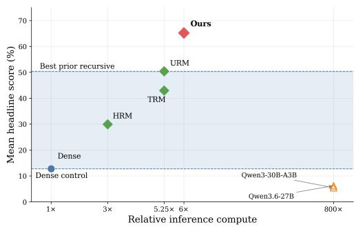

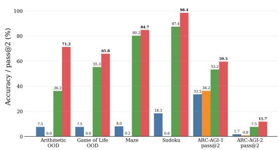  
Figure 1: Recursive reasoning performance is determined by both recurrent computation and its optimization. We systematically study the factors that govern recursive models: gradient propagation through the recurrent trajectory, recurrent-state stabilization, architectural choices, and testtime computation. Our final 13.6M-parameter model combines the most effective components and achieves strong performance across algorithmic domains while improving out-of-distribution generalization.

## 1 INTRODUCTION

Recursive reasoning models repeatedly apply a small shared network to a latent state, trading parameter count for computational depth. Recent models such as the Hierarchical Reasoning Model (HRM), Tiny Recursive Model (TRM), and Universal Reasoning Model (URM) show that this approach can solve symbolic algorithmic tasks with models of only a few million parameters (Wang et al., 2025; Jolicoeur-Martineau, 2025; Gao et al., 2025).

It is much less clear why these models work. HRM, TRM, and URM change recurrent architecture, gradient propagation, optimization, and regularization simultaneously, making it difficult to attribute improvements to individual design choices. Moreover, repeated application of shared parameters creates optimization challenges that differ from standard feed-forward Transformers.

We study these questions under a unified experimental pipeline. We retrain recursive baselines with matched data and evaluation, varying one architectural or optimization factor at a time. Beyond standard benchmarks (Sudoku, Maze, and ARC-AGI), we introduce Game of Life and Arithmetic with controlled out-of-distribution splits to test whether learned computation generalizes beyond the training distribution.

Our study yields three findings. First, optimization choices account for a large fraction of the performance variation observed in our study: gradient propagation has an interior optimum, and large physical batches outperform gradient accumulation at the same effective size. Second, stable recurrent computation requires controlling latent-state updates; recurrent-state stabilization is critical for reliable training. Third, additional capacity does not translate uniformly into better reasoning: explicit hierarchy, larger recurrent blocks, and additional test-time computation provide domain dependent benefits.

Combining these findings gives a stable 13.6M-parameter recursive reasoner that achieves the strongest results among the evaluated recursive baselines on nearly all metrics, including 71.16% on Arithmetic OOD, 98.41% on Sudoku, and 59.50% pass@2 on ARC-AGI-1.

Our contributions are:

• A controlled ablation study of recursive reasoning. We isolate architectural and optimization choices of HRM/TRM/URM-style models under a common training and evaluation pipeline across six domains.

• Explicit tests of algorithmic generalization. We introduce Game of Life and Arithmetic datasets with controlled out-of-distribution splits over computational horizon, input structure, and target range.

• A practical recipe for stable recursive optimization. We identify an intermediate gradient horizon, large physical batches, and controlled recurrent-state updates as the key ingredients in our setting.

• Scaling limits of the recipe. We show that explicit hierarchy, larger recurrent blocks, and additional test-time computation provide domain-dependent benefits.

## 2 RELATED WORK

Latent recurrent computation. Reusing a shared transformation across multiple iterations provides additional computational depth without increasing parameter count. Looped Transformers demonstrate this principle on algorithmic reasoning and length generalization (Saunshi et al., 2025; Fan et al., 2025), while recurrent-depth language models extend it to test-time computation in larger language models (Geiping et al., 2025). Related approaches make recurrent depth adaptive across tokens (Bae et al., 2025) or perform search directly in a continuous latent program space (Macfarlane & Bonnet, 2025). These results establish latent iteration as a useful computational primitive, but leave open how such recurrence should be optimized and stabilized.

Small recursive reasoners. HRM introduced a two-timescale architecture with separate fast and slow recurrent modules, truncated credit assignment, and adaptive computation (Wang et al., 2025). TRM subsequently showed that much of this architectural structure can be removed: it shares parameters across recurrent levels, extends the differentiated portion of the trajectory, and uses weight averaging (Jolicoeur-Martineau, 2025). URM retains the shared-module design while adding local convolutional mixing and a different truncated-backpropagation scheme (Gao et al., 2025). Subsequent analyses further question whether hierarchical structure or learned halting is essential (Ge et al., 2025; Movahedi et al., 2026), and alternative interpretations view recurrent updates as policyimprovement operations (Asadulaev et al., 2026).

These models improve along several axes simultaneously. In particular, HRM, TRM, and URM change architecture, gradient horizon, optimizer, regularization, and evaluation setup together, mak ing it difficult to identify which factor drives their gains. Our work is complementary: rather than proposing another independent architecture, we place these choices in a shared experimental framework and vary them one at a time.

## 3 DATA

Prior work on recursive reasoning models evaluates on a small set of algorithmic benchmarks, most prominently Sudoku, Maze, and ARC-AGI (Wang et al., 2025; Jolicoeur-Martineau, 2025; Gao et al., 2025). We retain these benchmarks for direct comparability and add two domains, Game of Life and Arithmetic, designed to provide explicit and controllable out-of-distribution evaluation. The resulting suite contains six domains spanning constraint satisfaction, search, iterative dynamics, symbolic composition, and abstract rule induction (Figure 2).

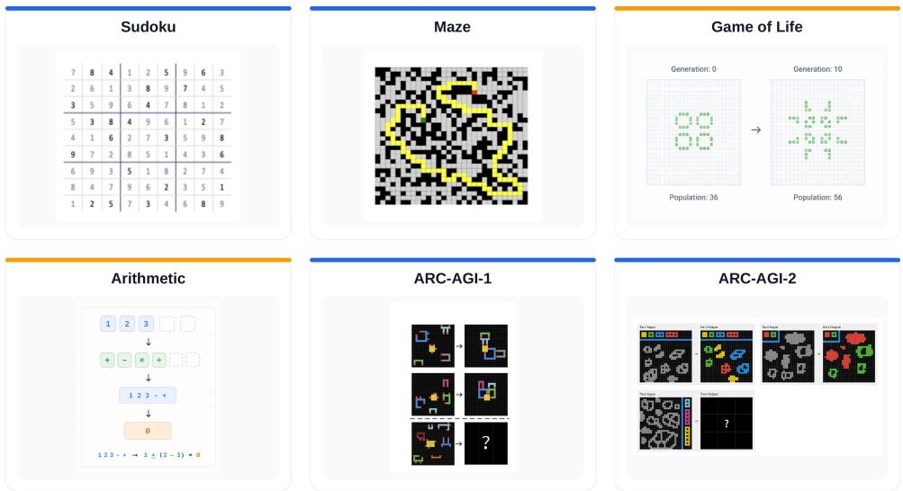  
Figure 2: Evaluation domains used in our study. Sudoku, Maze, and ARC-AGI follow established recursive-reasoning benchmarks, while Game of Life and Arithmetic provide controlled out-of distribution evaluation.

All tasks use the same interface: the input is represented as a padded token sequence, and the model predicts the complete target without intermediate supervision or chain-of-thought traces.

Sudoku. We use the sudoku-extreme dataset following HRM (Wang et al., 2025). Each 9 × 9 puzzle is flattened into 81 tokens, with the completed grid as the target. We train without symmetrybased augmentation.

Maze. We use the maze-30x30-hard dataset following HRM (Wang et al., 2025). Each 30×30 maze is flattened into 900 tokens, and the target is the same grid with a shortest start-to-goal path marked.

Game of Life. We generate 200,000 Conway’s Game of Life trajectories from random binary grids of size up to 17 × 17. Each example specifies an initial configuration and a step count k, and the target is the configuration after exactly k updates. This makes the required number of sequential rule applications directly controllable and enables evaluation of extrapolation beyond training horizons.

Arithmetic. We generate reverse-Polish expressions containing three to eight operands from $\{ 1 , \ldots , 9 \}$ and operators from $\{ + , - , \times , \div \}$ . Operators are masked in the input while the final value is given, and the model must recover the operator sequence. This produces a constrained combinatorial search problem with up to $4 ^ { 7 }$ candidate assignments.

ARC-AGI. We evaluate on ARC-AGI-1 and ARC-AGI-2 using the preprocessing and augmentation protocol of prior recursive models (Wang et al., 2025; Jolicoeur-Martineau, 2025; Gao et al., 2025). ARC-AGI-1 is combined with ConceptARC, while ARC-AGI-2 is kept separate. We follow the same transductive training protocol used by these models; full preprocessing and augmentation details are provided in Appendix A.

Out-of-distribution evaluation. For Game of Life, we evaluate two forms of generalization. First, 15% of initial patterns are held out entirely. Second, for patterns observed during training, we evaluate predictions 1, 2, 3, and 10 steps beyond their training horizon.

Arithmetic is split by operand multiset, so test expressions contain digit combinations absent from training. We additionally separate targets within the training value range, [0, 101], from targets outside it, [102, 201]. Sudoku, Maze, and ARC use their standard evaluation splits.

## 4 STABLE RECURSIVE REASONING

Previous recursive reasoning models change multiple factors simultaneously, including architecture, gradient propagation, and optimization procedure. We therefore isolate these factors and construct a unified recipe based on recurrent-state stabilization, credit assignment, and optimization stability. The resulting model combines shared recurrent computation with controlled state updates, intermediate gradient propagation, and recurrence-specific regularization.

The final configuration is summarized in Section 4.5, while the contribution of each component is evaluated through controlled ablations in Section 5.4.

## 4.1 RECURSIVE COMPUTATION

We use the nested recurrence formulation of HRM, where $z _ { L }$ and $z _ { H }$ represent low- and hightimescale recurrent states rather than separate networks, and x denotes input embeddings fixed within an Adaptive Computation Time (ACT) step. Within each high-level cycle, the low-level state is updated $L _ { \mathrm { c y c l e s } }$ times as

$$
z _ { L } \gets L ( z _ { L } + z _ { H } + x ) ,
$$

followed by the high-level update

$$
z _ { H } \gets H ( z _ { H } + z _ { L } ) .
$$

The cycle is repeated $H _ { \mathrm { c y c l e s } }$ times. Unlike HRM, our default configuration shares the parameters of the recurrent transformations; Section 5.3 evaluates whether explicit high/low-level parameter separation provides additional benefits.

## 4.2 CONTROLLED RECURRENT-STATE UPDATES

Repeatedly applying the same transformation creates a unique optimization challenge: small errors in recurrent updates accumulate over depth. Directly replacing the recurrent state allows both the magnitude and the rate of refinement to drift along long trajectories.

Motivated by this instability, we introduce a controlled refinement mechanism consisting of update bounding, learned gating, and post-cycle normalization. We first compute the candidate update and bound its magnitude relative to the current state:

$$
\tilde { z } _ { L } = L ( z _ { L } + z _ { H } + x ) , \qquad \Delta _ { L } = \tilde { z } _ { L } - z _ { L } , \qquad r = { \frac { \| \Delta _ { L } \| _ { 2 } } { \| z _ { L } \| _ { 2 } + \epsilon } } , \qquad \hat { \Delta } _ { L } = { \frac { \Delta _ { L } } { \operatorname* { m a x } ( r / \tau , 1 ) } } .
$$

A learned gate then controls how much of the bounded update is applied:

$$
\alpha = \sigma \big ( w ^ { T } ( z _ { H } + z _ { L } + x ) + b \big ) , \qquad z _ { L } ^ { \prime } = \mathrm { N o r m } \Big ( z _ { L } + \alpha \odot \hat { \Delta } _ { L } \Big ) ,
$$

where ⊙ denotes element-wise multiplication, with α broadcast over the hidden dimension.

Together, these mechanisms constrain the recurrent trajectory while preserving the ability of different token positions to refine at different rates.

## 4.3 RECURRENCE-CONSISTENT REGULARIZATION

Because recursive models repeatedly apply the same parameters along a single latent trajectory, we reuse one dropout mask across all recurrent cycles and ACT steps rather than sampling independent masks at each application. We also add small norm-scaled Gaussian noise to the input embed dings and recurrent states to discourage brittle trajectories. Exact mask placement and regularization strengths are given in Appendix B.

## 4.4 TRAINING THE RECURSION

The model executes the full recurrent trajectory, while gradients propagate only through the final $K _ { H }$ high-level and $K _ { L }$ low-level cycles. Unless stated otherwise, we use $K _ { H } = K _ { L } = 2 ,$ following the controlled study in Section 5.1. We optimize with Adam-atan2, global gradient clipping at 1, and EMA weights for evaluation, and use large physical batches rather than equivalent gradient accumulation following Section 5.2.

## 4.5 FINAL RECURSIVE REASONING RECIPE

The final model combines the design choices identified in our controlled study. Rather than increasing architectural complexity, we focus on stabilizing the dynamics of recurrent computation. The resulting configuration is used for all main experiments in Section 4.6.

The model uses a shared Transformer block recurrently applied to latent states. Each Adaptive Computation Time (ACT) step performs $( H _ { \mathrm { c y c l e s } } , L _ { \mathrm { c y c l e s } } ) = ( 4 , 2 )$ ) recurrent updates. During training, gradients are propagated through the final $( K _ { L } , K _ { H } ) = ( 2 , 2 )$ recurrent updates of the trajectory.

The recurrent state is updated using bounded updates, learned gating, and post-cycle normalization. Training uses recurrence-consistent dropout, relative state and embedding noise, large physical batches, gradient clipping, and exponential moving average (EMA) weights.

The final architecture is summarized in Figure 3, and the complete training recipe is given in Table 1.

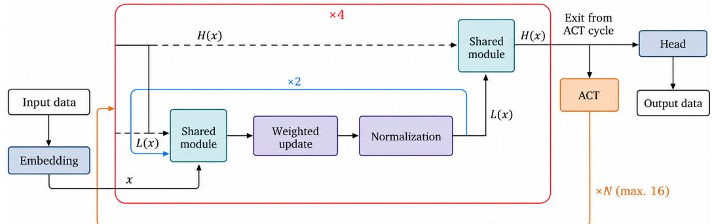  
Figure 3: Overview of the final recursive reasoning architecture. A shared Transformer block repeatedly refines latent recurrent states. Controlled state updates and truncated gradient propagation stabilize the recursive trajectory.

Table 1: Comparison of recursive reasoning recipes.
<table><tr><td>Setup</td><td>HRM</td><td>TRM</td><td>URM</td><td>Ours</td></tr><tr><td>Parameters</td><td>27M</td><td>7M</td><td>7M</td><td>13.6M</td></tr><tr><td>Modules</td><td>2 (H + L)</td><td>1 shared</td><td>1 shared</td><td>1 shared</td></tr><tr><td>Layers</td><td>4+ 4</td><td>2</td><td>2*</td><td>4</td></tr><tr><td>Hidden size</td><td>512</td><td>512</td><td>512</td><td>512</td></tr><tr><td>Cycles (H, L)</td><td>(2,2)</td><td>(3,6)</td><td>(3,6)</td><td>(4,2)</td></tr><tr><td>Gradient path</td><td>Last H + last L Last H + all L Last H + all L</td><td></td><td></td><td> $( K _ { L } , K _ { H } ) = ( 2 , 2 )$ </td></tr><tr><td>State stabilization</td><td></td><td></td><td></td><td>Bounded + gated + norm.</td></tr><tr><td>Convolution</td><td>No</td><td>No</td><td>Depthwise</td><td>No**</td></tr><tr><td>Physical batch</td><td>768</td><td>768</td><td>768</td><td>Domain-specific; up to 8192</td></tr><tr><td>Train stabilization</td><td>Standard</td><td>EMA</td><td>EMA</td><td>Consistent dropout + noise</td></tr></table>

\* For URM, we report the 2-layer configuration selected in our experiments.  
\*\* A convolutional variant is used only for ARC experiments and is not part of the default recipe.

## 4.6 EVALUATION AND MAIN RESULTS

We report exact accuracy on all domains and pass@1/pass@2 on ARC-AGI. Adaptive halting is disabled during the main evaluation, and all examples execute the full ACT budget. For test-time scaling, we extend this budget beyond its training-time value.

We compare against HRM, TRM, and URM reconstructed in our codebase with matched data representation, tokenization, and evaluation. Each baseline retains its method-specific recurrent architecture and training recipe, while our model uses the recipe developed in 4. Thus, this comparison evaluates complete recursive-reasoning recipes rather than isolating architecture alone; architecturespecific effects are studied separately in 5. Full baseline configurations, ARC aggregation details, and inference-cost accounting are provided in Appendix C.

Table 2: Exact accuracy on the evaluation domains, in percent, from EMA weights. Arithmetic is split into the in-distribution and out-of-distribution target buckets of Section 3; Game of Life is reported on its in-range set and as the mean over its out-of-distribution sets. ARC-AGI is evaluated with pass@1 and pass@2. HRM, TRM, URM, and the dense control are retrained in our codebase; general-purpose models are evaluated from released checkpoints without fine-tuning. Best values are in bold.
<table><tr><td>Metric</td><td>Dense</td><td>Qwen3-30B-A3B</td><td>Qwen3.6-27B</td><td>HRM</td><td>TRM</td><td>URM</td><td>Ours</td></tr><tr><td>Arithmetic ID</td><td>78.50</td><td>0.10</td><td>0.00</td><td>92.00</td><td>98.80</td><td>95.60</td><td>96.34</td></tr><tr><td>Arithmetic OOD</td><td>7.49</td><td>0.00</td><td>0.00</td><td>13.80</td><td>36.20</td><td>28.50</td><td>71.16</td></tr><tr><td>Game of Life ID</td><td>8.17</td><td>0.00</td><td>0.00</td><td>5.00</td><td>7.11</td><td>55.42</td><td>66.08</td></tr><tr><td>Game of Life OOD</td><td>7.54</td><td>0.00</td><td>0.00</td><td>0.30</td><td>7.14</td><td>55.26</td><td>65.80</td></tr><tr><td>Maze</td><td>8.00</td><td>0.20</td><td>0.00</td><td>71.10</td><td>80.00</td><td>80.20</td><td>84.70</td></tr><tr><td>Sudoku</td><td>18.30</td><td>0.00</td><td>0.00</td><td>50.00</td><td>87.40</td><td>77.60</td><td>98.41</td></tr><tr><td>ARC-AGI-1 pass@1</td><td>30.75</td><td>25.00</td><td>30.00</td><td>32.00</td><td>40.00</td><td>49.75</td><td>53.00</td></tr><tr><td>ARC-AGI-1 pass @2</td><td>33.50</td><td>31.50</td><td>36.25</td><td>40.30</td><td>44.60</td><td>53.25</td><td>59.50</td></tr><tr><td>ARC-AGI-2 pass@1</td><td>1.67</td><td>0.83</td><td>0.00</td><td>3.33</td><td>2.50</td><td>5.83</td><td>10.83</td></tr><tr><td>ARC-AGI-2 pass @2</td><td>1.67</td><td>0.83</td><td>0.83</td><td>4.17</td><td>2.50</td><td>7.50</td><td>11.67</td></tr></table>

Table 2 summarizes the main comparison. Our model achieves the strongest performance among the evaluated recursive baselines on nearly all reported metrics. The largest improvement appears on Arithmetic OOD, where accuracy increases from 36.20% for the strongest recursive baseline to 71.16%.

The effect of recursion depends on the domain. On Sudoku and Maze, recursive models substantially outperform the non-recurrent control. Game of Life separates the recursive baselines: TRM remain close to the dense model, whereas URM and our model achieve higher accuracy and retain similar performance under distribution shift. ARC behaves differently: on ARC-AGI-1 the dense control is already competitive, while all systems remain limited on ARC-AGI-2.

Overall, the largest gains appear on explicit generalization tests rather than uniformly across all domains. Section 5 analyzes which optimization and architectural choices account for these differences.

## 5 CONTROLLED ABLATIONS AND SCALING LIMITS

We isolate the main architectural and optimization choices of Section 4 under controlled comparisons. Unless stated otherwise, each experiment changes one factor while keeping the remaining training pipeline fixed. We then test whether the resulting recipe continues to improve with more model capacity, more tasks, or more inference-time computation.

## 5.1 GRADIENT PATH LENGTH

We first isolate the effect of credit assignment through the recurrent trajectory. The forward recursion is fixed at $L _ { \mathrm { c y c l e s } } = 2$ and $H _ { \mathrm { c y c l e s } } = 4$ , while only the backward horizon is varied. Gradients propagate through the final $K _ { H }$ high-level cycles and, within each of them, through the final $K _ { L }$ low-level cycles. All eight runs use the same Arithmetic data, seed, optimizer, schedule, architecture, and forward computation.

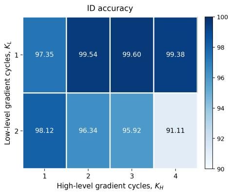

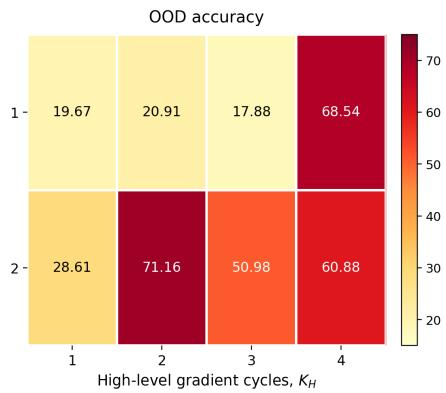  
Figure 4: Exact accuracy on Arithmetic as a function of the differentiated gradient horizon. Forward recursion is fixed at $L _ { \mathrm { c y c l e s } } = 2$ and $H _ { \mathrm { c y c l e s } } = 4 ;$ ; only $( K _ { L } , K _ { H } )$ varies. Left: in-distribution accuracy. Right: out-of-distribution accuracy.

Figure 4 reveals a strongly non-monotonic relationship between gradient horizon and generalization. The intermediate setting $\left( K _ { L } , K _ { H } \right) = \left( 2 , 2 \right)$ achieves the highest OOD accuracy of 71.16%, whereas (1, 3) reaches the highest ID accuracy of 99.60% but generalizes poorly, obtaining only 17.88% OOD.

Importantly, this difference cannot be explained by gradient-path length alone: (1, 3) and (2, 2) differentiate the same number of recurrent applications but produce sharply different OOD behavior. Thus, both the extent and placement of gradient flow through the nested recurrence matter. On Arithmetic, the intermediate (2, 2) setting gives the strongest out-of-distribution generalization among the tested horizons while retaining high ID accuracy.

## 5.2 PHYSICAL BATCH VS. GRADIENT ACCUMULATION

We next test whether gradient accumulation reproduces the optimization behavior of a genuinely larger physical batch. On Game of Life, we fix the effective batch size at 8192 and vary the physical batch size together with the number of accumulation steps, while keeping all other training settings fixed.

Figure 5 shows that equal effective batch size does not produce equivalent training dynamics. OOD accuracy decreases from 63.16% with a physical batch of 8192 to 37.71% with four accumulation steps, while the mean pre-clipping gradient norm increases from 0.38 to 65.46.

The effect is therefore not explained by the nominal number of examples contributing to each optimizer update. In this setting, physical batch size is an optimization parameter in its own right, and replacing it with gradient accumulation substantially changes both stability and final accuracy. We therefore report physical and effective batch sizes separately throughout the study.

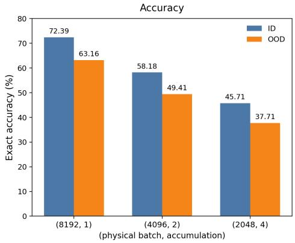

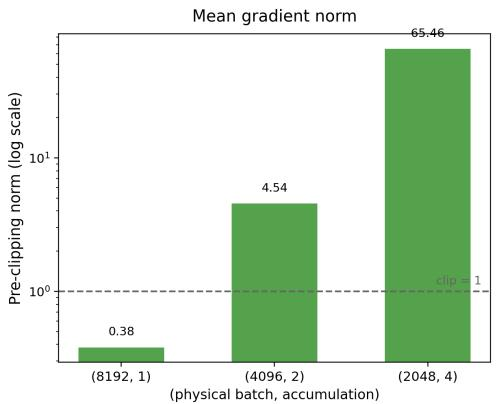  
Figure 5: Effect of physical batch size versus gradient accumulation at a fixed effective batch size of 8192 on Game of Life. Configurations correspond to physical batch sizes of 8192, 4096, and 2048 with 1, 2, and 4 accumulation steps, respectively. Left: ID and OOD accuracy. Right: mean pre-clipping gradient norm.

## 5.3 IS THE HIERARCHY NECESSARY?

HRM introduces separate high- and low-level recurrent modules, whereas TRM and URM share parameters across the two timescales. To isolate this architectural choice, we compare shared and separate recurrent modules at matched parameter count while keeping the remaining training configuration fixed.

Figure 6a shows that neither design consistently dominates across domains. Shared modules perform better on Maze and ARC-AGI-1, while separate modules provide small gains on Sudoku and Game of Life; the two configurations are nearly identical on Arithmetic.

These results indicate that explicit high/low-level parameter separation is not a universal source of improvement. A simpler shared recurrent module remains competitive across all studied domains and is preferable on several of them, suggesting that the gains of recursive reasoning do not depend on an explicit hierarchical decomposition.

## 5.4 STABILIZATION MECHANISMS

We evaluate the stabilization recipe cumulatively on Game of Life and Sudoku, focusing on both final accuracy and sensitivity to random seed. Starting from the base configuration, we progressively add gating, gradient clipping, recurrence-consistent dropout, and relative state and embedding noise. Post-cycle normalization and EMA are kept fixed throughout. Table 3 reports mean ± standard deviation over three seeds.

Table 3: Cumulative stabilization ablation on Game of Life and Sudoku. Post-cycle normalization and EMA are fixed in all configurations. Values report mean ± standard deviation over three seeds. Best values are in bold and second-best values are underlined.
<table><tr><td>Configuration</td><td>GoL ID</td><td>GoL OOD</td><td>Sudoku</td></tr><tr><td>Base</td><td> $6 1 . 9 5 \pm 3 . 3 2$ </td><td> $6 3 . 8 7 \pm 2 . 9 0$ </td><td> $9 7 . 2 9 \pm 1 . 0 6$ </td></tr><tr><td>+ gate</td><td> $6 4 . 2 4 \pm 2 . 5 9$ </td><td> ${ \bf 6 5 . 8 9 \pm 2 . 7 7 }$ </td><td> $9 8 . 4 1 \pm 0 . 2 5$ </td></tr><tr><td>+ grad clip</td><td> $6 2 . 4 1 \pm 1 . 5 6$ </td><td> $6 3 . 8 7 \pm 1 . 5 4$ </td><td> ${ \bf 9 8 . 5 0 \pm 0 . 2 0 }$ </td></tr><tr><td>+ dropout</td><td> $6 1 . 8 2 \pm 0 . 3 4$ </td><td> $6 2 . 0 9 \pm 0 . 4 1$ </td><td> $9 8 . 3 6 \pm 0 . 2 5$ </td></tr><tr><td>+ relative noise (final)</td><td> ${ \bf 6 6 . 0 8 \pm 0 . 1 1 }$ </td><td> $6 5 . 8 0 \pm 0 . 1 3$ </td><td> $9 8 . 4 1 \pm 0 . 2 1 $ </td></tr></table>

The stabilization recipe has a pronounced effect on training reliability, especially on the more challenging Game of Life domain. The base configuration is highly seed-sensitive, with standard deviations of 3.32 and 2.90 points on the ID and OOD splits. With the complete recipe, these decrease to only 0.11 and 0.13 points, while accuracy rises to 66.08% ID and 65.80% OOD.

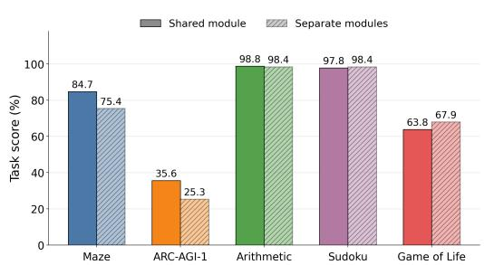  
(a) Effect of shared versus separate recurrent modules at matched parameter count.

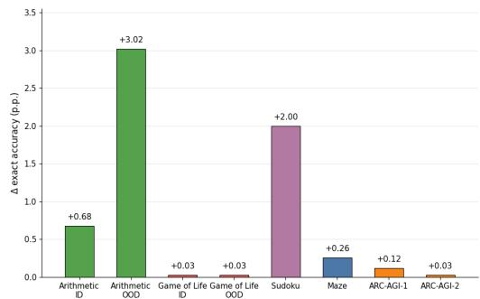  
(b) Accuracy change from increasing the ACT budget beyond the training-time value.  
Figure 6: Architectural and test-time scaling ablations. (a) Effect of sharing parameters between recurrent timescales. (b) Effect of additional recurrent computation at inference time.

Sudoku shows the same pattern in a higher-accuracy regime: variability falls from 1.06 points in the base configuration to approximately 0.2 points in the stabilized variants while mean accuracy remains near 98%. The main effect of the recipe is therefore not merely to preserve performance, but to turn a seed-sensitive recurrent optimization problem into a substantially more reproducible one. The benefit is strongest on the harder domain, where the final configuration combines both high accuracy and very low run-to-run variance.

## 5.5 LIMITS OF SCALING RECURSIVE COMPUTATION

Finally, we test whether the resulting recipe continues to improve with additional model capacity or inference-time computation. Increasing the recurrent block from four to eight layers, increasing hidden size, or adding attention heads does not yield consistent accuracy gains across the tested settings. We therefore retain the 13.6M-parameter configuration as the default model rather than increasing capacity further.

Test-time computation exhibits a similarly task-dependent pattern. Figure 6b shows that increasing the ACT budget provides the largest gains on Arithmetic and Sudoku, while improvements on Game of Life, Maze, and ARC-AGI remain limited.

Together, these results show that recursive reasoning does not improve simply by adding more parameters or more recurrent steps. Capacity and test-time compute help selectively, while the largest and most consistent improvements in our study come from how the recurrent computation is optimized and stabilized.

## 6 CONCLUSION

We presented a controlled study of recursive reasoning models, separating architectural and optimization choices that are coupled in previous systems. Across six algorithmic domains, we find that stable recursive computation depends strongly on how recurrence is trained and stabilized.

Our experiments identify three important factors. First, gradient propagation through the recurrent trajectory has an intermediate optimum: neither aggressive truncation nor full backpropagation provides the best generalization. Second, physical batch size affects optimization beyond effective batch size, with large physical batches substantially improving stability and accuracy compared with gradient accumulation. Third, controlling recurrent-state updates through bounded, gated, and normalized transformations enables reliable training.

At the same time, adding capacity does not guarantee better reasoning. Explicit hierarchy, larger recurrent blocks, and additional test-time computation provide domain-dependent rather than universal gains. These results suggest that recursive reasoning should be viewed as an optimization problem as much as an architectural one: the effectiveness of recurrence depends on how information and gradients are propagated through the recurrent trajectory.

## AI USE STATEMENT

We used generative AI tools for manuscript preparation, literature discovery, and code refactoring. Generative AI was used to draft, revise, and polish parts of the manuscript and to assist with retrieval and discovery of relevant prior work. The authors independently verified all citations against the original sources and reviewed all AI-assisted text. The research questions, experimental design, experiments, measurements, analysis, and conclusions are the work of the authors.

Generative AI was also used interactively to assist with refactoring existing research code. AIsuggested changes were manually reviewed, adapted where necessary, integrated into the repository, and tested by the authors. The experimental configurations and experiments reported in the paper were controlled and executed by the authors. We reviewed all AI-assisted material and take full responsibility for the content of this paper, including its text, code, claims, and reported results.

## REPRODUCIBILITY STATEMENT

The submission includes the full source code used for the experiments, together with all reported experiment configurations and the scripts used to generate the Arithmetic and Game of Life datasets. Reported experiments can be reproduced from their corresponding configuration files, which specify the model, optimization, data, evaluation, and random-seed settings. Random seeds are propagated to Python, NumPy, PyTorch, and data-loader workers.

Section 3 describes the evaluation domains and distribution shifts. The model and training procedure are described in Section 4 and Appendix B, and the evaluation protocol and baseline details are given in Section 4.6 and Appendix C. In particular, adaptive halting is disabled for the main evaluation and all examples execute the full evaluation budget.

Where results are aggregated over multiple seeds, this is stated explicitly in the corresponding table or figure caption; results obtained from a single run are reported as such.

## REFERENCES

Arip Asadulaev, Rayan Banerjee, Fakhri Karray, and Martin Takac. Latent reasoning in trms is secretly a policy improvement operator, 2026.

Sangmin Bae, Yujin Kim, Reza Bayat, Sungnyun Kim, Jiyoun Ha, Tal Schuster, Adam Fisch, Hrayr Harutyunyan, Ziwei Ji, Aaron Courville, and Se-Young Yun. Mixture-of-recursions: Learning dynamic recursive depths for adaptive token-level computation. In Advances in Neural Information Processing Systems, 2025. URL https://arxiv.org/abs/2507.10524.

Franc¸ois Chollet. On the measure of intelligence. arXiv preprint arXiv:1911.01547, 2019. URL https://arxiv.org/abs/1911.01547.

Franc¸ois Chollet et al. ARC-AGI-2: A new challenge for frontier AI reasoning systems. arXiv preprint arXiv:2505.11831, 2025. URL https://arxiv.org/abs/2505.11831.

Ying Fan, Yilun Du, Kannan Ramchandran, and Kangwook Lee. Looped transformers for length generalization. In Proceedings of the 13th International Conference on Learning Representations, 2025. URL https://arxiv.org/abs/2409.15647.

Zitian Gao, Lynx Chen, Yihao Xiao, He Xing, Ran Tao, Haoming Luo, Joey Zhou, and Bryan Dai. Universal reasoning model, 2025. URL https://arxiv.org/abs/2512.14693.

Renee Ge, Qianli Liao, and Tomaso Poggio. Hierarchical reasoning models: Perspectives and misconceptions, 2025. URL https://arxiv.org/abs/2510.00355.

Jonas Geiping, Sean McLeish, Neel Jain, John Kirchenbauer, Siddharth Singh, Brian R. Bartoldson, Bhavya Kailkhura, Abhinav Bhatele, and Tom Goldstein. Scaling up test-time compute with latent reasoning: A recurrent depth approach. In Advances in Neural Information Processing Systems, 2025. URL https://arxiv.org/abs/2502.05171.

Alexia Jolicoeur-Martineau. Less is more: Recursive reasoning with tiny networks, 2025. URL https://arxiv.org/abs/2510.04871.

Matthew V. Macfarlane and Clement Bonnet. Searching latent program spaces, 2025.´

Arseny Moskvichev, Victor Vikram Odouard, and Melanie Mitchell. The ConceptARC benchmark: Evaluating understanding and generalization in the ARC domain. Transactions on Machine Learning Research, 2023. URL https://arxiv.org/abs/2305.07141.

Sajad Movahedi, Vera Milovanovic, Shlomo Libo Feigin, Alexander Theus, Thomas Hofmann,´ Valentina Boeva, T. Konstantin Rusch, and Antonio Orvieto. Fixed-point reasoners: Stable and adaptive deep looped transformers, 2026. URL https://arxiv.org/abs/2606.18206. ICML 2026 Workshop.

Nikunj Saunshi, Nishanth Dikkala, Zhiyuan Li, Sanjiv Kumar, and Sashank J. Reddi. Reasoning with latent thoughts: On the power of looped transformers. In Proceedings of the 13th International Conference on Learning Representations, 2025. URL https://openreview.net/ forum?id=Pr8o5llJ1O.

Guan Wang, Jin Li, Yuhao Sun, Xing Chen, Changling Liu, Yue Wu, Meng Lu, Sen Song, and Yasin Abbasi-Yadkori. Hierarchical reasoning model, 2025. URL https://arxiv.org/ abs/2506.21734.

## A DATASET DETAILS

## A.1 COMMON REPRESENTATION

All domains are mapped to a common sequence prediction interface. Inputs are represented as fixed-length padded token sequences, and the model predicts the complete target without intermediate supervision or chain-of-thought traces. For grid-based tasks, two-dimensional structures are flattened into token sequences. Task-specific encoding details are given below.

## A.2 SUDOKU

We use the sudoku-extreme corpus following HRM (Wang et al., 2025). Each instance is a 9×9 Sudoku board, with empty cells represented by zeros. The input board is flattened into a sequence of 81 tokens, and the target is the corresponding completed board.

We train on the full training split without symmetry-based augmentation. Thus, evaluation is performed on held-out puzzles rather than on transformed versions of a smaller underlying puzzle set.

## A.3 MAZE

We use the maze-30x30-hard corpus following HRM (Wang et al., 2025). Each instance is a 30 × 30 grid over the symbols {wall, free, start, goal, path}. The input contains the maze together with the start and goal positions. The target is the same grid with a shortest start-to-goal path marked.

Both the input and target grids are flattened into sequences of 900 tokens.

## A.4 GAME OF LIFE

Generation. We generate 200,000 binary initial configurations. Grid width and height are sampled independently and uniformly from [2, 17], and each cell is initially alive with probability 0.4.

Each configuration is evolved according to Conway’s Game of Life using the standard B3/S23 transition rule. Evolution continues until the configuration becomes empty, enters a periodic orbit, or reaches 50 evolution steps. Patterns whose serialized representation exceeds 250 characters are discarded, resulting in encoded sequences of at most 253 tokens.

Each example consists of an initial configuration and a requested evolution step k, separated by a dedicated token. The target is the configuration obtained after exactly k applications of the Gameof-Life transition rule.

This formulation makes the required number of sequential rule applications explicit: increasing k increases the length of the computation required to obtain the target without changing the underlying transition rule.

Distribution shifts. We construct evaluation splits along two independent axes: initial configuration and computational horizon.

For pattern generalization, 15% of initial configurations are held out entirely from training. Examples derived from these configurations form the unseen-pattern test set.

For horizon generalization, early evolution steps from the remaining configurations are used for training. Held-out steps from the same configurations that remain within the corresponding training horizon form the in-range evaluation split. We additionally construct four extrapolation splits whose targets lie 1, 2, 3, and 10 evolution steps beyond the maximum horizon observed during training for that configuration.

The resulting splits therefore separate generalization to unseen initial states from extrapolation in the number of required recursive computations. Each evaluation split is subsampled to 10,000 examples.

## A.5 ARITHMETIC

Generation. We generate expressions in reverse Polish notation containing between three and eight operands. Operands are sampled from $\{ 1 , \ldots , 9 \}$ and operators from $\{ + , - , \times , \div \}$ . Division is permitted only when it produces an exact integer result.

The resulting sequences contain at most 19 tokens. At input time, every operator is replaced by a special ? token and the final value of the expression is appended to the input. The model is trained to reconstruct the hidden operator sequence, with the loss applied only at the masked operator positions.

For an expression containing m operators, the unconstrained search space contains up to 4m possible operator assignments. Since the longest generated expressions contain seven operators, the largest search space contains 47 assignments, constrained by the observed final value.

Distribution shifts. We construct train and test sets by splitting over operand multisets. The split is 80/20, and every test expression contains a multiset of operands that does not occur in training.

Test examples are additionally partitioned according to the final expression value. Targets in [0, 101] form the in-distribution evaluation set. Targets in [102, 201] lie outside the range used for training and form the out-of-distribution value split.

This construction therefore combines two forms of generalization: unseen operand combinations and extrapolation to unseen target values.

## A.6 ARC-AGI

We evaluate on ARC-AGI-1 (Chollet, 2019) and ARC-AGI-2 (Chollet et al., 2025). ARC-AGI-1 is combined with ConceptARC (Moskvichev et al., 2023), while ARC-AGI-2 is kept separate.

We reuse the HRM data pipeline (Wang et al., 2025), including its encoding and augmentation procedure. Each ARC grid is embedded into a 30 × 30 canvas with padding and explicit end-ofgrid markers and is then flattened into a sequence of 900 tokens. The vocabulary contains ten color tokens and two special symbols.

Augmentation. Each puzzle is expanded into 1000 augmented examples. Augmentations compose the eight dihedral transformations of the grid with a random permutation of the color vocabulary. Training examples additionally receive a random translation within the 30 × 30 canvas.

At evaluation time, predictions are mapped back to the original coordinate and color systems by applying the inverse color permutation and inverse dihedral transformation and are cropped according to the end-of-grid markers.

Transductive protocol. Following prior recursive-model evaluations, few-shot demonstrations are not provided in context at inference time. Instead, each demonstration pair belonging to a task is converted into a separate supervised training example.

This also applies to tasks belonging to the evaluation split. The held-out test input itself is not used for training, but demonstration pairs from the same task are observed during training. A learned task-specific puzzle embedding is the only channel connecting these demonstrations to the held-out test input.

The resulting ARC evaluation is therefore transductive, following the protocol of the prior recursive reasoning models we compare against.

## A.7 EVALUATION SPLITS

Table 4 summarizes the role of each domain in the evaluation. Sudoku and Maze use their standard held-out splits. ARC-AGI-1 and ARC-AGI-2 use the transductive protocol described above. Game of Life and Arithmetic additionally provide explicit out-of-distribution splits constructed to isolate different forms of generalization.

Table 4: Summary of the six evaluation domains. Game of Life and Arithmetic provide explicit controlled distribution shifts; the remaining domains are retained primarily for comparability with prior recursive reasoning models.
<table><tr><td>Domain</td><td>Input structure</td><td>Primary capability</td><td>Controlled OOD</td></tr><tr><td>Sudoku</td><td> $9 \times 9 ~ \mathrm { g r i d }$ </td><td>Constraint satisfaction</td><td></td></tr><tr><td>Maze</td><td>30 × 30 grid</td><td>Search and planning</td><td></td></tr><tr><td>Game of Life</td><td>Variable-size binary grid</td><td>Iterative dynamics</td><td>Patterns, horizon</td></tr><tr><td>Arithmetic</td><td>RPN expression</td><td>Symbolic composition / search</td><td>Operands, value range</td></tr><tr><td>ARC-AGI-1</td><td>Grid transformations</td><td>Abstract rule induction</td><td></td></tr><tr><td>ARC-AGI-2</td><td>Grid transformations</td><td>Abstract rule induction</td><td></td></tr></table>

## B TRAINING AND IMPLEMENTATION DETAILS

This appendix provides implementation details omitted from Section 4. The main text specifies the mechanisms needed to define the model; here we report the corresponding optimizer, regularization, and recurrent-carry settings.

## B.1 BACKBONE AND OPTIMIZATION

The recurrent module consists of four post-norm Transformer layers with hidden size 512 and eight attention heads. The feed-forward block uses SwiGLU with expansion factor 4. We use rotary position embeddings and RMSNorm, and execute the model in bfloat16.

The high- and low-level recurrent modules share parameters, giving 13.6M trainable parameters in the configuration used for the main experiments.

We optimize the model with Adam-atan2. Training uses warm-up followed by either cosine or exponential decay, depending on the domain configuration. Peak learning rate, β , weight decay, and training duration are specified separately for each domain in Table 6.

Puzzle embeddings are optimized separately using distributed sign-SGD. Their learning rate is domain-specific and is reported in Table 6.

Gradients are clipped to a global norm of 1 after distributed reduction and, when applicable, after accumulation. We record the pre-clipping norm as a training-stability diagnostic.

We maintain an exponential moving average of all trainable parameters with decay 0.999, including the puzzle-embedding table.

## B.2 RECURRENT-STATE REGULARIZATION

Bounded relative update. For each token position, the relative size of the proposed state update is

$$
r = \frac { \| \tilde { z } _ { L } - z _ { L } \| _ { 2 } } { \| z _ { L } \| _ { 2 } + \epsilon } , \qquad \epsilon = 1 0 ^ { - 8 } .\tag{1}
$$

When enabled, we use $\tau = 0 . 7$ and rescale the update as

$$
\tilde { z } _ { L } \gets z _ { L } + \frac { \tilde { z } _ { L } - z _ { L } } { \operatorname* { m a x } ( r / \tau , 1 ) } .\tag{2}
$$

The scaling coefficient is detached from the computation graph.

Update gate. The gate is initialized by scaling its weight vector by 0.1 and setting its bias to zero, giving $\alpha \approx 1 / 2$ at initialization.

Recurrence-consistent dropout. Dropout masks are sampled when an example enters an ACT trajectory and are stored in the recurrent carry. The same masks are reused at every recurrent cycle and every ACT step until that sequence halts.

Masks are sampled separately for the QKV projection, attention residual, feed-forward residual, and feed-forward intermediate activations. Additional masks are applied to the input embeddings and the two recurrent states; the state masks are shared across token positions.

State and embedding noise. At the beginning of each ACT step during training, we perturb the input embeddings and both recurrent states according to

$$
u  u + \eta \| u \| _ { 2 } \epsilon , \qquad \epsilon \sim { \mathcal N } ( 0 , I ) , \qquad u \in \{ x , z _ { H } , z _ { L } \} .\tag{3}
$$

The norm is computed per position and detached from the computation graph. We use $\eta \in$ [0.003, 0.005] depending on the domain.

## B.3 ACT AND RECURRENT CARRY

The model uses an adaptive-computation-time Q-head with a maximum budget of 16 ACT steps, reduced to 8 for ARC-AGI-1.

Recurrent states are initialized from learned vectors. At the end of an ACT step, the resulting states are stored in the carry and detached before the next ACT step. This allows later ACT steps to continue refining the same trajectory without backpropagating through previous ACT steps.

The training objective is stablemax cross-entropy over the supervised output positions together with the two halting losses.

At evaluation time, the learned halting decision is disabled for the main accuracy comparison and every sequence executes the complete evaluation budget, as described in Section 4.6.

## B.4 DOMAIN-SPECIFIC TRAINING CONFIGURATIONS

We report the domain-specific configurations used for the six final models. The recurrent architecture itself is fixed across domains, while regularization and optimization hyperparameters are adjusted to the characteristics of each task. Tables 5 and 6 summarize these differences.

Shared configuration. All models use the shared recurrent Transformer described in Section 4.5, with hidden size 512, four Transformer layers, eight attention heads, and feed-forward expansion factor four. Each ACT step performs $( H _ { \mathrm { c y c l e s } } , L _ { \mathrm { c y c l e s } } ) = ( 4 , 2 )$ recurrent updates, and training propagates gradients through the final $( K _ { H } , K _ { L } ) = ( 2 , 2 )$ cycles of the trajectory.

The recurrent states $z _ { H }$ and $z _ { L }$ use post-cycle normalization, recurrence-consistent dropout, and norm-scaled Gaussian perturbations. Controlled $z _ { L }$ updates use the relative-update threshold $\tau =$ 0.7 together with the learned gate $\alpha .$ . The remaining domain-specific choices are the dropout rates, noise scale $\eta ,$ and whether convolutional input mixing and the $z _ { L }$ gate are enabled.
<table><tr><td>Domain</td><td> $d _ { \mathrm { c o r e } }$ </td><td> $d _ { H } = d _ { L }$ </td><td> $\mathbf { \mathrm { C o n v . } }$ </td><td>η</td><td> $z _ { L } .$  -gate</td></tr><tr><td>Arithmetic</td><td>.025</td><td>.010</td><td>no</td><td>.005</td><td>yes</td></tr><tr><td>Sudoku</td><td>.010</td><td>.000</td><td>no</td><td>.005</td><td>yes</td></tr><tr><td>Game of Life</td><td>.100</td><td>.000</td><td>no</td><td>.005</td><td>yes</td></tr><tr><td>Maze</td><td>.010</td><td>.000</td><td>no</td><td>.005</td><td>yes</td></tr><tr><td>ARC-AGI-1</td><td>.025</td><td>.025</td><td>yes</td><td>.003</td><td>yes</td></tr><tr><td>ARC-AGI-2</td><td>.025</td><td>.025</td><td>yes</td><td>.005</td><td>yes</td></tr></table>

Table 5: Domain-specific recurrent regularization. $d _ { \mathrm { c o r e } }$ denotes dropout in the embedding, attention, residual, and feed-forward paths, while $d _ { H }$ and $d _ { L }$ denote dropout applied to the recurrent states $z _ { H }$ and $z _ { L } , \eta$ is the relative state and embedding noise scale. “Conv.” indicates convolutional input mixing. Controlled $z _ { L }$ updates use $\tau = 0 . 7$

<table><tr><td>Domain</td><td>Physical batch</td><td>Epochs</td><td>Eval. interval</td><td>Peak LR</td><td>Min. LR ratio</td><td> $\beta _ { 2 }$ </td><td>Weight decay</td><td>Puzzle LR</td></tr><tr><td>Arithmetic</td><td>4096</td><td>2000</td><td>50</td><td> $5 \times 1 0 ^ { - 4 }$ </td><td>.01</td><td>.95</td><td>1.0</td><td>.005</td></tr><tr><td>Sudoku</td><td>4096</td><td>2000</td><td>50</td><td> $1 \times 1 0 ^ { - 4 }$ </td><td>1.0</td><td>.95</td><td>0.1</td><td>.010</td></tr><tr><td>Game of Life</td><td>8192</td><td>2000</td><td>50</td><td> $1 \times 1 0 ^ { - 4 }$ </td><td>.10</td><td>.95</td><td>0.1</td><td>.010</td></tr><tr><td>Maze</td><td>1024</td><td>54000</td><td>500</td><td> $1 \times 1 0 ^ { - 4 }$ </td><td>.01</td><td>.995</td><td>0.1</td><td>.010</td></tr><tr><td>ARC-AGI-1</td><td>768</td><td>300000</td><td>10000</td><td> $1 \times 1 0 ^ { - 4 }$ </td><td>1.0</td><td>.95</td><td>0.1</td><td>.010</td></tr><tr><td>ARC-AGI-2</td><td>768</td><td>300000</td><td>10000</td><td> $1 \times 1 0 ^ { - 4 }$ </td><td>1.0</td><td>.95</td><td>0.1</td><td>.010</td></tr></table>

Table 6: Domain-specific optimization configurations. All runs use 2,000 learning-rate warmup steps, $\beta _ { 1 } = 0 . 9$ , global gradient clipping at norm 1, and EMA weights. Puzzle embeddings use a separate learning rate (“Puzzle LR”) and the same weight decay as the remaining parameters.

Optimization. The optimization procedure follows Section 4.5: all models use Adam-atan2, global gradient clipping at norm 1, and EMA weights for evaluation. The main domain-specific differences are the physical batch size, training duration, learning-rate schedule, $\beta _ { 2 }$ , weight decay, and puzzle-embedding learning rate. Arithmetic uses a larger peak learning rate and stronger weight decay, while Game of Life uses the largest physical batch. Maze and ARC-AGI use substantially longer schedules with smaller physical batches.

## C EVALUATION AND BASELINE DETAILS

## C.1 ARC-AGI EVALUATION

ARC-AGI is scored with the standard pass@k protocol. For each test input, predictions from all augmentations are first mapped back to the original coordinate and color systems using the inverse spatial transformation and inverse color permutation. Outputs are then cropped at the end-of-grid markers and grouped by exact grid equality.

Candidate grids are ranked by vote count across augmentations, with the halting-head confidence used as a tie-break. A puzzle is counted as solved at pass@k when the ground-truth output appears among the top-k candidates for each of its test inputs. We report pass@1 and pass@2.

The main evaluation disables adaptive halting and executes the full ACT budget for every sequence, keeping batches synchronized and removing halting errors from the quality comparison. Test-timescaling experiments instead extend the ACT budget and compare the resulting predictions.

## C.2 INFERENCE COMPUTE

A small parameter count does not imply proportionally small inference cost in a recursive model.   
Weight sharing reduces parameter storage, but the shared block is still executed repeatedly.

For a model with $H _ { \mathrm { c y c l e s } }$ high-level cycles, $L _ { \mathrm { c y c l e s } }$ low-level cycles, $H _ { \mathrm { l a y e r s } }$ high-level layers, and $L _ { \mathrm { l a y e r s } }$ low-level layers, one ACT step requires

$$
H _ { \mathrm { c y c l e s } } \left( L _ { \mathrm { c y c l e s } } L _ { \mathrm { l a y e r s } } + H _ { \mathrm { l a y e r s } } \right)\tag{4}
$$

layer applications. If an example executes T ACT steps, this cost is multiplied by T.

Table 7: Inference cost of one answer relative to a single forward pass of the non-recurrent dense control. T denotes the number of ACT steps.
<table><tr><td>Model</td><td>Layers (H, L)</td><td>Cycles (H, L)</td><td>Relative compute</td></tr><tr><td>Dense Transformer</td><td>8,-</td><td></td><td>1</td></tr><tr><td>HRM</td><td>4,4</td><td>(2,2)</td><td>3T</td></tr><tr><td>TRM</td><td>2,2</td><td>(3, 6)</td><td>5.25T</td></tr><tr><td>URM</td><td>2,2</td><td>(3, 6)</td><td>5.25T</td></tr><tr><td>Ours</td><td>4,4</td><td>(4,2)</td><td>6T</td></tr></table>

Parameter sharing therefore primarily reduces parameter count rather than sequential computation: TRM and our configuration have substantially different parameter counts but similar recurrent inference cost.

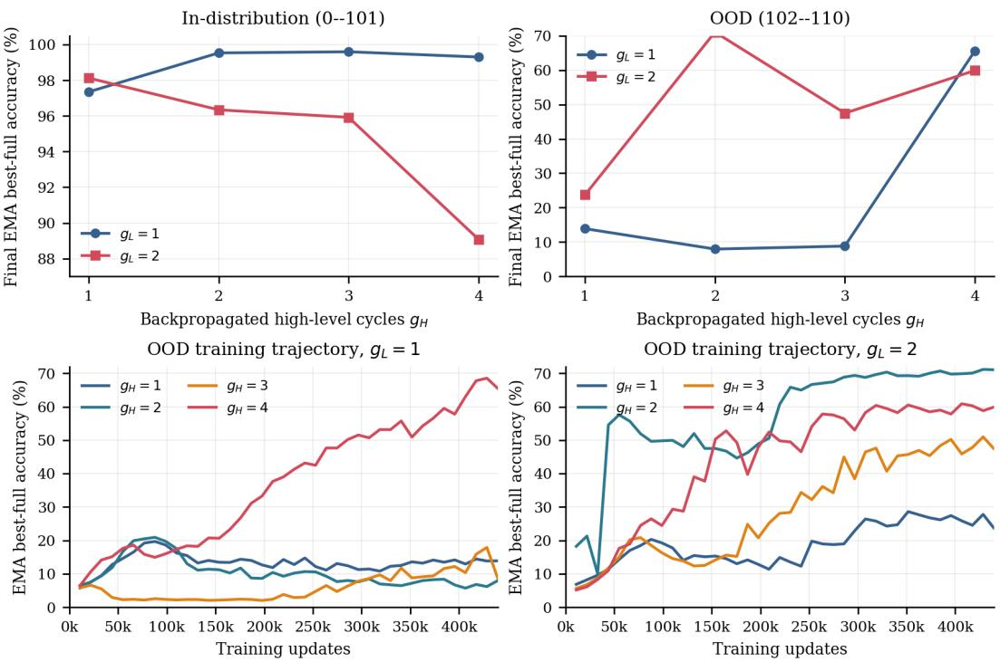  
Figure 7: Effect of the gradient-path length on Arithmetic. Top: final EMA best full exact accuracy as a function of the number of high-level cycles retained in the backward graph, for one or two retained low-level cycles. Bottom: OOD accuracy over training. The selected (2, 2) model obtains the highest final OOD score.

The dense Transformer is much cheaper per answer and is therefore used as a control for recurrence rather than as a compute-matched baseline. On ARC-AGI, the augmentation-and-voting protocol introduces an additional inference cost because each puzzle is evaluated over many transformed versions. General-purpose LLMs are omitted from Table 7, since their inference cost is determined by a different autoregressive computation pattern.

## D GRADIENT-PATH LENGTH ABLATION

Our hierarchical recurrence contains four high-level cycles and two low-level cycles per high-level update. The default implementation truncates backpropagation through this recurrence. We ablate the number of terminal high-level and low-level cycles retained in the backward graph, denoted by $g _ { H } \in \{ 1 , 2 , 3 , 4 \}$ and $g _ { L } \in \{ 1 , 2 \}$ , respectively. This produces a complete $2 \times 4$ set of evaluated settings. The forward recurrence, inference cost, and parameter count are unchanged; the principal architectural difference is the path through which gradients are propagated.

## D.1 SETUP.

All runs use the same 13.65M-parameter Arithmetic model: hidden size 512, four layers in each hierarchy, eight attention heads, four high-level cycles, two low-level cycles, and at most 16 ACT steps. They run for 2000 epochs (439,600 optimizer updates) with global batch size 4096, EMA weights, and seed 125.

Evaluation is performed every 50 epochs on the in-distribution range 0–101 and the extrapolation range 102–201. We report the EMA best full exact score over the full recorded evaluation trajectory.

<table><tr><td>gL</td><td>gH</td><td>Final ID</td><td>Final OOD</td><td>Best OOD</td><td>Best update</td></tr><tr><td>1</td><td>1</td><td>97.35</td><td>13.87</td><td>19.67</td><td>87,920</td></tr><tr><td>1</td><td>2</td><td>99.54</td><td>7.93</td><td>20.91</td><td>87,920</td></tr><tr><td>1</td><td>3</td><td>99.60</td><td>8.80</td><td>17.88</td><td>428,610</td></tr><tr><td>1</td><td>4</td><td>99.31</td><td>65.53</td><td>68.54</td><td>428,610</td></tr><tr><td>2</td><td>1</td><td>98.12</td><td>23.71</td><td>28.61</td><td>351,680</td></tr><tr><td>2</td><td>2</td><td>96.34</td><td>71.16</td><td>71.16</td><td>428,610</td></tr><tr><td>2</td><td>3</td><td>95.92</td><td>47.46</td><td>50.98</td><td>428,610</td></tr><tr><td>2</td><td>4</td><td>89.08</td><td>59.88</td><td>60.88</td><td>406,630</td></tr></table>

Table 8: EMA best full exact accuracy under gradient truncation. Accuracies are percentages. Final values are measured at 439,600 updates. “Best OOD” is the maximum over the 40 recorded checkpoints and uses the OOD split for checkpoint selection.

## D.2 THE SELECTED (2, 2) SETTING BALANCES FITTING AND GENERALIZATION.

The $\left( g _ { L } , g _ { H } \right) = \left( 2 , 2 \right)$ run reaches 71.16% final OOD accuracy and 71.16% at its best checkpoint, the highest values in the comparison, while retaining 96.34% ID accuracy. Its final OOD score exceeds the next-best (1, 4) setting by 2.62 percentage points. In contrast, several shorter paths reach 97.35%–99.60% ID accuracy but remain below 14% OOD, a pattern consistent with fitting in-range regularities without learning an extrapolating procedure. At the other extreme, extending both paths to (2, 4) reduces ID to 89.08% and OOD to 59.88%, indicating that additional backpropagation depth does not translate monotonically into better optimization.

## D.3 AN INTERMEDIATE GRADIENT PATH IS OPTIMAL.

The results expose a three-way trade-off. Paths that are too short provide insufficient long-range credit assignment and favor an ID–OOD generalization gap; paths that are too long can make optimization harder without improving the learned computation. The intermediate (2, 2) configuration provides enough gradient reach to learn the transferable arithmetic procedure while avoiding the degradation observed at the longest setting. It is therefore the best observed balance between indistribution fitting and extrapolative generalization, rather than simply the model with the greatest backward depth.

## E GAME OF LIFE: SINGLE-SEED TRAINING DYNAMICS

This appendix examines one seed of the final Game of Life configuration to illustrate the dynamics of training. It is not used as a seed-averaged result or as an additional model comparison. The evaluation contains an in-distribution (ID) split, four out-of-distribution (OOD) horizon shifts (+1, +2, +3, +10 Game of Life steps), and an OOD split with unseen initial patterns.

Setup. The model has 13.65M parameters, hidden size 512, four layers in each hierarchy, eight attention heads, four high-level cycles, two low-level cycles, and at most 16 ACT steps in the training configuration. Gradients are retained through the last two high- and two low-level cycles. The model uses RoPE, a gated low-level state, stablemax cross-entropy, and dropout 0.1 on embeddings, attention, residual, and feed-forward paths.

Training uses a global batch size of 8192 across a world size of 16, peak learning rate $1 0 ^ { - 4 }$ after 2000 warmup updates, minimum learning-rate ratio 0.1, weight decay 0.1, EMA parameters, and seed 536. The nominal schedule is 2000 epochs, with evaluation and checkpointing every 50 epochs. The scalar history reaches epoch 1999 and includes the complete epoch-2000 evaluation at 367,200 optimizer updates. The job was terminated after this evaluation rather than being registered as completed, so the full planned training trajectory is nevertheless available.

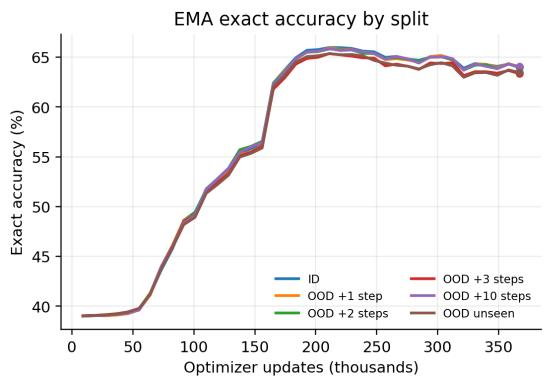

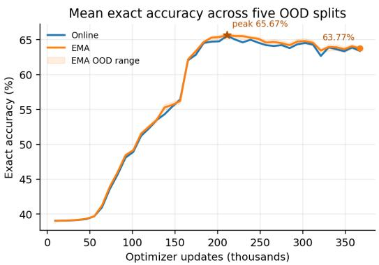

Figure 8: Single-seed Game of Life training trajectory. Left: EMA best full exact accuracy on ID and five OOD splits. Right: the unweighted OOD mean for online and EMA parameters; shading spans the minimum and maximum EMA OOD split. Accuracy peaks at epoch 1150 and declines before the final checkpoint.
<table><tr><td>Split</td><td>Online final</td><td>Online peak</td><td>EMA final</td><td>EMA peak</td><td>EMA token acc.</td><td>Best forced step</td></tr><tr><td>ID</td><td>63.70</td><td>65.99</td><td>64.01</td><td>65.98</td><td>75.81</td><td>63.75 (4)</td></tr><tr><td>OOD +1 step</td><td>63.71</td><td>65.73</td><td>64.04</td><td>65.94</td><td>75.83</td><td>63.79 (4)</td></tr><tr><td>OOD +2 steps</td><td>63.65</td><td>65.73</td><td>63.94</td><td>65.83</td><td>75.92</td><td>63.67 (3)</td></tr><tr><td>OOD +3 steps</td><td>63.02</td><td>65.22</td><td>63.35</td><td>65.37</td><td>75.45</td><td>63.03 (3)</td></tr><tr><td>OOD +10 steps</td><td>63.46</td><td>65.94</td><td>64.04</td><td>65.87</td><td>75.92</td><td>63.76 (4)</td></tr><tr><td>OOD unseen patterns</td><td>63.12</td><td>65.34</td><td>63.46</td><td>65.36</td><td>75.69</td><td>63.12 (5)</td></tr></table>

Table 9: Final and peak validation performance. Values are percentages. Exact columns use the logged best full exact-accuracy series; token accuracy is the EMA accuracy series at the final checkpoint. All EMA peaks occur at 211,140 updates (epoch 1150). “Best forced step” reports the highest single-step exact score at the final checkpoint, followed by its logged ACT step in parentheses.

The best checkpoint occurs well before the end of training. The ID EMA exact score rises from 39.04% at epoch 50 to 48.64% at epoch 500 and 64.94% at epoch 1000. It peaks at 65.98% at epoch 1150, then declines to 64.01% at epoch 2000. The five-split OOD mean follows the same trajectory: 39.02%, 48.44%, 64.67%, a peak of 65.67%, and a final value of 63.77%. Selecting the final checkpoint would therefore understate the best observed ID and OOD results by 1.97 and 1.91 percentage points, respectively.

The measured ID–OOD gap is small. At the best checkpoint, ID exact accuracy is 65.98% and the OOD mean is 65.67%, a difference of 0.31 percentage points; the OOD range is 65.36%–65.94%. At the final checkpoint, the corresponding values are 64.01% and 63.77%, with an OOD range of 63.35%–64.04%. The +3 horizon shift is the hardest final split, while +1 and +10 are marginally above ID. The differences remain small and non-monotonic.

Additional recurrence is not used for progressive refinement. At the final checkpoint, exact accuracy jumps by roughly two points over the first few forced steps. The best single-step result occurs at step 3, 4, or 5 depending on the split, after which performance is flat or drifts slightly downward. This depth profile indicates that the final model produces nearly all of its useful refinement at the start of the recurrent trajectory; the logged continuation to step 24 does not yield a second phase of computation.

Metric scope and limitations. This run is one of the seeds of the final Game of Life configuration and is shown only to characterize training dynamics. Conclusions about final model quality should rely on the seed-aggregated results in the main paper. This single trajectory does not support a causal comparison between architectures or optimization methods.

## F A NEGATIVE RESULT: JOINT TRAINING ACROSS FOUR DOMAINS

We also tested whether a single model could learn Arithmetic, Sudoku, Game of Life, and Maze jointly. To remove domain-specific differences at the input and output interfaces, we converted all

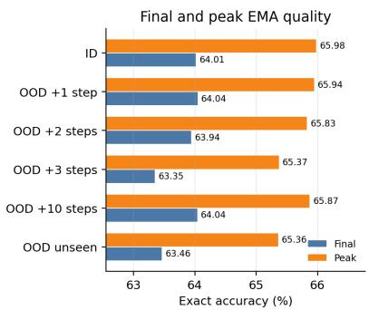

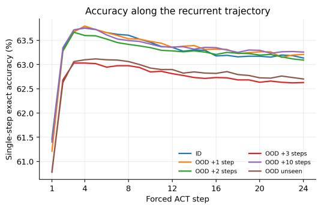  
Figure 9: Final and peak EMA best full quality and recurrent-depth profile. Left: final and peak best full exact accuracy for every evaluation split. Right: EMA single-step exact accuracy at the final complete checkpoint. Most of the single-step gain occurs between forced ACT steps 1 and $2 ;$ all six curves then remain in a narrow band through step 24.

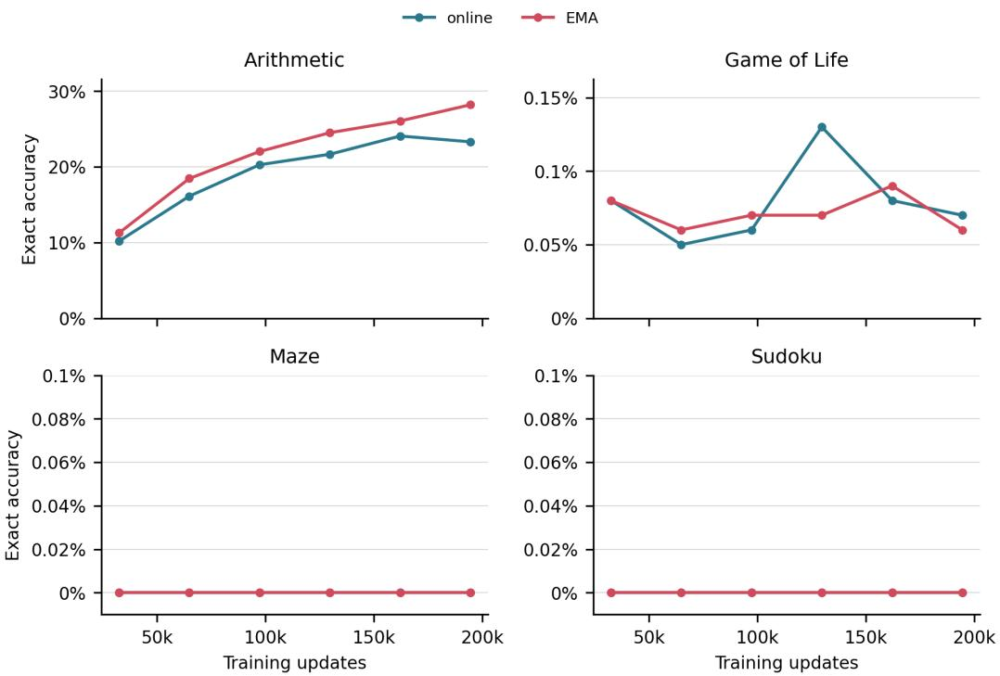  
Figure 10: Exact validation accuracy during joint four-domain training. Online and EMA parameters are evaluated at six checkpoints. Arithmetic improves throughout training, but Game of Life remains below 0.1% exact accuracy and neither Maze nor Sudoku produces a single exact solution. The panels use different vertical scales.  
four datasets to the same binary serialization and used a shared tokenizer. The resulting examples were combined into one training corpus, and no domain-specific parameters or prediction heads were introduced.

Setup. The joint model has 27.3M parameters, hidden size 512, four layers in each hierarchy, eight attention heads, and $H = L = 8$ recurrent cycles. We used a global batch size of 8192, a peak learning rate of $1 0 ^ { - 5 }$ , weight decay of 1.0, a maximum of 16 ACT steps, and an exponential moving average (EMA) of the parameters. The run used seed 125. Although the configured schedule was 2000 epochs, the ClearML task was stopped after epoch 300 (195,093 optimizer updates). We therefore report all six available validation checkpoints, recorded every 50 epochs.

<table><tr><td>Domain</td><td>Final token acc.</td><td>Best exact acc.</td><td>Final exact acc.</td></tr><tr><td>Arithmetic</td><td>63.97</td><td>28.22</td><td>28.22</td></tr><tr><td>Game of Life</td><td>51.68</td><td>0.09</td><td>0.06</td></tr><tr><td>Maze</td><td>87.50</td><td>0.00</td><td>0.00</td></tr><tr><td>Sudoku</td><td>20.21</td><td>0.00</td><td>0.00</td></tr></table>

Table 10: EMA validation metrics for joint training. Values are percentages. “Best” is selected over the six checkpoints; final metrics are measured at 194,562 updates. Token accuracy can be high even when the full structured output is always incorrect.

Outcome. The shared model learns only a partial Arithmetic solver. Arithmetic EMA exact accuracy increases from 11.27% at the first checkpoint to 28.22% at the last. In contrast, Game-of-Life exact accuracy fluctuates between 0.06% and 0.09% for the EMA model, while Maze and Sudoku remain exactly zero at every checkpoint. The discrepancy between token and exact accuracy is especially pronounced for Maze: the final token accuracy is 87.50%, yet none of the complete predicted paths is correct. Thus the token-level loss can improve by matching many local symbols without learning the global constraints required for a valid solution.

Interpretation and limitations. Unifying the representation is therefore not sufficient, within the observed compute budget, to obtain a useful universal solver. The result is consistent with severe cross-domain optimization interference or with the joint objective being dominated by easy tokenlevel regularities. This run does not distinguish these explanations from data-mixture imbalance, insufficient model capacity, or an inadequate optimization schedule. Moreover, the task was stopped before its nominal 2000-epoch schedule and was run with a single seed; no error is present in the recorded log that would identify why it was stopped. We consequently treat this experiment as a negative diagnostic result rather than evidence that multitask training is intrinsically ineffective, and we use separately trained domain models in the main experiments.