# WHEN INSTRUCTIONS RETRIEVE TRAJECTORIES: DIAGNOSING AND MITIGATING GENERALIZATION FAILURES IN VLA MODELS

Hung-Jen Chen1 Yu-Hsun Hou1,∗ Yan-Hong Chen1,∗ Yan-Fu Chen1,∗ Binghua Cai1 Min Sun1 Chun-Yi Lee2

1National Tsing Hua University 2National Taiwan University andyqmongo@gapp.nthu.edu.tw

## ABSTRACT

Vision-language-action (VLA) models can exceed 90% success on in-distribution tasks and withstand nuisance changes that preserve the required action, yet fail under counterfactual changes that demand a different action. Aggregate robustness scores can therefore conceal a more specific failure, in which a policy responds to both language and vision yet does not combine them to select the action the task requires. We call this failure instruction-action binding. Instructions cue familiar trajectory families, and visual feedback adjusts their execution. Behavioral analyses of fine-tuned π0.5 and GR00T-N1.7 policies reveal that failed rollouts often retain the source behavior or switch to another demonstrated task. These switches show that language is not simply ignored. Readouts and interventions connect these choices to task-conditioned internal states. Our analysis of the imitation objective shows how narrow conditional action support can leave grounded and instruction-keyed solutions indistinguishable on the demonstrations. This motivates Equivariant Counterfactual Training (ECT), which acts at two levels. ECT data supply valid demonstrations in which the same instruction requires different actions in distinguishable scenes, while the ECT loss trains each demonstration with its counterpart in the same update. In a controlled LIBERO-PRO comparison, full ECT raises $\pi _ { 0 . 5 } \mathrm { ^ { 5 } s }$ mean position-swap success from 36% to 59%. On CALVIN, where counterparts already occur in the original data, the ECT loss improves five-task completion without new demonstrations. On a real UR5e under a fixed demonstration budget, full ECT raises unseen-position success from 8% to 88%.

## 1 INTRODUCTION

A robot can execute a fluent manipulation and still follow the wrong instruction. Asked to put a plate on the cabinet rather than a bowl, a fine-tuned π0.5 policy can complete the familiar bowl placement instead, with a clean grasp and a trajectory resembling its demonstrations (Fig. 1). Yet the same policy remains successful under many changes in wording and appearance. For vision-language-action (VLA) models (Zitkovich et al., 2023; Intelligence et al., 2025; Kim et al., 2024; O’Neill et al., 2024), this raises a basic question. Does success under a changed input demonstrate that the policy can select a different action?

The distinction is whether the perturbation changes the action required for success. A paraphrase or an appearance change can leave a familiar behavior valid, whereas exchanging object positions or changing the requested goal may not. We call these nuisance and counterfactual perturbations, respectively. On the four LIBERO-PRO suites (Zhou et al., 2025), both $\pi _ { 0 . 5 }$ and GR00T-N1.7 perform markedly worse on counterfactual cells. Reporting the two separately reveals whether the policy adapts its action selection to the current instruction–scene combination.

The failures reveal a more specific problem than ignoring language or vision. Across 381 targeted π probes, 69% of rollouts follow the source task’s behavior, another demonstrated task, or a hybrid, while only 4% collapse without a coherent trajectory. We call this instruction-action binding. The instruction selects a familiar trajectory family, and visual feedback still adapts that family’s execution. A policy can therefore remain responsive to both modalities yet fail to use the current instruction and scene together to choose the required action. The pattern also appears in GR00T-N1.7. Scene-matched readouts recover the executed task from π ’s internal state, and interventions redirect action selection in both architectures (Section 4).

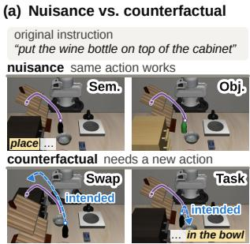

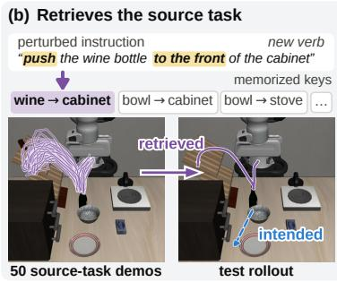

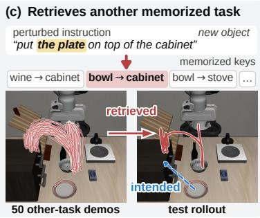  
Figure 1: Perturbed instructions retrieve memorized trajectories. One LIBERO-Goal task throughout; dashed blue: intended trajectory, purple: the source task’s memorized trajectory, red: another memorized task’s. (a) Nuisance perturbations keep the memorized trajectory valid; counterfactual ones need a new one (Sem.: rephrasing, Obj.: new appearance, Swap: swapped positions, Task: new target). (b) Under a new verb, π retrieves the source task. (c) Under a new object, it retrieves another memorized task: the instruction selects which trajectory to replay. Of 381 labeled rollouts, 52% replay the source task and 15% another task (Table 10).

Why can this behavior fit the training data? In the task-specific demonstrations we study, an instruction is associated with a narrow trajectory family. An instruction-keyed solution can therefore fit the supervision without learning how the required action changes across scenes, an instance of underspecification (Geirhos et al., 2020; D’Amour et al., 2022). In our fixed-step sweep from 25% to 100% of the original data, every Swap and Task cell remains at least 34 points below in-distribution success (Table 25). The missing distinction is in conditional action support, where different scenes require different actions under the same instruction.

These observations and our analysis of the imitation objective suggest a training principle. Under a fixed instruction, supervision should include distinguishable scenes that require different actions, because otherwise an instruction-keyed solution remains sufficient. Equivariant Counterfactual Training (ECT) applies this principle at two levels. ECT data add the missing scene-dependent action alternatives to the supervision, and the ECT loss uses them in optimization by training each demonstration with its counterpart in the same update. The LIBERO construction builds on actionvalid geometric augmentation (Ameperosa et al., 2025), guided by the scene-dependent choices missing from the original supervision. We evaluate the two components separately. At matched batch size, the ECT data account for most of the Swap gain on every LIBERO-PRO suite, and the ECT loss adds a further 2 to 5 points on Spatial, Goal, and Long over independent sampling of the same pool (Table 3), while retaining the standard per-example imitation loss.

ECT applies to constructed LIBERO counterfactuals, naturally occurring CALVIN alternatives (Mees et al., 2022), and physical UR5e demonstrations. On CALVIN, the ECT loss exploits counterparts within the original demonstrations, raising five-task completion from 58% to 76%. On the robot, unseen-position success rises from 3/40 to 35/40 with 400 demonstrations per main model. These settings connect ECT to constructing missing action alternatives, exploiting existing ones, and collecting them under a fixed budget.

Our central scientific contribution is the diagnosis of instruction-action binding and the supervision principle it reveals. ECT operationalizes this principle through ECT data and the ECT loss. Our contributions are threefold. (i) We identify instruction-action binding in two VLA architectures, showing with behavioral probes and internal-state interventions that language sensitivity and visual tracking can coexist with incorrect task-level action selection. (ii) We explain how narrow conditional action support permits instruction-keyed solutions under flow matching, which motivates sameinstruction alternatives that require different actions and are distinguishable from the scene. (iii) We introduce ECT data and the ECT loss, evaluate them separately in controlled comparisons, and validate ECT with constructed LIBERO counterparts, naturally occurring CALVIN counterparts, and physical UR5e demonstrations.

## 2 A FRAMEWORK FOR INSTRUCTION-ACTION BINDING

Let D contain demonstrations $( s _ { i } , \ell _ { i } , a _ { i } )$ , where $s _ { i }$ is the observation, $\ell _ { i }$ the instruction, and $a _ { i }$ the expert action trajectory. In the LIBERO fine-tuning setting (Liu et al., 2023), demonstrations under the same instruction usually follow a narrow trajectory family.

Conditional entropy $H ( T \mid x )$ measures how much uncertainty about task T remains after observing cue $x .$ In the training data, the instruction usually identifies the task; outside Goal, the scene layout does too:

$$
H ( T \mid \ell ) \approx 0 , \qquad H ( T \mid s ) \approx 0 .\tag{1}
$$

Near-zero entropy means the cue usually identifies the familiar task. With narrow within-task trajectory families, this permits selecting a familiar behavior without resolving scene-dependent action changes. Goal’s ten tasks share a scene, yet changed instructions can elicit other familiar behaviors that do not satisfy the request (Section 3.1), motivating the instruction-keyed model below.

A grounded policy resolves the instruction’s referent $r ( \ell )$ in the scene through $g ( s , r ( \ell ) )$ ),

$$
\pi _ { \operatorname { g r o u n d } } ( a \mid s , \ell ) = \pi \left( a \mid g ( s , r ( \ell ) ) \right) .\tag{2}
$$

It changes its task-level action when the grounded requirement changes (Shao et al., 2021; Jang et al., 2022; Zitkovich et al., 2023; Kim et al., 2024). In contrast, an idealized instruction-keyed lookup selects among demonstrated trajectory families according to

$$
\pi _ { \mathrm { l o o k u p } } ( a \mid s , \ell ) = \pi ( a \mid k ( \ell ) ) , \qquad k ( \ell ) = \arg \operatorname* { m i n } _ { j } d _ { \ell } \left( f _ { \ell } ( \ell ) , f _ { \ell } ( \ell _ { j } ) \right) ,\tag{3}
$$

where $f _ { \ell }$ maps instructions to representations, $d _ { \ell }$ measures their distance, and $k ( \ell )$ identifies the nearest demonstrated instruction. Actual task-conditioned states depend on vision and language (Huang et al., 2025; Häon et al., 2025). Under binding, local visual feedback can remain active even when the selected trajectory family does not satisfy the current instruction and scene.

## 2.1 CONDITIONAL ACTION SUPPORT

Write $\operatorname { s u p p } _ { \mathcal { D } } ( A \mid \ell )$ for the expert trajectories represented under instruction $\ell .$ More demonstrations can increase sample count without adding a different action family. Wherever grounded and instruction-keyed solutions both fit the demonstrations, such supervision leaves them indistinguishable (D’Amour et al., 2022). For flow matching, let $a _ { 0 }$ denote noise and $a _ { t } = ( 1 - t ) a _ { 0 } + t a$ the interpolated action at time t. The squared imitation loss has the population-optimal velocity

$$
v ^ { * } ( a _ { t } , t \mid s , \ell ) = \mathbb { E } [ a - a _ { 0 } \mid a _ { t } , t , s , \ell ] .
$$

If the instruction key nearly determines the demonstrated trajectory, the conditional target changes little when $( s , \ell )$ is replaced by $k ( \ell )$ . An instruction-keyed field can therefore fit the supervision without resolving the current scene. Both $\pi _ { 0 . 5 }$ and GR00T-N1.7 use flow matching. Appendix C gives the derivation under the stated data condition.

ECT supplies valid alternatives $( s , \ell , a )$ and $( s ^ { \prime } , \ell , a ^ { \prime } )$ under a fixed instruction, with observations that distinguish which action is required. The purpose is scene-dependent action choice rather than arbitrary trajectory variation. An instruction-only model may represent multiple action modes, but cannot select between different scene-conditioned expert distributions using the instruction alone. The alternatives provide supervision for this selection.

Perturbation cells. A perturbation from $( s , \ell )$ to $( s ^ { \prime } , \ell ^ { \prime } )$ can change the selected trajectory family, the action required for success, or both. Let $\boldsymbol { \dot { a } } ^ { * } ( s , \dot { \ell } )$ denote the task-relevant action requirement, including the target, goal, and their spatial realization, while abstracting from incidental execution variation. Using the instruction-keyed model in Eq. (3), we distinguish

$$
\Delta _ { k } = { \bf 1 } [ k ( \ell ^ { \prime } ) \neq k ( \ell ) ] , \qquad \Delta _ { a } = { \bf 1 } [ a ^ { * } ( s ^ { \prime } , \ell ^ { \prime } ) \neq a ^ { * } ( s , \ell ) ] .\tag{4}
$$

Table 1: Nuisance and counterfactual cells under the binding model. $\Delta _ { k }$ describes a change in the selected instruction key and $\Delta _ { a }$ a change in the required action (Eq. (4)). The Semantic row represents key-preserving paraphrases. A Task change can retain or switch the key.
<table><tr><td>Cell</td><td> $\Delta _ { k }$ </td><td> $\Delta _ { a }$ </td><td>Type</td><td>Binding pattern</td></tr><tr><td>Semantic (Sem.)</td><td>0</td><td>0</td><td>Nuisance</td><td>familiar action remains valid</td></tr><tr><td>Object (Obj.)</td><td>0</td><td>0</td><td>Nuisance</td><td>familiar action can remain valid</td></tr><tr><td>Swap</td><td>0</td><td>1</td><td>Counterfactual</td><td>same key, different required action</td></tr><tr><td>Task</td><td>0 or 1</td><td>1</td><td>Counterfactual</td><td>source retention or other-task retrieval</td></tr></table>

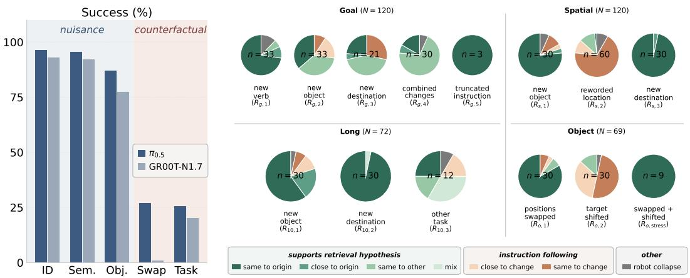  
Figure 2: Counterfactual failure is often coherent rather than unstructured. Left. Officialcheckpoint success on LIBERO-PRO separates nuisance and counterfactual cells. Right. Each pie shows the behavioral labels for one perturbation type (see Table 8 for label definitions). Across all 381 targeted $\pi _ { 0 . 5 }$ probes, 69% are retrieval-like and 4% are unstructured collapse.

The two indicators separate what the policy selects from what the task requires. Nuisance changes preserve the action requirement, giving $\Delta _ { a } = 0 ;$ , whereas counterfactual changes give $\Delta _ { a } = 1$ In this model, a Swap preserves the instruction key but changes the required action. A changed instruction can either retain the source key $( \Delta _ { k } = 0 )$ or select another familiar task $( \Delta _ { k } = 1 )$ . This distinction connects the source-task and other-task retrievals in Fig. 7 without treating a key change as correct task following. Table 1 summarizes these cases. We also report in-distribution success (ID). Environment is omitted because its assets are unavailable (Appendix B).

## 2.2 TESTABLE IMPLICATIONS

Binding suggests that (i) nuisance performance can remain high while (ii) counterfactual changes expose a larger gap. It also suggests (iii) failures resembling familiar demonstrated behaviors and (iv) retained local tracking after incorrect target selection (Section 3). We further test (v) whether task-conditioned states influence action selection (Section 4.1) and (vi) whether scene-dependent action alternatives help where additional repetitions do not (Section 5). Section 5 separately evaluates the contributions of ECT data and ECT loss.

## 3 COUNTERFACTUAL FAILURES FOLLOW FAMILIAR BEHAVIORS

We evaluate the official $\pi _ { 0 . 5 }$ and GR00T-N1.7 checkpoints on LIBERO-PRO Spatial, Object, Goal, and Long (LIBERO-10). Every cell uses the instruction-delivery correction in Appendix B. On both architectures, each nuisance cell exceeds each counterfactual cell within every suite, and Swap and Task are at least 42 points below ID (Fig. 2, left, and Table 7). The pattern is therefore not unique to either of the evaluated architectures.

## 3.1 SELECTING A FAMILIAR BEHAVIOR, THEN TRACKING ITS TARGET

Success rates identify where a policy fails, but not what it does instead. We construct targeted perturbations (rules $R _ { \mathrm { s u i t e } , n }$ in Table 13) and compare each rollout with the original behavior, the requested behavior, and other demonstrated tasks (Fig. 2, right, and Table 8). Of 381 $\pi _ { 0 . 5 }$ rollouts, 69% follow a familiar behavior and 27% follow or approximately follow the changed requirement. We call such rollouts retrieval-like, a label for the observed match to a demonstrated behavior rather than a claim about the underlying mechanism. A second annotator independently labels 117 probes. Agreement on the retrieval-like distinction is $\kappa = 0 . 7 8$ (Appendix D). Excluding the two rules where familiar behavior can remain valid, a 10 cm target shift $( R _ { o , 2 } )$ and reworded location clauses $( R _ { s , 2 } )$ leaves a retrieval-like share of 87% across 291 probes.

The same 381 probes yield 73% retrieval-like behavior and 14% correct or near-correct following for GR00T-N1.7 (Table 15). On Goal, $\pi _ { 0 . 5 }$ often executes another demonstrated task. On Long, it usually retains the source behavior, with occasional sub-trajectory hybrids (Fig. 8). A nearest-trajectory check agrees with the human label on 88% of usable Goal retrieval cases (Table 11).

The Object probes separate target selection from tracking. Swapping object positions under the original instruction $( R _ { o , 1 } )$ often preserves the source-bound choice, whereas shifting the target by 10 cm $( R _ { o , 2 } )$ is followed visually. In all nine combined swapped-and-shifted probes, the policy tracks the displaced object occupying the source-bound slot, rather than the object named by the instruction. Thus these failures are neither fixed-coordinate replay nor a complete loss of visual feedback. The policy adjusts execution while retaining the wrong task-level choice.

## 4 TASK-CONDITIONED STATES INFLUENCE ACTION SELECTION

The other-task retrievals raise a question beyond sensitivity to language. When an instruction elicits the wrong familiar behavior, is that behavior encoded at the action interface? We test this with scene matched readouts and interventions. Appendix E gives the full readout and intervention protocols, robustness checks, and controls.

## 4.1 READOUT AND INTERVENTION ON TASK-CONDITIONED STATES

For a fixed set of 45 Goal rollouts labeled same\_to\_other, we construct ten candidate prefixes from the same source observation and each task’s instruction. We rank candidates by cosine distance in the final-layer prefix key–value (KV) representation read by $\pi _ { 0 . 5 } \mathrm { ^ { \circ } s }$ action tokens. The executed task ranks first in 34/45 cases and in the top three in 43/45 (Fig. 9). A text-only TF-IDF comparison ranks it first in 22/45. Holding the observation fixed makes this a readout of instruction-dependen task selection, with information beyond surface-word similarity.

Replacing the state redirects the arm. Readout is correlational, so we also intervene during closed-loop rollouts. At every policy call, we replace the prefix-KV cache with one computed from the target task’s initial observation and instruction. Matched controls retain the source cache. The source scene, instruction, and policy are fixed. We enumerate all 50 ordered Object-suite task pairs whose target object is present in the source scene before evaluation, with four rollouts per condition. Under injection, $\pi _ { 0 . 5 }$ ends nearer the target task’s object in 109/200 rollouts, versus 0/200 controls. All 50 pairs shift more toward the target than their matched controls. Source-task completion fall from 200/200 to zero (Table 18).

For GR00T-N1.7, we replace the backbone feature sequence read by the action head. Under the same protocol, 121/200 rollouts end nearer the target object, versus none of the controls. Source-task completion again falls from 200/200 to zero. Neither architecture completes the injected target task. The intervention changes the task-conditioned state, including its visual content, and removes access to a live representation. The measured effect is target-directed motion.

A complementary single-call intervention holds the observation fixed and substitutes each candidate instruction’s final-layer cache for the 45 Goal queries. The patch-induced action displacement aligns more with the patched task’s expert trajectory than with other tasks (cosine 0.44 versus 0.18 in Table 17). The readouts link the executed task to the action interface, and interventions show that changing this state redirects behavior. Together with the probes in Section 3.1, they distinguish language sensitivity from selecting the action the task requires.

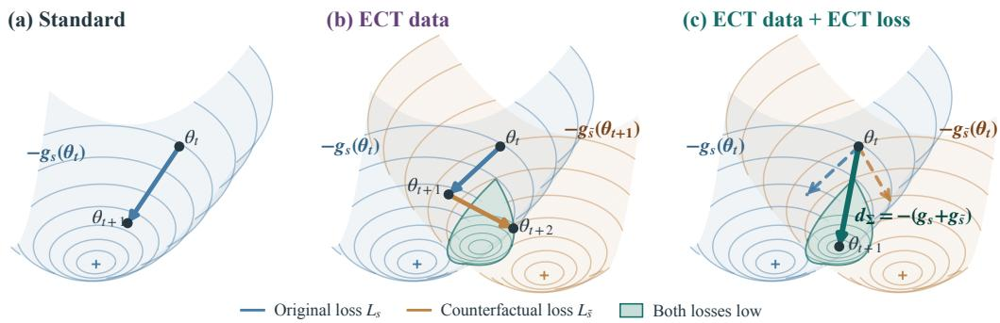  
Figure 3: Intuition for ECT data and ECT loss. Contours show the original and counterfactual losses. Shading marks a region where both are low. (a) Standard training uses only original demonstrations. (b) ECT data supply alternative supervision. The depicted independent-sampling sequence processes counterparts in separate updates. Independent batches can also contain both branches without matching counterparts. (c) The ECT loss evaluates matched counterparts at the same parameters and combines their gradients in one update. The paths show one illustrative geometry.

## 5 EQUIVARIANT COUNTERFACTUAL TRAINING

The diagnosis suggests a direct intervention. The instruction should be insufficient for choosing the action unless the policy also resolves the current scene. ECT data supply valid action alternatives under the same instruction, with scene differences that identify the appropriate action, and the ECT loss combines the imitation losses of corresponding alternatives in each update.

## 5.1 METHOD

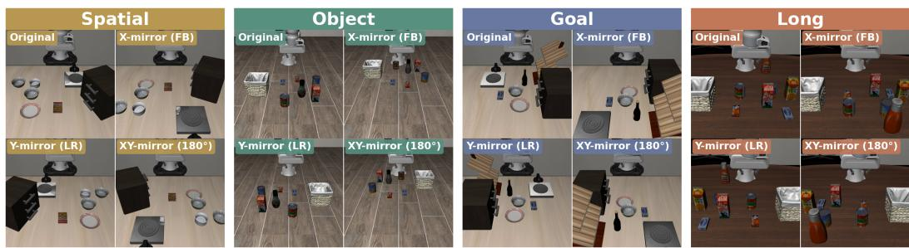  
Figure 4: ECT scene constructions across the four LIBERO suites. Each group shows an original scene and three mirrored versions under the same instruction. The training construction also uses shifts on Object and selected Long tasks. Table 20 gives the transform families.

Action-valid counterfactuals. We represent a pair as the five-tuple

$$
e = ( \ell , s , s ^ { \prime } , a , a ^ { \prime } ) , \qquad ( s , \ell , a ) \mathrm { a n d } ( s ^ { \prime } , \ell , a ^ { \prime } ) \mathrm { a r e v a l i d d e m o n s t r a t i o n s } .\tag{5}
$$

The changed scene must require a different action under the same instruction, and the observations must distinguish the alternatives. In LIBERO, we construct the second demonstration by transforming and replaying the first (Fig. 4),

$$
( s ^ { \prime } , \ell , a ^ { \prime } ) = { \mathcal { T } } _ { \mathrm { E C T } } ( s , \ell , a ) , \qquad s ^ { \prime } = M _ { s } ( s ) , \quad a ^ { \prime } = \mathrm { R e p l a y } _ { s ^ { \prime } } ( M _ { a } ( a ) ) .\tag{6}
$$

Here, $M _ { s }$ changes the scene geometry and $M _ { a }$ transforms the corresponding end-effector path. A replay controller executes the transformed path, records the resulting action, and retains successful demonstrations. This makes the second branch action-valid in the transformed scene rather than assuming equivariance of raw action commands. Appendix F.1 details the construction.

What makes a useful counterfactual. Standard LIBERO supervision can make the instruction sufficient for selecting a familiar action even though the policy also observes the scene. ECT breaks this shortcut by holding ℓ fixed while making the correct action depend on the scene. Our first Object construction showed that this alone is not enough. Mirroring each scene front to back changes the required action but leaves the dominant landmarks in similar image regions, and ID success fell from 94% to 24% in per-suite diagnostic runs (Fig. 5 and Table 19). The binding account explains the failure. When s and $s ^ { \prime }$ are visually indistinguishable while the required actions differ, the pair removes the instruction-only solution without giving the policy a scene cue for selecting the correct branch. A useful pair therefore needs both $a \neq a ^ { \prime }$ and observations that reveal which action is appropriate. ECT makes the instruction insufficient while keeping the scene sufficient for the choice.

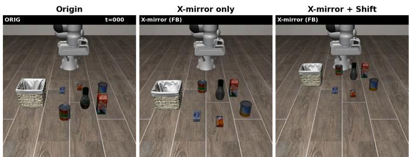  
Figure 5: Useful counterfactuals must reveal the required action. On Object, front-back mirroring changes the required action but leaves dominant landmarks in similar image regions. An added shift separates the branches visually. Table 19 reports performance by transformation.

A left-right mirror or added shift restores nominal competence by separating relevant landmarks in image space (Appendix F.1). Spatial and Goal use mirrors directly, while Object and selected Long tasks add shifts when needed. The front-back failure shows that action-changing diversity alone is insufficient. The scene must make the required action change identifiable.

The counterfactuals are built offline from training demonstrations, independently of LIBERO-PRO evaluation. Appendix F.2 compares their layouts with Swap states. The construction is one way to obtain the five-tuple in Eq. (5). CALVIN supplies naturally occurring alternatives, and the UR5e study obtains them through physical demonstrations in different layouts. The paired procedure below applies to all three sources.

ECT loss. Let E be the collection of action-valid counterpart pairs. Standard training uses the original demonstrations, while the ECT data baseline samples individual demonstrations independently from the enlarged training set. To optimize the ECT loss, we instead sample matched pairs from $\mathcal { E }$ and sum the imitation losses of both counterparts in each update,

$$
\begin{array} { r } { \mathcal { L } _ { \mathrm { E C T } } ( \theta ) = \mathbb { E } _ { e \sim \mathcal { E } } [ L _ { \theta } ( s , \ell , a ) + L _ { \theta } ( s ^ { \prime } , \ell , a ^ { \prime } ) ] , } \end{array}\tag{7}
$$

where $L _ { \theta }$ is the standard per-example imitation loss, so the ECT loss adds no auxiliary objective. Each pair holds the instruction fixed while changing the scene and required action, and both counterparts contribute to the same parameter update. In our $\pi _ { 0 . 5 }$ implementation, the two halves share the flowmatching noise sample and flow time. Table 3 compares the ECT loss with independent sampling of the same demonstration pool. Fig. 3 illustrates the update construction, and Appendix F.1 gives implementation details. ECT data + ECT loss denotes the full method.

## 5.2 CROSS-ARCHITECTURE RESULTS

In the controlled $\pi _ { 0 . 5 }$ comparison, ECT raises mean Swap success from 36% to 59% and mean Task success from 21% to 28% (Table 2). Both models use the Frozen-LM recipe, training the vision encoder and action expert with a fixed language model, matched steps, and matched batch size. Table 2 also reports full-fine-tuning and GR00T comparisons against official checkpoints, with their comparison conditions specified in the caption and Appendix G.2.

The benefits extend beyond the spatial changes directly constructed during training. For example, Frozen-LM $\pi _ { 0 . 5 }$ improves Goal Task by 15 points, while Full FT improves Object Task by 17 points. On the 381 behavioral probes, the ECT model follows or approximately follows the changed requirement in 48% of rollouts, versus 27% for the official $\pi _ { 0 . 5 }$ , and retrieval-like behavior falls from 69% to 47% (Table 15). The observed gain includes a shift away from familiar but incorrect behaviors. Here, the official Full-FT model is compared with Frozen-LM ECT, so data, paired training, and the fine-tuning recipe change together.

Table 2: ECT counterfactual performance across architectures. Success (%). Frozen-LM controls match steps, batch size, and trainable parameters. Full-FT and GR00T use official checkpoints, not matched retrained controls. GR00T ECT models use the ECT data with the standard loss, and four-suite training changes scope (Appendix G.2). Parentheses give percentage-point gains over Standard (Frozen LM) or the official checkpoint (other blocks). ECT rows are shaded. Frozen-LM rows average three seeds, and other rows are single models.
<table><tr><td></td><td colspan="2">Spatial</td><td colspan="2">Object</td><td colspan="2">Goal</td><td colspan="2">Long</td></tr><tr><td>Model</td><td>Swap</td><td>Task</td><td>Swap</td><td>Task</td><td>Swap</td><td>Task</td><td>Swap</td><td>Task</td></tr><tr><td colspan="9">π0.5 Frozen LM (vision encoder and action expert trained)</td></tr><tr><td>Standard</td><td>52.7</td><td>22.3</td><td>38.3</td><td>23.0</td><td>41.3</td><td>20.6</td><td>12.7</td><td>19.5</td></tr><tr><td>ECT data + ECT loss 74.4 (+21.7) 22.1 (−0.2)</td><td></td><td></td><td>70.8 (+32.5)</td><td>31.3 (+8.3)</td><td>55.5 (+14.2)</td><td>35.7 (+15.1)</td><td></td><td>34.7 (+22.0) 22.5 (+3.0)</td></tr><tr><td colspan="9">π0.5 Full FT (all parameters trained)</td></tr><tr><td>Official π0.5</td><td>46.6</td><td>53.0</td><td>18.2</td><td>11.0</td><td>34.2</td><td>21.2</td><td>9.4</td><td>17.0</td></tr><tr><td>ECT data + ECT loss 72.8 (+26.2) 53.2 (+0.2)</td><td></td><td></td><td></td><td>40.8 (+22.6) 28.4 (+17.4)</td><td>35.8 (+1.6)</td><td>26.6 (+5.4)</td><td></td><td>26.6 (+17.2) 26.6 (+9.6)</td></tr><tr><td colspan="9">GR00T-N1.7</td></tr><tr><td>Official (per suite)</td><td>1.2</td><td>51.4</td><td>0.0</td><td>9.0</td><td>2.2</td><td>10.0</td><td>0.2</td><td>10.2</td></tr><tr><td>ECT data, per suite</td><td></td><td>17.8 (+16.6) 53.0 (+1.6)</td><td>0.0 (0.0)</td><td>10.0 (+1.0)</td><td>16.2 (+14.0)</td><td>10.0 (0.0)</td><td>9.6 (+9.4)</td><td>10.4 (+0.2)</td></tr><tr><td>ECT data, four suites</td><td>38.2 (+37.0)</td><td>)64.0 (+12.6)</td><td>7.0 (+7.0)</td><td>10.2 (+1.2)</td><td>17.4 (+15.2)</td><td>10.6 (+0.6)</td><td></td><td>16.2 (+16.0) 13.2 (+3.0)</td></tr></table>

Adaptation also depends on the requested distinction. For new Spatial destinations, erroneous completion of the original placement falls from 29/30 to 3/30, while both models still pick the bowl after an object-name change (Appendix D.4). The training data vary where destinations occur but keep the bowl in every Spatial instruction. This selectivity is consistent with the supervision account. ECT improves distinctions exposed by the added alternatives, but does not create distinctions that remain absent from the training data. This suggests collecting alternatives that expose the particular object, goal, or relation a policy must distinguish.

ECT data and ECT loss are complementary. ECT data create missing scene-dependent alternatives, while the ECT loss makes their correspondence explicit during training. Although the data component accounts for most of the LIBERO Swap gain, the ECT loss adds a further 2 to 5 points on Spatial, Goal, and Long (Table 3). On CALVIN, where counterparts already exist in the original data, the ECT loss alone raises five-task completion by 18 points (Table 4).

## 5.3 BEYOND LIBERO, AND BEYOND MORE DATA

Physical demonstrations under a fixed budget. The UR5e study allocates 400 demonstrations either to repetitions in one layout or to four layouts that require different reaches under the same instruction. Appendix H.1 details the robot setup, with training layouts and evaluation conditions illustrated in Fig. 13. On unseen positions, Standard succeeds in 3/40 trials, ECT data in 30/40, and the paired method in 35/40, while ID success remains high (Table 4). These positions occur in none of the training layouts. Prior work shows the value of environment and object diversity over repeated demonstrations (Lin et al., 2025). Here, under the same fixed budget, we specifically vary scenes so that the same instruction requires different actions, with an additional benefit from paired training.

ECT loss on existing demonstrations. CALVIN ABC→D tests the ECT loss without generating data. Its original demonstrations already contain the same instructions in different scenes that require different actions. The ECT loss alone raises $\pi _ { 0 . 5 } \mathrm { ^ { \circ } s }$ five-task completion from 58% to 76%, without constructing additional demonstrations. Constructed data also improve over Standard, and the ECT loss adds to that result. Natural pairs perform best under the reported budget. Appendix H.2 describes the construction, evaluation, and data-coverage budgets for these single-seed comparisons.

Repetition does not substitute for the missing alternatives. At fixed 30k steps, increasing the original LIBERO demonstrations from 25% to 100% leaves every Swap and Task cell at least 34 points below ID (Table 25). Standard RL post-training also preserves much of ECT’s advantage (Appendix G.5). Together with CALVIN and the fixed-budget robot study, these results separate scene-dependent action alternatives from demonstration count alone.

Table 3: ECT data and ECT loss make distinct contributions. Swap success (%). All rows use Frozen-LM training with matched steps and batch size (64 examples per update). Each row averages three training seeds (Appendix G.3). Pairing draws its pairs from the same pool as ECT data. Full five-cell results are in Table 23. ECT rows are shaded, with the best result per column in bold.
<table><tr><td></td><td>Spatial</td><td>Object</td><td>Goal</td><td>Long</td></tr><tr><td>Standard</td><td>52.7</td><td>38.3</td><td>41.3</td><td>12.7</td></tr><tr><td>ECT data</td><td>72.1</td><td>71.1</td><td>51.8</td><td>29.5</td></tr><tr><td>ECT data + ECT loss</td><td>74.4</td><td>70.8</td><td>55.5</td><td>34.7</td></tr><tr><td>∆data (ECT data — Standard)</td><td>+19.4</td><td>+32.8</td><td>+10.5</td><td>+16.8</td></tr><tr><td>∆loss (ECT data + ECT loss − ECT data)</td><td>+2.3</td><td>-0.3</td><td>+3.7</td><td>+5.2</td></tr></table>

Table 4: ECT beyond LIBERO. The top block reports real-robot UR5e results with 400 demonstrations per main model. The ECT variants differ in paired training. †Swap uses companion models excluding the overlapping training layout (Appendix H.1). The bottom block reports $\pi _ { 0 . 5 }$ on CALVIN ABC→D (Appendix H.2) with one training seed per row and 1,000 evaluation sequences. LH-k is the rate of completing k tasks in a row. ECT rows are shaded, with the best result per column in bold.
<table><tr><td>UR5e (real robot)</td><td></td><td colspan="2">nuisance</td><td colspan="3">counterfactual</td></tr><tr><td></td><td>ID</td><td>Paraphrase</td><td>Attribute</td><td>Unseen pos.</td><td>Unseen obj. + pos.</td><td>Swap</td></tr><tr><td>Standard</td><td>40/40</td><td>19/20</td><td>9/10</td><td>3/40</td><td>0/10</td><td>4/20</td></tr><tr><td>ECT data</td><td>37/40</td><td>20/20</td><td>9/10</td><td>30/40</td><td>8/10</td><td>12/14†</td></tr><tr><td>ECT data + ECT loss</td><td>37/40</td><td>20/20</td><td>10/10</td><td>35/40</td><td>8/10</td><td>20/20†</td></tr><tr><td>CALVIN ABC→D</td><td></td><td></td><td></td><td></td><td></td><td></td></tr><tr><td></td><td>LH-1</td><td>LH-3</td><td>LH-5</td><td>Avg. len.</td><td></td><td></td></tr><tr><td>Standard</td><td>89.2</td><td>72.2</td><td>57.6</td><td>3.63</td><td></td><td></td></tr><tr><td>Original data + ECT loss</td><td>95.2</td><td>85.5</td><td>75.6 65.7</td><td>4.28 3.98</td><td></td><td></td></tr><tr><td>ECT data</td><td>94.2</td><td>79.2</td><td></td><td></td><td></td><td></td></tr><tr><td>ECT data + ECT loss</td><td>96.5</td><td>84.3</td><td>70.6</td><td>4.21</td><td></td><td></td></tr></table>

## 6 RELATED WORK AND CONCLUSION

Diagnosing VLA generalization. Recent work studies language under-use, modality imbalance, and visual changes during VLA fine-tuning (Lian et al., 2026; Fei et al., 2025; Xu et al., 2025; Darabi & Trivedi, 2026; Kachaev et al., 2025). Fang et al. (2026) report familiar-task execution under counterfactual instructions, attribute it to vision shortcuts, and introduce Counterfactual Action Guidance (CAG). Complementing this account, our Goal probes and scene-matched interventions show that instructions can select the wrong familiar behavior, while Object probes show retained local tracking. CAG strengthens language conditioning at inference; ECT supplies scene-dependent action alternatives and trains counterparts together.

Shortcut learning and counterfactual supervision. Instruction-action binding connects to shortcut learning and underspecification, where training performance does not determine which predictive dependencies a model uses (Geirhos et al., 2020; D’Amour et al., 2022). Counterfactual augmentation exposes missing distinctions in dynamics, visual classification, and language tasks (Pitis et al., 2020; Chang et al., 2021; Kaushik et al., 2020). Beyond adding examples, Teney et al. (2020) use differences between counterfactual inputs to supervise gradient orientation through an auxiliary objective. ECT uses counterpart correspondence in batch construction while retaining the standard imitation loss for each example. Same-pool comparisons test whether the ECT loss improves generalization.

Constructing robot demonstrations. CAST (Glossop et al., 2025) changes instructions and actions for a fixed observation, whereas ECT fixes the instruction and varies the scene and required action. RoCoDA (Ameperosa et al., 2025) and MimicGen (Mandlekar et al., 2023) also construct demonstrations in new scene configurations. ECT shares these geometric mechanisms but uses them to address the supervision gap identified by instruction-action binding. Successful replay ensures action-valid counterparts, and observable scene differences make the required alternatives distinguishable. The ECT loss preserves their correspondence during training. Unlike equivariant robot policies (Yang et al., 2024; Wang et al., 2024), ECT keeps the policy architecture unchanged. CALVIN further applies the ECT loss to counterparts already present in the data.

Conclusion. VLA policies can respond to language and retain local visual tracking while selecting a familiar behavior that no longer satisfies the task. Our behavioral analyses and internal-state interventions connect this gap to instruction-action binding, which narrow conditional action support in the demonstrations permits. ECT addresses this supervision gap through ECT data and the ECT loss. ECT data provide valid demonstrations in distinguishable scenes requiring different actions under the same instruction, and the ECT loss trains corresponding alternatives together. The LIBERO, CALVIN, and UR5e experiments show the value of constructing missing alternatives, exploiting existing counterparts, and collecting scene-dependent demonstrations. Counterfactual evaluation is therefore essential for distinguishing genuine task-level grounding from policies that remain robust while selecting familiar but incorrect behaviors.

## REPRODUCIBILITY STATEMENT

Training recipes and trainable parameter groups appear in Table 22. Appendices F to H document the configurations, data versions, and ECT construction, including the UR5e and CALVIN protocols in Appendices H.1 and H.2. The corrected LIBERO-PRO loader and its validation are in Appendix B. The annotation protocol is in Appendix D, and seeds and uncertainty are reported in Appendix I.

## AI USE STATEMENT

We used generative AI tools to provide feedback on the conceptual framework, mathematical formulation, and experimental methodology, to assist with interpreting results, and to help implement standard components (data loaders, evaluation scripts, and plotting) and run and log experiments. We also used these tools to draft and edit text, organize the manuscript, and develop or revise scientific figures. The authors verified the experimental designs, data, results, and claims. Every reported number is traced to a result file and a checkpoint, and all AI-assisted text was reviewed for accuracy. We take responsibility for the final content of this work, including text, claims, code, and figures produced with the aid of generative AI.

## REFERENCES

Ezra Ameperosa, Jeremy A Collins, Mrinal Jain, and Animesh Garg. Rocoda: Counterfactual data augmentation for data-efficient robot learning from demonstrations. In 2025 IEEE International Conference on Robotics and Automation (ICRA), pp. 13250–13256. IEEE, 2025.

Johan Bjorck, Fernando Castañeda, Nikita Cherniadev, Xingye Da, Runyu Ding, Linxi Fan, Yu Fang, Dieter Fox, Fengyuan Hu, Spencer Huang, et al. Gr00t n1: An open foundation model for generalist humanoid robots. arXiv preprint arXiv:2503.14734, 2025.

Chun-Hao Chang, George Alexandru Adam, and Anna Goldenberg. Towards robust classification model by counterfactual and invariant data generation. In Proceedings of the IEEE/CVF Conference on Computer Vision and Pattern Recognition, pp. 15212–15221, 2021.

Kang Chen, Zhihao Liu, Tonghe Zhang, Zhen Guo, Si Xu, Hao Lin, Hongzhi Zang, Xiang Li, Quanlu Zhang, Zhaofei Yu, et al. πRL: Online rl fine-tuning for flow-based vision-language-action models. arXiv preprint arXiv:2510.25889, 2025.

Cheng Chi, Zhenjia Xu, Siyuan Feng, Eric Cousineau, Yilun Du, Benjamin Burchfiel, Russ Tedrake, and Shuran Song. Diffusion policy: Visuomotor policy learning via action diffusion. The International Journal ofRobotics Research, 44(10-11):1684–1704, 2025.

Alexander D’Amour, Katherine Heller, Dan Moldovan, Ben Adlam, Babak Alipanahi, Alex Beutel, Christina Chen, Jonathan Deaton, Jacob Eisenstein, Matthew D Hoffman, et al. Underspecification presents challenges for credibility in modern machine learning. Journal of Machine Learning Research, 23(226):1–61, 2022.

Nastaran Darabi and Amit Ranjan Trivedi. Progal-vla: Grounded alignment through prospective reasoning in vision-language-action models. arXiv preprint arXiv:2604.09824, 2026.

Yu Fang, Yuchun Feng, Dong Jing, Jiaqi Liu, Yue Yang, Zhenyu Wei, Daniel Szafir, and Mingyu Ding. When vision overrides language: Evaluating and mitigating counterfactual failures in vlas. arXiv preprint arXiv:2602.17659, 2026.

Senyu Fei, Siyin Wang, Junhao Shi, Zihao Dai, Jikun Cai, Pengfang Qian, Li Ji, Xinzhe He, Shiduo Zhang, Zhaoye Fei, et al. Libero-plus: In-depth robustness analysis of vision-language-action models. arXiv preprint arXiv:2510.13626, 2025.

Robert Geirhos, Jörn-Henrik Jacobsen, Claudio Michaelis, Richard Zemel, Wieland Brendel, Matthias Bethge, and Felix A Wichmann. Shortcut learning in deep neural networks. Nature Machine Intelligence, 2(11):665–673, 2020.

Catherine Glossop, William Chen, Arjun Bhorkar, Dhruv Shah, and Sergey Levine. Cast: Counterfactual labels improve instruction following in vision-language-action models. arXiv preprint arXiv:2508.13446, 2025.

Bear Häon, Kaylene Stocking, Ian Chuang, and Claire Tomlin. Mechanistic interpretability for steering vision-language-action models. arXiv preprint arXiv:2509.00328, 2025.

Huang Huang, Fangchen Liu, Letian Fu, Tingfan Wu, Mustafa Mukadam, Jitendra Malik, Ken Goldberg, and Pieter Abbeel. Otter: A vision-language-action model with text-aware visual feature extraction. arXiv preprint arXiv:2503.03734, 2025.

Physical Intelligence, Kevin Black, Noah Brown, James Darpinian, Karan Dhabalia, Danny Driess, Adnan Esmail, Michael Equi, Chelsea Finn, Niccolo Fusai, et al. $\pi _ { 0 . 5 } { : }$ a vision-language-action model with open-world generalization. arXiv preprint arXiv:2504.16054, 2025.

Eric Jang, Alex Irpan, Mohi Khansari, Daniel Kappler, Frederik Ebert, Corey Lynch, Sergey Levine, and Chelsea Finn. Bc-z: Zero-shot task generalization with robotic imitation learning. In conference on Robot Learning, pp. 991–1002. PMLR, 2022.

Nikita Kachaev, Mikhail Kolosov, Daniil Zelezetsky, Alexey K Kovalev, and Aleksandr I Panov. Don’t blind your vla: Aligning visual representations for ood generalization. arXiv preprint arXiv:2510.25616, 2025.

Divyansh Kaushik, Eduard Hovy, and Zachary Lipton. Learning the difference that makes a difference with counterfactually-augmented data. In International Conference on Learning Representations, 2020. URL https://openreview.net/forum?id=Sklgs0NFvr.

Moo Jin Kim, Karl Pertsch, Siddharth Karamcheti, Ted Xiao, Ashwin Balakrishna, Suraj Nair, Rafael Rafailov, Ethan Foster, Grace Lam, Pannag Sanketi, et al. Openvla: An open-source vision-language-action model. arXiv preprint arXiv:2406.09246, 2024.

Shijie Lian, Bin Yu, Xiaopeng Lin, Laurence T Yang, Zhaolong Shen, Changti Wu, Yuzhuo Miao, Cong Huang, and Kai Chen. Bayesianvla: Bayesian decomposition of vision language action models via latent action queries. arXiv preprint arXiv:2601.15197, 2026.

Fanqi Lin, Yingdong Hu, Pingyue Sheng, Chuan Wen, Jiacheng You, and Yang Gao. Data scaling laws in imitation learning for robotic manipulation. In Y. Yue, A. Garg, N. Peng, F. Sha, and R. Yu (eds.), International Conference on Learning Representations, volume 2025, pp. 54877–54910, 2025.

Yaron Lipman, Ricky TQ Chen, Heli Ben-Hamu, Maximilian Nickel, and Matt Le. Flow matching for generative modeling. arXiv preprint arXiv:2210.02747, 2022.

Bo Liu, Yifeng Zhu, Chongkai Gao, Yihao Feng, Qiang Liu, Yuke Zhu, and Peter Stone. Libero: Benchmarking knowledge transfer for lifelong robot learning. Advances in Neural Information Processing Systems, 36:44776–44791, 2023.

Ajay Mandlekar, Soroush Nasiriany, Bowen Wen, Iretiayo Akinola, Yashraj Narang, Linxi Fan, Yuke Zhu, and Dieter Fox. Mimicgen: A data generation system for scalable robot learning using human demonstrations. In 7th Annual Conference on Robot Learning, 2023.

Oier Mees, Lukas Hermann, Erick Rosete-Beas, and Wolfram Burgard. Calvin: A benchmark for language-conditioned policy learning for long-horizon robot manipulation tasks. IEEE Robotics and Automation Letters, 7(3):7327–7334, 2022.

Luke Metz, Ben Poole, David Pfau, and Jascha Sohl-Dickstein. Unrolled generative adversarial networks. arXiv preprint arXiv:1611.02163, 2016.

Abby O’Neill, Abdul Rehman, Abhiram Maddukuri, Abhishek Gupta, Abhishek Padalkar, Abraham Lee, Acorn Pooley, Agrim Gupta, Ajay Mandlekar, Ajinkya Jain, et al. Open x-embodiment: Robotic learning datasets and rt-x models: Open x-embodiment collaboration 0. In 2024 IEEE International Conference on Robotics and Automation (ICRA), pp. 6892–6903. IEEE, 2024.

Silviu Pitis, Elliot Creager, and Animesh Garg. Counterfactual data augmentation using locally factored dynamics. Advances in Neural Information Processing Systems, 33:3976–3990, 2020.

Lin Shao, Toki Migimatsu, Qiang Zhang, Karen Yang, and Jeannette Bohg. Concept2robot: Learning manipulation concepts from instructions and human demonstrations. The International Journal of Robotics Research, 40(12-14):1419–1434, 2021.

Damien Teney, Ehsan Abbasnedjad, and Anton van den Hengel. Learning what makes a difference from counterfactual examples and gradient supervision. In European Conference on Computer Vision, pp. 580–599. Springer, 2020.

Dian Wang, Stephen Hart, David Surovik, Tarik Kelestemur, Haojie Huang, Haibo Zhao, Mark Yeatman, Jiuguang Wang, Robin Walters, and Robert Platt. Equivariant diffusion policy. In 8th Annual Conference on Robot Learning, 2024. URL https://openreview.net/forum? id=wD2kUVLT1g.

Kechun Xu, Zhenjie Zhu, Anzhe Chen, Shuqi Zhao, Qing Huang, Yifei Yang, Haojian Lu, Rong Xiong, Masayoshi Tomizuka, and Yue Wang. Seeing to act, prompting to specify: A bayesian factorization of vision language action policy. arXiv preprint arXiv:2512.11218, 2025.

Jingyun Yang, Ziang Cao, Congyue Deng, Rika Antonova, Shuran Song, and Jeannette Bohg. Equibot: SIM(3)-equivariant diffusion policy for generalizable and data efficient learning. In 8th Annual Conference on Robot Learning, 2024. URL https://openreview.net/forum? id=ueBmGhLOXP.

Xueyang Zhou, Yangming Xu, Guiyao Tie, Yongchao Chen, Guowen Zhang, Duanfeng Chu, Pan Zhou, and Lichao Sun. Libero-pro: Towards robust and fair evaluation of vision-language-action models beyond memorization. arXiv preprint arXiv:2510.03827, 2025.

Brianna Zitkovich, Tianhe Yu, Sichun Xu, Peng Xu, Ted Xiao, Fei Xia, Jialin Wu, Paul Wohlhart, Stefan Welker, Ayzaan Wahid, et al. Rt-2: Vision-language-action models transfer web knowledge to robotic control. In Conference on Robot Learning, pp. 2165–2183. PMLR, 2023.

Table 5: Frequently used notation in the main paper and appendix.
<table><tr><td>Symbol</td><td>Meaning</td></tr><tr><td colspan="2">Instruction-action binding framework</td></tr><tr><td>D</td><td>Demonstration dataset.</td></tr><tr><td> $( s _ { i } , \ell _ { i } , a _ { i } )$ </td><td>Observation, instruction, and expert trajectory from task ¿.</td></tr><tr><td>T</td><td>Task identity.</td></tr><tr><td> $H ( T \mid x )$ </td><td>Conditional entropy: remaining uncertainty about task identity T after observing cue x, such as instruction</td></tr><tr><td> $\boldsymbol { a } ^ { \star } \left( \boldsymbol { s } , \boldsymbol { \ell } \right)$ </td><td>l or observation s. Task-level action requirement, abstracting from incidental execution variation.</td></tr><tr><td> $\pi ( \boldsymbol { \dot { a } } \mid s , \boldsymbol { \ell } )$ </td><td>Language-conditioned policy.</td></tr><tr><td> $\pi _ { \mathrm { g r o u n d } } , \pi _ { \mathrm { l o o k u p } }$ </td><td>Idealized grounded policy and instruction-keyed lookup policy.</td></tr><tr><td> $r ( \ell ) , g ( s , r ( \ell ) )$ </td><td>Linguistic referent of instruction l and its grounded referent in scene s.</td></tr><tr><td> $k ( \ell )$ </td><td>Instruction-keyed task selection in the conceptual lookup model.</td></tr><tr><td> $f _ { \ell } ( \ell ) , d _ { \ell } ( \cdot , \cdot )$ </td><td>Instruction representation and distance used in the conceptual lookup model.</td></tr><tr><td> $\Delta _ { k } , \Delta _ { a }$ </td><td>Changes in the selected instruction key and the task-level action requirement.</td></tr><tr><td>Prefix-KV retrieval and patching</td><td></td></tr><tr><td colspan="2"></td></tr><tr><td> $K ^ { ( L ) } ( s , \ell ) , V ^ { ( L ) } ( s , \ell )$ </td><td>Final-layer prefix key and value tensors for scene-instruction input  $( s , \ell ) .$ </td></tr><tr><td> $\phi _ { \mathrm { K V } } ( s , \ell ) , d _ { \mathrm { K V } } ( x , y )$ </td><td>Flattened normalized prefix-KV representation and cosine distance.</td></tr><tr><td> $q = ( s _ { \mathrm { s r c } } , \ell _ { \mathrm { p e r t } } )$ </td><td>Perturbed query input for prefix-KV retrieval.</td></tr><tr><td> $x _ { c } = ( s _ { \mathrm { s r c } } , \ell _ { c } )$ </td><td>Candidate prefix input using the same source scene and candidate instruction</td></tr><tr><td> $c _ { \mathrm { e x e } } , \mathrm { r a n k } _ { \mathrm { e x e } } ( q )$ </td><td> $\ell _ { c } .$  Human-labeled executed task and its nearest-neighbor rank in prefix-KV space.</td></tr><tr><td> $A _ { \mathrm { n a t } } , A _ { \mathrm { p a t c h } } , A _ { T }$ </td><td>Natural decoded action chunk, patched decoded action chunk, and canonical expert chunk for target task</td></tr><tr><td> $\Delta _ { \mathrm { L 2 } } ( T )$ </td><td> $T .$ </td></tr><tr><td colspan="2">L2 improvement from patching toward target task T.</td></tr><tr><td> $\\\\boldsymbol { e } = ( \ell , s , s ^ { \prime } , a , a ^ { \prime } ) , \boldsymbol { \mathcal { E } }$ </td><td>Equivariant Counterfactual Training and objectives</td></tr><tr><td> $\scriptstyle \mathcal { T } _ { \mathrm { E C T } }$ </td><td>Action-valid counterpart pair and the collection sampled by paired training. ECT operator mapping a demonstration to an action-valid counterfactual.</td></tr><tr><td> $M _ { s } , M _ { a }$ </td><td>Scene transformation and the matching transformation of the end-effector path.</td></tr><tr><td> $_ { \mathrm { R e p l a y } _ { \mathrm { \tilde { s } } } }$ </td><td>Tracks a transformed path in scene õ and returns the recorded action.</td></tr><tr><td> $( \tilde { s } , \bar { \ell } , \tilde { a } ) ^ { \circ } = ( s ^ { \prime } , \ell , a ^ { \prime } )$ </td><td>Counterpart demonstration. Tildes denote the constructed branch in this appendix.</td></tr><tr><td> $\dot { L } _ { \theta } ( s , \dot { \ell } , a ) , \dot { \mathcal { L } } _ { \mathrm { E C T } } ( \dot { \theta } )$ </td><td>Per-example action-imitation loss and the ECT loss.</td></tr><tr><td> $a _ { 0 } , a _ { t } , t$ </td><td>Noise sample, interpolated action, and flow time.</td></tr><tr><td> $\boldsymbol { v } _ { \boldsymbol { \theta } } \left( \boldsymbol { a } _ { t } , t \ \middle | \ s , \boldsymbol { \ell } \right)$ </td><td>Flow-matching velocity field conditioned on scene and instruction.</td></tr><tr><td>LFM</td><td>Flow-matching imitation loss.</td></tr><tr><td></td><td></td></tr><tr><td colspan="2">Human-label provenance</td></tr><tr><td> $R _ { g , n } , R _ { 1 0 , n } , R _ { o , n } , R _ { s , n }$ </td><td>Suite-local rollout-construction rule identifiers for Goal, Long, Object, and Spatial</td></tr></table>

## SUPPLEMENTARY OVERVIEW

The appendix provides the following details.

• §A Experimental setup and success-rate conventions.

• §B Corrected LIBERO-PRO evaluation and validation.

• §C Instruction-keyed solutions under the flow-matching objective.

• §D Annotation protocol, reliability, behavior counts, stress tests, and post-ECT probes.

• §E Prefix readouts, intervention protocols, and real-robot offline analysis.

• §F ECT data construction, action validity, and separation from the evaluation layouts.

• §G Complete LIBERO-PRO results, decomposition, data-scale sweep, and RL post-training.

• §H ECT beyond LIBERO: the physical UR5e study and CALVIN ABC→D.

• §I Statistical uncertainty and seed-level stability.

• §J Relation to other accounts of VLA failure.

• §K Limitations.

## A EXPERIMENTAL DETAILS

We evaluate two VLA families, $\pi _ { 0 . 5 }$ and GR00T-N1.7. By default, $\pi _ { 0 . 5 }$ is the official checkpoint, fully fine-tuned on all four LIBERO suites. GR00T-N1.7 provides cross-architecture validation of the LIBERO-PRO failure pattern, the human rollout study, the persistent intervention, and ECT.

The four suites are LIBERO-Spatial, LIBERO-Object, LIBERO-Goal, and LIBERO-Long (also called LIBERO-10), written Spatial, Object, Goal, and Long. LIBERO-PRO adds controlled perturbations in five cells, of which we use Semantic, object perturbation, Swap, and Task (Appendix B). Semantic paraphrases and object perturbations usually leave the required trajectory unchanged, whereas Swap and Task require recomputing the action from the current scene and instruction.

Success is the simulator predicate at episode termination, not a transient first reach or contact. Fullsuite evaluations run 50 trials on each of the 10 tasks per suite (N = 500 per cell). Human rollout labels classify behavior and do not replace simulator success (Table 6). Implementation otherwise follows each model family’s original pipeline.

Table 6: Evaluation components. All LIBERO success-rate tables use terminal-state success. Human labels and mechanistic diagnostics are separate analyses.
<table><tr><td>Experiment</td><td>Evaluation unit</td><td>Measurement</td></tr><tr><td>LIBERO-PRO diagnosis</td><td>Perturbation rollout</td><td>Terminal-state simulator predicate</td></tr><tr><td>Human rollout labels</td><td>Rollout video</td><td>Behavioral category</td></tr><tr><td>Prefix-KV retrieval</td><td>same_to_other rollout</td><td>Nearest-neighbor executed-task recovery</td></tr><tr><td>Persistent intervention</td><td>Rollout</td><td>End-effector proximity and simulator predicate</td></tr></table>

Table 7: LIBERO-PRO success of the official checkpoints. $\pi _ { 0 . 5 }$ uses one four-suite checkpoint and GR00T-N1.7 uses per-suite checkpoints. We evaluate N = 500 episodes per cell. Fig. 2 (left) shows the four-suite means. Sem. and Task deliver the perturbed instruction to the policy (Appendix B).
<table><tr><td></td><td colspan="5"> $\pi _ { 0 . 5 }$ </td><td colspan="5">GR00T-N1.7</td></tr><tr><td>Suite</td><td>ID</td><td>Sem.</td><td>Obj.</td><td>Swap</td><td>Task</td><td>ID</td><td>Sem.</td><td>Obj.</td><td>Swap</td><td>Task</td></tr><tr><td>Spatial</td><td>98.4</td><td>98.0</td><td>98.0</td><td>46.6</td><td>53.0</td><td>93.6</td><td>88.8</td><td>93.0</td><td>1.2</td><td>51.4</td></tr><tr><td>Object</td><td>98.6</td><td>99.0</td><td>94.4</td><td>18.2</td><td>11.0</td><td>95.6</td><td>97.6</td><td>86.0</td><td>0.0</td><td>9.0</td></tr><tr><td>Goal</td><td>96.4</td><td>94.6</td><td>88.8</td><td>34.2</td><td>21.2</td><td>94.2</td><td>93.8</td><td>76.0</td><td>2.2</td><td>10.0</td></tr><tr><td>Long</td><td>91.8</td><td>90.8</td><td>66.8</td><td>9.4</td><td>17.0</td><td>89.0</td><td>88.4</td><td>54.6</td><td>0.2</td><td>10.2</td></tr></table>

## B LIBERO-PRO EVALUATION PROTOCOL

For its Semantic and Task cells, LIBERO-PRO writes the perturbed instruction into the (:language ...) block of each regenerated BDDL file, but its released evaluation code reads the instruction from the file name, so the policy receives the original instruction while the success predicate scores the perturbed task. The maintainers have acknowledged this issue in the official LIBERO-PRO repository1, and, following the fix recommended there, we read these two cells’ instructions from the :language block. The ID, object-perturbation, and Swap cells do not perturb the instruction and keep the filename-derived wording used in the demonstrations. Simulator goals and success predicates are unchanged, and every number in this paper uses this protocol.

A scripted oracle parses the target object from the delivered instruction and executes a pick-and-place with ground-truth poses, scoring 90/100 on the Object Task cell, where the official $\pi _ { 0 . 5 }$ scores 11.0%. This checks instruction delivery and task executability rather than measuring learned grounding. LIBERO-PRO’s fifth cell, Environment, perturbs scene assets that are not included in the public release2, so no Environment numbers appear in this paper.

## C OBJECTIVE-LEVEL INTERPRETATION

We relate the binding framework of Section 2 to the flow-matching objective used by both evaluated model families. Under the condition below, the instruction key can predict the demonstrated action without resolving how the required action changes with the scene.

A flow-matching policy (Lipman et al., 2022; Intelligence et al., 2025; Bjorck et al., 2025) uses observation s, instruction ℓ, expert trajectory a, and noise a0. For t ∈ [0, 1], its interpolated action is

$$
a _ { t } = ( 1 - t ) a _ { 0 } + t a ,\tag{8}
$$

and the flow-matching loss is

$$
\begin{array} { r } { \mathcal { L } _ { \mathrm { F M } } ( \theta ) = \mathbb { E } _ { ( s , \ell , a ) , t , a _ { 0 } } \left[ \| v _ { \theta } ( a _ { t } , t \mid s , \ell ) - ( a - a _ { 0 } ) \| _ { 2 } ^ { 2 } \right] . } \end{array}\tag{9}
$$

Under squared loss, the population minimizer of the velocity field $v _ { \theta }$ is the conditional expectation

$$
v ^ { * } ( a _ { t } , t \mid s , \ell ) = \mathbb { E } \left[ a - a _ { 0 } \mid a _ { t } , t , s , \ell \right] .\tag{10}
$$

If $k ( \ell )$ nearly determines the expert trajectory on the training distribution, then

$$
\begin{array} { r } { \mathbb { E } \left[ a - a _ { 0 } \mid a _ { t } , t , s , \ell \right] \approx \mathbb { E } \left[ a - a _ { 0 } \mid a _ { t } , t , k ( \ell ) \right] , } \end{array}\tag{11}
$$

so an instruction-conditioned velocity field can achieve low imitation loss,

$$
v _ { \theta } ( a _ { t } , t \mid s , \ell ) \approx v _ { \theta } ( a _ { t } , t \mid k ( \ell ) ) .\tag{12}
$$

The scene can still shape token representations and local execution details, but when instruction identity predicts the demonstrated trajectory on the training distribution, the objective alone does not force counterfactual scene-conditioned recomposition.

## D HUMAN ROLLOUT EVALUATION

This appendix gives the annotation protocol and detailed label results behind Section 3.1.

## D.1 ANNOTATION PROTOCOL

The annotator compares each perturbed rollout with the source behavior, the behavior required by the modified instruction or scene, and other demonstrated tasks. Each rollout receives one fine-grained label (Table 8). The main analysis groups these labels into retrieval-like behavior, correct or nearcorrect following, and collapse. In Fig. 6, each Goal task shows the medoid rollout of each rule, drawn from the 117 rollouts of $R _ { g , 1 }$ to $R _ { g , 4 } ,$ , against the 80th-percentile envelope of its 50 training demonstrations. Task 3 groups destinations for readability.

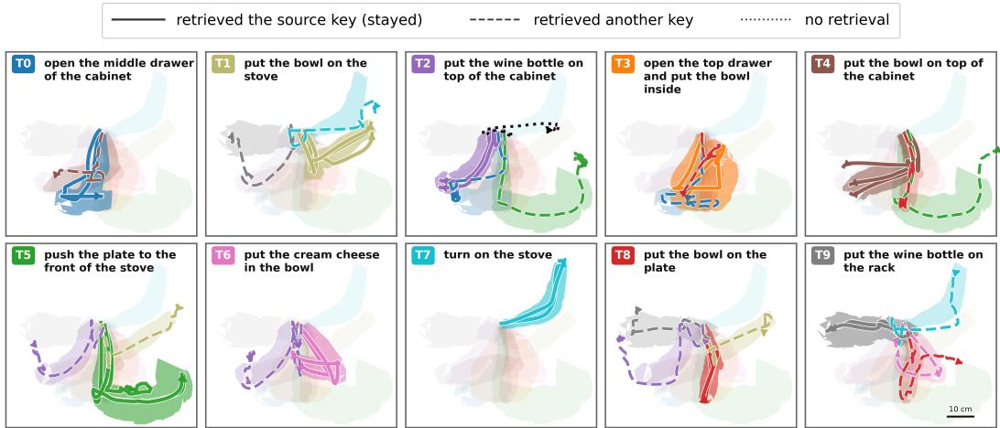  
Figure 6: Goal rollouts can follow familiar training trajectories. Medoid rollouts for the Goal perturbation rules are overlaid on the 80th-percentile envelopes of the corresponding tasks’ 50 training demonstrations. The medoids are selected from 117 rollouts under $R _ { g , 1 }$ to $R _ { g , 4 }$ . Task 3 groups destinations for readability. The comparisons illustrate whole-task matches.

Table 8: Human rollout annotation taxonomy. Fine labels map to the main paper’s coarse groups.
<table><tr><td>Fine-grained label</td><td>Coarse group</td><td>Definition</td></tr><tr><td>same  $_ { - } \mathrm { t o } _ { - } \mathrm { o r i g i n }$ </td><td>Source retrieval</td><td>Clearly executes the original source behavior</td></tr><tr><td>close_to_origin</td><td>Source retrieval</td><td>Approximately follows the source behavior</td></tr><tr><td>same_to_other</td><td>Other-task retrieval</td><td>Matches another familiar demonstrated task</td></tr><tr><td>same_to_change</td><td>Correct or near-correct</td><td>Executes the modified instruction correctly</td></tr><tr><td>close_to_change</td><td>Correct or near-correct</td><td>Approximately follows the modified instruction</td></tr><tr><td>mix</td><td>Hybrid retrieval</td><td>Combines source, changed, or neighboring sub-trajectories</td></tr><tr><td>robot_collapse</td><td>Collapse</td><td>Fails without a coherent retrieval-like trajectory</td></tr></table>

Table 9: Inter-annotator reliability. 117 of the 381 probes were labeled by both annotators. Brackets give 95% episode-bootstrap confidence intervals.
<table><tr><td>Granularity</td><td> $N$ </td><td>Agreement</td><td>Cohen&#x27;s κ</td><td>Macro F1</td></tr><tr><td>Fine labels</td><td>117</td><td>73.5 [65.0, 81.2]</td><td>0.611 [0.504, 0.712]</td><td>45.9 [35.5, 54.0]</td></tr><tr><td>Coarse 5-class</td><td>117</td><td>83.8 [76.9, 90.6]</td><td>0.731 [0.617, 0.833]</td><td>58.5 [47.0, 67.6]</td></tr><tr><td>Retrieval-like binary</td><td>117</td><td>90.6 [84.6, 95.7]</td><td>0.778 [0.639, 0.894]</td><td>88.9 [81.9, 94.7]</td></tr></table>

Annotation reliability. A primary annotator labeled all 381 rollouts for the main analysis. A second annotator independently labeled the first episode of each rollout construction, giving 117 doubly labeled rollouts as a reliability check. Table 9 reports agreement for the seven fine labels, the five coarse groups of Fig. 2, and the retrieval-like versus correct binary on which the main claim rests. Agreement rises as labels coarsen and is highest on the binary. Per-suite coarse-label $\kappa ,$ computed on small subsamples and therefore only indicative, ranges from 0.65 on Goal to 0.75 on Spatial.

GR00T-N1.7 and ECT labels. The same 381 probes were labeled with the same rubric for the official GR00T-N1.7 and for $\pi _ { 0 . 5 }$ trained with ECT (Table 15). For both official policies, whose action pathways share no component, following a familiar trajectory family is the dominant outcome. GR00T-N1.7 also collapses more often than $\pi _ { 0 . 5 }$ , mostly on Goal.

## D.2 AGGREGATE AND RULE-LEVEL OUTCOMES

Table 10 reports the aggregate counts. Of 381 probes, 69.3% show source-task, other-task, or hybrid retrieval, and 26.5% show correct or near-correct following.

Table 10: Human-labeled outcomes of the official $\pi _ { 0 . 5 }$ by rule and suite. Goal subrules are aggregated into their parent rules. $R _ { s , 2 }$ pools two variants of the reworded location.
<table><tr><td>Suite</td><td>Rule</td><td> $N$ </td><td>Source</td><td>Other-task</td><td>Hybrid</td><td>Correct</td><td>Collapse</td></tr><tr><td>Goal</td><td> $R _ { g , 1 }$ </td><td>33</td><td>27</td><td>2</td><td>0</td><td>0</td><td>4</td></tr><tr><td></td><td> $R _ { g , 2 }$ </td><td>33</td><td>12</td><td>12</td><td>0</td><td>9</td><td>0</td></tr><tr><td></td><td> $R _ { g , 3 }$ </td><td>21</td><td>6</td><td>9</td><td>0</td><td>6</td><td>0</td></tr><tr><td></td><td> $R _ { g , 4 }$ </td><td>30</td><td>7</td><td>21</td><td>0</td><td>0</td><td>2</td></tr><tr><td></td><td> $R _ { g , 5 }$ </td><td>3</td><td>3</td><td>0</td><td>0</td><td>0</td><td>0</td></tr><tr><td></td><td> $t o t a l$ </td><td>120</td><td>55</td><td>44</td><td>0</td><td>15</td><td>6</td></tr><tr><td>Long</td><td> $R _ { 1 0 , 1 }$ </td><td>30</td><td>24</td><td>0</td><td>0</td><td>5</td><td>1</td></tr><tr><td></td><td> $R _ { 1 0 , 2 }$ </td><td>30</td><td>29</td><td>0</td><td>1</td><td>0</td><td>0</td></tr><tr><td></td><td> $R _ { 1 0 , 3 }$ </td><td>12</td><td>3</td><td>2</td><td>4</td><td>2</td><td>1</td></tr><tr><td></td><td> $t o t a l$ </td><td>72</td><td>56</td><td>2</td><td>5</td><td>7</td><td>2</td></tr><tr><td>Object</td><td> $R _ { o , 1 }$ </td><td>30</td><td>25</td><td>2</td><td>0</td><td>3</td><td>0</td></tr><tr><td></td><td> $R _ { o , 2 }$ </td><td>30</td><td>0</td><td>4</td><td>0</td><td>25</td><td>1</td></tr><tr><td></td><td> $R _ { o , s t r e s s }$ </td><td>9</td><td>9</td><td>0</td><td>0</td><td>0</td><td>0</td></tr><tr><td></td><td> $t o t a l$ </td><td>69</td><td>34</td><td>6</td><td>0</td><td>28</td><td>1</td></tr><tr><td>Spatial</td><td> $R _ { s , 1 }$ </td><td>30</td><td>24</td><td>0</td><td>0</td><td>4</td><td>2</td></tr><tr><td></td><td> $R _ { s , 2 }$ </td><td>60</td><td>1</td><td>7</td><td>0</td><td>47</td><td>5</td></tr><tr><td></td><td> $R _ { s , 3 }$ </td><td>30</td><td>30</td><td>0</td><td>0</td><td>0</td><td>0</td></tr><tr><td></td><td>total</td><td>120</td><td>55</td><td>7</td><td>0</td><td>51</td><td>7</td></tr><tr><td>All</td><td></td><td>381</td><td>200</td><td>59</td><td>5</td><td>101</td><td>16</td></tr></table>

Rule identifiers are suite-local $( R _ { g , n }$ for Goal, $R _ { 1 0 , n }$ for Long, $R _ { o , n }$ for Object, $R _ { s , n }$ for Spatial in Table 13), so the same number denotes different perturbations in different suites. Some generated cases were adjusted or dropped by hand to keep the scenes executable, so the rule IDs are coarse provenance groups, not exact templates. On Goal, an automatic nearest-neighbor check agrees with most human labels (Table 11).

## D.3 SELECTED BEHAVIORAL CASE STUDIES

Whole-task switching. Under Goal $R _ { g , 4 } ,$ , which changes several task fields at once, 21 of 30 rollouts execute another familiar demonstrated task. Language blindness would predict that the policy mostly stays on the source trajectory. Instead, the modified instruction selects a different demonstrated-task basin. A changed destination on Spatial $( R _ { s , 3 } )$ keeps all 30 rollouts on the source placement trajectory.

Table 11: Whole-trajectory nearest-neighbor check on Goal. Goal rollouts labeled as retrieving the source or another task, with cached trajectories. A rollout is label-consistent when its nearest expert demonstration belongs to the task the human label names.
<table><tr><td>Trajectory metric</td><td>Usable rows</td><td>Label-consistent NN</td></tr><tr><td>Object+EEF DTW</td><td>99</td><td>87/99 (87.9%)</td></tr><tr><td>EEF+gripper resampled distance</td><td>99</td><td>83/99 (83.8%)</td></tr></table>

Table 12: Object stress test with unchanged language. The instruction is unchanged. The object occupying the source-bound slot is swapped and shifted by 10 cm.
<table><tr><td>Condition</td><td>N Observed behavior</td><td></td></tr><tr><td>Same instruction, swapped object + 10 cm shift</td><td>9</td><td>9 / 9 follow the swapped-and-shifted source-bound object</td></tr></table>

Sub-trajectory retrieval. Hybrid rollouts can combine familiar segments from different demonstrated tasks. In Fig. 8, $\pi _ { 0 . 5 }$ follows a complete segment associated with task $T _ { 1 }$ and then begins a segment associated with task $T _ { 0 }$ , instead of executing the requested two-object combination. This coherent sequence illustrates retrieval-like behavior at the level of sub-trajectories.

Object stress test with unchanged language. This probe separates choosing the object from tracking it (Table 12). Under the unchanged instruction, we swap the instruction-named object with another object occupying the source-bound pickup slot and then shift the swapped object by 10 cm. All 9 rollouts pick the object in the source-bound slot rather than the named one and track it smoothly to its shifted position. The unchanged instruction isolates the scene intervention. Following the displacement also distinguishes this behavior from fixed-coordinate replay.

## D.4 THE SAME PROBES AFTER ECT

To test whether ECT changes the diagnosed behavior itself, we reran the Goal and Spatial probes with the official rollouts’ seeds and scenes on $\pi _ { 0 . 5 }$ trained with ECT data + ECT loss under the Frozen-LM recipe (seed 42 in Table 27) and scored each rollout with two automatic measures (Table 14). NN source uses the EEF+gripper resampled distance of Table 11. On the official policy’s Goal probes it marks 59 of 117 rollouts as source, where the human labels mark 52. Both policies complete the unperturbed source tasks at 95% or more (Tables 7 and 27), so the reduced source-completion rate under perturbation is not accompanied by a general loss of source-task competence. The Goal set differs from Table 10 in three rollouts.

On Goal, both measures fall on every rule, and under the combined perturbation $R _ { g , 4 }$ the ECT policy never completes the source task. On Spatial, the change is concentrated where the instruction asks for a different action. Under a new destination $( R _ { s , 3 } )$ , the official policy completes the original placement in 29 of 30 rollouts and the ECT policy in 3 of 30. Under a new object name $( R _ { s , 1 } )$ , both policies still pick up the bowl. This pattern is consistent with the ECT data. Through Goal, the four-suite training set shows the same destination word at different places, but every Spatial instruction names the same black bowl, so nothing in the data asks the policy to read the object word. $R _ { s , 2 }$ rewrites the spatial relation in the location clause, and the bowl on the plate can still satisfy the source predicate, so completion there does not separate following from retrieval.

Human labels on the full 381 probes agree (Table 15). The ECT policy carries out the changed task in 47.5% of rollouts, against 26.5% for the official $\pi _ { 0 . 5 } .$ , with a gain on every suite. ECT therefore changes the behavior the probes measure, not only the counterfactual scores.

## E MECHANISTIC DIAGNOSTIC DETAILS

This appendix details the prefix-KV retrieval, patching, and persistent intervention of Section 4.

Table 13: Perturbation rules for each LIBERO suite. Rule IDs match the row labels in Fig. 7. Object rules leave the instruction unchanged and perturb only the scene.
<table><tr><td>Suite</td><td>Rule</td><td>Description</td></tr><tr><td rowspan="4">Spatial</td><td>R1</td><td>Replace the target object</td></tr><tr><td>R2</td><td>Alter the spatial description of the source location (object repositioned to match),</td></tr><tr><td>R3</td><td>with two variants Replace the placement destination</td></tr><tr><td></td><td></td></tr><tr><td rowspan="3">Object</td><td>R1</td><td>Swap the target object&#x27;s position with another in-scene object</td></tr><tr><td>R2</td><td>Slightly shift the target object&#x27;s position</td></tr><tr><td>stress</td><td>Swap and shift simultaneously</td></tr><tr><td rowspan="4">Goal</td><td>R1</td><td>Change the action verb</td></tr><tr><td>R2 R3</td><td>Replace the manipulated object</td></tr><tr><td>R4</td><td>Change the placement destination</td></tr><tr><td>R5</td><td>Combine two or more of the above modifications Truncate the instruction to its first sub-task</td></tr><tr><td rowspan="3">Long</td><td>R1</td><td>Replace one of the two target objects</td></tr><tr><td>R2</td><td>Change the placement destination</td></tr><tr><td>R3</td><td>Replace the instruction entirely with one from a different task</td></tr></table>

Table 14: Binding probes before and after ECT. Source completion measures how often the original task’s predicate fires under a perturbed instruction. NN source measures how often the nearest expert demonstration belongs to the source task. Values are percentages of rollouts for one ECT seed.
<table><tr><td colspan="3"></td><td colspan="2">Source completion</td><td colspan="2">NN source</td></tr><tr><td>Suite</td><td>Rule</td><td>N</td><td>Official</td><td>ECT</td><td>Official</td><td>ECT</td></tr><tr><td>Goal</td><td> $R _ { g , 1 }$ </td><td>33</td><td>84.8</td><td>66.7</td><td>90.9</td><td>78.8</td></tr><tr><td></td><td> $R _ { g , 2 }$ </td><td>33</td><td>39.4</td><td>9.1</td><td>45.5</td><td>36.4</td></tr><tr><td></td><td> $\bar { R _ { g , 3 } }$ </td><td>21</td><td>38.1</td><td>19.0</td><td>38.1</td><td>19.0</td></tr><tr><td></td><td> $R _ { g , 4 }$ </td><td>30</td><td>16.7</td><td>0.0</td><td>20.0</td><td>3.3</td></tr><tr><td></td><td>total</td><td>117</td><td>46.2</td><td>24.8</td><td>50.4</td><td>36.8</td></tr><tr><td rowspan="3">Spatial</td><td> $R _ { s , 1 }$ </td><td>30</td><td>73.3</td><td>70.0</td><td>80.0</td><td>80.0</td></tr><tr><td> $R _ { s , 2 }$ </td><td>30</td><td>70.0</td><td>90.0</td><td>73.3</td><td>93.3</td></tr><tr><td> $R _ { s , 3 }$ </td><td>30</td><td>96.7</td><td>10.0</td><td>100.0</td><td>33.3</td></tr><tr><td></td><td> $t o t a l$ </td><td>90</td><td>80.0</td><td>56.7</td><td>84.4</td><td>68.9</td></tr></table>

## E.1 PREFIX-KV RETRIEVAL PROTOCOL AND ROBUSTNESS

For each input we extract the key and value tensors that the VLM expert produces at the visuallanguage prefix positions. This cache is not the action expert’s own state, which consists of separate suffix-token states, but the prefix that its tokens attend to during action generation. We call it the prefix-KV representation. With $K ^ { ( L ) } ( s , \ell )$ and $V ^ { ( L ) } ( s , \ell )$ the final-layer keys and values at prefix positions for scene s and instruction ℓ, the main-text representation is

$$
\phi _ { \mathrm { K V } } ( s , \ell ) = \frac { \mathrm { v e c } \big [ K ^ { ( L ) } ( s , \ell ) , V ^ { ( L ) } ( s , \ell ) \big ] } { { \big \| \mathrm { v e c } \big [ K ^ { ( L ) } ( s , \ell ) , V ^ { ( L ) } ( s , \ell ) \big ] \big \| _ { 2 } } } ,\tag{13}
$$

where vec[·] flattens the final-layer prefix K+V tensors, with cosine distance

$$
d _ { \mathrm { K V } } ( x , y ) = 1 - \phi _ { \mathrm { K V } } ( x ) ^ { \top } \phi _ { \mathrm { K V } } ( y ) .\tag{14}
$$

We use the final layer by default. Fig. 10 reports other layers and aggregations.

The queries are a fixed set of 45 Goal rollouts labeled same\_to\_other when this analysis was run, each executing another familiar demonstrated task. For each query we keep the source scene fixed and compare the perturbed input with the ten candidate task instructions under that scene,

$$
\begin{array} { r } { q = ( s _ { \mathrm { s r c } } , \ell _ { \mathrm { p e r t } } ) , \qquad x _ { c } = ( s _ { \mathrm { s r c } } , \ell _ { c } ) , \qquad c \in \{ 1 , \ldots , 1 0 \} , } \end{array}\tag{15}
$$

and rank the executed task by

$$
\mathrm { r a n k } _ { \mathrm { e x e } } ( q ) = 1 + \sum _ { \substack { c \neq c _ { \mathrm { e x e } } } } \mathbf { 1 } [ d _ { \mathrm { K V } } ( q , x _ { c } ) < d _ { \mathrm { K V } } ( q , x _ { c _ { \mathrm { e x e } } } ) ] .\tag{16}
$$

The executed task is the nearest candidate in 34 of 45 rollouts, against 7 of 45 in a mixed-scene control, and is usually closer than the source task (Fig. 9). The signal does not depend on how the representation is aggregated (Fig. 10). All-layer K+V, last-layer hidden states, and K-only text pooling all preserve it, and each layer reaches at least 60% rank-1 recovery with a high top-3 rate.

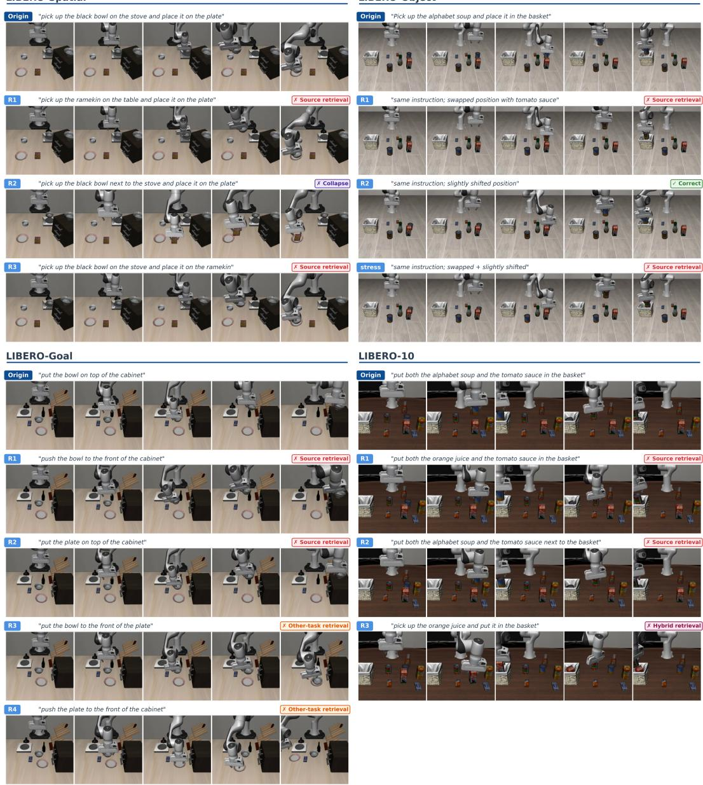  
Figure 7: Rollout examples for all four LIBERO suites. Each panel shows the source behavior (Origin), followed by representative rollouts under the perturbation rules of Table 13, with outcome labels from Table 8.

## E.2 PREFIX-KV PATCHING INTERVENTION

Retrieval is correlational. To test whether the prefix affects action decoding, we replace the prefix K/V cache of each of the 45 perturbed inputs with the cache of a candidate task under the same source scene and decode the action chunk with the action expert unchanged. Let $A _ { \mathrm { n a t } }$ and $A _ { \mathrm { p a t c h } }$ denote the natural and patched decodes, and $A _ { T }$ the expert chunk for task $\check { T } .$ . The improvement

$$
\Delta _ { \mathrm { L 2 } } ( T ) = \left\| A _ { \mathrm { n a t } } - A _ { T } \right\| _ { 2 } - \left\| A _ { \mathrm { p a t c h } } - A _ { T } \right\| _ { 2 }\tag{17}
$$

is positive when patching moves the decode closer to the target expert. We report it for the first step and the full chunk (Table 16).

Restoring the source-task prefix tests whether the decode can be pulled back from the executed task toward the source basin, and the chunk-level distance to the source expert improves in 87% of rollouts, with an interval excluding zero. Executed-task patching has a weaker effect because the

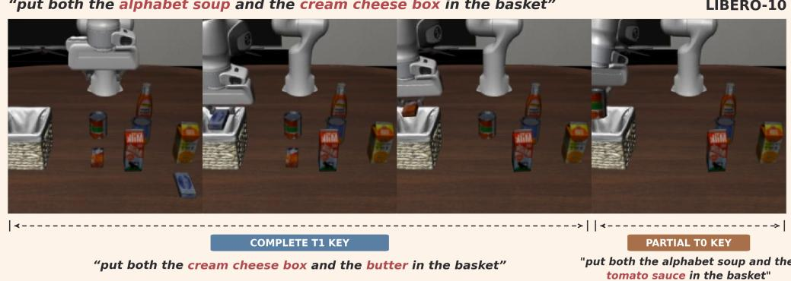  
Figure 8: A hybrid rollout combining familiar task segments. Under a modified two-object instruction, $\pi _ { 0 . 5 }$ combines a complete segment associated with demonstrated task $T _ { 1 }$ with a partial segment associated with task $T _ { 0 } .$

Table 15: Matched human labels for three policies on the 381 probes. Follow denotes correct or near-correct execution of the changed task. Retr. denotes source-task, other-task, or hybrid retrieval. Coll. denotes behavior without a coherent trajectory. Values are percentages of rollouts. ECT is the Frozen-LM $\pi _ { 0 . 5 }$ model trained with ECT data + ECT loss (seed 42).
<table><tr><td></td><td></td><td colspan="3">Official  $\pi _ { 0 . 5 }$ </td><td colspan="3">Official GR00T-N1.7</td><td colspan="3"> $\pi _ { 0 . 5 } + \mathrm { E C T }$ </td></tr><tr><td>Suite</td><td>N</td><td>Follow</td><td>Retr.</td><td>Coll.</td><td>Follow</td><td>Retr.</td><td>Coll.</td><td>Follow</td><td>Retr.</td><td>Coll.</td></tr><tr><td>Spatial</td><td>120</td><td>42.5</td><td>51.7</td><td>5.8</td><td>33.3</td><td>54.2</td><td>12.5</td><td>64.2</td><td>31.7</td><td>4.2</td></tr><tr><td>Object</td><td>69</td><td>40.6</td><td>58.0</td><td>1.4</td><td>15.9</td><td>84.1</td><td>0.0</td><td>75.4</td><td>24.6</td><td>0.0</td></tr><tr><td>Goal</td><td>120</td><td>12.5</td><td>82.5</td><td>5.0</td><td>0.8</td><td>71.7</td><td>27.5</td><td>26.7</td><td>60.8</td><td>12.5</td></tr><tr><td>Long</td><td>72</td><td>9.7</td><td>87.5</td><td>2.8</td><td>0.0</td><td>97.2</td><td>2.8</td><td>27.8</td><td>72.2</td><td>0.0</td></tr><tr><td>All</td><td>381</td><td>26.5</td><td>69.3</td><td>4.2</td><td>13.6</td><td>73.2</td><td>13.1</td><td>47.5</td><td>47.2</td><td>5.2</td></tr></table>

natural decode is already close to the executed basin. All-layer patching changes the chunk more but worsens the first-step distance, showing that a larger intervention need not improve both measures.

Target specificity. For each rollout we patch each of the ten candidate prefixes, all extracted under the source-scene observation, and compare the patch-induced action displacement with the patched candidate’s canonical LIBERO expert chunk, matched by episode index. This measures steering toward a candidate task’s expert trajectory. Own-target alignment exceeds off-target alignment under all three measures (Table 17). Source-prefix patches also project further toward the source expert than the mean-other and farthest-other prefixes (paired differences of 0.006 and 0.010, bootstrap intervals excluding zero), showing that different valid prefixes do not have interchangeable effects. The persistent intervention below tests whether repeated replacement redirects the rollout.

Persistent (rollout-level) protocol. The persistent intervention of Section 4.1 replaces the prefix-KV cache at every policy call rather than at one. Source scene, source instruction, and policy are fixed. The injected cache is computed once from the target task’s initial observation and instruction. Controls keep the source cache. The 50 pairs, enumerated before any rollout, are all ordered (source, target) pairs of the Object suite whose target object is present in the source scene, with four rollouts per condition. For the official GR00T-N1.7 Object checkpoint, which has no prefix-KV cache, we replace the backbone feature sequence that its action head cross-attends to (a function of pixels and instruction only) under the same protocol.

Table 16: Prefix-KV patching intervention. Improvement $\Delta _ { \mathrm { { L 2 } } }$ (Eq. (17)) with bootstrap intervals over the 45 rollouts. Positive values mean the patched decode is closer to the target expert than the natural perturbed decode. Pos. frac. is the fraction of rollouts with positive improvement.
<table><tr><td>Patch</td><td>Target</td><td>First L2 impr.</td><td> $\mathrm { P o s . }$  frac.</td><td></td><td>Chunk L2 impr.</td><td>Pos. frac.</td></tr><tr><td>Source final</td><td>Source</td><td>0.0024 [0.0011, 0.0036]</td><td>0.69</td><td>0.0182 [</td><td>[0.0107,0.0262]</td><td>0.87</td></tr><tr><td>Executed final</td><td>Executed</td><td>0.0009 [-0.0004, 0.0022]</td><td>0.62</td><td></td><td>0.0021 [0.0006, 0.0035]</td><td>0.62</td></tr><tr><td>Source all</td><td>Source</td><td>-0.0208 [-0.0418, -0.0012]</td><td>0.42</td><td></td><td>0.5467 [0.3953, 0.6949]</td><td>0.84</td></tr><tr><td>Executed all</td><td>Executed</td><td>-0.0094 [-0.0237, 0.0045]</td><td>0.42</td><td></td><td>0.1048 [0.0356, 0.1786]</td><td>0.62</td></tr></table>

rank among 10 candidates (1 = nearest)  
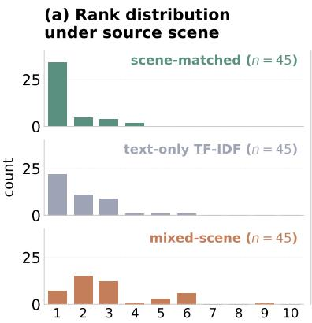

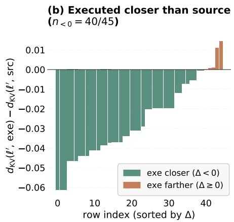  
Figure 9: Executed tasks are recoverable from scene-matched prefix-KV states. (a) Rank of the executed task among the ten candidates, for scene-matched prefix-KV states, a text-only TF-IDF baseline over the instructions, and a mixed-scene prefix-KV control. (b) The perturbed input is closer to the executed task than to the source task in scene-matched prefix-KV space.  
(a) Rank-1 rate across prefix-KV aggregations (n = 45)

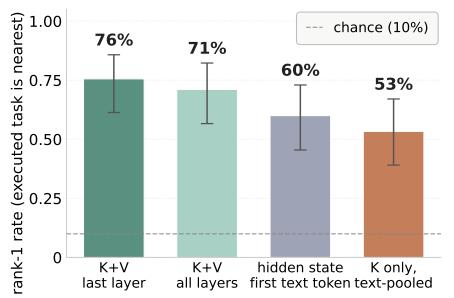

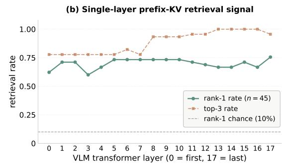  
Figure 10: Prefix-KV retrieval is robust to representation aggregation. Same 45 rollouts as Fig. 9. (a) Rank-1 recovery under alternative representations. Error bars are 95% Wilson intervals, and the dashed line marks chance. (b) Single-layer prefix K+V retrieval by VLM layer.

Both architectures show task-directed redirection (Table 18). Injection moves the arm nearer the target task’s object in over half of the rollouts and in no control, with a larger shift than the matched control in every pair. Outcomes are often all or nothing within a pair. No injected rollout completes the target task. The replaced representation is fixed at the target task’s initial observation rather than updated from the live scene. The pairs that resist redirection are largely shared, with 14 of the 19 for GR00T-N1.7 also resisting it for π0.5.

Real-robot offline decomposition. For three UR5e models (a Standard model trained on a quarter of the demonstrations, ECT data, and ECT data + ECT loss), we patch offline on recorded frames with images and proprioception held fixed, swapping either only the instruction or only the vision inside the cache. In all three models, swapping the instruction retargets the predicted chunk in about three quarters of 48 pairs, against about one fifth for swapping the vision. Instruction-dependent retargeting therefore persists after ECT. The measured outcome is instruction-dependent retargeting in the recorded frames.

Table 17: Target specificity of prefix-KV patching. Own target measures alignment of the patchinduced displacement with the patched candidate’s expert trajectory. Off-target averages alignment with the other candidates. Specificity is their difference. Brackets report rollout-bootstrap intervals.
<table><tr><td>Analysis</td><td>Own target</td><td>Off-target</td><td>Specificity</td></tr><tr><td>Cosine alignment</td><td>0.443 [0.400, 0.487]</td><td>0.182 [0.148, 0.217]</td><td>0.262 [0.234, 0.288]</td></tr><tr><td>Normalized projection</td><td>0.0136 [0.0102, 0.0174]</td><td>0.0064 [0.0044, 0.0085]</td><td>0.0073 [0.0054, 0.0092]</td></tr><tr><td>Raw projection</td><td>0.0215 [0.0160, 0.0275]</td><td>0.0089 [0.0061, 0.0120]</td><td>0.0125 [0.0096, 0.0158]</td></tr></table>

Table 18: Persistent intervention on Object, full pair grid. Four rollouts per condition cover all 50 valid ordered (source, target) pairs. Closer means the end effector is nearer the target than the source object. Larger shift means greater movement toward the target under injection than control. Under injection, source-task completion is 0/200 for both models.
<table><tr><td>Model</td><td>Injected closer</td><td>Control closer</td><td>Pairs, larger shift</td><td>Pairs 4/4</td><td>Pairs 0/4</td><td>Control completes source</td><td>Injected completes target</td></tr><tr><td>π0.5 (prefix-KV)</td><td>109/200</td><td>0/200</td><td>50/50</td><td>25</td><td>21</td><td>200/200</td><td>0/200</td></tr><tr><td>GR00T-N1.7 (backbone features)</td><td>121/200</td><td>0/200</td><td>50/50</td><td>28</td><td>19</td><td>200/200</td><td>0/200</td></tr></table>

## F ECT DATA CONSTRUCTION

This appendix details the ECT data construction (Section 5.1) and compares the transformed layouts with LIBERO-PRO Swap evaluation layouts.

## F.1 TRANSFORMATION OPERATORS AND ACTION VALIDITY

For constructed pairs, ECT uses curated scene changes rather than discovering symmetries. The alternatives are intended to expose scene-dependent action choices under a fixed instruction. We write $( \tilde { s } , \ell , \tilde { a } ) = ( s ^ { \prime } , \ell , a ^ { \prime } )$ for the constructed branch of the five-tuple in Eq. (5). For each original demonstration $( s , \ell , a )$ , the builder constructs

$$
\begin{array} { r } { ( \tilde { s } , \ell , \tilde { a } ) = \mathcal { T } _ { \mathrm { E C T } } ( s , \ell , a ) , \qquad \tilde { s } = M _ { s } ( s ) , \quad \tilde { a } = \mathrm { R e p l a y } _ { \tilde { s } } ( M _ { a } ( a ) ) , } \end{array}\tag{18}
$$

with Replay as in Eq. (6). Mirror transforms reflect the scene about a workspace axis (Fig. 11). Shift transforms translate selected scene elements and are used where a pure mirror would create visually ambiguous layouts or unstable transformed scenes. Table 20 lists the family used per suite.

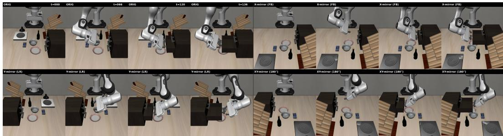  
Figure 11: ECT scene and trajectory transformations. The top row shows the original demonstration and x-axis mirror (front-back). The bottom row shows the y-axis mirror (left-right) and xy-axis mirror (180◦ rotation). Each panel shows four timesteps. The robot is unchanged.

Label provenance. The builder transforms the end-effector waypoint path and the rotation command analytically and keeps the gripper command. It then replays the demonstration in the transformed scene with a tracking controller and records the achieved end-effector displacement as the translational action, while the original branch stores the commanded action. Because the robot base is never mirrored, the arm reaches mirrored waypoints through a different configuration. On the y-mirror pairs of Spatial, the rotation and gripper channels equal the reflected command in every frame, while the translation differs from it by a median of about 0.1 on the [−1, 1] action scale. “Action-valid” thus means that a˜ is a kinematically valid expert action for s˜, verified by task success, not a symmetry image of $^ { a , }$ and ECT is not an equivariance constraint on actions.

In the original Spatial data each instruction’s action support lies on one side, as the bowl is always reached from one direction (Fig. 12). The y-mirror counterfactuals put the same instruction on the other side, so a fixed instruction-to-family assignment no longer matches the demonstrated scene-dependent choices (Section 2.1). The replayed translation widens their spread.

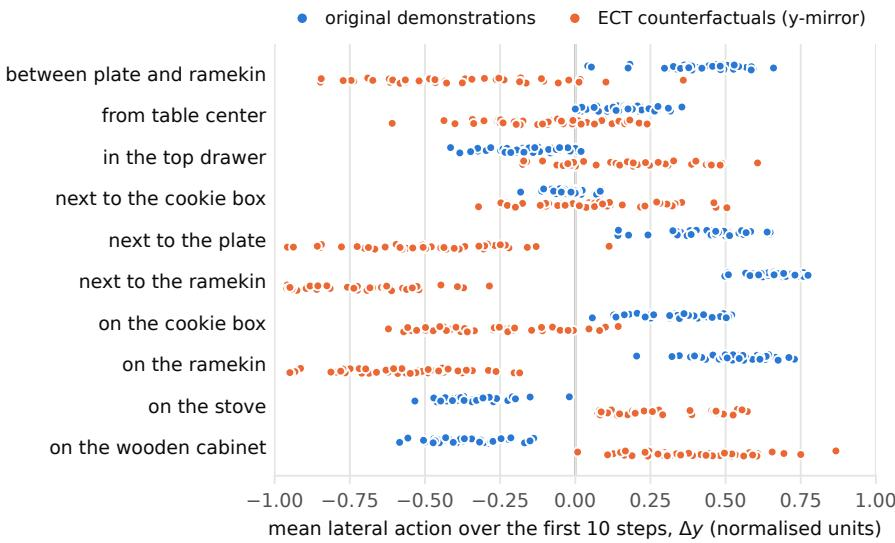  
Figure 12: What ECT does to conditional action support (Spatial). Each dot is a demonstration’s mean lateral action over its first ten steps, for original data (blue) or y-mirror counterfactuals (orange).

Table 19: Object-suite construction diagnostics. Success (%) for per-suite $\pi _ { 0 . 5 }$ LoRA diagnostics, separate from the main Frozen-LM comparison. X-mirror and all-mirror variants lose ID and Object competence, while Y-mirror and shifted variants preserve them.
<table><tr><td>Construction</td><td>ID</td><td>Sem.</td><td>Obj.</td><td>Swap</td></tr><tr><td>No ECT baseline</td><td>94.2</td><td>94.8</td><td>84.4</td><td>0.0</td></tr><tr><td>X-mirror, paired</td><td>23.8</td><td>22.6</td><td>25.4</td><td>3.0</td></tr><tr><td>Y-mirror, paired</td><td>93.2</td><td>96.4</td><td>85.0</td><td>1.0</td></tr><tr><td>All mirrors, paired</td><td>29.0</td><td>21.8</td><td>20.2</td><td>12.0</td></tr><tr><td>X-mirror + X-shift, paired</td><td>97.4</td><td>99.2</td><td>95.8</td><td>1.6</td></tr><tr><td>XY-mirror + XY-shift, paired</td><td>95.6</td><td>98.6</td><td>91.4</td><td>7.6</td></tr></table>

Design principles. The construction makes the instruction insufficient to select the appropriate branch while retaining observations that distinguish it. (i) Same instruction, different required action. Changing the relevant scene geometry gives a different action under the same instruction. The purpose is scene-dependent action choice, not arbitrary variability among equally valid trajectories (Fig. 12). (ii) Executable labels. In the synthetic branch, transformed paths are replayed and filtered by task success. The rotation, translation, and gripper-label conventions are described above. (iii) Visual separability. The scene must reveal which action is appropriate. The Object construction in Fig. 5 gives the counterexample. Front-back mirroring keeps dominant landmarks in similar image regions while changing the required action. Left-right mirroring or a post-mirror shift moves those landmarks and restores scene-level distinguishability.

X-mirror and all-mirror banks strongly reduce nominal competence on Object, whereas Y-mirror and the two shifted constructions preserve ID, Semantic, and Object success. These diagnostics preceded the four-suite training runs. The Object ECT data combine exactly these three constructions and exclude the all-mirror bank, although it has the highest Swap in the table, so the choice follows nominal competence rather than Swap. Swap stays low in these per-suite runs, so separability makes the counterfactual supervision learnable but does not by itself raise Object Swap. The four-suite results are in Tables 2 and 23.

Contrast with prior equivariance-based augmentation. RoCoDA (Ameperosa et al., 2025) combines causal resampling with SE(3) transformations and visual augmentation, evaluating ACT in a single-task setting. It saves successful transformed sub-trajectories. ECT shares the use of action-valid transformed demonstrations, but targets instruction-action binding in VLA fine-tuning. Its paired component preserves the correspondence between scene-dependent alternatives under the same instruction. Table 3 compares this procedure with independent sampling of the same counterfactual pool. Natural CALVIN pairs and physically collected UR5e alternatives apply it without the LIBERO construction.

Table 20: ECT transform provenance. Transform choices are fixed before training by the actionvalidity and visual-separability criteria, not selected per evaluation rollout.
<table><tr><td>Suite</td><td>Transform family</td><td>Action transform</td><td>Role in ECT</td></tr><tr><td>Spatial</td><td>mirror</td><td>reflected, then replayed</td><td>changes placement direction under fixed instruction</td></tr><tr><td>Object</td><td>Y-mirror / mirror+shift</td><td>reflected (x and xy also shifted), then replayed</td><td>preserves separability while changing source-object branch</td></tr><tr><td>Goal</td><td>mirror</td><td>reflected, then replayed</td><td>changes goal-relative spatial branch</td></tr><tr><td>Long</td><td>shift-augmented mix</td><td>shifted, then replayed</td><td>preserves long-horizon executability</td></tr></table>

Use in training and scope. ECT data enter the same imitation-learning pipeline as the original demonstrations. The standard loss samples them independently of their originals. The ECT loss places each original and its counterpart, which share the instruction but not the action, in the same update (Eq. (7)). In our $\pi _ { 0 . 5 }$ implementation the two halves of a pair also share the flow-matching noise sample and flow time, while image augmentations are drawn independently for each half. Same-instruction spatial counterfactuals directly target Swap, which requires selecting the correct spatial branch under a fixed task identity. Task perturbations instead change the referred object, goal, relation, or action. ECT does not construct such counterfactuals, so its Task gains (Table 2) provide complementary evidence of transfer beyond the scene changes directly constructed during training.

## F.2 ECT COUNTERFACTUALS ARE BUILT INDEPENDENTLY OF LIBERO-PRO EVALUATION

ECT counterfactuals transform the scene and action of LIBERO training demonstrations $( s , \ell , a )$ together under a fixed instruction. LIBERO-PRO perturbations are generated independently at evaluation time by rewriting BDDL fields. Semantic paraphrases the instruction, object perturbation changes object attributes under a fixed instruction, Swap permutes object or destination positions in the initial state, and Task rewrites the instruction and goal block. The two constructions operate on different inputs, training trajectories versus evaluation BDDL specifications.

Layout distance. We compare Swap test states with original demonstration layouts and with the successful transformed layouts added by ECT. The transformed set excludes originals, although ECT models train on both. For each state, we take the nearest layout of the same task using the mean planar distance over its objects and fixtures. The ID reference scale is the 90th percentile of ID-to-original distances. No Swap state falls within this scale of the transformed set, whose smallest distance is 6.4 cm (Table 21). Its median distance exceeds that of the originals in every suite. For the exchanged objects alone, one Spatial task has local overlap within the corresponding ID scale. These distances describe whole layouts rather than the novelty of each object’s position.

Table 21: Layout distances from Swap states to original and transformed demonstrations. Mean planar object-and-fixture distance (cm) to the nearest layout of the same task over 500 Swap states per suite. The transformed set contains successful counterfactual layouts only. ID scale is the 90th percentile of ID-to-original distances.
<table><tr><td></td><td></td><td colspan="2">Median distance to</td><td>Minimum distance</td><td>Within ID scale</td></tr><tr><td>Suite</td><td>ID scale</td><td>original</td><td>transformed</td><td>to transformed</td><td>of transformed</td></tr><tr><td>Spatial</td><td>1.0</td><td>6.6</td><td>28.7</td><td>13.3</td><td>0%</td></tr><tr><td>Object</td><td>0.3</td><td>6.4</td><td>28.5</td><td>25.2</td><td>0%</td></tr><tr><td>Goal</td><td>0.9</td><td>11.3</td><td>24.9</td><td>19.6</td><td>0%</td></tr><tr><td>Long</td><td>1.7</td><td>13.9</td><td>16.2</td><td>6.4</td><td>0%</td></tr></table>

The training-only construction inputs and the layout comparison address separation from the evaluation states. Broader distributional coverage can contribute to generalization without reproducing a complete test layout. Task evaluation also changes the instructions and goals held fixed by ECT.

## G ECT RESULTS ON LIBERO

This appendix reports the complete LIBERO-PRO results of the ECT models, the decomposition across seeds and suites, the data-scale sweep, and ECT under RL post-training.

## G.1 $\pi _ { 0 . 5 }$ ECT RESULTS

Table 23 reports all four-suite $\pi _ { 0 . 5 }$ models. Its Frozen-LM rows are the three models of Table 3. Both recipes (Table 22) train the SigLIP vision encoder (ViT, 414.8M parameters) and the 300M action expert (AE, 427.9M measured) and differ in whether the PaliGemma language model (LM, 2,508.5M) is trained. Models compared within a recipe share one trainable set. ECT uses mirrorbased constructions, with x-shift and xy-shift variants on Object and selected Long tasks to address ambiguous layouts. The suite-specific families are listed in Table 20. All cells use the evaluation protocol of Appendix B.

Table 22: Training recipes by trainable parameter group $( \pi _ { 0 . 5 } ,$ measured). Millions of parameters that receive gradients under each recipe’s trainable filter. Both recipes train the heads (2.2M).
<table><tr><td>Recipe</td><td>Configuration</td><td>LM</td><td>ViT</td><td>AE</td><td>Trainable</td></tr><tr><td>Frozen LM</td><td>_expert_only</td><td>frozen</td><td>trained</td><td>trained</td><td>844.9M</td></tr><tr><td>Full FT</td><td>pi05_1ibero (official),_full_sft (ECT)</td><td>trained</td><td>trained</td><td>trained</td><td>3,353.4M</td></tr></table>

Under the Frozen-LM recipe, ECT data + ECT loss gives the highest Swap on three suites and the ECT data alone on Object, with ID and Semantic success close to their references. On Spatial, Task success is lower under the Frozen-LM recipe than under full fine-tuning for Standard and ECT alike, a difference associated with the fine-tuning recipe in these comparisons, rather than a unique effect of ECT. On the other three suites, Frozen-LM ECT exceeds the official $\pi _ { 0 . 5 }$ on Task.

## G.2 GR00T-N1.7 ECT RESULTS

We evaluate GR00T-N1.7 under per-suite and four-suite training. All GR00T-N1.7 ECT models train on the ECT data with the standard loss. The per-suite models use each suite’s ECT data (x-shift on Object, shift-augmented on Long) and train for 30K steps at batch size 32. The four-suite model trains on the ECT data of all four suites for 20K steps at a global batch size of 640, matching the official GR00T-N1.7 LIBERO recipe (20K steps, batch 640). The vision encoder and language model are frozen, while the projector and action head are trained.

Over the official GR00T-N1.7, the per-suite ECT models raise Swap on Spatial, Goal, and Long, and the four-suite ECT data model raises it further on every suite while staying within 3 points on ID and lowering Task on no suite (Table 24). This model is compared with the official per-suite checkpoints, so part of its gain may come from training on four suites. Due to our computation budget, the per-suite ECT models are trained on roughly one-thirteenth of the samples of the official recipe, so the per-suite comparison favors the official checkpoints. Together, these results support applying the ECT data to a different action architecture.

The four-suite GR00T model remains below the Frozen-LM $\pi _ { 0 . 5 }$ ECT model on Swap in all suites (Table 23). The recipes also differ in which modules are trained, with GR00T freezing its vision encoder and $\pi _ { 0 . 5 }$ training it.

## G.3 DECOMPOSITION ACROSS SEEDS AND SUITES

The three $\pi _ { 0 . 5 }$ models of Table 3 (Standard, ECT data, and ECT data + ECT loss) share the Frozen-LM recipe, optimizer, 30k training steps, and 64 examples per update. The ECT loss fills each update with 32 counterpart pairs, and the other two models draw 64 independent examples.

Seed variation. All three models have three training seeds each (0, 1, 42). Across seeds, the largest Swap standard deviation is 4.9 points for ECT data + ECT loss (Long in Table 27), 6.9 for ECT data (Long), and 7.3 for Standard (Object).

Table 23: Five-cell results of the four-suite $\pi _ { 0 . 5 }$ models. N = 500 per cell and seed. Recipes follow Table 22. ECT rows shaded. †Mean over three seeds (0, 1, 42), with standard deviations of ECT data + ECT loss in Table 27.
<table><tr><td>Suite</td><td>Model</td><td>Recipe</td><td>ID</td><td>Sem.</td><td>Obj.</td><td>Swap</td><td>Task</td></tr><tr><td>Spatial</td><td>Official  $\pi _ { 0 . 5 }$ </td><td>Full FT</td><td>98.4</td><td>98.0</td><td>98.0</td><td>46.6</td><td>53.0</td></tr><tr><td></td><td>ECT data + ECT loss</td><td>Full FT</td><td>95.8</td><td>94.0</td><td>95.6</td><td>72.8</td><td>53.2</td></tr><tr><td></td><td>Standard†</td><td>Frozen LM</td><td>95.9</td><td>94.5</td><td>95.4</td><td>52.7</td><td>22.3</td></tr><tr><td></td><td>ECT data†</td><td>Frozen LM</td><td>96.5</td><td>93.0</td><td>95.2</td><td>72.1</td><td>18.5</td></tr><tr><td></td><td>ECT data + ECT loss†</td><td>Frozen LM</td><td>98.4</td><td>96.1</td><td>97.1</td><td>74.4</td><td>22.1</td></tr><tr><td>Object</td><td>Official  $\pi _ { 0 . 5 }$ </td><td>Full FT</td><td>98.6</td><td>99.0</td><td>94.4</td><td>18.2</td><td>11.0</td></tr><tr><td></td><td>ECT data + ECT loss</td><td>Full FT</td><td>98.8</td><td>98.8</td><td>93.0</td><td>40.8</td><td>28.4</td></tr><tr><td></td><td>Standard†</td><td>Frozen LM</td><td>97.1</td><td>98.0</td><td>83.5</td><td>38.3</td><td>23.0</td></tr><tr><td></td><td>ECT data†</td><td>Frozen LM</td><td>98.5</td><td>98.9</td><td>81.9</td><td>71.1</td><td>37.3</td></tr><tr><td></td><td>ECT data + ECT loss†</td><td>Frozen LM</td><td>99.1</td><td>99.2</td><td>78.5</td><td>70.8</td><td>31.3</td></tr><tr><td>Goal</td><td>Official  $\pi _ { 0 . 5 }$ </td><td>Full FT</td><td>96.4</td><td>94.6</td><td>88.8</td><td>34.2</td><td>21.2</td></tr><tr><td></td><td>ECT data + ECT loss</td><td>Full FT</td><td>94.6</td><td>94.2</td><td>87.2</td><td>35.8</td><td>26.6</td></tr><tr><td></td><td>Standard†</td><td>Frozen LM</td><td>95.2</td><td>92.9</td><td>85.9</td><td>41.3</td><td>20.6</td></tr><tr><td></td><td>ECT data†</td><td>Frozen LM</td><td>93.8</td><td>90.0</td><td>82.8</td><td>51.8</td><td>40.7</td></tr><tr><td></td><td>ECT data + ECT loss†</td><td>Frozen LM</td><td>95.6</td><td>93.3</td><td>86.7</td><td>55.5</td><td>35.7</td></tr><tr><td>Long</td><td>Official  $\pi _ { 0 . 5 }$ </td><td>Full FT</td><td>91.8</td><td>90.8</td><td>66.8</td><td>9.4</td><td>17.0</td></tr><tr><td></td><td>ECT data + ECT loss</td><td>Full FT</td><td>92.0</td><td>92.6</td><td>62.4</td><td>26.6</td><td>26.6</td></tr><tr><td></td><td>Standard†</td><td>Frozen LM</td><td>93.7</td><td>91.3</td><td>60.3</td><td>12.7</td><td>19.5</td></tr><tr><td></td><td>ECT data†</td><td>Frozen LM</td><td>92.9</td><td>93.0</td><td>56.7</td><td>29.5</td><td>22.3</td></tr><tr><td></td><td>ECT data + ECT loss†</td><td>Frozen LM</td><td>92.8</td><td>92.9</td><td>59.1</td><td>34.7</td><td>22.5</td></tr></table>

Table 24: GR00T-N1.7 ECT full results. Success (%) over 500 trials per cell. All ECT models use the ECT data with the standard loss. ECT rows are shaded.
<table><tr><td>Suite</td><td>Model</td><td>Training scope</td><td>ID</td><td>Sem.</td><td>Obj.</td><td>Swap</td><td>Task</td></tr><tr><td>Spatial</td><td>Official</td><td>Per suite</td><td>93.6</td><td>88.8</td><td>93.0</td><td>1.2</td><td>51.4</td></tr><tr><td></td><td>ECT data</td><td>Per suite</td><td>87.0</td><td>91.4</td><td>83.2</td><td>17.8</td><td>53.0</td></tr><tr><td></td><td>ECT data</td><td>Four suites</td><td>90.8</td><td>88.0</td><td>89.8</td><td>38.2</td><td>64.0</td></tr><tr><td>Object</td><td>Official</td><td>Per suite</td><td>95.6</td><td>97.6</td><td>86.0</td><td>0.0</td><td>9.0</td></tr><tr><td></td><td>ECT data</td><td>Per suite</td><td>97.6</td><td>98.2</td><td>88.6</td><td>0.0</td><td>10.0</td></tr><tr><td></td><td>ECT data</td><td>Four suites</td><td>97.2</td><td>97.2</td><td>79.8</td><td>7.0</td><td>10.2</td></tr><tr><td>Goal</td><td>Official</td><td>Per suite</td><td>94.2</td><td>93.8</td><td>76.0</td><td>2.2</td><td>10.0</td></tr><tr><td></td><td>ECT data</td><td>Per suite</td><td>94.6</td><td>94.0</td><td>62.8</td><td>16.2</td><td>10.0</td></tr><tr><td></td><td>ECT data</td><td>Four suites</td><td>94.8</td><td>92.6</td><td>69.2</td><td>17.4</td><td>10.6</td></tr><tr><td>Long</td><td>Official</td><td>Per suite</td><td>89.0</td><td>88.4</td><td>54.6</td><td>0.2</td><td>10.2</td></tr><tr><td></td><td>ECT data</td><td>Per suite</td><td>91.8</td><td>88.4</td><td>51.6</td><td>9.6</td><td>10.4</td></tr><tr><td></td><td>ECT data</td><td>Four suites</td><td>89.0</td><td>89.2</td><td>55.0</td><td>16.2</td><td>13.2</td></tr></table>

Per-suite interpretation. The data component accounts for most of the Swap improvement on every suite, and pairing adds a further 2 to 5 points on Spatial, Goal, and Long. On Object, the ECT data alone already reach the Swap success of the full method (Table 23). On Task, the ECT loss has no consistent effect (Table 23). Its pairs share an instruction and differ only in the scene, and the Task gains over Standard come from the ECT data.

## G.4 DATA-SCALE SWEEP

Table 25 tests whether the counterfactual gap is a matter of sample size (prediction (vi)). The Standard model is trained on 25%, 50%, and 100% of the original four-suite demonstrations (subsampled per task) with the same base model, Frozen-LM recipe, and 30k steps, one training seed per point, and $N = 5 0 0$ episodes per cell. Every Swap and Task cell stays at least 34.6 points below ID, and from 25% to 100% of the data Swap barely moves on three suites and falls on Object.

## G.5 ECT UNDER RL POST-TRAINING

$\pi _ { \mathrm { R L } }$ (Chen et al., 2025) adds a standard RL stage after imitation, fine-tuning $\pi _ { 0 . 5 }$ with PPO in LIBERO, rewarding success on the training instructions and scenes. It uses the original task instructions and scenes, but can collect new action trajectories. We test whether this standard post-training stage reduces the counterfactual gap and whether ECT’s gains persist.

Table 25: More demonstrations of the same kind do not close the gap (prediction (vi)). The Standard model (Frozen-LM recipe, 32 examples per update) trained on 25%, 50%, and 100% of the original demonstrations, with one training seed and $N = 5 0 0$ rollouts per cell.
<table><tr><td></td><td colspan="3">ID</td><td colspan="3">Swap</td><td colspan="3">Task</td></tr><tr><td>Suite</td><td>25%</td><td>50%</td><td>100%</td><td>25%</td><td>50%</td><td>100%</td><td>25%</td><td>50%</td><td>100%</td></tr><tr><td>Spatial</td><td>95.2</td><td>95.8</td><td>90.0</td><td>53.6</td><td>57.4</td><td>55.4</td><td>22.6</td><td>26.8</td><td>21.2</td></tr><tr><td>Object</td><td>98.2</td><td>98.6</td><td>97.8</td><td>39.6</td><td>35.8</td><td>23.8</td><td>20.2</td><td>36.4</td><td>16.6</td></tr><tr><td>Goal</td><td>90.6</td><td>93.4</td><td>93.6</td><td>36.0</td><td>40.8</td><td>40.2</td><td>16.2</td><td>20.6</td><td>19.4</td></tr><tr><td>Long</td><td>94.0</td><td>90.4</td><td>94.4</td><td>14.4</td><td>15.2</td><td>15.2</td><td>16.2</td><td>24.0</td><td>15.0</td></tr></table>

We run the RLinf implementation of $\pi _ { \mathrm { R L } }$ with its stock PPO recipe for $\pi _ { 0 . 5 }$ (64 environments, 8 rollout epochs of 240 steps per update, global batch 2048, 3 flow steps with stochastic sampling) on three four-suite Frozen-LM models: Standard and ECT data trained with 32 examples per update (pre-RL Standard is the 100% model of Table 25), and the seed-42 ECT data + ECT loss checkpoint (Table 27). Each arm runs 40 PPO epochs with one seed. Training-time success rises from about 80% to 88% for all three. The RL checkpoints are converted back to JAX (a conversion that reproduces the original policy) and evaluated with the main LIBERO-PRO protocol.

After this RL stage, Standard remains within 4 points of its initialization on every Swap and Task cell (Table 26). Both ECT models still lead Standard on Swap in every suite and on Task in all but one cell, an exception inherited from the ECT data + ECT loss initialization seed (Table 27). The nuisance cells remain on par with Standard. RL lowers Swap on Long for both ECT models, narrowing their gains. These results describe 40 PPO epochs with one seed per arm.

Table 26: ECT gains survive RL post-training. Frozen-LM Standard, ECT data, and ECT data + ECT loss models after 40 PPO epochs of $\pi _ { \mathrm { R L } }$ (RLinf stock recipe, one seed). $N = 5 0 0$ per cell. ECT rows are shaded, with the best result per column within each suite in bold.
<table><tr><td>Suite</td><td>Model</td><td>ID</td><td>Sem.</td><td>Obj.</td><td>Swap</td><td>Task</td></tr><tr><td>Spatial</td><td>Standard, then πRL</td><td>96.0</td><td>92.0</td><td>93.0</td><td>55.4</td><td>20.2</td></tr><tr><td>Spatial</td><td>ECT data, then πRL</td><td>95.0</td><td>91.4</td><td>94.4</td><td>69.4</td><td>28.2</td></tr><tr><td>Spatial</td><td>ECT data + ECT loss, then πRL</td><td>96.4</td><td>94.0</td><td>95.0</td><td>75.0</td><td>15.2</td></tr><tr><td>Object</td><td>Standard, then πRL</td><td>98.0</td><td>98.0</td><td>83.0</td><td>22.4</td><td>16.8</td></tr><tr><td>Object</td><td>ECT data, then πRL</td><td>99.2</td><td>99.4</td><td>89.0</td><td>68.6</td><td>39.0</td></tr><tr><td>Object</td><td>ECT data + ECT loss, then πRL</td><td>99.4</td><td>99.0</td><td>81.0</td><td>68.4</td><td>30.6</td></tr><tr><td>Goal</td><td>Standard, then πRL</td><td>93.0</td><td>87.4</td><td>81.2</td><td>40.4</td><td>16.4</td></tr><tr><td>Goal</td><td>ECT data, then πRL</td><td>91.8</td><td>91.2</td><td>84.6</td><td>45.8</td><td>31.4</td></tr><tr><td>Goal</td><td>ECT data + ECT loss, then πRL</td><td>95.0</td><td>90.8</td><td>87.0</td><td>54.6</td><td>38.0</td></tr><tr><td>Long</td><td>Standard, then πRL</td><td>91.8</td><td>96.2</td><td>58.2</td><td>16.0</td><td>18.8</td></tr><tr><td>Long</td><td>ECT data, then πRL</td><td>94.2</td><td>94.2</td><td>59.6</td><td>27.0</td><td>22.8</td></tr><tr><td>Long</td><td>ECT data + ECT loss, then πRL</td><td>91.0</td><td>91.4</td><td>61.2</td><td>23.6</td><td>27.8</td></tr></table>

## H ECT BEYOND LIBERO

This appendix details the UR5e study and CALVIN ABC→D of Table 4.

## H.1 REAL-ROBOT UR5E STUDY

Setup. We use a UR5e arm with an OnRobot 2FG7 gripper, a fixed scene camera, and a wrist camera (both RGB). Demonstrations are collected by hand-guiding the arm. The training instruction is “pick up the [object] and put it in the box”, and success means the object ends up in the box.

Scenes. A cardboard box, which serves as the container, and four objects (a coke can, a coffee can, a milk candy, and a purple cube) stand on a table in front of the arm. The original layout places them at fixed positions. The three counterfactual layouts mirror this arrangement front to back (x-mirror),

left to right (y-mirror), or both (xy-mirror), so the same instruction requires a different reach in each.   
All four layouts are set up physically and demonstrated by hand.

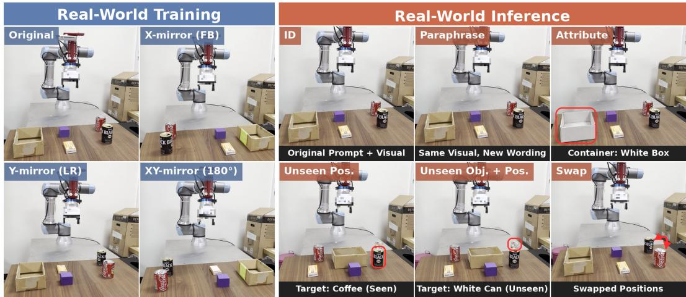  
Figure 13: Real-world training layouts and evaluation settings. The left block shows the original layout and three physically collected mirrored layouts. The right block illustrates the ID, paraphrase, attribute, unseen-position, unseen-object-and-position, and Swap conditions. The Swap comparison uses companion models trained without the layout that coincides with the swapped configuration.

Data budgets. All three models are trained from the same $\pi _ { 0 . 5 }$ base with the same recipe on 400 demonstrations. Standard uses 100 per object in a single layout, while each ECT model uses 25 per object in each of the four layouts. ECT data samples demonstrations independently. ECT data + ECT loss pairs each demonstration with one of the same object and grid position from a different layout, aligned by a linear time warp because human demonstrations are never frame-aligned.

Evaluation cells. Each cell changes one factor relative to the original setting, except Unseen obj. + pos., which changes two. ID uses the original layout, ten trials per object. Paraphrase (nuisance) rewords the instruction as “pick the [object] and place it into the box”, five trials per object. Attribute (nuisance) changes an appearance at the trained positions under the unchanged instruction. A white coffee can replaces the coffee can, or a white box replaces the box, five trials each. Unseen position (counterfactual) places the four objects and the box at positions that appear in no training layout, ten trials per object. Unseen object + position (counterfactual) places the white coffee can, which never appears in training, at such positions, ten trials. Swap (counterfactual) exchanges the coffee can and the coke can in the original layout under the unchanged instruction, with either can as the target. For this cell, each ECT model is replaced by a companion trained with the same method but without the layout that coincides with the swapped configuration, so that configuration is unseen by every evaluated model. All recorded trials are reported, ten per target can except for the ECT-data companion (five with the coffee can and nine with the coke can), and partial grasps count as failures. A Standard model trained on a quarter of the data (25 demonstrations per object, single layout) is as low on the unseen-position cells as the full one (1 against 3 of 50 trials), so four times more single-layout data do not move the counterfactual cells (prediction (vi)). The offline instruction-versus-vision cache decomposition is in Appendix E.2.

## H.2 CALVIN ABC→D

CALVIN scenes A, B, and C place the same articulated fixtures (drawer, slider, switch, and button) at different positions, providing same-instruction demonstrations with different scene-dependent actions. All CALVIN models are $\pi _ { 0 . 5 }$ , trained with one seed per row, and evaluated on the official ABC→D split with 1,000 sequences. Table 4 compares Standard training with pairing in the original data, and with constructed ECT data sampled independently or in pairs.

For original-data pairing, a demonstration is paired with a same-instruction demonstration from a different scene. For constructed data, a mirror reflects the whole table, including fixtures, and a shift moves selected fixtures or blocks. Each transformed demonstration is replayed, and only replays that pass CALVIN’s task-success check are retained with their originals. The constructed-data rows are compute-matched, with about 0.27 epochs over the enlarged pool versus 1.5 epochs over the original data. The natural-pair result shows that additional constructed examples are not required for the reported gain. The comparison with construction also reflects these different coverage budgets.

## I STATISTICAL UNCERTAINTY AND STABILITY

Single-checkpoint success rates (N = 500 rollouts) and human-label proportions use Wilson confidence intervals, and differences use Newcombe-Wilson intervals. These capture episode-level uncertainty for a fixed checkpoint. Frozen-LM ECT data + ECT loss was trained with three independent seeds (0, 1, 42), so its primary stability summary is the seed mean and sample standard deviation. Hierarchical-bootstrap intervals over seeds and rollouts are descriptive given only three seeds.

Seed-level stability of ECT data + ECT loss. The Swap gains are stable across seeds on Spatial, Object, and Goal (Table 27). Long varies more, but every seed stays well above Standard (at least 31.6 against 12.7), so the gain over Standard appears in all three evaluated seeds.

Table 27: Seed-level success rates of $\pi _ { 0 . 5 }$ ECT data + ECT loss (Frozen LM). Std. is the sample standard deviation across three independent training seeds.
<table><tr><td>Suite</td><td>Cell</td><td>Seed 0</td><td>Seed 1</td><td>Seed 42</td><td>Mean</td><td>Std.</td></tr><tr><td>Spatial</td><td>ID</td><td>98.2</td><td>99.0</td><td>98.0</td><td>98.4</td><td>0.5</td></tr><tr><td>Spatial</td><td>Sem.</td><td>97.0</td><td>96.0</td><td>95.2</td><td>96.1</td><td>0.9</td></tr><tr><td>Spatial</td><td>Obj.</td><td>97.2</td><td>96.6</td><td>97.6</td><td>97.1</td><td>0.5</td></tr><tr><td>Spatial</td><td>Swap</td><td>75.4</td><td>75.0</td><td>72.8</td><td>74.4</td><td>1.4</td></tr><tr><td>Spatial</td><td>Task</td><td>21.8</td><td>28.8</td><td>15.6</td><td>22.1</td><td>6.6</td></tr><tr><td>Object</td><td>ID</td><td>99.0</td><td>99.6</td><td>98.8</td><td>99.1</td><td>0.4</td></tr><tr><td>Object</td><td>Sem.</td><td>99.0</td><td>100.0</td><td>98.6</td><td>99.2</td><td>0.7</td></tr><tr><td>Object</td><td>Obj.</td><td>76.0</td><td>77.2</td><td>82.2</td><td>78.5</td><td>3.3</td></tr><tr><td>Object</td><td>Swap</td><td>74.8</td><td>70.2</td><td>67.4</td><td>70.8</td><td>3.7</td></tr><tr><td>Object</td><td>Task</td><td>38.4</td><td>26.0</td><td>29.6</td><td>31.3</td><td>6.4</td></tr><tr><td>Goal</td><td>ID</td><td>94.4</td><td>96.6</td><td>95.8</td><td>95.6</td><td>1.1</td></tr><tr><td>Goal</td><td>Sem.</td><td>92.8</td><td>93.4</td><td>93.6</td><td>93.3</td><td>0.4</td></tr><tr><td>Goal</td><td>Obj.</td><td>85.8</td><td>88.0</td><td>86.2</td><td>86.7</td><td>1.2</td></tr><tr><td>Goal</td><td>Swap</td><td>55.8</td><td>55.8</td><td>55.0</td><td>55.5</td><td>0.5</td></tr><tr><td>Goal</td><td>Task</td><td>32.0</td><td>34.2</td><td>40.8</td><td>35.7</td><td>4.6</td></tr><tr><td>Long</td><td>ID</td><td>92.8</td><td>93.4</td><td>92.2</td><td>92.8</td><td>0.6</td></tr><tr><td>Long</td><td>Sem.</td><td>94.0</td><td>92.4</td><td>92.2</td><td>92.9</td><td>1.0</td></tr><tr><td>Long</td><td>Obj.</td><td>57.6</td><td>58.8</td><td>60.8</td><td>59.1</td><td>1.6</td></tr><tr><td>Long</td><td>Swap</td><td>40.4</td><td>32.2</td><td>31.6</td><td>34.7</td><td>4.9</td></tr><tr><td>Long</td><td>Task</td><td>20.4</td><td>20.4</td><td>26.6</td><td>22.5</td><td>3.6</td></tr></table>

Success-rate deltas. Beyond the matched controls of Table 2, Table 28 compares Frozen-LM ECT data + ECT loss with the official $\pi _ { 0 . 5 }$ , a reference with more trainable parameters. For $\pi _ { 0 . 5 }$ , the Swap deltas are positive on every suite with intervals excluding zero, while ID stays within about one point. For GR00T-N1.7, the per-suite models leave Object Swap unchanged and lower ID on Spatial.

Table 28: Key ID and Swap deltas. $\pi _ { 0 . 5 }$ intervals use a hierarchical bootstrap over seeds and rollouts and are descriptive because only three independent seeds are available. GR00T-N1.7 intervals are Newcombe hybrid-score intervals for a difference of two proportions (N = 500 each).
<table><tr><td>Model</td><td>Suite</td><td>Comparison</td><td>∆ Swap [95% CI]</td><td>∆ ID [95% CI]</td></tr><tr><td>π0.5</td><td>Spatial</td><td>ECT data + ECT loss (Frozen LM) vs. official</td><td> $+ 2 7 . 8 \ : [ + 2 2 . 7 , + 3 2 . 7 ]$ </td><td> $0 . 0 \ [ - 1 . 3 , + 1 . 4 ]$ </td></tr><tr><td>π0.5</td><td>Object</td><td> $\mathrm { E C T \ d a t a + E C T }$  loss (Frozen LM) vs. official</td><td> $+ 5 2 . 6 \ [ + 4 7 . 3 , + 5 7 . 9 ]$ </td><td> $+ 0 . 5 \ [ - 0 . 6 , + 1 . 8 ]$ </td></tr><tr><td>π0.5</td><td>Goal</td><td> $\mathrm { E C T \ d a t a + E C T }$  loss (Frozen LM) vs. official</td><td> $+ 2 1 . 3 [ + 1 6 . 5 , + 2 6 . 2 ]$ </td><td> $- 0 . 8 \ [ - 2 . 9 , + 1 . 4 ]$ </td></tr><tr><td>π0.5</td><td>Long</td><td>ECT data + ECT loss (Frozen LM) vs. official</td><td> $+ 2 5 . 3 \ [ + 2 0 . 0 , + 3 1 . 3 ]$ </td><td>+1.0 [-1.7, +3.9]</td></tr><tr><td>GR00T-N1.7</td><td>Spatial</td><td>ECT data, per suite vs. official</td><td>+16.6 [+13.2, +20.3]</td><td>-6.6 [-10.3, -2.9]</td></tr><tr><td>GR00T-N1.7</td><td>Object</td><td>ECT data, per suite vs. official</td><td>0.0 [-0.8, +0.8]</td><td>+2.0 [-0.3, +4.4]</td></tr><tr><td>GR00T-N1.7</td><td>Goal</td><td>ECT data, per suite vs. official</td><td>+14.0 [+10.6, +17.6]</td><td>+0.4 [-2.5, +3.3]</td></tr><tr><td>GR00T-N1.7</td><td>Long</td><td>ECT data, per suite vs. official</td><td> $+ 9 . 4 \ [ + 6 . 9 , + 1 2 . 3 ]$ </td><td>+2.8 [-0.9, +6.5]</td></tr></table>

Human-label proportion uncertainty. Wilson intervals for the human-label proportions of Section 3.1 (Table 29) capture finite-sample uncertainty only. Table 9 reports inter-annotator agreement.

Table 29: Wilson confidence intervals for human rollout-label proportions. Retrieval-like includes source retrieval, other-task retrieval, and hybrid retrieval. Counts follow Table 10.
<table><tr><td>Scope</td><td>Retrieval-like</td><td>Correct/near-correct</td><td>Collapse</td></tr><tr><td>All probes</td><td>264/381 (69.3 [64.5, 73.7])</td><td>101/381 (26.5 [22.3, 31.2])</td><td>16/381 (4.2 [2.6, 6.7])</td></tr><tr><td>Goal</td><td>99/120 (82.5 [74.7, 88.3])</td><td>15/120 (12.5 [7.7, 19.6])</td><td>6/120 (5.0 [2.3, 10.5])</td></tr><tr><td>Long</td><td>63/72 (87.5 [77.9, 93.3])</td><td>7/72 (9.7 [4.8, 18.7])</td><td>2/72 (2.8 [0.8, 9.6])</td></tr><tr><td>Object</td><td>40/69 (58.0 [46.2, 68.9])</td><td>28/69 (40.6 [29.8, 52.4])</td><td>1/69 (1.4 [0.3, 7.8])</td></tr><tr><td>Spatial</td><td>62/120 (51.7 [42.8, 60.4])</td><td>51/120 (42.5 [34.0, 51.4])</td><td>7/120 (5.8 [2.9, 11.6])</td></tr></table>

Prefix-KV uncertainty. Prefix-KV uncertainty appears with the diagnostics in Appendix E.2. Retrieval rates are exact counts over the 45 same\_to\_other rollouts, and patching estimates use bootstrap intervals over rollouts. For target specificity, candidate-level metrics are aggregated per rollout before the bootstrap, so the 450 row-candidate pairs are not treated as independent.

## J RELATION TO OTHER ACCOUNTS OF VLA FAILURE

Binding characterizes the structured failures in Section 3.1. Work on vision shortcuts and modality imbalance (Lian et al., 2026; Fei et al., 2025; Fang et al., 2026; Xu et al., 2025; Darabi & Trivedi, 2026) motivates testing how language influences action selection. On Goal, altered instructions select other demonstrated behaviors, and the scene-matched prefix readout recovers the executed task in 34/45 cases, versus 22/45 for surface wording. Language therefore affects which familiar behavior is selected in these probes, even when that behavior does not satisfy the request.

The Object stress test isolates a different aspect of the failure. The policy tracks a displaced object after selecting the wrong target, demonstrating retained visual feedback during execution. This observation concerns the use of visual information and does not exclude changes to the visual representation during fine-tuning (Kachaev et al., 2025). All $\pi _ { 0 . 5 }$ recipes train the vision encoder (Appendix G.1). Together, the source-task, other-task, and hybrid outcomes distinguish familiar-behavior selection from unstructured collapse (Metz et al., 2016; Chi et al., 2025).

## K LIMITATIONS

Swap and Task remain below ID after ECT in every suite (Table 23). Binding characterizes task selection rather than a unique retrieval algorithm. Pairing is not uniformly beneficial. In $\pi _ { 0 . 5 }$ the paired sampler changes counterpart co-presentation and the balance of original and counterpart examples together, and the two halves share flow-matching noise and time, so $\Delta _ { \mathrm { l o s s } }$ measures these ingredients jointly. Its optimization mechanism remains open.

The full $\pi _ { 0 . 5 }$ method and its Frozen-LM comparisons use three training seeds, whereas CALVIN and several other comparisons use one. Rollout intervals exclude training variability. Official checkpoints are not matched retraining controls, and four-suite GR00T changes training scope. The data sweep covers a fourfold range at fixed steps.

ECT requires action-valid, scene-dependent alternatives. We test constructed, natural, and physically collected pairs after task-specific fine-tuning. Generalist use without such fine-tuning, contact-rich manipulation, mobile manipulation, and navigation remain untested.