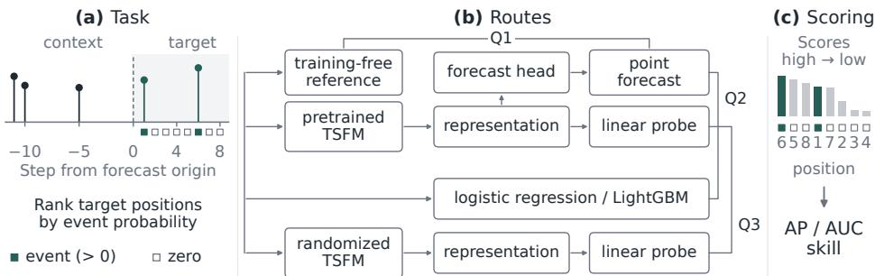
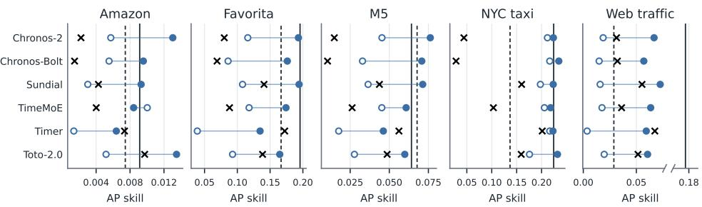
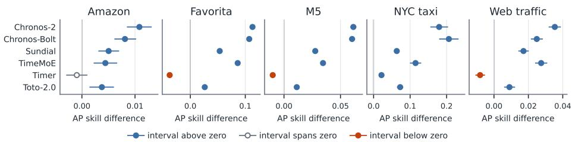
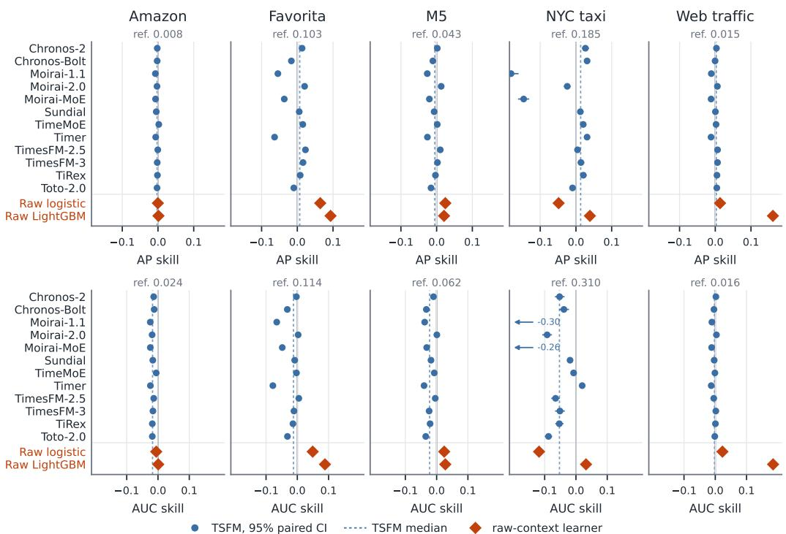
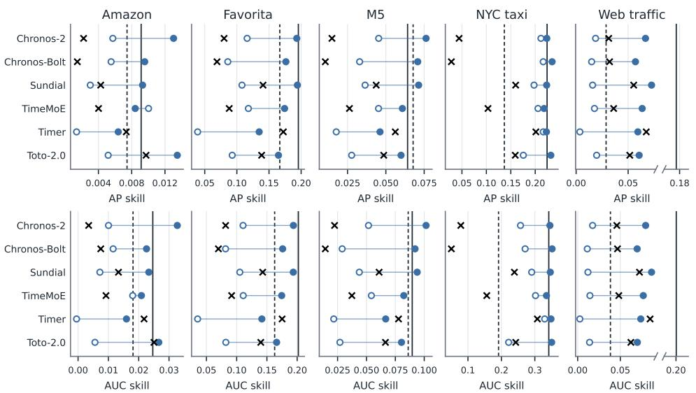
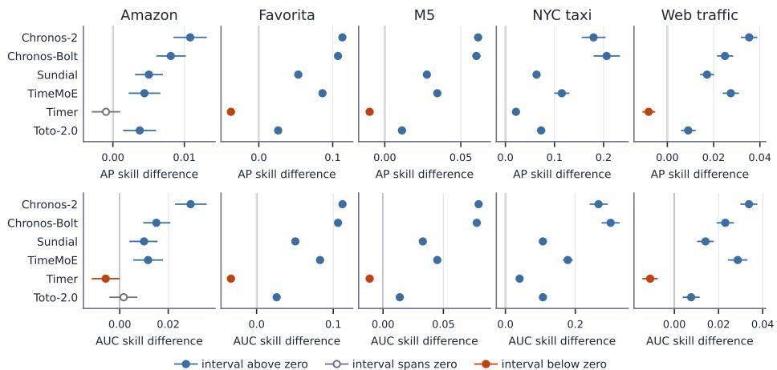
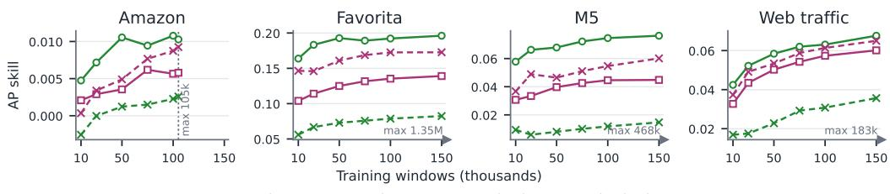
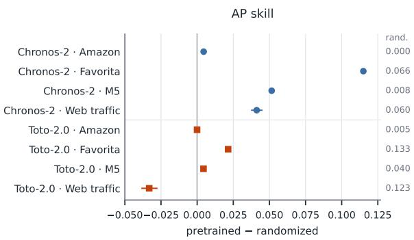
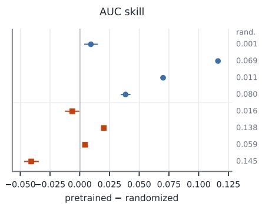

# WHEN, NOT HOW MUCH: EVALUATING TIME-SERIES FOUNDATION MODELS ON SPARSE EVENTS

Daniel Schoess ETH Zurich

Florian von Wangenheim ETH Zurich

## ABSTRACT

Pretrained time-series foundation models (TSFMs) are evaluated as forecasters of future values, yet for sparse series many decisions depend only on which future periods contain activity. Standard benchmarks do not assess this. On five sparse datasets, we rank positions within forecast windows that contain both events and zeros. The released point forecasts of 12 TSFMs improve chance-corrected average precision over training-free references by at most 0.031, and in chancecorrected AUC the median TSFM falls below them on every dataset. With event supervision, linear probes of six frozen backbones improve on their backbone’s point forecast in 29 of 30 backbone–dataset pairs. Averaging the predicted quantiles instead of taking their median improves the ranking of most TSFMs that forecast the median, and on two datasets the strongest such outputs rival the probes. The probes’ advantage over raw-context learners depends on the dataset, and under the same probe, pretrained features outperform randomly initialized ones for five of six backbones. For sparse-event ranking, released point forecasts thus add little over simple references, whereas lightweight event heads on frozen TSFMs rank events better than these forecasts, and the best of them exceed gradientboosted trees trained on the raw context on three of the five datasets. More broadly, assessing pretrained forecasters on tasks beyond value forecasting requires reporting their outputs, supervised probes of their representations, and raw-context and randomized controls side by side, since each supports a different conclusion.

## 1 INTRODUCTION

Sparse time series arise wherever activity is intermittent. Item-level retail sales, maintenance requests, case counts of rare conditions, pickups at peripheral transit locations, and views of niche web pages consist mostly of zeros, with occasional positive values. In such series, the occurrence of activity carries information of its own, separate from its size. Many decisions depend on occurrence alone: an inspection, a staffed shift, or a service visit incurs the same cost whatever the size of the event it serves. When such resources are limited, the relevant question becomes which future periods are most likely to see activity. We formalize this question as within-window event ranking: given the history of a series, rank the positions of the next window by their probability of containing an event (Figure 1).

Pretrained time-series foundation models (TSFMs) forecast unseen series without task-specific training, and large benchmarks evaluate them as zero-shot forecasters of future values (Aksu et al., 2024; Cohen et al., 2025). These benchmarks do not assess sparse-event ranking: zero-heavy windows form a minority of their targets (Appendix A.4), and their metrics score forecast values rather than the ordering of events within a window.

Value forecasts also provide no direct score for occurrence. For a nonnegative target y with context x, the conditional mean factorizes as

$$
\mathbb { E } [ { \bf y } \mid { \pmb x } ] = P ( { \bf y } > 0 \mid { \pmb x } ) \mathbb { E } [ { \bf y } \mid { \bf y } > 0 , { \pmb x } ] .
$$

  
Figure 1: (a) Given the context of a sparse series, rank the positions of the target window by their chance of an event (8 positions shown; the study uses 64). (b) All routes read the same context. Q1 compares the point forecasts of 12 frozen TSFMs with a training-free reference; Q2 compares linear probes of six frozen backbones with their point forecasts and with raw-context learners; Q3 compares each probe with the same probe on a randomized copy of its backbone. Probes and rawcontext learners are trained on event labels. (c) Each route’s scores are ranked within the window and scored by chance-corrected AP and AUC skill, averaged over windows.

Ordering positions by the mean thus ranks the expected amount of activity, which combines the probability of an event with its expected size. Decisions triggered by any event depend on the first factor alone. Under a Poisson or a negative binomial model with fixed dispersion, the event probability increases with the mean, so the two rankings coincide. In general, they diverge only where a position with a higher event probability has a smaller expected event size. Many TSFMs, however, report the median of their forecast distribution as the point forecast, the forecast that absolute-error metrics reward (Kolassa, 2016). For a nonnegative target, that median is zero whenever the event probability is below 50%, so a median point forecast cannot distinguish a position with a 1% event probability from one with 49%. How a forecast distribution is reduced to a point therefore affects the ranking. Output-level evaluation also leaves open how well the frozen models rank events once event labels are available, and whether this depends on pretraining.

We address these questions on five sparse datasets from retail, e-commerce, transport, and web traffic. First, we score the point forecasts of 12 TSFMs against a training-free reference: the seasonal profile or horizon ramp that scores best on validation data. We measure ranking quality with average precision and AUC, each corrected for chance within the window (AP skill and AUC skill): zero matches a random ordering, and one is a perfect ranking. Second, for six backbones, we train linear probes on frozen representations with event labels, a lightweight event head that measures how well the frozen features rank events under supervision. Three controls interpret these probes. Logistic regression on the raw context shares the learner family of the probe and so compares the frozen features with the raw context under the same learner. LightGBM on the raw context provides a strong direct learner as a reference level. Randomly initialized copies of each backbone test whether the gains require pretrained weights, since trained probes can extract strong features from untrained networks (Dempster et al., 2020; Zhang & Bowman, 2018).

The point forecasts of the TSFMs exceed the training-free reference by at most 0.031 AP skill, and under AUC skill the median TSFM falls below it on every dataset. Linear probes of six of these frozen models improve on the point forecasts in 29 of 30 backbone–dataset pairs and exceed raw-context logistic regression in 22 of 30, whereas their comparison with raw-context LightGBM depends on the dataset. Under the same probe, pretrained features outperform randomized ones for five of six backbones; for Timer, randomized features score higher on three of five datasets.

Our contributions are as follows.

• Task and protocol. We define within-window event ranking for sparse series, curate five sparse evaluation datasets from public data, and score rankings with chance-corrected, tieaware AP and AUC skill.

• Output-level assessment. Point forecasts of 12 TSFMs give at most small gains over training-free references on all five datasets, and a sensitivity analysis shows that the ranking depends on how the forecast distribution is reduced to a point.

• Representation-level assessment with supervised and randomized controls. Linear probes of six frozen backbones improve on their backbone’s point forecast in nearly every case. Raw-context learners show that the advantage over direct event learning depends on the dataset, and randomly initialized backbones show that the advantage of pretrained weights depends on the backbone.

We conclude that evaluations of TSFMs on sparse events should report outputs, frozenrepresentation probes, and raw-context and randomized controls side by side.

## 2 RELATED WORK

Occurrence in sparse time series. Several count-data models give zeros a separate component. Hurdle models separate whether a count is zero or positive from the distribution of the positive counts (Mullahy, 1986), and zero-inflated models mix a count distribution with a point mass at zero (Lambert, 1992). A well-studied forecasting setting with sparse series is intermittent demand, where many periods record no sales. Croston’s method smooths demand sizes and intervals separately (Croston, 1972), and the TSB method replaces the interval with a demand probability (Teunter et al., 2011). Deep renewal processes model interarrival times and positive sizes (Turkmen¨ et al., 2021), and SPADE-S routes very sparse series to a separate arm of a neural forecaster (Wolff et al., 2025). These methods forecast an amount per period, even when they model occurrence internally. Absolute-error measures such as the MAE are minimized by the median of the predictive distribution (Kolassa, 2016), which is zero whenever zero has probability above one half. In concurrent work on intermittent demand, Chin et al. (2026) find that more accurate forecasters tend to achieve lower order-level service. We instead score how well a method ranks event occurrences within a window. Temporal point processes predict the times of labeled events, and HoTPP scores long-horizon event forecasts with a temporally tolerant AP (Karpukhin et al., 2026). Our targets lie on a fixed grid, so every position carries a label and no matching tolerance is needed.

Evaluating pretrained forecasters. GIFT-Eval and BOOM benchmark TSFMs as zero-shot forecasters with point and probabilistic error metrics (Aksu et al., 2024; Cohen et al., 2025). Zero-heavy windows form a minority of the forecast windows in both (Section 3.1), and their per-step metrics do not score how events are ordered within a window. A second line of work asks what frozen TSFM representations encode rather than what the models forecast. Prior work trains classifiers on frozen TSFM embeddings (Auer et al., 2025a; Feofanov et al., 2026) and locates synthetic concepts or generator states with layer-wise linear probes (Wilinski et al., 2025; Chemeris et al., 2026). These studies probe for labels other than the forecast target. We probe for the occurrence of the forecast target and score the probe and the released forecast of the same frozen model with the same ranking metric, so the two can be compared directly.

Controls for probes. A probe score alone does not show what the representation contributes. Control tasks measure how much of a probe’s accuracy comes from the probe itself rather than the representation (Hewitt & Liang, 2019). Belinkov (2022) also discusses random baselines, which train the same probe on a randomized version of the model, and notes that even random features carry information the probe can decode. A linear classifier on features pooled from random convolutional kernels matched the most accurate time-series classifiers of its time (Dempster et al., 2020). Frozen, randomly initialized LSTMs came within a few percentage points of trained language-model encoders on syntactic tagging when the probe used all labeled data, but their accuracy dropped far more than that of trained encoders when the probe’s training data were reduced (Zhang & Bowman, 2018). In one LLM-based forecaster, replacing the pretrained language model with a frozen, randomly initialized one, while still training the layers around it, leaves forecast error close to that of the pretrained variants (Tan et al., 2024). The TSFM probing and frozen-feature studies above do not report a randomized-backbone control. We therefore report each probe next to the same learner on the raw context and the same probe on a randomized backbone, together with the absolute scores of both.

Table 1: The three evaluation questions and the paired comparison that answers each, on all five datasets. Event labels: which of the two compared scores is trained on the event labels of the training split. The Q1 reference is selected from four or six candidates on validation event labels. The linear probe is the primary probe; the GBM probe, LightGBM on the frozen representation, is a sensitivity analysis.
<table><tr><td>Question</td><td>Compared scores</td><td>Event labels</td><td>Models</td></tr><tr><td>Q1 Output</td><td>point forecast vs. training-free reference</td><td>neither</td><td>12 TSFMs</td></tr><tr><td rowspan="3">Q2 Probe</td><td>linear probe vs. point forecast</td><td>probe</td><td>6 backbones</td></tr><tr><td>linear probe vs. raw-context logistic regression</td><td>both</td><td>6 backbones</td></tr><tr><td>linear probe vs. raw-context LightGBM</td><td>both</td><td>6 backbones</td></tr><tr><td>Q3 Pretraining</td><td>pretrained vs. randomized linear probe</td><td>both</td><td>6 backbones</td></tr></table>

## 3 THREE QUESTIONS ON FORECASTS, REPRESENTATIONS, AND PRETRAINING

We evaluate each pretrained model through three questions, each answered by paired comparisons on the same windows (Table 1). First, how well does the point forecast of a TSFM rank events within a window, measured against a training-free summary of the same context? Second, does an event-supervised probe of the frozen representation rank better than that output, and better than the same learner trained on the raw context? Third, does the probe rank events better with pretrained weights than with a randomly initialized copy of the same backbone? Appendices A and C give the full protocol.

## 3.1 TASK, DATASETS, AND WINDOWS

Zero-heavy targets form a minority of standard forecasting benchmarks: 24% of GIFT-Eval (Aksu et al., 2024) and 1.6% of BOOM (Cohen et al., 2025) forecast windows contain at least 40% zeros (Appendix A.4). We therefore build five datasets of nonnegative sparse series from raw public sources: daily customer purchases (Amazon) (Berke et al., 2024), daily store–item sales (Favorita) (Corporacion Favorita et al., 2017) and M5 (Makridakis et al., 2022), hourly pickups per location´ (NYC taxi) (NYC Taxi and Limousine Commission, 2024), and daily Wikipedia page views (web traffic) (Godahewa et al., 2022b). An event is a position with a positive observed value. We keep series with at least two events and at least 40% zero positions (Appendix A).

A window w pairs a context $\pmb { x } _ { w } \in \mathbb { R } ^ { C }$ of C = 364 daily or $C = 3 3 6$ hourly observations, one year of days or two weeks of hours, with the H = 64 target positions that follow it. We set H to the shortest native output limit among the evaluated TSFMs. The target has labels ${ \pmb y } _ { w } \in \{ 0 , 1 \} ^ { H }$ where $y _ { w , h } = 1$ if position h contains an event. Windows are tiled backwards from the end of the data with stride $H ,$ so targets do not overlap within a series. A window enters the study if its context contains at least two events. It is scored only if its target contains $\begin{array} { r } { k _ { w } = \sum _ { h } y _ { w , h } } \end{array}$ events with $0 < k _ { w } < H$ , because AP is undefined without positives and the skill normalization of Section 3.3 is undefined without negatives. All results therefore concern targets with mixed labels; they do not measure whether a method recognizes an entirely inactive horizon. For the four daily datasets, five seeded splits partition the series into training, validation, and test sets, so trained models are scored on unseen series. NYC taxi has too few locations for series-disjoint splits (164 evaluated) and is split by year instead. Table 2 summarizes the evaluated windows and series.

## 3.2 POINT FORECASTS, FROZEN REPRESENTATIONS, AND RAW CONTEXTS

Point forecasts. We evaluate the largest publicly available checkpoint of twelve TSFMs: Chronos-2 (Ansari et al., 2025), Chronos-Bolt (Ansari et al., 2024), Moirai-1.1 (Woo et al., 2024), Moirai-2.0 (Liu et al., 2025a), Moirai-MoE (Liu et al., 2025b), Sundial (Liu et al., 2025c), TimeMoE (Shi et al., 2025), Timer (Liu et al., 2024), TimesFM-2.5 (Das et al., 2024), TimesFM-3 (Das et al., 2024), TiRex (Auer et al., 2025b), and Toto-2.0 (Khwaja et al., 2026). Each TSFM ranks positions by its point forecast, the output these models are released and used with: a median for seven TSFMs, and a mean of samples or a model point output for the other five (Table 11). An approximate event probability derived from the quantiles serves as a sensitivity analysis for the ten TSFMs that output quantiles or samples (Appendix F.2). To test whether a forecast ranks positions better than a simple summary of the same context, we also score a training-free reference: the seasonal event-rate or mean profile, or a horizon ramp, selected on each split by validation AP skill (Appendix C.2). We do not use Croston’s method or TSB (Croston, 1972; Teunter et al., 2011) as references, because their forecast is constant across the horizon, so their within-window AP and AUC skill is zero.

Table 2: Evaluation datasets. Windows: evaluated test windows, pooled over splits. Series: unique series contributing test windows. Zeros: share of zero positions in the evaluated targets. All windows use a 64-step horizon and stride.
<table><tr><td>Dataset</td><td>Cadence</td><td>Context</td><td>Split design</td><td>Windows</td><td>Series</td><td>Zeros (%)</td></tr><tr><td>Amazon</td><td>daily</td><td>364</td><td>5 series-disjoint</td><td>22,600</td><td>1,135</td><td>87.5</td></tr><tr><td>Favorita</td><td>daily</td><td>364</td><td>5 series-disjoint</td><td>321,747</td><td>26,427</td><td>45.7</td></tr><tr><td>M5</td><td>daily</td><td>364</td><td>5 series-disjoint</td><td>120,063</td><td>5,979</td><td>64.1</td></tr><tr><td>NYC taxi</td><td>hourly</td><td>336</td><td>1 calendar</td><td>19,207</td><td>164</td><td>73.7</td></tr><tr><td>Web traffic</td><td>daily</td><td>364</td><td>5 series-disjoint</td><td>41,816</td><td>1,597</td><td>65.6</td></tr></table>

Frozen representations. All TSFMs stay frozen throughout, which keeps the weights identical across the point forecast, the probe, and the pretrained side of the randomized comparison. Ten TSFMs produce the full 64-step horizon in one forward pass (Appendix C.1), and we probe six of them: Chronos-2, Chronos-Bolt, Sundial, TimeMoE, Timer, and Toto-2.0. They span encoder-only, encoder–decoder, and decoder-only architectures, including a mixture-of-experts backbone and a flow-matching head. We fixed this subset before training any probe. It omits Moirai-1.1, Moirai-2.0, TimesFM-2.5, and TimesFM-3, which include the strongest point forecasters. Each probe reads a forecast-aligned representation (Appendix C.1), so it sees the same input as the forecast, and neither depends on predictions generated earlier in the horizon.

Raw contexts. Each probe has a raw-context counterpart trained with the same learner family, the same windows, and the same training sample. Logistic regression maps the context to the 64 position scores and serves as the same-family control for the linear probe. LightGBM (Ke et al., 2017) fits one classifier per position and shows what nonlinear event learning attains directly from the same history (Appendix C.3).

Randomized backbones. A trained probe can extract strong features from an untrained network (Section 2), so a probe gain over the forecast does not by itself show that pretraining contributes. We therefore replace the pretrained weights of each backbone with the default initialization of its source code, keeping architecture, preprocessing, and extraction path unchanged (Appendix C.1); each split draws its own initialization. The linear probe is then trained with the same procedure and seed as for the pretrained backbone. Because initialization schemes differ across sources, we compare pretrained and randomized features within a backbone, not randomized features across backbones. We also repeat the GBM probe on randomized copies of Chronos-2 and Toto-2.0 on the daily datasets as a secondary check with a nonlinear probe (Appendix E.6). Since the pretrained-minus-randomized gap can depend on the amount of probe training data (Zhang & Bowman, 2018), which we cap at 100,000 windows per split, we verify for Chronos-2 and Timer that larger training sets change AP skill by at most 0.0054 and leave the sign of every such comparison unchanged (Appendix E.5).

## 3.3 SCORING AND UNCERTAINTY

Each method assigns scores $\boldsymbol { z } _ { w } \in \mathbb { R } ^ { H }$ to the target positions of window w, and we rank and score each window on its own, as information retrieval scores each query (Manning et al., 2008). Raw AP depends on prevalence and ties, so we report

$$
S _ { w } ^ { \mathrm { A P } } = \frac { \mathrm { A P } _ { w } - \mathrm { A P } _ { w } ^ { 0 } } { 1 - \mathrm { A P } _ { w } ^ { 0 } } ,
$$

Table 3: Point forecasts of the 12 TSFMs compared with the validation-selected training-free reference, equal-window weighting. “Ref.” is the reference’s skill; “Median” and “Max” give the median and maximum over TSFMs of the TSFM-minus-reference difference, and “Best probe” the maximum over the six probed backbones of the pretrained linear probe’s difference from the reference; both maxima are descriptive test-set maxima. Per-TSFM values with paired intervals are in Figure 4 and Tables 14–18.
<table><tr><td></td><td colspan="4">AP skill</td><td colspan="4">AUC skill</td></tr><tr><td>Dataset</td><td>Ref.</td><td>Median</td><td>Max</td><td>Best probe</td><td>Ref.</td><td>Median</td><td>Max</td><td>Best probe</td></tr><tr><td>Amazon</td><td>0.008</td><td>-0.002</td><td>0.002</td><td>0.006</td><td>0.024</td><td>-0.017</td><td>-0.006</td><td>0.009</td></tr><tr><td>Favorita</td><td>0.103</td><td>0.007</td><td>0.023</td><td>0.092</td><td>0.114</td><td>-0.012</td><td>0.005</td><td>0.080</td></tr><tr><td>M5</td><td>0.043</td><td>-0.005</td><td>0.013</td><td>0.033</td><td>0.062</td><td>-0.022</td><td>0.001</td><td>0.040</td></tr><tr><td>NYC taxi</td><td>0.185</td><td>0.013</td><td>0.031</td><td>0.049</td><td>0.310</td><td>-0.053</td><td>0.020</td><td>0.042</td></tr><tr><td>Web traffic</td><td>0.015</td><td>0.003</td><td>0.006</td><td>0.057</td><td>0.016</td><td>-0.003</td><td>0.004</td><td>0.071</td></tr></table>

where $\mathrm { A P } _ { w } ^ { 0 }$ is the expected AP of window w when its labels are permuted uniformly at random with its scores and positive count held fixed (Appendix B). Tied positions enter AP together at their shared threshold rather than being averaged over tie orderings (McSherry & Najork, 2008). We also report $S _ { w } ^ { \mathrm { A U C } } = 2 \mathrm { A U R O C } _ { w } - 1$ , with half credit for tied pairs. AP emphasizes the top of the ranking, whereas AUC weights all positive–negative pairs.

Primary estimates average window-level skills with equal weight; equal-series averages are a sensitivity analysis (Appendix E.1). We do not pool positions across windows, because a pooled ranking can reward differences in activity between windows without ordering positions within any window (Appendix B.3). Uncertainty is reported as pointwise 95% paired bootstrap intervals from 2,000 resamples of the eligible series of each dataset. The intervals are not corrected for multiplicity, and counts of intervals that exclude zero are descriptive. They are conditional on the fitted predictors; split and initialization seeds vary together, so they do not isolate training or initialization variability. For the four daily datasets, we also count in how many of the five splits each paired difference keeps the sign of its pooled estimate (Table 23). NYC taxi has one split, so its intervals reflect one fitted run per procedure.

## 4 RESULTS

We answer the three questions of Section 3 in turn. Figures report AP skill; the AUC-skill figures are in Appendix D, and the text states where the two metrics differ. Appendix D.2 expresses the results as the number of events among the eight highest-ranked positions of a window.

## 4.1 POINT FORECASTS GIVE LIMITED GAINS OVER TRAINING-FREE REFERENCES

Point forecasts rank events within a window little better than a training-free reference, and often worse (Table 3). No TSFM point forecast gains more than 0.031 AP skill over the reference on any dataset. AUC skill gives a less favorable picture: the median over TSFMs falls below the reference on all five datasets. The small AP gains also depend on the averaging unit: on web traffic, weighting each series equally instead of each window places the reference above every TSFM (Appendix E.1).

Although every scored window contains an event, outside Amazon the seven median forecasts stay below 1% of the mean nonzero context value at all 64 positions in 11–54% of scored windows, whereas the other five TSFMs do so in at most 2% (Appendix F.1). Both groups gain at most 0.031 AP skill over the reference, so near-zero median forecasts alone do not account for the limited gains. Ranking by an approximate event probability derived from the quantiles does not improve on the point forecasts, whereas averaging the quantiles improves on most median forecasts and raises the largest gain over the reference from 0.031 to 0.057 AP skill (Appendix F.2). Point forecasts are trained to predict amounts and use no event labels. Section 4.2 tests whether the frozen representa tions behind these forecasts support better event ranking once a probe is trained on event labels.

  
point forecast linear probe (pretrained) linear probe (randomized) raw logistic raw LightGBM  
Figure 2: AP skill of the six probed backbones on the five datasets, equal-window weighting. Axes differ by dataset; the web-traffic axis is broken. Points are marginal estimates, so their overlap is not a test; Table 4 gives the paired comparisons and Tables 14–18 the per-backbone intervals. Figure 5 adds AUC skill.

Table 4: Paired AP-skill contrasts of the six probed backbones, equal-window weighting. Each cell gives the median difference over the six backbones and, in parentheses, how many of the six paired 95% intervals lie above zero, span zero, or lie below zero. Per-backbone values and AUC skill are in Tables 14–18 and 19, and split sign counts in Table 23.
<table><tr><td>Contrast</td><td>Amazon</td><td>Favorita</td><td>M5</td><td>NYC taxi</td><td>Web traffic</td></tr><tr><td>Probe – point forecast</td><td>0.006 (5/1/0)</td><td>0.082 (6/0/0)</td><td>0.032 (6/0/0)</td><td>0.015 (6/0/0)</td><td>0.047 (6/0/0)</td></tr><tr><td>Probe — raw logistic</td><td>0.002 (3/3/0)</td><td>0.008 (4/0/2)</td><td>-0.002 (3/0/3)</td><td>0.087 (6/0/0)</td><td>0.033 (6/0/0)</td></tr><tr><td>Probe – raw LightGBM</td><td>0.000 (2/3/1)</td><td>−0.020 (0/0/6)</td><td>0.002 (3/0/3)</td><td>-0.001 (2/3/1)</td><td>-0.115 (0/0/6)</td></tr><tr><td>Pretrained — randomized</td><td>0.005 (5/1/0)</td><td>0.070 (5/0/1)</td><td>0.031 (5/0/1)</td><td>0.094 (6/0/0)</td><td>0.021 (5/0/1)</td></tr></table>

## 4.2 LINEAR PROBES OUTPERFORM POINT FORECASTS

Gains over the point forecast are consistent. A linear probe of the frozen representation ranks events better than the backbone’s point forecast in 29 of 30 backbone–dataset pairs under each metric, with paired intervals above zero (Table 4 and Tables 14–18). The only exception is TimeMoE on Amazon, where both intervals span zero. On web traffic, the gain in AP skill exceeds the forecast’s own skill for all six backbones (Figure 2). On the four daily datasets, the difference from the point forecast has the same sign in all five seeded splits for 24 of 24 AP and 23 of 24 AUC contrasts; the exception is again TimeMoE on Amazon (Appendix E.2). Only the probe is trained on event labels, so we also train the same logistic learner on each backbone’s outputs (Appendix F.3). Probes outperform these output readouts on Favorita, M5, and web traffic under both metrics. The probes of the three median-forecasting backbones also exceed the quantile average of their own backbone in 28 of 30 comparisons (Appendix F.2). On M5 and NYC taxi, the strongest quantile average among the seven median-forecasting TSFMs exceeds most of the six probes under both metrics.

Probes exceed raw-context logistic regression in most pairs. The probes also exceed logistic regression on the raw context, with intervals above zero in 22 of 30 pairs under each metric. This holds for all six backbones on NYC taxi and web traffic, and in AP skill for three on Amazon, four on Favorita, and three on M5 (Table 4). The other AP intervals span zero on Amazon and lie below zero on Favorita and M5. Both learners are linear and are trained on the same windows with the same regularization grid and selection rule. Where the probe leads, event supervision alone therefore does not account for its gain. Unlike the probes, whose backbones rescale each window, raw logistic regression standardizes each context position with training-set statistics, which on NYC taxi come from a different year than the test set. Fitted on test-year windows, raw logistic regression gains 0.086 AP skill there (Appendix F.3), so the probes’ median lead of 0.087 on NYC taxi does not isolate the features. The randomized backbones keep the probes’ preprocessing, and on NYC taxi pretrained features still exceed them by a median of 0.094.

  
Figure 3: Pretrained-minus-randomized difference in AP skill under the linear probe, with pointwise 95% paired bootstrap intervals over series, often narrower than the markers; equal-window weighting. NYC taxi has one fitted run per initialization. Figure 6 adds AUC skill.

The comparison with direct tree learning depends on the dataset. Raw-context LightGBM marks a level that direct event learning reaches from the same history (Table 4). The best linear probes exceed it on Amazon, M5, and NYC taxi, by up to 0.012 AP skill, and come within 0.003 of it on Favorita, where all six probes trail it. Web traffic is the clear exception: every linear probe trails raw LightGBM, by a median of 0.115 AP skill, and a GBM probe narrows but does not close this gap (Appendix E.6). On windows without missing values, the median gap shrinks to 0.039 (Appendix E.4). None of the tested methods achieves substantial event-ranking skill on Amazon: all stay below 0.014 AP skill and place fewer than 0.1 more events than a random ordering among the eight highest-ranked positions (Appendix D.2). Under equal-series weighting, no probe interval against a point forecast or raw learner moves from one side of zero to the other, and outside Amazon six linear-probe intervals against raw LightGBM then span zero (Table 22).

## 4.3 THE ADVANTAGE OF PRETRAINED FEATURES DEPENDS ON THE BACKBONE

Pretrained features lead for five of six backbones. Under the linear probe, pretrained features outperform randomized ones in 26 of 30 AP comparisons and 25 of 30 AUC comparisons (Figure 3, Table 4). Timer accounts for all four AP exceptions and four of the five AUC exceptions. Chronos-2, Chronos-Bolt, Sundial, and TimeMoE are ahead in all ten comparisons, and Toto-2.0 in nine, with its Amazon AUC interval spanning zero. The size of this advantage varies widely: on Favorita, the AP-skill difference is 0.113 for Chronos-2 and 0.107 for Chronos-Bolt, but 0.053 for Sundial and 0.026 for Toto-2.0.

Randomized features already attain substantial skill. On every dataset and metric, randomizedprobe skill varies more across the six backbones than pretrained-probe skill. In AP skill, pretrained probes span 0.135–0.194 on Favorita and 0.218–0.235 on NYC taxi, whereas randomized probes span 0.069–0.172 and 0.028–0.201. Randomized probes exceed their backbone’s point forecast in 15 of 30 pairs under AP and 16 under AUC skill (point estimates), including all six on web traffic and Sundial, Timer, and Toto-2.0 on every daily dataset.

Timer is the exception. For Timer, randomized features outperform pretrained ones under the linear probe on Favorita, M5, and web traffic under both metrics, with the same sign in all five seeded splits (Table 23); under equal-series weighting, the web-traffic AP difference becomes positive (Appendix E.1). On Favorita, the randomized probe reaches 0.172 AP skill and the pretrained probe 0.135. Only on NYC taxi are pretrained Timer features ahead (0.022 AP skill). Timer’s point forecast is also the weakest of the six on every daily dataset under both metrics, but among the strongest on NYC taxi. Appendix G reports the remaining comparisons.

The lead over LightGBM needs pretrained weights. Outside Amazon, no randomized probe reaches raw LightGBM under either metric. On M5 and NYC taxi, the probes’ advantage over raw LightGBM therefore appears only with pretrained weights. On M5, no randomized probe reaches even raw logistic regression. Randomized probes do exceed raw logistic regression in several other cases, including all six on web traffic and Timer on Favorita (0.172 versus 0.167).

## 5 DISCUSSION AND LIMITATIONS

Interpreting the probe gains. The raw-logistic and randomized controls train both sides on the same event labels. Hence, they test the representation under matched supervision: the probe leads raw-context logistic regression in 22 and the randomized probe in 26 of 30 AP comparisons. On M5 and NYC taxi, the best linear probes also exceed raw-context LightGBM, and no randomized probe does. On M5, the three probes that exceed raw LightGBM do so by 0.007–0.012 AP skill, or 10–19% of its skill, with the same sign in all five seeded splits.

Why point forecasts rank events poorly. A point forecast targets an amount: the mean mixes event probability with event size, and the median of a zero-heavy distribution is zero wherever an event is less likely than not (Section 1). Near-zero median forecasts (Section 4.1) are consistent with this second effect, but the other five TSFMs rarely forecast near zero and gain equally little. Averaging the quantiles instead of taking their median improves most median forecasts, and on M5 and NYC taxi the strongest quantile average exceeds most probes, so the ranking also depends on how the forecast distribution is reduced to a point (Appendix F.2). Output heads that forecast both factors of the decomposition in Section 1, the event probability and the positive amount, are a direct next step.

Where direct learning and random features match or exceed the probes. Web traffic is the one dataset on which all probes trail raw LightGBM by a wide margin, even with a GBM readout. Randomized probes also reach substantial skill (Section 4.3), in line with strong random-feature baselines in time-series classification (Dempster et al., 2020). Reporting only the pretrained probe would therefore credit pretraining with skill that randomized features already reach. Timer is the extreme case: its randomized features outperform its pretrained ones on Favorita, M5, and web traffic. To look for a cause, we fit linear readouts of the recent context from pretrained and randomized features (Appendix G). On all five datasets, Timer’s pretrained features encode the recent event rate better than its randomized ones, but the recent event pattern worse. No other backbone shows this pattern loss on every dataset; Toto-2.0 shows a smaller one on three. Across backbones, this pattern loss tracks the pretrained-minus-randomized probe gap, but it does not explain which of Timer’s datasets reverse, so it is a correlate rather than an explanation.

Recommended reporting. We recommend that evaluations of TSFMs on sparse events report four comparisons side by side, each for the conclusion it supports. A training-free reference measures what the point forecast adds to event ranking. The probe’s own learner trained on the raw context tests the frozen features under matched supervision, and a strong direct learner tests whether the probe is competitive with direct event learning. A randomized backbone under the same probe tests the pretrained weights against a fixed initialization. Each paired difference should appear next to the absolute scores of both routes. At the output level, the ranking metric and the averaging unit also change conclusions (Section 4.1), so both should be stated. In current benchmarks, zero-heavy windows form a minority and metrics score forecast values (Section 3.1); our five datasets and scoring protocol offer a starting point for an occurrence-ranking track.

Limitations. Our conclusions cover five public datasets, target-only inputs, a 64-step horizon, and windows whose target contains both events and zeros, so we do not assess whether a method recognizes a fully inactive horizon. Events are recorded positive values, so zeros can also reflect missing records, as for 68% of the web-traffic zero labels, or unavailability, as for Favorita items that may have been out of stock (Appendix A.2). Daily splits separate series but share calendar time, which can favor the trained routes over the point forecasts but applies equally to probes and raw-context learners. Some TSFMs disclose pretraining sources that overlap with our data, for web traffic including our pages and dates (Appendix A.5), which could favor pretrained over randomized features. In the 12 backbone–dataset pairs with disclosed exclusion, mostly on Amazon and M5, pretrained features exceed randomized copies by a median of 0.019 AP skill, with 11 of 12 intervals above zero, against 0.027 over all 30 pairs (Table 9). The probes that exceed raw LightGBM on M5 also all come from backbones that disclose excluding M5. Probes cover six of the ten TSFMs that meet our extraction criterion, and each representation is read at one extraction point. Probe results depend on extraction and aggregation choices (Auer et al., 2025a, App. C.2), so other extraction points or other backbones may rank events better. Event-supervised fine-tuning, outside our frozenbackbone scope, could raise the skill of both TSFM routes. Raw-context LightGBM also does not represent all direct learners; feature-engineered or dedicated event and count models may rank events better. Our intervals are pointwise and uncorrected for multiplicity, and NYC taxi contributes one fitted run per procedure. Our metrics assess ranking only, not the calibration of event probabilities or their value for downstream decisions.

## REFERENCES

Taha Aksu, Gerald Woo, Juncheng Liu, Xu Liu, Chenghao Liu, Silvio Savarese, Caiming Xiong, and Doyen Sahoo. GIFT-Eval: A benchmark for general time series forecasting model evaluation. arXiv preprint arxiv:2410.10393, 2024.

Abdul Fatir Ansari, Lorenzo Stella, Ali Caner Turkmen, Xiyuan Zhang, Pedro Mercado, Huibin Shen, Oleksandr Shchur, Syama Sundar Rangapuram, Sebastian Pineda Arango, Shubham Kapoor, Jasper Zschiegner, Danielle C. Maddix, Hao Wang, Michael W. Mahoney, Kari Torkkola, Andrew Gordon Wilson, Michael Bohlke-Schneider, and Bernie Wang. Chronos: Learning the language of time series. Transactions on Machine Learning Research, 2024. ISSN 2835-8856. URL https://openreview.net/forum?id=gerNCVqqtR. Expert Certification.

Abdul Fatir Ansari, Oleksandr Shchur, Jaris Kuken, Andreas Auer, Boran Han, Pedro Mercado,¨ Syama Sundar Rangapuram, Huibin Shen, Lorenzo Stella, Xiyuan Zhang, Mononito Goswami, Shubham Kapoor, Danielle C. Maddix, Pablo Guerron, Tony Hu, Junming Yin, Nick Erickson, Prateek Mutalik Desai, Hao Wang, Huzefa Rangwala, George Karypis, Yuyang Wang, and Michael Bohlke-Schneider. Chronos-2: From univariate to universal forecasting, 2025. URL https://arxiv.org/abs/2510.15821.

Andreas Auer, Daniel Klotz, Sebastian Bock, and Sepp Hochreiter. Pre-trained forecasting models:¨ Strong zero-shot feature extractors for time series classification. In NeurIPS 2025 Workshop on Recent Advances in Time Series Foundation Models (BERT2S), 2025a. URL https:// openreview.net/forum?id=vhngjDHyB0.

Andreas Auer, Patrick Podest, Daniel Klotz, Sebastian Bock, G ¨ unter Klambauer, and Sepp Hochre-¨ iter. TiRex: Zero-shot forecasting across long and short horizons with enhanced in-context learning. In The Thirty-ninth Annual Conference on Neural Information Processing Systems, 2025b. URL https://openreview.net/forum?id=v7UqniC9pF.

Yonatan Belinkov. Probing classifiers: Promises, shortcomings, and advances. Computational Linguistics, 48(1):207–219, March 2022. doi: 10.1162/coli a 00422. URL https: //aclanthology.org/2022.cl-1.7/.

Alex Berke, Dan Calacci, Robert Mahari, Takahiro Yabe, Kent Larson, and Sandy Pentland. Open ecommerce 1.0, five years of crowdsourced U.S. Amazon purchase histories with user demographics. Scientific Data, 11(1):491, may 2024. ISSN 2052-4463. doi: 10.1038/s41597-024-03329-6.

Alexander Chemeris, Ming Jin, and Randall Balestriero. Aionoscope: Debugging latent-state accessibility in time-series representations. In The 12th Mining and Learning from Time Series Workshop (MiLeTS) at KDD, 2026. arXiv:2607.00956.

Joo Ern Chin, Shih-Fen Cheng, and Aldy Gunawan. Accuracy is not service: A decision-aware benchmark for intermittent-demand forecasting. In Proceedings of the 2026 IEEE International Conference on Data Mining (ICDM), 2026. arXiv:2609.13840.

Ben Cohen, Emaad Khwaja, Youssef Doubli, Salahidine Lemaachi, Chris Lettieri, Charles Masson, Hugo Miccinilli, Elise Rame, Qiqi Ren, Afshin Rostamizadeh, Jean Ogier du Terrail, Anna-´ Monica Toon, Kan Wang, Stephan Xie, Zongzhe Xu, Viktoriya Zhukova, David Asker, Ameet Talwalkar, and Othmane Abou-Amal. This time is different: An observability perspective on time series foundation models. In The Thirty-ninth Annual Conference on Neural Information Processing Systems, 2025. URL https://openreview.net/forum?id=1jDAYXfcS2.

Corporacion Favorita, inversion, Julia Elliott, and Mark McDonald. Corporaci ´ on Fa-´ vorita grocery sales forecasting. https://www.kaggle.com/competitions/ favorita-grocery-sales-forecasting, 2017. Kaggle.

J. D. Croston. Forecasting and stock control for intermittent demands. Operational Research Quarterly (1970-1977), 23(3):289–303, 1972. ISSN 00303623. URL http://www.jstor.org/ stable/3007885.

Abhimanyu Das, Weihao Kong, Rajat Sen, and Yichen Zhou. A decoder-only foundation model for time-series forecasting. In Ruslan Salakhutdinov, Zico Kolter, Katherine Heller, Adrian Weller, Nuria Oliver, Jonathan Scarlett, and Felix Berkenkamp (eds.), Proceedings of the 41st International Conference on Machine Learning, volume 235 of Proceedings of Machine Learning Research, pp. 10148–10167. PMLR, 21–27 Jul 2024. URL https://proceedings.mlr. press/v235/das24c.html.

Angus Dempster, Franc¸ois Petitjean, and Geoffrey I. Webb. ROCKET: exceptionally fast and accurate time series classification using random convolutional kernels. Data Mining and Knowledge Discovery, 34(5):1454–1495, Sep 2020. ISSN 1573-756X. doi: 10.1007/s10618-020-00701-z. URL https://doi.org/10.1007/s10618-020-00701-z.

Vasilii Feofanov, Songkang Wen, Shifeng Xie, Simon Roschmann, Marius Alonso, Hongbo Guo, Romain Ilbert, Malik Tiomoko, Quentin Bouniot, Zeynep Akata, Lujia Pan, Jianfeng Zhang, and Ievgen Redko. Mantis: Lightweight foundation model for time series classification. In Forty-third International Conference on Machine Learning, 2026. URL https://openreview.net/ forum?id=gbJMAjXLZ4.

Rakshitha Godahewa, Christoph Bergmeir, Geoff Webb, Rob Hyndman, and Pablo Montero-Manso. Extended Wikipedia web traffic daily dataset (with missing values). Zenodo, November 2022a. URL https://doi.org/10.5281/zenodo.7370977. Version 1.

Rakshitha Godahewa, Christoph Bergmeir, Geoff Webb, Rob Hyndman, and Pablo Montero-Manso. Extended Wikipedia web traffic daily dataset (without missing values). Zenodo, November 2022b. URL https://doi.org/10.5281/zenodo.7371038. Version 1.

Rakshitha Wathsadini Godahewa, Christoph Bergmeir, Geoffrey I. Webb, Rob Hyndman, and Pablo Montero-Manso. Monash time series forecasting archive. In Thirty-fifth Conference on Neural Information Processing Systems Datasets and Benchmarks Track (Round 2), 2021. URL https: //openreview.net/forum?id=wEc1mgAjU-.

John Hewitt and Percy Liang. Designing and interpreting probes with control tasks. In Kentaro Inui, Jing Jiang, Vincent Ng, and Xiaojun Wan (eds.), Proceedings of the 2019 Conference on Empirical Methods in Natural Language Processing and the 9th International Joint Conference on Natural Language Processing (EMNLP-IJCNLP), pp. 2733–2743, Hong Kong, China, November 2019. Association for Computational Linguistics. doi: 10.18653/v1/D19-1275. URL https://aclanthology.org/D19-1275/.

Ivan Karpukhin, Foma Shipilov, and Andrey Savchenko. HoTPP benchmark: Are we good at the long horizon events forecasting? Neurocomputing, 672:132771, 2026. ISSN 0925-2312. doi: 10.1016/j.neucom.2026.132771. URL https://www.sciencedirect.com/science/ article/pii/S0925231226001682.

Guolin Ke, Qi Meng, Thomas Finley, Taifeng Wang, Wei Chen, Weidong Ma, Qiwei Ye, and Tie-Yan Liu. LightGBM: A highly efficient gradient boosting decision tree. In I. Guyon, U. Von Luxburg, S. Bengio, H. Wallach, R. Fergus, S. Vishwanathan, and R. Garnett (eds.), Advances in Neural Information Processing Systems, volume 30. Curran Associates, Inc., 2017. URL https://proceedings.neurips.cc/paper\_files/paper/2017/ file/6449f44a102fde848669bdd9eb6b76fa-Paper.pdf.

Emaad Khwaja, Chris Lettieri, Gerald Woo, Eden Belouadah, Marc Cenac, Guillaume Jarry, Enguerrand Paquin, Xunyi Zhao, Viktoriya Zhukova, Othmane Abou-Amal, Chenghao Liu, Ameet Talwalkar, and David Asker. Toto 2.0: Time series forecasting enters the scaling era, 2026. URL https://arxiv.org/abs/2605.20119.

Stephan Kolassa. Evaluating predictive count data distributions in retail sales forecasting. International Journal ofForecasting, 32(3):788–803, 2016. ISSN 0169-2070. doi: 10.1016/j.ijforecast. 2015.12.004. URL https://www.sciencedirect.com/science/article/pii/ S0169207016000315.

Diane Lambert. Zero-Inflated Poisson regression, with an application to defects in manufacturing. Technometrics, 34(1):1–14, 1992. ISSN 00401706. URL http://www.jstor.org/ stable/1269547.

Chenghao Liu, Taha Aksu, Juncheng Liu, Xu Liu, Hanshu Yan, Quang Pham, Silvio Savarese, Doyen Sahoo, Caiming Xiong, and Junnan Li. Moirai 2.0: When less is more for time series forecasting. arXiv preprint arXiv:2511.11698, 2025a.

Xu Liu, Juncheng Liu, Gerald Woo, Taha Aksu, Yuxuan Liang, Roger Zimmermann, Chenghao Liu, Junnan Li, Silvio Savarese, Caiming Xiong, and Doyen Sahoo. Moirai-MoE: Empowering time series foundation models with sparse mixture of experts. In Aarti Singh, Maryam Fazel, Daniel Hsu, Simon Lacoste-Julien, Felix Berkenkamp, Tegan Maharaj, Kiri Wagstaff, and Jerry Zhu (eds.), Proceedings ofthe 42nd International Conference on Machine Learning, volume 267 of Proceedings ofMachine Learning Research, pp. 38940–38962. PMLR, 13–19 Jul 2025b. URL https://proceedings.mlr.press/v267/liu25an.html.

Yong Liu, Haoran Zhang, Chenyu Li, Xiangdong Huang, Jianmin Wang, and Mingsheng Long. Timer: Generative pre-trained transformers are large time series models. In Forty-first International Conference on Machine Learning, 2024. URL https://openreview.net/forum? id=bYRYb7DMNo.

Yong Liu, Guo Qin, Zhiyuan Shi, Zhi Chen, Caiyin Yang, Xiangdong Huang, Jianmin Wang, and Mingsheng Long. Sundial: A family of highly capable time series foundation models. In Fortysecond International Conference on Machine Learning, 2025c. URL https://openreview. net/forum?id=LO7ciRpjI5.

Spyros Makridakis, Evangelos Spiliotis, and Vassilios Assimakopoulos. The M5 competition: Background, organization, and implementation. International Journal of Forecasting, 38(4):1325– 1336, 2022. ISSN 0169-2070. doi: 10.1016/j.ijforecast.2021.07.007. URL https://www. sciencedirect.com/science/article/pii/S0169207021001187. Special Is sue: M5 competition.

Christopher D. Manning, Prabhakar Raghavan, and Hinrich Schutze. ¨ Introduction to Information Retrieval. Cambridge University Press, 2008.

Frank McSherry and Marc Najork. Computing information retrieval performance measures efficiently in the presence of tied scores. In Proceedings of the IR Research, 30th European Conference on Advances in Information Retrieval, ECIR’08, pp. 414–421, Berlin, Heidelberg, 2008. Springer-Verlag. ISBN 3540786457.

John Mullahy. Specification and testing of some modified count data models. Journal of Econometrics, 33(3):341–365, 1986. ISSN 0304-4076. doi: 10.1016/0304-4076(86) 90002-3. URL https://www.sciencedirect.com/science/article/pii/ 0304407686900023.

NYC Taxi and Limousine Commission. TLC trip record data: Yellow taxi trip records, 2024. URL https://www.nyc.gov/site/tlc/about/tlc-trip-record-data.page. Accessed: 2026-01-03.

Olivier Roy and Martin Vetterli. The effective rank: A measure of effective dimensionality. In 2007 15th European Signal Processing Conference, pp. 606–610, 2007.

Xiaoming Shi, Shiyu Wang, Yuqi Nie, Dianqi Li, Zhou Ye, Qingsong Wen, and Ming Jin. Time-MoE: Billion-scale time series foundation models with mixture of experts. In The Thirteenth International Conference on Learning Representations, 2025. URL https://openreview. net/forum?id=e1wDDFmlVu.

Mingtian Tan, Mike A. Merrill, Vinayak Gupta, Tim Althoff, and Thomas Hartvigsen. Are language models actually useful for time series forecasting? In A. Globerson, L. Mackey, D. Belgrave, A. Fan, U. Paquet, J. Tomczak, and C. Zhang (eds.), Advances in Neural Information Processing Systems, volume 37, pp. 60162–60191. Curran Associates, Inc., 2024. doi: 10.52202/ 079017-1922. URL https://proceedings.neurips.cc/paper\_files/paper/ 2024/file/6ed5bf446f59e2c6646d23058c86424b-Paper-Conference.pdf.

Ruud H. Teunter, Aris A. Syntetos, and M. Zied Babai. Intermittent demand: Linking forecasting to inventory obsolescence. European Journal of Operational Research, 214(3):606–615, 2011. ISSN 0377-2217. doi: 10.1016/j.ejor.2011.05.018. URL https://www.sciencedirect. com/science/article/pii/S0377221711004437.

Ali Caner Turkmen, Tim Januschowski, Yuyang Wang, and Ali Taylan Cemgil. Forecasting inter-¨ mittent and sparse time series: A unified probabilistic framework via deep renewal processes. PLOS ONE, 16(11):e0259764, 2021. ISSN 1932-6203. doi: 10.1371/journal.pone.0259764.

Michal Wilinski, Mononito Goswami, Willa Potosnak, Nina Zukowska, and Artur Dubrawski. Exploring representations and interventions in time series foundation models. In Aarti Singh, Maryam Fazel, Daniel Hsu, Simon Lacoste-Julien, Felix Berkenkamp, Tegan Maharaj, Kiri Wagstaff, and Jerry Zhu (eds.), Forty-second International Conference on Machine Learning, ICML 2025, Vancouver, BC, Canada, July 13-19, 2025, volume 267 of Proceedings of Machine Learning Research. PMLR / OpenReview.net, 2025. URL https://proceedings.mlr. press/v267/wilinski25a.html.

Malcolm Wolff, Matthew Li, Ravi Kiran Selvam, Hanjing Zhu, Kin G. Olivares, Ruijun Ma, Abhinav Katoch, Shankar Ramasubramanian, Mengfei Cao, Roberto Bandarra, Rahul Gopalsamy, Stefania La Vattiata, Sitan Yang, and Michael W. Mahoney. SPADE-S: A sparsity-robust foundational forecaster, 2025. URL https://arxiv.org/abs/2507.21155.

Gerald Woo, Chenghao Liu, Akshat Kumar, Caiming Xiong, Silvio Savarese, and Doyen Sahoo. Unified training of universal time series forecasting transformers. In Proceedings of the 41st International Conference on Machine Learning, ICML’24. JMLR.org, 2024. URL https:// dl.acm.org/doi/10.5555/3692070.3694248.

Kelly Zhang and Samuel R. Bowman. Language modeling teaches you more than translation does: Lessons learned through auxiliary syntactic task analysis. In Tal Linzen, Grzegorz Chrupała, and Afra Alishahi (eds.), Proceedings of the 2018 EMNLP Workshop BlackboxNLP: Analyzing and Interpreting Neural Networks for NLP, pp. 359–361, Brussels, Belgium, November 2018. Association for Computational Linguistics. doi: 10.18653/v1/W18-5448. URL https: //aclanthology.org/W18-5448/.

## A DATASETS AND EVALUATION WINDOWS

## A.1 SOURCES AND SERIES CONSTRUCTION

Table 5 lists the source, series unit, and period of each dataset.

We retain series with at least two active positions and at least 40% inactive positions. The inactive share is computed over the dataset’s common calendar range for Amazon, Favorita, and M5, over each calendar year for NYC taxi, and over the series length for web traffic.

## A.2 WHAT A ZERO MEANS

The pipeline stores each series as its nonzero records and places them on a zero-initialized regular grid, so every position without a record is zero. A zero therefore means that the source records no activity at that position; whether this reflects true inactivity depends on the source. Positions before the first recorded activity of a series, for example before an item is introduced, are also zero. The Favorita source omits store–item–days with zero unit sales and records no information on whether an item was in stock. Unit sales can be fractional for items sold by weight; the pipeline truncates them to integers before aggregation, so sales below one unit (0.4% of source records) count as zeros, as do returns. The header of the web-traffic source file states that missing values in the original data “have been simply replaced by zeros”. The version of the same dataset with missing values (Godahewa et al., 2022a) marks them explicitly. Missing values make up 55% of all web-traffic positions and 79% of its zeros. In the scored targets, 45% of positions and 68% of the zero labels are missing, and 91% of windows have at least one missing target day. Web-traffic results therefore concern the ranking of recorded activity. Because missing views enter every method as zeros, no method can distinguish them from inactivity. Appendix E.4 repeats the main comparisons on windows without missing values. After preprocessing, every evaluated target position has a value; in web traffic, these values include missing page views stored as zeros.

Table 5: Sources and series construction. The Amazon purchase amount is quantity times unit price, summed per day. Retained: series that pass the sparsity filter. For NYC taxi, counts are given for 2022/2023/2024, since the filter is applied within each year.
<table><tr><td>Dataset</td><td>Source</td><td>Series</td><td>Value per position</td><td>Period</td><td>Source series</td><td>Retained</td></tr><tr><td>Amazon</td><td>(Berke et al., 2024)</td><td>respondent</td><td>daily purchase amount</td><td>2018-01-01 to 2024-08-15</td><td>5,027</td><td>5,024</td></tr><tr><td>Favorita</td><td>(Corporación Favorita et al., 2017)</td><td>store-item pair</td><td>daily unit sales</td><td>2013-01-01 to 2017-08-15</td><td>174,685</td><td>121,619</td></tr><tr><td>M5</td><td>(Makridakis et al., 2022)</td><td>item-store pair</td><td>daily unit sales</td><td>2011-01-29 to 2016-05-22</td><td>30,490</td><td>26,334</td></tr><tr><td>NYC taxi</td><td>(NYC Taxi and Limousine Commission, 2024)</td><td>pickup location</td><td>hourly pickups</td><td>2022-01-01 to 2024-12-31</td><td>262/263/263</td><td>185/188/168</td></tr><tr><td>Web traffic</td><td>(Godahewa et al., 2021; 2022b)</td><td>page</td><td>daily page views</td><td>2015-07-01 to 2022-06-30</td><td>145,063</td><td>7,048</td></tr></table>

Table 6: Retention of test windows, pooled over splits, from candidate windows through the context and mixed-label filters. Target-zero percentages pool valid target positions across represented splits.
<table><tr><td colspan="5"></td><td colspan="3">Windows</td><td colspan="2">Series</td><td colspan="2">Target zeros (%)</td></tr><tr><td>Dataset</td><td>Cadence</td><td>Context</td><td>Splits</td><td>Candidate</td><td>Context-eligible</td><td>Mixed-label</td><td>Candidate</td><td>Mixed-label</td><td>Candidate</td><td>Mixed-label</td></tr><tr><td>Amazon</td><td>daily</td><td>364</td><td>5</td><td>30,240</td><td>26,914</td><td>22,600</td><td>1,154</td><td>1,135</td><td>90.6</td><td>87.5</td></tr><tr><td>Favorita</td><td>daily</td><td>364</td><td>5</td><td>608,100</td><td>375,861</td><td>321,747</td><td>27,500</td><td>26,427</td><td>67.9</td><td>45.7</td></tr><tr><td>M5</td><td>daily</td><td>364</td><td>5</td><td>158,040</td><td>130,032</td><td>120,063</td><td>5,979</td><td>5,979</td><td>72.0</td><td>64.1</td></tr><tr><td>NYC taxi</td><td>hourly</td><td>336</td><td>1</td><td>22,008</td><td>20,440</td><td>19,207</td><td>168</td><td>164</td><td>77.0</td><td>73.7</td></tr><tr><td>Web traffic</td><td>daily</td><td>364</td><td>5</td><td>60,010</td><td>50,612</td><td>41,816</td><td>1,615</td><td>1,597</td><td>70.1</td><td>65.6</td></tr></table>

## A.3 SPLITS, WINDOWS, AND ELIGIBILITY

For the daily datasets, seeds 42–46 each partition series into training, validation, and test sets (90/5/5%), stratified by the number of active positions in 20 quantile bins. A series can enter the test sets of several seeds, so Table 2 counts unique series. NYC taxi uses training year 2022, validation year 2023, and test year 2024. All 168 locations retained in 2024 are also retained in 2022 and 2023, which contain 17 and 20 additional locations. A window consists of 364 daily or 336 hourly context positions followed by 64 target positions. Windows are tiled backwards from the end of each split’s grid with stride 64, so targets do not overlap within a series, whereas contexts may. For NYC taxi, the last target ends 48 hours before the end of 2024. Before inference, a window is retained if its context contains at least two positive observations. For evaluation, its target must additionally contain $k _ { w }$ positives with $0 < k _ { w } < 6 4 \mathrm { : }$ : AP is undefined without positives, and AP skill is undefined when all targets are positive. All scores and paired contrasts within a dataset use this one set of windows.

Candidate windows lie on each study grid after dataset-level preprocessing. Context-eligible windows contain at least two positive context observations; mixed-label windows additionally contain both target classes and form the evaluation dataset. Table 6 reports all three stages, the corresponding series counts, and candidate and evaluated target-zero rates.

## A.4 ZERO-HEAVY TARGETS IN FORECASTING BENCHMARKS

We audited the official forecast targets of all 55 GIFT-Eval source configurations (dataset–frequency pairs; 97 configurations across horizons) and all 2,807 BOOM series at their pinned repository and data revisions. Forecast windows follow the official rolling evaluation protocol shared by both benchmarks. Table 7 reports the share of all forecast windows, pooled across configurations, whose finite targets contain at least the indicated fraction of exact zeros. The other columns first compute the share of valid target points or absolute target mass in qualifying windows within each configuration and then weight configurations equally. Nonfinite values are excluded from zero-fraction denominators. The BOOM shares barely change across thresholds, so nearly all of its zero-heavy windows contain at least 90% zeros. Windows with at least 80% zeros hold 3.96% of GIFT-Eval target points but only 0.28% of its absolute target mass, which normalizes the benchmark’s CRPS. For comparison, 73 to over 99% of the candidate windows of our five datasets (Appendix A.3) meet the

40% threshold and 46–85% the 80% threshold. Candidate windows are the comparable set, because the benchmark shares also include all-zero targets.

Table 7: Coverage of exact-zero-heavy forecast windows in the audited official benchmark targets. Values are percentages.
<table><tr><td>Benchmark</td><td>Zero threshold</td><td>Windows</td><td>Valid points</td><td>Absolute target mass</td></tr><tr><td>GIFT-Eval</td><td>40%</td><td>24.19</td><td>12.30</td><td>6.74</td></tr><tr><td>GIFT-Eval</td><td>80%</td><td>12.02</td><td>3.96</td><td>0.28</td></tr><tr><td>GIFT-Eval</td><td>90%</td><td>8.69</td><td>3.27</td><td>0.11</td></tr><tr><td>BOOM</td><td>40%</td><td>1.55</td><td>0.87</td><td>0.30</td></tr><tr><td>BOOM</td><td>80%</td><td>1.55</td><td>0.86</td><td>0.30</td></tr><tr><td>BOOM</td><td>90%</td><td>1.55</td><td>0.86</td><td>0.30</td></tr></table>

## A.5 PRETRAINING-SOURCE OVERLAP

Table 8 classifies, for each TSFM and dataset, what the TSFM’s own documentation discloses about the dataset’s source. These classifications draw on the model cards and technical reports of Chronos (Ansari et al., 2024; 2025), Toto (Khwaja et al., 2026), TimesFM (Das et al., 2024), Moirai (Woo et al., 2024; Liu et al., 2025b;a), TiRex (Auer et al., 2025b), TimeMoE (Shi et al., 2025), Sundial (Liu et al., 2025c), and Timer (Liu et al., 2024). Moirai-1.1 is U throughout because its release documentation does not describe its training data. Chronos-Bolt is U except for M5, which its model card lists among benchmark datasets not seen in training, and Sundial is U for Amazon because its corpus includes in-house collections that are not itemized. The overlapping taxi sources cover earlier years than our 2022–2024 series. For web traffic, GIFT-Eval Pretrain contains all 145,063 pages of our source over the same dates, differing only in how missing values are stored, so TSFMs pretrained on it may have seen our evaluated windows.

Table 9 groups the linear-probe contrasts of Table 4 by this classification. Disclosed exclusion does not verify that no evaluated series occurred in pretraining. Eight of the 12 E pairs are on Amazon or M5, whereas NYC taxi and web traffic contribute only Toto-2.0, so differences between the classes do not isolate an effect of overlap.

Table 8: Pretraining-source overlap between each TSFM and dataset, according to the TSFM’s own documentation. O: disclosed source overlap; E: disclosed exclusion or absence from an itemized corpus; U: insufficient disclosure.
<table><tr><td>TSFM</td><td>Amazon</td><td>Favorita</td><td>M5</td><td>NYC taxi</td><td>Web traffic</td></tr><tr><td>Chronos-2</td><td>E</td><td>E</td><td>E</td><td>0</td><td>0</td></tr><tr><td>Chronos-Bolt</td><td>U</td><td>U</td><td>E</td><td>U</td><td>U</td></tr><tr><td>Moirai-1.1</td><td>U</td><td>U</td><td>U</td><td>U</td><td>U</td></tr><tr><td>Moirai-2.0</td><td>E</td><td>0</td><td>0</td><td>0</td><td>0</td></tr><tr><td>Moirai-MoE</td><td>E</td><td>0</td><td>0</td><td>0</td><td>0</td></tr><tr><td>Sundial</td><td>U</td><td>0</td><td>E</td><td>0</td><td>0</td></tr><tr><td>TimeMoE</td><td>E</td><td>0</td><td>0</td><td>0</td><td>0</td></tr><tr><td>Timer</td><td>E</td><td>0</td><td>0</td><td>0</td><td>0</td></tr><tr><td>TimesFM-2.5</td><td>E</td><td>0</td><td>0</td><td>0</td><td>0</td></tr><tr><td>TimesFM-3</td><td>E</td><td>E</td><td>E</td><td>0</td><td>0</td></tr><tr><td>TiRex</td><td>E</td><td>0</td><td>E</td><td>0</td><td>0</td></tr><tr><td>Toto-2.0</td><td>E</td><td>E</td><td>E</td><td>E</td><td>E</td></tr></table>

Table 9: Paired linear-probe contrasts by disclosed pretraining overlap of the backbone–dataset pair (Table 8), AP and AUC skill, equal-window weighting. Each cell gives the median over pairs and, in parentheses, how many paired 95% intervals lie above zero, span zero, or lie below zero; the number of pairs is in the header. All includes the five U pairs.
<table><tr><td rowspan="2">Contrast</td><td colspan="3">AP skill</td><td colspan="3">AUC skill</td></tr><tr><td>E (12)</td><td>O (13)</td><td>All (30)</td><td>E (12)</td><td>0 (13)</td><td>All (30)</td></tr><tr><td>Pretrained — randomized</td><td>0.019 (11/1/0)</td><td>0.035 (10/0/3)</td><td>0.027 (26/1/3)</td><td>0.028 (10/1/1)</td><td>0.041 (10/0/3)</td><td>0.031 (25/1/4)</td></tr><tr><td>Probe — point forecast</td><td>0.034 (11/1/0)</td><td>0.046 (13/0/0)</td><td>0.034 (29/1/0)</td><td>0.052 (11/1/0)</td><td>0.063 (13/0/0)</td><td>0.057 (29/1/0)</td></tr><tr><td>Probe — raw logistic</td><td>0.005 (8/2/2)</td><td>0.035 (10/0/3)</td><td>0.009 (22/3/5)</td><td>0.008 (9/2/1)</td><td>0.039 (10/0/3)</td><td>0.015 (22/4/4)</td></tr></table>

## B WITHIN-WINDOW RANKING METRICS

A ranking unit has n positions, k positives with $0 < k < n$ , and finite scores. Sorting the distinct scores in decreasing order gives tie blocks $b = 1 , \dots , B$ with sizes $s _ { b } .$ positive counts $a _ { b }$ and cumulative sums $\begin{array} { r } { C _ { b } = \sum _ { j < b } s _ { j } } \end{array}$ and $\begin{array} { r } { A _ { b } = \sum _ { j < b } a _ { j } } \end{array}$ . We verified the closed form for $\mathrm { A P ^ { 0 } }$ below by enumerating all 2,604 mixed labelings over every tie-block composition with $n \leq 6 ;$ our implementation deviates from the exact values by at most $\mathrm { i . 1 \times 1 0 ^ { - 1 6 } }$

## B.1 THRESHOLD AP AND ITS PERMUTATION EXPECTATION

Threshold AP, $\begin{array} { r } { \mathrm { A P } = k ^ { - 1 } \sum _ { b } a _ { b } A _ { b } / C _ { b } } \end{array}$ , evaluates precision at each distinct score threshold, with all tied positions entering together. A threshold on the score cannot separate tied positions, so the ranking commits only to its threshold sets. This convention differs from AP averaged over random tie orderings (McSherry & Najork, 2008). For one positive tied with one negative, threshold AP is $1 / 2$ , whereas averaging over the two orderings gives $3 / 4$

Hold the scores and k fixed and place the k positive labels uniformly at random among the nk subsets of positions.

$$
\mathbb { E } [ { \mathsf { y } } _ { i } ] = { \frac { k } { n } } , \qquad \mathbb { E } [ { \mathsf { y } } _ { i } { \mathsf { y } } _ { j } ] = { \frac { k ( k - 1 ) } { n ( n - 1 ) } } .
$$

Writing $\mathsf { y } _ { i } \in \{ 0 , 1 \}$ for the random label of position i, the product $\begin{array} { r } { a _ { b } A _ { b } = \sum _ { i \in b } \sum _ { j : \mathrm { b l o c k } ( j ) \leq b } \mathrm { y } _ { i } \mathrm { y } _ { j } } \end{array}$ contains $s _ { b }$ diagonal terms $\mathsf { y } _ { i } ^ { 2 } = \mathsf { y } _ { i }$ and $s _ { b } ( C _ { b } - 1 )$ off-diagonal products, so

$$
\mathbb { E } [ a _ { b } A _ { b } ] = \frac { s _ { b } k } { n } + \frac { s _ { b } ( C _ { b } - 1 ) k ( k - 1 ) } { n ( n - 1 ) } .
$$

By linearity, and using $\begin{array} { r } { \sum _ { b } s _ { b } = n . } \end{array}$

$$
\mathrm { A P } ^ { 0 } = \mathbb { E } [ \mathrm { A P } ] = \sum _ { b } { \frac { s _ { b } } { n C _ { b } } } \left[ 1 + { \frac { ( C _ { b } - 1 ) ( k - 1 ) } { n - 1 } } \right] = { \frac { k - 1 } { n - 1 } } + { \frac { n - k } { n ( n - 1 ) } } \sum _ { b } { \frac { s _ { b } } { C _ { b } } } .
$$

For a single block (a constant score), $\sum _ { b } s _ { b } / C _ { b } = 1$ and the expectation equals the prevalence $k / n$ Because $k < n$ , some labeling places a negative in the top tie block and has $\mathrm { A P } < 1 , \mathrm { s o } \mathrm { A P } ^ { 0 } < 1$ and the skill is well defined. The skill $\bar { S } ^ { \mathrm { A P } } = ( \mathrm { A P } \bar { - } \mathrm { A P } ^ { 0 } ) / ( 1 - \mathrm { A P } ^ { 0 } )$ has zero conditional permutation mean, because $\mathrm { A P ^ { 0 } }$ is fixed given the scores and $k .$ It is identically zero for constant scores and is retained when negative. Skills are normalized per window before averaging; we never normalize an average AP by an average reference.

The permutation law defines a normalization only. It does not assert that observed labels are exchangeable, and no hypothesis test is based on it.

Because $1 - \mathrm { A P ^ { 0 } }$ shrinks as k approaches n, AP skill is bounded above by 1 but not symmetrically below; for tie-free scores with $n = 6 4$ and $k = 6 3$ , its minimum is about −3.0. Two tie-free scores on the same window share $\mathrm { A P } _ { w } ^ { 0 } .$ so their AP-skill difference equals their AP difference divided by $1 - \mathrm { A P } _ { w } ^ { 0 }$ , which up-weights windows with few zeros. Excluding such windows leaves all reported signs unchanged (Appendix E.3).

## B.2 AUC SKILL AND INVARIANCE TO PER-WINDOW TRANSFORMATIONS

AUROC averages $\begin{array} { r } { \mathbf { 1 } _ { z _ { i } > z _ { j } } + \frac { 1 } { 2 } \mathbf { 1 } _ { z _ { i } = z _ { j } } } \end{array}$ z over the $k ( n - k )$ pairs of a positive i and a negative $j ,$ , and $S ^ { \mathrm { A U C } } = 2 \mathrm { A U R O C } - \mathrm { i }$ . Under the permutation law above, $\mathbb { E } [ \mathrm { A U R O C } ] = 1 / 2$

For a window w, let $z _ { w , h } ^ { \prime } = g _ { w } ( z _ { w , h } )$ for a strictly increasing function $g _ { w } .$ , such as a positive affine rescaling. Then $z _ { w , h } ^ { \prime } > z _ { w , j } ^ { \prime }$ if and only if $z _ { w , h } > z _ { w , j }$ , and $z _ { w , h } ^ { \prime } = z _ { w , j } ^ { \prime }$ if and only if $z _ { w , h } = z _ { w , j } ,$ so pairwise order and ties are preserved. Hence the tie blocks and their labels, AP, $\textstyle \operatorname { A P } _ { w } ^ { 0 } ,$ , and every AUC pair credit are unchanged. Eligibility depends only on labels, so every fixed weighting of window skills is invariant as well. The argument requires the transformation to preserve order and exact ties in floating point. A pooled ranking compares positions across windows that may be transformed differently and therefore need not be invariant.

## B.3 POOLING CAN REWARD BETWEEN-WINDOW ACTIVITY

Consider two windows of four positions. The first has labels 1100 and constant score 1; the second has labels 1000 and constant score 0. Within each window, AP equals the prevalence, AUROC is $1 / 2 ,$ , and both skills are zero. Pooling the eight positions into one ranking yields prevalence $3 / 8 ,$ $\mathrm { A P } = 1 1 / 2 4 , \mathrm { A P ^ { 0 } } = 4 7 / 1 1 2$ , AP skill $1 / 1 5 , \mathrm { A U R O C } = 1 9 / 3 0 $ , and AUC skill $4 / 1 5$ . The pooled ranking thus rewards the higher score of the more active window, even though neither window’s score discriminates between its own positions.

## B.4 POSITIVE AP SKILL UNDER EQUAL MARGINAL EVENT PROBABILITIES

Fix scores (4, 3, 2, 1) and draw the labels uniformly from {1100, 0110, 0011, 1001}. Every draw has $k = 2$ , and every position has marginal event probability 1/2. Table 10 lists AP and AUROC for each draw.

Mean AP is 11/16, whereas $\mathrm { A P ^ { 0 } }$ , which averages all six labelings with $k = 2$ , is $4 9 / 7 2$ . Mean AP skill is therefore $( 1 1 / 1 6 - 4 9 / 7 2 ) / ( 1 - 4 9 / 7 2 ) \overset { \cdot } { = } 1 / 4 6$ , while mean AUROC is $1 / 2$ and mean AUC skill is zero. For fixed k, AUROC is affine in the sum of positive midranks, so equal marginals suffice to fix its mean. AP instead depends on products of labels and therefore on their joint distribution. The construction limits interpreting positive AP skill as evidence of unequal marginal event probabilities across positions. It does not invalidate AP, does not make AUC generally preferable, and does not identify the cause of the empirical AP/AUC disagreements in Section 4.1.

Table 10: Construction with equal marginal event probabilities. The scores are fixed at (4, 3, 2, 1), and each label vector is drawn with probability $1 / 4 ,$ , so every position has marginal event probability $1 / 2 .$ . Mean AP is $1 1 / 1 6 .$ , above $\mathrm { A P } ^ { \bar { 0 } } = 4 9 / 7 \bar { 2 } ,$ , whereas mean AUROC is $1 / 2 .$
<table><tr><td>Labels</td><td>Probability</td><td>AP</td><td>AUROC</td></tr><tr><td>1100</td><td>1/4</td><td>1</td><td>1</td></tr><tr><td>0110</td><td>1/4</td><td>7/12</td><td>1/2</td></tr><tr><td>0011</td><td>1/4</td><td>5/12</td><td>0</td></tr><tr><td>1001</td><td>1/4</td><td>3/4</td><td>1/2</td></tr></table>

## C IMPLEMENTATION DETAILS

## C.1 POINT FORECASTS AND REPRESENTATIONS

All TSFMs receive only the target context and forecast 64 steps. Table 11 lists the released checkpoint and the ranked point forecast of each TSFM.

Probe selection. Ten of the twelve TSFMs produce the 64-step horizon in one forward pass (Table 11); Moirai-MoE and TiRex require several. We probe six of these ten, a subset fixed before any probe was trained. The other four, Moirai-1.1, Moirai-2.0, TimesFM-2.5, and TimesFM-3, include the strongest point forecasters on Favorita, M5, and web traffic. Whether probes of the four omitted backbones gain as much over their own forecasts, and whether their features beat randomized copies, remains open.

Representation extraction. Except for Chronos-2, each probe reads the input of the forecast head, captured during the forecast pass (Table 12). For Sundial, whose flow-matching head samples, this input is the conditioning state before sampling. For Chronos-2, the probe reads the output-patch query token returned by the model’s embedding interface. Toto-2.0 yields two vectors per window, each feeding the head for 32 horizon positions. The six backbones run in bfloat16, and representations are converted to float32. Each randomized backbone is built from its released configuration without loading the pretrained weights, so its parameters follow the default initialization of its source code.

## C.2 TRAINING-FREE REFERENCES

For a context $x _ { 1 } , \ldots , x _ { C }$ and a period p that divides $C ,$ the event-rate profile scores horizon position h by the mean of ${ \bf 1 } _ { x _ { j } > 0 }$ over the context positions $j \equiv h$ (mod p), which share the phase of position $C + h ;$ the mean profile averages x over the same positions. The two ramps score position h by h and $ { \mathbf { b } } \mathbf { y } - h$ . Daily datasets use $p = 7 ,$ giving four candidates, and NYC taxi uses $p \in \{ 2 4 , 1 6 8 \}$ giving six. On each split, the candidate with the highest equal-window AP skill on the eligible validation windows is selected. The weekly mean profile is selected on all Favorita and M5 splits and on one web-traffic split, the decreasing ramp on the other four web-traffic splits and on two Amazon splits, the weekly event-rate profile on the other three Amazon splits, and the hour-of-day mean profile on NYC taxi.

Table 11: Released checkpoint, ranked point forecast, generation interface, and number of forward passes for the 64-step horizon. An autoregressive TSFM needs one pass when a single output step covers the horizon.
<table><tr><td>TSFM</td><td>Checkpoint</td><td>Ranked point forecast</td><td>Generation interface</td><td>Forward passes</td></tr><tr><td>Chronos-2</td><td>amazon/chronos-2</td><td>median</td><td>direct</td><td>1</td></tr><tr><td>Chronos-Bolt</td><td>amazon/chronos-bolt-base</td><td>median</td><td>direct</td><td>1</td></tr><tr><td>Moirai-1.1</td><td>Salesforce/moirai-1.1-R-large</td><td>mean of 20 samples</td><td>sampling</td><td></td></tr><tr><td>Moirai-2.0</td><td>Salesforce/moirai-2.0-R-small</td><td>median</td><td>autoregressive</td><td>1</td></tr><tr><td>Moirai-MoE</td><td>Salesforce/moirai-moe-1.0-R-base</td><td>mean of 20 samples</td><td>autoregressive sampling</td><td>4</td></tr><tr><td>Sundial</td><td>thuml/sundial-base-128m</td><td>mean of 20 samples</td><td>sampling</td><td>1</td></tr><tr><td>TimeMoE</td><td>Maple728/TimeMoE-200M</td><td>model point output</td><td>autoregressive</td><td></td></tr><tr><td>Timer</td><td>thuml/timer-base-84m</td><td>model point output</td><td>autoregressive</td><td>1</td></tr><tr><td>TimesFM-2.5</td><td>google/timesfm-2.5-200m-pytorch</td><td>median</td><td>direct</td><td>1</td></tr><tr><td>TimesFM-3</td><td>google/timesfm-3.0-pytorch</td><td>median</td><td>direct</td><td>1</td></tr><tr><td>TiRex</td><td>NX-AI/TiRex</td><td>median</td><td>direct</td><td>2</td></tr><tr><td>Toto-2.0</td><td>Datadog/Toto-2.0-2.5B</td><td>median</td><td>autoregressive</td><td>1</td></tr></table>

Table 12: Forecast-aligned tensors used by the frozen-representation probes. Feature dimensions are per anchor.
<table><tr><td>Backbone</td><td>Captured tensor</td><td>Dimension</td><td>Anchors</td><td>Positions/anchor</td></tr><tr><td>Chronos-Bolt</td><td>output-patch-head input</td><td>768</td><td>1</td><td>64</td></tr><tr><td>Chronos-2</td><td>output-patch query token</td><td>768</td><td>1</td><td>64</td></tr><tr><td>TimeMoE</td><td>last-token LM-head input</td><td>768</td><td>1</td><td>64</td></tr><tr><td>Timer</td><td>last-token LM-head input</td><td>1,024</td><td>1</td><td>64</td></tr><tr><td>Sundial</td><td>flow-head conditioning state</td><td>768</td><td>1</td><td>64</td></tr><tr><td>Toto-2.0</td><td>output-head input</td><td>2,048</td><td>2</td><td>32</td></tr></table>

Table 13: Training procedures for representation and raw-context comparisons. D denotes the peranchor representation dimension.
<table><tr><td>Procedure</td><td>Input</td><td>Standardization</td><td>Training sample</td><td>Validation selection</td><td>Output organization</td></tr><tr><td>Raw logistic</td><td>364/336-step context</td><td>train mean/std</td><td>100k cap; 20 strata</td><td> $\overline { { { \mathrm { L } } 2 \left\{ 1 0 ^ { - 5 } , \dots , 1 0 ^ { 1 } \right\} } }$ </td><td>one linear C → 64 map</td></tr><tr><td>Representation linear</td><td>frozen representation</td><td>train mean/std</td><td>100k cap; 20 strata</td><td> $\mathrm { L } 2 \ \tilde { \{ \{ 1 0 ^ { - 5 } , \dots , 1 0 ^ { 1 } \tilde { \} } } $ </td><td>one D → 64 map</td></tr><tr><td>Raw LightGBM</td><td>raw context</td><td>none</td><td>100k cap; 20 strata</td><td>per-position early stop</td><td>64 classifiers</td></tr><tr><td>Representation GBM</td><td>frozen representation</td><td>none</td><td>100k cap; 20 strata</td><td>per-position early stop</td><td>64 classifiers</td></tr></table>

## C.3 PROBE AND RAW-CONTEXT TRAINING

All four supervised procedures predict $y _ { w , h }$ and are trained on at most 100,000 windows, sampled with the split seed and stratified by context event count in up to 20 quantile bins (Table 13). Raw-context and representation procedures use the same training, validation, and test windows. Appendix E.5 examines the sensitivity to the training cap.

The linear probe maps the frozen representation $\boldsymbol { h _ { w } } \in \mathbb { R } ^ { D }$ of window w to position scores $z _ { w } =$ $W h _ { w } + b ,$ with $\boldsymbol { W } ^ { \star } \in \mathbb { R } ^ { 6 4 \times D }$ and $\hat { b } \in \mathbb { R } ^ { 6 4 }$ ; raw logistic regression uses the standardized context $\pmb { x } _ { w } \in \mathbb { R } ^ { C }$ , of length $C ,$ in place of $h _ { w }$ . For Toto-2.0, both representation procedures share a 32- output probe, $\pmb { W } \in \mathbb { R } ^ { 3 2 \times D }$ , across the two vectors of a window. Both linear procedures select the L2 penalty by validation AP pooled over positions; the ellipses in Table 13 denote consecutive powers of ten. Pooled AP serves only this selection, is applied identically to probes and raw logistic regression, and enters none of the reported scores. LightGBM uses 31 leaves, learning rate 0.05, at most 2,000 rounds, and early stopping after 50 rounds without improved validation AP; a single-class validation position uses 200 fixed rounds, and a single-class training position receives a constant probability.

## D COMPLETE RESULTS BY DATASET

Figure 4 compares the point forecasts of all 12 TSFMs and the two raw-context learners with the training-free reference. Tables 14–18 report the underlying values per dataset together with the paired contrasts of the pretrained probes, and Table 19 compares pretrained and randomized backbones. All values pool the test windows of all splits and use equal-window weighting; equal-series values are in Appendix E.1.

Table 14: Complete results on Amazon (22,600 windows, 1,135 series). Top: point forecasts of the 12 TSFMs and the raw-context learners, and their difference from the training-free reference. Bottom: pretrained linear and GBM probes of the six backbones, and their differences from the backbone’s point forecast and from the raw-context learners. Differences are row minus comparator with 95% paired bootstrap intervals over series; equal-window weighting. Bold marks the highest TSFM skill.
<table><tr><td rowspan="2"></td><td colspan="2">AP skill</td><td rowspan="2"></td><td colspan="2">AUC skill</td></tr><tr><td>Skill</td><td>— reference</td><td>Skill</td><td>— reference</td></tr><tr><td>Training-free reference</td><td>0.0078</td><td></td><td>0.0238</td><td></td><td></td></tr><tr><td>Chronos-2</td><td>0.0057</td><td>-0.0021 [-0.0042, 0.0003]</td><td>0.0100</td><td></td><td>-0.0137[-0.0203, -0.0072]</td></tr><tr><td>Chronos-Bolt</td><td>0.0055</td><td>-0.0023[-0.0041, -0.0004]</td><td>0.0116</td><td></td><td>-0.0122[-0.0192, -0.0050]</td></tr><tr><td>Moirai-1.1</td><td>0.0004</td><td>-0.0074[-0.0094, -0.0054]</td><td>-0.0009</td><td></td><td>-0.0247[-0.0310, -0.0181]</td></tr><tr><td>Moirai-2.0</td><td>0.0050</td><td>-0.0028[-0.0045, -0.0011]</td><td>0.0050</td><td></td><td>-0.0188 [-0.0255, -0.0120]</td></tr><tr><td>Moirai-MoE</td><td>0.0009</td><td>-0.0069 [-0.0088, -0.0050]</td><td>-0.0007</td><td></td><td>-0.0245[-0.0311, -0.0177]</td></tr><tr><td>Sundial</td><td>0.0030</td><td>-0.0048[-0.0068, -0.0028]</td><td>0.0072</td><td></td><td>-0.0166[-0.0233, -0.0101]</td></tr><tr><td>TimeMoE</td><td>0.0100</td><td>0.0022 [0.0000, 0.0043]</td><td>0.0180</td><td></td><td>-0.0058[-0.0122, 0.0009]</td></tr><tr><td>Timer</td><td>0.0014</td><td>-0.0064[-0.0083, -0.0045]</td><td>-0.0005</td><td></td><td>-0.0243[-0.0312, -0.0177]</td></tr><tr><td>TimesFM-2.5</td><td>0.0072</td><td>-0.0006[-0.0025, 0.0015]</td><td>0.0103</td><td></td><td>-0.0135[-0.0198, -0.0071]</td></tr><tr><td>TimesFM-3</td><td>0.0057</td><td>-0.0022[-0.0043, 0.0000]</td><td>0.0076</td><td></td><td>-0.0162[-0.0227, -0.0096]</td></tr><tr><td>TiRex</td><td>0.0062</td><td>-0.0016[—0.0038, 0.0008]</td><td>0.0056</td><td></td><td>-0.0181[-0.0253, -0.0113]</td></tr><tr><td>Toto-2.0</td><td>0.0052</td><td>-0.0026[-0.0046, -0.0005]</td><td>0.0056</td><td></td><td>-0.0182 [-0.0243, -0.0122]</td></tr><tr><td>Raw logistic</td><td>0.0074</td><td>-0.0004[-0.0022, 0.0017]</td><td>0.0181</td><td></td><td>-0.0057[-0.0118, 0.0004]</td></tr><tr><td>Raw LightGBM</td><td>0.0091</td><td>0.0013[-0.0006, 0.0034]</td><td>0.0246</td><td></td><td>0.0009 [—0.0053, 0.0070]</td></tr></table>

<table><tr><td></td><td>Skill</td><td>— point forecast</td><td>— raw logistic</td><td>— raw LightGBM</td></tr><tr><td colspan="5">AP skill, linear probe</td></tr><tr><td>Chronos-2</td><td>0.0130</td><td>0.0073 [0.0052, 0.0094]</td><td>0.0056 [0.0039, 0.0073]</td><td>0.0039 [0.0019, 0.0059]</td></tr><tr><td>Chronos-Bolt</td><td>0.0096</td><td>0.0040 [0.0022, 0.0060]</td><td>0.0021 [0.0004, 0.0038]</td><td>0.0004[—0.0016, 0.0025]</td></tr><tr><td>Sundial</td><td>0.0093</td><td>0.0063 [0.0041, 0.0083]</td><td>0.0019[-0.0001, 0.0037]</td><td>0.0002 [-0.0019, 0.0022]</td></tr><tr><td>TimeMoE</td><td>0.0084</td><td>-0.0016[-0.0039, 0.0006]</td><td>0.0010 [—0.0010, 0.0029]</td><td>-0.0007[-0.0026, 0.0012]</td></tr><tr><td>Timer</td><td>0.0064</td><td>0.0050 [0.0029, 0.0071]</td><td>-0.0011[-0.0029, 0.0008]</td><td>-0.0028[-0.0048, -0.0007]</td></tr><tr><td>Toto-2.0</td><td>0.0135</td><td>0.0083 [0.0066, 0.0100]</td><td>0.0060 [0.0038, 0.0082]</td><td>0.0043 [0.0022, 0.0065]</td></tr><tr><td colspan="5">AP skill, GBM probe</td></tr><tr><td>Chronos-2</td><td>0.0044</td><td>-0.0013[-0.0036, 0.0007]</td><td>-0.0030 [-0.0050, -0.0011]</td><td>-0.0047[-0.0069, -0.0026]</td></tr><tr><td>Chronos-Bolt</td><td>0.0022</td><td>-0.0034[-0.0053, -0.0014]</td><td>-0.0053[-0.0073, -0.0032]</td><td>-0.0070 [-0.0091, -0.0048]</td></tr><tr><td>Sundial</td><td>0.0029</td><td>-0.0002 [-0.0023, 0.0021]</td><td>-0.0046 [-0.0066, -0.0026]</td><td>-0.0063[-0.0085, -0.0041]</td></tr><tr><td>TimeMoE</td><td>0.0015</td><td>-0.0085 [-0.0110, -0.0062]</td><td>-0.0060[-0.0080, -0.0040]</td><td>-0.0077[-0.0100, -0.0055]</td></tr><tr><td>Timer</td><td>0.0019</td><td>0.0005 [—0.0015, 0.0024]</td><td>-0.0056[-0.0077, -0.0036]</td><td>-0.0073 [-0.0095, -0.0051]</td></tr><tr><td>Toto-2.0</td><td>0.0049</td><td>-0.0003 [-0.0024, 0.0016]</td><td>-0.0026 [-0.0048, -0.0006]</td><td>-0.0043[-0.0065, -0.0022]</td></tr><tr><td colspan="5">AUC skill, linear probe</td></tr><tr><td>Chronos-2</td><td>0.0327</td><td>0.0227 [0.0170, 0.0284]</td><td>0.0146 [0.0097, 0.0197]</td><td>0.0081 [0.0025, 0.0138]</td></tr><tr><td>Chronos-Bolt</td><td>0.0226</td><td>0.0110 [0.0052, 0.0170]</td><td>0.0045[-0.0006, 0.0094]</td><td>-0.0021[-0.0076, 0.0039]</td></tr><tr><td>Sundial</td><td>0.0233</td><td>0.0161 [0.0105, 0.0216]</td><td>0.0052[—0.0005, 0.0106]</td><td>-0.0013[-0.0073, 0.0046]</td></tr><tr><td>TimeMoE</td><td>0.0209</td><td>0.0029[—0.0031, 0.0087]</td><td>0.0028[-0.0029, 0.0084]</td><td>-0.0038[-0.0093, 0.0018]</td></tr><tr><td>Timer</td><td>0.0160</td><td>0.0165 [0.0101, 0.0230]</td><td>-0.0022[-0.0078, 0.0035]</td><td>-0.0087[-0.0145, -0.0030]</td></tr><tr><td>Toto-2.0</td><td>0.0266</td><td>0.0211 [0.0154, 0.0270]</td><td>0.0085 [0.0026, 0.0143]</td><td>0.0020 [—0.0040, 0.0078]</td></tr><tr><td colspan="5">AUC skill, GBM probe</td></tr><tr><td>Chronos-2</td><td>0.0106</td><td>0.0006 [-0.0055, 0.0066]</td><td>-0.0075[-0.0133, -0.0019]</td><td>-0.0141[-0.0201, -0.0080]</td></tr><tr><td>Chronos-Bolt</td><td>0.0075</td><td>-0.0040[-0.0104, 0.0026]</td><td>-0.0106[-0.0166, -0.0048]</td><td>-0.0171[-0.0237, -0.0109]</td></tr><tr><td>Sundial</td><td>0.0067</td><td>-0.0005 [-0.0064, 0.0053]</td><td>-0.0115[-0.0173, -0.0057]</td><td>-0.0180 [-0.0242, -0.0118]</td></tr><tr><td>TimeMoE</td><td>0.0047</td><td>-0.0133[-0.0199, -0.0069]</td><td>-0.0134[-0.0198, -0.0074]</td><td>-0.0200[-0.0266, -0.0133]</td></tr><tr><td>Timer</td><td>0.0072</td><td>0.0077 [0.0016, 0.0140]</td><td>-0.0109[-0.0169, -0.0048]</td><td>-0.0174[-0.0236, -0.0112]</td></tr><tr><td>Toto-2.0</td><td>0.0093</td><td>0.0037[-0.0019, 0.0095]</td><td>-0.0088 [-0.0150, -0.0029]</td><td>-0.0153[-0.0219, -0.0089]</td></tr></table>

Table 15: Complete results on Favorita (321,747 windows, 26,427 series); layout as in Table 14.
<table><tr><td rowspan="2" colspan="2"></td><td colspan="2">AP skill</td><td colspan="2">AUC skill</td></tr><tr><td>Skill</td><td>reference</td><td>Skill</td><td>reference</td></tr><tr><td>Training-free reference</td><td>0.1026</td><td></td><td>0.1136</td><td></td><td></td></tr><tr><td>Chronos-2</td><td>0.1160</td><td>0.0133 [0.0123, 0.0144]</td><td>0.1106</td><td></td><td>-0.0030[-0.0043, -0.0018]</td></tr><tr><td>Chronos-Bolt</td><td></td><td>0.0859 -0.0167[-0.0180, -0.0155]</td><td>0.0816</td><td></td><td>-0.0320 [-0.0334, -0.0306]</td></tr><tr><td>Moirai-1.1</td><td>0.0482</td><td>-0.0544 [-0.0558, -0.0530]</td><td>0.0478</td><td></td><td>-0.0658[-0.0673, -0.0643]</td></tr><tr><td>Moirai-2.0</td><td>0.1231</td><td>0.0204 [0.0195, 0.0215]</td><td>0.1163</td><td></td><td>0.0027 [0.0014, 0.0039]</td></tr><tr><td>Moirai-MoE</td><td>0.0661</td><td>-0.0365[-0.0378, -0.0352]</td><td>0.0655</td><td></td><td>-0.0481[-0.0497, -0.0465]</td></tr><tr><td>Sundial</td><td>0.1080</td><td>0.0054 [0.0042, 0.0066]</td><td>0.1052</td><td></td><td>-0.0084[-0.0098, -0.0069]</td></tr><tr><td>TimeMoE</td><td>0.1180</td><td>0.0153 [0.0139, 0.0167]</td><td>0.1108</td><td></td><td>-0.0027[-0.0044, -0.0011]</td></tr><tr><td>Timer</td><td>0.0390</td><td>-0.0637[-0.0657, -0.0617]</td><td>0.0355</td><td></td><td>-0.0781 [-0.0801, -0.0761]</td></tr><tr><td>TimesFM-2.5</td><td>0.1254</td><td>0.0228 [0.0217, 0.0238]</td><td>0.1184</td><td></td><td>0.0048 [0.0036, 0.0060]</td></tr><tr><td>TimesFM-3</td><td>0.1186</td><td>0.0160 [0.0150, 0.0170]</td><td>0.1029</td><td></td><td>-0.0107[-0.0119, -0.0095]</td></tr><tr><td>TiRex</td><td>0.1107</td><td>0.0081 [0.0070, 0.0091]</td><td>0.0997</td><td></td><td>-0.0139[-0.0153, -0.0126]</td></tr><tr><td>Toto-2.0</td><td>0.0928</td><td>-0.0098 [-0.0110, -0.0087]</td><td>0.0821</td><td></td><td>-0.0315[-0.0329, -0.0301]</td></tr><tr><td>Raw logistic</td><td>0.1668</td><td>0.0642 [0.0621, 0.0662]</td><td>0.1628</td><td></td><td>0.0492 [0.0470, 0.0515]</td></tr><tr><td>Raw LightGBM</td><td>0.1957</td><td>0.0931 [0.0911, 0.0952]</td><td></td><td>0.2020</td><td>0.0884 [0.0862, 0.0906]</td></tr><tr><td colspan="6"></td></tr><tr><td>Skill</td><td>— point forecast</td><td></td><td>— raw logistic</td><td></td><td>- raw LightGBM</td></tr><tr><td colspan="6">AP skill, linear probe</td></tr><tr><td>Chronos-2</td><td></td><td></td><td>0.0264 [0.0255, 0.0274]</td><td></td><td>-0.0025[-0.0035, -0.0015]</td></tr><tr><td>Chronos-Bolt</td><td>0.1932 0.1763</td><td>0.0772 [0.0755, 0.0791] 0.0904 [0.0884, 0.0923]</td><td>0.0095 [0.0084, 0.0106]</td><td></td><td>-0.0194[-0.0204, -0.0184]</td></tr><tr><td>Sundial</td><td>0.1942</td><td>0.0862 [0.0845, 0.0879]</td><td>0.0274 [0.0264, 0.0284]</td><td></td><td>-0.0015[-0.0025, -0.0005]</td></tr><tr><td>TimeMoE</td><td>0.1743</td><td>0.0563 [0.0547, 0.0578]</td><td>0.0075 [0.0065, 0.0085]</td><td></td><td>-0.0214[-0.0225, -0.0204]</td></tr><tr><td>Timer</td><td>0.1347</td><td>0.0958 [0.0937, 0.0977]</td><td>-0.0321[-0.0333, -0.0309]</td><td></td><td>-0.0610[-0.0622, -0.0597]</td></tr><tr><td>Toto-2.0</td><td>0.1647</td><td>0.0720 [0.0702, 0.0737]</td><td>-0.0020[-0.0031, -0.0009]</td><td></td><td>-0.0309 [-0.0320, -0.0299]</td></tr><tr><td colspan="6">AP skill, GBM probe</td></tr><tr><td>Chronos-2</td><td>0.1811</td><td>0.0651 [0.0633, 0.0668]</td><td>0.0143 [0.0132, 0.0153]</td><td></td><td>-0.0146[-0.0156, -0.0137]</td></tr><tr><td>Chronos-Bolt</td><td>0.1668</td><td>0.0809 [0.0790, 0.0828]</td><td>0.0000 [-0.0010, 0.0011]</td><td></td><td>-0.0289[-0.0299, -0.0279]</td></tr><tr><td>Sundial</td><td>0.1779</td><td>0.0699 [0.0683, 0.0716]</td><td>0.0111 [0.0101, 0.0122]</td><td></td><td>-0.0178[-0.0187, -0.0168]</td></tr><tr><td>TimeMoE</td><td>0.1624</td><td>0.0444 [0.0429, 0.0459]</td><td>-0.0044 [-0.0055, -0.0033]</td><td></td><td>-0.0333 [-0.0343, -0.0323]</td></tr><tr><td>Timer</td><td>0.1094 0.1541</td><td>0.0704 [0.0684, 0.0723]</td><td>-0.0574[-0.0587, -0.0560]</td><td></td><td>-0.0863 [-0.0877, -0.0849]</td></tr><tr><td>Toto-2.0</td><td></td><td>0.0613 [0.0595, 0.0630]</td><td>-0.0127[-0.0138, -0.0116]</td><td></td><td>-0.0416[-0.0427, -0.0406]</td></tr><tr><td colspan="6">AUC skill, linear probe</td></tr><tr><td>Chronos-2</td><td>0.1938</td><td>0.0832 [0.0814, 0.0850]</td><td>0.0310 [0.0301, 0.0321]</td><td></td><td>-0.0082[-0.0091, -0.0072]</td></tr><tr><td>Chronos-Bolt</td><td>0.1760</td><td>0.0944 [0.0926, 0.0962]</td><td>0.0132 [0.0122, 0.0143]</td><td></td><td>-0.0260[-0.0270, -0.0250]</td></tr><tr><td>Sundial</td><td>0.1936</td><td>0.0884 [0.0867, 0.0901]</td><td>0.0308 [0.0297, 0.0318]</td><td></td><td>-0.0084[-0.0094, -0.0075]</td></tr><tr><td>TimeMoE</td><td>0.1744</td><td>0.0636 [0.0619, 0.0652]</td><td>0.0117 [0.0106, 0.0127]</td><td></td><td>-0.0276[-0.0286, -0.0265]</td></tr><tr><td>Timer</td><td>0.1417</td><td>0.1062 [0.1043, 0.1080]</td><td>-0.0211[-0.0223, -0.0200]</td><td></td><td>-0.0603 [-0.0616, -0.0592]</td></tr><tr><td>Toto-2.0</td><td>0.1661</td><td>0.0840 [0.0821, 0.0858]</td><td>0.0033 [0.0021, 0.0044]</td><td></td><td>-0.0359[-0.0370, -0.0349]</td></tr><tr><td colspan="6">AUC skill, GBM probe</td></tr><tr><td>Chronos-2</td><td>0.1854</td><td>0.0748 [0.0732, 0.0765]</td><td>0.0227 [0.0215, 0.0238]</td><td></td><td>-0.0166[-0.0175, -0.0156]</td></tr><tr><td>Chronos-Bolt</td><td>0.1699</td><td>0.0883 [0.0865, 0.0900]</td><td>0.0071 [0.0061, 0.0082]</td><td></td><td>-0.0321[-0.0331, -0.0311]</td></tr><tr><td>Sundial</td><td>0.1796</td><td>0.0743 [0.0727, 0.0760]</td><td>0.0168 [0.0157, 0.0179]</td><td></td><td>-0.0224[-0.0234, -0.0215]</td></tr><tr><td>TimeMoE</td><td>0.1639</td><td>0.0531 [0.0515, 0.0547]</td><td>0.0012 [0.0002, 0.0023]</td><td></td><td>-0.0381[-0.0390, -0.0370]</td></tr><tr><td>Timer</td><td>0.1198</td><td>0.0843 [0.0825, 0.0861]</td><td>-0.0430[-0.0443, -0.0417]</td><td></td><td>-0.0822[-0.0836, -0.0810]</td></tr><tr><td>Toto-2.0</td><td>0.1584</td><td>0.0763 [0.0745, 0.0781]</td><td>-0.0043[-0.0055, -0.0033]</td><td></td><td>-0.0436[-0.0446, -0.0425]</td></tr></table>

Table 16: Complete results on M5 (120,063 windows, 5,979 series); layout as in Table 14.
<table><tr><td rowspan="2" colspan="2"></td><td colspan="2">AP skill</td><td colspan="2">AUC skill</td></tr><tr><td>Skill</td><td> reference</td><td>Skill</td><td>reference</td></tr><tr><td>Training-free reference</td><td>0.0434</td><td></td><td>0.0619</td><td></td><td></td></tr><tr><td>Chronos-2</td><td>0.0453</td><td>0.0019 [0.0006, 0.0032]</td><td>0.0518</td><td></td><td>-0.0101[-0.0121, -0.0080]</td></tr><tr><td>Chronos-Bolt</td><td>0.0329</td><td>-0.0105 [-0.0119, -0.0092]</td><td>0.0290</td><td></td><td>-0.0329[-0.0350, -0.0307]</td></tr><tr><td>Moirai-1.1</td><td>0.0173</td><td>-0.0262[-0.0277, -0.0247]</td><td>0.0237</td><td></td><td>-0.0382 [-0.0404, -0.0361]</td></tr><tr><td>Moirai-2.0</td><td>0.0561</td><td>0.0127 [0.0114, 0.0140]</td><td>0.0626</td><td></td><td>0.0007[-0.0015, 0.0028]</td></tr><tr><td>Moirai-MoE</td><td>0.0232</td><td>-0.0203 [-0.0217, -0.0190]</td><td>0.0301</td><td></td><td>-0.0318[-0.0340, -0.0296]</td></tr><tr><td>Sundial</td><td>0.0365</td><td>-0.0070[-0.0083, -0.0057]</td><td>0.0438</td><td></td><td>-0.0181[-0.0203, -0.0159]</td></tr><tr><td>TimeMoE</td><td>0.0452</td><td>0.0018 [0.0001, 0.0034]</td><td>0.0543</td><td></td><td>-0.0076[-0.0100, -0.0052]</td></tr><tr><td>Timer</td><td>0.0176</td><td>-0.0258[-0.0277, -0.0239]</td><td>0.0217</td><td></td><td>-0.0402[-0.0427, -0.0377]</td></tr><tr><td>TimesFM-2.5</td><td>0.0536</td><td>0.0102 [0.0090, 0.0115]</td><td>0.0574</td><td></td><td>-0.0045[-0.0066, -0.0024]</td></tr><tr><td>TimesFM-3</td><td>0.0458</td><td>0.0023 [0.0012, 0.0035]</td><td></td><td>0.0379</td><td>-0.0240[-0.0260, -0.0220]</td></tr><tr><td>TiRex</td><td>0.0401</td><td>-0.0033[-0.0047, -0.0020]</td><td></td><td>0.0410</td><td>-0.0209 [-0.0230, -0.0188]</td></tr><tr><td>Toto-2.0</td><td>0.0277</td><td>-0.0157[-0.0171, -0.0143]</td><td></td><td>0.0270</td><td>-0.0348[-0.0370, -0.0327]</td></tr><tr><td>Raw logistic</td><td>0.0678</td><td>0.0243 [0.0228, 0.0258]</td><td></td><td>0.0861</td><td>0.0243 [0.0221, 0.0264]</td></tr><tr><td>Raw LightGBM</td><td>0.0642</td><td>0.0207 [0.0192, 0.0223]</td><td></td><td>0.0896</td><td>0.0277 [0.0253, 0.0301]</td></tr><tr><td colspan="6"></td></tr><tr><td>Skill</td><td>— point forecast</td><td></td><td>- raw logistic</td><td></td><td>- raw LightGBM</td></tr><tr><td colspan="6">AP skill, linear probe</td></tr><tr><td></td><td></td><td></td><td>0.0084 [0.0074, 0.0094]</td><td></td><td></td></tr><tr><td>Chronos-2</td><td>0.0762</td><td>0.0309 [0.0296, 0.0321]</td><td>0.0030 [0.0020, 0.0041]</td><td></td><td>0.0120 [0.0111, 0.0130] 0.0066 [0.0056, 0.0077]</td></tr><tr><td>Chronos-Bolt Sundial</td><td>0.0708</td><td>0.0379 [0.0365, 0.0393]</td><td>0.0036 [0.0026, 0.0046]</td><td></td><td>0.0072 [0.0062, 0.0082]</td></tr><tr><td>TimeMoE</td><td>0.0714 0.0608</td><td>0.0349 [0.0334, 0.0363] 0.0155 [0.0144, 0.0168]</td><td>-0.0070 [-0.0081, -0.0059]</td><td></td><td>-0.0034 [-0.0044, -0.0024]</td></tr><tr><td>Timer</td><td>0.0462</td><td>0.0286 [0.0270, 0.0300]</td><td>-0.0216[-0.0229, -0.0202]</td><td></td><td>-0.0180[-0.0192, -0.0167]</td></tr><tr><td>Toto-2.0</td><td>0.0599</td><td>0.0322 [0.0309, 0.0335]</td><td>-0.0079 [-0.0090, -0.0067]</td><td></td><td>-0.0043[-0.0053, -0.0031]</td></tr><tr><td></td><td></td><td></td><td></td><td></td><td></td></tr><tr><td colspan="6">AP skill, GBM probe</td></tr><tr><td>Chronos-2</td><td>0.0595</td><td>0.0142 [0.0129, 0.0154]</td><td>-0.0083 [-0.0094, -0.0073]</td><td></td><td>-0.0047[-0.0057, -0.0036]</td></tr><tr><td>Chronos-Bolt</td><td>0.0551</td><td>0.0222 [0.0209, 0.0235]</td><td>-0.0127[-0.0137, -0.0115]</td><td></td><td>-0.0091[-0.0101, -0.0080]</td></tr><tr><td>Sundial</td><td>0.0549</td><td>0.0184 [0.0171, 0.0198]</td><td>-0.0129 [-0.0140, -0.0117]</td><td></td><td>-0.0093 [-0.0103, -0.0082]</td></tr><tr><td>TimeMoE</td><td>0.0482</td><td>0.0030 [0.0017, 0.0041]</td><td>-0.0196[-0.0208, -0.0183]</td><td></td><td>-0.0160[-0.0172, -0.0149]</td></tr><tr><td>Timer</td><td>0.0337</td><td>0.0161 [0.0147, 0.0175]</td><td>-0.0340 [-0.0356, -0.0325]</td><td></td><td>-0.0304[-0.0318, -0.0290]</td></tr><tr><td>Toto-2.0</td><td>0.0448</td><td>0.0171 [0.0158, 0.0185]</td><td>-0.0229[-0.0242, -0.0216]</td><td></td><td>-0.0193[-0.0206, -0.0181]</td></tr><tr><td colspan="6">AUC skill, linear probe</td></tr><tr><td>Chronos-2</td><td>0.1016</td><td>0.0498 [0.0479, 0.0517]</td><td>0.0155 [0.0140, 0.0168]</td><td></td><td>0.0120 [0.0107, 0.0132]</td></tr><tr><td>Chronos-Bolt</td><td>0.0920</td><td>0.0631 [0.0609, 0.0653]</td><td>0.0059 [0.0045, 0.0073]</td><td></td><td>0.0024 [0.0011, 0.0037]</td></tr><tr><td>Sundial</td><td>0.0939</td><td>0.0501 [0.0481, 0.0520]</td><td>0.0078 [0.0062, 0.0093]</td><td></td><td>0.0043 [0.0029, 0.0056]</td></tr><tr><td>TimeMoE</td><td>0.0823</td><td>0.0280 [0.0262, 0.0298]</td><td>-0.0038 [-0.0053, -0.0021]</td><td></td><td>-0.0073[-0.0087, -0.0060]</td></tr><tr><td>Timer</td><td>0.0666</td><td>0.0450 [0.0428, 0.0469]</td><td>-0.0195[-0.0212, -0.0177]</td><td></td><td>-0.0230 [-0.0245, -0.0215]</td></tr><tr><td>Toto-2.0</td><td>0.0803</td><td>0.0533 [0.0512, 0.0553]</td><td>-0.0058[-0.0075, -0.0042]</td><td></td><td>-0.0093 [-0.0108, -0.0079]</td></tr><tr><td colspan="6">AUC skill, GBM probe</td></tr><tr><td>Chronos-2</td><td>0.0815</td><td>0.0298 [0.0278, 0.0316]</td><td>-0.0046 [-0.0062, -0.0031]</td><td></td><td>-0.0081 [-0.0096, -0.0068]</td></tr><tr><td>Chronos-Bolt</td><td>0.0766</td><td>0.0476 [0.0454, 0.0497]</td><td>-0.0095 [-0.0111, -0.0078]</td><td></td><td>-0.0130 [-0.0144, -0.0116]</td></tr><tr><td>Sundial</td><td>0.0756</td><td>0.0318 [0.0298, 0.0337]</td><td>-0.0105[-0.0122, -0.0088]</td><td></td><td>-0.0140[-0.0154, -0.0126]</td></tr><tr><td>TimeMoE Timer</td><td>0.0652 0.0517</td><td>0.0109 [0.0091, 0.0128]</td><td>-0.0209[-0.0227, -0.0193]</td><td></td><td>-0.0244[-0.0260, -0.0230] -0.0379[-0.0396, -0.0362]</td></tr><tr><td></td><td></td><td>0.0301 [0.0280, 0.0320]</td><td>-0.0344[-0.0363, -0.0324]</td><td></td><td></td></tr><tr><td>Toto-2.0</td><td>0.0636</td><td>0.0366 [0.0345, 0.0387]</td><td>-0.0225 [-0.0243, -0.0207]</td><td></td><td>-0.0260 [-0.0276, -0.0244]</td></tr></table>

Table 17: Complete results on NYC taxi (19,207 windows, 164 series, one calendar split); layout as in Table 14.
<table><tr><td rowspan="2"></td><td colspan="2">AP skill</td><td colspan="2">AUC skill</td></tr><tr><td>Skill</td><td>reference</td><td>Skill</td><td>reference</td></tr><tr><td>Training-free reference</td><td>0.1853</td><td></td><td>0.3095</td><td></td></tr><tr><td>Chronos-2</td><td>0.2117</td><td>0.0265 [0.0171, 0.0363]</td><td>0.2572</td><td>-0.0523 [-0.0672, -0.0366]</td></tr><tr><td>Chronos-Bolt</td><td>0.2164</td><td>0.0311 [0.0226, 0.0395]</td><td>0.2710</td><td>-0.0385 [-0.0541, -0.0224]</td></tr><tr><td>Moirai-1.1</td><td>0.0035</td><td>-0.1817[-0.2058, -0.1607]</td><td>0.0051</td><td>-0.3044[-0.3292, -0.2799]</td></tr><tr><td>Moirai-2.0</td><td>0.1609</td><td>-0.0244[-0.0339, -0.0150]</td><td>0.2173</td><td>-0.0922[-0.1076, -0.0768]</td></tr><tr><td>Moirai-MoE</td><td>0.0388</td><td>-0.1464[-0.1623, -0.1310]</td><td>0.0460</td><td>-0.2635 [-0.2834, -0.2442]</td></tr><tr><td>Sundial</td><td>0.1976</td><td>0.0123 [0.0063, 0.0182]</td><td>0.2906</td><td>-0.0189 [-0.0260, -0.0124]</td></tr><tr><td>TimeMoE</td><td>0.2057</td><td>0.0204 [0.0146, 0.0265]</td><td>0.3020</td><td>-0.0075[-0.0149, -0.0002]</td></tr><tr><td>Timer</td><td>0.2164</td><td>0.0311 [0.0267, 0.0360]</td><td>0.3294</td><td>0.0199 [0.0144, 0.0251]</td></tr><tr><td>TimesFM-2.5</td><td>0.1897</td><td>0.0045 [-0.0041, 0.0132]</td><td>0.2444</td><td>-0.0651[-0.0789, -0.0517]</td></tr><tr><td>TimesFM-3</td><td>0.1992</td><td>0.0140 [0.0053, 0.0234]</td><td>0.2583</td><td>-0.0512[-0.0667, -0.0357]</td></tr><tr><td>TiRex</td><td>0.2059</td><td>0.0206 [0.0130, 0.0299]</td><td>0.2564</td><td>-0.0531[-0.0660, -0.0400]</td></tr><tr><td>Toto-2.0</td><td>0.1757</td><td>-0.0095[-0.0167, -0.0019]</td><td>0.2217</td><td>-0.0878[-0.0996, -0.0760]</td></tr><tr><td>Raw logistic</td><td>0.1367</td><td>-0.0485 [-0.0544, -0.0422]</td><td>0.1915</td><td>-0.1180[-0.1273, -0.1083]</td></tr><tr><td>Raw LightGBM</td><td>0.2243</td><td>0.0390 [0.0338, 0.0453]</td><td>0.3417</td><td>0.0322 [0.0269, 0.0382]</td></tr><tr><td colspan="5"></td></tr><tr><td>Skill</td><td colspan="2">— point forecast</td><td colspan="2">— raw logistic</td></tr><tr><td colspan="5">AP skill, linear probe 0.2237</td></tr><tr><td></td><td colspan="2">0.0120 [0.0058, 0.0180]</td><td colspan="2">0.0870 [0.0806, 0.0935]</td></tr><tr><td>Chronos-2</td><td colspan="2"></td><td colspan="2">0.0978 [0.0897, 0.1060]</td></tr><tr><td>Chronos-Bolt</td><td colspan="2">0.0182 [0.0139, 0.0227]</td><td>0.0867 [0.0796, 0.0936]</td><td>0.0103 [0.0067, 0.0137] -0.0009 [-0.0044, 0.0022]</td></tr><tr><td>Sundial TimeMoE</td><td colspan="2">0.0258 [0.0228, 0.0286] 0.0124 [0.0100, 0.0149]</td><td>0.0814 [0.0745, 0.0885]</td><td>-0.0061[-0.0096, -0.0029]</td></tr><tr><td>Timer</td><td colspan="2">0.0065 [0.0045, 0.0085]</td><td>0.0862 [0.0803, 0.0922]</td><td>-0.0014[-0.0036, 0.0008]</td></tr><tr><td>Toto-2.0</td><td colspan="2">0.0562 [0.0519, 0.0607]</td><td colspan="2">0.0952 [0.0878, 0.1029]</td></tr><tr><td colspan="5">0.2319</td></tr><tr><td>AP skill, GBM probe</td><td>-0.0109 [-0.0190, -0.0031]</td><td></td><td>0.0641 [0.0584, 0.0700]</td><td>-0.0234[-0.0271, -0.0201]</td></tr><tr><td>Chronos-2</td><td>0.0052 [—0.0002, 0.0106]</td><td></td><td>0.0849 [0.0776, 0.0922]</td><td>-0.0027[-0.0055, -0.0001]</td></tr><tr><td>Chronos-Bolt Sundial</td><td>0.0050 [0.0014, 0.0085]</td><td></td><td>0.0659 [0.0594, 0.0723]</td><td>-0.0217[-0.0260, -0.0180]</td></tr><tr><td>TimeMoE</td><td>-0.0214[-0.0252, -0.0178]</td><td></td><td>0.0476 [0.0420, 0.0531]</td><td>-0.0400 [-0.0441, -0.0362]</td></tr><tr><td>Timer</td><td>-0.0107[-0.0130, -0.0085]</td><td></td><td>0.0689 [0.0632, 0.0749]</td><td>-0.0186[-0.0217, -0.0155]</td></tr><tr><td>Toto-2.0</td><td>0.0401 [0.0344, 0.0460]</td><td></td><td>0.0791 [0.0715, 0.0869]</td><td>-0.0085[-0.0123, -0.0050]</td></tr><tr><td colspan="5">0.2158</td></tr><tr><td>AUC skill, linear probe Chronos-2</td><td>0.0879 [0.0726, 0.1029]</td><td>0.1536 [0.1443, 0.1631]</td><td></td><td>0.0034[—0.0002, 0.0068]</td></tr><tr><td>Chronos-Bolt</td><td>0.0806 [0.0662, 0.0956]</td><td>0.1601 [0.1502, 0.1702]</td><td></td><td>0.0099 [0.0047, 0.0148]</td></tr><tr><td>Sundial</td><td>0.0556 [0.0497, 0.0617]</td><td>0.1547 [0.1448, 0.1640]</td><td></td><td>0.0046 [—0.0002, 0.0086]</td></tr><tr><td>TimeMoE</td><td>0.3462 0.0327 [0.0271, 0.0383]</td><td></td><td>0.1433 [0.1332, 0.1531]</td><td>-0.0069 [-0.0114, -0.0028]</td></tr><tr><td>Timer</td><td>0.0188 [0.0150, 0.0230]</td><td></td><td>0.1568 [0.1471, 0.1658]</td><td>0.0066 [0.0029, 0.0100]</td></tr><tr><td>Toto-2.0</td><td>0.1285 [0.1166, 0.1401]</td><td></td><td>0.1588 [0.1490, 0.1683]</td><td>0.0086 [0.0047, 0.0123]</td></tr><tr><td colspan="5">AUC skill, GBM probe</td></tr><tr><td>Chronos-2 0.3126</td><td>0.0554 [0.0405, 0.0704]</td><td></td><td>0.1211 [0.1096, 0.1316]</td><td>-0.0291[-0.0351, -0.0239]</td></tr><tr><td>Chronos-Bolt 0.3336 0.3103</td><td>0.0626 [0.0477, 0.0786]</td><td>0.1421 [0.1311, 0.1532]</td><td></td><td>-0.0081 [-0.0133, -0.0030]</td></tr><tr><td>Sundial</td><td>0.0196 [0.0140, 0.0254]</td><td></td><td>0.1188 [0.1074, 0.1296]</td><td>-0.0314[-0.0377, -0.0258]</td></tr><tr><td>TimeMoE Timer</td><td>-0.0228[-0.0281, -0.0177]</td><td></td><td>0.0877 [0.0775, 0.0977] 0.1354 [0.1250, 0.1456]</td><td>-0.0625[-0.0678, -0.0574] -0.0147[-0.0197, -0.0101]</td></tr><tr><td>Toto-2.0</td><td>-0.0025 [-0.0069, 0.0021] 0.0998 [0.0881, 0.1119]</td><td></td><td>0.1300 [0.1181, 0.1419]</td><td>-0.0202 [-0.0266, -0.0140]</td></tr></table>

Table 18: Complete results on web traffic (41,816 windows, 1,597 series); layout as in Table 14.
<table><tr><td rowspan="2"></td><td colspan="2">AP skill</td><td colspan="2"></td></tr><tr><td>Skill</td><td>reference</td><td>Skill</td><td>– reference</td></tr><tr><td>Training-free reference</td><td>0.0154</td><td></td><td>0.0155</td><td></td></tr><tr><td>Chronos-2</td><td>0.0187</td><td>0.0033 [0.0002, 0.0064]</td><td>0.0175</td><td>0.0020 [-0.0020, 0.0062]</td></tr><tr><td>Chronos-Bolt</td><td>0.0149</td><td>-0.0005 [-0.0036, 0.0027]</td><td>0.0113</td><td>-0.0042 [-0.0085, -0.0002]</td></tr><tr><td>Moirai-1.1</td><td>0.0043</td><td>-0.0111[-0.0139, -0.0085]</td><td>0.0046</td><td>-0.0109[-0.0148, -0.0070]</td></tr><tr><td>Moirai-2.0</td><td>0.0214</td><td>0.0059 [0.0029, 0.0091]</td><td>0.0192</td><td>0.0037[—0.0004, 0.0077]</td></tr><tr><td>Moirai-MoE</td><td>0.0037</td><td>-0.0117[-0.0146, -0.0089]</td><td>0.0039</td><td>-0.0116[-0.0155, -0.0077]</td></tr><tr><td>Sundial</td><td>0.0159</td><td>0.0005 [—0.0028, 0.0039]</td><td>0.0120</td><td>-0.0035 [-0.0078, 0.0007]</td></tr><tr><td>TimeMoE</td><td>0.0176</td><td>0.0022 [—0.0008, 0.0054]</td><td>0.0144</td><td>-0.0011 [-0.0056, 0.0029]</td></tr><tr><td>Timer</td><td>0.0036</td><td>-0.0118[-0.0147, -0.0089]</td><td>0.0026</td><td>-0.0129[-0.0172, -0.0089]</td></tr><tr><td>TimesFM-2.5</td><td>0.0218</td><td>0.0064 [0.0032, 0.0095]</td><td>0.0106</td><td>-0.0049[-0.0092, -0.0006]</td></tr><tr><td>TimesFM-3</td><td>0.0218</td><td>0.0063 [0.0031, 0.0098]</td><td>0.0173</td><td>0.0018 [-0.0023, 0.0063]</td></tr><tr><td>TiRex</td><td>0.0201</td><td>0.0047 [0.0016, 0.0078]</td><td>0.0160</td><td>0.0005 [-0.0040, 0.0048]</td></tr><tr><td>Toto-2.0</td><td>0.0197</td><td>0.0043 [0.0014, 0.0074]</td><td>0.0139</td><td>-0.0016 [-0.0054, 0.0022]</td></tr><tr><td>Raw logistic</td><td>0.0288</td><td>0.0134 [0.0106, 0.0162]</td><td>0.0384</td><td>0.0229 [0.0190, 0.0267]</td></tr><tr><td>Raw LightGBM</td><td>0.1768</td><td>0.1614 [0.1512, 0.1723]</td><td>0.2003</td><td>0.1848 [0.1735, 0.1967]</td></tr><tr><td></td><td></td><td></td><td>— raw logistic</td><td></td></tr><tr><td colspan="5">Skill — point forecast</td></tr><tr><td>AP skill, linear probe</td><td></td><td></td><td></td><td></td></tr><tr><td colspan="5">0.0667</td></tr><tr><td>Chronos-2</td><td>0.0480 [0.0440, 0.0518]</td><td></td><td>0.0379 [0.0338, 0.0418]</td><td>-0.1101 [-0.1188, -0.1009]</td></tr><tr><td>Chronos-Bolt</td><td>0.0570</td><td>0.0421 [0.0386, 0.0455]</td><td>0.0282 [0.0246, 0.0318]</td><td>-0.1198 [-0.1290, -0.1104]</td></tr><tr><td>Sundial</td><td>0.0725</td><td>0.0566 [0.0522, 0.0608]</td><td>0.0437 [0.0393, 0.0480]</td><td>-0.1043[-0.1129, -0.0957]</td></tr><tr><td>TimeMoE</td><td>0.0635</td><td>0.0459 [0.0417, 0.0501]</td><td>0.0347 [0.0305, 0.0386]</td><td>-0.1133[-0.1219, -0.1042]</td></tr><tr><td>Timer</td><td>0.0594</td><td>0.0558 [0.0516, 0.0600]</td><td>0.0305 [0.0268, 0.0341]</td><td>-0.1175[-0.1261, -0.1084]</td></tr><tr><td>Toto-2.0</td><td>0.0606</td><td>0.0409 [0.0369, 0.0448]</td><td>0.0318 [0.0276, 0.0359]</td><td>-0.1162[-0.1251, -0.1070]</td></tr><tr><td colspan="5">AP skill, GBM probe</td></tr><tr><td>Chronos-2</td><td>0.1016</td><td>0.0829 [0.0760, 0.0898]</td><td>0.0728 [0.0660, 0.0792]</td><td>-0.0752[-0.0814, -0.0692]</td></tr><tr><td>Chronos-Bolt</td><td>0.1020</td><td>0.0871 [0.0800, 0.0939]</td><td>0.0732 [0.0663, 0.0796]</td><td>-0.0748 [-0.0809, -0.0688]</td></tr><tr><td>Sundial</td><td>0.1180</td><td>0.1021 [0.0941, 0.1098]</td><td>0.0891 [0.0814, 0.0965]</td><td>-0.0588[-0.0645, -0.0533]</td></tr><tr><td>TimeMoE</td><td>0.0974</td><td>0.0797 [0.0729, 0.0865]</td><td>0.0686 [0.0621, 0.0748]</td><td>-0.0794[-0.0856, -0.0731]</td></tr><tr><td>Timer</td><td>0.1060</td><td>0.1024 [0.0940, 0.1104]</td><td>0.0772 [0.0695, 0.0844]</td><td>-0.0708 [-0.0760, -0.0656]</td></tr><tr><td>Toto-2.0</td><td>0.0895 0.0698 [0.0634, 0.0757]</td><td></td><td>0.0607 [0.0544, 0.0666]</td><td>-0.0873 [-0.0945, -0.0803]</td></tr><tr><td colspan="5">AUC skill, linear probe</td></tr><tr><td>Chronos-2</td><td></td><td>0.0622 [0.0569, 0.0674]</td><td>0.0413 [0.0370, 0.0456]</td><td>-0.1207[-0.1299, -0.1109]</td></tr><tr><td>Chronos-Bolt</td><td>0.0797 0.0697</td><td>0.0584 [0.0528, 0.0640]</td><td>0.0313 [0.0273, 0.0352]</td><td>-0.1306[-0.1405, -0.1205]</td></tr><tr><td>Sundial</td><td>0.0866</td><td>0.0745 [0.0684, 0.0801]</td><td>0.0482 [0.0434, 0.0530]</td><td>-0.1138 [-0.1228, -0.1046]</td></tr><tr><td>TimeMoE</td><td>0.0769</td><td>0.0625 [0.0573, 0.0682]</td><td>0.0385 [0.0337, 0.0432]</td><td>-0.1234[-0.1325, -0.1138]</td></tr><tr><td>Timer</td><td>0.0740</td><td>0.0714 [0.0659, 0.0768]</td><td>0.0356 [0.0310, 0.0399]</td><td>-0.1264[-0.1355, -0.1170]</td></tr><tr><td>Toto-2.0</td><td>0.0700</td><td>0.0560 [0.0504, 0.0613]</td><td>0.0316 [0.0273, 0.0357]</td><td>-0.1304[-0.1401, -0.1204]</td></tr><tr><td></td><td></td><td></td><td></td><td></td></tr><tr><td colspan="5">AUC skill, GBM probe</td></tr><tr><td>Chronos-2</td><td>0.1183</td><td>0.1008 [0.0928, 0.1089]</td><td>0.0799 [0.0725, 0.0870]</td><td>-0.0820 [-0.0889, -0.0753]</td></tr><tr><td>Chronos-Bolt</td><td>0.1207 0.1094 [0.1005, 0.1183]</td><td></td><td>0.0823 [0.0745, 0.0897]</td><td>-0.0796 [-0.0863, -0.0729]</td></tr><tr><td>Sundial</td><td>0.1354</td><td>0.1234 [0.1137, 0.1328]</td><td>0.0970 [0.0884, 0.1053]</td><td>-0.0649 [-0.0710, -0.0586]</td></tr><tr><td>TimeMoE</td><td>0.1141</td><td>0.0997 [0.0915, 0.1079]</td><td>0.0757 [0.0681, 0.0829]</td><td>-0.0863 [-0.0931, -0.0791]</td></tr><tr><td>Timer</td><td>0.1258</td><td>0.1232 [0.1135, 0.1325]</td><td>0.0874 [0.0788, 0.0959]</td><td>-0.0745[-0.0801, -0.0688]</td></tr><tr><td>Toto-2.0</td><td>0.1038</td><td>0.0898 [0.0818, 0.0975]</td><td>0.0654 [0.0586, 0.0719]</td><td>-0.0965 [-0.1042, -0.0888]</td></tr></table>

Table 19: Pretrained versus randomized backbones under the same probe, equal-window weighting. Pretr. and Rand. give the skill of the pretrained and the randomized probe; the difference is pretrained minus randomized, with 95% paired bootstrap intervals over series. The linear probe covers all six backbones on all five datasets, the GBM probe Chronos-2 and Toto-2.0 on the four daily datasets. NYC taxi has one fitted run per initialization.
<table><tr><td colspan="3"></td><td colspan="3">AP skill</td><td colspan="3">AUC skill</td></tr><tr><td>Backbone</td><td>Dataset</td><td>Probe</td><td>Pretr.</td><td>Rand.</td><td>Difference [95% CI]</td><td>Pretr.</td><td>Rand.</td><td>Difference [95% CI]</td></tr><tr><td>Chronos-2</td><td>Amazon</td><td>linear</td><td>0.0130</td><td>0.0022</td><td>0.0108 [0.0086, 0.0130]</td><td>0.0327</td><td>0.0035</td><td>0.0292 [0.0231, 0.0356]</td></tr><tr><td>Chronos-2</td><td>Amazon</td><td>GBM</td><td>0.0044</td><td>-0.0001</td><td>0.0045 [0.0026, 0.0066]</td><td>0.0106</td><td>0.0012</td><td>0.0094 [0.0037, 0.0153]</td></tr><tr><td>Chronos-2</td><td>Favorita</td><td>linear</td><td>0.1932</td><td>0.0801</td><td>0.1131 [0.1113, 0.1149]</td><td>0.1938</td><td>0.0817</td><td>0.1121 [0.1105, 0.1136]</td></tr><tr><td>Chronos-2</td><td>Favorita</td><td>GBM</td><td>0.1811</td><td>0.0661</td><td>0.1150 [0.1132, 0.1168]</td><td>0.1854</td><td>0.0692</td><td>0.1163 [0.1146, 0.1178]</td></tr><tr><td>Chronos-2</td><td>M5</td><td>linear</td><td>0.0762</td><td>0.0148</td><td>0.0614 [0.0593, 0.0635]</td><td>0.1016</td><td>0.0224</td><td>0.0792 [0.0769, 0.0814]</td></tr><tr><td>Chronos-2</td><td>M5</td><td>GBM</td><td>0.0595</td><td>0.0079</td><td>0.0516 [0.0496, 0.0536]</td><td>0.0815</td><td>0.0114</td><td>0.0701 [0.0677, 0.0724]</td></tr><tr><td>Chronos-2</td><td>NYC taxi</td><td>linear</td><td>0.2237</td><td>0.0442</td><td>0.1796 [0.1568, 0.2026]</td><td>0.3451</td><td>0.0787</td><td>0.2664 [0.2429, 0.2904]</td></tr><tr><td>Chronos-2</td><td>Web traffic</td><td>linear</td><td>0.0667</td><td>0.0313</td><td>0.0354 [0.0321, 0.0386]</td><td>0.0797</td><td>0.0459</td><td>0.0338 [0.0302, 0.0373]</td></tr><tr><td>Chronos-2</td><td>Web traffic</td><td>GBM</td><td>0.1016</td><td>0.0604</td><td>0.0412 [0.0373, 0.0452]</td><td>0.1183</td><td>0.0798</td><td>0.0385 [0.0344, 0.0427]</td></tr><tr><td>Chronos-Bolt</td><td>Amazon</td><td>linear</td><td>0.0096</td><td>0.0015</td><td>0.0081 [0.0062, 0.0101]</td><td>0.0226</td><td>0.0075</td><td>0.0151 [0.0099, 0.0206]</td></tr><tr><td>Chronos-Bolt</td><td>Favorita</td><td>linear</td><td>0.1763</td><td>0.0691</td><td>0.1072 [0.1054, 0.1088]</td><td>0.1760</td><td>0.0698</td><td>0.1062 [0.1046, 0.1078]</td></tr><tr><td>Chronos-Bolt</td><td>M5</td><td>linear</td><td>0.0708</td><td>0.0105</td><td>0.0603 [0.0582, 0.0624]</td><td>0.0920</td><td>0.0144</td><td>0.0777 [0.0752, 0.0801]</td></tr><tr><td>Chronos-Bolt</td><td>NYC taxi</td><td>linear</td><td>0.2346</td><td>0.0284</td><td>0.2062 [0.1810, 0.2313]</td><td>0.3516</td><td>0.0505</td><td>0.3012 [0.2772, 0.3250]</td></tr><tr><td>Chronos-Bolt</td><td>Web traffic</td><td>linear</td><td>0.0570</td><td>0.0321</td><td>0.0249 [0.0218, 0.0281]</td><td>0.0697</td><td>0.0466</td><td>0.0231 [0.0195, 0.0266]</td></tr><tr><td>Sundial</td><td>Amazon</td><td>linear</td><td>0.0093</td><td>0.0043</td><td>0.0050 [0.0032, 0.0069]</td><td>0.0233</td><td>0.0133</td><td>0.0100 [0.0043, 0.0153]</td></tr><tr><td>Sundial</td><td>Favorita</td><td>linear</td><td>0.1942</td><td>0.1407</td><td>0.0535 [0.0522, 0.0547]</td><td>0.1936</td><td>0.1430</td><td>0.0506 [0.0494, 0.0517]</td></tr><tr><td>Sundial</td><td>M5</td><td>linear</td><td>0.0714</td><td>0.0437</td><td>0.0277 [0.0264, 0.0289]</td><td>0.0939</td><td>0.0609</td><td>0.0329 [0.0314, 0.0345]</td></tr><tr><td>Sundial</td><td>NYC taxi</td><td>linear</td><td>0.2234</td><td>0.1600</td><td>0.0634 [0.0573, 0.0696]</td><td>0.3462</td><td>0.2390</td><td>0.1072 [0.1008, 0.1133]</td></tr><tr><td>Sundial</td><td>Web traffic</td><td>linear</td><td>0.0725</td><td>0.0553</td><td>0.0172 [0.0145, 0.0199]</td><td>0.0866</td><td>0.0725</td><td>0.0141 [0.0106, 0.0175]</td></tr><tr><td>TimeMoE</td><td>Amazon</td><td>linear</td><td>0.0084</td><td>0.0040</td><td>0.0044 [0.0023, 0.0065]</td><td>0.0209</td><td>0.0092</td><td>0.0117 [0.0058, 0.0176]</td></tr><tr><td>TimeMoE</td><td>Favorita</td><td>linear</td><td>0.1743</td><td>0.0881</td><td>0.0862 [0.0846, 0.0878]</td><td>0.1744</td><td>0.0917</td><td>0.0828 [0.0814, 0.0843]</td></tr><tr><td>TimeMoE</td><td>M5</td><td>linear</td><td>0.0608</td><td>0.0262</td><td>0.0345 [0.0328, 0.0362]</td><td>0.0823</td><td>0.0374</td><td>0.0449 [0.0430, 0.0470]</td></tr><tr><td>TimeMoE</td><td>NYC taxi</td><td>linear</td><td>0.2181</td><td>0.1033</td><td>0.1148 [0.1011, 0.1289]</td><td>0.3348</td><td>0.1563</td><td>0.1785 [0.1663, 0.1911]</td></tr><tr><td>TimeMoE</td><td>Web traffic</td><td>linear</td><td>0.0635</td><td>0.0361</td><td>0.0274 [0.0242, 0.0307]</td><td>0.0769</td><td>0.0482</td><td>0.0287 [0.0246, 0.0328]</td></tr><tr><td>Timer</td><td>Amazon</td><td>linear</td><td>0.0064</td><td>0.0073</td><td>-0.0010 [-0.0029, 0.0009]</td><td>0.0160</td><td>0.0218</td><td>-0.0058 [-0.0113, -0.0003]</td></tr><tr><td>Timer</td><td>Favorita</td><td>linear</td><td>0.1347</td><td>0.1723</td><td>-0.0376 [-0.0388, −0.0364]</td><td>0.1417</td><td>0.1751</td><td>-0.0335 [-0.0345, -0.0324]</td></tr><tr><td>Timer</td><td>M5 NYC taxi</td><td>linear</td><td>0.0462</td><td>0.0562</td><td>-0.0100[-0.0112, -0.0087]</td><td>0.0666</td><td>0.0777</td><td>-0.0111 [-0.0127, -0.0095]</td></tr><tr><td>Timer Timer</td><td>Web traffic</td><td>linear</td><td>0.2229 0.0594</td><td>0.2013 0.0674</td><td>0.0216 [0.0190, 0.0242]</td><td>0.3483</td><td>0.3076</td><td>0.0407 [0.0367, 0.0447]</td></tr><tr><td></td><td></td><td>linear</td><td></td><td></td><td>-0.0081 [−0.0105, -0.0055]</td><td>0.0740</td><td>0.0849</td><td>-0.0109 [-0.0142, -0.0078]</td></tr><tr><td>Toto-2.0</td><td>Amazon</td><td>linear</td><td>0.0135</td><td>0.0097</td><td>0.0038 [0.0015, 0.0059]</td><td>0.0266</td><td>0.0250</td><td>0.0016 [–0.0040, 0.0069]</td></tr><tr><td>Toto-2.0</td><td>Amazon</td><td>GBM</td><td>0.0049</td><td>0.0049</td><td>-0.0001 [-0.0021, 0.0020]</td><td>0.0093</td><td>0.0155</td><td>-0.0062[−0.0124, -0.0002]</td></tr><tr><td>Toto-2.0</td><td>Favorita</td><td>linear</td><td>0.1647</td><td>0.1385</td><td>0.0262 [0.0250, 0.0275]</td><td>0.1661</td><td>0.1399</td><td>0.0262 [0.0249, 0.0275]</td></tr><tr><td>Toto-2.0</td><td>Favorita</td><td>GBM</td><td>0.1541</td><td>0.1326</td><td>0.0214 [0.0202, 0.0227]</td><td>0.1584</td><td>0.1382</td><td>0.0202 [0.0190, 0.0214]</td></tr><tr><td>Toto-2.0</td><td>M5</td><td>linear</td><td>0.0599</td><td>0.0486</td><td>0.0113 [0.0101, 0.0125]</td><td>0.0803</td><td>0.0664</td><td>0.0139 [0.0123, 0.0154]</td></tr><tr><td>Toto-2.0</td><td>M5</td><td>GBM</td><td>0.0448</td><td>0.0405</td><td>0.0044 [0.0031, 0.0057]</td><td>0.0636</td><td>0.0592</td><td>0.0045 [0.0026, 0.0062]</td></tr><tr><td>Toto-2.0</td><td>NYC taxi</td><td>linear</td><td>0.2319</td><td>0.1591</td><td>0.0728 [0.0654, 0.0797]</td><td>0.3503</td><td>0.2429</td><td>0.1073 [0.1007, 0.1136]</td></tr><tr><td>Toto-2.0 Toto-2.0</td><td>Web traffic Web traffic</td><td>linear GBM</td><td>0.0606 0.0895</td><td>0.0516 0.1227</td><td>0.0090 [0.0062, 0.0120] -0.0332 [-0.0386, −0.0274]</td><td>0.0700 0.1038</td><td>0.0624 0.1446</td><td>0.0076 [0.0041, 0.0112] -0.0408 [-0.0468, -0.0344]</td></tr></table>

  
Figure 4: Point forecasts of the 12 TSFMs and the two raw-context learners as paired differences from the training-free reference (zero line), with 95% paired bootstrap intervals over series; equalwindow weighting. AP skill (top) and AUC skill (bottom); axes are shared within each row, and arrows mark differences beyond the axis range. Dashed lines mark the TSFM median; panel titles give the reference’s skill.

## D.1 AP AND AUC SKILL OF THE PROBED BACKBONES

Figures 5 and 6 repeat Figures 2 and 3 with both metrics. Their top rows show AP skill, as in the main text, and their bottom rows show AUC skill.

## D.2 EVENTS AMONG THE EIGHT HIGHEST-RANKED POSITIONS

AP and AUC skill are zero in expectation for a random ordering and one for a perfect ranking. For a more concrete scale, Table 20 reports how many events each method places among the eight highestranked of the 64 positions, that is, 8× precision@8, with tied positions at the cutoff contributing their expected number of events. A random ordering places $8 \bar { k _ { w } } / 6 4$ events there on average, and an oracle $\operatorname* { m i n } ( 8 , k _ { w } )$ . The values are conditional on the scored windows, which contain both events and zeros; this is not known in advance, so they are not expected yields in deployment. Web-traffic labels include missing values stored as zeros (Appendix A.2).

  
point forecast linear probe (pretrained) linear probe (randomized) raw logistic raw LightGBM  
Figure 5: AP skill (top) and AUC skill (bottom) of the six probed backbones on the five datasets, equal-window weighting. The top row repeats Figure 2. Axes differ by dataset; the web-traffic axis is broken. Points are marginal estimates, so their overlap is not a test; per-backbone intervals are in Tables 14–18.

  
Figure 6: Pretrained-minus-randomized difference in AP skill (top) and AUC skill (bottom) under the linear probe, with pointwise 95% paired bootstrap intervals over series; equal-window weighting. The top row repeats Figure 3. Axes differ by dataset and always include zero. NYC taxi has one fitted run per initialization. Values are in Table 19.

Table 20: Expected number of events among the eight highest-ranked positions of a window, averaged over the scored windows with equal weight. Best point forecast: the highest value among the 12 TSFMs on each dataset, a descriptive test-set maximum. Probes are the pretrained linear probes.
<table><tr><td>Method</td><td>Amazon</td><td>Favorita</td><td>M5</td><td>NYC taxi</td><td>Web traffic</td></tr><tr><td>Random ordering</td><td>1.00</td><td>4.34</td><td>2.87</td><td>2.11</td><td>2.75</td></tr><tr><td>Training-free reference</td><td>1.07</td><td>4.80</td><td>3.18</td><td>3.37</td><td>2.78</td></tr><tr><td>Best point forecast</td><td>1.06</td><td>4.79</td><td>3.16</td><td>3.54</td><td>2.86</td></tr><tr><td>Raw logistic</td><td>1.06</td><td>4.89</td><td>3.24</td><td>3.13</td><td>2.89</td></tr><tr><td>Raw LightGBM</td><td>1.07</td><td>5.01</td><td>3.22</td><td>3.51</td><td>3.65</td></tr><tr><td>Probe: Chronos-2</td><td>1.09</td><td>4.98</td><td>3.27</td><td>3.50</td><td>3.10</td></tr><tr><td>Probe: Chronos-Bolt</td><td>1.07</td><td>4.89</td><td>3.22</td><td>3.58</td><td>3.04</td></tr><tr><td>Probe: Sundial</td><td>1.07</td><td>4.97</td><td>3.23</td><td>3.49</td><td>3.13</td></tr><tr><td>Probe: TimeMoE</td><td>1.06</td><td>4.89</td><td>3.17</td><td>3.46</td><td>3.07</td></tr><tr><td>Probe: Timer</td><td>1.04</td><td>4.75</td><td>3.10</td><td>3.49</td><td>3.05</td></tr><tr><td>Probe: Toto-2.0</td><td>1.09</td><td>4.86</td><td>3.17</td><td>3.55</td><td>3.06</td></tr><tr><td>Oracle</td><td>5.20</td><td>7.62</td><td>7.37</td><td>7.04</td><td>7.05</td></tr></table>

## E ROBUSTNESS OF THE COMPARISONS

## E.1 EQUAL-WINDOW AND EQUAL-SERIES AVERAGING

Let W be the set of evaluated windows of a dataset, G the set of global series with at least one window in $\mathbb { W } ,$ and $\mathbb { W } _ { g } \subseteq \mathbb { W }$ the windows of series g, pooled over all splits in which g is a test series. The two averages of per-window skills $S _ { w }$ are

$$
\bar { S } _ { \mathrm { w i n d o w } } = \frac { 1 } { | \mathbb { W } | } \sum _ { w \in \mathbb { W } } S _ { w } , \qquad \bar { S } _ { \mathrm { s e r i e s } } = \frac { 1 } { | \mathbb { G } | } \sum _ { g \in \mathbb { G } } \bar { S } _ { g } , \qquad \bar { S } _ { g } = \frac { 1 } { | \mathbb { W } _ { g } | } \sum _ { w \in \mathbb { W } _ { g } } S _ { w } .
$$

Equal-window averaging weights each series by its number of evaluated windows; equal-series averaging weights every series equally. The windows, reference selections, and bootstrap clusters are identical under both. The two averages differ by $\bar { S } _ { \mathrm { w i n d o w } } - \bar { S } _ { \mathrm { s e r i e s } } = \mathrm { C o v } _ { \mathbb G } ( | \mathbb { W } _ { g } | , \bar { S } _ { g } ) / \overline { { | \mathbb { W } _ { g } | } }$ , where $\overline { { | \mathbb { W } _ { g } | } } = | \mathbb { W } | / | \mathbb { G } |$ and $\begin{array} { r } { \mathrm { C o v } _ { \mathbb { G } } ( a , b ) = | \mathbb { G } | ^ { - 1 } \sum _ { g \in \mathbb { G } } ( a _ { g } - \bar { a } ) ( b _ { g } - \bar { b } ) } \end{array}$ , so they diverge when skill varies with the number of evaluated windows of a series.

Point forecasts. Table 21 reports both averages for the comparison with the training-free reference. On web traffic, the averaging unit changes the sign of this comparison under both metrics. The reference’s AP skill rises from 0.015 to 0.078 and its AUC skill from 0.016 to 0.089, so that even the best TSFM trails it by 0.039 AP skill and 0.064 AUC skill under equal-series averaging. For TimesFM-2.5, which has the highest AP skill under both weightings, the AP difference moves from +0.0064 [0.0032, 0.0095] to −0.0395 [−0.0500, −0.0291] on the same 41,816 windows and 1,597 series. The reversal is concentrated in 145 windows whose target begins with a run of events and is zero thereafter, as are all later targets of the series in that split; the decreasing horizon ramp, selected on four of the five web-traffic splits, ranks such targets perfectly, and most of these windows belong to series with one or two evaluated windows. Excluding them, together with five windows of the mirrored pattern (0.4% of all windows), gives an equal-series TimesFM-2.5 difference of −0.0021 [−0.0085, 0.0041]. Raw-context LightGBM’s difference from the reference remains large under both averages (AP skill 0.161 and 0.195).

On the other four datasets, the median and maximum TSFM differences keep their sign under both weightings, except that the largest AUC difference on Amazon moves from −0.006 to +0.002. Raw-context LightGBM’s differences from the reference keep their sign everywhere, and all four Amazon intervals include zero.

Probe contrasts. Table 22 repeats the probe comparisons of Section 4.2 under equal-series weighting. The direction of the linear-versus-GBM difference and the interval class of every web-traffic probe contrast are unchanged. Outside Amazon, 12 of 288 probe contrasts change interval class or point-estimate sign, 9 of them on NYC taxi; on Amazon, 23 of 72 do. No interval moves from one side of zero to the other.

Pretrained versus randomized backbones. Under equal-series weighting, the pretrained linear probe exceeds the randomized one with an interval above zero in 25 of 30 comparisons in AP skill and 24 of 30 in AUC skill, against 26 and 25 under equal-window weighting. All changes are on Amazon, except for Timer on web traffic. There, the difference changes sign in AP skill, from −0.0081 [−0.0105, −0.0055] to +0.0069 [0.0016, 0.0128], and its AUC-skill interval spans zero. On Favorita and M5, Timer’s randomized probe remains ahead under both metrics, with intervals below zero. Among the 16 GBM-probe contrasts, five change interval class, all to spanning zero, including both of Toto-2.0’s negative web-traffic differences.

## E.2 SPLIT STABILITY

The pooled intervals condition on the fitted predictors. To assess refitting, we count, for each daily dataset, backbone, comparator, and metric, how many of the five seeded splits give a contrast with the sign of the pooled estimate (Table 23); NYC taxi has a single split. All five splits agree in 169 of the 192 contrasts. M5 and web traffic agree throughout, and 21 of the 23 exceptions are on Amazon, where every pooled skill lies below 0.014 in AP and 0.033 in AUC. The two exceptions on Favorita, Toto-2.0 versus raw logistic regression and Chronos-2 versus raw LightGBM in AP skill, each have one split of opposite sign. Split agreement closely tracks the pooled intervals: of the 174 contrasts whose interval excludes zero, 168 agree in all five splits, and of the 18 whose interval spans zero, 17 do not. Each split assigns 90% of the same series to training, so any two splits share at least 80% of all series as training series; each split also draws its own randomized initialization. The counts therefore measure robustness to re-splitting and refitting, not independent replication.

Table 21: Point forecasts under equal-window and equal-series averaging. For each dataset, metric, and weighting: the selected reference’s skill, the median and maximum TSFM-minus-reference difference over the 12 TSFMs, and raw-context LightGBM’s difference from the reference with its 95% paired bootstrap interval over series. Windows and series are identical under both weightings.
<table><tr><td>Dataset</td><td>Weighting</td><td>Reference</td><td>Median – ref.</td><td>Max − ref.</td><td>Raw LightGBM — ref. [95% CI]</td></tr><tr><td>AP skill</td><td></td><td></td><td></td><td></td><td></td></tr><tr><td>Amazon</td><td>window</td><td>0.0078</td><td>-0.0025</td><td>0.0022</td><td>0.0013 [-0.0006, 0.0034]</td></tr><tr><td rowspan="3">Favorita</td><td>series</td><td>0.0070</td><td>-0.0019</td><td>0.0042</td><td>0.0016 [-0.0013, 0.0047]</td></tr><tr><td>window</td><td>0.1026</td><td>0.0067</td><td>0.0228</td><td>0.0931 [0.0911, 0.0952]</td></tr><tr><td>series</td><td>0.0923</td><td>0.0069</td><td>0.0217</td><td>0.0981 [0.0953, 0.1008]</td></tr><tr><td rowspan="2">M5</td><td>window</td><td>0.0434</td><td>-0.0052</td><td>0.0127</td><td>0.0207 [0.0192, 0.0223]</td></tr><tr><td>series</td><td>0.0438</td><td>-0.0039</td><td>0.0139</td><td>0.0232 [0.0213, 0.0251]</td></tr><tr><td rowspan="3">NYC taxi</td><td>window</td><td>0.1853</td><td>0.0132</td><td>0.0311</td><td>0.0390 [0.0338, 0.0453]</td></tr><tr><td>series</td><td>0.1659</td><td>0.0112</td><td>0.0291</td><td>0.0347 [0.0291, 0.0405]</td></tr><tr><td>window</td><td>0.0154</td><td>0.0028</td><td>0.0064</td><td>0.1614 [0.1512, 0.1723]</td></tr><tr><td rowspan="3">AUC skill</td><td>series</td><td>0.0783</td><td>-0.0504</td><td>-0.0395</td><td>0.1951 [0.1815, 0.2083]</td></tr><tr><td></td><td></td><td></td><td></td><td></td></tr><tr><td>window</td><td>0.0238</td><td>-0.0174</td><td>-0.0058</td><td>0.0009 [−0.0053, 0.0070]</td></tr><tr><td rowspan="3">Favorita</td><td>series</td><td>0.0186</td><td>-0.0139</td><td>0.0016</td><td>0.0047 [-0.0048, 0.0148]</td></tr><tr><td>window</td><td>0.1136</td><td>-0.0123</td><td>0.0048</td><td>0.0884 [0.0862, 0.0906]</td></tr><tr><td>series</td><td>0.1026</td><td>-0.0112</td><td>0.0047</td><td>0.0910 [0.0882, 0.0936]</td></tr><tr><td rowspan="3">M5</td><td>window</td><td>0.0619</td><td>-0.0224</td><td>0.0007</td><td>0.0277 [0.0253, 0.0301]</td></tr><tr><td>series</td><td>0.0616</td><td>-0.0218</td><td>0.0024</td><td>0.0316 [0.0290, 0.0341]</td></tr><tr><td>window</td><td>0.3095</td><td>-0.0527</td><td>0.0199</td><td>0.0322 [0.0269, 0.0382]</td></tr><tr><td rowspan="3">Web traffic</td><td>series</td><td>0.2797</td><td>-0.0522</td><td>0.0184</td><td>0.0316 [0.0177, 0.0425]</td></tr><tr><td>window</td><td>0.0155</td><td>-0.0025</td><td>0.0037</td><td>0.1848 [0.1735, 0.1967]</td></tr><tr><td>series</td><td>0.0894</td><td>-0.0832</td><td>-0.0639</td><td>0.2114 [0.1968, 0.2256]</td></tr></table>

## E.3 WINDOWS WITH FEW ZEROS

Windows with at least 58 events among 64 positions make up at most 14% of the evaluated windows of any dataset, but under the TimesFM-2.5 forecast they carry up to 63% of the total weight $\textstyle \sum _ { w } 1 / ( 1 - \operatorname { A P } _ { w } ^ { 0 } )$ (Favorita). Excluding them changes the sign of no AP-skill value in Table 3, no AP-skill median in Table 4, and none of the 120 linear-probe contrasts in Tables 14–18, and every contrast interval that excluded zero still does. Estimates move by at most 0.019 on Favorita and by at most 0.004 on the other datasets. The same sign and interval results hold when excluding windows with at least 52 events.

## E.4 WEB-TRAFFIC WINDOWS WITHOUT MISSING VALUES

Most web-traffic zero labels are missing page views (Appendix A.2). We therefore re-score the orig inal predictions on three subsets of the evaluated windows, without refitting any model (Table 24). Subset (a) keeps windows with no missing day in context or target, so all of their labels are observed. Subsets (b) and (c) restrict only the context, to no missing day or to fewer than 5% missing days, so their targets can still contain missing values stored as zeros. Each subset keeps at most 15% of the windows and leans towards series with more recorded activity: the median retained series has page views on 46–49% of its days, against 32% over all evaluated series.

Under (a), raw LightGBM stays ahead of all six linear and all six GBM probes, by a median of 0.039 and 0.049 AP skill, against 0.115 and 0.075 on all windows. The other comparisons have weaker support. The linear probe exceeds raw logistic regression with an interval above zero for two of six backbones, and pretrained features exceed randomized ones for three of six in AP skill and two in AUC skill; the remaining intervals span zero. The intervals of both the best and the median TSFM against the reference span zero under (a), and both lie below zero under (b) and (c). The subsets differ from the full dataset in both missingness and composition, so the smaller gaps do not measure how much missing values change the full-dataset estimates. All models were trained with missing values stored as zeros, so this check concerns the evaluation labels only.

Table 22: Probe sensitivity to the readout and the averaging unit. Top: range over the six backbones of the linear-minus-GBM probe difference; all 120 paired intervals (five datasets, six backbones, two metrics, two weightings) exclude zero. Bottom: every probe contrast outside Amazon whose interval class (above, spanning, or below zero) or point-estimate sign differs between equal-window and equal-series weighting. Such changes affect 23 of 72 contrasts on Amazon, 2 on Favorita, 1 on M5, 9 on NYC taxi, and none on web traffic; no interval moves from one side of zero to the other.
<table><tr><td rowspan="2">Dataset</td><td colspan="2">AP skill, linear – GBM</td><td colspan="2">AUC skill, linear – GBM</td></tr><tr><td>equal-window</td><td>equal-series</td><td>equal-window</td><td>equal-series</td></tr><tr><td>Amazon</td><td>0.005 to 0.009</td><td>0.005 to 0.007</td><td>0.009 to 0.022</td><td>0.010 to 0.020</td></tr><tr><td>Favorita</td><td>0.009 to 0.025</td><td>0.010 to 0.024</td><td>0.006 to 0.022</td><td>0.005 to 0.019</td></tr><tr><td>M5</td><td>0.012 to 0.017</td><td>0.012 to 0.017</td><td>0.015 to 0.020</td><td>0.015 to 0.020</td></tr><tr><td>NYC taxi</td><td>0.013 to 0.034</td><td>0.013 to 0.031</td><td>0.018 to 0.056</td><td>0.026 to 0.056</td></tr><tr><td>Web traffic</td><td>-0.047 to −0.029</td><td>-0.065 to −0.045</td><td>-0.052 to −0.034</td><td>-0.066 to -0.043</td></tr><tr><td colspan="5">Backbone Contrast</td></tr><tr><td>Favorita</td><td></td><td></td><td>Equal-window [95% CI]</td><td>Equal-series [95% CI]</td></tr><tr><td>Chronos-Bolt</td><td>GBM — raw logistic</td><td>AP</td><td>0.0000 [-0.0010, 0.0011]</td><td>-0.0011 [-0.0028, 0.0006]</td></tr><tr><td>Sundial</td><td>linear — raw LightGBM</td><td>AP</td><td>-0.0015 [-0.0025, -0.0005]</td><td>0.0004[-0.0011, 0.0020]</td></tr><tr><td>M5</td><td></td><td></td><td></td><td></td></tr><tr><td colspan="5">Chronos-Bolt linear — raw LightGBM</td></tr><tr><td>NYC taxi</td><td></td><td>AUC</td><td>0.0024 [0.0011, 0.0037]</td><td>0.0008 [-0.0008, 0.0023]</td></tr><tr><td>Chronos-Bolt</td><td>GBM – raw LightGBM</td><td>AP</td><td>-0.0027 [-0.0055, -0.0001]</td><td>-0.0027 [-0.0057, 0.0003]</td></tr><tr><td>Chronos-Bolt</td><td>GBM — raw LightGBM</td><td>AUC</td><td>-0.0081 [-0.0133, -0.0030]</td><td>-0.0132 [-0.0262, 0.0014]</td></tr><tr><td>Chronos-Bolt</td><td></td><td>AUC</td><td>0.0099 [0.0047, 0.0148]</td><td>0.0153 [-0.0005, 0.0382]</td></tr><tr><td>TimeMoE</td><td>linear — raw LightGBM linear — raw LightGBM</td><td>AUC</td><td>-0.0069 [-0.0114, -0.0028]</td><td>-0.0074[-0.0161, 0.0022]</td></tr><tr><td>Timer</td><td>GBM – raw LightGBM</td><td>AUC</td><td>-0.0147[-0.0197, -0.0101]</td><td>-0.0139 [-0.0271, 0.0004]</td></tr><tr><td>Timer</td><td>linear — raw LightGBM</td><td>AUC</td><td>0.0066 [0.0029, 0.0100]</td><td>0.0134[-0.0030, 0.0375]</td></tr><tr><td>Toto-2.0</td><td>GBM – raw LightGBM</td><td>AP</td><td>-0.0085 [-0.0123, -0.0050]</td><td>-0.0061 [-0.0120, 0.0021]</td></tr><tr><td>Toto-2.0</td><td>GBM — raw LightGBM</td><td>AUC</td><td>-0.0202 [-0.0266, -0.0140]</td><td>-0.0212[-0.0420, 0.0086]</td></tr><tr><td>Toto-2.0</td><td>linear — raw LightGBM</td><td>AUC</td><td>0.0086 [0.0047, 0.0123]</td><td>0.0047[-0.0025, 0.0118]</td></tr></table>

Table 23: Split sign stability of the linear-probe contrasts on the four daily datasets, equal-window weighting. Each cell gives the number of the six backbones whose contrast has the pooled sign in all five seeded splits, for AP skill / AUC skill. NYC taxi has a single split.
<table><tr><td>Contrast</td><td>Amazon</td><td>Favorita</td><td>M5</td><td>Web traffic</td></tr><tr><td>Probe — point forecast</td><td>6/5</td><td>6/6</td><td>6/6</td><td>6/6</td></tr><tr><td>Probe — raw logistic</td><td>2/2</td><td>5/6</td><td>6/6</td><td>6/6</td></tr><tr><td>Probe – raw LightGBM</td><td>3/1</td><td>5/6</td><td>6/6</td><td>6/6</td></tr><tr><td>Pretrained — randomized</td><td>5/3</td><td>6/6</td><td>6/6</td><td>6/6</td></tr></table>

## E.5 PROBE TRAINING-SIZE SENSITIVITY

We refit the linear probes of Chronos-2 and Timer on the seed-42 split with training caps from 10,000 to 150,000 windows, under both initializations. We choose these two because Chronos-2 has a consistent pretrained advantage, whereas Timer is the backbone whose randomized features outperform its pretrained features on three datasets.

Table 24: Web-traffic contrasts on all evaluated windows and on subsets filtered by missing days, equal-window weighting. (a): no missing day in context or target; (b): no missing day in context; (c): fewer than 5% missing context days. Targets in (b) and (c) can contain missing values stored as zeros. Each cell gives the median over the six backbones and, in parentheses, how many paired 95% intervals lie above zero, span zero, or lie below zero. The TSFM rows are single comparisons; the best TSFM is a descriptive maximum selected on each subset. Original predictions are re-scored without refitting.
<table><tr><td>Windows / series</td><td>Unfiltered 41,816 /1,597</td><td>(a) Context and target 1,907 / 210</td><td>(b) Context 2,406 / 445</td><td>(c) Context &lt;5% 6,208 / 673</td></tr><tr><td>AP skill</td><td></td><td></td><td></td><td></td></tr><tr><td>LightGBM – linear probe</td><td>0.115 (6/0/0)</td><td>0.039 (6/0/0)</td><td>0.047 (6/0/0)</td><td>0.041 (6/0/0)</td></tr><tr><td>LightGBM – GBM probe</td><td>0.075 (6/0/0)</td><td>0.049 (6/0/0)</td><td>0.058 (6/0/0)</td><td>0.045 (6/0/0)</td></tr><tr><td>Linear probe — raw logistic</td><td>0.033 (6/0/0)</td><td>0.018 (2/4/0)</td><td>0.023 (4/2/0)</td><td>0.020 (6/0/0)</td></tr><tr><td>Pretrained — randomized</td><td>0.021 (5/0/1)</td><td>0.013 (3/3/0)</td><td>0.052 (5/1/0)</td><td>0.028 (5/1/0)</td></tr><tr><td>Best TSFM — reference</td><td>0.006 (1/0/0)</td><td>0.001 (0/1/0)</td><td>-0.058 (0/0/1)</td><td>-0.019 (0/0/1)</td></tr><tr><td>Median TSFM — reference</td><td>0.003 (0/1/0)</td><td>-0.010 (0/1/0)</td><td>-0.085 (0/0/1)</td><td>-0.033 (0/0/1)</td></tr><tr><td>AUC skill</td><td></td><td></td><td></td><td></td></tr><tr><td>LightGBM – linear probe</td><td>0.125 (6/0/0)</td><td>0.039 (6/0/0)</td><td>0.046 (6/0/0)</td><td>0.041 (6/0/0)</td></tr><tr><td>LightGBM – GBM probe</td><td>0.081 (6/0/0)</td><td>0.048 (6/0/0)</td><td>0.054 (6/0/0)</td><td>0.045 (6/0/0)</td></tr><tr><td>Linear probe — raw logistic</td><td>0.037 (6/0/0)</td><td>0.013 (2/4/0)</td><td>0.020 (4/2/0)</td><td>0.019 (6/0/0)</td></tr><tr><td>Pretrained — randomized</td><td>0.019 (5/0/1)</td><td>0.008 (2/4/0)</td><td>0.048 (5/1/0)</td><td>0.025 (5/1/0)</td></tr><tr><td>Best TSFM – reference</td><td>0.004 (0/1/0)</td><td>-0.005 (0/1/0)</td><td>-0.072 (0/0/1)</td><td>–0.025 (0/0/1)</td></tr><tr><td>Median TSFM — reference</td><td>-0.003 (0/1/0)</td><td>-0.012 (0/1/0)</td><td>-0.097 (0/0/1)</td><td>-0.040 (0/0/1)</td></tr></table>

  
Figure 7: AP skill of seed-42 linear probes on four datasets as a function of the number of training windows, under equal-window weighting. Solid lines with hollow markers show pretrained backbones; dashed lines with crosses show randomized backbones. Vertical dotted lines mark dataset maxima within the plotted range; right-pointing markers give maxima beyond 150,000 windows. Amazon contains 105,189 eligible training windows, so the largest nominal cap does not add data beyond this point. NYC taxi is omitted because its 22,278 available training windows cannot test the 100,000-window cap. The points show fitted runs without intervals.

Raising the cap from 100,000 to 150,000 windows, or to all 105,189 Amazon training windows, changes AP skill by at most 0.0054 and leaves the sign of all eight pretrained-minus-randomized differences unchanged (Figure 7). This check covers two of the six backbones and does not establish that skill has saturated.

## E.6 GBM PROBE

Across the pretrained representations, the linear probe exceeds the GBM probe for all six backbones on Amazon, Favorita, M5, and NYC taxi, whereas GBM is higher for all six on web traffic. All 60 paired intervals exclude zero in these directions under each weighting scheme; we do not identify the cause. On web traffic, GBM narrows but does not close the gap to raw LightGBM (Section 4.2).

  
Figure 8: Pretrained-minus-randomized difference in skill under the GBM probe for Chronos-2 (circles) and Toto-2.0 (squares), with pointwise 95% paired bootstrap intervals over series; equal window weighting. The right margin gives the randomized probe’s absolute skill.

GBM randomized controls cover Chronos-2 and Toto-2.0 on the four daily datasets; Chronos-2’s eight differences are all above zero. The pretrained-versus-randomized GBM comparison is probedependent for Toto-2.0 (Figure 8). Favorita and M5 retain positive differences. On Amazon, the AP interval spans zero and the AUC difference i $\mathrm { \ s \ - 0 . 0 0 6 2 ^ { \cdot } } [ - 0 . 0 1 2 4 , - 0 . 0 0 0 2 ]$ . On web traffic, the randomized GBM probe attains 0.123 AP skill against 0.089 for the pretrained one (−0.0332 [−0.0386, −0.0274]), and both remain below raw LightGBM (0.177). Under equal-series weighting, both Toto-2.0 differences on web traffic span zero (Appendix E.1).

## F POINT-FORECAST DIAGNOSTICS

## F.1 NEAR-FLAT AND NEAR-ZERO POINT FORECASTS

For each scored window, let $\hat { x } _ { C + 1 } , . . . , \hat { x } _ { C + 6 4 }$ denote its point forecast and s the mean of its nonzero context values, where $s > 0$ since every context contains at least two events (Section 3.1). We call the forecast near-flat if maxh $\begin{array} { r } { \hat { x } _ { C + h } - \operatorname* { m i n } _ { h } \hat { x } _ { C + h } \leq 0 . 0 2 s } \end{array}$ and near-zero if maxh $\left| \hat { x } _ { C + h } \right| \le 0 . 0 1 s ;$ every near-zero forecast is near-flat. Table 25 reports both shares, pooled over the test splits of each dataset. Outside Amazon, the median forecasts are near-zero in 10.7–54.3% and near-flat in 14.4– 65.3% of scored windows, whereas the forecasts of the five TSFMs that return a mean of samples or a model point output are near-zero in at most 1.7% and near-flat in at most 3.9%. Exactly constant forecasts occur in at most 5.2% of the scored windows of any TSFM–dataset pair, and exactly zero forecasts do not occur. These shares describe the shape of the forecasts, not their ranking skill.

## F.2 RANKINGS FROM QUANTILES

The point forecast is one reduction of each TSFM’s predictive distribution. We rank positions by two other reductions of the quantile levels $\tau \in \{ 0 . 1 , . . . , 0 . 9 \}$ and compare each with the point forecast on the same scored windows.

Approximate event probability. The first score is an approximate event probability $1 - { \hat { F } } ( 0 )$ computed for the ten TSFMs that output quantiles or samples (Table 26). The approximate score has lower skill than the point forecast in 48 of the 50 TSFM–dataset comparisons in AP skill and in 46 in AUC skill. Its paired interval lies below zero in 47 AP and 42 AUC comparisons and includes zero in the others; none lies above zero. Every comparison in which the score is not lower has a point-forecast skill below 0.006. This conversion of quantiles therefore does not improve event ranking; the result concerns $1 - { \hat { F } } ( 0 )$ , not the TSFMs’ full predictive distributions.

Construction. The saved quantiles $q _ { 0 . 1 } \leq \cdots \leq q _ { 0 . 9 }$ are monotone at every horizon position of every window. We treat the forecast as a latent variable $\mathbf { y } ^ { * }$ censored at $\mathrm { z e r o , y = m a x ( y ^ { \ast } , 0 ) }$ , so that $P ( \mathbf { \dot { y } } > 0 ) = 1 - F ^ { * } ( 0 )$ for the CDF $F ^ { * }$ of $\mathbf { y } ^ { * }$ . We approximate $F ^ { * }$ by linear interpolation between the knots $( q _ { \tau } , \tau )$ . If $q _ { \tau _ { j } } \leq 0 < q _ { \tau _ { j + 1 } }$ for consecutive levels $\tau _ { j } < \tau _ { j + 1 }$ , this gives

Table 25: Percentage of scored windows with near-flat point forecasts; percentages with near-zero forecasts are in parentheses. Median output: TSFMs whose point forecast is the predictive median (Table 11).
<table><tr><td>TSFM</td><td>Amazon</td><td>Favorita</td><td>M5</td><td>NYC taxi</td><td>Web traffic</td></tr><tr><td colspan="6">Median output</td></tr><tr><td>Chronos-2</td><td>93.3 (84.4)</td><td>24.0 (18.0)</td><td>49.0 (37.8)</td><td>29.6 (26.3)</td><td>53.0 (36.3)</td></tr><tr><td>Chronos-Bolt</td><td>90.4 (73.5)</td><td>22.5 (18.2)</td><td>37.5 (29.0)</td><td>27.2 (20.4)</td><td>38.9 (28.7)</td></tr><tr><td>Moirai-2.0</td><td>92.1 (81.6)</td><td>28.8 (23.7)</td><td>54.3 (45.2)</td><td>56.0 (48.2)</td><td>56.8 (43.0)</td></tr><tr><td>TimesFM-2.5</td><td>76.7 (66.0)</td><td>14.4 (10.7)</td><td>24.6 (17.9)</td><td>25.9 (21.7)</td><td>27.8 (21.2)</td></tr><tr><td>TimesFM-3</td><td>92.3 (85.9)</td><td>25.7 (21.5)</td><td>47.8 (40.5)</td><td>36.9 (33.8)</td><td>52.6 (43.2)</td></tr><tr><td>TiRex Toto-2.0</td><td>92.6 (89.5)</td><td>25.8 (23.7)</td><td>46.1 (42.5)</td><td>31.2 (29.4)</td><td>48.7 (42.1)</td></tr><tr><td></td><td>93.1 (91.4)</td><td>33.5 (28.1)</td><td>61.8 (53.9)</td><td>39.5 (36.9)</td><td>65.3 (54.3)</td></tr><tr><td colspan="6">Other point outputs</td></tr><tr><td>Moirai-1.1</td><td>0.0 (0.0)</td><td>0.0 (0.0)</td><td></td><td></td><td></td></tr><tr><td>Moirai-MoE</td><td></td><td></td><td>0.0 (0.0)</td><td>0.0 (0.0)</td><td>0.1 (0.0)</td></tr><tr><td>Sundial</td><td>0.0 (0.0)</td><td>0.0 (0.0)</td><td>0.0 (0.0)</td><td>0.0 (0.0)</td><td>0.0 (0.0)</td></tr><tr><td>TimeMoE</td><td>1.4 (0.7) 32.4 (6.7)</td><td>0.2 (0.1) 1.8 (0.8)</td><td>0.1 (0.1) 1.2 (0.6)</td><td>0.6 (0.3)</td><td>0.4 (0.2)</td></tr><tr><td></td><td></td><td></td><td></td><td>2.3 (1.7)</td><td>2.0 (1.1)</td></tr><tr><td>Timer</td><td>7.9 (1.5)</td><td>0.7 (0.1)</td><td>0.8 (0.1)</td><td>3.9 (0.9)</td><td>1.9 (0.4)</td></tr></table>

$$
\hat { F } ( 0 ) = \tau _ { j } + 0 . 1 \frac { - q _ { \tau _ { j } } } { q _ { \tau _ { j + 1 } } - q _ { \tau _ { j } } } .
$$

If $q _ { 0 . 1 } > 0$ , we set $\hat { F } ( 0 ) = 0$ . If $q _ { 0 . 9 } \leq 0$ , we extend the segment between the knots at $q _ { 0 . 8 }$ and q0.9 linearly and cap $\hat { F } ( 0 )$ at one. The score $1 - { \hat { F } } ( 0 )$ is ranked within each window exactly like a point forecast.

Limits. The nine levels determine $\hat { F } ( 0 )$ only when zero lies between $q _ { 0 . 1 }$ and $q _ { 0 . 9 } ;$ outside this range, $\hat { F } ( 0 )$ follows from the extrapolation rule. In particular, every position with $q _ { 0 . 1 } > 0$ receives the maximal score, so the score does not order these positions among themselves. For Moirai-1.1, Moirai-MoE, and Sundial, the quantiles are empirical quantiles of 20 samples. The score is therefore an approximation computed from the saved quantiles, not a native event probability of the TSFM.

Quantile average. The second score is the average of the quantiles, $\begin{array} { r } { \bar { q } = \frac { 1 } { 9 } \sum _ { \tau } q _ { \tau } } \end{array}$ , at each position, which replaces the median as the point reduction. We compute it for the seven TSFMs that forecast the median of quantiles they output natively. For Moirai-1.1, Moirai-MoE, and Sundial, the quantiles are empirical quantiles of the same 20 samples whose mean is already the point forecast, so we omit them. The average omits the tails beyond $q _ { 0 . 1 }$ and $q _ { 0 . 9 }$ and is therefore not the predictive mean. Unlike $1 - { \hat { F } } ( 0 )$ , it improves on the median forecast, with paired intervals above zero in 27 of 35 comparisons in AP skill and 23 in AUC skill (Table 27). In $\mathbf { A P }$ skill, this holds for all seven TSFMs on Favorita, M5, and NYC taxi, but for only two on web traffic; one $\mathbf { A P }$ and two AUC intervals lie below zero, all on Amazon. The largest gain of any TSFM over the reference rises from 0.031 to 0.057 AP skill, by Chronos-2 on NYC taxi.

For the three probed backbones that forecast the median (Chronos-2, Chronos-Bolt, and Toto-2.0), each probe exceeds the quantile average of its own backbone in 28 of 30 comparisons in point estimates; both exceptions are Chronos-2 on NYC taxi. The strongest quantile average across TSFMs, however, exceeds most probes on M5 and NYC taxi under both metrics but exceeds the best probe only on NYC taxi in AP skill, while at least five of six probes remain ahead on Favorita and web traffic. On Favorita, M5, and web traffic this strongest average comes from Moirai-2.0, which we did not probe. Within-backbone gains of the probes therefore do not establish that probes exceed the strongest outputs across TSFMs.

Table 26: Approximate event probability $1 - { \hat { F } } ( 0 )$ versus the point forecast for the ten TSFMs that output quantiles or samples, equal-window weighting. Point: skill of the point forecast (as in Tables 14–18); Approx.: skill of $1 - { \hat { F } } ( 0 )$ ; ∆: Approx. minus Point, with 95% paired bootstrap intervals over series. TimeMoE and Timer output neither.
<table><tr><td rowspan=1 colspan=10>AP skill                                  AUC skillPoint Approx.        ∆ [95% CI]           Point Approx.        ∆ [95% CI]</td></tr><tr><td rowspan=2 colspan=10>Amazon0.0057          -0.0051 [-0.0068, -0.0034]  0.0100 -0.0012  -0.0113[-0.0156, -0.0071]</td></tr><tr><td rowspan=1 colspan=4></td></tr><tr><td rowspan=1 colspan=4>Chronos-Bolt0.0055  0.0033  -0.0022[</td><td rowspan=1 colspan=2>-0.0035, -0.0010]</td><td rowspan=1 colspan=3>0.0116  0.0047  -0.0069</td><td rowspan=1 colspan=1>[-0.0107, -0.0031]</td></tr><tr><td rowspan=1 colspan=4>Moirai-1.1   0.0004 -0.0003  -0.0007 [</td><td rowspan=1 colspan=2>-0.0022, 0.0009]</td><td rowspan=1 colspan=3>-0.0009 -0.0006  0.0003 [</td><td rowspan=1 colspan=1>-0.0049, 0.0055]</td></tr><tr><td rowspan=1 colspan=4>Moirai-2.0  0.0050 -0.0002  -0.0052[</td><td rowspan=1 colspan=2>-0.0067, -0.0038]</td><td rowspan=1 colspan=3>0.0050 -0.0047  -0.0097</td><td rowspan=1 colspan=1>[-0.0140, -0.0052]</td></tr><tr><td rowspan=1 colspan=4>Moirai-MoE 0.0009  0.0014  0.0005 [</td><td rowspan=1 colspan=2>-0.0014, 0.0024]</td><td rowspan=1 colspan=3>-0.0007  0.0033  0.0040 [</td><td rowspan=1 colspan=1>-0.0014, 0.0093]</td></tr><tr><td rowspan=1 colspan=4>Sundial     0.0030  0.0002  -0.0029</td><td rowspan=1 colspan=2>[-0.0046, -0.0012]</td><td rowspan=1 colspan=3>0.0072  0.0042  -0.0030</td><td rowspan=1 colspan=1>[-0.0072, 0.0016]</td></tr><tr><td rowspan=1 colspan=4>TimesFM-2.50.0072  0.0023  -0.0049</td><td rowspan=1 colspan=2>[-0.0064, -0.0035]</td><td rowspan=1 colspan=3>0.0103  0.0064  -0.0039</td><td rowspan=1 colspan=1>[-0.0070, -0.0007]</td></tr><tr><td rowspan=1 colspan=4>TimesFM-3 0.0057  0.0037 -0.0020 [</td><td rowspan=1 colspan=2>-0.0034, -0.0006]</td><td rowspan=1 colspan=3>0.0076  0.0068 -0.0008[</td><td rowspan=1 colspan=1>-0.0039, 0.0025]</td></tr><tr><td rowspan=1 colspan=4>TiRex      0.0062  0.0022 -0.0041 [</td><td rowspan=1 colspan=2>-0.0055, -0.0026]</td><td rowspan=1 colspan=3>0.0056  0.0016 -0.0040 [</td><td rowspan=1 colspan=1>−0.0074, −0.0007]</td></tr><tr><td rowspan=1 colspan=4>Toto-2.0    0.0052  0.0029  -0.0023[</td><td rowspan=1 colspan=2>-0.0035, -0.0010]</td><td rowspan=1 colspan=3>0.0056  0.0073  0.0017[</td><td rowspan=1 colspan=1>-0.0019, 0.0051]</td></tr><tr><td rowspan=1 colspan=4>Favorita</td><td rowspan=1 colspan=2></td><td rowspan=1 colspan=3></td><td rowspan=2 colspan=1>-0.0749, -0.0723]</td></tr><tr><td rowspan=1 colspan=4>Chronos-2   0.1160  0.0292 -0.0868 [</td><td rowspan=1 colspan=2>-0.0883, -0.0854]</td><td rowspan=1 colspan=3>0.1106  0.0370 -0.0736[</td></tr><tr><td rowspan=1 colspan=4>Chronos-Bolt0.0859  0.0553 -0.0306[</td><td rowspan=1 colspan=2>-0.0317, -0.0295]</td><td rowspan=1 colspan=1>0.0816</td><td rowspan=1 colspan=2>0.0611 -0.0205[</td><td rowspan=1 colspan=1>-0.0215, -0.0194]</td></tr><tr><td rowspan=1 colspan=2>Moirai-1.1   0.0482</td><td rowspan=1 colspan=2>0.0145 -0.0336 [</td><td rowspan=1 colspan=2>-0.0348, -0.0325]</td><td rowspan=1 colspan=1>0.0478</td><td rowspan=1 colspan=2>0.0166-0.0312[</td><td rowspan=1 colspan=1>-0.0323, -0.0302]</td></tr><tr><td rowspan=1 colspan=2>Moirai-2.0  0.1231</td><td rowspan=1 colspan=2>0.0434 -0.0797[</td><td rowspan=1 colspan=2>-0.0811, -0.0784]</td><td rowspan=1 colspan=1>0.1163</td><td rowspan=1 colspan=2>0.0472  -0.0691</td><td rowspan=1 colspan=1>[-0.0704, -0.0680]</td></tr><tr><td rowspan=1 colspan=2>Moirai-MoE 0.0661</td><td rowspan=1 colspan=2>0.0174 -0.0487[</td><td rowspan=1 colspan=2>-0.0500, -0.0474]</td><td rowspan=1 colspan=1>0.0655</td><td rowspan=1 colspan=2>0.0271  -0.0384</td><td rowspan=1 colspan=1>[-0.0396, -0.0372]</td></tr><tr><td rowspan=1 colspan=2>Sundial     0.1080</td><td rowspan=1 colspan=2>0.0028 -0.1052[</td><td rowspan=1 colspan=2>-0.1068, -0.1035]</td><td rowspan=1 colspan=1>0.1052</td><td rowspan=1 colspan=2>0.0050  -0.1002</td><td rowspan=1 colspan=1>[-0.1016, -0.0987]</td></tr><tr><td rowspan=1 colspan=2>TimesFM-2.50.1254</td><td rowspan=1 colspan=2>0.0617 -0.0637[</td><td rowspan=1 colspan=2>-0.0649, -0.0625]</td><td rowspan=1 colspan=1>0.1184</td><td rowspan=1 colspan=2>0.0733  -0.0451</td><td rowspan=1 colspan=1>[-0.0461, -0.0441]</td></tr><tr><td rowspan=1 colspan=2>TimesFM-3  0.1186</td><td rowspan=1 colspan=2>0.0476  -0.0710[</td><td rowspan=1 colspan=2>-0.0724, -0.0697]</td><td rowspan=1 colspan=1>0.1029</td><td rowspan=1 colspan=1>0.0532</td><td rowspan=1 colspan=1>-0.0497</td><td rowspan=1 colspan=1>[-0.0509, -0.0485]</td></tr><tr><td rowspan=1 colspan=2>TiRex      0.1107</td><td rowspan=1 colspan=2>0.0402  -0.0705</td><td rowspan=1 colspan=2>[-0.0719, −0.0691]</td><td rowspan=1 colspan=1>0.0997</td><td rowspan=1 colspan=1>0.0446</td><td rowspan=1 colspan=1>-0.0551</td><td rowspan=1 colspan=1>[-0.0563, -0.0539]</td></tr><tr><td rowspan=1 colspan=2>Toto-2.0    0.0928</td><td rowspan=1 colspan=2>0.0341  -0.0587[</td><td rowspan=1 colspan=2>-0.0600, -0.0574]</td><td rowspan=1 colspan=2>0.0821  0.0374</td><td rowspan=1 colspan=1>-0.0447</td><td rowspan=1 colspan=1>[-0.0459, -0.0434]</td></tr><tr><td rowspan=1 colspan=2>M5</td><td rowspan=1 colspan=2></td><td rowspan=1 colspan=2></td><td rowspan=1 colspan=2></td><td rowspan=1 colspan=1></td><td rowspan=1 colspan=1></td></tr><tr><td rowspan=1 colspan=2>Chronos-2   0.0453</td><td rowspan=1 colspan=1>0.0104</td><td rowspan=1 colspan=1>-0.0349[</td><td rowspan=1 colspan=1>-0.0365,</td><td rowspan=1 colspan=1>-0.0333]</td><td rowspan=1 colspan=2>0.0518  0.0165</td><td rowspan=1 colspan=1>-0.0353</td><td rowspan=1 colspan=1>[-0.0371, -0.0334]</td></tr><tr><td rowspan=1 colspan=2>Chronos-Bolt0.0329</td><td rowspan=1 colspan=1>0.0184</td><td rowspan=1 colspan=1>-0.0145[</td><td rowspan=1 colspan=1>-0.0158,</td><td rowspan=1 colspan=1>-0.0131]</td><td rowspan=1 colspan=2>0.0290  0.0201</td><td rowspan=1 colspan=1>-0.0089</td><td rowspan=1 colspan=1>[-0.0106, -0.0072]</td></tr><tr><td rowspan=1 colspan=2>Moirai-1.1   0.0173</td><td rowspan=1 colspan=1>0.0051</td><td rowspan=1 colspan=1>-0.0121</td><td rowspan=1 colspan=1>[-0.0134,</td><td rowspan=1 colspan=1>-0.0110]</td><td rowspan=1 colspan=1>0.0237</td><td rowspan=1 colspan=1>0.0069</td><td rowspan=1 colspan=1>-0.0168</td><td rowspan=1 colspan=1>[-0.0184, -0.0152]</td></tr><tr><td rowspan=1 colspan=1>Moirai-2.0</td><td rowspan=1 colspan=1>0.0561</td><td rowspan=1 colspan=1>0.0208</td><td rowspan=1 colspan=1>-0.0353 [</td><td rowspan=1 colspan=1>-0.0369,</td><td rowspan=1 colspan=1>-0.0339]</td><td rowspan=1 colspan=1>0.0626</td><td rowspan=1 colspan=1>0.0257</td><td rowspan=1 colspan=1>-0.0369[</td><td rowspan=1 colspan=1>-0.0386, -0.0351]</td></tr><tr><td rowspan=1 colspan=1>Moirai-MoE</td><td rowspan=1 colspan=1>0.0232</td><td rowspan=1 colspan=1>0.0063</td><td rowspan=1 colspan=1>-0.0168[</td><td rowspan=1 colspan=1>-0.0181,</td><td rowspan=1 colspan=1>-0.0156]</td><td rowspan=1 colspan=1>0.0301</td><td rowspan=1 colspan=1>0.0099</td><td rowspan=1 colspan=1>-0.0202</td><td rowspan=1 colspan=1>[-0.0219, -0.0185]</td></tr><tr><td rowspan=1 colspan=1>Sundial</td><td rowspan=1 colspan=1>0.0365</td><td rowspan=1 colspan=1>0.0010</td><td rowspan=1 colspan=1>-0.0354[</td><td rowspan=1 colspan=1>—0.0371,</td><td rowspan=1 colspan=1>-0.0338]</td><td rowspan=1 colspan=1>0.0438</td><td rowspan=1 colspan=1>0.0026</td><td rowspan=1 colspan=1>-0.0412[</td><td rowspan=1 colspan=1>-0.0430, -0.0394]</td></tr><tr><td rowspan=1 colspan=2>TimesFM-2.50.0536</td><td rowspan=1 colspan=1>0.0247</td><td rowspan=1 colspan=1>-0.0290</td><td rowspan=1 colspan=1>[-0.0304,,</td><td rowspan=1 colspan=1>-0.0276]</td><td rowspan=1 colspan=1>0.0574</td><td rowspan=1 colspan=1>0.0332</td><td rowspan=1 colspan=1>-0.0243 [</td><td rowspan=1 colspan=1>-0.0256, -0.0230]</td></tr><tr><td rowspan=1 colspan=2>TimesFM-3  0.0458</td><td rowspan=1 colspan=1>0.0208</td><td rowspan=1 colspan=1>-0.0249[</td><td rowspan=1 colspan=2>-0.0264,-0.0234]</td><td rowspan=1 colspan=1>0.0379</td><td rowspan=1 colspan=1>0.0226</td><td rowspan=1 colspan=1>-0.0153[</td><td rowspan=1 colspan=1>-0.0169, -0.0137]</td></tr><tr><td rowspan=1 colspan=2>TiRex      0.0401</td><td rowspan=1 colspan=1>0.0130</td><td rowspan=1 colspan=1>-0.0271</td><td rowspan=1 colspan=2>[-0.0287, −0.0257]</td><td rowspan=1 colspan=1>0.0410</td><td rowspan=1 colspan=1>0.0120</td><td rowspan=1 colspan=1>-0.0289</td><td rowspan=1 colspan=1>[-0.0306, -0.0274]</td></tr><tr><td rowspan=1 colspan=2>Toto-2.0    0.0277</td><td rowspan=1 colspan=1>0.0117</td><td rowspan=1 colspan=1>-0.0160[</td><td rowspan=1 colspan=2>-0.0174, -0.0146]</td><td rowspan=1 colspan=2>0.0270  0.0141</td><td rowspan=1 colspan=1>-0.0129[</td><td rowspan=1 colspan=1>-0.0145, -0.0114]</td></tr><tr><td rowspan=1 colspan=4>NYC taxi</td><td rowspan=1 colspan=2></td><td rowspan=1 colspan=2></td><td rowspan=1 colspan=1></td><td rowspan=1 colspan=1></td></tr><tr><td rowspan=1 colspan=1>Chronos-2</td><td rowspan=1 colspan=2>0.2117  0.0449</td><td rowspan=1 colspan=1>-0.1668[</td><td rowspan=1 colspan=1>-0.1856,</td><td rowspan=1 colspan=1>-0.1472]</td><td rowspan=1 colspan=2>0.2572  0.0510</td><td rowspan=1 colspan=1>-0.2062[</td><td rowspan=1 colspan=1>-0.2268,</td></tr><tr><td rowspan=1 colspan=1>Chronos-Bolt</td><td rowspan=1 colspan=1>0.2164</td><td rowspan=1 colspan=1>0.0988</td><td rowspan=1 colspan=1>-0.1176[</td><td rowspan=1 colspan=1>-0.1299,</td><td rowspan=1 colspan=1>-0.1043]</td><td rowspan=1 colspan=2>0.2710  0.1592</td><td rowspan=1 colspan=1>-0.1119</td><td rowspan=1 colspan=1>[-0.1287,</td></tr><tr><td rowspan=1 colspan=1>Moirai-1.1</td><td rowspan=1 colspan=1>0.0035</td><td rowspan=1 colspan=1>0.0012</td><td rowspan=1 colspan=1>-0.0023 [</td><td rowspan=1 colspan=1>-0.0042,</td><td rowspan=1 colspan=1>-0.0005]</td><td rowspan=1 colspan=2>0.0051  0.0018</td><td rowspan=1 colspan=1>-0.0033</td><td rowspan=1 colspan=1>[-0.0075, 0</td></tr><tr><td rowspan=1 colspan=1>Moirai-2.0</td><td rowspan=1 colspan=1>0.1609</td><td rowspan=1 colspan=1>0.0714</td><td rowspan=1 colspan=1>-0.0895 [</td><td rowspan=1 colspan=1>-0.1043,</td><td rowspan=1 colspan=1>-0.0751]</td><td rowspan=1 colspan=2>0.2173  0.1306</td><td rowspan=1 colspan=1>-0.0867[</td><td rowspan=1 colspan=1>-0.1012,</td></tr><tr><td rowspan=1 colspan=1>Moirai-MoE</td><td rowspan=1 colspan=1>0.0388</td><td rowspan=1 colspan=1>0.0304</td><td rowspan=1 colspan=1>-0.0084[</td><td rowspan=1 colspan=1>-0.0124,</td><td rowspan=1 colspan=1>-0.0048]</td><td rowspan=1 colspan=2>0.0460  0.0413</td><td rowspan=1 colspan=1>-0.0047</td><td rowspan=1 colspan=1>[-0.0094,</td></tr><tr><td rowspan=1 colspan=1>Sundial</td><td rowspan=1 colspan=2>0.1976  0.0265</td><td rowspan=1 colspan=1>-0.1711[</td><td rowspan=1 colspan=1>-0.1928,</td><td rowspan=1 colspan=1>-0.1503]</td><td rowspan=1 colspan=2>0.2906  0.0783</td><td rowspan=1 colspan=1>-0.2123</td><td rowspan=1 colspan=1>[-0.2317,</td></tr><tr><td rowspan=1 colspan=1>TimesFM-2.5</td><td rowspan=1 colspan=2>0.1897  0.0986</td><td rowspan=1 colspan=1>-0.0912[</td><td rowspan=1 colspan=1>-0.1019,</td><td rowspan=1 colspan=1>-0.0801]</td><td rowspan=1 colspan=2>0.2444  0.1623</td><td rowspan=1 colspan=1>-0.0821</td><td rowspan=1 colspan=1>[-0.0923,</td></tr><tr><td rowspan=1 colspan=1>TimesFM-3</td><td rowspan=1 colspan=2>0.1992  0.1113</td><td rowspan=1 colspan=1>-0.0879[</td><td rowspan=1 colspan=1>-0.0991,</td><td rowspan=1 colspan=1>-0.0764]</td><td rowspan=1 colspan=2>0.2583  0.1710</td><td rowspan=1 colspan=1>-0.0874[</td><td rowspan=1 colspan=1>-0.0994,</td></tr><tr><td rowspan=1 colspan=1>TiRex</td><td rowspan=1 colspan=2>0.2059  0.1254</td><td rowspan=1 colspan=1>-0.0805 [</td><td rowspan=1 colspan=1>-0.0889,</td><td rowspan=1 colspan=1>-0.0717]</td><td rowspan=1 colspan=2>0.2564  0.2025</td><td rowspan=1 colspan=1>-0.0538 [</td><td rowspan=1 colspan=1>-0.0608,</td></tr><tr><td rowspan=1 colspan=4>Toto-2.0    0.1757  0.0769-0.0988 [</td><td rowspan=1 colspan=2>-0.1128, -0.0852]</td><td rowspan=1 colspan=2>0.2217  0.1196</td><td rowspan=1 colspan=1>-0.1022 [</td><td rowspan=1 colspan=1>−0.1159, −</td></tr><tr><td rowspan=1 colspan=3>Web traffic</td><td rowspan=1 colspan=1></td><td rowspan=1 colspan=2></td><td rowspan=1 colspan=3></td><td rowspan=1 colspan=1></td></tr><tr><td rowspan=1 colspan=1>Chronos-2</td><td rowspan=1 colspan=2>0.0187  0.0074</td><td rowspan=1 colspan=1>-0.0113[</td><td rowspan=1 colspan=1>-0.0138,</td><td rowspan=1 colspan=1>-0.0089]</td><td rowspan=1 colspan=3>0.0175  0.0096 -0.0079</td><td rowspan=1 colspan=1>[-0.0108, -0.0050]</td></tr><tr><td rowspan=1 colspan=1>Chronos-Bolt</td><td rowspan=1 colspan=2>0.0149  0.0093</td><td rowspan=1 colspan=1>-0.0056</td><td rowspan=1 colspan=1>[-0.0075,</td><td rowspan=1 colspan=1>-0.0038]</td><td rowspan=1 colspan=3>0.0113  0.0074 -0.0038</td><td rowspan=1 colspan=1>[-0.0062,</td></tr><tr><td rowspan=1 colspan=1>Moirai-1.1</td><td rowspan=1 colspan=2>0.0043  0.0018</td><td rowspan=1 colspan=1>-0.0025[</td><td rowspan=1 colspan=1>-0.0044,</td><td rowspan=1 colspan=1>-0.0007]</td><td rowspan=1 colspan=3>0.0046  0.0039 -0.0007[</td><td rowspan=1 colspan=1>-0.0032, 0</td></tr><tr><td rowspan=1 colspan=1>Moirai-2.0</td><td rowspan=1 colspan=3>0.0214  0.0091 -0.0123[</td><td rowspan=1 colspan=1>-0.0144,</td><td rowspan=1 colspan=1>-0.0104]</td><td rowspan=1 colspan=3>0.0192  0.0081 -0.0111[</td><td rowspan=1 colspan=1>-0.0140,</td></tr><tr><td rowspan=1 colspan=1>Moirai-MoE</td><td rowspan=1 colspan=3>0.0037  0.0038  0.0001 [</td><td rowspan=1 colspan=1>—0.0020, 0</td><td rowspan=1 colspan=1>.0022]</td><td rowspan=1 colspan=3>0.0039  0.0048  0.0009</td><td rowspan=1 colspan=1>[-0.0021, 0.0038]</td></tr><tr><td rowspan=1 colspan=1>Sundial</td><td rowspan=1 colspan=3>0.0159  0.0006  -0.0153[</td><td rowspan=1 colspan=1>−0.0181,</td><td rowspan=1 colspan=1>-0.0123]</td><td rowspan=1 colspan=3>0.0120  0.0004  -0.0117</td><td rowspan=1 colspan=1>[-0.0146, -0.0086]</td></tr><tr><td rowspan=1 colspan=4>TimesFM-2.50.0218  0.0076 -0.0142[</td><td rowspan=1 colspan=1>-0.0163,</td><td rowspan=1 colspan=1>-0.0124]</td><td rowspan=1 colspan=3>0.0106  0.0022  -0.0084</td><td rowspan=1 colspan=1>[-0.0105, -0.0063]</td></tr><tr><td rowspan=1 colspan=4>TimesFM-3  0.0218  0.0104 -0.0114[</td><td rowspan=1 colspan=1>-0.0132,</td><td rowspan=1 colspan=1>-0.0095]</td><td rowspan=1 colspan=3>0.0173  0.0100  -0.0073</td><td rowspan=1 colspan=1>[-0.0095, -0.0049]</td></tr><tr><td rowspan=1 colspan=4>TiRex      0.0201  0.0113  -0.0088</td><td rowspan=1 colspan=1>[-0.0107,</td><td rowspan=1 colspan=1>-0.0070]</td><td rowspan=1 colspan=3>0.0160  0.0114  -0.0046</td><td rowspan=1 colspan=1>[-0.0070, -0.0024]</td></tr><tr><td rowspan=1 colspan=4>Toto-2.0    0.0197  0.0102 -0.0095[</td><td rowspan=1 colspan=2>-0.0114, -0.0077]</td><td rowspan=1 colspan=3>0.0139  0.0090  -0.0049</td><td rowspan=1 colspan=1>[-0.0075, -0.0024]</td></tr></table>

Table 27: Average of the quantiles versus the point forecast, equal-window weighting. Above: TSFMs, of the seven median forecasters, whose paired 95% interval for the quantile average minus the point forecast lies above zero. Median ∆: median of this difference over the seven TSFMs. Max − ref.: largest difference from the training-free reference, over the point forecasts of all 12 TSFMs (as in Table 3) and over the quantile averages of the seven. Probes: linear probes, of six, whose skill exceeds the largest quantile average, in point estimates. Both maxima are descriptive test-set maxima.
<table><tr><td></td><td colspan="5">AP skill</td><td colspan="5">AUC skill</td></tr><tr><td></td><td></td><td></td><td colspan="2">Max − ref.</td><td></td><td></td><td></td><td colspan="2">Max − ref.</td><td></td></tr><tr><td>Dataset</td><td>Above</td><td>Median ∆</td><td>Point</td><td>Avg.</td><td>Probes</td><td>Above</td><td>Median ∆</td><td>Point</td><td>Avg.</td><td>Probes</td></tr><tr><td>Amazon</td><td>4/7</td><td>0.003</td><td>0.002</td><td>0.003</td><td>2/6</td><td>4/7</td><td>0.006</td><td>-0.006</td><td>-0.006</td><td>5/6</td></tr><tr><td>Favorita</td><td>717</td><td>0.012</td><td>0.023</td><td>0.041</td><td>5/6</td><td>6/7</td><td>0.012</td><td>0.005</td><td>0.028</td><td>5/6</td></tr><tr><td>M5</td><td>7/7</td><td>0.011</td><td>0.013</td><td>0.032</td><td>1/6</td><td>5/7</td><td>0.011</td><td>0.001</td><td>0.031</td><td>2/6</td></tr><tr><td>NYC taxi</td><td>7/7</td><td>0.022</td><td>0.031</td><td>0.057</td><td>0/6</td><td>7/7</td><td>0.059</td><td>0.020</td><td>0.039</td><td>2/6</td></tr><tr><td>Web traffic</td><td>2/7</td><td>0.000</td><td>0.006</td><td>0.007</td><td>6/6</td><td>1/7</td><td>0.001</td><td>0.004</td><td>0.004</td><td>6/6</td></tr></table>

## F.3 SUPERVISED READOUT OF THE OUTPUTS

We train the logistic learner of Appendix C.3 on the outputs of each probed backbone: its point forecast (six backbones) or its point forecast and nine quantiles (four backbones), divided by the context mean, with or without a log(1 + ·) transform. The readout is cross-fitted on the test windows with five folds grouped by series. Within each training fold, 20% of the series are held out to select the L2 penalty by AP skill. On Favorita, M5, and web traffic, the probe exceeds every readout of its own backbone, with paired intervals above zero for all variants under both metrics (Table 28). On Amazon and NYC taxi, the median AP-skill gaps are at most 0.009. The readout itself improves on the point forecast most on Favorita, by 0.038–0.056 AP skill.

The readout’s training population, sample size, and penalty selection differ from the probe’s, so these gaps are not matched comparisons. Cross-fitting the raw-context logistic regression in the same way changes its AP skill by −0.014 to −0.004 on the daily datasets, comparable to the smallest M5 gap, and by +0.086 on NYC taxi (last row of each panel). On NYC taxi, the cross-fitted learner is trained on windows of the 2024 test year, whereas the original one is trained on 2022. The selected penalty is the smallest grid value in 30% of readout fits (62% on Favorita), and web-traffic labels include missing values (Appendix E.4).

Table 28: Cross-fitted logistic readout of the outputs, equal-window weighting. Probe − readout: pretrained linear probe minus the readout of its own backbone’s point forecast (six backbones) or point forecast and nine quantiles (four backbones). Scaled: features divided by the context mean; log: log(1 + ·) of the scaled features. Readout − point forecast: readout of the point forecast minus the forecast itself. Raw logistic: cross-fitted minus original raw-context logistic regression, a check of the cross-fitting protocol. Each cell gives the median over backbones and, in parentheses, how many paired 95% intervals lie above zero, span zero, or lie below zero.
<table><tr><td>Contrast</td><td>Amazon</td><td>Favorita</td><td>M5</td><td>NYC taxi</td><td>Web traffic</td></tr><tr><td>AP skill</td><td></td><td></td><td></td><td></td><td></td></tr><tr><td>Probe — readout, point, scaled</td><td>0.006 (6/0/0)</td><td>0.043 (6/0/0)</td><td>0.027 (6/0/0)</td><td>0.009 (4/2/0)</td><td>0.040 (6/0/0)</td></tr><tr><td>Probe — readout, point, log</td><td>0.006 (6/0/0)</td><td>0.021 (6/0/0)</td><td>0.017 (6/0/0)</td><td>0.005 (3/3/0)</td><td>0.037 (6/0/0)</td></tr><tr><td>Probe — readout, point + quantiles, scaled</td><td>0.008 (4/0/0)</td><td>0.035 (4/0/0)</td><td>0.025 (4/0/0)</td><td>0.005 (3/0/1)</td><td>0.034 (4/0/0)</td></tr><tr><td>Probe — readout, point + quantiles, log</td><td>0.007 (4/0/0)</td><td>0.018 (4/0/0)</td><td>0.017 (4/0/0)</td><td>0.003 (2/1/1)</td><td>0.029 (4/0/0)</td></tr><tr><td>Readout — point forecast, scaled</td><td>-0.001 (0/4/2)</td><td>0.038 (6/0/0)</td><td>0.004 (4/1/1)</td><td>0.009 (4/2/0)</td><td>0.008 (6/0/0)</td></tr><tr><td>Readout — point forecast, log</td><td>-0.001 (0/3/3)</td><td>0.056 (6/0/0)</td><td>0.015 (6/0/0)</td><td>0.010 (6/0/0)</td><td>0.013 (6/0/0)</td></tr><tr><td>Raw logistic, cross-fitted — stored</td><td>-0.004 (0/0/1)</td><td>-0.005 (0/0/1)</td><td>-0.014 (0/0/1)</td><td>0.086 (1/0/0)</td><td>-0.005 (0/0/1)</td></tr><tr><td>AUC skill</td><td></td><td></td><td></td><td></td><td></td></tr><tr><td>Probe — readout, point, scaled</td><td>0.010 (5/1/0)</td><td>0.052 (6/0/0)</td><td>0.042 (6/0/0)</td><td>0.029 (4/1/1)</td><td>0.044 (6/0/0)</td></tr><tr><td>Probe — readout, point, log</td><td>0.010 (5/1/0)</td><td>0.033 (6/0/0)</td><td>0.030 (6/0/0)</td><td>0.024 (4/1/1)</td><td>0.040 (6/0/0)</td></tr><tr><td>Probe — readout, point + quantiles, scaled</td><td>0.015 (4/0/0)</td><td>0.048 (4/0/0)</td><td>0.036 (4/0/0)</td><td>0.009 (3/1/0)</td><td>0.040 (4/0/0)</td></tr><tr><td>Probe — readout, point + quantiles, log</td><td>0.013 (4/0/0)</td><td>0.021 (4/0/0)</td><td>0.024 (4/0/0)</td><td>0.005 (3/0/1)</td><td>0.034 (4/0/0)</td></tr><tr><td>Readout — point forecast, scaled</td><td>0.005 (3/3/0)</td><td>0.031 (6/0/0)</td><td>0.008 (5/0/1)</td><td>0.036 (6/0/0)</td><td>0.020 (6/0/0)</td></tr><tr><td>Readout — point forecast, log</td><td>0.005 (1/5/0)</td><td>0.053 (6/0/0)</td><td>0.021 (6/0/0)</td><td>0.045 (6/0/0)</td><td>0.024 (6/0/0)</td></tr><tr><td>Raw logistic, cross-fitted — stored</td><td>-0.005 (0/1/0)</td><td>-0.005 (0/0/1)</td><td>-0.016 (0/0/1)</td><td>0.151 (1/0/0)</td><td>-0.008 (0/0/1)</td></tr></table>

## G REPRESENTATION DIAGNOSTICS

We compare pretrained and randomized features of all six probed backbones on three diagnostics. The effective rank (Roy & Vetterli, 2007) is exp $\begin{array} { r } { \Big ( - \sum _ { i } p _ { i } \log p _ { i } \Big ) } \end{array}$ , where $p _ { i } = \sigma _ { i } / \sum _ { j } \sigma _ { j }$ are the normalized singular values of the centered feature matrix $\pmb { H } \in \mathbb { R } ^ { N \times D }$ of N window representations; we report the ratio of randomized to pretrained effective rank. The rate and pattern readouts are ridge regressions from the features to the event rate and the binary event pattern of the last 96 context steps. They are fitted, tuned, and scored on disjoint 60/20/20% partitions of the test series, and scored by held-out $R ^ { 2 }$ , averaged over the 96 positions for the pattern. Table 29 reports the pretrained-minusrandomized differences.

Timer’s reversal. On Favorita, the pretrained-minus-randomized difference is −0.038 [−0.039, −0.036] AP skill. On Amazon, the AUC interval lies below zero and the AP interval spans it.

Pretraining reduces the effective rank of Timer’s features more than that of any other backbone. Chronos-Bolt shows a comparable reduction, yet its pretrained probe leads on all five datasets, so reduced rank alone does not produce the reversal. Across the 30 backbone–dataset pairs, the effective-rank ratio correlates with the probe difference at Spearman $\rho = - 0 . 4 4$ , but in none of the five datasets separately at $p < 0 . 0 5$ (six backbones each). The pattern-readout difference tracks the probe difference more closely: $\rho = 0 . 6 9$ pooled, $\rho = 0 . 5 9$ without Timer, and $\rho = 0 . 7 7 \mathrm { - } 1 . 0 0$ within each dataset over the six backbones. The rate-readout difference does not $( \rho = - 0 . 0 4 )$ Within Timer, the relation reverses $( \rho = - 0 . 9 0$ over five datasets): NYC taxi has the largest pattern loss and the only pretrained lead. These correlations are descriptive and uncorrected, and the within-dataset and within-Timer estimates rest on five or six points.

Table 29: Representation diagnostics. Effective-rank ratio: randomized over pretrained effective rank, range over datasets. Rate and pattern: pretrained-minus-randomized held-out $R ^ { 2 }$ of linear readouts of the recent context event rate (range over datasets) and binary event pattern (per dataset).
<table><tr><td colspan="3"></td><td colspan="5">Pattern  $R ^ { 2 }$  difference</td></tr><tr><td>Backbone</td><td>Eff.-rank ratio</td><td>Rate  $R ^ { 2 } { \mathrm { ~ d i f f } } .$ </td><td>Amazon</td><td>Favorita</td><td>M5</td><td>NYC taxi</td><td>Web traffic</td></tr><tr><td>Chronos-2</td><td>0.41-0.72</td><td>0.188–0.603</td><td>0.145</td><td>0.336</td><td>0.331</td><td>0.389</td><td>0.370</td></tr><tr><td>Chronos-Bolt</td><td>2.74–4.02</td><td>0.489–0.739</td><td>0.130</td><td>0.352</td><td>0.281</td><td>0.272</td><td>0.328</td></tr><tr><td>Sundial</td><td>0.60-0.70</td><td>0.301–0.564</td><td>0.080</td><td>0.186</td><td>0.142</td><td>0.126</td><td>0.253</td></tr><tr><td>TimeMoE</td><td>0.15-0.20</td><td>0.020–0.245</td><td>0.132</td><td>0.203</td><td>0.234</td><td>0.307</td><td>0.186</td></tr><tr><td>Timer</td><td>4.29–5.23</td><td>0.171–0.495</td><td>-0.216</td><td>-0.018</td><td>-0.158</td><td>-0.225</td><td>-0.054</td></tr><tr><td>Toto-2.0</td><td>0.74–0.93</td><td>0.171-0.504</td><td>-0.054</td><td>0.059</td><td>-0.034</td><td>-0.070</td><td>0.129</td></tr></table>