# WHITENING IMPROVES ROBUSTNESS TO SPURIOUS CORRELATIONS IN LINEAR PROBES

Floris Holstege1,2, Bram Wouters1, Noud van Giersbergen1, Cees Diks1,2

1University of Amsterdam, Department of Quantitative Economics 2Tinbergen Institute {f.g.holstege,b.m.wouters,n.p.a.vangiersbergen,c.g.h.diks}@uva.nl

## ABSTRACT

Deep neural networks tend to rely on simple features that may be spurious and thus fail to generalize. We study this problem in the setting of linear probes, where a (generalized) linear model is fitted on the representations of a (pretrained) model. We use the connection of these models to the max-margin classifier, and show they favor directions associated with large eigenvalues of the covariance matrix. Whitening removes this preference by equalizing the eigenvalues of the covariance matrix. This observation motivates whitening as a preprocessing step that can reduce reliance on spurious correlations without requiring prior knowledge of their presence or labeled data. We examine the effect of whitening on a synthetic data-generating process and standard spurious correlation benchmarks, and find that it improves robustness. We also find that whitening can improve robustness when added to existing approaches.

## 1 INTRODUCTION

Deep neural networks (DNNs) have shown a tendency to use ‘simple’ features for prediction, a phenomenon described as the simplicity bias (Arpit et al., 2017; Rahaman et al., 2019; Kalimeris et al., 2019; Morwani et al., 2023). Previous work argues that the simplicity bias of DNNs contributes to them relying on so-called spurious correlations (Geirhos et al., 2020; Vasudeva et al., 2024). For example, models can achieve strong performance by exploiting a simple feature (e.g., background/texture in images, Geirhos et al. (2019)), yet suffer a large drop in performance when this cue is absent (Sagawa et al., 2020a; Koh et al., 2021; Xiao et al., 2021).

In this work, we focus on linear probes, (generalized) linear models fitted on a representation generated by a DNN. Linear probes are widely used for transfer learning (Donahue et al., 2014; Azizpour et al., 2016; Kornblith et al., 2019; Bär et al., 2024), and have been shown to be sufficient to address spurious correlations (Kirichenko et al., 2023; Izmailov et al., 2022; LaBonte et al., 2023; Qiu et al., 2024; Hill et al., 2026). We start by analyzing the inclination of the max-margin classifier to rely on simple features, defined as features associated with large eigenvalues of the covariance matrix (Maennel et al., 2020; Pezeshki et al., 2021; Baratin et al., 2021; Bombari & Mondelli, 2025). The max-margin classifier is relevant, as it explains the behavior of ℓ2-regularized logistic regression on separable data when regularization approaches zero (Rosset et al., 2003) or when trained with gradient descent (Soudry et al., 2018; Nacson et al., 2019). It also explains some types of DNNs (see Gunasekar et al. (2018); Lyu & Li (2020); Chizat & Bach (2020)). Our analysis builds upon earlier work on the behavior of the max-margin classifier in the presence of spurious correlations (Sagawa et al., 2020b; Kini et al., 2021; Puli et al., 2023; Nagarajan et al., 2021).

We then show that whitening the data (centering, scaling to unit variance, and removing correlations) can remove the tendency of the max-margin classifier to rely on simple features. This suggests a simple strategy for reducing the tendency of linear probes to rely on spurious correlations: applying a whitening transformation before fitting. We show empirically that whitening can yield substantial gains in terms of robustness against spurious correlations. Importantly, this requires no pre-existing knowledge ofthe existence or nature ofthe spurious correlation nor additional labels, and is compu tationally light. We find that whitening can also be used to improve existing approaches that address spurious correlations such as Deep Feature Reweighting (Kirichenko et al., 2023).

This paper is structured as follows. In Section 2, we briefly discuss related work. In Section 3, we show the max-margin classifier has a simplicity bias that can be addressed with whitening. Section 4 illustrates the effect of whitening on a synthetic data-generating process from the literature on spurious correlations. In Section 5 we evaluate the effect of whitening on linear probes for several spurious correlation benchmarks. Finally, we discuss limitations and conclude in Section 6.

## 2 RELATED WORK

Spurious correlations & simplicity bias in DNNs: The problem of DNNs relying on spurious correlations is widespread across different architectures, modalities and datasets (Lapuschkin et al., 2019; Koh et al., 2021). One frequently mentioned cause for this reliance on spurious correlations is that DNNs tend to focus on ‘simple features’ (Shah et al., 2020). While many definitions of simple features exist, they commonly relate to the spectrum of the covariance matrix (Pezeshki et al., 2021; Bombari & Mondelli, 2025). We adopt a similar definition of simplicity.

Approaches for addressing spurious correlations: A wide range of approaches have been suggested for addressing spurious correlations (see Ye et al. (2026) for a full overview). The seminal work of Kirichenko et al. (2023) suggests that in order to address spurious correlations, it is sufficient to focus on retraining the last layer of a DNN. While sometimes insufficient (Le et al., 2024; Ye et al., 2023), approaches addressing spurious correlations at the last layer have proven remarkably effective (Izmailov et al., 2022; Hill et al., 2026). However, most of these approaches rely on pre-existing knowledge of the spurious correlation, as well as auxiliary labels associated with the spurious feature. While some approaches only rely on such labels for a validation set (see for example Liu et al. (2021) or Qiu et al. (2023)), only a few methods have been suggested that work without any auxiliary labels for both training and validation (see, for example, Bayat et al. (2025) or Le et al. (2025)). Our suggested approach falls in this latter category.

Whitening in DNNs: Whitening-based normalization layers have been used in order to stabilize and speed up the training of DNNs (Huang et al., 2018; 2019), and even improve their robustness (Gao et al., 2022). In the field of domain adaptation, whitening has been used to match source and target feature statistics (Sun et al., 2016; Roy et al., 2019). More recently, Cho et al. (2025) use whitening in combination with auxiliary labels to enforce fairness constraints. It has also been used to distinguish different concepts in the representations of neural networks (Chen et al., 2020). Wadia et al. (2021) find that whitening can hurt generalization as it removes information about the second moments of the data. In contrast, we show this information favors simple features, so removing it through whitening can improve out-of-distribution robustness. A similar finding was reported by Ghanooni et al. (2025), who show that training semi-supervised DNNs to have representations with uniform eigenvalues improves generalization in linear probes. Our work shows that this effect can also be achieved by whitening the representation rather than (re)training the DNN.

## 3 SIMPLICITY BIAS OF THE MAX-MARGIN CLASSIFIER

Let $\{ ( x _ { i } , y _ { i } ) \} _ { i = 1 } ^ { n }$ be a dataset with $y _ { i } \in \{ - 1 , 1 \}$ and $\pmb { x } _ { i } \in \mathbb { R } ^ { p }$ . Throughout, we assume the data is centered, $\textstyle \sum _ { i = 1 } ^ { n } { \pmb x } _ { i } = \mathbf { 0 }$ . We consider the standard setup of a logistic loss with coefficients $\pmb { w } \in \mathbb { R } ^ { p }$ and $\ell _ { 2 }$ regularization (excluding the intercept):

$$
\mathcal L ( \pmb w ) : = \frac { 1 } { n } \sum _ { i = 1 } ^ { n } \ell \big ( y _ { i } \pmb w ^ { \top } \pmb x _ { i } \big ) + \tau \| \pmb w \| _ { 2 } ^ { 2 } , \qquad \ell ( \pmb u ) : = \mathrm { l o g } ( 1 + e ^ { - \ b u } ) .\tag{1}
$$

To simplify our analysis, we assume the data is linearly separable and first focus on the case where we optimize $\mathcal { L } ( w )$ in the limit $\tau  0$ . In that case, the direction of the minimizer converges to the direction of the max-margin classifier (Rosset et al., 2003), which is given by

$$
\hat { \pmb { w } } _ { \mathrm { m m } } = \arg \operatorname* { m i n } _ { { \pmb { w } } \in \mathbb { R } ^ { p } } \| { \pmb { w } } \| _ { 2 } ^ { 2 } \quad \mathrm { s . t . } \quad y _ { i } { \pmb { w } } ^ { \top } { \pmb { x } } _ { i } \ge 1 , \forall i .\tag{2}
$$

Note that the max-margin classifier also arises when we minimize $\mathcal { L } ( w )$ with $\tau = 0$ on linearly separable data using gradient descent (GD) (Soudry et al., 2018). We consider the case of a non-zero τ in Section 3.1.

Many definitions of ‘simple’ features focus on the spectrum of the empirical covariance matrix. This matrix and its eigendecomposition are given by

$$
\hat { \mathbf { } } \mathbf { \Psi } \hat { \mathbf { } } : = \mathbf { \Psi } \frac { 1 } { n - 1 } \sum _ { i = 1 } ^ { n } \pmb { x } _ { i } \pmb { x } _ { i } ^ { \top } \mathbf { \Psi } = U \hat { \mathbf { } \mathbf { } } \mathbf { \hat { A } } U ^ { \top } ,\tag{3}
$$

with empirical eigenvalues $\hat { \lambda } _ { 1 } \geq \dots \geq \hat { \lambda } _ { r } > 0$ and $\hat { \lambda } _ { r + 1 } = \cdot \cdot \cdot = \hat { \lambda } _ { p } = 0$ , where $r = \mathrm { r a n k } ( \hat { \Sigma } )$ , and U is an orthonormal matrix. To quantify the extent to which a classifier relies on simple features, we use the Rayleigh quotient.

Definition 1 (Rayleigh quotient & simplicity). For a classifier $\pmb { w } \in \mathbb { R } ^ { p }$ , its Rayleigh quotient is

$$
\mathrm { r q } ( \pmb { w } ) : = \frac { \pmb { w } ^ { \top } \hat { \Sigma } \pmb { w } } { \pmb { w } ^ { \top } \pmb { w } } \in [ 0 , \hat { \lambda } _ { 1 } ] .\tag{4}
$$

We call w simpler than $\mathbf { \Delta } w ^ { \prime }$ when $\mathrm { r q } ( { \pmb w } ) > \mathrm { r q } ( { \pmb w } ^ { \prime } )$

Using the Rayleigh quotient to quantify simplicity is inspired by previous work that argues in GD, learning is dominated by eigenvectors of Σˆ with large eigenvalues, as the eigenvalues accelerate learning along those directions (Pezeshki et al., 2021; Ghanooni et al., 2025).

We claim that the max-margin classifier favors simple features according to Definition 1. To show this, define the observations $\mathbf { \boldsymbol { x } } _ { i }$ and classifier w in whitened coordinates,

$$
\begin{array} { r } { z _ { i } : = ( \hat { \mathbf { A } } ^ { \dagger } ) ^ { 1 / 2 } \pmb { U } ^ { \top } \pmb { x } _ { i } , \qquad \pmb { v } : = \hat { \mathbf { A } } ^ { 1 / 2 } \pmb { U } ^ { \top } \pmb { w } . } \end{array}\tag{5}
$$

Here, † denotes the Moore–Penrose inverse. The max-margin classifier of equation 2 can be rewritten in the whitened coordinates as

$$
\hat { w } _ { \mathrm { m m } } = U ( \hat { \Lambda } ^ { \dagger } ) ^ { 1 / 2 } \hat { v } _ { \mathrm { m m } } , \qquad \mathrm { w i t h } \qquad \hat { v } _ { \mathrm { m m } } = \arg \operatorname* { m i n } _ { v \in S _ { z } } v ^ { \top } \hat { \Lambda } ^ { \dagger } v \quad \mathrm { s . t . } \quad y _ { i } v ^ { \top } z _ { i } \geq 1 , \ : \forall i , \ : i , j \in \mathbb { Z } .\tag{6}
$$

with $S _ { z } : = \operatorname { s p a n } \{ z _ { 1 } , \ldots , z _ { n } \}$ . To see this equivalence, let $S : = \operatorname { s p a n } \{ \pmb { x } _ { 1 } , \dots , \pmb { x } _ { n } \} = \operatorname { r a n g e } ( { \hat { \Sigma } } )$ and decompose any $\pmb { w } = \pmb { w } _ { S } + \pmb { w } _ { \bot }$ , where w⊥ is in the null space of S. Because every $\mathbf { \boldsymbol { x } } _ { i } \in \mathcal { S }$ replacing w by $_ { w _ { \mathcal { S } } }$ preserves the margins $y _ { i } w ^ { \top } x _ { i }$ i and does not increase the norm, so the minimizer of equation 2 belongs to S. On S, the change of variables is invertible and satisfies

$$
\begin{array} { r } { { \boldsymbol x } _ { i } = U \hat { \boldsymbol \Lambda } ^ { 1 / 2 } { \boldsymbol z } _ { i } , \quad { \boldsymbol w } = U ( \hat { \boldsymbol \Lambda } ^ { \dagger } ) ^ { 1 / 2 } { \boldsymbol v } , \quad { \boldsymbol w } ^ { \top } { \boldsymbol x } _ { i } = { \boldsymbol v } ^ { \top } { \boldsymbol z } _ { i } , \quad \| { \boldsymbol w } \| _ { 2 } ^ { 2 } = { \boldsymbol v } ^ { \top } \hat { \boldsymbol \Lambda } ^ { \dagger } { \boldsymbol v } , } \end{array}\tag{7}
$$

which maps the constraints and objective in equation 2 exactly to those in equation 6.

By writing the max-margin classifier in whitened coordinates, it becomes clear that it exhibits a preference for simplicity as defined in Definition 1. In particular, we can write the minimum-norm objective in equation 6 as the weighted norm:

$$
{ \pmb v } ^ { \top } \hat { \bf A } ^ { \dag } { \pmb v } = \sum _ { k = 1 } ^ { r } \frac { v _ { k } ^ { 2 } } { \hat { \lambda } _ { k } } .\tag{8}
$$

This representation reveals that components of v along directions with large empirical eigenvalues are weighted to a lesser extent, since they are divided by $\hat { \lambda } _ { k }$ . Thus, the max-margin objective tends toward features that are associated with large eigenvalues of the empirical covariance matrix, making the classifier simpler according to Definition 1. We refer to this as the simplicity bias of the max-margin classifier. This bias means that among separating classifiers, the objective can prefer classifiers that rely more on simpler features, even when those provide less favorable margins in the whitened representation. We argue that this is undesirable in the context of spurious correlations, based on the idea that these tend to align with simple features (Teney et al., 2022; Yang et al., 2024).

The simplicity bias can be removed by whitening, which sets all nonzero empirical eigenvalues to one. Formally, this is achieved by transforming the data to whitened coordinates as in equation 5. The max-margin classifier fitted on the whitened data is given by

$$
\hat { \pmb { v } } _ { \mathrm { m m , w h i t e n } } = \arg \operatorname* { m i n } _ { { \pmb { v } } \in { \mathcal { S } } _ { z } } \| { \pmb { v } } \| _ { 2 } ^ { 2 } \quad \mathrm { s . t . } \quad y _ { i } { \pmb { v } } ^ { \top } z _ { i } \geq 1 , \forall i .\tag{9}
$$

The objective is now the standard $\ell _ { 2 }$ norm and no longer weights a direction according to its empirical eigenvalue. Consequently, the remaining preference among separating directions is determined by their margins in the whitened representation.

## 3.1 THE ROLE OF $\ell _ { 2 }$ REGULARIZATION

When the $\ell _ { 2 }$ regularization penalty τ does not converge to 0, the classifier does not necessarily converge to the max-margin classifier. However, we observe a similar simplicity bias for a fixed $\ell _ { 2 }$ penalty $\tau > 0$ . For centered data and $\pmb { w } \in \mathcal { S } , \pmb { v } \in \mathcal { S } _ { z }$ , the change of variables in equation 5 gives

$$
y _ { i } \pmb { w } ^ { \top } \pmb { x } _ { i } = y _ { i } \pmb { v } ^ { \top } z _ { i } \qquad \mathrm { a n d } \qquad \| \pmb { w } \| _ { 2 } ^ { 2 } = \pmb { v } ^ { \top } \pmb { \Lambda } ^ { \dag } \pmb { v } .\tag{10}
$$

We can use this to write the loss function of equation 1 in whitened coordinates:

$$
\mathcal { L } ( \pmb { v } ) = \frac { 1 } { n } \sum _ { i = 1 } ^ { n } \ell \left( y _ { i } \pmb { v } ^ { \top } z _ { i } \right) + \tau \sum _ { j = 1 } ^ { r } \frac { v _ { j } ^ { 2 } } { \lambda _ { j } } .\tag{11}
$$

Hence, coefficients along directions associated with small eigenvalues receive a larger penalty. $\ell _ { 2 }$ regularization induces the same simplicity bias identified in the previous section. Again, we can resolve this with whitening, as then the ℓ2-regularized loss becomes $\begin{array} { r } { \frac { 1 } { n } \sum _ { i = 1 } ^ { n } \ell \left( y _ { i } \pmb { v } ^ { \top } \pmb { z } _ { i } \right) + \tau \| \pmb { v } \| _ { 2 } ^ { 2 } } \end{array}$ We use a similar argument to show the relationship between whitening and spectral decoupling (Pezeshki et al., 2021) in Appendix B.

## 3.2 RELATION TO STANDARDIZATION AND UNIFORM MARGINS

Whitening is closely related to two other approaches. The first is standardization, where data is centered and scaled to have unit variance along each coordinate. However, this does not create uniform eigenvalues, as there remain correlations between coordinates. In addition, standardization is coordinate-dependent, while whitening is equivariant with respect to affine transformations of the data.

Second, whitening is also related to the concept of uniform margins (Puli et al., 2023). Let $m _ { i } ( { \pmb w } ) : =$ $y _ { i } \mathbf { w } ^ { \top } \mathbf { x } _ { i }$ denote the signed training margin. Since $y _ { i } ^ { 2 } = 1$ and the data are centered,

$$
{ \pmb w } ^ { \top } \hat { \Sigma } { \pmb w } = \frac { 1 } { n - 1 } \sum _ { i = 1 } ^ { n } \left( { \pmb w } ^ { \top } { \pmb x } _ { i } \right) ^ { 2 } = \frac { 1 } { n - 1 } \sum _ { i = 1 } ^ { n } m _ { i } ( { \pmb w } ) ^ { 2 } .\tag{12}
$$

Consequently, the whitened max-margin problem in equation 9 is equivalent to

$$
\operatorname* { m i n } _ { { \pmb w } \in { \pmb S } } \frac { 1 } { n - 1 } \sum _ { i = 1 } ^ { n } m _ { i } ( { \pmb w } ) ^ { 2 } \quad \mathrm { s . t . } \quad m _ { i } ( { \pmb w } ) \geq 1 , \forall i .\tag{13}
$$

The objective penalizes margins that are larger than required for separation. When it is possible to have $m _ { i } ( { \pmb w } ) = 1$ for all data points and to separate them, this solution is attained. Puli et al. (2023) argue that uniform margins are desirable in the context of spurious correlations, providing an additional motivation for whitening.

## 3.3 ESTIMATING THE COVARIANCE MATRIX

So far, we have used the empirical covariance matrix $\hat { \Sigma }$ to whiten the data. In practice, this matrix can be nearly singular, especially when the number of features is large relative to the number of samples. We then end up with very large values in $\hat { \mathbf { A } } ^ { \dagger }$ . This can lead to problems, as the scale of certain coordinates is massively inflated, despite the fact that they are not particularly informative.

A standard approach is to regularize the empirical covariance matrix by adding a small term to the eigenvalues (Warton, 2008). We use the nonlinear shrinkage estimator of Ledoit & Wolf (2020), which preserves the empirical eigenvectors but adjusts each eigenvalue separately,

$$
\hat { \mathbf { \Sigma } } _ { \mathrm { L W } } = { U } _ { r } \operatorname { d i a g } \left( { \big ( } { \frac { \hat { \lambda } _ { 1 } } { \hat { \delta } _ { 1 } } } { \big ) } , \ldots , { \big ( } { \frac { \hat { \lambda } _ { r } } { \hat { \delta } _ { r } } } { \big ) } \right) { U } _ { r } ^ { \top } .\tag{14}
$$

The adjustments $\hat { \delta } _ { i }$ are chosen such that $\hat { \mathbf { \Omega } } _ { \mathrm { L W } }$ asymptotically minimizes the Frobenius norm of the difference with the covariance matrix Σ when $n , p \to \infty$ with $p / n$ converging to a positive constant. We refer to $\hat { \mathbf { \Omega } } _ { \mathrm { L W } }$ as the nonlinear shrinkage estimator, and unless otherwise mentioned use it when whitening. In Appendix C we compare whitening with this estimator to whitening with the empirical covariance matrix.

## 4 SYNTHETIC DATA-GENERATING PROCESS

We use a synthetic data-generating process (DGP) from the literature on spurious correlations (Sagawa et al., 2020b; Puli et al., 2023; Bayat et al., 2025) to illustrate the simplicity bias and the effect of whitening on the max-margin classifier. We consider a training environment, labeled by tr, and an out-of-distribution environment, labeled by ood. Let $y \in \{ - 1 , \bar { 1 } \}$ denote the labels, and $\dot { a } \in \{ - 1 , 1 \}$ a spurious attribute. The two environments have the same distribution of x given $( y , a )$ ; they differ only in the strength of the correlation between $y$ and $a$ . We denote the environment via $e \in \{ \mathrm { t r } , \mathrm { o o d } \}$ In environment e, let

$$
a = \left\{ { \begin{array} { l l } { y } & { { \mathrm { w i t h ~ p r o b a b i l i t y } } \ \kappa _ { e } , } \\ { - y } & { { \mathrm { w i t h ~ p r o b a b i l i t y } } \ 1 - \kappa _ { e } , } \end{array} } &  \rho _ { e } : = 2 \kappa _ { e } - 1 . \right.\tag{15}
$$

Given $( y , a )$ , we have the features $\pmb { x } = ( x _ { c } , x _ { s } , \epsilon ) \in \mathbb { R } ^ { d }$ , where

$$
x _ { s } = \gamma x _ { a } , \quad x _ { c } \mid y \sim \mathcal { N } ( y , \sigma _ { y } ^ { 2 } ) , \quad x _ { a } \mid a \sim \mathcal { N } ( a , \sigma _ { a } ^ { 2 } ) , \quad \epsilon \sim \mathcal { N } \bigg ( \mathbf { 0 } , \frac { \sigma _ { \epsilon } ^ { 2 } } { q } I _ { q } \bigg ) ,\tag{16}
$$

where $q = d - 2$ . The first two coordinates, $x _ { c }$ and $x _ { s }$ , are the ‘core’ and ‘spurious’ features, respectively. The remaining $q$ features are (independent) noise. The scaling of ϵ gives $\mathbb { E } \| \epsilon \| _ { 2 } ^ { 2 } = \sigma _ { \epsilon } ^ { 2 }$ We center the dataset by subtracting the mean, and assume balanced labels, i.e., $\scriptstyle \sum _ { i = 1 } ^ { n _ { e } } y _ { i } = { \bar { 0 } }$

To empirically illustrate the effect of whitening for this synthetic DGP, we generate training data with $n = 1 0 0 0$ samples, $\gamma = 5 , \sigma _ { y } = \sigma _ { a } = 0 . 1 , \sigma _ { \epsilon } = 2 0 , \kappa _ { \mathrm { t r } } = 0 . 9$ . We then fit a logistic regression on the original and whitened data, and evaluate the resulting models on a test dataset from the ood environment with $\kappa _ { \mathrm { o o d } } = 0 . 5$ . Figure 1 shows how whitening changes the decision boundary induced by the max-margin classifier. With empirical risk minimization (ERM, Vapnik (1991)), which minimizes the logistic loss of the training data, the fitted coefficients rely to a greater extent on the spurious feature than when we use whitening.

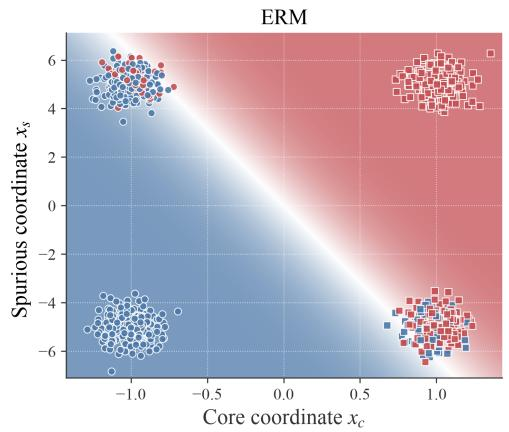

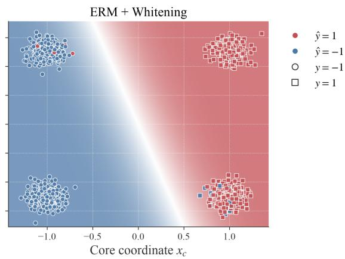  
Figure 1: Predictions for ERM (left) and ERM after whitening (right) for $d = 2 0 0 0$ , plotted against the core coordinate $x _ { c }$ and spurious coordinate $x _ { s } .$ , for 1000 sampled data points. Colors show predictions using all d coordinates, and marker shapes show true classes. Background colors show the probability of predicting class 1, averaged over the simulations, based on $x _ { c }$ and $x _ { s }$

Previous work (Sagawa et al., 2020b; Puli et al., 2023; Bayat et al., 2025) has shown that the maxmargin classifier in this DGP relies on the spurious feature $x _ { s }$ when γ is large enough. This relates to the simplicity bias from Section 3, as γ inflates the scale (and the eigenvalues) of the spurious feature. Data points that cannot be classified with the spurious feature are then fitted using the noise features.

Figure 2 illustrates how ERM fails to perform in the ood environment. As q increases, there are enough noise coordinates that can be used to fit the minority groups $( y \neq a ,$ , approximately 10% of the sample) and classify the remainder with the spurious feature. Whitening improves performance and yields nearly perfect overall and worst-group accuracy when $q < n ,$ , and continues to strongly outperform standard ERM when $q \geq n$

To formalize these empirical findings, we analyze the max-margin classifier for this DGP with whitening in a specific asymptotic regime. In Theorem 1, we show the coefficients of the max-margin classifier fitted on whitened data converge to limits that mostly depend on the core feature.

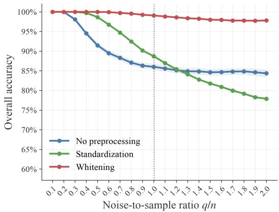

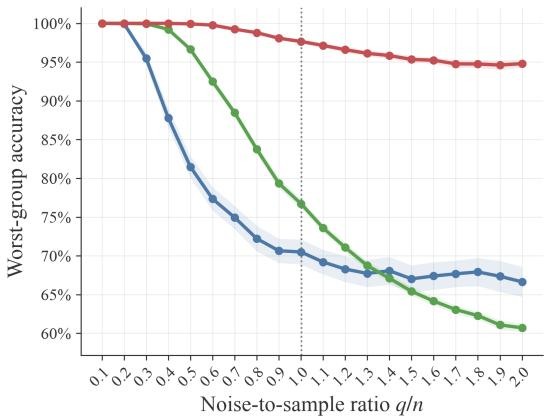  
Figure 2: OOD test accuracy as a function of the noise-to-sample ratio $q / n$ for $n = 1 0 0 0$ . We compare ERM with three preprocessing choices: no preprocessing, standardization, and whitening, in terms of overall accuracy (left) and worst-group accuracy (right), where groups are defined by the pair $( y , a )$ . Points represent means over 100 simulations, shaded bands are 95% confidence intervals.

Theorem 1 (Whitened max-margin limits). Consider the synthetic DGP described in equation 15 and equation 16 with $\gamma > 0 , \sigma _ { y } ^ { - } = \sigma _ { a } ^ { 2 } : = \sigma ^ { 2 } > 0 , \sigma _ { \epsilon } > \mathrm { \bar { 0 } } ,$ , and $0 < \rho _ { \mathrm { t r } } < 1$ . Suppose that the training labels are exactly balanced, $\textstyle \sum _ { i = 1 } ^ { n } y _ { i } = 0 .$ . Let $q , n  \infty$ with $q / n \to \psi > 1$ . Define

$$
\zeta : = 1 + \sigma ^ { 2 } , \qquad \tau ^ { 2 } : = \frac { \sigma ^ { 2 } ( \zeta - \rho _ { \mathrm { t r } } ^ { 2 } ) } { \zeta ^ { 2 } - \rho _ { \mathrm { t r } } ^ { 2 } } .\tag{17}
$$

Then the max-margin classifierfitted on empirically whitened data, written in the original coordinates as $\hat { \pmb { w } } _ { \mathrm { m m , w h i t e n } } = \left( \hat { w } _ { \mathrm { w h i t e n } , c } , \hat { w } _ { \mathrm { w h i t e n } , s } , \hat { w } _ { \mathrm { w h i t e n } , \epsilon } \right) ^ { \top }$ , satisfies

$$
\hat { w } _ { \mathrm { w h i t e n } , c } \xrightarrow [ ] P \xrightarrow [ ] { \zeta - \rho _ { \mathrm { t r } } ^ { 2 } } , \quad \hat { w } _ { \mathrm { w h i t e n } , s } \xrightarrow [ ] P \xrightarrow [ ] { \rho _ { \mathrm { t r } } \sigma ^ { 2 } } , \quad \frac { 1 } { n } \lVert \hat { w } _ { \mathrm { w h i t e n } , \epsilon } \rVert _ { 2 } ^ { 2 } \xrightarrow [ ] { p } \frac { \psi } { \sigma _ { \epsilon } ^ { 2 } ( \psi - 1 ) } \tau ^ { 2 } ,\tag{18}
$$

where $\xrightarrow { p }$ denotes convergence in probability.

The proof is given in Appendix A.1. Whitening removes sensitivity to the scales of the spurious features. If the scale of the spurious feature γ increases, the coefficient becomes correspondingly smaller. Likewise, the norm of the noise coefficients decreases as $\sigma _ { \epsilon }$ increases.

One noteworthy effect of whitening is that when $\psi \to 1$ , certain noise coordinates are severely inflated by whitening and subsequently used for classification. This is the same issue as discussed in Section 3.3 when not using the nonlinear shrinkage estimator.

In this proof, we have used that $\psi > 1 ( q > n )$ . The central idea that whitening leads to a classifier that primarily relies on the core feature also holds in an underparameterized special case with $d = q + 2 < n$ . In Appendix $\mathrm { A } . 2$ , we lay out how Theorem 2 of Puli et al. (2023) can be used to show that whitening removes the simplicity bias in this case, under a special case of the synthetic DGP.

## 5 EMPIRICAL EVALUATION

This section investigates whether whitening representations before fitting a linear probe improves robustness to spurious correlations in practice. We consider three commonly used benchmarks: Waterbirds (Sagawa et al., 2020a), CelebA (Liu et al., 2015), and MultiNLI (Williams et al., 2018). Each benchmark contains a classification task in which the target label is spuriously correlated with an additional attribute. For Waterbirds, the target is bird type and the spurious attribute is the background; for CelebA, the target is hair color and the spurious attribute is gender; and for MultiNLI, the target is the relation between the premise and hypothesis and the spurious attribute is the presence of a negation word in the hypothesis. The spurious correlation is present in both the training and validation sets. Details on each dataset can be found in Appendix E.1.

We use two widely used pretrained backbones for the benchmarks. For Waterbirds and CelebA, we fine-tune an ImageNet-pretrained ResNet-50 (He et al., 2016), and a BERT model for MultiNLI. We then extract the final-layer representation and fit an $\ell _ { 2 } \cdot$ -regularized logistic regression model as the linear probe. Results for more recent architectures are reported in Appendix D. Based on Idrissi et al. (2022) and LaBonte et al. (2023), we use class-balancing when fitting the logistic regression and selecting the $\ell _ { 2 }$ penalty. Details on the evaluation protocol can be found in Appendix E.2.

Evaluation metrics: We focus on worst-group accuracy. Groups are defined by the combination of the target label and the spurious attribute (e.g., bird type and background). Worst-group accuracy is commonly used as a metric for robustness to spurious correlations (Sagawa et al., 2020a;b), as it captures performance on small groups where the attribute and target label conflict. We also report equal-group accuracy, an equally weighted average of accuracies per group. This indicates if improvements in worst-group accuracy come with a decrease in accuracy for other groups.

Improving linear probes: Figure 3 reports worst-group and equal-group accuracy for a linear probe with three preprocessing variants: no preprocessing, standardization, and whitening. For the two image benchmarks, we find whitening significantly improves both worst-group and equalgroup accuracy over no preprocessing and standardization, whereas for MultiNLI, the difference is statistically insignificant. The improvement from whitening can be substantial, for instance providing a 13.5 percentage point (pp) increase in worst-group accuracy on Waterbirds compared to no preprocessing, and an even greater improvement (23.6 pp) when compared to standardization.

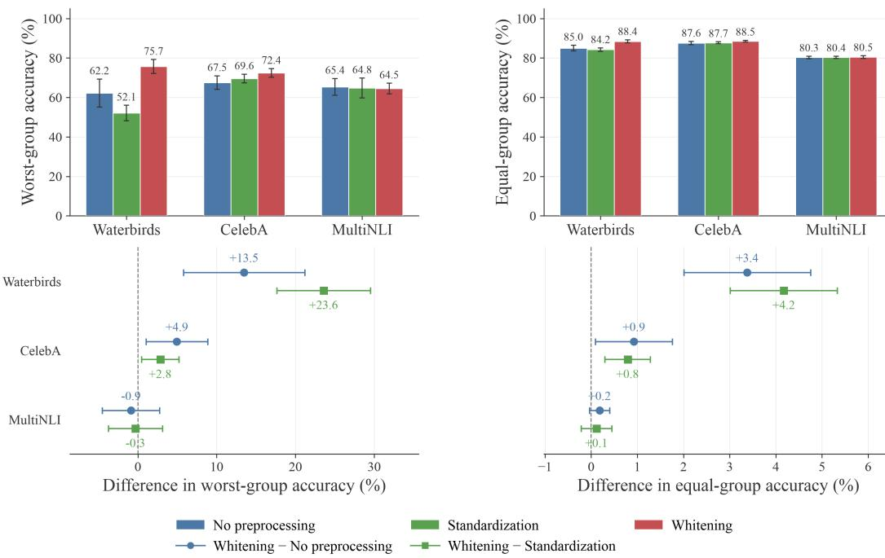  
Figure 3: Worst-group (left) and equal-group (right) test accuracy for ERM with three preprocessing choices: no preprocessing, standardization, and whitening (top), together with mean within-seed paired differences for whitening minus each reference (bottom). Bars and points represent averages across seeds (ten for ResNet-50, five for BERT), and error bars are 95% confidence intervals.

In order to investigate why whitening helps, we consider the eigenvalues of the empirical covariance matrix and the simplicity of the resulting classifiers (measured via the Rayleigh quotient, see Definition 1) of different classifiers in Figure 4. For each representation, the empirical covariance matrix has a highly non-uniform set of eigenvalues. Figure 4 also shows that the classifier found after using ERM without preprocessing aligns with the largest eigenvalues, in line with the simplicity bias described in Section 3. The classifier found after whitening aligns with much smaller eigenvalues.

Thus, whitening appears to help because it reduces the tendency to rely on simple features. However, it is not guaranteed that these simple features align with spurious features. This can explain the weaker result for MultiNLI: after whitening, the classifier relies on features that are less simple, with a similar worst-group accuracy. Negation words are perhaps not ‘simple’ and might be needed to classify entailment (Joshi et al., 2022). We also observe that standardization reduces simplicity but not to the same extent as whitening (likely for the reasons outlined in Section 3.2), explaining why whitening outperforms standardization.

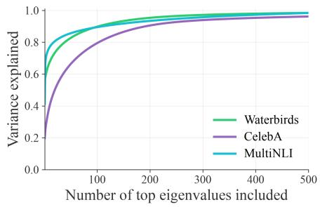

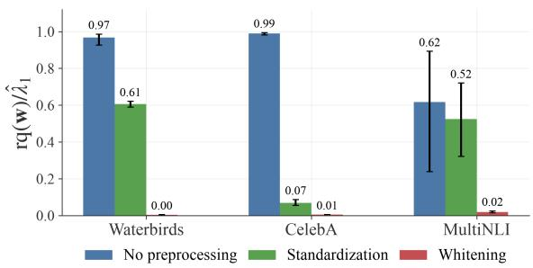  
Figure 4: Variance explained by the top k eigenvalues, up to k = 500 (left), and the (normalized) Rayleigh quotient for different classifiers (right). We take the classifier w after ERM with different preprocessing procedures and convert the classifier to the original coordinates, before calculating the Rayleigh quotient. Points and bars represent the average across seeds (ten for ResNet-50 and five for BERT), and error bars the 95% confidence intervals.

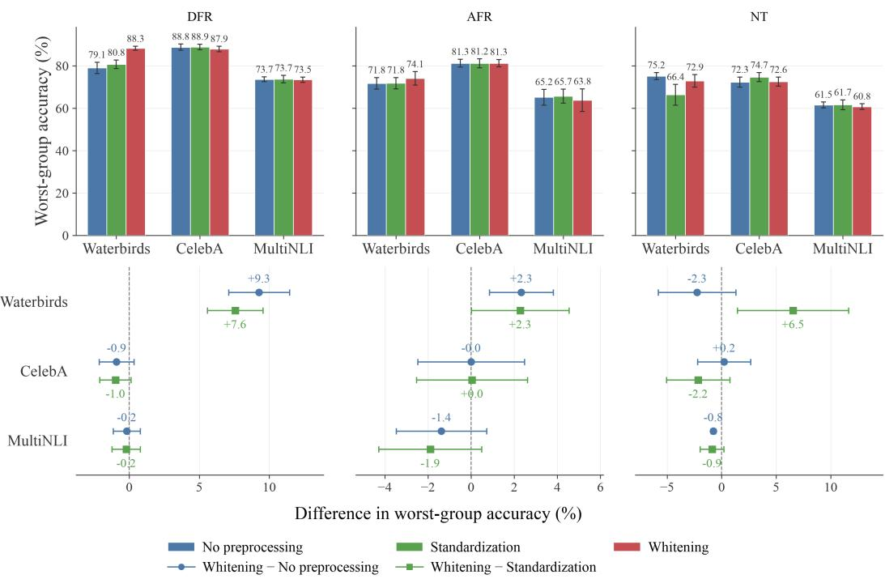  
Figure 5: Worst-group test accuracy for DFR, AFR and NT for three preprocessing variants: no preprocessing, standardization, and whitening (top), together with mean within-seed paired differences for whitening minus each reference (bottom). Bars and points represent averages across seeds (ten for ResNet-50, five for BERT), and error bars are 95% confidence intervals.

Combining whitening and existing approaches: we consider three state-of-the-art approaches that use linear probes in order to improve robustness to spurious correlations. First, Deep Feature Reweighting (DFR) creates a group-balanced subsampled dataset based on the validation set, and fits a linear probe on it (Kirichenko et al., 2023). Second, Automatic Feature Reweighting (AFR)

also fits a linear probe on a validation set, but reweights data points according to the predictions of a DNN trained with ERM (Qiu et al., 2023). Third, NeuronTune (NT) selects a subset of coordinates with high values when a model misclassifies a data point from the validation set (Zheng et al., 2025), and removes these before fitting a linear probe. Each approach uses different assumptions about the extent to which group labels are available: the full validation set for DFR, part of it for AFR, and none for NT. For each, we assess the effect of using whitening before fitting the linear probe. Details on each approach are given in Appendix E.3.

Figure 5 shows the worst-group accuracy for these three approaches without any preprocessing, standardization, and whitening. Figure 13 in Appendix D provides the equivalent comparison for equal-group accuracy. Using whitening as a data-preprocessing step improves the worst-group accuracy for DFR and AFR for Waterbirds compared to doing no preprocessing or standardization, as well as for NeuronTune when compared to standardization. For other datasets, the differences from using whitening are not statistically significant, with the exception of NT for MultiNLI, where whitening decreases the worst-group accuracy by a small amount (0.8 pp).

We attribute this to the fact that for other datasets, existing methods already reduce the simplicity of the resulting classifiers to a large extent. This can be seen in Figure 6: for DFR, where we observe the largest improvement after whitening, we observe the largest decrease in simplicity of the resulting classifier. In general, for the other datasets and approaches, the simplicity is already substantially lower before any whitening (compared to ERM without any preprocessing, as can be seen in Figure 4).

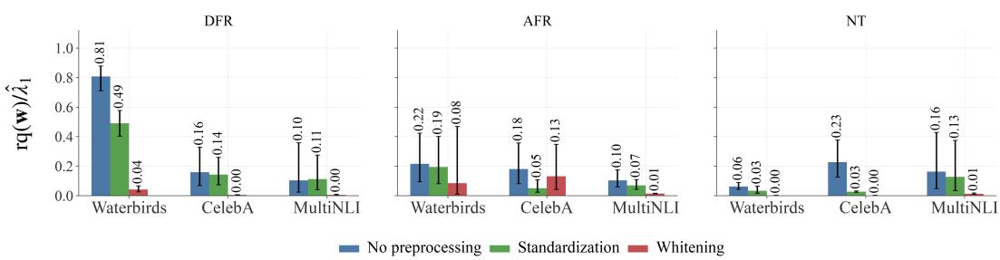  
Figure 6: Normalized Rayleigh quotient for Deep Feature Reweighting (DFR), Automatic Feature Reweighting (AFR) and NeuronTune (NT) for three preprocessing variants: no preprocessing, standardization, and whitening. Points and bars represent the average across seeds (ten for ResNet-50 and five for BERT), and error bars are 95% confidence intervals.

## 6 DISCUSSION AND CONCLUSION

In this paper, we show that the max-margin classifier exhibits a simplicity bias toward features associated with large eigenvalues of the empirical covariance matrix, and that whitening removes this bias. On spurious correlation benchmarks, whitening can improve worst-group robustness, also when combined with existing methods that rely on linear probes. Notably, in our results whitening only worsens the linear probe in a comparison. In addition, whitening requires neither pre-existing knowledge of the spurious correlation nor additional labels, and is computationally light. As such, we argue that whitening as a preprocessing step should be strongly considered when addressing spurious correlations in linear probes.

A limitation of our approach is that it presumes simple features (with large eigenvalues) to be spurious. While this has been argued in previous work (see Section 2), there are also cases where this might not hold, as we observe for MultiNLI. In fact, it is sometimes desirable to encourage a classifier to make use of features with high eigenvalues (Dragutinovic et al.´ , 2026). Whitening also does not address other reasons that linear probes rely on spurious features (see (Nagarajan et al., 2021)).

More broadly, our work suggests that modifying representation geometry is a simple way to reduce reliance on spurious features. While we have shown the potential of whitening, we also find cases (especially when it is combined with existing approaches) where it does not lead to an improvement. An interesting research direction to investigate is which geometry is ‘optimal’ in terms of robustness against spurious correlations, in the spirit of work characterizing desirable properties of representations (e.g. Wang & Isola (2020); Balestriero & LeCun (2025)).

## AI USE STATEMENT

In this work, we used generative AI tools to help with formulating mathematical claims, improving the writing of proofs, as well as suggesting strategies for proving a mathematical claim. In addition, we used generative AI tools to provide feedback on experiments as well as feedback on the implementation of other methods in the literature. We have not used generative AI for developing the core argument laid out in the paper, to propose or refine hypotheses, or interpret results. Finally, several other tasks that require disclosure - generating synthetic datasets, developing theoretical models or conceptual frameworks, translation, dataset cleaning or reformatting, and qualitative or thematic data analysis - are not applicable to this work. Additionally, we used generative AI tools to create and edit code used for the experiments. We also used it to improve figures, the readability of the text, as well as finding spelling errors. We have reviewed all AI-assisted work. Code written by generative AI was verified and tested for correctness by the first author. All four authors read the text of the paper, checking any suggestions provided by generative AI. Finally, any strategies suggested by generative AI for the proofs were verified by the first author. We take responsibility for the final content of this work, including text, claims or artifacts produced with the aid of generative AI.

## ETHICS STATEMENT

As with any technique that aims to improve the robustness of machine learning (ML) models to spurious correlations, practitioners should exercise caution when applying whitening in real-world settings where model predictions affect people’s lives. Reducing reliance on spurious correlations can improve the performance of an ML model for certain subgroups. However, our work focuses on a specific setting (a generalized linear model fitted on representations generated by DNNs) and evaluates the whitening on a limited number of benchmark datasets. These benchmarks do not capture all sources of bias and other considerations that may arise in deployment, such as unintended effects on other subgroups. Moreover, our theoretical analysis relies on specific assumptions. The conclusions therefore need not extend directly to nonlinear models, or other distribution shifts. Consequently, practitioners should evaluate whitening in the context in which it is to be deployed, and remain alert to potential unintended consequences.

## REPRODUCIBILITY STATEMENT

The code used to generate the results in this paper will be made available after the review process in the form of a repository. We have attached it as a zip file to our submission.

## A PROOFS

## A.1 PROOF OF THEOREM 1

Proof. The proof proceeds in two steps. We first show that the max-margin classifier on whitened data permits an analytical solution. We then show the limits of this solution in the original coordinate system. Throughout the proof, the probability limits are taken as

$$
n  \infty , \qquad q  \infty , \qquad q / n  \psi > 1 .\tag{19}
$$

Here, $\xrightarrow { p }$ denotes convergence in probability, under these limits. All probabilities and expectations are conditional on $\textstyle \sum _ { i } y _ { i } = 0$

As a preliminary step, we first introduce some notation and definitions. We write the centered design matrix as

$$
\begin{array} { r } { \pmb { X } = ( C \pmb { E } ) , } \end{array}\tag{20}
$$

where $C \in \mathbb { R } ^ { n \times 2 }$ contains the sample-centered core and spurious features and $\ b { E } \in \mathbb { R } ^ { n \times q }$ is the centered noise block. Let $\pmb { y } = ( y _ { 1 } , \ldots , y _ { n } ) ^ { \top }$ be the corresponding labels. If $\mathbf { 1 } : = ( 1 , \ldots , 1 ) ^ { \top } \in \mathbb { R } ^ { n }$ denotes the all-ones vector, then centering places every column of X in $\mathbf { 1 } ^ { \perp } : = \{ \pmb { u } \in \mathbb { R } ^ { n } : \mathbf { 1 } ^ { \top } \pmb { u } = 0 \}$

Let

$$
\pmb { H } : = \pmb { I } _ { n } - \frac { 1 } { n } \pmb { 1 1 } ^ { \top }
$$

denote the centering matrix. Since the centered Gaussian noise block E has q columns supported on the $( n - 1 )$ -dimensional space $\mathbf { 1 } ^ { \perp }$ , and $q \geq n - 1$ for all sufficiently large $n ,$

$$
\operatorname { r a n k } ( E ) = n - 1
$$

almost surely. Consequently,

$$
\operatorname { c o l } ( E ) = \operatorname { c o l } ( X ) = \mathbf { 1 } ^ { \perp }
$$

almost surely.

We start the first step by establishing the max-margin classifier on the whitened data. Define

$$
\widehat { \pmb { \Sigma } } : = \frac { 1 } { n - 1 } \pmb { X } ^ { \top } \pmb { X } = \pmb { U } _ { r } \hat { \bf A } _ { r } \pmb { U } _ { r } ^ { \top } ,\tag{21}
$$

where $r = n - 1$ almost surely. Empirical whitening applies the map $U _ { r } \hat { \mathbf { A } } _ { r } ^ { - 1 / 2 }$ to the centered data, which gives

$$
Z : = X U _ { r } \hat { \bf { A } } _ { r } ^ { - 1 / 2 } .\tag{22}
$$

When the data is whitened, the max-margin classifier is given by

$$
\hat { v } _ { \mathrm { w h i t e n } } = \arg \operatorname* { m i n } _ { v } \| v \| _ { 2 } ^ { 2 } \quad \mathrm { s . t . } \quad y _ { i } z _ { i } ^ { \top } v \geq 1 , \quad i = 1 , \ldots , n ,\tag{23}
$$

where $z _ { i } ^ { \top }$ is the i-th row of $Z .$ The corresponding coefficient vector in the original coordinates is

$$
\hat { \pmb { w } } _ { \mathrm { m m , w h i t e n } } = \pmb { U } _ { r } \hat { \pmb { \Lambda } } _ { r } ^ { - 1 / 2 } \hat { \pmb { v } } _ { \mathrm { w h i t e n } } .\tag{24}
$$

Consider the vector

$$
v _ { 0 } : = \frac { n ^ { - 1 } Z ^ { \top } { \pmb y } } { \| n ^ { - 1 } Z ^ { \top } { \pmb y } \| _ { 2 } ^ { 2 } } .\tag{25}
$$

We will show that $\pmb { v } _ { 0 }$ solves equation 23 by comparing the problem with

$$
\operatorname* { m i n } _ { \pmb { v } } \| \pmb { v } \| _ { 2 } ^ { 2 } \quad \mathrm { s . t . } \quad \left( \frac { 1 } { n } \pmb { Z } ^ { \top } \pmb { y } \right) ^ { \top } \pmb { v } \geq 1 .\tag{26}
$$

Let

$$
\mathcal { F } _ { \mathrm { f u l l } } : = \{ \pmb { v } : y _ { i } \pmb { z } _ { i } ^ { \top } \pmb { v } \geq 1 , i = 1 , \ldots , n \} ,\tag{27}
$$

$$
\mathcal { F } _ { \mathrm { a v g } } : = \left. \pmb { v } : \left( \frac { 1 } { n } \pmb { Z } ^ { \top } \pmb { y } \right) ^ { \top } \pmb { v } \geq 1 \right. .\tag{28}
$$

It is enough to verify the following two conditions:

1. ${ \mathcal { F } } _ { \mathrm { f u l l } } \subseteq { \mathcal { F } } _ { \mathrm { a v g } }$ ;

2. ${ \pmb v } _ { 0 }$ minimizes $\mathcal { F } _ { \mathrm { a v g } }$ and belongs to $\mathcal { F } _ { \mathrm { f u l l } }$

If these conditions hold, then $\hat { \pmb { v } } _ { \mathrm { w h i t e n } } = \pmb { v } _ { 0 }$

We first verify condition 1. If $v \in \mathcal { F } _ { \mathrm { f u l l } }$ l, then $y _ { i } z _ { i } ^ { \top } \pmb { v } \geq 1$ for every i. Since the i-th row of Z is $z _ { i } ^ { \top }$ averaging these inequalities gives

$$
\left( n ^ { - 1 } Z ^ { \top } \pmb { y } \right) ^ { \top } \pmb { v } = \frac { 1 } { n } \pmb { y } ^ { \top } Z \pmb { v }\tag{29}
$$

$$
= \frac { 1 } { n } \sum _ { i = 1 } ^ { n } y _ { i } ( Z \pmb { v } ) _ { i }\tag{30}
$$

$$
= \frac { 1 } { n } \sum _ { i = 1 } ^ { n } y _ { i } z _ { i } ^ { \top } { \pmb v }\tag{31}
$$

$$
\geq { \frac { 1 } { n } } \sum _ { i = 1 } ^ { n } 1\tag{32}
$$

$$
= 1 .\tag{33}
$$

Thus $v \in \mathcal { F } _ { \mathrm { a v g } }$ , and hence $\mathcal { F } _ { \mathrm { f u l l } } \subseteq \mathcal { F } _ { \mathrm { a v g } }$

We next verify condition 2. For every $v \in \mathcal { F } _ { \mathrm { a v g } }$ , the averaged-margin constraint and the Cauchy– Schwarz inequality imply

$$
1 \leq \left( n ^ { - 1 } Z ^ { \top } { \pmb y } \right) ^ { \top } { \pmb v }\tag{34}
$$

$$
\leq \left| \left( n ^ { - 1 } Z ^ { \top } \pmb { y } \right) ^ { \top } \pmb { v } \right|\tag{35}
$$

$$
\leq \left\| n ^ { - 1 } Z ^ { \top } \pmb { y } \right\| _ { 2 } \| \pmb { v } \| _ { 2 } .\tag{36}
$$

By exact label balance, $\pmb { y } \in \mathbf { 1 } ^ { \perp }$ . Since the columns of $z$ span $\mathbf { 1 ^ { \perp } }$ and ${ \pmb y } \neq { \bf 0 } .$ , we have $\mathbf { Z } ^ { \intercal } \mathbf { \boldsymbol { y } } \neq \mathbf { 0 }$ Hence we may divide by $\| n ^ { - 1 } Z ^ { \top } \boldsymbol { y } \| _ { 2 }$ to obtain

$$
\| \pmb { v } \| _ { 2 } \geq \frac { 1 } { \| n ^ { - 1 } \pmb { Z } ^ { \top } \pmb { y } \| _ { 2 } }\tag{37}
$$

$$
= { \frac { \| n ^ { - 1 } Z ^ { \top } \pmb { y } \| _ { 2 } } { \| n ^ { - 1 } Z ^ { \top } \pmb { y } \| _ { 2 } ^ { 2 } } }\tag{38}
$$

$$
= \left\| { \frac { n ^ { - 1 } Z ^ { \top } { \pmb y } } { \| n ^ { - 1 } Z ^ { \top } { \pmb y } \| _ { 2 } ^ { 2 } } } \right\| _ { 2 }\tag{39}
$$

$$
= \| \pmb { v } _ { 0 } \| _ { 2 } .\tag{40}
$$

Moreover, substituting ${ \pmb v } _ { 0 }$ from equation 25 into the averaged-margin constraint gives

$$
\left( n ^ { - 1 } Z ^ { \top } \pmb { y } \right) ^ { \top } \pmb { v } _ { 0 } = \frac { \left( n ^ { - 1 } Z ^ { \top } \pmb { y } \right) ^ { \top } \left( n ^ { - 1 } Z ^ { \top } \pmb { y } \right) } { \| n ^ { - 1 } Z ^ { \top } \pmb { y } \| _ { 2 } ^ { 2 } } = 1 .\tag{41}
$$

Thus ${ \pmb v } _ { 0 } \in \mathcal { F } _ { \mathrm { a v g } }$ and attains the lower bound, so it minimizes the squared norm over $\mathcal { F } _ { \mathrm { a v g } }$

It remains to show that $\pmb { v } _ { 0 }$ is feasible for the full problem. From the preliminary result above, $\operatorname { c o l } ( \pmb { X } ) = \mathbf { 1 } ^ { \bot }$ . Hence $X X ^ { \dagger }$ is the orthogonal projector onto $\mathbf { 1 } ^ { \perp }$ , namely $X X ^ { \dagger } = { \cal { H } }$ . Using the definition of $z$ and ${ \widehat { \pmb { \Sigma } } } = ( n - 1 ) ^ { - 1 } { \pmb { X } } ^ { \top } { \pmb { X } }$ , we obtain

$$
\begin{array} { r } { Z Z ^ { \top } = X U _ { r } \hat { \mathbf { A } } _ { r } ^ { - 1 } U _ { r } ^ { \top } X ^ { \top } } \end{array}\tag{42}
$$

$$
= X { \widehat { \Sigma } } ^ { \dagger } X ^ { \top }\tag{43}
$$

$$
= ( n - 1 ) { \pmb X } ( { \pmb X } ^ { \top } { \pmb X } ) ^ { \dagger } { \pmb X } ^ { \top }\tag{44}
$$

$$
\mathbf { \Omega } = ( n - 1 ) \mathbf { } X \mathbf { } X ^ { \dagger }
$$

$$
{ \bf \Pi } = ( n - 1 ) { \bf H } .\tag{45}
$$

(46)

Here we used the pseudoinverse identity $( X ^ { \top } X ) ^ { \dagger } X ^ { \top } = X ^ { \dagger }$ . Exact label balance gives $\mathbf { 1 } ^ { \top } \pmb { y } = 0$ and hence

$$
\pmb { H } \pmb { y } = \left( \pmb { I _ { n } } - \frac { 1 } { n } \pmb { 1 } \pmb { 1 } ^ { \top } \right) \pmb { y }\tag{47}
$$

$$
= \pmb { y } - \frac { 1 } { n } \pmb { 1 } ( \mathbf { 1 } ^ { \top } \pmb { y } )\tag{48}
$$

$$
{ \bf { \mu } } = { \bf { \mu } } _ { \bf { \mu } } { \bf { \Lambda } } _ { \bf { \mu } }\tag{49}
$$

Using equation 46, $H y = y $ , and $y _ { i } ^ { 2 } = 1$ for every $i ,$ we obtain

$$
\left\| n ^ { - 1 } Z ^ { \top } \pmb { y } \right\| _ { 2 } ^ { 2 } = \frac { 1 } { n ^ { 2 } } \pmb { y } ^ { \top } Z Z ^ { \top } \pmb { y }\tag{50}
$$

$$
= { \frac { n - 1 } { n ^ { 2 } } } { \pmb { y } } ^ { \top } { \pmb { H } } { \pmb { y } }\tag{51}
$$

$$
= { \frac { n - 1 } { n ^ { 2 } } } { \pmb y } ^ { \top } { \pmb y }\tag{52}
$$

$$
= { \frac { n - 1 } { n ^ { 2 } } } \sum _ { i = 1 } ^ { n } y _ { i } ^ { 2 }\tag{53}
$$

$$
{ \mathrm { ~  ~ \mu ~ } } = { \frac { n - 1 } { n } } .\tag{54}
$$

Substituting this value into equation 25 gives

$$
{ \pmb v } _ { 0 } = \frac { n ^ { - 1 } { \pmb Z } ^ { \top } { \pmb y } } { ( n - 1 ) / n }
$$

$$
= { \frac { n } { n - 1 } } { \frac { 1 } { n } } Z ^ { \top } { \pmb y }\tag{55}
$$

(56)

$$
= { \frac { 1 } { n - 1 } } Z ^ { \top } { \pmb y } .\tag{57}
$$

Therefore,

$$
Z v _ { 0 } = { \frac { 1 } { n - 1 } } Z Z ^ { \top } y = { \frac { 1 } { n - 1 } } ( n - 1 ) H y = y .\tag{58}
$$

Hence $y _ { i } z _ { i } ^ { \top } v _ { 0 } = y _ { i } ^ { 2 } = 1$ for every $i ,$ so $v _ { \mathrm { 0 } } \in \mathcal { F } _ { \mathrm { f u l l } }$ . The two conditions are therefore satisfied, and consequently

$$
\hat { \pmb { v } } _ { \mathrm { w h i t e n } } = \pmb { v } _ { 0 } = \frac { 1 } { n - 1 } \pmb { Z } ^ { \top } \pmb { y } .\tag{59}
$$

The corresponding original-coordinate coefficient vector is

$$
\hat { w } _ { \mathrm { m m , w h i t e n } } = U _ { r } \hat { \mathbf { A } } _ { r } ^ { - 1 / 2 } \hat { \pmb { v } } _ { \mathrm { w h i t e n } } = \frac { 1 } { n - 1 } \hat { \pmb { \Sigma } } ^ { \dagger } \pmb { X } ^ { \top } \pmb { y } .\tag{60}
$$

We now proceed with the second step of the proof, which is to take limits of equation 60. Let

$$
\begin{array} { r } { A : = E E ^ { \top } , \qquad c : = \binom { x _ { c } } { x _ { s } } . } \end{array}\tag{61}
$$

Here and below, $\mathbb { E } _ { \mathrm { t } }$ denotes expectation under the training environment. Then

$$
\Sigma _ { c , s } : = \mathbb { E } _ { \mathrm { t r } } [ c c ^ { \top } ] = \left( \begin{array} { l l } { 1 + \sigma ^ { 2 } } & { \gamma \rho _ { \mathrm { t r } } } \\ { \gamma \rho _ { \mathrm { t r } } } & { \gamma ^ { 2 } ( 1 + \sigma ^ { 2 } ) } \end{array} \right) , \qquad \beta _ { c , s } ^ { \mathrm { t r } } : = \mathbb { E } _ { \mathrm { t r } } [ y c ] = \binom { 1 } { \gamma \rho _ { \mathrm { t r } } } .\tag{62}
$$

Using equation 60, we can write

$$
{ \hat { \pmb { w } } } _ { \mathrm { m m , w h i t e n } } = \pmb { X } ^ { \top } \left( \pmb { X } \pmb { X } ^ { \top } \right) ^ { \dagger } \pmb { y } .\tag{63}
$$

Since $X X ^ { \top } = A + C C ^ { \top }$ , the first two coordinates are given by

$$
\begin{array} { r } { \left( \hat { w } _ { \mathrm { w h i t e n } , c } \right) = \pmb { C } ^ { \top } \left( \pmb { A } + \pmb { C C } ^ { \top } \right) ^ { \dagger } \pmb { y } . } \end{array}\tag{64}
$$

Since $\mathrm { c o l } ( E ) = \mathbf { 1 } ^ { \perp } , A = E E ^ { \top }$ is invertible on $\mathbf { 1 } ^ { \perp }$ . Moreover, C and $\textbf {  { y } }$ lie in this same subspace. Applying the Woodbury identity on $\mathbf { 1 } ^ { \perp }$ therefore gives

$$
\left( A + C C ^ { \top } \right) ^ { \dagger } = A ^ { \dagger } - A ^ { \dagger } C \left( I _ { 2 } + C ^ { \top } A ^ { \dagger } C \right) ^ { - 1 } C ^ { \top } A ^ { \dagger } .\tag{65}
$$

Substituting equation 65 into equation 64 and collecting terms gives

$$
\begin{array} { r } { \binom { \hat { w } _ { \mathrm { w h i t e n } , c } } { \hat { w } _ { \mathrm { w h i t e n } , s } } = \left[ I _ { 2 } - C ^ { \top } A ^ { \dagger } C \left( I _ { 2 } + C ^ { \top } A ^ { \dagger } C \right) ^ { - 1 } \right] C ^ { \top } A ^ { \dagger } y } \end{array}\tag{66}
$$

$$
= \left[ \left( I _ { 2 } + C ^ { \top } A ^ { \dagger } C \right) - C ^ { \top } A ^ { \dagger } C \right] \left( I _ { 2 } + C ^ { \top } A ^ { \dagger } C \right) ^ { - 1 } C ^ { \top } A ^ { \dagger } y\tag{67}
$$

$$
= \left( I _ { 2 } + C ^ { \top } A ^ { \dagger } C \right) ^ { - 1 } C ^ { \top } A ^ { \dagger } y .\tag{68}
$$

The centered noise block remains independent of $( C , y )$ . Its columns are Gaussian with covariance $( \sigma _ { \epsilon } ^ { 2 } / q ) H$ . Define

$$
\alpha _ { \psi } : = \frac { \psi } { \sigma _ { \epsilon } ^ { 2 } ( \psi - 1 ) } .\tag{69}
$$

Let $\pmb { u } \in \mathbf { 1 } ^ { \perp }$ be a nonzero vector. Expressing A in an orthonormal basis of $\mathbf { 1 } ^ { \perp }$ removes its zero direction 1 and gives an invertible $( n - 1 ) \times ( n - 1 )$ ) Wishart matrix with q degrees of freedom and scale $( \sigma _ { \epsilon } ^ { 2 } / q ) I _ { n - 1 }$ . For fixed u, the standard inverse-Wishart quadratic-form identity gives

$$
\frac { q \| \boldsymbol { u } \| _ { 2 } ^ { 2 } } { \sigma _ { \epsilon } ^ { 2 } \boldsymbol { u } ^ { \top } A ^ { \dagger } \boldsymbol { u } } \sim \chi _ { \boldsymbol { q } - \boldsymbol { n } + 2 } ^ { 2 } .\tag{70}
$$

If $Z _ { n } \sim \chi _ { q - n + 2 } ^ { 2 }$ , its mean and variance imply $Z _ { n } / ( q - n + 2 ) \stackrel { p } {  } 1$ . Hence

$$
{ \frac { { \pmb u } ^ { \top } { \pmb A } ^ { \dagger } { \pmb u } } { \| { \pmb u } \| _ { 2 } ^ { 2 } } } \overset { d } { = } { \frac { q } { \sigma _ { \epsilon } ^ { 2 } Z _ { n } } } = { \frac { 1 } { \sigma _ { \epsilon } ^ { 2 } } } { \frac { q } { q - n + 2 } } { \frac { q - n + 2 } { Z _ { n } } } \overset { p } {  } \alpha _ { \psi } .\tag{71}
$$

Conditional on $( C , y )$ , their entries are fixed, while independence ensures that the noise block retains its original Gaussian distribution. We can therefore apply the limit in equation 71 to each of the two-dimensional blocks of $C ^ { \top } A ^ { \dagger } C$ and $C ^ { \top } A ^ { \dagger } y$ . This gives

$$
{ \frac { 1 } { n } } C ^ { \top } A ^ { \dagger } C \stackrel { p } { \to } \alpha _ { \psi } \Sigma _ { c , s } , \qquad { \frac { 1 } { n } } C ^ { \top } A ^ { \dagger } y \stackrel { p } { \to } \alpha _ { \psi } \beta _ { c , s } ^ { \mathrm { t r } } ,\tag{72}
$$

where we use that $C ^ { \top } C / n$ and $C ^ { \top } { \boldsymbol { y } } / n$ are sample averages converging to $\Sigma _ { c , s }$ and $\beta _ { c , s } ^ { \mathrm { t r } }$ , respectively. Rewriting equation 68 as

$$
\binom { \hat { w } _ { \mathrm { w h i t e n } , c } } { \hat { w } _ { \mathrm { w h i t e n } , s } } = \left( \frac { I _ { 2 } } { n } + \frac { 1 } { n } \pmb { C } ^ { \top } \pmb { A } ^ { \dagger } \pmb { C } \right) ^ { - 1 } \frac { 1 } { n } \pmb { C } ^ { \top } \pmb { A } ^ { \dagger } \pmb { y } ,\tag{73}
$$

Slutsky’s theorem and the continuous mapping theorem give

$$
\begin{array} { r } { \left( \hat { w } _ { \mathrm { w h i t e n } , c } \right) \xrightarrow { p } \left( \alpha _ { \psi } \Sigma _ { c , s } \right) ^ { - 1 } \left( \alpha _ { \psi } \beta _ { c , s } ^ { \mathrm { t r } } \right) = \Sigma _ { c , s } ^ { - 1 } \beta _ { c , s } ^ { \mathrm { t r } } . } \end{array}\tag{74}
$$

Multiplying out, and writing $\zeta : = 1 + \sigma ^ { 2 }$ , gives

$$
\Sigma _ { c , s } ^ { - 1 } \beta _ { c , s } ^ { \mathrm { t r } } = \left( \begin{array} { c } { { \displaystyle \zeta - \rho _ { \mathrm { t r } } ^ { 2 } } } \\ { { \displaystyle \zeta ^ { 2 } - \rho _ { \mathrm { t r } } ^ { 2 } } } \\ { { \displaystyle \frac { \rho _ { \mathrm { t r } } \sigma ^ { 2 } } { \gamma \left( \zeta ^ { 2 } - \rho _ { \mathrm { t r } } ^ { 2 } \right) } } } \end{array} \right) .\tag{75}
$$

This proves the claimed limits for the core and spurious coefficients.

It remains to track the norm of the noise coefficients. Let

$$
b _ { c , s } : = \Sigma _ { c , s } ^ { - 1 } \beta _ { c , s } ^ { \mathrm { t r } } , \qquad \hat { b } _ { c , s } : = \left( \begin{array} { l } { \hat { w } _ { \mathrm { w h i t e n } , c } } \\ { \hat { w } _ { \mathrm { w h i t e n } , s } } \end{array} \right) .\tag{76}
$$

Extracting the noise coordinates from equation 60 gives

$$
\hat { \pmb { w } } _ { \mathrm { w h i t e n } , \epsilon } = \pmb { E } ^ { \top } \left( \pmb { A } + \pmb { C } \pmb { C } ^ { \top } \right) ^ { \dagger } \pmb { y }\tag{77}
$$

$$
= { \pmb E } ^ { \top } \left[ { \pmb A } ^ { \dagger } - { \pmb A } ^ { \dagger } { \pmb C } \left( { \pmb I } _ { 2 } + { \pmb C } ^ { \top } { \pmb A } ^ { \dagger } { \pmb C } \right) ^ { - 1 } { \pmb C } ^ { \top } { \pmb A } ^ { \dagger } \right] { \pmb y }\tag{78}
$$

$$
= E ^ { \top } A ^ { \dagger } \left[ \pmb { y } - \pmb { C } \left( I _ { 2 } + \pmb { C } ^ { \top } A ^ { \dagger } \pmb { C } \right) ^ { - 1 } \pmb { C } ^ { \top } A ^ { \dagger } \pmb { y } \right]\tag{79}
$$

$$
= \pmb { { \cal E } } ^ { \top } \pmb { { \cal A } } ^ { \dagger } \left( \pmb { y } - { \cal C } \hat { \pmb { b } } _ { c , s } \right) .\tag{80}
$$

The second equality applies equation 65, the third factors out $E ^ { \top } A ^ { \dagger }$ , and the final equality applies equation 68. Define the residual vector

$$
\pmb { r } _ { n } : = \pmb { y } - \pmb { C } \hat { \pmb { b } } _ { c , s } .\tag{81}
$$

Since $A = E E ^ { \top }$ , we have

$$
\left\| \hat { \pmb { w } } _ { \mathrm { w h i t e n } , \epsilon } \right\| _ { 2 } ^ { 2 } = \pmb { r } _ { n } ^ { \top } \pmb { A } ^ { \dagger } \pmb { E } \pmb { E } ^ { \top } \pmb { A } ^ { \dagger } \pmb { r } _ { n } = \pmb { r } _ { n } ^ { \top } \pmb { A } ^ { \dagger } \pmb { r } _ { n } .\tag{82}
$$

The last equality uses $A = E E ^ { \top }$ and the Moore–Penrose identity $A ^ { \dagger } A A ^ { \dagger } = A ^ { \dagger }$

To take the limit of this norm, we expand its quadratic form directly:

$$
\frac { 1 } { n } \left. \hat { w } _ { \mathrm { w h i t e n } , \epsilon } \right. _ { 2 } ^ { 2 } = \frac { 1 } { n } y ^ { \top } A ^ { \dagger } y - 2 \hat { b } _ { c , s } ^ { \top } \left( \frac { 1 } { n } C ^ { \top } A ^ { \dagger } y \right) + \hat { b } _ { c , s } ^ { \top } \left( \frac { 1 } { n } C ^ { \top } A ^ { \dagger } C \right) \hat { b } _ { c , s } .\tag{83}
$$

Since $y _ { i } ^ { 2 } = 1$ , we have $\pmb { y } ^ { \top } \pmb { y } / n = 1$ . The same inverse-Wishart quadratic-form limit used in equation 72 therefore gives

$$
{ \frac { 1 } { n } } { \pmb y } ^ { \top } { \pmb A } ^ { \dagger } { \pmb y } \xrightarrow { p } \alpha _ { \psi } .\tag{84}
$$

Combining this limit with equation 72 and $\hat { \pmb { b } } _ { c , s } \stackrel { p } {  } \pmb { b } _ { c , s }$ gives

$$
\frac { 1 } { n } \left. \hat { w } _ { \mathrm { w h i t e n } , \epsilon } \right. _ { 2 } ^ { 2 } \xrightarrow { p } \alpha _ { \psi } \left( 1 - 2 b _ { c , s } ^ { \top } \beta _ { c , s } ^ { \mathrm { t r } } + b _ { c , s } ^ { \top } \Sigma _ { c , s } b _ { c , s } \right) = \alpha _ { \psi } \left[ 1 - \left( \beta _ { c , s } ^ { \mathrm { t r } } \right) ^ { \top } \Sigma _ { c , s } ^ { - 1 } \beta _ { c , s } ^ { \mathrm { t r } } \right] .\tag{85}
$$

The remaining term simplifies to

$$
\left( \beta _ { c , s } ^ { \mathrm { t r } } \right) ^ { \top } \Sigma _ { c , s } ^ { - 1 } \beta _ { c , s } ^ { \mathrm { t r } } = \left( 1 \right) \quad \gamma \rho _ { \mathrm { t r } } ) \left( \begin{array} { l } { \frac { \zeta - \rho _ { \mathrm { t r } } ^ { 2 } } { \zeta ^ { 2 } - \rho _ { \mathrm { t r } } ^ { 2 } } } \\ { \rho _ { \mathrm { t r } } \sigma ^ { 2 } } \\ { \frac { \rho _ { \mathrm { t r } } \sigma ^ { 2 } } { \gamma \left( \zeta ^ { 2 } - \rho _ { \mathrm { t r } } ^ { 2 } \right) } } \end{array} \right) = \frac { \zeta - \rho _ { \mathrm { t r } } ^ { 2 } + \rho _ { \mathrm { t r } } ^ { 2 } \sigma ^ { 2 } } { \zeta ^ { 2 } - \rho _ { \mathrm { t r } } ^ { 2 } } .\tag{86}
$$

Hence, using $\sigma ^ { 2 } = \zeta - 1$

$$
1 - \left( { \boldsymbol { \beta } } _ { c , s } ^ { \mathrm { t r } } \right) ^ { \top } \ d \Sigma _ { c , s } ^ { - 1 } { \boldsymbol { \beta } } _ { c , s } ^ { \mathrm { t r } } = 1 - \frac { \zeta - \rho _ { \mathrm { t r } } ^ { 2 } + \rho _ { \mathrm { t r } } ^ { 2 } \sigma ^ { 2 } } { \zeta ^ { 2 } - \rho _ { \mathrm { t r } } ^ { 2 } }\tag{87}
$$

$$
= \frac { \zeta ^ { 2 } - \zeta - \rho _ { \mathrm { t r } } ^ { 2 } \sigma ^ { 2 } } { \zeta ^ { 2 } - \rho _ { \mathrm { t r } } ^ { 2 } }\tag{88}
$$

$$
= { \frac { ( \zeta - 1 ) ( \zeta - \rho _ { \mathrm { t r } } ^ { 2 } ) } { \zeta ^ { 2 } - \rho _ { \mathrm { t r } } ^ { 2 } } }\tag{89}
$$

$$
= { \frac { \sigma ^ { 2 } ( \zeta - \rho _ { \mathrm { t r } } ^ { 2 } ) } { \zeta ^ { 2 } - \rho _ { \mathrm { t r } } ^ { 2 } } } = \tau ^ { 2 } .\tag{90}
$$

Therefore,

$$
\frac { 1 } { n } \| \hat { \pmb { w } } _ { \mathrm { w h i t e n } , \epsilon } \| _ { 2 } ^ { 2 } \overset { p } {  } \alpha _ { \psi } \tau ^ { 2 } = \frac { \psi } { \sigma _ { \epsilon } ^ { 2 } ( \psi - 1 ) } \tau ^ { 2 } .\tag{91}
$$

This gives the stated limit for the norm of the noise coefficients and completes the proof.

## A.2 WHITENING SELECTS COEFFICIENTS WITH UNIFORM MARGINS

We consider the uncentered version of the DGP in Section 4. In particular, let

$$
\begin{array} { r } { \pmb { x } _ { i } = ( y _ { i } , \gamma a _ { i } , \pmb { \epsilon } _ { i } ) , \qquad \ \pmb { \epsilon } _ { i } \sim \mathcal { N } ( \mathbf { 0 } , \pmb { I } _ { q } ) , } \end{array}\tag{92}
$$

which corresponds to $\sigma _ { y } ^ { 2 } = \sigma _ { a } ^ { 2 } = 0$ and $\sigma _ { \epsilon } ^ { 2 } = q$ in our parameterization. We presume $0 < \rho _ { \mathrm { t r } } < 1$ We first state Theorem 2 of Puli et al. (2023) in our notation.

Theorem 2 (Uniform margins; Puli et al., 2023, Theorem 2). Consider n observationsfrom the DGP above, with $\gamma > 1$ and $d = q + 2 < n .$ . Suppose that a linear model $\mathbf { \Delta } \mathbf { w } = ( w _ { c } , w _ { s } , \mathbf { w } _ { \epsilon } )$ has uniform positive margins: for some $b > 0$

$$
y _ { i } { \pmb w } ^ { \top } { \pmb x } _ { i } = b , \qquad i = 1 , \ldots , n .\tag{93}
$$

Then, with probability one over the training sample,

$$
\begin{array} { r } { { \pmb w } = ( b , 0 , \mathbf { 0 } ) . } \end{array}\tag{94}
$$

Thus, any set of coefficients with uniform margins in this DGP relies exclusively on the core feature.   
It remains to show that the max-margin classifier fitted on whitened data has uniform margins.

Because we are working with uncentered data, we work with the empirical second-moment matrix

$$
\widetilde \Sigma : = \frac { 1 } { n - 1 } \sum _ { i = 1 } ^ { n } { \pmb x } _ { i } { \pmb x } _ { i } ^ { \top } .\tag{95}
$$

Under the conditions of Theorem $2 , { \tilde { \Sigma } }$ is positive definite with probability one. For $\widetilde { \pmb { z } } _ { i } : = \widetilde { \pmb { \Sigma } } ^ { - 1 / 2 } { \pmb { x } } _ { i }$ set $w : = \widetilde { \Sigma } ^ { - 1 / 2 } v$ . Then $\pmb { v } ^ { \top } \widetilde { \pmb { z } } _ { i } = \pmb { w } ^ { \top } \pmb { x } _ { i }$ and $\| \pmb { v } \| _ { 2 } ^ { 2 } = \pmb { w } ^ { \top } \widetilde { \Sigma } \pmb { w }$ . Consequently, the max-margin classifier fitted on the whitened data can be written as

$$
\hat { w } _ { \mathrm { m m , w h i t e n } } = \arg \operatorname* { m i n } _ { \boldsymbol { w } \in \mathbb { R } ^ { d } } \boldsymbol { w } ^ { \top } \widetilde { \boldsymbol { \Sigma } } \boldsymbol { w } \quad \mathrm { s . t . } \quad y _ { i } \boldsymbol { w } ^ { \top } \boldsymbol { x } _ { i } \geq 1 , \quad i = 1 , \ldots , n .\tag{96}
$$

Proposition 1 (Core-only prediction after whitening). Under the conditions of Theorem 2, the coefficients in equation 96 satisfy

$$
\hat { \pmb { w } } _ { \mathrm { m m , w h i t e n } } = ( 1 , 0 , \mathbf { 0 } )\tag{97}
$$

with probability one.

Proof. For $m _ { i } ( { \pmb w } ) : = y _ { i } { \pmb w } ^ { \top } { \pmb x } _ { i }$ , we have

$$
{ \pmb w } ^ { \top } \widetilde { { \boldsymbol \Sigma } } { \pmb w } = \frac { 1 } { n - 1 } \sum _ { i = 1 } ^ { n } \left( { \pmb w } ^ { \top } { \pmb x } _ { i } \right) ^ { 2 } = \frac { 1 } { n - 1 } \sum _ { i = 1 } ^ { n } m _ { i } ( { \pmb w } ) ^ { 2 } ,\tag{98}
$$

where the second equality uses $y _ { i } ^ { 2 } = 1$ . Every set of coefficients in equation 96 therefore satisfies

$$
{ \pmb w } ^ { \top } \widetilde { \pmb { \Sigma } } { \pmb w } \ge \frac { n } { n - 1 } .\tag{99}
$$

The core-only coefficients ${ \pmb w } _ { c } = ( 1 , 0 , \mathbf { 0 } )$ attain this lower bound, since

$$
m _ { i } ( { \pmb w } _ { c } ) = y _ { i } ^ { 2 } = 1 , \qquad i = 1 , \ldots , n .\tag{100}
$$

Consequently, the minimizer of equation 96 has uniform margins equal to one. Theorem 2, applied with $b = 1$ , then gives

$$
\begin{array} { r } { \hat { \pmb { w } } _ { \mathrm { m m , w h i t e n } } = ( 1 , 0 , \mathbf { 0 } ) , } \end{array}\tag{101}
$$

which proves the result.

## A.3 NUMERICAL CONFIRMATION

In this section, we numerically confirm Theorem 1 and Proposition 1. In Figure 7 we show the three terms that appear in Theorem 1: the core coefficient, the spurious coefficient, and the normalized squared norm of the noise coefficients. For each, we analyze how they evolve as q and n grow, for $\psi = 1 . 2 .$ . All three quantities move toward their corresponding theoretical limits over the displayed sample sizes.

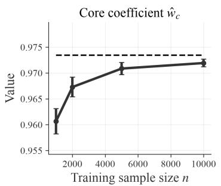

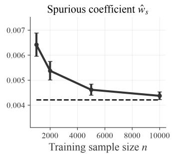

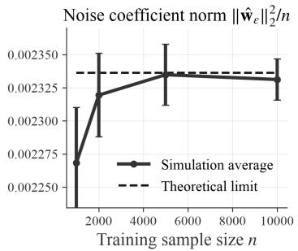  
Figure 7: Estimated core coefficient $\hat { w } _ { c }$ (left), spurious coefficient $\hat { w } _ { s }$ (center), and normalized squared noise-coefficient norm $\| \hat { \pmb w } _ { \epsilon } \| _ { 2 } ^ { 2 } / n$ (right) as functions of the training sample size n for $q / n = 1 . 2$ Solid black curves are simulation averages, vertical error bars are 95% confidence intervals, and dashed lines are the corresponding limits in Theorem 1.

In Figure 8 we show the same three fitted quantities for $\psi = 0 . 8$ . It confirms Proposition 1: For every simulated training sample, we empirically whiten the uncentered features using the second moment matrix. Because logistic regression and the max-margin classifier only converge in direction, we divide each coefficient by its minimum signed training margin.

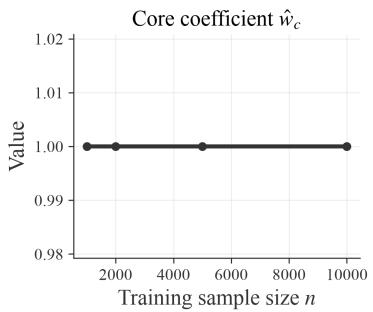

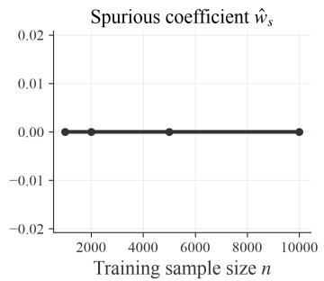

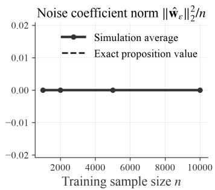  
Figure 8: Fitted core coefficient wˆ (left), spurious coefficient $\hat { w } _ { s }$ (center), and normalized squared noise-coefficient norm $\| \hat { \pmb w } _ { \epsilon } \| _ { 2 } ^ { 2 } / n$ (right) as functions of the training sample size n for $q / n \overset { \cdot } { = } 0 . 8$ For each simulated sample, logistic regression is fitted after uncentered empirical whitening and the original-coordinate coefficients are normalized to unit minimum training margin. Solid black curves are simulation averages, vertical error bars are 95% confidence intervals, and dashed lines are the exact core-only values from Proposition 1.

## B THE RELATIONSHIP BETWEEN WHITENING AND SPECTRAL DECOUPLING

A related approach to whitening is spectral decoupling (SD) (Pezeshki et al., 2021), which adds a penalty term to the loss function that is proportional to the squared norm of the model’s predictions. For a linear model, its objective can be written as

$$
\operatorname* { m i n } _ { \boldsymbol { w } \in \mathcal { S } } \frac { 1 } { n } \sum _ { i = 1 } ^ { n } \log \left( 1 + \exp ( - y _ { i } \boldsymbol { w } ^ { \top } \boldsymbol { x } _ { i } ) \right) + \frac { \rho } { 2 n } \sum _ { i = 1 } ^ { n } \left( \boldsymbol { w } ^ { \top } \boldsymbol { x } _ { i } - \gamma _ { y _ { i } } \right) ^ { 2 } .\tag{102}
$$

For centered data and $\pmb { w } \in \mathcal { S }$ , the change of variables in equation 5 gives

$$
y _ { i } \ { \pmb w } ^ { \top } { \pmb x } _ { i } = y _ { i } { \pmb v } ^ { \top } z _ { i } \qquad \mathrm { a n d } \qquad { \pmb w } ^ { \top } \hat { \pmb \Sigma } { \pmb w } = \| { \pmb v } \| _ { 2 } ^ { 2 } .\tag{103}
$$

Substituting equation 103 into equation 102 and setting $\gamma _ { y _ { i } } = 0$ yields the optimization problem

$$
\operatorname* { m i n } _ { { \boldsymbol v } \in { \mathcal S } _ { z } } ~ \frac { 1 } { n } \sum _ { i = 1 } ^ { n } \log ( 1 + \exp ( - y _ { i } { \boldsymbol v ^ { \top } \boldsymbol z _ { i } } ) ) ~ + ~ \frac { \rho ( n - 1 ) } { 2 n } \| { \boldsymbol v } \| _ { 2 } ^ { 2 } ,\tag{104}
$$

which is logistic regression on the whitened data $\{ z _ { i } \} _ { i = 1 } ^ { n }$ with $\ell _ { 2 }$ regularization. The constraint $\pmb { v } \in S _ { z }$ is redundant, since the logistic loss is unaffected by components of v in the null space of the whitened data. Thus, SD with centered data and $\gamma _ { y _ { i } } = 0$ is equivalent to logistic regression on whitened data and an $\ell _ { 2 }$ penalty. The $\gamma _ { y _ { i } }$ encourages logits ${ \pmb w } ^ { \top } { \pmb x } _ { i }$ to be close to a target value, whereas whitening encourages the logits to be close to zero (while satisfying the margin constraints). SD was motivated to address the simplicity bias of DNNs, and our analysis shows that whitening addresses the same issue for the max-margin classifier without this additional hyperparameter.

## C EMPIRICAL WHITENING AND THE NONLINEAR SHRINKAGE ESTIMATOR

In this section, we briefly investigate the difference between empirical whitening and whitening with the nonlinear shrinkage estimator introduced in Section 3.3.

We first focus on the synthetic data-generating process introduced in Section 4. Figure 10 reports the empirical-whitening counterpart to Figure 2. We observe poor performance of empirical whitening at $q / n = 1$ . Theorem 1 shows that as n approaches q, whitening drastically scales the coefficients assigned to noise features. Intuitively, when $q \approx n$ , the empirical covariance matrix becomes nearly singular, so whitening strongly amplifies low-variance noise directions and the classifier can now rely on these to classify points. This does not occur at $q < n$ , as it becomes very unlikely the classifier can fit the training labels through noise. With $q > n$ , the classifier can spread the fit across more noise directions with smaller coefficients.

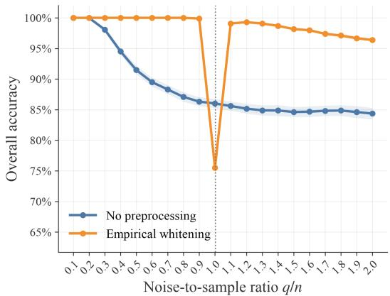

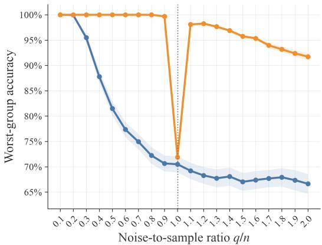  
Figure 10: OOD test accuracy as a function of the noise-to-sample ratio $q / n$ for $n = 1 0 0 0$ . We compare ERM with ERM after empirical whitening in terms of overall accuracy (left) and worst-group accuracy (right), where groups are defined by the pair $( y , a )$ . Points are means over 100 simulations, shaded bands are 95% confidence intervals, and the dotted line marks $q / n = 1$

Figure 11 compares empirical whitening with whitening with the nonlinear shrinkage estimator on the main empirical benchmarks. Although using the nonlinear shrinkage estimator improves the performance on average for Waterbirds and CelebA, the difference is not statistically significant. For MultiNLI, the performance is close to equivalent, as there are many more data points relative to the dimension, and the difference between $\hat { \Sigma } ^ { - 1 }$ and $\hat { \Sigma } _ { \mathrm { L W } } ^ { - 1 }$ becomes very small.

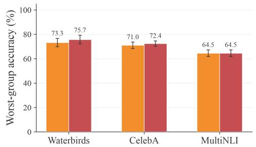

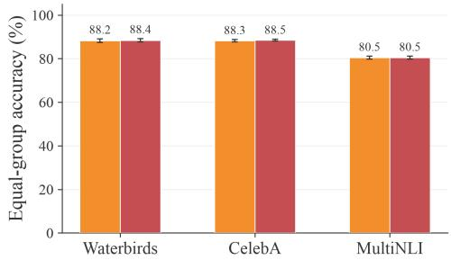

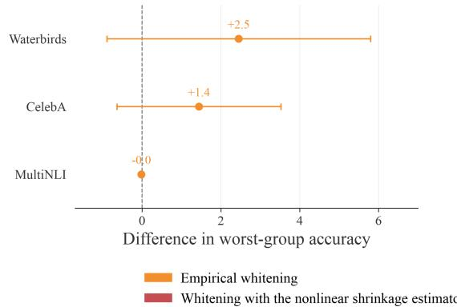

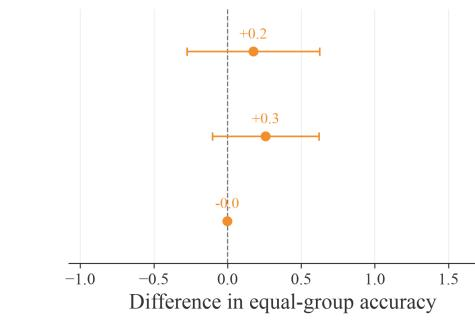  
Figure 11: Worst-group (left) and equal-group (right) test accuracy for ERM with empirical whitening and whitening with the nonlinear shrinkage estimator (top), together with mean within-seed paired differences for whitening with the nonlinear shrinkage estimator minus empirical whitening (bottom). Bars and points represent averages across seeds (ten for ResNet-50, five for BERT), and error bars are 95% confidence intervals.

## D ADDITIONAL EMPIRICAL RESULTS

Figure 12 extends the main comparison to DINO ViT-B/16 on Waterbirds and CelebA and DeBERTav3-base on MultiNLI. We observe results similar to those in Figure 3, with the exception of the comparison between whitening and standardization for CelebA, where standardization and whitening now perform comparably. We observe a much higher worst-group accuracy for DeBERTa-v3-base on MultiNLI than BERT, most likely due to the various improvements made since the BERT model.

Figure 13 is the equivalent of Figure 5 but for equal-group accuracy. We observe similar results, with whitening improving equal-group accuracy for DFR and AFR on Waterbirds. We do observe a minor decrease in equal-group accuracy when AFR is applied to CelebA (−0.8 pp vs. no preprocessing, and −0.6 pp vs. standardization), as well as for NT on CelebA (−0.8 pp vs. standardization).

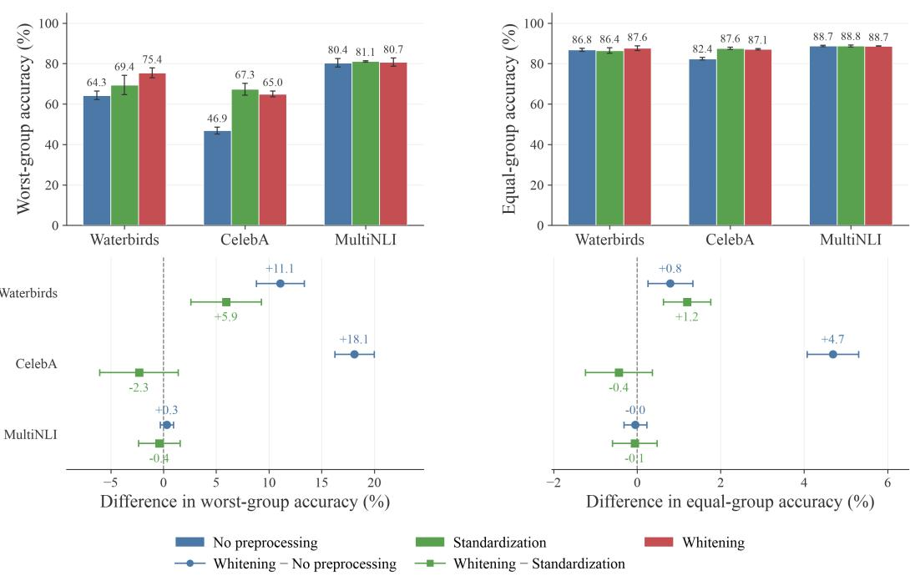  
Figure 12: Worst-group (left) and equal-group (right) test accuracy for DINO ViT-B/16 on Waterbirds and CelebA and DeBERTa-v3-base on MultiNLI under three preprocessing variants: no preprocessing, standardization, and whitening (top), together with mean within-seed paired differences for whitening minus each reference (bottom). Bars and points represent averages across three seeds, and error bars are 95% confidence intervals.

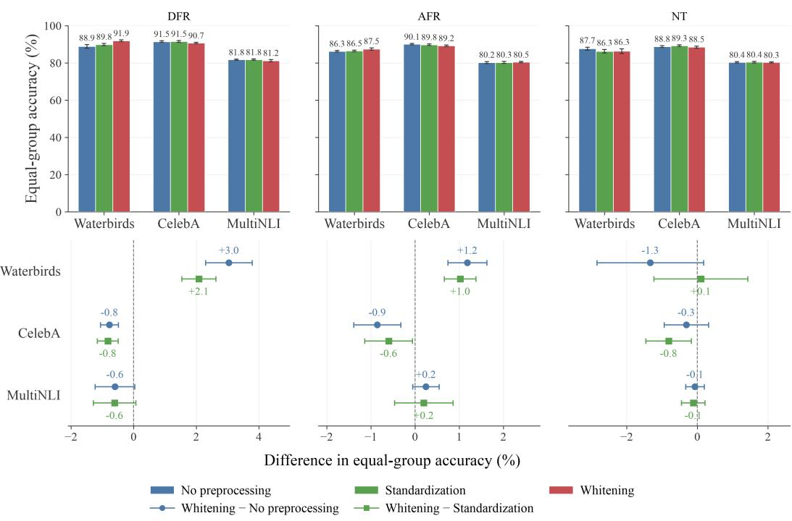  
Figure 13: Equal-group test accuracy for Deep Feature Reweighting (DFR), Automatic Feature Reweighting (AFR), and NeuronTune (NT) under three preprocessing variants: no preprocessing, standardization, and whitening (top), together with mean within-seed paired differences for whitening minus no preprocessing and whitening minus standardization (bottom). Bars and points show averages across seeds (ten for ResNet-50, five for BERT), and error bars show 95% confidence intervals.

## E DETAILS ON EMPIRICAL EVALUATION

## E.1 DATASETS

Waterbirds (Sagawa et al., 2020a). is a binary classification task in which the target is whether an image contains a waterbird or a landbird. The background—water or land—is spuriously correlated with the target in the training and validation sets. We therefore define four groups from the bird type and background type.

CelebA (Liu et al., 2015), the target is whether a person has blond hair and the spurious attribute is gender. Blond hair is substantially more frequent among women in the training and validation sets, yielding four groups defined by hair color and gender.

MultiNLI (Williams et al., 2018) is a three-class natural-language inference task in which the target indicates whether a hypothesis is entailed by, neutral with respect to, or contradicted by a premise. Following the standard spurious correlation setup, we use the presence of a negation word in the hypothesis as the spurious attribute; negation words are disproportionately associated with contradiction examples. The combination of the three target labels and this binary attribute defines six groups.

Table 1: Training and validation split sizes for Waterbirds, CelebA, and MultiNLI. The table reports total observations and counts by class y and group g. For Waterbirds and CelebA, groups are indexed by $g = 2 y + a + 1$ , where a is the binary spurious attribute. For MultiNLI, groups are indexed by $g = 2 y + a .$
<table><tr><td>Statistic</td><td>Waterbirds</td><td>CelebA</td><td>MultiNLI</td></tr><tr><td>Train total</td><td>4,795</td><td>162,770</td><td>206,175</td></tr><tr><td rowspan="2">Train per class</td><td>y = 0: 3,670</td><td>y = 0: 138,503</td><td>y = 0: 68,656 y = 1: 68,897</td></tr><tr><td>y = 1: 1,125</td><td>y = 1: 24,267</td><td>y = 2: 68,622</td></tr><tr><td rowspan="6">Train per group</td><td>g = 1: 3,486</td><td>g = 1: 66,874</td><td>g = 0: 57,498 g = 1: 11,158</td></tr><tr><td>g = 2: 184</td><td>g = 2: 71,629</td><td>g = 2: 67,376</td></tr><tr><td>g = 3: 56</td><td>g = 3: 1,387</td><td></td></tr><tr><td></td><td></td><td>g = 3: 1,521</td></tr><tr><td>g = 4: 1,069</td><td>g = 4: 22,880</td><td>g = 4: 66,630</td></tr><tr><td>1,199</td><td></td><td>g = 5: 1,992</td></tr><tr><td>Val. per class</td><td>y = 0: 945</td><td>19,867 y = 0: 16,811</td><td>82,462 y = 0: 27,448</td></tr><tr><td rowspan="3"></td><td>y = 1: 254</td><td>y = 1: 3,056</td><td>y = 1: 27,562</td></tr><tr><td></td><td></td><td>y = 2: 27,452</td></tr><tr><td></td><td></td><td>g = 0: 22,814</td></tr><tr><td rowspan="4">Val. per group</td><td>g = 1: 898 g = 2: 47</td><td>g = 1: 8,276</td><td>g = 1: 4,634</td></tr><tr><td></td><td>g = 2: 8,535</td><td>g = 2: 26,949</td></tr><tr><td>g = 3: 13</td><td>g = 3: 182</td><td></td></tr><tr><td>g = 4: 241</td><td>g = 4: 2,874 g = 5: 797</td><td>g = 3: 613 g = 4: 26,655</td></tr></table>

## E.2 EVALUATION PROTOCOL

Waterbirds. We use a ResNet-50 backbone trained for 50 epochs with SGD, momentum 0.9, a learning rate of 0.001, weight decay 0.01, and batch size 32. We use standard random-crop and horizontal-flip augmentation, without early stopping or validation-based checkpoint selection. We additionally fine-tune a ViT-B/16 initialized from DINO self-supervised pretraining (Caron et al., 2021) for 120 epochs with AdamW, $\beta _ { 1 } = 0 . 9 , \beta _ { 2 } = 0 . 9 5$ , a learning rate of $1 0 ^ { - 5 } .$ , weight decay 0.01, batch size 32, and a cosine learning-rate schedule. For ResNet-50, we use the feature vector preceding the classification layer; for ViT-B/16, we use the final classification-token representation.

CelebA. We fine-tune an ImageNet-pretrained ResNet-50 for 50 epochs with SGD, momentum 0.9, a learning rate of 0.001, weight decay 0.0001, and batch size 128. We use the same crop and flip augmentation as for Waterbirds, without early stopping or validation-based checkpoint selection. We additionally fine-tune the DINO-pretrained ViT-B/16 for 60 epochs with AdamW, $\beta _ { 1 } = 0 . 9$ $\beta _ { 2 } = 0 . 9 5$ , a learning rate of $1 0 ^ { - 5 }$ , weight decay 0.01, batch size 128, and a cosine learning-rate schedule. We extract the same ResNet-50 and ViT-B/16 representations as for Waterbirds.

MultiNLI. For the main comparison, we fine-tune BERT for five epochs with AdamW, a learning rate of $1 0 ^ { - 5 }$ , weight decay $1 0 ^ { - 4 }$ , and batch size 16. We additionally fine-tune DeBERTa-v3-base (He et al., 2021) for three epochs with AdamW, $\beta _ { 1 } = 0 . 9 , \beta _ { 2 } = 0 . 9 5 .$ , a learning rate of $1 . 5 \times 1 0 ^ { - 5 }$ weight decay 0.01, batch size 64, and a cosine learning-rate schedule with 1,000 warm-up steps. For DeBERTa-v3-base, we use dropout 0.1 and truncate inputs to 128 tokens. For both backbones, we extract the first-token representation from the final hidden layer.

Last-layer estimation. We fit preprocessing on the training representations and apply it unchanged to validation and test. Given the resulting embeddings $\{ z _ { i } \} _ { i = 1 } ^ { n }$ , we fit an $\ell _ { 2 } \cdot$ -regularized LogisticRegression estimator from scikit-learn. For the binary image tasks, let $n _ { y }$ denote the number of training observations with label $y ,$ and assign observation i the inverse-classfrequency weight $\omega _ { i } = n / ( 2 n _ { y _ { i } } )$ . These weights have mean one, and the estimator minimizes

$$
\frac { 1 } { n } \sum _ { i = 1 } ^ { n } \omega _ { i } \log \big ( 1 + \exp \big ( - y _ { i } ( \pmb { w } ^ { \top } z _ { i } + b ) \big ) \big ) + \frac { \tau } { 2 } \| \pmb { w } \| _ { 2 } ^ { 2 } .\tag{105}
$$

The intercept b is not penalized. This weighting makes the two labels contribute equally without using group labels. For MultiNLI, whose three training-label counts are nearly equal, we fit the ordinary uniformly weighted multinomial objective. Every reported fit is required to converge.

Regularization and model selection. We consider the 24-value grid for the $\ell _ { 2 }$ penalty τ:

$$
\tau \in \{ 1 , 5 \} \times 1 0 ^ { k } , \qquad k \in \{ - 5 , - 4 , \ldots , 6 \} .\tag{106}
$$

Here, $\tau$ is defined relative to the average logistic loss in equation 105. The $\mathtt { s c i k i t - 1 }$ earn objective uses the sum of the observation losses plus a regularization term with coefficient $1 / ( 2 C )$ . Dividing this objective by the training set size n gives an average loss with regularization coefficient $1 / ( 2 n C )$ We therefore set $C = ( n \tau ) ^ { \sum _ { - 1 } }$ to account for the dataset size.

For each preprocessing method and representation seed, we select τ by maximizing class-balanced validation accuracy. Let $\mathcal { V }$ be the set of K target classes, let $\mathcal { V } _ { k } = \{ i \in \mathcal { V } : y _ { i } \stackrel { - } { = } k \}$ denote the validation observations in class k, and let $\hat { y } _ { i }$ be the predicted label. We define

$$
\mathrm { A c c } _ { \mathrm { b a l } } = \frac { 1 } { K } \sum _ { k \in \mathcal { V } } \frac { 1 } { | \mathscr { V } _ { k } | } \sum _ { i \in \mathcal { V } _ { k } } \mathbf { 1 } \{ \hat { y } _ { i } = y _ { i } \} .\tag{107}
$$

Thus, each class contributes equally, with each observation weighted inversely by its class count. We resolve exact ties in favor of the larger $\tau .$

Details on whitening. The $\hat { \delta } _ { i }$ terms introduced in Section 3.3 are defined by Ledoit & Wolf (2020) in equation 4.3. Importantly, these adjustments are defined for when $n - 1 > p$ . When $p > n - 1$ , we operate on lower-dimensional sample space and work with the $n \times n$ Gram matrix instead of the $p \times p$ empirical covariance matrix. We compute the shrinkage adjustments using this lower-dimensional representation and apply them to the nonzero eigenvalues of the empirical covariance matrix.

## E.3 OTHER APPROACHES

Deep Feature Reweighting (DFR) (Kirichenko et al., 2023). We divide the validation set into two group-stratified halves. From the first half, we construct ten group-balanced samples by drawing the same number of observations from every group. For each preprocessing variant and value of $\tau _ { : }$ we fit the preprocessing transform and linear probe separately on each balanced sample. We map the resulting coefficients and intercepts to the original representation coordinates and average them, which is equivalent to averaging the logits of the ten probes. We select τ using worst-group accuracy on the second validation half. After selection, we repeat this group-balanced ten-sample procedure using the complete validation set as the sampling pool. Thus, the final fits draw from the complete validation set, but each individual fit remains group-balanced. The original DFR protocol uses $\ell _ { 1 }$ -regularized logistic regression, whereas LaBonte et al. (2023) use $\ell _ { 2 }$ regularization for last-layer retraining. We follow the latter approach.

Automatic Feature Reweighting (AFR) (Qiu et al., 2023). We divide the validation set into two labelstratified halves, which we use for adaptation and model selection, respectively. On the adaptation half, we use the untransformed fine-tuned DNN to calculate the correct-class probability $p _ { i } . \mathrm { ~ I f ~ } n _ { y }$ denotes the number of adaptation observations with label $y ,$ we assign observation i the unnormalized weight $\exp ( - \gamma p _ { i } ) / n _ { y _ { i } }$ and normalize the weights to have mean one. We consider

$$
\gamma \in \{ 1 , 2 , 4 , 8 \} .\tag{108}
$$

We fit the preprocessing transform on the adaptation representations and minimize the weighted logistic loss with an $\ell _ { 2 }$ penalty centered at the original ERM head, expressed in the transformed coordinates. Thus, the usual zero-centered $\ell _ { 2 }$ penalty is replaced by $\tau | | \mathbf { \boldsymbol { w } } \mathrm { ~ - ~ } \mathbf { \boldsymbol { w } } _ { \mathrm { E R M } } | | _ { 2 } ^ { 2 } / 2$ . We jointly select $\gamma$ and τ using worst-group accuracy on the selection half, and subsequently recompute the transform, weights, and classifier on the complete validation set. Unlike the original AFR implementation, we optimize each candidate to convergence rather than using early stopping.

NeuronTune (NT) (Zheng et al., 2025). We divide the validation set into two label-stratified halves. Let $h _ { i j }$ denote coordinate $j$ of the raw representation of observation $i ,$ and let $\hat { y } _ { i }$ denote the prediction of the fine-tuned DNN. On the first half, we calculate the score

$$
s _ { y j } = \operatorname * { m e d i a n } _ { i : y _ { i } = y , \hat { y } _ { i } \neq y _ { i } } \vert h _ { i j } \vert - \operatorname * { m e d i a n } _ { i : y _ { i } = y , \hat { y } _ { i } = y _ { i } } \vert h _ { i j } \vert .\tag{109}
$$

We remove coordinate $j$ when $s _ { y j } > \delta$ for at least one class $y ,$ and consider

$$
\delta \in \{ 0 , 0 . 1 , 0 . 2 5 , 0 . 5 \} .\tag{110}
$$

For each value of $\delta ,$ , the resulting coordinate set is held fixed across preprocessing variants and values of τ. We apply standardization or whitening after coordinate removal, and fit the preprocessing transform and linear probe on the second validation half. We jointly select δ and τ using exact class-balanced accuracy on the first half. The selected second-half fit is then evaluated on the test set without a complete-validation refit. The original method iterates coordinate identification and gradient descent, and uses a custom criterion for model selection. We use a single identification step, as we use the standard optimization techniques from $\mathtt { s c i k i t - l e a r n }$ . We find that selecting based on class-balanced accuracy performs better than the custom criterion introduced by Zheng et al. (2025). While we are aware that this is a slightly different implementation of the method, we are primarily interested in isolating the effect of different preprocessing techniques, rather than optimizing worst-group accuracy.

We use the same ridge grid and estimator settings as described in $\mathbf { A }$ ppendix E.2.

## REFERENCES

Devansh Arpit, Stanisław Jastrz˛ebski, Nicolas Ballas, David Krueger, Emmanuel Bengio, Maxinder S. Kanwal, Tegan Maharaj, Asja Fischer, Aaron Courville, Yoshua Bengio, and Simon Lacoste-Julien. A closer look at memorization in deep networks. In Doina Precup and Yee Whye Teh (eds.), Proceedings ofthe 34th International Conference on Machine Learning, volume 70 of Proceedings of Machine Learning Research, pp. 233–242. PMLR, 06–11 Aug 2017. URL https://proceedings.mlr.press/v70/arpit17a.html.

Hossein Azizpour, Ali Sharif Razavian, Josephine Sullivan, Atsuto Maki, and Stefan Carlsson. Factors of transferability for a generic convnet representation. IEEE Transactions on Pattern Analysis and Machine Intelligence, 38(9):1790–1802, 2016. doi: 10.1109/TPAMI.2015.2500224.

Randall Balestriero and Yann LeCun. Lejepa: Provable and scalable self-supervised learning without the heuristics, 2025. URL https://arxiv.org/abs/2511.08544.

Andreas Bär, Neil Houlsby, Mostafa Dehghani, and Manoj Kumar. Frozen feature augmentation for few-shot image classification. In Proceedings ofthe IEEE/CVF Conference on Computer Vision and Pattern Recognition (CVPR), pp. 16046–16057, June 2024.

Aristide Baratin, Thomas George, César Laurent, Devon Hjelm, Guillaume Lajoie, Pascal Vincent, and Simon Lacoste-Julien. Implicit regularization via neural feature alignment. In Proceedings of the 24th International Conference on Artificial Intelligence and Statistics, volume 130 of Proceedings of Machine Learning Research, pp. 2269–2277. PMLR, 2021. URL https://proceedings.mlr.press/v130/baratin21a.html.

Reza Bayat, Mohammad Pezeshki, Elvis Dohmatob, David Lopez-Paz, and Pascal Vincent. The pitfalls of memorization: When memorization hurts generalization. In International Conference on Learning Representations, volume 2025, pp. 86017–86043, 2025.

Simone Bombari and Marco Mondelli. Spurious correlations in high dimensional regression: The roles of regularization, simplicity bias and over-parameterization. In Aarti Singh, Maryam Fazel, Daniel Hsu, Simon Lacoste-Julien, Felix Berkenkamp, Tegan Maharaj, Kiri Wagstaff, and Jerry Zhu (eds.), Proceedings ofthe 42nd International Conference on Machine Learning, volume 267 of Proceedings ofMachine Learning Research, pp. 4839–4873. PMLR, 13–19 Jul 2025. URL https://proceedings.mlr.press/v267/bombari25a.html.

Mathilde Caron, Hugo Touvron, Ishan Misra, Hervé Jégou, Julien Mairal, Piotr Bojanowski, and Armand Joulin. Emerging properties in self-supervised vision transformers. In Proceedings of the IEEE/CVF International Conference on Computer Vision (ICCV), pp. 9650–9660, October 2021.

Zhi Chen, Yijie Bei, and Cynthia Rudin. Concept whitening for interpretable image recognition. Nature Machine Intelligence, 2(12):772–782, December 2020. ISSN 2522-5839. doi: 10.1038/ s42256-020-00265-z. URL https://doi.org/10.1038/s42256-020-00265-z.

Lénaïc Chizat and Francis Bach. Implicit bias of gradient descent for wide two-layer neural networks trained with the logistic loss. In Jacob Abernethy and Shivani Agarwal (eds.), Proceedings of Thirty Third Conference on Learning Theory, volume 125 of Proceedings ofMachine Learning Research, pp. 1305–1338. PMLR, 09–12 Jul 2020. URL https://proceedings.mlr.press/v125/chizat20a.html.

Yooshin Cho, Hanbyel Cho, Janghyeon Lee, HyeongGwon Hong, Jaesung Ahn, and Junmo Kim. Controllable feature whitening for hyperparameter-free bias mitigation. In Proceedings of the IEEE/CVF International Conference on Computer Vision (ICCV), pp. 4550–4560, October 2025.

Jeff Donahue, Yangqing Jia, Oriol Vinyals, Judy Hoffman, Ning Zhang, Eric Tzeng, and Trevor Darrell. Decaf: A deep convolutional activation feature for generic visual recognition. In Eric P. Xing and Tony Jebara (eds.), Proceedings of the 31st International Conference on Machine Learning, volume 32 of Proceedings of Machine Learning Research, pp. 647–655, Beijing, China, 22–24 Jun 2014. PMLR. URL https://proceedings.mlr.press/v32/donahue14.html.

Sara Dragutinovic, Yedi Zhang, and Rajesh Ranganath. To use or not to use muon: How simplicity´ bias in optimizers matters, 2026. URL https://arxiv.org/abs/2603.00742.

SongYang Gao, Shihan Dou, Qi Zhang, and Xuanjing Huang. Kernel-whitening: Overcome dataset bias with isotropic sentence embedding. In Yoav Goldberg, Zornitsa Kozareva, and Yue Zhang (eds.), Proceedings of the 2022 Conference on Empirical Methods in Natural Language Processing, pp. 4112–4122, Abu Dhabi, United Arab Emirates, December 2022. Association for Computational Linguistics. doi: 10.18653/v1/2022.emnlp-main.275. URL https://aclanthology.org/2022.emnlp-main.275/.

Robert Geirhos, Patricia Rubisch, Claudio Michaelis, Matthias Bethge, Felix A. Wichmann, and Wieland Brendel. Imagenet-trained cnns are biased towards texture; increasing shape bias improves accuracy and robustness. In International Conference on Learning Representations, 2019. URL https://openreview.net/forum?id=Bygh9j09KX.

Robert Geirhos, Jörn-Henrik Jacobsen, Claudio Michaelis, Richard Zemel, Wieland Brendel, Matthias Bethge, and Felix A. Wichmann. Shortcut learning in deep neural networks. Nature Machine Intelligence, 2(11):665–673, 2020. doi: 10.1038/s42256-020-00257-z. URL https://doi.org/10. 1038/s42256-020-00257-z.

Naghmeh Ghanooni, Waleed Mustafa, Dennis Wagner, Sophie Fellenz, Anthony Lin, and Marius Kloft. Mitigating spurious features in contrastive learning with spectral regularization. In D. Belgrave, C. Zhang, H. Lin, R. Pascanu, P. Koniusz, M. Ghassemi, and N. Chen (eds.), Advances in Neural Information Processing Systems, volume 38, Main Conference, pp. 107856–107888. Curran Associates, Inc., 2025. doi: 10.52202/085713-3597. URL https://proceedings.neurips.cc/ paper\_files/paper/2025/file/9aeabac8f13e3ea49eef15cf1154b3c4-Paper-Conference.pdf.

Suriya Gunasekar, Jason D Lee, Daniel Soudry, and Nati Srebro. Implicit bias of gradient descent on linear convolutional networks. In S. Bengio, H. Wallach, H. Larochelle, K. Grauman, N. Cesa-Bianchi, and R. Garnett (eds.), Advances in Neural Information Processing Systems, volume 31. Curran Associates, Inc., 2018. URL https://proceedings.neurips.cc/paper\_files/paper/2018/file/ 0e98aeeb54acf612b9eb4e48a269814c-Paper.pdf.

Kaiming He, Xiangyu Zhang, Shaoqing Ren, and Jian Sun. Deep residual learning for image recognition. In Proceedings of the IEEE Conference on Computer Vision and Pattern Recognition (CVPR), June 2016.

Pengcheng He, Jianfeng Gao, and Weizhu Chen. Debertav3: Improving deberta using electra-style pre-training with gradient-disentangled embedding sharing. 2021.

John C. Hill, Tyler LaBonte, Xinchen Zhang, and Vidya Muthukumar. On the unreasonable effectiveness of last-layer retraining. Transactions on Machine Learning Research, 2026, 2026. URL https://openreview.net/forum?id=h81ztbrkFb.

Lei Huang, Dawei Yang, Bo Lang, and Jia Deng. Decorrelated batch normalization. In Proceedings ofthe IEEE Conference on Computer Vision and Pattern Recognition (CVPR), June 2018.

Lei Huang, Yi Zhou, Fan Zhu, Li Liu, and Ling Shao. Iterative normalization: Beyond standardization towards efficient whitening. In Proceedings of the IEEE/CVF Conference on Computer Vision and Pattern Recognition (CVPR), June 2019.

Badr Youbi Idrissi, Martin Arjovsky, Mohammad Pezeshki, and David Lopez-Paz. Simple data balancing achieves competitive worst-group-accuracy. In Bernhard Schölkopf, Caroline Uhler, and Kun Zhang (eds.), Proceedings ofthe First Conference on Causal Learning and Reasoning, volume 177 of Proceedings ofMachine Learning Research, pp. 336–351. PMLR, 11–13 Apr 2022. URL https://proceedings.mlr.press/v177/idrissi22a.html.

Pavel Izmailov, Polina Kirichenko, Nate Gruver, and Andrew G Wilson. On feature learning in the presence of spurious correlations. In S. Koyejo, S. Mohamed, A. Agarwal, D. Belgrave, K. Cho, and A. Oh (eds.), Advances in Neural Information Processing Systems, volume 35, pp. 38516–38532. Curran Associates, Inc., 2022. doi: 10.52202/068431-2791. URL https://proceedings.neurips.cc/ paper\_files/paper/2022/file/fb64a552feda3d981dbe43527a80a07e-Paper-Conference.pdf.

Nitish Joshi, Xiang Pan, and He He. Are all spurious features in natural language alike? an analysis through a causal lens. In Yoav Goldberg, Zornitsa Kozareva, and Yue Zhang (eds.), Proceedings of

the 2022 Conference on Empirical Methods in Natural Language Processing, pp. 9804–9817, Abu Dhabi, United Arab Emirates, December 2022. Association for Computational Linguistics. doi: 10.18653/v1/2022.emnlp-main.666. URL https://aclanthology.org/2022.emnlp-main.666/.

Dimitris Kalimeris, Gal Kaplun, Preetum Nakkiran, Benjamin Edelman, Tristan Yang, Boaz Barak, and Haofeng Zhang. Sgd on neural networks learns functions of increasing complexity. In H. Wallach, H. Larochelle, A. Beygelzimer, F. d'Alché-Buc, E. Fox, and R. Garnett (eds.), Advances in Neural Information Processing Systems, volume 32. Curran Associates, Inc., 2019. URL https://proceedings.neurips.cc/paper\_files/paper/2019/file/ b432f34c5a997c8e7c806a895ecc5e25-Paper.pdf.

Ganesh Ramachandra Kini, Orestis Paraskevas, Samet Oymak, and Christos Thrampoulidis. Label-imbalanced and group-sensitive classification under overparameterization. In M. Ranzato, A. Beygelzimer, Y. Dauphin, P.S. Liang, and J. Wortman Vaughan (eds.), Advances in Neural Information Processing Systems, volume 34, pp. 18970–18983. Curran Associates, Inc., 2021. URL https://proceedings.neurips.cc/paper\_files/paper/2021/file 9dfcf16f0adbc5e2a55ef02db36bac7f-Paper.pdf.

Polina Kirichenko, Pavel Izmailov, and Andrew Gordon Wilson. Last layer re-training is sufficient for robustness to spurious correlations. In The Eleventh International Conference on Learning Representations, 2023. URL https://openreview.net/forum?id=Zb6c8A-Fghk.

Pang Wei Koh, Shiori Sagawa, Henrik Marklund, Sang Michael Xie, Marvin Zhang, Akshay Balsubramani, Weihua Hu, Michihiro Yasunaga, Richard Lanas Phillips, Irena Gao, Tony Lee, Etienne David, Ian Stavness, Wei Guo, Berton Earnshaw, Imran Haque, Sara M. Beery, Jure Leskovec, Anshul Kundaje, Emma Pierson, Sergey Levine, Chelsea Finn, and Percy Liang. Wilds: A benchmark of in-the-wild distribution shifts. In Marina Meila and Tong Zhang (eds.), Proceedings of the 38th International Conference on Machine Learning, volume 139 of Proceedings ofMachine Learning Research, pp. 5637–5664. PMLR, 18–24 Jul 2021. URL https://proceedings.mlr.press/v139/koh21a.html.

Simon Kornblith, Jonathon Shlens, and Quoc V. Le. Do better imagenet models transfer better? In Proceedings ofthe IEEE/CVF Conference on Computer Vision and Pattern Recognition (CVPR), June 2019.

Tyler LaBonte, Vidya Muthukumar, and Abhishek Kumar. Towards last-layer retraining for group robustness with fewer annotations. In A. Oh, T. Naumann, A. Globerson, K. Saenko, M. Hardt, and S. Levine (eds.), Advances in Neural Information Processing Systems, volume 36, pp. 11552–11579. Curran Associates, Inc., 2023. doi: 10.52202/075280-0509. URL https://proceedings.neurips.cc/ paper\_files/paper/2023/file/265bee74aee86df77e8e36d25e786ab5-Paper-Conference.pdf.

Sebastian Lapuschkin, Stephan Wäldchen, Alexander Binder, Grégoire Montavon, Wojciech Samek, and Klaus-Robert Müller. Unmasking clever hans predictors and assessing what machines really learn. Nature Communications, 10(1):1096, 2019. doi: 10.1038/s41467-019-08987-4. URL https://doi.org/10.1038/s41467-019-08987-4.

Phuong Quynh Le, Jörg Schlötterer, and Christin Seifert. Is last layer re-training truly sufficient for robustness to spurious correlations?, 2024. URL https://arxiv.org/abs/2308.00473.

Phuong Quynh Le, Jörg Schlötterer, and Christin Seifert. Out of spuriousity: Improving robustness to spurious correlations without group annotations. Transactions on Machine Learning Research, 2025. ISSN 2835-8856. URL https://openreview.net/forum?id=EEeVYfXor5.

Olivier Ledoit and Michael Wolf. Analytical nonlinear shrinkage of large-dimensional covariance matrices. The Annals ofStatistics, 48(5):3043–3065, 2020. doi: 10.1214/19-AOS1921.

Evan Z Liu, Behzad Haghgoo, Annie S Chen, Aditi Raghunathan, Pang Wei Koh, Shiori Sagawa, Percy Liang, and Chelsea Finn. Just train twice: Improving group robustness without training group information. In Marina Meila and Tong Zhang (eds.), Proceedings ofthe 38th International Conference on Machine Learning, volume 139 of Proceedings of Machine Learning Research, pp. 6781–6792. PMLR, 18–24 Jul 2021. URL https://proceedings.mlr.press/v139/liu21f.html.

Ziwei Liu, Ping Luo, Xiaogang Wang, and Xiaoou Tang. Deep learning face attributes in the wild. In Proceedings of the IEEE International Conference on Computer Vision (ICCV), December 2015.

Kaifeng Lyu and Jian Li. Gradient descent maximizes the margin of homogeneous neural networks. In International Conference on Learning Representations, 2020. URL https://openreview.net/ forum?id=SJeLIgBKPS.

Hartmut Maennel, Ibrahim M Alabdulmohsin, Ilya O Tolstikhin, Robert Baldock, Olivier Bousquet, Sylvain Gelly, and Daniel Keysers. What do neural networks learn when trained with random labels? In H. Larochelle, M. Ranzato, R. Hadsell, M.F. Balcan, and H. Lin (eds.), Advances in Neural Information Processing Systems, volume 33, pp. 19693–19704. Curran Associates, Inc., 2020. URL https://proceedings.neurips.cc/paper\_files/paper/2020/file e4191d610537305de1d294adb121b513-Paper.pdf.

Depen Morwani, Jatin Batra, Prateek Jain, and Praneeth Netrapalli. Simplicity bias in 1-hidden layer neural networks. volume 36, pp. 8048–8075, 2023.

Mor Shpigel Nacson, Jason Lee, Suriya Gunasekar, Pedro Henrique Pamplona Savarese, Nathan Srebro, and Daniel Soudry. Convergence of gradient descent on separable data. In Kamalika Chaudhuri and Masashi Sugiyama (eds.), Proceedings ofthe Twenty-Second International Conference on Artificial Intelligence and Statistics, volume 89 of Proceedings ofMachine Learning Research, pp. 3420–3428. PMLR, 16–18 Apr 2019. URL https://proceedings.mlr.press/v89/nacson19b.html.

Vaishnavh Nagarajan, Anders Andreassen, and Behnam Neyshabur. Understanding the failure modes of out-of-distribution generalization. In International Conference on Learning Representations, 2021. URL https://openreview.net/forum?id=fSTD6NFIW\_b.

Mohammad Pezeshki, Oumar Kaba, Yoshua Bengio, Aaron Courville, Doina Precup, and Guillaume Lajoie. Gradient starvation: A learning proclivity in neural networks. In M. Ranzato, A. Beygelzimer, Y. Dauphin, P.S. Liang, and J. Wortman Vaughan (eds.), Advances in Neural Information Processing Systems, volume 34, pp. 1256–1272. Curran Associates, Inc., 2021. URL https://proceedings.neurips.cc/paper\_files/paper/2021/file/ 0987b8b338d6c90bbedd8631bc499221-Paper.pdf.

Aahlad Puli, Lily Zhang, Yoav Wald, and Rajesh Ranganath. Don’t blame dataset shift! shortcut learning due to gradients and cross entropy. In A. Oh, T. Naumann, A. Globerson, K. Saenko, M. Hardt, and S. Levine (eds.), Advances in Neural Information Processing Systems, volume 36, pp. 71874–71910. Curran Associates, Inc., 2023. URL https://proceedings.neurips.cc/paper\_files/ paper/2023/file/e35460304fdf6df523f068a59aaf8829-Paper-Conference.pdf.

GuanWen Qiu, Da Kuang, and Surbhi Goel. Complexity matters: Dynamics of feature learning in the presence of spurious correlations, 2024. URL https://arxiv.org/abs/2403.03375.

Shikai Qiu, Andres Potapczynski, Pavel Izmailov, and Andrew Gordon Wilson. Simple and fast group robustness by automatic feature reweighting, 23–29 Jul 2023. URL https://proceedings.mlr. press/v202/qiu23c.html.

Nasim Rahaman, Aristide Baratin, Devansh Arpit, Felix Draxler, Min Lin, Fred Hamprecht, Yoshua Bengio, and Aaron Courville. On the spectral bias of neural networks. In Kamalika Chaudhuri and Ruslan Salakhutdinov (eds.), Proceedings ofthe 36th International Conference on Machine Learning, volume 97 of Proceedings of Machine Learning Research, pp. 5301–5310. PMLR, 09–15 Jun 2019. URL https://proceedings.mlr.press/v97/rahaman19a.html.

Saharon Rosset, Ji Zhu, and Trevor Hastie. Margin maximizing loss functions. In S. Thrun, L. Saul, and B. Schölkopf (eds.), Advances in Neural Information Processing Systems, volume 16. MIT Press, 2003. URL https://proceedings.neurips.cc/paper\_files/paper/2003/file/ 0fe473396242072e84af286632d3f0ff-Paper.pdf.

Subhankar Roy, Aliaksandr Siarohin, Enver Sangineto, Samuel Rota Bulo, Nicu Sebe, and Elisa Ricci. Unsupervised domain adaptation using feature-whitening and consensus loss. In Proceedings of the IEEE/CVF Conference on Computer Vision and Pattern Recognition, pp. 9471–9480, 2019. doi: 10.1109/CVPR.2019.00970. URL https://openaccess.thecvf.com/content\_CVPR\_2019/html/Roy\_Unsupervised\_Domain\_ Adaptation\_Using\_Feature-Whitening\_and\_Consensus\_Loss\_CVPR\_2019\_paper.html.

Shiori Sagawa, Pang Wei Koh, Tatsunori B. Hashimoto, and Percy Liang. Distributionally robust neural networks for group shifts: On the importance of regularization for worst-case generalization. 2020a. URL https://arxiv.org/abs/1911.08731.

Shiori Sagawa, Aditi Raghunathan, Pang Wei Koh, and Percy Liang. An investigation of why overparameterization exacerbates spurious correlations. In Hal Daumé III and Aarti Singh (eds.), Proceedings of the 37th International Conference on Machine Learning, volume 119 of Proceedings ofMachine Learning Research, pp. 8346–8356. PMLR, 13–18 Jul 2020b. URL https://proceedings.mlr.press/v119/sagawa20a.html.

Harshay Shah, Kaustav Tamuly, Aditi Raghunathan, Prateek Jain, and Praneeth Netrapalli. The pitfalls of simplicity bias in neural networks. In Proceedings of the 34th International Conference on Neural Information Processing Systems, NIPS ’20, Red Hook, NY, USA, 2020. Curran Associates Inc. ISBN 9781713829546.

Daniel Soudry, Elad Hoffer, Mor Shpigel Nacson, Suriya Gunasekar, and Nathan Srebro. The implicit bias of gradient descent on separable data. Journal ofMachine Learning Research, 19(70):1–57, 2018. URL http://jmlr.org/papers/v19/18-188.html.

Baochen Sun, Jiashi Feng, and Kate Saenko. Correlation alignment for unsupervised domain adaptation, 2016. URL https://arxiv.org/abs/1612.01939.

Damien Teney, Ehsan Abbasnejad, Simon Lucey, and Anton van den Hengel. Evading the simplicity bias: Training a diverse set of models discovers solutions with superior OOD generalization. In Proceedings of the IEEE/CVF Conference on Computer Vision and Pattern Recognition, pp. 16761– 16772, 2022. URL https://openaccess.thecvf.com/content/CVPR2022/html/Teney\_Evading\_the\_ Simplicity\_Bias\_Training\_a\_Diverse\_Set\_of\_Models\_CVPR\_2022\_paper.html.

Vladimir Vapnik. Principles of risk minimization for learning theory. In J. Moody, S. Hanson, and R.P. Lippmann (eds.), Advances in Neural Information Processing Systems, volume 4. Morgan-Kaufmann, 1991. URL https://proceedings.neurips.cc/paper\_files/paper/1991/file ff4d5fbbafdf976cfdc032e3bde78de5-Paper.pdf.

Bhavya Vasudeva, Kameron Shahabi, and Vatsal Sharan. Mitigating simplicity bias in deep learning for improved OOD generalization and robustness, 2024. ISSN 2835-8856. URL https://openreview. net/forum?id=XccFHGakyU.

Neha Wadia, Daniel Duckworth, Samuel S Schoenholz, Ethan Dyer, and Jascha Sohl-Dickstein. Whitening and second order optimization both make information in the dataset unusable during training, and can reduce or prevent generalization, 18–24 Jul 2021. URL https://proceedings.mlr. press/v139/wadia21a.html.

Tongzhou Wang and Phillip Isola. Understanding contrastive representation learning through alignment and uniformity on the hypersphere. In Hal Daumé III and Aarti Singh (eds.), Proceedings of the 37th International Conference on Machine Learning, volume 119 of Proceedings of Machine Learning Research, pp. 9929–9939. PMLR, 13–18 Jul 2020. URL https://proceedings.mlr.press/v119/wang20k.html.

David I. Warton. Penalized normal likelihood and ridge regularization of correlation and covariance matrices. Journal ofthe American Statistical Association, 103(481):340–349, 2008. doi: 10.1198/ 016214508000000021. URL https://doi.org/10.1198/016214508000000021.

Adina Williams, Nikita Nangia, and Samuel R. Bowman. A broad-coverage challenge corpus for sentence understanding through inference. In Marilyn Walker, Heng Ji, and Amanda Stent (eds.), Proceedings of the 2018 Conference of the North American Chapter of the Association for Computational Linguistics: Human Language Technologies, Volume 1 (Long Papers), pp. 1112–1122, New Orleans, Louisiana, June 2018. Association for Computational Linguistics. doi: 10.18653/v1/N18-1101. URL https://aclanthology.org/N18-1101/.

Kai Yuanqing Xiao, Logan Engstrom, Andrew Ilyas, and Aleksander Madry. Noise or signal: The role of image backgrounds in object recognition. In International Conference on Learning Representations, 2021. URL https://openreview.net/forum?id=gl3D-xY7wLq.

Yu Yang, Eric Gan, Gintare Karolina Dziugaite, and Baharan Mirzasoleiman. Identifying spurious biases early in training through the lens of simplicity bias. In Sanjoy Dasgupta, Stephan Mandt, and Yingzhen Li (eds.), Proceedings ofThe 27th International Conference on Artificial Intelligence and Statistics, volume 238 of Proceedings ofMachine Learning Research, pp. 2953–2961. PMLR, 02–04 May 2024. URL https://proceedings.mlr.press/v238/yang24c.html.

Haotian Ye, James Zou, and Linjun Zhang. Freeze then train: Towards provable representation learning under spurious correlations and feature noise. In Francisco Ruiz, Jennifer Dy, and Jan-Willem van de Meent (eds.), Proceedings ofThe 26th International Conference on Artificial Intelligence and Statistics, volume 206 of Proceedings of Machine Learning Research, pp. 8968– 8990. PMLR, 25–27 Apr 2023. URL https://proceedings.mlr.press/v206/ye23a.html.

Wenqian Ye, Luyang Jiang, Eric Xie, Guangtao Zheng, Yunsheng Ma, Xu Cao, Dongliang Guo, Daiqing Qi, Zeyu He, Yijun Tian, Christopher W. Porter, Megan Coffee, Zhe Zeng, Sheng Li, Ziran Wang, Ting-Hao Kenneth Huang, James Matthew Rehg, Henry A. Kautz, and Aidong Zhang. The clever hans mirage: A comprehensive survey on spurious correlations in machine learning. Transactions on Machine Learning Research, 2026, 2026. URL https://openreview.net/forum?id= kIuqPmS1b1.

Guangtao Zheng, Wenqian Ye, and Aidong Zhang. NeuronTune: Towards self-guided spurious bias mitigation. In Aarti Singh, Maryam Fazel, Daniel Hsu, Simon Lacoste-Julien, Felix Berkenkamp, Tegan Maharaj, Kiri Wagstaff, and Jerry Zhu (eds.), Proceedings of the 42nd International Conference on Machine Learning, volume 267 of Proceedings of Machine Learning Research, pp. 78454–78477. PMLR, 13–19 Jul 2025. URL https://proceedings.mlr.press/v267/zheng25s.html.