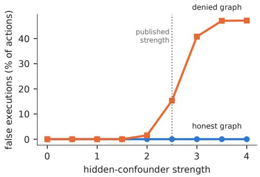
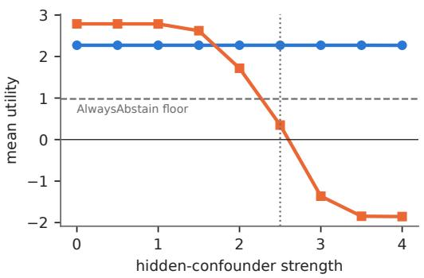
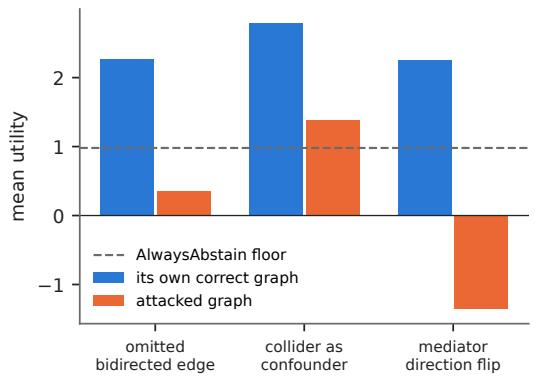
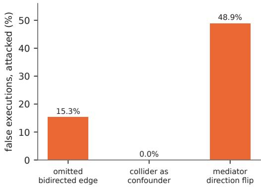
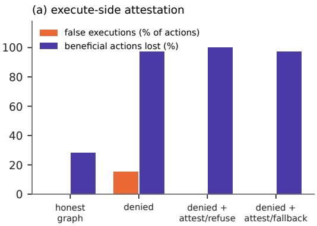
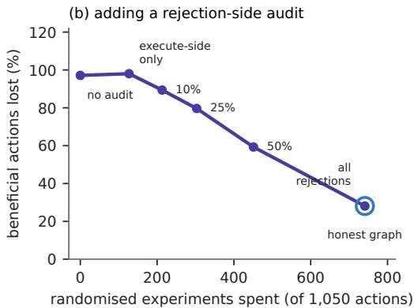

# Who Verifies the Graph? Misspecification Attacks on Causal Action Verification for Language Agents

Fabio Rovai The Tesseract Academy London, United Kingdom fabio@thetesseractacademy.com

## Abstract

Causal action verifiers gate an agent’s state-changing tool calls by checking whether each proposed intervention is identifiable against a committed action–state graph, and they issue a certificate that carries the identification argument and a one-sided lower confidence bound. One such verifier, CIVeX, reports zero false executions on a confounded tool-use benchmark. We red-team it by corrupting only the committed graph. Omitting a single bidirected edge takes it from zero false executions to 15.3% at the benchmark’s published confounding strength, with 91% of its executions harmful and utility falling from +2.27 to +0.35. Reversing one arrowhead, so that a mediator is committed as a confounder, gives 48.9% false executions and no correct ones. Every one of these actions carries an internally valid certificate. An attestation step that tests each observationally certified execution against a bounded randomised sample detected both attacks, with 2 false alarms in 555 executions on a truthful graph; refusing what fails the test, or cannot be tested, gave zero false executions in every setting we measured. It does not restore beneficial execution: at the published strength 97.1% of beneficial actions are still never executed, because the same misspecification rejects them before attestation runs. Those rejections carry certificates too, and auditing them works, but its cost scales with the number of rejections rather than the number of executions. Recovering safety costs 127 experiments per 1,050 actions; recovering the lost value costs 614 more, at which point the audited verifier makes the honest graph’s decisions on every instance and spends exactly its experiment budget. An audit that inspects only executions protects against wrongful action. Wrongful inaction has to be paid for separately.

## 1 Introduction

A valid tool call is not necessarily a valid intervention. Schema validators, policy filters and provenance checks certify the form of an action, not that executing it will have the effect the agent expects. Causal action verifiers close that gap by treating each proposed state-changing call as a structural causal query over a committed action–state graph, checking identifiability, and refusing to certify when identification fails. The certificate is an auditable object: it names the graph, the identification argument, a point estimate, a one-sided lower confidence bound (LCB) and a risk limit.

CIVeX [Rovai, 2026] is a verifier of this kind, and it is the author’s own earlier work; this paper is a red-team of it. Its reported results are strong: zero observed false executions across a confounded tool-use benchmark, and the only non-oracle method whose utility under a hard zero-false-execution constraint beats an always-abstain floor. Those results hold under an assumption the verifier does not check. The graph is committed, not learned, and the original paper names it as the trusted computing base and lists graph injection, adjustment-set poisoning and version drift as open concerns. That the guarantee depends on the graph is therefore not news. What was not known is how fast it fails, what the failures look like, and what a defence costs. This paper measures those three things.

• The published misspecification test exercises declared ignorance. It removes observed confounders from the graph and adds a bidirected $T  Y$ edge in their place, so the graph admits the residual confounding. Identification then fails and the verifier routes the affected actions to a randomised experiment or abstains. The test shows the verifier handles a graph that admits what it does not know. It does not exercise a graph that is wrong (Section 3).

• Three misspecification attacks, measured. Omitting the bidirected edge, admitting a collider as a confounder, and reversing a mediator’s direction. The first and third produce certified harmful executions; the second fails into paralysis (Sections 3, 4).

• A defence, fully accounted. Attestation against a bounded randomised experiment detects both harmful attacks, and refusing what it flags or cannot test gives zero observed false executions in every setting we measured; we report the experiments spent, the disagreements found and their cost. How the defence responds to a detected disagreement matters as much as detecting it (Section 5).

• The cost asymmetry. Attestation of executions recovers none of the beneficial actions the misspecification rejects. Auditing rejections does recover them, at a cost set by the rejection volume, and full recovery costs exactly what the honest graph spends (Section 6).

## 2 Setup

We run the CIVeX triage procedure, its certificate checker and the adversarial Causal-ToolBench generator as implemented for Rovai [2026]; the only input we change is the committed graph. Each instance is a tool-using workflow sampled from a structural causal model with a binary treatment T (the proposed action), a continuous outcome Y (workflow utility), two observed covariates and one hidden confounder U whose strength s is a parameter. The hidden confounder is adversarial: it pushes the observational estimate towards the wrong sign. Six workflow families, seven seeds and 25 instances per family and seed give 1,050 actions per cell. Appendix A gives the full generating equations.

For each action the verifier searches the committed graph for a backdoor adjustment set. If one exists, it estimates the effect by least squares on 500 observational rows with a 95% normal-theory interval and returns EXECUTE if the lower end of that interval is at least zero, REJECT otherwise. Both verdicts carry a certificate. If no adjustment set exists, it returns EXPERIMENT when the benchmark marks a safe experiment as available (70.6% of instances) and ABSTAIN otherwise; EXPERIMENT re-runs the decision on a 500-row randomised sample. We report the false-execution rate (share of all actions executed although their true effect is harmful), the correct-execution rate, the share of beneficial actions never executed, and mean utility. Utility is the benchmark’s: an execution earns +|τ| if beneficial and −|τ| if harmful, a non-execution earns $+ | \tau |$ if the action was harmful and $- 0 . 3 | \tau |$ if it was beneficial, and every randomised experiment costs 0.05. Because correct refusals earn credit, the always-abstain policy scores +0.98 and is the floor any useful verifier must beat.

Threat model. We assume an adversary, or an ordinary mistake, that can alter the committed graph but not the verifier, the estimator, the data, or the certificate format. The graph is the one input the verifier accepts on trust, it is typically elicited from domain experts and stored in a registry, and all three of our attacks are edits a careless expert could make by accident. We do not model how such access is obtained, and we grant the defender everything else.

Two graphs are compared throughout. The honest graph contains the observed covariates as confounders and a bidirected $T  { \check { Y } }$ edge for the hidden confounder. The denied graph is identical but for that one edge. $\mathbf { A } \mathbf { t } \ s = 0$ the hidden confounder has no effect, so there the denied graph is the true one. As a reproduction check, the honest graph at the benchmark’s published strength $s = 2 . 5$ gives +2.27 utility and zero false executions, against +2.23 reported.

## 3 Attack 1: the omitted edge

The published misspecification test relabels observed confounders as latent and inserts a bidirected $T  Y$ edge to represent the now-unblockable path. The graph therefore stays truthful: it says that confounding exists and cannot be adjusted away. Identification fails on exactly the affected instances, and the verifier routes them to a randomised experiment or abstains. Zero false executions in that test is a real result, since the experiment still has to return the right sign, but it is a result about declared uncertainty.

  
Figure 1: Omitting one bidirected edge, as a function of hidden-confounder strength. The honest graph is flat across the range. The denied graph is harmless below strength 1.5, falls off a cliff between 2.0 and 3.0, and from 3.0 returns negative utility. Dotted line: the benchmark’s published strength. Dashed line: the always-abstain floor. $n = 1 , 0 5 0$ per point.

The realistic failure, and the obvious injection target, is the opposite: a graph that omits the bidirected edge and so asserts that the observed adjustment set is sufficient. Backdoor adjustment then succeeds on an insufficient set, the estimate absorbs the omitted confounding, the LCB is computed on that biased estimate, and the certificate validates. Nothing in the certificate is internally wrong.

Figure 1 sweeps the hidden confounder’s strength. Up to 1.0 the denial is harmless and even profitable: the denied graph returns +2.79 against the honest graph’s +2.27, because the honest graph pays for experiments to guard against confounding that never changes a decision. False executions appear at strength 2.0 (1.5%). At 2.5, the published setting, the rate is 15.3% (per-seed range $1 3 . 3 \mathrm { - } 1 7 . 3 \%$ never zero), 91% of all executions are harmful, and utility is +0.35 (per seed $+ 0 . 1 2 ~ \mathrm { t o } ~ + 0 . 5 5$ against +2.14 to +2.49 for the honest graph). From 3.0 upward 41–47% of all actions are false executions, every execution is harmful, and utility is negative, −1.36 at 3.0 and −1.85 at 4.0, far below the always-abstain floor. The honest line does not move anywhere in the sweep. Whether the omitted edge is harmless or catastrophic depends on a quantity the graph has declared absent, and the certificate looks the same on both sides of the cliff.

## 4 Attacks 2 and 3: bad controls and a reversed arrowhead

A collider admitted as a confounder. On a regime with no hidden confounding, where the graph is otherwise exactly true, we synthesise $C = 0 . 8 \bar { T } + 0 . 8 \left( Y - \bar { Y } \right) + \varepsilon$ and commit it as a confounder. Conditioning on a descendant of the outcome cuts correct executions from 52.9% to 7.9% (per seed 3.3–11.3%) and utility from $+ 2 . 7 9 \ \mathrm { t o \ t i { 1 . 3 9 } }$ , with zero false executions. In this regime the bad control fails safe: the verifier stops acting rather than acting wrongly.

A mediator committed backwards. We build an SCM with a genuine mediator, $T  M  Y$ alongside a direct $T  Y$ path, in which the direct effect carries the opposite sign to the total effect. The correct graph excludes M from the adjustment set, because the backdoor search rejects descendants of the treatment, and recovers the total effect. The attacked graph asserts $M \to T$ instead $\operatorname { o f } T \to M !$ a direction error on a variable that genuinely exists, with nothing omitted and nothing fabricated. M then enters the adjustment set, the indirect path is blocked, and the estimate recovers the direct effect, whose sign is inverted.

Table 1 gives the result: total inversion. Every execution is harmful, every beneficial action is rejected, and utility is negative. The variable is real, the graph is complete, no assumption is left undeclared, and the identification argument is internally valid for the graph as committed. The graph is wrong by one edge direction.

Figure 2: Three misspecifications, each against its own correct-graph control (the three run on different data-generating regimes, so a single shared baseline would mislead). Bad controls fail into paralysis; the omitted edge and the reversed arrowhead fail into wrongful action. n = 1,050 per bar.
<table><tr><td>committed graph</td><td>false exec</td><td>correct exec</td><td>utility</td><td>beneficial lost</td></tr><tr><td>correct (T → M)</td><td>0.0%</td><td>51.1%</td><td>+2.26</td><td>0.0%</td></tr><tr><td>direction flip  $( M \to T )$ </td><td>48.9%</td><td>0.0%</td><td>-1.36</td><td>100%</td></tr></table>

Table 1: One reversed arrowhead inverts the verifier. Per-seed false-execution range under the flip: 42.7–57.3%. n = 1,050 per row.

## 5 A defence: attestation against a bounded experiment

“No unmeasured confounding” cannot be tested from observational data alone, so a defence has to buy the test with an intervention. We add an attestation step. Whenever the verifier reaches EXECUTE by observational identification, the step draws the 500-row randomised sample, computes the difference in means with a 95% normal-theory interval, and compares it with the interval in the certificate. If the two intervals are disjoint, the committed graph is declared falsified for that action. We compare two responses to falsification: refuse (abstain) and fallback (re-decide on the randomised sample). Each attestation costs one experiment, 0.05 utility, and every utility figure below includes that cost. The test is a discrepancy diagnostic, not a calibrated hypothesis test: overlapping intervals do not show that the graph is correct, and we make no claim about its false-acceptance rate beyond what we measure.

Table 2 itemises the defence on the denied graph. Five things follow from it.

It detects every harmful execution we generated. From strength 2.0 upward every attested execution was falsified, and false executions went to zero at every strength. Zero observed events in 1,050 actions bounds the true rate below about 0.29% at 95% confidence by the rule of three [Hanley and Lippman-Hand, 1983]; that is the strength of the claim, not a guarantee.

It canfail, and on a true graph it rarely does. At strength 0 the denied graph is correct, and attestation flagged 2 of 555 executions (0.4%). Its cost there is almost entirely the experiments themselves: utility falls from +2.79 to +2.76.

It is “free on honest graphs” only in a vacuous sense. Our submitted version reported a block rate of zero on the honest graph. The accounting shows why: the honest graph never produces an observational execution, so attestation never runs. That graph is not cheap; it spends 741 experiments per 1,050 actions.

The response matters more than the detection. With 500 randomised rows the test is sensitive enough to flag bias that changes no decision: at strength 1.0 it falsified 547 of 554 executions although the denial there costs nothing. Refusing on falsification then destroys the verifier (utility +1.05, 98.7% of beneficial actions lost), while fallback keeps it (+2.76). A defence deployed with the refuse response would be worse than no defence across the whole harmless range.

<table><tr><td rowspan="2">strength</td><td colspan="2">attestation</td><td colspan="2">false exec</td><td colspan="3">utility</td></tr><tr><td>experiments</td><td>falsified</td><td>none</td><td>attest</td><td>none</td><td>refuse</td><td>fallback</td></tr><tr><td>0.0</td><td>555</td><td>2</td><td>0.0%</td><td>0.0%</td><td>+2.79</td><td>+2.76</td><td>+2.76</td></tr><tr><td>0.5</td><td>555</td><td>79</td><td>0.0%</td><td>0.0%</td><td>+2.79</td><td>+2.52</td><td>+2.76</td></tr><tr><td>1.0</td><td>554</td><td>547</td><td>0.0%</td><td>0.0%</td><td>+2.79</td><td>+1.05</td><td>+2.76</td></tr><tr><td>1.5</td><td>474</td><td>474</td><td>0.0%</td><td>0.0%</td><td>+2.62</td><td>+1.03</td><td>+2.60</td></tr><tr><td>2.0</td><td>201</td><td>201</td><td>1.5%</td><td>0.0%</td><td>+1.72</td><td>+1.05</td><td>+1.77</td></tr><tr><td>2.5</td><td>177</td><td>177</td><td>15.3%</td><td>0.0%</td><td>+0.35</td><td>+1.05</td><td>+1.12</td></tr><tr><td>3.0</td><td>428</td><td>428</td><td>40.8%</td><td>0.0%</td><td>-1.36</td><td>+1.04</td><td>+1.04</td></tr><tr><td>4.0</td><td>495</td><td>495</td><td>47.1%</td><td>0.0%</td><td>-1.85</td><td>+1.03</td><td>+1.03</td></tr></table>

Table 2: Attestation on the denied graph, itemised. Experiments: observational EXECUTEs that were attested (one experiment each, out of 1,050 actions). Falsified: attestations whose intervals were disjoint. False executions are shares of all actions. Utility includes the experiment cost. On the honest graph attestation is never invoked: it has zero observational EXECUTEs at every strength, because its bidirected edge sends every action to the experiment path, where it already spends 741 experiments. This table assumes, as the benchmark’s experiment path does not, that a randomised sample exists for every attested action; see the text for the case where it does not.

<table><tr><td>graph</td><td>defence</td><td>false exec</td><td>correct exec</td><td>utility</td><td>beneficial lost</td></tr><tr><td>correct</td><td>none</td><td>0.0%</td><td>51.1%</td><td>+2.26</td><td>0.0%</td></tr><tr><td>correct</td><td>attest / fallback</td><td>0.0%</td><td>34.4%</td><td>+1.69</td><td>32.8%</td></tr><tr><td>flipped</td><td>none</td><td>48.9%</td><td>0.0%</td><td>-1.36</td><td>100%</td></tr><tr><td>flipped</td><td>attest / refuse</td><td>0.0%</td><td>0.0%</td><td>+0.58</td><td>100%</td></tr><tr><td>flipped</td><td>attest / fallback, committed graph</td><td>34.6%</td><td>0.0%</td><td>-0.81</td><td>100%</td></tr><tr><td>flipped</td><td>attest / fallback, graph-free</td><td>0.0%</td><td>0.0%</td><td>+0.58</td><td>100%</td></tr><tr><td>flipped</td><td>graph-free + audit all rejections</td><td>0.0%</td><td>34.4%</td><td>+1.68</td><td>32.8%</td></tr></table>

Table 3: Attestation against the direction flip, honouring experiment availability (unattestable executions refused). Detection works; the fallback must not reuse the committed adjustment set. The last row is the rejection audit of Section 6. n = 1,050 per row.

Availability decides whether zero is reachable. The benchmark marks a safe experiment available for only 70.6% of actions, and Table 2 ignores that flag. If the defender honours it and refuses executions it cannot attest, false executions stay at zero, but on the true graph utility drops from +2.79 to +2.29, because the 158 of 555 correct executions with no experiment available become refusals. If instead unattestable executions go through, false executions return: 4.3% at strength 2.5 (per seed 2.0–6.7%) and 12.4% at 3.0. Zero false executions needs either an experiment for every eligible action or a willingness to refuse the ones without.

The direction flip. Attestation also detects the reversed arrowhead: with an experiment for every action, all 513 attacked executions were falsified, against 2 of 537 on the correct mediator graph. Refusing then gives zero false executions (utility +0.58 with availability honoured, Table 3). Fallback does not, and the reason is instructive. Our fallback re-decides on the randomised sample using the committed graph, which still puts M in the adjustment set. Randomising T removes confounding, but it does not undo an adjustment that blocks the causal path, so the fallback reproduces the error: 48.9% false executions with an experiment for every action, 34.6% when unattestable executions are refused. A fallback that ignores the committed adjustment set and uses the raw difference in means brings false executions to zero (Table 3). The general lesson is that a defence built for one kind of graph error can silently inherit another.

## 6 The cost asymmetry

Table 4 and Figure 3 give the paper’s main result. Attestation of executions takes false executions to zero and lifts utility from +0.35 to +1.12, but the gain comes entirely from avoiding harm. Beneficial execution is not recovered: 97.1% of beneficial actions are lost with fallback, exactly as without the defence, and 100% with refuse, against 28.1% under the honest graph. At strength 3.0 and above the denied graph loses every beneficial action with or without attestation.

Figure 3: Published confounding strength. (a) Attestation of executions, with an experiment assumed for every attested action, removes the false executions and leaves the lost beneficial actions where they were (97.1% with fallback, 100% with refuse). (b) Auditing a share of the rejections as well, with experiment availability honoured: beneficial actions come back roughly in proportion to experiments spent, and auditing every rejection lands on the honest graph (ringed). n = 1,050 per point.
<table><tr><td>graph</td><td>defence</td><td>experiments</td><td>false exec</td><td>correct exec</td><td>utility</td><td>beneficial lost</td></tr><tr><td>honest</td><td>none</td><td>741</td><td>0.0%</td><td>38.0%</td><td>+2.27</td><td>28.1%</td></tr><tr><td>denied</td><td>none</td><td>0</td><td>15.3%</td><td>1.5%</td><td>+0.35</td><td>97.1%</td></tr><tr><td>denied</td><td>attest / refuse†</td><td>177</td><td>0.0%</td><td>0.0%</td><td>+1.05</td><td>100.0%</td></tr><tr><td>denied</td><td>attest / fallback†</td><td>177</td><td>0.0%</td><td>1.5%</td><td>+1.12</td><td>97.1%</td></tr><tr><td>denied</td><td>attest / fallback</td><td>127</td><td>0.0%</td><td>1.0%</td><td>+1.10</td><td>98.0%</td></tr><tr><td>denied</td><td>+ audit 10% of rejections</td><td>213</td><td>0.0%</td><td>5.6%</td><td>+1.24</td><td>89.4%</td></tr><tr><td>denied</td><td>+ audit 25%</td><td>303</td><td>0.0%</td><td>10.8%</td><td>+1.40</td><td>79.6%</td></tr><tr><td>denied</td><td>+ audit 50%</td><td>451</td><td>0.0%</td><td>21.5%</td><td>+1.74</td><td>59.3%</td></tr><tr><td>denied</td><td>+ audit all</td><td>741</td><td>0.0%</td><td>38.0%</td><td>+2.27</td><td>28.1%</td></tr></table>

Table 4: Safety is cheap to recover and value is not. Published confounding strength. Experiments are randomised samples drawn per 1,050 actions. †Assumes a randomised sample exists for every attested action; the other denied rows honour the benchmark’s availability flag and refuse executions they cannot attest.

The mechanism is visible in the verdicts. Of the 555 beneficial actions at the published strength, 539 are rejected at the first triage by observational identification, with a certificate whose biased estimate has a negative lower bound. Attestation of executions never inspects them. The fault is in the audit path, not in the certificate: CIVeX attaches the graph, adjustment set, estimate and interval to a REJECT exactly as it does to an EXECUTE, so a rejection can be tested the same way. Our submitted version said that a rejected action emits no certificate. For this verifier that was wrong.

Auditing rejections works. Applying the same attestation and fallback to a random share of the rejections for which an experiment is available recovers beneficial actions roughly in proportion to the share audited, with no false executions at any budget (Table 4, Figure 3b). The price is set by volume. Under the denied graph, 873 of the 1,050 actions are observational rejections, and 334 of those are correct. Recovering safety took 127 experiments; recovering the value took 614 more, 4.8 times as many. At strength 3.0 the split is 298 and 443. Auditing every rejection that can be audited reproduces the honest graph exactly: on every instance at every strength from 1.5 to 4.0 it makes the honest graph’s execute decisions, and it spends the same 741 experiments. This is an identity rather than a coincidence. At those strengths every audited verdict is falsified, so every action with an experiment available is re-decided on the randomised sample, which is what the honest graph’s bidirected edge does from the start.

So the value was always bought with experiments, and omitting the edge hides the need for them. The asymmetry is a property of where the audit budget goes, not a property of certificates. An audit that inspects only executions sees the actions that would change the world, which are the ones whose harm can later surface in outcomes. A wrongly rejected action changes no state and leaves no outcome to observe, so nothing downstream flags the loss, and finding it means paying to re-examine decisions most of which were correct. A deployment that monitors false executions alone will see a verifier with a clean record while it quietly does nothing.

## 7 Related work

Identification. The certificate machinery rests on do-calculus and the Shpitser–Pearl ID algorithm [Pearl, 2009, Shpitser and Pearl, 2006], with backdoor and frontdoor adjustment [Rosenbaum and Rubin, 1983] as the usual arguments. Our attacks do not challenge that theory; they hold it fixed and corrupt its input.

High-confidence deployment. The decision rule “compute a one-sided lower bound on the effect and act only if it clears a threshold, otherwise return no solution” predates its use in agent verification: it is high-confidence off-policy evaluation and improvement [Thomas et al., 2015a,b] and the Seldonian framework [Thomas et al., 2019], whose signature behaviour is returning NO SOLUTION FOUND when the safety constraint cannot be certified. The CIVeX paper cites constrained MDPs, shielded RL and safe-exploration surveys [Altman, 1999, Achiam et al., 2017, Alshiekh et al., 2018, García and Fernández, 2015] but not this branch, which is its nearest ancestor; we correct that omission here. The difference is granularity and auditability: a per-action gate on an off-the-shelf agent with an inspectable certificate, rather than a bound on a learned policy. Our results say that this is also where the exposure lies, because a per-action gate that is audited only on its executions leaves its rejections unexamined.

Sensitivity analysis. Bounding the effect of unmeasured confounding [Rosenbaum and Rubin, 1983, VanderWeele and Ding, 2017, Cinelli and Hazlett, 2020, Manski, 2003] is the classical response to exactly the assumption we attack. Separately, Cinelli et al. [2024] catalogue the good and bad control choices that our second and third attacks instantiate: a collider admitted as a confounder and a mediator committed backwards are both entries in that taxonomy, and our contribution is to price them inside a verifier. A verifier that reported a sensitivity interval alongside the LCB would degrade more gracefully under the omitted edge. It would not help with the direction flip, which is a structural error rather than a confounding one, and it would not by itself recover wrongly rejected actions.

Verifier robustness. Work on reward hacking and specification gaming [Amodei et al., 2016, Skalse et al., 2022] asks whether an agent exploits its evaluator. We ask the adjacent question of whether the evaluator’s own trusted inputs can be corrupted, an attack surface that grows as verification moves from scalar rewards to structured, assumption-carrying artefacts.

## 8 Limitations

The benchmark is synthetic by construction, which is what makes ground-truth causal effects available at all; it demonstrates that observational and interventional signs can disagree, and does not claim to match any specific production system. The collider and mediator regimes are built to expose their failure modes, and we sweep strength only for the omitted edge; how often such errors occur in elicited graphs is outside what we measure. Our attacks edit the graph directly rather than through an attacker with capabilities and a budget; we measure the damage a corrupted graph does, not the difficulty of corrupting one. Attestation assumes that a bounded randomised sample exists and is cheap, which fails for irreversible actions, where verification matters most, and the disjoint-interval test carries no calibrated error guarantee. The rejection audit samples rejections uniformly; a targeted audit, for example of rejections whose certified bound lies near zero, might recover value more cheaply, and we have not tested one. We do not evaluate on a real tool-agent benchmark, so the numbers characterise one verifier and its benchmark rather than deployed agents, and whether other verification schemes show the same split between the cost of safety and the cost of value is untested.

## 9 Conclusion

A causal action verifier certifies the actions it is asked to permit against a graph it cannot check. One omitted edge or one reversed arrowhead makes every certified execution wrong, and the certificates stay internally valid. A bounded-experiment attestation, refusing what it flagged or could not test, removed every false execution we generated, at a cost proportional to the number of executions. It recovered none of the beneficial actions the same error rejects. Those can be recovered too, by auditing rejections, but the bill scales with the number of rejections, and recovering all of them costs what the honest graph would have spent in the first place. Verification work on agents should treat the committed graph as an attack surface with its own integrity requirements, report wrongful inaction alongside wrongful action, and budget for auditing both.

## Acknowledgements

The four reviewers and the area chair of the Who Verifies the Agents? workshop asked for the attestation accounting and challenged the scope of the asymmetry claim; Sections 5 and 6 are the result.

## References

Joshua Achiam, David Held, Aviv Tamar, and Pieter Abbeel. Constrained policy optimization. In Proceedings of the 34th International Conference on Machine Learning (ICML), pages 22–31, 2017. URL https://proceedings.mlr.press/v70/achiam17a.html.

Mohammed Alshiekh, Roderick Bloem, Rüdiger Ehlers, Bettina Könighofer, Scott Niekum, and Ufuk Topcu. Safe reinforcement learning via shielding. In Proceedings ofthe Thirty-Second AAAI Conference on Artificial Intelligence (AAAI), pages 2669–2678, 2018. doi: 10.1609/aaai.v32i1. 11797.

Eitan Altman. Constrained Markov Decision Processes. Stochastic Modeling Series. Chapman & Hall/CRC, Boca Raton, 1999. ISBN 978-0849303821.

Dario Amodei, Chris Olah, Jacob Steinhardt, Paul Christiano, John Schulman, and Dan Mané. Concrete problems in AI safety. arXiv preprint arXiv:1606.06565, 2016. URL https://arxiv. org/abs/1606.06565.

Carlos Cinelli and Chad Hazlett. Making sense of sensitivity: Extending omitted variable bias. Journal ofthe Royal Statistical Society: Series B (Statistical Methodology), 82(1):39–67, 2020. doi: 10.1111/rssb.12348.

Carlos Cinelli, Andrew Forney, and Judea Pearl. A crash course in good and bad controls. Sociological Methods & Research, 53(3):1071–1104, 2024. doi: 10.1177/00491241221099552.

Javier García and Fernando Fernández. A comprehensive survey on safe reinforcement learning. Journal of Machine Learning Research, 16(1):1437–1480, 2015. URL https://jmlr.org/ papers/v16/garcia15a.html.

James A. Hanley and Abby Lippman-Hand. If nothing goes wrong, is everything all right? Interpreting zero numerators. JAMA: The Journal ofthe American Medical Association, 249(13):1743–1745, 1983. doi: 10.1001/jama.1983.03330370053031.

Charles F. Manski. Partial Identification ofProbability Distributions. Springer Series in Statistics. Springer, New York, 2003. doi: 10.1007/b97478.

Judea Pearl. Causality: Models, Reasoning, and Inference. Cambridge University Press, New York, 2nd edition, 2009. doi: 10.1017/CBO9780511803161.

Paul R. Rosenbaum and Donald B. Rubin. The central role of the propensity score in observational studies for causal effects. Biometrika, 70(1):41–55, 1983. doi: 10.1093/biomet/70.1.41.

Fabio Rovai. CIVeX: Causal intervention verification for language agents. arXiv preprint arXiv:2605.09168, 2026. URL https://arxiv.org/abs/2605.09168.

Ilya Shpitser and Judea Pearl. Identification of joint interventional distributions in recursive semi-Markovian causal models. In Proceedings ofthe Twenty-First National Conference on Artificial Intelligence (AAAI), pages 1219–1226, 2006. URL https://ftp.cs.ucla.edu/pub/stat\_ ser/r327.pdf.

Joar Skalse, Nikolaus H. R. Howe, Dmitrii Krasheninnikov, and David Krueger. Defining and characterizing reward hacking. arXiv preprint arXiv:2209.13085, 2022. URL https://arxiv. org/abs/2209.13085.

Philip S. Thomas, Georgios Theocharous, and Mohammad Ghavamzadeh. High-confidence off-policy evaluation. In Proceedings ofthe AAAI Conference on Artificial Intelligence, volume 29, 2015a. doi: 10.1609/aaai.v29i1.9541.

Philip S. Thomas, Georgios Theocharous, and Mohammad Ghavamzadeh. High confidence policy improvement. In Proceedings of the 32nd International Conference on Machine Learning, pages 2380–2388, 2015b. URL https://proceedings.mlr.press/v37/thomas15.html.

Philip S. Thomas, Bruno Castro da Silva, Andrew G. Barto, Stephen Giguere, Yuriy Brun, and Emma Brunskill. Preventing undesirable behavior of intelligent machines. Science, 366(6468):999–1004, 2019. doi: 10.1126/science.aag3311.

Tyler J. VanderWeele and Peng Ding. Sensitivity analysis in observational research: Introducing the E-value. Annals ofInternal Medicine, 167(4):268–274, 2017. doi: 10.7326/M16-2607.

## A Benchmark, verifier and defence specification

Omitted-edge and collider regimes. Each instance draws a label $b \sim$ Bernoulli(0.5) and an effect $\tau \sim \bar { \mathcal { N } } ( \mu _ { b } , 0 . 4 ^ { 2 } )$ , where $( \mu _ { \mathrm { b e n e f i c i a l } } , \mu _ { \mathrm { h a r m f u l } } )$ is family-specific: $( + 3 . 0 , - 3 . 0 ) , ( + 2 . 5 , - 3 . 0 )$ $( + 3 . 0 , - 3 . 5 ) , ( + 2 . 0 , - 2 . 5 ) , ( + 2 . 5 , - 3 . 0 )$ and $( + 2 . 0 , - 3 . 5 )$ for the six families. The ground-truth label is $\tau > 0$ . Observational data are $n = 5 0 0$ rows of

$$
\begin{array} { r l } & { X _ { 1 } \sim \mathcal { N } ( 1 0 , 2 ^ { 2 } ) , \quad X _ { 2 } \sim \mathcal { N } ( 5 , 1 ^ { 2 } ) , \quad U \sim \mathcal { N } ( 0 , 1 ) , } \\ & { ~ T \sim \mathrm { B e r n o u l l i } \big ( \sigma \big ( 0 . 3 \frac { X _ { 1 } - 1 0 } { 2 } - 0 . 2 \frac { X _ { 2 } - 5 } { 1 } + \alpha U \big ) \big ) , } \\ & { Y = \tau T + 0 . 1 X _ { 1 } + 0 . 0 5 X _ { 2 } + \beta U + \varepsilon , \quad \varepsilon \sim \mathcal { N } ( 0 , 1 ) , } \end{array}
$$

with $( \alpha , \beta ) = ( - s , + s )$ for beneficial and $( + s , + s )$ for harmful instances, so the hidden confounder biases the observational contrast towards the wrong sign; $s = 2 . 5$ is the published setting. The randomised sample keeps the same covariates, U and noise, and draws $T \overset { \cdot } { \sim } \mathrm { B e r n o u l l i } ( 0 . 5 )$ independently of everything. A safe experiment is available for an instance with probability $0 . 7 \ : ( 7 0 . 6 \%$ realised). The collider is $C = 0 . 8 \dot { T } + 0 . 8 ( Y - \bar { Y } ) + \mathcal { N } ( 0 , 0 . 5 ^ { 2 } )$ , committed with edges $C  T$ and $C  Y$ , on the $s = 0$ regime.

Mediator regime. Same covariates, no hidden confounder, $M = m _ { t } T + \mathcal { N } ( 0 , 0 . 5 ^ { 2 } )$ and $Y =$ $d T + m _ { y } M + 0 . 1 X _ { 1 } + 0 . 0 5 X _ { 2 } + \varepsilon$ , with $( d , m _ { t } , m _ { y } ) = ( - 0 . 8 , 1 . 0 , 3 . 3 )$ for beneficial actions (total effect $+ 2 . 5 )$ and $( 1 . 0 , 1 . 0 , - 3 . 0 )$ for harmful ones (total $- 2 . 0 )$ . The direct effect always has the opposite sign to the total.

Verifier. Backdoor sets are searched on the committed graph. The estimate is the coefficient on $T$ in an ordinary least-squares regression of $Y$ on $T$ and the adjustment set, with standard error from the residual variance and interval estimate ±1.96 standard errors. EXECUTE requires the lower end to be at least 0 and the action’s risk bound (0.05) to be at most 0.5; an identified action that fails this is REJECTed with its certificate. An unidentified action goes to EXPERIMENT if a safe experiment is available and to ABSTAIN otherwise; EXPERIMENT re-runs the decision on the randomised sample with the observed-covariate graph.

Attestation and audit. The interventional interval is the difference in means on the randomised sample, ±1.96 Welch standard errors. The graph is falsified for an action when this interval and the certificate’s interval are disjoint. Fallback with the committed graph re-runs the decision on the randomised sample with the committed graph; graph-free fallback executes if the interventional lower end is at least 0 and rejects if its upper end is below 0. The rejection audit draws one uniform number per instance, fixed per seed, and audits an observational REJECT with an available experiment when that number falls below the budget, so the audited sets are nested across budgets. Every experiment, whether triage, attestation or audit, costs 0.05 utility.

Code state. All results come from one working copy of the CIVeX repository. The camera-ready tables were produced by a single script that triages each instance once, stores its decision, certificate interval, availability and attestation outcome, and derives every policy from that table, so all policies see identical instances. It reproduces the submitted version’s attestation results exactly (for example +1.121 and 97.1% for fallback at s = 2.5).

## B Per-seed variability

<table><tr><td>cell (n = 1,050, 7 seeds)</td><td>false exec</td><td>per-seed range</td><td>utility</td><td>per-seed range</td></tr><tr><td>honest graph, s = 2.5</td><td>0.0%</td><td>0.0-0.0%</td><td>+2.27</td><td>+2.14 to +2.49</td></tr><tr><td>denied graph, s = 2.0</td><td>1.5%</td><td>0.7-2.0%</td><td>+1.72</td><td>+1.57 to +1.92</td></tr><tr><td>denied graph, s = 2.5</td><td>15.3%</td><td>13.3-17.3%</td><td>+0.35</td><td>+0.12 to +0.55</td></tr><tr><td>denied graph, s = 3.0</td><td>40.8%</td><td>37.3-44.7%</td><td>-1.36</td><td>-1.51 to −1.17</td></tr><tr><td>denied + attest/fallback, s = 2.5</td><td>0.0%</td><td>0.0-0.0%</td><td>+1.12</td><td>+0.88 to +1.26</td></tr><tr><td>denied + attest/fallback, pass-through, s = 2.5</td><td>4.3%</td><td>2.0-6.7%</td><td>+0.92</td><td>+0.69 to +1.15</td></tr><tr><td>mediator direction flip</td><td>48.9%</td><td>42.7-57.3%</td><td>-1.36</td><td>-1.47 to -1.28</td></tr></table>

Table 5: Seed-level spread for the headline cells.