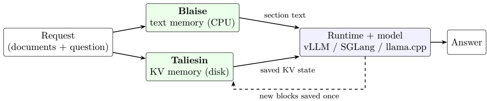
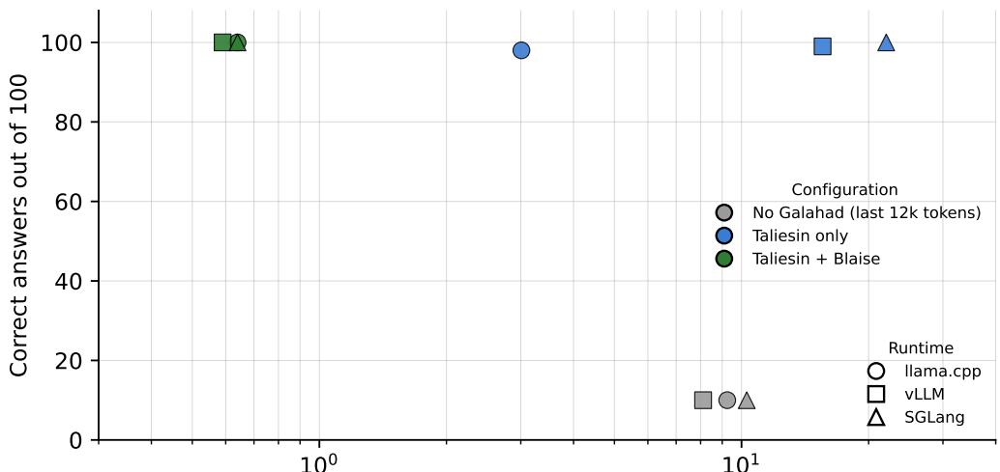

# Working Around the Compute Ceiling: Galahad’s Byte-Exact Memory Makes LLM Reading a One-Time Cost

Sietse Schelpe Corbenic AI sietse@corbenic.ai

October 2026

© 2026 Corbenic AI. Licensed under CC BY 4.0 (https://creativecommons.org/licenses/by/4.0/). Any reuse must credit: Sietse Schelpe, Corbenic AI (2026).

## Abstract

A transformer language model performs a bounded amount of computation per token, and recent work by Vishal Sikka, former CEO of Infosys, argues that this bound limits which tasks a model can carry out or verify [18]. We do not try to raise that ceiling. We ask how much of the budget beneath it is spent on work the model has already done. Serving is stateless across requests: a model that answers a second question about a document recomputes the document’s attention state from the first token. On seven real-world datasets, 98.7% of prompt tokens were text the model had already read. We present Galahad, a memory layer for vLLM, SGLang and llama.cpp that makes this reading a one-time cost. Taliesin saves the model’s key–value (KV) state for a block of text and loads it on the next request that contains the same bytes, instead of recomputing it. Blaise keeps the documents themselves and passes the model only the section a question needs. We measure each part separately on a recall test with 100 facts hidden in a 97,000-token corpus (Gemma 4 31B). Taliesin alone let the model attend to the whole corpus and answered 98 of 100 on llama.cpp at 3.0 s and 572 J per question, against 10 of 100, 9.3 s and 2,754 J for the same model without Galahad, which could hold only the last 12,000 tokens. With Blaise added, the model read about 668 tokens per question and answered 100 of 100 on all three runtimes at 0.59–0.64 s and 200–213 J; a tuned RAGFlow pipeline answered 77. Storing the corpus is a one-time cost of about 100 s and 28 kJ, whose energy is recovered after 13 questions. Restored state is bit-identical to freshly computed state: all 262,144 output logits matched after restart, rehydration and hot-load. Galahad worked with all 30 models we tested (30/30) under vLLM. Galahad fails closed: any load that does not pass its checks is recomputed, so memory never changes an answer. Together these results move LLM serving from stateless to stateful inference. Galahad is available as a free, non-commercial beta for one GPU at https://github.com/corbenicai/galahad.

## 1 Introduction

Varin Sikka and Vishal Sikka, the former CEO of Infosys [18], argue that a transformer performs $O ( N ^ { 2 } \cdot d )$ computation for a prompt of N tokens and model dimension d, and that a task whose complexity exceeds this bound cannot be carried out correctly by the model, or verified by it. This paper accepts that ceiling. It addresses a diferent question: how much of the computation below the ceiling is spent on useful work, and how much on repeating work the model has already done.

A large language model reads before it writes. For every request, the serving engine runs the prompt through the model once (prefill) to build the attention keys and values that the generated tokens attend to. For long prompts, prefill dominates the time to first token and a large share of the energy spent per request.

In most applications the same text is read many times. A support assistant answers hundreds of questions against the same manuals. A coding agent re-sends the same repository files on every step. A contract review tool asks dozens of questions of one agreement. Current engines reuse attention state only within a narrow scope: vLLM and SGLang keep a prefix cache in GPU memory [7, 20], which is evicted under memory pressure and lost when the process restarts. Ofloading systems extend this to CPU memory and disk [11, 12]. In the common case, however, a document that the model read yesterday is read again from the first token today.

We argue that this should change: the unit of inference cost should be new text, not total text.   
A model should pay to read a document once, and every later question about it should cost only   
the question and the answer. This moves inference from a stateless computation to one with   
persistent memory, in the same way that databases separated storing data from computing over   
it. The rest of this paper describes a system built on that principle and reports what it achieves. Galahad has two memories (Figure 1):

• Taliesin stores the model’s own KV state for a block of text and loads it when the same bytes appear again. Loading is exact: the restored state produces bit-identical logits to a fresh prefill.

• Blaise stores the text itself, organised so that a question can be answered from one section. It runs on the CPU and passes the model the exact text of that section, not the whole corpus.

Taliesin removes repeated computation; Blaise removes unnecessary reading. Each can run without the other.

This paper makes four contributions:

1. A memory layer that plugs into three production runtimes (vLLM, SGLang, llama.cpp) as one shared library, and that falls back to normal computation on any load failure (Section 2).

2. Evidence that restored state is exact: bit-identical logits after save and restore, and byte-equal prefill across four model architectures (Section 3).

3. Measurements of accuracy, latency and GPU energy for each part separately, on a controlled recall test and on seven real-world datasets, including an external retrieval baseline, and coverage of 30 of 30 tested models (Section 4).

4. The design boundaries of the approach and why they follow from how transformers and serving engines work (Section 5).

This is a system description. It does not describe the storage format, the internal structure of Blaise, or the security design in implementation detail; these are covered by pending patent applications.

## 2 System

## 2.1 Deployment

Galahad ships as one shared library (libgalahad.so) for Linux x86-64 with two runtime dependencies (OpenSSL’s libcrypto and zstd). It connects to vLLM as a KV connector, to SGLang as a HiCache storage backend, and to llama.cpp through slot save and restore. No model weights or runtime source code are modified. The library refuses to start without a tenant identity and a model fingerprint, so state saved by one model or tenant cannot be loaded by another.

  
Figure 1: Galahad in the serving path. Blaise selects the section of text a question needs; Taliesin supplies saved KV state for any block the model has already processed, and saves new blocks after their first prefill. If a load fails any check, the runtime recomputes the block.

## 2.2 Taliesin: KV memory

After the runtime computes the KV state for a block of prompt text, Taliesin writes it to storage under a fingerprint of the exact input bytes, the model and the tenant. When a later request contains the same block, the runtime loads the stored state instead of recomputing it. Stored state is checked on load and can be encrypted at rest. The design rule is serve without memory, never with wrong memory: if a record is missing, damaged, or fails a check, the runtime recomputes the block and the request completes normally.

Reuse happens at block level, where token positions match exactly (Section 5).

## 2.3 Blaise: text memory

Blaise keeps each document as byte-exact text, divided into sections. For a question, it selects one section on the CPU and passes that section’s text to the model, which then reads it and answers. In the recall test of Section 4.1, Blaise passed about 668 tokens per question instead of the full 97,000-token corpus. We do not describe its selection method here.

A second mode, in which the model itself reads Blaise’s index of the corpus and Taliesin keeps that reading so that it is paid once, is part of the design. This paper reports the first mode.

## 3 Correctness

A memory layer is useful only if loaded state is the state the model would have computed. Table 1 summarises the checks.

Exactness matters because approximate reuse fails silently. A prefix cache that returns slightly diferent state can change generated tokens without any error, as reported for AMD MI355X GPUs in the vLLM issue tracker [1]. Floating-point non-determinism in batched inference is a known source of such diferences [4]. Galahad treats a mismatch as a failed load and recomputes.

Sabotage testing. For each safety mechanism (confirmation hash, licence signature, tenant separation, byte comparison on load), we ran the corresponding attack three times: with the defence on, with it switched of, and with it restored. A defence counts as efective only if the attack succeeds when it is of and fails when it is on. All four defences met this criterion. A separate pass with ten analysis tools, including address sanitizers, found one out-of-bounds read, which we fixed before release.

## 4 Evaluation

Method. All benchmarks ran on rented cloud GPUs; local results were not counted. No configuration was told where an answer was located. Every retry and every loaded block counts

Table 1: Correctness checks. Each row is a separate experiment.
<table><tr><td>Check</td><td>Result</td><td>Conditions</td></tr><tr><td>Save and restore</td><td>262,144 of 262,144 logits bit-identical; 27 checks</td><td>s After process restart, rehydration from disk and hot-load. Gemma 4 12B Q8_0, llama.cpp, 2026-08-22</td></tr><tr><td>Deterministic prefill</td><td>20 of 20 byte-equal (SHA- 256 of logits)</td><td>Two fresh prefills of the same 1,024- token prompt compared. Llama 3.1 70B, Gemma 4 E4B, Qwen 3.6 35B- A3B, Ministral 3 8B; H200, llama.cpp b9189</td></tr><tr><td>State moved across GPU 64 of 64 greedy tokens iden- types</td><td>tical</td><td>KV state saved on A6000, loaded on RTX 4090 and the reverse</td></tr><tr><td>Stored bytes across GPUs</td><td>3 of 3 on each of 10 GPU types</td><td>Same record written and read back</td></tr><tr><td>Hybrid architecture</td><td>Galahad-off reference</td><td>5 of 5 token-exact against Qwen3.5 9B (Gated DeltaNet), tensor parallel 2</td></tr><tr><td>Snapshots</td><td>identical</td><td>276 of 276 tokens bit- After restart; RTX PRO 4500</td></tr><tr><td>Encryption round trip</td><td>9.77 GiB, 0 failures; NIST T4 and A40 CAVP 4,167 vectors, 0 fail- ures</td><td></td></tr></table>

toward time, energy and token totals. Time is the median per question. Energy is the total from the GPU’s own counter (NVML), averaged per question; idle power was measured separately and is included. Decoding was greedy (temperature 0).

## 4.1 Recall in a long corpus

Setup. We inserted 100 facts with invented names and random numbers into 13 Wikipedia articles (434 KB, 96,726 tokens in 11 blocks) and asked for each fact in paraphrase, at depths from 1% to 99% of the corpus. The model was Gemma 4 31B (4-bit) on an RTX A6000, 26–27 September 2026. Unless marked otherwise, the runtime’s own cache was emptied before every question, so any reuse had to come from Galahad. The baseline without Galahad used a 12,000-token context window, so it saw only the last 12% of the corpus. As an external baseline we ran RAGFlow v0.27.2 [5], an open-source retrieval-augmented generation system, with lightly tuned retrieval settings on vLLM on an L40S GPU.

We report the three configurations separately so that the contribution of each part is visible: Taliesin alone (the model reads the whole corpus, loaded from memory), Taliesin with Blaise (the model reads one selected section), and no Galahad.

Taliesin: the whole corpus, loaded instead of recomputed. With Taliesin alone, the model attends to the full corpus and answered 98 to 100 of 100 questions on the three runtimes, against 10 without Galahad. On llama.cpp, each question sent 53,219 prompt tokens on average, of which 99.5% were loaded from Taliesin. The model therefore processed 5.5× as many prompt tokens as the truncated baseline (9,700 per question) and still finished 3.1× faster (3.01 s against 9.25 s) with 79% less GPU energy (572 J against 2,754 J). This result involves no retrieval and no tuning on the test questions; it is the efect of KV persistence alone. With vLLM’s own cache kept between questions, Taliesin alone answered 99 of 100 at 1.09 s and 329 J per question.

Blaise: reading less. With Blaise, the model read one section of about 668 tokens per question and answered all 100 questions on every runtime. On vLLM this took 0.59 s and 200 J per question, against 8.11 s and 2,402 J for the baseline without Galahad: 13.7× less time and 92% less GPU energy, while answering 100 questions instead of 10. The two memories add up: on llama.cpp, Taliesin alone was 3.1× faster than the baseline, and Blaise, by giving the model 668 tokens instead of 96,726, took that to 14.5×.

Table 2: Recall of 100 hidden facts in a 96,726-token corpus (Gemma 4 31B, 4-bit, RTX A6000). Median seconds and mean GPU joules per question, all retries included. The runtime’s own cache was emptied before every question except in the rows marked “runtime cache kept”.
<table><tr><td>Runtime</td><td>Configuration</td><td>Correct</td><td>s/question</td><td>J/question</td></tr><tr><td>llama.cpp</td><td>No Galahad (last 12k tokens)</td><td>10</td><td>9.25</td><td>2,754</td></tr><tr><td></td><td>Taliesin onlyª</td><td>98</td><td>3.01</td><td>572</td></tr><tr><td></td><td>Taliesin + Blaisec</td><td>100</td><td>0.64</td><td>213</td></tr><tr><td>vLLM</td><td>No Galahad (last 12k tokens)</td><td>10</td><td>8.11</td><td>2,402</td></tr><tr><td></td><td>Taliesin only</td><td>99</td><td>15.56</td><td>4,043</td></tr><tr><td></td><td>Taliesin + Blaisec</td><td>100</td><td>0.59</td><td>200</td></tr><tr><td>SGLang</td><td>No Galahad (last 12k tokens)</td><td>10</td><td>10.29</td><td>2,940</td></tr><tr><td></td><td>Taliesin onlyb</td><td>100</td><td>22.02</td><td>4,687</td></tr><tr><td></td><td>Taliesin + Blaisec</td><td>100</td><td>0.64</td><td>210</td></tr><tr><td>vLLM, runtime cache kept</td><td>No Galahad (last 12k tokens)</td><td>10</td><td>0.14</td><td>93</td></tr><tr><td></td><td>Taliesin only</td><td>99</td><td>1.09</td><td>329</td></tr><tr><td>vLLM (L40S)</td><td>RAGFlow v0.27.2, tunedd</td><td>77</td><td></td><td></td></tr></table>

aRepeated once: 98 correct, 3.00 s, 580 J. bOlder SGLang backend; treat the time as an upper bound. cBlaise was developed on this test. On seven datasets it had never seen, it answered 91–92% (Section 4.2). dRetrieval settings lightly tuned on this test; time and energy not reported.

One-time cost. Storing the corpus in Taliesin took one prefill of 96,726 tokens: 96 s and 27.8 kJ on llama.cpp, 108 s and 28.4 kJ on vLLM. On llama.cpp each later question saved 2,182 J and 6.2 s against the baseline without Galahad, so the stored corpus paid back its energy after 13 questions and its time after 16. Indexing the corpus in Blaise took 0.1 s and computed no tokens on the GPU.

Selection decides accuracy. A tuned RAGFlow pipeline answered 77 of 100. Passing the model less text helps only when the selected text contains the answer; when it does not, no amount of reading ability in the model can recover the fact. Long contexts are not a substitute either, since models use them unevenly [9].

## 4.2 Seven real-world datasets

Setup. To test on data we had not tuned on, we drew 349 questions from seven public or real-world sources: help-desk tickets, customer-support logs, PDFs with extraction errors, SWEbench Lite, The Stack, AgentBench and WebArena. The model was Gemma 4 31B on three runtimes: llama.cpp (A6000), vLLM 0.29 (RTX 6000 Ada) and SGLang 0.5.20 (L40S). Seed 20260927; one run per runtime.

Results. Across all 349 questions and three runtimes, 98.69% of prompt tokens were loaded from Taliesin rather than recomputed (llama.cpp 99.49%, vLLM 99.37%, SGLang 97.21%). Taliesin alone answered 329–333 questions (94–95%). Adding Blaise answered 319–321 (91–92%) and was 3–10× faster per question than Taliesin alone, on data it had never seen (Table 3).

  
Median seconds per question (log scale, all retries included)  
Figure 2: Accuracy against median time per question for the recall test, with the runtime’s own cache emptied before every question (Table 2). Colour marks the configuration, shape the runtime. Without Galahad the model cannot see 88% of the corpus.

Table 3: Correct answers on seven real-world datasets (llama.cpp, Gemma 4 31B). Totals give the range across the three runtimes.
<table><tr><td>Dataset</td><td>Questions Taliesin only</td><td>Taliesin + Blaise</td></tr><tr><td>Help-desk tickets</td><td>50</td><td>50 48</td></tr><tr><td>Customer support</td><td>50</td><td>50 49</td></tr><tr><td>Messy PDFsª</td><td>50</td><td>38 32</td></tr><tr><td>SWE-bench Lite</td><td>50</td><td>47 44</td></tr><tr><td>The Stack</td><td>50</td><td>49 49</td></tr><tr><td>AgentBench</td><td>50</td><td>50 50</td></tr><tr><td>WebArena</td><td>49</td><td>49 49</td></tr><tr><td>Total, three runtimes</td><td>349</td><td>329-333 319-321</td></tr></table>

aIn 9 of 50 questions the answer was lost during PDF text extraction, before any model saw it. On the 41 answerable questions: Taliesin only 37, Taliesin + Blaise 30.

## 4.3 Serving performance

Time to first token. With Gemma 4 12B on vLLM and a prompt of about 5,200 tokens (7 fresh and 6 reuse requests per GPU), loading saved state was faster than recomputing on all seven GPU types tested. The size of the gain difered by GPU: 1,138.8 ms to 391.2 ms (2.91×) on an RTX PRO 4500, and 251.2 ms to 191.0 ms (1.32×) on an H100 SXM.

Throughput under load. On an H100 with Qwen3-30B-A3B (16 sessions of 14,000 tokens, concurrency 8), throughput rose from 2.643 to 3.424 turns per second (+29.6%; three runs: 3.427, 3.416, 3.424). With one in three loads deliberately failed, throughput was 2.716 turns per second, still above the baseline. Storage medium mattered little in this setup: RAM disk and local disk gave 2.027 and 2.077 turns per second (one run each).

Restore latency. Restoring one 24,018-token block from local disk took 81 ms (±0.5 ms, 10 repeats; A40, llama.cpp); the full request including 8 generated tokens took 314 ms.

Storage footprint. The 96,726-token recall corpus occupied 17.1–17.2 GB on disk for Gemma 4 31B with llama.cpp and vLLM, and 39.0 GB with SGLang. For DeepSeek-V4-Flash (284B), 93,157 tokens occupied 27.6 GB. The store’s size is capped by a configurable disk budget with a minimum free-space floor. In the H100 throughput test above (16 sessions, concurrency 8), RAM disk and local NVMe gave the same throughput, so storage bandwidth was not the limit at that load.

Long windows at flat GPU memory. Because saved blocks are streamed in and discarded after use, the corpus size is limited by storage rather than GPU memory. On an A40 with Gemma 4 and llama.cpp, a corpus of 200 blocks of 30,000 tokens (5.97 million tokens) answered 5 of 5 probes, with access time between 0.551 and 0.593 s from depth 0 to 5.97M and GPU memory between 24,433 and 24,696 MB. A ladder from 1M to 50M tokens answered 24 of 25 probes (the one miss was a parsing error in the test harness) at peak GPU memory of 33,813–34,080 MB.

Kubernetes. On a GKE cluster with an L4 GPU, 63.9% of lookups hit saved state across a pod restart, and a forced kill (SIGKILL) left 0 damaged records.

## 4.4 Coverage

Models. On 4×A10G with vLLM 0.30.0 and the release library (ABI 1.31), 30 of 30 models answered, saved, loaded and hit saved state, as reported by Galahad’s own telemetry. A tensor-parallel run (Qwen3 14B, TP=2) succeeded on 5 of 5 fresh starts.

A 284B model. On DeepSeek-V4-Flash (284B) with vLLM 0.29 on 2×H200, Taliesin and Blaise together answered 98 of 100 recall questions at 0.133 s and 143 J per question.

Clean install. In a customer-style installation (Qwen3 8B), vLLM completed one save, one load and one hit; on SGLang 0.5.20, 1,792 of 1,824 prompt tokens came from Galahad after SGLang’s own cache was emptied.

## 5 Design boundaries

Three properties of the results follow directly from the design.

• Block-level reuse is the correct granularity. Rotary position encodings make each KV row depend on its position, so individual rows cannot be shared between prompts (0 of 344,064 rows matched in a direct test). Galahad reuses whole blocks, where positions match exactly and the restored state is bit-identical.

• Fail-closed by design. Any load that fails a check is recomputed and the request completes. With one in three loads deliberately failed on an H100, throughput stayed above the baseline without Galahad (2.716 against 2.643 turns per second).

• Memory starts from the text it is given. In 9 of 50 messy-PDF questions the answer was lost by the PDF text extractor before inference. No memory layer can restore text that an upstream parser dropped.

## 6 Related work

KV reuse inside the engine. PagedAttention in vLLM [7] and RadixAttention in SGLang [20] share KV state between requests with a common prefix while it remains in GPU memory. Prompt Cache [3] reuses attention state for predefined prompt modules. Galahad uses these engines’ own interfaces and extends reuse beyond GPU memory and process lifetime.

KV ofloading and storage. LMCache [11] and Mooncake [12] move KV state to CPU memory, disk or remote storage. CacheGen [10] compresses KV state for transfer, and CacheBlend [19] and RAGCache [6] reuse KV state for retrieved documents, accepting some approximation when chunks are combined. Galahad difers in requiring exact reuse, with bit-identical output as the acceptance test, and in treating any mismatch as a miss.

Retrieval. Retrieval-augmented generation [8] passes selected text to the model instead of the whole corpus; lexical ranking such as BM25 [13] remains a strong baseline. Blaise is a retrieval component in this sense. Its design goal is to return exact document sections rather than similarity-ranked chunks.

Compact context. Cartridges [2] train a compact KV representation of a corpus. Galahad stores the model’s unmodified KV state and requires no training.

Prior work by the author. Galahad builds on Merlin, a byte-exact deduplication engine [16, 17], and on earlier results on byte-exact KV grafting and long windows at flat GPU memory [14, 15]. This paper reports the integrated system and its first evaluation across three runtimes.

## 7 Discussion

The results support three claims. First, a model’s reading can be stored and reused exactly: restored state produced bit-identical logits, and the approach worked on 30 of 30 tested models. Second, reuse turns most prompt computation into loading: on seven real-world datasets, 98.7% of prompt tokens came from memory. Third, each memory helps on its own: KV persistence alone let a model answer from a corpus eight times larger than its window, 3.1× faster than the truncated baseline on llama.cpp, and adding the text memory cut time by a further 4.7× and energy by a further 2.7×.

These results change what inference costs. Today the cost of a request grows with the total text in its prompt. With a persistent memory, it grows with the text the model has not read before. For workloads that return to the same documents, such as support, code, legal and agent tasks, this cost is much smaller. It also changes which models are practical: a smaller model with exact memory of a large corpus can answer questions that would otherwise require a model with a much longer context window. This shift from stateless to stateful inference is the main implication of the work.

Relation to the compute ceiling. Galahad does not contradict the bound of Sikka and Sikka [18]. The model that answers is unchanged, and so is the computation it performs per token. What changes is what that computation is spent on, in three ways. First, work is done once: attention state computed for a block is stored exactly and loaded on later requests, so the model’s budget is not spent recomputing text it has already read. Second, search moves outside the model: finding the relevant section in a corpus, the part of the task whose cost grows with the corpus, runs on the CPU, and the model receives only the task of reading one section and answering. Third, verification moves outside the model: whether loaded state is correct is decided by byte comparison and cryptographic hashes, not by the model judging its own output, which is the kind of self-verification that their argument says fails above the bound. The ceiling stays where it is; Galahad works around it by keeping repeated work, search and verification away from the model.

Next steps are benchmarking Blaise’s second mode, in which the model reads the corpus index once and Taliesin keeps that reading; extending section selection to poorly extracted PDFs; and results from more models and independent operators.

## 8 Availability

Galahad enters public beta on 1 October 2026 at https://github.com/corbenicai/galahad. The beta is free for non-commercial use on one GPU for 12 months, renewable; commercial pilots are available on request. Raw logs for the tables in this paper will be published with the accompanying dataset. Patent applications covering parts of the system are pending.

## Disclosure

The author is the founder of Corbenic AI, which develops Galahad. All experiments were run by the author on rented cloud GPUs.

## References

[1] AndreasKaratzas. [Bug][ROCm]: Prefix caching produces diferent output on first request (cache miss) vs subsequent requests (cache hit). vLLM GitHub issue #33123, opened 26 January 2026, https://github.com/vllm-project/vllm/issues/33123, 2026.

[2] Sabri Eyuboglu, Ryan Ehrlich, Simran Arora, Neel Guha, Dylan Zinsley, Emily Liu, Will Tennien, Atri Rudra, James Zou, Azalia Mirhoseini, and Christopher Ré. Cartridges: Lightweight and general-purpose long context representations via self-study. arXiv preprint arXiv:2506.06266, 2025.

[3] In Gim, Guojun Chen, Seung seob Lee, Nikhil Sarda, Anurag Khandelwal, and Lin Zhong. Prompt Cache: Modular attention reuse for low-latency inference. In Proc. MLSys, 2024. arXiv:2311.04934.

[4] Horace He and Thinking Machines Lab. Defeating nondeterminism in LLM inference. https: //thinkingmachines.ai/blog/defeating-nondeterminism-in-llm-inference/, 2025.

[5] InfiniFlow. RAGFlow: open-source retrieval-augmented generation engine, version 0.27.2. https://github.com/infiniflow/ragflow, 2026.

[6] Chao Jin, Zili Zhang, Xuanlin Jiang, Fangyue Liu, Xin Liu, Xuanzhe Liu, and Xin Jin. RAGCache: Eficient knowledge caching for retrieval-augmented generation. arXiv preprint arXiv:2404.12457, 2024.

[7] Woosuk Kwon, Zhuohan Li, Siyuan Zhuang, Ying Sheng, Lianmin Zheng, Cody Hao Yu, Joseph E. Gonzalez, Hao Zhang, and Ion Stoica. Eficient memory management for large language model serving with PagedAttention. In Proc. SOSP, 2023. arXiv:2309.06180.

[8] Patrick Lewis, Ethan Perez, Aleksandra Piktus, Fabio Petroni, Vladimir Karpukhin, Naman Goyal, Heinrich Küttler, Mike Lewis, Wen tau Yih, Tim Rocktäschel, Sebastian Riedel, and Douwe Kiela. Retrieval-augmented generation for knowledge-intensive NLP tasks. In Proc. NeurIPS, 2020. arXiv:2005.11401.

[9] Nelson F. Liu, Kevin Lin, John Hewitt, Ashwin Paranjape, Michele Bevilacqua, Fabio Petroni, and Percy Liang. Lost in the middle: How language models use long contexts. Transactions of the Association for Computational Linguistics, 12:157–173, 2024. arXiv:2307.03172.

[10] Yuhan Liu, Hanchen Li, Yihua Cheng, Siddhant Ray, Yuyang Huang, Qizheng Zhang, Kuntai Du, Jiayi Yao, Shan Lu, Ganesh Ananthanarayanan, Michael Maire, Henry Hofmann, Ari Holtzman, and Junchen Jiang. CacheGen: KV cache compression and streaming for fast large language model serving. In Proc. SIGCOMM, 2024. arXiv:2310.07240.

[11] Yuhan Liu, Yihua Cheng, Jiayi Yao, Yuwei An, Xiaokun Chen, Shaoting Feng, Yuyang Huang, Samuel Shen, Rui Zhang, Kuntai Du, and Junchen Jiang. LMCache: An eficient KV cache layer for enterprise-scale LLM inference. arXiv preprint arXiv:2510.09665, 2025.

[12] Ruoyu Qin, Zheming Li, Weiran He, Mingxing Zhang, Yongwei Wu, Weimin Zheng, and Xinran Xu. Mooncake: Trading more storage for less computation – a KVCache-centric architecture for serving LLM chatbot. In Proc. FAST, 2025. arXiv:2407.00079.

[13] Stephen Robertson and Hugo Zaragoza. The probabilistic relevance framework: BM25 and beyond. Foundations and Trends in Information Retrieval, 3(4):333–389, 2009.

[14] Sietse Schelpe. A frozen 12B beats frontier models on verified work: 100% accuracy, 0 tokens, bit-exact, forever. arXiv preprint arXiv:2607.23806, 2026.

[15] Sietse Schelpe. Smarter and cheaper at once: Byte-exact KV-cache grafting turns a frozen small model into a verified-knowledge flywheel. arXiv preprint arXiv:2607.14431, 2026.

[16] Sietse Schelpe. Merlin: Deterministic byte-exact deduplication for lossless context optimization in large language model inference. arXiv preprint arXiv:2605.09990, 2026.

[17] Sietse Schelpe. Byte-exact deduplication in retrieval-augmented generation: A three-regime empirical analysis across public benchmarks. arXiv preprint arXiv:2605.09611, 2026.

[18] Varin Sikka and Vishal Sikka. Hallucination stations: On some basic limitations of transformer-based language models. arXiv preprint arXiv:2507.07505, 2025.

[19] Jiayi Yao, Hanchen Li, Yuhan Liu, Siddhant Ray, Yihua Cheng, Qizheng Zhang, Kuntai Du, Shan Lu, and Junchen Jiang. CacheBlend: Fast large language model serving for RAG with cached knowledge fusion. In Proc. EuroSys, 2025. arXiv:2405.16444.

[20] Lianmin Zheng, Liangsheng Yin, Zhiqiang Xie, Chuyue Sun, Jef Huang, Cody Hao Yu, Shiyi Cao, Christos Kozyrakis, Ion Stoica, Joseph E. Gonzalez, Clark Barrett, and Ying Sheng. SGLang: Eficient execution of structured language model programs. In Proc. NeurIPS, 2024. arXiv:2312.07104.