# ResidualQuant: KV Cache Quantization for Looped Transformers with 2-Bit Residuals

Heejun Kim1 Junyoung Lee2 SangLyul Cho3 Dongsu Han1 Insu Han1 Sehoon Kim1,† 1KAIST, 2Yonsei University, 3Seoul National University

Abstract: Looped Transformers improve parameter eficiency by repeatedly applying shared Transformer blocks over multiple recurrent loops, increasing computational depth without increasing the parameter count. However, KV cache memory still scales with the number of loops, becoming a key memory bottleneck that limits batch size and inference throughput. KV cache quantization can alleviate this bottleneck, but existing methods often sufer substantial accuracy degradation at aggressive low-precision regimes. We observe that looped Transformers ofer a unique opportunity: KV states across loops are highly similar. Based on this observation, we propose ResidualQuant, which uses the final-loop KV states as a reference and represents the remaining loops with low-precision residuals. Our method further combines least-square scaling and rotations applied to the residuals, as well as loop-wise mixed precision, to enable accurate quantization down to INT2 while retaining eficient reconstruction. Across multiple looped Transformer models and mathematical reasoning and code generation benchmarks, ResidualQuant consistently improves the accuracy–memory tradeof over state-of-the-art rotation-based KV quantization. In particular, our method retains accuracy close to BF16 under mixed-precision settings while reducing theoretical KV storage by 80.7%, achieving up to 13.0% higher accuracy than the rotation-based baseline at the same memory budget. On an RTX 5090, the reduced KV memory trafic improves fixed-batch decode throughput by up to 2.73×, while the smaller memory footprint enables up to 2× larger batches, improving peak throughput by up to 4.15×.

€ Project page: https://seal-kaist.github.io/projects/ResidualQuant

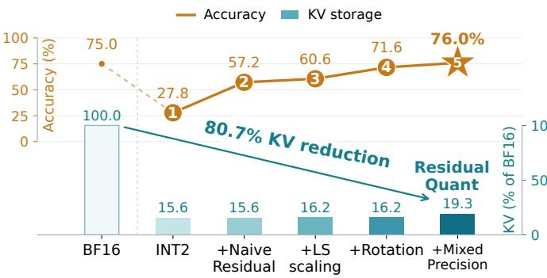

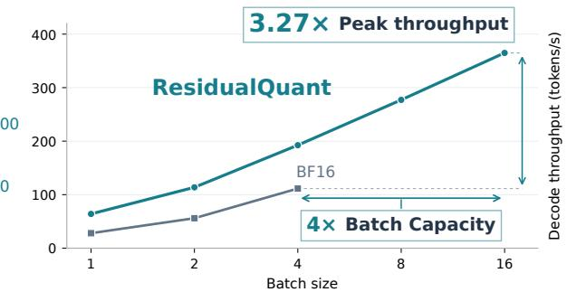  
Figure 1: ResidualQuant progressively recovers BF16-level accuracy while reducing KV storage and improving decode throughput. Results on Ouro-1.4B with group size � = 32 in every quantized loop. Left: Starting from O1 direct INT2 quantization, we successively introduce O2 Last-loop residual quantization, O3 least-square scaling, O4 rotation, and O5 mixed precision to achieve ResidualQuant. Accuracy increases from 27.8% to 76.0%, matching the BF16 baseline of 75.0%, while KV cache storage is reduced by 80.7%. Right: At 8k context on an RTX 5090, ResidualQuant achieves 3.27× the peak decode throughput and 4× the largest feasible batch size compared to the BF16 counterpart.

## 1. Introduction

Recursive or looped Transformers refine latent representations by repeatedly applying shared modules, increasing computational depth without increasing the parameter count (Dehghani et al., 2019; Saunshi et al., 2025; Suleymanzade et al., 2026; Wang et al., 2026b). Models such as Huginn (Geiping et al., 2025) and Ouro (Zhu et al., 2025) exploit this structure through adjustable recurrence or adaptive depth allocation, requiring less weight storage than models with distinct parameters at the same computational depth. However, each loop produces distinct keys and values, making KV cache memory grow with recurrent depth, in addition to context length and batch size, despite weight sharing. This limits the extent to which weight savings translate into larger batches and higher throughput, making KV cache memory reduction an important challenge for realizing the full eficiency benefits of looped Transformers.

To reduce this storage overhead, prior work has explored sharing or reusing KV states across recurrences. MoR (Bae et al., 2025b) reuses KV states from the first recursion, PLT (Wu et al., 2025) combines first-loop global KV with local attention in subsequent loops, and MELT (Vendrell et al., 2026) updates shared KV states through learned gates. While these approaches reduce storage, sharing KV states across loops can discard loop-specific information and degrade accuracy when representations difer across loops.

KV quantization ofers an alternative approach that preserves distinct KV states for each loop while reducing their storage precision. Because KV memory grows with recurrent depth, aggressive low-precision quantization is particularly desirable for looped Transformers. However, existing KV quantization methods (Hooper et al., 2024; Liu et al., 2024), including state-of-the-art rotation-based approaches (Ashkboos et al., 2024; Yun et al., 2026; Zhou et al., 2026), often sufer substantial accuracy degradation in sub-4-bit regimes. Looped Transformers, however, present a unique opportunity: KV states from diferent loops are closely related because they are generated by repeatedly applying the same shared modules. This creates strong similarity between KV states across loops as shown in Figure 2, which can be exploited to improve low-bit quantization.

Motivated by this inter-loop similarity, we propose ResidualQuant, a loop-aware KV cache quantization method that represents each loop’s KV states as residuals from those of a reference anchor loop. The resulting residuals $( \mathrm { e . g . }$ , Figure 2, right) are more robust to low-bit quantization, enabling aggressive KV cache compression using INT2 precision while preserving loop-specific information. Our main contributions can be summarized as follows:

• We introduce ResidualQuant, which reconstructs loop-specific KV states using the final-loop KV states as an anchor and stores their diferences as low-precision residuals (Section 3.2). We further apply least-squares residual scaling, learned rotations (Section 3.3), and loop-wise INT4/INT2 mixed precision (Section 3.4), which together enable an efective balance between low-bit quantization accuracy and runtime eficiency.

• We show that ResidualQuant substantially improves the accuracy–memory tradeof over state-of-the-art rotation-based KV quantization across Ouro-1.4B and Huginn-3.5B on reasoning and code generation benchmarks. In particular, our INT2/4 configuration reduces theoretical KV storage by 80.7% relative to BF16 while retaining accuracy close to BF16, whereas baseline methods degrade sharply at the same KV cache budget (Section 5.1).

• We demonstrate that these KV memory savings translate directly into higher inference throughput. At 16k context on an RTX 5090, ResidualQuant improves fixed-batch decode throughput by 2.73× through reduced KV cache memory trafic. Its smaller KV memory footprint further increases the largest feasible tested batch size by 2×, yielding a 4.15× improvement in peak decode throughput over BF16 (Section 5.3).

• We further show that the same residual reconstruction principle extends to activation quantization, consistently improving accuracy over existing quantization methods, including state-of-the-art weight–activation quantization methods such as LoopQ (Fang et al., 2026) and FlatQuant (Sun et al., 2025) (Section 5.4).

## 2. Preliminary

## 2.1. Group-wise Afine Quantization

Low-bit quantization requires adapting the quantization range to the value distribution. Group-wise scales and ofsets control the spacing and starting point of quantization levels. For each token and KV head, we partition the channel dimension into groups $\mathcal { G } _ { j }$ of size $^ { g , }$ with each group sharing a scale and an ofset. Afine quantization with stored scale $\bar { s } _ { j } > 0$ and ofset $\bar { o } _ { j }$ is given by (Bhalgat et al., 2020; Liu et al., 2024; Yun et al., 2026)

$$
c _ { i } = \mathrm { c l i p } _ { [ 0 , 2 ^ { b } - 1 ] } \left( \mathrm { r o u n d } \frac { x _ { i } - \bar { o } _ { j } } { \bar { s } _ { j } } \right) , \qquad \widehat { x } _ { i } = \bar { o } _ { j } + \bar { s } _ { j } c _ { i } , \quad i \in \mathcal { G } _ { j } .\tag{2.1}
$$

Each code $c _ { i }$ is stored in � bits, while elements in the same group share the scale and ofset. We use $Q$ to denote quantization followed by reconstruction using these codes and metadata.

At extreme quantization such as INT2, zero-centered symmetric quantization, where the ofset is fixed to zero and therefore does not need to be stored, can use only three distinct reconstruction levels, $\{ - \bar { s } _ { j } , 0 , \bar { s } _ { j } \}$ , despite having four available codes. Afine quantization allows the reconstruction levels to shift through ${ \bar { o } } _ { j } ,$ , using all four levels, $\{ \bar { o } _ { j } , \bar { o } _ { j } + \bar { s } _ { j } , \bar { o } _ { j } + 2 \bar { s } _ { j } , \bar { o } _ { j } + 3 \bar { s } _ { j } \}$ , without requiring symmetry around zero. Therefore, throughout this work, we adopt group-wise afine quantization to make full use of the limited INT2 code space while adapting the range to each group’s distribution.

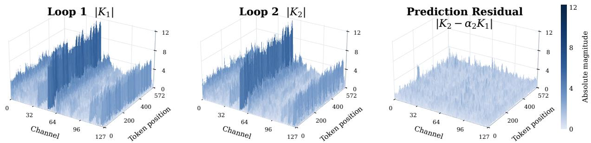  
Figure 2: Post-RoPE key magnitudes in Ouro-1.4B. Left: Loop 1, $| K _ { 1 } |$ . Middle: Loop 2, $| K _ { 2 } |$ . Right: the residual after Least Square scaling of Loop 1’s keys, $| K _ { 2 } - \alpha _ { 2 } K _ { 1 } |$ . All panels use the same height and color scales. Visualization details and last-loop anchor comparisons are provided in Appendix C.

## 2.2. Rotation-based Quantization

In Equation 2.1, outliers can increase the group scale ${ \bar { s } } _ { j } ,$ widening the spacing between quantization levels and reducing resolution for smaller values. Orthogonal rotations are introduced to redistribute these large magnitudes across channels to mitigate this efect (Chee et al., 2023; Ashkboos et al., 2024). Given an orthogonal matrix $U ,$ quantization and reconstruction can be expressed as

$$
Q ^ { U } ( X ) = U ^ { \top } Q ( U X ) , \qquad \| U X \| _ { 2 } = \| X \| _ { 2 } .\tag{2.2}
$$

Existing approaches range from randomized Hadamard rotations (Ashkboos et al., 2024) to learned rotations (Liu et al., 2025). For INT2 KV cache quantization, we choose OptR (Yun et al., 2026), which optimizes head-wise orthogonal rotations to minimize attention output error. Specifically, we use its Hadamard-initialized variant, OptR-H, to obtain � for inter-loop residual quantization (Section 3.3).

## 3. Methodology

In this section, we present ResidualQuant, our loop-wise residual quantization method for looped Transformers. We first motivate inter-loop residual quantization (Section 3.1). Starting from direct INT2 KV cache quantization, we then progressively improve performance by introducing Last-loop residual quantization with least-square (LS) scaling (Section 3.2), rotation of the residuals (Section 3.3), and loop-wise mixed precision (Section 3.4), as illustrated in Figure 1. Together, these components form ResidualQuant, which recovers BF16-level performance across the evaluated models and benchmarks (Table 2).

## 3.1. Motivation

Looped Transformers repeatedly process the same token through shared blocks and apply the same key and value projections across loops. At a fixed layer, token, and head, write $X ^ { ( r ) } \in \{ K ^ { ( r ) } , \bar { V ^ { ( r ) } } \}$ as $X ^ { ( r ) } = \dot { W _ { X } } z ^ { ( r ) }$ ， where $z ^ { ( r ) }$ is the preprocessed input and $W _ { X }$ is the projection shared across loops. It follows that

$$
\| X ^ { ( r ) } - X ^ { ( r - 1 ) } \| _ { 2 } \leq \| W _ { X } \| _ { 2 } \| z ^ { ( r ) } - z ^ { ( r - 1 ) } \| _ { 2 } .\tag{3.1}
$$

Thus, when recurrent inputs change little between loops, the corresponding KV diferences are bounded by this change scaled by $\| W _ { X } \| _ { 2 }$ . The fixed-point perspective of deep equilibrium models (Bai et al., 2019) provides one explanation for small changes across iterations, while Huginn-3.5B exhibits input-dependent trajectories approaching fixed points or forming orbits (Geiping et al., 2025).

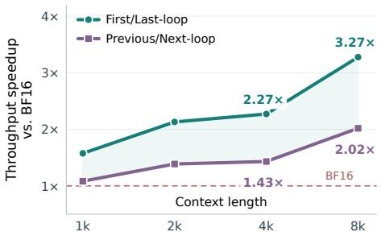

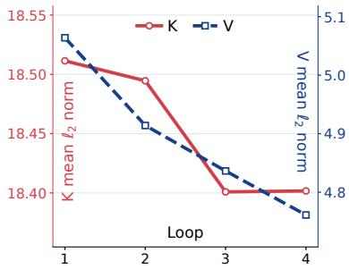

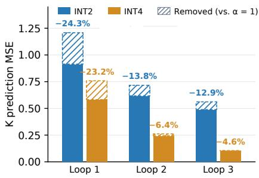  
Figure 3: Loop-wise KV statistics and the efects of prediction and reference choices on Ouro-1.4B. Left: Decode throughput with INT2/4 and $g = 3 2$ on an RTX 5090, comparing the First-/Last-loop and Previous-/Next-loop reference families with OptR-H rotations. The plotted measurements use Last-loop and Next-loop, respectively. For each context length, each method runs at its maximum feasible batch size, with speedups normalized to BF16 FlashAttention at the same batch size. Middle: Mean K and V norms across loops. Right: Key prediction MSE using Last-loop references under uniform INT2 and INT4, with group size $g = 3 2$ and no rotation. Solid bars show prediction MSE with LS scaling, while hatched portions indicate the additional error without LS scaling $( \alpha = 1 )$ . Analysis details are provided in Appendix B.

In practice, Figure 2 empirically shows that key entries exhibit similar patterns across loops, allowing one loop’s keys to be represented using another with substantially smaller inter-loop residuals. As shown in the figure, these residuals contain far fewer outliers than the original key values themselves and are therefore much easier to quantize. Together, the shared-projection structure and this observation motivate quantizing residuals instead of each loop’s KV states independently. We therefore use a reference KV state to capture shared information and store loop-specific diferences as low-precision residuals.

## 3.2. Residual Quantization for KV Cache

With direct INT2 afine quantization at group size $g = 3 2$ , Ouro-1.4B achieves only 27.8% MATH500 accuracy (Figure 1). Motivated by Section 3.1, we reconstruct each loop’s KV using a reference KV state and quantize only the residual. For loop $r ,$ let $X _ { r } \in \mathbb { R } ^ { D }$ denote a key or value vector at a fixed layer, token, and head. A reference $R _ { r }$ from the stored cache and a scalar coeficient $\alpha _ { r }$ give

$$
\widehat { X } _ { r } = \alpha _ { r } R _ { r } + Q ( X _ { r } - \alpha _ { r } R _ { r } ) ,\tag{3.2}
$$

Thus, instead of storing $X _ { r }$ directly, we store only its quantized residual, $\mathrm { i . e . , } Q ( X _ { r } - \alpha _ { r } R _ { r } )$ , and reconstruct ${ \widehat { X } } _ { r } \simeq X _ { \prime }$ on demand using the reference $R _ { r }$

The most intuitive choice, which we call the Previous-loop policy, is to use the immediately preceding loop as the reference and directly quantize the inter-loop diference $X _ { r } - \widehat { X } _ { r - 1 }$ . This is when $R _ { r } = \hat { X } _ { r - 1 }$ and $\alpha _ { r } = 1$ . The first loop is quantized independently, $\mathrm { i . e . , } \widehat { X } _ { 1 } = Q ( X _ { 1 } )$ , and serves as an anchor for reconstructing subsequent loops. However, we find this choice suboptimal and instead jointly select the reference KV $R _ { r }$ and scaling coeficient $\alpha _ { r }$ to further improve model quality while retaining eficient reconstruction.

Reference KV $R _ { r }$ . The Previous-loop policy requires loading multiple residuals to reconstruct each loop’s KV. For example, in a 4-loop model such as Ouro-1.4B, reconstructing loop 4 requires loading the first-loop anchor and the residuals of loops 2, 3, and $^ { 4 , }$ resulting in four KV cache reads compared to just one with direct quantization. This increases overall memory trafic and limits achievable decoding throughput. An alternative to address this overhead is the First-loop policy, which directly references the first-loop anchor, $R _ { r } = \widehat { X } _ { 1 }$ for $r = 2 , \ldots , L$ . This allows each non-anchor loop to load only the anchor and its own residual. As shown in Figure 3 (left), chained KV cache reads limit decoding throughput.

Table 1: Reference choice on Ouro-1.4B. Uniform INT2 with group size $g = 3 2$ . NMSE compares original and reconstructed keys on all 500 MATH500 problems (Appendix B).
<table><tr><td rowspan="2"></td><td colspan="4">Key NMSE  $\times 1 0 ^ { 3 } \downarrow$ </td></tr><tr><td>Loop 1</td><td>Loop 2</td><td>Loop 3 Loop 4</td><td>Avg</td></tr><tr><td>Reference First-loop</td><td>179.39</td><td>44.88</td><td>51.71 54.30</td><td>82.57</td></tr><tr><td>Last-loop</td><td>53.55</td><td>28.17</td><td>19.30 178.20</td><td>69.80</td></tr></table>

Shared-anchor reconstruction, as used by First-loop, improves decode throughput by up to 1.62× over chained reconstruction, as used by Previous-loop.

While shared-anchor reconstruction reduces memory trafic, the choice of anchor also afects reconstruction quality. We hypothesize that preserving early-loop KV states is important for maintaining accuracy under aggressive quantization. We therefore propose the Last-loop policy, which directly references the final-loop anchor, $R _ { r } = \widehat { X } _ { L }$ for $r = 1 , \ldots , L - 1$ . Table 1 compares First-loop and Last-loop under uniform INT2 and shows that Last-loop reduces reconstruction error in early loops, lowering the average reconstruction error across all loops. This reduction can translate into higher accuracy, as suggested by the reference-selection ablation (Table 3 in Section 5.2). With Last-loop references under uniform INT2, residual quantization improves Ouro-1.4B’s MATH500 accuracy from 27.8% to 57.2% (O1 → O2 in Figure 1). Detailed reconstruction and access-count comparisons are provided in Appendix D.

With the Last-loop policy, the current token’s anchor is unavailable until the final loop completes. We therefore retain the current token’s KV states in BF16 during decoding and defer quantization and cache storage until the final loop completes, as described in Section 4.2.

Scaling coeficient $\alpha _ { r } .$ . Figure 3 (middle) shows that KV magnitudes vary across Ouro-1.4B’s loops, motivating a scaling coeficient rather than directly subtracting the reference with $\alpha _ { r } = 1$ . We use the LS coeficient $\alpha _ { r } = \langle X _ { r } , R _ { r } \rangle / \| R _ { r } \| _ { 2 } ^ { 2 }$ to minimize $\| X _ { r } - \alpha _ { r } R _ { r } \| _ { 2 } ^ { 2 }$ . Figure 3 (right) shows that, using the same reconstructed reference, LS reduces key prediction MSE measured before residual quantization relative to $\alpha _ { r } = 1$ . With Last-loop references and uniform INT2, LS scaling improves MATH500 accuracy from 57.2% to 60.6% (O2 → O3 in Figure 1).

## 3.3. Rotation for KV Cache Residual

While residual quantization with LS scaling and the Last-loop policy could mitigate KV outliers, some outliers can still remain in the residuals (Figure 2, right). We further reduce their impact by applying an orthogonal rotation � to the residual $X _ { r } - \alpha _ { r } R _ { r }$ , rather than to the KV state �� itself, thereby redistributing large residual values across channels. We quantize the rotated residual and apply the inverse rotation during reconstruction. Incorporating rotation into Equation 3.2 gives

$$
\widehat { X } _ { r } = \alpha _ { r } R _ { r } + U ^ { \top } Q ( U ( X _ { r } - \alpha _ { r } R _ { r } ) ) , \qquad U ^ { \top } U = I .\tag{3.3}
$$

We use OptR-H (Yun et al., 2026) to learn separate rotations for keys and values at each layer and head, sharing them across all loops. These fixed matrices are reused across tokens, so their storage does not grow with sequence length. Applying rotation to the INT2 residual quantization obtained in Section 3.2 further improves Ouro-1.4B’s MATH500 accuracy from 60.6% to 71.6%, with an 11.0% gain (O3 → O4 in Figure 1).

## 3.4. Loop-wise Mixed Precision

So far, our proposed techniques have improved INT2 MATH500 accuracy to 71.6%, substantially outperforming direct quantization (27.8%) and rotation-based quantization using OptR-H alone (55.4%, Table 2). To further close the remaining accuracy gap from BF16, we exploit the fact that, under the Last-loop policy, the final-loop anchor stores a full KV state that serves as the shared reference for reconstructing all other loops. Since the quality of this shared reference directly afects the reconstruction of all residual loops, we allocate INT4 to the anchor while retaining INT2 for the residuals. For Ouro-1.4B with four loops, this yields a precision configuration of [2, 2, 2, 4], increasing the average bitwidth from 2 to 2.5, excluding metadata. Including quantization metadata, this configuration achieves a 5.2× reduction in KV memory footprint relative to BF16.

This loop-wise mixed-precision allocation improves MATH500 accuracy from 71.6% with uniform INT2 to 76.0%, matching the BF16 accuracy with only a 19% increase in KV cache storage (O4 → O5 in Figure 1). Combining LS scaling, the Last-loop policy, rotation-based quantization, and anchor-focused mixed precision, we obtain our proposed method, ResidualQuant.

## 4. Implementation

Accelerating ResidualQuant requires ensuring that reconstruction costs do not ofset the memory accesses saved by compression. Referencing the final loop also requires handling the current token before its anchor becomes available. We address these requirements with attention kernels that consume compressed KV directly and a vLLM (Kwon et al., 2023) integration that defers cache storage until the final loop completes.

## 4.1. Kernel Implementation

To avoid writing reconstructed KV to GPU memory and reading it back, our custom CUDA attention kernel reconstructs anchors and residuals tile by tile and immediately uses them for QK dot products and weighted V accumulation. With the Last-loop policy, each residual loop requires only the anchor and its own residual, avoiding sequential reconstruction of intermediate loops.

We further reduce repeated reconstruction work by reusing group-wise scales and ofsets. For each token and quantization group in a KV tile, we precompute the possible dequantized V residual values in a shared-memory lookup table. For INT2 residuals, each table contains the four values corresponding to integer codes 0–3. Channels sharing the same quantization parameters use their codes to index the table, avoiding repeated scaleand-ofset computations. Asynchronous loads overlap the next tile’s memory accesses with computation on the current tile. Because anchors and residuals share a rotation, we reuse the rotated Q across both components and apply a single inverse rotation after combining their weighted V outputs. Softmax and attention accumulation use FP32.

## 4.2. vLLM Integration

We integrate a custom attention backend for compressed caches while retaining vLLM’s request scheduling and paged KV management. Triton kernels handle KV storage, with separate prefill and decode paths.

Prefill. Each loop computes causal attention using its BF16 prompt KV states. After the final loop completes, we quantize its KV states as the anchor and use the reconstructed anchor to compute residuals with LS scaling for the non-anchor loops. The anchor and residuals are stored as packed codes and metadata for subsequent decoding.

Decode. For past tokens, the custom CUDA kernel reads the compressed cache, reconstructs KV, and computes attention. Since the current token’s last-loop anchor is not yet available, each loop uses its current BF16 KV states, while those from the non-anchor loops are held in a temporary bufer. A Triton kernel combines the attention contributions from past and current tokens using their softmax normalization statistics. Once the final loop completes, we quantize the current token’s anchor, compute the residuals for the non-anchor loops with LS scaling, and store them in the cache. This decode path runs with CUDA Graphs.

## 5. Experiments

Building on the MATH500 improvements presented in Section 3, we evaluate whether ResidualQuant maintains accuracy across multiple benchmarks and experimental settings and translates KV storage savings into higher throughput. The evaluation begins with accuracy and KV storage comparisons across diferent models (Section 5.1), followed by component-wise ablations of ResidualQuant (Section 5.2). Throughput measurements assess the practical gains from KV compression (Section 5.3), and activation quantization experiments test the broader applicability of residual quantization (Section 5.4).

Models. We evaluate our residual quantization method on Ouro-1.4B and Huginn-3.5B. Ouro-1.4B executes four loops, while Huginn-3.5B executes 32 loops. For Huginn-3.5B, we partition the 32 loops into eight groups of four and apply ResidualQuant independently within each group, using the final loop of each group as its anchor.

Quantization setup. For KV quantization experiments, model weights remain in BF16, and we evaluate KV cache in BF16, uniform INT4, uniform INT2, and loop-wise mixed precision INT2/4.

Table 2: Downstream performance. Results are reported for uniform INT2 and mixed INT2/4 with INT2 group sizes $g \in \{ 1 6 , 3 2 \}$ , as indicated in the table. For mixed INT2/4, INT4 uses group size $g = 3 2$ . Residual quantization uses Last-loop references and LS scaling. The $b _ { \mathrm { e f f } }$ value in each group heading reports the efective bits per KV value for direct quantization and OptR-H. Avg. denotes the unweighted mean of the eight displayed model–benchmark scores. Residual quantization with OptR-H corresponds to our full ResidualQuant method.
<table><tr><td></td><td colspan="4">Ouro-1.4B (4 loops)</td><td colspan="4">Huginn-3.5B (32 loops)</td><td></td></tr><tr><td>Method</td><td>GSM8K</td><td>MATH500</td><td>HumanEval</td><td>MBPP</td><td>GSM8K</td><td>MATH500</td><td>HumanEval</td><td>MBPP</td><td> $\operatorname { A v } { \mathbb { g } } .$ </td></tr><tr><td>BF16</td><td>79.23</td><td>75.00</td><td>71.95</td><td>74.34</td><td>43.14</td><td>16.40</td><td>23.78</td><td>39.68</td><td>52.94</td></tr><tr><td colspan="10">Uniform INT2,  $g = 3 2 \ : ( b _ { \mathrm { e f f } } = 2 . 5 )$ </td></tr><tr><td>Direct</td><td>33.66</td><td>27.80</td><td>41.46</td><td>55.56</td><td>18.95</td><td>7.80</td><td>20.73</td><td>33.60</td><td>29.95</td></tr><tr><td>OptR-H</td><td>62.70</td><td>55.40</td><td>59.15</td><td>70.90</td><td>28.58</td><td>10.20</td><td>22.56</td><td>36.51</td><td>43.25</td></tr><tr><td>Residual Quantization</td><td>64.67</td><td>60.60</td><td>55.49</td><td>66.40</td><td>34.95</td><td>9.80</td><td>24.39</td><td>36.24</td><td>44.07</td></tr><tr><td>Residual Quantization + OptR-H</td><td>73.31</td><td>71.60</td><td>68.90</td><td>71.69</td><td>38.21</td><td>12.60</td><td>23.78</td><td>38.89</td><td>49.87</td></tr><tr><td colspan="10">Uniform INT2,  $g = 1 6 \ : ( b _ { \mathrm { e f f } } = 3 . 0 )$ </td></tr><tr><td>Direct</td><td>55.95</td><td>54.20</td><td>62.20</td><td>66.40</td><td>24.94</td><td>7.00</td><td>21.95</td><td>31.22</td><td>40.48</td></tr><tr><td>OptR-H</td><td>65.96</td><td>64.20</td><td>70.73</td><td>70.90</td><td>31.61</td><td>10.80</td><td>21.34</td><td>40.74</td><td>47.04</td></tr><tr><td>Residual Quantization</td><td>70.96</td><td>67.80</td><td>69.51</td><td>70.37</td><td>36.77</td><td>14.40</td><td>25.61</td><td>37.57</td><td>49.12</td></tr><tr><td>Residual Quantization + OptR-H</td><td>75.06</td><td>75.20</td><td>70.12</td><td>71.16</td><td>38.97</td><td>14.40</td><td>26.22</td><td>39.42</td><td>51.32</td></tr><tr><td colspan="10">Mixed INT2/4,  $g = 3 2 \ ( b _ { \mathrm { e f f } } = 3 . 0 )$ </td></tr><tr><td>Direct</td><td>48.67</td><td>47.40</td><td>56.71</td><td>67.99</td><td>30.10</td><td>9.80</td><td>21.95</td><td>34.39</td><td>39.63</td></tr><tr><td>OptR-H</td><td>65.73</td><td>63.00</td><td>68.29</td><td>70.63</td><td>36.39</td><td>11.00</td><td>23.17</td><td>39.15</td><td>47.17</td></tr><tr><td>Residual Quantization</td><td>77.79</td><td>73.80</td><td>71.34</td><td>73.02</td><td>42.46</td><td>14.60</td><td>23.17</td><td>40.74</td><td>52.12</td></tr><tr><td>Residual Quantization + OptR-H</td><td>77.03</td><td>76.00</td><td>70.73</td><td>73.81</td><td>42.76</td><td>14.60</td><td>23.78</td><td>40.21</td><td>52.37</td></tr><tr><td colspan="10">Mixed INT2/4,  $g = 1 6 \ : ( b _ { \mathrm { e f f } } = 3 . 4 )$ </td></tr><tr><td>Direct</td><td>63.15</td><td>61.80</td><td>66.46</td><td>72.75</td><td>32.83</td><td>11.60</td><td>23.17</td><td>36.24</td><td>46.00</td></tr><tr><td>OptR-H</td><td>69.98</td><td>67.00</td><td>73.78</td><td>71.16</td><td>36.24</td><td>10.20</td><td>21.34</td><td>37.83</td><td>48.44</td></tr><tr><td>Residual Quantization</td><td>77.03</td><td>75.00</td><td>71.95</td><td>74.07</td><td>41.02</td><td>15.40</td><td>23.17</td><td>41.53</td><td>52.40</td></tr><tr><td>Residual Quantization + OptR-H</td><td>77.63</td><td>74.60</td><td>72.56</td><td>73.28</td><td>42.61</td><td>15.60</td><td>22.56</td><td>39.42</td><td>52.28</td></tr></table>

Unless otherwise specified, we use group size $g = 1 6$ for uniform INT2 and $g = 3 2$ for INT4 and mixed INT2/4.   
For INT2/4, we allocate INT4 only to the anchor loop and INT2 to the remaining loops, following Section 3.4.

For a fair comparison, all quantized methods use the same KV handling during prefill and decoding. During prefill, each loop computes attention using BF16 prompt KV states before quantizing and storing them for subsequent decoding. During decoding, the current token’s KV states remain in BF16, as required by our Last-loop implementation, and we apply the same treatment to all baseline methods. As baselines, we consider direct uniform quantization and the rotation-based OptR-H method (Yun et al., 2026). Rotation calibration and inference details are provided in Appendix G.

Benchmarks. For mathematical reasoning, we report accuracy on GSM8K (Cobbe et al., 2021) and MATH500 (Lightman et al., 2024). For code generation, we report pass@1 on HumanEval (Chen et al., 2021) and MBPP (Austin et al., 2021). Prompt formats, generation limits, and other evaluation details are provided in Appendix A.2.

## 5.1. Main Results

We compare direct uniform quantization, OptR-H, and residual quantization with Last-loop references and LS scaling, evaluated both with and without rotation, on Ouro-1.4B and Huginn-3.5B. Residual quantization with rotation constitutes our full ResidualQuant method.

Evaluating residual quantization without rotation isolates the contribution of residual quantization itself. For each method, we vary the KV cache precision to obtain multiple configurations along the accuracy–memory tradeof: uniform INT2 and mixed-precision INT2/4, with INT2 group sizes $g = 1 6$ and $g = 3 2$

The main evaluation examines the accuracy–memory tradeof using the efective bitwidth $b _ { \mathrm { e f f } }$ , which measures the total KV cache storage cost per KV element, including quantized values and associated metadata. The $b _ { \mathrm { e f f } }$ values in Table 2 report the storage cost for direct quantization and OptR-H. Residual quantization additionally stores BF16 LS coeficients, increasing $b _ { \mathrm { e f f } }$ by approximately 0.1 bit. For example, under uniform INT2 with $g = 3 2 ,$ , direct quantization and OptR-H use 2.5 bits per KV element, whereas residual quantization uses approximately 2.6 bits. The full storage accounting is provided in Appendix A.3.

Table 3: LS scaling, rotation, and reference selection ablation on Ouro-1.4B. MATH500 accuracy (%). Uniform INT2 uses group size $g = 1 6 ,$ while mixed INT2/4 uses $g = 3 2$ in every loop. For mixed INT2/4, Previous-loop and First-loop use the [4, 2, 2, 2] configuration, while Next-loop and Last-loop use [2, 2, 2, 4], assigning the higher precision to the anchor loop in each case. The w/o and w/ LS scaling columns report residual quantization without rotation. The w/ LS scaling + OptR-H column reports residual quantization with LS scaling and OptR-H.
<table><tr><td></td><td colspan="3">INT2</td><td colspan="3">INT2/4</td></tr><tr><td>Reference</td><td></td><td></td><td>w/o LS scaling w/ LS scaling w/ LS scaling + OptR-H</td><td></td><td></td><td>w/o LS scaling w/ LS scaling w/ LS scaling + OptR-H</td></tr><tr><td>Previous-loop</td><td>69.2</td><td>71.2</td><td>72.2</td><td>66.2</td><td>73.2</td><td>72.8</td></tr><tr><td>Next-loop</td><td>71.6</td><td>73.2</td><td>72.8</td><td>71.4</td><td>74.0</td><td>75.2</td></tr><tr><td>First-loop</td><td>46.0</td><td>69.8</td><td>71.4</td><td>24.8</td><td>73.8</td><td>72.2</td></tr><tr><td>Last-loop</td><td>69.2</td><td>67.8</td><td>75.2</td><td>70.2</td><td>73.8</td><td>76.0</td></tr></table>

Table 2 reports results across all model–benchmark combinations, with the Avg. column summarizing the scores into a single average number for comparison. Across all four precision configurations, residual quantization without rotation achieves a higher average score than the rotation-based OptR-H baseline at comparable KV budgets. The improvement reaches 4.95% under mixed INT2/4 with $g = 3 2$ (52.12 vs. 47.17), showing that exploiting inter-loop residual structure provides a stronger basis for low-bit quantization of looped Transformers than conventional rotation-based methods.

OptR-H can further be applied orthogonally to residual quantization, providing complementary gains across most evaluated settings. Under mixed INT2/4 with � = 32, the full ResidualQuant method nearly matches the BF16 average score (52.37 vs. 52.94) while reducing KV memory by 80.7%. At the same precision configuration, direct quantization and OptR-H fall 13.31 and 5.77% below BF16, respectively. The advantage becomes more pronounced under the more aggressive uniform INT2 setting with $g = 3 2 { : }$ ResidualQuant is only 3.07% below BF16 on average, compared with gaps of 22.99 and 9.69% for direct quantization and OptR-H. The diference is particularly large on mathematical reasoning; for example, on Ouro-1.4B MATH500, ResidualQuant achieves 71.60% compared with 55.40% for OptR-H, a 16.20% improvement.

## 5.2. Ablation Studies

We further evaluate the contributions of the individual components introduced in Section 3 through ablations of ResidualQuant, including LS scaling, reference choice, rotation, and loop-wise precision allocation. All accuracy comparisons use Ouro-1.4B on MATH500. A full table comparing multiple scaling methods, rotations, and reference choices is provided in Appendix F.

LS scaling. Table 3 compares residual quantization with and without LS scaling across four reference selection policies and two precision settings (INT2 and INT2/4). LS scaling improves accuracy in most configurations, demonstrating its efectiveness across diferent reference choices and precisions. In particular, under the INT2/4 Last-loop configuration, LS scaling improves MATH500 accuracy from 70.2% to 73.8%, a 3.6% gain. This improvement is also supported by Figure 3 (right), where LS scaling efectively reduces key prediction MSE by up to 24.3% relative to the unscaled case.

Reference choice. In Table 3, we compare the Previous-loop, First-loop, and Last-loop policies introduced in Section 3.2. We additionally evaluate Next-loop, which references the immediately following loop and uses the final loop as its anchor, i.e., the reverse of Previous-loop. Overall, the Last-loop policy achieves accuracy comparable to or better than Previous-loop, while avoiding its chained reconstruction overhead. In particular, with LS scaling and OptR-H, Last-loop improves MATH500 accuracy from 72.2% to 75.2% under INT2 and from 72.8% to 76.0% under INT2/4 compared with Previous-loop. Together with additional 1.62× throughput improvement from shared-anchor reconstruction shown in Figure 3 (left), these results motivate our choice of Last-loop.

First-loop also avoids chained reconstruction and can therefore provide similar runtime benefits. However, it yields substantially lower accuracy than Last-loop: 71.4% versus 75.2% under INT2 and 72.2% versus 76.0% under INT2/4. Next-loop, in contrast, achieves accuracy comparable to Last-loop, but retains the same chained reconstruction dependency as Previous-loop and therefore sufers from the same memory-trafic overhead. We therefore adopt Last-loop as the default reference policy, as it provides the best balance between quantization accuracy and decoding eficiency.

Table 4: Complementary efects of residual quantization and rotation. MATH500 accuracy (%) on Ouro-1.4B with uniform INT2 and INT4, using group sizes $g = 1 6$ and $g = 3 2 .$ , respectively. direct denotes standard uniform quantization, while Residual uses LS scaling with the Last-loop reference policy. OSCAR (Zhou et al., 2026) and OptR-H (Yun et al., 2026) are applied to direct or residual quantization. BF16 accuracy is 75.0%.
<table><tr><td>Precision</td><td>direct</td><td>+ OSCAR</td><td>+ OptR-H</td><td>Residual</td><td>+ OSCAR</td><td>+ OptR-H</td></tr><tr><td>INT2</td><td>54.2</td><td>65.8</td><td>64.2</td><td>67.8</td><td>74.8</td><td>75.2</td></tr><tr><td>INT4</td><td>74.2</td><td>75.0</td><td>75.2</td><td>74.2</td><td>77.2</td><td>74.4</td></tr></table>

Table 5: Loop-wise precision allocation ablations. MATH500 accuracy (%) on Ouro-1.4B and efective KV bitwidth $b _ { \mathrm { e f f } }$ . We compare direct quantization and residual quantization with and without OptR-H rotation. Residual quantization uses LS scaling and the Last-loop policy. Uniform applies the same precision to all loops, Descending uses [4, 2, 2, 2], and Ascending uses [2, 2, 2, 4], allocating the higher precision to the first and last loop, respectively. Group size � shown in the table applies only to INT2, while INT4 uses group size 32. Blue shading marks our final INT2/4 precision configuration. BF16 accuracy is 75.0%.
<table><tr><td></td><td></td><td colspan="3">direct quantization</td><td colspan="3">Residual Quantization</td></tr><tr><td>Config</td><td>g</td><td> $b _ { \mathrm { e f f } }$ </td><td>w/o Rotation</td><td>w/ Rotation</td><td> $b _ { \mathrm { e f f } }$ </td><td>w/o Rotation</td><td>w/ Rotation</td></tr><tr><td>Uniform</td><td></td><td></td><td></td><td></td><td></td><td></td><td></td></tr><tr><td>[4, 4, 4, 4]</td><td>一</td><td>4.5</td><td>74.20</td><td>75.20</td><td>4.6</td><td>74.20</td><td>74.40</td></tr><tr><td>[2, 2, 2, 2]</td><td>32</td><td>2.5</td><td>27.80</td><td>55.40</td><td>2.6</td><td>60.60</td><td>71.60</td></tr><tr><td>[2, 2, 2, 2]</td><td>16</td><td>3.0</td><td>54.20</td><td>64.20</td><td>3.1</td><td>67.80</td><td>75.20</td></tr><tr><td>Descending</td><td></td><td></td><td></td><td></td><td></td><td></td><td></td></tr><tr><td>[4, 2, 2, 2]</td><td>32</td><td>3.0</td><td>40.20</td><td>61.80</td><td>3.1</td><td>61.80</td><td>69.00</td></tr><tr><td>[4, 2, 2, 2]</td><td>16</td><td>3.4</td><td>57.60</td><td>63.60</td><td>3.5</td><td>71.20</td><td>74.40</td></tr><tr><td>Ascending</td><td></td><td></td><td></td><td></td><td></td><td></td><td></td></tr><tr><td>[2, 2, 2, 4]</td><td>32</td><td>3.0</td><td>47.40</td><td>63.00</td><td>3.1</td><td>73.80</td><td>76.00</td></tr><tr><td>[2, 2, 2, 4]</td><td>16</td><td>3.4</td><td>61.80</td><td>67.00</td><td>3.5</td><td>75.00</td><td>74.60</td></tr></table>

Rotation. To examine whether rotation further improves accuracy, Table 4 compares direct and residual quantization (with LS scaling and the Last-loop policy) with and without rotation. We evaluate INT2 with group size $g = 1 6$ and INT4 with $g = 3 2$ using two recent rotation methods, OSCAR (Zhou et al., 2026) and OptR-H (Yun et al., 2026). At INT2, OSCAR and OptR-H improve direct from 54.2% to 65.8% and 64.2%, respectively. Residual quantization achieves 67.8% without rotation, and combining it with OSCAR or OptR-H further improves accuracy to 74.8% and 75.2%, respectively. At INT4, residual quantization achieves 74.2% without rotation, while OSCAR and OptR-H improve it to 77.2% and 74.4%, respectively. These results demonstrate the complementary benefits of residual quantization and rotation, although the gain depends on precision and rotation method.

Loop-wise precision allocation. Finally, we examine how accuracy depends on loop-wise precision allocation. Table 5 compares uniform precision with Descending [4, 2, 2, 2] and Ascending [2, 2, 2, 4] schedules. Under Lastloop residual quantization, Ascending allocates the higher precision to the shared anchor, whereas Descending allocates it to a residual loop. Ascending outperforms Descending with residual quantization at both group sizes, with and without rotation. In particular, at $g = 3 2$ , Ascending achieves 73.8% versus 61.8% without rotation and 76.0% versus 69.0% with rotation, supporting the benefit of allocating higher precision to the shared anchor. Moreover, at the same efective bitwidth $( b _ { \mathrm { e f f } } = 3 . 1 )$ , Ascending with $g = 3 2$ outperforms uniform INT2 with � = 16 by 6.0% and 0.8% without and with rotation, demonstrating a better accuracy–memory trade-of.

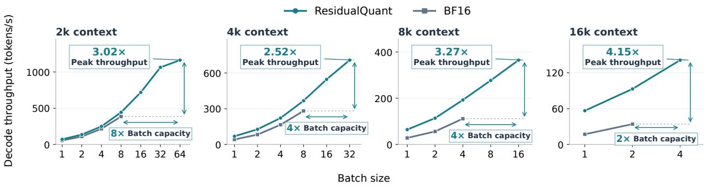  
Figure 4: Decode throughput across batch sizes and context lengths. ResidualQuant with group size $g = 3 2$ in every loop and BF16 on Ouro-1.4B using an RTX 5090, at 2k, 4k, 8k, and 16k context. Vertical and horizontal arrows indicate gains in peak throughput and the largest feasible tested power-of-two batch, respectively.

## 5.3. Throughput Improvement

KV compression can improve throughput not only by accelerating a fixed batch but also by allowing more requests to run together on one GPU. Figure 4 extends the comparison in Figure 1 (right) to 2k, 4k, 8k, and 16k contexts. The comparison uses Ouro-1.4B on an RTX 5090 with ResidualQuant (group size $g = 3 2$ in every loop) and BF16 vLLM FlashAttention, doubling batch sizes from 1 to 128 and measuring feasible configurations. Each run generates 128 tokens. Additional results with INT2 group size $g = 1 6$ are provided in Appendix I. Reported throughput excludes prefill and is averaged over three runs after one warm-up.

At fixed batch sizes, ResidualQuant improves decode throughput at all context lengths. At 8k context and batch size 4, throughput increases from 111.4 to 192.5 tokens/s (1.73×). At 16k context and batch size 2, it increases from 34.0 to 93.1 tokens/s (2.73×). These gains are consistent with the reduced KV cache trafic enabled by compression.

The smaller KV footprint additionally allows larger batches. At 8k context, the largest feasible tested power-oftwo batch increases from 4 for BF16 to 16 for ResidualQuant, raising throughput further to 364.9 tokens/s and yielding a 3.27× peak-throughput gain over BF16. At 16k context, the corresponding batch increases from 2 to 4, raising throughput to 141.3 tokens/s and yielding a 4.15× peak-throughput gain. Thus, faster decoding at a fixed batch and increased batch capacity jointly improve peak throughput.

## 5.4. Extension to Activation Quantization

The preceding experiments show that inter-loop similarity can be exploited to compress KV states through low-bit residual quantization. Here, we investigate whether the same principle extends beyond KV storage to activation quantization, which enables low-precision computation in projection layers. Because looped Transformers repeatedly apply the same projections across loops, activations from one loop can also provide a useful reference for the corresponding projection inputs in another loop. We therefore incorporate residual quantization into three W4A4 baselines: Naive, FlatQuant (Sun et al., 2025), an established weight–activation quantization method, and LoopQ (Fang et al., 2026), which is specifically designed for looped Transformers. Naive applies round-to-nearest quantization to weights and activations with group size $g \ = \ 3 2$ without calibration. Implementation and calibration details for FlatQuant and LoopQ are provided in Appendix H.

The baseline methods quantize the full activation independently at each loop. In contrast, our residual quantization uses the Previous-loop policy with LS scaling: we quantize $X _ { r } - \alpha _ { r } \widehat { X } _ { r - 1 }$ , where $X _ { r }$ denotes the activation at loop � and $\widehat { X } _ { r - 1 }$ is the reconstructed activation from the previous loop, and apply the low-precision projection to this quantized residual instead. The first loop activation is quantized directly. We use Previous-loop rather than Last-loop because activations are consumed immediately within each loop. Weights and activations remain INT4 and KV caches remain BF16 to isolate the efect of residual quantization on activations.

Table 6 shows that applying residual quantization with LS scaling improves Ouro-1.4B’s GSM8K accuracy from 49.51% to 56.86% for Naive, from 68.31% to 70.20% for FlatQuant, and from 65.88% to 68.31% for LoopQ. On Huginn-3.5B, Naive and FlatQuant improve by 5.76 and 4.85%, respectively. Accuracy improves in nearly all evaluated method–benchmark combinations across both models. These results show that inter-loop residual quantization extends beyond KV compression and can consistently improve existing low-bit activation quantization methods as well.

Table 6: Extension of residual quantization to W4A4 activation quantization. Accuracy or pass@1 (%) when applying residual quantization with LS scaling to W4A4 activation quantization, with KV caches kept in BF16. We consider three baselines: Naive round-to-nearest quantization, FlatQuant (Sun et al., 2025), and LoopQ (Fang et al., 2026). For each baseline, colored parentheses report the absolute accuracy change from applying residual quantization. Details are provided in Appendix H.
<table><tr><td>Method</td><td>GSM8K</td><td>MATH500</td><td>HumanEval</td><td>MBPP</td></tr><tr><td colspan="5">Ouro-1.4B (4 loops)</td></tr><tr><td>BF16</td><td>78.77</td><td>75.00</td><td>71.95</td><td>74.87</td></tr><tr><td>Naive</td><td>49.51</td><td>53.00</td><td>62.20</td><td>65.08</td></tr><tr><td>+ Residual Quantization</td><td>56.86 (+7.35)</td><td>61.00 (+8.00)</td><td>62.20 (+0.00)</td><td>68.52 (+3.44)</td></tr><tr><td>FlatQuant</td><td>68.31</td><td>67.40</td><td>67.68</td><td>69.58</td></tr><tr><td>+ Residual Quantization</td><td>70.20 (+1.89)</td><td>68.80 (+1.40)</td><td>70.12 (+2.44)</td><td>71.69 (+2.11)</td></tr><tr><td>LoopQ</td><td>65.88</td><td>64.40</td><td>64.63</td><td>66.14</td></tr><tr><td>+ Residual Quantization</td><td>68.31 (+2.43)</td><td>64.80 (+0.40)</td><td>67.68 (+3.05)</td><td>70.90 (+4.76)</td></tr><tr><td colspan="5">Huginn-3.5B (32 loops)</td></tr><tr><td>BF16</td><td>42.46</td><td>12.40</td><td>23.17</td><td>41.01</td></tr><tr><td>Naive</td><td>33.36</td><td>9.40</td><td>20.12</td><td>36.77</td></tr><tr><td>+ Residual Quantization</td><td>39.12 (+5.76)</td><td>12.80 (+3.40)</td><td>23.17 (+3.05)</td><td>39.68 (+2.91)</td></tr><tr><td>FlatQuant</td><td>33.21</td><td>9.20</td><td>18.29</td><td>39.15</td></tr><tr><td>+ Residual Quantization</td><td>38.06 (+4.85)</td><td>12.60 (+3.40)</td><td>28.05 (+9.76)</td><td>37.57 (-1.58)</td></tr><tr><td>LoopQ</td><td>35.03</td><td>11.20</td><td>18.90</td><td>38.89</td></tr><tr><td>+ Residual Quantization</td><td>41.02 (+5.99)</td><td>12.60 (+1.40)</td><td>26.22 (+7.32)</td><td>38.89 (+0.00)</td></tr></table>

## 6. Related Work

KV Cache Quantization. Reducing KV precision saves memory but makes quantization sensitive to uneven distributions and outliers. KIVI and KVQuant address this through quantization tailored to key and value distributions (Liu et al., 2024; Hooper et al., 2024). Rotation-based methods, including QuaRot, SpinQuant, and RotateKV, redistribute outliers across channels to ease low-bit quantization (Ashkboos et al., 2024; Liu et al., 2025; Su et al., 2025). Extending this direction to INT2, OSCAR and OptR optimize rotations with attention-aware objectives, but retain attention sinks and recent KV in BF16 (Zhou et al., 2026; Yun et al., 2026). ResidualQuant exploits inter-loop redundancy to combine INT2 residuals with INT4 anchors, without a separate BF16 bufer for recent past tokens.

Looped Transformers. Reusing parameters across depth enables additional computation without a proportional increase in model size, as explored through cross-layer sharing and equilibrium formulations (Lan et al., 2020; Bai et al., 2019). Adaptive computation further allocates this work according to the input, as in ACT, PonderNet, and Universal Transformers (Graves, 2016; Banino et al., 2021; Dehghani et al., 2019). Recursive architectures extend these ideas through shared blocks, adaptive recursion, and memory of earlier loop states in RRT, MoR, and RecurTrace (Bae et al., 2025a,b; Wang et al., 2026b). Such repeated computation supports length generalization and latent reasoning without intermediate token generation (Fan et al., 2025; Saunshi et al., 2025), with HRM, TRM, and Looped Flows exploring iterative refinement of internal states (Wang et al., 2025; Jolicoeur-Martineau, 2025; Suleymanzade et al., 2026). To distinguish these benefits from simply spending more compute, SMELT studies sparse MoE looping under matched FLOPs, parameter, and KV cache budgets, demonstrating improved compute eficiency (Wang et al., 2026a).

Optimizing Looped Transformers. Parameter sharing does not eliminate the KV storage and sequential execution costs of additional loops. LoopSpec (Cho et al., 2026) accelerates decoding by drafting tokens from early recurrent states and overlapping draft generation with target verification through pipelined selfspeculative decoding. To reduce these costs, MoR selectively caches active tokens and ofers first-recursion KV reuse (Bae et al., 2025b). PLT combines first-loop KV sharing with gated sliding-window attention and inter-loop parallelism (Wu et al., 2025). MELT makes cache size independent of loop depth by updating one shared cache per layer through learned gates (Vendrell et al., 2026). Quantization ofers a complementary direction: LoopQ addresses inter-loop distribution shifts and error accumulation in W4A4 post-training quantization (Fang et al., 2026), and our residual quantization further improves accuracy when combined with LoopQ and other W4A4 methods (Section 5.4). For KV compression, ResidualQuant preserves loop-specific states without model retraining or pretrained-weight updates, while calibrating OptR-H rotations separately. Concurrent FlashLoop (Yang and Liu, 2026) combines lazy KV updates and quantization motivated by a similar inter-loop observation. A detailed comparison is provided in Appendix J. ResidualQuant systematically studies this design space, identifying Last-loop references and LS scaling (Section 3.2), shared rotations (Section 3.3), and loop-wise mixed precision (Section 3.4) as key to compression, accuracy, and inference eficiency.

## 7. Conclusion

We presented ResidualQuant, a loop-aware KV cache quantization method that exploits inter-loop similarity by reconstructing loop-specific KV states from the final-loop KV states and low-precision residuals. Combining Last-loop references, least-square scaling, rotations applied to the residuals, and loop-wise mixed precision enables accurate quantization down to INT2 while retaining eficient reconstruction.

Across multiple models and benchmarks spanning mathematical reasoning and code generation, ResidualQuant retains accuracy close to BF16 under mixed-precision settings while reducing theoretical KV storage by up to 80.7%, and consistently outperforms rotation-based quantization at comparable memory budgets. These compression gains also translate into practical system benefits: on an RTX 5090, ResidualQuant accelerates fixed-batch decoding by up to 2.73× and, by enabling larger batches, increases peak throughput by up to 4.15×.

We further show that the same residual reconstruction principle extends to W4A4 activation quantization, improving accuracy when integrated with state-of-the-art weight-and-activation quantization methods like FlatQuant and LoopQ. Overall, these results demonstrate that exploiting inter-loop similarity provides an efective path toward aggressive low-bit inference for looped Transformers, allowing their parameter eficiency to translate into greater memory savings and inference throughput.

## References

Saleh Ashkboos, Amirkeivan Mohtashami, Maximilian L. Croci, Bo Li, Pashmina Cameron, Martin Jaggi, Dan Alistarh, Torsten Hoefler, and James Hensman. QuaRot: Outlier-Free 4-Bit Inference in Rotated LLMs. In NeurIPS, 2024.

Jacob Austin, Augustus Odena, Maxwell Nye, Maarten Bosma, Henryk Michalewski, David Dohan, Ellen Jiang, Carrie Cai, Michael Terry, Quoc Le, and Charles Sutton. Program Synthesis with Large Language Models. arXiv:2108.07732, 2021.

Sangmin Bae, Adam Fisch, Hrayr Harutyunyan, Ziwei Ji, Seungyeon Kim, and Tal Schuster. Relaxed Recursive Transformers: Efective Parameter Sharing with Layer-wise LoRA. In ICLR, 2025a.

Sangmin Bae, Yujin Kim, Reza Bayat, Sungnyun Kim, Jiyoun Ha, Tal Schuster, Adam Fisch, Hrayr Harutyunyan, Ziwei Ji, Aaron Courville, and Se-Young Yun. Mixture-of-Recursions: Learning Dynamic Recursive Depths for Adaptive Token-Level Computation. In NeurIPS, 2025b.

Shaojie Bai, J. Zico Kolter, and Vladlen Koltun. Deep Equilibrium Models. In NeurIPS, 2019.

Andrea Banino, Jan Balaguer, and Charles Blundell. PonderNet: Learning to Ponder. In 8th ICML Workshop on Automated Machine Learning, 2021.

Yash Bhalgat, Jinwon Lee, Markus Nagel, Tijmen Blankevoort, and Nojun Kwak. LSQ+: Improving Low-Bit Quantization Through Learnable Ofsets and Better Initialization. In CVPR Workshops, 2020. Eficient Deep Learning for Computer Vision Workshop.

Jerry Chee, Yaohui Cai, Volodymyr Kuleshov, and Christopher De Sa. QuIP: 2-Bit Quantization of Large Language Models With Guarantees. In NeurIPS, 2023.

Mark Chen, Jerry Tworek, Heewoo Jun, Qiming Yuan, Henrique Ponde de Oliveira Pinto, Jared Kaplan, Harri Edwards, Yuri Burda, Nicholas Joseph, Greg Brockman, Alex Ray, Raul Puri, Gretchen Krueger, Michael Petrov, Heidy Khlaaf, Girish Sastry, Pamela Mishkin, Brooke Chan, Scott Gray, Nick Ryder, Mikhail Pavlov, Alethea Power, Lukasz Kaiser, Mohammad Bavarian, Clemens Winter, Philippe Tillet, Felipe Petroski Such, Dave Cummings, Matthias Plappert, Fotios Chantzis, Elizabeth Barnes, Ariel Herbert-Voss, William Hebgen Guss, Alex Nichol, Alex Paino, Nikolas Tezak, Jie Tang, Igor Babuschkin, Suchir Balaji, Shantanu Jain, William Saunders, Christopher Hesse, Andrew N. Carr, Jan Leike, Josh Achiam, Vedant Misra, Evan Morikawa, Alec Radford, Matthew Knight, Miles Brundage, Mira Murati, Katie Mayer, Peter Welinder, Bob McGrew, Dario Amodei, Sam McCandlish, Ilya Sutskever, and Wojciech Zaremba. Evaluating Large Language Models Trained on Code. arXiv:2107.03374, 2021.

SangLyul Cho, Langqing Cui, Sehoon Kim, Dongsu Han, and Insu Han. LoopSpec: Pipelined Self-Speculative Decoding for Looped Transformers. arXiv:2609.17184, 2026.

Karl Cobbe, Vineet Kosaraju, Mohammad Bavarian, Mark Chen, Heewoo Jun, Lukasz Kaiser, Matthias Plappert, Jerry Tworek, Jacob Hilton, Reiichiro Nakano, Christopher Hesse, and John Schulman. Training Verifiers to Solve Math Word Problems. arXiv:2110.14168, 2021.

Mostafa Dehghani, Stephan Gouws, Oriol Vinyals, Jakob Uszkoreit, and Łukasz Kaiser. Universal Transformers. In ICLR, 2019.

Ying Fan, Yilun Du, Kannan Ramchandran, and Kangwook Lee. Looped Transformers for Length Generalization. In ICLR, 2025.

Rui Fang, Hsi-Wen Chen, and Ming-Syan Chen. LoopQ: Quantization for Recursive Transformers. arXiv:2605.16343, 2026.

Jonas Geiping, Sean McLeish, Neel Jain, John Kirchenbauer, Siddharth Singh, Brian R. Bartoldson, Bhavya Kailkhura, Abhinav Bhatele, and Tom Goldstein. Scaling up Test-Time Compute with Latent Reasoning: A Recurrent Depth Approach. In NeurIPS, 2025.

Alex Graves. Adaptive Computation Time for Recurrent Neural Networks. arXiv:1603.08983, 2016.

Coleman Hooper, Sehoon Kim, Hiva Mohammadzadeh, Michael W. Mahoney, Yakun Sophia Shao, Kurt Keutzer, and Amir Gholami. KVQuant: Towards 10 Million Context Length LLM Inference with KV Cache Quantization. In NeurIPS, 2024.

Alexia Jolicoeur-Martineau. Less is More: Recursive Reasoning with Tiny Networks. arXiv:2510.04871, 2025.

Woosuk Kwon, Zhuohan Li, Siyuan Zhuang, Ying Sheng, Lianmin Zheng, Cody Hao Yu, Joseph E. Gonzalez, Hao Zhang, and Ion Stoica. Eficient Memory Management for Large Language Model Serving with PagedAttention. In SOSP, 2023.

Zhenzhong Lan, Mingda Chen, Sebastian Goodman, Kevin Gimpel, Piyush Sharma, and Radu Soricut. ALBERT: A Lite BERT for Self-supervised Learning of Language Representations. In ICLR, 2020.

Hunter Lightman, Vineet Kosaraju, Yura Burda, Harri Edwards, Bowen Baker, Teddy Lee, Jan Leike, John Schulman, Ilya Sutskever, and Karl Cobbe. Let’s Verify Step by Step. In ICLR, 2024.

Jiawei Liu, Chunqiu Steven Xia, Yuyao Wang, and Lingming Zhang. Is Your Code Generated by ChatGPT Really Correct? Rigorous Evaluation of Large Language Models for Code Generation. In NeurIPS, 2023.

Zechun Liu, Changsheng Zhao, Igor Fedorov, Bilge Soran, Dhruv Choudhary, Raghuraman Krishnamoorthi, Vikas Chandra, Yuandong Tian, and Tijmen Blankevoort. SpinQuant: LLM Quantization with Learned Rotations. In ICLR, 2025.

Zirui Liu, Jiayi Yuan, Hongye Jin, Shaochen Zhong, Zhaozhuo Xu, Vladimir Braverman, Beidi Chen, and Xia Hu. KIVI: A Tuning-Free Asymmetric 2bit Quantization for KV Cache. In ICML, 2024.

Nikunj Saunshi, Nishanth Dikkala, Zhiyuan Li, Sanjiv Kumar, and Sashank J. Reddi. Reasoning with Latent Thoughts: On the Power of Looped Transformers. In ICLR, 2025.

Zunhai Su, Hanyu Wei, Zhe Chen, Wang Shen, Linge Li, Huangqi Yu, and Kehong Yuan. RotateKV: Accurate and Robust 2-Bit KV Cache Quantization for LLMs via Outlier-Aware Adaptive Rotations. In IJCAI, 2025.

Ayhan Suleymanzade, Chanhyuk Lee, Floor Eijkelboom, Nicholas M. Bofi, İsmail İlkan Ceylan, and Jinwoo Kim. Thinking with Looped Flows. arXiv:2609.11801, 2026.

Yuxuan Sun, Ruikang Liu, Haoli Bai, Han Bao, Kang Zhao, Yuening Li, Jiaxin Hu, Xianzhi Yu, Lu Hou, Chun Yuan, Xin Jiang, Wulong Liu, and Jun Yao. FlatQuant: Flatness Matters for LLM Quantization. In ICML, 2025.

Victor Conchello Vendrell, Arnau Padrés Masdemont, Niccolò Grillo, Jordi Ros-Giralt, Arash Behboodi, and Fabio Valerio Massoli. Memory-Eficient Looped Transformer: Decoupling Compute from Memory in Looped Language Models. arXiv:2605.07721, 2026.

Guan Wang, Jin Li, Yuhao Sun, Xing Chen, Changling Liu, Yue Wu, Meng Lu, Sen Song, and Yasin Abbasi Yadkori. Hierarchical Reasoning Model. arXiv:2506.21734, 2025.

Shaowen Wang, Ge Zhang, Kairong Luo, Yuhao Wu, Shaofan Liu, Jiaheng Liu, Wenhao Huang, Shen Yan, and Jian Li. SMELT: Scaling Laws for Compute-Matched MoE Looped Transformers. arXiv:2609.01343, 2026a.

Yuxiang Wang, Kunyu Feng, Yingda Shen, Haoning Xu, Junyu Wang, and Zhizheng Wu. RecurTrace: Adaptive Latent Reasoning with Loop-Time Memory. arXiv:2609.03379, 2026b.

Bohong Wu, Mengzhao Chen, Xiang Luo, Shen Yan, Qifan Yu, Fan Xia, Tianqi Zhang, Hongrui Zhan, Zheng Zhong, Xun Zhou, Siyuan Qiao, and Xingyan Bin. Parallel Loop Transformer for Eficient Test-Time Computation Scaling. arXiv:2510.24824, 2025.

Wanqi Yang and Shiwei Liu. FlashLoop: Fast and Memory-Eficient Looped Transformers via Lazy Updates. arXiv:2609.29812, 2026.

Vincent-Daniel Yun, Woosang Lim, Minsoo Cheong, Sunwoo Lee, Murali Annavaram, Sai Praneeth Karimireddy, and Sungjoo Yoo. Output-Aware Rotation for INT2 KV-Cache Quantization. arXiv:2608.02691, 2026.

Zhongzhu Zhou, Donglin Zhuang, Jisen Li, Ziyan Chen, Shuaiwen Leon Song, Ben Athiwaratkun, and Xiaoxia Wu. OSCAR: Ofline Spectral Covariance-Aware Rotation for 2-bit KV Cache Quantization. arXiv:2605.17757, 2026.

Rui-Jie Zhu, Zixuan Wang, Kai Hua, Tianyu Zhang, Ziniu Li, Haoran Que, Boyi Wei, Zixin Wen, Fan Yin, He Xing, Lu Li, Jiajun Shi, Kaijing Ma, Shanda Li, Taylor Kergan, Andrew Smith, Xingwei Qu, Mude Hui, Bohong Wu, Qiyang Min, Hongzhi Huang, Xun Zhou, Wei Ye, Jiaheng Liu, Jian Yang, Yunfeng Shi, Chenghua Lin, Enduo Zhao, Tianle Cai, Ge Zhang, Wenhao Huang, Yoshua Bengio, and Jason Eshraghian. Scaling Latent Reasoning via Looped Language Models. arXiv:2510.25741, 2025.

## A. Experimental Setup Details

## A.1. Models and Hardware

Ouro-1.4B uses the ByteDance/Ouro-1.4B checkpoint, and Huginn-3.5B uses tomg-group-umd/huginn-0125. Experiments are conducted on NVIDIA RTX 5090 and NVIDIA RTX PRO 6000 Blackwell GPUs, with the latter equipped with 96 GB of memory. Each evaluation uses a single GPU, BF16 weights, a compressed KV backend integrated into vLLM, and decode CUDA Graphs. Ouro-1.4B executes 4 loops and Huginn-3.5B 32 loops, with residual references confined to each group of four loops.

## A.2. Benchmarks and Prompts

Table 7: Prompt formats and maximum generated tokens. Ouro-1.4B uses plain-text prompts, while Huginn-3.5B uses its tokenizer’s chat template.
<table><tr><td>Model</td><td>Benchmark</td><td>Shots</td><td>Prompt format</td><td>Max tokens</td></tr><tr><td rowspan="4">Ouro-1.4B</td><td>GSM8K</td><td>3</td><td>GSM8K CoT</td><td>1,024</td></tr><tr><td>MATH500</td><td>0</td><td>CoT, boxed answer</td><td>2,048</td></tr><tr><td>HumanEval</td><td>0</td><td>EvalPlus-style</td><td>1,024</td></tr><tr><td>MBPP</td><td>0</td><td>EvalPlus-style</td><td>2,048</td></tr><tr><td rowspan="4">Huginn-3.5B</td><td>GSM8K</td><td>8</td><td>GSM8K CoT</td><td>1,024</td></tr><tr><td>MATH500</td><td>4</td><td>Adapted Minerva</td><td>2,048</td></tr><tr><td>HumanEval</td><td>0</td><td>EvalPlus-style</td><td>1,024</td></tr><tr><td>MBPP</td><td>0</td><td>EvalPlus-style</td><td>2,048</td></tr></table>

The evaluations cover 1,319 GSM8K problems, 500 MATH500 problems, 164 HumanEval problems, and 378 MBPP problems. For mathematical reasoning, GSM8K is scored by exact match on extracted final answers, and MATH500 is scored using Math-Verify. Code evaluation uses the curated tasks and evaluation tools from EvalPlus (Liu et al., 2023), while the reported metric is base pass@1 on the original tests. All methods use the same model-specific prompts and stopping conditions, generating one response per problem with greedy decoding. Table 7 summarizes prompt formats and generation limits.

Ouro-1.4B uses no chat template for any benchmark. Huginn-3.5B uses You are a helpful assistant that can assist users with mathematical reasoning. as the GSM8K system instruction and no separate system instruction for MATH500. The custom Ouro-1.4B MATH500 prompt requests step-by-step reasoning. MATH500 prompts request a final answer inside \boxed{}, with Huginn-3.5B additionally instructed to use the Final Answer: format. Code prompts request Python code and provide an assistant response prefix with an open code fence. Generated outputs are cleaned before running the tests.

## A.3. Efective KV Bitwidth

We measure KV cache storage using the efective bitwidth $b _ { \mathrm { e f f } }$ , defined as the total number of bits required to store token-dependent quantized KV codes and their associated metadata, divided by the number of original KV elements. For a group of � loops with equal KV sizes,

$$
b _ { \mathrm { e f f } } = \frac { 1 } { L } \sum _ { r = 1 } ^ { L } \left( b _ { r } + \frac { 1 6 } { g _ { r } } \right) + c _ { \alpha } ,\tag{A.1}
$$

where $b _ { r }$ and $g _ { r }$ denote the quantization precision and group size, respectively, for loop �. The term $1 6 / g _ { \ i }$ accounts for the two FP8 metadata values—a scale and an ofset—stored for each quantization group.

For residual quantization with LS scaling, we additionally store one BF16 scaling coeficient for each residual loop, separately for keys and values. Its amortized storage cost is

$$
c _ { \alpha } = \frac { 1 6 ( L - 1 ) } { L D } ,\tag{A.2}
$$

where � is the head dimension. For direct quantization and OptR-H, which do not require these coeficients, $c _ { \alpha } = 0$

For Ouro-1.4B, with $L = 4$ and � = 128, LS coeficients contribute 0.094 additional bits per KV element. The four configurations in Table 2 are uniform INT2 with $g = 3 2$ , uniform INT2 with $g = 1 6 ,$ , mixed INT2/4 with $g = 3 2 ,$ , and mixed INT2/4 with $g = 1 6$ . For direct quantization and $\mathrm { O p t R \mathrm { - } H } ,$ their efective bitwidths are approximately 2.5, 3.0, 3.0, and 3.4 bits, respectively. Residual quantization with LS scaling uses approximately 2.6, 3.1, 3.1, and 3.5 bits, respectively, due to the additional LS coeficients. We include integer codes, scales, ofsets, and LS coeficients in $b _ { \mathrm { e f f } }$ , but exclude fixed rotations and means, as well as runtime padding and temporary bufers.

## B. Analysis Details

Key prediction MSE (Figure 3). The middle and right panels of Figure 3 use 512 GSM8K training examples, averaging per-example statistics with equal weights. The left panel follows the generation and timing protocol in Section 5.3. For the right panel, using one-based loop indices, let $K _ { i , r , j }$ be the original key vector for problem �, loop $r \in \{ 1 , 2 , 3 \}$ , and layer–token–head position �. The Last-loop reference is the reconstructed anchor $R _ { i , j } = \widehat { K } _ { i , 4 , j }$ . We measure

$$
\mathrm { M S E } _ { i , r } ^ { \mathrm { p r e d } } = \frac { 1 } { N _ { i , r } } \sum _ { j } \left. K _ { i , r , j } - \alpha _ { i , r , j } R _ { i , j } \right. _ { 2 } ^ { 2 } ,\tag{B.1}
$$

where $N _ { i , r }$ counts all key elements included in the sum. We compare $\alpha _ { i , r , j } = 1$ with LS scaling, $\alpha _ { i , r , j } =$ $\langle K _ { i , r , j } , R _ { i , j } \rangle / \| R _ { i , j } \| _ { 2 } ^ { 2 }$ , using the same reconstructed anchor under uniform INT2 or INT4 with group size $g = 3 2$ and no rotation. This measures the residual before residual quantization, not the final key reconstruction error. We average MSE equally across the 512 problems.

Key reconstruction NMSE (Table 1). For Table 1, we collect BF16 post-RoPE keys using teacher forcing on the full prompts and gold solutions. First-loop and Last-loop use uniform INT2 with group size $g = 3 2 , \alpha _ { r } = 1$ and no rotation. Both policies use the same BF16 states and the packed cache writer and reader, without feedback from quantized attention. All 500 problems are included without token truncation. We compute $\lVert \widehat { K } - K \rVert _ { F } ^ { 2 } / \operatorname* { m a x } ( \lVert K \rVert _ { F } ^ { 2 } , 1 0 ^ { - 3 0 } )$ per problem and loop over all tokens, layers, heads, and channels, then average equally across problems and multiply by 103.

## C. Key Distributions Relative to the Last-loop Anchor

Using the same input as Figure 2, Figure 5 compares the keys from loops 1, 2, and 3 with the loop 4 anchor and their diferences $K _ { r } - K _ { 4 }$ . The data come from physical layer 3 and KV head 2 of Ouro-1.4B, with both indices starting at 1. Post-RoPE keys are collected during BF16 execution on a 573-token input comprising the fourth GSM8K training example and the preceding three examples as demonstrations. All tokens and 128 channels are shown, with token and channel indices starting at 0. Panels display absolute values on shared height and color scales. The diferences are $K _ { r } - K _ { 4 }$ before LS adjustment or quantization.

## D. KV Reconstruction for Four Reference Choice Configurations

Let $X _ { 1 } , \ldots , X _ { 4 }$ denote Ouro-1.4B’s KV states at a fixed layer, token, and head. Residual quantization with LS scaling and shared OptR-H rotations reconstructs states in the rotated space $Z _ { r } = U X _ { r }$ , yielding $\widehat { X } _ { r } = U ^ { \top } \widehat { Z } _ { r }$ in the original space. K and V use separate matrices �. Residual quantization without rotation corresponds to $U = I ,$

Let � denote the anchor loop and $p ( r )$ the reference for loop �. The reconstructed anchor and residuals are

$$
A _ { a } = Q ( Z _ { a } - \mu _ { a } ) + \mu _ { a } , \qquad { \widehat E } _ { r } = Q ( Z _ { r } - \alpha _ { r } { \widehat Z } _ { p ( r ) } - \mu _ { r } ) + \mu _ { r }\tag{D.1}
$$

Here, $Q$ denotes quantization followed by reconstruction at the precision assigned to the corresponding loop, and $\alpha _ { r }$ is the stored LS coeficient. The fixed key means $\mu _ { a }$ and $\mu _ { r }$ correspond to the rotated anchor and residuals,

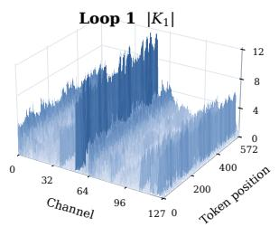

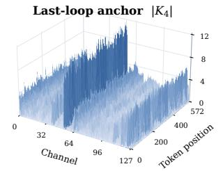

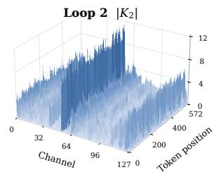

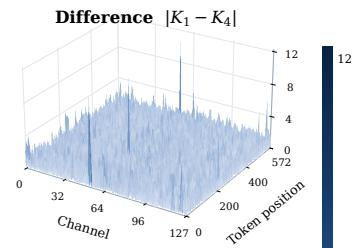

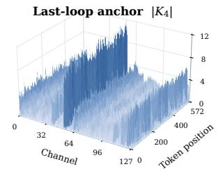

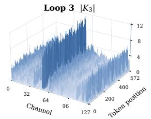

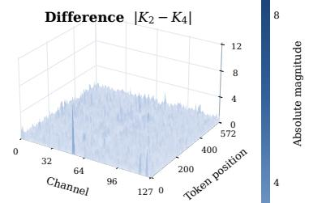

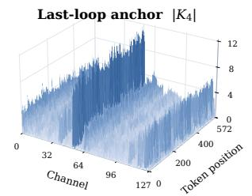

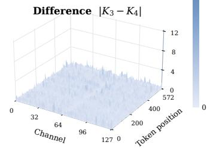  
Figure 5: Key distributions relative to the last-loop anchor. Rows correspond to loops 1, 2, and 3. Columns show $| K _ { r } | , | K _ { 4 } | .$ and $| K _ { r } - K _ { 4 } |$ on shared scales.

respectively. They are zero for V and for residual quantization without rotation. Each loop is reconstructed after recovering $A _ { a }$ and $\widehat { E } _ { r }$ from the cached codes, scales, and ofsets.

Previous-loop. Loop 1 is the anchor, with $p ( r ) = r - 1$ . Reconstruction proceeds in the order $1  2  3  4$

$$
\widehat { Z } _ { 1 } = A _ { 1 } , \quad \widehat { Z } _ { 2 } = \alpha _ { 2 } A _ { 1 } + \widehat { E } _ { 2 } , \quad \widehat { Z } _ { 3 } = \alpha _ { 3 } \widehat { Z } _ { 2 } + \widehat { E } _ { 3 } , \quad \widehat { Z } _ { 4 } = \alpha _ { 4 } \widehat { Z } _ { 3 } + \widehat { E } _ { 4 } .\tag{D.2}
$$

Reconstructing loop 4 requires the anchor followed by the residuals of loops 2, 3, and 4.

Next-loop. Loop 4 is the anchor, with $p ( r ) = r + 1$ . Reconstruction proceeds in the order $4  3  2  1$

$$
\widehat { Z } _ { 4 } = A _ { 4 } , ~ \widehat { Z } _ { 3 } = \alpha _ { 3 } A _ { 4 } + \widehat { E } _ { 3 } , ~ \widehat { Z } _ { 2 } = \alpha _ { 2 } \widehat { Z } _ { 3 } + \widehat { E } _ { 2 } , ~ \widehat { Z } _ { 1 } = \alpha _ { 1 } \widehat { Z } _ { 2 } + \widehat { E } _ { 1 } .\tag{D.3}
$$

Reconstructing loop 1 requires the anchor followed by the residuals of loops 3, 2, and 1. This order describes reconstruction dependencies. The model still executes loops in the order $1  2  3  4$

First-loop. Loops 2, 3, and 4 directly reference loop 1, giving $p ( r ) = 1$

$$
\widehat { Z } _ { 1 } = A _ { 1 } , \quad \widehat { Z } _ { 2 } = \alpha _ { 2 } A _ { 1 } + \widehat { E } _ { 2 } , \quad \widehat { Z } _ { 3 } = \alpha _ { 3 } A _ { 1 } + \widehat { E } _ { 3 } , \quad \widehat { Z } _ { 4 } = \alpha _ { 4 } A _ { 1 } + \widehat { E } _ { 4 } .\tag{D.4}
$$

Each residual loop is reconstructed from $A _ { 1 }$ and its own residual.

Last-loop. Loops 1, 2, and 3 directly reference loop 4, giving $p ( r ) = 4$

$$
\widehat { Z } _ { 4 } = A _ { 4 } , ~ \widehat { Z } _ { 1 } = \alpha _ { 1 } A _ { 4 } + \widehat { E } _ { 1 } , ~ \widehat { Z } _ { 2 } = \alpha _ { 2 } A _ { 4 } + \widehat { E } _ { 2 } , ~ \widehat { Z } _ { 3 } = \alpha _ { 3 } A _ { 4 } + \widehat { E } _ { 3 } .\tag{D.5}
$$

Each residual loop is reconstructed from $A _ { 4 }$ and its own residual.

Thus, under First-loop and Last-loop, reconstructing any residual loop requires only two KV cache reads: the shared anchor and that loop’s residual. In contrast, Previous-loop and Next-loop require loading a chain of intermediate residuals, with the number of reads increasing with the distance from the anchor and reaching four reads for the farthest loop in a four-loop model.

Logical reference count. For a group of � loops, consider the number of compressed components required to reconstruct every loop’s KV. Neighboring-loop reconstruction uses 1, $2 , \ldots , L$ components depending on distance from the anchor, for a total of $L ( L + 1 ) / 2$ accesses. Shared-anchor reconstruction uses one component for the anchor and two for each of the remaining �−1 loops, totaling $2 { \cal L } - 1$ . The ratio is therefore $L ( L + 1 ) / [ 2 ( 2 L - 1 ) ]$ giving $1 0 / 7$ ≈ 1.43 for $L = 4$ and $5 2 8 / 6 3$ ≈ 8.38 for $L = 3 2$ . These are logical component accesses, not byte counts accounting for bitwidth, metadata size, cache hits, or actual HBM trafic. Huginn-3.5B’s eight independent 4-loop groups require 80 and 56 accesses, respectively, retaining the ratio of 1.43.

## E. Huginn-3.5B Anchor Interval

Table 8: Huginn-3.5B GSM8K accuracy (%, 1,319 questions) and efective KV bitwidth $b _ { \mathrm { e f f } }$ across anchor intervals. Each group uses one final INT4 anchor. $2 ^ { \times n }$ denotes � consecutive INT2 loops. Group size � applies to INT2, while INT4 uses $g = 3 2$ . Both residual quantization variants use LS scaling and the Last-loop policy. Efective bitwidth includes quantized values, scales, ofsets, and LS coeficients, following Appendix A.3, and is the same with and without OptR-H.
<table><tr><td>Schedule</td><td>g</td><td> $b _ { \mathrm { e f f } }$ </td><td>w/o OptR-H</td><td>w/ OptR-H</td></tr><tr><td>BF16</td><td>-</td><td>16</td><td>42.84</td><td></td></tr><tr><td rowspan="2"> ${ 8 \times [ 2 , 2 , 2 , 4 ] }$ </td><td>16</td><td>3.5</td><td>41.70</td><td>42.38</td></tr><tr><td>32</td><td>3.1</td><td>43.14</td><td>42.61</td></tr><tr><td> $4 \times [ 2 ^ { \times 7 } , 4 ]$ </td><td>16</td><td>3.3</td><td>41.55</td><td>42.53</td></tr><tr><td rowspan="2"></td><td>32</td><td>2.9</td><td>41.93</td><td>42.15</td></tr><tr><td>16</td><td>3.3</td><td>41.93</td><td>42.68</td></tr><tr><td> $2 \times [ 2 ^ { \times 1 5 } , 4 ]$ </td><td>32</td><td>2.8</td><td>42.61</td><td>42.30</td></tr></table>

The comparison keeps 32 total loops and varies schedules that use the final loop of each group as an INT4 anchor. Separate $9 6 \times 9 6$ rotations for K and V are learned for each group, layer, and head and shared within the group.

Although we use four-loop groups by default, grouping eight or sixteen loops retains comparable GSM8K accuracy with OptR-H while reducing the number of INT4 anchors. Increasing the group length from four to sixteen loops reduces efective bitwidth from 3.5 to 3.3 at $g = 1 6$ and from 3.1 to 2.8 at $g = 3 2$ . The sixteen-loop configurations reduce logical KV storage by 79.7% and 82.6% relative to BF16, respectively. Accuracy changes from 42.38% to 42.68% and from 42.61% to $4 2 . 3 0 \% ,$ respectively. Larger loop groups thus ofer an additional option for reducing KV storage while retaining similar accuracy.

## F. Full KV Quantization Ablations

Table 9: Scaling coeficient, reference, and rotation ablations. MATH500 accuracy (%) on Ouro-1.4B with uniform INT2, uniform INT4, and mixed INT2/4. Uniform INT2 uses group size $g = 1 6 ,$ , while uniform INT4 and mixed INT2/4 use $g = 3 2$ in every loop. For uniform precision, direct quantization is independent of the reference policy. For mixed INT2/4, Previous-loop and First-loop use [4, 2, 2, 2], while Next-loop and Last-loop use [2, 2, 2, 4]. The direct and rotation-only baselines are listed separately for each mixed-precision schedule. Residual variants compare diferent scaling coeficients and reference choices, with OSCAR (Zhou et al., 2026) or OptR-H (Yun et al., 2026) applied to residual quantization with LS scaling. Blue row shading marks the selected Last-loop policy, blue column shading marks residual quantization with LS scaling and OptR-H, and the darker intersections indicate our final configuration. BF16 accuracy is 75.0%.
<table><tr><td rowspan="2">Reference / Method</td><td colspan="4">No rotation</td><td colspan="2">+ OSCAR</td><td colspan="2">+ OptR-H</td></tr><tr><td>Direct</td><td>Residual</td><td>Norm-ratio</td><td>LS scaling</td><td>Direct</td><td>t LS scaling</td><td>Direct</td><td>LS scaling</td></tr><tr><td>INT2,  $g = 1 6$ </td><td></td><td></td><td></td><td></td><td></td><td></td><td></td><td></td></tr><tr><td>Direct</td><td>54.20</td><td></td><td></td><td></td><td>65.80</td><td></td><td>64.20</td><td></td></tr><tr><td>Previous-loop</td><td></td><td>69.20</td><td>73.00</td><td>71.20</td><td></td><td>74.60</td><td></td><td>72.20</td></tr><tr><td>Next-loop</td><td>一</td><td>71.60</td><td>67.60</td><td>73.20</td><td></td><td>73.60</td><td>一</td><td>72.80</td></tr><tr><td>First-loop</td><td></td><td>46.00</td><td>69.00</td><td>69.80</td><td></td><td>71.20</td><td>一</td><td>71.40</td></tr><tr><td>Last-loop</td><td></td><td>69.20</td><td>68.80</td><td>67.80</td><td></td><td>74.80</td><td>一</td><td>75.20</td></tr><tr><td>INT4, g = 32</td><td></td><td></td><td></td><td></td><td></td><td></td><td></td><td></td></tr><tr><td>direct</td><td>74.20</td><td></td><td></td><td></td><td>75.00</td><td></td><td>75.20</td><td></td></tr><tr><td>Previous-loop</td><td></td><td>74.40</td><td>76.00</td><td>76.20</td><td></td><td>75.00</td><td>一</td><td>74.40</td></tr><tr><td>Next-loop</td><td>一</td><td>76.00</td><td>76.20</td><td>74.60</td><td></td><td>75.80</td><td>一</td><td>74.80</td></tr><tr><td>First-loop</td><td></td><td>73.40</td><td>74.20</td><td>75.20</td><td></td><td>75.00</td><td>一</td><td>75.40</td></tr><tr><td>Last-loop</td><td></td><td>75.80</td><td>74.00</td><td>74.20</td><td></td><td>77.20</td><td></td><td>74.40</td></tr><tr><td>Mixed  $\mathbf { I N T 2 } / 4 , g = 3 2$ </td><td></td><td></td><td></td><td></td><td></td><td></td><td></td><td></td></tr><tr><td>Direct [4, 2, 2, 2]</td><td>40.20</td><td></td><td>一</td><td></td><td>61.20</td><td></td><td>61.80</td><td></td></tr><tr><td>Direct [2, 2, 2, 4]</td><td>47.40</td><td></td><td></td><td></td><td>62.00</td><td></td><td>63.00</td><td></td></tr><tr><td>Previous-loop</td><td></td><td>66.20</td><td>74.20</td><td>73.20</td><td></td><td>74.20</td><td>一</td><td>72.80</td></tr><tr><td>Next-loop</td><td>一</td><td>71.40</td><td>75.40</td><td>74.00</td><td></td><td>76.00</td><td>一</td><td>75.20</td></tr><tr><td>First-loop</td><td></td><td>24.80</td><td>69.80</td><td>73.80</td><td></td><td>74.60</td><td></td><td>72.20</td></tr><tr><td>Last-loop</td><td></td><td>70.20</td><td>74.60</td><td>73.80</td><td></td><td>73.20</td><td>一</td><td>76.00</td></tr></table>

Table 9 provides a detailed comparison under uniform INT2, uniform INT4, and mixed INT2/4, covering the results in Tables 4 and 3. It includes Norm-ratio scaling and both OSCAR and OptR-H rotations. For uniform precision, the direct and rotation-only baselines are independent of the reference choice and are listed once per precision. For mixed INT2/4, these baselines are listed separately for the [4, 2, 2, 2] and [2, 2, 2, 4] precision schedules. For a KV vector � and its reconstructed reference $R _ { r }$ , we compare residual quantization with three scaling choices: $\alpha _ { r } = 1$ , Norm-ratio scaling with $\alpha _ { r } = \| X _ { r } \| _ { 2 } / \| R _ { r } \| _ { 2 } ,$ and LS scaling with $\alpha _ { r } = \langle X _ { r } , R _ { r } \rangle / \| R _ { r } \| _ { 2 } ^ { 2 }$ which minimizes $\| X _ { r } - \alpha _ { r } R _ { r } \| _ { 2 } ^ { 2 }$ . The LS + OSCAR and LS + OptR-H columns apply residual quantization with the same LS coeficient formula in the rotated space. Neither coeficient choice uniformly dominates the other in downstream accuracy.

## G. Rotation Calibration and Inference

OSCAR and OptR-H both determine K and V rotations before inference, but use diferent criteria to obtain them. This section describes how the rotation matrices are calibrated ofline and how the resulting fixed matrices are applied during inference.

## G.1. Calibration

Let $Q , K , V$ contain calibration tokens as rows for a fixed layer and head, and let $S = \operatorname { s o f t m a x } ( Q K ^ { \top } / \sqrt { D } )$ denote attention probabilities with a causal mask. The row-vector rotation corresponding to the main text’s column-vector rotation � is $T = U ^ { \top }$ , applied to � as ��. The rotations $T _ { K }$ and $T _ { V }$ are obtained separately. In ResidualQuant, the anchor and residuals in each four-loop group share the same matrices.

Quantized reference and residual targets. Q/K/V states are collected from the BF16 model, but residual references use quantized and reconstructed KV rather than original KV. With the last loop as anchor, $X _ { 4 }$ is first quantized and reconstructed, after which each token’s coeficient $\alpha _ { r } = \langle X _ { r } , \widehat { X } _ { 4 } \rangle / \| \widehat { X } _ { 4 } \| _ { 2 } ^ { 2 }$ and residual $E _ { r } = X _ { r } - \alpha _ { r } \widehat { X } _ { 4 }$ are computed. The quantization targets are $X _ { 4 }$ for the anchor and $E _ { r }$ for residuals. Rotationonly baselines instead target original KV.

OSCAR. OSCAR (Zhou et al., 2026) constructs rotations from covariance estimates of directions important for QK scores and weighted $\mathrm { v }$ outputs. Let $Z _ { V }$ be the V quantization target, either original V or a residual computed with LS scaling, and $N _ { q }$ the number of queries. Our adaptation uses the statistics and rotations

$$
C _ { K } = \frac { Q ^ { \top } Q } { N _ { q } } , \qquad C _ { V } = \frac { ( S Z _ { V } ) ^ { \top } ( S Z _ { V } ) } { N _ { q } } , \qquad C _ { X } = B _ { X } \Lambda _ { X } B _ { X } ^ { \top } , \quad T _ { X } = B _ { X } H P _ { X } .\tag{G.1}
$$

Here, $B _ { X }$ contains covariance eigenvectors, � is a normalized Hadamard matrix, and $P _ { X }$ is a bit-reversal permutation based on eigenvalue ranks. Eigenvectors align important directions, while Hadamard mixing and permutation redistribute them across groups. Shared rotations aggregate statistics over the corresponding loops using all calibration queries. Attention probabilities � remain those computed from original $\mathsf { Q } / \mathsf { K }$ , while LS variants use residuals as $Z _ { V }$ . Covariances and eigendecompositions are computed in FP64, without gradientbased rotation learning.

OptR-H. For OptR-H, mathematical reasoning evaluations share rotation matrices calibrated on the GSM8K training set, while code evaluations use matrices calibrated on the MBPP training set after excluding examples whose IDs overlap the evaluation set. Each domain uses 128 fit examples and 128 holdout examples with seed 0.

OptR (Yun et al., 2026) optimizes attention error induced by quantized KV. Our OptR-H implementation maintains orthogonality through $T = T _ { 0 } \exp ( A - A ^ { \top } )$ with Hadamard initialization $T _ { 0 } ~ = ~ H$ . Let ${ \widehat { S } } =$ softmax $( Q \widehat { K } ^ { \top } / \sqrt { D } )$ and let $W _ { O }$ denote the output projection for the head. The K and V objectives are

$$
\mathcal { L } _ { K } = \overline { { D } } _ { \mathrm { K L } } ( \boldsymbol { S } \| \widehat { \boldsymbol { S } } ) + \mathcal { E } ( ( \widehat { \boldsymbol { S } } - \boldsymbol { S } ) \boldsymbol { V } ) , \qquad \mathcal { L } _ { \boldsymbol { V } } = \mathcal { E } ( \widehat { \boldsymbol { S } } ( \widehat { \boldsymbol { V } } - \boldsymbol { V } ) ) , \quad \mathcal { E } ( \Delta ) = \frac { \| \Delta W _ { O } \| _ { F } ^ { 2 } } { N _ { q } d _ { \mathrm { m o d e l } } } .\tag{G.2}
$$

Here, $\overline { { D } } _ { \mathrm { K I } }$ is the mean query-wise KL divergence. The K rotation is selected first, and V rotation learning then fixes $\widehat S$ computed from reconstructed K. Output projection error is evaluated per head using $W _ { O } W _ { O } ^ { \top }$ . Shared matrices minimize the mean loss across loops in the group.

For Ouro-1.4B, rotations and optimizer states use FP32 with Adam at learning rate 0.02 for 80 steps. Each step uses the last 64 queries from two calibration examples. Quantization uses straight-through gradients, while gradients are stopped through reconstructed references. Per-head matrices are selected by holdout loss.

## G.2. Inference

After calibration, matrices are fixed and stored in FP16. Ouro-1.4B uses $1 2 8 \times 1 2 8$ rotations, while Huginn-3.5B uses 96 × 96 rotations matching its head dimension. Rotation multiplication uses FP16 inputs and FP32 accumulation. No further rotation training occurs during token generation.

Quantization and storage. Returning to column-vector notation, let $Z _ { r } = U X _ { r }$ . Distinguish quantization into integer codes, $\mathcal { Q } _ { b } ,$ from reconstruction using scales and ofsets, $\mathcal { D } _ { b }$ . With fixed key mean $\mu _ { r }$ in the rotated space, the last anchor and residuals are stored as

$$
\begin{array} { r } { c _ { 4 } = \mathcal Q _ { 4 } ( Z _ { 4 } - \mu _ { 4 } ) , \quad A = \mathcal D _ { 4 } ( c _ { 4 } ) + \mu _ { 4 } , \qquad c _ { r } = \mathcal Q _ { 2 } ( Z _ { r } - \alpha _ { r } A - \mu _ { r } ) \quad ( r = 1 , 2 , 3 ) . } \end{array}\tag{G.3}
$$

For V and OSCAR, $\mu _ { r } = 0$ . The cache stores integer codes, group-wise FP8 scales and ofsets, and BF16 LS coeficients for residuals. Matrices and fixed means are shared separately from the per-token cache. During decode, the current token participates in attention using its own BF16 KV. Compressed storage of its anchor and three residuals completes once the final loop’s KV is available.

Reconstruction and attention. Rotated KV for past tokens is reconstructed as $\widehat { Z } _ { 4 } = A$ and $\widehat { Z } _ { r } = \alpha _ { r } A +$ $\mathcal { D } _ { 2 } ( c _ { r } ) + \mu _ { r }$ . Applying the same K rotation to the query gives $\begin{array} { r } { \boldsymbol { q } ^ { \top } \widehat { \boldsymbol { k } } _ { r } = ( U _ { K } \boldsymbol { q } ) ^ { \top } \widehat { \boldsymbol { z } } _ { K , r } , } \end{array}$ , avoiding inverse rotation of all keys. Values are inverse-rotated once after weighted accumulation, as $\begin{array} { r } { o = U _ { V } ^ { \top } \sum _ { t } p _ { t } \widehat { z } _ { V , r , t } } \end{array}$ . The kernel reads compressed KV in tiles and computes anchor and residual contributions without creating a separate cache of fully reconstructed past KV. OSCAR and OptR-H thus supply fixed matrices to the same compressed attention path, allowing comparison of their calibration methods.

## H. Activation Residual Quantization

Table 6 compares direct and residual activation quantization with LS scaling at W4A4. Weight and activation codes use INT4, while KV caches remain in BF16. The BF16 baseline in this section is evaluated alongside the activation experiments and is distinct from the KV experiment baseline.

## H.1. Baseline Methods and Implementation

All W4A4 configurations use group size $g = 3 2$ for both weights and activations, with BF16 KV caches.

Naive. Naive applies symmetric round-to-nearest quantization directly to weights and activations without a learned transformation or calibration. Its LS residual variant also requires no calibration.

FlatQuant. FlatQuant (Sun et al., 2025) learns invertible afine transformations to flatten weight and activation distributions before quantization. The corresponding inverse transformation is folded into the weights, preserving the full-precision linear mapping before quantization. Kronecker-factorized matrices reduce transformation cost, while learnable per-channel scaling and weight and activation clipping further control outliers. These parameters are jointly calibrated by minimizing the output reconstruction error of each Transformer block. We use the authors’ transformation, clipping, and calibration modules, adapted to the projection layouts of Ouro-1.4B and Huginn-3.5B. Each projection’s transformation is shared across loops.

LoopQ. LoopQ (Fang et al., 2026) addresses loop-dependent distribution shifts and recursive error accumulation while retaining a shared quantized backbone. Loop-aware Activation Scaling (LAS) assigns activation ranges to individual loops. Selective Loop-aware Transformation (SLT) introduces loop-dependent transformations only for modules identified as sensitive to sharing by curvature-normalized inter-loop gradient variance. Lightweight transition adapters align each loop’s quantized output before it enters the next loop. Trajectoryaware calibration jointly optimizes these components using full-precision logits, intermediate and final hidden states, and transition-alignment targets along the recurrent computation path.

In the absence of the authors’ code, we reproduced LoopQ to the best of our ability by following the published methodology and matching the reported results across all benchmarks.

## H.2. Residual Formulation

Let the row vector $x _ { r }$ denote the current activation for a projection and $\widehat { x } _ { r - 1 }$ the reconstructed reference from the previous loop. The first loop directly quantizes the full activation. Subsequent loops compute residuals using a token-wise scalar LS coeficient.

$$
\alpha _ { r } = \frac { \langle x _ { r } , \widehat { x } _ { r - 1 } \rangle } { \| \widehat { x } _ { r - 1 } \| _ { 2 } ^ { 2 } } , \qquad e _ { r } = x _ { r } - \alpha _ { r } \widehat { x } _ { r - 1 } , \qquad \widehat { x } _ { r } = \alpha _ { r } \widehat { x } _ { r - 1 } + Q ( e _ { r } ) .\tag{H.1}
$$

Here, $Q$ includes the method’s transformation and INT4 quantization and reconstruction. We apply residual quantization with LS scaling to QKV, attention output, MLP gate/up, and down projections.

## H.3. Calibration

For both models, FlatQuant direct calibration uses 128 Pile samples of 2,048 tokens each, seed 0, 15 epochs, and batch size 4. Its LS residual variant initializes from the corresponding direct artifact and undergoes a further 15 epochs of calibration through the residual computation path, using the same calibration tokens and batch size. Residuals are formed before the FlatQuant transformation, and the quantized residual is passed to the low-precision projection. Earlier quantized projections provide reconstructed references during residual calibration.

The Ouro-1.4B LoopQ LS residual variant reuses the previously calibrated direct bundle without additional training. For Huginn-3.5B, LoopQ direct calibration uses 1,024 Pile samples of up to 256 tokens each. The recorded calibration recipe specifies three layerwise epochs and a 500-step setting. The archived Ouro-1.4B direct bundle does not include its original calibration run record, so we do not infer that it used the Huginn-3.5B training schedule.

## H.4. Evaluation Protocol

Table 6 evaluates all 1,319 GSM8K, 500 MATH500, 164 HumanEval, and 378 MBPP problems. GSM8K uses flexible-extract exact match, with three-shot plain-text prompts for Ouro-1.4B and eight-shot prompts using the authors’ chat template and system instruction for Huginn-3.5B. The generation limit is 1,024 tokens.

Ouro-1.4B MATH500 uses zero-shot prompts, a 2,048-token generation limit, and Math-Verify. Huginn-3.5B MATH500 uses the four-shot minerva\_math500 task with plain-text prompts, no chat template or system instruction, a 2,048-token generation limit, and Minerva exact match. Huginn-3.5B evaluations split the 500 problems into disjoint shards of 167, 167, and 166 problems and aggregate correct-answer counts over all 500 problems. This activation experiment protocol difers from the Huginn-3.5B KV evaluation protocol in Appendix A.

HumanEval and MBPP use zero-shot EvalPlus prompts and report base pass@1 on the original tests, with generation limits of 1,024 and 2,048 tokens, respectively. Model-specific prompts and scoring settings are shared between direct and LS residual variants. BF16 and Naive require no calibration, and all reported activation experiments retain BF16 KV caches.

## I. Decode Throughput with INT2 Group Size 16

Figure 6 reports the additional throughput results with group size $g = 1 6$ for INT2 residuals and $g = 3 2$ for the INT4 anchor. At 8k context, peak throughput increases from 113.1 to 367.4 tokens/s (3.25×), while the largest tested feasible power-of-two batch increases from 4 to 16.

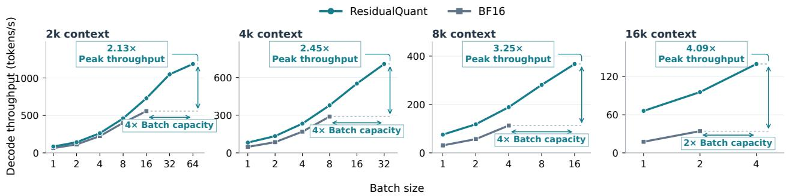  
Figure 6: Decode throughput with INT2 group size $g = 1 6 . \mathsf { O u r o } – 1 . 4 \mathsf { B }$ on an RTX 5090 at $2 \mathrm { k } , 4 \mathrm { k } , 8 \mathrm { k } ,$ and 16k context. ResidualQuant uses [2, 2, 2, 4], Last-loop references, LS scaling, and shared OptR-H rotations, with group size $g = 1 6$ for INT2 residuals and $g = 3 2$ for the INT4 anchor. Each run generates 128 tokens, with throughput measured over the 127 decode steps after the first output token and averaged over three trials following one warm-up. Arrows show peak-throughput gains and ratios of the largest plotted batch sizes relative to BF16.

## J. Comparison with FlashLoop

FlashLoop (Yang and Liu, 2026) is concurrent work that combines INT4 KV quantization with sparse token updates and sparse attention for looped Transformer. While its quantization method is motivated by a similar observation of inter-loop redundancy, ResidualQuant improves both quantization accuracy and runtime eficiency, enabling residual KV states to be reduced from INT4 to INT2. Moreover, our quantization method is orthogonal to FlashLoop’s sparse update and attention techniques, allowing them to be combined for further reductions in KV memory and computation while preserving higher accuracy. We examine these aspects below.

Run-time eficiency. FlashLoop performs residual quantization using a Previous-loop reference, where each loop is reconstructed from its predecessor. This introduces a chain of reconstruction dependencies: recovering a later loop requires loading the anchor together with multiple intermediate residuals (Section 3.2 and Appendix D). In contrast, our Last-loop policy reconstructs every residual loop directly from the final-loop anchor, reducing the required KV cache reads. As shown in Figure 3, under the same quantization setting, the Previous-loop policy can only achieve 62% of the decode throughput of the Last-loop policy due to larger memory trafic.

Low-precision accuracy. Reference choice, LS scaling, and rotation jointly afect accuracy at low precision. As shown in Table 3, under uniform INT2 quantization with group size $g = 1 6$ and without rotation, Previous-loop and Last-loop reconstruction with unit scaling both achieve 69.2% MATH500 accuracy. Combining Last-loop references with LS scaling and OptR-H achieves 75.2% accuracy, compared with 64.2% for OptR-H alone and 75.0% for BF16 (Table 4). These results support combining residual quantization with LS scaling and rotation to preserve accuracy close to BF16 at INT2. In contrast, FlashLoop reports accuracy below 20% when its residual quantization is reduced to INT2 in its ablation setting.

Table 10: Combining ResidualQuant with sparse KV updates and attention. MATH500 accuracy on Ouro-1.4B and average KV bitwidth during prefill and decode. All methods use the same sparse KV update and attention mechanisms from FlashLoop. For ResidualQuant, � denotes the INT2 residual group size, while INT4 anchors use $g = 3 2$ . Average bitwidth includes quantized values, scales, ofsets, and LS coeficients, but excludes recent BF16 states.
<table><tr><td></td><td></td><td colspan="2">Average Bitwidth</td><td></td></tr><tr><td>Method</td><td>BF16 KV tokens</td><td>Prefill</td><td>Decode</td><td>Accuracy (%)</td></tr><tr><td>BF16 + sparse</td><td>All</td><td>9.40</td><td>16.00</td><td>76.0</td></tr><tr><td>FlashLoop</td><td>Recent 64–127</td><td>2.64</td><td>4.50</td><td>72.8</td></tr><tr><td>RESIDUALQUANT  $( g = 1 6 ) + s \mathsf { p a r s e }$ </td><td>Recent 64</td><td>2.18</td><td>3.47</td><td>74.4</td></tr><tr><td>RESIDUALQUANT  $( g = 3 2 ) + s \mathsf { p a r s e }$ </td><td>Recent 64</td><td>2.01</td><td>3.09</td><td>73.4</td></tr></table>

Orthogonal integration with sparse updates and attention. ResidualQuant is orthogonal to FlashLoop’s sparse KV update and attention mechanisms. Here, we further integrate ResidualQuant with FlashLoop’s sparse update and attention mechanisms to achieve higher accuracy with a smaller KV cache footprint.

We evaluate Ouro-1.4B on all 500 MATH500 problems using an NVIDIA A100-SXM4-40GB, matching the GPU model reported by FlashLoop. All methods use the same model revision, zero-shot plain prompts, greedy decoding, seed 0, and a 2,048-token generation limit, with answers scored using Math-Verify. For FlashLoop, we directly use its public codebase1 and default INT4 quantization with group size $g = 6 4$ . For ResidualQuant, we use INT2/4 with INT2 group sizes $g \in \{ 1 6 , 3 2 \}$ and INT4 group size $g = 3 2 .$ . FlashLoop’s block-wise flushing retains between 64 and 127 recent tokens in BF16; for ResidualQuant, we retain exactly 64 recent tokens in BF16 for a fair comparison. We directly apply the sparse update and attention mechanisms from the FlashLoop codebase to ResidualQuant. Under sparsification, the final loop may not be retained for every token; in such cases, we use the last non-pruned loop as the INT4 anchor and represent the remaining retained loops with INT2 residuals.

As shown in Table 10, combining sparse updates and attention with ResidualQuant improves both accuracy and KV storage over FlashLoop. With $g = 1 6 _ { : }$ , ResidualQuant reaches 74.4% accuracy compared with 72.8% for FlashLoop, while reducing average bitwidth from 2.64 to 2.18 for prefill and from 4.50 to 3.47 for decode. With $g = 3 2 ,$ , it further reduces bitwidth to 2.01 and 3.09, respectively, while still improving accuracy to 73.4%.

These results show that ResidualQuant provides a stronger quantization method even when combined with FlashLoop’s sparse update and attention mechanisms, further improving the accuracy–memory tradeof.