# RollVerify: Bridging Efficiency and Accuracy in Long-Tail Rollout Reinforcement Learning

Yongqiang Yao1,†, Jinru Tan3,†, Kaihuan Liang2,†, Zixin Yin2 Yazhe Niu4, Ruihao Gong5∗, Dahua Lin2, Ningyi Xu1∗

1Shanghai Jiao Tong University 2SenseTime Research 3Central South University 4The Chinese University of Hong Kong 5Beihang University

soundbupt@gmail.com, tanjingru@csu.edu.cn, liangkaihuan@sensetime.com yinzixin@sensetime.com, niuyazhe314@outlook.com,

gongruihao@buaa.edu.cn, dhlin@sensetime.com, xuningyi@sjtu.edu.cn

## Abstract

Reinforcement learning is crucial for improving large language models’ reasoning and generalization. It relies on massive rollouts whose lengths become increasingly long-tailed as context windows grow. In on-policy training, these long-tail rollouts can result in GPU bubbles, reducing system utilization and limiting RL scalability. Asynchronous or partial-rollout methods improve throughput by relaxing synchronization, but inevitably introduce stale off-policy samples (trajectories) that may hurt final accuracy. Existing approaches mainly mitigate this off-policy issue by reweighting off-policy samples during training, yet they can still leave a performance gap compared to fully on-policy training. In this work, rather than passively reweighting samples during training, we propose RollVerify, a lightweight RL framework built on partial rollout that actively verifies and repairs samples before they enter training. Specifically, it introduces an off-policy shift metric OPS, to quantify the off-policy deviation of partially generated trajectories. Guided by the OPS constraint, RollVerify performs both sequence-level and token-level verification to identify and truncate invalid suffixes of trajectories. This yields high-quality samples that protect the models’ accuracy while preserving the efficiency gains of partial rollout. Experiments on mathematical and tool-assisted mathematical reasoning show that RollVerify achieves accuracy comparable to on-policy training while reducing training cost. Additional code-generation results provide preliminary evidence beyond mathematics.

## 1 Introduction

Reinforcement learning (RL) has become a crucial paradigm for enhancing the reasoning and decision-making capabilities of large language models [9, 21, 32, 8, 28, 7, 1, 22]. In a typical on-policy RL pipeline, the rollout phase, which involves collecting diverse rollouts from the current policy, occupies 70-80% of the total time [6, 4]. In practice, it is observed that rollouts often exhibit a long-tail distribution, see Figure 1 (a). Specifically, some samples terminate quickly, whereas others require much longer generation times. The long-tail effect [4, 10] causes GPUs to idle while waiting for a few straggling samples, leading to GPU bubbles and reducing overall training efficiency.

One approach mitigates GPU bubbles through system-level optimizations [31, 30], while maintaining the on-policy nature of the training samples (rollout trajectories). However, the inflexible system and limited improvements hinder their practicality. Other methods relax the strict on-policy constraint, exploring asynchronous techniques to enhance efficiency [18, 37, 10]. These approaches allow training to use rollouts generated by earlier policies, decoupling rollout generation from model training, which reduces synchronization overhead and improves resource utilization.

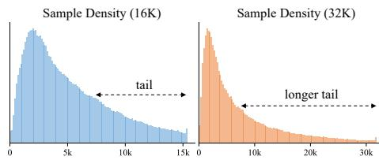  
(a) Long-tail effect in RL rollout

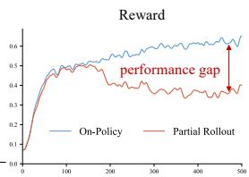

(b) Comparison between on-policy and partial rollout  
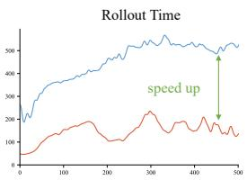  
Figure 1: (a) Long-tail response length distributions observed during RL rollout under 16K and 32K settings. (b) Comparison between the standard on-policy and partial rollout in terms of speed and performance.

Partial rollout is a simple variant of asynchronous rollout generation [39, 29]. When short trajectories finish, the freed compute immediately generates the next trajectory instead of waiting for the long trajectories to complete. Once enough training samples are collected, the unfinished long trajectories are paused and will be resumed later. It reduces GPU bubbles and improves overall throughput, as shown in Fig. 1 (b)-right. However, training samples may be generated by stale policies, introducing off-policy trajectories that may degrade final accuracy, as shown in Fig. 1 (b)-left.

Existing methods mainly mitigate the impact of off-policy samples at the loss level by reweighting their contribution during training, such as GSPO [35], SAPO [5], and VESPO [26]. However, such loss-level corrections only reshape the training gradients after trajectories have been generated; they merely try to tolerate off-policy trajectories but not modify them. Highly off-policy samples still remain in the training data and may hurt final accuracy.

To address this limitation, in this work, we propose RollVerify to ensure each generated sample for training is nearly on-policy. It builds on partial rollout, but adds a lightweight verification phase to actively verify and repair trajectories before they enter training. We first design a novel metric, offpolicy shift (OPS), in Section 3.2, to quantify the off-policy degree of generated samples, and validate its correlation with final accuracy. For unfinished trajectories, we applied an OPS-based two-stage verification method in Section 4.2 that detects off-policy shift at both the sequence and token levels. Highly off-policy parts are truncated and regenerated to repair the trajectory. RollVerify preserves most of the throughput benefit of partial rollout by avoiding GPU bubbles, while substantially eliminating the accuracy degradation caused by stale or mixed-policy trajectories. Therefore, it provides a better efficiency–accuracy trade-off for long-tail rollout RL training.

We evaluate our method across diverse models, scales, and task domains. On DAPO-Math [33] with Qwen3-8B [32], RollVerify reduces training cost from 98.1 to 57.5 GPU days while preserving accuracy. RollVerify achieves comparable accuracy to on-policy training with lower training cost on both dense and MoE models. Additional experiments cover tool-assisted mathematical reasoning and provide preliminary evidence on code generation. Our contributions are threefold. First, we design a new metric to quantify the off-policy degree of generated samples. Second, we propose RollVerify, which mitigates the impact of off-policy samples through rollout-level quality control, achieving a better balance between training efficiency and accuracy. Third, our experiments demonstrate RollVerify’s effectiveness across the evaluated models and task settings.

## 2 Related Works

Reinforcement Learning for LLMs. Reinforcement learning (RL) has become a core component of LLM post-training, particularly for enhancing complex reasoning capabilities [9]. Proximal Policy Optimization (PPO) [24, 21] was among the earliest methods adopted in LLM post-training, serving as a standard foundation for subsequent RLHF and reasoning-oriented pipelines. More recently, Group Relative Policy Optimization (GRPO) [25], along with several of its improved variants [33, 5, 35, 20], has emerged as an effective alternative that avoids explicit value modeling while retaining strong empirical performance. Nevertheless, these methods still rely on large amounts of rollout trajectories collected from the current or recent policy. Therefore, rollout quality, diversity, and system throughput are critical to scalable RL for LLMs.

RL Training Acceleration. Large-scale rollout has become a major bottleneck in LLM RL training. To improve rollout efficiency, high-throughput serving systems such as vLLM [13] and SGLang [36] are widely adopted in practice. More recent studies [4, 10] have further examined the long-tail effect in rollout generation, where large variance in sample lengths leads to workload imbalance and GPU idle. Existing approaches can be broadly divided into two categories. The first category preserves strict on-policy training and mitigates the long-tail effect through system-level optimizations, such as overlapping rollout and reward computation [30, 31, 38] or improving rollout scheduling [6]. These methods typically rely on specialized pipeline designs, while offering only limited improvements in flexibility and efficiency. The second category relaxes the on-policy constraint through asynchronous designs [4, 10] to improve resource utilization and training throughput. However, such methods inevitably introduce off-policy samples, which may degrade model accuracy. In contrast, our method places greater emphasis on preserving model accuracy while retaining the efficiency benefits of asynchronous rollout.

Off-Policy Effect Handling. Handling off-policy data has long been a fundamental challenge in policy optimization. PPO mitigates policy mismatch through importance weighting and clipping. Recent studies mitigate off-policy effects mainly at the loss level by reweighting the contribution of off-policy samples during training. GSPO [35] reduces off-policy effects through sequence-level optimization. SAPO [5] replaces hard clipping with soft adaptive weighting to provide a smoother correction. VESPO [26] corrects sequence-level importance weights by introducing a variational reshaping kernel. However, these methods only adjust the contribution of off-policy samples during training. Low-quality samples may still be retained and may affect final model accuracy. In contrast, our method intervenes earlier in the pipeline: instead of only reweighting off-policy samples after generation, we identify and repair partially generated trajectories before they enter training, therefore producing higher-quality training samples.

## 3 Problem Analysis

## 3.1 Preliminary

Group Relative Policy Optimization (GRPO). Given a prompt x, a group of responses $\{ y ^ { ( i ) } \} _ { i = } ^ { G }$ is sampled, and the reward R is computed for each response. Let $\pi _ { \theta }$ be the current policy and $\pi _ { \mathrm { o l d } }$ the behavior policy used for rollout collection. GRPO optimizes the clipped surrogate objective:

$$
\mathcal { L } _ { \mathrm { G R P O } } ( \theta ) = \mathbb { E } _ { t } \Bigl [ \operatorname* { m i n } \Bigl ( r _ { t } ( \theta ) \hat { A } _ { t } , \ \mathrm { c l i p } ( r _ { t } ( \theta ) , 1 - \epsilon , 1 + \epsilon ) \hat { A } _ { t } \Bigr ) \Bigr ]\tag{1}
$$

where $\hat { A } _ { t }$ denotes the advantage estimate and $r _ { t } ( \theta )$ is the importance ratio that corrects the mismatch between the current policy and the behavior policy, computed following Eq. 2. The clipping operator $\mathrm { c l i p } ( r _ { t } ( \theta ) , 1 - \epsilon , 1 \bar { + } \epsilon )$ further restricts the update when $r _ { t } ( \theta )$ deviates too much from 1.

$$
\hat { A } _ { t } ^ { ( i ) } = \frac { R ^ { ( i ) } - \mathrm { m e a n } ( \{ R ^ { ( j ) } \} _ { j = 1 } ^ { G } ) } { \mathrm { s t d } ( \{ R ^ { ( j ) } \} _ { j = 1 } ^ { G } ) } , \quad r _ { t } ( \theta ) = \frac { \pi _ { \theta } ( y _ { t } \mid x , y _ { < t } ) } { \pi _ { \mathrm { o l d } } ( y _ { t } \mid x , y _ { < t } ) }\tag{2}
$$

Partial Rollout. Partial rollout [29] follows a repeated rollout–training cycle. In the rollout phase, multiple rollout engines generate trajectories in parallel, and engines that finish shorter trajectories early are immediately reassigned to new rollout tasks. Once enough completed samples are collected to form a training batch, the training phase starts. Unfinished long trajectories are paused and resumed in later rollout phases rather than discarded.

## 3.2 Measuring Off-Policy Deviation

We define Off-Policy Shift (OPS) to quantify the degree to which a trajectory deviates from the current policy. In Eq 3, for each token $y _ { t }$ at trajectory position t, the token-level OPS $D ( y _ { t } )$ is defined as the absolute offset of the importance ratio between the current policy $\pi _ { \theta }$ and the behavior policy $\pi _ { \mathrm { o l d } }$ from 1. We then define the sequence-level off-policy shift $D ( \tau )$ as the average token-level $D ( y _ { t } )$ over the whole trajectory τ:

<table><tr><td>Setting</td><td>Filter</td><td>Threshold</td><td>AIME 24 ↑</td><td>AIME 25 ↑</td><td>OPS</td><td>GPU days</td></tr><tr><td>GRPO baseline (on-policy)</td><td>None</td><td></td><td>29.4</td><td>27.4</td><td>0</td><td>30.1 (1.00x)</td></tr><tr><td rowspan="7">Partial Rollout (off-policy)</td><td>None</td><td>一</td><td>19.5</td><td>19.1</td><td>0.025</td><td>19.4 (1.55x)</td></tr><tr><td>Staleness</td><td>1</td><td>21.2</td><td>20.9</td><td>0.017</td><td>26.6 (1.13x)</td></tr><tr><td>Staleness</td><td>2</td><td>19.7</td><td>19.3</td><td>0.018</td><td>21.5 (1.40x)</td></tr><tr><td>Staleness</td><td>3</td><td>18.7</td><td>18.4</td><td>0.018</td><td>19.8 (1.52x)</td></tr><tr><td>OPS</td><td>0.02</td><td>21.1</td><td>20.3</td><td>0.016</td><td>27.1 (1.11x)</td></tr><tr><td>OPS</td><td>0.01</td><td>27.7</td><td>24.2</td><td>0.009</td><td>29.0 (1.04x)</td></tr><tr><td>OPS</td><td>0.005</td><td>29.9</td><td>26.4</td><td>0.004</td><td>33.3 (0.90x)</td></tr></table>

Table 1: Analysis results of staleness-based and OPS-based filtering strategies under partial rollout on DAPO-Math. The baseline setting uses Qwen3-4B-Base, with a batch size of 128.

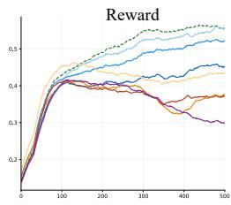

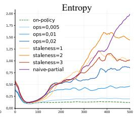

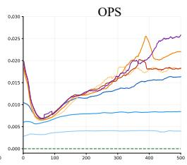

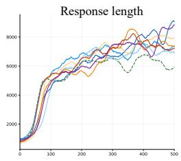  
Figure 2: Training dynamics under different partial rollout settings using Qwen3-4B-Base model. We train the model for 500 steps in total, with the x-axis denoting the training step.

$$
D ( y _ { t } ) = \left| \frac { \pi _ { \theta } ( y _ { t } \mid x , y _ { < t } ) } { \pi _ { \mathrm { o l d } } ( y _ { t } \mid x , y _ { < t } ) } - 1 \right| , \quad D ( \tau ) = \frac { 1 } { T } \sum _ { t = 1 } ^ { T } D ( y _ { t } ) .\tag{3}
$$

Intuitively, $D ( \tau ) = 0$ indicates an on-policy trajectory, where the importance ratio equals 1 at each position t. A larger shift $D ( \tau )$ implies a higher degree of off-policy for this trajectory τ .

## 3.3 Sample Filtering Analysis

To validate the effectiveness of the proposed metric, we conduct off-policy sample filtering experiments based on OPS and compare them with an existing staleness-based filtering strategy. In both settings, samples that do not satisfy the filtering criterion are directly discarded.

Staleness-based Filtering. [29] adopts a simple staleness-based strategy that discards partial rollout samples whose staleness exceeds a predefined threshold. This heuristic assumes that older samples (larger staleness) are more likely to destabilize training. However, our results show that staleness is only a coarse proxy for off-policy deviation. As shown in Table 1 (rows 3–5), and Fig. 2, staleness filtering still leads to entropy explosion, causing accuracy degradation. We also observed that its OPS remains high during training.

OPS-based Filtering. We further study an alternative strategy based on our proposed OPS. Specifically, given a predefined threshold $\gamma ,$ we directly discard samples whose sequence-level OPS $D ( \tau )$ exceeds the threshold. As shown in Table 1 (rows 6-8), this strategy substantially improves model accuracy and stability, which can be further verified in $\mathrm { F i g } . 2 .$ Moreover, stricter thresholds generally lead to larger gains, showing a clear positive correlation between performance and off-policy control. However, a strict threshold discards a large number of samples, which significantly reduces the effective training throughput.

## 4 RollVerify

Motivation. The analysis in Section 3.3 shows a clear trade-off between accuracy and efficiency. On the one hand, OPS-based filtering can strictly control the off-policy degree of rollout samples and protect model accuracy. On the other hand, directly discarding samples wastes computation and reduces effective training throughput. Our purpose is to preserve accuracy without sacrificing the efficiency advantage of partial rollout training.

Inspired by the verify-and-truncate principle in multi-token prediction (MTP) [15] and speculative decoding [14]: candidate tokens are not rejected as a whole; rather, the verified prefix is accepted, while the suffix after the first verification failure is discarded. Similarly, when a rollout violates the OPS requirement, we can retain the prefix that still satisfies OPS and remove only the invalid suffix. This strategy avoids wasting partially valid rollouts and improves sample utilization, while preventing invalid off-policy segments from destabilizing training.

## 4.1 Overall Procedure

Figure 3 illustrates the overall framework of RollVerify. We consider a colocated architecture in which rollout and training share the same GPU pool and execute in alternating phases. During rollout, freed resources are continuously assigned to new trajectories. After training, the updated parameters are synchronized to the rollout workers before the next rollout phase. This setting differs from fully asynchronous, disaggregated architectures, where rollout and training execute concurrently on separate GPU pools. Within this colocated setting, RollVerify extends the rollout–training loop with an additional verification phase. We describe each phase in detail below.

Rollout Phase. At training step $k ,$ the current policy is denoted as $\pi _ { k }$ . The partial rollout keeps generating samples using $\pi _ { k }$ , and completed samples are added to the finished set $\mathcal { F } _ { k }$ . Once the size of finished set $| \mathcal { F } _ { k } |$ reaches the target training batch size, the rollout phase stops and the partially generated samples are cached in the unfinished set $\mathcal { U } _ { k }$ . After rollout, we move to training phase.

Training Phase. The samples in $\mathcal { F } _ { k }$ are directly used for one optimization step, which updates the policy from $\pi _ { k }$ to a new policy $\pi _ { k + 1 }$ . At this point, the unfinished samples in $\mathcal { U } _ { k }$ become stale with respect to $\pi _ { k + 1 }$ , since they are generated under old policies $\pi _ { k }$ , even older policies $\pi _ { k - 1 } , \pi _ { k - 2 } , \pi _ { k - 3 }$ After training, we move to verification phase.

Verification Phase. We apply a two-stage OPS-based verification procedure (in Section 4.2) to the unfinished set $\mathcal { U } _ { k }$ at both the sequence and token levels. For each unfinished sample, we truncate the highly off-policy suffix and retain only the verified prefix. The verified unfinished set $\mathcal { U } _ { k } ^ { \prime }$ , which contains both truncated samples and samples that pass verification without truncation, will be resumed in the next rollout phase under the updated policy $\pi _ { k + 1 }$ . The overhead of verification is lightweight; more details are shown in Table 8.

This process is repeated across training steps. As a result, a sample may contain multiple segments that come from different policies , $\pi _ { k - 1 } , \ldots .$ Since any partially generated sample is verified before it is resumed, we ensure that all samples used for the next training phase remain nearly on-policy with respect to the latest policy. In this way, RollVerify maintains comparable performance to on-policy training while preserving the efficiency benefits of partial rollout.

## 4.2 Two-Stage Verification

We first perform OPS computation on the partial trajectory as shown in Algorithm 1. Then, we conduct two-stage verification (in Algorithm 2), including sequence-level and token-level verification.

OPS Computation. At training step k with current policy $\pi _ { k }$ , consider a partial trajectory $\tau _ { \mathrm { i n } } =$ $( s _ { 1 } , \ldots , s _ { k - 1 } )$ in unfinished set $\mathcal { U } _ { k }$ , whose segment $s _ { i }$ is generated by the corresponding policy $\pi _ { i }$ The segment probabilities $p = ( p _ { 1 } , \dotsc , p _ { k - 1 } )$ have also been cached, where each $p _ { i }$ denotes the probability of segment $s _ { i }$ under its generating policy $\pi _ { i }$ . In rollout phase, we resume this trajectory $\tau _ { \mathrm { i n } } = ( s _ { 1 } , \dots , s _ { k - 1 } )$ and generate a new segment $s _ { k }$ using current policy $\pi _ { k } .$ , resulting in the extended trajectory $\tau _ { \mathrm { o u t } } = ( s _ { 1 } , \dots , s _ { k } )$ . The new segment probability $p _ { k }$ is computed under $\pi _ { k }$ , yielding $p ^ { \mathrm { o l d } } = ( p _ { 1 } , \dots , p _ { k - 1 } , p _ { k } )$ . In training phase, we optimize the policy from $\pi _ { k }$ to $\pi _ { k + 1 }$ and compute the probabilities $p ^ { \mathrm { n e w } }$ of all segments in $\tau _ { \mathrm { o u t } }$ under the updated policy $\pi _ { k + 1 }$ . The token-level OPS is then computed as $D _ { i , j } = \left| p _ { i , j } ^ { \mathrm { { n e w } } } / p _ { i , j } ^ { \mathrm { { o l d } } } - \bar { 1 } \right|$ , where i indexes the segment in $\tau _ { o u t }$ and $j$ indexes the token in segment $s _ { i }$

Sequence-Level Verification. We first compute average OPS score $\bar { D } _ { i }$ for each segment $s _ { i } \in \tau _ { o u t }$ It then scans the segments in order from $s _ { 1 }$ to $s _ { k }$ . Once it encounters the first segment whose score exceeds the threshold, i.e., $\bar { D } _ { i } \geq d _ { s }$ , it truncates the sample at $s _ { i }$ , and we get the verified segments $\{ s _ { 1 } , s _ { 2 } , \ldots , s _ { m } \}$

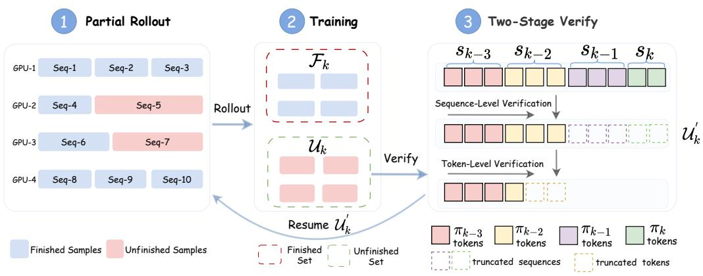  
Figure 3: Overview of RollVerify. It extends the standard rollout–training loop with an additional verification phase. left: rollout phase; mid: training phase; right: proposed verification phase.

Algorithm 1 OPS Computation Algorithm 2 Two-Stage Verification   
Require: $\tau _ { i n } = ( s _ { 1 } , \ldots , s _ { k - 1 } ) , \pi _ { k }$ Require: $\tau _ { \mathrm { o u t } } , D , d _ { s } , d _ { t } , m \gets 0$   
$p = ( p _ { 1 } , \dotsc , p _ { k - 1 } )$ Ensure: $T _ { \mathrm { o u t } }$   
Ensure: $\tau _ { o u t } , D$ 1: for $i = 1 \ : \mathrm { t o } \ : | \tau _ { \mathrm { o u t } } |$ do   
1: $s _ { k } \gets \mathrm { R o l l o u t } ( \tau _ { i n } ; \pi _ { k } )$ 2: $\begin{array} { r } { \bar { D } _ { i } \gets \sum _ { j } { D _ { i , j } \big / | s _ { i } | } } \end{array}$   
2: $\tau _ { o u t } \gets ( s _ { 1 } , \ldots , s _ { k - 1 } , s _ { k } )$ 3: if $\bar { D } _ { i } \geq d _ { s }$ then break   
3: pk ← ComputeProb(τout; πk)[k] 4: end if   
4: $p ^ { \mathrm { o l d } }  ( p _ { 1 } , \ldots , p _ { k - 1 } , p _ { k } ) _ { }$ 5: m ← i   
5: $\pi _ { k + 1 } \longleftarrow \mathrm { U p d a t e W e i g h t s } ( \pi _ { k } )$ 6: end for   
6: $p ^ { \mathrm { n e w } }  \mathrm { C o m p u t e P r o b } ( \bar { \tau _ { \mathrm { o u t } } } ; \pi _ { k + 1 } )$ 7: if m = 0 then return $\varnothing$   
7: 8: Tout ← concat(s1, . . . , sm), n ← 0   
8: for i = 1 to |τout| do 9: for $i = 1$ to m, $j = 1$ to |si| do   
9: for $j = 1$ to |si| do 10: if $D _ { i , j } \geq$ dt then   
10: $\smash { D _ { i , j } \gets \bigl | p _ { i , j } ^ { \mathrm { n e w } } / p _ { i , j } ^ { \mathrm { o l d } } - 1 \bigr | }$ 11: return $T _ { \mathrm { o u t } } [ : n ]$   
11: end for 12: end if   
12: end for 13: $n \gets n + 1$   
13: 14: end for   
14: return $\tau _ { \mathrm { o u t } } , D$ 15: return $T _ { \mathrm { o u t } }$

Token-Level Verification. After sequence-level verification, we concatenate all retained segments to a token list $T _ { \mathrm { o u t } }$ . We perform token-level verification over $T _ { \mathrm { o u t } }$ . We scan each token sequentially and compare its OPS score $D _ { i , j }$ with the token threshold $d _ { t }$ . If $D _ { i , j } \geq d _ { t }$ , the procedure stops and returns the verified prefix $T _ { \mathrm { o u t } } [ : n ]$ . Otherwise, we accept this token and continue scanning.

## 4.3 Conditional Switching

Acceptance Rate. The acceptance rate $\alpha _ { k }$ measures the fraction of partially generated tokens retained after verification.

$$
\alpha _ { k } = \frac { N ^ { \mathrm { k e e p } } } { N ^ { \mathrm { a l l } } } ,\tag{4}
$$

where $N ^ { \mathrm { k e e p } }$ is the number of tokens that are kept after verification, and $N ^ { \mathrm { a l l } }$ is the total number of tokens of the unfinished set during the rollout phase.

When samples generated by stale policies become highly off-policy, most of them are directly discarded during verification, which lowers effective resource utilization, making partial rollout inefficient. To avoid this inefficiency, we adopt a conditional switching strategy, which switches from partial rollout to fully on-policy training conditioned on the acceptance rate. Specifically, we monitor the average acceptance rate over a recent time window. If this average falls below a predefined threshold, e.g., 0.5, we terminate partial rollout and switch to fully on-policy training for the remaining steps. The average acceptance rate can be estimated using either a sliding window or an exponential moving average (EMA). In our implementation, we use a sliding window of size 8.

<table><tr><td>Model</td><td>|Setting</td><td>AIME24</td><td>AIME25</td><td>AMC23</td><td>MATH500</td><td>AVG</td><td>OPS</td><td>GPU days</td></tr><tr><td rowspan="3">Qwen3-8B-Base</td><td>On-policy</td><td>40.3</td><td>29.5</td><td>81.4</td><td>78.0</td><td>57.3</td><td>0</td><td>98.1(1.0x)</td></tr><tr><td>Partial</td><td>23.7</td><td>19.4</td><td>67.5</td><td>73.2</td><td>45.9↓</td><td>0.017</td><td>51.6(1.9x)</td></tr><tr><td>RollVerify</td><td>39.8</td><td>30.5</td><td>81.5</td><td>77.2</td><td>57.2</td><td>0.004</td><td>57.5(1.7x)</td></tr><tr><td rowspan="3">Qwen3-30B-A3B-Base</td><td>On-policy</td><td>52.3</td><td>37.8</td><td>89.7</td><td>70.3</td><td>62.5</td><td></td><td>0 112 (1.0x)</td></tr><tr><td>Partial</td><td>36.8</td><td>28.5</td><td>77.8</td><td>69.4</td><td>53.1↓</td><td>0.016</td><td>56.1(2.0x)</td></tr><tr><td>RollVerify</td><td>52.0</td><td>38.0</td><td>89.8</td><td>70.5</td><td>62.5</td><td>0.006</td><td>65.1(1.7x)</td></tr></table>

Table 2: Comparison among on-policy training, partial rollout, and proposed RollVerify.

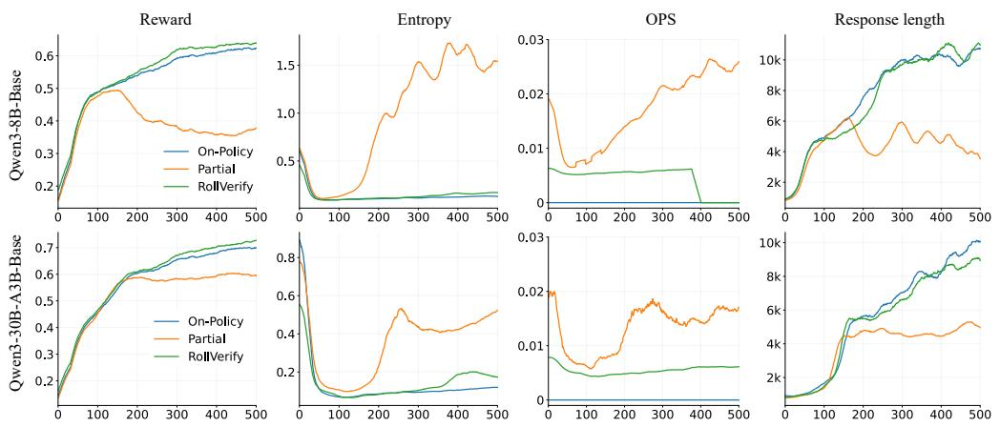  
Figure 4: Comparison of training dynamics among On-Policy baseline, Partial, and RollVerify. The first row shows results on Qwen3-8B-Base, and the second row presents results on the MoE model Qwen3-30B-A3B-Base.

## 5 Experiments

## 5.1 Experimental Setup

Implementation Details. We implement all methods based on the VeRL [27] codebase, utilizing the Qwen3-8B-Base model [32] by default and the GRPO [25] for policy optimization. All methods use the same colocated architecture, in which rollout and training share the same GPU pool and execute in alternating phases. We adopt decoupled clipping [33] with $\mathrm { \epsilon _ { h i g h } = 0 . 3 }$ and $\epsilon _ { \mathrm { l o w } } = 0 . 2$ . We further use truncated importance sampling [16] to correct the mismatch between the inference engine vLLM [13] and training engine FSDP [34], with truncation threshold set to 2. For RollVerify, we set the sequence-level threshold to $d _ { s } = 0 . 0 1$ , the token-level threshold to $d _ { t } = 2$ . Unless otherwise specified, all experiments are conducted on 32 H800 GPUs with maximum context length of 32K, a learning rate of 1e-6, a batch size of 128 with rollout-n=8. Models are trained for up to 500 iterations. For MoE models [32], we use routing replay [19] to stabilize training.

Dataset and Evaluation Protocol. We mainly evaluate our method on mathematical reasoning tasks. We use DAPO-MATH [33] as the training set, and evaluate on AIME24, AIME25, AMC23, and MATH500 [11]. For each setting, we report the accuracy on each benchmark, the average accuracy across all benchmarks, and the total training time (GPU days).

<table><tr><td>Setting</td><td>AIME24</td><td>AIME25</td><td>AMC23</td><td>MATH500</td><td>AVG</td><td>OPS</td><td>AC Rate</td><td>GPU Days</td></tr><tr><td>Naive partial</td><td>23.7</td><td>19.4</td><td>67.5</td><td>73.2</td><td>45.9</td><td>0.017</td><td>1.0</td><td>51.6</td></tr><tr><td>+seq-level verify</td><td>32.6</td><td>26.5</td><td>78.5</td><td>78.1</td><td>53.9</td><td>0.009</td><td>0.67</td><td>68.1</td></tr><tr><td>+token-level verify</td><td>39.6</td><td>30.8</td><td>81.8</td><td>77.2</td><td>57.4</td><td>0.005</td><td>0.83</td><td>61.5</td></tr><tr><td>+switch</td><td>39.8</td><td>30.5</td><td>81.5</td><td>77.2</td><td>57.2</td><td>0.004</td><td>0.83</td><td>57.5</td></tr></table>

Table 3: Ablation study of RollVerify under Qwen3-8B-Base setting. We progressively add sequence-level verification, token-level verification, and conditional switching on top of the naive partial rollout baseline. AC Rate indicates acceptance rate.

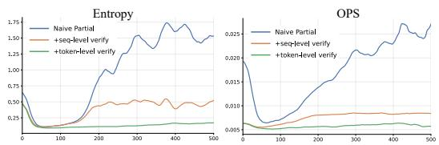  
(a) Effect of Two-stage Ve ri fication

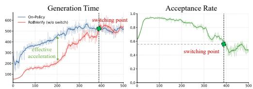  
(b) Effect of Conditional Switching  
Figure 5: Ablation Results. (a) Effect of Two-stage verification with respect to entropy and OPS. (b) Analysis of conditional switching on generation time and acceptance rate. The dashed vertical line indicates the switching point from partial rollout to fully on-policy training.

## 5.2 Main Results

Table 2 compares RollVerify with standard on-policy GRPO and a partial rollout baseline. On Qwen3-8B-Base, our method achieves an average score of 57.2, matching the on-policy GRPO baseline (57.3) while reducing training cost from 98.1 GPU days to 57.5 GPU days, corresponding to a 1.7× speedup. In contrast, the partial rollout baseline suffers a severe performance drop, with average accuracy decreasing to 45.9, even though it delivers more efficiency gains. Our method maintains on-policy accuracy while achieving a significant speedup.

Results on MoE. A similar trend is observed on the larger Qwen3-30B-A3B-Base [32] MoE model, which has more parameters and serves as a stronger baseline than Qwen3-8B-Base. We can see in Table 2 that its on-policy performance is significantly higher, improving the average score from 57.3 (8B dense) to 62.5. Under this stronger and more complex architecture, partial rollout leads to a substantial accuracy degradation. RollVerify is still able to recover the lost performance, matching the on-policy baseline while retaining a 1.7× training speedup. These results show that RollVerify consistently maintains competitive results across both dense and MoE architectures, demonstrating strong generalization to different models.

Training Stability. Figure 4 shows that RollVerify preserves training stability and closely matches standard on-policy optimization for both dense and MoE models. Throughout the training dynamics, both entropy and reward remain stable without any collapse. In contrast, naive partial rollout becomes increasingly unstable: entropy rises rapidly and eventually explodes, accompanied by clear drops in both reward and response length. Moreover, RollVerify maintains consistently lower OPS, indicating minimal off-policy degree, whereas naive partial rollout exhibits increasing OPS over time. These results suggest that RollVerify effectively controls off-policy deviation and matchs the stable optimization behavior of on-policy RL.

## 5.3 Ablation Study

Importance of Two-Stage Verification. As shown in Table 3, adding sequence-level verification already leads to a large improvement in model accuracy, raising the average score from 45.9 to 53.9. This shows that removing overly off-policy segments is highly effective in protecting model accuracy. Adding token-level verification further improves the average score from 53.9 to 57.4. Interestingly, it also improves training efficiency, reducing GPU days from 68.1 to 61.5. This is because sequence-level verification only ensures the overall OPS of the sequence but cannot exclude outlier tokens. These highly off-policy tokens affect model stability, causing an increase in OPS and a decrease in acceptance rate, see Figure 5 (a). Token-level verification can protect the model from highly off-policy tokens, thus achieving a lower OPS and higher acceptance rate, as shown in Table 3. These results demonstrate the importance of token-level verification.

<table><tr><td> $d _ { s }$ </td><td>AIME24</td><td>AIME25</td><td>AC Rate</td><td>GPU Days</td></tr><tr><td>∞</td><td>23.7</td><td>19.4</td><td>1.0</td><td>51.6</td></tr><tr><td>0.02</td><td>28.3</td><td>24.5</td><td>0.91</td><td>53.2</td></tr><tr><td>0.015</td><td>30.4</td><td>25.2</td><td>0.80</td><td>60.2</td></tr><tr><td>0.012</td><td>32.4</td><td>26.7</td><td>0.75</td><td>68.0</td></tr><tr><td>0.01</td><td>32.6</td><td>26.5</td><td>0.67</td><td>68.1</td></tr><tr><td>0.005</td><td>39.6</td><td>30.2</td><td>0.20</td><td>123.2</td></tr></table>

<table><tr><td> $d _ { t }$ </td><td>AIME24</td><td>AIME25</td><td>AC Rate</td><td>GPU Days</td></tr><tr><td> $\infty$ </td><td>32.6</td><td>26.5</td><td>0.67</td><td>68.1</td></tr><tr><td>1.5</td><td>40.2</td><td>30.2</td><td>0.60</td><td>70.2</td></tr><tr><td>2</td><td>39.8</td><td>30.5</td><td>0.83</td><td>57.5</td></tr><tr><td>3</td><td>38.5</td><td>30.4</td><td>0.84</td><td>57.2</td></tr><tr><td>4</td><td>38.1</td><td>30.1</td><td>0.88</td><td>55.4</td></tr><tr><td>5</td><td>38.0</td><td>30.2</td><td>0.89</td><td>55.2</td></tr></table>

Table 4: Comparison of different $d _ { s }$ . Only sequence-level verification is used.  
Table 5: Comparison of different $d _ { t }$ . Token and Seq-level verification $( d _ { s } = 0 . 0 1 )$ are enabled.

<table><tr><td>Setting</td><td>Training? Rollout?</td><td>AIME24</td><td>AIME25</td><td>AMC23</td><td>MATH500</td><td>AVG</td><td>OPS</td><td>GPU Days</td></tr><tr><td>GRPO [25]</td><td></td><td>40.3</td><td>29.5</td><td>81.4</td><td>78.0</td><td>57.3</td><td>0</td><td>98.1</td></tr><tr><td>Partial [29]</td><td></td><td>23.7</td><td>19.4</td><td>67.5</td><td>73.2</td><td>45.9</td><td>0.017</td><td>51.6</td></tr><tr><td>Staleness-1</td><td>√</td><td>28.2</td><td>22.8</td><td>71.9</td><td>75.6</td><td>49.6</td><td>0.015</td><td>64.5</td></tr><tr><td>GSPO [35]</td><td>√</td><td>37.3</td><td>27.0</td><td>79.8</td><td>76.5</td><td>55.2</td><td>0.007</td><td>51.8</td></tr><tr><td>SAPO [5]</td><td> $\checkmark$ </td><td>37.5</td><td>27.7</td><td>79.6</td><td>75.7</td><td>55.1</td><td>0.008</td><td>51.5</td></tr><tr><td>VESPO [26]</td><td> $\checkmark$ </td><td>31.0</td><td>26.2</td><td>74.3</td><td>74.5</td><td>51.5</td><td>0.010</td><td>52.0</td></tr><tr><td>RollVerify</td><td> $\checkmark$ </td><td>39.8</td><td>30.5</td><td>81.5</td><td>77.2</td><td>57.2</td><td>0.004</td><td>57.5</td></tr></table>

Table 6: Comparison with other off-policy handling methods on Qwen3-8B-Base. GRPO is a fully on-policy baseline, and other methods use partial rollout. Training? indicates that methods operate on loss level in training phase. Rollout? indicates that methods operate on rollout samples.

Analysis of Conditional Switching. Figure 5 (b) shows the generation time and acceptance rate throughout the training process (using our method but without conditional switching). Before the dashed vertical line (∼ iter 400), our method achieves a significantly lower generation time than the GRPO baseline, indicating effective acceleration. However, in the later stage of training, more samples become highly off-policy, causing the acceptance rate to start decreasing dramatically. We can see that the acceleration benefit vanishes when the acceptance rate drops to about 0.5. At this point, switching back to fully on-policy training can improve the overall training efficiency. As shown in Table 3, adding conditional switching can reduce GPU days from 61.5 to 57.5. At a 16K context length and 700 training steps, RollVerify without switching achieves comparable AIME24/25 accuracy to on-policy training at lower cost, while switching provides additional cost savings (Appendix A).

Hyper-parameter Analysis. In Table 4, we show results using only sequence-level verification under different $d _ { s }$ . When $d _ { s } = \infty ,$ , it degenerates to naive partial rollout. A very small $d _ { s } = 0 . 0 0 5$ (row6) greatly improves performance but sharply reduces the acceptance rate to 0.2, leading to slower training. As $d _ { s }$ increases, efficiency improves while performance decreases. In practice, values around $d _ { s } \approx 0 . 0 1$ provide a good trade-off. In Table 5, we show results adding token-level verification under different $d _ { t }$ . Setting $d _ { t } = \infty$ equals sequence-level verification only. Enabling token-level verification significantly improves both accuracy and efficiency. Moreover, the results are stable across a reasonably wide range of $d _ { t }$ , indicating low sensitivity to choices. We use $d _ { t } = 2$ in the main experiments because this setting provides the best overall trade-off.

## 5.4 Analysis Experiments

Comparison with Other Off-Policy Handling Methods. We compare RollVerify with several methods that mitigate off-policy effects, including GSPO [35], SAPO [5], and VESPO [26]. These methods modify the PPO-style objective during training, but do not change the rollout sample itself. As shown in Table 6, RollVerify outperforms naive partial rollout, matching GRPO while using fewer

GPU days. It also achieves the lowest OPS among the methods using partial rollout. These results suggest that controlling the quality of rollout samples is more effective than loss reshaping.

Different Context Lengths. We evaluate RollVerify under maximum context lengths of 8K, 16K, 32K, and 64K. As reported in Table 7, longer contexts intensify the long-tail effect and thus lower overall efficiency. Nevertheless, RollVerify maintains model accuracy across all settings while delivering increasingly substantial speedups as the context length grows. The gain is relatively small at 8K, reducing training cost from 16.6 to 15.1 GPU days, but becomes much more significant at 64K, where the cost drops from 261 to 137 GPU days. These results suggest that RollVerify is especially beneficial for large-scale RL training scenarios involving long-context workloads.

<table><tr><td>Max Length</td><td>Setting</td><td>AIME24</td><td>AIME25</td><td>AMC23</td><td>MATH500</td><td>AVG</td><td>GPU Days</td></tr><tr><td rowspan="2">8K</td><td>on-policy</td><td>29.7</td><td>25.7</td><td>75.9</td><td>75.5</td><td>51.7</td><td>16.6 (1.0x)</td></tr><tr><td>RolVerify</td><td>30.2</td><td>25.4</td><td>75.7</td><td>75.8</td><td>51.8</td><td>15.1 (1.1x)</td></tr><tr><td>16K</td><td>on-policy RollVerify</td><td>36.1 36.3</td><td>28.8 28.7</td><td>80.6 80.4</td><td>72.6 73.0</td><td>54.5 54.6</td><td>51.8 (1.0x) 37.1 (1.4x)</td></tr><tr><td>32K</td><td>on-policy RollVerify</td><td>40.3 39.8</td><td>29.5 30.5</td><td>81.4 81.5</td><td>78.0 77.2</td><td>57.3 57.2</td><td>98.1 (1.0x) 57.5 (1.7x)</td></tr><tr><td>64K</td><td>on-policy</td><td>48.0</td><td>36.0</td><td>88.1</td><td>78.7</td><td>62.7</td><td>261 (1.0x)</td></tr><tr><td></td><td>RollVerify</td><td>47.9</td><td>36.5</td><td>88.5</td><td>78.5</td><td>62.8</td><td>137 (1.9x)</td></tr></table>

Table 7: Performance comparison under different maximum lengths.

Verification Overhead. The overhead introduced by RollVerify is small in practice. The main additional cost comes from OPS computation in Algorithm 1, which requires computing probabilities and is therefore roughly 2× the cost of ComputeProb. And the two-stage verification step is lightweight shown in Algorithm 2, since both sequence-level and token-level verification only involve linear scans over the generated tokens, resulting in O(N) complexity. As shown in Table 8, the overall verification overhead remains low for both models, accounting for only a small fraction of the total training time. These results indicate that RollVerify adds only modest overhead while providing meaningful improvements in training sample quality.

<table><tr><td rowspan="2">Model</td><td rowspan="2">Setting</td><td colspan="2">Verification overhead</td><td rowspan="2">Step Time</td></tr><tr><td>OPS compute</td><td>Two-stage Verify</td></tr><tr><td>Qwen3-8B-Base</td><td>RollVerify</td><td>20s (6.4%)</td><td>2s (0.6%)</td><td>310s</td></tr><tr><td>Qwen3-30B-A3B-Base</td><td>RollVerify</td><td>25s (6.9%)</td><td>2s (0.5%)</td><td>362s</td></tr></table>

Table 8: Overhead under different settings. Step time indicates the average training step time.

Generalization Experiments. We further evaluate RollVerify on mathematical reasoning with DeepScaleR [18], tool-assisted mathematical reasoning with ReTool [3], and code generation [12, 2]. RollVerify outperforms partial rollout and achieves accuracy comparable to on-policy training in these settings. The code-generation results provide preliminary evidence beyond mathematics. More details are shown in Appendix B.

## 6 Conclusion and Limitations

We present RollVerify, a verification-based framework for long-tail rollout RL. Built on partial rollout, it improves training sample quality through sequence-level and token-level verification, preserving on-policy performance while improving training efficiency. Experiments across different models, tasks, and context lengths demonstrate its effectiveness and robustness. Broader evaluation on non-math and agentic tasks, as well as validation in fully asynchronous RL training, remains future work.

## Acknowledgements

This work was supported by the National Key Research and Development Program of China (Grant No. 2023YFB4405102), the Postdoctoral Fellowship Program and the China Postdoctoral Science Foundation (Grant No. BX20250487), and in part by the Natural Science Foundation of Hunan Province (Grant No. 2024JJ6525).

## References

[1] Anthropic. Introducing Claude 4. https://www.anthropic.com/news/claude-4, 2025. Accessed: 2025-05-22.

[2] Mark Chen, Jerry Tworek, Heewoo Jun, Qiming Yuan, Henrique Ponde de Oliveira Pinto, Jared Kaplan, Harri Edwards, Yuri Burda, Nicholas Joseph, Greg Brockman, Alex Ray, Raul Puri, Gretchen Krueger, Michael Petrov, Heidy Khlaaf, Girish Sastry, Pamela Mishkin, Brooke Chan, Scott Gray, Nick Ryder, Mikhail Pavlov, Alethea Power, Lukasz Kaiser, Mohammad Bavarian, Clemens Winter, Philippe Tillet, Felipe Petroski Such, Dave Cummings, Matthias Plappert, Fotios Chantzis, Elizabeth Barnes, Ariel Herbert-Voss, William Hebgen Guss, Alex Nichol, Alex Paino, Nikolas Tezak, Jie Tang, Igor Babuschkin, Suchir Balaji, Shantanu Jain, William Saunders, Christopher Hesse, Andrew N. Carr, Jan Leike, Josh Achiam, Vedant Misra, Evan Morikawa, Alec Radford, Matthew Knight, Miles Brundage, Mira Murati, Katie Mayer, Peter Welinder, Bob McGrew, Dario Amodei, Sam McCandlish, Ilya Sutskever, and Wojciech Zaremba. Evaluating large language models trained on code. 2021.

[3] Jiazhan Feng, Shijue Huang, Xingwei Qu, Ge Zhang, Yujia Qin, Baoquan Zhong, Chengquan Jiang, Jinxin Chi, and Wanjun Zhong. Retool: Reinforcement learning for strategic tool use in llms, 2025.

[4] Wei Fu, Jiaxuan Gao, Xujie Shen, Chen Zhu, Zhiyu Mei, Chuyi He, Shusheng Xu, Guo Wei, Jun Mei, Jiashu Wang, et al. Areal: A large-scale asynchronous reinforcement learning system for language reasoning. arXiv preprint arXiv:2505.24298, 2025.

[5] Chang Gao, Chujie Zheng, Xiong-Hui Chen, Kai Dang, Shixuan Liu, Bowen Yu, An Yang, Shuai Bai, Jingren Zhou, and Junyang Lin. Soft adaptive policy optimization. arXiv preprint arXiv:2511.20347, 2025.

[6] Wei Gao, Yuheng Zhao, Dakai An, Tianyuan Wu, Lunxi Cao, Shaopan Xiong, Ju Huang, Weixun Wang, Siran Yang, Wenbo Su, et al. Rollpacker: Mitigating long-tail rollouts for fast, synchronous rl post-training. arXiv preprint arXiv:2509.21009, 2025.

[7] GLM-5-Team, Aohan Zeng, Xin Lv, Zhenyu Hou, Zhengxiao Du, Qinkai Zheng, Bin Chen, Da Yin, Chendi Ge, Chenghua Huang, Chengxing Xie, Chenzheng Zhu, Congfeng Yin, Cunxiang Wang, Gengzheng Pan, Hao Zeng, Haoke Zhang, Haoran Wang, Huilong Chen, Jiajie Zhang, Jian Jiao, Jiaqi Guo, Jingsen Wang, Jingzhao Du, Jinzhu Wu, Kedong Wang, Lei Li, Lin Fan, Lucen Zhong, Mingdao Liu, Mingming Zhao, Pengfan Du, Qian Dong, Rui Lu, Shuang-Li, Shulin Cao, Song Liu, Ting Jiang, Xiaodong Chen, Xiaohan Zhang, Xuancheng Huang, Xuezhen Dong, Yabo Xu, Yao Wei, Yifan An, Yilin Niu, Yitong Zhu, Yuanhao Wen, Yukuo Cen, Yushi Bai, Zhongpei Qiao, Zihan Wang, Zikang Wang, Zilin Zhu, Ziqiang Liu, Zixuan Li, Bojie Wang, Bosi Wen, Can Huang, Changpeng Cai, Chao Yu, Chen Li, Chengwei Hu, Chenhui Zhang, Dan Zhang, Daoyan Lin, Dayong Yang, Di Wang, Ding Ai, Erle Zhu, Fangzhou Yi, Feiyu Chen, Guohong Wen, Hailong Sun, Haisha Zhao, Haiyi Hu, Hanchen Zhang, Hanrui Liu, Hanyu Zhang, Hao Peng, Hao Tai, Haobo Zhang, He Liu, Hongwei Wang, Hongxi Yan, Hongyu Ge, Huan Liu, Huanpeng Chu, Jia’ni Zhao, Jiachen Wang, Jiajing Zhao, Jiamin Ren, Jiapeng Wang, Jiaxin Zhang, Jiayi Gui, Jiayue Zhao, Jijie Li, Jing An, Jing Li, Jingwei Yuan, Jinhua Du, Jinxin Liu, Junkai Zhi, Junwen Duan, Kaiyue Zhou, Kangjian Wei, Ke Wang, Keyun Luo, Laiqiang Zhang, Leigang Sha, Liang Xu, Lindong Wu, Lintao Ding, Lu Chen, Minghao Li, Nianyi Lin, Pan Ta, Qiang Zou, Rongjun Song, Ruiqi Yang, Shangqing Tu, Shangtong Yang, Shaoxiang Wu, Shengyan Zhang, Shijie Li, Shuang Li, Shuyi Fan, Wei Qin, Wei Tian, Weining Zhang, Wenbo Yu, Wenjie Liang, Xiang Kuang, Xiangmeng Cheng, Xiangyang Li, Xiaoquan Yan, Xiaowei Hu, Xiaoying Ling, Xing Fan, Xingye Xia, Xinyuan Zhang, Xinze Zhang, Xirui Pan, Xu Zou, Xunkai Zhang, Yadi Liu, Yandong Wu, Yanfu Li, Yidong Wang, Yifan Zhu, Yijun

Tan, Yilin Zhou, Yiming Pan, Ying Zhang, Yinpei Su, Yipeng Geng, Yong Yan, Yonglin Tan, Yuean Bi, Yuhan Shen, Yuhao Yang, Yujiang Li, Yunan Liu, Yunqing Wang, Yuntao Li, Yurong Wu, Yutao Zhang, Yuxi Duan, Yuxuan Zhang, Zezhen Liu, Zhengtao Jiang, Zhenhe Yan, Zheyu Zhang, Zhixiang Wei, Zhuo Chen, Zhuoer Feng, Zijun Yao, Ziwei Chai, Ziyuan Wang, Zuzhou Zhang, Bin Xu, Minlie Huang, Hongning Wang, Juanzi Li, Yuxiao Dong, and Jie Tang. Glm-5: from vibe coding to agentic engineering, 2026.

[8] Aaron Grattafiori, Abhimanyu Dubey, Abhinav Jauhri, Abhinav Pandey, Abhishek Kadian, Ah mad Al-Dahle, Aiesha Letman, Akhil Mathur, Alan Schelten, Alex Vaughan, Amy Yang, Angela Fan, Anirudh Goyal, Anthony Hartshorn, Aobo Yang, Archi Mitra, Archie Sravankumar, Artem Korenev, Arthur Hinsvark, Arun Rao, Aston Zhang, Aurelien Rodriguez, Austen Gregerson, Ava Spataru, Baptiste Roziere, Bethany Biron, Binh Tang, Bobbie Chern, Charlotte Caucheteux, Chaya Nayak, Chloe Bi, Chris Marra, Chris McConnell, Christian Keller, Christophe Touret, Chunyang Wu, Corinne Wong, Cristian Canton Ferrer, Cyrus Nikolaidis, Damien Allonsius, Daniel Song, Danielle Pintz, Danny Livshits, Danny Wyatt, David Esiobu, Dhruv Choudhary, Dhruv Mahajan, Diego Garcia-Olano, Diego Perino, Dieuwke Hupkes, Egor Lakomkin, Ehab AlBadawy, Elina Lobanova, Emily Dinan, Eric Michael Smith, Filip Radenovic, Francisco Guzmán, Frank Zhang, Gabriel Synnaeve, Gabrielle Lee, Georgia Lewis Anderson, Govind Thattai, Graeme Nail, Gregoire Mialon, Guan Pang, Guillem Cucurell, Hailey Nguyen, Hannah Korevaar, Hu Xu, Hugo Touvron, Iliyan Zarov, Imanol Arrieta Ibarra, Isabel Kloumann, Ishan Misra, Ivan Evtimov, Jack Zhang, Jade Copet, Jaewon Lee, Jan Geffert, Jana Vranes, Jason Park, Jay Mahadeokar, Jeet Shah, Jelmer van der Linde, Jennifer Billock, Jenny Hong, Jenya Lee, Jeremy Fu, Jianfeng Chi, Jianyu Huang, Jiawen Liu, Jie Wang, Jiecao Yu, Joanna Bitton, Joe Spisak, Jongsoo Park, Joseph Rocca, Joshua Johnstun, Joshua Saxe, Junteng Jia, Kalyan Va suden Alwala, Karthik Prasad, Kartikeya Upasani, Kate Plawiak, Ke Li, Kenneth Heafield, Kevin Stone, Khalid El-Arini, Krithika Iyer, Kshitiz Malik, Kuenley Chiu, Kunal Bhalla, Kushal Lakhotia, Lauren Rantala-Yeary, Laurens van der Maaten, Lawrence Chen, Liang Tan, Liz Jenkins, Louis Martin, Lovish Madaan, Lubo Malo, Lukas Blecher, Lukas Landzaat, Luke de Oliveira, Madeline Muzzi, Mahesh Pasupuleti, Mannat Singh, Manohar Paluri, Marcin Kardas, Maria Tsimpoukelli, Mathew Oldham, Mathieu Rita, Maya Pavlova, Melanie Kambadur, Mike Lewis, Min Si, Mitesh Kumar Singh, Mona Hassan, Naman Goyal, Narjes Torabi, Nikolay Bashlykov, Nikolay Bogoychev, Niladri Chatterji, Ning Zhang, Olivier Duchenne, Onur Çelebi, Patrick Alrassy, Pengchuan Zhang, Pengwei Li, Petar Vasic, Peter Weng, Prajjwal Bhargava, Pratik Dubal, Praveen Krishnan, Punit Singh Koura, Puxin Xu, Qing He, Qingxiao Dong, Ragavan Srinivasan, Raj Ganapathy, Ramon Calderer, Ricardo Silveira Cabral, Robert Stojnic, Roberta Raileanu, Rohan Maheswari, Rohit Girdhar, Rohit Patel, Romain Sauvestre, Ronnie Polidoro, Roshan Sumbaly, Ross Taylor, Ruan Silva, Rui Hou, Rui Wang, Saghar Hosseini, Sahana Chennabasappa, Sanjay Singh, Sean Bell, Seohyun Sonia Kim, Sergey Edunov, Shaoliang Nie, Sharan Narang, Sharath Raparthy, Sheng Shen, Shengye Wan, Shruti Bhosale, Shun Zhang, Simon Vandenhende, Soumya Batra, Spencer Whitman, Sten Sootla, Stephane Collot, Suchin Gururangan, Sydney Borodinsky, Tamar Herman, Tara Fowler, Tarek Sheasha, Thomas Georgiou, Thomas Scialom, Tobias Speckbacher, Todor Mihaylov, Tong Xiao, Ujjwal Karn, Vedanuj Goswami, Vibhor Gupta, Vignesh Ramanathan, Viktor Kerkez, Vincent Gonguet, Virginie Do, Vish Vogeti, Vítor Albiero, Vladan Petrovic, Weiwei Chu, Wenhan Xiong, Wenyin Fu, Whitney Meers, Xavier Martinet, Xiaodong Wang, Xiaofang Wang, Xiaoqing Ellen Tan, Xide Xia, Xinfeng Xie, Xuchao Jia, Xuewei Wang, Yaelle Goldschlag, Yashesh Gaur, Yasmine Babaei, Yi Wen, Yiwen Song, Yuchen Zhang, Yue Li, Yuning Mao, Zacharie Delpierre Coudert, Zheng Yan, Zhengxing Chen, Zoe Papakipos, Aaditya Singh, Aayushi Srivastava, Abha Jain, Adam Kelsey, Adam Shajnfeld, Adithya Gangidi, Adolfo Victoria, Ahuva Goldstand, Ajay Menon, Ajay Sharma, Alex Boesenberg, Alexei Baevski, Allie Feinstein, Amanda Kallet, Amit Sangani, Amos Teo, Anam Yunus, Andrei Lupu, Andres Alvarado, Andrew Caples, Andrew Gu, Andrew Ho, Andrew Poulton, Andrew Ryan, Ankit Ramchandani, Annie Dong, Annie Franco, Anuj Goyal, Aparajita Saraf, Arkabandhu Chowdhury, Ashley Gabriel, Ashwin Bharambe, Assaf Eisenman, Azadeh Yazdan, Beau James, Ben Maurer, Benjamin Leonhardi, Bernie Huang, Beth Loyd, Beto De Paola, Bhargavi Paranjape, Bing Liu, Bo Wu, Boyu Ni, Braden Hancock, Bram Wasti, Brandon Spence, Brani Stojkovic, Brian Gamido, Britt Montalvo, Carl Parker, Carly Burton, Catalina Mejia, Ce Liu, Changhan Wang, Changkyu Kim, Chao Zhou, Chester Hu, Ching-Hsiang Chu, Chris Cai, Chris Tindal, Christoph Feichtenhofer, Cynthia Gao, Damon Civin, Dana Beaty, Daniel Kreymer, Daniel Li, David Adkins, David Xu, Davide Testuggine,

Delia David, Devi Parikh, Diana Liskovich, Didem Foss, Dingkang Wang, Duc Le, Dustin Holland, Edward Dowling, Eissa Jamil, Elaine Montgomery, Eleonora Presani, Emily Hahn, Emily Wood, Eric-Tuan Le, Erik Brinkman, Esteban Arcaute, Evan Dunbar, Evan Smothers, Fei Sun, Felix Kreuk, Feng Tian, Filippos Kokkinos, Firat Ozgenel, Francesco Caggioni, Frank Kanayet, Frank Seide, Gabriela Medina Florez, Gabriella Schwarz, Gada Badeer, Georgia Swee, Gil Halpern, Grant Herman, Grigory Sizov, Guangyi, Zhang, Guna Lakshminarayanan, Hakan Inan, Hamid Shojanazeri, Han Zou, Hannah Wang, Hanwen Zha, Haroun Habeeb, Harrison Rudolph, Helen Suk, Henry Aspegren, Hunter Goldman, Hongyuan Zhan, Ibrahim Damlaj, Igor Molybog, Igor Tufanov, Ilias Leontiadis, Irina-Elena Veliche, Itai Gat, Jake Weissman, James Geboski, James Kohli, Janice Lam, Japhet Asher, Jean-Baptiste Gaya, Jeff Marcus, Jeff Tang, Jennifer Chan, Jenny Zhen, Jeremy Reizenstein, Jeremy Teboul, Jessica Zhong, Jian Jin, Jingyi Yang, Joe Cummings, Jon Carvill, Jon Shepard, Jonathan McPhie, Jonathan Torres, Josh Ginsburg, Junjie Wang, Kai Wu, Kam Hou U, Karan Saxena, Kartikay Khandelwal, Katayoun Zand, Kathy Matosich, Kaushik Veeraraghavan, Kelly Michelena, Keqian Li, Kiran Jagadeesh, Kun Huang, Kunal Chawla, Kyle Huang, Lailin Chen, Lakshya Garg, Lavender A, Leandro Silva, Lee Bell, Lei Zhang, Liangpeng Guo, Licheng Yu, Liron Moshkovich, Luca Wehrstedt, Madian Khabsa, Manav Avalani, Manish Bhatt, Martynas Mankus, Matan Hasson, Matthew Lennie, Matthias Reso, Maxim Groshev, Maxim Naumov, Maya Lathi, Meghan Keneally, Miao Liu, Michael L. Seltzer, Michal Valko, Michelle Restrepo, Mihir Patel, Mik Vyatskov, Mikayel Samvelyan, Mike Clark, Mike Macey, Mike Wang, Miquel Jubert Hermoso, Mo Metanat, Mohammad Rastegari, Munish Bansal, Nandhini Santhanam, Natascha Parks, Natasha White, Navyata Bawa, Nayan Singhal, Nick Egebo, Nicolas Usunier, Nikhil Mehta, Nikolay Pavlovich Laptev, Ning Dong, Norman Cheng, Oleg Chernoguz, Olivia Hart, Omkar Salpekar, Ozlem Kalinli, Parkin Kent, Parth Parekh, Paul Saab, Pavan Balaji, Pedro Rittner, Philip Bontrager, Pierre Roux, Piotr Dollar, Polina Zvyagina, Prashant Ratanchandani, Pritish Yuvraj, Qian Liang, Rachad Alao, Rachel Rodriguez, Rafi Ayub, Raghotham Murthy, Raghu Nayani, Rahul Mitra, Rangaprabhu Parthasarathy, Raymond Li, Rebekkah Hogan, Robin Battey, Rocky Wang, Russ Howes, Ruty Rinott, Sachin Mehta, Sachin Siby, Sai Jayesh Bondu, Samyak Datta, Sara Chugh, Sara Hunt, Sargun Dhillon, Sasha Sidorov, Satadru Pan, Saurabh Mahajan, Saurabh Verma, Seiji Yamamoto, Sharadh Ramaswamy, Shaun Lindsay, Shaun Lindsay, Sheng Feng, Shenghao Lin, Shengxin Cindy Zha, Shishir Patil, Shiva Shankar, Shuqiang Zhang, Shuqiang Zhang, Sinong Wang, Sneha Agarwal, Soji Sajuyigbe, Soumith Chintala, Stephanie Max, Stephen Chen, Steve Kehoe, Steve Satterfield, Sudarshan Govindaprasad, Sumit Gupta, Summer Deng, Sungmin Cho, Sunny Virk, Suraj Subramanian, Sy Choudhury, Sydney Goldman, Tal Remez, Tamar Glaser, Tamara Best, Thilo Koehler, Thomas Robinson, Tianhe Li, Tianjun Zhang, Tim Matthews, Timothy Chou, Tzook Shaked, Varun Vontimitta, Victoria Ajayi, Victoria Montanez, Vijai Mohan, Vinay Satish Kumar, Vishal Mangla, Vlad Ionescu, Vlad Poenaru, Vlad Tiberiu Mihailescu, Vladimir Ivanov, Wei Li, Wenchen Wang, Wenwen Jiang, Wes Bouaziz, Will Con stable, Xiaocheng Tang, Xiaojian Wu, Xiaolan Wang, Xilun Wu, Xinbo Gao, Yaniv Kleinman, Yanjun Chen, Ye Hu, Ye Jia, Ye Qi, Yenda Li, Yilin Zhang, Ying Zhang, Yossi Adi, Youngjin Nam, Yu, Wang, Yu Zhao, Yuchen Hao, Yundi Qian, Yunlu Li, Yuzi He, Zach Rait, Zachary DeVito, Zef Rosnbrick, Zhaoduo Wen, Zhenyu Yang, Zhiwei Zhao, and Zhiyu Ma. The llama 3 herd of models, 2024.

[9] Daya Guo, Dejian Yang, Haowei Zhang, Junxiao Song, Peiyi Wang, Qihao Zhu, Runxin Xu, Ruoyu Zhang, Shirong Ma, Xiao Bi, et al. Deepseek-r1: Incentivizing reasoning capability in llms via reinforcement learning. arXiv preprint arXiv:2501.12948, 2025.

[10] Zhenyu Han, Ansheng You, Haibo Wang, Kui Luo, Guang Yang, Wenqi Shi, Menglong Chen, Sicheng Zhang, Zeshun Lan, Chunshi Deng, Huazhong Ji, Wenjie Liu, Yu Huang, Yixiang Zhang, Chenyi Pan, Jing Wang, Xin Huang, Chunsheng Li, and Jianping Wu. Asyncflow: An asynchronous streaming rl framework for efficient llm post-training, 2025.

[11] Dan Hendrycks, Collin Burns, Saurav Kadavath, Akul Arora, Steven Basart, Eric Tang, Dawn Song, and Jacob Steinhardt. Measuring mathematical problem solving with the math dataset. NeurIPS, 2021.

[12] Naman Jain, King Han, Alex Gu, Wen-Ding Li, Fanjia Yan, Tianjun Zhang, Sida Wang, Armando Solar-Lezama, Koushik Sen, and Ion Stoica. Livecodebench: Holistic and contamination free evaluation of large language models for code, 2024.

[13] Woosuk Kwon, Zhuohan Li, Siyuan Zhuang, Ying Sheng, Lianmin Zheng, Cody Hao Yu, Joseph Gonzalez, Hao Zhang, and Ion Stoica. Efficient memory management for large language model serving with pagedattention. In Proceedings ofthe 29th symposium on operating systems principles, pages 611–626, 2023.

[14] Yaniv Leviathan, Matan Kalman, and Yossi Matias. Fast inference from transformers via speculative decoding, 2023.

[15] Aixin Liu, Bei Feng, Bing Xue, Bingxuan Wang, Bochao Wu, Chengda Lu, Chenggang Zhao, Chengqi Deng, Chenyu Zhang, Chong Ruan, et al. Deepseek-v3 technical report. arXiv preprint arXiv:2412.19437, 2024.

[16] Jiacai Liu, Yingru Li, Yuqian Fu, Jiawei Wang, Qian Liu, and Yu Shen. When speed kills stability: Demystifying RL collapse from the training-inference mismatch, September 2025.

[17] Michael Luo, Sijun Tan, Roy Huang, Ameen Patel, Alpay Ariyak, Qingyang Wu, Xiaoxiang Shi, Rachel Xin, Colin Cai, Maurice Weber, Ce Zhang, Li Erran Li, Raluca Ada Popa, and Ion Stoica. Deepcoder: A fully open-source 14b coder at o3-mini level. https://pretty-radio -b75.notion.site/DeepCoder-A-Fully-Open-Source-14B-Coder-at-O3-mini-Lev el-1cf81902c14680b3bee5eb349a512a51, 2025. Notion Blog.

[18] Michael Luo, Sijun Tan, Justin Wong, Xiaoxiang Shi, William Y. Tang, Manan Roongta, Colin Cai, Jeffrey Luo, Tianjun Zhang, Li Erran Li, Raluca Ada Popa, and Ion Stoica. Deepscaler: Surpassing o1-preview with a 1.5b model by scaling rl. https://pretty-radio-b75.not ion.site/DeepScaleR-Surpassing-O1-Preview-with-a-1-5B-Model-by-Scaling -RL-19681902c1468005bed8ca303013a4e2, 2025. Notion Blog.

[19] Wenhan Ma, Hailin Zhang, Liang Zhao, Yifan Song, Yudong Wang, Zhifang Sui, and Fuli Luo. Stabilizing moe reinforcement learning by aligning training and inference routers, 2025.

[20] MiniMax, Aili Chen, Aonian Li, Bangwei Gong, Binyang Jiang, Bo Fei, Bo Yang, Boji Shan, Changqing Yu, Chao Wang, Cheng Zhu, Chengjun Xiao, Chengyu Du, Chi Zhang, Chu Qiao, Chunhao Zhang, Chunhui Du, Congchao Guo, Da Chen, Deming Ding, Dianjun Sun, Dong Li, Enwei Jiao, Haigang Zhou, Haimo Zhang, Han Ding, Haohai Sun, Haoyu Feng, Huaiguang Cai, Haichao Zhu, Jian Sun, Jiaqi Zhuang, Jiaren Cai, Jiayuan Song, Jin Zhu, Jingyang Li, Jinhao Tian, Jinli Liu, Junhao Xu, Junjie Yan, Junteng Liu, Junxian He, Kaiyi Feng, Ke Yang, Kecheng Xiao, Le Han, Leyang Wang, Lianfei Yu, Liheng Feng, Lin Li, Lin Zheng, Linge Du, Lingyu Yang, Lunbin Zeng, Minghui Yu, Mingliang Tao, Mingyuan Chi, Mozhi Zhang, Mujie Lin, Nan Hu, Nongyu Di, Peng Gao, Pengfei Li, Pengyu Zhao, Qibing Ren, Qidi Xu, Qile Li, Qin Wang, Rong Tian, Ruitao Leng, Shaoxiang Chen, Shaoyu Chen, Shengmin Shi, Shitong Weng, Shuchang Guan, Shuqi Yu, Sichen Li, Songquan Zhu, Tengfei Li, Tianchi Cai, Tianrun Liang, Weiyu Cheng, Weize Kong, Wenkai Li, Xiancai Chen, Xiangjun Song, Xiao Luo, Xiao Su, Xiaobo Li, Xiaodong Han, Xinzhu Hou, Xuan Lu, Xun Zou, Xuyang Shen, Yan Gong, Yan Ma, Yang Wang, Yiqi Shi, Yiran Zhong, Yonghong Duan, Yongxiang Fu, Yongyi Hu, Yu Gao, Yuanxiang Fan, Yufeng Yang, Yuhao Li, Yulin Hu, Yunan Huang, Yunji Li, Yunzhi Xu, Yuxin Mao, Yuxuan Shi, Yuze Wenren, Zehan Li, Zelin Li, Zhanxu Tian, Zhengmao Zhu, Zhenhua Fan, Zhenzhen Wu, Zhichao Xu, Zhihang Yu, Zhiheng Lyu, Zhuo Jiang, Zibo Gao, Zijia Wu, Zijian Song, and Zijun Sun. Minimax-m1: Scaling test-time compute efficiently with lightning attention, 2025.

[21] Long Ouyang, Jeffrey Wu, Xu Jiang, Diogo Almeida, Carroll Wainwright, Pamela Mishkin, Chong Zhang, Sandhini Agarwal, Katarina Slama, Alex Ray, et al. Training language models to follow instructions with human feedback. Advances in neural information processing systems, 35:27730–27744, 2022.

[22] Sundar Pichai. A new era of intelligence with Gemini 3. https://blog.google/products -and-platforms/products/gemini/gemini-3/, 2025. Accessed: 2025-11-18.

[23] Qwen, An Yang, Baosong Yang, Beichen Zhang, Binyuan Hui, Bo Zheng, Bowen Yu, Chengyuan Li, Dayiheng Liu, Fei Huang, Haoran Wei, Huan Lin, Jian Yang, Jianhong Tu, Jianwei Zhang, Jianxin Yang, Jiaxi Yang, Jingren Zhou, Junyang Lin, Kai Dang, Keming Lu, Keqin Bao, Kexin Yang, Le Yu, Mei Li, Mingfeng Xue, Pei Zhang, Qin Zhu, Rui Men, Runji

Lin, Tianhao Li, Tianyi Tang, Tingyu Xia, Xingzhang Ren, Xuancheng Ren, Yang Fan, Yang Su, Yichang Zhang, Yu Wan, Yuqiong Liu, Zeyu Cui, Zhenru Zhang, and Zihan Qiu. Qwen2.5 technical report, 2025.

[24] John Schulman, Filip Wolski, Prafulla Dhariwal, Alec Radford, and Oleg Klimov. Proximal policy optimization algorithms. arXiv preprint arXiv:1707.06347, 2017.

[25] Zhihong Shao, Peiyi Wang, Qihao Zhu, Runxin Xu, Junxiao Song, Xiao Bi, Haowei Zhang, Mingchuan Zhang, YK Li, Yang Wu, et al. Deepseekmath: Pushing the limits of mathematical reasoning in open language models. arXiv preprint arXiv:2402.03300, 2024.

[26] Guobin Shen, Chenxiao Zhao, Xiang Cheng, Lei Huang, and Xing Yu. Vespo: Variational sequence-level soft policy optimization for stable off-policy llm training. arXiv preprint arXiv:2602.10693, 2026.

[27] Guangming Sheng, Chi Zhang, Zilingfeng Ye, Xibin Wu, Wang Zhang, Ru Zhang, Yanghua Peng, Haibin Lin, and Chuan Wu. Hybridflow: A flexible and efficient rlhf framework. arXiv preprint arXiv: 2409.19256, 2024.

[28] Kimi Team, Tongtong Bai, Yifan Bai, Yiping Bao, S. H. Cai, Yuan Cao, Y. Charles, H. S. Che, Cheng Chen, Guanduo Chen, Huarong Chen, Jia Chen, Jiahao Chen, Jianlong Chen, Jun Chen, Kefan Chen, Liang Chen, Ruijue Chen, Xinhao Chen, Yanru Chen, Yanxu Chen, Yicun Chen, Yimin Chen, Yingjiang Chen, Yuankun Chen, Yujie Chen, Yutian Chen, Zhirong Chen, Ziwei Chen, Dazhi Cheng, Minghan Chu, Jialei Cui, Jiaqi Deng, Muxi Diao, Hao Ding, Mengfan Dong, Mengnan Dong, Yuxin Dong, Yuhao Dong, Angang Du, Chenzhuang Du, Dikang Du, Lingxiao Du, Yulun Du, Yu Fan, Shengjun Fang, Qiulin Feng, Yichen Feng, Garimugai Fu, Kelin Fu, Hongcheng Gao, Tong Gao, Yuyao Ge, Shangyi Geng, Chengyang Gong, Xiaochen Gong, Zhuoma Gongque, Qizheng Gu, Xinran Gu, Yicheng Gu, Longyu Guan, Yuanying Guo, Xiaoru Hao, Weiran He, Wenyang He, Yunjia He, Chao Hong, Hao Hu, Jiaxi Hu, Yangyang Hu, Zhenxing Hu, Ke Huang, Ruiyuan Huang, Weixiao Huang, Zhiqi Huang, Tao Jiang, Zhejun Jiang, Xinyi Jin, Yu Jing, Guokun Lai, Aidi Li, C. Li, Cheng Li, Fang Li, Guanghe Li, Guanyu Li, Haitao Li, Haoyang Li, Jia Li, Jingwei Li, Junxiong Li, Lincan Li, Mo Li, Weihong Li, Wentao Li, Xinhang Li, Xinhao Li, Yang Li, Yanhao Li, Yiwei Li, Yuxiao Li, Zhaowei Li, Zheming Li, Weilong Liao, Jiawei Lin, Xiaohan Lin, Zhishan Lin, Zichao Lin, Cheng Liu, Chenyu Liu, Hongzhang Liu, Liang Liu, Shaowei Liu, Shudong Liu, Shuran Liu, Tianwei Liu, Tianyu Liu, Weizhou Liu, Xiangyan Liu, Yangyang Liu, Yanming Liu, Yibo Liu, Yuanxin Liu, Yue Liu, Zhengying Liu, Zhongnuo Liu, Enzhe Lu, Haoyu Lu, Zhiyuan Lu, Junyu Luo, Tongxu Luo, Yashuo Luo, Long Ma, Yingwei Ma, Shaoguang Mao, Yuan Mei, Xin Men, Fanqing Meng, Zhiyong Meng, Yibo Miao, Minqing Ni, Kun Ouyang, Siyuan Pan, Bo Pang, Yuchao Qian, Ruoyu Qin, Zeyu Qin, Jiezhong Qiu, Bowen Qu, Zeyu Shang, Youbo Shao, Tianxiao Shen, Zhennan Shen, Juanfeng Shi, Lidong Shi, Shengyuan Shi, Feifan Song, Pengwei Song, Tianhui Song, Xiaoxi Song, Hongjin Su, Jianlin Su, Zhaochen Su, Lin Sui, Jinsong Sun, Junyao Sun, Tongyu Sun, Flood Sung, Yunpeng Tai, Chuning Tang, Heyi Tang, Xiaojuan Tang, Zhengyang Tang, Jiawen Tao, Shiyuan Teng, Chaoran Tian, Pengfei Tian, Ao Wang, Bowen Wang, Chensi Wang, Chuang Wang, Congcong Wang, Dingkun Wang, Dinglu Wang, Dongliang Wang, Feng Wang, Hailong Wang, Haiming Wang, Hengzhi Wang, Huaqing Wang, Hui Wang, Jiahao Wang, Jinhong Wang, Jiuzheng Wang, Kaixin Wang, Linian Wang, Qibin Wang, Shengjie Wang, Shuyi Wang, Si Wang, Wei Wang, Xiaochen Wang, Xinyuan Wang, Yao Wang, Yejie Wang, Yipu Wang, Yiqin Wang, Yucheng Wang, Yuzhi Wang, Zhaoji Wang, Zhaowei Wang, Zhengtao Wang, Zhexu Wang, Zihan Wang, Zizhe Wang, Chu Wei, Ming Wei, Chuan Wen, Zichen Wen, Chengjie Wu, Haoning Wu, Junyan Wu, Rucong Wu, Wenhao Wu, Yuefeng Wu, Yuhao Wu, Yuxin Wu, Zijian Wu, Chenjun Xiao, Jin Xie, Xiaotong Xie, Yuchong Xie, Yifei Xin, Bowei Xing, Boyu Xu, Jianfan Xu, Jing Xu, Jinjing Xu, L. H. Xu, Lin Xu, Suting Xu, Weixin Xu, Xinbo Xu, Xinran Xu, Yangchuan Xu, Yichang Xu, Yuemeng Xu, Zelai Xu, Ziyao Xu, Junjie Yan, Yuzi Yan, Guangyao Yang, Hao Yang, Junwei Yang, Kai Yang, Ningyuan Yang, Ruihan Yang, Xiaofei Yang, Xinlong Yang, Ying Yang, Yi Yang, Yi Yang, Zhen Yang, Zhilin Yang, Zonghan Yang, Haotian Yao, Dan Ye, Wenjie Ye, Zhuorui Ye, Bohong Yin, Chengzhen Yu, Longhui Yu, Tao Yu, Tianxiang Yu, Enming Yuan, Mengjie Yuan, Xiaokun Yuan, Yang Yue, Weihao Zeng, Dunyuan Zha, Haobing Zhan, Dehao Zhang, Hao Zhang, Jin Zhang, Puqi Zhang, Qiao Zhang, Rui Zhang, Xiaobin Zhang, Y. Zhang, Yadong Zhang, Yangkun Zhang, Yichi Zhang, Yizhi Zhang, Yongting Zhang, Yu Zhang, Yushun Zhang, Yutao Zhang, Yutong Zhang,

Zheng Zhang, Chenguang Zhao, Feifan Zhao, Jinxiang Zhao, Shuai Zhao, Xiangyu Zhao, Yikai Zhao, Zijia Zhao, Huabin Zheng, Ruihan Zheng, Shaojie Zheng, Tengyang Zheng, Junfeng Zhong, Longguang Zhong, Weiming Zhong, M. Zhou, Runjie Zhou, Xinyu Zhou, Zaida Zhou, Jinguo Zhu, Liya Zhu, Xinhao Zhu, Yuxuan Zhu, Zhen Zhu, Jingze Zhuang, Weiyu Zhuang, Ying Zou, and Xinxing Zu. Kimi k2.5: Visual agentic intelligence, 2026.

[29] Kimi Team, Angang Du, Bofei Gao, Bowei Xing, Changjiu Jiang, Cheng Chen, Cheng Li, Chenjun Xiao, Chenzhuang Du, Chonghua Liao, et al. Kimi k1.5: Scaling reinforcement learning with llms. arXiv preprint arXiv:2501.12599, 2025.

[30] Weixun Wang, Shaopan Xiong, Gengru Chen, Wei Gao, Sheng Guo, Yancheng He, Ju Huang, Jiaheng Liu, Zhendong Li, Xiaoyang Li, et al. Reinforcement learning optimization for largescale learning: An efficient and user-friendly scaling library. arXiv preprint arXiv:2506.06122, 2025.

[31] LLM Xiaomi, Bingquan Xia, Bowen Shen, Dawei Zhu, Di Zhang, Gang Wang, Hailin Zhang, Huaqiu Liu, Jiebao Xiao, Jinhao Dong, et al. Mimo: Unlocking the reasoning potential of language model–from pretraining to posttraining. arXiv preprint arXiv:2505.07608, 2025.

[32] An Yang, Anfeng Li, Baosong Yang, Beichen Zhang, Binyuan Hui, Bo Zheng, Bowen Yu, Chang Gao, Chengen Huang, Chenxu Lv, Chujie Zheng, Dayiheng Liu, Fan Zhou, Fei Huang, Feng Hu, Hao Ge, Haoran Wei, Huan Lin, Jialong Tang, Jian Yang, Jianhong Tu, Jianwei Zhang, Jianxin Yang, Jiaxi Yang, Jing Zhou, Jingren Zhou, Junyang Lin, Kai Dang, Keqin Bao, Kexin Yang, Le Yu, Lianghao Deng, Mei Li, Mingfeng Xue, Mingze Li, Pei Zhang, Peng Wang, Qin Zhu, Rui Men, Ruize Gao, Shixuan Liu, Shuang Luo, Tianhao Li, Tianyi Tang, Wenbiao Yin, Xingzhang Ren, Xinyu Wang, Xinyu Zhang, Xuancheng Ren, Yang Fan, Yang Su, Yichang Zhang, Yinger Zhang, Yu Wan, Yuqiong Liu, Zekun Wang, Zeyu Cui, Zhenru Zhang, Zhipeng Zhou, and Zihan Qiu. Qwen3 technical report, 2025.

[33] Qiying Yu, Zheng Zhang, Ruofei Zhu, Yufeng Yuan, Xiaochen Zuo, Yu Yue, Weinan Dai, Tiantian Fan, Gaohong Liu, Lingjun Liu, et al. Dapo: An open-source llm reinforcement learning system at scale. arXiv preprint arXiv:2503.14476, 2025.

[34] Yanli Zhao, Andrew Gu, Rohan Varma, Liang Luo, Chien-Chin Huang, Min Xu, Less Wright, Hamid Shojanazeri, Myle Ott, Sam Shleifer, Alban Desmaison, Can Balioglu, Pritam Damania, Bernard Nguyen, Geeta Chauhan, Yuchen Hao, Ajit Mathews, and Shen Li. Pytorch fsdp: Experiences on scaling fully sharded data parallel, 2023.

[35] Chujie Zheng, Shixuan Liu, Mingze Li, Xiong-Hui Chen, Bowen Yu, Chang Gao, Kai Dang, Yuqiong Liu, Rui Men, An Yang, et al. Group sequence policy optimization. arXiv preprint arXiv:2507.18071, 2025.

[36] Lianmin Zheng, Liangsheng Yin, Zhiqiang Xie, Chuyue Sun, Jeff Huang, Cody H Yu, Shiyi Cao, Christos Kozyrakis, Ion Stoica, Joseph E Gonzalez, et al. Sglang: Efficient execution of structured language model programs. Advances in neural information processing systems, 37:62557–62583, 2024.

[37] Yinmin Zhong, Zili Zhang, Xiaoniu Song, Hanpeng Hu, Chao Jin, Bingyang Wu, Nuo Chen, Yukun Chen, Yu Zhou, Changyi Wan, Hongyu Zhou, Yimin Jiang, Yibo Zhu, and Daxin Jiang. Streamrl: Scalable, heterogeneous, and elastic rl for llms with disaggregated stream generation, 2025.

[38] Yinmin Zhong, Zili Zhang, Bingyang Wu, Shengyu Liu, Yukun Chen, Changyi Wan, Hanpeng Hu, Lei Xia, Ranchen Ming, Yibo Zhu, and Xin Jin. Optimizing rlhf training for large language models with stage fusion. arXiv preprint arXiv: 2409.13221, 2024.

[39] Zilin Zhu, Chengxing Xie, Xin Lv, and slime Contributors. slime: An llm post-training framework for rl scaling. https://github.com/THUDM/slime, 2025. GitHub repository. Corresponding author: Xin Lv.

<table><tr><td>Setting</td><td>Reward</td><td>Entropy</td><td>AC Rate</td><td>Lengths</td><td>OPS</td><td>AIME24/25</td><td>GPU Days</td></tr><tr><td>on-policy</td><td>0.665</td><td>0.113</td><td></td><td>7118</td><td>0</td><td>38.7 / 32.8</td><td>81.3 (1.00×)</td></tr><tr><td>RollVerify w/o switching</td><td>0.659</td><td>0.122</td><td>0.740</td><td>7109</td><td>0.005</td><td>38.7 / 32.5</td><td>64.3 (1.26×)</td></tr><tr><td>RollVerify w/ switching</td><td>0.662</td><td>0.121</td><td>0.826</td><td>7201</td><td>0.005</td><td>38.8 / 32.8</td><td>60.2 (1.35×)</td></tr></table>

Table 9: Effect of conditional switching under the 16K setting with 700 training steps. RollVerify with switching switches to on-policy rollout at step 598. AC Rate denotes the average acceptance rate over training. Lengths mean response lengths. Speedups in parentheses are relative to on-policy training.

## A Effect of Conditional Switching.

Conditional switching is designed to improve efficiency when the acceptance rate becomes low. To examine whether verification remains effective without switching back to on-policy rollout, we extend training to 700 steps under a maximum context length of 16K. We compare three settings: on-policy training, RollVerify without switching, and RollVerify with conditional switching. In the last setting, switching is triggered at step 598.

Table 9 reports the results. At step 700, RollVerify without switching achieves a reward of 0.659 and an entropy of 0.122, close to the on-policy baseline’s 0.665 and 0.113, respectively. Its AIME24/25 scores are also comparable to the on-policy baseline (38.7/32.5 versus 38.7/32.8), while training cost decreases from 81.3 to 64.3 GPU days. Enabling conditional switching further reduces the cost to 60.2 GPU days, with AIME24/25 scores of 38.8/32.8. These endpoint results support the effectiveness of verification without switching over the evaluated horizon, while conditional switching provides additional efficiency gains.

## B Generalization Experiments.

We conduct additional experiments on mathematical reasoning, tool-assisted mathematical reasoning, and code generation. For mathematical reasoning, we use the DeepScaleR dataset and Qwen3-8B-Base. For tool-assisted mathematical reasoning, we follow the original ReTool setting and use a model obtained by supervised fine-tuning of Qwen2.5-7B-Instruct [23]. For code generation, we use training data from DeepCoder [17] and Qwen3-8B-Base as the base model. As shown in Tables 10 and Table 11, RollVerify achieves higher accuracy than partial rollout and accuracy comparable to on-policy training, while reducing training cost relative to on-policy training. The code-generation results provide preliminary evidence beyond mathematics.

<table><tr><td>Dataset</td><td>Setting</td><td>AIME24</td><td>AIME25</td><td>AMC23</td><td>MATH500</td><td>AVG</td><td>GPU Days</td></tr><tr><td rowspan="3">DeepScaleR</td><td>on-policy</td><td>38.9</td><td>28.4</td><td>78.9</td><td>89.8</td><td>59.0</td><td>91.2 (1.0x)</td></tr><tr><td>partial</td><td>25.1</td><td>20.7</td><td>67.9</td><td>84.4</td><td>49.5</td><td>47.2 (1.9x)</td></tr><tr><td>RollVerify</td><td>38.8</td><td>28.5</td><td>79.4</td><td>90.1</td><td>59.2</td><td>52.1 (1.8x)</td></tr><tr><td rowspan="3">ReTool</td><td>on-policy</td><td>39.4</td><td>32.0</td><td>74.0</td><td>68.9</td><td>53.6</td><td>102 (1.0x)</td></tr><tr><td>partial</td><td>28.9</td><td>20.0</td><td>69.0</td><td>60.8</td><td>44.7</td><td>50.5 (2.0x)</td></tr><tr><td>RollVerify</td><td>39.9</td><td>31.7</td><td>73.9</td><td>68.5</td><td>53.5</td><td>63.5 (1.6x)</td></tr></table>

Table 10: Performance comparison across datasets and settings.

<table><tr><td>Setting</td><td>LiveCodeBench</td><td>HumanEval</td><td>AVG</td><td>GPU Days</td></tr><tr><td>on-policy</td><td>28.1</td><td>85.2</td><td>56.6</td><td>37.0 (1.0x)</td></tr><tr><td>partial</td><td>24.7</td><td>80.3</td><td>52.5</td><td>24.7 (1.5x)</td></tr><tr><td>RollVerify</td><td>27.9</td><td>85.1</td><td>56.5</td><td>26.4 (1.4x)</td></tr></table>

Table 11: Performance comparison on coding benchmarks.

## NeurIPS Paper Checklist

## 1. Claims

Question: Do the main claims made in the abstract and introduction accurately reflect the paper’s contributions and scope?

Answer: [Yes]

Justification: The main claims in the abstract and introduction accurately reflect the paper’s contributions and scope.

Guidelines:

• The answer [N/A] means that the abstract and introduction do not include the claims made in the paper.

• The abstract and/or introduction should clearly state the claims made, including the contributions made in the paper and important assumptions and limitations. A [No] or [N/A] answer to this question will not be perceived well by the reviewers.

• The claims made should match theoretical and experimental results, and reflect how much the results can be expected to generalize to other settings.

• It is fine to include aspirational goals as motivation as long as it is clear that these goals are not attained by the paper.

## 2. Limitations

Question: Does the paper discuss the limitations of the work performed by the authors?

Answer: [Yes]

Justification: The paper provides a brief discussion of the limitations in the Conclusion section.

Guidelines:

• The answer [N/A] means that the paper has no limitation while the answer [No] means that the paper has limitations, but those are not discussed in the paper.

• The authors are encouraged to create a separate “Limitations” section in their paper.

• The paper should point out any strong assumptions and how robust the results are to violations of these assumptions (e.g., independence assumptions, noiseless settings, model well-specification, asymptotic approximations only holding locally). The authors should reflect on how these assumptions might be violated in practice and what the implications would be.

• The authors should reflect on the scope of the claims made, e.g., if the approach was only tested on a few datasets or with a few runs. In general, empirical results often depend on implicit assumptions, which should be articulated.

• The authors should reflect on the factors that influence the performance of the approach. For example, a facial recognition algorithm may perform poorly when image resolution is low or images are taken in low lighting. Or a speech-to-text system might not be used reliably to provide closed captions for online lectures because it fails to handle technical jargon.

• The authors should discuss the computational efficiency of the proposed algorithms and how they scale with dataset size.

• If applicable, the authors should discuss possible limitations of their approach to address problems of privacy and fairness.

• While the authors might fear that complete honesty about limitations might be used by reviewers as grounds for rejection, a worse outcome might be that reviewers discover limitations that aren’t acknowledged in the paper. The authors should use their best judgment and recognize that individual actions in favor of transparency play an important role in developing norms that preserve the integrity of the community. Reviewers will be specifically instructed to not penalize honesty concerning limitations.

## 3. Theory assumptions and proofs

Question: For each theoretical result, does the paper provide the full set of assumptions and a complete (and correct) proof?

## Answer: [N/A]

Justification: The paper is primarily based on empirical observations and proposes heuristic approaches, which are not fully supported by formal mathematical proofs or a complete set of theoretical assumptions.

## Guidelines:

• The answer [N/A] means that the paper does not include theoretical results.

• All the theorems, formulas, and proofs in the paper should be numbered and crossreferenced.

• All assumptions should be clearly stated or referenced in the statement of any theorems.

• The proofs can either appear in the main paper or the supplemental material, but if they appear in the supplemental material, the authors are encouraged to provide a short proof sketch to provide intuition.

• Inversely, any informal proof provided in the core of the paper should be complemented by formal proofs provided in appendix or supplemental material.

• Theorems and Lemmas that the proof relies upon should be properly referenced.

## 4. Experimental result reproducibility

Question: Does the paper fully disclose all the information needed to reproduce the main experimental results of the paper to the extent that it affects the main claims and/or conclusions of the paper (regardless of whether the code and data are provided or not)?

Answer: [Yes]

Justification: The experimental results can be reproduced based on the information provided in the paper, and the authors have indicated that the code will be released in the future.

Guidelines:

• The answer [N/A] means that the paper does not include experiments.

• If the paper includes experiments, a [No] answer to this question will not be perceived well by the reviewers: Making the paper reproducible is important, regardless of whether the code and data are provided or not.

• If the contribution is a dataset and/or model, the authors should describe the steps taken to make their results reproducible or verifiable.

• Depending on the contribution, reproducibility can be accomplished in various ways. For example, if the contribution is a novel architecture, describing the architecture fully might suffice, or if the contribution is a specific model and empirical evaluation, it may be necessary to either make it possible for others to replicate the model with the same dataset, or provide access to the model. In general. releasing code and data is often one good way to accomplish this, but reproducibility can also be provided via detailed instructions for how to replicate the results, access to a hosted model (e.g., in the case of a large language model), releasing of a model checkpoint, or other means that are appropriate to the research performed.

• While NeurIPS does not require releasing code, the conference does require all submissions to provide some reasonable avenue for reproducibility, which may depend on the nature of the contribution. For example

(a) If the contribution is primarily a new algorithm, the paper should make it clear how to reproduce that algorithm.

(b) If the contribution is primarily a new model architecture, the paper should describe the architecture clearly and fully.

(c) If the contribution is a new model (e.g., a large language model), then there should either be a way to access this model for reproducing the results or a way to reproduce the model (e.g., with an open-source dataset or instructions for how to construct the dataset).

(d) We recognize that reproducibility may be tricky in some cases, in which case authors are welcome to describe the particular way they provide for reproducibility. In the case of closed-source models, it may be that access to the model is limited in some way (e.g., to registered users), but it should be possible for other researchers to have some path to reproducing or verifying the results.

## 5. Open access to data and code

Question: Does the paper provide open access to the data and code, with sufficient instructions to faithfully reproduce the main experimental results, as described in supplemental material?

Answer: [No]

Justification: The code and data are not yet publicly available, and although the authors plan to release them later, they are currently not provided with sufficient instructions in the supplemental material to ensure faithful reproduction of the results.

Guidelines:

• The answer [N/A] means that paper does not include experiments requiring code.

• Please see the NeurIPS code and data submission guidelines (https://neurips.cc /public/guides/CodeSubmissionPolicy) for more details.

• While we encourage the release of code and data, we understand that this might not be possible, so [No] is an acceptable answer. Papers cannot be rejected simply for not including code, unless this is central to the contribution (e.g., for a new open-source benchmark).

• The instructions should contain the exact command and environment needed to run to reproduce the results. See the NeurIPS code and data submission guidelines (https: //neurips.cc/public/guides/CodeSubmissionPolicy) for more details.

• The authors should provide instructions on data access and preparation, including how to access the raw data, preprocessed data, intermediate data, and generated data, etc.

• The authors should provide scripts to reproduce all experimental results for the new proposed method and baselines. If only a subset of experiments are reproducible, they should state which ones are omitted from the script and why.

• At submission time, to preserve anonymity, the authors should release anonymized versions (if applicable).

• Providing as much information as possible in supplemental material (appended to the paper) is recommended, but including URLs to data and code is permitted.

## 6. Experimental setting/details

Question: Does the paper specify all the training and test details (e.g., data splits, hyperparameters, how they were chosen, type of optimizer) necessary to understand the results?

Answer: [Yes]

Justification: The full details are provided in the main text and supplemental material.

Guidelines:

• The answer [N/A] means that the paper does not include experiments.

• The experimental setting should be presented in the core of the paper to a level of detail that is necessary to appreciate the results and make sense of them.

• The full details can be provided either with the code, in appendix, or as supplemental material.

## 7. Experiment statistical significance

Question: Does the paper report error bars suitably and correctly defined or other appropriate information about the statistical significance of the experiments?

Answer: [No]

Justification: We report benchmark accuracies and training costs, but do not provide error bars, confidence intervals, or statistical significance tests.

Guidelines:

• The answer [N/A] means that the paper does not include experiments.

• The authors should answer [Yes] if the results are accompanied by error bars, confidence intervals, or statistical significance tests, at least for the experiments that support the main claims of the paper.

• The factors of variability that the error bars are capturing should be clearly stated (for example, train/test split, initialization, random drawing of some parameter, or overall run with given experimental conditions).

• The method for calculating the error bars should be explained (closed form formula, call to a library function, bootstrap, etc.)

• The assumptions made should be given (e.g., Normally distributed errors).

• It should be clear whether the error bar is the standard deviation or the standard error of the mean.

• It is OK to report 1-sigma error bars, but one should state it. The authors should preferably report a 2-sigma error bar than state that they have a 96% CI, if the hypothesis of Normality of errors is not verified.

• For asymmetric distributions, the authors should be careful not to show in tables or figures symmetric error bars that would yield results that are out of range (e.g., negative error rates).

• If error bars are reported in tables or plots, the authors should explain in the text how they were calculated and reference the corresponding figures or tables in the text.

## 8. Experiments compute resources

Question: For each experiment, does the paper provide sufficient information on the computer resources (type of compute workers, memory, time of execution) needed to reproduce the experiments?

Answer: [Yes]

Justification: The paper provides sufficient information about the computational resources used, including details in both the main text and the Appendix.

Guidelines:

• The answer [N/A] means that the paper does not include experiments.

• The paper should indicate the type of compute workers CPU or GPU, internal cluster, or cloud provider, including relevant memory and storage.

• The paper should provide the amount of compute required for each of the individual experimental runs as well as estimate the total compute.

• The paper should disclose whether the full research project required more compute than the experiments reported in the paper (e.g., preliminary or failed experiments that didn’t make it into the paper).

## 9. Code of ethics

Question: Does the research conducted in the paper conform, in every respect, with the NeurIPS Code of Ethics https://neurips.cc/public/EthicsGuidelines?

Answer: [Yes]

Justification: The research presented in the paper fully conforms to the NeurIPS Code of Ethics in all respects.

Guidelines:

• The answer [N/A] means that the authors have not reviewed the NeurIPS Code of Ethics.

• If the authors answer [No], they should explain the special circumstances that require a deviation from the Code of Ethics.

• The authors should make sure to preserve anonymity (e.g., if there is a special consideration due to laws or regulations in their jurisdiction).

## 10. Broader impacts

Question: Does the paper discuss both potential positive societal impacts and negative societal impacts of the work performed?

Answer: [N/A]

Justification: There is no societal impact of the work performed.

Guidelines:

• The answer [N/A] means that there is no societal impact of the work performed.

• If the authors answer [N/A] or [No], they should explain why their work has no societal impact or why the paper does not address societal impact.

• Examples of negative societal impacts include potential malicious or unintended uses (e.g., disinformation, generating fake profiles, surveillance), fairness considerations (e.g., deployment of technologies that could make decisions that unfairly impact specific groups), privacy considerations, and security considerations.

• The conference expects that many papers will be foundational research and not tied to particular applications, let alone deployments. However, if there is a direct path to any negative applications, the authors should point it out. For example, it is legitimate to point out that an improvement in the quality of generative models could be used to generate Deepfakes for disinformation. On the other hand, it is not needed to point out that a generic algorithm for optimizing neural networks could enable people to train models that generate Deepfakes faster.

• The authors should consider possible harms that could arise when the technology is being used as intended and functioning correctly, harms that could arise when the technology is being used as intended but gives incorrect results, and harms following from (intentional or unintentional) misuse of the technology.

• If there are negative societal impacts, the authors could also discuss possible mitigation strategies (e.g., gated release of models, providing defenses in addition to attacks, mechanisms for monitoring misuse, mechanisms to monitor how a system learns from feedback over time, improving the efficiency and accessibility of ML).

## 11. Safeguards

Question: Does the paper describe safeguards that have been put in place for responsible release of data or models that have a high risk for misuse (e.g., pre-trained language models, image generators, or scraped datasets)?

Answer: [N/A]

Justification: The paper poses no such risks.

Guidelines:

• The answer [N/A] means that the paper poses no such risks.

• Released models that have a high risk for misuse or dual-use should be released with necessary safeguards to allow for controlled use of the model, for example by requiring that users adhere to usage guidelines or restrictions to access the model or implementing safety filters.

• Datasets that have been scraped from the Internet could pose safety risks. The authors should describe how they avoided releasing unsafe images.

• We recognize that providing effective safeguards is challenging, and many papers do not require this, but we encourage authors to take this into account and make a best faith effort.

## 12. Licenses for existing assets

Question: Are the creators or original owners of assets (e.g., code, data, models), used in the paper, properly credited and are the license and terms of use explicitly mentioned and properly respected?

Answer: [Yes]

Justification: All resources used in the paper comply with their respective licenses and terms of use.

Guidelines:

• The answer [N/A] means that the paper does not use existing assets.

• The authors should cite the original paper that produced the code package or dataset.

• The authors should state which version of the asset is used and, if possible, include a URL.

• The name of the license (e.g., CC-BY 4.0) should be included for each asset.

• For scraped data from a particular source (e.g., website), the copyright and terms of service of that source should be provided.

• If assets are released, the license, copyright information, and terms of use in the package should be provided. For popular datasets, paperswithcode.com/datasets has curated licenses for some datasets. Their licensing guide can help determine the license of a dataset.

• For existing datasets that are re-packaged, both the original license and the license of the derived asset (if it has changed) should be provided.

• If this information is not available online, the authors are encouraged to reach out to the asset’s creators.

## 13. New assets

Question: Are new assets introduced in the paper well documented and is the documentation provided alongside the assets?

Answer: [N/A]

Justification: The paper does not release new assets.

Guidelines:

• The answer [N/A] means that the paper does not release new assets.

• Researchers should communicate the details of the dataset/code/model as part of their submissions via structured templates. This includes details about training, license, limitations, etc.

• The paper should discuss whether and how consent was obtained from people whose asset is used.

• At submission time, remember to anonymize your assets (if applicable). You can either create an anonymized URL or include an anonymized zip file.

## 14. Crowdsourcing and research with human subjects

Question: For crowdsourcing experiments and research with human subjects, does the paper include the full text of instructions given to participants and screenshots, if applicable, as well as details about compensation (if any)?

Answer: [N/A]

Justification: The paper does not involve crowdsourcing nor research with human subjects. Guidelines:

• The answer [N/A] means that the paper does not involve crowdsourcing nor research with human subjects.

• Including this information in the supplemental material is fine, but if the main contribution of the paper involves human subjects, then as much detail as possible should be included in the main paper.

• According to the NeurIPS Code of Ethics, workers involved in data collection, curation, or other labor should be paid at least the minimum wage in the country of the data collector.

## 15. Institutional review board (IRB) approvals or equivalent for research with human subjects

Question: Does the paper describe potential risks incurred by study participants, whether such risks were disclosed to the subjects, and whether Institutional Review Board (IRB) approvals (or an equivalent approval/review based on the requirements of your country or institution) were obtained?

Answer: [N/A]

Justification: The paper does not involve crowdsourcing nor research with human subjects. Guidelines:

• The answer [N/A] means that the paper does not involve crowdsourcing nor research with human subjects.

• Depending on the country in which research is conducted, IRB approval (or equivalent) may be required for any human subjects research. If you obtained IRB approval, you should clearly state this in the paper.

• We recognize that the procedures for this may vary significantly between institutions and locations, and we expect authors to adhere to the NeurIPS Code of Ethics and the guidelines for their institution.

• For initial submissions, do not include any information that would break anonymity (if applicable), such as the institution conducting the review.

## 16. Declaration of LLM usage

Question: Does the paper describe the usage of LLMs if it is an important, original, or non-standard component of the core methods in this research? Note that if the LLM is used only for writing, editing, or formatting purposes and does not impact the core methodology, scientific rigor, or originality of the research, declaration is not required.

Answer: [N/A]

Justification: The core method development in this research does not involve LLMs as any important, original, or non-standard components.

Guidelines:

• The answer [N/A] means that the core method development in this research does not involve LLMs as any important, original, or non-standard components.

• Please refer to our LLM policy in the NeurIPS handbook for what should or should not be described.