# Rubix: Global Correspondence-Free Point Set Alignment through Assignment Geometry

A Preprint

Subhransu S. Bhattacharjee, Dylan Campbell, Rahul Shome School of Computing, Australian National University Corresponding author: Subhransu.Bhattacharjee@anu.edu.au

October 8, 2026

## Abstract

Procrustes–Wasserstein alignment jointly estimates a matching and rotation without supplied correspondences, but alternating minimization can stop at suboptimal solutions. Rubix solves the equally weighted planar problem globally under squared Euclidean loss. Each matching σ of two centered n-point sets defines a complex correlation $\begin{array} { r } { z _ { \sigma } = \sum _ { i } \bar { x } _ { i } y _ { \sigma ( i ) } } \end{array}$ . Their convex hull is the permutation polygon: supporting vertices give optimal matchings at fixed rotations, and the farthest vertex gives the global alignment. We prove the sharp bound of $n ( n - 1 )$ vertices for $n \geq 2 ,$ answering Rote’s rotation–assignment open problem. In exact arithmetic, assignment queries recover the polygon in $\mathcal { O } ( n ^ { 5 } )$ operations. Assignment-based bounds extend the approach to three-dimensional rotations and partial matching at a supplied translation through branch-and-bound. On timed MPEG-7 shape pairs, Rubix attains every numerical reference value in 12 ms on average, 50 times faster than a rotation grid at the same accuracy. Its distances improve shape retrieval and noisy crystal classification over alternating minimization.

(a) Gravity-aligned matching of real 3D scans

(b) Shape retrieval

(c) Crystal lattices

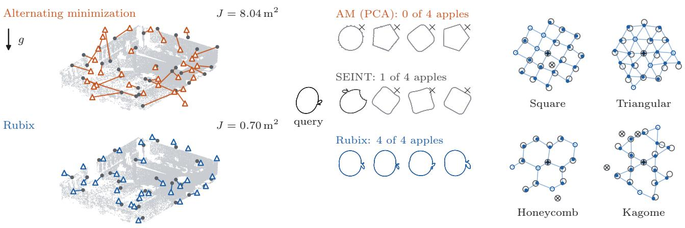  
Figure 1: Global matching in scans, shapes and crystals. (a) An ETH Ofice scan 1–2 gravity subproblem: 32 targe points (dark) and source fits from the same $4 5 ^ { \circ }$ initial yaw (triangles), with AM and Rubix matchings; g denotes gravity and J mean squared matching error. (b) Four nearest MPEG-7 silhouettes to an apple query under AM, SEINT [52] (best setting) and Rubix. PW neighbors use fitted orientations; SEINT uses input orientations. (c) Four defective lattice neighborhoods aligned by penalized partial Rubix to their nearest defect-free references, all correctly classified. Observations are rings, central sites cross-hairs, and reference atoms bonded. Matched reference atoms are solid, vacancies hollow and interstitials crossed (Section 8.3).

## 1 Introduction

Shape retrieval [37], landmark registration [79], laserscan mapping [20, 35] and crystal identification [36] require comparing point sets with unknown correspondences. Procrustes–Wasserstein (PW) alignment jointly optimizes a transformation and a transport coupling [2, 5]. Here, correspondence-free means that no correspondences are supplied: Rubix optimizes them internally. We begin with equally sized, uniformly weighted planar sets and squared Euclidean loss, so an optimal coupling can be chosen as a bijection. Centering removes translation, and nonnegative isotropic scale has a closed-form fit.

The matching and rotation are coupled unknowns. Fixing the rotation gives a linear assignment problem; fixing the matching gives a closed-form orthogonal fit [67]. Alternating minimization (AM) [2] can stop at a suboptimal fixed point and change retrieval rankings. Branch-and-bound [29, 40] gives global guarantees, but bounds that allow each residual its own rotation can require extensive subdivision. Zikan’s exact rotation sweep [79] showed roughly quadratic growth in network pivots experimentally, without a polynomial worst-case bound. Rote’s rotation–assignment problem [55] asks whether polynomially many matchings contain an optimum for every rotation. General afine parametric assignment can require superpolynomially many [15,31]; a polynomial bound must exploit rotation structure.

Rubix represents each matching by its complex correlation (Figure 2). Rotation changes only the projection direction of these fixed correlations. Their convex hull, the permutation polygon, therefore sufices for alignment: a supporting vertex gives an optimal matching at each rotation, and the farthest vertex gives the global alignment. Lexicographic assignment queries recover supporting vertices without enumerating matchings. Our sharp quadratic vertex bound makes full reconstruction polynomial. The same geometry explains AM: under our assignment initialization and tie rules, a nonzero initial vertex leads to a stationary vertex, which need not be farthest from the origin.

For partial and three-dimensional alignment, assignment queries instead bound regions of pose space for branch-and-bound. Queries at the vertices of an enclosure evaluate all matched pairs at a common pose parameter, retaining information lost by independent residual bounds; each returned matching also gives a feasible alignment. Known gravity reduces rotation to yaw; general rotations use unit-quaternion regions. Partial matching requires either a supplied translation or joint pose search. We also adapt the commontranslation bound to GLORES’s trimmed registration objective [20], preserving its objective and stopping rule. The guarantees concern matching cost; pose accuracy is evaluated separately.

Contributions. (i) We prove the sharp $n ( n - 1 )$ vertex bound, including ties and repeated points, answering Rote’s question [55] (Section 5). (ii) Rubix solves planar alignment exactly in $\mathcal { O } ( n ^ { 5 } )$ arithmetic operations, with at most $2 n ( n - 1 )$ assignment queries for rotations or $4 n ( n - 1 )$ with reflections, and characterizes AM fixed points (Section 6). (iii) Returned matchings and assignment duals verify global optimality exactly for rational inputs (Proposition 11). (iv) For gravity-aligned, partial and full 3D alignment, we derive pose-region bounds, accuracy-dependent query counts and reusable certificates; the coupled yaw bound is second order, versus first order for per-correspondence and independent-edge bounds (Section 7). (v) Experiments test the distances in retrieval, crystal classification and clustering, partial matching under incomplete overlap, and the bounds inside planar and spatial registration solvers (Section 8). Full proofs, search algorithms and experimental details appear in the appendices.

## 2 Related Work

PW alignment. Alvarez-Melis et al. [5] formulate transport under global invariances; Grave et al. [28] combine convex initialization with stochastic updates; Even et al. [25] analyze Ping-Pong in a planted Gaussian model; and Adamo et al. [2] study PW metrics and barycenters. Semidefinite relaxations recover noiseless isometric shapes that are asymmetric or bilaterally symmetric [54] and certify planar landmark localization when tight, usually at moderate noise [34]. SEINT [52] compares SE(d)-invariant transport features without alignment. Rubix gives an exact polynomial algorithm for equal-weight planar PW with squared loss.

Exact planar registration. Zikan [79] sweeps rotations with unknown bijections, translation and optional scale, without a polynomial worst-case bound. Utriainen [73] studies vector-weighted matching, approximation and global optimization. Polynomial enumeration for supplied pairs covers consensus with pseudoconvex residuals [56] and planar similarity with $\ell _ { 1 }$ or truncated losses [6]; our bound concerns squared-error bijections with unknown correspondences.

Assignment geometry. The permutation polygon is the classical c-eigenpolygon of a diagonal matrix [39,53]. We extend the real-weight permutohedron bound of $n ( n - 1 )$ vertices [31, 78] to complex weights, ties and repeated points. This makes Eisner–Severance enumeration [24] polynomial for planar rotation scores, despite superpolynomial general parametric assignments [15, 31]. Polynomial enumeration of optimal partial matchings under translation remains open [8]. Soubrier et al. [70] also project transport plans into covariance space, obtaining concave multilinear approximations of Gromov–Wasserstein (GW) distances in fixed dimension with bounded support and uniformly positive definite second moments; our PW reconstruction is exact.

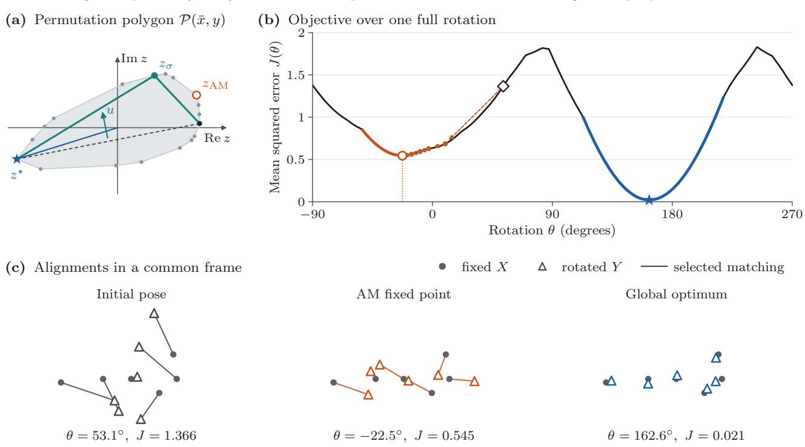  
Figure 2: Rubix on an exact six-point example. (a) The permutation polygon is the convex hull of matching correlations $\begin{array} { r } { z _ { \sigma } = \sum _ { i } \bar { x } _ { i } y _ { \sigma ( i ) } } \end{array}$ . An assignment query in direction u finds an extreme correlation beyond an unexplored chord (dashed); 36 queries recover all 18 vertices. The farthest vertex $z ^ { \star }$ gives the optimal matching and rotation $\theta ^ { \star } = - \operatorname { A r g } z ^ { \star } ;$ AM stops at z<sub>AM</sub>. (b) The objective $\begin{array} { r } { J ( \theta ) = \operatorname* { m i n } _ { \sigma } \{ S - 2 \mathrm { R e } ( e ^ { \mathrm { i } \theta } z _ { \sigma } ) \} / n } \end{array}$ over one turn, where $\begin{array} { r } { \bar { S } = \sum _ { i } | x _ { i } | ^ { 2 } + \sum _ { j } | y _ { j } | ^ { 2 } } \end{array}$ . Each smooth piece belongs to one polygon vertex. AM (orange) reaches a local minimum; dashed arrows join its reassigned iterates. The global minimum is blue. Rubix never samples this illustrative landscape. (c) Fixed X and rotated Y at the initial pose, AM fixed point and global optimum, each with its minimizing matching, in a common frame and scale.

Global assignment bounds. Li–Hartley [40] bound centered equal-size registration by assignments and perpoint residual changes. Related searches cover rotation space [29], geometric matching [9], and camera pose with unknown correspondences [14]. Lian–Zhang [46] eliminate transformations and bound a concave correspondence objective by cardinality-constrained assignment. APM [47] uses a low-rank concave quadratic when every source point has a counterpart; RPM-PA [49] uses polyhedral annexation. Later bounds use trilinear and bilinear relaxations [48], assignment with convex quadratics [44], or transformation-box vertices [45]. Rubix combines covariance geometry, quaternion fitting [30], rotation orbitopes [64, 65] and positive-weight rational Bézier enclosures [59]. Its spatial searches terminate at positive tolerance without inheriting the planar polynomial bound.

Registration with gravity. GLORES [20] searches trimmed SE(2) registration globally; PLICP [16] alternates exact point-to-line updates for fixed pairs. Both allow repeated target use. Known gravity enables constrained point-to-plane ICP [35], pair pruning followed by translation search with optimal yaw [13], and cylindrical-norm registration [1]. Li et al. [42, 43] develop deterministic decompositions and consensus searches, including correspondence-free translation from angles to gravity [42] and subsequent gravitybased outlier rejection [41]. Quatro [51] reduces TEASER++ [75] to yaw; Quatro++ [50] adds ground segmentation and tilt compensation. OptiPose [33] minimizes truncated least squares over supplied pairs about a fixed axis. Our comparisons distinguish these objectives and input requirements.

Unmatched observations. Trimmed ICP [18] selects nearest-neighbor residuals; partial transport [60] controls matched mass. GW compares internal relations, with global methods for low-dimensional Euclidean instances [63]. Unbalanced GW [68] relaxes marginal conservation, partial GW [17] fixes transported mass, and fused unbalanced GW [72] adds feature costs. These nonconvex coupling objectives difer from our rigid fit with a total-variation penalty on unmatched mass (Remark 16). Cost-regularized unbalanced transport [58] jointly optimizes couplings and bounded-norm inner-product costs, guaranteeing stationary points.

Registration systems. Generalized-CVO [77] locally optimizes kernel correlation on SE(3); Register Any Point (RAP) [57] learns registration by flow matching. PREDATOR [32] learns overlap attention, and GeoTransformer [61] matches superpoints through learned geometry. Coordinate-only Rubix can refine these systems. We report complete systems for context and isolate matching through a common stage after Quatro, RAP and Li et al., with fixed subsets, initialization and outer processing (Section 8.4.2).

## 3 Notation and Preliminaries

Point sets and poses. Write $X = ( x _ { 1 } , \ldots , x _ { n } )$ and $Y = ( y _ { 1 } , \dots , y _ { m } )$ in $\mathbb { R } ^ { d }$ , also viewed as matrices with point columns. Their means are $m _ { x }$ and $m _ { y } ; x _ { i } ^ { c } = x _ { i } -$ $m _ { x }$ and $y _ { j } ^ { c } = y _ { j } - m _ { y }$ are centered coordinates. A pose maps Y toward X by $x _ { i } \approx s R y _ { j } + t .$ , with $R \in \mathrm { S O } ( d )$ or $R \in \mathrm { O } ( d )$ , translation $t \in \mathbb { R } ^ { d }$ and isotropic scale $s \geq 0$ . The orthogonal group $\mathrm { O } ( d )$ satisfies $R ^ { \top } R = I ;$ its rotation subgroup $\mathrm { S O } ( d )$ has determinant +1. We state when a cited method reverses the point-set roles.

Planar coordinates. Identify $\mathbb { R } ^ { 2 }$ with C and represent point sets by $x , y \in \mathbb { C } ^ { n }$ , with $\begin{array} { r } { \| \boldsymbol { x } \| ^ { 2 } = \sum _ { i } | x _ { i } | ^ { 2 } } \end{array}$ For $z \in \mathbb { C } , { \bar { z } }$ , Re z and Im z denote its conjugate, real and imaginary parts; $\mathrm { A r g } z \in ( - \pi , \pi ]$ is the principal argument for $z \neq 0 ,$ , and $\langle z , w \rangle = \operatorname { R e } ( \bar { z } w )$ is the real inner product. Rotations act by $z \mapsto e ^ { \mathrm { i } \theta } z$ and orientation-reversing orthogonal maps by $z \mapsto e ^ { \mathrm { i } \theta } \bar { z }$

Matchings and assignment. For $n = m ,$ a complete matching is a permutation $\sigma$ in the symmetric group $S _ { n } .$ , with matrix $P _ { \sigma }$ . Given real scores $\left( c _ { i j } \right)$ , linear assignment chooses $\sigma \in S _ { n }$ maximizing $\textstyle \sum _ { i } c _ { i , \sigma ( i ) }$ The Birkhof polytope $B _ { n }$ contains the nonnegative matrices with unit row and column sums [11]. These are the convex combinations of permutation matrices, so linear scores have the same maximum over $B _ { n }$ and its permutation matrices. A partial matching $M$ contains $k = | M |$ pairs with no repeated row or column. Trimmed nearest-neighbor objectives instead fix the number of pairs and may repeat targets (Sections 7.2 and 8.4.1). We use P for a fractional plan between unit point masses and $\pi \in \Pi ( \alpha , \beta )$ for a transport plan with marginals α and $\beta .$

Convex geometry. The convex hull conv A is the set of convex combinations of points in A. A polygon vertex is not a convex combination of its other points; a nontrivial segment has two vertices and a singleton one. For a convex polygon $\mathcal { Q } \subset \mathbb { C }$ and nonzero direction $u \in \mathbb { C }$ , the support function $h _ { \mathcal { Q } } ( u ) = \operatorname* { m a x } _ { z \in \mathcal { Q } } \operatorname { R e } ( \bar { u } z )$ is its largest projection onto u. The line $\mathrm { R e } ( \bar { u } z ) =$ $h _ { \mathcal { Q } } ( u )$ bounds $\mathcal { Q }$ on the side of smaller projections. Its intersection with Q is the supporting face: a vertex or edge when $\mathcal { Q }$ is two-dimensional. For an edge, u is its outward normal. Throughout the planar theory, u is complex, with $u = e ^ { - \mathrm { i } \theta }$ for rotation $\theta ;$ in Section 7.1, it denotes the real yaw coordinates $u ( \theta ) = ( \cos \theta , \sin \theta )$

Costs, bounds and tolerances. We use $E$ for summed squared residual, $\mathcal { L } _ { \sigma }$ for mean planar matching cost, and J for a plotted objective normalized as its caption specifies. The incumbent is the best feasible solution found, with cost U; L or $L _ { \Omega }$ bounds the residual from below, enclosing the optimum in $[ L , U ]$ . For total centered energy $S$ and correlation upper bound $b _ { \Omega } .$ , the residual lower bound is $L _ { \Omega } = \operatorname* { m a x } \{ 0 , S - 2 b _ { \Omega } \}$ residual gaps are twice score gaps. A mean-error tolerance ε gives a summed tolerance n times larger for complete matching, or k times larger for fixed positive cardinality $k .$ Certificates require exact arithmetic; floating-point reference values and gaps are numerical.

Further conventions. The symbols $\| \cdot \| , \| \cdot \| _ { F }$ and $\langle \cdot , \cdot \rangle _ { F }$ denote the Euclidean norm, Frobenius norm and Frobenius inner product; $\operatorname { t r } , ( \cdot ) ^ { \dagger }$ and $\lambda _ { \mathrm { m a x } }$ denote trace, Moore–Penrose inverse and largest eigenvalue. A star marks an optimum or optimizer and a hat a reconstructed quantity; neither implies uniqueness. Arithmetic complexity $\mathcal { O } ( \cdot )$ is distinct from the orthogonal group $\mathrm { O } ( d )$ . Local symbols are defined where used.

## 4 Problem Formulation

At a fixed rotation, the best matching is the solution of a linear assignment problem. This section shows that the rotation enters this problem only as a direction of projection. We encode each matching by one complex number, its correlation; a rotation then selects a projection of the correlations, and the joint optimum over rotations and matchings is a farthest point of their convex hull.

## 4.1 Complete Planar PW Alignment

We consider complete matching of two planar point sets $X = ( x _ { 1 } , \ldots , x _ { n } )$ and $Y = \left( y _ { 1 } , \dots , y _ { n } \right)$ in $\mathbb { R } ^ { 2 }$ , with $n \geq 2$ points each, equal weights $1 / n$ and possibly repeated points. The transformations are the rotations,

$G = \mathrm { S O ( 2 ) }$ , or the rotations and reflections, $G = \mathrm { O } ( 2 )$ The squared PW objective is

$$
\operatorname { P W } _ { G } ^ { 2 } ( X , Y ) = \operatorname* { m i n } _ { R \in G , \sigma \in S _ { n } } { \frac { 1 } { n } } \sum _ { i = 1 } ^ { n } \| x _ { i } - R y _ { \sigma ( i ) } \| ^ { 2 } .\tag{1}
$$

We seek a global minimizer $( R ^ { \star } , \sigma ^ { \star } ) \in G \times S _ { n }$ and the optimal value; if several minimizers tie, any of them is a valid answer, and the case $n = 1$ is immediate. The square root of (1) is a distance between unlabeled point sets modulo G. This extends the O(d) formulation of Adamo et al. [2] to SO(2): composing transformations and matchings gives the triangle inequality, and compactness shows that the distance is zero only for sets that agree up to G and relabeling. If translation is also allowed, the optimal translation for a fixed R is $m _ { x } - R m _ { y }$ , and the problem reduces to the centered sets.

## 4.2 Matching Correlations

In complex coordinates, the correlation of a matching σ is $\begin{array} { r } { z _ { \sigma } ( \bar { x } , y ) = \sum _ { i } \bar { x } _ { i } y _ { \sigma ( i ) } } \end{array}$ . It carries the entire dependence of the matching’s cost on the rotation:

$$
\begin{array} { l } { \displaystyle \mathcal { L } _ { \sigma } ( \theta ) = \frac { 1 } { n } \sum _ { i } | x _ { i } - e ^ { \mathrm { i } \theta } y _ { \sigma ( i ) } | ^ { 2 } } \\ { \displaystyle \qquad = \frac { \| x \| ^ { 2 } + \| y \| ^ { 2 } - 2 \operatorname { R e } ( e ^ { \mathrm { i } \theta } z _ { \sigma } ( \bar { x } , y ) ) } { n } . } \end{array}\tag{2}
$$

The norm terms depend neither on the matching nor on the rotation. Minimizing the cost at rotation θ is therefore the same as maximizing the projection $\mathrm { R e } ( e ^ { \mathrm { i } \theta } z _ { \sigma } )$ over the correlations, and the maximum of a projection over a finite set is attained at a vertex of its convex hull. It is convenient to work with general coeficient vectors $a , b \in \mathbb { C } ^ { n }$ . We define $z _ { \sigma } ( a , b ) =$ $\scriptstyle \sum _ { i = 1 } ^ { n } a _ { i } b _ { \sigma ( i ) }$ and the hull

$$
\begin{array} { r l } & { \mathcal { P } ( a , b ) = \mathrm { c o n v } \{ z _ { \sigma } ( a , b ) : \sigma \in S _ { n } \} } \\ & { \quad \quad = \{ a ^ { \top } P b : P \in B _ { n } \} , } \end{array}\tag{3}
$$

which we call the permutation polygon. The second equality holds because the linear map $P \mapsto a ^ { \top } P b$ sends the Birkhof polytope, whose vertices are the permutation matrices, onto this hull. The expression $a ^ { \top } P b$ is bilinear and involves no conjugation; alignment uses $a = { \bar { x } }$ and $b = y$

To evaluate the polygon at rotation $\theta ,$ we set $( a , b ) =$ $( { \bar { x } } , y )$ and $u = e ^ { - \mathrm { i } \theta }$ . A linear assignment with scores $c _ { i j } = \mathrm { R e } ( \bar { u } a _ { i } b _ { j } )$ maximizes $\mathrm { R e } ( \bar { u } z _ { \sigma } )$ . It returns the support value $h _ { \mathcal { P } } ( u )$ and an optimal matching at this rotation without forming the n! correlations. Keeping one matching for each vertex of the polygon sufices to have an optimal matching at every rotation, including the directions in which an edge ties two vertices and the inputs for which several matchings share a correlation. Optimizing over the rotation as well replaces the projection of each correlation by its modulus, which gives the following reduction.

Lemma 1 (reduction). For $x , y \in \mathbb { C } ^ { n }$ ,

$$
\mathrm { P W } _ { \mathrm { S O ( 2 ) } } ^ { 2 } ( X , Y ) = \frac { \| x \| ^ { 2 } + \| y \| ^ { 2 } } { n } - \frac { 2 } { n } \operatorname* { m a x } _ { z \in \mathcal { P } ( \bar { x } , y ) } | z | .\tag{4}
$$

A vertex $z _ { \sigma ^ { \star } }$ attains the maximum. Its matching $\sigma ^ { \star }$ is optimal, with angle $- \operatorname { A r g } z _ { \sigma }$ ⋆ when the correlation is nonzero. If the maximum modulus is zero, every angle is optimal. For O(2), take the larger maximum over $\mathcal { P } ( \bar { x } , y )$ and $\mathcal { P } ( \bar { x } , \bar { y } )$

Proof sketch. Maximizing $\mathrm { R e } ( e ^ { \mathrm { i } \theta } z _ { \sigma } )$ over θ in (2) gives $| z _ { \sigma } |$ . The modulus is convex, so its maximum over the polygon is attained at a vertex, and every vertex is the correlation of a matching. Appendix A.1 treats reflections and zero correlations. □

## 4.3 Translation and Isotropic Scale

For complete similarity alignment $x _ { i } \approx s R y _ { \sigma ( i ) } + t$ with $s \geq 0 ,$ , the optimal translation is $t = m _ { x } - s R m _ { y } ,$ which leaves the centered coordinates $x _ { i } ^ { c } = x _ { i } - m _ { x }$ and $y _ { j } ^ { c } = y _ { j } - m _ { y }$ . Let $\begin{array} { r } { S _ { X } = \sum _ { i } \| x _ { i } ^ { c } \| ^ { 2 } } \end{array}$ and $\begin{array} { r } { S _ { Y } = \sum _ { j } \| y _ { j } ^ { c } \| ^ { 2 } } \end{array}$ and let $r _ { \sigma } = | z _ { \sigma } |$ be the modulus of a correlation in either of the centered polygons of Lemma 1. Once the rotation is optimized, the residual of the matching σ at scale s is $S _ { X } + s ^ { 2 } S _ { Y } - 2 s r _ { \sigma }$ . For $S _ { Y } ~ > ~ 0$ , the minimizing scale and the residual are

$$
s _ { \sigma } ^ { \star } = \frac { r _ { \sigma } } { S _ { Y } } , \qquad E _ { \sigma } ^ { \star } = S _ { X } - \frac { r _ { \sigma } ^ { 2 } } { S _ { Y } } .\tag{5}
$$

The residual decreases as $r _ { \sigma }$ grows, so a farthest vertex also solves similarity alignment [79]. Three degenerate cases remain. If $S _ { Y } = 0$ , the translation places every source point at $m _ { x } .$ , the residual is $S _ { X }$ , and rotation and scale are not identifiable. If $S _ { Y } > 0$ and the largest correlation modulus is zero, the scale $s = 0$ attains the minimum when it is allowed, whereas requiring $s > 0$ leaves an infimum that is not attained. If $S _ { Y } > 0$ and the scale is restricted by fixed bounds $0 < s _ { - } \le$ $s \leq s _ { + } < \infty$ , we clip $r _ { \sigma } / S _ { Y } ~ \mathrm { t o } ~ [ s _ { - } , s _ { + } ] ;$ the minimized residual remains nonincreasing in $r _ { \sigma }$ . Dividing by n gives the normalization of (1). Partial registration does not reduce in this way, because it requires the means of the selected subsets.

## 4.4 The Structural Restriction

Solving each assignment problem in polynomial time does not bound how often the optimal matching changes as a parameter varies. Consider scores $D _ { 0 } +$

$\eta _ { \mathrm { s h } } D _ { 1 }$ that depend afinely on a real parameter $\eta _ { \mathrm { s h } }$ with arbitrary $D _ { 0 } , D _ { 1 } \in \mathbb { R } ^ { n \times n }$ , and define

$$
\begin{array} { r } { \mathrm { s h } ( P ) = \big ( \langle D _ { 0 } , P \rangle _ { F } , \langle D _ { 1 } , P \rangle _ { F } \big ) , } \end{array}\tag{6}
$$

where $\begin{array} { r } { \langle D , P \rangle _ { F } = \sum _ { i j } D _ { i j } P _ { i j } } \end{array}$ . The image sh $( B _ { n } )$ is a planar projection, or shadow, of the Birkhof polytope. Maximizing the score at the parameter $\eta _ { \mathrm { s h } }$ exposes a face of the shadow in the direction $( 1 , \eta _ { \mathrm { s h } } )$ , so varying the parameter traverses a chain of boundary vertices. Arbitrary shadows can have $n ^ { \Omega ( \log n ) }$ vertices [31]. Rotation scores are more restricted. The two coordinates of their shadow are the real and imaginary parts of $a ^ { \top } P b$ , whose complex coeficient matrix $a b ^ { \dagger }$ has rank at most one, although the two real score matrices can have rank two. Theorem 2 bounds the number of vertices for this restricted class.

## 5 A Sharp $n ( n - 1 )$ Bound

The permutation polygon is defined by n! correlations, yet exact alignment needs at most $n ( n { - } 1 )$ ) of its vertices. We count the vertices by turning a supporting line through one full turn: the vertex that it touches changes each time its direction passes the outward normal of an edge. Section 6 then recovers these vertices by assignment queries.

Theorem 2. For every $n \geq 2$ and all $a , b \in \mathbb { C } ^ { n }$ , the polygon $\textstyle { \mathcal { P } } ( a , b )$ has at most $n ( n - 1 )$ vertices. Consequently, for any two equally weighted planar sets of n points there are at most $n ( n - 1 )$ matchings such that, for every rotation, one of them is optimal. For generic point sets, that $i s ,$ when $( { \bar { x } } , y )$ is generic in the sense of Definition A.1, the optimal matching is unique for all but finitely many angles and changes at most $n ( n - 1 )$ ) times over a full turn. The bound is attained for every n (Proposition 7).

The proof follows one real quantity, the phase of the optimal matching, as the supporting direction turns. The phase is the sum, over all pairs of rows, of the angle of the swap gain of the pair, the amount by which the correlation of the matching exceeds that of the matching with the two partners swapped (Section 5.2). While one matching stays optimal the phase decreases at a fixed rate, and each change of the optimal matching increases it by at least π. Over a full turn the phase returns to its initial value, so the jumps must restore a total decrease of $\pi n ( n - 1 )$ , which allows at most $n ( n - 1 )$ changes. We first work with generic $( a , b )$ for which the correlations of distinct matchings are distinct and no three of them are collinear, so that each transition involves exactly two matchings. Generic pairs are dense and have full measure (Lemma A.2 and Appendix A.2.1), and a perturbation argument then extends the bound to all inputs. Appendix A.7.1 gives the complete proof of Theorem 2.

## 5.1 Optimal-Matching Transitions

Two permutations σ and τ difer by the permutation $\sigma ^ { - 1 } \tau$ , which decomposes into disjoint cycles; each cycle passes partners around a set of rows. A generic transition consists of a single cycle, and a swap of two partners is the case of length two.

Lemma 3 (cycle transitions). For generic $( a , b )$ and $u \in \mathbb { C } \ w i t h \ | u | = 1$ , maximizing $\mathrm { R e } ( \bar { u } z _ { \sigma } )$ gives either a unique permutation or two permutations $\sigma , \tau$ for which $\sigma ^ { - 1 } \tau$ is a single nontrivial cycle.

Proof sketch. Under genericity, a supporting line contains at most two correlations, so at most two matchings are optimal in any direction. If two are optimal, switching any single cycle of their diference leaves the projection unchanged: the cycles act on disjoint rows, so their changes of the projection add up to zero, and none of them is positive. Two nontrivial cycles would therefore produce a third optimal matching, a contradiction. The full proof is in Appendix A.3.

For generic inputs with $n \geq 3 .$ , we traverse the boundary of $\mathcal { P }$ counterclockwise. By Lemma 3, the matchings at the two ends of an edge e from $z _ { \sigma }$ to $z _ { \tau }$ difer by one cycle $\sigma ^ { - 1 } \tau = ( i _ { 1 } \dots i _ { L _ { e } } )$ of length $L _ { e } .$ . We set ${ j _ { r } = \sigma ( i _ { r } ) }$ , with indices taken modulo $L _ { e }$ , so that row $i _ { r }$ gives up the point $b _ { j _ { r } }$ and receives $b _ { j _ { r + 1 } }$ . Joining the points $b _ { j _ { 1 } } , \dotsc , b _ { j _ { L _ { e } } }$ in cycle order gives a closed polygon $\Gamma _ { e }$ . This polygon lies in the plane of the input points, whereas the edge e that defines it lies in the plane of correlations.

Two geometric properties of $\Gamma _ { e }$ determine the phase jump at e. First, an optimal dual solution of the assignment problem at the transition defines a power diagram [7] on the points $b _ { j } .$ , and two points can exchange partners at the transition only if their cells are neighbors. The segments that join neighboring cells do not cross, so a cycle of length at least three forms a simple polygon. Second, traversing $\mathcal { P }$ counterclockwise fixes the orientation of the cycle, which is also counterclockwise. Both properties are proved in Appendices A.5 and A.6.

## 5.2 The Phase Argument

For rows $i < k ,$ , we define the swap gain

$$
\Delta z _ { i k } ( \sigma ) = ( a _ { i } - a _ { k } ) ( b _ { \sigma ( i ) } - b _ { \sigma ( k ) } ) ,\tag{7}
$$

which is the diference between the correlation of σ and that of the matching obtained by swapping the partners of rows i and k. Genericity makes every swap gain nonzero. If σ is optimal in direction $u ,$ no swap can improve it, so Re $: ( \bar { u } \Delta z _ { i k } ( \sigma ) ) \ge 0$ for every pair, and every term of the phase

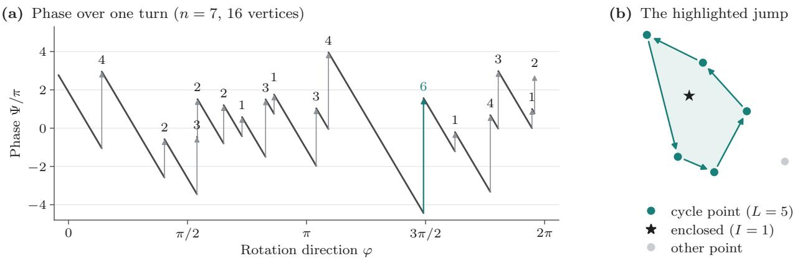  
Figure 3: A fixed phase budget bounds the number of matching changes $( n = 7 )$ . (a) While one matching stays optimal, the phase Ψ decreases with slope −<sup>n</sup>; when the optimal matching changes, it jumps by $\Delta \Psi = \pi ( L - 1 + 2 I )$ The number above each jump is $\Delta \Psi / \pi$ . Over one turn, the continuous decrease and the jumps both total $4 2 \pi$ . Each jump is at least $\pi ,$ so the 16 polygon vertices of this example satisfy the bound $n ( n - 1 ) = 4 2 .$ . (b) The highlighted jump of 6π: its reassignment cycle visits $L = 5$ points counterclockwise and encloses I = 1 further point (star).

$$
\Psi ( \sigma , u ) = \sum _ { i < k } \mathrm { A r g } \left( \bar { u } \Delta z _ { i k } ( \sigma ) \right)\tag{8}
$$

lies in $[ - \pi / 2 , \pi / 2 ]$ . The principal argument is continuous on the closed right half-plane without the origin, so no term crosses a branch cut while σ stays optimal. Between transitions, each term therefore decreases at unit rate as u turns counterclockwise, and the <sup>n</sup><sub>2</sub> terms together decrease by $2 \pi { \binom { n } { 2 } } = \pi n ( n - 1 )$ over a full turn. A full turn that starts away from an edge normal ends with the same unique optimal matching and the same phase, so the jumps at the transitions must balance this continuous decrease exactly.

Lemma 4 (jump). Let $( a , b )$ be generic with $n \geq 3 .$ , and let the edge e of P lead counterclockwise from $z _ { \sigma }$ to $z _ { \tau }$ with outward unit normal u and cycle length $L _ { e }$ . For $L _ { e } \ge 3 .$ , the polygon $\Gamma _ { e }$ is simple and counterclockwise, and $I _ { e }$ counts the of-cycle points $b _ { j _ { 0 } }$ strictly inside it. Set $I _ { e } = 0$ for $L _ { e } = 2$ . Then

$$
\Psi ( \tau , u ) - \Psi ( \sigma , u ) = \pi ( L _ { e } - 1 + 2 I _ { e } ) .\tag{9}
$$

Proof sketch. For $L _ { e } \ \geq \ 3 .$ , we move each reassigned point linearly from its old position to its new one along the corresponding edge of $\Gamma _ { e }$ . The power-diagram construction makes $\Gamma _ { e }$ simple and counterclockwise, with no of-cycle point on its boundary. The moving points do not collide, because they follow distinct edges of the polygon and reach shared endpoints at diferent times. Optimality at both ends of the motion keeps every swap gain, multiplied by ${ \bar { u } } ,$ in the closed right half-plane, so the contribution of each pair to the phase jump equals the continuous change of its argument. To evaluate these changes, we deform $\Gamma _ { e }$ continuously into a regular polygon, which shows that the pairs of moving points contribute π $( L _ { e } - 1 )$ in total. Each ofcycle point enclosed by $\Gamma _ { e }$ contributes a further $2 \pi$ and each of-cycle point outside contributes zero. For $L _ { e } = 2$ , the swapped pair contributes π directly, and its contributions relative to each of-cycle point cancel. Adding these terms gives (9). The full proof, including the orientation of the cycle and the two-point case, is in Appendix A.6. □

Lemma 5 (counting identity). For $n \geq 3$ and generic $( a , b )$ , every $\Gamma _ { e }$ with $L _ { e } \ge 3$ is a simple, counterclockwise polygon, and

$$
\sum _ { \substack { e d g e s e o f \mathcal { P } } } \left( L _ { e } - 1 + 2 I _ { e } \right) = n ( n - 1 ) ,\tag{10}
$$

with $L _ { e }$ and $I _ { e }$ as in Lemma $\it 4 .$

Proof. The continuous decrease of the phase (8) over a full turn is $\pi n ( n - 1 )$ , and the jumps must restore it. Substituting (9) for each jump and dividing by π gives the identity. Figure 3 illustrates the case $n = 7 ;$ Appendices A.4.2 and A.7.1 give the full accounting. □

## 5.3 The Sharp Bound

Every term of the counting identity is at least one, which gives the bound for generic inputs. The next lemma transfers it to inputs with tied or repeated correlations: a suficiently small generic perturbation cannot reduce the number of vertices.

Lemma 6 (semicontinuity). For every $( a , b )$ and $\delta _ { \mathrm { p e r t } } ~ > ~ 0$ there is a generic $( a ^ { \prime } , b ^ { \prime } )$ within distance $\delta _ { \mathrm { p e r t } }$ with #vert $\mathcal { P } ( a ^ { \prime } , b ^ { \prime } ) \geq \# \mathrm { v e r t } \mathcal { P } ( a , b )$

Proof sketch. For each vertex of the original polygon we choose a direction that exposes it strictly. The score gaps in these finitely many directions are positive and persist under suficiently small perturbations, so each of the disjoint neighborhoods of the original vertices contains an extreme point of the perturbed polygon. Generic pairs are dense by Lemma A.2, so the perturbation can be chosen generic. The full proof is in Appendix A.2.2. □

Proof of Theorem 2. For generic inputs with $n \geq 3 .$ every summand in Lemma 5 is at least one, so the polygon has at most $n ( n - 1 )$ edges and hence at most $n ( n - 1 )$ vertices. For arbitrary inputs, a polygon that is a single point satisfies the bound directly; otherwise Lemma 6 gives a nearby generic polygon with at least as many vertices, which extends the bound to every input. For $n = 2$ there are only two permutations. The statement about matchings holds because one representative matching per vertex contains an optimal matching for every direction (Section 4.2), and under genericity only the two adjacent vertices tie at an edge normal. Proposition 7 proves sharpness. The complete arguments for the bound and for sharpness are in Appendices A.7.1 and A.7.2, respectively. □

The bound is attained by inputs whose row coeficients $a _ { i }$ are real: the optimal matching in a direction is then determined by the order of the projections of the points $b _ { j }$ . The proof uses the Minkowski sum $\mathcal { Q } _ { 1 } + \mathcal { Q } _ { 2 } = \{ z + w : z \in \mathcal { Q } _ { 1 } , w \in \mathcal { Q } _ { 2 } \}$ , which satisfies $h _ { \mathcal { Q } _ { 1 } + \mathcal { Q } _ { 2 } } ( u ) = h _ { \mathcal { Q } _ { 1 } } ( u ) + h _ { \mathcal { Q } _ { 2 } } ( u )$ because the two terms are maximized independently.

Proposition 7 (tightness). For $n \geq 2 , i f a \in \mathbb { R } ^ { n }$ has distinct entries and $b \in \mathbb { C } ^ { n }$ has distinct entries with pairwise non-parallel diferences $b _ { j } - b _ { l } , ~ j < l ,$ , then $\textstyle { \mathcal { P } } ( a , b )$ has exactly $n ( n - 1 )$ vertices.

Proof sketch. We order $a _ { 1 } < \cdots < a _ { n }$ , express each coeficient through its consecutive diferences, and regroup the terms to obtain Abel’s summation identity

$$
z _ { \sigma } = a _ { 1 } \sum _ { j } b _ { j } + \sum _ { k = 2 } ^ { n } ( a _ { k } - a _ { k - 1 } ) \sum _ { l \geq k } b _ { \sigma ( l ) } .\tag{11}
$$

In a direction $u ,$ all terms are maximized together by sending the largest row indices to the points $b _ { j }$ with the largest projections $\mathrm { R e } ( \bar { u } b _ { j } )$ . Since support functions add under Minkowski sums, P is a translate of a Minkowski sum of positive multiples of the polygons $\begin{array} { r } { Q _ { h } = \mathrm { c o n v } \{ \sum _ { i \in S } b _ { j } : | S | = h \} , 1 \leq h \leq n - 1 } \end{array}$ . For $n \geq 3 .$ , each pair of points exchanges its order of projection twice during a full turn. Because the pairwise diferences are non-parallel, only one pair ties at a time, and the two tied points are adjacent in that order. Their exchange changes exactly one top-h subset and thus gives one edge of one $Q _ { h }$ . These $n ( n - 1 )$ edges have distinct normals and remain edges of the Minkowski sum, so $\mathcal { P }$ has that many vertices. For $n = 2$ , the two distinct correlations form a segment. The full construction and the edge count are proved in Appendix A.7.2. □

Theorem 2 answers Rote’s question [55]. It counts representative matchings and not all optimal ones: when all points coincide, all n! matchings are optimal, but one representative sufices. For generic inputs, the counting identity shows that equality holds exactly when every transition swaps two points. For generic inputs with $n = 3$ , the number of vertices is six minus the number of transitions that are 3-cycles.

Rotations apply a common phase $e ^ { \mathrm { i } \theta }$ to every product $a _ { i } b _ { j }$ . The diagonal weights diag(cos $\eta _ { \mathrm { d i a g } } , \sin \eta _ { \mathrm { d i a g } } )$ can instead give $1 6 > n ( n - 1 ) = 1 2$ vertices for $n = 4$ (Remark A.7).

## 5.4 Rational Weights and Unequal Cardinalities

Because Theorem 2 permits repeated points, replacing each weighted point by copies of equal mass extends the vertex bound to transport with rational weights and to uniformly weighted sets of diferent sizes.

Corollary 8 (rational weights). Let $\begin{array} { r } { \mu _ { X } = \sum _ { i } \alpha _ { i } \delta _ { x _ { i } } } \end{array}$ and $\begin{array} { r } { \mu _ { Y } = \sum _ { j } \beta _ { j } \delta _ { y _ { j } } } \end{array}$ with nonnegative rational weights summing to one and common denominator $N \geq 1$ where $\delta _ { x }$ denotes a unit point mass at x. Remove zero-weight atoms, and let $\Pi ( \alpha , \beta )$ be the nonnegative matrices with row sums α and column sums $\beta .$ . Then $\textstyle \{ \sum _ { i j } \pi _ { i j } { \bar { x } } _ { i } y _ { j } : \pi \in \Pi ( \alpha , \beta ) \}$ has at most max $\{ 1 , N ( N -$ 1)} vertices. In particular, for uniform weights on n and m points, it has at most max $\{ 1 , N _ { \mathrm { u n i } } ( N _ { \mathrm { u n i } } - 1 ) \}$ with $N _ { \mathrm { u n i } } = \operatorname { l c m } ( n , m )$

Proof sketch. Replace each atom by as many copies of mass $1 / N$ as the integer numerator of its weight. Aggregating the doubly stochastic matrices over these copies gives exactly the original transport polytope, so the weighted correlation polygon is a scaled equal-weight polygon. Theorem 2 applies to it because repeated points are permitted; $N = 1$ gives a single point. The full proof that replication preserves the set of feasible correlations is in Appendix B.1. □

Replication is pseudo-polynomial: the bound is polynomial in the denominator $N _ { : }$ , which can be exponential in its bit length. Uniform weights on n and m points give $N = \operatorname { l c m } ( n , m ) \leq n m$ , which is polynomial in the numbers of points. For equally weighted sets of size $n \geq 2 .$ , Lemma 1 and Theorem 2 show that at most $n ( n - 1 )$ representative matchings per polygon are needed, degenerate inputs included. Section 6 finds them by assignment queries.

## 6 The Rubix Algorithm

Rubix reconstructs the permutation polygon by assignment queries, selects a farthest vertex, and recovers the optimal matching and rotation through Lemma 1. Each query either discovers a new vertex or confirms an edge between two known vertices, so the number of queries is proportional to the number of vertices.

## 6.1 Polygon Reconstruction

Given x and y, we first center them if the translation is unknown (Section 4.3). Algorithm 1 then reconstructs $\mathcal { P } ( \bar { x } , y )$ and returns its V vertices, each with one matching that attains it. A vertex z of largest modulus gives the optimal angle $- \operatorname { A r g } z ,$ , or any angle ${ \mathrm { i f ~ } } z = 0 .$ and the optimal value through (4). When reflections are allowed, we also reconstruct $\mathcal { P } ( \bar { x } , \bar { y } )$ and compare the two maxima (Lemma 1). The translation and, where it is permitted, the scale follow from Section 4.3. The pseudocode is written for general $a , b$ so that it serves both polygons.

The algorithm reaches the polygon through an assignment oracle. For a nonzero direction $u , \mathrm { O r a c l e } ( u )$ returns a correlation that maximizes $\mathrm { R e } ( \bar { u } z )$ and, among these maximizers, one that maximizes the secondary projection $\mathrm { R e } ( \overline { { \mathrm { i } u } } z )$ . The primary maximizers form the supporting face in direction u, and the secondary projection selects an endpoint of this face. The oracle therefore always returns a vertex, also when u is normal to an edge and when several matchings share a correlation. A cubic-time assignment solver implements this lexicographic order by working with pairs of costs that are compared lexicographically and added componentwise. Around the oracle, we use the enumeration scheme of Eisner and Severance [24].

The algorithm starts with two queries in opposite directions. If they return the same correlation, the polygon is a single point. Otherwise the two outputs are vertices that split the boundary into two arcs, and the algorithm keeps a stack of chords $( z , z ^ { \prime } )$ , each of which stands for an unexplored boundary arc that runs counterclockwise from z to $z ^ { \prime }$ . For such a chord, it queries the outward normal direction $u = - \mathrm { i } ( z ^ { \prime } - z )$ and obtains a vertex $z ^ { \prime \prime }$ . The support gap $h _ { \mathcal { P } } ( u ) - \operatorname { R e } ( \bar { u } z ) =$ $\mathrm { R e } ( \bar { u } ( z ^ { \prime \prime } - z ) )$ is positive precisely when $z ^ { \prime \prime }$ lies beyond the chord, in which case the arc is split at $z ^ { \prime \prime }$ . A zero gap certifies that the chord is an edge of the polygon. When the stack is empty, the polygon is complete.

```latex
Algorithm 1 Rubix: polygon reconstruction
1: $z _ { - } \gets \mathrm { O r a c l e } ( - 1 ) ; z _ { + } \gets \mathrm { O r a c l e } ( 1 )$
2: If $z _ { - } = z _ { + }$ , return the singleton $\{ z _ { + } \}$
3: Stack $ \{ ( z _ { - } , z _ { + } ) , ( z _ { + } , z _ { - } ) \}$
4: while Stack is not empty do
5: $\mathrm { P o p } \ ( z , z ^ { \prime } ) ; u  - \mathrm { i } ( z ^ { \prime } - z ) .$
6: $z ^ { \prime \prime } \gets \mathrm { O r a c l e } ( u ) .$
7: If $\mathrm { R e } ( \bar { u } ( z ^ { \prime \prime } - z ) ) > 0 ;$ , push $( z , z ^ { \prime \prime } ) , ( z ^ { \prime \prime } , z ^ { \prime } ) ;$ ; oth
erwise record the boundary segment $( z , z ^ { \prime } )$
8: Return the endpoints of the recorded segments.
```

Proposition 9 (polygon reconstruction). For $n \geq 2 ,$ Algorithm 1 returns the vertices of P using exactly $2 V \leq 2 n ( n - 1 )$ calls to this oracle.

Proof sketch. The two initial arcs are explored as two binary trees whose internal nodes are the splits and whose leaves are the confirmed edges. Together the trees have $V - 2$ internal nodes and V leaves, which with the two initial queries gives $2 + ( V - 2 ) + V = 2 V$ calls. A single point needs two calls and a segment four, and the lexicographic tie-breaking keeps the returned points extreme for degenerate inputs. Appendix A.8.1 proves the invariant and the count. □

Corollary 10. For $n \geq 2$ , Rubix computes planar PW exactly with at most $2 n ( n - 1 )$ lexicographic assignment problems (oracle calls) over $\mathrm { S O } ( 2 )$ and 4n $( n - 1 )$ over $\mathrm { O } ( 2 )$ , and $\mathcal { O } ( n ^ { 5 } )$ arithmetic operations. For $n = 1$ the solution is immediate.

Proof sketch. Apply Proposition 9 to $\mathcal { P } ( \bar { x } , y )$ and, over $O ( 2 ) ,$ , to $\mathcal { P } ( \bar { x } , \bar { y } )$ , then use Lemma 1. Each call costs $\mathcal { O } ( n ^ { 3 } )$ operations; see Appendix A.8.2. □

## 6.2 Verification and Pruning

The reconstructed hull can be verified independently of the solver that produced it. For inputs with rational coordinates, the query directions $u = - \mathrm { i } ( z ^ { \prime } - z )$ are rational without normalization, so all assignment scores are rational. A dual solution $( f , g )$ of an assignment problem is feasible if $f _ { i } + g _ { j } \ge c _ { i j }$ for all $i , j ,$ and it then bounds the score of every matching by $\textstyle \sum _ { i } f _ { i } +$ $\textstyle \sum _ { j } g _ { j }$ . If a returned matching attains this bound, its support value is verified. Checking the outward normal direction of every boundary edge in this way rules out correlations beyond the reconstructed hull.

In total, Rubix uses $\mathcal { O } ( n ^ { 3 } V )$ arithmetic operations, where V is summed over both polygons when reflections are allowed. The bit complexity depends in addition on the bit lengths of the input.

Proposition 11 (Exact global verification). Let $a , b$ have rational real and imaginary parts, and let $\widehat { \mathcal P }$ be the hull of the correlations recomputed from the returned matchings, with its distinct extreme points and their boundary order verified exactly. Suppose that assignment duals certify the following support values. $I f \widehat { \mathcal { P } }$ is two-dimensional, they certify its support value in the outward normal direction of every edge. If it is a segment, they certify its line through the two opposite normal directions and its endpoints through the two extrema along the line. If it is a single point, they certify that the two opposite primary extrema coincide and that the two opposite secondary extrema coincide. Then $\widehat { \mathcal { P } } = \mathcal { P } ( a , b )$ , and comparing the squared moduli of its vertices gives $\operatorname* { m a x } _ { z \in \mathcal { P } ( a , b ) } | \bar { z } | ^ { 2 }$ exactly.

Proof sketch. Every point used to form $\widehat { \mathcal P }$ is the correlation of a matching, so ${ \widehat { \mathcal { P } } } \subseteq { \mathcal { P } }$ . The verified supporting half-planes contain $\mathcal { P }$ and intersect in ${ \widehat { \mathcal { P } } } _ { : }$ which gives the reverse inclusion. The checks for a segment and for a single point establish the same inclusion in lower dimension. By convexity, a farthest point is a vertex. The full proof is in Appendix A.9. □

Comparing squared moduli avoids square roots during the maximization; the squared PW value is $c - 2 r _ { \star } / n$ , where $c = ( \| x \| ^ { 2 } + \| y \| ^ { 2 } ) / n$ and $r _ { \star } \geq 0$ is the maximum modulus. In floating point, comparisons can merge nearby vertices, so the double-precision values that serve as references in our experiments are numerical and are not certificates.

Pruning. When only the alignment is needed, most of the polygon need not be reconstructed. We skip an unexplored arc if an upper bound on the modulus over the arc shows that it cannot improve on the best vertex found so far. The bound uses the directions in which the two endpoints of the arc were found. When these directions span a counterclockwise angle in $( 0 , \pi )$ , the arc lies in the triangle formed by its endpoints and the intersection of their supporting lines; if one endpoint lies on the supporting line of the other, the arc lies on the chord. Since the modulus is convex, it is bounded on the arc by its largest value at the corners. The two initial queries use opposite directions, for which this bound is not available. We refine an arc whenever its bound is unavailable or permits an improvement. With exact comparisons, pruning preserves the optimum and the worst-case query bound, although it may return only part of the polygon.

## 6.3 Comparison with AM

The polygon also describes the behavior of AM [2]. From a matching with nonzero correlation z, AM fits the rotation and then solves an assignment problem, which is a support query in the radial direction $z / | z |$ . We call a nonzero vertex z stationary if $\operatorname { R e } ( \bar { z } ( w - z ) ) \leq 0$ for all $w \in \mathcal { P }$ , that is, if its radial direction supports the polygon at z; this is the first-order condition for maximizing |z|. A fixed point of AM is a state whose matching and rotation are unchanged by a full update. A stationary vertex is a fixed point when the assignment step keeps the current matching whenever it is optimal; other tie-breaking rules can select another maximizer. Stationary vertices need not be farthest from the origin, which is how AM stops at suboptimal alignments (Figure 2).

Proposition 12 (finite convergence and fixed points of AM). $F o r \mathrm { S O } ( 2 )$ , the correlation moduli produced by AM $I { \boldsymbol { \mathcal { Q } } } J$ never decrease. Suppose that AM is initialized by an assignment step and that each assignment step returns a vertex and keeps the current matching when it is optimal. Then every matching that AM visits has a vertex correlation, and such a matching with nonzero correlation is a fixed point exactly when its vertex is stationary. Starting from a nonzero vertex correlation, these updates reach a fixed matching after at most $V - 1$ matching changes, with $V - 1 \leq n ( n - 1 ) - 1$ for n $\geq 2 .$ A farthest vertex is globally optimal. At zero correlation, any rotation is a valid update, and if $\mathcal { P } = \{ 0 \}$ , all rotations are globally optimal.

Proof sketch. For $z \neq 0 ,$ , set $u = z / | z |$ and let $z ^ { \prime }$ be the next correlation. Then $| z ^ { \prime } | \geq \operatorname { R e } ( \bar { u } z ^ { \prime } ) \geq \operatorname { R e } ( \bar { u } z ) = | z |$ and under the retention rule the second inequality is strict whenever the matching changes. Each change therefore reaches a vertex that has not been visited before, which allows at most $V - 1$ changes. A matching is retained exactly when its correlation is optimal in its own radial direction, which is the stationarity of its vertex. Appendix A.10 treats ties and zero correlations. □

We next extend this assignment geometry to partial and spatial registration, where the sharp planar vertex bound does not apply.

## 7 Spatial Registration Bounds

The planar bound of $n ( n - 1 )$ vertices has no known analogue for three-dimensional or partial alignment, so there we bound regions of pose space directly and search them by branch-and-bound. In each region, or cell, a few assignment queries at shared directions bound the residual of every matching from below, and fitting the returned matchings gives feasible poses. We discard the cells that cannot improve on the incumbent and tighten or subdivide the rest. With a known gravity direction, the bound comes from the concavity of the smallest residual in suitable yaw coordinates. For unrestricted rotations, it comes from the convexity of the largest correlation score in a lifted quaternion variable, which bounds the score from above and hence the residual from below.

(a) Leveling by gravity  
(c) Lower bounds on the arc $u - u _ { + }$  
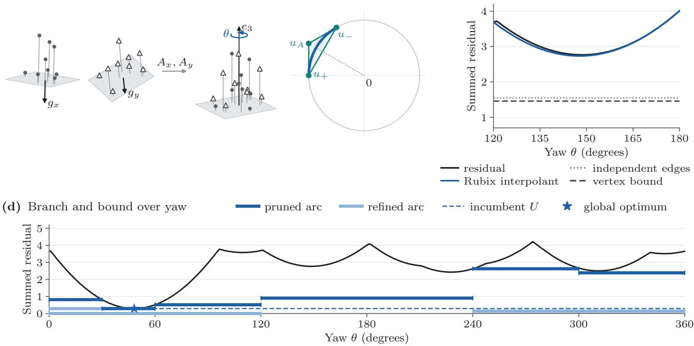  
Figure 4: Gravity reduces 3D alignment to a bounded yaw search. A nine-point complete-matching example. (a) Gravity directions $g _ { x } , g _ { y }$ give leveling rotations $A _ { x } , A _ { y }$ , leaving yaw θ about $_ { e 3 } ;$ heights (stems) remain in every edge cost. (b) Rubix bounds the blue arc from $u _ { - }$ to $u _ { + }$ on $u ( \theta ) = ( \cos \theta , \sin \theta )$ by querying its endpoints and tangent intersection $u _ { A }$ . (c) The afine interpolant stays below the residual, nearly reaching its minimum (2.734 versus 2.765); the minimum vertex value (1.458) and independent-edge bound (1.547) are looser. (d) Algorithm 2 prunes arcs whose bound reaches incumbent U and refines the rest. Nine evaluations close the gap at $4 8 . 2 ^ { \circ }$ . Residuals are summed squared errors. Partial matching fixes translation or uses Section 7.2.

The constructions difer in the pose variables that remain to be searched (Table 1). A known gravity direction leaves only the yaw (Figure 4), whereas unrestricted rotation requires cells of unit quaternions. Complete matching removes the translation by centering, whereas partial matching keeps it as a supplied quantity or as a further search variable. Throughout, we minimize the sum of squared distances over one-to-one correspondences under the pose convention $x _ { i } \approx R y _ { j } + t ;$ for complete matching, a tolerance on the mean residual corresponds to n times that tolerance on the sum. The lemmas, propositions and theorems of this section assume exact arithmetic and exact assignment oracles, and Appendix E specifies the search procedures.

## 7.1 Gravity Alignment and Partial Matching

Suppose that each point set comes with a unit gravity direction, $g _ { x }$ and $g _ { y } ,$ given with the same sign convention. We first level both sets to a common vertical: we choose proper rotations $A _ { x } , A _ { y }$ with $A _ { x } g _ { x } = A _ { y } g _ { y } = e _ { 3 }$ and form $\widetilde { x } _ { i } = A _ { x } x _ { i }$ and $\widetilde { y } _ { j } = A _ { y } y _ { j }$ . Let $R _ { z } ( \theta )$ denote the rotation by θ about $e _ { 3 } .$ . Every rotation that satisfies $R g _ { y } = g _ { x }$ has the form

$$
R = A _ { x } ^ { \top } R _ { z } ( \theta ) A _ { y } , \qquad t = A _ { x } ^ { \top } \widetilde { t } ,\tag{12}
$$

and a supplied translation t becomes $\widetilde { t } = A _ { x } t$ We work with the leveled quantities and drop the tildes below. Leveling does not discard the vertical coordinate: height diferences remain in the matching objective.

Partial matching. To allow unequal cardinalities and points without a counterpart, we use partial matchings $M \subseteq \{ 1 , \dots , n \} \times \{ 1 , \dots , m \}$ in which no row and no column is repeated. Let $\mathcal { M } _ { k }$ contain the matchings with k pairs, where $0 \leq k \leq \operatorname* { m i n } ( n , m )$ . We consider two models. The prescribed-cardinality model fixes k and minimizes the summed residual over $\mathcal { M } _ { k }$ . The penalized model lets the cardinality vary and adds a penalty $\lambda > 0$ for every unmatched point:

$$
E ( M , R , t ) = \sum _ { ( i , j ) \in M } \| x _ { i } - R y _ { j } - t \| ^ { 2 } + \lambda ( n + m - 2 | M | ) .\tag{13}
$$

Penalized matching admits every $\textstyle M \in \bigcup _ { k } { \mathcal { M } } _ { k }$ , including the empty matching; prescribed cardinality restricts

Table 1: Scope of the spatial constructions. “Global” refers to the stated objective and to a search in exact arithmetic that is run to a positive tolerance. Partial matching means either a prescribed cardinality or a penalty on unmatched points.
<table><tr><td>Input and correspondences</td><td>Pose variables</td><td>Assignment oracle</td><td>Scope of the construction</td></tr><tr><td>Known gravity; complete bijection</td><td>Yaw; translation by</td><td>Square linear assignment</td><td>Global yaw, translation, and matching</td></tr><tr><td>Known gravity; partial matching</td><td>centering Yaw at supplied translation</td><td>Prescribed-cardinality or penalized assignment</td><td>Global conditional on that translation</td></tr><tr><td>Known gravity; partial matching</td><td>Yaw and translation</td><td>Partial assignment with a forced anchor</td><td>Global joint search over a finite anchor cover</td></tr><tr><td>Unrestricted rotation; complete bijection</td><td>Proper rotation; translation by</td><td>Square linear assignment</td><td>Global complete  $\operatorname { S E } ( 3 )$  registration</td></tr><tr><td>Unrestricted rotation; partial matching</td><td>centering Proper rotation at supplied translation</td><td>Prescribed-cardinality or penalized assignment</td><td>Global conditional on that translation</td></tr></table>

M to $\mathcal { M } _ { k }$ and omits the penalty. We choose neither k nor λ from reference correspondences. In both models the optimal translation depends on the centroids of the selected subsets, so centering the full sets cannot eliminate it.

The yaw objective. We first fix the translation t and put $x _ { i } ^ { t } = x _ { i } - t ;$ Section 7.2 treats unknown translation. We call a candidate pair $( i , j )$ , which matches $x _ { i }$ to $y _ { j }$ an edge. Expanding the squared distance, the cost of an edge at yaw θ is

$$
c _ { i j } ^ { 0 } - 2 \big ( a _ { i j } \cos \theta + b _ { i j } \sin \theta \big ) ,\tag{14}
$$

where $a _ { i j } = y _ { j x } x _ { i x } ^ { t } + y _ { j y } x _ { i y } ^ { t } , b _ { i j } = y _ { j x } x _ { i y } ^ { t } - y _ { j y } x _ { i x } ^ { t }$ , and $c _ { i j } ^ { 0 } = \| y _ { j , x y } \| ^ { 2 } + \| x _ { i , x y } ^ { t } \| ^ { 2 } + ( y _ { j z } - x _ { i z } ^ { t } ) ^ { 2 }$ is a constant that contains the height diference. For a matching M, let $\begin{array} { r } { \alpha _ { M } = \sum _ { M } a _ { i j } } \end{array}$ and $\begin{array} { r } { \beta _ { M } = \sum _ { M } b _ { i j } } \end{array}$ , and let $c _ { M }$ be the sum of the constants plus any penalty for unmatched points. In the yaw coordinates $u ( \theta ) = ( \cos \theta , \sin \theta )$ , the cost of M is the afine function $g _ { M } ( u ) = c _ { M } - 2 ( \alpha _ { M } u _ { 1 } +$ $\beta _ { M } u _ { 2 } )$ , which we extend to all $u \in \mathbb { R } ^ { 2 }$ . We also define ${ \pmb w } _ { M } = ( \alpha _ { M } , \beta _ { M } )$ and $\kappa _ { \boldsymbol { \theta } } = 2 \operatorname* { m a x } _ { M } \left\| \pmb { w } _ { M } \right\|$ , the largest slope of these afine costs. Their lower envelope over the chosen family M of matchings is

$$
F ( u ) = \operatorname* { m i n } _ { M \in \mathcal { M } } \{ c _ { M } - 2 ( \alpha _ { M } u _ { 1 } + \beta _ { M } u _ { 2 } ) \} .\tag{15}
$$

On the circle $u ( \theta ) , F$ is the smallest physical residual over all matchings; of the circle it has no physical meaning and may be negative. As a minimum of finitely many afine functions, F is concave. One assignment problem, ordinary or augmented with dummy points for the partial models, evaluates $F ( u )$ and returns a matching that attains it, with the heights retained in c<sub>M</sub>. Such a query uses one yaw-coordinate vector for every edge. Minimizing the edges separately over a yaw interval, as Lipschitz rotation search does point by point [40], instead allows diferent edges to use diferent yaws.

The arc bound. We enclose a yaw arc $\theta \in I = [ \mu -$ $h _ { \theta } , \mu + h _ { \theta } ]$ of half-width $0 < h _ { \theta } < \pi / 2$ in the triangle T<sub>I</sub> whose vertices are the two endpoints $u ( \mu - h _ { \theta } )$ and $u ( \mu + h _ { \theta } )$ and the point sec $( h _ { \theta } ) u ( \mu )$ where the tangents at the endpoints intersect (Figure 4b). This third vertex lies outside the circle; the exterior query is necessary because the chord between the endpoints does not enclose the arc. Querying F at the three vertices gives an afine interpolant ℓ of the three values, and the bound for the arc is the minimum of ℓ over the arc. Because $\ell ( u ( \theta ) )$ is a sinusoid in $\theta ,$ this minimum has a closed form.

Lemma 13 (Yaw interpolation and common support). Let $F = \mathrm { m i n } _ { M \in \mathcal { M } } g _ { M }$ be the afine extension over a nonempty finite matching family. For $0 < h _ { \theta } < \pi / 2$ and $I = [ \mu - h _ { \theta } , \mu + h _ { \theta } ]$ , let $\mathcal { T } _ { I }$ be the triangle enclosing $\mathcal { U } _ { I } = \{ u ( \theta ) : \theta \in I \}$ , and let ℓ interpolate its three oracle values. Then

$$
\operatorname* { m i n } _ { v \in \mathrm { v e r t } \mathcal { T } _ { I } } F ( v ) \leq \operatorname* { m i n } _ { u \in \mathcal { U } _ { I } } \ell ( u ) \leq \operatorname* { m i n } _ { u \in \mathcal { U } _ { I } } F ( u ) .\tag{16}
$$

If one matching attains all three oracle values, then $F = \ell$ on $\mathcal { T } _ { I }$ , including when other matchings tie.

The second inequality holds because F is concave and therefore lies above its interpolant throughout the triangle. Appendix D.1.1 gives the interpolation formula and proves the first inequality and the statement on common support.

The yaw search. Algorithm 2 applies the arc bound in a best-first search that starts from three arcs of width

$2 \pi / 3$ , which cover the circle, and bisects arcs as needed. Every matching M returned by a query also gives a feasible update: its cost at yaw θ is the sinusoid $g _ { M } ( u ( \theta ) )$ , and the operation YawMin $\cdot ( g _ { M } , I )$ minimizes it over the arc I by testing the endpoints and any stationary minimum in $I ;$ for a constant sinusoid, either endpoint sufices. We also fit the matchings returned by exterior queries in this way, because the value of $\dot { F }$ at an exterior vertex is not a physical residual.

The algorithm assumes nonempty point sets and, for prescribed cardinality, $k > 0$ . The remaining cases need no search: for $k = 0 ,$ and for empty point sets under complete matching, the value is zero, and if either set is empty, penalized matching returns the empty matching with value $\lambda ( n + m )$ . Ties in the assignment, in the sinusoid minimization and in the queue may be resolved arbitrarily. Every arc starts with the trivial lower bound $L _ { 0 }$ , which is zero for complete or prescribed-cardinality matching and $\lambda | n - m |$ for penalized matching.

The search can be interrupted at any time: an interrupted evaluation leaves the previous bound of its arc in place, and the feasible updates that were completed are kept (Theorem 24). Undoing the leveling and restoring the centroids recovers the pose in the original frame. For partial matching the result remains conditional on the supplied translation, also when the search is alternated with local updates of the translation. The number of queries depends on the requested gap as follows.

Proposition 14 (Conditional-yaw accuracy). For complete matching after centering, or partial matching at a supplied translation, put ${ \pmb w } _ { M } = ( \alpha _ { M } , \beta _ { M } )$ and $\kappa _ { \theta } ~ = ~ 2 \operatorname* { m a x } _ { M } \| \pmb { w } _ { M } \|$ Without an external budget, Algorithm ${ \it 2 } ,$ initialized by three equal arcs, reaches summed-objective gap $\varepsilon > 0$ with $\mathcal { O } ( 1 + \sqrt { \kappa _ { \theta } / \varepsilon } )$ assignment queries.

Proof sketch. Moving the tangent apex to the midpoint of the arc on the circle changes the cost of a matching by at most κ (sec $h _ { \theta } - 1 ) \leq \kappa _ { \theta } h _ { \theta } ^ { 2 }$ for $h _ { \theta } \leq \pi / 3$ . Bisection therefore reaches the required local gap within $\mathcal { O } ( 1 +$ $\sqrt { \kappa _ { \theta } / \varepsilon } )$ cells. If $\kappa _ { \theta } = 0$ , the objective is constant in the yaw. Appendix D.1.2 proves the gap and the query count. □

Yaw coordinates and angles in radians are dimensionless, so $\kappa _ { \theta }$ and the tolerance ε on the summed gap both have units of squared distance. The local gap of the arc bound is quadratic in the half-width of the arc. The next proposition contrasts this with bounds that treat the edges independently.

Proposition 15 (Second-order coupled bounds). Fix the translation, or eliminate it $b y$ centering. Let A be a yaw arc of half-width $h _ { \theta } \in ( 0 , \pi / 3 ]$ , let $F _ { A } ^ { * } =$ min<sub>θ A</sub> $F ( u ( \theta ) )$ , and let $L _ { A }$ denote the lower bound on $A$ under consideration.

(i) The Rubix interpolant bound satisfies $F _ { A } ^ { * } - L _ { A } \leq$ $\kappa _ { \theta } h _ { \theta } ^ { 2 } .$ , with $\kappa _ { \theta }$ as in Proposition $1 \not \angle *$ , and $F _ { A } ^ { * } = L _ { A }$ whenever one matching attains all three triangle values.

(ii) The per-correspondence radius bound of Yang et al. $I 7 6 J ,$ , specialized to yaw,

$$
\operatorname* { m i n } _ { M } \sum _ { ( i , j ) \in M } ( \| R _ { \mu } x _ { i } - y _ { j } \| - 2 \sin ( h _ { \theta } / 2 ) \| x _ { i , x y } \| ) _ { + } ^ { 2 }
$$

and the independent-edge bound

$$
\operatorname* { m i n } _ { M } \sum _ { ( i , j ) \in M } \operatorname* { m i n } _ { \theta \in A } \| R _ { \theta } x _ { i } - y _ { j } \| ^ { 2 }
$$

are first order: there are instances with $F _ { A } ^ { * } -$ $L _ { A } \geq c h _ { \theta }$ on the arcs centered at the minimizer, for a constant $c > 0$ independent of $h _ { \theta }$

(iii) On the radius-bound instance of $( i i )$ , best-first bisection using that bound, a zero floor, and inherited maxima expands $\Omega ( \varepsilon ^ { - 1 / 2 } )$ arcs to certify an absolute gap $\varepsilon < 1$ , while the Rubix bound certifies the optimum after evaluating the three root arcs. This comparison excludes additional global bounds.

Proof sketch. (i) is the local gap in the proof of Proposition $\boldsymbol { 1 4 ; \mathrm { a } }$ common supporting matching makes the interpolant exact by Lemma 13. For (ii), note that the two displayed comparison bounds rotate the source set. One source point (1, 0, 0) and one target $( 2 , 0 , 0 )$ give $F ~ = ~ 5 - 4$ cos θ and a radius-bound gap of 4 sin $\begin{array} { r } { { \cal ( h _ { \theta } / 2 ) } - 4 \sin ^ { 2 } ( h _ { \theta } / 2 ) \geq 2 h _ { \theta } / \pi ; } \end{array}$ two points whose edges prefer the yaws $\pm a$ , with $\pi / 3 \leq a < \pi / 2 .$ , give an independent-edge gap of 8 sin $( a - h _ { \theta } / 2 ) \sin ( h _ { \theta } / 2 ) \geq$ $( 8 / \pi ) \sin ( a / 2 ) h _ { \theta }$ . For (iii), we credit each inherited bound to the ancestor at which it was evaluated and contract its descendant subtree there. For suficiently small $\varepsilon ,$ every terminal descendant of the central root that meets $[ - \sqrt { \varepsilon } , \sqrt { \varepsilon } ]$ has half-width below 100ε. Covering this interval therefore requires at least $1 / ( 1 0 0 \sqrt { \varepsilon } )$ leaves and $1 / ( 2 0 0 \sqrt { \varepsilon } )$ expansions. The objective for a single correspondence is afine in the lifted yaw coordinates, so the Rubix bound is exact on all three root arcs. The full proof and the first-order constructions are in Appendix D.1.3. □

The comparison illustrates the cluster problem studied by Du and Kearfott [23]: near a minimizer with positive curvature, bounds of order below two can leave a number of unresolved cells that grows without bound as the tolerance shrinks, whereas bounds of order two leave a bounded number. Schöbel and Scholz [66] define this rate of convergence for geometric branch-and-bound.

Algorithm 2 Gravity yaw by three assignment queries per arc   
Require: Leveled point sets; complete matching $( n = m )$ , or a partial model and supplied $t ;$ tolerance $\varepsilon > 0 ;$   
optional budget.   
Ensure: Feasible $( M _ { * } , R _ { z } ( \theta _ { * } ) , t _ { * } )$ and residual interval $[ L , U ] .$   
1: For complete matching, save the means and center both point sets; set working $t = 0 .$   
2: Form the coeficients in (14) and the assignment oracle $F .$   
3: Query $F ( u ( 0 ) )$ ; store its matching at $\theta _ { * } = 0$ and its physical cost $U .$   
4: Put three covering arcs in a min-heap, each with lower bound $L _ { 0 }$ and marked unevaluated.   
5: while the heap is nonempty do   
6: $L \gets \operatorname* { m i n } \{ U ,$ <sup>min</sup>I in heap $L _ { I } \}$   
7: Stop if $U - L \leq \varepsilon$ or the budget is exhausted.   
8: Select a least-bound arc $I = [ \mu - h _ { \theta } , \mu + h _ { \theta } ] ;$ ; keep it in the cover during evaluation.   
9: if I is already evaluated then   
10: Replace I atomically by its two half-arcs, unevaluated and inheriting $\mathit { L } _ { \mathit { I } } ;$ continue.   
11: $u _ { - } \gets u ( \mu - h _ { \theta } ) , u _ { + } \gets u ( \mu + h _ { \theta } ) , u _ { A } \gets \sec ( h _ { \theta } ) u ( \mu ) .$   
12: for $v \in \{ u _ { - } , u _ { + } , u _ { A } \}$ do   
13: Query $( f _ { v } , M _ { v } )  F ( v ) .$   
14: $( \theta _ { v } , U _ { v } ) \gets \mathrm { Y A W M I N } ( g _ { M _ { v } } , I ) .$   
15: If $U _ { v } < U ,$ store this feasible matching and yaw, and set $U  U _ { v } .$   
16: Let ℓ interpolate $( v , f _ { v } )$ at the three vertices.   
17: $L _ { I } \gets \operatorname* { m a x } \{ L _ { I } , \operatorname* { m i n } _ { \theta \in I } \ell ( u ( \theta ) ) \}$   
18: Remove I if $L _ { I } \geq U ;$ otherwise update its heap key and mark it evaluated.   
19: Recompute $L = \operatorname* { m i n } \{ U ,$ <sup>min</sup>I in heap $L _ { I } \}$ , taking the empty-heap minimum as $+ \infty .$   
20: Restore $t _ { * } = m _ { x } - R _ { z } ( \theta _ { * } ) m _ { y }$ for complete matching; retain the supplied t for partial matching.   
21: Return the stored pose and matching with $[ L , U ] .$

Remark 16 (Unbalanced transport). The penalty on unmatched points has a transport interpretation. Give every point unit mass. At a fixed pose, unbalanced transport with a total-variation penalty on the marginals minimizes $\begin{array} { r } { \sum _ { i j } P _ { i j } c _ { i j } + \lambda ( \| \mathbf { 1 } - P \mathbf { 1 } \| _ { 1 } + \| \mathbf { 1 } - } \end{array}$ $P ^ { \top } \mathbf { 1 } \| _ { 1 } )$ over nonnegative $P ,$ where $c _ { i j } = \| x _ { i } - R y _ { j } - t \| ^ { 2 }$ Reducing the excess mass in a row decreases the penalty of that row by at least as much as it increases the penalties of the columns, and it does not increase the transport cost. The same argument applies to columns, so some optimal $P$ satisfies $P \mathbf { 1 } \leq \mathbf { 1 }$ and $P ^ { \top } \mathbf { 1 } \leq \mathbf { 1 }$ The objective is then $\begin{array} { r } { \sum _ { i j } P _ { i j } ( c _ { i j } - 2 \lambda ) + \lambda ( n + m ) } \end{array}$ which is linear on the bipartite matching polytope, whose vertices are the partial matchings. The penalized objective (13) is therefore rigid unbalanced transport with this penalty. With zero heights, Algorithm $2$ computes it over planar rotations at a supplied translation and reaches a gap of $\varepsilon$ with ${ \mathcal O } ( 1 + \sqrt { \kappa _ { \theta } / \varepsilon } )$ assignment queries, because its arc bounds are second order (Propositions 14 and 15). Unbalanced GW [68] instead compares the internal distances of the two sets under marginals relaxed by a Kullback–Leibler penalty and is solved by local alternation; Section 8.3 compares the two.

## 7.2 Joint Gravity Alignment with Unmatched Points

When the translation of a partial matching is unknown, it must be searched together with the yaw, and the search needs a bounded translation domain before the matched subsets are known. Anchors provide one. Suppose that a feasible solution of cost U is known and that the matching has cardinality $k > 0$ . Every matching that improves on U then has an edge whose residual has norm at most $\sqrt { U / k }$ . For each candidate edge $( i , j )$ , the anchor, we translate the observations by $x _ { i }$ and $y _ { j }$ , force that edge into the matching, and write $t = x _ { i } - R _ { z } ( \theta ) y _ { j } + e$ , so that −e is the residual of the anchor. This gives nm forced-anchor domains $e \in [ - \sqrt { U / k } , \sqrt { U / k } ] ^ { 3 }$ , one for each anchor, which may overlap.

A cell of this search is the product of a yaw arc and a translation box. The cost $E _ { M } ( \theta , e )$ of a matching is no longer afine, because it is quadratic in the translation; but at a fixed cardinality every matching has the same quadratic term. For a box centered at $c _ { B }$ we therefore subtract $k \| e - c _ { B } \| ^ { 2 }$ from each cost. The resulting function $h _ { M }$ is afine in the yaw coordinates and afine in each translation coordinate, so it equals its interpolant from the vertices of the product of the yaw triangle and the translation box. This product has $3 \times 8 = 2 4$ vertices $v = ( u , e ) \in \mathbb { R } ^ { 2 } \times \mathbb { R } ^ { 3 }$ . We solve one assignment problem at each of them and retain a feasible matching $W$ as a witness, whose slack is its largest excess over the minimum at the vertices,

$$
\Delta _ { W } = \operatorname* { m a x } _ { v } \big \{ h _ { W } ( v ) - \operatorname* { m i n } _ { M } h _ { M } ( v ) \big \} .\tag{17}
$$

Lemma 17 (Joint-gravity cover and witness bound). For prescribed cardinality $k > 0$ and a feasible cost U, the nm forced-anchor domains above, with radius $\sqrt { U / k }$ , cover every improving pose and matching. For penalties, the same holds after partitioning by $k ,$ subtracting $p _ { k } \ = \ \lambda ( n + m - 2 k )$ from $U ,$ , retaining all branches with $p _ { k } \leq U$ , and testing the empty matching separately. Within one branch, let W be any feasible matching of size k. On every yaw-triangle/translationbox cell, the slack in (17) satisfies

$$
\operatorname* { m i n } _ { M } E _ { M } ( \theta , e ) \geq E _ { W } ( \theta , e ) - \Delta _ { W } .\tag{18}
$$

If W supports all 24 product vertices, equality holds throughout the cell.

The witness bound holds because the nonnegative interpolation weights extend the excess at the vertices throughout the cell, after which the common quadratic term is restored; Appendix D.2.1 proves both parts of the lemma. Minimizing the right-hand side of (18) over the cell gives a lower bound for the cell and, at the same time, a feasible pose for the witness; when $\Delta _ { W } = 0$ , this fit solves the cell. At a fixed yaw, the optimal e is the diference between the centroids of the matched points after rotation, clipped to the translation box. Between changes of the clipping pattern, the cost is a trigonometric polynomial of degree two in the yaw, whose stationary points are the roots of a quartic. Appendix D.2.2 derives this fit, which Algorithm $\mathrm { A . 2 }$ uses, including clipping, degenerate quartics and ties, and Appendix D.7.2 reduces the cost of its construction.

A common-translation bound. A simpler bound needs no witness. It evaluates the yaw interpolant of Section 7.1 at each corner of the translation box and subtracts k times the squared half-diagonal of the box, which again keeps one translation common to all edges. It does not require one-to-one matchings: it also holds when a fixed number of nearest-neighbor pairs is selected and targets may repeat, which is the trimmed objective of GLORES and allows the bound to be inserted there (Section 8.4.1). To match the convention of that solver, the next two statements rotate X toward Y. For $u = ( u _ { 1 } , u _ { 2 } )$ , define $\widehat { R } ( u )$ to have horizontal block $\left( \begin{array} { c c } { { u _ { 1 } } } & { { - u _ { 2 } } } \\ { { u _ { 2 } } } & { { u _ { 1 } } } \end{array} \right)$  and, in three dimensions, to leave height unchanged.

Lemma 18 (Common translation). Use the pose convention $R _ { z } ( \theta ) x _ { i } + t - y _ { j }$ , reversing the point-set names in (1). Let $\boldsymbol { A } _ { \mathrm { s e l } }$ be a nonempty finite, pose-independent family of selections of exactly $k \geq 1$ pairs from planar or three-dimensional point sets. Define

$$
\begin{array} { r } { F ( u , t ) = \underset { A _ { \mathrm { s e l } } \in A _ { \mathrm { s e l } } } { \operatorname* { m i n } } \sum _ { ( i , j ) \in A _ { \mathrm { s e l } } } \big [ \| \widehat { R } ( u ) x _ { i } + t - y _ { j } \| ^ { 2 } } \\ { + ( 1 - \| u \| ^ { 2 } ) \| x _ { i , x y } \| ^ { 2 } \big ] . } \end{array}\tag{19}
$$

For planar inputs, $x _ { i , x y } = x _ { i }$ . Let B be an axis-aligned translation box with center $c _ { B }$ , nonnegative halfwidths $h _ { t }$ , and corners $t _ { \nu ; \ l }$ , retaining duplicate corners when necessary. Let a nondegenerate triangle enclose the physical yaw arc $\mathcal { U } _ { I }$ for an interval $I ,$ and let $\ell _ { \nu }$ interpolate $F ( \cdot , t _ { \nu } )$ at its three vertices. Then

$$
\operatorname* { m i n } _ { \nu } \operatorname* { m i n } _ { u \in \mathcal { U } _ { I } } \ell _ { \nu } ( u ) - k \| h _ { t } \| ^ { 2 } \leq \operatorname* { m i n } _ { u \in \mathcal { U } _ { I } , t \in B } F ( u , t ) .\tag{20}
$$

Selections may repeat targets, as in fixed-count trimmed nearest neighbors.

Proof sketch. The correction term for points of the circle keeps the cost of each selection afine in u. Every selection has k pairs and hence the same quadratic term in the translation, so $F _ { \mathrm { r e d } } = F - k \| t - c _ { B } \| ^ { 2 }$ is concave in u and concave in t separately. Interpolation over the box and over the triangle then gives the bound, since $\| t _ { \nu } - c _ { B } \| ^ { 2 } = \| h _ { t } \| ^ { 2 }$ at every corner of the box and $F \geq F _ { \mathrm { r e d } }$ (Appendix D.3.1). □

On a rational grid, the accuracy of this bound can be quantified.

Proposition 19 (Fixed-cardinality gravity approximation). Let E be a finite set of pairs of rational threedimensional points and let $\boldsymbol { A } _ { \mathrm { s e l } }$ be a nonempty, globally fixed family of selections of exactly $k \geq 1$ pairs from E. Assume an exact polynomial-time rational oracle for afine minimization over $\boldsymbol { A } _ { \mathrm { s e l } }$ . For unit scale, yaw, and translation in a rational box B of side lengths $\ell _ { j }$ choose a rational bound

$$
\kappa _ { B } \geq 2 k \operatorname* { m a x } _ { ( i , j ) \in \mathcal { E } } \operatorname* { s u p } _ { t \in B } \left\| x _ { i , x y } \right\| \left\| t _ { x y } - y _ { j , x y } \right\| .\tag{21}
$$

For rational $\varepsilon > 0$ , a feasible pose and an enclosing summed-objective interval of width at most ε can be obtained with at most 128 $\textstyle N _ { \theta } \prod _ { j = 1 } ^ { 3 } N _ { t , j }$ oracle calls, where $N _ { \theta } = \operatorname* { m a x } \{ 1 , \lceil 2 \sqrt { \kappa _ { B } / \varepsilon } \rceil \}$ and

$$
N _ { t , j } = \operatorname* { m a x } \{ 1 , \lceil \sqrt { 3 k \ell _ { j } ^ { 2 } / ( 2 \varepsilon ) } \rceil \} .\tag{22}
$$

The count is $\mathcal { O } ( \varepsilon ^ { - 2 } )$ at fixed numerical scales.

Proof sketch. A rational parameterization of the yaw gives rational arc endpoints, tangent intersections and nearby physical samples. Combining the Lipschitz error of these samples with the bound on the translation term gives $U - L \overset { \cdot } { \leq } k \| h _ { t } \| ^ { 2 } + 2 \kappa _ { B } / N _ { \theta } ^ { 2 } \leq \varepsilon$ . Appendix D.3.2 constructs the grid and proves the count. □

A rational $\kappa _ { B }$ is obtained from horizontal $\ell _ { 1 }$ bounds. An unrestricted optimum lies in $[ - r _ { t } , r _ { t } ] ^ { 3 }$ , where $r _ { t } =$ max<sub>i</sub> $\| x _ { i } \| _ { 1 } + \operatorname* { m a x } _ { j } \| y _ { j } \| _ { 1 }$ , by the centroid formula for the selected pairs. This is a guarantee of additive accuracy: its count depends on the numerical scale and on the inverse tolerance, not only on their bit lengths. It does not apply to pose-dependent screening, to variable cardinality, or to the number of queries made by the adaptive search of GLORES. For mean residuals, we use the summed tolerance kε<sub>mean</sub>.

## 7.3 From the Polygon to a Spatial Polytope

We now drop the gravity constraint and consider complete matching of equally weighted sets in $\mathbb { R } ^ { 3 }$ , for which centering removes the translation. We write $a _ { i } \ = \ x _ { i } ^ { c } \ = \ x _ { i } - m _ { x } , \ b _ { j } \ = \ y _ { j } ^ { c } \ = \ y _ { j } - m _ { y } ,$ and $\begin{array} { r } { S = \sum _ { i } \| a _ { i } \| ^ { 2 } + \sum _ { j } \| b _ { j } \| ^ { 2 } } \end{array}$ . Each planar correlation is replaced by a matrix, and the polygon by a polytope:

$$
C _ { \sigma } = \sum _ { i } a _ { i } b _ { \sigma ( i ) } ^ { \top } , \qquad \mathcal { C } = \mathrm { c o n v } \{ C _ { \sigma } : \sigma \in S _ { n } \} .\tag{23}
$$

As in the plane, one assignment problem with scores $a _ { i } ^ { \top } D b _ { j }$ maximizes $\langle D , C \rangle _ { F }$ over C for any matrix $D .$ and returns a permutation, its correlation matrix and the support value.

For a fixed matching, the best rotation is found by Horn’s quaternion method [30]. A unit quaternion $q \in$ $\mathbb { R } ^ { 4 }$ , written with its scalar coordinate first, represents a proper rotation $R ( q )$ . Let ${ \mathbb S } ^ { 4 }$ denote the symmetric $4 \times 4$ matrices. Horn’s linear map $K : \mathbb { R } ^ { 3 \times 3 } \stackrel { \cdot } { \to } \mathbb { S } ^ { 4 }$ gives a symmetric matrix $K ( C )$ of trace zero that satisfies

$$
\langle R ( q ) , C \rangle _ { F } = q ^ { \top } K ( C ) q , \qquad \| q \| = 1 .\tag{24}
$$

Antipodal quaternions describe the same rotation, so the parameter space is $\mathbb { R } ^ { \mathbb { P } ^ { 3 } }$ . The best rotation score of a fixed matching is thus the largest eigenvalue of $K ( C _ { \sigma } )$ . Combining this quaternion lift and convex representations of the rotations [64, 65] with the polytope gives

$$
E _ { \mathrm { S E ( 3 ) } } ^ { * } = S - 2 \operatorname* { m a x } _ { C \in \mathcal { C } } \lambda _ { \operatorname* { m a x } } ( K ( C ) ) .\tag{25}
$$

Theorem 20 (Spatial covariance reduction). For equally weighted complete point sets of the same positive size in $\mathbb { R } ^ { 3 }$ , the optimal proper rigid residual is (25). Some vertex of C attains its maximum, and any unit top eigenvector of its quaternion matrix gives an optimal rotation; translation is $m _ { x } - R m _ { y }$ . If the centered point sets have ranks $r _ { X } , r _ { Y }$ , then dim $\mathcal { C } = r _ { X } r _ { Y } \le 9$ Repeated points, rank deficiency, and eigenvalue ties are allowed. Rational inputs admit a finite exact polytope reduction, without a claimed polynomial vertex or facet count.

A vertex attains the maximum because the largest eigenvalue is convex, just as the planar optimum is

(a) Chart cell

(b) Lifted yaw section  
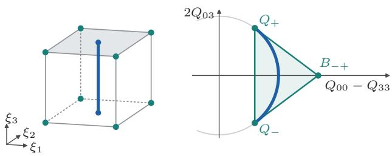  
Figure 5: Bounding rotations through quaternion lifts. (a) An illustrative chart cell $\tilde { q } = ( 1 , \xi _ { 1 } , \xi _ { 2 } , \xi _ { 3 } )$ with $\xi _ { 1 } , \xi _ { 2 } , \xi _ { 3 } \in [ - \frac 1 2 , \frac 1 2 ]$ . Its eight raw corners (teal) define the cell, and its central segment $\xi _ { 1 } = \xi _ { 2 } = 0$ (blue) contains the pure yaw rotations. (b) On this yaw section, in the coordinates $( Q _ { 0 0 } - Q _ { 3 3 } , 2 Q _ { 0 3 } )$ of $Q = q q ^ { \top }$ and not of the raw quaternion, the endpoint lifts $Q \pm$ and the exterior cross lift $B _ { - + }$ enclose the arc of physical rotations (blue). Assignment values at these query matrices bound the correlation score throughout the region. The full three-dimensional construction uses at most 36 queries per box before reuse; the illustrated section uses three.

attained at a farthest vertex of the polygon, and the reduction yields proper rotations, in agreement with the determinant correction of the Procrustes solution. Appendix D.4 proves the theorem, together with the rank formula and the finite exact construction.

The exact reduction is finite but comes without a polynomial bound. For every fixed dimension $d \geq 2 ,$ and in particular for $d = 3$ , we conjecture that the number of vertices of the matrix-correlation polytope grows superpolynomially in the worst case, with no uniform polynomial bound in n (Appendix B.3.1), and no reconstruction guarantee like the 2V queries of Proposition 9 is known. We therefore use the reduction only to fit the matchings that are returned during a search over quaternion regions, in which each assignment query again shares one direction across all edges.

## 7.4 Quaternion Region Bounds

The score (24) is quadratic in q but linear in the matrix $Q = q q ^ { \top } \in \mathbb { S } ^ { 4 }$ , which we call the $l i f t$ of $q .$ This linearity lets assignment queries bound whole regions of rotations. We cover the rotations by four charts. In each chart, we choose a coordinate of the quaternion that has the largest magnitude, make it positive, and scale it to one, so that the other three coordinates lie in $[ - 1 , 1 ] ^ { 3 }$ . Splitting each of them at zero gives eight boxes per chart, hence 32 boxes that cover every proper rotation. The boxes overlap on their boundaries, which is harmless. Within each box, any two corners have a dot product of at least one.

Let q˜ range over one such box, or over a box obtained from it by subdivision, with raw corners $\tilde { q } _ { 1 } , \dots , \tilde { q } _ { N _ { \mathrm { r a w } } } ,$ where $N _ { \mathrm { r a w } } = 8$ . The raw vector q˜ is not normalized; its unit representative is $q = \tilde { q } / \lVert \tilde { q } \rVert$ . From the corners we form the 36 symmetric matrices

$$
B _ { a b } = \frac { \tilde { q } _ { a } \tilde { q } _ { b } ^ { \intercal } + \tilde { q } _ { b } \tilde { q } _ { a } ^ { \intercal } } { 2 \tilde { q } _ { a } ^ { \intercal } \tilde { q } _ { b } } , \qquad a \leq b .\tag{26}
$$

The matrices $B _ { a a }$ are the lifts of the normalized corners. The cross terms $B _ { a b }$ with $a < b$ play the role of the exterior vertex of the yaw triangle: all $B _ { a b }$ have trace one, but the cross terms need not be positive semidefinite or represent physical poses.

To bound all matchings over a box, we define the assignment support of a matrix $Q \in \mathbb { S } ^ { 4 }$

$$
H ( Q ) = \operatorname* { m a x } _ { \sigma \in S _ { n } } \langle K ( C _ { \sigma } ) , Q \rangle _ { F } .\tag{27}
$$

To evaluate H, we use the adjoint linear map $K ^ { * } :$ $\mathbb { S } ^ { 4 } \to \mathbb { R } ^ { 3 \times 3 }$ and write $D ( Q ) = K ^ { * } ( Q )$ , which is defined by $\langle D ( Q ) , C \rangle _ { F } = \langle Q , K ( C ) \rangle _ { F }$ . Then

$$
H ( Q ) = \operatorname* { m a x } _ { \sigma \in S _ { n } } \sum _ { i } a _ { i } ^ { \top } D ( Q ) b _ { \sigma ( i ) } .\tag{28}
$$

Thus one assignment problem evaluates $H ( B _ { a b } )$ and returns a matching that attains this support value. For the lift of a unit quaternion, ${ \cal D } ( q q ^ { \top } ) = { \cal R } ( q )$ is the rotation itself; for the exterior matrices, $D ( B _ { a b } )$ need not be a rotation. A witness matching can tighten the resulting bound, as in the joint gravity search. For any matching τ , we define its largest deficit at the queries,

$$
\delta _ { \tau } = \operatorname* { m a x } _ { a \leq b } \left\{ H ( B _ { a b } ) - \langle K ( C _ { \tau } ) , B _ { a b } \rangle _ { F } \right\} .\tag{29}
$$

Lemma 21 (Quaternion enclosure and witness bound). Let q˜ lie in the convex hull of nonzero raw quaternion vertices $\tilde { q } _ { a }$ satisfying $\tilde { q } _ { a } ^ { \top } \tilde { q } _ { b } > 0$ for every pair, and put $q = \tilde { q } / \lVert \tilde { q } \rVert$ . The matrices in (26) enclose $q q ^ { \top }$ , that is, $q q ^ { \top } \in \mathrm { c o n v } \{ B _ { a b } : a \leq b \}$ . Consequently the support H in (27) satisfies

$$
H ( q q ^ { \top } ) \leq \operatorname* { m i n } \{ \operatorname* { m a x } _ { a \leq b } H ( B _ { a b } ) , \lambda _ { \operatorname* { m a x } } ( K ( C _ { \tau } ) ) + \delta _ { \tau } \}\tag{30}
$$

for every feasible permutation τ , with $\delta _ { \tau }$ as in (29). A common supporting permutation has $\delta _ { \tau } = 0$ , regardless of ties.

Proof sketch. Write $\begin{array} { r } { \tilde { q } = \sum _ { a } \alpha _ { a } \tilde { q } _ { a } } \end{array}$ with convex weights. Expanding the normalized lift gives a convex combination of the corner and cross-corner lifts, because their dot products are positive. Convexity of $H ,$ , which is a maximum of linear functions, gives the first bound. Subtracting the linear score of the witness before interpolating, and then applying the Rayleigh inequality, gives the second. Appendices D.5 and D.5.1 prove the enclosure, the coverage by charts and the convergence under refinement. □

The enclosure is an instance of the convex-hull property of rational Bézier representations with positive weights [59], and restricted to pure yaw rotations it recovers the triangle of Section 7.1 (Figure 5 and Appendix D.5). If τ attains the support value at every query, the bound equals the score of the feasible fit of $\tau ,$ so the cell is closed even when its residual is not zero. We minimize the witness bound over the available witnesses and combine it with two cheaper rotationcap bounds, which depend only on the largest angular distance of the cell from its center (Appendix D.6).

For a cell Ω, we denote by $b _ { \Omega }$ the smallest available upper bound on the score: the largest exterior support value, the witness bounds, and the rotation-cap bounds. Since the residual decreases as the correlation score increases, the lower bound on the residual of the cell is

$$
L _ { \Omega } = \operatorname* { m a x } \{ 0 , S - 2 b _ { \Omega } \} .\tag{31}
$$

Each returned permutation σ gives the feasible residual $S - 2 \lambda _ { \operatorname* { m a x } } ( K ( C _ { \sigma } ) )$ after its rotation is fitted; the fitted pose may lie outside the cell and can still improve the incumbent. Algorithm A.3 uses at most 36 exterior queries per box before reuse, bisects the longest raw coordinate, and inherits bounds through Algorithm A.1. In our experiments, the search with the rotation-cap bounds alone is the baseline, and Rubix adds the exterior queries and witness bounds to it; both share the search and its feasible updates. The stronger of the two rotation-cap bounds already couples the edges, because it bounds the gain of any matching over a retained witness.

At a fixed translation, the construction also permits prescribed-cardinality and penalized matching. We subtract t from the fixed set, replace $C _ { \sigma }$ by the correlation of the selected pairs, and absorb the constant of each matching, which now depends on the selected pairs, into a scalar multiple of the identity in K (Appendix D.9). For unknown translation, an optimum is still attained at a vertex of a finite hull, now of matching moments.

Proposition 22 (Finite moment reduction for partial rigid alignment). For finite point sets and either prescribed cardinality $0 \leq k \leq \operatorname* { m i n } ( n , m )$ or a positive unmatched penalty, freely translated partial proper-rigid alignment attains an optimum at a vertex of the convex hull of matching statistics

$$
\Big ( | M | , \sum _ { M } x _ { i } , \sum _ { M } y _ { j } , \sum _ { M } ( \| x _ { i } \| ^ { 2 } + \| y _ { j } \| ^ { 2 } ) , \sum _ { M } x _ { i } y _ { j } ^ { \top } \Big ) .\tag{32}
$$

The vector coordinates $\begin{array} { r } { { \pmb { s } } _ { X , M } = \sum _ { M } x _ { i } } \end{array}$ and $\begin{array} { r } { { \pmb { s } } _ { Y , M } = } \end{array}$ $\sum _ { M } y _ { j }$ are coordinate sums, not centroids; write $S _ { M } =$ $\overline { { \sum _ { M } } } ( \| x _ { i } \| ^ { 2 } + \| y _ { j } \| ^ { 2 } )$ and $\begin{array} { r } { C _ { M } = \sum _ { M } x _ { i } y _ { j } ^ { \top } } \end{array}$ for the scalar norm sum and matrix correlation. This hull has dimension at most 17 and a linear support oracle given by partial assignment. A nonempty vertex matching is evaluated by subset centering and proper Procrustes alignment [30]; the empty matching is evaluated separately.

Proof sketch. At fixed R, t, the objective is afine in these statistics. Its infimum over poses is concave and attains its minimum at a vertex of the hull; subset centering gives each nonempty matching a pose optimum that is attained (Appendix D.9.1). □

The complexity of reconstructing this hull is open, and we do not use it algorithmically: our partial quaternion search fixes the translation. In floating point, the assignments and eigenvalues of all these searches give numerical gaps, which are not the exact certificates of Proposition 11.

## 7.5 Reusing Assignment Certificates

We apply a cheap valid bound first and reserve the exterior queries for the cells that remain unresolved. Tightening a cell updates its priority in the queue without subdividing it, and neighboring cells reuse geometry, witnesses and support values. Two devices reduce the number of assignment problems.

The first is a matching-diference bound, which replaces the separate assignments at the query matrices by one assignment. For the edge scores $A _ { i j } ( Q ) =$ $\langle K ( a _ { i } b _ { j } ^ { \top } ) , Q \rangle _ { F }$ and a known permutation $\tau _ { : }$ , we take for each edge its largest advantage over the edge that τ assigns to the same row,

$$
d _ { i j } ^ { \tau } = \operatorname * { m a x } _ { a \leq b } \{ A _ { i j } ( B _ { a b } ) - A _ { i , \tau ( i ) } ( B _ { a b } ) \} ,\tag{33}
$$

and form $\begin{array} { r } { \eta _ { \tau } ~ = ~ \operatorname* { m a x } _ { \sigma } \sum _ { i } d _ { i , \sigma ( i ) } ^ { \tau } } \end{array}$ by one assignment. The second device replaces a support query by a check against dual prices. For any column prices $g = ( g _ { j } ) _ { j = 1 } ^ { n } \in \mathbb { R } ^ { n }$ , we set

$$
\begin{array} { c } { f _ { i } = \displaystyle \operatorname* { m a x } _ { j } \{ A _ { i j } ( Q ) - g _ { j } \} , } \\ { \displaystyle H _ { \mathrm { d u a l } } ( Q ; g ) = \sum _ { i } f _ { i } + \sum _ { j } g _ { j } , } \end{array}\tag{34}
$$

so that $f _ { i } + g _ { j } \geq A _ { i j } ( Q )$ . Prices obtained at one query can thus be reused at another, where only the row maxima must be recomputed.

Lemma 23 (Cheaper bounds from matching diferences and duals). For a feasible square-assignment witness $\tau ,$ the quantities in (33) satisfy $\eta _ { \tau } \geq 0$ and

$$
H ( Q ) \leq \langle K ( C _ { \tau } ) , Q \rangle _ { F } + \eta _ { \tau } \quad f o r \ Q \in \mathrm { c o n v } \{ B _ { a b } \} .\tag{35}
$$

For $N _ { \mathrm { q u e r y } }$ vertices, construction and one assignment cost $\mathcal { O } ( N _ { \mathrm { q u e r y } } n ^ { 2 } + n ^ { 3 } )$ operations and $\mathcal { O } ( n ^ { 2 } )$ streamed storage. Any prices in (34) also give a valid support upper bound, $H ( Q ) \leq H _ { \mathrm { d u a l } } ( Q ; g )$ ; a feasible matching attaining it is optimal. Row-complete rectangular matching requires nonnegative column prices, and equality requires zero prices on unused columns.

The diference bound follows from the linearity of the scores and the convex enclosure, and the dual bound from weak duality (Appendix D.7.1). By the first, (30) holds with $\eta _ { \tau }$ in place of $\delta _ { \tau } .$ at a cost that compares with $\mathcal { O } ( N _ { \mathrm { q u e r y } } n ^ { 3 } )$ for $N _ { \mathrm { q u e r y } }$ assignment queries. The diference bound can be weaker than the bound from the full set of queries, but when $\eta _ { \tau } = 0$ it closes a region on which the witness remains optimal. Substituting dual upper bounds into (29) likewise preserves (30). A dual bound that is attained by a feasible matching recovers the exact support value without another assignment solve; otherwise it remains a valid but conservative upper bound that later queries can tighten. The remaining budget and the measured costs can guide which bound to evaluate. The joint gravity search admits an analogous bound from minimum diferences, after the common quadratic term in the translation is subtracted (Appendix D.7.2).

## 7.6 Guarantees of the Search

The regional bounds yield a global interval only while the queue covers every solution that can improve the incumbent. The following theorem states this invariant, which also covers initial cells that are still pending and evaluations that are interrupted, and the refinement conditions needed for termination. If a budget is exhausted first, the remaining gap may exceed ε.

Theorem 24 (Anytime interval and positive-tolerance termination). Suppose the root domains cover every solution improving the initial feasible incumbent, and every root is retained until validly pruned. Give each live region Ω a valid residual lower bound $L _ { \Omega } ,$ replace it only by a complete finite child cover, and discard it only when $L _ { \Omega } \geq U$ . Then every interruption preserves

$$
\operatorname* { m i n } \{ U , \operatorname* { m i n } _ { \Omega } L _ { \Omega } \} \leq E ^ { * } \leq U ,\tag{36}
$$

with the empty minimum interpreted $a s + \infty$ . Without an external budget, the specified conditional-yaw, jointgravity, and quaternion searches terminate at every $\varepsilon >$ 0, provided tightening eventually yields to subdivision and every active coordinate shrinks along refined paths.

Proof sketch. Feasible updates only decrease U, so pruned regions remain excluded; complete child covers and inherited bounds retain every other candidate. On the finite compact root cover, the bounds converge to the physical values as the cells shrink. An infinite refinement would contain an infinite path along which the gap tends to zero, which contradicts the stopping rule for a least-bound cell. Appendix D.8 proves this argument, using the local convergence results of $\mathrm { A p \mathrm { - } }$ pendices D.1.2, D.2.3 and D.5.1; Appendix E.1 handles interruptions. □

## 8 Experiments

We evaluate planar alignment, shape retrieval and material classification, alignment under partial overlap, and registration search (Sections 8.1 to 8.4).

Experimental design. Solver comparisons fix the inputs, objective and evaluation; retrieval and classification fix the procedure and change only the distance. Registration comparisons change only the bound or matching subsolver within a fixed search procedure, the host. We report adaptations to the baselines’ recommended settings and sweep parameters that trade accuracy for cost.

Timings include initialization, bound evaluation and feasible updates; paired comparisons use identical inputs and one processor core. Statistics include every test pair, with paired McNemar and Wilcoxon tests for retrieval and classification. Floating-point gaps are numerical; exact certificates concern rational planar inputs. Appendices F, F.9, F.10 and F.14 give the protocols, Appendix F.1 describes the hardware, and Appendix G reports contextual results. We will release all code and dependencies.

## 8.1 Global Planar Alignment

Double-precision Rubix computes the numerical reference value $v _ { \mathrm { r e f } }$ with SciPy’s assignment solver [21, 74]. Costs are squared PW distances. A numerical failure occurs when a cost exceeds $v _ { \mathrm { r e f } }$ by more than $1 0 ^ { - 9 } \operatorname* { m a x } ( v _ { \mathrm { r e f } } , 1 0 ^ { - 1 2 } )$ ; more than 1% excess means a cost above $1 . 0 1 v _ { \mathrm { r e f } }$ . Exact-arithmetic certificates are tested separately (Appendices C and F.2).

All methods use identical centered inputs, eliminating translation exactly, and optimize over $G = \mathrm { S O ( 2 ) }$ ; additional synthetic tests permit $G = \mathrm { O } ( 2 )$ . AM starts from covariance eigenvectors (PCA), uniform random rotations or a GW matching [4]. The grid baseline solves assignments at equally spaced angles and optimizes each returned matching’s rotation. All minimize the same PW objective (Appendix F.4).

Polygon size. Tight instances require exact arithmetic: at $n = 2 0$ , Rubix recovers all 380 vertices with $7 6 0 = 2 V$ assignments, against 56 vertices in double precision (Appendix C). On Gaussian sets, MNIST digits and noisy copies, the median grows roughly as $n ^ { 1 . 2 4 }$ , reaching 1,350 at $n = 2 0 0$ against the bound of 39,800 (Figure 6). Full reconstruction uses exactly

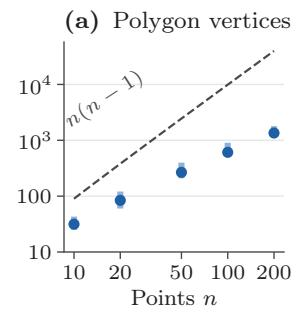

(b) Median time (s)  
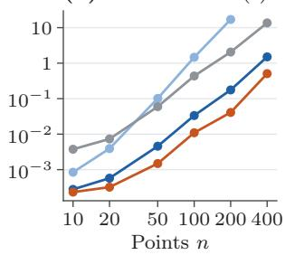  
Full polygon Rubix Grid 360 AM (PCA)  
Figure 6: Observed polygon sizes remain below the worst-case bound. Gaussian, MNIST-digit and noisycopy pairs, timed serially on one thread. (a) Median vertex count (dots) and range across the three families, with the sharp bound $n ( n - 1 )$ (dashed). (b) Median time per pair for full polygon reconstruction, the pruned Rubix search, a 360-angle grid and AM (PCA). Full reconstruction stops at $n = 2 0 0$

$2 V$ assignments in all 135 tests. Pruned Rubix needs a median of 12–36 assignments for $n = 1 0 { - } 4 0 0$ and agrees with full reconstruction wherever both run. At $n = 4 0 0$ , it takes 1.50 s, against 13.6 s for a 360-angle grid and 0.51 s for AM (PCA), which has more than 1% excess on 43 of the study’s 144 pairs (Appendix F.3).

Accuracy and cost. On 1,000 pairs each of MPEG-7 silhouettes $( n = 6 4 )$ , Gaussian sets $( n = 5 0 )$ and noisy lattice neighborhoods $( n = 2 4 )$ , AM (PCA) has more than 1% excess on 33–77% of pairs (Table A.2). Ten random starts use five to nine times as many assignments yet retain 35–48.5% excess rates; GW initialization fails more often than PCA. A 360-angle grid stays within 1% throughout using about 12 times Rubix’s assignments, but up to 5% of its costs exceed the numerical threshold. Lipschitz branch-and-bound also needs far more assignments (Appendix F.4).

Among tested grids, the smallest with at most 1% numerical failures needs 72–720 angles and 1.8–25 times pruned Rubix’s runtime on the first 200 pairs per family. These grids are selected on the timed pairs themselves. Matching every MPEG-7 reference requires 1,440 angles and 50 times Rubix’s runtime; 100-start AM takes 10–24 times as long and still fails on 2.5– 11.5% (Table A.4 and Figure A.1). Single-run AM remains cheaper: mean times on MPEG-7 are 3.3 ms for AM (PCA) and 11.8 ms for Rubix (Appendix F.5).

Published solvers. On 200 pairs per family, original Fiedler–W [2] has 63.0–87.5% excess rates and takes 1.54–6.02 times as long as Rubix. Our reproduction is faster on MPEG-7 and Gaussian pairs but has similar errors; both implementations agree on 592/600 objectives and matchings. Our Ping-Pong reproduction [25] and stochastic Wasserstein–Procrustes [28] have higher error rates and take over 20 times as long (Table 2).

For the common SO(2) objective, we restrict Fiedler– W to proper rotations, initialize Ping-Pong with Frank– Wolfe optimization on Gram matrices, and use stochastic Wasserstein–Procrustes’ assignment variant, original schedule and capped batch size (Appendix F.7).

Globally optimal solvers. APM [47] subdivides rectangles of matching statistics; RPM-PA [49] expands their convex hull to a prescribed tolerance. Both eliminate the transformation, but neither bounds the assignment count. For complete planar matching they search the correlation plane, where Rubix reconstructs the polygon in 2V assignments with $V \leq n ( n - 1 )$ (Theorem 2 and Proposition 9).

We run the authors’ APM code and our paper-based implementation of RPM-PA; the latter shares SciPy’s assignment solver with Python Rubix. All also optimize translation and nonnegative scale (Appendix F.7). APM matches Rubix’s reference with 551–562 median assignments versus 25–31. RPM-PA has 45.5–66.0% excess rates at its published tolerance ε<sub>RPM</sub> = 0.3 and 4.5–13.5% at 0.01. Zero tolerance removes excess but needs 50–60 median assignments, takes 9–37 times as long as Rubix and exceeds 120 s on 70 of 600 pairs (Table 3).

## 8.2 Retrieval and Material Classification

We fix each retrieval or classification procedure and vary only the distance: PW computed by Rubix or AM, or an alignment-free alternative. Appendix F.6 gives settings and diagnoses AM (PCA) failures.

Shape retrieval. MPEG-7 [37] has 1,400 silhouettes in 70 classes of 20. All methods use the same 64 boundary samples, centered and scaled to unit rootmean-square radius, for all 979,300 pairwise SO(2) distances. Bullseye measures how many of the 20 sameclass shapes occur among the nearest 40, including the query; leave-one-out 1-NN and mean average precision (mAP) exclude it.

AM (PCA) has more than 1% excess on 37% of pairs, with a maximum cost ratio of 51. Rubix improves all three retrieval measures; 246 queries gain sameclass neighbors and 89 lose some (Table 4). Across 14 settings, the alignment-free SE(2)-invariant distance SEINT [52] reaches at most 41.6% bullseye and 67.4% 1-NN, versus 67.4% and 92.5% for Rubix (McNemar $p < 1 0 ^ { - 7 9 } )$ . SEINT is faster, at 0.34 versus 5.35 ms per distance, but no setting matches Rubix’s accuracy (Appendix F.6.1).

Local structure of 2D materials. We classify atomic neighborhoods up to rotation [10, 36] in square, triangular, honeycomb and kagome lattices with unit nearest-neighbor spacing and Gaussian displacements of standard deviation $\sigma _ { \mathrm { n o i s e } }$ . Each neighborhood contains a site and its 23 nearest neighbors, is centered on the site, normalized and randomly rotated. Five independent draws per noise level each supply ten labels and 50 tests per class for 1-NN classification.

AM (PCA) has more than 1% excess in 74–80% of comparisons. At $\sigma _ { \mathrm { n o i s e } } = 0 . 1 2 ,$ Rubix correctly classifies 889 of 1,000 tests, versus 770 for AM (PCA) and 835 for ten-start AM (Table A.5). A 36-angle grid ties Rubix at noise 0.08 and 0.12 and correctly classifies one more at 0.16: dense angular search also recovers accuracy lost to initialization. Rubix’s advantage over AM persists across neighborhood sizes and label counts (Table A.6).

On a separate 600-test comparison per noise level, alignment-free methods lead near ideal lattices (Table A.7). At noise 0.08, a bond-orientational descriptor reaches 99.2% versus Rubix’s 92.7%; at 0.04, SEINT reaches 100.0% versus 97.8% (McNemar $p < 0 . 0 0 1 $ ). SEINT’s 93.7% at 0.08 does not difer significantly from Rubix (p = 0.54).

At noise 0.16, Rubix instead reaches 82.3%, versus 57.8% for the descriptor, 53.5% for GW [4] and 44.8% for SEINT. No SEINT setting matches Rubix at noise 0.12, 0.16 or 0.20, although it costs 0.16 versus 1.0 ms per distance (Appendix F.6.1). Rubix also outperforms original Fiedler–W [2] and our Ping-Pong reproduction [25] at all five noise levels, with median paired speedups of 5.87–6.00 and 27.0–27.8 (Table 5).

Polycrystals and clustering. Three synthetic polycrystals each contain eight randomly oriented grains of the four lattices. On their 3,267 shared interior test atoms, Rubix reduces AM’s 797 errors to 467 (41.4%); SEINT makes 1,040 errors at its best setting and 1,622 at its original setting (Figure A.3).

Clustering 200 neighborhoods into four groups by k-medoids gives Rubix a higher adjusted Rand index (ARI) than AM at every noise level; average-linkage gains depend on the agreement measure (Table A.9 and Appendix F.6.2). Best-setting SEINT leads kmedoids at noise 0.08 (ARI 0.70 versus 0.55), but trails Rubix at 0.12 and 0.16 and under average linkage throughout.

## 8.3 Unbalanced Alignment

A bijection forces unrelated points to match under partial overlap. The penalized model (13) charges λ per unmatched point and globally optimizes matching and rotation. Its equivalence to rigid TV-unbalanced transport (Remark 16) motivates comparisons with unbalanced GW (UGW) [68], fused UGW [72] and partial

Table 2: Published planar solvers on 600 fixed pairs. Each family has 200 pairs. Excess is the percentage of costs more than 1% above Rubix’s double-precision reference. Ratios are paired median solver/Rubix times including initialization; bold marks minimum excess and ratios above one. Both Fiedler–W implementations use identical inputs and processor, timed separately against Rubix. Every output is valid; Appendix F.7 gives adaptations
<table><tr><td rowspan="2"></td><td colspan="2">MPEG-7  $( n = 6 4 )$ </td><td colspan="2">Gaussian  $( n = 5 0 )$ </td><td colspan="2">Lattice (n = 24)</td></tr><tr><td>Excess (%)</td><td>Time ratio</td><td>Excess (%)</td><td>Time ratio</td><td>Excess (%)</td><td>Time ratio</td></tr><tr><td>AM (PCA) [2]</td><td>29.5</td><td>0.33×</td><td>58.0</td><td>0.32×</td><td>81.0</td><td>0.48×</td></tr><tr><td>Fiedler-W, original [2]</td><td>63.0</td><td>1.54×</td><td>81.5</td><td>2.04×</td><td>87.5</td><td>6.02×</td></tr><tr><td>Fiedler-W, reproduced [2]</td><td>63.0</td><td>0.75×</td><td>81.5</td><td>0.85×</td><td>88.0</td><td>1.96×</td></tr><tr><td>Ping-Pong, reproduced [25]</td><td>77.0</td><td>33.6×</td><td>89.5</td><td>27.0×</td><td>88.5</td><td>22.3×</td></tr><tr><td>Stochastic WP, LAP variant [28]</td><td>79.5</td><td>289×</td><td>91.0</td><td>254×</td><td>94.0</td><td>301×</td></tr><tr><td>Rubix</td><td>0.0</td><td>1.00×</td><td>0.0</td><td>1.00×</td><td>0.0</td><td>1.00×</td></tr></table>

Table 3: Global solvers on 600 planar pairs. Complete similarity matching on Table 2’s inputs. Excess is the percentage of costs more than 1% above the reference; assignments and milliseconds are single-core medians. RPM-PA is our implementation, sharing Python and SciPy assignment with Rubix; original APM runs under Octave with C++ assignment (Appendix F.7). RPM-PA’s published tolerance is $\varepsilon _ { \mathrm { { R P M } } } = 0 . 3 ; $ zero tolerance exceeds 120 s on 70 pairs. Bold marks the fewest assignments and lowest time among zero-excess methods.
<table><tr><td rowspan="2" colspan="2">Method</td><td colspan="3">MPEG-7  $( n = 6 4 )$ </td><td colspan="3">Gaussian  $( n = 5 0 )$ </td><td colspan="3">Lattice  $( n = 2 4 )$ </td></tr><tr><td>Excess</td><td>LAPs</td><td>ms</td><td>Excess</td><td>LAPs</td><td>ms</td><td>Excess</td><td>LAPs</td><td>ms</td></tr><tr><td colspan="2">APM [47]</td><td>0.0</td><td>551</td><td>245.1</td><td>0.0</td><td>562</td><td>179.2</td><td>0.0</td><td>556</td><td>133.8</td></tr><tr><td colspan="2">RPM-PA [49], εRPM = 0.3</td><td>45.5</td><td>10</td><td>10.6</td><td>66.0</td><td>10</td><td>9.3</td><td>53.0</td><td>10</td><td>8.2</td></tr><tr><td colspan="2">RPM-PA [49], εRPM = 0.01</td><td>4.5</td><td>26</td><td>27.9</td><td>13.5</td><td>36</td><td>33.1</td><td>5.0</td><td>38</td><td>32.1</td></tr><tr><td colspan="2">RPM-PA [49], εRPM = 0</td><td>0.0</td><td>50</td><td>59.7</td><td>0.0</td><td>60</td><td>57.8</td><td>0.0</td><td>54</td><td>46.5</td></tr><tr><td colspan="2">Rubix</td><td>0.0</td><td>25</td><td>5.8</td><td>0.0</td><td>30</td><td>4.2</td><td>0.0</td><td>31</td><td>1.2</td></tr></table>

Table 4: Retrieval on all 1,400 MPEG-7 silhouettes (n = 64), measured by bullseye score, leave-one-out 1-NN accuracy and mean average precision (%). The first three rows are PW distances computed by the named solver. GW is the Gromov–Wasserstein distance, SEINT [52] is an SE(2)-invariant transport metric, shown in its original classification setting and in the best of its 14 tested settings, and $W _ { 2 }$ is the 2-Wasserstein distance without rotation. Bold marks the highest score in each column.
<table><tr><td>Bullseye 1-NN mAP Distance (%) (%)</td></tr><tr><td>(%)</td></tr><tr><td>Rubix 67.4 92.5 59.2</td></tr><tr><td>AM (PCA) [2] 65.5 91.6 57.1</td></tr><tr><td>AM (GW) [4] 56.4 88.6 48.1 GW [4,26] 56.3 88.6 47.3</td></tr><tr><td>SEINT [52] 36.2 63.1 24.1</td></tr><tr><td>SEINT, best setting [52] 41.6 67.4 29.4</td></tr><tr><td>W2 (no rotation) 21.0 52.1 11.2</td></tr></table>

GW [17]. Synthetic and lattice tests supply the rotation center as an anchor; fused UGW receives distances to it as features. Every method uses validation-selected settings. Scans have no validation split, so GW pipelines receive their best test settings (Appendix F.9).

Penalized matching and global search. On 40- point planar sets, Rubix recovers rotations within $5 ^ { \circ }$ in at least 99% of tests at every shared fraction, down to 30% (Table 6). Our diagnostic calls a miss a solver failure if a true-correspondence restart improves a GW objective and recovers the rotation, or Rubix closes AM’s gap at the same penalty and recovers it. Other misses are objective failures; for GW this classification does not establish global optimality (Appendix F.9.2). Balanced Rubix closes every gap but misses 403 of 800 rotations. Sixteen-start AM misses 29, including 26 solver failures; penalized Rubix misses five. GW methods show both categories (Table A.16).

Selecting settings by validation correspondence F1 also makes Rubix the most accurate matcher, at 10– 18 ms per solve versus 32–88 ms for UGW. At 160 points per set, Rubix recovers every rotation with a closed gap in median time 0.43 s, versus 46% recovery in 1.4 s for UGW (Appendix F.9.3).

Table 5: Published solvers as distance subroutines for lattice classification. Accuracy is the mean ± sample standard deviation (%) across three draws, which total 600 tests per noise level. Bold marks a higher mean accuracy than both other solvers. These draws are shared with the descriptor and GW comparisons and difer from the five draws of Table A.5 (Appendix F.7).
<table><tr><td>Method</td><td> $\sigma _ { \mathrm { n o i s e } } = 0 . 0 4$ </td><td>0.08</td><td>0.12</td><td>0.16</td><td>0.20</td></tr><tr><td>Fiedler-W, original [2]</td><td> $8 5 . 0 \pm 2 . 2$ </td><td> $7 7 . 7 \pm 3 . 6$ </td><td> $6 7 . 0 \pm 2 . 5$ </td><td> $5 5 . 3 \pm 5 . 0$ </td><td> $4 1 . 5 \pm 3 . 5$ </td></tr><tr><td>Ping-Pong, reproduced [25]</td><td> $8 5 . 0 \pm 6 . 4$ </td><td> $7 7 . 7 \pm 4 . 5$ </td><td> $6 6 . 8 \pm 5 . 0$ </td><td> $5 7 . 3 \pm 3 . 5$ </td><td> $4 2 . 5 \pm 4 . 8$ </td></tr><tr><td>Rubix</td><td> ${ \bf 9 7 . 8 \pm 0 . 8 }$ </td><td> ${ \bf 9 2 . 7 \pm 2 . 8 }$ </td><td> ${ \mathbf { 8 8 . 7 \pm 1 . 9 } }$ </td><td> ${ \bf 8 2 . 3 \pm 2 . 5 }$ </td><td> ${ \bf 6 4 . 0 \pm 6 . 1 }$ </td></tr></table>

Full 3D rotation. Quaternion search (Section 7.4) closes all gaps and recovers all rotations in 200 tests with 24-point sets, at a median 0.5 s versus 0.002–0.05 s for GW methods. At 30% overlap, fused UGW recovers 38%, 60-start AM 34%, and UGW and partial GW at most 2% (Table A.13 and Appendix F.9.4).

Defective lattices. Fixed-size neighborhoods fill vacancies with atoms from the next shell; a fixed radius instead preserves variable cardinality. At thermal noise 0.08, penalized Rubix on radius-2.6 neighborhoods exceeds balanced Rubix on 24-atom neighborhoods by 18.5–30.5 percentage points as defect rates rise from 0.1 to 0.3 (McNemar $p \leq 1 . 5 \times 1 0 ^ { - 1 0 }$ ; Table 6). It also exceeds UGW and fused UGW $( p \leq 2 \times 1 0 ^ { - 3 } )$ partial GW and SEINT [52]. With no defects, Rubix and UGW reach 100%; at every nonzero defect rate, 16-start AM ties Rubix. Here the improvement comes from variable-size neighborhoods and penalized matching, without further benefit from global search.

Real scans. All identified ETH scan pairs of Li et al. [43] yield gravity-aligned problems on representative subsets, or coresets, of 64 source and 80 target points. With reference translation, Rubix recovers 27 of 31 yaws within $5 ^ { \circ }$ and closes every gap in median time 36 ms; ofsetting translation by 0.5 m gives 25 recoveries. Bestsetting fused UGW recovers 23 and 19, and 16-start AM 22 and 20 (Table A.15 and Appendix F.9.5). Gains over UGW and partial GW are significant $( p \leq 1 . 5 \times 1 0 ^ { - 4 } )$ 2 but those over fused UGW and AM are not $\left( p \ge 0 . 1 2 \right)$ With translations from Li et al. [43] or RAP [57], Rubix recovers 20 and 23 yaws, leading the matchers but trailing each front end’s 25 native yaws.

Despite 44% median voxel overlap, independently sampled coresets often occupy diferent surfaces: the reference penalized matching contains a median of eight source points. Three of Rubix’s four misses have at most three such points (Figure 7). Among 17 pairs with fewer than ten, Rubix recovers 14 yaws, fused UGW 13, AM 10, partial GW 3 and UGW 1. Controlled synthetic overlap shows a similar decline for GW methods.

When translation is unknown, GLORES [20] with Rubix bounds registers 190 of 212 laser-scan configurations, versus 169 for UGW plus trimmed ICP, 151 for partial GW plus trimmed ICP and 139 for ICP alone $( p \leq 6 \times 1 0 ^ { - 6 }$ ; Table A.17). Native GLORES registers 189, so both global searches share the pose advantage. GW needs neither supplied translation nor a common frame; Rubix needs an anchor or a host that searches translation. Appendix F.9.5 also evaluates our Python port of Li et al.’s MATLAB solver [42], which receives no translation.

## 8.4 Registration with Rubix Bounds

We insert Rubix bounds into native GLORES [20], real gravity-aligned matching, and synthetic yaw, joint yaw– translation and full-rotation searches. Each comparison fixes the host objective, search policy, feasible updates and stopping rule. A native method uses its authors implementation and objective. The independent-edge bound minimizes each edge separately over a cell before assignment, allowing diferent poses per edge. The vertex bound uses Rubix’s assignments at the yawtriangle vertices but takes their smallest value, isolating the benefit of minimizing the interpolant on the arc.

## 8.4.1 A Rubix Bound inside GLORES

GLORES [20] searches planar rotation and translation to minimize the $k = \lceil \rho _ { \mathrm { k e e p } } n \rceil$ smallest squared nearestneighbor distances from source to target. This trimmed, directed objective allows unequal sizes, repeated targets and unmatched sources. We replace each yaw-interval– translation-box bound by the larger of its native and Rubix bounds; all added queries are timed.

We test two Rubix bounds. The first applies the arc interpolation of Section 7.1 to the yaw interval and relaxes the translation independently for each point. The second, stronger bound keeps one translation common to all selected pairs. Following Lemma 18, it subtracts k times the squared distance to the center of the box, which makes the objective concave separately in the yaw coordinates and in the translation, and then combines the interpolants at the four corners of the box (Appendix D.3).

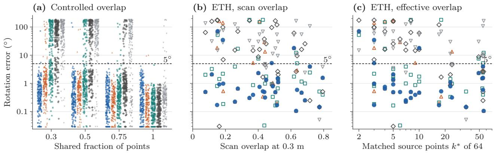

Figure 7: Rotation error against overlap, controlled and real. (a) Every test instance of the anchored planar sets that share the given fraction of points (200 per fraction, validation-selected settings), ofset horizontally by method. (b,c) All identified ETH scan pairs of Li et al. with the reference translation supplied, each GW method at its best setting, against (b) the fraction of source voxels with a target voxel within 0.3 m at the reference pose and (c) the number of source points that the penalized model matches at the reference pose. The dashed line marks the $5 ^ { \circ }$ success threshold; error below $0 . 0 3 ^ { \circ }$ are drawn at 0.03◦.  
Table 6: Penalized matching with global search. Left: $5 ^ { \circ }$ rotation recovery on anchored synthetic sets (200 tests per overlap), and solver/objective failures over all 800. Right: lattice 1-NN accuracy at noise 0.08, vacancy rate as shown and half as many interstitials, against defect-free references (200 queries per column). Settings are validation-selected; Tables A.11 and A.12 retain every cell, best test baselines and SEINT. Bold marks the best value.
<table><tr><td></td><td colspan="4">Partial overlap</td><td colspan="4">Defective lattices</td></tr><tr><td></td><td colspan="2">Rotations (%), shared</td><td colspan="2"></td><td colspan="2">Accuracy (%), defect rate</td><td colspan="2"></td></tr><tr><td>Method</td><td>0.75</td><td>0.5</td><td>0.3</td><td>solver/obj.</td><td>0</td><td>0.1</td><td>0.2</td><td>0.3</td></tr><tr><td>Rubix, unbalanced</td><td>99.5</td><td>99.0</td><td>99.0</td><td>0/5</td><td>100.0</td><td>99.0</td><td>94.5</td><td>90.5</td></tr><tr><td>Rubix, balanced</td><td>59.5</td><td>28.5</td><td>10.5</td><td>0/403</td><td>98.0</td><td>80.5</td><td>66.5</td><td>60.0</td></tr><tr><td>AM, 16 starts</td><td>99.5</td><td>98.5</td><td>88.5</td><td>26/3</td><td>95.5</td><td>99.0</td><td>94.5</td><td>90.5</td></tr><tr><td>UGW [68]</td><td>83.5</td><td>43.0</td><td>20.0</td><td>207/100</td><td>100.0</td><td>94.0</td><td>78.0</td><td>69.0</td></tr><tr><td>Fused UGW [72]</td><td>96.0</td><td>74.0</td><td>44.5</td><td>63/108</td><td>99.5</td><td>90.5</td><td>79.5</td><td>70.0</td></tr><tr><td>Partial GW [17]</td><td>32.5</td><td>13.5</td><td>7.5</td><td>501/1</td><td>63.5</td><td>60.0</td><td>56.5</td><td>45.5</td></tr></table>

Sixty Hokuyo scan pairs from three IILABS sequences [62], acquired at diferent times, yield 240 configurations with two beam counts and two retained fractions (Appendix F.8). All four bounds reach the native 1% tolerance throughout. Arc interpolation gives a median paired speedup of 1.067; common translation raises it to 1.331 and reduces nodes by a factor of 1.844 (Table 7). The common-translation bound is faster throughout, with a scan-pair-stratified bootstrap interval of [1.296, 1.376]. Pose success remains essentially unchanged, at 190 versus 189 of 212 reference configurations.

## 8.4.2 Matching Subproblems from Real 3D Scans

We test six adjacent Ofice and Courtyard scan pairs from ETH [71]. Pairs share scans and are not independent. Without measured IMU calibration, we use the scanner’s nominal +z axis as gravity; reference poses serve only evaluation.

Coresets of 64 source and 80 target points yield fixed 32-point subsets selected by partial assignment at each initial yaw. The solvers optimize yaw and bijection with heights retained and translation eliminated by centering. A common pipeline ranks poses by penalized matching, refines partial matches and applies native gravity-constrained ICP [35]. Global optimality concerns the fixed subsets, not their selection or refinement (Appendix F.10).

AM, the independent-edge bound, the vertex bound and Rubix use 16 equally spaced initial yaws. Global solvers target a numerical mean-squared gap of $\mathrm { 1 0 ^ { - 5 } m ^ { 2 } }$ within five seconds; complete-pipeline results appear in Appendix G.3.

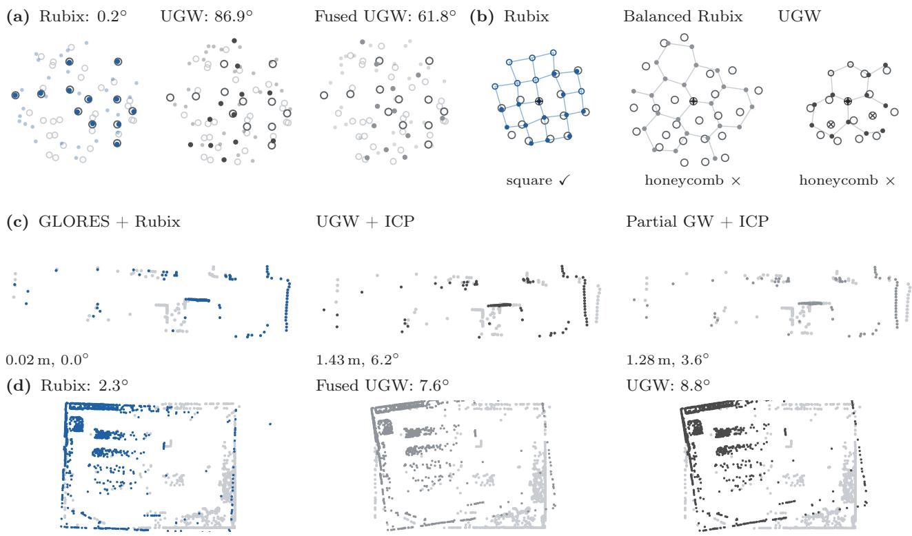  
Figure 8: Partial alignments found by Rubix and missed by unbalanced GW. (a) 40-point sets with 30% overlap: targets are rings (shared targets dark); rotated sources are solid when shared. Titles give rotation errors. (b) A noisy square neighborhood $( \sigma _ { \mathrm { n o i s e } } = 0 . 0 8 )$ : observed atoms are rings and the site a cross-hair. Each nearest reference is aligned and bonded, solid when matched, hollow otherwise; unmatched observations are crossed. Predicted classes appear below. Balanced Rubix uses 24 atoms. (c) Planar scans, with gray targets and reported pose errors. (d) ETH Ofice from above, floor/ceiling removed, with gray targets, supplied reference translation and reported yaw errors. Each panel uses the first dataset-ordered case where Rubix succeeds and displayed baselines fail (Appendix F.9).

Table 7: Replacing the bound inside native GLORES [20]. All four variants complete the 240 configurations at the same numerical tolerance of 1%, with the same trimmed objective and numerical safeguards (Appendix F.8). Times and nodes are medians; the speedup is the median paired ratio of the native time to the time of the variant, with preprocessing and bound evaluation included. Bold marks improvements over native GLORES. Pose success requires a translation error of at most 0.25 m and a yaw error of at most 2◦ on the 212 configurations with motion-capture references; the 28 configurations without references count toward the runtime only. Native PLICP [16], which has its own point-to-line objective and no global bound, registers 146 configurations in a median of 0.0118 s from the zero pose and 185 in 0.2286 s from 16 initial yaws.
<table><tr><td>Method</td><td>Time (s)</td><td>Nodes</td><td>Paired speedup</td><td>Pose success</td></tr><tr><td>GLORES [20]</td><td>2.330</td><td>2,374.5</td><td>1.000×</td><td>189/212</td></tr><tr><td>GLORES + vertex bound [20]</td><td>2.315</td><td>2,263</td><td>0.996×</td><td>189/212</td></tr><tr><td>GLORES + Rubix arc bound [20]</td><td>2.103</td><td>2,035</td><td>1.067×</td><td>189/212</td></tr><tr><td>GLORES + Rubix, common translation [20]</td><td>1.608</td><td>1,352</td><td>1.331×</td><td>190/212</td></tr></table>

Global matching and search cost. All global solvers close every gap and reach the same reference on 96/96 subproblems, versus 22/96 for AM (Table 8). Rubix takes a median 1.46 ms, with paired speedups of 1.63 over the vertex bound and 85.9 over the independentedge bound, reducing assignments from 5,544 and 224,508 to 2,226.

A matching stage after published registration methods. We insert this stage after the original implementations of Quatro [51], RAP [57] and Li et al. [43] on all identified ETH pairs, with feature-pipeline adaptations in Appendix F.11. The native yaw and 16 equally spaced yaws select 17 pairs of 32-point subsets. Only the subset solver changes; assignment, selection, ranking and final gravity ICP remain fixed.

Table 8: Gravity matching on ETH subsets. Six pairs and 16 yaws give 96 fixed 32-point problems per solver. Global solvers share the host and target mean-squared gap $\mathrm { 1 0 ^ { - 5 } m ^ { 2 } }$ within five seconds on one core; AM supplies no lower bound. Assignments and total time sum all problems; bold marks reductions from the vertex bound (Appendix F.10).
<table><tr><td>Subsolver</td><td>Reference attained</td><td>Gap closed</td><td>Assignments</td><td>Total (s)</td><td>Median (ms)</td></tr><tr><td>AM</td><td>22/96</td><td>0/96</td><td>338</td><td>0.062</td><td>0.58</td></tr><tr><td>Independent-edge bound</td><td>96/96</td><td>96/96</td><td>224,508</td><td>13.910</td><td>138.78</td></tr><tr><td>Vertex bound</td><td>96/96</td><td>96/96</td><td>5,544</td><td>0.232</td><td>2.44</td></tr><tr><td>Rubix interpolant</td><td>96/96</td><td>96/96</td><td>2,226</td><td>0.144</td><td>1.46</td></tr></table>

All three global solvers close all 2,108 subset gaps and return identical final poses (Table A.19). Rubix’s median stage time is 10.4 ms, with paired speedups of 45.8–46.9 over the independent-edge bound and 1.46– 1.48 over the vertex bound. Appendix G.1 includes front-end time and pose success.

## 8.4.3 Yaw Search across Matching Models

The yaw search compares Rubix’s interpolant, the independent-edge bound and the vertex bound for complete, prescribed-cardinality and penalized matching (Algorithm 2). The 72 scenes vary $n \in \{ 3 2 , 6 4 , 1 2 8 \}$ cardinality ratio, unmatched fraction and vertical spread. Complete matching removes translation by centering; partial models fix a shared translation. Three models, three summed-squared gap targets $( 1 0 ^ { - 2 } , 1 0 ^ { - 4 }$ $1 0 ^ { - 6 } )$ and three bounds give 1,944 otherwise identical solves (Appendix F.14.1).

Rubix has the lowest median time in each model and, like the vertex bound, closes all 648 gaps; the independent-edge bound closes 621 (Figure 9). At $1 0 ^ { - 6 }$ , Rubix closes all 216 gaps in median times of 8.41, 23.05 and 10.36 ms, while the vertex bound needs 1.68, 1.50 and 1.48 times as many assignments.

For problems both bounds solve, median speedups over the independent-edge bound are 274, 36.9 and 52.2; the figure includes its 27 unresolved searches at the limits. Common-yaw matching provides most of the improvement, with a further benefit from arc interpolation. These searches do not inherit the polynomial guarantee for complete planar matching.

## 8.4.4 Joint Search over Yaw and Translation

Using the anchor cover of Lemma 17, we jointly search yaw, translation and partial matching on 24 scenes with $n \in \{ 8 , 1 6 , 3 2 \}$ . The independent-edge bound is compared with the full-face witness bound (18), using all 24 cell vertices; its one-assignment diference variant (Section 7.5 and Appendix D.7.2); and a gated combination that spends no more assignments on full-face evaluations than cheaper bounds have used. Initial cells, cardinality partitions and initialization are fixed. The two partial models give 192 solves, targeting a summedsquared gap of $1 0 ^ { - 4 }$ within 10 s (Appendix F.14.2).

Full-face closes 20/24 prescribed-cardinality and 15/24 penalized gaps (Figure 10). It takes longer than one-assignment on problems both solve, but adds two prescribed-cardinality successes and loses none. On the nine penalized problems solved by the independentedge bound, one-assignment and full-face are 6.52 and 5.20 times faster and close six more gaps. $\mathrm { A t } \ n = 3 2$ full-face closes four of eight prescribed-cardinality gaps and one penalized gap; the independent-edge bound closes none. Bound cost therefore matters alongside tightness.

## 8.4.5 Full Spatial Rotation

Complete SE(3) alignment uses 72 synthetic scenes with $n \in \{ 8 , 1 6 , 3 2 , 6 4 \}$ , three point distributions, two noise levels and centered inputs. Rubix adds exterior support queries and witness bounds to the quaternion host with rotation-cap bounds, keeping its search policy and assignment solver fixed (Algorithm A.3 and $\mathrm { A p - }$ pendix F.14.3).

At a numerical mean-squared gap of $1 0 ^ { - 5 }$ and a 15 s limit, Rubix closes 72/72 gaps versus $6 3 / 7 2$ and reduces total CPU time from 189.2 to 59.1 s, including every search and bound evaluation (Figure 11). The nine host timeouts close in 1.00–6.18 s with Rubix, giving speedup lower bounds of 2.43–15.06. Appendix G.7 compares five bound-selection policies.

Subsets of real scans. On RAP-selected 32-point subsets of all identified ETH pairs [43,57,71], both variants close every gap with identical poses and matchings. Rubix reduces search but increases runtime; Appendices F.14.4 and G.4 report this comparison and a control without RAP.

host stopped at 15 s

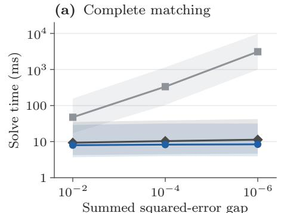

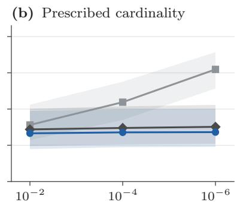

(c) Unmatched-point penalty  
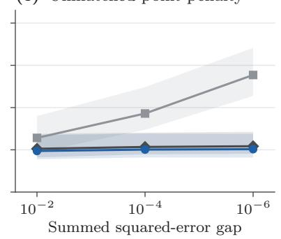  
Figure 9: Faster yaw search under three matching models. Median times and interquartile ranges over 72 scenes, including unresolved runs: (a) complete matching after centering; (b) prescribed-cardinality and (c) penalized matching at fixed translation. Rubix and the vertex bound close every gap. From coarse to fine targets, the independent-edge bound closes 72, 72, 50 gaps in (a), 72, 72, 67 in (b), and all 72 in (c). $\mathrm { A t ~ } 1 0 ^ { - 6 }$ , paired median vertex/Rubix time ratios are 1.38, 1.35, 1.21.

independent edges one-assignment bound full Rubix face gated Rubix face unresolved

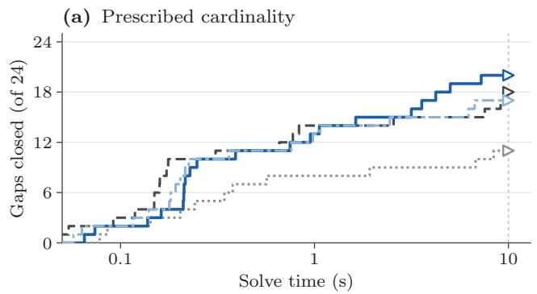

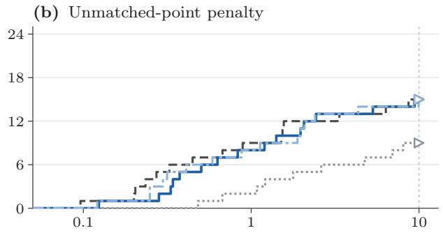  
Solve time (s)  
Figure 10: Witness bounds close more joint yaw–translation gaps. Each curve counts solved scenes out of 24 under (a) prescribed-cardinality and (b) penalized matching, at a summed-squared gap of $1 0 ^ { - 4 } .$ . Triangles mark unresolved runs’ last observed times; the dotted line marks 10 s. Full-face closes 20 and 15 gaps, one-assignment 18 and 15, the independent-edge bound 11 and 9, and gated bounds 17 and 15. All 192 runs are included.

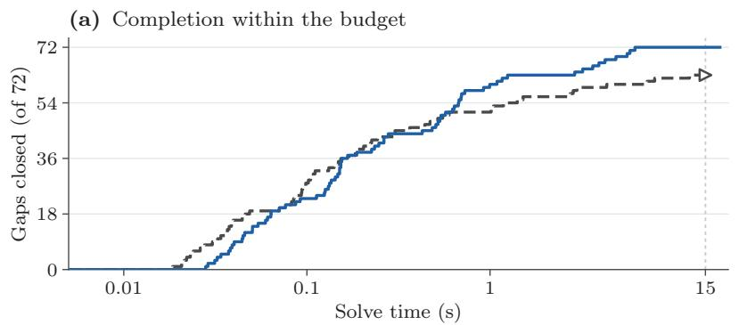

(b) Paired solves  
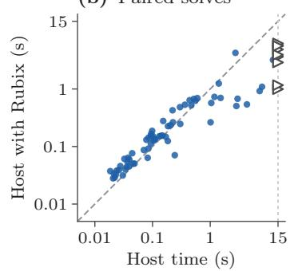  
Figure 11: Rubix closes every spatial-alignment gap. Complete $\operatorname { S E } ( 3 )$ alignment with a 15 s limit and mean-squared gap target $1 0 ^ { - 5 } .$ . (a) Solved scenes against time. (b) Paired times; points below the diagonal favor Rubix, and triangles mark nine host timeouts whose completion times are unknown. Both variants return identical poses and matchings throughout; total CPU time includes initialization, assignments, bounds and feasible updates.

## 9 Conclusion

Rubix solves planar PW alignment through the permutation polygon. Its sharp $n ( n - 1 )$ vertex bound answers Rote’s question [55] and yields an exact $\mathcal { O } ( n ^ { 5 } )$ algorithm, with output-sensitive cost $\mathcal { O } ( n ^ { 3 } V )$ for V vertices. Under the stated initialization and tie rules, AM visits matchings with vertex correlations; a visited matching with nonzero correlation is fixed exactly when its vertex is stationary. Rubix selects a farthest vertex. The resulting distances improve retrieval, noisy crystal classification and k-medoids clustering over AM, while penalized partial matching handles incomplete sets. Spatial assignment bounds reduce registration search cost by retaining a common pose across residuals; pose accuracy remains a separate criterion.

Limitations. The quadratic bound requires equal planar weights. Rational weights with common denominator $N \geq 2$ need at most $N ( N - 1 )$ representatives by duplication, but three unequally weighted points can already give $8 > 6$ vertices (Corollary 8 and $\mathrm { A p \mathrm { - } }$ pendix C.2.2). Exactness requires exact assignment and support comparisons. Partial matching with free translation needs a registration host or our joint search, which currently reaches tens of points. Spatial guarantees depend on numerical scale and tolerance and do not establish exact polynomial complexity in the input bit length (Propositions 14 and 19). A closed numerical gap need not recover the pose: gravity bias can leave errors invisible to the objective (Appendices F.13 and G.6). Shared scans and reused scan pairs also make the ETH and planar samples dependent.

Open directions. We conjecture superpolynomial worst-case vertex growth in n for the full matrixcorrelation polytope in each fixed dimension $d \ge 2$ (Appendix B.3.1); the planar scalar-correlation polygon proved here is distinct. The polygon’s average vertex count, the complexity under general linear maps, and polynomial enumeration for penalized partial rotation matching remain open. In the partial case, matching-dependent constants prevent the $n ( n - 1 )$ argument from applying. Further directions include reusing assignment prices as in Zikan’s sweep [79], adaptive-precision certificates [69], uncertain gravity and practical moment-polytope representations for partial registration (Appendix D.9.1).

## References

[1] J. Abe, A. Tsuji, and J. Abe. Fast convergence method for global optimal 4DOF registration. ISPRS Annals of the Photogrammetry, Remote Sensing and Spatial Information Sciences,

V-2-2022:87–94, 2022. doi: 10.5194/isprs-annals-v-2-2022-87-2022.

[2] D. Adamo, M. Corneli, M. Vuillien, and E. Vila. An in depth look at the Procrustes-Wasserstein distance: properties and barycenters. In Proceedings of the 42nd International Conference on Machine Learning (ICML), volume 267 of Proceedings of Machine Learning Research, pages 444–459. PMLR, 2025. Publisher record.

[3] P. K. Agarwal and J. M. Phillips. On bipartite matching under the RMS distance. In Proceedings of the 18th Canadian Conference on Computational Geometry (CCCG), pages 143–146, 2006. CCCG proceedings.

[4] D. Alvarez-Melis and T. Jaakkola. Gromov–Wasserstein alignment of word embedding spaces. In Proceedings of the 2018 Conference on Empirical Methods in Natural Language Processing, pages 1881–1890, 2018. doi: 10.18653/v1/D18-1214.

[5] D. Alvarez-Melis, S. Jegelka, and T. S. Jaakkola. Towards optimal transport with global invariances. In Proceedings of the 22nd International Conference on Artificial Intelligence and Statistics (AISTATS), volume 89 of Proceedings of Machine Learning Research, pages 1870–1879. PMLR, 2019. Publisher record.

[6] E. Ask, O. Enqvist, L. Svärm, F. Kahl, and G. Lippolis. Tractable and reliable registration of 2D point sets. In Computer Vision – ECCV 2014, Part I, volume 8689 of Lecture Notes in Computer Science, pages 393–406. Springer, 2014. doi: 10.1007/978-3-319-10590-1\_26.

[7] F. Aurenhammer. Power diagrams: Properties, algorithms and applications. SIAM Journal on Computing, 16(1):78–96, 1987. doi: 10.1137/0216006.

[8] R. Ben-Avraham, M. Henze, R. Jaume, B. Keszegh, O. E. Raz, M. Sharir, and I. Tubis. Partial-matching RMS distance under translation: Combinatorics and algorithms. Algorithmica, 80(8):2400–2421, 2018. doi: 10.1007/s00453-017-0326-0.

[9] T. M. Breuel. Implementation techniques for geometric branch-and-bound matching methods. Computer Vision and Image Understanding, 90(3):258–294, 2003. doi: 10.1016/s1077-3142(03)00026-2.

[10] D. Britton, A. Hinojos, M. Hummel, D. P. Adams, and D. L. Medlin. Application of the polyhedral

template matching method for characterization of 2D atomic resolution electron microscopy images. Materials Characterization, 213:114017, 2024. doi: 10.1016/j.matchar.2024.114017.

[11] R. A. Brualdi and P. M. Gibson. Convex polyhedra of doubly stochastic matrices. I. Applications of the permanent function. Journal of Combinatorial Theory, Series A, 22(2):194–230, 1977. doi: 10.1016/0097-3165(77)90051-6.

[12] S. Cabello, P. Giannopoulos, C. Knauer, and G. Rote. Matching point sets with respect to the Earth Mover’s Distance. Computational Geometry, 39(2):118–133, 2008. doi: 10.1016/j.comgeo.2006.10.001.

[13] Z. Cai, T.-J. Chin, A. Parra Bustos, and K. Schindler. Practical optimal registration of terrestrial LiDAR scan pairs. ISPRS Journal of Photogrammetry and Remote Sensing, 147:118–131, 2019. doi: 10.1016/j.isprsjprs.2018.11.016.

[14] D. Campbell, L. Petersson, L. Kneip, and H. Li. Globally-optimal inlier set maximisation for camera pose and correspondence estimation. IEEE Transactions on Pattern Analysis and Machine Intelligence, 42(2):328–342, 2020. doi: 10.1109/tpami.2018.2848650.

[15] P. J. Carstensen. The Complexity of Some Problems in Parametric Linear and Combinatorial Programming. PhD thesis, University of Michigan, 1983. ProQuest dissertation 8314249.

[16] A. Censi. An ICP variant using a point-to-line metric. In Proceedings of the IEEE International Conference on Robotics and Automation (ICRA), pages 19–25, 2008. doi: 10.1109/robot.2008.4543181.

[17] L. Chapel, M. Z. Alaya, and G. Gasso. Partial optimal transport with applications on positive-unlabeled learning. In Advances in Neural Information Processing Systems, volume 33, pages 2903–2913. Curran Associates, Inc., 2020. NeurIPS proceedings.

[18] D. Chetverikov, D. Svirko, D. Stepanov, and P. Krsek. The trimmed iterative closest point algorithm. In International Conference on Pattern Recognition, volume 3, pages 545–548, 2002. doi: 10.1109/ICPR.2002.1047997.

[19] R. Connelly, E. D. Demaine, and G. Rote. Straightening polygonal arcs and convexifying polygonal cycles. Discrete & Computational

Geometry, 30(2):205–239, 2003. doi: 10.1007/s00454-003-0006-7. Publisher PDF.

[20] L. Consolini, M. Laurini, M. Locatelli, and D. Lodi Rizzini. A second-order lower bound for globally optimal 2D registration. arXiv preprint arXiv:1901.09641v2, 2020. Version 2, revised 21 May 2020. doi: 10.48550/arXiv.1901.09641.

[21] D. F. Crouse. On implementing 2D rectangular assignment algorithms. IEEE Transactions on Aerospace and Electronic Systems, 52(4):1679–1696, 2016. doi: 10.1109/TAES.2016.140952.

[22] J. A. De Loera, J. Rambau, and F. Santos. Triangulations: Structures for Algorithms and Applications. Springer, 2010. doi: 10.1007/978-3-642-12971-1.

[23] K. Du and R. B. Kearfott. The cluster problem in multivariate global optimization. Journal of Global Optimization, 5(3):253–265, 1994. doi: 10.1007/bf01096455.

[24] M. J. Eisner and D. G. Severance. Mathematical techniques for eficient record segmentation in large shared databases. Journal of the ACM, 23(4):619–635, 1976. doi: 10.1145/321978.321982.

[25] M. Even, L. Ganassali, J. Maier, and L. Massoulié. Aligning embeddings and geometric random graphs: Informational results and computational approaches for the Procrustes-Wasserstein problem. In Advances in Neural Information Processing Systems (NeurIPS), volume 37, pages 70730–70764, 2024. doi: 10.52202/079017-2260.

[26] R. Flamary, N. Courty, A. Gramfort, M. Z. Alaya, A. Boisbunon, S. Chambon, L. Chapel, A. Corenflos, K. Fatras, N. Fournier, L. Gautheron, N. T. H. Gayraud, H. Janati, A. Rakotomamonjy, I. Redko, A. Rolet, A. Schutz, V. Seguy, D. J. Sutherland, R. Tavenard, A. Tong, and T. Vayer. POT: Python optimal transport. Journal of Machine Learning Research, 22(78):1–8, 2021. Publisher record.

[27] A. J. Goldman and A. W. Tucker. Theory of linear programming. In Linear Inequalities and Related Systems, volume 38 of Annals of Mathematics Studies, pages 53–98. Princeton University Press, 1956. doi: 10.1515/9781400881987-005.

[28] E. Grave, A. Joulin, and Q. Berthet. Unsupervised alignment of embeddings with Wasserstein Procrustes. In Proceedings of the

22nd International Conference on Artificial Intelligence and Statistics (AISTATS), volume 89 of Proceedings of Machine Learning Research, pages 1880–1890. PMLR, 2019. Publisher record.

[29] R. I. Hartley and F. Kahl. Global optimization through rotation space search. International Journal of Computer Vision, 82(1):64–79, 2009. doi: 10.1007/s11263-008-0186-9.

[30] B. K. P. Horn. Closed-form solution of absolute orientation using unit quaternions. Journal of the Optical Society of America A, 4(4):629–642, 1987. doi: 10.1364/JOSAA.4.000629.

[31] P. Hrubeš and A. Yehudayof. Shadows of Newton polytopes. Israel Journal of Mathematics, 256(1):311–343, 2023. Conference version in CCC 2021. doi: 10.1007/s11856-023-2510-z.

[32] S. Huang, Z. Gojcic, M. Usvyatsov, A. Wieser, and K. Schindler. PREDATOR: Registration of 3D point clouds with low overlap. In IEEE/CVF Conference on Computer Vision and Pattern Recognition (CVPR), pages 4265–4274, 2021. doi: 10.1109/CVPR46437.2021.00425.

[33] I. Ivanov and C. Markgraf. Fast globally optimal truncated least squares point cloud registration with fixed rotation axis. arXiv preprint arXiv:2508.15613, 2025. doi: 10.48550/arXiv.2508.15613.

[34] V. Korotkine, M. Cohen, and J. R. Forbes. Globally optimal data-association-free landmark-based localization using semidefinite relaxations. IEEE Robotics and Automation Letters, 10(10):10250–10257, 2025. doi: 10.1109/lra.2025.3597866.

[35] V. Kubelka, M. Vaidis, and F. Pomerleau. Gravity-constrained point cloud registration. In IEEE/RSJ International Conference on Intelligent Robots and Systems (IROS), pages 4873–4879, 2022. doi: 10.1109/IROS47612.2022.9981916.

[36] P. M. Larsen, S. Schmidt, and J. Schiøtz. Robust structural identification via polyhedral template matching. Modelling and Simulation in Materials Science and Engineering, 24(5):055007, 2016. doi: 10.1088/0965-0393/24/5/055007.

[37] L. J. Latecki, R. Lakämper, and U. Eckhardt. Shape descriptors for non-rigid shapes with a single closed contour. In Proceedings of the IEEE Conference on Computer Vision and Pattern Recognition (CVPR), volume 1, pages 424–429, 2000. doi: 10.1109/CVPR.2000.855850.

[38] Y. LeCun, L. Bottou, Y. Bengio, and P. Hafner. Gradient-based learning applied to document recognition. Proceedings of the IEEE, 86(11):2278–2324, 1998. doi: 10.1109/5.726791.

[39] C.-K. Li. C-numerical ranges and C-numerical radii. Linear and Multilinear Algebra, 37(1–3):51–82, 1994. doi: 10.1080/03081089408818312.

[40] H. Li and R. Hartley. The 3D-3D registration problem revisited. In Proceedings of the IEEE International Conference on Computer Vision (ICCV), pages 1–8, 2007. doi: 10.1109/iccv.2007.4409077.

[41] X. Li, Z. Huang, Y. Liu, and Y. Wang. Accelerating outlier-robust point cloud registration by known gravity directions. IEEE Transactions on Automation Science and Engineering, 23:2310–2323, 2026. doi: 10.1109/TASE.2026.3652579.

[42] X. Li, Y. Liu, Y. Xia, V. Lakshminarasimhan, H. Cao, F. Zhang, U. Stilla, and A. Knoll. Fast and deterministic (3+1)DOF point set registration with gravity prior. ISPRS Journal of Photogrammetry and Remote Sensing, 199:118–132, 2023. doi: 10.1016/j.isprsjprs.2023.03.022.

[43] X. Li, Z. Ma, Y. Liu, W. Zimmer, H. Cao, F. Zhang, and A. Knoll. Transformation decoupling strategy based on screw theory for deterministic point cloud registration with gravity prior. IEEE Transactions on Pattern Analysis and Machine Intelligence, 46(12):10515–10532, 2024. doi: 10.1109/TPAMI.2024.3442234.

[44] W. Lian, Z. Cui, F. Ma, H. Pan, W. Zuo, and J. Zhang. Decomposed global optimization for robust point matching with low-dimensional branching. Image and Vision Computing, 171:105996, 2026. doi: 10.1016/j.imavis.2026.105996.

[45] W. Lian, F. Ma, H. Pan, Z. Cui, and W. Zuo. DC-Reg: Globally optimal point cloud registration via tight bounding with diference of convex programming. arXiv preprint arXiv:2603.25442, 2026. doi: 10.48550/arXiv.2603.25442.

[46] W. Lian and L. Zhang. Point matching in the presence of outliers in both point sets: A concave optimization approach. In Proceedings of the IEEE Conference on Computer Vision and Pattern Recognition, pages 352–359, 2014. doi: 10.1109/CVPR.2014.52.

[47] W. Lian, L. Zhang, and M.-H. Yang. An eficient globally optimal algorithm for asymmetric point matching. IEEE Transactions on Pattern Analysis and Machine Intelligence, 39(7):1281–1293, 2017. doi: 10.1109/tpami.2016.2603988.

[48] W. Lian and W. Zuo. Hybrid trilinear and bilinear programming for aligning partially overlapping point sets. Neurocomputing, 551:126482, 2023. doi: 10.1016/j.neucom.2023.126482.

[49] W. Lian, W. Zuo, and Z. Cui. A polyhedral annexation algorithm for aligning partially overlapping point sets. IEEE Access, 9:166750–166761, 2021. doi: 10.1109/ACCESS.2021.3135863.

[50] H. Lim, B. Kim, D. Kim, E. M. Lee, and H. Myung. Quatro++: Robust global registration exploiting ground segmentation for loop closing in LiDAR SLAM. The International Journal of Robotics Research, 43(5):685–715, 2024. doi: 10.1177/02783649231207654.

[51] H. Lim, S. Yeon, S. Ryu, Y. Lee, Y. Kim, J. Yun, E. Jung, D. Lee, and H. Myung. A single correspondence is enough: Robust global registration to avoid degeneracy in urban environments. In IEEE International Conference on Robotics and Automation (ICRA), pages 8010–8017, 2022. Original implementation: https://github.com/url-kaist/Quatro. doi: 10.1109/ICRA46639.2022.9812018.

[52] J. Lin, D. Xue, J. Yu, H. Xu, and C. Meng. An eficient SE(p)-invariant transport metric driven by polar transport discrepancy-based representation. In International Conference on Learning Representations (ICLR), 2026. ICLR proceedings.

[53] M. Marcus. Some combinatorial aspects of numerical range. Annals of the New York Academy of Sciences, 319:368–376, 1979. doi: 10.1111/j.1749-6632.1979.tb32811.x.

[54] H. Maron, N. Dym, I. Kezurer, S. Kovalsky, and Y. Lipman. Point registration via eficient convex relaxation. ACM Transactions on Graphics, 35(4):73:1–73:12, 2016. doi: 10.1145/2897824.2925913.

[55] J. S. Mitchell. Open Problem Session. In P. K. Agarwal, H. Alt, and M. Teillaud, editors, Computational Geometry, volume 9111 of Dagstuhl Seminar Proceedings (DagSemProc),

pages 1–3, Dagstuhl, Germany, 2009. Schloss Dagstuhl – Leibniz-Zentrum für Informatik. Problem 4, p. 2, posed by Günter Rote. doi: 10.4230/DagSemProc.09111.4.

[56] C. Olsson, O. Enqvist, and F. Kahl. A polynomial-time bound for matching and registration with outliers. In Proceedings of the IEEE Conference on Computer Vision and Pattern Recognition (CVPR), pages 1–8, 2008. doi: 10.1109/cvpr.2008.4587757.

[57] Y. Pan, T. Sun, L. Zhu, L. Nunes, I. Armeni, J. Behley, and C. Stachniss. Register any point: Scaling 3D point cloud registration by flow matching. In Computer Vision – ECCV 2026, Part V, volume 17005 of Lecture Notes in Computer Science, pages 21–43. Springer, 2026. doi: 10.1007/978-3-032-37369-4\_2. Original implementation: https://github.com/PRBonn/RAP.

[58] E. Pardini and K. Papagiannouli. Structured matching via cost-regularized unbalanced optimal transport. In Proceedings of the 29th International Conference on Artificial Intelligence and Statistics, volume 300 of Proceedings of Machine Learning Research, pages 2926–2934. PMLR, 2026. Publisher record.

[59] L. Piegl and W. Tiller. The NURBS Book. Springer, second edition, 1997. doi: 10.1007/978-3-642-59223-2.

[60] H. Qin, Y. Zhang, Z. Liu, and B. Chen. Rigid registration of point clouds based on partial optimal transport. Computer Graphics Forum, 41(6):365–378, 2022. doi: 10.1111/cgf.14614.

[61] Z. Qin, H. Yu, C. Wang, Y. Guo, Y. Peng, and K. Xu. Geometric transformer for fast and robust point cloud registration. In IEEE/CVF Conference on Computer Vision and Pattern Recognition (CVPR), pages 11133–11142, 2022. doi: 10.1109/CVPR52688.2022.01086.

[62] J. D. Ribeiro, R. B. Sousa, J. G. Martins, A. S. Aguiar, F. N. dos Santos, and H. M. Sobreira. IILABS 3D: IILab indoor LiDAR-based SLAM dataset. INESC TEC research data repository, 2025. doi: 10.25747/VHNJ-WM80.

[63] M. Ryner, J. Kronqvist, and J. Karlsson. Globally solving the Gromov-Wasserstein problem for point clouds in low dimensional Euclidean spaces. In Advances in Neural Information Processing Systems (NeurIPS), volume 36, pages 7930–7946, 2023. doi: 10.52202/075280-0347.

[64] R. Sanyal, F. Sottile, and B. Sturmfels. Orbitopes. Mathematika, 57(2):275–314, 2011. doi: 10.1112/S002557931100132X.

[65] J. Saunderson, P. A. Parrilo, and A. S. Willsky. Semidefinite descriptions of the convex hull of rotation matrices. SIAM Journal on Optimization, 25(3):1314–1343, 2015. doi: 10.1137/14096339X.

[66] A. Schöbel and D. Scholz. The theoretical and empirical rate of convergence for geometric branch-and-bound methods. Journal of Global Optimization, 48(3):473–495, 2010. doi: 10.1007/s10898-009-9502-3.

[67] P. H. Schönemann. A generalized solution of the orthogonal Procrustes problem. Psychometrika, 31(1):1–10, 1966. doi: 10.1007/BF02289451.

[68] T. Séjourné, F.-X. Vialard, and G. Peyré. The unbalanced Gromov Wasserstein distance: Conic formulation and relaxation. In Advances in Neural Information Processing Systems, volume 34, pages 8766–8779. Curran Associates, Inc., 2021. NeurIPS proceedings.

[69] J. R. Shewchuk. Adaptive precision floating-point arithmetic and fast robust geometric predicates. Discrete & Computational Geometry, 18(3):305–363, 1997. doi: 10.1007/PL00009321.

[70] C. Soubrier, G. Woollard, A. Warren, and K. Dao Duc. Beyond Procrustes distances: A multilinear Gromov–Wasserstein distance capturing chirality. arXiv preprint arXiv:2608.27774, 2026. doi: 10.48550/arXiv.2608.27774.

[71] P. W. Theiler, J. D. Wegner, and K. Schindler. Globally consistent registration of terrestrial laser scans via graph optimization. ISPRS Journal of Photogrammetry and Remote Sensing, 109:126–138, 2015. doi: 10.1016/j.isprsjprs.2015.08.007.

[72] A. Thual, Q. H. Tran, T. Zemskova, N. Courty, R. Flamary, S. Dehaene, and B. Thirion. Aligning individual brains with fused unbalanced Gromov Wasserstein. In Advances in Neural Information Processing Systems, volume 35, pages 21792–21804. Curran Associates, Inc., 2022. doi: 10.52202/068431-1584.

[73] T. Utriainen. Least Squares Rigid Body Fitting of Point-Sets with Unknown Correspondences. PhD thesis, Chalmers University of Technology, 2010. Chalmers dissertation record.

[74] P. Virtanen, R. Gommers, T. E. Oliphant, et al. SciPy 1.0: Fundamental algorithms for scientific computing in Python. Nature Methods, 17(3):261–272, 2020. doi: 10.1038/s41592-019-0686-2.

[75] H. Yang, J. Shi, and L. Carlone. TEASER: Fast and certifiable point cloud registration. IEEE Transactions on Robotics, 37(2):314–333, 2021. doi: 10.1109/TRO.2020.3033695.

[76] J. Yang, H. Li, D. Campbell, and Y. Jia. Go-ICP: A globally optimal solution to 3D ICP point-set registration. IEEE Transactions on Pattern Analysis and Machine Intelligence, 38(11):2241–2254, 2016. doi: 10.1109/TPAMI.2015.2513405.

[77] R. Zhang, M. Greif, T. Lew, and J. Subosits. Generalized-CVO: Fast and correspondence-free local point cloud registration with second order riemannian optimization. In Proceedings of the IEEE/CVF Conference on Computer Vision and Pattern Recognition, pages 2948–2958, 2026. CVPR open access.

[78] G. M. Ziegler. Lectures on Polytopes, volume 152 of Graduate Texts in Mathematics. Springer, New York, 1995. doi: 10.1007/978-1-4613-8431-1.

[79] K. Zikan. Technical note—least-squares image registration. ORSA Journal on Computing, 3(2):169–172, 1991. doi: 10.1287/ijoc.3.2.169.

## Appendices

Guide to the appendices. Appendices A to C give the planar proofs, extensions and exact examples; Appendices D and E give the spatial proofs and algorithms. Experimental details, partial matching, registration and contextual results follow in Appendices F, F.9, F.14 and G; hardware is listed in Appendix F.1.

## A Proofs of the Planar Results

This appendix proves the planar reduction, the vertex bound and the guarantees of the algorithm. The proof of the bound has three ingredients. Assignment duality constrains the cycle of reassigned points at a transition; a count of continuous angle changes determines the phase jump of the cycle; and genericity, with a perturbation argument and an accounting over a full turn, extends the bound to all inputs. The subsections follow the order in which the results depend on each other.

Throughout, let $n \geq 2$ and $a , b \in \mathbb { C } ^ { n }$ , and let V be the number of vertices of $\mathcal { P } = \mathcal { P } ( a , b )$ in (3). We write $z \times w = \mathrm { I m } ( \bar { z } w )$ and $\mathbb { T } = \{ u \in \mathbb { C } : | u | = 1 \}$ The clockwise quarter-turn $R _ { - } ( z ) = - \mathrm { i } z$ satisfies $R _ { - } ( e ) \times$ $\begin{array} { r } { e \ = \ | e | ^ { 2 } } \end{array}$ and $\langle R _ { - } ( e ) , w \rangle \ : = \ : - ( e \times w )$ For $u \in \mathbb { T } .$ we set $\mathcal { M } _ { u } = \arg \operatorname* { m a x } _ { c }$ <sub>σ</sub> Re $\left( \bar { u } z _ { \sigma } \right)$ , and $P _ { \sigma }$ denotes the permutation matrix of σ.

## A.1 The PW Reduction

Proof of Lemma 1. For a fixed matching, minimizing (2) over the rotation replaces $\mathrm { R e } ( e ^ { \mathrm { i } \theta } z _ { \sigma } )$ by $| z _ { \sigma } |$ . The maximum of this convex function over the hull of the finitely many correlations is attained at a vertex, and every vertex is the correlation of a matching. For a nonzero maximum, $e ^ { \mathrm { i } \theta } z _ { \sigma } = | z _ { \sigma } |$ gives $\theta = - \operatorname { A r g } z _ { \sigma } ;$ a zero maximum makes every rotation optimal. A reflection followed by a rotation replaces y by y¯, so comparing the two polygons covers $\mathrm { O } ( 2 )$ . The argument permits several optimal matchings and rotations.

## A.2 Genericity and Perturbation

The counting argument of Lemmas 3 to 5 assumes generic inputs. We define genericity, show that it holds outside a set of measure zero (Lemma A.2), and prove Lemma 6, which extends the bound of Theorem 2 to arbitrary inputs.

## A.2.1 Generic Pairs

Definition A.1. The pair (a, b) is generic if (G1) the map $\sigma \mapsto z _ { \sigma }$ is injective and (G2) no three distinct points $z _ { \sigma }$ are collinear.

Lemma A.2. The non-generic pairs are contained in a proper real-algebraic subset of $\mathbb { C } ^ { 2 n } \cong \mathbb { R } ^ { 4 n }$ . In particular, generic pairs are dense and have full Lebesgue measure.

Proof of Lemma A.2. Distinct correlations. For $\sigma \neq \tau ,$ the polynomial $z _ { \sigma } - z _ { \tau } = a ^ { \top } ( P _ { \sigma } - P _ { \tau } ) b$ is not identically zero: the coordinate vectors $a = e _ { i } , b = e _ { j }$ at a nonzero entry $( i , j )$ of $P _ { \sigma } - P _ { \tau }$ give a nonzero value. Thus (G1) fails only on a proper algebraic set.

Noncollinear triples. For distinct $\sigma _ { 1 } , \sigma _ { 2 } , \sigma _ { 3 }$ , define $D _ { 1 } \ = \ P _ { \sigma _ { 2 } } - P _ { \sigma _ { 1 } } , \ D _ { 2 } \ = \ P _ { \sigma _ { 3 } } - P _ { \sigma _ { 1 } }$ and $\Phi ( a , b ) =$ Im $( \overline { { a ^ { \top } D _ { 1 } b } } a ^ { \top } D _ { 2 } b )$ . Collinearity is equivalent to $\Phi = 0$ so we must show that Φ is not identically zero. The matrices $D _ { 1 } , D _ { 2 }$ are nonzero and linearly independent. Their entries lie in $\{ - 1 , 0 , 1 \}$ , so any factor of proportionality would be ±1; the factor +1 would identify $\sigma _ { 2 }$ and $\sigma _ { 3 } .$ and the factor −1 would make $P _ { \sigma _ { 3 } } = 2 P _ { \sigma _ { 1 } } - P _ { \sigma _ { 2 } }$ contain an entry 2. Suppose that $\Phi \equiv 0$ . Taking $b = \beta _ { \mathrm { t e s t } } \in \mathbb { R } ^ { n }$ and $a = \alpha _ { \mathrm { t e s t } } ^ { \prime } + \mathrm { i } \alpha _ { \mathrm { t e s t } } ^ { \prime \prime }$ with $\alpha _ { \mathrm { t e s t } } ^ { \prime } , \alpha _ { \mathrm { t e s t } } ^ { \prime \prime } \in \mathbb { R } ^ { n }$ gives

$$
\begin{array} { r l } & { \Phi = ( \alpha _ { \mathrm { t e s t } } ^ { \prime \top } D _ { 1 } \beta _ { \mathrm { t e s t } } ) ( \alpha _ { \mathrm { t e s t } } ^ { \prime \prime } D _ { 2 } \beta _ { \mathrm { t e s t } } ) } \\ & { \qquad - \ ( \alpha _ { \mathrm { t e s t } } ^ { \prime \prime \top } D _ { 1 } \beta _ { \mathrm { t e s t } } ) ( \alpha _ { \mathrm { t e s t } } ^ { \prime \top } D _ { 2 } \beta _ { \mathrm { t e s t } } ) . } \end{array}\tag{A.1}
$$

Since this vanishes for all $\alpha _ { \mathrm { t e s t } } ^ { \prime }$ and $\alpha _ { \mathrm { t e s t } } ^ { \prime \prime }$ , the vectors $D _ { 1 } \beta _ { \mathrm { t e s t } }$ and $D _ { 2 } \beta _ { \mathrm { t e s t } }$ are linearly dependent for every real $\beta _ { \mathrm { t e s t } }$ . Taking a real and b complex shows in the same way that $\alpha _ { \mathrm { t e s t } } ^ { \top } D _ { 1 }$ and $\alpha _ { \mathrm { t e s t } } ^ { \top } D _ { 2 }$ are dependent for every real $\alpha _ { \mathrm { t e s t } }$

Rank. On the dense open set $\begin{array} { r c l } { \mathcal { U } _ { \mathrm { l i n } } } & { = } & { \{ \beta _ { \mathrm { t e s t } } } \end{array}$ : $D _ { 2 } \beta _ { \mathrm { t e s t } } \neq 0 \}$ , write $D _ { 1 } \beta _ { \mathrm { t e s t } } = \eta _ { \mathrm { l i n } } ( \beta _ { \mathrm { t e s t } } ) D _ { 2 } \beta _ { \mathrm { t e s t } }$ . If $D _ { 2 } \beta _ { \mathrm { t e s t , 1 } }$ and $D _ { 2 } \beta _ { \mathrm { t e s t , 2 } }$ are independent, comparing coeficients in

$$
\begin{array} { r l } & { \eta _ { \mathrm { l i n } } ( \beta _ { \mathrm { t e s t , 1 } } + t \beta _ { \mathrm { t e s t , 2 } } ) ( D _ { 2 } \beta _ { \mathrm { t e s t , 1 } } + t D _ { 2 } \beta _ { \mathrm { t e s t , 2 } } ) } \\ & { \quad = \eta _ { \mathrm { l i n } } ( \beta _ { \mathrm { t e s t , 1 } } ) D _ { 2 } \beta _ { \mathrm { t e s t , 1 } } } \\ & { \quad \quad + t \eta _ { \mathrm { l i n } } ( \beta _ { \mathrm { t e s t , 2 } } ) D _ { 2 } \beta _ { \mathrm { t e s t , 2 } } } \end{array}\tag{A.2}
$$

gives $\eta _ { \mathrm { l i n } } ( \beta _ { \mathrm { t e s t , 1 } } ) = \eta _ { \mathrm { l i n } } ( \beta _ { \mathrm { t e s t , 2 } } )$ . If rank $D _ { 2 } \geq 2$ , any two points of $\mathcal { U } _ { \mathrm { l i n } }$ can be compared through a third point whose image lies on neither of their image lines. Hence $\eta _ { \mathrm { l i n } }$ is constant on $\mathcal { U } _ { \mathrm { l i n } }$ and, by density, $D _ { 1 } =$ $\eta _ { \mathrm { l i n } } D _ { 2 }$ , which contradicts independence. Exchanging the roles of $D _ { 1 }$ and $D _ { 2 }$ excludes rank $D _ { 1 } \geq 2$ in the same way, so the only remaining possibility is that both ranks are one. Write $D _ { l } = c _ { l } r _ { l } ^ { \top }$ with nonzero factors. Choosing $\beta _ { \mathrm { t e s t } }$ outside both row kernels forces $c _ { 1 } \parallel$ $c _ { 2 } .$ , and choosing $\alpha _ { \mathrm { t e s t } }$ nonorthogonal to both columns forces $r _ { 1 } \parallel r _ { 2 }$ , which again contradicts independence. Thus $\Phi \not \equiv 0 .$ The non-generic pairs lie in the finite union of the zero sets of these polynomials, which is a proper real-algebraic set and has measure zero. □

## A.2.2 Persistence Under Perturbation

Proof of Lemma 6. Let $v _ { 1 } , \ldots , v _ { k }$ be the vertices of $\textstyle { \mathcal { P } } ( a , b )$ . For $k \ = \ 1$ the claim holds because every polygon has at least one vertex. Otherwise, for each v we choose a unit direction u that exposes v alone, and we choose $\delta > 0$ below every positive score gap between v and another correlation in direction $u _ { l } ,$ and below half of every distance between two distinct vertices. By Lemma A.2, there is a generic pair within distance $\delta _ { \mathrm { p e r t } }$ that moves each correlation by less than $\delta / 3$ . Every maximizer in direction $u _ { l }$ then comes from a correlation that originally equaled $v _ { l } ,$ so a vertex of the exposed face lies within $\delta / 3$ of $v _ { l } .$ also when the face is an edge. These neighborhoods are disjoint, which yields at least k distinct vertices. □

## A.3 Cycle Transitions

Proof of Lemma 3. By (G2), a supporting line contains at most two distinct correlations, and by (G1) these belong to at most two maximizing permutations. If σ and τ both maximize, we decompose $\sigma ^ { - 1 } \tau$ into disjoint nontrivial cycles. Switching one cycle cannot raise the projection $\mathrm { R e } ( \bar { u } z )$ , because σ is optimal. The cycles move disjoint rows, so these changes sum to the change from σ to τ , which is zero, and each of them is zero. If there were two cycles, switching only one of them would give a third maximizer, which contradicts genericity. Thus the relative permutation is a single nontrivial cycle. □

## A.4 The Phase Function

Lemma A.3 confines the phase (8) to one branch of the argument, and Proposition A.4 gives the total of the jumps over a full turn. Combined with Lemma 4, this proves Lemma 5 in Appendix A.7.1.

## A.4.1 Swap Optimality and the Argument Branch

Lemma A.3 (exchange). For $i < k , z _ { \sigma } - z _ { \sigma \circ ( i k ) } =$ $\Delta z _ { i k } ( \sigma ) : = ( a _ { i } - a _ { k } ) ( b _ { \sigma ( i ) } - b _ { \sigma ( k ) } )$ . If $\sigma \in \mathcal { M } _ { u }$ then $\mathrm { R e } ( \bar { u } \Delta z _ { i k } ( \sigma ) ) \geq 0 f o r \ a l l \ i < k .$

Proof of Lemma A.3. The two matchings difer only in rows i and k, which gives the identity for the swap gain (7). Optimality of σ against the swapped matching gives the inequality. □

Condition (G1) forces the entries of a to be distinct and the entries of b to be distinct, because a repeated entry makes two swapped correlations equal. Thus $\Delta z _ { i k } ( \sigma ) \ne 0$ . By Lemma A.3, optimality confines each term of the phase to $[ - \pi / 2 , \pi / 2 ]$ and $\Psi ( \sigma , u )$ to $[ - \textstyle { \frac { \pi } { 2 } } { \binom { n } { 2 } } , \textstyle { \frac { \pi } { 2 } } { \binom { n } { 2 } } ]$

## A.4.2 Total Jump Over One Turn

For generic inputs with $n \geq 3 .$ , we index the vertices $z _ { \sigma _ { m } }$ counterclockwise modulo $V$ and let $u _ { m }$ be the outward unit normal of the edge $\left[ z _ { \sigma _ { m } } , z _ { \sigma _ { m + 1 } } \right]$ . By Lemma $^ { 3 , }$ $\mathcal { M } _ { u _ { m } } ~ = ~ \{ \sigma _ { m } , \sigma _ { m + 1 } \}$ , while $\sigma _ { m }$ is the unique maximizer inside the arc from $u _ { m - 1 }$ to $u _ { m }$ . The relative permutation of $\sigma _ { m }$ and $\sigma _ { m + 1 }$ is one cycle of length $L _ { m } \ge 2$ . For $n = 2$ , the polygon is a segment with two vertices. We define the jump at the mth edge by $\Delta \Psi _ { m } = \Psi ( \sigma _ { m + 1 } , u _ { m } ) - \Psi ( \sigma _ { m } , u _ { m } )$

Proposition A.4 (total jump). For generic $( a , b )$ with $n \geq 3 .$ , the jumps satisfy

$$
\sum _ { m = 1 } ^ { V } \Delta \Psi _ { m } = \pi n ( n - 1 ) .\tag{A.3}
$$

Proof of Proposition $A . 4 .$ . We unwrap the angles of the normals as $\varphi _ { 0 } < \cdot \cdot \cdot < \varphi _ { V } = \varphi _ { 0 } + 2 \pi$ , with $u _ { m } = e ^ { \mathrm { i } \varphi _ { m } }$ On $[ \varphi _ { m - 1 } , \varphi _ { m } ]$ , optimality keeps each $e ^ { - \mathrm { i } \varphi } \Delta z _ { i k } ( \sigma _ { m } )$ in the closed right half-plane without the origin, where its principal argument decreases at unit speed. Hence $\begin{array} { r } { \Psi \bigl ( \sigma _ { m } , u _ { m } \bigr ) - \Psi \bigl ( \sigma _ { m } , u _ { m - 1 } \bigr ) = - \binom { n } { 2 } \bigl ( \varphi _ { m } - \varphi _ { m - 1 } \bigr ) } \end{array}$ . Summing over m and adding the jumps gives

$$
\begin{array} { l } { \displaystyle \sum _ { m } \big [ \Psi ( \sigma _ { m + 1 } , u _ { m } ) - \Psi ( \sigma _ { m } , u _ { m - 1 } ) \big ] } \\ { \displaystyle \qquad = \sum _ { m } \Delta \Psi _ { m } - 2 \pi \binom { n } { 2 } . } \end{array}\tag{A.4}
$$

The left side telescopes to 0, because the final normal direction and matching agree with the initial ones. The jumps therefore balance the continuous decrease over the full turn. □

## A.5 Geometry of a Transition

To prove Lemma 4, we place the reassignment cycle of Lemma 3 on a planar subdivision, on which a cycle of length at least three is a simple polygon. This subsection collects the facts on duality and on angles that Steps 2, 4 and 5 of Appendix A.6 use.

Assignment duality. The dual of the assignment problem minimizes $\textstyle \sum _ { i } f _ { i } + \sum _ { j } g _ { j }$ subject to $f _ { i } + g _ { j } \geq$ $c _ { i j }$ . These inequalities bound the score of every matching, and a matching that consists of tight pairs, for which equality holds, attains the bound. Strict complementarity [27] supplies an optimal dual whose tight pairs are exactly the pairs used by at least one optimal matching. A single dual solution therefore identifies all exchanges that can occur at a transition.

Power diagrams and their duals. For distinct sites $b _ { j } \in \mathbb { C }$ and real numbers $g _ { j }$ , the power cell [7] of $b _ { j }$ consists of the points at which this site minimizes the squared distance minus its weight $| b _ { j } | ^ { 2 } - 2 g _ { j }$ ; a point at which several sites tie belongs to all of their cells. Expanding the square gives

$$
| \xi - b _ { j } | ^ { 2 } - \big ( | b _ { j } | ^ { 2 } - 2 g _ { j } \big ) = | \xi | ^ { 2 } - 2 \big ( \langle \xi , b _ { j } \rangle - g _ { j } \big ) .\tag{A.5}
$$

Thus a power cell is the region in which its site maximizes an afine score. If every cell has interior, lifting each $b _ { j }$ to height $g _ { j }$ and projecting the lower faces of the convex hull gives a regular subdivision [7,22] of the hull of the sites, in which every site is a vertex. The two planar structures are dual: two cells that share an edge give an edge of the subdivision that joins their sites. These edges neither cross nor contain another site in their interiors. Collinear sites give segments.

Angles along curves. A simple polygon has no selfintersections on its boundary, and traversing it counterclockwise keeps its interior on the left. For a path $\gamma ( \zeta )$ that avoids the origin, $\Delta \arg \gamma$ is the continuous change of its angle, complete turns included. For a closed curve Γ that avoids a point z, wind $\begin{array} { r } { \lvert ( \Gamma , z ) = \Delta \arg ( \Gamma - z ) / ( 2 \pi ) } \end{array}$ A simple counterclockwise polygon has winding number one about the points inside it and zero about the points outside.

## A.6 The Jump Lemma

We prove Lemma 4 from the cycle geometry of $\mathrm { A p \mathrm { - } }$ pendix A.5 and the results on orientation and angle change in Lemmas $\mathrm { A . 5 }$ and $\mathrm { A . 6 }$

In the notation of Appendix A.4.2, we fix m and abbreviate $\sigma = \sigma _ { m } , \tau = \sigma _ { m + 1 } , u = u _ { m }$ . We write the cycle as $i _ { 1 }  \cdot \cdot \cdot  i _ { L }  i _ { 1 }$ , with $j _ { r } = \sigma ( i _ { r } )$ $\tau ( i _ { r } ) = j _ { r + 1 }$ , and $\tau = \sigma$ of ${ \mathcal { T } } _ { \mathrm { c y c } } = \{ i _ { 1 } , \ldots , i _ { L } \}$ ; indices are taken modulo L. Let Γ follow $b _ { j _ { 1 } } , \dotsc , b _ { j _ { L } } ,$ , and set $I = \textstyle \sum _ { j _ { 0 } \not \in \{ j _ { r } \} }$ wind ${ ( \Gamma , b _ { j _ { 0 } } ) }$ for $L \geq 3$ and $I = 0$ for $L =$ 2. We prove that Γ is simple and counterclockwise and that $\Delta \Psi _ { m } = \pi ( L - 1 + 2 I )$ ; thus I counts the of-cycle sites inside Γ. The proof converts the phase jump into angle changes along the paths of the reassigned points and then computes those changes from the geometry of the cycle. The case of a swap requires a separate calculation, because its two paths collide.

Step 1: Interpolation. We interpolate $B ( \zeta ) =$ $( 1 - \zeta ) ( b _ { \sigma ( i ) } ) _ { i } + \zeta ( b _ { \tau ( i ) } ) _ { i }$ and set $\omega _ { i k } ( \zeta ) ~ = ~ \bar { u } ( a _ { i } ~ -$ $a _ { k } ) ( B _ { i } ( \zeta ) - B _ { k } ( \zeta ) )$ . Optimality gives nonnegative real parts at both endpoints (Lemma A.3), and the afine interpolation preserves this inequality along the path. If $B _ { i } - B _ { k }$ never vanishes, the path stays in the closed right half-plane without the origin, so its continuous change of argument equals the diference of its principal arguments. Multiplication by the fixed nonzero factor ${ \bar { u } } ( a _ { i } - a _ { k } )$ does not alter the continuous angle change of $B _ { i } - B _ { k }$ . Thus, in the absence of collisions,

$$
\Delta \Psi _ { m } = \sum _ { i < k } \Delta _ { \zeta \in [ 0 , 1 ] } \arg \big ( B _ { i } ( \zeta ) - B _ { k } ( \zeta ) \big ) ,\tag{A.6}
$$

where $\Delta$ arg denotes the continuous angle change.

Step 2: A Power Diagram. We set $\begin{array} { r l } { c _ { i j } } & { { } = } \end{array}$ $\mathrm { R e } ( \bar { u } a _ { i } b _ { j } )$ . The optimal face of the primal assignment problem is the segment $[ P _ { \sigma } , P _ { \tau } ]$ . Strict complementarity [27] supplies a feasible optimal dual $( f , g )$ whose tight entries are exactly the union of the supports of these two matchings. We write $\xi _ { i } ^ { \mathrm { r o w } } = \overline { { \bar { u } } } a _ { i }$ and $y _ { j } = b _ { j }$ so that $c _ { i j } = \langle \xi _ { i } ^ { \mathrm { r o w } } , y _ { j } \rangle$ , and define

$$
\mathcal { R } _ { j } = \{ \xi : \langle \xi , y _ { j } \rangle - g _ { j } \geq \langle \xi , y _ { k } \rangle - g _ { k } \forall k \} .\tag{A.7}
$$

These are the power cells of (A.5). At row i, the maximizing sites correspond exactly to the tight dual entries, so membership in a cell identifies the possible optimal partners of the row. Unchanged rows lie in the interiors of cells; changed rows lie in the relative interiors of shared edges, where precisely two sites tie. Each tied site is the unique maximizer nearby on one side of the edge. Since every site is used by an optimal matching, every cell has interior. The diagram is dual to the regular subdivision [7, 22] T obtained from the lower lifting $( y _ { j } , g _ { j } )$ . Every site is a vertex of $\tau$ , and shared cell edges give noncrossing edges $[ y _ { j } , y _ { l } ]$ that contain no other site. The reassignment cycle follows these edges. Thus the distinct sites of the cycle form a simple polygon for $L \geq 3 .$ , with no of-cycle site on its boundary. For $L = 2 ,$ no other site lies on the segment of the swap. Collinear sites give a one-dimensional subdivision and cannot support a longer cycle.

Step 3: $L \ = \ 2 .$ The swap gives $\Delta z _ { i _ { 1 } i _ { 2 } } ( \tau ) \ =$ $- \Delta z _ { i _ { 1 } i _ { 2 } } ( \sigma )$ . Set $\Delta z _ { e } = z _ { \tau } - z _ { \sigma } = - \Delta z _ { i _ { 1 } i _ { 2 } } ( \sigma ) ;$ counterclockwise traversal gives $u = R _ { - } ( \Delta z _ { e } ) / | \Delta z _ { e } |$ and $\bar { u } \Delta z _ { i _ { 1 } i _ { 2 } } ( \sigma ) = - \mathrm { i } | \Delta z _ { e } |$ . The argument of this pair therefore changes from $- \pi / 2$ to $+ \pi / 2$ , which contributes π. The two interpolants collide at $\zeta = 1 / 2 ,$ , so this direct computation at the endpoints is needed in place of $\left( \mathrm { A . 6 } \right)$ . Relative to each of-cycle site, the two moving points traverse the same segment in opposite directions without meeting that site (Step 2), so their angle changes cancel. Every remaining pair is constant. Hence $\Delta \Psi _ { m } = \pi$

Step 4: Orientation $\left( L \geq 3 \right)$ . We traverse the edge $[ z _ { \sigma } , z _ { \tau } ]$ counterclockwise, so $\bar { u } ( z _ { \tau } - z _ { \sigma } ) = \mathrm { i } | z _ { \tau } - z _ { \sigma } |$ With $e _ { r } = y _ { j _ { r + 1 } } - y _ { j _ { r } }$ , this gives

$$
0 < \mathrm { I m } \left( \bar { u } ( z _ { \tau } - z _ { \sigma } ) \right) = \sum _ { r = 1 } ^ { L } \mathrm { I m } \left( \bar { u } a _ { i _ { r } } ( b _ { j _ { r + 1 } } - b _ { j _ { r } } ) \right)\tag{A.8}
$$

$$
= \sum _ { r = 1 } ^ { L } \xi _ { i _ { r } } ^ { \mathrm { r o w } } \times e _ { r } = : \chi _ { \Gamma } .\tag{A.9}
$$

Lemma A.5. In the situation of Step 2 with $L \geq 3 .$ $\chi _ { \Gamma } > 0 \ i f \ \Gamma$ is counterclockwise and $\chi _ { \Gamma } < 0 \ i f$ it is clockwise. Hence Γ is counterclockwise.

Proof of Lemma A.5. The region D bounded by $\Gamma$ is a union of faces Q of the subdivision, each dual to a vertex $v _ { Q }$ of the diagram at which all sites of $Q$ are maximizers. We relate the orientation of each edge of the subdivision to that of its dual edge, and then sum over the enclosed faces to compare the contributions of the interior edges and of the boundary.

(i) Reciprocity. Orient $e = y _ { l } - y _ { j }$ with Q on its left. Its dual edge leaves v<sub>Q</sub> in the direction $R _ { - } ( e ) ;$ the two tied scores keep $\langle \xi , e \rangle$ constant, while every other site of Q loses maximality because $\langle R _ { - } ( e ) , y _ { k } -$ $y _ { j } \rangle \ : = \ : - e \times ( y _ { k } - y _ { j } ) < 0$ . The opposite direction fails this inequality. $\mathrm { ~ I f ~ } Q ^ { \prime }$ lies on the right of e, then $v _ { Q ^ { \prime } } = v _ { Q } + \eta _ { e } R _ { - } ( e )$ for some $\eta _ { e } \geq 0$

(ii) Cancellation across faces. For counterclockwise Γ, sum $\Sigma _ { e \in \partial Q } v _ { Q } \times e = 0$ over the faces in D, with each boundary traversed counterclockwise. An interior edge contributes $( v _ { Q } - v _ { Q ^ { \prime } } ) \times e = - \eta _ { e } | e | ^ { 2 }$ . Thus the outer boundary satisfies $\begin{array} { r } { \sum _ { r } v _ { Q _ { r } } \times e _ { r } = \sum _ { \mathrm { i n t e r i o r } ~ e } \eta _ { e } | e | ^ { 2 } \geq 0 } \end{array}$ where $Q _ { r }$ lies to the left of $e _ { r }$

(iii) Strict positivity. By (i), the point $\xi _ { i _ { r } } ^ { \mathrm { r o w } }$ , which lies in the relative interior of the diagram edge dual to $e _ { r } ,$ equals $v _ { Q _ { r } } + \eta _ { r } R _ { - } ( e _ { r } )$ with $\eta _ { r } > 0 .$ . Therefore $\begin{array} { r } { \chi _ { \Gamma } = \sum _ { r } v _ { Q _ { r } } \times e _ { r } + \sum _ { r } \eta _ { r } | e _ { r } | ^ { 2 } > 0 } \end{array}$ . For clockwise Γ, reversing its edges $\mathrm { t o } - e _ { r } \ \mathrm { g i v e s } \ - \chi _ { \Gamma } > 0$ by the same computation. □

Step 5: Winding $\left( L \geq 3 \right)$ . For each fixed of-cycle site $y _ { j _ { 0 } }$ , the moving points together trace Γ and contribute 2π wind ${ ( \Gamma , y _ { j _ { 0 } } ) }$ . Within the cycle, the points $\gamma _ { r } ( \zeta ) = ( 1 - \zeta ) y _ { j _ { r } } + \zeta y _ { j _ { r + 1 } }$ never collide: nonadjacent edges are disjoint, and a shared endpoint is reached at $\zeta = 1$ by one point and left at $\zeta = 0$ by the other. Thus (A.6) gives

$$
\begin{array} { c } { \displaystyle \Delta \Psi _ { m } = \Theta ( \Gamma ) + 2 \pi I , } \\ { \displaystyle \Theta ( \Gamma ) : = \sum _ { r < s } \Delta _ { \zeta \in [ 0 , 1 ] } \arg \big ( \gamma _ { r } ( \zeta ) - \gamma _ { s } ( \zeta ) \big ) . } \end{array}\tag{A.10}
$$

Lemma $\mathrm { A . 6 } \mathrm { g i v e s } \Theta ( \Gamma ) = \pi ( L - 1 )$ , and since Γ is simple and counterclockwise, I is the number of enclosed ofcycle sites. This proves Lemma 4. □

Lemma A.6 (braid lemma). Let $\Gamma = ( \gamma _ { 1 } , \dots , \gamma _ { L } )$ ， $L \geq 3$ , be a simple polygon with indices modulo $L ,$ and let every vertex slide linearly to the next one, $\gamma _ { r } ( \zeta ) =$ $( 1 - \zeta ) \gamma _ { r } + \zeta \gamma _ { r + 1 } f o r \ : 0 \leq \zeta \leq 1$ . Then $\Theta ( \Gamma ) = \pi ( L - 1 )$ if Γ is counterclockwise and $- \pi ( L - 1 )$ if clockwise.

Proof of Lemma A.6. As in Step 5, points that slide along distinct edges of a simple polygon do not collide. Each summand of Θ is the principal angle from $\gamma _ { r } - \gamma _ { s }$ to $\gamma _ { r + 1 } - \gamma _ { s + 1 }$ , because the segment that connects them avoids 0. Thus Θ is continuous on the space $S _ { L } ^ { + }$ of simple counterclockwise L-gons with labeled vertices. The cyclic shift of the vertices also fixes the value of Θ

modulo a full turn:

$$
\begin{array} { c } { e ^ { \mathrm { i } \Theta } = \displaystyle \prod _ { r < s } \frac { \gamma _ { r + 1 } - \gamma _ { s + 1 } } { \gamma _ { r } - \gamma _ { s } } \Big / \Big | \prod _ { r < s } \frac { \gamma _ { r + 1 } - \gamma _ { s + 1 } } { \gamma _ { r } - \gamma _ { s } } \Big | } \\ { = \mathrm { s g n } ( c ) = ( - 1 ) ^ { L - 1 } , } \end{array}\tag{A.11}
$$

because permuting the points by the cyclic shift c multiplies $\begin{array} { r } { \prod _ { r < s } ( \gamma _ { r } - \gamma _ { s } ) } \end{array}$ by $\mathrm { s g n } ( c )$ . Thus $\Theta \in \pi ( L -$ $1 ) + 2 \pi \mathbb { Z } .$ , and Θ is locally constant on $S _ { L } ^ { + }$ . It remains to show that $S _ { L } ^ { + }$ is path-connected. By the convexification theorem of Connelly et al. [19], each polygon can be convexified continuously through simple polygons, with its orientation preserved. We translate the resulting convex polygon so that the origin lies in its interior. Its vertices are then $\rho _ { r } e ^ { \mathrm { i } \alpha _ { r } }$ with increasing angles and consecutive gaps in $( 0 , \pi )$ . Interpolating the radii to 1 and the gaps to $2 \pi / L$ keeps the gaps in $( 0 , \pi )$ , so the polygon remains star-shaped about the origin, simple and counterclockwise. Finally we rotate the resulting regular polygon to a fixed reference. Continuity and local constancy then make the angle sum the same for every polygon in this space. For the regular polygon $\gamma _ { r } = \bar { e } ^ { \bar { 2 } \pi \mathrm { i } r / \breve { L } }$ we have $\gamma _ { r } ( \zeta ) - \gamma _ { s } ( \zeta ) = ( \gamma _ { r } - \gamma _ { s } ) \big ( ( 1 - \zeta ) +$ $\zeta e ^ { 2 \pi \mathrm { i } / L } )$ , so each pair turns by $2 \pi / L$ and $\begin{array} { r } { \Theta = \binom { L } { 2 } \frac { 2 \pi } { L } = } \end{array}$ $\pi ( L - 1 )$ . Reversing the orientation negates Θ. □

## A.7 Vertex Bound and Tightness

We combine Lemma 4 (Appendix A.6) and Proposition A.4 (Appendix A.4.2) to prove Lemma 5. Lemma 6 (Appendix A.2.2) extends the resulting bound to every input, and Proposition 7 establishes the sharpness claimed in Theorem 2.

## A.7.1 Counting Identity and Vertex Bound

Proof of Theorem 2 and Lemma 5. For generic inputs with $n \geq 3 .$ , substituting (9) into Proposition A.4 and dividing by π gives (10). Each term is at least one, so $V \leq n ( n - 1 )$ . Lemma 6 extends the bound to all inputs, and for $n = 2$ there are at most two correlations. One representative matching per vertex covers all directions. Under genericity, the maximizing matching is unique between edge normals and changes once at each normal. □

## A.7.2 Tightness

Proof of Proposition 7. We relabel so that $a _ { 1 } < \cdots <$ $a _ { n }$ Abel’s identity (11) expresses each correlation through the positive increments $a _ { k } - a _ { k - 1 }$ and nested column sums. In a direction u, assigning the largest row weights to the largest projections $\mathrm { R e } ( \bar { u } b _ { j } )$ maximizes every sum simultaneously. Equality of the support functions shows that P is a translate of the Minkowski sum of positive multiples of $\begin{array} { r } { Q _ { h } = \operatorname { c o n v } \{ \sum _ { j \in S } b _ { j } : | S | = h \} } \end{array}$ 2

$1 \leq h < n$ . It remains to count the changes in the order of the projections. For $n \geq 3 .$ , each pair exchanges its order twice, at the directions with $\mathrm { R e } ( \bar { u } ( b _ { j } - b _ { l } ) ) = 0$ Because the diferences are non-parallel, all $2 \left( { n \atop 2 } \right)$ transition directions are distinct. The tied columns are adjacent in the sorted order, so exactly one maximizing top-h subset changes, which exposes one nondegenerate edge of one $Q _ { h }$ . Every other summand has a unique supporting vertex. The positive coeficient preserves this edge in the Minkowski sum, and no further transitions occur. Thus the polygon has exactly $n ( n - 1 )$ edges and vertices. For $n = 2$ , the correlations difer by $( a _ { 1 } - a _ { 2 } ) ( b _ { 1 } - b _ { 2 } ) \neq 0$ , which gives a segment with two vertices. □

## A.8 Correctness of the Rubix Algorithm

We prove the invariant on boundary arcs and the query count of Algorithm 1 and Proposition 9, and combine them with Lemma 1 and Theorem 2 to prove Corollary 10.

## A.8.1 Polygon Reconstruction

Proof of Proposition 9. If the two initial outputs have the same correlation, both the real extrema and the opposite secondary imaginary extrema coincide. Thus $\mathcal { P }$ is a point and two calls sufice. Otherwise, the two initial chords represent complementary boundary arcs. A positive support gap splits its arc at a vertex strictly between the endpoints, and a zero gap confirms an edge. Pending arcs have disjoint interiors and exclude their endpoints, so no vertex is discovered twice: each query adds a vertex or confirms an edge. Each initial arc generates a binary tree with the splits as internal nodes and the confirmed edges as leaves. Together these trees have $V - 2$ internal nodes and V leaves, which gives $2 + ( V - 2 ) + V = 2 V$ calls, including the initialization. For a segment, the two directed copies of the chord give four calls. Theorem 2 bounds V, regardless of how many permutations represent a vertex. □

## A.8.2 Exact Alignment and Complexity

Proof of Corollary 10. Proposition 9 gives exactly 2V oracle calls, for points and segments as well. Lexicographic assignment uses ordered pairs of costs and cubic componentwise arithmetic (Section 6.1). We apply this to the polygons of Lemma 1 for $\mathrm { S O } ( 2 )$ or $\mathrm { O } ( 2 )$ By Theorem 2, the total is $\mathcal { O } ( n ^ { 5 } )$ arithmetic operations; bit costs are separate. For input coordinates with rational real and imaginary parts, the oracle costs and the edge normals are rational, which permits exact verification of the returned polygon (Proposition 11 and Appendix A.9). □

## A.9 Exact Verification

We prove Proposition 11 by verifying the output of Algorithm 1 with integer assignment certificates and exact orientation tests, as outlined in Section 6.2.

Lexicographic assignment. The two objectives of the oracle can be encoded in one integer assignment problem without perturbing the primary order. For a nonzero rational direction u, we clear denominators in $\mathrm { R e } ( \bar { u } a _ { i } b _ { j } )$ and in $\mathrm { R e } ( \overline { { \mathrm { i } u } } a _ { i } b _ { j } )$ separately, which gives integer matrices $D ^ { \mathrm { p r i } }$ and $D ^ { \mathrm { s e c } }$ ; positive scaling preserves both orders. The secondary assignment sums lie in $[ - n D _ { \mathrm { m a x } } , n D _ { \mathrm { m a x } } ]$ , where $D _ { \mathrm { m a x } } = \operatorname* { m a x } _ { i , j } | D _ { i j } ^ { \mathrm { s e c } } |$ , and distinct primary sums difer by at least one. Maximizing $D _ { i j } ^ { \mathrm { l e x } } = N _ { \mathrm { l e x } } D _ { i j } ^ { \mathrm { p r i } } + D _ { i j } ^ { \mathrm { s e c } }$ with $N _ { \mathrm { l e x } } = 2 n D _ { \mathrm { m a x } } + 1$ therefore gives the lexicographic optimum, because every primary gain outweighs any secondary loss. To certify the result, we check that $f _ { i } + g _ { j } \ge D _ { i j } ^ { \mathrm { l e x } }$ for all $i , j$ , with equality on the matching $\sigma ;$ equal primal and dual objectives prove optimality. To obtain $h _ { \mathcal { P } } ( u )$ for the checks of supporting lines, we evaluate that matching with the original primary scores. The integer dual thus certifies lexicographic optimality, and the evaluation with the primary scores supplies the support value.

Proof of Proposition 11. Recomputing the correlations of the returned matchings gives a hull ${ \widehat { \mathcal { P } } } \subseteq { \mathcal { P } } ( a , b )$ . Exact signs of $( z ^ { \prime } - z ) \times ( w - z )$ determine its distinct extreme points and verify their reported order up to a cyclic shift. For each edge of a two-dimensional ${ \widehat { \mathcal { P } } } _ { : }$ we check that the assignment optimum in the outward normal direction equals the support value of the edge. The corresponding half-planes contain $\textstyle { \mathcal { P } } ( a , b )$ and intersect in $\hat { \mathcal { P } } _ { : }$ which proves the reverse inclusion. The lower-dimensional cases require checks along the hull as well as across it. For a segment, the two opposite normal directions confine $\textstyle { \mathcal { P } } ( a , b )$ to its line, and the initial lexicographic queries bound its endpoints, through the secondary extrema if the line is vertical. If the initial points coincide, equality of the primary extrema gives a vertical line, and equality of the opposite secondary extrema gives a single point. Thus $\widehat { \mathcal { P } } = \mathcal { P } ( a , b )$ in all cases, and convexity reduces the maximum to an exact comparison of the squared moduli of the vertices.

Exact PW output. When translation is allowed, we center the coordinates in rational arithmetic and construct the polygons of Lemma 1. Their maximum squared modulus $\bar { r _ { \star } ^ { 2 } } .$ , with $r _ { \star } \ge 0$ , gives the exact PW value through (4). For a maximizing $z \neq 0$ , the rotation is multiplication by $\bar { z } / r _ { \star } ,$ composed with conjugation if the reflected polygon attains the maximum. A zero maximum permits every rotation. Bit costs depend on the size of the input.

## A.10 Fixed Points of Alternation

Update conventions. The claims of Proposition 12 on fixed points and finite convergence use the tie convention of Section 6.3. We initialize SO(2) AM [2] with an assignment that returns a vertex. Subsequent assignments retain the current matching if it is optimal and otherwise return a vertex maximizer. For nonzero correlation, $\sigma _ { t + 1 } \in \mathcal { M } _ { u _ { t } }$ with $u _ { t } = z _ { \sigma _ { t } } / | z _ { \sigma _ { t } } |$

Proof of Proposition 12. We write $z = z _ { \sigma _ { t } } , z ^ { \prime } = z _ { \sigma _ { t + 1 } } ,$ and $u = z / | z | \mathrm { ~ f o r ~ } z \neq 0$ . Optimality of the assignment gives

$$
| z ^ { \prime } | \geq \operatorname { R e } ( \bar { u } z ^ { \prime } ) \geq \operatorname { R e } ( \bar { u } z ) = | z | .\tag{A.12}
$$

Retention makes the second inequality strict whenever the matching changes, even if several matchings share a vertex. A matching is retained exactly when $\mathrm { R e } ( \bar { z } ( w -$ $z ) ) \leq 0$ for all $w \in \mathcal { P }$ . A vertex of largest modulus satisfies this condition because $\mathrm { R e } ( \bar { z } w ) \leq | z | | w | \leq | z | ^ { 2 }$ A nonzero initial vertex excludes zero thereafter and allows at most $V - 1 \le n ( n - 1 ) - 1$ strict increases. An unchanged matching retains its correlation and direction and therefore remains fixed. Including the final check, there are at most V assignment updates after the initialization. □

Ties and zero correlations. An arbitrary tie rule need not fix a stationary vertex: on the segment $[ 1 , 1 +$ i], both endpoints maximize the real part but their moduli difer. The example $a = ( 1 , 0 ) , b = ( 1 , 1 + \mathrm { i } )$ satisfies (G1) and (G2), so genericity does not replace the retention rule. Numerical implementations may use other tie rules.

At zero correlation, every angle solves the Procrustes problem [67], and a direction must be chosen explicitly. The modulus remains nondecreasing. A diferent vertex has positive modulus; a retained zero vertex is fixed for the chosen direction, which stationarity alone does not determine. If $\mathcal { P } = \{ 0 \}$ , every rotation has the same cost and retention fixes the matching.

## B Extensions and Limits

## B.1 Rational Weights

We prove Corollary 8 by showing that replication preserves the set of feasible correlations, so that Theorem 2 applies.

Proof of Corollary 8. For $N = 1$ the set is a single point. Otherwise we replace each atom $x _ { i }$ of positive weight by $N \alpha _ { i }$ copies and each $y _ { j }$ by $N \beta _ { j }$ copies, which gives $\tilde { \boldsymbol { x } } , \tilde { \boldsymbol { y } } \in \mathbb { C } ^ { N }$ . Aggregating a doubly stochastic matrix over the blocks of copies gives $N \pi$ for some $\pi \in \Pi ( \alpha , \beta )$ . Conversely, take any such transport plan and set $P _ { I J } = \pi _ { i j } / ( N \alpha _ { i } \beta _ { j } )$ for the copies I of $x _ { i }$ and J of $y _ { j }$ . Its row sums are

$$
\sum _ { J } P _ { I J } = \sum _ { j } \frac { N \beta _ { j } \pi _ { i j } } { N \alpha _ { i } \beta _ { j } } = \frac { \sum _ { j } \pi _ { i j } } { \alpha _ { i } } = 1 ,\tag{A.13}
$$

and its column sums equal one in the same way. Thus the lifted matrix is doubly stochastic. The block $( i , j )$ sums to $N \pi _ { i j }$ , so

$$
\frac { 1 } { N } \sum _ { I , J } P _ { I J } \overline { { \tilde { x } _ { I } } } \tilde { y } _ { J } = \sum _ { i , j } \pi _ { i j } \bar { x } _ { i } y _ { j } .\tag{A.14}
$$

The weighted polygon is consequently $\begin{array} { r } { \frac { 1 } { N } \mathcal { P } ( \overline { { \tilde { x } } } , \tilde { y } ) } \end{array}$ . Scaling does not change the number of vertices, and Theorem 2 applies despite the repeated points. □

## B.2 Comparison of Transformation Classes

Table A.1 summarizes what is known for diferent classes of transformations and weights. It combines the equal-weight bounds of Theorem 2 and Corollary 10 with the extension to rational weights in Corollary 8, in which the replication argument supplies representative transport plans by aggregating matchings of the copied points. The resulting algorithm is pseudo-polynomial in the common denominator N, whose value can be exponential in its bit length. Uniform weights on n and m points use $N = \operatorname { l c m } ( n , m ) \leq n m$ , which is polynomial in the sizes of the point sets. Appendix B.3 derives the formulations with matrix correlations for rotations in higher dimension and for unrestricted linear maps.

Remark A.7 (diagonal weights). The bound uses a common phase $\mathrm { { \dot { ~ } } } e ^ { \mathrm { { i } } \theta }$ across all products $a _ { i } b _ { j }$ . For diagonal weights, let $x _ { i } = ( x _ { i } ^ { ( 1 ) } , x _ { i } ^ { ( 2 ) } ) , y _ { j } = ( y _ { j } ^ { ( \bar { 1 } ) } , y _ { j } ^ { ( 2 ) } )$ and $D _ { \eta _ { \mathrm { d i a g } } } ~ = ~ \mathrm { d i a g } ( \cos \eta _ { \mathrm { d i a g } } , \sin \eta _ { \mathrm { d i a g } } )$ . Assignment with scores $x _ { i } ^ { \top } D _ { \eta _ { \mathrm { d i a g } } } y _ { j }$ is encoded by the convex hull of $\begin{array} { r l } { \big ( \sum _ { i } x _ { i } ^ { ( 1 ) } y _ { \sigma ( i ) } ^ { ( 1 ) } , \sum _ { i } x _ { i } ^ { ( 2 ) } y _ { \sigma ( i ) } ^ { ( 2 ) } \big ) } & { { } } \end{array}$ , where $x ^ { ( 1 ) } , y ^ { ( 1 ) } , x ^ { ( 2 ) } , y ^ { ( 2 ) }$ are real vectors. The integer example in Appendix C.2.1 has $n = 4$ and $1 6 > n ( n - 1 ) = 1 2$ vertices, exceeding the quadratic bound.

## B.3 Matrix-Correlation Formulations

The entries of Table A.1 for higher dimensions and for linear maps use a matrix correlation in place of the complex scalar of Lemma 1. We derive the corresponding convex scores over a hull of correlations, and then the related reduction for GW with inner-product costs. For equally weighted point sets, write $X = [ x _ { 1 } ~ \cdots ~ x _ { n } ] _ { } ^ { }$ $Y = [ y _ { 1 } \ \cdots \ y _ { n } ] \in \mathbb { R } ^ { { \bar { d } } \times n } , { \mathcal { C } } = \operatorname { c o n v } \{ C _ { \sigma } : \sigma \stackrel { . } { \in } S _ { n } \}$ and

$$
\boldsymbol { C _ { \sigma } } = \sum _ { i } \boldsymbol { x _ { i } } \boldsymbol { y } _ { \sigma ( i ) } ^ { \top } , \qquad \boldsymbol { \Sigma _ { Y } } = \boldsymbol { Y } \boldsymbol { Y } ^ { \top } .\tag{A.15}
$$

Table A.1: Bounds on representative matchings or transport plans and arithmetic complexity of global alignment.
<table><tr><td>Setting</td><td>Representative matchings or couplings</td><td>Algorithm and reference</td></tr><tr><td> $d = 1 .$  reflections  $\{ \pm 1 \}$   $d = 2 ,$  rotations, uniform</td><td>Two: sorted and reversed At most  $n ( n - 1 ) ;$  tight</td><td> ${ \mathcal { O } } ( n \log n )$  by sorting  $\mathcal { O } ( n ^ { 5 } ) ;$  at most  $2 n ( n - 1 )$  assignments</td></tr><tr><td>weights,  $n \geq 2$   $d = 2 ,$  rotations and</td><td>At most 2n(n − 1)</td><td>(Theorem 2)  $\mathcal { O } ( n ^ { 5 } )$  (Corollary 10)</td></tr><tr><td>reflections,  $n \geq 2$   $d = 2 ,$  rotations, uniform</td><td>At most  $\operatorname* { m a x } \{ 1 , N _ { \mathrm { u n i } } ( N _ { \mathrm { u n i } } - 1 ) \}$ </td><td>Polynomial by duplication (Corollary 8)</td></tr><tr><td>weights, n versus m points  $d = 2 ,$  rotations, rational</td><td>where  $N _ { \mathrm { u n i } } = \operatorname { l c m } ( n , m )$  At most  $\operatorname* { m a x } \{ 1 , N ( N - 1 ) \}$  can</td><td>Pseudo-polynomial by duplication</td></tr><tr><td>weights with denominator  $N$   $d = 2 ,$  linear maps; planar</td><td>exceed  $n ( n - 1 )$  Vertices of a polytope of dimension at Conjectured superpolynomial vertex</td><td>(Corollary 8)</td></tr><tr><td>GW with inner-product costs Fixed  $d \geq 3 ,$  rotations</td><td>most four; can exceed  $n ( n - 1 )$  Vertices of the matrix correlation</td><td>count; no polynomial bound (Appendix B.3.1) Conjectured superpolynomial vertex</td></tr><tr><td>Affine one-parameter</td><td>polytope give candidates  $n ^ { \Omega ( \log n ) }$ </td><td>count; no polynomial bound (Appendix B.3.1) Hrubeš and Yehudayoff [31]</td></tr></table>

For $G = \mathrm { O } ( d ) { \mathrm { ~ o r ~ } } \mathrm { S O } ( d )$

$$
\begin{array} { r l r } {  { \operatorname* { m i n } _ { R \in G } \sum _ { i } \| x _ { i } - R y _ { \sigma ( i ) } \| ^ { 2 } } } \\ & { } & { = \sum _ { i } \| x _ { i } \| ^ { 2 } + \sum _ { i } \| y _ { i } \| ^ { 2 } - 2 \operatorname* { m a x } _ { R \in G } \mathrm { t r } ( R ^ { \top } C _ { \sigma } ) . } \end{array}\tag{A.16}
$$

The maximized correlation score is convex in $C _ { \sigma } .$ , so a vertex of C attains its maximum and supplies a representative matching in Table $\mathrm { A . 1 }$ . The reduction to vertices therefore applies in higher dimensions as well, but bounding the number of these vertices for $d \geq 3$ remains open (Section 9).

Eliminating an unrestricted linear map $A \in \mathbb { R } ^ { d \times d }$ gives a diferent convex score on the same hull:

$$
\operatorname* { m i n } _ { A } \sum _ { i } \| x _ { i } - A y _ { \sigma ( i ) } \| ^ { 2 } = \sum _ { i } \| x _ { i } \| ^ { 2 } - \operatorname { t r } ( C _ { \sigma } \Sigma _ { Y } ^ { \dag } C _ { \sigma } ^ { \top } ) .\tag{A.17}
$$

The Moore–Penrose inverse $\Sigma _ { Y } ^ { \dagger }$ replaces each positive eigenvalue by its reciprocal and leaves the zero eigenvalues unchanged. If $v \in$ ker $\Sigma _ { Y }$ , then $\begin{array} { r } { 0 = \sum _ { j } ( y _ { j } ^ { \top } v ) ^ { 2 } } \end{array}$ hence $C _ { \sigma } v = 0$ and $C _ { \sigma } = C _ { \sigma } \Sigma _ { Y } ^ { \dag } \Sigma _ { Y }$ . Setting $A _ { \star } =$ $C _ { \sigma } \Sigma _ { Y } ^ { \dag }$ and completing the square gives

$$
\begin{array} { r l r } {  { \sum _ { i } \| x _ { i } - A y _ { \sigma ( i ) } \| ^ { 2 } - \sum _ { i } \| x _ { i } - A _ { \star } y _ { \sigma ( i ) } \| ^ { 2 } } } \\ & { } & { = \mathrm { t r } ( ( A - A _ { \star } ) \Sigma _ { Y } ( A - A _ { \star } ) ^ { \top } ) \ge 0 . } \end{array}\tag{A.18}
$$

Thus the minimum is attained also when $\Sigma _ { Y }$ is singular. The subtracted score $\| C _ { \sigma } ( \Sigma _ { Y } ^ { \dag } ) ^ { 1 / 2 } \| _ { F } ^ { 2 }$ , with the positive

semidefinite square root, is convex and is maximized at a vertex.

A related matrix reduction holds for GW [4] with inner-product costs and squared loss. A nonnegative coupling π with row and column sums $1 / n$ gives

$$
\sum _ { i , k , j , l } \big ( \langle x _ { i } , x _ { k } \rangle - \langle y _ { j } , y _ { l } \rangle \big ) ^ { 2 } \pi _ { i j } \pi _ { k l } = c _ { \mathrm { G W } } - 2 \| X \pi Y ^ { \top } \| _ { F } ^ { 2 } ,\tag{A.19}
$$

where $c _ { \mathrm { G W } } = n ^ { - 2 } ( \| X ^ { \top } X \| _ { F } ^ { 2 } + \| Y ^ { \top } Y \| _ { F } ^ { 2 } )$ is independent of π. By the Birkhof decomposition [11], $X \bar { \pi } Y ^ { \top }$ ranges over ${ \mathcal { C } } / n$ as π varies. Convexity therefore gives an optimal permutation coupling at a vertex, with objective $c _ { \mathrm { G W } } - 2 \Vert C _ { \sigma } \Vert _ { F } ^ { 2 } / n ^ { 2 }$

For the planar example of Remark A.7, retaining the diagonal entries maps C onto a polygon with 16 vertices. Hence C has at least $1 6 > n ( n - 1 )$ vertices. The planar full hull $\mathcal { C } \subset \mathbb { R } ^ { 2 \times 2 }$ , of dimension at most four, also falls within the conjecture below. This calculation uses inner-product costs, whereas the classification experiment uses squared-distance costs.

## B.3.1 Conjectured Vertex Growth at Fixed Dimension

The scalar polygon of Theorem 2 retains only the two correlation coordinates that planar rotations need. The full matrix hull C retains all $d ^ { 2 }$ entries and can have vertices that are lost under that planar projection. Let $V _ { d } ( n )$ denote the largest number of vertices of C over

$X , Y \in \mathbb { R } ^ { d \times n }$ . We conjecture that, for each fixed $d \geq 2$ ， $V _ { d } ( n )$ grows superpolynomially: $V _ { d } ( n )$ is not $O ( n ^ { k } )$ for any fixed k. In other words, no polynomial in n bounds the number of vertices of the full hull uniformly over the inputs, and this would hold in particular at each fixed $d \geq 3$ , because padding planar inputs with zero coordinates preserves their matrix-correlation hull and its number of vertices. The conjecture concerns the full hull; the number of vertices that are needed for physical rotation queries alone is a separate question. The 16- vertex example refutes only the particular bound $n ( n -$ 1) and does not establish the conjectured asymptotic growth.

## C Exact Arithmetic Examples

## C.1 Exact Reconstruction and Verification

The following examples apply the construction of Proposition 7 and the verification procedure of Proposition 11, whose proofs are in Appendices A.7.2 and A.9. They show that a hull computed in floating point can miss vertices that exact arithmetic distinguishes. The tight instance uses $a _ { j } = j - 1$ and $b _ { j } = 2 ^ { j - 1 } + \mathrm { i } 4 ^ { j - 1 }$ for $j = 1 , \dots , 2 0$ . Rubix in exact arithmetic computes all 380 vertices with $7 6 0 = 2 V$ assignments, whereas double precision with relative tolerance $1 0 ^ { - 1 0 }$ gives 56 vertices. For the thin rational instance $a = ( 0 , 1 , 3 )$ and $b = ( 0 , 1 , 2 + \mathrm { i } 1 0 ^ { - 6 0 } )$ , exact computation gives six vertices, against two in double precision.

## C.2 Limits of the Planar Bound

The following two instances show that both the structure of rotations and the equal weights are needed in Theorem 2. We compute their numbers of vertices by exhaustive enumeration and integer-arithmetic hulls.

## C.2.1 Diagonal Weighting

Set $ { \boldsymbol { n } } \ = \  { \boldsymbol { 4 } }$ The first coordinates are $\begin{array} { r l } { x ^ { ( 1 ) } } & { { } = } \end{array}$ $( 3 8 , - 2 8 , 2 4 , - 2 )$ and $y ^ { ( 1 ) } = ( 9 , 1 7 , - 5 2 , 7 7 )$ , and the second coordinates are $x ^ { ( 2 ) } \ = \ ( 1 4 , - 2 4 , - 2 4 , - 1 8 )$ and $y ^ { ( 2 ) } ~ = ~ ( - 4 6 , 1 6 , - 1 3 , - 1 0 )$ The 24 points $\begin{array} { r l } { \phantom { } } & { { } ( \sum _ { i } x _ { i } ^ { ( 1 ) } y _ { \sigma ( i ) } ^ { ( 1 ) } , \sum _ { i } x _ { i } ^ { ( 2 ) } y _ { \sigma ( i ) } ^ { ( 2 ) } ) } \end{array}$ have 16 hull vertices, more than $n ( n - 1 ) = 1 2$ . This is the instance used in Remark A.7 to distinguish diagonal scores from rotation correlations.

## C.2.2 Unequal Weights

For $n = m = 3$ , we take $a = ( - 1 - 6 \mathrm { i } , - 1 3 + 1 2 \mathrm { i } , 1 6 + 3 1 \mathrm { i } )$ and $b = ( 4 - \mathrm { i } , - 1 , - \mathrm { i } )$ , with weights $\alpha = ( 1 , 2 , 4 ) / 7$ and $\beta = ( 2 , 2 , 3 ) / 7$ . The polygon $\begin{array} { r } { \{ \sum _ { i j } \pi _ { i j } a _ { i } b _ { j } : \pi \in } \end{array}$ $\Pi ( \alpha , \beta ) \}$ has 8 vertices, which exceeds $n ( n - 1 ) = 6 ;$ it corresponds to the PW point sets $x = { \bar { a } }$ and $y =$ b. Duplication (Corollary 8) turns this example into an equal-weight instance with 7! matchings, and the applicable bound uses the common denominator, as proved in Appendix B.1.

## D Proofs for the Spatial Bounds

This appendix proves the results of Section 7 in exact arithmetic; Appendix D.8 combines the regional bounds into the guarantees of the search. Computations of assignments, eigenvalues, roots and trigonometric functions in floating point require separate certification. Appendix E gives the search procedures and their interruption rule.

## D.1 Conditional Gravity Alignment

Leveling changes the coordinate frame and preserves every residual. We normalize each nonzero signed gravity direction $^ { g , }$ , choose a unit vector $b _ { g } \perp g .$ , and form the matrix A with rows $\boldsymbol { b } _ { g } ^ { \top } , ( \boldsymbol { g } \times \boldsymbol { b } _ { g } ) ^ { \top } , \bar { g } ^ { \top }$ . Then $A \in \mathrm { S O ( 3 ) }$ and $A g = e _ { 3 } ;$ a diferent choice of $b _ { g }$ only shifts the origin of the yaw. Orthogonal invariance gives

$$
\| x _ { i } - R y _ { j } - t \| = \| A _ { x } x _ { i } - R _ { z } ( \theta ) A _ { y } y _ { j } - A _ { x } t \|\tag{A.20}
$$

for $R = A _ { x } ^ { \top } R _ { z } ( \theta ) A _ { y }$ . Conversely, $R g _ { y } = g _ { x }$ makes $A _ { x } R A _ { y } ^ { \top }$ fix $e _ { 3 } .$ , so it is a yaw rotation. Leveling therefore preserves the constrained problem and the physical translation.

At a fixed leveled translation, we put $x _ { i } ^ { t } = x _ { i } - t$ and expand the squared distance to obtain $( 1 4 )$ . For a feasible matching, define $\begin{array} { r } { \pmb { w } _ { M } = ( \sum _ { M } a _ { i j } , \sum _ { M } b _ { i j } ) } \end{array}$ and let $c _ { M }$ be $\textstyle \sum _ { M } c _ { i j } ^ { 0 }$ plus any penalty for unmatched points. Then $g _ { M } ( u ) \overset { \cdot } { = } c _ { M } - 2 \langle \pmb { w } _ { M } , u \rangle$ , and $F = \operatorname* { m i n } _ { M } g _ { M }$ is concave on $\mathbb { R } ^ { 2 }$ for all three matching models, including the constant empty matching. To evaluate exterior queries, we keep the original squared norms of the points in this afine expansion. Squaring the residual of a nonorthogonal map instead would introduce quadratic terms that the expansion does not contain.

The partial models use standard assignment solvers after dummy points are added. For prescribed $k ,$ we augment the problem to order $n + m - k ,$ , with the real costs in the upper left block, zero costs in the of-diagonal dummy blocks, and forbidden entries in the bottom right block. Every finite perfect assignment then uses exactly k real edges. Penalized matching adds $\lambda ( n + m )$ , subtracts 2λ per real edge, and gives each point of the smaller set its own zero-cost dummy, which uses min $( n , m )$ rows and $n + m$ columns. Both reductions allow the negative costs of exterior queries.

## D.1.1 Yaw interpolation

Proof of Lemma 13. In coordinates centered on the arc, the vertices of the triangle are $( c _ { h } , - s _ { h } ) , ( c _ { h } , s _ { h } )$

and $( 1 / c _ { h } , 0 )$ , with $c _ { h } = \cos h _ { \theta } > 0$ and $s _ { h } = \sin h _ { \theta } > 0$ Its chord and the two tangents at the endpoints enclose the arc. For the oracle values $f _ { - } , f _ { + } , f _ { A }$ and $\bar { f } = ( f _ { - } + f _ { + } ) / 2$ , the interpolant is

$$
\begin{array} { c } { { \ell ( u ( \mu + \eta ) ) = \alpha \cos \eta + \beta \sin \eta + \gamma , } } \\ { { \alpha = \displaystyle \frac { f _ { A } - \bar { f } } { 1 / c _ { h } - c _ { h } } , \qquad \beta = \displaystyle \frac { f _ { + } - f _ { - } } { 2 s _ { h } } , } } \\ { { \gamma = \bar { f } - \alpha c _ { h } . } } \end{array}\tag{A.21}
$$

To minimize this sinusoid, we evaluate both endpoints and the angle atan $2 ( \beta , \alpha )$ + π modulo 2π when it lies in $[ - h _ { \theta } , h _ { \theta } ] ; { \mathrm { ~ i f ~ } } \alpha = \beta = 0 .$ , the value is the constant $\gamma .$ The same minimization fits each returned matching. Concavity gives $F \geq \ell$ throughout the triangle, and the convex interpolation weights give $\ell \geq$ min $\{ f _ { - } , f _ { + } , f _ { A } \}$ These two inequalities prove (16). If one matching M attains all three queries, then $g _ { M } = \ell$ and $F \leq$ $g _ { M }$ , hence equality. The oracle may return diferent optimizers under ties even when a common supporting matching exists; testing a retained witness at all three vertices verifies common support without requiring uniqueness. □

For comparison, taking the minimum of each edge sinusoid separately before solving the assignment allows a diferent yaw for each edge. This bound and the interpolant do not dominate one another uniformly, and their maximum is valid. The smallest of the queried vertex values is never stronger than the interpolant. Coupled assignment queries and concave underestimators also appear in earlier registration methods [45, 46].

## D.1.2 Conditional-yaw accuracy

Proof of Proposition $1 \% .$ For an arc of half-width $h _ { \theta } \leq$ $\pi / 3$ , let v be a vertex with the smallest queried value and let M attain it. The minimum $L _ { I }$ of the interpolant over the arc is at least $F ( v )$ . If v is an endpoint, its matching is already feasible there. Otherwise $v = \sec ( h _ { \theta } ) u _ { 0 }$ , where $u _ { 0 }$ is the midpoint of the arc on the circle, and $g _ { M } ( u _ { 0 } ) \ \leq \ F ( v ) + \kappa _ { \theta } ( \sec h _ { \theta } - 1 )$ Fitting the returned matchings therefore gives a feasible value $U _ { I }$ with $U _ { I } - L _ { I } \le \kappa _ { \theta } ( \sec h _ { \theta } - 1 ) \le \kappa _ { \theta } h _ { \theta } ^ { 2 }$ since cos $h _ { \theta } \geq 1 / 2$ . For $\kappa _ { \theta } ~ > ~ 0 ,$ , the depth $d _ { \mathrm { t r e e } } \ =$ max $\{ 0 , \lceil \frac { 1 } { 2 } \log _ { 2 } ( \kappa _ { \theta } ( \pi / 3 ) ^ { 2 } / \varepsilon ) \rceil \}$ sufices. A fully evaluated cell at that depth has $L _ { I } \geq U - \varepsilon$ for the global incumbent cost $U _ { : }$ so the best-bound search terminates before it subdivides the cell. The three binary trees up to depth $d _ { \mathrm { t r e e } }$ contain $3 ( 2 ^ { d _ { \mathrm { t r e e } } + 1 } - 1 )$ cells, each of which requires three queries. If $\kappa _ { \theta } = 0$ , the objective is constant in the yaw and the initial evaluations sufice. □

If the horizontal norms of $x _ { i } ^ { t } = x _ { i } - t$ and $y _ { j }$ are at most $r _ { x y }$ and the matchings use at most $k _ { \mathrm { m a x } }$ edges, then $\kappa _ { \theta } \leq 2 k _ { \operatorname* { m a x } } r _ { x y } ^ { 2 } ;$ complete matching uses the centered points. The query count measures arithmetic work at a specified accuracy and numerical scale. It implies neither polynomial bit complexity nor termination at zero tolerance. The weaker vertex bound has the same bound on its query count. No count follows for the joint search over translation or for unrestricted rotation.

## D.1.3 First- and second-order bounds

Proof of Proposition 15. (i) For an arc of half-width $h _ { \theta } \leq \pi / 3$ , the smallest of the three triangle values is attained at an endpoint or at the apex sec $( h _ { \theta } ) u ( \mu )$ Fitting the matching returned there over the arc gives a feasible value that exceeds the minimum of the interpolant by at most $\kappa _ { \theta } ( \sec h _ { \theta } - 1 ) \ \leq \ \kappa _ { \theta } h _ { \theta } ^ { 2 } .$ , as in the proof of Proposition 14; hence $F _ { A } ^ { * } - L _ { A } \stackrel { } { \leq } \kappa _ { \theta } h _ { \theta } ^ { 2 }$ If one matching M attains all three values, then $F \leq g _ { M } = \ell$ on the triangle and $F \geq \ell$ by Lemma 13, so $L _ { A } = \operatorname* { m i n } _ { A } g _ { M } = F _ { A } ^ { * }$

(ii) We fix the translation at zero in both examples. For the radius bound, take one source point $x = ( 1 , 0 , 0 )$ and one target $y = ( 2 , 0 , 0 )$ . Then $F ( \theta ) = 5 - 4 \cos \theta .$ with minimum 1 at $\theta = 0$ . On an arc centered at $\mu ,$ , the radius bound is $( r _ { \mathrm { r e s } } ( \mu ) - 2 \sin ( h _ { \theta } / 2 ) ) _ { + } ^ { 2 }$ with $r _ { \mathrm { r e s } } ( \mu ) =$ $( 5 - 4 \cos \mu ) ^ { 1 / 2 } \geq 1$ . For the arc centered at the minimizer, $F _ { A } ^ { * } = 1$ and the gap is $1 - ( 1 - 2 \sin ( h _ { \theta } / 2 ) ) ^ { 2 } =$ 4 sin $( h _ { \theta } / 2 ) - 4 \sin ^ { 2 } ( h _ { \theta } / 2 ) \geq 2 \sin ( h _ { \theta } / 2 ) \geq 2 h _ { \theta } / \pi$ , since sin $( h _ { \theta } / 2 ) \leq 1 / 2$ for $h _ { \theta } \leq \pi / 3$ . For the independentedge bound, take the sources $( \pm 1 , 0 , 0 )$ and the targets (± cos $^ { a , }$ sin a, 0) with $\pi / 3 \le a < \pi / 2$ , matched by sign, so that $h _ { \theta } ~ \leq ~ a$ on every admissible arc. The two edges prefer the yaws a and −a. The sign matching costs $4 - 4$ cos a cos θ and the crossed matching 4 + 4 cos a cos $\theta ,$ so $F = 4 - 4 \cos a \ |$ cos θ| has its minimum 4 − 4 cos a at $\theta = 0$ . On $[ - h _ { \theta } , h _ { \theta } ]$ , each edge is minimized at the endpoint nearer its preferred yaw and the crossed matching gives no less, so the bound is $4 - 4 \cos ( a - h _ { \theta } )$ and the gap is $4 ( \cos ( a - h _ { \theta } ) - \cos a ) =$ 8 sin $( a - h _ { \theta } / 2 ) \sin ( h _ { \theta } / 2 ) \geq ( 8 / \pi ) \sin ( a / 2 ) h _ { \theta }$

(iii) We now convert the local gap of the radius bound into a lower bound on the work of the search. Put $r \ = \ \sqrt { \varepsilon }$ and assume $0 ~ < ~ \varepsilon \le ~ 1 / 4 0 0 0 0$ . Since $r _ { \mathrm { r e s } } ( \mu ) ^ { 2 } \leq 1 + 2 \mu ^ { 2 }$ , we have $r _ { \mathrm { r e s } } ( \mu ) \leq 1 + \mu ^ { 2 }$ . For $0 \leq h _ { \theta } \leq \pi / 3$ , the radius bound is below $1 - \varepsilon$ whenever $\mu ^ { 2 } < 2 h _ { \theta } / \pi - \varepsilon ;$ this uses sin $( h _ { \theta } / 2 ) \geq h _ { \theta } / \pi$ and $\zeta ^ { 2 } \leq \zeta$ on $[ 0 , 1 ]$

For the counting argument, we retain both children of every split, including arcs that were pruned earlier. The three roots, centered $\mathrm { a t - 2 \pi / 3 , 0 }$ and $2 \pi / 3$ with half-width $\pi / 3 ,$ cover $[ - \pi , \pi ]$ , and bisection preserves this cover. If a terminal certificate uses an inherited bound, we contract its subtree at a certifying ancestor. The contracted forest still covers the roots and has no more expansions. Each terminal leaf now has a direct radius bound $L \geq 1 - \varepsilon \colon$ the original feasible incumbent satisfies $U \geq 1$ , even when it difers between leaves, and the zero floor cannot certify this threshold. The central root cannot be terminal by this criterion, so its descendants have $h _ { \theta } \leq \pi / 6$

A descendant that meets $[ - r , r ]$ satisfies $| \mu | \leq h _ { \theta } + r$ If $h _ { \theta } \geq 1 0 0 \varepsilon$ , then $h _ { \theta } > 0 , h _ { \theta } < 1 1 / 2 0$ and $r \leq 1 / 2 0 0$ give

$$
\begin{array} { r } { \mu ^ { 2 } + \varepsilon \le \frac { 5 7 } { 1 0 0 } h _ { \theta } + 2 \varepsilon \le \frac { 5 9 } { 1 0 0 } h _ { \theta } < \frac { 3 } { 5 } h _ { \theta } < \frac { 2 h _ { \theta } } { \pi } , } \end{array}\tag{A.22}
$$

using $\pi < 3 . 1 5$ . Such an arc cannot be terminal. Thus each terminal leaf covers at most 200ε of $[ - r , r ]$ . Covered lengths add under bisection, so the central tree has $N _ { \mathrm { l e a f } } \ge 1 / ( 1 0 0 r )$ leaves and $N _ { \mathrm { l e a f } } - 1 \ge 1 / ( 2 0 0 r )$ expanded nodes, since $r \leq 1 / 2 0 0$ . This proves the lower bound independently of the order in which best-first search breaks ties.

With the Rubix bound, the objective for the single correspondence, $\| \widehat { R } ( u ) x - y \| ^ { 2 } + \mathsf { \bar { \Phi } } ( 1 - \| u \| ^ { 2 } ) \| x _ { x y } \| ^ { 2 }$ , is afine in u, so by (i) each root bound equals the minimum over its arc. Fitting the returned matching gives $U = 1 \mathrm { a t } \theta = 0$ . The central root has bound 1, and the other two have bounds $5 - 4 \cos ( \pi / 3 ) = 3$ , so the search stops after the root evaluations. The separation concerns the displayed bounds: adding the global norm bound $( \| y \| - \| x \| ) ^ { 2 } = 1$ also solves this particular radius-bound example immediately. □

## D.2 Joint Gravity Registration

## D.2.1 Anchor cover and witness bound

Proof of Lemma 17. The anchor construction gives a finite translation domain without knowledge of the matched subsets. For prescribed $k > 0$ and a feasible cost U, an improving matching has an edge whose residual has norm at most $r \ = \ \sqrt { U / k }$ For every anchor $( i , j )$ , we put $x _ { a } ^ { \prime } = x _ { a } - x _ { i } , y _ { b } ^ { \prime } = y _ { b } - y _ { j }$ , and $e = t - x _ { i } + R _ { z } ( \theta ) y _ { j }$ . Then

$$
x _ { a } - R _ { z } ( \theta ) y _ { b } - t = x _ { a } ^ { \prime } - R _ { z } ( \theta ) y _ { b } ^ { \prime } - e .\tag{A.23}
$$

The forced anchor has residual $- e \in [ - r , r ] ^ { 3 }$ . At least one selected edge of an improving matching can serve as this anchor, so the union over all anchors covers every improving solution. An optimum exists: each of the finitely many nonempty matchings allows the translation to be eliminated through its centroids, which leaves a compact yaw domain. For penalties, we use each k with $U _ { k } = U - \lambda ( n + m - 2 k ) \geq 0$ and radius $r _ { k } = \sqrt { U _ { k } / k } ;$ a negative $U _ { k }$ cannot improve $U .$ . The empty matching costs $\lambda ( n + m )$

For a residual-translation box with center $c _ { B }$ and halfwidth vector $h _ { t }$ , write $r _ { B } ^ { 2 } ~ = ~ \| h _ { t } \| ^ { 2 }$ and $u =$ $( \cos \theta , \sin \theta )$ , and define

$$
h _ { M } ( u , e ) = E _ { M } ( u , e ) - k \| e - c _ { B } \| ^ { 2 } .\tag{A.24}
$$

As in the conditional-yaw construction, the horizontal norms of the points are kept constant of the circle. Removing the common quadratic term in the translation makes $h _ { M }$ afine in u and afine in each component of e separately, cross terms included, so it equals its product barycentric interpolant. At all 24 vertices, $\| \bar { e } - c _ { B } \| ^ { 2 } = \overset { \cdot } { r _ { B } ^ { 2 } }$ , so the oracle value there is min<sub>M</sub> $E _ { M } ( v ) - k r _ { B } ^ { 2 }$

For $f _ { v } = \operatorname* { m i n } _ { M } h _ { M } ( v )$ and any witness $W$ of size k, (17) gives $h _ { M } ( v ) \ge f _ { v } \ge h _ { W } ( v ) - \Delta _ { W }$ for every competitor M. The product interpolation uses nonnegative weights, so it extends these vertex inequalities throughout the cell. Restoring the quadratic term gives

$$
\operatorname* { m i n } _ { M } E _ { M } ( u , e ) \geq E _ { W } ( u , e ) - \Delta _ { W } .\tag{A.25}
$$

A witness that supports all vertices has $\Delta _ { W } = 0$ , which gives equality and solves the cell by minimizing over its pose. The bound requires neither common support nor unique optimizers. □

## D.2.2 Constrained witness fit

To minimize the cost of a nonempty witness over a cell in Lemma 17, we first clip $\overline { { x ^ { \prime } } } - R _ { z } ( \theta ) \overline { { y ^ { \prime } } }$ coordinatewise to the box, where the bars denote the means of the selected points. Between the yaws at which a coordinate crosses a face of the box, the objective is

$$
a _ { 0 } + a _ { 1 } \cos \theta + b _ { 1 } \sin \theta + a _ { 2 } \cos ( 2 \theta ) + b _ { 2 } \sin ( 2 \theta )\tag{A.26}
$$

With $\xi = \tan ( \theta / 2 )$ , its derivative has a quartic numerator with the ascending coeficients

$$
\begin{array} { r } { ( b _ { 1 } + 2 b _ { 2 } , \ - 2 a _ { 1 } - 8 a _ { 2 } , \ - 1 2 b _ { 2 } , } \\ { - 2 a _ { 1 } + 8 a _ { 2 } , \ - b _ { 1 } + 2 b _ { 2 } ) . } \end{array}\tag{A.27}
$$

The candidate minimizers are the real roots in their clipping intervals, the breakpoints, the endpoints of the arc, and the poles of the tangent half-angle substitution; constant cases and cases of lower degree are included. This covers positive residuals and minima on the boundary. Roots computed in floating point are numerical and do not certify a bound or a pose.

The cheaper independent-edge bound minimizes each edge over the cell before the constrained assignment, so each edge may use a diferent pose. For each edge it adds the squared horizontal distance between the arc and the rectangle to the squared vertical distance between the intervals. The horizontal distance is attained at an endpoint of the arc, at an intersection with a supporting line of the rectangle, at a coordinate tangency, or in the radial direction of a nonzero corner: a zero residual first occurs at an endpoint or at such an intersection, and elsewhere stationarity in the angle gives a tangency when one coordinate is clipped and a corner direction when both are clipped. Degenerate rectangles and circles of radius zero are included. The subsequent assignment still enforces the anchor and the cardinality, and the matching that it returns is fitted at one common pose for feasible updates.

## D.2.3 Refinement and termination

The joint-gravity case of Theorem 24 requires that the regional gap vanishes under refinement, when the yaw and every active translation coordinate shrink along refined paths. For a fixed anchor and cardinality, write $F ( \theta , e ) = \mathrm { m i n } _ { M } E _ { M } ( \theta , e )$ over the admissible matchings. As nested cells shrink to $( \theta _ { 0 } , e _ { 0 } )$ ， the minimum $E _ { W } ^ { \mathrm { m i n } }$ of a fixed witness W over the cell tends to $E _ { W } ( \theta _ { 0 } , e _ { 0 } )$ . The common quadratic term cancels in the diferences at the vertices, so $\Delta _ { W }$ tends to $E _ { W } ( \theta _ { 0 } , e _ { 0 } ) - F ( \theta _ { 0 } , e _ { 0 } )$ Thus $E _ { W } ^ { \mathrm { m i n } } - \Delta _ { W }$ tends to $F ( \theta _ { 0 } , e _ { 0 } )$ also when the limiting slack is not zero. Because there are finitely many matchings, the convergence is uniform over changing witnesses and arbitrary ties. A matching returned by an exterior query and evaluated at a nearby physical pose in the cell tends to the same cost, and global fitting can only improve it. The gap between the regional feasible value and its lower bound therefore tends to zero. The finite-branching argument of Appendix D.8 then gives termination at a positive tolerance without a budget.

When anchors are initialized lazily, every pending anchor must remain in the queue: zero is a valid lower bound for residuals with prescribed cardinality, and $\lambda | n - m |$ bounds the penalized costs. A search over selected anchors alone cannot certify the full problem.

## D.3 Common Translation and Additive Accuracy

Lemma 18 gives a simpler regional bound than the witness construction of Lemma 17, and Proposition 19 uses it to control a rational joint grid. Both results keep one translation that is shared by every selected edge. To match the interface of the scan-matching solver, $x _ { i }$ is a source point and $y _ { j }$ a target point, and the fitted map is $R _ { z } ( \theta ) x _ { i } + t .$ . This convention reverses the names of the two sets in (1).

## D.3.1 Common-translation bound

Proof of Lemma 18. Set $F _ { \mathrm { r e d } } ( u , t ) = F ( u , t ) - k \lVert t -$ $c _ { B } \| ^ { 2 } .$ . Every selection has the same quadratic term in the translation, because the cardinality is fixed. Removing this term makes the cost of each fixed selection afine in u and afine in t separately, so their minimum is concave in each. Interpolating first over the box and then over the triangle, with box weights $\gamma _ { \nu }$ and barycentric triangle weights $\lambda _ { r }$ at the triangle vertices

$v _ { r } ,$ gives

$$
\begin{array} { r l r } & { } & { F _ { \mathrm { r e d } } ( u , t ) \geq \displaystyle \sum _ { \nu } \gamma _ { \nu } \sum _ { r } \lambda _ { r } F _ { \mathrm { r e d } } ( v _ { r } , t _ { \nu } ) } \\ & { } & { \qquad = \displaystyle \sum _ { \nu } \gamma _ { \nu } \ell _ { \nu } ( u ) - k \| h _ { t } \| ^ { 2 } . } \end{array}\tag{A.28}
$$

Every corner satisfies $\| t _ { \nu } - c _ { B } \| ^ { 2 } = \| h _ { t } \| ^ { 2 }$ , also for degenerate boxes. Taking the smallest corner interpolant and using $F \geq F _ { \mathrm { r e d } }$ proves the claim; no uniqueness is assumed. □

Evaluating a residual of the circle requires the correction $( 1 - \| u \| ^ { 2 } ) \| x _ { i } \| ^ { 2 }$ . In three dimensions with known gravity, the box has eight corners and the correction uses only the horizontal norm of the source point; the proof is unchanged.

## D.3.2 Additive accuracy

Earlier polynomial approximation schemes cover planar RMS matching [3], Euclidean transport under motion [12] and other transport objectives [70]. The result here quantifies the additive accuracy of our particular common-translation construction.

Proof of Proposition 19. The grid controls two errors: the one from the quadratic term in the translation, and the one from replacing an exterior yaw query by a feasible sample. We divide each translation coordinate into $N _ { t , j }$ equal intervals. We sample each quarter circle by

$$
p ( \xi ) = \frac { ( 1 - \xi ^ { 2 } , 2 \xi ) } { 1 + \xi ^ { 2 } } , \qquad \xi = j / N _ { \theta } ,\tag{A.29}
$$

and rotate these samples through right angles. $\mathrm { \ A d j a - }$ cent endpoints $u _ { - } , u _ { + }$ have the rational tangent apex $( u _ { - } + u _ { + } ) / ( 1 + u _ { - } ^ { \top } u _ { + } )$ . At each of the eight corners of a box, we query the two endpoints, their tangent apex, and the physical point at the midpoint of the parameter interval. The first three queries supply values for the lower bound, and the physical samples supply feasible values. Let $f _ { \mathrm { m i n } }$ be the smallest queried value. Lemma 18 gives the lower bound $L = f _ { \operatorname* { m i n } } - k \| h _ { t } \| ^ { 2 }$ The minimum of the afine costs is κ -Lipschitz in the yaw coordinates.

To bound the second error, write $\delta = \xi _ { j + 1 } - \xi _ { j } \leq$ $1 / N _ { \theta }$ and $\phi ( \xi ) = 2$ arctan ξ. The half-width α of the arc satisfies $\alpha \leq \delta$ and $\alpha \leq \pi / 4$ , since $| \phi ^ { \prime } | \le 2$ . The angular midpoint difers from $\phi ( ( \xi _ { j } + \xi _ { j + 1 } ) / 2 )$ by at most $\delta ^ { 2 } / 2$ by $| \phi ^ { \prime \prime } | \le 4$ and the error of midpoint interpolation. The apex has radius sec $\alpha ,$ so its Euclidean distance to this physical sample is at most

$$
\delta ^ { 2 } / 2 + \left( \sec \alpha - 1 \right) \leq \delta ^ { 2 } / 2 + \alpha ^ { 2 } \leq 2 / N _ { \theta } ^ { 2 } .\tag{A.30}
$$

Here sec $\alpha { - } 1 = ( 1 { - } \cos \alpha ) /$ cos $\alpha \leq \alpha ^ { 2 }$ because cos α $\geq$ $1 / 2$ . If the smallest queried value occurs at an endpoint,

that query is already physical and needs no projection. Thus the best sampled feasible value satisfies

$$
\begin{array} { r } { U - L \leq k \| h _ { t } \| ^ { 2 } + 2 \kappa _ { B } / N _ { \theta } ^ { 2 } \leq \varepsilon . } \end{array}\tag{A.31}
$$

Taking the minima of the lower bounds and of the feasible values across cells preserves this gap. The number of queries is the number of grid cells times four quarters, eight corners and four evaluations. All query coordinates and costs are rational, and integer comparisons determine the grid counts. Ties and degenerate translation boxes remain valid. □

The bit lengths of the queries grow polynomially in the length of the input and in the logarithms of the grid counts. The total work depends polynomially on the numerical scale and on $1 / \varepsilon ,$ , so this is not an exact algorithm for gravity or SE(3) registration that is polynomial in the bit length.

## D.4 Covariance Polytopes and Proper Rotations

Proof of Theorem 20. Centering complete point sets uses the same centroids for every permutation. This eliminates the translation as $t = m _ { x } - R m _ { y }$ and $\mathrm { g i v e s }$ the centered residual $S - 2 \langle R , C _ { \sigma } \rangle _ { F }$ . For a unit quaternion $\boldsymbol { q } = \left( q _ { 0 } , q _ { v } \right)$ with $q _ { v } \in \mathbb { R } ^ { 3 }$ , we use the convention that, for any $b _ { \mathrm { r o t } } \in \mathbb { R } ^ { 3 }$ 2

$$
\begin{array} { r } { R ( q ) b _ { \mathrm { r o t } } = ( q _ { 0 } ^ { 2 } - \| q _ { v } \| ^ { 2 } ) b _ { \mathrm { r o t } } + 2 q _ { v } ( q _ { v } ^ { \top } b _ { \mathrm { r o t } } ) + 2 q _ { 0 } ( q _ { v } \times b _ { \mathrm { r o t } } ) . } \end{array}\tag{A.32}
$$

Horn’s quaternion matrix [30] encodes the covariance score as a quadratic form:

$$
\begin{array} { r l } & { \mathrel { \phantom { = } } K ( C ) = \left[ \begin{array} { c c } { \mathrm { t r } C } & { c _ { \mathrm { c r o s s } } ( C ) ^ { \top } } \\ { c _ { \mathrm { c r o s s } } ( C ) } & { C + C ^ { \top } - ( \mathrm { t r } C ) I _ { 3 } } \end{array} \right] , } \\ & { c _ { \mathrm { c r o s s } } ( C ) = ( C _ { 3 2 } - C _ { 2 3 } , C _ { 1 3 } - C _ { 3 1 } , C _ { 2 1 } - C _ { 1 2 } ) ^ { \top } . } \end{array}\tag{A.33}
$$

Expanding the rotation formula proves (24). Any unit eigenvector for the largest eigenvalue, also under ties, maximizes the Rayleigh quotient and gives a proper rotation. Linearity of K and convexity of $\lambda _ { \mathrm { m a x } }$ prove that a vertex attains the maximum in (25). The afine dimension is $r _ { X } r _ { Y } \le 9$ for the centered ranks $r _ { X } , r _ { Y } \colon$ the matrices with four nonzero entries and zero row and column sums span the direction space of the Birkhof polytope [11], and their images span the outer products of point diferences. Repeated points and rank deficiency are included.

The adjoint converts a lifted quaternion query into ordinary assignment scores. For a symmetric query matrix $Q \in \mathbb { S } ^ { 4 }$ , with $b _ { Q } \in \mathbb { R } ^ { 3 }$ and $\bar { Q } _ { v v } \in \mathbb { R } ^ { 3 \times 3 }$ , we write

$$
Q = \left[ \begin{array} { c c } { Q _ { 0 0 } } & { b _ { Q } ^ { \top } } \\ { b _ { Q } } & { Q _ { v v } } \end{array} \right] ,\tag{A.34}
$$

$$
D ( Q ) = ( Q _ { 0 0 } - \mathrm { t r } Q _ { v v } ) I _ { 3 } + 2 Q _ { v v } + 2 [ b _ { Q } ] _ { \times } ,
$$

where $\left[ b _ { Q } \right] \times b _ { \mathrm { r o t } } = b _ { Q } \times b _ { \mathrm { r o t } }$ . The identity $\langle D ( Q ) , C \rangle _ { F } =$ $\langle Q , K ( { \dot { C } } ) \rangle _ { F }$ gives the scores $a _ { i } ^ { \top } D ( Q ) b _ { j }$ without forming a $4 \times 4$ matrix for each edge. Unit rank-one lifts give rotations; exterior queries require neither a positive semidefinite Q nor a rotation $D ( Q )$ .

For rational inputs, rational support queries, reconstruction of the facets and algebraic comparison of eigenvalues give a finite exact reduction; arbitrary real inputs require ideal arithmetic. No polynomial bound on the number of facets follows. □

For nonnegative isotropic scale, we replace the planar radius $r _ { \sigma }$ in (5) by $r _ { \sigma } ^ { \mathrm { 3 D } } = \lambda _ { \mathrm { m a x } } ( K ( \bar { C } _ { \sigma } ) )$ , which is nonnegative because K has zero trace. A vertex of the covariance polytope maximizes it. Zero spread, zero correlation and bounded scale are treated as in Section 4.3, with the source spread $S _ { Y }$ as the denominator.

## D.5 Exterior Quaternion Lifts

Proof of Lemma 21. The enclosure follows by expanding the normalized lift of a convex combination. We write $\tilde { q } = \textstyle \sum _ { a } \alpha _ { a } \tilde { q } _ { a }$ , where $\alpha _ { a } \geq 0$ and $\textstyle \sum _ { a } \alpha _ { a } = 1$ and assume that all corner dot products are strictly positive. For $a \leq b ,$ we define

$$
\beta _ { a a } = \frac { \alpha _ { a } ^ { 2 } \| \tilde { q } _ { a } \| ^ { 2 } } { \| \tilde { q } \| ^ { 2 } } , \quad \beta _ { a b } = \frac { 2 \alpha _ { a } \alpha _ { b } \tilde { q } _ { a } ^ { \top } \tilde { q } _ { b } } { \| \tilde { q } \| ^ { 2 } } \quad ( a < b ) .\tag{A.35}
$$

These coeficients are nonnegative and sum to one. Expanding gives $\begin{array} { r } { q q ^ { \top } = \sum _ { a < b } \beta _ { a b } B _ { a b } } \end{array}$ , which proves the enclosure. Convexity gives the bound by the largest vertex value and, for any matching τ ,

$$
\begin{array} { r l r } {  { H ( q q ^ { \top } ) - \langle K ( C _ { \tau } ) , q q ^ { \top } \rangle _ { F } } } \\ & { } & { \leq \displaystyle \sum _ { a \leq b } \beta _ { a b } \big ( H ( B _ { a b } ) - \langle K ( C _ { \tau } ) , B _ { a b } \rangle _ { F } \big ) } \\ & { } & { \leq \delta _ { \tau } . } \end{array}\tag{A.36}
$$

Bounding the quadratic score of the witness itself by its largest eigenvalue proves (30). Feasibility gives $\delta _ { \tau } \geq 0$ , and common support makes it zero without uniqueness. □

Yaw section of the lift. The yaw triangle reappears when this construction is projected onto the yaw coordinates. For the raw endpoints $\widetilde { q } _ { \pm } = ( 1 , 0 , 0 , \pm \tan \alpha )$ with $0 < \alpha < \pi / 4$ , the projection $p ( Q ) = ( Q _ { 0 0 } -$ $Q _ { 3 3 } , 2 Q _ { 0 3 } )$ maps the rank-one lifts to (cos $2 \alpha , \pm \sin 2 \alpha )$ and their cross lift to $( \sec 2 \alpha , 0 )$ . Figure 5 illustrates this at tan $\alpha = 1 / 2$ , within a cell whose corner dot products are positive; this illustrative cell difers from the boxes of the initial cover.

## D.5.1 Chart cover and refinement

The quaternion case of Theorem 24 uses this enclosure on a finite cover of the full rotation space. Scaling a coordinate of largest magnitude to positive one gives four charts that cover every quaternion. The eight orthants of each chart and their descendants have corner dot products of at least one. As nested boxes shrink to a physical quaternion $q _ { \infty }$ , all exterior lifts converge to $q _ { \infty } q _ { \infty } ^ { \top }$ . Since H is a finite maximum of linear assignment scores and hence continuous, the largest queried value tends to $H ( q _ { \infty } q _ { \infty } ^ { \top } )$ The assignment score at the normalized raw center has the same limit, regardless of ties. Global fitting only increases this feasible score, and the retained regional upper bound never exceeds the largest queried value. Their gap is therefore bounded above by a quantity that tends to zero. Under the progress conditions of Appendix D.8, the search in exact arithmetic terminates for every $\varepsilon > 0 ;$ a budget may leave a gap. Gaps in the summed residual are twice the gaps in the score.

## D.6 The Rotation-Cap Bounds

A rotation cap gives a cheaper regional bound that is applied before the exterior queries. We normalize the raw center of the chart box to $q _ { c }$ and define the cap by

$$
\zeta = \operatorname* { m i n } _ { a } \frac { q _ { c } ^ { \top } \tilde { q } _ { a } } { \left\| \tilde { q } _ { a } \right\| } , \quad R _ { c } = R ( q _ { c } ) , \quad \omega = 2 \operatorname { a r c c o s } { \zeta } .\tag{A.37}
$$

Acute charts give $\zeta ~ > ~ 0$ and $0 ~ \leq ~ \omega ~ < ~ \pi .$ For $\tilde { q } = \textstyle \sum _ { a } \alpha _ { a } \tilde { q } _ { a }$ , we have $\begin{array} { r } { q _ { c } ^ { \top } \tilde { q } \ge \zeta \sum _ { a } \alpha _ { a } \| \tilde { q } _ { a } \| \ge \zeta \| \tilde { q } \| } \end{array}$ Normalization therefore places the quaternion within arccos ζ of $q _ { c } ,$ and its rotation within ω of $R _ { c } .$

For vectors $a _ { \mathrm { c a p } } , b _ { \mathrm { c a p } } \in \mathbb { R } ^ { 3 }$ , we put $c _ { \mathrm { c a p } } = a _ { \mathrm { c a p } } ^ { \top } R _ { c } b _ { \mathrm { c a p } }$ and $\nu _ { \mathrm { c a p } } = \| a _ { \mathrm { c a p } } \| \| b _ { \mathrm { c a p } } \|$ . The largest dot product over this rotation cap is $\phi _ { \omega } ( c _ { \mathrm { c a p } } , \nu _ { \mathrm { c a p } } )$ , where

$$
\phi _ { \omega } ( c , \nu ) = \left\{ \begin{array} { l l } { 0 , } & { \nu = 0 , } \\ { \nu , } & { c \geq \nu \cos \omega , } \\ { c \cos \omega + \sqrt { \nu ^ { 2 } - c ^ { 2 } } \sin \omega , } & { \mathrm { o t h e r w i s e . } } \end{array} \right.\tag{A.38}
$$

The formula reduces the angle between $a _ { \mathrm { c a p } }$ and $R _ { c } b _ { \mathrm { c a p } }$ by at most $\omega ,$ stopping at zero. One assignment on these pairwise maxima gives the ordinary cap bound, which allows a separate rotation for each edge.

The stronger cap bound limits the improvement over a retained witness matching. For a permutation $\tau$ and any rotation $R ,$

$$
\operatorname* { m a x } _ { \sigma } \langle R , C _ { \sigma } \rangle _ { F } - \langle R , C _ { \tau } \rangle _ { F } = \operatorname* { m a x } _ { \sigma } \sum _ { i } a _ { i } ^ { \top } R { \left( b _ { \sigma ( i ) } - b _ { \tau ( i ) } \right) } .\tag{A.39}
$$

We apply $\phi _ { \omega }$ to the diferences $b _ { j } - b _ { \tau ( i ) }$ and maximize the resulting bounds by one assignment, which gives $\eta _ { \tau } ^ { \mathrm { c a p } } \geq 0$ because τ itself has zero diference. Adding $\lambda _ { \operatorname* { m a x } } ( K ( C _ { \tau } ) )$ bounds the score over the cell. We take the minimum over the witnesses and the ordinary cap bound. This bound can close regions on which one matching remains optimal.

## D.7 One-Assignment Diference Bounds and Reusable Duals

## D.7.1 Lifted matching diferences and dual reuse

Proof of Lemma 23. For the square lifted assignment problem, we fix a permutation τ and define $d ^ { \tau }$ and $\eta _ { \tau }$ by (33). At any convex combination Q of the exterior matrices, linearity gives

$$
A _ { i j } ( Q ) - A _ { i , \tau ( i ) } ( Q ) \leq d _ { i j } ^ { \tau } .\tag{A.40}
$$

Summing over a matching and maximizing gives $H ( Q ) \ - \ \langle K ( C _ { \tau } ) , Q \rangle _ { F } \ \leq \ \eta _ { \tau }$ , with $\eta _ { \tau } ~ \geq ~ 0$ because $d _ { i , \tau ( i ) } ^ { \tau } = 0$ . If $\eta _ { \tau } = 0 ,$ , the witness is optimal throughout the enclosure. Its largest rotation score plus $\eta _ { \tau }$ bounds the cell. The edgewise maxima can be attained at diferent exterior matrices, so even common support need not make this relaxation zero; support queries or feasible duals can tighten it.

Computing the edgewise maxima and then one assignment gives the stated work bound, and accumulating the maxima one matrix at a time gives the stated storage bound. Summing $f _ { i } + g _ { \sigma ( i ) } \geq A _ { i , \sigma ( i ) } ( Q )$ over a matching proves the dual upper bound defined in (34), and a feasible matching that attains this bound is optimal. Rectangular assignments in which every row is matched require nonnegative column prices, with zero prices on the unused columns for equality. Recomputing the row maxima restores dual feasibility, which permits the reuse of prices also after the old matching has ceased to be optimal. The prices may also be linear functions of the query that are obtained from paths of diference constraints: evaluating them and repairing the rows remains feasible, even though the paths need not stay optimal. □

## D.7.2 Joint-gravity matching diferences

For the joint gravity search at a fixed cardinality, we apply the corresponding construction with cost diferences to the square assignment representation of $h _ { M }$ with dummy nodes, in which real edges are reduced by $\| e - c _ { B } \| ^ { 2 }$ and dummy edges have zero cost. Let its finite edge costs be $B _ { i j } ( v )$ and let τ be a finite witness assignment. We define $\begin{array} { r } { \eta _ { \tau } ^ { - } = \operatorname* { m i n } _ { \sigma } \sum _ { i } d _ { i , \sigma ( i ) } ^ { - } } \end{array}$ , where

$$
d _ { i j } ^ { - } = \operatorname* { m i n } _ { v } \{ B _ { i j } ( v ) - B _ { i , \tau ( i ) } ( v ) \} ,\tag{A.41}
$$

and forbidden edges remain forbidden. Product interpolation gives $\begin{array} { r } { \eta _ { \tau } ^ { - } \le \operatorname* { m i n } _ { M } h _ { M } ( u , e ) - h _ { \tau } ( u , e ) } \end{array}$ , and the feasibility of the witness gives $\eta _ { \tau } ^ { - } \leq 0$ . Restoring the common quadratic term yields min<sub>M</sub> ${ \cal E } _ { M } \geq { \cal E } _ { \tau } + \eta _ { \tau } ^ { - }$ The quadratic term must be subtracted before the edge diferences are formed: real and dummy rows carry different quadratic terms, although every assignment has k real edges. For the order $N _ { \mathrm { a u g } } = n { + } m { - } k$ and $N _ { \mathrm { q u e r y } } =$ 24 vertices, this bound costs $\mathcal { O } ( N _ { \mathrm { q u e r y } } N _ { \mathrm { a u g } } ^ { 2 } + \dot { N _ { \mathrm { a u g } } ^ { 3 } } )$ operations and $\mathcal { O } ( N _ { \mathrm { a u g } } ^ { 2 } )$ storage, in addition to the geometry and the minimization for the witness.

Equivalent geometric calculations. Two geometric simplifications reduce the work of the joint gravity search. First, on a full yaw circle the independent-edge bound needs only the extreme radii of the rectangle. For a full yaw circle of radius r and a translation rectangle centered at $c _ { B }$ with halfwidth $h _ { t }$ , the norms of the points of the rectangle fill the interval between

$$
r _ { \mathrm { m i n } } = \| \operatorname* { m a x } ( | c _ { B } | - h _ { t } , 0 ) \| , \qquad r _ { \mathrm { m a x } } = \| | c _ { B } | + h _ { t } \| .
$$

Minimizing $\lvert \lvert \boldsymbol { z } \rvert \rvert - r \rvert$ over the connected rectangle gives the distance max $( r _ { \operatorname* { m i n } } - r , r - r _ { \operatorname* { m a x } } , 0 )$ We square this horizontal distance and add the squared vertical distance between the intervals. This includes zero radius and degenerate rectangles; subarcs still need the angular candidates of Appendix D.2.2. Second, a reduced matching diference attains its minimum over the box in closed form. At a fixed yaw vertex, write a reduced diference as $\psi ( e ) = \psi ( c _ { B } ) + \pmb { g } _ { \psi } ^ { \top } ( e - c _ { B } )$ , where $\pmb { g } _ { \psi } \in \mathbb { R } ^ { 3 }$ is its gradient. Its minimum over the box is $\begin{array} { r } { \psi ( c _ { B } ) - \sum _ { \ell } h _ { t , \ell } | g _ { \psi , \ell } | , } \end{array}$ . Thus three evaluations in the yaw replace the 24 product vertices. The gradients of diferences between real and dummy edges must retain the shift by the quadratic term.

## D.8 Search Invariants and Cost

Proof of Theorem ${ \it 2 4 } .$ . The queue represents the part of the search domain that can still contain an improving solution. For every live region we keep $L _ { \Omega } ~ \leq$ ${ \mathrm { m i n } } _ { p \in \Omega , M } E ( M , p )$ , together with a feasible incumbent of cost U. Discarded regions had $L _ { \Omega } \geq U$ , and a later decrease of U cannot make them improving. Hence

$$
L = \operatorname* { m i n } \{ U , \operatorname* { m i n } _ { \Omega { \mathrm { ~ l i v e } } } L _ { \Omega } \} \leq E ^ { * } \leq U ,\tag{A.43}
$$

with $L = U$ for an empty queue. Feasible updates preserve this interval, also when the fitted pose lies outside the cell that generated it, and so do tightening, changes of priority and complete child covers. Children inherit the maximum of the parent’s bound and their new bounds. Keeping the old record of a region until its evaluation or replacement is complete preserves the cover under interruption.

The initial residual bounds are zero for complete or prescribed-cardinality matching and $\lambda | n - m |$ for penalties. They cover all roots before any evaluation: the three yaw arcs, all anchors of the joint gravity search, or the 32 quaternion boxes. Complete matching can also use the score bound

$$
b _ { 0 } = \sum _ { i = 1 } ^ { n } r _ { i } ^ { \uparrow } s _ { i } ^ { \uparrow } , \qquad r _ { i } = \| a _ { i } \| , \quad s _ { j } = \| b _ { j } \| ,\tag{A.44}
$$

with both sequences in increasing order. Edgewise Cauchy–Schwarz and the rearrangement inequality bound every assignment by $b _ { 0 } .$ , which gives the residual bound $\operatorname* { m a x } ( 0 , S - 2 b _ { 0 } )$

A valid interval alone does not guarantee that the search finishes. Termination also requires progress: yaw arcs and the longest quaternion coordinates are bisected, and the joint gravity search must shrink the yaw and every active translation coordinate. Tightening must eventually yield to subdivision, and adaptive evaluations must retain a regional bound and feasible updates whose gap vanishes under refinement. The vanishing gaps follow from Appendix D.1.2 for conditional yaw, Appendix D.2.3 for joint gravity, and Appendix D.5.1 for the quaternion search. An infinite tree with finitely many roots and finitely many children per node would contain an infinite path, along which progress makes the gap vanish. Once the gap of a leastbound cell is at most ε, its feasible value puts the global incumbent within ε of the live lower bound, which prevents further subdivision. This contradiction proves finite termination without a budget. Beyond the count of Proposition 14 for conditional yaw, no polynomial bound on the number of regions follows. □

## D.8.1 Arithmetic cost and storage

For one query, the dense scores cost $\mathcal { O } ( n ^ { 2 } )$ operations, the assignment $\mathcal { O } ( n ^ { 3 } )$ , a covariance ${ \mathcal { O } } ( n )$ and an eigenvalue problem constant work. Evaluating $N _ { \mathrm { q u e r y } } \leq 3 6$ directions and $N _ { \mathrm { w i t } } ^ { \mathrm { e v a l } }$ witnesses in a cell therefore costs $\mathcal { O } ( N _ { \mathrm { q u e r y } } n ^ { 3 } + N _ { \mathrm { w i t } } ^ { \mathrm { e v a l } } n + N _ { \mathrm { q u e r y } } N _ { \mathrm { w i t } } ^ { \mathrm { e v a l } } )$ before reuse, and each queue operation costs $\mathcal { O } ( \log N _ { \mathrm { c e l l } } )$ for $N _ { \mathrm { c e l l } }$ cells. Partial matching substitutes the augmented order, which is $n + m - k$ for prescribed cardinality. The storage is $\mathcal { O } ( n ^ { 2 } )$ when queries are processed one at a time and $\mathcal { O } ( N _ { \mathrm { q u e r y } } n ^ { 2 } )$ in batches, plus ${ \mathcal { O } } ( n )$ for each cached assignment or witness.

## D.9 Partial Matching and Translation

For partial matching, a fixed translation permits the quaternion construction although the matched subsets vary. We put $x _ { i } ^ { t } = x _ { i } - t$ . For a partial matching M,

we define

$$
\begin{array} { l } { { \displaystyle C _ { M , t } = \sum _ { ( i , j ) \in M } x _ { i } ^ { t } y _ { j } ^ { \top } } , } \\ { { \displaystyle c _ { M , t } = \sum _ { ( i , j ) \in M } ( \| x _ { i } ^ { t } \| ^ { 2 } + \| y _ { j } \| ^ { 2 } ) } } \\ { { \displaystyle ~ + \lambda ( n + m - 2 | M | ) . } } \end{array}\tag{A.45}
$$

For prescribed cardinality, the penalty is omitted. The negative half-cost is $\begin{array} { r } { \boldsymbol { q } ^ { \top } \big ( K ( \boldsymbol { C } _ { M , t } ) - \frac { 1 } { 2 } \boldsymbol { c } _ { M , t } \boldsymbol { I } _ { 4 } \big ) \boldsymbol { q } } \end{array}$ , so the support, lift and witness bounds apply through a partial assignment oracle. When the empty matching is allowed, it gives a constant multiple of the identity. The translation must be subtracted before the covariance is formed; centering the whole sets is not valid for partial matching.

## D.9.1 Moment hull for unknown translation

Proof of Proposition 22. With unknown translation, the covariance alone is insuficient, because the matched centroids vary. We instead collect the suficient statistics of each matching,

$$
\begin{array} { l l } { \displaystyle { k = | M | , \qquad s _ { X , M } = \sum _ { M } x _ { i } , \qquad s _ { Y , M } = \sum _ { M } y _ { j } , } } \\ { \displaystyle { S _ { M } = \sum _ { M } ( \| x _ { i } \| ^ { 2 } + \| y _ { j } \| ^ { 2 } ) , \qquad C _ { M } = \sum _ { M } x _ { i } y _ { j } ^ { \top } } } \end{array}\tag{A.46}
$$

in a space of dimension at most 17. The vector moments are coordinate sums, not centroids. At fixed $R , t ,$ the residual is afine in these statistics:

$$
\begin{array} { r } { S _ { M } + k \| t \| ^ { 2 } - 2 \langle R , C _ { M } \rangle _ { F } - 2 t ^ { \top } s _ { X , M } + 2 t ^ { \top } R s _ { Y , M } . } \end{array}\tag{A.47}
$$

The penalty for unmatched points is also afine. Taking the infimum over $R , t$ gives a concave function, whose minimum over the finite hull of the statistics is attained at a vertex. Nonempty vertex matchings are evaluated by subset centering and proper rotation, and the empty matching is evaluated separately. Linear support queries are partial assignments. This vertex principle covers unequal cardinalities, unmatched points and full rigid motion. □

## E Spatial Search Algorithms

The searches of Section 7 share one queue and differ in their regional bounds and subdivisions. All of them minimize summed residuals under the convention $x _ { i } \approx R y _ { j } + t .$ . Appendix D.8 proves their guarantees in exact arithmetic. Proposition 14 counts the queries of the conditional yaw search (Algorithm 2), and Proposition 19 counts those of the separate rational grid of Appendix D.3.2.

## E.1 The Shared Queue and Its Interruption Rule

The queue of Theorem 24 retains each region until its evaluation or its complete child cover is ready (Algorithm A.1). The operation Evaluate returns a regional bound and the fits of feasible matchings, and Children supplies a complete finite cover of a region. Algorithms A.2 and A.3 instantiate these operations. A feasible fit may improve the incumbent also when its pose lies outside the evaluated cell.

Roots may be created lazily, provided that every pending anchor and all 32 quaternion roots are represented in the queue by records that carry valid bounds. The previous bound of a region remains in force until all queries that define a new bound are complete. Staged tightening follows Section 7.5, under the progress conditions of Appendix D.8. If regions are pruned at the threshold $U - \varepsilon .$ , the smallest discarded bound must be retained for L.

## E.2 Joint Gravity Search

This search implements the anchor cover and the witness bound of Lemma 17, proved in Appendix D.2.1. It first partitions the matching family by cardinality, so that every cost within a branch has the same quadratic term in the translation. Prescribed cardinality has the single branch k with $p _ { k } ~ = ~ 0$ The penalized model uses the branches $1 \leq k \leq \operatorname* { m i n } ( n , m )$ with $p _ { k } = \lambda ( n + m - 2 k )$ , and the empty matching has value $\lambda ( n + m )$ . For prescribed $k = 0$ and for empty inputs under the penalized model, the search returns zero and $\lambda ( n + m )$ , respectively, without searching.

We define FitYaw(M) by centering the selected points, minimizing their yaw sinusoid, and restoring $t = \bar { x } _ { M } - R _ { z } ( \theta ) \bar { y } _ { M }$ , where the bars denote the means of the selected points. This fit optimizes the pose of a retained matching and is feasible also outside the cell that generated the matching; centering the whole sets is not valid for partial matching. Any admissible matching with k pairs initializes a finite incumbent without reference correspondences.

Within each branch, an anchor defines a bounded domain for the residual translation. In the anchor coordinates of Appendix D.2, we force the anchor edge, with cost $\| e \| ^ { 2 }$ , and augment the assignment of the remaining $k - 1$ pairs with dummies; this includes $k = 1$ The costs of exterior queries use the afine expansion of (14), as in Appendix D.1.

The regional evaluation first tests the inexpensive independent-edge bound and uses the witness bound only on the cells that remain unresolved. $\mathrm { A p - }$ pendix D.2.2 derives $\ell _ { \mathrm { e d g e } }$ and the constrained minimum $E _ { W } ^ { \mathrm { m i n } }$ of the witness, and Appendix D.7.2 gives equivalent calculations at lower cost. Other subdivisions may be used if they preserve the cover and shrink every active coordinate (Appendix D.2.3). Pending roots may use the current U for tighter radii, provided that all anchors and cardinality bounds are retained.

Algorithm A.1 Budgeted spatial search with a complete live cover   
Require: A feasible incumbent of cost $U ;$ a finite root cover with valid lower bounds; host operations Evaluate   
and Children; $\varepsilon > 0 ;$ optional budget.   
Ensure: A feasible matching and pose and an interval $[ L , U ]$ containing the optimum.   
1: Represent every root in a min-heap, initially marked unevaluated.   
2: while the heap is nonempty do   
3: L ← min{U, min<sub>Ω in heap</sub> $L _ { \Omega } \}$   
4: If $U - L \leq \varepsilon { \mathrm { ~ o r } }$ the budget is exhausted, stop.   
5: Select a least-bound record Ω without removing its domain from the live cover.   
6: if $L _ { \Omega } \geq U$ then   
7: Remove Ω; continue.   
8: if Ω is unevaluated then   
9: Run Evaluate(Ω, U); retain each completed feasible improvement of the incumbent.   
10: If interrupted, keep Ω with its old lower bound and stop.   
11: $L _ { \Omega } \gets \operatorname* { m a x } \{ L _ { \Omega }$ , the returned regional lower bound}.   
12: Remove Ω if $L _ { \Omega } \geq U ;$ otherwise update its heap key and mark it evaluated.   
13: else   
14: Construct the complete list Children(Ω) without removing Ω.   
15: If interrupted, keep Ω and stop.   
16: Replace Ω atomically by all children, unevaluated and inheriting $L _ { \Omega }$   
17: $L \gets \operatorname* { m i n } \{ U , \operatorname* { m i n } _ { \Omega \ \mathrm { i n } \ \mathrm { h e a p } } L _ { \Omega } \}$ , with the empty-heap minimum equal to $+ \infty .$   
18: Return the stored incumbent and $[ L , U ]$

```latex
Algorithm A.2 Joint gravity search through cardinality and anchor covers
Require: Nonempty leveled point sets; prescribed $k > 0$ or penalty $\lambda > 0 ; \varepsilon > 0 ;$ optional budget.
Ensure: Feasible matching, yaw, and translation with a residual interval.
1: Fit any admissible nonempty matching to obtain an incumbent. For the penalized model also test the empty
matching.
2: Save its cost $U _ { 0 } ;$ form the cardinality branches and constants $p _ { k }$ described above.
3: for each branch with $p _ { k } \leq U _ { 0 }$ and every anchor $( i , j )$ do
4: Set $r _ { k }  \sqrt { ( U _ { 0 } - p _ { k } ) / k }$ and create the root $\Omega = ( k , i , j , [ - \pi , \pi ] , [ - r _ { k } , r _ { k } ] ^ { 3 } )$ with lower bound $p _ { k }$
5: Run Algorithm A.1 with the regional evaluation and subdivision rules below.
6: Restore the original-frame pose using $A _ { x } , A _ { y }$ from Section $7 . 1 ;$ return its matching and interval.
7: Regional evaluation for $\Omega = ( k , i , j , I , B ) \colon$
8: For every matching returned below, apply FitYaw and test its physical cost plus $p _ { k }$ against the incumbent.
9: Compute $\begin{array} { r } { c _ { a b } ^ { \mathrm { e d g e } }  \operatorname* { m i n } _ { { \boldsymbol \theta } \in I , { \boldsymbol \ e } \in { \cal B } } \| \boldsymbol { x } _ { a } ^ { \prime } - \bar { \boldsymbol { R } _ { z } } ( { \boldsymbol \theta } ) y _ { b } ^ { \prime } - e \| ^ { 2 } } \end{array}$ for every edge.
10: Solve the forced-anchor k-assignment on $c ^ { \mathrm { e d g e . } } ;$ set $\ell _ { \mathrm { e d g e } }$ to its value plus $p _ { k }$
11: If $\ell _ { \mathrm { e d g e } } \geq U$ or $| I | \geq \pi ,$ , return $\ell _ { \mathrm { e d g e } } .$
12: Let $c _ { B }$ be the center of B, and form the three yaw-triangle vertices and eight box corners.
13: for each of their 24 product vertices v do
14: Query the forced-anchor k-assignment to obtain $f _ { v } = \operatorname* { m i n } _ { M } h _ { M } ( v )$ and a matching, where $h _ { M } = E _ { M } -$
$k \| e - c _ { B } \| ^ { 2 }$ and $E _ { M }$ includes $p _ { k } .$
15: Select one returned matching $W ;$ compute $\Delta _ { W } = \operatorname* { m a x } _ { v } \{ h _ { W } ( v ) - f _ { v } \} .$
16: Compute $\begin{array} { r } { E _ { W } ^ { \mathrm { m i n } } = \operatorname* { m i n } _ { \theta \in I , e \in B } E _ { W } ( \theta , e ) } \end{array}$ by the clipped-translation minimization in Appendix D.2.
17: Return max $\{ \ell _ { \mathrm { e d g e } } , E _ { W } ^ { \mathrm { m i n } } - \Delta _ { W } \}$
18: Subdivision: split an initial full circle into three arcs of width $2 \pi / 3 ;$ thereafter bisect yaw and the nonconstant
box coordinates in cyclic order along each path.
```

The diference bound of Appendix D.7.2 replaces the 24 assignments by one and gives max $\{ \ell _ { \mathrm { e d g e } } , E _ { \tau } ^ { \mathrm { m i n } } + \eta _ { \tau } ^ { - } \}$ where $\eta _ { \tau } ^ { - } \leq 0$ . The forced anchor contributes equally to the costs of all matchings, so its contribution cancels when the diferences are formed. The forbidden edges and the prescribed shift between real and dummy edges are retained. With the closed-form minimum over the box (Appendix D.7.2), the 24 vertices reduce to three evaluations in the yaw, and the full witness bound may follow on the cells that remain unresolved.

## E.3 Complete SE(3) Search in Quaternion Charts

This search combines the fit for a fixed permutation of Theorem 20 with the regional enclosure of Lemma 21. Complete matching permits centering before the quaternion search. For equally weighted complete sets of common size $n > 0$ , FitSE3 is the quaternion fit for a fixed permutation of Appendix D.4, including eigenvalue ties. The fitted permutation is feasible without reassignment, and empty inputs have value zero.

The regional evaluation starts with the cheaper rotation-cap bounds and proceeds to the exterior queries only for the boxes that remain unresolved. We take the smaller of the two cap bounds of Appendix D.6, with the permutations of the incumbent, of the center and of the ordinary cap bound as witnesses, and we fit every returned permutation. The set W of witnesses for the bound (30) contains the incumbent and all permutations returned at the center, by the cap bounds and by completed exterior queries.

The order shown, with the cap bounds first, is one valid schedule of the evaluation. An adaptive schedule may replace it by the diference bound (33), by repaired duals or by the full set of queries, while retaining the inherited bounds; Appendix D.7.1 proves that these alternatives are valid. For termination without a budget, a box that remains unresolved receives the physical assignment at its center and the complete exterior-query bound before it is subdivided, unless the replacement also has a gap that vanishes under refinement (Appendices D.5.1 and D.8). The partial extension of Appendix D.9 fixes the translation and does not solve unrestricted partial SE(3) registration.

## F Experimental Details

## F.1 Hardware

The experiments use Apple M2 and AMD Ryzen Threadripper PRO 5995WX processors. Generalized-

CVO and RAP also use a 40 GB NVIDIA A100 GPU on a node with two Xeon Gold 6330 processors. Paired solver comparisons use the same processor and one numerical thread. The SE(3) timings on real scans cover the matching solver only and reuse the native RAP poses computed on the GPU.

## F.2 Planar Conventions

Tolerance. Support comparisons and collinearity tests use double-precision relative tolerance $1 0 ^ { - 1 \mathrm { { 0 } } }$ scaled by $\begin{array} { r } { \sum _ { i } \left| a _ { i } \right| \operatorname* { m a x } _ { j } \left| b _ { j } \right| } \end{array}$ , tightened to $1 0 ^ { - 1 2 }$ when short edges would merge. Costs and failures follow Section 8.1.

Point sets. All inputs are centered. Gaussian and anisotropic samples have zero mean and covariance $I _ { 2 }$ and diag(1, 0.09), respectively. Square and disk samples are uniform on $[ - 1 , \bar { 1 } ] ^ { 2 }$ and on the unit disk. Mixtures have five equally weighted components with centers drawn from $\mathcal { N } ( 0 , 9 I _ { 2 } )$ and standard deviation 0.5, and noisy circles add $\mathcal { N } ( 0 , 0 . 0 5 ^ { 2 } I _ { 2 } )$ to uniform samples of the unit circle. A noisy copy is $y _ { i } = R x _ { \sigma ( i ) } + \sigma _ { \mathrm { n o i s e } } \eta _ { i }$ with standard Gaussian $x _ { i }$ and $\eta _ { i }$ and uniformly random $\sigma$ and $R ;$ the study of polygon geometry uses $\sigma _ { \mathrm { n o i s e } } = 0 . 1$ and $R \in \mathrm { S O } ( 2 )$ For MNIST [38], we sample pixels in proportion to their intensity, jitter the points within their pixels and normalize to unit root-mean-square radius.

## F.3 Polygon Geometry

Across 966 instances, vertex-count log–log exponents for $n \geq 2 0$ are 1.20–1.30; at $n = 2 0 0$ , family means are 929–1,736 against the 39,800 bound. Gaussian sets at n = 100 average 84 AM fixed points. For $n \leq 1 0 0$ 26% of transitions are swaps and 36% of cycles enclose other points.

Scaling (Figure 6). Each family contributes ten pairs at $n = 1 0 , 2 0 , 5 0 , 1 0 0$ , five at $n = 2 0 0$ and three at $n = 4 0 0 \mathrm { { ; } }$ : 144 centered SO(2) problems. Median-time log–log exponents for $n \geq 5 0$ are 3.74 for reconstruction and 2.82 for pruning. The 360-angle grid stays within 1% throughout but exceeds the numerical reference on 15 pairs.

## F.4 Solver Comparison

AM (PCA) tests every admissible sign of covariance eigenvectors: two starts for SO(2), four for $\mathrm { O } ( 2 )$ , retaining the best fit.

Real and structured pairs. The 1,000 pairs per family are uniform MPEG-7 pairs [37], unrelated Gaussian sets $( n ~ = ~ 5 0 )$ , and random lattice types at $\sigma _ { \mathrm { n o i s e } } = 0 . 1 2$ , with the preprocessing of Sections 8.1 and 8.2.

Algorithm A.3 Complete SE(3) search by exterior quaternion assignments   
Require: Equally weighted point sets $X , Y \subset \mathbb { R } ^ { 3 }$ of common size $n > 0 ; \varepsilon > 0 ;$ optional budget.   
Ensure: A feasible permutation and proper rigid pose with a summed-residual interval.   
1: Save $m _ { x } , m _ { y } ;$ center the point sets to obtain $a _ { i } , b _ { j }$ and form S as in Section 7.3.   
2: Solve the physical assignment at $R = I ;$ apply FitSE3 to initialize the incumbent.   
3: $b _ { 0 } \gets \sum _ { i } r _ { i } ^ { \uparrow } s _ { i } ^ { \uparrow }$ , where $r _ { i } = \| a _ { i } \| , s _ { j } = \| b _ { j } \| .$   
4: Create all 32 chart/orthant root records, each with lower bound max $\{ 0 , S - 2 b _ { 0 } \}$   
5: Run Algorithm A.1 using the regional evaluation below and longest-coordinate bisection of raw chart boxes.   
6: Return the stored permutation, $R , t = m _ { x } - R m _ { y } ,$ and residual interval.   
7: Regional evaluation for one chart box Ω:   
8: Initialize W with the incumbent permutation. Normalize the raw center to $q _ { c } ,$ solve its physical assignment,   
and fit and retain that permutation.   
9: Compute the ordinary and stronger cap bounds described above; let their minimum be $b _ { \mathrm { c a p } }$   
10: If max $\{ 0 , S - 2 b _ { \mathrm { c a p } } \} \geq U$ , return that residual lower bound.   
11: Form the eight raw corners $\tilde { q } _ { a }$ and the 36 matrices $B _ { a b }$ in (26).   
12: for each $a \leq b$ do   
13: Solve $\begin{array} { r } { f _ { a b } \gets \operatorname* { m a x } _ { \sigma } \sum _ { i } a _ { i } ^ { \top } K ^ { * } ( B _ { a b } ) b _ { \sigma ( i ) } } \end{array}$ and record a maximizing permutation $\sigma _ { a b } .$   
14: Apply Fit $\mathrm { \cdot S E 3 } ( \sigma _ { a b } )$ and update the feasible incumbent if its physical cost is smaller.   
15: For each $\tau \in \mathcal { W } ,$ compute $\begin{array} { r } { \delta _ { \tau } \gets \operatorname* { m a x } _ { a \le b } \{ f _ { a b } - \langle K ( C _ { \tau } ) , B _ { a b } \rangle _ { F } \} } \end{array}$   
16: $\begin{array} { r } { b _ { \Omega }  \operatorname* { m i n } \{ b _ { \mathrm { c a p } } , \operatorname* { m a x } _ { a \leq b } f _ { a b } , \operatorname* { m i n } _ { \tau \in \mathcal { W } } [ \lambda _ { \operatorname* { m a x } } ( K ( C _ { \tau } ) ) + \delta _ { \tau } ] \} . } \end{array}$   
17: Return the residual lower bound max $\{ 0 , S - 2 b \Omega \}$

Synthetic families (Table A.3). Six families each contribute 100, 100, 50, 10 centered instances at n = 20, 50, 100, 200, totaling 1,560 O(2) problems. AM stops at a repeated matching, starting from $R = I .$ principal axes or ten random poses. Principal-axis starts are selected by final cost; Adamo et al. [2] instead use initial cost.

Best-first branch-and-bound (B&B) searches the angle with the bound

$$
h ( \theta ) \leq h ( \theta _ { c } ) + \Lambda \sin \delta\tag{A.48}
$$

on intervals of half-width $\delta \le \pi / 2$ about $\theta _ { c }$ , where $\begin{array} { r } { \Lambda = \sum _ { i } \left| x _ { i } \right| \operatorname* { m a x } _ { j } \left| y _ { j } \right| } \end{array}$ and

$$
h ( \theta ) = \operatorname* { m a x } _ { \sigma } \operatorname { R e } ( e ^ { \mathrm { i } \theta } z _ { \sigma } ( \bar { x } , y ) ) .\tag{A.49}
$$

The bound holds because every correlation has modulus at most Λ and, for centered inputs, the polygon contains the origin, so that $h \geq 0 .$ . For $n \leq 5 0$ , the search starts at half-width $\pi / 8$ and allows at most $1 0 ^ { 5 }$ assignments, with a requested objective gap of $1 0 ^ { - 6 } \operatorname* { m a x } ( v _ { \mathrm { r e f } } , 1 0 ^ { - 1 2 } )$ Among its 1,200 runs, 21% reach the limit, on nearcopies whose optima are close to zero.

Convex initialization. Grave et al. [28] and Even et al. [25] initialize by minimizing $\| \mathsf { G } _ { X } \bar { P } - P \mathsf { G } _ { Y } \| _ { F } ^ { 2 }$ over doubly stochastic $P ,$ with $( \mathsf { G } _ { X } ) _ { i j } = \langle x _ { i } , x _ { j } \rangle$ and $( { \sf G } _ { Y } ) _ { i j } = \langle y _ { i } , y _ { j } \rangle$ . For centered inputs, ${ \sf G } _ { X } { \bf 1 } = { \sf G } _ { Y } { \bf 1 } = 0 .$ so $P = \mathbf { 1 1 } ^ { \top } / n$ attains the value zero. The relaxed initializer can therefore minimize its objective without identifying a permutation. The Frank–Wolfe step of Even et al. [25] can leave this tie toward a permutation.

## F.5 Runtime and Failure Rates

Timing uses the first 200 pairs per family, including GW initialization, which contributes no assignment count. Grids use $N _ { \mathrm { g r i d } } \in \{ 3 6 , 7 2 , 1 4 4 , 3 6 0 , 7 2 0 , 1 4 4 0 \}$ ; AM uses nested random starts (Section 8.1).

## F.6 When Global Alignment Matters

PCA failure modes. We draw n = 50 points from $\mathcal { N } ( 0 , \mathrm { d i a g } ( 1 , \chi _ { \mathrm { c o v } } ) )$ , add covariance-scaled Gaussian noise of standard deviation 0.05, redraw fraction ρ<sub>redraw</sub> from the same law, and uniformly permute and rotate. Here $\chi _ { \mathrm { c o v } } = \lambda _ { \mathrm { m i n } } / \lambda _ { \mathrm { m a x } }$ measures isotropy and $\rho _ { \mathrm { r e d r a w } } = 0$ retains a noisy copy. A $6 \times 6$ parameter grid has 150 pairs per cell. AM has more than 1% excess on at most $1 \%$ when $\chi _ { \mathrm { c o v } } = 0 . 0 5$ or $\rho _ { \mathrm { r e d r a w } } = 0 \mathrm { . }$ but on 55–71% when $\chi _ { \mathrm { c o v } } \geq 0 . 6$ and $\rho _ { \mathrm { r e d r a w } } \geq 0 . 7 5 \colon$ nearly isotropic, dissimilar sets defeat PCA initialization. Binning MPEG-7’s 979,300 pairs by their larger covariance ratio gives rates 2.1% at $\chi _ { \mathrm { c o v } } < 0 . 2$ and 62% at $\chi _ { \mathrm { c o v } } \geq 0 . 8$

Shape retrieval. Rubix alone predicts 14 queries correctly and AM (PCA) alone two (Table 4 and Figure A.2). Treating queries as independent gives exact McNemar $p = 0 . 0 0 4$ and bullseye Wilcoxon $p < 1 0 ^ { - 2 1 }$

Table A.2: Failure rates on real and structured pairs. Each family has 1,000 pairs: MPEG-7 $( n = 6 4 )$ , Gaussian $( n = 5 0 )$ , and lattice neighborhoods $( n = 2 4 )$ . LAPs are mean numbers of assignments; “fail” and $^ { 6 6 } > 1 \% ^ { 3 }$ are the percentages of pairs with a numerical failure and with more than 1% excess, respectively. Bold marks fewer failures than every AM variant or fewer LAPs than both grids.
<table><tr><td></td><td colspan="3">MPEG-7</td><td colspan="3">Gauss.</td><td colspan="3">lattice</td></tr><tr><td>method</td><td>LAPs</td><td>fail</td><td> $> 1 \%$ </td><td>LAPs</td><td>fail</td><td> $> 1 \%$ </td><td> $\mathrm { L A P s }$ </td><td>fail</td><td> $> 1 \%$ </td></tr><tr><td>Rubix</td><td>27</td><td>0.0</td><td>0.0</td><td>30</td><td>0.0</td><td>0.0</td><td>31</td><td>0.0</td><td>0.0</td></tr><tr><td>AM (PCA) [2]</td><td>7</td><td>53.0</td><td>33.4</td><td>7</td><td>72.4</td><td>62.2</td><td>5</td><td>78.5</td><td>77.2</td></tr><tr><td>AM (10 random) [2]</td><td>62</td><td>51.6</td><td>35.0</td><td>36</td><td>55.3</td><td>44.1</td><td>24</td><td>51.8</td><td>48.5</td></tr><tr><td>AM (GW) [4]</td><td>3</td><td>72.3</td><td>61.3</td><td>3</td><td>85.7</td><td>80.8</td><td>2</td><td>88.7</td><td>87.7</td></tr><tr><td>grid 36</td><td>36</td><td>72.9</td><td>12.6</td><td>36</td><td>59.0</td><td>10.7</td><td>36</td><td>3.8</td><td>1.3</td></tr><tr><td>grid 360</td><td>360</td><td>4.7</td><td>0.0</td><td>360</td><td>0.7</td><td>0.0</td><td>360</td><td>0.0</td><td>0.0</td></tr></table>

Table A.3: Failure rates (%) against the reference value on 1,560 centered O(2) instances of synthetic families, pooled over $n \in \{ 2 0 , 5 0 , 1 0 0 , 2 0 0 \}$ (branch-and-bound, B&B: $n \leq 5 0 )$ . “Copy $\sigma _ { \mathrm { n o i s e } } ? \ '$ aligns a Gaussian point set with a noisy transformed copy of itself at noise level $\sigma _ { \mathrm { n o i s e } }$
<table><tr><td>method</td><td>Gauss.</td><td>mixt.</td><td>circle</td><td>copy .05</td><td>copy .2</td><td>copy .5</td></tr><tr><td>AM (identity) [2]</td><td>97</td><td>87</td><td>98</td><td>90</td><td>92</td><td>93</td></tr><tr><td>AM (PCA, 4 starts) [2]</td><td>69</td><td>21</td><td>80</td><td>1</td><td>12</td><td>53</td></tr><tr><td>AM (10 random) [2]</td><td>70</td><td>24</td><td>80</td><td>28</td><td>40</td><td>62</td></tr><tr><td>grid 36</td><td>48</td><td>52</td><td>37</td><td>2</td><td>38</td><td>44</td></tr><tr><td>grid 360</td><td>5</td><td>8</td><td>1</td><td>0</td><td>2</td><td>3</td></tr><tr><td>B&amp;B  $( 1 0 ^ { - 6 } )$ </td><td>0</td><td>0</td><td>0</td><td>0</td><td>0</td><td>0</td></tr></table>

Table A.4: Mean time (ms) per pair, 200 pairs per set, one core, including initialization. For grids, the table reports the smallest tested number of angles with at most two numerical failures. Parentheses give the number of angles or, for AM with 100 starts, the percentage of failed pairs. Bold marks the shortest time in each row.
<table><tr><td>Set</td><td>Rubix</td><td>Grid  $( N _ { \mathrm { g r i d } } )$ </td><td>AM (100) [2]</td></tr><tr><td>MPEG-7</td><td>11.8</td><td>296 (720)</td><td>288 (11.5%)</td></tr><tr><td>Gauss.</td><td>8.3</td><td>82.6 (360)</td><td>99.0 (6.5%)</td></tr><tr><td>lattice</td><td>2.2</td><td>3.9 (72)</td><td>21.2 (2.5%)</td></tr></table>

Lattice neighborhoods. Replicates redraw patches and central particles. Bands are normal-approximation means ±1.96 standard errors. Rubix exceeds AM (PCA) in every draw and noise level, with pooled Mc-Nemar $p < 1 0 ^ { - 1 7 }$ at $\sigma _ { \mathrm { n o i s e } } = 0 . 1 2$ and 0.16.

Robustness and baselines (Tables A.6 and A.7). The bond-orientational descriptor concatenates the sorted distances from the central particle to its 23 neighbors with the magnitudes of

Table A.5: Noisy 2D lattice classification accuracy (%). Each column pools the same 1,000 test neighborhoods across five draws, with ten labeled neighborhoods per class and $n = 2 4$ . All four rows use 1-NN with PW distances and difer only in the alignment solver. Full noise curves appear in Figure A.1(b). Bold marks the highest accuracy in each column.
<table><tr><td colspan="4">Noise  $\sigma _ { \mathrm { n o i s e } }$  PW solver 0.08 0.12 0.16</td></tr><tr><td>AM (PCA) [2]</td><td>88.1</td><td>77.0</td><td>65.4</td></tr><tr><td>AM (10 starts) [2]</td><td>91.1</td><td>83.5</td><td>74.8</td></tr><tr><td>Grid 36</td><td>94.2</td><td>88.9</td><td>82.0</td></tr><tr><td>Rubix</td><td>94.2</td><td>88.9</td><td>81.9</td></tr></table>

$$
\psi _ { \ell _ { \mathrm { h a r m } } , N _ { \mathrm { n b r } } } ^ { \mathrm { b o n d } } = \frac { 1 } { N _ { \mathrm { n b r } } } \sum _ { j = 1 } ^ { N _ { \mathrm { n b r } } } e ^ { \mathrm { i } \ell _ { \mathrm { h a r m } } \phi _ { j } } ,\tag{A.50}
$$

for the harmonic orders $\ell _ { \mathrm { h a r m } } \in \{ 3 , 4 , 6 \}$ and the neighbor counts $N _ { \mathrm { n b r } } \in \{ 3 , 4 , 6 , 1 2 \}$ , where $\phi _ { j }$ is the polar angle of the jth neighbor about the central particle. We classify by Euclidean distances between descriptors.

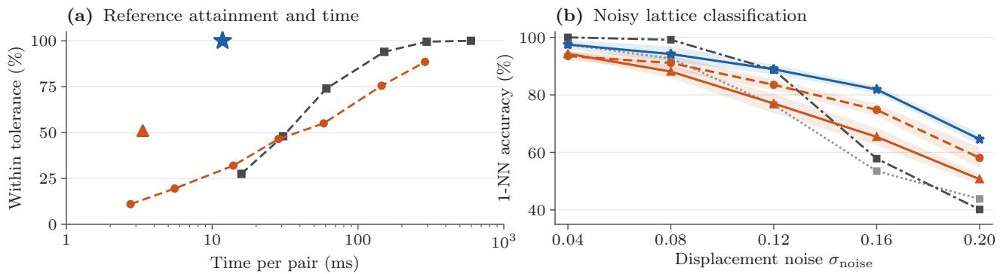  
Figure A.1: Accuracy and computation in planar applications. (a) Fraction of 200 MPEG-7 pairs that attain the numerical reference against mean time, including initialization: AM with 1–100 random starts, grids with 36–1,440 angles, AM (PCA), and Rubix. (b) 1-NN accuracy on noisy lattice neighborhoods; the solver curves and their bands of ±1.96 standard errors use five draws, while GW and the bond-order descriptor use three separate draws (Appendices F.5 and F.6).

Table A.6 varies the size of the neighborhoods and the number of labels per class.

## F.6.1 SEINT Distance Comparisons

Original NumPy SEINT [52] uses the same centered, scaled inputs. Its original setting maximizes discrepancy over 50 random radius-2 references; ISEINT averages it. Fourteen settings cross these variants with 50–2,000 random references and deterministic references. We report the original and best settings, the latter deterministic ISEINT (Table A.8).

Clustering uses square roots of SEINT values to match PW; raw values give the same conclusions, and nearest-neighbor results are unchanged. Timing uses the same 300 pairs and processor.

Both SEINT settings give fewer MPEG-7 bullseye hits than Rubix (Wilcoxon $p < 1 0 ^ { - 1 7 9 } )$ . Deterministic ISEINT trails on lattices at $\sigma _ { \mathrm { n o i s e } } = 0 . 1 2$ , 0.16, 0.20 (McNemar $p < 1 0 ^ { - 2 0 } )$ ; Section 8.2 reports its low-noise advantage.

## F.6.2 Polycrystals and Clustering

Polycrystals (Figure A.3). Eight uniform sites partition a 50 × 50 square into Voronoi grains. Each lattice fills two grains at uniform random orientations and ofsets. We remove cross-grain neighbors closer than 0.55 and add Gaussian noise $\sigma _ { \mathrm { n o i s e } } = 0 . 1 2$ . Ten pure-lattice neighborhoods per type provide references at the same noise. Scored atoms lie at least 3.5 from the square boundary, with all 24 nearest neighbors in their grain.

Clustering. At $\sigma _ { \mathrm { n o i s e } } = 0 . 0 8 , 0 . 1 2 , 0 . 1 6$ three draws of 50 neighborhoods per lattice form four groups by lowest-cost k-medoids over 20 starts or by average linkage. Labels serve only ARI and normalized mutual information (NMI) evaluation (Table A.9).

## F.7 Published Planar Baselines

Fiedler–W. Original and reproduced Fiedler–W [2] retain its graph construction, with determinant corrections restricting it to SO(2), 100 iterations and tolerance $1 0 ^ { - 1 0 }$ . Both are reported because eight of 600 outputs difer, one for an unresolved reason.

Other PW solvers. Our reproduction of Ping-Pong [25] uses $\gamma _ { j } ^ { \mathrm { P P } } = 1 / ( j + 2 )$ , at most 1,000 Frank– Wolfe and 100 alternating steps. Its uniform initializer is stationary, so the first assignment depends on tie-breaking (Appendix F.4). Stochastic Wasserstein– Procrustes [28] uses learning rate 500, 100 initialization updates and 6,659 stochastic updates over five epochs, then assignment without AM refinement. Single-core timings include initialization and evaluation.

APM (Tables 3 and A.10). The authors’ code [47] runs under Octave in similarity mode, with zero regularization, distance tolerance 0.001, batches of $2 ^ { 9 }$ rectangles and LAPJV cost resolution $1 0 ^ { - 4 }$ . The direct comparison uses C++ Rubix at yaw gap $1 0 ^ { - 1 0 }$ . Both transform Y toward X, eliminating translation and nonnegative scale on positive-variance sources. Timings include setup and language overhead.

RPM-PA (Table 3). Our implementation follows Lian et al. [49], eliminating planar similarity and searching the convex hull of matching statistics. Complete

neighbour 4

(a) Same-class pairs, aligned to the gray target

AM (PCA)

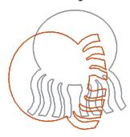  
J = 0.2237

horseshoe

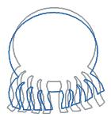

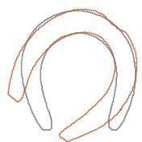

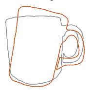  
J = 0.0674  
J = 0.0193  
Rubix  
J = 0.0266

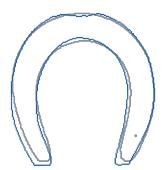  
J = 0.0095

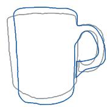  
J = 0.0151

(b) Four nearest neighbours of an apple query

AM (PCA) 0 of 4 same class neighbour 1

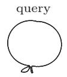

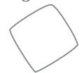  
device3

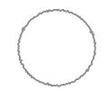  
× <sup>device9</sup>

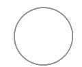  
× <sup>device9</sup>

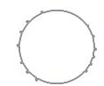  
× <sup>device9</sup>

Rubix 4 of 4 same class

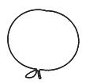

  
apple

  
apple

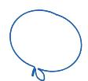  
apple

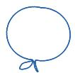  
apple

Figure A.2: MPEG-7 alignment and retrieval. The silhouettes are aligned from 64 boundary points, and the full outlines are shown. (a) Three pairs of the same class aligned to the gray target by AM (PCA, orange) and by Rubix (blue), with the mean squared PW costs J and one scale per class. (b) A selected apple query and its four nearest neighbors in their computed orientations; × marks shapes of other classes. AM and Rubix retrieve 0 of 4 and 4 of 4 same-class neighbors here; Table 4 evaluates all queries.  
Table A.6: Lattice 1-NN accuracy (%) at $\sigma _ { \mathrm { n o i s e } } = 0 . 1 2$ by neighborhood size n and labeled neighborhoods per class, pooled over three draws of 200 test neighborhoods. Rubix is more accurate in every setting (McNemar p ≤ 0.002). Bold marks higher accuracy than AM.
<table><tr><td colspan="2">Labels</td><td rowspan="2">Rubix</td><td rowspan="2">AM (PCA) [2]</td></tr><tr><td>n</td><td>per class</td></tr><tr><td>12</td><td>10</td><td>83.5</td><td>80.2</td></tr><tr><td>18</td><td>10</td><td>90.3</td><td>83.0</td></tr><tr><td>24</td><td>5</td><td>83.5</td><td>72.0</td></tr><tr><td>24</td><td>10</td><td>91.5</td><td>77.8</td></tr><tr><td>24</td><td>20</td><td>90.8</td><td>83.5</td></tr><tr><td>36</td><td>10</td><td>94.5</td><td>79.2</td></tr></table>

Table A.7: Lattice classification accuracy (%) of PW computed by Rubix, AM (PCA), and AM (GW), and of rotation-invariant alternatives: GW distances, SEINT [52] in its original classification setting and in the best of its 14 tested settings, and a bond-orientational descriptor. All use 1-NN with ten labeled neighborhoods per class (n = 24, three draws of 200 test neighborhoods). Bold marks the highest accuracy in each column.
<table><tr><td>σnoise</td><td>0.04 0.08</td><td>0.12</td><td>0.16</td><td>0.20</td></tr><tr><td>Rubix</td><td>97.8 92.7</td><td>88.7</td><td>82.3</td><td>64.0</td></tr><tr><td>AM (PCA) [2]</td><td>94.7 87.8</td><td>77.2</td><td>66.2</td><td>50.7</td></tr><tr><td>AM (GW) [4]</td><td>93.8 87.3</td><td>72.5</td><td>60.7</td><td>45.2</td></tr><tr><td>GW [4,26]</td><td>97.5 92.7</td><td>76.5</td><td>53.5</td><td>43.8</td></tr><tr><td>SEINT [52]</td><td>97.7 81.0</td><td>50.0</td><td>36.3</td><td>26.3</td></tr><tr><td>SEINT, best setting [52]</td><td>100.0 93.7</td><td>69.3</td><td>44.8</td><td>31.2</td></tr><tr><td>Descriptor (ours)</td><td>100.0</td><td>99.2 88.7</td><td>57.8</td><td>40.2</td></tr></table>

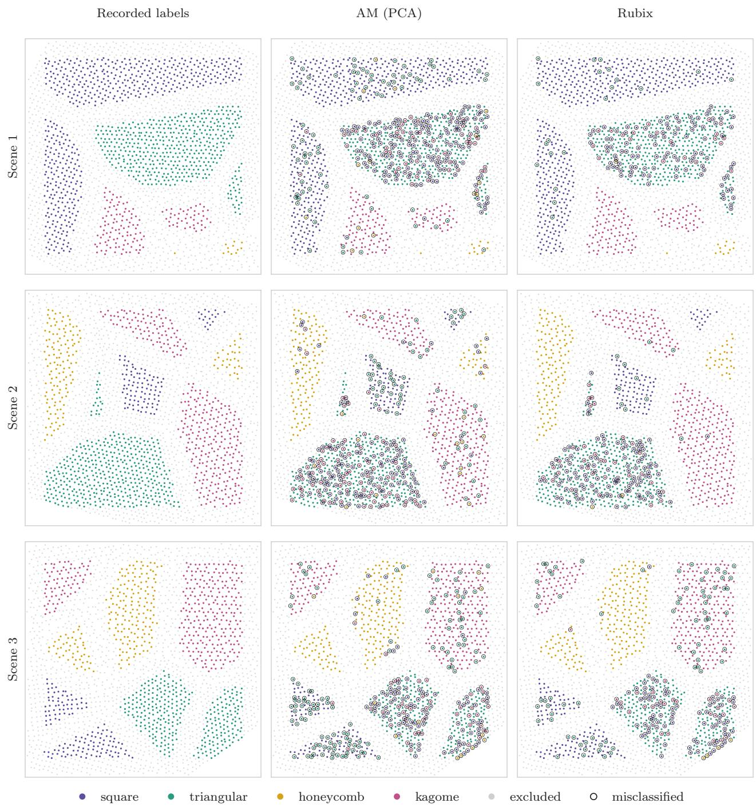  
Figure A.3: Fewer classification errors across three polycrystals. The rows show the three scenes, and the columns show the true lattice labels and the predictions with AM (PCA) and with Rubix. Black rings mark errors. Gray atoms are not scored: their neighborhoods cross a grain boundary, or they lie within 3.5 units of the boundary of the domain. Both methods score the same 1,190, 1,071 and 1,006 atoms, drawn at a common physical scale. The errors fall from 285 to 139 from 257 to 149 and from 255 to 179, which is 330 fewer overall; in the first scene, Rubix corrects 186 errors of AM and introduces 40.

Table A.8: SEINT at matched error rates. Accuracy (%) and median time in milliseconds per distance for 14 settings of SEINT [52] and for Rubix, on all 1,400 MPEG-7 silhouettes and three lattice draws (Table $\mathrm { A } . 7 )$ . The times use the same 300 pairs and processor core. ISEINT averages the discrepancies over the references, and SEINT takes their maximum.
<table><tr><td rowspan="2">Setting</td><td colspan="3">MPEG-7 retrieval</td><td colspan="6">Lattice 1-NN accuracy  $( \% )$  at  $\sigma _ { \mathrm { n o i s e } }$ </td></tr><tr><td>Bullseye</td><td>1-NN</td><td>ms</td><td>0.04</td><td>0.08</td><td>0.12</td><td>0.16</td><td>0.20</td><td>ms</td></tr><tr><td>SEINT, 50 refs</td><td>36.2</td><td>63.1</td><td>0.22</td><td>97.7</td><td>81.0</td><td>50.0</td><td>36.3</td><td>26.3</td><td>0.17</td></tr><tr><td>SEINT, 100 refs</td><td>36.0</td><td>62.3</td><td>0.28</td><td>97.8</td><td>81.3</td><td>51.3</td><td>34.5</td><td>26.3</td><td>0.20</td></tr><tr><td>SEINT, 200 refs</td><td>35.9</td><td>61.8</td><td>0.43</td><td>98.0</td><td>82.7</td><td>53.5</td><td>34.2</td><td>28.2</td><td>0.25</td></tr><tr><td>SEINT, 500 refs</td><td>36.7</td><td>63.1</td><td>0.78</td><td>99.7</td><td>87.5</td><td>55.0</td><td>34.5</td><td>29.2</td><td>0.40</td></tr><tr><td>SEINT, 1000 refs</td><td>36.6</td><td>63.0</td><td>1.58</td><td>99.2</td><td>87.5</td><td>51.5</td><td>34.2</td><td>31.3</td><td>0.64</td></tr><tr><td>SEINT, , 2000 refs</td><td>37.2</td><td>62.0</td><td>2.51</td><td>99.0</td><td>84.7</td><td>55.3</td><td>35.2</td><td>28.3</td><td>1.13</td></tr><tr><td>ISEINT, 50 refs</td><td>36.7</td><td>63.1</td><td>0.22</td><td>99.8</td><td>89.5</td><td>58.2</td><td>35.7</td><td>27.8</td><td>0.17</td></tr><tr><td>ISEINT, 100 refs</td><td>36.9</td><td>63.6</td><td>0.28</td><td>99.8</td><td>90.2</td><td>57.8</td><td>36.2</td><td>26.5</td><td>0.20</td></tr><tr><td>ISEINT, 200 refs</td><td>36.6</td><td>62.9</td><td>0.43</td><td>99.8</td><td>91.2</td><td>60.0</td><td>36.3</td><td>27.0</td><td>0.25</td></tr><tr><td>ISEINT, 500 refs</td><td>36.9</td><td>64.0</td><td>0.78</td><td>100.0</td><td>90.8</td><td>61.0</td><td>37.5</td><td>28.0</td><td>0.40</td></tr><tr><td>ISEINT, 1000 refs</td><td>36.8</td><td>63.1</td><td>1.58</td><td>100.0</td><td>91.2</td><td>60.8</td><td>37.5</td><td>27.8</td><td>0.64</td></tr><tr><td>ISEINT, 2000 refs</td><td>36.8</td><td>63.3</td><td>2.51</td><td>99.8</td><td>91.0</td><td>60.2</td><td>37.0</td><td>27.8</td><td>1.13</td></tr><tr><td>SEINT, deterministic</td><td>38.8</td><td>59.1</td><td>0.34</td><td>99.8</td><td>91.8</td><td>70.0</td><td>42.7</td><td>30.5</td><td>0.16</td></tr><tr><td>ISEINT, deterministic</td><td>41.6</td><td>67.4</td><td>0.34</td><td>100.0</td><td>93.7</td><td>69.3</td><td>44.8</td><td>31.2</td><td>0.16</td></tr><tr><td>Rubix</td><td>67.4</td><td>92.5</td><td>5.35</td><td>97.8</td><td>92.7</td><td>88.7</td><td>82.3</td><td>64.0</td><td>1.00</td></tr></table>

Table A.9: Unsupervised clustering of 200 lattice neighborhoods (50 per lattice), using PW and SEINT [52] distances. ARI and NMI measure the agreement with the true types, averaged over three draws. SEINT uses its original classification setting and its best tested setting (deterministic ISEINT; Appendix F.6.1). Bold marks the highest score per column within each clustering method.

<table><tr><td rowspan="2">Clustering</td><td rowspan="2">Distance</td><td> $\sigma _ { \mathrm { n o i s e } } = 0 . 0 8$ </td><td></td><td> $\sigma _ { \mathrm { n o i s e } } = 0 . 1 2$ </td><td></td><td> $\sigma _ { \mathrm { n o i s e } } = 0 . 1 6$ </td><td></td></tr><tr><td>ARI</td><td>NMI</td><td>ARI</td><td>NMI</td><td>ARI</td><td>NMI</td></tr><tr><td rowspan="4">k-medoids</td><td>Rubix</td><td>0.55</td><td>0.68</td><td>0.52</td><td>0.60</td><td>0.39</td><td>0.43</td></tr><tr><td>AM (PCA) [2]</td><td>0.35</td><td>0.40</td><td>0.22</td><td>0.26</td><td>0.06</td><td>0.08</td></tr><tr><td>SEINT [52]</td><td>0.21</td><td>0.27</td><td>0.06</td><td>0.09</td><td>0.01</td><td>0.03</td></tr><tr><td>SEINT, best setting [52]</td><td>0.70</td><td>0.72</td><td>0.28</td><td>0.31</td><td>0.07</td><td>0.11</td></tr><tr><td rowspan="4">average linkage</td><td>Rubix</td><td>0.68</td><td>0.80</td><td>0.66</td><td>0.80</td><td>0.10</td><td>0.20</td></tr><tr><td>AM (PCA) [2]</td><td>0.43</td><td>0.59</td><td>0.29</td><td>0.45</td><td>0.07</td><td>0.21</td></tr><tr><td>SEINT [52]</td><td>0.09</td><td>0.22</td><td>0.00</td><td>0.06</td><td>0.00</td><td>0.04</td></tr><tr><td>SEINT, best setting [52]</td><td>0.16</td><td>0.31</td><td>0.04</td><td>0.09</td><td>0.00</td><td>0.03</td></tr></table>

matching reduces the afine hull to $d _ { \mathrm { R P M } } = 2$ dimensions. We denote the paper’s $n _ { u }$ and $\varepsilon _ { 0 }$ by $d _ { \mathrm { R P M } }$ and ε<sub>RPM</sub>. Search stops when every facet’s normalized support satisfies $\mu _ { \mathrm { R P M } } \leq 1 + d _ { \mathrm { R P M } } \varepsilon _ { \mathrm { R P M } }$ , or after 120 s. RPM-PA and Rubix share single-threaded Python, one processor core and SciPy’s assignment solver.

Rubix support cuts inside APM. Retaining assignment-derived support half-spaces tightens most APM rectangles without new assignments, but median assignment counts change by less than 0.7% on all 600 pairs, with identical optima: the initial batch of $2 ^ { 9 }$ rectangles dominates before pruning.

## F.8 Planar Laser-Scan Registration

Data and settings. Original GLORES [20] and PLICP [16] use IILABS [62] sequences slippage, nav\_a\_omni, loop. Scans at ten acquisition-time quantiles pair with scans one and five seconds later, yielding 60 pairs. Using 128 or 256 beams and retained fractions $\rho _ { \mathrm { k e e p } }$ of 0.7 or 0.9 gives 240 configurations. The search spans all yaw and translations in $[ - 5 , 5 ] ^ { 2 }$ m at fixed scale, with relaxation thresholds of 0.1, tolerance 1%, and soft and hard limits of 120 and 150 s. PLICP starts at zero or 16 equally spaced yaws, using centroid translation for nonzero starts and native rejection, and minimizes error per retained point. The 28 configurations without reference poses enter timing only.

Table A.10: Similarity alignment against original APM. Both optimize a bijection, translation, rotation and nonnegative scale on 200 pairs per family. All objectives agree within APM’s mean tolerance $1 0 ^ { - 6 }$ Times are median milliseconds including setup; ratios are paired APM/Rubix medians. Bold marks lower Rubix times and ratios above one. Language and solver details appear in Appendix F.7.
<table><tr><td>Family</td><td>APM [47] (ms)</td><td>Rubix (ms)</td><td>Ratio</td></tr><tr><td>MPEG-7</td><td>259.0</td><td>8.12</td><td>32.4×</td></tr><tr><td>Gaussian</td><td>191.6</td><td>4.41</td><td>43.7×</td></tr><tr><td>Lattice</td><td>144.7</td><td>0.74</td><td>194.6×</td></tr></table>

Bounds. We use the common-translation construction of Lemma 18 and Appendix D.3. Tangent triangles use half-widths in $( 0 , \pi / 3 ] ;$ below $1 0 ^ { - 7 }$ we use the minimum vertex value. Cardinality stays fixed per cell. All variants split wide arcs into three and share roundof safeguards, including a coordinate-scaled guard; nonimproving queries stop early. GLORES has no polynomial guarantee. When the search terminates normally, its lower bound is 0.99U; when it is interrupted, the lower bound is min $\left( L _ { \mathrm { r a w } } , 0 . 9 9 U \right)$ , which accounts for the cells that were pruned within the tolerance.

Timing and statistics. Timings include input, all preprocessing and bound computation. Bootstrap resampling stays within sequences and keeps each pair’s four configurations together.

## F.9 Unbalanced Alignment Details

## F.9.1 Data, Baselines and Selection

Anchored synthetic sets. For $n = m = 4 0$ , we draw $k = \mathrm { r o u n d } ( 4 0 \rho _ { \mathrm { s h a r e } } )$ shared and 40 − k independent points per set uniformly in the unit disk. Shared target points receive Gaussian noise $\sigma _ { \mathrm { n o i s e } }$ and a uniform random rotation about the origin, our anchor; both sets are randomly permuted. Each cell of $\rho _ { \mathrm { s h a r e } } \in \{ 1 , 0 . 7 5 , 0 . 5 , 0 . 3 \}$ and $\sigma _ { \mathrm { n o i s e } } \in \{ 0 . 0 1 , 0 . 0 3 \}$ has 30 validation and 100 test instances. Success requires rotation error at most $5 ^ { \circ }$ . Soft plans yield mutual arg-max correspondences of mass at least 0.3 of the maximum, and rotations from plan-weighted crosscovariance about the anchor. F1 compares returned and true shared pairs.

Defective crystal neighborhoods. The four lattices have unit nearest-neighbor spacing and Gaussian displacement $\sigma _ { \mathrm { n o i s e } } = 0 . 0 8$ . Each noncentral atom is removed with probability $p _ { \mathrm { d e f } }$ . Interstitial counts are Poisson with mean $ { p _ { \mathrm { d e f } } } N _ { \mathrm { c l e a n } } / 2$ , where $N _ { \mathrm { c l e a n } }$ counts defect-free atoms within radius 2.6; positions are uniform within that radius and at least 0.5 from every atom. Neighborhoods contain the central site at the origin and either all atoms within 2.6 (unbalanced) or its 23 nearest atoms (balanced), in physical units. Each class has 10 defect-free references at the same noise, 15 validation queries and 50 tests per p<sub>def</sub> $\in \{ 0 , 0 . 1 , 0 . 2 , 0 . 3 \}$

Real laser scans. We reuse the 240 configurations of Section 8.4.1; success on the 212 motion-capture references requires errors at most 0.25 m and $2 ^ { \circ }$ . GW methods normalize within-scan distances by the target’s median pairwise distance and fit plan-weighted rigid Procrustes poses. Optional refinement uses 50 trimmed point-to-point ICP iterations at the prescribed retained fraction; zero-pose ICP controls for refinement alone.

Methods and settings. Rubix-U applies Algorithm 2 to (13) with zero heights, anchor-centered rotation, absolute gap $1 0 ^ { - 6 } \lambda ( n + m )$ , and limits of 20,000 assignments and 10 s. AM-U alternates penalized assignment and rotation from 16 equally spaced yaws, retaining the best objective. Rubix-B optimizes the complete anchored bijection. These variants separate optimization from partial matching, except that lattice Rubix-B also changes neighborhood extraction.

UGW [68] uses the authors’ log-domain solver and two-plan cost, Euclidean internal distances and masses $1 / n _ { 0 }$ , with $n _ { 0 } = 4 0 $ , 24, 100 for synthetic sets, lattices and scans. Fused UGW [72] uses POT’s [26] majorization–minimization solver, zero entropy and anchor cost $( \| x _ { i } \| - \| y _ { j } \| ) ^ { 2 }$ . Partial GW [17] uses POT’s Frank–Wolfe solver; SEINT uses its best setting (Appendix F.6.1).

For the synthetic sets, the tested penalties are $\lambda ~ \in ~ \{ 2 , 5 , 1 0 , 2 0 , 5 0 , 1 0 0 \} ~ \times ~ 1 0 ^ { - 4 } ,$ ; for lattices, we use $\left. 0 . 0 1 , 0 . 0 2 , 0 . 0 5 , 0 . 1 , 0 . 2 \right.$ The UGW grid uses entropy and marginal penalties $( \varepsilon _ { \mathrm { U G W } } , \rho _ { \mathrm { U G W } } ) \in $ $\{ 1 0 ^ { - 3 } , 1 0 ^ { - 2 } \} \times \{ 1 \bar { 0 } ^ { - 2 } , 1 \bar { 0 } ^ { - 1 } , 1 , 1 0 \}$ . For fused UGW, we test $( \rho _ { \mathrm { F U G W } } , \alpha _ { \mathrm { F U G W } } ) \in \{ 1 0 ^ { - 2 } , 1 0 ^ { - 1 } , 1 \} \times \{ 0 . 3 , 1 , 3 \}$ for the marginal penalty and feature weight; neither of these penalties is the shared fraction $\rho _ { \mathrm { s h a r e } } .$ For partial GW, we obtain matched masses by multiplying min $( n , m ) / n _ { 0 }$ by {0.3, 0.5, 0.75, 1} for the synthetic sets, {0.5, 0.7, 0.85, 1} for the lattices and {0.5, 0.7, 0.9} for the laser scans. Validation and test use the same grids.

Selection and tests. Each synthetic or lattice cell selects the highest validation success or accuracy, breaking ties by grid order. Tables place each baseline’s best test value beside its validation-selected result. Without scan validation data, GW uses its best test setting. Paired McNemar tests compare Rubix-U with the best other method.

## F.9.2 Failure Diagnostic and Example Selection

Solver and objective failures. Each GW method restarts at its selected setting with mass $1 / n _ { 0 }$ per true pair; partial GW rescales to its prescribed mass, never above the true mass at selected settings. A solver failure requires successful rotation recovery with an objective more than a relative $1 0 ^ { - 6 }$ below the failed run. Otherwise, the label “objective failure” means no witness was found, not that a nonconvex GW optimum was established. AM has a solver failure when Rubix closes its gap at the same penalty and recovers the rotation. Both Rubix variants attain costs no greater than the true matching at the true rotation, so their misses are objective failures.

Qualitative examples. Figure 8 follows the firstcase rule in its caption, excluding the two ETH pairs with fused-UGW numerical errors. The teaser uses the first correctly classified query per lattice at noise 0.08 and defect rate 0.2. Settings follow the selection above.

Numerical adaptations. SEINT requires equal sizes and uses 24-point neighborhoods. Partial GW requests $( 1 - 1 0 ^ { - 9 } )$ times nominal mass to satisfy POT’s floating-point feasibility test at fraction one. Numerical failures count as misses; lattice timings are comparable only within a cell.

## F.9.3 Detailed Planar and Scan Results

Figure A.4 summarizes all conditions; Tables A.11 and A.12 retain every cell.

Additional planar results. Rubix closes all 4,800 gaps over the six penalties. AM exceeds the optimal objective found by Rubix on 95–589 of the 800 instances per penalty, and by more than 1% on 30–522 (Table A.16).

Validation-F1 selection gives test F1 ranges of 0.75– 1.00 for Rubix, 0.59–0.99 for AM and 0.05–1.00 for GW. Rotation-selected penalties omit some noisy true pairs, reducing Rubix’s F1 to 0.35–0.92. Single-core times are 10–18 ms (Rubix), 2–3 ms (AM), 2–4 ms (partial GW), 32–88 ms (UGW) and 58–146 ms (fused UGW).

Without ICP, UGW and partial GW register 168 and 138 scan configurations. Sixteen-start native PLICP registers 185, statistically indistinguishable from GLO-RES with Rubix $( p = 0 . 5 5 )$ . Timings retain Python UGW’s and C++ GLORES’ respective implementation costs (Table A.17).

Scaling and real 3D subproblems. At overlap 0.5 and noise 0.01, using settings selected for 40 points, Rubix recovers all 50 tests at sizes 20, 40, 80, 160 with closed gaps in median times 0.014, 0.025, 0.12, 0.43 s. AM recovers 94–100% in 0.002–0.18 s, fused UGW 74– 86% in 0.024–5.4 s, UGW 42–46% in 0.067–1.4 s and partial GW 10–22% in 0.002–0.33 s. Fitting yaw to GW plans and evaluating exact assignment on the six ETH subproblems (Section 8.4.2), best-setting UGW, fused UGW and partial GW reach the reference on three, four and two, respectively. AM refinement raises each to six; several other settings still fail.

## F.9.4 Full 3D Rotation and Penalty Sensitivity

Full-rotation tests use $n = m = 2 4$ points in the unit ball, overlap $\rho _ { \mathrm { s h a r e } } \in \{ 1 , 0 . 7 5 , 0 . 5 , 0 . 3 \}$ , uniform rotations, Gaussian noise 0.01 and independent nonshared points, with 20 validation and 50 tests per fraction. Anchored quaternion search receives 15 s; AM alternates penalized assignment and Kabsch fitting from 60 icosahedral rotations. Both use penalties $\{ 5 \times 1 0 ^ { - 4 } , 2 \times 1 0 ^ { - 3 } , 1 0 ^ { - 2 } , 5 \times 1 0 ^ { - 2 } , 0 . 2 \}$ and clipped assignment (Appendix F.11); GW retains its planar grids. Success requires geodesic error at most $5 ^ { \circ }$ . At selected penalties, Rubix closes all 200 gaps in median times 0.42–1.12 s per fraction and at most 2.6 s (Table A.13).

Penalty sensitivity. A pair can enter an optimal matching only if its squared distance is at most 2λ. Small penalties therefore omit true pairs, and large penalties admit false ones. Across tested penalties $2 \times 1 0 ^ { - 3 } – 5 \times 1 0 ^ { - 3 }$ , planar Rubix closes every gap and recovers at least 99% at each overlap; 3D Rubix recovers every rotation from $5 \times 1 0 ^ { - 4 } \mathrm { ~ t o ~ } 1 0 ^ { - 2 }$ (Table A.14). At $\lambda = 0 . 2$ , all 3D gaps close and misses are objective failures; at $\lambda = 0 . 0 5$ , nine 30%-overlap searches remain open after 15 s. At the smallest penalty, AM recovers only 36.5–52.5% in 2D and 2–14% in 3D.

## F.9.5 Real ETH Scan Details and Results

ETH uses one fixed pair of coresets, with 64 source and 80 target points, per scan pair and 0.3 m voxelization (Appendix F.11).

Translation is the reference or a 0.5 m horizontal ofset in a uniform random direction. Rubix and 16- start AM use $\lambda = 1 \mathrm { m ^ { 2 } ; }$ ; fused UGW receives height and horizontal radius about that translation. GW uses its best test setting, counting fused UGW’s two numerical failures as misses. Yaw success requires $5 ^ { \circ }$

Table A.11: Synthetic partial-overlap results. Rotation recovery within $5 ^ { \circ } \ ( \% )$ , with 100 tests per overlap/noise cell. Entries use validation-selected settings; parentheses give each baseline’s best test value. The last column compares Rubix-U with the best competitor by McNemar’s test.
<table><tr><td>ρshare</td><td> $\sigma _ { \mathrm { n o i s e } }$ </td><td>Rubix-U</td><td>Rubix-B</td><td>AM-U</td><td>UGW</td><td>FUGW</td><td>PGW</td><td></td></tr><tr><td>1</td><td>0.01</td><td>100</td><td>100</td><td>99 (100)</td><td>100 (100)</td><td>100 (100)</td><td>98 (100)</td><td>1.00</td></tr><tr><td>1</td><td>0.03</td><td>100</td><td>100</td><td>99 (100)</td><td>100 (100)</td><td>100 (100)</td><td>93 (93)</td><td>1.00</td></tr><tr><td>0.75</td><td>0.01</td><td>100</td><td>61</td><td>100 (100)</td><td>83 (83)</td><td>97 (97)</td><td>38 (38)</td><td>1.00</td></tr><tr><td>0.75</td><td>0.03</td><td>99</td><td>58</td><td>99 (99)</td><td>84 (84)</td><td>95 (95)</td><td>27 (29)</td><td>1.00</td></tr><tr><td>0.5</td><td>0.01</td><td>100</td><td>29</td><td>98 3 (98)</td><td>49 (49)</td><td>86 (86)</td><td>13 (15)</td><td>0.50</td></tr><tr><td>0.5</td><td>0.03</td><td>98</td><td>28</td><td>99 (99)</td><td>37 (37)</td><td>62 (62)</td><td>14 (14)</td><td>1.00</td></tr><tr><td>0.3</td><td>0.01</td><td>100</td><td>12</td><td>95 (95)</td><td>17 (17)</td><td>47 (47)</td><td>9 (9)</td><td>0.06</td></tr><tr><td>0.3</td><td>0.03</td><td>98</td><td>9</td><td>82 (82)</td><td>23 (23)</td><td>42 (42)</td><td>6 (8)</td><td> $1 . 4 \cdot 1 0 ^ { - 4 }$ </td></tr></table>

Table A.12: Defective-lattice results. 1-NN accuracy (%) on 200 queries per defect/noise cell against defect-free references. Entries use validation-selected settings; parentheses give each baseline’s best test value. SEINT compares 24-atom neighborhoods. The last column compares Rubix-U with the best competitor by McNemar’s test.
<table><tr><td> $p _ { \mathrm { d e f } }$ </td><td> $\sigma _ { \mathrm { n o i s e } }$ </td><td>Rubix-U</td><td>Rubix-B</td><td>AM-U</td><td>UGW [68]</td><td>FUGW [72]</td><td>PGW [17]</td><td>SEINT [52]</td><td>p</td></tr><tr><td>0</td><td>0.08</td><td>100</td><td>98</td><td>95.5 (100)</td><td>100 (100)</td><td>99.5 (100)</td><td>63.5 (63.5)</td><td>94.5</td><td>1.00</td></tr><tr><td>0.1</td><td>0.08</td><td>99</td><td>80.5</td><td>99 (99)</td><td>94 (94)</td><td>90.5 (91.5)</td><td>60 (60)</td><td>50.5</td><td>1.00</td></tr><tr><td>0.2</td><td>0.08</td><td>94.5</td><td>66.5</td><td>94.5 (94.5)</td><td>78 (78)</td><td>79.5 (79.5)</td><td>56.5 (56.5)</td><td>41.5</td><td>1.00</td></tr><tr><td>0.3</td><td>0.08</td><td>90.5</td><td>60</td><td>90.5 (90.5)</td><td>69 (69)</td><td>70 (70)</td><td>45.5 (57)</td><td>26</td><td>1.00</td></tr></table>

Table A.13: Partial overlap under full 3D rotation. Rotations recovered within $5 ^ { \circ }$ (%) from 24-point sets that share the given fraction of points (50 test instances per column), with validation-selected settings. The last column is the median, over the four fractions, of the median time in seconds per solve on one core. Bold marks the highest recovery rates.
<table><tr><td></td><td colspan="4">Shared fraction</td><td></td><td></td></tr><tr><td>Method</td><td>1</td><td>0.75</td><td>0.5</td><td>0.3</td><td>All</td><td>Median s</td></tr><tr><td>Rubix, unbalanced</td><td>100.0</td><td>100.0</td><td>100.0</td><td>100.0</td><td>100.0</td><td>0.505</td></tr><tr><td>AM, 60 starts</td><td>100.0</td><td>78.0</td><td>56.0</td><td>34.0</td><td>67.0</td><td>0.018</td></tr><tr><td>UGW [68]</td><td>100.0</td><td>82.0</td><td>16.0</td><td>0.0</td><td>49.5</td><td>0.053</td></tr><tr><td>Fused UGW [72]</td><td>100.0</td><td>94.0</td><td>86.0</td><td>38.0</td><td>79.5</td><td>0.016</td></tr><tr><td>Partial GW [17]</td><td>100.0</td><td>36.0</td><td>12.0</td><td>2.0</td><td>37.5</td><td>0.002</td></tr></table>

Overlap measures are the reference-pose source-voxel fraction within 0.3 m of a target voxel and the number of penalized coreset matches within $\sqrt { 2 \lambda } = 1 . 4 1$ m (Figure 7). Rubix closes all 62 gaps.

Front-end translations. Gravity-projected translations from Li et al. [43], RAP [57] and Quatro [51] lie within 0.5 m on 23, 19 and 4 pairs. GW retains reference-translation settings. Rubix closes 31/31 gaps per front end and leads other matchers after Li et al. and RAP, but trails their native yaws. Gains over UGW and partial GW are significant $( p \leq 1 . 3 \times 1 0 ^ { - 4 } )$ those over fused UGW and AM are not $( p \ge 0 . 1 0 $ Table A.15).

Gravity search. Our Python port of Li et al.’s MATLAB code [42] searches translation by branch-andbound, maximizing one-to-one matches whose gravity angles agree within $\varepsilon _ { \mathrm { L i } } .$ , then votes for yaw. It receives no translation, making this a contextual comparison.

The translation box spans the ETH scans, with 60 s per solve and $\varepsilon _ { \mathrm { L i } } = 0 . 5 ^ { \circ }$ (published), $1 ^ { \circ } , 2 ^ { \circ } , 4 ^ { \circ }$ . Every setting recovers at most two yaws within $5 ^ { \circ }$ and no pose within 0.5 m. $\mathrm { A t ~ 2 ^ { \circ } }$ and $4 ^ { \circ } , 2 7$ and 31 gaps close, and the median optimum matches all 64 sources: similar gravity angles saturate the count even at incorrect translations. $\mathrm { A t ~ 0 . 5 ^ { \circ } }$ and $1 ^ { \circ }$ , at most four gaps close.

## F.10 Matching Subproblems and Pipelines on ETH Scans

Each scan in Section 8.4.2 uses 20,000 uniformly sampled finite returns, shared across initial yaws, in meters. Nominal vertical axes difer by $0 . 0 2 2 ^ { \circ } - 0 . 6 4 3 ^ { \circ }$ . Reference rotations are projected to SO(3) for evaluation only.

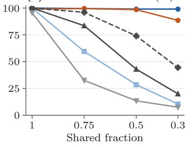

Table A.14: Sensitivity to the unmatched-point penalty. Rotation recovery within $5 ^ { \circ } \ ( \% )$ for Rubix and AM at each $\lambda ,$ using the same penalized objective: 200 planar tests per overlap fraction, pooled over noise, and 50 full-3D tests per fraction.
<table><tr><td></td><td colspan="4">Rubix, unbalanced</td><td colspan="4">AM, 16 starts</td></tr><tr><td>Planar,  $1 0 ^ { 4 } \lambda$ </td><td>1</td><td>0.75</td><td>0.5</td><td>0.3</td><td>1</td><td>0.75</td><td>0.5</td><td>0.3</td></tr><tr><td>2</td><td>100</td><td>97.5</td><td>88.5</td><td>74.5</td><td>52.5</td><td>47</td><td>43</td><td>36.5</td></tr><tr><td>5</td><td>100</td><td>99.5</td><td>99</td><td>88</td><td>66</td><td>57.5</td><td>52.5</td><td>50</td></tr><tr><td>10</td><td>100</td><td>100</td><td>100</td><td>94.5</td><td>84.5</td><td>74.5</td><td>62</td><td>59.5</td></tr><tr><td>20</td><td>100</td><td>100</td><td>100</td><td>99</td><td>93</td><td>86</td><td>79.5</td><td>72.5</td></tr><tr><td>50</td><td>100</td><td>100</td><td>100</td><td>99</td><td>99</td><td>98</td><td>95.5</td><td>87.5</td></tr><tr><td>100</td><td>100</td><td>100</td><td>100</td><td>92.5</td><td>100</td><td>99.5</td><td>98.5</td><td>87.5</td></tr><tr><td>Full 3D,  $1 0 ^ { 4 } \lambda$ </td><td>1</td><td>0.75</td><td>0.5</td><td>0.3</td><td>1</td><td>0.75</td><td>0.5</td><td>0.3</td></tr><tr><td>5</td><td>100</td><td>100</td><td>100</td><td>100</td><td>14</td><td>2</td><td>6</td><td>2</td></tr><tr><td>20</td><td>100</td><td>100</td><td>100</td><td>100</td><td>40</td><td>32</td><td>22</td><td>6</td></tr><tr><td>100</td><td>100</td><td>100</td><td>100</td><td>100</td><td>86</td><td>78</td><td>64</td><td>34</td></tr><tr><td>500</td><td>100</td><td>100</td><td>84</td><td>12</td><td>100</td><td>84</td><td>56</td><td>10</td></tr><tr><td>2000</td><td>100</td><td>54</td><td>8</td><td>0</td><td>100</td><td>52</td><td>0</td><td>0</td></tr></table>

(a) Rotation recovered (%)  
(b) Lattice accuracy (%)  
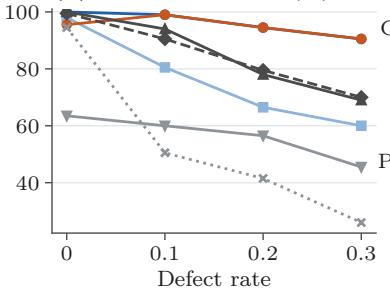

(c) Pose success (%)  
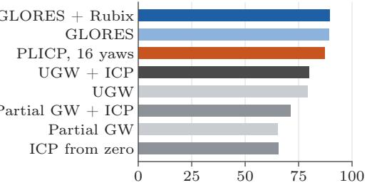  
Figure A.4: Unbalanced alignment across all conditions. (a) Rotations recovered within $5 ^ { \circ }$ against the shared fraction, over 200 synthetic tests per fraction. (b) Lattice 1-NN accuracy against the defect rate at thermal noise 0.08. (c) Pose success on the 212 laser-scan configurations with a reference. The settings are validation-selected in (a,b); the GW pipelines use their best test setting in (c).

Pipeline. We retain normals whose absolute vertical component is below 0.8, estimated from 12 neighbors. Penalized ranking uses $\lambda = 1 \mathrm { m ^ { 2 } ; }$ partial refinement allows 12 iterations and two seconds. Four-degreeof-freedom gravity ICP [35] uses 20-neighbor target normals, 85% trimming, 100 iterations and ten seconds. The 16-yaw comparison uses centroid-optimal translation and mean tolerance $\mathrm { 1 0 ^ { - 5 } m ^ { 2 } }$ , equivalent to summed tolerance $0 . 0 0 0 3 2 \mathrm { m } ^ { 2 }$ over 32 points, with heuristic roundof guards. AM uses the same attainment tolerance but supplies no lower bound.

Complete systems for context. Gravity ICP [35] selects zero yaw or the best of 16 starts by trimmed point-to-plane residual. Generalized-CVO [77] selects among 16 yaws by geometry-only similarity; RAP [57] uses pretrained mini-SpinNet features, one generation and ten flow steps. Selection never uses reference poses. At $5 ^ { \circ }$ and 0.5 m, one-start ICP, 16-start ICP, Generalized-CVO and RAP recover 2, 4, 0 and 4 of six poses, with median complete times 0.165, 1.32, 11.2 and 13.4 s. Inputs and hardware difer.

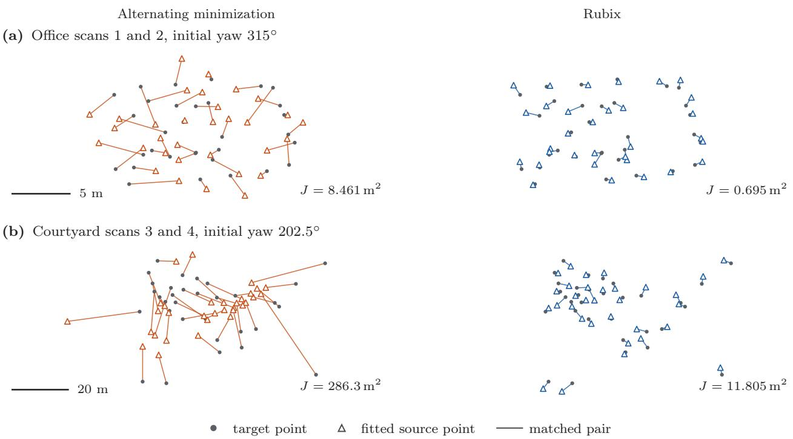  
Figure A.5: Gravity-aligned matching on ETH scans. AM and Rubix start from the same initial yaw on 32-poin subsets, with the nominal vertical of the scanner as the gravity direction. From AM to Rubix, the mean squared 3D residual falls from 8.461 to $\mathrm { 0 . 6 9 5 m ^ { 2 } }$ in the Ofice example and from 286.3 to $\mathrm { 1 1 . 8 0 5 m ^ { 2 } }$ in the Courtyard example. Each row shows every point and every matched edge from one viewpoint and at one scale, with the heights retained. The examples are selected for large errors of AM; Table 8 reports all 96 initializations.

Table A.15: Partial overlap on real 3D scans. Yaw recoveries within $5 ^ { \circ }$ on the identified ETH pairs, given reference, ofset or front-end translations. GW settings are selected at the reference translation; AM uses 16 starts. Native Li et al., RAP and Quatro recover 25, 25 and 6 yaws. Bold marks the most recoveries.
<table><tr><td></td><td colspan="2">Reference</td><td colspan="3">Front end</td></tr><tr><td>Method</td><td>Exact</td><td>Offset</td><td>Li [43]</td><td>RAP [57]</td><td>Quatro [51]</td></tr><tr><td>Rubix</td><td>27</td><td>25</td><td>20</td><td>23</td><td>8</td></tr><tr><td>AM</td><td>22</td><td>20</td><td>17</td><td>17</td><td>5</td></tr><tr><td>UGW [68]</td><td>10</td><td>9</td><td>6</td><td>7</td><td>7</td></tr><tr><td>Fused</td><td>23</td><td>19</td><td>19</td><td>20</td><td>10</td></tr><tr><td>UGW [72] Partial</td><td>6</td><td>7</td><td>5</td><td>6</td><td>6</td></tr></table>

## F.11 Published Registration Methods as Front Ends

We use all identified ETH pairs of Li et al. [43] from Arch, Courtyard, Facade, Ofice and Trees. Pairs share scans; nominal scanner vertical supplies gravity.

Native methods. Quatro [51] runs from its original reimplementation with 0.3 m voxels, normal and FPFH radii of 0.5 and 0.75 m, respectively, and a noise bound of 0.3 m. RAP [57] uses pretrained mini-SpinNet in two fixed trials. Li et al.’s original solver [43] runs unchanged under Octave; its unavailable front end is reconstructed with 0.1 m voxels, ISS radii of 0.6 and 0.4 m, eigenvalue ratios of 0.975, and normal and FPFH radii of 0.2 and 0.5 m, respectively. It supplies $N _ { \mathrm { c a n d } } = 1 0$ targets per source. Sensitivity tests use $N _ { \mathrm { c a n d } } = 1$ and 5.

Matching stage. Farthest-point sampling of 0.3 m voxels selects 64 sources and 80 targets. Each of 17 subset problems receives one second and 200,000 assignments; multistart adds 16 uniform yaws. All variants share C++ host and assignment code. Penalized assignment of the smaller set uses the costs min $( c _ { i j } - 2 \lambda , 0 )$ ， whose negative entries give an optimal partial matching. Ranking uses $\lambda = 1 \mathrm { m } ^ { 2 }$ , and gravity ICP uses at most 6,000 vertical-surface points and ten seconds.

Native poses. Rotations must have orthogonality and determinant errors at most $1 0 ^ { - 2 }$ before projection to the nearest proper rotation. The incumbent retains native translation and yaw $\theta = \mathrm { a t a n 2 } ( R _ { 1 0 } - R _ { 0 1 } , R _ { 0 0 } +$

Table A.16: Failure diagnostic by overlap. Solver/objective failures among 200 tests per fraction (Appendix F.9.2). A GW objective failure means no better correct-rotation witness was found. Both Rubix variants close every gap.
<table><tr><td></td><td colspan="4">Shared fraction</td><td></td></tr><tr><td>Method</td><td>1</td><td>0.75</td><td>0.5</td><td>0.3</td><td>All</td></tr><tr><td>Rubix</td><td>0/0</td><td>0/1</td><td>0/2</td><td>0/2</td><td>0/5</td></tr><tr><td>Balanced Rubix</td><td>0/0</td><td>0/81</td><td>0/143</td><td>0/179</td><td>0/403</td></tr><tr><td>AM, 16 starts</td><td>2/0</td><td>1/0</td><td>3/0</td><td>20/3</td><td>26/3</td></tr><tr><td>UGW</td><td>0/0</td><td>33/0</td><td>101/13</td><td>73/87</td><td>207/100</td></tr><tr><td>Fused UGW</td><td>0/0</td><td>8/0</td><td>49/3</td><td>6/105</td><td>63/108</td></tr><tr><td>Partial GW</td><td>9/0</td><td>135/0</td><td>173/0</td><td>184/1</td><td>501/1</td></tr></table>

Table A.17: Registration of real laser scans with partial overlap. Pose successes within 0.25 m and $2 ^ { \circ }$ among the 212 configurations with a reference, and median seconds per configuration. GLORES [20] and PLICP [16] use the native C++ implementations of Section 8.4.1; UGW [68] and partial GW [17] run in Python at their best setting on these configurations, with optional refinement by trimmed ICP. Bold marks the most successes.
<table><tr><td>Method</td><td>Success</td><td>Median s</td></tr><tr><td>GLORES [20] + Rubix</td><td>190</td><td>1.61</td></tr><tr><td>GLORES [20]</td><td>189</td><td>2.33</td></tr><tr><td>PLICP [16], 16 yaws</td><td>185</td><td>0.23</td></tr><tr><td>PLICP [16] from zero</td><td>146</td><td>0.01</td></tr><tr><td>UGW [68] + ICP</td><td>169</td><td>0.86</td></tr><tr><td>Partial GW [17] + ICP</td><td>151</td><td>0.37</td></tr><tr><td>ICP from zero</td><td>139</td><td>0.01</td></tr><tr><td>UGW [68]</td><td>168</td><td>0.86</td></tr><tr><td>Partial GW [17]</td><td>138</td><td>0.33</td></tr></table>

$R _ { 1 1 } )$ , or zero in the degenerate case. Stopping adds a $2 . 6 3 \times 1 0 ^ { - 1 0 } { - 2 . 3 0 \times \mathrm { 1 0 ^ { - 8 } m ^ { 2 } } }$ guard to the summed target 0.00032 m<sup>2</sup>.

Timing and success. Total times include native startup and inference, preprocessing, matching, ranking and ICP; paired stages share native outputs and processor. Success requires $5 ^ { \circ }$ and 0.5 m, whereas Li et al. [43] report continuous errors and scene-wise arithmetic means.

## F.12 Native Methods and Their Inputs

Native comparisons (Table A.20) use Appendix F.11’s acceptance rules and Quatro’s original reimplementation, without Quatro++ [50]. Quatro [51], RAP [57] and ICP [35] receive independent 20,000-point samples; Li et al. [43] and Cai et al. [13] share full-scan ISS/FPFH candidates with ten targets per source. Different inputs make this contextual.

Gravity ICP and timing. Native libpointmatcher gravity ICP [35] uses point-to-plane updates, 85% trimming, 100 iterations and at most 6,000 independently voxelized vertical-surface points per set. It selects by residual from zero or 16 uniform yaws with centroid translation; the original system’s five-run IMU/odometry selection and intervals are unavailable. Table times include startup/input but exclude Quatro/RAP serialization and Li/Cai features. Including features gives median times 25.074 s (Li), 27.452 s (FMP+BnB), 35.547 s (BnB). Complete ICP times are 0.569 s from one start and 2.731 s from 16.

The solver of Cai et al. [13]. The common-host comparisons isolate interpolation (Table A.21); consensus is unchanged and there is no meaningful speedup. At the solver’s resolution floor, one search stops with interval [1, 3], so termination alone need not close the numerical gap.

## F.13 Quatro Yaw Loss

For Table A.21, we replace only the original yaw solver of Quatro [51], which uses graduated non-convexity (GNC), and keep the order of the feature pairs, the clique, the scale, the translation estimator and the ICP. The translation-invariant measurements (TIMs) of Quatro give vectors $a _ { i } , b _ { i } \in \mathbb { R } ^ { 2 }$ and the cutof $\tau _ { \mathrm { c l i p } } =$ 0.6 m, with the objective

$$
J ( \theta ) = \sum _ { i } \operatorname* { m i n } \{ \| b _ { i } - R _ { \theta } a _ { i } \| ^ { 2 } , \tau _ { \mathrm { c l i p } } ^ { 2 } \} .\tag{A.51}
$$

Each residual $C _ { i } - 2 A _ { i }$ <sub>i</sub> cos $\theta - 2 B _ { i }$ sin θ is afine in the yaw coordinates, so the clipped sum is a finite minimum of afine functions and the arc bound of Lemma 13 applies; a query costs $\mathcal { O } ( N _ { \mathrm { T I M } } )$ operations for $N _ { \mathrm { T I M } }$ TIMs. As a reference, we sort the yaws at which a residual crosses the threshold and minimize the sinusoid on each interval, which takes $\mathcal { O } ( N _ { \mathrm { T I M } } \log N _ { \mathrm { T I M } } )$ operations in exact arithmetic and covers constants, tangencies, coincident crossings and ties.

Table A.18: Complete pipelines on six ETH pairs. Single-core times include all stages on identical observations (Appendix F.10). Solvers return identical poses; success requires errors at most $5 ^ { \circ }$ and 0.5 m. Bold marks Rubix times below the vertex bound’s.
<table><tr><td>Pair</td><td>AM (ms)</td><td>Edge (ms)</td><td>Vertex (ms)</td><td>Rubix (ms)</td><td>Rotation (°)</td><td>Translation (m)</td></tr><tr><td>Office 1–2</td><td>175.9</td><td>266.9</td><td>176.1</td><td>176.6</td><td>0.546</td><td>0.124</td></tr><tr><td>Office 2–3</td><td>205.2</td><td>300.2</td><td>225.9</td><td>200.0</td><td>86.237</td><td>7.254</td></tr><tr><td>Office 3-4</td><td>142.9</td><td>227.7</td><td>142.4</td><td>143.1</td><td>179.164</td><td>2.894</td></tr><tr><td>Courtyard 1–2</td><td>181.5</td><td>368.1</td><td>182.0</td><td>182.4</td><td>0.046</td><td>0.037</td></tr><tr><td>Courtyard 2–3</td><td>260.6</td><td>497.1</td><td>266.7</td><td>273.4</td><td>0.909</td><td>1.365</td></tr><tr><td>Courtyard 3-4</td><td>179.3</td><td>392.6</td><td>185.2</td><td>182.5</td><td>0.047</td><td>0.029</td></tr></table>

Table A.19: A common matching stage after three front ends. Every global solver closes all subset gaps within one second each at mean-squared tolerance $\mathrm { 1 0 ^ { - 5 } m ^ { 2 } }$ plus roundof allowance. LAPs are total assignments; times are medians, including all stages in “Total.” Projected native poses solve no subset problem; AM supplies no lower bound. Bold marks reductions from the vertex bound. Success requires 5◦ and 0.5 m; native success counts are 4/31, 37/62 and 23/31 (Appendix F.11).
<table><tr><td>Refinement after the native method</td><td>Closed gaps</td><td>LAPs</td><td>Stage (ms)</td><td>Total (s)</td><td>Success</td></tr><tr><td>Quatro [51]</td><td></td><td></td><td></td><td></td><td></td></tr><tr><td>Projected native + gravity ICP</td><td>0/527</td><td>0</td><td>0</td><td>0.678</td><td>6/31</td></tr><tr><td> $\mathrm { A M } + \mathrm { g r a v i t y } \mathrm { I C P }$ </td><td>0/527</td><td>1,066</td><td>0.64</td><td>0.657</td><td>11/31</td></tr><tr><td>AM (multistart) + gravity ICP</td><td>0/527</td><td>32,505</td><td>24.7</td><td>0.685</td><td>11/31</td></tr><tr><td> $\mathrm { E d g e \ b o u n d + g r a v i t y \ I C P }$ </td><td>527/527</td><td>2,656,883</td><td>468</td><td>1.158</td><td>11/31</td></tr><tr><td> $\mathrm { V e r t e x \ b o u n d + g r a v i t y \ I C P }$ </td><td>527/527</td><td>32,165</td><td>14.8</td><td>0.669</td><td>11/31</td></tr><tr><td> ${ \mathrm { R u b i x } } + { \mathrm { g r a v i t y ~ I C P } }$ </td><td>527/527</td><td>14,534</td><td>10.4</td><td>0.667</td><td>11/31</td></tr><tr><td>RAP [57]: two trials per pair</td><td></td><td></td><td></td><td></td><td></td></tr><tr><td>Projected native + gravity ICP</td><td>0/1054</td><td>0</td><td>0</td><td>11.774</td><td>32/62</td></tr><tr><td> $\mathrm { A M } + \mathrm { g r a v i t y } \mathrm { I C P }$ </td><td>0/1054</td><td>2,124</td><td>0.61</td><td>11.818</td><td>32/62</td></tr><tr><td> $\mathrm { A M \ ( m u l t i s t a r t ) + g r a v i t y \ I C P }$ </td><td>0/1054</td><td>64,804</td><td>24.9</td><td>11.838</td><td>32/62</td></tr><tr><td> $\mathrm { E d g e \ b o u n d + g r a v i t y \ I C P }$ </td><td>1054/1054</td><td>5,235,886</td><td>466</td><td>12.302</td><td>32/62</td></tr><tr><td> $\mathrm { V e r t e x \ b o u n d + g r a v i t y \ I C P }$ </td><td>1054/1054</td><td>64,300</td><td>14.8</td><td>11.834</td><td>32/62</td></tr><tr><td> ${ \mathrm { R u b i x } } + { \mathrm { g r a v i t y ~ I C P } }$ </td><td>1054/1054</td><td>28,915</td><td>10.4</td><td>11.827</td><td>32/62</td></tr><tr><td>Li et al. [43]</td><td></td><td></td><td></td><td></td><td></td></tr><tr><td>Projected native + gravity ICP</td><td>0/527</td><td>0</td><td>0</td><td>25.410</td><td></td></tr><tr><td> $\mathrm { A M } + \mathrm { g r a v i t y } \mathrm { I C P }$ </td><td>0/527</td><td>1,063</td><td>0.60</td><td>25.321</td><td>17/31 20/31</td></tr><tr><td> $\mathrm { A M \ ( m u l t i s t a r t ) + g r a v i t y \ I C P }$ </td><td>0/527</td><td>32,365</td><td>25.1</td><td>25.347</td><td>20/31</td></tr><tr><td> $\mathrm { E d g e \ b o u n d + g r a v i t y \ I C P }$ </td><td>527/527</td><td>2,623,251</td><td>461</td><td>25.759</td><td>20/31</td></tr><tr><td> $\mathrm { V e r t e x \ b o u n d + g r a v i t y \ I C P }$ </td><td>527/527</td><td>32,168</td><td>14.7</td><td>25.339</td><td>20/31</td></tr><tr><td> ${ \mathrm { R u b i x } } + { \mathrm { g r a v i t y ~ I C P } }$ </td><td>527/527</td><td>14,477</td><td>10.4</td><td>25.332</td><td>20/31</td></tr></table>

Every pair closes at a gap of $1 0 ^ { - 8 }$ plus a floatingpoint allowance that is proportional to the machine precision and to the magnitudes of the coeficients, and the result agrees with the numerical reference from enumeration within $2 . 8 5 \times 1 0 ^ { - 1 4 }$ . The improvements in the loss are conditional on the fixed clique and translation. With 4–24 TIMs per pair, a faster yaw solver does not materially change the total time of the pipeline.

## F.14 Spatial Registration Details

Reference poses serve only evaluation; all gaps are numerical. Appendix F.1 describes the hardware.

## F.14.1 Yaw Search across Matching Models

At each size in Section 8.4.3, scenes cross target/source ratios 1 and 1.25, unmatched fractions 0.1, 0.3, 0.5, vertical standard deviations 0.05, 0.5, and two replicates with noise 0.005. Complete matching centers the source and n targets selected by deterministic farthestpoint sampling. Partial matching retains all points at the shared translation, with $\lfloor \operatorname* { m i n } ( n , m ) / 2 \rfloor$ pairs or $\lambda = 0 . 0 2 ,$ independent of true overlap. Bounds share initial yaw and feasible updates. Limits are 20,000 assignments and 9.75 s, with a 10 s safety limit. Numerical guards are heuristic, without outward rounding.

Table A.20: Native methods on the identified ETH scan pairs. The results precede any added stage; the last two rows are ICP alone. Success requires a rotation error (RE) of at most $5 ^ { \circ }$ and a translation error (TE) of at most 0.5 m. The medians include every valid output. The native time is the wall time of the process, summed over the ICP starts. The methods difer in input, objective and hardware, which limits direct comparisons of runtime; Appendices F.1 and F.12 give the hardware and the preprocessing that the times omit.
<table><tr><td>Native method</td><td>Success 31</td><td>Median RE (°)</td><td>Median TE (m)</td><td>Native time (s)</td></tr><tr><td>Quatro [51]</td><td>4</td><td>81.521</td><td>7.281</td><td>0.289</td></tr><tr><td>RAP, trial 1 [57]</td><td>19</td><td>1.161</td><td>0.368</td><td>12.097</td></tr><tr><td>RAP, trial 2 [57]</td><td>18</td><td>1.143</td><td>0.294</td><td>11.181</td></tr><tr><td>Li et al.,  $N _ { \mathrm { c a n d } } = 1 0 ~ [ 4 3 ]$ </td><td>23</td><td>0.150</td><td>0.064</td><td>2.921</td></tr><tr><td>Cai et al., corrected FMP+BnB [13]</td><td>24</td><td>0.175</td><td>0.041</td><td>4.472</td></tr><tr><td>Cai et al., corrected BnB [13]</td><td>24</td><td>0.175</td><td>0.041</td><td>3.671</td></tr><tr><td>Gravity ICP, zero yaw [35]</td><td>5</td><td>15.472</td><td>5.765</td><td>0.111</td></tr><tr><td>Gravity ICP, 16 yaws [35]</td><td>12</td><td>2.817</td><td>3.200</td><td>2.214</td></tr></table>

## F.14.2 Joint Search over Yaw and Translation

Joint scenes use vertical spreads 0.05, 0.5, noise 0.005, and cardinality $\lfloor \operatorname* { m i n } ( n , m ) / 2 \rfloor$ or penalty 0.02. Bounds share eight initial yaws, four assignment–centroid alternations per yaw, cardinality branches and anchor creation. Full-face uses 24 vertices; the gated policy has no proved bound on its overhead. The million-query limit includes forced-cardinality queries requiring no assignment. Every bound recovers all 48 poses within $5 ^ { \circ }$ and 0.1 m.

## F.14.3 Full Spatial Rotation

The scenes of Section 8.4.5 use the noise levels 0.05 and 0.2 and point distributions with the coordinate standard deviations (1, 1, 1), (1, 0.6, 0.3) and (1, 1, 0.05). Figure A.6 shows selected alignments.

Adaptive bound selection. Additional bounds initially receive one quarter of the time spent on the cheaper search, raised to equal time when their average relative contraction reaches one half. The policy starts on an estimated 32-cell cover, then chooses by contraction per second (Table A.24).

## F.14.4 SE(3) Matching on Subsets of Real Scans

ETH scans [43] use independent 20,000-return samples, 0.3 m voxels and farthest-point coresets of 64 and 80 points. Exact-cardinality assignment at RAP’s full proper pose [57] selects 32 pairs. Both solvers optimize every bijection and proper rotation after centering, without gravity or an added transformation.

Both variants share all search machinery; Rubix adds exterior quaternion queries and witness bounds at every cell. Limits are one core, 15 s and 200,000 cells, targeting a mean-squared gap of $\mathrm { 1 0 ^ { - 5 } m ^ { 2 } }$ Timing covers the solver, excluding subset selection, RAP and dense refinement. Shared scans make comparisons descriptive.

The centroid control instead selects subsets at identity rotation and centroid translation, with all other settings fixed (Appendix G.4). Neither test uses heldout environments.

## G Additional and Contextual Results

## G.1 Rubix in Published Methods

Bounds inside published solvers. On identical hosts, Rubix gives no meaningful speedup for Cai et al.’s [13] FMP+BnB or BnB: paired time ratios are 1.0004 and 0.9275, with unchanged consensus (Table A.21). It lowers Quatro’s [51] truncated yaw loss on 17/31 pairs without changing pose success (Appendix F.13). Native inputs and poses appear in Appendix F.12.

Including the front end. End-to-end speedups over the independent-edge bound fall to 1.62, 1.03, 1.01 after Quatro, RAP and Li et al.; front ends dominate the roughly 10 ms matching stage (Table A.22). Single- and multistart AM match global solvers’ success counts. Against projected native poses plus ICP, matching raises Quatro’s successes from 6 to 11 and Li et al.’s from 17 to 20, leaving RAP at 32/62. Native RAP and Li et al. already succeed on 37 and 23 cases, so matching does not improve every native output.

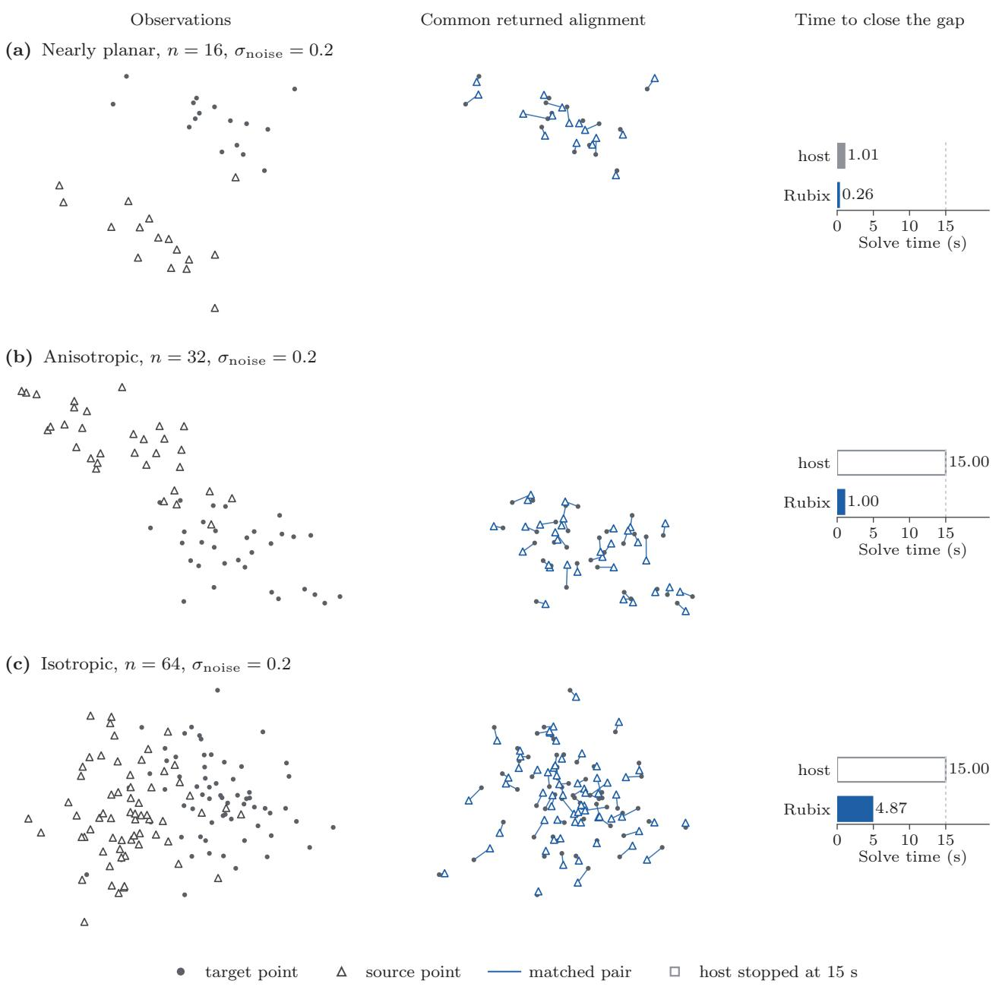  
Figure A.6: Less search for the same SE(3) alignment. One favorable example per geometry, selected from all 72 scenes, including those on which the host reaches the time limit. The columns show the observations, the common fitted pose with its residuals, and the solve times; each row uses one viewpoint and scale. Hollow bars mark the limit of 15 s. At a target of $1 0 ^ { - 5 }$ for the numerical gap in the mean squared error, Rubix closes all three cases, whereas the host with its rotation-cap bounds alone stops above the target in (b,c). Both variants return identical poses and matchings throughout the study.

Without a front end. Sixteen equally spaced yaws give identical final outcomes for AM and Rubix in 496 cases. Yaw-dependent subset selection places optima near initialization, letting AM solve 492/496 subproblems and limiting the benefit of global optimization (Appendix F.11).

## G.2 Gravity-Aligned Go-ICP

Original Go-ICP [76] is restricted to yaw and translation, bisecting yaw intervals with displacement radius $2 \sin ( h / 2 ) \| x _ { i , x y } \|$ and retaining its translation search and stopping rule. All variants disable six-degree-offreedom ICP. Rubix adds arc or common-translation bounds after native pruning (Lemma 18). ETH uses 1,000 sources, full targets, trimming 0.3 and normalized per-inlier tolerance $2 \times 1 0 ^ { - 6 }$ . Twenty Bunny cases use 10% outliers, trimming 0.1 and tolerance $1 0 ^ { - 5 }$ . Each receives 900 s on one core.

Arc bounds reduce median rotation nodes by 1.40 (ETH) and 1.64 (Bunny), and translation nodes by 1.44 and 1.30; common-translation factors are 1.33, 1.64 and 1.15, 1.38. Objectives agree within $0 . 3 3 \varepsilon _ { \mathrm { G o I C P } }$ , where $\varepsilon _ { \mathrm { G o I C P } }$ is per-inlier tolerance times retained count; identical poses yield 20/20 Bunny and 3/31 ETH successes. Native/Rubix time ratios are 0.96, 0.72 for arc bounds and 0.66, 0.99 for common translation: fewer nodes do not save time. Rubix needs at least three objective evaluations per cell versus one distance-transform lookup per point. Native and arc variants finish 28/31 ETH searches; common translation finishes 25/31.

## G.3 Complete ETH Pipelines

Including every pipeline stage on the six pairs, Rubix gives median speedup 1.70 over the independent-edge bound (range 1.50–2.15; Table A.18). All four solvers return identical poses, three within 5◦ and 0.5 m. Figure A.7 shows two successes; Appendix F.10 gives the protocol and complete-system comparisons.

## G.4 Quaternion Bounds on Subsets of Real Scans

On RAP-selected subsets, Rubix reduces cells throughout, by a median factor 1.70 and 70.4% overall, while assignments barely change (130,773 versus 132,648). It is slower: median host/Rubix time ratio 0.56, with speedups on only 3/31 pairs. Both close all gaps with identical objectives, poses and matchings. Centroid selection similarly reduces cells throughout (factor 1.78), yet gives time ratio 0.58 and speedups on $4 / 3 1$ pairs (Table A.23).

At $5 ^ { \circ }$ and 0.5 m, refitted RAP subsets succeed on 10/31 pairs versus native RAP’s 19/31: nine shared successes, ten RAP-only and one refit-only. Refit median errors are $1 . 8 2 ^ { \circ }$ and 0.90 m. Centroid selection succeeds on $0 / 3 1$ , with medians $1 4 . 2 8 ^ { \circ }$ and 9.29 m. Global subset fitting therefore need not recover the full-scan pose.

## G.5 GLORES Examples and PLICP

Native PLICP [16] rises from 146/212 to 185/212 successes with 16 yaws. Rubix accelerates GLORES at the same tolerance and essentially unchanged pose success, 190/212 versus 189/212 (Section 8.4.1, Appendix F.8, and Figure A.8).

## G.6 Sensitivity to the Gravity Direction

To test gravity error, we tilt both supplied directions by 0, 0.25, 0.5, 1, 2 and $5 ^ { \circ }$ with independent azimuths. The 48 complete landmark scenes cross $n \in \{ 3 2 , 1 2 8 \}$ vertical spreads 0.05, 0.5, noise levels 0.005, 0.02, and six replicates in meters. Noise and azimuths stay fixed across tilt magnitudes. All 288 joint yaw–translation fits close summed gaps at $1 0 ^ { - 6 }$ (Figure A.9).

The median rotation error rises from 0.051◦ with the exact gravity direction to $0 . 6 9 9 ^ { \circ }$ and $1 . 3 6 9 ^ { \circ }$ at tilts of $0 . 5 ^ { \circ }$ and 1◦. This error is imposed by the constraint: a rotation that maps $\widehat { g } _ { y }$ to ${ \widehat { g } } _ { x }$ difers from the true rotation $R _ { * }$ by an angle of at least $\angle ( R _ { * } \widehat { g } _ { y } , \widehat { g } _ { x } )$ . At the two tilts, the medians of this lower bound are $0 . 6 7 9 ^ { \circ }$ and 1.358◦, close to the observed errors. The 95th percentile of the translation error rises from 0.86 cm to 1.06 cm at a tilt of $1 ^ { \circ }$ . Closing the gap of the objective thus solves the constrained problem, but it does not remove the pose error that a biased gravity direction imposes.

## G.7 Bound-Cost Policies for Full Rotation

Table A.24 compares five SE(3) policies: rotation-cap bounds alone, one-assignment diferences, full exterior queries, reused assignment duals and adaptive selection (Appendix F.14.3). Full exterior queries close the most gaps in the least total time.

Full queries mainly help host timeouts. On 27 highnoise common successes, median host/full-query time ratio is 0.92; a separate low-noise comparison gives 0.76. At low noise, adaptation is 1.17 times faster than full queries but closes fewer gaps.

Table A.21: Published solvers with and without Rubix bounds. Values are medians; paired ratios divide baseline by Rubix runtime or Quatro yaw loss. Bold marks improvements. GLORES includes preprocessing/bounds at 1% tolerance; Cai timings exclude features and use common hosts with identical consensus. Quatro’s clipped yaw loss improves by more than $1 0 ^ { - 8 }$ on 17/31 pairs, by at most 0.879821 m<sup>2</sup>, with unchanged success (4/31 before, 6/31 after ICP); it is not timed.
<table><tr><td>Solver and baseline</td><td>Runs</td><td>Without</td><td>With Rubix</td><td>Paired ratio</td></tr><tr><td>Timed host (s)</td><td></td><td></td><td></td><td></td></tr><tr><td>GLORES [20]: native bound</td><td>240</td><td>2.330</td><td>1.608</td><td>1.3313×</td></tr><tr><td>Cai FMP [13]: common host</td><td>31</td><td>2.396</td><td>2.413</td><td>1.0004×</td></tr><tr><td>Cai BnB [13]: common host</td><td>31</td><td>1.230</td><td>1.232</td><td>0.9275×</td></tr><tr><td>Conditional yaw TLS loss  $( m ^ { 2 } )$ </td><td></td><td></td><td></td><td></td></tr><tr><td>Quatro [51]: native GNC yaw</td><td>31</td><td>1.5396</td><td>1.4816</td><td>1.0073×</td></tr></table>

Table A.22: Matching stages with baseline and Rubix bounds. Arrows show baseline → Rubix under identical subsets, starts, objectives, pose selection and ICP. Edge and vertex denote the independent-edge and vertex bounds. Times are medians; ratios are paired baseline/Rubix medians. Totals add identical front-end times. Quatro and Li run once per pair; RAP runs twice. All 2,108 global subset gaps close with unchanged 5◦, 0.5 m success counts; bold marks time improvements.
<table><tr><td>Native method: baseline bound</td><td>Stage (ms)</td><td>Stage ratio</td><td>Total (s)</td><td>Total ratio</td><td>Success</td></tr><tr><td>Quatro [51]: edge</td><td>468 → 10.4</td><td>46.94×</td><td> $1 . 1 5 8  \mathbf { 0 . 6 6 7 }$ </td><td>1.617×</td><td> $1 1 / 3 1  1 1 / 3 1$ </td></tr><tr><td>Quatro [51]: vertex</td><td>14.8 → 10.4</td><td>1.47×</td><td> $0 . 6 6 9  \mathbf { 0 . 6 6 7 }$ </td><td>1.006×</td><td> $1 1 / 3 1  1 1 / 3 1$ </td></tr><tr><td>RAP [57]: edge</td><td>466 → 10.4</td><td>46.31×</td><td> $1 2 . 3 0 2  1 1 . 8 2 7$ </td><td>1.033×</td><td> $3 2 / 6 2  3 2 / 6 2$ </td></tr><tr><td>RAP [57]: vertex</td><td> $1 4 . 8  \mathbf { 1 0 . 4 }$ </td><td>1.48×</td><td> $1 1 . 8 3 4  1 1 . 8 2 7$ </td><td>1.000×</td><td> $3 2 / 6 2  3 2 / 6 2$ </td></tr><tr><td>Li et al. [43]: edge</td><td> $4 6 1  \mathbf { 1 0 . 4 }$ </td><td>45.79×</td><td> $2 5 . 7 5 9 \to \mathbf { 2 5 . 3 3 2 }$ </td><td>1.011×</td><td> $2 0 / 3 1  2 0 / 3 1$ </td></tr><tr><td>Li et al. [43]: vertex</td><td> $1 4 . 7  \mathbf { 1 0 . 4 }$ </td><td>1.46×</td><td> $\mathbf { 2 5 . 3 3 9 \to 2 5 . 3 3 2 }$ </td><td>1.000×</td><td> $2 0 / 3 1  2 0 / 3 1$ </td></tr></table>

Table A.23: SE(3) matching on real ETH subsets. All identified pairs use 32-point subsets, 15 s and mean-squared gap target $\mathrm { 1 0 ^ { - 5 } \dot { m } ^ { 2 } }$ . Cells include initial regions. CPU time excludes common subset preparation and $\mathrm { R A P } ;$ medians are elapsed solver times. Both bounds return identical poses and matchings; success requires $5 ^ { \circ }$ and 0.5 m.
<table><tr><td>Subset selection</td><td>Bound</td><td>Gap closed</td><td>Cells</td><td>CPU (s)</td><td>Median (ms)</td><td>Pose success</td></tr><tr><td>RAP full pose</td><td>Rotation-cap host</td><td>31/31</td><td>28,074</td><td>9.73</td><td>203.1</td><td>10/31</td></tr><tr><td>RAP full pose</td><td>With Rubix</td><td>31/31</td><td>8,302</td><td>12.10</td><td>300.5</td><td>10/31</td></tr><tr><td>Centroid control</td><td>Rotation-cap host</td><td>31/31</td><td>39,920</td><td>15.23</td><td>393.7</td><td>0/31</td></tr><tr><td>Centroid control</td><td>With Rubix</td><td>31/31</td><td>12,232</td><td>18.72</td><td>553.0</td><td>0/31</td></tr></table>

Table A.24: Complete SE(3) alignment on 72 scenes with the same host. Each run has a limit of 15 s and a target of $1 0 ^ { - 5 }$ for the gap in the mean squared error. The CPU time is summed over all runs, including the unresolved ones; every policy uses one core. Bold marks more closed gaps or less CPU time than the host with its rotation-cap bounds alone.
<table><tr><td>Added bound</td><td>Closed</td><td>CPU (s)</td></tr><tr><td>None (rotation-cap host)</td><td>63/72</td><td>189.2</td></tr><tr><td>One-assignment difference</td><td>63/72</td><td>206.8</td></tr><tr><td>Full exterior supports</td><td>72/72</td><td>59.1</td></tr><tr><td>Reused assignment duals</td><td>61/72</td><td>237.5</td></tr><tr><td>Adaptive bound selection</td><td>67/72</td><td>139.2</td></tr></table>

(a) Ofice scans 1 and 2, before

(d) Courtyard scans 3 and 4, registered  
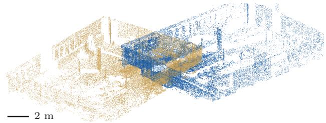  
(c) Courtyard scans 3 and 4, before

(b) Ofice scans 1 and 2, registered  
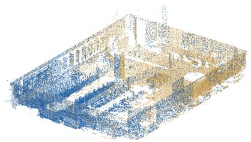

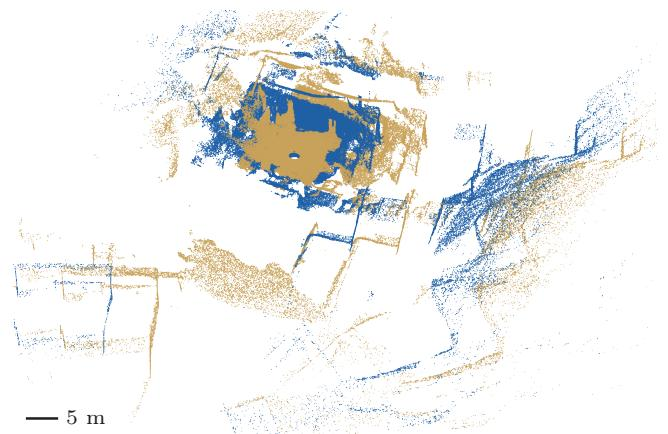

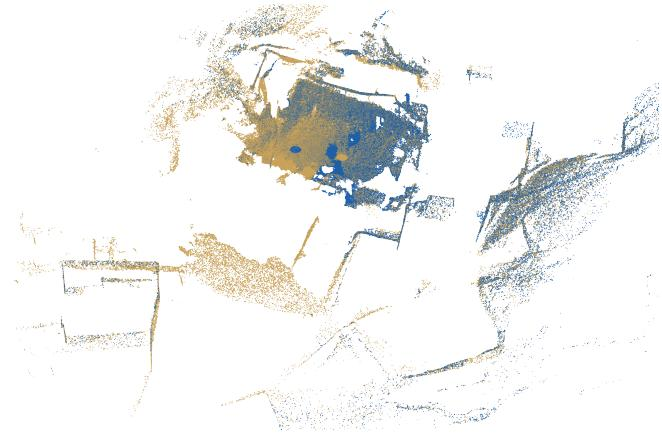

Figure A.7: Gravity-aligned registration of ETH scans. Ofice scans 1–2 (a,b; ceiling removed) and Courtyard scans $\mathrm { 3 - 4 ~ ( c , d ) }$ , before and after registration with the nominal vertical of the scanner as the gravity direction. All four solvers return the same pose. Relative to the independent-edge bound, Rubix reduces the time of the complete pipeline from 267 to 177 ms and from 393 to 182 ms; the rotation and translation errors are $0 . 5 4 6 ^ { \circ }$ and 0.124 m for Ofice and $0 . 0 4 7 ^ { \circ }$ and 0.029 m for Courtyard. Each row uses one viewpoint, one scale and one set of displayed points, and the projected scale bars are in meters. The two pairs are selected among the successful ones; Table A.18 reports all six.

median and interquartile range

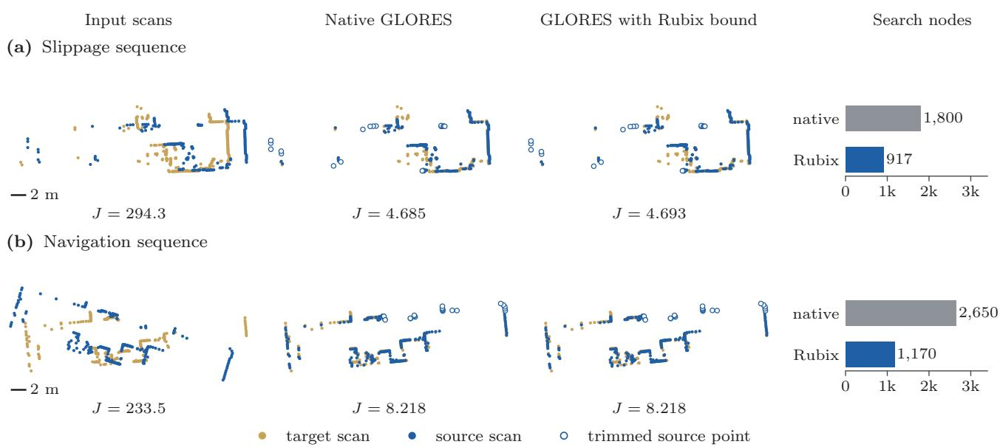  
Figure A.8: Less search inside native GLORES [20]. Scans from the Slippage and Navigation sequences before registration and after fitting with the native bound and with the Rubix bound. J is the sum of squared residuals over the retained points, in $\mathrm { m } ^ { 2 } ;$ hollow points are trimmed (216 of 239 and 220 of 244 points are retained). Both solvers reach the 1% tolerance with equivalent poses. Rubix reduces the nodes from 1,800 to 917 and from 2,650 to 1,170, and the times from 2.85 to 1.96 s and from 3.97 to 2.29 s. Each row uses one display rotation and scale. For each sequence we show the case with the largest objective before registration among those with 256 beams and $\rho _ { \mathrm { k e e p } } = 0 . 9$ on which both poses succeed; Table 7 covers all 240 configurations.

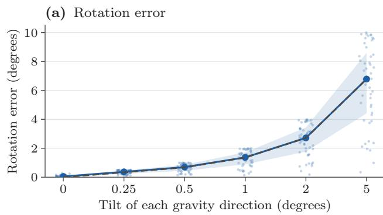

individual fit median constraint floor  
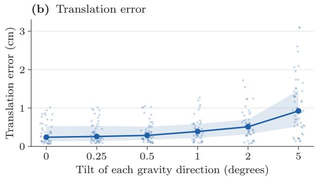  
Figure A.9: Sensitivity to a simulated error in the gravity direction. Independent tilts of both supplied directions at six magnitudes give 288 fits on 48 scenes. The horizontal positions are equally spaced and labeled by the tilt angle; faint points show every error, blue lines the medians and bands the interquartile ranges. (a) Full rotation error, and the median of the floor $\angle ( R _ { * } \widehat { g } _ { y } , \widehat { g } _ { x } )$ imposed by the constraint (dashed). (b) Translation error after centering, in centimeters. Every fit reaches a gap of $1 0 ^ { - 6 }$ in the summed squared error.