# SAFE ON AVERAGE, UNSAFE IN THE TAIL: WHEN IS THE EPISODIC-COST TAIL CONTROLLABLE?

Samuel Tetteh & Cody Fleming

Iowa State University

Ames, Iowa, USA

{samtett, flemingc}@iastate.edu

## ABSTRACT

Safe reinforcement learning seeks policies that maximize return while satisfying constraints on cumulative cost. Most methods impose these constraints on expected episodic cost. Consequently, standard evaluations report mean episodic cost without characterizing how cost is distributed across episodes. A policy that satisfies the mean-cost criterion may therefore remain unsafe in its worst episodes. Mean-cost reporting neither identifies this tail violation nor shows whether it can be brought within budget while preserving return. In this work, we measure the episodic-cost tail using CVaR0.1, the average cost of the worst 10% of episodes. We classify a policy as tail-safe when CVaR0.1 is within the safety budget. This allows us first to identify policies that are safe on average but unsafe in the tail and then to study whether their tail violations can be controlled while preserving return. To identify tail-unsafe policies, we evaluate five standard algorithms on three Safety-Gymnasium navigation tasks. We then examine four constraint families on dense-hazard navigation and assess tail control across four navigation and four locomotion tasks.

## 1 INTRODUCTION

Safe reinforcement learning (RL) seeks policies that maximize return while limiting undesirable behavior. A nonnegative cost $c ( s _ { t } , a _ { t } )$ quantifies undesirable behavior at time t, and the episodic cost $\begin{array} { r } { C ( \tau ) = \sum _ { t } c ( s _ { t } , \bar { a } _ { t } ) } \end{array}$ sums this quantity over the trajectory. Most constrained RL methods require the expected episodic cost to remain within a budget d (Altman, 1999; Achiam et al., 2017). This expectation does not characterize how cost is distributed across episodes. A policy can satisfy the mean-cost constraint while a small fraction of episodes incurs costs far above the budget (Figure 1).

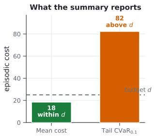

## Safe on Average, Unsafe in the Tail

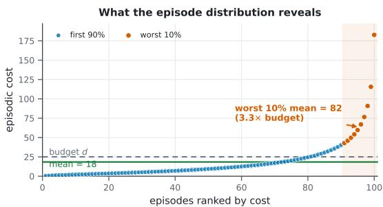  
Figure 1: Mean compliance can hide episodic tail risk. Both panels describe the same illustrative policy. Its mean episodic cost is within budget, but the average cost of its worst 10% of episodes exceeds the budget. Our evaluation measures both quantities from complete post-training episodes.

We measure this high-cost tail using Conditional Value at Risk, $\mathrm { C V a R } _ { \alpha } .$ which averages the largest α fraction of episodic costs (Rockafellar & Uryasev, 2000). We call a policy tail-safe when $\mathrm { C V a R } _ { 0 . 1 } \ \leq \ d .$ Safety-Gymnasium evaluations commonly report aggregate episodic cost, which does not determine whether this tail criterion is satisfied (Ji et al., 2023). Although episodic-cost CVaR has been reported on modified Safety-Gymnasium tasks (McCarthy et al., 2025), no shared evaluation establishes how large this tail is across standard expected-cost algorithms and tasks.

We study two related questions. First, which policies evaluated using mean cost remain unsafe in their worst episodes? Second, when can these tail violations be brought within budget while preserving return? We address the first question through a common post-training evaluation of five standard safe-RL algorithms on three navigation tasks. We address the second through 38 archived training runs from four constraint families on dense-hazard navigation and an evaluation of tail control across four navigation and four locomotion tasks.

The initial evaluation reveals substantial tail violations. Across the three navigation tasks, the average cost of the worst 10% of episodes reaches 4.4–18.2 times the budget. Strengthening the tested constraints does not resolve this problem on dense-hazard navigation. Return collapses before the tail reaches the budget. Locomotion exhibits a different pattern. On the two tasks with the most severe baseline tails, OQ-SAC, its component ablations, and Lagrangians trained with lower internal budgets all reach safe operating points without collapsing return. Tail control is therefore not unique to one method.

The episode-level results suggest an explanation for this difference. Tail control is observed when a policy can reliably produce episodes that are both safe and high-return. In the evaluated navigation tasks, safe episodes either have little return or occur too rarely to control the worst-decile cost. In locomotion, safe episodes remain frequent while retaining high return. A single-seed hazard-count analysis in PointGoal1 examines how the observed return-tail relationship varies with hazard count

Contributions. Our work makes three contributions. (1) We apply a shared post-training protocol that measures both mean episodic cost and CVaRo.1, revealing safety violations that mean-cost reporting does not identify. (2) We test four constraint families and document contrasting outcomes for tail control at held return across the evaluated navigation and locomotion tasks. (3) We identify the frequency and return of safe episodes as empirical indicators of tail controllability and examine this interpretation through a within-navigation hazard-count analysis.

## 2 RELATED WORK

Safe RL is commonly formulated as a constrained Markov decision process (Altman, 1999; García & Fernández, 2015). CPO, PPO-Lagrangian, TRPO-Lagrangian, SAC-Lagrangian, and FOCOPS constrain expected cumulative cost (Achiam et al., 2017; Ray et al., 2019; Stooke et al., 2020; Zhang et al., 2020). Safety-Gymnasium likewise benchmarks algorithms using aggregate episodic reward and cost (Ji et al., 2023). These objectives and summaries describe average constraint satisfaction but do not determine how cost is distributed across episodes. Our work measures the post-training episode-cost distribution and asks whether its upper tail can be controlled without reducing return.

Risk-aware safe RL directly optimizes properties of the cost distribution. CVaR has been used as a risk criterion in RL (Tamar et al., 2015; Chow et al., 2018), and Safe Distributional RL supports CVaR and other constraints on cumulative random returns (Zhang & Weng, 2021). WCSAC estimates the distribution of accumulated cost using a Gaussian model or quantile regression and constrains its CVaR with a Lagrangian (Yang et al., 2021; 2023). Trust-region methods form policyupdate surrogates for trajectory-cost CVaR (Kim & Oh, 2022), while optimized-certainty-equivalent formulations extend risk-aware objectives beyond CVaR (Lee et al., 2025). These works develop methods for optimizing risk-sensitive constraints. We study when such optimization yields a safe episodic tail without eliminating task return.

The risk quantities used during training and evaluation are related but not interchangeable. A distributional critic estimates discounted cost-to-go conditional on a state and action, while a multiplier may use recent realized episode costs. Our evaluation instead computes CVaR from the undiscounted costs of complete post-training episodes. SL-SAC combines an implicit quantile cost critic with an empirical episodic-CVaR multiplier, although its Safety-Gymnasium tables report mean episodic cost (Keswani et al., 2026). ORAC reports post-training $\mathrm { \dot { C } V a R _ { 0 . 5 } }$ and $\mathrm { C V a R _ { 0 . 2 5 } }$ on modified PointGoal1 and PointButton1 tasks (McCarthy et al., 2025). We use $\mathrm { C V a R _ { 0 . 1 } }$ under one evaluation protocol to characterize the episodic tail across standard algorithms and tasks.

Other approaches impose safety structure within a trajectory. Sauté RL augments the state with the remaining safety budget to target almost-sure cumulative safety (Sootla et al., 2022). Reachabilitybased methods such as RESPO instead estimate statewise feasibility (Ganai et al., 2023). These approaches motivate the budget-as-state and feasibility-gating families in our constraint study.

Risk-sensitive penalties can also produce conservative exploration. Optimistic Actor-Critic directs exploration using value uncertainty (Ciosek et al., 2019), and ORAC extends this idea to risk-averse constrained RL using confidence bounds on reward and distributional cost critics (McCarthy et al., 2025). OQ-SAC combines this exploratory action shift with a quantile-CVaR cost critic. Our component ablations test whether either mechanism is necessary for tail control on HalfCheetah and Hopper.

## 3 PRELIMINARIES

## 3.1 CONSTRAINED REINFORCEMENT LEARNING

We model each task as a finite-horizon constrained Markov decision process (CMDP) $\begin{array} { r l } { \mathcal { M } } & { { } = } \end{array}$ $( S , A , P , r , c , \rho _ { 0 } , H , d )$ (Altman, 1999). The state and action spaces are $s$ and A. The transition kernel $P ( s ^ { \prime } \mid s , a )$ specifies the distribution of the next state $s ^ { \prime }$ given the current state s and action a. The functions $r : \mathcal { S } \times \mathcal { A } \times \mathcal { S } \to \mathbb { R }$ and $c : { \mathcal { S } } \times { \mathcal { A } } \times { \mathcal { S } } \to { \bar { \mathbb { R } } } _ { > 0 }$ assign reward and nonnegative safety cost to each transition. The initial-state distribution is $\rho _ { 0 }$ , the horizon is $H ,$ and the episodic cost budget is d.

A policy $\pi ( a \mid s )$ generates an episode $\tau = ( s _ { 0 } , a _ { 0 } , \ldots , s _ { T } )$ , where $s _ { 0 } \sim \rho _ { 0 } , a _ { t } \sim \pi ( \cdot \mid s _ { t } )$ , and $s _ { t + 1 } \sim P ( \cdot \mid s _ { t } , a _ { t } )$ . An episode ends when the environment terminates or reaches its time limit, SO $T \leq H$ . The transition at time t yields reward $r _ { t } = r ( s _ { t } , a _ { t } , s _ { t + 1 } )$ and cost $c _ { t } = c ( s _ { t } , a _ { t } , s _ { t + 1 } )$ The undiscounted episode totals are

$$
R ( \tau ) = \sum _ { t = 0 } ^ { T - 1 } r _ { t } , \qquad C ( \tau ) = \sum _ { t = 0 } ^ { T - 1 } c _ { t } .\tag{1}
$$

Both task families follow this formulation (Ji et al., 2023). In navigation, $c _ { t }$ is the sum of the task's enabled binary violation channels at time t. In velocity-constrained locomotion, $c _ { t }$ is one when velocity exceeds the task's threshold and zero otherwise. The threshold applies to forward velocity in HalfCheetah, Walker2d, and Hopper, and to planar speed in Ant. All evaluated tasks use $H { = } 1 { , } 0 0 0$ and $d { = } 2 5$ . The budget applies to total episode cost, not to an individual transition. The implementations use discounted targets to train their value functions, while evaluation uses the undiscounted totals in Eq. equation 1.

The initial-state distribution, policy, and transition dynamics induce a distribution over episodes. Consequently, $R ( \tau )$ and $C ( \tau )$ may vary across repeated evaluations. We define the expected return and expected cost as $J _ { R } ( \pi ) \stackrel { \cdot } { = } \mathbb { E } _ { \tau \sim \pi } [ R ( \tau ) ]$ and $J _ { C } ( \pi ) = \mathbb { E } _ { \tau \sim \pi } [ C ( \tau ) ]$ . The standard CMDP objective is

$$
\operatorname* { m a x } _ { \pi } J _ { R } ( \pi ) \qquad \mathrm { s u b j e c t \ t o } \qquad J _ { C } ( \pi ) \leq d .\tag{2}
$$

With $d { = } 2 5$ , this constraint limits expected episode cost to 25. It does not require every episode to remain within budget. For example, a policy that incurs zero cost in 90 of 100 episodes and cost 100 in the other 10 has mean cost 10. It satisfies the mean-cost constraint even though one episode in ten incurs four times the budget. Mean cost alone therefore does not characterize the upper tail of episode cost.

Several baselines in our study optimize this constraint through a Lagrangian relaxation (Ray et al., 2019; Stooke et al., 2020)

$$
\operatorname* { m a x } _ { \pi } \operatorname* { m i n } _ { \lambda \geq 0 } \mathcal { L } ( \pi , \lambda ) = J _ { R } ( \pi ) - \lambda \big ( J _ { C } ( \pi ) - d \big ) .\tag{3}
$$

The multiplier λ penalizes cost in the policy objective. Increasing λ places more weight on reducing cost when the estimated mean exceeds d. This update depends on the scalar violation ${ \bar { J } } _ { C } ( \pi ) - d .$ Two policies with the same mean cost therefore produce the same violation even when their episode-cost distributions differ. Equation equation 3 places no explicit bound on the episodic tail. With nonlinear function approximation, the Lagrangian is also an optimization mechanism and does not guarantee satisfaction of the mean constraint.

## 3.2 EPISODIC TAIL RISK

For a random episode cost C, we parameterize conditional value at risk (CVaR) by the upper-tail mass $\alpha \in ( 0 , 1 )$ . Thus, α=0.1 denotes the worst 10% of episodes. If $F _ { C } ^ { - 1 }$ is the generalized quantile function of C, then

$$
\operatorname { C V a R } _ { \alpha } ( C ) = { \frac { 1 } { \alpha } } \int _ { 1 - \alpha } ^ { 1 } F _ { C } ^ { - 1 } ( u ) \mathrm { d } u .\tag{4}
$$

This definition handles discrete costs and quantile ties (Rockafellar & Uryasev, 2000). Each reported policy is evaluated for 100 episodes. $\bar { \mathrm { I f } ~ C } _ { ( 1 ) } \le \cdots \le C _ { ( 1 0 0 ) }$ are the sorted episode costs, the estimator used by our evaluation code is

$$
{ \widehat { \mathrm { C V a R } } } _ { 0 . 1 } = { \frac { 1 } { 1 0 } } \sum _ { i = 9 1 } ^ { 1 0 0 } C _ { ( i ) } .\tag{5}
$$

It is the average cost of the ten most costly episodes. In the example above, it is 100, although the mean cost is 10.

We apply the same budget to the tail and call a policy tail-safe when $\widehat { \mathrm { C V a R } } _ { 0 . 1 } \leq d .$ This criterion is stricter than the mean-cost constraint in Eq. equation 2, which does not imply tail safety. Tail safety also does not require every episode to remain within budget. It requires the average of the worst ten episodes to do so.

Each evaluated policy defines an operating point through its mean return $\widehat { J } _ { R }$ and tail cost $\widehat { \mathrm { C V a R } } _ { 0 . 1 }$ computed from the same episodes. We assess tail safety together with return because a policy can reduce cost by ceasing to perform the task. We use held return for comparisons between policies with similar mean return on the same task. The tail is controllable at held return within a tested policy family when its observed operating points include a tail-safe policy whose return remains comparable to a higher-tail policy. Since reward scales differ across tasks, we report these paired measurements without imposing a universal return tolerance.

## 4 EPISODIC-COST TAILS OF STANDARD SAFE RL IN NAVIGATION

We first evaluate whether standard expected-cost methods control the upper tail of episodic cost on three navigation tasks. For each available training run, we evaluate the final policy for 100 episodes using the deterministic mean action. These rollouts are independent of training, and each reset samples a new task layout. We compute mean return, mean cost, and $\mathrm { C V a R _ { 0 . 1 } }$ from the raw episode totals for each run, then average the run-level statistics. Table 1 reports the number of runs used for each result.

PointGoal1 provides a common comparison across all five algorithms. SAC-Lagrangian, TRPO-Lagrangian, and FOCOPS attain similar returns of 25.4–25.7. Their mean costs of 47–52 already exceed the budget d=25, while their tail costs reach 110–134, or $4 . 4 \mathrm { - } 5 . 4 \times d .$ These high-return policies therefore satisfy neither the mean-cost constraint nor the tail-safety criterion. CPO has an aggregate mean cost of 19, below the budget, but its return falls to 2.9 and its tail remains unsafe at 139, or $5 . 6 \times d .$ PPO-Lagrangian occupies an intermediate-return point with a still larger tail of 229.

Tail violations are larger on PointGoal2 and PointButton1. The reported policies have tail costs of 246–455, or $9 . 8 \mathrm { - } 1 8 . 2 \times d .$ with returns no higher than 11.1. None of the operating points in Table 1 is tail-safe. Together, these results expose two distinct failures. High-return policies violate both the mean and tail budgets, while the lower-mean-cost operating point retains a large tail and low return. These results motivate a direct test of whether stronger and tail-aware constraints can reach the tail-safe region at held return.

Table 1: Episodic-cost tail under the shared post-training evaluation (d=25, 100 episodes per run). Statistics are computed for each run and then averaged. N is the number of available training runs. No reported policy is tail-safe.
<table><tr><td>Algo</td><td>Task</td><td>N</td><td>Return</td><td>Mean cost</td><td> $\mathrm { C V a R } _ { 0 . 1 }$ </td><td> $\times d$ </td></tr><tr><td rowspan="5">SAC-Lag TRPO-Lag FOCOPS PPO-Lag CPO</td><td>PointGoal1</td><td>3</td><td>25.4</td><td>48</td><td>116</td><td>4.6</td></tr><tr><td>PointGoal1</td><td>3</td><td>25.7</td><td>47</td><td>110</td><td>4.4</td></tr><tr><td>PointGoal1</td><td>3</td><td>25.4</td><td>52</td><td>134</td><td>5.4</td></tr><tr><td>PointGoal1</td><td>4</td><td>10.2</td><td>55</td><td>229</td><td>9.2</td></tr><tr><td>PointGoal1</td><td>3</td><td>2.9</td><td>19</td><td>139</td><td>5.6</td></tr><tr><td>TRPO-Lag</td><td>PointGoal2</td><td>3</td><td>7.9</td><td>87</td><td>350</td><td>14.0</td></tr><tr><td>SAC-Lag</td><td>PointGoal2</td><td>1</td><td>-0.0</td><td>51</td><td>455</td><td>18.2</td></tr><tr><td>FOCOPS</td><td>PointButton1</td><td>3</td><td>11.1</td><td>86</td><td>246</td><td>9.8</td></tr><tr><td>TRPO-Lag</td><td>PointButton1</td><td>2</td><td>5.2</td><td>79</td><td>353</td><td>14.1</td></tr></table>

## 5 CONSTRAINT TIGHTENING FAILS AT HELD RETURN IN DENSE-HAZARD NAVIGATION

To determine whether this failure is specific to standard expected-cost objectives, we test four stronger or tail-aware constraint families. Figure 2 reports the 17 PointGoal1 operating points with standardized post-training measurements. The complete archive contains 38 training runs across PointGoal1 and PointButton1.

• Feasibility gating. We learn a max-over-time reach-avoid critic $V _ { h } ( s , a )$ . Its target is the larger of the current violation indicator and the discounted next-state value. We use $V _ { h }$ with scalar and state-dependent multipliers and with a RESPO-style gate (Ganai et al., 2023). The gate maximizes return in states predicted to be feasible and minimizes $V _ { h }$ elsewhere. Thirteen configurations vary the gating rule, multiplier structure, and feasibility threshold.

• Budget as state. Following Sauté RL (Sootla et al., 2022), we append a normalized budget balance $z _ { t }$ to the state. It starts at $z _ { \mathrm { 0 } } = 1$ and follows $z _ { t + 1 } = z _ { t } - c _ { t } / d .$ SO $z _ { t }$ is the fraction of the episode budget not yet spent. It becomes negative when cumulative cost exceeds $d .$ On steps with $z _ { t } < 0 ,$ , the task reward is replaced by a negative penalty. Four budget and penalty settings test whether explicit episode-level budget memory prevents large costs.

• Tail-driven Lagrangian. We retain the scalar cost critic and actor objective of SAC-Lagrangian but update the multiplier from the costs of the ten most recently completed training episodes. We use either empirical $\mathrm { C V a R } _ { 0 . 1 }$ or the surrogate $\bar { C } + k \sigma _ { C }$ (Yang et al., 2021; Keswani et al., 2026). A replay variant forms roughly one quarter of each minibatch by sampling from the 10% of stored transitions with the highest observed one-step costs. This family tests whether a tail-aware multiplier and replay distribution suffice without modeling the cost-return distribution at each state-action pair.

• Per-state quantile-CVaR critic. We replace the scalar cost critic with a 32-quantile model of the cost return $Z ^ { C } ( s , a )$ trained by quantile regression (Dabney et al., 2018). The actor penalty averages the upper α fraction of the predicted quantiles, while the multiplier tracks empirical episodic $\mathrm { C V a R } _ { 0 . 1 }$ . During critic training, one quarter of each minibatch is drawn from the 10% of stored transitions with the highest observed one-step costs. This family tests whether a state-action-specific tail estimate can penalize high-risk decisions while preserving reward elsewhere.

All four families exhibit the same failure. As each method penalizes cost more strongly, return approaches zero, while $\mathrm { { C V a R } _ { 0 . 1 } }$ remains above approximately 130 and often rises. Figure 2 shows this pattern across 17 operating points, including an unconstrained reference. None reaches the tail-safe region. Within multiplier-based families, only settings with $\lambda \approx 0$ retain high return, and their mean costs far exceed ${ \bar { d } } .$ This result does not isolate its cause. One possible explanation is that hazards occupy task-relevant states, limiting the selectivity of both global and state-specific penalties. Appendix C summarizes the full study, and Figures 5 and 6 report all 38 preserved training traces for PointGoal1 and PointButton1. The quantile-CVaR and tail-driven Lagrangian replications on PointButton1 reproduce this failure. Return remains near zero at every tightening level, while $\mathrm { C V a R _ { 0 . 1 } }$ remains between 200 and 420, equivalent to 8–17 times the budget.

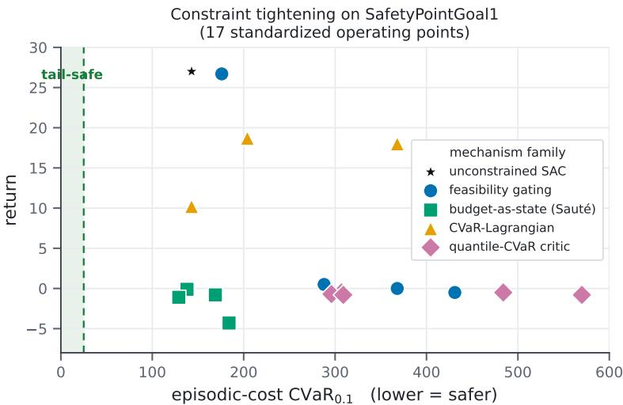  
Figure 2: The negative result on PointGoal1 (d=25). The figure shows 17 operating points, including an unconstrained reference. Each point plots return against episodic-cost $\mathrm { C V a R } _ { 0 . 1 }$ . Constraint tightening collapses return without bringing the tail within the shaded safe region.

## 6 OPTIMISTIC QUANTILE-CVAR SAC

To study tail control when high-return and low-cost behavior may be separated, we use an SAC controller adapted from ORAC (Haarnoja et al., 2018; McCarthy et al., 2025). We call it OQ-SAC, short for optimistic quantile-CVaR SAC. It combines optimistic data collection with a quantile-CVaR penalty for target-policy learning. OQ-SAC is a test case for reaching a safe, high-return operating point. Table 6 shows that the optimistic mean-cost variant and the quantile-CVaR variant without the action shift both reach safe operating points on the evaluated locomotion tasks.

Relationship to ORAC. ORAC combines reward critics, an ensemble of quantile cost critics, a CVaR actor penalty, and a separate exploratory policy based on confidence bounds (McCarthy et al., 2025). It shifts the target-policy mean using a covariance-scaled gradient whose size is controlled by a KL-divergence bound. Our implementation retains the confidence-bound objective but applies a normalized gradient shift to a sampled action. It also samples costly transitions more often during critic training and holds the multiplier fixed for each task. These changes define the controller evaluated here. The quantile critics and optimistic exploration are established components. We use their combination to study when tail control is possible and test each component separately.

Ensemble critics. Each of the E reward critics predicts $q _ { e } ( s , a ) = Q _ { e } ^ { R } ( s , a )$ , and each cost critic predicts N quantiles of the discounted cost return using quantile regression (Dabney et al., 2018). We define $\bar { c _ { e } } ( s , a ) = \mathrm { C V a R } _ { \alpha } ( Z _ { e } ^ { C } ( s , a ) )$ , where the empirical CVaR is the average of the largest [αN] predicted quantiles. The confidence bounds used for data collection are

$$
\widehat { Q } ^ { R } ( s , a ) = \bar { q } ( s , a ) + \beta _ { R } s _ { q } ( s , a ) ,\tag{6}
$$

$$
\begin{array} { r } { \widehat { Q } ^ { C } ( s , a ) = \bar { c } ( s , a ) - \beta _ { C } s _ { c } ( s , a ) , } \end{array}\tag{7}
$$

where ā and ē are ensemble means, while $s _ { q }$ and $s _ { c }$ are the corresponding standard deviations across critics.

Exploratory action. After the initial random data collection, the target policy samples $a _ { T } \sim \pi ( \cdot |$ s). We compute

$$
g _ { t } = \nabla _ { a } \Big [ \widehat { Q } ^ { R } ( s , a ) - \lambda \widehat { Q } ^ { C } ( s , a ) \Big ] _ { a = a _ { T } }
$$

and execute

$$
a _ { E } = \mathrm { c l i p } \bigg ( a _ { T } + \delta \operatorname* { a } _ { \operatorname* { m a x } } \odot \frac { g _ { t } } { \| g _ { t } \| _ { 2 } + \varepsilon } , - \mathbf { a } _ { \operatorname* { m a x } } , \mathbf { a } _ { \operatorname* { m a x } } \bigg ) .
$$

Here $\mathbf { a } _ { \mathrm { m a x } }$ contains the action limits and ε is a small numerical constant. Normalizing the gradient makes δ control the step size in normalized action coordinates. Clipping enforces the environment's action bounds. This shift is used only for data collection. The target policy is optimized with the objective below. Figure 7 gives a geometric interpretation of this action shift in Appendix D.3.

Target-policy loss and scaling. The target policy minimizes

$$
\mathcal { L } _ { \pi } = \mathbb { E } _ { s \sim \mathcal { D } , a \sim \pi } \big [ \alpha _ { \mathrm { e n t } } \log \pi ( a \mid s ) - \bar { q } ( s , a ) + \lambda \bar { c } ( s , a ) \big ]
$$

using the ensemble means defined above. The confidence bonuses affect data collection but do not enter this loss. The cost term gives a larger penalty to actions with larger predicted tail cost at the current state.

We hold λ fixed for each task. The reported settings use λ≈0.06–0.15 on navigation and λ≈20–30 on velocity because reward values are of order tens in navigation and thousands in locomotion. A reactive update was unstable in a single-seed Ant comparison, as reported in Appendix D.1. During critic training, one quarter of each minibatch is drawn from the 10% of stored transitions with the largest observed one-step costs. This sampling rule increases the frequency of costly transitions during quantile-critic updates.

## 7 EXPERIMENTS

We evaluate OQ-SAC on four velocity-control tasks and four dense-hazard navigation tasks from Safety-Gymnasium (Ji et al., 2023). The locomotion tasks are HalfCheetah, Ant, Walker2d, and Hopper. The navigation tasks are PointGoal2, PointButton1, CarButton1, and PointPush1.

The primary baselines are SAC-Lagrangian and PPO-Lagrangian from OmniSafe. Training uses $1 0 ^ { 6 }$ environment interactions, except for OQ-SAC on HalfCheetah, which uses $5 \times 1 0 ^ { 5 }$ . Each final policy is evaluated for 100 deterministic episodes with budget d=25. Results use three seeds except OQ-SAC on Walker2d, which uses five. A method is classified as safe only if $\mathrm { C V a R } _ { 0 . 1 } { \leq } d$ on every seed.

## 7.1 LOCOMOTION RESULTS

OQ-SAC is safe on every seed for HalfCheetah, Ant, and Hopper. It is safe on four of five Walker2d seeds, with the remaining seed at 28.3. Among the methods in Table 2, OQ-SAC is the only one safe on every seed for both HalfCheetah and Hopper. SAC-Lagrangian is safe on Ant and Walker2d. It has higher return on $A n t ,$ while OQ-SAC has higher mean return on Walker2d but misses the seedwise safety criterion. PPO-Lagrangian is unsafe on at least one seed in all four tasks.

Lower internal cost targets also produce safe Lagrangian policies in a single-seed comparison, and WCSAC is safe on HalfCheetah and Ant but not on Walker2d or Hopper. Appendix E.2 and $\mathsf { A p - }$ pendix E.3 report these comparisons. They show that safe locomotion tails are not unique to OQ-SAC.

## 7.2 NAVIGATION RESULTS

No method in Table 2 satisfies the tail constraint on a navigation task. Mean return never exceeds $^ { 8 , }$ while $\mathrm { C V a R } _ { 0 . 1 }$ ranges from 76 to 475. On PointPush1, OQ-SAC has mean cost 20 but $\mathrm { C V a R _ { 0 . 1 } } { = } 2 0 4$ , illustrating why mean cost does not establish tail safety. None of the evaluated methods controls the tail on these dense-hazard navigation tasks.

## 7.3 COMPONENT ANALYSIS

On HalfCheetah and Hopper, both the mean-cost variant and the quantile-CVaR variant without the action shift are safe on every seed. The training-budget-matched Hopper ablations also obtain higher mean return than full OQ-SAC. HalfCheetah returns are not directly comparable because the full method uses fewer training interactions. Neither component is individually necessary for tail safety on these two tasks, although we do not remove both simultaneously. All variants use a task-specific fixed multiplier, so this ablation does not isolate multiplier selection. Table 6 in Appendix E.1 reports the results. Appendix D.1 describes the fixed and reactive multiplier comparison.

Table 2: Performance after 100 deterministic evaluation episodes with $d { = } 2 5 .$ Training uses $1 0 ^ { 6 }$ interactions except OQ-SAC on HalfCheetah, which uses $5 \times 1 0 ^ { 5 }$ . Return and CVaR are means and standard deviations across seeds, while cost is the mean episodic cost. Results use three seeds except OQ-SAC on Walker2d, which uses five. Bold CVaR entries are safe on every seed. Underline marks the highest-return safe result. †OQ-SAC is safe on four of five Walker2d seeds, with the remaining seed at $\mathrm { C V a R _ { 0 . 1 } } { = } 2 8 . 3 .$
<table><tr><td rowspan="2">Task</td><td colspan="3">OQ-SAC (ours)</td><td colspan="3">SAC-Lag</td><td colspan="3">PPO-Lag</td></tr><tr><td>R↑</td><td>cost</td><td>CVaR↓</td><td> $R \uparrow$ </td><td>cost</td><td>CVaR↓</td><td> $R \uparrow$ </td><td>cost</td><td>CVaR↓</td></tr><tr><td>Locomotion</td><td></td><td></td><td></td><td></td><td></td><td></td><td></td><td></td><td></td></tr><tr><td>HalfCheetah</td><td> $2 8 6 8 _ { \pm 4 6 }$ </td><td>0</td><td>0</td><td> $3 2 5 5 { \scriptstyle \pm 2 7 5 7 }$ </td><td>308</td><td> $5 9 7 _ { \pm 4 2 5 }$ </td><td> $3 1 4 6 _ { \pm 2 8 8 }$ </td><td>548</td><td> $5 8 1 _ { \pm 1 8 5 }$ </td></tr><tr><td>Hopper</td><td> $8 7 7 _ { \pm 5 5 6 }$ </td><td>0.1</td><td> ${ \bf 1 . 0 { \scriptstyle \pm 1 . 3 } }$ </td><td> $1 1 6 4 _ { \pm 2 2 2 }$ </td><td>70</td><td> $9 7 _ { \pm 1 3 7 }$ </td><td> $5 1 7 _ { \pm 5 9 7 }$ </td><td>7.5</td><td> $1 8 { \scriptstyle \pm 1 8 }$ </td></tr><tr><td>Ant</td><td> $2 6 5 6 { \scriptstyle \pm 3 2 9 }$ </td><td>0.9</td><td> $\mathbf { 0 . 9 \pm 0 . 6 }$ </td><td> $2 9 0 9 { \scriptstyle \pm 4 0 }$ </td><td>2.9</td><td> ${ \bf 6 . 1 \pm 2 . 0 }$ </td><td> $1 7 1 { \scriptstyle \pm 9 2 }$ </td><td>4.1</td><td> $1 5 { \pm } 8$ </td></tr><tr><td>Walker2d</td><td> $1 6 1 7 { \scriptstyle \pm 9 4 9 }$ </td><td>2.4</td><td> $1 0 . 7 _ { \pm 1 0 . 1 } ^ { \dagger }$ </td><td> $1 2 7 3 { \scriptstyle \pm 1 1 7 5 }$ </td><td>1.6</td><td> ${ \bf 6 . 8 \pm 9 . 6 }$ </td><td> $5 5 1 { \pm } 1 2 9$ </td><td>52</td><td> $5 4 { \pm } 4 1$ </td></tr><tr><td>Navigation</td><td></td><td></td><td></td><td></td><td></td><td></td><td></td><td></td><td></td></tr><tr><td>PointGoal2</td><td> $4 . 6 { \scriptstyle \pm 4 . 3 }$ </td><td>58</td><td> $3 5 8 { \scriptstyle \pm 5 1 }$ </td><td> $\cdot 0 . 2 { \pm } 0 . 1$ </td><td>55</td><td> $4 7 5 { \scriptstyle \pm 1 1 1 }$ </td><td> $5 . 5 { \pm } 0 . 8$ </td><td>90</td><td> $2 9 7 _ { \pm 4 7 }$ </td></tr><tr><td>PointButton1</td><td> $1 . 2 _ { \pm 1 . 3 }$ </td><td>99</td><td> $3 9 7 _ { \pm 1 1 1 }$ </td><td> $- 2 . 6 _ { \pm 3 . 1 }$ </td><td>45</td><td> $2 4 5 _ { \pm 6 5 }$ </td><td> $7 . 0 { \scriptstyle \pm 1 . 1 }$ </td><td>71</td><td> $2 4 2 _ { \pm 5 1 }$ </td></tr><tr><td>CarButton1</td><td> $- 0 . 7 _ { \pm 0 . 6 }$ </td><td>88</td><td> $4 6 8 _ { \pm 2 4 }$ </td><td> $- 0 . 3 _ { \pm 0 . 1 }$ </td><td>49</td><td> $3 3 1 { \scriptstyle \pm 7 0 }$ </td><td> $4 . 0 { \scriptstyle \pm 0 . 7 }$ </td><td>143</td><td> $4 1 9 _ { \pm 3 1 }$ </td></tr><tr><td>PointPush1</td><td> $- 0 . 1 _ { \pm 0 . 2 }$ </td><td>20</td><td> $2 0 4 _ { \pm 1 3 9 }$ </td><td> $- 0 . 0 _ { \pm 0 . 2 }$ </td><td>8</td><td> $7 6 _ { \pm 1 8 }$ </td><td> $0 . 6 { \scriptstyle \pm 0 . 1 }$ </td><td>49</td><td> $3 9 6 _ { \pm 8 9 }$ </td></tr></table>

Table 3: Episode-level patterns associated with tail control in the evaluated tasks. These patterns summarize the experiments and are not necessary or sufficient conditions. The single-seed hazardcount study in Table 9 provides a within-navigation sensitivity analysis.
<table><tr><td>Observed evidence</td><td>Locomotion</td><td>Navigation</td></tr><tr><td>Representative cost example Safe, high-return episodes in Figure 3</td><td>Separated clusters (HalfCheetah) Frequent</td><td>Diffuse costs (PointButton1) Absent or infrequent</td></tr><tr><td>Safe tail at held return found</td><td>Yes</td><td> $\mathrm { N o }$ </td></tr><tr><td>OQ-SAC safe on every seed</td><td>3 of 4 tasks</td><td>0 of 4 tasks</td></tr></table>

## 8 WHEN IS THE TAIL CONTROLLABLE?

The experiments suggest two episode-level signals for tail controllability. The first is the cost distribution. A representative SAC-Lagrangian policy on HalfCheetah has separated low-cost and highcost clusters, whereas costs on PointButton1 are more diffuse (Figure 9). The second is whether safe episodes occur frequently while retaining high return. Figure 3 shows that OQ-SAC is safe on 100% of HalfCheetah episodes and 99.5% of Walker2d episodes, with median safe returns of 2931 and 2962. Safe episodes on PointGoal2 have near-zero return. On PointButton1, OQ-SAC attains high return in some safe episodes, but they form only 7% of the evaluation. A safe, high-return outcome must therefore occur often enough to control the tail.

Across the eight tasks, these signals agree with the observed results. Several methods find safe, high-return locomotion policies, while none satisfies the tail constraint on navigation. This is an empirical association, not a necessary or sufficient condition for tail control.

Table 3 summarizes these episode-level patterns.

Mean and tail cost. The worst-decile cost reaches 10.2 times the mean in our results (Table 4). A moderate mean can therefore hide a severe tail. A HalfCheetah multiplier sweep reaches the safe band with return near 2900, whereas none of the evaluated PointGoal1 configurations enters it (Figure 10).

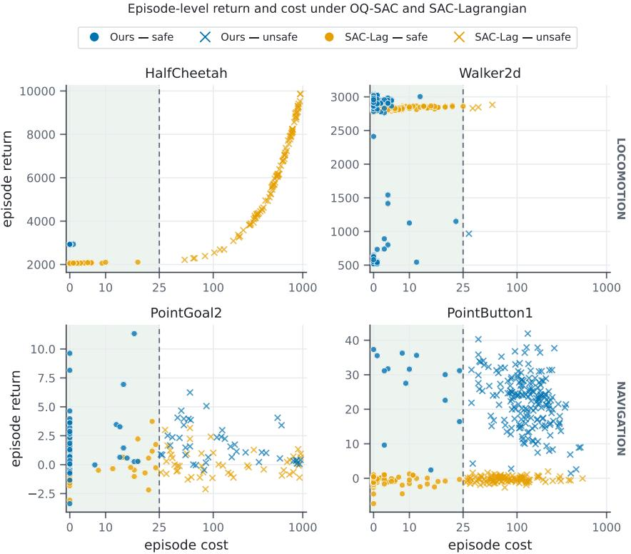  
Figure 3: Episode return and cost over 200 evaluations per policy. Circles are safe episodes with $C \bar { ( \tau ) } \leq d ,$ and crosses are unsafe. Safe, high-return episodes are frequent for the shown locomotion policies and absent or infrequent for the shown navigation policies.

Within-domain sensitivity. We vary the PointGoal1 hazard count with one seed while holding the OQ-SAC configuration, budget, and λ=0.06 fixed. At one, four, and eight hazards, return stays near 27 while $\mathrm { C V a R _ { 0 . 1 } }$ rises from 40.9 to 82.3 and 176.9. At sixteen hazards, return falls to 6.8 and CVaR reaches 397.2. The two-hazard result is non-monotonic, and no setting is safe. The observed return-tail operating point varies with hazard count, but this single-seed comparison cannot establish a systematic effect. Appendix F.3 reports all values.

## 9 DISCUSSION AND LIMITATIONS

Across the evaluated tasks, tail control is observed only when policies reliably produce episodes that are both safe and high-return. OQ-SAC satisfies the seedwise tail constraint in three of four locomotion tasks and none of the four navigation tasks. This pattern is not unique to OQ-SAC. Both ablated variants are safe on HalfCheetah and Hopper, while stricter expected-cost targets produce safe policies in single-seed comparisons. The evidence supports the episode-level interpretation in Section 8, but does not establish that a particular algorithm or component is necessary.

Domain and observed cost structure remain confounded. Every task in which a method controls the tail is a locomotion task, while every task in which none does is a navigation task. The one-seed hazard-count study finds no safe setting, so it neither establishes a causal effect nor identifies a transition from a safe to an unsafe setting. OQ-SAC also uses task-specific fixed multipliers. Each main per-seed $\mathrm { C V a R } _ { 0 . 1 }$ estimate averages ten tail episodes from 100 deterministic-policy evaluations, and most results use three training seeds. The experiments use low-dimensional observations and one cost signal, leaving image observations and multiple simultaneous constraints untested. These limitations motivate reporting the episodic-cost tail together with the frequency and return of safe episodes to show whether a method controls rare failures without sacrificing return.

## AI USE STATEMENT

We used a generative AI assistant to assist in revising the manuscript. The authors take responsibility for the final content of the manuscript submitted for review.

## REFERENCES

Joshua Achiam, David Held, Aviv Tamar, and Pieter Abbeel. Constrained policy optimization. In International Conference on Machine Learning (ICML), 2017.

Eitan Altman. Constrained Markov Decision Processes. Chapman and Hall/CRC, 1999.

Yinlam Chow, Mohammad Ghavamzadeh, Lucas Janson, and Marco Pavone. Risk-constrained reinforcement learning with percentile risk criteria. Journal of Machine Learning Research, 18(167): 1–51, 2018.

Kamil Ciosek, Quan Vuong, Robert Loftin, and Katja Hofmann. Better exploration with optimistic actor-critic. In Advances in Neural Information Processing Systems (NeurIPS), 2019.

Will Dabney, Mark Rowland, Marc G. Bellemare, and Rémi Munos. Distributional reinforcement learning with quantile regression. In AAAI Conference on Artificial Intelligence, 2018.

Milan Ganai, Zheng Gong, Chnenning Yu, Sylvia Herbert, and Sicun Gao. Iterative reachability estimation for safe reinforcement learning. In Advances in Neural Information Processing Systems (NeurIPS), 2023.

Javier García and Fernando Fernández. A comprehensive survey on safe reinforcement learning. Journal of Machine Learning Research, 16(1):1437–1480, 2015.

Tuomas Haarnoja, Aurick Zhou, Pieter Abbeel, and Sergey Levine. Soft actor-critic: Off-policy maximum entropy deep reinforcement learning with a stochastic actor. In International Conference on Machine Learning (ICML), 2018.

Jiaming Ji, Borong Zhang, Jiayi Zhou, Xuehai Pan, Weidong Huang, Ruiyang Sun, Yiran Geng, Yifan Zhong, Juntao Dai, and Yaodong Yang. Safety-gymnasium: A unified safe reinforcement learning benchmark. In Advances in Neural Information Processing Systems (NeurIPS) Datasets and Benchmarks, 2023.

Mahesh Keswani, Samyak Jain, and Raunak P. Bhattacharyya. Safe langevin soft actor critic. arXiv preprint arXiv:2602.00587, 2026.

Dohyeong Kim and Songhwai Oh. Efficient off-policy safe reinforcement learning using trust region conditional value at risk. IEEE Robotics and Automation Letters, 7(3):7644–7651, 2022.

Jane H. Lee, Baturay Saglam, Spyridon Pougkakiotis, Amin Karbasi, and Dionysis Kalogerias. Risk-averse constrained reinforcement learning with optimized certainty equivalents. In Advances in Neural Information Processing Systems (NeurIPS), 2025.

James McCarthy, Radu Marinescu, Elizabeth Daly, and Ivana Dusparic. Optimistic exploration for risk-averse constrained reinforcement learning. In European Conference on Artificial Intelligence (ECAI), 2025.

Alex Ray, Joshua Achiam, and Dario Amodei. Benchmarking safe exploration in deep reinforcement learning. https://cdn.openai.com/safexp-short.pdf, 2019.

R. Tyrrell Rockafellar and Stanislav Uryasev. Optimization of conditional value-at-risk. Journal of Risk, 2:21–42, 2000.

Aivar Sootla, Alexander I. Cowen-Rivers, Taher Jafferjee, Ziyan Wang, David Mguni, Jun Wang, and Haitham Bou-Ammar. Sauté rl: Almost surely safe reinforcement learning using state augmentation. In International Conference on Machine Learning (ICML), 2022.

Adam Stooke, Joshua Achiam, and Pieter Abbeel. Responsive safety in reinforcement learning by pid lagrangian methods. In International Conference on Machine Learning (ICML), 2020.

Aviv Tamar, Yonatan Glassner, and Shie Mannor. Optimizing the CVaR via sampling. In AAAI Conference on Artificial Intelligence, 2015.

Qisong Yang, Thiago D. Simão, Simon H. Tindemans, and Matthijs T. J. Spaan. Wcsac: Worst-case soft actor critic for safety-constrained reinforcement learning. In AAAI Conference on Artificial Intelligence, 2021.

Qisong Yang, Thiago D. Simão, Simon H. Tindemans, and Matthijs T. J. Spaan. Safety-constrained reinforcement learning with a distributional safety critic. Machine Learning, 112:859–887, 2023.

Jianyi Zhang and Paul Weng. Safe distributional reinforcement learning. arXiv preprint arXiv:2102.13446, 2021.

Yiming Zhang, Quan Vuong, and Keith W. Ross. First order constrained optimization in policy space. In Advances in Neural Information Processing Systems (NeurIPS), 2020.

## A COMPUTE AND REPRODUCIBILITY

All experiments run on CPU nodes under SLURM. Each run trains for $1 0 ^ { 6 }$ environment interactions, except OQ-SAC on HalfCheetah, which trains for $5 \times 1 0 ^ { 5 }$ . Each final policy is evaluated for 100 episodes with the deterministic mean action. Evaluation episode i is reset with seed 1000 + i, and return and cost accumulate until termination or truncation. $\mathrm { \tilde { \mathrm { { C V a R } _ { 0 } } } } .$ 1 follows Eq. equation 5.

Results average three training seeds, except OQ-SAC on Walker2d, which uses five. We report the mean and the population standard deviation across seeds (denominator equal to the number of seeds). The software stack is Python 3.10.20, PyTorch 2.3.1, Gymnasium 0.28.1, and Safety-Gymnasium 1.0.0 (Ji et al., 2023). Code, launch scripts, and saved configurations will be released with the paper.

## B ADDITIONAL EPISODIC-TAIL MEASUREMENTS

## B.1 RELATION TO PRIOR TAIL-RISK EVALUATION

Prior work has used CVaR and other distributional risk measures to constrain cumulative cost during training (Zhang & Weng, 2021; Yang et al., 2021; Kim & Oh, 2022). ORAC also reports episodiccost $\mathrm { C V a R } _ { 0 . 5 }$ and $\mathrm { C V a R _ { 0 . 2 5 } }$ for SAC-Lagrangian, WCSAC, and ORAC on modified PointGoal1 and PointButton1 tasks with a 400-step horizon and budget d=10 (McCarthy et al., 2025). SL-SAC uses empirical episodic-cost CVaR to update its multiplier, while reporting mean episodic cost in its main benchmark results (Keswani et al., 2026).

We use $\mathrm { C V a R } _ { 0 . 1 }$ as a shared post-training measure with a 1000-step horizon and budget d=25. Applying the same evaluation to five standard mean-constrained algorithms reveals tail violations on three navigation tasks. We then use this measure to study tail controllability across four navigation and four locomotion tasks.

## B.2 MEAN COST VERSUS EPISODIC TAIL

Table 4 compares mean episode cost with $\mathrm { C V a R _ { 0 . 1 } }$ for OQ-SAC and SAC-Lagrangian on all eight tasks. The tail-to-mean ratio measures how much larger the average cost of the worst 10% of episodes is than the overall episode mean.

Table 4: Mean episode cost and $\mathrm { C V a R _ { 0 . 1 } }$ under the shared 100-episode deterministic evaluation with d=25. The tail-to-mean ratio compares the average cost of the worst 10% of episodes with the mean across all episodes. Navigation entries are averaged across three training seeds. A dash indicates that both cost statistics are zero.
<table><tr><td rowspan="2">Task</td><td colspan="3">OQ-SAC (ours)</td><td colspan="3">SAC-Lagrangian</td></tr><tr><td>mean</td><td>CVaR0.1</td><td>tail/mean</td><td>mean</td><td>CVaR0.1</td><td>tail/mean</td></tr><tr><td>Locomotion</td><td></td><td></td><td></td><td></td><td></td><td></td></tr><tr><td>HalfCheetah</td><td>0.0</td><td>0</td><td></td><td>308</td><td>597</td><td>1.9×</td></tr><tr><td>Hopper</td><td>0.1</td><td>1.0</td><td>10.0×</td><td>70</td><td>97</td><td>1.4×</td></tr><tr><td>Ant</td><td>0.9</td><td>0.9</td><td>1.0×</td><td>2.9</td><td>6.1</td><td>2.1×</td></tr><tr><td>Walker2d</td><td>2.4</td><td>10.7</td><td>4.5×</td><td>1.6</td><td>6.8</td><td>4.3×</td></tr><tr><td>Navigation</td><td></td><td></td><td></td><td></td><td></td><td></td></tr><tr><td>PointGoal2</td><td>58</td><td>358</td><td>6.2×</td><td>55</td><td>475</td><td>8.6×</td></tr><tr><td>PointButton1</td><td>99</td><td>397</td><td>4.0×</td><td>45</td><td>245</td><td>5.4×</td></tr><tr><td>CarButton1</td><td>88</td><td>468</td><td>5.3×</td><td>49</td><td>331</td><td>6.8×</td></tr><tr><td>PointPush1</td><td>20</td><td>204</td><td>10.2×</td><td>8</td><td>76</td><td>9.5×</td></tr></table>

## B.3 WITHIN-EPISODE COST TRAJECTORIES

Figure 4 shows when cost is incurred within an episode. For one OQ-SAC policy per task, we run 40 deterministic episodes using evaluation seeds 4000 through 4039. Each curve shows the cumulative cost $\textstyle \sum _ { j = 0 } ^ { t } c _ { j }$ and remains constant after termination. The four episodes with the largest final costs form the empirical worst 10% and are highlighted. Costs remain near zero for the selected locomotion policies. The highest-cost navigation episodes accumulate violations across substantial portions of the rollout.

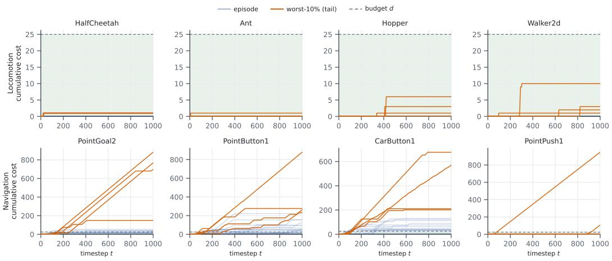  
Figure 4: Cumulative cost over 40 deterministic episodes from one OQ-SAC policy per task. Orange curves identify the four episodes with the largest final costs. Blue curves show the remaining episodes, and the dashed line marks the episodic budget d=25.

## C CONFIGURATION COVERAGE AND TRAINING TRAJECTORIES

The run archive contains 38 single-seed training traces from the four constraint families evaluated in Section 5. Of these, 29 use PointGoal1 and 9 use PointButton1. Table 5 reports the number of configurations retained from each family. Figures 5 and 6 show how return and the available cost statistic evolved during training. These trajectories complement the shared post-training evaluation used for the conclusions in Section 5.

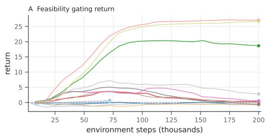

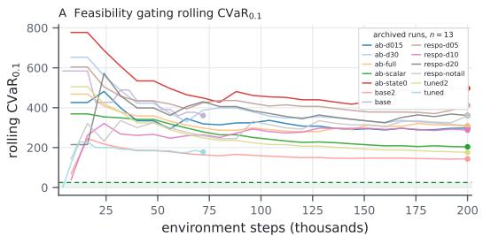

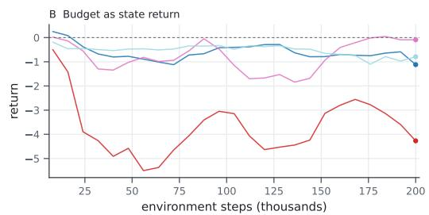

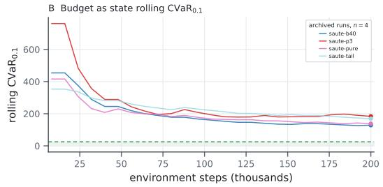

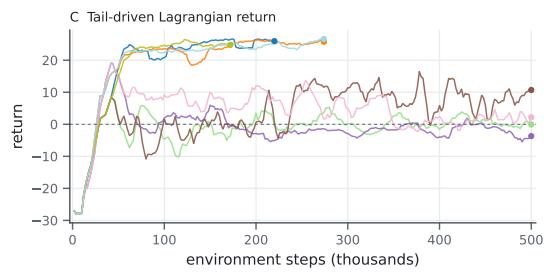

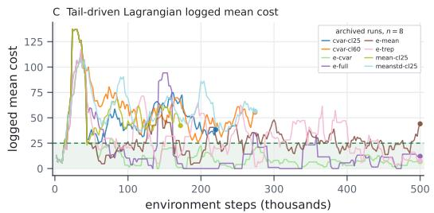

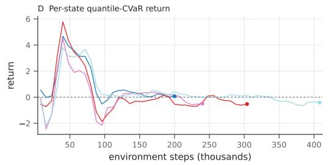

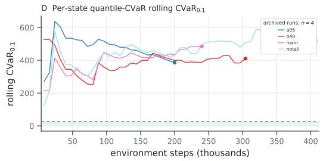  
Figure 5: Training trajectories for the 29 archived PointGoal1 runs. Panels A, B, and D show logged return and rolling empirical $\mathrm { C V a R _ { 0 } } .$ 1. Panel C shows deterministic test return and mean episode cost because the OmniSafe logs do not contain the episode-level costs required to reconstruct CVaR. Each line represents one configuration, and each dot marks its final logged value. The shaded green region marks costs at or below $d { = } 2 5$ . These training statistics are separate from the shared posttraining evaluation.

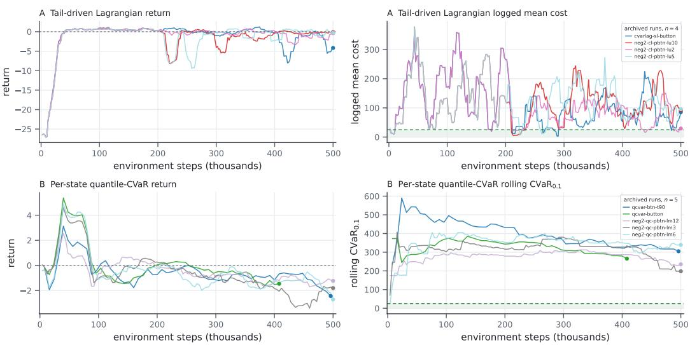  
Figure 6: Training trajectories for the nine archived PointButton1 runs. Panel A shows deterministic test return and mean episode cost for four tail-driven Lagrangian configurations. Panel B shows logged return and rolling empirical $\mathrm { C V a R _ { 0 } } .$ 1 for five per-state quantile-CVaR configurations. Each dot marks the final logged value. The shaded green region marks costs at or below d=25.

## D METHOD DETAILS

## D.1 OQ-SAC IMPLEMENTATION AND HYPERPARAMETERS

The actor and each reward and cost critic use two hidden layers of 256 ReLU units. The actor is a squashed Gaussian policy whose log standard deviation is clipped to [—20, 2]. Adam updates the actor, critics, and learned entropy temperature with learning rate $3 \times 1 \dot { 0 } ^ { - 4 }$ . The initial entropy coefficient is 0.2, and the target entropy is $- | A |$ We use $\gamma = \gamma _ { c } = 0 . 9 9 .$ a target-network update coefficient of 0.005, batch size 256, and replay capacity $5 \times 1 0 ^ { 5 }$ . Each run begins with $1 { \dot { 0 } } ^ { 4 }$ random interactions. True environment terminations stop Bellman bootstrapping, while time-limit truncations do not.

Every reported OQ-SAC policy uses three reward critics and three cost critics. Each cost critic predicts 16 quantiles at the midpoints of uniformly spaced quantile intervals and is trained with the quantile Huber loss. The actor penalty averages the four largest predicted quantiles, corresponding to $\alpha _ { \mathrm { p e n } } = 0 . 2 5$ . One quarter of each critic minibatch is sampled from the 10% of stored transitions with the largest observed one-step costs. The confidence-bound parameters are $\beta _ { R } = 2$ and $\beta _ { C } = 1$ and the normalized exploratory action shift uses $\delta = 0 . 0 3$

We hold the multiplier fixed within each task. We use $\lambda = 2 5$ for HalfCheetah, 20 for Ant and Walker2d, and 30 for Hopper. We use $\lambda = 0 . 0 6$ for PointGoal2 and 0.15 for PointButton1, CarButton1, and PointPush1. The smaller navigation multipliers reflect the lower reward and cost scales of those tasks.

## D.2 FIXED AND REACTIVE MULTIPLIER COMPARISON

In a single-seed Ant run, the reactive multiplier produced a logged training return of 2715 at 688,000 interactions. Its final deterministic policy obtained return —628 and $\mathrm { C V a R _ { 0 . 1 } } = 6 . 1$ . Across three seeds, the fixed-multiplier policies obtained return $2 6 5 6 { \scriptstyle \pm 3 2 9 }$ and $\mathrm { C V a R } _ { 0 . 1 } = 0 . 9 { \scriptstyle \pm 0 . 6 }$ This comparison motivated the fixed multipliers used in our experiments but does not establish that fixed multipliers are generally preferable.

## D.3 CONCEPTUAL VIEW OF THE EXPLORATORY ACTION SHIFT

Figure 7 projects the exploratory action shift from Section 6 into estimated return-to-go and costto-go space. The actual update is computed in action space. The figure is a conceptual illustration and does not represent measured trajectories or guarantee that the updated action improves both objectives.

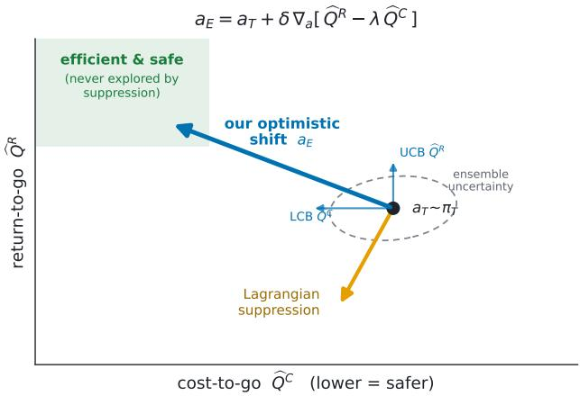  
Figure 7: Conceptual projection of the exploratory action shift. The blue arrow represents the change from the target-policy action $a _ { T }$ to the exploratory action $a _ { E }$ This update follows the actionspace gradient of the upper-confidence reward estimate minus the weighted lower-confidence cost estimate. The orange arrow illustrates a cost reduction accompanied by lower return. The arrows do not represent measured policy trajectories.

## E ADDITIONAL EXPERIMENTAL RESULTS

## E.1 COMPONENT ABLATIONS

The mean-cost variant sets $\alpha _ { \mathrm { p e n } } = 1$ , causing the actor penalty to average all 16 predicted cost quantiles, and retains the exploratory action shift. The no-shift variant retains the quantile-CVaR penalty and sets $\delta = 0$ . All other method settings, including the task-specific multiplier, remain unchanged.

All Hopper policies are trained for $1 0 ^ { 6 }$ interactions. Both ablations remain tail-safe on every seed and obtain higher mean return than full OQ-SAC. The full HalfCheetah policy is trained for $\mathrm { 5 \times 1 0 ^ { 5 } }$ interactions, while its ablations use $1 0 ^ { 6 }$ . All three are tail-safe, but their returns are not directly comparable because the training budgets differ.

Table 6: Component ablations on HalfCheetah and Hopper with three seeds and $d { = } 2 5$ . Values are means and standard deviations across seeds. Every reported variant satisfies $\mathrm { C V a R } _ { 0 . 1 } \leq$ d on every seed. Hopper uses $1 0 ^ { 6 }$ training interactions for every row. Full OQ-SAC on HalfCheetah uses $5 \times 1 0 ^ { 5 }$ , while its two ablations use $\mathrm { \bar { 1 0 ^ { 6 } } }$
<table><tr><td rowspan="2">Variant</td><td colspan="2">HalfCheetah</td><td colspan="2">Hopper</td></tr><tr><td> $R \uparrow$ </td><td> $\mathrm { C V a R \downarrow }$ </td><td> $R \uparrow$ </td><td> $\mathrm { C V a R \downarrow }$ </td></tr><tr><td>Full OQ-SAC</td><td> $2 8 6 8 _ { \pm 4 6 }$ </td><td> $0 _ { \pm 0 }$ </td><td> $8 7 7 _ { \pm 5 5 6 }$ </td><td> $1 . 0 { \scriptstyle \pm 1 . 3 }$ </td></tr><tr><td>Mean-cost variant</td><td> $2 9 4 8 _ { \pm 2 8 }$ </td><td> $0 { \scriptstyle \pm 0 }$ </td><td> $1 2 4 6 _ { \pm 3 9 8 }$ </td><td> $0 . 5 { \scriptstyle \pm 0 . 4 }$ </td></tr><tr><td>No-shift variant</td><td> $2 9 0 8 _ { \pm 3 2 }$ </td><td> $0 { \scriptstyle \pm 0 }$ </td><td> $1 1 6 2 _ { \pm 3 9 8 }$ </td><td> $5 . 4 { \scriptstyle \pm 7 . 1 }$ </td></tr></table>

## E.2 LOWER EXPECTED-COST TARGETS

We test whether expected-cost baselines can produce a tail-safe policy when trained with an internal cost target below the evaluation budget. Using training seed zero, we evaluate SAC-Lagrangian and PPO-Lagrangian with $d ^ { \prime } \in \{ 2 5 , 1 0 , 5 \}$ . Here, $d ^ { \prime }$ is the expected-cost target used during training. Each final policy is evaluated for 100 deterministic episodes against the tail-safety budget $d = 2 5$

For each method and task, Table 7 reports the highest-return configuration satisfying $\mathrm { C V a R } _ { 0 . 1 } \leq$ 25. Lower targets produce tail-safe SAC-Lagrangian policies on both tasks and a tail-safe PPO-Lagrangian policy on Hopper. No tested PPO-Lagrangian target is tail-safe on HalfCheetah. These single-seed results establish that lower internal targets can produce safe operating points, but they do not establish reliability across training seeds.

Table 7: Highest-return tail-safe policy found in the single-seed expected-cost target comparison. The internal training target $d ^ { \prime }$ is shown in parentheses. OQ-SAC is included as a three-seed reference and is not part of this comparison. A dash indicates that no tested target produced a tail-safe policy.
<table><tr><td rowspan="2">Task</td><td colspan="2">OQ-SAC</td><td colspan="2">SAC-Lagrangian</td><td colspan="2">PPO-Lagrangian</td></tr><tr><td>Return</td><td>CVaR</td><td>Return</td><td>CVaR</td><td>Return</td><td>CVaR</td></tr><tr><td>HalfCheetah</td><td>2868</td><td>0</td><td>1693  $( d ^ { \prime } = 1 0 )$ </td><td>0</td><td>一</td><td>一</td></tr><tr><td>Hopper</td><td>877</td><td>1.0</td><td>1000  $\left( d ^ { \prime } = 5 \right)$ </td><td>0</td><td>1319  $( d ^ { \prime } = 5 )$ </td><td>0</td></tr></table>

## E.3 GAUSSIAN DISTRIBUTIONAL WCSAC BASELINE

We implement WCSAC (Yang et al., 2021) with a Gaussian distributional cost critic. The critic predicts the mean $\mu _ { C } ( s , a )$ and variance $v _ { C } ( s , a )$ of the discounted cost return. Its upper-tail estimate is

$$
\rho _ { \alpha } ( s , a ) = \mu _ { C } ( s , a ) + \frac { \phi \bigl ( \Phi ^ { - 1 } ( 1 - \alpha ) \bigr ) } { \alpha } \sqrt { v _ { C } ( s , a ) } ,
$$

where $\phi$ and $\Phi$ are the standard normal density and distribution functions. We use $\alpha = 0 . 1$ , and the actor is penalized by $\lambda \rho _ { \alpha } ( s , a )$ with fixed multiplier $\lambda = 5$ This state-action estimate is used during training. Table $^ 8$ evaluates tail safety using empirical episode costs from the shared 100- episode evaluation. Results use three training seeds per method, except OQ-SAC on Walker2d, which uses five. WCSAC is tail-safe on every seed for HalfCheetah and Ant. OQ-SAC is tail-safe on every seed for HalfCheetah, Ant, and Hopper, and on four of five Walker2d seeds.

Table 8: OQ-SAC and WCSAC on four locomotion tasks with $d = 2 5$ . Values are means and standard deviations across training seeds. Bold CVaR entries satisfy the tail constraint on every seed. Underlined returns identify the higher-return method among those satisfying this criterion. †OQ-SAC is safe on four of five Walker2d seeds. The remaining seed has $\mathrm { C V a R } _ { 0 . 1 } = 2 8 . 3$
<table><tr><td rowspan="2">Task</td><td colspan="2">OQ-SAC</td><td colspan="2">WCSAC</td></tr><tr><td> $R \uparrow$ </td><td>CVaR↓</td><td> $R \uparrow$ </td><td> $\mathrm { C V a R \downarrow }$ </td></tr><tr><td rowspan="2">HalfCheetah Ant</td><td> $2 8 6 8 _ { \pm 4 6 }$ </td><td> $0 { \scriptstyle \pm 0 }$ </td><td> $2 7 5 6 _ { \pm 8 7 }$ </td><td> $0 { \scriptstyle \pm 0 }$ </td></tr><tr><td> $2 6 5 6 _ { \pm 3 2 9 }$ </td><td> $0 . 9 { \scriptstyle \pm 0 . 6 }$ </td><td> $- 6 8 3 _ { \pm 2 3 0 }$ </td><td> $4 . 5 { \scriptstyle \pm 3 . 7 }$ </td></tr><tr><td>Walker2d</td><td> $1 6 1 7 _ { \pm 9 4 9 } ^ { \dagger }$ </td><td> $1 0 . 7 _ { \pm 1 0 . 1 }$ </td><td> $4 8 1 _ { \pm 6 4 }$ </td><td> $3 4 . 3 { \scriptstyle \pm 2 1 . 8 }$ </td></tr><tr><td>Hopper</td><td> $8 7 7 _ { \pm 5 5 6 }$ </td><td> $1 . 0 { \scriptstyle \pm 1 . 3 }$ </td><td> $1 0 1 6 _ { \pm 3 9 1 }$ </td><td> $1 7 9 . 8 _ { \pm 1 6 5 . 7 }$ </td></tr></table>

## E.4 PER-SEED RETURN AND TAIL COST

Figure 8 shows the return and empirical $\mathrm { C V a R } _ { 0 . 1 }$ of every locomotion run reported in Tables 2 and 8. Each marker represents one trained policy evaluated for 100 deterministic episodes. The figure exposes variation across training seeds that is not visible from means and standard deviations alone.

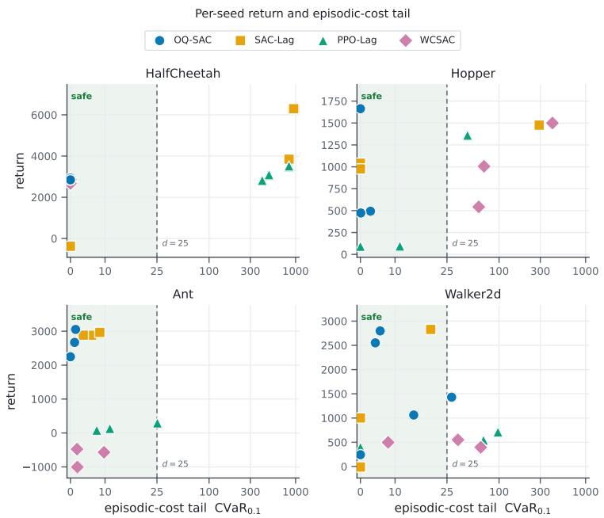  
Figure 8: Per-seed return and episodic-cost $\mathrm { C V a R _ { 0 . 1 } }$ on the four locomotion tasks. Each marker represents one trained policy evaluated for 100 deterministic episodes. The horizontal axis is linear within the budget and logarithmic above it. The green region marks $\mathrm { C V a R } _ { 0 . 1 } \leq d = 2 5$

## F ADDITIONAL EVIDENCE ON TAIL CONTROLLABILITY

## F.1 REPRESENTATIVE EPISODE-COST DISTRIBUTIONS

Figure 9 compares 200 deterministic episodes from one SAC-Lagrangian policy on HalfCheetah and one on PointButton1. The HalfCheetah distribution contains separated low-cost and high-cost clusters, with 85 episodes exceeding 10d. The PointButton1 distribution is more diffuse, with 6 episodes exceeding 10d. These examples illustrate different cost-distribution shapes but do not establish that distribution shape determines tail controllability.

Representative episode-cost distributions under SAC-Lagrangian  
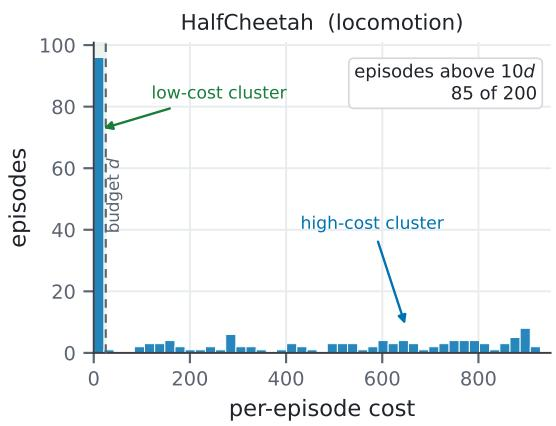

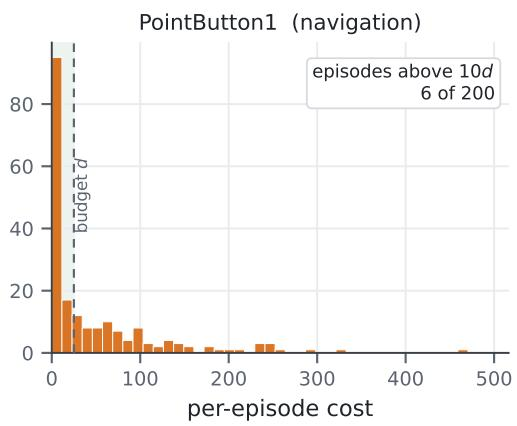  
Figure 9: Episode-cost distributions from 200 deterministic evaluations of representative SAC-Lagrangian policies. On HalfCheetah, 85 episodes have cost above 10d. On PointButton1, 6 episodes exceed this threshold. The shaded region marks episode costs at or below d = 25.

## F.2 OBSERVED RETURN AND TAIL-COST OPERATING POINTS

Figure 10 compares evaluated operating points on HalfCheetah and PointGoal1. The HalfCheetah panel contains seven OQ-SAC multiplier settings. Several settings satisfy $\mathrm { C V a R } _ { 0 . 1 } \leq 2 5$ with return near 2900. The PointGoal1 panel contains 17 evaluated configurations from the four constraint families and an unconstrained SAC policy. None reaches the tail-safe region. The complete archive contains additional training traces that lack the standardized post-training measurements required for this plot.

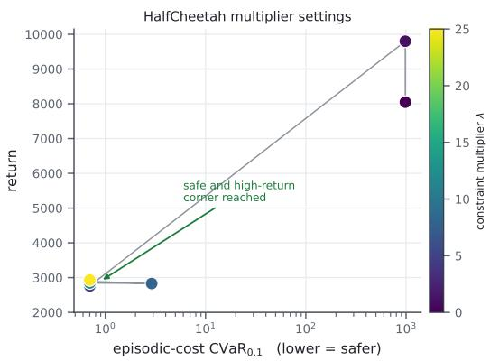

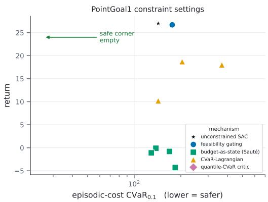  
Figure 10: Observed return and episodic-cost $\mathrm { C V a R } _ { 0 . 1 }$ on two representative tasks. The HalfCheetah panel shows seven OQ-SAC multiplier settings, with the connecting line ordered by multiplier value. The PointGoal1 panel shows 17 evaluated operating points across the tested constraint families. The green region marks $\mathrm { C V a R } _ { 0 . 1 } \leq d = 2 5$

## F.3 SINGLE-SEED HAZARD-COUNT COMPARISON

We vary the number of hazards in PointGoal1 while holding the OQ-SAC configuration, training seed, fixed multiplier $\lambda = 0 . 0 6$ , and budget d = 25 unchanged. Each final policy is evaluated for 100 deterministic episodes. Table 9 reports mean return, the fraction of episodes within budget, mean return conditioned on an episode being within budget, and $\mathrm { C V a R _ { 0 . 1 } }$

No tested hazard count is tail-safe. The one-, four-, and eight-hazard settings retain mean return near 27 while tail cost increases. Return falls to 6.8 with sixteen hazards. The two-hazard result does not follow this trend. It has 94% safe episodes but $\mathrm { C V a R } _ { 0 . 1 } = 1 1 6 . 2$ , showing that a high frequency of safe episodes does not establish tail safety when the remaining episodes incur severe costs.

Table 9: Single-seed hazard-count comparison on PointGoal1. Safe episodes satisfy $C ( \tau ) \leq d .$ Safe-episode return is the mean return conditioned on this event. Every policy is evaluated for 100 deterministic episodes, and none satisfies $\mathrm { C V a R } _ { 0 . 1 } \leq 2 5$
<table><tr><td>Hazards</td><td>Return</td><td>Safe%</td><td>Safe-episode return</td><td> $\mathrm { C V a R _ { 0 } } .$  1</td><td>CVaR/d</td></tr><tr><td>1</td><td>27.9</td><td>90</td><td>28.0</td><td>40.9</td><td>1.6</td></tr><tr><td>2</td><td>-0.4</td><td>94</td><td>-0.4</td><td>116.2</td><td>4.6</td></tr><tr><td>4</td><td>27.3</td><td>62</td><td>27.4</td><td>82.3</td><td>3.3</td></tr><tr><td>8</td><td>26.8</td><td>34</td><td>27.7</td><td>176.9</td><td>7.1</td></tr><tr><td>16</td><td>6.8</td><td>63</td><td>4.9</td><td>397.2</td><td>15.9</td></tr></table>

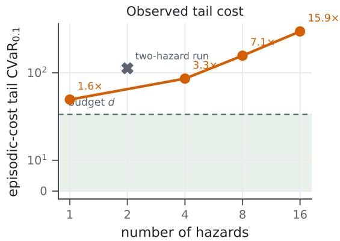

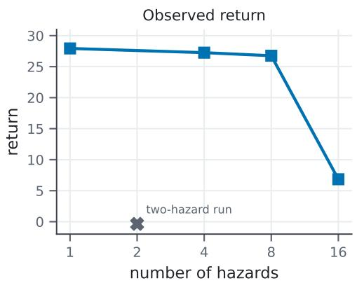  
Figure 11: Mean return and $\mathrm { C V a R } _ { 0 . 1 }$ as the number of hazards varies. The one-, four-, eight-, and sixteen-hazard results are connected in increasing order. The two-hazard result is shown separately because it does not follow this observed trend. The green region in the tail-cost panel marks $\mathrm { C V a \tilde { R } _ { 0 . 1 } } \le 2 5$