# SHARED GEOMETRY AS A ROSETTA STONE:CROSS-MODAL ALIGNMENT WITHOUT PAIRED DATA

Dominik Schnaus<sup>1,2</sup>, Thomas Dages\` <sup>1,2</sup>, Daniel Cremers<sup>1,2</sup>†, Xi Wang<sup>1,2,3,4</sup>†, Phillip Isola<sup>5</sup>†

<sup>1</sup>TU Munich <sup>2</sup>MCML <sup>3</sup>Ulm University <sup>4</sup>ETH Zurich <sup>5</sup>MIT †Equal advising

Project page: dominik-schnaus.github.io/unpaired-rosetta

## ABSTRACT

Multimodal representations enable zero-shot classification and retrieval, but aligning independently trained models usually requires large amounts of paired data. Yet, the Platonic Representation Hypothesis suggests that models trained on different modalities may converge spontaneously toward a shared representation geometry. But then, do we even need paired examples for cross-modal alignment? Remarkably, we show that paired examples are unnecessary for coarse crossmodal alignment. Our simple Wasserstein Procrustes method with a coarse geometric initialization aligns two disjoint embedding sets by estimating a single orthogonal map without seeing any pairs. Across datasets, modalities, and unimodal models, we show that we can consistently align independently trained representations without pairs, and standard geometric alignment metrics accurately predict when this is possible. Nevertheless, we can naturally benefit from paired examples. In the very few-pair regime, our method substantially outperforms existing ones, while staying competitive with pair-based methods with more added examples. Finally, we demonstrate that the resulting alignments can enable text-toimage generation without paired examples. These results show that independently trained models often share enough geometry to establish cross-modal correspondence with little or no paired data.

## 1 INTRODUCTION

The discovery of the Rosetta Stone was a philology breakthrough. By having a Greek translation to a small text, the stone provided sufficient information to Champollion and Young to decipher entire ancient Egyptian scripts. Modern multimodal learning follows essentially the same principle. Models across modalities are usually connected by paired observations via image captions (Radford et al., 2021; Jia et al., 2021a; Zhai et al., 2023), biological (Xiong et al., 2023), or scientific data (Chang & Ye, 2024). Example pairs act as a multimodal Rosetta Stone illustrating how one modality maps to another. This assumption underlies major paradigms: contrastive learning from image-caption pairs (Radford et al., 2021; Jia et al., 2021a; Zhai et al., 2023) or multimodal foundation models trained on paired data at massive scale (Bai et al., 2025). Even methods designed to reduce supervision still need some known pairings as cross-modal anchors (Norelli et al., 2023; Maiorca et al., 2023; Maniparambil et al., 2024; Yacobi et al., 2026; Groger et al.¨ , 2026b; Roschmann et al., 2026). The prevailing view is that meaningful alignment requires at least some observed correspondences.

Recent findings fragilize this view. Independently trained models often show oddly similar geometry. The Platonic Representation Hypothesis (PRH) (Huh et al., 2024) proposes that models spontaneously converge to a shared representation as model and dataset scale increase. While the extent of convergence is unclear (Groger et al.¨ , 2026a; Koepke et al., 2026), there is substantial representation agreement across modalities, mostly coarsely (Koepke et al., 2026). This extends to video (Zhu et al., 2026), audio (Ngo & Kim, 2024), neuroscience (Marcos-Manchon et al.´ , 2026), and scientific models (Edamadaka et al., 2025; Li & Walsh, 2026). These findings raise a fundamental question:

Research Question: Can two independently trained modalities be aligned from their embedding geometry alone, without observing a single corresponding pair?

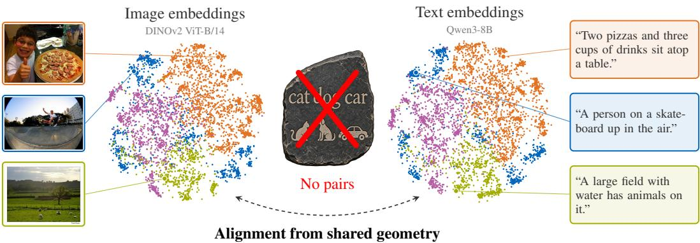  
Figure 1: Shared geometry enables unpaired alignment. Across modalities, embedding spaces of independent models share a similar geometry. Prior works require a multimodal “Rosetta Stone” of paired cross-modal examples to align both spaces. In contrast, our Wasserstein Procrustes approach directly exploits this shared geometry for aligning without observing a single paired example. We here show the nearest neighbor of each image in the text embedding space of disjoint datasets.

This question is challenging as both embedding spaces have no shared coordinates, no known sample correspondences, and potentially different numbers of samples and dimensions. Prior works (Norelli et al., 2023; Maiorca et al., 2023; Maniparambil et al., 2024; Yacobi et al., 2026; Groger et al.¨ , 2026b; Roschmann et al., 2026) have shown that a few paired examples may suffice if the embedding geometry is exploited. Early evidence from fully unpaired methods (Hoshen & Wolf, 2018b; Schnaus et al., 2025) hints that geometric structure may recover cross-modal correspondences, but these methods have been restricted to small-scale datasets or class-level embeddings. Aligning disjoint sets when removing all paired examples remained an unsolved problem.

In this paper, we show that such a blind cross-modal alignment is possible, at least at a coarse level. By introducing a simple alignment procedure based on Wasserstein Procrustes (Rangarajan et al., 1997; Cohen & Guibas, 1999), we jointly infer a correspondence between samples and an orthogonal mapping between embedding spaces. Due to non-convex (Alvarez-Melis et al., 2019) optimization, random initialization is insufficient. Inspired by mini-vec2vec (Dar, 2025), we instead find a coarse correspondence by independently matching the geometric structure of the two embedding spaces and use it to initialize the joint alignment. The resulting procedure requires only the two sets of unimodal embeddings. It uses no paired examples, class labels, or shared reference points.

Across many datasets, vision models, and language models, we find that independently trained models can be aligned without paired data. The recovered alignment captures coarse semantic structure even when images and captions come from different datasets. In fact, our unpaired alignment qual ity is strongly predicted by geometric similarity between embedding spaces, measured by common scores like Centered Kernel Alignment (CKA) (Kornblith et al., 2019). This provides an empirical criterion for unpaired alignment success chances. This relationship is not specific to image-text models and extends to scientific and medical domains. Our framework naturally generalizes to few paired examples, bridging the unpaired and (very) few-pair settings. With very few pairs (≤ 100), we substantially outperform baselines and remain competitive with more added pairs. We also demonstrate proof-of-concept text-to-image generation without image-text pairs. Together, our re sults suggest a different view of multimodal alignment: paired examples are not always necessary for cross-modal alignment. Independent models often already organize their embedding spaces similarly enough for shared geometry to reveal coarse correspondences. Unlike the historical one, a multi-modal Rosetta Stone might not be necessary, although having a small one can greatly refine the estimated alignment. Instead, leveraging shared geometries provides the required coarse bridge.

## 2 RELATED WORK

Our work builds on three observations. First, independently trained embedding spaces within a modality can often be aligned without pairs via almost isometric (Mikolov et al., 2013) geometry.

Second, independently trained models across modalities also exhibit shared geometry. Third, shared geometry has already reduced paired-data needs for cross-modal alignment. We combine these ideas in the zero-pair regime, showing that geometry alone enables coarse cross-modal alignment.

Unpaired alignment within a modality. Unpaired alignment was first studied in unsupervised translation, for aligning across languages independently trained word embedding spaces. Two main approaches have emerged. Adversarial methods (Conneau et al., 2018; Zhang et al., 2017a;b; Xu et al., 2018; Mohiuddin & Joty, 2019) learn a transformation such that a discriminator cannot distinguish mapped source from target embeddings. Optimization-based methods instead explicitly search for a correspondence between the samples. This leads to Wasserstein Procrustes (Artetxe et al., 2018; Hoshen & Wolf, 2018a; Grave et al., 2019; Aboagye et al., 2022; Even et al., 2024), which jointly optimizes the correspondence and an orthogonal transformation, or to Gromov-Wasserstein (Alvarez-Melis & Jaakkola, 2018; Marchisio et al., 2022) formulations that seek correspondences preserving pairwise distances. These ideas have since been extended beyond word embeddings to whole-text representations, including the adversarial vec2vec (Jha et al., 2026) and optimization-based minivec2vec (Dar, 2025) methods, as well as to applications in bioinformatics (Demetci et al., 2022; Baker et al., 2026) and neuroscience (Thual et al., 2022; Marcos-Manchon et al.´ , 2026). While these methods demonstrate that shared geometry can enable unpaired alignment, they consider representations within the same modality. We ask whether the same principle can bridge different modalities.

Shared geometry across modalities. Independently trained models across modalities have also been shown to converge toward similar representations. At the unit level, “Rosetta Neurons” (Dravid et al., 2023) identified neurons encoding shared concepts in independently trained vision models. At the representation level, different modality representations can be connected via simple linear or orthogonal transformations (Merullo et al., 2023; Koh et al., 2023; Maiorca et al., 2023; Gupta et al., 2026; Li et al., 2024). Relative representations (Moschella et al., 2023) go further by expressing samples through similarities to paired reference examples, using these shared relationships to place different modalities in a common space. Such reference examples form a multimodal “Rosetta Stone” (Norelli et al., 2023). The Platonic Representation Hypothesis (Huh et al., 2024) provides a broader framework for these observations, proposing that representations from different models converge toward a shared geometry as model and training data scale increase. Across vision and language models, empirical studies consistently find shared geometric structure, with alignment increasing particularly in coarse neighborhood structure (Groger et al.¨ , 2026a; Koepke et al., 2026). Similar alignment has also been observed across audio-language (Ngo & Kim, 2024), videolanguage (Zhu et al., 2026), and scientific models (Edamadaka et al., 2025; Li & Walsh, 2026). Prior work measures this shared structure on paired representations. We use it to map between embedding spaces without paired data, showing a strong Platonic Representation Hypothesis (Jha et al., 2026) across modalities.

Cross-modal alignment with few pairs. This shared geometry has been increasingly used to reduce the paired-data requirement for cross-modal alignment. Early contrastive works (Radford et al., 2021; Jia et al., 2021a; Zhai et al., 2023) learn aligned representations directly from hundreds of millions to billions of paired examples. However, much of this supervision can be replaced by strong pretrained unimodal representations. LiT (Zhai et al., 2022) uses a frozen vision encoder to reduce the amount of paired data substantially. More explicitly, ASIF (Norelli et al., 2023) directly uses relative representations (Moschella et al., 2023) as a shared coordinate system between modalities and STRUCTURE (Groger et al.¨ , 2026b) regularizes the aligned space to preserve geometric structure. Further methods use linear transformations (Maiorca et al., 2023), CKA (Maniparambil et al., 2024), spectral representations (Yacobi et al., 2026), or optimal transport (Roschmann et al., 2026) to reach the few-pair regime. These methods demonstrate that paired data can primarily serve to establish a connection between embedding spaces whose internal geometry is already informative.

Rare works have studied the fully unpaired cross-modal setting, but for more restricted assumptions. Hoshen & Wolf (2018b) align supervised representations with an adversarial CycleGAN (Zhu et al., 2017), and Schnaus et al. (2025) align class-aggregated embeddings using pairwise distances. These results suggest cross-modal geometry information may recover matchings without examples, but they are limited to small-scale settings or class-aggregated embeddings. In contrast, we tackle disjoint embedding sets from independent models and use no paired examples, class labels, or shared reference points. We show that shared geometry alone can recover a coarse cross-modal alignment.

```latex
Algorithm 1 Wasserstein Procrustes Algorithm 2 Geometric initialization
1 In: $\pmb { X } \in \mathbb { R } ^ { n \times d _ { X } } , \pmb { Y } \in \mathbb { R } ^ { m \times d _ { Y } } , C = 3 0 , S = 3 0 , b = 1 0 ^ { 4 } , R = 1 0 0$ 1 In: $\pmb { X } \in \mathbb { R } \overset { n \times d _ { X } } { \underset { \mathrm { \tiny ~ \hat { ~ } ~ } } { \sim } } , \pmb { Y } \in \mathbb { R } ^ { m \times d _ { Y } } , C = 3 0 , S = 3 0 , b = 1 0 ^ { 4 }$
2 Optional: $\hat { \pmb X } \in \mathbb { R } ^ { p \times d _ { \pmb X } } , \hat { \pmb Y } \in \mathbb { R } ^ { p \times d _ { \pmb Y } }$ pairs 2 Optional: $\hat { \pmb X } \in \mathbb { R } ^ { p \times d _ { \pmb X } } , \hat { \pmb Y } \in \mathbb { R } ^ { p \times d _ { \pmb Y } }$ pairs
3 Out: $W \in \mathrm { S t } ( d _ { X } , d _ { Y } )$ 3 Out: $\pmb { T } \in \mathbb { R } ^ { n \times m }$ initial transport plan
4 T GeometricInit(X, Y, X<sup>ˆ</sup> , Y<sup>ˆ</sup> , C, S, b) Algorithm 2 4 for $s = 1 , \ldots , S { \bf d o }$
5 W  polar $\begin{array} { r } { \big ( \boldsymbol X ^ { \top } \boldsymbol T \boldsymbol Y \ + \frac { \operatorname* { m i n } ( n , m ) } { p } \hat { \boldsymbol X } ^ { \top } \hat { \boldsymbol Y } \ \big ) } \end{array}$ 5 6 $x _ { B } , \dot { \mathbf { Y } } _ { B }$ A<sub>s</sub> k-means(X<sub>B</sub>, C); B<sub>s</sub> k-means(Y<sub>B</sub>, C) random batches of b samples from X, Y
6 for 7 $r = 1 , \ldots , R { \bf d o }$ X<sub>B</sub>, Y<sub>B</sub> random batches of b samples from $x , \mathbf { \boldsymbol { Y } }$ 7 $P _ { s } \gets \underset { P \in \mathcal { P } _ { C } } { \arg \operatorname* { m a x } } \mathrm { C K A } \left( \left( \frac { A _ { s } } { \hat { x } } \right) , \left( \begin{array} { l } { P B _ { s } } \\ { \hat { Y } } \end{array} \right) \right)$
8 <sup>T</sup> ← <sup>hungarian</sup> <sup>matching(X</sup>B<sup>W</sup> <sup>Y</sup> <sup>⊤</sup>B <sup>)</sup>
8 M $\begin{array} { r } { \gets \frac { 1 } { S C } A _ { s } ^ { \top } P _ { s } B _ { s } } \end{array}$
9 $\boldsymbol { W }  \mathrm { p o l a r } ( \boldsymbol { X } _ { B } ^ { \top } \boldsymbol { T } \boldsymbol { Y } _ { B } \ + \frac { b } { p } \hat { \boldsymbol { X } } ^ { \top } \hat { \boldsymbol { Y } } \ )$
9 T  hungarian matching batch(XMY ⊤, b)
10 return W 10 return T
```  
Figure 2: Wasserstein Procrustes alignment. We first get a coarse correspondence by repeatedly clustering and matching the geometric structure of both embedding spaces (right). From this initialization, we alternate correspondence estimation and orthogonal Procrustes updates to refine the alignment (left). Paired examples, when available, enter both stages naturally as a linear term.

## 3 WASSERSTEIN PROCRUSTES WITH GEOMETRIC INITIALIZATION

Our goal is to see if shared geometry alone is sufficient to align independently trained embedding spaces across modalities. We deliberately use a simple alignment procedure based on Wasserstein Procrustes, summarized in Algorithm 1, inspired by prior work (Artetxe et al., 2018; Grave et al., 2019; Aboagye et al., 2022; Even et al., 2024). Let $\mathring { ( } \bar { \boldsymbol { x } } _ { i } ) _ { i = 1 } ^ { n } = \boldsymbol { X } \in \mathbb { R } ^ { n \times d _ { \boldsymbol { X } } } , ( \pmb { y } _ { j } ) _ { i = 1 } ^ { m } = \pmb { Y } \in \mathbb { R } ^ { m \times d _ { \boldsymbol { Y } } }$ $d _ { X } \leq d _ { Y }$ , be centered, normalized embeddings from independently trained models. Their rows and feature coordinates have no known correspondence.

Wasserstein Procrustes. We jointly estimate a map W and a transport plan $\pmb { T } \in \Pi ( a , b )$

$$
W ^ { \mathrm { W P } } , T ^ { \mathrm { W P } } \underset { W \in \mathrm { S t } ( d x , d r ) , T \in \Pi ( a , b ) } { \in } \sum _ { i = 1 } ^ { n } \sum _ { j = 1 } ^ { m } T _ { i j } \Vert W x _ { i } - y _ { j } \Vert _ { 2 } ^ { 2 } = \arg \operatorname* { m a x } \mathrm { T r } ( X W Y ^ { \top } T ^ { \top } ) ,\tag{1}
$$

with $W \in \mathrm { S t } ( d _ { X } , d _ { Y } )$ a semi-orthogonal matrix. Given a correspondence, the optimal map is given in closed form by orthogonal Procrustes (Schonemann ¨ , 1966). Given a map, the optimal correspondence is found by linear assignment. Alternating updates is simple, but the joint problem is non-convex (Alvarez-Melis et al., 2019), and random or uniform initializations yield little matching signal. Common initializations from word translation assume a high degree of isometry. However, the shared geometry across modalities is mainly coarse (Koepke et al. (2026), cf . Sec. E). This motivates initializing the correspondence between clusters rather than between individual samples.

Coarse geometric initialization. We build on the cluster initialization of mini-vec2vec (Dar, 2025). For each of S repetitions, we independently sample and cluster both spaces into C centers $A _ { s }$ and $B _ { s }$ with k-means (Line 6). We match the centers by the permutation that maximizes their linear CKA, P<sub>s</sub> ∈ arg max CKA(A<sub>s</sub>, P B<sub>s</sub>) ( Line 7 ). This is a quadratic assignment problem (QAP). We replace 2-opt (Croes, 1958) with multiple initializations from mini-vec2vec with MPOpt with its GRASP primal heuristic (Hutschenreiter et al., 2021), since our ablations show that the quality of the QAP solution is the most important algorithmic choice (cf. Sec. A.2). Importantly, initialization is related to Gromov-Wasserstein (GW) alignment for preserving intra similarities:

$$
\pmb { T } ^ { \mathrm { G W } } \in \mathop { \mathrm { a r g ~ m a x } } _ { T \in \Pi ( a , b ) } \mathrm { T r } ( \pmb { K } _ { X } \pmb { T } \pmb { K } _ { Y } \pmb { T } ^ { \top } ) \qquad \mathrm { w i t h } \pmb { K } _ { X } = \pmb { X } \pmb { X } ^ { \top } , \ \pmb { K } _ { Y } = \pmb { Y } \pmb { Y } ^ { \top } .\tag{2}
$$

Maximizing CKA on permutations is its QAP on centered kernels (Sec. A.1, Lemma 1). Moreover, matched clusterings are rank-C GW transport plans with cross-covariance $\textstyle { \frac { 1 } { C } } A _ { s } ^ { \top } { \cal P } _ { s } B _ { s }$ . We average the resulting plans to get $\begin{array} { r } { M = \frac { 1 } { S C } \sum _ { s } A _ { s } ^ { \top } P _ { s } B _ { s } } \end{array}$ , which summarizes a low-rank approximation to the sample-level GW correspondence without materializing an $n \times m$ transport matrix.

Read-out and refinement. Sample-level pseudo-pairs are found by one conditional-gradient step on Eq. (2) from the averaged low-rank plan, reducing to linear assignment for scores $X \mathbf { \breve { M } Y } ^ { \top }$ . Full assignment is prohibitive on large datasets, so we randomly block partition them and solve independent one-to-one assignments between pairs of corresponding blocks via the Jonker-Volgenant algorithm (Jonker & Volgenant, 1987) (Line 9). Combining block assignments gives min(n, m)

pseudo-pairs, requiring only $b \times b$ score matrices, initializing $W = \mathrm { p o l a r } ( X ^ { \top } T Y )$ by Procrustes, polar $( \bar { N } ) = \bar { U V } ^ { \top }$ for $\dot { N } = U \Sigma V ^ { \top }$ (Line 5). Wasserstein Procrustes refinement on batches alternates updates of matching via linear assignment (Line 8) and mapping via Procrustes (Line 9).

Few-pair extension. We can naturally incorporate a few paired examples. Known pairs contribute to the cluster-matching objective during initialization as a linear term (Line 7) and to the Procrustes update during refinement (Line 5 and Line 9). We weigh the paired examples in the Procrustes step such that their total contribution is comparable to that of the pseudo-pairs obtained from the unpaired data. Thus, the same algorithm continuously interpolates between the fully unpaired and few-pair settings. Section A provides derivations, complexity, sensitivity, and implementation details. The ablations show that the quality of the QAP solution matters most and that our method is stable with respect to all four of its hyperparameters, with larger values generally giving a better alignment.

## 4 EXPERIMENTS

Our experiments answer three questions:

1. Can independently trained modalities be aligned without pairs? Across 7 vision, 3 language models, and 4 datasets, our method consistently recovers coarse cross-modal structure, including when the two modalities are drawn from different datasets. The quality of the alignment depends strongly on the shared geometry that can be measured with common metrics (Sec. 4.1).

2. Does our approach generalize to less common modalities for alignment? Our simple aligner remains competitive with domain-specific methods on established unpaired benchmarks (Sec. 4.2). It successfully aligns a broad range of previously unexplored modality pairs when their embedding geometries are sufficiently similar (Sec. 4.3).

3. What is the additional benefit of few pairs? Combining our geometric initialization with very few pairs substantially improves sample efficiency and outperforms existing few-pair methods by large margins (Sec. 4.4). We visualize the resulting alignment through cross-modal retrieval, PCA projections, and text-to-image generation (Sec. 4.5).

Experimental setup. We measure cross-modal correspondence using Fraction of Samples Closer Than the True Match (FOSCTTM; Liu et al. (2019)). This is the average rank normalized to [0, 1], where 0.5 indicates random matching and 0 perfect alignment, independent of batch size. We also evaluate zero-shot classification by mapping image embeddings to the language space and selecting the closest class prompt. We report results on 5 random seeds and report mean and standard deviation for every metric. The aligner is fitted exclusively on the disjoint unimodal embeddings, and the classification datasets are used only for evaluation, with no validation-based model selection. The same hyperparameters are used for all experiments.

## 4.1 UNPAIRED CROSS-MODAL ALIGNMENT IS POSSIBLE

We first investigate unpaired alignment of independently trained vision and languages models.

Setup. We evaluate 7 vision and 3 language models on MS COCO (Chen et al., 2015) and 3 detailed captioning datasets: Stanford Paragraph Captions (SPC) (Krause et al., 2017), DCI (Urbanek et al., 2024), and DOCCI (Onoe et al., 2024). Baselines are vec2vec (Jha et al., 2026) and mini vec2vec (Dar, 2025), which are adversarial and optimization-based methods for unpaired alignment.

Results. Fig. 3 shows the results on MS COCO, those on DCI, DOCCI, and SPC are in Sec. C.1. We see in Fig. 3a that vec2vec is generally close to random matching, while mini-vec2vec already recovers substantial cross-modal structure. Our method outperforms mini-vec2vec on 17 of 21 visionlanguage model pairs, with an average FOSCTTM of 0.154 compared with 0.223. For reference, CLIP ViT-L/14, trained on 400M paired image-text examples, achieves 0.0006. Thus, our method does not recover the exact sample-wise correspondence, but it does recover substantial coarse crossmodal structure.

This coarse alignment is sufficient to transfer semantic information across modalities $( c f . { \mathrm { F i g . } } 3 \mathbf { b } )$ Without using any classification data during alignment, our method achieves average zero-shot accuracies of 47.4% on CIFAR-10 (Top-1), 30.1% on CIFAR-100 (Top-5), and 26.5% on ImageNet-100 (Top-5). On the model combination from Schnaus et al. (2025), which is optimized directly on CIFAR-10, our method nearly doubles the Top-1 accuracy from 37.3% to 69.1%. On the detailed captioning datasets, we observe the same overall behavior, although generative token pooling (Wang et al., 2026) performs substantially worse. We investigate this difference in Sec. D.

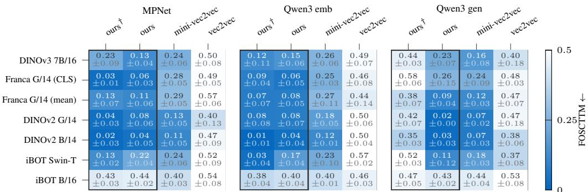  
(a) Unpaired alignment performance. †Cross-dataset: images from MS COCO, captions from SPC.

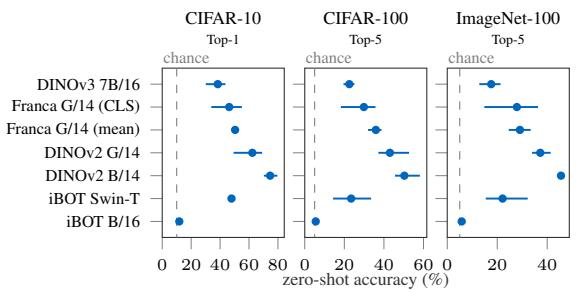  
(b) Semantic transfer via zero-shot classification.

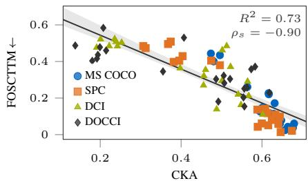  
(c) Shared geometry predicts alignment.  
Figure 3: Shared-geometry for vision-language alignment without paired examples. (a) FOS-CTTM of unpaired aligners on vision and language models on MS COCO, outperforming prior works on most model pairs. We can handle images and captions come from different datasets (ours†). (b) Our alignment transfers semantics enabling zero-shot classification. (c) Points are vision-language-dataset combinations. The more similar the embedding spaces, the better our unpaired alignment.

So far, both modalities come from the same multimodal dataset. Yet our method does not need this assumption. To test this, we align MS COCO images with SPC captions, so that no groundtruth pairing exists between both datasets. Most model pairs remain similarly alignable (cf . Fig. 3a, ours†), with an average FOSCTTM of 0.236 compared with 0.154 when both modalities are drawn from MS COCO. Of note, the small degradation mainly comes from the combination of SPC and generative token pooling which is similar in the single dataset experiment (cf. Fig. 10). This shows that our method does not rely on recovering a hidden pairing from two views of the same dataset.

Regarding unpaired alignment success, all tested geometry scores, including centered kernel alignment (CKA) (Kornblith et al., 2019) in Fig. 3c and others in Fig. 14, strongly correlate with alignment quality given by FOSCTTM. Models with more similar neighborhood and distance structure are consistently easier to align, while we naturally fail to align geometrically inconsistent models.

## 4.2 UNPAIRED ALIGNMENT GENERALIZES ACROSS DOMAINS

On vision-text, our method can align without paired data. We now study how we align non visiontext problems where specialized methods have been designed for the target domain.

Setup. We evaluate language alignment on NQ (Kwiatkowski et al., 2019) against vec2vec (Jha et al., 2026) and mini-vec2vec (Dar, 2025), RNA-to-ATAC alignment on PBMC (10x Genomics, 2021) against SCOT+ (Baker et al., 2026), and cross-subject fMRI alignment on NSD (Allen et al., 2022) against Platonic Brain (Marcos-Manchon et al.´ , 2026). Unlike the Platonic Brain benchmark, we report average rather than best performance, since without supervision one cannot select the best-performing seed. Additional per-pair results are given in Sec. C.3.

<table><tr><td>Benchmark Method</td><td></td><td>FOSCTTM↓</td></tr><tr><td>NQ</td><td>vec2vec</td><td> $0 . 4 0 9 4 \pm 0 . 1 6 2 8$ </td></tr><tr><td></td><td>mini-vec2vec ours</td><td> $0 . 0 0 0 3 \pm 0 . 0 0 1 5$   $\mathbf { 0 . 0 0 0 0 } \pm \mathbf { 0 . 0 0 0 0 }$ </td></tr><tr><td></td><td></td><td></td></tr><tr><td>PBMC</td><td>SCOT+</td><td> $0 . 1 2 1 5 \pm 0 . 0 2 7 5$ </td></tr><tr><td></td><td>ours</td><td>0.0887 ± 0.0033</td></tr><tr><td>NSD fMRI</td><td>platonic brain</td><td> $0 . 0 3 5 3 \pm 0 . 0 4 1 3$ </td></tr><tr><td></td><td>ours</td><td> $\mathbf { 0 . 0 3 3 2 \pm 0 . 0 2 5 3 }$ </td></tr></table>

(a) Domain-specific benchmarks.

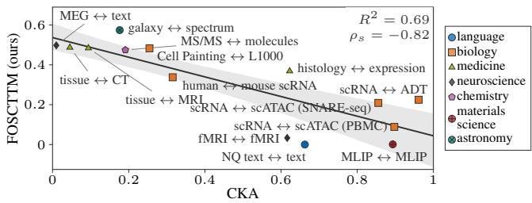  
(b) Alignment against shared geometry, one point per modality pair.  
Figure 4: Shared geometry predicts unpaired alignment across scientific domains. (a) Our generic aligner is competitive with specialized methods on language (NQ, ten encoder pairs), biology (PBMC, RNA → ATAC) and neuroscience (NSD fMRI, fifty-six subject pairs). The nonaggregated metrics of each benchmark are reported in Sec. C.3. (b) Each point corresponds to a modality pair spanning seven scientific domains. As in vision and language, modality pairs with more similar embedding geometry are consistently easier to align without paired data.

Results. Our method is competitive with mini-vec2vec on NQ and achieves lower mean FOS CTTM than the specialized baselines on both PBMC (0.089 compared to 0.121 for SCOT+) and NSD fMRI (0.033 compared to 0.035 for Platonic Brain), cf . Fig. 4a. Thus, our simple geometrybased aligner transfers across language, biology, and neuroscience without task-specific adaptation.

## 4.3 SHARED GEOMETRY PREDICTS ALIGNMENT ACROSS MODALITIES

Here, we study whether shared geometry can identify new settings in which unpaired alignment is likely to work, including settings without established alignment baselines.

Setup. We collect independently trained models from medicine, biology, chemistry, materials science, astronomy, neuroscience, and language. For each modality pair, we compare CKA geometric similarity with our aligner’s FOSCTTM. Full modality pairs and results are provided in Sec. C.4.

Results. Figure 4b shows the same relationship observed in vision and language across these diverse settings. CKA explains 69% of the variance in alignment performance $( \breve { R } ^ { 2 } = 0 . 6 9 )$ , with a Spearman correlation of $\rho _ { s } = - 0 . 8 2$ . Models with more similar geometric structure are consistently easier to align without pairs, while poorly aligned spaces remain difficult to map.

Finding 1: For many models and domains, independent embedding spaces of different modalities share sufficient geometry for coarse alignment without pairs, even across different datasets. The success of unpaired alignment depends strongly on the amount of shared geometry.

## 4.4 FEW-PAIR ALIGNMENT

We showed that with shared geometry we can yield reasonable cross-modal correspondences without paired examples. Yet having some examples can boost performance. We next study how our geometric initialization lowers the amount of paired examples to obtain a strong alignment.

Setup. We use the same MS COCO setting with DINOv2 ViT-B/14 and Qwen3-8B gen and provide from 0 to 1,000 paired image-caption examples. Baselines are linear or orthogonal maps (Maiorca et al., 2023), ASIF (Norelli et al., 2023), Local CKA (Maniparambil et al., 2024), SUE (Yacobi et al., 2026), STRUCTURE (Groger et al. ¨ , 2026b), and SOTAlign (Roschmann et al., 2026).

Results. Figure 5 shows alignment quality versus the number of paired examples. We outperform all baselines at all budgets, with largest gains in the low-pair regime: with up to 20 pairs, our FOSCTTM is 14× to 28× lower than the strongest baseline’s. The gap remains 5.4× at 50 pairs and 3.2× at 100, while the orthogonal map nearly catches up only at 1,000. Remarkably, baselines matching our zero-pair FOSCTTM need 100 to 500 pairs to do so, and SUE never does. The advantage is even stronger downstream: our zero-pair model reaches 79.6% top-1 accuracy on CIFAR-10, a level only STRUCTURE and orthogonal map ever reach, and only with 500 pairs. Conversely, we only need 20 pairs to match or outperform five of seven baselines given 1,000 pairs.

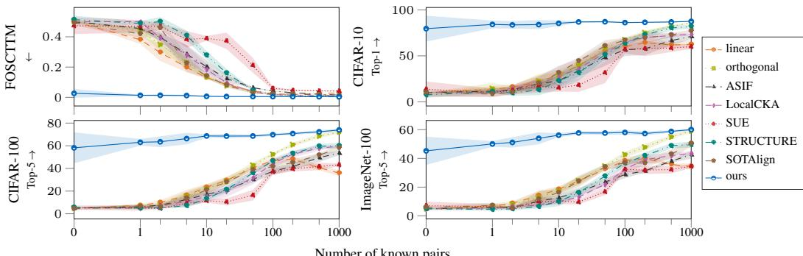  
Number of known pairs  
Figure 5: Shared geometry drastically reduces the amount of paired supervision beneficial for improved alignment. Alignment quality (FOSCTTM) and downstream zero-shot classification accuracy are shown as a function of the number of known image-text pairs. Starting from a strong unpaired solution (leftmost point), our geometry-based method consistently outperforms existing few-pair methods, with the largest gains below 100 pairs.

Finding 2: Leveraging shared geometry also yields a clear advantage in the few-pair regime.

## 4.5 VISUALIZING THE ALIGNMENT WITH TEXT-TO-IMAGE GENERATION

We here visualize our coarse correspondence through four different experiments: text-to-image retrieval, image-to-text retrieval, PCA projection of the aligned space, and text-to-image generation.

Setup. We use DINOv2 ViT-B/14 and all-mpnet-base-v2 for all four experiments. For the first three experiments, we show the results when using MS COCO images and SPC captions. Retrieval and PCA projections are done on the held-out MS COCO validation split. For text-to-image generation, we fit the aligner on disjoint MS COCO images and captions, using 0 to 100 paired examples. We then train a small RAE diffusion model (Zheng et al., 2026) exclusively on ImageNet-1K im ages (Russakovsky et al., 2015), conditioned on mean-pooled DINOv2 embeddings. At inference, captions are mapped to the image embedding space with our aligner, which condition the visual generator. Thus, paired data enters the pipeline only through the cross-modal aligner. The goal is not to build a competitive text-to-image system, but to view directly our cross-modal alignment.

Results. Results are in Fig. 6. Both retrieval experiments show that coarse semantic properties, such as scene type and broad object category, are captured by the mapping. The point clouds colored by MS COCO superclasses further emphasize the coarse alignment. Though not every image is mapped exactly to its corresponding caption, categories are correctly mapped. We show similar plots for three other modalities with varying alignment quality in Fig. 19. Our aligner can be successfully combined with a generative model to enable a full mapping from captions to images, with reasonable quality in the unpaired setting, albeit with often missing fine details. Adding a few pairs sharpens individual objects and scene attributes. We evaluate the generated images quantitatively and compare our aligner to a linear aligner, also with the Contriever model (Izacard et al., 2022) in Sec. C.2.

## 5 DISCUSSION

We have shown that shared embedding geometrical information often suffices for cross-modal alignment. Yet, important conditions for success unavoidably remain. We discuss three of them here.

What enables unpaired cross-modal alignment? Related semantics alone seem insufficient: both embedding spaces must also organize them in a similar geometric structure, as supported by our experiments, where CKA strongly predict our aligner’s performance. Models with more similar

“a traffic light on the same pole as a street light”

“some zebras a giraffe and other animals and some bushes and . . . ”


2. A little boy walking down a street next to . . .

2. A no turning sign sits on a residential . . .

(a) Text-to-image retrieval.  
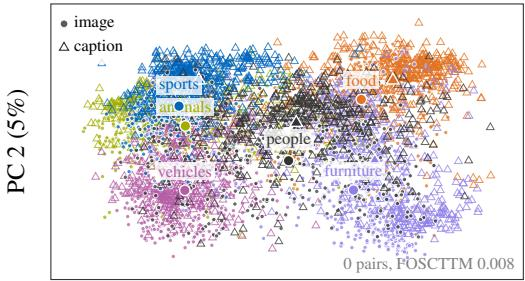  
PC 1 (7% of the variance)

(b) Image-to-text retrieval.  
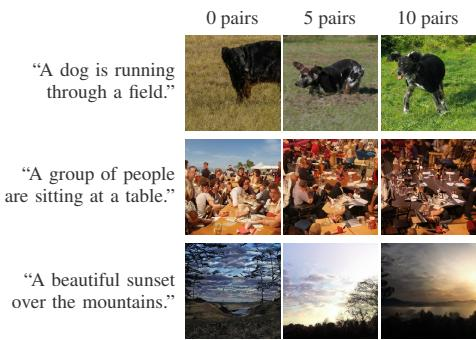  
(c) Shared semantic regions after alignment.  
(d) Text-to-image generation.  
Figure 6: Unpaired alignment recovers semantic structure. We visualize with our aligner the shared space of DINOv2 ViT-B/14 and all-mpnet-base-v2 trained on MS COCO-train images and SPC captions. Retrieval images and captions are from MS COCO-val. Given a text, our aligner can retrieve matching images (a) and vice versa (b). We plot the first two principal components of the aligned space (c) along with the MS COCO supercategories: classes coarsely align. Text-to-image generations (d), using a diffusion model from embeddings to images, show that our unpaired aligner already generates images of the broad class and scene while additional pairs improve finer details.

geometry are consistently better aligned. This relationship holds experimentally beyond vision and language, suggesting that the role of shared geometry is not specific to a particular pair of modalities. Thus, geometric similarity explains why unpaired alignment succeeds. This also highlights an important limitation. Currently, we cannot reliably determine from unpaired data alone whether two spaces are sufficiently similar to be aligned, as usual alignment metrics need matching samples. Developing fully unsupervised alignment prediction scores remains an open problem.

Why is the recovered alignment mostly coarse? The recovered alignment is often substantially better at matching coarse semantic structure than fine-grained details. This is consistent with the observation that modalities share information about the underlying world while also encoding modality-specific information (Koepke et al., 2026). Our analysis of local versus coarse geometric alignment in Sec. E supports this view: coarse clusters are more consistently aligned than local neighborhoods. Thus, our aligner can recover shared semantic structure without necessarily recovering modality-specific details or exact sample-wise correspondences.

How does data quality affect shared geometry? We mostly used image-caption datasets with relatively high-quality visual and textual descriptions. Yet, much of web-available text does not describe visual scenes and may thus share less semantic structure with vision representations. This limits the applicability of our current approach to noisier multimodal data, though our results suggest that it can be mitigated by improving representation quality. Language models already help identify text relevant to visual content (Zhang et al., 2026), and generative token pooling (Wang et al., 2026) improves geometric alignment for short captions (see Sec. D). These results suggest that better filtering and representations might extend unpaired cross-modal alignment to noisier settings.

## 6 CONCLUSION

We showed that independently trained models across modalities can often be aligned without any paired data. A simple Wasserstein Procrustes method with a coarse geometric initialization recovers coarse cross-modal correspondences, even when modalities are drawn from different datasets. We further showed alignment success is strongly predicted by CKA scores, indicating that greater geometric similarity leads to better unpaired alignment. These findings are consistent across vision and language and extend to scientific and medical domains. Finally, paired supervision can be incorporated naturally into our framework. Our method substantially improves over existing approaches in the low-pair regime and remains competitive as more pairs become available. Taken together, our results suggest that a multimodal Rosetta Stone is not always necessary. In many cases, the geometry learned independently by different models already contains enough information to connect their modalities. Our work creates exciting opportunities for new modalities for which paired information is scarce or even non-existent, as long as sufficient geometry is shared between representations.

## ACKNOWLEDGMENTS

We thank Nikita Araslanov and Riccardo Marin for their helpful suggestions. This work was supported by a Packard Fellowship to P.I. Support from ONR MURI grants N00014-22-1-2740 and N00014-26-1-2024 and was partially funded by the German Federal Ministry of Education and Research through the ExperTeam4KI funding program for UDance (Grant No. 01IS24064).

## REFERENCES

10x Genomics. PBMC from a healthy donor – no cell sorting (3k), 2021. URL https://www.10xgen omics.com/datasets/pbmc-from-a-healthy-donor-no-cell-sorting-3-k-1-standard-2-0-0

Prince O Aboagye, Yan Zheng, Michael Yeh, Junpeng Wang, Zhongfang Zhuang, Huiyuan Chen, Liang Wang, Wei Zhang, and Jeff Phillips. Quantized wasserstein procrustes alignment of word embedding spaces. In Conf. Assoc. Mach. Transl. Americas, pp. 200–214, 2022.

Emily J Allen, Ghislain St-Yves, Yihan Wu, Jesse L Breedlove, Jacob S Prince, Logan T Dowdle, Matthias Nau, Brad Caron, Franco Pestilli, Ian Charest, et al. A massive 7t fmri dataset to bridge cognitive neuroscience and artificial intelligence. Nature neuroscience, 25(1):116–126, 2022.

David Alvarez-Melis and Tommi S. Jaakkola. Gromov-Wasserstein alignment of word embedding spaces. In Conf. Empir. Methods Nat. Lang. Process., pp. 1881–1890, 2018.

David Alvarez-Melis, Stefanie Jegelka, and Tommi S Jaakkola. Towards optimal transport with global invariances. In Int. Conf. Artif. Intell. Stat., pp. 1870–1879. PMLR, 2019.

Martin Arjovsky, Soumith Chintala, and Leon Bottou. Wasserstein generative adversarial networks.´ In Int. Conf. Mach. Learn., pp. 214–223. PMLR, 2017.

Mikel Artetxe, Gorka Labaka, and Eneko Agirre. A robust self-learning method for fully unsupervised cross-lingual mappings of word embeddings. In Annu. Meet. Assoc. Comput. Linguist., pp. 789–798, 2018.

Parul Awasthy, Aashka Trivedi, Yulong Li, Mihaela Bornea, David Cox, Abraham Daniels, Martin Franz, Gabe Goodhart, Bhavani Iyer, Vishwajeet Kumar, et al. Granite embedding models. arXiv:2502.20204 [cs.IR], 2025.

Hyojin Bahng, Caroline Chan, Fredo Durand, and Phillip Isola. Cycle consistency as reward: Learning image-text alignment without human preferences. In Int. Conf. Comput. Vis., pp. 22934–22946. IEEE, 2025.

Shuai Bai, Yuxuan Cai, Ruizhe Chen, Keqin Chen, Xionghui Chen, Zesen Cheng, Lianghao Deng, Wei Ding, Chang Gao, Chunjiang Ge, et al. Qwen3-vl technical report. arXiv:2511.21631 [cs.CV], 2025.

Spyridon Bakas, Hamed Akbari, Aristeidis Sotiras, Michel Bilello, Martin Rozycki, Justin S Kirby, John B Freymann, Keyvan Farahani, and Christos Davatzikos. Advancing the cancer genome atlas glioma mri collections with expert segmentation labels and radiomic features. Scientific data, 4(1): 170117, 2017.

Colin Baker, Tuan Pham, Pinar Demetci, Quang Huy Tran, Ievgen Redko, Bjorn Sandstede, and Ritambhara Singh. Scot+: a comprehensive software suite for single-cell alignment using optimal transport. Bioinformatics Advances, 6(1):vbaf314, 2026.

Ilyes Batatia, Philipp Benner, Yuan Chiang, Alin M Elena, David P Kov´ acs, Janosh Riebesell,´ Xavier R Advincula, Mark Asta, Matthew Avaylon, William J Baldwin, et al. A foundation model for atomistic materials chemistry. The Journal ofchemical physics, 163(18), 2025.

Roman Bushuiev, Anton Bushuiev, Niek F de Jonge, Adamo Young, Fleming Kretschmer, Raman Samusevich, Janne Heirman, Fei Wang, Luke Zhang, Kai Duhrkop, et al. Massspecgym: A ¨ benchmark for the discovery and identification of molecules. Adv. Neural Inform. Process. Syst., 37:110010–110027, 2024.

Roman Bushuiev, Anton Bushuiev, Raman Samusevich, Corinna Brungs, Josef Sivic, and Toma´sˇ Pluskal. Self-supervised learning of molecular representations from millions of tandem mass spectra using dreams. Nature Biotechnology, 44(4):630–640, 2026.

Mathilde Caron, Hugo Touvron, Ishan Misra, Herve J´ egou, Julien Mairal, Piotr Bojanowski, and´ Armand Joulin. Emerging properties in self-supervised vision transformers. In Int. Conf. Comput. Vis., pp. 9630–9640, 2021.

Jinho Chang and Jong Chul Ye. Bidirectional generation of structure and properties through a single molecular foundation model. Nature Communications, 15(1):2323, 2024.

Soravit Changpinyo, Piyush Sharma, Nan Ding, and Radu Soricut. Conceptual 12m: Pushing web-scale image-text pre-training to recognize long-tail visual concepts. In IEEE Conf. Comput. Vis. Pattern Recog., pp. 3557–3567. IEEE, 2021.

Sanyuan Chen, Chengyi Wang, Zhengyang Chen, Yu Wu, Shujie Liu, Zhuo Chen, Jinyu Li, Naoyuki Kanda, Takuya Yoshioka, Xiong Xiao, et al. Wavlm: Large-scale self-supervised pre-training for full stack speech processing. J. Sel. Topics Signal Process., 16(6):1505–1518, 2022.

Song Chen, Blue B Lake, and Kun Zhang. High-throughput sequencing of the transcriptome and chromatin accessibility in the same cell. Nature biotechnology, 37(12):1452–1457, 2019.

Xinlei Chen, Hao Fang, Tsung-Yi Lin, Ramakrishna Vedantam, Saurabh Gupta, Piotr Dollar,´ and C Lawrence Zitnick. Microsoft COCO captions: Data collection and evaluation server. arXiv:1504.00325 [cs.CV], 2015.

Scott Cohen and Leonidas Guibas. The earth mover’s distance under transformation sets. In Int. Conf. Comput. Vis., volume 2, pp. 1076–1083. IEEE, 1999.

Alexis Conneau, Guillaume Lample, Marc’Aurelio Ranzato, Ludovic Denoyer, and Herve J ´ egou.´ Word translation without parallel data. In Int. Conf. Learn. Represent., pp. 1–13, 2018.

Georges A. Croes. A method for solving traveling-salesman problems. Operations research, 6(6): 791–812, 1958.

Guy Dar. mini-vec2vec: Scaling universal geometry alignment with linear transformations. arXiv:2510.02348 [cs.CL], 2025.

Timothee Darcet, Maxime Oquab, Julien Mairal, and Piotr Bojanowski. Vision transformers need´ registers. In Int. Conf. Learn. Represent., volume 2024, pp. 2632–2652, 2024.

Pinar Demetci, Rebecca Santorella, Bjorn Sandstede, William Stafford Noble, and Ritambhara Singh.¨ Scot: single-cell multi-omics alignment with optimal transport. J. Comput. Biol., 29(1):3–18, 2022.

Amil Dravid, Yossi Gandelsman, Alexei A Efros, and Assaf Shocher. Rosetta neurons: Mining the common units in a model zoo. In Int. Conf. Comput. Vis., pp. 1934–1943. IEEE, 2023.

Patrick Ebel, Andrea Meraner, Michael Schmitt, and Xiao Xiang Zhu. Multisensor Data Fusion for Cloud Removal in Global and All-Season Sentinel-2 Imagery. Trans. Geosci. Remote Sens., 2020.

Sathya Edamadaka, Soojung Yang, and Rafael Gomez-Bombarelli. Universally converging representations of matter across scientific foundation models. In UniReps, 2025.

Nathan J Edwards, Mauricio Oberti, Ratna R Thangudu, Shuang Cai, Peter B McGarvey, Shine Jacob, Subha Madhavan, and Karen A Ketchum. The cptac data portal: a resource for cancer proteomics research. J. Proteome Res., 14(6):2707–2713, 2015.

Mathieu Even, Luca Ganassali, Jakob Maier, and Laurent Massoulie. Aligning embeddings and´ geometric random graphs: Informational results and computational approaches for the procrusteswasserstein problem. Adv. Neural Inform. Process. Syst., 37:70730–70764, 2024.

Ian J. Goodfellow, Jean Pouget-Abadie, Mehdi Mirza, Bing Xu, David Warde-Farley, Sherjil Ozair, Aaron Courville, and Yoshua Bengio. Generative adversarial nets. In Z. Ghahramani, M. Welling, C. Cortes, N. Lawrence, and K. Weinberger (eds.), Adv. Neural Inform. Process. Syst., volume 27. Curran Associates, Inc., 2014.

Edouard Grave, Armand Joulin, and Quentin Berthet. Unsupervised alignment of embeddings with wasserstein procrustes. In Int. Conf. Artif. Intell. Stat., pp. 1880–1890. PMLR, 2019.

Fabian Groger, Shuo Wen, and Maria Brbi ¨ c. Revisiting the platonic representation hypothesis: An ´ aristotelian view. In Int. Conf. Mach. Learn. PMLR, 2026a.

Fabian Groger, Shuo Wen, Huyen Le, and Maria Brbic. With limited data for multimodal alignment,¨ Let the STRUCTURE Guide You. Adv. Neural Inform. Process. Syst., 38:151747–151776, 2026b.

Sharut Gupta, Sanyam Kansal, Stefanie Jegelka, Phillip Isola, and Vikas K Garg. Canonicalizing multimodal contrastive representation learning. In ICLR Workshop on Representational Alignment, 2026.

Marzieh Haghighi, Juan C Caicedo, Beth A Cimini, Anne E Carpenter, and Shantanu Singh. Highdimensional gene expression and morphology profiles of cells across 28,000 genetic and chemical perturbations. Nature methods, 19(12):1550–1557, 2022.

Mareike Hartmann, Yova Kementchedjhieva, and Anders Søgaard. Comparing unsupervised word translation methods step by step. Adv. Neural Inform. Process. Syst., 32, 2019.

Jack Hessel, Ari Holtzman, Maxwell Forbes, Ronan Le Bras, and Yejin Choi. Clipscore: A referencefree evaluation metric for image captioning. In Conf. Empir. Methods Nat. Lang. Process., pp. 7514–7528, 2021.

Yedid Hoshen and Lior Wolf. Non-adversarial unsupervised word translation. In Conf. Empir. Methods Nat. Lang. Process., pp. 469–478, 2018a.

Yedid Hoshen and Lior Wolf. Unsupervised correlation analysis. In IEEE Conf. Comput. Vis. Pattern Recog., pp. 3319–3328. IEEE, 2018b.

Yushi Hu, Benlin Liu, Jungo Kasai, Yizhong Wang, Mari Ostendorf, Ranjay Krishna, and Noah A Smith. Tifa: Accurate and interpretable text-to-image faithfulness evaluation with question answering. In Int. Conf. Comput. Vis., pp. 20349–20360. IEEE, 2023.

Minyoung Huh, Brian Cheung, Tongzhou Wang, and Phillip Isola. Position: The platonic representation hypothesis. In Int. Conf. Mach. Learn., volume 235, pp. 20617–20642, 2024.

Lisa Hutschenreiter, Stefan Haller, Lorenz Feineis, Carsten Rother, Dagmar Kainmuller, and Bogdan¨ Savchynskyy. Fusion moves for graph matching. In Int. Conf. Comput. Vis., pp. 6270–6279, 2021.

Gautier Izacard, Mathilde Caron, Lucas Hosseini, Sebastian Riedel, Piotr Bojanowski, Armand Joulin, and Edouard Grave. Unsupervised dense information retrieval with contrastive learning. Trans. Mach. Learn Res., 2022. ISSN 2835-8856.

Anubhav Jain, Shyue Ping Ong, Geoffroy Hautier, Wei Chen, William Davidson Richards, Stephen Dacek, Shreyas Cholia, Dan Gunter, David Skinner, Gerbrand Ceder, et al. Commentary: The materials project: A materials genome approach to accelerating materials innovation. APL materials, 1(1), 2013.

Guillaume Jaume, Paul Doucet, Andrew H Song, Ming Y Lu, Cristina Almagro-Perez, Sophia J ´ Wagner, Anurag J Vaidya, Richard J Chen, Drew F Williamson, Ahrong Kim, et al. Hest-1k: A dataset for spatial transcriptomics and histology image analysis. Adv. Neural Inform. Process. Syst., 37:53798–53833, 2024.

Rishi Jha, Collin Zhang, Vitaly Shmatikov, and John Morris. Harnessing the universal geometry of embeddings. Adv. Neural Inform. Process. Syst., 38:45963–45987, 2026.

Chao Jia, Yinfei Yang, Ye Xia, Yi-Ting Chen, Zarana Parekh, Hieu Pham, Quoc Le, Yun-Hsuan Sung, Zhen Li, and Tom Duerig. Scaling up visual and vision-language representation learning with noisy text supervision. In Int. Conf. Mach. Learn., pp. 4904–4916. PMLR, 2021a.

Xinyu Jia, Chuang Zhu, Minzhen Li, Wenqi Tang, and Wenli Zhou. Llvip: A visible-infrared paired dataset for low-light vision. In Int. Conf. Comput. Vis. Worksh., pp. 3489–3497. IEEE, 2021b.

Roy Jonker and Ton Volgenant. A shortest augmenting path algorithm for dense and sparse linear assignment problems. Computing, 38(4):325–340, 1987. doi: 10.1007/BF02278710.

A. Sophia Koepke, Daniil Zverev, Shiry Ginosar, and Alexei A Efros. Back into plato’s cave: examining cross-modal representational convergence at scale. arXiv:2604.18572 [cs.CV], 2026.

Jing Yu Koh, Ruslan Salakhutdinov, and Daniel Fried. Grounding language models to images for multimodal inputs and outputs. In Int. Conf. Mach. Learn., pp. 17283–17300. PMLR, 2023.

John Kominek and Alan W Black. The cmu arctic speech databases. In Workshop on Speech Synthesis, pp. 223–224. ISCA, 2004.

Tjalling C. Koopmans and Martin Beckmann. Assignment problems and the location of economic activities. Econometrica, pp. 53–76, 1957.

Simon Kornblith, Mohammad Norouzi, Honglak Lee, and Geoffrey Hinton. Similarity of neural network representations revisited. In Int. Conf. Mach. Learn., pp. 3519–3529, 2019.

Jonathan Krause, Justin Johnson, Ranjay Krishna, and Li Fei-Fei. A hierarchical approach for generating descriptive image paragraphs. In IEEE Conf. Comput. Vis. Pattern Recog., 2017.

Alex Krizhevsky, Geoffrey Hinton, et al. Learning multiple layers of features from tiny images. Technical Report, 2009.

Tom Kwiatkowski, Jennimaria Palomaki, Olivia Redfield, Michael Collins, Ankur Parikh, Chris Alberti, Danielle Epstein, Illia Polosukhin, Jacob Devlin, Kenton Lee, et al. Natural questions: a benchmark for question answering research. Annu. Meet. Assoc. Comput. Linguist., 7:453–466, 2019.

Jarod Levy, Mingfang Zhang, Svetlana Pinet, J´ er´ emy Rapin, Hubert Banville, St´ ephane d’Ascoli, and´ Jean-Remi King. Brain-to-text decoding: A non-invasive approach via typing.´ arXiv:2502.17480 [eess.SP], 2025.

Jiaang Li, Yova Kementchedjhieva, Constanza Fierro, and Anders Søgaard. Do vision and language models share concepts? a vector space alignment study. Annu. Meet. Assoc. Comput. Linguist., 12: 1232–1249, 2024.

Zehan Li, Xin Zhang, Yanzhao Zhang, Dingkun Long, Pengjun Xie, and Meishan Zhang. Towards general text embeddings with multi-stage contrastive learning. arXiv:2308.03281 [cs.CL], 2023.

Zhenzhu Li and Aron Walsh. Platonic representation of foundation machine learning interatomic potentials. Nature Machine Intelligence, pp. 830–840, 2026.

Zhiqiu Lin, Deepak Pathak, Baiqi Li, Jiayao Li, Xide Xia, Graham Neubig, Pengchuan Zhang, and Deva Ramanan. Evaluating text-to-visual generation with image-to-text generation. In Eur. Conf. Comput. Vis., pp. 366–384. Springer, 2024.

Jie Liu, Yuanhao Huang, Ritambhara Singh, Jean-Philippe Vert, and William Stafford Noble. Jointly embedding multiple single-cell omics measurements. In Workshop Algorithms Bioinformatics, pp. 10:1–10:13, Dagstuhl, Germany, 2019.

Valentino Maiorca, Luca Moschella, Antonio Norelli, Marco Fumero, Francesco Locatello, and Emanuele Rodola. Latent space translation via semantic alignment. In \` Adv. Neural Inform. Process. Syst., 2023.

Mayug Maniparambil, Raiymbek Akshulakov, Yasser Abdelaziz Dahou Djilali, Mohamed El Amine Seddik, Sanath Narayan, Karttikeya Mangalam, and Noel E O’Connor. Do vision and language encoders represent the world similarly? In IEEE Conf. Comput. Vis. Pattern Recog., pp. 14334–14343, 2024.

Kelly Marchisio, Ali Saad-Eldin, Kevin Duh, Carey Priebe, and Philipp Koehn. Bilingual lexicon induction for low-resource languages using graph matching via optimal transport. In Conf. Empir. Methods Nat. Lang. Process., pp. 2545–2561, 2022.

Pablo Marcos-Manchon, Rishi Jha, and Llu ´ ´ıs Fuentemilla. Platonic representations in the human brain: Unsupervised recovery of universal geometry. arXiv:2605.20496 [q-bio.NC], 2026.

Jack Merullo, Louis Castricato, Carsten Eickhoff, and Ellie Pavlick. Linearly mapping from image to text space. In Int. Conf. Learn. Represent., 2023.

Tomas Mikolov, Quoc V Le, and Ilya Sutskever. Exploiting similarities among languages for machine translation. arXiv:1309.4168 [cs.CL], 2013.

Muhammad Tasnim Mohiuddin and Shafiq Joty. Revisiting adversarial autoencoder for unsupervised word translation with cycle consistency and improved training. In North Am. Chapter Assoc. Comput. Linguist., pp. 3857–3867, 2019.

Luca Moschella, Valentino Maiorca, Marco Fumero, Antonio Norelli, Francesco Locatello, and Emanuele Rodola. Relative representations enable zero-shot latent space communication. In \` Int. Conf. Learn. Represent., 2023.

Jerry Ngo and Yoon Kim. What do language models hear? probing for auditory representations in language models. In Annu. Meet. Assoc. Comput. Linguist., pp. 5435–5448, 2024.

Jianmo Ni, Chen Qu, Jing Lu, Zhuyun Dai, Gustavo Hernandez Abrego, Ji Ma, Vincent Zhao, Yi Luan, Keith Hall, Ming-Wei Chang, et al. Large dual encoders are generalizable retrievers. In Conf. Empir. Methods Nat. Lang. Process., pp. 9844–9855, 2022.

Antonio Norelli, Marco Fumero, Valentino Maiorca, Luca Moschella, Emanuele Rodola, and\` Francesco Locatello. ASIF: Coupled data turns unimodal models to multimodal without training. In Adv. Neural Inform. Process. Syst., 2023.

Sebastian Nowozin, Botond Cseke, and Ryota Tomioka. f-gan: Training generative neural samplers using variational divergence minimization. Adv. Neural Inform. Process. Syst., 29, 2016.

Yasumasa Onoe, Sunayana Rane, Zachary Berger, Yonatan Bitton, Jaemin Cho, Roopal Garg, Alexander Ku, Zarana Parekh, Jordi Pont-Tuset, Garrett Tanzer, et al. Docci: Descriptions of connected and contrasting images. In Eur. Conf. Comput. Vis., pp. 291–309. Springer, 2024.

Maxime Oquab, Timothee Darcet, and Th ´ eo Moutakanni et al. DINOv2: Learning robust visual ´ features without supervision. Trans. Mach. Learn Res., 2024.

Suraj Pai, Ibrahim Hadzic, Dennis Bontempi, Keno Bressem, Benjamin H Kann, Andriy Fedorov, Raymond H Mak, and Hugo JWL Aerts. Vision foundation models for computed tomography. arXiv:2501.09001 [eess.IV], 2025.

Liam Parker, Francois Lanusse, Siavash Golkar, Leopoldo Sarra, Miles Cranmer, Alberto Bietti, Michael Eickenberg, Geraud Krawezik, Michael McCabe, Rudy Morel, et al. Astroclip: a cross-modal foundation model for galaxies. Mon. Not. R. Astron. Soc., 531(4):4990–5011, 2024.

Gabriel Peyre, Marco Cuturi, and Justin Solomon. Gromov-Wasserstein averaging of kernel and´ distance matrices. In Int. Conf. Mach. Learn., volume 48, pp. 2664–2672, 2016.

CZI Single-Cell Biology Program, Shibla Abdulla, Brian Aevermann, Pedro Assis, Seve Badajoz, Sidney M. Bell, Emanuele Bezzi, Batuhan Cakir, Jim Chaffer, Signe Chambers, J. Michael Cherry, Tiffany Chi, Jennifer Chien, Leah Dorman, Pablo Garcia-Nieto, Nayib Gloria, Mim Hastie, Daniel Hegeman, Jason Hilton, Timmy Huang, Amanda Infeld, Ana-Maria Istrate, Ivana Jelic, Kuni Katsuya, Yang Joon Kim, Karen Liang, Mike Lin, Maximilian Lombardo, Bailey Marshall, Bruce Martin, Fran McDade, Colin Megill, Nikhil Patel, Alexander Predeus, Brian Raymor, Behnam

Robatmili, Dave Rogers, Erica Rutherford, Dana Sadgat, Andrew Shin, Corinn Small, Trent Smith, Prathap Sridharan, Alexander Tarashansky, Norbert Tavares, Harley Thomas, Andrew Tolopko, Meghan Urisko, Joyce Yan, Garabet Yeretssian, Jennifer Zamanian, Arathi Mani, Jonah Cool, and Ambrose Carr. CZ CELL×GENE discover: A single-cell data platform for scalable exploration, analysis and modeling of aggregated data. bioRxiv, 2023. doi: 10.1101/2023.10.30.563174.

Alec Radford, Jong Wook Kim, Chris Hallacy, Aditya Ramesh, Gabriel Goh, Sandhini Agarwal, Girish Sastry, Amanda Askell, Pamela Mishkin, Jack Clark, Gretchen Krueger, and Ilya Sutskever. Learning transferable visual models from natural language supervision. In Int. Conf. Mach. Learn., volume 139, pp. 8748–8763, 2021.

Anand Rangarajan, Haili Chui, and Fred L Bookstein. The softassign procrustes matching algorithm. In Bienn. Int. Conf. Inf. Process. Med. Imaging, pp. 29–42. Springer, 1997.

Nils Reimers and Iryna Gurevych. Sentence-BERT: Sentence embeddings using siamese bertnetworks. In Conf. Empir. Methods Nat. Lang. Process. Int. Joint Conf. Nat. Lang. Process., pp. 3980–3990, 2019.

Nils Reimers and Iryna Gurevych. Making monolingual sentence embeddings multilingual using knowledge distillation. In Conf. Empir. Methods Nat. Lang. Process., pp. 4512–4525, 2020.

David Rogers and Mathew Hahn. Extended-connectivity fingerprints. J. Chem. Inf. Model., 50(5): 742–754, 2010.

Simon Roschmann, Paul Krzakala, Sonia Mazelet, Quentin Bouniot, and Zeynep Akata. SOTAlign: Semi-supervised alignment of unimodal vision and language models via optimal transport. In Int. Conf. Mach. Learn., 2026.

Olga Russakovsky, Jia Deng, Hao Su, Jonathan Krause, Sanjeev Satheesh, Sean Ma, Zhiheng Huang, Andrej Karpathy, Aditya Khosla, Michael S. Bernstein, Alexander C. Berg, and Li Fei-Fei. ImageNet large scale visual recognition challenge. Int. J. Comput. Vis., 115(3):211–252, 2015.

Charlie Saillard, Rodolphe Jenatton, Felipe Llinares-Lopez, Zelda Mariet, David Cahan´ e, Eric Durand,´ and Jean-Philippe Vert. H-optimus-0, 2024. URL https://github.com/bioptimus/releases/tree/main/ models/h-optimus/v0.

Meyer Scetbon, Gabriel Peyre, and Marco Cuturi. Linear-time gromov wasserstein distances using´ low rank couplings and costs. In Int. Conf. Mach. Learn., pp. 19347–19365. PMLR, 2022.

Dominik Schnaus, Nikita Araslanov, and Daniel Cremers. It’s a (blind) match! towards vision language correspondence without parallel data. In IEEE Conf. Comput. Vis. Pattern Recog., pp. 24983–24992. IEEE, 2025.

Peter H Schonemann. A generalized solution of the orthogonal procrustes problem. ¨ Psychometrika, 31(1):1–10, 1966.

Christoph Schuhmann, Romain Beaumont, Richard Vencu, Cade Gordon, Ross Wightman, Mehdi Cherti, Theo Coombes, Aarush Katta, Clayton Mullis, Mitchell Wortsman, et al. Laion-5b: An open large-scale dataset for training next generation image-text models. Adv. Neural Inform. Process. Syst., 35:25278–25294, 2022.

Oriane Simeoni, Huy V. Vo, Maximilian Seitzer, Federico Baldassarre, Maxime Oquab, Cijo Jose,´ Vasil Khalidov, Marc Szafraniec, Seung Eun Yi, Michael Ramamonjisoa, Francisco Massa, Daniel HAZIZA, Luca Wehrstedt, Jianyuan Wang, Timothee Darcet, Th´ eo Moutakanni, Leonel Sentana,´ Claire Roberts, Andrea Vedaldi, Jamie Tolan, John Brandt, Camille Couprie, Julien Mairal, Herve Jegou, Patrick Labatut, and Piotr Bojanowski. DINOv3. Trans. Mach. Learn Res., 2026. ISSN 2835-8856.

Diogo Soares, Pankhil Gawade, Andrea Dittadi, and Ewa Szczurek. Scalable and interpretable representation alignment with ordinal similarity. In Int. Conf. Mach. Learn., 2026.

Krishna Srinivasan, Karthik Raman, Jiecao Chen, Michael Bendersky, and Marc Najork. Wit: Wikipedia-based image text dataset for multimodal multilingual machine learning. In ACM SIGIR, pp. 2443–2449, 2021.

Marlon Stoeckius, Christoph Hafemeister, William Stephenson, Brian Houck-Loomis, Pratip K Chattopadhyay, Harold Swerdlow, Rahul Satija, and Peter Smibert. Simultaneous epitope and transcriptome measurement in single cells. Nature methods, 14(9):865–868, 2017.

Alexis Thual, Quang Huy Tran, Tatiana Zemskova, Nicolas Courty, Remi Flamary, Stanislas Dehaene,´ and Bertrand Thirion. Aligning individual brains with fused unbalanced gromov wasserstein. Adv. Neural Inform. Process. Syst., 35:21792–21804, 2022.

Adrian Thummerer, Erik Van der Bijl, Arthur Galapon Jr, Joost JC Verhoeff, Johannes A Langendijk, Stefan Both, Cornelis (Nico) AT van den Berg, and Matteo Maspero. Synthrad2023 grand challenge dataset: Generating synthetic ct for radiotherapy. Medical physics, 50(7):4664–4674, 2023.

Yonglong Tian, Dilip Krishnan, and Phillip Isola. Contrastive multiview coding. In Eur. Conf. Comput. Vis., pp. 776–794. Springer, 2020.

Shengbang Tong, Boyang Zheng, Ziteng Wang, Bingda Tang, Nanye Ma, Ellis Brown, Jihan Yang, Rob Fergus, Yann LeCun, and Saining Xie. Scaling text-to-image diffusion transformers with representation autoencoders. arXiv:2601.16208 [cs.CV], 2026.

Hugo Touvron, Louis Martin, Kevin Stone, Peter Albert, Amjad Almahairi, Yasmine Babaei, Nikolay Bashlykov, Soumya Batra, Prajjwal Bhargava, Shruti Bhosale, et al. Llama 2: Open foundation and fine-tuned chat models. arXiv:2307.09288 [cs.CL], 2023.

Jack Urbanek, Florian Bordes, Pietro Astolfi, Mary Williamson, Vasu Sharma, and Adriana Romero-Soriano. A picture is worth more than 77 text tokens: Evaluating clip-style models on dense captions. In IEEE Conf. Comput. Vis. Pattern Recog., pp. 26700–26709, June 2024.

Shashanka Venkataramanan, Valentinos Pariza, Mohammadreza Salehi, Lukas Knobel, Elias Ramzi, Spyros Gidaris, Andrei Bursuc, and Yuki M Asano. Franca: Nested matryoshka clustering for scalable visual representation learning. In IEEE Conf. Comput. Vis. Pattern Recog., pp. 10533–10544, 2026.

Liang Wang, Nan Yang, Xiaolong Huang, Binxing Jiao, Linjun Yang, Daxin Jiang, Rangan Majumder, and Furu Wei. Text embeddings by weakly-supervised contrastive pre-training. arXiv:2212.03533 [cs.CL], 2022.

Sophie L. Wang, Phillip Isola, and Brian Cheung. The truth lies somewhere in the middle (of the generated tokens). In Int. Conf. Mach. Learn., 2026.

Lei Xiong, Tianlong Chen, and Manolis Kellis. scclip: Multi-modal single-cell contrastive learning integration pre-training. In NeurIPS AIfor Science Workshop, 2023.

Hanwen Xu, Naoto Usuyama, Jaspreet Bagga, Sheng Zhang, Rajesh Rao, Tristan Naumann, Cliff Wong, Zelalem Gero, Javier Gonzalez, Yu Gu, et al. A whole-slide foundation model for digital´ pathology from real-world data. Nature, 630(8015):181–188, 2024.

Ruochen Xu, Yiming Yang, Naoki Otani, and Yuexin Wu. Unsupervised cross-lingual transfer of word embedding spaces. In Conf. Empir. Methods Nat. Lang. Process., pp. 2465–2474, 2018.

Amitai Yacobi, Nir Ben-Ari, Ronen Talmon, and Uri Shaham. Learning shared representations from unpaired data. Adv. Neural Inform. Process. Syst., 38:46634–46666, 2026.

An Yang, Anfeng Li, Baosong Yang, Beichen Zhang, Binyuan Hui, Bo Zheng, Bowen Yu, Chang Gao, Chengen Huang, Chenxu Lv, et al. Qwen3 technical report. arXiv:2505.09388 [cs.CL], 2025.

Junwon You, Mihyun Jang, Sangwoo Mo, and Jae-Hun Jung. What converges in the platonic representation hypothesis? structure over geometry. arXiv:2609.27252 [cs.LG], 2026.

Xiaohua Zhai, Xiao Wang, Basil Mustafa, Andreas Steiner, Daniel Keysers, Alexander Kolesnikov, and Lucas Beyer. Lit: Zero-shot transfer with locked-image text tuning. In IEEE Conf. Comput. Vis. Pattern Recog., pp. 18102–18112. IEEE, 2022.

Xiaohua Zhai, Basil Mustafa, Alexander Kolesnikov, and Lucas Beyer. Sigmoid loss for language image pre-training. In Int. Conf. Comput. Vis., pp. 11941–11952. IEEE, 2023.

Bingqian Zhang, Guanrui Huang, and Chugeng Xu. Multi-agent llm framework for imageability assessment in trusted multimodal data spaces. In Int. Conf. Big Data Econ. Inf. Manag., pp. 1449–1456, 2026.

Dun Zhang, Jiacheng Li, Ziyang Zeng, and Fulong Wang. Jasper and stella: distillation of sota embedding models. arXiv:2412.19048 [cs.IR], 2024.

Meng Zhang, Yang Liu, Huanbo Luan, and Maosong Sun. Adversarial training for unsupervised bilingual lexicon induction. In Annu. Meet. Assoc. Comput. Linguist., pp. 1959–1970, 2017a.

Meng Zhang, Yang Liu, Huanbo Luan, and Maosong Sun. Earth mover’s distance minimization for unsupervised bilingual lexicon induction. In Conf. Empir. Methods Nat. Lang. Process., pp. 1934–1945, 2017b.

Yanzhao Zhang, Mingxin Li, Dingkun Long, Xin Zhang, Huan Lin, Baosong Yang, Pengjun Xie, An Yang, Dayiheng Liu, Junyang Lin, et al. Qwen3 embedding: Advancing text embedding and reranking through foundation models. arXiv:2506.05176 [cs.CL], 2025.

Boyang Zheng, Nanye Ma, Shengbang Tong, and Saining Xie. Diffusion transformers with representation autoencoders. In Int. Conf. Learn. Represent., volume 2026, pp. 35791–35820, 2026.

Jinghao Zhou, Chen Wei, Huiyu Wang, Wei Shen, Cihang Xie, Alan Yuille, and Tao Kong. Image BERT pre-training with online tokenizer. In Int. Conf. Learn. Represent., 2022.

Jun-Yan Zhu, Taesung Park, Phillip Isola, and Alexei A Efros. Unpaired image-to-image translation using cycle-consistent adversarial networks. In Int. Conf. Comput. Vis., pp. 2242–2251. Ieee, 2017.

Tyler Zhu, Tengda Han, Leonidas Guibas, Viorica Patr˘ aucean, and Maks Ovsjanikov. Dynamic˘ reflections: Probing video representations with text alignment. In Int. Conf. Learn. Represent., 2026.

## APPENDIX OVERVIEW

• Section A describes our aligner in full and ablates every component and hyperparameter of the method.

• Section B lists the models, datasets, splits, prompts, metrics and their parameters for each experiment of the main paper, so that every number can be reproduced.

• Section C reports the results the main text summarizes, per dataset, per benchmark and per modality pair, together with the generated images of the text-to-image experiment.

• Section D studies generative token pooling (Wang et al., 2026), which uses the average of generated tokens as the embedding for a given caption. It helps on short captions and hurts on detailed ones, which explains why it fails on the detailed captioning corpora of Sec. 4.1.

• Section E measures which part of the geometry the two modalities actually share. The agreement sits in coarse rather than fine structures.

## A OUR ALIGNER: DETAILS AND ABLATION

This appendix provides details about our algorithm and ablates it against other components and hyperparameter choices.

## A.1 OUR ALGORITHM

Algorithms 1 and 2 summarize the method. It consists of three steps: The initialization seeks a coarse transport that connects the two spaces, the read-out transforms the coarse transport into a sample-wise correspondence, and the refinement uses standard Wasserstein Procrustes alternation to improve the mapping.

Notation. Let $\boldsymbol { X } \in \mathbb { R } ^ { n \times d _ { X } }$ and $\pmb { Y } \in \mathbb { R } ^ { m \times d _ { Y } } , d _ { X } \leq d _ { Y }$ , be centered and normalized embeddings from independently trained models. We use $\textbf { \em a } = \mathbf { 1 } _ { n } / n$ and $\pmb { b } = \mathbf { 1 } _ { m } / m$ to denote the uniform marginals and $\Pi ( \pmb { a } , \pmb { b } ) = \{ \pmb { T } \in \mathbb { R } _ { > 0 } ^ { n \times m } : \pmb { T } \mathbf { 1 } _ { m } = \pmb { a } , \pmb { T } ^ { \top } \mathbf { 1 } _ { n } = \pmb { b } \}$ for the transport polytope. The vertices of the transport polytope for square matrices are permutation matrices $\mathcal { P } _ { n }$ . Moreover, we use the Stiefel manifold $\mathbf { \bar { S } t } ( d _ { X } , d _ { Y } )$ , which is the set of semi-orthogonal matrices $W \in \mathbb { R } ^ { d _ { X } \times d _ { Y } }$ whose columns are orthogonal if $d _ { X } \geq d _ { Y }$ and whose rows are orthonormal otherwise. We can transform a matrix into a semi-orthogonal matrix with the polar factor $\operatorname { p o l a r } ( M ) = U V ^ { \top }$ using the singular value decomposition $\overset { \vartriangle } { M } = \pmb { U } \ d \Sigma \boldsymbol { V } ^ { \intercal }$ . To ease the notation with Gromov-Wasserstein (GW) problems, we denote the linear kernels as $\boldsymbol { K } _ { \boldsymbol { X } } = \boldsymbol { X } \boldsymbol { X } ^ { \intercal }$ and $K _ { Y } = Y Y ^ { \top }$ . Finally, let $\begin{array} { r } { \dot { \pmb { H } } = \dot { \pmb { I } } - \frac { 1 } { n } { \bf 1 } { \bf 1 } ^ { \top } } \end{array}$ be the centering matrix that is used in the definition of the centered kernel alignment (CKA) (Kornblith et al., 2019).

Initialization. The Procrustes-Wasserstein problem is jointly non-convex. Moreover, random initializations fail in practice (Artetxe et al., 2018) and the uniform plan carries no information about the map, since on centered data $X ^ { \top } { \pmb a } { \pmb b } ^ { \top } { \pmb Y } = \bar { { \pmb x } } { \pmb \bar { y } } ^ { \top } = { \pmb 0 }$ , so the first Procrustes step has no signal.

We don’t assume a perfect isometry but rather shared coarse structures in the embedding spaces. Therefore, we use the coarse clustering initialization from mini-vec2vec (Dar, 2025). This initialization repeatedly matches cluster centers to create a set of pseudo-pairs. This makes the problem computationally tractable and relies on shared coarse structures.

For $s = 1 , \ldots , S$ , we draw b rows of X and, independently, b rows of Y and cluster each subset with k-means into C clusters. The resulting cluster centers $\pmb { A } _ { s } \in \mathbb { R } ^ { C \times d _ { X } }$ and $B _ { s } \in \mathbb { R } ^ { C \times d _ { Y } }$ are then matched by the permutation that maximizes their linear centered kernel alignment $\mathbf { \Gamma } ( \mathbf { C K A } )$ (Kornblith et al., 2019):

$$
P _ { s } \in \underset { P \in \mathcal { P } _ { C } } { \arg \operatorname* { m a x } } ~ \mathrm { C K A } \left( A _ { s } , P B _ { s } \right) .\tag{3}
$$

The optimization of CKA over permutation matrices is a quadratic assignment problem (QAP), as the following lemma shows.

Lemma 1. Let $\pmb { A } \in \mathbb { R } ^ { C \times d _ { X } } , \pmb { B } \in \mathbb { R } ^ { C \times d _ { Y } }$ contain C samples. Then

$$
\underset { P \in \mathcal { P } _ { C } } { \arg \operatorname* { m a x } } \mathrm { C K A } ( A , P B ) = \underset { P \in \mathcal { P } _ { C } } { \arg \operatorname* { m a x } } \mathrm { T r } \left( \bar { K } _ { A } P \bar { K } _ { B } P ^ { \top } \right)\tag{4}
$$

is a Koopmans-Beckmann quadratic assignment problem (Koopmans & Beckmann, 1957) with $\begin{array} { r } { \bar { K } _ { A } = \hat { H } A A ^ { \top } H a n d \bar { K } _ { B } = H B B ^ { \top } H \bar { f } o r H \bar { = } I - \frac { 1 } { C } \mathbf { 1 } \mathbf { 1 } ^ { \top } } \end{array}$

Proof. Let $K _ { A } = A A ^ { \top }$ and $K _ { B } = B B ^ { \top }$ be the unnormalized kernels and $\pmb { P } \in \mathcal { P } _ { C }$ a permutation matrix. Given the definition of CKA, we have that

$$
\operatorname { C K A } ( A , P B ) = { \frac { \operatorname { H S I C } ( K _ { A } , P K _ { B } P ^ { \intercal } ) } { \sqrt { \operatorname { H S I C } ( K _ { A } , K _ { A } ) \operatorname { H S I C } ( P K _ { B } P ^ { \intercal } , P K _ { B } P ^ { \intercal } ) } } } .
$$

First, we notice that the H commutes with a permutation, i.e.,

$$
\begin{array} { r } { P H = P ( I - \frac { 1 } { C } \mathbf { 1 } \mathbf { 1 } ^ { \top } ) = P - \frac { 1 } { C } \mathbf { 1 } \mathbf { 1 } ^ { \top } = ( I - \frac { 1 } { C } \mathbf { 1 } \mathbf { 1 } ^ { \top } ) P = H P . } \end{array}
$$

Plugged into the definition of HSIC, we have

$$
\begin{array} { r l } { \mathrm { H S I C } ( P K _ { B } P ^ { \top } , P K _ { B } P ^ { \top } ) = \frac { 1 } { ( C - 1 ) ^ { 2 } } \operatorname { T r } ( P K _ { B } P ^ { \top } H P K _ { B } P ^ { \top } H ) } & { } \\ { = \frac { 1 } { ( C - 1 ) ^ { 2 } } \operatorname { T r } ( K _ { B } H P ^ { \top } P K _ { B } P ^ { \top } P H ) , } \end{array}
$$

where we additionally use the cyclic property of the trace. The permutations each cancel out because of $P ^ { \top } P = I$ . Thus, the denominator is independent of P. Next, we can use that H is idempotent,

$$
\begin{array} { r } { \pmb { H } \pmb { H } = ( I - \frac { 1 } { C } \pmb { 1 } ^ { \top } ) ( I - \frac { 1 } { C } \pmb { 1 } \pmb { 1 } ^ { \top } ) = \pmb { I } - \frac { 1 } { C } \pmb { 1 } \pmb { 1 } ^ { \top } - \frac { 1 } { C } \pmb { 1 } \pmb { 1 } ^ { \top } + \frac { 1 } { C ^ { 2 } } \pmb { 1 } \pmb { 1 } ^ { \top } \pmb { 1 } \pmb { 1 } ^ { \top } = \pmb { I } - \frac { 1 } { C } \pmb { 1 } \pmb { 1 } ^ { \top } = \pmb { H } . } \end{array}
$$

Plugging this in the definitions leads to

$$
\mathrm { C K A } ( A , P B ) \propto \mathrm { T r } ( K _ { A } H P K _ { B } P ^ { \top } H ) = \mathrm { T r } ( K _ { A } H H P K _ { B } P ^ { \top } H H ) = \mathrm { T r } ( \bar { K } _ { A } P \bar { K } _ { B } P ^ { \top } ) - \mathrm { T r } ( K _ { A } H P K _ { B } P ^ { \top } H ) ,
$$

by the cyclic property of the trace.

We use the dual-ascent solver MPOpt with their GRASP primal heuristic (Hutschenreiter et al., 2021). Each iteration implicitly optimizes a low-rank Gromov-Wasserstein (GW) problem. GW seeks a transport plan that preserves within-space similarity:

$$
\pmb { T } ^ { \mathrm { G W } } \in \underset { \pmb { T } \in \Pi ( { a } , { b } ) } { \arg \operatorname* { m a x } } \ \operatorname { T r } ( { \pmb { K } } _ { X } \pmb { T } \pmb { K } _ { Y } \pmb { T } ^ { \top } ) .\tag{5}
$$

This problem is closely related to the Wasserstein Procrustes problem (Alvarez-Melis et al., 2019) and the maximization of CKA:

Lemma 2. Let $\pmb { A } \in \mathbb { R } ^ { C \times d _ { X } } , \pmb { B } \in \mathbb { R } ^ { C \times d _ { Y } }$ contain C samples with unnormalized kernels $\pmb { K } _ { A } =$ $A A ^ { \top }$ and $K _ { B } = B B ^ { \top }$ . Then

$$
\underset { P \in \mathcal { P } _ { C } } { \arg \operatorname* { m a x } } \mathrm { C K A } ( A , P B ) = \underset { P \in \mathcal { P } _ { C } } { \arg \operatorname* { m a x } } \mathrm { T r } \left( K _ { A } P K _ { B } P ^ { \intercal } \right) - \frac { 2 } { C } \mathrm { T r } ( k l ^ { \intercal } P ^ { \intercal } ) ,\tag{6}
$$

where $\pmb { k } = \pmb { K } _ { A } \pmb { 1 }$ and $\mathbf { \Psi } _ { l } = \mathbf { K } _ { B } \mathbf { 1 }$ are the row sums of the unnormalized kernels. Maximizing CKA over permutations is therefore the Gromov-Wasserstein problem of Eq. (5), restricted to permutations, with the additional linear term $- \textstyle { \frac { 2 } { N } } \operatorname { T r } ( k l ^ { \top } P ^ { \top } )$

Proof. For a permutation $\boldsymbol { P } \in \mathcal { P } _ { C }$ , we have that $\mathrm { C K A } ( A , P B ) \propto \mathrm { T r } ( K _ { A } H P K _ { B } P ^ { \top } H )$ , analogously to Lemma 1. Plugging in the definition of $\pmb { H } = \pmb { I } - \frac { 1 } { C } \pmb { 1 } \pmb { 1 } ^ { \intercal }$ and expanding, we get $\mathrm { T r } ( K _ { A } H P K _ { B } P ^ { \top } H ) = \mathrm { T r } ( K _ { A } ( I - { \textstyle \frac { 1 } { C } } { \bf 1 1 } ^ { \top } ) P K _ { B } P ^ { \top } ( I - { \textstyle \frac { 1 } { C } } { \bf \tilde { 1 1 } } ^ { \top } ) ) = \mathrm { T r } ( K _ { A } P K _ { B } P ^ { \top } - I ) ,$ $\scriptstyle { \frac { 1 } { C } } K _ { A } \mathbf { 1 } \mathbf { 1 } ^ { \top } P K _ { B } P ^ { \top } - { \frac { 1 } { C } } K _ { A } P K _ { B } P ^ { \top } \mathbf { 1 } \mathbf { \tilde { 1 } } ^ { \top } + { \frac { 1 } { C ^ { 2 } } } K _ { A } \mathbf { 1 } \mathbf { 1 } ^ { \top } P K _ { B } \tilde { P } ^ { \top } \mathbf { 1 } \mathbf { 1 } ^ { \top } ) = \operatorname { T r } ( K _ { A } P K _ { B } P ^ { \top } ) - { \frac { 1 } { C } } K _ { A } \mathbf { 1 } ^ { \top } P K _ { B } P ^ { \top } ) .$ $\begin{array} { r } { \frac { \exists } { C } { \mathrm { T r } } ( k l ^ { \top } P ^ { \top } ) - \frac { 1 } { C } { \mathrm { T r } } ( k ^ { \top } P l ) + \frac { 1 } { C ^ { 2 } } { \bf 1 } ^ { \top } k { \bf 1 } ^ { \top } l ^ { ' } = { \mathrm { T r } } \left( K _ { A } P K _ { B } P ^ { \top } \right) - \frac { 2 } { C } { \mathrm { T r } } ( k l ^ { \top } P ^ { \top } ) + { \mathrm { c o n s t } } , } \end{array}$ where const is a constant that does not depend on P . We use that $P \mathbf { 1 } = \mathbf { 1 } , P ^ { \top } \mathbf { 1 } = \mathbf { 1 }$ and the cyclic property of the trace. □

In particular, for our centered and normalized embeddings, both l and k are small, and the maximiza tion over the linear CKA approximately corresponds to a maximization of the GW problem. Given the cluster assignments $Z _ { X } ^ { ^ { \bullet } } \in \{ 0 , 1 \} ^ { n \times C }$ and $\mathsf { Z } _ { Y } \in \{ 0 , 1 \} ^ { m \times C }$ , and the cluster sizes ${ \pmb n } = { \pmb Z } _ { X } ^ { \top } { \pmb 1 }$ 1 and $\pmb { m } = \pmb { Z } _ { \scriptscriptstyle Y } ^ { \top } \pmb { 1 }$ , we can recover a sample-wise transport matrix with

$$
\begin{array} { r } { \pmb { T _ { P _ { s } } } = \frac { 1 } { C } \pmb { Z _ { X } } \operatorname { d i a g } ( \pmb { n } ) ^ { - 1 } \pmb { P _ { s } } \operatorname { d i a g } ( \pmb { m } ) ^ { - 1 } \pmb { Z } _ { Y } ^ { \top } . } \end{array}\tag{7}
$$

Substituting it into $\operatorname { E q . } \ ( 5 )$ reduces the $n \times m$ problem to the coarse QAP over the C centers with the cross-covariance to $\begin{array} { r } { X ^ { \top } T _ { P _ { s } } Y = \frac { 1 } { \mathcal { C } } A _ { s } ^ { \top } \bar { P _ { s } } B _ { s } } \end{array}$ . Moreover, it is a transport plan with rank C. This also shows a resemblance to a traditional initialization in low-rank GW. Scetbon et al. (2022) introduce an initialization, where both spaces are initialized with k-means. However, both clusters are paired using the arbitrary order from k-means, and no explicit permutation is optimized:

$$
\begin{array} { r } { \pmb { T } = \pmb { Z } _ { X } \mathrm { d i a g } ( 1 / \pmb { g } ) \pmb { Z } _ { Y } ^ { \top } . } \end{array}\tag{8}
$$

Instead, they optimize all three factors with mirror descent. We compare all low-rank GW initializations in Sec. A.2.1 and observe that for structured data, the clustering and matching approach from mini-vec2vec leads to a much better initialization and final optimum.

As a last step, all transport matrices are averaged and captured in the cross-covariance $M \ =$ $\begin{array} { r } { \frac { 1 } { S C } \sum _ { s } A _ { s } ^ { \top } \dot { P _ { s } } B _ { s } = { \cal X } ^ { \top } \left( \frac { 1 } { S } \sum _ { s } { \cal T } _ { P _ { s } } \right) { \cal Y } } \end{array}$

Read-out. Each initialization is a correspondence between clusters, and the read-out turns them into a correspondence between samples. Given the averaged transport matrix, we take one conditional-gradient step on the Gromov-Wasserstein objective. The gradient of Eq. (5) at $\begin{array} { r } { \bar { \mathbfcal T } = \frac { 1 } { S C } \sum _ { s } \mathbfcal T _ { P _ { s } } ^ { - } } \end{array}$ is $2 K _ { X } { \bar { T } } K _ { Y } = 2 X M Y ^ { \top }$ . A conditional-gradient step maximizes the linearization over the transport polytope, i.e. $\pmb { T } _ { 0 } = \mathrm { h u n g a r i a n \_ m a t c h i n g } \left( X M Y ^ { \top } \right)$ . From this, we can get an initial map with orthogonal Procrustes: $W = \mathrm { p o l a r } \left( X ^ { \top } T _ { 0 } Y \right)$ . An assignment between all n and m samples is cubic in their number, so we shuffle both sets once, cut them into consecutive blocks of b rows, and assign the i-th block of X to the i-th block of $\mathbf { Y }$ . This yields min $( n , m )$ pseudo-pairs from $[ \mathrm { m i n } ( n , \mathbf { \bar { m } } ) / b ]$ small assignments each of size at most $b \times b .$

Refinement. The refinement follows the standard alternation for Wasserstein Procrustes on batches. For $r ~ = ~ 1 , \ldots , R$ , we draw independent batches $X _ { B }$ and $Y _ { B }$ of b rows and alternate the assignment ${ \textbf { 2 } } =$ hungarian matching $\left( { \pmb X } _ { B } { \pmb W } { \pmb Y } _ { B } ^ { \top } \right)$  with the Procrustes update $W =$ polar $\left( { \cal X } _ { B } ^ { \top } { \pmb T } { \pmb Y } _ { B } \right)$

Retrieval. During validation, we simply use the inner product between the mapped source and target embedding, $\bar { \boldsymbol { x } } W y ^ { \intercal }$ . Because the embeddings are normalized, this is the same as their cosine similarity.

Known pairs. Pairs can be incorporated naturally into our algorithm. Given $p$ pairs, $( \hat { \pmb x } _ { i } ) _ { i = 1 } ^ { p } =$ $\hat { \boldsymbol { X } } \in \mathbb { R } ^ { p \times d _ { \boldsymbol { X } } }$ and $( \hat { \pmb y } _ { j } ) _ { i = 1 } ^ { p } = \hat { \pmb Y } \in \mathbb { R } ^ { p \times d _ { Y } }$ , we can treat them similar to the unpaired samples but with a known correspondence. During the $\mathrm { Q A P , }$ known pairs enter as a linear term:

Lemma 3. Let $\pmb { A } \in \mathbb { R } ^ { C \times d _ { X } } , \pmb { B } \in \mathbb { R } ^ { C \times d _ { Y } }$ be C unpaired samples and let $\hat { \pmb X } \in \mathbb { R } ^ { p \times d _ { \boldsymbol X } } , \hat { \pmb Y } \in$ $\mathbb { R } ^ { p \times d _ { Y } }$ be p paired samples. We collect all samples in $\tilde { A } = \binom { A } { \hat { X } }$ and $\tilde { B } = \binom { B } { \hat { Y } }$ and their centered kernel as $\tilde { K } = H \tilde { A } \tilde { A } ^ { \top } H$ and $\tilde { \pmb { L } } = \pmb { H } \tilde { \pmb { B } } \tilde { \pmb { B } } ^ { \top } \pmb { H }$ , partitioned into $\tilde { K } _ { 1 1 } \in \dot { \mathbb { R } } ^ { \tilde { C } \times C } , \tilde { K } _ { 1 2 } \in$ $\mathbb { R } ^ { C \times p }$ , and $\tilde { K } _ { 2 2 } \in \mathbb { R } ^ { p \times p }$ and likewisefor L<sup>˜</sup>. Then

$$
\underset { P \in \mathcal { P } _ { C } } { \arg \operatorname* { m a x } } \ : \mathrm { C K A } \left( \left( \overset { A } { \hat { X } } \right) , \left( \overset { P B } { \underset { Y } { \mathrm { Y } } } \right) \right) = \underset { P \in \mathcal { P } _ { C } } { \arg \operatorname* { m a x } } \ : \mathrm { T r } \left( \tilde { K } _ { 1 1 } P \tilde { L } _ { 1 1 } P ^ { \top } \right) + 2 \ : \mathrm { T r } \left( \tilde { K } _ { 1 2 } \tilde { L } _ { 1 2 } ^ { \top } P ^ { \top } \right)\tag{9}
$$

Therefore, the pairs only enter during centering and as a linear term.

Proof. Let $\tilde { P } = \mathrm { d i a g } ( P , I ) \in \mathcal { P } _ { C + p }$ be the joint permutation matrix for a permutation $\mathbf { \nabla } P \in { \mathcal { P } } _ { C }$ Then, similar to Lemma 1,

$$
\begin{array} { r l } & { \mathrm { C K A } ( \left( \overset { A } { \hat { X } } \right) , \left( \overset { P B } { \hat { Y } } \right) ) = \mathrm { C K A } ( \hat { A } , \bar { P } \tilde { B } ) } \\ & { \qquad \quad \propto \mathrm { T r } ( \bar { K } \tilde { P } \tilde { L } \tilde { P } ^ { \top } ) } \\ & { \qquad \quad = \mathrm { T r } \left( \left( \overset { \bar { K } } { \hat { K } _ { 1 1 } } \ \overset { \bar { K } _ { 1 2 } } { \hat { K } _ { 2 2 } } \right) \left( \begin{array} { l l } { P } & { 0 } \\ { 0 } & { I } \end{array} \right) \left( \overset { \bar { L } _ { 1 1 } } { \hat { L } _ { 1 2 } ^ { \top } } \ \overset { \bar { L } _ { 1 2 } } { \hat { L } _ { 2 2 } } \right) \left( \overset { P ^ { \top } } { 0 } } & { 0 \right) \right) } \\ & { \qquad \quad = \mathrm { T r } \left( \left( \overset { \bar { K } _ { 1 1 } } { \hat { K } _ { 1 2 } ^ { \top } } \ \overset { \bar { K } _ { 1 2 } } { \hat { K } _ { 2 2 } } \right) \left( \overset { P \bar { L } _ { 1 1 } } { \hat { L } _ { 1 2 } ^ { \top } P ^ { \top } } \quad \overset { \bar { P L } _ { 1 2 } } { \hat { L } _ { 2 2 } } \right) \right) } \\ & { \qquad \quad = \mathrm { T r } ( \widetilde { K } _ { 1 1 } ^ { \top } P \tilde { L } _ { 1 1 } P ^ { \top } + \widetilde { K } _ { 1 2 } \overset { \bar { L } _ { 1 2 } ^ { \top } P ^ { \top } } { \hat { L } _ { 1 2 } ^ { \top } P ^ { \top } } ) + \mathrm { T r } ( \widetilde { K } _ { 1 2 } ^ { \top } P \tilde { L } _ { 1 2 } + \widetilde { K } _ { 2 2 } \widetilde { L } _ { 2 2 } ) } \\ &  \qquad \quad = \mathrm { T r } ( \widetilde { K } _ { 1 1 } P \tilde { L } _  1  \end{array}
$$

The MPOpt solver natively handles a linear term. This also means that the complexity of the solver doesn’t depend on the number of pseudo pairs. During the Procrustes steps, the pairs also enter as a linear term and are weighted so that they carry the same total weight as the unpaired samples in the batch.

Reproducibility. Embeddings are stored in bfloat16, normalized to unit length, and cast to float32. The aligner subtracts the mean of its own training set and normalizes every row again. All random subsets are drawn without replacement, and every run is seeded once for Python, NumPy, and PyTorch with deterministic algorithms enabled. The clustering is scikit-learn’s KMeans with its default parameters, which include k-means++ seeding, and the labels are reassigned to the nearest center afterwards. MPOpt is called through pylibmgm 1.1.2 in the variant whose primal heuristic is improved by the local search GRASP, with all costs shifted to be non-positive, which changes the objective by a constant only, and with a batch size of 100, 10 greedy generations, and the stopping rule $p = 0 . 1 , k = 1 0 0$ after at most 1000 batches. The assignments of the read-out and the refinement use SciPy’s linear sum assignment, a Jonker-Volgenant algorithm (Jonker & Volgenant, 1987), on float64 cost matrices. The polar factor is computed from the SVD of PyTorch and falls back to float64 when the float32 decomposition fails to converge. We use PyTorch 2.14, scikit-learn 1.9, SciPy 1.18, and five seeds for every reported number unless stated otherwise.

Computational cost. Let I be the number of Lloyd iterations and $d = \operatorname* { m a x } ( d _ { X } , d _ { Y } )$ . One clustering run costs $\mathcal { O } ( b C d I )$ for the two k-means and $\mathcal { O } \hat { ( } C ^ { 2 } d \hat { ) }$ for the kernels, and the QAP solver runs in $\breve { \mathcal { O } ( C ^ { 4 } ) }$ , which takes seconds for $C = 3 0$ . The $S$ runs are independent. The read-out and the refinement are $\lceil \min ( n , m ) / b \rceil + R$ assignments of size $b ,$ each preceded by a score matrix in $\mathcal { O } ( b ^ { 2 } d )$ and solved in $\mathcal { O } ( b ^ { 3 } )$ in the worst case, and each followed by a Procrustes step in $\mathcal { O } ( d _ { X } d _ { Y } \operatorname* { m i n } ( { \dot { d } } _ { X } , { \dot { d } } _ { Y } ) )$ No stage forms an $n \times m$ matrix. The memory footprint is $\mathcal { O } ( b ^ { 2 } + d _ { X } \dot { d } _ { Y } )$ beyond the embeddings themselves, and the running time is linear in n through the number of read-out blocks and otherwise independent of the data size.

## A.2 ABLATION

We perform two ablation studies: one study to compare our choice of components with other choices made in the literature (Sec. A.2.1) and one study showing the robustness of our four hyperparameters (Sec. A.2.2). We evaluate on DINOv2 ViT-B/14 (Oquab et al., 2024) with Qwen3-8B (Yang et al., 2025) and generative token pooling (Wang et al., 2026) on MS COCO (Chen et al., 2015), GTR (Ni et al., 2022) with GTE (Li et al., 2023) on NQ (Kwiatkowski et al., 2019), and the RNA and ATAC embeddings of SNARE-seq (Chen et al., 2019), and report FOSCTTM over five seeds.

## A.2.1 COMPONENT ABLATION

Our approach consists of three stages: initialization, read-out, and refinement. Most other methods can be divided similarly. In general, both adversarial and optimization-based methods search for a map f from one embedding space to the other under which the source cloud is close to the target cloud (Hartmann et al., 2019):

$$
f ^ { \star } \in \arg \operatorname* { m i n } _ { f \in \mathcal { F } } D \left( f ( X ) , Y \right) .\tag{10}
$$

Adversarial methods usually approximate the distance with discriminators, corresponding to the Jensen-Shannon divergence for the standard GAN loss (Goodfellow et al., 2014), Wasserstein-1 distance for Wasserstein-GAN (Arjovsky et al., 2017), or any f-divergence (Nowozin et al., 2016). This gives adversarial methods the advantage that the function space $\bar { \mathcal F }$ can be chosen more freely. Nonetheless, most of them choose simple MLPs (Jha et al., 2026), linear transformations (Hoshen & Wolf, 2018b; Zhang et al., 2017b; Xu et al., 2018), or orthogonal transformations (Conneau et al., 2018; Zhang et al., 2017a). Finally, the adversarial loss is often only the initialization and is usually further refined with optimization-based refinements (Conneau et al., 2018; Zhang et al., 2017b; Mohiuddin & Joty, 2019). In general, recent work (Jha et al., 2026; Dar, 2025) finds that adversarial methods are generally very unstable, and we can confirm this observation even more strongly in our unpaired experiments (Sec. 4.1). Therefore, we mainly consider optimization-based methods in our ablation study.

<table><tr><td>Initialization</td><td>NQ</td><td>SNARE-seq</td><td>MS COCO</td></tr><tr><td>PCA heuristic</td><td> $0 . 5 0 3 \pm 0 . 0 5 5$ </td><td> $0 . 3 2 1 \pm 0 . 2 3 4$ </td><td> $0 . 2 6 5 \pm 0 . 1 1 6$ </td></tr><tr><td>sorted heuristic</td><td> $0 . 4 9 9 \pm 0 . 0 3 4$ </td><td> $0 . 3 5 1 \pm 0 . 1 3 4$ </td><td> $0 . 4 7 2 \pm 0 . 0 1 0$ </td></tr><tr><td>Gromov-Wasserstein (random)</td><td> $0 . 4 5 5 \pm 0 . 0 3 9$ </td><td> $0 . 2 0 9 \pm 0 . 1 2 9$ </td><td> $0 . 4 3 2 \pm 0 . 1 5 3$ </td></tr><tr><td>Gromov-Wasserstein (uniform)</td><td> $0 . 5 2 7 \pm 0 . 0 4 2$ </td><td> $0 . 2 2 2 \pm 0 . 1 2 8$ </td><td> $0 . 3 1 6 \pm 0 . 0 5 4$ </td></tr><tr><td>mini-vec2vec (k-means + 2-opt,  $C = 2 0 )$ </td><td> $0 . 0 8 2 \pm 0 . 0 7 1$ </td><td> ${ \bf 0 . 1 9 4 \pm 0 . 0 4 1 }$ </td><td> $0 . 0 9 2 \pm 0 . 0 1 6$ </td></tr><tr><td>mini-vec2vec (k-means + 2-opt, C = 30)</td><td> $0 . 0 7 0 \pm 0 . 0 4 9$ </td><td> $0 . 2 2 1 \pm 0 . 0 0 7$ </td><td> $0 . 0 9 2 \pm 0 . 0 1 9$ </td></tr><tr><td>ours (k-means + MPOpt)</td><td> $\mathbf { 0 . 0 0 0 \mathop { \pm } 0 . 0 0 0 }$ </td><td> $0 . 2 1 6 \pm 0 . 0 3 4$ </td><td> $\mathbf { 0 . 0 7 6 \pm 0 . 0 2 3 }$ </td></tr></table>

Table 1: Initialization. FOSCTTM of every initialization with the same read-out and no refinement. The clustering and matching initialization outperforms all other initializations. For NQ and MS COCO, MPOpt outperforms the 2-opt solver from mini-vec2vec while being competitive on SNARE-seq.

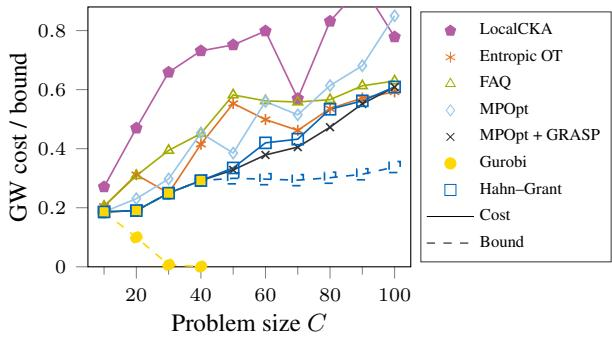  
(a) Cost and bound against the problem size.

<table><tr><td rowspan="2">Size</td><td colspan="2">Hahn-Grant</td><td colspan="3">MPOpt + GRASP</td></tr><tr><td>cost</td><td>time [s]</td><td>cost</td><td>time [s] equal time</td><td></td></tr><tr><td>10</td><td>0.186</td><td>1</td><td>0.186</td><td>0</td><td>0.186</td></tr><tr><td>20</td><td>0.190</td><td>15</td><td>0.190</td><td>1</td><td>0.190</td></tr><tr><td>30</td><td>0.249</td><td>84</td><td>0.249</td><td>11</td><td>0.249</td></tr><tr><td>40</td><td>0.292</td><td>389</td><td>0.292</td><td>22</td><td>0.292</td></tr><tr><td>50</td><td>0.335</td><td>5400</td><td>0.328</td><td>86</td><td>0.328</td></tr><tr><td>60</td><td>0.420</td><td>5400</td><td>0.379</td><td>139</td><td>0.379</td></tr><tr><td>70</td><td>0.432</td><td>5400</td><td>0.405</td><td>589</td><td>0.399</td></tr><tr><td>80</td><td>0.533</td><td>5400</td><td>0.473</td><td>1011</td><td>0.460</td></tr><tr><td>90</td><td>0.562</td><td>5400</td><td>0.552</td><td>821</td><td>0.543</td></tr><tr><td>100</td><td>0.609</td><td>5400</td><td>0.609</td><td>1586</td><td>0.597</td></tr></table>

(b) Cost and time of the two best solvers.  
Figure 7: QAP solvers on the class-matching benchmark of Schnaus et al. (2025). (a) Gromov-Wasserstein cost of the returned permutation (solid) and lower bound of the solver (dashed), normalized by the squared problem size. MPOpt with the GRASP primal heuristic, the solver of our initialization, matches them there and is best beyond. Its bound lies below the axis. (b) Normalized cost, lower is better, and wall-clock time on one CPU, the best cost and the best time of every size in bold. The Hahn-Grant solver is stopped after 5400 seconds. The last column runs MPOpt with GRASP for as long as the Hahn-Grant solver. All solvers except MPOpt with GRASP are the published runs of Schnaus et al. (2025).

Initialization. The Wasserstein Procrustes problem is jointly non-convex (Alvarez-Melis et al., 2019) and Gromov-Wasserstein is NP-hard in general (Scetbon et al., 2022). Therefore, a variety of heuristics have been introduced to initialize the correspondence. Artetxe et al. (2018) sort each row of both kernel square roots to find a correspondence between the distance distributions (sorted heuristic), and Hoshen & Wolf (2018a) takes inspiration from 3D point cloud matching and matches the leading PCA dimensions (PCA heuristic). We also compare a random and uniform transport initialization refined with conditional gradient (Peyre et al.´ , 2016) on 1024 samples – Gromov-Wasserstein (random) and Gromov-Wasserstein (uniform) – and the original mini-vec2vec initialization with 2-opt and two different numbers of clusters. We do not perform any refinement and use the same readout on all of them.

On the small SNARE-seq benchmark, all solvers are competitive, but the two heuristics are slightly worse. For the NQ and MS COCO datasets, a clear pattern is observable. On NQ, all heuristics and Gromov-Wasserstein initializations perform near chance, and on MS COCO they stay far behind matching cluster centers. Matching cluster centers makes the problem solvable, and the quality of the solver mainly determines the quality of the alignment.

QAP solver. The initialization ablation already motivates that the quality of the QAP solver plays a major role in the alignment quality. Schnaus et al. (2025) introduce their own QAP solver and benchmark against a variety of other solvers, including MPOpt without the GRASP heuristic. We repeat their experiment (Schnaus et al. (2025), Fig. 6) that matches aggregated vision and language embeddings with the MPOpt solver with the GRASP local search.

We show the results in black in Fig. 7a and show the runtime, the GW cost, and the cost with the same runtime as the Hahn-Grant solver in Fig. 7b. The other solvers are the published runs of Schnaus et al. (2025), made with their official code. The GRASP heuristic improves the MPOpt solver by a large margin. With the heuristic, MPOpt returns the certified optimum up to 40 classes, and beyond that a permutation at least as good as that of the Hahn-Grant algorithm in a fraction of the time. Given as much time as the Hahn-Grant algorithm, it finds a better permutation at every size above 40.
<table><tr><td>Initialization</td><td>blobs k=10</td><td>blobs k=30</td><td>curve</td><td>SNARE-seq</td><td>splatter</td><td>uniform</td></tr><tr><td>random</td><td>0.0781 / 0.0590</td><td>0.0493 / 0.0412</td><td>0.0878 / 0.0319</td><td>0.0982 / 0.0795</td><td>0.0917 / 0.0765</td><td>0.0333 / 0.0278</td></tr><tr><td>trivial</td><td>0.0652 / 0.0336</td><td>0.0412 / 0.0238</td><td>0.0732 / 0.0323</td><td>0.0818 / 0.0814</td><td>0.0765 / 0.0765</td><td>0.0278 / 0.0264</td></tr><tr><td>k-means</td><td>0.0525 / 0.0373</td><td>0.0343 / 0.0241</td><td>0.0617 / 0.0343</td><td>0.0757 / 0.0593</td><td>0.0674 / 0.0568</td><td>0.0264 /0.0227</td></tr><tr><td>lower bound</td><td>0.0430 / 0.0378</td><td>0.0245 / 0.0241</td><td>0.0277 / 0.0279</td><td>0.0773 / 0.0612</td><td>0.0753 / 0.0636</td><td>0.0198 / 0.0198</td></tr><tr><td>k-means + QAP</td><td>0.0211 / 0.0206</td><td>0.0183 / 0.0168</td><td>0.0129 / 0.0129</td><td>0.0647 / 0.0589</td><td>0.0446 / 0.0446</td><td>0.0251 / 0.0226</td></tr></table>

Table 2: Cluster matching as a low-rank Gromov-Wasserstein solver. Gromov-Wasserstein cost of the low-rank plan before and after mirror descent (before / after), averaged over seeds and ranks. Lower is better. Matching cluster centers leads to a better initialization and a better optimum after mirror descent for structured data.

Low-rank Gromov-Wasserstein. In general, any low-rank GW solution could be used in our method as a coarse correspondence. Here, we evaluate the clustering and matching approach from mini-vec2vec on the toy examples from Scetbon et al. (2022). We report the GW objective before and after mirror descent, averaged over seeds and the ranks 10, 20, 30, and 50.

In Tab. 2, we observe that matching cluster centers is consistently superior both in terms of the initial and final objective, except for the uniform toy example. In general, with more structure, this difference becomes bigger.
<table><tr><td>Read-out</td><td>NQ</td><td>SNARE-seq</td><td>MS COCO</td></tr><tr><td>direct</td><td> $0 . 0 2 4 \pm 0 . 0 0 7$ </td><td> $0 . 2 4 6 \pm 0 . 0 5 0$ </td><td> $0 . 0 9 1 \pm 0 . 0 2 0$ </td></tr><tr><td>top-k relative representations</td><td> $\mathbf { 0 . 0 0 0 \pm 0 . 0 0 0 }$ </td><td> $0 . 2 5 4 \pm 0 . 1 0 1$ </td><td> $0 . 0 8 5 \pm 0 . 0 2 3$ </td></tr><tr><td>batched Hungarian matching</td><td> $\mathbf { 0 . 0 0 0 \pm 0 . 0 0 0 }$ </td><td> $\mathbf { 0 . 2 1 6 \pm 0 . 0 3 4 }$ </td><td> ${ \bf 0 . 0 7 6 \pm 0 . 0 2 3 }$ </td></tr></table>

Table 3: Read-out. FOSCTTM after reading a map from the same averaged correspondence, without refinement. Our batched Hungarian matching slightly outperforms the other two methods while requiring fewer hyperparameters than top-k relative representations.

Read-out. Given a coarse transport plan, there are multiple methods to extend it to the sample level. Alvarez-Melis & Jaakkola (2018) apply one Procrustes step to the plan, which for our plan is polar(M) and which we call the direct read-out. mini-vec2vec proposes the direct read-out and a read-out through relative representations (Moschella et al., 2023). It compares the relative representations of a source and a target by their cosine and averages the k nearest targets of every source. Our read-out is one conditional-gradient step on the GW objective from T<sup>¯</sup>, as described in Sec. A.1. The relative representation and the conditional gradient step implicitly optimize similar objectives. This can be seen when expanding $\begin{array} { r } { \left( { X M Y } ^ { \top } \right) _ { i j } = \frac { 1 } { S C } \left. \left( X A _ { 1 : S } ^ { \top } \right) _ { i } , \left( Y B _ { 1 : S } ^ { \top } \right) _ { j } \right. } \end{array}$ . Hence, the minivec2vec read-out differs mainly in that it uses cosine similarities instead of inner products and the top-k neighbors instead of a batched linear assignment.

In Tab. 3, we compare all three read-out methods, each without refinement and with the same pseudopairs from our method. Our batched Hungarian matching is the best of the three on all benchmarks, and the direct read-out falls behind on NQ. Compared to the top-k relative representation refinement from mini-vec2vec, it reduces one hyperparameter.

Refinement. For the refinement, we compare our standard Wasserstein Procrustes alternation with the two-stage refinement from mini-vec2vec. The first refinement replaces the transport with the average over the top-k neighbors, and it updates the weight with an exponential moving average of the Procrustes solutions. Compared to our refinement, this adds two additional hyperparameters and produces an average over semi-orthogonal matrices, which is not semi-orthogonal in general. The second refinement clusters the source space with k-means and uses the mapped cluster centers as initialization for clustering in the target space. This again corresponds to a low-rank transport plan, and an exponential moving with Procrustes is used for the weight update. This adds two further hyperparameters, namely the number of refinement steps with the second refinement and the number of clusters in the second refinement.

initialization restarts S
<table><tr><td>Refinement</td><td>NQ</td><td> $\mathbf { S N A R E - s e q }$ </td><td>MS COCO</td></tr><tr><td>no refinement</td><td> $\mathbf { 0 . 0 0 0 \pm 0 . 0 0 0 }$ </td><td> $0 . 2 1 6 \pm 0 . 0 3 4$ </td><td> $0 . 0 7 6 \pm 0 . 0 2 3$ </td></tr><tr><td>mini-vec2vec</td><td> $\mathbf { 0 . 0 0 0 \pm 0 . 0 0 0 }$ </td><td> $\mathbf { 0 . 2 0 9 \pm 0 . 0 3 3 }$ </td><td> $0 . 0 4 6 \pm 0 . 0 3 9$ </td></tr><tr><td>ours</td><td> $\mathbf { 0 . 0 0 0 \pm 0 . 0 0 0 }$ </td><td> $\mathbf { 0 . 2 0 9 \pm 0 . 0 3 4 }$ </td><td> $\mathbf { 0 . 0 2 0 \pm 0 . 0 1 5 }$ </td></tr></table>

Table 4: Refinement. FOSCTTM after refining the same read-out. “mini-vec2vec” is its $r e f i n e$ 1 and refine 2 (Dar, 2025), and “ours” is the batch alternation of Algorithm 1. Our refinement leads to similar or better numbers on all three benchmarks. It also doesn’t introduce any additional hyperparameters.

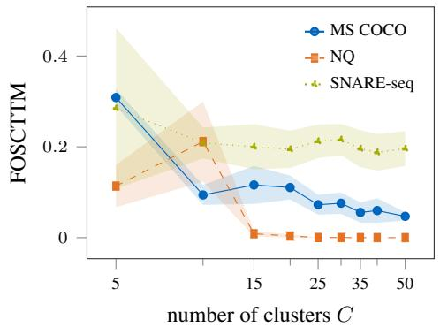  
(a) Clusters C

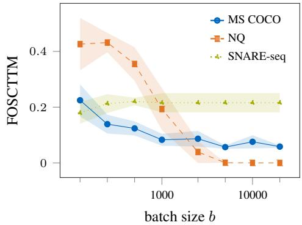

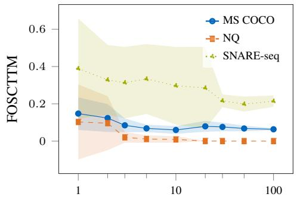  
(c) Restarts S

(b) Batch size b  
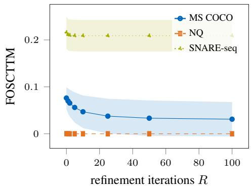  
(d) Refinement iterations R  
Figure 8: All four hyperparameters improve with scale. We ablate one variable at a time while fixing all other variables. The sweeps over the batch size and the restarts use the read-out without refinement $( R = 0 )$ , so they isolate the initialization. Increasing each hyperparameters improves performance, except for the batch size on SNARE-seq, which saturates because it only contains around 520 samples. In addition to an improved performance, more restarts of the initialization also reduce the variance.

Table 4 compares the different refinements and shows that both refinements beat no refinement on MS COCO, while NQ and SNARE-seq are already saturated by the read-out. Moreover, on MS COCO, our refinement beats mini-vec2vec despite its simplicity.

## A.2.2 HYPERPARAMETER ABLATION

The last section shows that our method outperforms previous methods while being simpler. It only contains four hyperparameters: the number of clusters C, the batch size b, and the number of iterations during initialization S and refinement R. This section shows that our method is stable with respect to all of them, and choosing them larger generally improves the performance while trading off speed.

Number of clusters $\left( C = 3 0 \right)$ . The number of clusters is the main hyperparameter of the initialization. A larger number of clusters allows the initialization to approximate the Gromov-Wasserstein objective better, but it also makes the QAP harder to solve.

Figure 7 shows that problems up to C = 40 clusters are solved close to optimality, and Schnaus et al. (2025) shows that the global optimum leads to better solutions than a local optimum. We evaluate the effect of the number of clusters on the initialization in Fig. 8a. In this experiment, we use our batched Hungarian read-out and no refinement. We observe that an increasing number of clusters generally improves initialization, but the effect saturates at different points across benchmarks. Altogether, the results suggest that $C = 3 0$ is a reasonable default across domains, balancing performance and computational cost even though larger values might lead to even better performance.

Batch size $( b = 1 0 , 0 0 0 )$ . The batch size is used uniformly for all three stages and decides how many samples are used to approximate the whole problem.

Figure 8b shows the performance as a function of the batch size. For SNARE-seq, a small batch size of 125 is already enough to reach a good performance, and it doesn’t degrade much for larger batch sizes. On NQ and MS COCO, larger batch sizes lead to better numbers. Both datasets are magnitudes larger than SNARE-seq, so a small batch only represents a small part of the data. For both datasets, the performance saturates at around a batch size of 5,000. The batch size of $b =$ 10,000 is a conservative choice that becomes less sensitive as it increases.

Number of initialization iterations (S = 30). Each initialization iteration clusters its own subsample and matches the cluster centers, and the initialization averages the resulting correspondences. Figure 8c shows the performance as a function of S. We use the same read-out and no refinement to isolate the effect of the initialization. More iterations generally improve the performance on all three datasets and strongly reduce the spread over the seeds. On MS COCO, the FOSCTTM decreases from $0 . 1 4 8 \pm 0 . 0 8 8$ with a single iteration to $0 . 0 7 6 \pm 0 . 0 2 3$ with $S = 3 0$ and $0 . 0 6 4 \pm 0 . 0 0 6$ with $S = 1 0 0$ . On NQ, it decreases from $0 . 1 0 3 \pm 0 . 2 0 1$ to $0 . 0 0 0 3 \pm 0 . 0 0 0 2$ with $S = 3 0$ , and on SNARE-seq from $0 . 3 8 9 \pm 0 . 2 6 8$ to 0.216 ± 0.034.

Number of refinement iterations (R = 100). The refinement alternates between assignment and weight update on batches.

Figure 8d varies the number of iterations R. On NQ, refinement doesn’t make a difference because the read-out already yields near-perfect alignment. On MS COCO, more iterations improve the performance monotonically, while SNARE-seq improves only slightly, within the spread over the seeds. Altogether, a conservative choice of $R = 1 0 0$ works well for all datasets.

## B EXPERIMENTAL DETAILS

This appendix gives the models, data, splits and metric parameters of every experiment in Sec. 4. Together with the description of the aligner in Sec. A.1 it contains everything needed to reproduce the reported numbers.

General setup. Every experiment fits the aligner of Sec. A.1 with the same hyperparameters, C = 30 clusters, $S = 3 0$ restarts, a batch size of $b = 1 0 ^ { 4 }$ and $R = 1 0 0$ refinement iterations. Each side is preprocessed by subtracting the mean of its own training samples and normalizing every row to unit length, with a numerical floor of $1 0 ^ { - 1 0 }$ . The two training sets are disjoint. We draw one random permutation of the corpus, give the first half to one modality and the second half to the other, so no sample is seen on both sides and no correspondence between the two sets exists. In the cross-dataset setting the two sides are drawn independently from two different corpora instead. Every experiment is repeated with five seeds, drawn once from a generator seeded with 42, and the tables and figures report the mean and the standard deviation over those five runs. The exceptions are the geometry scores and the text-to-image retrieval, which use one seed, and the fMRI benchmark and the granularity experiments, which use ten seeds. Embeddings are computed once and cached in bfloat16. A language corpus stores several texts per item, for instance the five captions of an image or the three repeats of a generative prompt, as a padded tensor. Such a tensor is reduced by normalizing every row, averaging over the texts of an item while ignoring the padding, and normalizing the result again.

Retrieval metrics. The reported metric is FOSCTTM, the fraction of samples closer to a query than its true partner, averaged over all queries. Given a paired validation set of p samples $\left( \hat { \pmb { x } } _ { i } , \hat { \pmb { y } } _ { i } \right)$ $i = 1 , \ldots , p$ and a function f that maps from the source to the target space, it is

$$
\mathrm { F O S C T T M } = \frac { 1 } { p ( p - 1 ) } \sum _ { i , j = 1 } ^ { p } \mathbf { 1 } \left[ \| f ( \hat { { \pmb x } } _ { i } ) - \hat { { \pmb y } } _ { j } \| _ { 2 } < \| f ( \hat { { \pmb x } } _ { i } ) - \hat { { \pmb y } } _ { i } \| _ { 2 } \right] .\tag{11}
$$

It is 0 for a perfect alignment and 0.5 for a random correspondence, and ties count half. Retrieval is evaluated on the full paired validation set. Both sides are randomly permuted before they reach the aligner, so the row order carries no information.

Geometry metrics. Four measures of how similar the two embedding geometries are enter Secs. 4.1 and 4.3. CKA is the linear centered kernel alignment of Kornblith et al. (2019) with the unbiased estimator of the Hilbert-Schmidt independence criterion (HSIC). Mutual k-NN is the measure of Huh et al. (2024), the average overlap of the k nearest neighbors of a sample in the two spaces, with $k = 1 0 ,$ , an inner-product kernel and the sample itself excluded. TSI and QSI (Soares et al., 2026) are the fractions of sampled triplets $( i , j , k )$ with $d ( i , j ) < d ( i , k )$ and of sampled quadruplets $( i , j , k , l )$ with $d ( i , j ) < d ( k , l )$ whose ordering agrees in both spaces, each estimated from $1 \dot { 0 } ^ { 5 }$ samples. All four are computed on 10,000 paired validation samples with each side centered. A corpus with fewer than 10,000 paired samples contributes all of them, without repetition. Several of the modality pairs of Sec. 4.3 are far below that, the smallest being 123 paired slides for tissue against MRI, 149 words for MEG against text and 168 patients for tissue against CT. Their geometry scores are therefore estimated from a few hundred points rather than ten thousand and carry much more variance than the vision-language ones. All three of those pairs sit at chance in Tab. 12, so the conclusion drawn from them is that there is no alignment to find, which a noisy estimate supports as much as a precise one.

Unpaired cross-modal alignment (Sec. 4.1). The grid is seven vision models against three language models on four corpora. The vision models are iBOT ViT-B/16 and iBOT Swin-T/14 (Zhou et al., 2022), DINOv2 ViT-B/14 and DINOv2 ViT-G/14 (Oquab et al., 2024), Franca ViT-G/14 (Venkataramanan et al., 2026) trained on LAION (Schuhmann et al., 2022) in both its classtoken and its mean-pooled read-out, and DINOv3 ViT-7B/16 at a resolution of 512 pixels (Simeoni´ et al., 2026). All of them are used at a resolution of 224 pixels except DINOv3, and all are mean pooled over the class, register and patch tokens except the class-token variant of Franca. The language models are all-mpnet-base-v2 from Sentence Transformers (Reimers & Gurevych, 2019), Qwen3-Embedding-8B (Zhang et al., 2025), and Qwen3-8B (Yang et al., 2025) with the generative token pooling of Wang et al. (2026). Generative pooling prompts the model with Imagine what it would look like to see: followed by the caption, generates at most 128 tokens, and averages the hidden states of the generated tokens. The prompt is repeated three times and the three results are averaged. The corpora are MS COCO 2014 train with 82,783 images and up to seven captions each (Chen et al., 2015), Stanford Paragraph Captioning with 19,561 images (Krause et al., 2017), Densely Captioned Images with 7,805 images in its extended caption variant (Urbanek et al., 2024), and DOCCI with 14,847 images (Onoe et al., 2024). Validation always uses the 40,504 images of MS COCO 2014 val (Chen et al., 2015). The cross-dataset setting takes the images from MS COCO and the captions from Stanford Paragraph Captioning, so the two sides describe different scenes.

Zero-shot classification. The same aligners are evaluated on CIFAR-10 (Krizhevsky et al., 2009), CIFAR-100 (Krizhevsky et al., 2009) and ImageNet-100 (Tian et al., 2020) by mapping the image embeddings into the language space and retrieving the nearest class prompt. CIFAR-10 and CIFAR-100 use the same 18 photo templates from CLIP (Radford et al., 2021), such as a photo of a {} and a blurry photo of the {}, and the class embedding is the average over the templates. ImageNet-100 uses no template and embeds the class name followed by its WordNet definition. We report top-1 accuracy on CIFAR-10 and top-5 accuracy on CIFAR-100 and ImageNet-100.

Few-pair alignment (Sec. 4.4). This experiment uses MS COCO with DINOv2 ViT-B/14 against Qwen3-8B with generative pooling, and varies the number of known pairs over 0, 1, 2, 5, 10, 20, 50, 100, 200, 500 and 1000. The pairs enter all three stages, as the linear term of the quadratic assignment problem in Lemma 3 and as an additional term in both Procrustes steps. Every baseline receives exactly the same pairs and the same validation data.

Text-to-image generation (Sec. 4.5). A caption is embedded, mapped into the image space by the aligner, and generated by a diffusion model conditioned on the image embedding. We use a representation autoencoder (RAE, Zheng et al. (2026)) as a diffusion model. Instead of text conditioning, we condition the diffusion transformer on the mean-pooled DINOv2 ViT-B/14 embeddings with registers (Darcet et al., 2024), which is the encoder of the RAE. We train the diffusion transformer on ImageNet-1K with center crop of 256 pixels for 400 epochs with a global batch size of 256 on 4× A40 GPUs. During generation, we sample images with 250 steps and a guidance scale of 1.0. The resulting unnoised patch embeddings are then decoded into images by the pretrained RAE decoder. The whole diffusion model is trained exclusively on image data and never sees a caption, so the language side enters exclusively through the aligner. The language models are all-mpnetbase-v2 and Contriever (Izacard et al., 2022). The aligner is fitted on MS COCO 2014 train and the number of known pairs is varied over 0 to 100. The eight captions shown are fixed across all grids, and one seed is used throughout, so that two grids differ only in the aligner. The linear baseline is the least-squares map from the same known pairs, obtained from the pseudo-inverse, with the same preprocessing. With zero pairs it is an arbitrary map and generates unrelated images.

Text-to-image scores. We score the generated images on two sets of prompts. The first set is the test split of CyclePrefDB-T2I (Bahng et al., 2025), whose 380 prompts summarize dense captions of DCI photographs (Urbanek et al., 2024). We take the photograph of each prompt from the test split of CyclePrefDB-I2T, which holds the same photographs in the same order. The second set has one caption for each of the 40,504 images of the MS COCO 2014 validation split, namely the caption with the lowest annotation id. Every setting generates one image per prompt. The initial noise depends only on the prompt, so all aligners start from the same noise. As a model trained on paired data, we use Scale-RAE (Tong et al., 2026), which combines Qwen2.5-1.5B with a diffusion transformer of 2.4B parameters and generates images of 224 pixels. We sample it as its own evaluation script does, with the prefix Generate an image of and a guidance scale of 1.0. Every image is scored against its prompt with four measures. CLIPScore (Hessel et al., 2021) is the rescaled cosine similarity between the CLIP ViT-L/14 embeddings of the image and of the caption. VQAScore (Lin et al., 2024) is the probability that CLIP-FlanT5-XL assigns to the answer Yes for the question whether the image shows the caption. TIFA (Hu et al., 2023) generates question and answer pairs from the caption with its open LLaMA-2 (Touvron et al., 2023) question generator and keeps only those that a question answering model answers correctly from the caption alone. The score is the fraction of the kept questions that a visual question answering model answers correctly on the image. We use the official implementation with its released LLaMA-2 question generator instead of GPT-3.5 and with BLIP-large as the visual question answering model, which answers freely. An answer that is not one of the choices counts as the closest choice under Sentence-BERT (Reimers & Gurevych, 2019). CycleReward (Bahng et al., 2025) is a learned preference model with an arbitrary scale, so only differences between methods are meaningful. We use its Combo checkpoint. We report the mean and the standard error over prompts, and TIFA leaves out the prompts for which no question passes the filter.

Domain-specific alignment (Sec. 4.2). Three benchmarks from three fields, each aligning two spaces that no shared encoder connects. The first is Natural Questions (NQ) (Kwiatkowski et al., 2019), where two different sentence encoders embed the same 5,332,023 passages. The last 8192 passages are the paired validation set and the two disjoint training halves take 250,000 passages each. The five encoders (granite (Awasthy et al., 2025), e5 (Wang et al., 2022), gte (Li et al., 2023), gtr (Ni et al., 2022), stella (Zhang et al., 2024)) give ten ordered pairs. The second is the PBMC benchmark (10x Genomics, 2021) of 2407 cells measured with two assays, with gene expression reduced to 50 principal components and chromatin accessibility to 50 topics. We additionally report label transfer accuracy (LTA), the fraction of cells whose cell type is recovered from the nearest neighbor in the other assay. The third is the fMRI benchmark of the Natural Scenes Dataset (NSD) (Allen et al., 2022), in the setting of Marcos-Manchon et al.´ (2026), where a per-subject encoder maps brain responses of eight subjects into a shared 128-dimensional space. The eight subjects give 56 ordered pairs.

Shared geometry across modalities (Sec. 4.3). Eleven further modality pairs from the natural sciences, each with an independently trained encoder on either side, are listed with their encoder and validation sizes in Tab. 5. The aligner is fitted on two disjoint halves of the unpaired data and evaluated on all paired samples. The geometry scores are computed on the same validation rows as the retrieval scores, so the two axes of Fig. 4b come from one run.

<table><tr><td>Pair</td><td>Encoder 1</td><td>Encoder 2</td><td>Val.</td></tr><tr><td>MLIP ↔ MLIP (MP-20) (Jain et al., 2013)</td><td>mace_mp-smal1-pca256- structure(Batatia et al., 2025)</td><td>mace_mp_medium-pca256- structure(Batatia et al., 2025)</td><td>12,000</td></tr><tr><td>human ↔ mouse scRNA (Program et al., 2023)</td><td>pca50</td><td>pca50</td><td>34,500</td></tr><tr><td>scRNA ↔ scATAC (SNARE-seq) (Chen et al., 2019)</td><td>pca10</td><td>1si19</td><td>1,047</td></tr><tr><td>histology ↔ expression (HEST CCRCC) (Jaume et al., 2024)</td><td>h_opt imus_0 (Saillard et al., 2024)</td><td>expression-pca64-ccrcc</td><td>74,220</td></tr><tr><td>scRNA ↔ ADT (CITE-seq) (Stoeckius et al., 2017)</td><td>raw25</td><td>raw25</td><td>1,000</td></tr><tr><td>tissue ↔ CT (CPTAC) (Edwards et al., 2015)</td><td>h_opt imus_0 (Saillard et al., 2024)</td><td>ct_fm (Pai et al., 2025)</td><td>168</td></tr><tr><td>MEG ↔ text (SpanishBCBL) (Lévy et al., 2025)</td><td>meg-words</td><td>mpnet-multi (Reimers &amp; Gurevych, 2020)</td><td>149</td></tr><tr><td>tissue ↔ MRI (TCGA glioma) (Bakas et al., 2017)</td><td>gigapath (Xu et al., 2024)</td><td>dinov1_vitb16-comp (Caron et al., 2021)</td><td>123</td></tr><tr><td>Cell Painting ↔ L1000 (Rosetta) (Haghighi et al., 2022)</td><td>morphology-pca512</td><td>expression-pca256</td><td>2,732</td></tr><tr><td>MS/MS ↔ molecules (MassSpecGym) (Bushuiev et al., 2024)</td><td>dreams (Bushuiev et al., 2026)</td><td>ecfp4 (Rogers &amp; Hahn, 2010)</td><td>31,602</td></tr><tr><td>galaxy ↔ spectrum (DESI) (Parker et al., 2024)</td><td>astrodino (Parker et al., 2024)</td><td>specformer (Parker et al., 2024)</td><td>29,697</td></tr></table>

Table 5: The modality pairs of Sec. 4.3. We test our aligner on a variety of independently trained models. The last column gives the number of paired samples the alignment is evaluated on.

## C ADDITIONAL EVALUATION RESULTS

## C.1 UNPAIRED CROSS-MODAL ALIGNMENT

Figs. 9 to 12 repeat the main figure for every dataset, MS COCO as in the main text and the three detailed captioning corpora. The cross-dataset results are shown in Fig. 13 in which the images come from MS COCO and the captions from Stanford Paragraph Captioning, so that no correspondence between the two sets exists. For all datasets, most vision and language models can be aligned well without any pairs and on every dataset our aligner outperforms the baselines mini-vec2vec and vec2vec on average. In general, iBOT ViT-B/16 performs worse than the other vision models. On all detailed captioning datasets, the generative token pooling performs substantially worse. Sec. D shows that this method is mostly beneficial for short captions and hurts on long ones. Mean pooling for Franca ViT-G/14 performs similar to taking the [CLS] token. Finally, we don’t observe a strong trend that bigger models can be aligned better, even though our study is not big enough to conclude on this point.

The other geometric measures. Fig. 3c of the main text relates the alignment to CKA. Fig. 14 adds the three other measures (mutual k-NN, TSI, and QSI) on the same model pairs and datasets and with the same colors. All four are predictive, but they differ in how tightly they follow the alignment and in how they rank the model pairs. Pooled over the four corpora, CKA explains the most variance at $R ^ { 2 } = 0 . { \dot { 7 } } 3$ , followed by mutual k-NN at 0.40, TSI at 0.37 and QSI at 0.18.

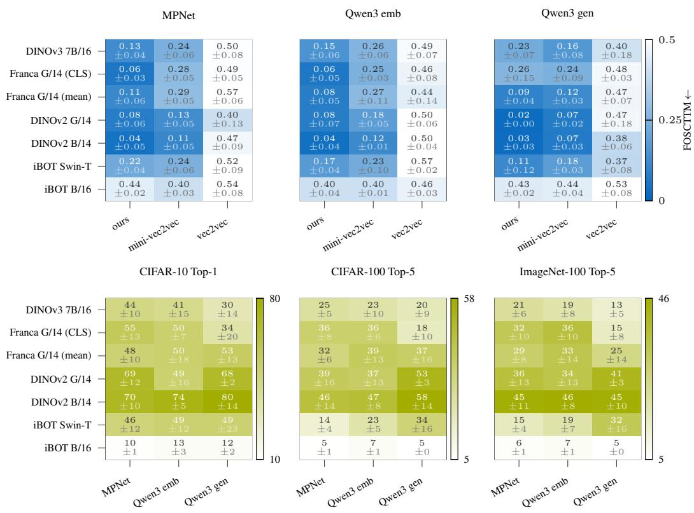  
Figure 9: Unpaired alignment on MS COCO. Top: FOSCTTM across all vision-language method combinations (white: chance level; blue: better alignment). Our method substantially outperforms vec2vec and mini-vec2vec across most vision-language combinations. Bottom: Zero-shot accuracy of our aligner (%, white: chance level; green: better alignment). Despite being trained withou paired data, our method reaches zero-shot accuracies well above chance for most model pairs.

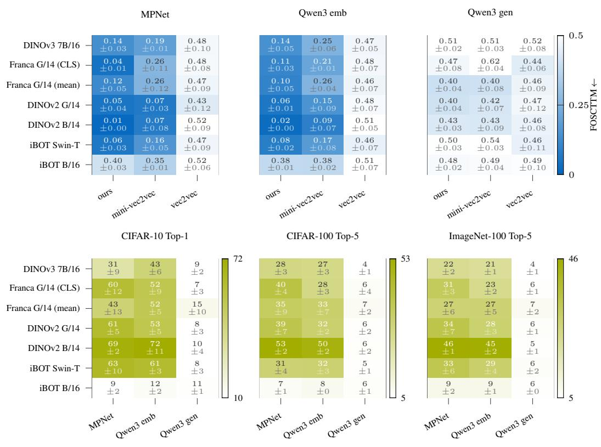  
Figure 10: Unpaired alignment on SPC. Top: FOSCTTM across all vision-language method combinations (white: chance level; blue: better alignment). Our method substantially outperforms vec2vec and mini-vec2vec across most vision-language combinations. As observed across all detailed captioning datasets, none of the methods is able to reliably align Qwen3 with generative token pooling (Wang et al., 2026) on SPC. Bottom: Zero-shot accuracy of our aligner (%, white: chance level; green: better alignment). Despite being trained without paired data, our method reaches zeroshot accuracies well above chance for most model pairs.

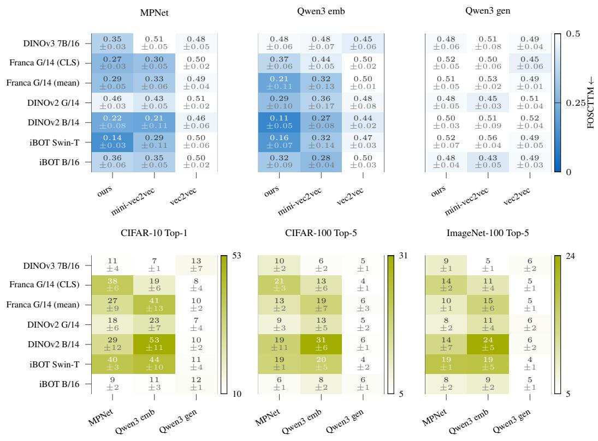  
Figure 11: Unpaired alignment on DCI. Top: FOSCTTM across all vision-language method combinations (white: chance level; blue: better alignment). Our method substantially outperforms vec2vec and mini-vec2vec across most vision-language combinations. As observed across all detailed captioning datasets, none of the methods is able to reliably align Qwen3 with generative token pooling (Wang et al., 2026) on DCI. Bottom: Zero-shot accuracy of our aligner (%, white: chance level; green: better alignment). Despite being trained without paired data, our method reaches zeroshot accuracies well above chance for most model pairs, although lower than on MS COCO.

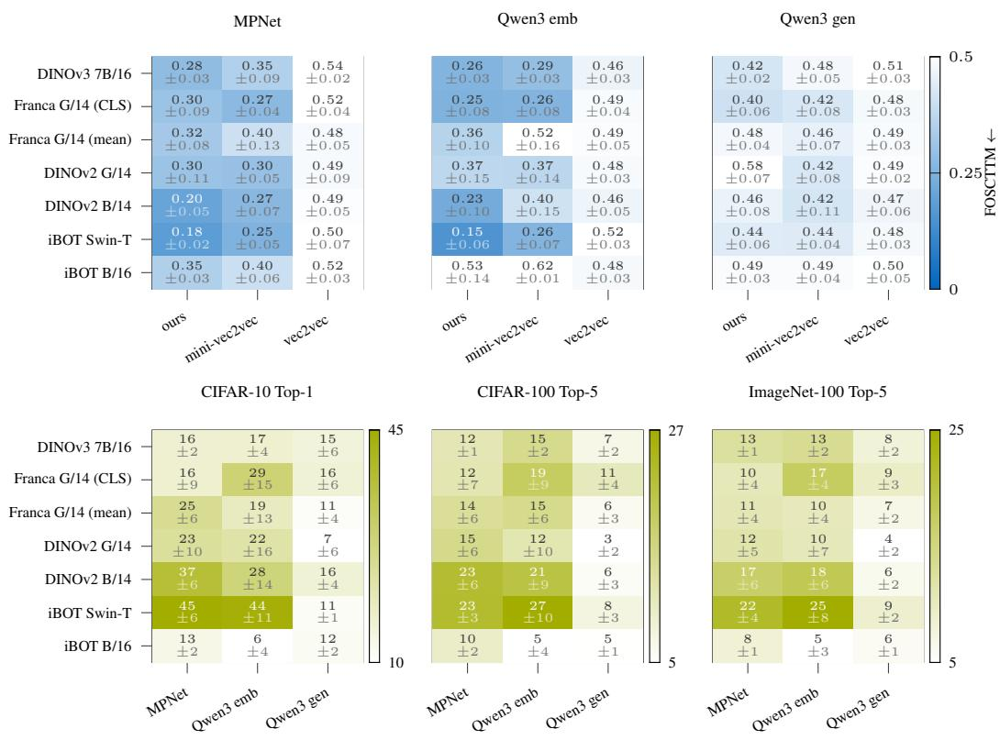  
Figure 12: Unpaired alignment on DOCCI. Top: FOSCTTM across all vision-language method combinations (white: chance level; blue: better alignment). Our method substantially outperforms vec2vec and mini-vec2vec across most vision-language combinations. As observed across all detailed captioning datasets, none of the methods is able to reliably align Qwen3 with generative token pooling (Wang et al., 2026) on DOCCI. Bottom: Zero-shot accuracy of our aligner (%, white: chance level; green: better alignment). Despite being trained without paired data, our method reaches zeroshot accuracies well above chance for most model pairs, although lower than on MS COCO.

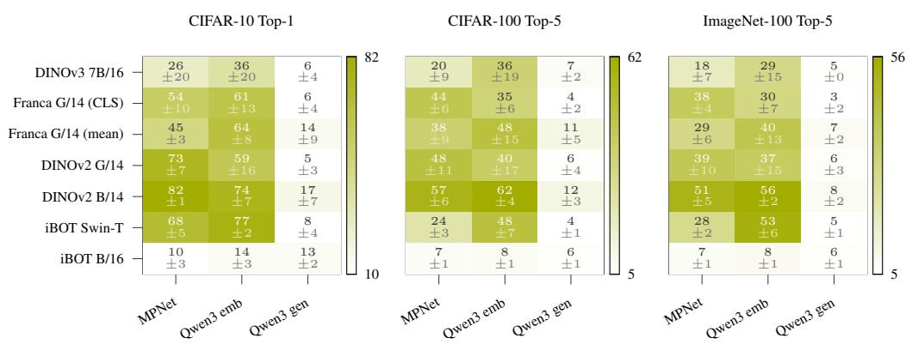  
Figure 13: Zero-shot accuracy in the cross-dataset setting Zero-shot accuracy of our aligner (%, white: chance level; green: better alignment). We fit our aligner with images from MS COCO and captions from SPC. The FOSCTTM of this setting is the ours† column of Fig. 3a in the main text. Our aligner reaches zero-shot accuracies comparable to the single-dataset setting for MPNet and Qwen3-Embedding-8B, while generative token pooling drops to chance.

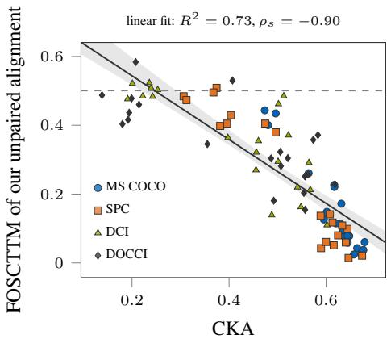  
(a) CKA

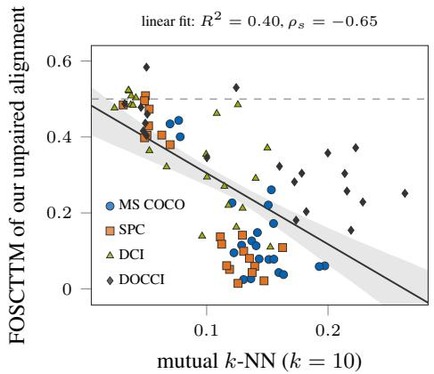  
(b) mutual k-NN

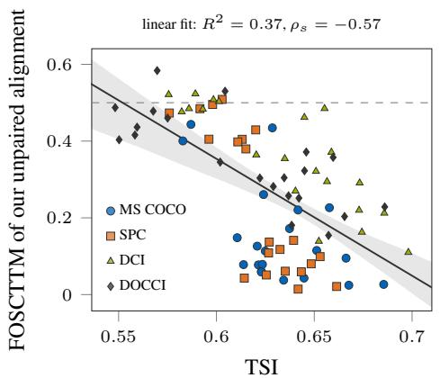  
(c) TSI

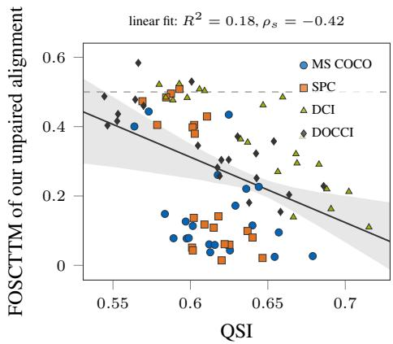  
(d) QSI  
Figure 14: Shared geometry predicts alignment. FOSCTTM of our unpaired alignment against four measures of the geometric similarity of the paired embeddings, one point per vision-languagedataset combination, colored by dataset, with a least-squares fit and its cluster-bootstrap confidence band. Dashed: the 0.5 of a random correspondence. We observe that all four similarity measures predict the alignment even though CKA has the highest absolute correlation.

## C.2 TEXT-TO-IMAGE GENERATION

Figs. 15 to 18 show one page per setting, our aligner and a linear map trained on the same pairs, each with MPNet and with Contriever as the text encoder. Every column is one caption and every row a number of known image-text pairs. The diffusion model and the image decoder never see any text, so everything that changes between two grids is the map from the language space into the image space.

The results do not depend on MS COCO captions in the training data of the text encoder. MPNet is trained on a mixture of sentence pairs that includes MS COCO captions, so it could have seen the captions our aligner is fitted on. Contriever is trained on web text without MS COCO. With Contriever, the grids show the same progression with the number of pairs, and our aligner scores higher than the linear map on all four measures and for every number of pairs (Tab. 6). Without any pairs, our aligner with Contriever even scores higher on CyclePrefDB than the linear map with 10 pairs with a TIFA of 0.419 against 0.389. Contriever gives lower scores than MPNet overall, but the ordering between the two methods is the same for both encoders.

We also measure how faithful the samples are on two sets of prompts, the 380 test prompts of CyclePrefDB (Bahng et al., 2025), which summarize dense captions of photographs, and one caption for each of the 40,504 images of the MS COCO 2014 validation split. Every setting generates one image per prompt, and all aligners start from the same noise for a given prompt. We compare against the real image of each prompt and against Scale-RAE (Tong et al., 2026), which conditions an RAE diffusion model directly on a language model and is trained on tens of millions of image-text pairs. Every image is scored against its prompt with the four measures of Sec. B. On CyclePrefDB, our aligner scores higher than the linear map on all four measures, for every number of pairs and with both text encoders (Tab. 6). With MPNet and no pairs, our samples reach a CLIPScore of 0.466, a VQAScore of 0.458 and a TIFA of 0.552, which is above the linear map with 100 pairs at 0.411, 0.334 and 0.507. Adding pairs improves our aligner only slightly, to 0.510, 0.511 and 0.615 at 100 pairs. Contriever gives slightly lower scores than MPNet, but the ordering between the two methods stays the same. Scale-RAE and the real images both reach a VQAScore and a TIFA above 0.82. The gap to both is expected, because only the aligner connects our diffusion model to text, using at most 100 pairs.

<table><tr><td>Text encoder</td><td>Method</td><td>Pairs</td><td>CLIPScore</td><td>VQAScore</td><td>TIFA</td><td>CycleReward</td></tr><tr><td>一</td><td>GT image</td><td>一</td><td>0.614 ± 0.005</td><td> $0 . 8 7 5 \pm 0 . 0 0 6$ </td><td> $0 . 8 4 0 \pm 0 . 0 0 9$ </td><td> $1 . 6 3 2 \pm 0 . 0 3 8$ </td></tr><tr><td>Qwen2.5-1.5B</td><td>Scale-RAE</td><td>一</td><td> $0 . 6 6 0 \pm 0 . 0 0 5$ </td><td> $0 . 8 2 5 \pm 0 . 0 0 8$ </td><td> $0 . 8 2 1 \pm 0 . 0 0 9$ </td><td> $1 . 7 0 8 \pm 0 . 0 3 4$ </td></tr><tr><td>MPNet</td><td>ours</td><td>0</td><td> $0 . 4 6 6 \pm 0 . 0 0 5$ </td><td> $0 . 4 5 8 \pm 0 . 0 1 2$ </td><td> $0 . 5 5 2 \pm 0 . 0 1 4$ </td><td> $- 0 . 4 3 1 \pm 0 . 0 5 1$ </td></tr><tr><td></td><td>ours</td><td>1</td><td> $0 . 4 7 7 \pm 0 . 0 0 5$ </td><td> $0 . 4 8 6 \pm 0 . 0 1 2$ </td><td> $0 . 5 8 3 \pm 0 . 0 1 3$ </td><td> $- 0 . 4 2 9 \pm 0 . 0 5 0$ </td></tr><tr><td></td><td>ours</td><td>10</td><td> $0 . 4 9 1 \pm 0 . 0 0 5$ </td><td> $0 . 4 9 1 \pm 0 . 0 1 3$ </td><td> $0 . 5 8 3 \pm 0 . 0 1 3$ </td><td> $- 0 . 3 5 6 \pm 0 . 0 4 8$ </td></tr><tr><td></td><td>ours</td><td>100</td><td> $0 . 5 1 0 \pm 0 . 0 0 5$ </td><td> $0 . 5 1 1 \pm 0 . 0 1 2$ </td><td> $0 . 6 1 5 \pm 0 . 0 1 3$ </td><td> $- 0 . 1 2 0 \pm 0 . 0 5 1$ </td></tr><tr><td></td><td>linear</td><td>0</td><td> $0 . 2 4 5 \pm 0 . 0 0 5$ </td><td> $0 . 2 0 7 \pm 0 . 0 0 7$ </td><td> $0 . 2 6 7 \pm 0 . 0 1 2$ </td><td> $- 1 . 7 1 6 \pm 0 . 0 1 6$ </td></tr><tr><td></td><td>linear</td><td>1</td><td> $0 . 3 0 5 \pm 0 . 0 0 6$ </td><td> $0 . 2 1 1 \pm 0 . 0 0 7$ </td><td> $0 . 3 4 6 \pm 0 . 0 1 2$ </td><td> $- 1 . 6 5 8 \pm 0 . 0 1 7$ </td></tr><tr><td></td><td>linear</td><td>10</td><td> $0 . 3 4 4 \pm 0 . 0 0 6$ </td><td> $0 . 2 5 9 \pm 0 . 0 0 9$ </td><td> $0 . 4 2 4 \pm 0 . 0 1 4$ </td><td> $- 1 . 4 2 7 \pm 0 . 0 2 9$ </td></tr><tr><td></td><td>linear</td><td>100</td><td> $0 . 4 1 1 \pm 0 . 0 0 5$ </td><td> $0 . 3 3 4 \pm 0 . 0 1 0$ </td><td> $0 . 5 0 7 \pm 0 . 0 1 3$ </td><td> $- 1 . 0 3 2 \pm 0 . 0 4 0$ </td></tr><tr><td>Contriever</td><td>ours</td><td>0</td><td> $0 . 3 4 3 \pm 0 . 0 0 6$ </td><td> $0 . 2 5 3 \pm 0 . 0 0 9$ </td><td> $0 . 4 1 9 \pm 0 . 0 1 4$ </td><td> $- 1 . 3 0 1 \pm 0 . 0 3 5$ </td></tr><tr><td></td><td>ours</td><td>1</td><td> $0 . 3 7 1 \pm 0 . 0 0 6$ </td><td> $0 . 2 9 0 \pm 0 . 0 1 0$ </td><td> $0 . 4 5 5 \pm 0 . 0 1 4$ </td><td> $- 1 . 1 5 4 \pm 0 . 0 3 8$ </td></tr><tr><td></td><td>ours</td><td>10</td><td> $0 . 4 4 2 \pm 0 . 0 0 5$ </td><td> $0 . 3 7 5 \pm 0 . 0 1 1$ </td><td> $0 . 5 0 9 \pm 0 . 0 1 4$ </td><td> $- 0 . 7 3 2 \pm 0 . 0 4 4$ </td></tr><tr><td></td><td>ours</td><td>100</td><td> $0 . 4 5 8 \pm 0 . 0 0 5$ </td><td> $0 . 4 1 3 \pm 0 . 0 1 2$ </td><td> $0 . 5 6 9 \pm 0 . 0 1 4$ </td><td> $- 0 . 4 2 7 \pm 0 . 0 5 2$ </td></tr><tr><td></td><td>linear</td><td>0</td><td> $0 . 2 5 0 \pm 0 . 0 0 5$ </td><td> $0 . 2 2 7 \pm 0 . 0 0 8$ </td><td> $0 . 2 4 7 \pm 0 . 0 1 1$ </td><td> $- 1 . 6 8 9 \pm 0 . 0 1 4$ </td></tr><tr><td></td><td>linear</td><td>1</td><td> $0 . 2 9 5 \pm 0 . 0 0 6$ </td><td> $0 . 2 0 2 \pm 0 . 0 0 7$ </td><td> $0 . 3 3 9 \pm 0 . 0 1 2$ </td><td> $- 1 . 6 6 7 \pm 0 . 0 1 7$ </td></tr><tr><td></td><td>linear</td><td>10</td><td> $0 . 3 1 2 \pm 0 . 0 0 6$ </td><td> $0 . 2 3 0 \pm 0 . 0 0 8$ </td><td> $0 . 3 8 9 \pm 0 . 0 1 3$ </td><td> $- 1 . 5 8 8 \pm 0 . 0 2 1$ </td></tr><tr><td></td><td>linear</td><td>100</td><td> $0 . 3 6 7 \pm 0 . 0 0 6$ </td><td> $0 . 2 5 9 \pm 0 . 0 0 8$ </td><td> $0 . 4 6 8 \pm 0 . 0 1 4$ </td><td> $- 1 . 3 0 5 \pm 0 . 0 3 5$ </td></tr></table>

Table 6: Faithfulness of the generated images on CyclePrefDB. Our aligner outperforms the linear map on all four measures, for every number of pairs and with both text encoders. The real images and Scale-RAE (Tong et al., 2026) are included as reference points, but they are trained on tens of millions of image-text pairs and are not comparable to our aligner, which uses at most 100 pairs.

On MS COCO, the scores show the same ordering as on CyclePrefDB (Tab. 7). Our aligner again scores higher than the linear map on all four measures, for every number of pairs and with both text encoders. Pairs help our aligner more than on CyclePrefDB, and with MPNet its TIFA rises from 0.589 without pairs to 0.686 with 100 pairs. With Contriever and without pairs, our aligner scores below the linear map with 100 pairs, e.g., with a TIFA of 0.435 against 0.521.

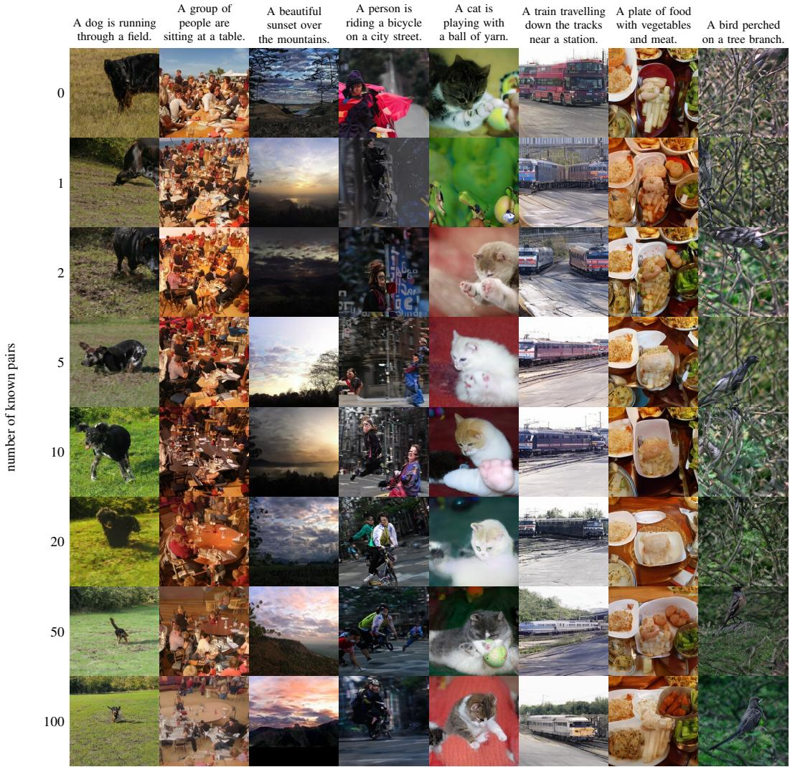  
Figure 15: Unpaired text-to-image generation with our method and MPNet. We show the generated images for 8 sample captions with our aligner using DINOv2 ViT-B/14 and MPNet. Without pairs, our aligner can already produce images of the general semantic class and scene. Additional pairs improve fine-grained details.

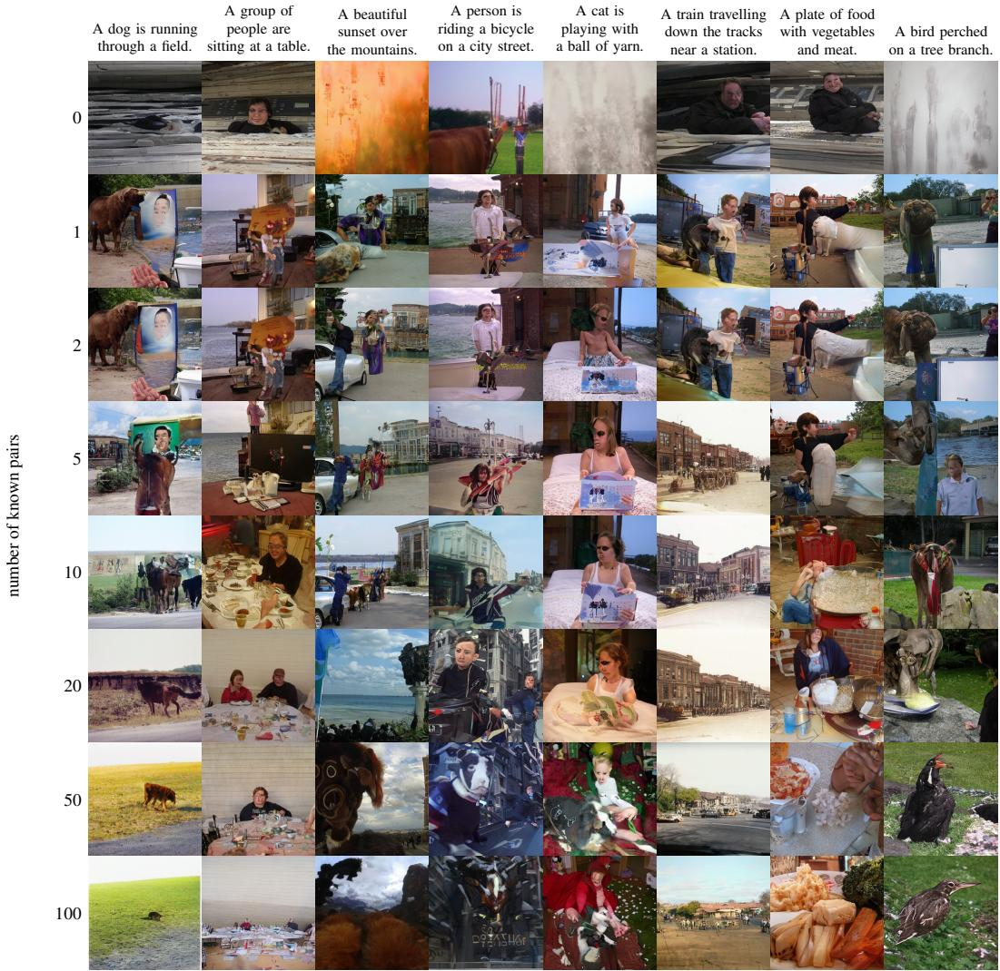  
Figure 16: Unpaired text-to-image generation with a linear map and MPNet. We show the generated images for 8 sample captions with a linear map fitted on the pairs using DINOv2 ViT-B/14 and MPNet. Without pairs, the linear map is random. As more pairs are used, the faithfulness of the generation improves.

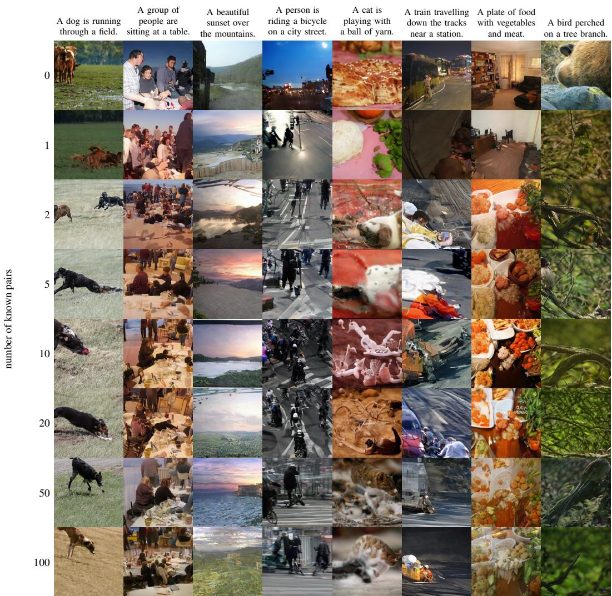  
Figure 17: Unpaired text-to-image generation with our method and Contriever. We show the generated images for 8 sample captions with our aligner using DINOv2 ViT-B/14 and Contriever. Without pairs, our aligner can already produce images of the general semantic class and scene. Additional pairs improve fine-grained details.

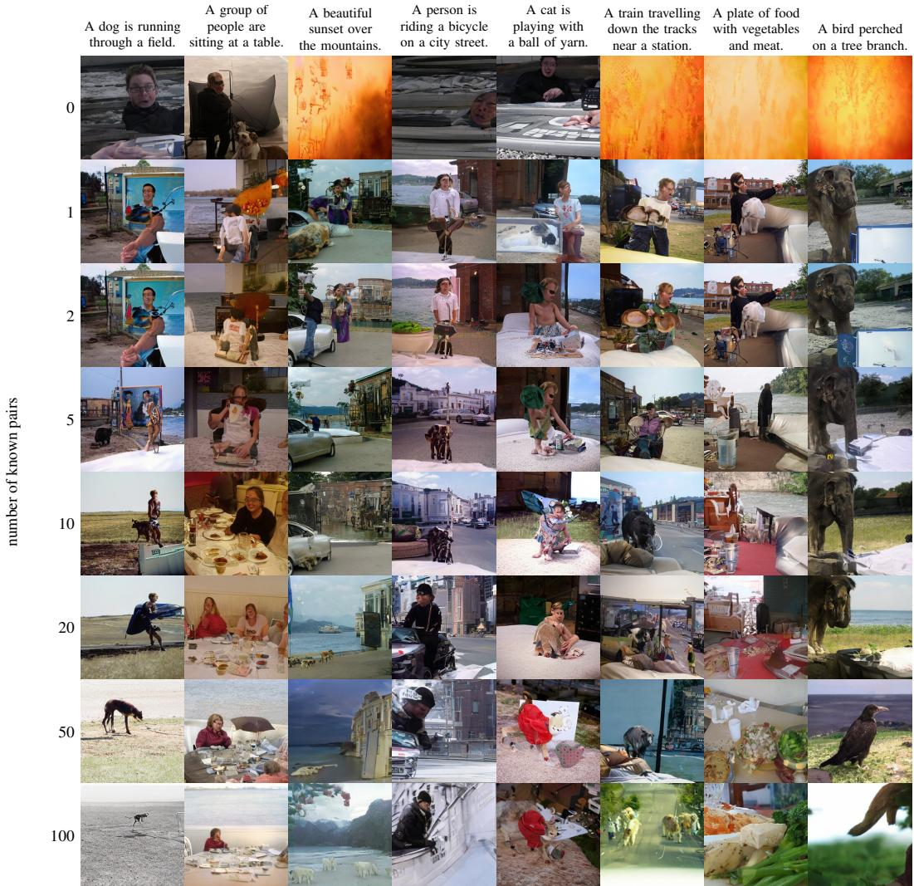  
Figure 18: Unpaired text-to-image generation with a linear map and Contriever. We show the generated images for 8 sample captions with a linear map fitted on the pairs using DINOv2 ViT-B/14 and Contriever. Without pairs, the linear map is random. As more pairs are used, the faithfulness of the generation improves.

<table><tr><td>Text encoder</td><td>Method</td><td>Pairs</td><td>CLIPScore</td><td>VQAScore</td><td>TIFA</td><td>CycleReward</td></tr><tr><td>一</td><td>GT image</td><td>一</td><td> $0 . 6 3 8 9 \pm 0 . 0 0 0 5$ </td><td>0.8638 ± 0.0009</td><td>0.8695 ± 0.0008</td><td>0.2743 ± 0.0051</td></tr><tr><td>Qwen2.5-1.5B</td><td>Scale-RAE</td><td>一</td><td> $0 . 6 4 5 6 \pm 0 . 0 0 0 4$ </td><td> $0 . 8 2 6 4 \pm 0 . 0 0 1 0$ </td><td> $0 . 8 5 2 8 \pm 0 . 0 0 0 9$ </td><td> $0 . 5 2 8 3 \pm 0 . 0 0 5 0$ </td></tr><tr><td>MPNet</td><td>ours</td><td>0</td><td> $0 . 5 1 7 0 \pm 0 . 0 0 0 6$ </td><td> $0 . 4 2 8 4 \pm 0 . 0 0 1 4$ </td><td> $0 . 5 8 8 6 \pm 0 . 0 0 1 4$ </td><td> $- 1 . 3 5 4 7 \pm 0 . 0 0 3 2$ </td></tr><tr><td></td><td>ours</td><td>1</td><td> $0 . 5 2 7 9 \pm 0 . 0 0 0 6$ </td><td> $0 . 4 6 4 4 \pm 0 . 0 0 1 4$ </td><td> $0 . 6 2 1 6 \pm 0 . 0 0 1 4$ </td><td> $- 1 . 2 8 6 9 \pm 0 . 0 0 3 4$ </td></tr><tr><td></td><td>ours</td><td>10</td><td> $0 . 5 5 8 8 \pm 0 . 0 0 0 5$ </td><td> $0 . 5 1 9 7 \pm 0 . 0 0 1 4$ </td><td> $0 . 6 6 5 0 \pm 0 . 0 0 1 3$ </td><td> $- 1 . 1 5 9 8 \pm 0 . 0 0 3 6$ </td></tr><tr><td></td><td>ours</td><td>100</td><td> $0 . 5 6 8 7 \pm 0 . 0 0 0 5$ </td><td> $0 . 5 4 1 2 \pm 0 . 0 0 1 3$ </td><td> $0 . 6 8 6 3 \pm 0 . 0 0 1 2$ </td><td> $- 1 . 1 0 2 5 \pm 0 . 0 0 3 6$ </td></tr><tr><td></td><td>linear</td><td>0</td><td> $0 . 2 7 3 5 \pm 0 . 0 0 0 4$ </td><td> $0 . 1 4 9 8 \pm 0 . 0 0 0 5$ </td><td> $0 . 2 4 4 6 \pm 0 . 0 0 1 1$ </td><td> $- 1 . 8 3 9 2 \pm 0 . 0 0 0 6$ </td></tr><tr><td></td><td>linear</td><td>1</td><td> $0 . 3 2 2 6 \pm 0 . 0 0 0 5$ </td><td> $0 . 1 9 2 9 \pm 0 . 0 0 0 7$ </td><td> $0 . 2 5 4 7 \pm 0 . 0 0 1 1$ </td><td> $- 1 . 8 9 9 4 \pm 0 . 0 0 0 6$ </td></tr><tr><td></td><td>linear</td><td>10</td><td> $0 . 3 9 6 6 \pm 0 . 0 0 0 6$ </td><td> $0 . 2 4 9 1 \pm 0 . 0 0 1 0$ </td><td> $0 . 3 6 1 6 \pm 0 . 0 0 1 3$ </td><td> $- 1 . 7 9 1 7 \pm 0 . 0 0 1 2$ </td></tr><tr><td></td><td>linear</td><td>100</td><td> $0 . 4 7 6 8 \pm 0 . 0 0 0 6$ </td><td> $0 . 3 6 8 6 \pm 0 . 0 0 1 2$ </td><td> $0 . 5 2 8 9 \pm 0 . 0 0 1 4$ </td><td> $- 1 . 5 3 8 9 \pm 0 . 0 0 2 3$ </td></tr><tr><td>Contriever</td><td>ours</td><td>0</td><td> $0 . 4 0 7 2 \pm 0 . 0 0 0 7$ </td><td> $0 . 2 6 8 5 \pm 0 . 0 0 1 1$ </td><td> $0 . 4 3 5 0 \pm 0 . 0 0 1 4$ </td><td> $- 1 . 6 9 5 8 \pm 0 . 0 0 1 8$ </td></tr><tr><td></td><td>ours</td><td>1</td><td> $0 . 4 4 7 8 \pm 0 . 0 0 0 7$ </td><td> $0 . 3 1 9 0 \pm 0 . 0 0 1 2$ </td><td> $0 . 4 8 9 6 \pm 0 . 0 0 1 5$ </td><td> $- 1 . 5 4 9 9 \pm 0 . 0 0 2 5$ </td></tr><tr><td></td><td>ours</td><td>10</td><td> $0 . 5 2 2 7 \pm 0 . 0 0 0 6$ </td><td> $0 . 4 4 5 2 \pm 0 . 0 0 1 3$ </td><td> $0 . 6 2 6 4 \pm 0 . 0 0 1 3$ </td><td> $- 1 . 3 1 9 8 \pm 0 . 0 0 3 1$ </td></tr><tr><td></td><td>ours</td><td>100</td><td> $0 . 5 4 4 6 \pm 0 . 0 0 0 5$ </td><td> $0 . 4 7 8 9 \pm 0 . 0 0 1 3$ </td><td> $0 . 6 4 8 3 \pm 0 . 0 0 1 3$ </td><td> $- 1 . 2 2 3 0 \pm 0 . 0 0 3 3$ </td></tr><tr><td></td><td>linear</td><td>0</td><td> $0 . 2 8 4 3 \pm 0 . 0 0 0 4$ </td><td> $0 . 1 5 5 9 \pm 0 . 0 0 0 5$ </td><td> $0 . 2 7 1 4 \pm 0 . 0 0 1 1$ </td><td> $- 1 . 8 3 1 3 \pm 0 . 0 0 0 6$ </td></tr><tr><td></td><td>linear</td><td>1</td><td> $0 . 3 2 0 6 \pm 0 . 0 0 0 5$ </td><td> $0 . 1 9 2 5 \pm 0 . 0 0 0 7$ </td><td> $0 . 2 5 2 1 \pm 0 . 0 0 1 1$ </td><td> $- 1 . 9 0 1 3 \pm 0 . 0 0 0 5$ </td></tr><tr><td></td><td>linear</td><td>10</td><td> $0 . 3 7 8 6 \pm 0 . 0 0 0 6$ </td><td> $0 . 2 3 8 4 \pm 0 . 0 0 0 9$ </td><td> $0 . 3 3 7 5 \pm 0 . 0 0 1 2$ </td><td> $- 1 . 8 2 0 0 \pm 0 . 0 0 1 1$ </td></tr><tr><td></td><td>linear</td><td>100</td><td> $0 . 4 7 9 1 \pm 0 . 0 0 0 6$ </td><td> $0 . 3 6 2 4 \pm 0 . 0 0 1 2$ </td><td> $0 . 5 2 1 1 \pm 0 . 0 0 1 4$ </td><td> $- 1 . 5 5 5 0 \pm 0 . 0 0 2 2$ </td></tr></table>

Table 7: Faithfulness of the generated images on MS COCO. Our aligner outperforms the linear map on all four measures, for every number of pairs and with both text encoders. As in Tab. 6, the real images and Scale-RAE are reference points and are not comparable to our aligner, which uses at most 100 pairs.

<table><tr><td></td><td colspan="2">vec2vec</td><td colspan="2">mini-vec2vec</td><td colspan="2">ours</td></tr><tr><td>Pair</td><td>FOSCTTM ↓</td><td>mean rank↓</td><td>FOSCTTM ↓</td><td>mean rank↓</td><td>FOSCTTM↓</td><td>mean rank↓</td></tr><tr><td>granite → e5</td><td>0.5109</td><td>4185.7</td><td>0.0000</td><td>1.0</td><td>0.0000</td><td>1.1</td></tr><tr><td>granite → gte</td><td>0.4209</td><td>3448.6</td><td>0.0000</td><td>1.1</td><td>0.0000</td><td>1.2</td></tr><tr><td> ${ \mathrm { g r a n i t e } }  { \mathrm { g t r } }$ </td><td>0.4070</td><td>3335.1</td><td>0.0000</td><td>1.2</td><td>0.0000</td><td>1.3</td></tr><tr><td> $\mathrm { g r a n i t e }  \mathrm { s t e l l a }$ </td><td>0.4875</td><td>3994.4</td><td>0.0000</td><td>1.1</td><td>0.0000</td><td>1.2</td></tr><tr><td> $\mathrm { g t e } \to \mathrm { e } 5$ </td><td>0.2861</td><td>2344.5</td><td>0.0000</td><td>1.1</td><td>0.0000</td><td>1.1</td></tr><tr><td> $\mathrm { g t r } \to \mathrm { e } 5$ </td><td>0.4882</td><td>4000.0</td><td>0.0001</td><td>1.7</td><td>0.0002</td><td>2.2</td></tr><tr><td> $\mathrm { g t r } \to \mathrm { g t e }$ </td><td>0.5288</td><td>4332.5</td><td>0.0024</td><td>20.6</td><td>0.0000</td><td>1.1</td></tr><tr><td> $\mathrm { g t r }  \mathrm { s t e l l a }$ </td><td>0.5158</td><td>4225.7</td><td>0.0000</td><td>1.0</td><td>0.0000</td><td>1.0</td></tr><tr><td> $\mathrm { s t e l l a }  \mathrm { e } 5$ </td><td>0.3098</td><td>2538.2</td><td>0.0000</td><td>1.1</td><td>0.0000</td><td>1.1</td></tr><tr><td> $\mathrm { s t e l l a }  \mathrm { g t e }$ </td><td>0.1394</td><td>1142.7</td><td>0.0000</td><td>1.0</td><td>0.0000</td><td>1.0</td></tr></table>

Table 8: Per-pair results on NQ. We report the FOSCTTM and mean rank of every encoder pair evaluated on 8,192 validation samples. On average, mini-vec2vec and our aligner achieve nearly perfect alignment on all model pairs. Vec2vec is unstable and does not consistently demonstrate significant performance.

<table><tr><td>Method</td><td> $\mathrm { F O S C T T M \downarrow }$ </td><td>LTA↑</td></tr><tr><td>SCOT+</td><td> $0 . 1 2 1 \pm 0 . 0 2 7$ </td><td> $0 . 9 1 9 \pm 0 . 0 1 5$ </td></tr><tr><td>ours</td><td> $\mathbf { 0 . 0 8 9 \pm 0 . 0 0 3 }$ </td><td> $\mathbf { 0 . 9 4 2 \pm 0 . 0 1 9 }$ </td></tr></table>

Table 9: Result on PBMC. We evaluate RNA → ATAC with FOSCTTM and label transfer accuracy (LTA). Our aligner outperforms the domain-specific aligner SCOT+ (Baker et al., 2026) in FOSCTTM and label transfer accuracy.

## C.3 UNPAIRED DOMAIN-SPECIFIC ALIGNMENT

Fig. 4 of the main text averages every benchmark. The tables below keep each encoder, omics and subject pair on its own row and give one column group per method, the layout Jha et al. (2026) and Dar (2025) use for these benchmarks. We report the average FOSCTTM and the domain-specific metrics for every pair over the seeds. Bold marks the best method of each row and metric, compared at the precision shown, so that two methods whose numbers agree to the printed digits are both marked.

Language. On the ten ordered encoder pairs of Natural Questions in Tab. 8, vec2vec stays at or near the chance value of 0.5 on five of ten pairs and reaches 0.14 at best. Our aligner reaches a FOSCTTM of 0.0000 on nine of ten pairs and 0.0002 on the tenth, and mini-vec2vec reaches 0.0000 on eight. What separates the two is not the typical case but the worst one. On $\mathtt { g t r a m }$ gte mini-vec2vec gives $0 . 0 0 2 4 \pm 0 . 0 0 4 5$ with a mean rank of $2 0 . 6 \pm 3 6 . 5$ , while ours gives 0.0000 with a mean rank of $1 . 1 \pm 0 . 0$ on the same pair. A spread that large across seeds matters here, because without any pairs there is no signal that could be used to select the good run.

Biology. On the PBMC benchmark in Tab. 9 our aligner reaches 0.089±0.003 against 0.121±0.027 for SCOT+, which was designed for this kind of data. The label transfer accuracy (LTA) tells the same story, 94.2% against 91.9% for the nearest cross-modal neighbor. The standard deviation is again the clearer difference, ours being an order of magnitude smaller.

Neuroscience. The fMRI benchmark in Tab. 10 has 56 ordered subject pairs. Both methods use the same per-subject encoders. Averaged over them our aligner reaches $0 . 0 3 3 \pm 0 . 0 2 5$ against $0 . 0 3 5 \pm 0 . 0 4 1$ for the encoders of Marcos-Manchon et al.´ (2026), which was designed for this dataset. The two are within each other’s spread on the average, and the difference is again that ours varies less across pairs and seeds.

<table><tr><td rowspan="2">Pair</td><td colspan="2">platonic brain</td><td colspan="2">ours</td></tr><tr><td>FOSCTTM↓</td><td>mean rank↓</td><td>FOSCTTM↓</td><td>mean rank↓</td></tr><tr><td>sub01 → sub02</td><td>0.040</td><td>36.9</td><td>0.005</td><td>5.2</td></tr><tr><td>sub01 → sub03</td><td>0.038</td><td>35.8</td><td>0.042</td><td>38.7</td></tr><tr><td>sub01 → sub04</td><td>0.073</td><td>67.5</td><td>0.040</td><td>37.1</td></tr><tr><td>sub01 → sub05</td><td>0.047</td><td>43.3</td><td>0.046</td><td>42.9</td></tr><tr><td>sub01 → sub06</td><td>0.030</td><td>28.0</td><td>0.026</td><td>25.0</td></tr><tr><td>sub01 → sub07</td><td>0.019</td><td>18.0</td><td>0.017</td><td>16.2</td></tr><tr><td>sub01 → sub08</td><td>0.042</td><td>39.4</td><td>0.056</td><td>52.1</td></tr><tr><td>sub02 → sub01</td><td>0.030</td><td>28.3</td><td>0.010</td><td>9.7</td></tr><tr><td>sub02 → sub03</td><td>0.070</td><td>64.3</td><td>0.043</td><td>39.8</td></tr><tr><td>sub02 → sub04</td><td>0.043</td><td>39.7</td><td>0.035</td><td>32.4</td></tr><tr><td>sub02 → sub05</td><td>0.126</td><td>114.8</td><td>0.064</td><td>58.7</td></tr><tr><td>sub02 → sub06</td><td>0.048</td><td>44.3</td><td>0.067</td><td>61.9</td></tr><tr><td>sub02 → sub07</td><td>0.044</td><td>40.8</td><td>0.029</td><td>27.0</td></tr><tr><td>sub02 → sub08</td><td>0.037</td><td>35.0</td><td>0.031</td><td>28.7</td></tr><tr><td>sub03 → sub01</td><td>0.043</td><td>39.8</td><td>0.054</td><td>49.6</td></tr><tr><td>sub03 → sub02</td><td>0.038</td><td>35.5</td><td>0.041</td><td>37.8</td></tr><tr><td>sub03 → sub04</td><td>0.013</td><td>13.0</td><td>0.034</td><td>32.3</td></tr><tr><td>sub03 → sub05</td><td>0.015</td><td>15.0</td><td>0.022</td><td>20.8</td></tr><tr><td>sub03 → sub06</td><td>0.018</td><td>16.9</td><td>0.019</td><td>17.8</td></tr><tr><td>sub03 → sub07</td><td>0.008</td><td>8.7</td><td>0.029</td><td>27.6</td></tr><tr><td>sub03 → sub08</td><td>0.049</td><td>45.6</td><td>0.021</td><td>20.0</td></tr><tr><td>sub04 → sub01</td><td>0.054</td><td>50.3</td><td>0.068</td><td>62.4</td></tr><tr><td>sub04 → sub02</td><td>0.070</td><td>64.7</td><td>0.044</td><td>41.0</td></tr><tr><td>sub04 → sub03</td><td>0.022</td><td>21.1</td><td>0.031</td><td>29.1</td></tr><tr><td>sub04 → sub05</td><td>0.012</td><td>12.2</td><td>0.014</td><td>13.7</td></tr><tr><td>sub04 → sub06</td><td>0.031 0.031</td><td>29.2</td><td>0.046</td><td>42.2</td></tr><tr><td>sub04 → sub07</td><td>0.020</td><td>28.7</td><td>0.034</td><td>31.7</td></tr><tr><td>sub04 → sub08</td><td>0.034</td><td>19.0</td><td>0.016</td><td>15.1</td></tr><tr><td>sub05 → sub01</td><td></td><td>31.6</td><td>0.038</td><td>35.3</td></tr><tr><td>sub05 → sub02</td><td>0.073</td><td>67.3</td><td>0.059</td><td>54.6</td></tr><tr><td>sub05 → sub03</td><td>0.017</td><td>16.0</td><td>0.028</td><td>26.3</td></tr><tr><td>sub05 → sub04</td><td>0.007</td><td>7.3</td><td>0.018</td><td>17.6</td></tr><tr><td>sub05 → sub06</td><td>0.014 0.015</td><td>13.3</td><td>0.013</td><td>13.0</td></tr><tr><td>sub05 → sub07</td><td></td><td>14.9</td><td>0.020</td><td>19.3</td></tr><tr><td>sub05 → sub08</td><td>0.051</td><td>47.1</td><td>0.026</td><td>24.1</td></tr><tr><td>sub06 → sub01</td><td>0.020</td><td>19.5</td><td>0.043</td><td>40.3</td></tr><tr><td>sub06 → sub02</td><td>0.075</td><td>68.7</td><td>0.060</td><td>55.2</td></tr><tr><td>sub06 → sub03</td><td>0.019</td><td>18.0</td><td>0.019</td><td>18.1</td></tr><tr><td>sub06 → sub04</td><td>0.035</td><td>32.4</td><td>0.032</td><td>30.1</td></tr><tr><td>sub06 → sub05</td><td>0.014</td><td>13.4</td><td>0.013</td><td>12.7</td></tr><tr><td>sub06 → sub07</td><td>0.011</td><td>11.4</td><td>0.007</td><td>7.2</td></tr><tr><td>sub06 → sub08</td><td>0.058</td><td>53.3</td><td>0.033</td><td>30.5</td></tr><tr><td>sub07 → sub01</td><td>0.009</td><td>9.3</td><td>0.014</td><td>13.4</td></tr><tr><td>sub07 → sub02</td><td>0.020</td><td>19.0</td><td>0.037</td><td>34.5</td></tr><tr><td>sub07 → sub03</td><td>0.012</td><td>11.4</td><td>0.033</td><td>30.8</td></tr><tr><td>sub07 → sub04</td><td>0.027</td><td>25.2</td><td>0.054</td><td>49.8</td></tr><tr><td>sub07 → sub05</td><td>0.024</td><td>23.0</td><td>0.013</td><td>13.2</td></tr><tr><td>sub07 → sub06</td><td>0.027</td><td>25.2</td><td>0.008</td><td>7.9</td></tr><tr><td>sub07 → sub08</td><td>0.045</td><td>41.6</td><td>0.046</td><td>42.8</td></tr><tr><td>sub08 → sub01</td><td>0.040</td><td>37.1</td><td>0.052</td><td>48.0</td></tr><tr><td>sub08 → sub02</td><td>0.037</td><td>34.5</td><td>0.047</td><td>43.7</td></tr><tr><td></td><td>0.040</td><td></td><td></td><td></td></tr><tr><td>sub08 → sub03</td><td></td><td>37.6</td><td>0.028</td><td>26.0</td></tr><tr><td>sub08 → sub04 sub08 → sub05</td><td>0.013 0.028</td><td>12.7 26.4</td><td>0.016 0.028</td><td>15.8</td></tr><tr><td>sub08 → sub06</td><td>0.038</td><td>35.8</td><td>0.036</td><td>26.5 33.8</td></tr><tr><td></td><td></td><td></td><td></td><td></td></tr><tr><td>sub08 → sub07</td><td>0.066</td><td>60.6</td><td>0.057</td><td>52.5</td></tr></table>

Table 10: Per-pair results on NSD fMRI. We report the FOSCTTM score and the average rank of each pair of subjects, averaged over ten random seeds. On average, both methods perform similarly, even though our method is more stable and produces more consistent results.

## C.4 SHARED GEOMETRY ACROSS MODALITIES

Tab. 12 gives the per-pair numbers behind Fig. 4b. We observe that the fourteen pairs fall into three groups. Fig. 19 shows a visualization of what the three regimes look like.

Well aligned. Four pairs are aligned almost exactly, Natural Questions at 0.000, the two interatomic potentials on MP-20 at 0.001, the fMRI subject pairs at 0.033, and PBMC at 0.089. SNAREseq at 0.209 recover the main cell populations. All five have a CKA above 0.6. Two of them share an encoder family or a measurement device, which is the easy case, but PBMC and SNARE-seq relate two different assays of the same cells and Natural Questions relates two independently trained text encoders, so a shared architecture is not what makes them work.

Partially aligned. Three pairs land between 0.22 and 0.37, well below chance but far from solved, namely CITE-seq at 0.225, human against mouse single-cell RNA at 0.338 and histology against expression at 0.369. These pairs share some structure, but the geometry is not enough to identify individual samples. CITE-seq has a high CKA of 0.96, but its FOSCTTM varies strongly over the seeds, with a standard deviation of 0.13.

At chance. Six pairs are close to chance, Cell Painting against L1000 at 0.483, mass spectra against molecules at 0.475, tissue against MRI at 0.484, MEG against text at 0.498, tissue against CT at 0.487 and galaxy images against spectra at 0.574. Their CKA is at most 0.25 in every case, so little shared geometry is available.

Which measure predicts best. Across these domains CKA and TSI both track the alignment, while mutual k-NN is a weaker predictor. SNARE-seq is the clearest counterexample, the fifth best aligned pair of the fourteen at 0.209 and yet a mutual k-NN of 0.043, lower than pairs that are at chance. The different datasets considered here contain different numbers of samples. Mutual k-NN measures the overlap of the k nearest neighbors which is sensitive to the density of the point clouds, and the datasets here differ in size by two orders of magnitude. CKA and TSI compare global similarity structure and are therefore more stable across different sample sizes, which may explain why they predict the alignment better in this setting.

When no aligner is needed at all. The pairs above relate modalities that no single encoder covers. We also study the opposite case on five pairs taken from the CycleGAN literature, where one encoder can be applied to both sides, namely MR against CT and CBCT against CT on SynthRAD2023 (Thummerer et al., 2023), RGB against thermal on LLVIP (Jia et al., 2021b), SAR against optical on SEN12MS-CR (Ebel et al., 2020) and one speaker against another on CMU Arctic (Kominek & Black, 2004). The four image pairs are embedded with self-supervised vision transformers and the speaker pair with a self-supervised speech model, one encoder per pair as listed in Tab. 11. Every pair uses the same encoder on both modalities, so the two embedding spaces share a basis by construction and the identity map is a meaningful baseline. We report the identity map, the identity map after subtracting each side’s training mean and normalizing the rows, and our aligner, each over the same five seeds and the same 1024 sample validation slice. Tab. 11 gives the numbers. Our aligner recovers a coarse map on every pair, at 0.020 for RGB against thermal, 0.054 for CBCT against CT, 0.217 for SAR against optical, 0.265 for the two speakers and 0.253 for MR against CT, although it uses no identity bias, doesn’t assume the same encoders, and never sees a pair. Centering and normalizing alone is better on four of the five pairs and within 0.001 on RGB against thermal. On CMU Arctic it recovers the correspondence exactly at 0.000 because both speakers read the same sentences and one encoder maps them to nearly the same point. This is a stronger statement than the one the rest of the paper makes. Where a single encoder covers both modalities, they can be aligned coarsely across modalities without fitting anything at all. Such an alignment would allow architectures that place a generative model in each space and translate between them without a GAN, in the same way as our text-to-image pipeline in Sec. 4.5. Our setting is not designed for that use, since we embed one token per image and the map is not pixel-wise by construction, so we leave this direction to future work. The same result also marks the limit of the comparison. When the same model can be used on both sides, centering and normalizing is the method of choice, and our aligner is meant for the pairs where no such model exists, such as vision and language.

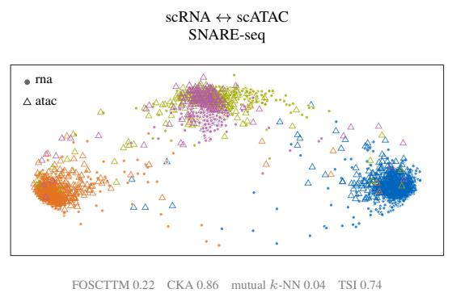

(a) Four cell lines, two of them swapped.  
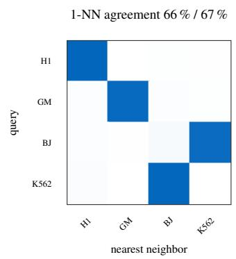

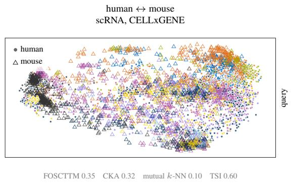

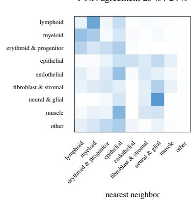

(b) Nine cell lineages, recovered in part.  
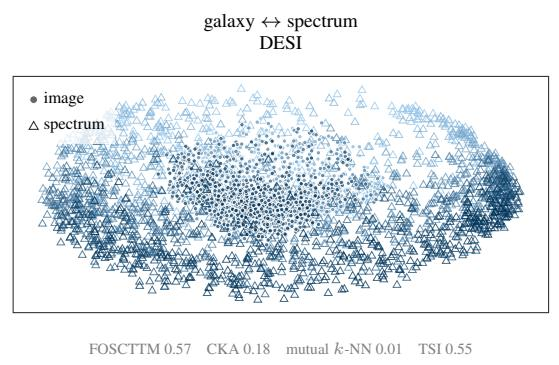

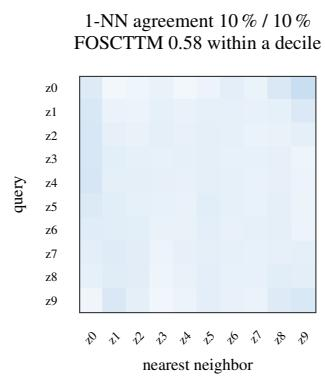  
(c) Ten redshift deciles, not recovered at all.  
Figure 19: What a good, a mediocre and a failed alignment look like. Three pairs of Tab. 12, each fitted without any pairs. We use the median seed as a representative visualization. Every row shows both modalities after the map, projected by one PCA fitted on their union and colored by a label the aligner never saw. In addition, we show the label agreement of the nearest crossmodal neighbor (right), the FOSCTTM and three similarity scores (below). (a) The four cell line of SNARE-seq separate, but BJ and K562 are matched to each other, so the matrix is diagonal up to that swap. (b) The lineages are recovered only in part. Neural cells are matched best, lymphoid and myeloid cells are mostly matched to each other, and muscle cells are drawn to the epithelial lineage. (c) Nothing is recovered.

<table><tr><td></td><td></td><td colspan="3">FOSCTTM ↓ per method</td><td colspan="2">shared geometry</td></tr><tr><td>Setting</td><td>Encoder (both sides)</td><td>identity</td><td>centred+norm</td><td>ours</td><td>CKA↑</td><td>mutual k-NN ↑</td></tr><tr><td>MR ↔ CT (brain)</td><td>DINOv1 ViT-B/16</td><td>0.178</td><td>0.108</td><td>0.253</td><td>0.773</td><td>0.124</td></tr><tr><td>CBCT ↔ CT (brain)</td><td>DINOv2 ViT-B/14</td><td>0.156</td><td>0.048</td><td>0.054</td><td>0.710</td><td>0.226</td></tr><tr><td>RGB ↔ thermal</td><td>DINOv2 ViT-L/14</td><td>0.053</td><td>0.021</td><td>0.020</td><td>0.894</td><td>0.167</td></tr><tr><td>SAR ↔ optical</td><td>DINOv2 ViT-L/14</td><td>0.260</td><td>0.177</td><td>0.217</td><td>0.624</td><td>0.092</td></tr><tr><td>speaker clb ↔ rms</td><td>WavLM-Large</td><td>0.000</td><td>0.000</td><td>0.265</td><td>0.855</td><td>0.474</td></tr></table>

Table 11: Alignment is not required for some domains. We consider multiple modality pairs from the CycleGAN (Zhu et al., 2017) literature, where one encoder is applied to both modalities. We use DINOv1 (Caron et al., 2021), DINOv2 (Oquab et al., 2024), and WavLM (Chen et al., 2022) as the encoders. The identity column applies no map, and the centered and normalized column subtracts the training mean from each side and normalizes the rows. Since they come from the same encoder, we observe that the embedding spaces are directly aligned, and centering and normalization help. This emphasizes that domains that can use the same encoders, such as RGB and thermal, are directly compatible in their embedding spaces when general self-supervised models are used. Although our aligner doesn’t assume a shared embedding space, it still recovers a coarse alignment for these modalities.
<table><tr><td>Domain</td><td>Pair</td><td>FOSCTTM ↓</td><td>CKA↑</td><td>mutual k-NN ↑</td><td>TSI ↑</td></tr><tr><td>astronomy</td><td>galaxy ↔ spectrum (DESI)</td><td> $0 . 5 7 \pm 0 . 0 0$ </td><td> $0 . 1 8 \pm 0 . 0 0$ </td><td> $0 . 0 1 \pm 0 . 0 0$ </td><td> $0 . 5 5 \pm 0 . 0 0$ </td></tr><tr><td>biology</td><td>Cell Painting ↔ L1000 (Rosetta)</td><td> $0 . 4 8 \pm 0 . 1 0$ </td><td> $0 . 2 5 \pm 0 . 0 0$ </td><td> $0 . 1 8 \pm 0 . 0 0$ </td><td> $0 . 5 8 \pm 0 . 0 0$ </td></tr><tr><td>biology</td><td>human ↔ mouse scRNA</td><td> $0 . 3 4 \pm 0 . 0 4$ </td><td> $0 . 3 2 \pm 0 . 0 0$ </td><td> $0 . 1 0 \pm 0 . 0 0$ </td><td> $0 . 6 0 \pm 0 . 0 0$ </td></tr><tr><td>biology</td><td>scRNA ↔ ADT (CITE-seq)</td><td> $0 . 2 2 \pm 0 . 1 3$ </td><td> $0 . 9 6 \pm 0 . 0 0$ </td><td> $0 . 1 4 \pm 0 . 0 0$ </td><td> $0 . 6 7 \pm 0 . 0 0$ </td></tr><tr><td>biology</td><td>scRNA ↔ scATAC (PBMC)</td><td> $0 . 0 9 \pm 0 . 0 0$ </td><td> $0 . 9 0 \pm 0 . 0 0$ </td><td> $0 . 0 6 \pm 0 . 0 0$ </td><td> $0 . 7 6 \pm 0 . 0 0$ </td></tr><tr><td>biology</td><td>scRNA ↔ scATAC (SNARE-seq)</td><td> $0 . 2 1 \pm 0 . 0 3$ </td><td> $0 . 8 6 \pm 0 . 0 0$ </td><td> $0 . 0 4 \pm 0 . 0 0$ </td><td> $0 . 7 4 \pm 0 . 0 0$ </td></tr><tr><td>chemistry</td><td>MS/MS ↔ molecules (MassSpecGym)</td><td> $0 . 4 7 \pm 0 . 0 2$ </td><td> $0 . 1 9 \pm 0 . 0 0$ </td><td> $0 . 1 1 \pm 0 . 0 0$ </td><td> $0 . 5 4 \pm 0 . 0 0$ </td></tr><tr><td>language</td><td>NQ text ↔ text</td><td> $0 . 0 0 \pm 0 . 0 0$ </td><td> $0 . 6 6 \pm 0 . 0 9$ </td><td> $0 . 3 2 \pm 0 . 0 9$ </td><td> $0 . 7 0 \pm 0 . 0 3$ </td></tr><tr><td>materials science</td><td> $\mathbf { M L I P }  \mathbf { M L I P } ( \mathbf { M P - } 2 0 )$ </td><td> $0 . 0 0 \pm 0 . 0 0$ </td><td> $0 . 8 9 \pm 0 . 0 0$ </td><td> $0 . 7 3 \pm 0 . 0 0$ </td><td> $0 . 8 3 \pm 0 . 0 0$ </td></tr><tr><td>medicine</td><td>histology ↔ expression (HEST CCRCC)</td><td> $0 . 3 7 \pm 0 . 0 2$ </td><td> $0 . 6 2 \pm 0 . 0 0$ </td><td> $0 . 1 9 \pm 0 . 0 0$ </td><td> $0 . 6 7 \pm 0 . 0 0$ </td></tr><tr><td>medicine</td><td>tissue ↔ CT (CPTAC)</td><td> $0 . 4 9 \pm 0 . 0 1$ </td><td> $0 . 0 5 \pm 0 . 0 0$ </td><td> $0 . 0 9 \pm 0 . 0 0$ </td><td> $0 . 5 2 \pm 0 . 0 0$ </td></tr><tr><td>medicine</td><td>tissue ↔ MRI (TCGA glioma)</td><td> $0 . 4 8 \pm 0 . 0 2$ </td><td> $0 . 0 9 \pm 0 . 0 0$ </td><td> $0 . 1 4 \pm 0 . 0 0$ </td><td> $0 . 5 2 \pm 0 . 0 0$ </td></tr><tr><td>neuroscience</td><td>MEG ↔ text (SpanishBCBL)</td><td> $0 . 5 0 \pm 0 . 0 2$ </td><td> $0 . 0 1 \pm 0 . 0 0$ </td><td> $0 . 0 7 \pm 0 . 0 0$ </td><td> $0 . 5 0 \pm 0 . 0 0$ </td></tr><tr><td>neuroscience</td><td>fMRI ↔ fMRI (NSD subjects)</td><td> $0 . 0 3 \pm 0 . 0 3$ </td><td> $0 . 6 2 \pm 0 . 0 4$ </td><td> $0 . 2 6 \pm 0 . 0 3$ </td><td> $0 . 7 1 \pm 0 . 0 1$ </td></tr></table>

Table 12: Complete results for all fourteen modality pairs of Fig. 4b. Modalities with a high similarity score can be aligned more easily without pairs.

## D ALIGNMENT WITH GENERATIVE TOKEN POOLING

On MS COCO, Qwen3-8B with generative token pooling is competitive with the two embedding models and is the best of the three for DINOv2 ViT-B/14 (Fig. 9). On the detailed captioning corpora, it is the worst of the three for every vision model. This appendix explores the reason. Generative token pooling asks the language model to write a description of what the text would look like and pools the tokens it generates, rather than the tokens of the caption itself (Wang et al., 2026). Our hypothesis is that generation adds visual detail that a short caption leaves out but cannot add much to a long caption that already contains it.

Setup. We compare three poolings of the same captions against the same DINOv2 ViT-B/14 (Oquab et al., 2024) image embeddings. Generative pooling prompts Qwen3-8B (Yang et al., 2025) with Imagine what it would look like to see: followed by the caption and averages the hidden states of at most 128 generated tokens. Mean pooling averages the hidden states of the caption tokens with the same backbone and no prompt, which isolates the effect of generating. Embedding pooling uses Qwen3-Embedding-8B (Zhang et al., 2025) and serves as a reference point. We evaluate the alignment on six datasets with varying caption lengths. MS COCO (Chen et al., 2015) at 11.9 Qwen3 tokens on average, CC12M (Changpinyo et al., 2021) at 24.8, WIT (Srinivasan et al., 2021) at 41.5, Stanford Paragraph Captioning (Krause et al., 2017) at 53.8, DOCCI (Onoe et al., 2024) at 140.8 and Densely Captioned Images (Urbanek et al., 2024) at 167.0. Each score is measured on five disjoint slices of 1024 pairs. We report the clipped CKA of Wang et al. (2026), which clips every feature at the mean 95th percentile of its absolute value and normalizes rows without centering them. The main goal of this experiment is to isolate in which settings generative token pooling can help. Instead of comparing the absolute level of each pooling, we compare the difference between different embedding strategies.

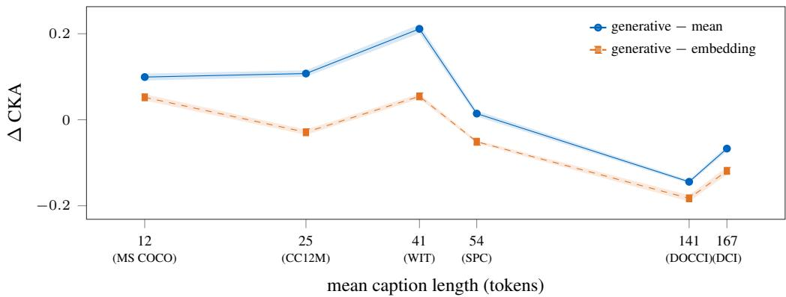  
Figure 20: Generative token pooling tends to help for short captions. We compare CKA alignment for different datasets. Generative token pooling tends to be more helpful for short captions than for long, detailed ones. WIT is an outlier where generative token pooling is exceptionally effective.

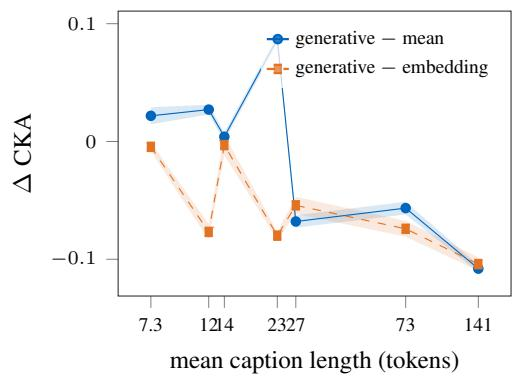  
(a) DOCCI

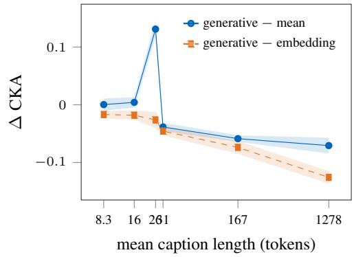  
(b) DCI  
Figure 21: The same images, captions of decreasing detail. We compare different embedding strategies on DCI and DOCCI and find that generative token pooling can be helpful for short captions. Embedding models and normal mean pooling of the caption are generally superior for long captions.

Results. Fig. 20 shows the difference in alignment between the three pooling methods across the six datasets. The difference of generative and mean pooling is positive on the three corpora with short or web-scraped captions, +0.099 on MS COCO, +0.107 on CC12M and +0.211 on WIT, near zero on the paragraph corpus at +0.014, and negative on the two densest, −0.144 on DOCCI and −0.067 on DCI.

Truncated captions. The problem with the above comparison is that the corpora differ in more than just caption length. To isolate the effect of caption length, we take the two densest corpora and compare captions of decreasing detail for the same images, truncated descriptions for DOCCI and the three human-written caption variants for DCI. For this experiment, generative and mean pooling use the smaller Qwen3-1.7B and embedding pooling uses Qwen3-Embedding-0.6B, so its values differ from those in Fig. 20 on the same captions. Fig. 21 shows the same difference in alignment as Fig. 20, but as the caption is shortened. On DOCCI the contrast moves from −0.108 on the full description to −0.057 on half of it and to +0.087 on the first sentence alone. On DCI it moves from −0.071 on the full caption and −0.059 on the extended one to +0.131 on the short human-written caption.

## E GRANULARITY OF ALIGNMENT

Cross-modal alignment appears to depend on the scale at which it is measured. Groger et al.¨ (2026a) show that, after accounting for model depth and width, convergence is mainly expressed through local neighborhood structure rather than global distances. However, they mainly focus on the convergence with increasing model and dataset size and not on the absolute values. Koepke et al. (2026) show that for fixed k, mutual k-NN degrades substantially when the dataset is scaled to millions of samples, whereas the alignment is stable at a fixed ratio of $k = n / 1 0 0$ . At large scales and for a fixed k, the alignment is much weaker than the alignment between language models, but remains above the random baseline. Thus, their results show that fine-grained vision-language alignment is limited, while some coarser alignment remains. Concurrent to our work, You et al. (2026) intro duce a global counterpart to mutual k-NN based on minimum spanning tree (MST) edge overlap. Their analysis separates local vs. global scale from relational structure vs. metric geometry. They find models converge both in local and global relational structure, but a weaker convergence when distance agreement is required.

However, these experiments do not directly compare different levels of granularity under the same evaluation conditions. Changing the sample count and k changes the granularity of the mutual k-NN comparison, making the resulting alignment values difficult to compare directly across scales. In this section, we want to test at which levels of granularity alignment exists and how strong it is when the evaluation conditions are held comparable. We study this in three complementary experiments:

1. A clustering-based experiment, where we can compare the alignment over cluster centers with the alignment within each cluster. We find that the alignment is substantially stronger across the cluster centers compared to inside individual clusters.

2. A PCA-based experiment, where we evaluate how much of the alignment is captured by a small number of dominant dimensions. Most of the observed alignment is already captured by the first ten PCA dimensions. Random subspaces require substantially more dimensions to reach comparable alignment.

3. A clipping-based experiment, where one cosine similarity kernel is clipped from below or above and the alignment is evaluated after clipping. This neglects the structure outside the clipping threshold and evaluates the impact of this structure on the general alignment. We find that cosine similarity values between 0.0 and 0.6 contribute most strongly to the alignment. Very close points and far points don’t share as much structure.

Setup. We evaluate all experiments with DINOv2 ViT-B/14 (Oquab et al., 2024), two language models (MPNet (Reimers & Gurevych, 2019), Qwen3-Embedding-8B (Zhang et al., 2025)), and two datasets (MS COCO (Chen et al., 2015) and WIT (Srinivasan et al., 2021)). We measure alignment with four alignment measures: CKA (Kornblith et al., 2019), mutual k-NN with k = max(1, ⌊n/100⌋) (Huh et al., 2024), TSI, and QSI (Soares et al., 2026). We repeat every experiment for 10 random seeds and report the mean and standard deviation.

Cluster-based experiment (Fig. 22). We first test whether coarse groups are more strongly aligned than the fine-grained structure within those groups. We jointly cluster the two representation spaces using size-balanced k-means on at most 100,000 points and lift the clustering to the full dataset for MS COCO and to 500,000 random samples for WIT. For each granularity, we sample the same number of points from each cluster and compare alignment across cluster centers, within clusters, and on a random subset of the same size.

Across datasets, models, and granularities, alignment across cluster centers is substantially stronger than alignment within individual clusters. Random sampling is usually closer to the fine alignment. This shows that the modalities agree more strongly on coarse organization than on fine-grained structure.

PCA-based experiment (Fig. 23). We next examine whether the shared alignment is concentrated in a small number of dominant dimensions. We subsample 10,000 points and project each representation space onto its first p principal components. We compare this to random subspaces of the same dimensionality.

The first ten PCA dimensions already capture most of the observed alignment across datasets, models, and alignment measures. In some cases, they even produce slightly higher alignment than using more dimensions. The only exception is mutual k-NN, which needs an order of magnitude more components. Random projections require substantially more dimensions to reach comparable alignment.

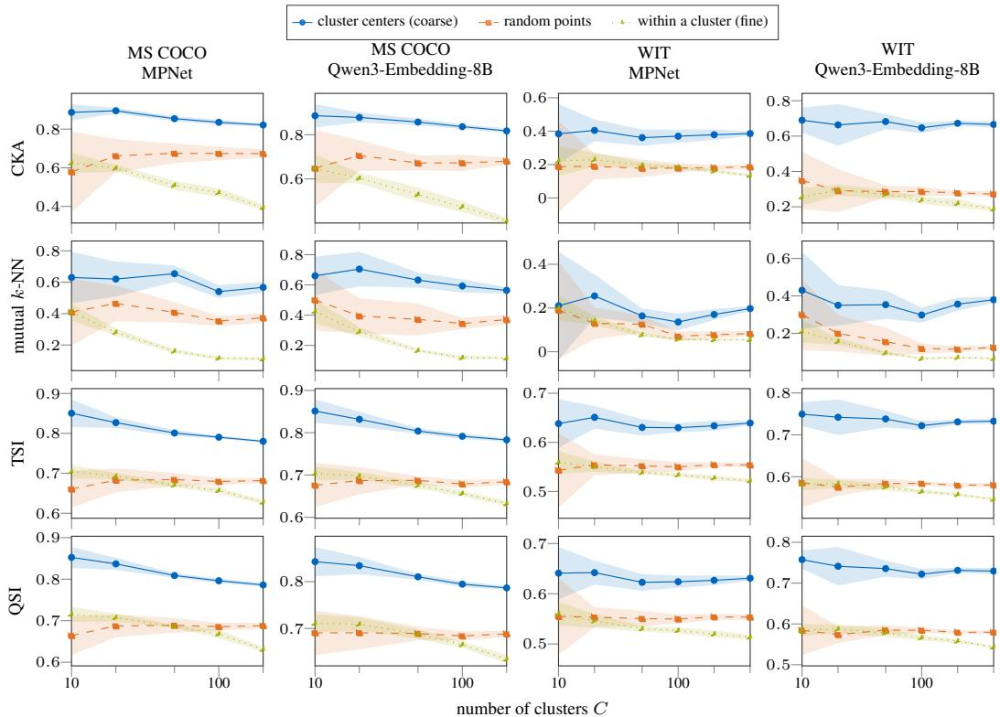  
Figure 22: Alignment between cluster centers, inside clusters and on random points. Both spaces are clustered jointly into C clusters. Every point of a curve scores $n = C$ points, either the C cluster centers, C members of one cluster or C random samples, so the three curves differ only in how coarse the points are. The coarse cluster centers are consistently better aligned than random points or points within clusters.

Clipping-based experiment (Fig. 24). Finally, we test which ranges of cosine similarity contribute most to the alignment. We clip a cosine-similarity kernel from below or above and measure alignment after clipping on subsets of 10,000 points.

We find that cosine similarities between 0.0 and 0.6 carry most of the alignment. The structure outside this range is largely redundant. Clipping similarities above 0.6 has only a limited effect, indicating that the precise structure of very close points is not strongly shared. Similarly, moving all negative cosine similarities to zero has little effect on CKA and mutual k-NN, suggesting that the precise structure of very distant points contributes little.

Overall, the strongest shared structure lies at an intermediate, coarse similarity scale. The modalities share coarse relationships between samples, and the structure of very close and very distant points adds little beyond them.

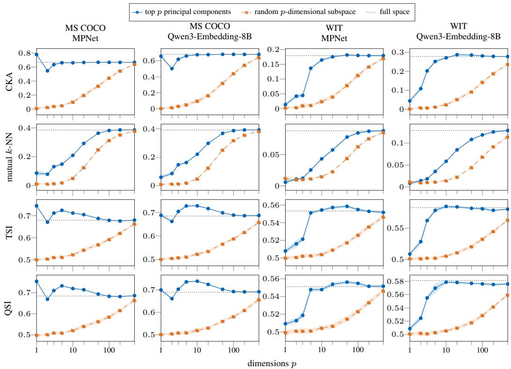  
Figure 23: Alignment in the top principal components. Each space is projected onto its top p principal components or onto a random p-dimensional subspace. The dotted line is the alignment of the two full spaces. Ten principal components capture most of the alignment and sometimes surpass the alignment of the original space. For mutual k-NN, around 100 principal components are required to approximate the full alignment.

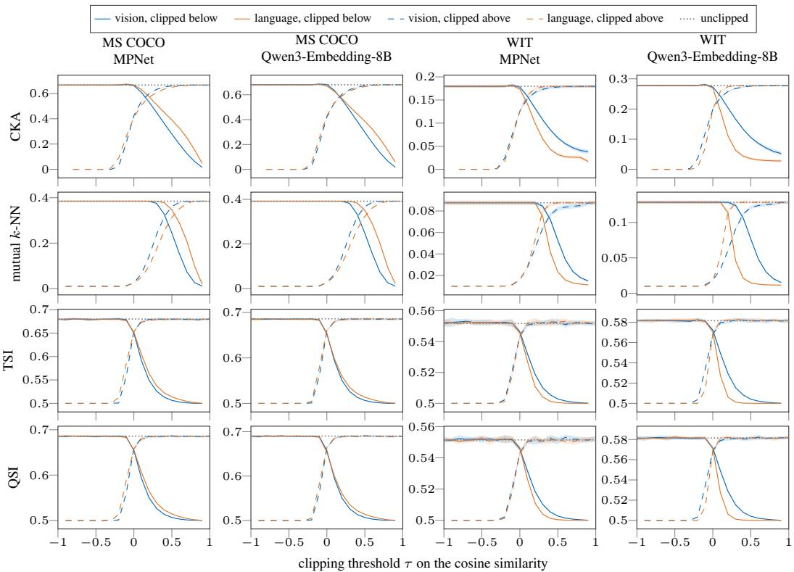  
Figure 24: Alignment after clipping one similarity kernel. The centered cosine-similarity kernel of one space is clipped from below or from above at the threshold τ , while the kernel of the other space is left unchanged. Points with a cosine similarity of 0.6 or higher and points farther away than orthogonal contribute only marginally to the alignment score.