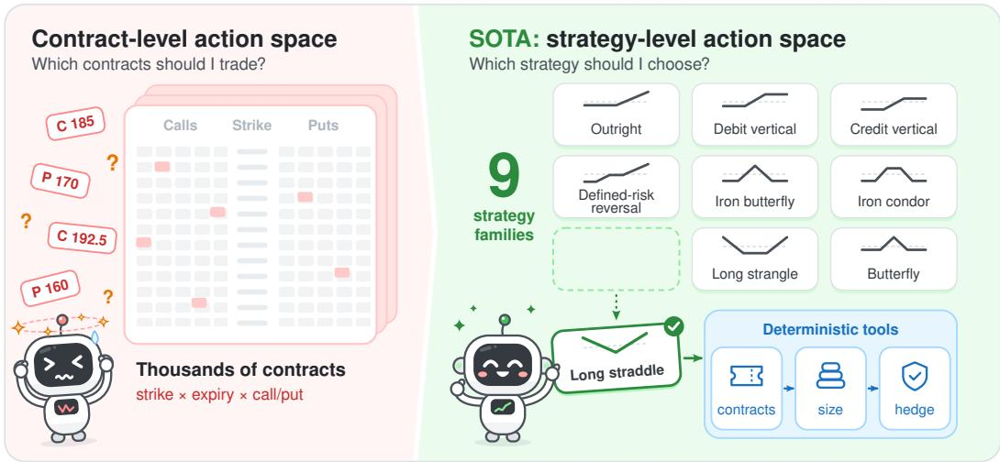
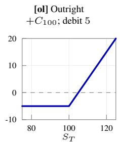
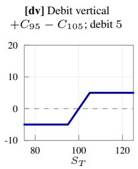
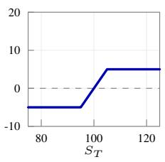
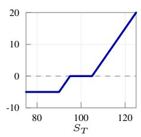
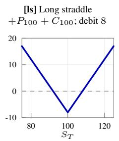
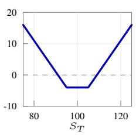
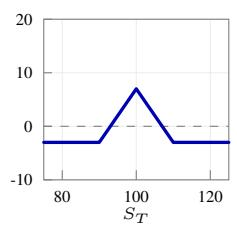
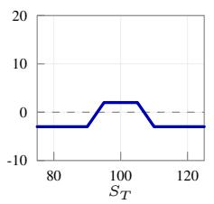
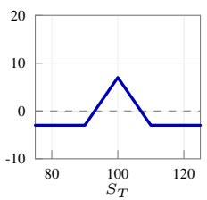

# SOTA: STOCK OPTIONS TRADING AGENTS GUIDED BY OPTION-IMPLIED RETURN DISTRIBUTIONS

Yizhen Xie∗ Carnegie Mellon University

Mengyang Liu† Amazon

## ABSTRACT

As option markets grow and AI advances, agentic systems for option trading are gaining increasing attention. Language-model-based agents can reason over contextual information such as news, but option trading presents a particularly challenging decision problem: a single stock can have thousands of contracts, and the agent must decide both which contracts to trade and how to combine them. Existing approaches often sidestep this complexity by restricting the policy to a fixed strategy structure, such as a straddle, limiting their ability to switch strategies as market conditions change. We present SOTA (Stock Options Trading Agents), an agentic trading framework for structured option-strategy selection. SOTA abstracts the large option universe into strategy-level decisions while deterministic resolvers handle portfolio implementation. We develop SOTA by post-training Qwen3.8-27B with supervised fine-tuning followed by reinforcement learning. SOTA is evaluated on options on nine large-cap U.S. equities and SPY against rule-based and machinelearning strategy selectors in the same trading environment. Over a six-month out-of-sample period, SOTA earns an 18.3% total return with a Sharpe ratio of 1.60 and a maximum drawdown of 8.96%. We also document an asymmetric role of news: news improves frontier-teacher trajectories, but retaining news during reinforcement learning reduces out-of-sample return from 18.3% to −2.7%.

## 1 INTRODUCTION

Option trading has expanded rapidly in recent years (Bryzgalova et al., 2023), creating a natural setting for increasingly capable trading agents. Recent language-model trading systems formulate financial decision-making as sequential interaction with a market environment, where an agent observes market information and portfolio state and chooses actions such as buy, sell, or hold (Yang et al., 2023a; Yu et al., 2025; Zhang et al., 2024; Xiao et al., 2024). Extending this formulation to options is difficult because the decision space is much larger and changes over time.

For a single underlying, an agent may face thousands of contracts that differ in strike, maturity, and option type. Existing approaches reduce this complexity either by predicting returns for individual contracts (Bali et al., 2023) or by restricting the trading problem to a single strategy class, such as volatility trading (Sheu & Wei, 2011; Chen et al., 2025b). These formulations are useful, but they do not directly support dynamic selection across heterogeneous payoff structures.

Reinforcement learning (RL) is well suited to sequential trading problems with transaction costs, discrete rebalancing, and portfolio-state dependence (Sutton & Barto, 2018; Mnih et al., 2015; Buhler¨ et al., 2019; Chen et al., 2025b). It has been applied to portfolio management, stock trading, and high-frequency trading (Jiang & Liang, 2017; Yang et al., 2020; Briola et al., 2021; Qin et al., 2024; Zong et al., 2024). In options, however, learning-based methods have focused primarily on hedging (Buhler et al.¨ , 2019) or on learning positions within a fixed volatility structure such as an at-the-money straddle (Tan et al., 2024; Chen et al., 2025b). Selecting among heterogeneous option strategies remains challenging.

In this paper, we present SOTA (Stock Options Trading Agents), an agentic trading framework for structured option-strategy selection. SOTA separates strategy-level reasoning from contract-level implementation: the language model selects among nine economically meaningful strategy families and their parameters, while deterministic resolvers map each decision into exact contracts, position sizes, and hedges. This structured strategy-selection interface reduces the decision space without restricting the agent to a single payoff structure. The policy can also combine structured market information with contextual signals such as news before producing executable option positions.

The primary contributions of our work are:

• We formulate option trading as structured strategy selection rather than contract-level choice. The agent selects among nine strategy families and their parameters, while deterministic resolvers map these decisions into contracts, position sizes, and hedges. This reduces a large contract-level decision problem to a compact strategy space spanning directional, volatility, skew, and curvature trades.

• We construct a point-in-time trading environment whose state summarizes the option-implied return distribution, and train Qwen3.8-27B using supervised fine-tuning on anonymized frontier-model trajectories followed by reinforcement learning on portfolio returns net of transaction costs.

• SOTA earns an 18.3% total return with a Sharpe ratio of 1.60 over a six-month out-ofsample period on options on nine large-cap U.S. stocks and SPY, while all rule-based and machine-learning baselines generate negative returns. Ablations show that reinforcement learning improves on supervised fine-tuning alone, while news helps the frontier teacher but degrades performance when retained during reinforcement learning.

## 2 RELATED WORK

## 2.1 AGENTIC TRADING

Agentic trading systems treat trading as repeated interaction with a market: at each step the agent observes prices and its portfolio, takes an action, and receive feedback through profit and loss. Early systems learn this policy with reinforcement learning. They have been applied to trading stocks (Yang et al., 2020), cryptocurrency (Jiang & Liang, 2017; Qin et al., 2024; Zong et al., 2024), and high frequency trading using limit-order-book data (Briola et al., 2021), and shared environments such as FinRL-Meta make these settings easy to benchmark (Liu et al., 2022). These approaches operate primarily on numerical market data.

Language-model agents add the ability to process news, filings, and other text. Financial language models adapt general-purpose models to financial text (Yang et al., 2023a;b). Trading agents built on such models add memory of past events (Yu et al., 2025), multimodal inputs and tool use (Zhang et al., 2024), or multi-agent roles such as analyst, researcher, trader, and risk manager (Yu et al., 2024; Xiao et al., 2024), and agent platforms and market simulators support these designs (Yang et al., 2024; Zhang et al., 2026). When trading on their own, the performance of language-model agents remains mixed: on real stock data, StockBench finds that most language-model agents struggle to outperform a simple buy-and-hold baseline (Chen et al., 2025a).

In both lines of work, the action space is small and fixed: buy, sell, or hold a single stock or cryptocurrency, or choose portfolio weights over a fixed set of assets. Options do not fit this mold. Each underlying may have thousands of contracts, the available set changes as contracts expire and new ones are listed, and a position often combines several contracts. SOTA keeps the agentic loop but changes the action: the agent selects an option strategy and its parameters, and deterministic tools turn that decision into contracts, position sizes, and hedges.

## 2.2 OPTION-IMPLIED RETURN DISTRIBUTIONS

Option prices encode the market’s distribution of future returns (Breeden & Litzenberger, 1978). Implied volatilities across strikes and maturities reveal the volatility, skewness, and kurtosis of this distribution (Corrado & Su, 1996; Dennis & Mayhew, 2002; Bakshi et al., 2003; Dumas et al., 1998; Cont & da Fonseca, 2002; Zhang & Xiang, 2008). These option-implied measures are informative about future outcomes. Implied volatility predicts realized volatility (Christensen & Prabhala, 1998), option trading volume carries information about future stock prices and volatility (Easley et al., 1998; Pan & Poteshman, 2006; Ni et al., 2008), and volatility-related characteristics predict the cross-section of option returns (Goyal & Saretto, 2009; Cao & Han, 2013), a relation that machine-learning models exploit at scale (Bali et al., 2023). Our market state is built from these measures.

## 2.3 OPTION TRADING STRATEGIES

Option strategies combine contracts to create different payoff exposures. A second-order approximation of option value gives

$$
d V \approx \Delta d S + \frac { 1 } { 2 } \Gamma ( d S ) ^ { 2 } + \nu d \sigma + \Theta d t .
$$

Here, delta measures directional exposure, gamma reflects convexity with respect to the underlying price, theta represents time decay, and vega measures sensitivity to implied volatility. Appendix A gives their Black–Scholes–Merton formulas (Black & Scholes, 1973; Merton, 1973). These sensitivities motivate four broad classes of trading strategies in our framework: directional, volatility, skewness, and curvature strategies.

Directional strategies. Directional strategies express a view on whether the underlying asset will rise or fall. Their payoffs are driven mainly by net delta exposure, while different option structures allow the same directional view to be expressed with different degrees of leverage, asymmetry, and downside protection.

Volatility strategies. Volatility strategies express a view on how much the underlying asset will move, rather than on the direction of the move. Long-volatility positions benefit from large price movements, while short-volatility positions benefit when price movements remain limited. Their performance depends on the trade-off between convexity, time decay, and changes in option prices (Bakshi & Kapadia, 2003; Carr & Wu, 2009; Goyal & Saretto, 2009).

Skewness strategies. Skewness strategies express a view on whether downside and upside risks are priced differently. They compare the relative value of put and call options away from the current stock price and can profit when this asymmetry changes (Bakshi et al., 2003; Garleanu et al.ˆ , 2009; Kozhan et al., 2013).

Curvature strategies. Curvature strategies express a view on how option prices differ between contracts near the current stock price and contracts further away from it. They profit from changes in the relative pricing of central and more extreme strike prices (Breeden & Litzenberger, 1978; Zhang & Xiang, 2008).

SOTA performs structured strategy selection across nine strategy families that span these four categories. Appendix B illustrates representative payoff structures for each family.

## 3 SOTA: STRUCTURED STRATEGY SELECTION FOR STOCK OPTION TRADINGAGENTS

Option trading presents a large and dynamically changing decision problem: for a single underlying, an agent may face thousands of contracts that differ in strike, maturity, and option type. Direct contract-level selection is therefore difficult in a time-sensitive trading setting.

SOTA formulates this problem as structured strategy selection. The language model chooses an option strategy and its parameters, while deterministic resolvers handle contract selection, position sizing, hedging, and portfolio implementation. This separation reduces the contract-level decision problem while preserving flexibility across heterogeneous payoff structures. Figure 1 summarizes the framework.

  
Figure 1: From contract-level to strategy-level decisions. Left: at the contract level, an agent must choose among thousands of listed contracts that differ in strike, expiry, and call/put type. Right: SOTA instead has the agent select one of nine option-strategy families and its parameters (here, a long straddle), and deterministic tools resolve that choice into exact contracts, a position size, and hedge trades.

## 3.1 PROBLEM FORMULATION

Trading environment. The agent trades options on a set of underlyings U over decision dates $t = 0 , \bar { 1 } , \ldots , T$ . On date t, underlying $u \in \mathcal { U }$ has price $S _ { t } ^ { u }$ and a listed option chain $\mathcal { C } _ { t } ^ { u }$ . Each contract $c \in \mathcal { C } _ { t } ^ { u }$ is defined by its strike, expiration date, and type (call or put), and has price $\mathbf { \nabla } p _ { t } ^ { c }$ per contract, taken at the bid–ask midpoint. A chain holds thousands of contracts with different nonlinear exposures, and it changes over time as contracts expire and new ones are listed.

The portfolio entering date t holds $q _ { t } ^ { c }$ contracts of each option $c , h _ { t } ^ { u }$ shares of each underlying for delta hedging, and cash $B _ { t }$ . Its marked-to-market value is

$$
V _ { t } = \underbrace { \sum _ { u \in \mathcal { U } } \sum _ { c \in \mathcal { C } _ { t } ^ { u } } q _ { t } ^ { c } p _ { t } ^ { c } } _ { V _ { t } ^ { \mathrm { o p t i o n s } } } + \underbrace { \sum _ { u \in \mathcal { U } } h _ { t } ^ { u } S _ { t } ^ { u } } _ { V _ { t } ^ { \mathrm { u n d e r l y i n g } } } + \underbrace { B _ { t } } _ { V _ { t } ^ { \mathrm { c a s h } } } .\tag{1}
$$

Trading is sequential. At each date t, the agent observes the market and its portfolio and issues a trading decision $a _ { t }$ . The environment converts $a _ { t }$ into trades $\Delta q _ { t } ^ { c }$ and $\Delta \bar { h _ { t } ^ { u } }$ , executes them at midpoint prices, and charges fees and commissions $\mathrm { T C } _ { t }$ . Holdings and cash after trading are

$$
q _ { t } ^ { c , + } = q _ { t } ^ { c } + \Delta q _ { t } ^ { c } , \qquad h _ { t } ^ { u , + } = h _ { t } ^ { u } + \Delta h _ { t } ^ { u } , \qquad B _ { t } ^ { + } = B _ { t } - \sum _ { u \in \mathcal { U } } \Bigl ( \sum _ { c \in \mathcal { C } _ { t } ^ { u } } \Delta q _ { t } ^ { c } p _ { t } ^ { c } + \Delta h _ { t } ^ { u } S _ { t } ^ { u } \Bigr ) - \mathrm { T C } _ { t } .\tag{2}
$$

These holdings carry over to date $t + 1$ , where they are marked at the new prices and expiring contracts are settled. The change from $V _ { t }$ to $V _ { t + 1 }$ 1 therefore reflects option price moves, hedge positions, transaction costs, and settlements.

Choosing $\Delta q _ { t } ^ { c }$ directly over every listed contract creates a large, dynamically changing decision space. We instead represent each decision $a _ { t }$ as a standardized option combination from an economically meaningful strategy family, and deterministic resolvers translate it into contract-level trades.

Markov decision process. We formulate option-strategy selection as a Markov decision process,

$$
{ \mathcal { M } } = \langle S , A , { \mathcal { T } } , { \mathcal { R } } , { \boldsymbol { \gamma } } \rangle ,\tag{3}
$$

where $s$ is the state space, $\mathcal { A }$ the structured strategy space, $\tau$ the transition mechanism, $\mathcal { R }$ the reward function, and $\gamma$ the discount factor.

State. At each trading date t, the agent observes a point-in-time state

$$
s _ { t } = \left( \mathbf { M } _ { t } , \mathbf { N } _ { t } , \mathbf { P } _ { t } , \mathbf { A } _ { t } \right) ,\tag{4}
$$

where $\mathbf { M } _ { t }$ contains market features, $\mathbf { N } _ { t }$ point-in-time textual summaries of news and filings, $\mathbf { P } _ { t }$ open option positions, and ${ \bf A } _ { t }$ portfolio-level information. Portfolio state allows each decision to condition on exposures and outcomes inherited from earlier trades.

We construct the market state from variables identified by the option-pricing and option-return literature as relevant to variation in option returns (Goyal & Saretto, 2009; Cao & Han, 2013; Bakshi et al., 2003; Pan & Poteshman, 2006). For each underlying, the state contains 10 features: underlying return, realized volatility, implied-volatility level and change, the implied-minus-realized volatility wedge, term structure, skewness, curvature, option flow, and changes in open interest. Appendix C.1 gives precise definitions.

Structured strategy selection. Instead of choosing directly among listed contracts, the policy selects structured trading strategies. At each decision time, the policy outputs a set of actions: open a new position $( a _ { t } ^ { \mathrm { o p e n } } )$ , close an existing position $( a _ { t } ^ { \mathrm { c l o s e } } )$ , roll an existing position to a later expiry $( a _ { t } ^ { \mathrm { r o l l } } )$ ), or leave the portfolio unchanged $\overline { { ( a _ { t } ^ { \mathrm { h o l d } } ) } }$ .

An action $a _ { t }$ is specified as $( u , f , \omega , \theta , \kappa )$ , where u is the underlying, f the strategy family, ω the long/short orientation, θ the tenor bucket, and κ the strategy’s coordinates on the delta grid.

To avoid querying prices for the full option chain, the agent first proposes up to six candidate strategies for each underlying. We resolve and price only these candidate packages before the final trading decision. This two-stage mechanism preserves price-aware strategy selection without placing thousands of contracts in the model context.

The learned policy therefore focuses on strategy selection, while deterministic resolvers handle contract selection, portfolio sizing, and delta hedging. Appendix E reports the rules implemented by the latter.

Transition. The transition kernel $\mathcal { T } ( s _ { t + 1 } \mid s _ { t } , a _ { t } )$ captures changes in market state, news and filings, existing positions and their risk exposures, and portfolio value net of transaction costs, with holdings and cash evolving as in Equation 2.

Reward. The one-step reward is the change in log portfolio value,

$$
r _ { t } = \log V _ { t + 1 } - \log V _ { t } .\tag{5}
$$

We train the policy in two stages. Supervised fine-tuning on frontier-model trading trajectories provides an initial strategy-selection policy, after which GRPO (Shao et al., 2024) optimizes the policy for portfolio performance. Appendix F describes the full procedure, and Appendix G.3 reports the hyperparameters.

## 4 EXPERIMENTS

## 4.1 EXPERIMENT SETUP

Datasets. We evaluate SOTA on 10 actively traded underlyings: SPY and nine large-capitalization U.S. equities (AAPL, AMZN, GOOGL, META, MSFT, MU, NVDA, PLTR, and TSLA). The option data include OPRA trades and quotes and OptionMetrics. Underlying stock prices are CRSP daily open and close prices for the nine equities and SpiderRock underlying marks for SPY. News comes from Massive.com’s news API, and regulatory filings come from SEC EDGAR. Table 1 reports the chronological sample splits.

Table 1: Chronological data splits.
<table><tr><td>Phase</td><td>Dates</td><td>Role</td></tr><tr><td>Supervised fine-tuning</td><td></td><td>2024-09-03 to 2024-11-29 Frontier-model generation and supervised fine-tuning</td></tr><tr><td>Reinforcement learning</td><td></td><td>2024-12-02 to 2025-02-28 Reinforcement learning to optimize the policy</td></tr><tr><td>Test</td><td></td><td>2025-03-03 to 2025-08-29 Out-of-sample evaluation of the policy and baselines</td></tr></table>

Table 2: Baseline comparison for option-strategy selection policies
<table><tr><td rowspan="2">Policy</td><td>Profit</td><td colspan="3">Risk-adjusted profit</td><td colspan="2">Risk</td><td colspan="2">Trade</td></tr><tr><td>TR(%)↑</td><td>ASR↑</td><td>ACR↑</td><td>ASoR↑</td><td></td><td>AVOL(%)↓ MDD(%)↓</td><td>WR(%)↑ PLR↑</td><td></td></tr><tr><td colspan="9">Rule-based policies</td></tr><tr><td>Equal-weighted rule</td><td>-5.22</td><td>-13.46</td><td>-1.98</td><td>-11.54</td><td>0.81</td><td>5.22</td><td>31.11</td><td>1.08</td></tr><tr><td>GARCH rule</td><td>-49.24</td><td>-6.27</td><td>-1.52</td><td>-6.25</td><td>22.17</td><td>49.42</td><td>29.85</td><td>0.75</td></tr><tr><td>Threshold rule</td><td>-28.46</td><td>-1.95</td><td>-1.50</td><td>-3.50</td><td>35.20</td><td>33.16</td><td>41.31</td><td>1.89</td></tr><tr><td colspan="9">Machine-learning policy</td></tr><tr><td>GBDT</td><td>-49.78</td><td>-8.55</td><td>-1.52</td><td>-8.18</td><td>16.51</td><td>49.78</td><td>24.07</td><td>1.23</td></tr><tr><td>Logistic</td><td>-55.45</td><td>-11.63</td><td>-1.46</td><td>-9.70</td><td>14.24</td><td>55.47</td><td>20.42</td><td>1.00</td></tr><tr><td colspan="9">Language policy</td></tr><tr><td>SOTA</td><td>18.32</td><td>1.60</td><td>4.59</td><td>4.77</td><td>21.52</td><td>8.96</td><td>29.17</td><td>4.68</td></tr><tr><td colspan="9">Hindsight reference</td></tr><tr><td>Oracle</td><td>608.31</td><td>6.28</td><td>740.22</td><td>35.87</td><td>63.91</td><td>7.32</td><td></td><td></td></tr></table>

Notes: Upward arrows indicate that higher values are better; downward arrows indicate that lower values are better. Bold marks the best value in each column among the tradable policies; the hindsight oracle is excluded. Appendix E.4 gives detailed definitions of the metrics.

Evaluation metrics. We evaluate portfolio performance using eight financial metrics: total return (TR), annualized Sharpe ratio (ASR), annualized Calmar ratio (ACR), annualized Sortino ratio (ASoR), annualized volatility (AVOL), maximum drawdown (MDD), win rate (WR), and profit/loss ratio (PLR). TR measures cumulative return over the evaluation period. AVOL is the annualized standard deviation of daily returns, and MDD is the largest peak-to-trough decline in portfolio value. ASR measures return relative to total volatility, ACR relative to maximum drawdown, and ASoR relative to downside deviation. WR is the fraction of completed trades with positive profit, and PLR is the average profit of winning trades relative to the average loss of losing trades. Appendix E.4 gives detailed definitions.

Baselines. We compare SOTA with conventional rule-based and supervised machine-learning policies for option-strategy selection. The rule-based baselines include equal-weighted strategy allocation, a GARCH-based rule (Bollerslev, 1986), and a threshold policy based on the structured market features. The GARCH rule combines a volatility forecast with contemporaneous optionmarket information. The supervised machine-learning baselines predict returns from the numerical market state and map those predictions into strategy choices using predetermined implementation rules. All feasible policies use the same test dates, execution model, transaction-cost assumptions, portfolio constraints, and deterministic resolvers, so performance differences reflect the strategyselection rule rather than portfolio implementation. Appendix G provides the specifications of the baselines.

## 4.2 BASELINE COMPARISON

Table 2 compares SOTA with the rule-based and machine-learning baselines over the test period. SOTA earns a total return of 18.32%, an annualized Sharpe ratio of 1.60, and a maximum drawdown of 8.96%. All rule-based and supervised machine-learning baselines produce negative total and risk-adjusted returns in the same evaluation. The equal-weighted rule has relatively low volatility but negative return, while the GARCH and threshold rules exhibit larger losses and drawdowns. The GBDT and logistic policies lose 49.78% and 55.45%, respectively. In this evaluation, SOTA is the only feasible policy with positive total and risk-adjusted returns, indicating that the post-trained language policy captures strategy-selection patterns not reproduced by the fixed rules or supervised mappings considered here.

The final row of Table 2 reports a hindsight oracle. At each decision time, it selects the best-performing strategy from the same candidate set using realized future outcomes. The oracle is therefore not tradable, but it uses the same transaction costs, sizing rule, position limits, and hedging rule as the feasible policies. Its return provides a reference for the profitability available within the structured strategy space.

## 5 ABLATION STUDIES

We examine two components of the training pipeline: the role of news in the policy information set and the contribution of reinforcement learning after supervised fine-tuning. Table 3 summarizes the results.

## 5.1 THE ROLE OF NEWS IN THE INFORMATION SET

To reduce temporal and identity leakage, we anonymize the information presented to the frontier teacher by masking stock identity, absolute price levels, and calendar time, while retaining market states and contemporaneously available news. We find that including anonymized news improves the quality of the frontier-model trajectories used for supervised fine-tuning. After filtering trajectories by annualized Sharpe ratio, Appendix E.5 reports performance across the retained trajectories by strategy family.

We then ask whether news remains useful during reinforcement learning. Holding the supervised checkpoint fixed, we compare reinforcement learning with and without contemporaneous news in the policy information set. The policy trained without news achieves an 18.32% total return and a Sharpe ratio of 1.60, with a maximum drawdown of 8.96%. Retaining news during reinforcement learning lowers total return to −2.72% and raises maximum drawdown to 31.69%.

These results point to an asymmetric role of textual information: news is useful for constructing frontier-model supervision, but retaining it during policy optimization does not improve out-of-sample performance.

## 5.2 THE ROLE OF REINFORCEMENT LEARNING

We next evaluate the supervised policy before reinforcement learning. Because the SFT-only policy and the RL-with-news policy use the same information set, their comparison isolates the contribution of reinforcement learning.

Reinforcement learning raises total return from −10.19% to −2.72% and improves the Sharpe ratio from −1.25 to −0.16, although volatility and maximum drawdown also increase. This indicates that reinforcement learning improves the supervised policy under the same information set, while the performance of the full method additionally depends on removing news during policy optimization.

Table 3: Ablation studies over the test period. Bold marks the best value in each column.
<table><tr><td></td><td colspan="2">Factor</td><td>Profit</td><td colspan="3">Risk-adjusted profit</td><td colspan="2">Risk</td><td colspan="2">Trade</td></tr><tr><td>Variant</td><td>RL News</td><td></td><td>TR(%)↑</td><td></td><td></td><td></td><td></td><td>ASR↑ ACR↑ ASoR↑ AVOL(%)↓ MDD(%)↓ WR(%)↑ PLR↑</td><td></td><td></td></tr><tr><td colspan="9">Full method</td></tr><tr><td>SOTA</td><td></td><td>×</td><td>18.32</td><td>1.60</td><td>4.59</td><td>4.77</td><td>21.52</td><td>8.96</td><td>29.17</td><td>4.68</td></tr><tr><td colspan="9">Ablations</td></tr><tr><td>w/ news during RL</td><td>√</td><td>√</td><td>-2.72</td><td>-0.16-0.17</td><td></td><td>-0.29</td><td>36.00</td><td>31.69</td><td>38.89</td><td>1.36</td></tr><tr><td>w/o RL (SFT only)</td><td>×</td><td>√</td><td>-10.19</td><td>-1.25 -1.27</td><td></td><td>-1.91</td><td>17.59</td><td>15.56</td><td>37.50</td><td>0.97</td></tr></table>

## 6 CONCLUSION

We introduce SOTA, a language-model post-training framework for structured option-strategy selection. By separating strategy-level reasoning from contract-level implementation, SOTA allows the learned policy to choose among heterogeneous option strategies while deterministic resolvers handle the implementation. Across 10 actively traded option underlyings, the post-trained policy improves out-of-sample portfolio performance relative to the non-LLM strategy-selection baselines and the fine-tuned language policy. We also document an asymmetric role of textual information: news improves frontier-model supervision, but retaining news during reinforcement learning does not improve out-of-sample performance. More broadly, the results suggest that information useful for constructing expert supervision need not remain equally useful during downstream policy optimization. Future work can extend the learned decision space to contract selection, position sizing, and dynamic hedging, as well as explore alternative representations of structured market and textual information.

## ACKNOWLEDGMENTS

We gratefully acknowledge the Pittsburgh Supercomputing Center for providing computational resources that supported this research. The options and market data used in this study were obtained under licenses from commercial data providers. All errors and omissions remain the responsibility of the authors.

## REFERENCES

Gurdip Bakshi and Nikunj Kapadia. Delta-hedged gains and the negative market volatility risk premium. Review ofFinancial Studies, 16(2):527–566, 2003. doi: 10.1093/rfs/hhg002.

Gurdip Bakshi, Nikunj Kapadia, and Dilip Madan. Stock return characteristics, skew laws, and the differential pricing of individual equity options. Review ofFinancial Studies, 16(1):101–143, 2003.

Turan G. Bali, Heiner Beckmeyer, Mathis Morke, and Florian Weigert. Option return predictability¨ with machine learning and big data. Review ofFinancial Studies, 36(9):3548–3602, 2023. doi: 10.1093/rfs/hhad017.

Fischer Black and Myron Scholes. The pricing of options and corporate liabilities. Journal of Political Economy, 81(3):637–654, 1973.

Tim Bollerslev. Generalized autoregressive conditional heteroskedasticity. Journal ofEconometrics, 31(3):307–327, 1986.

Douglas T. Breeden and Robert H. Litzenberger. Prices of state-contingent claims implicit in option prices. Journal ofBusiness, 51(4):621–651, 1978.

Antonio Briola, Jeremy Turiel, Riccardo Marcaccioli, Alvaro Cauderan, and Tomaso Aste. Deep reinforcement learning for active high frequency trading. arXiv preprint arXiv:2101.07107, 2021.

Svetlana Bryzgalova, Anna Pavlova, and Taisiya Sikorskaya. Retail trading in options and the rise of the big three wholesalers. Journal ofFinance, 78(6):3465–3514, 2023. doi: 10.1111/jofi.13285.

Hans Buhler, Lukas Gonon, Josef Teichmann, and Ben Wood. Deep hedging.¨ Quantitative Finance, 19(8):1271–1291, 2019. doi: 10.1080/14697688.2019.1571683.

Jie Cao and Bing Han. Cross section of option returns and idiosyncratic stock volatility. Journal of Financial Economics, 108(1):231–249, 2013.

Peter Carr and Liuren Wu. Variance risk premiums. Review of Financial Studies, 22(3):1311–1341, 2009.

Yanxu Chen, Zijun Yao, Yantao Liu, Amy Xin, Jin Ye, Jianing Yu, Lei Hou, and Juanzi Li. StockBench: Can LLM agents trade stocks profitably in real-world markets? arXiv preprint arXiv:2510.02209, 2025a.

Zeting Chen, Xinyu Cai, Molei Qin, and Bo An. OPHR: Mastering volatility trading with multi-agent deep reinforcement learning. In Advances in Neural Information Processing Systems (NeurIPS), 2025b.

Bent J. Christensen and Nagpurnanand R. Prabhala. The relation between implied and realized volatility. Journal ofFinancial Economics, 50(2):125–150, 1998. doi: 10.1016/S0304-405X(98) 00034-8.

Rama Cont and Jose da Fonseca. Dynamics of implied volatility surfaces. ´ Quantitative Finance, 2 (1):45–60, 2002. doi: 10.1088/1469-7688/2/1/304.

Charles J. Corrado and Tie Su. Skewness and kurtosis in S&P 500 index returns implied by option prices. Journal of Financial Research, 19(2):175–192, 1996. doi: 10.1111/j.1475-6803.1996. tb00592.x.

Patrick Dennis and Stewart Mayhew. Risk-neutral skewness: Evidence from stock options. Journal ofFinancial and Quantitative Analysis, 37(3):471–493, 2002. doi: 10.2307/3594989.

Bernard Dumas, Jeff Fleming, and Robert E. Whaley. Implied volatility functions: Empirical tests. Journal ofFinance, 53(6):2059–2106, 1998. doi: 10.1111/0022-1082.00083.

David Easley, Maureen O’Hara, and P. S. Srinivas. Option volume and stock prices: Evidence on where informed traders trade. The Journal ofFinance, 53(2):431–465, 1998. doi: 10.1111/ 0022-1082.194060.

Nicolae Garleanu, Lasse Heje Pedersen, and Allen M. Poteshman. Demand-based option pricing.ˆ The Review ofFinancial Studies, 22(10):4259–4299, 2009. doi: 10.1093/rfs/hhp005.

Amit Goyal and Alessio Saretto. Cross-section of option returns and volatility. Journal ofFinancial Economics, 94(2):310–326, 2009.

Zhengyao Jiang and Jinjun Liang. Cryptocurrency portfolio management with deep reinforcement learning. In 2017 Intelligent Systems Conference (IntelliSys), pp. 905–913, 2017. doi: 10.1109/ IntelliSys.2017.8324237.

Roman Kozhan, Anthony Neuberger, and Paul Schneider. The skew risk premium in the equity index market. Review ofFinancial Studies, 26(9):2174–2203, 2013. doi: 10.1093/rfs/hht039.

Charles M. C. Lee and Mark J. Ready. Inferring trade direction from intraday data. The Journal of Finance, 46(2):733–746, 1991. doi: 10.1111/j.1540-6261.1991.tb02683.x.

Xiao-Yang Liu, Ziyi Xia, Jingyang Rui, Jiechao Gao, Hongyang Yang, Ming Zhu, Christina Dan Wang, Zhaoran Wang, and Jian Guo. FinRL-Meta: Market environments and benchmarks for data-driven financial reinforcement learning. In Advances in Neural Information Processing Systems: Datasets and Benchmarks Track, volume 35, 2022.

Robert C. Merton. Theory of rational option pricing. Bell Journal of Economics and Management Science, 4(1):141–183, 1973.

Volodymyr Mnih, Koray Kavukcuoglu, David Silver, Andrei A. Rusu, Joel Veness, Marc G. Bellemare, Alex Graves, Martin Riedmiller, Andreas K. Fidjeland, Georg Ostrovski, Stig Petersen, Charles Beattie, Amir Sadik, Ioannis Antonoglou, Helen King, Dharshan Kumaran, Daan Wierstra, Shane Legg, and Demis Hassabis. Human-level control through deep reinforcement learning. Nature, 518(7540):529–533, 2015. doi: 10.1038/nature14236.

Sophie X. Ni, Jun Pan, and Allen M. Poteshman. Volatility information trading in the option market. Journal ofFinance, 63(3):1059–1091, 2008. doi: 10.1111/j.1540-6261.2008.01352.x.

Jun Pan and Allen M. Poteshman. The information in option volume for future stock prices. The Review of Financial Studies, 19(3):871–908, 2006. doi: 10.1093/rfs/hhj024.

Molei Qin, Shuo Sun, Wentao Zhang, Haochong Xia, Xinrun Wang, and Bo An. EarnHFT: Efficient hierarchical reinforcement learning for high frequency trading. In Proceedings of the AAAI Conference on Artificial Intelligence, volume 38, pp. 14669–14676, 2024. doi: 10.1609/aaai. v38i13.29384.

Zhihong Shao, Peiyi Wang, Qihao Zhu, Runxin Xu, Junxiao Song, Xiao Bi, Haowei Zhang, Mingchuan Zhang, Y. K. Li, Y. Wu, and Daya Guo. DeepSeekMath: Pushing the limits of mathematical reasoning in open language models. arXiv preprint arXiv:2402.03300, 2024.

Her-Jiun Sheu and Yu-Chen Wei. Effective options trading strategies based on volatility forecasting recruiting investor sentiment. Expert Systems with Applications, 38(1):585–596, 2011. doi: 10.1016/j.eswa.2010.07.007.

Richard S. Sutton and Andrew G. Barto. Reinforcement Learning: An Introduction. MIT Press, Cambridge, MA, second edition, 2018.

Wee Ling Tan, Stephen Roberts, and Stefan Zohren. Deep learning for options trading: An end-to-end approach. In Proceedings of the 5th ACM International Conference on AI in Finance (ICAIF ’24), pp. 487–495. Association for Computing Machinery, 2024.

A. Elizabeth Whalley and Paul Wilmott. An asymptotic analysis of an optimal hedging model for option pricing with transaction costs. Mathematical Finance, 7(3):307–324, 1997.

Yijia Xiao, Edward Sun, Di Luo, and Wei Wang. TradingAgents: Multi-agents LLM financial trading framework. arXiv preprint arXiv:2412.20138, 2024.

Hongyang Yang, Xiao-Yang Liu, Shan Zhong, and Anwar Walid. Deep reinforcement learning for automated stock trading: An ensemble strategy. In Proceedings of the First ACM International Conference on AI in Finance (ICAIF ’20), pp. 1–8, 2020. doi: 10.1145/3383455.3422540.

Hongyang Yang, Xiao-Yang Liu, and Christina Dan Wang. FinGPT: Open-source financial large language models. arXiv preprint arXiv:2306.06031, 2023a.

Hongyang Yang, Boyu Zhang, Neng Wang, Cheng Guo, Xiaoli Zhang, Likun Lin, Junlin Wang, Tianyu Zhou, Mao Guan, Runjia Zhang, and Christina Dan Wang. FinRobot: An open-source AI agent platform for financial applications using large language models. arXiv preprint arXiv:2405.14767, 2024.

Yi Yang, Yixuan Tang, and Kar Yan Tam. InvestLM: A large language model for investment using financial domain instruction tuning. arXiv preprint arXiv:2309.13064, 2023b.

Yangyang Yu, Zhiyuan Yao, Haohang Li, Zhiyang Deng, Yuechen Jiang, Yupeng Cao, Zhi Chen, Jor dan W. Suchow, Zhenyu Cui, Rong Liu, Zhaozhuo Xu, Denghui Zhang, Koduvayur Subbalakshmi, Guojun Xiong, Yueru He, Jimin Huang, Dong Li, and Qianqian Xie. FinCon: A synthesized LLM multi-agent system with conceptual verbal reinforcement for enhanced financial decision making. In Advances in Neural Information Processing Systems, volume 37, pp. 137010–137045, 2024.

Yangyang Yu, Haohang Li, Zhi Chen, Yuechen Jiang, Yang Li, Jordan W. Suchow, Denghui Zhang, and Khaldoun Khashanah. FinMem: A performance-enhanced LLM trading agent with layered memory and character design. IEEE Transactions on Big Data, 11(6):3443–3459, 2025. doi: 10.1109/TBDATA.2025.3593370.

Chong Zhang, Xinyi Liu, Zhongmou Zhang, Mingyu Jin, Lingyao Li, Zhenting Wang, Wenyue Hua, Dong Shu, Suiyuan Zhu, Xiaobo Jin, Sujian Li, Mengnan Du, and Yongfeng Zhang. When AI meets finance (StockAgent): A benchmark for simulating large language model behaviors in controlled trading environments. ACM Transactions on Intelligent Systems and Technology, 2026. doi: 10.1145/3844605.

Jin E. Zhang and Yi Xiang. The implied volatility smirk. Quantitative Finance, 8(3):263–284, 2008. doi: 10.1080/14697680601173444.

Wentao Zhang, Lingxuan Zhao, Haochong Xia, Shuo Sun, Jiaze Sun, Molei Qin, Xinyi Li, Yuqing Zhao, Yilei Zhao, Xinyu Cai, Longtao Zheng, Xinrun Wang, and Bo An. A multimodal foundation agent for financial trading: Tool-augmented, diversified, and generalist. In Proceedings ofthe 30th ACM SIGKDD Conference on Knowledge Discovery and Data Mining, pp. 4314–4325, 2024. doi: 10.1145/3637528.3671801.

Chuqiao Zong, Chaojie Wang, Molei Qin, Lei Feng, Xinrun Wang, and Bo An. MacroHFT: Memory augmented context-aware reinforcement learning on high frequency trading. In Proceedings ofthe 30th ACM SIGKDD Conference on Knowledge Discovery and Data Mining, pp. 4712–4721, 2024. doi: 10.1145/3637528.3672064.

## A OPTION PRICING AND GREEKS

The Black-Scholes-Merton (BSM) Model is a seminal framework for pricing options. Write S for the underlying price, K the strike, T the time to expiry in years, r the risk-free rate, q the continuous dividend yield, and σ the implied volatility.

## A.1 BLACK–SCHOLES-MERTON PRICING FORMULA

With

$$
d _ { 1 } = { \frac { \ln ( S / K ) + ( r - q + { \frac { 1 } { 2 } } \sigma ^ { 2 } ) T } { \sigma { \sqrt { T } } } } , \qquad d _ { 2 } = d _ { 1 } - \sigma { \sqrt { T } } ,\tag{6}
$$

the European call and put values are

$$
C = S e ^ { - q T } \Phi ( d _ { 1 } ) \ - \ K e ^ { - r T } \Phi ( d _ { 2 } ) ,\tag{7}
$$

$$
P = K e ^ { - r T } \Phi ( - d _ { 2 } ) \ - \ S e ^ { - q T } \Phi ( - d _ { 1 } ) .\tag{8}
$$

where Φ is the standard normal distribution function. Implied volatility is defined as the volatility σ that equates an option’s market price with the theoretical value.

## A.2 OPTION GREEKS

$$
\Delta = { \frac { \partial V } { \partial S } } = e ^ { - q T } N ( d _ { 1 } ) { \mathrm { ~ ( c a l l ) } } , \qquad - e ^ { - q T } N ( - d _ { 1 } ) { \mathrm { ~ ( p u t ) , } }\tag{9}
$$

$$
\Gamma = \frac { \partial ^ { 2 } v } { \partial S ^ { 2 } } = \frac { e ^ { - q T } \phi ( d _ { 1 } ) } { S \sigma \sqrt { T } } ,\tag{10}
$$

$$
\nu = \frac { \partial V } { \partial \sigma } = S e ^ { - q T } \phi ( d _ { 1 } ) \sqrt { T } ,\tag{11}
$$

$$
\Theta = \frac { \partial V } { \partial t } = - \frac { S e ^ { - q T } \phi ( d _ { 1 } ) \sigma } { 2 \sqrt { T } } - r K e ^ { - r T } N ( d _ { 2 } ) + q S e ^ { - q T } N ( d _ { 1 } ) \mathrm { ( \ c a l l ) } .\tag{12}
$$

where $\phi$ is the standard normal density.

## B STRATEGY PAYOFFS ILLUSTRATED

This appendix illustrates the net payoff structure of each of the nine strategy families considered.

## C POINT-IN-TIME DATA PIPELINE

## C.1 MARKET FEATURES

Write $S _ { t }$ for the underlying price at the decision, $r _ { i }$ for a daily close-to-close log return, and $\sigma ^ { \mathrm { i v } } ( \delta , \tau )$ for the implied volatility at delta coordinate $\delta$ and tenor τ calendar days. Unless stated otherwise volatility is annualized for comparability.

Return and realized volatility. The step return is the log return over the session,

$$
\begin{array} { r } { \mathrm { r e t } _ { t } \ = \ \log \bigl ( S _ { t } / S _ { t - 1 } \bigr ) , } \end{array}\tag{13}
$$

Realized volatility is the zero-mean estimator over a trailing $n = 2 1$ trading days,

$$
\mathrm { r v } _ { t } ~ { = } ~ \sqrt { { \frac { 2 5 2 } { n } } \sum _ { i = 1 } ^ { n } { r _ { t - i } ^ { 2 } } } .\tag{14}
$$

[bf] Butterfly +C90 − 2C100 + C110 debit 3

Table 4: Expiration profit and loss of the nine option-strategy families, net of the initial cost of the package a  

  
[cv] Credit vertical −P105 + P95; credit 5

  
[dg] Defined risk reversal +C105 − P95 + P90 zero net premium

  
[lg] Long strangle +P95 + C105; debit 4

$$
+ P _ { 9 0 } - \bar { P } _ { 1 0 0 } - C _ { 1 0 0 } \dot { + } C _ { 1 1 0 }
$$

  
${ } ^ { \mathrm { a } } C _ { K }$ and $P _ { K }$ denote a call and a put with strike K and a common expiration $T ;$ the subscript denotes the strike. Their terminal payoffs are $( S _ { T } - K ) ^ { + }$ and $( K - S _ { T } ) ^ { + }$ , where $z ^ { + } = \operatorname* { m a x } ( z , 0 )$ . A plus sign denotes a long position and a minus sign a short position; coefficients indicate contract ratios. A debit is the net premium paid at entry and is subtracted from terminal payoff, while a credit is the net premium received and is added. All values are per share, with illustrative strikes and premiums. Vertical and butterfly families admit the corresponding call/put and directional variants; one representative payoff is shown for each family.

Implied volatility and its change. The implied volatility is measured using the at-the-money call (with $\Delta { = } 0 . 5 )$ with 30 days to expiry. The feature dv is the intraday change of the iv from market open to market close.

$$
\begin{array} { r } { \mathrm { i v } _ { t } \ = \ \sigma _ { t } ^ { \mathrm { i v } } ( 0 . 5 0 \mathrm { C } , 3 0 ) , \qquad \mathrm { d v } _ { t } \ = \ \mathrm { i v } _ { t } - \mathrm { i v } _ { t } ^ { \mathrm { o p e n } } . } \end{array}\tag{15}
$$

The iv wedge, term structure, skewness, and curvature.

$$
\mathrm { w } _ { t } \ = \ \mathrm { i v } _ { t } - \mathrm { r v } _ { t } ,\tag{16}
$$

$$
\mathrm { t s } _ { t } = \sigma _ { t } ^ { \mathrm { i v } } ( 0 . 5 0 \mathrm { C } , 9 0 ) \ - \ \sigma _ { t } ^ { \mathrm { i v } } ( 0 . 5 0 \mathrm { C } , 3 0 ) ,\tag{17}
$$

$$
\mathrm { s k } _ { t } = \sigma _ { t } ^ { \mathrm { i v } } ( 0 . 2 5 \mathrm { P } , 3 0 ) - \sigma _ { t } ^ { \mathrm { i v } } ( 0 . 2 5 \mathrm { C } , 3 0 ) ,\tag{18}
$$

$$
\mathrm { ~ b f } _ { t } ~ = ~ { \textstyle \frac { 1 } { 2 } } \big [ \sigma _ { t } ^ { \mathrm { i v } } ( 0 . 2 5 \mathrm { P } , 3 0 ) + \sigma _ { t } ^ { \mathrm { i v } } ( 0 . 2 5 \mathrm { C } , 3 0 ) \big ] ~ - ~ \mathrm { i v } _ { t } .\tag{19}
$$

The wedge $\mathrm { w } _ { t }$ measures the difference between implied and realized volatility. The term structure $\mathrm { \ t s } _ { t }$ measures the slope of the implied-volatility term structure as the difference between 90-day and 30-day at-the-money call implied volatility. The skewness measure $\mathrm { s k } _ { t }$ captures the asymmetry of the implied-volatility surface as the difference between 30-day 25-delta put and call implied volatility. Finally, the curvature measure $\operatorname { b f } _ { t }$ is the 30-day 25-delta butterfly, defined as the average implied volatility of the 25-delta put and call relative to at-the-money implied volatility. It captures the curvature of the implied-volatility smile.

Flow. The flow imbalance is the delta-weighted signed demand over the session, divided by the total delta exposure transacted,

$$
\mathrm { f } _ { t } = \frac { \sum _ { k } q _ { k } \mathrm { s i g n } _ { k } \left| \Delta _ { k } \right| } { \sum _ { k } q _ { k } \left| \Delta _ { k } \right| } , \qquad \mathrm { d o i } _ { t } = \frac { \mathrm { O I } _ { t } - \mathrm { O I } _ { t - 1 } } { \mathrm { O I } _ { t - 1 } } ,\tag{20}
$$

the sums running over option trades k printed between the session open and the decision time, with s $\mathrm { g n } _ { k } \in \{ + 1 , - 1 \}$ the inferred trade direction. Trade direction is inferred from the prevailing quotes: trades above (below) the midpoint are classified as buyer- (seller-) initiated, with midpoint trades assigned using the most recent price change (Lee & Ready, 1991).

## D TRADING AND EXECUTION ASSUMPTIONS

Table 5: Trading and execution assumptions.
<table><tr><td>Assumption</td><td>Value</td></tr><tr><td>Traded price</td><td>Midpoint of the best bid and best ask</td></tr><tr><td>Option fee</td><td>$0.65/contract/leg</td></tr><tr><td>Assignment fee</td><td>$5/event</td></tr><tr><td>Share commission</td><td>$0.005/share</td></tr><tr><td>Stock borrow</td><td>0.5% annually</td></tr><tr><td>Stop-loss</td><td>60% of entry premium</td></tr><tr><td>Ruin floor</td><td>20% of initial NAV</td></tr></table>

## E PORTFOLIO IMPLEMENTATION

This appendix states the three resolvers to determine contract, size, and hedge.

## E.1 CONTRACT RESOLVER

The contract resolver maps a strategy into an exact set of contracts. The expiry is chosen by the closest available expiry to the anchor of each tenor bucket $a \in \{ 5 , 1 4 , 4 5$ , 120} days. The strike price is selected by the contract with $\Delta$ exposure closest to the requested $\Delta ^ { * }$

## E.2 SIZE RESOLVER

The packages in a portfolio are traded in integer units based on equal notional value, and equal risk.

The risk is estimated by a second-order Taylor expansion of package value. The shocks are a onestandard-deviation move in the underlying taken in whichever direction hurts, a 10% move in implied volatility, and one day of carry:

$$
R = \underbrace { | \Delta S | \hat { \sigma } } _ { \mathrm { d e l t a } } - \underbrace { \frac { 1 } { 2 } \Gamma ( S \hat { \sigma } ) ^ { 2 } } _ { \mathrm { g a m m a } } + \underbrace { | \nu | \sigma \kappa } _ { \mathrm { v e g a } } - \underbrace { \Theta } _ { \mathrm { c a r r } } , \qquad \hat { \sigma } = \underbrace { \sigma ^ { \mathrm { a t m } } } _ { \mathrm { \sqrt { 2 5 2 } } } .\tag{21}
$$

with κ the relative volatility shock.

## E.3 HEDGE RESOLVER

Hedging is applied to non-directional strategies to offset the $\Delta$ exposure of the portfolio. To reduce transaction cost, there is a no-hedge band for small $\Delta .$ , which is given by the formula that Whalley & Wilmott (1997) derive as

$$
H = \left( \frac { 3 } { 2 } \frac { k S \Gamma ^ { 2 } e ^ { - r ( T - t ) } } { \lambda } \right) ^ { 1 / 3 } ,\tag{22}
$$

where the hedging neutralizes the aggregated option positions’ delta exposure.

## E.4 EVALUATION METRICS

Let $N _ { t }$ denote portfolio net asset value at the close of date $t , r _ { t }$ the daily portfolio return, $\bar { r }$ its sample mean, $m = 2 5 2$ the annualization factor, and $r _ { f }$ the annualized risk-free rate.

Total return (TR). TR measures the cumulative portfolio return over the evaluation period: $\mathrm { T R = }$ $N _ { T } / N _ { 0 } - 1$

Annualized volatility (AVOL). AVOL measures the annualized standard deviation of daily portfolio returns: $\begin{array} { r } { \mathrm { A V O L } = \sqrt { m } \sqrt { \frac { 1 } { T - 1 } \sum _ { t = 1 } ^ { T } ( r _ { t } - \bar { r } ) ^ { 2 } } } \end{array}$

Maximum drawdown (MDD). MDD measures the largest peak-to-trough decline in portfolio net asset value: $\mathrm { M D D } = \operatorname* { m a x } _ { 0 \leq u \leq t \leq T } ( N _ { u } - N _ { t } ) / N _ { u }$

Annualized Sharpe ratio (ASR). ASR measures annualized excess return relative to total volatility: $\mathrm { A S R } = ( m \bar { r } - r _ { f } ) / \mathrm { A V O L }$

Annualized Calmar ratio (ACR). ACR measures annualized excess return relative to maximum drawdown: $\mathrm { A C R } = ( m \bar { r } - r _ { f } ) / \mathrm { M D D }$

Annualized Sortino ratio (ASoR). ASoR measures annualized excess return relative to annualized downside deviation: $\mathrm { A S o R } = ( m \bar { r } - r _ { f } ) / \mathrm { D D }$ , where $\begin{array} { r } { \mathrm { D D } = \sqrt { m } \sqrt { \frac { 1 } { T } \sum _ { t = 1 } ^ { T } \operatorname* { m i n } ( r _ { t } , 0 ) ^ { 2 } } } \end{array}$

Win rate (WR). WR is the fraction of completed trades with positive realized profit: $\mathrm { W R = }$ $N _ { \mathrm { w i n } } / N _ { \mathrm { t o t a l } }$

Profit/loss ratio (PLR). PLR is the average profit of winning trades relative to the average absolute loss of losing trades: $\mathrm { P L R } = | \mathbb { E } [ r _ { i } \mid r _ { i } > { \bar { 0 } } ] | { \dot { / } } \left| \mathbb { E } [ r _ { i } \mid r _ { i } < 0 ] \right|$

## E.5 FRONTIER TRAJECTORIES PERFORMANCE BY STRATEGY FAMILY

Table 6: Frontier teacher performance by strategy families.
<table><tr><td rowspan="2">Code Family</td><td rowspan="2"></td><td rowspan="2"></td><td>Profit</td><td colspan="3">Risk-adjusted</td><td colspan="2">Risk</td><td rowspan="2">WR(%)</td></tr><tr><td>Trades TR(%)</td><td>ASR</td><td>ACR</td><td>ASoR</td><td>AVOL(%)</td><td>MDD(%)</td></tr><tr><td colspan="10">Directional</td></tr><tr><td>ol</td><td>Outright</td><td>4.29</td><td>+3.16</td><td>1.43</td><td>5.08</td><td>2.93</td><td>6.91</td><td>2.33</td><td>46.3</td></tr><tr><td>dv</td><td>Debit vertical</td><td>2.84</td><td>+2.86</td><td>2.10</td><td>8.24</td><td>4.60</td><td>5.51</td><td>1.68</td><td>75.3</td></tr><tr><td>CV</td><td>Credit vertical</td><td>1.46</td><td>+0.73</td><td>1.97</td><td>14.88</td><td>7.28</td><td>2.54</td><td>0.70</td><td>82.4</td></tr><tr><td>dg</td><td>Defined risk reversal</td><td>0.28</td><td>+0.22</td><td>1.31</td><td>4.48</td><td>1.99</td><td>4.87</td><td>1.51</td><td>60.9</td></tr><tr><td colspan="10">Long gamma</td></tr><tr><td>1s</td><td>Long straddle</td><td>15.00</td><td>-0.57</td><td>-0.20</td><td>-0.29</td><td>-0.21</td><td>20.38</td><td>9.75</td><td>30.8</td></tr><tr><td>1g</td><td>Long strangle</td><td>0.69</td><td>+0.68</td><td>0.25</td><td>2.46</td><td>1.72</td><td>6.20</td><td>1.91</td><td>38.3</td></tr><tr><td colspan="10">Short gamma</td></tr><tr><td>ib</td><td>Iron butterfly</td><td>16.23</td><td>+1.54</td><td>0.34</td><td>0.73</td><td>0.34</td><td>10.44</td><td>4.89</td><td>47.4</td></tr><tr><td>ic</td><td>Iron condor</td><td>5.49</td><td>+2.21</td><td>1.47</td><td>4.23</td><td>2.44</td><td>7.93</td><td>3.20</td><td>62.8</td></tr><tr><td>bf</td><td>Butterfly</td><td>0.02</td><td>-0.01</td><td>-0.29</td><td>3.09</td><td>0.20</td><td>1.43</td><td>1.02</td><td>33.3</td></tr><tr><td colspan="2">Delta hedge</td><td>一</td><td>-2.83</td><td>-0.82</td><td>-1.06</td><td>-1.16</td><td>15.55</td><td>12.11</td><td>一</td></tr><tr><td colspan="2">Total</td><td>一</td><td>+7.99</td><td>一</td><td></td><td></td><td></td><td>一</td><td></td></tr></table>

We generate 1,000 trajectories using the frontier model and retain those with an annualized Sharpe ratio above 0.75, resulting in 144 trajectories used for SFT.

## F TRAINING ALGORITHM

Algorithm 1 states the two training phases: frontier-teacher strategy generation followed by supervised fine-tuning, and reinforcement learning in the portfolio environment.

Algorithm 1 SOTA Training   
Require: Trading environment ENV; frontier teacher $\pi _ { T } ;$ base policy $\pi _ { \theta _ { 0 } }$ ; deterministic resolver R; SFT   
episodes $\mathcal { D } _ { \mathrm { S F T } } ;$ RL episodes $\mathcal { D } _ { \mathrm { { R L } } } ;$ ; discount factor γ   
1: Phase I: Frontier-Teacher Strategy Generation and SFT   
2: Initialize supervised trajectory set $\bar { \mathcal { D } } _ { T }  \emptyset$   
3: for each teacher run over the supervised-training period do   
4: Initialize trading environment ENV with portfolio NAV $V _ { 0 } = \mathfrak { H } 1 , 0 0 0 , 0 0 0$   
5: for each episode $e \in { \mathcal { D } } _ { \operatorname { S F T } } ,$ , in calendar order do   
6: Carry the portfolio (cash, open positions, NAV) over from the previous episode, if any   
7: for each decision time t in episode e do   
8: Observe market state $s _ { t }$ and contemporaneous news $n _ { t }$   
9: Generate frontier-teacher strategy decision   
$a _ { t } ^ { T } \sim \pi _ { T } ( \cdot \mid s _ { t } , n _ { t } )$   
10: Resolve strategy decision into executable positions   
$z _ { t } ^ { T } = \mathcal { R } ( a _ { t } ^ { T } , s _ { t } )$   
11: Execute option and hedge trades in ENV   
12: Advance $\dot { \boldsymbol { { E N V } } }$ and observe updated portfolio state   
13: Store $( s _ { t } , n _ { t } , a _ { t } ^ { T } )$ in $\mathcal { D } _ { T }$   
14: end for   
15: end for   
16: end for   
17: Supervised fine-tune the base policy on teacher-generated trajectories   
  
$\theta _ { \mathrm { S F T } } = \arg \operatorname* { m i n } _ { \theta } \left[ - \sum _ { ( x _ { t } , a _ { t } ^ { T } ) \in \mathcal { D } _ { T } } \log \pi _ { \theta } ( a _ { t } ^ { T } \mid x _ { t } ) \right]$   
18: Phase II: Reinforcement Learning   
19: Initialize policy $\pi _ { \theta }  \pi _ { \theta _ { \mathrm { S F T } } }$   
20: for each episode $e \in \mathcal { D } _ { \mathrm { R L } }$ do   
21: Reinitialize the same trading environment $E N V$   
22: Set initial portfolio NAV $\bar { V _ { 0 } } ^ { - } = \mathfrak { F } 1 , 0 0 0 , 0 0 0$   
23: for each decision time t in episode e do   
24: Observe policy information $x _ { t }$   
25: Generate strategy decision   
$a _ { t } \sim \pi _ { \theta } ( \cdot \mid x _ { t } )$   
26: Resolve strategy decision into executable positions   
$\boldsymbol { z } _ { t } = \mathcal { R } ( \boldsymbol { a } _ { t } , \boldsymbol { s } _ { t } )$   
27: Execute option and hedge trades in ENV   
28: Advance ENV and observe $V _ { t + 1 }$ and the next state   
29: Compute portfolio reward   
$r _ { t } = \log V _ { t + 1 } - \log V _ { t }$   
30: Store $\left( { { x } _ { t } } , { { a } _ { t } } , { { r } _ { t } } \right)$ in the rollout   
31: end for   
32: Compute discounted portfolio rewards   
$G _ { t } = \sum _ { k \geq 0 } \gamma ^ { k } r _ { t + k }$   
33: Update πθ using the RL objective   
34: end for   
35: return trained option-strategy policy πθ

Table 7: GARCH rule.
<table><tr><td>Parameter</td><td>Symbol</td><td>Value</td><td>Selection method</td></tr><tr><td>ARCH coefficient</td><td>α</td><td>0.060</td><td>QML on estimation sample</td></tr><tr><td>GARCH coefficient</td><td>β</td><td>0.762</td><td>QML on estimation sample</td></tr><tr><td>Persistence</td><td> $\alpha + \beta$ </td><td>0.822</td><td>implied (half-life 3.5 d)</td></tr><tr><td>Winsorisation</td><td></td><td>4ōi</td><td>fixed a priori</td></tr><tr><td>Forecast horizon</td><td>H</td><td>10 trading days</td><td>matches the 14-day tenor anchor</td></tr><tr><td>Estimation sample</td><td></td><td>3,710 obs, 2023-09-01 to 2025-02-28</td><td>strictly pre-test</td></tr><tr><td>Long-vol entry</td><td></td><td> $R \leq 0 . 9 0$ </td><td>fixed; 10% edge vs 3.2% friction</td></tr><tr><td>Short-vol entry</td><td></td><td> $R \geq 1 . 2 5$ </td><td>fixed; 25% edge vs 10.6% friction</td></tr><tr><td>Long-vol structure</td><td></td><td>long straddle</td><td>defined-risk long gamma</td></tr><tr><td>Short-vol structure</td><td></td><td>iron condor</td><td>defined-risk short gamma</td></tr></table>

Table 8: Threshold rule.
<table><tr><td>Family</td><td>Code</td><td>Feature</td><td>Entry</td><td>Edge</td><td>Friction</td></tr><tr><td colspan="6">Participation gate, applied to every family all ts &lt; 0</td></tr><tr><td>Volatility: iv/rv, fair value 1.0</td><td></td><td></td><td></td><td></td><td></td></tr><tr><td>Long straddle</td><td>1s</td><td>iv/rv</td><td>≤ 0.90</td><td>10%</td><td>3.2%</td></tr><tr><td>Iron butterfly</td><td>ib</td><td>iv/rv</td><td>≥ 1.20</td><td>20%</td><td>9.1%</td></tr><tr><td>Iron condor</td><td>ic</td><td>iv/rv</td><td>≥ 1.25</td><td>25%</td><td>10.6%</td></tr><tr><td colspan="6">Curvature: bf/iv, fair value 0.0</td></tr><tr><td>Long strangle</td><td>1g</td><td>bf/iv</td><td>≤ 0</td><td></td><td>4.8%</td></tr><tr><td>Butterfly</td><td>bf</td><td>bf/iv</td><td>≤ 0</td><td></td><td>n/a</td></tr><tr><td colspan="6">Skew: sk/iv, fair value 0.0</td></tr><tr><td>Defined-risk reversal dg</td><td></td><td>sk/iv</td><td>≥ 0.15</td><td></td><td>32.9ª</td></tr><tr><td>Credit vertical</td><td>CV</td><td>sk/iv</td><td>≤ 0</td><td></td><td>9.7%</td></tr><tr><td colspan="6">Momentum: |ret|, orientation from the sign</td></tr><tr><td>Outright</td><td>ol</td><td>|ret|</td><td>≥ 0.03</td><td></td><td>3.2%</td></tr><tr><td>Debit vertical</td><td>dv</td><td>|ret|</td><td>≥ 0.02</td><td></td><td>11.3%</td></tr></table>

## G BASELINE AND TRAINING CONFIGURATIONS

This section provides the specifications for the non-LLM baselines, and hyperparameters for the LLM training.

## G.1 GARCH RULE

We fit GARCH(1,1) on daily close-to-close log returns, estimated by Gaussian quasi-maximum likelihood with variance targeting, $h _ { i , t } = \bar { \sigma } _ { i } ^ { 2 } ( 1 \bar { \mathrm { ~ - ~ } } \alpha - \beta ) + \alpha \varepsilon _ { i , t - 1 } ^ { 2 } + \bar { \beta } h _ { i , t - 1 }$

## G.2 THRESHOLD RULE

We consider one fixed threshold on one feature per family, covering all nine admitted families, and construct an equal-weighted portfolio across strategy families and underlying.

## G.3 TRAINING HYPERPARAMETERS

Table 9: Training hyperparameters for Qwen3.8-27B.
<table><tr><td>Parameter</td><td>Qwen3.8-27B</td></tr><tr><td>Model and supervised fine-tuning</td><td></td></tr><tr><td>Hugging Face revision</td><td>1d4bf0f2</td></tr><tr><td>Precision</td><td>bf16</td></tr><tr><td>SFT episodes</td><td>414</td></tr><tr><td>Maximum sequence length</td><td>33,280</td></tr><tr><td>Train batch size</td><td>16</td></tr><tr><td>Learning rate</td><td> $1 \times 1 0 ^ { - 5 }$ </td></tr><tr><td>Adam  $( \bar { \beta } _ { 1 } , \beta _ { 2 } )$ </td><td>(0.9,0.999)</td></tr><tr><td>Weight decay</td><td>0.01</td></tr><tr><td>Epochs</td><td>3</td></tr><tr><td>Optimizer steps</td><td>75</td></tr><tr><td>Reinforcement learning (GRPO)</td><td></td></tr><tr><td>Group size</td><td>8</td></tr><tr><td>Train batch size</td><td>3</td></tr><tr><td>Actor learning rate</td><td> $5 \times 1 0 ^ { - 7 }$ </td></tr><tr><td>KL coefficient</td><td>0.01</td></tr><tr><td>PPO clip ratio</td><td>0.2</td></tr><tr><td>Maximum prompt / response tokens</td><td>8,192/28,672</td></tr><tr><td>Rollout temperature (train / eval)</td><td> $1 . 0 / 0 \dot { }$ </td></tr><tr><td>Optimizer steps</td><td>40</td></tr><tr><td>Checkpoint interval</td><td>10</td></tr><tr><td>Compute</td><td></td></tr><tr><td>Tensor parallelism</td><td>2</td></tr><tr><td>GPUs × nodes</td><td> $8 \times 1$ </td></tr><tr><td>Seed</td><td>0</td></tr></table>

Note: The maximum sequence length of 33,280 includes chat-template control tokens in addition to the 32,768- token content budget. Episodes exceeding the content budget are excluded during corpus construction. During RL, discounting is applied within the trajectory-level reward. Evaluation returns are undiscounted. Checkpoints are written every 10 optimizer steps, and each was evaluated on the test window. The results reported throughout use the checkpoint at step 20.

## G.4 ACTION SPACE AND PORTFOLIO CONSTRUCTION

Table 10 gives the parameters of the action space and of the three deterministic resolvers. These values are tuned on the supervised window and then held fixed for the RL training window and test window.

## G.5 DEFAULT STRATEGY COORDINATES

A family name alone does not determine a package. Where the policy omits a delta coordinate, the contract resolver substitutes the family default in Table 11. Any coordinate the policy does supply is clipped to the stated range and snapped to the $\Delta _ { \mathrm { s t e p } }$ grid. The resolver selects the contract whose delta is nearest the requested value inside that range. The realized coordinate is returned to the policy on the receipt line, so a request and a fill are never assumed equal.

Table 10: Action space, sizing and hedging parameters.
<table><tr><td>Parameter</td><td>Symbol</td><td>Value</td></tr><tr><td>Universe and action space</td><td></td><td></td></tr><tr><td>Underlyings</td><td> $N$ </td><td>10 (nine single names, one index slot)</td></tr><tr><td>Initial net asset value</td><td> $V _ { 0 }$ </td><td>$1,000,000</td></tr><tr><td>Cash accrual</td><td> $r _ { f }$ </td><td>0</td></tr><tr><td>Registered families</td><td> $| \check { \mathcal { F } } |$ </td><td>9</td></tr><tr><td>Tenor buckets (days to expiry)</td><td> $\kappa$ </td><td>0–7, 8–30, 31–90, 91–180</td></tr><tr><td>Order lines per decision</td><td> $K$ </td><td> $\leq 8$ </td></tr><tr><td>Open positions, portfolio</td><td> $P _ { \mathrm { m a x } }$ </td><td>12</td></tr><tr><td>Open positions, per underlying</td><td> $P _ { u }$ </td><td>3</td></tr><tr><td>Quote-round candidates per underlying</td><td> $Q$ </td><td>6</td></tr><tr><td>Delta coordinate grid</td><td> $\Delta _ { \mathrm { s t e p } }$ </td><td>0.05</td></tr><tr><td>Size resolver</td><td></td><td></td></tr><tr><td>Target scenario risk, fraction of NAV</td><td> $\phi$ </td><td>0.005</td></tr><tr><td>Relative implied-volatility shock</td><td> $\nu$ </td><td>0.10</td></tr><tr><td>NAV fraction cap</td><td> $f _ { \mathrm { N A V } }$ </td><td>0.10</td></tr><tr><td>Scenario risk cap per underlying</td><td> $\rho _ { u }$ </td><td>0.05</td></tr><tr><td>Total open scenārio risk cap</td><td> $\rho _ { \mathrm { t o t } }$ </td><td>0.20</td></tr><tr><td>Net dollar delta cap, fraction of NAV</td><td> $\delta _ { \mathrm { m a x } }$ </td><td>0.50</td></tr><tr><td>Collateral buffer</td><td> $b$ </td><td>0.05</td></tr><tr><td>Hedge resolver</td><td></td><td>0.005</td></tr><tr><td>Band half-width, fraction of NAV</td><td> $\Delta _ { \mathrm { b a n d } }$ </td><td></td></tr><tr><td>Hedged families</td><td></td><td>the five volatility families</td></tr><tr><td>Band rule; hedge target</td><td></td><td>fixed; band edge</td></tr><tr><td>Marking and forced exit</td><td></td><td></td></tr><tr><td>Half-spread multiplier</td><td> $m _ { \mathrm { h s } }$ </td><td>1.0 (full quoted half-spread)</td></tr><tr><td>Share half-spread</td><td> $s _ { \mathrm { s h r } }$ </td><td>1 bp</td></tr><tr><td>Force-close threshold, days to expiry</td><td> $d _ { \mathrm { m i n } }$ </td><td>1</td></tr><tr><td>Maximum tolerated stale-mark share</td><td> $\bar { s }$ </td><td>0.25</td></tr><tr><td>Binomial steps, American valuation</td><td> $n _ { \mathrm { t r e e } }$ </td><td>128</td></tr><tr><td>Maximum mark quote age</td><td> $\tau _ { q }$ </td><td>6h</td></tr></table>

Table 11: Family default coordinates and admitted ranges.
<table><tr><td>Family</td><td>Default coordinates</td><td>Admitted range</td></tr><tr><td>Outright</td><td>long delta 0.55</td><td>[0.20,0.80]</td></tr><tr><td>Debit vertical</td><td>long delta 0.55, width 0.10</td><td>long [0.20, 0.80], width [0.05, 0.30]</td></tr><tr><td>Credit vertical</td><td>short delta 0.35, width 0.10</td><td>short [0.10, 0.55], width [0.05, 0.30]</td></tr><tr><td>Butterfly</td><td>centre 0.45, widths 0.10/0.10</td><td>centre [0.25, 0.70], widths [0.05, 0.30]</td></tr><tr><td>Defined-risk reversal</td><td>directional 0.35, tail wing 0.20</td><td>directional [0.15, 0.60], wing [0.05, 0.35]</td></tr><tr><td>Long straddle</td><td>call 0.50, put 0.50</td><td>[0.10,0.55]</td></tr><tr><td>Long strangle</td><td>call 0.25, put 0.25</td><td>[0.10, 0.55]</td></tr><tr><td>Iron butterfly</td><td>short delta 0.50, wing 0.25</td><td>short [0.10, 0.55], wing [0.05, 0.40]</td></tr><tr><td>Iron condor</td><td>short delta 0.30, width 0.10</td><td>short [0.10, 0.55], width [0.05, 0.30]</td></tr></table>

The coordinates are given by the ∆ exposure of the contract.