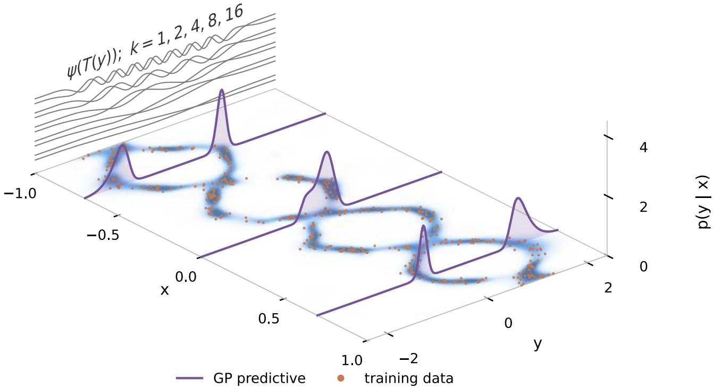
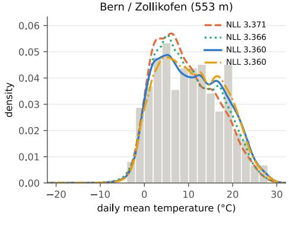
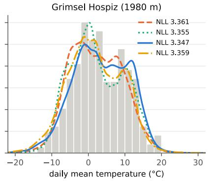
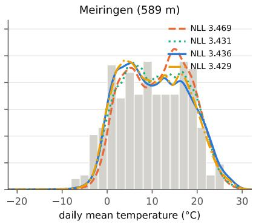
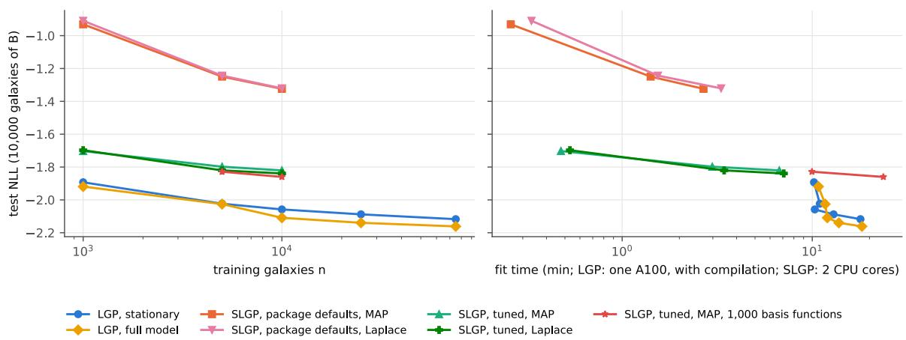

# Scalable Logistic Gaussian Process Density Regression with Kinetic Langevin Sampling

Daniel Paulin Nanyang Technological University

Ad´am Jung´ E¨otv¨os Lor´and University (ELTE)

Andr´as A. Bencz´ur HUN-REN Institute for Computer Science and Control (SZTAKI)

## Abstract

Conditional density estimation targets the full distribution of a response given covariates, as required, for example, for per-galaxy photometric redshifts. We develop a scalable Bayesian estimator based on the logistic Gaussian process. The log conditional density has a separable covariance: a Mat´ern kernel along the response, represented in a truncated Fourier basis on a circle, and a covariate kernel represented by Nystr¨om features, which accommodate non-stationary kernels with input-dependent amplitudes and length scales. Instead of a Laplace or variational approximation, we sample the latent field of this finite-feature model. Given the hyperparameters, its posterior is strongly logconcave with a uniformly bounded Hessian, and we draw from it by simulating kinetic Langevin dynamics with symmetric minibatch splitting in Kronecker-whitened coordinates. Marginal-likelihood gradients follow from Fisher’s identity as posterior expectations. Under the conditions of our analysis their bias is controlled by the sampler’s step size and run length, and the predictive averages over the non-Gaussian latent posterior instead of a Gaussian around its mode. On photometric-redshift benchmarks with up to 3.9 million training observations, trained on a single GPU, the estimator is competitive with state-of-the-art tabular foundation models on density and calibration metrics.

## 1 INTRODUCTION

A regression model that returns one number per input answers only part of the question. When the noise is heteroscedastic, skewed or multimodal, de cisions depend on the shape of the conditional distribution p(y | x). Photometric redshift estimation is the canonical example in astronomy: imaging surveys measure a handful of broad-band magnitudes per galaxy, galaxies of diferent types at diferent redshifts produce similar colours, and the redshift distribution given the photometry is often broad, skewed or bimodal. Cosmological analyses stack these per-galaxy distributions into the redshift distribution of a tomo graphic bin (Malz and Hogg, 2022), so the community scores estimators on distributional criteria: the log-likelihood of the true redshift, the uniformity of the probability integral transform (PIT), the condi tional density estimation (CDE) loss of Izbicki and Lee (2017) and the continuous ranked probability score (Schmidt et al., 2020).

The logistic Gaussian process (LGP) is the classical Bayesian nonparametric model for this problem (Leonard, 1978; Lenk, 1988; Tokdar et al., 2010). Its log-density is a Gaussian process normalised over the response, which gives smooth, valid densities with posterior uncertainty. Riihim¨aki and Vehtari (2014) fit it by a Laplace approximation on a grid, with Markov chain Monte Carlo (Metropolis–Hastings on the latent values, NUTS on the hyperparameters) as the reference on small problems. Chen et al. (2026) scale a generalized-Bayes version, whose Hyv¨arinen-score posterior needs no normaliser, to more than 150,000 observations with inducing points and variational inference. Spatial logistic Gaussian processes (SLGPs) (Gautier and Ginsbourger, 2026) model covariate-indexed density fields, with a random Fourier feature implementation supporting MAP, Laplace and NUTS inference (Gautier, 2026); we compare with it in Appendix L. Tabular foundation models go the other way. TabPFN (Hollmann et al., 2025) is pre-trained on synthetic tasks and predicts a full density for every test input in one forward pass over the training set. In a recent benchmark it was the best of-the-shelf condi tional density estimator on most of 39 datasets, and it beat every baseline in a photometric-redshift case study with ten times less data (Izbicki and Rodrigues,

2026).

We show that a finite-feature LGP can be fitted by sampling its likelihood-based latent posterior, without imposing a Gaussian approximation on it, at the scale of millions of observations, and competitively with these models. Our contributions are:

• a representation of the LGP with a separable covariance whose response axis is a truncated Fourier series of a Mat´ern process on a circle and whose covariate axis is a finite feature map (Nystr¨om features for non-stationary kernels), under which every observation enters the likelihood at its own response value, without binning (Section 2);

• a proof that, given the hyperparameters, the latent posterior, strongly log-concave as for SLGPs (Gautier, 2026), has a uniformly bounded Hessian and third derivative, with constants independent of the number of features and of the number of modes (apart from a numerical floor on the spectrum, Appendix C), for every input-dependent extension we use, and a sampler, kinetic Langevin dynamics with symmetric minibatch splitting in Kronecker-whitened coordinates, whose Wasserstein bias is then $O ( h ^ { 2 } { \sqrt { d } } )$ (Section 3);

• hyperparameter learning by Fisher-identity gradients from the warm-started chains, whose bias is bounded under Theorem 1’s assumptions for fixed representation and hyperparameters, with a problem-dependent prefactor (Section 3.3);

• a non-stationary extension, a deep Gibbs kernel with input-dependent amplitude, length scales and a per-object warp of the response (Section 5), and an evaluation on four photometric-redshift benchmarks with up to 3.9 million training galaxies (Section 6).

Code to reproduce all experiments is available at https://github.com/paulindani/LGP.

## 2 THE LOGISTIC GAUSSIAN PROCESS MODEL

Density on a transformed response. A fixed, strictly increasing map T onto [0, 1], the cumulative distribution of a kernel density estimate of the training responses on a bounded interval (Appendix E), carries y to $u = T ( y ) ;$ densities are mapped back by $p ( y \mid x ) = p _ { u } ( T ( y ) \mid x ) T ^ { \prime } ( y )$ . The conditional density of u is the exponential of a latent function,

$$
p _ { u } ( u \mid x ) = { \frac { \exp \{ g ( u , x ) \} } { Z ( x ) } } , \qquad Z ( x ) = \int _ { 0 } ^ { 1 } e ^ { g ( u , x ) } d u ,\tag{1}
$$

with g a zero-mean Gaussian process with separable covariance Cov $\{ g ( u , x ) , g ( u ^ { \prime } , x ^ { \prime } ) \} = C ( u , u ^ { \prime } ) K _ { x } ( x , x ^ { \prime } )$ The response kernel C acts as a smoothness prior on the shape of the density, and the covariate kernel $K _ { x }$ lets that shape change with x. Positivity and normal isation hold for every g.

Response axis: a Fourier basis on a circle. A stationary kernel on [0, 1] has no fast transform. We place the prior on a circle of circumference 2 of which [0, 1) is one half, the circulant-embedding construction (Dietrich and Newsam, 1997). The covariance on the circle is the periodised Mat´ern kernel $\textstyle \sum _ { n \in \mathbb { Z } } c ( d + 2 n )$ $c ( d ) = \kappa _ { \nu } ( d / \ell _ { y } )$ , which is positive definite for every length scale. By Poisson summation its Fourier coefficients are the Mat´ern spectral density $S _ { \nu } ( \omega ; \ell _ { y } )$ at $\omega = \pi k$ . Truncated to K modes,

$$
g ( u ) = \sum _ { k = 1 } ^ { K - 1 } A _ { k } \big ( a _ { k } \cos \pi k u - b _ { k } \sin \pi k u \big ) ,\tag{2}
$$

$A _ { k } ^ { 2 } = S _ { \nu } ( \pi k ; \ell _ { y } )$ , with $a _ { k } , b _ { k } \sim \mathcal N ( 0 , 1 )$ and the constant mode omitted since it cancels in (1). The weight of mode K depends on $\pi K \ell _ { y }$ alone, so K is a smoothness budget, independent of the sample size and of any grid (Appendix C).

Covariate axis: a feature map. With a finite feature map $\phi : \mathbb { R } ^ { D }  \mathbb { R } ^ { J } , K _ { x } ( x , \bar { x ^ { \prime } } ) \approx \phi ( x ) ^ { \top } \phi ( x ^ { \prime } )$ , the separable prior is reproduced exactly by a latent matrix $\xi \in \mathbb { R } ^ { \bar { J } \times 2 ( K - 1 ) }$ with v $\mathrm { e c } ( \xi ) \sim \mathcal { N } ( 0 , I )$

$$
\begin{array} { r } { g ( u , x _ { n } ) = P _ { n } ^ { \top } \psi ( u ) , \qquad P _ { n } = \phi ( x _ { n } ) ^ { \top } \xi \in \mathbb { R } ^ { 2 ( K - 1 ) } , } \end{array}\tag{3}
$$

where $\psi ( u ) ~ = ~ ( A _ { k } \cos \pi k u , - A _ { k } \sin \pi k u ) _ { 1 \leq k < K } $ , so the latent dimension is $d \ = \ 2 J ( K - 1 )$ We use Nystr¨om features (Williams and Seeger, 2001): with anchors $\bar { x } _ { 1 } , \dotsc , \bar { x } _ { J }$ (the k-means centres of the train ing inputs) and a unit-variance kernel $k ,$

$$
\phi ( x ) = \sigma L ^ { - 1 } k _ { a } ( x ) , \qquad L L ^ { \top } = K _ { a a } + \delta I ,\tag{4}
$$

where $\begin{array} { r l r } { k _ { a } ( x ) } & { { } = } & { ( k ( \bar { x } _ { j } , x ) ) _ { j \leq J } } \end{array}$ and $\begin{array} { r l } { K _ { a a } } & { { } = } \end{array}$ $( k ( \bar { x } _ { i } , \bar { x } _ { j } ) ) _ { i , j \leq J } .$ This is a regularised Nystr¨om approximation. On the anchors it equals $\sigma ^ { 2 } K _ { a a } ( K _ { a a } \mathrm { ~  ~ \xi ~ } + \mathrm { ~  ~ \delta ~ } I ) ^ { - 1 } K _ { a a }$ whose eigenvalues $\sigma ^ { 2 } \lambda ^ { 2 } / ( \lambda + \delta )$ difer from those of $\sigma ^ { 2 } K _ { a a }$ by at most $\delta ^ { 2 } \delta$ . Each feature is a kernel evaluation, and $\| \phi ( x ) \| ^ { 2 } \leq \sigma ^ { 2 } k ( x , x )$ . Unlike random Fourier features (Rahimi and Recht, 2007), which rescale a fixed draw of frequencies and make the likelihood rugged in the length scales, the features are smooth in every hyperparameter, and they apply to kernels without a shared spectral representation, such as the non-stationary kernels of Section 5. This parametrisation is noncentred: the prior of ξ is free of hyperparameters, which enter only through ϕ and A.

Unbinned likelihood. For observation n with $u _ { n } =$ $T ( y _ { n } )$ , the negative log-likelihood is

$$
\ell _ { n } ( P _ { n } ) = - P _ { n } ^ { \top } \psi ( u _ { n } ) + \log \int _ { 0 } ^ { 1 } e ^ { P _ { n } ^ { \top } \psi ( u ) } d u ,\tag{5}
$$

evaluated at $u _ { n }$ itself, so no observation is assigned to a bin. The normaliser, the integral of the exponential of a trigonometric polynomial, is computed by composite Gauss–Legendre quadrature with K cells of 4 nodes, a rule whose error is $O ( \Delta ^ { 8 } )$ in the cell width $\Delta ;$ as $\Delta = 1 / K$ we check its accuracy numerically rather than rely on a rate (Appendix C). The same nodes give the predictive density, the CDF (by integrating a polynomial interpolant of the density within each cell) and every metric. The likelihood is thus evaluated with the quadrature normaliser $Z _ { Q }$ in place of $\begin{array} { r } { Z = \int _ { 0 } ^ { 1 } e ^ { g ( u ) } d u . } \end{array}$ , and the per-object density $e ^ { g ( u ) } / Z _ { Q }$ integrates to $Z / Z _ { Q }$ , one up to the quadrature error. What we sample is therefore the posterior under this numerically normalised likelihood of the finite-feature model, not that of the unrestricted LGP. Appendix I audits log $Z _ { Q }$ against a finer rule at fitted posterior states.

The vanilla model. With a stationary kernel $K _ { x }$ and the fixed transform, the hyperparameters are $\vartheta =$ $( \sigma ^ { 2 } , \ell _ { x } , \ell _ { y } )$ : one variance and one length scale per axis. We describe its inference next. Section 5 then replaces the stationary kernel by a deep, non-stationary one and learns the transform; none of the inference changes.

## 3 INFERENCE

## 3.1 The latent posterior is strongly log-concave

Fix ϑ. The latent posterior is $\pi ( \xi ) \propto \exp \{ - U ( \xi ) \}$ $\begin{array} { r } { U ( \xi ) = \sum _ { n } \ell _ { n } ( \phi _ { n } ^ { \top } \xi ) \dot { + } \frac { 1 } { 2 } \| \xi \| _ { F } ^ { 2 } } \end{array}$ , with $\phi _ { n } = \phi ( x _ { n } )$

Proposition 1. With Φ the $N \times J$ feature matrix and $\begin{array} { r } { s ^ { 2 } = \sum _ { k } A _ { k } ^ { 2 } . } \end{array}$

$$
I \preceq \nabla ^ { 2 } U ( \xi ) \preceq \left( 1 + s ^ { 2 } \| \Phi \| ^ { 2 } \right) I \qquad f o r \ a l l \ \xi .
$$

The first part holds because (1) is an exponential family in its natural parameter $P _ { n }$ , linear in $\xi ;$ the second because the Hessian of log Z is the covariance of the statistic $\psi ( u )$ , and $\lVert \psi ( u ) \rVert ^ { 2 } = s ^ { 2 }$ for every u (proof in Appendix A). For the Mat´ern spectrum $s ^ { 2 }$ is at most the prior variance of the response process, so it is bounded uniformly in K. The numerical floor $\varepsilon / \sigma ^ { 2 }$ that we add to every mode (Appendix C) contributes $( K - 1 ) \varepsilon / \sigma ^ { 2 }$ , only $\mathrm { 1 0 ^ { - 4 } } / \sigma ^ { 2 }$ at $K \ = \ 1 0 0$ but growing with K, so when we say uniform in K we mean the spectrum without the floor. For Nystr¨om features $\lVert \Phi \rVert ^ { 2 } \leq \sigma ^ { 2 } N$ . The same cumulant argument bounds the third derivative in the norm that the minibatch sampler’s analysis requires.

Lemma 1. For every ξ and unit $ { \boldsymbol { v } } _ { } { } \in { } \mathbb { R } ^ { d } ,$ $\begin{array} { r } { \| \nabla ^ { 3 } U ( \xi ) [ v ] \| _ { F } \le M _ { 1 } ^ { \mathrm { s } } : = 8 s ^ { 3 } \sum _ { n } \| \phi _ { n } \| ^ { 3 } \le 8 s ^ { 3 } \sigma ^ { 3 } N . } \end{array}$ . For a partition of the rows into nb batches, each component $\begin{array} { r } { \dot { f _ { i } } = \lVert \xi \rVert _ { F } ^ { 2 } / \hat { ( } 2 n _ { b } ) + \sum _ { n \in B _ { i } } \ell _ { n } \dot { \iota } s \ n _ { b } ^ { - 1 } } \end{array}$ -strongly convex and satisfies the upper bound of Proposition 1 and this bound with the sums restricted to $B _ { i }$

Ms is the “strongly Hessian Lipschitz” constant of Paulin et al. (2024), under which the Wasserstein bias of SMS–UBU is ${ \dot { O } } ( h ^ { 2 } { \sqrt { d } } ) , d = 2 J ( K - 1 )$ , instead of the $O ( h ^ { 2 } d )$ that an ordinary Hessian Lipschitz bound gives. The dimension does not disappear into the condition number, but the constants of Lemma 1 grow with N and not with J or K, and d $\approx 2 \cdot 1 0 ^ { 5 }$ in our photometric-redshift experiments.

## 3.2 SMS–UBU in Kronecker-whitened coordinates

Whitening. The raw condition number grows with N. The Gauss–Newton Hessian is $\begin{array} { r } { I + \sum _ { n } \bigl ( \phi _ { n } \phi _ { n } ^ { \top } \bigr ) \otimes \Sigma _ { n } . } \end{array}$ where $\Sigma _ { n }$ is the covariance of ψ under row n’s density, a softmax covariance over the quadrature nodes. As in K-FAC (Martens and Grosse, 2015) we approximate the sum by one Kronecker product at the average chain position: $G = \Phi ^ { \top } \Phi$ and $S =$ the row-averaged $\Sigma _ { n } ,$ with eigendecompositions $G = U \Lambda _ { G } U ^ { \top } , S = V \Lambda _ { S } V ^ { \top }$ and run the chains in coordinates x with $\xi = U ( x \oslash$ $s ) V ^ { \top } , s = ( \Lambda _ { G } \otimes \Lambda _ { S } + 1 ) ^ { 1 / 2 }$ , in which $I + G \otimes S$ is the identity. Because the latent prior is the identity both eigenproblems are ordinary, which keeps the scheme accurate in single precision. A rebuild costs one $J \times J$ and one $2 K \times 2 K$ eigendecomposition. The factors are rebuilt every ten optimisation steps (more often early on SDSS and DESI, Appendix E) and never during a sampling phase.

The sampler. Kinetic Langevin dynamics $d \xi \ =$ v dt, $d v = - \nabla U d t - \gamma v d t + \sqrt { 2 \gamma } d W$ is discretised by the UBU splitting $\mathscr { U } ( h / 2 ) \mathscr { B } ( h ) \mathscr { U } ( h / 2 )$ , which integrates the Ornstein–Uhlenbeck part exactly and is second-order accurate for the invariant measure. With symmetric minibatch splitting (SMS–UBU, Paulin et al., 2024) each sweep draws a random partition into $n _ { b }$ batches and applies the batch impulses in the palindromic order $\mathcal { B } _ { 1 } , \ldots , \mathcal { B } _ { n _ { b } } , \mathcal { B } _ { n _ { b } } , \ldots , \mathcal { B } _ { 1 }$ , which cancels the leading minibatch bias, so 10 to 40 large batches sufice. We use friction $\gamma \ = \ 2$ , step $h \ =$ min $\{ 1 / ( 2 \gamma ) , 0 . 5 \hat { \lambda } ^ { - 1 / 2 } \}$ with λˆ the largest eigenvalue of the whitened Hessian from a power iteration, and four chains in two antithetic pairs. All chains share the batch partition, so each batch’s feature rows are built only once per impulse.

What is guaranteed. Let R be the fixed linear map $\operatorname { v e c } ( \xi ) = R \operatorname { v e c } ( x )$ of the whitening, $\| \cal R \| _ { \mathrm { ~ \scriptsize ~ \leq ~ 1 ~ } }$ since $s \geq 1$ , and define $m _ { R } \ = \ \lambda _ { \operatorname* { m i n } } ( R ^ { \top } R )$ , the full-data curvature bound $M _ { R } ^ { \mathrm { f u l l } } \ = \ \lambda _ { \operatorname* { m a x } } \dot { ( } R ^ { \top } ( \dot { I } + s ^ { 2 } G \otimes I ) R )$ and the batch-uniform bound $M _ { R } \ = \ \lambda _ { \mathrm { m a x } } ( R ^ { \top } ( I +$ $n _ { b } s ^ { 2 } G \otimes I ) R )$ . Since the Gram matrix of any batch satisfies $G _ { B } \preceq G .$ , every component $f _ { i }$ of every partition the sampler can draw is $\left( M _ { R } / n _ { b } \right)$ -smooth in whitened coordinates, whereas $M _ { R } ^ { \mathrm { f u l l } } \le M _ { R }$ bounds only their sum. All three constants have closed forms in terms of $( \Lambda _ { G } , \Lambda _ { S } )$ (Appendix A).

Theorem 1. Fix ϑ and R, and run SMS–UBU on $U ( R \cdot )$ with $n _ { b }$ batches, friction $\gamma \geq \sqrt { 8 M _ { R } }$ and step $h < 1 / ( 2 \gamma )$ . After k sweeps the law $\mu _ { k }$ of the latent state satisfies

$$
W _ { 2 } ( \mu _ { k } , \pi ) \leq C _ { 0 } e ^ { - m _ { R } h k / ( 8 \gamma ) } + C _ { 1 } h ^ { 2 } \Bigl ( \sqrt { d } + \frac { \sqrt { m _ { R } } \bar { \sigma } _ { * } } { M _ { R } } \Bigr ) ,
$$

with $C _ { 0 }$ depending on the initial law, $\begin{array} { r l } { C _ { 1 } } & { { } = } \end{array}$ $C ( \gamma , m _ { R } , M _ { R } , M _ { 1 } ^ { \mathrm { s } } , n _ { b } )$ independent of J, and $o f$ $K$ up to the floor term in $s ^ { 2 }$ , and $\begin{array} { r l } { \bar { \sigma } _ { * } } & { { } = } \end{array}$ $2 s N \operatorname* { m a x } _ { n } \left\| \phi _ { n } \right\| ;$ , which bounds the spread $\sigma _ { * } ( \mathcal { P } ) \ =$ $\begin{array} { r l } {  { ( n _ { b } \sum _ { i } \| \nabla \ddot { f } _ { i } ( \xi ^ { * } ) \| ^ { 2 } ) ^ { 1 / 2 } } } \end{array}$ of the minibatch gradients at the posterior mode $\xi ^ { * }$ for every partition $\mathcal { P }$ into $n _ { b }$ equal batches.

Theorem 1 is Theorem 5 of Paulin et al. (2024) applied to $U ( R \cdot )$ with the constants supplied by Lemma 1 and $\| \cal R \| \leq 1$ That result assumes that the components share a minimiser, which ours do not, and dropping the assumption adds the dimension-free term in $\bar { \sigma } _ { * }$ (Appendices A and B). Five aspects of what we run fall outside the theorem; we check the first, second and fourth empirically (Appendix I). First, our default $\gamma = 2$ is far below $\sqrt { 8 M _ { R } } . ~ M _ { R }$ bounds the curvature at every $\xi$ and for every batch, and on the controlled problem of Appendix I it exceeds the local whitened curvature $\hat { \lambda }$ by more than three orders of magnitude. Second, $\hat { \lambda }$ sets our step but is only an estimate at the chain mean, so it cannot stand in for $M _ { R }$ in the theorem. Because the tilted covariances $\Sigma _ { n }$ can collapse, we have no uniform bound on the whitened condition number better than $M _ { R } / m _ { R } .$ Third, R is rebuilt during the optimisation, so the theorem applies at fixed ϑ and $R ,$ not to the adaptive scheme as a whole. Fourth, it concerns the finite-feature, quadrature-based posterior and says nothing about the representation error of finite $^ { J , }$ K and Q. Fifth, each sweep omits up to 112 random rows (a fraction below $5 \cdot 1 0 ^ { - 4 } )$ , which the theorem does not cover. Against a π-invariant reference on a controlled problem (Appendix I) the default step shows small but detectable biases (latent variances 0.4%, the gradient up to 13 standard errors), substantially reduced at half the step with little efect on the predictive NLL.

Algorithm 1 One outer step of the fit   
Require: chains $( \xi _ { c } , v _ { c } ) _ { c \le 4 }$ , whitening $( U , V , s )$ , step   
$h , \vartheta$   
1: if step ≡ 0 (mod 10) then   
2: rebuild $( U , V , s )$ at $\bar { \xi } ;$ power iteration for h   
3: end if   
4: $n _ { \mathrm { b u r n } }$ SMS–UBU sweeps of every chain   
5: draw a gradient batch $B _ { c }$ per chain; $\hat { g }  0$   
6: for $n _ { \mathrm { c o l l } }$ collection sweeps, every 5th impulse do   
7: $\begin{array} { r } { \hat { g } \gets \hat { g } + \frac { N } { | B _ { c } | } \nabla _ { \vartheta } \sum _ { n \in B _ { c } } \ell _ { n } ( \dot { \phi _ { n } } ( \vartheta ) ^ { \top } \xi _ { c } ) } \end{array}$   
8: end for   
9: $\hat { g }  \hat { g } / ( C S ) - \nabla _ { \vartheta }$ log p(ϑ); optimiser step on ˆg

## 3.3 Learning the hyperparameters

The marginal likelihood is intractable, but its gradient obeys Fisher’s identity,

$$
\nabla _ { \vartheta } \log p ( y \mid \vartheta ) = \mathbb { E } _ { \xi \sim \pi _ { \vartheta } } \Big [ \nabla _ { \vartheta } \log p ( y \mid \xi , \vartheta ) \Big ] ,\tag{6}
$$

in the non-centred parametrisation, where no prior normaliser depends on ϑ. We estimate the expectation from the states of the warm-started chains and follow it by stochastic approximation (SOUL, De Bortoli et al., 2021); Algorithm 1 summarises one outer step. Per step, each chain $c \leq C$ draws a gradient batch $B _ { c }$ of rows, independently of the sampler’s partition, collects the cotangent of the batch negative log-likelihood with respect to its feature rows at $S$ positions of its collection sweeps, and pulls the sum back to $\vartheta$ by a single vector–Jacobian product. The estimate of the gradient of the negative log-posterior of ϑ is

$$
\hat { g } = \frac { 1 } { C S } \sum _ { c = 1 } ^ { C } \sum _ { t = 1 } ^ { S } \frac { N } { | B _ { c } | } \sum _ { n \in B _ { c } } \nabla _ { \vartheta } \ell _ { n } ( \xi _ { c , t } ; \vartheta ) - \nabla _ { \vartheta } \log p ( \vartheta ) .
$$

Here $\ell _ { n }$ includes the Jacobians of the transform and the response warp, and it is diferentiated at fixed noncentred $\xi _ { c , t } ;$ we do not diferentiate through the sampler’s trajectory.

Why sampling rather than Laplace. Besides Monte Carlo variance, the estimator of (6) has two sources of bias: the discretisation bias of the sampler and incomplete mixing of the warm-started chains. The integrand $\nabla _ { \vartheta } \log p ( \boldsymbol { y } ~ | ~ \xi , \vartheta )$ is not globally Lipschitz in $\xi ,$ but it grows at most linearly in the sup norm of each row’s field, whose posterior fluctuations depend on J and K only through feature norms, their derivatives and spectral sums (Appendix D). Under the conditions of Theorem 1 the gradient bias is therefore $O ( h ^ { 2 } ( \sqrt { d } + \sqrt { m _ { R } } \bar { \sigma } _ { * } / M _ { R } ) )$ plus a term that decays geometrically in the number of sweeps, with a prefactor that depends on the posterior-mean field and the feature derivatives, which we do not bound uniformly in J and K. The Laplace approximation instead diferentiates an approximate marginal likelihood, log $\textstyle p ( y , \hat { \xi } _ { \vartheta } \mid \vartheta ) - \frac { 1 } { 2 }$ log det $H _ { \vartheta } ( \hat { \xi } _ { \vartheta } )$ at the mode $\hat { \xi } _ { \vartheta }$ . Its gradient is exact for the approximation, but the approximation error depends on how non-Gaussian the posterior is, which varies with $\vartheta ,$ and the gradient of that error does not shrink with more computation. It also needs the log-determinant of a d-dimensional Hessian and its third derivatives through $\hat { \xi } _ { \vartheta }$ , whereas (6) needs only first derivatives at sampled states. On a controlled problem (Appendix I) the two kinds of gradient lead to similar hyperparameters. The larger diference is in prediction. Under the reported budgets and at the same hyperparameters, the Gaussian predictive around the mode is 0.12 nats worse than the sampled one, a finite-run comparison rather than a converged-posterior gap. The main practical reason to sample is thus to integrate the predictive over the non-Gaussian latent posterior.

Optimisation. For the vanilla model we follow (6) with Adam on the log-hyperparameters. For the deep model of Section 5 we use Muon (Jordan et al., 2024) for the network’s weight matrices and Adam for everything else, on a cosine schedule. The deep models hold out a small validation set from their training rows, track its log-likelihood alongside the predictive and keep the best state (early stopping). The vanilla fits use all training rows and run to the end of the schedule. We do not claim convergence of this outer procedure, whose target and preconditioner change. ϑ is an empirical-Bayes point estimate, and the predictive integrates over $\xi$ conditionally on it, not over the encoder, transform and kernel hyperparameters.

Predictive. The predictive is the posterior mean density $\mathbb { E } _ { \pi } p _ { u } ( u \mid x ; \xi )$ , averaged over the last fifteen of twenty further sweeps of the trained chains. Each state contributes its density at the quadrature nodes and, at the observation, its density (normalised by $Z _ { Q } )$ and its CDF (from the within-cell interpolant), from which the log-likelihood, PIT, CRPS (in quantile form), CDE loss and point summaries are computed.

## 4 THE VANILLA MODEL ON A BIMODAL SINUSOID

The data are $x \sim U ( - 1 , 1 ) , y = x \pm \sin ( x / 0 . 1 5 ) + \varepsilon ,$ $\varepsilon \sim \mathcal { N } ( 0 , 0 . 1 ^ { 2 } )$ with the sign drawn uniformly: an equal-weight Gaussian mixture whose modes cross wherever sin $( x / 0 . 1 5 ) = 0$ . We fit the vanilla model with RBF kernels on both axes, so that only $( \sigma ^ { 2 } , \ell _ { x } , \ell _ { y } )$ are learned, on nested training sets of 400, 2,000 and

10,000 rows, and score all fits on the same 2,000 test rows. We repeat this over four seeds, each splitting one sample of 20,000 draws diferently into training and test rows. Table 1 compares with TabPFN-3.5 (Prior Labs, 2026) given the same training rows as context. The three-parameter $\mathrm { G P }$ has the best NLL and CDE loss at every size. Averaged over the four seeds it is ahead of TabPFN-3.5 by 0.017, 0.009 and 0.016 nats at the three sizes. It wins nine of the twelve paired comparisons; in the other three (seed 2 at 400 rows, seeds 2 and 3 at 2,000) TabPFN-3.5 is ahead by 0.002–0.005 nats. Its excess over the true density on the same test rows is 0.238, 0.073 and 0.026 nats (standard deviations over seeds 0.031, 0.006 and 0.001, below those of the NLL). TabPFN-3.5 has a lower RMSE and CRPS at 400 and 2,000 rows, and the two tie at 10,000. The other baselines trail further. TabICL-2 (Qu et al., 2025) barely improves with N, Flow-Spline (Izbicki and Rodrigues, 2026) reaches −0.119 only at 10,000 rows, and at 400 rows Flow-Spline and the CRPS ensemble (Kelen et al., 2025) are far behind and unstable across seeds (standard deviations 0.30 and 0.38 nats). Both length scales shrink as N grows, in every seed. $\ell _ { x }$ goes from 0.163 (s.d. 0.012) to 0.136 (0.004) and 0.119 (0.013), near the scale 0.15 of the sinusoid, and $\ell _ { y }$ from 0.132 (0.010) to 0.109 (0.002) and 0.100 (0.001). Each fit takes 4–14 min on one GPU.

## 5 A DEEP, NON-STATIONARY KERNEL

Real covariates are high-dimensional and the conditional densities vary in scale, reach and shape across input space. We keep the structure of Section 2 and make every ingredient input-dependent through a small network.

Encoder. A pre-LayerNorm perceptron $h _ { \theta }$ reads the covariates and returns, through a residual scale of 0.01 so that the model starts stationary, a warp $e _ { \theta } ( x ) = $ $x + 0 . 0 1 h _ { \theta } ( x ) _ { 1 : D }$ , a log-amplitude $\alpha _ { \theta } ( x )$ , a log multiplier $c _ { \theta } ( x )$ of the response length scale, local log length scales $\lambda _ { \theta } ( x ) \in \bar { \mathbb { R } } ^ { D }$ and the coeficients $\beta _ { \theta } ( x )$ of a response warp. A learned full-matrix bandwidth $z = e ^ { s } ( I + B ) e _ { \theta } ( x ) \oslash \ell _ { x }$ is applied after the warp (deep kernel learning, Wilson et al., 2016).

Gibbs kernel. The covariate kernel is

$$
\begin{array} { r } { K _ { x } ( x , x ^ { \prime } ) = \sigma ( x ) \sigma ( x ^ { \prime } ) \prod _ { d } \left( \frac { 2 l _ { d } l _ { d } ^ { \prime } } { l _ { d } ^ { 2 } + l _ { d } ^ { \prime 2 } } \right) ^ { 1 / 2 } } \\ { \times \kappa _ { \nu } \Big ( \Big [ \underset { d } { \sum } \frac { ( z _ { d } - z _ { d } ^ { \prime } ) ^ { 2 } } { ( l _ { d } ^ { 2 } + l _ { d } ^ { \prime 2 } ) / 2 } \Big ] ^ { 1 / 2 } \Big ) } \end{array}\tag{7}
$$

Table 1: Bimodal sinusoid: test metrics on 2,000 test rows of the vanilla LGP (RBF kernels, Nystr¨om features, three learned hyperparameters), TabPFN-3.5 and TabICL-2 with the training rows as context, Flow-Spline tuned by the protocol of Izbicki and Rodrigues (2026), the CRPS ensemble (batch 32, early stopping on 10% of the training rows with patience 200 epochs), and the true density. All rows are averaged over four seeds, each a diferent split of one sample into training and test rows (standard deviations in the rows below). A PIT-KS of about 0.02 is the sampling noise of 2,000 rows. Bold: best of the five models.
<table><tr><td>model</td><td>NLL</td><td>RMSE</td><td>CRPS</td><td>CDE</td><td>PIT-KS</td></tr><tr><td> $N = 4 0 0$ </td><td></td><td></td><td></td><td></td><td></td></tr><tr><td>LGP (ours)</td><td>-0.0256</td><td>0.7262</td><td>0.3635</td><td>-1.179</td><td>0.0471</td></tr><tr><td>s.d.</td><td>0.0388</td><td>0.0072</td><td>0.0074</td><td>0.049</td><td>0.0268</td></tr><tr><td>TabPFN-3.5</td><td>-0.0091</td><td>0.7085</td><td>0.3496</td><td>-1.129</td><td>0.0428</td></tr><tr><td>s.d.</td><td>0.0317</td><td>0.0021</td><td>0.0023</td><td>0.047</td><td>0.0258</td></tr><tr><td>TabICL-2</td><td>+0.2101</td><td>0.7079</td><td>0.3511</td><td>+0.055</td><td>0.0448</td></tr><tr><td>s.d.</td><td>0.0292</td><td>0.0050</td><td>0.0025</td><td>0.324</td><td>0.0286</td></tr><tr><td>Flow-Spline</td><td>+0.5951</td><td>0.7070</td><td>0.3819</td><td>-0.642</td><td>0.0720</td></tr><tr><td>s.d.</td><td>0.3002</td><td>0.0075</td><td>0.0173</td><td>0.217</td><td>0.0326</td></tr><tr><td>CRPS ens.</td><td>+0.4746</td><td>0.7110</td><td>0.3740</td><td>-0.781</td><td>0.0963</td></tr><tr><td>s.d.</td><td>0.3781</td><td>0.0028</td><td>0.0274</td><td>0.277</td><td>0.0350</td></tr><tr><td>N = 2,000</td><td></td><td></td><td></td><td></td><td></td></tr><tr><td>LGP (ours)</td><td>-0.1907 0.7059</td><td></td><td>0.3431</td><td>-1.405</td><td>0.0315</td></tr><tr><td>s.d.</td><td>0.0153</td><td>0.0044</td><td>0.0016</td><td>0.020</td><td>0.0070</td></tr><tr><td>TabPFN-3.5</td><td>-0.1822</td><td></td><td>0.7001 0.3386</td><td>-1.403</td><td>0.0234</td></tr><tr><td>s.d.</td><td>0.0174</td><td>0.0052</td><td>0.0018</td><td>0.030</td><td>0.0064</td></tr><tr><td>TabICL-2</td><td>+0.1309</td><td>0.7005</td><td>0.3400</td><td>-0.820</td><td>0.0306</td></tr><tr><td>s.d.</td><td>0.0280</td><td>0.0064</td><td>0.0027</td><td>0.067</td><td>0.0068</td></tr><tr><td>Flow-Spline</td><td>+0.0383</td><td>0.7022</td><td>0.3464</td><td>-1.137</td><td>0.0466</td></tr><tr><td>s.d.</td><td>0.0516</td><td>0.0069</td><td>0.0038</td><td>0.051</td><td>0.0139</td></tr><tr><td>CRPS ens.</td><td>+0.0864</td><td>0.7011</td><td>0.3455</td><td>-1.147</td><td>0.0937</td></tr><tr><td>s.d.</td><td>0.0141</td><td>0.0068</td><td>0.0029</td><td>0.017</td><td>0.0100</td></tr><tr><td>N = 10,000</td><td></td><td></td><td></td><td></td><td></td></tr><tr><td>LGP (ours)</td><td>-0.23850.6998</td><td></td><td>0.3376</td><td>-1.486</td><td>0.0241</td></tr><tr><td>s.d.</td><td>0.0152</td><td>0.0061</td><td>0.0020</td><td>0.018</td><td>0.0074</td></tr><tr><td>TabPFN-3.5</td><td>-0.2228</td><td>0.6997</td><td>0.3376</td><td>-1.469</td><td>0.0249</td></tr><tr><td>s.d.</td><td>0.0153</td><td>0.0061</td><td>0.0019</td><td>0.021</td><td>0.0078</td></tr><tr><td>TabICL-2</td><td>+0.1254</td><td>0.6991</td><td>0.3380</td><td>-0.858</td><td>0.0345</td></tr><tr><td>s.d.</td><td>0.0242</td><td>0.0066</td><td>0.0023</td><td>0.031</td><td>0.0067</td></tr><tr><td>Flow-Spline</td><td>-0.1188</td><td>0.7003</td><td>0.3407</td><td>-1.321</td><td>0.0392</td></tr><tr><td>s.d.</td><td>0.0304</td><td>0.0069</td><td>0.0031</td><td>0.059</td><td>0.0182</td></tr><tr><td>CRPS ens.</td><td>+0.0380</td><td>0.6994</td><td>0.3427</td><td>-1.218</td><td>0.0822</td></tr><tr><td>s.d.</td><td>0.0149</td><td>0.0058</td><td>0.0024</td><td>0.027</td><td>0.0195</td></tr><tr><td>true density</td><td>-0.2640</td><td>0.6982</td><td>0.3359</td><td>-1.528</td><td>0.0181</td></tr></table>

with $\sigma ( x ) ~ = ~ \sigma e ^ { \alpha _ { \theta } ( x ) } , ~ l _ { d } ~ = ~ e ^ { \lambda _ { \theta , d } ( x ) } , ~ l _ { d } ^ { \prime } ~ = ~ e ^ { \lambda _ { \theta , d } ( x ^ { \prime } ) }$ $z ~ = ~ z ( x )$ and $z ^ { \prime } ~ = ~ z ( x ^ { \prime } )$ This is an amplitudemodulated Gibbs–Paciorek kernel (Gibbs, 1997; Paciorek and Schervish, 2004), positive definite in any dimension. The warp changes which objects are neigh bours, the local length scales how far an object’s influence reaches along each coordinate, and the amplitude how far its density may depart from uniform. Nystr¨om features (4) represent it on the anchors up to the regularisation of Section 2, with the anchors passed through the same encoder. Since $k ( x , x ) = 1$ ， we have $\| \phi ( x ) \| ^ { 2 } \leq \sigma ( x ) ^ { 2 }$

Non-stationarity along the response. The prior is diagonal in the Fourier basis, so a per-object response length scale $\ell _ { y } e ^ { c _ { \theta } ( x _ { n } ) }$ is a per-object damping of the modes, $d _ { n k } = \dot { A } _ { k } ( \ell _ { y } e ^ { c _ { \theta } ( x _ { n } ) } ) / A _ { k } ( \ell _ { y } )$ , and $P _ { n } =$ $( \phi _ { n } ^ { \top } \xi ) \odot ( d _ { n } , d _ { n } )$ . A per-object monotone warp $v =$ $\begin{array} { r } { w _ { x } ( u ) = \int _ { 0 } ^ { u } e ^ { r _ { x } } / \int _ { 0 } ^ { 1 } e ^ { r _ { x } } , r _ { x } ( t ) = \sum _ { j \leq J _ { w } } \beta _ { j } ( x ) } \end{array}$ cos $\pi j t ,$ makes the process stationary in v rather than u, so that along u its efective length scale is $\ell _ { y } e ^ { c _ { \theta } ( x ) } / w _ { x } ^ { \prime } ( u )$ One object’s density can thus be sharp in one part of its range and smooth in another. The density becomes $p _ { u } ( u \mid x ) = p _ { v } ( w _ { x } ( u ) \mid x ) w _ { x } ^ { \prime } ( u )$ with $p _ { v }$ of the form (1), so the observation moves to $\boldsymbol { v } _ { n } = { w } _ { x _ { n } } ( { u } _ { n } )$ and the Jacobian log $w _ { x _ { n } } ^ { \prime } ( u _ { n } )$ joins the objective.

Learnable transform. We also learn the response transform T. Its log-derivative at 400 knots forms a block of hyperparameters, initialised at the kernel density estimate and given a second-diference smoothness prior, and its Jacobian log $T ^ { \prime } ( y _ { n } )$ joins the objective.

Inference is unchanged. None of these changes touches the latent prior. The amplitude, the Gibbs length scales and the warp act on $\phi _ { n } ,$ and the damping rescales the coordinates of $P _ { n }$ . The response warp and the transform only move the observation point and add terms free of $\xi .$ Hence:

Proposition 2. For the model of this section, Proposition 1 and Lemma 1 hold with $\begin{array} { r } { \dot { s } ^ { 2 } = \operatorname* { m a x } _ { n } \sum _ { k } A _ { k } ^ { 2 } \bar { d } _ { n k } ^ { 2 } } \end{array}$ and $\| \phi _ { n } \| \leq \sigma ( x _ { n } )$

The sampler, the whitening (with the root-meansquare damping in S) and the Fisher gradients (now with respect to the encoder, bandwidth, transform and kernel hyperparameters) are those of Section 3.

## 6 PHOTOMETRIC-REDSHIFTEXPERIMENTS

Benchmarks. Happy and Teddy (Beck et al., 2017) are SDSS catalogues released as samples A (training) and B (drawn from the same distribution). We train on A and test on B (75,000 galaxies each). The SDSS DR18 sample (Izbicki and Rodrigues, 2026) is split 450,000/50,000, and the DESI DR1 Bright Galaxy Survey (DESI Collaboration, 2025) 3.91 million/434,505. The covariates are one magnitude, four colours and their five per-object errors, prepared with training statistics only (Appendix F).

Table 2: Test metrics on the four photometric-redshift benchmarks (NLL and CDE loss: lower is better; RMSE and CRPS in redshift units; PIT-KS: Kolmogorov–Smirnov distance of the PIT from uniform). Bold: best of the five models (all tied values at the displayed precision). Rows followed by an s.d. row are means over four seeds (five runs for ‡), with the standard deviation (s.d.) in that row. The seeds change the validation rows and each model’s initialisation (and Flow-Spline’s search), and on SDSS and DESI also the train/test split; TabPFN-3.5 and TabICL-2 on Happy and Teddy do not depend on the seed. TabICL-2 and Flow-Spline on DESI are single runs on the seed-0 split, on which the LGP’s NLL is −2.3795. ‡Mean over five runs with identical settings on that split, two of which diverge (Appendix I). ∗A context of 500,000 training rows. †Flow-Spline’s exact density on DESI has narrow spikes that dominate ${ \int } { p } ^ { 2 } ;$ on the benchmark’s 200-point grid its CDE loss is −13.95.
<table><tr><td>benchmark (train test)</td><td>model</td><td>NLL</td><td>RMSE</td><td>CRPS</td><td>CDE</td><td>PIT-KS</td><td>NMAD</td><td>outliers</td></tr><tr><td rowspan="6">HAPPY A→B (74,950 / 74,900)</td><td>LGP (ours)</td><td>-2.1557</td><td>0.0506</td><td>0.0203</td><td>-12.86</td><td>0.0054</td><td>0.0186</td><td>0.86%</td></tr><tr><td>s.d.</td><td>0.0009</td><td>0.00008</td><td>0.00002</td><td>0.02</td><td>0.0003</td><td>0.00003</td><td>0.01%</td></tr><tr><td>TabPFN-3.5</td><td>-2.1632</td><td>0.0493</td><td>0.0200</td><td>-12.90</td><td>0.0040</td><td>0.0185</td><td>0.81%</td></tr><tr><td>TabICL-2</td><td>-1.9958</td><td>0.0497</td><td>0.0201</td><td>-8.79</td><td>0.0068</td><td>0.0185</td><td>0.83%</td></tr><tr><td>Flow-Spline</td><td>-2.1093</td><td>0.0522</td><td>0.0208</td><td>-12.04</td><td>0.0220</td><td>0.0191</td><td>0.91%</td></tr><tr><td>s.d.</td><td>0.0049</td><td>0.00015</td><td>0.00003</td><td>0.16</td><td>0.0101</td><td>0.00007</td><td>0.01%</td></tr><tr><td>s.d.</td><td>CRPS ensemble</td><td>-2.1081</td><td>0.0509</td><td>0.0206</td><td>-12.09</td><td>0.0092</td><td>0.0192</td><td>0.89%</td></tr><tr><td rowspan="6">TEDDY A→B (74,309 / 74,557)</td><td></td><td>0.0040</td><td>0.00011</td><td>0.00006</td><td>0.07</td><td>0.0034</td><td>0.00009</td><td>0.01%</td></tr><tr><td>LGP (ours)</td><td>-2.3281</td><td>0.0322</td><td>0.0152</td><td>-13.96</td><td>0.0042</td><td>0.0158</td><td>0.24%</td></tr><tr><td>s.d.</td><td>0.0009</td><td>0.00002</td><td>0.00001 0.0151</td><td>0.02</td><td>0.0011</td><td>0.00003</td><td>0.01%</td></tr><tr><td>TabPFN-3.5 TabICL-2</td><td>-2.3356 -2.2566</td><td>0.0320 0.0321</td><td>0.0152</td><td>-14.05</td><td>0.0051 0.0035</td><td>0.0158</td><td>0.25%</td></tr><tr><td>Flow-Spline</td><td>-2.3086</td><td>0.0324</td><td>0.0154</td><td>-10.38</td><td>0.0127</td><td>0.0158</td><td>0.25%</td></tr><tr><td>s.d.</td><td>0.0036</td><td>0.00015</td><td>0.00006</td><td>-13.77 0.05</td><td>0.0076</td><td>0.0160 0.00007</td><td>0.25%</td></tr><tr><td></td><td>CRPS ensemble</td><td>-2.3158</td><td>0.0322</td><td>0.0153</td><td>-13.85</td><td>0.0093</td><td>0.0159</td><td>0.02% 0.23%</td></tr><tr><td>SDSS DR18</td><td>s.d.</td><td>0.0014</td><td>0.00002</td><td>0.00001</td><td>0.01</td><td>0.0031</td><td>0.00006</td><td>0.03%</td></tr><tr><td rowspan="8">(450,000 / 50,000)</td><td>LGP (ours)</td><td>-2.1123</td><td>0.0518</td><td>0.0216</td><td></td><td>0.0041</td><td></td><td></td></tr><tr><td>s.d.</td><td>0.0028</td><td>0.00028</td><td>0.00006</td><td>-12.53 0.05</td><td>0.0006</td><td>0.0196 0.00014</td><td>0.83%</td></tr><tr><td>TabPFN-3.5</td><td>-2.1012</td><td>0.0514</td><td>0.0215</td><td>-12.21</td><td>0.0116</td><td>0.0196</td><td>0.05% 0.80%</td></tr><tr><td>s.d.</td><td>0.0023</td><td>0.00015</td><td>0.00006</td><td>0.04</td><td>0.0023</td><td>0.00011</td><td>0.05%</td></tr><tr><td>TabICL-2</td><td>-1.8514</td><td>0.0520</td><td>0.0218</td><td>-6.24</td><td>0.0129</td><td>0.0199</td><td>0.84%</td></tr><tr><td>s.d.</td><td>0.0051</td><td>0.00010</td><td>0.00004</td><td>0.11</td><td>0.0016</td><td>0.00012</td><td>0.04%</td></tr><tr><td>Flow-Spline</td><td>-2.0062</td><td>0.0550</td><td>0.0229</td><td>-10.77</td><td>0.0384</td><td>0.0212</td><td>0.95%</td></tr><tr><td>s.d.</td><td>0.0069</td><td>0.00044</td><td>0.00011</td><td>0.09</td><td>0.0230</td><td>0.00016</td><td>0.06%</td></tr><tr><td></td><td>CRPS ensemble</td><td>-2.0309</td><td>0.0529</td><td>0.0223</td><td>-11.15</td><td>0.0147</td><td>0.0206</td><td>0.85%</td></tr><tr><td>DESI DR1 BGS</td><td>s.d.</td><td>0.0071</td><td>0.00038</td><td>0.00011</td><td>0.09</td><td>0.0067</td><td>0.00012</td><td>0.04%</td></tr><tr><td rowspan="7">(3.91M / 434,505)</td><td>LGP (ours)</td><td>-2.3786</td><td>0.0520</td><td>0.0168</td><td>-15.95</td><td>0.0013</td><td></td><td></td></tr><tr><td>s.d.</td><td>0.0010</td><td>0.00027</td><td>0.00004</td><td>0.04</td><td>0.0004</td><td>0.0167 0.00003</td><td>0.35%</td></tr><tr><td>TabPFN-3.5*</td><td>-2.3564</td><td>0.0521</td><td>0.0169</td><td>-15.28</td><td>0.0078</td><td>0.0169</td><td>0.01% 0.36%</td></tr><tr><td>s.d.</td><td>0.0012</td><td>0.00025</td><td>0.00004</td><td>0.03</td><td>0.0011</td><td>0.00003</td><td>0.01%</td></tr><tr><td>TabICL-2*</td><td>-2.1833</td><td>0.0530</td><td>0.0173</td><td>-6.38</td><td>0.0145</td><td>0.0173</td><td>0.36%</td></tr><tr><td>Flow-Spline</td><td>-2.2682</td><td>0.0534</td><td>0.0174</td><td>+8.71†</td><td>0.0107</td><td>0.0174</td><td>0.37%</td></tr><tr><td>CRPS ensemble</td><td>-2.2719</td><td>0.0530</td><td>0.0176</td><td>-14.05</td><td>0.0155</td><td>0.0180</td><td>0.35%</td></tr><tr><td></td><td>s.d.</td><td>0.0143</td><td>0.00014</td><td>0.00014</td><td>0.25</td><td>0.0038</td><td>0.00020</td><td>0.01%</td></tr></table>

Models. The GP uses J = 1,000 anchors, K = 100 modes, Mat´ern-3/2 kernels and Muon for at most 1,000 steps with early stopping on a held-out 5% (Happy, Teddy), 2% (SDSS) or 0.5% (DESI) of the training rows. The network grows with the data, from 3 × 32 to 6 × 64 and 10 × 128 (Table 3). TabPFN-3.5 (Prior Labs, 2026) takes the whole training set as context, except on DESI, where 500,000 rows is the most that fits in 32 GB. It is scored on its bar distribution, for which it maps the members’ bin probabilities to shared bins by diferencing a single-precision CDF; we floor them at that resolution (Appendices G and I). The CRPS ensemble (Kelen et al., 2025), a purpose-built conditional density estimator trained by a strictly proper scoring rule (Gneiting and Raftery, 2007), uses the same inputs and validation fractions. TabICL-2 (Qu et al., 2025) takes the same context as TabPFN-3.5 and is scored on its 999-quantile predictive distribution. Flow-Spline, the conditional neural spline flow (Durkan et al., 2019) of the benchmark of Izbicki and Rodrigues (2026), is tuned by that benchmark’s random search and scored on its exact density. All models are scored on the same test rows by the same code.

Table 3: GP configuration and cost on one RTX 5090 (32 GB), scoring included.
<table><tr><td></td><td>network</td><td> $J _ { w }$ </td><td></td><td>sweeps batches</td><td>time</td></tr><tr><td>HAPPY, TEDDY</td><td> $3 \times 3 2$ </td><td>6</td><td> $2 + 4$ </td><td>10</td><td>6 min</td></tr><tr><td>SDSS</td><td> $6 \times 6 4$ </td><td>6</td><td> $1 + 2$ </td><td>20</td><td>16 min</td></tr><tr><td>DESI</td><td> $1 0 \times 1 2 8$ </td><td>10</td><td> $1 + 2$ </td><td>40</td><td>2.2–2.5 h</td></tr></table>

Results. In Table 2 the comparison with TabPFN-3.5 divides along the training-set size. On Happy and Teddy, with 75,000 training galaxies, TabPFN-3.5 is ahead by 0.008 nats on both, eight times the standard deviation of the LGP over seeds, with up to 3% lower RMSE. On Teddy the LGP’s PIT statistic is lower $( 0 . 0 0 4 2 \pm 0 . 0 0 1 1$ against 0.0051). On SDSS the ordering of the density metrics reverses: the LGP is ahead on all four splits, by 0.011 nats on average (standard deviation of the diference 0.0007) and 0.32 units of CDE loss, with a PIT statistic of 0.004 against 0.012, while TabPFN keeps an edge of under 1% in RMSE and CRPS. On DESI, where TabPFN-3.5 can use an eighth of the training set, the LGP leads on every met ric and on all four splits, by 0.022 nats on average (standard deviation of the diference 0.0004) and 0.67 units of CDE loss, with a PIT statistic of 0.001 against 0.008, essentially uniform on 434,505 test galaxies. At equal data the two are close. Trained on TabPFN-3.5’s 500,000 context rows, the GP with a 10 × 64 net work is ahead by only 0.003 nats, so most of the lead comes from using the whole training set (Appendix I). Switching the latent field of costs 0.13–0.37 nats on the four benchmarks and most of the calibration, and on a controlled problem a Laplace fit’s Gaussian predictive is 0.12 nats worse than the sampled one in finite runs. The CRPS ensemble, trained on a distributional score, is close to the LGP in RMSE and CRPS but 0.01 to 0.11 nats behind it in NLL and up to twelve times less well calibrated. TabICL-2 is close to the LGP and TabPFN-3.5 in RMSE and CRPS, but its quantile-based density is 0.07 to 0.26 nats behind the LGP with a much worse CDE loss, and Flow-Spline is 0.02 to 0.11 nats behind, close to the CRPS ensemble. Appendix L adds the closest model, the spatial logis tic GP, run with its authors’ package and tuned on held-out data. It is level with our model without the encoder on its own temperature application and, in an exploratory comparison, on the smallest sinusoid training sets, about 0.01 nats behind at larger ones, and 0.2–0.3 nats behind on photometric data.

What the fit looks like. On DESI the response warps stretch each object’s redshift axis locally by up to a factor 2.9–3.7 (median over objects, range over the four seeds) and compress it elsewhere to 0.52–0.61, and the learned transform changes the log-density most at $z = 0 .$ . The validation optimum is at the last steps in every DESI seed and the test NLL is still improving, so these fits are limited by the budget rather than the data (Appendix J).

Scale. At 3.9 million rows the $N \times ( J + K + J _ { w } )$ feature matrix (17 GB) is not kept on the GPU. Features of a batch are rebuilt inside each impulse, once for all chains. The preconditioner statistics and the power iteration run over row chunks, the Gibbs kernel is evaluated in chunks with rematerialisation, and the validation and test predictive is formed chunk by chunk from stored latent states (Appendix H). A DESI step takes about 8 s.

## 7 DISCUSSION

A finite-feature logistic Gaussian process can be fitted at scale by sampling its latent posterior instead of replacing it by a Gaussian. In the spectral, featurebased representation, and for every input-dependent extension we use, the latent posterior is strongly logconcave, and its second and third derivatives are bounded by constants that do not depend on the numbers of features and modes (up to a numerical floor on the spectrum). Under the conditions of Theorem 1 a kinetic Langevin sampler in Kronecker-whitened coordinates then has an $\bar { O } ( h ^ { 2 } { \sqrt { d } } )$ bias, and Fisher’s identity turns its samples into hyperparameter gradients whose bias comes from the sampler rather than from a Gaussian approximation. The resulting estimator beats a tabular foundation model in NLL, CDE loss and calibration on the two larger benchmarks, and trails it by under 0.01 nats on the two smaller ones. The guarantee, however, covers a more conservative friction and step than our default, a fixed preconditioner and no omitted rows. The network and the Nystr¨om basis add a non-convex outer problem, solved by stochastic optimisation with early stopping, for which we claim no convergence. The uncertainty is conditional on the learned hyperparameters. Under covariate shift the latent field shrinks away from the anchors, the LGP falls behind TabPFN-3.5 and fails on Teddy A→D, and a few test redshifts fall outside its bounded response support, where its density is zero (Appendix I). All our large-scale evidence is from photometric redshifts.

## AI Use Statement

In this work, we used generative AI tools (a large language model coding assistant) for writing, refactoring and debugging research code, for running and monitoring experiments on remote GPU machines, and for drafting and editing parts of the manuscript text. We did not use generative AI tools to generate data, to fabricate or select results, or as a subject of the study. All AI-assisted code was reviewed and its outputs were checked against independent implementations or numerical tests; all reported numbers come from logged runs. We have reviewed all AI-assisted work and take responsibility for the final content of this work, including text, claims and artifacts produced with the aid of generative AI.

## References

Abramson, I. S. (1982). On bandwidth variation in kernel estimates – a square root law. The Annals of Statistics, 10(4):1217–1223.

Beck, R., Lin, C.-A., Ishida, E. E. O., Gieseke, F., de Souza, R. S., Costa-Duarte, M. V., Hattab, M. W., and Krone-Martins, A. (2017). On the realistic validation of photometric redshifts. Monthly Notices of the Royal Astronomical Society, 468(4):4323–4339.

Chen, Z., Kock, L., Lee, J. E., and Nott, D. J. (2026). Logistic Gaussian process density regression: a generalized Bayesian approach. arXiv preprint arXiv:2606.22915.

Chok, J., Lee, M. W., Paulin, D., and Vasil, G. M. (2025). Divide, interact, sample: The two-system paradigm. arXiv preprint arXiv:2509.09162.

De Bortoli, V., Durmus, A., Pereyra, M., and Vidal, A. F. (2021). Eficient stochastic optimisation by unadjusted Langevin Monte Carlo. Statistics and Computing, 31:29.

DESI Collaboration (2025). Data release 1 of the Dark Energy Spectroscopic Instrument. arXiv preprint arXiv:2503.14745.

Dietrich, C. R. and Newsam, G. N. (1997). Fast and exact simulation of stationary Gaussian processes through circulant embedding of the covariance matrix. SIAM Journal on Scientific Computing, 18(4):1088–1107.

Durkan, C., Bekasov, A., Murray, I., and Papamakarios, G. (2019). Neural spline flows. In Advances in Neural Information Processing Systems, volume 32, pages 7511–7522.

Gautier, A. (2026). SLGP: An R package for spatial conditional density estimation.

Gautier, A. and Ginsbourger, D. (2026). Continuous logistic Gaussian random measure fields for spatial distributional modelling. Annals of the Institute of Statistical Mathematics.

Gibbs, M. N. (1997). Bayesian Gaussian Processes for

Regression and Classification. PhD thesis, University of Cambridge.

Gneiting, T. and Raftery, A. E. (2007). Strictly proper scoring rules, prediction, and estimation. Journal of the American Statistical Association, 102(477):359– 378.

Hollmann, N., M¨uller, S., Purucker, L., Krishnakumar, A., K¨orfer, M., Hoo, S. B., Schirrmeister, R. T., and Hutter, F. (2025). Accurate predictions on small data with a tabular foundation model. Nature, 637:319–326.

Izbicki, R. and Lee, A. B. (2017). Converting highdimensional regression to high-dimensional conditional density estimation. Electronic Journal of Statistics, 11(2):2800–2831.

Izbicki, R. and Rodrigues, P. L. C. (2026). Benchmarking tabular foundation models for conditional density estimation in regression. arXiv preprint arXiv:2603.26611.

Jordan, K., Jin, Y., Boza, V., You, J., Cesista, F., Newhouse, L., and Bernstein, J. (2024). Muon: An optimizer for hidden layers in neural networks. https://kellerjordan.github.io/posts/muon/.

Kelen, D. M., Jung, A., Kersch, P., and Bencz´ur, A. A.´ (2025). Distribution-free data uncertainty for neural network regression. In The Thirteenth International Conference on Learning Representations.

Lenk, P. J. (1988). The logistic normal distribution for Bayesian, nonparametric, predictive densities. Journal of the American Statistical Association, 83(402):509–516.

Leonard, T. (1978). Density estimation, stochastic processes and prior information. Journal of the Royal Statistical Society: Series B, 40(2):113–132.

Malz, A. I. and Hogg, D. W. (2022). How to obtain the redshift distribution from probabilistic redshift estimates. The Astrophysical Journal, 928(2):127.

Martens, J. and Grosse, R. (2015). Optimizing neural networks with Kronecker-factored approximate curvature. In Proceedings of the 32nd International Conference on Machine Learning (ICML), volume 37 of PMLR, pages 2408–2417.

Paciorek, C. J. and Schervish, M. J. (2004). Nonstationary covariance functions for Gaussian process regression. In Advances in Neural Information Processing Systems, volume 16, pages 273–280.

Paulin, D. and Whalley, P. A. (2024). Correction to “Wasserstein distance estimates for the distributions of numerical approximations to ergodic stochastic diferential equations”. arXiv preprint arXiv:2402.08711.

Paulin, D., Whalley, P. A., Chada, N. K., and Leimkuhler, B. (2024). Sampling from Bayesian neural network posteriors with symmetric minibatch splitting Langevin dynamics. arXiv preprint arXiv:2410.19780.

Prior Labs (2026). TabPFN-3.5: model weights and package (version 9.0). https://huggingface. co/Prior-Labs/tabpfn\_3\_5. Regressor checkpoint tabpfn-v3.5-20260909.

Qu, J., Holzm¨uller, D., Varoquaux, G., and Le Morvan, M. (2025). TabICL: A tabular foundation model for in-context learning on large data. In Proceedings of the 42nd International Conference on Machine Learning, volume 267 of PMLR, pages 50817–50847. arXiv:2502.05564; regressor checkpoint v2 (2026) from the tabicl package.

Rahimi, A. and Recht, B. (2007). Random features for large-scale kernel machines. In Advances in Neural Information Processing Systems 20, pages 1177– 1184.

Riihim¨aki, J. and Vehtari, A. (2014). Laplace approximation for logistic Gaussian process density estimation and regression. Bayesian Analysis, 9(2):425– 448.

Sanz-Serna, J. M. and Zygalakis, K. C. (2021). Wasserstein distance estimates for the distributions of numerical approximations to ergodic stochastic diferential equations. Journal of Machine Learning Research, 22(242):1–37.

Schmidt, S. J., Malz, A. I., Soo, J. Y. H., Almosallam, I. A., Brescia, M., Cavuoti, S., Cohen-Tanugi, J., Connolly, A. J., DeRose, J., Freeman, P. E., et al. (2020). Evaluation of probabilistic photometric redshift estimation approaches for The Rubin Observatory Legacy Survey of Space and Time (LSST). Monthly Notices of the Royal Astronomical Society, 499(2):1587–1606.

Silverman, B. W. (1986). Density Estimation for Statistics and Data Analysis. Chapman and Hall, London.

Tokdar, S. T., Zhu, Y. M., and Ghosh, J. K. (2010). Bayesian density regression with logistic Gaussian process and subspace projection. Bayesian Analysis, 5(2):319–344.

Vehtari, A., Gelman, A., Simpson, D., Carpenter, B., and B¨urkner, P.-C. (2021). Rank-normalization, folding, and localization: An improved Rb for assessing convergence of MCMC. Bayesian Analysis, 16(2):667–718.

Williams, C. K. I. and Seeger, M. (2001). Using the Nystr¨om method to speed up kernel machines. In Advances in Neural Information Processing Systems 13, pages 682–688.

Wilson, A. G., Hu, Z., Salakhutdinov, R., and Xing, E. P. (2016). Deep kernel learning. In Proceedings of the 19th International Conference on Artificial Intelligence and Statistics (AISTATS), volume 51 of PMLR, pages 370–378.

## A PROOFS

Proof of Proposition 1. $P _ { n } ~ = ~ \phi _ { n } ^ { \top } \xi$ is linear in $\xi$ and $- P _ { n } ^ { \top } \psi ( u _ { n } )$ is linear in $P _ { n }$ . The log-normaliser log $\begin{array} { r } { Z _ { n } ( P ) = \log \int _ { 0 } ^ { 1 } \exp \{ P ^ { \top } \psi ( u ) \} } \end{array}$ du is the log-partition function of an exponential family with suficient statistic $\psi ( u )$ , hence convex in $P$ (exactly so under the quadrature, which replaces the integral by a positive combination of exponentials of afine functions of $P )$ . Convexity survives the linear map and the sum over $n ,$ and the prior adds $I ,$ so $\nabla ^ { 2 } U \succeq I$

For the upper bound, $\begin{array} { r } { \| \psi ( u ) \| ^ { 2 } = \sum _ { k } A _ { k } ^ { 2 } ( \cos ^ { 2 } \pi k u + \sin ^ { 2 } \pi k u ) = s ^ { 2 } } \end{array}$ for every u. The Hessian of log $Z _ { n }$ in $P _ { n }$ is the covariance $\Sigma _ { n }$ of the suficient statistic under the row density $p _ { n }$ (the discrete law on the quadrature nodes with weights $\propto w _ { q } e ^ { P _ { n } ^ { \top } \psi ( u _ { q } ) } )$ . For a unit vector $a , \mathrm { V a r } _ { p _ { n } } \{ a ^ { \top } \psi ( u ) \} \leq \operatorname* { s u p } _ { u } ( a ^ { \top } \psi ( u ) ) ^ { 2 } \leq s ^ { 2 } , \mathrm { ~ s o ~ }$ $\Sigma _ { n } \preceq s ^ { 2 } I$ . By the chain rule $\begin{array} { r } { \nabla ^ { 2 } U = I + \sum _ { n } ( \phi _ { n } \phi _ { n } ^ { \top } ) \otimes \Sigma _ { n } \preceq I + s ^ { 2 } ( \Phi ^ { \top } \Phi ) \otimes I } \end{array}$ , and $\lambda _ { \operatorname* { m a x } } ( \Phi ^ { \top } \Phi ) = \| \Phi \| ^ { 2 }$ . Finally $\begin{array} { r } { s ^ { 2 } = \sum _ { k = 1 } ^ { K - 1 } \widehat { c } ( \pi k ) \le } \end{array}$ $\textstyle \sum _ { k \geq 1 } { \hat { c } } ( \pi k )$ , the variance of the periodised process minus its constant mode, finite and free of $K$ □

Proof of Lemma 1. Since $P _ { n } ^ { \top } \psi ( u ) ~ = ~ \langle \xi , \phi _ { n } \psi ( u ) ^ { \top } \rangle _ { F } .$ row n contributes $\ell _ { n } ( \xi ) ~ = ~ - \langle \xi , W _ { n } ( u _ { n } ) \rangle ~ +$ log $\begin{array} { r } { \sum _ { q } w _ { q } \exp \langle \xi , W _ { n } ( u _ { q } ) \rangle } \end{array}$ with $W _ { n } ( u ) = \phi _ { n } \psi ( u ) ^ { \top }$ , the log-partition function of the discrete exponential family $\rho _ { n } \dot { ( } u _ { q } ) \mathrm { ~ \propto ~ } w _ { q } e ^ { \langle \xi , W _ { n } ( u _ { q } ) \rangle }$ minus a linear term. Its third derivative is the third central moment of $W _ { n }$ under $\begin{array} { r l } { \dot { \rho _ { n } } \colon } & { { } \nabla ^ { 3 } \ell _ { n } ( \xi ) [ a , b , c ] \ = \ \mathbb { E } _ { \rho _ { n } } [ \langle a , \bar { W } \rangle \langle b , \bar { W } \rangle \langle c , \bar { W } \rangle ] } \end{array}$ ， $\bar { W } ~ = ~ W _ { n } - \mathbb { E } _ { \rho _ { n } } W _ { n }$ For a unit $v , \nabla ^ { 3 } \ell _ { n } ( \xi ) [ v ] =$ $\mathbb { E } _ { \rho _ { n } } [ \langle v , \bar { W } \rangle \bar { W } \bar { W } ^ { \top } ]$ , whose Frobenius norm is at most $\begin{array} { r } { \mathbb { E } _ { \rho _ { n } } [ | \langle v , \bar { W } \rangle | \| \bar { W } \| ^ { 2 } ] \leq \operatorname* { s u p } \| \bar { W } \| ^ { 3 } \leq ( 2 s \| \phi _ { n } \| ) ^ { 3 } } \end{array}$ , because $\lVert W _ { n } ( u ) \rVert _ { F } = \lVert \phi _ { n } \rVert \lVert \psi ( u ) \rVert = s \lVert \phi _ { n } \rVert$ . The prior is quadratic, so the triangle inequality gives $M _ { 1 } ^ { \mathrm { s } }$ . For Nystr¨om features $\| \phi _ { n } \| \leq \sigma$ (see below). A component $f _ { i }$ carries the prior share $\| \xi \| ^ { 2 } / ( 2 n _ { b } )$ and the rows of $B _ { i } ,$ and the same arguments apply to it. □

Proof of Theorem 1 and the constants. The whitening is vec $( \xi ) = R$ vec(x) with $R = ( U \otimes V ) \operatorname { d i a g } ( s ) ^ { - 1 }$ , an orthogonal matrix times a diagonal with entries $s _ { i j } ^ { - 1 } \leq 1 , \mathrm { s o } \| R \| \leq \mathrm { i }$ . For ${ \tilde { U } } = U \circ R \colon \nabla ^ { 2 } { \tilde { U } } = R ^ { \top } \nabla ^ { 2 } U R \succeq R ^ { \top } R \succeq$ $m _ { R } I$ with $m _ { R } = \operatorname* { m i n } _ { i j } s _ { i j } ^ { - 2 } = ( 1 + \lambda _ { \operatorname* { m a x } } ( G ) \lambda _ { \operatorname* { m a x } } ( S ) ) ^ { - 1 } ; \nabla ^ { 2 } \tilde { U } \preceq R ^ { \top } ( I + s ^ { 2 } G \otimes I ) R$ , which is diagonal in the $( U \otimes V )$ basis, so its largest eigenvalue is $M _ { R } ^ { \mathrm { f u l l } } = \operatorname* { m a x } _ { i j } ( 1 + s ^ { 2 } \lambda _ { G , i } ) / ( 1 + \lambda _ { G , i } \lambda _ { S , j } ) ;$ and $\nabla ^ { 3 } \tilde { U } ( x ) [ v ] = R ^ { \top } ( \nabla ^ { 3 } U ( R x ) [ R v ] ) R$ has Frobenius norm at most $\| R \| ^ { \ddot { 3 } } M _ { 1 } ^ { \mathrm { s } } \ \leq \ M _ { 1 } ^ { \mathrm { s } }$ Theorem 5 of Paulin et al. (2024) also asks each of the $n _ { b }$ components to be $( m _ { R } / n _ { b } )$ -strongly convex, which the prior share gives, and $\left( M _ { R } / n _ { b } \right)$ -smooth. In whitened coordinates the Hessian of $f _ { i }$ is at most $R ^ { \top } ( n _ { b } ^ { - 1 } I + s ^ { 2 } \bar { G } _ { B _ { i } } \otimes I ) R$ with $\begin{array} { r } { G _ { B _ { i } } = \sum _ { n \in B _ { i } } \phi _ { n } \phi _ { n } ^ { \top } \preceq G . } \end{array}$ , hence at most $n _ { b } ^ { - 1 } R ^ { \top } ( I + n _ { b } s ^ { 2 } G \otimes I ) R$ , whose largest eigenvalue is ${ M } _ { R } / n _ { b }$ with ${ M _ { R } } = \mathrm { m a x } _ { i j } ( 1 + n _ { b } s ^ { 2 } \lambda _ { G , i } ) / ( 1 + \lambda _ { G , i } \lambda _ { S , j } )$ . This bound holds for every partition, so it covers the random partitions redrawn at each sweep. The implementation partitions a random $n _ { b } N _ { B } \le N$ of the rows into equal batches of $N _ { B }$ rows and rescales the impulses by $N / N _ { B } ,$ omitting a remainder of $r \ < \ N _ { B }$ rows $( r \ = \ 2 , \ 3 4 )$ , 40 and 112 on Happy, Teddy, SDSS and DESI; 0 in Appendix I). For a uniformly sampled batch B, $\begin{array} { r } { \hat { g } _ { B } ( \xi ) = \xi + ( N / N _ { B } ) \sum _ { n \in B } \nabla \ell _ { n } ( \xi ) } \end{array}$ satisfies $\mathbb { E } _ { B } \hat { g } _ { B } ( \boldsymbol { \xi } ) = \nabla U ( \boldsymbol { \xi } )$ at a fixed $\xi .$ This does not, however, make the omitted-remainder sampler the one the theorem analyses, and the omitted fraction $r / N \le 5 \cdot 1 0 ^ { - 4 }$ of the rows is not by itself a bound on the resulting error. The full-data constant $M _ { R } ^ { \mathrm { f u l l } } = \operatorname* { m a x } _ { i j } ( 1 + s ^ { 2 } \lambda _ { G , i } ) / ( 1 + \lambda _ { G , i } \lambda _ { S , j } )$ of the display above bounds only the sum of the components. Theorem 5 of Paulin et al. (2024) further assumes that the components share the minimiser of the sum. Ours do not, and Theorem 2 (Appendix B) proves the bound without this assumption, with $\sqrt { d }$ replaced by $\sqrt { d } + \sqrt { m _ { R } } \sigma _ { * } / M _ { R }$ where $\sigma _ { * }$ is the spread of the whitened components $f _ { i } ( R \cdot )$ , whose gradients are $R ^ { \top } \nabla f _ { i }$ . Since $\left\| \boldsymbol { R } \right\| \leq 1$ , this is at most the spread $\sigma _ { * } ( \mathcal { P } )$ of the $f _ { i } ,$ which Corollary 1 bounds by $\bar { \sigma } _ { * }$ for every partition $\mathcal { P }$ . The bound therefore holds uniformly over the partitions redrawn at each sweep. With these constants we obtain the stated bound. Since $\| \cal R \| \leq 1$ , Wasserstein distances in $\xi$ are at most those in $x .$ The dimension dependence of the related analysis of Sanz-Serna and Zygalakis (2021) requires the stronger assumption identified by Paulin and Whalley (2024); the strongly-Hessian-Lipschitz condition of Lemma 1 is of that kind. □

Nystr¨om feature norm. With $\phi ( x ) ~ = ~ \sigma L ^ { - 1 } k _ { a } ( x ) , ~ k _ { a } ( x ) ~ = ~ ( k ( \bar { x } _ { j } , x ) ) _ { j } , ~ \| \phi ( x ) \| ^ { 2 } ~ = ~ \sigma ^ { 2 } k _ { a } ( x ) ^ { \top } ( K _ { a a } ~ + K _ { \bar { x } } ) ^ { \top } .$ $\delta I ) ^ { - 1 } k _ { a } ( x ) \leq \sigma ^ { 2 } k _ { a } ( x ) ^ { \top } K _ { a a } ^ { + } k _ { a } ( x ) \leq \sigma ^ { 2 } k ( x , x )$ , the last step because the Nystr¨om approximation is the projection of $k ( \cdot , x )$ onto the span of the anchors in the reproducing kernel Hilbert space. Hence $\| \Phi \| ^ { 2 } \leq \| \Phi \| _ { F } ^ { 2 } \leq$ $\textstyle \sigma ^ { 2 } \sum _ { n } k ( x _ { n } , x _ { n } )$

Proof of Proposition 2. The per-object damping gives $P _ { n } = \phi _ { n } ^ { \top } \xi D _ { n }$ with $D _ { n }$ diagonal and positive, still linear in ξ. The response warp replaces $u _ { n }$ by $v _ { n } = w _ { x _ { n } } ( u _ { n } )$ , which does not depend on $\xi ,$ and the Jacobians log $w _ { x _ { n } } ^ { \prime } ( u _ { n } )$ , log $T ^ { \prime } ( y _ { n } )$ are constant in $\xi .$ . The arguments above apply row by row with the statistic $\psi _ { n } ( u ) =$ $( A _ { k } d _ { n k } \cos \pi k u , - A _ { k } d _ { n k }$ sin πku)k, of squared norm $\textstyle \sum _ { k } A _ { k } ^ { 2 } d _ { n k } ^ { 2 } \leq s ^ { 2 }$ , and the features $\phi ( x _ { n } )$ of the Gibbs kernel, whose diagonal is $\sigma ( x ) ^ { 2 }$ . Since $A _ { k } d _ { n k } = A _ { k } { \left( \ell _ { y } e ^ { c _ { \theta } \left( x _ { n } \right) } \right) }$ with $| c _ { \theta } | \le 3 , s ^ { 2 }$ is bounded by the variance of the response process at length scale ${ \mathrm { ? } } ^ { - 3 } \ell _ { y } ,$ again free of K. □

## B SMS–UBU WITHOUT A COMMON MINIMISER

Theorem 5 of Paulin et al. (2024) assumes that the components $f _ { i }$ of the potential share the minimiser of $f = \textstyle \sum _ { i } f _ { i }$ , which our minibatch components do not. We show that the assumption can be dropped at the cost of one dimension-free term.

Setting. $\begin{array} { r } { f = \sum _ { i = 1 } ^ { N _ { m } } f _ { i } } \end{array}$ on $\mathbb { R } ^ { d }$ is m-strongly convex and M-∇Lipschitz with minimiser $x ^ { * } ;$ each $f _ { i }$ is mi-strongly convex and (M/N )-∇Lipschitz; $\pi \propto e ^ { - \bar { f } }$ . SMS–UBU uses the stochastic gradient $G ( y , \omega ) = N _ { m } \nabla { f } _ { \omega } ( y )$ , ω uniform on $\{ 1 , \ldots , N _ { m } \}$ , in a palindromic sweep, and $D ( y , \omega ) = G ( y , \omega ) - \nabla f ( y )$ . Only $\begin{array} { r } { \sum _ { i } \nabla f _ { i } ( x ^ { * } ) = 0 } \end{array}$ is assumed. The gradient spread at the mode,

$$
\sigma _ { * } ^ { 2 } = \mathbb { E } _ { \omega } \| G ( x ^ { * } , \omega ) \| ^ { 2 } = N _ { m } \sum _ { i = 1 } ^ { N _ { m } } \| \nabla f _ { i } ( x ^ { * } ) \| ^ { 2 } ,
$$

is the variance of the stochastic gradient there. It vanishes exactly when the minimiser is common.

Lemma 2. If $X \sim \pi$ then $\mathbb { E } \| X - x ^ { * } \| ^ { 2 } \leq d / m$

Proof. Integration by parts gives $\mathbb { E } \langle \nabla f ( X ) , X - x ^ { * } \rangle = d ;$ strong convexity and $\nabla f ( x ^ { * } ) = 0 { \mathrm { ~ g i v e ~ } } \langle \nabla f ( x ) , x - x ^ { * } \rangle \geq$ $m \| x - x ^ { * } \| ^ { 2 }$ □

Lemma 3. For every i and every square-integrable random vector Y, $\mathrm { ~ , ~ } \| N _ { m } \nabla f _ { i } ( Y ) \| _ { L ^ { 2 } } \leq N _ { m } \| \nabla f _ { i } ( x ^ { * } ) \| + M \| Y -$ $x ^ { * } \Vert _ { L ^ { 2 } } ,$ in particular $\| N _ { m } \nabla f _ { i } ( X ) \| _ { L ^ { 2 } } \leq N _ { m } \| \nabla f _ { i } ( x ^ { * } ) \| + M \sqrt { d / m } \ f o r \ X \sim \pi$ . If each index occurs at most r times in $i _ { 1 } , \dots , i _ { k }$ , then $\begin{array} { r } { \sum _ { j } N _ { m } \| \nabla f _ { i _ { j } } ( x ^ { * } ) \| \le r N _ { m } \sigma _ { * } } \end{array}$

Proof. $\| \nabla f _ { i } ( y ) \| \le \| \nabla f _ { i } ( x ^ { * } ) \| + ( M / N _ { m } ) \| y - x ^ { * } \|$ ; take $L ^ { 2 }$ norms and use Lemma 2. For the sum, $\begin{array} { r } { \sum _ { i } \lVert \nabla f _ { i } ( x ^ { * } ) \rVert \leq } \end{array}$ $\begin{array} { r } { \sqrt { N _ { m } } ( \sum _ { i } \| \nabla f _ { i } ( x ^ { * } ) \| ^ { 2 } ) ^ { 1 / 2 } = \sigma _ { * } } \end{array}$ □

Lemma 4. For every y, $( \mathbb { E } _ { \omega } \Vert D ( y , \omega ) \Vert ^ { 2 } ) ^ { 1 / 2 } \leq 2 M \Vert y - x ^ { * } \Vert + \sigma _ { * }$

Proof. $D ( y , \omega ) = [ N _ { m } ( \nabla f _ { \omega } ( y ) - \nabla f _ { \omega } ( x ^ { * } ) ) - ( \nabla f ( y ) - \nabla f ( x ^ { * } ) ) ] + N _ { m } \nabla f _ { \omega } ( x ^ { * } )$ ; the bracket has norm at most $2 M \| y - x ^ { * } \|$ for every ω, the last term has $L ^ { 2 } ( \omega )$ norm $\sigma _ { * }$ □

With a common minimiser, Lemma 4 is Assumption 2 of Paulin et al. (2024) with $C _ { S G } = 2 \ /$ , and Lemma 3 is the $L ^ { 2 }$ form of their Lemma 9.

Theorem 2. Under the assumptions of Theorem 5 of Paulin et al. (2024) $( h < 1 / ( 2 \gamma ) , \gamma \geq \sqrt { 8 M } , f M _ { 1 } ^ { \mathrm { s } }$ -strongly Hessian Lipschitz) but without a common minimiser of the components, the law $\tilde { \pi } _ { k }$ of SMS–UBU satisfies

$$
\mathcal { W } _ { 2 } ( \tilde { \pi } _ { k } , \pi ) \leq \sqrt { 2 } e ^ { - \frac { m k } { 8 \gamma } \lfloor k / N _ { m } \rfloor } \mathcal { W } _ { 2 , a , b } ( \bar { \pi } _ { 0 } , \bar { \pi } ) + C ( \gamma , m , M , M _ { 1 } ^ { \mathrm { s } } , N _ { m } ) h ^ { 2 } \Big ( \sqrt { d } + \frac { \sqrt { m } \sigma _ { * } } { M } \Big ) ,
$$

with a constant C of the same form as theirs, depending on $( \gamma , m , M , M _ { 1 } ^ { \mathrm { s } } , N _ { m } )$ , whose coeficients we do not track; under M1-Hessian Lipschitz continuity only, $h ^ { 2 } d$ becomes $h ^ { 2 } ( d + \sqrt { m } \sigma _ { * } / M )$

Proof. Their proof combines the contraction of SMS–UBU between two copies driven by the same partitions and noise (their Proposition 7, applied step by step with the constants $m _ { i } )$ with the bias of SMS–UBU started at stationarity (their Theorem 14), which rests on the interpolation Lemma 13, the cycle estimate Proposition $^ { 1 2 , }$ Lemma 11 and Theorem 6 for the stochastic-gradient gap, Lemma 10 (sampling without replacement) and the full-gradient Proposition 8. The minimisers of the components enter in exactly three places, always through $\| N _ { m } \nabla f _ { i } ( \cdot ) \| \ \mathrm { o r } \ \| D ( \cdot , \omega ) \|$ ; the contraction, Lemmas 10 and 13, Proposition 8 and the Itˆo–Taylor terms $I _ { 2 } , \ldots , I _ { 5 }$ of Proposition 12, which contain $\nabla ^ { 2 } f _ { i } , \nabla ^ { 3 } f _ { i }$ or the full gradient $\nabla f ,$ do not involve them.

(i) In Theorem 6 and Lemma 11 the stochastic-gradient gap over $\begin{array} { r l r } { k } & { { } \le } & { 2 N _ { m } } \end{array}$ steps is controlled by $\textstyle ( \sum _ { i < k } \lVert D ( y _ { i } , \omega _ { i } ) \rVert _ { L ^ { 2 } } ^ { 2 } ) ^ { 1 / 2 }$ , bounded there by $C _ { S G } M \sqrt { k } \left( \operatorname* { m a x } _ { i } \| y _ { i } - X _ { ( i + 1 / 2 ) h } \| _ { L ^ { 2 } } + \sqrt { d / m } \right)$ . By Lemma 4 and Minkowski’s inequality in $\ell ^ { 2 }$ it is at most this with $C _ { S G } = 2$ plus $\sqrt { k } \sigma _ { * }$ . Since $M \sqrt { d / m } + \sigma _ { * } = ( M / \sqrt { m } ) ( \sqrt { d } +$ $\sqrt { m } \sigma _ { * } / M )$ , Lemma 11 holds with its factor $\sqrt { N _ { m } d ( \gamma ^ { 4 } h ^ { 2 } / m ^ { 2 } + 1 / m ) }$ replaced by $\sqrt { N _ { m } ( \gamma ^ { 4 } h ^ { 2 } / m ^ { 2 } + 1 / m ) } \left( \sqrt { d } + \right.$ $\sqrt { m } \sigma _ { * } / M )$ .

(ii) In Proposition 12 the terms $I _ { 1 } ^ { i , j }$ of the velocity component and their analogue in the position component have integrands $E ( \cdot ) N _ { m } \nabla f _ { i } ( X _ { s } )$ with $X _ { s } \sim \pi$ , bounded there by $O ( h ^ { 2 } N _ { m } \gamma ^ { 2 } M \sqrt { d / m } )$ through their Lemma 9. By Lemma 3 the factor $M \sqrt { d / m }$ becomes $N _ { m } \| \nabla f _ { i } ( x ^ { * } ) \| + M \sqrt { d / m } ;$ each component occurs once in the forward and once in the backward sweep of a cycle, so summing over the cycle gives $N _ { m } M \sqrt { d / m } + N _ { m } \sigma _ { * }$ in place of $N _ { m } M \sqrt { d / m }$

(iii) In Theorem 14, for the at most $2 N _ { m } - 1$ steps of an incomplete cycle, the one-step source $h M \sqrt { d / m }$ of their Gr¨onwall argument becomes $h ( N _ { m } \| \nabla f _ { \omega _ { k } } ( x ^ { * } ) \| + M \sqrt { d / m } )$ , whose sum over the remaining steps is at most $2 h N _ { m } ( M \sqrt { d / m } + \sigma _ { * } )$ by Lemma 3 with $r = 2 .$ , against $2 h N _ { m } M \sqrt { d / m }$ there.

In each case $M \sqrt { d / m }$ becomes $M \sqrt { d / m } + \sigma _ { * }$ , i.e. $\sqrt { d }$ becomes $\sqrt { d } + \sqrt { m } \sigma _ { * } / M$ in the terms that come from moments of gradients; the other terms are unchanged, and bounding every term by the larger factor gives the result. □

The additional term does not depend on the dimension. It is the variance of the stochastic gradient at the mode, which symmetric splitting does not cancel at first order. A centred (control-variate) gradient would remove it, but that would be a diferent algorithm.

Corollary 1. For the latent potential split into $n _ { b }$ batches of equal size with components $f _ { i } = \| \xi \| _ { F } ^ { 2 } / ( 2 n _ { b } ) +$ $\begin{array} { r } { \sum _ { n \in B _ { i } } \ell _ { n } , \sigma _ { * } \le \bar { \sigma } _ { * } : = 2 s N \operatorname* { m a x } _ { n } \| \phi _ { n } \| } \end{array}$ for every partition, and for a uniformly random partition $\mathbb { E } \sigma _ { * } ^ { 2 } = \left( n _ { b } - \right.$ $\begin{array} { r } { 1 ) \frac { \tilde { N } } { N - 1 } \sum _ { n } \| \tilde { g } _ { n } \| ^ { 2 } \leq 4 ( n _ { b } - 1 ) \frac { N } { N - 1 } s ^ { 2 } \sum _ { n } \| \phi _ { n } \| ^ { 2 } } \end{array}$ , where $\begin{array} { r } { \tilde { g } _ { n } = \nabla \ell _ { n } ( \xi ^ { * } ) - N ^ { - 1 } \sum _ { n ^ { \prime } } \nabla \ell _ { n ^ { \prime } } ( \xi ^ { * } ) } \end{array}$

Proof. At the mode $\begin{array} { r } { \xi ^ { * } ~ = ~ - \sum _ { n } \nabla \ell _ { n } ( \xi ^ { * } ) } \end{array}$ , so with equal batch sizes $\begin{array} { r } { \nabla f _ { i } ( \xi ^ { * } ) ~ = ~ \xi ^ { * } / n _ { b } + \sum _ { n \in B _ { i } } \nabla \ell _ { n } ( \xi ^ { * } ) ~ = ~ } \end{array}$ $\sum { \sum _ { n \in B _ { i } } \tilde { g } _ { n } }$ . Since $\nabla \ell _ { n } ( \xi ) = \phi _ { n } ( \mathbb { E } _ { n } \psi - \psi ( u _ { n } ) ) ^ { \top }$ and $\lVert \psi ( u ) \rVert = s , \ \lVert \nabla \ell _ { n } \rVert _ { F } \leq 2 s \lVert \phi _ { n } \rVert$ , and centring does not increase $\textstyle \sum _ { n } \| { \tilde { g } } _ { n } \| ^ { 2 }$ . Cauchy–Schwarz gives $\begin{array} { r } { \| \nabla f _ { i } ( \xi ^ { * } ) \| ^ { 2 } \leq ( N / n _ { b } ) \sum _ { n \in B _ { i } } \| \tilde { g } _ { n } \| ^ { 2 } } \end{array}$ , hence $\begin{array} { r } { \sigma _ { * } ^ { 2 } = n _ { b } \sum _ { i } \lVert \nabla f _ { i } ( \xi ^ { * } ) \rVert ^ { 2 } \leq } \end{array}$ $\begin{array} { r } { N \sum _ { n } \lVert \tilde { g } _ { n } \rVert ^ { 2 } \leq 4 s ^ { 2 } N ^ { 2 } \operatorname* { m a x } _ { n } \lVert \phi _ { n } \rVert ^ { 2 } } \end{array}$ . For a uniformly random partition, each batch sum is a simple random sample without replacement of size $b ~ = ~ N / n _ { b }$ from the centred $\left( { \tilde { g } } _ { n } \right)$ , with $\begin{array} { r } { { \mathbb { E } } \| \sum _ { n \in B _ { i } } \tilde { g } _ { n } \| ^ { 2 } \ = \ \hat { b } _ { N - 1 } ^ { N - b } \frac { 1 } { N } \sum _ { n } \| \tilde { g } _ { n } \| ^ { 2 } } \end{array}$ ; multiplying by $n _ { b } ^ { 2 }$ gives the formula. □

## C THE SPECTRAL RESPONSE AXIS

By Poisson summation, $\begin{array} { r } { \sum _ { n } c ( d + 2 n ) = \frac { 1 } { 2 } \hat { c } ( 0 ) + \sum _ { k > 1 } \hat { c } ( \pi k ) } \end{array}$ cos(πkd) with ˆc the Fourier transform of c, i.e. the Mat´ern spectral density. Since cos $\begin{array} { r } { \mathbf { \nabla } \cdot k \mathbf { \bar { ( } } u \mathrm { ~ - ~ } u ^ { \prime } ) = \mathbf { \bar { c } } } \end{array}$ os πku cos πku′ + sin πku sin $\pi k u ^ { \prime }$ , the process (2) with $A _ { k } ^ { 2 } = { \hat { c } } ( \pi k )$ has exactly this covariance (up to the omitted constant mode). A white-noise floor $A _ { k } ^ { 2 } \ + = \varepsilon / \sigma ^ { 2 }$ $\varepsilon = 1 0 ^ { - 6 }$ , keeps every mode’s variance positive. It adds $( K - 1 ) \varepsilon / \sigma ^ { 2 } \ t o \ s ^ { 2 }$ , a numerical stabilisation that lies outside the uniform-in- $\boldsymbol { . K }$ statements of Section 3. Sampling the wrapped kernel $c ( \operatorname* { m i n } ( d , 2 - d ) )$ ) on a grid instead gives a kink at the antipode and negative eigenvalues once $\ell _ { y }$ is not small against the period. The exact spectrum is never negative. For $\nu = 3 / 2 , \stackrel {  } { A } _ { k } \propto ( \stackrel {  } { 2 } \nu / \ell _ { u } ^ { 2 } + \pi ^ { 2 } k ^ { 2 } ) ^ { - ( \nu + 1 / 2 ) / 2 }$ ; with the learned $\ell _ { y } \approx 0 . 1 3 \ – 0 . 2 5$ $K = 1 0 0$ keeps the last mode’s amplitude below $2 \cdot 1 0 ^ { - 3 }$ of the largest. The normaliser uses composite Gauss– Legendre quadrature with K cells of four nodes $( Q = 4 K$ nodes). Each cell’s rule is exact for polynomials of degree seven, so the error is $O ( \Delta ^ { 8 } \operatorname* { m a x } \vert f ^ { ( 8 ) } \vert )$ with $\Delta = 1 / K$ . Because the derivatives of the integrand grow with K, this bound does not shrink as K grows, so we check the accuracy numerically. Against a rule four times finer, the log-normaliser agrees to $4 \cdot \bar { 1 0 } ^ { - 7 }$ at the learned length scales. This check uses the global $\ell _ { y }$ . Under the per-object damping of Section 5 the efective length scale is longer or shorter by at most $e ^ { 3 }$ , and a shorter one makes the density locally sharper. That case is checked in Appendix I. The CDF at an observation is the cumulative mass of the cells below it plus the integral of the Lagrange interpolant within its cell.

## D HYPERPARAMETER GRADIENTS: SAMPLING VERSUS LAPLACE

Let $\begin{array} { r } { f ( \xi ) = \nabla _ { \vartheta } \log p ( \boldsymbol { y } \mid \xi , \vartheta ) = - \sum _ { n } \nabla _ { \vartheta } \ell _ { n } ( \xi ) } \end{array}$ , so that the exact gradient is $\mathbb { E } _ { \pi } f ,$ , and let $\mu$ be the law of the sampled states. We work coordinate by coordinate, θ a scalar component of $\vartheta .$ Row n enters through its field $g _ { n } ( u ; \xi ) = \langle \phi _ { n } ^ { \top } \xi , \psi _ { n } ( u ) \rangle$ , with $\psi _ { n }$ the damped statistic of the proof of Proposition 2 (Appendix $\mathrm { A } )$ , and $\begin{array} { r } { \ell _ { n } ( \xi ) = - g _ { n } ( v _ { n } ; \xi ) + \log \int _ { 0 } ^ { 1 } e ^ { g _ { n } ( u ; \xi ) } d u } \end{array}$ plus terms free of $\xi ,$ with $v _ { n }$ the observation point (the integral is the quadrature sum in practice, with positive weights; nothing below changes). Hence

$$
\partial _ { \theta } \ell _ { n } ( \boldsymbol { \xi } ) = - \dot { g } _ { n } ( v _ { n } ; \boldsymbol { \xi } ) - g _ { n } ^ { \prime } ( v _ { n } ; \boldsymbol { \xi } ) \partial _ { \theta } v _ { n } + \mathbb { E } _ { \rho _ { n } ( \boldsymbol { \xi } ) } \dot { g } _ { n } ( \cdot ; \boldsymbol { \xi } ) + ( \mathrm { t e r m s ~ f r e e ~ o f ~ } \boldsymbol { \xi } ) ,\tag{8}
$$

with $\dot { g } _ { n } = \partial _ { \theta } g _ { n } = \langle ( \partial _ { \theta } \phi _ { n } ) ^ { \top } \xi , \psi _ { n } \rangle + \langle \phi _ { n } ^ { \top } \xi , \partial _ { \theta } \psi _ { n } \rangle , g _ { n } ^ { \prime } = \partial _ { u } g _ { n }$ , and $\rho _ { n } ( \xi ) \propto e ^ { g _ { n } ( \cdot ; \xi ) }$ the row’s density. We measure ξ by the sup norms of these fields,

$$
F _ { n } ( \xi ) = \operatorname* { s u p } _ { u } | g _ { n } ( u ; \xi ) | + \operatorname* { s u p } _ { u } | \dot { g } _ { n } ( u ; \xi ) | ,
$$

and use sup $_ u \| \psi _ { n } ( u ) \| ~ \leq ~ s$ together with the spectral sums $\begin{array} { r } { s _ { 1 } ^ { 2 } \ = \ \operatorname* { s u p } _ { u } \lVert \partial _ { u } \psi _ { n } \rVert ^ { 2 } \ = \ \sum _ { k } \pi ^ { 2 } k ^ { 2 } A _ { k } ^ { 2 } d _ { n k } ^ { 2 } , \ s _ { \theta } ^ { 2 } \ = \ \qquad } \end{array}$ $\operatorname { s u p } _ { u } \lVert \partial _ { \theta } \psi _ { n } \rVert ^ { 2 }$ and $\begin{array} { r } { s _ { \theta , 1 } ^ { 2 } = \operatorname* { s u p } _ { u } \lVert \bar { \partial } _ { u } \partial _ { \theta } \psi _ { n } \rVert ^ { 2 } } \end{array}$ . For the Mat´ern spectrum with $\nu > 1$ (and the squared exponential), $\textstyle \sum _ { k } k ^ { 2 } A _ { k } ^ { 2 } < \infty$ , so all four are bounded uniformly in $K ;$ the floor of Appendix C adds $\textstyle \pi { ^ 2 } \varepsilon \sum _ { k < K } k ^ { 2 } / \sigma ^ { 2 }$ ≈ $\pi ^ { 2 } \varepsilon K ^ { \overline { { 3 } } } / ( 3 \sigma ^ { 2 } )$ to $s _ { 1 } ^ { 2 } ~ ( 3 . 2 / \sigma ^ { 2 }$ at $K = 1 0 0 )$ , and the corresponding term to $s _ { \theta , 1 } ^ { 2 }$ when θ is the variance, which we keep explicit as for $s ^ { 2 }$ . Since $\| \phi _ { n } ^ { \top } \Delta \| \leq \| \phi _ { n } \| \| \Delta \| _ { F }$ , Cauchy–Schwarz gives, for all $a , b .$

$$
\operatorname* { s u p } _ { u } \lvert g _ { n } ( u ; a ) - g _ { n } ( u ; b ) \rvert \leq s \lvert \lvert \phi _ { n } \rvert \lvert \lVert a - b \rVert , \qquad \operatorname* { s u p } _ { u } \lvert \dot { g } _ { n } ( u ; a ) - \dot { g } _ { n } ( u ; b ) \rvert \leq \kappa _ { n } \lvert \lvert a - b \rvert \rvert ,\tag{9}
$$

with $\kappa _ { n } = s \| \partial _ { \theta } \phi _ { n } \| + s _ { \theta } \| \phi _ { n } \|$ , and $| g _ { n } ^ { \prime } ( v ; a ) - g _ { n } ^ { \prime } ( v ; b ) | \leq s _ { 1 } \| \phi _ { n } \| \| a - b \|$ . Unlike the coeficient vectors $\phi _ { n } ^ { \top } \xi \in$ $\mathbb { R } ^ { 2 ( K - 1 ) }$ , the fields thus change by amounts free of $K$

Lemma 5. With $c _ { n } = \operatorname* { m a x } \{ 2 \kappa _ { n } + s _ { 1 } \| \phi _ { n } \| | \partial _ { \theta } v _ { n } | , 2 s \| \phi _ { n } \| \}$ , for all a, b,

$$
| \partial _ { \theta } \ell _ { n } ( a ) - \partial _ { \theta } \ell _ { n } ( b ) | \leq c _ { n } \big ( 1 + F _ { n } ( a ) + F _ { n } ( b ) \big ) \| a - b \| .
$$

Proof. In (8) the first two terms change by at most $\kappa _ { n } \| a - b \|$ and $s _ { 1 } \| \phi _ { n } \| | \partial _ { \theta } v _ { n } | \| a - b \|$ . For the third, $\mathbb { E } _ { \rho _ { n } ( a ) } { \dot { g } } _ { n } ( a ) -$ $\mathbb { E } _ { \rho _ { n } ( b ) } \dot { g } _ { n } ( b ) = \mathbb { E } _ { \rho _ { n } ( a ) } [ \dot { g } _ { n } ( a ) - \dot { g } _ { n } ( b ) ] + ( \mathbb { E } _ { \rho _ { n } ( a ) } - \mathbb { E } _ { \rho _ { n } ( b ) } ) \dot { g } _ { n } ( b ) ;$ the first part is at most $\kappa _ { n } \| a - b \|$ . Along $\rho _ { t } \propto$ $\begin{array} { r } { e ^ { g _ { n } ( b ) + t ( g _ { n } ( a ) - g _ { n } ( b ) ) } , \frac { d } { d t } \mathbb { E } _ { \rho _ { t } } h = \mathrm { C o v } _ { \rho _ { t } } ( h , g _ { n } ( a ) - g _ { n } ( b ) ) } \end{array}$ , and $| \mathrm { C o v } ( h , w ) | \leq 2 \operatorname* { s u p } | h | \operatorname* { s u p } | w |$ , so the second part is at most $\begin{array} { r } { 2 \operatorname* { s u p } _ { u } | \dot { g } _ { n } ( u ; \ddot { b } ) | s | | \phi _ { n } | | \| a - b \| \le 2 s \| \phi _ { n } \| F _ { n } ( b ) \| a - b \| } \end{array}$ by (9). □

Lemma 6. Let $X \sim \pi , \bar { \xi } = \mathbb { E } _ { \pi } X$ and $\lambda _ { n } = \| \phi _ { n } \| ( s + s _ { 1 } + s _ { \theta } + s _ { \theta , 1 } ) + \| \partial _ { \theta } \phi _ { n } \| ( s + s _ { 1 } )$ . There is an absolute constant C with $( \mathbb { E } F _ { n } ( X ) ^ { 2 } ) ^ { 1 / 2 } \leq F _ { n } ( \bar { \xi } ) + C \lambda _ { n }$

Proof. The fields are linear in $\xi ,$ so $F _ { n } ( X ) \leq F _ { n } ( { \bar { \xi } } ) + \operatorname* { s u p } _ { u } | Z ( u ) | + \operatorname* { s u p } _ { u } | { \dot { Z } } ( u ) |$ with $Z ( u ) = g _ { n } ( u ; X - \bar { \xi } )$ and $\dot { Z } ( u ) = \dot { g } _ { n } ( u ; X - \bar { \xi } )$ , both centred. Since $\nabla ^ { 2 } U \succeq I ,$ π satisfies a logarithmic Sobolev inequality with constant one (Bakry–Emery), so every ´ L-Lipschitz function of X is sub-Gaussian about its mean with variance proxy $L ^ { 2 }$ $Z ( u ) { - } Z ( u ^ { \prime } )$ is linear in X with Lipschitz constant $\| \phi _ { n } \| \| \psi _ { n } ( u ) - \psi _ { n } ( u ^ { \prime } ) \| \leq \| \phi _ { n } \| s _ { 1 } | u - u ^ { \prime } | .$ so Z has sub-Gaussian increments for the metric $\| \phi _ { n } \| s _ { 1 } | u - u ^ { \prime } |$ on [0, 1], whose covering numbers are at most $1 + \| \phi _ { n } \| s _ { 1 } / ( 2 \epsilon )$ . Dudley’s entropy bound, in its $L ^ { 2 }$ form, gives $\begin{array} { r } { ( \mathbb { E } \operatorname* { s u p } _ { u , u ^ { \prime } } \vert Z ( u ) - Z ( u ^ { \prime } ) \vert ^ { 2 } ) ^ { 1 / 2 } \leq C \| \phi _ { n } \| s _ { 1 } } \end{array}$ , and $Z ( 0 )$ is sub-Gaussian with proxy $( \| \phi _ { n } \| s ) ^ { 2 }$ . Likewise for $\dot { Z } .$ , with increments of Lipschitz constant $( \| \partial _ { \theta } \phi _ { n } \| s _ { 1 } + \| \phi _ { n } \| s _ { \theta , 1 } ) | u - u ^ { \prime } |$ and $\dot { Z } ( 0 )$ of proxy $( \| \partial _ { \theta } \phi _ { n } \| s + \| \phi _ { n } \| s _ { \theta } ) ^ { 2 }$ 口

Proposition 3. For any coupling (X, Y ) of π and µ attaining $W _ { 2 } ( \mu , \pi )$

$$
\big | \mathbb { E } _ { \mu } \partial _ { \theta } \log p - \mathbb { E } _ { \pi } \partial _ { \theta } \log p \big | \le \sqrt { 3 } \sum _ { n } c _ { n } \big ( 1 + \mathbb { E } F _ { n } ( X ) ^ { 2 } + \mathbb { E } F _ { n } ( Y ) ^ { 2 } \big ) ^ { 1 / 2 } W _ { 2 } ( \mu , \pi ) ,
$$

with $\mathbb E F _ { n } ( X ) ^ { 2 } \leq ( F _ { n } ( \bar { \xi } ) + C \lambda _ { n } ) ^ { 2 }$ by Lemma 6 and $\begin{array} { r } { \mathbb { E } F _ { n } ( Y ) ^ { 2 } \leq 2 \mathbb { E } F _ { n } ( X ) ^ { 2 } + 2 ( s \| \phi _ { n } \| + \kappa _ { n } ) ^ { 2 } W _ { 2 } ( \mu , \pi ) ^ { 2 } } \end{array}$

Proof. By Lemma 5 and Cauchy–Schwarz, $\begin{array} { r } { \mathbb { E } | \partial _ { \theta } \ell _ { n } ( X ) - \partial _ { \theta } \ell _ { n } ( Y ) | \leq c _ { n } ( \mathbb { E } ( 1 + F _ { n } ( X ) + F _ { n } ( Y ) ) ^ { 2 } ) ^ { 1 / 2 } ( \mathbb { E } \| X - Y \| ^ { 2 } ) ^ { 1 / 2 } . } \end{array}$ 2 and $( 1 + { p / } + q ) ^ { 2 } \leq 3 ( 1 + p ^ { 2 } + q ^ { 2 } )$ . The bound for Y follows from $( 9 ) \colon F _ { n } ( Y ) \leq F _ { n } ( X ) + ( s \| \phi _ { n } \| + \kappa _ { n } ) \| X - Y \|$ □

With $\mu = \mu _ { t } ,$ the law after t sweeps from the previous step’s states, Theorem 1 bounds $W _ { 2 } ( \mu _ { t } , \pi )$ by a term that decays geometrically in t plus $C _ { 1 } h ^ { 2 } ( \sqrt { d } + \sqrt { m _ { R } } \bar { \sigma } _ { * } / M _ { R } )$ . The factors $c _ { n }$ and $\lambda _ { n }$ in Proposition 3 depend on J and K only through $\lVert \phi _ { n } \rVert , \lVert \partial _ { \theta } \phi _ { n } \rVert , | \partial _ { \theta } v _ { n } |$ and the spectral sums, the last free of K for $\textstyle \sum _ { k } k ^ { 2 } A _ { k } ^ { 2 } < \infty$ (up to the floor terms above). We have $\| \phi _ { n } \| \leq \sigma ( x _ { n } )$ , but we do not bound the feature derivatives or $F _ { n } ( \bar { \xi } )$ , the sup norm of the posterior-mean field and its θ-derivative at $x _ { n } ,$ uniformly in J and K. Under the theorem’s conditions the bias of the Fisher gradient is therefore $O ( h ^ { 2 } ( \sqrt { d } + \sqrt { m _ { R } } \bar { \sigma } _ { * } / M _ { R } ) )$ plus a mixing term, for a fixed representation, with a prefactor that is explicit in these quantities. The $\sqrt { d }$ comes from the Wasserstein bound itself. The gradient batch is drawn independently of the sampled states, so it adds variance but no bias. The four chains form two antithetic pairs and share the sampler’s batch partition, so they are not independent replicates. They reduce variance but should not be treated as independent for Monte Carlo error estimates, and our validation runs use independent chains for that purpose (Appendix I). All of this concerns one outer step at fixed $\vartheta .$ We make no convergence claim for the outer procedure, which follows these gradients by stochastic approximation with a changing target, preconditioner rebuilds and early stopping.

The Laplace approximation replaces log p(y | ϑ) by $\begin{array} { r } { \mathcal { L } ( \vartheta ) = \log p ( y , \hat { \xi } _ { \vartheta } \mid \vartheta ) - \frac { 1 } { 2 } } \end{array}$ log det $H _ { \vartheta } ( \hat { \xi } _ { \vartheta } )$ with $\hat { \xi } _ { \vartheta }$ the posterior mode and $H _ { \vartheta }$ the Hessian of $U$ there. Its gradient is exact for ${ \mathcal { L } } ,$ but log $p ( \boldsymbol { \bar { y } } ^ { \prime } | \boldsymbol { \vartheta } ) - \mathcal { L } ( \boldsymbol { \vartheta } )$ depends on the skewness and higher cumulants of the latent posterior, which change with ϑ, so $\nabla \mathcal { L }$ is biased by an amount that more computation does not remove. Computing it requires log det H of a d-dimensional matrix and the third derivative of $\bar { U }$ contracted with $d \hat { \xi } _ { \vartheta } / d \vartheta$ . Variational approximations likewise optimise a bound whose gap depends on $\vartheta .$ Whether this bias matters in practice is an empirical question, which Appendix I addresses on a controlled problem.

## E THE NON-STATIONARY MODEL IN DETAIL

Heads and bounds. All encoder outputs pass through a residual scale of 0.01. The log-amplitude is clipped to ±6, the response length-scale log multiplier to $\pm 3 .$ the local log length scales are 3 tanh $\iota ( \cdot / 3 )$ , and the responsewarp coeficients are $\beta _ { j } = ( \bar { \beta } / j )$ tanh $( j \tilde { \beta } _ { j } / \bar { \beta } )$ , with $\tilde { \beta } _ { j }$ the network output and $\bar { \beta } = 2$ . The full-matrix bandwidth $( s , B )$ starts at zero and is trained by Adam rather than Muon, since it is not a weight matrix of the network. The input length scales $\begin{array} { r } { \ell _ { x } = ( \sum _ { d } \mathrm { V a r } x _ { d } ) ^ { 1 / 2 } } \end{array}$ are frozen, and the bandwidth carries the scale. The weight matrices carry a $\mathcal { N } ( 0 , 1 0 0 )$ prior.

Response warp. $e ^ { r _ { x } }$ is represented as a piecewise-linear function on 256 segments, so $w _ { x }$ is its exact (piecewisequadratic) integral and $w _ { x } ^ { \prime }$ is consistent with it. The normaliser is computed in v on the unchanged quadrature nodes, so the warp enters only through $v _ { n }$ and the Jacobian.

Learnable transform. $T ^ { \prime }$ is the normalised piecewise-linear interpolant of exp η on 400 equispaced knots spanning the training range plus six kernel bandwidths on each side (starting at 0 for a redshift), so that $T$ is exact and quadratic within a cell. η is initialised at a Gaussian kernel density estimate of the training targets with Silverman’s bandwidth, reflected at $y = 0$ , and carries a Gaussian prior on its second diferences whose standard deviation is the root-mean-square second diference of the initialisation.

Response support. Both transforms are tabulated on a bounded interval: the range of the training responses widened by six kernel bandwidths on each side or, for a redshift, from 0 (where the kernel estimate is reflected) to the largest training redshift plus six bandwidths. The fixed transform uses 4,000 points of this interval and the learned one its 400 knots, so the model’s density is supported on the interval. The implementation does not extend it. A response outside the interval is mapped to $u = 1 0 ^ { - 6 } \ \mathrm { o r } \ 1 - 1 0 ^ { - 6 }$ , and its log $T ^ { \prime }$ is the value at the nearest end of the grid, so the score it receives is not that of a normalised density. The model itself assigns zero density outside its support, and its CDF is zero below the lower end and one above the upper end; the clipping convention is a numerical diagnostic and supplies no predictive tail mass. No test response falls outside the interval in Table 2, on the sinusoid, in the DESI training-size runs of Appendix I or in the Happy scaling runs of Appendix $\operatorname { L } ;$ for the temperature runs of Appendix L this was not recorded; the covariate-shift runs of Appendix I have a few such galaxies, listed there.

Preconditioner with damping. With per-object damping, S is formed with the amplitudes multiplied by the root-mean-square damping of each mode over the rows. On SDSS and DESI the preconditioner is rebuilt at every one of the first ten steps, where the posterior moves fastest, and every ten steps afterwards. The chains keep their latent states and redraw their velocities.

## F DATA, PREPROCESSING AND METRICS

Benchmarks. Happy and Teddy (Beck et al., 2017) each comprise samples A to D of 60,000 to 98,000 SDSS galaxies (about 75,000 in A and B). A is the training set, B is drawn from the same distribution, and C and D move away from it. One Teddy-B galaxy with two spectra appears twice and is matched to its photometry by identifier and redshift. The SDSS DR18 sample of Izbicki and Rodrigues (2026) has 500,000 galaxies. The DESI benchmark comprises the 4.35 million galaxies of the DR1 Bright Galaxy Survey bright sub-sample $( r < 1 9 . 5 $ BGS BRIGHT, $\mathrm { Z W A R N } = 0 , \Delta \chi ^ { 2 } > 4 0$ , spectral type galaxy) with positive fluxes, with the Legacy Surveys g, r, z and WISE W1, W2 photometry of the redshift catalogue (DESI Collaboration, 2025). SDSS and DESI are split at random into 90% training and 10% test rows, a diferent split for each seed.

Preprocessing. The five features (one magnitude, four colours) are standardised by the training rows and each is multiplied by its median gap, the absolute diference of the median of the kernel-density CDF of the response over the training rows above and below the feature’s median. The features are an exact linear map M of the magnitudes, so the per-object feature error standard deviations are $\textstyle \big ( \sum _ { b } M _ { b a } ^ { 2 } \sigma _ { n b } ^ { 2 } \big ) ^ { 1 / 2 }$ . These five columns are log-transformed, standardised and median-gap scaled in the same way. Finally every column is soft-clipped in its own standard-deviation units, the identity up to 3 and $3 + 2 \operatorname { t a n h } ( ( | z | - 3 ) / 2 )$ beyond, so that objects with failed photometry (4% of DESI training rows have some column beyond three standard deviations) do not dominate the kernel distances.

Metrics. NLL of the true response; CDE loss $\begin{array} { r } { \mathbb { E } _ { x } \int \hat { p } ( y \mid x ) ^ { 2 } d y - 2 \mathbb { E } \hat { p } ( y \mid x ) } \end{array}$ ; Kolmogorov–Smirnov distance of the PIT values from uniform; CRPS in the quantile form $\begin{array} { r } { 2 \int _ { 0 } ^ { 1 } ( \mathcal { H } \{ y < \hat { q } ( \tau ) \} - \tau ) ( \hat { q } ( \tau ) - y ) } \end{array}$ dτ on 2,001 levels, identical for all models; RMSE of the predictive mean; and from the predictive median ˆz, with $\Delta = ( \hat { z } - z ) / ( 1 + z )$ the NMAD 1.4826 median|∆ − median $\Delta |$ and the outlier fraction $| \Delta | > 0 . 1 5$

## G EXPERIMENTAL CONFIGURATION

GP. Mat´ern-3/2 kernels on both axes, K = 100, J = 1,000 k-means anchors (twenty Lloyd iterations on the GPU), jitter $\delta = 1 0 ^ { - 3 }$ ; four chains, friction 2; Muon at 0.02 on the weight matrices and Adam at 0.01 on all other parameters, cosine decay to zero over 1,000 steps; the validation log-likelihood is evaluated every ten steps, the best running mean of five values is kept, training stops after 500 steps without improvement, and a divergence of more than one nat restores the best state with fresh sampler random numbers. Each chain’s gradient batch has min $( N _ { B } , 2 4 , 0 0 0 )$ observations. The sinusoid fits of Section 4 use RBF kernels, K = 200, J = 1,000 k-means anchors (J = 360 at N = 400), a fixed transform, a single batch with 2 burn-in and 4 collection sweeps per step, and 1,000 cosine steps on all training rows, with no validation set.

TabPFN-3.5. Cached-context mode with an int8 key–value cache. The bar probabilities of the eight members are mapped onto shared bin borders by diferencing a single-precision CDF, so bins far in the tail can be exactly zero. We floor every bin probability at $2 ^ { - 2 4 } / 8$ when evaluating the density, which on Happy, Teddy and SDSS changes the NLL only on SDSS (one test galaxy, 0.014 nats) and Teddy (two galaxies). On DESI its efect is contained in the stable re-scoring of Appendix I, which changes the mean NLL by at most $4 \cdot 1 0 ^ { - 5 }$

TabICL-2. The v2 regressor checkpoint of the tabicl package with eight ensemble members and the same context as TabPFN-3.5 (on DESI the same random 500,000 rows), the context encoded once with cached row representations. Its 999 predicted quantiles define a monotone-spline quantile distribution with exponential tails, from which the NLL, PIT, CRPS and mean are exact; the CDE loss is integrated on a 400-point grid.

Flow-Spline. The conditional density flow of the benchmark of Izbicki and Rodrigues (2026), ported from its code. It applies monotone rational-quadratic spline layers with linear tails (Durkan et al., 2019) to the standardised response, on a Gaussian base, with each layer’s parameters given by a two-hidden-layer ReLU network of x, and is trained by Adam with weight decay and early stopping on 10% of the training rows. The benchmark’s random search draws eight configurations of bins, layers, width, learning rate and weight decay and scores each by three-fold cross-validation of the CDE loss on a 200-point grid. We score the flow’s own density exactly (NLL and PIT in closed form; mean, CRPS and $\textstyle \int p ^ { 2 }$ by quadrature in the base space). The benchmark’s renormalised 200-point grid gives NLLs within 0.011 nats of these, except on DESI (−2.3075 against −2.2682), where the fitted density has narrow spikes.

CRPS ensemble. Five networks, each a ReLU perceptron with 64 hidden units receiving a 16-dimensional Gaussian noise vector after its first layer and returning 100 weighted samples in training and 500 at test time, trained by AdamW on the weighted sample CRPS with early stopping (patience 40 epochs; on the sinusoid 200, with batch 32). The pooled 5 × 500 test samples become a density by an adaptive Gaussian kernel estimate (Silverman, 1986; Abramson, 1982), weighted by the samples’ weights. Samples outside the plausible range of the target (the training range extended by its width on each side) are given zero weight. Whether any fall there varies between runs. On DESI two of the five runs averaged in Table 2 placed 17% of their samples outside this range, at redshifts up to $1 0 ^ { 4 }$ , which lowers the finite-sample training loss without improving the predictive, while the other three placed none (Appendix I).

## H SCALE

On DESI $( N = 3 . 8 9$ million after the validation split) no array grows with N beyond the inputs. Feature rows are rebuilt inside the impulses (once per batch, shared by the four chains), and the preconditioner statistics and the 30 power iterations run over row chunks. The Gibbs kernel is evaluated in chunks of 8,192 rows with rematerialisation in the backward pass. Each chain’s gradient batch is capped at 24,000 rows and its vector– Jacobian product is chunked, and the predictive of the 454,000 validation and test rows is formed after the sweeps from the stored latent states, 16,384 rows at a time. When the feature matrix fits in memory (Happy, Teddy, SDSS) it is built once per outer step instead. Sharing the batch partition across chains alone made the large-scale step about 1.7 times faster. Scoring the 434,505 DESI test galaxies takes about a minute on the GPU.

## I SAMPLER VALIDATION AND ABLATIONS

Fixed-target sampler validation. On the sinusoid with $N = 2 { , } 0 0 0$ and a reduced representation $( J = 1 0 0$ $K = 5 0 , d = 9 { , } 8 0 0 )$ , we freeze $\vartheta$ at the value learned by sampling (variance $7 7 , \ell _ { x } = 0 . 1 4 7 , \ell _ { y } = 0 . 1 1 0 )$ . At this ϑ the whitened curvature estimate is $\hat { \lambda } = 9 . 8 .$ while the certified constants are $M _ { R } = 5 . 7 \cdot 1 0 ^ { 4 }$ (batch-uniform, $n _ { b } = 4 ; M _ { R } ^ { \mathrm { f u l l } } = 1 . 4 \cdot 1 0 ^ { 4 } )$ and $M _ { R } / m _ { R } = 1 . 3 \cdot 1 0 ^ { 8 }$ . The regime of Theorem 1 $( \gamma \geq \sqrt { 8 M _ { R } }$ ≈ 670) is therefore far from anything that can be run. The uniform bound of Theorem 1 is $\bar { \sigma } _ { * } = 2 s N \operatorname* { m a x } _ { n } \lVert \phi _ { n } \rVert = 3 . 3 \cdot 1 0 ^ { 4 }$ , so its extra term $\sqrt { m _ { R } } \bar { \sigma } _ { \ast } / M _ { R } \approx 0 . 0 1 2$ is negligible next to ${ \sqrt { d } } = 9 9$ . (For illustration, the spread $\sigma _ { * } ( \mathcal { P } )$ of 20 random partitions at the mode is 446 in $\xi$ coordinates, against 454 expected from Corollary 1, and 28 in whitened coordinates.)

We validate the default sampler in two ways. The first is step-size halving. SMS–UBU with the default $\gamma = 2$ runs at h (the runner’s default, $h = 0 . 1 5 9 ) , h / 2$ and $h / 4 ,$ , each for the same simulated time (2,000 burn-in and 20,000 collection sweeps at h, scaled by 2 and 4), on 16 independent, non-antithetic chains with the Kronecker whitening fixed at the mode. For every latent component and for the field $g ( u , x )$ on a $1 6 \times 3 2$ grid we compare posterior means and variances between neighbouring step sizes, in units of the posterior standard deviation, with Monte Carlo errors from the spread of the chains. The second is a reference that leaves π invariant, generalised HMC (GHMC) with one BCSS-2 step per Metropolis decision and partial momentum refreshment (Chok et al., 2025), without adaptation, in the same whitened coordinates and with full-batch gradients. Its step is fixed before sampling by the rule of Chok et al. (2025) (acceptance at least $1 - h _ { \operatorname* { m a x } } / 1 6 )$ . We also restart both samplers from dispersed initial states (independent prior draws), report Rˆ and efective sample sizes for every compared functional, and repeat the comparison on a problem small enough $( J = K = 1 0 , d = 1 8 0 )$ for the reference to be run to high precision.

At the default step the latent means show no detectable bias and the variances a small one. Between h and $h / 2$ the posterior means of the 9,800 latent components difer by 0.006 posterior standard deviations (root mean square), exactly their Monte Carlo error (5.3% of components beyond two standard errors, against 4.6% expected). The variances difer by 0.6%, of which 0.3% is resolved above the noise, and between $h / 2$ and $h / 4$ the corresponding biases are 0.002 standard deviations and 0.1%. The Fisher gradient, a sum over all 2,000 rows, is more sensitive.

Between h and $h / 2$ its components (for log $\sigma ^ { 2 } .$ , log $\ell _ { x } .$ , log $\ell _ { y } )$ change by $- 3 . 3 , + 6 . 2$ and +6.0 (z = −10, 2.9 and 7.8), and between $h / 2$ and $h / 4$ by $+ 0 . 2 , - 3 . 9$ and $+ 0 . 6 ~ ( z = 0 . 6 , - 2 . 3$ and 0.9). Its bias at h is thus resolved and shrinks with the step at a rate consistent with $O ( h ^ { 2 } )$ or faster. (A ratio of four between successive diferences would also require a non-zero leading coeficient, which this resolution cannot establish.) The efect on learning is small. With the sampler run at $h / 2$ for the same simulated time throughout the optimisation, the learned $\sigma ^ { \bar { 2 } }$ is 8% higher on average (less than its spread over seeds), the length scales change by less than 2%, and the test NLL is unchanged (−0.1918 against −0.1920, per-seed diferences within 0.003). For the field on the grid, the $h / 2$ versus $h / 4$ diferences of the posterior means exceed the chain-spread error (14% of grid points beyond two standard errors). The retained-draw diagnostics below show that this error estimate cannot be relied on for the field, and they supersede these comparisons.

The reference confirms the findings for the latent components and the gradient. GHMC (32 chains, half started at the mode and half at prior draws, each 240,000 steps after 24,000 of burn-in; $h _ { \mathrm { m a x } } = 0 . 1 7$ and 0.26, acceptance 0.996 and 0.985) agrees with SMS–UBU at the default h on the latent means (root-mean-square diference 0.005 posterior standard deviations, equal to the Monte Carlo error) and on the latent variances to $0 . 4 \%$ . The Fisher gradient at h difers from the reference by $- 3 . 5 , + 6 . 1$ and +7.5 (z = −13, 3.1 and 10), much as between h and $h / 2 ,$ , and at $h / 2$ by $- 0 . 3 , \ - 0 . 1$ and +1.5 $( z = - 1 . 1 , \ - 0 . 1$ and 2.6). The discretisation bias of the gradient is therefore real, and halving the step removes most of it, although one component remains at $z = 2 . 6$ . Learning at $h / 2$ changes the fitted variance by 8% and the test NLL by 0.0002 nats (see above). Started from independent prior draws, both samplers agree with their mode-started runs within Monte Carlo error (gradient z at most 1.2). At $h / 4$ , however, the field variances difer from the reference beyond the chain-spread error.

To look into this we repeated all five runs (SMS–UBU at h, $h / 2$ and $h / 4$ , and GHMC from the mode and from prior draws, with 16 chains each), this time keeping 2,000 draws per chain. From these we computed rank-normalised, folded split-Rˆ, bulk and tail efective sample sizes and ESS-based Monte Carlo errors (Vehtari et al., 2021) for the Fisher gradient, 256 randomly chosen latent components, and the field and the normalised density on the grid. The gradient and the latent components are well resolved in every run $( \hat { R } \leq 1 . 0 0 6$ , bulk ESS at least 3,200, tail ESS at least 8,800). The field and density values are not. In every run, the references included, Rˆ exceeds 1.01 at 40–85% of the grid points (up to 1.13), and bulk ESS falls to about 100. These diagnostics do not resolve the field and normalised-density functionals well enough to distinguish discretisation bias from finite-run error, so we exclude them from our claims of validated posterior accuracy; this includes the $h / 4$ discrepancy above. With ESS-based errors the two GHMC runs agree with each other (gradient $| z | \leq 0 . 6 )$ SMS–UBU at h difers from them in the variance component of the gradient $( z = - 1 2 )$ , and at $h / 2$ and $h / 4$ by at most $| z | = 2 . 2$ . For every step size, the fraction of the 256 latent means and variances that lie more than two errors from the reference (3–6%) is what chance would give, as it is for the two GHMC runs (2% and 8%).

On the small problem $( J = K = 1 0 , d = 1 8 0 , \vartheta$ refitted by sampling), where the reference is precise, SMS–UBU at h shows a resolved bias of 0.6% in the latent variances and of −0.86 $( z = - 4 . 7 )$ in the variance component of the gradient, and none at $h / 2$ or $h / 4$ . To summarise, the default step has small but detectable biases in the latent variances and the gradient. They shrink substantially at half the step and have little observed efect on the predictive NLL of the controlled problem. For the field and normalised-density values on the grid, these runs, the reference included, cannot tell discretisation bias from finite-run error.

Same-representation MAP and Laplace. On the same representation, ϑ is learned from the same starting value by three methods: our sampler with Fisher-identity gradients, the latent mode with plug-in gradients (MAP), and the Laplace approximation of the marginal likelihood with an exact log-determinant and the implicit derivative of the mode. Each is scored on the 2,000 test rows by its own predictive (posterior-mean density; plug-in density at the mode; Gaussian around the mode) and, to separate learning from prediction, by the sampled predictive at its learned ϑ (Table 4). All three start from log $\vartheta _ { 0 } = \left( 1 . 6 , - 1 . 2 , - 1 . 2 \right)$ and take 300 Adam steps with learning rate 0.03 and a flat prior on log ϑ. MAP maximises the joint density $p ( \boldsymbol { y } , \boldsymbol { \xi } \mid \boldsymbol { \vartheta } )$ in the noncentred parametrisation, with the mode refreshed by five Newton steps per outer step. The Laplace predictive averages the normalised densities of 200 independent draws from $\mathcal { N } ( \hat { \xi } , H ^ { - 1 } )$ , and the sampled predictive those of 200 states of four fresh SMS–UBU chains, so the two entries of the sampling row are separate Monte Carlo estimates. MAP collapses on every seed to a large variance and length scales five to twelve times shorter than the others, which overfits the field. This reflects joint maximisation in this parametrisation and says nothing against deterministic latent fits in general. Laplace learns hyperparameters close to those of sampling, and at its ϑ the sampled predictive is as good as ours, but its own Gaussian predictive is 0.12 nats worse. This is an observed finite-run comparison under the reported budgets. Under these budgets the larger observed diference lies in the predictive evaluations rather than in the learned hyperparameters. The comparison does not separate the error of the Gaussian approximation from the remaining finite-run error of the sampled predictive.

Table 4: Learning ϑ on the sinusoid $( N = 2 , 0 0 0 , J = 1 0 0 , K = 5 0 )$ : mean (standard deviation) of the test NLL over four seeds, by each method’s own predictive and by the sampled predictive at its learned ϑ, and the learned variance and length scales. The seed standard deviations are neither a convergence certificate nor an estimate of the predictive’s Monte Carlo error.
<table><tr><td></td><td>own predictive sampled pred.</td><td></td><td> $\sigma ^ { 2 }$ </td><td> $( \ell _ { x } , \ell _ { y } )$ </td></tr><tr><td></td><td>sampling −0.192 (0.014)</td><td>-0.192 (0.016)</td><td> $^ \mathrm { 5 9 - 7 8 }$ </td><td> $( 0 . 1 3 - 0 . 1 5 , \ 0 . 1 1 - 0 . 1 2 )$ </td></tr><tr><td>MAP</td><td>+1.577 (0.225)</td><td>+1.308 (0.166)</td><td>3983-5062</td><td>(0.027, 0.010)</td></tr><tr><td>Laplace</td><td>−0.076 (0.013)</td><td>−0.192 (0.016)</td><td>75-94</td><td> $( 0 . 1 4 \mathrm { { - } 0 . 1 5 , 0 . 1 1 \mathrm { { - } 0 . 1 2 } ) }$ </td></tr></table>

Transform-only baseline. With $\xi \equiv 0$ the model is $p _ { 0 } ( y ~ \vert ~ x ) ~ = ~ T ^ { \prime } ( y ) w _ { x } ^ { \prime } ( T ( y ) )$ , a conditional density estimator in its own right. Trained with the same encoder, transform, schedule and validation split as the ful model (seed 0), it reaches test NLLs of −1.788 (Happy), −2.195 (Teddy), −1.763 (SDSS) and −2.190 (DESI), 0.13 to 0.37 nats behind the full model, with PIT statistics of 0.05–0.10 against 0.001–0.005. Removing the latent field thus materially degrades both density accuracy and calibration in this configuration (one seed per benchmark). Since the ablation removes capacity as well as posterior integration, it shows the value of the field but not, by itself, the value of sampling.

Matched data on DESI. Trained on the same 500,000 rows as TabPFN-3.5’s context (validation rows removed from them), the GP with the 10 × 128 network overfits (validation NLL −2.392, test −2.352), 0.005 nats behind TabPFN-3.5 (−2.357). With a $1 0 \times 6 4$ network it reaches −2.360, 0.003 nats ahead (paired bootstrap interva $\left[ 0 . 0 0 2 , 0 . 0 0 4 \right] )$ , with a PIT statistic of 0.004 against 0.006. With the 10 × 128 network the test NLL is −2.304, −2.352, −2.367 and −2.379 at 105, 5 · 105, 106 and $3 . 9 \cdot 1 0 ^ { 6 }$ rows. Between the two networks the validation rows also favour the smaller one (−2.394 against −2.392), so the choice does not rest on the test rows. The bootstrap interval is conditional on the selected fit and includes neither selection nor training randomness, so this 0.003-nat lead is less certain than the full-data diference below. At equal data the two models are therefore close, and the $\mathrm { G P ^ { \circ } s }$ lead on the full benchmark comes mostly from using all of it.

Repeated runs and paired diferences. Every GP entry of Tables 1 and 2, and every TabPFN-3.5 entry except on Happy and Teddy (where it does not depend on the seed), is repeated over four seeds (the validation split on Happy and Teddy, the train/test and validation splits on SDSS and DESI, the train/test split on the sinusoid). With the test rows fixed, the seed moves the $\mathrm { G P ^ { \circ } s }$ test NLL by 0.0009 nats (standard deviation) on Happy and Teddy. With new test rows it moves it by 0.0028 on SDSS, 0.0010 on DESI and by 0.015– 0.039 on the 2,000 sinusoid test rows, where the excess over the true density on the same rows varies far less (0.001 at 10,000 training rows). The paired GP minus TabPFN-3.5 NLL diference varies less than either model: −0.0111 (standard deviation 0.0007) on SDSS, −0.0222 (0.0004) on DESI, and −0.017 (0.016), −0.009 (0.013) and −0.016 (0.004) on the sinusoid at 400, 2,000 and 10,000 rows. Within the seed-0 split, paired bootstrap intervals over test objects are [+0.006, +0.009] on Happy, [+0.005, +0.007] on Teddy, [−0.013, −0.009] on SDSS and [−0.023, −0.022] on DESI, so every diference between the two models in Table 2 is resolved. The two kinds of interval measure diferent things. The seed standard deviations include the split (where it varies), the validation split and training randomness, whereas the bootstrap intervals reflect only the finite test sample, conditionally on the fits. Neither includes the Monte Carlo error of the predictive, which is small. Re-scored from the same trained chains, the 20-sweep production predictive is within 0.00014 nats (Happy), 0.00002 nats (SDSS) and 0.00001 nats (DESI) of a 200-sweep one, two independent 200-sweep predictives difer by 0.00001, 0.00002 and 0.00001, and the PIT statistic does not change. The production predictive’s per-object Monte Carlo error is about 0.003, 0.0013 and 0.0006 nats in log p (Happy, SDSS, DESI), against 0.0012, 0.0005 and 0.0003 at 200 sweeps.

Evaluation audit. The TabPFN-3.5 floor changes the aggregate SDSS test NLL (seed-0 split) from −2.0862 to −2.0998, in TabPFN’s favour. The floor is applied to the bar probabilities before taking logarithms, without renormalisation, and sits at one single-precision rounding step of the members’ CDF. The CRPS ensemble’s members diverge in some DESI runs and not in others. Our first run (−2.2564) placed 17% of its samples outside the plausible range (Appendix G), where they receive zero weight. A second run with identical settings placed none there and scored −2.2855, or −2.2848 without the range restriction, so the restriction itself does not matter when no sample leaves the range. Of five runs with identical settings, two diverge (17% of samples outside the range; −2.2564 and −2.2563) and three do not (−2.2855, −2.2819 and −2.2791, mean −2.282, standard deviation 0.003). Divergence costs about 0.03 nats, and even the runs that do not diverge remain at least 0.09 nats behind the LGP. Table 2 reports the mean and standard deviation over all five runs, so this baseline’s DESI entry carries a between-run spread of about 0.014 nats that the other DESI entries do not show. Renormalising TabPFN-3.5’s floored bar probabilities changes the per-object NLL by log $\begin{array} { r } { S = \log \sum _ { b } \operatorname* { m a x } ( p _ { b } , \epsilon ) } \end{array}$ at most $2 . 8 \cdot 1 0 ^ { - 5 }$ on every benchmark, and the renormalised mean NLL difers from the reported one by $1 . 5 \cdot 1 0 ^ { - 5 }$ (Happy), $1 . 0 \cdot 1 0 ^ { - 5 }$ (Teddy) and $1 . 6 \cdot 1 0 ^ { - 5 }$ (SDSS). The float32 diferencing of TabPFN-3.5’s CDF limits how finely tail probabilities are resolved. The 13, 11 and 8 test galaxies whose bar probability at the observation is within 100 such steps of zero contribute 0.0014, 0.0012 and 0.0014 nats to the mean NLL. Since this contribution is not an error bound, we recomputed for every test galaxy the probability of the shared bar that holds its observation, starting from each ensemble member’s own logits and working in double precision and in log space. Instead of diferencing a single-precision CDF, this sums the exact overlaps of the member’s bars with the shared bar; the other bars, which set the softmax normaliser, are left as they were. The stable score changes the mean test NLL by at most $4 \cdot 1 0 ^ { - 5 }$ nats on every benchmark and split (Happy, Teddy, four SDSS and four DESI splits). Single galaxies at the resolution limit move by up to 1.9 nats in either direction, but there are few of them (2–13 per split on Happy, Teddy and SDSS, 155–226 of 434,505 on DESI), and every paired GP minus TabPFN-3.5 diference of Section 6 changes by less than $1 0 ^ { - 4 }$ . Re-tuned with the exact CDE loss of its density in place of the 200-point grid, Flow-Spline selects the same configuration on SDSS and its scores are unchanged. We did not complete the same check on DESI (80 minutes per search configuration), which remains a limitation of that entry.

Conditional calibration. Within deciles of the magnitude column, the $\mathrm { G P ^ { \circ } s }$ PIT statistic stays at most 0.017 (Happy), 0.018 (Teddy), 0.021 (SDSS) and 0.007 (DESI), and the coverage of its central 90% intervals between 0.890 and 0.906, consistent with the sampling noise of a decile. TabPFN-3.5 reaches 0.027, 0.025, 0.047 and 0.024. Its worst decile is the brightest one, where its mean PIT is 0.51–0.53, so it underpredicts the redshifts of bright galaxies. Calibration within the bins of one covariate is only a group-conditional check, not calibration given the full covariate vector. Predictive coverage also does not validate the posterior uncertainty about the density function itself.

Covariate shift. Trained on sample A and tested on the more distant samples C and D, the GP meets two limitations. First, every shifted test set contains redshifts above the support of its learned transform (Appendix E): 7 of 60,315 and 26 of 74,642 galaxies on Happy C and D, and 1 of 97,980 and 35 of 75,924 on Teddy C and D. The model gives them zero density, so its full-test NLL on these four sets is infinite. The scorer’s clipping convention gives them finite but poor scores (23–25 nats, against 4–10 for TabPFN-3.5), which add 0.0002 to 0.011 nats to the $\mathrm { G P ^ { \circ } s }$ mean score. We therefore compare log-likelihoods on the galaxies inside the support, the same rows for both models, computed from the saved per-galaxy scores. This subset is defined by the observed redshift and excludes galaxies on which the GP scores badly, so it favours the GP. Second, the GP falls further behind TabPFN-3.5 as the shift grows. On the in-support galaxies it is 0.021 and 0.033 nats behind on Happy A→C and A→D (paired bootstrap [0.018, 0.024] and [0.030, 0.036]; the clipped means give 0.022 and 0.038), against 0.008 on $\mathrm { A } {  } \mathrm { B }$ , while its PIT is slightly closer to uniform (0.0085 and 0.019 against 0.0096 and 0.022). For a galaxy above the support the model’s PIT is one, and the clipping convention returns at most $7 \cdot 1 0 ^ { - 5 }$ less, which leaves these statistics unchanged at the reported precision. On Teddy A→C the gap is 0.008, as on A→B. On Teddy $\mathrm { A } {  } \mathrm { D }$ , where 95% of the test galaxies have a magnitude or colour outside the central 99.8% of the training range (against 1–2% for B and C, and 11% for Happy D), the GP fails: on the in-support galaxies its NLL is −0.33 against −1.66 for TabPFN-3.5 (clipped means −0.32 and −1.66), with PIT statistics of 0.22 and 0.12. Far from the anchors the Nystr¨om features vanish, so the latent field reverts to zero and the density to the learned transforms (the transform-only baseline above), whose predictions barely depend on the galaxy. To check this mechanism we measured the magnitude of the latent field $\| P _ { n } \|$ , averaged over posterior states. On the in-distribution test samples (Happy B, Teddy B, SDSS, DESI) its distribution matches that on the training galaxies (medians within 3%; 0.1% on DESI), while on Teddy D its median is half the training median and its 5% quantile a fifth of the training one. So the mechanism is at work, but it does not explain everything. On Happy D the field shrinks almost as much (median about half the training median), yet the LGP is only 0.033 nats behind TabPFN-3.5 there on the in-support galaxies. Extrapolation beyond the training covariates is therefore a limitation of the present covariate representation, as is the response support fixed by the training range, and our claims mainly concern in-distribution conditional density estimation.

Representation checks. On Happy A→B the test NLL is −2.1543 and −2.1555 with $K = 5 0$ and 200 modes, −2.1558 with 200 quadrature cells, and −2.1543 and −2.1557 with $J = 5 0 0$ and 2,000 anchors, against −2.1557 (standard deviation 0.0009 over seeds) for the defaults (K = 100, 100 cells, J = 1,000). Halving any of them costs at most 0.0014 nats, and doubling gains nothing. On the small sinusoid model $( K = 5 0 )$ , the log-normaliser of sampled states agrees with a rule four times finer to $7 \cdot 1 0 ^ { - 6 }$ at the learned $\ell _ { y } ,$ but only to 0.47 at the shortest damped length scale $e ^ { - 3 } \ell _ { y } ,$ so the permitted range of the damping includes configurations the rule does not resolve. We check at fixed posterior states whether fitted models reach them. For 50,000 test objects and 16 posterior states of the fitted models we compare log $Z _ { Q }$ with a rule with four times the cells, and its gradient with respect to $P _ { n }$ . The largest diference in log Z is $1 . 1 \cdot 1 0 ^ { - 5 }$ on Happy, $3 . 3 \cdot 1 0 ^ { - 6 }$ on Teddy and $4 . 9 \cdot 1 0 ^ { - 5 }$ on SDSS (99.9% quantiles $8 \cdot 1 0 ^ { - 6 } , 2 \cdot 1 0 ^ { - 6 }$ and $1 . 1 \cdot 1 0 ^ { - 5 } )$ , near single-precision rounding, and the largest relative error of the gradient is $3 \cdot 1 0 ^ { - 4 }$ . The diference does not grow across deciles of the learned damping, whose log multiplier stays within $[ - 0 . 5 6 , 0 . 6 3 ]$ , far from the bound ±3 of the stress test. $\mathrm { O n }$ DESI the damping reaches further, to log multipliers of −1.3 and −1.5 in two fits, and at fixed states the rule no longer resolves every object. The 99.9% quantile of the diference is $1 . 1 \cdot 1 0 ^ { - 5 } .$ as on SDSS, but the largest is $3 \cdot 1 0 ^ { - \bar { 3 } }  – 9 \cdot 1 0 ^ { - 3 }$ (relative error of the gradient with respect to $P _ { n }$ up to $1 . 1 \cdot 1 0 ^ { - 2 } )$ , all in the decile of the shortest length scales. We therefore measured the efect on the score directly. Re-scoring the production predictive of a DESI fit (its 960 states, every fifth impulse of the last 15 of the 20 sweeps in four chains, all 434,505 test galaxies) with 4 and 16 times the cells changes the test NLL by $1 \cdot 1 0 ^ { - 6 }$ nats and the per-object log-density by at most $1 . 3 \cdot 1 0 ^ { - 2 }$ (31 galaxies above $1 0 ^ { - 3 }$ , 99.9% quantile $3 . 4 \cdot 1 0 ^ { - 6 } )$ , and the two finer rules agree to $1 . 5 \cdot 1 0 ^ { - 6 }$ , so the reference itself is resolved. This is the scoring error at fixed states. We did not measure how the rule changes the fitted posterior or the outer optimisation, and the gradient check concerns $P _ { n }$ , not the hyperparameters. (Refitting Happy with 200 cells moves the test NLL by 0.0001, but a refit can adapt to the rule, so this is weaker evidence.)

## J ADDITIONAL RESULTS

On Happy A→B the $3 \times 3 2$ network’s test log-likelihood is flat from step 500 to the early stop. On Teddy the validation optimum is at step 310 and the test log-likelihood falls by 0.005 nats over the following 500 steps, which the early stop prevents. On SDSS (four seeds) the smoothed validation optimum is at steps 870–1,000, and in seed 0 the test NLL is −2.1111, −2.1110 and −2.1112 at steps 700, 800 and 900. On DESI it is at steps 990–1,000 in every seed, and in seed 0 the test NLL improves from −2.3686 at step 500 to −2.3748, −2.3779 and −2.3791 at steps 700, 800 and 900. The DESI response warps have a median largest stretch of 3.33, 2.89, 3.71 and 3.13 over the test objects in the four seeds (median smallest 0.61, 0.60, 0.57 and 0.52), and the learned transform changes the log-density by at most 2.9–3.2, at $z = 0$

## K ILLUSTRATION

Figure 1 illustrates the model described in Section 4.

## L COMPARISON WITH SPATIAL LOGISTIC GAUSSIAN PROCESSES

Relation. The spatial logistic Gaussian process (SLGP) of Gautier and Ginsbourger (2026) is the model closest to ours. Its conditional density is the logistic transform (1) of a finite-rank Gaussian process on (covariate, response), built here from random Fourier features of a stationary kernel on $[ 0 , 1 ] ^ { D + 1 }$ , with the response confined to a fixed interval and the normaliser computed by quadrature. The R package (Gautier, 2026) fits the coeficients by MAP, a Laplace approximation or NUTS (Stan), and the accompanying paper proves that the coeficient likelihood is log-concave (Gautier, 2026, Theorem 3.2). With the Gaussian prior the posterior is therefore strongly log-concave, the property behind our Proposition 1; we claim neither this property nor latent posterior sampling as new. The two methods difer in four ways. Our representation is a Fourier basis on the response times Nystr¨om features of the covariates, where SLGP uses random features of the joint kernel. Our sampler is SMS–UBU in Kronecker-whitened coordinates, theirs is NUTS. We learn the hyperparameters by Fisheridentity gradients of the marginal likelihood, whereas SLGP searches a grid of length scales on the posterior at the MAP, with the variance fixed by a heuristic. Finally, our response axis is mapped by a transform estimated from the training responses (fixed or learned; its support is given in Appendix E), theirs is a fixed interva chosen in advance. Because the two outer objectives difer, they need not select the same hyperparameters even with unlimited computation. Gautier and Ginsbourger (2026, Section 5) list quantitative predictive evaluation, comparisons across kernel settings and baselines, and a more eficient implementation for more observations and higher-dimensional inputs as further work. This section compares the two methods on held-out data, in their application and in two of ours.

  
Figure 1: The vanilla logistic $\mathrm { G P }$ on the bimodal sinusoid with $N = 4 0 0$ training samples (orange points). The floor heatmap shows the posterior predictive density; purple profiles show the predictive at $x = - 0 . 7 , 0 , 0 . 7$ . Gray basis curves on the $x = - 1$ boundary illustrate cos $( \pi k T ( y ) )$ and $- \sin ( \pi k T ( y ) )$ for $k = 1 , 2 , 4 , 8 , 1 6$ , evaluated using the fixed training-only KDE-CDF transform T. Each sine/cosine pair shares a display baseline. The basis curves are scaled and vertically ofset for readability, and their heights are not on the density axis.

Protocol. We run SLGP with the authors’ code, CRAN SLGP 2.0.0, and for the saved models of Gautier and Ginsbourger (2026) with the package build their experiments ran. Both methods see the same training rows and are scored on the same test rows. Test rows play no part in preprocessing, in the selection of hyperparameters within a search space, in stopping or in the choice of $\mathrm { S L G P ^ { \prime } s }$ response interval. They did inform the design o the sinusoid search space, as described below. Densities are in the response’s original units, Jacobians included, and the predictive averages densities over posterior draws before taking the logarithm. We score SLGP from its fitted coeficients. The package’s basis functions are evaluated directly, and each draw’s normaliser numerically by the trapezoid rule on a 1,401-point response grid per test input (refined below), because in the configurations we examined the package’s own prediction routine fails of its quadrature grid in 2.0.0 and overstates densities by about 1% in the paper’s build (both checks are in our code repository, https://github.com/paulindani/LGP). We compare SLGP with the package defaults (length scale 0.15 on every coordinate scaled to $[ 0 , 1 ] , \sigma ^ { 2 }$ by the package heuristic, 500 basis functions) and SLGP tuned on held-out training rows (below), each fitted by MAP, Laplace and NUTS (2 chains of 1,000 iterations, the paper’s setting) where the budget allows. Our model is run in its stationary form (the vanilla model of Section 2 with ARD covariate length scales, no encoder, no validation set) and in its full form (Section 5, with early stopping). In the temperature and Happy comparisons each fit had a declared wall-clock limit (SLGP MAP and Laplace 1 h, the SLGP search 1.5–2 h, NUTS 2.5 h, our model 1 h). The sinusoid comparison and the Happy repeat search and checks were run to completion. A run that exceeded its limit is reported as such, which bounds the budget, not the method. For the temperature and Happy comparisons $\mathrm { S L G P }$ ran on two CPU cores per fit (AMD EPYC 7F72) and our model on one NVIDIA A100 (40 GB). The sinusoid comparison and the Happy repeat search and checks ran on two Intel Xeon Gold 6530 cores per SLGP fit and one RTX 5090. The timings therefore compare two systems rather than two algorithms.

$\operatorname { S L G P } { \mathrm { { } } _ { \mathrm { { S } } } } \sigma ^ { 2 }$ heuristic sets the prior variance so that the expected prior range of the latent field is about 5 (Gautier, 2026). This is a choice of prior, not a constraint on the fitted field. On the sinusoid below (seed $4 2 , N = 4 0 0 )$ the best NLL on held-out training rows over the length scales is +0.47 with the heuristic $\sigma ^ { 2 } , \mathrel { + } 0 . 0 0$ with ten times it and −0.13 with a hundred times it, so the default prior regularises this problem too strongly. We therefore select $\sigma ^ { 2 }$ jointly with the length scales by held-out NLL on training rows, which targets the accuracy of the predictive density. We hold out 20% of the training rows, fit the MAP on the rest at every point of a grid (response length scale, one covariate length scale, and $\sigma ^ { 2 }$ as a multiple of the heuristic; grids below), select the point with the lowest held-out NLL and refit on all training rows. A selection on the boundary of its grid is repeated on an extended grid. Preliminary fits on seed 42 of the sinusoid (four probe fits at $N = 4 0 0 )$ scored on its test rows, informed the decision to include $\sigma ^ { 2 }$ in the search. Within the resulting search spaces, the final hyperparameters were selected by held-out NLL on training rows. The sinusoid comparison therefore includes test-informed protocol development and is not an entirely test-independent evaluation, and we regard it as exploratory. The probe fits used seed 42 only.

Swiss temperatures. The application of Gautier and Ginsbourger (2026, Section 4.3) models the daily mean temperatures of 2019 at MeteoSwiss stations given latitude, longitude and altitude. Its split trains on the 26 stations outside the canton of Bern (9,490 days, but only 26 distinct inputs) and tests on the 3 Bern stations (1,095 days). We take the paper’s data and saved models from its repository. Refitting with its code and package build reproduces the saved model $( \sigma ^ { 2 }$ identical, random frequencies to $4 \cdot 1 0 ^ { - 1 5 }$ , MAP coeficients to $7 \cdot 1 0 ^ { - 7 } )$ . Its length scales (7.5% of the temperature range, 40% of the latitude and longitude ranges, 15% of the altitude range) were chosen on a 1,100-point grid whose saved objective follows the training posterior at the MAP (Spearman correlation 0.96 when we re-evaluate it), not the test stations. We add SLGP with length scales selected on the same grid by station-grouped six-fold cross-validation on the 26 training stations (5% / 50% / 50% / 25%). Our stationary model uses ARD Mat´ern-5/2 kernels on both axes $\mathrm { ( S L G P ^ { \prime } s }$ smoothness) on the standardised inputs and is fitted on all 26 stations without a validation set, with five seeds. The full model has the SDSS configuration of Table 3 $( 6 \times 6 4$ encoder, $J _ { w } = 6 )$ with early stopping on three held-out training stations, using five splits (each holding out three diferent stations) and three seeds. Table 5 gives the scores and Figure 2 the predictive densities.

  
Figure 2: Predictive densities at the three Bern test stations over a histogram of the 365 observed daily means o 2019, with each model’s NLL at the station. Each model predicts one density per station, from its coordinates.

The stationary LGP has the lowest NLL, CRPS and RMSE, but the diferences are not resolved. It is $0 . 0 1 9 { \pm } 0 . 0 1 4$ nats below the paper’s SLGP and level with SLGP at cross-validated length scales $( - 0 . 0 0 3 \pm 0 . 0 1 1 )$ , with ARD length scales learned by Fisher-identity gradients instead of a grid search and its five seeds within $1 0 ^ { - 4 }$ nats of each other. Refitted by NUTS with CRAN SLGP 2.0.0 and the package’s settings (2 chains of 500 warm-up and 500 retained iterations) at either set of length scales, SLGP shows no divergent transitions or maximal trees, E-BFMI of at least 0.89, rank-normalised Rˆ of at most 1.035 for every coeficient (bulk ESS at least 268) and of at most 1.007 for the per-draw mean test log-density (ESS at least 595). In these refits the two chains’ test NLLs difer by at most 0.0004 nats, and the NUTS predictive difers from the MAP of the same build by at most 0.0003. The paper-ℓ rows of Table 5 are instead the saved fits of Gautier and Ginsbourger (2026) from its own package build, in which NUTS is $0 . 0 0 0 7 \pm 0 . 0 0 1 0$ nats behind the MAP. Neither diference between NUTS and MAP is resolved. The full model gains nothing here. Its single runs are $0 . 0 1 1 { \pm } 0 . 0 0 4$ nats behind SLGP at crossvalidated length scales, and they depend on which three of the only 26 distinct inputs are held out for stopping (the split holding out S¨antis, at 2,501 m one of the three training stations above 1,900 m, gives 3.386–3.428). Their mixture closes the gap $( - 0 . 0 0 1 \pm 0 . 0 0 4 )$ . Without early stopping the encoder overfits the 26 inputs (test NLL 3.385 after 100 steps, 3.413 after 1,000). It is then the best model at the two stations below 600 m and the worst at Grimsel (1,980 m). The median-gap scaling of the full model’s preprocessing (Appendix F) shrinks the scale of longitude here to 0–0.03, against 0.07–0.12 for latitude and 0.29–0.32 for altitude, because the median temperature on either side of the median longitude is equal or nearly so. Computationally this is SLGP’s most favourable setting. With 26 distinct inputs the normaliser is evaluated once per station, and a MAP fit takes 1–2 s and NUTS 3–12 min. Our model takes 10–13 min per fit on the GPU, of which 4–6 min are compilation and chain burn-in, followed by at most 1,000 optimisation steps. Selecting the length scales costs SLGP about 33 CPU-minutes for the paper’s grid (1,100 MAP fits) and 114 CPU-minutes for the station cross-validation.

Table 5: Swiss temperatures, the 3 Bern test stations (1,095 days, ◦C). NLL and CRPS: mean over the test days; NLL per station; $\Delta { : }$ paired NLL diference to SLGP with the paper’s length scales (MAP) and to SLGP with station-CV length scales (MAP), ± the standard error of a block bootstrap over the 52 weeks of the year (the days of a week at the three stations form a block, since daily temperatures are autocorrelated). Rows over several runs: mean over the runs, standard deviation in parentheses. SLGP: 500 basis functions, Mat´ern-5/2; paper’s ℓ: the saved fits of Gautier and Ginsbourger (2026) (its package build); CV ℓ: fitted with CRAN SLGP 2.0.0; LGP: our model. Bold: the lowest value in each column except the ∆NLL columns.
<table><tr><td></td><td></td><td></td><td></td><td colspan="3">NLL per station</td><td colspan="2">∆NLL vs SLGP</td></tr><tr><td>model</td><td>NLL</td><td>CRPS</td><td>RMSE</td><td>Bern</td><td></td><td>Grimsel Meiringen</td><td>paper l</td><td>CV l</td></tr><tr><td>SLGP, paper&#x27;s l, MAP</td><td>3.4000</td><td>4.251</td><td>7.39</td><td>3.371</td><td>3.361</td><td>3.469</td><td></td><td> $+ 0 . 0 1 6 \pm 0 . 0 0 9$ </td></tr><tr><td>SLGP, paper&#x27;s l, NUTS</td><td>3.4007</td><td>4.251</td><td>7.39</td><td>3.371</td><td>3.361</td><td>3.470</td><td> $+ 0 . 0 0 1 \pm 0 . 0 0 1$ </td><td> $+ 0 . 0 1 7 \pm 0 . 0 0 8$ </td></tr><tr><td>SLGP, CV l, MAP</td><td>3.3838</td><td>4.216</td><td>7.34</td><td>3.366</td><td>3.355</td><td>3.431</td><td> $- 0 . 0 1 6 \pm 0 . 0 0 9$ </td><td></td></tr><tr><td>SLGP, CV ¿, NUTS</td><td>3.3841</td><td>4.217</td><td>7.34</td><td>3.366</td><td>3.356</td><td>3.431</td><td> $- 0 . 0 1 6 \pm 0 . 0 0 9$ </td><td> $+ 0 . 0 0 0 \pm 0 . 0 0 0$ </td></tr><tr><td>LGP, stationary (5 seeds)</td><td>3.3812 (0.0001)</td><td>4.200</td><td>7.32</td><td>3.360</td><td>3.347</td><td>3.436</td><td> $- 0 . 0 1 9 \pm 0 . 0 1 4$ </td><td> $- 0 . 0 0 3 \pm 0 . 0 1 1$ </td></tr><tr><td>LGP, full, early stopping (15 runs)</td><td>3.3949 (0.0154)</td><td>4.241</td><td>7.38</td><td>3.361</td><td>3.390</td><td>3.433</td><td> $- 0 . 0 0 5 \pm 0 . 0 0 7$ </td><td> $+ 0 . 0 1 1 \pm 0 . 0 0 4$ </td></tr><tr><td>mixture of the 15 runs</td><td>3.3826</td><td>4.219</td><td>7.35</td><td>3.360</td><td>3.359</td><td>3.429</td><td> $- 0 . 0 1 7 \pm 0 . 0 0 8$ </td><td> $- 0 . 0 0 1 \pm 0 . 0 0 4$ </td></tr><tr><td>LGP, full, no early stopping</td><td>3.4128</td><td>4.363</td><td>7.55</td><td>3.357</td><td>3.464</td><td>3.417</td><td> $+ 0 . 0 1 3 \pm 0 . 0 1 9$ </td><td> $+ 0 . 0 2 9 \pm 0 . 0 1 5$ </td></tr></table>

Bimodal sinusoid. The problem of Section 4 has a known conditional density, so each fit can be compared with the truth, which is the criterion of the consistency study of Gautier and Ginsbourger (2026). We draw it anew for four seeds of the generating process, each with its own training and test rows (seed 42 is the sample split by Table 1, and its split is that table’s seed-0 split; the other three samples are new, so the LGP rows here difer from the means of Table 1). On each we refit our stationary model with the recipe of Section 4. SLGP uses the Gaussian kernel, as our model does, the exact basis scheme (so that the model that is fitted is the model that is scored) and the response interval [−2.5, 2.5]. This interval contains the data with probability $1 - 6 \cdot 1 0 ^ { - 7 }$ and no test point falls outside it. Its search covers 252 grid points (response length scales 0.03–0.3, covariate length scales $0 . 0 2 5 \substack { - 0 . 1 5 , \sigma ^ { 2 } }$ from 1 to $1 0 ^ { 4 }$ times the heuristic) on the training rows of N = 400 and 2,000, at 1–2 and 9–12 hours of two-core fits per training set, and $N = 1 0 { , } 0 0 0$ reuses the N = 2,000 selection. Two selections on the boundary were repeated on extended grids, on which they are interior. These are seed 45 at $N = 4 0 0$ on response length scales up to 0.75 and $\sigma ^ { 2 }$ up to $1 0 ^ { 5 }$ times the heuristic, and seed 44 at $N = 2 { , } 0 0 0$ at 3 and 10 times its selected $\sigma ^ { 2 }$ on the neighbourhood of its selected length scales. Besides NLL, CRPS and PIT, Table 6 gives the excess NLL over the true density on the same test rows, all of which lie inside the supports of both fitted models. It is a finite-sample diference and not an estimate of a population Kullback–Leibler divergence from the Gaussian-mixture truth, which is infinite for both models, since both have bounded support (Appendix E for ours). The table also gives the binned squared Hellinger distance to the true density, $\begin{array} { r } { H _ { \mathrm { b i n } } ^ { 2 } = 1 - \sum _ { b } \sqrt { P _ { b } Q _ { b } } } \end{array}$ over the bins of a shared grid of about 1,000 response values plus the two tails (the convention $\textstyle { \frac { 1 } { 2 } } \int ( { \sqrt { p } } - { \sqrt { q } } ) ^ { 2 } )$ averaged over the test inputs. Binning can only lower it, and on every second or fourth grid point it changes by at most $4 \cdot 1 0 ^ { - 4 } $

Table 6: Bimodal sinusoid, four seeds of 2,000 test rows each: mean over the seeds of the NLL, the excess NLL over the true density on the same rows, the binned squared Hellinger distance $H _ { \mathrm { b i n } } ^ { 2 }$ to it, CRPS and PIT-KS; ∆: paired NLL diference to our model, mean ± standard deviation over the seeds (positive: worse than ours); time per fit, SLGP without its search; seeds: the number of seeds averaged. Every SLGP fit uses the exact basis scheme; tuned: length scales and $\sigma ^ { 2 }$ selected on held-out training rows, in a search space designed after test-scored probe fits on seed 42 (see Protocol), so the comparison is exploratory. ∗Seeds 42–44; on seed 45 NUTS did not converge (see text).
<table><tr><td>model</td><td>NLL</td><td>excess</td><td> $H _ { \mathrm { b i n } } ^ { 2 }$ </td><td>CRPS</td><td>PIT-KS</td><td>∆NLL vs LGP</td><td>time</td><td>seeds</td></tr><tr><td> $N = 4 0 0$ </td><td></td><td></td><td></td><td></td><td></td><td></td><td></td><td></td></tr><tr><td>LGP, stationary</td><td>-0.020</td><td>0.233</td><td>0.0621</td><td>0.3608</td><td>0.045</td><td></td><td>6 min</td><td>4</td></tr><tr><td>SLGP, package defaults, MAP</td><td>+0.619</td><td>0.873</td><td>0.2903</td><td>0.3771</td><td>0.087</td><td> $+ 0 . 6 4 0 \pm 0 . 0 8 1$ </td><td>8s</td><td>4</td></tr><tr><td>SLGP, tuned, MAP</td><td>-0.037</td><td>0.217</td><td>0.0485</td><td>0.3658</td><td>0.039</td><td> $- 0 . 0 1 6 \pm 0 . 0 4 0$ </td><td>40 s</td><td>4</td></tr><tr><td>SLGP, tuned, Laplace</td><td>+0.632</td><td>0.886</td><td>0.3187</td><td>0.6367</td><td>0.144</td><td> $+ 0 . 6 5 2 \pm 0 . 1 9 5$ </td><td>40s</td><td>4</td></tr><tr><td>SLGP, tuned, NUTS*</td><td>-0.021</td><td>0.232</td><td>0.0524</td><td>0.3712</td><td>0.043</td><td> $- 0 . 0 0 8 \pm 0 . 0 4 1$ </td><td>6.9 h</td><td>3</td></tr><tr><td> $N = 2 { , } 0 0 0$ </td><td></td><td></td><td></td><td></td><td></td><td></td><td></td><td></td></tr><tr><td>LGP, stationary</td><td>-0.185</td><td>0.069</td><td>0.0183</td><td>0.3442</td><td>0.027</td><td></td><td>8 min</td><td>4</td></tr><tr><td>SLGP, package defaults, MAP</td><td>+0.340</td><td>0.593</td><td>0.1969</td><td>0.3575</td><td>0.066</td><td> $+ 0 . 5 2 5 \pm 0 . 1 1 5$ </td><td>50 s</td><td>4</td></tr><tr><td>SLGP, tuned, MAP</td><td>-0.177</td><td>0.076</td><td>0.0190</td><td>0.3457</td><td>0.021</td><td> $+ 0 . 0 0 8 \pm 0 . 0 0 9$ </td><td>4 min</td><td>4 4</td></tr><tr><td>SLGP, tuned, Laplace  $N = 1 0 { , } 0 0 0$ </td><td>+0.352</td><td>0.606</td><td>0.2376</td><td>0.5595</td><td>0.104</td><td> $+ 0 . 5 3 7 \pm 0 . 3 0 2$ </td><td>4min</td><td></td></tr><tr><td>LGP, stationary</td><td>-0.226</td><td>0.027</td><td>0.0065</td><td>0.3388</td><td>0.021</td><td></td><td>11 min</td><td>4</td></tr><tr><td>SLGP, package defaults, MAP</td><td>+0.132</td><td>0.386</td><td>0.1260</td><td>0.3489</td><td>0.055</td><td> $+ 0 . 3 5 9 \pm 0 . 1 1 0$ </td><td>5 min</td><td>4</td></tr><tr><td>SLGP, tuned, MAP</td><td>-0.218</td><td>0.035</td><td>0.0091</td><td>0.3391</td><td>0.022</td><td> $+ 0 . 0 0 8 \pm 0 . 0 0 1$ </td><td>30 min</td><td>4</td></tr><tr><td></td><td></td><td>0.329</td><td>0.1378</td><td>0.4683</td><td>0.072</td><td> $+ 0 . 3 0 1 \pm 0 . 1 9 4$ </td><td>28 min</td><td>4</td></tr><tr><td>SLGP, tuned, Laplace</td><td>+0.075</td><td></td><td></td><td></td><td></td><td></td><td></td><td></td></tr></table>

With the package defaults SLGP scores far below the true density at every size (excess NLL 0.87, 0.59 and 0.39 against 0.23, 0.07 and 0.03 for our model). The default prior regularises these sharp densities too strongly, and the searches select $\sigma ^ { 2 }$ at 100 to $3 \cdot 1 0 ^ { 4 }$ times the heuristic. Tuned, SLGP by MAP is level with our model at $N = 4 0 0 \ ( - 0 . 0 1 6 \pm 0 . 0 4 0$ nats, and closer to the truth in $H _ { \mathrm { b i n } } ^ { 2 } ,$ 0.049 against 0.062) and behind it at 2,000 and $1 0 , 0 0 0 \ ( + 0 . 0 0 8 \pm 0 . 0 0 9$ and $+ 0 . 0 0 8 \pm 0 . 0 0 1$ nats; $H _ { \mathrm { b i n } } ^ { 2 }$ 0.019 and 0.009 against 0.018 and 0.0065). Refining SLGP’s response grid from 1,401 to 2,801 and 5,601 points changes the per-object log-density of any fit by at most $7 \cdot 1 0 ^ { - 4 }$ and its test NLL by at most $2 \cdot 1 0 ^ { - 4 }$ . NUTS with the package’s settings (2 chains of 500 warm-up and 500 retained iterations) took 5–8 h per fit at $N = 4 0 0$ . On three seeds it shows no divergent transitions, rank-normalised Rˆ of at most 1.023 for every coeficient (bulk ESS at least 299) and of at most 1.004 for the per-draw mean test log-density, although in two of them nearly every tree reaches the maximal depth. There its predictive equals the $\mathrm { M A P ^ { \prime } s }$ within the resolution of three seeds (paired diference $- 0 . 0 0 1 \pm 0 . 0 0 5 ~ \mathrm { n a t s } )$ . On the fourth seed, with the weakest selected prior $( \sigma ^ { 2 } = 2 . 5 \cdot 1 0 ^ { 4 } )$ , it did not converge in these iterations (coeficient Rˆ up to 1.14, bulk ESS 12), although its predictive is stable across the two chains $( \hat { R } 1 . 0 0 7 ; - 0 . 0 9 2$ against −0.086 for the MAP). We exclude it from the table. The package’s Laplace approximation at the same hyperparameters is far worse (+0.65, +0.54 and +0.30 nats against our model), although it is implemented correctly. In all twelve Laplace fits the package’s Hessian at the mode agrees with an independent analytic Hessian of the negative log posterior to $3 \cdot 1 0 ^ { - 1 6 }$ (itself confirmed by central diferences of the gradient), and its draws, whitened by it, are standard normal. The smallest eigenvalue of that Hessian equals the prior precision $1 / \sigma ^ { 2 }$ in every fit. Along directions that the data do not constrain at the mode, the Gaussian therefore keeps the prior variance, which the selected $\sigma ^ { 2 }$ (65 to $2 . 5 \cdot 1 0 ^ { 4 } )$ makes large, whereas the likelihood does constrain those directions away from the mode. The poor score comes from the Gaussian approximation at this weak prior and not from an implementation error. Our model learns its three hyperparameters by Fisher-identity gradients in 4–13 min per fit on the GPU, while SLGP needs 40 s to 30 min per MAP fit after a search of 1–12 hours of two-core fits per

training set.

Scaling on HAPPY. The third comparison uses the Happy A→B benchmark of Table 2 (ten inputs) on nested training subsets of sample A, with 1,000, 5,000 and 10,000 galaxies for both methods and 25,000 and all 74,950 for our model. Both are scored on the same 10,000 random galaxies of sample B (SLGP’s exact scorer evaluates a 1,401-point density for every distinct test input). SLGP uses the exact basis scheme (the package’s grid schemes cover every input and do not extend to ten), 500 basis functions and the response interval [0, 1.62], which is 1.1 times the largest redshift of sample A. It is run with the package defaults (MAP and Laplace) and tuned on 1,000 training galaxies (Mat´ern-3/2 like ours, one length scale shared by the ten inputs). The search that produced the reported fits covered 64 grid points in 26 min of two-core fits on the first system. A repeat on the second system over a wider 96-point grid (response length scales up to $0 . 3 2 , \sigma ^ { 2 }$ up to 1,000 times the heuristic) took 48 min and selected the same values, all interior (response length scale 0.08). The selection is reused at 5,000 and 10,000, so that part of the curve is conditional on it. Our stationary model uses ARD Mat´ern-3/2 kernels and no validation set; the full model is the Happy configuration of Table 3 with early stopping on 5% of the training rows. Every fit is a single run.

  
Figure 3: Happy A→B: test NLL on 10,000 galaxies of sample B against the number of training galaxies (left) and against the fit time (right; along each line n increases; our model on one A100 including compilation, SLGP on two CPU cores, excluding the 26-minute search that selected its hyperparameters). “Tuned” SLGP uses the length scales and $\sigma ^ { 2 }$ selected on 1,000 galaxies.

Our model has the lower NLL at every size (Figure 3). At 10,000 galaxies the full model reaches −2.109 and the stationary one −2.058, against −1.821 for tuned SLGP by MAP, −1.839 by Laplace and −1.32 with the package defaults. These are single runs, so their own variability is not measured. The gap of 0.2–0.3 nats is large compared with the seed-to-seed variation of the full-data fits of Table 2, although that variation does not quantify this curve’s. SLGP improves by 0.12 nats from 1,000 to 10,000 galaxies and our full model by 0.19, and it continues to −2.161 when trained on all of sample A (−2.1557 on all of sample B, matching the four-seed mean of Table 2). The PIT statistic is 0.03–0.05 for tuned SLGP by MAP and 0.009–0.037 for the full model. Doubling SLGP’s basis to 1,000 functions at the same, not retuned, hyperparameters gains 0.03–0.04 nats, so the random-feature representation of an eleven-dimensional density may be one limit. The representation, ARD against shared length scales, the tuning budget and the inference all difer between the two systems, and these runs do not separate their efects. The costs scale diferently. SLGP’s exact scheme evaluates the basis at 101 quadrature nodes for every training input, so a MAP fit takes 0.5, 3 and 7 min at 1,000, 5,000 and 10,000 galaxies with 2.5, 12 and 22 GB of memory (24 min and 44 GB with 1,000 basis functions), whereas ours takes 10–19 min per fit, nearly independent of the training size up to 75,000 galaxies, with 4–5 GB of GPU and about 4 GB of host memory at both 10,000 and 75,000. NUTS for tuned SLGP at 1,000 galaxies did not finish within the 2.5 h limit (900 of 1,000 iterations). At 1,000 galaxies, re-scoring the tuned MAP on 2,801 and 5,601 response points changes its test NLL by less than $1 0 ^ { - 6 }$ and the per-object log-density by at most $4 \cdot 1 0 ^ { - 4 } $ , and the package’s Laplace Hessian agrees with an independent analytic one to $4 \cdot 1 0 ^ { - 1 6 }$ , with its draws, whitened by it, standard normal.

Summary. On SLGP’s own application our stationary model is level with SLGP at cross-validated length scales (−0.003 ± 0.011 nats) and ahead of the published configuration by 0.019 ± 0.014 (a diference the block bootstrap does not resolve decisively), and it learns its length scales by gradient instead of on a grid. On the sinusoid, an exploratory comparison whose search space was informed by test-scored probe fits, SLGP needs its variance added to the search to compete. Tuned, it is level with our model at 400 rows and 0.008 nats behind at 2,000 and 10,000, whereas the package’s Laplace approximation, though implemented correctly, fails at these weak priors. On ten-dimensional photometric data our full model is 0.2–0.3 nats ahead at every training size, and SLGP’s exact scheme grows to 22–44 GB at 10,000 galaxies. These results hold for the stated budgets and implementations (R and Stan on two CPU cores against JAX on one GPU). They do not establish limits of the SLGP model itself.