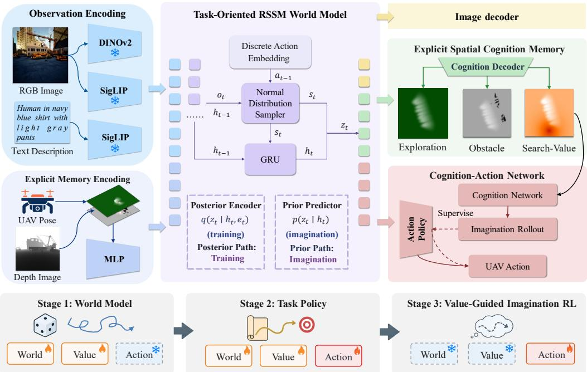
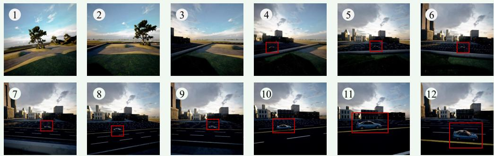
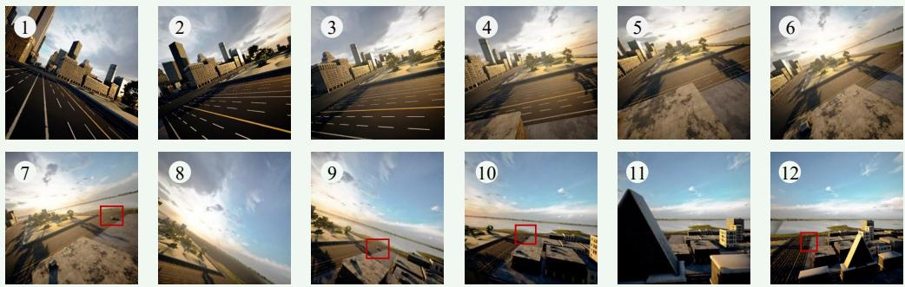

# SearchWorld: Spatial Value-Grounded Imagination for UAV Object Search via World Models

Yatai Ji1, 2, Zhengqiu Zhu1, 2∗, Yong Zhao1, 2, Yue Hu1, 2, Fanglong Yao3, Chen Gao4, Pengfei Zhu5, Quanjun Yin1, 2

1National Key Laboratory of Digital Intelligent Modeling and Simulation, National University of Defense Technology

2College of Systems Engineering, National University of Defense Technology   
3Aerospace Information Research Institute, Chinese Academy of Sciences 4BNRist, Tsinghua University 5Southeast University

{zhuzhengqiu12@nudt.edu.cn}

## Abstract

Autonomous unmanned aerial vehicle (UAV) object search involves a closed loop of perception, decision-making, and action under partial observability. Urban environments pose several challenges: large search areas and narrow egocentric views limit coverage, dense 3D geometry constrains safe motion, and open-world instructions require identifying a specific target among distractors. Many existing methods mitigate partial observability through explicit maps or memory representations, yet remain largely reactive, reasoning over past observations without explicitly predicting future states. World models enable prospective reasoning through imagined rollouts. However, image-generating world models can incur high inference latency, while spatially grounded planning remains challenging for latent world models. We propose SearchWorld, a recurrent state-space world model that connects explicit spatial memory with value-guided imagination. The model maintains bird’s-eye-view exploration and obstacle memory and decodes a task-aware spatial value layer to guide search. A cognition–action network uses this learned spatial value prior to improve the policy through imagined rollouts, without training a separate scalar critic. Training progresses from world-model learning to expert imitation and imaginationbased exploration refinement. On UAV-ON, SearchWorld improves the success rate to 23.8% (19.5% for the strongest published agent) and raises oracle success to 35.5%, while remaining robust on unseen scenes (19.9% success rate). By grounding imagination in explicit spatial representations, SearchWorld enables UAV agents to plan prospectively rather than react.

## 1 Introduction

Autonomous unmanned aerial vehicles (UAVs) are increasingly used to search for objects in large urban environments. In aerial object search, the UAV often receives an RGB-D view, its pose, and an instruction describing a target instance, then must find and stop at that target without an externally provided route. Unlike conventional indoor ObjectNav and short-horizon aerial navigation, outdoor search provides no target location and may contain many similar objects across a region much larger than the camera field of view. The agent must maintain what has been observed while deciding which future region is most useful to visit. Broad exploration wastes the step budget while following only the current target hypothesis can cause repeated visits and occlusion traps.

Map-based agents mitigate partial observability with explicit spatial memory (Yamauchi, 1997; Chaplot et al., 2018; 2020), but they are fundamentally reactive: they reason over past observations, score the current view against stored memory by hand-designed rules or vision–language queries (Huang et al., 2023; Gu et al., 2024), and do not predict the future states their actions produce. World-model agents can imagine (Ha & Schmidhuber, 2018), but their spatial knowledge is implicit: the questions that determine search eficiency, namely where the agent has been, where it cannot fly, and what remains unexplored, are entangled inside a flat latent vector, and the actor–critic machinery further compresses longrun prospects into a single scalar V(st) that says how much value exists but not where it lies, even though every action moves the agent somewhere on the map. The reason the two lines are each insuficient is the same: spatial memory and prospective reasoning are not linked, and connecting them has remained challenging.

We propose SearchWorld, a recurrent state-space world model grounded in explicit spatial cognition memory. Specifically, we organize this memory as a three-layer bird’s-eye-view (BEV) representation: an exploration layer records where the UAV has been, an obstacle layer marks where it cannot fly, and a spatial value layer decoded from the latent state estimates where searching is worthwhile. We further introduce a cognition–action network, in which the decoded spatial value guides imagination-based planning to improve the agent’s action policy. A three-stage curriculum trains SearchWorld to learn state transitions and spatial representations, imitate expert search behavior, and refine spatial exploration through value-guided imagination planning. On UAV-ON, SearchWorld achieves 23.8% SR and 35.5% OSR overall, improves over the strongest published agent, and retains 19.9% success on unseen scenes. Our contributions are:

• To our knowledge, the first world model with explicit spatial cognition memory for aerial object search. SearchWorld combines a recurrent state-space model (RSSM) with allocentric exploration and obstacle channels and decodes a task-aware spatial value layer from the latent state.

• A cognition–action network and value-guided imagination. A decoded taskaware spatial value layer, supervised by exploration, obstacle, and training-time target signals but not given the target coordinate at inference, replaces the actor– critic’s learned scalar critic as a structured value prior. Imagination-based value guidance then refines movement actions by pooling decoded value over imagined footprints, with the imitated stopping behavior kept intact.

• A staged training and evaluation study. The three stage curriculum learning separates world-model learning, expert task imitation, and value-guided movement refinement. Experiments and ablations on UAV-ON quantify its performance over baselines as well as the contributions of spatial memory, the value layer, and each training stage.

## 2 Related Work

World models for navigation. One line of world models plans navigation by generating future observations as pixels. PathDreamer (Koh et al., 2021) synthesizes novel indoor viewpoints, DreamWalker (Wang et al., 2023) imagines candidate plans with a learned scene synthesizer, DreamNav (Wang et al., 2025) and NWM (Bar et al., 2025) simulate candidate trajectories with large generative models, and ANWM (Zhang et al., 2025) extends such video prediction to aerial trajectories. Planning with these models requires autoregressively generating video at every decision, and the resulting latency is hard to reconcile with the hundreds-of-steps budget of large-region search. A second line keeps the world model in latent space, where an imagined rollout costs one latent transition rather than a video. MILE (Hu et al., 2022) learns driving dynamics in latent space, X-Mobility (Liu et al., 2025) and NavMorph (Yao et al., 2025) carry RSSMs into outdoor and vision-and-language navigation, and WMNav (Nie et al., 2025) instantiates the world model as a vision–language model (VLM) that predicts outcomes into an online curiosity value map. In all of these, memory of the environment stays implicit, and spatially grounded search planning with a latent world model has remained challenging.

  
Figure 1: SearchWorld overview with its three-stage curriculum. A task-oriented RSSM world model encodes the RGB view, the instruction, and the explicit spatial-cognition memory, and decodes the observation, the spatial memory, the task-aware value layer, and the UAV action. The cognition–action network trains the action policy in Stage 2 and refines movement actions in Stage 3 by pooling the decoded value over imagined action footprints.

Aerial navigation and object search. Aerial navigation research has progressed from instruction-following flight (AerialVLN, Liu et al., 2023; CityNav, Lee et al., 2025) to objectgoal search, formalized by UAV-ON (Xiao et al., 2025). Recent aerial search agents couple explicit spatial memory with large language models (LLMs) and their multimodal variants (MLLMs). APEX (Zhang et al., 2026) drives exploration with attraction, exploration, and obstacle maps constructed by a VLM; PRPSearcher (Ji et al., 2026) has an MLLM reason over semantic-attraction and uncertainty maps; and OctMem-Agent (Zhou et al., 2026) aggregates the RGB-D history into an adaptive octree memory queried by instructionmodulated tokens. Across these systems the memory records where the agent has been, but the readout happens at execution time through hand-designed rules or model queries, and the agent does not model the consequences of its own actions, so exploration stays reactive. Applying world models to aerial object search has remained challenging, and SearchWorld advances one step in this direction.

## 3 Method

SearchWorld rests on three components. An explicit spatial-cognition memory makes the search state inspectable: exploration and obstacle layers are constructed from depth and pose, and a value layer is decoded from the world model’s latent state (Section 3.2). A task-oriented RSSM world model learns the search dynamics over this memory, predicts future states in imagination, and decodes the value layer along the way (Section 3.3). A cognition–action network then turns the decoded spatial value into action selection: the task policy learned from experts is refined by value-guided updates that touch movement actions only (Section 3.4). Section 3.1 formalizes the problem, and Section 3.5 presents the three-stage curriculum that trains the components. Figure 1 gives an overview.

## 3.1 Problem Formulation

We formalize aerial object-goal search as a partially observable Markov decision process (POMDP) $( \boldsymbol { S } , \boldsymbol { A } , \boldsymbol { O } , \boldsymbol { P } )$ The state $s _ { t }$ comprises the full UAV pose and the environment occupancy, neither of which is directly observable. Each step yields an observation $o _ { t } =$ $( I _ { t } , \bar { D } _ { t } , p _ { t } , \ell ) \colon$ the RGB and depth images, the 6-DoF pose $p _ { t } ,$ and an instance-level text instruction ℓ that describes the target. The benchmark’s success criterion plays the role of a terminal reward but is used only for evaluation, not as a training signal (Section 3.5). Because the Markov state is unavailable, the policy conditions on the full interaction history $\tau _ { t } = ( o _ { 1 } , a _ { 1 } , \dots , o _ { t } )$ The action space is fixed by the benchmark interface rather than designed by us: eight discrete atomic actions with fixed motion magnitudes, the last of which (stop) terminates the episode and triggers success evaluation (Appendix B).

## 3.2 Explicit Spatial-Cognition Memory

A recurrent latent state is a suficient statistic in principle but a poor interface for spatial reasoning. The questions that matter in object search, namely where the agent has been, where it cannot $\mathrm { { f l y } , }$ and where it is worth searching next, have no explicit reading in an unstructured vector. SearchWorld therefore maintains an explicit spatial-cognition memory: a persistent, physically indexed record of the search. The carrier is a BEV grid covering the benchmark’s search region, centered at its center. World points map to cells by a fixed afine rule, so the memory is allocentric and stable across episodes. Grid specifications and geometric parameters are given in Table 5 in Appendix A.

The memory has three layers with distinct origins. The exploration layer and the obstacle layer are deterministic functions of the $U A V$ pose and the depth image: fixed geometric rules update them from raw sensors, they involve no learned components, and they are exact given accurate sensing. The value layer is diferent in kind. It is an output of the world model, decoded from the latent state and conditioned on the search instruction, and it scores every cell by the utility of visiting it under the current task; its supervision is task-aware but available only at training time (Section 3.4). The first two layers record what has already been observed, while the third predicts where the search should go next.

Exploration layer: where have I been? Each executed step observes $\mathrm { a }$ field of view (FOV) of angular width ϕ and sensing range $\rho .$ For a cell $c ,$ let $d _ { \tau } ( c )$ and $\Delta \theta _ { \tau } ( c )$ denote its range and bearing ofset relative to the pose $p _ { \tau }$ at step τ . The layer accumulates the maximum discounted visibility up to the current step $t ,$

$$
\mathbf { M } ^ { \mathrm { e x p l } } ( c ) = \operatorname* { m a x } _ { \tau \leq t } \Big [ \Big ( 1 - \frac { d _ { \tau } ( c ) } { \rho } \Big ) \cdot \cos \Big ( \frac { \pi \Delta \theta _ { \tau } ( c ) } { \phi } \Big ) \Big ] \cdot \mathcal { k } \big [ d _ { \tau } ( c ) \leq \rho , | \Delta \theta _ { \tau } ( c ) | \leq \phi / 2 \big ] ,\tag{1}
$$

where the maximum over time implements persistent coverage and the linear/cosine attenuation weights a distant or oblique glimpse by its reliability.

Obstacle layer: where can I not ${ \bf { f } } { \bf { y } } \mathrm { { ? } }$ The front-view depth stream $D _ { t }$ is back-projected to a 3-D point cloud with the known camera intrinsics, transformed to world coordinates by the pose $p _ { t } ,$ and orthographically projected onto the grid. A cell is marked obstacle if the projected points within it exceed a height threshold $z _ { \mathrm { o b s } }$ above the ground. This vertical clearance test, rather than raw occupancy, is the quantity that matters for collision avoidance at flight altitude.

Properties. Both observation-level layers are explicit: every cell has a physical coordinate and a human-readable meaning, so the memory can be inspected directly (Figure 2). They are also complementary: exploration is monotone-by-construction information accumulation, whereas obstacle is a geometric safety constraint. Both are computed from raw sensors with no learned components, so they inherit the accuracy of depth sensing and add no training signal to the world model.

## 3.3 Task-Oriented RSSM World Model

The core of SearchWorld is a task-oriented world model of the search process: a compact recurrent dynamics model that rolls the interaction forward in imagination, without querying the simulator. Figure 1 shows its structure, with every component aligned to the structure of object search.

Observation encoding. The world model consumes three input streams. The RGB image $I _ { t }$ is encoded by two frozen encoders: a DINOv2 vision transformer (ViT) (Oquab et al., 2024) extracts spatial and geometric structure, and the image tower of a SigLIP (Zhai et al., 2023) extracts language-aligned features. The text instruction ℓ is encoded by the text tower of the same SigLIP. Sharing one encoder family between image and text places what the camera sees and what the instruction asks for in a common embedding space, so the world model can learn which visual evidence is relevant to the target. The exploration and obstacle layers of the spatial-cognition memory (Section 3.2) enter as the third stream through a BEV encoder. All streams are fused into the observation embedding $e _ { t } .$

Recurrent state-space dynamics. Following the RSSM family (Hafner et al., 2019; 2020), the world model maintains a deterministic recurrent state $h _ { t }$ and a stochastic latent $z _ { t } ,$ factorizing the belief into what is predictable and what remains uncertain. The deterministic path is updated by a gated recurrent unit (GRU),

$$
h _ { t } = \mathrm { G R U } \big ( z _ { t - 1 } , \mathrm { E m b } ( a _ { t - 1 } ) , h _ { t - 1 } \big ) ,\tag{2}
$$

where the discrete action is embedded by a learned lookup table, a simple interface that matches the atomic action space of Section 3.1. Two heads predict the stochastic state. The posterior (state estimator) $q _ { \theta } ( z _ { t } \mid h _ { t } , e _ { t } )$ conditions on the current observation; the prior (state predictor) $p _ { \theta } ( z _ { t } \mid h _ { t } )$ receives none. At training time the posterior absorbs the true observation and serves as the regression target. At decision time the prior alone carries the dynamics forward, which is what imagination requires.

Decoders. Three families of heads read the task signals out of the latent state. An RGB decoder regenerates the observation. A BEV decoder regenerates the exploration and obstacle layers of the spatial-cognition memory, and a value decoder regenerates the taskaware value layer under the supervision target of equation 5. An action head outputs a categorical distribution over the eight atomic actions, conditioned on the latent state and the instruction (Section 3.5). A single imagined rollout therefore yields every signal the policy learner needs, and no pixels are decoded at decision time.

Imagination via the prior path. We define the imagination step as one prior-only transition. Given the current belief $\left( h _ { t } , z _ { t } \right)$ and a candidate action $a _ { t } .$

$$
h _ { t + 1 } = \operatorname { G R U } ( z _ { t } , \operatorname { E m b } ( a _ { t } ) , h _ { t } ) , \qquad z _ { t + 1 } \sim p _ { \theta } ( \cdot \mid h _ { t + 1 } ) .\tag{3}
$$

Iterating equation 3 rolls out hypothetical trajectories purely in latent space, scored at each step by the decoder heads. This interface underlies the policy learning of Section 3.4.

## 3.4 Cognition–Action Network

Dreamer-style model-based RL (Hafner et al., 2020) learns an independent scalar critic $V _ { \psi } ( s _ { t } )$ by regressing imagined returns. Under rewards as sparse as aerial search success, that critic bootstraps from noise. SearchWorld instead replaces the actor–critic with a cognition–action network. Its cognition branch decodes a structured spatial value prior from the world model’s latent state, and its action branch converts that prior into an instructionconditioned action distribution. The information flow is: RSSM latent state → decoded spatial value layer → imagined action utility → value-guided actor.

Cognition branch: the decoded task-aware spatial value layer. Given the RSSM state $s _ { t } = ( h _ { t } , z _ { t } )$ and the instruction encoding $e _ { \ell } ,$ the cognition decoder $D _ { V }$ predicts a spatial value layer over the allocentric BEV grid,

$$
\hat { V } _ { t } ^ { \mathrm { s p } } ~ = ~ D _ { V } ( h _ { t } , z _ { t } , e _ { \ell } ) ,\tag{4}
$$

where $\hat { V } _ { t } ^ { \mathrm { s p } } ( x )$ is the predicted utility of visiting location $x ,$ realized as the belief field of the cognitive map. The layer is decoded, and the spatial signals serve only as training supervision. With $\bar { { M } } _ { t } ^ { \mathrm { e x p l , * } }$ and $M _ { t } ^ { \mathrm { o b s , * } }$ the geometrically constructed exploration and obstacle layers of Section 3.2 (the training-time ground-truth labels, starred to distinguish them from the decoder’s outputs), and $g$ the ground-truth target position available during training, the supervision target gives explored cells lower value, obstacle cells zero, and cells near the target higher value through a Gaussian prior,

$$
V _ { t } ^ { * } ( x ) = \mathrm { N o r m } \Big [ \big ( 1 - M _ { t } ^ { \mathrm { o b s , * } } ( x ) \big ) \Big ( \lambda _ { \mathrm { e x p l } } \big ( 1 - M _ { t } ^ { \mathrm { e x p l , * } } ( x ) \big ) + \lambda _ { \mathrm { g o a l } } G _ { g } ( x ) \Big ) \Big ] ,\tag{5}
$$

where $G _ { g } ( \boldsymbol { x } ) = \exp \big ( - \| \boldsymbol { x } - \boldsymbol { g } \| _ { 2 } ^ { 2 } / 2 \sigma _ { g } ^ { 2 } \big )$ and Norm rescales the layer to unit maximum. The decoder is optimized by

$$
\mathcal { L } _ { \mathrm { v a l u e } } ~ = ~ \frac { 1 } { | \mathcal { G } | } \sum _ { x \in \mathcal { G } } \ell _ { \mathrm { r o b } } \big ( \hat { V } _ { t } ^ { \mathrm { s p } } ( x ) - V _ { t } ^ { * } ( x ) \big ) ,\tag{6}
$$

where G is the BEV grid and $\ell _ { \mathrm { r o b } }$ a robust regression loss. The target coordinate enters only through the training label: the label uses $\check { ( I _ { t } , D _ { t } , p _ { t } , \ell , g ) }$ , while at inference the decoder runs on $( I _ { t } , D _ { t } , p _ { t } , \ell )$ alone, so no target location can leak into the deployed model. Since the layer is a function of the latent state, it can be decoded from imagined successor states as well, which makes value predictions available for every candidate action.

Action branch. The action branch converts the spatial utilities into a categorical distribution over the eight atomic actions. It is initialized by the Stage-2 behavior-cloned policy π and refined by the value-guided objective of Section 3.5, so the task behavior is inherited rather than relearned. The value-guided update is applied only to the movement actions $A _ { \mathrm { m o v e } }$ . The probability of stop stays under the Stage-2 task policy, so value guidance can refine routes but can neither suppress nor force the stopping decision.

## 3.5 Three-Stage Training Curriculum

Stage 1: world-state transition. Random-action rollouts train the encoders, RSSM, and decoders, with the action head inactive. The RGB decoder reconstructs the observation, the BEV decoder reconstructs the exploration and obstacle layers, and the value decoder regresses onto the task-aware target of equation 5 through the loss of equation 6, while a Kullback–Leibler (KL) regularizer $\beta _ { \mathrm { K I } }$ pulls the posterior toward the prior. Reconstructing the spatial layers forces the latent to carry the spatial search state that the later stages act on.

Stage 2: search and stop from experts. Expert demonstrations pair instructionconditioned search trajectories with terminal stopping decisions. Behavior cloning (BC) teaches the action head which target to search for, how to approach it, and when to issue stop, while the encoders, decoders, and value decoder continue training. The result is the task policy $\pi _ { \mathrm { B C } }$ that Stage 3 builds on and that deployment executes.

Stage 3: value-guided imagination planning. With the RSSM and value decoder frozen, the world model rolls out prior-only trajectories from posterior states of real data via equation 3. Each candidate movement action a yields an imagined successor state, from which the cognition branch decodes the future value layer $\hat { V } _ { t + 1 } ^ { \mathrm { s p } , a }$ Pooling this layer over the action’s motion footprint $K _ { t + 1 } ^ { a }$ on the BEV grid gives the action utility $\begin{array} { r } { q _ { V } ( s _ { t } , a ) = \sum _ { x \in \mathcal { G } } K _ { t + 1 } ^ { a } ( x ) \hat { V } _ { t + 1 } ^ { \mathrm { s p } , a } ( x ) } \end{array}$ , accumulated over the H-step rollout into $Q _ { V } ^ { ( H ) }$ , where the superscript a marks the successor quantities that action a induces. These decoded utilities replace the learned scalar critic, so the stage carries no critic loss; since the utilities descend from supervised value targets rather than environment returns, the stage is a planning-style refinement of the task policy rather than return-based reinforcement learning. The target policy reweights the behavior-cloned prior,

$$
\pi ^ { + } ( a \mid s _ { t } , e _ { \ell } ) \propto \pi _ { \mathrm { B C } } ( a \mid s _ { t } , e _ { \ell } ) \exp { \big ( } Q _ { V } ^ { ( H ) } ( s _ { t } , a ) / \tau { \big ) } ,\tag{7}
$$

Table 1: Performance across diferent object sizes and overall total, evaluated using three metrics: Success Rate (SR↑), Oracle Success Rate (OSR↑), and Success weighted by Path Length (SPL↑).
<table><tr><td rowspan="2">Method</td><td colspan="3">Small</td><td colspan="3">Medium</td><td colspan="3">Large</td><td colspan="3">Total</td></tr><tr><td>SR↑</td><td>OSR↑</td><td>SPL↑</td><td>SR↑</td><td>OSR↑</td><td>SPL↑</td><td>SR↑</td><td>OSR↑</td><td>SPL↑</td><td>SR↑</td><td>OSR↑</td><td>SPL↑</td></tr><tr><td>Random</td><td>4.14%</td><td>7.80%</td><td>2.80%</td><td>3.33%</td><td>8.10%</td><td>3.05%</td><td>2.48%</td><td>8.07%</td><td>1.62%</td><td>3.70%</td><td>8.00%</td><td>2.66%</td></tr><tr><td>CLIP-H</td><td>2.86%</td><td>8.43%</td><td>1.51%</td><td>10.95%</td><td>16.67%</td><td>7.17%</td><td>13.04%</td><td>19.25%</td><td>10.53%</td><td>6.20%</td><td>11.90%</td><td>4.15%</td></tr><tr><td>AOA-V</td><td>2.86%</td><td>25.44%</td><td>0.54%</td><td>5.71%</td><td>27.62%</td><td>1.73%</td><td>7.45%</td><td>27.95%</td><td>1.038%</td><td>4.20%</td><td>26.30%</td><td>0.87%</td></tr><tr><td>AOA-F</td><td>4.45%</td><td>16.38%</td><td>1.61%</td><td>10.48%</td><td>17.62%</td><td>6.36%</td><td>14.29%</td><td>21.74%</td><td>10.66%</td><td>7.30%</td><td>17.50%</td><td>4.06%</td></tr><tr><td>WMNav</td><td>5.64%</td><td>20.82%</td><td>1.77%</td><td>9.04%</td><td>23.91%</td><td>3.30%</td><td>16.20%</td><td>28.29%</td><td>6.56%</td><td>8.04%</td><td>22.67%</td><td>2.86%</td></tr><tr><td>APEX</td><td></td><td></td><td></td><td></td><td></td><td></td><td></td><td></td><td></td><td>13.33%</td><td>20.00%</td><td>10.14%</td></tr><tr><td>PRPSearcher</td><td>8.67%</td><td>24.64%</td><td>4.21%</td><td>13.03%</td><td>23.71%</td><td>7.34%</td><td>17.50%</td><td>32.15%</td><td>8.82%</td><td>11.00%</td><td>25.65%</td><td>5.61%</td></tr><tr><td>OctMem-Agent</td><td>18.91%</td><td>29.57%</td><td>6.03%</td><td>18.09%</td><td>26.66%</td><td>6.27%</td><td>23.60%</td><td>31.67%</td><td>7.80%</td><td>19.50%</td><td>29.30%</td><td>6.37%</td></tr><tr><td>SearchWorld (Ours)</td><td>21.62%</td><td>35.29%</td><td>7.23%</td><td>21.80%</td><td>34.64%</td><td>8.35%</td><td>35.02%</td><td>37.59%</td><td>10.76%</td><td>23.80%</td><td>35.52%</td><td>8.03%</td></tr></table>

with temperature τ controlling the guidance strength, and the action branch is trained to match it by

$$
{ \mathcal { L } } _ { \mathrm { a c t i o n } } = D _ { \mathrm { K L } } \big ( \pi ^ { + } ( \cdot \mid s _ { t } , e _ { \ell } ) \big \| \pi _ { \theta } ( \cdot \mid s _ { t } , e _ { \ell } ) \big ) ,\tag{8}
$$

on movement actions only, with stop held at πBC and the movement probabilities renormalized accordingly. Only the action head receives gradients.

## 4 Experiments

## 4.1 Experimental Setup

Benchmark. We evaluate on UAV-ON (Xiao et al., 2025), comprising 14 photorealistic Unreal Engine scenes (urban, natural, and mixed) with about 11,000 navigation tasks: 10,000 training episodes across 10 scenes and 1,000 test episodes across all 14 scenes, of which 4 scenes are held out for evaluating generalization to unseen environments. Each episode provides an instance-level text instruction describing the target and the benchmark’s interface of 8 atomic actions (Appendix B). Episodes last at most 150 steps. An episode succeeds if the agent issues stop within the oficial success threshold $\tau _ { d } = 2 0$ m of the target instance; otherwise it fails, either by colliding with an obstacle (terminating immediately), by exhausting the step budget, or by stopping outside $\tau _ { d }$ (including near same-category distractors). Oracle success credits episodes in which the agent passed within $\tau _ { d }$ of the target at any point, whether or not it stopped there.

Metrics. We report Success Rate (SR), Oracle Success Rate (OSR), Success weighted by Path Length (SPL, Anderson et al., 2018), stratified by target object size (Small/Medium/Large) and by scene familiarity (Seen/Unseen); exact definitions and computation details are given in Appendix D.

Baselines. We compare against three families. (i) The UAV-ON benchmark baselines (Xiao et al., 2025): Random, the CLIP-score heuristic CLIP-H, and the LLM-driven AOA-F and AOA-V. (ii) Memory-augmented aerial agents, the strongest recent competitors on UAV-ON: APEX (Zhang et al., 2026), OctMem-Agent (Zhou et al., 2026), and PRPSearcher (Ji et al., 2026), the agentic method behind the CityAVOS benchmark. (iii) Worldmodel navigation: WMNav (Nie et al., 2025), originally designed for indoor ObjectNav (HM3D/MP3D) and adapted by us to UAV-ON.

## 4.2 Main Results

## 4.2.1 Comparison with SOTA baselines

Table 1 presents the main comparison. SearchWorld attains 23.80% SR and 35.52% OSR overall, improving over the strongest prior agent (OctMem-Agent, 19.50% SR) by 4.3 points and more than tripling the best benchmark baseline (AOA-F, 7.30%). Two observations stand out. First, the memory-augmented agents improve substantially over the benchmark baselines, confirming that explicit spatial memory is a binding constraint, yet without a learned dynamics model their exploration remains reactive. Second, SearchWorld pairs explicit memory with imagination, replacing hand-designed, MLLM-queried, or token-based readouts with a trained value layer, with the largest advantage on large targets (35.02% vs. 23.60% SR) that demand sustained long-range exploration. The OSR ceiling confirms this reading: SearchWorld reaches the highest OSR (35.52% vs. 29.30%) while converting oracle successes at the same rate as the best baselines (67%), so its SR advantage stems from finding the target region more often, not from stopping more liberally. On SPL, Search-World leads every object-size split and trails only APEX overall (8.03% vs. 10.14%) while exceeding it by 10.5 SR points.

Table 2: Performance comparison on seen and unseen environments.
<table><tr><td rowspan="2">Method</td><td colspan="3">Seen</td><td colspan="3">Unseen</td></tr><tr><td>SR↑</td><td>OSR↑</td><td>SPL↑</td><td>SR↑</td><td>OSR↑</td><td>SPL↑</td></tr><tr><td>WMNav</td><td>8.79%</td><td>23.53%</td><td>3.20%</td><td>5.86%</td><td>18.03%</td><td>1.93%</td></tr><tr><td>APEX</td><td>12.36%</td><td>19.10%</td><td>9.13%</td><td>16.13%</td><td>22.58%</td><td>13.03%</td></tr><tr><td>PRPSearcher</td><td>10.71%</td><td>23.32%</td><td>6.26%</td><td>11.86%</td><td>21.97%</td><td>6.48%</td></tr><tr><td>OctMem-Agent</td><td>20.17%</td><td>29.55%</td><td>6.79%</td><td>17.57%</td><td>28.59%</td><td>5.15%</td></tr><tr><td>SearchWorld (Ours)</td><td>25.14% 37.88%</td><td></td><td>8.29%</td><td>19.92% 33.12%</td><td></td><td>7.01%</td></tr></table>

Table 3: Average per-step time and average per-episode time.
<table><tr><td>Method</td><td>Step (s) ↓ Episode (s) ↓</td><td></td></tr><tr><td>WMNav</td><td>4.5</td><td>675.7</td></tr><tr><td>APEX</td><td>0.97</td><td>145.5</td></tr><tr><td>PRPSearcher</td><td>7.48</td><td>698.6</td></tr><tr><td>OctMem-Agent</td><td>0.58</td><td>62.3</td></tr><tr><td>SearchWorld (Ours)</td><td>0.31</td><td>34.5</td></tr></table>

Table 2 stratifies performance by scene familiarity. SearchWorld leads on SR and OSR in both splits (25.14%/19.92% SR, with the highest unseen OSR of 33.12%), and its unseen SR exceeds every prior agent’s seen SR except OctMem-Agent’s. The geometry-constructed memory layers and the frozen web-pretrained encoders both carry across scenes, yet the seen–unseen SR drop for SearchWorld (5.2 points) is larger than OctMem-Agent’s (2.6 points), which indicates headroom in cross-scene transfer. APEX and PRPSearcher both show unseen SR exceeding their seen SR; we conjecture this reflects the small unseen evaluation pool rather than systematically better generalization.

## 4.2.2 Computational efficiency

Table 3 reports average per-step and per-episode time of each method. They are measured on our evaluation platform or taken from the corresponding papers. The field separates into two regimes. Per-step MLLM/VLM pipelines dominate the cost (WMNav, PRPSearcher), while APEX shows that removing the language model from the critical path cuts the perstep cost several-fold. OctMem-Agent, the fastest competitor, carries a 7B autoregressive vision–language–action (VLA) model forward per step. SearchWorld requires neither language-model inference nor a VLA at execution time: a step performs only frozen-encoder forward passes, depth back-projection onto the BEV grid, one RSSM transition, and the value head over the grid. It therefore runs an order of magnitude faster than every method that invokes a language model per step, and faster than the closest competitor.

## 4.3 Ablation Study

We ablate SearchWorld around three questions (Table 4): (Q1) the world-model architecture (vs. direct imitation, X-Mobility (Liu et al., 2025), Dreamer (Hafner et al., 2020)), (Q2) the explicit spatial-cognition memory, and (Q3) the three-stage curriculum. All variants are trained by us on identical data and the same action space.

(Q1) Direct imitation of the expert reaches 14.33% SR. The X-Mobilitystyle variant, which keeps the same RSSM but trains a latent-only policy by imitation, falls below it at 12.91%; a world-model state therefore carries no advantage in itself for pure imitation. The Dreamer-style variant, which runs actor–critic training in imagination with a scalar critic trained from scratch on the identical world model, recovers to

<table><tr><td>Configuration</td><td>SR↑</td><td>OSR↑</td><td>SPL↑</td></tr><tr><td>SearchWorld (Ours, full)</td><td>23.80%</td><td>35.52%</td><td>8.03%</td></tr><tr><td>(Q1) World-model architecture</td><td></td><td></td><td></td></tr><tr><td>direct imitation (BC, no world model)</td><td>14.33%</td><td>25.68%7.20%</td><td></td></tr><tr><td>X-Mobility-style (RSSM + imitation only)</td><td>12.91%</td><td>19.88%6.95%</td><td></td></tr><tr><td>Dreamer-style (scalar critic in imagination)</td><td>19.07%</td><td>24.99% 7.64%</td><td></td></tr><tr><td>(Q2) Explicit spatial-cognition memory</td><td></td><td></td><td></td></tr><tr><td>w/o explicit memory (latent-only belief)</td><td>15.96%</td><td>25.03% 6.90%</td><td></td></tr><tr><td>w/o exploration layer</td><td>18.09%</td><td></td><td>28.88%7.54%</td></tr><tr><td>w/o obstacle layer</td><td>22.46%</td><td>31.53%7.67%</td><td></td></tr><tr><td>(Q3) Three-stage curriculum</td><td></td><td></td><td></td></tr><tr><td>w/o Stage 1 (no random-action pretraining)</td><td>13.42%</td><td></td><td>22.99%6.27%</td></tr><tr><td>w/o Stage 2 (no expert imitation)</td><td>10.97%</td><td>23.54%6.80%</td><td></td></tr><tr><td>w/o Stage 3 (no value-guided imagination)</td><td></td><td>19.71% 30.66% 7.08%</td><td></td></tr></table>

Table 4: Ablation study on UAV-ON.8

Test Description: Rectangular sedan shape with four doors, light blue metallic finish, rear spoiler and tinted windows, intended for ground transport.

  
Figure 2: Case study of a successful search. The target is highlighted by the red box

19.07%, confirming that imaginationbased learning converts the learned dynamics into performance. The remaining 4.7-point gap to SearchWorld isolates spatial value grounding.

(Q2) Removing the BEV memory entirely costs 7.8 SR and 10.5 OSR points: the implicit trace degrades over 150-step horizons, and the agent re-explores covered ground. The singlelayer rows separate the functions. Removing the exploration layer costs 5.7 SR points while OSR stays high, since the agent still reaches target vicinities but wastes budget re-searching. Removing the obstacle layer costs less on SR but 4.0 OSR points, as the agent detours around unmarked structure. SPL drops under every removal, so the layers pay of in shorter and less redundant paths.

(Q3) Every stage is load-bearing. Skipping Stage 1 drops SR by 10.4 points: expert trajectories cover a narrow state corridor, so the learned transitions extrapolate poorly and imagined rollouts drift. Skipping Stage 2 is the most damaging variant (−12.8): without a behavioral prior, the policy wanders past target vicinities but does not learn to stop at them. Skipping Stage 3 still reaches 19.71% SR, on par with the strongest published agent, yet the policy remains at behavior-cloning level. Each stage thus supplies what the others cannot: transition coverage, a task prior, and value-guided refinement beyond demonstrations.

## 4.4 Case Study

We trace a successful test episode in Figure 2. Early in the search, the spatial value layer places its mass on the nearest unexplored frontier, and the agent commits to one direction rather than dithering. As it circles a building block, the exploration layer fills in behind it and the value peak migrates to the remaining unexplored sector. Once the target enters the camera footprint, the task-aware value rises around it, and the imitation-learned policy approaches and issues stop within $\tau _ { d } .$ A representative failure, in which the value layer concentrates behind tall structures and the agent re-approaches the same occluded region until the budget is exhausted, is analyzed in Appendix F.

## 5 Conclusion

We presented SearchWorld, a world model that plans aerial object search on an explicit spatial memory. The experiments support three conclusions. First, the gains come from deciding on the map rather than on the latent state: the same world model with a scalar critic recovers half of our improvement over direct imitation, and imitation alone plateaus below the strongest published agent. Second, value-guided imagination refines the task policy rather than replacing it: expert imitation supplies the search-and-stop behavior that value guidance then routes more eficiently. Third, latent imagination is cheap enough to close the loop: one imagined step costs a single latent transition, so SearchWorld runs an order of magnitude faster than methods that invoke a language model per step.

## References

Peter Anderson, Angel Chang, Devendra Singh Chaplot, Alexey Dosovitskiy, Saurabh Gupta, Vladlen Koltun, Jana Kosecka, Jitendra Malik, Roozbeh Mottaghi, Manolis Savva, and Amir R. Zamir. On evaluation of embodied navigation agents. arXiv preprint arXiv:1807.06757, 2018.

Amir Bar, Gaoyue Zhou, Danny Tran, Trevor Darrell, and Yann LeCun. Navigation world models. In Proceedings of the IEEE/CVF Conference on Computer Vision and Pattern Recognition, pp. 15791–15801, 2025.

Devendra Singh Chaplot, Emilio Parisotto, and Ruslan Salakhutdinov. Active neural localization. In International Conference on Learning Representations, 2018.

Devendra Singh Chaplot, Dhiraj Gandhi, Abhinav Gupta, and Ruslan Salakhutdinov. Object goal navigation using goal-oriented semantic exploration. In Advances in Neural Information Processing Systems, 2020.

Qiao Gu, Alihusein Kuwajerwala, Sacha Morin, Krishna Murthy Jatavallabhula, Bipasha Sen, Aditya Agarwal, Corban Rivera, William Paul, Kirsty Ellis, Rama Chellappa, Chuang Gan, Celso Miguel de Melo, Joshua B. Tenenbaum, Antonio Torralba, Florian Shkurti, and Liam Paull. ConceptGraphs: Open-vocabulary 3D scene graphs for perception and planning. In 2024 IEEE International Conference on Robotics and Automation (ICRA), pp. 5021–5028, 2024.

David Ha and J¨urgen Schmidhuber. World models. arXiv preprint arXiv:1803.10122, 2018.

Tuomas Haarnoja, Aurick Zhou, Pieter Abbeel, and Sergey Levine. Soft actor-critic: Ofpolicy maximum entropy deep reinforcement learning with a stochastic actor. In International Conference on Machine Learning, pp. 1861–1870, 2018.

Danijar Hafner, Timothy Lillicrap, Ian Fischer, Ruben Villegas, David Ha, Honglak Lee, and James Davidson. Learning latent dynamics for planning from pixels. In International Conference on Machine Learning, pp. 2555–2565, 2019.

Danijar Hafner, Timothy Lillicrap, Jimmy Ba, and Mohammad Norouzi. Dream to control: Learning behaviors by latent imagination. In International Conference on Learning Representations, 2020.

Anthony Hu, Gianluca Corrado, Nicolas Grifiths, Zak Murez, Corina Gurau, Hudson Yeo, Alex Kendall, Roberto Cipolla, and Jamie Shotton. Model-based imitation learning for urban driving. In Advances in Neural Information Processing Systems, pp. 20703–20716, 2022.

Chenguang Huang, Oier Mees, Andy Zeng, and Wolfram Burgard. Visual language maps for robot navigation. In 2023 IEEE International Conference on Robotics and Automation (ICRA), pp. 10608–10615, 2023.

Yatai Ji, Zhengqiu Zhu, Yong Zhao, Beidan Liu, Chen Gao, Yihao Zhao, Sihang Qiu, Yue Hu, and Quanjun Yin. Towards autonomous UAV visual object search in city space: Benchmark and agentic methodology. In Proceedings of the AAAI Conference on Artificial Intelligence, volume 40, pp. 18342–18350, 2026.

Jing Yu Koh, Honglak Lee, Yinfei Yang, Jason Baldridge, and Peter Anderson. Pathdreamer: A world model for indoor navigation. In Proceedings of the IEEE/CVF International Conference on Computer Vision, pp. 14738–14748, 2021.

Jungdae Lee, Taiki Miyanishi, Shuhei Kurita, Koya Sakamoto, Daichi Azuma, Yutaka Matsuo, and Nakamasa Inoue. CityNav: A large-scale dataset for real-world aerial navigation. In Proceedings of the IEEE/CVF International Conference on Computer Vision (ICCV), pp. 5912–5922, 2025.

Shubo Liu, Hongsheng Zhang, Yuankai Qi, Peng Wang, Yanning Zhang, and Qi Wu. AerialVLN: Vision-and-language navigation for UAVs. In Proceedings of the IEEE/CVF International Conference on Computer Vision (ICCV), pp. 15338–15348, 2023.

Wei Liu, Huihua Zhao, Chenran Li, Joydeep Biswas, Billy Okal, Pulkit Goyal, Yan Chang, and Soha Pouya. X-Mobility: End-to-end generalizable navigation via world modeling. In 2025 IEEE International Conference on Robotics and Automation (ICRA), pp. 7569– 7576, 2025.

Ilya Loshchilov and Frank Hutter. Decoupled weight decay regularization. In International Conference on Learning Representations, 2019.

Dujun Nie, Xianda Guo, Yiqun Duan, Ruijun Zhang, and Long Chen. WMNav: Integrating vision-language models into world models for object goal navigation. In 2025 IEEE/RSJ International Conference on Intelligent Robots and Systems (IROS), 2025.

Maxime Oquab, Timoth´ee Darcet, Th´eo Moutakanni, Huy Vo, Marc Szafraniec, Vasil Khalidov, Pierre Fernandez, Daniel Haziza, Francisco Massa, Alaaeldin El-Nouby, Mahmoud Assran, Nicolas Ballas, Wojciech Galuba, Russell Howes, Po-Yao Huang, Shang-Wen Li, Ishan Misra, Michael Rabbat, Vasu Sharma, Gabriel Synnaeve, Hu Xu, Herv´e Je gou, Julien Mairal, Patrick Labatut, Armand Joulin, and Piotr Bojanowski. DINOv2: Learning robust visual features without supervision. Transactions on Machine Learning Research, 2024.

Xue Bin Peng, Erwin Coumans, Ting Zhang, Tsang-Wei Edward Lee, Jie Tan, and Sergey Levine. Advantage-weighted regression: Simple and eficient of-policy reinforcement learning. arXiv preprint arXiv:1910.00177, 2019.

Hanqing Wang, Wei Liang, Luc Van Gool, and Wenguan Wang. DREAMWALKER: Mental planning for continuous vision-language navigation. In Proceedings of the IEEE/CVF International Conference on Computer Vision, pp. 10873–10883, 2023.

Yunheng Wang, Yuetong Fang, Taowen Wang, Yixiao Feng, Yawen Tan, Shuning Zhang, Peiran Liu, Yiding Ji, and Renjing Xu. DreamNav: A trajectory-based imaginative framework for zero-shot vision-and-language navigation. arXiv preprint arXiv:2509.11197, 2025.

Jianqiang Xiao, Yuexuan Sun, Yixin Shao, Boxi Gan, Rongqiang Liu, Yanjin Wu, Weili Guan, and Xiang Deng. UAV-ON: A benchmark for open-world object goal navigation with aerial agents. In Proceedings of the 33rd ACM International Conference on Multimedia, pp. 13023–13029, 2025.

Brian Yamauchi. A frontier-based approach for autonomous exploration. In Proceedings of the IEEE International Symposium on Computational Intelligence in Robotics and Automation (CIRA), pp. 146–151, 1997.

Xuan Yao, Junyu Gao, and Changsheng Xu. NavMorph: A self-evolving world model for vision-and-language navigation in continuous environments. In Proceedings of the IEEE/CVF International Conference on Computer Vision (ICCV), pp. 5536–5546, 2025.

Xiaohua Zhai, Basil Mustafa, Alexander Kolesnikov, and Lucas Beyer. Sigmoid loss for language image pre-training. In Proceedings of the IEEE/CVF International Conference on Computer Vision (ICCV), pp. 11941–11952, 2023.

Daoxuan Zhang, Ping Chen, Xiaobo Xia, Xiu Su, Ruichen Zhen, Jianqiang Xiao, and Shuo Yang. APEX: A decoupled memory-based explorer for asynchronous aerial object goal navigation. In Proceedings of the IEEE/CVF Conference on Computer Vision and Pattern Recognition (CVPR), pp. 15232–15242, 2026.

Weichen Zhang, Peizhi Tang, Xin Zeng, Fanhang Man, Shiquan Yu, Zichao Dai, Baining Zhao, Hongjin Chen, Yu Shang, Wei Wu, Chen Gao, Xinlei Chen, Xin Wang, Yong Li, and Wenwu Zhu. Aerial world model for long-horizon visual generation and navigation in 3d space. arXiv preprint arXiv:2512.21887, 2025.

Jiacong Zhou, Jiaxu Miao, Yourun Lin, Xianyun Wang, Jun Xiao, and Jun Yu. Memoryaugmented scene understanding and exploration for open-world aerial object-goal navigation. In Proceedings of the IEEE/CVF Conference on Computer Vision and Pattern Recognition (CVPR), pp. 21616–21626, 2026.

## A Implementation Details

Encoders. The RGB front view is encoded twice: a frozen DINOv2 ViT-S/14 (Oquab et al., 2024) (cls token concatenated with the mean patch token, 768-d) provides spatia and geometric structure, and the vision tower of a frozen SigLIP (Zhai et al., 2023) (768-d, L2-normalised) provides language-aligned features that share an embedding space with the instruction. Text: the target description is embedded ofline by the same SigLIP text tower (768-d). A BEV encoder (five strided convolutions, 2→1024-d) embeds the exploration and obstacle layers of the memory; this branch carries the episode-level history and the UAV’s spatial situation. The streams (768+768+768+1024) are fused by a linear layer into the observation embedding $e _ { t } .$

World model. GRU hidden size 1024; stochastic state 512-d Gaussian (diagonal); posterior and prior heads are 2-layer multilayer perceptrons (MLPs) with softplus outputs for scale. Action embedding table: 8 × 64. Heads: an RGB decoder (StyleGAN-style generator with a perceptual + L1 loss), a BEV decoder that maps the latent state to the 256 × 256 exploration and obstacle layers (binary-layer losses), a value decoder that regenerates the task-aware spatial value layer (supervised by the target of equation 5), and an action head (categorical over the 8 atomic actions, conditioned on the latent state and the instruction).

System specifications. Table 5 lists the spatial-memory grid, the geometric construction thresholds, and the training regularizer weights. The obstacle layer is built by pinhole backprojection of the depth images (Section 3.2).

<table><tr><td>Component</td><td>Parameter</td><td>Value</td></tr><tr><td rowspan="3">BEV grid</td><td>grid size</td><td>256 × 256</td></tr><tr><td>cell resolution</td><td>0.4m</td></tr><tr><td>region coverage grid centering</td><td>102.4 m × 102.4 m search-region center</td></tr><tr><td>Exploration layer</td><td>sensing range ρ FOV width φ</td><td>20m 90°</td></tr><tr><td>Obstacle layer</td><td>height threshold  $z _ { \mathrm { o b s } }$ </td><td>0.5m</td></tr><tr><td>Stage-1 training</td><td>KL weight  $\beta _ { \mathrm { K L } }$ </td><td> $1 0 ^ { - 3 }$ </td></tr></table>

Table 5: System specifications of SearchWorld referenced in Section 3.2 and Section 3.5.

Training. All stages use AdamW (Loshchilov & Hutter, 2019) with weight decay 0.01 and mixed precision. Stage 1 (world-model pretraining on random-action rollouts, action head inactive): 100 epochs, batch size 8, learning rate $\breve { 1 } 0 ^ { - 5 }$ , sequence length 8. Stage 2 (expert demonstrations, action head activated): 30 epochs, batch size 4 with gradient accumulation 3, learning rate $1 0 ^ { - 5 }$ ; the action-classification loss is weighted $1 0 \times$ , and the encoders and decoders continue training. Stage 3 (value-guided imagination planning): the RSSM and value decoder are frozen; prior-only imagined rollouts of horizon H are scored by pooling the decoded value layer over each candidate action’s motion footprint, and the action head is trained by the KL objective of equation 8 on movement actions only, with stop kept under π . The world model is frozen in evaluation mode; only the action head receives gradients.

Training runs on 8 NVIDIA H20 GPUs, with one complete three-stage run taking about 20 hours (≈ 160 GPU-hours); evaluation runs on a single NVIDIA RTX 5090 workstation at about 34.5 s per episode.

## B Action Discretization Protocol

The UAV-ON interface itself exposes eight discrete atomic actions: five translations $( \mathbf { f o r w a r d } / \mathbf { l e f t } / \mathbf { r i g h t } = d _ { \mathrm { t r a n s } }$ meters, ascend/descend $= \ d _ { \mathrm { v e r t } }$ meters), two rotations $( \mathrm { r o t a t e { - } l e f t / r o t a t e { - } r i g h t } = \theta _ { \mathrm { r o t } }$ degrees), and stop, which terminates the episode and triggers the success evaluation (success if the UAV is within threshold distance $\tau _ { d } = 2 0$ m of the target at stopping time, per the oficial UAV-ON criterion), with $d _ { \mathrm { t r a n s } } ~ = ~ 5 \mathrm { m }$ $d _ { \mathrm { v e r t } } = 2 \bar { \mathrm { m } } , \theta _ { \mathrm { r o t } } = 1 5 ^ { \circ }$ The magnitudes are fixed by the benchmark rather than chosen by us (Section 3.1). This discrete interface yields a compact, embeddable action space for the world model: each action maps to a single learned embedding (Section 3.3), and its fixed motion delta makes the footprint of any candidate action computable in closed form (Appendix C).

## C Theoretical Details

This section details the derivations and geometric constructions that Section 3.4 states without proof.

The value-guided update as constrained utility maximization. The target policy of equation $\bar { 7 }$ is the closed-form solution of a KL-regularized utility maximization over the movement actions,

$$
\pi ^ { + } = \arg \operatorname* { m a x } _ { \pi } \mathbb { E } _ { a \sim \pi } \big [ Q _ { V } ^ { ( H ) } ( s _ { t } , a ) \big ] - \tau D _ { \mathrm { K L } } \big ( \pi \big \| \pi _ { \mathrm { B C } } \big ) ,\tag{9}
$$

restricted to the face of the simplex where the probability of stop is held at $\pi _ { \mathrm { B C } } ( \mathsf { s t o p }$ $s _ { t } , e _ { \ell } )$ . A Lagrangian argument gives the Gibbs form $\pi ^ { + } ( a ) \propto \pi _ { \mathrm { B C } } ( a ) \exp ( Q _ { V } ^ { ( H ) } ( s _ { t } , a ) / \tau )$ over $A _ { \mathrm { { m o v e } } } ,$ renormalized within the movement sub-distribution, which is exactly equation 7. Two limits make the role of the temperature explicit: as $\tau  0$ the target collapses onto the utility-maximizing movement action, and as $\tau \to \infty$ it recovers the demonstrated prior πBC. The training loss of equation 8, $D _ { \mathrm { K L } } ( \pi ^ { + } \| \pi _ { \theta } )$ , then distills this target into the parametric policy; this form of KL-regularized policy improvement underlies maximum-entropy control (Haarnoja et al., 2018) and advantage-weighted regression (Peng et al., 2019). Holding stop at its prior value throughout makes the constraint exact by construction: value guidance reallocates probability among movement actions and cannot raise, lower, or bypass the stopping probability.

Action footprint geometry. The pooling operator of equation 8 aggregates the decoded value over a per-action motion footprint on the same allocentric grid as the memory. Formally, let $\omega : \bar { \mathbb { R } } ^ { 2 } \to \mathcal { G }$ be the fixed afine map from world coordinates to grid cells (Section 3.2), and let each atomic action a carry its benchmark-fixed motion delta $\Delta _ { a } \ ( \mathrm { A p - }$ pendix B: 5 m translations, $1 5 ^ { \circ }$ rotations). The canonical footprint $F ^ { a } \subset \mathbb { R } ^ { 2 }$ is defined in the ego frame as the sensor fan of half-width $\phi / 2$ and range $\rho$ (Section $3 . 2 )$ swept along $\Delta _ { a } ;$ for rotation actions the fan rotates in place by $\theta _ { \mathrm { { r o t } } }$ , and for vertical actions the footprint is the fan projected at the new altitude. Given the pose $p _ { t } = ( x _ { t } , y _ { t } , \psi _ { t } )$ associated with the current state, the allocentric footprint is $K _ { t + 1 } ^ { a } ( x ) = \mathcal { k } \big [ \omega ^ { - 1 } ( x ) \in R ( \psi _ { t } ) F ^ { a } + ( x _ { t } , y _ { t } ) \big ]$ , where $R ( \psi _ { t } )$ is the planar rotation by the yaw and the successor pose follows from composing $p _ { t }$ with $\textstyle \left. \Delta _ { a } ; \right.$ cells falling outside the grid are dropped, so the pooled sum runs over in-grid cells only. The action utility $\begin{array} { r } { q _ { V } ( s _ { t } , a ) = \sum _ { x } K _ { t + 1 } ^ { a } ( x ) \hat { V } _ { t + 1 } ^ { \mathrm { s p } , a } ( x ) } \end{array}$ is therefore the expected value mass that action a sweeps under the sensing geometry, in the same world frame in which the value layer is decoded. Because every $\Delta _ { a }$ is fixed by the benchmark, the footprint of each candidate action is computable in closed form from the current pose; no component of it is learned.

RSSM training as variational inference. The Stage-1 objective of Section 3.5 is $\mathrm { ~ a ~ } \beta -$ weighted variational bound on the latent state-space model: maximizing the reconstruction likelihoods of the RGB, memory, and value decoders while pulling $\bar { q _ { \theta } ( \boldsymbol { z } _ { t } \mid h _ { t } , \boldsymbol { e } _ { t } ) }$ toward $p _ { \theta } ( z _ { t } \mid h _ { t } )$ with weight βKL corresponds to maximizing $\mathbb { E } _ { q } [ \log p ( o _ { t } \mid z _ { t } ) ] - \beta _ { \mathrm { K L } } \mathrm { K L } \big ( q _ { \theta } ( z _ { t } \mid$ $h _ { t } , e _ { t } ) \parallel p _ { \theta } ( z _ { t } \mid h _ { t } ) )$ up to constants, i.e. a filtered variational inference objective in which the prior doubles as the imagination transition.

Bounded imagination depth at deployment. At evaluation the posterior path is exercised at every real step: each incoming observation re-grounds the belief $\left( h _ { t } , z _ { t } \right)$ , so the recurrent state is corrected once per step over the full episode horizon. The prior path is queried only within an H-step window from the most recent posterior state, so the policy acts on value decodings whose underlying latent extrapolation is at most H steps from an observation-grounded state; compounding transition error beyond depth H is present in the training rollouts but is not amplified at deployment, since no decision at test time consumes a prior-only chain longer than H.

## D Evaluation Metrics

Let $\mathcal { E } = \{ e _ { i } \} _ { i = 1 } ^ { N }$ denote the evaluation set of $N$ episodes. For episode $e _ { i } ,$ let $S _ { i } \in \{ 0 , 1 \}$ indicate success as defined in Section 4.1 (a stop issued within $\tau _ { d }$ of the target), $O _ { i } \in \{ 0 , 1 \}$ indicate oracle success (the agent’s trajectory passed within $\tau _ { d }$ of the target at any step, regardless of where it stopped), $C _ { i } \in \{ 0 , 1 \}$ indicate termination by collision, $p _ { i }$ the length of the executed path (cumulative movement distance), $l _ { i }$ the geodesic distance from the start to the target computed on the ground-truth traversability map, and $d _ { i }$ the distance from the UAV to the target at the moment the episode terminates.

Success Rate.

$$
\mathrm { S R } = \frac { 1 } { N } \sum _ { i = 1 } ^ { N } S _ { i } .\tag{10}
$$

Oracle Success Rate.

$$
\mathrm { O S R } = \frac { 1 } { N } \sum _ { i = 1 } ^ { N } O _ { i } .\tag{11}
$$

The $\mathrm { g a p ~ O S R - S R }$ measures how often the agent reaches the target vicinity but fails to recognize and stop there, i.e. the “exploration without termination” failure mode.

Distance to Stop.

$$
\mathrm { D T S } = \frac { 1 } { N } \sum _ { i = 1 } ^ { N } d _ { i } ,\tag{12}
$$

reported in meters and included for completeness with the original UAV-ON protocol; our tables follow the recent literature (Zhang et al., 2026; Zhou et al., 2026) in reporting $\mathrm { S R / O S R / S P L }$ . DTS is computed over all episodes, successful or not, and lower is better; it is sensitive to how close the agent’s final pose is to the target when the episode ends (by stop, collision, or timeout).

Success weighted by Path Length (Anderson et al., 2018):

$$
\mathrm { S P L } = \frac { 1 } { N } \sum _ { i = 1 } ^ { N } S _ { i } \frac { l _ { i } } { \operatorname* { m a x } ( p _ { i } , l _ { i } ) } .\tag{13}
$$

$\mathrm { S P L }$ credits only successful episodes and penalizes path lengths that exceed the geodesic optimum; a value of 1 would mean every episode succeeded along a shortest path.

Baseline provenance. APEX results in Table 1 and Table 2 are taken from Zhang et al. (2026). Its paper reports overall, seen, and unseen metrics only, without a per-object-size breakdown, which is why the per-size cells for APEX in Table 1 are left blank. The UAV-ON benchmark baselines (AOA-F, AOA-V, CLIP-H) are taken directly from the benchmark paper (Xiao et al., 2025), and OctMem-Agent (Zhou et al., 2026) likewise from its paper. WMNav and PRPSearcher are reproduced by us on UAV-ON; the multimodal language models invoked by the reproduced baselines use Qwen3.6-Plus. Two families of methods are not compared: video-generation world models are excluded because their per-step generation latency does not fit the step budget of large-region search (Section 4.2.2), and methods without released weights, such as NavMorph, cannot be evaluated under the same protocol.

## E Training Data Collection

Both datasets used in the three-stage curriculum (Section 3.5) were collected in the UAV-ON AirSim environments with the same interface the agent later uses: 4-view RGB-D (512×512), 6-DoF pose, IMU readings, and the discretized atomic action set. The spatial memory is constructed from the front-view depth (Section 3.2); the remaining views are recorded but not consumed by the current architecture. All episodes record per-step position, attitude (quaternion and Euler), linear and angular velocities, distance to target, cumulative movement, collision flags, and oracle-success flags, so that transitions are fully supervised.

Random-interaction dataset (Stage 1). For world-model pretraining we collect random rollouts: at each step an action is drawn uniformly from the seven movement primitives (an optional forward-biased distribution and a low-probability stop are supported but disabled by default), for up to 50 steps per episode. Episodes that collide are discarded and re-collected from the same initial state (up to 10 attempts) so that the dataset contains only physically valid trajectories; the surviving episodes carry the full sensor stream, including float32 depth in meters. Each episode is stored with a summary (outcome, final distance, action histogram), and collection supports per-scene checkpointing so runs can be resumed after simulator restarts.

Expert-demonstration dataset (Stage 2). Behavior cloning requires successful demonstrations. Since UAV-ON ships annotations but no trajectories, we generate them with a rule-based expert that combines oracle bearing navigation with reactive depth-based avoidance. The expert is a five-phase priority machine: (1) STOP when the 3-D distance to the target falls below $r _ { \mathrm { s t o p } } = 5 \mathrm { m }$ , tighter than the evaluation threshold $\tau _ { d } = 2 0 \mathrm { m }$ , so that demonstrations end well inside the success region rather than at its boundary; (2) ALIGN: rotate toward the target whenever the bearing error exceeds $7 . 5 ^ { \circ }$ (chosen above half the $1 5 ^ { \circ }$ rotation quantum to avoid dithering); (3) HEIGHT ALIGN: ascend or descend when horizontally close (within 25 m) and the vertical ofset exceeds a 3 m dead-band, with ground protection from the down-facing camera (4 m minimum clearance) and an altitude ceiling of 60 m; (4) APPROACH: fly forward when frontal clearance exceeds 10 m; (5) AVOID: otherwise side-step toward the clearer lateral direction (threshold 8 m), climb when both sides are blocked, with an anti-oscillation counter that forces a climb after repeated left–right flips. Frontal and lateral clearances are computed robustly as the 5th percentile of valid depth pixels in the central ROI of the corresponding camera.

Only episodes that end in a successful stop are kept; failed attempts are retried from the same initial state with ϵ-safe exploration noise (15% probability of replacing the expert action with a random collision-safe one on retry attempts), which lets the otherwise deterministic expert escape repeated failures. Tasks that exhaust their retry budget are skipped and logged. A watchdog monitors the simulator (UE instances degrade after hours of uptime, e.g. constant-depth frames), restarts it, and resumes collection; spawn-mismatched tasks (where the engine relocates the UAV at reset) and underground spawns are detected and excluded automatically. The result is a corpus of successful demonstrations, one per covered task up to retry-budget exhaustion, stored in a compact per-episode format (JSONL stateaction records, JPEG frames, and quantized depth stacks).

Test Description: Geometric boxy form, matte gray exterior with rear double doors and small windows, unmarked sides and standard wheels, likely used for utility or delivery transport.

  
Figure 3: A representative failure case. The instruction names the target instance (a gray utility box truck). The UAV explores its surroundings in the early panels but stays too far from the target to detect it, and the step budget is exhausted in the complex environment.

## F Qualitative Visualizations and Failure Analysis

The case-study of Figure 2 (Section 4.4) illustrates the successful search behavior discussed in the main text.

A representative failure case. Figure 3 traces a representative failure. Early in the episode the UAV explores its surroundings, but it stays too far from the target to detect it; the value layer keeps pointing toward unexplored sectors that do not contain the target, and the step budget is exhausted in the complex environment. This matches what the (Q2) ablation predicts, namely that spatial memory alone cannot decide which unexplored sector hides the target.

Failure taxonomy. Qualitative inspection of test episodes reveals three dominant failure modes of SearchWorld:

• Occlusion traps: the belief field concentrates on a region behind tall structures; the agent repeatedly re-approaches without circumnavigating, exhausting the step budget. The obstacle layer marks the blocking cells, but the value readout overtrusts the straight-line direction implied by unexplored mass.

• Semantic confusion: the agent stops near a distractor object of the same category but wrong instance, indicating the frozen SigLIP embedding under-separates instances at distance.

• Frontier dithering: near-equally valued unexplored frontiers cause oscillation between two directions when the actor’s value-conditioning is dominated by the exploration term.

Each mode suggests a targeted fix (depth-aware value masking, instance-aware goal embed dings, and hysteresis in frontier selection, respectively), which we leave to future work.

## G ICLR 2027 Paper Checklist

1. Claims — the central claim is that factorizing spatial understanding and spatial decision making into explicit BEV representations, connected through a world model’s imagination, outperforms implicit-memory world models and reactive map-based agents on aerial object search. Section 4.2 provides the primary evidence; Sections 4.3 and 4.4 the mechanism-level evidence. The claim is scoped to simulation on UAV-ON; sim-to-real transfer is explicitly flagged as a limitation.

2. Limitations — itemized in the Limitations section, placed after the references.

3. Theory — N/A (this work is primarily empirical).

4. Experiment results — results for every row of Tables 1, 2, and 4 come from the final trained configuration of each method or variant, evaluated on the full UAV-ON test set; complete training and evaluation configurations are released at the anonymous repository for exact reproduction.

5. Datasets and evaluation: UAV-ON (public benchmark), standard metrics (SR/OSR/SPL, stratified by object size and scene familiarity; definitions in Appendix D), reported in Section 4.2.

6. Experimental infrastructure — software stack: PyTorch, Unreal Engine + Air-Sim via UAV-ON. Training uses 8 NVIDIA H20 GPUs and evaluation uses a single NVIDIA RTX 5090 workstation; details in Appendix A.

7. Experiment compute — one complete three-stage training run takes about 20 hours on 8 NVIDIA H20 GPUs (≈ 160 GPU-hours); ablation variants repeat the same pipeline with the noted components removed. Evaluation runs on one RTX 5090 workstation at about 34.5 s per episode. See Appendix A.

8. Code — anonymous code is available at https://anonymous.4open.science/r/ test-1657/.

9. Originality — novel method; no prior use of world models for aerial object search to our knowledge.

10. AI usage — generative AI tools were used for language editing of the manuscript and for generating parts of the code, each of which was manually checked and confirmed by at least two authors; the research ideas are the authors’. The full statement appears in the AI use section at the end of the main text.

11. Broader impacts — discussed in the Ethics statement at the end of the main text.

## Limitations

Our claims are scoped to the UAV-ON simulation environment: all experiments run in photorealistic Unreal Engine scenes, and none of the following real-world factors is present or modeled. SearchWorld assumes exact 6-DoF pose, ground-truth depth, and fixed camera intrinsics, all provided by the simulator, and the deterministic memory layers of Section 3.2 inherit any sensing error directly. The action interface is the benchmark’s discretized command set with idealized execution, so actuation dynamics, latency, and control noise are untested. The encoders (DINOv2, SigLIP) are frozen pretrained models. No sensor-noise, pose-perturbation, action-execution-error, or cross-domain (sim-to-real or cross-simulator) evaluation is included, so robustness under such corruptions remains unmeasured. The BEV memory is two-dimensional with a height threshold, which abstracts away fine-grained vertical structure such as overhead wires. The spatial value layer is task-aware only through its training supervision: the ground-truth target position enters the label construction during training and is not an input at inference. The deployed value layer’s accuracy near the target therefore depends on how well the world model generalizes the instruction-conditioned decoding, and stopping is governed entirely by the imitated task policy rather than the value layer. Establishing deployability would require, at minimum, noise-injection studies on pose, depth, and actions, and cross-domain transfer experiments; we leave both to future work.