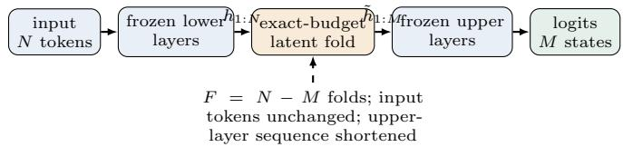
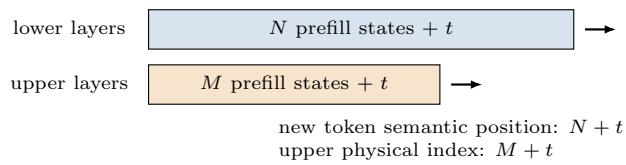
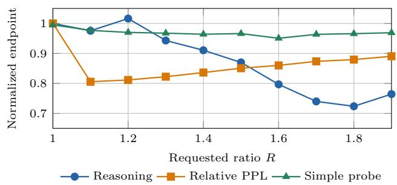

# SemanticFold: Latent Sequence Compression Separates Language Modeling, Decodability, and Reasoning

Mingyan Liu Min Huang msfocus@gmail.com minhuang1@link.cuhk.edu.cn

## Abstract

SemanticFold replaces selected adjacent hidden states with fewer latent states inside a frozen decoder-only Transformer while leaving external tokenization unchanged. We use this controlled intervention to ask what it means for model capability to be preserved. Fixed-target languagemodel fit, output-distribution proximity, task-relevant linear accessibility, and reasoning behavior give diferent answers. In Qwen3-1.7B at R = 1.7, reasoning accuracy fell by 5.2 percentage points (95% CI [−9.8, −0.6]), while identical-target continuation NLL decreased by 0.135. An intervention decomposition attributes that favorable NLL mainly to the learned residual transform rather than shortening. On a 450-prompt Qwen population, tail protection reduced mean DKL(pnative∥parm) from 1.404 to 0.527, while the accuracy point estimate changed by +1.56 percentage points versus the Full SemanticFold arm (95% CI [−3.11, 6.22]). Matched-R controls on Qwen3-1.7B and SmolLM2-1.7B found no reliable cosine-boundary advantage over uniformly random legal boundaries at R ∈ {1.3, 1.7}. Matched checkpoint comparisons further show that preservation profiles vary across model families and endpoints. Recovery on one proxy metric therefore does not certify preservation on a diferent functional endpoint; the evidence does not identify a universal compression threshold or a complete causal mechanism.

## 1 Introduction

If a Transformer processes fewer internal states while its tokenizer, backbone weights, and output head remain fixed, what does it mean for its capability to be preserved? A compressed model can retain teacher-forced next-token fit while changing its free-running trajectory, expose an answer to a linear decoder without using it behaviorally, or move its output distribution toward the native model without recovering task accuracy. Treating any one of these measurements as a certificate for the others hides the scientific question.

SemanticFold makes that question experimentally accessible. Frozen lower decoder layers produce N tokenaligned contextual states. At layer K, an exact-budget policy selects non-overlapping adjacent pairs; a learned compressor replaces every selected pair by one latent state, and frozen upper layers process the resulting M < N states. External token IDs and input-token granularity do not change. Only the deeper computational granularity changes. The R = 1 path bypasses selection and compression, providing a native-equivalence gate.

  
Figure 1: SemanticFold changes deeper computational granularity without changing tokenizer or API input length.

We evaluate four preservation questions. Fixed-target fit asks whether the same continuation tokens remain probable. Distributional proximity compares the complete next-token distribution with native execution. Representational accessibility asks whether task-relevant labels remain linearly decodable from a specified hidden state. Behavioral preservation evaluates the model’s own task decision or generated trajectory. These endpoints are related but are not interchangeable by definition.

The evidence spans frozen Qwen3, SmolLM2, and Pythia checkpoints. It includes identical-target continuation scoring, paired reasoning populations, cross-fitted answer probes, bounded generation, matched small-to-large comparisons, intervention decompositions, and direct runtime measurements. The central finding is a pattern of bounded dissociations. Qwen3-1.7B can show lower fixedtarget NLL while losing reasoning accuracy; the favorable NLL is largely associated with the compressor’s residual transform rather than shortening. Tail protection can move the output distribution markedly toward native execution without a corresponding reliable accuracy recovery. Conversely, matched-R controls do not establish a reliable advantage for cosine-selected over uniformly random legal boundaries. Preservation therefore has to be reported as an endpoint- and checkpoint-specific profile.

Our contributions are:

• a controlled, exact-budget latent sequence-compression intervention in frozen decoder-only Transformers, including explicit feasibility and rounding semantics;

• a multi-endpoint analysis separating fixed-target fit, distributional proximity, task-relevant linear accessibility, behavior, and bounded generation;

• matched controls showing when proxy improvement fails to certify behavioral recovery and when a boundaryselection advantage is not reliably detected;

• structural, checkpoint, and systems constraints that bound claims about mechanism, scaling, memory reduction, and wall-clock speed.

## 2 Related Work

Internal sequence shortening is prior art. Transformer computation has long been reduced by deleting, pruning, or merging intermediate positions. PoWER-BERT progressively removes contextual word vectors [8]; DynamicViT and Token Merging develop input-dependent pruning and similarity-based merging in vision [17, 1]. Closer language-model work includes MrT5, whose learned gate deletes contextualized byte-level encoder states [12]; Dodo, which represents text with a dynamic number of hidden states per decoder layer [16]; LazyLLM, which prunes prompt-token states during long-context inference [6]; and SlimInfer, which combines dynamic intermediate hidden-state pruning with KV-cache management [14]. These works establish both internal sequence shortening and variable internal granularity before SemanticFold. We do not claim either primitive as new.

Prompt, latent-context, and adaptive-granularity methods. LLMLingua shortens the discrete prompt before target-model execution [11], whereas AutoCompressors learn continuous summary vectors for preceding text segments [2]. Gist Tokens compress prompts into reusable internal activations through a restricted attention mask, with reported prompt compression up to 26× [15]. ICAE encodes context into compact memory slots that condition a target language model, reporting 4× context compression with latency and GPU-memory benefits [7]. These methods demonstrate that prompts and contexts can be represented by shorter learned internal sequences; SemanticFold does not claim that latent or internal compression itself is new.

Activation Beacon is a particularly relevant systemsoriented comparison. It progressively compresses long contexts directly into beacon-token key–value activations and reports 2× inference acceleration and an 8× reduction in KV-cache memory across its long-context evaluations [20]. These engineering results use diferent models, training, contexts, and evaluation settings and are not apples-to-apples with SemanticFold’s operating ratios. Activation Beacon primarily develops and evaluates an eficient activation-compression mechanism; SemanticFold uses controlled latent compression as an intervention to test whether fixed-target fit, task-relevant linear accessibility, reasoning, and free-running behavior remain aligned. We claim neither compression-rate nor production-speed superiority.

ByteFlow replaces fixed subword tokenization with a trained byte-level hierarchy and adaptive coding-rate boundaries [3]. SemanticFold instead leaves external token IDs unchanged and replaces selected adjacent contextual states at one intermediate boundary of an otherwise frozen decoder. This distinction identifies the intervention; it is not a claim that separating input and deeper computational granularity is itself new.

Compression evaluation beyond perplexity. Prior compression studies have shown that preserving perplexity or related local fidelity measures does not necessarily preserve downstream behavior. Jaiswal et al. introduce LLM-KICK and show that small perplexity changes under pruning or quantization can conceal large diferences across knowledge, reasoning, generation, retrieval, and summarization tasks [10]. Dutta et al. show that aggregate accuracy can conceal instance-level answer flips and propose flips and KL divergence as complementary distance measures [4]. Xu et al. evaluate pruning and quantization across language-modeling, downstream, and safety dimensions and argue for evaluation beyond perplexity [19]. Kurz et al. show that target-language calibration can preserve perplexity and dominant representation structure without consistently preserving downstream task performance [13]. Multi-metric evaluation of compressed language models is therefore established prior work, not a contribution of SemanticFold. Our narrower contribution is to apply a jointly controlled set of fixed-target likelihood, output-distribution proximity, task-relevant linear accessibility, behavior, and bounded-generation endpoints to one frozen-backbone latent-sequence intervention, then test whether recovery of one endpoint certifies another.

KV management, evaluation, and our positioning. H2O evicts selected KV entries during generative inference [21], while CALM reduces depth through calibrated early exit [18]. SemanticFold shortens the sequence processed by all later attention and feed-forward blocks, but its current systems implementation is not claimed to be production state of the art. Its primary contribution is the controlled evaluation combination: frozen backbones, exact budgets, a true R = 1 bypass, identical-target continuation, out-offold task-local probes, reasoning and bounded generation endpoints, matched random boundaries, matched smallto-large comparisons, and an independent second family. Structural and linear probes establish accessibility, not causal use [9, 5]. We use this design to ask which functional properties survive latent compression, rather than to claim the broad compression primitive.

## 3 SemanticFold

## 3.1 Exact-budget latent folding

Let a frozen decoder map N input tokens to hidden states $H = \left( h _ { 1 } , \ldots , h _ { N } \right)$ at insertion layer K. The target budget

is computed as

$$
F = \mathrm { r o u n d } _ { \mathrm { e v e n } } \left( N - { \frac { N } { R } } \right) , \qquad M = N - F ,\tag{1}
$$

$$
R _ { \mathrm { e f f } } = { \frac { N } { M } } .\tag{2}
$$

where roundeven is Python’s half-to-even rounding. Computing F directly is part of the implementation contract; at exact half-integers it need not equal $N - \mathrm { r o u n d } ( N / R )$ Short sequences can have $F = 0$ , in which case the runtime takes the native bypass and does not invoke the compressor.

Every width-two fold reduces sequence length by one. The selector therefore chooses exactly $F$ non-overlapping edges on the path of adjacent states. For the default policy, edge scores are adjacent cosine similarities and an exact-cardinality dynamic program maximizes their sum. Selected pairs become $\tilde { h } _ { j } = C _ { \theta } ( h _ { i } , h _ { i + 1 } )$ . The reference compressor also applies its learned residual transform to singleton groups, so unselected states are not bitwise copies. Pair-only and MLP-only controls isolate singleton copying and residual adaptation, respectively.

## 3.2 Compressor architecture and training

The same width-two compressor module is shared across every group in a run. For a legal group G of one or two d-dimensional states, it computes

$$
q _ { i } = w _ { s } ^ { \top } \mathrm { R M S N o r m } _ { s } ( h _ { i } ) , \qquad \alpha _ { i } = \frac { \exp ( q _ { i } ) } { \sum _ { j \in G } \exp ( q _ { j } ) } ,\tag{3}
$$

$$
z _ { G } = \sum _ { i \in G } \alpha _ { i } h _ { i } ,\tag{4}
$$

$$
C _ { \theta } ( G ) = z _ { G } + W _ { 2 } \mathrm { S i L U } \left( W _ { 1 } \mathrm { R M S N o r m } _ { o } ( z _ { G } ) \right) .\tag{5}
$$

The group input is a stack of source states, not a concatenation. The score projection and both MLP projections have no bias; the implementation uses no dropout and no custom initialization beyond the $\mathrm { P y }$ Torch module defaults. Both RMSNorms use the checkpoint epsilon. The hidden width is 1,024 and the output dimension remains d. Thus the module has $3 d + 2 d ( 1 , 0 2 4 )$ trainable parameters: 4,200,448 when $d = 2 { , } 0 4 8$ and 8,400,896 when $d = 4 { , } 0 9 6$ For a singleton, the softmax weight is one and the map reduces to $h + W _ { 2 } \mathrm { S i L U } ( W _ { 1 } \mathrm { R M S N o r m } _ { o } ( h ) )$

Each checkpoint uses a separately trained compressor while all backbone parameters remain frozen. Training teacher-forces WikiText-derived continuations and combines continuation cross-entropy, a KL term to the uncompressed frozen teacher, and final-hidden-state cosine loss. The checkpoint-specific data splits, grouping policy, coeficients, optimization schedule, seeds, candidate checkpoints, and validation-only selection rules are reported in Appendix C. No downstream reasoning, probe, generation, or systems endpoint is used to select a compressor.

$$
\begin{array} { r } { \boxed { h _ { 1 } } \boxed { h _ { 2 } } \boxed { h _ { 3 } } \boxed { h _ { 4 } } \boxed { h _ { 5 } } \boxed { h _ { 6 } } \implies \boxed { h _ { 1 } } C ( h _ { 2 } , h _ { 3 } \boxed { h _ { 4 } } C ( h _ { 5 } , h _ { 6 } ) } \end{array}
$$

$$
N = 6 , ~ M = 4 , ~ F = 2 , ~ R _ { \mathrm { e f f } } = 1 . 5
$$

Figure 2: Width-two folding on a path. Selected edges do not overlap, and the dynamic program realizes the exact feasible fold count.  
  
Figure 3: Upper layers store fewer prefill states, while generation appends one state per step to every layer.

## 3.3 Protection feasibility

If k positions must remain unfolded, the remaining $N - k$ positions can support at most $\lfloor ( N - k ) / 2 \rfloor$ width-two folds. Hence a necessary condition is

$$
F \leq \left\lfloor { \frac { N - k } { 2 } } \right\rfloor , \qquad k \leq k _ { \operatorname* { m a x } } = N - 2 F .\tag{6}
$$

For a contiguous protected tail with all preceding edges legal, this bound is also attainable. The quantity $k _ { \mathrm { m a x } }$ is task-independent geometry. Whether a selected fold is “safe” depends on which positions are declared protected and can therefore depend on the endpoint. We report requested and realized protection separately.

## 3.4 Positions, caching, and equivalence

A retained latent state carries a frozen original-coordinate position; it is not interpreted as a newly tokenized string. Rotary position calculations use those semantic coordinates. At generation step t, lower-layer caches have length $N + t ,$ upper-layer caches have length $M + t ,$ and the new token has semantic position $N + t$ in both regions.

We distinguish bitwise identity, whole-trajectory exactness, and functional equivalence. Bitwise identity requires same-shape tensors to match exactly. Whole-trajectory exactness requires every generated token decision to match. Functional endpoints use pre-specified paired accuracy, regression, recovery, NLL, probe, or agreement criteria. Passing one contract does not imply passing another.

## 4 Experimental Design

## 4.1 Frozen models and populations

All evidence uses public decoder checkpoints, frozen model weights, and one model-specific compressor per checkpoint. Execution uses BF16 on an RTX 4090; the Qwen3-8B study uses no quantization or CPU ofload. The scientific populations are frozen independently, so rows from diferent populations are not treated as repeated measurements of one common efect.

Every study has a true $R = 1$ oracle in which selection and compression are bypassed. The confirmatory Qwen and Pythia gates require bitwise-equal hidden states and logits. Checkpoint revisions and population construction are summarized in the appendix. Exact prompt texts, labels, token IDs, and machine-readable evaluation records are retained in the accompanying reproducibility artifacts.

## 4.2 Endpoints answer diferent questions

Fixed-target language-model fit. A frozen prefix is executed natively or compressed, and both arms teacherforce the same continuation token IDs. Qwen3-1.7B uses 50 records with 192 prefix and 64 continuation tokens at $R = 1 . 7 ;$ SmolLM2 uses 48 records with 96 prefix and 32 continuation tokens at $R = 1 . 2$ . Qwen3-8B and both $\mathrm { P y }$ thia checkpoints use separately frozen 50-record populations. The primary value is compressed-minusnative mean NLL.

Behavior and linear accessibility. Reasoning accuracy is scored on frozen finite-label task populations. For the 450-prompt intervention population, nine BBH tasks contribute 50 prompts each: date understanding, disambiguation QA, formal fallacies, logical deduction with five and seven objects, penguins in a table, reasoning about colored objects, temporal sequences, and tracking shufled objects with five objects. Prompts end in an answer cue; every candidate label must tokenize to exactly one token after a leading space. Accuracy is the argmax over those candidate logits at the final prompt position, and the margin is the correct-label logit minus the largest competing-label logit. No chain-of-thought or free-form generation is scored in this endpoint. The answer probe is an L2-regularized multinomial logistic regression applied to the normalized final prompt hidden state, with task-local classes, five-fold task-stratified crossfitting, train-fold-only standardization, and pre-specified accuracy, macro-F1, and one-vs-rest macro-AUC. The probe tests linear accessibility at one representation and does not establish causal use by the backbone.

Output-distribution proximity. On the 450-prompt Qwen finite-label population, Native, Full SemanticFold, Pair-only, MLP-only, and Tail protection arms are scored at the same final prompt position. We report accuracy and $D _ { \mathrm { K L } } ( p _ { \mathrm { n a t i v e } } \| p _ { \mathrm { a r m } } )$ . Prompt-level bootstrap intervals for mean and median DKL use 10,000 paired draws; accuracy uses the existing task-stratified paired procedure.

Generation and systems. Bounded greedy diagnostics record first-token and trajectory agreement, normal output, immediate EOS, loops, printable-garble flags, and numerical finiteness. Systems experiments separately measure structural KV reduction, Native-versus-SemanticFold TTFT/E2E latency, and cache-path fidelity.

## 4.3 Matched controls

The fixed-continuation decomposition holds prefixes, continuations, checkpoints, and selected boundaries fixed while comparing Native, Full SemanticFold, Pair-only exact singleton copying, MLP-only residual adaptation without folding, and a no-training mean-merge baseline.

The matched-boundary control uses the same first 300 finite-label frozen prompts for Qwen3-1.7B and SmolLM2- 1.7B at $R \in \{ 1 . 3 , 1 . 7 \}$ . For every prompt, cosine and uniformly random legal boundaries share the exact N, M, $F ,$ , checkpoint, insertion layer, compressor, label readout, and generated work. One deterministic random matching is derived per prompt from seed 20261005. The primary contrast is paired cosine-minus-random accuracy with 10,000 prompt-level, task-stratified bootstrap draws.

Matched small-to-large comparisons use an internally identical 300-prompt population within each family. Qwen3 compares 1.7B with 8B; Pythia compares 1.4B with 6.9B. Diference-in-diferences estimates are descriptive of those checkpoint pairs and do not isolate parameter count.

## 4.4 Inference policy

Intervals are percentile intervals from pre-specified paired bootstrap procedures unless stated otherwise. Families are not pooled. A confidence interval containing zero is not treated as evidence of equivalence.

## 5 What Is Preserved Under Latent Compression?

## 5.1 Endpoint profiles

Table 2 places the principal endpoint changes on one page. The populations are frozen separately, so the table compares preservation profiles rather than estimating a joint multivariate efect.

Qwen3-1.7B gives the clearest within-checkpoint dissociation: reasoning accuracy declined while identical-target NLL decreased and the specified answer-probe AUC had no detected decline. SmolLM2’s fixed-target NLL was approximately unchanged, yet its original reasoning population also declined. The 450-prompt SmolLM2 intervention population had the opposite point direction (Native 0.2244, Full SemanticFold 0.2667), showing that behavioral direction depends on the tested population and cannot define a universal threshold.

Table 1: Principal checkpoints and endpoint populations. Counts denote prompts or records; a dash means that endpoint was not run.
<table><tr><td>Model</td><td>Params</td><td>Layers</td><td>K</td><td>Fixed NLL</td><td>Reasoning</td><td>Probe</td><td>Generation</td><td>Systems</td></tr><tr><td>Qwen3-1.7B</td><td>1.7B</td><td>28</td><td>6</td><td>50</td><td>500/450</td><td>300</td><td>100</td><td>1K-8K</td></tr><tr><td>SmolLM2-1.7B</td><td>1.7B</td><td>24</td><td>7</td><td>48</td><td>300/450</td><td>240</td><td>100</td><td>2K-8K</td></tr><tr><td>Qwen3-8B</td><td>8.2B</td><td>36</td><td>8</td><td>50</td><td>300</td><td>300</td><td>50</td><td>2K; 8K bounded</td></tr><tr><td>Pythia-1.4B</td><td>1.4B</td><td>24</td><td>5</td><td>50</td><td>300</td><td>300</td><td>20</td><td></td></tr><tr><td>Pythia-6.9B</td><td>6.9B</td><td>32</td><td>7</td><td>50</td><td>300</td><td>300</td><td>20</td><td></td></tr></table>

Table 2: Compression-associated endpoint changes at selected operating points. Values are compressed minus Native with 95% paired bootstrap intervals.
<table><tr><td>Model</td><td>R</td><td>Reasoning accuracy</td><td></td><td>Fixed-target NLL</td><td>Answer-probe macro AUC</td><td></td></tr><tr><td>Qwen3-1.7B</td><td>1.7</td><td></td><td>-.0520 [−.0980, -.0060]</td><td>-.1353 [−.2156, -.0593]</td><td></td><td>-.0268 [−.0662, .0125]</td></tr><tr><td>SmolLM2-1.7B</td><td>1.2</td><td></td><td>-.0400 [−.0767, -.0033]</td><td>+.0127 [−.0446, .0832]</td><td></td><td>+.0224 [−.0306, .0768]</td></tr><tr><td>Qwen3-8B</td><td>1.3</td><td></td><td>-.0233 [-.0733, .0267]</td><td>-.0852 [−.1247, −.0492]</td><td></td><td>-.0839 [−.1133, -.0548]</td></tr><tr><td>Pythia-1.4B</td><td>1.3</td><td></td><td>-.0333 [−.0867, .0200]</td><td>+.0004 [−.0143, .0153]</td><td></td><td>+.0202 [−.0152, .0556]</td></tr><tr><td>Pythia-6.9B</td><td>1.3</td><td></td><td>+.0067 [−.0433, .0600]</td><td>-.0037 [−.0213, .0144]</td><td></td><td>-.0316 [−.0686, .0043]</td></tr></table>

  
Figure 4: The original Qwen rate sweep normalized to R = 1. Endpoints move non-monotonically and do not share one compression threshold.

## 5.2 Fixed-target fit

Teacher-forcing identical continuations rules out a targetselection explanation for the NLL results. Qwen3-1.7B at R = 1.7 changed by −0.13529; SmolLM2 at R = 1.2 changed by +0.01266. Qwen3-8B remained favorable at R = 1.2, 1.3, and 1.5 with changes −0.09910, −0.08521, and −0.04164. Pythia NLL was efectively unchanged at both scales. These are teacher-forced fit measurements, not claims of improved general language capability.

## 5.3 Task-relevant linear accessibility

For Qwen3-1.7B at R = 1.7, behavior changed by −0.0467 on the probe population, while answer-probe accuracy changed by −0.0100 (95% CI [−0.0600, 0.0367]) and macro AUC by −0.0268. For SmolLM2 at R = 1.2, behavior changed by −0.0500, probe accuracy by approximately zero, and AUC by +0.0224. Among nativecorrect/compressed-incorrect prompts, the compressed out-of-fold probe recovered the gold class for 22/50 Qwen prompts and 13/22 SmolLM2 prompts. The representation can therefore retain linearly accessible answer information when the model’s own decision changes; this does not show that the backbone uses that information. High probe separability also does not establish that compression created a semantic code rather than a task-correlated linear readout of the measured state.

Matched checkpoint comparisons further bound generalization. In Qwen3, the small-to-large macro-AUC interaction was −0.0796 (95% CI [−0.1207, −0.0381]). Pythia reproduced the negative interaction direction, −0.0518 (95% CI [−0.1010, −0.0028]), but absolute Pythia probe separability was weak: 15/100 and 94/100 permutation AUCs equaled or exceeded the observed compressed AUC at 1.4B and 6.9B. These are checkpoint-pair interactions, not a parameter-count scaling law.

## 5.4 Bounded generation

On 100 frozen SmolLM2 prompts at R = 1.3, compressed generation produced 93 normal outputs, two immediate-EOS outputs, two token loops, and three printable-garble flags. Cached and stateless paths agreed on all first tokens and on 85/100 complete 16-token trajectories; neither produced NaN or Inf. On 50 Qwen3-8B prompts at R = 1.3, both Native and compressed runs were mechanically normal, but first tokens agreed for 31/50 and full trajectories for 9/50. Mechanical health therefore does not imply semantic or trajectory equivalence. These diagnostic populations are bounded and do not estimate a universal failure rate.

## 6 When Preservation Metrics Disagree

The central empirical result is a disagreement among preservation endpoints. Fixed-continuation likelihood,

output-distribution proximity, linear accessibility, and task accuracy answer diferent questions. None is an interchangeable certificate for the others.

## 6.1 Where the favorable likelihood comes from

Table 3 separates sequence shortening from the learned residual transform on identical continuation targets. MLPonly applies the transform without shortening; Pair-only shortens paired states but copies singletons; Mean merge shortens at the same boundaries without the learned compressor.

MLP-only has 0.0816 lower NLL than Full Semantic-Fold for Qwen ([0.0591, 0.1072]) and 0.0770 for SmolLM2 $\left( [ 0 . 0 3 0 0 , 0 . 1 4 3 9 ] \right)$ ). Thus the favorable Qwen likelihood cannot be assigned to shortening alone: residual adaptation supplies a substantial benefit, and folding ofsets part of it. Mean merge worsens NLL in both models, so arbitrary shortening at the selected boundaries is also insuficient. Because MLP-only changes every prefix state without shortening the sequence, this decomposition identifies generic learned state adaptation as a contributor to $\mathrm { N L L } ,$ it does not identify sequence compression as the cause of the favorable Full-versus- Native contrast.

## 6.2 Distributional proximity does not certify behavior

For each eligible Qwen prompt, we compute $D _ { \mathrm { K L } } ( p _ { \mathrm { N a t i v e } } \| p _ { \mathrm { a r m } } )$ at the answer position over the model vocabulary. Table 4 uses the same 450 finite-label prompts at $R = 1 . 7$ . Accuracy intervals are task-stratified; KL intervals use 10,000 prompt bootstrap resamples.

Tail protection moves the answer distribution substantially toward Native, but its accuracy change relative to Full SemanticFold remains uncertain. MLP-only moves both endpoints in the favorable direction. The combined result is mixed: distributional proximity contains useful information, but is an incomplete predictor of behavioral recovery under these interventions.

The probe results create a related distinction. A linear decoder tests whether specified answer information remains accessible at one representation, whereas task accuracy tests what the frozen downstream computation actually produces. Cross-fitting and finite permutation controls bound the probe claim, but do not turn accessibility into causal use. Consequently, favorable NLL, low KL, high cosine similarity, probe separability, and answer accuracy should be reported as separate endpoint-specific results.

## 7 Boundary Choice and Feasibility Geometry

Boundary policy can matter only within the legal fold budget. We therefore separate two questions: whether cosine-selected boundaries outperform a uniform legal matching at the same ratio, and whether a requested protection rule is geometrically feasible.

## 7.1 Matched-ratio boundary control

Table 5 compares cosine selection with one deterministic uniform legal matching on the same 300 finite-label prompts. Within every row, the checkpoint, compressor, readout, targets, N, M, and F are identical; only the boundary policy changes. Intervals use 10,000 taskstratified paired bootstrap resamples.

Every interval crosses zero, and the point estimates do not show a consistent ratio dependence. These data do not establish a reliable accuracy advantage for cosine selection. The SmolLM2 $R = 1 . 7$ row lies outside its validated operating range and is an exploratory matched control. Earlier comparisons at Qwen $R = 1 . 7$ and SmolLM2 $R = 1 . 2$ could not isolate checkpoint efects from ratio efects; the matched rows remove that ambiguity without identifying a mechanism or an optimal policy.

## 7.2 Protection feasibility

The reference implementation computes

$$
F = \mathrm { r o u n d } _ { \mathrm { e v e n } } \left( N - { \frac { N } { R } } \right) , \qquad M = N - F ,\tag{7}
$$

where Python’s half-to-even rule is applied before deriving M. This can difer from rounding $N / R$ at exact halfintegers. Unit checks at $R = 2$ give $F = 2 , 4 , 4 , 6$ for $N = 5 , 7 , 9 , 1 1$ , respectively.

If k positions are protected, the remaining $N - k$ positions can support at most $\lfloor ( N - k ) / 2 \rfloor$ disjoint adjacent folds. Hence

$$
F \leq \left\lfloor { \frac { N - k } { 2 } } \right\rfloor , \qquad k _ { \mathrm { m a x } } = N - 2 F .\tag{8}
$$

This is a geometric capacity bound. Actual fold safety also depends on which positions are protected and on the legal-boundary definition used by the selector.

All 900 evaluated records satisfy the fold-safety check. Some Qwen prompts cannot protect all 16 requested tail positions because their exact fold budgets leave only seven to fifteen protected degrees of freedom. The bound explains when an intervention can be realized; it is not a causal threshold for preservation or a universal safe compression ratio.

Table 3: Fixed-continuation NLL decomposition. Parentheses give the paired 95% confidence interval for the change from Native. Lower is better.
<table><tr><td>Model</td><td>Arm</td><td>NLL</td><td>∆NLL vs. Native (95% CI)</td><td></td></tr><tr><td>Qwen3-1.7B</td><td>Native</td><td>2.6783</td><td></td><td></td></tr><tr><td></td><td>Full SemanticFold</td><td>2.5391</td><td></td><td>-0.1391 [-0.2218, -0.0625]</td></tr><tr><td></td><td>Pair-only</td><td>2.5766</td><td></td><td>-0.1017 [−0.1780, -0.0329]</td></tr><tr><td></td><td>MLP-only</td><td>2.4575</td><td></td><td>-0.2207 [-0.3017, -0.1475]</td></tr><tr><td></td><td>Mean merge</td><td>2.7795</td><td></td><td>+0.1012 [+0.0763, +0.1280]</td></tr><tr><td>SmolLM2-1.7B</td><td>Native</td><td>2.7231</td><td></td><td></td></tr><tr><td></td><td>Full SemanticFold</td><td>2.7357</td><td></td><td>+0.0127 [-0.0458, +0.0829]</td></tr><tr><td></td><td>Pair-only</td><td>2.7602</td><td></td><td>+0.0372 [-0.0076, +0.0999]</td></tr><tr><td></td><td>MLP-only</td><td>2.6587</td><td></td><td>-0.0643 [−0.0953, -0.0345]</td></tr><tr><td></td><td>Mean merge</td><td>2.9945</td><td></td><td>+0.2714 [+0.0955, +0.5014]</td></tr></table>

Table 4: Output-distribution proximity and finite-label behavior on Qwen3-1.7B. Accuracy changes are relative to Full SemanticFold.
<table><tr><td>Arm</td><td>Accuracy</td><td colspan="2">∆ accuracy (95% CI)</td><td colspan="2">Mean DKL (95% CI)</td><td>Median DKL (95% CI)</td></tr><tr><td>Native</td><td>.3444</td><td colspan="2"></td><td colspan="2">.000 [.000, .000]</td><td>.000 [.000, .000]</td></tr><tr><td>Full SemanticFold</td><td>.2978</td><td colspan="2"></td><td>1.404 [1.345, 1.465]</td><td></td><td>1.238 [1.185, 1.287]</td></tr><tr><td>Pair-only</td><td>.2889</td><td colspan="2">-.0089 [-.0356, .0178]</td><td>1.281 [1.225, 1.336]</td><td></td><td>1.160 [1.107, 1.217]</td></tr><tr><td>MLP-only</td><td>.3489</td><td colspan="2">+.0511 [.0000, .1044]</td><td>.097 [.090, .105]</td><td></td><td>.062 [.058, .067]</td></tr><tr><td>Tail protection</td><td>.3133</td><td colspan="2">+.0156 [−.0311, .0622]</td><td></td><td>.527 [.492, .562]</td><td>.497 [.456, .539]</td></tr></table>

## 8 What the Evidence Says About Mechanism

The endpoint dissociation is better established than its cause. We evaluate each mechanistic proposal as a scoped intervention: a negative result rejects the tested operationalization, not every mechanism in the same family.

The addressability intervention produced strong structural contrast on every tested prompt in the training and validation sets, yet did not improve the reasoning endpoint. The oracle establishes recovery headroom, but learned gating, stable pairwise structure, a single-fold adapter, and localized patches did not pass their criteria. Together these results rule out several simple explanations without locating the complete causal pathway.

The decomposition controls add two constraints. Copying singleton states exactly did not reliably restore finite-label accuracy: relative to Full Semantic-Fold, Pair-only changed Qwen accuracy by −0.0089 (95% CI [−0.0356, 0.0178]) and SmolLM2 by +0.0022 ([−0.0244, 0.0311]). Protecting final prompt positions shifted Qwen’s output distribution toward Native, but the behavioral interval still crossed zero; SmolLM2 did not show the same point-estimate direction. Thus neither singleton rewriting nor bounded tail preservation alone explains the behavioral change.

Matched-ratio random boundaries further show that exact cardinality does not determine the point estimate, while providing no reliable evidence that cosine selection is superior. The native-to-compressed probe-transfer result remains a representation-geometry observation rather than a demonstrated mechanism. Distributed state replacement, position removal, later attention, and checkpoint-specific representation use remain viable explanations.

## 9 Systems Consequences

SemanticFold creates three distinct systems claims: a structural reduction in upper-layer state and KV length, fidelity of the cached implementation, and measured wallclock behavior. They require separate evidence.

## 9.1 Cached execution preserves the tested function

The cache study compares stateless recomputation with heterogeneous cached SemanticFold, not compression with Native. Qwen’s strongest common functional band is Strict; SmolLM2 has zero accuracy diference and perfect answer agreement at both tested ratios. Whole-trajectory exactness remains below one, so the evidence supports fidelity under frozen criteria rather than universal numerical identity.

## 9.2 Memory reduction and latency are separate

After prefill, lower layers retain N prompt states and upper layers retain M. At decode step t, their cache lengths are N + t and M + t. This geometry reduces upperlayer KV memory by construction. Wall-clock latency additionally includes boundary selection, compression, dispatch, hardware utilization, and ordinary decode.

Qwen shows clear reductions in this local implementation. SmolLM2 has small overhead at 2K and small reductions at 8K despite similar structural memory savings. Each condition uses BF16 on one RTX 4090, exactly 16 generated tokens, one warmup, and five retained alternating-order measurements. These are bounded local timings, not a universal speedup or production comparison.

Table 5: Cosine versus random legal boundaries under matched compression ratios.
<table><tr><td>Model</td><td>R</td><td>Native</td><td>Cosine</td><td>Random</td><td></td><td>Cosine – Random (95% CI)</td></tr><tr><td>Qwen3-1.7B</td><td>1.3</td><td>.3633</td><td>.3533</td><td>.3333</td><td></td><td>+.0200 [-.0367, .0767]</td></tr><tr><td>Qwen3-1.7B</td><td>1.7</td><td>.3633</td><td>.3167</td><td>.2933</td><td>+.0233</td><td>3 [−.0400, .0867]</td></tr><tr><td>SmolLM2-1.7B</td><td>1.3</td><td>.2667</td><td>.3133</td><td>.2900</td><td>+.0233</td><td>3 [−.0400, .0867]</td></tr><tr><td>SmolLM2-1.7B</td><td>1.7</td><td>.2667</td><td>.2533</td><td>.2633</td><td></td><td>-.0100 [-.0667, .0467]</td></tr></table>

Table 6: Tail protection feasibility over the evaluated 450- prompt populations.
<table><tr><td>Model</td><td>R</td><td>kmax min/med/max</td><td>Requested</td><td>Realized</td><td>Safe</td></tr><tr><td>Qwen3-1.7B</td><td>1.7</td><td>7/27/48</td><td>16</td><td>7-16</td><td>1.00</td></tr><tr><td>SmolLM2-1.7B</td><td>1.3</td><td>25/89/152</td><td>16</td><td>16</td><td>1.00</td></tr></table>

Additional cache geometry and measurement details appear in Appendix F.

## 10 Discussion

## 10.1 Preservation is endpoint-specific

SemanticFold separates several meanings of preservation that are often treated as one. Fixed-target NLL evaluates teacher-forced fit to identical continuations. Answerposition KL measures proximity of one output distribution. A probe measures accessibility to a specified decoder. Accuracy and free-running generation measure behavior of the complete frozen computation. The experiments show that these quantities can move in diferent directions.

The NLL decomposition makes this distinction concrete. Residual adaptation without shortening is more favorable than Full SemanticFold in both 1.7B models, while mean merging at the same boundaries is worse. The favorable Qwen NLL is therefore neither evidence that shortening is harmless nor evidence that any merge sufices. Likewise, Qwen tail protection reduces mean native-to-intervention KL from 1.404 to 0.527 but does not yield a reliable accuracy recovery. Better fit and closer output distributions remain useful measurements with narrower meanings than behavioral preservation.

High global representation similarity does not resolve the disagreement. Mean paired cosines exceed 0.95 in every matched model while task-local probe behavior changes. Linear accessibility is also not causal use [5]. These observations motivate local geometric analysis, but the negative gating, patching, pair-structure, and addressability results leave the mechanism open.

## 10.2 Checkpoint profiles difer without defining a scaling law

The matched Qwen3 comparison shows a negative small-tolarge macro-AUC interaction, and the Pythia comparison reproduces its direction; both paired bootstrap intervals exclude zero. Pythia’s absolute probe separability is weak, so the replication concerns the interaction direction rather than strong absolute decoding. Accuracy does not show one common cross-family pattern.

These results establish checkpoint variation, not a universal size efect. Each family contains only two checkpoints, and parameter count changes with width, learned weights, training history, representation dimension, insertion depth, and compressor fit. Baseline separability also difers between families. The matched-ratio boundary control adds that cosine selection has no reliable accuracy advantage over a uniform legal matching at the tested ratios. It therefore cannot explain the checkpoint interactions.

## 10.3 The useful systems claim is bounded

Tokenization fixes the external input units but need not fix the number of states processed by every deeper layer. SemanticFold provides an exact-budget intervention in which N contextual states become M < N latent states before later blocks. This design space is shared with prior work on internal pruning, merging, compression, and adaptive segmentation [12, 16, 6, 14, 3].

The structural consequence is shorter upper-layer state and KV sequences. Realized latency remains implementation- and hardware-dependent: Qwen improves in the local 2K and 8K measurements, whereas SmolLM2 has slight overhead at 2K and a small improvement at 8K. These local measurements do not establish a universal latency advantage or superiority to production serving systems.

## 10.4 Validation must follow the intended use

A deployment ratio should be selected for a particular checkpoint and endpoint, not from NLL or compression rate alone. The exact feasibility bound determines whether a protection rule can coexist with a requested fold budget, but does not determine whether the resulting computation is safe. Likewise, cached-path fidelity under frozen tests does not imply universal trajectory identity.

Table 7: Mechanism-directed evidence and its warranted scope.
<table><tr><td>Tested proposition</td><td>Decision</td><td>Evidence and scope</td></tr><tr><td>Low similarity/high variance marks Supported risky folds</td><td></td><td>Held-out diagnostic association under single-group restora- tion; no causal intervention or deployable policy.</td></tr><tr><td>Online control removes domain rate drift Supported</td><td></td><td>Exact-budget control reduced requested-versus-realized rate error across the audited domains.</td></tr><tr><td>A learned gate gives stable held-out ben- Unsupported efit</td><td></td><td>Eight-prompt test gains changed sign across compressor seeds.</td></tr><tr><td>Oracle-safe boundaries leave recovery Supported headroom</td><td></td><td>Oracle accuracy reached 93.2% at  $R = 1 . 5 ;$  privileged labels preclude a deployable claim.</td></tr><tr><td>Oracle benefit reflects stable pair struc- Unsupported ture</td><td></td><td>Pair interactions had weak cross-seed rank and sign stability and did not reconstruct the oracle.</td></tr><tr><td>A single-fold adapter restores reasoning Unsupported</td><td></td><td>Accuracy did not improve and perplexity worsened; multi- fold adaptation was not tested.</td></tr><tr><td>A compact localized patch restores rea- Unsupported soning</td><td></td><td>No eligible candidate passed the pre-specified selection crite- rion; the held-out test set was not evaluated.</td></tr><tr><td>The tested addressability intervention Unsupported restores reasoning</td><td></td><td>Accuracy change -0.0259, 95% CI [−0.1037, 0.0574] on 60 training/validation prompts.</td></tr><tr><td>Structural features add reproducible pre- Unsupported diction</td><td></td><td>The pre-specified joint OOF-R2/bootstrap-MAE criterion failed.</td></tr></table>

Table 8: Cached versus stateless SemanticFold.
<table><tr><td>Model</td><td>R</td><td>Stateless</td><td>Cached</td><td>Agree</td><td>Traj.</td></tr><tr><td>Qwen</td><td>1.1</td><td>.417</td><td>.417</td><td>.997</td><td>.967</td></tr><tr><td>Qwen</td><td>1.2</td><td>.400</td><td>.403</td><td>.990</td><td>.957</td></tr><tr><td>Qwen</td><td>1.3</td><td>.430</td><td>.433</td><td>.990</td><td>.970</td></tr><tr><td>SmolLM2</td><td>1.2</td><td>.290</td><td>.290</td><td>1.000</td><td>.960</td></tr><tr><td>SmolLM2</td><td>1.3</td><td>.280</td><td>.280</td><td>1.000</td><td>.970</td></tr></table>

Table 9: SemanticFold versus Native at $R \ = \ 1 . 3 .$ Times are medians in milliseconds; ratios are Semantic-Fold/Native.
<table><tr><td>Model</td><td>Context</td><td>TTFT N/SF</td><td>TTFT ratio</td><td>E2E N/SF</td><td>E2E ratio</td><td>KV save</td></tr><tr><td>Qwen1.7</td><td>2K</td><td>163.35/128.65</td><td>.788</td><td>575.70/483.57</td><td>.840</td><td>18.01%</td></tr><tr><td>Qwen1.7</td><td>8K</td><td>2024.55/1442.52</td><td>.713</td><td>2516.78/1811.70</td><td>.720</td><td>18.09%</td></tr><tr><td>SmolLM2</td><td>2K</td><td>61.03/61.74</td><td>1.012</td><td>260.57/273.28</td><td>1.049</td><td>16.24%</td></tr><tr><td>SmolLM2</td><td>8K</td><td>299.25/284.84</td><td>.952</td><td>581.74/560.19</td><td>.963</td><td>16.31%</td></tr></table>

A stronger future study would vary ratio, insertion layer, compressor seed, and boundary policy within each checkpoint; measure fixed-target, distributional, representational, and behavioral endpoints on the same population; and use interventions that distinguish information loss from downstream failure to use retained information. The present evidence motivates that design without claiming that a universal latent granularity already exists.

## 11 Limitations

All conclusions are endpoint-scoped. Fixed-continuation NLL covers frozen WikiText-derived targets; answerposition KL covers one position and direction of divergence; probes are linear and task-local; finite-label accuracy and short greedy generations cover bounded behaviors. None establishes unchanged calibration, factuality, long-form coherence, general capability, or causal use of a representation.

The model sample remains small. Matched small-tolarge evidence comes from two Qwen3 and two Pythia checkpoints, with architecture, weights, width, training, insertion depth, representation dimension, and compressor fit entangled. Parameter count is not isolated, and no universal scaling law follows. Absolute Pythia probe separability is weak, while Qwen3-8B reasoning intervals are underpowered for small efects.

The new matched-ratio boundary comparison covers two 1.7B checkpoints and only R = 1.3 and R = 1.7. It uses one deterministic random legal matching per prompt; all cosine-minus-random accuracy intervals cross zero. It neither proves equivalence nor identifies an optimal boundary policy. The SmolLM2 R = 1.7 condition is exploratory and outside its validated operating range.

The KL analysis is position-specific and asymmetric. A lower $D _ { \mathrm { K L } } ( p _ { \mathrm { N a t i v e } } \| p _ { \mathrm { a r m } } )$ at the answer position need not preserve ranking margins, later trajectories, or task accuracy. The Qwen intervention population is reused from prior evaluation, and its confidence intervals do not support a general behavioral-recovery claim.

The protection bound $k _ { \operatorname* { m a x } } = N - 2 F$ is geometric rather than causal. It counts how many positions can be protected while leaving enough positions for F disjoint folds. Actual fold safety depends on which positions are protected, the adjacency rules, and the selector’s legalboundary definition. Passing this feasibility check does not define a universal safe threshold or ratio.

Oracle experiments use privileged correctness information and provide only an upper-bound diagnostic. Their

93.2% result at R = 1.5 does not yield a deployable selector. Failures of learned gating, pairwise structure, localized patching, and the tested addressability intervention reject those operationalizations without identifying the full mechanism.

The matched comparisons use one model-specific compressor per checkpoint. No complete layer sweep, ratio sweep, multiple compressor-training-seed study, or common large-scale free-running protocol was performed. Pythia recompresses the evolving sequence during generation, while the cached Qwen and SmolLM2 path compresses the prompt and appends generated states as singletons, preventing a protocol-matched cross-family generation claim.

The Qwen3-1.7B training study has three independently trained compressors per ratio, but the other checkpoint studies use one compressor-training seed each; their endpoint intervals therefore do not include compressor-fit uncertainty. Moreover, the MLP-only control shows that a generic learned state transform can improve fixed-target likelihood without sequence shortening. The Full-versus-Native NLL contrast must therefore not be interpreted as a pure compression efect.

Systems results depend on the Python implementation, one RTX 4090, BF16, context length, and fixed 16-token outputs. Qwen3-8B 8K timing was stopped by a predefined eficiency rule, and its 2K E2E comparison used unequal output lengths. There is no fused production kernel or production-grade comparison with other pruning, merging, or compression systems. Structural KV reduction is established; universal latency benefit, a larger usable context window, production readiness, and systems state of the art are not.

The reported negative studies and endpoint disagreements do not establish a complete causal account. The work defines no universal preservation threshold, safe compression ratio, scaling rule, or semantic-compression optimum. The minimum suficient latent sequence length may depend jointly on model, task, prompt, layer, and endpoint.

## 12 Conclusion

SemanticFold demonstrates that external tokenization and deeper computational granularity can be separated, but also that preservation has no single scalar certificate. Across the tested checkpoints, fixed-target likelihood, answer-distribution proximity, linear accessibility, reasoning accuracy, and free-running behavior can move diferently. The NLL decomposition attributes much of Qwen’s favorable fixed-target result to residual adaptation rather than shortening alone. Tail protection reduces output-distribution divergence without a reliable behavioral recovery, and matched-ratio controls do not show a reliable advantage for cosine-selected boundaries.

The evidence supports exact-budget latent shortening, structural upper-layer KV savings, and bounded local runtime gains. It does not supply a universal safe ratio, scaling law, causal mechanism, or production state-of-theart claim. The practical requirement is checkpoint-specific validation at the ratio and endpoint that matter. The scientific question that remains is which latent sequence granularity a particular model, task, and functional endpoint actually requires.

## Code Availability

The SemanticFold implementation includes the compression runtime, evaluation scripts, frozen compressor checkpoints, and reproducibility utilities used in this study. These materials are being prepared for public release. No repository URL or archival identifier is asserted in this version.

## References

[1] Daniel Bolya, Cheng-Yang Fu, Xiaoliang Dai, Peizhao Zhang, Christoph Feichtenhofer, and Judy Hofman. Token merging: Your ViT but faster. In International Conference on Learning Representations, 2023.

[2] Alexis Chevalier, Alexander Wettig, Anirudh Ajith, and Danqi Chen. Adapting language models to compress contexts. In Proceedings of the 2023 Conference on Empirical Methods in Natural Language Processing, pages 3829–3846, 2023.

[3] Chunyuan Deng, Sanket Lokegaonkar, Colin Lockard, Besnik Fetahu, Nasser Zalmout, and Xian Li. Byte-Flow: Language modeling through adaptive byte compression without a tokenizer. In International Conference on Learning Representations, 2026.

[4] Abhinav Dutta, Sanjeev Krishnan, Nipun Kwatra, and Ramachandran Ramjee. Accuracy is not all you need. In Advances in Neural Information Processing Systems, volume 37, pages 124347–124390. Neural Information Processing Systems Foundation, 2024.

[5] Yanai Elazar, Shauli Ravfogel, Alon Jacovi, and Yoav Goldberg. Amnesic probing: Behavioral explanation with amnesic counterfactuals. Transactions of the Association for Computational Linguistics, 9:160–175, 2021.

[6] Qichen Fu, Minsik Cho, Thomas Merth, Sachin Mehta, Mohammad Rastegari, and Mahyar Najibi. LazyLLM: Dynamic token pruning for eficient long context llm inference. arXiv preprint arXiv:2407.14057, 2024.

[7] Tao Ge, Jing Hu, Lei Wang, Xun Wang, Si-Qing Chen, and Furu Wei. In-context autoencoder for context compression in a large language model. In International Conference on Learning Representations, 2024.

[8] Saurabh Goyal, Anamitra Roy Choudhury, Saurabh Raje, Venkatesan Chakaravarthy, Yogish Sabharwal, and Ashish Verma. PoWER-BERT: Accelerating BERT inference via progressive word-vector elimination. In Proceedings of the 37th International Conference on Machine Learning, pages 3690–3699, 2020.

[9] John Hewitt and Christopher D. Manning. A structural probe for finding syntax in word representations. In Proceedings of NAACL-HLT, pages 4129–4138, 2019.

[10] Ajay Kumar Jaiswal, Zhe Gan, Xianzhi Du, Bowen Zhang, Zhangyang Wang, and Yinfei Yang. Compressing LLMs: The truth is rarely pure and never simple. In The Twelfth International Conference on Learning Representations, 2024.

[11] Huiqiang Jiang, Qianhui Wu, Chin-Yew Lin, Yuqing Yang, and Lili Qiu. LLMLingua: Compressing prompts for accelerated inference of large language models. In Proceedings of the 2023 Conference on Empirical Methods in Natural Language Processing, pages 13358–13376, 2023.

[12] Julie Kallini, Shikhar Murty, Christopher D. Manning, Christopher Potts, and R´obert Csord´as. MrT5: Dynamic token merging for eficient byte-level language models. In International Conference on Learning Representations, 2025.

[13] Simon Kurz, Jian-Jia Chen, Lucie Flek, and Zhixue Zhao. On the limitations of language-targeted pruning: Investigating the calibration language impact in multilingual LLM pruning. Transactions of the Association for Computational Linguistics, 14:167–192, 2026.

[14] Lingkun Long, Rubing Yang, Yushi Huang, Desheng Hui, Ao Zhou, and Jianlei Yang. SlimInfer: Accelerating long-context LLM inference via dynamic token pruning. In Proceedings of the AAAI Conference on Artificial Intelligence, volume 40, pages 32284–32292, 2026.

[15] Jesse Mu, Xiang Li, and Noah Goodman. Learning to compress prompts with gist tokens. In Advances in Neural Information Processing Systems, volume 36, 2023.

[16] Guanghui Qin, Corby Rosset, Ethan C. Chau, Nikhil Rao, and Benjamin Van Durme. Dodo: Dynamic contextual compression for decoder-only LMs. In Proceedings of the 62nd Annual Meeting of the Association for Computational Linguistics, pages 9961–9975, 2024.

[17] Yongming Rao, Wenliang Zhao, Benlin Liu, Jiwen Lu, Jie Zhou, and Cho-Jui Hsieh. DynamicViT: Eficient vision transformers with dynamic token sparsification. In Advances in Neural Information Processing Systems, 2021.

[18] Tal Schuster, Adam Fisch, Jai Gupta, Mostafa Dehghani, Dara Bahri, Vinh Q. Tran, Yi Tay, and Don ald Metzler. Confident adaptive language modeling. In Advances in Neural Information Processing Systems, 2022.

[19] Zhichao Xu, Ashim Gupta, Tao Li, Oliver Bentham, and Vivek Srikumar. Beyond perplexity: Multidimensional safety evaluation of LLM compression. In Findings of the Association for Computational Linguistics: EMNLP 2024, pages 15359–15396. Association for Computational Linguistics, 2024.

[20] Peitian Zhang, Zheng Liu, Shitao Xiao, Ninglu Shao, Qiwei Ye, and Zhicheng Dou. Long context compression with activation beacon. arXiv preprint arXiv:2401.03462, 2024.

[21] Zhenyu Zhang, Ying Sheng, Tianyi Zhou, Tianlong Chen, Lianmin Zheng, Ruisi Cai, Zhao Song, Yuandong Tian, Christopher R´e, Clark Barrett, Zhangyang Wang, and Beidi Chen. H2O: Heavyhitter oracle for eficient generative inference of large language models. In Advances in Neural Information Processing Systems, 2023.

## A Formal Folding Procedure

For path edges $e _ { i } = ( i , i + 1 )$ with score $s _ { i } ,$ define $D [ i , f , b ]$ as the maximum score over the first i states using f folds, where b records whether state i is already matched. Standard skip/take transitions enforce non-overlap. A solution is admissible only when it realizes the integer budget $F = N - M$ . When no positive fold budget is legal, $F = 0$ is a valid outcome; feasibility does not require every sequence to exercise the compressor.

## B Populations and Rate Semantics

Table 10: Scientific evaluation populations.
<table><tr><td>Study</td><td>Prompts</td><td>Seeds</td><td>Rates</td><td>Bootstrap unit</td></tr><tr><td>Qwen reasoning rate sweep</td><td>100</td><td>3</td><td>10</td><td>prompt cluster</td></tr><tr><td>Qwen LM rate sweep</td><td>50 batches</td><td>3</td><td>10</td><td>fixed batch</td></tr><tr><td>Finite-label interventions</td><td>500</td><td>1</td><td>7</td><td>stratified prompt</td></tr><tr><td>SmolLM2 reasoning rate sweep</td><td>300</td><td>1</td><td>6</td><td>prompt</td></tr><tr><td>SmolLM2 LM rate sweep</td><td>60 records</td><td>1</td><td>6</td><td>record</td></tr><tr><td>Fixed continuation</td><td>50/48</td><td>3/1</td><td>4/3</td><td>record</td></tr><tr><td>Answer probe</td><td>300/240</td><td>1</td><td>2/3</td><td>task-stratified prompt</td></tr><tr><td>Original random boundary</td><td>500/300</td><td>5</td><td>1/model</td><td>task-stratified prompt</td></tr><tr><td>Matched-ratio boundary</td><td>300/model</td><td>1</td><td>2/model</td><td>task-stratified prompt</td></tr><tr><td>Qwen3-8B fixed/reasoning</td><td>50/300</td><td>1</td><td>4</td><td>record/prompt</td></tr><tr><td>Qwen3 matched probe</td><td>300</td><td>1</td><td>2/model</td><td>task-stratified prompt</td></tr><tr><td>Pythia matched probe</td><td>300</td><td>1</td><td>2/model</td><td>task-stratified prompt</td></tr><tr><td>Pythia fixed/reasoning</td><td>50/300 per model</td><td>1</td><td>2/model</td><td>record/prompt</td></tr></table>

Requested and efective ratios are distinct. The exact fold budget, integer sequence lengths, and matching constraints induce small diferences between R and $R _ { \mathrm { e f f } }$ . Machine-readable evaluation outputs retain both fields where applicable.

## C Compressor Architecture and Training Protocols

All compressors instantiate the shared map in Section 3.2 with inner width 1,024, BF16 execution, and a frozen backbone. The uncompressed backbone is the teacher on the same examples and continuation tokens. Cross-entropy is evaluated on continuation tokens; KL matches teacher and compressed-student continuation logits; cosine loss matches their final hidden states. No early stopping is used. Candidate checkpoints are chosen only by the stated validation criterion.

Table 11: Checkpoint-specific compressor training. CE, KL, and HC denote continuation cross-entropy, teacher KL, and hidden cosine loss.
<table><tr><td colspan="2">Checkpoint</td><td colspan="2">Frozen data split</td><td colspan="2">Lengths; train Seeds rate</td><td colspan="3">Objective</td><td colspan="3">Optimizer and budget</td><td colspan="2">Boundary and selection rule</td></tr><tr><td rowspan="2">Qwen3-1.7B</td><td rowspan="2">WikiText-103 streaming tion</td><td rowspan="2">train; WikiText-103 valida-</td><td rowspan="2">256; R {1.5, 1.75, 2.0}</td><td rowspan="2">192/64; ∈</td><td rowspan="2">101, 202, 303 inde- pendently at each rate</td><td rowspan="2">CE +1.0 KL, T = 1, +0.1 HC</td><td rowspan="2"></td><td>10−4, .01,</td><td rowspan="2">then cosine</td><td rowspan="2">weight 20-step</td><td rowspan="2">Deterministic contiguous training groups; minimum</td><td rowspan="2">validation PPL among</td></tr><tr><td>AdamW, decay warmup</td><td></td></tr><tr><td>SmolLM2-1.7B</td><td>Frozen</td><td>WikiText- derived manifest: 512 train and 128</td><td>128; R = 1.5</td><td>96/32;</td><td>20261002</td><td></td><td>CE +0.5 KL, T = 2, +0.1 HC</td><td>decay, clip 1, batch 1, 1,000 steps decay .01, no scheduler,</td><td>AdamW, 3×10−4, weight</td><td></td><td>steps 20, 50, 100, 200, 400, 600, 800, 1,000; test unused Cosine exact-budget folds;</td><td>minimum total validation</td></tr><tr><td>Qwen3-8B</td><td>validation records WikiText-103 frozen</td><td>streaming train; 20 WikiText</td><td>R = 1.5</td><td>256; 192/64;</td><td>20261003</td><td></td><td>CE +1.0 KL, T = 1, +0.1 HC</td><td>decay</td><td>clip 1, batch 1, 150 steps AdamW, 10−4, .01,</td><td>weight 20-step</td><td>gate only</td><td>loss at steps 30, 75, or 150; step-30 nondegeneracy Deterministic contiguous training groups; minimum</td></tr><tr><td>Pythia-1.4B</td><td>validation blocks Frozen</td><td>WikiText</td><td></td><td>256; 192/64;</td><td>20261005, sepa-</td><td>CE +1.0 KL,</td><td></td><td>warmup 100 steps AdamW, 10−4,</td><td>then decay, clip 1, batch 1,</td><td>cosine weight</td><td>steps 20, 50, or 100 Cosine exact-budget folds;</td><td>mean validation NLL at</td></tr><tr><td>6.9B</td><td>text pool; consecu- tive nonoverlapping train and validation</td><td>blocks</td><td>R = 1.5</td><td></td><td>rately per check- point</td><td></td><td>T = 2, +0.1 HC</td><td>decay warmup 100 steps</td><td>.01, then decay, clip 1, batch 1,</td><td>20-step cosine</td><td>validation blocks at steps</td><td>minimum mean continua- tion NLL on the first 20 20, 50, or 100</td></tr></table>

Qwen3-1.7B selected steps 1,000, 800, and 1,000 for the three R = 1.5 seeds. SmolLM2, Qwen3-8B, Pythia-1.4B, and Pythia-6.9B each selected the final candidate checkpoint. Gradient accumulation is one throughout. The Qwen3-1.7B, Qwen3-8B, and Pythia runs use cosine learning-rate decay after warmup; SmolLM2 uses a constant learning rate. The resulting trainable counts are 4,200,448 at hidden size 2,048 and 8,400,896 at hidden size 4,096.

## D Statistical Definitions

For prompt i, let $y _ { i } ( R ) \in \{ 0 , 1 \}$ denote correctness. The paired accuracy diference is

$$
\widehat { \Delta } ( R ) = n ^ { - 1 } \sum _ { i } [ y _ { i } ( R ) - y _ { i } ( 1 ) ] .
$$

Confidence intervals are percentile intervals from 10,000 prompt-level bootstrap draws, clustered by prompt when compressor seeds repeat the same item. Regression and recovery counts are the of-diagonal cells $y _ { i } ( 1 ) = 1 , y _ { i } ( R ) = 0$ and $y _ { i } ( 1 ) = 0 , y _ { i } ( R ) = 1$ . McNemar tests use those cells; families of rate comparisons use Benjamini–Hochberg correction. Equivalence bands are pre-specified composite gates and are never inferred from a non-significant diference alone.

## E Complete Qwen Endpoint Curves

Table 12: Complete Qwen3-1.7B endpoint curves.
<table><tr><td>R</td><td>Accuracy</td><td>∆pp</td><td>PPL</td><td>AUC</td></tr><tr><td>1.0</td><td>.410</td><td>0.00</td><td>14.560</td><td>.995</td></tr><tr><td>1.1</td><td>.400</td><td>-1.00</td><td>11.728</td><td>.977</td></tr><tr><td>1.2</td><td>.417</td><td>+0.67</td><td>11.814</td><td>.970</td></tr><tr><td>1.3</td><td>.387</td><td>-2.33</td><td>11.972</td><td>.967</td></tr><tr><td>1.4</td><td>.373</td><td>-3.67</td><td>12.174</td><td>.964</td></tr><tr><td>1.5</td><td>.357</td><td>-5.33</td><td>12.385</td><td>.966</td></tr><tr><td>1.6</td><td>.327</td><td>-8.33</td><td>12.522</td><td>.951</td></tr><tr><td>1.7</td><td>.303</td><td>-10.67</td><td>12.717</td><td>.964</td></tr><tr><td>1.8</td><td>.297</td><td>-11.33</td><td>12.803</td><td>.966</td></tr><tr><td>1.9</td><td>.313</td><td>-9.67</td><td>12.965</td><td>.969</td></tr></table>

The $R = 1 . 5$ accuracy-diference interval is [−15.33, 4.33] percentage points. Materiality also uses the pre-specified margin and regression criteria; the classification does not rest on a conventional null-hypothesis rejection alone.

## F Cache Geometry and Systems Protocol

For generation step t, expected layer-wise cache lengths are

$$
L _ { \ell } ( t ) = { \left\{ \begin{array} { l l } { N + t , } & { \ell < K , } \\ { M + t , } & { \ell \geq K . } \end{array} \right. }
$$

Independent verification reconstructed every layer length. At SmolLM2 R = 1.2, measured KV ratios were 0.88895 at 2K and 0.88378 at 8K. The corresponding E2E ratios were 0.88568 and 0.87973.

The direct Native comparison uses BF16 on one RTX 4090 at R = 1.3. Both arms receive the same repeated fixed token sequence and generate exactly 16 greedy tokens; EOS does not shorten a run. At each of 2K and 8K, one warmup precedes five retained alternating-order measurements. KV bytes are measured from populated BF16 caches. Cached-versus-stateless fidelity uses the same checkpoint and compressor and compares first-token agreement, 16-token trajectories, task accuracy, and whole-trajectory exactness.

## G Bounded Generation Protocol

The SmolLM2 diagnostic uses 100 manually constructed prompts, with ten prompts in each of ten categories: short, factual, continuation, simple reasoning, multi-step reasoning, instruction, code, Unicode, medium, and long. It uses

HuggingFaceTB/SmolLM2-1.7B at revision effd688a12921b4cc83e3312b6feb579f70f9c71, insertion layer 7, BF16, and SDPA. Tokenization uses GPT2TokenizerFast, no chat template, and add special tokens=false. Decoding uses torch.argmax, no sampling, temperature zero, seed 20261002, and 16 generated tokens.

Table 13: SmolLM2 R = 1.3 free-running diagnostic counts.
<table><tr><td>Classification</td><td>Count</td></tr><tr><td>Normal text</td><td>93</td></tr><tr><td>Immediate EOS</td><td>2</td></tr><tr><td>Token loop</td><td>2</td></tr><tr><td>Printable-garble diagnostic</td><td>3</td></tr></table>

Cached/stateless first-token agreement is 100/100 and full 16-token trajectory agreement is 85/100. No run contains NaN or Inf. The printable-garble rule is deterministic but heuristic, and these counts must not be interpreted as a universal failure rate.

## H Cross-Checkpoint Protocol

Qwen3-8B. The Base checkpoint revision is 49e3418fbbbca6ecbdf9608b4d22e5a407081db4. It uses K = 8 of 36 layers, BF16, SDPA, and one checkpoint-specific compressor. An outcome-independent implementation correction equalized the hidden-state split and final-projection contracts before confirmatory scoring. The R = 1 gate is bitwise exact.

Matched Qwen3 comparison. The exact 300-prompt population, prompt-ID folds, task-local classes, and R = 1/1.3 protocol are shared across Qwen3-1.7B and Qwen3-8B. The 10,000-draw paired interaction analysis uses seed 20261003.

Independent Pythia family comparison. Pythia-1.4B revision fedc38a16eea3bd36a96b906d78d11d2ce18ed79 and Pythia-6.9B revision c0e3eee36dc47af0c49f361c74cfe459c09f7f23 use K = 5 and K = 7, respectively. Training, bootstrap, and permutation seed is 20261005; there are 10,000 bootstrap draws and 100 permutations per scale. Outcome-independent corrections to generation projection and analysis adaptation are applied before confirmatory scoring.

All three studies use one RTX 4090. No family pooling, parameter-count regression, additional ratio, or layer sweep is performed.

## I Selected Internal-Granularity Methods

Table 14: Selected representative sequence- and state-reduction methods with directly verifiable intervention descriptions. The table is illustrative, not comprehensive, and is not a performance ranking.
<table><tr><td>Method</td><td>Input unit</td><td>Internal action</td><td>Backbone/training</td><td>Primary objective</td></tr><tr><td>MrT5</td><td>bytes</td><td>learned encoder-state deletion</td><td>continued pretraining</td><td>byte-model efficiency and tasks</td></tr><tr><td>Dodo</td><td>tokens</td><td>dynamic hidden-state compression</td><td>parameter-efficient adaptation</td><td>context compression and tasks</td></tr><tr><td>LazyLLM</td><td>tokens</td><td>dynamic prompt-state pruning</td><td>inference method</td><td>long-context acceleration</td></tr><tr><td>SlimInfer</td><td>tokens</td><td>layer-wise hidden-state pruning</td><td>inference framework</td><td>TTFT/E2E and memory</td></tr><tr><td>AutoCompressors</td><td>tokens</td><td>continuous summary vectors</td><td>compressor training</td><td>latent context memory</td></tr><tr><td>ByteFlow</td><td>bytes</td><td>adaptive coding-rate chunking</td><td>trained hierarchy</td><td>tokenizer-free language modeling</td></tr><tr><td>H2O</td><td>tokens</td><td>KV-entry eviction</td><td>inference policy</td><td>bounded decode cache</td></tr><tr><td>SemanticFold</td><td>tokens</td><td>exact-budget adjacent-state replacement</td><td>frozen backbone; small compressor</td><td>controlled functional characterization</td></tr></table>

Internal sequence shortening, variable hidden-state counts, and adaptive computational granularity are established prior art. SemanticFold’s narrower contribution is a frozen-backbone, exact-budget intervention evaluated jointly with a true R = 1 oracle, identical-target continuation, task-local cross-fitted probes, reasoning, bounded generation, matched random boundaries, matched checkpoint comparisons, and an independent second family.

## J Intervention and Decomposition Protocol

The finite-label intervention population contains 450 prompts from nine 50-example BBH tasks. A split-model identity gate compares native logits with the original model; all 1,100 model–prompt checks pass. The full SemanticFold and pair-only arms reuse the same lower-layer states and selected boundaries. Recorded quantities include choice scores, correctness, margins, KL, token counts, fold boundaries, singleton counts, and protected-tail lengths.

The task-stratified bootstrap resamples within task using 10,000 draws and seed 20261004. Exact two-sided McNemar tests compare pair-only with the full SemanticFold arm, with Holm correction across four primary comparisons. All four adjusted values equal one. The Qwen tail arm has 64 wins and 57 losses against full SemanticFold, while the SmolLM2 tail arm has 31 and 37. The pair-only arms have $1 8 / 2 2$ and $2 2 / 2 1$ , respectively.

The fixed-continuation decomposition uses 50 Qwen records (192 prefix and 64 continuation tokens, $R = 1 . 7 )$ and 48 SmolLM2 records (96 prefix and 32 continuation tokens, $R = 1 . 2 )$ . Native, full SemanticFold, pair-only, MLP-only, and mean-merge arms share each record’s prefix and continuation IDs. MLP-only transforms all prefix states without shortening. Pair-only restores every singleton from its lower-layer source. Mean merge averages the two lower states at the selected boundaries, copies singletons, and keeps the same last-source position policy.

Record-level mean-NLL contrasts use 10,000 percentile-bootstrap draws and seed 20261004. Full SemanticFold minus MLP-only is +0.08161 for Qwen (95% CI [+0.05914, +0.10721]) and +0.07699 for SmolLM2 $\left( [ + 0 . 0 3 0 0 3 , + 0 . 1 4 3 9 3 ] \right)$ . Mean merge minus Native is +0.10124 ([+0.07635, +0.12801]) and +0.27145 ([+0.09549, +0.50145]), respectively.

## K Distribution–Behavior Analysis

The distributional analysis uses the exact 450-prompt Qwen3-1.7B finite-label population and answer-position logits at $R = 1 . 7 .$ . For every prompt and arm, it computes $D _ { \mathrm { K L } } ( p _ { \mathrm { N a t i v e } } \| p _ { \mathrm { a r m } } )$ over the full vocabulary. Mean and median intervals use 10,000 prompt bootstrap draws with seed 20261005. Accuracy contrasts use the same task-stratified paired procedure.

Tail protection reduces mean KL from 1.404 to 0.527 and median KL from 1.238 to 0.497, while its accuracy change from full SemanticFold is +0.0156 with 95% CI [−0.0311, 0.0622]. MLP-only has mean KL 0.097 and accuracy .3489. Distributional proximity is informative under some interventions but is not a suficient certificate for behavioral recovery.

## L Matched-Ratio Boundary Protocol

The matched control uses the same first 300 eligible prompts for every arm and checkpoint. It evaluates Qwen3-1.7B and SmolLM2-1.7B at R = 1.3 and R = 1.7. A deterministic uniform legal matching is sampled once per prompt with seed 20261005. The random and cosine arms share the checkpoint, compressor, readout, continuation target, N, M, and F. Split Native logits are checked bitwise against the full model. The task-stratified paired bootstrap uses 10,000 draws.

Cosine-minus-random accuracy contrasts are +0.0200 ([−0.0367, 0.0767]) and +0.0233 ([−0.0400, 0.0867]) for Qwen at R = 1.3 and 1.7, and +0.0233 ([−0.0400, 0.0867]) and −0.0100 ([−0.0667, 0.0467]) for SmolLM2.

## M Mechanism-Directed Intervention Protocols

This section gives the operational protocol behind every proposition in Table 7. Unless stated otherwise, these studies use the frozen Qwen3-1.7B checkpoint at insertion layer 6, BF16, compressor seeds 101, 202, and 303, and finite-label accuracy or correct-answer margin. They diagnose the tested operationalization only.

Risky-fold diagnostic. The population is the fixed 100-prompt reasoning suite at $R = 1 . 5$ . Within nativecorrect/compressed-incorrect cases, single-group restoration supplies a group-level change in answer margin. The positive label is the top decile of restoration benefit within each prompt–seed case. Features include group width, compressorweight entropy and maximum weight, mean pairwise cosine, hidden and norm variance, position, lexical/token structure, and prompt-level context. A standardized class-balanced logistic regression with random state zero is fitted on a deterministic category-stratified 60/20/20 prompt split. Held-out ROC AUC is 0.645. The result is a restoration association, not a causal or deployable selector.

Online rate controller. For requested rates $R \in \{ 1 . 2 , 1 . 3 , 1 . 4 , 1 . 5 \}$ , the controller computes the exact fold budget $\mathrm { r o u n d } _ { \mathrm { e v e n } } ( N - N / R )$ and ranks adjacent cosine edges, breaking ties by source index, subject to non-overlap. The audit spans the frozen reasoning suite, 50 WikiText language-model blocks, and repeated 1K, 2K, 4K, and 8K system prompts. There is no fitted model or outcome label. The endpoint is absolute requested-versus-realized rate error: the overall mean falls from 0.2079 to 0.0020, and the largest domain–target mean is 0.0057.

Learned gate. After two technical exclusions, 39 native-correct prompts are split by prompt into $2 4 / 7 / 8$ train/validation/test items; every legal boundary and all three compressor seeds inherit the same split. Candi date families comprise geometry, variance, prompt-relative, $\mathrm { Q / K / V }$ , token-structure, and compressor-diagnostic features. Validation selects a logistic regression with $C = 1 0$ using all cheap features except attention features; the target is the upper-quartile harm indicator. On the eight test prompts at $R = 1 . 5 .$ , learned, cosine, random, and oracle accuracies are 70.83%, 66.67%, 62.08%, and 100%. Learned-minus- cosine changes by seed are +12.5, −25, and +25 percentage points, so the pre-specified stability criterion fails.

Oracle-safe boundaries. The same 39-prompt population contains 5,190 legal boundaries and 15,570 seed-specific single-fold interventions. Boundary harm is the native correct-answer margin minus the margin after that single fold. An exact cardinality dynamic program minimizes measured harm at $R \in \{ 1 . 2 , 1 . 3 , 1 . 4 , 1 . 5 \}$ , followed by an actual multi-fold model execution. At R = 1.5 the oracle accuracy is 0.932; a 5,000-draw prompt-cluster bootstrap quantifies uncertainty. Because correct-answer margins define the selector, this is privileged-label recovery headroom.

Stable pair structure. The pair study uses the same 39 prompts and three seeds. It records 178,227 seed-specific pair interventions from 8,347,680 possible cases, with complete graphs on 12 prompts and coverage of all prompts. Pair interaction is the departure of a two-fold margin efect from the sum of its single-fold efects. Cross-seed macro Spearman correlation is 0.1403 and sign agreement is 0.5175; pairwise reconstruction is worse than the additive baseline. At R = 1.5 the pairwise oracle reaches 0.6111 versus 0.9167 for the measured single-edge/full oracle. The tested pair structure is therefore seed-specific rather than stable.

Single-fold adapter. The $2 4 / 7 / 8$ prompt split is retained. A matched representation table contains 2,404 train/validation boundaries and 7,212 seed rows. Low-rank residual maps of ranks 4, 16, and 64 predict the answer-independent natural pair-mean upper-input representation; validation normalized hidden MSE selects rank 64 (264,192 parameters), with training seed 271828 plus the rank. On the eight test prompts, a 31415926-seed prompt bootstrap gives accuracy change −0.0068 with 95% CI [−0.0218, 0.0068] and a 22.21% perplexity increase. Only single-fold interventions are tested; the positive-efect subset has four prompts, and no multi-fold claim is made.

Localized patch. One hundred prompts are deterministically divided within category into 40 train, 20 validation, and 40 sealed test items. Source–donor seed pairs are 303 ← 202 and 202 ← 101 at rates 1.15, 1.5, and 1.75. Candidate patches cover Q, K, V, attention output, MLP output, residual input, and block output over upper layers 6–27; attention logits and probabilities are unsupported by the instrumentation. Train/validation screening includes self-donor, shufled-donor, and random-layer controls and requires positive recovery at at least two rates. No candidate is eligible, so the sealed test set remains unopened.

Addressability intervention. The same $4 0 / 2 0 / 4 0$ split and three seeds are used at $R \in \{ 1 , 1 . 1 5 , 1 . 5 , 1 . 7 5 \}$ , but only the 60 train/validation prompts are opened. A deterministic, answer-independent boundary score sums six unit-weight crossings: distinct object, role type, relation endpoint, operator argument, clause, and reference. Exact-budget dynamic programs either minimize (preserve) or maximize (destroy) this score; random and cosine policies are controls. With 10,000 prompt bootstrap draws and seed 2718281, the preserve-minus-destroy accuracy efect is −0.025926 with 95% CI [−0.103704, 0.057407]. This rejects the tested annotation proxy on the opened split and does not generalize to all forms of addressability.

Structural-feature prediction. On the same 60 opened prompts, the target is reasoning-margin loss relative to R = 1. Standardized ridge regression with α = 1 uses deterministic prompt-grouped five-fold cross-fitting. M1 contains efective rate and semantic similarity; M2 adds addressability destruction; M3 adds change in crossing degrees of freedom and the six category terms. Added structure is considered reproducible only if out-of-fold $R ^ { 2 }$ improves by at least 0.02 and the lower bound of the prompt-bootstrap MAE-improvement interval exceeds zero. M2 raises $R ^ { 2 }$ by 0.0344 but its MAE interval crosses zero; M3 changes $R ^ { 2 }$ by −0.01046. Neither model passes the joint criterion.

## N Budget Rounding and Protection

The implementation computes the fold count first using Python half-to-even rounding, then derives the compressed length. Half-integer tests verify $F = 2 , 4 , 4 , 6$ for $N = 5 , 7 , 9 , 1 1$ at $R = 2 .$ The 450 Qwen tail records at $R = 1 . 7$ have $k _ { \mathrm { m a x } }$ min/median/max of $7 / 2 7 / 4 8 ;$ the requested tail length 16 is realized as 7–16. The 450 SmolLM2 records at $R = 1 . 3$ have $k _ { \mathrm { m a x } } ~ 2 5 / 8 9 / 1 5 2$ and realize all 16 positions. Every record passes the declared fold-safety predicate.