# Shared Gaussianization: What Gaussian Regularizers Certify About Contrastive Learning, and What They Miss

Ruoyu Zhao1,∗, Yuting Chen2,∗, Jinheng Zhang3, Zhehao Zou4, and Tong Che5,†

1City University of Hong Kong, ruoyuzhao8-c@my.cityu.edu.hk

2Georgia Institute of Technology, yuting3123@gmail.com

3University of Pennsylvania, jinhengz@seas.upenn.edu

4The Chinese University of Hong Kong, 1155257174@link.cuhk.edu.hk 5NVIDIA Research, tongc@nvidia.com

## Abstract

What can a distribution-matching regularizer such as SIGReg in LeJEPA certify about contrastive learning? We study shared Gaussianization (SG), a characteristic-function Gaussianity test on the average of two normalized views, scaled by an independent $\chi _ { d }$ radius. Because disagreeing views shorten the average, one test detects both misalignment and non-uniformity. SG vanishes exactly at the aligned, uniform minimizers of population InfoNCE, and under equal marginals it bounds the InfoNCE excess by 4 · 33/4 �√J plus an �(J) term. The rate and the dimension-free leading constant are sharp, and no squared mean-embedding distance on view pairs achieves a faster rate. With an explicit alignment term, a rotation-invariant uniformity test gives a linear bound if and only if its spectrum dominates that of ���⊤�; SG’s own test does, Gaussian kernels $e ^ { - \gamma \| u - \upsilon \| ^ { 2 } }$ qualify exactly when $\gamma \geq \beta / 2$ , and moment matching never does. Away from the optimum, the objectives difer. Along an isotropic nuisance channel, pure SG lowers its loss by adding per-view nuisance whenever the shared code is non-uniform. An alignment weight above the channel’s gain makes the nuisance-free solution a strict local minimizer; for LeJEPA, the same rule gives a critical SIGReg weight that decreases with the batch size. At finite batch size, an of-diagonal U-statistic removes a plug-in bias toward misalignment. In controlled latent-variable models, pure SG retains per-view style, an alignment weight above the measured gain removes it, and for LeJEPA at three batch sizes the measured gain separates the encoders that retain style from those that do not. InfoNCE training also reaches a lower $S G _ { 0 . 2 }$ loss than $\mathrm { S G } _ { 0 . 2 }$ training from scratch, which points to an optimization gap.

Self-supervised representation learning commonly uses two families ofjoint-embedding objectives: contrastive methods and distribution-matching methods. Contrastive methods such as InfoNCE and SimCLR (van den Oord et al., 2018; Chen et al., 2020) pull positive pairs together and push the rest of the batch away; population InfoNCE is alignment plus uniformity on the sphere (Wang and Isola, 2020). Distribution-matching methods drop the negatives and prevent collapse with a test of the embedding distribution: variance–covariance penalties (Bardes et al., 2022; Zbontar et al., 2021), spherical uniformity tests (Zheng et al., 2023; Nicollier et al., 2026a), and the sketched isotropic Gaussian regularizer (SIGReg) of LeJEPA (Balestriero and LeCun, 2025), recently recast as a kernel maximum mean discrepancy (MMD) (Zimmermann et al., 2025). Such a test needs no pairwise similarity matrix; LeJEPA enforces view agreement with a separate alignment (prediction) term. Tuned carefully, the families achieve

## 1. Introduction

comparable accuracy (Garrido et al., 2023), which leaves open what a distribution test certifies about contrastive learning and whether the two learn the same representation.

We ask whether a single distribution-matching loss can enforce both alignment and uniformity, and study shared Gaussianization (SG). For normalized embeddings �, $V \in \mathbb { S } ^ { d - 1 }$ of two augmented views, SG tests the law of $Z = R C ,$ , with centroid $\begin{array} { r } { C = \frac { 1 } { 2 } ( U + V ) } \end{array}$ and an independent radius $R \sim \chi _ { d }$ , against ${ \cal N } ( 0 , I _ { d } )$ using SIGReg’s characteristic-function loss J. A uniform direction times an independent $\chi _ { d }$ radius is exactly Gaussian, while $\begin{array} { r } { \| \boldsymbol { C } \| ^ { 2 } = \mathbf { \bar { 1 } } - \frac { 1 } { 4 } \| \boldsymbol { U } - \boldsymbol { V } \| ^ { 2 } } \end{array}$ , so disagreement shortens the centroid, and the same test sees both global non-uniformity and pairwise misalignment.

To compare SG with population InfoNCE, we separate three questions: whether two objectives share the same ideal solution, whether one quantitatively controls the other, and whether they favor the same representations away from that solution. SG answers yes to the first two and no to the third. Away from the optimum, SG can keep per-view nuisance that InfoNCE rejects, unless an explicit alignment price exceeds the gain of the nuisance channel. Finite-batch estimation adds a further diference. Our main contributions are as follows.

• Population guarantees (Section 4). SG vanishes exactly when the views agree almost surely and their common law is uniform. Under equal marginals it controls excess InfoNCE at a square-root rate whose dimension-free leading constant is attained by an explicit extremal family (Theorem 1), and no meanembedding (Hilbertian) pair discrepancy with this target can do better (Proposition 3). With an explicit alignment term the certificate becomes linear, and a spectral criterion, condition (U), characterizes which uniformity tests allow this (Theorem 2).

• Finite-batch estimation (Section 5). The plug-in estimator inherits SIGReg’s finite-sample bias, and the centroid turns it into a preference for imperfect alignment. An of-diagonal U-statistic removes the bias at �(���) cost without a pairwise similarity matrix (Propositions 4 and 5).

• Nuisance preferences and the alignment price (Section 6). Population agreement does not fix preferences away from the optimum. Along an isotropic channel, per-view nuisance lowers SG at first order whenever the shared code is non-uniform, while population InfoNCE rejects it near uniformity (Theorem 3). An alignment price $( \mathsf { S G } _ { \alpha } )$ , J = J +�Δ with Δ the expected misalignment, makes the nuisancefree solution a strict local minimizer when � exceeds the channel’s gain and not when it falls below; the same rule applies to two-term objectives such as LeJEPA (Proposition 6).

• Experiments (Section 7). In controlled latent models, $\mathrm { S G } _ { \alpha }$ comes close to InfoNCE without per-view nuisance, and Gaussian uniformity tests that satisfy (U) reach InfoNCE’s uniformity in training while moment matching does not. With nuisance, pure SG retains or increases it, and an alignment price above the gain measured on the trained encoders removes it; for LeJEPA at three batch sizes the measured gain separates the encoders that keep style from those that do not. InfoNCE training also reaches lower values of the $\mathrm { S G } _ { 0 . 2 }$ objective than $\mathrm { S G } _ { 0 . 2 }$ trained from scratch, which points to an optimization gap.

## 2. Related Work

Alignment and uniformity. Our comparison builds on the decomposition of InfoNCE, in the limit of infinitely many negatives, into alignment and uniformity (Wang and Isola, 2020); see Wang and Liu (2021) for the role of temperature. Downstream guarantees (Saunshi et al., 2019; HaoChen et al., 2021) and identifiability results for contrastive (Zimmermann et al.,

2021; von Kügelgen et al., 2021; Rusak et al., 2025) and LeJEPA-type objectives (Klindt et al., 2026; Nicollier et al., 2026c) characterize what the optimum represents. Betser et al. (2026) show that, under alignment and concentration assumptions, low-dimensional projections of InfoNCE representations become Gaussian as the dimension grows. We instead compare a distribution test with InfoNCE away from the optimum, through a sharp bound on InfoNCE’s excess that holds for every law with equal marginals and through local preferences.

Gaussian and kernel regularizers. SIGReg (Balestriero and LeCun, 2025) matches sliced characteristic functions of each view to N(0, �) (Epps and Pulley, 1983; Baringhaus and Henze, 1988) and adds a predictive alignment term; KerJEPA (Zimmermann et al., 2025) recasts it as a sliced MMD; we use its kernel form and SIGReg’s bias identity directly. SFRIK (Zheng et al., 2023) and SPHERE-JEPA (Nicollier et al., 2026a,b) use zonal or sliced uniformity tests on the sphere, which are Sobolev tests of uniformity (Giné, 1975; García-Portugués and Verdebout, 2018). Reported limitations of SIGReg-type regularizers include vanishing gradients (Yu et al., 2026; Wu et al., 2026) and failure to prevent spurious attributes from structuring the latent space (Nicollier et al., 2026d), and one-view marginals do not identify the coupling of the views (Jenkinson Alvarez, 2026); our gain–price rule (Section 6.3) gives the invariance weight at which a two-term objective nevertheless rejects a given nuisance channel. A sphere–interval decomposition of the Gaussian also appears in Parakhin et al. (2026). These regularizers test marginal embedding distributions, whereas SG tests a statistic of the pair. Testing the pair gives InfoNCE’s exact target and a sharp comparison with it, and it turns SIGReg’s finite-sample bias into a bias toward misalignment.

Contrastive and non-contrastive. Garrido et al. (2023) relate covariance criteria to sample-Gram criteria, both second-moment objects, as is the whitening of W-MSE (Ermolov et al., 2021); SSL-HSIC maximizes a kernel dependence (Li et al., 2021), and Fang et al. (2024) propose a Wasserstein uniformity metric; MMCR (Yerxa et al., 2023; Schaefer et al., 2024) also uses the norm of the view centroid, with a nuclearnorm objective. Mikulasch and Zenke (2026) unify contrastive, non-contrastive and predictive objectives as latent distribution matching, Chen et al. (2024) recast InfoNCE as optimal-transport alignment, and Dufumier et al. (2023) replace its uniformity term with a kernel-based decoupled uniformity. We compare targets, certificates and local preferences quantitatively, and show that second-moment matching cannot control InfoNCE’s uniformity term (Corollary 1).

## 3. Shared Gaussianization

Let $d \geq 2 , \mathbb { S } ^ { d - 1 } \subset \mathbb { R } ^ { d }$ be the unit sphere, and � be its uniform probability measure. A paired law � is the joint law of $( \bar { U } , V ) \in \mathbb { S } ^ { d - 1 } \times \mathbb { S } ^ { d - 1 }$ , with marginals $q _ { U } , q _ { V }$ and mixture marginal $\begin{array} { r } { \bar { q } = \frac { 1 } { 2 } ( q _ { U } + q _ { V } ) ; P } \end{array}$ has equal marginals ${ \mathrm { i f ~ } } q _ { U } = q _ { V } = : q$ . We measure misalignment by

$$
\begin{array} { r } { \Delta ( P ) = \frac { 1 } { 4 } \operatorname { \mathbb { E } } \| U - V \| ^ { 2 } = \frac { 1 } { 2 } \big ( 1 - \operatorname { \mathbb { E } } U ^ { \top } V \big ) \in [ 0 , 1 ] . } \end{array}\tag{1}
$$

The shared loss. Given $( U , V ) \sim P ,$ let

$$
\begin{array} { r } { C = \frac 1 2 ( U + V ) , \qquad Z = R C , \qquad R \sim \chi _ { d } , } \end{array}\tag{2}
$$

with � independent of $( U , V )$ , and write $\varphi _ { Z } ( \omega ) \ = \qquad $ $\mathbb { E } e ^ { i \omega ^ { \top } Z }$ . SG matches the law of � to $N ( 0 , I _ { d } )$ through

$$
\mathcal { T } ( P ) = \mathbb { E } _ { a \sim \sigma , t \sim N ( 0 , 1 ) } \big | \varphi _ { Z } ( t a ) - e ^ { - t ^ { 2 } / 2 } \big | ^ { 2 } ,\tag{3}
$$

where $e ^ { - t ^ { 2 } / 2 }$ is the standard Gaussian characteristic function at �� $( \left. a \right. = 1 )$ . This is the sliced Epps–Pulley statistic of SIGReg (Epps and Pulley, 1983; Balestriero and LeCun, 2025), applied to a statistic of the pair instead of to each view; equivalently, J is the squared MMD (Gretton et al., 2012) between the law of � and ${ \cal N } ( 0 , I _ { d } )$ for the kernel $\textstyle { 1 F _ { 1 } \big ( \frac { 1 } { 2 } ; \frac { d } { 2 } ; - \| x - y \| ^ { 2 } / 2 \big ) }$ (Zimmermann et al., 2025, Thm. 7). If $U = V \sim \sigma _ { \cdot }$ , then $Z = R U \sim N ( 0 , I _ { d } ) ;$ ; otherwise $\| C \| < 1$ on disagreeing pairs. The centroid is not renormalized since its norm carries the alignment signal. SG itself is defined for arbitrary paired laws; equal marginals are needed only for the comparison with InfoNCE.

Population InfoNCE. Let � have equal marginals � and let $\beta = 1 / \tau > 0 .$ . InfoNCE with � negatives, minus log �, converges as $N $ ∞ to (Wang and Isola, 2020)

$$
\mathscr { L } _ { \beta } ( P ) = - \beta \mathbb { E } U ^ { \top } V + \mathbb { E } _ { U \sim q } \log \mathbb { E } _ { W \sim q } e ^ { \beta U ^ { \top } W } .\tag{4}
$$

With $\kappa _ { d } ( \beta ) = \mathbb { E } _ { W \sim \sigma } e ^ { \beta u ^ { \top } W }$ , which does not depend on $u \in \mathbb { S } ^ { d - 1 }$ , and $\mathcal { L } _ { \beta } ^ { \star } = - \beta + \log \kappa _ { d } ( \beta )$ , the excess separates into a misalignment cost and a uniformity excess (Lemma 3):

$$
\begin{array} { r } { \mathcal { L } _ { \beta } ( P ) - \mathcal { L } _ { \beta } ^ { \star } = 2 \beta \Delta ( P ) + \mathcal { U } _ { \beta } ( q ) , } \end{array}\tag{5}
$$

where $\begin{array} { r } { \mathcal { U } _ { \beta } ( q ) \ = \ \mathbb { E } _ { U \sim q } \log \mathbb { E } _ { W \sim q } e ^ { \beta U ^ { \top } W } \ - \ \log \kappa _ { d } ( \beta ) \ \ge \ 0 , } \end{array}$ with equality only at $q = \sigma$ (Lemma 4). Our question is whether the single discrepancy $\mathcal { T } ( P )$ controls both terms. For NT-Xent, whose negatives are pooled from both views, the population limit is $\mathcal { L } _ { \beta } ( \tilde { P } )$ , where $\tilde { P }$ swaps the coordinates with probability $\textstyle { \mathrm { ~ \frac { 1 } { 2 } } } ; { \tilde { P } }$ has equal marginals �¯ and the same Δ and ${ \mathcal { T } } ,$ so equal marginals sufice for this symmetrized comparison.

## 4. Population Guarantees for SG

Because view disagreement shortens the centroid (Section 3), we can identify the exact population minimizers of SG and obtain a sharp comparison with population InfoNCE, at a rate that no Hilbertian pair discrepancy with InfoNCE’s target can improve. Once misalignment is charged linearly, a spectral condition decides which uniformity tests give a linear certificate. Proofs are in Appendix A.

## 4.1. Alignment from the Centroid Radius

Let $H = { \textstyle \frac { 1 } { 2 } } ( U - V )$ and $Q = \| H \| ^ { 2 }$ . Then $\| C \| ^ { 2 } + Q = 1$ and $\mathbb { E } Q \stackrel { = } { = } \Delta ( P )$ , so disagreement appears as a deficit in the centroid radius. For a fixed centroid, averaging over the uniform direction � and the radius turns �� into a standard Gaussian vector, hence

$$
\begin{array} { r } { \mathbb { E } _ { a \sim \sigma } \varphi _ { Z } ( t a ) = \mathbb { E } e ^ { - t ^ { 2 } \| C \| ^ { 2 } / 2 } = e ^ { - t ^ { 2 } / 2 } \mathbb { E } e ^ { t ^ { 2 } Q / 2 } . } \end{array}\tag{6}
$$

Lemma 1 (Alignment control). Let $j ( \Delta ) ~ = ~ ( 3 ~ -$ $2 \Delta ) ^ { - 1 / 2 } - 2 ( 3 - \Delta ) ^ { - 1 / 2 } + 3 ^ { - 1 / 2 }$ , which is increasing on $[ 0 , 1 ]$ . For every paired law �,

$$
\begin{array} { l } { \displaystyle \mathcal { T } ( P ) ~ \geq ~ j \big ( \Delta ( P ) \big ) ~ \geq ~ \frac { \Delta ( P ) ^ { 2 } } { 1 2 \sqrt { 3 } } , } \end{array}
$$

hence $\Delta ( P ) \leq k _ { 0 } \sqrt { \mathcal { T } ( P ) }$ with $k _ { 0 } = 2 \cdot 3 ^ { 3 / 4 } \approx 4 . 5 6$ . The first inequality is an equality on an extremal family of pairs at a fixed angle about a uniform centroid direction (Section 4.3).

Proof sketch. Jensen’s inequality over � inside the modulus, (6), and convexity of $x \mapsto e ^ { t ^ { 2 } x / 2 }$ with $\mathbb { E } Q = \Delta$ (both sides are ≥ 1, so squaring preserves the order) give

$$
\begin{array} { r l } & { \mathcal { T } ( P ) \geq \mathbb { E } _ { t } \big [ e ^ { - t ^ { 2 } } \big ( \mathbb { E } e ^ { t ^ { 2 } Q / 2 } - 1 \big ) ^ { 2 } \big ] } \\ & { \qquad \geq \mathbb { E } _ { t } \big [ e ^ { - t ^ { 2 } } \big ( e ^ { t ^ { 2 } \Delta / 2 } - 1 \big ) ^ { 2 } \big ] = j ( \Delta ) } \\ & { \qquad \geq \frac { \Delta ^ { 2 } } { 4 } \mathbb { E } _ { t } \big [ t ^ { 4 } e ^ { - t ^ { 2 } } \big ] = \frac { \Delta ^ { 2 } } { 1 2 \sqrt { 3 } } . } \end{array}
$$

Since $j ( \Delta ) = \Delta ^ { 2 } / ( 1 2 \sqrt { 3 } ) + O ( \Delta ^ { 3 } )$ , the alignment floor rises only quadratically, and on the extremal family, which attains it, so does $\mathcal { T } ;$ ; this is the source of the square root below.

## 4.2. Exact Population Minimizers

Proposition 1 (Exact population minimizers). For every paired law $P , \mathcal { T } ( P ) = 0$ if and only $i f U = V$ almost surely and $U \sim \sigma$

The alignment bound already forces agreement; the Gaussian target then determines the distribution of their common direction.

Proof. If ${ \mathcal { T } } = 0 ,$ Lemma 1 gives $U = V$ almost surely. Since $\omega = t a$ covers $\mathbb { R } ^ { d }$ and characteristic functions are continuous, $\varphi _ { Z } ( \omega ) = e ^ { - \| \omega \| ^ { 2 } / 2 }$ for all �, so $Z = R U \sim$ $N ( 0 , I _ { d } ) _ { ; }$ ; as $R > 0 , U = Z / \| Z \| \sim \sigma$ . The converse is the polar decomposition. □

Thus SG and population InfoNCE have the same minimizers, the aligned, uniform laws. For two-view objectives that test each view separately, the target depends on the test. Let $X _ { 1 } , X _ { 2 } \in \mathbb { R } ^ { d }$ be unnormalized view embeddings. Write $I ( X _ { 1 } , X _ { 2 } )$ for a nonnegative population invariance loss that vanishes exactly when $X _ { 1 } = X _ { 2 }$ almost surely, and �(�) for a nonnegative characteristic population Gaussian discrepancy, integrated over all directions and a full-support frequency law, that vanishes exactly when $X \sim \ N ( 0 , I _ { d } )$ . By population VICReg we mean a positive weighted sum of the two-view invariance loss, coordinatewise variance hinges with target standard deviation one, and squared of-diagonal covariance penalties, all evaluated at population moments.

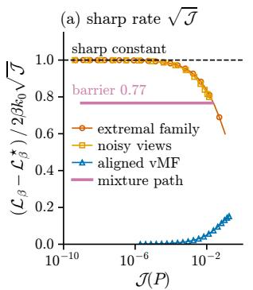

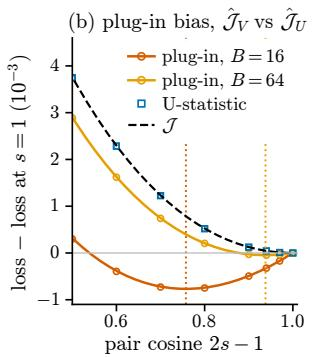

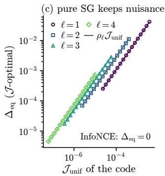

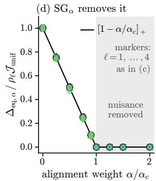  
Figure 1 | Theory on controlled families (Appendix B). (a) InfoNCE excess relative to the leading term $2 \beta k _ { 0 } \sqrt { \mathcal { T } }$ of Theorem 1 $( d = 1 6 , \beta = 2 )$ : misaligned families attain the sharp constant, the mixture path of Proposition 3 stays at 0.77, and the aligned von Mises–Fisher (vMF) path has excess Θ(J). (b) The plug-in estimator is minimized away from alignment (dotted), whereas the U-statistic follows $\mathcal { T }$ (extremal family, $d = 1 6 ;$ markers: Monte Carlo). (c) Along the isotropic channel, pure SG’s optimal misalignment for residual non-uniformity of degree ℓ follows $\rho _ { \ell } \mathcal { T } _ { \mathrm { u n i f } }$ (Theorem $3 , d = 8 ; \rho _ { \ell }$ as after (11)); InfoNCE’s is zero. (d) With $\mathcal { T } _ { \alpha }$ , the rescaled misalignment collapses onto $[ 1 - \alpha / \alpha _ { c } ] _ { + }$ , where $\alpha _ { c } = g$ is the channel’s gain.

Proposition 2 (Directional targets).

(i) For $\lambda \in ( 0 , 1 )$ , the idealized population objective $\begin{array} { r } { \left( 1 - \lambda \right) I ( X _ { 1 } , X _ { 2 } ) + \frac { \lambda } { 2 } \{ S ( X _ { 1 } ) + S ( X _ { 2 } ) \} } \end{array}$ is zero if and only $i f X _ { 1 } = X _ { 2 }$ almost surely and the common embedding is ${ \cal N } ( 0 , I _ { d } )$ . Its normalized directions therefore have the aligned, uniform target of Proposition 1.

(ii) Population VICReg’s zero set also contains aligned embeddings uniform on the cross-polytope $\{ \pm { \sqrt { d } } e _ { i } : i \leq d \}$ . These embeddings have mean zero and covariance ${ \cal I } _ { d } ,$ , while their directions are non-uniform.

Thus an idealized population LeJEPA objective (exact invariance, no predictor) has the same normalized target as SG and InfoNCE, whereas population VICReg, which constrains only the first two moments, also admits aligned embeddings with non-uniform directions. Section 7 finds the same contrast in trained encoders.

## 4.3. A Sharp Comparison with Population InfoNCE

Sharing minimizers gives only qualitative agreement. Under equal marginals, SG also controls the excess population InfoNCE loss.

Theorem 1 (Sharp comparison with population InfoNCE). Let � have equal marginals and $\beta > 0$ . Then

$$
0 \leq \mathcal { L } _ { \beta } ( P ) - \mathcal { L } _ { \beta } ^ { \star } \leq 2 \beta k _ { 0 } \sqrt { \mathcal { T } ( P ) } + \log \left( 1 + \bar { c } _ { d , \beta } \mathcal { T } ( P ) \right) .\tag{7}
$$

where $\bar { c } _ { d , \beta } <$ ∞ depends only on � and $\beta .$ . Moreover, there is afamily ofpaired laws with uniform marginals such that $\mathcal { T } ( P )  0$ and

$$
\mathcal { L } _ { \beta } ( P ) - \mathcal { L } _ { \beta } ^ { \star } = 2 \beta k _ { 0 } \sqrt { \mathcal { T } ( P ) } + o \big ( \sqrt { \mathcal { T } ( P ) } \big ) .\tag{8}
$$

Hence both the square-root order and the dimension-free leading constant $2 \beta k _ { 0 }$ are sharp.

Moreover, for laws with equal marginals, $\mathcal { T } ( P _ { n } ) $ 0 if and only if $\mathcal { L } _ { \beta } ( P _ { n } ) - \mathcal { L } _ { \beta } ^ { \star } \to 0$ (Appendix A.11). Explicitly, $\begin{array} { r } { \bar { c } _ { d , \beta } = ( 1 + \frac { 3 } { 2 } k _ { 0 } ) ^ { 2 } C _ { d . \beta } ^ { \star } / \kappa _ { d } ( \beta ) } \end{array}$ with the kernelcomparison constant $C _ { d , \beta } ^ { \star } \leq \sqrt { 6 } e ^ { 4 \beta }$ of Proposition 7. Unlike $2 \beta k _ { 0 } , \bar { c } _ { d , \beta }$ depends on � and grows at least like $e ^ { \beta / 4 + o ( \beta ) }$ as $\beta \ $ ∞ at fixed $d ;$ at $d \ = \ 8 , \ \beta \ = \ 5$ it is about $4 . 9 \times 1 0 ^ { 4 }$ . Replacing $2 \beta k _ { 0 } \sqrt { \mathcal { T } }$ by $2 \beta \Delta ^ { \star } ( \mathcal { T } )$ with $\Delta ^ { \star } ( \mathcal { T } ) = j ^ { - 1 } ( \mathcal { T } )$ for $\mathcal { T } \le j ( 1 )$ and 1 otherwise, gives a bound whose first term is exact on the extremal family; aligned laws have $\Delta = 0$ and $\mathcal { T } = D _ { \mathsf { l i f f } } ^ { 2 } ( q , \sigma )$ so their excess is $\mathcal { U } _ { \beta } ( q ) \leq ( C _ { d , \beta } ^ { \star } / \kappa _ { d } ( \beta ) )$ J (Lemma 3 and Proposition $7 ; \operatorname { F i g } .$ 1a).

Proof sketch. By (5), it sufices to bound $2 \beta \Delta$ and $\mathcal { U } _ { \beta } ( q )$ . Alignment: Lemma 1 gives $\Delta \le k _ { 0 } \sqrt { \mathcal { T } }$ . Transfer: let $D _ { \mathrm { l i f t } } ^ { 2 } ( q , \sigma )$ , the lifted discrepancy, be the SG loss of the aligned law with marginal $q .$ Since $\begin{array} { r } { \frac { 1 } { 2 } ( e ^ { i x ^ { \top } U } + e ^ { i x ^ { \top } V } ) = } \end{array}$ $e ^ { i x ^ { \top } C } \cos ( x ^ { \top } H )$ , the pair test controls the marginal (Theorem 4):

$$
\begin{array} { r } { \left| \sqrt { \mathcal { T } ( P ) } - D _ { \mathrm { l i f t } } ( \bar { q } , \sigma ) \right| \leq \frac { 3 } { 2 } \Delta ( P ) . } \end{array}\tag{9}
$$

Under equal marginals, ${ \bar { q } } = q$ . Kernel comparison: $D _ { \mathrm { l i f t } }$ is an MMD on the sphere whose zonal kernel, like $e ^ { \beta u ^ { \top } \upsilon }$ , diagonalizes in spherical harmonics; comparing eigenvalues degree by degree gives $D _ { \beta } ^ { 2 } \leq C _ { d , \beta } ^ { \star } \bar { D } _ { \mathrm { l i f t } } ^ { 2 }$ for the MMD $D _ { \beta }$ of $e ^ { \beta u ^ { \top } \upsilon }$ (Proposition 7). Uniformity: by Jensen’s inequality and $\mathbb { E } _ { W \sim \sigma } e ^ { \beta u ^ { \top } W } = \kappa _ { d } ( \beta )$ $\mathbb { E } _ { q }$ log ${ \therefore } { \dot { \mathbb { E } _ { q } } } e ^ { \beta U ^ { \top } W } \leq \log \mathbb { E } _ { q \otimes q } ^ { \mathsf { ^ { * } } } e ^ { \beta U ^ { \top } W } = \log ( \kappa _ { d } ( \beta ) + D _ { \beta } ^ { 2 } ( q , \sigma ) )$ so $\mathcal { U } _ { \beta } ( q ) \leq \log ( 1 + D _ { \beta } ^ { 2 } / \kappa _ { d } ( \beta ) )$ (Lemma 3).

Sharpness. Let $( n , h )$ be a Haar-distributed orthonormal pair in $\mathbb { R } ^ { d }$ and, for $s \in [ 0 , 1 ]$ ，

$$
U _ { s } = \sqrt { s } n + \sqrt { 1 - s } h , \qquad V _ { s } = \sqrt { s } n - \sqrt { 1 - s } h .
$$

Both marginals are uniform, $C _ { s } = { \sqrt { s } } t$ � and $\Delta = 1 - s ,$ so $Z _ { s } \sim { \cal N } ( 0 , s I _ { d } )$ and $\mathcal { T } = j ( \Delta )$ , so this extremal family attains Lemma 1. Its uniformity excess vanishes, so $\mathcal { L } _ { \beta } - \mathcal { L } _ { \beta } ^ { \star } = 2 \beta \Delta$ , and $j ( \Delta ) = \Delta ^ { 2 } / ( 1 2 \sqrt { 3 } ) + O ( \Delta ^ { 3 } )$ gives (8). The same family is used in Proposition 4 and $_ { \mathrm { F i g . 1 a , b } }$

## 4.4. Optimality of the Square-Root Rate

The square-root rate is optimal for a broad class of pair discrepancies. Call a pair discrepancy � Hilbertian (a squared mean-embedding distance) if there exist a bounded feature map Ψ into a Hilbert space ${ \mathcal { H } } ,$ a target $m ^ { \star } \in \mathcal { H }$ and independent auxiliary randomness $\xi$ such that $F ( P ) = \| \mathbb { E } _ { P } \Psi ( U , V , \xi ) - m ^ { \star } \| _ { \mathcal { H } } ^ { 2 }$ This class contains $\mathcal { T }$ , for any radius law and frequency weight, as well as every bounded-kernel squared MMD of a statistic of the pair.

Proposition 3 (Square-root barrier). Let � be Hilbertian with $F \left( P _ { 0 } \right) \ = \ 0$ for an aligned law $P _ { 0 }$ with uniform marginals. Let $P _ { 1 }$ have uniform marginals and $\Delta ( P _ { 1 } ) > 0 ,$ and let $P _ { p } ~ = ~ ( 1 - p ) P _ { 0 } + p P _ { 1 }$ . Then $F ( P _ { p } ) = p ^ { 2 } F ( P _ { 1 } ) $ , while $\begin{array} { r } { \mathcal { L } _ { \beta } ( P _ { p } ) - \mathcal { L } _ { \beta } ^ { \star } \ = \ 2 \beta p \Delta ( P _ { 1 } ) } \end{array}$ Hence either � vanishes on a misaligned law, or no bound $\mathcal { L } _ { \beta } - \mathcal { L } _ { \beta } ^ { \star } \le \psi ( F )$ with $\psi ( x ) = o ( { \sqrt { x } } )$ holds.

Proof. $F ( P _ { 0 } ) = 0$ gives $\mathbb { E } _ { P _ { 0 } } \Psi = m ^ { \star }$ , so $\mathbb { E } _ { P _ { v } } \Psi - m ^ { \star } =$ $p ( \mathbb { E } _ { P _ { 1 } } \Psi - m ^ { \star } )$ and $F ( P _ { p } ) = p ^ { 2 } F ( P _ { 1 } )$ . The marginals of $P _ { p }$ stay uniform, so $\mathcal { U } _ { \beta } = 0$ , and since $\Delta$ is linear in � with $\Delta ( P _ { 0 } ) = 0$ , the excess is $2 \beta p \Delta ( P _ { 1 } )$ by (5). If $F \left( P _ { 1 } \right) > 0 .$ , the excess equals $\left( 2 \beta \Delta ( P _ { 1 } ) / \sqrt { F ( P _ { 1 } ) } \right) \sqrt { F ( P _ { p } ) }$ for all �, which no $\psi ( x ) = o ( { \sqrt { x } } )$ dominates. □

A mean embedding sees a fraction $p$ of misaligned pairs at order $p ^ { 2 }$ , whereas InfoNCE sees it at order $p ;$ along the mixture path only the coupling changes. Thus no Hilbertian pair discrepancy controls the InfoNCE excess faster than ${ \sqrt { F } } ,$ , and SG attains this rate with the sharp constant of Theorem 1; for SG the order comes from Lemma 1, since J responds to misalignment only at second order.

## 4.5. Which Uniformity Tests Control InfoNCE Linearly

Charging misalignment directly removes the barrier. With the alignment price $\mathcal { T } _ { \alpha } = \mathcal { T } + \alpha \Delta$ of Section 6.3, under equal marginals, $\mathcal { L } _ { \beta } - \mathcal { L } _ { \beta } ^ { \star } \le c _ { \beta , \alpha } \mathcal { T } _ { \alpha }$ for every $\alpha > 0$ , with explicit $c _ { \beta , \alpha }$ (Proposition 8). More generally, once misalignment is paid for linearly, a linear certificate needs a test of the marginal that controls InfoNCE’s uniformity term $\mathcal { U } _ { \beta }$ linearly. Which uniformity tests do?

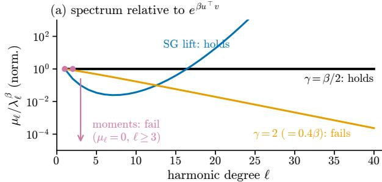

(b) Gaussian kernels need $\gamma \ge \beta / 2$  
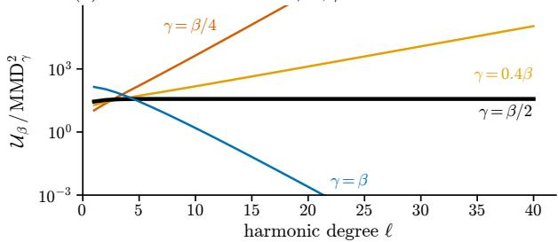  
Figure 2 | Condition (U) $( d = 8 , \beta = 5 )$ . (a) Eigenvalues $\mu _ { \ell }$ of zonal squared MMDs relative to those of $e ^ { \beta u ^ { \top } \upsilon }$ , normalized at $\ell = 1$ : the ratio is bounded below for $\mathtt { S G } \mathtt { s }$ lift and Gaussian kernels with $\gamma \geq \beta / 2$ , and not for $\gamma = 2$ or moment matching $\left( \mu _ { \ell } = 0 \right.$ for $\ell \geq 3 )$ . (b) Exact $\mathcal { U } _ { \beta }$ over the squared MMD of $e ^ { - \gamma \| u - \nu \| ^ { 2 } }$ for a law perturbed in degree $\ell ;$ bounded in ℓ if and only i $\dot { \gamma } \geq \beta / 2$ (Corollary 1).

Squared MMDs to � with zonal (rotation-invariant) kernels are classical Sobolev statistics of uniformity; they diagonalize in spherical harmonics, and their weights decide which departures from uniformity they detect (Giné, 1975; García-Portugués and Verdebout, 2018; García-Portugués et al., 2023). $\mathcal { U } _ { \beta } ( q ) =$ ∫ log $\begin{array} { r } { \big ( \int k _ { \beta } ( \cdot , w ) \mathrm { d } q ( w ) \big ) \mathrm { d } q - \log \kappa _ { d } ( \beta ) } \end{array}$ , with $k _ { \beta } ( u , \upsilon ) =$ $\bar { e } ^ { \beta u ^ { \top } \nu }$ , is not of this form, because the logarithm sits inside the outer expectation. Let $\lambda _ { \ell } ^ { \beta }$ be the degree-ℓ eigenvalues of $k _ { \beta ; }$ , so $\lambda _ { 0 } ^ { \beta } = \kappa _ { d } ( \beta )$ , and let $D _ { \beta }$ be the MMD of $k _ { \beta }$ . For a zonal kernel � with eigenvalues $\left( \mu _ { \ell } \right)$ ， $\begin{array} { r } { \mathrm { M M D } _ { K } ^ { 2 } ( q , \sigma ) \ = \ \sum _ { \ell \geq 1 } \mu _ { \ell } \Vert \hat { q } _ { \ell } \Vert ^ { 2 } } \end{array}$ , where $\hat { q } _ { \ell }$ are the harmonic coeficients of � (Appendix $\mathsf { A } . 8 )$

Theorem 2 (InfoNCE uniformity is spectral). Fix � $\geq 2 ,$ $\beta > 0 ,$ and write $\kappa = \kappa _ { d } ( \beta )$

$$
\begin{array} { r } { ( i ) ~ L e t \ : \delta : = \| \mathrm { d } \boldsymbol { q } / \mathrm { d } \sigma - 1 \| _ { \infty } \leq \frac { 1 } { 2 } \ : a n d } \end{array}
$$

$$
Q _ { \beta } ( q ) = \sum _ { \ell \geq 1 } \frac { \lambda _ { \ell } ^ { \beta } } { \kappa } \Big ( 1 - \frac { \lambda _ { \ell } ^ { \beta } } { 2 \kappa } \Big ) \| \hat { q } _ { \ell } \| ^ { 2 } .
$$

Then ${ \textstyle \frac { 1 } { 2 } } D _ { \beta } ^ { 2 } / \kappa \le Q _ { \beta } \le D _ { \beta } ^ { 2 } / \kappa$ and $| \mathcal { U } _ { \beta } ( q ) - Q _ { \beta } ( q ) | \leq$ $\textstyle { \frac { 3 } { 2 } } \delta D _ { \beta } ^ { 2 } ( q , \sigma ) / \kappa$

(ii) For a continuous positive-definite zonal kernel � with eigenvalues $\left( \mu _ { \ell } \right) .$ , the best constant $c _ { K }$ in $\mathcal { U } _ { \beta } \le$ $c _ { K } \mathrm { M M D } _ { K } ^ { 2 }$ satisfies

$$
\operatorname* { s u p } _ { \ell \geq 1 } \frac { \lambda _ { \ell } ^ { \beta } ( 1 - \lambda _ { \ell } ^ { \beta } / 2 \kappa ) } { \kappa \mu _ { \ell } } \ \leq \ c _ { K } \ \leq \ \operatorname* { s u p } _ { \ell \geq 1 } \frac { \lambda _ { \ell } ^ { \beta } } { \kappa \mu _ { \ell } } = : \frac { S _ { K } } { \kappa } .
$$

with the convention $x / 0 = \infty f o r x > 0 \mathrm { . }$

Part (i) expands the log-partition functional to second order, with a remainder uniform in � and $\beta ;$ ; near �, $\mathcal { U } _ { \beta }$ lies within a factor 2 of the squared MMD with kernel $e ^ { \beta u ^ { \top } \nu } / \kappa$ , up to an $O ( \delta )$ error. Part (ii) combines this local necessity with the global bound $\mathcal { U } _ { \beta } \le \log ( 1 + D _ { \beta } ^ { 2 } / \kappa )$ (Lemma 3). A zonal test controls InfoNCE’s uniformity term at temperature $1 / \beta$ linearly if and only if its spectrum dominates that of $e ^ { \beta u ^ { \top } \upsilon }$ , that $\mathrm { i } s , S _ { K } < \infty$ . We call this condition (U).

Corollary 1 (Which tests satisfy (U)). For every � $\geq 2$ and $\beta > 0 .$

(a) The Gaussian lift of SG: $S _ { K } = C _ { d , \beta } ^ { \star } < \infty ,$ with $C _ { d , \beta } ^ { \star } / \kappa _ { d } ( \beta ) \geq e ^ { \beta / 4 + o ( \beta ) }$ as $\beta $ ∞ with � fixed.

(b) Gaussian kernels $e ^ { - \gamma \| u - \upsilon \| ^ { 2 } } \colon S _ { K } \ < \ \infty$ if and only $i f \ \gamma \ \geq \ \beta / 2$ The same threshold decides linear control of $\mathcal { U } _ { \beta }$ by the excess of the uniformity loss log $\mathbb { E } _ { q \otimes q } e ^ { - \gamma \| \dot { U } - U ^ { \prime } \| ^ { 2 } } \left( U ^ { \prime } \right.$ an independent copy) of Wang and Isola (2020).

(c) Heat kernels, band-limited kernels, and first- and second-moment matching: $S _ { K } = \infty .$

Characteristic Gaussian and heat kernels still identify � when (U) fails, unlike finite-moment tests, but they control $\mathcal { U } _ { \beta }$ only sublinearly, with a defect that grows with the harmonic degree (Fig. 2). The squared MMD with the default $\gamma = 2$ kernel of Wang and Isola (2020), whose uniformity loss it matches to first order near � up to a constant factor, therefore satisfies (U) exactly for $\tau \geq 1 / 4$ . Since $e ^ { - \gamma \| u - \nu \| ^ { 2 } } = e ^ { - 2 \gamma } e ^ { 2 \gamma u ^ { \top } \nu }$ , the threshold says that the kernel must be at least as concentrated as InfoNCE’s own kernel $e ^ { \beta u ^ { \top } \upsilon }$ (inverse temperature $2 \gamma \geq \beta )$ ). SG’s lift passes at every temperature, with a constant that grows exponentially in $\beta$ (at $d = 8 , \beta = 5$ the supremum in $S _ { K }$ is attained at $\ell = 7 _ { : }$ , with $S _ { K } / \kappa$ ≈ 790), whereas the matched Gaussian kernel $\gamma = \beta / 2$ has $S _ { K } / \kappa = e ^ { \beta } / \kappa _ { d } ( \beta ) = O ( \beta ^ { ( d - 1 ) / 2 } )$ ; a Gaussian kernel certifies only $\beta \leq 2 \gamma$ , so the lift trades a larger constant for validity at every temperature. With an alignment term, condition (U) is necessary and suficient for a linear certificate.

Corollary 2 (Linear certificates). Let $\alpha > 0$ and let � be a continuous positive-definite zonal kernel. Under equal marginals,

$$
\mathcal { L } _ { \beta } - \mathcal { L } _ { \beta } ^ { \star } \leq \operatorname* { m a x } \Big \{ \frac { 2 \beta } { \alpha } , \frac { S _ { K } } { \kappa _ { d } ( \beta ) } \Big \} \big ( \alpha \Delta + \mathrm { M M D } _ { K } ^ { 2 } ( q , \sigma ) \big ) ,
$$

and no bound of thisform holds $i f S _ { K } = \infty$

Section 7 tests this distinction in trained encoders.

## 5. Finite-Batch Estimation

In training, we estimate J from a batch of � i.i.d. pairs with independent radii, $Z _ { j } = R _ { j } C _ { j }$ , and � fresh frequencies $\omega _ { m } = t _ { m } a _ { m }$ with $\dot { a } _ { m } \sim \overset { \cdot } { \sigma } , \dot { t } _ { m } \sim N ( 0 , 1 )$ . Let $\begin{array} { r } { \hat { \varphi } _ { m } = \frac { 1 } { B } \sum _ { j } e ^ { i \omega _ { m } ^ { \top } Z _ { j } } } \end{array}$ and $g _ { m } = e ^ { - t _ { m } ^ { 2 } / 2 }$ . The plug-in estimator inherits SIGReg’s finite-sample bias (Balestriero and LeCun, 2025, Thm. 6); through the centroid, this bias changes the alignment incentive. Proofs are in Appendix A.16.

## 5.1. Plug-in Bias Toward Misalignment

Proposition 4 (Plug-in bias favors misalignment). The plug-in estimator $\begin{array} { r } { \tilde { \mathcal { T } } _ { V } = \frac { 1 } { M } \sum _ { m } | \hat { \varphi } _ { m } - g _ { m } | ^ { 2 } } \end{array}$ satisfies

$$
\mathbb { E } \hat { \mathcal { T } } _ { V } = \mathcal { T } ( P ) + \frac { 1 } { B } \mathbb { E } _ { a , t } \big [ 1 - | \varphi _ { Z } ( t a ) | ^ { 2 } \big ] .
$$

For every $B \geq 2 ,$ , no aligned uniform law minimizes � ${ \hat { \mathcal { F } } } _ { V } .$ along the extremal family, $\mathbb { E } \hat { \mathcal { F } }$ has a unique minimizer, with pair cosine $\mathbb { E } \bar { U } ^ { \top } V \bar { = } 1 - 4 / B + O ( B ^ { - \bar { 2 } } )$

The bias comes from the diagonal terms: $\mathbb { E } \hat { \varphi } _ { m } ~ =$ $\varphi _ { Z } ( \omega _ { m } )$ and $\begin{array} { r } { \mathbb { E } | \hat { \varphi } _ { m } | ^ { 2 } ~ = ~ ( 1 - \frac { 1 } { B } ) | \varphi _ { Z } ( \omega _ { m } ) | ^ { 2 } + \frac { 1 } { B } } \end{array}$ , and expanding $| \hat { \varphi } _ { m } - g _ { m } | ^ { 2 }$ gives the identity. Shortening the centroid concentrates $z ,$ which raises |�� | and lowers the bias term. On the extremal family, $| \varphi _ { Z } ( t a ) | ^ { 2 } = e ^ { - t ^ { 2 } ( 1 - \Delta ) }$ , so the bias is $\frac { 1 } { B } \big [ 1 - \big ( 3 - 2 \Delta \big ) ^ { - 1 / 2 } \big ]$ ， with slope $- 3 ^ { - 3 / 2 } / B$ at $\Delta = 0 ,$ , against $j ^ { \prime } ( \Delta ) \approx \Delta / ( 6 \sqrt { 3 } ) ;$ balancing the two gives $\Delta \approx 2 / B$ , that is, pair cosine $1 - 4 / B \ ( \mathrm { F i g . \ 1 b } )$

## 5.2. An Unbiased U-Statistic Estimator

Since � $\begin{array} { r } { ( 1 - | \hat { \varphi } _ { m } | ^ { 2 } ) = ( 1 - \frac 1 B ) ( 1 - | \varphi _ { Z } ( \omega _ { m } ) | ^ { 2 } ) } \end{array}$ , removing the diagonal terms gives

$$
\mathcal { \hat { T } } _ { U } = \mathcal { \hat { T } } _ { V } - \frac { 1 } { M ( B - 1 ) } \sum _ { m = 1 } ^ { M } \big ( 1 - | \hat { \varphi } _ { m } | ^ { 2 } \big ) .\tag{10}
$$

Proposition 5 (Unbiased SG estimator). For every paired law $P , \ B \ge 2$ and $M \ge 1 , \mathbb { E } \hat { \mathcal { T } } _ { U } = \mathcal { T } ( P )$ , where the expectation is over the batch, the radii and the $f r e \mathrm { - }$ quencies. $\hat { \mathcal { T } } _ { U }$ is a U-statistic over distinct pairs $j \neq k$ and is computedfrom the sums $\hat { \varphi } _ { m }$ in �(���) time and �(�� + ��) memory, without a $B \times B$ similarity matrix.

The correction is the standard U-statistic; for SG, the bias it removes also shifts the alignment optimum. $\hat { \mathcal { T } } _ { U }$ can be negative on a batch; clipping it would reintroduce bias, so we optimize it directly. In our experiments $( d = 8 , B = 2 5 6 )$ , SG� (Section $6 . 3 , \alpha = 0 . 2 )$ with $M = B / 2$ frequencies reaches the CKA of $M = 2 5 6$ and � = 1024 in all runs but one vMF seed, while $M = 1 6$ is too few (Appendix B).

## 6. Nuisance Preferences and the Alignment Price

SG and InfoNCE share their minimizers but can favor diferent representations away from the optimum. We exhibit a population failure mode that persists with exact expectations. When the shared code is non-uniform, pure SG can prefer independent per-view nuisance, because the nuisance improves the marginal distributional match faster than SG penalizes the resulting misalignment. Proofs are in Appendices A.13 and $_ { \mathrm { A . 1 5 } }$

## 6.1. An Isotropic Nuisance Channel

Let $W \sim q$ be a shared code on $\mathbb { S } ^ { d - 1 }$ and, given $W ,$ draw $U _ { \vartheta } , V _ { \vartheta }$ independently from the heat kernel on $\mathbb { S } ^ { d - 1 }$ at time $\vartheta \ge 0$ $\mathbf { A } { \boldsymbol { \mathbf { t } } } \ { \boldsymbol { \vartheta } } \ = \ 0$ the views coincide; for $\vartheta > 0$ they carry independent perturbations, with $\Delta ( \vartheta ) = { \textstyle { \frac { 1 } { 2 } } } ( 1 - \stackrel { \textstyle \cdot \not - 2 ( d - 1 ) \vartheta } { e } )$ , and their marginal is smoothed toward �. Let $\mathcal { T } _ { q } ( \vartheta )$ be the SG loss along this channel and ${ \mathcal { T } } _ { \mathrm { u n i f } } ( q ) = { \dot { \mathcal { T } } } _ { q } ( 0 ) = D _ { \mathrm { l i f t } } ^ { 2 } ( q , \sigma )$

## 6.2. Why Pure SG Can Prefer Nuisance

The channel creates two competing efects. Independent perturbations shorten the centroid and hurt alignment, but they also smooth a non-uniform marginal toward the uniform distribution. For pure SG, the latter efect dominates to first order.

Theorem 3 (Nuisance preference of pure SG). Along the isotropic nuisance channel:

(i) For every $q \ne \sigma ,$ the right derivative satisfies $\begin{array} { r } { \partial _ { \vartheta } \mathcal { T } _ { q } \vert _ { \vartheta = 0 } = - \sum _ { \ell \geq 1 } G _ { \ell } \Vert \hat { q } _ { \ell } \Vert ^ { 2 } < 0 , } \end{array}$ where $\hat { q } _ { \ell }$ is the degree-ℓ harmonic component of $q - \sigma$ and $G _ { \ell } > 0$ is explicit. Thus a small amount of nuisance strictly decreases J, and, for this fixed code $q ,$ the aligned law is not a local minimizer of J along the channel.

(ii) Let $q _ { \varepsilon } = ( 1 + \varepsilon f )$ � with $f \neq 0$ smooth and $\textstyle \int f \mathrm { d } \sigma =$ 0. There is $\vartheta _ { 0 } ( d ) > 0$ such that, for all small $\varepsilon ,$ $\mathcal { T } _ { q _ { \varepsilon } }$ has a unique minimizer on $[ 0 , \vartheta _ { 0 } ] .$ , which is interior, and its misalignment $\Delta _ { \mathrm { e q } }$ there satisfies $\Delta _ { \mathrm { e q } } / \mathcal { T } _ { \mathrm { u n i f } } ( q _ { \varepsilon } ) \to \rho ( f )$ , an explicit constant with $\rho ( f ) > 6 { \sqrt { 3 } } .$

(iii) In the same setting, $\vartheta = 0$ is the unique minimizer of $\mathcal { L } _ { \beta } - \mathcal { L } _ { \beta } ^ { \star }$ on $[ 0 , \vartheta _ { 0 } ] f o r$ all small �.

Nuisance helps SG at first order because the centroid direction difuses at half the speed of the views, which smooths the non-uniformity, and radial contraction reduces the remaining harmonic contributions. Misalignment is cheap, because along the channel the coeficient of $\Delta ^ { 2 }$ is $1 / ( 1 2 \sqrt { 3 } )$ to leading order, as in Lemma 1. In the regime of (ii), therefore,

$$
\mathcal { T } \approx \mathcal { T } _ { \mathrm { u n i f } } - g \Delta + \frac { \Delta ^ { 2 } } { 1 2 \sqrt { 3 } } , \qquad g = \frac { \rho ( f ) \mathcal { T } _ { \mathrm { u n i f } } } { 6 \sqrt { 3 } } ,\tag{11}
$$

where $g = - \mathrm { d } \mathcal { T } / \mathrm { d } \Delta | _ { \Delta = 0 }$ is the channel’s gain. InfoNCE pays $2 \beta \Delta$ at first order, while its uniformity improvement is of order $\varepsilon ^ { 2 } ;$ near uniformity InfoNCE therefore keeps no nuisance. For � of pure degree ℓ write $\rho _ { \ell } = \rho ( f ) ;$ ; at $d = 8 , \rho _ { 1 } , . . . , \rho _ { 4 } = 1 0 . 8 , 2 8 . 5 , 4 9 . 5 , 7 3 . 8 ;$ at equal ${ \mathcal { T } } _ { \operatorname* { u n i f } } .$ , finer residuals induce more nuisance (Fig. 1c). The certificate still applies: $\begin{array} { r l r } { \Delta } & { { } \le } & { k _ { 0 } \sqrt { \mathcal { T } } } \end{array}$ bounds the amount of nuisance that pure SG keeps.

## 6.3. Adding an Alignment Price

This mismatch suggests a minimal modification, ${ \mathrm { S G } } _ { \alpha } { \mathrm { : } }$

$$
\begin{array} { r } { \mathcal { T } _ { \alpha } ( P ) = \mathcal { T } ( P ) + \alpha \Delta ( P ) , \qquad \alpha \geq 0 . } \end{array}\tag{12}
$$

With (11), $\mathcal { T } _ { \alpha } \approx \mathcal { T } _ { \mathrm { u n i f } } + ( \alpha - g ) \Delta + \Delta ^ { 2 } / ( 1 2 \sqrt { 3 } )$ . If $\alpha > g$ infinitesimal nuisance increases the objective and alignment is locally preferred; if $\alpha \ < \ g ,$ the incentive remains. In the regime of (ii), with � of order $\varepsilon ^ { 2 }$ , the minimizer is $\Delta = [ \rho ( f ) \mathcal { T } _ { \mathrm { u n i f } } - 6 \sqrt { 3 } \alpha ] _ { + } + o ( \varepsilon ^ { 2 } )$ , so the equilibrium nuisance vanishes for $\alpha \geq g$ (Corollary $^ { 3 , }$ Fig. 1d). The price keeps SG’s minimizers (Proposition 8).

The rule applies beyond the isotropic model. For a family $( P _ { \vartheta } ) _ { \vartheta \in [ 0 , \vartheta _ { 0 } ] }$ of paired laws with $\Delta ( P _ { 0 } ) = 0 { } _ { ; }$ , along which Δ and an objective � are right-diferentiable at 0 with $\Delta ^ { \prime } ( 0 ) > 0$ , call $g = - ( \mathrm { d } F / \mathrm { d } \vartheta ) / ( \mathrm { d } \Delta / \mathrm { d } \vartheta ) | _ { 0 }$ the gain of the family, and $\alpha > g$ condition (A). LeJEPA minimizes $\lambda S + ( 1 - \lambda ) I$ where � is the average of the per-view SIGReg terms and � is an invariance term; its reference implementation multiplies � by the batch size �.

Proposition 6 (Condition (A): gain against price). Let � be the gain of a family as above.

(i) $I f \alpha > g , P _ { 0 }$ is a strict local minimizer of $F + \alpha \Delta$ along the family; $i f \alpha < g ,$ it is not.

(ii) For $\lambda S + ( 1 - \lambda ) I$ with $\lambda \in ( 0 , 1 )$ , along a family with $I ( P _ { 0 } ) = 0 ,$ on which � and � are rightdiferentiable at 0 with $\mathrm { d } I / \mathrm { d } \vartheta | _ { 0 } > 0 ,$ (i) holds with � replaced by $S , \Delta$ by �, � by $( 1 - \lambda ) / \lambda ,$ , and � by $g _ { S } = - \mathrm { d } S / \mathrm { d } I | _ { 0 }$ . Equivalently, for $g _ { S } > 0 , P _ { 0 }$ is a strict local minimizer $i f \lambda < \lambda _ { c } = 1 / ( 1 + g _ { S } )$ and is not one $i f \lambda > \lambda _ { c } ,$ . Multiplying � by � replaces �� by $B g _ { S }$

At $\alpha = g _ { \mathrm { { ; } } }$ higher-order terms decide. For LeJEPA, the price of misalignment is $( 1 - \lambda ) / \lambda$ , set against the gain $B g _ { S }$ of its batch-scaled regularizer; at fixed per-sample $g \mathrm { a i n } ,$ the critical SIGReg weight $\lambda _ { c }$ therefore decreases with �. The gain depends on the channel and can be measured on a trained encoder (Section 7, Fig. 3).

Beyond the isotropic channel. If the two views are conditionally independent given a latent, with common conditional mean $c ( \Lambda ) W , c ( \Lambda ) \in [ 0 , 1 ]$ , for a mean code $W \sim q$ on $\mathbb { S } ^ { d - 1 }$ , then $| \sqrt { \mathcal { I } ( P ) } - \sqrt { \mathcal { I } _ { \mathrm { u n i f } } ( q ) } | \le 6 . 5 \Delta ( P )$ Hence every such family with fixed � that starts at the aligned law $U = V = W$ has gain at most $1 3 \sqrt { \mathcal { T } _ { \mathrm { u n i f } } ( q ) }$ (Proposition 10 and Corollary 4), and heat channels whose difusion time varies with the code point attain this order (Proposition 9). Condition (A) thus becomes easier to meet as the code becomes uniform.

## 7. Experiments

We test Sections 4 to 6 in trained encoders. We ask whether SG reaches InfoNCE’s representation when the target is the only diference, whether uniformity tests that satisfy (U) reach InfoNCE’s uniformity, whether pure SG prefers per-view nuisance, and whether the measured gain decides which $\mathrm { S G } _ { \alpha }$ and LeJEPA encoders keep it.

Setup. We use latent-variable models with known latent content (Zimmermann et al., 2021; von Kügelgen et al., 2021). In the content–style model, a fixed random injective network maps a content $c \sim \sigma$ on $\mathbb { S } ^ { 7 } ;$ shared by the two views, and an independent per-view style $s \sim \mathcal { N } ( 0 , I _ { 4 } )$ to an observation $x = m ( c , s )$ . An encoder that recovers � up to a measure-preserving map and ignores � is aligned and uniform, so style is a perview nuisance channel and the content plays the role of the shared code. In the von Mises–Fisher (vMF) model of Zimmermann et al. (2021) there is no style, and the second view’s content is $\tilde { c } \sim \mathrm { v M F } ( c , 1 0 )$ . We train the same MLP encoder $( d = 8 , B = 2 5 6 ,$ 8k steps, 3 seeds; Appendix B) with InfoNCE $( \beta = 5 )$ , SG and $\mathrm { S G } _ { \alpha }$ (with Jˆ�), LeJEPA (SIGReg weight �) and VICReg. To separate the objective from the optimization path, we also switch InfoNCE encoders to $\mathrm { S G } _ { \alpha }$ halfway through training (warm start). The gain of a trained encoder is measured on its own style channel. We rescale the style input by � and fit $F - { \bf \dot { \cal F } } ( 0 ) \approx - g \Delta + c _ { 2 } \Delta ^ { 2 }$ for small $\eta ,$ with $F = \hat { \mathcal { T } } _ { U }$ (for LeJEPA, the per-sample SIGReg term against �), averaging over independent repetitions. Style is detected when a held-out probe from $( U , c )$ to the style reaches $R ^ { 2 } > 0 . 0 2 ;$ CKA is linear centered kernel alignment (Kornblith et al., 2019) to InfoNCE encoders of other seeds.

Without per-view nuisance. With noisy positives and no per-view style (vMF), $\mathrm { S G } _ { 0 . 2 }$ and LeJEPA learn representations close to InfoNCE’s: CKA 0.993 and 0.981, against 0.997 between InfoNCE seeds (Table 1), with content $R _ { c } ^ { 2 }$ of 0.99 and 0.97 (Table 3). Pure SG follows at 0.938 (0.935 with Jˆ�, as the bias of Proposition 4 is $O ( 1 / B ) )$ , and VICReg at 0.811. On content–style, VI-CReg aligns the views (pair cosine 0.979, Table 2) but remains far from uniform $( \mathcal { U } _ { \beta } = 1 . 3 8 $ against 0.02), in line with its larger target set (Proposition 2). LeJEPA and VICReg were selected on small grids (Appendix B), so their rows are not fully tuned.

Condition (U) in training. Section 4.5 separates uniformity tests that permit a linear certificate from those that do not, and we check whether the distinction persists in training. We train the Gaussian uniformity loss of Wang and Isola (2020), with alignment term $\begin{array} { r } { \frac { \beta } { 2 } \mathbb { E } \| \boldsymbol { U } - V \| ^ { 2 } = 2 \beta \Delta , \mathrm { a t } \gamma \in \{ 1 , 2 , 2 . 5 , 5 \} } \end{array}$ (2 seeds), and first- and second-moment matching with alignment term Δ (3 seeds; Appendix B). All of them align the views (pair cosine 0.97–0.99). With $\gamma \geq \beta / 2 = 2 . 5$ the uniformity excess reaches InfoNCE’s $( \mathcal { U } _ { \beta } = 0 . 0 2 2$ and 0.010, against 0.021 for InfoNCE in these runs), at $\gamma = 2$ it is 0.037, and at $\gamma = 1$ it is 0.18. Moment matching, which fails (U) at every temperature, keeps $\mathcal { U } _ { \beta } = 0 . 2 9$ , and its residual non-uniformity is 7–63 times InfoNCE’s at every degree $\ell = 3 , \ldots , 8 \ ( \mathrm { F i g } . \ 4 )$

Table 1 | Controlled study $( d = 8 , \beta = 5 ;$ mean over 3 seeds). CKA to InfoNCE encoders of other seeds; style: held-out probe $R ^ { 2 }$ (detected $\mathrm { i f } > 0 . 0 2 ) ; \mathcal { T }$ and $\mathcal { I } _ { 0 . 2 } = \mathcal { I } + 0 . 2 \Delta ,$ in units of $^ { 1 0 ^ { - 3 } } ,$ are evaluated on held-out pairs for every row, whatever the training loss. Warm starts switch InfoNCE to SG or $\mathrm { S G } _ { 0 . 2 }$ after 4k of 8k steps. Standard deviations: Tables 2 and 3.
<table><tr><td rowspan="2">Method</td><td colspan="2">vMF</td><td colspan="4">content-style</td></tr><tr><td>CKA</td><td>CKA</td><td>style</td><td> $\mathcal { U } _ { \beta }$ </td><td>J</td><td></td><td> $\mathcal { T } _ { 0 . 2 }$ </td></tr><tr><td colspan="8">from scratch</td></tr><tr><td>InfoNCE</td><td>0.997 0.982</td><td></td><td>2-0.02 0.02 0.17 1.7</td><td></td><td></td><td></td></tr><tr><td>SG</td><td>0.938 0.646</td><td></td><td>0.11</td><td>0.05 0.85 20.6</td><td></td><td></td></tr><tr><td> $\mathrm { S G } _ { 0 . 2 }$   $\mathrm { L e J E P A } , \lambda = 0 . 0 1$ </td><td></td><td></td><td> $0 . 6 9 6 \ - 0 . 0 2$ </td><td>0.993 0.828 -0.02 0.16 0.98</td><td>0.261.57</td><td>3.6</td></tr><tr><td> $\mathrm { V I C R e g }$ </td><td>0.981 0.811</td><td></td><td> $0 . 5 9 7 \ - 0 . 0 2$ </td><td>1.38</td><td>95</td><td>6.0 97</td></tr><tr><td colspan="8">warm start from InfoNCE (4k steps)</td></tr><tr><td>switch point</td><td></td><td>0.969</td><td>0.03</td><td>0.05 1.27</td><td></td><td>3.9</td></tr><tr><td> $ S G$ </td><td></td><td>0.962</td><td>0.14</td><td>0.02 0.12</td><td></td><td>4.0</td></tr><tr><td></td><td></td><td></td><td>0.975 -0.02 0.04 0.27</td><td></td><td></td><td></td></tr><tr><td> $ \mathrm { S G } _ { 0 . 2 }$ </td><td>1</td><td></td><td></td><td></td><td></td><td>2.2</td></tr></table>

Pure SG prefers nuisance. From scratch, pure SG keeps style $( R ^ { 2 } = 0 . 1 1$ ; pair cosine 0.80). The warm start isolates the preference. The half-trained InfoNCE encoders carry weak style $\begin{array} { r } { ( R ^ { 2 } = 0 . 0 3 ; } \end{array}$ two of three seeds), which continuing with InfoNCE or with $\mathrm { S G } _ { 0 . 2 }$ removes (−0.02); continuing with SG raises it to 0.14. With the same start and budget, the SG branch reaches the lowest J in Table $1 , 0 . 1 2 \times 1 0 ^ { - 3 } \mathrm { _ { ; } }$ , against $0 . 2 7 \times 1 0 ^ { - 3 }$ for the style-free $\mathrm { S G } _ { 0 . 2 }$ branch and $0 . 1 7 \times 1 0 ^ { - 3 }$ for fully trained InfoNCE (Table 1), in line with Theorem 3(i).

The alignment price. Across 38 SG and $\mathrm { S G } _ { \alpha }$ encoders, every encoder with detected style has a gain above its price (Fig. 3a). Style is detected in some seeds up to $\alpha = 0 . 0 1 5$ and in none from $\alpha = 0 . 0 2$ , so the transition liesjust below the crossing of the mean gain with � (� ≈ 0.023). Warm starts compare prices from a common representation. Style is still detected at $\alpha = 0 . 0 0 3$ (mean $R ^ { 2 } = 0 . 0 2 7 )$ and is removed for $\alpha \geq 0 . 0 1$ , so the transition overlaps the range of the warm-started encoders’ own gains, [0.002, 0.008] (Fig. 3c).

Beyond SG: LeJEPA. For LeJEPA, Proposition 6(ii) gives the critical weight $\lambda _ { c } = 1 / ( 1 + B g _ { S } )$ . Across 34 encoders and three batch sizes, style is retained by exactly those encoders whose measured gain $B g _ { S }$ exceeds the price $( 1 - \lambda ) / \lambda \ ( \mathrm { F i g . 3 b } )$ . The observed boundary moves from $\lambda \in ( 0 . 0 3 , 0 . 0 5 )$ at $B = 2 5 6 \ \mathrm { t o } \ ( 0 . 1 , 0 . 2 )$ at $B = 6 4$ (two seeds) and to (0.01, 0.02) at � = 1024 (one seed). A single weight trades nuisance rejection against uniformity. At $\lambda = 0 . 0 1$ , LeJEPA discards style but has $\mathcal { U } _ { \beta } = 0 . 2 6$ (InfoNCE: 0.02), and at $\lambda = 0 . 1$ it keeps style $( R ^ { 2 } = 0 . 5 2$ ; Table 2). The finite-batch bias of the plug-in SIGReg used in training (Proposition 4) changes no classification (Appendix B).

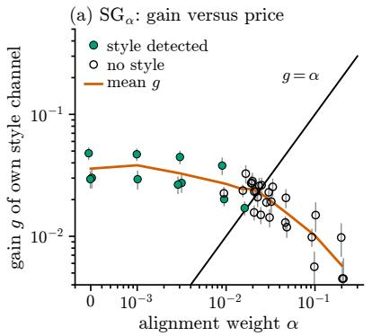

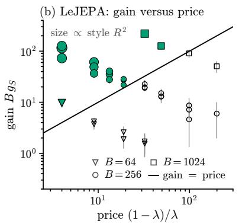

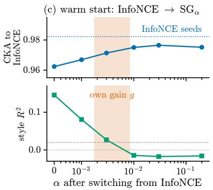  
Figure 3 | Gain against price in trained encoders (content–style model, $d = 8 ;$ ; filled: style detected). (a) ${ \mathrm { S G } } _ { \alpha } { : }$ style is detected only when the own-channel gain exceeds �. (b) LeJEPA, three batch sizes: style is detected exactly when $B g _ { S }$ exceeds the price $( 1 - \lambda ) / \lambda$ . (c) Warm starts stay close to InfoNCE; the style added by pure SG vanishes once � exceeds their gains (shaded; dashed: detection threshold).

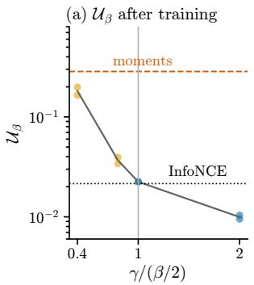

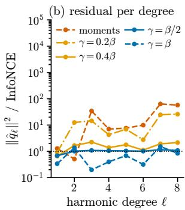  
Figure 4 | Condition (U) in trained encoders (alignment term + uniformity term; content–style model, $d = 8 , \beta = 5 )$ (a) $\mathcal { U } _ { \beta }$ of encoders trained with the Gaussian uniformity loss at scale � (one point per seed; blue: $\gamma \geq \beta / 2 ;$ amber: $\gamma < \beta / 2 ;$ gray line: mean over seeds) and mean over 3 seeds for moment matching (dashed) and InfoNCE (dotted). (b) Residual non-uniformity $\| \hat { q } _ { \ell } \| ^ { 2 }$ per harmonic degree, relative to InfoNCE’s (mean over seeds; dotted: equal to InfoNCE).

An optimization gap. With per-view nuisance, $\mathrm { S G } _ { 0 . 2 }$ from scratch stays farther from InfoNCE (CKA 0.83) than without nuisance (0.993), although it retains no style, so this gap is separate from the preference of Theorem ${ 3 ; }$ sharing InfoNCE’s minimizers does not ensure that training reaches InfoNCE’s representation. With a shared optimizer, schedule, budget and peak learning rate, InfoNCE training reaches a lower value of the $\mathrm { S G } _ { 0 . 2 }$ objective than $\mathrm { S G } _ { 0 . 2 }$ training itself. In units of $1 0 ^ { - 3 } , \mathcal { T } _ { 0 . 2 } = 1 . 7$ for InfoNCE against 3.6 for ${ \mathrm { S G } } _ { 0 . { \dot { 2 } } }$ 2 from scratch; from the common switch point (3.9), continuing $\mathrm { S G } _ { 0 . 2 }$ reaches 2.2 and keeps InfoNCE’s representation (CKA 0.975; InfoNCE seeds 0.982). Pure SG likewise ends above InfoNCE on its own objective $( \mathcal { T } = 0 . 8 5 $ against 0.17). More frequencies do not move $\mathrm { S G } _ { 0 . 2 }$ toward InfoNCE (CKA 0.825 at $M = 1 0 2 4 ;$ Appendix B), and without nuisance the gap nearly closes $( \mathrm { v M F } , \ S \mathrm { G } _ { 0 . 2 }$ against InfoNCE: $\mathcal { T } = 1 . 4 2$ and 1.37, $\mathcal { T } _ { 0 . 2 } = 3 2 . 0$ and 31.6; Table 3). $\mathrm { S G } _ { 0 . 2 }$ training thus stops at representations that its own objective scores worse than InfoNCE’s, which suggests that part of the diference lies in optimization.

## 8. Discussion

A single centroid test shares InfoNCE’s minimizers and controls its excess at the optimal rate among Hilbertian pair discrepancies, yet away from the optimum it can favor per-view nuisance, as our controlled experiments illustrate. Three practical consequences follow. First, a linear guarantee needs two ingredients, an explicit alignment term and a uniformity test whose spectrum dominates that of $e ^ { \beta u ^ { \top } \upsilon }$ ; Gaussian kernels with $\gamma \geq \beta / 2$ and SG’s lift qualify and moment matching does not; within the Gaussian family, and against moment matching, the diference is visible in trained encoders. Second, the gain of a nuisance channel can be measured on a trained encoder, and comparing it with the alignment weight checks whether that weight rejects the channel. Third, because LeJEPA’s reference implementation scales SIGReg by the batch size, its critical SIGReg weight falls with �, so a weight that rejects nuisance at one batch size can admit it at a larger one.

Limitations and next steps. Our guarantees are population statements (equal marginals, infinitely many negatives), and the nuisance results are local to a channel. The certificate’s second term has a constant that grows exponentially in $\beta ;$ at $d = 8 , \beta = 5$ it is about $4 . 9 \times 1 0 ^ { 4 }$ , so the second term exceeds the leading one for $1 0 ^ { - 6 } \lesssim \mathcal { T } \lesssim 2 \times 1 0 ^ { - 2 }$ , a range that contains the $\mathcal { T }$ of trained encoders. The gains in Section 7 are measured on the trained encoders, so the comparisons with the price check condition (A) at the end of training; predicting retention from a gain measured before training, and testing the rule on natural images and at scale, are next steps, as is identifying the cause of the optimization gap.

## References

Donald E. Amos. Computation of modified Bessel functions and their ratios. Mathematics of Computation, 28(125), 1974. doi: 10.1090/S0025-5718-1974-0333287-7.

Kendall Atkinson and Weimin Han. Spherical Harmonics and Approximations on the Unit Sphere: An Introduction, volume 2044 ofLecture Notes in Mathematics. Springer, Berlin, Heidelberg, 2012. doi: 10.1007/978-3-642-25983-8.

Randall Balestriero and Yann LeCun. LeJEPA: Provable and scalable self-supervised learning without the heuristics. arXiv preprint arXiv:2511.08544, 2025.

Adrien Bardes, Jean Ponce, and Yann LeCun. VICReg: Variance-invariance-covariance regularization for selfsupervised learning. In International Conference on Learning Representations (ICLR), 2022.

Ludwig Baringhaus and Norbert Henze. A consistent test for multivariate normality based on the empirical characteristic function. Metrika, 35(1), 1988. doi: 10.1007/ BF02613322.

Roy Betser, Eyal Gofer, Meir Yossef Levi, and Guy Gilboa. InfoNCE induces Gaussian distribution. In International Conference on Learning Representations (ICLR), 2026. arXiv:2602.24012.

Ting Chen, Simon Kornblith, Mohammad Norouzi, and Geoffrey Hinton. A simple framework for contrastive learning of visual representations. In Proceedings of the 37th International Conference on Machine Learning (ICML), volume 119 of Proceedings of Machine Learning Research, 2020.

Zihao Chen, Chi-Heng Lin, Ran Liu, Jingyun Xiao, and Eva L. Dyer. Your contrastive learning problem is secretly a distribution alignment problem. In Advances in Neural Information Processing Systems (NeurIPS), volume 37, 2024. doi: 10.52202/079017-2907.

Feng Dai and Yuan Xu. Approximation Theory and Harmonic Analysis on Spheres and Balls. Springer Monographs in Mathematics. Springer, New York, 2013. doi: 10.1007/ 978-1-4614-6660-4.

DLMF. NIST digital library of mathematical functions. https://dlmf.nist.gov/, 2026. F. W. J. Olver et al., eds.

Benoit Dufumier, Carlo Alberto Barbano, Robin Louiset, Edouard Duchesnay, and Pietro Gori. Integrating prior knowledge in contrastive learning with kernel. In Proceedings of the 40th International Conference on Machine Learning (ICML), volume 202 of Proceedings of Machine Learning Research, 2023.

T. W. Epps and Lawrence B. Pulley. A test for normality based on the empirical characteristic function. Biometrika, 70 (3), 1983. doi: 10.1093/biomet/70.3.723.

Aleksandr Ermolov, Aliaksandr Siarohin, Enver Sangineto, and Nicu Sebe. Whitening for self-supervised representation learning. In Proceedings of the 38th International Conference on Machine Learning (ICML), volume 139 of Proceedings of Machine Learning Research, 2021.

Xianghong Fang, Jian Li, Qiang Sun, and Benyou Wang. Rethinking the uniformity metric in self-supervised learning. In International Conference on Learning Representations (ICLR), 2024.

Eduardo García-Portugués and Thomas Verdebout. An overview of uniformity tests on the hypersphere. arXiv preprint arXiv:1804.00286, 2018.

Eduardo García-Portugués, Paula Navarro-Esteban, and Juan A. Cuesta-Albertos. On a projection-based class of uniformity tests on the hypersphere. Bernoulli, 29(1), 2023. doi: 10.3150/21-BEJ1454.

Quentin Garrido, Yubei Chen, Adrien Bardes, Laurent Najman, and Yann LeCun. On the duality between contrastive and non-contrastive self-supervised learning. In International Conference on Learning Representations (ICLR), 2023.

Evarist M. Giné. Invariant tests for uniformity on compact Riemannian manifolds based on Sobolev norms. The Annals of Statistics, 3(6), 1975. doi: 10.1214/aos/1176343283.

Arthur Gretton, Karsten M. Borgwardt, Malte J. Rasch, Bernhard Schölkopf, and Alexander Smola. A kernel twosample test. Journal of Machine Learning Research, 13 (25), 2012.

Jef Z. HaoChen, Colin Wei, Adrien Gaidon, and Tengyu Ma. Provable guarantees for self-supervised deep learning with spectral contrastive loss. In Advances in Neural Information Processing Systems (NeurIPS), volume 34, 2021.

Robert Jenkinson Alvarez. Beyond isotropy in JEPAs: Hamiltonian geometry and symplectic prediction. arXiv preprint arXiv:2605.20107, 2026.

David Klindt, Yann LeCun, and Randall Balestriero. When does LeJEPA learn a world model? arXiv preprint arXiv:2605.26379, 2026.

Simon Kornblith, Mohammad Norouzi, Honglak Lee, and Geofrey Hinton. Similarity of neural network representations revisited. In Proceedings of the 36th International Conference on Machine Learning (ICML), volume 97 of Proceedings of Machine Learning Research, 2019.

Yazhe Li, Roman Pogodin, Danica J. Sutherland, and Arthur Gretton. Self-supervised learning with kernel dependence maximization. InAdvances in Neural Information Processing Systems (NeurIPS), 2021.

Fabian A. Mikulasch and Friedemann Zenke. Understanding self-supervised learning via latent distribution matching. In Proceedings of the 43rd International Conference on Machine Learning (ICML), 2026. arXiv:2605.03517.

Léo Nicollier, Max Dunitz, Marc Pic, Pablo Musé, Enric Meinhardt-Llopis, and Gabriele Facciolo. SPHERE-JEPA: Spherical prediction with homogeneous embeddings. arXiv preprint arXiv:2605.26900, 2026a.

Léo Nicollier, Enric Meinhardt-Llopis, Max Dunitz, Marc Pic, Pablo Musé, and Gabriele Facciolo. Expanding SPHERE-JEPA: A family of statistical regularizers for the hypersphere. arXiv preprint arXiv:2606.17603, 2026b.

Léo Nicollier, Enric Meinhardt-Llopis, Marc Pic, Pablo Musé, and Gabriele Facciolo. Beyond Gaussian worlds: Latent geometry matters for JEPAs. arXiv preprint arXiv:2609.21656, 2026c.

Léo Nicollier, Marc Pic, Pablo Musé, Enric Meinhardt-Llopis, and Gabriele Facciolo. Unbiased open world regularization for fair self-supervised learning. arXiv preprint arXiv:2607.22149, 2026d.

Mikhail Parakhin, André M. Carvalho, and Patrick Haluptzok. The wristband Gaussian loss: Deterministic, composable latents via a sphere–interval decomposition. arXiv preprint arXiv:2605.08749, 2026.

Evgenia Rusak, Patrik Reizinger, Attila Juhos, Oliver Bringmann, Roland S. Zimmermann, and Wieland Brendel. InfoNCE: Identifying the gap between theory and practice. In Proceedings of the 28th International Conference on Artificial Intelligence and Statistics (AISTATS), volume 258 of Proceedings of Machine Learning Research, 2025.

Nikunj Saunshi, Orestis Plevrakis, Sanjeev Arora, Mikhail Khodak, and Hrishikesh Khandeparkar. A theoretical analysis of contrastive unsupervised representation learning. In Proceedings of the 36th International Conference on Machine Learning (ICML), volume 97 of Proceedings of Machine Learning Research, 2019.

Rylan Schaefer, Victor Lecomte, Dhruv Bhandarkar Pai, Andres Carranza, Berivan Isik, Alyssa Unell, Mikail Khona, Thomas Yerxa, Yann LeCun, SueYeon Chung, Andrey Gromov, Ravid Shwartz-Ziv, and Sanmi Koyejo. Towards an improved understanding and utilization of maximum manifold capacity representations. arXiv preprint arXiv:2406.09366, 2024.

I. J. Schoenberg. Positive definite functions on spheres. Duke Mathematical Journal, 9(1), 1942. doi: 10.1215/ S0012-7094-42-00908-6.

Aaron van den Oord, Yazhe Li, and Oriol Vinyals. Representation learning with contrastive predictive coding. arXiv preprint arXiv:1807.03748, 2018.

Julius von Kügelgen, Yash Sharma, Luigi Gresele, Wieland Brendel, Bernhard Schölkopf, Michel Besserve, and Francesco Locatello. Self-supervised learning with data augmentations provably isolates content from style. In Advances in Neural Information Processing Systems (NeurIPS), volume 34, 2021.

Feng Wang and Huaping Liu. Understanding the behaviour of contrastive loss. In IEEE/CVF Conference on Computer Vision and Pattern Recognition (CVPR), 2021. doi: 10.1109/ CVPR46437.2021.00252.

Tongzhou Wang and Phillip Isola. Understanding contrastive representation learning through alignment and uniformity on the hypersphere. In Proceedings ofthe 37th International Conference on Machine Learning (ICML), volume 119 of Proceedings of Machine Learning Research, 2020.

Haiyu Wu, Randall Balestriero, and Morgan Levine. VISReg: Variance-invariance-sketching regularization for JEPA training. arXiv preprint arXiv:2606.02572, 2026.

Thomas Yerxa, Yilun Kuang, Eero P. Simoncelli, and SueYeon Chung. Learning eficient coding of natural images with maximum manifold capacity representations. In Advances in Neural Information Processing Systems (NeurIPS), volume 36, 2023. doi: 10.52202/075280-1047.

Zhoushun Yu, Xiaoyu Hu, and Xiangyu Xu. QQWorld: Quantile-quantile matching for world model regularization. arXiv preprint arXiv:2607.28415, 2026.

Jure Zbontar, Li Jing, Ishan Misra, Yann LeCun, and Stéphane Deny. Barlow Twins: Self-supervised learning via redundancy reduction. In Proceedings of the 38th International Conference on Machine Learning (ICML), volume 139 of Proceedings of Machine Learning Research, 2021.

Léon Zheng, Gilles Puy, Elisa Riccietti, Patrick Pérez, and Rémi Gribonval. Self-supervised learning with rotationinvariant kernels. In International Conference on Learning Representations (ICLR), 2023.

Eric Zimmermann, Harley Wiltzer, Justin Szeto, David Alvarez-Melis, and Lester Mackey. KerJEPA: Kernel discrepancies for Euclidean self-supervised learning. arXiv preprint arXiv:2512.19605, 2025.

Roland S. Zimmermann, Yash Sharma, Stefen Schneider, Matthias Bethge, and Wieland Brendel. Contrastive learning inverts the data generating process. In Proceedings of the 38th International Conference on Machine Learning (ICML), volume 139 of Proceedings of Machine Learning Research, 2021.

# Appendix

## A. Proofs

## A.1. Auxiliary statements

The following statements are cited in the main text; their proofs are given below.

Theorem 4 (Structure). For every paired law, $\begin{array} { r } { | \sqrt { \mathcal { I } ( P ) } - D _ { \mathrm { l i f t } } ( \bar { q } , \sigma ) | \le \frac { 3 } { 2 } \Delta ( P ) } \end{array}$

Proof in Appendix A.6.

Proposition 7 (Lifted kernel). Let $\lambda _ { \ell } ^ { \mathrm { l i f t } }$ be the eigenvalues of $K _ { \mathrm { l i f t } }$ and $C _ { d , \beta } ^ { \star } ~ = ~ \mathsf { s u p } _ { \ell \geq 1 } \lambda _ { \ell } ^ { \beta } / \lambda _ { \ell } ^ { \mathrm { { l i f t } } }$ . Then $D _ { \beta } ^ { 2 } ~ \leq$ $C _ { d , \beta } ^ { \star } D _ { \mathrm { l i f t } } ^ { 2 } ,$ , no smaller constant works, and $\begin{array} { r l r } { C _ { d , \beta } ^ { \star } } & { \leq } & { \sqrt { 6 } e ^ { \beta } \operatorname* { m a x } _ { \ell \geq 1 } ( 3 \beta ) ^ { \ell } / \ell ! \le \sqrt { 6 } e ^ { 4 \beta } } \end{array}$ . Moreover, for fixed $d ,$ lim in $\begin{array} { r } { \mathrm { f } _ { \beta \to \infty } \beta ^ { - 1 } \log ( C _ { d , \beta } ^ { \star } / \kappa _ { d } ( \beta ) ) \geq \frac { 1 } { 4 } } \end{array}$

Proof in Appendix A.10. For $d = 8$ and $\beta = 5$ , the setting of Section 7, the supremum is attained at $\ell = 7$ and $C _ { d , \beta } ^ { \star } / \kappa _ { d } ( \beta ) \approx 7 9 0$ , so $\bar { c } _ { d , \beta } \approx 4 . 9 \times 1 0 ^ { 4 }$ in (7); the leading term then dominates for $\mathcal { T } \lesssim 1 0 ^ { - 6 }$

Proposition 8 (Calibrated shared loss). For $\alpha > 0 , \mathcal { T } _ { \alpha } = 0$ if and only if $\mathcal { T } = 0 ,$ , and under equal marginals $\mathcal { L } _ { \beta } ( P ) - \mathcal { L } _ { \beta } ^ { \star } \leq c _ { \beta , \alpha } \mathcal { T } _ { \alpha } ( P )$ with $c _ { \beta , \alpha } = \operatorname* { m a x } \{ ( 2 \beta + \textstyle { \frac { 9 } { 2 } } c _ { \beta } ) / \alpha , 2 c _ { \beta } \}$ and $c _ { \beta } = C _ { d , \beta } ^ { \star } / \kappa _ { d } ( \beta )$

Corollary 3 (Calibration threshold). In the setting of Theorem $3 ( i i )$ , let $\mathcal { T } _ { \alpha } = \mathcal { T } + \alpha \Delta$ with $\alpha = a \varepsilon ^ { 2 }$ for a fixed $a \geq 0 .$ Then $\mathcal { T } _ { \alpha }$ has a unique minimizer on $[ 0 , \vartheta _ { 0 } ]$ for small �, and

$$
\Delta ( \vartheta _ { \alpha } ^ { \star } ) = \left[ \rho ( f ) \mathcal { T } _ { \mathrm { u n i f } } ( q _ { \varepsilon } ) - 6 \sqrt { 3 } \alpha \right] _ { + } + o ( \varepsilon ^ { 2 } ) .
$$

In particular $\vartheta = 0$ is the unique minimizer if and only if $\dot { \alpha } \geq \alpha _ { c } : = \rho ( f ) \mathcal { T } _ { \mathrm { u n i f } } ( q _ { \varepsilon } ) / ( 6 \sqrt { 3 } ) _ { } .$ ; for any fixed $\alpha > 0$ this holds for all small �.

Proofs in Appendices A.13 and A.14.

## A.2. Preliminaries

Throughout, $D \ = \ d / 2 , \ a \ \sim \ \sigma , \ t \ \sim \ N ( 0 , 1 ) , \ R \ \sim \ \chi _ { d }$ are mutually independent and independent of the pair $( U , V )$ , and $g ( t ) = e ^ { - t ^ { 2 } / 2 }$ . We write $\| F \|$ for the norm of $L ^ { 2 } ( \sigma \otimes N ( 0 , 1 ) )$ applied to a function $F ( { \boldsymbol { a } } , t ) _ { ; }$ , so that $\mathcal { T } = \| \varphi _ { Z } ( t \cdot ) - g \| ^ { 2 }$ . For a probability measure $\mu$ on $\mathbb { S } ^ { d - 1 } , T _ { \mu } = R W$ with $W \sim \mu$ independent of �, so $T _ { \sigma } \sim { \cal N } ( 0 , I _ { d } )$ and $Z = T _ { q }$ when $U = V \sim q$ . With the feature map $\psi _ { u } ( a , t ) = \mathbb { E } _ { R } e ^ { i t R a ^ { \top } u }$ we have $\begin{array} { r } { \varphi _ { T _ { \mu } } ( t a ) = \int \psi _ { u } ( a , t ) \mathrm { d } \mu ( u ) ; } \end{array}$ the Gaussian lift is the kernel $K _ { \mathrm { l i f t } } ( u , \nu ) = \langle \psi _ { u } , \psi _ { \nu } \rangle$ (Hermitian inner product; $K _ { \mathrm { l i f t } }$ is real since $\psi _ { u } ( - a , t ) = { \overline { { \psi _ { u } ( a , t ) } } } )$ and $D _ { \mathrm { l i f t } } ( \mu , \sigma ) = \| \varphi _ { T _ { \mu } } ( t \cdot ) - g \|$ is the corresponding MMD (Lemma 5). Symbols are collected in Appendix C. We use the following standard facts.

(F1) Gaussian polar decomposition. $R a \sim N ( 0 , I _ { d } )$ . Conversely, if $G \sim { \cal N } ( 0 , I _ { d } )$ then $\| G \| \sim \chi _ { d }$ and $G / \| G \| \sim \sigma$ are independent.

(F2) For $c \in \mathbb { R } ^ { d }$ and $t \in \mathbb { R } \colon \mathbb { E } _ { a . R } e ^ { i t R a ^ { \top } c } = e ^ { - t ^ { 2 } \| c \| ^ { 2 } / 2 } \left( \mathrm { b y ~ } ( \mathbf { F } \mathbf { 1 } ) \right)$ .

(F3) For $\theta \ge 0$ and integer $\ell \geq 0 \colon \mathbb { E } e ^ { - \theta t ^ { 2 } } = ( 1 + 2 \theta ) ^ { - 1 / 2 } \mathrm { ~ a n d } \mathbb { E } t ^ { 2 \ell } e ^ { - \theta t ^ { 2 } } = ( 2 \ell - 1 ) ! ! ( 1 + 2 \theta ) ^ { - \ell - 1 / 2 }$ , with $( - 1 ) ! ! = 1$ In particular � $t ^ { 4 } e ^ { - t ^ { 2 } } = 3 ^ { - 3 / 2 }$ and � $t ^ { 4 } = 3$

(F4) For symmetric $\begin{array} { r } { A \in \mathbb { R } ^ { d \times d } \colon \mathbb { E } _ { a } ( a ^ { \top } A a ) ^ { 2 } = \frac { ( \operatorname { t r } A ) ^ { 2 } + 2 \operatorname { t r } ( A ^ { 2 } ) } { d ( d + 2 ) } } \end{array}$

(F5) $\mathbb { E } R ^ { p } = 2 ^ { p / 2 } \Gamma ( D + p / 2 ) / \Gamma ( D )$ for $p > - d ;$ in particular $\mathbb { E } R ^ { 2 } = d$

We also use $\begin{array} { r } { H = \frac { 1 } { 2 } ( U - V ) , C = \frac { 1 } { 2 } ( U + V ) } \end{array}$ , for which $U = C + H , V = C - H , C ^ { \top } H = 0 , \| C \| ^ { 2 } + \| H \| ^ { 2 } = 1$ , and $\mathbb { E } \Vert H \Vert ^ { 2 } = \Delta$

## A.3. Proof of Lemma 1 (alignment control)

Let $Q = \| H \| ^ { 2 } = 1 - \| C \| ^ { 2 } \in [ 0 , 1 ] , \operatorname { s o } \mathbb { E } Q = \Delta$ . Fix �. Conditioning on (�, �) and applying (F2),

$$
\begin{array} { r } { \mathbb { E } _ { a } \varphi _ { Z } ( t a ) = \mathbb { E } _ { U , V } \mathbb { E } _ { a , R } e ^ { i t R a ^ { \top } C } = \mathbb { E } e ^ { - t ^ { 2 } \| C \| ^ { 2 } / 2 } = g ( t ) \mathbb { E } e ^ { t ^ { 2 } Q / 2 } \ \geq \ g ( t ) e ^ { t ^ { 2 } \Delta / 2 } , } \end{array}
$$

by Jensen’s inequality for the convex map $x \mapsto e ^ { t ^ { 2 } x / 2 }$ . Hence $\mathbb { E } _ { a } \varphi _ { Z } ( t a ) - g ( t ) \geq g ( t ) ( e ^ { t ^ { 2 } \Delta / 2 } - 1 ) \geq 0$ . By Jensen’s inequality for $\begin{array} { r } { w \mapsto | w | ^ { 2 } \mathrm { o n } \mathbb { C } } \end{array}$

$$
\begin{array} { r } { \mathbb { E } _ { \alpha } \left| \varphi _ { Z } ( t a ) - g ( t ) \right| ^ { 2 } \geq \left| \mathbb { E } _ { a } \varphi _ { Z } ( t a ) - g ( t ) \right| ^ { 2 } \geq e ^ { - t ^ { 2 } } \left( e ^ { t ^ { 2 } \Delta / 2 } - 1 \right) ^ { 2 } = e ^ { - ( 1 - \Delta ) t ^ { 2 } } - 2 e ^ { - ( 1 - \Delta / 2 ) t ^ { 2 } } + e ^ { - t ^ { 2 } } . } \end{array}
$$

Taking � with (F3) gives $\mathcal { T } \ge \mathbb { E } _ { t } e ^ { - t ^ { 2 } } ( e ^ { t ^ { 2 } \Delta / 2 } - 1 ) ^ { 2 } = ( 3 - 2 \Delta ) ^ { - 1 / 2 } - 2 ( 3 - \Delta ) ^ { - 1 / 2 } + 3 ^ { - 1 / 2 } = j ( \Delta )$ . Since $e ^ { x } - 1 \geq x$ $\begin{array} { r } { j ( \Delta ) \ge \frac { \Delta ^ { 2 } } { 4 } \mathbb { E } t ^ { 4 } e ^ { - t ^ { 2 } } = \frac { \bar { \Delta ^ { 2 } } } { 1 2 \sqrt { 3 } } } \end{array}$ by (F3). Moreover $j ^ { \prime } ( \Delta ) = ( 3 - 2 \Delta ) ^ { - 3 / 2 } - ( 3 - \Delta ) ^ { - 3 / 2 } > 0 ~ \mathrm { o n } ~ ( 0 , 1 ] , \mathrm { s o } ~ j$ is increasing, with $j ( 1 ) = 1 - \sqrt { 2 } + 3 ^ { - 1 / 2 } \approx 0 . 1 6 3$ . If $\mathcal { T } \le j ( 1 )$ , this gives $\Delta \leq j ^ { - 1 } ( \mathcal { T } ) = \Delta ^ { \star } ( \mathcal { T } ) ; \operatorname { i f } \mathcal { T } > j ( 1 )$ , then $\Delta \leq 1 = \Delta ^ { \star } ( \mathcal { T } )$ . In both cases $\Delta ^ { \star } ( \mathcal { T } ) \leq k _ { 0 } \sqrt { \mathcal { T } }$ , because $j ( \Delta ) \ge \Delta ^ { 2 } / k _ { 0 } ^ { 2 }$ and $k _ { 0 } \sqrt { j ( 1 ) } > 1$ . On the family of Section $4 . 3 , Q \equiv \Delta ,$ , so the first Jensen step is an equality. Also $\varphi _ { Z } ( t a ) = e ^ { - ( 1 - \Delta ) t ^ { 2 } / 2 }$ does not depend on �, so the second one is too. □

## A.4. Proof of Proposition 1

(⇒) If $\mathcal { T } = 0 _ { : }$ , Lemma 1 gives $\Delta = 0 , \mathrm { i . e . , } \mathbb { E } \| U - V \| ^ { 2 } = 0 _ { \mathrm { \Omega } }$ , so $U = V \ \mathsf { a } . s$ . The function $( a , t ) \mapsto \varphi _ { Z } ( t a ) - g ( t )$ is continuous on $\mathbb { S } ^ { d - 1 } \times \mathbb { R } _ { \mathrm { : } }$ , and its squared modulus integrates to zero against $\sigma \otimes N ( 0 , 1 )$ , a measure with full support. Hence it vanishes identically. Since $\{ t a \} = \mathbb { R } ^ { d } , \varphi _ { Z } ( \omega ) = e ^ { - \| \omega \| ^ { 2 } / 2 }$ for all �, and $Z \sim { \cal N } ( 0 , I _ { d } )$ by uniqueness of characteristic functions. As $U = V , Z = R U$ with $R > 0 \mathsf { a . s . } ,$ so $U = Z / \lVert Z \rVert \sim \sigma$ by (F1). (⇐) If $U = V \sim \sigma ,$ then $Z = R U \sim N ( 0 , I _ { d } )$ by (F1), and $\mathcal { T } = 0$ □

## A.5. Proof of Proposition 2 (directional targets)

Proof. (i) Both terms are nonnegative and both weights are positive. A zero value therefore gives $I ( X _ { 1 } , X _ { 2 } ) = 0$ and $S ( X _ { j } ) = 0 \mathrm { f o r } j = 1 , 2$ . By the defining properties of � and the characteristic population discrepancy $S , X _ { 1 } = X _ { 2 }$ almost surely and their common law is ${ \cal N } ( 0 , I _ { d } )$ . The converse is immediate. The Gaussian polar decomposition then gives aligned, uniform normalized directions.

(ii) Let $X _ { 1 } = X _ { 2 } = X$ and draw � uniformly from $\{ \pm { \sqrt { d } } e _ { i } : i \leq d \}$ . Then $\mathbb { E } X = 0 , \mathbb { E } X X ^ { \top } = I _ { d } ,$ and the two views coincide. Hence the invariance, variance-hinge (target standard deviation one), and of-diagonal covariance terms all vanish. The direction $X / \| X \|$ has finite support and is not �. □

## A.6. The centroid identity and the proof of Theorem 4

Lemma 2 (Centroid versus mixture). For every paired law, with $T = T _ { \bar { q } } ,$

$$
\begin{array} { r } { \left\| \varphi _ { Z } ( t \cdot ) - \varphi _ { T } ( t \cdot ) \right\| \le \frac { 3 } { 2 } \sqrt { \frac { d } { d + 2 } } \Delta \le \frac { 3 } { 2 } \Delta . } \end{array}
$$

Proof. For every � $\begin{array} { r } { \in \mathbb R ^ { d } , \ \frac { 1 } { 2 } ( e ^ { i x ^ { \top } U } + e ^ { i x ^ { \top } V } ) = e ^ { i x ^ { \top } C } \cos ( x ^ { \top } H ) } \end{array}$ . Put $x = t R a$ and take expectations over $( U , V , R )$ . Since $T = R W$ with $W \sim \bar { q } = \textstyle \frac 1 2 \big ( q _ { U } + q _ { V } \big )$

$$
\begin{array} { r } { \varphi _ { T } ( t a ) = \frac { 1 } { 2 } \left( { \mathbb E } e ^ { i t R a ^ { \top } U } + { \mathbb E } e ^ { i t R a ^ { \top } V } \right) = { \mathbb E } \left[ e ^ { i t R a ^ { \top } C } \cos ( t R a ^ { \top } H ) \right] . } \end{array}
$$

Hence $\varphi _ { T } ( t a ) - \varphi _ { Z } ( t a ) = \mathbb { E } [ e ^ { i t R a ^ { \top } C } ( \cos ( t R a ^ { \top } H ) - 1 ) ]$ . Using $0 \leq 1 - \cos y \leq y ^ { 2 } / 2$ , independence of �, and (F5),

$$
\begin{array} { r } { | \varphi _ { T } ( t a ) - \varphi _ { Z } ( t a ) | \le \frac { 1 } { 2 } t ^ { 2 } \mathbb { E } \big [ R ^ { 2 } ( a ^ { \top } H ) ^ { 2 } \big ] = \frac { d } { 2 } t ^ { 2 } a ^ { \top } \Sigma _ { H } a , \qquad \Sigma _ { H } = \mathbb { E } H H ^ { \top } \succeq 0 , \mathrm { ~ t r } \Sigma _ { H } = \Delta . } \end{array}
$$

Squaring, integrating and using (F3)–(F4),

$$
\Vert \varphi _ { T } - \varphi _ { Z } \Vert ^ { 2 } \leq \frac { d ^ { 2 } } { 4 } \cdot 3 \cdot \frac { ( \operatorname { t r } \Sigma _ { H } ) ^ { 2 } + 2 \operatorname { t r } ( \Sigma _ { H } ^ { 2 } ) } { d ( d + 2 ) } \leq \frac { 9 d } { 4 ( d + 2 ) } \Delta ^ { 2 } ,
$$

because $\mathrm { t r } ( \Sigma _ { H } ^ { 2 } ) \leq ( \mathrm { t r } \Sigma _ { H } ) ^ { 2 }$ for $\Sigma _ { H } \succeq 0$

Proof of Theorem 4. By the reverse triangle inequality in $L ^ { 2 }$ and Lemma $2 , | \sqrt { \mathcal { T } } - D _ { \mathrm { l i f t } } ( \bar { q } , \sigma ) | = \left| \| \varphi _ { Z } - g \| - \| \varphi _ { T } - g \| \right| \leq$ $\| \varphi _ { Z } - \varphi _ { T } \| \leq \frac { 3 } { 2 } \Delta$ □

## A.7. InfoNCE: decomposition and uniqueness of the uniform minimizer

For a probability measure � on $\mathbb { S } ^ { d - 1 }$ let $\begin{array} { r } { g _ { q } ( u ) = \int e ^ { \beta u ^ { \top } w } \mathrm { d } q ( w ) \in [ e ^ { - \beta } , e ^ { \beta } ] } \end{array}$ and $\begin{array} { r } { \Phi ( q ) = \int \log g _ { q } \mathrm { d } q . } \end{array}$ , so that $\mathcal { U } _ { \beta } ( q ) =$ $\Phi ( q ) - \log \kappa _ { d } ( \beta )$

Lemma 3 (Decomposition). If � has equal marginals $q ,$ then $\mathcal { L } _ { \beta } ( P ) - \mathcal { L } _ { \beta } ^ { \star } = 2 \beta \Delta + \mathcal { U } _ { \beta } ( q )$ and $\mathcal { U } _ { \beta } ( q ) \leq \log ( 1 +$ $D _ { \beta } ^ { 2 } ( q , \sigma ) / \kappa _ { d } ( \beta ) \big )$

Proof. $- \beta \mathbb { E } U ^ { \top } V + \beta = \beta ( 1 - \mathbb { E } U ^ { \top } V ) = 2 \beta \Delta$ , which gives the identity. Since $\begin{array} { r } { \int e ^ { \beta u ^ { \top } w } \mathrm { d } \sigma ( w ) = \kappa _ { d } ( \beta ) } \end{array}$ for every $u ,$

$$
D _ { \beta } ^ { 2 } ( q , \sigma ) = \iint k _ { \beta } \mathrm { d } q \mathrm { d } q - 2 \iint k _ { \beta } \mathrm { d } q \mathrm { d } \sigma + \iint k _ { \beta } \mathrm { d } \sigma \mathrm { d } \sigma = \int g _ { q } \mathrm { d } q - \kappa _ { d } ( \beta ) .\tag{13}
$$

By Jensen’s inequality for the concave logarithm, $\begin{array} { r } { \Phi ( q ) \le \log \int g _ { q } \mathrm { d } q = \log ( \kappa _ { d } ( \beta ) + D _ { \beta } ^ { 2 } ( q , \sigma ) ) } \end{array}$

Wang and Isola (2020, Thm. 1) show that perfectly uniform encoders minimize $\mathcal { U } _ { \beta } ;$ the following lemma gives a self-contained proof that � is its unique minimizer over all laws.

Lemma 4 (Uniform is the unique minimizer). Φ is continuous for the weak topology, and $\mathcal { U } _ { \beta } ( q ) \geq 0$ for every $q ,$ with equality if and only $i f q = \sigma .$

Proof. Continuity. Since $\begin{array} { r } { \vert e ^ { \beta u ^ { \top } w } - e ^ { \beta u ^ { \prime \top } w } \vert \leq \beta e ^ { \beta } \vert \vert u - u ^ { \prime } \vert \vert } \end{array}$ , the family $\{ g _ { q } \}$ is uniformly equicontinuous and uniformly bounded. If $q _ { n } \to q _ { ; }$ , then $g _ { q _ { n } }  g _ { q }$ pointwise and hence uniformly on the compact sphere (Arzelà–Ascoli). As log is Lipschitz on $[ e ^ { - \beta } , e ^ { \beta } ] , | \hat { \Phi ( q _ { n } ) } - \mathbf { \dot { \Phi } } ( q ) | \leq e ^ { \beta } \| g _ { q _ { n } } - g _ { q } \| _ { \infty } + | \int \log g _ { q } \mathrm { d } ( q _ { n } - q ) | \to 0 .$

Existence and structure of minimizers. The set of probability measures on $\mathbb { S } ^ { d - 1 }$ is weakly compact, so Φ attains its minimum at some �. Let $\begin{array} { r } { m = \operatorname* { m i n } _ { u \in \mathrm { s u p p } q } g _ { q } ( u ) } \end{array}$ , which exists by continuity. Fix $\varepsilon > 0$ and let $S _ { \varepsilon } = \{ u : g _ { q } ( u ) < m + \varepsilon \}$ an open set with $q ( S _ { \varepsilon } ) > 0$ . Let $q _ { S } = q ( \cdot \cap S _ { \varepsilon } ) / q ( S _ { \varepsilon } )$ and $q _ { \eta } = ( 1 - \eta ) q + \eta q _ { S }$ for $\eta \in [ 0 , 1 ]$ . Then $g _ { q _ { \eta } } = g _ { q } + \eta ( g _ { q _ { S } } - g _ { q } )$ takes values in $[ e ^ { - \beta } , e ^ { \beta } ]$ , and $\begin{array} { r } { \eta \mapsto \Phi ( q _ { \eta } ) = \int \log g _ { q _ { \eta } } \mathrm { d } q _ { \eta } } \end{array}$ is diferentiable, with right derivative at 0

$$
\frac { \mathrm { d } } { \mathrm { d } \eta } \Phi ( q _ { \eta } ) \Bigl | _ { \eta = 0 ^ { + } } = \int \frac { g _ { q _ { S } } } { g _ { q } } \mathrm { d } q - 1 + \int \log g _ { q } \mathrm { d } q _ { S } - \Phi ( q ) .
$$

Minimality of $q$ forces this derivative to be $\geq 0$ . Now $g _ { q } \geq m \ q - \mathsf { a . e . }$ , so by Fubini and the symmetry of $k _ { \beta }$ ,

$$
\int \frac { g _ { q _ { S } } } { g _ { q } } \mathrm { d } q = \iint \frac { k _ { \beta } ( u , \nu ) } { g _ { q } ( u ) } \mathrm { d } q ( u ) \mathrm { d } q _ { S } ( \nu ) \leq \frac { 1 } { m } \int g _ { q } \mathrm { d } q _ { S } \leq \frac { m + \varepsilon } { m } ,
$$

and $\begin{array} { r } { \int \log g _ { q } \mathrm { d } q _ { S } \le \log ( m + \varepsilon ) } \end{array}$ . Therefore $\Phi ( q ) \le \frac { \varepsilon } { m } + \log ( m + \varepsilon )$ for every $\varepsilon > 0$ , so $\Phi ( q ) \leq \log m$ . But $\Phi ( q ) = $ $\begin{array} { r } { \int \log g _ { q } \mathrm { d } q \geq \log m } \end{array}$ . Hence $\begin{array} { r } { \int ( \log g _ { q } - \log m ) \mathrm { d } q = 0 } \end{array}$ with a nonnegative integrand, and $g _ { q } = m \ q - \mathsf { a . e }$ . Integrating and using (13), $\begin{array} { r } { m = \int g _ { q } \mathrm { d } \bar { q } = \kappa _ { d } ( \beta ) + D _ { \beta } ^ { 2 } ( q , \sigma ) } \end{array}$ , so

$$
\operatorname* { m i n } \Phi = \Phi ( q ) = \log \left( \kappa _ { d } ( \beta ) + { \cal D } _ { \beta } ^ { 2 } ( q , \sigma ) \right) \geq \log \kappa _ { d } ( \beta ) = \Phi ( \sigma ) ,
$$

where $\Phi ( \sigma ) = \log \kappa _ { d } ( \beta )$ because $g _ { \sigma } \equiv \kappa _ { d } ( \beta )$ . Thus min $\Phi = \log \kappa _ { d } ( \beta )$ , i.e., $\mathcal { U } _ { \beta } \geq 0$ . Moreover, every minimizer satisfies $D _ { \beta } ( q , \sigma ) = 0$ , hence $q = \sigma ,$ because $k _ { \beta }$ is characteristic on $\mathbb { S } ^ { d - 1 }$ (all its eigenvalues $\lambda _ { \ell } ^ { \beta }$ with $\ell \geq 1$ are positive, Lemma 6). □

## A.8. Spectral analysis of the two kernels

Let $\mathcal { H } _ { \ell }$ be the space of degree-ℓ spherical harmonics on $\mathbb { S } ^ { d - 1 }$ , of dimension $\begin{array} { r } { N _ { \ell } \ = \ \frac { ( 2 \ell + d - 2 ) \Gamma ( \ell + d - 2 ) } { \Gamma ( \ell + 1 ) \Gamma ( d - 1 ) } \ \left( N _ { 0 } \ = \ 1 \right) } \end{array}$ 2 with an $L ^ { 2 } ( \sigma )$ -orthonormal basis $\left\{ Y _ { \ell m } \right\} _ { m \leq N _ { \ell } }$ . Let $P _ { \ell }$ be the Gegenbauer polynomial normalized by $P _ { \ell } ( 1 ) = 1$ (for $d = 2 .$ , use $P _ { \ell } ( \cos \theta ) = \cos ( \ell \theta )$ and $N _ { \ell } = 2$ for $\ell \geq 1 )$ ; then $| P _ { \ell } | \leq 1 \ \mathrm { o n } \ [ - 1 , 1 ]$ and the addition theorem reads $\begin{array} { r } { \sum _ { m } Y _ { \ell m } ( u ) Y _ { \ell m } ( \nu ) = N _ { \ell } P _ { \ell } ( u ^ { \top } \nu ) } \end{array}$ (Dai and Xu, 2013; Atkinson and Han, 2012). Put $\nu = D - 1$

Zonal kernels and MMD. By Schoenberg’s theorem (Schoenberg, 1942), a continuous positive-definite zonal kernel has an expansion $\begin{array} { r } { K ( u , \nu ) = \sum _ { \ell > 0 } \lambda _ { \ell } N _ { \ell } P _ { \ell } ( u ^ { \top } \nu ) } \end{array}$ with $\lambda _ { \ell } \geq 0$ and $\begin{array} { r } { \sum _ { \ell } \lambda _ { \ell } N _ { \ell } = K ( u , u ) < \infty , } \end{array}$ , converging absolutely and uniformly. Here $\begin{array} { r } { \lambda _ { \ell } = \iint K ( u , \nu ) Y ( u ) Y ( \nu ) } \end{array}$ d� d� for any unit-norm $Y \in { \mathcal { H } } _ { \ell }$ . By uniform convergence, for every probability measure �,

$$
\mathrm { M M D } _ { K } ^ { 2 } ( q , \sigma ) = \sum _ { \ell \geq 1 } \lambda _ { \ell } \Vert \hat { q } _ { \ell } \Vert ^ { 2 } , \qquad \Vert \hat { q } _ { \ell } \Vert ^ { 2 } : = \sum _ { m } \Big | \int Y _ { \ell m } \mathrm { d } q \Big | ^ { 2 } ,\tag{14}
$$

where the $\ell = 0$ term drops because $q - \sigma$ has zero mass. Since a finite measure on $\mathbb { S } ^ { d - 1 }$ is determined by its harmonic coeficients, � is characteristic if and only $\mathrm { i f } \lambda _ { \ell } > 0$ for all $\ell \geq 1$

Funk–Hecke formulas. For $Y \in \mathcal { H } _ { \ell } , a \in \mathbb { S } ^ { d - 1 } , s \in$ ℝ and $\beta > 0$ (see, e.g., Dai and ${ \mathrm { X u } } , 2 0 1 3 ;$ Atkinson and Han, 2012),

$$
\int e ^ { i s a ^ { \top } u } Y ( u ) \mathrm { d } \sigma ( u ) = i ^ { \ell } b _ { \ell } ( s ) Y ( a ) , \qquad b _ { \ell } ( s ) = \Gamma ( D ) \sum _ { k \geq 0 } \frac { ( - 1 ) ^ { k } ( s / 2 ) ^ { 2 k + \ell } } { k ! \Gamma ( k + \ell + D ) } ,\tag{15}
$$

$$
\int e ^ { \beta a ^ { \tau } u } Y ( u ) \mathrm { d } \sigma ( u ) = \lambda _ { \ell } ^ { \beta } Y ( a ) , \qquad \lambda _ { \ell } ^ { \beta } = \Gamma ( D ) \sum _ { k \geq 0 } \frac { ( \beta / 2 ) ^ { 2 k + \ell } } { k ! \Gamma ( k + \ell + D ) } = \Gamma ( D ) \Big ( \frac { 2 } { \beta } \Big ) ^ { \nu } I _ { \ell + \nu } ( \beta ) .\tag{16}
$$

For $s > 0 , b _ { \ell } ( s ) = \Gamma ( D ) ( 2 / s ) ^ { \nu } J _ { \ell + \nu } ( s )$ . In (15), �ℓ is an entire function with parity $( - 1 ) ^ { \ell }$ , and � denotes a Bessel function, unrelated to the loss $\mathcal { T }$ . Formula (16) identifies the eigenvalues of $k _ { \beta }$ , with $\lambda _ { 0 } ^ { \beta } = \kappa _ { d } ( \beta )$

Lemma 5 (Lifted eigenvalues). $K _ { \mathrm { l i f t } }$ is a continuous positive-definite zonal kernel with $\mathrm { M M D } _ { K _ { \mathrm { l i f t } } } ( q , \sigma ) = D _ { \mathrm { l i f t } } ( q , \sigma )$ Its eigenvalues are $\lambda _ { \ell } ^ { \mathrm { l i f t } } = \mathbb { E } _ { t } h _ { \ell } ( t ) ^ { 2 }$ , where

$$
\begin{array} { r } { h _ { \ell } ( t ) = \mathbb { E } _ { R } b _ { \ell } ( t R ) = c _ { \ell } t ^ { \ell } { } _ { 1 } F _ { 1 } \big ( D + \frac { \ell } { 2 } ; D + \ell ; - \frac { t ^ { 2 } } { 2 } \big ) = c _ { \ell } t ^ { \ell } e ^ { - t ^ { 2 } / 2 } { } _ { 1 } F _ { 1 } \big ( \frac { \ell } { 2 } ; D + \ell ; \frac { t ^ { 2 } } { 2 } \big ) , \qquad c _ { \ell } = \frac { \Gamma ( D + \ell / 2 ) } { 2 ^ { \ell / 2 } \Gamma ( D + \ell ) } . } \end{array}
$$

Proof. Continuity follows from dominated convergence and positive-definiteness from the feature-map form $K _ { \mathrm { l i f t } } ( u , \nu ) = \langle \psi _ { u } , \psi _ { \nu } \rangle _ { L ^ { 2 } }$ . Zonality holds because $\psi _ { O u } ( a , t ) = \psi _ { u } ( O ^ { \top } a , t )$ for orthogonal � and � is rotation invariant. Since $\begin{array} { r } { \varphi _ { T _ { q } } ( t a ) = \int \psi _ { u } ( a , t ) \mathrm { d } q ( u ) } \end{array}$ and $\varphi _ { T _ { \sigma } } ( t a ) = g ( t )$ , expanding the square gives $\begin{array} { r } { D _ { \mathrm { l i f t } } ^ { 2 } ( q , \sigma ) = \iint { K _ { \mathrm { l i f t } } \mathbf { d } ( q - \sigma ) ^ { \otimes 2 } } } \end{array}$ . For unit-norm $Y \in { \dot { \mathcal { H } } } _ { \ell }$ , Fubini (all integrands are bounded) and (15) give

$$
\int \psi _ { u } ( a , t ) Y ( u ) \mathrm { d } \sigma ( u ) = \mathbb E _ { R } \int e ^ { i t R a ^ { \top } u } Y ( u ) \mathrm { d } \sigma ( u ) = i ^ { \ell } \mathbb E _ { R } b _ { \ell } ( t R ) Y ( a ) = i ^ { \ell } h _ { \ell } ( t ) Y ( a ) ,
$$

so $\lambda _ { \ell } ^ { \mathrm { l i f t } } = \mathbb { E } _ { a , t } | h _ { \ell } ( t ) Y ( a ) | ^ { 2 } = \mathbb { E } _ { t } h _ { \ell } ( t ) ^ { 2 }$ . For the series, integrate (15) termwise against the $\chi _ { d }$ law using (F5). This is legitimate because $\begin{array} { r } { \sum _ { k } \mathbb { E } R ^ { 2 k + \ell } ( | t | / 2 ) ^ { 2 k + \ell } / ( k ! \Gamma ( k + \ell + D ) ) < \infty } \end{array}$ , the ratio of consecutive terms tending to zero. It gives

$$
h _ { \ell } ( t ) = \frac { t ^ { \ell } } { 2 ^ { \ell / 2 } } \sum _ { k > 0 } \frac { \Gamma ( D + \ell / 2 + k ) } { k ! \Gamma ( D + \ell + k ) } \bigg ( - \frac { t ^ { 2 } } { 2 } \bigg ) ^ { k } = c _ { \ell } t ^ { \ell } _ { 1 } F _ { 1 } \big ( D + { \textstyle \frac { \ell } { 2 } } ; D + \ell ; - \frac { t ^ { 2 } } { 2 } \big ) .
$$

The last expression follows from Kummer’s transformation $ _ { 1 } F _ { 1 } ( a ; b ; - z ) \ = \ e ^ { - z } { } _ { 1 } F _ { 1 } ( b - a ; b ; z )$ (DLMF, 2026, Eq. 13.2.39). □

Lemma 6 (Eigenvalue bounds). For all $\ell \geq 1 , d \geq 2$ and $\beta > 0 .$

$$
( i ) ~ \frac { \Gamma ( D ) } { \Gamma ( D + \ell ) } \Big ( \frac { \beta } { 2 } \Big ) ^ { \ell } ~ \le ~ \lambda _ { \ell } ^ { \beta } ~ \le ~ \frac { \Gamma ( D ) } { \Gamma ( D + \ell ) } \Big ( \frac { \beta } { 2 } \Big ) ^ { \ell } \exp \Big ( \operatorname* { m i n } \Big \{ \beta , \frac { \beta ^ { 2 } } { 4 ( D + \ell ) } \Big \} \Big ) ;
$$

$$
\begin{array} { r } { ( i i ) ~ c _ { \ell } ^ { 2 } \left( 2 \ell - 1 \right) ! ! 3 ^ { - \ell - 1 / 2 } \ \leq \ \lambda _ { \ell } ^ { \mathrm { l i f t } } \ \leq \ c _ { \ell } ^ { 2 } \left( 2 \ell - 1 \right) ! ! ; } \end{array}
$$

$$
\begin{array} { r } { ( i i i ) \quad A ( D , \ell ) : = \frac { \Gamma ( D ) \Gamma ( D + \ell ) } { \Gamma ( D + \ell / 2 ) ^ { 2 } } s a t i s f i e s 1 \le A ( D , \ell ) \le A ( 1 , \ell ) \le \sqrt { 2 } ( 2 \ell - 1 ) ! ! / \ell ! . } \end{array}
$$

Proof. (i) The lower bound is the $k = 0$ term of the positive series (16). For the first upper bound, use $I _ { \mu } ( \beta ) =$ $\begin{array} { r } { \frac { ( \beta / 2 ) ^ { \mu } } { \sqrt { \pi } \Gamma ( \mu + 1 / 2 ) } \int _ { - 1 } ^ { 1 } e ^ { \beta x } ( 1 - x ^ { 2 } ) ^ { \mu - 1 / 2 } \mathrm { d } x } \end{array}$ for $\mu > - \frac { 1 } { 2 }$ (DLMF, 2026, Eq. 10.32.2), with $\mu = \ell + \nu \geq \ell \geq 1$ . Bounding $e ^ { \beta x } \leq e ^ { \beta }$ and using $\begin{array} { r } { \int _ { - 1 } ^ { 1 } ( 1 - x ^ { 2 } ) ^ { \mu - 1 / 2 } \mathrm { d } x = \sqrt { \pi } \Gamma \big ( \mu + \frac { 1 } { 2 } \big ) / \Gamma \big ( \mu + 1 \big ) } \end{array}$ gives $I _ { \mu } ( \beta ) \leq ( \beta / 2 ) ^ { \mu } e ^ { \beta } / \Gamma ( \mu + 1 )$ . For the second, $\Gamma ( k + \ell + D ) = \Gamma ( \ell + D ) ( \ell + D ) _ { k } \geq \Gamma ( \ell + D ) ( \ell + D ) ^ { k } { \mathrm { ~ i n ~ } } ( 1 6 )$

(ii) Lower bound: in the Kummer form of Lemma $5 , { _ 1 F _ { 1 } } ( \ell / 2 ; D + \ell ; t ^ { 2 } / 2 ) \ge 1$ since all its terms are nonnegative, so $h _ { \ell } ( t ) ^ { 2 } \geq c _ { \ell } ^ { 2 } t ^ { 2 \ell } e ^ { - t ^ { 2 } }$ ; apply (F3) with $\theta = 1$ . Upper bound: $| J _ { \mu } ( s ) | \le ( s / 2 ) ^ { \mu } / \Gamma ( \mu + 1 )$ for $s \geq 0$ and $\mu \geq - \frac { 1 } { 2 }$ (DLMF, 2026, Eq. 10.14.4) gives $\vert b _ { \ell } ( s ) \vert \le \Gamma ( D ) ( s / 2 ) ^ { \ell } / \Gamma ( D + \ell )$ for $s \geq 0 _ { ; }$ , and by the parity of $b _ { \ell }$ also $| b _ { \ell } ( s ) | \le \Gamma ( D ) | s / 2 | ^ { \ell } / \Gamma ( D + \ell )$ for all real �. Hence, by (F5), $| h _ { \ell } ( t ) | \leq \Gamma ( D ) ( | t | / 2 ) ^ { \ell } { \mathbb E } R ^ { \ell } / \Gamma ( D + \ell ) = c _ { \ell } | t | ^ { \ell } .$ , and $\lambda _ { \ell } ^ { \mathrm { l i f t } } \leq c _ { \ell } ^ { 2 } \mathbb { E } t ^ { 2 \ell } = c _ { \ell } ^ { 2 } ( 2 \ell - 1 ) ! ! .$

(iii) $A \geq 1$ is log-convexity of Γ. Next, $\partial _ { D } \log A ( D , \ell ) = \psi ( D ) + \psi ( D + \ell ) - 2 \psi ( D + \ell / 2 ) \leq 0 ,$ because the digamma function $\psi$ is concave on $( 0 , \infty )$ . Hence $A ( D , \ell ) \leq A ( 1 , \ell ) = \ell ! / \Gamma ( 1 + \ell / 2 ) ^ { 2 }$ for $D \geq 1$ . Let $x = ( \ell + 1 ) / 2$ . The duplication formula $\Gamma ( 2 z ) = \pi ^ { - 1 / 2 } 2 ^ { 2 z - 1 } \Gamma ( z ) \Gamma ( z + { \textstyle { \frac { 1 } { 7 } } } )$ (DLMF, 2026, Eq. 5.5.5), applied with $2 z = \ell + 1$ and with $\begin{array} { r } { 2 z = \ell + \frac { 1 } { 2 } , \mathfrak { g i v e s } \ell ! / \Gamma ( 1 + \ell / 2 ) = 2 ^ { \ell } \Gamma ( x ) / \sqrt { \pi } \mathrm { a n d } ( 2 \widetilde { \ell } - 1 ) ! ! = 2 ^ { \ell } \Gamma ( \ell + \frac { 1 } { 2 } ) / \sqrt { \pi } = 2 ^ { 2 \ell - 1 / 2 } \Gamma ( x - \frac { 1 } { 4 } ) \Gamma ( x + \frac { 1 } { 4 } ) / \pi } \end{array}$ . Therefore

$$
\frac { \ell ! A ( 1 , \ell ) } { ( 2 \ell - 1 ) ! ! } = \sqrt { 2 } \frac { \Gamma ( x ) ^ { 2 } } { \Gamma ( x - \frac { 1 } { 4 } ) \Gamma ( x + \frac { 1 } { 4 } ) } \leq \sqrt { 2 } ,
$$

again by log-convexity of Γ.

## A.9. Proof of Theorem 2 and Corollary 1

Lemma 7 (Eigenvalues of $k _ { \beta }$ lie in $( 0 , \kappa _ { d } ( \beta ) ) )$ . For $\ell \geq 1 , 0 < \lambda _ { \ell } ^ { \beta } < \kappa _ { d } ( \beta ) = \lambda _ { 0 } ^ { \beta } .$

Proof. Positivity follows from the positive series (16). By the Funk–Hecke formula, $\lambda _ { \ell } ^ { \beta } = \mathbb { E } [ e ^ { \beta W _ { 1 } } P _ { \ell } ( W _ { 1 } ) ]$ and $\kappa _ { d } ( \beta ) = \mathbb { E } [ e ^ { \beta W _ { 1 } } ]$ for $W \sim \sigma .$ . Since $| P _ { \ell } | \le 1$ , with $| P _ { \ell } ( x ) | < 1$ for all but finitely many $x \in ( - 1 , 1 )$ when $\ell \geq 1$ , and $W _ { 1 }$ has a density, the inequality is strict. □

Proof of Theorem 2. Global bound. $0 \leq \mathcal { U } _ { \beta } \leq \log ( 1 + D _ { \beta } ^ { 2 } / \kappa )$ follows from Lemmas 3 and 4.

(i) Let $\kappa = \kappa _ { d } ( \beta ) , u = \mathrm { d } q / \mathrm { d } \sigma - 1$ (so ∫ � d� = 0 and $\| u \| _ { \infty } = \delta )$ , and let K be the integral operator of $k _ { \beta }$ on $L ^ { 2 } ( \sigma )$ which acts on degree ℓ as multiplication by $\lambda _ { \ell } : = \lambda _ { \ell } ^ { \beta }$ . Then $g _ { q } = \kappa + \mathcal { K } u$ , and $h : = \mathcal { K } u / \kappa$ satisfies $\textstyle \int h \mathrm { d } \sigma = 0$ and $\begin{array} { r } { \| h \| _ { \infty } \leq \delta \leq \frac { 1 } { 2 } } \end{array}$ , because $\begin{array} { r } { | \mathcal { K } u ( \nu ) | \leq \delta \int e ^ { \beta \nu ^ { \top } w } \mathrm { d } \sigma ( w ) = \bar { \delta } \kappa } \end{array}$ for every �. For $\begin{array} { r } { | x | \le \frac { 1 } { 2 } , \log ( 1 + x ) = x - \frac { 1 } { 2 } x ^ { 2 } + r ( x ) } \end{array}$ with $\begin{array} { r } { | r ( x ) | \leq \frac { | x | ^ { 3 } } { 3 ( 1 - | x | ) } \leq \frac { 2 } { 3 } | x | ^ { 3 } } \end{array}$ . Hence

$$
\begin{array} { r } { \mathcal { U } _ { \beta } ( q ) = \displaystyle \int \log ( 1 + h ) \left( 1 + u \right) \mathrm { d } \sigma = \underbrace { \displaystyle \int h u \mathrm { d } \sigma - \frac { 1 } { 2 } \int h ^ { 2 } \mathrm { d } \sigma } _ { = Q _ { \beta } ( q ) } \underbrace { - \frac { 1 } { 2 } \int h ^ { 2 } u \mathrm { d } \sigma + \int r \left( h \right) \left( 1 + u \right) \mathrm { d } \sigma } _ { = : \mathcal { R } } . } \end{array}
$$

By orthogonality of harmonics, $\begin{array} { r } { \int h u = \sum _ { \ell } \lambda _ { \ell } \| u _ { \ell } \| ^ { 2 } / \kappa } \end{array}$ and $\begin{array} { r } { \int h ^ { 2 } = \sum _ { \ell } \lambda _ { \ell } ^ { 2 } \| u _ { \ell } \| ^ { 2 } / \kappa ^ { 2 } \leq D _ { \beta } ^ { 2 } / \kappa , } \end{array}$ , using $\lambda _ { \ell } < \kappa$ (Lemma 7) and $u _ { \ell } = \hat { q } _ { \ell }$ for $\ell \geq 1$ . Therefore $\begin{array} { r } { | \mathcal { R } | \leq \big ( \frac { \delta } { 2 } + \frac { 2 } { 3 } ( 1 + \delta ) \| h \| _ { \infty } \big ) \int h ^ { 2 } \leq \big ( \frac { 1 } { 2 } + \frac { 2 } { 3 } \cdot \frac { 3 } { 2 } \big ) \delta D _ { \beta } ^ { 2 } \big / \kappa = \frac { 3 } { 2 } \delta D _ { \beta } ^ { 2 } \big / \kappa } \end{array}$ . Finally, each weight $\begin{array} { r } { \frac { \lambda _ { \ell } } { \kappa } ( 1 - \frac { \lambda _ { \ell } } { 2 \kappa } ) } \end{array}$ lies in $\begin{array} { r } { \big [ \frac { \lambda _ { \ell } } { 2 \kappa } , \frac { \lambda _ { \ell } } { \kappa } \big ] _ { : } } \end{array}$ , and (14) gives the bounds on $Q _ { \beta }$

(ii) Upper bound: by the global bound, log( $1 + x ) \ \leq \ x$ and (14), $\begin{array} { r } { \mathcal { U } _ { \beta } ( q ) \ \le \ D _ { \beta } ^ { 2 } / \kappa \ = \ \kappa ^ { - 1 } \sum _ { \ell \ge 1 } \lambda _ { \ell } \Vert \hat { q } _ { \ell } \Vert ^ { 2 } \ \le \ } \end{array}$ $\begin{array} { r } { \left( S _ { K } / \kappa \right) \sum _ { \ell \geq 1 } \mu _ { \ell } \Vert \hat { q } _ { \ell } \Vert ^ { 2 } = \left( S _ { K } / \kappa \right) \mathbf { M } \mathbf { M } \mathbf { D } _ { K } ^ { 2 } } \end{array}$ . Lower bound: fix $\ell \geq 1$ and $e \in \mathbb { S } ^ { d - 1 }$ , and apply (i) to $\begin{array} { r } { q _ { \varepsilon } = ( 1 + \varepsilon P _ { \ell } ( e ^ { \top } { \cdot } ) ) \sigma _ { : } } \end{array}$ for which $\delta \leq \varepsilon$ and only the degree-ℓ component of $q _ { \varepsilon } - \sigma$ is nonzero. If $\mu _ { \ell } = 0$ , then $\mathrm { M M D } _ { K } ( q _ { \varepsilon } , \sigma ) = 0 < \mathcal { U } _ { \beta } ( q _ { \varepsilon } )$ for small $\varepsilon > 0$ by uniqueness (Lemma 4), so $c _ { K } = \infty = S _ { K }$ . Otherwise

$$
\frac { \mathcal { U } _ { \beta } ( q _ { \varepsilon } ) } { \mathrm { M M D } _ { K } ^ { 2 } ( q _ { \varepsilon } , \sigma ) } = \frac { \lambda _ { \ell } ( 1 - \lambda _ { \ell } / ( 2 \kappa ) ) } { \kappa \mu _ { \ell } } + O ( \varepsilon ) \ \geq \ \frac { \lambda _ { \ell } } { 2 \kappa \mu _ { \ell } } + O ( \varepsilon ) ,
$$

using $\lambda _ { \ell } < \kappa$ (Lemma 7). Let $\varepsilon \to 0$ and take the supremum over ℓ.

Proof of Corollary 1. (a) is Proposition 7. (b) Since $\| u - \nu \| ^ { 2 } = 2 - 2 u ^ { \top } \nu _ { ; }$ , we have $e ^ { - \gamma \| u - \nu \| ^ { 2 } } = e ^ { - 2 \gamma } k _ { 2 \gamma } ( u , \nu )$ , so $\mu _ { \ell } \ : = \ : e ^ { - 2 \gamma } \lambda _ { \ell } ^ { 2 \gamma }$ . By $( 1 6 ) , \lambda _ { \ell } ^ { x } = \Gamma ( D ) ( x / 2 ) ^ { \ell } S _ { \ell } ( x )$ with $S _ { \ell } ( x ) = \sum _ { k } ( x / 2 ) ^ { 2 k } / ( k ! \Gamma ( k + \ell + D ) )$ , which is increasing in $x ~ > ~ 0$ . If $2 \gamma \ \geq \ \beta .$ , then $\lambda _ { \rho } ^ { \beta } / \mu _ { \ell } \ = \ e ^ { 2 \gamma } ( \beta / 2 \gamma ) ^ { \ell } S _ { \ell } ( \beta ) / S _ { \ell } ( 2 \gamma ) \ \le \ e ^ { 2 \gamma }$ . At $2 \gamma ~ = ~ \beta , ~ \mu _ { \ell } ~ = ~ e ^ { - \beta } \lambda _ { \rho } ^ { \beta }$ for every ℓ, so $S _ { K } = e ^ { \beta } ;$ ; by $( 1 6 ) , \kappa _ { d } ( \beta ) = \Gamma ( D ) ( 2 / \beta ) ^ { D - 1 } I _ { D - 1 } ( \beta )$ , and $I _ { \nu } ( \beta ) = e ^ { \beta } ( 2 \pi \beta ) ^ { - 1 / 2 } ( 1 + O ( \beta ^ { - 1 } ) )$ (DLMF, 2026, Eq. 10.40.1) gives $e ^ { \beta } / \kappa _ { d } ( \beta ) = O ( \beta ^ { ( d - 1 ) / 2 } )$ . If $2 \gamma \ < \ \beta _ { ; }$ , the same ratio is at least $e ^ { 2 \gamma } ( \beta / 2 \gamma ) ^ { \ell } $ ∞. For the uniformity loss, log ${ { \mathbb E } _ { q \otimes q } } { e ^ { - \gamma \| u - \nu \| ^ { 2 } } } = - 2 \gamma + \log \iint$ �2� d� d� $= - 2 \gamma + \log ( \kappa _ { d } ( 2 \gamma ) + D _ { 2 \gamma } ^ { 2 } ( q , \sigma ) )$ by (13). Hence $D _ { 2 \gamma } ^ { 2 } = \kappa _ { d } ( 2 \gamma ) ( e ^ { \Delta \mathcal { L } } - 1 )$ , where $\Delta \mathcal { L }$ is the excess over �. When $2 \gamma \geq \beta , \lambda _ { \ell } ^ { \beta } \leq \lambda _ { \ell } ^ { 2 \gamma }$ for all $\ell \geq 1$ , so $\mathcal { U } _ { \beta } \leq D _ { 2 \gamma } ^ { 2 } / \kappa _ { d } ( \beta ) ;$ with $\iint k _ { 2 \gamma } \mathrm { d } q \mathrm { d } q \leq e ^ { 2 \gamma }$ this gives $D _ { 2 \nu } ^ { 2 } = \kappa _ { d } ( 2 \gamma ) ( e ^ { \Delta \mathcal { L } } - 1 ) \leq e ^ { 2 \gamma } \Delta \mathcal { L }$ and $\mathcal { U } _ { \beta } \leq e ^ { 2 \gamma } \Delta \mathcal { L } / \kappa _ { d } ( \beta )$ . Conversely, $\Delta \dot { \mathcal { L } } \leq D _ { 2 \gamma } ^ { 2 } / \kappa _ { d } ( 2 \gamma )$ , so linear control of $\mathcal { U } _ { \beta }$ by $\Delta \mathcal { L }$ fails whenever $2 \gamma < \beta$ . With $\gamma = 2$ , linear control holds exactly when $\dot { \tau } = 1 / \beta \geq 1 / 4$ . (c) For the heat kernel, $\mu _ { \ell } = e ^ { - s \ell ( \ell + d - 2 ) }$ decays faster than $\lambda _ { \ell } ^ { \beta } \geq \Gamma ( D ) ( \beta / 2 ) ^ { \ell } / \Gamma ( D + \ell )$ (Lemma 6), so $S _ { K } = \infty$ . A band-limited kernel has $\mu _ { \ell } = 0$ for some $\ell \geq 1$ . First- and second-moment matching is ${ \bf M M D } _ { K }$ for $K ( u , \nu ) = u ^ { \top } \nu + ( u ^ { \top } \nu ) ^ { 2 }$ , whose eigenvalues vanish for $\ell \geq 3$ □

## A.10. Proof of Proposition 7 (lifted kernel)

Comparison and optimality. By (14) for both kernels, $\begin{array} { r } { D _ { \beta } ^ { 2 } = \sum _ { \ell \ge 1 } \lambda _ { \ell } ^ { \beta } \| \hat { q } _ { \ell } \| ^ { 2 } \le C _ { d , \beta } ^ { \star } \sum _ { \ell \ge 1 } \lambda _ { \ell } ^ { \mathrm { l i f t } } \| \hat { q } _ { \ell } \| ^ { 2 } = C _ { d , \beta } ^ { \star } D _ { \mathrm { l i f t } } ^ { 2 } } \end{array}$ . Note that $\lambda _ { \ell } ^ { \mathrm { l i f t } } > 0$ by Lemma 6(ii). Conversely, fix $e \in \mathbb { S } ^ { d - 1 } , \ell \geq 1$ , and let $\begin{array} { r } { q = ( 1 + \frac { 1 } { 2 } { P _ { \ell } } ( e ^ { \top } u ) ) \sigma ( \mathrm { d } u ) } \end{array}$ , a probability measure because $| P _ { \ell } | \le 1$ and $\int P _ { \ell } ( e ^ { \top } u ) \mathrm { d } \sigma = 0$ . Then $q - \sigma$ has only a degree-ℓ component, so $D _ { \beta } ^ { 2 } / D _ { \mathrm { l i f t } } ^ { 2 } = \lambda _ { \ell } ^ { \beta } / \lambda _ { \ell } ^ { \mathrm { l i f t } }$ Hence no constant smaller than $C _ { d , \beta } ^ { \star }$ works.

Upper bound. Writing $c _ { \rho } ^ { 2 } = \Gamma ( D ) / ( 2 ^ { \ell } A ( D , \ell ) \Gamma ( D + \ell ) )$ and combining Lemma 6(i)–(iii),

$$
\frac { \lambda _ { \ell } ^ { \beta } } { \lambda _ { \ell } ^ { \mathrm { l i f t } } } \leq \frac { \Gamma ( D ) ( \beta / 2 ) ^ { \ell } e ^ { \beta } } { \Gamma ( D + \ell ) } \cdot \frac { 2 ^ { \ell } A ( D , \ell ) \Gamma ( D + \ell ) 3 ^ { \ell + 1 / 2 } } { \Gamma ( D ) \left( 2 \ell - 1 \right) ! ! } = \sqrt { 3 } e ^ { \beta } ( 3 \beta ) ^ { \ell } \frac { A ( D , \ell ) } { ( 2 \ell - 1 ) ! ! } \leq \sqrt { 6 } e ^ { \beta } \frac { ( 3 \beta ) ^ { \ell } } { \ell ! } \leq \sqrt { 6 } e ^ { 4 \beta } .
$$

Growth of $C _ { d , \beta } ^ { \star } / \kappa _ { d } ( \beta )$ . The constant that enters (7) is $C _ { d , \beta } ^ { \star } / \kappa _ { d } ( \beta )$ . For its lower bound, fix $\ell \geq 1$ . By Lemma 6(ii), $C _ { d , \beta } ^ { \star } \geq \lambda _ { \ell } ^ { \beta } / ( c _ { \ell } ^ { 2 } ( 2 \ell - 1 ) ! ! )$ , and by (16),

$$
\frac { \lambda _ { \ell } ^ { \beta } } { \kappa _ { d } ( \beta ) } = \frac { I _ { \nu + \ell } ( \beta ) } { I _ { \nu } ( \beta ) } = \prod _ { k = 0 } ^ { \ell - 1 } r _ { \nu + k } ( \beta ) , \qquad r _ { \mu } : = \frac { I _ { \mu + 1 } } { I _ { \mu } } \ \geq \ \frac { \beta } { \ \mu + 1 + \sqrt { \beta ^ { 2 } + ( \mu + 1 ) ^ { 2 } } } = e ^ { - \mathrm { a s i n h } ( ( \mu + 1 ) / \beta ) } ,
$$

where the inequality is Amos’ bound, valid for $\mu \geq 0$ (Amos, 1974); here $\nu = D - 1 \geq 0$ . Since asinh is increasing, $\scriptstyle \sum _ { k = 0 } ^ { \ell - 1 }$ asinh $\begin{array} { r } { \frac { \nu + k + 1 } { \beta } \leq \beta \int _ { 0 } ^ { ( \nu + \ell + 1 ) / \beta } } \end{array}$ asinh(�) d�. On the other side, $\begin{array} { r } { c _ { \ell } ^ { 2 } ( 2 \ell - 1 ) ! ! = \Gamma ( D + \frac { \ell } { 2 } ) ^ { 2 } \Gamma ( \ell + \frac { 1 } { 2 } ) / ( \sqrt { \pi } \Gamma ( D + \ell ) ^ { 2 } ) } \end{array}$ and Stirling’s formula gives $\textstyle { \frac { 1 } { \ell } }$ log $\left( c _ { \ell } ^ { 2 } ( 2 \ell - 1 ) ! ! \right) \to - \log 2$ as $\ell $ ∞ for fixed �. Take $\ell = \lfloor c \beta \rfloor$ and let $\beta \to \infty ;$

$$
\operatorname* { l i m i n f } _ { \beta \to \infty } \frac { 1 } { \beta } \log \frac { C _ { d , \beta } ^ { \star } } { \kappa _ { d } ( \beta ) } \ \geq \ c \log 2 - \int _ { 0 } ^ { c } \mathrm { a s i n h } ( x ) \mathrm { d } x = c \log 2 - c \mathrm { a s i n h } c + \sqrt { 1 + c ^ { 2 } } - 1 .
$$

The right-hand side is maximized where asinh $\begin{array} { r } { c = \log 2 , \operatorname { i . e . , } c = \frac 3 4 } \end{array}$ , where it equals $\textstyle { \frac { 5 } { 4 } } - 1 = { \frac { 1 } { 4 } }$ . This proves the last claim of Proposition 7. By Theorem 2(ii), $C _ { d , \beta } ^ { \star } / \kappa _ { d } ( \beta )$ is optimal up to a factor of 2 among bounds of the form $\mathcal { U } _ { \beta } \leq c D _ { \mathrm { l i f t } } ^ { 2 } .$ so the exponential growth is intrinsic to the lifted kernel. □

## A.11. Proof of Theorem 1 (sharp comparison with population InfoNCE)

Upper bound. With equal marginals, $\bar { q } = q .$ . By Lemma 3, $\mathcal { L } _ { \beta } - \mathcal { L } _ { \beta } ^ { \star } \le 2 \beta \Delta + \log ( 1 + D _ { \beta } ^ { 2 } ( q , \sigma ) / \kappa _ { d } ( \beta ) )$ . By Lemma 1, $\Delta \le k _ { 0 } \sqrt { \mathcal { T } }$ . By Proposition 7, Theorem 4, and Lemma 1,

$$
D _ { \beta } ^ { 2 } ( q , \sigma ) \leq C _ { d , \beta } ^ { \star } D _ { \mathrm { l i f t } } ^ { 2 } ( q , \sigma ) \leq C _ { d , \beta } ^ { \star } \big ( \sqrt { \mathcal { T } } + \textstyle { \frac { 3 } { 2 } } \Delta \big ) ^ { 2 } \leq C _ { d , \beta } ^ { \star } \big ( 1 + \textstyle { \frac { 3 } { 2 } } k _ { 0 } \big ) ^ { 2 } \mathcal { T } .
$$

This gives (7). The lower bound $\mathcal { L } _ { \beta } \geq \mathcal { L } _ { \beta } ^ { \star }$ is Lemmas 3 and 4.

Minimizing sequences. $\ " \Longrightarrow \vartriangle { 1 }$ follows from (7). For $^ { 6 6 } { \Leftarrow } \zeta = ?$ , suppose $\mathcal { L } _ { \beta } ( P _ { n } ) - \mathcal { L } _ { \beta } ^ { \star } \to 0$ . By Lemmas 3 and $^ { 4 , }$ both nonnegative terms $2 \beta \Delta _ { n }$ and $\mathcal { U } _ { \beta } ( q _ { n } )$ tend to zero. We claim $q _ { n } \to \sigma$ . Otherwise, by compactness, some subsequence converges weakly to $q ^ { \prime } \neq \sigma _ { ; }$ and continuity of Φ (Lemma 4) gives $\mathcal { U } _ { \beta } ( q ^ { \prime } ) = 0$ , which contradicts uniqueness. Since $K _ { \mathrm { l i f t } }$ is bounded and continuous, $q _ { n } \otimes q _ { n }  \sigma \otimes \sigma$ implies $\begin{array} { r } { D _ { \mathrm { l i f t } } ^ { 2 } ( q _ { n } , \sigma ) ^ { * } = \iint K _ { \mathrm { l i f t } } \mathbf { d } ( q _ { n } - \sigma ) ^ { \otimes 2 }  0 } \end{array}$ By Theorem $\begin{array} { r } { 4 , \sqrt { \mathcal { I } ( P _ { n } ) } \le D _ { \mathrm { l i f t } } ( q _ { n } , \sigma ) + \frac { 3 } { 2 } \Delta _ { n } \longrightarrow 0 . } \end{array}$

Refined alignment term and sharpness. In the upper bound we may use $\Delta \leq \Delta ^ { \star } ( \mathcal { T } )$ (Lemma 1) in place of $\Delta \leq k _ { 0 } \sqrt { \mathcal { T } }$ , which gives the refined form stated after Theorem 1. Consider the family of Section 4.3. Let $( n , h )$ be a Haar-distributed orthonormal pair and, for $s \in [ 0 , 1 ]$ , let $U = { \sqrt { s } } n + { \sqrt { 1 - s } } h$ and $V = { \sqrt { s } } n - { \sqrt { 1 - s } } h$ . Both are unit vectors, and for every orthogonal � the pair $( O n , O h )$ has the law of $( n , h )$ ; hence � and � are both �-distributed. Moreover $C = \sqrt { s } n , \Delta = 1 - s ,$ , and $Z = \sqrt s R n \sim N ( 0 , s I _ { d } )$ by (F1), so by (F3)

$$
\mathcal { T } = \mathbb { E } _ { t } \big ( e ^ { - s t ^ { 2 } / 2 } - e ^ { - t ^ { 2 } / 2 } \big ) ^ { 2 } = ( 1 + 2 s ) ^ { - 1 / 2 } - 2 ( 2 + s ) ^ { - 1 / 2 } + 3 ^ { - 1 / 2 } = j ( 1 - s ) = j ( \Delta ) .\tag{17}
$$

Since $q = \sigma , \mathcal { U } _ { \beta } ( q ) = 0$ and $\mathcal { L } _ { \beta } - \mathcal { L } _ { \beta } ^ { \star } = 2 \beta \Delta = 2 \beta \Delta ^ { \star } ( \mathcal { T } )$ exactly. For the limit, the upper bound gives $( \mathcal { L } _ { \beta } - \mathcal { L } _ { \beta } ^ { \star } ) / \sqrt { \mathcal { T } } \le$ $2 \beta k _ { 0 } + c \sqrt { \varepsilon }$ when $0 < \mathcal { T } \leq \varepsilon ,$ with $c = \bar { c } _ { d , \beta }$ . Along the family, $j ( \Delta ) = \Delta ^ { 2 } / ( 1 2 \sqrt { 3 } ) + O ( \Delta ^ { 3 } )$ (indeed $j ( 0 ) = j ^ { \prime } ( 0 ) = 0$ and $j ^ { \prime \prime } ( 0 ) = \frac { 3 } { 2 } 3 ^ { - 5 / 2 } )$ , so the ratio tends to $2 \beta k _ { 0 }$ as $\Delta \downarrow 0$ , with $\mathcal { T } > 0$ for $\Delta > 0$ □

## A.12. Proof of Proposition 3 (square-root barrier)

Write $F ( P ) = \| \mathcal { A } ( P ) - m ^ { \star } \| _ { \mathcal { H } } ^ { 2 }$ with $\mathcal { A } ( P ) = \mathbb { E } _ { P } \Psi ( U , V , \xi )$ , which is afine in $P \colon \mathcal { A } ( P _ { p } ) = ( 1 - p ) \mathcal { A } ( P _ { 0 } ) + p \mathcal { A } ( P _ { 1 } )$ Since $F ( P _ { 0 } ) = 0 , { \mathcal { A } } ( P _ { 0 } ) = m ^ { \star }$ , so $\mathcal { A } ( P _ { p } ) - m ^ { \star } = p ( \mathcal { A } ( P _ { 1 } ) - m ^ { \star } )$ and $F ( P _ { p } ) = p ^ { 2 } F ( P _ { 1 } )$ . Both marginals of $P _ { 0 }$ and of $P _ { 1 }$ are �, hence so are those of $P _ { p } { } _ { ; }$ , and $\mathcal { U } _ { \beta } ( \sigma ) = 0$ . Since Δ is linear in the law and $\Delta ( P _ { 0 } ) = 0 \ \quad$ , Lemma 3 gives $\begin{array} { r } { \mathcal { L } _ { \beta } ( P _ { p } ) - \mathcal { L } _ { \beta } ^ { \star } = 2 \beta \Delta ( P _ { p } ) = 2 \beta p \Delta ( P _ { 1 } ) } \end{array}$

For the consequence, let $P _ { 1 }$ be any law with uniform marginals and $\Delta ( P _ { 1 } ) > 0$ (for instance $\sigma \otimes \sigma ,$ , or a member of the family of Section 4.3). If $F \left( P _ { 1 } \right) = 0$ , then � vanishes on a law with $\mathcal { L } _ { \beta } > \mathcal { L } _ { \beta } ^ { \star }$ . Otherwise, along $P _ { p }$ we have $\mathcal { L } _ { \beta } ( P _ { p } ) - \mathcal { L } _ { \beta } ^ { \star } = c \sqrt { F ( P _ { p } ) }$ with $c = 2 \beta \Delta ( P _ { 1 } ) / \sqrt { F ( P _ { 1 } ) } > 0$ and $F ( P _ { p } ) \downarrow 0$ as $p \downarrow 0$ , which contradicts $\mathcal { L } _ { \beta } - \mathcal { L } _ { \beta } ^ { \star } \le \psi ( F )$ with $\psi ( x ) / { \sqrt { x } } \to 0$ . Coverage. J is Hilbertian with ${ \mathcal { H } } = L ^ { 2 } ( \sigma \otimes N ( 0 , 1 ) ) , \xi = R , \Psi ( U , V , R ) = \left[ ( a , t ) \mapsto e ^ { i t R a ^ { \top } C } \right]$ (of norm 1), and $m ^ { \star } = g ;$ changing the radius law or the frequency weight changes only Ψ and H. Every squared MMD with a bounded kernel is Hilbertian through its kernel mean embedding. □

## A.13. Proof of Theorem 3 (nuisance preference of pure SG) and Corollary 3

Setting. Let $( \mathsf { P } _ { \vartheta } ) _ { \vartheta \ge 0 } = ( e ^ { \vartheta \nabla _ { \mathbb { S } } ^ { 2 } } )$ be the heat semigroup of the Laplace–Beltrami operator $\nabla _ { \mathbb { S } } ^ { 2 }$ on $\mathbb { S } ^ { d - 1 }$ , with kernel $p _ { \vartheta } ( \boldsymbol { w } , \cdot )$ . Given $W \sim q _ { \mathrm { ; } }$ , the views $U , V$ are drawn independently from $p _ { \vartheta } ( W , \cdot ) ;$ write $P _ { \vartheta } ^ { q }$ for the resulting paired law. Since $\nabla _ { \mathbb { S } } ^ { 2 }$ acts on $\mathcal { H } _ { \ell }$ $\operatorname { a s } - \ell ( \ell + d - 2 ) , \operatorname { \mathbb { E } } [ U \mid W ] = e ^ { - ( d - 1 ) \vartheta } W$ , so $\mathbb { E } U ^ { \top } V = e ^ { - 2 ( d - 1 ) \vartheta }$ and $\begin{array} { r } { \Delta ( \vartheta ) = \frac { 1 } { 2 } ( 1 - e ^ { - 2 ( d - 1 ) \vartheta } ) } \end{array}$ independently of $q .$ The marginal of each view is $\mathsf { P } _ { \vartheta } q _ { : }$ , with harmonic coeficients $e ^ { - \ell ( \ell + d - 2 ) \vartheta } \hat { q } _ { \ell } .$

Step 1: the pair generator. For a smooth $\begin{array} { r } { F : \mathbb { R } ^ { d } \to \mathbb { C } \operatorname { l e t } G ( u , \nu ) = F ( \frac { u + \nu } { 2 } ) } \end{array}$ . For a function $\phi$ on $\mathbb { R } ^ { d }$ restricted to the sphere, $\nabla _ { \mathbb { S } } ^ { 2 } \phi ( u ) = \mathrm { t r } ( \Pi _ { u } \nabla ^ { 2 } \phi ( u ) ) - ( d - 1 ) u ^ { \top } \nabla \phi ( u )$ with $\Pi _ { u } = I - u \boldsymbol { u } ^ { \intercal }$ . Applying this in � and in � and evaluating at $u = \nu = w$ gives

$$
\begin{array} { r } { ( \nabla _ { \mathbb S , u } ^ { 2 } + \nabla _ { \mathbb S , v } ^ { 2 } ) G \big | _ { u = v = w } = \frac 1 2 \mathrm { t r } ( \Pi _ { w } \nabla ^ { 2 } F ( w ) ) - ( d - 1 ) w ^ { \top } \nabla F ( w ) = \frac 1 2 \nabla _ { \mathbb S } ^ { 2 } F ( w ) - \frac { d - 1 } 2 w ^ { \top } \nabla F ( w ) = : G F ( w ) . } \end{array}
$$

The first term is the heat generator at half speed; the second is the generator of the radial contraction $c \mapsto$ $e ^ { - ( d - 1 ) \vartheta / 2 } c$ . Since � is smooth on $\mathbb { S } ^ { d - 1 } \times \mathbb { S } ^ { d - 1 }$ and the product semigroup $\mathsf { P } _ { \vartheta } \otimes \mathsf { P } _ { \vartheta }$ has generator $\nabla _ { \mathbb { S } , u } ^ { 2 } + \nabla _ { \mathbb { S } , \nu } ^ { 2 } ,$

$$
\begin{array} { r } { \frac { \displaystyle \mathrm { d } } { \displaystyle \mathrm { d } \vartheta } \mathbb { E } F ( C ) \Big \vert _ { \vartheta = 0 } = \int G F \mathrm { d } q , \qquad C = \frac { 1 } { 2 } ( U + V ) . } \end{array}\tag{18}
$$

We apply this to $F _ { a , t } ( c ) ~ = ~ \mathbb { E } _ { R } e ^ { i t R a ^ { \top } c }$ , for which $c ^ { \top } \nabla F _ { a , t } ( c ) \ : = \ : t \partial _ { t } F _ { a , t } ( c )$ . All derivatives of $F _ { a , t }$ are bounded by polynomials in |�| (moments of $R ,$ (F5)). Since $\begin{array} { r } { \frac { \mathrm { d } ^ { k } } { \mathrm { d } \vartheta ^ { k } } \mathbb { E } F _ { a , t } ( C ) = \mathbb { E } [ ( \mathcal { L } _ { u } + \mathcal { L } _ { \upsilon } ) ^ { k } G ( U , V ) ] } \end{array}$ with $\mathcal { L } = \nabla _ { \mathbb { S } } ^ { 2 }$ , the �-derivatives of every order are bounded by polynomials in $\ddot { \left| t \right| }$ uniformly in $\vartheta \in [ 0 , 1 ]$ . This justifies diferentiating under $\mathbb { E } _ { a , t }$ below by dominated convergence and shows that $\vartheta \mapsto \mathcal T$ is $C ^ { \infty }$ on [0, 1].

Step 2: part (i). Write $\varphi _ { \vartheta } ( t a ) = \mathbb E F _ { a , t } ( C )$ under $P _ { \vartheta } ^ { q }$ and $\textstyle u = \mathrm { d } q / \mathrm { d } \sigma - 1 = \sum _ { \ell \geq 1 } u _ { \ell }$ (for a general probability measure $q ,$ read ∫ · � d� as integration against $q - \sigma$ and $u _ { \ell }$ as the degree-ℓ projection of $q - \sigma ;$ the expansions below converge because $F _ { a , t }$ and $\mathcal { G } F _ { a , t }$ are smooth on the sphere). At $\vartheta = 0 , C = W ,$ , and by Lemma 5

$$
D ( a , t ) : = \varphi _ { 0 } ( t a ) - g ( t ) = \int F _ { a , t } \mathrm { d } ( q - \sigma ) = \sum _ { \ell \geq 1 } i ^ { \ell } h _ { \ell } ( t ) u _ { \ell } ( a ) .
$$

By (18), $\begin{array} { r } { \partial _ { \vartheta } \varphi _ { \vartheta } \big | _ { 0 } = \int G F _ { a , t } \mathrm { d } \sigma + \int G F _ { a , t } \iota } \end{array}$ d�. The first integral equals $\begin{array} { r } { - \frac { d - 1 } { 2 } t \partial _ { t } \int F _ { a , t } \mathrm { d } \sigma = \frac { d - 1 } { 2 } t ^ { 2 } g ( t ) } \end{array}$ , a function of � alone. For the second, self-adjointness of $\nabla _ { \mathbb { S } } ^ { 2 }$ and $\int F _ { a , t } u \mathrm { d } \sigma = D ( a , t )$ give

$$
\int \mathcal { G } F _ { a , t } u \mathrm { d } \sigma = - \frac { 1 } { 2 } \sum _ { \ell \geq 1 } \ell ( \ell + d - 2 ) i ^ { \ell } h _ { \ell } ( t ) u _ { \ell } ( a ) - \frac { d - 1 } { 2 } \sum _ { \ell \geq 1 } i ^ { \ell } t h _ { \ell } ^ { \prime } ( t ) u _ { \ell } ( a ) .
$$

Now $\partial _ { \vartheta } \mathcal { T } | _ { 0 } = 2 \mathrm { R e } \mathbb { E } _ { a , t } [ \overline { { D } } \partial _ { \vartheta } \varphi _ { \vartheta } | _ { 0 } ]$ . The contribution of $\textstyle { \frac { d - 1 } { 2 } } t ^ { 2 } g ( t )$ vanishes, because $\mathbb { E } _ { a } D ( a , t ) = 0$ (every $u _ { \ell }$ with $\ell \geq 1$ has mean zero under �). By orthogonality of harmonics of diferent degrees, and since $h _ { \ell }$ is real,

$$
\partial _ { \vartheta } \mathcal { T } \vert _ { \vartheta = 0 } = - \sum _ { \ell \ge 1 } \Big ( \ell ( \ell + d - 2 ) \mathbb { E } _ { t } h _ { \ell } ^ { 2 } + ( d - 1 ) \mathbb { E } _ { t } [ t h _ { \ell } h _ { \ell } ^ { \prime } ] \Big ) \vert \vert \boldsymbol { u } _ { \ell } \vert \vert ^ { 2 } .
$$

Gaussian integration by parts, $\mathbb { E } [ t \phi ^ { \prime } ( t ) ] = \mathbb { E } [ ( t ^ { 2 } - 1 ) \phi ( t ) ]$ for $t \sim { \cal N } ( 0 , 1 )$ , applied to $\phi = h _ { \ell } ^ { 2 }$ gives $\begin{array} { r } { ( d - 1 ) \mathbb { E } [ t h _ { \ell } h _ { \ell } ^ { \prime } ] = } \end{array}$ $\textstyle { \frac { d - 1 } { 2 } } \mathbb { E } [ ( t ^ { 2 } - 1 ) h _ { \ell } ^ { 2 } ]$ , which proves part (i) with $\begin{array} { r } { G _ { \ell } = \ell ( \ell + d - 2 ) \lambda _ { \ell } ^ { \mathrm { l i f t } } + \frac { d - 1 } { 2 } \mathbb { E } _ { t } [ ( t ^ { 2 } - 1 ) h _ { \ell } ( t ) ^ { 2 } ] } \end{array}$ and $\| u _ { \ell } \| ^ { 2 } = \| \hat { q } _ { \ell } \| ^ { 2 }$ . For the bounds on $G _ { \ell }$ we show

$$
\frac { 2 \ell + 1 } { 3 } \ < \ \frac { \mathbb { E } _ { t } [ t ^ { 2 } h _ { \ell } ( t ) ^ { 2 } ] } { \mathbb { E } _ { t } [ h _ { \ell } ( t ) ^ { 2 } ] } \ < \ 2 \ell + 1 .\tag{19}
$$

By Kummer’s Euler integral, ${ } _ { 1 } F _ { 1 } ( a ; b ; - z ) = \mathbb { E } e ^ { - z S }$ with � ∼ Beta $( a , b - a )$ for $b > a > 0$ (DLMF, 2026, Eq. 13.4.1), so Lemma 5 gives $h _ { \ell } ( t ) = c _ { \ell } t ^ { \ell } \mathbb { E } e ^ { - S t ^ { 2 } / 2 }$ with $S \sim \mathrm { B e t a } { \left( D + \frac { \ell } { 2 } , \frac { \ell } { 2 } \right) }$ . Let $S ^ { \prime }$ be an independent copy and $A = 1 + S + S ^ { \prime } \in ( 1 , 3 )$ almost surely. By Fubini and (F3),

$$
\begin{array} { r } { \mathbb { E } _ { t } \big [ t ^ { 2 m } h _ { \ell } ^ { 2 } \big ] = c _ { \ell } ^ { 2 } \mathbb { E } _ { S , S ^ { \prime } } \mathbb { E } _ { t } \big [ t ^ { 2 \ell + 2 m } e ^ { - ( S + S ^ { \prime } ) t ^ { 2 } / 2 } \big ] = c _ { \ell } ^ { 2 } ( 2 \ell + 2 m - 1 ) ! ! \mathbb { E } A ^ { - \ell - m - 1 / 2 } , } \end{array}
$$

so the ratio in (19) equals $( 2 \ell + 1 ) \mathbb { E } A ^ { - \ell - 3 / 2 } / \mathbb { E } A ^ { - \ell - 1 / 2 }$ , and $1 / 3 < A ^ { - 1 } < 1$ gives (19). Hence $\frac { 2 ( \ell - 1 ) } { 3 } \lambda _ { \ell } ^ { \mathrm { l i f t } } <$ $\mathbb { E } [ ( t ^ { 2 } - 1 ) h _ { \ell } ^ { 2 } ] < 2 \ell \lambda _ { \ell } ^ { \mathrm { l i f t } }$ , which, combined with the expression for $G _ { \ell }$ above, gives

$$
\begin{array} { r } { \frac { ( d - 1 ) ( \ell - 1 ) } { 3 } < \frac { G _ { \ell } } { \lambda _ { \ell } ^ { \mathrm { l i f t } } } - \ell ( \ell + d - 2 ) < ( d - 1 ) \ell ; } \end{array}\tag{20}
$$

in particular the radial term is strictly positive for every $\ell \geq 1$ . Finally $\lambda _ { \ell } ^ { \mathrm { l i f t } } > 0$ (Lemma 6(ii)).

Step 3: part (ii). The map $q \mapsto P _ { \vartheta } ^ { q }$ is linear, so for $q _ { \varepsilon } = ( 1 + \varepsilon f ) c$ we have $\varphi _ { \vartheta } - g = A _ { \vartheta } + \varepsilon B _ { \vartheta }$ , where $A _ { \vartheta } ( t ) =$ $\varphi _ { \vartheta } ^ { \sigma } ( t a ) - g ( t )$ depends on � only (rotation invariance) and $\begin{array} { r } { B _ { \vartheta } ( a , t ) = \int \mathbb { E } [ F _ { a , t } ( C ) \ | \ W = w ] f ( w ) \mathrm { d } \sigma ( w ) } \end{array}$ . Rotation equivariance of the channel makes $\mathbb { E } _ { a } \mathbb { E } [ F _ { a , t } ( C ) \mid W = w ]$ independent of �, so $\mathbb { E } _ { a } B _ { \vartheta } ( a , t ) = 0$ and the cross term vanishes:

$$
\mathcal { T } ( \vartheta , \varepsilon ) = \mathcal { A } ( \vartheta ) + \varepsilon ^ { 2 } C ( \vartheta ) , \qquad \mathcal { A } ( \vartheta ) = \mathbb { E } _ { t } A _ { \vartheta } ^ { 2 } , \quad C ( \vartheta ) = \mathbb { E } _ { a , t } \vert B _ { \vartheta } \vert ^ { 2 } .
$$

Here $\mathcal { A } , C \in C ^ { \infty } [ 0 , 1 ]$ by Step $\begin{array} { r } { 1 ; C ( 0 ) = \sum _ { \ell } \lambda _ { \ell } ^ { \mathrm { l i f t } } \Vert \hat { f } _ { \ell } \Vert ^ { 2 } = \mathcal { T } _ { \mathrm { u n i f } } ( q _ { \varepsilon } ) / \varepsilon ^ { 2 } } \end{array}$ and $\begin{array} { r } { C ^ { \prime } ( 0 ) = - \sum _ { \ell } G _ { \ell } \| \hat { f } _ { \ell } \| ^ { 2 } = : - \mathsf { G } < 0 } \end{array}$ by part (i). By Step 2 with $\begin{array} { r } { q = \sigma , A _ { \vartheta } ( t ) = \frac { d - 1 } { 2 } \vartheta t ^ { 2 } g ( t ) + O ( \vartheta ^ { 2 } ) } \end{array}$ with a polynomially bounded remainder, so by (F3)

$$
\mathcal { A } ( \vartheta ) = a _ { 2 } \vartheta ^ { 2 } + O ( \vartheta ^ { 3 } ) , \qquad a _ { 2 } = \frac { ( d - 1 ) ^ { 2 } } { 4 } \mathbb { E } t ^ { 4 } e ^ { - t ^ { 2 } } = \frac { ( d - 1 ) ^ { 2 } } { 1 2 \sqrt { 3 } } .
$$

(This matches Lemma 1: to leading order the channel is the extremal family with $\Delta = ( d - 1 ) \vartheta . )$ Choose $\vartheta _ { 0 } ~ \in ~ ( 0 , 1 ]$ with $\mathcal { A } ^ { \prime \prime } \geq a _ { 2 }$ on $[ 0 , \vartheta _ { 0 } ]$ , and let $M = \mathrm { m a x } _ { \lbrack 0 , 1 \rbrack } \vert C ^ { \prime \prime } \vert$ . Then $\mathcal { A } ^ { \prime } ( \vartheta ) \geq a _ { 2 } \vartheta$ and $C ^ { \prime } ( \vartheta ) \ge - \mathsf { G } - M \vartheta$ on $[ 0 , \vartheta _ { 0 } ]$ , so $\partial _ { \vartheta } ^ { 2 } \mathcal { T } \geq a _ { 2 } - \varepsilon ^ { 2 } M \geq a _ { 2 } / 2$ on $[ 0 , \vartheta _ { 0 } ]$ once $\varepsilon ^ { 2 } \bar { M } \ \overset { ^ { . } } { \ } \leq \ a _ { 2 } / 2$ , and J is strictly convex there. Moreover $\partial _ { \vartheta } \mathcal { T } \geq ( a _ { 2 } - \varepsilon ^ { 2 } M ) \vartheta - \varepsilon ^ { 2 } \mathsf { G } > 0$ for $\vartheta > 2 \varepsilon ^ { 2 } \mathsf { G } / a _ { 2 } ;$ take � also so small that $2 \varepsilon ^ { 2 } \mathsf { G } / a _ { 2 } \ < \ \vartheta _ { 0 }$ . Since $\partial _ { \vartheta } \mathcal { T } ( 0 , \varepsilon ) =$ $- \varepsilon ^ { 2 } \mathsf { G } < 0 .$ , the unique minimizer $\vartheta _ { \varepsilon } ^ { \star }$ over $[ 0 , \vartheta _ { 0 } ]$ is interior and satisfies $\vartheta _ { \varepsilon } ^ { \star } \leq 2 \varepsilon ^ { 2 } \mathsf { G } / a _ { 2 }$ . At an interior minimizer, $0 = \mathcal { A } ^ { \prime } ( \vartheta ^ { \star } ) + \varepsilon ^ { 2 } C ^ { \prime } ( \vartheta ^ { \star } ) = 2 a _ { 2 } \vartheta ^ { \star } - \varepsilon ^ { 2 } \mathsf { G } + O ( \vartheta ^ { \star 2 } + \varepsilon ^ { 2 } \vartheta ^ { \star } )$ , so $\begin{array} { r } { \vartheta _ { \varepsilon } ^ { \star } = \frac { \varepsilon ^ { 2 } \mathsf { G } } { 2 a _ { 2 } } ( 1 + O ( \varepsilon ^ { 2 } ) ) } \end{array}$ . With $\Delta ( \vartheta ) = ( d - 1 ) \vartheta ( 1 + O ( \vartheta ) )$ ,

$$
{ \frac { \Delta ( \vartheta _ { \varepsilon } ^ { \star } ) } { \mathcal { T } _ { \mathrm { u n i f } } ( q _ { \varepsilon } ) } }  { \frac { ( d - 1 ) \mathsf { G } } { 2 a _ { 2 } C ( 0 ) } } = { \frac { 6 { \sqrt { 3 } } \mathsf { G } } { ( d - 1 ) C ( 0 ) } } = \rho ( f ) > 6 { \sqrt { 3 } } ,
$$

using ${ \mathsf { G } } ~ > ~ ( d - 1 ) C ( 0 )$ , which follows from part (i) since $\ell ( \ell + d - 2 ) \geq d - 1$ . For $f \in { \mathcal { H } } _ { \ell }$ , part (i) gives $\begin{array} { r } { 6 \sqrt { 3 } \Big [ \frac { \ell ( \ell + d - 2 ) } { d - 1 } + \frac { \ell - 1 } { 3 } \Big ] < \rho ( f ) < 6 \sqrt { 3 } \Big [ \frac { \ell ( \ell + d - 2 ) } { d - 1 } + \ell \Big ] } \end{array}$

Step 4: part (iii). InfoNCE. The paired law $P _ { \vartheta } ^ { q _ { \varepsilon } }$ has equal marginals $r _ { \vartheta } \sigma$ with $\begin{array} { r } { r _ { \vartheta } = 1 + \varepsilon \mathsf { P } _ { \vartheta } f , } \end{array}$ so by Lemma 3 $\mathcal { L } _ { \beta } - \mathcal { L } _ { \beta } ^ { \star } = 2 \beta \Delta ( \vartheta ) + \mathcal { U } _ { \beta } ( r _ { \vartheta } \sigma )$ . Let $\mathrm { \Delta } g _ { \vartheta } \ : = \ : \kappa \ : + \varepsilon \mathcal { K } \mathsf { P } _ { \vartheta } f$ and $\dot { r } = \varepsilon \nabla _ { \mathbb { S } } ^ { 2 } \mathsf { P } _ { \vartheta } f _ { : }$ , so $\| \dot { \boldsymbol { r } } \| _ { \infty } \leq \varepsilon \| \nabla _ { \mathbb { S } } ^ { 2 } f \| _ { \infty }$ and $\int { \dot { r } } \mathrm { d } \sigma = 0$ Diferentiating $\begin{array} { r } { \mathcal { U } _ { \beta } = \int \log g _ { \vartheta } r _ { \vartheta } \mathrm { d } \sigma - \log \kappa _ { ; } } \end{array}$

$$
\frac { \mathrm { d } } { \mathrm { d } \vartheta } \mathcal { U } _ { \beta } = \int \log \frac { g _ { \vartheta } } { \kappa } \dot { r } \mathrm { d } \sigma + \int ( \mathcal { K } \dot { r } ) \Big ( \frac { r _ { \vartheta } } { g _ { \vartheta } } - \frac { 1 } { \kappa } \Big ) \mathrm { d } \sigma ,
$$

where we subtracted $\int { \dot { r } } \mathrm { d } \sigma \cdot \log \kappa = 0$ and $\begin{array} { r } { \kappa ^ { - 1 } \int \mathcal { K } \dot { r } \mathrm { d } \sigma = \int \dot { r } \mathrm { d } \sigma = 0 , } \end{array}$ . For $\begin{array} { r } { \varepsilon \| f \| _ { \infty } \leq \frac { 1 } { 4 } } \end{array}$ , | log $\begin{array} { r } { | g _ { \vartheta } / \kappa ) | \le 2 \varepsilon \| f \| _ { \infty } , } \end{array}$ $| r _ { \vartheta } / g _ { \vartheta } - 1 / \kappa | \le 4 \varepsilon \| f \| _ { \infty } / \kappa$ and $| \mathcal { K } \dot { r } | \leq \kappa \| \dot { r } \| _ { \infty }$ . Hence $\begin{array} { r } { | \frac { \mathrm { d } } { \mathrm { d } \vartheta } \mathcal { U } _ { \beta } | \leq 6 \varepsilon ^ { 2 } \| f \| _ { \infty } \| \nabla _ { \mathbb { S } } ^ { 2 } f \| _ { \infty } } \end{array}$ , while $\begin{array} { r } { \frac { \mathrm { d } } { \mathrm { d } , 9 } 2 \beta \Delta = 2 \beta ( d - 1 ) e ^ { - 2 ( d - 1 ) \vartheta } \geq } \end{array}$ $2 \beta ( d - 1 ) e ^ { - 2 ( d - 1 ) }$ on [0, 1]. For small � the objective is strictly increasing on $[ 0 , \vartheta _ { 0 } ]$ , and $\vartheta = 0$ is its unique minimizer. □

Proof of Corollary 3. With $\alpha = a \varepsilon ^ { 2 } , \mathcal { T } _ { \alpha } ( \vartheta ) = \mathcal { A } ( \vartheta ) + \varepsilon ^ { 2 } C ( \vartheta ) + a \varepsilon ^ { 2 } \Delta ( \vartheta )$ , and $| \Delta ^ { \prime \prime } | \le 2 ( d - 1 ) ^ { 2 } ;$ , so $\partial _ { \vartheta } ^ { 2 } \mathcal { T } _ { \alpha } \geq a _ { 2 } -$ $\varepsilon ^ { 2 } ( M + 2 a ( d - 1 ) ^ { 2 } ) \ > \ 0$ on $[ 0 , \vartheta _ { 0 } ]$ for small $\varepsilon : \ { \mathcal { T } } _ { \alpha }$ is strictly convex there and has a unique minimizer. Its derivative at 0 is $\varepsilon ^ { 2 } ( a ( d - 1 ) - \mathsf { G } )$ . If $a ( d - 1 ) \geq 6 _ { \cdot }$ , the minimizer is $\vartheta = 0$ . Otherwise it is interior, and as in Step $3 , 0 = 2 a _ { 2 } \vartheta ^ { \star } - \varepsilon ^ { 2 } ( \mathsf { G } - a ( d - 1 ) ) + O ( \vartheta ^ { \star 2 } + \varepsilon ^ { 2 } \vartheta ^ { \star } )$ gives $\vartheta ^ { \star } = \varepsilon ^ { 2 } ( \mathsf { G } - a ( d - 1 ) ) / ( 2 a _ { 2 } ) ( 1 + O ( \varepsilon ^ { 2 } ) )$ . Hence $\Delta \big ( \vartheta ^ { \star } \big ) \ { \stackrel { - } { = } } \ \varepsilon ^ { 2 } \big [ ( d - 1 ) { \mathsf { G } } - a ( d - 1 ) ^ { 2 } \big ] _ { \pm } / ( 2 a _ { 2 } ) + o \big ( \varepsilon ^ { 2 } \big )$ . Since $( d - 1 ) \varepsilon ^ { 2 } \mathsf { G } / ( 2 a _ { 2 } ) = \rho ( f ) \mathcal { T } _ { \mathrm { u n i f } } ( q _ { \varepsilon } ) \mathrm { a n d } ( d - 1 ) ^ { 2 } / ( 2 a _ { 2 } ) = 6 \sqrt { 3 } .$ this is the claim. More generally, for every � $\geq \varepsilon ^ { 2 } \mathsf { G } / ( d - 1 )$ and $\vartheta \in ( 0 , \vartheta _ { 0 } ] , \partial _ { \vartheta } \mathcal { T } _ { \alpha } \ge \big ( a _ { 2 } - \varepsilon ^ { 2 } M \big ) \vartheta - \varepsilon ^ { 2 } \mathsf { G } ( 1 - e ^ { - 2 ( d - 1 ) \vartheta } ) \ge$ $\vartheta \left( a _ { 2 } - \varepsilon ^ { 2 } M - 2 ( d - 1 ) \varepsilon ^ { 2 } \mathsf { G } \right) > 0$ for small $\varepsilon , s o \vartheta = 0$ is the unique minimizer; for $\alpha < \varepsilon ^ { 2 } \mathsf { G } / ( d - 1 )$ the derivative at 0 is negative and the minimizer is positive. In particular every fixed $\alpha > 0$ gives $\vartheta = 0$ for small �. □

Numerical constants. The values $\rho _ { \ell }$ quoted after (11) are $\rho ( f )$ for $f \in { \mathcal { H } } _ { \ell } ,$ , i.e., $\rho _ { \ell } = 6 \sqrt { 3 } G _ { \ell } / ( ( d - 1 ) \lambda _ { \ell } ^ { \mathrm { l i f t } } )$ computed by quadrature from Lemma 5.

## A.14. Proof of Proposition 8 and Corollary 2 (linear certificates)

If $\mathcal { T } = 0$ then $\Delta = 0$ by Lemma 1, so ${ \mathcal { T } } _ { \alpha } = 0 ;$ the converse is trivial. By Lemma 3, log $( 1 + x ) \leq x \quad$ , Proposition 7 and Theorem 4,

$$
\mathcal { L } _ { \beta } - \mathcal { L } _ { \beta } ^ { \star } \le 2 \beta \Delta + \frac { C _ { d , \beta } ^ { \star } } { \kappa _ { d } ( \beta ) } D _ { \mathrm { l i f t } } ^ { 2 } ( q , \sigma ) \le 2 \beta \Delta + \frac { C _ { d , \beta } ^ { \star } } { \kappa _ { d } ( \beta ) } \big ( \sqrt { \mathcal { T } } + \frac { 3 } { 2 } \Delta \big ) ^ { 2 } .
$$

Using $( x + y ) ^ { 2 } \leq 2 x ^ { 2 } + 2 y ^ { 2 }$ and $\Delta ^ { 2 } \leq \Delta$ , the right-hand side is at most $\begin{array} { r } { ( 2 \beta + \frac { 9 } { 2 } c _ { \beta } ) \Delta + 2 c _ { \beta } \mathcal { T } \leq c _ { \beta , \alpha } ( \alpha \Delta + \mathcal { T } ) } \end{array}$ with $c _ { \beta } = C _ { d , \beta } ^ { \star } / \kappa _ { d } ( \beta )$ □

Proof of Corollary 2. By Lemma 3, log( $\left( 1 + x \right) \leq x$ and (14), $\mathcal { L } _ { \beta } - \mathcal { L } _ { \beta } ^ { \star } \leq 2 \beta \Delta + D _ { \beta } ^ { 2 } / \kappa \leq 2 \beta \Delta + ( S _ { K } / \kappa ) \mathrm { M M D } _ { K } ^ { 2 } ( q , \sigma )$ which is at most max $\{ 2 \beta / \alpha , S _ { K } / \kappa \} ( \alpha \Delta + \mathrm { M M D } _ { K } ^ { 2 } ) . \mathrm { I f } S _ { K } = \infty$ , restrict to aligned laws, where $\Delta = 0$ and the bound would read $\mathcal { U } _ { \beta } \le c \mathrm { M M D } _ { K } ^ { 2 }$ ; this contradicts the lower bound of Theorem 2(ii), which gives $c _ { K } \geq \operatorname* { s u p } _ { \ell } \lambda _ { \ell } ^ { \beta } / ( 2 \kappa \mu _ { \ell } ) =$ ∞. □

## A.15. General channels

This section proves Proposition 6 and the gain bounds stated after it: Proposition 10 bounds the gain of every centered channel, and Proposition 9 shows that heteroscedastic heat channels attain the order $\sqrt { \mathcal { T } _ { \mathrm { u n i f } } }$ . We use the notation and facts of Appendices $\mathsf { A } . 2 , \mathsf { A } . 8$ and A.13.

Notation. For a probability measure � on $\mathbb { S } ^ { d - 1 }$ and $\ell \geq 1$ let

$$
u _ { \ell } ( x ) = \int N _ { \ell } P _ { \ell } ( x ^ { \top } y ) \mathrm { d } q ( y ) = \sum _ { m \leq N _ { \ell } } Y _ { \ell m } ( x ) \int Y _ { \ell m } \mathrm { d } q ,
$$

the degree-ℓ component of $q - \sigma$ (for $q = ( 1 + u ) \sigma$ this is the projection of � onto $\mathcal { H } _ { \ell } )$ , so that $\| u _ { \ell } \| _ { L ^ { 2 } ( \sigma ) } = \| \hat { q } _ { \ell } \|$ and $\begin{array} { r } { \mathcal { T } _ { \mathrm { u n i f } } ( q ) = D _ { \mathrm { l i f t } } ^ { 2 } ( q , \sigma ) = \sum _ { \ell \geq 1 } \lambda _ { \ell } ^ { \mathrm { l i f t } } \Vert \hat { q } _ { \ell } \Vert ^ { 2 } } \end{array}$ by (14) and Lemma 5. By the Cauchy–Schwarz inequality and the addition theorem,

$$
| u _ { \ell } ( x ) | \leq \sqrt { N _ { \ell } } \| \hat { q } _ { \ell } \| , \qquad \| \hat { q } _ { \ell } \| ^ { 2 } = \iint N _ { \ell } P _ { \ell } ( x ^ { \top } y ) \mathrm { d } q ( x ) \mathrm { d } q ( y ) \leq N _ { \ell } .\tag{21}
$$

$G _ { \ell } > 0$ are the constants of Theorem 3(i) and (20). A family is a map $\vartheta \mapsto P _ { \vartheta } , \vartheta \in [ 0 , \vartheta _ { 0 } ]$ , into paired laws; for an objective � we write $f ( \vartheta ) = F ( P \vartheta )$ and $\Delta ( \vartheta ) = \Delta ( P \vartheta )$

Lemma 8 (Summability). $G _ { \ell } < \ell ( \ell + 2 d - 3 ) \lambda _ { \ell } ^ { \mathrm { l i f t } } f o r \ell \geq 1$ , and $\begin{array} { r } { \sum _ { \ell \geq 1 } N _ { \ell } \ell ^ { k } \lambda _ { \ell } ^ { \mathrm { { l i f t } } } } \end{array}$ < ∞ for every $k \geq 0 .$ . Consequently

$$
K _ { d } : = \Big ( \sum _ { \ell \geq 1 } \frac { N _ { \ell } G _ { \ell } ^ { 2 } } { \lambda _ { \ell } ^ { \mathrm { l i f t } } } \Big ) ^ { 1 / 2 } < \infty , \qquad \Gamma _ { q } ( x ) : = \sum _ { \ell \geq 1 } G _ { \ell } u _ { \ell } ( x )
$$

converges absolutely and uniformly on $\mathbb { S } ^ { d - 1 }$ , and $\Gamma _ { q }$ is continuous with $\textstyle \int \Gamma _ { q } \mathrm { d } \sigma = 0$

Proof. The first claim is the upper bound in (20). By Lemma $6 ( \mathrm { i i } ) , \lambda _ { \ell } ^ { \mathrm { l i f t } } \leq c _ { \ell } ^ { 2 } ( 2 \ell - 1 ) ! !$ , and $\begin{array} { r } { \frac { 1 } { \ell } \log \big ( c _ { \ell } ^ { 2 } ( 2 \ell - 1 ) ! ! \big ) \to } \end{array}$ $- \log 2$ (proof of Proposition 7), so $\lambda _ { \ell } ^ { \mathrm { l i f t } } \le C _ { d } ( 3 / 5 ) ^ { \ell }$ for all $\ell ; N _ { \ell } \le c _ { d } \ell ^ { d - 2 }$ . This gives the series bound, and $\begin{array} { r } { K _ { d } ^ { 2 } \ \leq \ \sum _ { \ell } N _ { \ell } \ell ^ { 2 } ( \ell + 2 d - 3 ) ^ { 2 } \lambda _ { \ell } ^ { \mathrm { l i f t } } \ < } \end{array}$ ∞. By (21), $\begin{array} { r } { \sum _ { \ell } G _ { \ell } \| u _ { \ell } \| _ { \infty } \le \sum _ { \ell } G _ { \ell } N _ { \ell } < \infty , } \end{array}$ . Each $u _ { \ell }$ is continuous with �-mean zero. □

Proof of Proposition 6. Write $f ( \vartheta ) = F ( P \vartheta )$ and $f _ { \alpha } = f + \alpha \Delta$ . By definition of �, the right derivative is $f _ { \alpha } ^ { \prime } ( 0 ) = f ^ { \prime } ( 0 ) +$ $\alpha \Delta ^ { \prime } ( 0 ) = \Delta ^ { \prime } ( 0 ) ( \alpha - g ) , 5 0 ~ f _ { \alpha } ( \vartheta ) - f _ { \alpha } ( 0 ) = \Delta ^ { \prime } ( 0 ) ( \alpha - g ) \vartheta + o ( \vartheta )$ , which gives (i). For (ii), $\begin{array} { r } { \lambda S + ( 1 - \lambda ) I = \lambda ( S + \frac { 1 - \lambda } { \lambda } I ) } \end{array}$ dividing by $\lambda > 0$ does not change minimizers, and (i) applies with � as the misalignment coordinate. Multiplying � by � multiplies its derivative, and hence ��, by �. □

For the isotropic heat channel, $g = \rho ( f ) \mathcal { T } _ { \mathrm { u n i f } } ( q _ { \varepsilon } ) / ( 6 \sqrt { 3 } )$ , and Corollary 3 gives the global version of (i) on $[ 0 , \vartheta _ { 0 } ]$

## Heteroscedastic heat channels

Let $\boldsymbol { w } : \mathbb { S } ^ { d - 1 }  [ 0 , \infty )$ be measurable with $0 < \mathbb { E } _ { a } w < \infty$ . The heteroscedastic heat channel $P _ { \vartheta } ^ { q , w }$ draws $W \sim q$ and then $U , V$ independently from $p _ { \vartheta w ( W ) } ( W , \cdot ) ; w \equiv 1$ is the channel of Theorem 3. It is a centered channel in the sense of Proposition 10 below, with $c ( W ) = e ^ { - ( d - 1 ) \vartheta w ( W ) }$

Proposition 9 (Gain of heteroscedastic heat channels). Let $q \neq \sigma ,$ and let � be as above.

(i) $\begin{array} { r } { \Delta ( \vartheta ) = \frac { 1 } { 2 } \big ( 1 - \mathbb { E } _ { q } e ^ { - 2 ( d - 1 ) \vartheta w ( W ) } \big ) } \end{array}$ and $\vartheta \mapsto \mathcal { T } ( P _ { \vartheta } ^ { q , w } )$ are continuous on $[ 0 , \infty )$ and right-diferentiable at $0 , \Delta$ is strictly increasing with $\Delta ^ { \prime } ( 0 ) = ( d - 1 ) \mathbb { E } _ { q } w ,$ and the gain of the family is

$$
g ( w ) = \frac { \mathbb { E } _ { q } [ w \Gamma _ { q } ] } { ( d - 1 ) \mathbb { E } _ { q } w } .
$$

If � is bounded, both functions are $C ^ { \infty }$ on $[ 0 , \infty )$

$$
\begin{array} { r } { ( i i ) \quad F o r \ w \equiv 1 , g = \frac { 1 } { d - 1 } \sum _ { \ell \geq 1 } G _ { \ell } \| \hat { q } _ { \ell } \| ^ { 2 } = \frac { \rho ( q ) } { 6 \sqrt { 3 } } \mathcal { T } _ { \operatorname* { m i t } } ( q ) , w i t h \ \rho ( q ) : = \frac { 6 \sqrt { 3 } \sum _ { \ell } G _ { \ell } \| \hat { q } _ { \ell } \| ^ { 2 } } { ( d - 1 ) \sum _ { \ell } \lambda _ { \ell } ^ { \parallel \ell } \| \hat { q } _ { \ell } \| ^ { 2 } } > 6 \sqrt { 3 } . } \end{array}
$$

(iii) $\begin{array} { r } { \operatorname* { s u p } _ { { w } } g ( { w } ) = \frac { 1 } { d - 1 } } \end{array}$ maxsupp $\Gamma _ { q } ,$ the supremum being over bounded � or over all admissible �. It is attained if and only if �({� ∈ supp $q : \Gamma _ { q } ( x ) = \operatorname* { m a x } _ { s \mathrm { u p p } q } \Gamma _ { q } \} ) > 0 .$

(iv) $\| \Gamma _ { q } \| _ { \infty } \leq K _ { d } \sqrt { \mathcal { T } _ { \mathrm { u n i f } } ( q ) } ;$ ; hence $\begin{array} { r } { \operatorname* { s u p } _ { w } g ( w ) \leq \frac { K _ { d } } { d - 1 } \sqrt { \mathcal { T } _ { \operatorname* { u n i f } } ( q ) } } \end{array}$ . The constant is sharp: sup $\{ g ( w ) / \sqrt { \mathcal { T } _ { \mathrm { u n i f } } ( q ) } \} \ =$ $K _ { d } / ( d - 1 )$ over all $q \not = \sigma$ and $w ,$ and codes with $\begin{array} { r } { \operatorname* { s u p } _ { w } g ( w ) \geq ( K _ { d } / ( d - 1 ) - \eta ) \sqrt { { \mathcal { T } } _ { \operatorname* { u n i f } } ( q ) } } \end{array}$ exist for every $\eta > 0$ and with ${ \mathcal { T } } _ { \mathrm { u n i f } } ( q )$ arbitrarily small.

Proof. Write $\mathsf Q _ { s } = \mathsf P _ { s } \otimes \mathsf P _ { s }$ for the product heat semigroup on $\mathbb { S } ^ { d - 1 } \times \mathbb { S } ^ { d - 1 }$ , with generator $L _ { 2 } = \nabla _ { \mathbb { S } , u } ^ { 2 } + \nabla _ { \mathbb { S } , \nu } ^ { 2 } ,$ and, as in Step 1 of Appendix $\begin{array} { r } { \mathrm { A } . 1 3 , G _ { a , t } ( u , \nu ) = F _ { a , t } ( \frac { u + \nu } { 2 } ) } \end{array}$ with $F _ { a , t } ( c ) = \mathbb { E } _ { R } e ^ { i t R a ^ { \top } c }$ . Throughout, $p _ { k }$ denotes a polynomial, depending only on � and �, with $\| L _ { 2 } ^ { k } G _ { a , t } \| _ { \infty } \leq p _ { k } ( | t | )$ (Step 1 of Appendix A.13).

Semigroup bounds. For smooth $G , s \mapsto \mathsf Q _ { s } G$ is $C ^ { \infty }$ into $C ( \mathbb { S } ^ { d - 1 } \times \mathbb { S } ^ { d - 1 } )$ with $\partial _ { s } ^ { k } \mathsf { Q } _ { s } G = \mathsf { Q } _ { s } L _ { 2 } ^ { k } G$ , and $\mathsf { Q } _ { s }$ is a sup-norm contraction. Hence, for all $s \geq 0$ and $x \in \mathbb { S } ^ { d - 1 }$

$$
\begin{array} { r } { | \mathsf { Q } _ { s } G ( x , x ) - G ( x , x ) | \leq s \| L _ { 2 } G \| _ { \infty } , \qquad | \mathsf { Q } _ { s } G ( x , x ) - G ( x , x ) - s L _ { 2 } G ( x , x ) | \leq \frac { s ^ { 2 } } { 2 } \| L _ { 2 } ^ { 2 } G \| _ { \infty } , } \end{array}\tag{22}
$$

and $L _ { 2 } G _ { a , t } ( x , x ) = G F _ { a , t } ( x )$ by Step 1 of Appendix A.13.

(i), misalignment. The coordinates are degree-one harmonics, so $\operatorname { \mathbb { E } } [ U \mid W ] = e ^ { - ( d - 1 ) \vartheta w ( W ) } W$ , and conditional independence gives � $\left\lceil U ^ { \top } V \mid W \right\rceil = e ^ { - 2 ( d - 1 ) \vartheta w ( \widecheck { W } ) }$ , which is the formula for Δ. It is continuous and strictly increasing because $q ( w \textgreater 0 ) \textgreater 0$ . Since $0 ~ \leq ~ ( 1 - e ^ { - 2 ( d - 1 ) \vartheta w } ) / \vartheta ~ \leq ~ 2 ( d - 1 ) w ~ \in ~ L ^ { 1 } ( q )$ , dominated convergence gives $\Delta ^ { \prime } ( 0 ) = ( d - 1 ) \mathbb { E } _ { q } w .$

(i), first variation of J. Conditionally on $W = x , \mathbb { E } [ F _ { a , t } ( C ) \mid W = x ] = \mathsf { Q } _ { \vartheta w ( x ) } G _ { a , t } ( x , x ) , \mathsf { s o } \varphi _ { \vartheta } ( t a ) : = \varphi _ { Z } ( t a ) = { \frac { \mathsf { s o } } { \mathsf { s o } } } ,$ $\begin{array} { r } { \int \mathsf { Q } _ { \vartheta w ( x ) } G _ { a , t } ( x , x ) \mathrm { d } q ( x ) } \end{array}$ . Put $D = \varphi _ { 0 } - g$ and $\begin{array} { r } { \psi ( a , t ) = \int w G F _ { a , t } \mathrm { d } q . } \end{array}$ . By (22),

$$
\frac { 1 } { \vartheta } \big | \varphi _ { \vartheta } - \varphi _ { 0 } - \vartheta \psi \big | \le \int \operatorname* { m i n } \Big \{ \frac { \vartheta w ^ { 2 } } { 2 } p _ { 2 } ( | t | ) , 2 w p _ { 1 } ( | t | ) \Big \} \mathrm { d } q \ \underset { \vartheta \downarrow 0 } { \longrightarrow } \ 0
$$

by dominated convergence, and $\big | \varphi _ { \vartheta } - \varphi _ { \vartheta ^ { \prime } } \big | \leq \big | \vartheta - \vartheta ^ { \prime } \big | \mathbb { E } _ { q } { \upsilon } p _ { 1 } ( \vert t \vert )$ . The last bound shows that $\mathcal { T } ( \vartheta ) = \mathbb { E } _ { a , t } \vert \varphi _ { \vartheta } - g \vert ^ { 2 }$ is continuous. Writing $\mathcal { T } ( \vartheta ) - \mathcal { T } ( 0 ) = 2 \mathop { \mathrm { R e } } \mathbb { E } _ { a , t } [ \overline { { D } } ( \varphi _ { \vartheta } - \varphi _ { 0 } ) ] + \mathbb { E } _ { a , t } | \varphi _ { \vartheta } - \varphi _ { 0 } | ^ { 2 }$ , with $| D | \le 2$ and $\mathbb { E } _ { t } p _ { 1 } ( | t | ) ^ { 2 } < \infty _ { : }$ dominated convergence gives

$$
\begin{array} { r } { \left. \partial _ { \vartheta } \mathcal { T } \right| _ { \vartheta = 0 ^ { + } } = 2 \mathrm { R e } \mathbb { E } _ { a , t } \left[ \overline { { D ( a , t ) } } \psi ( a , t ) \right] . } \end{array}\tag{23}
$$

If � is bounded, $\begin{array} { r } { \partial _ { \vartheta } ^ { k } \varphi _ { \vartheta } = \int w ^ { k } \mathsf { Q } _ { \vartheta w } L _ { 2 } ^ { k } G _ { a , t } ( x , x ) } \end{array}$ d� is bounded by $\| \boldsymbol { w } \| _ { \infty } ^ { k } p _ { k } ( | t | )$ , and $\mathcal { T }$ and Δ are $C ^ { \infty }$ by dominated convergence.

(i), spectral evaluation. For finite signed measures $\mu , \nu$ on $\mathbb { S } ^ { d - 1 }$ and fixed � let $\Phi _ { \nu } ( a ) = \int F _ { a , \imath }$ d� and $\Psi _ { \mu } ( a ) =$ $\int G F _ { a , t } { \mathrm { d } } \mu$ . For $Y \in { \mathcal { H } } _ { \ell }$ and $x \in \mathbb { S } ^ { d - 1 }$ , (15) (applied in the variable �) gives $\begin{array} { r } { \int F _ { a , t } ( x ) Y ( a ) \mathrm { d } \sigma ( \bar { a ) } = i ^ { \ell } h _ { \ell } ( t ) Y ( x ) } \end{array}$ . Since $\begin{array} { r } { \dot { \mathcal { G } } F _ { a , t } ( x ) = \frac { 1 } { 2 } \nabla _ { \mathbb { S } } ^ { 2 } F _ { a , t } ( x ) - \frac { d - 1 } { 2 } t \partial _ { t } F _ { a , t } ( x ) } \end{array}$ on $\mathbb { S } ^ { d - 1 }$ and all derivatives are dominated, we may diferentiate under the integral:

$$
\int \mathscr { G } F _ { a , t } ( x ) Y ( a ) \mathrm { d } \sigma ( a ) = i ^ { \ell } k _ { \ell } ( t ) Y ( x ) , \qquad k _ { \ell } ( t ) : = - \frac { 1 } { 2 } \ell ( \ell + d - 2 ) h _ { \ell } ( t ) - \frac { d - 1 } { 2 } t h _ { \ell } ^ { \prime } ( t ) .
$$

By Fubini, the degree-ℓ components of the bounded functions $\Phi _ { \nu } , \Psi _ { \mu } \in L ^ { 2 } ( \sigma )$ are $i ^ { \ell } h _ { \ell } ( t ) \nu _ { \ell }$ and $i ^ { \ell } k _ { \ell } ( t ) \mu _ { \ell }$ , where $\begin{array} { r } { \mu _ { \ell } \ = \ \sum _ { m } ( \int Y _ { \ell m } \mathrm { d } \mu ) Y _ { \ell m } } \end{array}$ . Parseval’s identity $( h _ { \ell } , k _ { \ell }$ are real) gives $\begin{array} { r } { \mathbb { E } _ { a } [ \overline { { \Phi _ { \nu } } } \Psi _ { \mu } ] ~ = ~ \sum _ { \ell \ge 0 } h _ { \ell } ( t ) k _ { \ell } ( t ) \langle \nu _ { \ell } , \mu _ { \ell } \rangle } \end{array}$ , and, by Cauchy–Schwarz in ℓ and Parseval again, $\begin{array} { r } { \sum _ { \ell } | h _ { \ell } k _ { \ell } \langle \nu _ { \ell } , \mu _ { \ell } \rangle | \ \leq \ \| \Phi _ { \nu } \| _ { L ^ { 2 } ( \sigma ) } \| \Psi _ { \mu } \| _ { L ^ { 2 } ( \sigma ) } \ \leq \ | \nu | ( \mathbb { S } ^ { d - 1 } ) | \mu | ( \mathbb { S } ^ { d - 1 } ) p _ { 1 } ( | t | ) . } \end{array}$ which is integrable in �. Hence $\mathbb { E } _ { t }$ and $\bar { \sum _ { \ell } }$ commute. Gaussian integration by parts, as in Step 2 of Appendix $\mathsf { A . 1 3 } ,$ gives $\begin{array} { r } { \mathbb { E } _ { t } [ h _ { \ell } k _ { \ell } ] = - \frac { 1 } { 2 } \big ( \ell ( \ell + d - 2 ) \lambda _ { \ell } ^ { \mathrm { l i f t } } + \frac { \bar { d } - 1 } { 2 } \mathbb { E } _ { t } [ ( t ^ { 2 } - 1 ) h _ { \ell } ^ { 2 } ] \big ) = - \frac { 1 } { 2 } G _ { \ell } ^ { \circ } } \end{array}$ for $\ell \geq 1$ . Take $\nu = q - \sigma ( s 0 \nu _ { 0 } = 0 , \nu _ { \ell } = u _ { \ell }$ $\Phi _ { \nu } = D )$ and $\mu = w q$ (so $\Psi _ { \mu } = \psi ) . \bar { \mathrm { B y } } ( 2 3 )$

$$
\partial _ { \vartheta } \mathcal { T } \bigr | _ { 0 ^ { + } } = - \sum _ { \ell \ge 1 } G _ { \ell } \langle u _ { \ell } , \mu _ { \ell } \rangle = - \sum _ { \ell \ge 1 } G _ { \ell } \int u _ { \ell } w \mathrm { d } q = - \mathbb { E } _ { q } [ w \Gamma _ { q } ] ,
$$

where $\textstyle \left. u _ { \ell } , \mu _ { \ell } \right. = \int u _ { \ell } \mathrm { d } \mu$ because $u _ { \ell } \in \mathcal { H } _ { \ell } ,$ and the last sum converges absolutely by Lemma 8. Dividing by $- \Delta ^ { \prime } ( 0 )$ gives �(�).

(ii) For $\begin{array} { r } { w \equiv 1 , \mathbb { E } _ { q } \Gamma _ { q } = \sum _ { \ell } G _ { \ell } \ j } \end{array}$ �ℓ $\begin{array} { r } { \mathrm { d } q = \sum _ { \ell } G _ { \ell } \| \hat { q } _ { \ell } \| ^ { 2 } } \end{array}$ , since $\begin{array} { r } { \int u _ { \ell } \mathrm { d } q = \int u _ { \ell } \mathrm { d } ( q - \sigma ) = \| u _ { \ell } \| ^ { 2 } } \end{array}$ . The expression with $\rho ( q )$ is a rewriting, and $\rho ( q ) > 6 \sqrt { 3 }$ by $G _ { \ell } > \ell ( \ell + d - 2 ) \lambda _ { \ell } ^ { \mathrm { l i f t } } \geq ( d - 1 ) \lambda _ { \ell } ^ { \mathrm { l i f t } }$

(iii) �(�) is the mean of $\Gamma _ { q } / ( d - 1 )$ under the probability measure $\boldsymbol { w } \mathrm { d } q / \mathbb { E } _ { q } \boldsymbol { w }$ , hence at most $M / ( d - 1 )$ with $M : = \mathrm { e s s } \mathrm { s u p } _ { q } \Gamma _ { q } = \mathrm { m a x } _ { \mathrm { s u p p } q } \Gamma _ { q }$ (continuity of $\Gamma _ { q } )$ . For $\eta > 0 , w = \mathbf { 1 } \{ \Gamma _ { q } > M - \eta \}$ is bounded with $\mathbb { E } _ { q } w > 0$ and

$g ( w ) \geq ( M - \eta ) / ( d - 1 )$ . If $q ( \Gamma _ { q } = M ) \succ 0 , w = \mathbf { 1 } \{ \Gamma _ { q } = M \}$ attains $M / ( d - 1 ) ;$ conversely, $g ( w ) = M / ( d - 1 )$ forces $\mathbb { E } _ { q } [ w ( M - \Gamma _ { q } ) ] = 0$ with a �-a.e. nonnegative integrand, so $w = 0 \ q { \mathrm { - } } { \mathrm { a . e . } }$ . on $\bigl \{ \Gamma _ { q } < M \bigr \}$ , and $\mathbb { E } _ { q } w > 0$ forces $q ( \Gamma _ { q } = M ) > 0$

(iv) By (21) and Cauchy–Schwarz,

$$
| \Gamma _ { q } ( \boldsymbol { x } ) | \leq \sum _ { \ell } G _ { \ell } \sqrt { N _ { \ell } } \| \hat { q } _ { \ell } \| = \sum _ { \ell } \frac { G _ { \ell } \sqrt { N _ { \ell } } } { \sqrt { \lambda _ { \ell } ^ { \mathrm { l i f t } } } } \cdot \sqrt { \lambda _ { \ell } ^ { \mathrm { l i f t } } } \| \hat { q } _ { \ell } \| \leq K _ { d } \sqrt { \mathcal { I } _ { \mathrm { u n i f } } ( q ) } .
$$

With (iii) this gives the bound. Sharpness: fix $x _ { 0 } \in \mathbb { S } ^ { d - 1 }$ and $L \ge 1$ , let $\begin{array} { r } { f _ { L } ( x ) = \sum _ { \ell = 1 } ^ { L } ( G _ { \ell } / \lambda _ { \ell } ^ { \mathrm { l i f t } } ) N _ { \ell } P _ { \ell } ( x _ { 0 } ^ { \top } x ) } \end{array}$ and $q = ( 1 + \varepsilon f _ { L } ) \sigma$ with $0 < \varepsilon \| f _ { L } \| _ { \infty } < 1$ , so that supp $q = \mathbb { S } ^ { d - 1 }$ . By the addition theorem, $N _ { \ell } P _ { \ell } ( x _ { 0 } ^ { \top } \cdot ) \in { \mathcal { H } } _ { \ell }$ has squared norm $N _ { \ell } .$ , so $u _ { \ell } = \varepsilon ( G _ { \ell } / \lambda _ { \ell } ^ { \mathrm { l i f t } } ) N _ { \ell } P _ { \ell } ( x _ { 0 } ^ { \top } \cdot )$ for $\ell \leq L$ and 0 otherwise. Hence $\mathcal { T } _ { \mathrm { u n i f } } ( q ) = \varepsilon ^ { 2 } K _ { L } ^ { 2 }$ and $\Gamma _ { q } ( x _ { 0 } ) = \varepsilon K _ { L } ^ { 2 }$ , with $\begin{array} { r } { K _ { L } ^ { 2 } = \sum _ { \ell \le L } N _ { \ell } G _ { \ell } ^ { 2 } / \lambda _ { \ell } ^ { \mathrm { l i f t } } } \end{array}$ . By (iii), $\begin{array} { r } { \operatorname* { s u p } _ { w } g ( w ) \geq \frac { K _ { L } } { d - 1 } \sqrt { \mathcal { T } _ { \operatorname* { u n i f } } ( q ) } } \end{array}$ , and $K _ { L } \uparrow K _ { d }$ while � is free. □

## A nuisance certificate for centered channels

Let $\begin{array} { r } { \mathsf { k } _ { d } : = 2 + \frac { 9 } { 2 } \sqrt { d / ( d + 2 ) } < 6 . 5 . } \end{array}$

Proposition 10 (Nuisance certificate for centered channels). Let Λ be a random element, $W = W ( \Lambda ) \in \mathbb { S } ^ { d - 1 }$ with law $q ,$ and let $U , V \in \mathbb { S } ^ { d - 1 }$ be conditionally independent given Λ with

$$
\operatorname { \mathbb { E } } [ U \mid \Lambda ] = \operatorname { \mathbb { E } } [ V \mid \Lambda ] = c ( \Lambda ) W , \qquad c ( \Lambda ) \in [ 0 , 1 ] .
$$

Then, with � the law of $( U , V )$ and $T _ { q } = R W ,$

$$
\left\| \varphi _ { Z } ( t \cdot ) - \varphi _ { T _ { q } } ( t \cdot ) \right\| \leq \mathsf { k } _ { d } \Delta ( P ) , \qquad h e n c e \qquad \left| \sqrt { \mathcal { I } ( P ) } - \sqrt { \mathcal { I } _ { \operatorname* { u n f } } ( q ) } \right| \leq \mathsf { k } _ { d } \Delta ( P ) \leq 6 . 5 \Delta ( P ) ,
$$

and $\begin{array} { r } { \mathcal { T } ( P ) + \alpha \Delta ( P ) \geq \mathcal { T } _ { \mathrm { u n i f } } ( q ) + \big ( \alpha - 2 \mathsf { k } _ { d } \sqrt { \mathcal { T } _ { \mathrm { u n i f } } ( q ) } \big ) \Delta ( P ) } \end{array}$ for every $\alpha \geq 0 .$ . In particular, i ${ \mathcal { F } } \alpha > 2 \mathsf { k } _ { d } { \sqrt { { \mathcal { T } } _ { \mathrm { u n i f } } ( q ) } }$ (for instance $\alpha > 1 3 \sqrt { \mathcal { T } _ { \mathrm { u n i f } } ( q ) } )$ , then ${ \mathcal { T } } _ { \alpha } ( P ) > { \mathcal { T } } _ { \alpha } ( P _ { q } ) = { \mathcal { T } } _ { \mathrm { u n i f } } ( q )$ for every such � with $\Delta \left( P \right) > 0 ,$ , where $P _ { q }$ is the aligned law $U = V = W$

Proof. Fix (�, �) and put $x = t R a ;$ � is independent of $( \Lambda , U , V )$ . Since $| e ^ { i y } - 1 - i y | \leq y ^ { 2 } / 2 .$

$$
\begin{array} { r l r l } & { \varphi _ { Z } ( t a ) - \varphi _ { T _ { q } } ( t a ) = \mathbb E \big [ e ^ { i x ^ { \top } W } i x ^ { \top } ( C - W ) \big ] + \mathbb E \big [ e ^ { i x ^ { \top } W } r \big ] = : T _ { 1 } ( a , t ) + T _ { 2 } ( a , t ) , } & & { | r | \leq \frac { 1 } { 2 } \big ( x ^ { \top } ( C - W ) \big ) ^ { 2 } . } \end{array}
$$

Conditional moments. Let $\begin{array} { r } { \Delta _ { \Lambda } = \frac { 1 } { 4 } \mathbb { E } [ \| U - V \| ^ { 2 } \mid \Lambda ] _ { \mathrm { \Lambda } } } \end{array}$ , so $\dot { \cdot } \Delta _ { \Lambda } = \Delta$ . By conditional independence, � $: [ U ^ { \top } V \mid \Lambda ] = c ^ { 2 } $ , so $\begin{array} { r } { \Delta _ { \Lambda } = \frac { 1 } { 2 } ( 1 - c ^ { 2 } ) } \end{array}$ and, as $c \in [ 0 , 1 ] , 1 - c \leq ( 1 - c ) ( 1 + c ) = 2 \Delta _ { \Lambda }$ . Moreover $\mathbb { E } [ C \mid \Lambda ] = c W$ and $\mathbb { E } [ \| C \| ^ { 2 } \mid \Lambda ] = 1 - \Delta _ { \Lambda }$ , so

$$
\mathbb { E } \big [ \| C - W \| ^ { 2 } \mid \Lambda \big ] = 2 ( 1 - c ) - \Delta _ { \Lambda } \leq 3 \Delta _ { \Lambda } .
$$

First-order term. Conditionally on $( \Lambda , R ) , \mathbb { E } [ x ^ { \top } ( C - W ) \mid \Lambda , R ] = t R ( c - 1 ) a ^ { \top } W$ . Hence $\left| T _ { 1 } \right| \leq 2 | t | \mathbb { E } R \mathbb { E } { \bigl [ } | a ^ { \top } W | \Delta _ { \Lambda } { \bigr ] }$ . By the Cauchy–Schwarz inequality with weights $\Delta _ { \Lambda } , \left( \mathbb { E } [ | a ^ { \top } W | \Delta _ { \Lambda } ] \right) ^ { 2 } \leq \Delta \mathbb { E } [ ( a ^ { \top } W ) ^ { 2 } \Delta _ { \Lambda } ]$ , and $\mathbb { E } _ { a } ( a ^ { \top } W ) ^ { 2 } = 1 / d$ . Using $( \mathbb { E } R ) ^ { 2 } \leq \mathbb { E } R ^ { 2 } = d$ (F5) and $\mathbb { E } t ^ { 2 } = 1$ , we get $\| T _ { 1 } \| ^ { 2 } \leq 4 \mathbb { E } t ^ { 2 } ( \mathbb { E } R ) ^ { 2 } \Delta ^ { 2 } / d \leq 4 \Delta ^ { 2 }$

Remainder. With $\Sigma = \mathbb { E } [ ( C - W ) ( C - W ) ^ { \top } ] \succeq 0 , \operatorname { t r } \Sigma \leq 3 \Delta$ , independence of � and (F5) give $\begin{array} { r } { | T _ { 2 } | \leq \frac { d } { 2 } t ^ { 2 } a ^ { \top } \Sigma a } \end{array}$ Exactly as in Lemma 2, (F3)–(F4) and $\mathrm { t r } ( \Sigma ^ { 2 } ) \le ( \mathrm { t r } \Sigma ) ^ { 2 }$ give

$$
\| T _ { 2 } \| ^ { 2 } \leq { \frac { d ^ { 2 } } { 4 } } \cdot 3 \cdot { \frac { 3 ( \mathrm { t r } \Sigma ) ^ { 2 } } { d ( d + 2 ) } } \leq { \frac { 8 1 d } { 4 ( d + 2 ) } } \Delta ^ { 2 } .
$$

By Minkowski’s inequality, $\begin{array} { r } { \| \varphi _ { Z } - \varphi _ { T _ { a } } \| \le ( 2 + \frac { 9 } { 2 } \sqrt { d / ( d + 2 ) } ) \Delta = \mathsf { k } _ { d } \Delta } \end{array}$ . Since ${ \sqrt { \mathcal { I } } } = \| \varphi _ { Z } - g \|$ and ${ \sqrt { { \mathcal { T } } _ { \operatorname { u n i f } } ( q ) } } =$ $D _ { \mathrm { l i f t } } ( q , \sigma ) = \| \varphi _ { T _ { q } } - g \|$ , the reverse triangle inequality gives the second claim.

Consequence. Let $s = \sqrt { \mathcal { T } _ { \mathrm { u n i f } } ( q ) }$ . If $s \geq { \sf k } _ { d } \Delta$ , then $\mathcal { T } \geq ( s - \mathsf { k } _ { d } \Delta ) ^ { 2 } \geq s ^ { 2 } - 2 \mathsf { k } _ { d } s \Delta$ . I $\textit { f s } < \boldsymbol { \mathsf { k } } _ { d } \Delta$ , then $s ^ { 2 } - 2 \mathsf { k } _ { d } s \Delta \ l$ $- \mathsf { k } _ { d } s \Delta \le 0 \le \mathcal { T }$ . In both cases $\mathcal { T } \geq \mathcal { T } _ { \mathrm { u n i f } } ( q ) - 2 \mathsf { k } _ { d } \sqrt { \mathcal { T } _ { \mathrm { u n i f } } ( q ) } \Delta ;$ add �Δ. Finally, $\mathcal { T } ( P _ { q } ) = D _ { \mathrm { l i f t } } ^ { 2 } ( q , \sigma ) = \mathcal { T } _ { \mathrm { u n i f } } ( q )$ and $\Delta ( P _ { q } ) = 0 .$ □

Corollary 4 (Gains of centered channels). Let $( P _ { \vartheta } )$ be a family as in Proposition 6 with $F = { \mathcal { T } }$ , such that each $P _ { \vartheta }$ is a centered channel as in Proposition 10 with the same code law $q ,$ and $P _ { 0 } = P _ { q }$ . Then its gain satisfies $g \leq 2 \mathsf { k } _ { d } \sqrt { \mathcal { T } _ { \mathrm { u n i f } } ( q ) } \leq 1 3 \sqrt { \mathcal { T } _ { \mathrm { u n i f } } ( q ) }$ . Consequently, $\mathcal { T } _ { \alpha }$ has the aligned code as a strict local minimizer along every such family once $\alpha > 2 \mathsf { k } _ { d } \sqrt { \mathcal { T } _ { \mathrm { u n i f } } ( q ) }$ . By Proposition 9(iv), the best constant $c _ { d } ^ { \mathrm { g a i n } }$ in $g \leq c _ { d } ^ { \mathrm { g a i n } } \sqrt { \mathcal { T } _ { \mathrm { u n i f } } ( q ) }$ over all centered families satisfies $K _ { d } / ( d - 1 ) \leq c _ { d } ^ { \mathrm { g a i n } } \leq 2 \mathsf { k } _ { d }$ , so the order $\sqrt { \mathcal { T } _ { \mathrm { u n i f } } }$ cannot be improved.

Proof. By Proposition 10, $( f ( \vartheta ) - f ( 0 ) ) / \Delta ( \vartheta ) \geq - 2 \mathsf { k } _ { d } \sqrt { \mathcal { T } _ { \mathrm { u n i f } } ( q ) }$ for small $\vartheta > 0$ (where $\Delta ( \vartheta ) > 0$ because $\Delta ^ { \prime } ( 0 ) > 0 )$ ， and the left side tends to −�. Heteroscedastic heat channels are centered, with $c = e ^ { - ( d - 1 ) \vartheta w ( W ) } \in ( 0 , 1 ]$ and $\Lambda = W$ □

Remark 1 (Scope of the centering hypothesis). Whenever the two views are conditionally independent given a latent Λ with the same conditional mean (e.g. i.i.d. per-view style given content), the hypothesis of Proposition 10 holds with the mean code $W = \mathbb { E } [ U \mid \Lambda ] / \| \mathbb { E } [ U \mid \Lambda ] \|$ and $c = \| \mathbb { E } [ U ~ | ~ \Lambda ] \|$ (� arbitrary where $c = 0 )$ . The hypothesis cannot be dropped: an aligned displacement of the code, $U = V = W ^ { \prime }$ with $W ^ { \prime } \ne W$ , has $\Delta = 0$ and $\mathcal { T } = \mathcal { T } _ { \mathrm { u n i f } } ( \mathrm { l a w } ( W ^ { \prime } ) )$ , which in general difers from ${ \mathcal { T } } _ { \mathrm { u n i f } } ( q )$

## A.16. Finite batches

We use the setting of Section 5, with $B \geq 2 , M \geq 1$ , and frequencies independent of the pairs and radii.

In the notation of Section 5, (10) reads

$$
\mathcal { \hat { T } } _ { U } = \frac { 1 } { M } \sum _ { m = 1 } ^ { M } \left[ \frac { B | \hat { \varphi } _ { m } | ^ { 2 } - 1 } { B - 1 } - 2 g _ { m } \mathrm { R e } \hat { \varphi } _ { m } + g _ { m } ^ { 2 } \right] .\tag{24}
$$

Unbiasedness averages over both the i.i.d. examples and the fresh frequencies; a fixed quadrature in $( a , t )$ defines a diferent discrepancy.

Proof of Proposition 4. Condition on a frequency �. The $Z _ { j }$ are i.i.d. (pairs are i.i.d. and each has its own radius), so $\begin{array} { r } { \bar { \overline { { \mathbf { \Lambda } } } } | \hat { \phi } | ^ { 2 } = B ^ { - 2 } \sum _ { j , k } \mathbb { E } e ^ { i \omega ^ { \top } ( Z _ { j } - Z _ { k } ) } = \frac { 1 } { B } + ( 1 - \frac { 1 } { B } ) | \varphi _ { Z } ( \omega ) | ^ { 2 } } \end{array}$ and � $\hat { \langle \phi \rangle } = \varphi _ { Z } ( \omega )$ . Since $g$ is real, $\mathbb { E } | \hat { \varphi } - g | ^ { 2 } = \mathbb { E } | \hat { \varphi } | ^ { 2 } -$ $_ { 2 g }$ Re $\begin{array} { r } { \varphi _ { Z } + g ^ { 2 } = | \dot { \varphi } _ { Z } - g | ^ { 2 } + \frac { 1 } { B } \big ( 1 - | \varphi _ { Z } | ^ { 2 } \big ) } \end{array}$ . Averaging over i.i.d. frequencies proves the identity. On the family of Section $4 . 3 , \mathbb { E } _ { a , t } | \varphi _ { Z } | ^ { 2 } = \mathbb { E } e ^ { - s t ^ { 2 } } = ( 1 + 2 s ) ^ { - 1 / 2 }$ , so by (17)

$$
\begin{array} { r } { F _ { B } ( s ) : = \mathbb { E } \hat { \mathcal { T } } _ { V } = \big ( 1 - \frac { 1 } { B } \big ) ( 1 + 2 s ) ^ { - 1 / 2 } - 2 ( 2 + s ) ^ { - 1 / 2 } + 3 ^ { - 1 / 2 } + \frac { 1 } { B } . } \end{array}
$$

Then $\begin{array} { r } { F _ { R } ^ { \prime } ( s ) = ( 2 + s ) ^ { - 3 / 2 } - ( 1 - \frac { 1 } { R } ) ( 1 + 2 s ) ^ { - 3 / 2 } } \end{array}$ , which is negative if and only if $\textstyle r ( s ) : = { \frac { 1 + 2 s } { 2 + s } } < a _ { B } : = ( 1 - { \frac { 1 } { B } } ) ^ { 2 / 3 }$ . The map � increases from $\textstyle { \frac { 1 } { 2 } }$ to 1 on $[ 0 , 1 ] ,$ , and $a _ { B } \in \left( \textstyle { \frac { 1 } { 2 } } , 1 \right)$ for every $B \geq 2$ (since $a _ { 2 } = 2 ^ { - 2 / 3 } )$ . So $F _ { B }$ decreases and then increases, with unique minimizer $s _ { B } = r ^ { - 1 } ( a _ { B } ) = ( 2 a _ { B } - 1 ) / ( 2 - a _ { B } ) \in ( 0 , 1 )$ . Moreover $1 - s _ { B } = 3 ( 1 - a _ { B } ) / ( 2 - a _ { B } )$ and $\textstyle 1 - a _ { B } = { \frac { 2 } { 3 B } } + { \bar { O } } ( B ^ { - 2 } )$ , so $\textstyle 1 - s _ { B } = { \frac { 2 } { \scriptscriptstyle B } } + O \bigl ( B ^ { - 2 } \bigr )$ and $\begin{array} { r } { 2 s _ { B } - 1 = 1 - \frac { 4 } { R } + O ( B ^ { - 2 } ) } \end{array}$ . Every aligned uniform law has $Z \sim { \cal N } ( 0 , I _ { d } )$ and thus the value $F _ { B } ( 1 ) > F _ { B } ( s _ { B } )$ , so it is not a minimizer over paired laws. □

Proof of Proposition 5. Unbiasedness. Conditionally on $\omega _ { m } , \mathbb { E } [ ( B | \hat { \varphi } _ { m } | ^ { 2 } - 1 ) / ( B - 1 ) ] = | \varphi _ { Z } ( \omega _ { m } ) | ^ { 2 }$ by the computation above, so the bracket in (24) has conditional mean $| \varphi _ { Z } ( \omega _ { m } ) - g _ { m } | ^ { 2 }$ . Averaging over $\omega _ { m } = t _ { m } a _ { m }$ gives J.

U-statistic form and cost. With $\xi _ { j } \in \mathbb { C } ^ { M } , ( \xi _ { j } ) _ { m } = M ^ { - 1 / 2 } ( e ^ { i \omega _ { m } ^ { \top } Z _ { j } } - g _ { m } )$ , we have $\begin{array} { r } { \hat { \mathcal { T } } _ { U } = \frac { 1 } { B ( B - 1 ) } \sum _ { j \neq k } H ( Z _ { j } , Z _ { k } ) } \end{array}$ with the symmetric kernel $H ( z , z ^ { \prime } ) = \operatorname { R e } \langle \xi ( z ) , \xi ( z ^ { \prime } ) \rangle$ . Indeed, $\begin{array} { r } { B ^ { 2 } | \hat { \varphi } _ { m } | ^ { 2 } = B + \sum _ { j \neq k } \cos ( \omega _ { m } ^ { \top } ( Z _ { j } - \dot { Z } _ { k } ) ) } \end{array}$ and $\begin{array} { r l } { \sum _ { j \neq k } ( \cos \omega _ { m } ^ { \top } Z _ { j } + } & { { } } \end{array}$ cos $\begin{array} { r } { \omega _ { m } ^ { \top } Z _ { k } ) = 2 ( B - 1 ) \sum _ { j } } \end{array}$ cos $\omega _ { m } ^ { \top } Z _ { j }$ . Equivalently, $\begin{array} { r } { \hat { \mathcal { T } } _ { U } = ( \| \sum _ { j } \xi _ { j } \| ^ { 2 } - \sum _ { j } \| \xi _ { j } \| ^ { 2 } ) / ( B ( B - 1 ) ) } \end{array}$ . Computing $\{ \omega _ { m } ^ { \top } Z _ { j } \}$ is one $B \times d$ by � × � product, $O ( B d M ) ;$ ; the rest is $O ( B M )$ □

## B. Experimental Details

Exact families (Fig. 1a). (i) Extremal family: (17) and $\mathcal { L } _ { \beta } - \mathcal { L } _ { \beta } ^ { \star } = 2 \beta ( 1 - s )$ . (ii) Noisy views: $U \ \sim \ \sigma ,$ $V = ( U + \eta _ { \mathrm { n } } \xi ) / \| U + \eta _ { \mathrm { n } } \xi \|$ with $\xi \sim { \cal N } ( 0 , I _ { d } )$ . The pair law is rotation invariant, so $Z = R \| C \| \theta$ with $\theta \sim \sigma$ independent of ∥�∥, and $\varphi _ { Z } ( t a ) = \mathbb E e ^ { - t ^ { 2 } \| C \| ^ { 2 } / 2 }$ . We evaluate J by 80-point Gauss–Hermite quadrature in � and $4 \times 1 0 ^ { 5 }$ Monte Carlo samples of $\| C \| ^ { 2 } \ : = \ : ( 1 + U ^ { \top } V ) / 2$ with common random numbers across $t ; \mathcal { U } _ { \beta } ~ = ~ 0$ . (iii) Aligned vMF: $U = V \sim \mathrm { v M F } ( e , \kappa _ { \mathrm { v M F } } )$ . Then $\| \hat { q } _ { \ell } \| ^ { 2 } = N _ { \ell } r _ { \ell } ^ { 2 }$ with $\begin{array} { r } { r _ { \ell } = I _ { \ell + \nu } ( \kappa _ { \mathrm { v M F } } ) / I _ { \nu } ( \kappa _ { \mathrm { v M F } } ) , \mathcal { T } = \sum _ { \ell \ge 1 } \lambda _ { \ell } ^ { \mathrm { l i f t } } N _ { \ell } r _ { \ell } ^ { 2 } } \end{array}$ (truncated at $\ell = 8 0 )$ , and $\mathcal { U } _ { \beta }$ is a one-dimensional integral; $\lambda _ { \ell } ^ { \mathrm { l i f t } }$ is computed from Lemma 5 by adaptive quadrature. (iv) Mixture path: $\mathcal { T } ( P _ { p } ) = p ^ { 2 } \mathcal { T } ( \sigma \otimes \sigma )$ with $\mathcal { T } ( \sigma \otimes \sigma ) = 0 . 0 2 0 4 6$ at $d = 1 6$

Spectral threshold (Fig. 2b). For $d = 8 , \beta = 5 , \varepsilon = 0 . 3$ and $q = ( 1 { + } \varepsilon P _ { \ell } ( e ^ { \top } { \cdot } )$ )� with $P _ { \ell }$ the Gegenbauer polynomial normalized by $\begin{array} { r } { P _ { \ell } ( 1 ) = 1 , \mathcal { U } _ { \beta } ( q ) = \int \log ( 1 + \varepsilon \varrho _ { \ell } P _ { \ell } ) ( 1 + \varepsilon P _ { \ell } ) } \end{array}$ d� with $\varrho _ { \ell } = \lambda _ { \ell } ^ { \beta } / \kappa = I _ { \ell + D - 1 } ( \beta ) / I _ { D - 1 } ( \beta )$ , computed with 3000-point Gauss–Jacobi quadrature for the law of $e ^ { \top } U$ , and $\mathrm { M M D } _ { \gamma } ^ { 2 } = \varepsilon ^ { 2 } \Vert P _ { \ell } \Vert ^ { 2 } \Gamma ( D ) \gamma ^ { 1 - D } e ^ { - 2 \gamma } I _ { \ell + D - 1 } ( 2 \gamma )$ in closed form (Funk–Hecke).

Heat channel $( \mathbf { F i g . 1 c - d } )$ . We use $q = ( 1 + \varepsilon f _ { \ell } ) c$ with $f _ { \ell } = \sqrt { N _ { \ell } } P _ { \ell } ( e ^ { \top } { \cdot } )$ , so $\| f _ { \ell } \| _ { L ^ { 2 } ( \sigma ) } = 1$ , and restrict to $\varepsilon \| f _ { \ell } \| _ { \infty } < 1$ We evaluate J from the pair law using the heat-kernel Gegenbauer expansion and Gaussian quadrature, and estimate minimizers by spline interpolation in heat time. Panels $( \mathrm { c } , \mathrm { d } )$ numerically illustrate the local asymptotic law of Theorem 3.

Estimator bias (Fig. 1b). $d = 1 6 , M = 6 4$ fresh frequencies per batch; $6 \times 1 0 ^ { 4 } ~ ( B = 1 6 )$ and $3 \times 1 0 ^ { 4 } \ ( B = 6 4 )$ batches; the same batches are reused across � (common random numbers).

Latent-variable study (Section 7). Data. Content $c \sim \sigma \mathrm { o n } \mathbb { S } ^ { 7 }$ . (a) Content–style: each view has independent style $s _ { i } \sim { \cal N } ( 0 , I _ { 4 } )$ , and $x _ { i } = m ( c , s _ { i } ) \in \mathbb { R } ^ { 1 6 }$ . (b) vMF: $x _ { 1 } = m ( c ) , x _ { 2 } = m ( \tilde { c } )$ with $\tilde { c } \sim \mathrm { v M F } ( c , \kappa _ { \mathrm { v M F } } = 1 0 )$ (Zimmermann et al., 2021). The mixing map � acts on $( c , s _ { i } ) \in \mathbb { R } ^ { 1 2 }$ (vMF: on $c \in \mathbb { R } ^ { 8 } )$ and is a fixed random three-layer leaky-ReLU (slope 0.2) network with orthogonal square layers after a Gaussian input layer, hence injective almost surely. Fresh samples are drawn at every step, and the three training seeds share the mixing map. LeJEPA and VICReg hyperparameters are selected on validation samples; all reported metrics, probes and gains are computed on the frozen encoders with independently generated test samples (3000 pairs per model, shared across methods). Encoder. MLP $1 6 \to 2 5 6 \to 2 5 6 \to 2 5 6 \to 8$ with leaky-ReLU (slope 0.2), shared across views; InfoNCE, $\mathrm { S G } , \mathrm { S G } _ { \alpha }$ and moment matching act on the normalized outputs. Optimization. Adam (default moments, no weight decay or clipping), one-cycle schedule with peak learning rate $1 0 ^ { - 3 }$ (5% warm-up), 8000 steps, $B = 2 5 6$ unless stated, three seeds. $\mathrm { I n f o N C E } {  } S \mathrm { G } _ { o }$ trains InfoNCE for 4000 steps and $\mathrm { S G } _ { \alpha }$ for the remaining 4000 steps of the same schedule. Losses. InfoNCE: symmetric NT-Xent with $\tau = 0 . 2 \ ( \beta = 5 )$ . SG: $\hat { \mathcal { T } } _ { U }$ or $\hat { \mathcal { F } } _ { V }$ with $M = 2 5 6$ fresh directions and frequencies per step; see Number offrequencies below. $\begin{array} { r } { \mathsf { S G } _ { \alpha } \colon \hat { \mathcal { T } } _ { U } + \alpha \cdot \frac 1 4 \| U - V \| ^ { 2 } } \end{array}$ LeJEPA follows the minimal reference implementation: the invariance term � is the mean over views, batch and coordinates of the squared deviation from the view average, and SIGReg is applied to each view separately with 256 random slices resampled at every step, 17 knots on [0, 3] with trapezoidal weights and window $e ^ { - t ^ { 2 } / 2 }$ , scaled by the batch size; the loss is $( 1 - \lambda ) I + \lambda$ SIGReg on unnormalized embeddings. VICReg follows the reference implementation on the $d = 8$ outputs, without an expander (variance hinge with target 1 and $\epsilon = 1 0 ^ { - 4 } .$ , squared of-diagonal covariances divided by �). For both we searched one seed over $\lambda \in \{ 0 . 0 0 5 , 0 . 0 1 , 0 . 0 2 , 0 . 0 5 , 0 . 1 \}$ and (sim, std, cov) ∈ {(10, 25, 1), (25, 25, 1), (50, 25, 1)} and selected by validation $R _ { c } ^ { 2 } \colon \lambda = 0 . 0 1$ and (10, 25, 1), used in both latent models. All methods share the encoder, optimizer, schedule, batch size and number of steps; the other methods use fixed settings. Metrics (test samples, after normalizing). $\mathcal { T }$ by the Rao–Blackwellized U-statistic with 5000 frequencies, the radius integrated by generalized Gauss–Laguerre quadrature. $\mathcal { U } _ { \beta }$ and the InfoNCE excess at $\beta = 5$ use all other test samples as negatives, averaged over the two views. $R _ { c } ^ { 2 }$ : linear regression of � on $U ,$ fitted on one half of the test set and evaluated on the other. CKA: linear CKA (Kornblith et al., 2019) of the view-1 embeddings to the InfoNCE encoders of the other seeds. Style: held-out $R ^ { 2 }$ of an MLP (one hidden layer of width 64) predicting $s _ { 1 }$ from $( U , c )$ , fitted on one half and evaluated on the other; we call style detected when $R ^ { 2 } > 0 . 0 2$

Number of frequencies. With $M \in \{ 1 6 , 6 4 , 1 2 8 , 2 5 6 , 1 0 2 4 \}$ at $\begin{array} { r l r } { B } & { { } = } & { 2 5 6 } \end{array}$ (three seeds each, same evaluation protocol as Table 1), the CKA of $S G _ { 0 . 2 } \mathrm { t o }$ InfoNCE is $0 . 9 2 0 , 0 . 9 6 8 , 0 . 9 7 0 , 0 . 9 9 3 , 0 . 9 9 3$ on vMF and 0.818, 0.827, 0.834, 0.828, 0.825 on content–style; on content–style, the style $R ^ { 2 }$ of pure SG is 0.29, 0.17, 0.15, 0.11, 0.10. On vMF, the lower means at $M = 6 4$ and 128 come from one seed that converges to a diferent solution (CKA 0.92); the same seed reaches 0.99 at $M \geq 2 5 6$ , the other two seeds reach 0.99 at every $M \geq 6 4$ , and three further seeds at $M = 1 2 8$ reach 0.992–0.993 (three further seeds at $M = 2 5 6 \colon 0 . 9 9 4 )$ . Thus $M = B / 2$ matches $M = 2 5 6$ in five of six vMF runs and on content–style.

Style probes: robustness. On the seed-0 encoders of InfoNCE, SG, $\mathrm { I n f o N C E {  } S G , } S G _ { 0 . 2 }$ , LeJEPA $( \lambda = 0 . 0 1 )$ and VICReg (Table 2), a larger probe (MLP 256×256, five-fold cross-validation on $1 0 ^ { 4 }$ fresh pairs) gives the same classification, and refits of the reported probe on permuted style targets give $R ^ { 2 } \leq - 0 . 0 0 4$ , below the detection threshold 0.02. $\mathrm { S G } _ { 0 . 2 }$ is reported as the representative price because 0.2 lies well above the critical price $\alpha \approx 0 . 0 2 3$ of $\mathrm { F i g . } 3 \mathrm { a ; }$ the conclusions on the price rest on the full sweep.

Measuring the gain (Fig. 3). For a trained encoder, we rescale the style input, $x _ { i } ~ = ~ m ( c , \eta s _ { i } )$ with $\eta \in$ $\{ 0 , 0 . 0 3 , 0 . 0 6 , 0 . 1 , 0 . 1 5 , 0 . 2 \}$ , and evaluate the objective on 3000 fresh pairs with common frequencies across $\eta ;$ we repeat this five times with independent pairs and frequencies and report the mean (bars in Fig. 3: one standard deviation over repetitions). $\mathrm { A t } \eta = 0$ the two views coincide. We fit $F - F ( 0 ) = - g \Delta + c _ { 2 } \Delta ^ { 2 }$ by least squares on $\eta \leq 0 . 2$ (the comparisons of Fig. $^ { 3 \mathrm { a } , \mathrm { b } }$ also hold for a refit on $\eta \leq 0 . 1 )$ , with $F = \hat { \mathcal { T } } _ { U }$ and $\begin{array} { r } { \Delta = \frac { 1 } { 4 } \mathbb { E } \| U - V \| ^ { 2 } } \end{array}$ on the normalized embeddings; for LeJEPA, � is the per-sample SIGReg statistic (1024 slices, 8 repetitions with common random numbers) and $\Delta$ is replaced by $I ,$ which gives $g _ { S }$ . Since $s _ { i }$ and $- s _ { i }$ have the same law, � and Δ are even in $\eta ,$ and $\vartheta = \eta ^ { 2 }$ plays the role of the parameter in Proposition $^ { 6 , }$ with $\Delta ^ { \prime } ( 0 ) > 0$ in � whenever the embedding depends on the style at first order: $\eta = 0$ gives the aligned law $P _ { 0 }$ of the trained encoder, and the fitted slope estimates $g = - \mathrm { d } F / \mathrm { d } \Delta | _ { \Delta = 0 }$ (for LeJEPA, $g _ { S } = - \mathrm { d } S / \mathrm { d } I | _ { I = 0 } )$ along this empirical channel. LeJEPA is trained with the plug-in SIGReg statistic. Applying the identity behind Proposition 4 to each slice, its batch-scaled expectation is �� plus a term that does not grow with �. Measured along the same channel, this term contributes at most 0.33 in absolute value to the gain of each of the 34 encoders, and adding it to $B g _ { S }$ leaves every classification in Fig. 3b unchanged.

$\mathbf { S G } _ { \alpha }$ sweep (Fig. 3a). We trained $\mathtt { S G } _ { \alpha }$ for $\alpha \in \{ 0 , 0 . 0 0 1 , 0 . 0 0 3 , 0 . 0 1 , 0 . 0 1 5 , 0 . 0 2 , 0 . 0 2 5 , 0 . 0 3 , 0 . 0 5 , 0 . 1 , 0 . 2 \}$ with three seeds each (two at $\alpha = 0 . 0 0 1$ , five at $\alpha \in \{ 0 . 0 2 , 0 . 0 2 5 , 0 . 0 3 \} )$ . The mean own-channel gain falls from 0.036 at � = 0 to 0.006 at $\alpha = 0 . 2 ,$ and interpolating it places the crossing $g ( \alpha ) = \alpha \mathrm { a t } \alpha \approx 0 . 0 2 3$ . Style is detected in every seed for $\alpha \leq 0 . 0 0 3$ , in some seeds for $\alpha \in \{ 0 . 0 1 , 0 . 0 1 5 \}$ , and in none for $\alpha \ge 0 . 0 2$  
LeJEPA (Fig. 3b). $\mathrm { A t } \ B = 2 5 6$ (22 encoders: one seed at $\lambda = 0 . 0 0 5$ , three otherwise; gain range over seeds):
<table><tr><td>λ</td><td>0.005</td><td>0.01</td><td>0.02</td><td>0.03</td><td>0.05</td><td>0.07</td><td>0.1</td><td>0.2</td></tr><tr><td>price  $( 1 - \lambda ) / \lambda$ </td><td>199</td><td>99</td><td>49</td><td>32</td><td>19</td><td>13</td><td>9.0</td><td>4.0</td></tr><tr><td>gain  $B g _ { S }$  style  $R ^ { 2 }$  max</td><td>6 -0.01</td><td>5-9 -0.01</td><td>13-15 -0.02</td><td>19-23 -0.01</td><td>22-28 0.14</td><td>28-40 0.28</td><td>37-61 0.61</td><td>73-127 0.83</td></tr></table>

Batch size. At � = 64 and $B = 1 0 2 4$

<table><tr><td>B</td><td>λ</td><td>price</td><td> $g a i n B g _ { S }$ </td><td> $\mathsf { s t y l e } R ^ { 2 }$ </td><td>kept</td></tr><tr><td>64 (2 seeds)</td><td>0.03,0.05, 0.1 32, 19,9</td><td></td><td> $1 . 6 { - } 4 . 2$ </td><td> $\leq - 0 . 0 0 6$ </td><td>no</td></tr><tr><td rowspan="3">1024 (seed 0)</td><td>0.2</td><td>4</td><td>9.6,9.8</td><td> $0 . 4 1 , 0 . 3 5$ </td><td>yes</td></tr><tr><td>0.005,0.01</td><td>199,99</td><td>51,90</td><td> $\leq - 0 . 0 1 0$ </td><td>no</td></tr><tr><td>0.02,0.03</td><td>49,32</td><td>127,221</td><td>0.27,0.41</td><td>yes</td></tr></table>

Warm start (Fig. 3c). For $\alpha = 0 , 0 . 0 0 1 , 0 . 0 0 3 , 0 . 0 1 , 0 . 0 3 , 0 . 2 ,$ the style $R ^ { 2 }$ is 0.146, 0.081, 0.027, −0.014, $- 0 . 0 1 8 , - 0 . 0 1 6$ and the CKA to InfoNCE encoders of the other seeds is $0 . 9 6 2 , 0 . 9 6 7 , 0 . 9 7 1 , 0 . 9 7 5 , 0 . 9 7 7 , 0 . 9 7 5$ (InfoNCE seed to seed: 0.982). The own-channel gains of these encoders lie in [0.0017, 0.0083]. The switch-point encoders (InfoNCE after 4000 steps; regenerated deterministically, with final branch weights identical to the reported runs) have style $R ^ { 2 } \mathstrut - 0 . 0 0 3 , 0 . 0 5 7 , 0 . 0 4 5 , \mathcal { I } = ( 1 . 8 7 , 0 . 5 7 , 1 . 3 7 ) \times 1 0 ^ { - 3 }$ and $\mathcal { T } _ { 0 . 2 } = ( 4 . 3 , 3 . 4 , 3 . 9 ) \times 1 0 ^ { - 3 }$ for the three seeds, evaluated with the same protocol.

Condition (U) in training (Fig. 4, Section 4.5). Moment matching minimizes $\| \mathbb { E } W \| ^ { 2 } + \| \mathbb { E } W W ^ { \top } - I / d \| _ { F } ^ { 2 } + \alpha \Delta$ over the normalized embeddings � of both views, with � = 1 (3 seeds); its encoders reach pair cosine 0.98 and $\mathcal { U } _ { \beta } = 0 . 2 9$ (InfoNCE: 0.021). The Gaussian uniformity loss is $\frac { \beta } { 2 } \mathbb { E } \| \boldsymbol { U } - \boldsymbol { V } \| ^ { 2 }$ + $\begin{array} { r } { \log \operatorname* { m e a n } _ { i \neq j } \stackrel { - } { e } ^ { - \gamma \| w _ { i } - w _ { j } \| ^ { 2 } } } \end{array}$ over the 2� embeddings of a batch, with $\gamma \in \{ 1 , 2 , 2 . 5 , 5 \}$ (2 seeds). The residual $\| \hat { q } _ { \ell } \| ^ { 2 }$ is estimated from 3000 test embeddings by the U-statistic � me $\mathrm { a n } _ { i \neq j } P _ { \ell } ( w _ { i } ^ { \top } w _ { j } )$ and averaged over seeds; for moment matching it is 7–63 times InfoNCE’s at every degree $\ell = 3 , \ldots , 8$ . VICReg with invariance weight $a \in \{ 1 , 2 . 5 , 5 , 1 0 , 2 5 , 5 0 \}$ (variance and covariance weights 25, 1; 3 seeds, one at $a = 5 0 )$ reaches pair cosine 0.91–0.99 and $\mathcal { U } _ { \beta } = 0 . 9 – 2 . 0$ after normalization; style is not detected in any of the 16 encoders.

Code and compute. We will release the code, the training command of every encoder and all evaluated numbers; training is deterministic on CPU. Exact-law and controlled-latent experiments ran on a 2-core CPU; a latent-model run takes 2–13 minutes, and the heat-channel integration for � = 8 about 40 minutes.

Table 2 | Content–style model, all metrics (mean ± s.d. over 3 seeds; Table 1 reports a subset, together with the vMF CKA of Table 3). Here cos is the mean pair cosine $\boldsymbol { \mathrm { { E } } } \boldsymbol { U } ^ { \top } \boldsymbol { V } ;$ J in units of $1 0 ^ { - 3 } ;$ excess is $\mathcal { L } _ { \beta } - \mathcal { L } _ { \beta } ^ { \star } = 2 \beta \Delta + \mathcal { U } _ { \beta }$ at $\beta = 5 ; R _ { c } ^ { 2 }$ is the held-out linear decodability of the content; CKA and style as in Table 1. Jˆ is the unbiased estimator; InfoNCE→SG and $\mathrm { I n f o N C E } {  } S \mathrm { G } _ { 0 . 2 }$ switch from InfoNCE halfway through training; � is LeJEPA’s SIGReg weight.
<table><tr><td>Method</td><td>COS</td><td>J</td><td> $\mathcal { U } _ { \beta }$ </td><td>excess</td><td> $R _ { c } ^ { 2 }$ </td><td>CKA</td><td>style</td></tr><tr><td>InfoNCE</td><td> $0 . 9 8 5 \pm 0 . 0 0 1$ </td><td> $0 . 1 7 \pm 0 . 0 1$ </td><td> $0 . 0 2 \pm < 0 . 0 0 5$ </td><td> $0 . 1 0 \pm < 0 . 0 0 5$ </td><td> $0 . 7 7 \pm 0 . 0 1$ </td><td> $0 . 9 8 \pm < 0 . 0 0 5$ </td><td> $- 0 . 0 2 \pm 0 . 0 1$ </td></tr><tr><td>SG, Îu</td><td> $0 . 8 0 2 \pm 0 . 0 0 6$ </td><td> $0 . 8 5 \pm 0 . 0 2$ </td><td> $0 . 0 5 \pm 0 . 0 1$ </td><td> $1 . 0 3 \pm 0 . 0 2$ </td><td> $0 . 5 7 \pm 0 . 0 4$ </td><td> $0 . 6 5 \pm 0 . 0 3$ </td><td> $0 . 1 1 \pm 0 . 0 1$ </td></tr><tr><td> $\operatorname { I n f o N C E } {  } S G$ </td><td> $0 . 9 6 1 \pm 0 . 0 0 2$ </td><td> $0 . 1 2 \pm 0 . 0 1$ </td><td> $0 . 0 2 \pm < 0 . 0 0 5$ </td><td> $0 . 2 1 \pm 0 . 0 1$ </td><td> $0 . 7 5 \pm 0 . 0 1$ </td><td> $0 . 9 6 \pm < 0 . 0 0 5$ </td><td> $0 . 1 4 \pm 0 . 0 1$ </td></tr><tr><td> $\mathrm { I n f o N C E } {  } S \mathrm { G } _ { 0 . 2 }$ </td><td> $0 . 9 8 1 \pm 0 . 0 0 1$ </td><td> $0 . 2 7 \pm 0 . 0 1$ </td><td> $0 . 0 4 \pm < 0 . 0 0 5$ </td><td> $0 . 1 3 \pm < 0 . 0 0 5$ </td><td> $0 . 7 6 \pm 0 . 0 1$ </td><td> $0 . 9 8 \pm < 0 . 0 0 5$ </td><td> $- 0 . 0 2 \pm 0 . 0 1$ </td></tr><tr><td> $S G _ { 0 . 2 }$ </td><td> $0 . 9 7 3 \pm 0 . 0 0 1$ </td><td> $0 . 9 8 \pm 0 . 0 4$ </td><td> $0 . 1 6 \pm < 0 . 0 0 5$ </td><td> $0 . 2 9 \pm 0 . 0 1$ </td><td> $0 . 6 7 \pm < 0 . 0 0 5$ </td><td> $0 . 8 3 \pm 0 . 0 1$ </td><td> $- 0 . 0 2 \pm < 0 . 0 0 5$ </td></tr><tr><td> $\mathsf { S G } _ { 0 . 0 5 }$ </td><td> $0 . 9 3 4 \pm 0 . 0 0 2$ </td><td> $0 . 7 9 \pm 0 . 0 4$ </td><td> $0 . 1 2 \pm < 0 . 0 0 5$ </td><td> $0 . 4 5 \pm 0 . 0 1$ </td><td> $0 . 6 3 \pm < 0 . 0 0 5$ </td><td> $0 . 7 7 \pm 0 . 0 1$ </td><td> $- 0 . 0 2 \pm < 0 . 0 0 5$ </td></tr><tr><td> $\mathrm { L e J E P A } , \lambda = 0 . 0 1$ </td><td> $0 . 9 5 6 \pm < 0 . 0 0 0 5$ </td><td> $1 . 5 7 \pm 0 . 0 3$ </td><td> $0 . 2 6 \pm 0 . 0 1$ </td><td> $0 . 4 8 \pm 0 . 0 1$ </td><td> $0 . 5 6 \pm < 0 . 0 0 5$ </td><td> $0 . 7 0 \pm < 0 . 0 0 5$ </td><td> $- 0 . 0 2 \pm < 0 . 0 0 5$ </td></tr><tr><td> $\mathrm { L e J E P A } , \lambda = 0 . 1$ </td><td> $0 . 6 8 2 \pm 0 . 0 2 4$ </td><td> $2 . 2 0 \pm 0 . 3 6$ </td><td> $0 . 0 4 \pm 0 . 0 1$ </td><td> $1 . 6 3 \pm 0 . 1 2$ </td><td> $0 . 4 9 \pm 0 . 0 4$ </td><td> $0 . 5 7 \pm 0 . 0 3$ </td><td> $0 . 5 2 \pm 0 . 0 9$ </td></tr><tr><td> $\scriptstyle \mathrm { ~ V I C R e g }$ </td><td> $0 . 9 7 9 \pm 0 . 0 0 2$ </td><td> $9 5 \pm 5$ </td><td> $1 . 3 8 \pm 0 . 0 6$ </td><td> $1 . 4 8 \pm 0 . 0 6$ </td><td> $0 . 4 7 \pm 0 . 0 3$ </td><td> $0 . 6 0 \pm 0 . 0 5$ </td><td> $- 0 . 0 2 \pm 0 . 0 1$ </td></tr></table>

Table 3 | vMF latent model $( d = 8 , B = 2 5 6 .$ 8k steps; mean ± s.d. over 3 seeds). Columns as in Table 2, without style; VICReg weights (sim, std, cov) = (10, 25, 1).
<table><tr><td>Method</td><td>COS</td><td>J</td><td> $\mathcal { U } _ { \beta }$ </td><td>excess</td><td> $R _ { c } ^ { 2 }$ </td><td>CKA</td></tr><tr><td>InfoNCE</td><td> $0 . 6 9 8 \pm < 0 . 0 0 0 5$ </td><td> $1 . 3 7 \pm 0 . 0 1$ </td><td> $0 . 0 0 \pm < 0 . 0 0 5$ </td><td> $1 . 5 1 \pm < 0 . 0 0 5$ </td><td> $0 . 9 9 \pm < 0 . 0 0 5$ </td><td> $0 . 9 9 7 \pm < 0 . 0 0 0 5$ </td></tr><tr><td> $\mathsf { S G } , \hat { \mathcal { T } } _ { U }$ </td><td> $0 . 6 6 8 \pm 0 . 0 0 3$ </td><td> $1 . 7 5 \pm 0 . 0 8$ </td><td> $0 . 0 2 \pm < 0 . 0 0 5$ </td><td> $1 . 6 7 \pm 0 . 0 2$ </td><td> $0 . 9 3 \pm 0 . 0 1$ </td><td> $0 . 9 3 8 \pm 0 . 0 1 0$ </td></tr><tr><td> $\mathsf { S G } , \hat { \mathcal { F } } _ { V }$ </td><td> $0 . 6 6 7 \pm 0 . 0 0 4$ </td><td> $1 . 7 6 \pm 0 . 0 8$ </td><td> $0 . 0 2 \pm < 0 . 0 0 5$ </td><td> $1 . 6 8 \pm 0 . 0 2$ </td><td> $0 . 9 2 \pm 0 . 0 1$ </td><td> $0 . 9 3 5 \pm 0 . 0 1 2$ </td></tr><tr><td> $\mathrm { S G } _ { 0 . 2 }$ </td><td> $0 . 6 9 4 \pm 0 . 0 0 1$ </td><td> $1 . 4 2 \pm 0 . 0 3$ </td><td> $0 . 0 0 \pm < 0 . 0 0 5$ </td><td> $1 . 5 3 \pm < 0 . 0 0 5$ </td><td> $0 . 9 9 \pm < 0 . 0 0 5$ </td><td> $0 . 9 9 3 \pm 0 . 0 0 1$ </td></tr><tr><td> $\mathrm { S G } _ { 0 . 0 5 }$ </td><td> $0 . 6 8 6 \pm 0 . 0 0 1$ </td><td> $1 . 5 1 \pm 0 . 0 3$ </td><td> $0 . 0 1 \pm < 0 . 0 0 5$ </td><td> $1 . 5 7 \pm < 0 . 0 0 5$ </td><td> $0 . 9 7 \pm < 0 . 0 0 5$ </td><td> $0 . 9 8 1 \pm 0 . 0 0 1$ </td></tr><tr><td> $\mathrm { L e J E P A } , \lambda = 0 . 0 1$ </td><td> $0 . 6 8 7 \pm 0 . 0 0 1$ </td><td> $1 . 5 4 \pm 0 . 0 2$ </td><td> $0 . 0 1 \pm < 0 . 0 0 5$ </td><td> $1 . 5 7 \pm 0 . 0 1$ </td><td> $0 . 9 7 \pm < 0 . 0 0 5$ </td><td> $0 . 9 8 1 \pm 0 . 0 0 3$ </td></tr><tr><td> ${ \mathrm { V I C R e g } } , ( 1 0 , 2 5 , 1 )$ </td><td> $0 . 7 4 5 \pm 0 . 0 2 2$ </td><td> $5 7 \pm 1 8$ </td><td> $0 . 8 9 \pm 0 . 1 8$ </td><td> $2 . 1 6 \pm 0 . 0 7$ </td><td> $0 . 7 5 \pm 0 . 0 2$ </td><td> $0 . 8 1 1 \pm 0 . 0 0 9$ </td></tr></table>

## C. Notation

Symbols are listed with the place where they are defined; symbols used only in part of the paper are marked with the sections in which they appear.
<table><tr><td>Symbol</td><td>Meaning</td><td>Defined in</td></tr><tr><td colspan="3">Paired laws and the shared loss</td></tr><tr><td> $d , \mathbb { S } ^ { d - 1 } , \sigma$ </td><td>dimension, unit sphere, its uniform law</td><td>Section 3</td></tr><tr><td> $P , ( U , V ) , q _ { U } , q _ { V } , \bar { q } , q$ </td><td>paired law, views, marginals, mixture and equal marginal</td><td>Section 3</td></tr><tr><td> $\Delta ( P )$ </td><td>misalignment  $\scriptstyle { \frac { 1 } { 4 } } \mathbb { E } \| U - { \bar { V } } \| ^ { 2 }$ </td><td>(1)</td></tr><tr><td> $C , R , Z$ </td><td>centroid, Xa radius,  $Z = R C$ </td><td>(2)</td></tr><tr><td> $\varphi _ { Z } , { \mathcal { T } } ( P )$ </td><td>characteristic function of Z, SG loss</td><td>(3)</td></tr><tr><td> $a , t$ </td><td>frequency direction and scale</td><td>(3)</td></tr><tr><td> $H , Q$ </td><td> $\frac { 1 } { 2 } ( \bar { U } - V \bar { ) } , \| H \| ^ { 2 }$ </td><td>Section 4.1</td></tr><tr><td> $j , k _ { 0 } , \Delta ^ { \star }$ </td><td>alignment bound,  $k _ { 0 } = 2 \cdot 3 ^ { 3 / 4 }$  , min  $\{ 1 , j ^ { - 1 } \}$ </td><td>Lemma 1, Theorem 1</td></tr><tr><td> $D _ { \mathrm { l i f t } } , K _ { \mathrm { l i f t } }$ </td><td>lifted discrepancy and its zonal kernel</td><td>Section 4.3, Appendix A.2</td></tr><tr><td> $\mathcal { T } _ { \alpha } \left( S G _ { \alpha } \right)$ </td><td> $\mathcal { T } + \alpha \Delta$ </td><td>(12)</td></tr><tr><td colspan="3">InfoNCE</td></tr><tr><td> $\beta = 1 / \tau , \mathcal { L } _ { \beta } , \mathcal { L } _ { \beta } ^ { \star }$ </td><td>inverse temperature, population InfoNCE, its minimum</td><td>(4)</td></tr><tr><td> $\kappa _ { d } ( \beta ) , \mathcal { U } _ { \beta } ( q )$ </td><td> $\mathbb { E } _ { W \sim \sigma } e ^ { \beta u ^ { \top } W }$  , uniformity excess</td><td>(5)</td></tr><tr><td> $k _ { \beta } , D _ { \beta }$ </td><td>kernel  $e ^ { \beta u ^ { \top } \upsilon }$  and its MMD</td><td>Sections 4.3 and 4.5</td></tr><tr><td> $C _ { d , \beta } ^ { \star } , \bar { c } _ { d , \beta } , c _ { \beta , \alpha }$ </td><td>kernel-comparison and certificate constants</td><td>Proposition 7,</td></tr><tr><td></td><td></td><td>Theorem 1, Proposition 8</td></tr><tr><td colspan="3">Finite batches</td></tr><tr><td> $B , M , \omega _ { m } = t _ { m } a _ { m }$ </td><td>batch size, number of frequencies, frequencies</td><td>Section 5</td></tr><tr><td> $\hat { \varphi } _ { m } , g _ { m } , \hat { \mathcal { F } } , \hat { \mathcal { F } } _ { U }$ </td><td>empirical and target characteristic functions, estimators</td><td>Section 5, (10)</td></tr><tr><td colspan="3">Nuisance and price</td></tr><tr><td> $\vartheta , \mathcal { T } _ { q } ( \vartheta ) , \mathcal { T } _ { \mathrm { u n i f } } ( q )$ </td><td>heat time, SG loss along the channel, its value at  $\vartheta = 0$ </td><td>Section 6.1</td></tr><tr><td> $G _ { \ell } , \rho ( f ) , \rho _ { \ell } , \Delta _ { \mathrm { e q } }$ </td><td>first-variation weights, equilibrium ratio (ρe: f of pure degree l), equilibrium misalignment</td><td>Theorem 3, (11)</td></tr><tr><td> ${ { g } } , { \alpha } _ { c }$ </td><td>gain of a channel, critical price</td><td>(11), Proposition 6, Corollary 3</td></tr><tr><td>(A)</td><td>alignment price above the gain,  $\alpha > g$ </td><td>Section 6.3, Proposition 6</td></tr><tr><td> $\lambda , S , I , g _ { S } , \lambda _ { c }$ </td><td>LeJEPA weight, SIGReg and invariance terms, gain, critical weight</td><td>Proposition 6</td></tr><tr><td> $W , \Lambda , c ( \Lambda )$ </td><td>shared or mean code, latent, length of the conditional mean</td><td>Sections 6.1 and 6.3</td></tr><tr><td colspan="3">Spherical harmonics and uniformity tests (from Section 4.5 on)</td></tr><tr><td>âe</td><td>degree-l harmonic component of  $\zeta - \sigma$ </td><td>Section 4.5</td></tr><tr><td> $\mathcal { H } _ { \ell } , N _ { \ell } , Y _ { \ell m } , P _ { \ell }$ </td><td>harmonics of degree  $\ell ,$  dimension, basis, Gegenbauer polynomial</td><td>Appendix A.8</td></tr><tr><td> $\lambda _ { \ell } ^ { \beta } , \lambda _ { \ell } ^ { \mathrm { l i f t } } , \mu _ { \ell } , S _ { K }$ </td><td>eigenvalues of  $k _ { \beta } , K _ { \mathrm { l i f t } } ,$  a zonal kernel K; spectral ratio</td><td>Section 4.5, Theorem 2, Appendix A.8</td></tr><tr><td> $Q _ { \beta } , \delta , c _ { K } , ( \mathrm { U } )$ </td><td>quadratic approximation of  $\mathcal { U } _ { \beta } ,$  density deviation, best linear constant,</td><td>Theorem 2</td></tr><tr><td> $D = d / 2 , \nu = D - 1$ </td><td>spectral dominance  $S _ { K } < \infty$  half-dimension, Bessel index</td><td>Appendix A.2,</td></tr><tr><td> $g ( t ) = e ^ { - t ^ { 2 } / 2 } , T _ { \mu } , \psi _ { u }$ </td><td>target characteristic function (not the gain g), lifted variable, feature</td><td>Appendix A.8 Appendix A.2</td></tr><tr><td> $\mathsf { k } _ { d } , K _ { d } , \Gamma _ { q }$ </td><td>map centered-channel constant, gain constant, gain density</td><td>Appendix A.15</td></tr></table>