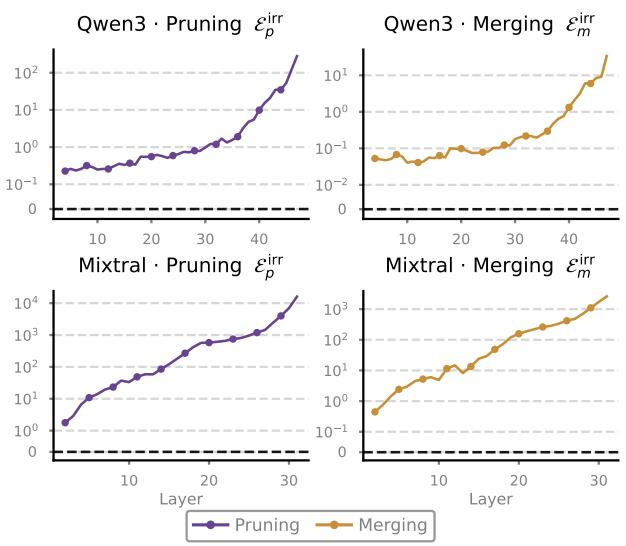
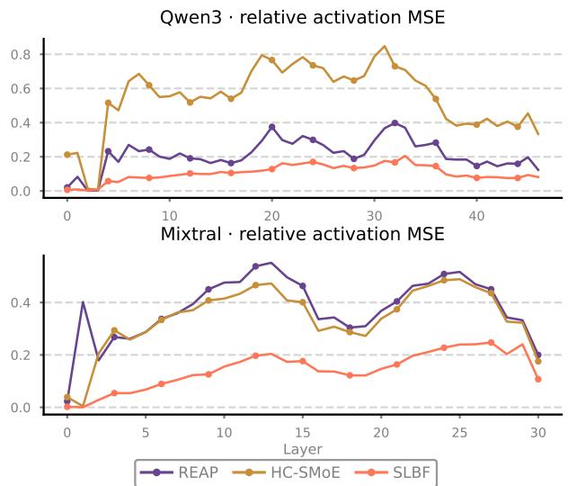
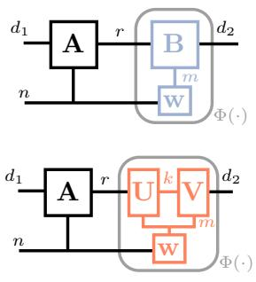
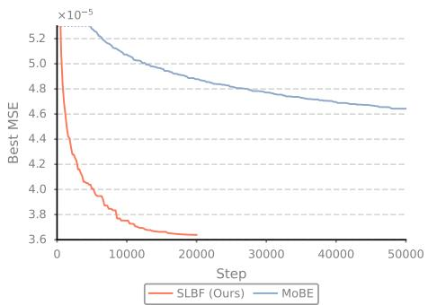
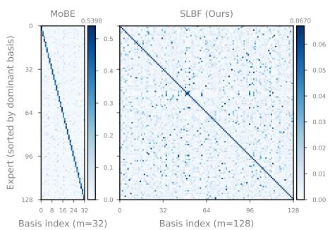
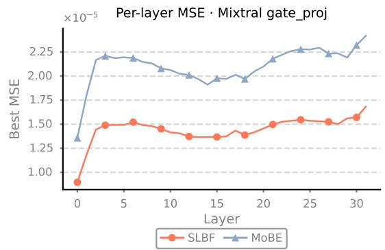
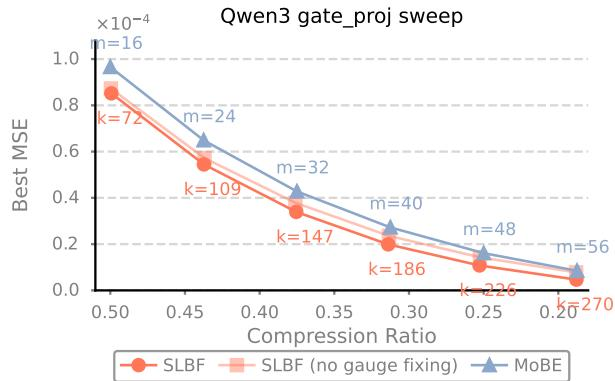
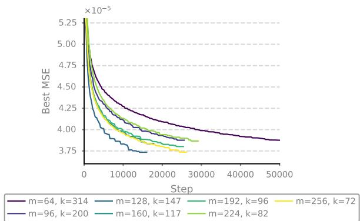

# Shared Low-rank Basis Factorization for Data-free Mixture-of-Experts Compression

Tianxiao Cao1\*, Jiahe Shao3, Yuning Qiu2, Kyohei Atarashi1, Hisashi Kashima1, Qibin Zhao2 1Kyoto University, 2RIKEN AIP, 3The University of Tokyo cao.tianxiao.65w@st.kyoto-u.ac.jp

## Abstract

Mixture-of-Experts (MoE) large language models decouple capacity from compute through sparse routing, but their large parameter count creates storage and serving challenges. We analyze three MoE compression families: expert pruning, expert merging, and weight reconstruction, and derive structural error bounds showing that pruning and merging can incur non-vanishing errors tied to routing and expert heterogeneity. In contrast, weight reconstruction avoids these structural costs by preserving expert structure and routing. Motivated by the analysis, we propose Shared Low-rank Basis Factorization (SLBF), a data-free weight reconstruction method that uses rank-k bases shared among experts, enabling richer crossexpert sharing, faster convergence, and lower reconstruction error. A post-hoc gauge fixing removes redundant parameters at no representational cost. Across five MoE architectures spanning 16B to 122B parameters, SLBF consistently outperforms methods from all three compression families.

## 1 Introduction

The Mixture-of-Experts (MoE) architecture (Jacobs et al., 1991; Shazeer et al., 2017) has become the dominant paradigm for scaling large language models, adopted by a rapidly growing family of production LLMs (Jiang et al., 2024; Liu et al., 2024a; Team, 2025; Google, 2026). By decoupling total capacity from compute through sparse routing, MoE enables models with hundreds of billions of parameters while maintaining efficient inference.

Sparse activation solves the compute problem but not the memory problem. Every expert must reside in accelerator memory regardless of how rarely it is activated: Qwen3-235B-A22B deploys 128 expert FFNs per layer yet routes each token to only 8, leaving over 93% of expert parameters idle per forward pass but occupying accelerator memory. At larger scales, the situation is acute: deploying DeepSeek-V3 (671B) requires distributing expert shards across dozens of GPUs, and the storage and transfer cost of expert weights dominates both the serving budget and the model distribution pipeline. To reduce their memory footprint while preserving the routing structure that enables sparse activation, compressing the expert parameters of MoE-based LLMs is therefore a practical and urgent problem.

Existing approaches to MoE compression intervene at one of three structural levels: expert pruning (Lasby et al., 2026); expert merging (Chen et al., 2025a); and weight reconstruction (Liu et al., 2025b; Chen et al., 2026). We derive structural error bounds for pruning and merging, and show that both can incur non-vanishing errors tied to routing and expert heterogeneity in modern MoE architectures where load balancing encourages broad expert utilization and expert specialization induces functional diversity. By preserving both expert structure and routing, weight reconstruction avoids these intervention-induced structural costs, while its remaining error arises from imperfect parameter reconstruction.

Within the weight reconstruction family, the state-of-the-art MoBE formulation (Chen et al., 2026) shows significant strengths by parameterizing expert weights as non-linear mixtures of shared full-rank bases. However, scaling these full-rank bases rapidly consumes the parameter budget, creating a bottleneck that limits the model’s representational capacity. To resolve this limitation, we propose Shared Low-rank Basis Factorization (SLBF), which replaces each full-rank basis with a rankk factorization $\{ \mathbf { U } _ { j } \mathbf { V } _ { j } \} _ { j = 1 } ^ { m }$ . The lower per-basis cost allows more bases under the same compression budget. This shift from a few full-rank bases to many low-rank bases enables faster convergence, a richer mixing structure where experts compose across multiple bases rather than concentrating on a single dominant one, and ultimately lower weight reconstruction error. A post-hoc gauge fixing eliminates $m k ^ { 2 }$ redundant parameters at no representational cost. SLBF is entirely data-free and requires no fine-tuning after compression. In summary, our main contributions are:

• We derive a unified structural cost analysis of three MoE compression families, with new error bounds for expert pruning and weight reconstruction, showing that weight reconstruction avoids the intervention-induced structural costs of pruning and merging.

• We propose the Shared Low-rank Basis Factorization with bilinear gauge fixing that enables richer cross-expert basis sharing under fixed compression budgets.

• We evaluate SLBF on five MoE architectures spanning 16B to 122B parameters against competing methods from all three families, demonstrating consistent improvements.

## 2 Related Work

MoE architecture. Originally proposed by Jacobs et al. (1991) and revived for deep learning by Shazeer et al. (2017), the sparse MoE design enables scaling of parameters without proportional increase in compute (Lepikhin et al., 2021; Fedus et al., 2022). Modern MoE-based LLMs adopt MoE FFNs (Jiang et al., 2024; Liu et al., 2024a; Team, 2025; Google, 2026) with refinements including load balancing (Wang et al., 2024), shared experts (Dai et al., 2024), and fine-grained granularity with hundreds of experts per layer (Team, 2025). These developments have made MoE a leading architecture for scaling LLM capacity.

Expert merging. Expert merging groups experts and combines the weights within each group into shared representatives, reducing the number of distinct expert parameter sets. Li et al. (2024b) groups experts by router-logit similarity and merges via frequency-weighted averaging; Chen et al. (2025a) improves clustering quality through hierarchical agglomerative clustering on expert output vectors; Jha et al. (2026) improves grouping quality by using activation-based saliency scores.

Expert pruning. Expert pruning reduces MoE model size by removing entire experts based on a saliency criterion. Early work required taskspecific fine-tuning (Chen et al., 2022), while subsequent methods operate in retraining-free settings using criteria such as router frequency, reconstruction loss minimization (Lu et al., 2024), gradient-free search (Liu et al., 2024b), continuous relaxation of the pruning decision (Bai et al., 2025), and expert activation norms (Jaiswal et al., 2025). REAP (Lasby et al., 2026) combines router values with activation norms into the pruning criterion.

Weight reconstruction. Weight reconstruction compresses expert weight matrices while preserving all experts and routing. MoLAE (Liu et al., 2025b) applies SVD to represent each expert through a shared latent matrix; $\mathbf { D } ^ { 2 } \mathbf { - M o E }$ (Gu et al., 2025) decomposes weights into shared and delta components; MoBE (Chen et al., 2026) reparameterizes each expert’s right factor as a nonlinear mixture of shared basis matrices.

Other compression techniques. Beyond the above three families, quantization (Duanmu et al., 2025; Chen et al., 2025b) and weight pruning (Xie et al., 2024) have also been adapted to MoE compression. Complementary post-pruning techniques, such as converting pruned experts into bias vectors (Zong et al., 2026) or replacing them with sub-networks (Zhang et al., 2026), can further compensate for compression loss. These approaches operate along a different axis from the interventions considered here and are outside the scope of our structural analysis.

## 3 Structural Motivation

MoE setup. We focus on sparse Mixture-of-Experts (MoE) models. Each feed-forward network (FFN) in the Transformer is treated as one expert. Modern MoE-based LLMs (Jiang et al., 2024; Liu et al., 2024a; Team, 2025; Google, 2026) typically implement each expert as a SwiGLU-style FFN. A sparse MoE layer consists of a set of n experts $\{ f ^ { i } ( \cdot ) \} _ { i = 1 } ^ { n }$ and a router. Specifically, the i-th expert is formulated as:

$$
f ^ { i } ( \mathbf { x } ) = \left( \mathrm { S i L U } ( \mathbf { x W } _ { \mathrm { g a t e } } ^ { i } ) \odot ( \mathbf { x W } _ { \mathrm { u p } } ^ { i } ) \right) \mathbf { W } _ { \mathrm { d o w n } } ^ { i } ,\tag{3.1}
$$

where $\textbf { x } \in \mathbb { R } ^ { d }$ is the input hidden state; $\mathbf { W } _ { \mathrm { g a t e } } ^ { i } ,$ $\mathbf { W } _ { \mathbf { u p } } ^ { i } ~ \in ~ \mathbb { R } ^ { d \times d _ { \mathrm { f f } } }$ , and $\mathbf { W } _ { \mathrm { d o w n } } ^ { i } ~ \in ~ \mathbb { R } ^ { d _ { \mathrm { f f } } \times d }$ are the weight matrices. The router assigns hidden states to experts by applying a Top-K selection over a linear projection of the hidden states, followed by a Softmax normalization. This router mechanism can be formulated as:

  
(a) Pair-level structural costs.

  
(b) Realized per-layer compression error  
Figure 1: (a) Pair-level structural costs $\bar { \mathcal { E } } _ { p } ^ { \mathrm { i r r } }$ (pruning, left column) and $\bar { \mathcal { E } } _ { m } ^ { \mathrm { i r r } }$ (merging, right column) per MoE layer on the uncompressed model, averaged over expert pairs activated on the calibration set. (b) Realized per-layer compression error $\| \delta \mathbf { h } _ { \ell } \| ^ { 2 } / \| \mathbf { h } _ { \ell } ^ { \mathrm { o r i g } } \| ^ { 2 }$ at 25% MoE compression for REAP (pruning), HC-SMoE (merging), and SLBF (weight reconstruction). Top: Qwen3 $( n = 1 2 8 , \mathrm { t o p } { - } 8 )$ . Bottom: Mixtra $( n = 8 , \mathrm { t o p } { - 2 } )$

$$
\begin{array} { c } { \displaystyle \mathbf { g } = \mathrm { S o f t m a x } ( \mathbf { x } \mathbf { W } _ { g } ) , } \\ { \mathcal { P } ( \mathbf { x } ) = \mathrm { a r g T o p K } ( \mathbf { g } , K ) , } \\ { \displaystyle \mathbf { h } ( \mathbf { x } ) = \sum _ { i \in \mathcal { P } } g _ { i } f ^ { i } ( \mathbf { x } ) , } \end{array}\tag{3.2}
$$

where $\mathbf { W } _ { g } \in \mathbb { R } ^ { d \times n }$ parameterizes the linear projection of the router.

## 3.1 Three interventions, three structural costs

Setup. We analyze the structural cost of each family (pruning, merging, and weight reconstruction, as introduced in Section 2) in the simplified setting of compressing a pair of experts $( f ^ { i } , f ^ { j } )$ with respective routing $g _ { i } ( \mathbf { x } ) , g _ { j } ( \mathbf { x } )$ , adopting the pairwise analysis framework of Lasby et al. (2026). Each compression family modifies the expert pair in a distinct way, giving rise to a different source of compression error. We summarize the three interventions below; detailed derivations are provided in Appendix A.1. We call the minimum residual under each specified pairwise intervention its irreducible structural cost, denoting those of pruning and merging by $\mathcal { E } _ { p } ^ { \mathrm { i r r } }$ and $\mathcal { E } _ { m } ^ { \mathrm { i r r } }$ , respectively.

Merging (following Lasby et al. (2026)). The pair contribution $g _ { i } ( { \bf x } ) f ^ { i } ( { \bf x } ) + g _ { j } ( { \bf x } ) f ^ { j } ( { \bf x } )$ admits the decomposition $( g _ { i } + g _ { j } ) \big ( r ( \mathbf { x } ) f ^ { i } + ( 1$ $r ( \mathbf { x } ) ) f ^ { j } )$ , where $r ( \mathbf { x } ) : = { g _ { i } } / ( { g _ { i } } + { g _ { j } } ) \in [ 0 , 1 ]$ is the input-dependent mixing ratio. Merging replaces $( f ^ { i } , f ^ { j } )$ with a single representative $\tilde { f } ^ { i j }$ and replaces their separate routing weights with the summed routing $( g _ { i } + g _ { j } )$ . Even with the optimal static mixing coefficient $\alpha ^ { \star }$ , a residual error remains because the input-dependent $r ( \mathbf { x } )$ is replaced by a static mixture. Under a weak-correlation approximation of the three multiplicative factors, this structural cost is

$$
\begin{array} { r } { \mathcal { E } _ { m } ^ { \mathrm { i r r } } \approx \mathbb { E } _ { \mathbf { x } } \big [ ( g _ { i } + g _ { j } ) ^ { 2 } \big ] \cdot \mathrm { V a r } \big [ r ( \mathbf { x } ) \big ] \cdot \mathbb { E } _ { \mathbf { x } } \| \Delta _ { i j } \| ^ { 2 } , } \end{array}
$$

where $\Delta _ { i j } ( { \bf x } ) : = f ^ { i } ( { \bf x } ) - f ^ { j } ( { \bf x } )$

(3.3)

Remark. Under this approximation, the merging cost grows with the expert functional gap $\| \Delta _ { i j } \| ^ { 2 }$ router variability Var[r], and pair routing mass $( g _ { i } + g _ { j } ) ^ { 2 }$ . It vanishes when routing is static on the pair $( \mathrm { V a r } [ r ] = 0 )$ or the experts are functionally identical $( \Delta _ { i j } = 0 )$

Pruning. We derive a novel bound for the pairwise pruning intervention. This intervention removes one expert from the pair $( f ^ { i } , f ^ { j } )$ . Without loss of generality, suppose expert j is removed and its contribution is compensated solely by the surviving expert i through a modified router $g _ { i } ^ { \prime } ( \cdot )$ Even with the oracle routing function $g _ { i } ^ { \star }$ which minimizes the output loss after pruning expert $j ,$ , we show that expert pruning exhibits an error of

$$
\mathcal { E } _ { p } ^ { \mathrm { i r r } } = \mathbb { E } _ { \mathbf { x } } \left[ g _ { j } ^ { 2 } \left( \Vert f _ { j } \Vert ^ { 2 } - \frac { \vert \langle f _ { j } , f _ { i } \rangle \vert ^ { 2 } } { \Vert f _ { i } \Vert ^ { 2 } } \right) \right] .\tag{3.4}
$$

Remark. The cost is positive when, on a non-trivial subset of inputs, expert-j is active $( g _ { j } > 0 )$ and its output is not parallel to the substitute’s $( f _ { j } \parallel f f _ { i } )$

Weight Reconstruction. Unlike pruning and merging, weight reconstruction preserves both expert identities and routing, and instead compresses each expert weight tensor $\mathbf { W } _ { k }$ through a reducedparameter representation $\hat { \mathbf { W } } _ { k }$ . For simplified linear experts $f ^ { k } ( { \bf x } ) = { \bf x } { \bf W } ^ { k }$ , the resulting output error is bounded directly by the router-weighted reconstruction residual:

$$
\mathcal { E } _ { w } \leq \sum _ { k = 1 } ^ { n } \mathbb { E } _ { \mathbf { x } } \left[ g _ { k } \| \mathbf { x } \| ^ { 2 } \right] \| \mathbf { W } ^ { k } - \hat { \mathbf { W } } ^ { k } \| _ { F } ^ { 2 } .\tag{3.5}
$$

An analogous bound holds for SwiGLU FFN experts (Appendix A.1), with a prefactor determined by the original weight norms and the Lipschitz constant of the activation.

Remark. In contrast to the preceding interventions, this bound contains no additional structural term induced by removing experts or tying their routing. The error is instead controlled by the quality of parameter reconstruction.

Regime in modern MoE-based LLMs. The structural terms in Equations (3.3) and (3.4) are particularly relevant when routing is inputdependent and experts are functionally heterogeneous. Modern MoEs encourage broad expert utilization through load-balancing mechanisms (Lepikhin et al., 2021; Wang et al., 2024), while prior studies report substantial functional specialization among trained experts (Li et al., 2025; Lasby et al., 2026). These properties suggest that the structural costs identified by the pairwise analysis need not be negligible in pretrained MoEs. We examine this empirically.

## 3.2 Empirical evidence for three interventions

Next, we connect our derivations to empirical observations on two MoE-based LLMs: Qwen3-30B-A3B-Instruct-2507 (n = 128, top-8; high granularity) and Mixtral-8x7B-v0.1 (n = 8, top-2; low granularity). We collect activations from 128 sequences × 2048 tokens from the C4 corpus (Raffel et al., 2020).

Structural costs are empirically non-trivial. We first verify that the structural costs in Equations (3.3) and (3.4) are non-trivial in pretrained MoEs. Figure 1a reports $\bar { \mathcal { E } } _ { p } ^ { \mathrm { i r r } }$ and $\bar { \mathcal { E } } _ { m } ^ { \mathrm { i r r } }$ per MoE layer on the original models. We observe that (i)

both quantities are strictly above zero across every MoE layer in both architectures, showing that the structural terms are non-vacuous for these models; (ii) both grow ${ \sim } 3 { - } 4$ orders of magnitude with depth, consistent with expert specialization concentrating in deep layers (Lasby et al., 2026; Bandarkar et al., 2026) — precisely where compression incurs the highest cost; (iii) within each model the two quantities trace similar shapes across layers, suggesting that both quantities are shaped by common layerwise changes in routing and expert geometry.

Activations drift in compressed models. We examine whether the distinctions highlighted by the structural analysis are reflected in realized compression error. To address this, we apply one representative method per family at 25% MoE compression: REAP (Lasby et al., 2026) for pruning, HC-SMoE (Chen et al., 2025a) for merging, and SLBF (Section 4) for weight reconstruction. For each compressed model, we measure the per-layer relative MoE-block output discrepancy $\| \delta \mathbf { h } _ { \ell } \| ^ { 2 } / \| \mathbf { h } _ { \ell } ^ { \mathrm { o r i g } } \| ^ { 2 }$ . Figure 1b reports the results. SLBF achieves the lowest discrepancy across all layers on both architectures, consistent with its preservation of expert identities and routing. The relative ordering of REAP and HC-SMoE changes with expert granularity. On Qwen3, HC-SMoE exhibits larger drift, consistent with the difficulty of tying many distinct experts to shared representatives, consistent with prior observations (Lasby et al., 2026); on Mixtral, REAP exhibits larger drift, where the smaller co-active expert set offers fewer substitutes for a removed expert. SLBF remains below both across the two regimes.

## 4 Method

The structural analysis in Section 3.1 shows that weight reconstruction avoids the interventioninduced structural costs of pruning and merging by preserving expert identities and routing, leaving its compression error controlled by parameter reconstruction quality. This makes parameterization efficiency central to effective weight reconstruction. We therefore address a bottleneck in the state-of-the-art mixture-of-basis-expert formulation (MoBE) (Chen et al., 2026).

MoBE representation. MoBE operates on the projection weights $\mathbf { W } ^ { i } \in \{ \mathbf { W } _ { \mathrm { g a t e } } ^ { i } , \hat { \mathbf { W } } _ { \mathrm { u p } } ^ { i } \} .$ MoBE approximates each expert weight as

  
(a) Tensor diagrams.

  
(b) Convergence Profile.

  
(c) Mixing weight heatmaps.  
Figure 2: SLBF vs. MoBE on an MoE layer. (a) Tensor diagrams of the MoBE (blue, top) and SLBF (orange, bottom) parameterizations; nodes are tensors, edges are indices, and shared edges denote contraction. (b) Reconstruction loss during training on Qwen3-30B-A3B, layer 7, gate: SLBF reaches MoBE’s loss in ${ \sim } 2 \mathrm { k }$ iterations and improves by $> 2 0 \%$ by 20k iterations, despite running for fewer steps. (c) Mixing weight $w _ { i j }$ heatmaps under the same compression budget: $\mathrm { S L B F } \mathbf { \vec { s } }$ lower per-basis cost permits $m = n ,$ revealing rich cross-expert sharing, while MoBE is restricted to $m < n$ and concentrates each expert on a single dominant basis.

$$
\hat { \mathbf { W } } _ { \mathrm { M o B E } } ^ { i } = \mathbf { A } ^ { i } \Phi \left( \sum _ { j = 1 } ^ { m } w _ { i j } \mathbf { B } _ { j } \right) ,\tag{4.1}
$$

where $\{ \mathbf { B } _ { j } \} _ { j = 1 } ^ { m } \subset \mathbb { R } ^ { r \times d _ { 2 } }$ is a shared basis set, $w _ { i j } \in \mathbb { R }$ is a per-expert mixing coefficient, $\mathbf { A } ^ { i } \in$ $\mathbb { R } ^ { \dot { d } _ { 1 } \times r }$ is a per-expert linear adapter, and Φ is a non-linearity to enhance the representational power. The parameter cost per basis is $r \cdot d _ { 2 }$ , restricting m to be small under tight compression budgets. MoBE converts trained MoE-based LLM simply through minimizing weight reconstruction loss:

$$
\begin{array} { c } { \displaystyle \operatorname* { m i n } _ { \mathbf { w } , \{ \mathbf { A } ^ { i } \} _ { i = 1 } ^ { n } , \{ \mathbf { B } _ { j } \} _ { j = 1 } ^ { m } } \sum _ { i = 1 } ^ { n } \| \mathbf { W } ^ { i } - \hat { \mathbf { W } } ^ { i } \| _ { F } ^ { 2 } } \\ { = \displaystyle \sum _ { i = 1 } ^ { n } \left\| \mathbf { W } ^ { i } - \mathbf { A } ^ { i } f \left( \sum _ { j = 1 } ^ { m } w _ { i j } \mathbf { B } _ { j } \right) \right\| _ { F } ^ { 2 } . } \end{array}\tag{4.2}
$$

## 4.1 Improved Weight Reconstruction with Shared Low-rank Basis Factorization

We propose Shared Low-rank Basis Factorization (SLBF), which replaces each full basis $\mathbf { B } _ { j }$ with a rank-k factorization $\mathbf { U } _ { j } \mathbf { V } _ { j }$ , where $\mathbf { U } _ { j } \in \mathbb { R } ^ { r \times k }$ and $\mathbf { V } _ { j } \in \mathbb { R } ^ { k \times d _ { 2 } }$

$$
\hat { \mathbf { W } } ^ { i } = \mathbf { A } ^ { i } \Phi \left( \sum _ { j = 1 } ^ { m } w _ { i j } \mathbf { U } _ { j } \mathbf { V } _ { j } \right) ,\tag{4.3}
$$

where $\{ \mathbf { U } _ { j } \mathbf { V } _ { j } \} _ { j = 1 } ^ { m }$ are m shared low-rank bases for reconstructing the right vectors of $\mathbf { W } ^ { i }$ , and $\mathbf { U } _ { j } \in \mathbb { R } ^ { r \times k } , \mathbf { V } _ { j } \in \mathbb { R } ^ { k \times d _ { 2 } }$ . Under a fixed compression budget, this factorization affords substantially more bases. Figure 2a shows the tensor diagram of the proposed factorization. We discuss the structural and empirical implications of this trade-off.

Low-rank mixtures are high-rank. Each individual basis $\mathbf { U } _ { j } \mathbf { V } _ { j }$ has rank at most k. The preactivation mixture $\begin{array} { r } { \sum _ { j = 1 } ^ { m } w _ { i j } { \bf U } _ { j } { \bf V } _ { j } } \end{array}$ generically attains rank min $( m k , r , d _ { 2 } )$ , matching MoBE’s perbasis rank when mk ≥ r. SLBF thus trades few-rich bases for many-simple bases composed through the mixture, with Φ providing further nonlinear composition.

Empirical benefit of richer mixing. Empirically, SLBF exploits this freedom by distributing reconstruction across multiple bases per expert, whereas MoBE tends to concentrate each expert on one dominant basis (Figure 2c). SLBF also converges faster and reaches lower reconstruction MSE under fixed budget (Figure 2b). On Mixtral-8x7B, this advantage holds uniformly: SLBF achieves lower reconstruction MSE across all 32 MoE layers under matched budget (Figure 3).

Connections to block-term decomposition. In tensor decomposition terms, the pre-activation mixture $\begin{array} { r } { \sum _ { j = 1 } ^ { m } w _ { i j } \mathbf { U } _ { j } \mathbf { V } _ { j } } \end{array}$ corresponds to the i-th matrix in a rank- $( k , k , 1 )$ block-term decomposition (BTD) (De Lathauwer, 2008) across experts. SLBF thus generalizes MoBE in its basis structure: MoBE’s mixture $\sum _ { j } w _ { i j } \mathbf { B } _ { j }$ is the Tucker-1 case recovered at $k = r$ , and the rank-k restriction enables the favorable parameter trade-off. BTD has been applied effectively in model compression (Ye et al., 2018; Ma et al., 2019) and signal processing (Giampouras et al., 2022; Min et al., 2026), motivating its use in our formulation.

  
Figure 3: Per-layer MSE on Mixtral-8x7B gate. SLBF achieves uniformly lower weight reconstruction error across all layers under a matched compression.

Training. We fit SLBF by minimizing the weightspace reconstruction loss $\begin{array} { r } { \sum _ { i } \| \mathbf { W } ^ { i } - \hat { \mathbf { W } } ^ { i } \| _ { F } ^ { 2 } } \end{array}$ independently for each MoE layer. This objective directly reduces the parameter reconstruction residual appearing in Equation (3.5) while requiring no calibration data. The objective is non-convex and solved with AdamW (Loshchilov and Hutter, 2019). For stability, we use techniques including matrixsign initialization (details in Section 5.1 and Appendix A.2).

## 4.2 Parameter Reduction via Bilinear Symmetry Gauge Fixing

The bilinear product UV exhibits a known gauge symmetry (Zhao et al., 2025; Lu et al., 2026): for any invertible $\mathbf { Q } \in \operatorname { G L } ( k )$ , the factorization $( \mathbf { U } \mathbf { Q } ) ( \mathbf { Q } ^ { - 1 } \mathbf { V } ) = \mathbf { U } \mathbf { V }$ is invariant. This leaves $k ^ { 2 }$ parameters redundant in each basis, which we eliminate by fixing the gauge. Specifically, we can write the basis as:

$$
\mathbf { U V } = \left[ \mathbf { U } _ { a } \right] \mathbf { V } = \left[ \mathbf { U } _ { a } \mathbf { V } \right] = \left[ \mathbf { \pi } _ { b } \mathbf { U } _ { a } \right] \mathbf { U } _ { a } \mathbf { V } ,\tag{4.4}
$$

where $\mathbf { U } _ { a } \in \mathbb { R } ^ { k \times k }$ is an invertible matrix. ${ \bf A } { \bf s } -$ suming that $\textbf { U } \in \mathbb { R } ^ { r \times k }$ has full column rank, such an invertible $k \times k$ row submatrix always exists. This condition held for all trained factors in our experiments. Therefore, re-parameterizing $\hat { \mathbf { U } } \gets [ I _ { k } ; \mathbf { U } _ { b } \mathbf { U } _ { a } ^ { - 1 } ]$ and $\hat { \mathbf { V } }  \mathbf { U } _ { a } \mathbf { V }$ preserves the product while the fixed identity block in Uˆ removes $k ^ { 2 }$ parameters per basis. We select the rows forming ${ \mathbf { U } } _ { a }$ via column-pivoted QR on $\mathbf { U } ^ { \top }$ for numerical stability.

Parameter count. We summarize the parameter count of one projection in an MoE layer in Table 1 for MoBE and the proposed SLBF. The per-expert $\mathbf { A } ^ { i } \in \mathbb { R } ^ { d _ { 1 } \times r }$ contributes nd r parameters, identical across MoBE and SLBF. The shared-basis cost differs: $m r d _ { 2 }$ in MoBE versus $m k ( r + d _ { 2 } )$ in SLBF, a ratio of $k ( r + d _ { 2 } ) / ( r d _ { 2 } )$ . For $r \ \leq \ d _ { 2 } .$ , SLBF affords proportionally more bases under a fixed compression budget. The gauge-fixing scheme of Section 4.2 further removes $m k ^ { 2 }$ parameters from $\hat { \mathbf { U } } _ { j }$ at no representational cost (ablated in Appendix B.1, Figure 4).

<table><tr><td>Method</td><td># Parameters</td></tr><tr><td>Standard</td><td> $n d _ { 1 } d _ { 2 }$ </td></tr><tr><td>Pruning/Merging</td><td> $n ^ { \prime } d _ { 1 } d _ { 2 }$ </td></tr><tr><td>MoBE</td><td> $n d _ { 1 } r + m r d _ { 2 } + n m$ </td></tr><tr><td>SLBF</td><td> $n d _ { 1 } r + m k ( r + d _ { 2 } - k ) + n m$ </td></tr></table>

Table 1: Parameter counts per projection weight.

## 5 Experiments

In this section, we conduct comprehensive experiments on five state-of-the-art MoE-based LLMs, spanning 16B to 122B parameters and diverse architectures, and compare SLBF against representative baselines.

## 5.1 Setup

Models. We evaluate SLBF on five MoE LLMs spanning a range of architectures, granularities, and scales: Moonlight-16B-A3B-Instruct (Liu et al., 2025a), Qwen3-30B-A3B-Instruct-2507 (Team, 2025), Gemma4-26B-A4B-it (Google, 2026), Mixtral-8x7B-v0.1 (base) (Jiang et al., 2024), Qwen3.5-122B-A10B (Qwen Team, 2026). Compression ratios (Ratio) refer to parameter reduction with respect to the total model.

Baselines. We compare against representative methods from all three families. Pruning: Frequency, REAP (Lasby et al., 2026), and EAN (Jaiswal et al., 2025), each using a different expert-saliency criterion. Merging: MC-SMoE (Li et al., 2024b), HC-SMoE (Chen et al., 2025a), and REAM (Jha et al., 2026). Weight reconstruction: MoLAE (Liu et al., 2025b), and MoBE (Chen et al., 2026). Others: Sub-MoE (Li et al., 2026), TD-MoE (XU et al., 2026). MoLAE, MoBE, and SLBF are data-free, while the remaining baselines use calibration data. For all calibration-based baselines, we use 1024 C4 sequences of 2048 tokens.

Evaluation benchmarks. We evaluate on a comprehensive set of benchmark datasets. For the modern instruction-tuned MoE LLMs (Section 5.2), we report nine standard benchmarks grouped as reasoning: ARC-Challenge (Clark et al., 2018), GPQA-Diamond (Rein et al., 2024), IFEval (Zhou et al., 2023); knowledge: MMLU (Hendrycks et al., 2021), CEval (Huang et al., 2023), CMMLU (Li et al., 2024a); and math/coding: GSM8K (Cobbe et al., 2021), MBPP (Austin et al., 2021), HumanEval (Chen et al., 2021). For Mixtral-8x7B, following prior Mixtral compression work, we report perplexity on WikiText-2 and zero-shot accuracy on ARC-Challenge, ARC-Easy (Clark et al., 2018), HellaSwag (Zellers et al., 2019), Open-BookQA (Mihaylov et al., 2018), RTE (Bentivogli et al., 2009), WinoGrande (Sakaguchi et al., 2021), and PIQA (Bisk et al., 2020). Using each model’s conventional suite preserves direct comparability with prior compression work. Evaluations are conducted using lm-evaluation-harness (Gao et al., 2024). Original and compressed checkpoints are evaluated with identical task definitions and decoding configurations. Full evaluation details, including exact task IDs, prompting settings, and decoding settings, are provided in Appendix C.1.

<table><tr><td rowspan="2">Method</td><td rowspan="2">Ratio</td><td colspan="3">Reasoning (↑) ARC-C GPQA-D IFEval</td><td colspan="3">Knowledge (↑)</td><td colspan="3">Math/Coding (↑)</td><td rowspan="2">Avg.(↑)</td></tr><tr><td></td><td></td><td></td><td>MMLU CEva CMMLU</td><td></td><td></td><td>GSM8K MBPP 1</td><td></td><td>HEval</td></tr><tr><td colspan="2">Qwen3-30B-A3B-2507</td><td>95.0</td><td>58.6</td><td>82.8</td><td>87.5</td><td>86.3</td><td>84.4</td><td>95.9</td><td>79.6</td><td>93.9</td><td>84.9</td></tr><tr><td>REAP</td><td>24%</td><td>88.4</td><td>36.4</td><td>80.6</td><td>75.7</td><td>65.7</td><td>60.9</td><td>95.5</td><td>67.4</td><td>82.3</td><td>72.5</td></tr><tr><td>HC-SMoE</td><td>24%</td><td>93.9</td><td>52.5</td><td>81.9</td><td>84.1</td><td>69.3</td><td>67.5</td><td>94.7</td><td>44.0</td><td>79.9</td><td>74.2</td></tr><tr><td>REAM</td><td>24%</td><td>89.9</td><td>39.9</td><td>81.2</td><td>78.5</td><td>65.7</td><td>58.8</td><td>94.7</td><td>66.8</td><td>86.6</td><td>73.6</td></tr><tr><td>MoLAE</td><td>24%</td><td>91.3</td><td>46.5</td><td>77.1</td><td>84.3</td><td>73.8</td><td>73.3</td><td>89.3</td><td>64.6</td><td>84.2</td><td>76.0</td></tr><tr><td>MoBE</td><td>24%</td><td>94.0</td><td>54.6</td><td>82.4</td><td>85.5</td><td>82.8</td><td>81.6</td><td>95.2</td><td>77.4</td><td>91.5</td><td>82.8</td></tr><tr><td>SLBF</td><td>24%</td><td>93.9</td><td>60.1</td><td>82.6</td><td>85.9</td><td>85.1</td><td>82.2</td><td>95.6</td><td>78.6</td><td>95.1</td><td>84.3</td></tr><tr><td>MoLAE</td><td>32%</td><td>84.5</td><td>34.3</td><td>69.3</td><td>75.8</td><td>66.3</td><td>66.4</td><td>80.0</td><td>51.0</td><td>67.7</td><td>66.1</td></tr><tr><td>MoBE</td><td>32%</td><td>91.6</td><td>46.5</td><td>79.9</td><td>82.3</td><td>77.1</td><td>76.2</td><td>92.9</td><td>69.6</td><td>89.0</td><td>78.3</td></tr><tr><td>SLBF</td><td>36%</td><td>93.0</td><td>57.6</td><td>83.9</td><td>85.5</td><td>80.5</td><td>79.9</td><td>94.7</td><td>76.2</td><td>90.9</td><td>82.4</td></tr><tr><td colspan="2">Moonlight-16B-A3B</td><td>83.6</td><td>31.8</td><td>43.4</td><td>71.7</td><td>71.4</td><td>73.4</td><td>74.8</td><td>57.4</td><td>71.3</td><td>64.3</td></tr><tr><td>MoLAE</td><td>15%</td><td>65.1</td><td>18.2</td><td>20.9</td><td>48.9</td><td>50.7</td><td>52.6</td><td>16.1</td><td>10.8</td><td>0.0</td><td>31.5</td></tr><tr><td>MoBE</td><td>15%</td><td>79.1</td><td>23.7</td><td>35.5</td><td>61.6</td><td>65.2</td><td>66.8</td><td>52.2</td><td>46.0</td><td>59.8</td><td>54.4</td></tr><tr><td>SLBF</td><td>15%</td><td>80.8</td><td>28.8</td><td>40.7</td><td>69.2</td><td>69.0</td><td>71.9</td><td>71.7</td><td>59.6</td><td>70.7</td><td>62.5</td></tr><tr><td colspan="2">Gemma4-26B-A4B-it</td><td>94.1</td><td>65.7</td><td>90.4</td><td>89.3</td><td>69.3</td><td>73.1</td><td>94.7</td><td>91.2</td><td>98.2</td><td>85.1</td></tr><tr><td>MoLAE</td><td>37%</td><td>74.2</td><td>29.8</td><td>71.2</td><td>67.0</td><td>27.7</td><td>51.0</td><td>70.7</td><td>7.8</td><td>33.5</td><td>48.1</td></tr><tr><td>MoBE</td><td>37%</td><td>91.8</td><td>46.0</td><td>85.6</td><td>82.1</td><td>28.1</td><td>63.4</td><td>88.5</td><td>35.2</td><td>86.6</td><td>67.5</td></tr><tr><td>SLBF</td><td>37%</td><td>92.9</td><td>61.6</td><td>89.3</td><td>87.8</td><td>63.6</td><td>68.6</td><td>93.6</td><td>84.6</td><td>93.9</td><td>81.8</td></tr><tr><td colspan="2">Qwen3.5-122B-A10B</td><td>96.1</td><td>83.3</td><td>93.0</td><td>88.7</td><td>86.7</td><td>86.2</td><td>97.4</td><td>53.0</td><td>92.1</td><td>86.3</td></tr><tr><td>MoLAE</td><td>34%</td><td>93.3</td><td>43.4</td><td>70.4</td><td>79.5</td><td>78.6</td><td>79.4</td><td>91.3</td><td>38.8</td><td>76.2</td><td>72.3</td></tr><tr><td>MoBE</td><td>34%</td><td>96.2</td><td>67.7</td><td>87.8</td><td>87.7</td><td>84.0</td><td>84.4</td><td>97.0</td><td>47.0</td><td>93.3</td><td>82.8</td></tr><tr><td>SLBF</td><td>34%</td><td>96.3</td><td>83.8</td><td>93.7</td><td>89.6</td><td>87.4</td><td>86.9</td><td>97.4</td><td>61.8</td><td>94.5</td><td>88.0</td></tr></table>

Table 2: Multi-architecture compression results. We report nine benchmarks grouped into reasoning, knowledge, and math/coding for four instruction-tuned MoE LLMs at varying compression ratios. All methods are applied one-shot without fine-tuning. Ratio denotes total parameter reduction. Best results per model and ratio are bolded.

SLBF configuration. We use $m \ = \ n$ shared bases throughout, matching the number of bases to the number of experts and yielding an n × n expertto-basis mixing structure (Figure 2c). We set r = $d _ { 1 }$ following Chen et al. (2026), so no low-rank bottleneck is introduced in $\mathbf { A } ^ { i } \mathbf { \partial }$ ; the per-basis rank k is chosen to match the target compression ratio. We use the SiLU activation (Elfwing et al., 2018) for Φ. We optimize with AdamW (Loshchilov and Hutter, 2019). Because of the multiplicative lowrank parameterization, we use separate learningrate groups for {A, w} and {U, V}, together with matrix-sign initialization. Details and remaining hyper-parameters can be found in Appendix A.2.

## 5.2 Multi-architecture Results

We evaluate SLBF on Qwen3-30B-A3B-Instruct-2507, Qwen3.5-122B-A10B, Moonlight-16B-A3B, and Gemma4-26B-A4B-it. Baselines are the strongest representative from each compression family evaluated at this scale: REAP (pruning), HC-SMoE (merging), REAM (merging), MoLAE (weight reconstruction), and MoBE (weight reconstruction). All results are obtained in the one-shot setting with no fine-tuning after compression.

<table><tr><td>Method</td><td colspan="10">Ratio |WT (↓)| ARC-C ARC-E HellaSwag OPQA RTE Winogrande PIQA |Avg.(↑)</td></tr><tr><td>Mixtral-8x7B-v0.1</td><td></td><td>5.64</td><td>59.7</td><td>82.7</td><td>84.2</td><td>49.4</td><td>71.1</td><td>77.3</td><td>83.2</td><td>72.5</td></tr><tr><td>Frequency</td><td>24%</td><td>9.10</td><td>44.8</td><td>70.3</td><td>66.6</td><td>30.2</td><td>58.5</td><td>56.8</td><td>77.6</td><td>57.8</td></tr><tr><td>MC-SMoE</td><td>24%</td><td>48.42</td><td>29.4</td><td>52.0</td><td>49.4</td><td>30.6</td><td>52.7</td><td>54.1</td><td>66.2</td><td>47.8</td></tr><tr><td>HC-SMoE</td><td>24%</td><td>8.54</td><td>53.2</td><td>78.1</td><td>81.3</td><td>46.2</td><td>67.9</td><td>75.2</td><td>81.7</td><td>69.1</td></tr><tr><td>EAN</td><td>24%</td><td>8.28</td><td>54.5</td><td>80.6</td><td>81.9</td><td>45.4</td><td>69.7</td><td>75.9</td><td>83.1</td><td>70.2</td></tr><tr><td>REAP</td><td>24%</td><td>8.30</td><td>53.9</td><td>79.5</td><td>81.8</td><td>46.8</td><td>67.2</td><td>77.1</td><td>82.5</td><td>69.8</td></tr><tr><td>Sub-MoE</td><td>24%</td><td>17.51</td><td>43.0</td><td>66.5</td><td>68.0</td><td>35.8</td><td>53.1</td><td>68.0</td><td>74.0</td><td>58.3</td></tr><tr><td>TD-MoE</td><td>24%</td><td>16.68</td><td>42.5</td><td>69.3</td><td>66.7</td><td>40.4</td><td>55.6</td><td>69.4</td><td>74.8</td><td>59.8</td></tr><tr><td>SLBF</td><td>24%</td><td>6.92</td><td>56.7</td><td>80.6</td><td>83.5</td><td>50.4</td><td>63.9</td><td>76.4</td><td>83.0</td><td>70.7</td></tr><tr><td>MoLAE</td><td>30%</td><td>11.17</td><td>51.6</td><td>76.6</td><td>77.9</td><td>46.0</td><td>58.1</td><td>75.4</td><td>80.8</td><td>66.6</td></tr><tr><td>MoBE</td><td>30%</td><td>8.59</td><td>54.0</td><td>79.8</td><td>80.8</td><td>49.4</td><td>62.1</td><td>75.6</td><td>82.3</td><td>69.1</td></tr><tr><td>SLBF</td><td>30%</td><td>7.78</td><td>55.8</td><td>80.1</td><td>82.1</td><td>48.6</td><td>67.5</td><td>76.7</td><td>83.1</td><td>70.6</td></tr></table>

Table 3: Compression comparison on Mixtral-8x7B-v0.1. We report WikiText-2 perplexity $( \mathrm { W T }$ (↓)) and zero-shot task accuracy. All methods are applied one-shot without fine-tuning. Best results per compression ratio are bolded.

Performance across models and compression ratios. Table 2 shows that SLBF consistently outperforms baselines across four architectures and varying compression ratios. At 24% compression, SLBF preserves near-original accuracy on Qwen3- 30B while the strongest baseline MoBE drops 2.1 points and pruning/merging baselines drop over 8 points. The advantage widens at higher compression and on other architectures, reaching a 14.3- point gap over MoBE on Gemma4-26B and a 5.2- point gap on Qwen3.5-122B, where SLBF maintains performance comparable to the original model under the same evaluation configuration. Notably, SLBF at 36% compression on Qwen3-30B still outperforms MoBE at the easier 32% ratio.

Performance on Moonlight. Moonlight-16B-A3B differs substantially from the other evaluated models in its training recipe, notably being trained end-to-end with the Muon optimizer (Liu et al., 2025a). SLBF remains effective in this setting: at 15% compression, the average score drops by only 1.8 points, compared with 9.9 points for MoBE and over 30 points for MoLAE.

## 5.3 Cross-family Comparison on Mixtral

Mixtral is more often used in MoE compression literature, on which we compare against a richer set of baselines, including Frequency, EAN (Jaiswal et al., 2025), MC-SMoE (Li et al., 2024b), HC-SMoE (Chen et al., 2025a), Sub-MoE (Li et al., 2026), TD-MoE (XU et al., 2026), MoLAE (Liu et al., 2025b), and MoBE (Chen et al., 2026). Table 3 reports the results.

Performance across compression families. At 24% compression, SLBF reaches 70.7 average accuracy and WikiText-2 perplexity of 6.92, outperforming the strongest pruning baseline (EAN: 70.2 / 8.28) and the strongest merging baseline (HC-SMoE: 69.1 / 8.54). The perplexity gap is more pronounced: SLBF is 1.4 lower (16% relative) than the next-best method, while the accuracy gap remains within 0.5 points, suggesting better preservation of language-modeling performance. At 30% compression, SLBF also outperforms the weightreconstruction baselines MoLAE and MoBE. It maintains the lead with perplexity 7.78 against MoBE’s 8.59. These results are consistent with the structural distinction highlighted in Section 3.1: weight reconstruction preserves expert identities and routing, while SLBF further improves the parameterization within this family.

## 5.4 Ablation study and runtime analysis

We ablate design choices and analyze runtime cost; full details are in the appendix. SLBF without gauge fixing already outperforms MoBE at every compression ratio; gauge fixing adds a secondary gain (Appendix B.1). Compressing all three projections outperforms two at matched budget (62.5 vs 58.2 on Moonlight-16B; Appendix B.3), and sweeping m at fixed budget suggests that m = n lies near a strong operating region (Appendix B.2). On Mixtral gate projections, SLBF takes 40.9 minutes per (layer, projection) pair versus 94.3 minutes for MoBE, using only 40% as many training iterations due to earlier convergence, and the procedure is embarrassingly parallel across pairs (Appendix B.4). In runtime-decompressed serving on 2×H100, SLBF reduces model-weight memory by 30% and increases KV-cache capacity and maximum serving concurrency by 53%, while retaining

0.88× throughput (Appendix B.5).

## 6 Conclusion

We introduced Shared Low-rank Basis Factorization (SLBF), a data-free weight reconstruction method for MoE compression that uses shared rank-k bases to improve parameter efficiency under fixed compression budgets. Our structural analysis shows that pruning and merging can incur intervention-induced costs associated with expert removal and tied routing, whereas weight reconstruction preserves expert identities and routing and leaves its error controlled by parameter reconstruction quality. Across five MoE architectures spanning 16B to 122B parameters, SLBF consistently outperforms representative methods.

## Limitations

SLBF operates entirely in weight space without calibration data or post-compression fine-tuning. We therefore do not explore calibration-guided budget allocation or fine-tuning to recover residual accuracy loss; efficient forward computation through the factorized representation is also beyond the scope of this work.

Our study focuses on expert FFN weight compression. Interactions with other compression axes, such as quantization or attention compression, are not explored. We also use a fixed decomposition structure with $r \ = \ d _ { 1 }$ and $m = n$ across models and layers. Although Appendix B.2 identifies m = n as a strong operating point, adaptive perlayer or per-projection choices of $( r , k , m )$ may yield further improvements.

Finally, our deployment evaluation covers limited hardware and serving configurations. Runtimedecompressed inference exhibits a memory– throughput trade-off that may differ with optimized MoE kernels or other serving systems. Direct loading of the factorized representation can also incur substantial reconstruction overhead for large MoEs in our current implementation.

## Acknowledgements

This work was supported by JSPS KAK-ENHI Grant Numbers JP26K02984 and JP23K28109, and JSPS Bilateral Program Number JPJSBP120257420.

## References

Jacob Austin, Augustus Odena, Maxwell Nye, Maarten Bosma, Henryk Michalewski, David Dohan, Ellen Jiang, Carrie Cai, Michael Terry, Quoc Le, and 1 others. 2021. Program synthesis with large language models. arXiv preprint arXiv:2108.07732.

Sikai Bai, Haoxi Li, Jie ZHANG, Zicong Hong, and Song Guo. 2025. Diep: Adaptive mixture-of-experts compression through differentiable expert pruning. In Advances in Neural Information Processing Systems, volume 38, pages 56090–56115. Curran Associates, Inc.

Lucas Bandarkar, Chenyuan Yang, Mohsen Fayyaz, Junlin Hu, and Nanyun Peng. 2026. Multilingual routing in mixture-of-experts. In The Fourteenth International Conference on Learning Representations.

Luisa Bentivogli, Peter Clark, Ido Dagan, and Danilo Giampiccolo. 2009. The fifth pascal recognizing textual entailment challenge. TAC, 7(8):1.

Yonatan Bisk, Rowan Zellers, Ronan Le bras, Jianfeng Gao, and Yejin Choi. 2020. Piqa: Reasoning about physical commonsense in natural language. Proceedings of the AAAI Conference on Artificial Intelligence, 34(05):7432–7439.

I-Chun Chen, Hsu-Shen Liu, Wei-Fang Sun, Chen-Hao Chao, Yen-Chang Hsu, and Chun-Yi Lee. 2025a. Retraining-free merging of sparse moe via hierarchical clustering. In Forty-second International Conference on Machine Learning.

Mark Chen, Jerry Tworek, Heewoo Jun, Qiming Yuan, Henrique Ponde de Oliveira Pinto, Jared Kaplan, Harri Edwards, Yuri Burda, Nicholas Joseph, Greg Brockman, Alex Ray, Raul Puri, Gretchen Krueger, Michael Petrov, Heidy Khlaaf, Girish Sastry, Pamela Mishkin, Brooke Chan, Scott Gray, and 39 others. 2021. Evaluating large language models trained on code.

Tianyu Chen, Shaohan Huang, Yuan Xie, Binxing Jiao, Daxin Jiang, Haoyi Zhou, Jianxin Li, and Furu Wei. 2022. Task-specific expert pruning for sparse mixture-of-experts. arXiv preprint arXiv:2206.00277.

Xiaodong Chen, Mingming Ha, Zhenzhong Lan, Jing Zhang, and Jianguo Li. 2026. MoBE: Mixture-ofbasis-experts for compressing moe-based LLMs. In The Fourteenth International Conference on Learning Representations.

Zhixuan Chen, Xing Hu, Dawei Yang, Zukang Xu, Xu Chen, Zhihang Yuan, Sifan Zhou, and Jiangyong Yu. 2025b. MoEQuant: Enhancing quantization for mixture-of-experts large language models via expert-balanced sampling and affinity guidance. In Proceedings ofthe 42nd International Conference on Machine Learning, volume 267 of Proceedings of Machine Learning Research, pages 8245–8260. PMLR.

Peter Clark, Isaac Cowhey, Oren Etzioni, Tushar Khot, Ashish Sabharwal, Carissa Schoenick, and Oyvind Tafjord. 2018. Think you have solved question answering? try arc, the ai2 reasoning challenge. arXiv preprint arXiv:1803.05457.

Karl Cobbe, Vineet Kosaraju, Mohammad Bavarian, Mark Chen, Heewoo Jun, Lukasz Kaiser, Matthias Plappert, Jerry Tworek, Jacob Hilton, Reiichiro Nakano, Christopher Hesse, and John Schulman. 2021. Training verifiers to solve math word problems. arXiv preprint arXiv:2110.14168.

Damai Dai, Chengqi Deng, Chenggang Zhao, RX Xu, Huazuo Gao, Deli Chen, Jiashi Li, Wangding Zeng, Xingkai Yu, Yu Wu, and 1 others. 2024. Deepseekmoe: Towards ultimate expert specialization in mixture-of-experts language models. In Proceedings of the 62nd Annual Meeting of the Association for Computational Linguistics (Volume 1: Long Papers), pages 1280–1297.

Lieven De Lathauwer. 2008. Decompositions of a higher-order tensor in block terms—part ii: Definitions and uniqueness. SIAM Journal on Matrix Analysis and Applications, 30(3):1033–1066.

Haojie Duanmu, Xiuhong Li, Zhihang Yuan, Size Zheng, Jiangfei Duan, Xingcheng Zhang, and Dahua Lin. 2025. MxMoE: Mixed-precision quantization for MoE with accuracy and performance co-design. In Proceedings of the 42nd International Conference on Machine Learning, volume 267 of Proceedings ofMachine Learning Research, pages 14793–14806. PMLR.

Stefan Elfwing, Eiji Uchibe, and Kenji Doya. 2018. Sigmoid-weighted linear units for neural network function approximation in reinforcement learning. Neural networks, 107:3–11.

William Fedus, Barret Zoph, and Noam Shazeer. 2022. Switch transformers: Scaling to trillion parameter models with simple and efficient sparsity. Journal of Machine Learning Research, 23(120):1–39.

Leo Gao, Jonathan Tow, Baber Abbasi, Stella Biderman, Sid Black, Anthony DiPofi, Charles Foster, Laurence Golding, Jeffrey Hsu, Alain Le Noac’h, Haonan Li, Kyle McDonell, Niklas Muennighoff, Chris Ociepa, Jason Phang, Laria Reynolds, Hailey Schoelkopf, Aviya Skowron, Lintang Sutawika, and 5 others. 2024. The language model evaluation harness.

Mor Geva, Roei Schuster, Jonathan Berant, and Omer Levy. 2021. Transformer feed-forward layers are key-value memories. In Proceedings of the 2021 Conference on Empirical Methods in Natural Language Processing, pages 5484–5495.

Paris V Giampouras, Athanasios A Rontogiannis, and Eleftherios Kofidis. 2022. Block-term tensor decomposition model selection and computation: The bayesian way. IEEE Transactions on Signal Processing, 70:1704–1717.

Google. 2026. Gemma 4 model card. https://ai. google.dev/gemma/docs/core/model\_card\_4.

Hao Gu, Wei Li, Lujun Li, Zhu Qiyuan, Mark G. Lee, Shengjie Sun, Wei Xue, and Yike Guo. 2025. Delta decompression for moe-based LLMs compression. In Forty-second International Conference on Machine Learning.

Dan Hendrycks, Collin Burns, Steven Basart, Andy Zou, Mantas Mazeika, Dawn Song, and Jacob Steinhardt. 2021. Measuring massive multitask language understanding. In International Conference on Learning Representations.

Yuzhen Huang, Yuzhuo Bai, Zhihao Zhu, Junlei Zhang, Jinghan Zhang, Tangjun Su, Junteng Liu, Chuancheng Lv, Yikai Zhang, jiayi lei, Yao Fu, Maosong Sun, and Junxian He. 2023. C-eval: A multi-level multi-discipline chinese evaluation suite for foundation models. In Advances in Neural Information Processing Systems, volume 36, pages 62991– 63010. Curran Associates, Inc.

Robert A Jacobs, Michael I Jordan, Steven J Nowlan, and Geoffrey E Hinton. 1991. Adaptive mixtures of local experts. Neural computation, 3(1):79–87.

Ajay Jaiswal, Jianyu Wang, Yixiao Li, Pingzhi Li, Tianlong Chen, Zhangyang Wang, Chong Wang, Ruoming Pang, and Xianzhi Du. 2025. Finding fantastic experts in moes: A unified study for expert dropping strategies and observations. arXiv preprint arXiv:2504.05586.

Saurav Jha, Maryam Hashemzadeh, Ali Saheb Pasand, Ali Parviz, Min-Joong Lee, and Boris Knyazev. 2026. Ream: Merging improves pruning of experts in llms. arXiv preprint arXiv:2604.04356.

Albert Q Jiang, Alexandre Sablayrolles, Antoine Roux, Arthur Mensch, Blanche Savary, Chris Bamford, Devendra Singh Chaplot, Diego de las Casas, Emma Bou Hanna, Florian Bressand, and 1 others. 2024. Mixtral of experts. arXiv preprint arXiv:2401.04088.

Woosuk Kwon, Zhuohan Li, Siyuan Zhuang, Ying Sheng, Lianmin Zheng, Cody Hao Yu, Joseph E. Gonzalez, Hao Zhang, and Ion Stoica. 2023. Efficient memory management for large language model serving with pagedattention. In Proceedings of the ACM SIGOPS 29th Symposium on Operating Systems Principles.

Mike Lasby, Ivan Lazarevich, Nish Sinnadurai, Sean Lie, Yani Ioannou, and Vithursan Thangarasa. 2026. REAP the experts: Why pruning prevails for one-shot moe compression. In The Fourteenth International Conference on Learning Representations.

Dmitry Lepikhin, HyoukJoong Lee, Yuanzhong Xu, Dehao Chen, Orhan Firat, Yanping Huang, Maxim Krikun, Noam Shazeer, and Zhifeng Chen. 2021. {GS}hard: Scaling giant models with conditional computation and automatic sharding. In International Conference on Learning Representations.

Haonan Li, Yixuan Zhang, Fajri Koto, Yifei Yang, Hai Zhao, Yeyun Gong, Nan Duan, and Timothy Baldwin. 2024a. CMMLU: Measuring massive multitask language understanding in Chinese. In Findings of the Associationfor Computational Linguistics: ACL 2024, pages 11260–11285, Bangkok, Thailand. Association for Computational Linguistics.

Lujun Li, Qiyuan Zhu, Jiacheng Wang, Xiaoyu Qin, Wei Li, Hao Gu, Sirui Han, and Yike Guo. 2026. Sub-moe: Efficient mixture-of-expert llms compression via subspace expert merging. Proceedings of the AAAI Conference on Artificial Intelligence, 40(27):22994–23002.

Pingzhi Li, Zhenyu Zhang, Prateek Yadav, Yi-Lin Sung, Yu Cheng, Mohit Bansal, and Tianlong Chen. 2024b. Merge, then compress: Demystify efficient SMoe with hints from its routing policy. In The Twelfth International Conference on Learning Representations.

Wei Li, Lujun Li, Hao Gu, You-Liang Huang, Mark G. Lee, Shengjie Sun, Wei Xue, and Yike Guo. 2025. Moe-SVD: Structured mixture-of-experts LLMs compression via singular value decomposition. In Forty-second International Conference on Machine Learning.

Aixin Liu, Bei Feng, Bing Xue, Bingxuan Wang, Bochao Wu, Chengda Lu, Chenggang Zhao, Chengqi Deng, Chenyu Zhang, Chong Ruan, and 1 others. 2024a. Deepseek-v3 technical report. arXiv preprint arXiv:2412.19437.

Enshu Liu, Junyi Zhu, Zinan Lin, Xuefei Ning, Matthew B Blaschko, Shengen Yan, Guohao Dai, Huazhong Yang, and Yu Wang. 2024b. Efficient expert pruning for sparse mixture-of-experts language models: Enhancing performance and reducing inference costs. arXiv preprint arXiv:2407.00945.

Jingyuan Liu, Jianlin Su, Xingcheng Yao, Zhejun Jiang, Guokun Lai, Yulun Du, Yidao Qin, Weixin Xu, Enzhe Lu, Junjie Yan, Yanru Chen, Huabin Zheng, Yibo Liu, Shaowei Liu, Bohong Yin, Weiran He, Han Zhu, Yuzhi Wang, Jianzhou Wang, and 9 others. 2025a. Muon is scalable for llm training. Preprint, arXiv:2502.16982.

Zehua Liu, Han Wu, Ruifeng She, Xiaojin Fu, Xiongwei Han, Tao Zhong, and Mingxuan Yuan. 2025b. Molae: Mixture of latent experts for parameter-efficient language models. arXiv preprint arXiv:2503.23100.

Ilya Loshchilov and Frank Hutter. 2019. Decoupled weight decay regularization. In International Conference on Learning Representations.

Xudong Lu, Qi Liu, Yuhui Xu, Aojun Zhou, Siyuan Huang, Bo Zhang, Junchi Yan, and Hongsheng Li. 2024. Not all experts are equal: Efficient expert pruning and skipping for mixture-of-experts large language models. In Proceedings of the 62nd Annual Meeting of the Association for Computational Linguistics (Volume 1: Long Papers), pages 6159–6172.

Yu-Chen Lu, Sheng-Feng Yu, Hui-Hsien Weng, Pei-Shuo Wang, Yu-Fang Hu, Liang Hung-Chun, Hung-Yueh Chiang, and Kai-Chiang Wu. 2026. Skipcat: Rank-maximized low-rank compression of large language models via shared projection and block skipping. In Proceedings of the AAAI Conference on Artificial Intelligence, volume 40, pages 24124–24132.

Xindian Ma, Peng Zhang, Shuai Zhang, Nan Duan, Yuexian Hou, Ming Zhou, and Dawei Song. 2019. A tensorized transformer for language modeling. In Advances in Neural Information Processing Systems, volume 32. Curran Associates, Inc.

Kevin Meng, David Bau, Alex Andonian, and Yonatan Belinkov. 2022. Locating and editing factual associations in gpt. In Advances in Neural Information Processing Systems, volume 35, pages 17359–17372. Curran Associates, Inc.

Todor Mihaylov, Peter Clark, Tushar Khot, and Ashish Sabharwal. 2018. Can a suit of armor conduct electricity? a new dataset for open book question answering. In Proceedings ofthe 2018 Conference on Empirical Methods in Natural Language Processing, pages 2381–2391, Brussels, Belgium. Association for Computational Linguistics.

Zhirui Min, Ting-Zhu Huang, and Wei-Hao Wu. 2026. Hyperspectral image denoising via deep block term decomposition. IEEE Geoscience and Remote Sensing Letters, 23:1–5.

Qwen Team. 2026. Qwen3.5: Towards native multimodal agents.

Colin Raffel, Noam Shazeer, Adam Roberts, Katherine Lee, Sharan Narang, Michael Matena, Yanqi Zhou, Wei Li, and Peter J. Liu. 2020. Exploring the limits of transfer learning with a unified text-to-text transformer. Journal ofMachine Learning Research, 21(140):1–67.

David Rein, Betty Li Hou, Asa Cooper Stickland, Jackson Petty, Richard Yuanzhe Pang, Julien Dirani, Julian Michael, and Samuel R. Bowman. 2024. GPQA: A graduate-level google-proof q&a benchmark. In First Conference on Language Modeling.

Keisuke Sakaguchi, Ronan Le Bras, Chandra Bhagavatula, and Yejin Choi. 2021. Winogrande: an adversarial winograd schema challenge at scale. Commun. ACM, 64(9):99–106.

Noam Shazeer, \*Azalia Mirhoseini, \*Krzysztof Maziarz, Andy Davis, Quoc Le, Geoffrey Hinton, and Jeff Dean. 2017. Outrageously large neural networks: The sparsely-gated mixture-of-experts layer. In International Conference on Learning Representations.

Haoyuan Sun, Zihao Wu, Bo Xia, Pu Chang, Zibin Dong, Yifu Yuan, Yongzhe Chang, and Xueqian Wang. 2025. Entropy-based activation function optimization: A method on searching better activation functions. In The Thirteenth International Conference on Learning Representations.

Qwen Team. 2025. Qwen3 technical report. Preprint, arXiv:2505.09388.

Lean Wang, Huazuo Gao, Chenggang Zhao, Xu Sun, and Damai Dai. 2024. Auxiliary-loss-free load balancing strategy for mixture-of-experts. arXiv preprint arXiv:2408.15664.

Yanyue Xie, Zhi Zhang, Ding Zhou, Cong Xie, Ziang Song, Xin Liu, Yanzhi Wang, Xue Lin, and An Xu. 2024. Moe-pruner: Pruning mixture-of-experts large language model using the hints from its router. arXiv preprint arXiv:2410.12013.

Yuebin XU, YANHONG WANG, Xuemei Peng, Hui Zang, Chen Minghao, Pengfei Xia, and Zeyi Wen. 2026. TD-moe: Tensor decomposition for moe models. In The Fourteenth International Conference on Learning Representations.

Jinmian Ye, Linnan Wang, Guangxi Li, Di Chen, Shandian Zhe, Xinqi Chu, and Zenglin Xu. 2018. Learning compact recurrent neural networks with blockterm tensor decomposition. In 2018 IEEE/CVF Conference on Computer Vision and Pattern Recognition, pages 9378–9387.

Rowan Zellers, Ari Holtzman, Yonatan Bisk, Ali Farhadi, and Yejin Choi. 2019. HellaSwag: Can a machine really finish your sentence? In Proceedings of the 57th Annual Meeting ofthe Associationfor Computational Linguistics, pages 4791–4800, Florence, Italy. Association for Computational Linguistics.

Biao Zhang and Rico Sennrich. 2019. Root Mean Square Layer Normalization. In Advances in Neural Information Processing Systems, volume 32. Curran Associates, Inc.

Geng Zhang, Han Yuxuan, Yuxuan Lou, Yiqi Zhang, Wangbo Zhao, and Yang You. 2026. MoNE: Replacing redundant experts with lightweight novices for structured pruning of moe. In The Fourteenth International Conference on Learning Representations.

Jialin Zhao, Yingtao Zhang, and Carlo Vittorio Cannistraci. 2025. Pivoting factorization: A compact meta low-rank representation of sparsity for efficient inference in large language models. In Forty-second International Conference on Machine Learning.

Jeffrey Zhou, Tianjian Lu, Swaroop Mishra, Siddhartha Brahma, Sujoy Basu, Yi Luan, Denny Zhou, and Le Hou. 2023. Instruction-following evaluation for large language models. Preprint, arXiv:2311.07911.

Zeliang Zong, Kai Zhang, Yarong Wang, Zheyang Li, Wenming Tan, Ye Ren, and Jilin Hu. 2026. Not all experts and tokens matter: Selective token-guided expert pruning for moe.

## A Appendix

## A.1 Missing Derivations in Sec. 3.1

Derivations of merging error (following Lasby et al. (2026)). Recall the original pair contribution

$$
( g _ { i } + g _ { j } ) \cdot ( r ( \mathbf { x } ) f ^ { i } ( \mathbf { x } ) + ( 1 - r ( \mathbf { x } ) ) f ^ { j } ( \mathbf { x } ) ) .\tag{A.1}
$$

Merging replaces by $\tilde { f } ^ { i j } = { \alpha } f _ { i } + ( 1 - { \alpha } ) f _ { j }$ for a constant $\alpha ,$ a simplification justified in the latest merging method (Chen et al., 2025a). The merged contribution is $( g _ { i } + g _ { j } ) { \tilde { f } } ^ { i j }$ . The output difference of the pair is

$$
\begin{array} { l } { \delta \mathbf { h } = ( g _ { i } + g _ { j } ) \left( r f ^ { i } + ( 1 - r ) f ^ { j } \right) } \\ { \qquad - ( g _ { i } + g _ { j } ) \left( \alpha f ^ { i } + ( 1 - \alpha ) f ^ { j } \right) } \\ { \qquad = ( g _ { i } + g _ { j } ) ( r - \alpha ) ( f ^ { i } - f ^ { j } ) } \\ { \qquad = ( g _ { i } + g _ { j } ) ( r ( \mathbf { x } ) - \alpha ) \Delta _ { i j } ( \mathbf { x } ) . } \end{array}\tag{A.2}
$$

The expectation of the error squared norm is

$$
\begin{array} { r } { \mathcal { E } _ { m } ( \alpha ) = \mathbb { E } _ { \mathbf { x } } \left[ ( g _ { i } + g _ { j } ) ^ { 2 } ( r ( \mathbf { x } ) - \alpha ) ^ { 2 } \lVert \Delta _ { i j } ( \mathbf { x } ) \rVert ^ { 2 } \right] . } \end{array}
$$

The optimal mixing ratio, obtained by setting $\begin{array} { r } { \frac { d } { d \alpha } \mathcal { E } _ { m } = 0 . } \end{array}$ , is

(A.3)

$$
\alpha ^ { \star } = \frac { \mathbb { E } _ { \mathbf { x } } \left[ ( g _ { i } + g _ { j } ) ^ { 2 } \lVert { \boldsymbol { \Delta } } _ { i j } \rVert ^ { 2 } \cdot { \boldsymbol { r } } ( \mathbf { x } ) \right] } { \mathbb { E } _ { \mathbf { x } } [ ( g _ { i } + g _ { j } ) ^ { 2 } \lVert { \boldsymbol { \Delta } } _ { i j } \rVert ^ { 2 } ] } .\tag{A.4}
$$

The exact optimal static mixing coefficient is given above. For an interpretable approximation, we additionally assume weak correlation among $( g _ { i } + g _ { j } ) ^ { 2 }$ $\| \Delta _ { i j } \| ^ { 2 }$ , and $r ( \mathbf { x } )$ across inputs. We refer to the resulting minimum residual within this pairwise static-merging intervention as its irreducible structural cost. The approximate optimal mixing ratio is $\hat { \alpha } ^ { \star } = \mathbb { E } _ { \mathbf { x } } [ r ( \mathbf { x } ) ]$ . We define the irreducible error as the expectation of the approximate error under $\hat { \alpha } ^ { \star } \hat { \mathbf { \alpha } }$

$$
\begin{array} { r l r } {  { \mathcal { E } _ { m } ^ { \mathrm { i r r } } : = \mathcal { E } _ { m } ( \hat { \alpha } ^ { \star } ) } } \\ & { } & { \approx \mathbb { E } _ { \mathbf { x } } [ ( g _ { i } + g _ { j } ) ^ { 2 } ] \cdot \mathrm { V a r } [ r ( \mathbf { x } ) ] \cdot \mathbb { E } _ { \mathbf { x } } \| \Delta _ { i j } \| ^ { 2 } . } \\ & { } & { ( \mathbf { A } . 5 ) } \end{array}
$$

Derivations of pruning error. Recall the original pair contribution

$$
g _ { i } ( { \bf x } ) f ^ { i } ( { \bf x } ) + g _ { j } ( { \bf x } ) f ^ { j } ( { \bf x } ) .\tag{A.6}
$$

When expert-j is pruned, the output difference is

$$
\delta \mathbf { h } = g _ { j } f _ { j } - ( g _ { i } ^ { \prime } - g _ { i } ) f _ { i } .\tag{A.7}
$$

To wipe out the influence of $g _ { i } ^ { \prime }$ choices, we consider the following oracle router after pruning that minimizes the error squared norm

$$
\operatorname* { m i n } _ { g _ { i } ^ { \prime } } \| g _ { j } f _ { j } - ( g _ { i } ^ { \prime } - g _ { i } ) f _ { i } \| ^ { 2 } .\tag{A.8}
$$

The oracle router is $\begin{array} { r } { g _ { i } ^ { \star } = g _ { i } + \frac { g _ { j } \langle f _ { j } , f _ { i } \rangle } { \| f _ { i } \| ^ { 2 } } } \end{array}$ . The oracle router depends on $f _ { j } ( { \bf x } )$ , which can only be computed if expert-j is retained. Since the goal of pruning is to remove expert-j entirely, the dependence renders the oracle structurally unrealizable. Substituting back the oracle router, the expectation of the error squared norm is

$$
\begin{array} { r l } { \mathcal { E } _ { p } ^ { \mathrm { i r r } } = \mathbb { E } _ { \mathbf { x } } \left[ \left. g _ { j } f _ { j } - ( g _ { \star } ^ { \star } - g _ { \star } ) f _ { i } \right. ^ { 2 } \right] } \\ & { = \mathbb { E } _ { \mathbf { x } } \left[ \left. g _ { j } f _ { j } - \frac { g _ { j } ^ { \star } \left. f _ { j } , f _ { \star } \right. } { \left. f _ { j } \right. ^ { 2 } } \cdot f _ { \star } \right. ^ { 2 } \right] } \\ & { = \mathbb { E } _ { \mathbf { x } } \left[ g _ { j } ^ { 2 } \left. f _ { j } \right. ^ { 2 } - 2 \cdot \frac { g _ { j } ^ { 2 } \left. f _ { j } , f _ { \star } \right. } { \left. f _ { j } \right. ^ { 2 } } \cdot \left. f _ { j } , f _ { \star } \right. } \\ & { \qquad + \frac { g _ { j } ^ { 2 } \left. \int _ { j } , f _ { \star } \right. \left. ^ { 2 } \right]} { \left. f _ { i } \right. ^ { 2 } }  } \\ & { = \mathbb { E } _ { \mathbf { x } } \left[ g _ { j } ^ { 2 } \left( \left. f _ { j } \right. ^ { 2 } - \frac { \left. \langle f _ { j } , f _ { \star } \right.  ^ { 2 } } { \left. f _ { j } \right. ^ { 2 } } \right) \right] . } \end{\right.array} \end{array}\tag{A.9}
$$

Derivations of weight reconstruction error bound. Each $\mathbf { W } ^ { k }$ is replaced by $\hat { \mathbf { W } } ^ { k }$ . Routing and expert presence are preserved. We start with the linear case $f ^ { k } ( { \bf x } ) = { \bf x } { \bf W } ^ { k }$ , and consider the influence of all experts. The output difference is

$$
\delta \mathbf { h } = \mathbf { x } \sum _ { k \in \mathcal { P } ( \mathbf { x } ) } g _ { k } ( \mathbf { W } ^ { k } - \hat { \mathbf { W } } ^ { k } ) .\tag{A.10}
$$

We use the fact that $\textstyle \sum _ { k = 1 } ^ { n } g _ { k } = 1 , g _ { k } > 0$ and that $\begin{array} { r } { G ( \mathbf { x } ) : = \sum _ { k \in \mathcal { P } ( \mathbf { x } ) } \overset { } { g _ { k } } \leq 1 } \end{array}$ . Using Jensen’s inequality and Cauchy-Schwarz inequality, we have the squared norm of the difference bounded as

$$
\begin{array} { l } { \displaystyle | | \delta \mathbf { h } | | ^ { 2 } = | \mathbf { x } \sum _ { k \in \mathcal { P } ( \mathbf { x } ) } { g _ { k } ( \mathbf { W } ^ { k } - \hat { \mathbf { W } } ^ { k } ) | | ^ { 2 } } } \\ { \displaystyle \qquad \le G ( \mathbf { x } ) \sum _ { k \in \mathcal { P } ( \mathbf { x } ) } { g _ { k } | \mathbf { x } ( \mathbf { W } ^ { k } - \hat { \mathbf { W } } ^ { k } ) | | ^ { 2 } } } \\ { \displaystyle \le \sum _ { k \in \mathcal { P } ( \mathbf { x } ) } { g _ { k } | \mathbf { x } ( \mathbf { W } ^ { k } - \hat { \mathbf { W } } ^ { k } ) | | ^ { 2 } } } \\ { \displaystyle \le \sum _ { k = 1 } ^ { n } g _ { k } \| \mathbf { x } ( \mathbf { W } ^ { k } - \hat { \mathbf { W } } ^ { k } ) \| ^ { 2 } . } \end{array}\tag{A.11}
$$

Defining $\mathcal { E } _ { w } : = \mathbb { E } _ { \mathbf { x } } \| \delta \mathbf { h } \| ^ { 2 }$ , it is bounded as

$$
\mathcal { E } _ { w } \leq \sum _ { k = 1 } ^ { n } \| \mathbf { W } ^ { k } - \hat { \mathbf { W } } ^ { k } \| _ { F } ^ { 2 } \cdot \mathbb { E } [ g _ { k } \| \mathbf { x } \| ^ { 2 } ] .\tag{A.12}
$$

Modern MoE-based LLMs commonly apply RM-SNorm (Zhang and Sennrich, 2019) before the expert FFN. When x denotes the post-RMSNorm activation and the RMSNorm gain is $\gamma _ { : }$ , we have

$$
\begin{array} { r } { \| \mathbf { x } \| ^ { 2 } \leq d \| \gamma \| _ { \infty } ^ { 2 } \leq C _ { \mathrm { R M S } } d , } \end{array}\tag{A.13}
$$

where $C _ { \mathrm { R M S } }$ is a finite layer-wise bound on the squared gain magnitude. Therefore,

$$
\mathcal { E } _ { w } \leq C _ { \mathrm { { R M S } } } d \sum _ { k = 1 } ^ { n } \mathbb { E } [ g _ { k } ] \| \mathbf { W } ^ { k } - \hat { \mathbf { W } } ^ { k } \| _ { F } ^ { 2 } .\tag{A.14}
$$

Weight reconstruction error bound extended to practical SwiGLU-style FFNs. Beyond the linear expert, we can extend to the SwiGLU-style FFN case. For SwiGLU FFNs with SiLU activation $\sigma .$ , the expert is

$$
f ^ { k } ( \mathbf { x } ) = \left( \sigma ( \mathbf { x W } _ { g } ^ { k } ) \odot \mathbf { x W } _ { u } ^ { k } \right) \mathbf { W } _ { d } ^ { k } .\tag{A.15}
$$

Compression replaces each of $\mathbf { W } _ { g } ^ { k } , \mathbf { W } _ { u } ^ { k } , \mathbf { W } _ { d } ^ { k }$ with $\hat { \mathbf { W } } _ { q } ^ { k } , \hat { \mathbf { W } } _ { u } ^ { k } , \hat { \mathbf { W } } _ { d } ^ { k } ;$ ; denote $\Delta _ { m } ^ { k } : = \mathbf { W } _ { m } ^ { k } - \hat { \mathbf { W } } _ { m } ^ { k }$ for $m \in \{ u , g , d \}$ . Define intermediate quantities

$$
\begin{array} { r } { \mathbf { a } ^ { k } : = \sigma ( \mathbf { x } \mathbf { W } _ { g } ^ { k } ) , \quad \mathbf { b } ^ { k } : = \mathbf { x } \mathbf { W } _ { u } ^ { k } , \quad \mathbf { z } ^ { k } : = \mathbf { a } ^ { k } \odot \mathbf { b } ^ { k } , } \end{array}\tag{A.16}
$$

and analogously $\hat { \mathbf { a } } ^ { k } , \hat { \mathbf { b } } ^ { k } , \hat { \mathbf { z } } ^ { k }$ for the perturbed expert. The per-expert error telescopes as

$$
\begin{array} { r l } & { f ^ { k } - \hat { f } ^ { k } = \mathbf { z } ^ { k } \Delta _ { d } ^ { k } + \left( ( \mathbf { a } ^ { k } - \hat { \mathbf { a } } ^ { k } ) \odot \mathbf { b } ^ { k } \right) \hat { \mathbf { W } } _ { d } ^ { k } } \\ & { \quad \quad \quad + \left( \hat { \mathbf { a } } ^ { k } \odot \mathbf { x } \Delta _ { u } ^ { k } \right) \hat { \mathbf { W } } _ { d } ^ { k } . } \end{array}\tag{A.17}
$$

Note that the SiLU activation is 1.1-Lipchitz (shown in Sun et al. (2025), Appendix E). The triangle inequality, together with $| \sigma ( t ) | \ \leq \ | t | .$ $| \sigma ( a ) - \sigma ( b ) | \leq L _ { \sigma } | a - b |$ , the Hadamard inequality $\| \mathbf { p } \odot \mathbf { q } \| \le \| \mathbf { p } \| _ { \infty } \| \mathbf { q } \|$ , and $\| \mathbf { x M } \| \leq \| \mathbf { x } \| \| \mathbf { M } \| _ { F } .$ yields

$$
\begin{array} { r l } & { \| f ^ { k } - \hat { f } ^ { k } \| \leq \| \mathbf { x } \| ^ { 2 } \Big [ \sqrt { A _ { d } ^ { k } } \| \Delta _ { d } ^ { k } \| _ { F } } \\ & { + \sqrt { A _ { g } ^ { k } } \| \Delta _ { g } ^ { k } \| _ { F } + \sqrt { A _ { u } ^ { k } } \| \Delta _ { u } ^ { k } \| _ { F } \Big ] , } \end{array}\tag{A.18}
$$

with architectural constants

$$
\begin{array} { r l } & { { \cal A } _ { d } ^ { k } : = \| \mathbf { W } _ { g } ^ { k } \| _ { F } ^ { 2 } \| \mathbf { W } _ { u } ^ { k } \| _ { F } ^ { 2 } , } \\ & { { \cal A } _ { g } ^ { k } : = { \cal L } _ { \sigma } ^ { 2 } \| \mathbf { W } _ { u } ^ { k } \| _ { F } ^ { 2 } \| \hat { \mathbf { W } } _ { d } ^ { k } \| _ { F } ^ { 2 } , } \\ & { { \cal A } _ { u } ^ { k } : = \| \hat { \mathbf { W } } _ { g } ^ { k } \| _ { F } ^ { 2 } \| \hat { \mathbf { W } } _ { d } ^ { k } \| _ { F } ^ { 2 } . } \end{array}\tag{A.19}
$$

Using the Cauchy-Schwarz inequality with $a _ { m } =$ $\sqrt { A _ { m } ^ { k } } , b _ { m } = \| \Delta _ { m } ^ { k } \| _ { F } \colon$

$$
\begin{array} { r } { \| f ^ { k } - \hat { f } ^ { k } \| ^ { 2 } \leq \| \mathbf { x } \| ^ { 4 } \cdot A ^ { k } \cdot \| \Delta ^ { k } \| _ { F } ^ { 2 } , } \end{array}\tag{A.20}
$$

where $A ^ { k } : = A _ { d } ^ { k } + A _ { g } ^ { k } + A _ { u } ^ { k }$ is a single per-expert architectural constant and $\| \Delta ^ { k } \| _ { F } ^ { 2 } : = \| \Delta _ { d } ^ { k } \| _ { F } ^ { 2 } +$ $\| \Delta _ { g } ^ { k } \| _ { F } ^ { 2 } + \| \Delta _ { u } ^ { k } \| _ { F } ^ { 2 }$ is the total per-expert weight residual. Applying the same Jensen argument across routed experts and using Equation (A.13), we obtain

$$
\mathcal { E } _ { w } \leq ( C _ { \mathrm { R M S } } d ) ^ { 2 } \sum _ { k } \mathbb { E } [ g _ { k } ] A ^ { k } \Vert \Delta ^ { k } \Vert _ { F } ^ { 2 } .\tag{A.21}
$$

## A.2 SLBF training details

All reported results are from a single run; the initialization is deterministic, so results are reproducible given fixed hyperparameters. In our experiments, we train SLBF using one NVIDIA RTX A5000 24GB or NVIDIA RTX A6000 48GB.

Matrix-sign initialization. Each expert’s basis triple $( \mathbf { A } ^ { i } , \mathbf { U } _ { i } , \mathbf { V } _ { i } )$ is initialized from the SVD $\mathbf { W } ^ { i } \ = \ \mathbf { U } _ { W } \pmb { \Sigma } _ { W } \mathbf { V } _ { W }$ of the original per-expert weight matrix, with the singular spectrum discarded. Concretely, $\mathbf { A } ^ { i } : = \mathbf { U } _ { W } [ : , : \ r ]$ is the left singular matrix (top-r columns) and is full-rank since we set $r = d _ { 1 } ; \mathbf { U } _ { i } : = [ \mathbf { I } _ { k } ; \mathbf { 0 } ] \in \mathbb { R } ^ { r \times k }$ is a partial-identity block (the first k rows form the identity, remaining rows are zero), giving orthonormal columns; and $\mathbf { V } _ { i } : = \mathbf { V } _ { W } [ : k , : ] \in \mathbb { R } ^ { k \times d _ { 2 } }$ is the reduced right-singular factor (top-k orthonormal columns). The product $\mathbf { A } ^ { i } \mathbf { U } _ { i } \mathbf { V } _ { i }$ therefore lies in the rank-k singular subspace of $\mathbf { W } ^ { i }$ but carries no magnitude; the optimizer recovers scale and inter-expert mixing during training. We follow (Chen et al., 2026) to parameterize w by softmax to keep $\begin{array} { r } { \sum _ { j = 1 } ^ { m } w _ { i j } \ = \ 1 } \end{array}$ for stability. For the mixing weights we set the pre-softmax logit $\tilde { w } _ { i j } = c \cdot \mathbf { 1 } [ j = i ]$ with $c = 1$ , so the post-softmax weight is a soft (not sharp) one-hot vector: with $n = 1 2 8$ , softmax $( \tilde { w } ^ { i } ) _ { e } \approx 0 . 0 2 1$ and the remaining n−1 entries each $\approx 0 . 0 0 7 7$ . This intentional softness keeps gradients flowing through every basis from step 0; a much sharper initialization strongly suppresses off-diagonal mixing gradients, which we observed to hinder experts from learning to combine bases.

Shared training recipe. All SLBF runs use AdamW (Loshchilov and Hutter, 2019) with weight decay $2 \times 1 0 ^ { - 2 } , ( \beta _ { 1 } , \beta _ { 2 } ) = ( 0 . 9 , 0 . 9 9 9 )$ , a cosine learning-rate schedule with $\eta _ { \mathrm { m i n } } ~ = ~ 1 0 ^ { - 4 }$ and global\_std normalization of the per-expert reconstruction target. Each (layer, projection ∈ {gate, up, down}) pair is trained independently; no calibration data is used, since the reconstruction objective is purely weight-side. Two parameter groups receive separate learning rates: the basis side {A, w} and the spectrum-restoring side {U, V} at η and $\rho \eta$ , respectively. Model-specific values of η and $\rho$ are listed in Table 4.

Projection scope. For Qwen3, Qwen3.5, Moonlight, and Gemma-4 we compress all three FFN projections (gate\_proj, up\_proj, down\_proj). For Mixtral-8x7B we compress only gate\_proj and up\_proj and keep down\_proj at full rank; with Mixtral’s $d _ { 2 } / d _ { 1 } ~ \approx ~ 3 . 5$ aspect ratio the downprojection $( 1 4 3 3 6 ~  ~ 4 0 9 6 )$ is the most errorsensitive slice of the FFN and we observed materially better downstream scores when it was left uncompressed at matched total storage. The reported total compression ratio accounts for this asymmetry on Mixtral.

Bilinear gauge-fixing. After training, each $( \mathbf { U } _ { i } , \mathbf { V } _ { i } )$ pair is gauge-fixed (Section 4.2) so the resulting proxy can be saved as a standard HuggingFace MoE checkpoint with no inference-time changes.

Per-model hyperparameters. Table 4 lists the model- and compression-specific settings. The bottleneck rank k is chosen for each compression setting to match the target total-model parameter reduction. We use $\eta = 0 . 0 3$ and $\rho = 0 . 1 0$ for Mixtral rather than the default scaling rule, due to its unusually large $d _ { 2 } / d _ { 1 }$ ratio. We train for 8,000 iterations on Mixtral and Qwen3.5-122B, whose reconstruction losses had plateaued by that point. A small number of (layer, projection) pairs exhibit optimization failures. We identify these by manually inspecting the deterministic loss curves, with failures characterized by a large irreversible loss spike or a loss that fails to decrease. For an affected pair, we retrain from the same initialization with $\rho$ halved once $( \mathbf { e . g . , 0 . 1 0 } {  } 0 . 0 5$ on Mixtral); no additional retries are performed. The same procedure is applied across all settings. On Mixtral-8x7B at 30% compression $( k = 8 3 2 )$ , this affects 6 out of $3 2 \times 2 = 6 4$ pairs, while fewer than 1% of pairs are affected on the other models. A single halving is sufficient in all cases encountered.

MoBE implementation and hyperparameters. For MoBE, we directly use the authors’ released implementation and recommended hyperparameters. The only modification is on Mixtral-8x7B, where the recommended learning rate did not converge in our setting; we therefore reduce it to 0.03. All other MoBE settings follow the released implementation without modification.

<table><tr><td>Model</td><td>n</td><td> $d _ { 1 } \times d _ { 2 }$ </td><td>Ratio</td><td>k</td><td>η</td><td>ρ</td><td>iters</td><td>projs.</td></tr><tr><td>Mixtral-8x7B-v0.1</td><td>8</td><td> $4 0 9 6 \times 1 4 3 3 6$ </td><td>24% 30%</td><td>1152 832</td><td>0.03 0.03</td><td>0.10 0.10</td><td>8000 8000</td><td>gate, up gate, up</td></tr><tr><td>Qwen3-30B-A3B-Instruct-2507</td><td>128</td><td> $7 6 8 \times 2 0 4 8$ </td><td>24% 36%</td><td>226 147</td><td>0.10 0.10</td><td>0.30 0.30</td><td>20000 20 000</td><td>gate, up, down gate, up, down</td></tr><tr><td>Qwen3.5-122B-A10B</td><td>256</td><td> $1 0 2 4 \times 3 0 7 2$ </td><td>34%</td><td>250</td><td>0.10</td><td>0.222</td><td>8000</td><td>gate, up, down</td></tr><tr><td>Moonlight-16B-A3B-Instruct</td><td>64</td><td> $1 4 0 8 \times 2 0 4 8$ </td><td>15%</td><td>126</td><td>0.10</td><td>0.359</td><td>20000</td><td> ${ \mathrm { g a t e , u p , } }$  down</td></tr><tr><td>Gemma-4-26B-A4B-it</td><td>128</td><td> $7 0 4 \times 2 8 1 6$ </td><td>37%</td><td>199</td><td>0.10</td><td>0.267</td><td>20000</td><td>gate, up, down</td></tr></table>

Table 4: SLBF training hyperparameters for each evaluated compression setting. n is the number of experts; $d _ { 1 } \times d _ { 2 }$ is the per-expert FFN projection shape; Ratio denotes total-model parameter reduction, and k is the corresponding per-basis rank. The basis-side parameters $\{ \mathbf { A } , \mathbf { w } \}$ use learning rate $\eta ,$ while {U, V} use $\rho \eta .$

## B Ablation Details

## B.1 Effect of Gauge Fixing on Compression Frontier

We isolate the contribution of bilinear gauge fixing (Section 4.2) by comparing three configurations at varying compression ratios on Qwen3-30B gate\_proj: SLBF with gauge fixing, SLBF without gauge fixing, and MoBE. For each method, we sweep the compression budget by varying the per-basis rank k (SLBF) or the number of bases m (MoBE), training each configuration to convergence. Figure 4 reports the results. Two conclusions emerge. First, SLBF without gauge fixing already outperforms MoBE across the evaluated compression sweep, showing that the gains are not solely attributable to gauge fixing and providing evidence for the benefit of the low-rank basis design. Second, gauge fixing provides a consistent secondary gain by eliminating $m k ^ { 2 }$ redundant parameters, which are reinvested as higher per-basis rank k at matched budget. This gain widens at more aggressive compression, where the freed parameters constitute a larger fraction of the total budget.

## B.2 Effect of Number of Bases at Matched Budget

We investigate the tradeoff between the number of bases m and the per-basis rank k under a fixed compression budget. On Qwen3-30B layer 4, gate\_proj, we fix the compression ratio at 37.5% of the original expert weight tensor and sweep $m \in \{ 6 4 , 9 6 , 1 2 8 , 1 6 0 , 1 9 2 , 2 2 4 , 2 5 6 \}$ , adjusting k for each m to match the budget. Figure 5 shows the reconstruction loss over training steps. Too few bases $( m = 6 4 , k = 3 1 4 )$ converge most slowly and to the highest MSE despite each basis being high-rank; too many bases $( m = 2 5 6 , k = 7 2 )$ degrade slightly as each basis becomes too rankdeficient to contribute meaningfully. The optimum lies in the range $m = 1 6 0$ to 224, indicating a genuine tradeoff between basis count and per-basis expressiveness. The operating point $m = n = 1 2 8$ used throughout our experiments lies in a strong operating region, and the gains from further increasing m beyond n are modest. We adopt $m = n ,$ matching the number of bases to experts and simplifying the implementation.

  
Figure 4: Compression frontier on layer 4 gate\_proj of Qwen3-30B-A3B-Instruct-2507. Best reconstruction MSE versus total compression ratio for SLBF (with gauge fixing), SLBF without gauge fixing, and MoBE. SLBF without gauge fixing already outperforms MoBE across the evaluated sweep; gauge fixing provides an additional gain that widens at higher compression.

  
Figure 5: Reconstruction loss on layer 4 gate\_proj of Qwen3-30B-A3B-Instruct-2507 at fixed 37.5% compression, sweeping the number of bases m with perbasis rank k adjusted to match budget. The optimum lies at intermediate m; the $m = n = 1 2 8$ operating point is near-optimal.

## B.3 Ablation on Downstream Benchmarks

We ablate the effects of the SLBF parameterization, projection scope, and gauge fixing on downstream performance. On Moonlight-16B-A3B at 15% total compression, comparing MoBE and SLBF under the same gate+up scope, SLBF improves average accuracy from 54.5 to 58.2 and reduces WikiText-2 perplexity from 8.22 to 7.77. Extending SLBF to all three projections at the same total compression ratio further improves the average score to 62.2, while gauge fixing provides an additional gain.

We further conduct an equal-scope control on Qwen3-30B-A3B at 24% compression. SLBF (gate+up) reaches 83.7 average accuracy compared with 82.8 for MoBE under the same projection scope, while extending SLBF to gate+up+down further improves the score to 84.3. These results separate the two effects: SLBF improves over MoBE even at matched projection scope, while distributing the compression budget across all three projections provides an additional gain.

This finding motivates the projection scope used in Table 4. For Qwen3, Qwen3.5, Moonlight, and Gemma4, we compress all three FFN projections. The original MoBE configuration compresses gate and up projections while leaving down unchanged, following prior observations that down projections can be more sensitive to compression (Geva et al., 2021; Meng et al., 2022; Liu et al., 2025b). For Mixtral-8x7B, whose large aspect ratio $( d _ { 2 } / d _ { 1 } = 3 . 5 )$ makes the down projection particularly sensitive in our experiments, we likewise retain down\_proj at full rank and compress only

gate and up.

<table><tr><td>Configuration</td><td>Avg.(↑)</td><td>WT2 (↓)</td><td>C4 (↓)</td></tr><tr><td colspan="4">Moonlight-16B-A3B, 15% compression</td></tr><tr><td>Original</td><td>64.3</td><td>6.93</td><td>12.77</td></tr><tr><td>MoLAE (g+u)</td><td>31.5</td><td>13.02</td><td>24.33</td></tr><tr><td>MoBE (g+u)</td><td>54.4</td><td>8.22</td><td>14.67</td></tr><tr><td>SLBF (g+u)</td><td>58.2</td><td>7.77</td><td>14.08</td></tr><tr><td>SLBF (g+u+d, w/o GF)</td><td>62.2</td><td>7.54</td><td>13.66</td></tr><tr><td>SLBF (g+u+d, w/ GF)</td><td>62.5</td><td>7.53</td><td>13.55</td></tr><tr><td colspan="4">Qwen3-30B-A3B, 24% compression</td></tr><tr><td>Original</td><td>84.9</td><td></td><td></td></tr><tr><td>MoBE (g+u)</td><td>82.8</td><td></td><td></td></tr><tr><td>SLBF (g+u)</td><td>83.7</td><td></td><td></td></tr><tr><td>SLBF (g+u+d)</td><td>84.3</td><td></td><td></td></tr></table>

Table 5: Downstream ablation of projection scope and gauge fixing. The Moonlight results additionally report token-level perplexity on WikiText-2 and C4. The Qwen3 control isolates projection scope at the same 24% total-model compression ratio.

## B.4 Compression Runtime

Both MoBE and SLBF solve the same weightspace reconstruction objective; the per-iteration cost is comparable since the dominant operation is the forward pass through the parameterization. On Mixtral-8x7B (gate\_proj), MoBE requires a mean of 94.3 minutes per (layer, projection) pair, while SLBF completes in 40.9 minutes using 40% of the iterations, enabled by its faster convergence (Figure 2b). Since each (layer, projection) pair is trained independently with no cross-layer coupling, the procedure is embarrassingly parallel.

## B.5 Inference Analysis

Inference cost reduction under gauge-fixed storage Beyond removing $k ^ { 2 }$ stored parameters per basis (Sec. 4.2), the fixed identity block in Uˆ also reduces the matrix-multiplication cost when materializing each basis at inference. Writing the product in block form,

$$
\hat { \mathbf { U } } \hat { \mathbf { V } } = \left[ \mathbf { I } _ { k } \right] \hat { \mathbf { V } } = \left[ \begin{array} { c } { \hat { \mathbf { V } } } \\ { \left( \mathbf { U } _ { b } \mathbf { U } _ { a } ^ { - 1 } \right) \hat { \mathbf { V } } } \end{array} \right] ,\tag{B.1}
$$

the top k rows of the basis are simply a copy of $\hat { \textbf { V } }$ requiring no multiplication, while only the remaining $( r - k )$ rows need an explicit matrix product. The multiply-add cost per basis drops from $r k$ d to $( r - k )$ k d, a saving of $k ^ { 2 } d$ operations. Aggregated over m shared bases this is m $k ^ { 2 }$ d multiply-adds per projection per MoE layer. On Mixtral-8x7B with m = 8, k = 832, d = 14336 the saving is about 20% of the unoptimized basis reconstruction cost per projection per layer.

In practice the k pivot rows in Uˆ sit at arbitrary positions selected by column-pivoted QR rather than literally the top of the matrix. We therefore store the pivot indices alongside $\mathbf { U } _ { b } \mathbf { U } _ { a } ^ { - 1 }$ and $\hat { \mathbf { V } } .$ and assemble each materialized basis by (i) placing Vˆ at the pivot rows of the output via an indexscatter, and (ii) computing the remaining $( r - k )$ rows from a smaller batched matrix product on $\mathbf { U } _ { b } \mathbf { U } _ { a } ^ { - 1 }$ and Vˆ .

Runtime storage and throughput We evaluate SLBF’s runtime-decompressed mode on Mixtral-8x7B against an uncompressed baseline that uses the same per-expert dispatch path2. Both run on 2× NVIDIA H100 80 GB (pipeline parallelism PP= 2, BF16) under vLLM with enforce\_eager=True and gpu\_memory\_utilization= 0.85 (an effective GPU-memory budget of ∼136 GiB across both ranks). Table 6 summarizes the trade-off. SLBF reduces on-device model weights by 30%; the freed memory becomes KV-cache budget (+53%), so the maximum number of concurrent requests at the configured 4416-token sequence length grows from 75.4 to 115.5. At a high-concurrency operating point of 96 prompts (the regime where the uncompressed baseline reaches its KV-cache ceiling), the SLBF throughput is within 12% of the uncompressed baseline (ratio of 0.88×), indicating that the runtime-decompression overhead becomes a small fraction of the total compute once it is amortized across enough in-flight tokens.

<table><tr><td>Metric</td><td>Orig</td><td>SLBF</td><td>Change</td></tr><tr><td>Weights (GiB)</td><td>87.5</td><td>61.5</td><td>-30%</td></tr><tr><td>KV-cache budget (GiB)</td><td>40.9</td><td>62.5</td><td>+53%</td></tr><tr><td>KV-cache size (tokens)</td><td>333k</td><td>510k</td><td>+53%</td></tr><tr><td>Max concurrent requests</td><td>75.4</td><td>115.5</td><td>+53%</td></tr><tr><td>Throughput (tok/s)</td><td>9,469</td><td>8,319</td><td>0.88×</td></tr></table>

Table 6: SLBF runtime decompression vs. an uncompressed baseline on Mixtral-8x7B (2×H100 80 GB, PP= 2, BF16, vLLM 0.17.1). Memory figures are summed across both PP ranks. Throughput is reported at the operating point at which the uncompressed baseline begins to saturate its KV-cache budget.

## C Source and licenses

Base-model sources and licenses. All base models are obtained from their official HuggingFace repositories and used under their respective public licenses. We release no model weights ourselves; SLBF reconstructions and downstream evaluations operate locally and respect each base model’s terms of use. Specifically, we use Mixtral-8x7Bv0.1 (Apache 2.0), Qwen3-30B-A3B-Instruct-2507 (Apache 2.0), Qwen3.5-122B-A10B (Apache 2.0), Moonlight-16B-A3B-Instruct (MIT), and Gemma-4-26B-A4B-it (Gemma license).

Dataset. For baseline methods (REAP, HC-SMoE, MC-SMoE, Sub-MoE, etc.), calibration uses 1024 sequences of 2048 tokens from the C4 corpus (Raffel et al., 2020) (ODC-By 1.0). All downstream evaluations are run via the EleutherAI lm-evaluation-harness (Gao et al., 2024), which we use under Apache 2.0 along with each task’s documented license. Code and evaluation scripts are available in our public repository.

## C.1 Evaluation Details

Implementation. All evaluations use the vLLM backend with lm-evaluation-harness v0.4.11. Qwen3, Moonlight, and Mixtral use vLLM v0.17.1; Gemma-4 and Qwen3.5 use v0.19.1. Original and compressed checkpoints use identical settings.

Tasks and prompting. For the instruction-tuned models, we evaluate mmlu\_flan\_cot\_zeroshot, gpqa\_diamond\_cot\_zeroshot, C-Eval, CMMLU, gsm8k, arc\_challenge\_chat, leaderboard\_ifeval, mbpp, and HumanEval. C-Eval and CMMLU use ceval-valid and cmmlu for Qwen3, Moonlight, and Qwen3.5, and ceval-valid-chat and cmmlu-chat for Gemma-4. All tasks are zero-shot except gsm8k (5-shot) and mbpp (3-shot). Generative tasks use each model’s tokenizer-provided chat template; few-shot examples are separate user/assistant turns, while log-likelihood tasks disable chat formatting.

Decoding settings. Qwen3 and Moonlight use greedy decoding. Gemma-4 uses temperature 1.0, top-p 0.95, and top-k 64; Qwen3.5 uses temperature 1.0, top-p 0.95, top-k 20, min-p 0, and presence penalty 1.5. Maximum output lengths are 4,096 tokens for Qwen3, task-dependent 1,024– 6,144 tokens for Moonlight, task-dependent 32– 32,768 tokens for Gemma-4, and 32,768 tokens for Qwen3.5.